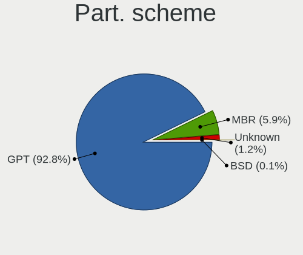
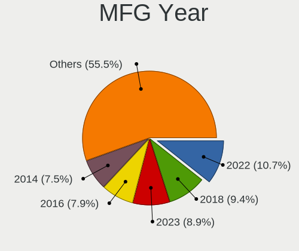
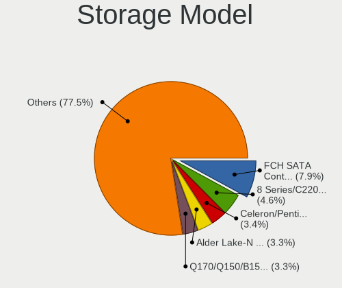
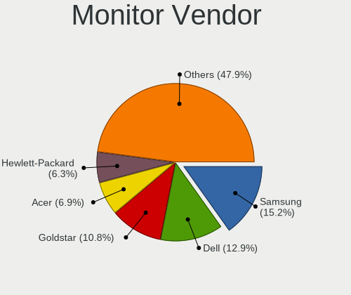
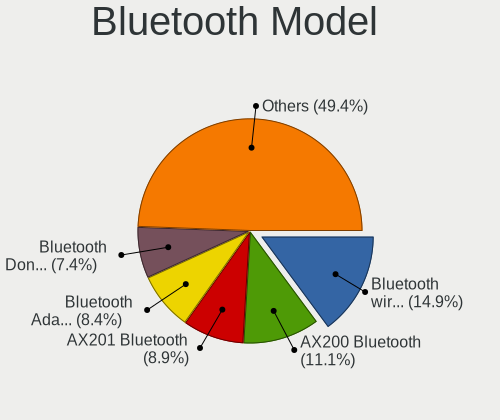

BSD - Tested Hardware & Statistics (Desktops)
---------------------------------------------

A project to collect tested hardware configurations for BSD.

Anyone can contribute to this report by the [hw-probe](https://github.com/linuxhw/hw-probe/blob/master/INSTALL.BSD.md) tool:

    hw-probe -all -upload

Please contribute! Especially if your hardware is rare.

This report is for real hardware. Report for virtual hardware: [TestCoverage_VE](https://github.com/bsdhw/TestCoverage_VE)

Contents
--------

* [ Test Cases ](#test-cases)

* [ System ](#system)
  - [ OS                       ](#os)
  - [ OS Family                ](#os-family)
  - [ Arch                     ](#arch)
  - [ DE                       ](#de)
  - [ Display Server           ](#display-server)
  - [ Display Manager          ](#display-manager)
  - [ OS Lang                  ](#os-lang)
  - [ Boot Mode                ](#boot-mode)
  - [ Filesystem               ](#filesystem)
  - [ Part. scheme             ](#part-scheme)

* [ Board ](#board)
  - [ Vendor                   ](#vendor)
  - [ Model                    ](#model)
  - [ Model Family             ](#model-family)
  - [ MFG Year                 ](#mfg-year)
  - [ Form Factor              ](#form-factor)
  - [ Coreboot                 ](#coreboot)
  - [ RAM Size                 ](#ram-size)
  - [ RAM Used                 ](#ram-used)
  - [ Total Drives             ](#total-drives)
  - [ Has CD-ROM               ](#has-cd-rom)
  - [ Has Ethernet             ](#has-ethernet)
  - [ Has WiFi                 ](#has-wifi)
  - [ Has Bluetooth            ](#has-bluetooth)

* [ Location ](#location)
  - [ Country                  ](#country)
  - [ City                     ](#city)

* [ Drives ](#drives)
  - [ Drive Vendor             ](#drive-vendor)
  - [ Drive Model              ](#drive-model)
  - [ HDD Vendor               ](#hdd-vendor)
  - [ SSD Vendor               ](#ssd-vendor)
  - [ Drive Kind               ](#drive-kind)
  - [ Drive Connector          ](#drive-connector)
  - [ Drive Size               ](#drive-size)
  - [ Space Total              ](#space-total)
  - [ Space Used               ](#space-used)
  - [ Malfunc. Drives          ](#malfunc-drives)
  - [ Malfunc. Drive Vendor    ](#malfunc-drive-vendor)
  - [ Malfunc. HDD Vendor      ](#malfunc-hdd-vendor)
  - [ Malfunc. Drive Kind      ](#malfunc-drive-kind)
  - [ Failed Drives            ](#failed-drives)
  - [ Failed Drive Vendor      ](#failed-drive-vendor)
  - [ Drive Status             ](#drive-status)

* [ Storage controller ](#storage-controller)
  - [ Storage Vendor           ](#storage-vendor)
  - [ Storage Model            ](#storage-model)
  - [ Storage Kind             ](#storage-kind)

* [ Processor ](#processor)
  - [ CPU Vendor               ](#cpu-vendor)
  - [ CPU Model                ](#cpu-model)
  - [ CPU Model Family         ](#cpu-model-family)
  - [ CPU Cores                ](#cpu-cores)
  - [ CPU Sockets              ](#cpu-sockets)
  - [ CPU Threads              ](#cpu-threads)
  - [ CPU Microarch            ](#cpu-microarch)

* [ Graphics ](#graphics)
  - [ GPU Vendor               ](#gpu-vendor)
  - [ GPU Model                ](#gpu-model)
  - [ GPU Combo                ](#gpu-combo)
  - [ GPU Driver               ](#gpu-driver)
  - [ GPU Memory               ](#gpu-memory)

* [ Monitor ](#monitor)
  - [ Monitor Vendor           ](#monitor-vendor)
  - [ Monitor Model            ](#monitor-model)
  - [ Monitor Resolution       ](#monitor-resolution)
  - [ Monitor Diagonal         ](#monitor-diagonal)
  - [ Monitor Width            ](#monitor-width)
  - [ Aspect Ratio             ](#aspect-ratio)
  - [ Monitor Area             ](#monitor-area)
  - [ Pixel Density            ](#pixel-density)
  - [ Multiple Monitors        ](#multiple-monitors)

* [ Network ](#network)
  - [ Net Controller Vendor    ](#net-controller-vendor)
  - [ Net Controller Model     ](#net-controller-model)
  - [ Wireless Vendor          ](#wireless-vendor)
  - [ Wireless Model           ](#wireless-model)
  - [ Ethernet Vendor          ](#ethernet-vendor)
  - [ Ethernet Model           ](#ethernet-model)
  - [ Net Controller Kind      ](#net-controller-kind)
  - [ Used Controller          ](#used-controller)
  - [ NICs                     ](#nics)
  - [ IPv6                     ](#ipv6)

* [ Bluetooth ](#bluetooth)
  - [ Bluetooth Vendor         ](#bluetooth-vendor)
  - [ Bluetooth Model          ](#bluetooth-model)

* [ Sound ](#sound)
  - [ Sound Vendor             ](#sound-vendor)
  - [ Sound Model              ](#sound-model)

* [ Memory ](#memory)
  - [ Memory Vendor            ](#memory-vendor)
  - [ Memory Model             ](#memory-model)
  - [ Memory Kind              ](#memory-kind)
  - [ Memory Form Factor       ](#memory-form-factor)
  - [ Memory Size              ](#memory-size)
  - [ Memory Speed             ](#memory-speed)

* [ Printers & scanners ](#printers--scanners)
  - [ Printer Vendor           ](#printer-vendor)
  - [ Printer Model            ](#printer-model)
  - [ Scanner Vendor           ](#scanner-vendor)
  - [ Scanner Model            ](#scanner-model)

* [ Camera ](#camera)
  - [ Camera Vendor            ](#camera-vendor)
  - [ Camera Model             ](#camera-model)

* [ Security ](#security)
  - [ Fingerprint Vendor       ](#fingerprint-vendor)
  - [ Fingerprint Model        ](#fingerprint-model)
  - [ Chipcard Vendor          ](#chipcard-vendor)
  - [ Chipcard Model           ](#chipcard-model)

* [ Unsupported ](#unsupported)
  - [ Unsupported Devices      ](#unsupported-devices)
  - [ Unsupported Device Types ](#unsupported-device-types)

Test Cases
----------

Total: 7067

| Vendor        | Model                       | Probe                                                     | Date         |
|---------------|-----------------------------|-----------------------------------------------------------|--------------|
| Supermicro    | X10SLH-N6-ST031             | [73304d07bb](https://bsd-hardware.info/?probe=73304d07bb) | Sep 01, 2022 |
| Unknown       | DTB1168                     | [e924ba2a44](https://bsd-hardware.info/?probe=e924ba2a44) | Sep 01, 2022 |
| Unknown       | Unknown                     | [f2a26e2adc](https://bsd-hardware.info/?probe=f2a26e2adc) | Sep 01, 2022 |
| Unknown       | Unknown                     | [9f6f4424c2](https://bsd-hardware.info/?probe=9f6f4424c2) | Sep 01, 2022 |
| Jingsha       | x79-P3 by xUz               | [9148bf85ec](https://bsd-hardware.info/?probe=9148bf85ec) | Sep 01, 2022 |
| HP            | 1496                        | [1567aa1c21](https://bsd-hardware.info/?probe=1567aa1c21) | Sep 01, 2022 |
| AAEON         | UP-APL01 V0.4               | [a8d73a9156](https://bsd-hardware.info/?probe=a8d73a9156) | Sep 01, 2022 |
| Unknown       | HX90                        | [568468e95b](https://bsd-hardware.info/?probe=568468e95b) | Sep 01, 2022 |
| Unknown       | Unknown                     | [b62a001fe9](https://bsd-hardware.info/?probe=b62a001fe9) | Sep 01, 2022 |
| ASRock        | H81M-ITX                    | [d26f88ae78](https://bsd-hardware.info/?probe=d26f88ae78) | Sep 01, 2022 |
| maiyunda      | www.maiyunda.com            | [721abbc383](https://bsd-hardware.info/?probe=721abbc383) | Sep 01, 2022 |
| maiyunda      | www.maiyunda.com            | [bbd9cbaaeb](https://bsd-hardware.info/?probe=bbd9cbaaeb) | Sep 01, 2022 |
| Dell          | 07F37C A01                  | [53de9cce89](https://bsd-hardware.info/?probe=53de9cce89) | Sep 01, 2022 |
| ASRock        | ConRoeXFire-eSATA2          | [caf005ed95](https://bsd-hardware.info/?probe=caf005ed95) | Sep 01, 2022 |
| Intel         | MAHOBAY                     | [78b1cb4ae5](https://bsd-hardware.info/?probe=78b1cb4ae5) | Aug 31, 2022 |
| Dell          | 07T4MC A09                  | [50fbb0435c](https://bsd-hardware.info/?probe=50fbb0435c) | Aug 31, 2022 |
| Dell          | 07T4MC A09                  | [200b8d381e](https://bsd-hardware.info/?probe=200b8d381e) | Aug 31, 2022 |
| Dell          | 07T4MC A09                  | [ebc79d7728](https://bsd-hardware.info/?probe=ebc79d7728) | Aug 31, 2022 |
| MW            | GMLK-2_5G4L                 | [63587e2fca](https://bsd-hardware.info/?probe=63587e2fca) | Aug 31, 2022 |
| ASUSTek       | EX-H110M-V                  | [35e6c8463a](https://bsd-hardware.info/?probe=35e6c8463a) | Aug 31, 2022 |
| Dell          | 0TP412                      | [3ac4a5aa72](https://bsd-hardware.info/?probe=3ac4a5aa72) | Aug 31, 2022 |
| Dell          | 0G261D A00                  | [c77b23d1a7](https://bsd-hardware.info/?probe=c77b23d1a7) | Aug 31, 2022 |
| Lenovo        | 32E1 SDK0J40697 WIN 3305... | [0563755b0d](https://bsd-hardware.info/?probe=0563755b0d) | Aug 31, 2022 |
| maiyunda      | www.maiyunda.com            | [5f880bde97](https://bsd-hardware.info/?probe=5f880bde97) | Aug 31, 2022 |
| Unknown       | Unknown                     | [e8259494a3](https://bsd-hardware.info/?probe=e8259494a3) | Aug 31, 2022 |
| Intel         | DENLOW_WS                   | [40053c983b](https://bsd-hardware.info/?probe=40053c983b) | Aug 31, 2022 |
| HP            | 213D A01                    | [c495fb5448](https://bsd-hardware.info/?probe=c495fb5448) | Aug 30, 2022 |
| Unknown       | Unknown                     | [9422de47ab](https://bsd-hardware.info/?probe=9422de47ab) | Aug 30, 2022 |
| Gigabyte      | J1900N-D3V                  | [e2ad4d8035](https://bsd-hardware.info/?probe=e2ad4d8035) | Aug 30, 2022 |
| MSI           | A320M-A PRO M2              | [d455ed153a](https://bsd-hardware.info/?probe=d455ed153a) | Aug 30, 2022 |
| Intel         | DENLOW_WS                   | [067a217959](https://bsd-hardware.info/?probe=067a217959) | Aug 30, 2022 |
| ASUSTek       | Maximus VIII HERO           | [a47c1e0c84](https://bsd-hardware.info/?probe=a47c1e0c84) | Aug 30, 2022 |
| Unknown       | Unknown                     | [98d9c506c9](https://bsd-hardware.info/?probe=98d9c506c9) | Aug 30, 2022 |
| MSI           | A320M-A PRO M2              | [9d367a6989](https://bsd-hardware.info/?probe=9d367a6989) | Aug 30, 2022 |
| Unknown       | Unknown                     | [6bc59f4024](https://bsd-hardware.info/?probe=6bc59f4024) | Aug 30, 2022 |
| Protectli     | FW4B Ver                    | [b3a1456bb4](https://bsd-hardware.info/?probe=b3a1456bb4) | Aug 29, 2022 |
| Unknown       | Unknown                     | [a01c1ad205](https://bsd-hardware.info/?probe=a01c1ad205) | Aug 29, 2022 |
| Gigabyte      | J1900N-D3V                  | [567bfe0b9f](https://bsd-hardware.info/?probe=567bfe0b9f) | Aug 29, 2022 |
| Fujitsu       | D3041-A1 S26361-D3041-A1    | [2349014a6c](https://bsd-hardware.info/?probe=2349014a6c) | Aug 29, 2022 |
| Intel         | X79 V2.72A                  | [435901d8c9](https://bsd-hardware.info/?probe=435901d8c9) | Aug 29, 2022 |
| Dell          | 0NW6H5 A00                  | [8d047e7667](https://bsd-hardware.info/?probe=8d047e7667) | Aug 29, 2022 |
| Unknown       | Unknown                     | [411daea5f8](https://bsd-hardware.info/?probe=411daea5f8) | Aug 29, 2022 |
| MW            | GMLK-2_5G4L                 | [19e3294fe9](https://bsd-hardware.info/?probe=19e3294fe9) | Aug 29, 2022 |
| Acer          | FIH57                       | [78265cbc90](https://bsd-hardware.info/?probe=78265cbc90) | Aug 29, 2022 |
| Lenovo        | MAHOBAY NO DPK              | [4d7efd6aa6](https://bsd-hardware.info/?probe=4d7efd6aa6) | Aug 28, 2022 |
| Dell          | 0654JC A02                  | [07144a803b](https://bsd-hardware.info/?probe=07144a803b) | Aug 28, 2022 |
| MSI           | H81M-P33                    | [4d00b83ad4](https://bsd-hardware.info/?probe=4d00b83ad4) | Aug 28, 2022 |
| ASUSTek       | P5Q-E                       | [6c1bc8d99f](https://bsd-hardware.info/?probe=6c1bc8d99f) | Aug 28, 2022 |
| ASUSTek       | ROG CROSSHAIR VIII HERO     | [4e55957971](https://bsd-hardware.info/?probe=4e55957971) | Aug 28, 2022 |
| Gigabyte      | H81M-DS2                    | [75ec0260f9](https://bsd-hardware.info/?probe=75ec0260f9) | Aug 28, 2022 |
| ASUSTek       | ROG STRIX B550-I GAMING     | [079adb24f8](https://bsd-hardware.info/?probe=079adb24f8) | Aug 28, 2022 |
| Dell          | 00V62H A01                  | [e7dc9cc5ee](https://bsd-hardware.info/?probe=e7dc9cc5ee) | Aug 28, 2022 |
| Fujitsu       | D3313-E1 S26361-D3313-E1    | [df3df2855b](https://bsd-hardware.info/?probe=df3df2855b) | Aug 28, 2022 |
| Lenovo        | SHARKBAY 0B98401 WIN        | [72aaa26104](https://bsd-hardware.info/?probe=72aaa26104) | Aug 28, 2022 |
| Fujitsu       | D3009-B1 S26361-D3009-B1    | [0f1eabf01e](https://bsd-hardware.info/?probe=0f1eabf01e) | Aug 27, 2022 |
| YANYU         | R250                        | [c4f1ec0d5b](https://bsd-hardware.info/?probe=c4f1ec0d5b) | Aug 27, 2022 |
| Intel         | CRESCENTBAY                 | [184a8697e9](https://bsd-hardware.info/?probe=184a8697e9) | Aug 27, 2022 |
| Intel         | CRESCENTBAY                 | [1765bd0426](https://bsd-hardware.info/?probe=1765bd0426) | Aug 27, 2022 |
| Gigabyte      | A320M-H-CF                  | [2549c7cadf](https://bsd-hardware.info/?probe=2549c7cadf) | Aug 27, 2022 |
| MW            | GMLK-2_5G4L                 | [29d63f7027](https://bsd-hardware.info/?probe=29d63f7027) | Aug 27, 2022 |
| Gigabyte      | B365M DS3H                  | [0d7d7288c0](https://bsd-hardware.info/?probe=0d7d7288c0) | Aug 27, 2022 |
| Gigabyte      | B365M DS3H                  | [0a90c3c566](https://bsd-hardware.info/?probe=0a90c3c566) | Aug 27, 2022 |
| Intel         | Q3XXG4-P V1.0               | [05bb23ae87](https://bsd-hardware.info/?probe=05bb23ae87) | Aug 26, 2022 |
| AOpen         | iBTMx-DS R1.04 55DED10A0... | [a480263c28](https://bsd-hardware.info/?probe=a480263c28) | Aug 26, 2022 |
| Dell          | 030VXY A02                  | [9acd691261](https://bsd-hardware.info/?probe=9acd691261) | Aug 26, 2022 |
| HP            | 213D A01                    | [1b90f312ea](https://bsd-hardware.info/?probe=1b90f312ea) | Aug 26, 2022 |
| Dell          | 07T4MC A00                  | [1060f1b6e3](https://bsd-hardware.info/?probe=1060f1b6e3) | Aug 26, 2022 |
| ASUSTek       | PRIME Z690-P D4             | [5684672f5a](https://bsd-hardware.info/?probe=5684672f5a) | Aug 26, 2022 |
| Lenovo        | 3106 SDK0J40697 WIN 3305... | [3465c46b7d](https://bsd-hardware.info/?probe=3465c46b7d) | Aug 26, 2022 |
| HP            | 21B4 A01                    | [93eab13f35](https://bsd-hardware.info/?probe=93eab13f35) | Aug 26, 2022 |
| Supermicro    | X10SLH-N6-ST031             | [05d009b0df](https://bsd-hardware.info/?probe=05d009b0df) | Aug 26, 2022 |
| PC Engines    | APU2                        | [97da53ff14](https://bsd-hardware.info/?probe=97da53ff14) | Aug 25, 2022 |
| YANYU         | H67SL                       | [57afa0c5d1](https://bsd-hardware.info/?probe=57afa0c5d1) | Aug 25, 2022 |
| Dell          | PowerEdge R620              | [66db9eb745](https://bsd-hardware.info/?probe=66db9eb745) | Aug 25, 2022 |
| WlanCN        | 6000 Series                 | [7fda15ca84](https://bsd-hardware.info/?probe=7fda15ca84) | Aug 25, 2022 |
| YANYU         | R250                        | [69accaf958](https://bsd-hardware.info/?probe=69accaf958) | Aug 25, 2022 |
| maiyunda      | www.maiyunda.com            | [dad2f40e8d](https://bsd-hardware.info/?probe=dad2f40e8d) | Aug 25, 2022 |
| Gigabyte      | H61M-DS2                    | [edb9608bc9](https://bsd-hardware.info/?probe=edb9608bc9) | Aug 24, 2022 |
| ASUSTek       | PRIME B460M-A               | [21fed03fa2](https://bsd-hardware.info/?probe=21fed03fa2) | Aug 24, 2022 |
| ASUSTek       | PRIME B460M-A               | [48210e4d2a](https://bsd-hardware.info/?probe=48210e4d2a) | Aug 24, 2022 |
| ASRock        | AD2550-ITX                  | [43d0101ac4](https://bsd-hardware.info/?probe=43d0101ac4) | Aug 24, 2022 |
| Shuttle       | FS81                        | [b2db8ceabe](https://bsd-hardware.info/?probe=b2db8ceabe) | Aug 24, 2022 |
| Unknown       | Unknown                     | [e5efeb3781](https://bsd-hardware.info/?probe=e5efeb3781) | Aug 24, 2022 |
| Unknown       | YL-E3845L4-V2               | [ee6fe793f2](https://bsd-hardware.info/?probe=ee6fe793f2) | Aug 24, 2022 |
| Dell          | 04YP6J A02                  | [38269a215a](https://bsd-hardware.info/?probe=38269a215a) | Aug 24, 2022 |
| Protectli     | VP2410                      | [67a5cd38d0](https://bsd-hardware.info/?probe=67a5cd38d0) | Aug 24, 2022 |
| Dell          | 088DT1 A01                  | [55090e4971](https://bsd-hardware.info/?probe=55090e4971) | Aug 24, 2022 |
| Lenovo        | 3098 SDK0E50510 WIN         | [f237a01839](https://bsd-hardware.info/?probe=f237a01839) | Aug 24, 2022 |
| Lenovo        | MAHOBAY                     | [eaa49a6f0d](https://bsd-hardware.info/?probe=eaa49a6f0d) | Aug 23, 2022 |
| MSI           | 740GM-P25                   | [22084957bb](https://bsd-hardware.info/?probe=22084957bb) | Aug 23, 2022 |
| Supermicro    | X11SDW-4C-TP13F             | [84a08c6936](https://bsd-hardware.info/?probe=84a08c6936) | Aug 23, 2022 |
| Lenovo        | MAHOBAY 0B98401 PRO         | [6945375f5e](https://bsd-hardware.info/?probe=6945375f5e) | Aug 23, 2022 |
| Lenovo        | ThinkCentre M91p 4512A47    | [3556794570](https://bsd-hardware.info/?probe=3556794570) | Aug 23, 2022 |
| ASRock        | X570 Phantom Gaming 4       | [17f4ac1979](https://bsd-hardware.info/?probe=17f4ac1979) | Aug 23, 2022 |
| Unknown       | Unknown                     | [8d3dee7258](https://bsd-hardware.info/?probe=8d3dee7258) | Aug 23, 2022 |
| Dell          | 05GD68 A00                  | [44013a98bb](https://bsd-hardware.info/?probe=44013a98bb) | Aug 23, 2022 |
| ASUSTek       | PRIME B550-PLUS             | [7d4eaaf087](https://bsd-hardware.info/?probe=7d4eaaf087) | Aug 22, 2022 |
| YANYU         | R250                        | [bd7edcafbe](https://bsd-hardware.info/?probe=bd7edcafbe) | Aug 22, 2022 |
| HP            | 82B4                        | [5e07fc9831](https://bsd-hardware.info/?probe=5e07fc9831) | Aug 22, 2022 |
| ASUSTek       | PRIME B550-PLUS             | [063addc66e](https://bsd-hardware.info/?probe=063addc66e) | Aug 22, 2022 |
| PC Engines    | APU2                        | [b3d60c2790](https://bsd-hardware.info/?probe=b3d60c2790) | Aug 22, 2022 |
| Unknown       | Unknown                     | [7d059d1d0a](https://bsd-hardware.info/?probe=7d059d1d0a) | Aug 22, 2022 |
| Protectli     | FW4B                        | [d2dd7771d2](https://bsd-hardware.info/?probe=d2dd7771d2) | Aug 22, 2022 |
| Protectli     | FW4B Ver                    | [c4261ebde7](https://bsd-hardware.info/?probe=c4261ebde7) | Aug 22, 2022 |
| Gigabyte      | MBHM87P-00                  | [9fa5160871](https://bsd-hardware.info/?probe=9fa5160871) | Aug 22, 2022 |
| Dell          | 0PC5F7 A00                  | [27049ee122](https://bsd-hardware.info/?probe=27049ee122) | Aug 21, 2022 |
| Gigabyte      | H310M S2H                   | [b32f197fe9](https://bsd-hardware.info/?probe=b32f197fe9) | Aug 21, 2022 |
| MSI           | H81M-P33                    | [89535fc84c](https://bsd-hardware.info/?probe=89535fc84c) | Aug 21, 2022 |
| ASUSTek       | P5Q-E                       | [ac2d88c2dd](https://bsd-hardware.info/?probe=ac2d88c2dd) | Aug 21, 2022 |
| ASUSTek       | ROG CROSSHAIR VIII HERO     | [b5786b8119](https://bsd-hardware.info/?probe=b5786b8119) | Aug 21, 2022 |
| Inventec      | Z CLASS A02                 | [cb3708c9bf](https://bsd-hardware.info/?probe=cb3708c9bf) | Aug 21, 2022 |
| Cisco         | ASA5525 A0                  | [5a8641fc9d](https://bsd-hardware.info/?probe=5a8641fc9d) | Aug 21, 2022 |
| PC Engines    | APU2                        | [92bff81bb5](https://bsd-hardware.info/?probe=92bff81bb5) | Aug 20, 2022 |
| PC Engines    | APU2                        | [ccdff6fbea](https://bsd-hardware.info/?probe=ccdff6fbea) | Aug 20, 2022 |
| Unknown       | Unknown                     | [15a2225cc6](https://bsd-hardware.info/?probe=15a2225cc6) | Aug 20, 2022 |
| Cisco         | ASA5525 A0                  | [80152a4fc3](https://bsd-hardware.info/?probe=80152a4fc3) | Aug 20, 2022 |
| Unknown       | Unknown                     | [9d1eb045e5](https://bsd-hardware.info/?probe=9d1eb045e5) | Aug 20, 2022 |
| MW            | GMLK-2_5G4L                 | [2325f41325](https://bsd-hardware.info/?probe=2325f41325) | Aug 20, 2022 |
| Protectli     | FW4B Ver                    | [c70bd0e6c1](https://bsd-hardware.info/?probe=c70bd0e6c1) | Aug 20, 2022 |
| SmbiosType... | SmbiosType2_BoardProduct... | [3272d6904f](https://bsd-hardware.info/?probe=3272d6904f) | Aug 19, 2022 |
| Gigabyte      | H61M-DS2 x.x                | [5648905ca2](https://bsd-hardware.info/?probe=5648905ca2) | Aug 19, 2022 |
| ASRock        | B550 Extreme4               | [ce0d33d973](https://bsd-hardware.info/?probe=ce0d33d973) | Aug 19, 2022 |
| HP            | 8592                        | [212adc2c89](https://bsd-hardware.info/?probe=212adc2c89) | Aug 19, 2022 |
| Fujitsu       | D3313-A1 S26361-D3313-A1    | [2b5456b337](https://bsd-hardware.info/?probe=2b5456b337) | Aug 19, 2022 |
| Fujitsu       | D3041-A1 S26361-D3041-A1    | [5ea9441653](https://bsd-hardware.info/?probe=5ea9441653) | Aug 19, 2022 |
| Protectli     | FW4B                        | [8eb0c6ffbe](https://bsd-hardware.info/?probe=8eb0c6ffbe) | Aug 19, 2022 |
| Protectli     | FW4B                        | [2fdd88b8b8](https://bsd-hardware.info/?probe=2fdd88b8b8) | Aug 19, 2022 |
| Fujitsu       | D3313-A1 S26361-D3313-A1    | [fb02323793](https://bsd-hardware.info/?probe=fb02323793) | Aug 19, 2022 |
| Gigabyte      | C1037UN-EU                  | [0a867d7017](https://bsd-hardware.info/?probe=0a867d7017) | Aug 18, 2022 |
| Seeed Stud... | ODYSSEY-X86J4105 SD-BS-C... | [45043e0e42](https://bsd-hardware.info/?probe=45043e0e42) | Aug 18, 2022 |
| Fujitsu       | D3313-G1 S26361-D3313-G1    | [5280e7a6d2](https://bsd-hardware.info/?probe=5280e7a6d2) | Aug 18, 2022 |
| Gigabyte      | H61M-DS2                    | [a2fc8d9c67](https://bsd-hardware.info/?probe=a2fc8d9c67) | Aug 18, 2022 |
| Dell          | 0PTTT9 A00                  | [c7490e7180](https://bsd-hardware.info/?probe=c7490e7180) | Aug 18, 2022 |
| Foxconn       | 2A8C                        | [0ecc8e6a2f](https://bsd-hardware.info/?probe=0ecc8e6a2f) | Aug 18, 2022 |
| Inventec      | Z CLASS A02                 | [290a94a907](https://bsd-hardware.info/?probe=290a94a907) | Aug 18, 2022 |
| Dell          | 0VG93V A00                  | [8de9fa2319](https://bsd-hardware.info/?probe=8de9fa2319) | Aug 18, 2022 |
| Unknown       | Unknown                     | [52da85a309](https://bsd-hardware.info/?probe=52da85a309) | Aug 18, 2022 |
| Foxconn       | 2A8C                        | [a2f96d06ea](https://bsd-hardware.info/?probe=a2f96d06ea) | Aug 17, 2022 |
| ASUSTek       | M4A87TD EVO                 | [c03da8657e](https://bsd-hardware.info/?probe=c03da8657e) | Aug 17, 2022 |
| Dell          | 04Y8V0 A02                  | [9fc4b3c63e](https://bsd-hardware.info/?probe=9fc4b3c63e) | Aug 17, 2022 |
| Fujitsu       | D3313-A1 S26361-D3313-A1    | [0361ebba0d](https://bsd-hardware.info/?probe=0361ebba0d) | Aug 17, 2022 |
| Cisco         | ASA5512 A0                  | [9ac038fe9d](https://bsd-hardware.info/?probe=9ac038fe9d) | Aug 17, 2022 |
| Unknown       | Unknown                     | [3208aefb72](https://bsd-hardware.info/?probe=3208aefb72) | Aug 17, 2022 |
| Dell          | 0FDY5C A00                  | [2c0bb11a7b](https://bsd-hardware.info/?probe=2c0bb11a7b) | Aug 17, 2022 |
| PC Engines    | APU2                        | [028dc7aa20](https://bsd-hardware.info/?probe=028dc7aa20) | Aug 17, 2022 |
| Dell          | 042P49 A00                  | [7130975fe3](https://bsd-hardware.info/?probe=7130975fe3) | Aug 17, 2022 |
| Protectli     | FW4B Ver                    | [029b31e61f](https://bsd-hardware.info/?probe=029b31e61f) | Aug 17, 2022 |
| CncTion       | J4125-4L-I225               | [ec4f43e1bb](https://bsd-hardware.info/?probe=ec4f43e1bb) | Aug 17, 2022 |
| Unknown       | Unknown                     | [db2cb12805](https://bsd-hardware.info/?probe=db2cb12805) | Aug 17, 2022 |
| ASRock        | H61M-VG3                    | [a363da289a](https://bsd-hardware.info/?probe=a363da289a) | Aug 17, 2022 |
| HP            | 213D A01                    | [4b231023a1](https://bsd-hardware.info/?probe=4b231023a1) | Aug 16, 2022 |
| Lenovo        | 30D9 SDK0J40705 WIN 3425... | [753f277d5c](https://bsd-hardware.info/?probe=753f277d5c) | Aug 16, 2022 |
| Gigabyte      | H61M-DS2                    | [9a7d45e51c](https://bsd-hardware.info/?probe=9a7d45e51c) | Aug 16, 2022 |
| Dell          | 02YYK5 A00                  | [5428710004](https://bsd-hardware.info/?probe=5428710004) | Aug 16, 2022 |
| AZW           | GK55                        | [a7084961a9](https://bsd-hardware.info/?probe=a7084961a9) | Aug 16, 2022 |
| Fujitsu       | D3400-A1 S26361-D3400-A1    | [68f3298e27](https://bsd-hardware.info/?probe=68f3298e27) | Aug 16, 2022 |
| Unknown       | Unknown                     | [05e28da420](https://bsd-hardware.info/?probe=05e28da420) | Aug 16, 2022 |
| Pegatron      | IPMIP-GS                    | [5ee5edb1d0](https://bsd-hardware.info/?probe=5ee5edb1d0) | Aug 16, 2022 |
| Pegatron      | IPMIP-GS                    | [f3c4668e00](https://bsd-hardware.info/?probe=f3c4668e00) | Aug 16, 2022 |
| Dell          | 0D6H9T A03                  | [16e5b72b64](https://bsd-hardware.info/?probe=16e5b72b64) | Aug 16, 2022 |
| IceWhale T... | ZimaBoard 832 ZMB           | [78340c12ef](https://bsd-hardware.info/?probe=78340c12ef) | Aug 16, 2022 |
| Protectli     | FW6 Ver                     | [970bec57b8](https://bsd-hardware.info/?probe=970bec57b8) | Aug 15, 2022 |
| Fujitsu       | D3313-A1 S26361-D3313-A1    | [e67200aee1](https://bsd-hardware.info/?probe=e67200aee1) | Aug 15, 2022 |
| Gigabyte      | IMB4100TN                   | [aa4bae0d12](https://bsd-hardware.info/?probe=aa4bae0d12) | Aug 15, 2022 |
| ASRock        | X99 Extreme4                | [6905821659](https://bsd-hardware.info/?probe=6905821659) | Aug 15, 2022 |
| MSI           | B450M MORTAR MAX            | [8b3a234691](https://bsd-hardware.info/?probe=8b3a234691) | Aug 15, 2022 |
| Protectli     | FW6 Ver                     | [4cf33d57a1](https://bsd-hardware.info/?probe=4cf33d57a1) | Aug 15, 2022 |
| AZW           | Green G1                    | [4bccb24702](https://bsd-hardware.info/?probe=4bccb24702) | Aug 15, 2022 |
| ASRock        | B460M-HDV                   | [9b48c66296](https://bsd-hardware.info/?probe=9b48c66296) | Aug 15, 2022 |
| Dell          | 0VHWTR A02                  | [29c3379293](https://bsd-hardware.info/?probe=29c3379293) | Aug 15, 2022 |
| Unknown       | Unknown                     | [ef2a61855a](https://bsd-hardware.info/?probe=ef2a61855a) | Aug 15, 2022 |
| Dell          | 04Y8V0 A02                  | [a21172360d](https://bsd-hardware.info/?probe=a21172360d) | Aug 15, 2022 |
| Dell          | 0T10XW A00                  | [d346cf971a](https://bsd-hardware.info/?probe=d346cf971a) | Aug 15, 2022 |
| Dell          | 04Y8V0 A02                  | [6acccc63ff](https://bsd-hardware.info/?probe=6acccc63ff) | Aug 15, 2022 |
| Intel         | D34010WYK H14771-305        | [edfb46c162](https://bsd-hardware.info/?probe=edfb46c162) | Aug 14, 2022 |
| Unknown       | Unknown                     | [e23ed854ed](https://bsd-hardware.info/?probe=e23ed854ed) | Aug 14, 2022 |
| IceWhale T... | ZimaBoard 832 ZMB           | [9783858164](https://bsd-hardware.info/?probe=9783858164) | Aug 14, 2022 |
| ASUSTek       | PRIME X370-PRO              | [4055810ef2](https://bsd-hardware.info/?probe=4055810ef2) | Aug 14, 2022 |
| MSI           | H81M-P33                    | [3d0836d403](https://bsd-hardware.info/?probe=3d0836d403) | Aug 14, 2022 |
| ASUSTek       | P5Q-E                       | [c50be0ecae](https://bsd-hardware.info/?probe=c50be0ecae) | Aug 14, 2022 |
| ASUSTek       | ROG CROSSHAIR VIII HERO     | [4b6ad32189](https://bsd-hardware.info/?probe=4b6ad32189) | Aug 14, 2022 |
| Dell          | 0WMJ54 A01                  | [f453f94dd3](https://bsd-hardware.info/?probe=f453f94dd3) | Aug 14, 2022 |
| MiTAC         | PH11CMI                     | [8656b8a7b9](https://bsd-hardware.info/?probe=8656b8a7b9) | Aug 14, 2022 |
| HP            | 82B4                        | [f8c65040bf](https://bsd-hardware.info/?probe=f8c65040bf) | Aug 13, 2022 |
| ASRock        | J5040-ITX                   | [a8761d9c49](https://bsd-hardware.info/?probe=a8761d9c49) | Aug 13, 2022 |
| Fujitsu       | D3313-G1 S26361-D3313-G1    | [35f0eac5f1](https://bsd-hardware.info/?probe=35f0eac5f1) | Aug 13, 2022 |
| Lenovo        | 3111 SDK0J40705 WIN 3425... | [6927813b1d](https://bsd-hardware.info/?probe=6927813b1d) | Aug 13, 2022 |
| Fujitsu       | D3313-G1 S26361-D3313-G1    | [6d6e03307e](https://bsd-hardware.info/?probe=6d6e03307e) | Aug 13, 2022 |
| Fujitsu       | PRIMERGY RX200 S6           | [9267873961](https://bsd-hardware.info/?probe=9267873961) | Aug 13, 2022 |
| Supermicro    | X9SCI/X9SCA                 | [6e7e782b00](https://bsd-hardware.info/?probe=6e7e782b00) | Aug 13, 2022 |
| ASUSTek       | PRIME X370-PRO              | [5d4af4fba9](https://bsd-hardware.info/?probe=5d4af4fba9) | Aug 13, 2022 |
| Fujitsu       | PRIMERGY RX200 S6           | [6884e940a1](https://bsd-hardware.info/?probe=6884e940a1) | Aug 13, 2022 |
| Protectli     | FW6 Ver                     | [ab6603e750](https://bsd-hardware.info/?probe=ab6603e750) | Aug 13, 2022 |
| Lenovo        | 32E1 SDK0J40697 WIN 3305... | [95c42fcc82](https://bsd-hardware.info/?probe=95c42fcc82) | Aug 13, 2022 |
| ASRock        | X570 Phantom Gaming 4       | [1292c617d2](https://bsd-hardware.info/?probe=1292c617d2) | Aug 13, 2022 |
| Supermicro    | A2SDi-4C-HLN4F              | [649021e20c](https://bsd-hardware.info/?probe=649021e20c) | Aug 13, 2022 |
| Fujitsu       | D3313-A1 S26361-D3313-A1    | [1d4ccaabda](https://bsd-hardware.info/?probe=1d4ccaabda) | Aug 13, 2022 |
| Supermicro    | PDSMi                       | [ef2f013ca0](https://bsd-hardware.info/?probe=ef2f013ca0) | Aug 12, 2022 |
| AZW           | GK55                        | [b34aad2082](https://bsd-hardware.info/?probe=b34aad2082) | Aug 12, 2022 |
| Dell          | 0T7D40 A01                  | [d06e05c67a](https://bsd-hardware.info/?probe=d06e05c67a) | Aug 12, 2022 |
| YANYU         | R250                        | [4552b74317](https://bsd-hardware.info/?probe=4552b74317) | Aug 12, 2022 |
| ASRock        | J5040-ITX                   | [7e62dcf51a](https://bsd-hardware.info/?probe=7e62dcf51a) | Aug 12, 2022 |
| CheckPoint    | P-210-00                    | [71ffd50387](https://bsd-hardware.info/?probe=71ffd50387) | Aug 12, 2022 |
| Wistron       | ProLiant ML110 G6           | [10ff7f261d](https://bsd-hardware.info/?probe=10ff7f261d) | Aug 12, 2022 |
| Fujitsu       | D3041-A1 S26361-D3041-A1    | [17dc06ed68](https://bsd-hardware.info/?probe=17dc06ed68) | Aug 12, 2022 |
| HP            | 82B4                        | [d3fd85a7b6](https://bsd-hardware.info/?probe=d3fd85a7b6) | Aug 12, 2022 |
| ASUSTek       | H110M-C/HDMI                | [1d16c8e6d4](https://bsd-hardware.info/?probe=1d16c8e6d4) | Aug 12, 2022 |
| Supermicro    | X10DRU-i+                   | [f3ca1d1814](https://bsd-hardware.info/?probe=f3ca1d1814) | Aug 12, 2022 |
| Intel         | SHARKBAY                    | [9fa2ad6213](https://bsd-hardware.info/?probe=9fa2ad6213) | Aug 12, 2022 |
| Protectli     | FW6 Ver                     | [12ec460778](https://bsd-hardware.info/?probe=12ec460778) | Aug 12, 2022 |
| ASRock        | X570 PG Velocita            | [a91ccd3112](https://bsd-hardware.info/?probe=a91ccd3112) | Aug 11, 2022 |
| Fujitsu       | D3313-A1 S26361-D3313-A1    | [fe8deedda3](https://bsd-hardware.info/?probe=fe8deedda3) | Aug 11, 2022 |
| Jingsha       | x79-P3 by xUz               | [8bcb2eaddc](https://bsd-hardware.info/?probe=8bcb2eaddc) | Aug 11, 2022 |
| Intel         | Q3XXG4-P V1.0               | [870dface68](https://bsd-hardware.info/?probe=870dface68) | Aug 11, 2022 |
| HP            | 1495                        | [fbfa0fdedc](https://bsd-hardware.info/?probe=fbfa0fdedc) | Aug 11, 2022 |
| Intel         | Q3XXG4-P V1.0               | [d3f51a01b1](https://bsd-hardware.info/?probe=d3f51a01b1) | Aug 11, 2022 |
| ASRock        | H110M-DGS R3.0              | [0c654b6c34](https://bsd-hardware.info/?probe=0c654b6c34) | Aug 11, 2022 |
| Fujitsu       | D3224-A1 S26361-D3224-A1    | [4e056b6f77](https://bsd-hardware.info/?probe=4e056b6f77) | Aug 11, 2022 |
| Unknown       | Unknown                     | [af3d9689c2](https://bsd-hardware.info/?probe=af3d9689c2) | Aug 11, 2022 |
| Unknown       | Unknown                     | [5049417b7b](https://bsd-hardware.info/?probe=5049417b7b) | Aug 11, 2022 |
| Unknown       | Unknown                     | [80e867e04c](https://bsd-hardware.info/?probe=80e867e04c) | Aug 10, 2022 |
| Lenovo        | SDK0E50510 WIN              | [a45977c76b](https://bsd-hardware.info/?probe=a45977c76b) | Aug 10, 2022 |
| Deciso        | Netboard A10 GEN2 Model ... | [1cd64c78d5](https://bsd-hardware.info/?probe=1cd64c78d5) | Aug 10, 2022 |
| ASRock        | X399 Taichi                 | [efd9ee1d33](https://bsd-hardware.info/?probe=efd9ee1d33) | Aug 10, 2022 |
| Dell          | 07F37C A01                  | [d263572380](https://bsd-hardware.info/?probe=d263572380) | Aug 10, 2022 |
| HP            | 8592                        | [7c6794942c](https://bsd-hardware.info/?probe=7c6794942c) | Aug 10, 2022 |
| iEi           | B547 V1.00                  | [03d71c925b](https://bsd-hardware.info/?probe=03d71c925b) | Aug 10, 2022 |
| ASRock        | Z370 Pro4                   | [038c5f8763](https://bsd-hardware.info/?probe=038c5f8763) | Aug 10, 2022 |
| Jingsha       | x79-P3 by xUz               | [6fb93918f0](https://bsd-hardware.info/?probe=6fb93918f0) | Aug 10, 2022 |
| Unknown       | Unknown                     | [c0daba1c48](https://bsd-hardware.info/?probe=c0daba1c48) | Aug 09, 2022 |
| BESSTAR Te... | TH50                        | [afca16a0bd](https://bsd-hardware.info/?probe=afca16a0bd) | Aug 09, 2022 |
| Dell          | 084J0R A00                  | [932058e97a](https://bsd-hardware.info/?probe=932058e97a) | Aug 09, 2022 |
| NF541         | 1.0                         | [dcde0e7a44](https://bsd-hardware.info/?probe=dcde0e7a44) | Aug 09, 2022 |
| Intel         | SKYBAY                      | [c7010b7ebc](https://bsd-hardware.info/?probe=c7010b7ebc) | Aug 09, 2022 |
| Unknown       | Unknown                     | [21cda0eb5d](https://bsd-hardware.info/?probe=21cda0eb5d) | Aug 09, 2022 |
| Protectli     | VP2410                      | [a9ecca1096](https://bsd-hardware.info/?probe=a9ecca1096) | Aug 09, 2022 |
| Dell          | 09KPNV A01                  | [236cd1ee65](https://bsd-hardware.info/?probe=236cd1ee65) | Aug 08, 2022 |
| ASUSTek       | PRIME H310M-D R2.0          | [1c21b20eb4](https://bsd-hardware.info/?probe=1c21b20eb4) | Aug 08, 2022 |
| Dell          | 042P49 A00                  | [a38375fa97](https://bsd-hardware.info/?probe=a38375fa97) | Aug 08, 2022 |
| Dell          | 042P49 A00                  | [81a5e313cd](https://bsd-hardware.info/?probe=81a5e313cd) | Aug 08, 2022 |
| Intel         | DENLOW_WS                   | [4227cdddcf](https://bsd-hardware.info/?probe=4227cdddcf) | Aug 08, 2022 |
| Unknown       | YL-J3160L4                  | [aad241ba36](https://bsd-hardware.info/?probe=aad241ba36) | Aug 08, 2022 |
| Intel         | SKYBAY                      | [bc7d4d8e1e](https://bsd-hardware.info/?probe=bc7d4d8e1e) | Aug 08, 2022 |
| YANYU         | R250                        | [ffad8eb019](https://bsd-hardware.info/?probe=ffad8eb019) | Aug 07, 2022 |
| Unknown       | Unknown                     | [64768cfe88](https://bsd-hardware.info/?probe=64768cfe88) | Aug 07, 2022 |
| BESSTAR Te... | DMAF5 V1.0                  | [75ffbbae85](https://bsd-hardware.info/?probe=75ffbbae85) | Aug 07, 2022 |
| MSI           | H81M-P33                    | [099e1c8b15](https://bsd-hardware.info/?probe=099e1c8b15) | Aug 07, 2022 |
| ASUSTek       | P5Q-E                       | [b96612a45b](https://bsd-hardware.info/?probe=b96612a45b) | Aug 07, 2022 |
| ASUSTek       | ROG CROSSHAIR VIII HERO     | [29b392331d](https://bsd-hardware.info/?probe=29b392331d) | Aug 07, 2022 |
| Unknown       | Unknown                     | [467bcd3c04](https://bsd-hardware.info/?probe=467bcd3c04) | Aug 07, 2022 |
| HP            | 18E4                        | [7408fe969c](https://bsd-hardware.info/?probe=7408fe969c) | Aug 07, 2022 |
| ASRock        | J3455-ITX                   | [b26884e164](https://bsd-hardware.info/?probe=b26884e164) | Aug 07, 2022 |
| MW            | GMLK-2_5G4L                 | [b2858de568](https://bsd-hardware.info/?probe=b2858de568) | Aug 06, 2022 |
| HP            | 213D A01                    | [383712cf94](https://bsd-hardware.info/?probe=383712cf94) | Aug 06, 2022 |
| Biostar       | TA880GU3+                   | [8b0c8541b3](https://bsd-hardware.info/?probe=8b0c8541b3) | Aug 06, 2022 |
| GVC           | DR 738                      | [ea08102a81](https://bsd-hardware.info/?probe=ea08102a81) | Aug 06, 2022 |
| Unknown       | Unknown                     | [0185519e19](https://bsd-hardware.info/?probe=0185519e19) | Aug 06, 2022 |
| ASRock        | 970A-G                      | [5014e97cb5](https://bsd-hardware.info/?probe=5014e97cb5) | Aug 06, 2022 |
| Unknown       | Unknown                     | [4444668ecb](https://bsd-hardware.info/?probe=4444668ecb) | Aug 06, 2022 |
| HP            | 213D A01                    | [e28886f86e](https://bsd-hardware.info/?probe=e28886f86e) | Aug 06, 2022 |
| Unknown       | Unknown                     | [5e2f93a960](https://bsd-hardware.info/?probe=5e2f93a960) | Aug 06, 2022 |
| Protectli     | FW4B Ver                    | [67619bab07](https://bsd-hardware.info/?probe=67619bab07) | Aug 06, 2022 |
| PC Engines    | APU2                        | [beb01b4e9c](https://bsd-hardware.info/?probe=beb01b4e9c) | Aug 06, 2022 |
| Unknown       | Unknown                     | [66fefba790](https://bsd-hardware.info/?probe=66fefba790) | Aug 06, 2022 |
| ASUSTek       | P5QL-ASUS-SE                | [50a0d392e7](https://bsd-hardware.info/?probe=50a0d392e7) | Aug 06, 2022 |
| Gigabyte      | H97M-HD3                    | [4a7705414f](https://bsd-hardware.info/?probe=4a7705414f) | Aug 06, 2022 |
| Gigabyte      | A320M-S2H V2-CF             | [af241a5384](https://bsd-hardware.info/?probe=af241a5384) | Aug 06, 2022 |
| Gigabyte      | H81M-DS2                    | [5b88dea745](https://bsd-hardware.info/?probe=5b88dea745) | Aug 06, 2022 |
| Acer          | Aspire X3995                | [9240256ae5](https://bsd-hardware.info/?probe=9240256ae5) | Aug 06, 2022 |
| HP            | ProLiant MicroServer Gen... | [81441a97b2](https://bsd-hardware.info/?probe=81441a97b2) | Aug 06, 2022 |
| BESSTAR Te... | TH50                        | [9e69d3a39f](https://bsd-hardware.info/?probe=9e69d3a39f) | Aug 06, 2022 |
| BESSTAR Te... | TH50                        | [e68fb8c88e](https://bsd-hardware.info/?probe=e68fb8c88e) | Aug 06, 2022 |
| ASUSTek       | CM6330_CM6630_CM6730_CM6... | [cdd6baad68](https://bsd-hardware.info/?probe=cdd6baad68) | Aug 05, 2022 |
| ASUSTek       | K30AM-J                     | [470ced8f30](https://bsd-hardware.info/?probe=470ced8f30) | Aug 05, 2022 |
| HP            | 3397                        | [6111a627d6](https://bsd-hardware.info/?probe=6111a627d6) | Aug 05, 2022 |
| ASUSTek       | P5GC-MX/CKD/SI              | [d61693dffb](https://bsd-hardware.info/?probe=d61693dffb) | Aug 05, 2022 |
| PC Engines    | APU2                        | [9bc1aa868e](https://bsd-hardware.info/?probe=9bc1aa868e) | Aug 05, 2022 |
| Unknown       | Unknown                     | [9f98df6faf](https://bsd-hardware.info/?probe=9f98df6faf) | Aug 05, 2022 |
| iEi           | B449 V1.00                  | [7776910eea](https://bsd-hardware.info/?probe=7776910eea) | Aug 05, 2022 |
| ASUSTek       | K30AM-J                     | [e032724bc2](https://bsd-hardware.info/?probe=e032724bc2) | Aug 05, 2022 |
| Unknown       | Unknown                     | [25ca16baef](https://bsd-hardware.info/?probe=25ca16baef) | Aug 05, 2022 |
| Unknown       | Unknown                     | [9542c23a8a](https://bsd-hardware.info/?probe=9542c23a8a) | Aug 05, 2022 |
| Gigabyte      | X570 AORUS ELITE WIFI       | [850198c512](https://bsd-hardware.info/?probe=850198c512) | Aug 05, 2022 |
| Gigabyte      | X570 AORUS ELITE WIFI       | [cddf42b097](https://bsd-hardware.info/?probe=cddf42b097) | Aug 05, 2022 |
| Unknown       | Unknown                     | [ae62a89080](https://bsd-hardware.info/?probe=ae62a89080) | Aug 05, 2022 |
| HP            | 1497                        | [c6f6ddf728](https://bsd-hardware.info/?probe=c6f6ddf728) | Aug 04, 2022 |
| Unknown       | YL-E3845L4-V2               | [7b27220307](https://bsd-hardware.info/?probe=7b27220307) | Aug 04, 2022 |
| Dell          | 042P49 A01                  | [fe87e22e26](https://bsd-hardware.info/?probe=fe87e22e26) | Aug 04, 2022 |
| Unknown       | Unknown                     | [f9bf5b2e00](https://bsd-hardware.info/?probe=f9bf5b2e00) | Aug 04, 2022 |
| Dell          | 042P49 A01                  | [2980d9d398](https://bsd-hardware.info/?probe=2980d9d398) | Aug 04, 2022 |
| AMD           | Larne CRB                   | [db094f95af](https://bsd-hardware.info/?probe=db094f95af) | Aug 04, 2022 |
| Unknown       | YL-J3160L4                  | [67a34794f1](https://bsd-hardware.info/?probe=67a34794f1) | Aug 04, 2022 |
| HP            | 8266                        | [a204146221](https://bsd-hardware.info/?probe=a204146221) | Aug 04, 2022 |
| ASUSTek       | CM6731_CM6431_CM6331        | [6e40b41bc3](https://bsd-hardware.info/?probe=6e40b41bc3) | Aug 04, 2022 |
| YANYU         | D19SL_B                     | [8eb0f1a480](https://bsd-hardware.info/?probe=8eb0f1a480) | Aug 04, 2022 |
| ASRockRack    | X470D4U                     | [a32da79434](https://bsd-hardware.info/?probe=a32da79434) | Aug 04, 2022 |
| PC Engines    | APU2                        | [35d0a79b04](https://bsd-hardware.info/?probe=35d0a79b04) | Aug 04, 2022 |
| HP            | 213D A01                    | [1c1ec6004b](https://bsd-hardware.info/?probe=1c1ec6004b) | Aug 04, 2022 |
| Unknown       | Unknown                     | [b3c0b4a4f4](https://bsd-hardware.info/?probe=b3c0b4a4f4) | Aug 04, 2022 |
| Unknown       | Unknown                     | [612282319b](https://bsd-hardware.info/?probe=612282319b) | Aug 04, 2022 |
| Protectli     | FW6 Ver                     | [8176a8261d](https://bsd-hardware.info/?probe=8176a8261d) | Aug 04, 2022 |
| ASUSTek       | PRIME Z270-A                | [69214b0c79](https://bsd-hardware.info/?probe=69214b0c79) | Aug 04, 2022 |
| Unknown       | Unknown                     | [cbda56eddb](https://bsd-hardware.info/?probe=cbda56eddb) | Aug 03, 2022 |
| MSI           | 785GT-E63                   | [8c307fb033](https://bsd-hardware.info/?probe=8c307fb033) | Aug 03, 2022 |
| Acer          | Revo 70                     | [0c23ffdc5a](https://bsd-hardware.info/?probe=0c23ffdc5a) | Aug 03, 2022 |
| SmbiosType... | SmbiosType2_BoardProduct... | [3c63a3a259](https://bsd-hardware.info/?probe=3c63a3a259) | Aug 03, 2022 |
| HP            | 213D A01                    | [0c90a109f8](https://bsd-hardware.info/?probe=0c90a109f8) | Aug 03, 2022 |
| ASUSTek       | TUF Gaming B550M-PLUS       | [53be3a9295](https://bsd-hardware.info/?probe=53be3a9295) | Aug 03, 2022 |
| PC Engines    | apu4                        | [a146079c7f](https://bsd-hardware.info/?probe=a146079c7f) | Aug 03, 2022 |
| Protectli     | VP2410 10                   | [4c0ff1f949](https://bsd-hardware.info/?probe=4c0ff1f949) | Aug 03, 2022 |
| HP            | 213D A01                    | [04b2f4a014](https://bsd-hardware.info/?probe=04b2f4a014) | Aug 03, 2022 |
| ASUSTek       | CM6330_CM6630_CM6730_CM6... | [d4462c2aca](https://bsd-hardware.info/?probe=d4462c2aca) | Aug 03, 2022 |
| PC Engines    | apu4                        | [2ae838d489](https://bsd-hardware.info/?probe=2ae838d489) | Aug 02, 2022 |
| Intel         | DENLOW_WS                   | [d934d0c599](https://bsd-hardware.info/?probe=d934d0c599) | Aug 02, 2022 |
| Unknown       | Unknown                     | [df3667156b](https://bsd-hardware.info/?probe=df3667156b) | Aug 02, 2022 |
| Lex           | Pineview-D                  | [7d7195024e](https://bsd-hardware.info/?probe=7d7195024e) | Aug 02, 2022 |
| Unknown       | Unknown                     | [5ac2fc150b](https://bsd-hardware.info/?probe=5ac2fc150b) | Aug 02, 2022 |
| NF792         | 1.0                         | [93f777a0ae](https://bsd-hardware.info/?probe=93f777a0ae) | Aug 02, 2022 |
| PC Engines    | APU2                        | [2836c25783](https://bsd-hardware.info/?probe=2836c25783) | Aug 02, 2022 |
| HP            | 82B4                        | [98c09c79b1](https://bsd-hardware.info/?probe=98c09c79b1) | Aug 02, 2022 |
| Gigabyte      | P85-D3                      | [7f077abed9](https://bsd-hardware.info/?probe=7f077abed9) | Aug 02, 2022 |
| ASUSTek       | B85-PRO GAMER               | [b29e940a75](https://bsd-hardware.info/?probe=b29e940a75) | Aug 02, 2022 |
| Intel         | Q3XXG4-P V1.0               | [f89554f1b3](https://bsd-hardware.info/?probe=f89554f1b3) | Aug 02, 2022 |
| ASUSTek       | P5QL-ASUS-SE                | [f2836f4a6c](https://bsd-hardware.info/?probe=f2836f4a6c) | Aug 01, 2022 |
| ASRock        | A320M-DVS R4.0              | [77f61a8711](https://bsd-hardware.info/?probe=77f61a8711) | Aug 01, 2022 |
| Protectli     | FW6 Ver                     | [b4745f3fbf](https://bsd-hardware.info/?probe=b4745f3fbf) | Aug 01, 2022 |
| Dell          | 0XHGV1 A00                  | [860b06cb6b](https://bsd-hardware.info/?probe=860b06cb6b) | Aug 01, 2022 |
| ASUSTek       | M5A78L-M/USB3               | [f2590dea4b](https://bsd-hardware.info/?probe=f2590dea4b) | Aug 01, 2022 |
| Gigabyte      | H610I DDR4                  | [d50ffab1cc](https://bsd-hardware.info/?probe=d50ffab1cc) | Aug 01, 2022 |
| Gigabyte      | X570 AORUS PRO              | [ad56307789](https://bsd-hardware.info/?probe=ad56307789) | Aug 01, 2022 |
| ASUSTek       | P5W64 WS Pro                | [f05a901a30](https://bsd-hardware.info/?probe=f05a901a30) | Aug 01, 2022 |
| Dell          | 0GY6Y8 A03                  | [910403ba69](https://bsd-hardware.info/?probe=910403ba69) | Aug 01, 2022 |
| Dell          | 0GY6Y8 A03                  | [2257be098f](https://bsd-hardware.info/?probe=2257be098f) | Aug 01, 2022 |
| HP            | 3397                        | [dac75fec6e](https://bsd-hardware.info/?probe=dac75fec6e) | Jul 31, 2022 |
| Protectli     | FW6                         | [b686fdf1c1](https://bsd-hardware.info/?probe=b686fdf1c1) | Jul 31, 2022 |
| Protectli     | FW4A Ver                    | [47bd308b5f](https://bsd-hardware.info/?probe=47bd308b5f) | Jul 31, 2022 |
| MSI           | H81M-P33                    | [10fc9a4368](https://bsd-hardware.info/?probe=10fc9a4368) | Jul 31, 2022 |
| ASUSTek       | P5Q-E                       | [10139014e1](https://bsd-hardware.info/?probe=10139014e1) | Jul 31, 2022 |
| ASUSTek       | ROG CROSSHAIR VIII HERO     | [1129960acb](https://bsd-hardware.info/?probe=1129960acb) | Jul 31, 2022 |
| Dell          | 05XGC8 A01                  | [0eaaa31106](https://bsd-hardware.info/?probe=0eaaa31106) | Jul 31, 2022 |
| HP            | 8055                        | [6a8a361dae](https://bsd-hardware.info/?probe=6a8a361dae) | Jul 31, 2022 |
| Intel         | Q3XXG4-P V1.0               | [5b73e61a78](https://bsd-hardware.info/?probe=5b73e61a78) | Jul 31, 2022 |
| Gigabyte      | 970A-DS3P FX                | [3c33e546bb](https://bsd-hardware.info/?probe=3c33e546bb) | Jul 31, 2022 |
| Unknown       | Unknown                     | [125a4a6501](https://bsd-hardware.info/?probe=125a4a6501) | Jul 31, 2022 |
| Dell          | 0TTDMJ A00                  | [900c62c2ba](https://bsd-hardware.info/?probe=900c62c2ba) | Jul 30, 2022 |
| ASRock        | X399 Professional Gaming    | [c17b2012a3](https://bsd-hardware.info/?probe=c17b2012a3) | Jul 30, 2022 |
| ASUSTek       | TUF Gaming Z590-PLUS        | [7c5137f2f8](https://bsd-hardware.info/?probe=7c5137f2f8) | Jul 30, 2022 |
| ASUSTek       | TUF Gaming Z590-PLUS        | [3f6e556a7c](https://bsd-hardware.info/?probe=3f6e556a7c) | Jul 30, 2022 |
| ASUSTek       | CM6330_CM6630_CM6730_CM6... | [0887dc2e0e](https://bsd-hardware.info/?probe=0887dc2e0e) | Jul 30, 2022 |
| Gigabyte      | GB-BSi3-1115G4              | [4cd0769d75](https://bsd-hardware.info/?probe=4cd0769d75) | Jul 30, 2022 |
| Unknown       | Unknown                     | [f891511390](https://bsd-hardware.info/?probe=f891511390) | Jul 30, 2022 |
| Unknown       | Unknown                     | [d6920a8af5](https://bsd-hardware.info/?probe=d6920a8af5) | Jul 30, 2022 |
| Lenovo        | SHARKBAY 0B98401 WIN        | [27b986a422](https://bsd-hardware.info/?probe=27b986a422) | Jul 30, 2022 |
| Dell          | 05GD68 A00                  | [4e108a3b49](https://bsd-hardware.info/?probe=4e108a3b49) | Jul 30, 2022 |
| Intel         | D54250WYK H13922-303        | [168056c169](https://bsd-hardware.info/?probe=168056c169) | Jul 30, 2022 |
| Intel         | Q3XXG4-P V1.0               | [d6a3d57165](https://bsd-hardware.info/?probe=d6a3d57165) | Jul 29, 2022 |
| WesternDig... | BBC 0001                    | [5673b5c8e8](https://bsd-hardware.info/?probe=5673b5c8e8) | Jul 29, 2022 |
| HP            | 18E7                        | [b483720843](https://bsd-hardware.info/?probe=b483720843) | Jul 29, 2022 |
| PC Engines    | APU2                        | [bb5d45a75d](https://bsd-hardware.info/?probe=bb5d45a75d) | Jul 29, 2022 |
| Deciso        | Netboard A10 GEN2 Model ... | [5c00da486d](https://bsd-hardware.info/?probe=5c00da486d) | Jul 29, 2022 |
| HP            | 213D A01                    | [c24cba449b](https://bsd-hardware.info/?probe=c24cba449b) | Jul 29, 2022 |
| Acer          | Veriton X275                | [8fdb6785a9](https://bsd-hardware.info/?probe=8fdb6785a9) | Jul 29, 2022 |
| AMD           | Inagua CRB                  | [0d0b0c3f9e](https://bsd-hardware.info/?probe=0d0b0c3f9e) | Jul 29, 2022 |
| Dell          | 0T7D40 A01                  | [bd2f6f8596](https://bsd-hardware.info/?probe=bd2f6f8596) | Jul 29, 2022 |
| HP            | 8055                        | [41d802a80a](https://bsd-hardware.info/?probe=41d802a80a) | Jul 29, 2022 |
| Gigabyte      | J4005ND2P-CF                | [2967d5275e](https://bsd-hardware.info/?probe=2967d5275e) | Jul 29, 2022 |
| AMD           | Larne CRB                   | [794541e833](https://bsd-hardware.info/?probe=794541e833) | Jul 29, 2022 |
| Gigabyte      | H310M S2H                   | [03d0919731](https://bsd-hardware.info/?probe=03d0919731) | Jul 29, 2022 |
| MW            | GMLK-2_5G4L                 | [69c0b0d218](https://bsd-hardware.info/?probe=69c0b0d218) | Jul 29, 2022 |
| Dell          | 040DDP A01                  | [5d4d3d7553](https://bsd-hardware.info/?probe=5d4d3d7553) | Jul 29, 2022 |
| Intel         | Q3XXG4-P V1.0               | [cd35c4b6ce](https://bsd-hardware.info/?probe=cd35c4b6ce) | Jul 29, 2022 |
| ASUSTek       | M5A97 PLUS                  | [7be6ba0021](https://bsd-hardware.info/?probe=7be6ba0021) | Jul 29, 2022 |
| AAEON         | MIX-TLUD1 V1.0              | [6b1ea56289](https://bsd-hardware.info/?probe=6b1ea56289) | Jul 29, 2022 |
| Unknown       | Unknown                     | [0b84314fbf](https://bsd-hardware.info/?probe=0b84314fbf) | Jul 28, 2022 |
| Wistron       | ProLiant ML110 G6           | [091fe7ca40](https://bsd-hardware.info/?probe=091fe7ca40) | Jul 28, 2022 |
| HP            | 82B4                        | [6c330371b3](https://bsd-hardware.info/?probe=6c330371b3) | Jul 28, 2022 |
| Unknown       | Unknown                     | [4e721b00d5](https://bsd-hardware.info/?probe=4e721b00d5) | Jul 28, 2022 |
| Intel         | SKYBAY                      | [c3bcf5c63d](https://bsd-hardware.info/?probe=c3bcf5c63d) | Jul 28, 2022 |
| Dell          | 0VHWTR A02                  | [eb7ac52c45](https://bsd-hardware.info/?probe=eb7ac52c45) | Jul 28, 2022 |
| Gigabyte      | A320M-S2H V2-CF             | [6d5bfb02a0](https://bsd-hardware.info/?probe=6d5bfb02a0) | Jul 28, 2022 |
| HP            | 339A                        | [241e56a349](https://bsd-hardware.info/?probe=241e56a349) | Jul 27, 2022 |
| HP            | 18E9                        | [56460b095e](https://bsd-hardware.info/?probe=56460b095e) | Jul 27, 2022 |
| Biostar       | A10N-8800E                  | [fe4d305991](https://bsd-hardware.info/?probe=fe4d305991) | Jul 27, 2022 |
| Dell          | 0PC5F7 A03                  | [7cc4f8754f](https://bsd-hardware.info/?probe=7cc4f8754f) | Jul 27, 2022 |
| Gigabyte      | AB350N-Gaming WIFI-CF       | [f50526a6d6](https://bsd-hardware.info/?probe=f50526a6d6) | Jul 27, 2022 |
| HP            | 3397                        | [68eb683936](https://bsd-hardware.info/?probe=68eb683936) | Jul 27, 2022 |
| CNCTION-IA... | Unknown                     | [91165a8899](https://bsd-hardware.info/?probe=91165a8899) | Jul 27, 2022 |
| Protectli     | VP2410                      | [f9b42e4a75](https://bsd-hardware.info/?probe=f9b42e4a75) | Jul 27, 2022 |
| Protectli     | VP2410                      | [db66cc446e](https://bsd-hardware.info/?probe=db66cc446e) | Jul 27, 2022 |
| Supermicro    | X11SDV-4C-TP8F              | [d7b0e73f03](https://bsd-hardware.info/?probe=d7b0e73f03) | Jul 27, 2022 |
| Dell          | 0T7D40 A01                  | [3db94efbf6](https://bsd-hardware.info/?probe=3db94efbf6) | Jul 27, 2022 |
| ASUSTek       | M5A78L-M/USB3               | [9df3c644b9](https://bsd-hardware.info/?probe=9df3c644b9) | Jul 27, 2022 |
| Jingsha       | x79-P3 by xUz               | [32ed0bcfa9](https://bsd-hardware.info/?probe=32ed0bcfa9) | Jul 26, 2022 |
| HP            | 18E7                        | [0d18e24e2e](https://bsd-hardware.info/?probe=0d18e24e2e) | Jul 26, 2022 |
| Gigabyte      | Z87M-D3H                    | [59ae6fc283](https://bsd-hardware.info/?probe=59ae6fc283) | Jul 26, 2022 |
| MW            | GMLK-2_5G4L                 | [fd67eb14ae](https://bsd-hardware.info/?probe=fd67eb14ae) | Jul 26, 2022 |
| Dell          | 07F37C A01                  | [dfea879cdc](https://bsd-hardware.info/?probe=dfea879cdc) | Jul 26, 2022 |
| Gigabyte      | H87-HD3                     | [e6a9b0dd8b](https://bsd-hardware.info/?probe=e6a9b0dd8b) | Jul 25, 2022 |
| ASUSTek       | M5A78L-M LX PLUS            | [9b3459c1ec](https://bsd-hardware.info/?probe=9b3459c1ec) | Jul 25, 2022 |
| Shuttle       | FS310                       | [4dd7894e83](https://bsd-hardware.info/?probe=4dd7894e83) | Jul 25, 2022 |
| Deciso        | Netboard A10                | [3f548f31e3](https://bsd-hardware.info/?probe=3f548f31e3) | Jul 25, 2022 |
| ZOTAC         | Unknown                     | [2f701b55fc](https://bsd-hardware.info/?probe=2f701b55fc) | Jul 25, 2022 |
| MAXSUN        | MS-H110D4L FS M.2           | [39d06b12fd](https://bsd-hardware.info/?probe=39d06b12fd) | Jul 25, 2022 |
| Protectli     | FW4B Ver                    | [b33527f3ee](https://bsd-hardware.info/?probe=b33527f3ee) | Jul 25, 2022 |
| HP            | 1825                        | [8c96329681](https://bsd-hardware.info/?probe=8c96329681) | Jul 24, 2022 |
| Acer          | Aspire XC-830               | [84cfd4b073](https://bsd-hardware.info/?probe=84cfd4b073) | Jul 24, 2022 |
| AAEON         | FWS-2350 V1.0               | [e16dd36daf](https://bsd-hardware.info/?probe=e16dd36daf) | Jul 24, 2022 |
| Unknown       | Unknown                     | [8830b5ba19](https://bsd-hardware.info/?probe=8830b5ba19) | Jul 24, 2022 |
| MSI           | H81M-P33                    | [2f7e57d927](https://bsd-hardware.info/?probe=2f7e57d927) | Jul 24, 2022 |
| ASUSTek       | P5Q-E                       | [6fd0d31624](https://bsd-hardware.info/?probe=6fd0d31624) | Jul 24, 2022 |
| Dell          | 04Y8V0 A02                  | [4ab59b9029](https://bsd-hardware.info/?probe=4ab59b9029) | Jul 24, 2022 |
| Intel         | Q3XXG4-P V1.0               | [6daa6d0060](https://bsd-hardware.info/?probe=6daa6d0060) | Jul 24, 2022 |
| ASRock        | J3455B-ITX                  | [37ce098399](https://bsd-hardware.info/?probe=37ce098399) | Jul 23, 2022 |
| ASUSTek       | TUF Gaming Z590-PLUS        | [b392e9fcc9](https://bsd-hardware.info/?probe=b392e9fcc9) | Jul 23, 2022 |
| Positivo      | POS-EINM70CS SIM            | [0b29806790](https://bsd-hardware.info/?probe=0b29806790) | Jul 23, 2022 |
| HP            | 213D A01                    | [26c8ae3969](https://bsd-hardware.info/?probe=26c8ae3969) | Jul 22, 2022 |
| HP            | ProLiant ML310e Gen8 v2     | [6cdc79a36f](https://bsd-hardware.info/?probe=6cdc79a36f) | Jul 22, 2022 |
| Protectli     | FW4B Ver                    | [224d08a214](https://bsd-hardware.info/?probe=224d08a214) | Jul 22, 2022 |
| Intel         | DH77KC AAG39641-400         | [df31840a7e](https://bsd-hardware.info/?probe=df31840a7e) | Jul 22, 2022 |
| MW            | GMLK-2_5G4L                 | [3fe3a46a7a](https://bsd-hardware.info/?probe=3fe3a46a7a) | Jul 21, 2022 |
| ASRock        | N68-S3 UCC                  | [e503017a9f](https://bsd-hardware.info/?probe=e503017a9f) | Jul 21, 2022 |
| HP            | 82A2                        | [7ec5ec44a5](https://bsd-hardware.info/?probe=7ec5ec44a5) | Jul 21, 2022 |
| Intel         | CRESCENTBAY                 | [8f910e599b](https://bsd-hardware.info/?probe=8f910e599b) | Jul 21, 2022 |
| ASUSTek       | Maximus VIII HERO           | [051f604f9a](https://bsd-hardware.info/?probe=051f604f9a) | Jul 21, 2022 |
| ASRock        | A520M-ITX/ac                | [48854ed05e](https://bsd-hardware.info/?probe=48854ed05e) | Jul 21, 2022 |
| HP            | 3397                        | [73c621b9ad](https://bsd-hardware.info/?probe=73c621b9ad) | Jul 21, 2022 |
| Gigabyte      | H61M-DS2                    | [3ba3cedec4](https://bsd-hardware.info/?probe=3ba3cedec4) | Jul 21, 2022 |
| ASUSTek       | ROG CROSSHAIR VIII HERO     | [52cc45aba9](https://bsd-hardware.info/?probe=52cc45aba9) | Jul 21, 2022 |
| Dell          | 0GDG8Y A02                  | [2f163e2a05](https://bsd-hardware.info/?probe=2f163e2a05) | Jul 21, 2022 |
| Protectli     | FW6                         | [5a13dd0c28](https://bsd-hardware.info/?probe=5a13dd0c28) | Jul 21, 2022 |
| ASUSTek       | ROG CROSSHAIR VIII HERO     | [3182740b56](https://bsd-hardware.info/?probe=3182740b56) | Jul 21, 2022 |
| Gigabyte      | Z87X-UD5H-CF                | [70c9122b95](https://bsd-hardware.info/?probe=70c9122b95) | Jul 20, 2022 |
| Gigabyte      | F2A88XM-D3H                 | [a96e41f99e](https://bsd-hardware.info/?probe=a96e41f99e) | Jul 20, 2022 |
| Lenovo        | SHARKBAY NOK                | [1ed99ad502](https://bsd-hardware.info/?probe=1ed99ad502) | Jul 20, 2022 |
| Unknown       | YL-E3854L4-V2               | [cd601ead3a](https://bsd-hardware.info/?probe=cd601ead3a) | Jul 20, 2022 |
| Dell          | 0T7D40 A00                  | [3d5e83cf1a](https://bsd-hardware.info/?probe=3d5e83cf1a) | Jul 20, 2022 |
| Biostar       | J4105NHU                    | [1b6748d4f7](https://bsd-hardware.info/?probe=1b6748d4f7) | Jul 19, 2022 |
| ASUSTek       | P5KPL-AM-CKD-VISUM-SI       | [f88fa027ab](https://bsd-hardware.info/?probe=f88fa027ab) | Jul 19, 2022 |
| HP            | 1998                        | [29c6e37b1a](https://bsd-hardware.info/?probe=29c6e37b1a) | Jul 19, 2022 |
| Dell          | 0WR7PY A03                  | [46a6f4e8f3](https://bsd-hardware.info/?probe=46a6f4e8f3) | Jul 19, 2022 |
| ASUSTek       | P8B WS                      | [dd7f8123d2](https://bsd-hardware.info/?probe=dd7f8123d2) | Jul 19, 2022 |
| Dell          | 08HPGT A02                  | [ae260e17eb](https://bsd-hardware.info/?probe=ae260e17eb) | Jul 19, 2022 |
| Gigabyte      | J1900N-D3V                  | [17aa06f41f](https://bsd-hardware.info/?probe=17aa06f41f) | Jul 18, 2022 |
| HP            | 82B4                        | [f8d2f26c54](https://bsd-hardware.info/?probe=f8d2f26c54) | Jul 18, 2022 |
| Dell          | 0T7D40 A00                  | [2aef6b2ab4](https://bsd-hardware.info/?probe=2aef6b2ab4) | Jul 18, 2022 |
| ASRock        | H570M-ITX/ac                | [4b0bdf58dd](https://bsd-hardware.info/?probe=4b0bdf58dd) | Jul 18, 2022 |
| Intel         | CRESCENTBAY                 | [aba61c0cd6](https://bsd-hardware.info/?probe=aba61c0cd6) | Jul 18, 2022 |
| Jingsha       | x79-P3 by xUz               | [ae58265601](https://bsd-hardware.info/?probe=ae58265601) | Jul 18, 2022 |
| Fujitsu       | D3313-A1 S26361-D3313-A1    | [e3655742ba](https://bsd-hardware.info/?probe=e3655742ba) | Jul 18, 2022 |
| Lenovo        | SHARKBAY SDK0E50510 WIN     | [4b9e0bb7bb](https://bsd-hardware.info/?probe=4b9e0bb7bb) | Jul 18, 2022 |
| Protectli     | FW4B                        | [b1ac4ad0dd](https://bsd-hardware.info/?probe=b1ac4ad0dd) | Jul 18, 2022 |
| Fujitsu       | D3313-A1 S26361-D3313-A1    | [af1e80d15d](https://bsd-hardware.info/?probe=af1e80d15d) | Jul 18, 2022 |
| ASUSTek       | M4A785TD-M EVO              | [def87ec245](https://bsd-hardware.info/?probe=def87ec245) | Jul 18, 2022 |
| MSI           | MPG X570 GAMING PLUS        | [a80b1c4f3c](https://bsd-hardware.info/?probe=a80b1c4f3c) | Jul 17, 2022 |
| Fujitsu       | D3401-H2 S26361-D3401-H2    | [e3461d0ff8](https://bsd-hardware.info/?probe=e3461d0ff8) | Jul 17, 2022 |
| Protectli     | FW6 Ver                     | [e4e89253c3](https://bsd-hardware.info/?probe=e4e89253c3) | Jul 17, 2022 |
| PC Engines    | APU2                        | [c84cb618c0](https://bsd-hardware.info/?probe=c84cb618c0) | Jul 17, 2022 |
| HP            | 8055                        | [269b4f3210](https://bsd-hardware.info/?probe=269b4f3210) | Jul 17, 2022 |
| Supermicro    | A2SAP-HA                    | [27c6228555](https://bsd-hardware.info/?probe=27c6228555) | Jul 17, 2022 |
| MSI           | H81M-P33                    | [c9d1bc6685](https://bsd-hardware.info/?probe=c9d1bc6685) | Jul 17, 2022 |
| ASUSTek       | P5Q-E                       | [7c02a92f29](https://bsd-hardware.info/?probe=7c02a92f29) | Jul 17, 2022 |
| ASUSTek       | ROG CROSSHAIR VIII HERO     | [3bf44f4bb5](https://bsd-hardware.info/?probe=3bf44f4bb5) | Jul 17, 2022 |
| Lenovo        | 361A SDK0J40700 WIN 3258... | [8671985fad](https://bsd-hardware.info/?probe=8671985fad) | Jul 17, 2022 |
| YANYU         | H87SL VER:1.3               | [fda62409ee](https://bsd-hardware.info/?probe=fda62409ee) | Jul 17, 2022 |
| Dell          | 04Y8V0 A02                  | [5bba9aafa1](https://bsd-hardware.info/?probe=5bba9aafa1) | Jul 17, 2022 |
| MW            | GMLK-2_5G4L                 | [57da61c80c](https://bsd-hardware.info/?probe=57da61c80c) | Jul 17, 2022 |
| MSI           | B85M-E45                    | [80f2d74d1a](https://bsd-hardware.info/?probe=80f2d74d1a) | Jul 16, 2022 |
| Intel         | Q3XXG4-P V1.0               | [bbca74a96f](https://bsd-hardware.info/?probe=bbca74a96f) | Jul 16, 2022 |
| Acer          | RS880M05                    | [7bcc14ceba](https://bsd-hardware.info/?probe=7bcc14ceba) | Jul 16, 2022 |
| Gigabyte      | H310M S2 x.x                | [b11ca9c369](https://bsd-hardware.info/?probe=b11ca9c369) | Jul 16, 2022 |
| Shuttle       | FH170                       | [a156048964](https://bsd-hardware.info/?probe=a156048964) | Jul 16, 2022 |
| Shuttle       | FH170                       | [81b62c2839](https://bsd-hardware.info/?probe=81b62c2839) | Jul 16, 2022 |
| Lenovo        | ThinkCentre M91 4518E4U     | [8dd1034cfa](https://bsd-hardware.info/?probe=8dd1034cfa) | Jul 16, 2022 |
| HP            | 1589                        | [3f9d19b372](https://bsd-hardware.info/?probe=3f9d19b372) | Jul 16, 2022 |
| HP            | 3397                        | [d0bb5fe63f](https://bsd-hardware.info/?probe=d0bb5fe63f) | Jul 16, 2022 |
| Dell          | 0WR7PY A03                  | [d301b852df](https://bsd-hardware.info/?probe=d301b852df) | Jul 15, 2022 |
| PC Engines    | apu4                        | [4e24f7aa5b](https://bsd-hardware.info/?probe=4e24f7aa5b) | Jul 15, 2022 |
| Dell          | 051FJ8 A02                  | [39de8d3c92](https://bsd-hardware.info/?probe=39de8d3c92) | Jul 15, 2022 |
| Intel         | Q3XXG4-P V1.0               | [e294973f12](https://bsd-hardware.info/?probe=e294973f12) | Jul 15, 2022 |
| ASRock        | N3150M                      | [6f8942c3cd](https://bsd-hardware.info/?probe=6f8942c3cd) | Jul 15, 2022 |
| PC Engines    | APU3                        | [2b20f47024](https://bsd-hardware.info/?probe=2b20f47024) | Jul 15, 2022 |
| ASUSTek       | ROG CROSSHAIR VIII HERO     | [9771cb16c0](https://bsd-hardware.info/?probe=9771cb16c0) | Jul 15, 2022 |
| HP            | 1998                        | [e4fda48283](https://bsd-hardware.info/?probe=e4fda48283) | Jul 15, 2022 |
| Unknown       | Unknown                     | [1058650b8e](https://bsd-hardware.info/?probe=1058650b8e) | Jul 15, 2022 |
| Acer          | Veriton X490G               | [2912c74632](https://bsd-hardware.info/?probe=2912c74632) | Jul 15, 2022 |
| Unknown       | Unknown                     | [e4795fcc70](https://bsd-hardware.info/?probe=e4795fcc70) | Jul 15, 2022 |
| Gigabyte      | X570 AORUS MASTER           | [3ee4c986b4](https://bsd-hardware.info/?probe=3ee4c986b4) | Jul 15, 2022 |
| ASUSTek       | ROG CROSSHAIR VIII HERO     | [1e8b0433e8](https://bsd-hardware.info/?probe=1e8b0433e8) | Jul 15, 2022 |
| Gigabyte      | C847N                       | [4be8944950](https://bsd-hardware.info/?probe=4be8944950) | Jul 15, 2022 |
| PC Engines    | APU2                        | [7d3a1f2825](https://bsd-hardware.info/?probe=7d3a1f2825) | Jul 14, 2022 |
| PC Engines    | APU2                        | [0dd60aeb9a](https://bsd-hardware.info/?probe=0dd60aeb9a) | Jul 14, 2022 |
| ASUSTek       | PRIME H410M-A               | [7b6faf5301](https://bsd-hardware.info/?probe=7b6faf5301) | Jul 14, 2022 |
| Intel         | Q3XXG4-P V1.0               | [9e54e446ef](https://bsd-hardware.info/?probe=9e54e446ef) | Jul 14, 2022 |
| ASUSTek       | PRIME H310M-K R2.0          | [87d68034db](https://bsd-hardware.info/?probe=87d68034db) | Jul 14, 2022 |
| AZW           | Green G1                    | [9a2120ae5a](https://bsd-hardware.info/?probe=9a2120ae5a) | Jul 14, 2022 |
| Intel         | Q3XXG4-P V1.0               | [607a66e533](https://bsd-hardware.info/?probe=607a66e533) | Jul 14, 2022 |
| Dell          | 06D7TR A00                  | [e567cc10e7](https://bsd-hardware.info/?probe=e567cc10e7) | Jul 14, 2022 |
| ASUSTek       | ROG CROSSHAIR VIII HERO     | [85a49cb7be](https://bsd-hardware.info/?probe=85a49cb7be) | Jul 14, 2022 |
| Fujitsu       | D3313-G1 S26361-D3313-G1    | [2a52f27ffe](https://bsd-hardware.info/?probe=2a52f27ffe) | Jul 13, 2022 |
| MW            | GMLK-2_5G4L                 | [300b7cfcb6](https://bsd-hardware.info/?probe=300b7cfcb6) | Jul 13, 2022 |
| ASRock        | A520M-ITX/ac                | [be86d81d29](https://bsd-hardware.info/?probe=be86d81d29) | Jul 13, 2022 |
| Acer          | Revo 70                     | [aad484a882](https://bsd-hardware.info/?probe=aad484a882) | Jul 13, 2022 |
| ASUSTek       | PRIME X370-PRO              | [5f63e8291a](https://bsd-hardware.info/?probe=5f63e8291a) | Jul 13, 2022 |
| Acer          | Revo 70                     | [c8b51a94bd](https://bsd-hardware.info/?probe=c8b51a94bd) | Jul 13, 2022 |
| Fujitsu       | D3401-H2 S26361-D3401-H2    | [75132f9078](https://bsd-hardware.info/?probe=75132f9078) | Jul 13, 2022 |
| MouseCompu... | B360M                       | [3c22f3e91b](https://bsd-hardware.info/?probe=3c22f3e91b) | Jul 13, 2022 |
| ASRock        | X570 Phantom Gaming 4       | [46e618c773](https://bsd-hardware.info/?probe=46e618c773) | Jul 13, 2022 |
| Protectli     | VP2410 10                   | [ffb2821bab](https://bsd-hardware.info/?probe=ffb2821bab) | Jul 13, 2022 |
| Supermicro    | X11SDV-4C-TP8F              | [3f5548c246](https://bsd-hardware.info/?probe=3f5548c246) | Jul 12, 2022 |
| ASRock        | X570 PG Velocita            | [ceb7ed4c1e](https://bsd-hardware.info/?probe=ceb7ed4c1e) | Jul 12, 2022 |
| ASUSTek       | Maximus IX HERO             | [ea2f21a15f](https://bsd-hardware.info/?probe=ea2f21a15f) | Jul 12, 2022 |
| Kraftway      | KWH77                       | [c34f44a495](https://bsd-hardware.info/?probe=c34f44a495) | Jul 12, 2022 |
| AZW           | GK55                        | [40d9df6faa](https://bsd-hardware.info/?probe=40d9df6faa) | Jul 12, 2022 |
| PC Engines    | APU2                        | [57b035462a](https://bsd-hardware.info/?probe=57b035462a) | Jul 12, 2022 |
| ASRock        | Z97 Professional            | [c1c177fbb0](https://bsd-hardware.info/?probe=c1c177fbb0) | Jul 12, 2022 |
| Protectli     | FW2 Ver                     | [89ba2534c0](https://bsd-hardware.info/?probe=89ba2534c0) | Jul 12, 2022 |
| Unknown       | Unknown                     | [322ee9f1c9](https://bsd-hardware.info/?probe=322ee9f1c9) | Jul 11, 2022 |
| SmbiosType... | SmbiosType2_BoardProduct... | [eee15ff905](https://bsd-hardware.info/?probe=eee15ff905) | Jul 11, 2022 |
| Unknown       | Unknown                     | [abf18d0628](https://bsd-hardware.info/?probe=abf18d0628) | Jul 11, 2022 |
| Protectli     | FW6 Ver                     | [0ff1996217](https://bsd-hardware.info/?probe=0ff1996217) | Jul 11, 2022 |
| Intel         | Q3XXG4-P V1.0               | [ce9c6efd80](https://bsd-hardware.info/?probe=ce9c6efd80) | Jul 11, 2022 |
| HP            | 1790                        | [bc5988d764](https://bsd-hardware.info/?probe=bc5988d764) | Jul 11, 2022 |
| Jingsha       | x79-P3 by xUz               | [b4f18ad479](https://bsd-hardware.info/?probe=b4f18ad479) | Jul 11, 2022 |
| Biostar       | H61MHV2                     | [58a61e6171](https://bsd-hardware.info/?probe=58a61e6171) | Jul 11, 2022 |
| HP            | 1495                        | [7ed22254af](https://bsd-hardware.info/?probe=7ed22254af) | Jul 11, 2022 |
| HP            | 1495                        | [1bf0dc0f98](https://bsd-hardware.info/?probe=1bf0dc0f98) | Jul 11, 2022 |
| Techvision    | TVI7309X B0                 | [b2aa5f61e2](https://bsd-hardware.info/?probe=b2aa5f61e2) | Jul 11, 2022 |
| Acer          | Veriton X490G               | [cbae2b155b](https://bsd-hardware.info/?probe=cbae2b155b) | Jul 11, 2022 |
| Acer          | Veriton X490G               | [3cd79878cd](https://bsd-hardware.info/?probe=3cd79878cd) | Jul 11, 2022 |
| Intel         | S1200KP AAG34877-201        | [d43e397f02](https://bsd-hardware.info/?probe=d43e397f02) | Jul 10, 2022 |
| Gigabyte      | C1037UN-EU                  | [3644f56368](https://bsd-hardware.info/?probe=3644f56368) | Jul 10, 2022 |
| NF541         | 1.0                         | [00cab93f40](https://bsd-hardware.info/?probe=00cab93f40) | Jul 10, 2022 |
| ASRock        | X399 Professional Gaming    | [3863f0dbdb](https://bsd-hardware.info/?probe=3863f0dbdb) | Jul 10, 2022 |
| ASRock        | B75 Pro3                    | [7f4fa7f74d](https://bsd-hardware.info/?probe=7f4fa7f74d) | Jul 10, 2022 |
| MSI           | H81M-P33                    | [698249149d](https://bsd-hardware.info/?probe=698249149d) | Jul 10, 2022 |
| ASUSTek       | ROG CROSSHAIR VIII HERO     | [c2a2cdcbbb](https://bsd-hardware.info/?probe=c2a2cdcbbb) | Jul 10, 2022 |
| ASUSTek       | P5Q-E                       | [0c830d88dc](https://bsd-hardware.info/?probe=0c830d88dc) | Jul 10, 2022 |
| Protectli     | FW6                         | [cf0a97896f](https://bsd-hardware.info/?probe=cf0a97896f) | Jul 10, 2022 |
| ASUSTek       | ROG CROSSHAIR VIII HERO     | [4c74cdfb76](https://bsd-hardware.info/?probe=4c74cdfb76) | Jul 10, 2022 |
| ASUSTek       | ROG CROSSHAIR VIII HERO     | [6edc61f549](https://bsd-hardware.info/?probe=6edc61f549) | Jul 10, 2022 |
| Jingsha       | x79-P3 by xUz               | [eec1480bc7](https://bsd-hardware.info/?probe=eec1480bc7) | Jul 10, 2022 |
| Intel         | Q3XXG4-P V1.0               | [f9226218a0](https://bsd-hardware.info/?probe=f9226218a0) | Jul 09, 2022 |
| Unknown       | Unknown                     | [947d413e10](https://bsd-hardware.info/?probe=947d413e10) | Jul 09, 2022 |
| ASUSTek       | PRIME H410M-A               | [ba243fa7c4](https://bsd-hardware.info/?probe=ba243fa7c4) | Jul 09, 2022 |
| Unknown       | Unknown                     | [e42f50fe0f](https://bsd-hardware.info/?probe=e42f50fe0f) | Jul 09, 2022 |
| Unknown       | Unknown                     | [b0380fb22c](https://bsd-hardware.info/?probe=b0380fb22c) | Jul 09, 2022 |
| Fujitsu       | D3041-A1 S26361-D3041-A1    | [d3aba12432](https://bsd-hardware.info/?probe=d3aba12432) | Jul 09, 2022 |
| Supermicro    | X11SBA-LN4F                 | [fc85312fc7](https://bsd-hardware.info/?probe=fc85312fc7) | Jul 08, 2022 |
| Dell          | 05GD68 A00                  | [3c9057ab65](https://bsd-hardware.info/?probe=3c9057ab65) | Jul 08, 2022 |
| ASRock        | X399 Professional Gaming    | [12f349a02b](https://bsd-hardware.info/?probe=12f349a02b) | Jul 08, 2022 |
| Datto         | SSD                         | [639d28d449](https://bsd-hardware.info/?probe=639d28d449) | Jul 08, 2022 |
| Biostar       | H61MHV2                     | [2aa5e2a62d](https://bsd-hardware.info/?probe=2aa5e2a62d) | Jul 08, 2022 |
| Biostar       | A68N-5600E                  | [279925956f](https://bsd-hardware.info/?probe=279925956f) | Jul 08, 2022 |
| ASUSTek       | Maximus IX HERO             | [81668557c6](https://bsd-hardware.info/?probe=81668557c6) | Jul 08, 2022 |
| Dell          | 01TJ2K A02                  | [467070c750](https://bsd-hardware.info/?probe=467070c750) | Jul 08, 2022 |
| Intel         | DN2820FYK H24582-203        | [8a9a8cdbd0](https://bsd-hardware.info/?probe=8a9a8cdbd0) | Jul 08, 2022 |
| Lenovo        | SHARKBAY NOK                | [f68c3695ea](https://bsd-hardware.info/?probe=f68c3695ea) | Jul 08, 2022 |
| Intel         | CRESCENTBAY                 | [e7d923f138](https://bsd-hardware.info/?probe=e7d923f138) | Jul 07, 2022 |
| Protectli     | VP2410                      | [e5c8ed1549](https://bsd-hardware.info/?probe=e5c8ed1549) | Jul 07, 2022 |
| ASRock        | B75M R2.0                   | [6011c70ca4](https://bsd-hardware.info/?probe=6011c70ca4) | Jul 07, 2022 |
| ASUSTek       | PRIME A520M-A II            | [0819ecdcf9](https://bsd-hardware.info/?probe=0819ecdcf9) | Jul 07, 2022 |
| ASUSTek       | PRIME A520M-A II            | [d459d3431a](https://bsd-hardware.info/?probe=d459d3431a) | Jul 07, 2022 |
| Unknown       | YL-E3854L4-V2               | [1326524180](https://bsd-hardware.info/?probe=1326524180) | Jul 07, 2022 |
| Pegatron      | IPM41-D3                    | [8b2af1b843](https://bsd-hardware.info/?probe=8b2af1b843) | Jul 06, 2022 |
| Protectli     | FW6                         | [e82838534b](https://bsd-hardware.info/?probe=e82838534b) | Jul 06, 2022 |
| Intel         | ChiefRiver                  | [23eedfee28](https://bsd-hardware.info/?probe=23eedfee28) | Jul 06, 2022 |
| Lenovo        | NO DPK                      | [2c79a92fc4](https://bsd-hardware.info/?probe=2c79a92fc4) | Jul 06, 2022 |
| Lenovo        | SHARKBAY SDK0E50510 WIN     | [5d668f86de](https://bsd-hardware.info/?probe=5d668f86de) | Jul 06, 2022 |
| Techvision    | TVI7309X B0                 | [12279c8a4b](https://bsd-hardware.info/?probe=12279c8a4b) | Jul 06, 2022 |
| Intel         | CRESCENTBAY                 | [71efa2b0b9](https://bsd-hardware.info/?probe=71efa2b0b9) | Jul 06, 2022 |
| MiTAC         | PH11CMI                     | [9111d63b0a](https://bsd-hardware.info/?probe=9111d63b0a) | Jul 06, 2022 |
| ASRock        | X570 PG Velocita            | [08359c2723](https://bsd-hardware.info/?probe=08359c2723) | Jul 06, 2022 |
| Nitrokey      | NitroWall                   | [d0977e606e](https://bsd-hardware.info/?probe=d0977e606e) | Jul 05, 2022 |
| ASUSTek       | H110I-PLUS                  | [342ef61cdc](https://bsd-hardware.info/?probe=342ef61cdc) | Jul 05, 2022 |
| Techvision    | TVI7309X B0                 | [19a4b27ae7](https://bsd-hardware.info/?probe=19a4b27ae7) | Jul 05, 2022 |
| Protectli     | VP2410 10                   | [bc786895e5](https://bsd-hardware.info/?probe=bc786895e5) | Jul 05, 2022 |
| Dell          | 02YYK5 A00                  | [fb2e5bec61](https://bsd-hardware.info/?probe=fb2e5bec61) | Jul 05, 2022 |
| Pegatron      | 2AB5                        | [d48d3e4777](https://bsd-hardware.info/?probe=d48d3e4777) | Jul 05, 2022 |
| Deciso        | Netboard A10 GEN2 Model ... | [bfbac4efa5](https://bsd-hardware.info/?probe=bfbac4efa5) | Jul 05, 2022 |
| Dell          | 02YYK5 A00                  | [629de6cdb6](https://bsd-hardware.info/?probe=629de6cdb6) | Jul 05, 2022 |
| ASRock        | H370M-ITX/ac                | [ebc1f9cbf1](https://bsd-hardware.info/?probe=ebc1f9cbf1) | Jul 05, 2022 |
| MSI           | B550M PRO-VDH WIFI          | [5116ea39c1](https://bsd-hardware.info/?probe=5116ea39c1) | Jul 05, 2022 |
| Acer          | Aspire XC-895 V:1.0         | [d67aa61a6b](https://bsd-hardware.info/?probe=d67aa61a6b) | Jul 05, 2022 |
| Protectli     | FW6E                        | [efa044fab5](https://bsd-hardware.info/?probe=efa044fab5) | Jul 05, 2022 |
| Acer          | Revo RN86                   | [2dc98202aa](https://bsd-hardware.info/?probe=2dc98202aa) | Jul 05, 2022 |
| Supermicro    | X11SSV-M4                   | [444d9ed75e](https://bsd-hardware.info/?probe=444d9ed75e) | Jul 04, 2022 |
| Fujitsu       | D3313-G1 S26361-D3313-G1    | [ea22a644f6](https://bsd-hardware.info/?probe=ea22a644f6) | Jul 04, 2022 |
| Dell          | 042P49 A01                  | [85404f4f29](https://bsd-hardware.info/?probe=85404f4f29) | Jul 04, 2022 |
| ASUSTek       | ROG STRIX B450-F GAMING     | [041ad7f035](https://bsd-hardware.info/?probe=041ad7f035) | Jul 04, 2022 |
| Secudos       | Unknown                     | [beaf8ea459](https://bsd-hardware.info/?probe=beaf8ea459) | Jul 04, 2022 |
| ASRock        | H370M-ITX/ac                | [ce09ce2aa9](https://bsd-hardware.info/?probe=ce09ce2aa9) | Jul 04, 2022 |
| Pegatron      | IPM41-D3                    | [1cd93cd5d3](https://bsd-hardware.info/?probe=1cd93cd5d3) | Jul 04, 2022 |
| HP            | 1497                        | [3a45de000a](https://bsd-hardware.info/?probe=3a45de000a) | Jul 04, 2022 |
| NF541S        | 1.0                         | [937fe3af39](https://bsd-hardware.info/?probe=937fe3af39) | Jul 04, 2022 |
| Secudos       | Unknown                     | [e54c622459](https://bsd-hardware.info/?probe=e54c622459) | Jul 04, 2022 |
| Fujitsu       | D3009-B1 S26361-D3009-B1    | [c8a69b3805](https://bsd-hardware.info/?probe=c8a69b3805) | Jul 04, 2022 |
| ASRock        | Z490M Pro4                  | [b57457834e](https://bsd-hardware.info/?probe=b57457834e) | Jul 04, 2022 |
| Gigabyte      | Z370M D3H-CF                | [1d3db5e35a](https://bsd-hardware.info/?probe=1d3db5e35a) | Jul 04, 2022 |
| Dell          | 00V62H A00                  | [d62eedba12](https://bsd-hardware.info/?probe=d62eedba12) | Jul 04, 2022 |
| Dell          | 01TJ2K A02                  | [b9037d1fb0](https://bsd-hardware.info/?probe=b9037d1fb0) | Jul 04, 2022 |
| Fujitsu       | D3313-E1 S26361-D3313-E1    | [f261de9b25](https://bsd-hardware.info/?probe=f261de9b25) | Jul 03, 2022 |
| HP            | 213D A01                    | [0f58ab215e](https://bsd-hardware.info/?probe=0f58ab215e) | Jul 03, 2022 |
| ASUSTek       | ROG STRIX B550-E GAMING     | [0f36e9b5a4](https://bsd-hardware.info/?probe=0f36e9b5a4) | Jul 03, 2022 |
| ASUSTek       | TUF B450-PLUS GAMING        | [aeee3a91e6](https://bsd-hardware.info/?probe=aeee3a91e6) | Jul 03, 2022 |
| MSI           | H81M-P33                    | [e482fbe2d2](https://bsd-hardware.info/?probe=e482fbe2d2) | Jul 03, 2022 |
| ASUSTek       | ROG CROSSHAIR VIII HERO     | [d5dd169581](https://bsd-hardware.info/?probe=d5dd169581) | Jul 03, 2022 |
| ASUSTek       | P5Q-E                       | [7a998b2fa4](https://bsd-hardware.info/?probe=7a998b2fa4) | Jul 03, 2022 |
| ASRock        | H310CM-DVS                  | [907e22dbb6](https://bsd-hardware.info/?probe=907e22dbb6) | Jul 03, 2022 |
| HP            | 843F                        | [30700c4158](https://bsd-hardware.info/?probe=30700c4158) | Jul 03, 2022 |
| Intel         | Q3XXG4-P V1.0               | [720d51613e](https://bsd-hardware.info/?probe=720d51613e) | Jul 03, 2022 |
| Unknown       | Unknown                     | [5b79558a40](https://bsd-hardware.info/?probe=5b79558a40) | Jul 03, 2022 |
| Protectli     | FW4B                        | [c4e6db8739](https://bsd-hardware.info/?probe=c4e6db8739) | Jul 03, 2022 |
| Fujitsu       | D3313-A1 S26361-D3313-A1    | [40c8fdfafa](https://bsd-hardware.info/?probe=40c8fdfafa) | Jul 02, 2022 |
| Dell          | OptiPlex 580                | [620888d077](https://bsd-hardware.info/?probe=620888d077) | Jul 02, 2022 |
| Intel         | Q3XXG4-P V1.0               | [699fea1ac9](https://bsd-hardware.info/?probe=699fea1ac9) | Jul 02, 2022 |
| HP            | 213D A01                    | [21af8c270f](https://bsd-hardware.info/?probe=21af8c270f) | Jul 01, 2022 |
| Protectli     | FW4B Ver                    | [83349fd2bf](https://bsd-hardware.info/?probe=83349fd2bf) | Jul 01, 2022 |
| Unknown       | J3160-4L                    | [adaa197bf6](https://bsd-hardware.info/?probe=adaa197bf6) | Jul 01, 2022 |
| Inventec      | D CLASS A02                 | [6b5f81700c](https://bsd-hardware.info/?probe=6b5f81700c) | Jul 01, 2022 |
| Intel         | CARLOW                      | [615107464b](https://bsd-hardware.info/?probe=615107464b) | Jul 01, 2022 |
| ASUSTek       | TUF Gaming B550-PLUS        | [77acc9f5cf](https://bsd-hardware.info/?probe=77acc9f5cf) | Jul 01, 2022 |
| ASUSTek       | TUF Gaming B550-PLUS        | [ffa0086c70](https://bsd-hardware.info/?probe=ffa0086c70) | Jul 01, 2022 |
| Biostar       | G41D3C                      | [118bd083bf](https://bsd-hardware.info/?probe=118bd083bf) | Jul 01, 2022 |
| HP            | 1494                        | [3a61eb7bae](https://bsd-hardware.info/?probe=3a61eb7bae) | Jul 01, 2022 |
| ASRock        | X300M-STX                   | [a76b64487b](https://bsd-hardware.info/?probe=a76b64487b) | Jul 01, 2022 |
| HP            | 0A98h                       | [655fc531fb](https://bsd-hardware.info/?probe=655fc531fb) | Jun 30, 2022 |
| ASRock        | X399 Professional Gaming    | [ebe2f44212](https://bsd-hardware.info/?probe=ebe2f44212) | Jun 30, 2022 |
| ASRock        | X399 Professional Gaming    | [6ad75fcf1a](https://bsd-hardware.info/?probe=6ad75fcf1a) | Jun 30, 2022 |
| Unknown       | Unknown                     | [35f24d802a](https://bsd-hardware.info/?probe=35f24d802a) | Jun 30, 2022 |
| ASUSTek       | H110I-PLUS                  | [e8f496791d](https://bsd-hardware.info/?probe=e8f496791d) | Jun 30, 2022 |
| Dell          | 00V62H A00                  | [2ca42cd5d9](https://bsd-hardware.info/?probe=2ca42cd5d9) | Jun 30, 2022 |
| Unknown       | Unknown                     | [8e6519f26f](https://bsd-hardware.info/?probe=8e6519f26f) | Jun 30, 2022 |
| Lenovo        | 3708 SDK0J40700 WIN 3258... | [e68d7a5dff](https://bsd-hardware.info/?probe=e68d7a5dff) | Jun 29, 2022 |
| Intel         | Q3XXG4-P V1.0               | [f8d0f1f7e0](https://bsd-hardware.info/?probe=f8d0f1f7e0) | Jun 29, 2022 |
| Pegatron      | 2ACF                        | [e461a4559d](https://bsd-hardware.info/?probe=e461a4559d) | Jun 29, 2022 |
| Unknown       | Unknown                     | [85c0c08d91](https://bsd-hardware.info/?probe=85c0c08d91) | Jun 29, 2022 |
| Protectli     | VP2410 10                   | [7c1ae96d22](https://bsd-hardware.info/?probe=7c1ae96d22) | Jun 29, 2022 |
| ASRock        | N3700M                      | [3896fd5bc2](https://bsd-hardware.info/?probe=3896fd5bc2) | Jun 29, 2022 |
| Gigabyte      | G41MT-S2                    | [0563158740](https://bsd-hardware.info/?probe=0563158740) | Jun 28, 2022 |
| Intel         | CRESCENTBAY                 | [28928d9ad4](https://bsd-hardware.info/?probe=28928d9ad4) | Jun 28, 2022 |
| Intel         | Q3XXG4-P V1.0               | [f68b48b102](https://bsd-hardware.info/?probe=f68b48b102) | Jun 28, 2022 |
| ASRock        | P67 Professional            | [3372d35113](https://bsd-hardware.info/?probe=3372d35113) | Jun 28, 2022 |
| PC Engines    | apu4                        | [b139faa593](https://bsd-hardware.info/?probe=b139faa593) | Jun 28, 2022 |
| HP            | 1998                        | [5a0e1908bc](https://bsd-hardware.info/?probe=5a0e1908bc) | Jun 28, 2022 |
| ASUSTek       | GRYPHON Z87                 | [56594ec74b](https://bsd-hardware.info/?probe=56594ec74b) | Jun 28, 2022 |
| Gigabyte      | H61MA-D3V                   | [898da0bcec](https://bsd-hardware.info/?probe=898da0bcec) | Jun 28, 2022 |
| Intel         | Q3XXG4-P V1.0               | [7fcdb93a4b](https://bsd-hardware.info/?probe=7fcdb93a4b) | Jun 27, 2022 |
| HP            | 0A58h                       | [310c2ae941](https://bsd-hardware.info/?probe=310c2ae941) | Jun 27, 2022 |
| Dell          | 00V62H A00                  | [a3aff65df2](https://bsd-hardware.info/?probe=a3aff65df2) | Jun 27, 2022 |
| AZW           | Green G1                    | [8364810fca](https://bsd-hardware.info/?probe=8364810fca) | Jun 27, 2022 |
| AZW           | GK55                        | [82e212ab9e](https://bsd-hardware.info/?probe=82e212ab9e) | Jun 27, 2022 |
| ASUSTek       | ROG STRIX Z590-I GAMING ... | [b628bb87a6](https://bsd-hardware.info/?probe=b628bb87a6) | Jun 26, 2022 |
| Unknown       | Unknown                     | [8ab4302d97](https://bsd-hardware.info/?probe=8ab4302d97) | Jun 26, 2022 |
| AMD           | Kabini CRB                  | [2ee9e57522](https://bsd-hardware.info/?probe=2ee9e57522) | Jun 26, 2022 |
| Intel         | Q3XXG4-P V1.0               | [ab2f42b567](https://bsd-hardware.info/?probe=ab2f42b567) | Jun 26, 2022 |
| MSI           | H81M-P33                    | [079fcf320f](https://bsd-hardware.info/?probe=079fcf320f) | Jun 26, 2022 |
| ASUSTek       | P5Q-E                       | [bbc59d9815](https://bsd-hardware.info/?probe=bbc59d9815) | Jun 26, 2022 |
| ASUSTek       | ROG CROSSHAIR VIII HERO     | [6eb02df970](https://bsd-hardware.info/?probe=6eb02df970) | Jun 26, 2022 |
| PC Engines    | APU2                        | [3e4fbe09f1](https://bsd-hardware.info/?probe=3e4fbe09f1) | Jun 26, 2022 |
| Dell          | 0D6H9T A00                  | [b71ecdf543](https://bsd-hardware.info/?probe=b71ecdf543) | Jun 26, 2022 |
| ASUSTek       | PRIME Z590-P                | [70aea59a1b](https://bsd-hardware.info/?probe=70aea59a1b) | Jun 25, 2022 |
| Biostar       | J4105NHU                    | [9419973ba0](https://bsd-hardware.info/?probe=9419973ba0) | Jun 25, 2022 |
| Protectli     | FW6 Ver                     | [ac861b1ee3](https://bsd-hardware.info/?probe=ac861b1ee3) | Jun 25, 2022 |
| ASRock        | J4005M                      | [8c1aa6964c](https://bsd-hardware.info/?probe=8c1aa6964c) | Jun 25, 2022 |
| Protectli     | FW6 Ver                     | [598ecb5457](https://bsd-hardware.info/?probe=598ecb5457) | Jun 25, 2022 |
| Fujitsu       | D3313-A1 S26361-D3313-A1    | [6c72a0dca7](https://bsd-hardware.info/?probe=6c72a0dca7) | Jun 24, 2022 |
| Gigabyte      | H610I DDR4                  | [bfcc8f1f66](https://bsd-hardware.info/?probe=bfcc8f1f66) | Jun 24, 2022 |
| ASUSTek       | ROG STRIX Z390-F GAMING     | [4d4993a732](https://bsd-hardware.info/?probe=4d4993a732) | Jun 24, 2022 |
| Unknown       | Unknown                     | [3d2f470da6](https://bsd-hardware.info/?probe=3d2f470da6) | Jun 24, 2022 |
| SmbiosType... | SmbiosType2_BoardProduct... | [d80af3d3b1](https://bsd-hardware.info/?probe=d80af3d3b1) | Jun 24, 2022 |
| Fujitsu       | D3009-B1 S26361-D3009-B1    | [18f9e5bf9c](https://bsd-hardware.info/?probe=18f9e5bf9c) | Jun 23, 2022 |
| Unknown       | Unknown                     | [43779a6f99](https://bsd-hardware.info/?probe=43779a6f99) | Jun 23, 2022 |
| PC Engines    | APU2                        | [de9163945f](https://bsd-hardware.info/?probe=de9163945f) | Jun 23, 2022 |
| Dell          | 0J3C2F A02                  | [58ff991ef8](https://bsd-hardware.info/?probe=58ff991ef8) | Jun 23, 2022 |
| Gigabyte      | X570 AORUS MASTER           | [34bb6613ee](https://bsd-hardware.info/?probe=34bb6613ee) | Jun 23, 2022 |
| ASUSTek       | PRIME Z590-P                | [c285cb7899](https://bsd-hardware.info/?probe=c285cb7899) | Jun 23, 2022 |
| ALLEGIANCE... | X79 V3.3F                   | [190560a4f4](https://bsd-hardware.info/?probe=190560a4f4) | Jun 23, 2022 |
| ASUSTek       | ROG STRIX X570-F GAMING     | [7d054ce34f](https://bsd-hardware.info/?probe=7d054ce34f) | Jun 23, 2022 |
| Gigabyte      | GA-6LASV1B                  | [45c32fda66](https://bsd-hardware.info/?probe=45c32fda66) | Jun 23, 2022 |
| Fujitsu       | D3009-B1 S26361-D3009-B1    | [ae107d04c0](https://bsd-hardware.info/?probe=ae107d04c0) | Jun 22, 2022 |
| Lenovo        | 0B98401 PRO                 | [ef2ff887f3](https://bsd-hardware.info/?probe=ef2ff887f3) | Jun 22, 2022 |
| ASRock        | B550 Steel Legend           | [4e6381e037](https://bsd-hardware.info/?probe=4e6381e037) | Jun 22, 2022 |
| PC Engines    | apu4                        | [d7e6f088d0](https://bsd-hardware.info/?probe=d7e6f088d0) | Jun 22, 2022 |
| Protectli     | VP2410                      | [c914b2a6e7](https://bsd-hardware.info/?probe=c914b2a6e7) | Jun 22, 2022 |
| Gigabyte      | B85M-D3H                    | [92f62da399](https://bsd-hardware.info/?probe=92f62da399) | Jun 22, 2022 |
| Supermicro    | A2SDi-LN4F                  | [72860a723c](https://bsd-hardware.info/?probe=72860a723c) | Jun 22, 2022 |
| Unknown       | Unknown                     | [62a2455a8b](https://bsd-hardware.info/?probe=62a2455a8b) | Jun 22, 2022 |
| Unknown       | Unknown                     | [d7d6b654a4](https://bsd-hardware.info/?probe=d7d6b654a4) | Jun 22, 2022 |
| Unknown       | Unknown                     | [fb1ffe9c0d](https://bsd-hardware.info/?probe=fb1ffe9c0d) | Jun 22, 2022 |
| Unknown       | Unknown                     | [24b47422c7](https://bsd-hardware.info/?probe=24b47422c7) | Jun 22, 2022 |
| Intel         | MAHOBAY                     | [b2699ed86a](https://bsd-hardware.info/?probe=b2699ed86a) | Jun 22, 2022 |
| HP            | 8906 SMVB                   | [c7ea52a92e](https://bsd-hardware.info/?probe=c7ea52a92e) | Jun 22, 2022 |
| MSI           | B85M-E45                    | [d9cc6cee6b](https://bsd-hardware.info/?probe=d9cc6cee6b) | Jun 21, 2022 |
| Unknown       | Unknown                     | [c967a746db](https://bsd-hardware.info/?probe=c967a746db) | Jun 21, 2022 |
| PC Engines    | APU2                        | [4a1a8a69aa](https://bsd-hardware.info/?probe=4a1a8a69aa) | Jun 21, 2022 |
| Intel         | D945GCLF2 AAE46416-104      | [84f2afeff4](https://bsd-hardware.info/?probe=84f2afeff4) | Jun 21, 2022 |
| ASUSTek       | Z87M-PLUS                   | [5e51d228ec](https://bsd-hardware.info/?probe=5e51d228ec) | Jun 21, 2022 |
| Intel         | MAHOBAY                     | [ebc7d66f23](https://bsd-hardware.info/?probe=ebc7d66f23) | Jun 21, 2022 |
| Protectli     | FW6 Ver                     | [b0a265f65f](https://bsd-hardware.info/?probe=b0a265f65f) | Jun 21, 2022 |
| Cisco         | ASA5515 A0                  | [790a2dfc05](https://bsd-hardware.info/?probe=790a2dfc05) | Jun 20, 2022 |
| Cisco         | ASA5515 A0                  | [40fb93ee86](https://bsd-hardware.info/?probe=40fb93ee86) | Jun 20, 2022 |
| ASUSTek       | P8B75-M LX PLUS             | [346bc6f0ae](https://bsd-hardware.info/?probe=346bc6f0ae) | Jun 20, 2022 |
| ASUSTek       | H110T                       | [a4a51d110b](https://bsd-hardware.info/?probe=a4a51d110b) | Jun 20, 2022 |
| Protectli     | FW4B Ver                    | [0efa4b4878](https://bsd-hardware.info/?probe=0efa4b4878) | Jun 20, 2022 |
| MSI           | MS-7C02                     | [65265eea62](https://bsd-hardware.info/?probe=65265eea62) | Jun 20, 2022 |
| ASUSTek       | ROG STRIX B450-F GAMING     | [081b5f8bec](https://bsd-hardware.info/?probe=081b5f8bec) | Jun 20, 2022 |
| Gigabyte      | GA-970A-UD3                 | [a094c1c53b](https://bsd-hardware.info/?probe=a094c1c53b) | Jun 20, 2022 |
| Dell          | 0WMJ54 A01                  | [aa5b395a20](https://bsd-hardware.info/?probe=aa5b395a20) | Jun 19, 2022 |
| Protectli     | FW4B Ver                    | [24d72267be](https://bsd-hardware.info/?probe=24d72267be) | Jun 19, 2022 |
| Dell          | 02YYK5 A00                  | [180af6a2da](https://bsd-hardware.info/?probe=180af6a2da) | Jun 19, 2022 |
| ASUSTek       | A88XM-A                     | [a464043744](https://bsd-hardware.info/?probe=a464043744) | Jun 19, 2022 |
| HP            | 3031h                       | [96ecd77f94](https://bsd-hardware.info/?probe=96ecd77f94) | Jun 19, 2022 |
| HP            | 3031h                       | [4da4d936b8](https://bsd-hardware.info/?probe=4da4d936b8) | Jun 19, 2022 |
| HP            | 82A2                        | [77c244bd43](https://bsd-hardware.info/?probe=77c244bd43) | Jun 19, 2022 |
| Dell          | 02YYK5 A00                  | [c58d529930](https://bsd-hardware.info/?probe=c58d529930) | Jun 19, 2022 |
| Unknown       | Unknown                     | [c9303dab91](https://bsd-hardware.info/?probe=c9303dab91) | Jun 19, 2022 |
| Intel         | SKYBAY                      | [ea4805c968](https://bsd-hardware.info/?probe=ea4805c968) | Jun 19, 2022 |
| Dell          | 0WMJ54 A01                  | [78716ab7b5](https://bsd-hardware.info/?probe=78716ab7b5) | Jun 19, 2022 |
| Protectli     | FW6D                        | [04f0fbbc41](https://bsd-hardware.info/?probe=04f0fbbc41) | Jun 19, 2022 |
| Lenovo        | ThinkPad T530 24292VG       | [6f744019ce](https://bsd-hardware.info/?probe=6f744019ce) | Jun 19, 2022 |
| ASRock        | B85M-DGS                    | [7acea5ed78](https://bsd-hardware.info/?probe=7acea5ed78) | Jun 18, 2022 |
| MW            | GMLK-2_5G4L                 | [97e567c06b](https://bsd-hardware.info/?probe=97e567c06b) | Jun 18, 2022 |
| TYAN Compu... | Tiger K8W Dual AMD Opter... | [3129273bd4](https://bsd-hardware.info/?probe=3129273bd4) | Jun 18, 2022 |
| ShenZhen M... | MW-GMLK-2.5G6L              | [22d13957b5](https://bsd-hardware.info/?probe=22d13957b5) | Jun 18, 2022 |
| MSI           | B360I GMAING PRO AC         | [9d92cd0269](https://bsd-hardware.info/?probe=9d92cd0269) | Jun 18, 2022 |
| Unknown       | YL-E3854L4-V2               | [54003932e8](https://bsd-hardware.info/?probe=54003932e8) | Jun 17, 2022 |
| BESSTAR Te... | UM250 V1.0                  | [b576f09eec](https://bsd-hardware.info/?probe=b576f09eec) | Jun 17, 2022 |
| HP            | 2B29                        | [e8c355314e](https://bsd-hardware.info/?probe=e8c355314e) | Jun 17, 2022 |
| HP            | 1589                        | [3765f1cb09](https://bsd-hardware.info/?probe=3765f1cb09) | Jun 17, 2022 |
| Unknown       | Unknown                     | [60f2838a12](https://bsd-hardware.info/?probe=60f2838a12) | Jun 17, 2022 |
| Biostar       | H61MGC                      | [c3328d9806](https://bsd-hardware.info/?probe=c3328d9806) | Jun 17, 2022 |
| Lanix         | X7DVL-3                     | [43dd17e929](https://bsd-hardware.info/?probe=43dd17e929) | Jun 16, 2022 |
| HP            | 86E9 A                      | [1d1ac2dd90](https://bsd-hardware.info/?probe=1d1ac2dd90) | Jun 16, 2022 |
| Biostar       | A10N-8800E                  | [60df3db3ab](https://bsd-hardware.info/?probe=60df3db3ab) | Jun 16, 2022 |
| HP            | 304Bh                       | [8a3151b3cd](https://bsd-hardware.info/?probe=8a3151b3cd) | Jun 16, 2022 |
| Fujitsu       | D3401-H2 S26361-D3401-H2    | [7cdaeb28fa](https://bsd-hardware.info/?probe=7cdaeb28fa) | Jun 16, 2022 |
| Dell          | 07KY25 A00                  | [9981217b1b](https://bsd-hardware.info/?probe=9981217b1b) | Jun 16, 2022 |
| ASRock        | H81M-VG4 R2.0               | [e0dc604a38](https://bsd-hardware.info/?probe=e0dc604a38) | Jun 15, 2022 |
| Gigabyte      | C1007UN-D                   | [a8d5fadd58](https://bsd-hardware.info/?probe=a8d5fadd58) | Jun 15, 2022 |
| ASRock        | X570 Phantom Gaming 4       | [067dbf3357](https://bsd-hardware.info/?probe=067dbf3357) | Jun 15, 2022 |
| Protectli     | FW6 Ver                     | [a9d98de213](https://bsd-hardware.info/?probe=a9d98de213) | Jun 15, 2022 |
| HP            | 83EE                        | [34235b8478](https://bsd-hardware.info/?probe=34235b8478) | Jun 14, 2022 |
| Supermicro    | X11SDV-8C-TP8F              | [5a180cc6aa](https://bsd-hardware.info/?probe=5a180cc6aa) | Jun 14, 2022 |
| Dell          | 0F6X5P A00                  | [fcadb83b9e](https://bsd-hardware.info/?probe=fcadb83b9e) | Jun 14, 2022 |
| ASUSTek       | PRIME H310M-D R2.0          | [730037422f](https://bsd-hardware.info/?probe=730037422f) | Jun 14, 2022 |
| Protectli     | FW4B Ver                    | [e06c029387](https://bsd-hardware.info/?probe=e06c029387) | Jun 14, 2022 |
| Unknown       | Unknown                     | [b7540c1e4a](https://bsd-hardware.info/?probe=b7540c1e4a) | Jun 14, 2022 |
| Unknown       | Unknown                     | [0f45bdf1ec](https://bsd-hardware.info/?probe=0f45bdf1ec) | Jun 14, 2022 |
| Gigabyte      | B450M DS3H-CF               | [a57a2f609c](https://bsd-hardware.info/?probe=a57a2f609c) | Jun 13, 2022 |
| Gigabyte      | N3150ND3V                   | [56999b6746](https://bsd-hardware.info/?probe=56999b6746) | Jun 13, 2022 |
| Dell          | 07T4MC A02                  | [5b60dfdcc1](https://bsd-hardware.info/?probe=5b60dfdcc1) | Jun 13, 2022 |
| Unknown       | Unknown                     | [fe9f636040](https://bsd-hardware.info/?probe=fe9f636040) | Jun 13, 2022 |
| ASUSTek       | PRIME X370-PRO              | [8cc71bff7d](https://bsd-hardware.info/?probe=8cc71bff7d) | Jun 13, 2022 |
| Fujitsu       | D3313-A1 S26361-D3313-A1    | [7626993227](https://bsd-hardware.info/?probe=7626993227) | Jun 13, 2022 |
| Unknown       | Unknown                     | [1cc180ad27](https://bsd-hardware.info/?probe=1cc180ad27) | Jun 13, 2022 |
| Unknown       | EMB-B75A                    | [a2adb81748](https://bsd-hardware.info/?probe=a2adb81748) | Jun 13, 2022 |
| ASRock        | X570 Phantom Gaming 4       | [59fba84256](https://bsd-hardware.info/?probe=59fba84256) | Jun 13, 2022 |
| Unknown       | Unknown                     | [dbb7b0cb43](https://bsd-hardware.info/?probe=dbb7b0cb43) | Jun 13, 2022 |
| Dell          | 0NC2VH A01                  | [29a12ab775](https://bsd-hardware.info/?probe=29a12ab775) | Jun 13, 2022 |
| Supermicro    | X9SCL/X9SCMA                | [7b19e64a0e](https://bsd-hardware.info/?probe=7b19e64a0e) | Jun 13, 2022 |
| Dell          | 0HMF7C A01                  | [ad0f6d4b31](https://bsd-hardware.info/?probe=ad0f6d4b31) | Jun 13, 2022 |
| Gigabyte      | B550M AORUS PRO-P           | [1febab0774](https://bsd-hardware.info/?probe=1febab0774) | Jun 12, 2022 |
| MSI           | H81M-P33                    | [87a66430db](https://bsd-hardware.info/?probe=87a66430db) | Jun 12, 2022 |
| ASUSTek       | P5Q-E                       | [9b34d14850](https://bsd-hardware.info/?probe=9b34d14850) | Jun 12, 2022 |
| ASUSTek       | ROG CROSSHAIR VIII HERO     | [c281c439e8](https://bsd-hardware.info/?probe=c281c439e8) | Jun 12, 2022 |
| HP            | 1998                        | [1bb67075dd](https://bsd-hardware.info/?probe=1bb67075dd) | Jun 12, 2022 |
| Supermicro    | X9DR3-F                     | [d81151c0e8](https://bsd-hardware.info/?probe=d81151c0e8) | Jun 12, 2022 |
| ASUSTek       | Maximus VII FORMULA         | [5215d1ebb8](https://bsd-hardware.info/?probe=5215d1ebb8) | Jun 12, 2022 |
| Gigabyte      | H110M-M2-CF                 | [09d6e71897](https://bsd-hardware.info/?probe=09d6e71897) | Jun 12, 2022 |
| Apple         | Mac-F221BEC8                | [5054729300](https://bsd-hardware.info/?probe=5054729300) | Jun 11, 2022 |
| HP            | 1998                        | [54a6daf0a6](https://bsd-hardware.info/?probe=54a6daf0a6) | Jun 11, 2022 |
| PC Engines    | APU                         | [f41e59d78b](https://bsd-hardware.info/?probe=f41e59d78b) | Jun 11, 2022 |
| Unknown       | Unknown                     | [36f6b6f077](https://bsd-hardware.info/?probe=36f6b6f077) | Jun 11, 2022 |
| ASRock        | B550M Steel Legend          | [c6824c4f4a](https://bsd-hardware.info/?probe=c6824c4f4a) | Jun 11, 2022 |
| Pegatron      | 2A94h                       | [17078490f7](https://bsd-hardware.info/?probe=17078490f7) | Jun 11, 2022 |
| Gigabyte      | B450 I AORUS PRO WIFI-CF    | [4e0a906acb](https://bsd-hardware.info/?probe=4e0a906acb) | Jun 11, 2022 |
| Lanner        | FW-7543 B-GA                | [bf1e373f8a](https://bsd-hardware.info/?probe=bf1e373f8a) | Jun 10, 2022 |
| NF692         | 1.0                         | [e87866bf5a](https://bsd-hardware.info/?probe=e87866bf5a) | Jun 10, 2022 |
| Lenovo        | ThinkCentre XXXX Y          | [162bbe4eac](https://bsd-hardware.info/?probe=162bbe4eac) | Jun 10, 2022 |
| Gigabyte      | Z690I AORUS ULTRA           | [776a4892d0](https://bsd-hardware.info/?probe=776a4892d0) | Jun 10, 2022 |
| HP            | 806A                        | [c3051ac63e](https://bsd-hardware.info/?probe=c3051ac63e) | Jun 10, 2022 |
| Fujitsu       | D3003-A1 S26361-D3003-A1    | [50294d2beb](https://bsd-hardware.info/?probe=50294d2beb) | Jun 10, 2022 |
| YANYU         | EPIC-N31 Ver:1.1            | [559f610695](https://bsd-hardware.info/?probe=559f610695) | Jun 10, 2022 |
| PC Engines    | APU2                        | [b296296b84](https://bsd-hardware.info/?probe=b296296b84) | Jun 10, 2022 |
| Unknown       | Unknown                     | [23d5c4d92d](https://bsd-hardware.info/?probe=23d5c4d92d) | Jun 10, 2022 |
| ASRock        | B450 Gaming K4              | [a03ff6ad9e](https://bsd-hardware.info/?probe=a03ff6ad9e) | Jun 10, 2022 |
| Intel         | SKYBAY                      | [e9dafa8427](https://bsd-hardware.info/?probe=e9dafa8427) | Jun 10, 2022 |
| Seeed Stud... | ODYSSEY-X86J41X5 SD-BS-C... | [65540f1006](https://bsd-hardware.info/?probe=65540f1006) | Jun 09, 2022 |
| Pegatron      | 2A94h                       | [438d4f9b2f](https://bsd-hardware.info/?probe=438d4f9b2f) | Jun 09, 2022 |
| Intel         | CARLOW                      | [4278ef8bbe](https://bsd-hardware.info/?probe=4278ef8bbe) | Jun 09, 2022 |
| Unknown       | Unknown                     | [57a6f58607](https://bsd-hardware.info/?probe=57a6f58607) | Jun 09, 2022 |
| Intel         | MAHOBAY                     | [cf146946d3](https://bsd-hardware.info/?probe=cf146946d3) | Jun 09, 2022 |
| Protectli     | VP2410 10                   | [61442e8deb](https://bsd-hardware.info/?probe=61442e8deb) | Jun 09, 2022 |
| MSI           | G41M-P26                    | [dce400cb30](https://bsd-hardware.info/?probe=dce400cb30) | Jun 09, 2022 |
| ASUSTek       | Pro B660M-C D4              | [302ea8252d](https://bsd-hardware.info/?probe=302ea8252d) | Jun 08, 2022 |
| ASUSTek       | TUF B360M-E GAMING          | [26375bae48](https://bsd-hardware.info/?probe=26375bae48) | Jun 08, 2022 |
| ASUSTek       | P5G41T-M LX V2              | [bba161b618](https://bsd-hardware.info/?probe=bba161b618) | Jun 08, 2022 |
| ASRock        | J4125B-ITX                  | [fd96faf8aa](https://bsd-hardware.info/?probe=fd96faf8aa) | Jun 08, 2022 |
| HP            | 1495                        | [ce6fa257fd](https://bsd-hardware.info/?probe=ce6fa257fd) | Jun 08, 2022 |
| HP            | 18E4                        | [d63cd86fb5](https://bsd-hardware.info/?probe=d63cd86fb5) | Jun 08, 2022 |
| Supermicro    | X7SPA-HF                    | [37a918bd43](https://bsd-hardware.info/?probe=37a918bd43) | Jun 08, 2022 |
| MSI           | B85M-E45                    | [10e7bbf38a](https://bsd-hardware.info/?probe=10e7bbf38a) | Jun 08, 2022 |
| AZW           | Green G1                    | [0443d21ba3](https://bsd-hardware.info/?probe=0443d21ba3) | Jun 08, 2022 |
| ASUSTek       | PRIME H310M-K R2.0          | [7be45ccc7e](https://bsd-hardware.info/?probe=7be45ccc7e) | Jun 08, 2022 |
| ASUSTek       | ROG STRIX B450-F GAMING     | [d54c86624e](https://bsd-hardware.info/?probe=d54c86624e) | Jun 08, 2022 |
| Gigabyte      | Z390 UD                     | [2e5eb217b5](https://bsd-hardware.info/?probe=2e5eb217b5) | Jun 08, 2022 |
| ADI           | MinnowBoard Turbot          | [917e897373](https://bsd-hardware.info/?probe=917e897373) | Jun 07, 2022 |
| ASUSTek       | PRIME H310M-D R2.0          | [ec7eea74aa](https://bsd-hardware.info/?probe=ec7eea74aa) | Jun 07, 2022 |
| Protectli     | FW6                         | [85d825c3a6](https://bsd-hardware.info/?probe=85d825c3a6) | Jun 07, 2022 |
| Dell          | 0VHWTR A02                  | [af39fe65b7](https://bsd-hardware.info/?probe=af39fe65b7) | Jun 07, 2022 |
| Acer          | EM61SM/EM61PM               | [3b8d6cb36e](https://bsd-hardware.info/?probe=3b8d6cb36e) | Jun 07, 2022 |
| Fujitsu       | D3009-B1 S26361-D3009-B1    | [94e59b107f](https://bsd-hardware.info/?probe=94e59b107f) | Jun 06, 2022 |
| Apple         | MacPro4,1                   | [65380f3847](https://bsd-hardware.info/?probe=65380f3847) | Jun 06, 2022 |
| MW            | GMLK-2_5G4L                 | [6c9ccc6963](https://bsd-hardware.info/?probe=6c9ccc6963) | Jun 06, 2022 |
| Unknown       | Unknown                     | [8dcd891b10](https://bsd-hardware.info/?probe=8dcd891b10) | Jun 06, 2022 |
| Dell          | 0WMJ54 A00                  | [40510e311b](https://bsd-hardware.info/?probe=40510e311b) | Jun 06, 2022 |
| PC Engines    | APU2                        | [ad2b0dd980](https://bsd-hardware.info/?probe=ad2b0dd980) | Jun 06, 2022 |
| HP            | ProLiant ML10 v2            | [72254b033d](https://bsd-hardware.info/?probe=72254b033d) | Jun 06, 2022 |
| Gigabyte      | B450M DS3H-CF               | [26cd129290](https://bsd-hardware.info/?probe=26cd129290) | Jun 06, 2022 |
| MSI           | Z590 PRO WIFI               | [29b410eeb6](https://bsd-hardware.info/?probe=29b410eeb6) | Jun 06, 2022 |
| Unknown       | Unknown                     | [03a994458a](https://bsd-hardware.info/?probe=03a994458a) | Jun 05, 2022 |
| Gigabyte      | F2A75M-D3H                  | [ae3436167b](https://bsd-hardware.info/?probe=ae3436167b) | Jun 05, 2022 |
| Unknown       | Unknown                     | [2de97a7ff6](https://bsd-hardware.info/?probe=2de97a7ff6) | Jun 05, 2022 |
| Fujitsu       | D3009-B1 S26361-D3009-B1    | [68df3fa256](https://bsd-hardware.info/?probe=68df3fa256) | Jun 05, 2022 |
| Unknown       | Unknown                     | [d8cd85e3d7](https://bsd-hardware.info/?probe=d8cd85e3d7) | Jun 05, 2022 |
| ASRock        | B550 Phantom Gaming-ITX/... | [ff3865e01f](https://bsd-hardware.info/?probe=ff3865e01f) | Jun 05, 2022 |
| Biostar       | Hi-Fi B85N 3D               | [b88e0faba8](https://bsd-hardware.info/?probe=b88e0faba8) | Jun 05, 2022 |
| MSI           | H81M-P33                    | [49ab973713](https://bsd-hardware.info/?probe=49ab973713) | Jun 05, 2022 |
| ASUSTek       | ROG CROSSHAIR VIII HERO     | [7f11ab4091](https://bsd-hardware.info/?probe=7f11ab4091) | Jun 05, 2022 |
| ASUSTek       | P5Q-E                       | [10381fadd6](https://bsd-hardware.info/?probe=10381fadd6) | Jun 05, 2022 |
| IceWhale T... | ZimaBoard 832 ZMB           | [b98e41f6a4](https://bsd-hardware.info/?probe=b98e41f6a4) | Jun 05, 2022 |
| Dell          | 0MGK50 A02                  | [1de9982d19](https://bsd-hardware.info/?probe=1de9982d19) | Jun 05, 2022 |
| Gigabyte      | H110M-M2-CF                 | [018c0120f3](https://bsd-hardware.info/?probe=018c0120f3) | Jun 05, 2022 |
| Dell          | 0D28YY A01                  | [b5c3cd883a](https://bsd-hardware.info/?probe=b5c3cd883a) | Jun 04, 2022 |
| MSI           | B360I GMAING PRO AC         | [f29f648413](https://bsd-hardware.info/?probe=f29f648413) | Jun 04, 2022 |
| AOpen         | iBTMx-DS R1.03 55DED10A0... | [94bdba6302](https://bsd-hardware.info/?probe=94bdba6302) | Jun 04, 2022 |
| Thomas-Kre... | LES network 6L              | [a3023b3f39](https://bsd-hardware.info/?probe=a3023b3f39) | Jun 04, 2022 |
| ASUSTek       | ROG STRIX B450-F GAMING     | [20ea25695a](https://bsd-hardware.info/?probe=20ea25695a) | Jun 04, 2022 |
| Dell          | 0WR7PY A01                  | [8fd5398904](https://bsd-hardware.info/?probe=8fd5398904) | Jun 04, 2022 |
| Dell          | 0HHV7N A00                  | [f3c197bdfb](https://bsd-hardware.info/?probe=f3c197bdfb) | Jun 04, 2022 |
| ASUSTek       | M5A97 PLUS                  | [8e8ef96421](https://bsd-hardware.info/?probe=8e8ef96421) | Jun 04, 2022 |
| Unknown       | Unknown                     | [6449ac13c1](https://bsd-hardware.info/?probe=6449ac13c1) | Jun 03, 2022 |
| Unknown       | Unknown                     | [344f24e6b7](https://bsd-hardware.info/?probe=344f24e6b7) | Jun 03, 2022 |
| Dell          | 02YYK5 A01                  | [dce99bec81](https://bsd-hardware.info/?probe=dce99bec81) | Jun 03, 2022 |
| HP            | 806A                        | [cc091ee2e2](https://bsd-hardware.info/?probe=cc091ee2e2) | Jun 03, 2022 |
| MSI           | B360I GMAING PRO AC         | [8754cf67fc](https://bsd-hardware.info/?probe=8754cf67fc) | Jun 03, 2022 |
| ASUSTek       | PRIME H310M-E R2.0          | [354415e4e3](https://bsd-hardware.info/?probe=354415e4e3) | Jun 03, 2022 |
| ASUSTek       | PRIME H410M-E               | [8099e7abaf](https://bsd-hardware.info/?probe=8099e7abaf) | Jun 03, 2022 |
| MSI           | H81M-E33                    | [ac5f3c1ff9](https://bsd-hardware.info/?probe=ac5f3c1ff9) | Jun 02, 2022 |
| ASUSTek       | M5A97 PLUS                  | [8ca71ddf4d](https://bsd-hardware.info/?probe=8ca71ddf4d) | Jun 02, 2022 |
| Protectli     | FW4B Ver                    | [d55600f2bf](https://bsd-hardware.info/?probe=d55600f2bf) | Jun 02, 2022 |
| Dell          | 05GD68 A00                  | [207c4d519b](https://bsd-hardware.info/?probe=207c4d519b) | Jun 02, 2022 |
| Lenovo        | SHARKBAY 0B98405 STD        | [7820a44cbe](https://bsd-hardware.info/?probe=7820a44cbe) | Jun 01, 2022 |
| ASRock        | Z77 Pro4-M                  | [4be827d8fe](https://bsd-hardware.info/?probe=4be827d8fe) | Jun 01, 2022 |
| Unknown       | Unknown                     | [c3b6058126](https://bsd-hardware.info/?probe=c3b6058126) | Jun 01, 2022 |
| Unknown       | Unknown                     | [4294ad5419](https://bsd-hardware.info/?probe=4294ad5419) | Jun 01, 2022 |
| Unknown       | Unknown                     | [2da72109a6](https://bsd-hardware.info/?probe=2da72109a6) | Jun 01, 2022 |
| Protectli     | FW4B Ver                    | [f1838b29ff](https://bsd-hardware.info/?probe=f1838b29ff) | Jun 01, 2022 |
| Seeed Stud... | ODYSSEY-X86J4105 SD-BS-C... | [31c49e462c](https://bsd-hardware.info/?probe=31c49e462c) | Jun 01, 2022 |
| Intel         | SKYBAY                      | [7a88f52138](https://bsd-hardware.info/?probe=7a88f52138) | Jun 01, 2022 |
| Unknown       | Unknown                     | [9ad9772ac7](https://bsd-hardware.info/?probe=9ad9772ac7) | May 31, 2022 |
| ASUSTek       | ROG Maximus XI HERO         | [1cc3d99da5](https://bsd-hardware.info/?probe=1cc3d99da5) | May 31, 2022 |
| Positivo      | POS-PIQ77CL POSITIVO        | [848361c724](https://bsd-hardware.info/?probe=848361c724) | May 31, 2022 |
| PC Engines    | apu4                        | [1067180759](https://bsd-hardware.info/?probe=1067180759) | May 31, 2022 |
| Dell          | 0WR7PY A01                  | [4154fda8ab](https://bsd-hardware.info/?probe=4154fda8ab) | May 31, 2022 |
| ASRock        | B450M Pro4                  | [3e62c80025](https://bsd-hardware.info/?probe=3e62c80025) | May 31, 2022 |
| Fujitsu       | D3009-B1 S26361-D3009-B1    | [fa3ea36bad](https://bsd-hardware.info/?probe=fa3ea36bad) | May 31, 2022 |
| Deciso        | Netboard A10 V2.1           | [6beacad396](https://bsd-hardware.info/?probe=6beacad396) | May 31, 2022 |
| HP            | ProLiant MicroServer Gen... | [4b3b7a0929](https://bsd-hardware.info/?probe=4b3b7a0929) | May 31, 2022 |
| HP            | ProLiant MicroServer Gen... | [5d3db8382f](https://bsd-hardware.info/?probe=5d3db8382f) | May 31, 2022 |
| Radxa         | rock-pi-4                   | [787b9c55e2](https://bsd-hardware.info/?probe=787b9c55e2) | May 31, 2022 |
| MSI           | MS-6788                     | [f750cb83e3](https://bsd-hardware.info/?probe=f750cb83e3) | May 31, 2022 |
| Gigabyte      | F2A88XM-HD3                 | [c734325ede](https://bsd-hardware.info/?probe=c734325ede) | May 31, 2022 |
| NF-M2S        | ABIT                        | [bef9700756](https://bsd-hardware.info/?probe=bef9700756) | May 31, 2022 |
| Dell          | 05GD68 A00                  | [364b3d55e4](https://bsd-hardware.info/?probe=364b3d55e4) | May 31, 2022 |
| Supermicro    | X9SCL/X9SCM                 | [97f4daf2ad](https://bsd-hardware.info/?probe=97f4daf2ad) | May 30, 2022 |
| Unknown       | Unknown                     | [6acbc93101](https://bsd-hardware.info/?probe=6acbc93101) | May 30, 2022 |
| Unknown       | Unknown                     | [ef87e699fb](https://bsd-hardware.info/?probe=ef87e699fb) | May 30, 2022 |
| ASUSTek       | ROG STRIX B450-F GAMING     | [486ad2acae](https://bsd-hardware.info/?probe=486ad2acae) | May 30, 2022 |
| Protectli     | FW6                         | [edd47a3e43](https://bsd-hardware.info/?probe=edd47a3e43) | May 30, 2022 |
| MW            | GMLK-2_5G4L                 | [5893942a80](https://bsd-hardware.info/?probe=5893942a80) | May 30, 2022 |
| ASUSTek       | PRIME B350-PLUS             | [f39611345a](https://bsd-hardware.info/?probe=f39611345a) | May 30, 2022 |
| Protectli     | FW4B                        | [2b833c65c0](https://bsd-hardware.info/?probe=2b833c65c0) | May 29, 2022 |
| ASUSTek       | P5G41T-M LX3                | [3f39f21672](https://bsd-hardware.info/?probe=3f39f21672) | May 29, 2022 |
| Protectli     | VP2410 10                   | [0f275a65af](https://bsd-hardware.info/?probe=0f275a65af) | May 29, 2022 |
| Unknown       | Unknown                     | [90b27f0ac1](https://bsd-hardware.info/?probe=90b27f0ac1) | May 29, 2022 |
| Gigabyte      | Z690I AORUS ULTRA           | [9bacfc2b0e](https://bsd-hardware.info/?probe=9bacfc2b0e) | May 29, 2022 |
| HP            | 1495                        | [e7fcfd6634](https://bsd-hardware.info/?probe=e7fcfd6634) | May 29, 2022 |
| Lenovo        | 32E1 SDK0J40697 WIN 3305... | [479e0f44cd](https://bsd-hardware.info/?probe=479e0f44cd) | May 29, 2022 |
| ASUSTek       | P5Q-E                       | [cf67e4079f](https://bsd-hardware.info/?probe=cf67e4079f) | May 29, 2022 |
| ASUSTek       | ROG CROSSHAIR VIII HERO     | [8ebd281f5f](https://bsd-hardware.info/?probe=8ebd281f5f) | May 29, 2022 |
| MSI           | H81M-P33                    | [ab2181e1b4](https://bsd-hardware.info/?probe=ab2181e1b4) | May 29, 2022 |
| Dell          | 048DY8 A00                  | [7d1c59b392](https://bsd-hardware.info/?probe=7d1c59b392) | May 29, 2022 |
| Protectli     | FW6                         | [902d82819e](https://bsd-hardware.info/?probe=902d82819e) | May 29, 2022 |
| Dell          | 018D1Y A00                  | [cb624b7a18](https://bsd-hardware.info/?probe=cb624b7a18) | May 29, 2022 |
| Intel         | S1200KP AAG34877-201        | [f6bbaffaeb](https://bsd-hardware.info/?probe=f6bbaffaeb) | May 29, 2022 |
| ASUSTek       | M5A97 PLUS                  | [9d5edd9fa9](https://bsd-hardware.info/?probe=9d5edd9fa9) | May 29, 2022 |
| ASUSTek       | PRIME Z590-P                | [3ef083287f](https://bsd-hardware.info/?probe=3ef083287f) | May 28, 2022 |
| ASUSTek       | PRIME Z590-P                | [53cb90d2b7](https://bsd-hardware.info/?probe=53cb90d2b7) | May 28, 2022 |
| Intel         | Q3XXG4-P V1.0               | [95234abead](https://bsd-hardware.info/?probe=95234abead) | May 28, 2022 |
| Gigabyte      | J1900N-D3V                  | [a727b3a71b](https://bsd-hardware.info/?probe=a727b3a71b) | May 28, 2022 |
| MSI           | H81M-E33                    | [3784e1e14c](https://bsd-hardware.info/?probe=3784e1e14c) | May 28, 2022 |
| ASUSTek       | P5QL-VM DO                  | [33145067d8](https://bsd-hardware.info/?probe=33145067d8) | May 28, 2022 |
| PC Engines    | APU3                        | [fca5a642c2](https://bsd-hardware.info/?probe=fca5a642c2) | May 28, 2022 |
| Unknown       | Unknown                     | [607561a9a4](https://bsd-hardware.info/?probe=607561a9a4) | May 28, 2022 |
| Intel         | S1200KP AAG34877-201        | [5e08455bea](https://bsd-hardware.info/?probe=5e08455bea) | May 28, 2022 |
| Lenovo        | MAHOBAY NOK                 | [d134ba2206](https://bsd-hardware.info/?probe=d134ba2206) | May 28, 2022 |
| Dell          | 0WR7PY A03                  | [0ba89b7a25](https://bsd-hardware.info/?probe=0ba89b7a25) | May 28, 2022 |
| Dell          | 0PU052                      | [7e869f95f7](https://bsd-hardware.info/?probe=7e869f95f7) | May 27, 2022 |
| Unknown       | Unknown                     | [c67bf4af0a](https://bsd-hardware.info/?probe=c67bf4af0a) | May 27, 2022 |
| Fujitsu       | D3313-A1 S26361-D3313-A1    | [cdddbb5d23](https://bsd-hardware.info/?probe=cdddbb5d23) | May 27, 2022 |
| Fujitsu       | D3313-A1 S26361-D3313-A1    | [7a47fcd920](https://bsd-hardware.info/?probe=7a47fcd920) | May 27, 2022 |
| Fujitsu       | D3313-A1 S26361-D3313-A1    | [a5446262b3](https://bsd-hardware.info/?probe=a5446262b3) | May 27, 2022 |
| Unknown       | Unknown                     | [a56bc64f26](https://bsd-hardware.info/?probe=a56bc64f26) | May 27, 2022 |
| Dell          | 06D7TR A00                  | [9c70320d7f](https://bsd-hardware.info/?probe=9c70320d7f) | May 27, 2022 |
| ASRock        | B660M-HDV                   | [fadb382a5a](https://bsd-hardware.info/?probe=fadb382a5a) | May 26, 2022 |
| PC Engines    | apu4                        | [214bc37259](https://bsd-hardware.info/?probe=214bc37259) | May 26, 2022 |
| Unknown       | Unknown                     | [4e15ce78c8](https://bsd-hardware.info/?probe=4e15ce78c8) | May 26, 2022 |
| Unknown       | Raspberry Pi 4 Model B R... | [ade09344b8](https://bsd-hardware.info/?probe=ade09344b8) | May 26, 2022 |
| Unknown       | Raspberry Pi 4 Model B R... | [cc37ea1b7d](https://bsd-hardware.info/?probe=cc37ea1b7d) | May 26, 2022 |
| Unknown       | Raspberry Pi 4 Model B R... | [abacee12a9](https://bsd-hardware.info/?probe=abacee12a9) | May 26, 2022 |
| Unknown       | Raspberry Pi 3 Model B P... | [21fa41e4c1](https://bsd-hardware.info/?probe=21fa41e4c1) | May 26, 2022 |
| Dell          | 0VHWTR A02                  | [51c560673e](https://bsd-hardware.info/?probe=51c560673e) | May 26, 2022 |
| HP            | ProLiant MicroServer        | [154b7487aa](https://bsd-hardware.info/?probe=154b7487aa) | May 26, 2022 |
| ASUSTek       | PRIME H310M-E R2.0          | [604183e1cc](https://bsd-hardware.info/?probe=604183e1cc) | May 26, 2022 |
| Lenovo        | 32E1 SDK0J40697 WIN 3305... | [6906c16701](https://bsd-hardware.info/?probe=6906c16701) | May 26, 2022 |
| HP            | 158A                        | [883958cd36](https://bsd-hardware.info/?probe=883958cd36) | May 25, 2022 |
| Unknown       | Unknown                     | [78d1ad4565](https://bsd-hardware.info/?probe=78d1ad4565) | May 25, 2022 |
| Gigabyte      | GA-6LASV1B                  | [7279e1f832](https://bsd-hardware.info/?probe=7279e1f832) | May 25, 2022 |
| ASRockRack    | E3C242D4U2-2T               | [d35f1fb7e0](https://bsd-hardware.info/?probe=d35f1fb7e0) | May 25, 2022 |
| Unknown       | Unknown                     | [b1f95e9759](https://bsd-hardware.info/?probe=b1f95e9759) | May 25, 2022 |
| ASUSTek       | P5LD2                       | [64208afa2c](https://bsd-hardware.info/?probe=64208afa2c) | May 25, 2022 |
| Dell          | 06D7TR A00                  | [bcf5c6db64](https://bsd-hardware.info/?probe=bcf5c6db64) | May 25, 2022 |
| BCM Advanc... | MX57QM B1                   | [54bafab9d8](https://bsd-hardware.info/?probe=54bafab9d8) | May 25, 2022 |
| T-bao         | MINI PC V1.0                | [a89b2081bb](https://bsd-hardware.info/?probe=a89b2081bb) | May 25, 2022 |
| Protectli     | FW6 Ver                     | [82b16236c3](https://bsd-hardware.info/?probe=82b16236c3) | May 25, 2022 |
| Intel         | Q3XXG4-P V1.0               | [4b97b0c947](https://bsd-hardware.info/?probe=4b97b0c947) | May 25, 2022 |
| Supermicro    | X10SDV-8C-TLN4F             | [4d5f6d3aa1](https://bsd-hardware.info/?probe=4d5f6d3aa1) | May 24, 2022 |
| Intel         | Q3XXG4-P V1.0               | [ce4d7c01e5](https://bsd-hardware.info/?probe=ce4d7c01e5) | May 24, 2022 |
| HP            | ProLiant MicroServer        | [608efaa4ac](https://bsd-hardware.info/?probe=608efaa4ac) | May 24, 2022 |
| ASRock        | B550 Phantom Gaming-ITX/... | [3dc5a6f7d2](https://bsd-hardware.info/?probe=3dc5a6f7d2) | May 24, 2022 |
| Protectli     | FW6                         | [0dc7509652](https://bsd-hardware.info/?probe=0dc7509652) | May 24, 2022 |
| Gigabyte      | B75M-D3H                    | [d0565222dc](https://bsd-hardware.info/?probe=d0565222dc) | May 24, 2022 |
| Protectli     | FW2B Ver                    | [e4344c4913](https://bsd-hardware.info/?probe=e4344c4913) | May 24, 2022 |
| Dell          | 055H3G A01                  | [cc1c76afc0](https://bsd-hardware.info/?probe=cc1c76afc0) | May 24, 2022 |
| Unknown       | YL-J3160L4                  | [d1b5e4e700](https://bsd-hardware.info/?probe=d1b5e4e700) | May 24, 2022 |
| Seeed Stud... | ODYSSEY-X86J41X5 SD-BS-C... | [db99798754](https://bsd-hardware.info/?probe=db99798754) | May 24, 2022 |
| Protectli     | FW4B Ver                    | [c7ff34d878](https://bsd-hardware.info/?probe=c7ff34d878) | May 24, 2022 |
| Unknown       | Unknown                     | [3307493f4f](https://bsd-hardware.info/?probe=3307493f4f) | May 23, 2022 |
| ASUSTek       | ROG STRIX B550-F GAMING     | [a74913bffa](https://bsd-hardware.info/?probe=a74913bffa) | May 23, 2022 |
| Dell          | 0M3F6C A01                  | [21d45bc75d](https://bsd-hardware.info/?probe=21d45bc75d) | May 23, 2022 |
| ASUSTek       | PRIME B250M-C               | [c956536edd](https://bsd-hardware.info/?probe=c956536edd) | May 23, 2022 |
| ASUSTek       | PRIME A320M-K               | [8077329d2b](https://bsd-hardware.info/?probe=8077329d2b) | May 23, 2022 |
| khadas        | edge-v                      | [60fb48e34c](https://bsd-hardware.info/?probe=60fb48e34c) | May 23, 2022 |
| ASRockRack    | E3C242D4U2-2T               | [66f9070856](https://bsd-hardware.info/?probe=66f9070856) | May 23, 2022 |
| Fujitsu       | D3009-B1 S26361-D3009-B1    | [e9e497fc7b](https://bsd-hardware.info/?probe=e9e497fc7b) | May 22, 2022 |
| khadas        | edge-v                      | [6facaa8032](https://bsd-hardware.info/?probe=6facaa8032) | May 22, 2022 |
| Gigabyte      | H81M-S2PV                   | [1937e77b97](https://bsd-hardware.info/?probe=1937e77b97) | May 22, 2022 |
| Fujitsu       | D3009-B1 S26361-D3009-B1    | [b05a8f6ed8](https://bsd-hardware.info/?probe=b05a8f6ed8) | May 22, 2022 |
| Dell          | 0HHV7N A00                  | [6d7475e9c9](https://bsd-hardware.info/?probe=6d7475e9c9) | May 22, 2022 |
| ASUSTek       | ROG Maximus XI HERO         | [443b1d3c3e](https://bsd-hardware.info/?probe=443b1d3c3e) | May 22, 2022 |
| Biostar       | J4105NHU                    | [88b74aaf3b](https://bsd-hardware.info/?probe=88b74aaf3b) | May 22, 2022 |
| ASUSTek       | TUF X470-PLUS GAMING        | [ee8ba76de5](https://bsd-hardware.info/?probe=ee8ba76de5) | May 22, 2022 |
| MSI           | H81M-P33                    | [d5a0fd71f2](https://bsd-hardware.info/?probe=d5a0fd71f2) | May 22, 2022 |
| ASUSTek       | P5Q-E                       | [2b93a0b59f](https://bsd-hardware.info/?probe=2b93a0b59f) | May 22, 2022 |
| ASUSTek       | ROG CROSSHAIR VIII HERO     | [becc2fddbd](https://bsd-hardware.info/?probe=becc2fddbd) | May 22, 2022 |
| Shuttle       | DS10U                       | [573358361a](https://bsd-hardware.info/?probe=573358361a) | May 22, 2022 |
| Lenovo        | SHARKBAY 0B98401 WIN        | [963fa158b5](https://bsd-hardware.info/?probe=963fa158b5) | May 22, 2022 |
| Dell          | 06D7TR A00                  | [c87e967424](https://bsd-hardware.info/?probe=c87e967424) | May 22, 2022 |
| ASUSTek       | PRIME B350-PLUS             | [e9524e612d](https://bsd-hardware.info/?probe=e9524e612d) | May 22, 2022 |
| Unknown       | Unknown                     | [796fe84e29](https://bsd-hardware.info/?probe=796fe84e29) | May 21, 2022 |
| GVC           | DR 738                      | [938866fb80](https://bsd-hardware.info/?probe=938866fb80) | May 21, 2022 |
| PC Engines    | APU3                        | [bc289255c7](https://bsd-hardware.info/?probe=bc289255c7) | May 21, 2022 |
| Protectli     | FW4B Ver                    | [e1121aa6ec](https://bsd-hardware.info/?probe=e1121aa6ec) | May 21, 2022 |
| Dell          | 0WR7PY A01                  | [357e1739ca](https://bsd-hardware.info/?probe=357e1739ca) | May 21, 2022 |
| Biostar       | G31-M7 TE                   | [5c7af4b143](https://bsd-hardware.info/?probe=5c7af4b143) | May 21, 2022 |
| HP            | 843F                        | [5321d06a75](https://bsd-hardware.info/?probe=5321d06a75) | May 20, 2022 |
| Protectli     | FW4B Ver                    | [02f79b14cb](https://bsd-hardware.info/?probe=02f79b14cb) | May 20, 2022 |
| iEi           | SAE1 V1.04                  | [cb7d99b7d6](https://bsd-hardware.info/?probe=cb7d99b7d6) | May 20, 2022 |
| ASUSTek       | P8Z77-V LX                  | [e7055d83e2](https://bsd-hardware.info/?probe=e7055d83e2) | May 20, 2022 |
| Intel         | MAHOBAY                     | [124b9406f2](https://bsd-hardware.info/?probe=124b9406f2) | May 20, 2022 |
| HP            | 8767 A                      | [ac8a395a20](https://bsd-hardware.info/?probe=ac8a395a20) | May 20, 2022 |
| Protectli     | VP2410 10                   | [ce636a7fbe](https://bsd-hardware.info/?probe=ce636a7fbe) | May 20, 2022 |
| HP            | 339A                        | [e6a9b68262](https://bsd-hardware.info/?probe=e6a9b68262) | May 20, 2022 |
| Unknown       | Unknown                     | [7c260c2423](https://bsd-hardware.info/?probe=7c260c2423) | May 20, 2022 |
| ASUSTek       | TUF B350M-PLUS GAMING       | [819bed6cfb](https://bsd-hardware.info/?probe=819bed6cfb) | May 19, 2022 |
| Dell          | 0D28YY A00                  | [8f25636c51](https://bsd-hardware.info/?probe=8f25636c51) | May 19, 2022 |
| Dell          | 0J8G6F A02                  | [51f6f467a6](https://bsd-hardware.info/?probe=51f6f467a6) | May 19, 2022 |
| Intel         | Q3XXG4-P V1.0               | [24d2bf3524](https://bsd-hardware.info/?probe=24d2bf3524) | May 19, 2022 |
| PC Engines    | APU2                        | [7132ae8216](https://bsd-hardware.info/?probe=7132ae8216) | May 19, 2022 |
| Dell          | 042P49 A01                  | [195d06f6c7](https://bsd-hardware.info/?probe=195d06f6c7) | May 19, 2022 |
| Dell          | 042P49 A01                  | [901a883013](https://bsd-hardware.info/?probe=901a883013) | May 19, 2022 |
| Fujitsu       | D3401-H2 S26361-D3401-H2    | [ea6146e013](https://bsd-hardware.info/?probe=ea6146e013) | May 19, 2022 |
| Fujitsu       | D3401-H2 S26361-D3401-H2    | [c9b11d23bd](https://bsd-hardware.info/?probe=c9b11d23bd) | May 19, 2022 |
| Gigabyte      | H61MA-D3V                   | [f369e09063](https://bsd-hardware.info/?probe=f369e09063) | May 19, 2022 |
| Gigabyte      | X470 AORUS GAMING 7 WIFI... | [9c459aae41](https://bsd-hardware.info/?probe=9c459aae41) | May 19, 2022 |
| MSI           | K9N6PGM2-V2                 | [d5a6eba10b](https://bsd-hardware.info/?probe=d5a6eba10b) | May 19, 2022 |
| Supermicro    | A2SDi-LN4F                  | [acc4101dc1](https://bsd-hardware.info/?probe=acc4101dc1) | May 18, 2022 |
| ASUSTek       | PRIME Z690-P WIFI           | [1014f7f61c](https://bsd-hardware.info/?probe=1014f7f61c) | May 18, 2022 |
| Dell          | 0DXJD9 A01                  | [be13c9069c](https://bsd-hardware.info/?probe=be13c9069c) | May 18, 2022 |
| Gigabyte      | B450M DS3H-CF               | [edcd612c83](https://bsd-hardware.info/?probe=edcd612c83) | May 18, 2022 |
| Biostar       | H410MH S2                   | [1b218204b8](https://bsd-hardware.info/?probe=1b218204b8) | May 18, 2022 |
| HARDKERNEL    | ODROID-H2                   | [4467486a34](https://bsd-hardware.info/?probe=4467486a34) | May 18, 2022 |
| ASUSTek       | PRIME B550M-K               | [ce5ddde5ad](https://bsd-hardware.info/?probe=ce5ddde5ad) | May 18, 2022 |
| MSI           | B85M-E45                    | [83ab25156c](https://bsd-hardware.info/?probe=83ab25156c) | May 18, 2022 |
| YANYU         | EPIC-N31 Ver:1.1            | [c76ee429fc](https://bsd-hardware.info/?probe=c76ee429fc) | May 18, 2022 |
| Protectli     | FW4B Ver                    | [2769c8f286](https://bsd-hardware.info/?probe=2769c8f286) | May 17, 2022 |
| Unknown       | Unknown                     | [e13c8baa2d](https://bsd-hardware.info/?probe=e13c8baa2d) | May 17, 2022 |
| Unknown       | Unknown                     | [b8579c7f84](https://bsd-hardware.info/?probe=b8579c7f84) | May 17, 2022 |
| Unknown       | Unknown                     | [98b4dea15a](https://bsd-hardware.info/?probe=98b4dea15a) | May 17, 2022 |
| Intel         | Q3XXG4-P V1.0               | [8c2f853975](https://bsd-hardware.info/?probe=8c2f853975) | May 17, 2022 |
| ASUSTek       | PRIME B250M-C               | [9ec22ea24c](https://bsd-hardware.info/?probe=9ec22ea24c) | May 17, 2022 |
| HP            | 82B4                        | [46957637e8](https://bsd-hardware.info/?probe=46957637e8) | May 17, 2022 |
| Dell          | 07T4MC A11                  | [63d6080a31](https://bsd-hardware.info/?probe=63d6080a31) | May 17, 2022 |
| ASUSTek       | K30AM-J                     | [f4352f7897](https://bsd-hardware.info/?probe=f4352f7897) | May 16, 2022 |
| ASUSTek       | TUF Gaming B550M-PLUS       | [37ed1733b4](https://bsd-hardware.info/?probe=37ed1733b4) | May 16, 2022 |
| ASUSTek       | A55BM-E                     | [d5773cd8b3](https://bsd-hardware.info/?probe=d5773cd8b3) | May 16, 2022 |
| ASUSTek       | A55BM-E                     | [34eddd04fc](https://bsd-hardware.info/?probe=34eddd04fc) | May 16, 2022 |
| Supermicro    | X10DRi-T                    | [d6fa145c7c](https://bsd-hardware.info/?probe=d6fa145c7c) | May 16, 2022 |
| Unknown       | Unknown                     | [e13416352c](https://bsd-hardware.info/?probe=e13416352c) | May 16, 2022 |
| HP            | 3397                        | [11269254e4](https://bsd-hardware.info/?probe=11269254e4) | May 16, 2022 |
| CNCTION-IA... | Unknown                     | [d6602975d3](https://bsd-hardware.info/?probe=d6602975d3) | May 16, 2022 |
| Fujitsu       | D3401-H2 S26361-D3401-H2    | [b87692aeb4](https://bsd-hardware.info/?probe=b87692aeb4) | May 15, 2022 |
| Unknown       | Unknown                     | [0c224d66be](https://bsd-hardware.info/?probe=0c224d66be) | May 15, 2022 |
| MSI           | MS-7C82                     | [2ad883afec](https://bsd-hardware.info/?probe=2ad883afec) | May 15, 2022 |
| Lenovo        | MAHOBAY 0B98401 PRO         | [30cfcd5004](https://bsd-hardware.info/?probe=30cfcd5004) | May 15, 2022 |
| MSI           | H81M-P33                    | [7ac64b1e55](https://bsd-hardware.info/?probe=7ac64b1e55) | May 15, 2022 |
| ASUSTek       | P5Q-E                       | [b8960b35d4](https://bsd-hardware.info/?probe=b8960b35d4) | May 15, 2022 |
| ASUSTek       | ROG CROSSHAIR VIII HERO     | [e07337b1a1](https://bsd-hardware.info/?probe=e07337b1a1) | May 15, 2022 |
| Protectli     | FW4A Ver                    | [2188b1004e](https://bsd-hardware.info/?probe=2188b1004e) | May 15, 2022 |
| Lenovo        | 32E1 SDK0J40697 WIN 3305... | [db440da034](https://bsd-hardware.info/?probe=db440da034) | May 15, 2022 |
| Fujitsu       | D3401-H2 S26361-D3401-H2    | [6974f0958e](https://bsd-hardware.info/?probe=6974f0958e) | May 15, 2022 |
| MSI           | MAG B550 TOMAHAWK           | [35ae334ef4](https://bsd-hardware.info/?probe=35ae334ef4) | May 14, 2022 |
| Dell          | 0G261D A00                  | [c0fafdb905](https://bsd-hardware.info/?probe=c0fafdb905) | May 14, 2022 |
| ASRock        | B85M-ITX                    | [9ecf454590](https://bsd-hardware.info/?probe=9ecf454590) | May 14, 2022 |
| Unknown       | Unknown                     | [4fad520626](https://bsd-hardware.info/?probe=4fad520626) | May 14, 2022 |
| ASRock        | E350M1                      | [1850fa38e0](https://bsd-hardware.info/?probe=1850fa38e0) | May 14, 2022 |
| Unknown       | Unknown                     | [2c02a4458a](https://bsd-hardware.info/?probe=2c02a4458a) | May 14, 2022 |
| Protectli     | FW4B Ver                    | [9af60bd6e4](https://bsd-hardware.info/?probe=9af60bd6e4) | May 14, 2022 |
| ASUSTek       | M5A97 PLUS                  | [fd066b2db9](https://bsd-hardware.info/?probe=fd066b2db9) | May 14, 2022 |
| ShenZhen M... | MW-GMLK-2.5G6L              | [3d0599f15d](https://bsd-hardware.info/?probe=3d0599f15d) | May 14, 2022 |
| Lenovo        | 32E1 SDK0J40697 WIN 3305... | [eba3ba986d](https://bsd-hardware.info/?probe=eba3ba986d) | May 14, 2022 |
| ASRock        | E350M1                      | [4520b5034e](https://bsd-hardware.info/?probe=4520b5034e) | May 13, 2022 |
| ASUSTek       | PRIME H310M-D R2.0          | [e136a2b278](https://bsd-hardware.info/?probe=e136a2b278) | May 13, 2022 |
| MSI           | MS-7369                     | [c2c6bd80e8](https://bsd-hardware.info/?probe=c2c6bd80e8) | May 13, 2022 |
| Lenovo        | 32E1 SDK0J40697 WIN 3305... | [6fc43c37e6](https://bsd-hardware.info/?probe=6fc43c37e6) | May 13, 2022 |
| Unknown       | Unknown                     | [f3ab857e43](https://bsd-hardware.info/?probe=f3ab857e43) | May 13, 2022 |
| ASRock        | H81M-VG4 R2.0               | [53ea9ad754](https://bsd-hardware.info/?probe=53ea9ad754) | May 13, 2022 |
| MSI           | H81M-E33                    | [45aa118700](https://bsd-hardware.info/?probe=45aa118700) | May 13, 2022 |
| Unknown       | Unknown                     | [140107b87a](https://bsd-hardware.info/?probe=140107b87a) | May 13, 2022 |
| ASUSTek       | PRIME X370-PRO              | [6a9177eef7](https://bsd-hardware.info/?probe=6a9177eef7) | May 13, 2022 |
| Gigabyte      | H81M-S                      | [f54855a471](https://bsd-hardware.info/?probe=f54855a471) | May 13, 2022 |
| ASRock        | X570 Phantom Gaming 4       | [11034dd80f](https://bsd-hardware.info/?probe=11034dd80f) | May 13, 2022 |
| Gigabyte      | AB350N-Gaming WIFI-CF       | [d9c28e14df](https://bsd-hardware.info/?probe=d9c28e14df) | May 13, 2022 |
| Protectli     | FW2B Ver                    | [99ac04d77b](https://bsd-hardware.info/?probe=99ac04d77b) | May 12, 2022 |
| Protectli     | FW4B Ver                    | [045efeba21](https://bsd-hardware.info/?probe=045efeba21) | May 12, 2022 |
| Intel         | DH67BL AAG10189-213         | [e8d2744812](https://bsd-hardware.info/?probe=e8d2744812) | May 12, 2022 |
| HP            | ProLiant MicroServer        | [e569bffe8f](https://bsd-hardware.info/?probe=e569bffe8f) | May 12, 2022 |
| Intel         | D54250WYK H13922-303        | [8f9e0896d7](https://bsd-hardware.info/?probe=8f9e0896d7) | May 12, 2022 |
| Unknown       | Unknown                     | [0958a64385](https://bsd-hardware.info/?probe=0958a64385) | May 12, 2022 |
| MSI           | MAG B550 TOMAHAWK           | [abdd886f42](https://bsd-hardware.info/?probe=abdd886f42) | May 12, 2022 |
| Dell          | 0X4N41 A01                  | [d1596f34bf](https://bsd-hardware.info/?probe=d1596f34bf) | May 12, 2022 |
| ASUSTek       | PRIME X470-PRO              | [9f6b4f114d](https://bsd-hardware.info/?probe=9f6b4f114d) | May 11, 2022 |
| MW            | GMLK-2_5G4L                 | [7e90405ef1](https://bsd-hardware.info/?probe=7e90405ef1) | May 11, 2022 |
| ASRock        | A320M Pro4-F                | [f307756ddf](https://bsd-hardware.info/?probe=f307756ddf) | May 11, 2022 |
| MW            | GMLK-2_5G4L                 | [b5c7f923b8](https://bsd-hardware.info/?probe=b5c7f923b8) | May 11, 2022 |
| Pegatron      | 2AB5                        | [5cc0eb3e94](https://bsd-hardware.info/?probe=5cc0eb3e94) | May 11, 2022 |
| Dell          | 0WMJ54 A00                  | [e0cc5006c2](https://bsd-hardware.info/?probe=e0cc5006c2) | May 11, 2022 |
| Dell          | 07T4MC A02                  | [38bdad88cc](https://bsd-hardware.info/?probe=38bdad88cc) | May 11, 2022 |
| ASUSTek       | P8H61-M LX PLUS R2.0        | [62c634b13e](https://bsd-hardware.info/?probe=62c634b13e) | May 11, 2022 |
| HP            | 213D A01                    | [89955ba84f](https://bsd-hardware.info/?probe=89955ba84f) | May 11, 2022 |
| ASRock        | H81M-DGS R2.0               | [074bae91e3](https://bsd-hardware.info/?probe=074bae91e3) | May 10, 2022 |
| ASUSTek       | PRIME H470M-PLUS            | [224614e9ab](https://bsd-hardware.info/?probe=224614e9ab) | May 10, 2022 |
| ASRock        | X570 Phantom Gaming 4       | [76eef59920](https://bsd-hardware.info/?probe=76eef59920) | May 10, 2022 |
| Dell          | 0WMJ54 A01                  | [c6faa8080e](https://bsd-hardware.info/?probe=c6faa8080e) | May 10, 2022 |
| Intel         | D54250WYK H13922-303        | [6dfeb3d80d](https://bsd-hardware.info/?probe=6dfeb3d80d) | May 10, 2022 |
| JGINYUE       | B85I PLUS V1.0              | [55e9734c09](https://bsd-hardware.info/?probe=55e9734c09) | May 10, 2022 |
| Protectli     | FW6D                        | [a1390bbbea](https://bsd-hardware.info/?probe=a1390bbbea) | May 10, 2022 |
| ASUSTek       | PRIME A320M-K               | [ffb2587425](https://bsd-hardware.info/?probe=ffb2587425) | May 10, 2022 |
| Unknown       | Unknown                     | [6cf944b0ef](https://bsd-hardware.info/?probe=6cf944b0ef) | May 10, 2022 |
| ASUSTek       | PRIME X570-P                | [aad86a8b8e](https://bsd-hardware.info/?probe=aad86a8b8e) | May 10, 2022 |
| ASUSTek       | PRIME H310M-K R2.0          | [8675ff74d8](https://bsd-hardware.info/?probe=8675ff74d8) | May 09, 2022 |
| Intel         | HURONRIVER                  | [515172b464](https://bsd-hardware.info/?probe=515172b464) | May 09, 2022 |
| ASUSTek       | PRIME A320M-K               | [fe1055a1c3](https://bsd-hardware.info/?probe=fe1055a1c3) | May 09, 2022 |
| Unknown       | Unknown                     | [0d62d4e3cd](https://bsd-hardware.info/?probe=0d62d4e3cd) | May 09, 2022 |
| ADI Engine... | RCC-VE                      | [84f7b057a0](https://bsd-hardware.info/?probe=84f7b057a0) | May 08, 2022 |
| HP            | 82A1                        | [34cb091e26](https://bsd-hardware.info/?probe=34cb091e26) | May 08, 2022 |
| Unknown       | Raspberry Pi 4 Model B R... | [154799d7fa](https://bsd-hardware.info/?probe=154799d7fa) | May 08, 2022 |
| HP            | 802E                        | [8de7dc0ac0](https://bsd-hardware.info/?probe=8de7dc0ac0) | May 08, 2022 |
| ASUSTek       | ROG STRIX B550-I GAMING     | [cf58c679ef](https://bsd-hardware.info/?probe=cf58c679ef) | May 08, 2022 |
| ASUSTek       | P5Q-E                       | [58cad4a2a5](https://bsd-hardware.info/?probe=58cad4a2a5) | May 08, 2022 |
| MSI           | H81M-P33                    | [bafda9a2aa](https://bsd-hardware.info/?probe=bafda9a2aa) | May 08, 2022 |
| ASUSTek       | ROG CROSSHAIR VIII HERO     | [76e16e7fdc](https://bsd-hardware.info/?probe=76e16e7fdc) | May 08, 2022 |
| ASUSTek       | P5K-E                       | [fe9b1ec1cf](https://bsd-hardware.info/?probe=fe9b1ec1cf) | May 07, 2022 |
| Protectli     | FW4B Ver                    | [c6b6718765](https://bsd-hardware.info/?probe=c6b6718765) | May 07, 2022 |
| Unknown       | Unknown                     | [ba781c1c11](https://bsd-hardware.info/?probe=ba781c1c11) | May 07, 2022 |
| Unknown       | Unknown                     | [66432302a4](https://bsd-hardware.info/?probe=66432302a4) | May 07, 2022 |
| Dell          | 0D6H9T A03                  | [74b30f3577](https://bsd-hardware.info/?probe=74b30f3577) | May 07, 2022 |
| MW            | GMLK-2_5G4L                 | [fdab123532](https://bsd-hardware.info/?probe=fdab123532) | May 07, 2022 |
| Gigabyte      | AX370-Gaming 3-CF           | [62ab2bc823](https://bsd-hardware.info/?probe=62ab2bc823) | May 07, 2022 |
| Lenovo        | MAHOBAY                     | [b54df77b59](https://bsd-hardware.info/?probe=b54df77b59) | May 07, 2022 |
| AZW           | GK55                        | [4d1aea90c4](https://bsd-hardware.info/?probe=4d1aea90c4) | May 07, 2022 |
| HP            | 8054                        | [6c53f040f5](https://bsd-hardware.info/?probe=6c53f040f5) | May 06, 2022 |
| Gigabyte      | F2A68HM-H                   | [daed3f9401](https://bsd-hardware.info/?probe=daed3f9401) | May 06, 2022 |
| BESSTAR Te... | DMAF5 V1.0                  | [dc534266df](https://bsd-hardware.info/?probe=dc534266df) | May 06, 2022 |
| BESSTAR Te... | IB9                         | [4a4e45585d](https://bsd-hardware.info/?probe=4a4e45585d) | May 06, 2022 |
| HP            | 8592                        | [d922327cdd](https://bsd-hardware.info/?probe=d922327cdd) | May 06, 2022 |
| MW            | GMLK-2_5G4L                 | [59083ac5ac](https://bsd-hardware.info/?probe=59083ac5ac) | May 06, 2022 |
| ASUSTek       | P8Z77-V LX                  | [bf3d4941a2](https://bsd-hardware.info/?probe=bf3d4941a2) | May 06, 2022 |
| ASUSTek       | P8Z77-V LX                  | [dd3afff7f0](https://bsd-hardware.info/?probe=dd3afff7f0) | May 06, 2022 |
| ASUSTek       | P5Q-E                       | [d90bbcf4da](https://bsd-hardware.info/?probe=d90bbcf4da) | May 06, 2022 |
| Dell          | 0Y7WYT A00                  | [76674e4d62](https://bsd-hardware.info/?probe=76674e4d62) | May 06, 2022 |
| Protectli     | FW2B Ver                    | [6c7485ba6b](https://bsd-hardware.info/?probe=6c7485ba6b) | May 06, 2022 |
| Unknown       | J3160-4L                    | [13815ff079](https://bsd-hardware.info/?probe=13815ff079) | May 06, 2022 |
| Intel         | CARLOW                      | [6f185d9b30](https://bsd-hardware.info/?probe=6f185d9b30) | May 06, 2022 |
| Supermicro    | X7SPA-HF                    | [990036445e](https://bsd-hardware.info/?probe=990036445e) | May 05, 2022 |
| Fujitsu       | D3041-A1 S26361-D3041-A1    | [5ff176fff8](https://bsd-hardware.info/?probe=5ff176fff8) | May 05, 2022 |
| Protectli     | VP2410                      | [d80da79148](https://bsd-hardware.info/?probe=d80da79148) | May 05, 2022 |
| Intel         | DENLOW_WS                   | [f2d69d582a](https://bsd-hardware.info/?probe=f2d69d582a) | May 05, 2022 |
| Intel         | CARLOW                      | [2240df9d2d](https://bsd-hardware.info/?probe=2240df9d2d) | May 04, 2022 |
| ASRock        | H81M-DGS R2.0               | [f623e268d9](https://bsd-hardware.info/?probe=f623e268d9) | May 04, 2022 |
| ASUSTek       | TUF Gaming Z590-PLUS        | [5f9e266167](https://bsd-hardware.info/?probe=5f9e266167) | May 04, 2022 |
| ASUSTek       | TUF Gaming Z590-PLUS        | [7d4dd8ba29](https://bsd-hardware.info/?probe=7d4dd8ba29) | May 04, 2022 |
| friendlyel... | nanopi-r4s                  | [3db2ec8973](https://bsd-hardware.info/?probe=3db2ec8973) | May 04, 2022 |
| Protectli     | FW2B Ver                    | [b2eb9a10fa](https://bsd-hardware.info/?probe=b2eb9a10fa) | May 04, 2022 |
| Unknown       | Unknown                     | [cc25e2d869](https://bsd-hardware.info/?probe=cc25e2d869) | May 04, 2022 |
| ASUSTek       | H81M-E                      | [cf2f288b93](https://bsd-hardware.info/?probe=cf2f288b93) | May 04, 2022 |
| Gigabyte      | B550 AORUS ELITE V2         | [01a89aa67c](https://bsd-hardware.info/?probe=01a89aa67c) | May 04, 2022 |
| Intel         | DENLOW_WS                   | [bdf2b37260](https://bsd-hardware.info/?probe=bdf2b37260) | May 04, 2022 |
| Protectli     | FW4B Ver                    | [d4606bfb1a](https://bsd-hardware.info/?probe=d4606bfb1a) | May 04, 2022 |
| Protectli     | FW2B Ver                    | [632c881ec8](https://bsd-hardware.info/?probe=632c881ec8) | May 04, 2022 |
| Unknown       | Unknown                     | [b96fd74ab0](https://bsd-hardware.info/?probe=b96fd74ab0) | May 03, 2022 |
| Fujitsu       | D3224-A1 S26361-D3224-A1    | [54ead4b762](https://bsd-hardware.info/?probe=54ead4b762) | May 03, 2022 |
| Dell          | 0782GW A00                  | [3481513b0f](https://bsd-hardware.info/?probe=3481513b0f) | May 03, 2022 |
| Unknown       | Unknown                     | [75f07f113e](https://bsd-hardware.info/?probe=75f07f113e) | May 03, 2022 |
| ASRock        | J4125B-ITX                  | [14d02a8209](https://bsd-hardware.info/?probe=14d02a8209) | May 03, 2022 |
| MSI           | 2A9C                        | [506b970279](https://bsd-hardware.info/?probe=506b970279) | May 03, 2022 |
| iEi           | SAE1 V1.04                  | [fe3f27de60](https://bsd-hardware.info/?probe=fe3f27de60) | May 03, 2022 |
| AMI           | PEISIA E3845 VER1.0         | [57a2104026](https://bsd-hardware.info/?probe=57a2104026) | May 03, 2022 |
| Intel         | SKYBAY                      | [f29a8e96c3](https://bsd-hardware.info/?probe=f29a8e96c3) | May 03, 2022 |
| NEXCOM        | NSA3110 B                   | [1ad2c05c6c](https://bsd-hardware.info/?probe=1ad2c05c6c) | May 03, 2022 |
| Acer          | Aspire XC-1660G V:1.1       | [441a5f4a89](https://bsd-hardware.info/?probe=441a5f4a89) | May 03, 2022 |
| OEM           | B85 JHS359                  | [c5d29cc6b3](https://bsd-hardware.info/?probe=c5d29cc6b3) | May 03, 2022 |
| Intel         | Q3XXG4-P                    | [ed04988a23](https://bsd-hardware.info/?probe=ed04988a23) | May 03, 2022 |
| AMI           | PEISIA E3845 VER1.0         | [dc9e80852d](https://bsd-hardware.info/?probe=dc9e80852d) | May 02, 2022 |
| Gigabyte      | A320M-H-CF                  | [24d308754b](https://bsd-hardware.info/?probe=24d308754b) | May 02, 2022 |
| Supermicro    | X9SCL/X9SCMA                | [478294cdd3](https://bsd-hardware.info/?probe=478294cdd3) | May 02, 2022 |
| Intel         | CRESCENTBAY                 | [e4c8d6c787](https://bsd-hardware.info/?probe=e4c8d6c787) | May 01, 2022 |
| ASUSTek       | H97I-PLUS                   | [1fde9daf7d](https://bsd-hardware.info/?probe=1fde9daf7d) | May 01, 2022 |
| HP            | 0B4Ch D                     | [3f170bdee6](https://bsd-hardware.info/?probe=3f170bdee6) | May 01, 2022 |
| Supermicro    | X11SDV-4C-TP8F              | [6ccb91cdfe](https://bsd-hardware.info/?probe=6ccb91cdfe) | May 01, 2022 |
| Supermicro    | X11SDV-4C-TP8F              | [46c2b63c32](https://bsd-hardware.info/?probe=46c2b63c32) | May 01, 2022 |
| ASUSTek       | P5Q-E                       | [a28d0e9c9d](https://bsd-hardware.info/?probe=a28d0e9c9d) | May 01, 2022 |
| ASUSTek       | ROG CROSSHAIR VIII HERO     | [7b1cd9e231](https://bsd-hardware.info/?probe=7b1cd9e231) | May 01, 2022 |
| MSI           | H81M-P33                    | [30d7aec5a0](https://bsd-hardware.info/?probe=30d7aec5a0) | May 01, 2022 |
| Unknown       | J3160-4L                    | [7ceaeb49f9](https://bsd-hardware.info/?probe=7ceaeb49f9) | May 01, 2022 |
| Lenovo        | 32E1 SDK0J40697 WIN 3305... | [a8c820c8c2](https://bsd-hardware.info/?probe=a8c820c8c2) | May 01, 2022 |
| Lenovo        | 32E1 SDK0J40697 WIN 3305... | [e4970bf75f](https://bsd-hardware.info/?probe=e4970bf75f) | Apr 30, 2022 |
| MSI           | MEG X570 UNIFY              | [5e8168a980](https://bsd-hardware.info/?probe=5e8168a980) | Apr 30, 2022 |
| MSI           | 2AE0                        | [9ff97b3d86](https://bsd-hardware.info/?probe=9ff97b3d86) | Apr 30, 2022 |
| HP            | 0AA8h                       | [f9b906ea47](https://bsd-hardware.info/?probe=f9b906ea47) | Apr 30, 2022 |
| IceWhale T... | ZimaBoard 832 ZMB           | [e16c0616d6](https://bsd-hardware.info/?probe=e16c0616d6) | Apr 30, 2022 |
| HP            | 213D A01                    | [562722ac56](https://bsd-hardware.info/?probe=562722ac56) | Apr 30, 2022 |
| OEM           | 1.0                         | [36e78ab638](https://bsd-hardware.info/?probe=36e78ab638) | Apr 29, 2022 |
| PC Engines    | APU3                        | [2c9f328835](https://bsd-hardware.info/?probe=2c9f328835) | Apr 29, 2022 |
| Intel         | X79 V2.72A                  | [45677effb0](https://bsd-hardware.info/?probe=45677effb0) | Apr 29, 2022 |
| HP            | 1495                        | [6e0f1cc72e](https://bsd-hardware.info/?probe=6e0f1cc72e) | Apr 29, 2022 |
| Unknown       | YL-J1900-V1                 | [54fe9e7529](https://bsd-hardware.info/?probe=54fe9e7529) | Apr 29, 2022 |
| PC Engines    | APU2                        | [26be7dfcb8](https://bsd-hardware.info/?probe=26be7dfcb8) | Apr 28, 2022 |
| Winston Ma... | PICO PC                     | [62ac33569f](https://bsd-hardware.info/?probe=62ac33569f) | Apr 28, 2022 |
| MSI           | A520M-A PRO                 | [336add4fcb](https://bsd-hardware.info/?probe=336add4fcb) | Apr 28, 2022 |
| HP            | 1588h                       | [51ce2c6d49](https://bsd-hardware.info/?probe=51ce2c6d49) | Apr 28, 2022 |
| Protectli     | FW6 Ver                     | [2bd964cc84](https://bsd-hardware.info/?probe=2bd964cc84) | Apr 28, 2022 |
| Unknown       | Unknown                     | [d036c00d6c](https://bsd-hardware.info/?probe=d036c00d6c) | Apr 28, 2022 |
| PC Engines    | APU2                        | [4405a65be4](https://bsd-hardware.info/?probe=4405a65be4) | Apr 28, 2022 |
| ASRock        | J3355B-ITX                  | [c0739686fb](https://bsd-hardware.info/?probe=c0739686fb) | Apr 28, 2022 |
| ASRock        | B450M-HDV R4.0              | [6ce315ed5c](https://bsd-hardware.info/?probe=6ce315ed5c) | Apr 28, 2022 |
| Supermicro    | X10DRi-T                    | [dcd02e012d](https://bsd-hardware.info/?probe=dcd02e012d) | Apr 28, 2022 |
| Jingsha       | x79-P3 by xUz               | [337d593ce0](https://bsd-hardware.info/?probe=337d593ce0) | Apr 28, 2022 |
| Lenovo        | 32E1 SDK0J40697 WIN 3305... | [a4fa09b7c1](https://bsd-hardware.info/?probe=a4fa09b7c1) | Apr 28, 2022 |
| Seeed Stud... | ODYSSEY-X86J41X5 SD-BS-C... | [c1df1360a2](https://bsd-hardware.info/?probe=c1df1360a2) | Apr 28, 2022 |
| MSI           | MS-7C37                     | [aaab7cf22a](https://bsd-hardware.info/?probe=aaab7cf22a) | Apr 28, 2022 |
| Supermicro    | X9SCL/X9SCMA                | [0d32ec9fe4](https://bsd-hardware.info/?probe=0d32ec9fe4) | Apr 27, 2022 |
| MSI           | A520M-A PRO                 | [34f2ba40e7](https://bsd-hardware.info/?probe=34f2ba40e7) | Apr 27, 2022 |
| Supermicro    | X8SIL                       | [ea89820a66](https://bsd-hardware.info/?probe=ea89820a66) | Apr 27, 2022 |
| PC Engines    | APU2                        | [920eae6f2e](https://bsd-hardware.info/?probe=920eae6f2e) | Apr 27, 2022 |
| PC Engines    | APU2                        | [a2b68686f0](https://bsd-hardware.info/?probe=a2b68686f0) | Apr 27, 2022 |
| PC Engines    | APU2                        | [5d79f85176](https://bsd-hardware.info/?probe=5d79f85176) | Apr 27, 2022 |
| Gigabyte      | X470 AORUS ULTRA GAMING-... | [1a475f0939](https://bsd-hardware.info/?probe=1a475f0939) | Apr 27, 2022 |
| HP            | 1998                        | [1244e0583b](https://bsd-hardware.info/?probe=1244e0583b) | Apr 27, 2022 |
| MSI           | 970A GAMING PRO CARBON      | [c36f9d6c1d](https://bsd-hardware.info/?probe=c36f9d6c1d) | Apr 26, 2022 |
| ASRock        | X570S PG Riptide            | [928d2abb5e](https://bsd-hardware.info/?probe=928d2abb5e) | Apr 26, 2022 |
| Unknown       | Unknown                     | [b3d5defed1](https://bsd-hardware.info/?probe=b3d5defed1) | Apr 26, 2022 |
| Protectli     | VP2410                      | [481fce8e01](https://bsd-hardware.info/?probe=481fce8e01) | Apr 26, 2022 |
| Intel         | X79 V2.72A                  | [2f179ec7f7](https://bsd-hardware.info/?probe=2f179ec7f7) | Apr 26, 2022 |
| Protectli     | FW6 Ver                     | [8d2ca89ae5](https://bsd-hardware.info/?probe=8d2ca89ae5) | Apr 26, 2022 |
| Supermicro    | X9DAL                       | [ef1f3da3ce](https://bsd-hardware.info/?probe=ef1f3da3ce) | Apr 26, 2022 |
| PC Engines    | APU2                        | [3fe99889aa](https://bsd-hardware.info/?probe=3fe99889aa) | Apr 26, 2022 |
| Fujitsu       | D3313-B1 S26361-D3313-B1    | [0d46ae5678](https://bsd-hardware.info/?probe=0d46ae5678) | Apr 25, 2022 |
| Lenovo        | 32E1 SDK0J40697 WIN 3305... | [b6b5897fb7](https://bsd-hardware.info/?probe=b6b5897fb7) | Apr 25, 2022 |
| Lenovo        | 3141 SDK0J40697 WIN 3305... | [cec7b77d55](https://bsd-hardware.info/?probe=cec7b77d55) | Apr 25, 2022 |
| Unknown       | Unknown                     | [095a279c7b](https://bsd-hardware.info/?probe=095a279c7b) | Apr 25, 2022 |
| Unknown       | MANIFOLD 2-C                | [637c28d728](https://bsd-hardware.info/?probe=637c28d728) | Apr 25, 2022 |
| Dell          | 0TP406                      | [775061bc83](https://bsd-hardware.info/?probe=775061bc83) | Apr 25, 2022 |
| Gigabyte      | H310M S2 x.x                | [549053284c](https://bsd-hardware.info/?probe=549053284c) | Apr 25, 2022 |
| MSI           | X399 GAMING PRO CARBON A... | [86c4af7ca4](https://bsd-hardware.info/?probe=86c4af7ca4) | Apr 25, 2022 |
| ASUSTek       | AM1I-A                      | [8fce57c9e4](https://bsd-hardware.info/?probe=8fce57c9e4) | Apr 25, 2022 |
| MSI           | B450 GAMING PRO CARBON M... | [544b83da9f](https://bsd-hardware.info/?probe=544b83da9f) | Apr 24, 2022 |
| MSI           | MEG X570 UNIFY              | [6afa33e8f8](https://bsd-hardware.info/?probe=6afa33e8f8) | Apr 24, 2022 |
| Gigabyte      | B250M-D2V-CF                | [b66d0955eb](https://bsd-hardware.info/?probe=b66d0955eb) | Apr 24, 2022 |
| Lenovo        | SKYBAY SDK0J40705 WIN 34... | [1ce660f88e](https://bsd-hardware.info/?probe=1ce660f88e) | Apr 24, 2022 |
| ASUSTek       | PRIME B350-PLUS             | [271f1aa4d1](https://bsd-hardware.info/?probe=271f1aa4d1) | Apr 24, 2022 |
| MSI           | H81M-P33                    | [d14d6194ed](https://bsd-hardware.info/?probe=d14d6194ed) | Apr 24, 2022 |
| ASUSTek       | P5Q-E                       | [27a4680bec](https://bsd-hardware.info/?probe=27a4680bec) | Apr 24, 2022 |
| ASUSTek       | ROG CROSSHAIR VIII HERO     | [76580a0375](https://bsd-hardware.info/?probe=76580a0375) | Apr 24, 2022 |
| Lenovo        | 32E1 SDK0J40697 WIN 3305... | [10ca96dd0a](https://bsd-hardware.info/?probe=10ca96dd0a) | Apr 24, 2022 |
| PC Engines    | apu4                        | [2de45511cd](https://bsd-hardware.info/?probe=2de45511cd) | Apr 24, 2022 |
| Supermicro    | X7SPA-HF                    | [7de2e80795](https://bsd-hardware.info/?probe=7de2e80795) | Apr 23, 2022 |
| ASUSTek       | M4A88TD-V EVO/USB3          | [12cc40cc60](https://bsd-hardware.info/?probe=12cc40cc60) | Apr 23, 2022 |
| Lenovo        | 30C7 SDK0J40700 WIN 3258... | [66f185a3e5](https://bsd-hardware.info/?probe=66f185a3e5) | Apr 23, 2022 |
| Dell          | 0T7D40 A01                  | [7a43bfada9](https://bsd-hardware.info/?probe=7a43bfada9) | Apr 23, 2022 |
| ASUSTek       | P5KR                        | [cf745ca0da](https://bsd-hardware.info/?probe=cf745ca0da) | Apr 23, 2022 |
| PC Engines    | APU2                        | [04a6549c99](https://bsd-hardware.info/?probe=04a6549c99) | Apr 23, 2022 |
| Dell          | 0HD5W2 A00                  | [955922ebe2](https://bsd-hardware.info/?probe=955922ebe2) | Apr 23, 2022 |
| Dell          | 0HD5W2 A00                  | [4d66b2b328](https://bsd-hardware.info/?probe=4d66b2b328) | Apr 23, 2022 |
| HP            | 82B4                        | [6b735a0f9f](https://bsd-hardware.info/?probe=6b735a0f9f) | Apr 23, 2022 |
| ASUSTek       | A55BM-E                     | [9758c067ec](https://bsd-hardware.info/?probe=9758c067ec) | Apr 23, 2022 |
| Unknown       | Unknown                     | [3b256304a0](https://bsd-hardware.info/?probe=3b256304a0) | Apr 23, 2022 |
| Apple         | PowerMac10,1                | [e054e605fa](https://bsd-hardware.info/?probe=e054e605fa) | Apr 23, 2022 |
| Shuttle       | FH61V                       | [6f4c78b7db](https://bsd-hardware.info/?probe=6f4c78b7db) | Apr 23, 2022 |
| MSI           | X570-A PRO                  | [89fcee49d9](https://bsd-hardware.info/?probe=89fcee49d9) | Apr 22, 2022 |
| Intel         | DH67BL                      | [3c3c9e12da](https://bsd-hardware.info/?probe=3c3c9e12da) | Apr 22, 2022 |
| HP            | 2820h                       | [d888b8b775](https://bsd-hardware.info/?probe=d888b8b775) | Apr 22, 2022 |
| Supermicro    | X9SCL/X9SCM                 | [947038b1f9](https://bsd-hardware.info/?probe=947038b1f9) | Apr 22, 2022 |
| Unknown       | Unknown                     | [3c5fcc2377](https://bsd-hardware.info/?probe=3c5fcc2377) | Apr 22, 2022 |
| MSI           | PRESTIGE X570 CREATION      | [28c8d07136](https://bsd-hardware.info/?probe=28c8d07136) | Apr 22, 2022 |
| KOHJINSHA     | SH series                   | [3136a0ca03](https://bsd-hardware.info/?probe=3136a0ca03) | Apr 22, 2022 |
| Lenovo        | ThinkPad X240 20ALA0AHRT    | [062a08c811](https://bsd-hardware.info/?probe=062a08c811) | Apr 22, 2022 |
| Gigabyte      | B450 AORUS M                | [427cf12b45](https://bsd-hardware.info/?probe=427cf12b45) | Apr 22, 2022 |
| Sony          | VPCL22Z1R                   | [f199d57905](https://bsd-hardware.info/?probe=f199d57905) | Apr 22, 2022 |
| Gigabyte      | 990FXA-UD3                  | [3813b46bc1](https://bsd-hardware.info/?probe=3813b46bc1) | Apr 22, 2022 |
| ASUSTek       | Z170-K                      | [b16705bbbd](https://bsd-hardware.info/?probe=b16705bbbd) | Apr 22, 2022 |
| Lenovo        | 32E1 SDK0J40697 WIN 3305... | [362ff46a0a](https://bsd-hardware.info/?probe=362ff46a0a) | Apr 22, 2022 |
| ASUSTek       | AM1M-A                      | [76a2d4f148](https://bsd-hardware.info/?probe=76a2d4f148) | Apr 22, 2022 |
| PC Engines    | apu4                        | [ae39e5adc0](https://bsd-hardware.info/?probe=ae39e5adc0) | Apr 22, 2022 |
| MSI           | H310M PRO-VDH PLUS          | [875d6b2da3](https://bsd-hardware.info/?probe=875d6b2da3) | Apr 22, 2022 |
| ASUSTek       | P10S-I Series               | [aca13dba36](https://bsd-hardware.info/?probe=aca13dba36) | Apr 22, 2022 |
| Intel         | CRESCENTBAY                 | [0d11258d3a](https://bsd-hardware.info/?probe=0d11258d3a) | Apr 22, 2022 |
| ASUSTek       | TUF B450-PRO GAMING         | [f7a3f1dfd3](https://bsd-hardware.info/?probe=f7a3f1dfd3) | Apr 21, 2022 |
| PC Engines    | APU2                        | [42f7130b57](https://bsd-hardware.info/?probe=42f7130b57) | Apr 21, 2022 |
| ASRock        | X570 Phantom Gaming 4       | [2fd6d176ce](https://bsd-hardware.info/?probe=2fd6d176ce) | Apr 21, 2022 |
| Biostar       | H61MHV2                     | [7d9806d719](https://bsd-hardware.info/?probe=7d9806d719) | Apr 21, 2022 |
| ASRock        | X79 Extreme6/GB             | [cd85d68dcd](https://bsd-hardware.info/?probe=cd85d68dcd) | Apr 21, 2022 |
| Intel         | Q3XXG4-P V1.0               | [a278852381](https://bsd-hardware.info/?probe=a278852381) | Apr 21, 2022 |
| Unknown       | Unknown                     | [4166c67369](https://bsd-hardware.info/?probe=4166c67369) | Apr 20, 2022 |
| Lenovo        | 32E1 SDK0J40697 WIN 3305... | [9853d461a3](https://bsd-hardware.info/?probe=9853d461a3) | Apr 20, 2022 |
| Dell          | 06JWJY A01                  | [16f4cc5d53](https://bsd-hardware.info/?probe=16f4cc5d53) | Apr 20, 2022 |
| Lenovo        | MAHOBAY 0B98401 PRO         | [fc1611a3bf](https://bsd-hardware.info/?probe=fc1611a3bf) | Apr 20, 2022 |
| Lenovo        | 3132 SDK0J40697 WIN 3305... | [3322ad9dac](https://bsd-hardware.info/?probe=3322ad9dac) | Apr 20, 2022 |
| Lenovo        | 3132 SDK0J40697 WIN 3305... | [aa48329066](https://bsd-hardware.info/?probe=aa48329066) | Apr 20, 2022 |
| Intel         | H55                         | [1478e4af73](https://bsd-hardware.info/?probe=1478e4af73) | Apr 20, 2022 |
| Protectli     | FW4B Ver                    | [da5f95b60d](https://bsd-hardware.info/?probe=da5f95b60d) | Apr 20, 2022 |
| Dell          | 0T7D40 A01                  | [4ad1c07aa5](https://bsd-hardware.info/?probe=4ad1c07aa5) | Apr 19, 2022 |
| CheckPoint    | T-140-00                    | [8e2c861ecf](https://bsd-hardware.info/?probe=8e2c861ecf) | Apr 19, 2022 |
| CheckPoint    | T-140-00                    | [8f0c5b5334](https://bsd-hardware.info/?probe=8f0c5b5334) | Apr 19, 2022 |
| PC Engines    | APU2                        | [47ddf6b2bd](https://bsd-hardware.info/?probe=47ddf6b2bd) | Apr 19, 2022 |
| Protectli     | FW6 Ver                     | [5616eb125e](https://bsd-hardware.info/?probe=5616eb125e) | Apr 19, 2022 |
| Lenovo        | SHARKBAY SDK0E50510 WIN     | [771bcda178](https://bsd-hardware.info/?probe=771bcda178) | Apr 19, 2022 |
| Protectli     | FW4B Ver                    | [c0c3696eab](https://bsd-hardware.info/?probe=c0c3696eab) | Apr 19, 2022 |
| ASUSTek       | PRIME H310M-K R2.0          | [8e64404e52](https://bsd-hardware.info/?probe=8e64404e52) | Apr 19, 2022 |
| ASUSTek       | ROG STRIX B550-F GAMING     | [6fc3367b15](https://bsd-hardware.info/?probe=6fc3367b15) | Apr 19, 2022 |
| Dell          | 0D28YY A01                  | [43610d2f8b](https://bsd-hardware.info/?probe=43610d2f8b) | Apr 19, 2022 |
| Unknown       | YL-SKUL6                    | [8e2a35a0c8](https://bsd-hardware.info/?probe=8e2a35a0c8) | Apr 19, 2022 |
| Gigabyte      | B85M-D3H                    | [8d7236247d](https://bsd-hardware.info/?probe=8d7236247d) | Apr 18, 2022 |
| Gigabyte      | X570 AORUS PRO              | [4e7d57df3b](https://bsd-hardware.info/?probe=4e7d57df3b) | Apr 18, 2022 |
| ASUSTek       | ROG STRIX B550-F GAMING     | [b16f95dfea](https://bsd-hardware.info/?probe=b16f95dfea) | Apr 18, 2022 |
| Unknown       | Unknown                     | [fc6d1276b3](https://bsd-hardware.info/?probe=fc6d1276b3) | Apr 18, 2022 |
| ASRock        | B85M Pro3                   | [9ff2cbdcf1](https://bsd-hardware.info/?probe=9ff2cbdcf1) | Apr 18, 2022 |
| MSI           | 2A9C                        | [9417bdd744](https://bsd-hardware.info/?probe=9417bdd744) | Apr 18, 2022 |
| ASRock        | E350M1                      | [2257af75d3](https://bsd-hardware.info/?probe=2257af75d3) | Apr 18, 2022 |
| MSI           | 2A9C                        | [595c9a1da2](https://bsd-hardware.info/?probe=595c9a1da2) | Apr 18, 2022 |
| MSI           | MAG B550 TOMAHAWK           | [bd82ff2e7e](https://bsd-hardware.info/?probe=bd82ff2e7e) | Apr 18, 2022 |
| HP            | 1998                        | [4f15447536](https://bsd-hardware.info/?probe=4f15447536) | Apr 18, 2022 |
| Packard Be... | APL00 PCB                   | [5a167ebb5d](https://bsd-hardware.info/?probe=5a167ebb5d) | Apr 17, 2022 |
| Unknown       | J3160-4L                    | [f76a36ab66](https://bsd-hardware.info/?probe=f76a36ab66) | Apr 17, 2022 |
| ASUSTek       | CROSSHAIR V FORMULA-Z       | [ab8aea2f5c](https://bsd-hardware.info/?probe=ab8aea2f5c) | Apr 17, 2022 |
| Protectli     | FW4B                        | [57bf44d58d](https://bsd-hardware.info/?probe=57bf44d58d) | Apr 17, 2022 |
| Dell          | 0PC5F7 A02                  | [58b39b90ba](https://bsd-hardware.info/?probe=58b39b90ba) | Apr 17, 2022 |
| Gigabyte      | 990FXA-UD3                  | [378021707a](https://bsd-hardware.info/?probe=378021707a) | Apr 17, 2022 |
| Dell          | G5 5090                     | [8b24170852](https://bsd-hardware.info/?probe=8b24170852) | Apr 17, 2022 |
| ASUSTek       | PRIME X470-PRO              | [bb8e87daca](https://bsd-hardware.info/?probe=bb8e87daca) | Apr 17, 2022 |
| Gigabyte      | N3160ND3V                   | [eb3d850e0a](https://bsd-hardware.info/?probe=eb3d850e0a) | Apr 17, 2022 |
| PC Engines    | APU3                        | [6874043930](https://bsd-hardware.info/?probe=6874043930) | Apr 17, 2022 |
| Gigabyte      | H81N                        | [aab74ddefb](https://bsd-hardware.info/?probe=aab74ddefb) | Apr 17, 2022 |
| MSI           | H81M-P33                    | [4bc268cc37](https://bsd-hardware.info/?probe=4bc268cc37) | Apr 17, 2022 |
| ASUSTek       | P5Q-E                       | [1c967bd89f](https://bsd-hardware.info/?probe=1c967bd89f) | Apr 17, 2022 |
| ASUSTek       | ROG CROSSHAIR VIII HERO     | [c8badc9bc6](https://bsd-hardware.info/?probe=c8badc9bc6) | Apr 17, 2022 |
| Unknown       | J3160-4L                    | [54690d09fa](https://bsd-hardware.info/?probe=54690d09fa) | Apr 17, 2022 |
| ASRockRack    | C3758D4I-4L                 | [0a550ec649](https://bsd-hardware.info/?probe=0a550ec649) | Apr 17, 2022 |
| ASRockRack    | C3758D4I-4L                 | [c1e6f095a8](https://bsd-hardware.info/?probe=c1e6f095a8) | Apr 17, 2022 |
| Unknown       | YL-SKUL6-7 Series           | [8576efc312](https://bsd-hardware.info/?probe=8576efc312) | Apr 16, 2022 |
| Protectli     | FW6                         | [6f77a10d74](https://bsd-hardware.info/?probe=6f77a10d74) | Apr 16, 2022 |
| HP            | 82B4                        | [99f1158234](https://bsd-hardware.info/?probe=99f1158234) | Apr 16, 2022 |
| Shuttle       | DS20U                       | [f01372719f](https://bsd-hardware.info/?probe=f01372719f) | Apr 16, 2022 |
| Pegatron      | Benicia                     | [9045b4f449](https://bsd-hardware.info/?probe=9045b4f449) | Apr 16, 2022 |
| Unknown       | Unknown                     | [979e868c51](https://bsd-hardware.info/?probe=979e868c51) | Apr 16, 2022 |
| Unknown       | Unknown                     | [0914d63c72](https://bsd-hardware.info/?probe=0914d63c72) | Apr 16, 2022 |
| Unknown       | Unknown                     | [f58e088df2](https://bsd-hardware.info/?probe=f58e088df2) | Apr 16, 2022 |
| ASUSTek       | PRIME Z390M-PLUS            | [680303f943](https://bsd-hardware.info/?probe=680303f943) | Apr 16, 2022 |
| HP            | 82B4                        | [ee36840f5a](https://bsd-hardware.info/?probe=ee36840f5a) | Apr 16, 2022 |
| Unknown       | YL-SKUL6-7 Series           | [b547b5fbb9](https://bsd-hardware.info/?probe=b547b5fbb9) | Apr 16, 2022 |
| Protectli     | FW6 Ver                     | [a9702df869](https://bsd-hardware.info/?probe=a9702df869) | Apr 16, 2022 |
| Shuttle       | SH570                       | [08e2af8890](https://bsd-hardware.info/?probe=08e2af8890) | Apr 16, 2022 |
| Deciso        | Netboard A10                | [6e0b916230](https://bsd-hardware.info/?probe=6e0b916230) | Apr 16, 2022 |
| ASUSTek       | AT5NM10T-I                  | [211c3291dd](https://bsd-hardware.info/?probe=211c3291dd) | Apr 15, 2022 |
| Dell          | 0Y7WYT A00                  | [399a4fb92e](https://bsd-hardware.info/?probe=399a4fb92e) | Apr 15, 2022 |
| ASUSTek       | PRIME Z390M-PLUS            | [47d17d48a7](https://bsd-hardware.info/?probe=47d17d48a7) | Apr 15, 2022 |
| Dell          | 0DXJD9 A01                  | [4023d86091](https://bsd-hardware.info/?probe=4023d86091) | Apr 15, 2022 |
| Gigabyte      | B85M-D3H                    | [5502c7fd2f](https://bsd-hardware.info/?probe=5502c7fd2f) | Apr 15, 2022 |
| Unknown       | Unknown                     | [24151da6a7](https://bsd-hardware.info/?probe=24151da6a7) | Apr 15, 2022 |
| ASRock        | J3455B-ITX                  | [29be552d6a](https://bsd-hardware.info/?probe=29be552d6a) | Apr 15, 2022 |
| MSI           | 2A9C                        | [7f44d30f83](https://bsd-hardware.info/?probe=7f44d30f83) | Apr 15, 2022 |
| Protectli     | FW1 Ver                     | [09f1805532](https://bsd-hardware.info/?probe=09f1805532) | Apr 15, 2022 |
| Biostar       | H410MH S2                   | [d045a4acad](https://bsd-hardware.info/?probe=d045a4acad) | Apr 14, 2022 |
| Unknown       | Unknown                     | [2e4a7843ab](https://bsd-hardware.info/?probe=2e4a7843ab) | Apr 14, 2022 |
| Gigabyte      | B85M-D3H                    | [3365444265](https://bsd-hardware.info/?probe=3365444265) | Apr 14, 2022 |
| ASUSTek       | PRIME X399-A                | [3d26c05fda](https://bsd-hardware.info/?probe=3d26c05fda) | Apr 14, 2022 |
| HP            | 86E9 A                      | [be43a8efde](https://bsd-hardware.info/?probe=be43a8efde) | Apr 14, 2022 |
| ASUSTek       | P8Z77-V LX                  | [562a4d0421](https://bsd-hardware.info/?probe=562a4d0421) | Apr 14, 2022 |
| ASUSTek       | P8Z77-V LX                  | [9f70756cb2](https://bsd-hardware.info/?probe=9f70756cb2) | Apr 14, 2022 |
| Unknown       | Unknown                     | [4ec1e3548c](https://bsd-hardware.info/?probe=4ec1e3548c) | Apr 14, 2022 |
| Seeed Stud... | ODYSSEY-X86J4105 SD-BS-C... | [33bcf18e8d](https://bsd-hardware.info/?probe=33bcf18e8d) | Apr 14, 2022 |
| Dell          | 0J3C2F A00                  | [8188392376](https://bsd-hardware.info/?probe=8188392376) | Apr 14, 2022 |
| Intel         | CRESCENTBAY                 | [7810c76897](https://bsd-hardware.info/?probe=7810c76897) | Apr 14, 2022 |
| HP            | ProLiant MicroServer        | [fa76da045a](https://bsd-hardware.info/?probe=fa76da045a) | Apr 13, 2022 |
| Unknown       | J3160-4L                    | [4b981630d7](https://bsd-hardware.info/?probe=4b981630d7) | Apr 13, 2022 |
| Acer          | Veriton X275                | [06390b6cb1](https://bsd-hardware.info/?probe=06390b6cb1) | Apr 13, 2022 |
| Intel         | Q3XXG4-P V1.0               | [efb76ec7fe](https://bsd-hardware.info/?probe=efb76ec7fe) | Apr 13, 2022 |
| Unknown       | Unknown                     | [ad14582532](https://bsd-hardware.info/?probe=ad14582532) | Apr 13, 2022 |
| Dell          | 04JGCK A01                  | [c3d7d0828b](https://bsd-hardware.info/?probe=c3d7d0828b) | Apr 13, 2022 |
| Dell          | 0T10XW A02                  | [06720f3c57](https://bsd-hardware.info/?probe=06720f3c57) | Apr 13, 2022 |
| ASUSTek       | PRIME X370-PRO              | [f6bc20d345](https://bsd-hardware.info/?probe=f6bc20d345) | Apr 13, 2022 |
| Lenovo        | 3141 SDK0J40697 WIN 3305... | [828beb73ef](https://bsd-hardware.info/?probe=828beb73ef) | Apr 13, 2022 |
| Intel         | D53427RKE G87971-403        | [1a1de076c7](https://bsd-hardware.info/?probe=1a1de076c7) | Apr 13, 2022 |
| Unknown       | Unknown                     | [1173feae11](https://bsd-hardware.info/?probe=1173feae11) | Apr 13, 2022 |
| ASRock        | X570 Phantom Gaming 4       | [bb9129d4df](https://bsd-hardware.info/?probe=bb9129d4df) | Apr 13, 2022 |
| MW            | GMLK-2_5G4L                 | [fd04d22de9](https://bsd-hardware.info/?probe=fd04d22de9) | Apr 13, 2022 |
| Alienware     | 0KM92T A00                  | [e96f2905eb](https://bsd-hardware.info/?probe=e96f2905eb) | Apr 13, 2022 |
| ASUSTek       | Maximus VIII HERO           | [c776760a11](https://bsd-hardware.info/?probe=c776760a11) | Apr 13, 2022 |
| Lenovo        | 3141 SDK0J40697 WIN 3305... | [f96c32e29c](https://bsd-hardware.info/?probe=f96c32e29c) | Apr 13, 2022 |
| OEM           | NU93 Series                 | [e558435c70](https://bsd-hardware.info/?probe=e558435c70) | Apr 12, 2022 |
| Dell          | 0J3C2F A00                  | [b875a50291](https://bsd-hardware.info/?probe=b875a50291) | Apr 12, 2022 |
| HP            | 213D A01                    | [4dea775e1b](https://bsd-hardware.info/?probe=4dea775e1b) | Apr 12, 2022 |
| Dell          | 0Y56T3 A00                  | [d9d86d5bfd](https://bsd-hardware.info/?probe=d9d86d5bfd) | Apr 12, 2022 |
| OEM           | NU93 Series                 | [505cbbac5d](https://bsd-hardware.info/?probe=505cbbac5d) | Apr 12, 2022 |
| Unknown       | Unknown                     | [e6ba291c2d](https://bsd-hardware.info/?probe=e6ba291c2d) | Apr 12, 2022 |
| Intel         | DH67CL AAG10212-205         | [ecbb820987](https://bsd-hardware.info/?probe=ecbb820987) | Apr 12, 2022 |
| Lenovo        | 3141 SDK0J40697 WIN 3305... | [3e53ac9f18](https://bsd-hardware.info/?probe=3e53ac9f18) | Apr 12, 2022 |
| Gigabyte      | Z87X-UD5H-CF                | [4a23ea31be](https://bsd-hardware.info/?probe=4a23ea31be) | Apr 11, 2022 |
| Dell          | 0DXJD9 A01                  | [6dac56f3bb](https://bsd-hardware.info/?probe=6dac56f3bb) | Apr 11, 2022 |
| ASRock        | H310CM-DVS                  | [63be5bc0bc](https://bsd-hardware.info/?probe=63be5bc0bc) | Apr 11, 2022 |
| Datto         | SSD                         | [f69d873f87](https://bsd-hardware.info/?probe=f69d873f87) | Apr 11, 2022 |
| ASUSTek       | AM1M-A                      | [754d45f24f](https://bsd-hardware.info/?probe=754d45f24f) | Apr 11, 2022 |
| Dell          | 0WR7PY A03                  | [641d1574ce](https://bsd-hardware.info/?probe=641d1574ce) | Apr 11, 2022 |
| Seeed Stud... | ODYSSEY-X86J4105 SD-BS-C... | [39ad080dfb](https://bsd-hardware.info/?probe=39ad080dfb) | Apr 11, 2022 |
| Intel         | SKYBAY                      | [5f2a882529](https://bsd-hardware.info/?probe=5f2a882529) | Apr 11, 2022 |
| Jetway        | 1.0                         | [ac2ab09363](https://bsd-hardware.info/?probe=ac2ab09363) | Apr 11, 2022 |
| Jetway        | 1.0                         | [0048067292](https://bsd-hardware.info/?probe=0048067292) | Apr 11, 2022 |
| Dell          | 04YP6J A02                  | [f638ef3cbe](https://bsd-hardware.info/?probe=f638ef3cbe) | Apr 11, 2022 |
| ASUSTek       | CP6230                      | [a407409700](https://bsd-hardware.info/?probe=a407409700) | Apr 11, 2022 |
| ASUSTek       | M5A97 LE R2.0               | [11ec99d4b7](https://bsd-hardware.info/?probe=11ec99d4b7) | Apr 11, 2022 |
| Unknown       | Unknown                     | [4e208e9425](https://bsd-hardware.info/?probe=4e208e9425) | Apr 10, 2022 |
| ASRock        | X370 Taichi                 | [7f156a0671](https://bsd-hardware.info/?probe=7f156a0671) | Apr 10, 2022 |
| Gigabyte      | MZBSWAP-K4                  | [752f962123](https://bsd-hardware.info/?probe=752f962123) | Apr 10, 2022 |
| Datto         | SSD                         | [6cd7c93838](https://bsd-hardware.info/?probe=6cd7c93838) | Apr 10, 2022 |
| ASRock        | X370 Taichi                 | [a006c9e999](https://bsd-hardware.info/?probe=a006c9e999) | Apr 10, 2022 |
| Dell          | 0PC5F7 A02                  | [6c09c89949](https://bsd-hardware.info/?probe=6c09c89949) | Apr 10, 2022 |
| MSI           | H81M-P33                    | [52abbcbc5b](https://bsd-hardware.info/?probe=52abbcbc5b) | Apr 10, 2022 |
| ASUSTek       | P5Q-E                       | [0cbb5faa2e](https://bsd-hardware.info/?probe=0cbb5faa2e) | Apr 10, 2022 |
| ASUSTek       | ROG CROSSHAIR VIII HERO     | [5d759d6436](https://bsd-hardware.info/?probe=5d759d6436) | Apr 10, 2022 |
| Protectli     | FW4B Ver                    | [7b790f0366](https://bsd-hardware.info/?probe=7b790f0366) | Apr 10, 2022 |
| PC Engines    | APU2                        | [ae2d120c7c](https://bsd-hardware.info/?probe=ae2d120c7c) | Apr 10, 2022 |
| Intel         | DH67CL AAG10212-205         | [de2cd29be6](https://bsd-hardware.info/?probe=de2cd29be6) | Apr 10, 2022 |
| Shuttle       | DS10U                       | [7d5919eb2b](https://bsd-hardware.info/?probe=7d5919eb2b) | Apr 10, 2022 |
| Intel         | DH67BL AAG10189-211         | [2a03c05cce](https://bsd-hardware.info/?probe=2a03c05cce) | Apr 10, 2022 |
| ASUSTek       | A55BM-E                     | [907da6ea08](https://bsd-hardware.info/?probe=907da6ea08) | Apr 10, 2022 |
| HP            | 1998                        | [06f0a28858](https://bsd-hardware.info/?probe=06f0a28858) | Apr 10, 2022 |
| Protectli     | FW6E                        | [0a529f5f09](https://bsd-hardware.info/?probe=0a529f5f09) | Apr 10, 2022 |
| ASUSTek       | A55BM-E                     | [f71ea0931e](https://bsd-hardware.info/?probe=f71ea0931e) | Apr 10, 2022 |
| PC Engines    | APU2                        | [074d4aa53c](https://bsd-hardware.info/?probe=074d4aa53c) | Apr 10, 2022 |
| PC Engines    | apu4                        | [3cc45d9603](https://bsd-hardware.info/?probe=3cc45d9603) | Apr 09, 2022 |
| Intel         | DH61CR AAG14064-204         | [fa4b6b0257](https://bsd-hardware.info/?probe=fa4b6b0257) | Apr 09, 2022 |
| Intel         | DH61CR AAG14064-205         | [4436915ba0](https://bsd-hardware.info/?probe=4436915ba0) | Apr 09, 2022 |
| BESSTAR Te... | UM250 V1.0                  | [844323ad2d](https://bsd-hardware.info/?probe=844323ad2d) | Apr 09, 2022 |
| Intel         | DH61CR AAG14064-210         | [a01376dfc5](https://bsd-hardware.info/?probe=a01376dfc5) | Apr 09, 2022 |
| ASUSTek       | P5G41T-M LX3                | [ded0d1a114](https://bsd-hardware.info/?probe=ded0d1a114) | Apr 09, 2022 |
| Intel         | DH61CR AAG14064-205         | [85a5d08117](https://bsd-hardware.info/?probe=85a5d08117) | Apr 09, 2022 |
| ASUSTek       | P5G41T-M LX3                | [14a6449380](https://bsd-hardware.info/?probe=14a6449380) | Apr 09, 2022 |
| Dell          | 0T7D40 A01                  | [ef224ffce0](https://bsd-hardware.info/?probe=ef224ffce0) | Apr 09, 2022 |
| Gigabyte      | B560M DS3H                  | [a7470aa647](https://bsd-hardware.info/?probe=a7470aa647) | Apr 09, 2022 |
| Intel         | DH67BL AAG10189-211         | [689ff6c484](https://bsd-hardware.info/?probe=689ff6c484) | Apr 09, 2022 |
| Protectli     | VP2410 10                   | [e128e81c96](https://bsd-hardware.info/?probe=e128e81c96) | Apr 09, 2022 |
| ASUSTek       | M4A88T-M                    | [9d1a8b4886](https://bsd-hardware.info/?probe=9d1a8b4886) | Apr 09, 2022 |
| ASRock        | B450 Steel Legend           | [c0528672e3](https://bsd-hardware.info/?probe=c0528672e3) | Apr 09, 2022 |
| Unknown       | Unknown                     | [6835aa43e3](https://bsd-hardware.info/?probe=6835aa43e3) | Apr 09, 2022 |
| PC Engines    | apu4                        | [62df504364](https://bsd-hardware.info/?probe=62df504364) | Apr 09, 2022 |
| PC Engines    | APU2                        | [e2504ac9dc](https://bsd-hardware.info/?probe=e2504ac9dc) | Apr 09, 2022 |
| ASRock        | X570 Steel Legend WiFi a... | [703e042cfe](https://bsd-hardware.info/?probe=703e042cfe) | Apr 09, 2022 |
| Dell          | 0D6H9T A00                  | [e58bc4937d](https://bsd-hardware.info/?probe=e58bc4937d) | Apr 09, 2022 |
| Intel         | DH55TC AAE70932-302         | [b9a45002ae](https://bsd-hardware.info/?probe=b9a45002ae) | Apr 09, 2022 |
| Intel         | DH67CL AAG10212-205         | [68f10ed8de](https://bsd-hardware.info/?probe=68f10ed8de) | Apr 09, 2022 |
| Intel         | DH67CL AAG10212-205         | [092643d1c3](https://bsd-hardware.info/?probe=092643d1c3) | Apr 09, 2022 |
| Intel         | DH61CR AAG14064-205         | [02b581994b](https://bsd-hardware.info/?probe=02b581994b) | Apr 08, 2022 |
| Lenovo        | MAHOBAY NO DPK              | [840805d1fa](https://bsd-hardware.info/?probe=840805d1fa) | Apr 08, 2022 |
| ASRock        | B450 Steel Legend           | [5465a3f16c](https://bsd-hardware.info/?probe=5465a3f16c) | Apr 08, 2022 |
| Lenovo        | SHARKBAY NOK                | [e32f0f2130](https://bsd-hardware.info/?probe=e32f0f2130) | Apr 08, 2022 |
| Gigabyte      | E3000N                      | [7169c296cc](https://bsd-hardware.info/?probe=7169c296cc) | Apr 08, 2022 |
| Intel         | MAHOBAY                     | [8b21109cd4](https://bsd-hardware.info/?probe=8b21109cd4) | Apr 08, 2022 |
| MSI           | MS-7369                     | [25f2161cac](https://bsd-hardware.info/?probe=25f2161cac) | Apr 08, 2022 |
| Protectli     | FW2 Ver                     | [9f73c4b7e5](https://bsd-hardware.info/?probe=9f73c4b7e5) | Apr 08, 2022 |
| Unknown       | J3160-4L                    | [e97a752648](https://bsd-hardware.info/?probe=e97a752648) | Apr 08, 2022 |
| ASUSTek       | TUF Gaming B450M-PLUS II    | [50d12f98fc](https://bsd-hardware.info/?probe=50d12f98fc) | Apr 08, 2022 |
| ASRock        | B550M Steel Legend          | [ad0ab01ca8](https://bsd-hardware.info/?probe=ad0ab01ca8) | Apr 08, 2022 |
| ASRock        | H570M-ITX/ac                | [44327ad768](https://bsd-hardware.info/?probe=44327ad768) | Apr 07, 2022 |
| Protectli     | FW6 Ver                     | [b3acaf2f6d](https://bsd-hardware.info/?probe=b3acaf2f6d) | Apr 07, 2022 |
| ASUSTek       | A55BM-A/USB3                | [d3446cc96e](https://bsd-hardware.info/?probe=d3446cc96e) | Apr 07, 2022 |
| Protectli     | VP2410 10                   | [d24fcb00e2](https://bsd-hardware.info/?probe=d24fcb00e2) | Apr 07, 2022 |
| Gigabyte      | B450M S2H                   | [ee73e0cddb](https://bsd-hardware.info/?probe=ee73e0cddb) | Apr 07, 2022 |
| Unknown       | Unknown                     | [7d4820d983](https://bsd-hardware.info/?probe=7d4820d983) | Apr 07, 2022 |
| Unknown       | Unknown                     | [50833ab257](https://bsd-hardware.info/?probe=50833ab257) | Apr 07, 2022 |
| Protectli     | VP2410 10                   | [a083074e9a](https://bsd-hardware.info/?probe=a083074e9a) | Apr 07, 2022 |
| Acer          | Veriton X275                | [412c31c1a9](https://bsd-hardware.info/?probe=412c31c1a9) | Apr 07, 2022 |
| HP            | 213D A01                    | [3f6e05c14d](https://bsd-hardware.info/?probe=3f6e05c14d) | Apr 07, 2022 |
| Supermicro    | X9SCL/X9SCMA                | [6328e7e06d](https://bsd-hardware.info/?probe=6328e7e06d) | Apr 07, 2022 |
| ASUSTek       | SABERTOOTH X99              | [8b56642d2d](https://bsd-hardware.info/?probe=8b56642d2d) | Apr 07, 2022 |
| PC Engines    | apu4                        | [beb62ed999](https://bsd-hardware.info/?probe=beb62ed999) | Apr 07, 2022 |
| Protectli     | FW6D                        | [e79304e1dc](https://bsd-hardware.info/?probe=e79304e1dc) | Apr 07, 2022 |
| Protectli     | FW4B                        | [f469a5ab23](https://bsd-hardware.info/?probe=f469a5ab23) | Apr 07, 2022 |
| Protectli     | FW1 Ver                     | [183df9ebd2](https://bsd-hardware.info/?probe=183df9ebd2) | Apr 07, 2022 |
| MSI           | A78M-E45                    | [6db716258a](https://bsd-hardware.info/?probe=6db716258a) | Apr 07, 2022 |
| ASRock        | 970 Pro3 R2.0               | [c807e1d8eb](https://bsd-hardware.info/?probe=c807e1d8eb) | Apr 07, 2022 |
| ASUSTek       | PRIME H310M-D R2.0          | [da64cbb0d1](https://bsd-hardware.info/?probe=da64cbb0d1) | Apr 07, 2022 |
| Supermicro    | X10SLL-F                    | [6e07653d46](https://bsd-hardware.info/?probe=6e07653d46) | Apr 07, 2022 |
| MSI           | MAG B550M MORTAR            | [d9ef1569d2](https://bsd-hardware.info/?probe=d9ef1569d2) | Apr 07, 2022 |
| Gigabyte      | D525TUD                     | [96b6671923](https://bsd-hardware.info/?probe=96b6671923) | Apr 06, 2022 |
| Gigabyte      | B560M D3H                   | [99343fc0da](https://bsd-hardware.info/?probe=99343fc0da) | Apr 06, 2022 |
| HPE           | ProLiant MicroServer Gen... | [7db1501c5c](https://bsd-hardware.info/?probe=7db1501c5c) | Apr 06, 2022 |
| ASUSTek       | TUF Gaming X570-PLUS        | [2d04e83ea4](https://bsd-hardware.info/?probe=2d04e83ea4) | Apr 06, 2022 |
| ASRock        | X570M Pro4                  | [e245cecbe8](https://bsd-hardware.info/?probe=e245cecbe8) | Apr 06, 2022 |
| ASRock        | AM1H-ITX                    | [5556bf474c](https://bsd-hardware.info/?probe=5556bf474c) | Apr 06, 2022 |
| Unknown       | Unknown                     | [27f9e39f9b](https://bsd-hardware.info/?probe=27f9e39f9b) | Apr 06, 2022 |
| Intel         | Q3XXG4-P V1.0               | [e44ebcb340](https://bsd-hardware.info/?probe=e44ebcb340) | Apr 06, 2022 |
| Unknown       | Raspberry Pi 3 Model B R... | [040f37113c](https://bsd-hardware.info/?probe=040f37113c) | Apr 06, 2022 |
| ASRock        | B660M-HDV                   | [9ffa0cc352](https://bsd-hardware.info/?probe=9ffa0cc352) | Apr 06, 2022 |
| Unknown       | Unknown                     | [821456e342](https://bsd-hardware.info/?probe=821456e342) | Apr 06, 2022 |
| Unknown       | Unknown                     | [6955791aa5](https://bsd-hardware.info/?probe=6955791aa5) | Apr 06, 2022 |
| Dell          | 0TP406                      | [9a29305ef1](https://bsd-hardware.info/?probe=9a29305ef1) | Apr 06, 2022 |
| Protectli     | FW1 Ver                     | [a3af5d0e88](https://bsd-hardware.info/?probe=a3af5d0e88) | Apr 06, 2022 |
| Unknown       | Unknown                     | [7644cc6811](https://bsd-hardware.info/?probe=7644cc6811) | Apr 06, 2022 |
| Protectli     | FW4B                        | [a2f902524b](https://bsd-hardware.info/?probe=a2f902524b) | Apr 06, 2022 |
| Dell          | 0PC5F7 A02                  | [e77c0c0cf7](https://bsd-hardware.info/?probe=e77c0c0cf7) | Apr 06, 2022 |
| PC Engines    | APU2                        | [69304a74cc](https://bsd-hardware.info/?probe=69304a74cc) | Apr 06, 2022 |
| Protectli     | FW4B                        | [af9f2d81b5](https://bsd-hardware.info/?probe=af9f2d81b5) | Apr 06, 2022 |
| Supermicro    | X9SAE                       | [a800ac2857](https://bsd-hardware.info/?probe=a800ac2857) | Apr 06, 2022 |
| HP            | 1998                        | [bf9a8c9cb2](https://bsd-hardware.info/?probe=bf9a8c9cb2) | Apr 06, 2022 |
| AZW           | GK55                        | [9b22094ce6](https://bsd-hardware.info/?probe=9b22094ce6) | Apr 06, 2022 |
| MSI           | 990FXA-GD80                 | [1581e2f112](https://bsd-hardware.info/?probe=1581e2f112) | Apr 06, 2022 |
| MSI           | 990FXA-GD80                 | [9c0d3e7793](https://bsd-hardware.info/?probe=9c0d3e7793) | Apr 06, 2022 |
| HP            | 213D A01                    | [50a1e22c1d](https://bsd-hardware.info/?probe=50a1e22c1d) | Apr 06, 2022 |
| Unknown       | Unknown                     | [4cf896e25a](https://bsd-hardware.info/?probe=4cf896e25a) | Apr 06, 2022 |
| Supermicro    | X10SLL-F                    | [7b901b1d99](https://bsd-hardware.info/?probe=7b901b1d99) | Apr 05, 2022 |
| ASUSTek       | P5WD2-Premium               | [a2b5067552](https://bsd-hardware.info/?probe=a2b5067552) | Apr 05, 2022 |
| ShenZhen M... | MW-NANO-APL-4L              | [fbdd8d4f48](https://bsd-hardware.info/?probe=fbdd8d4f48) | Apr 05, 2022 |
| Protectli     | FW6                         | [9ab59de1ca](https://bsd-hardware.info/?probe=9ab59de1ca) | Apr 05, 2022 |
| Unknown       | Unknown                     | [3df3fa69b8](https://bsd-hardware.info/?probe=3df3fa69b8) | Apr 05, 2022 |
| ASRock        | H61DE/S3                    | [00183a69ec](https://bsd-hardware.info/?probe=00183a69ec) | Apr 05, 2022 |
| Supermicro    | X10DRi-T                    | [e17bbe2186](https://bsd-hardware.info/?probe=e17bbe2186) | Apr 05, 2022 |
| ASUSTek       | PRIME B360M-A               | [90663f7aa0](https://bsd-hardware.info/?probe=90663f7aa0) | Apr 05, 2022 |
| HP            | 213D A01                    | [0c24a77be7](https://bsd-hardware.info/?probe=0c24a77be7) | Apr 05, 2022 |
| Fujitsu       | D3222-A1 S26361-D3222-A1    | [9a260e4d21](https://bsd-hardware.info/?probe=9a260e4d21) | Apr 05, 2022 |
| Protectli     | FW4B                        | [f51cc63f72](https://bsd-hardware.info/?probe=f51cc63f72) | Apr 05, 2022 |
| ASRock        | H110M-ITX                   | [946c8fd467](https://bsd-hardware.info/?probe=946c8fd467) | Apr 04, 2022 |
| Unknown       | Unknown                     | [4d52408404](https://bsd-hardware.info/?probe=4d52408404) | Apr 04, 2022 |
| Gigabyte      | H61M-DS2 x.x                | [2a7de69b4b](https://bsd-hardware.info/?probe=2a7de69b4b) | Apr 04, 2022 |
| Gigabyte      | H310M S2 x.x                | [29a9462f72](https://bsd-hardware.info/?probe=29a9462f72) | Apr 04, 2022 |
| Quanmax       | spo-book TECH QUAD B1       | [1b382db711](https://bsd-hardware.info/?probe=1b382db711) | Apr 04, 2022 |
| Dell          | 05GD68 A00                  | [d7efc57aa2](https://bsd-hardware.info/?probe=d7efc57aa2) | Apr 04, 2022 |
| HP            | 212B                        | [33e7c65907](https://bsd-hardware.info/?probe=33e7c65907) | Apr 04, 2022 |
| ASUSTek       | M5A97 R2.0                  | [06bad6f773](https://bsd-hardware.info/?probe=06bad6f773) | Apr 04, 2022 |
| HP            | 213D A01                    | [238d8bbcde](https://bsd-hardware.info/?probe=238d8bbcde) | Apr 04, 2022 |
| ASRock        | B450 Steel Legend           | [36a859ddb8](https://bsd-hardware.info/?probe=36a859ddb8) | Apr 03, 2022 |
| Protectli     | FW4B Ver                    | [746d840530](https://bsd-hardware.info/?probe=746d840530) | Apr 03, 2022 |
| HP            | 1495                        | [5e4e29bf54](https://bsd-hardware.info/?probe=5e4e29bf54) | Apr 03, 2022 |
| Dell          | 0GTK4K A02                  | [ebd8923391](https://bsd-hardware.info/?probe=ebd8923391) | Apr 03, 2022 |
| Biostar       | H61MGV3                     | [1ef10e5e36](https://bsd-hardware.info/?probe=1ef10e5e36) | Apr 03, 2022 |
| ASUSTek       | ROG CROSSHAIR VIII HERO     | [1043649da9](https://bsd-hardware.info/?probe=1043649da9) | Apr 03, 2022 |
| MSI           | H81M-P33                    | [b0d11aabb7](https://bsd-hardware.info/?probe=b0d11aabb7) | Apr 03, 2022 |
| ASUSTek       | P5Q-E                       | [dbaaa0dcda](https://bsd-hardware.info/?probe=dbaaa0dcda) | Apr 03, 2022 |
| Gigabyte      | X570S I AORUS PRO AX        | [82e48f7eb4](https://bsd-hardware.info/?probe=82e48f7eb4) | Apr 03, 2022 |
| Dell          | 0PC5F7 A02                  | [93d77b3755](https://bsd-hardware.info/?probe=93d77b3755) | Apr 03, 2022 |
| Lenovo        | 30D9 SDK0J40705 WIN 3425... | [964ceb3616](https://bsd-hardware.info/?probe=964ceb3616) | Apr 03, 2022 |
| Intel         | DCP847SKE                   | [a79e298be3](https://bsd-hardware.info/?probe=a79e298be3) | Apr 03, 2022 |
| Dell          | 096JG8 A01                  | [7ee68eb371](https://bsd-hardware.info/?probe=7ee68eb371) | Apr 02, 2022 |
| Fujitsu       | D3230-A1 S26361-D3230-A1    | [6274858d8d](https://bsd-hardware.info/?probe=6274858d8d) | Apr 02, 2022 |
| PC Engines    | APU2                        | [69cb42c07b](https://bsd-hardware.info/?probe=69cb42c07b) | Apr 02, 2022 |
| Lenovo        | 30D9 SDK0J40705 WIN 3425... | [5038186437](https://bsd-hardware.info/?probe=5038186437) | Apr 02, 2022 |
| PC Engines    | APU2                        | [5eb2e04d11](https://bsd-hardware.info/?probe=5eb2e04d11) | Apr 02, 2022 |
| Dell          | 096JG8 A01                  | [657c893958](https://bsd-hardware.info/?probe=657c893958) | Apr 02, 2022 |
| ASUSTek       | P5WD2-Premium               | [0511f92a0b](https://bsd-hardware.info/?probe=0511f92a0b) | Apr 02, 2022 |
| Gigabyte      | X570 AORUS PRO              | [3877a33214](https://bsd-hardware.info/?probe=3877a33214) | Apr 02, 2022 |
| Gigabyte      | X570 AORUS PRO              | [3da637e3c6](https://bsd-hardware.info/?probe=3da637e3c6) | Apr 02, 2022 |
| eMachines     | EL1360G                     | [0443d39e17](https://bsd-hardware.info/?probe=0443d39e17) | Apr 02, 2022 |
| PC Engines    | APU2                        | [439ce98ea1](https://bsd-hardware.info/?probe=439ce98ea1) | Apr 02, 2022 |
| PC Engines    | APU2                        | [d40e9ca10a](https://bsd-hardware.info/?probe=d40e9ca10a) | Apr 02, 2022 |
| PC Engines    | apu4                        | [00e4f2931b](https://bsd-hardware.info/?probe=00e4f2931b) | Apr 02, 2022 |
| ASUSTek       | SABERTOOTH X99              | [eed228bca8](https://bsd-hardware.info/?probe=eed228bca8) | Apr 01, 2022 |
| Fujitsu       | D3313-A1 S26361-D3313-A1    | [1bdaf4bb77](https://bsd-hardware.info/?probe=1bdaf4bb77) | Apr 01, 2022 |
| HP            | 3396                        | [7a60daeaef](https://bsd-hardware.info/?probe=7a60daeaef) | Apr 01, 2022 |
| Acidanther... | Mac-F60DEB81FF30ACF6 Mac... | [9b6f9eac6f](https://bsd-hardware.info/?probe=9b6f9eac6f) | Apr 01, 2022 |
| Dell          | 04YP6J A02                  | [8be7c68dfb](https://bsd-hardware.info/?probe=8be7c68dfb) | Apr 01, 2022 |
| ASUSTek       | P8Z77-V LX                  | [42419abab8](https://bsd-hardware.info/?probe=42419abab8) | Apr 01, 2022 |
| PC Engines    | APU                         | [c71152505f](https://bsd-hardware.info/?probe=c71152505f) | Apr 01, 2022 |
| Dell          | 0782GW A00                  | [c83fab9193](https://bsd-hardware.info/?probe=c83fab9193) | Apr 01, 2022 |
| Dell          | 0D6H9T A00                  | [7daab72741](https://bsd-hardware.info/?probe=7daab72741) | Apr 01, 2022 |
| Gigabyte      | GA-78LMT-S2P                | [01dcca775c](https://bsd-hardware.info/?probe=01dcca775c) | Apr 01, 2022 |
| Dell          | 05GD68 A00                  | [94d3e8af32](https://bsd-hardware.info/?probe=94d3e8af32) | Apr 01, 2022 |
| Dell          | 0GXM1W A00                  | [5bdcde54b1](https://bsd-hardware.info/?probe=5bdcde54b1) | Apr 01, 2022 |
| Fujitsu       | D3041-A1 S26361-D3041-A1    | [7b79164c18](https://bsd-hardware.info/?probe=7b79164c18) | Apr 01, 2022 |
| ASRock        | H81M-DGS R2.0               | [395c6a87fd](https://bsd-hardware.info/?probe=395c6a87fd) | Mar 31, 2022 |
| Dell          | 0G261D A00                  | [b64ddb6733](https://bsd-hardware.info/?probe=b64ddb6733) | Mar 31, 2022 |
| ASUSTek       | SABERTOOTH X99              | [ab8fc5f359](https://bsd-hardware.info/?probe=ab8fc5f359) | Mar 31, 2022 |
| HP            | 158A                        | [5d463584db](https://bsd-hardware.info/?probe=5d463584db) | Mar 31, 2022 |
| Fujitsu       | D3230-A1 S26361-D3230-A1    | [3df6a01030](https://bsd-hardware.info/?probe=3df6a01030) | Mar 31, 2022 |
| Supermicro    | X10DRi-T                    | [eae4612261](https://bsd-hardware.info/?probe=eae4612261) | Mar 31, 2022 |
| ASUSTek       | P8Z77-V LX                  | [49627775f3](https://bsd-hardware.info/?probe=49627775f3) | Mar 31, 2022 |
| Seeed Stud... | ODYSSEY-X86J4105 SD-BS-C... | [b5ea7eaeb0](https://bsd-hardware.info/?probe=b5ea7eaeb0) | Mar 31, 2022 |
| ASUSTek       | PRIME A320I-K               | [bd9d4bb7a3](https://bsd-hardware.info/?probe=bd9d4bb7a3) | Mar 31, 2022 |
| Foxconn       | 2ADA                        | [9fae64765f](https://bsd-hardware.info/?probe=9fae64765f) | Mar 31, 2022 |
| Protectli     | FW6 Ver                     | [bffcfb13e3](https://bsd-hardware.info/?probe=bffcfb13e3) | Mar 31, 2022 |
| Supermicro    | X9SAEA                      | [bdb1c8e931](https://bsd-hardware.info/?probe=bdb1c8e931) | Mar 31, 2022 |
| ASUSTek       | P6-P8H61E                   | [11664cd9d7](https://bsd-hardware.info/?probe=11664cd9d7) | Mar 30, 2022 |
| Gigabyte      | GA-78LMT-S2P                | [653bba75e9](https://bsd-hardware.info/?probe=653bba75e9) | Mar 30, 2022 |
| Gigabyte      | GA-78LMT-S2P                | [cb50918ca3](https://bsd-hardware.info/?probe=cb50918ca3) | Mar 30, 2022 |
| ASUSTek       | SABERTOOTH X99              | [de37d9ad8c](https://bsd-hardware.info/?probe=de37d9ad8c) | Mar 30, 2022 |
| ASUSTek       | M4A88T-M                    | [6a615f6be5](https://bsd-hardware.info/?probe=6a615f6be5) | Mar 30, 2022 |
| ASUSTek       | SABERTOOTH X99              | [c0da556bb3](https://bsd-hardware.info/?probe=c0da556bb3) | Mar 30, 2022 |
| MSI           | Z97 PC Mate                 | [6a276beb82](https://bsd-hardware.info/?probe=6a276beb82) | Mar 30, 2022 |
| PAIQ          | EC3-BT19D4L A1              | [9642cf3129](https://bsd-hardware.info/?probe=9642cf3129) | Mar 30, 2022 |
| Dell          | 0G261D A00                  | [97f0250f90](https://bsd-hardware.info/?probe=97f0250f90) | Mar 30, 2022 |
| ASUSTek       | A55BM-E                     | [eaa8d1a7d7](https://bsd-hardware.info/?probe=eaa8d1a7d7) | Mar 30, 2022 |
| Unknown       | Unknown                     | [b6b1ec9dc1](https://bsd-hardware.info/?probe=b6b1ec9dc1) | Mar 30, 2022 |
| Dell          | 0G261D A00                  | [91df634364](https://bsd-hardware.info/?probe=91df634364) | Mar 29, 2022 |
| ASUSTek       | P6-P8H61E                   | [540f66f678](https://bsd-hardware.info/?probe=540f66f678) | Mar 29, 2022 |
| ASUSTek       | PRO B460M-C                 | [0542f7a16d](https://bsd-hardware.info/?probe=0542f7a16d) | Mar 29, 2022 |
| Unknown       | Unknown                     | [4383e28183](https://bsd-hardware.info/?probe=4383e28183) | Mar 29, 2022 |
| PC Engines    | APU                         | [e266947055](https://bsd-hardware.info/?probe=e266947055) | Mar 29, 2022 |
| Dell          | 0GXM1W A00                  | [717721a634](https://bsd-hardware.info/?probe=717721a634) | Mar 29, 2022 |
| Intel         | DENLOW_REFRESH_WS           | [36896a719d](https://bsd-hardware.info/?probe=36896a719d) | Mar 29, 2022 |
| ASRock        | Q1900M                      | [e2473b7f22](https://bsd-hardware.info/?probe=e2473b7f22) | Mar 29, 2022 |
| ASUSTek       | M5A78L-M LX3                | [0906d116eb](https://bsd-hardware.info/?probe=0906d116eb) | Mar 29, 2022 |
| Dell          | 0HN7XN A01                  | [3e4a718671](https://bsd-hardware.info/?probe=3e4a718671) | Mar 29, 2022 |
| Gigabyte      | H110N-CF                    | [89593af061](https://bsd-hardware.info/?probe=89593af061) | Mar 29, 2022 |
| Protectli     | FW4B                        | [e140c22680](https://bsd-hardware.info/?probe=e140c22680) | Mar 29, 2022 |
| ASUSTek       | D700SA                      | [e0d66ad9cf](https://bsd-hardware.info/?probe=e0d66ad9cf) | Mar 28, 2022 |
| ASRock        | X79 Extreme6/GB             | [0646607953](https://bsd-hardware.info/?probe=0646607953) | Mar 28, 2022 |
| PC Engines    | apu4                        | [a35c56ca36](https://bsd-hardware.info/?probe=a35c56ca36) | Mar 28, 2022 |
| ShenZhen M... | MW-NANO-APL-4L              | [97f4960723](https://bsd-hardware.info/?probe=97f4960723) | Mar 28, 2022 |
| Intel         | Q3XXG4-P V1.0               | [730dd09705](https://bsd-hardware.info/?probe=730dd09705) | Mar 28, 2022 |
| Gigabyte      | Z87N-WIFI                   | [1800a41f61](https://bsd-hardware.info/?probe=1800a41f61) | Mar 28, 2022 |
| Inventec      | D CLASS A02                 | [2ea328c95d](https://bsd-hardware.info/?probe=2ea328c95d) | Mar 28, 2022 |
| Unknown       | Unknown                     | [ef1a743845](https://bsd-hardware.info/?probe=ef1a743845) | Mar 28, 2022 |
| Lenovo        | SHARKBAY 0B98401 WIN        | [1176fca4ab](https://bsd-hardware.info/?probe=1176fca4ab) | Mar 27, 2022 |
| Gigabyte      | H61M-S2PV                   | [553f2beb91](https://bsd-hardware.info/?probe=553f2beb91) | Mar 27, 2022 |
| Foxconn       | 2ADA                        | [8f507fcb9a](https://bsd-hardware.info/?probe=8f507fcb9a) | Mar 27, 2022 |
| Dell          | 0NC2VH A02                  | [2593acccf3](https://bsd-hardware.info/?probe=2593acccf3) | Mar 27, 2022 |
| PC Engines    | apu4                        | [618b2c7955](https://bsd-hardware.info/?probe=618b2c7955) | Mar 27, 2022 |
| MSI           | H61M-P25                    | [123cb1174a](https://bsd-hardware.info/?probe=123cb1174a) | Mar 27, 2022 |
| PC Engines    | APU                         | [941b9801bc](https://bsd-hardware.info/?probe=941b9801bc) | Mar 27, 2022 |
| Protectli     | FW6 Ver                     | [f09a26de6f](https://bsd-hardware.info/?probe=f09a26de6f) | Mar 27, 2022 |
| MSI           | H81M-P33                    | [823d2d7336](https://bsd-hardware.info/?probe=823d2d7336) | Mar 27, 2022 |
| ASUSTek       | P5Q-E                       | [4e44bfd765](https://bsd-hardware.info/?probe=4e44bfd765) | Mar 27, 2022 |
| ASUSTek       | ROG CROSSHAIR VIII HERO     | [51507583f6](https://bsd-hardware.info/?probe=51507583f6) | Mar 27, 2022 |
| Dell          | 0M5DCD A00                  | [4c03d19a48](https://bsd-hardware.info/?probe=4c03d19a48) | Mar 27, 2022 |
| Dell          | 03KWTV A02                  | [7a341728eb](https://bsd-hardware.info/?probe=7a341728eb) | Mar 27, 2022 |
| Protectli     | FW4A Ver                    | [32d9eff6fb](https://bsd-hardware.info/?probe=32d9eff6fb) | Mar 27, 2022 |
| Dell          | 05GD68 A00                  | [28f9e0596c](https://bsd-hardware.info/?probe=28f9e0596c) | Mar 27, 2022 |
| ASRock        | A320M-HDV R4.0              | [8c89faeb24](https://bsd-hardware.info/?probe=8c89faeb24) | Mar 26, 2022 |
| Gigabyte      | MZBSWBP-00                  | [9e5d1c9daa](https://bsd-hardware.info/?probe=9e5d1c9daa) | Mar 26, 2022 |
| ASRock        | A320M-HDV R4.0              | [ae1fa6cbce](https://bsd-hardware.info/?probe=ae1fa6cbce) | Mar 26, 2022 |
| Unknown       | Unknown                     | [bd9b55ea13](https://bsd-hardware.info/?probe=bd9b55ea13) | Mar 26, 2022 |
| HP            | ProLiant ML150 G6           | [1e72ce88db](https://bsd-hardware.info/?probe=1e72ce88db) | Mar 26, 2022 |
| Lenovo        | MAHOBAY Win8 Pro DPK MM ... | [3c86d96e65](https://bsd-hardware.info/?probe=3c86d96e65) | Mar 26, 2022 |
| Unknown       | Unknown                     | [da94141898](https://bsd-hardware.info/?probe=da94141898) | Mar 26, 2022 |
| PC Engines    | APU2                        | [5aef21bfc3](https://bsd-hardware.info/?probe=5aef21bfc3) | Mar 26, 2022 |
| Dell          | 0PU052                      | [000406d9a1](https://bsd-hardware.info/?probe=000406d9a1) | Mar 26, 2022 |
| PC Engines    | apu4                        | [d95599aa97](https://bsd-hardware.info/?probe=d95599aa97) | Mar 25, 2022 |
| Biostar       | NM70I-1037U                 | [d2c51a35cf](https://bsd-hardware.info/?probe=d2c51a35cf) | Mar 25, 2022 |
| Dell          | 09M8Y8 A01                  | [cb2d8d3a35](https://bsd-hardware.info/?probe=cb2d8d3a35) | Mar 25, 2022 |
| Lenovo        | 3098 0B98401 PRO            | [baae5fa37e](https://bsd-hardware.info/?probe=baae5fa37e) | Mar 25, 2022 |
| Lenovo        | 3098 0B98401 PRO            | [d47aafa608](https://bsd-hardware.info/?probe=d47aafa608) | Mar 25, 2022 |
| Gigabyte      | 970A-D3P                    | [bf9b1d1835](https://bsd-hardware.info/?probe=bf9b1d1835) | Mar 25, 2022 |
| ASUSTek       | P8Z77-V LX                  | [70d10ce47c](https://bsd-hardware.info/?probe=70d10ce47c) | Mar 25, 2022 |
| MSI           | B85-G43                     | [f0a919c35f](https://bsd-hardware.info/?probe=f0a919c35f) | Mar 25, 2022 |
| ASRockRack    | X570D4U-2L2T                | [7e042aa70d](https://bsd-hardware.info/?probe=7e042aa70d) | Mar 25, 2022 |
| ASUSTek       | P8Z77-V LX                  | [99d079bd5a](https://bsd-hardware.info/?probe=99d079bd5a) | Mar 25, 2022 |
| PC Engines    | apu4                        | [bd2da0d21c](https://bsd-hardware.info/?probe=bd2da0d21c) | Mar 25, 2022 |
| MSI           | B85-G43                     | [7bd545fda8](https://bsd-hardware.info/?probe=7bd545fda8) | Mar 25, 2022 |
| Gigabyte      | Z87N-WIFI                   | [8f20a3214b](https://bsd-hardware.info/?probe=8f20a3214b) | Mar 25, 2022 |
| Protectli     | FW4B                        | [9a1d787beb](https://bsd-hardware.info/?probe=9a1d787beb) | Mar 25, 2022 |
| MSI           | G41M-P33 Combo              | [03d5b67d7b](https://bsd-hardware.info/?probe=03d5b67d7b) | Mar 25, 2022 |
| Unknown       | Unknown                     | [d0e7b62eda](https://bsd-hardware.info/?probe=d0e7b62eda) | Mar 25, 2022 |
| Gigabyte      | N3150ND3V                   | [f1b5190363](https://bsd-hardware.info/?probe=f1b5190363) | Mar 25, 2022 |
| Dell          | 0GTK4K A02                  | [352f47226a](https://bsd-hardware.info/?probe=352f47226a) | Mar 25, 2022 |
| HP            | 213D A01                    | [b8b1c05451](https://bsd-hardware.info/?probe=b8b1c05451) | Mar 25, 2022 |
| Gigabyte      | H270N-WIFI-CF               | [07af378490](https://bsd-hardware.info/?probe=07af378490) | Mar 25, 2022 |
| HPE           | ProLiant MicroServer Gen... | [04e77555a2](https://bsd-hardware.info/?probe=04e77555a2) | Mar 24, 2022 |
| ASUSTek       | P5G41T-M LX V2              | [64de6d6bb9](https://bsd-hardware.info/?probe=64de6d6bb9) | Mar 24, 2022 |
| HP            | ProLiant MicroServer Gen... | [7a991e2f31](https://bsd-hardware.info/?probe=7a991e2f31) | Mar 24, 2022 |
| ASUSTek       | P5KPL-CM                    | [d9e74758f3](https://bsd-hardware.info/?probe=d9e74758f3) | Mar 24, 2022 |
| ASUSTek       | P8Z77-V LX                  | [c76aa38baf](https://bsd-hardware.info/?probe=c76aa38baf) | Mar 24, 2022 |
| ASUSTek       | P8Z77-V LX                  | [8696405d09](https://bsd-hardware.info/?probe=8696405d09) | Mar 24, 2022 |
| Secudos       | Unknown                     | [970e9962ff](https://bsd-hardware.info/?probe=970e9962ff) | Mar 24, 2022 |
| ASUSTek       | P10S-I Series               | [190fe4d13f](https://bsd-hardware.info/?probe=190fe4d13f) | Mar 24, 2022 |
| Gigabyte      | GA-78LMT-S2P                | [574b11983b](https://bsd-hardware.info/?probe=574b11983b) | Mar 24, 2022 |
| Dell          | 0W0CHX A00                  | [9e9d0f7cb6](https://bsd-hardware.info/?probe=9e9d0f7cb6) | Mar 24, 2022 |
| Unknown       | J3160-4L                    | [e2717ea0eb](https://bsd-hardware.info/?probe=e2717ea0eb) | Mar 24, 2022 |
| ASRock        | D1800B-ITX                  | [d8a34a86be](https://bsd-hardware.info/?probe=d8a34a86be) | Mar 24, 2022 |
| HP            | 158A                        | [53c2f25159](https://bsd-hardware.info/?probe=53c2f25159) | Mar 24, 2022 |
| Dell          | 0WMJ54 A00                  | [c9114be51e](https://bsd-hardware.info/?probe=c9114be51e) | Mar 23, 2022 |
| MSI           | MS-A6221 100                | [ba62f48990](https://bsd-hardware.info/?probe=ba62f48990) | Mar 23, 2022 |
| Unknown       | Unknown                     | [9b49ac0cf2](https://bsd-hardware.info/?probe=9b49ac0cf2) | Mar 23, 2022 |
| PC Engines    | APU3                        | [0a68bdf721](https://bsd-hardware.info/?probe=0a68bdf721) | Mar 23, 2022 |
| Fujitsu       | D3064-A1 S26361-D3064-A1    | [e0a7c6b62f](https://bsd-hardware.info/?probe=e0a7c6b62f) | Mar 23, 2022 |
| MSI           | 2A78h                       | [ed7c96aade](https://bsd-hardware.info/?probe=ed7c96aade) | Mar 23, 2022 |
| Dell          | 09M8Y8 A01                  | [b2b3660a7d](https://bsd-hardware.info/?probe=b2b3660a7d) | Mar 23, 2022 |
| Dell          | 0782GW A00                  | [acb99d63ce](https://bsd-hardware.info/?probe=acb99d63ce) | Mar 23, 2022 |
| ASUSTek       | M4A78T-E                    | [7c46c8e712](https://bsd-hardware.info/?probe=7c46c8e712) | Mar 23, 2022 |
| Intel         | DH61CR AAG14064-209         | [3812666505](https://bsd-hardware.info/?probe=3812666505) | Mar 23, 2022 |
| Fujitsu Si... | D2811-A1 S26361-D2811-A1    | [23055a27d9](https://bsd-hardware.info/?probe=23055a27d9) | Mar 23, 2022 |
| Unknown       | Unknown                     | [b7caab74c8](https://bsd-hardware.info/?probe=b7caab74c8) | Mar 22, 2022 |
| Unknown       | Unknown                     | [38c71bac61](https://bsd-hardware.info/?probe=38c71bac61) | Mar 22, 2022 |
| Supermicro    | X9SCL/X9SCMA                | [aebf58c95d](https://bsd-hardware.info/?probe=aebf58c95d) | Mar 22, 2022 |
| PC Engines    | apu4                        | [4f2d362dd2](https://bsd-hardware.info/?probe=4f2d362dd2) | Mar 22, 2022 |
| HP            | 1495                        | [af6b21fdff](https://bsd-hardware.info/?probe=af6b21fdff) | Mar 22, 2022 |
| Protectli     | FW4B Ver                    | [cf576c571d](https://bsd-hardware.info/?probe=cf576c571d) | Mar 22, 2022 |
| Gigabyte      | GA-78LMT-USB3 SEx           | [4a9a28c612](https://bsd-hardware.info/?probe=4a9a28c612) | Mar 22, 2022 |
| ASRock        | H61M-VG3                    | [543bcf2d09](https://bsd-hardware.info/?probe=543bcf2d09) | Mar 22, 2022 |
| Unknown       | Unknown                     | [05a81cb5d5](https://bsd-hardware.info/?probe=05a81cb5d5) | Mar 22, 2022 |
| ASRock        | B550M Steel Legend          | [a752b8b4d6](https://bsd-hardware.info/?probe=a752b8b4d6) | Mar 22, 2022 |
| Supermicro    | X7SPA-H                     | [c0415b128f](https://bsd-hardware.info/?probe=c0415b128f) | Mar 22, 2022 |
| Beckhoff A... | CB6464 G3                   | [6d49d88259](https://bsd-hardware.info/?probe=6d49d88259) | Mar 21, 2022 |
| ASUSTek       | PRO B460M-C                 | [6ceff4eca1](https://bsd-hardware.info/?probe=6ceff4eca1) | Mar 21, 2022 |
| Protectli     | FW6 Ver                     | [483cf54bfc](https://bsd-hardware.info/?probe=483cf54bfc) | Mar 21, 2022 |
| Unknown       | Unknown                     | [c4ffde79eb](https://bsd-hardware.info/?probe=c4ffde79eb) | Mar 21, 2022 |
| HP            | 1495                        | [ddcc87225d](https://bsd-hardware.info/?probe=ddcc87225d) | Mar 21, 2022 |
| HARDKERNEL    | ODROID-H2                   | [a1700b0347](https://bsd-hardware.info/?probe=a1700b0347) | Mar 21, 2022 |
| Gigabyte      | 970A-D3P                    | [3c22c57627](https://bsd-hardware.info/?probe=3c22c57627) | Mar 21, 2022 |
| MSI           | A78M-E45                    | [191e17803a](https://bsd-hardware.info/?probe=191e17803a) | Mar 21, 2022 |
| Unknown       | Unknown                     | [abb17bcb42](https://bsd-hardware.info/?probe=abb17bcb42) | Mar 21, 2022 |
| ECS           | G41T-M9                     | [9ef50c47da](https://bsd-hardware.info/?probe=9ef50c47da) | Mar 21, 2022 |
| ASUSTek       | PRIME B550M-A               | [d0946bc53f](https://bsd-hardware.info/?probe=d0946bc53f) | Mar 21, 2022 |
| Deciso        | Netboard A10 V2.1           | [671c66ca19](https://bsd-hardware.info/?probe=671c66ca19) | Mar 21, 2022 |
| Dell          | 02YYK5 A01                  | [cddd1bf6a8](https://bsd-hardware.info/?probe=cddd1bf6a8) | Mar 20, 2022 |
| Seeed Stud... | ODYSSEY-X86J4105 SD-BS-C... | [87289f0c36](https://bsd-hardware.info/?probe=87289f0c36) | Mar 20, 2022 |
| MSI           | X79A-GD45 Plus              | [47e069c6d9](https://bsd-hardware.info/?probe=47e069c6d9) | Mar 20, 2022 |
| Unknown       | Unknown                     | [1d97ecbc95](https://bsd-hardware.info/?probe=1d97ecbc95) | Mar 20, 2022 |
| Unknown       | Unknown                     | [91d8f0be69](https://bsd-hardware.info/?probe=91d8f0be69) | Mar 20, 2022 |
| MSI           | B450 TOMAHAWK MAX           | [d2ecb6259c](https://bsd-hardware.info/?probe=d2ecb6259c) | Mar 20, 2022 |
| ASRock        | X570 Pro4                   | [2aeeaaacfc](https://bsd-hardware.info/?probe=2aeeaaacfc) | Mar 20, 2022 |
| ASRock        | X570 Pro4                   | [4b6df22ff5](https://bsd-hardware.info/?probe=4b6df22ff5) | Mar 20, 2022 |
| Unknown       | Unknown                     | [8870903766](https://bsd-hardware.info/?probe=8870903766) | Mar 20, 2022 |
| ASRock        | AM1B-MDH                    | [2cd18e1270](https://bsd-hardware.info/?probe=2cd18e1270) | Mar 20, 2022 |
| MSI           | H81M-P33                    | [d9421c2715](https://bsd-hardware.info/?probe=d9421c2715) | Mar 20, 2022 |
| ASUSTek       | P5Q-E                       | [5a6cb7ab07](https://bsd-hardware.info/?probe=5a6cb7ab07) | Mar 20, 2022 |
| ASUSTek       | ROG CROSSHAIR VIII HERO     | [12814be80b](https://bsd-hardware.info/?probe=12814be80b) | Mar 20, 2022 |
| Unknown       | J3160-4L                    | [848b4d2d85](https://bsd-hardware.info/?probe=848b4d2d85) | Mar 20, 2022 |
| Unknown       | Unknown                     | [b137fe659e](https://bsd-hardware.info/?probe=b137fe659e) | Mar 20, 2022 |
| ASUSTek       | H81M-A                      | [89a5b0a1e2](https://bsd-hardware.info/?probe=89a5b0a1e2) | Mar 20, 2022 |
| HP            | 213D A01                    | [6baba4f9c1](https://bsd-hardware.info/?probe=6baba4f9c1) | Mar 20, 2022 |
| Unknown       | Unknown                     | [4aabccc99e](https://bsd-hardware.info/?probe=4aabccc99e) | Mar 19, 2022 |
| Intel         | Q3XXG4-P V1.0               | [1e9ea7cdbc](https://bsd-hardware.info/?probe=1e9ea7cdbc) | Mar 19, 2022 |
| MSI           | B250 PC MATE                | [612b0f0a34](https://bsd-hardware.info/?probe=612b0f0a34) | Mar 19, 2022 |
| ASUSTek       | PRIME Z590-P                | [054946738a](https://bsd-hardware.info/?probe=054946738a) | Mar 19, 2022 |
| Unknown       | Unknown                     | [f25a608944](https://bsd-hardware.info/?probe=f25a608944) | Mar 19, 2022 |
| Lenovo        | ThinkCentre M93p 10AAS25... | [32d27b9404](https://bsd-hardware.info/?probe=32d27b9404) | Mar 19, 2022 |
| Lenovo        | ThinkCentre M93p 10AAS25... | [7361628ed9](https://bsd-hardware.info/?probe=7361628ed9) | Mar 19, 2022 |
| Protectli     | FW4B                        | [0fc7d5fb74](https://bsd-hardware.info/?probe=0fc7d5fb74) | Mar 19, 2022 |
| ASUSTek       | P8Z68-V LE                  | [3727ba82af](https://bsd-hardware.info/?probe=3727ba82af) | Mar 19, 2022 |
| Seeed Stud... | ODYSSEY-X86J4105 SD-BS-C... | [c9fb46b179](https://bsd-hardware.info/?probe=c9fb46b179) | Mar 19, 2022 |
| ASUSTek       | PRIME B550M-A               | [40cd6d1472](https://bsd-hardware.info/?probe=40cd6d1472) | Mar 19, 2022 |
| HP            | 8592                        | [afffe00b26](https://bsd-hardware.info/?probe=afffe00b26) | Mar 19, 2022 |
| HP            | 213D A01                    | [88eb5a2df5](https://bsd-hardware.info/?probe=88eb5a2df5) | Mar 18, 2022 |
| Unknown       | Unknown                     | [bddd5d8963](https://bsd-hardware.info/?probe=bddd5d8963) | Mar 18, 2022 |
| Protectli     | FW6 Ver                     | [a4a1c8e5ca](https://bsd-hardware.info/?probe=a4a1c8e5ca) | Mar 18, 2022 |
| Unknown       | Unknown                     | [e169892276](https://bsd-hardware.info/?probe=e169892276) | Mar 18, 2022 |
| Dell          | 00V62H A00                  | [8da46f8dd0](https://bsd-hardware.info/?probe=8da46f8dd0) | Mar 18, 2022 |
| Lenovo        | 3098 0B98401 PRO            | [48dfdcf313](https://bsd-hardware.info/?probe=48dfdcf313) | Mar 18, 2022 |
| ASUSTek       | PRIME B350M-A               | [753af67ffa](https://bsd-hardware.info/?probe=753af67ffa) | Mar 18, 2022 |
| CNCTION-IA... | Unknown                     | [e3f0b82fea](https://bsd-hardware.info/?probe=e3f0b82fea) | Mar 18, 2022 |
| Unknown       | Unknown                     | [a54ee6f019](https://bsd-hardware.info/?probe=a54ee6f019) | Mar 18, 2022 |
| ASUSTek       | PRIME B550M-A               | [b23ab09f52](https://bsd-hardware.info/?probe=b23ab09f52) | Mar 18, 2022 |
| ASRock        | H270M-ITX/ac                | [2ea4f88d47](https://bsd-hardware.info/?probe=2ea4f88d47) | Mar 18, 2022 |
| Protectli     | FW6 Ver                     | [b9475ed44d](https://bsd-hardware.info/?probe=b9475ed44d) | Mar 18, 2022 |
| ASUSTek       | PRIME B550M-A               | [545e5ebfc9](https://bsd-hardware.info/?probe=545e5ebfc9) | Mar 18, 2022 |
| Gigabyte      | GA-78LMT-USB3 SEx           | [6d4ac7f6f5](https://bsd-hardware.info/?probe=6d4ac7f6f5) | Mar 18, 2022 |
| ASRock        | H570M-ITX/ac                | [c81d79bbe7](https://bsd-hardware.info/?probe=c81d79bbe7) | Mar 18, 2022 |
| Intel         | Q3XXG4-P V1.0               | [fb3fd7ea82](https://bsd-hardware.info/?probe=fb3fd7ea82) | Mar 17, 2022 |
| MSI           | X79A-GD45 Plus              | [8aee77286e](https://bsd-hardware.info/?probe=8aee77286e) | Mar 17, 2022 |
| Dell          | 0X4N41 A01                  | [456b55de38](https://bsd-hardware.info/?probe=456b55de38) | Mar 17, 2022 |
| CNCTION-IA... | Unknown                     | [70bce2e7f3](https://bsd-hardware.info/?probe=70bce2e7f3) | Mar 17, 2022 |
| Unknown       | Unknown                     | [1ed23967fd](https://bsd-hardware.info/?probe=1ed23967fd) | Mar 17, 2022 |
| Gigabyte      | GA-78LMT-USB3 SEx           | [3f94a005a7](https://bsd-hardware.info/?probe=3f94a005a7) | Mar 17, 2022 |
| friendlyel... | nanopi-r2s                  | [f41d89a7e9](https://bsd-hardware.info/?probe=f41d89a7e9) | Mar 17, 2022 |
| ASRock        | B450M Steel Legend          | [ebdfd000c6](https://bsd-hardware.info/?probe=ebdfd000c6) | Mar 17, 2022 |
| Dell          | 0GXM1W A02                  | [d28bef2c37](https://bsd-hardware.info/?probe=d28bef2c37) | Mar 17, 2022 |
| Dell          | 0X4N41 A01                  | [4d7d8fd92b](https://bsd-hardware.info/?probe=4d7d8fd92b) | Mar 17, 2022 |
| ASRock        | B75M R2.0                   | [7aac0f4b94](https://bsd-hardware.info/?probe=7aac0f4b94) | Mar 16, 2022 |
| Fujitsu       | D3313-A1 S26361-D3313-A1    | [aa18c11016](https://bsd-hardware.info/?probe=aa18c11016) | Mar 16, 2022 |
| Unknown       | YL-E3854L4-V2               | [c3d9e88b9d](https://bsd-hardware.info/?probe=c3d9e88b9d) | Mar 16, 2022 |
| Unknown       | Unknown                     | [ac3c38d51b](https://bsd-hardware.info/?probe=ac3c38d51b) | Mar 16, 2022 |
| Protectli     | FW6 Ver                     | [147ada1c7f](https://bsd-hardware.info/?probe=147ada1c7f) | Mar 16, 2022 |
| Lenovo        | 3098 0B98401 PRO            | [89f64e5fdd](https://bsd-hardware.info/?probe=89f64e5fdd) | Mar 16, 2022 |
| Unknown       | Unknown                     | [95154c4898](https://bsd-hardware.info/?probe=95154c4898) | Mar 16, 2022 |
| ASRock        | B450M Pro4                  | [5cf613062c](https://bsd-hardware.info/?probe=5cf613062c) | Mar 16, 2022 |
| PC Engines    | APU2                        | [ff8dfbf357](https://bsd-hardware.info/?probe=ff8dfbf357) | Mar 16, 2022 |
| HP            | 8299                        | [6876d2d37d](https://bsd-hardware.info/?probe=6876d2d37d) | Mar 16, 2022 |
| PC Engines    | APU2                        | [6ea85fac4f](https://bsd-hardware.info/?probe=6ea85fac4f) | Mar 15, 2022 |
| Protectli     | VP2410                      | [be162c6555](https://bsd-hardware.info/?probe=be162c6555) | Mar 15, 2022 |
| Gigabyte      | H270-Gaming 3               | [2727a8e439](https://bsd-hardware.info/?probe=2727a8e439) | Mar 15, 2022 |
| PC Engines    | APU2                        | [e56b256787](https://bsd-hardware.info/?probe=e56b256787) | Mar 15, 2022 |
| Fujitsu       | D3313-B1 S26361-D3313-B1    | [55515325c4](https://bsd-hardware.info/?probe=55515325c4) | Mar 15, 2022 |
| Lenovo        | 3098 0B98401 PRO            | [4d72d6ebc0](https://bsd-hardware.info/?probe=4d72d6ebc0) | Mar 15, 2022 |
| Intel         | SHARKBAY                    | [f22a45488b](https://bsd-hardware.info/?probe=f22a45488b) | Mar 15, 2022 |
| Gigabyte      | 970A-D3P                    | [fa03bdabb6](https://bsd-hardware.info/?probe=fa03bdabb6) | Mar 15, 2022 |
| Dell          | OptiPlex 980                | [49579d1cb3](https://bsd-hardware.info/?probe=49579d1cb3) | Mar 15, 2022 |
| Intel         | Q3XXG4-P V1.0               | [0bd1ef2b48](https://bsd-hardware.info/?probe=0bd1ef2b48) | Mar 15, 2022 |
| Unknown       | YL-J3160L4                  | [2c002dc6a8](https://bsd-hardware.info/?probe=2c002dc6a8) | Mar 15, 2022 |
| Gigabyte      | B550I AORUS PRO AX          | [a5fd383c40](https://bsd-hardware.info/?probe=a5fd383c40) | Mar 14, 2022 |
| HP            | ProLiant MicroServer Gen... | [b652261bda](https://bsd-hardware.info/?probe=b652261bda) | Mar 14, 2022 |
| PC Engines    | apu4                        | [395eb04c69](https://bsd-hardware.info/?probe=395eb04c69) | Mar 14, 2022 |
| Unknown       | Unknown                     | [c2b8c7eebb](https://bsd-hardware.info/?probe=c2b8c7eebb) | Mar 14, 2022 |
| Dell          | 0GXM1W A00                  | [a488c9af25](https://bsd-hardware.info/?probe=a488c9af25) | Mar 14, 2022 |
| PC Engines    | APU3                        | [f9531ab4ce](https://bsd-hardware.info/?probe=f9531ab4ce) | Mar 14, 2022 |
| Dell          | 09M8Y8 A01                  | [91f35751a8](https://bsd-hardware.info/?probe=91f35751a8) | Mar 14, 2022 |
| Unknown       | Unknown                     | [d08da1541a](https://bsd-hardware.info/?probe=d08da1541a) | Mar 14, 2022 |
| Dell          | 0PU052                      | [0f75361707](https://bsd-hardware.info/?probe=0f75361707) | Mar 14, 2022 |
| MSI           | B75MA-E33                   | [b0cd41d08a](https://bsd-hardware.info/?probe=b0cd41d08a) | Mar 14, 2022 |
| Intel         | D2500CC AAG81477-401        | [891baf81f6](https://bsd-hardware.info/?probe=891baf81f6) | Mar 14, 2022 |
| Protectli     | FW6 Ver                     | [c5d261e811](https://bsd-hardware.info/?probe=c5d261e811) | Mar 14, 2022 |
| Dell          | 05GD68 A00                  | [5426ab5339](https://bsd-hardware.info/?probe=5426ab5339) | Mar 13, 2022 |
| HP            | ProLiant MicroServer Gen... | [0a2a94839d](https://bsd-hardware.info/?probe=0a2a94839d) | Mar 13, 2022 |
| Intel         | DH67BL AAG10189-211         | [10a235fe8f](https://bsd-hardware.info/?probe=10a235fe8f) | Mar 13, 2022 |
| HP            | ProLiant MicroServer Gen... | [f9045f060a](https://bsd-hardware.info/?probe=f9045f060a) | Mar 13, 2022 |
| BESSTAR Te... | IB9                         | [d60b00e2c6](https://bsd-hardware.info/?probe=d60b00e2c6) | Mar 13, 2022 |
| ASUSTek       | PRIME X370-PRO              | [3c28521de5](https://bsd-hardware.info/?probe=3c28521de5) | Mar 13, 2022 |
| Supermicro    | X9SCAA/-L                   | [fe27eac86a](https://bsd-hardware.info/?probe=fe27eac86a) | Mar 13, 2022 |
| Protectli     | FW4B                        | [5323027ba0](https://bsd-hardware.info/?probe=5323027ba0) | Mar 13, 2022 |
| ASUSTek       | ROG CROSSHAIR VIII HERO     | [d01a922777](https://bsd-hardware.info/?probe=d01a922777) | Mar 13, 2022 |
| ASRock        | B450M Pro4                  | [0e6ba0e5bc](https://bsd-hardware.info/?probe=0e6ba0e5bc) | Mar 13, 2022 |
| ASRock        | X570 Phantom Gaming 4       | [3b2e18a52e](https://bsd-hardware.info/?probe=3b2e18a52e) | Mar 13, 2022 |
| Dell          | 0FDY5C A00                  | [2ac306b67f](https://bsd-hardware.info/?probe=2ac306b67f) | Mar 13, 2022 |
| ASUSTek       | Q87T                        | [e407674aba](https://bsd-hardware.info/?probe=e407674aba) | Mar 13, 2022 |
| Huanan        | X99-F8D V2.4                | [4ef193841e](https://bsd-hardware.info/?probe=4ef193841e) | Mar 13, 2022 |
| Dell          | 0FDY5C A00                  | [0baa77a129](https://bsd-hardware.info/?probe=0baa77a129) | Mar 13, 2022 |
| Unknown       | Unknown                     | [8152ca0911](https://bsd-hardware.info/?probe=8152ca0911) | Mar 13, 2022 |
| Gigabyte      | N3150ND3V                   | [382a3e1fbb](https://bsd-hardware.info/?probe=382a3e1fbb) | Mar 12, 2022 |
| MSI           | H81TI                       | [71d1d55fdc](https://bsd-hardware.info/?probe=71d1d55fdc) | Mar 12, 2022 |
| ASRock        | Z77 Extreme6                | [19ba4d2ee9](https://bsd-hardware.info/?probe=19ba4d2ee9) | Mar 12, 2022 |
| Unknown       | YL-J3160L4                  | [592ff80875](https://bsd-hardware.info/?probe=592ff80875) | Mar 12, 2022 |
| Gigabyte      | G31M-S2C                    | [5a22bb6991](https://bsd-hardware.info/?probe=5a22bb6991) | Mar 12, 2022 |
| Lenovo        | IdeaCentre B545 10100       | [2f13d4a946](https://bsd-hardware.info/?probe=2f13d4a946) | Mar 12, 2022 |
| PC Engines    | APU2                        | [b8303d5089](https://bsd-hardware.info/?probe=b8303d5089) | Mar 12, 2022 |
| Inventec      | DQ Class A02                | [f617253042](https://bsd-hardware.info/?probe=f617253042) | Mar 12, 2022 |
| MSI           | MS-B1831                    | [346c445c21](https://bsd-hardware.info/?probe=346c445c21) | Mar 12, 2022 |
| Unknown       | Unknown                     | [65ada9d5da](https://bsd-hardware.info/?probe=65ada9d5da) | Mar 11, 2022 |
| Dell          | 0YF8P5 A00                  | [b55a699934](https://bsd-hardware.info/?probe=b55a699934) | Mar 11, 2022 |
| Cisco         | ASA5525 A0                  | [53a51ec160](https://bsd-hardware.info/?probe=53a51ec160) | Mar 11, 2022 |
| ASUSTek       | P5G41T-M LX V2              | [99ab8e7989](https://bsd-hardware.info/?probe=99ab8e7989) | Mar 11, 2022 |
| ASUSTek       | P5K PRO                     | [fbde5657e8](https://bsd-hardware.info/?probe=fbde5657e8) | Mar 11, 2022 |
| Unknown       | Unknown                     | [a556350922](https://bsd-hardware.info/?probe=a556350922) | Mar 11, 2022 |
| MSI           | B350M BAZOOKA               | [bac8d0bdb7](https://bsd-hardware.info/?probe=bac8d0bdb7) | Mar 11, 2022 |
| Intel         | Q3XXG4-P V1.0               | [b2653f69b2](https://bsd-hardware.info/?probe=b2653f69b2) | Mar 11, 2022 |
| Unknown       | Unknown                     | [d4c36f39a9](https://bsd-hardware.info/?probe=d4c36f39a9) | Mar 11, 2022 |
| ASRock        | X570 PG Velocita            | [d3596dff89](https://bsd-hardware.info/?probe=d3596dff89) | Mar 11, 2022 |
| Protectli     | VP2410 10                   | [4a7894f2d8](https://bsd-hardware.info/?probe=4a7894f2d8) | Mar 11, 2022 |
| Dell          | 0TDG4V A01                  | [097850ccbd](https://bsd-hardware.info/?probe=097850ccbd) | Mar 11, 2022 |
| MSI           | X79A-GD45 Plus              | [4f526205fb](https://bsd-hardware.info/?probe=4f526205fb) | Mar 10, 2022 |
| MSI           | X79A-GD45 Plus              | [dc59c075e8](https://bsd-hardware.info/?probe=dc59c075e8) | Mar 10, 2022 |
| ASRock        | Q1900B-ITX                  | [b4142103cb](https://bsd-hardware.info/?probe=b4142103cb) | Mar 10, 2022 |
| ASUSTek       | P5Q DELUXE                  | [b4234170e8](https://bsd-hardware.info/?probe=b4234170e8) | Mar 10, 2022 |
| Supermicro    | X9SCAA/-L                   | [f7d3072736](https://bsd-hardware.info/?probe=f7d3072736) | Mar 10, 2022 |
| Unknown       | Unknown                     | [78b36d5068](https://bsd-hardware.info/?probe=78b36d5068) | Mar 10, 2022 |
| Unknown       | Unknown                     | [5a22c1d4ab](https://bsd-hardware.info/?probe=5a22c1d4ab) | Mar 10, 2022 |
| AOpen         | iBTMx-DS R1.04 55DED10A0... | [8faec8e7ed](https://bsd-hardware.info/?probe=8faec8e7ed) | Mar 10, 2022 |
| Pegatron      | IPM41-D3                    | [a58b9a4f8f](https://bsd-hardware.info/?probe=a58b9a4f8f) | Mar 09, 2022 |
| Dell          | 0GTK4K A02                  | [fb5e4dc5b1](https://bsd-hardware.info/?probe=fb5e4dc5b1) | Mar 09, 2022 |
| NF541         | 1.0                         | [fc2b2bb98d](https://bsd-hardware.info/?probe=fc2b2bb98d) | Mar 09, 2022 |
| MSI           | H81TI                       | [181123c364](https://bsd-hardware.info/?probe=181123c364) | Mar 09, 2022 |
| ASUSTek       | P8H61-M LX3 PLUS R2.0       | [62474001e3](https://bsd-hardware.info/?probe=62474001e3) | Mar 09, 2022 |
| Unknown       | Unknown                     | [3ee10c1ab2](https://bsd-hardware.info/?probe=3ee10c1ab2) | Mar 09, 2022 |
| Koloe         | X58                         | [58e098eca2](https://bsd-hardware.info/?probe=58e098eca2) | Mar 09, 2022 |
| Protectli     | VP2410 10                   | [0b2fc3b509](https://bsd-hardware.info/?probe=0b2fc3b509) | Mar 09, 2022 |
| Protectli     | FW4A Ver                    | [9d724e72c3](https://bsd-hardware.info/?probe=9d724e72c3) | Mar 09, 2022 |
| Intel         | DENLOW_REFRESH_WS           | [a64041317e](https://bsd-hardware.info/?probe=a64041317e) | Mar 09, 2022 |
| Intel         | DENLOW_REFRESH_WS           | [c95222f0be](https://bsd-hardware.info/?probe=c95222f0be) | Mar 09, 2022 |
| Intel         | Q3XXG4-P V1.0               | [4774a3bc2f](https://bsd-hardware.info/?probe=4774a3bc2f) | Mar 09, 2022 |
| Unknown       | Unknown                     | [fea4a692a9](https://bsd-hardware.info/?probe=fea4a692a9) | Mar 09, 2022 |
| Unknown       | Unknown                     | [e89b377c53](https://bsd-hardware.info/?probe=e89b377c53) | Mar 08, 2022 |
| HP            | 8054                        | [86b6b8373c](https://bsd-hardware.info/?probe=86b6b8373c) | Mar 08, 2022 |
| Gigabyte      | C246-WU4-CF                 | [17b3590a3f](https://bsd-hardware.info/?probe=17b3590a3f) | Mar 08, 2022 |
| HP            | 8054                        | [00078554d2](https://bsd-hardware.info/?probe=00078554d2) | Mar 08, 2022 |
| Protectli     | FW6 Ver                     | [41a8089cbe](https://bsd-hardware.info/?probe=41a8089cbe) | Mar 08, 2022 |
| PC Engines    | apu4                        | [4d2e92a444](https://bsd-hardware.info/?probe=4d2e92a444) | Mar 08, 2022 |
| HPE           | ProLiant MicroServer Gen... | [a2c59d02ee](https://bsd-hardware.info/?probe=a2c59d02ee) | Mar 08, 2022 |
| Fujitsu       | D3064-A1 S26361-D3064-A1    | [bc73c8dc68](https://bsd-hardware.info/?probe=bc73c8dc68) | Mar 08, 2022 |
| MW            | GMLK-2_5G4L                 | [0902e5400a](https://bsd-hardware.info/?probe=0902e5400a) | Mar 08, 2022 |
| Gigabyte      | J1900N-D3V                  | [ec336ddab4](https://bsd-hardware.info/?probe=ec336ddab4) | Mar 08, 2022 |
| Gigabyte      | P85-D3                      | [cecac43923](https://bsd-hardware.info/?probe=cecac43923) | Mar 08, 2022 |
| Unknown       | Unknown                     | [359e795db4](https://bsd-hardware.info/?probe=359e795db4) | Mar 08, 2022 |
| Intel         | DENLOW_WS                   | [bab9d9dd6d](https://bsd-hardware.info/?probe=bab9d9dd6d) | Mar 08, 2022 |
| Biostar       | A68N-5545                   | [33b05fc05a](https://bsd-hardware.info/?probe=33b05fc05a) | Mar 08, 2022 |
| HPE           | ProLiant MicroServer Gen... | [099edf57ae](https://bsd-hardware.info/?probe=099edf57ae) | Mar 08, 2022 |
| ASRockRack    | C3558D4I-4L                 | [b35ba41e9a](https://bsd-hardware.info/?probe=b35ba41e9a) | Mar 07, 2022 |
| Intel         | SKYBAY                      | [a3366b0902](https://bsd-hardware.info/?probe=a3366b0902) | Mar 07, 2022 |
| ASUSTek       | TUF GAMING X570-PRO         | [8307275b2e](https://bsd-hardware.info/?probe=8307275b2e) | Mar 07, 2022 |
| Protectli     | FW2B                        | [f8f7cd07ed](https://bsd-hardware.info/?probe=f8f7cd07ed) | Mar 07, 2022 |
| Fujitsu       | D3064-A1 S26361-D3064-A1    | [e3698a706b](https://bsd-hardware.info/?probe=e3698a706b) | Mar 07, 2022 |
| Lenovo        | ThinkServer RS140           | [51ebc2c3fd](https://bsd-hardware.info/?probe=51ebc2c3fd) | Mar 07, 2022 |
| Unknown       | Unknown                     | [ce3fedcbaf](https://bsd-hardware.info/?probe=ce3fedcbaf) | Mar 07, 2022 |
| Koloe         | X58                         | [c501dfa5c8](https://bsd-hardware.info/?probe=c501dfa5c8) | Mar 07, 2022 |
| CNCTION-IA... | Unknown                     | [0051c86e4c](https://bsd-hardware.info/?probe=0051c86e4c) | Mar 07, 2022 |
| ASRock        | B550M Steel Legend          | [79d8e655a3](https://bsd-hardware.info/?probe=79d8e655a3) | Mar 06, 2022 |
| Intel         | DX79TO AAG28805-401         | [431b37f050](https://bsd-hardware.info/?probe=431b37f050) | Mar 06, 2022 |
| Dell          | 0GTK4K A02                  | [dda8f95842](https://bsd-hardware.info/?probe=dda8f95842) | Mar 06, 2022 |
| ASUSTek       | ROG CROSSHAIR VIII HERO     | [c2051f121a](https://bsd-hardware.info/?probe=c2051f121a) | Mar 06, 2022 |
| ASUSTek       | M5A88-M                     | [0404fcfc3b](https://bsd-hardware.info/?probe=0404fcfc3b) | Mar 06, 2022 |
| HP            | 1589                        | [8bd32670c2](https://bsd-hardware.info/?probe=8bd32670c2) | Mar 06, 2022 |
| Protectli     | VP2410                      | [3b3ae27cb3](https://bsd-hardware.info/?probe=3b3ae27cb3) | Mar 06, 2022 |
| Cisco         | ASA5525 A0                  | [dcd3ccf4bf](https://bsd-hardware.info/?probe=dcd3ccf4bf) | Mar 06, 2022 |
| Protectli     | FW2 Ver                     | [a2ef313477](https://bsd-hardware.info/?probe=a2ef313477) | Mar 05, 2022 |
| CheckPoint    | T-110-00                    | [ecbdeaf92b](https://bsd-hardware.info/?probe=ecbdeaf92b) | Mar 05, 2022 |
| MSI           | MS-7388                     | [ad8209dbdb](https://bsd-hardware.info/?probe=ad8209dbdb) | Mar 05, 2022 |
| MSI           | MS-7388                     | [a59bca8bde](https://bsd-hardware.info/?probe=a59bca8bde) | Mar 05, 2022 |
| PC Engines    | APU2                        | [c5ed9017c3](https://bsd-hardware.info/?probe=c5ed9017c3) | Mar 05, 2022 |
| MSI           | H81TI                       | [153dcd203c](https://bsd-hardware.info/?probe=153dcd203c) | Mar 05, 2022 |
| Unknown       | LeMaker Banana Pi           | [37e7d1912b](https://bsd-hardware.info/?probe=37e7d1912b) | Mar 05, 2022 |
| MSI           | H81TI                       | [3ee80df440](https://bsd-hardware.info/?probe=3ee80df440) | Mar 05, 2022 |
| MSI           | X79A-GD45 Plus              | [7835f12a48](https://bsd-hardware.info/?probe=7835f12a48) | Mar 05, 2022 |
| AAEON         | UP-CHT01 V0.4               | [9aaa7c7a32](https://bsd-hardware.info/?probe=9aaa7c7a32) | Mar 05, 2022 |
| HP            | 1589                        | [ac5534a122](https://bsd-hardware.info/?probe=ac5534a122) | Mar 05, 2022 |
| HP            | 805D                        | [629ff57837](https://bsd-hardware.info/?probe=629ff57837) | Mar 05, 2022 |
| ASRockRack    | X470D4U                     | [606d3086ce](https://bsd-hardware.info/?probe=606d3086ce) | Mar 05, 2022 |
| Dell          | 0WMJ54 A01                  | [77c308e93e](https://bsd-hardware.info/?probe=77c308e93e) | Mar 05, 2022 |
| Protectli     | VP2410                      | [1f650fc994](https://bsd-hardware.info/?probe=1f650fc994) | Mar 05, 2022 |
| ASRock        | B460M-ITX/ac                | [b6d242a90e](https://bsd-hardware.info/?probe=b6d242a90e) | Mar 04, 2022 |
| Unknown       | Unknown                     | [61eee68565](https://bsd-hardware.info/?probe=61eee68565) | Mar 04, 2022 |
| ASRock        | B550M Steel Legend          | [91a52ea2f4](https://bsd-hardware.info/?probe=91a52ea2f4) | Mar 04, 2022 |
| Protectli     | FW2B                        | [d1feb95382](https://bsd-hardware.info/?probe=d1feb95382) | Mar 04, 2022 |
| HP            | 213D A01                    | [abd079ec21](https://bsd-hardware.info/?probe=abd079ec21) | Mar 04, 2022 |
| Lenovo        | SHARKBAY 0B98401 WIN        | [a6abb45607](https://bsd-hardware.info/?probe=a6abb45607) | Mar 04, 2022 |
| HP            | 8054                        | [eb936bebde](https://bsd-hardware.info/?probe=eb936bebde) | Mar 04, 2022 |
| Dell          | 0GXM1W A00                  | [c4d10a26fd](https://bsd-hardware.info/?probe=c4d10a26fd) | Mar 04, 2022 |
| ASUSTek       | PRIME B550M-A               | [0d2956a144](https://bsd-hardware.info/?probe=0d2956a144) | Mar 04, 2022 |
| PC Engines    | APU2                        | [6e5badb880](https://bsd-hardware.info/?probe=6e5badb880) | Mar 04, 2022 |
| Gigabyte      | AB350M-Gaming 3-CF          | [1daab68f1f](https://bsd-hardware.info/?probe=1daab68f1f) | Mar 04, 2022 |
| Intel         | D865PERL AAC27646-213       | [4e11b970ab](https://bsd-hardware.info/?probe=4e11b970ab) | Mar 03, 2022 |
| ASUSTek       | PRIME H510M-E               | [4e352ae90e](https://bsd-hardware.info/?probe=4e352ae90e) | Mar 03, 2022 |
| Dell          | 0WMJ54 A01                  | [1ffc0a0805](https://bsd-hardware.info/?probe=1ffc0a0805) | Mar 03, 2022 |
| MSI           | U-100 Ver.001               | [50aba1dee8](https://bsd-hardware.info/?probe=50aba1dee8) | Mar 03, 2022 |
| Lanner        | FW-7543 B-GA                | [8ae57434a2](https://bsd-hardware.info/?probe=8ae57434a2) | Mar 03, 2022 |
| PC Engines    | apu1                        | [177dc1fbc8](https://bsd-hardware.info/?probe=177dc1fbc8) | Mar 03, 2022 |
| Unknown       | Unknown                     | [c91c5fe588](https://bsd-hardware.info/?probe=c91c5fe588) | Mar 03, 2022 |
| Unknown       | Unknown                     | [05a41a936d](https://bsd-hardware.info/?probe=05a41a936d) | Mar 03, 2022 |
| MSI           | X79A-GD45 Plus              | [8f059f2995](https://bsd-hardware.info/?probe=8f059f2995) | Mar 03, 2022 |
| MSI           | X79A-GD45 Plus              | [72a3c4a9e8](https://bsd-hardware.info/?probe=72a3c4a9e8) | Mar 03, 2022 |
| Unknown       | Unknown                     | [bad54472f3](https://bsd-hardware.info/?probe=bad54472f3) | Mar 03, 2022 |
| ShenZhen M... | MW-NANO-APL-4L              | [b54ace2a34](https://bsd-hardware.info/?probe=b54ace2a34) | Mar 03, 2022 |
| HP            | 1998                        | [4d90be9b25](https://bsd-hardware.info/?probe=4d90be9b25) | Mar 03, 2022 |
| ASRock        | G41C-VS                     | [a9a1b1a493](https://bsd-hardware.info/?probe=a9a1b1a493) | Mar 03, 2022 |
| Gigabyte      | N3150ND3V                   | [bdf7beae56](https://bsd-hardware.info/?probe=bdf7beae56) | Mar 03, 2022 |
| Protectli     | FW6                         | [c4aa8d3b10](https://bsd-hardware.info/?probe=c4aa8d3b10) | Mar 02, 2022 |
| Fujitsu       | D3222-A1 S26361-D3222-A1    | [43bfceb19d](https://bsd-hardware.info/?probe=43bfceb19d) | Mar 02, 2022 |
| Intel         | Q3XXG4-P V1.0               | [f5eef026f2](https://bsd-hardware.info/?probe=f5eef026f2) | Mar 02, 2022 |
| HP            | 3397                        | [841ed56816](https://bsd-hardware.info/?probe=841ed56816) | Mar 02, 2022 |
| Gigabyte      | GA-78LMT-S2                 | [155c7e0b49](https://bsd-hardware.info/?probe=155c7e0b49) | Mar 02, 2022 |
| Gigabyte      | GA-78LMT-S2                 | [8b7ce83baf](https://bsd-hardware.info/?probe=8b7ce83baf) | Mar 02, 2022 |
| MSI           | MS-B1831                    | [572bb2c98c](https://bsd-hardware.info/?probe=572bb2c98c) | Mar 02, 2022 |
| Intel         | DN2800MT AAG23738-600       | [8ecf2d023f](https://bsd-hardware.info/?probe=8ecf2d023f) | Mar 02, 2022 |
| MSI           | U-100 Ver.001               | [6859308aa9](https://bsd-hardware.info/?probe=6859308aa9) | Mar 01, 2022 |
| ASUSTek       | H110M-D                     | [db5d59eb88](https://bsd-hardware.info/?probe=db5d59eb88) | Mar 01, 2022 |
| Protectli     | VP2410                      | [880c57201a](https://bsd-hardware.info/?probe=880c57201a) | Mar 01, 2022 |
| HP            | 1905                        | [e271589365](https://bsd-hardware.info/?probe=e271589365) | Mar 01, 2022 |
| ASUSTek       | H81M-PLUS                   | [26565f3d84](https://bsd-hardware.info/?probe=26565f3d84) | Mar 01, 2022 |
| Supermicro    | A2SDi-LN4F                  | [b10f6655d9](https://bsd-hardware.info/?probe=b10f6655d9) | Mar 01, 2022 |
| BESSTAR Te... | HM90                        | [2d1bf5a79a](https://bsd-hardware.info/?probe=2d1bf5a79a) | Mar 01, 2022 |
| Supermicro    | X9SCL/X9SCMA                | [042c1efac3](https://bsd-hardware.info/?probe=042c1efac3) | Mar 01, 2022 |
| HARDKERNEL    | ODROID-H2                   | [df62b83093](https://bsd-hardware.info/?probe=df62b83093) | Feb 28, 2022 |
| Shuttle       | DS10U                       | [1300217458](https://bsd-hardware.info/?probe=1300217458) | Feb 28, 2022 |
| Gigabyte      | B450M S2H                   | [78f79fab6f](https://bsd-hardware.info/?probe=78f79fab6f) | Feb 28, 2022 |
| Supermicro    | X9SCL/X9SCMA                | [6f5348ed15](https://bsd-hardware.info/?probe=6f5348ed15) | Feb 28, 2022 |
| ECS           | H61H2-MV                    | [876aac7da3](https://bsd-hardware.info/?probe=876aac7da3) | Feb 28, 2022 |
| HP            | 805D                        | [4c07559a11](https://bsd-hardware.info/?probe=4c07559a11) | Feb 28, 2022 |
| Dell          | 0KV62T A00                  | [0541a207c7](https://bsd-hardware.info/?probe=0541a207c7) | Feb 28, 2022 |
| Supermicro    | M11SDV-8C-LN4F              | [e4f7f31828](https://bsd-hardware.info/?probe=e4f7f31828) | Feb 28, 2022 |
| Supermicro    | X11SDW-4C-TP13F             | [30789867a9](https://bsd-hardware.info/?probe=30789867a9) | Feb 28, 2022 |
| HP            | 1905                        | [aa010e00f2](https://bsd-hardware.info/?probe=aa010e00f2) | Feb 28, 2022 |
| Unknown       | YL-SKUL6-7 Series           | [6f969a5cf2](https://bsd-hardware.info/?probe=6f969a5cf2) | Feb 27, 2022 |
| Intel         | Q3XXG4-P V1.0               | [7da5182091](https://bsd-hardware.info/?probe=7da5182091) | Feb 27, 2022 |
| ASUSTek       | ROG CROSSHAIR VIII HERO     | [dd3af3538c](https://bsd-hardware.info/?probe=dd3af3538c) | Feb 27, 2022 |
| Dell          | 018D1Y A00                  | [56af4744a5](https://bsd-hardware.info/?probe=56af4744a5) | Feb 27, 2022 |
| Intel         | Q3XXG4-P V1.0               | [74f28d34fd](https://bsd-hardware.info/?probe=74f28d34fd) | Feb 27, 2022 |
| SeeedStudi... | ODYSSEY-X86J4105 SD-BS-C... | [1e8ac02926](https://bsd-hardware.info/?probe=1e8ac02926) | Feb 26, 2022 |
| Dell          | 0GTK4K A02                  | [f0b1e3ec26](https://bsd-hardware.info/?probe=f0b1e3ec26) | Feb 26, 2022 |
| Intel         | D945GSEJT                   | [bf6a38dfcb](https://bsd-hardware.info/?probe=bf6a38dfcb) | Feb 26, 2022 |
| Supermicro    | X7SPA-H                     | [96f96ca6c8](https://bsd-hardware.info/?probe=96f96ca6c8) | Feb 26, 2022 |
| PC Engines    | apu4                        | [606d9c838c](https://bsd-hardware.info/?probe=606d9c838c) | Feb 26, 2022 |
| KLLISRE       | X99-B5 V1.0                 | [5dea1304b9](https://bsd-hardware.info/?probe=5dea1304b9) | Feb 26, 2022 |
| ASRock        | TRX40 Taichi                | [a2df68e1d1](https://bsd-hardware.info/?probe=a2df68e1d1) | Feb 26, 2022 |
| AAEON         | FWS-2280 V1.0               | [9fba128986](https://bsd-hardware.info/?probe=9fba128986) | Feb 26, 2022 |
| Lenovo        | ThinkStation S30 056839G    | [a341119c3e](https://bsd-hardware.info/?probe=a341119c3e) | Feb 26, 2022 |
| Dell          | 0782GW A00                  | [7b19f71ce1](https://bsd-hardware.info/?probe=7b19f71ce1) | Feb 26, 2022 |
| PC Engines    | APU2                        | [7daa150308](https://bsd-hardware.info/?probe=7daa150308) | Feb 26, 2022 |
| Protectli     | VP2410 10                   | [8d5986c1f4](https://bsd-hardware.info/?probe=8d5986c1f4) | Feb 26, 2022 |
| ASRock        | B85M-ITX                    | [da796979ac](https://bsd-hardware.info/?probe=da796979ac) | Feb 26, 2022 |
| Unknown       | Unknown                     | [a771f78447](https://bsd-hardware.info/?probe=a771f78447) | Feb 26, 2022 |
| AZW           | GK55                        | [37a7a11604](https://bsd-hardware.info/?probe=37a7a11604) | Feb 25, 2022 |
| Dell          | 0GTK4K A02                  | [90b1e3818f](https://bsd-hardware.info/?probe=90b1e3818f) | Feb 25, 2022 |
| PC Engines    | apu4                        | [8b42751f17](https://bsd-hardware.info/?probe=8b42751f17) | Feb 25, 2022 |
| Protectli     | FW1 Ver                     | [67dc6e81cb](https://bsd-hardware.info/?probe=67dc6e81cb) | Feb 25, 2022 |
| PC Engines    | apu4                        | [74c708a6cf](https://bsd-hardware.info/?probe=74c708a6cf) | Feb 25, 2022 |
| Unknown       | Unknown                     | [2bbb963d9f](https://bsd-hardware.info/?probe=2bbb963d9f) | Feb 25, 2022 |
| Shuttle       | FS77U                       | [11d762ad87](https://bsd-hardware.info/?probe=11d762ad87) | Feb 25, 2022 |
| ASRock        | 4X4-4000 Series             | [f80d11c4a6](https://bsd-hardware.info/?probe=f80d11c4a6) | Feb 25, 2022 |
| Protectli     | FW4B Ver                    | [2165adbc0b](https://bsd-hardware.info/?probe=2165adbc0b) | Feb 25, 2022 |
| Unknown       | Unknown                     | [c559dbe233](https://bsd-hardware.info/?probe=c559dbe233) | Feb 25, 2022 |
| Unknown       | Unknown                     | [85f4efdcce](https://bsd-hardware.info/?probe=85f4efdcce) | Feb 25, 2022 |
| Intel         | H81                         | [dd19abd47d](https://bsd-hardware.info/?probe=dd19abd47d) | Feb 25, 2022 |
| Intel         | H81                         | [04d2739bdc](https://bsd-hardware.info/?probe=04d2739bdc) | Feb 25, 2022 |
| HP            | 213D A01                    | [b9560ec339](https://bsd-hardware.info/?probe=b9560ec339) | Feb 24, 2022 |
| Seeed Stud... | ODYSSEY-X86J41X5 SD-BS-C... | [4c1f624666](https://bsd-hardware.info/?probe=4c1f624666) | Feb 24, 2022 |
| ASRock        | 4X4-V1000                   | [78d2871c20](https://bsd-hardware.info/?probe=78d2871c20) | Feb 24, 2022 |
| MSI           | B365M PRO-VDH               | [d45ca02f84](https://bsd-hardware.info/?probe=d45ca02f84) | Feb 24, 2022 |
| Dell          | OptiPlex 755                | [9ddfe010c4](https://bsd-hardware.info/?probe=9ddfe010c4) | Feb 24, 2022 |
| PC Engines    | APU2                        | [40ba1b35da](https://bsd-hardware.info/?probe=40ba1b35da) | Feb 24, 2022 |
| PC Engines    | apu1                        | [d904aa7790](https://bsd-hardware.info/?probe=d904aa7790) | Feb 24, 2022 |
| PC Engines    | apu4                        | [ed16e6ac1f](https://bsd-hardware.info/?probe=ed16e6ac1f) | Feb 24, 2022 |
| HPE           | ProLiant MicroServer Gen... | [8016115ff1](https://bsd-hardware.info/?probe=8016115ff1) | Feb 24, 2022 |
| Supermicro    | X9SCL/X9SCMA                | [e39bea0ecc](https://bsd-hardware.info/?probe=e39bea0ecc) | Feb 24, 2022 |
| YANYU         | M9F baytrail                | [3804d3fb1d](https://bsd-hardware.info/?probe=3804d3fb1d) | Feb 24, 2022 |
| Unknown       | Unknown                     | [96bae6432b](https://bsd-hardware.info/?probe=96bae6432b) | Feb 24, 2022 |
| Protectli     | FW2 Ver                     | [0dcaab5517](https://bsd-hardware.info/?probe=0dcaab5517) | Feb 23, 2022 |
| Intel         | DCP847SKE G80890-107        | [f9d33f1ab1](https://bsd-hardware.info/?probe=f9d33f1ab1) | Feb 23, 2022 |
| Biostar       | J3160NH                     | [536f856d94](https://bsd-hardware.info/?probe=536f856d94) | Feb 23, 2022 |
| Intel         | CARLOW                      | [d46b68cc28](https://bsd-hardware.info/?probe=d46b68cc28) | Feb 23, 2022 |
| Protectli     | FW4B Ver                    | [db40fbe7ff](https://bsd-hardware.info/?probe=db40fbe7ff) | Feb 23, 2022 |
| ASUSTek       | P11C-I Series               | [f768f45dc2](https://bsd-hardware.info/?probe=f768f45dc2) | Feb 23, 2022 |
| Medion        | H61H2-LM3                   | [beb12f2884](https://bsd-hardware.info/?probe=beb12f2884) | Feb 23, 2022 |
| ASRock        | H81M-DG4                    | [e20db6ad83](https://bsd-hardware.info/?probe=e20db6ad83) | Feb 23, 2022 |
| MSI           | MAG B550M BAZOOKA           | [68f6eb4328](https://bsd-hardware.info/?probe=68f6eb4328) | Feb 23, 2022 |
| Lenovo        | SHARKBAY 0B98401 WIN        | [6b2550968e](https://bsd-hardware.info/?probe=6b2550968e) | Feb 23, 2022 |
| HP            | 213D A01                    | [22c937b261](https://bsd-hardware.info/?probe=22c937b261) | Feb 23, 2022 |
| HP            | 1998                        | [485d417a2e](https://bsd-hardware.info/?probe=485d417a2e) | Feb 23, 2022 |
| HP            | 8169                        | [f449b4cd6c](https://bsd-hardware.info/?probe=f449b4cd6c) | Feb 23, 2022 |
| ASRock        | ConRoe1333-D667             | [624b4f4de7](https://bsd-hardware.info/?probe=624b4f4de7) | Feb 23, 2022 |
| AAEON         | FWS-2350 V1.0               | [370a1d5b35](https://bsd-hardware.info/?probe=370a1d5b35) | Feb 22, 2022 |
| Shuttle       | FZ270                       | [7e0eb61342](https://bsd-hardware.info/?probe=7e0eb61342) | Feb 22, 2022 |
| Dell          | 0VD5HY A07                  | [bb86fb3e67](https://bsd-hardware.info/?probe=bb86fb3e67) | Feb 22, 2022 |
| BESSTAR Te... | JB9                         | [e788cec5f5](https://bsd-hardware.info/?probe=e788cec5f5) | Feb 22, 2022 |
| MSI           | MAG B550M BAZOOKA           | [c1397b851e](https://bsd-hardware.info/?probe=c1397b851e) | Feb 22, 2022 |
| Dell          | 0XCR8D A03                  | [2cdec939c5](https://bsd-hardware.info/?probe=2cdec939c5) | Feb 22, 2022 |
| GALAX         | B365M G10b                  | [ceb2291168](https://bsd-hardware.info/?probe=ceb2291168) | Feb 22, 2022 |
| ASUSTek       | CROSSHAIR VI HERO           | [1e6ff84e5d](https://bsd-hardware.info/?probe=1e6ff84e5d) | Feb 21, 2022 |
| ASRock        | A88M-G                      | [14fcd1e849](https://bsd-hardware.info/?probe=14fcd1e849) | Feb 21, 2022 |
| Fujitsu       | D3313-A1 S26361-D3313-A1    | [e55cb672b2](https://bsd-hardware.info/?probe=e55cb672b2) | Feb 21, 2022 |
| Unknown       | Unknown                     | [db8e4dc1f5](https://bsd-hardware.info/?probe=db8e4dc1f5) | Feb 21, 2022 |
| PC Engines    | APU2                        | [3ac0b6f7c4](https://bsd-hardware.info/?probe=3ac0b6f7c4) | Feb 21, 2022 |
| Supermicro    | X9SCL/X9SCMA                | [e0d9870e0d](https://bsd-hardware.info/?probe=e0d9870e0d) | Feb 21, 2022 |
| HP            | 8299                        | [d0295b3c4c](https://bsd-hardware.info/?probe=d0295b3c4c) | Feb 21, 2022 |
| MSI           | H110I PRO                   | [40407ebfea](https://bsd-hardware.info/?probe=40407ebfea) | Feb 21, 2022 |
| Unknown       | Unknown                     | [9a280f5e25](https://bsd-hardware.info/?probe=9a280f5e25) | Feb 21, 2022 |
| Protectli     | FW4B                        | [a2d15f4ab8](https://bsd-hardware.info/?probe=a2d15f4ab8) | Feb 21, 2022 |
| Protectli     | FW6                         | [3890615c33](https://bsd-hardware.info/?probe=3890615c33) | Feb 21, 2022 |
| Gigabyte      | X58A-UD5                    | [58d57520c1](https://bsd-hardware.info/?probe=58d57520c1) | Feb 20, 2022 |
| Protectli     | FW4A Ver                    | [0b51b7c3c2](https://bsd-hardware.info/?probe=0b51b7c3c2) | Feb 20, 2022 |
| Dell          | 07T4MC A02                  | [4503bc72fa](https://bsd-hardware.info/?probe=4503bc72fa) | Feb 20, 2022 |
| Protectli     | FW4B Ver                    | [08699b2a14](https://bsd-hardware.info/?probe=08699b2a14) | Feb 20, 2022 |
| ASUSTek       | ROG CROSSHAIR VIII HERO     | [4380b61b37](https://bsd-hardware.info/?probe=4380b61b37) | Feb 20, 2022 |
| Unknown       | Unknown                     | [566fd652e7](https://bsd-hardware.info/?probe=566fd652e7) | Feb 20, 2022 |
| Unknown       | Raspberry Pi 4 Model B R... | [04e528ca9f](https://bsd-hardware.info/?probe=04e528ca9f) | Feb 19, 2022 |
| Fujitsu       | D3003-A1 S26361-D3003-A1    | [57e2086302](https://bsd-hardware.info/?probe=57e2086302) | Feb 19, 2022 |
| BESSTAR Te... | JB9                         | [7df0c12efe](https://bsd-hardware.info/?probe=7df0c12efe) | Feb 19, 2022 |
| ASUSTek       | ROG STRIX X570-F GAMING     | [807a29112e](https://bsd-hardware.info/?probe=807a29112e) | Feb 19, 2022 |
| Dell          | 0X4N41 A01                  | [fea17bcf92](https://bsd-hardware.info/?probe=fea17bcf92) | Feb 19, 2022 |
| ASUSTek       | D500SA                      | [bc5703b5bb](https://bsd-hardware.info/?probe=bc5703b5bb) | Feb 19, 2022 |
| Intel         | CARLOW                      | [b64bf97293](https://bsd-hardware.info/?probe=b64bf97293) | Feb 19, 2022 |
| PC Engines    | APU2                        | [547be2fb61](https://bsd-hardware.info/?probe=547be2fb61) | Feb 19, 2022 |
| ASUSTek       | D500SA                      | [cd9b485fa1](https://bsd-hardware.info/?probe=cd9b485fa1) | Feb 19, 2022 |
| Pegatron      | 2ACF                        | [e098f52d51](https://bsd-hardware.info/?probe=e098f52d51) | Feb 19, 2022 |
| Dell          | 0M5DCD A00                  | [cb96e68e6e](https://bsd-hardware.info/?probe=cb96e68e6e) | Feb 19, 2022 |
| Protectli     | FW6E                        | [7b7cab7a5d](https://bsd-hardware.info/?probe=7b7cab7a5d) | Feb 19, 2022 |
| Fujitsu       | D3128-A1 S26361-D3128-A1    | [0f3ee4caab](https://bsd-hardware.info/?probe=0f3ee4caab) | Feb 18, 2022 |
| Gigabyte      | C1037UN-EU                  | [5b6dd82da8](https://bsd-hardware.info/?probe=5b6dd82da8) | Feb 18, 2022 |
| Shuttle       | FH170                       | [5fd212645c](https://bsd-hardware.info/?probe=5fd212645c) | Feb 18, 2022 |
| ASUSTek       | AM1I-A                      | [abed13fd92](https://bsd-hardware.info/?probe=abed13fd92) | Feb 18, 2022 |
| HP            | 82B4                        | [82f060c834](https://bsd-hardware.info/?probe=82f060c834) | Feb 18, 2022 |
| Gigabyte      | P41T-D3                     | [e5417931a7](https://bsd-hardware.info/?probe=e5417931a7) | Feb 18, 2022 |
| Protectli     | FW4B Ver                    | [e5148fc2d1](https://bsd-hardware.info/?probe=e5148fc2d1) | Feb 18, 2022 |
| ASRock        | AM1H-ITX                    | [03741351c2](https://bsd-hardware.info/?probe=03741351c2) | Feb 18, 2022 |
| Protectli     | VP2410 10                   | [1d9eaaaf62](https://bsd-hardware.info/?probe=1d9eaaaf62) | Feb 18, 2022 |
| ASRock        | FM2A88X Extreme6+           | [07546b5925](https://bsd-hardware.info/?probe=07546b5925) | Feb 18, 2022 |
| Unknown       | Unknown                     | [883cf2382b](https://bsd-hardware.info/?probe=883cf2382b) | Feb 17, 2022 |
| ASRock        | H570M-ITX/ac                | [1e54f9ca54](https://bsd-hardware.info/?probe=1e54f9ca54) | Feb 17, 2022 |
| Protectli     | FW6 Ver                     | [55f90719ee](https://bsd-hardware.info/?probe=55f90719ee) | Feb 17, 2022 |
| ASRock        | B460M Pro4                  | [7a2781344f](https://bsd-hardware.info/?probe=7a2781344f) | Feb 17, 2022 |
| Dell          | 096JG8 A01                  | [6baeaf5d48](https://bsd-hardware.info/?probe=6baeaf5d48) | Feb 17, 2022 |
| ASRock        | 4X4-R1000                   | [c25f53782a](https://bsd-hardware.info/?probe=c25f53782a) | Feb 17, 2022 |
| Dell          | 0R230R A00                  | [f3444924fd](https://bsd-hardware.info/?probe=f3444924fd) | Feb 17, 2022 |
| Dell          | 0782GW A00                  | [ef5cc6be72](https://bsd-hardware.info/?probe=ef5cc6be72) | Feb 17, 2022 |
| Unknown       | Unknown                     | [f172be6fb0](https://bsd-hardware.info/?probe=f172be6fb0) | Feb 17, 2022 |
| Supermicro    | X11SDV-8C-TP8F              | [18576ef86c](https://bsd-hardware.info/?probe=18576ef86c) | Feb 17, 2022 |
| Unknown       | Unknown                     | [d18945180c](https://bsd-hardware.info/?probe=d18945180c) | Feb 17, 2022 |
| HP            | 82B4                        | [d2815ddb5e](https://bsd-hardware.info/?probe=d2815ddb5e) | Feb 17, 2022 |
| Protectli     | FW4B Ver                    | [42fbb50b19](https://bsd-hardware.info/?probe=42fbb50b19) | Feb 17, 2022 |
| HP            | 213D A01                    | [1506ef3d9c](https://bsd-hardware.info/?probe=1506ef3d9c) | Feb 17, 2022 |
| Intel         | Q3XXG4-P V1.0               | [fbc24f90e5](https://bsd-hardware.info/?probe=fbc24f90e5) | Feb 17, 2022 |
| YANYU         | M9F baytrail                | [a568d8241d](https://bsd-hardware.info/?probe=a568d8241d) | Feb 16, 2022 |
| ASUSTek       | P11C-M Series               | [459ff0f748](https://bsd-hardware.info/?probe=459ff0f748) | Feb 16, 2022 |
| MSI           | MS-7253                     | [c4e971ea82](https://bsd-hardware.info/?probe=c4e971ea82) | Feb 16, 2022 |
| Intel         | Q3XXG4-P V1.0               | [df529a84b9](https://bsd-hardware.info/?probe=df529a84b9) | Feb 16, 2022 |
| HARDKERNEL    | ODROID-H2                   | [adcfe67709](https://bsd-hardware.info/?probe=adcfe67709) | Feb 16, 2022 |
| ASUSTek       | PRIME Z390-P                | [3a72227408](https://bsd-hardware.info/?probe=3a72227408) | Feb 16, 2022 |
| Gigabyte      | X570S GAMING X              | [ff39ace6ec](https://bsd-hardware.info/?probe=ff39ace6ec) | Feb 16, 2022 |
| Seeed Stud... | ODYSSEY-X86J4105 SD-BS-C... | [f1dd03cdcb](https://bsd-hardware.info/?probe=f1dd03cdcb) | Feb 16, 2022 |
| Intel         | Q3XXG4-P V1.0               | [b69015f0e0](https://bsd-hardware.info/?probe=b69015f0e0) | Feb 16, 2022 |
| ASUSTek       | TUF GAMING X570-PLUS        | [64999a24c1](https://bsd-hardware.info/?probe=64999a24c1) | Feb 16, 2022 |
| Gigabyte      | C246M-WU4-CF                | [4b6c6d8bde](https://bsd-hardware.info/?probe=4b6c6d8bde) | Feb 15, 2022 |
| MSI           | B450 GAMING PLUS MAX        | [df6278638e](https://bsd-hardware.info/?probe=df6278638e) | Feb 15, 2022 |
| ASRockRack    | EPYC3101D4I-2T              | [e506cf84f4](https://bsd-hardware.info/?probe=e506cf84f4) | Feb 15, 2022 |
| Supermicro    | X9SCL/X9SCM                 | [2b58423bfe](https://bsd-hardware.info/?probe=2b58423bfe) | Feb 15, 2022 |
| Unknown       | Unknown                     | [756ecc26dc](https://bsd-hardware.info/?probe=756ecc26dc) | Feb 15, 2022 |
| Supermicro    | X9DRD-7LN4F                 | [ea62f49750](https://bsd-hardware.info/?probe=ea62f49750) | Feb 15, 2022 |
| Supermicro    | X8STi                       | [970e2c91ec](https://bsd-hardware.info/?probe=970e2c91ec) | Feb 15, 2022 |
| Supermicro    | X9DRD-7LN4F                 | [74dffd5c4f](https://bsd-hardware.info/?probe=74dffd5c4f) | Feb 15, 2022 |
| ASUSTek       | ROG STRIX Z590-I GAMING ... | [39b116ccfc](https://bsd-hardware.info/?probe=39b116ccfc) | Feb 15, 2022 |
| Intel         | Q3XXG4-P V1.0               | [cb2ab6f97a](https://bsd-hardware.info/?probe=cb2ab6f97a) | Feb 15, 2022 |
| Unknown       | MANIFOLD 2-C                | [4980cae3eb](https://bsd-hardware.info/?probe=4980cae3eb) | Feb 15, 2022 |
| AMD           | X64                         | [e5a9ff1138](https://bsd-hardware.info/?probe=e5a9ff1138) | Feb 15, 2022 |
| Protectli     | FW6 Ver                     | [99ffe0bf41](https://bsd-hardware.info/?probe=99ffe0bf41) | Feb 15, 2022 |
| ASRock        | H370M-ITX/ac                | [44fd3cd83c](https://bsd-hardware.info/?probe=44fd3cd83c) | Feb 15, 2022 |
| Protectli     | FW4A Ver                    | [8233c5f8f1](https://bsd-hardware.info/?probe=8233c5f8f1) | Feb 15, 2022 |
| MSI           | A320M-A PRO MAX             | [96015c2d83](https://bsd-hardware.info/?probe=96015c2d83) | Feb 15, 2022 |
| Biostar       | TZ77XE3                     | [404f794f29](https://bsd-hardware.info/?probe=404f794f29) | Feb 15, 2022 |
| Protectli     | FW4B Ver                    | [2b1c9c2ac9](https://bsd-hardware.info/?probe=2b1c9c2ac9) | Feb 14, 2022 |
| HP            | 8768 A                      | [65fbd31da1](https://bsd-hardware.info/?probe=65fbd31da1) | Feb 14, 2022 |
| PC Engines    | apu4                        | [09f27a0f23](https://bsd-hardware.info/?probe=09f27a0f23) | Feb 14, 2022 |
| HP            | 8592                        | [fc273bb51a](https://bsd-hardware.info/?probe=fc273bb51a) | Feb 14, 2022 |
| Supermicro    | X9SCL/X9SCMA                | [895aedc31f](https://bsd-hardware.info/?probe=895aedc31f) | Feb 14, 2022 |
| Intel         | Q3XXG4-P V1.0               | [53ec9f2960](https://bsd-hardware.info/?probe=53ec9f2960) | Feb 14, 2022 |
| Protectli     | VP2410 10                   | [c3badf2478](https://bsd-hardware.info/?probe=c3badf2478) | Feb 14, 2022 |
| Raspberry ... | Raspberry Pi 400            | [dd56609ceb](https://bsd-hardware.info/?probe=dd56609ceb) | Feb 14, 2022 |
| Intel         | Q3XXG4-P V1.0               | [ea7cf2885f](https://bsd-hardware.info/?probe=ea7cf2885f) | Feb 13, 2022 |
| Lenovo        | SHARKBAY SDK0E50510 WIN     | [eddeb5c246](https://bsd-hardware.info/?probe=eddeb5c246) | Feb 13, 2022 |
| AAEON         | FWS-2350 V1.0               | [5e3ad5c095](https://bsd-hardware.info/?probe=5e3ad5c095) | Feb 13, 2022 |
| Dell          | 02YYK5 A01                  | [11123031c6](https://bsd-hardware.info/?probe=11123031c6) | Feb 13, 2022 |
| Lenovo        | ThinkPad T400 2768W3A       | [4691fdb146](https://bsd-hardware.info/?probe=4691fdb146) | Feb 13, 2022 |
| Lenovo        | ThinkPad T400 2768W3A       | [97788dfb1a](https://bsd-hardware.info/?probe=97788dfb1a) | Feb 13, 2022 |
| HP            | 8592                        | [5accd7ce0d](https://bsd-hardware.info/?probe=5accd7ce0d) | Feb 13, 2022 |
| ASUSTek       | PRIME X370-PRO              | [7c826b01b0](https://bsd-hardware.info/?probe=7c826b01b0) | Feb 13, 2022 |
| Intel         | MAHOBAY                     | [d3d818c49f](https://bsd-hardware.info/?probe=d3d818c49f) | Feb 13, 2022 |
| ASUSTek       | ROG CROSSHAIR VIII HERO     | [d480af922b](https://bsd-hardware.info/?probe=d480af922b) | Feb 13, 2022 |
| Intel         | Q3XXG4-P V1.0               | [73dca762ce](https://bsd-hardware.info/?probe=73dca762ce) | Feb 13, 2022 |
| ASRock        | X570 Phantom Gaming 4       | [60d6f27545](https://bsd-hardware.info/?probe=60d6f27545) | Feb 13, 2022 |
| ASRock        | H370M-ITX/ac                | [b008b252ec](https://bsd-hardware.info/?probe=b008b252ec) | Feb 13, 2022 |
| HP            | 18E9                        | [26b5a034ef](https://bsd-hardware.info/?probe=26b5a034ef) | Feb 13, 2022 |
| Protectli     | FW6                         | [d33b2f1244](https://bsd-hardware.info/?probe=d33b2f1244) | Feb 13, 2022 |
| ASRock        | C70M1                       | [bbb1e3ea53](https://bsd-hardware.info/?probe=bbb1e3ea53) | Feb 12, 2022 |
| ASRock        | H61M/U3S3                   | [257e13f206](https://bsd-hardware.info/?probe=257e13f206) | Feb 12, 2022 |
| Supermicro    | X11SDV-8C-TP8F              | [09a6920a4f](https://bsd-hardware.info/?probe=09a6920a4f) | Feb 12, 2022 |
| Intel         | Q3XXG4-P V1.0               | [6453c38c02](https://bsd-hardware.info/?probe=6453c38c02) | Feb 12, 2022 |
| Biostar       | X470GTA                     | [b7fc5ef684](https://bsd-hardware.info/?probe=b7fc5ef684) | Feb 12, 2022 |
| HP            | 339A                        | [5364f6e168](https://bsd-hardware.info/?probe=5364f6e168) | Feb 12, 2022 |
| HP            | 213D A01                    | [0171663489](https://bsd-hardware.info/?probe=0171663489) | Feb 12, 2022 |
| Unknown       | LeMaker Banana Pi           | [77413a3d9d](https://bsd-hardware.info/?probe=77413a3d9d) | Feb 12, 2022 |
| HP            | t620 Quad Core TC           | [965ced51e6](https://bsd-hardware.info/?probe=965ced51e6) | Feb 12, 2022 |
| Unknown       | Unknown                     | [923aba4efb](https://bsd-hardware.info/?probe=923aba4efb) | Feb 12, 2022 |
| AOpen         | i67QMx-DV R1.00TS2 55MP6... | [c3b6cdf519](https://bsd-hardware.info/?probe=c3b6cdf519) | Feb 12, 2022 |
| ASUSTek       | PRIME Z390-P                | [abf34bbc7e](https://bsd-hardware.info/?probe=abf34bbc7e) | Feb 12, 2022 |
| Dell          | 07T4MC A02                  | [1945d30389](https://bsd-hardware.info/?probe=1945d30389) | Feb 12, 2022 |
| ASRock        | H61M/U3S3                   | [34dac4c0cd](https://bsd-hardware.info/?probe=34dac4c0cd) | Feb 11, 2022 |
| MSI           | H81M-P33                    | [5b4505d25e](https://bsd-hardware.info/?probe=5b4505d25e) | Feb 11, 2022 |
| ASUSTek       | P5Q-E                       | [42c29744d6](https://bsd-hardware.info/?probe=42c29744d6) | Feb 11, 2022 |
| ASUSTek       | ROG CROSSHAIR VIII HERO     | [1b042ff2e0](https://bsd-hardware.info/?probe=1b042ff2e0) | Feb 11, 2022 |
| MW            | GMLK-2_5G4L                 | [2dd03795ba](https://bsd-hardware.info/?probe=2dd03795ba) | Feb 11, 2022 |
| Protectli     | FW6                         | [c68808d3b4](https://bsd-hardware.info/?probe=c68808d3b4) | Feb 11, 2022 |
| CheckPoint    | T-140-00                    | [e41ba68aa2](https://bsd-hardware.info/?probe=e41ba68aa2) | Feb 11, 2022 |
| Dell          | 0X4N41 A01                  | [a62eea5e4e](https://bsd-hardware.info/?probe=a62eea5e4e) | Feb 11, 2022 |
| Unknown       | Unknown                     | [64cb6534ff](https://bsd-hardware.info/?probe=64cb6534ff) | Feb 11, 2022 |
| Dell          | 0X4N41 A01                  | [55b7348a0c](https://bsd-hardware.info/?probe=55b7348a0c) | Feb 11, 2022 |
| MSI           | B450 GAMING PLUS MAX        | [6997de25f9](https://bsd-hardware.info/?probe=6997de25f9) | Feb 11, 2022 |
| CheckPoint    | T-110-00                    | [d39b9bfdb5](https://bsd-hardware.info/?probe=d39b9bfdb5) | Feb 11, 2022 |
| Supermicro    | X11SBA-LN4FA                | [e547e2343a](https://bsd-hardware.info/?probe=e547e2343a) | Feb 10, 2022 |
| ASUSTek       | AM1I-A                      | [5f27a360e4](https://bsd-hardware.info/?probe=5f27a360e4) | Feb 10, 2022 |
| HP            | 83E1                        | [d8e995126f](https://bsd-hardware.info/?probe=d8e995126f) | Feb 10, 2022 |
| ASRock        | H97M Pro4                   | [bf3238a37a](https://bsd-hardware.info/?probe=bf3238a37a) | Feb 10, 2022 |
| MACHINIST     | X99-k9 V2.0                 | [0a36d71db1](https://bsd-hardware.info/?probe=0a36d71db1) | Feb 10, 2022 |
| Thomas-Kre... | LES network 6L              | [18df27c327](https://bsd-hardware.info/?probe=18df27c327) | Feb 10, 2022 |
| ASRock        | H97M Pro4                   | [a40da76ccc](https://bsd-hardware.info/?probe=a40da76ccc) | Feb 10, 2022 |
| ASUSTek       | AM1I-A                      | [e5c942af98](https://bsd-hardware.info/?probe=e5c942af98) | Feb 10, 2022 |
| HP            | 213D A01                    | [55ddc2a2c8](https://bsd-hardware.info/?probe=55ddc2a2c8) | Feb 10, 2022 |
| MSI           | MS-B1831                    | [5bdc589f33](https://bsd-hardware.info/?probe=5bdc589f33) | Feb 10, 2022 |
| Pegatron      | 2AD5                        | [84219d3418](https://bsd-hardware.info/?probe=84219d3418) | Feb 10, 2022 |
| PC Engines    | APU2                        | [566948b2c1](https://bsd-hardware.info/?probe=566948b2c1) | Feb 09, 2022 |
| AZW           | GK55                        | [96d4d3850b](https://bsd-hardware.info/?probe=96d4d3850b) | Feb 09, 2022 |
| Acer          | Aspire XC-885 V:1.1         | [76fadb9527](https://bsd-hardware.info/?probe=76fadb9527) | Feb 09, 2022 |
| Lenovo        | ThinkCentre M81 5048WG6     | [b127649e31](https://bsd-hardware.info/?probe=b127649e31) | Feb 09, 2022 |
| Seeed Stud... | ODYSSEY-X86J4105 SD-BS-C... | [837b90fc3d](https://bsd-hardware.info/?probe=837b90fc3d) | Feb 09, 2022 |
| Gigabyte      | 990FXA-UD3                  | [3c315d0c15](https://bsd-hardware.info/?probe=3c315d0c15) | Feb 09, 2022 |
| Intel         | X58                         | [f7075908f6](https://bsd-hardware.info/?probe=f7075908f6) | Feb 09, 2022 |
| ASUSTek       | TUF Gaming Z590-PLUS        | [ba4779341e](https://bsd-hardware.info/?probe=ba4779341e) | Feb 09, 2022 |
| HP            | 82B4                        | [d800143bf8](https://bsd-hardware.info/?probe=d800143bf8) | Feb 09, 2022 |
| ASUSTek       | PRIME Z390-P                | [b1931633be](https://bsd-hardware.info/?probe=b1931633be) | Feb 09, 2022 |
| ASRock        | X370 Gaming X               | [22f8d133d4](https://bsd-hardware.info/?probe=22f8d133d4) | Feb 09, 2022 |
| ASUSTek       | PRIME Z270-P                | [ae4f0642fd](https://bsd-hardware.info/?probe=ae4f0642fd) | Feb 09, 2022 |
| Supermicro    | X8SIL                       | [76eb037c56](https://bsd-hardware.info/?probe=76eb037c56) | Feb 09, 2022 |
| HP            | 83EE                        | [b7a03a99a8](https://bsd-hardware.info/?probe=b7a03a99a8) | Feb 09, 2022 |
| Unknown       | Q2XX V1.0                   | [1e3cfd4559](https://bsd-hardware.info/?probe=1e3cfd4559) | Feb 09, 2022 |
| ASUSTek       | PRIME Z390-P                | [f9c1e787a9](https://bsd-hardware.info/?probe=f9c1e787a9) | Feb 09, 2022 |
| ASRock        | D1800M                      | [0902154c8e](https://bsd-hardware.info/?probe=0902154c8e) | Feb 08, 2022 |
| ASRock        | J5040-ITX                   | [5a614c6238](https://bsd-hardware.info/?probe=5a614c6238) | Feb 08, 2022 |
| Dell          | 0XHGV1 A00                  | [12ccb8699b](https://bsd-hardware.info/?probe=12ccb8699b) | Feb 08, 2022 |
| HP            | 0AA8h                       | [d92d840e17](https://bsd-hardware.info/?probe=d92d840e17) | Feb 08, 2022 |
| Dell          | 0654JC A01                  | [bbcf2bad96](https://bsd-hardware.info/?probe=bbcf2bad96) | Feb 08, 2022 |
| Dell          | 0XHGV1 A00                  | [0d3b560aad](https://bsd-hardware.info/?probe=0d3b560aad) | Feb 08, 2022 |
| MSI           | X470 GAMING PLUS MAX        | [3dabf0503d](https://bsd-hardware.info/?probe=3dabf0503d) | Feb 08, 2022 |
| MSI           | B75A-G43                    | [8e445eb2d4](https://bsd-hardware.info/?probe=8e445eb2d4) | Feb 08, 2022 |
| MW            | GMLK-2_5G4L                 | [7a3744a41a](https://bsd-hardware.info/?probe=7a3744a41a) | Feb 07, 2022 |
| PC Engines    | APU2                        | [7dd667f7a7](https://bsd-hardware.info/?probe=7dd667f7a7) | Feb 07, 2022 |
| Fujitsu       | D3224-A1 S26361-D3224-A1    | [0117d61d81](https://bsd-hardware.info/?probe=0117d61d81) | Feb 07, 2022 |
| ASUSTek       | PRIME B450M-GAMING/BR       | [d57de875a6](https://bsd-hardware.info/?probe=d57de875a6) | Feb 07, 2022 |
| Unknown       | Unknown                     | [aff2852632](https://bsd-hardware.info/?probe=aff2852632) | Feb 07, 2022 |
| BESSTAR Te... | HM90                        | [619b239937](https://bsd-hardware.info/?probe=619b239937) | Feb 07, 2022 |
| HP            | 0B54h D                     | [c2b43efb8f](https://bsd-hardware.info/?probe=c2b43efb8f) | Feb 07, 2022 |
| ASRock        | Q1900M                      | [1bb0094772](https://bsd-hardware.info/?probe=1bb0094772) | Feb 07, 2022 |
| Fujitsu       | D3544-Sx S26361-D3544-Sx... | [e279b10250](https://bsd-hardware.info/?probe=e279b10250) | Feb 07, 2022 |
| ASUSTek       | P5G41T-M                    | [a7d5b65ba1](https://bsd-hardware.info/?probe=a7d5b65ba1) | Feb 07, 2022 |
| HP            | ProLiant MicroServer Gen... | [0cc80ca4ec](https://bsd-hardware.info/?probe=0cc80ca4ec) | Feb 07, 2022 |
| SeeedStudi... | ODYSSEY-X86J4105 SD-BS-C... | [53abdfa3b1](https://bsd-hardware.info/?probe=53abdfa3b1) | Feb 07, 2022 |
| PC Engines    | APU2                        | [ce4c04cb13](https://bsd-hardware.info/?probe=ce4c04cb13) | Feb 06, 2022 |
| PC Engines    | apu4                        | [1bde386ab2](https://bsd-hardware.info/?probe=1bde386ab2) | Feb 06, 2022 |
| Protectli     | FW6                         | [991d3c3dd1](https://bsd-hardware.info/?probe=991d3c3dd1) | Feb 06, 2022 |
| Gigabyte      | X570 GAMING X               | [0eb520b964](https://bsd-hardware.info/?probe=0eb520b964) | Feb 06, 2022 |
| MSI           | MS-7C96                     | [c08331ad58](https://bsd-hardware.info/?probe=c08331ad58) | Feb 06, 2022 |
| ASRock        | Q1900M                      | [1840d289c9](https://bsd-hardware.info/?probe=1840d289c9) | Feb 06, 2022 |
| MSI           | H61M-P20                    | [98ec852f90](https://bsd-hardware.info/?probe=98ec852f90) | Feb 06, 2022 |
| Gigabyte      | X570 I AORUS PRO WIFI       | [91b1ec3b93](https://bsd-hardware.info/?probe=91b1ec3b93) | Feb 06, 2022 |
| Intel         | CRESCENTBAY                 | [2764fb2282](https://bsd-hardware.info/?probe=2764fb2282) | Feb 06, 2022 |
| MSI           | MS-B1831                    | [c8072d090e](https://bsd-hardware.info/?probe=c8072d090e) | Feb 06, 2022 |
| Unknown       | Unknown                     | [29fa6bef41](https://bsd-hardware.info/?probe=29fa6bef41) | Feb 06, 2022 |
| Unknown       | Unknown                     | [8d38089ced](https://bsd-hardware.info/?probe=8d38089ced) | Feb 06, 2022 |
| HP            | ProLiant ML350p Gen8        | [7987f643d7](https://bsd-hardware.info/?probe=7987f643d7) | Feb 06, 2022 |
| Supermicro    | X9SCL/X9SCMA                | [cc8df9973a](https://bsd-hardware.info/?probe=cc8df9973a) | Feb 06, 2022 |
| Unknown       | Unknown                     | [12e979c82a](https://bsd-hardware.info/?probe=12e979c82a) | Feb 06, 2022 |
| HP            | 0B54h D                     | [1878f5822c](https://bsd-hardware.info/?probe=1878f5822c) | Feb 06, 2022 |
| HP            | ProLiant ML350p Gen8        | [b9e0021bfb](https://bsd-hardware.info/?probe=b9e0021bfb) | Feb 06, 2022 |
| Kontron       | KT965/ATXP 61420000         | [b5389bbf43](https://bsd-hardware.info/?probe=b5389bbf43) | Feb 06, 2022 |
| ASUSTek       | ROG CROSSHAIR VIII HERO     | [e41d9cff21](https://bsd-hardware.info/?probe=e41d9cff21) | Feb 06, 2022 |
| MSI           | H81M-P33                    | [049a615166](https://bsd-hardware.info/?probe=049a615166) | Feb 06, 2022 |
| ASUSTek       | P5Q-E                       | [5afa08fe32](https://bsd-hardware.info/?probe=5afa08fe32) | Feb 06, 2022 |
| Dell          | 0R230R A00                  | [91870de9fe](https://bsd-hardware.info/?probe=91870de9fe) | Feb 06, 2022 |
| Unknown       | Unknown                     | [2a3867a849](https://bsd-hardware.info/?probe=2a3867a849) | Feb 06, 2022 |
| Protectli     | FW2B Ver                    | [786c38a432](https://bsd-hardware.info/?probe=786c38a432) | Feb 06, 2022 |
| PC Engines    | APU2                        | [5dd41603ad](https://bsd-hardware.info/?probe=5dd41603ad) | Feb 06, 2022 |
| MSI           | H310M PRO-VDH PLUS          | [2accc42e21](https://bsd-hardware.info/?probe=2accc42e21) | Feb 06, 2022 |
| Unknown       | Q2XX V1.0                   | [633ad33c05](https://bsd-hardware.info/?probe=633ad33c05) | Feb 06, 2022 |
| ASUSTek       | P6-P8H61E                   | [e838981914](https://bsd-hardware.info/?probe=e838981914) | Feb 06, 2022 |
| Gateway       | DX4870                      | [5035507c5c](https://bsd-hardware.info/?probe=5035507c5c) | Feb 05, 2022 |
| HP            | 802E                        | [e23b3e314a](https://bsd-hardware.info/?probe=e23b3e314a) | Feb 05, 2022 |
| Dell          | 0T10XW A02                  | [9213769810](https://bsd-hardware.info/?probe=9213769810) | Feb 05, 2022 |
| PAIQ          | EC3-BT19D4L A1              | [a3843d55ca](https://bsd-hardware.info/?probe=a3843d55ca) | Feb 05, 2022 |
| ASUSTek       | PRIME H410M-A               | [1dafdcc71a](https://bsd-hardware.info/?probe=1dafdcc71a) | Feb 05, 2022 |
| Protectli     | FW4B                        | [0cb1d3159c](https://bsd-hardware.info/?probe=0cb1d3159c) | Feb 05, 2022 |
| Gateway       | DX4870                      | [1f31c4a99b](https://bsd-hardware.info/?probe=1f31c4a99b) | Feb 05, 2022 |
| Protectli     | FW4B Ver                    | [6eecbfde04](https://bsd-hardware.info/?probe=6eecbfde04) | Feb 05, 2022 |
| PC Engines    | APU2                        | [406df317c4](https://bsd-hardware.info/?probe=406df317c4) | Feb 05, 2022 |
| MSI           | H81I                        | [fe3a834f0b](https://bsd-hardware.info/?probe=fe3a834f0b) | Feb 05, 2022 |
| MSI           | Z87-G41 PC Mate             | [2812aba400](https://bsd-hardware.info/?probe=2812aba400) | Feb 05, 2022 |
| Lenovo        | ThinkCentre M91p 4480B2G    | [70fe6236b4](https://bsd-hardware.info/?probe=70fe6236b4) | Feb 04, 2022 |
| Intel         | J1900                       | [3b4b841677](https://bsd-hardware.info/?probe=3b4b841677) | Feb 04, 2022 |
| ASRock        | H81M-VG4 R2.0               | [8af8b5270e](https://bsd-hardware.info/?probe=8af8b5270e) | Feb 04, 2022 |
| ASUSTek       | P4P800-VM                   | [2343c503a7](https://bsd-hardware.info/?probe=2343c503a7) | Feb 04, 2022 |
| Gigabyte      | H110M-S2H-CF                | [7987a8b851](https://bsd-hardware.info/?probe=7987a8b851) | Feb 04, 2022 |
| CheckPoint    | T-140-00                    | [92af3888c0](https://bsd-hardware.info/?probe=92af3888c0) | Feb 04, 2022 |
| CheckPoint    | T-110-00                    | [65f271c2c8](https://bsd-hardware.info/?probe=65f271c2c8) | Feb 04, 2022 |
| ASUSTek       | H81M-A                      | [d0c6e027a0](https://bsd-hardware.info/?probe=d0c6e027a0) | Feb 04, 2022 |
| Dell          | 04YP6J A02                  | [c010a04c70](https://bsd-hardware.info/?probe=c010a04c70) | Feb 04, 2022 |
| Apple         | Mac-F221BEC8                | [e5043f0af4](https://bsd-hardware.info/?probe=e5043f0af4) | Feb 04, 2022 |
| Shuttle       | FS77U                       | [9c9ca91062](https://bsd-hardware.info/?probe=9c9ca91062) | Feb 04, 2022 |
| MW            | GMLK-2_5G4L                 | [f785bcb17a](https://bsd-hardware.info/?probe=f785bcb17a) | Feb 04, 2022 |
| Dell          | 05DN3X A00                  | [edef5c789d](https://bsd-hardware.info/?probe=edef5c789d) | Feb 04, 2022 |
| PC Engines    | APU2                        | [7a73397b78](https://bsd-hardware.info/?probe=7a73397b78) | Feb 04, 2022 |
| Biostar       | Hi-Fi B85N 3D               | [42edcad649](https://bsd-hardware.info/?probe=42edcad649) | Feb 03, 2022 |
| ASRock        | A520M-ITX/ac                | [45d4853cd4](https://bsd-hardware.info/?probe=45d4853cd4) | Feb 03, 2022 |
| MW            | GMLK-2_5G4L                 | [96436a1882](https://bsd-hardware.info/?probe=96436a1882) | Feb 03, 2022 |
| Dell          | 04YP6J A02                  | [550e7feb7f](https://bsd-hardware.info/?probe=550e7feb7f) | Feb 03, 2022 |
| Protectli     | FW6                         | [3623aa027a](https://bsd-hardware.info/?probe=3623aa027a) | Feb 03, 2022 |
| Intel         | Q3XXG4-P V1.0               | [84499af7c2](https://bsd-hardware.info/?probe=84499af7c2) | Feb 03, 2022 |
| ASRock        | J4105M                      | [09b9d104b9](https://bsd-hardware.info/?probe=09b9d104b9) | Feb 03, 2022 |
| ASRock        | E3C224D2I                   | [392d132699](https://bsd-hardware.info/?probe=392d132699) | Feb 03, 2022 |
| Intel         | SKYBAY                      | [95c3231a3a](https://bsd-hardware.info/?probe=95c3231a3a) | Feb 03, 2022 |
| Unknown       | YL-E3845L4-V2               | [24e60f4686](https://bsd-hardware.info/?probe=24e60f4686) | Feb 02, 2022 |
| ASRock        | 4X4-4000 Series             | [b686c6eaed](https://bsd-hardware.info/?probe=b686c6eaed) | Feb 02, 2022 |
| ASRock        | B450M-HDV R4.0              | [ee6e671e36](https://bsd-hardware.info/?probe=ee6e671e36) | Feb 02, 2022 |
| PAIQ          | EC3-BT19D4L A1              | [86cb857d00](https://bsd-hardware.info/?probe=86cb857d00) | Feb 02, 2022 |
| ASRock        | B85M Pro3                   | [6d1223c3d1](https://bsd-hardware.info/?probe=6d1223c3d1) | Feb 02, 2022 |
| PC Engines    | APU2                        | [c2337ada02](https://bsd-hardware.info/?probe=c2337ada02) | Feb 02, 2022 |
| Protectli     | FW4B Ver                    | [1b31ea8d07](https://bsd-hardware.info/?probe=1b31ea8d07) | Feb 02, 2022 |
| Intel         | DN2800MT AAG23738-800       | [ddf9b9d97d](https://bsd-hardware.info/?probe=ddf9b9d97d) | Feb 02, 2022 |
| ASRock        | J3455B-ITX                  | [3e1591e714](https://bsd-hardware.info/?probe=3e1591e714) | Feb 02, 2022 |
| Protectli     | FW6 Ver                     | [0f0f9b9a98](https://bsd-hardware.info/?probe=0f0f9b9a98) | Feb 02, 2022 |
| Protectli     | FW6 Ver                     | [d5118ab7e5](https://bsd-hardware.info/?probe=d5118ab7e5) | Feb 02, 2022 |
| Pegatron      | NARRA5                      | [64d4fb9b97](https://bsd-hardware.info/?probe=64d4fb9b97) | Feb 02, 2022 |
| ASUSTek       | PRIME B460M-A R2.0          | [b60a9dd4e3](https://bsd-hardware.info/?probe=b60a9dd4e3) | Feb 02, 2022 |
| Dell          | 0GM819                      | [bcacb06b06](https://bsd-hardware.info/?probe=bcacb06b06) | Feb 02, 2022 |
| Intel         | Q3XXG4-P V1.0               | [07d565ad8c](https://bsd-hardware.info/?probe=07d565ad8c) | Feb 02, 2022 |
| Unknown       | MANIFOLD 2-C                | [faff4c7609](https://bsd-hardware.info/?probe=faff4c7609) | Feb 01, 2022 |
| Unknown       | Unknown                     | [82d9df0427](https://bsd-hardware.info/?probe=82d9df0427) | Feb 01, 2022 |
| Gigabyte      | Z390 GAMING X-CF            | [ee05643521](https://bsd-hardware.info/?probe=ee05643521) | Feb 01, 2022 |
| PC Engines    | APU2                        | [0409aa82c2](https://bsd-hardware.info/?probe=0409aa82c2) | Feb 01, 2022 |
| Pegatron      | 2AD5                        | [2fe214dc2b](https://bsd-hardware.info/?probe=2fe214dc2b) | Feb 01, 2022 |
| PC Engines    | apu4                        | [992f4b4d14](https://bsd-hardware.info/?probe=992f4b4d14) | Feb 01, 2022 |
| Dell          | 0GDG8Y A02                  | [343129f659](https://bsd-hardware.info/?probe=343129f659) | Feb 01, 2022 |
| Intel         | MAHOBAY                     | [020a9098cd](https://bsd-hardware.info/?probe=020a9098cd) | Feb 01, 2022 |
| Dell          | 0J3C2F A02                  | [4b4b77d8f3](https://bsd-hardware.info/?probe=4b4b77d8f3) | Feb 01, 2022 |
| ASRock        | B85M-ITX                    | [44e0dc9745](https://bsd-hardware.info/?probe=44e0dc9745) | Feb 01, 2022 |
| Dell          | 0H7TGR A00                  | [7201173441](https://bsd-hardware.info/?probe=7201173441) | Feb 01, 2022 |
| MSI           | MS-9A45 0A                  | [cfbfdf0e55](https://bsd-hardware.info/?probe=cfbfdf0e55) | Jan 31, 2022 |
| BESSTAR Te... | JB9                         | [8f1ac8e4bc](https://bsd-hardware.info/?probe=8f1ac8e4bc) | Jan 31, 2022 |
| Unknown       | YL-1900L4-V2                | [fccaf1b541](https://bsd-hardware.info/?probe=fccaf1b541) | Jan 31, 2022 |
| Supermicro    | X11SBA-LN4FA                | [d040ad4922](https://bsd-hardware.info/?probe=d040ad4922) | Jan 31, 2022 |
| ASUSTek       | P5P43TD PRO                 | [5999e0ebfb](https://bsd-hardware.info/?probe=5999e0ebfb) | Jan 31, 2022 |
| Yanling       | YL-KBR6L Ver:1.01           | [a65a16decd](https://bsd-hardware.info/?probe=a65a16decd) | Jan 31, 2022 |
| Intel         | H81                         | [c2f3025900](https://bsd-hardware.info/?probe=c2f3025900) | Jan 31, 2022 |
| Unknown       | Unknown                     | [000331f38e](https://bsd-hardware.info/?probe=000331f38e) | Jan 31, 2022 |
| HP            | 8169                        | [b03fb5d21a](https://bsd-hardware.info/?probe=b03fb5d21a) | Jan 31, 2022 |
| Protectli     | FW4B Ver                    | [b4cafacaa9](https://bsd-hardware.info/?probe=b4cafacaa9) | Jan 31, 2022 |
| Dell          | 0D28YY A02                  | [8eb27db8c9](https://bsd-hardware.info/?probe=8eb27db8c9) | Jan 31, 2022 |
| Dell          | 0J37VM A01                  | [47061377bd](https://bsd-hardware.info/?probe=47061377bd) | Jan 31, 2022 |
| NU591         | 1.0                         | [64707b8717](https://bsd-hardware.info/?probe=64707b8717) | Jan 31, 2022 |
| Lenovo        | ThinkCentre M58 7360BB6     | [8751a2776e](https://bsd-hardware.info/?probe=8751a2776e) | Jan 31, 2022 |
| Intel         | Q3XXG4-P V1.0               | [8bbeb73a52](https://bsd-hardware.info/?probe=8bbeb73a52) | Jan 31, 2022 |
| Unknown       | Unknown                     | [df6e313377](https://bsd-hardware.info/?probe=df6e313377) | Jan 31, 2022 |
| PC Engines    | APU3                        | [b03f53313d](https://bsd-hardware.info/?probe=b03f53313d) | Jan 31, 2022 |
| Dell          | 0TK7TF A00                  | [d13ca7163c](https://bsd-hardware.info/?probe=d13ca7163c) | Jan 30, 2022 |
| Unknown       | Unknown                     | [74b8fc0269](https://bsd-hardware.info/?probe=74b8fc0269) | Jan 30, 2022 |
| PC Engines    | apu4                        | [1f02497c18](https://bsd-hardware.info/?probe=1f02497c18) | Jan 30, 2022 |
| Unknown       | Unknown                     | [2b6e82eb62](https://bsd-hardware.info/?probe=2b6e82eb62) | Jan 30, 2022 |
| HP            | 8169                        | [26c7800ed9](https://bsd-hardware.info/?probe=26c7800ed9) | Jan 30, 2022 |
| SIEMENS       | A5E38156881 RS-AE           | [d1d16a420e](https://bsd-hardware.info/?probe=d1d16a420e) | Jan 30, 2022 |
| Dell          | 0NKW6Y A00                  | [1ea6d60d70](https://bsd-hardware.info/?probe=1ea6d60d70) | Jan 30, 2022 |
| Intel         | D2500CC AAG81477-401        | [f4d8bd7979](https://bsd-hardware.info/?probe=f4d8bd7979) | Jan 30, 2022 |
| HARDKERNEL    | ODROID-H2                   | [b27a7274cf](https://bsd-hardware.info/?probe=b27a7274cf) | Jan 30, 2022 |
| HARDKERNEL    | ODROID-H2                   | [292cb706a0](https://bsd-hardware.info/?probe=292cb706a0) | Jan 30, 2022 |
| HP            | 805D                        | [d7e312307f](https://bsd-hardware.info/?probe=d7e312307f) | Jan 30, 2022 |
| ASUSTek       | ROG CROSSHAIR VIII HERO     | [03824075b4](https://bsd-hardware.info/?probe=03824075b4) | Jan 30, 2022 |
| Pegatron      | 2A99h                       | [e34b6118a2](https://bsd-hardware.info/?probe=e34b6118a2) | Jan 30, 2022 |
| ASUSTek       | Z97-A                       | [84d7fb3f1e](https://bsd-hardware.info/?probe=84d7fb3f1e) | Jan 30, 2022 |
| Dell          | 04YP6J A02                  | [2958542bdc](https://bsd-hardware.info/?probe=2958542bdc) | Jan 30, 2022 |
| Fujitsu       | D3028-A1 S26361-D3028-A1    | [f7e7df9416](https://bsd-hardware.info/?probe=f7e7df9416) | Jan 30, 2022 |
| Protectli     | FW6                         | [c5df895745](https://bsd-hardware.info/?probe=c5df895745) | Jan 30, 2022 |
| BESSTAR Te... | HM90                        | [74c01cf184](https://bsd-hardware.info/?probe=74c01cf184) | Jan 30, 2022 |
| ECS           | APLD-MINI                   | [e64118d206](https://bsd-hardware.info/?probe=e64118d206) | Jan 30, 2022 |
| PC Engines    | APU2                        | [f65e5a625b](https://bsd-hardware.info/?probe=f65e5a625b) | Jan 30, 2022 |
| Unknown       | YL-1900L4-V2                | [7b5649e83f](https://bsd-hardware.info/?probe=7b5649e83f) | Jan 29, 2022 |
| PC Engines    | APU2                        | [64708a6f30](https://bsd-hardware.info/?probe=64708a6f30) | Jan 29, 2022 |
| CheckPoint    | T-120-00                    | [8777e1a17d](https://bsd-hardware.info/?probe=8777e1a17d) | Jan 29, 2022 |
| Fujitsu       | D3161-A1 S26361-D3161-A1    | [58ea01e4e6](https://bsd-hardware.info/?probe=58ea01e4e6) | Jan 29, 2022 |
| HP            | 213D A01                    | [8419869d89](https://bsd-hardware.info/?probe=8419869d89) | Jan 29, 2022 |
| Unknown       | Unknown                     | [e23e51fc4d](https://bsd-hardware.info/?probe=e23e51fc4d) | Jan 29, 2022 |
| Protectli     | FW6                         | [dd3d00835b](https://bsd-hardware.info/?probe=dd3d00835b) | Jan 29, 2022 |
| Unknown       | J3160-4L                    | [9dc53740a9](https://bsd-hardware.info/?probe=9dc53740a9) | Jan 29, 2022 |
| Lenovo        | 30C9 NOK                    | [7169d2989c](https://bsd-hardware.info/?probe=7169d2989c) | Jan 29, 2022 |
| ASRock        | J3455B-ITX                  | [83975bd2b1](https://bsd-hardware.info/?probe=83975bd2b1) | Jan 29, 2022 |
| Dell          | 0NC2VH A01                  | [21e1806645](https://bsd-hardware.info/?probe=21e1806645) | Jan 29, 2022 |
| Yanling       | YL-KBR6L Ver:1.00           | [50b7edb511](https://bsd-hardware.info/?probe=50b7edb511) | Jan 29, 2022 |
| Protectli     | FW4B Ver                    | [cee618086f](https://bsd-hardware.info/?probe=cee618086f) | Jan 29, 2022 |
| Raspberry ... | Raspberry Pi 400            | [b35265f8f4](https://bsd-hardware.info/?probe=b35265f8f4) | Jan 29, 2022 |
| HARDKERNEL    | ODROID-H2                   | [540757d1b7](https://bsd-hardware.info/?probe=540757d1b7) | Jan 29, 2022 |
| Dell          | 0NC2VH A01                  | [8587a16b51](https://bsd-hardware.info/?probe=8587a16b51) | Jan 29, 2022 |
| PC Engines    | APU2                        | [0a504f17ee](https://bsd-hardware.info/?probe=0a504f17ee) | Jan 29, 2022 |
| Intel         | DH77EB AAG39073-400         | [bfe6ef301b](https://bsd-hardware.info/?probe=bfe6ef301b) | Jan 29, 2022 |
| Protectli     | FW6                         | [4578cb668d](https://bsd-hardware.info/?probe=4578cb668d) | Jan 29, 2022 |
| Gigabyte      | X570 I AORUS PRO WIFI       | [e0c2a150f7](https://bsd-hardware.info/?probe=e0c2a150f7) | Jan 29, 2022 |
| Gigabyte      | J4005ND2P-CF                | [2acf9ac926](https://bsd-hardware.info/?probe=2acf9ac926) | Jan 29, 2022 |
| Intel         | D2500HN AAG81480-500        | [3a39fe5ec2](https://bsd-hardware.info/?probe=3a39fe5ec2) | Jan 29, 2022 |
| Lenovo        | SHARKBAY NOK                | [6ea3284f28](https://bsd-hardware.info/?probe=6ea3284f28) | Jan 29, 2022 |
| Gigabyte      | J4005ND2P-CF                | [268906bcbe](https://bsd-hardware.info/?probe=268906bcbe) | Jan 29, 2022 |
| Intel         | Q3XXG4-P V1.0               | [ff629a490d](https://bsd-hardware.info/?probe=ff629a490d) | Jan 29, 2022 |
| Protectli     | FW1 Ver                     | [e75384ef30](https://bsd-hardware.info/?probe=e75384ef30) | Jan 29, 2022 |
| AMI           | PEISIA E3845 VER1.0         | [227918cea2](https://bsd-hardware.info/?probe=227918cea2) | Jan 29, 2022 |
| ASRock        | B460M-HDV                   | [8a34a202ba](https://bsd-hardware.info/?probe=8a34a202ba) | Jan 29, 2022 |
| ASRock        | B85M-ITX                    | [3b9da2808d](https://bsd-hardware.info/?probe=3b9da2808d) | Jan 28, 2022 |
| Unknown       | YL-J3160L4                  | [763dc53716](https://bsd-hardware.info/?probe=763dc53716) | Jan 28, 2022 |
| Dell          | 014GRG A03                  | [8e0a22c065](https://bsd-hardware.info/?probe=8e0a22c065) | Jan 28, 2022 |
| AZW           | GK55                        | [8eb99ff408](https://bsd-hardware.info/?probe=8eb99ff408) | Jan 28, 2022 |
| ASUSTek       | PRIME Z490M-PLUS            | [d08074d468](https://bsd-hardware.info/?probe=d08074d468) | Jan 28, 2022 |
| Protectli     | FW4B Ver                    | [7a18839e8f](https://bsd-hardware.info/?probe=7a18839e8f) | Jan 28, 2022 |
| Gigabyte      | Z590 VISION G               | [9c73c01062](https://bsd-hardware.info/?probe=9c73c01062) | Jan 28, 2022 |
| PC Engines    | apu4                        | [c98754b292](https://bsd-hardware.info/?probe=c98754b292) | Jan 28, 2022 |
| Dell          | 0R230R A00                  | [cb50949dca](https://bsd-hardware.info/?probe=cb50949dca) | Jan 28, 2022 |
| Gigabyte      | Z68X-UD7-B3                 | [37cc045649](https://bsd-hardware.info/?probe=37cc045649) | Jan 28, 2022 |
| Unknown       | Unknown                     | [aa4134c7e1](https://bsd-hardware.info/?probe=aa4134c7e1) | Jan 28, 2022 |
| Dell          | 05GD68 A00                  | [cbc57e2c23](https://bsd-hardware.info/?probe=cbc57e2c23) | Jan 28, 2022 |
| ASRock        | B460M-HDV                   | [4820df7f82](https://bsd-hardware.info/?probe=4820df7f82) | Jan 28, 2022 |
| Pegatron      | IPPPV-D3G                   | [d5e44ccf6b](https://bsd-hardware.info/?probe=d5e44ccf6b) | Jan 28, 2022 |
| Protectli     | FW4B Ver                    | [ba4865faf2](https://bsd-hardware.info/?probe=ba4865faf2) | Jan 28, 2022 |
| Gigabyte      | J3455N-D3H                  | [461b538b72](https://bsd-hardware.info/?probe=461b538b72) | Jan 28, 2022 |
| AMD           | Larne CRB                   | [c6a85da1d5](https://bsd-hardware.info/?probe=c6a85da1d5) | Jan 28, 2022 |
| HP            | 82B4                        | [6db24ee866](https://bsd-hardware.info/?probe=6db24ee866) | Jan 28, 2022 |
| HPE           | ProLiant MicroServer Gen... | [502af52245](https://bsd-hardware.info/?probe=502af52245) | Jan 27, 2022 |
| Unknown       | PICO PC                     | [538ca6b389](https://bsd-hardware.info/?probe=538ca6b389) | Jan 27, 2022 |
| ASUSTek       | PRIME H410M-A               | [c7ef0e518f](https://bsd-hardware.info/?probe=c7ef0e518f) | Jan 27, 2022 |
| ASUSTek       | PRIME H410M-A               | [c2d7238521](https://bsd-hardware.info/?probe=c2d7238521) | Jan 27, 2022 |
| Dell          | 0PC5F7 A03                  | [7a5d842d33](https://bsd-hardware.info/?probe=7a5d842d33) | Jan 27, 2022 |
| Intel         | Q3XXG4-P V1.0               | [d3de541d90](https://bsd-hardware.info/?probe=d3de541d90) | Jan 27, 2022 |
| Fujitsu       | D3028-A1 S26361-D3028-A1    | [fc63aa695e](https://bsd-hardware.info/?probe=fc63aa695e) | Jan 27, 2022 |
| Dell          | 014GRG A03                  | [5996ba19b1](https://bsd-hardware.info/?probe=5996ba19b1) | Jan 27, 2022 |
| Silicom       | 80300-0134-g01              | [629b185e76](https://bsd-hardware.info/?probe=629b185e76) | Jan 27, 2022 |
| PC Engines    | apu1                        | [33819c7652](https://bsd-hardware.info/?probe=33819c7652) | Jan 27, 2022 |
| MSI           | A520M PRO                   | [eab7272687](https://bsd-hardware.info/?probe=eab7272687) | Jan 27, 2022 |
| ASUSTek       | P7H55-M LX                  | [72630c073d](https://bsd-hardware.info/?probe=72630c073d) | Jan 27, 2022 |
| Supermicro    | A2SDi-LN4F                  | [38f999c445](https://bsd-hardware.info/?probe=38f999c445) | Jan 27, 2022 |
| HP            | 18E4                        | [67080049c6](https://bsd-hardware.info/?probe=67080049c6) | Jan 27, 2022 |
| Lenovo        | ThinkCentre M58 7360BB6     | [f53622f02b](https://bsd-hardware.info/?probe=f53622f02b) | Jan 27, 2022 |
| ASUSTek       | P5GC-MX                     | [372749f9d7](https://bsd-hardware.info/?probe=372749f9d7) | Jan 27, 2022 |
| Gigabyte      | X470 AORUS ULTRA GAMING-... | [eb44c8d7e1](https://bsd-hardware.info/?probe=eb44c8d7e1) | Jan 27, 2022 |
| Intel         | SHARKBAY                    | [3c34ac69a8](https://bsd-hardware.info/?probe=3c34ac69a8) | Jan 27, 2022 |
| Unknown       | Unknown                     | [a9d799ca71](https://bsd-hardware.info/?probe=a9d799ca71) | Jan 27, 2022 |
| Dell          | 0WMJ54 A01                  | [4b17ef7a18](https://bsd-hardware.info/?probe=4b17ef7a18) | Jan 27, 2022 |
| Intel         | SHARKBAY                    | [96c8f9bd7f](https://bsd-hardware.info/?probe=96c8f9bd7f) | Jan 27, 2022 |
| PC Engines    | APU2                        | [52bd5dc1ce](https://bsd-hardware.info/?probe=52bd5dc1ce) | Jan 26, 2022 |
| PC Engines    | APU2                        | [54ada090c6](https://bsd-hardware.info/?probe=54ada090c6) | Jan 26, 2022 |
| ASUSTek       | P5B SE                      | [f97fba19c1](https://bsd-hardware.info/?probe=f97fba19c1) | Jan 26, 2022 |
| Dell          | 014GRG A03                  | [223d955a90](https://bsd-hardware.info/?probe=223d955a90) | Jan 26, 2022 |
| HP            | 213D A01                    | [659a73beac](https://bsd-hardware.info/?probe=659a73beac) | Jan 26, 2022 |
| ASRock        | Z97 Killer                  | [2e715b6905](https://bsd-hardware.info/?probe=2e715b6905) | Jan 26, 2022 |
| Unknown       | Unknown                     | [6831896a2b](https://bsd-hardware.info/?probe=6831896a2b) | Jan 26, 2022 |
| Kontron       | KT965/ATXP 61420000         | [36109b09ca](https://bsd-hardware.info/?probe=36109b09ca) | Jan 26, 2022 |
| HP            | ProLiant MicroServer        | [b62251041b](https://bsd-hardware.info/?probe=b62251041b) | Jan 26, 2022 |
| Dell          | 0XCR8D A01                  | [d8f0949991](https://bsd-hardware.info/?probe=d8f0949991) | Jan 26, 2022 |
| Intel         | SKYBAY                      | [f1c7ee0712](https://bsd-hardware.info/?probe=f1c7ee0712) | Jan 26, 2022 |
| HP            | 82B4                        | [67767fd5e2](https://bsd-hardware.info/?probe=67767fd5e2) | Jan 25, 2022 |
| Fujitsu       | D3161-A1 S26361-D3161-A1    | [9f0a000ceb](https://bsd-hardware.info/?probe=9f0a000ceb) | Jan 25, 2022 |
| ASRock        | IMB-1211-D                  | [f0e0f03e6d](https://bsd-hardware.info/?probe=f0e0f03e6d) | Jan 25, 2022 |
| Protectli     | FW1 Ver                     | [c9a7dc718b](https://bsd-hardware.info/?probe=c9a7dc718b) | Jan 25, 2022 |
| ASUSTek       | P5B SE                      | [e3332e7b94](https://bsd-hardware.info/?probe=e3332e7b94) | Jan 25, 2022 |
| Dell          | 0HN7XN A01                  | [17a2e12924](https://bsd-hardware.info/?probe=17a2e12924) | Jan 25, 2022 |
| ASRock        | B460M Pro4                  | [107a1e59f5](https://bsd-hardware.info/?probe=107a1e59f5) | Jan 25, 2022 |
| PC Engines    | APU                         | [5d88e3054b](https://bsd-hardware.info/?probe=5d88e3054b) | Jan 25, 2022 |
| ASRock        | Z97 Killer                  | [d64f8230ff](https://bsd-hardware.info/?probe=d64f8230ff) | Jan 25, 2022 |
| PC Engines    | apu4                        | [4f6a1c9c9a](https://bsd-hardware.info/?probe=4f6a1c9c9a) | Jan 25, 2022 |
| MSI           | G31TM-P21                   | [10ca6492c1](https://bsd-hardware.info/?probe=10ca6492c1) | Jan 25, 2022 |
| MSI           | G31TM-P21                   | [7563c4cf09](https://bsd-hardware.info/?probe=7563c4cf09) | Jan 25, 2022 |
| ASRock        | A300M-STX                   | [8edf072b67](https://bsd-hardware.info/?probe=8edf072b67) | Jan 25, 2022 |
| Intel         | MAHOBAY                     | [2036093b68](https://bsd-hardware.info/?probe=2036093b68) | Jan 25, 2022 |
| ASUSTek       | BM6835_BM6635_BP6335        | [73562aa169](https://bsd-hardware.info/?probe=73562aa169) | Jan 25, 2022 |
| Fujitsu       | D3313-E1 S26361-D3313-E1    | [c9f915399a](https://bsd-hardware.info/?probe=c9f915399a) | Jan 25, 2022 |
| Kontron       | KT965/ATXP 61420000         | [db757ea2ef](https://bsd-hardware.info/?probe=db757ea2ef) | Jan 25, 2022 |
| Gigabyte      | H310M S2 x.x                | [b0aeac1ef8](https://bsd-hardware.info/?probe=b0aeac1ef8) | Jan 25, 2022 |
| Fujitsu       | D3313-E1 S26361-D3313-E1    | [6ca20b88e7](https://bsd-hardware.info/?probe=6ca20b88e7) | Jan 25, 2022 |
| ASRock        | H110M-ITX                   | [5c58d01f2d](https://bsd-hardware.info/?probe=5c58d01f2d) | Jan 25, 2022 |
| Protectli     | FW6                         | [b156e329de](https://bsd-hardware.info/?probe=b156e329de) | Jan 24, 2022 |
| Gigabyte      | C847N                       | [0d62b7756c](https://bsd-hardware.info/?probe=0d62b7756c) | Jan 24, 2022 |
| ASUSTek       | P8H61-M LX3 PLUS R2.0       | [df08e2e8f0](https://bsd-hardware.info/?probe=df08e2e8f0) | Jan 24, 2022 |
| Deciso        | Netboard A10 V2.1           | [f4e3c83813](https://bsd-hardware.info/?probe=f4e3c83813) | Jan 24, 2022 |
| ASUSTek       | P5M2                        | [f2d4eccf4d](https://bsd-hardware.info/?probe=f2d4eccf4d) | Jan 24, 2022 |
| Biostar       | J4105NHU                    | [8513067567](https://bsd-hardware.info/?probe=8513067567) | Jan 24, 2022 |
| HP            | 1998                        | [ae736675f7](https://bsd-hardware.info/?probe=ae736675f7) | Jan 24, 2022 |
| WYSE          | D CLASS                     | [5f31ae866c](https://bsd-hardware.info/?probe=5f31ae866c) | Jan 24, 2022 |
| Intel         | SHARKBAY                    | [e2493d7e67](https://bsd-hardware.info/?probe=e2493d7e67) | Jan 24, 2022 |
| RUNING        | B75M INTEL H3V              | [9a060df0a2](https://bsd-hardware.info/?probe=9a060df0a2) | Jan 23, 2022 |
| Dell          | 05DN3X A00                  | [e0e63e69ef](https://bsd-hardware.info/?probe=e0e63e69ef) | Jan 23, 2022 |
| Intel         | MAHOBAY                     | [9ad0c66586](https://bsd-hardware.info/?probe=9ad0c66586) | Jan 23, 2022 |
| MSI           | MS-S0891                    | [6c4c4ff2d3](https://bsd-hardware.info/?probe=6c4c4ff2d3) | Jan 23, 2022 |
| MSI           | Z170A MPOWER GAMING TITA... | [688b39ccd4](https://bsd-hardware.info/?probe=688b39ccd4) | Jan 23, 2022 |
| ASUSTek       | P7H55-M                     | [fb73c2f7dc](https://bsd-hardware.info/?probe=fb73c2f7dc) | Jan 23, 2022 |
| HP            | ProLiant MicroServer Gen... | [1f8161c0ae](https://bsd-hardware.info/?probe=1f8161c0ae) | Jan 23, 2022 |
| HP            | 8648                        | [b0adf55067](https://bsd-hardware.info/?probe=b0adf55067) | Jan 23, 2022 |
| ASRock        | X570 Pro4                   | [d77aae8064](https://bsd-hardware.info/?probe=d77aae8064) | Jan 23, 2022 |
| Intel         | Q3XXG4-P V1.0               | [04afa3aa4f](https://bsd-hardware.info/?probe=04afa3aa4f) | Jan 23, 2022 |
| ASUSTek       | ROG CROSSHAIR VIII HERO     | [a90b68e57b](https://bsd-hardware.info/?probe=a90b68e57b) | Jan 23, 2022 |
| MSI           | H81M-P33                    | [9d6207401e](https://bsd-hardware.info/?probe=9d6207401e) | Jan 23, 2022 |
| ASUSTek       | P5Q-E                       | [691f4c1a9a](https://bsd-hardware.info/?probe=691f4c1a9a) | Jan 23, 2022 |
| HP            | 1998                        | [b59dbcdc9c](https://bsd-hardware.info/?probe=b59dbcdc9c) | Jan 23, 2022 |
| Dell          | 0WR7PY A01                  | [cbf65c8423](https://bsd-hardware.info/?probe=cbf65c8423) | Jan 23, 2022 |
| Dell          | 05DN3X A00                  | [460ea5c41d](https://bsd-hardware.info/?probe=460ea5c41d) | Jan 23, 2022 |
| Dell          | 0593VH A00                  | [484d14dbef](https://bsd-hardware.info/?probe=484d14dbef) | Jan 22, 2022 |
| ASRock        | J3455-ITX                   | [55d70a3070](https://bsd-hardware.info/?probe=55d70a3070) | Jan 22, 2022 |
| AAEON         | FWS-2362 V1.0               | [cf4c3dfc20](https://bsd-hardware.info/?probe=cf4c3dfc20) | Jan 22, 2022 |
| ASRock        | J3455-ITX                   | [bf033b6b9f](https://bsd-hardware.info/?probe=bf033b6b9f) | Jan 22, 2022 |
| ASUSTek       | TUF GAMING Z690-PLUS WIF... | [20987053d9](https://bsd-hardware.info/?probe=20987053d9) | Jan 22, 2022 |
| Unknown       | Unknown                     | [a7f37d93b9](https://bsd-hardware.info/?probe=a7f37d93b9) | Jan 22, 2022 |
| AMD           | Larne CRB                   | [6c37b91111](https://bsd-hardware.info/?probe=6c37b91111) | Jan 22, 2022 |
| Lenovo        | 0B98401 WIN                 | [c5430f00cf](https://bsd-hardware.info/?probe=c5430f00cf) | Jan 22, 2022 |
| Dell          | 0T10XW A02                  | [b01e6eb706](https://bsd-hardware.info/?probe=b01e6eb706) | Jan 22, 2022 |
| Fujitsu       | D3230-A1 S26361-D3230-A1    | [277f5bacdd](https://bsd-hardware.info/?probe=277f5bacdd) | Jan 22, 2022 |
| Fujitsu       | D3313-A1 S26361-D3313-A1    | [8597e1c1e4](https://bsd-hardware.info/?probe=8597e1c1e4) | Jan 22, 2022 |
| Dell          | VEP-4600-V910 0PDG1JA02     | [63699d431a](https://bsd-hardware.info/?probe=63699d431a) | Jan 21, 2022 |
| Gigabyte      | B365M DS3H                  | [d2d10a1ffc](https://bsd-hardware.info/?probe=d2d10a1ffc) | Jan 21, 2022 |
| ASRock        | QC5000M-ITX/PH              | [6ea5e898fa](https://bsd-hardware.info/?probe=6ea5e898fa) | Jan 21, 2022 |
| Dell          | 0NNNCT A01                  | [290f10c785](https://bsd-hardware.info/?probe=290f10c785) | Jan 21, 2022 |
| Unknown       | Unknown                     | [ce8b8ddfea](https://bsd-hardware.info/?probe=ce8b8ddfea) | Jan 21, 2022 |
| ASUSTek       | J1800I-C/BR                 | [13d6d1ed51](https://bsd-hardware.info/?probe=13d6d1ed51) | Jan 21, 2022 |
| ASUSTek       | ROG STRIX B450-F GAMING     | [670e41ed41](https://bsd-hardware.info/?probe=670e41ed41) | Jan 21, 2022 |
| MSI           | PRO Z690-A WIFI DDR4        | [04abd226f3](https://bsd-hardware.info/?probe=04abd226f3) | Jan 21, 2022 |
| HARDKERNEL    | ODROID-H2                   | [61588fee59](https://bsd-hardware.info/?probe=61588fee59) | Jan 20, 2022 |
| MSI           | MS-7C56                     | [962ac1c7b0](https://bsd-hardware.info/?probe=962ac1c7b0) | Jan 20, 2022 |
| Intel         | DCP847SKE                   | [2828ef2a6d](https://bsd-hardware.info/?probe=2828ef2a6d) | Jan 20, 2022 |
| ASRock        | 4X4-V1000                   | [5cce725cf3](https://bsd-hardware.info/?probe=5cce725cf3) | Jan 20, 2022 |
| HP            | ProLiant ML350 G6           | [4e059e9162](https://bsd-hardware.info/?probe=4e059e9162) | Jan 20, 2022 |
| ASUSTek       | PRIME Z590-P                | [0473b57d99](https://bsd-hardware.info/?probe=0473b57d99) | Jan 19, 2022 |
| HP            | 805D                        | [9f0932c9ca](https://bsd-hardware.info/?probe=9f0932c9ca) | Jan 19, 2022 |
| Deciso        | Netboard A10 V2.1           | [cd3e8f425a](https://bsd-hardware.info/?probe=cd3e8f425a) | Jan 19, 2022 |
| ASUSTek       | D630MT                      | [b28e457b24](https://bsd-hardware.info/?probe=b28e457b24) | Jan 19, 2022 |
| Unknown       | PICO PC                     | [70dca31596](https://bsd-hardware.info/?probe=70dca31596) | Jan 19, 2022 |
| Gigabyte      | Z68X-UD7-B3                 | [082da3ef7f](https://bsd-hardware.info/?probe=082da3ef7f) | Jan 19, 2022 |
| ASUSTek       | TUF GAMING Z690-PLUS WIF... | [5efec69038](https://bsd-hardware.info/?probe=5efec69038) | Jan 19, 2022 |
| AZW           | GK55                        | [c0727a2a34](https://bsd-hardware.info/?probe=c0727a2a34) | Jan 19, 2022 |
| Protectli     | FW6                         | [27d90b39b2](https://bsd-hardware.info/?probe=27d90b39b2) | Jan 19, 2022 |
| Gigabyte      | Z390 GAMING X-CF            | [b6c9853b57](https://bsd-hardware.info/?probe=b6c9853b57) | Jan 19, 2022 |
| Protectli     | FW6                         | [8cc5732c04](https://bsd-hardware.info/?probe=8cc5732c04) | Jan 19, 2022 |
| Unknown       | Unknown                     | [b572e30460](https://bsd-hardware.info/?probe=b572e30460) | Jan 19, 2022 |
| ASUSTek       | AT5NM10-I                   | [dea1ec292d](https://bsd-hardware.info/?probe=dea1ec292d) | Jan 18, 2022 |
| ASUSTek       | Maximus VIII HERO           | [a780a7bab2](https://bsd-hardware.info/?probe=a780a7bab2) | Jan 18, 2022 |
| Cisco         | ASA5512 A0                  | [99d276f574](https://bsd-hardware.info/?probe=99d276f574) | Jan 18, 2022 |
| PC Engines    | apu1                        | [91324bc10a](https://bsd-hardware.info/?probe=91324bc10a) | Jan 18, 2022 |
| PC Engines    | apu4                        | [34de0caee1](https://bsd-hardware.info/?probe=34de0caee1) | Jan 18, 2022 |
| Unknown       | Unknown                     | [9c34dd06dc](https://bsd-hardware.info/?probe=9c34dd06dc) | Jan 18, 2022 |
| ASRock        | B365M Pro4                  | [8449bd20c1](https://bsd-hardware.info/?probe=8449bd20c1) | Jan 18, 2022 |
| Dell          | 0YF8P5 A00                  | [913b2a7483](https://bsd-hardware.info/?probe=913b2a7483) | Jan 18, 2022 |
| Supermicro    | X11SDV-4C-TP8F              | [3e4e829ec5](https://bsd-hardware.info/?probe=3e4e829ec5) | Jan 18, 2022 |
| Intel CNCT... | Unknown                     | [0debf023f1](https://bsd-hardware.info/?probe=0debf023f1) | Jan 18, 2022 |
| ASUSTek       | TUF GAMING X570-PLUS        | [9cd2758a5f](https://bsd-hardware.info/?probe=9cd2758a5f) | Jan 18, 2022 |
| ASRockRack    | X570D4I-2T                  | [9f06290060](https://bsd-hardware.info/?probe=9f06290060) | Jan 17, 2022 |
| ASRock        | H570M-ITX/ac                | [a188e2d1bc](https://bsd-hardware.info/?probe=a188e2d1bc) | Jan 17, 2022 |
| MSI           | A320M-A PRO MAX             | [34805f5f83](https://bsd-hardware.info/?probe=34805f5f83) | Jan 17, 2022 |
| ASUSTek       | M5A97 R2.0                  | [9f442754d0](https://bsd-hardware.info/?probe=9f442754d0) | Jan 17, 2022 |
| Unknown       | Unknown                     | [92ee8c8c45](https://bsd-hardware.info/?probe=92ee8c8c45) | Jan 17, 2022 |
| HP            | 18E9                        | [42faa6b9cc](https://bsd-hardware.info/?probe=42faa6b9cc) | Jan 16, 2022 |
| HP            | 18E9                        | [6002f6df46](https://bsd-hardware.info/?probe=6002f6df46) | Jan 16, 2022 |
| Gigabyte      | MZBSWBP-00                  | [5e980b75bc](https://bsd-hardware.info/?probe=5e980b75bc) | Jan 16, 2022 |
| MSI           | H81M-P33                    | [4cc0e9443d](https://bsd-hardware.info/?probe=4cc0e9443d) | Jan 16, 2022 |
| ASUSTek       | ROG CROSSHAIR VIII HERO     | [7307e3e0be](https://bsd-hardware.info/?probe=7307e3e0be) | Jan 16, 2022 |
| ASUSTek       | P5Q-E                       | [d9f18d4d56](https://bsd-hardware.info/?probe=d9f18d4d56) | Jan 16, 2022 |
| HP            | 3396                        | [020ccd74d8](https://bsd-hardware.info/?probe=020ccd74d8) | Jan 16, 2022 |
| Supermicro    | X8SIL                       | [b7d91f388e](https://bsd-hardware.info/?probe=b7d91f388e) | Jan 16, 2022 |
| Gigabyte      | E2500N                      | [24e23f5911](https://bsd-hardware.info/?probe=24e23f5911) | Jan 16, 2022 |
| Unknown       | Unknown                     | [bd78c2db3d](https://bsd-hardware.info/?probe=bd78c2db3d) | Jan 16, 2022 |
| ASUSTek       | PRIME X570-P                | [3dead218e1](https://bsd-hardware.info/?probe=3dead218e1) | Jan 16, 2022 |
| Unknown       | Unknown                     | [6baaab27fd](https://bsd-hardware.info/?probe=6baaab27fd) | Jan 15, 2022 |
| Unknown       | Unknown                     | [e5e7630114](https://bsd-hardware.info/?probe=e5e7630114) | Jan 15, 2022 |
| ASUSTek       | TUF Gaming B450M-PLUS II    | [ab838523ad](https://bsd-hardware.info/?probe=ab838523ad) | Jan 15, 2022 |
| Intel         | Q3XXG4-P V1.0               | [d717550aab](https://bsd-hardware.info/?probe=d717550aab) | Jan 15, 2022 |
| Gigabyte      | B365 HD3                    | [62fc48bd99](https://bsd-hardware.info/?probe=62fc48bd99) | Jan 15, 2022 |
| Dell          | 0XCR8D A03                  | [48e9447b37](https://bsd-hardware.info/?probe=48e9447b37) | Jan 15, 2022 |
| Unknown       | Unknown                     | [010c0f9489](https://bsd-hardware.info/?probe=010c0f9489) | Jan 15, 2022 |
| MSI           | MS-98C8                     | [0102557f05](https://bsd-hardware.info/?probe=0102557f05) | Jan 15, 2022 |
| ASUSTek       | ROG STRIX Z390-E GAMING     | [d377e06101](https://bsd-hardware.info/?probe=d377e06101) | Jan 15, 2022 |
| Unknown       | Unknown                     | [0749412e04](https://bsd-hardware.info/?probe=0749412e04) | Jan 15, 2022 |
| Fujitsu       | D3041-A1 S26361-D3041-A1    | [ed9f5d1a27](https://bsd-hardware.info/?probe=ed9f5d1a27) | Jan 15, 2022 |
| Gigabyte      | H61M-S2V-B3                 | [6c32638baf](https://bsd-hardware.info/?probe=6c32638baf) | Jan 14, 2022 |
| PC Engines    | APU2                        | [c2b05fc937](https://bsd-hardware.info/?probe=c2b05fc937) | Jan 14, 2022 |
| PC Engines    | APU2                        | [7062b84459](https://bsd-hardware.info/?probe=7062b84459) | Jan 14, 2022 |
| Acer          | Veriton N4640G              | [5b25e24ac7](https://bsd-hardware.info/?probe=5b25e24ac7) | Jan 14, 2022 |
| ASUSTek       | PRIME H310M-K R2.0          | [8b55745b6f](https://bsd-hardware.info/?probe=8b55745b6f) | Jan 14, 2022 |
| ASUSTek       | PRIME H410M-A               | [625c8f0f2c](https://bsd-hardware.info/?probe=625c8f0f2c) | Jan 14, 2022 |
| ASUSTek       | PRIME H410M-A               | [d09cf2e0a7](https://bsd-hardware.info/?probe=d09cf2e0a7) | Jan 14, 2022 |
| Intel         | SHARKBAY                    | [6bde480ecd](https://bsd-hardware.info/?probe=6bde480ecd) | Jan 14, 2022 |
| Yanling       | YL-KBR6L Ver:1.01           | [1e5ce31a80](https://bsd-hardware.info/?probe=1e5ce31a80) | Jan 14, 2022 |
| Dell          | 0VNP2H A00                  | [f4d8160d05](https://bsd-hardware.info/?probe=f4d8160d05) | Jan 14, 2022 |
| ASUSTek       | Z87-PRO                     | [280ea0618b](https://bsd-hardware.info/?probe=280ea0618b) | Jan 14, 2022 |
| Gigabyte      | B450M DS3H-CF               | [825d20fcf7](https://bsd-hardware.info/?probe=825d20fcf7) | Jan 14, 2022 |
| ASRock        | 4X4-V1000                   | [d7c01566db](https://bsd-hardware.info/?probe=d7c01566db) | Jan 14, 2022 |
| ASRock        | 4X4-V1000                   | [22385dbd49](https://bsd-hardware.info/?probe=22385dbd49) | Jan 13, 2022 |
| Winston Ma... | PICO PC                     | [ac1014aab2](https://bsd-hardware.info/?probe=ac1014aab2) | Jan 13, 2022 |
| Gigabyte      | B450M DS3H-CF               | [b953d9d2e6](https://bsd-hardware.info/?probe=b953d9d2e6) | Jan 13, 2022 |
| ASUSTek       | TUF B365M-PLUS GAMING       | [384cbe9714](https://bsd-hardware.info/?probe=384cbe9714) | Jan 13, 2022 |
| ASRock        | IMB-1211-D                  | [47c6e8a0bd](https://bsd-hardware.info/?probe=47c6e8a0bd) | Jan 13, 2022 |
| OEM           | 1.0                         | [2bc6be75f3](https://bsd-hardware.info/?probe=2bc6be75f3) | Jan 13, 2022 |
| Unknown       | Unknown                     | [f91f1d8ef0](https://bsd-hardware.info/?probe=f91f1d8ef0) | Jan 13, 2022 |
| Protectli     | FW1 Ver                     | [3e53a2000f](https://bsd-hardware.info/?probe=3e53a2000f) | Jan 13, 2022 |
| ASUSTek       | PRIME X370-PRO              | [1d7c4c096e](https://bsd-hardware.info/?probe=1d7c4c096e) | Jan 13, 2022 |
| ZOTAC         | Unknown                     | [5a4f0231bd](https://bsd-hardware.info/?probe=5a4f0231bd) | Jan 13, 2022 |
| Protectli     | FW6 Ver                     | [68a4f78572](https://bsd-hardware.info/?probe=68a4f78572) | Jan 13, 2022 |
| ASRock        | X570 Phantom Gaming 4       | [05903427da](https://bsd-hardware.info/?probe=05903427da) | Jan 13, 2022 |
| MW            | GMLK-2_5G4L                 | [cb82c20c5a](https://bsd-hardware.info/?probe=cb82c20c5a) | Jan 13, 2022 |
| Acer          | Veriton N4640G              | [83d81ff445](https://bsd-hardware.info/?probe=83d81ff445) | Jan 13, 2022 |
| Gigabyte      | Z77N-WIFI                   | [459bb6486d](https://bsd-hardware.info/?probe=459bb6486d) | Jan 13, 2022 |
| Lenovo        | ThinkCentre M71e 3134C3U    | [b68c6c249d](https://bsd-hardware.info/?probe=b68c6c249d) | Jan 13, 2022 |
| Protectli     | VP2410                      | [4dd1b9065c](https://bsd-hardware.info/?probe=4dd1b9065c) | Jan 13, 2022 |
| PC Engines    | APU2                        | [5ea082ddf9](https://bsd-hardware.info/?probe=5ea082ddf9) | Jan 13, 2022 |
| Biostar       | Hi-Fi B85N 3D               | [0c766195f9](https://bsd-hardware.info/?probe=0c766195f9) | Jan 13, 2022 |
| Protectli     | FW4B Ver                    | [e0eb7a3239](https://bsd-hardware.info/?probe=e0eb7a3239) | Jan 13, 2022 |
| PC Engines    | APU2                        | [b1f37f5ec0](https://bsd-hardware.info/?probe=b1f37f5ec0) | Jan 12, 2022 |
| Unknown       | YL-1900L4-V2                | [ec13024551](https://bsd-hardware.info/?probe=ec13024551) | Jan 12, 2022 |
| SIEMENS       | A5E38156881 RS-AE           | [9940cdeaae](https://bsd-hardware.info/?probe=9940cdeaae) | Jan 12, 2022 |
| Foxconn       | 2A8C                        | [5b945151eb](https://bsd-hardware.info/?probe=5b945151eb) | Jan 12, 2022 |
| ASUSTek       | P5G41T-M LX2/GB             | [1527560bbd](https://bsd-hardware.info/?probe=1527560bbd) | Jan 11, 2022 |
| Dell          | 0X4N41 A01                  | [87000234dc](https://bsd-hardware.info/?probe=87000234dc) | Jan 11, 2022 |
| Dell          | 05GD68 A00                  | [ed773887d5](https://bsd-hardware.info/?probe=ed773887d5) | Jan 11, 2022 |
| HP            | ProLiant MicroServer        | [0da2a93271](https://bsd-hardware.info/?probe=0da2a93271) | Jan 11, 2022 |
| HP            | 1589                        | [280cb294a5](https://bsd-hardware.info/?probe=280cb294a5) | Jan 11, 2022 |
| HP            | 3396                        | [236ed20a86](https://bsd-hardware.info/?probe=236ed20a86) | Jan 11, 2022 |
| Intel         | S3000AH D40859-208          | [c0f7d05243](https://bsd-hardware.info/?probe=c0f7d05243) | Jan 11, 2022 |
| Supermicro    | X7SBL                       | [c7d877a988](https://bsd-hardware.info/?probe=c7d877a988) | Jan 11, 2022 |
| Lanner        | FW-7543 B-GA                | [20834b9ab3](https://bsd-hardware.info/?probe=20834b9ab3) | Jan 11, 2022 |
| Intel         | DH61CR AAG14064-210         | [15bb78bf9a](https://bsd-hardware.info/?probe=15bb78bf9a) | Jan 11, 2022 |
| Intel         | DQ35JO AAD82085-804         | [117b469a53](https://bsd-hardware.info/?probe=117b469a53) | Jan 11, 2022 |
| HP            | ProLiant MicroServer        | [e95a3dd5ec](https://bsd-hardware.info/?probe=e95a3dd5ec) | Jan 10, 2022 |
| PC Engines    | apu1                        | [1d0acc276d](https://bsd-hardware.info/?probe=1d0acc276d) | Jan 10, 2022 |
| ASRock        | B75M R2.0                   | [7b99b0eaa6](https://bsd-hardware.info/?probe=7b99b0eaa6) | Jan 10, 2022 |
| ASUSTek       | A68HM-PLUS                  | [650628a974](https://bsd-hardware.info/?probe=650628a974) | Jan 10, 2022 |
| ASUSTek       | P8Z68-M PRO                 | [a0885f4f44](https://bsd-hardware.info/?probe=a0885f4f44) | Jan 10, 2022 |
| Dell          | 0TDG4V A01                  | [be6c67c620](https://bsd-hardware.info/?probe=be6c67c620) | Jan 10, 2022 |
| ASUSTek       | P5G41T-M LX2/GB             | [d914e4c500](https://bsd-hardware.info/?probe=d914e4c500) | Jan 10, 2022 |
| HP            | 213D A01                    | [3cbb73fdae](https://bsd-hardware.info/?probe=3cbb73fdae) | Jan 10, 2022 |
| HP            | 8169                        | [85e0cf058c](https://bsd-hardware.info/?probe=85e0cf058c) | Jan 10, 2022 |
| Dell          | 05GD68 A00                  | [31b12dfd68](https://bsd-hardware.info/?probe=31b12dfd68) | Jan 09, 2022 |
| ASUSTek       | PRIME H310-PLUS             | [03252493ce](https://bsd-hardware.info/?probe=03252493ce) | Jan 09, 2022 |
| ASUSTek       | ROG CROSSHAIR VIII HERO     | [3e2010c5d6](https://bsd-hardware.info/?probe=3e2010c5d6) | Jan 09, 2022 |
| HP            | 3397                        | [7740208542](https://bsd-hardware.info/?probe=7740208542) | Jan 09, 2022 |
| ASRock        | FM2A85X Extreme6            | [c87969f2d8](https://bsd-hardware.info/?probe=c87969f2d8) | Jan 09, 2022 |
| HP            | ProLiant MicroServer Gen... | [9a24935dab](https://bsd-hardware.info/?probe=9a24935dab) | Jan 09, 2022 |
| ASRock        | Z170M Extreme4              | [c518ded272](https://bsd-hardware.info/?probe=c518ded272) | Jan 09, 2022 |
| Unknown       | Unknown                     | [ded64258b4](https://bsd-hardware.info/?probe=ded64258b4) | Jan 09, 2022 |
| Fujitsu       | D3230-A1 S26361-D3230-A1    | [ce54324df7](https://bsd-hardware.info/?probe=ce54324df7) | Jan 09, 2022 |
| ASUSTek       | ROG STRIX B550-I GAMING     | [2cc4698cbc](https://bsd-hardware.info/?probe=2cc4698cbc) | Jan 09, 2022 |
| ASUSTek       | ROG STRIX B550-I GAMING     | [2481037b2a](https://bsd-hardware.info/?probe=2481037b2a) | Jan 09, 2022 |
| Lenovo        | ThinkCentre M71e 3134C3U    | [70729c458c](https://bsd-hardware.info/?probe=70729c458c) | Jan 09, 2022 |
| HP            | 213D A01                    | [458ac2a375](https://bsd-hardware.info/?probe=458ac2a375) | Jan 09, 2022 |
| Gigabyte      | H470 HD3                    | [afa675e7a7](https://bsd-hardware.info/?probe=afa675e7a7) | Jan 08, 2022 |
| Fujitsu       | D3313-B1 S26361-D3313-B1    | [db01451a9c](https://bsd-hardware.info/?probe=db01451a9c) | Jan 08, 2022 |
| Intel         | DH67CL AAG10212-205         | [1b0837ff84](https://bsd-hardware.info/?probe=1b0837ff84) | Jan 08, 2022 |
| Unknown       | Unknown                     | [e38915ac8c](https://bsd-hardware.info/?probe=e38915ac8c) | Jan 08, 2022 |
| ASRock        | Q1900M                      | [c10bf0783b](https://bsd-hardware.info/?probe=c10bf0783b) | Jan 08, 2022 |
| Unknown       | Unknown                     | [0a82e095ee](https://bsd-hardware.info/?probe=0a82e095ee) | Jan 08, 2022 |
| ASUSTek       | P8H77-I                     | [e15d67e8db](https://bsd-hardware.info/?probe=e15d67e8db) | Jan 08, 2022 |
| ASUSTek       | F1A55-M LX3 R2.0            | [5dfd3a1f1b](https://bsd-hardware.info/?probe=5dfd3a1f1b) | Jan 07, 2022 |
| ASUSTek       | K30AD_M31AD_M51AD_M32AD     | [7fb4c35298](https://bsd-hardware.info/?probe=7fb4c35298) | Jan 07, 2022 |
| PC Engines    | apu4                        | [53226e69c7](https://bsd-hardware.info/?probe=53226e69c7) | Jan 07, 2022 |
| ASRock        | E3C226D2I                   | [a31265ae13](https://bsd-hardware.info/?probe=a31265ae13) | Jan 07, 2022 |
| HP            | 213D A01                    | [b11b8d0a83](https://bsd-hardware.info/?probe=b11b8d0a83) | Jan 06, 2022 |
| Biostar       | N3050NH                     | [31e33326fa](https://bsd-hardware.info/?probe=31e33326fa) | Jan 06, 2022 |
| Gigabyte      | B150-HD3P-CF                | [9752eae10b](https://bsd-hardware.info/?probe=9752eae10b) | Jan 06, 2022 |
| ASRock        | C70M1                       | [36ad38fdcf](https://bsd-hardware.info/?probe=36ad38fdcf) | Jan 06, 2022 |
| Dell          | 0XCR8D A02                  | [e099f48d64](https://bsd-hardware.info/?probe=e099f48d64) | Jan 06, 2022 |
| ASRock        | 4X4-R1000                   | [52887278d6](https://bsd-hardware.info/?probe=52887278d6) | Jan 06, 2022 |
| Intel         | DENLOW_REFRESH_WS           | [a116296e11](https://bsd-hardware.info/?probe=a116296e11) | Jan 06, 2022 |
| Unknown       | Phitronics G31VS-M          | [820f706b46](https://bsd-hardware.info/?probe=820f706b46) | Jan 06, 2022 |
| ASUSTek       | TUF GAMING Z690-PLUS WIF... | [214026fb71](https://bsd-hardware.info/?probe=214026fb71) | Jan 05, 2022 |
| ASRock        | B85M-ITX                    | [949d453138](https://bsd-hardware.info/?probe=949d453138) | Jan 05, 2022 |
| Unknown       | Unknown                     | [7367c82ceb](https://bsd-hardware.info/?probe=7367c82ceb) | Jan 05, 2022 |
| Unknown       | Unknown                     | [54ba0d5236](https://bsd-hardware.info/?probe=54ba0d5236) | Jan 05, 2022 |
| ASUSTek       | TUF GAMING Z690-PLUS WIF... | [340bebd4bd](https://bsd-hardware.info/?probe=340bebd4bd) | Jan 05, 2022 |
| ASUSTek       | GA35DX                      | [eccb947ae4](https://bsd-hardware.info/?probe=eccb947ae4) | Jan 05, 2022 |
| ASUSTek       | P8H77-I                     | [27960088a3](https://bsd-hardware.info/?probe=27960088a3) | Jan 05, 2022 |
| Dell          | 0MN1TX A03                  | [89308fe374](https://bsd-hardware.info/?probe=89308fe374) | Jan 05, 2022 |
| ASUSTek       | TUF GAMING B550-PLUS        | [ea4719600a](https://bsd-hardware.info/?probe=ea4719600a) | Jan 05, 2022 |
| Fujitsu       | D3230-A1 S26361-D3230-A1    | [de6d713222](https://bsd-hardware.info/?probe=de6d713222) | Jan 05, 2022 |
| MSI           | H61I-E35 V2/W8              | [8ae05f9d72](https://bsd-hardware.info/?probe=8ae05f9d72) | Jan 05, 2022 |
| PC Engines    | APU                         | [efe2fbd850](https://bsd-hardware.info/?probe=efe2fbd850) | Jan 04, 2022 |
| Supermicro    | X9SCI/X9SCA                 | [bb6e24109b](https://bsd-hardware.info/?probe=bb6e24109b) | Jan 04, 2022 |
| Unknown       | Unknown                     | [8eda642f6a](https://bsd-hardware.info/?probe=8eda642f6a) | Jan 04, 2022 |
| XtReAmEr      | Unknown                     | [bd1315aa70](https://bsd-hardware.info/?probe=bd1315aa70) | Jan 04, 2022 |
| ASRock        | H97M Pro4                   | [1b839c8bea](https://bsd-hardware.info/?probe=1b839c8bea) | Jan 04, 2022 |
| Dell          | 0D28YY A03                  | [344b9070be](https://bsd-hardware.info/?probe=344b9070be) | Jan 04, 2022 |
| ASRock        | N3700-ITX                   | [fb058e0b37](https://bsd-hardware.info/?probe=fb058e0b37) | Jan 03, 2022 |
| ASUSTek       | TUF GAMING Z690-PLUS WIF... | [3bec70e797](https://bsd-hardware.info/?probe=3bec70e797) | Jan 03, 2022 |
| Unknown       | Unknown                     | [8d607c1d19](https://bsd-hardware.info/?probe=8d607c1d19) | Jan 03, 2022 |
| ASUSTek       | P8Z77-V LX2                 | [b4c202e009](https://bsd-hardware.info/?probe=b4c202e009) | Jan 03, 2022 |
| HP            | 1998                        | [1d46974005](https://bsd-hardware.info/?probe=1d46974005) | Jan 03, 2022 |
| Unknown       | G31T-M7                     | [ed7d80e01a](https://bsd-hardware.info/?probe=ed7d80e01a) | Jan 03, 2022 |
| HP            | 8054                        | [cfe68ed04d](https://bsd-hardware.info/?probe=cfe68ed04d) | Jan 03, 2022 |
| Unknown       | YL-E3854L4-V2               | [4991f69260](https://bsd-hardware.info/?probe=4991f69260) | Jan 02, 2022 |
| Gigabyte      | GA-78LMT-USB3               | [f0e29c5f4a](https://bsd-hardware.info/?probe=f0e29c5f4a) | Jan 02, 2022 |
| ASUSTek       | P8H67-M PRO                 | [d789a35c01](https://bsd-hardware.info/?probe=d789a35c01) | Jan 02, 2022 |
| MSI           | H81M-P33                    | [759c219ace](https://bsd-hardware.info/?probe=759c219ace) | Jan 02, 2022 |
| ASUSTek       | ROG CROSSHAIR VIII HERO     | [cc32542766](https://bsd-hardware.info/?probe=cc32542766) | Jan 02, 2022 |
| Unknown       | YL-J3160L4                  | [28cc7e5002](https://bsd-hardware.info/?probe=28cc7e5002) | Jan 02, 2022 |
| Intel CNCT... | Unknown                     | [a5359393bb](https://bsd-hardware.info/?probe=a5359393bb) | Jan 02, 2022 |
| Dell          | 0XCR8D A01                  | [f786a17641](https://bsd-hardware.info/?probe=f786a17641) | Jan 02, 2022 |
| Unknown       | Unknown                     | [c183bdd5af](https://bsd-hardware.info/?probe=c183bdd5af) | Jan 01, 2022 |
| Dell          | 0NC2VH A02                  | [da970c0503](https://bsd-hardware.info/?probe=da970c0503) | Jan 01, 2022 |
| ASUSTek       | PRIME H310-PLUS             | [82256452fe](https://bsd-hardware.info/?probe=82256452fe) | Jan 01, 2022 |
| ASRock        | B450 Steel Legend           | [e67007df20](https://bsd-hardware.info/?probe=e67007df20) | Jan 01, 2022 |
| Gigabyte      | GA-78LMT-USB3               | [6bf364954f](https://bsd-hardware.info/?probe=6bf364954f) | Jan 01, 2022 |
| Fujitsu       | D3221-A1 S26361-D3221-A1    | [1684618e22](https://bsd-hardware.info/?probe=1684618e22) | Jan 01, 2022 |
| Dell          | 0GXM1W A02                  | [913ad0dfdb](https://bsd-hardware.info/?probe=913ad0dfdb) | Jan 01, 2022 |
| Intel         | SKYBAY                      | [64db889658](https://bsd-hardware.info/?probe=64db889658) | Jan 01, 2022 |
| Intel         | Q3XXG4-P V1.0               | [98ed242ae0](https://bsd-hardware.info/?probe=98ed242ae0) | Jan 01, 2022 |
| Unknown       | Unknown                     | [4848e4009f](https://bsd-hardware.info/?probe=4848e4009f) | Jan 01, 2022 |
| ASUSTek       | D630MT                      | [3aac086d96](https://bsd-hardware.info/?probe=3aac086d96) | Dec 31, 2021 |
| ASUSTek       | TUF GAMING X570-PLUS        | [a671e3eb04](https://bsd-hardware.info/?probe=a671e3eb04) | Dec 31, 2021 |
| Supermicro    | A2SDi-8C-HLN4F              | [6aeb9adadb](https://bsd-hardware.info/?probe=6aeb9adadb) | Dec 31, 2021 |
| Lenovo        | SHARKBAY NOK                | [00a423476f](https://bsd-hardware.info/?probe=00a423476f) | Dec 31, 2021 |
| Intel         | Q3XXG4-P V1.0               | [410227a724](https://bsd-hardware.info/?probe=410227a724) | Dec 31, 2021 |
| ASUSTek       | P8Z77-V PRO                 | [6ceee057d4](https://bsd-hardware.info/?probe=6ceee057d4) | Dec 31, 2021 |
| Protectli     | FW4A Ver                    | [fb9459221a](https://bsd-hardware.info/?probe=fb9459221a) | Dec 31, 2021 |
| Unknown       | Unknown                     | [0efa2c0531](https://bsd-hardware.info/?probe=0efa2c0531) | Dec 31, 2021 |
| Intel         | S1200KP AAG34877-201        | [92db3ec130](https://bsd-hardware.info/?probe=92db3ec130) | Dec 31, 2021 |
| AMI           | Cherry Trail CR             | [7d47d0db05](https://bsd-hardware.info/?probe=7d47d0db05) | Dec 30, 2021 |
| Unknown       | Unknown                     | [8cc06cf106](https://bsd-hardware.info/?probe=8cc06cf106) | Dec 30, 2021 |
| Intel         | S1200KP AAG34877-201        | [307194cefa](https://bsd-hardware.info/?probe=307194cefa) | Dec 30, 2021 |
| ASUSTek       | M5A78L/USB3                 | [f1fe3fe225](https://bsd-hardware.info/?probe=f1fe3fe225) | Dec 30, 2021 |
| Lenovo        | SHARKBAY NOK                | [a5cc2ac2e5](https://bsd-hardware.info/?probe=a5cc2ac2e5) | Dec 30, 2021 |
| HP            | ProLiant MicroServer        | [d641a4bea9](https://bsd-hardware.info/?probe=d641a4bea9) | Dec 30, 2021 |
| ASUSTek       | P8B75-M                     | [c3884fac44](https://bsd-hardware.info/?probe=c3884fac44) | Dec 30, 2021 |
| Unknown       | Unknown                     | [9c67eb6ecd](https://bsd-hardware.info/?probe=9c67eb6ecd) | Dec 30, 2021 |
| Supermicro    | X8SIL                       | [447f2bd30c](https://bsd-hardware.info/?probe=447f2bd30c) | Dec 30, 2021 |
| ASRock        | B85M-ITX                    | [98eddbfc3b](https://bsd-hardware.info/?probe=98eddbfc3b) | Dec 29, 2021 |
| Unknown       | Unknown                     | [1c45cd1b45](https://bsd-hardware.info/?probe=1c45cd1b45) | Dec 29, 2021 |
| Gigabyte      | B550M AORUS PRO-P           | [dd62d57a45](https://bsd-hardware.info/?probe=dd62d57a45) | Dec 29, 2021 |
| ASRock        | N3700-ITX                   | [dda4b4e02b](https://bsd-hardware.info/?probe=dda4b4e02b) | Dec 29, 2021 |
| ASUSTek       | TUF GAMING Z690-PLUS WIF... | [a97f7ba585](https://bsd-hardware.info/?probe=a97f7ba585) | Dec 29, 2021 |
| Unknown       | Unknown                     | [f3b41be5e0](https://bsd-hardware.info/?probe=f3b41be5e0) | Dec 29, 2021 |
| Advantech     | SYS-2USM02-6M01E            | [6952d74233](https://bsd-hardware.info/?probe=6952d74233) | Dec 29, 2021 |
| HP            | 8768 A                      | [c9e43a99bd](https://bsd-hardware.info/?probe=c9e43a99bd) | Dec 29, 2021 |
| Dell          | 00V62H A01                  | [c44dcd591f](https://bsd-hardware.info/?probe=c44dcd591f) | Dec 29, 2021 |
| ASRock        | X470 Gaming-ITX/ac          | [18eeaf2963](https://bsd-hardware.info/?probe=18eeaf2963) | Dec 29, 2021 |
| Gigabyte      | B550I AORUS PRO AX          | [8c3181ee8d](https://bsd-hardware.info/?probe=8c3181ee8d) | Dec 29, 2021 |
| ASUSTek       | AT5NM10-I                   | [726da55b5c](https://bsd-hardware.info/?probe=726da55b5c) | Dec 28, 2021 |
| ASUSTek       | AT5NM10-I                   | [07903fe3b2](https://bsd-hardware.info/?probe=07903fe3b2) | Dec 28, 2021 |
| ASRock        | X570 Phantom Gaming 4       | [15211db056](https://bsd-hardware.info/?probe=15211db056) | Dec 28, 2021 |
| ASRock        | B85M-ITX                    | [006bf61dfe](https://bsd-hardware.info/?probe=006bf61dfe) | Dec 28, 2021 |
| Dell          | 0200DY A01                  | [fb37dcbb93](https://bsd-hardware.info/?probe=fb37dcbb93) | Dec 28, 2021 |
| Pegatron      | IPM41-D3                    | [6829928dad](https://bsd-hardware.info/?probe=6829928dad) | Dec 28, 2021 |
| Unknown       | Unknown                     | [79370c33df](https://bsd-hardware.info/?probe=79370c33df) | Dec 28, 2021 |
| Fujitsu       | D3164-C2 S26361-D3164-C2    | [765210be77](https://bsd-hardware.info/?probe=765210be77) | Dec 28, 2021 |
| NEXCOM        | NSA3110 B                   | [213dc9c3ef](https://bsd-hardware.info/?probe=213dc9c3ef) | Dec 28, 2021 |
| Intel         | DQ67OW AAG12528-310         | [7a41b1560b](https://bsd-hardware.info/?probe=7a41b1560b) | Dec 28, 2021 |
| Dell          | 0H9KW5 A00                  | [e962ca25b3](https://bsd-hardware.info/?probe=e962ca25b3) | Dec 28, 2021 |
| Unknown       | Unknown                     | [a3bbd9d497](https://bsd-hardware.info/?probe=a3bbd9d497) | Dec 28, 2021 |
| Unknown       | Unknown                     | [c5e31aaf52](https://bsd-hardware.info/?probe=c5e31aaf52) | Dec 28, 2021 |
| Unknown       | 1.21                        | [6f621660dc](https://bsd-hardware.info/?probe=6f621660dc) | Dec 27, 2021 |
| friendlyel... | nanopi-m4                   | [bb29e50061](https://bsd-hardware.info/?probe=bb29e50061) | Dec 27, 2021 |
| Unknown       | Unknown                     | [7cf18a3149](https://bsd-hardware.info/?probe=7cf18a3149) | Dec 27, 2021 |
| Unknown       | TI AM335x BeagleBone Bla... | [14d6cfb7a4](https://bsd-hardware.info/?probe=14d6cfb7a4) | Dec 27, 2021 |
| Unknown       | TI AM335x BeagleBone Bla... | [ce75fa56bd](https://bsd-hardware.info/?probe=ce75fa56bd) | Dec 27, 2021 |
| Unknown       | TI AM335x BeagleBone Bla... | [612825abe3](https://bsd-hardware.info/?probe=612825abe3) | Dec 27, 2021 |
| Unknown       | Unknown                     | [e8ea8ca2d4](https://bsd-hardware.info/?probe=e8ea8ca2d4) | Dec 27, 2021 |
| Unknown       | Unknown                     | [8081818610](https://bsd-hardware.info/?probe=8081818610) | Dec 27, 2021 |
| Intel         | Q3XXG4-P V1.0               | [cdb5578df8](https://bsd-hardware.info/?probe=cdb5578df8) | Dec 27, 2021 |
| Unknown       | Unknown                     | [ad85192939](https://bsd-hardware.info/?probe=ad85192939) | Dec 27, 2021 |
| Gigabyte      | X470 AORUS ULTRA GAMING     | [2ee4c7fefe](https://bsd-hardware.info/?probe=2ee4c7fefe) | Dec 27, 2021 |
| Unknown       | Unknown                     | [4c5ee75776](https://bsd-hardware.info/?probe=4c5ee75776) | Dec 26, 2021 |
| MSI           | H81TI                       | [3dd9949ada](https://bsd-hardware.info/?probe=3dd9949ada) | Dec 26, 2021 |
| AMI           | PEISIA E3845 VER1.0         | [d19f149583](https://bsd-hardware.info/?probe=d19f149583) | Dec 26, 2021 |
| Biostar       | A68N-5545                   | [d15662b69a](https://bsd-hardware.info/?probe=d15662b69a) | Dec 26, 2021 |
| Unknown       | Unknown                     | [2abd104d14](https://bsd-hardware.info/?probe=2abd104d14) | Dec 26, 2021 |
| Gigabyte      | P67A-D3-B3                  | [62f424cac5](https://bsd-hardware.info/?probe=62f424cac5) | Dec 26, 2021 |
| ASUSTek       | ROG CROSSHAIR VIII HERO     | [ffd55bcd2b](https://bsd-hardware.info/?probe=ffd55bcd2b) | Dec 26, 2021 |
| khadas        | edge-v                      | [42c428aac0](https://bsd-hardware.info/?probe=42c428aac0) | Dec 26, 2021 |
| Dell          | 05GD68 A00                  | [8d388da134](https://bsd-hardware.info/?probe=8d388da134) | Dec 26, 2021 |
| Protectli     | FW6 Ver                     | [d6117ddfaf](https://bsd-hardware.info/?probe=d6117ddfaf) | Dec 26, 2021 |
| ASRock        | J4105-ITX                   | [b1df0004ae](https://bsd-hardware.info/?probe=b1df0004ae) | Dec 25, 2021 |
| Gigabyte      | 970A-DS3P                   | [0918f0a5b9](https://bsd-hardware.info/?probe=0918f0a5b9) | Dec 25, 2021 |
| HP            | 1998                        | [fd5a36d128](https://bsd-hardware.info/?probe=fd5a36d128) | Dec 25, 2021 |
| ASUSTek       | PRIME B350M-A               | [b0aa3885bb](https://bsd-hardware.info/?probe=b0aa3885bb) | Dec 25, 2021 |
| Protectli     | FW6                         | [f9d06b6be7](https://bsd-hardware.info/?probe=f9d06b6be7) | Dec 25, 2021 |
| ASUSTek       | Z170-P                      | [bde74629f9](https://bsd-hardware.info/?probe=bde74629f9) | Dec 25, 2021 |
| MSI           | PRESTIGE X570 CREATION      | [afc3e2a972](https://bsd-hardware.info/?probe=afc3e2a972) | Dec 25, 2021 |
| Unknown       | Unknown                     | [3628aecb52](https://bsd-hardware.info/?probe=3628aecb52) | Dec 25, 2021 |
| Advantech     | SYS-2USM02-6M01E            | [11ac580b34](https://bsd-hardware.info/?probe=11ac580b34) | Dec 25, 2021 |
| ASUSTek       | H81M-A                      | [2197e2ef44](https://bsd-hardware.info/?probe=2197e2ef44) | Dec 24, 2021 |
| Unknown       | SKYBAY                      | [360ea3b215](https://bsd-hardware.info/?probe=360ea3b215) | Dec 24, 2021 |
| NEXCOM        | NDIS B322                   | [d7bcdf16f2](https://bsd-hardware.info/?probe=d7bcdf16f2) | Dec 24, 2021 |
| Protectli     | FW4B Ver                    | [02cf0125f4](https://bsd-hardware.info/?probe=02cf0125f4) | Dec 24, 2021 |
| Intel         | Q3XXG4-P V1.0               | [30aab74fbc](https://bsd-hardware.info/?probe=30aab74fbc) | Dec 24, 2021 |
| Protectli     | FW6E                        | [96ae182705](https://bsd-hardware.info/?probe=96ae182705) | Dec 24, 2021 |
| ASUSTek       | TUF GAMING X570-PLUS        | [8ac48ba9c3](https://bsd-hardware.info/?probe=8ac48ba9c3) | Dec 23, 2021 |
| Acer          | Revo RN86                   | [6d184a1e62](https://bsd-hardware.info/?probe=6d184a1e62) | Dec 23, 2021 |
| Unknown       | J3160-4L                    | [e6a780468e](https://bsd-hardware.info/?probe=e6a780468e) | Dec 23, 2021 |
| Biostar       | A68N-2100                   | [ee2c42c12e](https://bsd-hardware.info/?probe=ee2c42c12e) | Dec 23, 2021 |
| Dell          | 0T10XW A01                  | [e28b542e9e](https://bsd-hardware.info/?probe=e28b542e9e) | Dec 23, 2021 |
| Dell          | 0XCR8D A01                  | [d2706bf513](https://bsd-hardware.info/?probe=d2706bf513) | Dec 23, 2021 |
| ASRock        | X570 Steel Legend WiFi a... | [c13b78e6d5](https://bsd-hardware.info/?probe=c13b78e6d5) | Dec 23, 2021 |
| Intel         | D54250WYK H13922-304        | [61acc33619](https://bsd-hardware.info/?probe=61acc33619) | Dec 22, 2021 |
| Gigabyte      | E3000N                      | [eb0ba1b296](https://bsd-hardware.info/?probe=eb0ba1b296) | Dec 22, 2021 |
| Dell          | 05GD68 A00                  | [12890f068e](https://bsd-hardware.info/?probe=12890f068e) | Dec 22, 2021 |
| Unknown       | Unknown                     | [98970512b2](https://bsd-hardware.info/?probe=98970512b2) | Dec 22, 2021 |
| ASRock        | J3355B-ITX                  | [f4648747b0](https://bsd-hardware.info/?probe=f4648747b0) | Dec 22, 2021 |
| Protectli     | FW6 Ver                     | [c3c1529f86](https://bsd-hardware.info/?probe=c3c1529f86) | Dec 22, 2021 |
| HP            | 1850                        | [aa737033c4](https://bsd-hardware.info/?probe=aa737033c4) | Dec 21, 2021 |
| ASUSTek       | ROG STRIX Z370-E GAMING     | [936afa4de3](https://bsd-hardware.info/?probe=936afa4de3) | Dec 21, 2021 |
| Unknown       | MANIFOLD 2-C                | [1008aaa183](https://bsd-hardware.info/?probe=1008aaa183) | Dec 21, 2021 |
| ASUSTek       | PRIME A320M-K               | [42599b554e](https://bsd-hardware.info/?probe=42599b554e) | Dec 21, 2021 |
| Intel         | SKYBAY                      | [eb8da01f85](https://bsd-hardware.info/?probe=eb8da01f85) | Dec 21, 2021 |
| HP            | 1850                        | [17f42cda78](https://bsd-hardware.info/?probe=17f42cda78) | Dec 21, 2021 |
| ASUSTek       | TUF GAMING Z690-PLUS WIF... | [fe32734b19](https://bsd-hardware.info/?probe=fe32734b19) | Dec 21, 2021 |
| Gigabyte      | X58A-UD5                    | [62b94dd372](https://bsd-hardware.info/?probe=62b94dd372) | Dec 21, 2021 |
| HARDKERNEL    | ODROID-H2                   | [50b4c0c3d8](https://bsd-hardware.info/?probe=50b4c0c3d8) | Dec 21, 2021 |
| ASUSTek       | ROG STRIX X570-E GAMING     | [5cc62c68f9](https://bsd-hardware.info/?probe=5cc62c68f9) | Dec 21, 2021 |
| Gigabyte      | H170-D3HP-CF                | [a490614a39](https://bsd-hardware.info/?probe=a490614a39) | Dec 21, 2021 |
| ASRock        | H110M-DGS                   | [40c4553adb](https://bsd-hardware.info/?probe=40c4553adb) | Dec 21, 2021 |
| ASUSTek       | P5VD2-VM                    | [7e8f3cf783](https://bsd-hardware.info/?probe=7e8f3cf783) | Dec 20, 2021 |
| MSI           | H81M-P32                    | [bb4e756ca9](https://bsd-hardware.info/?probe=bb4e756ca9) | Dec 20, 2021 |
| Purism        | Librem Mini v2              | [528ef01c87](https://bsd-hardware.info/?probe=528ef01c87) | Dec 20, 2021 |
| ASUSTek       | Q170M-C                     | [7f9e35a31c](https://bsd-hardware.info/?probe=7f9e35a31c) | Dec 20, 2021 |
| OEM           | AR-B5800                    | [90f43e277a](https://bsd-hardware.info/?probe=90f43e277a) | Dec 20, 2021 |
| ASUSTek       | X99-E-10G WS                | [dacf7f604c](https://bsd-hardware.info/?probe=dacf7f604c) | Dec 20, 2021 |
| Unknown       | Raspberry Pi 4 Model B R... | [69bf80f0c6](https://bsd-hardware.info/?probe=69bf80f0c6) | Dec 20, 2021 |
| Unknown       | Raspberry Pi 3 Model B P... | [ef0dcfaccf](https://bsd-hardware.info/?probe=ef0dcfaccf) | Dec 20, 2021 |
| HP            | 1998                        | [2f41a15a89](https://bsd-hardware.info/?probe=2f41a15a89) | Dec 20, 2021 |
| ASUSTek       | TUF GAMING Z690-PLUS WIF... | [acc21bb25e](https://bsd-hardware.info/?probe=acc21bb25e) | Dec 20, 2021 |
| Dell          | 0TDG4V A00                  | [3ce808c135](https://bsd-hardware.info/?probe=3ce808c135) | Dec 20, 2021 |
| Dell          | 0TDG4V A00                  | [5292ad64ef](https://bsd-hardware.info/?probe=5292ad64ef) | Dec 20, 2021 |
| Gigabyte      | X470 AORUS ULTRA GAMING-... | [bc55ac50d1](https://bsd-hardware.info/?probe=bc55ac50d1) | Dec 20, 2021 |
| ASUSTek       | P8Z77-V LX                  | [3c71a8ba4e](https://bsd-hardware.info/?probe=3c71a8ba4e) | Dec 20, 2021 |
| Acer          | Revo RN86                   | [68541bb331](https://bsd-hardware.info/?probe=68541bb331) | Dec 20, 2021 |
| Acer          | Aspire XC-895 V:1.0         | [58440d7663](https://bsd-hardware.info/?probe=58440d7663) | Dec 20, 2021 |
| HP            | 213D A01                    | [8142963322](https://bsd-hardware.info/?probe=8142963322) | Dec 20, 2021 |
| Intel         | SKYBAY                      | [40d8768e52](https://bsd-hardware.info/?probe=40d8768e52) | Dec 20, 2021 |
| Dell          | 0D28YY A03                  | [cee408e7b3](https://bsd-hardware.info/?probe=cee408e7b3) | Dec 20, 2021 |
| ASRock        | Z590M-ITX/ax                | [124ac672b0](https://bsd-hardware.info/?probe=124ac672b0) | Dec 20, 2021 |
| Gigabyte      | X570 AORUS PRO              | [17cad87a0d](https://bsd-hardware.info/?probe=17cad87a0d) | Dec 19, 2021 |
| MSI           | MS-9852 10                  | [4b851eef0a](https://bsd-hardware.info/?probe=4b851eef0a) | Dec 19, 2021 |
| MSI           | X370 SLI PLUS               | [73853f1fc2](https://bsd-hardware.info/?probe=73853f1fc2) | Dec 19, 2021 |
| PC Engines    | apu4                        | [f72343bec1](https://bsd-hardware.info/?probe=f72343bec1) | Dec 19, 2021 |
| Fujitsu       | D3313-E1 S26361-D3313-E1    | [7e2700c4da](https://bsd-hardware.info/?probe=7e2700c4da) | Dec 19, 2021 |
| MSI           | G41M-P25                    | [841cce11e6](https://bsd-hardware.info/?probe=841cce11e6) | Dec 19, 2021 |
| HP            | 1998                        | [670cb75f92](https://bsd-hardware.info/?probe=670cb75f92) | Dec 19, 2021 |
| PC Engines    | APU                         | [a80dfddf5d](https://bsd-hardware.info/?probe=a80dfddf5d) | Dec 19, 2021 |
| ASUSTek       | ROG CROSSHAIR VIII HERO     | [aad4c49e2c](https://bsd-hardware.info/?probe=aad4c49e2c) | Dec 19, 2021 |
| MSI           | B360I GMAING PRO AC         | [bd61cdb712](https://bsd-hardware.info/?probe=bd61cdb712) | Dec 19, 2021 |
| Dell          | 042P49 A01                  | [d699c3e5cc](https://bsd-hardware.info/?probe=d699c3e5cc) | Dec 19, 2021 |
| Unknown       | Unknown                     | [721fb907d6](https://bsd-hardware.info/?probe=721fb907d6) | Dec 19, 2021 |
| Unknown       | Unknown                     | [1fdba3066a](https://bsd-hardware.info/?probe=1fdba3066a) | Dec 19, 2021 |
| PC Engines    | APU                         | [062a321fcc](https://bsd-hardware.info/?probe=062a321fcc) | Dec 19, 2021 |
| Gigabyte      | H110TN                      | [8b6f0f839d](https://bsd-hardware.info/?probe=8b6f0f839d) | Dec 18, 2021 |
| Unknown       | Unknown                     | [a684bd3927](https://bsd-hardware.info/?probe=a684bd3927) | Dec 18, 2021 |
| ASRock        | X570 Steel Legend WiFi a... | [7bf6ec598f](https://bsd-hardware.info/?probe=7bf6ec598f) | Dec 18, 2021 |
| Unknown       | MANIFOLD 2-C                | [2c117a5a05](https://bsd-hardware.info/?probe=2c117a5a05) | Dec 18, 2021 |
| Dell          | 0XCR8D A01                  | [7f93c3a163](https://bsd-hardware.info/?probe=7f93c3a163) | Dec 18, 2021 |
| Dell          | 0XCR8D A01                  | [87d334a369](https://bsd-hardware.info/?probe=87d334a369) | Dec 18, 2021 |
| Quanta        | 2AC7 011                    | [1a831a1d34](https://bsd-hardware.info/?probe=1a831a1d34) | Dec 18, 2021 |
| Dell          | 0HD5W2 A00                  | [a96da2b00a](https://bsd-hardware.info/?probe=a96da2b00a) | Dec 17, 2021 |
| Unknown       | Unknown                     | [cd27dd3e2b](https://bsd-hardware.info/?probe=cd27dd3e2b) | Dec 17, 2021 |
| MSI           | B360I GMAING PRO AC         | [fe1f843bb8](https://bsd-hardware.info/?probe=fe1f843bb8) | Dec 17, 2021 |
| Intel         | CRESCENTBAY                 | [9e0ffaee60](https://bsd-hardware.info/?probe=9e0ffaee60) | Dec 17, 2021 |
| Dell          | 08NPPY A00                  | [40df9fcb1c](https://bsd-hardware.info/?probe=40df9fcb1c) | Dec 17, 2021 |
| Jetway        | 1.0                         | [da30ee0b65](https://bsd-hardware.info/?probe=da30ee0b65) | Dec 17, 2021 |
| HPE           | ProLiant MicroServer Gen... | [eb69483087](https://bsd-hardware.info/?probe=eb69483087) | Dec 17, 2021 |
| Protectli     | FW4B Ver                    | [4f57567b6d](https://bsd-hardware.info/?probe=4f57567b6d) | Dec 17, 2021 |
| Dell          | 0YY821 A00                  | [5de293a0be](https://bsd-hardware.info/?probe=5de293a0be) | Dec 17, 2021 |
| Protectli     | FW6 Ver                     | [52ba0807f9](https://bsd-hardware.info/?probe=52ba0807f9) | Dec 17, 2021 |
| Unknown       | Unknown                     | [bb3183702b](https://bsd-hardware.info/?probe=bb3183702b) | Dec 17, 2021 |
| ASRock        | J5005-ITX                   | [8da08352a2](https://bsd-hardware.info/?probe=8da08352a2) | Dec 16, 2021 |
| PC Engines    | apu4                        | [3b69286939](https://bsd-hardware.info/?probe=3b69286939) | Dec 16, 2021 |
| HP            | 0A80h                       | [14fae8edd1](https://bsd-hardware.info/?probe=14fae8edd1) | Dec 15, 2021 |
| Gigabyte      | Z77X-UD3H                   | [759ce775c9](https://bsd-hardware.info/?probe=759ce775c9) | Dec 15, 2021 |
| ASUSTek       | M4A785TD-V EVO              | [848e618f87](https://bsd-hardware.info/?probe=848e618f87) | Dec 15, 2021 |
| Apple         | Mac-F223BEC8                | [7b2de50c60](https://bsd-hardware.info/?probe=7b2de50c60) | Dec 15, 2021 |
| Protectli     | FW4B Ver                    | [eb90b5c86c](https://bsd-hardware.info/?probe=eb90b5c86c) | Dec 15, 2021 |
| YANYU         | H67SL                       | [5ea6102b41](https://bsd-hardware.info/?probe=5ea6102b41) | Dec 15, 2021 |
| PC Engines    | APU2                        | [d271c4a29f](https://bsd-hardware.info/?probe=d271c4a29f) | Dec 15, 2021 |
| HP            | ProLiant MicroServer Gen... | [943e54b8aa](https://bsd-hardware.info/?probe=943e54b8aa) | Dec 15, 2021 |
| Fujitsu       | D2990-A3 S26361-D2990-A3    | [cd29b33f3b](https://bsd-hardware.info/?probe=cd29b33f3b) | Dec 15, 2021 |
| ASRock        | 4X4-4000 Series             | [4ceebfc921](https://bsd-hardware.info/?probe=4ceebfc921) | Dec 15, 2021 |
| Gigabyte      | H97N-WIFI                   | [3ccd5eace4](https://bsd-hardware.info/?probe=3ccd5eace4) | Dec 15, 2021 |
| Intel         | DH61AG AAG81491-600         | [fd9659a9fe](https://bsd-hardware.info/?probe=fd9659a9fe) | Dec 15, 2021 |
| ASUSTek       | TUF GAMING X570-PLUS        | [32d20b9b8e](https://bsd-hardware.info/?probe=32d20b9b8e) | Dec 14, 2021 |
| Unknown       | J3160-4L                    | [146a32975f](https://bsd-hardware.info/?probe=146a32975f) | Dec 14, 2021 |
| Dell          | 0G261D A00                  | [aaa78b90c6](https://bsd-hardware.info/?probe=aaa78b90c6) | Dec 14, 2021 |
| Supermicro    | X11SDV-8C-TP8F              | [62d5dfc3bc](https://bsd-hardware.info/?probe=62d5dfc3bc) | Dec 14, 2021 |
| ASRock        | B550 Taichi                 | [ed2fd72332](https://bsd-hardware.info/?probe=ed2fd72332) | Dec 14, 2021 |
| ShenZhen M... | 3865U-6L                    | [09d0d26857](https://bsd-hardware.info/?probe=09d0d26857) | Dec 13, 2021 |
| HP            | 843B                        | [f0d279747f](https://bsd-hardware.info/?probe=f0d279747f) | Dec 13, 2021 |
| HP            | 843B                        | [56400d3999](https://bsd-hardware.info/?probe=56400d3999) | Dec 13, 2021 |
| ASUSTek       | PRIME X370-PRO              | [d46498baa7](https://bsd-hardware.info/?probe=d46498baa7) | Dec 13, 2021 |
| ASUSTek       | P5G41T-M                    | [44bba395e8](https://bsd-hardware.info/?probe=44bba395e8) | Dec 13, 2021 |
| Fujitsu       | D3041-A1 S26361-D3041-A1    | [7a43524381](https://bsd-hardware.info/?probe=7a43524381) | Dec 13, 2021 |
| ASUSTek       | PRIME B450M-A               | [aea4a33dee](https://bsd-hardware.info/?probe=aea4a33dee) | Dec 13, 2021 |
| ASRock        | X570 Phantom Gaming 4       | [e19753a0ea](https://bsd-hardware.info/?probe=e19753a0ea) | Dec 13, 2021 |
| Unknown       | Unknown                     | [225298bcd6](https://bsd-hardware.info/?probe=225298bcd6) | Dec 12, 2021 |
| Protectli     | FW4B                        | [10b5268650](https://bsd-hardware.info/?probe=10b5268650) | Dec 12, 2021 |
| Intel         | Q3XXG4-P V1.0               | [bc910b229a](https://bsd-hardware.info/?probe=bc910b229a) | Dec 12, 2021 |
| HP            | 805D                        | [324b4670b6](https://bsd-hardware.info/?probe=324b4670b6) | Dec 12, 2021 |
| Lenovo        | 3102 SDK0J40697 WIN 3305... | [0deb00b6e3](https://bsd-hardware.info/?probe=0deb00b6e3) | Dec 12, 2021 |
| ASUSTek       | ROG CROSSHAIR VIII HERO     | [8ba9932299](https://bsd-hardware.info/?probe=8ba9932299) | Dec 12, 2021 |
| MSI           | H81M-P33                    | [fe193c863a](https://bsd-hardware.info/?probe=fe193c863a) | Dec 12, 2021 |
| Dell          | 00V62H A01                  | [f506647253](https://bsd-hardware.info/?probe=f506647253) | Dec 12, 2021 |
| Unknown       | Unknown                     | [170ca711c2](https://bsd-hardware.info/?probe=170ca711c2) | Dec 12, 2021 |
| ASUSTek       | H110M-K                     | [2921401f70](https://bsd-hardware.info/?probe=2921401f70) | Dec 12, 2021 |
| ASRock        | J4105-ITX                   | [48104dd7c0](https://bsd-hardware.info/?probe=48104dd7c0) | Dec 12, 2021 |
| Gigabyte      | H270M-DS3H-CF               | [50fba6deda](https://bsd-hardware.info/?probe=50fba6deda) | Dec 11, 2021 |
| MSI           | H81TI                       | [7765c0b5c2](https://bsd-hardware.info/?probe=7765c0b5c2) | Dec 11, 2021 |
| Fujitsu       | D3003-A1 S26361-D3003-A1    | [e4bc8f2f5e](https://bsd-hardware.info/?probe=e4bc8f2f5e) | Dec 11, 2021 |
| Protectli     | FW4B Ver                    | [88467fcb17](https://bsd-hardware.info/?probe=88467fcb17) | Dec 11, 2021 |
| Unknown       | Unknown                     | [b726a1b3e3](https://bsd-hardware.info/?probe=b726a1b3e3) | Dec 11, 2021 |
| ASUSTek       | PRIME X570-PRO              | [9a8d19aa04](https://bsd-hardware.info/?probe=9a8d19aa04) | Dec 11, 2021 |
| PC Engines    | apu4                        | [826a08be25](https://bsd-hardware.info/?probe=826a08be25) | Dec 11, 2021 |
| Unknown       | Unknown                     | [7633cb9296](https://bsd-hardware.info/?probe=7633cb9296) | Dec 11, 2021 |
| ASUSTek       | M5A99X EVO                  | [2e3b493ba3](https://bsd-hardware.info/?probe=2e3b493ba3) | Dec 11, 2021 |
| Unknown       | Unknown                     | [943365b2f1](https://bsd-hardware.info/?probe=943365b2f1) | Dec 11, 2021 |
| HP            | 82B4                        | [45e43510de](https://bsd-hardware.info/?probe=45e43510de) | Dec 11, 2021 |
| Fujitsu       | D3313-A1 S26361-D3313-A1    | [fd05f5bf41](https://bsd-hardware.info/?probe=fd05f5bf41) | Dec 11, 2021 |
| HP            | 8105                        | [e38c91e91e](https://bsd-hardware.info/?probe=e38c91e91e) | Dec 11, 2021 |
| HP            | 8105                        | [0b923d55bc](https://bsd-hardware.info/?probe=0b923d55bc) | Dec 11, 2021 |
| Gigabyte      | B450 I AORUS PRO WIFI-CF    | [6a1100cfdb](https://bsd-hardware.info/?probe=6a1100cfdb) | Dec 11, 2021 |
| Biostar       | A68N-5000                   | [5addbf0528](https://bsd-hardware.info/?probe=5addbf0528) | Dec 11, 2021 |
| HP            | 802E                        | [c2f79041a2](https://bsd-hardware.info/?probe=c2f79041a2) | Dec 11, 2021 |
| CheckPoint    | T-120-00                    | [39b54429ed](https://bsd-hardware.info/?probe=39b54429ed) | Dec 11, 2021 |
| Protectli     | FW6D                        | [33731d5933](https://bsd-hardware.info/?probe=33731d5933) | Dec 11, 2021 |
| ASUSTek       | ROG Maximus X FORMULA       | [8a9387c5da](https://bsd-hardware.info/?probe=8a9387c5da) | Dec 11, 2021 |
| Dell          | 042P49 A01                  | [1d6991f838](https://bsd-hardware.info/?probe=1d6991f838) | Dec 11, 2021 |
| ASUSTek       | ROG Maximus X FORMULA       | [9762ebd7c7](https://bsd-hardware.info/?probe=9762ebd7c7) | Dec 10, 2021 |
| ASUSTek       | AT5NM10-I                   | [99395ceca8](https://bsd-hardware.info/?probe=99395ceca8) | Dec 10, 2021 |
| Acer          | RevoOne RL85                | [a1e32de7da](https://bsd-hardware.info/?probe=a1e32de7da) | Dec 10, 2021 |
| Gigabyte      | B450 I AORUS PRO WIFI-CF    | [b900b364f6](https://bsd-hardware.info/?probe=b900b364f6) | Dec 10, 2021 |
| HP            | 8054                        | [de953100f6](https://bsd-hardware.info/?probe=de953100f6) | Dec 10, 2021 |
| ASUSTek       | D630MT                      | [c2137625b6](https://bsd-hardware.info/?probe=c2137625b6) | Dec 10, 2021 |
| BESSTAR Te... | IB9                         | [26717d3708](https://bsd-hardware.info/?probe=26717d3708) | Dec 10, 2021 |
| Dell          | 0T10XW A01                  | [dafed49b86](https://bsd-hardware.info/?probe=dafed49b86) | Dec 10, 2021 |
| HPE           | ProLiant MicroServer Gen... | [685a5fbe2b](https://bsd-hardware.info/?probe=685a5fbe2b) | Dec 10, 2021 |
| ASUSTek       | ROG Maximus XI HERO         | [74538b669d](https://bsd-hardware.info/?probe=74538b669d) | Dec 10, 2021 |
| PC Engines    | APU2                        | [4f7fed5b1e](https://bsd-hardware.info/?probe=4f7fed5b1e) | Dec 09, 2021 |
| Unknown       | YL-J3160L4                  | [51a0e11a8e](https://bsd-hardware.info/?probe=51a0e11a8e) | Dec 09, 2021 |
| MSI           | MPG B550 GAMING EDGE WIF... | [a9423b3232](https://bsd-hardware.info/?probe=a9423b3232) | Dec 09, 2021 |
| ASUSTek       | P5G41T-M                    | [1fb865c4ae](https://bsd-hardware.info/?probe=1fb865c4ae) | Dec 09, 2021 |
| Unknown       | Unknown                     | [40cfa0e9f4](https://bsd-hardware.info/?probe=40cfa0e9f4) | Dec 09, 2021 |
| HP            | 339A                        | [991a4941b4](https://bsd-hardware.info/?probe=991a4941b4) | Dec 09, 2021 |
| OEM           | AR-B5800                    | [e4cff5e907](https://bsd-hardware.info/?probe=e4cff5e907) | Dec 09, 2021 |
| ASUSTek       | ROG STRIX X570-E GAMING     | [c83118d6d0](https://bsd-hardware.info/?probe=c83118d6d0) | Dec 09, 2021 |
| PC Engines    | apu4                        | [6e60c7097a](https://bsd-hardware.info/?probe=6e60c7097a) | Dec 09, 2021 |
| Dell          | 0YF8P5 A00                  | [0f03a66475](https://bsd-hardware.info/?probe=0f03a66475) | Dec 09, 2021 |
| PC Engines    | apu4                        | [a06765ebb1](https://bsd-hardware.info/?probe=a06765ebb1) | Dec 09, 2021 |
| Dell          | 0YF8P5 A00                  | [83b36f7c3d](https://bsd-hardware.info/?probe=83b36f7c3d) | Dec 09, 2021 |
| MSI           | H81M-P33                    | [237b84b5fc](https://bsd-hardware.info/?probe=237b84b5fc) | Dec 09, 2021 |
| Gigabyte      | H270M-DS3H-CF               | [a084ff48c2](https://bsd-hardware.info/?probe=a084ff48c2) | Dec 09, 2021 |
| AMI           | Cherry Trail CR             | [624041b5db](https://bsd-hardware.info/?probe=624041b5db) | Dec 09, 2021 |
| Cisco Syst... | UCSC-C240-M3L 74-10443-0... | [3956ad0525](https://bsd-hardware.info/?probe=3956ad0525) | Dec 09, 2021 |
| Dell          | 0T10XW A01                  | [6263b9bb54](https://bsd-hardware.info/?probe=6263b9bb54) | Dec 08, 2021 |
| NU591         | 1.0                         | [4294dc97ee](https://bsd-hardware.info/?probe=4294dc97ee) | Dec 08, 2021 |
| Dell          | 0X4N41 A01                  | [015319ce8c](https://bsd-hardware.info/?probe=015319ce8c) | Dec 08, 2021 |
| PC Engines    | APU2                        | [dd0f74fd49](https://bsd-hardware.info/?probe=dd0f74fd49) | Dec 08, 2021 |
| Gigabyte      | H270M-DS3H-CF               | [17b557d792](https://bsd-hardware.info/?probe=17b557d792) | Dec 08, 2021 |
| Lex           | Pineview-D                  | [6cdb060f85](https://bsd-hardware.info/?probe=6cdb060f85) | Dec 08, 2021 |
| Unknown       | J3160-4L                    | [041d4640ec](https://bsd-hardware.info/?probe=041d4640ec) | Dec 08, 2021 |
| Gigabyte      | Z68XP-UD3                   | [9fca53da56](https://bsd-hardware.info/?probe=9fca53da56) | Dec 08, 2021 |
| OEM           | AR-B5800                    | [ec11b97e0e](https://bsd-hardware.info/?probe=ec11b97e0e) | Dec 08, 2021 |
| Dell          | 00V62H A01                  | [32b2c0b8a9](https://bsd-hardware.info/?probe=32b2c0b8a9) | Dec 08, 2021 |
| Lenovo        | SHARKBAY SDK0J40700 WIN ... | [88be707589](https://bsd-hardware.info/?probe=88be707589) | Dec 08, 2021 |
| Intel         | D34010WYK H14771-304        | [49e201295e](https://bsd-hardware.info/?probe=49e201295e) | Dec 08, 2021 |
| Intel         | CRESCENTBAY                 | [320af631dc](https://bsd-hardware.info/?probe=320af631dc) | Dec 08, 2021 |
| Protectli     | FW4B                        | [6d9bf9e26b](https://bsd-hardware.info/?probe=6d9bf9e26b) | Dec 07, 2021 |
| ASRock        | B460M-HDV                   | [90a1fd1c58](https://bsd-hardware.info/?probe=90a1fd1c58) | Dec 07, 2021 |
| HP            | 18E7                        | [2390011492](https://bsd-hardware.info/?probe=2390011492) | Dec 07, 2021 |
| HP            | ProLiant ML110 G7           | [f6d030e05d](https://bsd-hardware.info/?probe=f6d030e05d) | Dec 07, 2021 |
| Lenovo        | SHARKBAY SDK0E50510 WIN     | [dae7bbc334](https://bsd-hardware.info/?probe=dae7bbc334) | Dec 07, 2021 |
| HP            | 18E7                        | [5230b66421](https://bsd-hardware.info/?probe=5230b66421) | Dec 07, 2021 |
| Unknown       | Raspberry Pi 4 Model B R... | [5dbff17614](https://bsd-hardware.info/?probe=5dbff17614) | Dec 06, 2021 |
| Unknown       | Raspberry Pi 3 Model B P... | [646ca92a69](https://bsd-hardware.info/?probe=646ca92a69) | Dec 06, 2021 |
| Alienware     | 01NYPT A00                  | [75aa0c00fb](https://bsd-hardware.info/?probe=75aa0c00fb) | Dec 06, 2021 |
| Dell          | 0M9KCM A01                  | [4db0a0ea05](https://bsd-hardware.info/?probe=4db0a0ea05) | Dec 06, 2021 |
| Unknown       | MANIFOLD 2-C                | [0b875499eb](https://bsd-hardware.info/?probe=0b875499eb) | Dec 06, 2021 |
| ASUSTek       | P5B                         | [93b542ab79](https://bsd-hardware.info/?probe=93b542ab79) | Dec 06, 2021 |
| MSI           | G41M-P25                    | [c123efb259](https://bsd-hardware.info/?probe=c123efb259) | Dec 06, 2021 |
| ASRock        | IMB-181-L                   | [7f8235bd74](https://bsd-hardware.info/?probe=7f8235bd74) | Dec 06, 2021 |
| Protectli     | FW6D                        | [df9a7afeb0](https://bsd-hardware.info/?probe=df9a7afeb0) | Dec 06, 2021 |
| Netgate       | SG-5100 1                   | [f3d0538565](https://bsd-hardware.info/?probe=f3d0538565) | Dec 06, 2021 |
| Gigabyte      | GA-8S661FXM-775             | [3a64909558](https://bsd-hardware.info/?probe=3a64909558) | Dec 06, 2021 |
| ASRock        | B460M-HDV                   | [4ab0c0291b](https://bsd-hardware.info/?probe=4ab0c0291b) | Dec 05, 2021 |
| Gigabyte      | B550M AORUS ELITE           | [66ed413cab](https://bsd-hardware.info/?probe=66ed413cab) | Dec 05, 2021 |
| ASUSTek       | Pro WS X570-ACE             | [35b01f0f56](https://bsd-hardware.info/?probe=35b01f0f56) | Dec 05, 2021 |
| ASUSTek       | ROG CROSSHAIR VIII HERO     | [4f463cab29](https://bsd-hardware.info/?probe=4f463cab29) | Dec 05, 2021 |
| Protectli     | FW6E                        | [eae3fddb05](https://bsd-hardware.info/?probe=eae3fddb05) | Dec 05, 2021 |
| HP            | 3397                        | [ac295c89b0](https://bsd-hardware.info/?probe=ac295c89b0) | Dec 05, 2021 |
| Gigabyte      | MZGLKBP-00                  | [e713e3adee](https://bsd-hardware.info/?probe=e713e3adee) | Dec 05, 2021 |
| Lenovo        | SHARKBAY SDK0J40700 WIN ... | [3471cccc2f](https://bsd-hardware.info/?probe=3471cccc2f) | Dec 04, 2021 |
| MSI           | X99S MPOWER                 | [ba0ac00cf6](https://bsd-hardware.info/?probe=ba0ac00cf6) | Dec 04, 2021 |
| MSI           | B450 TOMAHAWK MAX           | [14f1956220](https://bsd-hardware.info/?probe=14f1956220) | Dec 04, 2021 |
| Fujitsu       | D3041-A1 S26361-D3041-A1    | [8812a8e8c8](https://bsd-hardware.info/?probe=8812a8e8c8) | Dec 04, 2021 |
| Unknown       | Q2XX V1.1                   | [66d6a26e35](https://bsd-hardware.info/?probe=66d6a26e35) | Dec 04, 2021 |
| ASRock        | 970 Extreme3                | [14907c62f1](https://bsd-hardware.info/?probe=14907c62f1) | Dec 04, 2021 |
| HP            | 213D A01                    | [0d4e3746df](https://bsd-hardware.info/?probe=0d4e3746df) | Dec 04, 2021 |
| PC Engines    | apu4                        | [044ab6e8f7](https://bsd-hardware.info/?probe=044ab6e8f7) | Dec 04, 2021 |
| Dell          | 042P49 A01                  | [80187abb53](https://bsd-hardware.info/?probe=80187abb53) | Dec 04, 2021 |
| ASUSTek       | P7P55D                      | [73373c3c65](https://bsd-hardware.info/?probe=73373c3c65) | Dec 04, 2021 |
| Unknown       | Unknown                     | [a91c9ec877](https://bsd-hardware.info/?probe=a91c9ec877) | Dec 04, 2021 |
| Protectli     | FW6 Ver                     | [f7d098dd21](https://bsd-hardware.info/?probe=f7d098dd21) | Dec 04, 2021 |
| Fujitsu       | D3041-A1 S26361-D3041-A1    | [ddcab97db2](https://bsd-hardware.info/?probe=ddcab97db2) | Dec 03, 2021 |
| ASRockRack    | D1541D4U-2T8R               | [c04bbd635b](https://bsd-hardware.info/?probe=c04bbd635b) | Dec 03, 2021 |
| Supermicro    | X11SDW-4C-TP13F             | [f424260bfa](https://bsd-hardware.info/?probe=f424260bfa) | Dec 03, 2021 |
| ASUSTek       | SABERTOOTH X79              | [a4964a3ce6](https://bsd-hardware.info/?probe=a4964a3ce6) | Dec 03, 2021 |
| PC Engines    | apu4                        | [b30e9d3491](https://bsd-hardware.info/?probe=b30e9d3491) | Dec 03, 2021 |
| Gigabyte      | GA-78LMT-USB3               | [13491e4533](https://bsd-hardware.info/?probe=13491e4533) | Dec 03, 2021 |
| Unknown       | Unknown                     | [dcf2bc4856](https://bsd-hardware.info/?probe=dcf2bc4856) | Dec 03, 2021 |
| Protectli     | FW6E                        | [3ddd9d297c](https://bsd-hardware.info/?probe=3ddd9d297c) | Dec 02, 2021 |
| PC Engines    | apu4                        | [fa4c280ef5](https://bsd-hardware.info/?probe=fa4c280ef5) | Dec 02, 2021 |
| HP            | 0B54h D                     | [5186b81327](https://bsd-hardware.info/?probe=5186b81327) | Dec 02, 2021 |
| ASRock        | N68-VS3 FX                  | [5d447c8fcf](https://bsd-hardware.info/?probe=5d447c8fcf) | Dec 02, 2021 |
| ASUSTek       | Rampage Formula             | [34633c2ca8](https://bsd-hardware.info/?probe=34633c2ca8) | Dec 02, 2021 |
| ASUSTek       | PRIME Z270-K                | [a2270b6f09](https://bsd-hardware.info/?probe=a2270b6f09) | Dec 02, 2021 |
| Dell          | 0Y5DDC A00                  | [888de14ef5](https://bsd-hardware.info/?probe=888de14ef5) | Dec 02, 2021 |
| HP            | 1495                        | [dfb22f2bfa](https://bsd-hardware.info/?probe=dfb22f2bfa) | Dec 02, 2021 |
| HP            | 805D                        | [9213803dc1](https://bsd-hardware.info/?probe=9213803dc1) | Dec 01, 2021 |
| Dell          | 051FJ8 A01                  | [ccfb8336a0](https://bsd-hardware.info/?probe=ccfb8336a0) | Dec 01, 2021 |
| ASRock        | B450 Steel Legend           | [f3a11b2c2d](https://bsd-hardware.info/?probe=f3a11b2c2d) | Dec 01, 2021 |
| Intel         | ChiefRiver                  | [7476671b73](https://bsd-hardware.info/?probe=7476671b73) | Dec 01, 2021 |
| Gigabyte      | X570 AORUS ELITE            | [8cfe11fe93](https://bsd-hardware.info/?probe=8cfe11fe93) | Nov 30, 2021 |
| MSI           | Z270-A PRO                  | [1815adc011](https://bsd-hardware.info/?probe=1815adc011) | Nov 30, 2021 |
| HP            | 843B                        | [376e006a40](https://bsd-hardware.info/?probe=376e006a40) | Nov 30, 2021 |
| Colorful Y... | C.J1900A-BTC PLUS YV20      | [e115f87ef7](https://bsd-hardware.info/?probe=e115f87ef7) | Nov 30, 2021 |
| Inventec      | Z CLASS A02                 | [67556468e3](https://bsd-hardware.info/?probe=67556468e3) | Nov 30, 2021 |
| ASUSTek       | E45M1-I DELUXE              | [733cb90db6](https://bsd-hardware.info/?probe=733cb90db6) | Nov 30, 2021 |
| Intel         | DG41TY AAE47335-300         | [dd357bcaa5](https://bsd-hardware.info/?probe=dd357bcaa5) | Nov 30, 2021 |
| RUNING        | B75M INTEL H3V              | [61312aa506](https://bsd-hardware.info/?probe=61312aa506) | Nov 30, 2021 |
| ASUSTek       | P10S-I Series               | [f9eb65c467](https://bsd-hardware.info/?probe=f9eb65c467) | Nov 30, 2021 |
| PC Engines    | APU2                        | [9d8179e835](https://bsd-hardware.info/?probe=9d8179e835) | Nov 30, 2021 |
| Gigabyte      | H81M-S2PV                   | [0d4c532744](https://bsd-hardware.info/?probe=0d4c532744) | Nov 29, 2021 |
| Gigabyte      | B75N                        | [5d89829097](https://bsd-hardware.info/?probe=5d89829097) | Nov 29, 2021 |
| Shuttle       | DH370                       | [1bb8118acd](https://bsd-hardware.info/?probe=1bb8118acd) | Nov 29, 2021 |
| HP            | 843B                        | [404224439d](https://bsd-hardware.info/?probe=404224439d) | Nov 29, 2021 |
| ASRock        | H570M-ITX/ac                | [015b50de55](https://bsd-hardware.info/?probe=015b50de55) | Nov 29, 2021 |
| Dell          | 040DDP A01                  | [82b5746428](https://bsd-hardware.info/?probe=82b5746428) | Nov 29, 2021 |
| ASRockRack    | X570D4I-2T                  | [7e937017e8](https://bsd-hardware.info/?probe=7e937017e8) | Nov 29, 2021 |
| HP            | 843B                        | [a8ac0e9efb](https://bsd-hardware.info/?probe=a8ac0e9efb) | Nov 29, 2021 |
| ASUSTek       | P7P55D                      | [540d2ef68c](https://bsd-hardware.info/?probe=540d2ef68c) | Nov 29, 2021 |
| Fujitsu       | D3220-A1 S26361-D3220-A1    | [bc3b65334e](https://bsd-hardware.info/?probe=bc3b65334e) | Nov 29, 2021 |
| HARDKERNEL    | ODROID-H2                   | [090f75c486](https://bsd-hardware.info/?probe=090f75c486) | Nov 28, 2021 |
| Fujitsu       | D3313-G1 S26361-D3313-G1    | [d5adfcc6da](https://bsd-hardware.info/?probe=d5adfcc6da) | Nov 28, 2021 |
| PC Engines    | apu4                        | [ecf1eda1a7](https://bsd-hardware.info/?probe=ecf1eda1a7) | Nov 28, 2021 |
| ASRock        | B85M-ITX                    | [7b90c75f03](https://bsd-hardware.info/?probe=7b90c75f03) | Nov 28, 2021 |
| PC Engines    | APU2                        | [93d5a9f80b](https://bsd-hardware.info/?probe=93d5a9f80b) | Nov 28, 2021 |
| MSI           | H81M-P33                    | [effc42884a](https://bsd-hardware.info/?probe=effc42884a) | Nov 28, 2021 |
| ASUSTek       | ROG CROSSHAIR VIII HERO     | [67ba2e6efa](https://bsd-hardware.info/?probe=67ba2e6efa) | Nov 28, 2021 |
| ASUSTek       | P5Q-E                       | [158a4879ac](https://bsd-hardware.info/?probe=158a4879ac) | Nov 28, 2021 |
| Dell          | 051FJ8 A00                  | [011566c962](https://bsd-hardware.info/?probe=011566c962) | Nov 28, 2021 |
| HP            | 1825                        | [32f07d2ba3](https://bsd-hardware.info/?probe=32f07d2ba3) | Nov 28, 2021 |
| Dell          | 040DDP A01                  | [af013c7319](https://bsd-hardware.info/?probe=af013c7319) | Nov 28, 2021 |
| Dell          | 0DR845                      | [4d07453a93](https://bsd-hardware.info/?probe=4d07453a93) | Nov 27, 2021 |
| HPE           | ProLiant MicroServer Gen... | [d4146fde77](https://bsd-hardware.info/?probe=d4146fde77) | Nov 27, 2021 |
| Gigabyte      | B450 I AORUS PRO WIFI-CF    | [4cd5e5166a](https://bsd-hardware.info/?probe=4cd5e5166a) | Nov 27, 2021 |
| Unknown       | YL-J3160L4                  | [08e05cb54f](https://bsd-hardware.info/?probe=08e05cb54f) | Nov 27, 2021 |
| Unknown       | Unknown                     | [5b6fe36e9f](https://bsd-hardware.info/?probe=5b6fe36e9f) | Nov 27, 2021 |
| Gigabyte      | Z97X-SLI-CF                 | [dc9d060c7f](https://bsd-hardware.info/?probe=dc9d060c7f) | Nov 27, 2021 |
| HP            | 802E                        | [241a5411df](https://bsd-hardware.info/?probe=241a5411df) | Nov 27, 2021 |
| MSI           | MS-S0891                    | [e397bed490](https://bsd-hardware.info/?probe=e397bed490) | Nov 27, 2021 |
| Fujitsu       | D3402-B2 S26361-D3402-B2    | [d7adca8cac](https://bsd-hardware.info/?probe=d7adca8cac) | Nov 27, 2021 |
| MSI           | MS-9899 11                  | [8fa11e9966](https://bsd-hardware.info/?probe=8fa11e9966) | Nov 27, 2021 |
| ASRock        | 775i945GZ                   | [16fc4ee10d](https://bsd-hardware.info/?probe=16fc4ee10d) | Nov 26, 2021 |
| Shuttle       | FH270                       | [81643d52fd](https://bsd-hardware.info/?probe=81643d52fd) | Nov 26, 2021 |
| ASRock        | Q1900B-ITX                  | [7f32937b2c](https://bsd-hardware.info/?probe=7f32937b2c) | Nov 26, 2021 |
| Shuttle       | FZ270                       | [309687b5be](https://bsd-hardware.info/?probe=309687b5be) | Nov 26, 2021 |
| ASRock        | Q1900B-ITX                  | [4df18caa5f](https://bsd-hardware.info/?probe=4df18caa5f) | Nov 26, 2021 |
| ASUSTek       | ROG CROSSHAIR VIII HERO     | [a915598e32](https://bsd-hardware.info/?probe=a915598e32) | Nov 26, 2021 |
| Unknown       | Unknown                     | [e1b80e8633](https://bsd-hardware.info/?probe=e1b80e8633) | Nov 26, 2021 |
| ASRock        | AB350 Pro4                  | [ef35dd084e](https://bsd-hardware.info/?probe=ef35dd084e) | Nov 26, 2021 |
| Unknown       | YL-SKUL6-7 Series           | [8a0b8d84c8](https://bsd-hardware.info/?probe=8a0b8d84c8) | Nov 26, 2021 |
| Unknown       | Unknown                     | [349ba79d0f](https://bsd-hardware.info/?probe=349ba79d0f) | Nov 25, 2021 |
| Lenovo        | MAHOBAY                     | [b77016bee5](https://bsd-hardware.info/?probe=b77016bee5) | Nov 25, 2021 |
| Dell          | VEP-4600-V930 034R2CA03     | [313d1b7032](https://bsd-hardware.info/?probe=313d1b7032) | Nov 25, 2021 |
| Dell          | 0YNVJG A01                  | [d42bf7df26](https://bsd-hardware.info/?probe=d42bf7df26) | Nov 25, 2021 |
| Gigabyte      | G41M-Combo                  | [d227ad0b48](https://bsd-hardware.info/?probe=d227ad0b48) | Nov 25, 2021 |
| Gigabyte      | G41M-Combo                  | [3a4a54eed4](https://bsd-hardware.info/?probe=3a4a54eed4) | Nov 25, 2021 |
| ASRock        | J4105-ITX                   | [dc01455b5c](https://bsd-hardware.info/?probe=dc01455b5c) | Nov 25, 2021 |
| Protectli     | FW2B                        | [d71495354f](https://bsd-hardware.info/?probe=d71495354f) | Nov 25, 2021 |
| Protectli     | FW2B                        | [6eade3df28](https://bsd-hardware.info/?probe=6eade3df28) | Nov 25, 2021 |
| Gigabyte      | MZBSWBP-00                  | [9e7a72d920](https://bsd-hardware.info/?probe=9e7a72d920) | Nov 24, 2021 |
| Supermicro    | A2SDi-8C-HLN4F              | [18fea5f65d](https://bsd-hardware.info/?probe=18fea5f65d) | Nov 24, 2021 |
| Supermicro    | A2SDi-8C-HLN4F              | [6b5b37db47](https://bsd-hardware.info/?probe=6b5b37db47) | Nov 24, 2021 |
| HP            | 18E7                        | [6baaa1e265](https://bsd-hardware.info/?probe=6baaa1e265) | Nov 24, 2021 |
| Unknown       | YL-J1900L4-V2               | [62b059e980](https://bsd-hardware.info/?probe=62b059e980) | Nov 24, 2021 |
| Unknown       | Unknown                     | [47b9ef1995](https://bsd-hardware.info/?probe=47b9ef1995) | Nov 24, 2021 |
| ASRock        | IMB-195                     | [58e7426808](https://bsd-hardware.info/?probe=58e7426808) | Nov 24, 2021 |
| Dell          | 0WMJ54 A00                  | [5d25853298](https://bsd-hardware.info/?probe=5d25853298) | Nov 24, 2021 |
| Protectli     | FW6 Ver                     | [ed5e8a7247](https://bsd-hardware.info/?probe=ed5e8a7247) | Nov 24, 2021 |
| Intel         | Q3XXG4-P V1.0               | [16206960c4](https://bsd-hardware.info/?probe=16206960c4) | Nov 24, 2021 |
| Intel         | Q3XXG4-P V1.0               | [ab56e6eca2](https://bsd-hardware.info/?probe=ab56e6eca2) | Nov 23, 2021 |
| friendlyel... | nanopi-r4s                  | [b3749cdb3a](https://bsd-hardware.info/?probe=b3749cdb3a) | Nov 23, 2021 |
| MSI           | MS-7C56                     | [d4e3f14ad4](https://bsd-hardware.info/?probe=d4e3f14ad4) | Nov 23, 2021 |
| Gigabyte      | B365M DS3H                  | [69194e4ead](https://bsd-hardware.info/?probe=69194e4ead) | Nov 23, 2021 |
| ASRock        | X570M Pro4                  | [b10f02e887](https://bsd-hardware.info/?probe=b10f02e887) | Nov 23, 2021 |
| ASUSTek       | H110M-C/HDMI                | [b75827f3b9](https://bsd-hardware.info/?probe=b75827f3b9) | Nov 23, 2021 |
| HP            | 213D A01                    | [0059e5b645](https://bsd-hardware.info/?probe=0059e5b645) | Nov 23, 2021 |
| Unknown       | Unknown                     | [f104baa11a](https://bsd-hardware.info/?probe=f104baa11a) | Nov 23, 2021 |
| ASRock        | 4X4-4000 Series             | [d4b7282fa9](https://bsd-hardware.info/?probe=d4b7282fa9) | Nov 23, 2021 |
| MSI           | A78M-E35                    | [888be0d69e](https://bsd-hardware.info/?probe=888be0d69e) | Nov 22, 2021 |
| Unknown       | Unknown                     | [8a14d605ba](https://bsd-hardware.info/?probe=8a14d605ba) | Nov 22, 2021 |
| ASRockRack    | X570D4U-2L2T                | [b35a4b529c](https://bsd-hardware.info/?probe=b35a4b529c) | Nov 22, 2021 |
| HP            | 0A80h                       | [1e1153ee69](https://bsd-hardware.info/?probe=1e1153ee69) | Nov 22, 2021 |
| Unknown       | Unknown                     | [08f546f789](https://bsd-hardware.info/?probe=08f546f789) | Nov 21, 2021 |
| PC Engines    | APU2                        | [da1aa55106](https://bsd-hardware.info/?probe=da1aa55106) | Nov 21, 2021 |
| ASRock        | B450M-HDV R4.0              | [ab4be190bd](https://bsd-hardware.info/?probe=ab4be190bd) | Nov 21, 2021 |
| Supermicro    | X7SPA-HF                    | [0ed5f516f4](https://bsd-hardware.info/?probe=0ed5f516f4) | Nov 21, 2021 |
| ASUSTek       | P5Q-E                       | [60ccf13a97](https://bsd-hardware.info/?probe=60ccf13a97) | Nov 21, 2021 |
| Gigabyte      | Z170-Gaming K3-CF           | [716ff29660](https://bsd-hardware.info/?probe=716ff29660) | Nov 21, 2021 |
| SeeedStudi... | ODYSSEY-X86J41X5 SD-BS-C... | [645f845f43](https://bsd-hardware.info/?probe=645f845f43) | Nov 21, 2021 |
| HP            | 3031h                       | [056352a663](https://bsd-hardware.info/?probe=056352a663) | Nov 21, 2021 |
| ASUSTek       | ROG STRIX Z590-F GAMING ... | [94dce45210](https://bsd-hardware.info/?probe=94dce45210) | Nov 21, 2021 |
| ASRock        | H470M-ITX/ac                | [f56cdd9fea](https://bsd-hardware.info/?probe=f56cdd9fea) | Nov 21, 2021 |
| Supermicro    | X9SRE/X9SRE-3F/X9SRi/X9S... | [fe64c7bb21](https://bsd-hardware.info/?probe=fe64c7bb21) | Nov 21, 2021 |

...

System
------

OS
--

Installed operating systems

| Name                 | Desktops | Percent |
|----------------------|----------|---------|
| OPNsense 21.7.7      | 202      | 3.66%   |
| OPNsense 21.1        | 170      | 3.08%   |
| OPNsense 21.7.1      | 167      | 3.03%   |
| OPNsense 21.1.5      | 167      | 3.03%   |
| OPNsense 22.1        | 166      | 3.01%   |
| OPNsense 21.7.3      | 166      | 3.01%   |
| OPNsense 20.7.8      | 159      | 2.88%   |
| helloSystem 0.7.0    | 149      | 2.7%    |
| OPNsense 21.1.3      | 148      | 2.68%   |
| OPNsense 22.1.6      | 138      | 2.5%    |
| OPNsense 22.1.8      | 137      | 2.48%   |
| OPNsense 21.1.4      | 129      | 2.34%   |
| helloSystem 0.5.0    | 115      | 2.08%   |
| OPNsense 22.1.10     | 112      | 2.03%   |
| OPNsense 21.1.1      | 111      | 2.01%   |
| OpenBSD 6.8          | 109      | 1.98%   |
| OPNsense 21.7.6      | 100      | 1.81%   |
| OPNsense 21.1.2      | 99       | 1.79%   |
| OPNsense 22.1.4      | 93       | 1.69%   |
| OPNsense 22.7        | 90       | 1.63%   |
| helloSystem 0.4.0    | 90       | 1.63%   |
| OPNsense 22.1.2      | 89       | 1.61%   |
| OPNsense 21.7.5      | 88       | 1.6%    |
| OPNsense 21.1.8      | 87       | 1.58%   |
| OPNsense 21.1.7      | 87       | 1.58%   |
| OPNsense 21.1.6      | 82       | 1.49%   |
| OPNsense 22.7.2      | 80       | 1.45%   |
| OPNsense 22.1.1      | 79       | 1.43%   |
| OPNsense 22.1.7      | 77       | 1.4%    |
| FreeBSD 13.0         | 77       | 1.4%    |
| OPNsense 21.7        | 71       | 1.29%   |
| OPNsense 21.7.4      | 70       | 1.27%   |
| OPNsense 21.7.2      | 69       | 1.25%   |
| FreeBSD 12.2         | 65       | 1.18%   |
| OPNsense 22.1.9      | 63       | 1.14%   |
| FreeBSD 13.1         | 61       | 1.11%   |
| helloSystem 0.6.0    | 60       | 1.09%   |
| OPNsense 22.1.3      | 58       | 1.05%   |
| OPNsense 21.7.8      | 54       | 0.98%   |
| OPNsense 22.7.1      | 50       | 0.91%   |
| GhostBSD 20.04.02    | 45       | 0.82%   |
| OPNsense 22.1.5      | 43       | 0.78%   |
| FreeBSD 13.0-p5      | 43       | 0.78%   |
| FreeBSD 12.2-p2      | 41       | 0.74%   |
| OpenBSD 7.1          | 39       | 0.71%   |
| FreeBSD 13.0-p4      | 35       | 0.63%   |
| FreeBSD 12.1-p8      | 35       | 0.63%   |
| FreeBSD 14.0-CURRENT | 34       | 0.62%   |
| FreeBSD 12.1-p10     | 34       | 0.62%   |
| OpenBSD 7.0          | 33       | 0.6%    |
| FreeBSD 13.0-STABLE  | 33       | 0.6%    |
| OPNsense 21.1.9      | 31       | 0.56%   |
| OpenBSD 6.9          | 31       | 0.56%   |
| FreeBSD 12.1-STABLE  | 29       | 0.53%   |
| FreeBSD 12.1-p5      | 29       | 0.53%   |
| FreeBSD 12.1-p7      | 28       | 0.51%   |
| OpenBSD 6.7          | 26       | 0.47%   |
| FreeBSD 12.2-p3      | 24       | 0.44%   |
| helloSystem 0.8.0    | 23       | 0.42%   |
| FreeBSD 13.0-CURRENT | 22       | 0.4%    |

OS Family
---------

OS without a version

| Name        | Desktops | Percent |
|-------------|----------|---------|
| OPNsense    | 2573     | 60.33%  |
| FreeBSD     | 787      | 18.45%  |
| helloSystem | 420      | 9.85%   |
| OpenBSD     | 216      | 5.06%   |
| GhostBSD    | 66       | 1.55%   |
| NomadBSD    | 43       | 1.01%   |
| NetBSD      | 34       | 0.8%    |
| TrueNAS     | 33       | 0.77%   |
| FreeNAS     | 24       | 0.56%   |
| pfSense     | 21       | 0.49%   |
| MidnightBSD | 9        | 0.21%   |
| MyBee       | 7        | 0.16%   |
| DragonFly   | 7        | 0.16%   |
| XigmaNAS    | 6        | 0.14%   |
| HardenedBSD | 5        | 0.12%   |
| FuryBSD     | 5        | 0.12%   |
| ClonOS      | 3        | 0.07%   |
| PC-BSD      | 2        | 0.05%   |
| OS108       | 2        | 0.05%   |
| Ting        | 1        | 0.02%   |
| FuguIta     | 1        | 0.02%   |

Arch
----

OS architecture (x86_64, i586, etc.)

| Name    | Desktops | Percent |
|---------|----------|---------|
| amd64   | 4117     | 97.42%  |
| arm64   | 44       | 1.04%   |
| i386    | 42       | 0.99%   |
| arm     | 6        | 0.14%   |
| evbarm  | 5        | 0.12%   |
| sparc64 | 3        | 0.07%   |
| powerpc | 2        | 0.05%   |
| octeon  | 2        | 0.05%   |
| macppc  | 2        | 0.05%   |
| armv7   | 2        | 0.05%   |
| riscv   | 1        | 0.02%   |

DE
--

Desktop Environment

| Name             | Desktops | Percent |
|------------------|----------|---------|
| Console          | 3126     | 72.78%  |
| helloDesktop     | 465      | 10.83%  |
| KDE5             | 141      | 3.28%   |
| XFCE             | 122      | 2.84%   |
| MATE             | 94       | 2.19%   |
| fvwm             | 86       | 2%      |
| Openbox          | 62       | 1.44%   |
| GNOME            | 54       | 1.26%   |
| TWM              | 49       | 1.14%   |
| i3               | 24       | 0.56%   |
| Cinnamon         | 10       | 0.23%   |
| Fluxbox          | 9        | 0.21%   |
| AwesomeWM        | 8        | 0.19%   |
| LXQt             | 5        | 0.12%   |
| LXDE             | 5        | 0.12%   |
| Lumina           | 5        | 0.12%   |
| Enlightenment    | 5        | 0.12%   |
| Window Maker     | 3        | 0.07%   |
| DWM              | 3        | 0.07%   |
| CDE              | 3        | 0.07%   |
| xfwm             | 2        | 0.05%   |
| GNUstep          | 2        | 0.05%   |
| xinitrc          | 1        | 0.02%   |
| Xfwm4            | 1        | 0.02%   |
| X-Cinnamon       | 1        | 0.02%   |
| Ratpoison        | 1        | 0.02%   |
| Picom            | 1        | 0.02%   |
| PekWM            | 1        | 0.02%   |
| Metacity (Marco) | 1        | 0.02%   |
| KWin             | 1        | 0.02%   |
| filer            | 1        | 0.02%   |
| CTWM             | 1        | 0.02%   |
| Compton          | 1        | 0.02%   |
| akonadi_newm     | 1        | 0.02%   |

Display Server
--------------

X11 or Wayland

| Name    | Desktops | Percent |
|---------|----------|---------|
| Console | 3174     | 74.79%  |
| X11     | 1062     | 25.02%  |
| Wayland | 8        | 0.19%   |

Display Manager
---------------

SDDM, LightDM, etc.

| Name    | Desktops | Percent |
|---------|----------|---------|
| Console | 3422     | 80.23%  |
| SLiM    | 528      | 12.38%  |
| SDDM    | 127      | 2.98%   |
| LightDM | 99       | 2.32%   |
| XDM     | 51       | 1.2%    |
| GDM     | 36       | 0.84%   |
| Ly      | 2        | 0.05%   |

OS Lang
-------

Language

| Lang             | Desktops | Percent |
|------------------|----------|---------|
| Unknown          | 3087     | 71.77%  |
| en_US            | 662      | 15.39%  |
| C                | 305      | 7.09%   |
| ru_RU            | 90       | 2.09%   |
| de_DE            | 29       | 0.67%   |
| fr_FR            | 16       | 0.37%   |
| en_GB            | 14       | 0.33%   |
| es_ES            | 10       | 0.23%   |
| pt_BR            | 9        | 0.21%   |
| en_AU            | 7        | 0.16%   |
| uk_UA            | 6        | 0.14%   |
| ja_JP            | 6        | 0.14%   |
| it_IT            | 6        | 0.14%   |
| fi_FI            | 5        | 0.12%   |
| en_CA            | 5        | 0.12%   |
| el_GR            | 4        | 0.09%   |
| sv_SE            | 3        | 0.07%   |
| hu_HU            | 3        | 0.07%   |
| es_AR            | 3        | 0.07%   |
| tr_TR            | 2        | 0.05%   |
| ru_RU.KOI8-R     | 2        | 0.05%   |
| pl_PL            | 2        | 0.05%   |
| nb_NO            | 2        | 0.05%   |
| en_IE            | 2        | 0.05%   |
| zh_TW            | 1        | 0.02%   |
| zh_CN            | 1        | 0.02%   |
| sv_SE.US-ASCII   | 1        | 0.02%   |
| sl_SI            | 1        | 0.02%   |
| sk_SK            | 1        | 0.02%   |
| nl_NL            | 1        | 0.02%   |
| it_IT.ISO8859-15 | 1        | 0.02%   |
| fr_FR.US-ASCII   | 1        | 0.02%   |
| fi_FI.ISO8859-15 | 1        | 0.02%   |
| et_EE.US-ASCII   | 1        | 0.02%   |
| es_MX            | 1        | 0.02%   |
| es_ES.ISO8859-15 | 1        | 0.02%   |
| en_US.utf-8      | 1        | 0.02%   |
| en_US.ISO8859-1  | 1        | 0.02%   |
| en_GB.US-ASCII   | 1        | 0.02%   |
| en_DE            | 1        | 0.02%   |
| de_DE.ISO8859-1  | 1        | 0.02%   |
| de_CH            | 1        | 0.02%   |
| da_DK            | 1        | 0.02%   |
| cv_RU.US-ASCII   | 1        | 0.02%   |
| cs_CZ            | 1        | 0.02%   |

Boot Mode
---------

EFI or BIOS

| Mode | Desktops | Percent |
|------|----------|---------|
| EFI  | 3350     | 78.14%  |
| BIOS | 937      | 21.86%  |

Filesystem
----------

Type of filesystem

| Type    | Desktops | Percent |
|---------|----------|---------|
| Ufs     | 2481     | 57.35%  |
| Zfs     | 1507     | 34.84%  |
| Ffs     | 217      | 5.02%   |
| Cd9660  | 105      | 2.43%   |
| Hammer2 | 7        | 0.16%   |
| Unknown | 5        | 0.12%   |
| XXX     | 3        | 0.07%   |
| Nfs     | 1        | 0.02%   |

Part. scheme
------------

Scheme of partitioning

| Type    | Desktops | Percent |
|---------|----------|---------|
| GPT     | 3735     | 87.63%  |
| MBR     | 457      | 10.72%  |
| Unknown | 64       | 1.5%    |
| BSD     | 6        | 0.14%   |

Board
-----

Vendor
------

Motherboard manufacturer

| Name                          | Desktops | Percent |
|-------------------------------|----------|---------|
| ASUSTek Computer              | 528      | 12.49%  |
| Unknown                       | 434      | 10.27%  |
| Dell                          | 357      | 8.45%   |
| Hewlett-Packard               | 331      | 7.83%   |
| Gigabyte Technology           | 321      | 7.6%    |
| ASRock                        | 315      | 7.45%   |
| PC Engines                    | 258      | 6.11%   |
| Intel                         | 243      | 5.75%   |
| Protectli                     | 213      | 5.04%   |
| MSI                           | 194      | 4.59%   |
| Lenovo                        | 137      | 3.24%   |
| Supermicro                    | 136      | 3.22%   |
| Fujitsu                       | 91       | 2.15%   |
| Shuttle                       | 51       | 1.21%   |
| Acer                          | 37       | 0.88%   |
| Biostar                       | 33       | 0.78%   |
| HARDKERNEL                    | 26       | 0.62%   |
| BESSTAR Tech                  | 24       | 0.57%   |
| ASRockRack                    | 22       | 0.52%   |
| Foxconn                       | 19       | 0.45%   |
| MW                            | 18       | 0.43%   |
| Pegatron                      | 17       | 0.4%    |
| Deciso                        | 15       | 0.35%   |
| AZW                           | 15       | 0.35%   |
| Apple                         | 13       | 0.31%   |
| ShenZhen MinWin Technology    | 12       | 0.28%   |
| YANYU                         | 11       | 0.26%   |
| CheckPoint                    | 11       | 0.26%   |
| AAEON                         | 11       | 0.26%   |
| ECS                           | 10       | 0.24%   |
| Thomas-Krenn.AG               | 9        | 0.21%   |
| SeeedStudio                   | 9        | 0.21%   |
| NF541                         | 9        | 0.21%   |
| Inventec                      | 9        | 0.21%   |
| Yanling                       | 8        | 0.19%   |
| Seeed Studio                  | 8        | 0.19%   |
| HPE                           | 8        | 0.19%   |
| AMI                           | 8        | 0.19%   |
| Wistron                       | 7        | 0.17%   |
| NEXCOM                        | 7        | 0.17%   |
| OEM                           | 6        | 0.14%   |
| Beckhoff Automation           | 6        | 0.14%   |
| ZOTAC                         | 5        | 0.12%   |
| TYAN Computer                 | 5        | 0.12%   |
| Raspberry Pi Foundation       | 5        | 0.12%   |
| Huanan                        | 5        | 0.12%   |
| Google                        | 5        | 0.12%   |
| friendlyelec                  | 5        | 0.12%   |
| Cisco                         | 5        | 0.12%   |
| AOpen                         | 5        | 0.12%   |
| AMD                           | 5        | 0.12%   |
| ADI Engineering               | 5        | 0.12%   |
| Winston Marriot               | 4        | 0.09%   |
| NU591                         | 4        | 0.09%   |
| MiTAC                         | 4        | 0.09%   |
| Medion                        | 4        | 0.09%   |
| Lex                           | 4        | 0.09%   |
| Jetway                        | 4        | 0.09%   |
| iEi                           | 4        | 0.09%   |
| SmbiosType2_BoardManufacturer | 3        | 0.07%   |

Model
-----

Motherboard model

| Name                           | Desktops | Percent |
|--------------------------------|----------|---------|
| Unknown                        | 452      | 10.7%   |
| PC Engines APU2                | 126      | 2.98%   |
| Intel Q3XXG4-P V1.0            | 90       | 2.13%   |
| Protectli FW4B                 | 86       | 2.04%   |
| PC Engines apu4                | 84       | 1.99%   |
| Protectli FW6                  | 67       | 1.59%   |
| ASUS All Series                | 65       | 1.54%   |
| HP t620 PLUS Quad Core TC      | 45       | 1.06%   |
| Dell OptiPlex 9020             | 36       | 0.85%   |
| Fujitsu FUTRO S920             | 29       | 0.69%   |
| Dell OptiPlex 3020             | 27       | 0.64%   |
| HARDKERNEL ODROID-H2           | 26       | 0.62%   |
| Dell OptiPlex 7010             | 25       | 0.59%   |
| Supermicro X9SCL/X9SCM         | 21       | 0.5%    |
| HP ProLiant MicroServer Gen8   | 20       | 0.47%   |
| PC Engines APU3                | 19       | 0.45%   |
| PC Engines APU                 | 19       | 0.45%   |
| HP EliteDesk 800 G1 SFF        | 19       | 0.45%   |
| MW GMLK-2_5G4L                 | 18       | 0.43%   |
| Protectli VP2410               | 15       | 0.35%   |
| Dell OptiPlex 790              | 15       | 0.35%   |
| Protectli FW2B                 | 14       | 0.33%   |
| HP Compaq Elite 8300 SFF       | 14       | 0.33%   |
| Dell OptiPlex 990              | 13       | 0.31%   |
| Dell OptiPlex 390              | 12       | 0.28%   |
| Dell OptiPlex 3010             | 12       | 0.28%   |
| Supermicro X7SPA-HF            | 11       | 0.26%   |
| Intel CRESCENTBAY              | 11       | 0.26%   |
| HP ProLiant MicroServer        | 11       | 0.26%   |
| BESSTAR Tech X35G              | 11       | 0.26%   |
| AZW GK55                       | 11       | 0.26%   |
| HP ProDesk 600 G1 SFF          | 10       | 0.24%   |
| Dell OptiPlex 9010             | 10       | 0.24%   |
| ShenZhen MinWin MW-NANO-APL-4L | 9        | 0.21%   |
| Protectli FW6E                 | 9        | 0.21%   |
| PC Engines apu1                | 9        | 0.21%   |
| Dell OptiPlex 755              | 9        | 0.21%   |
| Dell OptiPlex 5040             | 9        | 0.21%   |
| Dell OptiPlex 3040             | 9        | 0.21%   |
| ASUS TUF GAMING X570-PLUS      | 9        | 0.21%   |
| ASUS PRIME A320M-K             | 9        | 0.21%   |
| ASRock B450M Pro4              | 9        | 0.21%   |
| Supermicro X8SIL               | 8        | 0.19%   |
| Protectli FW6D                 | 8        | 0.19%   |
| NF541 1.0                      | 8        | 0.19%   |
| Intel SKYBAY                   | 8        | 0.19%   |
| Intel MAHOBAY                  | 8        | 0.19%   |
| HP Z420 Workstation            | 8        | 0.19%   |
| HP EliteDesk 800 G2 SFF        | 8        | 0.19%   |
| HP Compaq Pro 6300 SFF         | 8        | 0.19%   |
| HP Compaq 8200 Elite SFF PC    | 8        | 0.19%   |
| Gigabyte B450M DS3H            | 8        | 0.19%   |
| Dell OptiPlex 7040             | 8        | 0.19%   |
| Dell OptiPlex 7020             | 8        | 0.19%   |
| Shuttle DS10U                  | 7        | 0.17%   |
| Protectli FW1                  | 7        | 0.17%   |
| MSI MS-7C02                    | 7        | 0.17%   |
| MSI MS-7817                    | 7        | 0.17%   |
| Intel Nobilis                  | 7        | 0.17%   |
| Gigabyte J1900N-D3V            | 7        | 0.17%   |

Model Family
------------

Motherboard model prefix

| Name                           | Desktops | Percent |
|--------------------------------|----------|---------|
| Unknown                        | 452      | 10.7%   |
| Dell OptiPlex                  | 261      | 6.18%   |
| PC Engines APU2                | 126      | 2.98%   |
| Lenovo ThinkCentre             | 100      | 2.37%   |
| ASUS PRIME                     | 98       | 2.32%   |
| Intel Q3XXG4-P                 | 91       | 2.15%   |
| Protectli FW4B                 | 86       | 2.04%   |
| PC Engines apu4                | 84       | 1.99%   |
| HP Compaq                      | 70       | 1.66%   |
| Protectli FW6                  | 67       | 1.59%   |
| ASUS All                       | 65       | 1.54%   |
| HP ProLiant                    | 52       | 1.23%   |
| HP t620                        | 48       | 1.14%   |
| HP ProDesk                     | 47       | 1.11%   |
| HP EliteDesk                   | 47       | 1.11%   |
| ASUS ROG                       | 45       | 1.06%   |
| Fujitsu FUTRO                  | 44       | 1.04%   |
| ASUS TUF                       | 38       | 0.9%    |
| Dell Precision                 | 36       | 0.85%   |
| HARDKERNEL ODROID-H2           | 26       | 0.62%   |
| Fujitsu ESPRIMO                | 25       | 0.59%   |
| Acer Aspire                    | 22       | 0.52%   |
| Supermicro X9SCL               | 21       | 0.5%    |
| Gigabyte X570                  | 20       | 0.47%   |
| Dell PowerEdge                 | 20       | 0.47%   |
| ASRock X570                    | 20       | 0.47%   |
| PC Engines APU3                | 19       | 0.45%   |
| PC Engines APU                 | 19       | 0.45%   |
| MW GMLK-2                      | 18       | 0.43%   |
| ASUS M5A78L-M                  | 17       | 0.4%    |
| Dell Inspiron                  | 16       | 0.38%   |
| Protectli VP2410               | 15       | 0.35%   |
| Protectli FW2B                 | 14       | 0.33%   |
| Deciso Netboard                | 14       | 0.33%   |
| ASUS P8Z77-V                   | 13       | 0.31%   |
| Gigabyte B450M                 | 12       | 0.28%   |
| Supermicro X7SPA-HF            | 11       | 0.26%   |
| Intel CRESCENTBAY              | 11       | 0.26%   |
| BESSTAR Tech X35G              | 11       | 0.26%   |
| AZW GK55                       | 11       | 0.26%   |
| ASRock B450M                   | 11       | 0.26%   |
| Acer Veriton                   | 11       | 0.26%   |
| Lenovo IdeaCentre              | 10       | 0.24%   |
| ASRock X370                    | 10       | 0.24%   |
| ShenZhen MinWin MW-NANO-APL-4L | 9        | 0.21%   |
| Protectli FW6E                 | 9        | 0.21%   |
| PC Engines apu1                | 9        | 0.21%   |
| Lenovo ThinkStation            | 9        | 0.21%   |
| ASUS P8H61-M                   | 9        | 0.21%   |
| Thomas-Krenn.AG LES            | 8        | 0.19%   |
| Supermicro X8SIL               | 8        | 0.19%   |
| Protectli FW6D                 | 8        | 0.19%   |
| NF541 1.0                      | 8        | 0.19%   |
| Intel SKYBAY                   | 8        | 0.19%   |
| Intel MAHOBAY                  | 8        | 0.19%   |
| HPE ProLiant                   | 8        | 0.19%   |
| HP Z420                        | 8        | 0.19%   |
| HP Slim                        | 8        | 0.19%   |
| ASUS SABERTOOTH                | 8        | 0.19%   |
| ASUS P5Q                       | 8        | 0.19%   |

MFG Year
--------

Motherboard manufacture year

| Year    | Desktops | Percent |
|---------|----------|---------|
| 2018    | 560      | 13.25%  |
| 2019    | 490      | 11.59%  |
| 2020    | 419      | 9.91%   |
| 2016    | 411      | 9.73%   |
| 2014    | 367      | 8.68%   |
| 2021    | 304      | 7.19%   |
| 2013    | 275      | 6.51%   |
| 2012    | 243      | 5.75%   |
| 2017    | 223      | 5.28%   |
| 2011    | 196      | 4.64%   |
| 2015    | 174      | 4.12%   |
| 2010    | 146      | 3.45%   |
| 2009    | 125      | 2.96%   |
| Unknown | 94       | 2.22%   |
| 2008    | 66       | 1.56%   |
| 2022    | 65       | 1.54%   |
| 2007    | 39       | 0.92%   |
| 2006    | 12       | 0.28%   |
| 2004    | 6        | 0.14%   |
| 2005    | 5        | 0.12%   |
| 2003    | 2        | 0.05%   |
| 2002    | 2        | 0.05%   |
| 2001    | 2        | 0.05%   |

Form Factor
-----------

Physical design of the computer

| Name    | Desktops | Percent |
|---------|----------|---------|
| Desktop | 4226     | 100%    |

Coreboot
--------

Have coreboot on board

| Used | Desktops | Percent |
|------|----------|---------|
| No   | 3882     | 91.86%  |
| Yes  | 344      | 8.14%   |

RAM Size
--------

Total RAM memory

| Size in GB      | Desktops | Percent |
|-----------------|----------|---------|
| 8.01-16.0       | 1460     | 33.95%  |
| 4.01-8.0        | 1015     | 23.6%   |
| 16.01-24.0      | 884      | 20.56%  |
| 32.01-64.0      | 418      | 9.72%   |
| 2.01-3.0        | 167      | 3.88%   |
| 64.01-256.0     | 146      | 3.4%    |
| 24.01-32.0      | 59       | 1.37%   |
| 3.01-4.0        | 58       | 1.35%   |
| 1.01-2.0        | 36       | 0.84%   |
| 0.51-1.0        | 35       | 0.81%   |
| 0.01-0.5        | 16       | 0.37%   |
| More than 256.0 | 5        | 0.12%   |
| Unknown         | 1        | 0.02%   |

RAM Used
--------

Used RAM memory

| Used GB     | Desktops | Percent |
|-------------|----------|---------|
| 0.01-0.5    | 2244     | 51%     |
| 0.51-1.0    | 1209     | 27.48%  |
| 1.01-2.0    | 475      | 10.8%   |
| 2.01-3.0    | 104      | 2.36%   |
| 4.01-8.0    | 101      | 2.3%    |
| 3.01-4.0    | 78       | 1.77%   |
| 8.01-16.0   | 47       | 1.07%   |
| Unknown     | 41       | 0.93%   |
| 0           | 30       | 0.68%   |
| 16.01-24.0  | 25       | 0.57%   |
| 24.01-32.0  | 19       | 0.43%   |
| 32.01-64.0  | 18       | 0.41%   |
| 64.01-256.0 | 9        | 0.2%    |

Total Drives
------------

Number of drives on board

| Drives | Desktops | Percent |
|--------|----------|---------|
| 1      | 2800     | 64.38%  |
| 2      | 598      | 13.75%  |
| 0      | 294      | 6.76%   |
| 3      | 249      | 5.73%   |
| 4      | 173      | 3.98%   |
| 5      | 86       | 1.98%   |
| 6      | 55       | 1.26%   |
| 7      | 30       | 0.69%   |
| 8      | 14       | 0.32%   |
| 9      | 10       | 0.23%   |
| 10     | 9        | 0.21%   |
| 12     | 6        | 0.14%   |
| 11     | 4        | 0.09%   |
| 17     | 3        | 0.07%   |
| 14     | 3        | 0.07%   |
| 23     | 2        | 0.05%   |
| 21     | 2        | 0.05%   |
| 19     | 2        | 0.05%   |
| 13     | 2        | 0.05%   |
| 40     | 1        | 0.02%   |
| 27     | 1        | 0.02%   |
| 26     | 1        | 0.02%   |
| 22     | 1        | 0.02%   |
| 18     | 1        | 0.02%   |
| 16     | 1        | 0.02%   |
| 15     | 1        | 0.02%   |

Has CD-ROM
----------

Has CD-ROM on board

| Presented | Desktops | Percent |
|-----------|----------|---------|
| No        | 3449     | 80.94%  |
| Yes       | 812      | 19.06%  |

Has Ethernet
------------

Has Ethernet on board

| Presented | Desktops | Percent |
|-----------|----------|---------|
| Yes       | 4151     | 98.23%  |
| No        | 75       | 1.77%   |

Has WiFi
--------

Has WiFi module

| Presented | Desktops | Percent |
|-----------|----------|---------|
| No        | 3416     | 80.09%  |
| Yes       | 849      | 19.91%  |

Has Bluetooth
-------------

Has Bluetooth module

| Presented | Desktops | Percent |
|-----------|----------|---------|
| No        | 3769     | 88.83%  |
| Yes       | 474      | 11.17%  |

Location
--------

Country
-------

Geographic location (country)

| Country      | Desktops | Percent |
|--------------|----------|---------|
| USA          | 1115     | 26.31%  |
| Germany      | 722      | 17.04%  |
| Russia       | 246      | 5.8%    |
| UK           | 171      | 4.03%   |
| France       | 165      | 3.89%   |
| Canada       | 163      | 3.85%   |
| Netherlands  | 117      | 2.76%   |
| Australia    | 100      | 2.36%   |
| Switzerland  | 98       | 2.31%   |
| Poland       | 94       | 2.22%   |
| Brazil       | 83       | 1.96%   |
| Austria      | 82       | 1.93%   |
| Italy        | 78       | 1.84%   |
| Sweden       | 69       | 1.63%   |
| Spain        | 68       | 1.6%    |
| China        | 54       | 1.27%   |
| Ukraine      | 50       | 1.18%   |
| Czechia      | 43       | 1.01%   |
| Hungary      | 41       | 0.97%   |
| Finland      | 40       | 0.94%   |
| Norway       | 36       | 0.85%   |
| Taiwan       | 33       | 0.78%   |
| Romania      | 33       | 0.78%   |
| Belgium      | 30       | 0.71%   |
| Japan        | 29       | 0.68%   |
| India        | 27       | 0.64%   |
| Portugal     | 23       | 0.54%   |
| New Zealand  | 22       | 0.52%   |
| Mexico       | 22       | 0.52%   |
| Denmark      | 22       | 0.52%   |
| Indonesia    | 21       | 0.5%    |
| South Korea  | 18       | 0.42%   |
| Thailand     | 17       | 0.4%    |
| South Africa | 17       | 0.4%    |
| Greece       | 16       | 0.38%   |
| Bulgaria     | 15       | 0.35%   |
| Argentina    | 15       | 0.35%   |
| Lithuania    | 12       | 0.28%   |
| Israel       | 12       | 0.28%   |
| Turkey       | 11       | 0.26%   |
| Slovenia     | 11       | 0.26%   |
| Singapore    | 11       | 0.26%   |
| Slovakia     | 10       | 0.24%   |
| Estonia      | 10       | 0.24%   |
| Malaysia     | 9        | 0.21%   |
| Ireland      | 9        | 0.21%   |
| Hong Kong    | 9        | 0.21%   |
| Serbia       | 8        | 0.19%   |
| Colombia     | 8        | 0.19%   |
| Vietnam      | 6        | 0.14%   |
| Philippines  | 6        | 0.14%   |
| Peru         | 6        | 0.14%   |
| Egypt        | 6        | 0.14%   |
| Croatia      | 6        | 0.14%   |
| Chile        | 6        | 0.14%   |
| UAE          | 5        | 0.12%   |
| Luxembourg   | 5        | 0.12%   |
| Guatemala    | 5        | 0.12%   |
| Pakistan     | 4        | 0.09%   |
| Latvia       | 4        | 0.09%   |

City
----

Geographic location (city)

| City              | Desktops | Percent |
|-------------------|----------|---------|
| Moscow            | 80       | 1.72%   |
| Berlin            | 72       | 1.55%   |
| Vienna            | 44       | 0.95%   |
| Paris             | 38       | 0.82%   |
| Munich            | 37       | 0.8%    |
| Sydney            | 27       | 0.58%   |
| Hamburg           | 26       | 0.56%   |
| Denver            | 23       | 0.49%   |
| Amsterdam         | 23       | 0.49%   |
| St Petersburg     | 22       | 0.47%   |
| Cologne           | 22       | 0.47%   |
| Zurich            | 21       | 0.45%   |
| London            | 20       | 0.43%   |
| Kyiv              | 20       | 0.43%   |
| Frankfurt am Main | 20       | 0.43%   |
| Helsinki          | 19       | 0.41%   |
| Bucharest         | 19       | 0.41%   |
| Chicago           | 18       | 0.39%   |
| Toronto           | 17       | 0.37%   |
| Milan             | 16       | 0.34%   |
| Melbourne         | 16       | 0.34%   |
| Warsaw            | 14       | 0.3%    |
| Seattle           | 14       | 0.3%    |
| Perth             | 14       | 0.3%    |
| Madrid            | 14       | 0.3%    |
| Jakarta           | 14       | 0.3%    |
| Stuttgart         | 13       | 0.28%   |
| Rochester         | 13       | 0.28%   |
| Ottawa            | 13       | 0.28%   |
| Brooklyn          | 13       | 0.28%   |
| Brisbane          | 13       | 0.28%   |
| So Paulo      | 12       | 0.26%   |
| Stockholm         | 12       | 0.26%   |
| Portland          | 12       | 0.26%   |
| New York          | 12       | 0.26%   |
| New Taipei        | 12       | 0.26%   |
| Montreal          | 12       | 0.26%   |
| Grand Rapids      | 12       | 0.26%   |
| Columbus          | 12       | 0.26%   |
| Bangkok           | 12       | 0.26%   |
| Singapore         | 11       | 0.24%   |
| Prague            | 11       | 0.24%   |
| Oslo              | 11       | 0.24%   |
| Karlsruhe         | 11       | 0.24%   |
| Graz              | 11       | 0.24%   |
| Budapest          | 11       | 0.24%   |
| Yekaterinburg     | 10       | 0.22%   |
| Krasnodar         | 10       | 0.22%   |
| Athens            | 10       | 0.22%   |
| Ypsilanti         | 9        | 0.19%   |
| Sofia             | 9        | 0.19%   |
| Mountain View     | 9        | 0.19%   |
| Hanover           | 9        | 0.19%   |
| Gdansk            | 9        | 0.19%   |
| Falkenstein       | 9        | 0.19%   |
| Austin            | 9        | 0.19%   |
| Auckland          | 9        | 0.19%   |
| Atlanta           | 9        | 0.19%   |
| Tuklaty           | 8        | 0.17%   |
| Springfield       | 8        | 0.17%   |

Drives
------

Drive Vendor
------------

Hard drive vendors

| Vendor              | Desktops | Drives | Percent |
|---------------------|----------|--------|---------|
| WDC                 | 792      | 1871   | 14.64%  |
| Samsung Electronics | 774      | 1313   | 14.31%  |
| Seagate             | 663      | 1376   | 12.26%  |
| Kingston            | 446      | 640    | 8.25%   |
| Crucial             | 264      | 390    | 4.88%   |
| Toshiba             | 232      | 420    | 4.29%   |
| SanDisk             | 213      | 288    | 3.94%   |
| Transcend           | 211      | 301    | 3.9%    |
| Intel               | 185      | 315    | 3.42%   |
| Hoodisk             | 135      | 192    | 2.5%    |
| Phison              | 129      | 177    | 2.39%   |
| Hitachi             | 123      | 230    | 2.27%   |
| A-DATA Technology   | 95       | 143    | 1.76%   |
| China               | 75       | 104    | 1.39%   |
| HGST                | 72       | 152    | 1.33%   |
| OCZ                 | 54       | 70     | 1%      |
| SPCC                | 50       | 84     | 0.92%   |
| Protectli           | 45       | 68     | 0.83%   |
| Micron Technology   | 45       | 75     | 0.83%   |
| PNY                 | 41       | 68     | 0.76%   |
| SK hynix            | 36       | 50     | 0.67%   |
| Dogfish             | 35       | 53     | 0.65%   |
| Corsair             | 33       | 62     | 0.61%   |
| Apacer              | 33       | 37     | 0.61%   |
| Hewlett-Packard     | 32       | 69     | 0.59%   |
| Intenso             | 30       | 52     | 0.55%   |
| BIWIN               | 29       | 42     | 0.54%   |
| FORESEE             | 28       | 36     | 0.52%   |
| NVMe                | 25       | 33     | 0.46%   |
| LITEONIT            | 22       | 25     | 0.41%   |
| Maxtor              | 20       | 25     | 0.37%   |
| KingSpec            | 20       | 28     | 0.37%   |
| Patriot             | 19       | 29     | 0.35%   |
| Innodisk            | 19       | 21     | 0.35%   |
| Goodram             | 18       | 28     | 0.33%   |
| Gigabyte Technology | 18       | 25     | 0.33%   |
| Plextor             | 16       | 24     | 0.3%    |
| LITEON              | 16       | 22     | 0.3%    |
| OPENBSD             | 11       | 15     | 0.2%    |
| ShiJi               | 10       | 14     | 0.18%   |
| Mushkin             | 10       | 13     | 0.18%   |
| Apple               | 10       | 13     | 0.18%   |
| Team                | 9        | 10     | 0.17%   |
| Kston               | 9        | 13     | 0.17%   |
| Lexar               | 8        | 10     | 0.15%   |
| Silicon Motion      | 7        | 9      | 0.13%   |
| KingDian            | 7        | 14     | 0.13%   |
| HPE                 | 7        | 19     | 0.13%   |
| Fujitsu             | 7        | 9      | 0.13%   |
| ATP                 | 7        | 7      | 0.13%   |
| XPG                 | 6        | 6      | 0.11%   |
| Vaseky              | 6        | 6      | 0.11%   |
| MEMXPRO             | 6        | 8      | 0.11%   |
| Dell                | 6        | 10     | 0.11%   |
| AMD                 | 6        | 9      | 0.11%   |
| Verbatim            | 5        | 5      | 0.09%   |
| TCSUNBOW            | 5        | 8      | 0.09%   |
| Smartbuy            | 5        | 5      | 0.09%   |
| KIOXIA              | 5        | 11     | 0.09%   |
| EMTEC               | 5        | 6      | 0.09%   |

Drive Model
-----------

Hard drive models

| Model                           | Desktops | Percent |
|---------------------------------|----------|---------|
| Phison SATA SSD 16GB            | 74       | 1.22%   |
| Samsung SSD 850 EVO 250GB       | 62       | 1.02%   |
| Kingston SA400S37240G 240GB     | 62       | 1.02%   |
| Kingston SA400S37120G 120GB     | 57       | 0.94%   |
| Kingston SUV500MS120G 120GB     | 51       | 0.84%   |
| Seagate ST500DM002-1BD142 500GB | 48       | 0.79%   |
| Samsung SSD 860 EVO 500GB       | 40       | 0.66%   |
| Samsung SSD 860 EVO 250GB       | 38       | 0.62%   |
| Crucial CT240BX500SSD1 240GB    | 38       | 0.62%   |
| Transcend TS128GMSA230S 128GB   | 37       | 0.61%   |
| Hoodisk SSD 64GB                | 36       | 0.59%   |
| Hoodisk SSD 128GB               | 36       | 0.59%   |
| Hoodisk SSD 32GB                | 35       | 0.58%   |
| Seagate ST1000DM010-2EP102 1TB  | 34       | 0.56%   |
| Toshiba DT01ACA100 1TB          | 33       | 0.54%   |
| Kingston SUV500MS240G 240GB     | 33       | 0.54%   |
| Crucial CT250MX500SSD1 250GB    | 30       | 0.49%   |
| Samsung SSD 850 EVO 500GB       | 27       | 0.44%   |
| Crucial CT120BX500SSD1 120GB    | 27       | 0.44%   |
| WDC WD10EZEX-08WN4A0 1TB        | 26       | 0.43%   |
| Kingston SV300S37A120G 120GB    | 26       | 0.43%   |
| WDC WD40EFRX-68N32N0 4TB        | 24       | 0.39%   |
| Transcend TS64GMSA230S 64GB     | 22       | 0.36%   |
| BIWIN SSD 128GB                 | 22       | 0.36%   |
| Samsung SSD 860 EVO 1TB         | 20       | 0.33%   |
| Protectli 120GB mSATA           | 20       | 0.33%   |
| WDC WD30EFRX-68EUZN0 3TB        | 19       | 0.31%   |
| Seagate ST3500418AS 500GB       | 19       | 0.31%   |
| Seagate ST2000DM008-2FR102 2TB  | 19       | 0.31%   |
| Seagate ST1000DM003-1ER162 1TB  | 19       | 0.31%   |
| Seagate ST1000DM003-1CH162 1TB  | 19       | 0.31%   |
| Samsung SSD 840 EVO 250GB       | 19       | 0.31%   |
| Samsung SSD 840 EVO 120GB       | 19       | 0.31%   |
| PNY CS900 120GB SSD             | 19       | 0.31%   |
| Toshiba DT01ACA050 500GB        | 18       | 0.3%    |
| WDC WDS120G2G0A-00JH30 120GB    | 17       | 0.28%   |
| Transcend TS64GMSA370 64GB      | 17       | 0.28%   |
| Seagate ST4000DM000-1F2168 4TB  | 17       | 0.28%   |
| Kingston SA400S37480G 480GB     | 17       | 0.28%   |
| Crucial CT500MX500SSD1 500GB    | 17       | 0.28%   |
| A-DATA SU650 120GB              | 17       | 0.28%   |
| SanDisk SDSSDA120G 120GB        | 16       | 0.26%   |
| Samsung SSD 970 EVO Plus 500GB  | 16       | 0.26%   |
| Samsung SSD 850 EVO 120GB       | 16       | 0.26%   |
| WDC WDS240G2G0A-00JH30 240GB    | 15       | 0.25%   |
| Transcend TS256GMSA230S 256GB   | 15       | 0.25%   |
| Seagate ST4000DM004-2CV104 4TB  | 15       | 0.25%   |
| Seagate ST3500413AS 500GB       | 15       | 0.25%   |
| Seagate ST250DM000-1BD141 250GB | 15       | 0.25%   |
| SanDisk SSD PLUS 120GB          | 15       | 0.25%   |
| Samsung SSD 870 EVO 250GB       | 15       | 0.25%   |
| WDC WD800JD-75MSA3 80GB         | 14       | 0.23%   |
| WDC WD40EFRX-68WT0N0 4TB        | 14       | 0.23%   |
| SPCC Solid State Disk 128GB     | 14       | 0.23%   |
| Seagate ST2000DM001-1CH164 2TB  | 14       | 0.23%   |
| SanDisk SDSA6MM-016G-1006 16GB  | 14       | 0.23%   |
| Samsung SSD 970 EVO Plus 250GB  | 14       | 0.23%   |
| Samsung SSD 960 EVO 250GB       | 14       | 0.23%   |
| Samsung SSD 850 PRO 256GB       | 14       | 0.23%   |
| Phison SATA SSD 32GB            | 14       | 0.23%   |

HDD Vendor
----------

Hard disk drive vendors

| Vendor                             | Desktops | Drives | Percent |
|------------------------------------|----------|--------|---------|
| WDC                                | 670      | 1605   | 34.5%   |
| Seagate                            | 647      | 1342   | 33.32%  |
| Toshiba                            | 194      | 360    | 9.99%   |
| Hitachi                            | 123      | 230    | 6.33%   |
| Samsung Electronics                | 104      | 145    | 5.36%   |
| HGST                               | 72       | 152    | 3.71%   |
| Maxtor                             | 20       | 25     | 1.03%   |
| Hewlett-Packard                    | 18       | 41     | 0.93%   |
| NVMe                               | 12       | 17     | 0.62%   |
| OPENBSD                            | 11       | 15     | 0.57%   |
| Fujitsu                            | 7        | 9      | 0.36%   |
| Dell                               | 6        | 10     | 0.31%   |
| Apple                              | 6        | 9      | 0.31%   |
| LSI                                | 4        | 6      | 0.21%   |
| HPE                                | 4        | 11     | 0.21%   |
| USB                                | 3        | 3      | 0.15%   |
| HPT                                | 3        | 35     | 0.15%   |
| Generic                            | 3        | 3      | 0.15%   |
| WD MediaMax                        | 2        | 4      | 0.1%    |
| StoreJet                           | 2        | 2      | 0.1%    |
| Multiple                           | 2        | 2      | 0.1%    |
| MaxDigital                         | 2        | 2      | 0.1%    |
| Lexar                              | 2        | 2      | 0.1%    |
| JetFlash                           | 2        | 2      | 0.1%    |
| IBM                                | 2        | 2      | 0.1%    |
| ASMT                               | 2        | 2      | 0.1%    |
| Adaptec                            | 2        | 2      | 0.1%    |
| SSDPR-CX                           | 1        | 1      | 0.05%   |
| SABRENT                            | 1        | 1      | 0.05%   |
| QUANTUM                            | 1        | 1      | 0.05%   |
| Product:              USB DISK 3.0 | 1        | 1      | 0.05%   |
| Product:              USB DISK 2.0 | 1        | 1      | 0.05%   |
| Product:                           | 1        | 1      | 0.05%   |
| MARVELL                            | 1        | 1      | 0.05%   |
| Intenso                            | 1        | 1      | 0.05%   |
| InnoLite                           | 1        | 1      | 0.05%   |
| IBM/Hitachi                        | 1        | 1      | 0.05%   |
| IBM-207x                           | 1        | 1      | 0.05%   |
| General                            | 1        | 1      | 0.05%   |
| ExcelStor Technology               | 1        | 4      | 0.05%   |
| CLOVER                             | 1        | 1      | 0.05%   |
| China                              | 1        | 1      | 0.05%   |
| Cactus                             | 1        | 1      | 0.05%   |
| Areca                              | 1        | 1      | 0.05%   |

SSD Vendor
----------

Solid state drive vendors

| Vendor              | Desktops | Drives | Percent |
|---------------------|----------|--------|---------|
| Samsung Electronics | 529      | 862    | 17.47%  |
| Kingston            | 404      | 578    | 13.34%  |
| Crucial             | 233      | 350    | 7.69%   |
| SanDisk             | 211      | 283    | 6.97%   |
| Transcend           | 206      | 294    | 6.8%    |
| Intel               | 157      | 274    | 5.18%   |
| Hoodisk             | 134      | 191    | 4.43%   |
| Phison              | 103      | 137    | 3.4%    |
| WDC                 | 95       | 167    | 3.14%   |
| A-DATA Technology   | 77       | 107    | 2.54%   |
| China               | 74       | 103    | 2.44%   |
| OCZ                 | 54       | 70     | 1.78%   |
| Protectli           | 45       | 68     | 1.49%   |
| SPCC                | 44       | 73     | 1.45%   |
| Micron Technology   | 40       | 67     | 1.32%   |
| PNY                 | 38       | 62     | 1.25%   |
| Dogfish             | 35       | 53     | 1.16%   |
| Toshiba             | 33       | 48     | 1.09%   |
| Apacer              | 33       | 37     | 1.09%   |
| Intenso             | 29       | 51     | 0.96%   |
| BIWIN               | 28       | 41     | 0.92%   |
| FORESEE             | 27       | 35     | 0.89%   |
| LITEONIT            | 22       | 25     | 0.73%   |
| Corsair             | 22       | 34     | 0.73%   |
| KingSpec            | 20       | 28     | 0.66%   |
| SK hynix            | 19       | 26     | 0.63%   |
| Patriot             | 19       | 29     | 0.63%   |
| Innodisk            | 19       | 21     | 0.63%   |
| LITEON              | 15       | 21     | 0.5%    |
| Plextor             | 14       | 19     | 0.46%   |
| Goodram             | 14       | 23     | 0.46%   |
| NVMe                | 12       | 14     | 0.4%    |
| Seagate             | 11       | 21     | 0.36%   |
| Gigabyte Technology | 10       | 16     | 0.33%   |
| ShiJi               | 9        | 13     | 0.3%    |
| Kston               | 9        | 13     | 0.3%    |
| Mushkin             | 8        | 10     | 0.26%   |
| KingDian            | 7        | 14     | 0.23%   |
| ATP                 | 7        | 7      | 0.23%   |
| Vaseky              | 6        | 6      | 0.2%    |
| Team                | 6        | 7      | 0.2%    |
| MEMXPRO             | 6        | 8      | 0.2%    |
| Hewlett-Packard     | 6        | 10     | 0.2%    |
| AMD                 | 6        | 9      | 0.2%    |
| Verbatim            | 5        | 5      | 0.17%   |
| TCSUNBOW            | 5        | 8      | 0.17%   |
| Smartbuy            | 5        | 5      | 0.17%   |
| Lexar               | 5        | 5      | 0.17%   |
| Zheino              | 4        | 8      | 0.13%   |
| Netac               | 4        | 6      | 0.13%   |
| MyDigitalSSD        | 4        | 6      | 0.13%   |
| Fordisk             | 4        | 4      | 0.13%   |
| EMTEC               | 4        | 5      | 0.13%   |
| Apple               | 4        | 4      | 0.13%   |
| Advantech           | 4        | 8      | 0.13%   |
| VisionTek           | 3        | 7      | 0.1%    |
| SATADOM             | 3        | 5      | 0.1%    |
| ORICO               | 3        | 4      | 0.1%    |
| Leven               | 3        | 6      | 0.1%    |
| INDMEM              | 3        | 4      | 0.1%    |

Drive Kind
----------

HDD or SSD

| Kind | Desktops | Drives | Percent |
|------|----------|--------|---------|
| SSD  | 2746     | 4522   | 58.04%  |
| HDD  | 1493     | 4058   | 31.56%  |
| NVMe | 492      | 834    | 10.4%   |

Drive Connector
---------------

SATA, SAS, NVMe, etc.

| Type | Desktops | Drives | Percent |
|------|----------|--------|---------|
| SATA | 3705     | 8580   | 88.28%  |
| NVMe | 492      | 834    | 11.72%  |

Drive Size
----------

Size of hard drive

| Size in TB      | Desktops | Drives | Percent |
|-----------------|----------|--------|---------|
| 0.01-0.5        | 3249     | 5433   | 71.74%  |
| 0.51-1.0        | 641      | 1136   | 14.15%  |
| 1.01-2.0        | 256      | 622    | 5.65%   |
| 3.01-4.0        | 146      | 406    | 3.22%   |
| 4.01-10.0       | 120      | 568    | 2.65%   |
| 2.01-3.0        | 88       | 298    | 1.94%   |
| 10.01-20.0      | 27       | 115    | 0.6%    |
| More than 100.0 | 1        | 1      | 0.02%   |
| 20.01-50.0      | 1        | 1      | 0.02%   |

Space Total
-----------

Amount of disk space available on the file system

| Size in GB     | Desktops | Percent |
|----------------|----------|---------|
| 101-250        | 1630     | 37.33%  |
| 1-20           | 678      | 15.53%  |
| 251-500        | 615      | 14.08%  |
| 51-100         | 507      | 11.61%  |
| 21-50          | 466      | 10.67%  |
| 501-1000       | 278      | 6.37%   |
| 1001-2000      | 83       | 1.9%    |
| More than 3000 | 58       | 1.33%   |
| Unknown        | 27       | 0.62%   |
| 2001-3000      | 25       | 0.57%   |

Space Used
----------

Amount of used disk space

| Used GB        | Desktops | Percent |
|----------------|----------|---------|
| 1-20           | 3835     | 88.14%  |
| 21-50          | 243      | 5.58%   |
| 51-100         | 93       | 2.14%   |
| 101-250        | 52       | 1.2%    |
| 251-500        | 29       | 0.67%   |
| Unknown        | 27       | 0.62%   |
| 501-1000       | 25       | 0.57%   |
| 1001-2000      | 19       | 0.44%   |
| More than 3000 | 17       | 0.39%   |
| 2001-3000      | 10       | 0.23%   |
| 0              | 1        | 0.02%   |

Malfunc. Drives
---------------

Drive models with a malfunction

| Model                               | Desktops | Drives | Percent |
|-------------------------------------|----------|--------|---------|
| Seagate ST500DM002-1BD142 500GB     | 19       | 29     | 2.54%   |
| Seagate ST3500413AS 500GB           | 9        | 21     | 1.2%    |
| Kingston SV300S37A120G 120GB        | 9        | 10     | 1.2%    |
| Seagate ST3500418AS 500GB           | 7        | 16     | 0.94%   |
| Seagate ST3160815AS 160GB           | 6        | 7      | 0.8%    |
| Kingston SV300S37A60G 64GB          | 6        | 7      | 0.8%    |
| WDC WD30EFRX-68EUZN0 3TB            | 5        | 17     | 0.67%   |
| WDC WD20EFRX-68EUZN0 2TB            | 5        | 12     | 0.67%   |
| Seagate ST380815AS 80GB             | 5        | 5      | 0.67%   |
| Samsung Electronics SSD 870 EVO 1TB | 5        | 9      | 0.67%   |
| Samsung Electronics HD161HJ 160GB   | 5        | 5      | 0.67%   |
| Kingston SMS200S360G 64GB           | 5        | 5      | 0.67%   |
| Kingston SMS200S3120G 120GB         | 5        | 6      | 0.67%   |
| HGST HTS725050A7E630 500GB          | 5        | 8      | 0.67%   |
| WDC WDS240G2G0A-00JH30 240GB        | 4        | 4      | 0.53%   |
| WDC WD5000AAKX-00ERMA0 500GB        | 4        | 4      | 0.53%   |
| WDC WD40EFRX-68WT0N0 4TB            | 4        | 8      | 0.53%   |
| Seagate ST500LM021-1KJ152 500GB     | 4        | 4      | 0.53%   |
| Seagate ST500DM002-1BC142 500GB     | 4        | 4      | 0.53%   |
| Seagate ST3320418AS 320GB           | 4        | 5      | 0.53%   |
| Seagate ST31000528AS 1TB            | 4        | 5      | 0.53%   |
| Seagate ST2000DL003-9VT166 2TB      | 4        | 12     | 0.53%   |
| Seagate ST1000LM024 HN-M101MBB 1TB  | 4        | 5      | 0.53%   |
| Seagate ST1000DM003-1CH162 1TB      | 4        | 4      | 0.53%   |
| Samsung Electronics HD501LJ 500GB   | 4        | 5      | 0.53%   |
| Samsung Electronics HD322HJ 320GB   | 4        | 4      | 0.53%   |
| Samsung Electronics HD103UJ 1TB     | 4        | 7      | 0.53%   |
| Intel SSDSA2M080G2GC 80GB           | 4        | 4      | 0.53%   |
| HGST HTS545032A7E380 320GB          | 4        | 4      | 0.53%   |
| Crucial CT525MX300SSD1 528GB        | 4        | 6      | 0.53%   |
| Crucial CT275MX300SSD1 275GB        | 4        | 7      | 0.53%   |
| WDC WD5000AAKX-60U6AA0 500GB        | 3        | 3      | 0.4%    |
| WDC WD30EFRX-68AX9N0 3TB            | 3        | 9      | 0.4%    |
| WDC WD20EARS-00MVWB0 2TB            | 3        | 3      | 0.4%    |
| WDC WD1600AAJS-75M0A0 160GB         | 3        | 3      | 0.4%    |
| VisionTek mSATA 120GB               | 3        | 7      | 0.4%    |
| Toshiba DT01ACA050 500GB            | 3        | 4      | 0.4%    |
| Seagate ST9500325AS 500GB           | 3        | 3      | 0.4%    |
| Seagate ST9320325AS 320GB           | 3        | 3      | 0.4%    |
| Seagate ST380013AS 80GB             | 3        | 4      | 0.4%    |
| Seagate ST3250410AS 250GB           | 3        | 3      | 0.4%    |
| Seagate ST3250318AS 250GB           | 3        | 3      | 0.4%    |
| Seagate ST3250310AS 250GB           | 3        | 3      | 0.4%    |
| Seagate ST320LT007-9ZV142 320GB     | 3        | 3      | 0.4%    |
| Seagate ST3160318AS 160GB           | 3        | 5      | 0.4%    |
| Seagate ST2000DM006-2DM164 2TB      | 3        | 3      | 0.4%    |
| Seagate ST2000DM001-9YN164 2TB      | 3        | 3      | 0.4%    |
| Seagate ST1000DM003-9YN162 1TB      | 3        | 7      | 0.4%    |
| Seagate ST1000DM003-1ER162 1TB      | 3        | 3      | 0.4%    |
| Samsung Electronics HM160HI 160GB   | 3        | 3      | 0.4%    |
| Samsung Electronics HD154UI 1.5TB   | 3        | 3      | 0.4%    |
| OCZ VERTEX3 120GB                   | 3        | 3      | 0.4%    |
| LITEON CV8-8E128-HP 128GB           | 3        | 4      | 0.4%    |
| Kingston SUV400S37120G 120GB        | 3        | 5      | 0.4%    |
| Kingston SNS4151S316G 16GB          | 3        | 4      | 0.4%    |
| Intel SSDSA2M160G2GC 160GB          | 3        | 3      | 0.4%    |
| Hitachi HDS723020BLA642 2TB         | 3        | 5      | 0.4%    |
| Hitachi HDS721050CLA660 500GB       | 3        | 4      | 0.4%    |
| Crucial CT240M500SSD1 240GB         | 3        | 3      | 0.4%    |
| WDC WDS120G2G0A-00JH30 120GB        | 2        | 3      | 0.27%   |

Malfunc. Drive Vendor
---------------------

Vendors of faulty drives

| Vendor               | Desktops | Drives | Percent |
|----------------------|----------|--------|---------|
| Seagate              | 182      | 273    | 25.56%  |
| WDC                  | 168      | 264    | 23.6%   |
| Samsung Electronics  | 66       | 89     | 9.27%   |
| Hitachi              | 45       | 59     | 6.32%   |
| Kingston             | 41       | 51     | 5.76%   |
| Intel                | 38       | 51     | 5.34%   |
| Toshiba              | 31       | 55     | 4.35%   |
| Crucial              | 23       | 34     | 3.23%   |
| HGST                 | 17       | 22     | 2.39%   |
| SanDisk              | 13       | 24     | 1.83%   |
| OCZ                  | 10       | 11     | 1.4%    |
| A-DATA Technology    | 9        | 13     | 1.26%   |
| Maxtor               | 8        | 12     | 1.12%   |
| SK hynix             | 6        | 8      | 0.84%   |
| Micron Technology    | 4        | 9      | 0.56%   |
| LITEON               | 4        | 5      | 0.56%   |
| Hewlett-Packard      | 4        | 8      | 0.56%   |
| Apacer               | 4        | 4      | 0.56%   |
| VisionTek            | 3        | 7      | 0.42%   |
| Dogfish              | 3        | 8      | 0.42%   |
| Corsair              | 3        | 7      | 0.42%   |
| Transcend            | 2        | 5      | 0.28%   |
| SPCC                 | 2        | 4      | 0.28%   |
| MyDigitalSSD         | 2        | 4      | 0.28%   |
| Intenso              | 2        | 2      | 0.28%   |
| BIWIN                | 2        | 4      | 0.28%   |
| XPG                  | 1        | 1      | 0.14%   |
| WD MediaMax          | 1        | 3      | 0.14%   |
| V-GeN                | 1        | 1      | 0.14%   |
| Terabit              | 1        | 1      | 0.14%   |
| SMI                  | 1        | 1      | 0.14%   |
| Plextor              | 1        | 1      | 0.14%   |
| Phison               | 1        | 1      | 0.14%   |
| KingSpec             | 1        | 1      | 0.14%   |
| KingDian             | 1        | 1      | 0.14%   |
| InnoLite             | 1        | 1      | 0.14%   |
| INDMEM               | 1        | 1      | 0.14%   |
| HPE                  | 1        | 3      | 0.14%   |
| GLOWAY               | 1        | 1      | 0.14%   |
| GK                   | 1        | 1      | 0.14%   |
| Fujitsu              | 1        | 1      | 0.14%   |
| ExcelStor Technology | 1        | 2      | 0.14%   |
| Colorful             | 1        | 1      | 0.14%   |
| China                | 1        | 1      | 0.14%   |
| Cactus               | 1        | 1      | 0.14%   |
| AMD                  | 1        | 2      | 0.14%   |

Malfunc. HDD Vendor
-------------------

Vendors of faulty HDD drives

| Vendor               | Desktops | Drives | Percent |
|----------------------|----------|--------|---------|
| Seagate              | 181      | 272    | 36.86%  |
| WDC                  | 160      | 254    | 32.59%  |
| Hitachi              | 45       | 59     | 9.16%   |
| Samsung Electronics  | 42       | 53     | 8.55%   |
| Toshiba              | 28       | 52     | 5.7%    |
| HGST                 | 17       | 22     | 3.46%   |
| Maxtor               | 8        | 12     | 1.63%   |
| Hewlett-Packard      | 4        | 8      | 0.81%   |
| WD MediaMax          | 1        | 3      | 0.2%    |
| InnoLite             | 1        | 1      | 0.2%    |
| HPE                  | 1        | 3      | 0.2%    |
| Fujitsu              | 1        | 1      | 0.2%    |
| ExcelStor Technology | 1        | 2      | 0.2%    |
| Cactus               | 1        | 1      | 0.2%    |

Malfunc. Drive Kind
-------------------

Kinds of faulty drives

| Kind | Desktops | Drives | Percent |
|------|----------|--------|---------|
| HDD  | 453      | 743    | 67.51%  |
| SSD  | 215      | 311    | 32.04%  |
| NVMe | 3        | 5      | 0.45%   |

Failed Drives
-------------

Failed drive models

| Model                           | Desktops | Drives | Percent |
|---------------------------------|----------|--------|---------|
| WDC WD6400AARS-00Y5B1 640GB     | 1        | 2      | 10%     |
| WDC WD3200AAJS-00YZCA0 320GB    | 1        | 1      | 10%     |
| WDC WD20EARS-00MVWB0 2TB        | 1        | 1      | 10%     |
| WDC WD10SPZX-00Z10T0 1TB        | 1        | 1      | 10%     |
| Toshiba MG05ACA800E 8TB         | 1        | 1      | 10%     |
| Samsung Electronics HD204UI 2TB | 1        | 2      | 10%     |
| Maxtor 6E040L0 41GB             | 1        | 1      | 10%     |
| Kingston SV300S37A60G 64GB      | 1        | 1      | 10%     |
| HGST HTS725050A7E630 500GB      | 1        | 1      | 10%     |
| Crucial M4-CT256M4SSD1 256GB    | 1        | 1      | 10%     |

Failed Drive Vendor
-------------------

Failed drive vendors

| Vendor              | Desktops | Drives | Percent |
|---------------------|----------|--------|---------|
| WDC                 | 4        | 5      | 40%     |
| Toshiba             | 1        | 1      | 10%     |
| Samsung Electronics | 1        | 2      | 10%     |
| Maxtor              | 1        | 1      | 10%     |
| Kingston            | 1        | 1      | 10%     |
| HGST                | 1        | 1      | 10%     |
| Crucial             | 1        | 1      | 10%     |

Drive Status
------------

Number of failed and malfunc. drives

| Status   | Desktops | Drives | Percent |
|----------|----------|--------|---------|
| Works    | 3536     | 8041   | 81.27%  |
| Malfunc  | 650      | 1059   | 14.94%  |
| Detected | 155      | 302    | 3.56%   |
| Failed   | 10       | 12     | 0.23%   |

Storage controller
------------------

Storage Vendor
--------------

Storage controller vendors

| Vendor                           | Desktops | Percent |
|----------------------------------|----------|---------|
| Intel                            | 3074     | 59.67%  |
| AMD                              | 1004     | 19.49%  |
| Samsung Electronics              | 209      | 4.06%   |
| ASMedia Technology               | 141      | 2.74%   |
| Broadcom / LSI                   | 89       | 1.73%   |
| Marvell Technology Group         | 81       | 1.57%   |
| SanDisk                          | 78       | 1.51%   |
| Phison Electronics               | 63       | 1.22%   |
| Kingston Technology Company      | 47       | 0.91%   |
| Nvidia                           | 42       | 0.82%   |
| JMicron Technology               | 41       | 0.8%    |
| Silicon Motion                   | 38       | 0.74%   |
| Micron/Crucial Technology        | 30       | 0.58%   |
| ADATA Technology                 | 20       | 0.39%   |
| Silicon Image                    | 19       | 0.37%   |
| VIA Technologies                 | 18       | 0.35%   |
| SK hynix                         | 18       | 0.35%   |
| Chelsio Communications           | 18       | 0.35%   |
| Hewlett-Packard                  | 12       | 0.23%   |
| Adaptec                          | 12       | 0.23%   |
| Toshiba                          | 10       | 0.19%   |
| Seagate Technology               | 10       | 0.19%   |
| Micron Technology                | 8        | 0.16%   |
| KIOXIA                           | 8        | 0.16%   |
| Realtek Semiconductor            | 7        | 0.14%   |
| Areca Technology                 | 7        | 0.14%   |
| Shenzhen Longsys Electronics     | 6        | 0.12%   |
| Integrated Technology Express    | 6        | 0.12%   |
| Silicon Integrated Systems [SiS] | 4        | 0.08%   |
| Lite-On Technology               | 4        | 0.08%   |
| HighPoint Technologies           | 4        | 0.08%   |
| ULi Electronics                  | 3        | 0.06%   |
| Biwin Storage Technology         | 3        | 0.06%   |
| XenSource                        | 2        | 0.04%   |
| Solid State Storage Technology   | 2        | 0.04%   |
| Promise Technology               | 2        | 0.04%   |
| 3ware                            | 2        | 0.04%   |
| Unknown                          | 2        | 0.04%   |
| Unknown                          | 1        | 0.02%   |
| QLogic                           | 1        | 0.02%   |
| MAXIO Technology (Hangzhou)      | 1        | 0.02%   |
| Lite-On IT Corp. / Plextor       | 1        | 0.02%   |
| Lenovo                           | 1        | 0.02%   |
| Enmotus                          | 1        | 0.02%   |
| Dell                             | 1        | 0.02%   |
| Broadcom                         | 1        | 0.02%   |

Storage Model
-------------

Storage controller models

| Model                                                                                   | Desktops | Percent |
|-----------------------------------------------------------------------------------------|----------|---------|
| AMD FCH SATA Controller [AHCI mode]                                                     | 628      | 10.43%  |
| Intel 8 Series/C220 Series Chipset Family 6-port SATA Controller 1 [AHCI mode]          | 327      | 5.43%   |
| Intel 6 Series/C200 Series Chipset Family 6 port Desktop SATA AHCI Controller           | 240      | 3.99%   |
| Intel Sunrise Point-LP SATA Controller [AHCI mode]                                      | 231      | 3.84%   |
| Intel Q170/Q150/B150/H170/H110/Z170/CM236 Chipset SATA Controller [AHCI Mode]           | 193      | 3.2%    |
| Intel Atom/Celeron/Pentium Processor x5-E8000/J3xxx/N3xxx Series SATA Controller        | 187      | 3.11%   |
| Intel Celeron/Pentium Silver Processor SATA Controller                                  | 164      | 2.72%   |
| Intel 7 Series/C210 Series Chipset Family 6-port SATA Controller [AHCI mode]            | 161      | 2.67%   |
| AMD SB7x0/SB8x0/SB9x0 SATA Controller [AHCI mode]                                       | 156      | 2.59%   |
| ASMedia ASM1062 Serial ATA Controller                                                   | 132      | 2.19%   |
| Intel Atom Processor E3800 Series SATA AHCI Controller                                  | 131      | 2.18%   |
| AMD 400 Series Chipset SATA Controller                                                  | 120      | 1.99%   |
| Intel NM10/ICH7 Family SATA Controller [IDE mode]                                       | 116      | 1.93%   |
| Intel 82801G (ICH7 Family) IDE Controller                                               | 115      | 1.91%   |
| Samsung NVMe SSD Controller SM981/PM981/PM983                                           | 109      | 1.81%   |
| AMD FCH SATA Controller [IDE mode]                                                      | 109      | 1.81%   |
| Intel 200 Series PCH SATA controller [AHCI mode]                                        | 108      | 1.79%   |
| Intel Cannon Lake PCH SATA AHCI Controller                                              | 106      | 1.76%   |
| Intel SATA Controller [RAID mode]                                                       | 100      | 1.66%   |
| AMD SB7x0/SB8x0/SB9x0 IDE Controller                                                    | 87       | 1.44%   |
| Intel Wildcat Point-LP SATA Controller [AHCI Mode]                                      | 64       | 1.06%   |
| Intel 82801JI (ICH10 Family) SATA AHCI Controller                                       | 60       | 1%      |
| Intel 8 Series SATA Controller 1 [AHCI mode]                                            | 60       | 1%      |
| Intel Celeron N3350/Pentium N4200/Atom E3900 Series SATA AHCI Controller                | 59       | 0.98%   |
| Intel 5 Series/3400 Series Chipset 6 port SATA AHCI Controller                          | 53       | 0.88%   |
| AMD 500 Series Chipset SATA Controller                                                  | 51       | 0.85%   |
| Unknown                                                                                 | 50       | 0.83%   |
| Intel NM10/ICH7 Family SATA Controller [AHCI mode]                                      | 49       | 0.81%   |
| Intel 6 Series/C200 Series Chipset Family Desktop SATA Controller (IDE mode, ports 0-3) | 47       | 0.78%   |
| Intel 6 Series/C200 Series Chipset Family Desktop SATA Controller (IDE mode, ports 4-5) | 46       | 0.76%   |
| Samsung NVMe SSD Controller SM961/PM961/SM963                                           | 43       | 0.71%   |
| Intel Comet Lake SATA AHCI Controller                                                   | 41       | 0.68%   |
| Intel C600/X79 series chipset 6-Port SATA AHCI Controller                               | 39       | 0.65%   |
| Broadcom / LSI SAS2008 PCI-Express Fusion-MPT SAS-2 [Falcon]                            | 38       | 0.63%   |
| Intel 9 Series Chipset Family SATA Controller [AHCI Mode]                               | 36       | 0.6%    |
| AMD FCH SATA Controller D                                                               | 35       | 0.58%   |
| Phison E12 NVMe Controller                                                              | 34       | 0.56%   |
| Silicon Motion SM2263EN/SM2263XT SSD Controller                                         | 33       | 0.55%   |
| AMD SB7x0/SB8x0/SB9x0 SATA Controller [IDE mode]                                        | 33       | 0.55%   |
| Intel 82801IR/IO/IH (ICH9R/DO/DH) 6 port SATA Controller [AHCI mode]                    | 32       | 0.53%   |
| Intel 7 Series Chipset Family 6-port SATA Controller [AHCI mode]                        | 32       | 0.53%   |
| Samsung NVMe SSD Controller PM9A1/PM9A3/980PRO                                          | 31       | 0.51%   |
| Intel Cannon Point-LP SATA Controller [AHCI Mode]                                       | 31       | 0.51%   |
| Intel 82801I (ICH9 Family) 2 port SATA Controller [IDE mode]                            | 31       | 0.51%   |
| Intel 400 Series Chipset Family SATA AHCI Controller                                    | 31       | 0.51%   |
| Intel 82801HM/HEM (ICH8M/ICH8M-E) IDE Controller                                        | 29       | 0.48%   |
| Intel 500 Series Chipset Family SATA AHCI Controller                                    | 29       | 0.48%   |
| AMD 300 Series Chipset SATA Controller                                                  | 28       | 0.46%   |
| Intel 82801IR/IO/IH (ICH9R/DO/DH) 4 port SATA Controller [IDE mode]                     | 27       | 0.45%   |
| Kingston Company A2000 NVMe SSD                                                         | 24       | 0.4%    |
| SanDisk WD Blue SN550 NVMe SSD                                                          | 23       | 0.38%   |
| Intel Atom Processor C3000 Series SATA Controller 1                                     | 23       | 0.38%   |
| Intel 82801HM/HEM (ICH8M/ICH8M-E) SATA Controller [IDE mode]                            | 23       | 0.38%   |
| Intel 4 Series Chipset PT IDER Controller                                               | 23       | 0.38%   |
| Nvidia MCP61 SATA Controller                                                            | 22       | 0.37%   |
| Marvell Group 88SE9172 SATA 6Gb/s Controller                                            | 22       | 0.37%   |
| Intel C610/X99 series chipset sSATA Controller [AHCI mode]                              | 22       | 0.37%   |
| Intel C610/X99 series chipset 6-Port SATA Controller [AHCI mode]                        | 22       | 0.37%   |
| Intel Atom Processor C3000 Series SATA Controller 0                                     | 22       | 0.37%   |
| Intel 82801JI (ICH10 Family) 2 port SATA IDE Controller #2                              | 22       | 0.37%   |

Storage Kind
------------

Kind of storage controller (IDE, SATA, NVMe, SAS, ...)

| Kind | Desktops | Percent |
|------|----------|---------|
| SATA | 3504     | 68.52%  |
| IDE  | 717      | 14.02%  |
| NVMe | 551      | 10.77%  |
| RAID | 213      | 4.17%   |
| SAS  | 78       | 1.53%   |
| SCSI | 51       | 1%      |

Processor
---------

CPU Vendor
----------

Processor vendors

| Vendor   | Desktops | Percent |
|----------|----------|---------|
| Intel    | 3113     | 73.49%  |
| AMD      | 1049     | 24.76%  |
| ARM      | 49       | 1.16%   |
| Unknown  | 16       | 0.38%   |
| VIA      | 2        | 0.05%   |
| PowerPC  | 2        | 0.05%   |
| Sun      | 1        | 0.02%   |
| Research | 1        | 0.02%   |
| Motorola | 1        | 0.02%   |
| IBM      | 1        | 0.02%   |
| i        | 1        | 0.02%   |

CPU Model
---------

Processor models

| Model                                       | Desktops | Percent |
|---------------------------------------------|----------|---------|
| AMD GX-412TC SOC                            | 229      | 5.35%   |
| Intel Celeron CPU J3160 @ 1.60GHz           | 123      | 2.88%   |
| Intel Celeron J4125 CPU @ 2.00GHz           | 104      | 2.43%   |
| Intel Celeron CPU J1900 @ 1.99GHz           | 71       | 1.66%   |
| Intel Core i5-3470 CPU @ 3.20GHz            | 55       | 1.29%   |
| Intel Core i5-7200U CPU @ 2.50GHz           | 49       | 1.15%   |
| AMD GX-420CA SOC with Radeon HD Graphics    | 46       | 1.08%   |
| Intel Core i5-4570 CPU @ 3.20GHz            | 45       | 1.05%   |
| Intel Core i5-6500 CPU @ 3.20GHz            | 43       | 1.01%   |
| Intel Atom CPU D525 @ 1.80GHz               | 41       | 0.96%   |
| Intel Core i7-3770 CPU @ 3.40GHz            | 36       | 0.84%   |
| Intel Core i5-4590 CPU @ 3.30GHz            | 35       | 0.82%   |
| Intel Celeron CPU 3865U @ 1.80GHz           | 35       | 0.82%   |
| Intel Celeron CPU J3455 @ 1.50GHz           | 31       | 0.72%   |
| Intel Core i3-7100U CPU @ 2.40GHz           | 29       | 0.68%   |
| AMD Ryzen 5 3600 6-Core Processor           | 28       | 0.65%   |
| AMD G-T40E Processor                        | 28       | 0.65%   |
| Intel Core i5-2400 CPU @ 3.10GHz            | 27       | 0.63%   |
| Intel Celeron J4105 CPU @ 1.50GHz           | 27       | 0.63%   |
| Intel Core i5-8250U CPU @ 1.60GHz           | 26       | 0.61%   |
| Intel Core i7-7500U CPU @ 2.70GHz           | 25       | 0.58%   |
| Intel Core 2 Duo                            | 25       | 0.58%   |
| Intel Atom CPU E3845 @ 1.91GHz              | 24       | 0.56%   |
| Intel Core i7-4790 CPU @ 3.60GHz            | 22       | 0.51%   |
| Intel Core i7-4770 CPU @ 3.40GHz            | 22       | 0.51%   |
| Intel Celeron J4115 CPU @ 1.80GHz           | 22       | 0.51%   |
| AMD GX-415GA SOC with Radeon HD Graphics    | 22       | 0.51%   |
| AMD FX-8350 Eight-Core Processor            | 22       | 0.51%   |
| AMD Ryzen 7 3700X 8-Core Processor          | 21       | 0.49%   |
| Intel Core i7-7700 CPU @ 3.60GHz            | 20       | 0.47%   |
| Intel Core i5-3570 CPU @ 3.40GHz            | 20       | 0.47%   |
| Intel Core i3-6100 CPU @ 3.70GHz            | 20       | 0.47%   |
| Intel Core i3-3220 CPU @ 3.30GHz            | 20       | 0.47%   |
| Intel Core i3-4160 CPU @ 3.60GHz            | 19       | 0.44%   |
| Intel Core i3-10100 CPU @ 3.60GHz           | 19       | 0.44%   |
| Intel Celeron CPU N3150 @ 1.60GHz           | 19       | 0.44%   |
| AMD Ryzen 7 2700X Eight-Core Processor      | 19       | 0.44%   |
| Intel Celeron CPU J3060 @ 1.60GHz           | 18       | 0.42%   |
| ARM Cortex-A53 r0p4                         | 18       | 0.42%   |
| AMD Ryzen 7 5800X 8-Core Processor          | 18       | 0.42%   |
| Intel Core i5-5250U CPU @ 1.60GHz           | 17       | 0.4%    |
| AMD Ryzen 5 2600 Six-Core Processor         | 17       | 0.4%    |
| Intel Core i7-8550U CPU @ 1.80GHz           | 16       | 0.37%   |
| Intel Core i7-6700 CPU @ 3.40GHz            | 16       | 0.37%   |
| Intel Core i7-4790K CPU @ 4.00GHz           | 16       | 0.37%   |
| Intel Core i3-4130 CPU @ 3.40GHz            | 16       | 0.37%   |
| Intel Core 2 Quad CPU Q6600 @ 2.40GHz       | 16       | 0.37%   |
| Intel Atom CPU C3558 @ 2.20GHz              | 16       | 0.37%   |
| AMD Ryzen 7 2700 Eight-Core Processor       | 16       | 0.37%   |
| AMD Ryzen 5 5600G with Radeon Graphics      | 16       | 0.37%   |
| AMD Ryzen 5 2400G with Radeon Vega Graphics | 16       | 0.37%   |
|                                             | 16       | 0.37%   |
| Intel Core i5-7500 CPU @ 3.40GHz            | 15       | 0.35%   |
| Intel Core i5-5200U CPU @ 2.20GHz           | 15       | 0.35%   |
| Intel Core i3-8100 CPU @ 3.60GHz            | 15       | 0.35%   |
| Intel Xeon                                  | 14       | 0.33%   |
| Intel Core i7-8700 CPU @ 3.20GHz            | 14       | 0.33%   |
| Intel Core i5-4460 CPU @ 3.20GHz            | 14       | 0.33%   |
| Intel Core i3-4150 CPU @ 3.50GHz            | 14       | 0.33%   |
| Intel Core i3-3240 CPU @ 3.40GHz            | 14       | 0.33%   |

CPU Model Family
----------------

Processor model prefix

| Model                   | Desktops | Percent |
|-------------------------|----------|---------|
| Intel Core i5           | 770      | 18.08%  |
| Intel Celeron           | 637      | 14.96%  |
| Intel Core i7           | 380      | 8.92%   |
| Intel Core i3           | 371      | 8.71%   |
| Intel Xeon              | 342      | 8.03%   |
| AMD GX                  | 334      | 7.84%   |
| Intel Atom              | 180      | 4.23%   |
| AMD Ryzen 5             | 135      | 3.17%   |
| Intel Pentium           | 118      | 2.77%   |
| AMD Ryzen 7             | 118      | 2.77%   |
| Intel Core 2 Duo        | 87       | 2.04%   |
| Other                   | 79       | 1.86%   |
| AMD FX                  | 76       | 1.78%   |
| Intel Core 2 Quad       | 53       | 1.24%   |
| ARM Cortex              | 45       | 1.06%   |
| AMD G                   | 44       | 1.03%   |
| AMD Ryzen 9             | 41       | 0.96%   |
| AMD Ryzen 3             | 40       | 0.94%   |
| Intel Pentium Dual-Core | 38       | 0.89%   |
| AMD Athlon              | 26       | 0.61%   |
| Intel Pentium 4         | 20       | 0.47%   |
| AMD Athlon 64 X2        | 19       | 0.45%   |
| AMD Phenom II X4        | 18       | 0.42%   |
| Intel Pentium Gold      | 17       | 0.4%    |
| AMD A10                 | 16       | 0.38%   |
| AMD A4                  | 15       | 0.35%   |
| Intel Core 2            | 13       | 0.31%   |
| AMD Ryzen Threadripper  | 13       | 0.31%   |
| AMD Ryzen 5 PRO         | 13       | 0.31%   |
| AMD Turion II Neo       | 12       | 0.28%   |
| AMD Phenom II X6        | 12       | 0.28%   |
| Intel Pentium Dual      | 11       | 0.26%   |
| Intel Core i9           | 11       | 0.26%   |
| AMD A8                  | 11       | 0.26%   |
| AMD E                   | 10       | 0.23%   |
| Intel Pentium Silver    | 9        | 0.21%   |
| Intel Genuine           | 9        | 0.21%   |
| Intel 686-class         | 9        | 0.21%   |
| AMD Opteron             | 8        | 0.19%   |
| AMD Athlon II X2        | 8        | 0.19%   |
| AMD Sempron             | 7        | 0.16%   |
| AMD Ryzen Embedded      | 7        | 0.16%   |
| AMD E2                  | 7        | 0.16%   |
| AMD Phenom              | 6        | 0.14%   |
| AMD E1                  | 6        | 0.14%   |
| AMD A6                  | 6        | 0.14%   |
| Intel Pentium D         | 5        | 0.12%   |
| AMD Ryzen 7 PRO         | 4        | 0.09%   |
| AMD Athlon X4           | 4        | 0.09%   |
| AMD Athlon II X4        | 4        | 0.09%   |
| AMD PRO A10             | 3        | 0.07%   |
| AMD Geode Integrated    | 3        | 0.07%   |
| AMD EPYC                | 3        | 0.07%   |
| AMD Athlon II X3        | 3        | 0.07%   |
| AMD Athlon Dual Core    | 3        | 0.07%   |
| Intel Xeon Bronze       | 2        | 0.05%   |
| Intel Pentium III       | 2        | 0.05%   |
| Intel Celeron D         | 2        | 0.05%   |
| AMD Ryzen 3 PRO         | 2        | 0.05%   |
| AMD C-70                | 2        | 0.05%   |

CPU Cores
---------

Number of processor cores

| Number  | Desktops | Percent |
|---------|----------|---------|
| 4       | 2080     | 48.81%  |
| 2       | 1162     | 27.27%  |
| 8       | 227      | 5.33%   |
| Unknown | 217      | 5.09%   |
| 6       | 200      | 4.69%   |
| 12      | 121      | 2.84%   |
| 16      | 120      | 2.82%   |
| 1       | 56       | 1.31%   |
| 24      | 29       | 0.68%   |
| 32      | 16       | 0.38%   |
| 10      | 12       | 0.28%   |
| 3       | 6        | 0.14%   |
| 64      | 3        | 0.07%   |
| 48      | 3        | 0.07%   |
| 28      | 3        | 0.07%   |
| 14      | 3        | 0.07%   |
| 36      | 1        | 0.02%   |
| 20      | 1        | 0.02%   |
| 11      | 1        | 0.02%   |

CPU Sockets
-----------

Number of sockets

| Number  | Desktops | Percent |
|---------|----------|---------|
| 1       | 4062     | 95.91%  |
| Unknown | 112      | 2.64%   |
| 2       | 58       | 1.37%   |
| 4       | 2        | 0.05%   |
| 8       | 1        | 0.02%   |

CPU Threads
-----------

Threads per core (Hyper-Threading)

| Number  | Desktops | Percent |
|---------|----------|---------|
| 1       | 2671     | 62.92%  |
| 2       | 1334     | 31.43%  |
| Unknown | 240      | 5.65%   |

CPU Microarch
-------------

Microarchitecture

| Name          | Desktops | Percent |
|---------------|----------|---------|
| KabyLake      | 510      | 11.98%  |
| Haswell       | 480      | 11.28%  |
| Silvermont    | 341      | 8.01%   |
| IvyBridge     | 319      | 7.5%    |
| Puma          | 253      | 5.94%   |
| SandyBridge   | 251      | 5.9%    |
| Skylake       | 229      | 5.38%   |
| Goldmont plus | 166      | 3.9%    |
| Penryn        | 165      | 3.88%   |
| Unknown       | 134      | 3.15%   |
| Zen 2         | 124      | 2.91%   |
| Jaguar        | 109      | 2.56%   |
| Bonnell       | 104      | 2.44%   |
| Zen+          | 102      | 2.4%    |
| Zen           | 94       | 2.21%   |
| Piledriver    | 92       | 2.16%   |
| Goldmont      | 88       | 2.07%   |
| Broadwell     | 86       | 2.02%   |
| Core          | 84       | 1.97%   |
| CometLake     | 71       | 1.67%   |
| Zen 3         | 68       | 1.6%    |
| K10           | 68       | 1.6%    |
| Nehalem       | 64       | 1.5%    |
| Westmere      | 63       | 1.48%   |
| Bobcat        | 62       | 1.46%   |
| NetBurst      | 29       | 0.68%   |
| K8 Hammer     | 28       | 0.66%   |
| Excavator     | 16       | 0.38%   |
| Bulldozer     | 12       | 0.28%   |
| IceLake       | 11       | 0.26%   |
| TigerLake     | 10       | 0.23%   |
| Steamroller   | 9        | 0.21%   |
| P6            | 5        | 0.12%   |
| K10 Llano     | 5        | 0.12%   |
| Geode         | 3        | 0.07%   |
| K6            | 1        | 0.02%   |

Graphics
--------

GPU Vendor
----------

Vendors of graphics cards

| Vendor                                       | Desktops | Percent |
|----------------------------------------------|----------|---------|
| Intel                                        | 2354     | 60.14%  |
| AMD                                          | 702      | 17.94%  |
| Nvidia                                       | 611      | 15.61%  |
| Matrox Electronics Systems                   | 120      | 3.07%   |
| ASPEED Technology                            | 107      | 2.73%   |
| XGI Technology (eXtreme Graphics Innovation) | 7        | 0.18%   |
| VIA Technologies                             | 3        | 0.08%   |
| S3 Graphics                                  | 3        | 0.08%   |
| Silicon Integrated Systems [SiS]             | 2        | 0.05%   |
| Cirrus Logic                                 | 2        | 0.05%   |
| Tseng Labs                                   | 1        | 0.03%   |
| NVidia / SGS Thomson (Joint Venture)         | 1        | 0.03%   |
| 3DLabs                                       | 1        | 0.03%   |

GPU Model
---------

Graphics card models

| Model                                                                                    | Desktops | Percent |
|------------------------------------------------------------------------------------------|----------|---------|
| Intel Xeon E3-1200 v3/4th Gen Core Processor Integrated Graphics Controller              | 252      | 6.36%   |
| Intel Atom/Celeron/Pentium Processor x5-E8000/J3xxx/N3xxx Integrated Graphics Controller | 192      | 4.85%   |
| Intel GeminiLake [UHD Graphics 600]                                                      | 157      | 3.96%   |
| Intel 2nd Generation Core Processor Family Integrated Graphics Controller                | 147      | 3.71%   |
| Intel Xeon E3-1200 v2/3rd Gen Core processor Graphics Controller                         | 136      | 3.43%   |
| Intel Atom Processor Z36xxx/Z37xxx Series Graphics & Display                             | 133      | 3.36%   |
| Intel HD Graphics 530                                                                    | 116      | 2.93%   |
| Intel HD Graphics 620                                                                    | 108      | 2.73%   |
| ASPEED Technology ASPEED Graphics Family                                                 | 107      | 2.7%    |
| Intel CoffeeLake-S GT2 [UHD Graphics 630]                                                | 97       | 2.45%   |
| Intel 4 Series Chipset Integrated Graphics Controller                                    | 86       | 2.17%   |
| Nvidia GK208B [GeForce GT 710]                                                           | 73       | 1.84%   |
| AMD Ellesmere [Radeon RX 470/480/570/570X/580/580X/590]                                  | 69       | 1.74%   |
| Intel 4th Generation Core Processor Family Integrated Graphics Controller                | 67       | 1.69%   |
| Matrox Electronics Systems MGA G200eW WPCM450                                            | 64       | 1.62%   |
| Intel IvyBridge GT2 [HD Graphics 4000]                                                   | 61       | 1.54%   |
| Intel HD Graphics 630                                                                    | 57       | 1.44%   |
| Intel HD Graphics 500                                                                    | 52       | 1.31%   |
| Intel Haswell-ULT Integrated Graphics Controller                                         | 52       | 1.31%   |
| Intel CometLake-S GT2 [UHD Graphics 630]                                                 | 52       | 1.31%   |
| AMD Kabini [Radeon HD 8400E]                                                             | 46       | 1.16%   |
| Intel Atom Processor D4xx/D5xx/N4xx/N5xx Integrated Graphics Controller                  | 45       | 1.14%   |
| Intel UHD Graphics 620                                                                   | 44       | 1.11%   |
| Intel Kaby Lake-U GT1 Integrated Graphics Controller                                     | 41       | 1.04%   |
| AMD Raven Ridge [Radeon Vega Series / Radeon Vega Mobile Series]                         | 40       | 1.01%   |
| Nvidia GP108 [GeForce GT 1030]                                                           | 37       | 0.93%   |
| AMD Picasso/Raven 2 [Radeon Vega Series / Radeon Vega Mobile Series]                     | 36       | 0.91%   |
| Intel HD Graphics 5500                                                                   | 34       | 0.86%   |
| AMD Cezanne                                                                              | 31       | 0.78%   |
| Matrox Electronics Systems MGA G200EH                                                    | 30       | 0.76%   |
| Intel WhiskeyLake-U GT2 [UHD Graphics 620]                                               | 27       | 0.68%   |
| Intel HD Graphics 6000                                                                   | 27       | 0.68%   |
| Intel Atom Processor D2xxx/N2xxx Integrated Graphics Controller                          | 26       | 0.66%   |
| Intel 82G33/G31 Express Integrated Graphics Controller                                   | 25       | 0.63%   |
| Nvidia GT218 [GeForce 210]                                                               | 23       | 0.58%   |
| Nvidia GP107 [GeForce GTX 1050 Ti]                                                       | 23       | 0.58%   |
| Intel 3rd Gen Core processor Graphics Controller                                         | 23       | 0.58%   |
| Intel HD Graphics 510                                                                    | 22       | 0.56%   |
| AMD Kabini [Radeon HD 8330E]                                                             | 22       | 0.56%   |
| AMD Caicos [Radeon HD 6450/7450/8450 / R5 230 OEM]                                       | 21       | 0.53%   |
| Intel Skylake GT2 [HD Graphics 520]                                                      | 20       | 0.51%   |
| Intel 82945G/GZ Integrated Graphics Controller                                           | 20       | 0.51%   |
| AMD Navi 10 [Radeon RX 5600 OEM/5600 XT / 5700/5700 XT]                                  | 20       | 0.51%   |
| Intel Core Processor Integrated Graphics Controller                                      | 19       | 0.48%   |
| AMD Cedar [Radeon HD 5000/6000/7350/8350 Series]                                         | 19       | 0.48%   |
| Nvidia GP106 [GeForce GTX 1060 6GB]                                                      | 18       | 0.45%   |
| Nvidia GF119 [GeForce GT 610]                                                            | 18       | 0.45%   |
| AMD Mullins [Radeon R4/R5 Graphics]                                                      | 17       | 0.43%   |
| AMD ES1000                                                                               | 17       | 0.43%   |
| Intel Xeon E3-1200 v3 Processor Integrated Graphics Controller                           | 16       | 0.4%    |
| Intel CometLake-U GT2 [UHD Graphics]                                                     | 16       | 0.4%    |
| Intel CoffeeLake-S GT1 [UHD Graphics 610]                                                | 16       | 0.4%    |
| Nvidia GM206 [GeForce GTX 960]                                                           | 15       | 0.38%   |
| AMD RS780L [Radeon 3000]                                                                 | 15       | 0.38%   |
| Matrox Electronics Systems MGA G200e [Pilot] ServerEngines (SEP1)                        | 14       | 0.35%   |
| Intel 82Q35 Express Integrated Graphics Controller                                       | 14       | 0.35%   |
| AMD Renoir                                                                               | 14       | 0.35%   |
| AMD Lexa PRO [Radeon 540/540X/550/550X / RX 540X/550/550X]                               | 14       | 0.35%   |
| Nvidia GM107 [GeForce GTX 750 Ti]                                                        | 13       | 0.33%   |
| Nvidia GK208B [GeForce GT 730]                                                           | 13       | 0.33%   |

GPU Combo
---------

Combinations of graphics cards

| Name                                     | Desktops | Percent |
|------------------------------------------|----------|---------|
| 1 x Intel                                | 2198     | 51.62%  |
| 1 x AMD                                  | 662      | 15.55%  |
| 1 x Nvidia                               | 566      | 13.29%  |
| Other                                    | 411      | 9.65%   |
| 1 x Matrox                               | 118      | 2.77%   |
| 1 x ASPEED                               | 100      | 2.35%   |
| 2 x Intel                                | 96       | 2.25%   |
| Intel + Nvidia                           | 36       | 0.85%   |
| Intel + AMD                              | 19       | 0.45%   |
| 2 x AMD                                  | 16       | 0.38%   |
| 1 x XGI                                  | 7        | 0.16%   |
| 2 x Nvidia                               | 4        | 0.09%   |
| Intel + ASPEED                           | 4        | 0.09%   |
| AMD + Nvidia                             | 4        | 0.09%   |
| 1 x VIA                                  | 3        | 0.07%   |
| 1 x S3 Graphics                          | 3        | 0.07%   |
| 1 x SiS                                  | 2        | 0.05%   |
| 1 x Cirrus Logic                         | 2        | 0.05%   |
| AMD + ASPEED                             | 2        | 0.05%   |
| 1 x Tseng Labs                           | 1        | 0.02%   |
| 1 x NVidia / SGS Thomson (Joint Venture) | 1        | 0.02%   |
| Nvidia + ASPEED                          | 1        | 0.02%   |
| AMD + Matrox                             | 1        | 0.02%   |
| 1 x 3DLabs                               | 1        | 0.02%   |

GPU Driver
----------

Free vs proprietary

| Driver      | Desktops | Percent |
|-------------|----------|---------|
| Free        | 3417     | 80.34%  |
| Unknown     | 458      | 10.77%  |
| Proprietary | 378      | 8.89%   |

GPU Memory
----------

Total video memory

| Size in GB | Desktops | Percent |
|------------|----------|---------|
| Unknown    | 3665     | 85.95%  |
| 1.01-2.0   | 182      | 4.27%   |
| 0.51-1.0   | 105      | 2.46%   |
| 3.01-4.0   | 103      | 2.42%   |
| 7.01-8.0   | 79       | 1.85%   |
| 0.01-0.5   | 59       | 1.38%   |
| 5.01-6.0   | 42       | 0.98%   |
| 2.01-3.0   | 14       | 0.33%   |
| 8.01-16.0  | 14       | 0.33%   |
| 4.01-5.0   | 1        | 0.02%   |

Monitor
-------

Monitor Vendor
--------------

Monitor vendors

| Vendor               | Desktops | Percent |
|----------------------|----------|---------|
| Samsung Electronics  | 155      | 15.82%  |
| Dell                 | 136      | 13.88%  |
| Goldstar             | 120      | 12.24%  |
| Acer                 | 65       | 6.63%   |
| Hewlett-Packard      | 62       | 6.33%   |
| AOC                  | 48       | 4.9%    |
| BenQ                 | 47       | 4.8%    |
| Philips              | 45       | 4.59%   |
| Ancor Communications | 41       | 4.18%   |
| Iiyama               | 26       | 2.65%   |
| ViewSonic            | 23       | 2.35%   |
| Lenovo               | 23       | 2.35%   |
| LG Electronics       | 19       | 1.94%   |
| Sony                 | 17       | 1.73%   |
| ASUSTek Computer     | 17       | 1.73%   |
| NEC Computers        | 14       | 1.43%   |
| Eizo                 | 11       | 1.12%   |
| Fujitsu Siemens      | 9        | 0.92%   |
| Vizio                | 7        | 0.71%   |
| Toshiba              | 6        | 0.61%   |
| Unknown              | 5        | 0.51%   |
| Idek Iiyama          | 5        | 0.51%   |
| MSI                  | 4        | 0.41%   |
| HannStar             | 4        | 0.41%   |
| Vestel Elektronik    | 3        | 0.31%   |
| Sceptre Tech         | 3        | 0.31%   |
| Packard Bell         | 3        | 0.31%   |
| Medion               | 3        | 0.31%   |
| Insignia             | 3        | 0.31%   |
| Apple                | 3        | 0.31%   |
| Westinghouse         | 2        | 0.2%    |
| VIE                  | 2        | 0.2%    |
| RTK                  | 2        | 0.2%    |
| Panasonic            | 2        | 0.2%    |
| Mi                   | 2        | 0.2%    |
| LG Display           | 2        | 0.2%    |
| IOD                  | 2        | 0.2%    |
| HPN                  | 2        | 0.2%    |
| Gateway              | 2        | 0.2%    |
| ___                  | 1        | 0.1%    |
| ZL_                  | 1        | 0.1%    |
| WYT                  | 1        | 0.1%    |
| Videoseven           | 1        | 0.1%    |
| Unknown (CDD)        | 1        | 0.1%    |
| Sun                  | 1        | 0.1%    |
| SHI                  | 1        | 0.1%    |
| SGT                  | 1        | 0.1%    |
| SAC                  | 1        | 0.1%    |
| RS                   | 1        | 0.1%    |
| PRI                  | 1        | 0.1%    |
| Pixio                | 1        | 0.1%    |
| Orion                | 1        | 0.1%    |
| OEM                  | 1        | 0.1%    |
| LTV                  | 1        | 0.1%    |
| LED                  | 1        | 0.1%    |
| KJT                  | 1        | 0.1%    |
| InfoVision           | 1        | 0.1%    |
| Impression           | 1        | 0.1%    |
| IBM                  | 1        | 0.1%    |
| Hitachi              | 1        | 0.1%    |

Monitor Model
-------------

Monitor models

| Model                                                                  | Desktops | Percent |
|------------------------------------------------------------------------|----------|---------|
| Goldstar LG Ultra HD GSM5B09 3840x2160 600x340mm 27.2-inch             | 8        | 0.77%   |
| Dell U2412M DELA07A 1920x1200 520x320mm 24.0-inch                      | 7        | 0.67%   |
| Philips 227E4LH PHLC0AC 1920x1080 480x270mm 21.7-inch                  | 6        | 0.58%   |
| Goldstar LG FULL HD GSM5B55 1920x1080 480x270mm 21.7-inch              | 6        | 0.58%   |
| Goldstar LG Ultra HD GSM5B08 3840x2160 600x340mm 27.2-inch             | 5        | 0.48%   |
| Samsung Electronics U28E590 SAM0C4D 3840x2160 610x350mm 27.7-inch      | 4        | 0.38%   |
| Goldstar LCD Monitor GSM5AB8 1920x1080 480x270mm 21.7-inch             | 4        | 0.38%   |
| Dell U2412M DELA07B 1920x1200 520x320mm 24.0-inch                      | 4        | 0.38%   |
| AOC 24G2W1G4 AOC2402 1920x1080 530x300mm 24.0-inch                     | 4        | 0.38%   |
| Ancor Communications ASUS VW199 ACI19ED 1440x900 410x260mm 19.1-inch   | 4        | 0.38%   |
| Vestel Elektronik 32W_LCD_TV VES3700 1920x1080 710x400mm 32.1-inch     | 3        | 0.29%   |
| Samsung Electronics SyncMaster SAM021E 1680x1050 430x270mm 20.0-inch   | 3        | 0.29%   |
| Samsung Electronics S24D390 SAM0B65 1920x1080 520x290mm 23.4-inch      | 3        | 0.29%   |
| Samsung Electronics S22B300 SAM08AC 1920x1080 480x270mm 21.7-inch      | 3        | 0.29%   |
| Samsung Electronics LCD Monitor SAM0C39 1920x1080 890x500mm 40.2-inch  | 3        | 0.29%   |
| Philips PHL 243V5 PHLC0D1 1920x1080 520x290mm 23.4-inch                | 3        | 0.29%   |
| Lenovo LEN X24A LEN60CF 1920x1080 530x300mm 24.0-inch                  | 3        | 0.29%   |
| Lenovo LEN S24e-10 LEN61CA 1920x1080 530x300mm 24.0-inch               | 3        | 0.29%   |
| Hewlett-Packard LCD Monitor HWP4218 1600x900 440x250mm 19.9-inch       | 3        | 0.29%   |
| Goldstar LG ULTRAWIDE GSM59F1 2560x1080 800x340mm 34.2-inch            | 3        | 0.29%   |
| Goldstar 22MP55 GSM5A26 1920x1080 480x270mm 21.7-inch                  | 3        | 0.29%   |
| Dell U2518D DEL413C 2560x1440 550x310mm 24.9-inch                      | 3        | 0.29%   |
| Dell U2415 DELA0BA 1920x1200 520x320mm 24.0-inch                       | 3        | 0.29%   |
| BenQ GW2260 BNQ78C4 1920x1080 480x270mm 21.7-inch                      | 3        | 0.29%   |
| ASUSTek Computer VG245 AUS24A1 1920x1080 530x300mm 24.0-inch           | 3        | 0.29%   |
| AOC 22V2WG5 AOC2202 1920x1080 480x270mm 21.7-inch                      | 3        | 0.29%   |
| Ancor Communications ASUS VN247 ACI24C3 1920x1080 520x290mm 23.4-inch  | 3        | 0.29%   |
| ViewSonic VX1940w VSC6A20 1680x1050 410x260mm 19.1-inch                | 2        | 0.19%   |
| ViewSonic LCD Monitor VSCFA2B 1920x1080 510x290mm 23.1-inch            | 2        | 0.19%   |
| ViewSonic LCD Monitor VSCC42B 1920x1080 480x270mm 21.7-inch            | 2        | 0.19%   |
| Sony TV SNY9C01 1360x768                                               | 2        | 0.19%   |
| Sony TV SNY4B03 1920x1080 930x520mm 41.9-inch                          | 2        | 0.19%   |
| Sony LCD Monitor TV XV 1920x1080                                       | 2        | 0.19%   |
| Samsung Electronics U32J59x SAM0F35 3840x2160 700x390mm 31.5-inch      | 2        | 0.19%   |
| Samsung Electronics U28E510 SAM0D68 3840x2160 610x350mm 27.7-inch      | 2        | 0.19%   |
| Samsung Electronics T24D390 SAM0B6E 1920x1080 520x290mm 23.4-inch      | 2        | 0.19%   |
| Samsung Electronics SyncMaster SAM0601 1600x900                        | 2        | 0.19%   |
| Samsung Electronics SyncMaster SAM05C5 1920x1080                       | 2        | 0.19%   |
| Samsung Electronics SyncMaster SAM027D 1680x1050 430x270mm 20.0-inch   | 2        | 0.19%   |
| Samsung Electronics SyncMaster SAM01AE 1600x1200 410x310mm 20.2-inch   | 2        | 0.19%   |
| Samsung Electronics SMBX2250 SAM071B 1920x1080 480x270mm 21.7-inch     | 2        | 0.19%   |
| Samsung Electronics SMBX2231 SAM076D 1920x1080 480x270mm 21.7-inch     | 2        | 0.19%   |
| Samsung Electronics S27D590 SAM0B49 1920x1080 600x340mm 27.2-inch      | 2        | 0.19%   |
| Samsung Electronics S27C750 SAM0A60 1920x1080 600x340mm 27.2-inch      | 2        | 0.19%   |
| Samsung Electronics S24F350 SAM0D20 1920x1080 520x290mm 23.4-inch      | 2        | 0.19%   |
| Samsung Electronics LCD Monitor SyncMaster 1280x1024                   | 2        | 0.19%   |
| Samsung Electronics LCD Monitor SAM7004 3840x2160 1210x680mm 54.6-inch | 2        | 0.19%   |
| Samsung Electronics LCD Monitor SAM0AC6 1920x1080 1110x620mm 50.1-inch | 2        | 0.19%   |
| Samsung Electronics C32JG5x SAM0FDE 2560x1440 700x390mm 31.5-inch      | 2        | 0.19%   |
| Samsung Electronics C24F390 SAM0D2C 1920x1080 520x290mm 23.4-inch      | 2        | 0.19%   |
| RTK WCS Display RTK1A1B 1920x1080 344x195mm 15.6-inch                  | 2        | 0.19%   |
| Philips PHL 276E8V PHLC18F 3840x2160 600x340mm 27.2-inch               | 2        | 0.19%   |
| Philips PHL 273V7 PHLC156 1920x1080 600x340mm 27.2-inch                | 2        | 0.19%   |
| Philips PHL 240V5 PHLC10A 1920x1080 530x300mm 24.0-inch                | 2        | 0.19%   |
| Philips PHL 223V5 PHLC0CF 1920x1080 480x270mm 21.7-inch                | 2        | 0.19%   |
| Philips PHL 193V5 PHLC0CD 1366x768 410x230mm 18.5-inch                 | 2        | 0.19%   |
| Philips LCD Monitor PHLC0B1 1920x1080 480x270mm 21.7-inch              | 2        | 0.19%   |
| NEC Computers FE791SB NEC61D7 1600x1200 330x240mm 16.1-inch            | 2        | 0.19%   |
| LG Electronics LCD Monitor LG Ultra HD 3840x2160                       | 2        | 0.19%   |
| LG Electronics LCD Monitor LG Ultra HD                                 | 2        | 0.19%   |

Monitor Resolution
------------------

Monitor screen resolution

| Resolution         | Desktops | Percent |
|--------------------|----------|---------|
| 1920x1080 (FHD)    | 416      | 42.84%  |
| 1280x1024 (SXGA)   | 87       | 8.96%   |
| 3840x2160 (4K)     | 78       | 8.03%   |
| 2560x1440 (QHD)    | 76       | 7.83%   |
| 1920x1200 (WUXGA)  | 54       | 5.56%   |
| 1680x1050 (WSXGA+) | 43       | 4.43%   |
| 1440x900 (WXGA+)   | 38       | 3.91%   |
| 1366x768 (WXGA)    | 31       | 3.19%   |
| 1600x900 (HD+)     | 29       | 2.99%   |
| Unknown            | 19       | 1.96%   |
| 3440x1440          | 18       | 1.85%   |
| 2560x1080          | 16       | 1.65%   |
| 1360x768           | 11       | 1.13%   |
| 1600x1200          | 9        | 0.93%   |
| 1024x768 (XGA)     | 8        | 0.82%   |
| 1920x540           | 7        | 0.72%   |
| 3840x1080          | 6        | 0.62%   |
| 2560x1600          | 3        | 0.31%   |
| 2048x1152          | 3        | 0.31%   |
| 3840x1600          | 2        | 0.21%   |
| 7680x2160          | 1        | 0.1%    |
| 5760x1256          | 1        | 0.1%    |
| 5760x1200          | 1        | 0.1%    |
| 5760x1080          | 1        | 0.1%    |
| 5120x1440          | 1        | 0.1%    |
| 3840x1200          | 1        | 0.1%    |
| 3640x1920          | 1        | 0.1%    |
| 3600x1080          | 1        | 0.1%    |
| 3520x1200          | 1        | 0.1%    |
| 3360x1050          | 1        | 0.1%    |
| 3200x1080          | 1        | 0.1%    |
| 2806x900           | 1        | 0.1%    |
| 2648x1024          | 1        | 0.1%    |
| 2560x2520          | 1        | 0.1%    |
| 1280x720 (HD)      | 1        | 0.1%    |
| 11520x2160         | 1        | 0.1%    |
| 1024x600           | 1        | 0.1%    |

Monitor Diagonal
----------------

Diagonal size in inches

| Inches  | Desktops | Percent |
|---------|----------|---------|
| 24      | 144      | 14.71%  |
| 21      | 132      | 13.48%  |
| 27      | 125      | 12.77%  |
| 23      | 105      | 10.73%  |
| Unknown | 105      | 10.73%  |
| 19      | 102      | 10.42%  |
| 31      | 41       | 4.19%   |
| 17      | 41       | 4.19%   |
| 18      | 34       | 3.47%   |
| 22      | 28       | 2.86%   |
| 34      | 20       | 2.04%   |
| 20      | 13       | 1.33%   |
| 40      | 7        | 0.72%   |
| 15      | 7        | 0.72%   |
| 14      | 6        | 0.61%   |
| 54      | 5        | 0.51%   |
| 42      | 5        | 0.51%   |
| 29      | 5        | 0.51%   |
| 25      | 5        | 0.51%   |
| 16      | 5        | 0.51%   |
| 52      | 4        | 0.41%   |
| 50      | 3        | 0.31%   |
| 41      | 3        | 0.31%   |
| 39      | 3        | 0.31%   |
| 32      | 3        | 0.31%   |
| 28      | 3        | 0.31%   |
| 13      | 3        | 0.31%   |
| 64      | 2        | 0.2%    |
| 49      | 2        | 0.2%    |
| 46      | 2        | 0.2%    |
| 37      | 2        | 0.2%    |
| 33      | 2        | 0.2%    |
| 26      | 2        | 0.2%    |
| 65      | 1        | 0.1%    |
| 57      | 1        | 0.1%    |
| 55      | 1        | 0.1%    |
| 48      | 1        | 0.1%    |
| 47      | 1        | 0.1%    |
| 43      | 1        | 0.1%    |
| 36      | 1        | 0.1%    |
| 30      | 1        | 0.1%    |
| 12      | 1        | 0.1%    |
| 9       | 1        | 0.1%    |

Monitor Width
-------------

Physical width

| Width in mm | Desktops | Percent |
|-------------|----------|---------|
| 501-600     | 352      | 36.86%  |
| 401-500     | 258      | 27.02%  |
| Unknown     | 105      | 10.99%  |
| 601-700     | 64       | 6.7%    |
| 301-350     | 51       | 5.34%   |
| 351-400     | 45       | 4.71%   |
| 701-800     | 26       | 2.72%   |
| 1001-1500   | 23       | 2.41%   |
| 801-900     | 11       | 1.15%   |
| 901-1000    | 10       | 1.05%   |
| 201-300     | 9        | 0.94%   |
| 101-200     | 1        | 0.1%    |

Aspect Ratio
------------

Proportional relationship between the width and the height

| Ratio   | Desktops | Percent |
|---------|----------|---------|
| 16/9    | 595      | 63.77%  |
| 16/10   | 118      | 12.65%  |
| Unknown | 83       | 8.9%    |
| 5/4     | 76       | 8.15%   |
| 21/9    | 30       | 3.22%   |
| 4/3     | 17       | 1.82%   |
| 3/2     | 8        | 0.86%   |
| 32/9    | 4        | 0.43%   |
| 6/5     | 2        | 0.21%   |

Monitor Area
------------

Area in inch

| Area in inch | Desktops | Percent |
|----------------|----------|---------|
| 201-250        | 342      | 35.55%  |
| 301-350        | 129      | 13.41%  |
| 151-200        | 122      | 12.68%  |
| Unknown        | 105      | 10.91%  |
| 351-500        | 69       | 7.17%   |
| 141-150        | 67       | 6.96%   |
| 251-300        | 58       | 6.03%   |
| 501-1000       | 27       | 2.81%   |
| More than 1000 | 18       | 1.87%   |
| 101-110        | 7        | 0.73%   |
| 121-130        | 4        | 0.42%   |
| 111-120        | 4        | 0.42%   |
| 81-90          | 3        | 0.31%   |
| 91-100         | 3        | 0.31%   |
| 131-140        | 2        | 0.21%   |
| 61-70          | 1        | 0.1%    |
| 1-40           | 1        | 0.1%    |

Pixel Density
-------------

Pixels per inch

| Density | Desktops | Percent |
|---------|----------|---------|
| 51-100  | 551      | 58.12%  |
| 101-120 | 203      | 21.41%  |
| Unknown | 105      | 11.08%  |
| 121-160 | 40       | 4.22%   |
| 161-240 | 31       | 3.27%   |
| 1-50    | 18       | 1.9%    |

Multiple Monitors
-----------------

Total monitors connected

| Total | Desktops | Percent |
|-------|----------|---------|
| 0     | 3319     | 77.89%  |
| 1     | 824      | 19.34%  |
| 2     | 106      | 2.49%   |
| 3     | 12       | 0.28%   |

Network
-------

Net Controller Vendor
---------------------

Controller vendors

| Vendor                            | Desktops | Percent |
|-----------------------------------|----------|---------|
| Intel                             | 3004     | 52.86%  |
| Realtek Semiconductor             | 1703     | 29.97%  |
| Qualcomm Atheros                  | 265      | 4.66%   |
| Broadcom                          | 245      | 4.31%   |
| Ralink Technology                 | 34       | 0.6%    |
| Ralink                            | 33       | 0.58%   |
| IMC Networks                      | 32       | 0.56%   |
| Marvell Technology Group          | 28       | 0.49%   |
| D-Link System                     | 28       | 0.49%   |
| Mellanox Technologies             | 26       | 0.46%   |
| Chelsio Communications            | 23       | 0.4%    |
| TP-Link                           | 21       | 0.37%   |
| VIA Technologies                  | 16       | 0.28%   |
| U-Blox                            | 15       | 0.26%   |
| Qualcomm Atheros Communications   | 13       | 0.23%   |
| Aquantia                          | 13       | 0.23%   |
| American Megatrends               | 12       | 0.21%   |
| MediaTek                          | 11       | 0.19%   |
| Solarflare Communications         | 10       | 0.18%   |
| Huawei Technologies               | 10       | 0.18%   |
| 3Com                              | 10       | 0.18%   |
| Edimax Technology                 | 9        | 0.16%   |
| Nvidia                            | 6        | 0.11%   |
| ASUSTek Computer                  | 6        | 0.11%   |
| Seeed Technology                  | 5        | 0.09%   |
| ICS Advent                        | 5        | 0.09%   |
| Emulex                            | 5        | 0.09%   |
| ZTE WCDMA Technologies MSM        | 4        | 0.07%   |
| Xiaomi                            | 4        | 0.07%   |
| Qualcomm                          | 4        | 0.07%   |
| Microchip Technology              | 4        | 0.07%   |
| Apple                             | 4        | 0.07%   |
| Samsung Electronics               | 3        | 0.05%   |
| QLogic                            | 3        | 0.05%   |
| Davicom Semiconductor             | 3        | 0.05%   |
| Arduino SA                        | 3        | 0.05%   |
| Accton Technology                 | 3        | 0.05%   |
| NetXen Incorporated               | 2        | 0.04%   |
| National Semiconductor            | 2        | 0.04%   |
| LG Electronics                    | 2        | 0.04%   |
| Ericsson Business Mobile Networks | 2        | 0.04%   |
| Dresden Elektronik                | 2        | 0.04%   |
| Digium                            | 2        | 0.04%   |
| Digital Equipment                 | 2        | 0.04%   |
| D-Link                            | 2        | 0.04%   |
| Bluegiga Technologies             | 2        | 0.04%   |
| ADMtek                            | 2        | 0.04%   |
| ZyXEL Communications              | 1        | 0.02%   |
| U.S. Robotics                     | 1        | 0.02%   |
| Tehuti Networks                   | 1        | 0.02%   |
| SysKonnect                        | 1        | 0.02%   |
| Sundance Technology Inc / IC Plus | 1        | 0.02%   |
| Standard Microsystems [SMC]       | 1        | 0.02%   |
| Sitecom Europe                    | 1        | 0.02%   |
| Silicon Integrated Systems [SiS]  | 1        | 0.02%   |
| Silicom                           | 1        | 0.02%   |
| Sierra Wireless                   | 1        | 0.02%   |
| Sequans Communications            | 1        | 0.02%   |
| Red Hat                           | 1        | 0.02%   |
| Qcom                              | 1        | 0.02%   |

Net Controller Model
--------------------

Controller models

| Model                                                                         | Desktops | Percent |
|-------------------------------------------------------------------------------|----------|---------|
| Realtek RTL8111/8168/8411 PCI Express Gigabit Ethernet Controller             | 1456     | 21.28%  |
| Intel I211 Gigabit Network Connection                                         | 740      | 10.82%  |
| Intel I210 Gigabit Network Connection                                         | 402      | 5.88%   |
| Intel 82574L Gigabit Network Connection                                       | 288      | 4.21%   |
| Intel I350 Gigabit Network Connection                                         | 221      | 3.23%   |
| Intel 82579LM Gigabit Network Connection (Lewisville)                         | 220      | 3.22%   |
| Intel Ethernet Connection I217-LM                                             | 155      | 2.27%   |
| Intel 82583V Gigabit Network Connection                                       | 131      | 1.91%   |
| Realtek RTL8125 2.5GbE Controller                                             | 109      | 1.59%   |
| Intel 82580 Gigabit Network Connection                                        | 109      | 1.59%   |
| Intel 82576 Gigabit Network Connection                                        | 109      | 1.59%   |
| Intel 82571EB/82571GB Gigabit Ethernet Controller D0/D1 (copper applications) | 109      | 1.59%   |
| Intel Wi-Fi 6 AX200                                                           | 90       | 1.32%   |
| Intel 82571EB/82571GB Gigabit Ethernet Controller (Copper)                    | 84       | 1.23%   |
| Intel Ethernet Connection (2) I219-V                                          | 80       | 1.17%   |
| Intel Ethernet Controller I225-V                                              | 73       | 1.07%   |
| Intel Ethernet Connection (2) I219-LM                                         | 71       | 1.04%   |
| Intel 82599ES 10-Gigabit SFI/SFP+ Network Connection                          | 58       | 0.85%   |
| Intel 82579V Gigabit Network Connection                                       | 57       | 0.83%   |
| Intel Ethernet Controller 10-Gigabit X540-AT2                                 | 43       | 0.63%   |
| Qualcomm Atheros AR928X Wireless Network Adapter (PCI-Express)                | 42       | 0.61%   |
| Intel Ethernet Connection I217-V                                              | 42       | 0.61%   |
| Broadcom NetXtreme BCM5720 Gigabit Ethernet PCIe                              | 41       | 0.6%    |
| Realtek RTL810xE PCI Express Fast Ethernet controller                         | 40       | 0.58%   |
| Realtek RTL-8100/8101L/8139 PCI Fast Ethernet Adapter                         | 40       | 0.58%   |
| Intel Ethernet Connection (7) I219-V                                          | 39       | 0.57%   |
| Intel Dual Band Wireless-AC 3168NGW [Stone Peak]                              | 33       | 0.48%   |
| Realtek RTL8169 PCI Gigabit Ethernet Controller                               | 32       | 0.47%   |
| Intel 82572EI Gigabit Ethernet Controller (Copper)                            | 30       | 0.44%   |
| Intel Wireless 7260                                                           | 29       | 0.42%   |
| Realtek RTL8188EUS 802.11n Wireless Network Adapter                           | 28       | 0.41%   |
| Qualcomm Atheros AR93xx Wireless Network Adapter                              | 28       | 0.41%   |
| IMC Networks 802.11 n/g/b Wireless LAN USB Mini-Card                          | 28       | 0.41%   |
| Intel Ethernet Controller X550                                                | 27       | 0.39%   |
| Intel Ethernet Connection (7) I219-LM                                         | 27       | 0.39%   |
| Intel Wireless 3165                                                           | 25       | 0.37%   |
| Intel 82567LM-3 Gigabit Network Connection                                    | 24       | 0.35%   |
| Intel Ethernet Connection X553 1GbE                                           | 22       | 0.32%   |
| Intel Ethernet Connection (2) I218-V                                          | 22       | 0.32%   |
| Intel 82541PI Gigabit Ethernet Controller                                     | 22       | 0.32%   |
| Realtek RTL8821CE 802.11ac PCIe Wireless Network Adapter                      | 21       | 0.31%   |
| Broadcom NetXtreme BCM5723 Gigabit Ethernet PCIe                              | 20       | 0.29%   |
| Qualcomm Atheros AR9485 Wireless Network Adapter                              | 19       | 0.28%   |
| Intel Wireless-AC 9260                                                        | 19       | 0.28%   |
| Intel NM10/ICH7 Family LAN Controller                                         | 19       | 0.28%   |
| D-Link System DGE-528T Gigabit Ethernet Adapter                               | 19       | 0.28%   |
| Intel 82575GB Gigabit Network Connection                                      | 18       | 0.26%   |
| Intel 82566DM-2 Gigabit Network Connection                                    | 18       | 0.26%   |
| Intel 82557/8/9/0/1 Ethernet Pro 100                                          | 18       | 0.26%   |
| Broadcom NetXtreme BCM5719 Gigabit Ethernet PCIe                              | 18       | 0.26%   |
| Marvell Group 88E8056 PCI-E Gigabit Ethernet Controller                       | 17       | 0.25%   |
| Intel Wireless 3160                                                           | 17       | 0.25%   |
| Realtek RTL8821AE 802.11ac PCIe Wireless Network Adapter                      | 16       | 0.23%   |
| Qualcomm Atheros AR9287 Wireless Network Adapter (PCI-Express)                | 16       | 0.23%   |
| Qualcomm Atheros AR9285 Wireless Network Adapter (PCI-Express)                | 16       | 0.23%   |
| Qualcomm Atheros AR8151 v2.0 Gigabit Ethernet                                 | 16       | 0.23%   |
| Intel Wireless 7265                                                           | 16       | 0.23%   |
| Ralink RT5370 Wireless Adapter                                                | 15       | 0.22%   |
| Intel Gemini Lake PCH CNVi WiFi                                               | 15       | 0.22%   |
| Intel Ethernet Connection (11) I219-V                                         | 15       | 0.22%   |

Wireless Vendor
---------------

Wireless vendors

| Vendor                                | Desktops | Percent |
|---------------------------------------|----------|---------|
| Intel                                 | 317      | 35.46%  |
| Qualcomm Atheros                      | 186      | 20.81%  |
| Realtek Semiconductor                 | 166      | 18.57%  |
| Broadcom                              | 51       | 5.7%    |
| Ralink Technology                     | 34       | 3.8%    |
| Ralink                                | 33       | 3.69%   |
| IMC Networks                          | 32       | 3.58%   |
| TP-Link                               | 21       | 2.35%   |
| Qualcomm Atheros Communications       | 13       | 1.45%   |
| MediaTek                              | 9        | 1.01%   |
| Edimax Technology                     | 9        | 1.01%   |
| ASUSTek Computer                      | 6        | 0.67%   |
| D-Link System                         | 2        | 0.22%   |
| D-Link                                | 2        | 0.22%   |
| ZyXEL Communications                  | 1        | 0.11%   |
| Sitecom Europe                        | 1        | 0.11%   |
| Sierra Wireless                       | 1        | 0.11%   |
| Qcom                                  | 1        | 0.11%   |
| NetGear                               | 1        | 0.11%   |
| Mercucys                              | 1        | 0.11%   |
| Linksys                               | 1        | 0.11%   |
| Gemtek                                | 1        | 0.11%   |
| Dell                                  | 1        | 0.11%   |
| Belkin Components                     | 1        | 0.11%   |
| Atheros                               | 1        | 0.11%   |
| AboCom Systems                        | 1        | 0.11%   |
| 802.11g Adapter [Linksys WUSB54GC v3] | 1        | 0.11%   |

Wireless Model
--------------

Wireless models

| Model                                                                   | Desktops | Percent |
|-------------------------------------------------------------------------|----------|---------|
| Intel Wi-Fi 6 AX200                                                     | 90       | 9.99%   |
| Qualcomm Atheros AR928X Wireless Network Adapter (PCI-Express)          | 42       | 4.66%   |
| Intel Dual Band Wireless-AC 3168NGW [Stone Peak]                        | 33       | 3.66%   |
| Intel Wireless 7260                                                     | 29       | 3.22%   |
| Realtek RTL8188EUS 802.11n Wireless Network Adapter                     | 28       | 3.11%   |
| Qualcomm Atheros AR93xx Wireless Network Adapter                        | 28       | 3.11%   |
| IMC Networks 802.11 n/g/b Wireless LAN USB Mini-Card                    | 28       | 3.11%   |
| Intel Wireless 3165                                                     | 25       | 2.77%   |
| Realtek RTL8821CE 802.11ac PCIe Wireless Network Adapter                | 21       | 2.33%   |
| Qualcomm Atheros AR9485 Wireless Network Adapter                        | 19       | 2.11%   |
| Intel Wireless-AC 9260                                                  | 19       | 2.11%   |
| Intel Wireless 3160                                                     | 17       | 1.89%   |
| Realtek RTL8821AE 802.11ac PCIe Wireless Network Adapter                | 16       | 1.78%   |
| Qualcomm Atheros AR9287 Wireless Network Adapter (PCI-Express)          | 16       | 1.78%   |
| Qualcomm Atheros AR9285 Wireless Network Adapter (PCI-Express)          | 16       | 1.78%   |
| Intel Wireless 7265                                                     | 16       | 1.78%   |
| Ralink RT5370 Wireless Adapter                                          | 15       | 1.66%   |
| Intel Gemini Lake PCH CNVi WiFi                                         | 15       | 1.66%   |
| Qualcomm Atheros AR9462 Wireless Network Adapter                        | 13       | 1.44%   |
| Realtek RTL8188EE Wireless Network Adapter                              | 11       | 1.22%   |
| Qualcomm Atheros QCA986x/988x 802.11ac Wireless Network Adapter         | 11       | 1.22%   |
| Broadcom BCM4360 802.11ac Wireless Network Adapter                      | 11       | 1.22%   |
| Realtek RTL8723BE PCIe Wireless Network Adapter                         | 10       | 1.11%   |
| Qualcomm Atheros AR9271 802.11n                                         | 10       | 1.11%   |
| Broadcom BCM43228 802.11a/b/g/n                                         | 10       | 1.11%   |
| Realtek RTL8812AE 802.11ac PCIe Wireless Network Adapter                | 9        | 1%      |
| Intel Centrino Advanced-N 6235                                          | 9        | 1%      |
| Realtek RTL8822BE 802.11a/b/g/n/ac WiFi adapter                         | 8        | 0.89%   |
| Intel Wi-Fi 6 AX210/AX211/AX411 160MHz                                  | 8        | 0.89%   |
| Broadcom BCM4352 802.11ac Wireless Network Adapter                      | 8        | 0.89%   |
| Realtek RTL8188CUS 802.11n WLAN Adapter                                 | 7        | 0.78%   |
| Realtek RTL8188CE 802.11b/g/n WiFi Adapter                              | 7        | 0.78%   |
| Ralink RT2790 Wireless 802.11n 1T/2R PCIe                               | 7        | 0.78%   |
| Qualcomm Atheros QCA9565 / AR9565 Wireless Network Adapter              | 7        | 0.78%   |
| Qualcomm Atheros QCA9377 802.11ac Wireless Network Adapter              | 7        | 0.78%   |
| Intel Wireless 8265 / 8275                                              | 7        | 0.78%   |
| Intel Cannon Lake PCH CNVi WiFi                                         | 7        | 0.78%   |
| Ralink RT5572 Wireless Adapter                                          | 6        | 0.67%   |
| Qualcomm Atheros AR9227 Wireless Network Adapter                        | 6        | 0.67%   |
| Qualcomm Atheros AR242x / AR542x Wireless Network Adapter (PCI-Express) | 6        | 0.67%   |
| MediaTek MT7921K (RZ608) Wi-Fi 6E 80MHz                                 | 6        | 0.67%   |
| Intel Wireless 8260                                                     | 6        | 0.67%   |
| Intel Centrino Wireless-N 2230                                          | 6        | 0.67%   |
| Intel Centrino Advanced-N 6205 [Taylor Peak]                            | 6        | 0.67%   |
| Broadcom BCM43224 802.11a/b/g/n                                         | 6        | 0.67%   |
| TP-Link Archer T2U PLUS [RTL8821AU]                                     | 5        | 0.55%   |
| Realtek RTL8822CE 802.11ac PCIe Wireless Network Adapter                | 5        | 0.55%   |
| Realtek RTL8192CU 802.11n WLAN Adapter                                  | 5        | 0.55%   |
| Realtek RTL8192CE PCIe Wireless Network Adapter                         | 5        | 0.55%   |
| Ralink MT7601U Wireless Adapter                                         | 5        | 0.55%   |
| Ralink RT5390R 802.11bgn PCIe Wireless Network Adapter                  | 5        | 0.55%   |
| Qualcomm Atheros QCA6174 802.11ac Wireless Network Adapter              | 5        | 0.55%   |
| Edimax EW-7811Un 802.11n Wireless Adapter [Realtek RTL8188CUS]          | 5        | 0.55%   |
| Broadcom BCM4322 802.11a/b/g/n Wireless LAN Controller                  | 5        | 0.55%   |
| Realtek RTL88x2bu [AC1200 Techkey]                                      | 4        | 0.44%   |
| Realtek RTL8811AU 802.11a/b/g/n/ac WLAN Adapter                         | 4        | 0.44%   |
| Intel Centrino Wireless-N 105                                           | 4        | 0.44%   |
| Intel Alder Lake-S PCH CNVi WiFi                                        | 4        | 0.44%   |
| TP-Link TL-WN722N v2/v3 [Realtek RTL8188EUS]                            | 3        | 0.33%   |
| TP-Link Archer T3U [Realtek RTL8812BU]                                  | 3        | 0.33%   |

Ethernet Vendor
---------------

Ethernet vendors

| Vendor                            | Desktops | Percent |
|-----------------------------------|----------|---------|
| Intel                             | 2879     | 57.89%  |
| Realtek Semiconductor             | 1625     | 32.68%  |
| Broadcom                          | 195      | 3.92%   |
| Qualcomm Atheros                  | 83       | 1.67%   |
| Marvell Technology Group          | 28       | 0.56%   |
| D-Link System                     | 24       | 0.48%   |
| Chelsio Communications            | 18       | 0.36%   |
| VIA Technologies                  | 16       | 0.32%   |
| Aquantia                          | 13       | 0.26%   |
| American Megatrends               | 12       | 0.24%   |
| Solarflare Communications         | 10       | 0.2%    |
| 3Com                              | 9        | 0.18%   |
| Nvidia                            | 6        | 0.12%   |
| ICS Advent                        | 5        | 0.1%    |
| Emulex                            | 5        | 0.1%    |
| Xiaomi                            | 4        | 0.08%   |
| Qualcomm                          | 4        | 0.08%   |
| Samsung Electronics               | 3        | 0.06%   |
| QLogic                            | 3        | 0.06%   |
| Huawei Technologies               | 3        | 0.06%   |
| Davicom Semiconductor             | 3        | 0.06%   |
| Apple                             | 3        | 0.06%   |
| National Semiconductor            | 2        | 0.04%   |
| Digital Equipment                 | 2        | 0.04%   |
| ADMtek                            | 2        | 0.04%   |
| Accton Technology                 | 2        | 0.04%   |
| ZTE WCDMA Technologies MSM        | 1        | 0.02%   |
| U.S. Robotics                     | 1        | 0.02%   |
| Tehuti Networks                   | 1        | 0.02%   |
| SysKonnect                        | 1        | 0.02%   |
| Sundance Technology Inc / IC Plus | 1        | 0.02%   |
| Standard Microsystems [SMC]       | 1        | 0.02%   |
| Silicon Integrated Systems [SiS]  | 1        | 0.02%   |
| Silicom                           | 1        | 0.02%   |
| Oracle/SUN                        | 1        | 0.02%   |
| Novatel Wireless                  | 1        | 0.02%   |
| Microsoft                         | 1        | 0.02%   |
| MediaTek                          | 1        | 0.02%   |
| Google                            | 1        | 0.02%   |
| AMD                               | 1        | 0.02%   |

Ethernet Model
--------------

Ethernet models

| Model                                                                         | Desktops | Percent |
|-------------------------------------------------------------------------------|----------|---------|
| Realtek RTL8111/8168/8411 PCI Express Gigabit Ethernet Controller             | 1456     | 25.08%  |
| Intel I211 Gigabit Network Connection                                         | 740      | 12.75%  |
| Intel I210 Gigabit Network Connection                                         | 402      | 6.93%   |
| Intel 82574L Gigabit Network Connection                                       | 288      | 4.96%   |
| Intel I350 Gigabit Network Connection                                         | 221      | 3.81%   |
| Intel 82579LM Gigabit Network Connection (Lewisville)                         | 220      | 3.79%   |
| Intel Ethernet Connection I217-LM                                             | 155      | 2.67%   |
| Intel 82583V Gigabit Network Connection                                       | 131      | 2.26%   |
| Intel 82580 Gigabit Network Connection                                        | 109      | 1.88%   |
| Intel 82576 Gigabit Network Connection                                        | 109      | 1.88%   |
| Intel 82571EB/82571GB Gigabit Ethernet Controller D0/D1 (copper applications) | 109      | 1.88%   |
| Realtek RTL8125 2.5GbE Controller                                             | 102      | 1.76%   |
| Intel 82571EB/82571GB Gigabit Ethernet Controller (Copper)                    | 84       | 1.45%   |
| Intel Ethernet Connection (2) I219-V                                          | 80       | 1.38%   |
| Intel Ethernet Controller I225-V                                              | 73       | 1.26%   |
| Intel Ethernet Connection (2) I219-LM                                         | 71       | 1.22%   |
| Intel 82599ES 10-Gigabit SFI/SFP+ Network Connection                          | 58       | 1%      |
| Intel 82579V Gigabit Network Connection                                       | 57       | 0.98%   |
| Intel Ethernet Controller 10-Gigabit X540-AT2                                 | 43       | 0.74%   |
| Intel Ethernet Connection I217-V                                              | 42       | 0.72%   |
| Broadcom NetXtreme BCM5720 Gigabit Ethernet PCIe                              | 41       | 0.71%   |
| Realtek RTL810xE PCI Express Fast Ethernet controller                         | 40       | 0.69%   |
| Realtek RTL-8100/8101L/8139 PCI Fast Ethernet Adapter                         | 40       | 0.69%   |
| Intel Ethernet Connection (7) I219-V                                          | 39       | 0.67%   |
| Realtek RTL8169 PCI Gigabit Ethernet Controller                               | 32       | 0.55%   |
| Intel 82572EI Gigabit Ethernet Controller (Copper)                            | 30       | 0.52%   |
| Intel Ethernet Controller X550                                                | 27       | 0.47%   |
| Intel Ethernet Connection (7) I219-LM                                         | 27       | 0.47%   |
| Intel 82567LM-3 Gigabit Network Connection                                    | 24       | 0.41%   |
| Intel Ethernet Connection X553 1GbE                                           | 22       | 0.38%   |
| Intel Ethernet Connection (2) I218-V                                          | 22       | 0.38%   |
| Intel 82541PI Gigabit Ethernet Controller                                     | 22       | 0.38%   |
| Broadcom NetXtreme BCM5723 Gigabit Ethernet PCIe                              | 20       | 0.34%   |
| Intel NM10/ICH7 Family LAN Controller                                         | 19       | 0.33%   |
| D-Link System DGE-528T Gigabit Ethernet Adapter                               | 19       | 0.33%   |
| Intel 82575GB Gigabit Network Connection                                      | 18       | 0.31%   |
| Intel 82566DM-2 Gigabit Network Connection                                    | 18       | 0.31%   |
| Intel 82557/8/9/0/1 Ethernet Pro 100                                          | 18       | 0.31%   |
| Broadcom NetXtreme BCM5719 Gigabit Ethernet PCIe                              | 18       | 0.31%   |
| Marvell Group 88E8056 PCI-E Gigabit Ethernet Controller                       | 17       | 0.29%   |
| Qualcomm Atheros AR8151 v2.0 Gigabit Ethernet                                 | 16       | 0.28%   |
| Intel Ethernet Connection (11) I219-V                                         | 15       | 0.26%   |
| Intel 82573L Gigabit Ethernet Controller                                      | 15       | 0.26%   |
| Qualcomm Atheros AR8161 Gigabit Ethernet                                      | 14       | 0.24%   |
| Intel Ethernet Controller X710 for 10GbE SFP+                                 | 14       | 0.24%   |
| Intel Ethernet Connection X722 for 10GbE SFP+                                 | 14       | 0.24%   |
| Intel Ethernet Connection (5) I219-LM                                         | 14       | 0.24%   |
| Broadcom NetXtreme II BCM5709 Gigabit Ethernet                                | 14       | 0.24%   |
| Qualcomm Atheros Killer E220x Gigabit Ethernet Controller                     | 13       | 0.22%   |
| Qualcomm Atheros AR8121/AR8113/AR8114 Gigabit or Fast Ethernet                | 13       | 0.22%   |
| Intel Ethernet Connection X722 for 10GBASE-T                                  | 13       | 0.22%   |
| Intel Ethernet Connection I219-LM                                             | 13       | 0.22%   |
| Intel Ethernet Connection (12) I219-V                                         | 13       | 0.22%   |
| Intel Ethernet Connection (14) I219-V                                         | 12       | 0.21%   |
| Intel 82575EB Gigabit Network Connection                                      | 12       | 0.21%   |
| American Megatrends Virtual Ethernet                                          | 12       | 0.21%   |
| Intel Ethernet Connection I354                                                | 11       | 0.19%   |
| Broadcom NetXtreme II BCM57810 10 Gigabit Ethernet                            | 11       | 0.19%   |
| Aquantia AQC107 NBase-T/IEEE 802.3bz Ethernet Controller [AQtion]             | 11       | 0.19%   |
| Marvell Group 88E8001 Gigabit Ethernet Controller                             | 10       | 0.17%   |

Net Controller Kind
-------------------

Ethernet, WiFi or modem

| Kind     | Desktops | Percent |
|----------|----------|---------|
| Ethernet | 4151     | 80.85%  |
| WiFi     | 849      | 16.54%  |
| Unknown  | 87       | 1.69%   |
| Modem    | 47       | 0.92%   |

Used Controller
---------------

Currently used network controller

| Kind     | Desktops | Percent |
|----------|----------|---------|
| Ethernet | 4031     | 94.29%  |
| WiFi     | 234      | 5.47%   |
| Unknown  | 10       | 0.23%   |

NICs
----

Total network controllers on board

| Total | Desktops | Percent |
|-------|----------|---------|
| 1     | 972      | 22.67%  |
| 2     | 944      | 22.01%  |
| 3     | 683      | 15.93%  |
| 4     | 657      | 15.32%  |
| 6     | 404      | 9.42%   |
| 5     | 340      | 7.93%   |
| 7     | 80       | 1.87%   |
| 0     | 71       | 1.66%   |
| 8     | 60       | 1.4%    |
| 9     | 28       | 0.65%   |
| 10    | 19       | 0.44%   |
| 12    | 8        | 0.19%   |
| 13    | 5        | 0.12%   |
| 11    | 5        | 0.12%   |
| 14    | 4        | 0.09%   |
| 16    | 3        | 0.07%   |
| 15    | 3        | 0.07%   |
| 20    | 2        | 0.05%   |

IPv6
----

IPv6 vs IPv4

| Used | Desktops | Percent |
|------|----------|---------|
| No   | 3759     | 85.88%  |
| Yes  | 618      | 14.12%  |

Bluetooth
---------

Bluetooth Vendor
----------------

Controller vendors

| Vendor                          | Desktops | Percent |
|---------------------------------|----------|---------|
| Intel                           | 261      | 53.93%  |
| Cambridge Silicon Radio         | 52       | 10.74%  |
| Realtek Semiconductor           | 32       | 6.61%   |
| IMC Networks                    | 29       | 5.99%   |
| ASUSTek Computer                | 24       | 4.96%   |
| Qualcomm Atheros Communications | 21       | 4.34%   |
| Broadcom                        | 21       | 4.34%   |
| Apple                           | 17       | 3.51%   |
| MediaTek                        | 6        | 1.24%   |
| Lite-On Technology              | 5        | 1.03%   |
| Foxconn / Hon Hai               | 4        | 0.83%   |
| Integrated System Solution      | 3        | 0.62%   |
| HTC (High Tech Computer)        | 2        | 0.41%   |
| TP-Link                         | 1        | 0.21%   |
| Qcom                            | 1        | 0.21%   |
| Micro Star International        | 1        | 0.21%   |
| Edimax Technology               | 1        | 0.21%   |
| Dynex                           | 1        | 0.21%   |
| Dell                            | 1        | 0.21%   |
| Bluetooth Device                | 1        | 0.21%   |

Bluetooth Model
---------------

Controller models

| Model                                                                | Desktops | Percent |
|----------------------------------------------------------------------|----------|---------|
| Intel AX200 Bluetooth                                                | 84       | 17.32%  |
| Intel Bluetooth wireless interface                                   | 68       | 14.02%  |
| Cambridge Silicon Radio Bluetooth Dongle (HCI mode)                  | 52       | 10.72%  |
| Intel Wireless-AC 3168 Bluetooth                                     | 33       | 6.8%    |
| Intel Bluetooth 9460/9560 Jefferson Peak (JfP)                       | 24       | 4.95%   |
| Intel Wireless-AC 9260 Bluetooth Adapter                             | 18       | 3.71%   |
| Intel Centrino Bluetooth Wireless Transceiver                        | 17       | 3.51%   |
| Realtek  Bluetooth 4.2 Adapter                                       | 16       | 3.3%    |
| IMC Networks Realtek Bluetooth 4.0 + High Speed Chip                 | 16       | 3.3%    |
| Intel AX201 Bluetooth                                                | 10       | 2.06%   |
| Realtek  Bluetooth Adapter                                           | 9        | 1.86%   |
| Broadcom BCM20702A0 Bluetooth 4.0                                    | 9        | 1.86%   |
| Intel AX210 Bluetooth                                                | 8        | 1.65%   |
| Apple Apple Broadcom Built-in Bluetooth                              | 8        | 1.65%   |
| IMC Networks Realtek Bluetooth Adapter                               | 7        | 1.44%   |
| ASUS Broadcom BCM20702A0 Bluetooth                                   | 7        | 1.44%   |
| Apple Built-in Bluetooth 2.0+EDR HCI                                 | 7        | 1.44%   |
| MediaTek Wireless_Device                                             | 6        | 1.24%   |
| Qualcomm Atheros AR3012 Bluetooth 4.0                                | 5        | 1.03%   |
| Qualcomm Atheros AR3011 Bluetooth (no firmware)                      | 4        | 0.82%   |
| ASUS Bluetooth Controller                                            | 4        | 0.82%   |
| ASUS ASUS USB-BT500                                                  | 4        | 0.82%   |
| Realtek  Bluetooth 4.0 Adapter                                       | 3        | 0.62%   |
| Qualcomm Atheros AR9462 Bluetooth                                    | 3        | 0.62%   |
| ASUS Realtek Bluetooth 4.0 + High Speed Chip                         | 3        | 0.62%   |
| Realtek RTL8821A Bluetooth                                           | 2        | 0.41%   |
| Qualcomm Atheros QCA61x4 Bluetooth 4.0                               | 2        | 0.41%   |
| Qualcomm Atheros Dell Wireless 1707 Bluetooth 4.0 LE Device          | 2        | 0.41%   |
| Lite-On Bluetooth USB Module                                         | 2        | 0.41%   |
| Integrated System Solution Bluetooth Device                          | 2        | 0.41%   |
| IMC Networks Realtek Bluetooth 4.0 Adapter                           | 2        | 0.41%   |
| HTC (High Tech Computer) Vive Hub Bluetooth 4.1 (Broadcom BCM920703) | 2        | 0.41%   |
| Foxconn / Hon Hai Bluetooth USB Module                               | 2        | 0.41%   |
| Broadcom HP Bluethunder                                              | 2        | 0.41%   |
| Broadcom Broadcom 20702 Bluetooth 4.0 Adapter                        | 2        | 0.41%   |
| Broadcom BCM2045 Bluetooth                                           | 2        | 0.41%   |
| ASUS Qualcomm Atheros AR9462 Bluetooth 4.0 + HS Adapter              | 2        | 0.41%   |
| ASUS Broadcom BCM20702 Single-Chip Bluetooth 4.0 + LE                | 2        | 0.41%   |
| ASUS Bluetooth USB module                                            | 2        | 0.41%   |
| Apple Bluetooth Host Controller                                      | 2        | 0.41%   |
| TP-Link TP-Link UB500 Adapter                                        | 1        | 0.21%   |
| Realtek Dell Wireless 1801 Bluetooth 4.0 LE                          | 1        | 0.21%   |
| Realtek Bluetooth Radio                                              | 1        | 0.21%   |
| Qualcomm Atheros  QCA9377 Bluetooth 4.1                              | 1        | 0.21%   |
| Qualcomm Atheros  QCA61x4 Bluetooth 4.1                              | 1        | 0.21%   |
| Qualcomm Atheros Dell Wireless 1820 Bluetooth 4.1LE                  | 1        | 0.21%   |
| Qualcomm Atheros Atheros AR9462 Bluetooth 3.0 + HS Adapter           | 1        | 0.21%   |
| Qualcomm Atheros AR3012 Bluetooth                                    | 1        | 0.21%   |
| Qcom Broadcom BCM2070 Bluetooth 2.1+EDR USB Device                   | 1        | 0.21%   |
| Micro Star International MS-6970 BToes Bluetooth adapter             | 1        | 0.21%   |
| Lite-On Qualcomm Atheros QCA9377 Bluetooth                           | 1        | 0.21%   |
| Lite-On Atheros AR9462 Bluetooth 4.0 + HS                            | 1        | 0.21%   |
| Lite-On Atheros AR3012 Bluetooth                                     | 1        | 0.21%   |
| Integrated System Solution KY-BT100 Bluetooth Adapter                | 1        | 0.21%   |
| IMC Networks Qualcomm Atheros Bluetooth 4.1                          | 1        | 0.21%   |
| IMC Networks Qualcomm Atheros AR9462 Bluetooth 4.0 + HS              | 1        | 0.21%   |
| IMC Networks Qualcomm Atheros AR9462 Bluetooth 4.0                   | 1        | 0.21%   |
| IMC Networks Atheros AR3012 Bluetooth 4.0 Adapter                    | 1        | 0.21%   |
| Foxconn / Hon Hai Qualcomm Atheros AR3011 Bluetooth Adapter          | 1        | 0.21%   |
| Foxconn / Hon Hai Broadcom Bluetooth 4.0 USB                         | 1        | 0.21%   |

Sound
-----

Sound Vendor
------------

Sound card vendors

| Vendor                                          | Desktops | Percent |
|-------------------------------------------------|----------|---------|
| Intel                                           | 2307     | 58.66%  |
| AMD                                             | 836      | 21.26%  |
| Nvidia                                          | 539      | 13.7%   |
| C-Media Electronics                             | 51       | 1.3%    |
| Creative Labs                                   | 25       | 0.64%   |
| Logitech                                        | 21       | 0.53%   |
| Texas Instruments                               | 14       | 0.36%   |
| SteelSeries ApS                                 | 9        | 0.23%   |
| VIA Technologies                                | 8        | 0.2%    |
| JMTek                                           | 7        | 0.18%   |
| Realtek Semiconductor                           | 6        | 0.15%   |
| Kingston Technology                             | 6        | 0.15%   |
| Yamaha                                          | 5        | 0.13%   |
| Sony                                            | 5        | 0.13%   |
| Focusrite-Novation                              | 5        | 0.13%   |
| Creative Technology                             | 5        | 0.13%   |
| Silicon Integrated Systems [SiS]                | 4        | 0.1%    |
| GN Netcom                                       | 4        | 0.1%    |
| Blue Microphones                                | 4        | 0.1%    |
| BEHRINGER International                         | 4        | 0.1%    |
| XMOS                                            | 3        | 0.08%   |
| Generalplus Technology                          | 3        | 0.08%   |
| Corsair                                         | 3        | 0.08%   |
| Cambridge Silicon Radio                         | 3        | 0.08%   |
| Zoran Co. Personal Media Division (Nogatech)    | 2        | 0.05%   |
| ULi Electronics                                 | 2        | 0.05%   |
| Trust                                           | 2        | 0.05%   |
| Thesycon Systemsoftware & Consulting            | 2        | 0.05%   |
| M-Audio                                         | 2        | 0.05%   |
| Giga-Byte Technology                            | 2        | 0.05%   |
| FiiO Electronics Technology                     | 2        | 0.05%   |
| ESS Technology                                  | 2        | 0.05%   |
| Ensoniq                                         | 2        | 0.05%   |
| Audio-Technica                                  | 2        | 0.05%   |
| ASUSTek Computer                                | 2        | 0.05%   |
| Astro Gaming                                    | 2        | 0.05%   |
| ZOOM                                            | 1        | 0.03%   |
| Tenx Technology                                 | 1        | 0.03%   |
| Steinberg Soft-und Hardware                     | 1        | 0.03%   |
| Samsung Electronics                             | 1        | 0.03%   |
| RODE Microphones                                | 1        | 0.03%   |
| ROCCAT                                          | 1        | 0.03%   |
| Razer USA                                       | 1        | 0.03%   |
| Quanta                                          | 1        | 0.03%   |
| Plantronics                                     | 1        | 0.03%   |
| Philips (or NXP)                                | 1        | 0.03%   |
| Nektar                                          | 1        | 0.03%   |
| Native Instruments                              | 1        | 0.03%   |
| Nam Tai E&E Products                            | 1        | 0.03%   |
| Microsoft                                       | 1        | 0.03%   |
| Micronas                                        | 1        | 0.03%   |
| Licensed by Sony Computer Entertainment America | 1        | 0.03%   |
| LG Electronics                                  | 1        | 0.03%   |
| Lenovo                                          | 1        | 0.03%   |
| KORG                                            | 1        | 0.03%   |
| iCreate Technologies                            | 1        | 0.03%   |
| Huawei Technologies                             | 1        | 0.03%   |
| Hewlett-Packard                                 | 1        | 0.03%   |
| Griffin Technology                              | 1        | 0.03%   |
| Genesys Logic                                   | 1        | 0.03%   |

Sound Model
-----------

Sound card models

| Model                                                                                             | Desktops | Percent |
|---------------------------------------------------------------------------------------------------|----------|---------|
| Intel Xeon E3-1200 v3/4th Gen Core Processor HD Audio Controller                                  | 289      | 6.12%   |
| Intel 8 Series/C220 Series Chipset High Definition Audio Controller                               | 284      | 6.01%   |
| Intel 6 Series/C200 Series Chipset Family High Definition Audio Controller                        | 198      | 4.19%   |
| Intel 7 Series/C216 Chipset Family High Definition Audio Controller                               | 180      | 3.81%   |
| Intel Atom/Celeron/Pentium Processor x5-E8000/J3xxx/N3xxx Series High Definition Audio Controller | 168      | 3.56%   |
| Intel 100 Series/C230 Series Chipset Family HD Audio Controller                                   | 156      | 3.3%    |
| Intel Sunrise Point-LP HD Audio                                                                   | 144      | 3.05%   |
| Intel Celeron/Pentium Silver Processor High Definition Audio                                      | 144      | 3.05%   |
| AMD FCH Azalia Controller                                                                         | 142      | 3.01%   |
| AMD Starship/Matisse HD Audio Controller                                                          | 139      | 2.94%   |
| AMD SBx00 Azalia (Intel HDA)                                                                      | 130      | 2.75%   |
| AMD Kabini HDMI/DP Audio                                                                          | 117      | 2.48%   |
| Intel NM10/ICH7 Family High Definition Audio Controller                                           | 111      | 2.35%   |
| AMD Family 17h/19h HD Audio Controller                                                            | 105      | 2.22%   |
| Intel 200 Series PCH HD Audio                                                                     | 100      | 2.12%   |
| AMD Family 17h (Models 00h-0fh) HD Audio Controller                                               | 98       | 2.07%   |
| Intel Cannon Lake PCH cAVS                                                                        | 94       | 1.99%   |
| Nvidia GK208 HDMI/DP Audio Controller                                                             | 93       | 1.97%   |
| Intel Atom Processor Z36xxx/Z37xxx Series High Definition Audio Controller                        | 90       | 1.9%    |
| AMD Raven/Raven2/Fenghuang HDMI/DP Audio Controller                                               | 74       | 1.57%   |
| AMD Ellesmere HDMI Audio [Radeon RX 470/480 / 570/580/590]                                        | 71       | 1.5%    |
| Intel 82801JI (ICH10 Family) HD Audio Controller                                                  | 63       | 1.33%   |
| Intel Wildcat Point-LP High Definition Audio Controller                                           | 60       | 1.27%   |
| Intel Broadwell-U Audio Controller                                                                | 60       | 1.27%   |
| Intel Haswell-ULT HD Audio Controller                                                             | 56       | 1.19%   |
| Intel 8 Series HD Audio Controller                                                                | 56       | 1.19%   |
| AMD Renoir Radeon High Definition Audio Controller                                                | 47       | 0.99%   |
| Intel Celeron N3350/Pentium N4200/Atom E3900 Series Audio Cluster                                 | 45       | 0.95%   |
| Nvidia High Definition Audio Controller                                                           | 39       | 0.83%   |
| Nvidia GP108 High Definition Audio Controller                                                     | 37       | 0.78%   |
| Intel C600/X79 series chipset High Definition Audio Controller                                    | 36       | 0.76%   |
| AMD Caicos HDMI Audio [Radeon HD 6450 / 7450/8450/8490 OEM / R5 230/235/235X OEM]                 | 34       | 0.72%   |
| AMD Baffin HDMI/DP Audio [Radeon RX 550 640SP / RX 560/560X]                                      | 34       | 0.72%   |
| Nvidia GP107GL High Definition Audio Controller                                                   | 33       | 0.7%    |
| Intel 82801I (ICH9 Family) HD Audio Controller                                                    | 33       | 0.7%    |
| Intel 5 Series/3400 Series Chipset High Definition Audio                                          | 33       | 0.7%    |
| Intel 9 Series Chipset Family HD Audio Controller                                                 | 32       | 0.68%   |
| Nvidia TU116 High Definition Audio Controller                                                     | 31       | 0.66%   |
| Nvidia GP106 High Definition Audio Controller                                                     | 31       | 0.66%   |
| Intel Cannon Point-LP High Definition Audio Controller                                            | 30       | 0.63%   |
| Intel Comet Lake PCH-V cAVS                                                                       | 29       | 0.61%   |
| AMD Oland/Hainan/Cape Verde/Pitcairn HDMI Audio [Radeon HD 7000 Series]                           | 29       | 0.61%   |
| Nvidia GK107 HDMI Audio Controller                                                                | 28       | 0.59%   |
| Nvidia GF119 HDMI Audio Controller                                                                | 28       | 0.59%   |
| AMD Wrestler HDMI Audio                                                                           | 28       | 0.59%   |
| Nvidia GF108 High Definition Audio Controller                                                     | 27       | 0.57%   |
| Nvidia GP104 High Definition Audio Controller                                                     | 26       | 0.55%   |
| Intel 82801H (ICH8 Family) HD Audio Controller                                                    | 26       | 0.55%   |
| Intel Comet Lake PCH cAVS                                                                         | 25       | 0.53%   |
| Intel 82801JD/DO (ICH10 Family) HD Audio Controller                                               | 25       | 0.53%   |
| AMD Navi 10 HDMI Audio                                                                            | 23       | 0.49%   |
| AMD Cedar HDMI Audio [Radeon HD 5400/6300/7300 Series]                                            | 23       | 0.49%   |
| Nvidia GM107 High Definition Audio Controller [GeForce 940MX]                                     | 22       | 0.47%   |
| AMD RV710/730 HDMI Audio [Radeon HD 4000 series]                                                  | 22       | 0.47%   |
| Nvidia GM206 High Definition Audio Controller                                                     | 19       | 0.4%    |
| Nvidia MCP61 High Definition Audio                                                                | 18       | 0.38%   |
| Intel Tiger Lake-H HD Audio Controller                                                            | 17       | 0.36%   |
| Intel C610/X99 series chipset HD Audio Controller                                                 | 16       | 0.34%   |
| Intel Comet Lake PCH-LP cAVS                                                                      | 15       | 0.32%   |
| AMD Trinity HDMI Audio Controller                                                                 | 14       | 0.3%    |

Memory
------

Memory Vendor
-------------

Memory module vendors

| Vendor                       | Desktops | Percent |
|------------------------------|----------|---------|
| Unknown                      | 685      | 15.99%  |
| Kingston                     | 657      | 15.33%  |
| Samsung Electronics          | 598      | 13.96%  |
| SK hynix                     | 440      | 10.27%  |
| Crucial                      | 429      | 10.01%  |
| Corsair                      | 286      | 6.67%   |
| Micron Technology            | 277      | 6.46%   |
| G.Skill                      | 208      | 4.85%   |
| Unknown                      | 89       | 2.08%   |
| Nanya Technology             | 56       | 1.31%   |
| Transcend                    | 50       | 1.17%   |
| Ramaxel Technology           | 46       | 1.07%   |
| Unknown (ABCD)               | 43       | 1%      |
| A-DATA Technology            | 42       | 0.98%   |
| Patriot                      | 41       | 0.96%   |
| Team                         | 35       | 0.82%   |
| Kimtigo                      | 20       | 0.47%   |
| Elpida                       | 20       | 0.47%   |
| Apacer                       | 20       | 0.47%   |
| Hewlett-Packard              | 15       | 0.35%   |
| PNY                          | 14       | 0.33%   |
| Goodram                      | 14       | 0.33%   |
| ATP                          | 13       | 0.3%    |
| Avant                        | 10       | 0.23%   |
| Super Talent                 | 8        | 0.19%   |
| AMD                          | 8        | 0.19%   |
| Toshiba                      | 7        | 0.16%   |
| Tigo                         | 7        | 0.16%   |
| Teikon                       | 7        | 0.16%   |
| TIMETEC                      | 6        | 0.14%   |
| Smart                        | 6        | 0.14%   |
| Innodisk                     | 6        | 0.14%   |
| GeIL                         | 6        | 0.14%   |
| Silicon Power                | 5        | 0.12%   |
| Qimonda                      | 5        | 0.12%   |
| Kingmax                      | 5        | 0.12%   |
| Patriot Memory (PDP Systems) | 4        | 0.09%   |
| HPE                          | 4        | 0.09%   |
| Goldkey                      | 4        | 0.09%   |
| Unknown (07FB)               | 3        | 0.07%   |
| Unifosa                      | 3        | 0.07%   |
| OCZ                          | 3        | 0.07%   |
| Goldenmars                   | 3        | 0.07%   |
| CSX                          | 3        | 0.07%   |
| Atermiter                    | 3        | 0.07%   |
| ASint Technology             | 3        | 0.07%   |
| V-GeN                        | 2        | 0.05%   |
| Unknown (AB)                 | 2        | 0.05%   |
| TakeMS                       | 2        | 0.05%   |
| Smart Modular                | 2        | 0.05%   |
| Sesame                       | 2        | 0.05%   |
| S                            | 2        | 0.05%   |
| Ramos Technology             | 2        | 0.05%   |
| Neo Forza                    | 2        | 0.05%   |
| KLEVV                        | 2        | 0.05%   |
| GSkill                       | 2        | 0.05%   |
| Cors                         | 2        | 0.05%   |
| V-Color                      | 1        | 0.02%   |
| Unknown (8A26)               | 1        | 0.02%   |
| Unknown (7F7F7F94FFFFFFFF)   | 1        | 0.02%   |

Memory Model
------------

Memory module models

| Model                                                             | Desktops | Percent |
|-------------------------------------------------------------------|----------|---------|
| Unknown RAM Module 4GB SODIMM DDR3 1333MT/s                       | 102      | 2.22%   |
| Unknown                                                           | 89       | 1.94%   |
| Unknown (ABCD) RAM 123456789012345678 1536MB DIMM LPDDR3 2400MT/s | 43       | 0.94%   |
| Samsung RAM M471B5173QH0-YK0 4GB SODIMM DDR3 1600MT/s             | 32       | 0.7%    |
| Unknown RAM Module 2GB DIMM DDR2 800MT/s                          | 27       | 0.59%   |
| SK hynix RAM HMT351U6CFR8C-PB 4GB DIMM DDR3 1600MT/s              | 25       | 0.54%   |
| Unknown RAM Module 4GB DIMM 1333MT/s                              | 24       | 0.52%   |
| SK hynix RAM HMT451U6AFR8C-PB 4GB DIMM DDR3 1600MT/s              | 24       | 0.52%   |
| Samsung RAM M378B5173QH0-CK0 4GB DIMM DDR3 1600MT/s               | 23       | 0.5%    |
| Unknown RAM Module 2GB DIMM SDRAM                                 | 22       | 0.48%   |
| Unknown RAM Module 8GB DIMM DDR3 1600MT/s                         | 21       | 0.46%   |
| Unknown RAM Module 8GB 1600MT/s                                   | 21       | 0.46%   |
| Unknown RAM Module 4GB DIMM DDR3 1333MT/s                         | 21       | 0.46%   |
| Unknown RAM Module 4GB SODIMM DDR3 667MT/s                        | 20       | 0.43%   |
| Unknown RAM Module 1GB DIMM SDRAM                                 | 20       | 0.43%   |
| Corsair RAM CMK16GX4M2B3200C16 8GB DIMM DDR4 3200MT/s             | 19       | 0.41%   |
| SK hynix RAM HMT451U6BFR8A-PB 4GB DIMM DDR3 1600MT/s              | 18       | 0.39%   |
| SK hynix RAM HMT451S6BFR8A-PB 4GB SODIMM DDR3 1600MT/s            | 18       | 0.39%   |
| Samsung RAM M471B5173DB0-YK0 4GB SODIMM DDR3 1600MT/s             | 18       | 0.39%   |
| Samsung RAM M378B5173DB0-CK0 4GB DIMM DDR3 1600MT/s               | 18       | 0.39%   |
| Micron RAM 8JTF51264AZ-1G6E1 4GB DIMM DDR3 1600MT/s               | 18       | 0.39%   |
| Samsung RAM M471B1G73QH0-YK0 8GB DIMM DDR3 1600MT/s               | 17       | 0.37%   |
| SK hynix RAM HMT451U6BFR8C-PB 4GB DIMM DDR3 1600MT/s              | 16       | 0.35%   |
| Unknown RAM Module 2GB SODIMM DDR3 800MT/s                        | 15       | 0.33%   |
| Samsung RAM M471B5173QH0-YK0 4GB DIMM DDR3 1600MT/s               | 15       | 0.33%   |
| Samsung RAM M471B1G73DB0-YK0 8GB DIMM DDR3 1600MT/s               | 15       | 0.33%   |
| Crucial RAM CT102464BF160B.M16 8GB DIMM DDR3 1600MT/s             | 15       | 0.33%   |
| Crucial RAM CT102464BF160B.C16 8GB DIMM DDR3 1600MT/s             | 15       | 0.33%   |
| Samsung RAM M378B5273DH0-CK0 4GB DIMM DDR3 1600MT/s               | 14       | 0.3%    |
| Kingston RAM KHX2666C16/8G 8GB DIMM DDR4 2667MT/s                 | 14       | 0.3%    |
| Crucial RAM CT102464BA160B.C16 8GB DIMM DDR3 1600MT/s             | 14       | 0.3%    |
| Unknown RAM Module 2GB DIMM 1333MT/s                              | 13       | 0.28%   |
| Unknown RAM Module 2048MB DIMM DDR2 800MT/s                       | 13       | 0.28%   |
| SK hynix RAM HMT351U6EFR8C-PB 4GB DIMM DDR3 1600MT/s              | 13       | 0.28%   |
| Samsung RAM M378B5673FH0-CH9 2GB DIMM DDR3 1333MT/s               | 13       | 0.28%   |
| Kingston RAM KHX1600C9D3/4GX 4GB DIMM DDR3 1600MT/s               | 13       | 0.28%   |
| Kingston RAM 99U5469-045.A00LF 4GB DIMM DDR3 1600MT/s             | 13       | 0.28%   |
| Kimtigo RAM KT8GS3EDF 8GB SODIMM DDR3 1600MT/s                    | 13       | 0.28%   |
| Crucial RAM CT102464BF160B.C16 8GB SODIMM DDR3 1600MT/s           | 13       | 0.28%   |
| Crucial RAM BLS8G3D1609DS1S00. 8GB DIMM DDR3 1600MT/s             | 13       | 0.28%   |
| Unknown RAM Module 8GB DIMM DDR3 1333MT/s                         | 12       | 0.26%   |
| Unknown RAM Module 2GB DIMM DDR2 667MT/s                          | 12       | 0.26%   |
| Samsung RAM M471B5173EB0-YK0 4GB SODIMM DDR3 1600MT/s             | 12       | 0.26%   |
| Samsung RAM M378B5773DH0-CH9 2GB DIMM DDR3 1333MT/s               | 12       | 0.26%   |
| G.Skill RAM F4-3200C16-16GVK 16GB DIMM DDR4 3200MT/s              | 12       | 0.26%   |
| Unknown RAM Module 8GB DIMM 1333MT/s                              | 11       | 0.24%   |
| Unknown RAM Module 4GB DIMM DDR3 1600MT/s                         | 11       | 0.24%   |
| Samsung RAM M471A1K43CB1-CTD 8GB SODIMM DDR4 2667MT/s             | 11       | 0.24%   |
| Samsung RAM M378B5273CH0-CK0 4GB DIMM DDR3 1600MT/s               | 11       | 0.24%   |
| Samsung RAM M378B1G73DB0-CK0 8GB DIMM DDR3 1600MT/s               | 11       | 0.24%   |
| Micron RAM Module 8GB Row Of Chips LPDDR4 3200MT/s                | 11       | 0.24%   |
| Unknown RAM Module 4GB DIMM SDRAM                                 | 10       | 0.22%   |
| Unknown RAM Module 2GB SODIMM DDR3 1333MT/s                       | 10       | 0.22%   |
| Unknown RAM Module 2GB SODIMM DDR2 800MT/s                        | 10       | 0.22%   |
| SK hynix RAM HMT325U6CFR8C-PB 2GB DIMM DDR3 1600MT/s              | 10       | 0.22%   |
| SK hynix RAM HMT325U6CFR8C-H9 2GB DIMM DDR3 1333MT/s              | 10       | 0.22%   |
| Kingston RAM KHX3200C16D4/8GX 8GB DIMM DDR4 3200MT/s              | 10       | 0.22%   |
| Kingston RAM KHX2400C15/8G 8GB DIMM DDR4 2400MT/s                 | 10       | 0.22%   |
| Crucial RAM CT102464BF160B.M16 8GB SODIMM DDR3 1600MT/s           | 10       | 0.22%   |
| Corsair RAM CMZ8GX3M2A1600C9 4GB DIMM DDR3 1600MT/s               | 10       | 0.22%   |

Memory Kind
-----------

Memory module kinds

| Kind    | Desktops | Percent |
|---------|----------|---------|
| DDR3    | 1926     | 50.87%  |
| DDR4    | 1326     | 35.02%  |
| DDR2    | 191      | 5.04%   |
| Unknown | 169      | 4.46%   |
| SDRAM   | 77       | 2.03%   |
| LPDDR4  | 59       | 1.56%   |
| DDR     | 31       | 0.82%   |
| DRAM    | 3        | 0.08%   |
| RAM     | 2        | 0.05%   |
| LPDDR3  | 2        | 0.05%   |

Memory Form Factor
------------------

Physical design of the memory module

| Name         | Desktops | Percent |
|--------------|----------|---------|
| DIMM         | 2658     | 70.6%   |
| SODIMM       | 1031     | 27.38%  |
| Unknown      | 45       | 1.2%    |
| Row Of Chips | 14       | 0.37%   |
| RIMM         | 8        | 0.21%   |
| FB-DIMM      | 5        | 0.13%   |
| Chip         | 4        | 0.11%   |

Memory Size
-----------

Memory module size

| Size  | Desktops | Percent |
|-------|----------|---------|
| 8192  | 1398     | 34.41%  |
| 4096  | 1377     | 33.89%  |
| 2048  | 569      | 14%     |
| 16384 | 486      | 11.96%  |
| 1024  | 132      | 3.25%   |
| 32768 | 69       | 1.7%    |
| 512   | 23       | 0.57%   |
| 256   | 2        | 0.05%   |
| 128   | 2        | 0.05%   |
| 65536 | 1        | 0.02%   |
| 4092  | 1        | 0.02%   |
| 1556  | 1        | 0.02%   |
| 64    | 1        | 0.02%   |
| 32    | 1        | 0.02%   |

Memory Speed
------------

Memory module speed

| Speed   | Desktops | Percent |
|---------|----------|---------|
| 1600    | 1184     | 29.54%  |
| 1333    | 694      | 17.32%  |
| 2400    | 477      | 11.9%   |
| 2667    | 297      | 7.41%   |
| 2133    | 272      | 6.79%   |
| 3200    | 218      | 5.44%   |
| 800     | 182      | 4.54%   |
| 667     | 121      | 3.02%   |
| 2666    | 97       | 2.42%   |
| Unknown | 89       | 2.22%   |
| 1066    | 71       | 1.77%   |
| 1867    | 35       | 0.87%   |
| 3600    | 34       | 0.85%   |
| 1067    | 34       | 0.85%   |
| 2933    | 32       | 0.8%    |
| 1866    | 27       | 0.67%   |
| 1334    | 26       | 0.65%   |
| 3000    | 21       | 0.52%   |
| 533     | 19       | 0.47%   |
| 400     | 19       | 0.47%   |
| 333     | 6        | 0.15%   |
| 65535   | 5        | 0.12%   |
| 2134    | 5        | 0.12%   |
| 1332    | 5        | 0.12%   |
| 3400    | 4        | 0.1%    |
| 1033    | 4        | 0.1%    |
| 3534    | 3        | 0.07%   |
| 1400    | 3        | 0.07%   |
| 5200    | 2        | 0.05%   |
| 2800    | 2        | 0.05%   |
| 2048    | 2        | 0.05%   |
| 1800    | 2        | 0.05%   |
| 933     | 2        | 0.05%   |
| 133     | 2        | 0.05%   |
| 59392   | 1        | 0.02%   |
| 4133    | 1        | 0.02%   |
| 3733    | 1        | 0.02%   |
| 3500    | 1        | 0.02%   |
| 3333    | 1        | 0.02%   |
| 3066    | 1        | 0.02%   |
| 1777    | 1        | 0.02%   |
| 1639    | 1        | 0.02%   |
| 1419    | 1        | 0.02%   |
| 1200    | 1        | 0.02%   |
| 266     | 1        | 0.02%   |
| 200     | 1        | 0.02%   |

Printers & scanners
-------------------

Printer Vendor
--------------

Printer device vendors

| Vendor                | Desktops | Percent |
|-----------------------|----------|---------|
| Hewlett-Packard       | 10       | 33.33%  |
| Brother Industries    | 10       | 33.33%  |
| Seiko Epson           | 2        | 6.67%   |
| Lexmark International | 2        | 6.67%   |
| Ricoh                 | 1        | 3.33%   |
| QinHeng Electronics   | 1        | 3.33%   |
| Prolific Technology   | 1        | 3.33%   |
| Kyocera               | 1        | 3.33%   |
| Canon                 | 1        | 3.33%   |
| Apple                 | 1        | 3.33%   |

Printer Model
-------------

Printer device models

| Model                                                                                                             | Desktops | Percent |
|-------------------------------------------------------------------------------------------------------------------|----------|---------|
| Brother MFC-7360N                                                                                                 | 2        | 6.25%   |
| Brother HL-1430 Laser Printer                                                                                     | 2        | 6.25%   |
| Seiko Epson USB2.0 Printer (Hi-speed)                                                                             | 1        | 3.13%   |
| Seiko Epson Printer                                                                                               | 1        | 3.13%   |
| Ricoh SP 112                                                                                                      | 1        | 3.13%   |
| QinHeng CH340S                                                                                                    | 1        | 3.13%   |
| Prolific PL2305 Parallel Port                                                                                     | 1        | 3.13%   |
| Lexmark International SINDOH A603_A608 Print                                                                      | 1        | 3.13%   |
| Lexmark International Lexmark MS710 Print                                                                         | 1        | 3.13%   |
| Kyocera FS-1025MFP                                                                                                | 1        | 3.13%   |
| HP PNP Fax Null                                                                                                   | 1        | 3.13%   |
| HP LaserJet P3005                                                                                                 | 1        | 3.13%   |
| HP LaserJet 2200                                                                                                  | 1        | 3.13%   |
| HP LaserJet 1200                                                                                                  | 1        | 3.13%   |
| HP LaserJet 1012                                                                                                  | 1        | 3.13%   |
| HP HP LaserJet P2035 HP Print                                                                                     | 1        | 3.13%   |
| HP HP LaserJet MFP E52645 LaserJet 0 LaserJet 0 LaserJet 1 LaserJet 1 LaserJet 2 LaserJet 2 LaserJet 3 LaserJet 3 | 1        | 3.13%   |
| HP HP LaserJet M14-M17 Printer HP LEDM IPP Printer HP LEDM IPP Printer HP LEDM IPP Printer                        | 1        | 3.13%   |
| HP HP LaserJet M101-M106 Printer HP LEDM HP LEDM IPP Printer IPP Printer                                          | 1        | 3.13%   |
| HP HP Laser 107w                                                                                                  | 1        | 3.13%   |
| HP DeskJet 5850c                                                                                                  | 1        | 3.13%   |
| HP Color LaserJet CP1215                                                                                          | 1        | 3.13%   |
| Canon LBP2900                                                                                                     | 1        | 3.13%   |
| Brother MFC-J485DW                                                                                                | 1        | 3.13%   |
| Brother MFC-J200                                                                                                  | 1        | 3.13%   |
| Brother HL-L5200DW series                                                                                         | 1        | 3.13%   |
| Brother HL-L2310D series                                                                                          | 1        | 3.13%   |
| Brother HL-2030 Laser Printer                                                                                     | 1        | 3.13%   |
| Brother DCP-J100                                                                                                  | 1        | 3.13%   |
| Apple Gamesir-G3s 2.10                                                                                            | 1        | 3.13%   |

Scanner Vendor
--------------

Scanner device vendors

| Vendor          | Desktops | Percent |
|-----------------|----------|---------|
| Canon           | 6        | 75%     |
| Seiko Epson     | 1        | 12.5%   |
| Hewlett-Packard | 1        | 12.5%   |

Scanner Model
-------------

Scanner device models

| Model                                                                               | Desktops | Percent |
|-------------------------------------------------------------------------------------|----------|---------|
| Canon CanoScan LiDE 110                                                             | 3        | 37.5%   |
| Seiko Epson WF-2860 Series EPSON Scanner USB2.0 Printer EPSON Utility USB2.0 Faxout | 1        | 12.5%   |
| HP ScanJet 5300c/5370c                                                              | 1        | 12.5%   |
| Canon CanoScan LIDE 25                                                              | 1        | 12.5%   |
| Canon CanoScan LiDE 220                                                             | 1        | 12.5%   |
| Canon CanoScan LiDE 210                                                             | 1        | 12.5%   |

Camera
------

Camera Vendor
-------------

Camera device vendors

| Vendor                        | Desktops | Percent |
|-------------------------------|----------|---------|
| Logitech                      | 54       | 43.55%  |
| Microdia                      | 12       | 9.68%   |
| Chicony Electronics           | 8        | 6.45%   |
| Z-Star Microelectronics       | 7        | 5.65%   |
| ARC International             | 5        | 4.03%   |
| Arkmicro Technologies         | 3        | 2.42%   |
| WCM_USB                       | 2        | 1.61%   |
| SHENZHEN EMEET TECHNOLOGY     | 2        | 1.61%   |
| IMC Networks                  | 2        | 1.61%   |
| Hewlett-Packard               | 2        | 1.61%   |
| Generalplus Technology        | 2        | 1.61%   |
| Aveo Technology               | 2        | 1.61%   |
| YGTek                         | 1        | 0.81%   |
| Xiongmai                      | 1        | 0.81%   |
| Valve Software                | 1        | 0.81%   |
| Trust                         | 1        | 0.81%   |
| Suyin                         | 1        | 0.81%   |
| Sunplus Innovation Technology | 1        | 0.81%   |
| Sonix Technology              | 1        | 0.81%   |
| Silicon Motion                | 1        | 0.81%   |
| Ricoh                         | 1        | 0.81%   |
| Realtek Semiconductor         | 1        | 0.81%   |
| Quanta                        | 1        | 0.81%   |
| OmniVision Technologies       | 1        | 0.81%   |
| Novatek Microelectronics      | 1        | 0.81%   |
| Linux Foundation              | 1        | 0.81%   |
| Lenovo                        | 1        | 0.81%   |
| KYE Systems (Mouse Systems)   | 1        | 0.81%   |
| Huawei Technologies           | 1        | 0.81%   |
| HD WEBCAM                     | 1        | 0.81%   |
| Genesys Logic                 | 1        | 0.81%   |
| GEMBIRD                       | 1        | 0.81%   |
| Cubeternet                    | 1        | 0.81%   |
| Alcor Micro                   | 1        | 0.81%   |
| A4Tech                        | 1        | 0.81%   |

Camera Model
------------

Camera device models

| Model                                             | Desktops | Percent |
|---------------------------------------------------|----------|---------|
| Logitech Webcam C270                              | 13       | 10.48%  |
| Logitech HD Pro Webcam C920                       | 12       | 9.68%   |
| Logitech Webcam C310                              | 7        | 5.65%   |
| Logitech C922 Pro Stream Webcam                   | 5        | 4.03%   |
| ARC International Camera                          | 5        | 4.03%   |
| Microdia Webcam Vitade AF                         | 3        | 2.42%   |
| Z-Star Venus USB2.0 Camera                        | 2        | 1.61%   |
| Z-Star Integrated Camera                          | 2        | 1.61%   |
| WCM_USB WEB CAM                                   | 2        | 1.61%   |
| SHENZHEN EMEET TECHNOLOGY HD Webcam eMeet C960    | 2        | 1.61%   |
| Microdia USB 2.0 Camera                           | 2        | 1.61%   |
| Microdia ASUS USB2.0 Webcam                       | 2        | 1.61%   |
| Logitech Webcam C930e                             | 2        | 1.61%   |
| Logitech Webcam C170                              | 2        | 1.61%   |
| Logitech Labtec Webcam Pro                        | 2        | 1.61%   |
| Logitech C920 PRO HD Webcam                       | 2        | 1.61%   |
| Logitech C920 HD Pro Webcam                       | 2        | 1.61%   |
| Logitech C505 HD Webcam                           | 2        | 1.61%   |
| IMC Networks XHC Camera                           | 2        | 1.61%   |
| Generalplus GENERAL WEBCAM                        | 2        | 1.61%   |
| Arkmicro USB2.0 PC CAMERA                         | 2        | 1.61%   |
| Z-Star Vega USB 2.0 Camera                        | 1        | 0.81%   |
| Z-Star Lenovo USB2.0 UVC Camera                   | 1        | 0.81%   |
| Z-Star A4 TECH USB2.0 PC Camera J                 | 1        | 0.81%   |
| YGTek Webcam                                      | 1        | 0.81%   |
| Xiongmai web camera                               | 1        | 0.81%   |
| Valve Software 3D Camera                          | 1        | 0.81%   |
| Trust Trust USB Camera                            | 1        | 0.81%   |
| Suyin Acer CrystalEye Webcam                      | 1        | 0.81%   |
| Sunplus Aukey-PC-LM1E Camera                      | 1        | 0.81%   |
| Sonix FHD Webcam                                  | 1        | 0.81%   |
| Silicon Motion 300k Pixel Camera                  | 1        | 0.81%   |
| Ricoh USB2.0 Camera                               | 1        | 0.81%   |
| Realtek USB Video Device                          | 1        | 0.81%   |
| Quanta Realtek DMFT - RGB                         | 1        | 0.81%   |
| OmniVision Monitor Webcam                         | 1        | 0.81%   |
| Novatek HP High Definition 2MP Webcam             | 1        | 0.81%   |
| Microdia Sonix USB 2.0 Camera                     | 1        | 0.81%   |
| Microdia Ltd., USB  Live camera                   | 1        | 0.81%   |
| Microdia JOYACCESS JA-Webcam                      | 1        | 0.81%   |
| Microdia HP Integrated Webcam                     | 1        | 0.81%   |
| Microdia Camera                                   | 1        | 0.81%   |
| Logitech QuickCam Messenger Communicate           | 1        | 0.81%   |
| Logitech HD Webcam C615                           | 1        | 0.81%   |
| Logitech HD Webcam C525                           | 1        | 0.81%   |
| Logitech C670i FHD Webcam                         | 1        | 0.81%   |
| Logitech BRIO Ultra HD Webcam                     | 1        | 0.81%   |
| Linux Foundation HD Camera                        | 1        | 0.81%   |
| Lenovo Lenovo 500 RGB Camera                      | 1        | 0.81%   |
| KYE Systems (Mouse Systems) AUKEY PC-LM1E Camera  | 1        | 0.81%   |
| Huawei HiCamera                                   | 1        | 0.81%   |
| HP Realtek PC Camera                              | 1        | 0.81%   |
| HP Premium Starter Webcam                         | 1        | 0.81%   |
| HD WEBCAM HD WEBCAM                               | 1        | 0.81%   |
| Genesys Logic Digital Microscope                  | 1        | 0.81%   |
| GEMBIRD Generic UVC 1.00 camera [AppoTech AX2311] | 1        | 0.81%   |
| Cubeternet GL-UPC822 UVC WebCam                   | 1        | 0.81%   |
| Chicony USB2.0 VGA UVC WebCam                     | 1        | 0.81%   |
| Chicony Ltd., HP 0.3MP Webcam                     | 1        | 0.81%   |
| Chicony Integrated Camera [ThinkPad]              | 1        | 0.81%   |

Security
--------

Fingerprint Vendor
------------------

Fingerprint sensor vendors

| Vendor           | Desktops | Percent |
|------------------|----------|---------|
| Validity Sensors | 1        | 100%    |

Fingerprint Model
-----------------

Fingerprint sensor models

| Model                                        | Desktops | Percent |
|----------------------------------------------|----------|---------|
| Validity Sensors VFS 5011 fingerprint sensor | 1        | 100%    |

Chipcard Vendor
---------------

Chipcard module vendors

Zero info for selected period =(

Chipcard Model
--------------

Chipcard module models

Zero info for selected period =(

Unsupported
-----------

Unsupported Devices
-------------------

Total unsupported devices on board

| Total | Desktops | Percent |
|-------|----------|---------|
| 1     | 1976     | 45.67%  |
| 0     | 1714     | 39.61%  |
| 2     | 457      | 10.56%  |
| 3     | 128      | 2.96%   |
| 4     | 35       | 0.81%   |
| 5     | 14       | 0.32%   |
| 7     | 2        | 0.05%   |
| 6     | 1        | 0.02%   |

Unsupported Device Types
------------------------

Types of unsupported devices

| Type                     | Desktops | Percent |
|--------------------------|----------|---------|
| Communication controller | 2183     | 69.77%  |
| Net/wireless             | 312      | 9.97%   |
| Bluetooth                | 163      | 5.21%   |
| Firewire controller      | 129      | 4.12%   |
| Card reader              | 92       | 2.94%   |
| Sound                    | 83       | 2.65%   |
| Net/ethernet             | 65       | 2.08%   |
| Network                  | 58       | 1.85%   |
| Graphics card            | 27       | 0.86%   |
| Storage/raid             | 5        | 0.16%   |
| Storage/ata              | 5        | 0.16%   |
| Storage                  | 2        | 0.06%   |
| Dvb card                 | 2        | 0.06%   |
| Wireless                 | 1        | 0.03%   |
| Storage/ide              | 1        | 0.03%   |
| Modem                    | 1        | 0.03%   |

