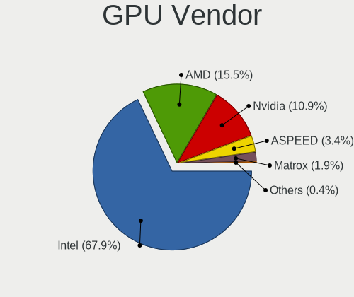
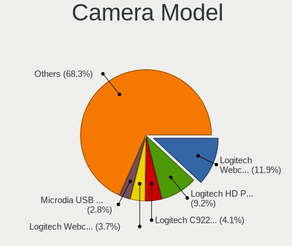

BSD - Tested Hardware & Statistics (Desktops)
---------------------------------------------

A project to collect tested hardware configurations for BSD.

Anyone can contribute to this report by the [hw-probe](https://github.com/linuxhw/hw-probe/blob/master/INSTALL.BSD.md) tool:

    hw-probe -all -upload

Please contribute! Especially if your hardware is rare.

This report is for real hardware. Report for virtual hardware: [TestDays_VE](https://github.com/bsdhw/TestDays_VE)

Contents
--------

* [ Test Cases ](#test-cases)

* [ System ](#system)
  - [ OS                       ](#os)
  - [ OS Family                ](#os-family)
  - [ Arch                     ](#arch)
  - [ DE                       ](#de)
  - [ Display Server           ](#display-server)
  - [ Display Manager          ](#display-manager)
  - [ OS Lang                  ](#os-lang)
  - [ Boot Mode                ](#boot-mode)
  - [ Filesystem               ](#filesystem)
  - [ Part. scheme             ](#part-scheme)

* [ Board ](#board)
  - [ Vendor                   ](#vendor)
  - [ Model                    ](#model)
  - [ Model Family             ](#model-family)
  - [ MFG Year                 ](#mfg-year)
  - [ Form Factor              ](#form-factor)
  - [ Coreboot                 ](#coreboot)
  - [ RAM Size                 ](#ram-size)
  - [ RAM Used                 ](#ram-used)
  - [ Total Drives             ](#total-drives)
  - [ Has CD-ROM               ](#has-cd-rom)
  - [ Has Ethernet             ](#has-ethernet)
  - [ Has WiFi                 ](#has-wifi)
  - [ Has Bluetooth            ](#has-bluetooth)

* [ Location ](#location)
  - [ Country                  ](#country)
  - [ City                     ](#city)

* [ Drives ](#drives)
  - [ Drive Vendor             ](#drive-vendor)
  - [ Drive Model              ](#drive-model)
  - [ HDD Vendor               ](#hdd-vendor)
  - [ SSD Vendor               ](#ssd-vendor)
  - [ Drive Kind               ](#drive-kind)
  - [ Drive Connector          ](#drive-connector)
  - [ Drive Size               ](#drive-size)
  - [ Space Total              ](#space-total)
  - [ Space Used               ](#space-used)
  - [ Malfunc. Drives          ](#malfunc-drives)
  - [ Malfunc. Drive Vendor    ](#malfunc-drive-vendor)
  - [ Malfunc. HDD Vendor      ](#malfunc-hdd-vendor)
  - [ Malfunc. Drive Kind      ](#malfunc-drive-kind)
  - [ Failed Drives            ](#failed-drives)
  - [ Failed Drive Vendor      ](#failed-drive-vendor)
  - [ Drive Status             ](#drive-status)

* [ Storage controller ](#storage-controller)
  - [ Storage Vendor           ](#storage-vendor)
  - [ Storage Model            ](#storage-model)
  - [ Storage Kind             ](#storage-kind)

* [ Processor ](#processor)
  - [ CPU Vendor               ](#cpu-vendor)
  - [ CPU Model                ](#cpu-model)
  - [ CPU Model Family         ](#cpu-model-family)
  - [ CPU Cores                ](#cpu-cores)
  - [ CPU Sockets              ](#cpu-sockets)
  - [ CPU Threads              ](#cpu-threads)
  - [ CPU Microarch            ](#cpu-microarch)

* [ Graphics ](#graphics)
  - [ GPU Vendor               ](#gpu-vendor)
  - [ GPU Model                ](#gpu-model)
  - [ GPU Combo                ](#gpu-combo)
  - [ GPU Driver               ](#gpu-driver)
  - [ GPU Memory               ](#gpu-memory)

* [ Monitor ](#monitor)
  - [ Monitor Vendor           ](#monitor-vendor)
  - [ Monitor Model            ](#monitor-model)
  - [ Monitor Resolution       ](#monitor-resolution)
  - [ Monitor Diagonal         ](#monitor-diagonal)
  - [ Monitor Width            ](#monitor-width)
  - [ Aspect Ratio             ](#aspect-ratio)
  - [ Monitor Area             ](#monitor-area)
  - [ Pixel Density            ](#pixel-density)
  - [ Multiple Monitors        ](#multiple-monitors)

* [ Network ](#network)
  - [ Net Controller Vendor    ](#net-controller-vendor)
  - [ Net Controller Model     ](#net-controller-model)
  - [ Wireless Vendor          ](#wireless-vendor)
  - [ Wireless Model           ](#wireless-model)
  - [ Ethernet Vendor          ](#ethernet-vendor)
  - [ Ethernet Model           ](#ethernet-model)
  - [ Net Controller Kind      ](#net-controller-kind)
  - [ Used Controller          ](#used-controller)
  - [ NICs                     ](#nics)
  - [ IPv6                     ](#ipv6)

* [ Bluetooth ](#bluetooth)
  - [ Bluetooth Vendor         ](#bluetooth-vendor)
  - [ Bluetooth Model          ](#bluetooth-model)

* [ Sound ](#sound)
  - [ Sound Vendor             ](#sound-vendor)
  - [ Sound Model              ](#sound-model)

* [ Memory ](#memory)
  - [ Memory Vendor            ](#memory-vendor)
  - [ Memory Model             ](#memory-model)
  - [ Memory Kind              ](#memory-kind)
  - [ Memory Form Factor       ](#memory-form-factor)
  - [ Memory Size              ](#memory-size)
  - [ Memory Speed             ](#memory-speed)

* [ Printers & scanners ](#printers--scanners)
  - [ Printer Vendor           ](#printer-vendor)
  - [ Printer Model            ](#printer-model)
  - [ Scanner Vendor           ](#scanner-vendor)
  - [ Scanner Model            ](#scanner-model)

* [ Camera ](#camera)
  - [ Camera Vendor            ](#camera-vendor)
  - [ Camera Model             ](#camera-model)

* [ Security ](#security)
  - [ Fingerprint Vendor       ](#fingerprint-vendor)
  - [ Fingerprint Model        ](#fingerprint-model)
  - [ Chipcard Vendor          ](#chipcard-vendor)
  - [ Chipcard Model           ](#chipcard-model)

* [ Unsupported ](#unsupported)
  - [ Unsupported Devices      ](#unsupported-devices)
  - [ Unsupported Device Types ](#unsupported-device-types)

Test Cases
----------

Total: 12098

| Vendor        | Model                       | Probe                                                     | Date         |
|---------------|-----------------------------|-----------------------------------------------------------|--------------|
| Cisco         | ASA5525 A0                  | [f6eb14f059](https://bsd-hardware.info/?probe=f6eb14f059) | Nov 06, 2023 |
| Unknown       | Unknown                     | [8b1079a297](https://bsd-hardware.info/?probe=8b1079a297) | Nov 06, 2023 |
| Dell          | 0D24M8 A01                  | [4c874fa8af](https://bsd-hardware.info/?probe=4c874fa8af) | Nov 06, 2023 |
| Dell          | 0D24M8 A01                  | [3ca7f9b6d1](https://bsd-hardware.info/?probe=3ca7f9b6d1) | Nov 06, 2023 |
| ASUSTek       | PRIME H610M-E D4            | [9d467272c3](https://bsd-hardware.info/?probe=9d467272c3) | Nov 06, 2023 |
| Dell          | 05XGC8 A01                  | [9e054bbcb2](https://bsd-hardware.info/?probe=9e054bbcb2) | Nov 06, 2023 |
| CncTion       | N6000-4L B0                 | [7ee545bad3](https://bsd-hardware.info/?probe=7ee545bad3) | Nov 06, 2023 |
| Fujitsu       | D3313-G1 S26361-D3313-G1    | [b4c8864cef](https://bsd-hardware.info/?probe=b4c8864cef) | Nov 06, 2023 |
| Gigabyte      | B150N Phoenix-WIFI-CF       | [456fe0a275](https://bsd-hardware.info/?probe=456fe0a275) | Nov 06, 2023 |
| HP            | 3031h                       | [a38d555974](https://bsd-hardware.info/?probe=a38d555974) | Nov 06, 2023 |
| Gigabyte      | MZBSWAP-00                  | [a01a7d9576](https://bsd-hardware.info/?probe=a01a7d9576) | Nov 06, 2023 |
| ASUSTek       | ROG STRIX B550-F GAMING     | [e8c7d22b1f](https://bsd-hardware.info/?probe=e8c7d22b1f) | Nov 05, 2023 |
| Intel         | MAHOBAY                     | [70e36de90e](https://bsd-hardware.info/?probe=70e36de90e) | Nov 05, 2023 |
| Gigabyte      | B450M AORUS ELITE           | [e49d3f40b6](https://bsd-hardware.info/?probe=e49d3f40b6) | Nov 05, 2023 |
| MW            | GMLK-2_5G4L                 | [4fe0f6ef5e](https://bsd-hardware.info/?probe=4fe0f6ef5e) | Nov 05, 2023 |
| Lenovo        | 30D2 SDK0J40697 WIN 3305... | [a217880b63](https://bsd-hardware.info/?probe=a217880b63) | Nov 05, 2023 |
| Unknown       | Unknown                     | [456d5ad8bf](https://bsd-hardware.info/?probe=456d5ad8bf) | Nov 05, 2023 |
| TYAN Compu... | S5517                       | [5545281cd4](https://bsd-hardware.info/?probe=5545281cd4) | Nov 05, 2023 |
| Shuttle       | FS61                        | [1ed38ceb8c](https://bsd-hardware.info/?probe=1ed38ceb8c) | Nov 05, 2023 |
| Gigabyte      | H610M H DDR4                | [bdc4fdaf9c](https://bsd-hardware.info/?probe=bdc4fdaf9c) | Nov 05, 2023 |
| MSI           | H81M-P33                    | [d44c30f985](https://bsd-hardware.info/?probe=d44c30f985) | Nov 05, 2023 |
| ASUSTek       | P5Q-E                       | [dac3ca2eca](https://bsd-hardware.info/?probe=dac3ca2eca) | Nov 05, 2023 |
| ASUSTek       | ROG CROSSHAIR VIII HERO     | [e744712416](https://bsd-hardware.info/?probe=e744712416) | Nov 05, 2023 |
| Unknown       | Unknown                     | [97f4527aab](https://bsd-hardware.info/?probe=97f4527aab) | Nov 05, 2023 |
| Unknown       | Unknown                     | [1a820d6364](https://bsd-hardware.info/?probe=1a820d6364) | Nov 05, 2023 |
| Dell          | 0XHGV1 A00                  | [ab650cfab8](https://bsd-hardware.info/?probe=ab650cfab8) | Nov 05, 2023 |
| Unknown       | Unknown                     | [2a768a9f63](https://bsd-hardware.info/?probe=2a768a9f63) | Nov 05, 2023 |
| Unknown       | Unknown                     | [5d0e537b3e](https://bsd-hardware.info/?probe=5d0e537b3e) | Nov 05, 2023 |
| HP            | ProLiant ML10               | [43badefe76](https://bsd-hardware.info/?probe=43badefe76) | Nov 05, 2023 |
| PICO PC       | MNHO-113                    | [7653a1705b](https://bsd-hardware.info/?probe=7653a1705b) | Nov 05, 2023 |
| Fujitsu       | D3313-A1 S26361-D3313-A1    | [ea78913e4c](https://bsd-hardware.info/?probe=ea78913e4c) | Nov 05, 2023 |
| Deciso        | Netboard A10 GEN2 Model ... | [e3852e0a81](https://bsd-hardware.info/?probe=e3852e0a81) | Nov 05, 2023 |
| HP            | 83EE                        | [1ab86be61a](https://bsd-hardware.info/?probe=1ab86be61a) | Nov 05, 2023 |
| Dell          | 0XCR8D A03                  | [cc58b2f58f](https://bsd-hardware.info/?probe=cc58b2f58f) | Nov 05, 2023 |
| HP            | 213D A01                    | [e7de264f61](https://bsd-hardware.info/?probe=e7de264f61) | Nov 05, 2023 |
| MSI           | MAG Z390 TOMAHAWK           | [d95762a0c0](https://bsd-hardware.info/?probe=d95762a0c0) | Nov 04, 2023 |
| Gigabyte      | B360N WIFI-CF               | [38b5f3b9ad](https://bsd-hardware.info/?probe=38b5f3b9ad) | Nov 04, 2023 |
| ASUSTek       | Z97-A                       | [a8aad4a386](https://bsd-hardware.info/?probe=a8aad4a386) | Nov 04, 2023 |
| Lenovo        | 30D0 SDK0J40697 WIN 3305... | [ccb4fc0598](https://bsd-hardware.info/?probe=ccb4fc0598) | Nov 04, 2023 |
| CncTion       | N5105-4L B0                 | [86aa07c0ae](https://bsd-hardware.info/?probe=86aa07c0ae) | Nov 04, 2023 |
| ASUSTek       | PRIME B460M-A               | [d3e438ea78](https://bsd-hardware.info/?probe=d3e438ea78) | Nov 04, 2023 |
| Dell          | 00V62H A00                  | [0b678c5e33](https://bsd-hardware.info/?probe=0b678c5e33) | Nov 04, 2023 |
| Techvision    | TVI7309X B0                 | [90a26f497a](https://bsd-hardware.info/?probe=90a26f497a) | Nov 04, 2023 |
| HP            | 18E4                        | [479b255034](https://bsd-hardware.info/?probe=479b255034) | Nov 03, 2023 |
| Unknown       | Unknown                     | [25d85a53af](https://bsd-hardware.info/?probe=25d85a53af) | Nov 03, 2023 |
| PC Engines    | apu1                        | [3b8272286a](https://bsd-hardware.info/?probe=3b8272286a) | Nov 03, 2023 |
| ASRock        | B365M-HDV                   | [368366454f](https://bsd-hardware.info/?probe=368366454f) | Nov 03, 2023 |
| Unknown       | Unknown                     | [790368b718](https://bsd-hardware.info/?probe=790368b718) | Nov 03, 2023 |
| Dell          | 0Y2V0C A03                  | [5c7de92bb3](https://bsd-hardware.info/?probe=5c7de92bb3) | Nov 03, 2023 |
| Fujitsu       | D3313-E1 S26361-D3313-E1    | [e6927b5eb8](https://bsd-hardware.info/?probe=e6927b5eb8) | Nov 03, 2023 |
| Protectli     | FW6 Ver                     | [13eb07060d](https://bsd-hardware.info/?probe=13eb07060d) | Nov 03, 2023 |
| PC Engines    | APU2                        | [c877a467bb](https://bsd-hardware.info/?probe=c877a467bb) | Nov 03, 2023 |
| PC Engines    | apu4                        | [b85acbe43d](https://bsd-hardware.info/?probe=b85acbe43d) | Nov 03, 2023 |
| Protectli     | FW6                         | [2dc16f3849](https://bsd-hardware.info/?probe=2dc16f3849) | Nov 03, 2023 |
| Shenzhen M... | RPBNB                       | [db0f05f919](https://bsd-hardware.info/?probe=db0f05f919) | Nov 03, 2023 |
| Shenzhen M... | RPBNB                       | [b729c4137a](https://bsd-hardware.info/?probe=b729c4137a) | Nov 03, 2023 |
| Unknown       | YL-SKUL6                    | [c639de5323](https://bsd-hardware.info/?probe=c639de5323) | Nov 03, 2023 |
| HP            | 213D A01                    | [da7d91889e](https://bsd-hardware.info/?probe=da7d91889e) | Nov 03, 2023 |
| IceWhale T... | ZimaBoard 432 ZMB           | [018805dc37](https://bsd-hardware.info/?probe=018805dc37) | Nov 03, 2023 |
| Fujitsu Si... | D2584-A1 S26361-D2584-A1    | [d4298a293f](https://bsd-hardware.info/?probe=d4298a293f) | Nov 02, 2023 |
| Techvision    | TVI7309X B0                 | [b038d8a95d](https://bsd-hardware.info/?probe=b038d8a95d) | Nov 02, 2023 |
| Gigabyte      | MZBSWAP-00                  | [d52347dd3d](https://bsd-hardware.info/?probe=d52347dd3d) | Nov 02, 2023 |
| Unknown       | Unknown                     | [40c18e28da](https://bsd-hardware.info/?probe=40c18e28da) | Nov 02, 2023 |
| Gigabyte      | B450M H                     | [69b57fab79](https://bsd-hardware.info/?probe=69b57fab79) | Nov 02, 2023 |
| CWWK          | MINIPC-G12                  | [4fd9e1d707](https://bsd-hardware.info/?probe=4fd9e1d707) | Nov 02, 2023 |
| CWWK          | CW-ADLN-6L                  | [59372d06e0](https://bsd-hardware.info/?probe=59372d06e0) | Nov 02, 2023 |
| Techvision    | TVI7309X B0                 | [dd3612a38f](https://bsd-hardware.info/?probe=dd3612a38f) | Nov 02, 2023 |
| Techvision    | TVI7309X B0                 | [11b5e187fc](https://bsd-hardware.info/?probe=11b5e187fc) | Nov 02, 2023 |
| Lenovo        | 3102 SDK0J40697 WIN 3305... | [e977a38199](https://bsd-hardware.info/?probe=e977a38199) | Nov 02, 2023 |
| Unknown       | Unknown                     | [691338cb44](https://bsd-hardware.info/?probe=691338cb44) | Nov 02, 2023 |
| Unknown       | Unknown                     | [c6610a58ac](https://bsd-hardware.info/?probe=c6610a58ac) | Nov 02, 2023 |
| Unknown       | Unknown                     | [743d5aec59](https://bsd-hardware.info/?probe=743d5aec59) | Nov 02, 2023 |
| Unknown       | Unknown                     | [a539a38ec1](https://bsd-hardware.info/?probe=a539a38ec1) | Nov 02, 2023 |
| Unknown       | Unknown                     | [f1e1a3e8c8](https://bsd-hardware.info/?probe=f1e1a3e8c8) | Nov 02, 2023 |
| MW            | GMLK-2_5G4L                 | [ff78edaee6](https://bsd-hardware.info/?probe=ff78edaee6) | Nov 02, 2023 |
| PICO PC       | MNHO-113                    | [a4175476a0](https://bsd-hardware.info/?probe=a4175476a0) | Nov 02, 2023 |
| Dell          | 0XCR8D A01                  | [224cc728f5](https://bsd-hardware.info/?probe=224cc728f5) | Nov 02, 2023 |
| HP            | 18E7                        | [a5bf30aeac](https://bsd-hardware.info/?probe=a5bf30aeac) | Nov 02, 2023 |
| Dell          | 0XCR8D A02                  | [f9df1890fa](https://bsd-hardware.info/?probe=f9df1890fa) | Nov 02, 2023 |
| Dell          | 0XCR8D A01                  | [83c8ab8d4b](https://bsd-hardware.info/?probe=83c8ab8d4b) | Nov 02, 2023 |
| Unknown       | Unknown                     | [3499447096](https://bsd-hardware.info/?probe=3499447096) | Nov 01, 2023 |
| ASUSTek       | P8Z77-V LX                  | [7077dec0a1](https://bsd-hardware.info/?probe=7077dec0a1) | Nov 01, 2023 |
| Fujitsu       | D3544-A1 S26361-D3544-A1... | [2fcac7d927](https://bsd-hardware.info/?probe=2fcac7d927) | Nov 01, 2023 |
| Shuttle       | NC10U                       | [8a3fd4b3ee](https://bsd-hardware.info/?probe=8a3fd4b3ee) | Nov 01, 2023 |
| Dell          | 04Y8V0 A02                  | [7e2bda9790](https://bsd-hardware.info/?probe=7e2bda9790) | Nov 01, 2023 |
| Unknown       | Unknown                     | [4c83541e4d](https://bsd-hardware.info/?probe=4c83541e4d) | Nov 01, 2023 |
| ASUSTek       | ProArt B550-CREATOR         | [2fab5b5adf](https://bsd-hardware.info/?probe=2fab5b5adf) | Nov 01, 2023 |
| Protectli     | VP2420                      | [7621eb7370](https://bsd-hardware.info/?probe=7621eb7370) | Nov 01, 2023 |
| Techvision    | TVI7309X B0                 | [8004cade7b](https://bsd-hardware.info/?probe=8004cade7b) | Nov 01, 2023 |
| ASRock        | Z590 Pro4                   | [03fa12a885](https://bsd-hardware.info/?probe=03fa12a885) | Nov 01, 2023 |
| Lenovo        | 3111 SDK0J40697 WIN 3305... | [ade254cf11](https://bsd-hardware.info/?probe=ade254cf11) | Nov 01, 2023 |
| MSI           | 970 GAMING                  | [f93d5865b8](https://bsd-hardware.info/?probe=f93d5865b8) | Nov 01, 2023 |
| Unknown       | Unknown                     | [d7f1c60cfb](https://bsd-hardware.info/?probe=d7f1c60cfb) | Nov 01, 2023 |
| Unknown       | Unknown                     | [1a63df656e](https://bsd-hardware.info/?probe=1a63df656e) | Oct 31, 2023 |
| Unknown       | Unknown                     | [fc605c1909](https://bsd-hardware.info/?probe=fc605c1909) | Oct 31, 2023 |
| Unknown       | QGLK03                      | [f51b216549](https://bsd-hardware.info/?probe=f51b216549) | Oct 31, 2023 |
| Dell          | 0NC2VH A01                  | [db40304707](https://bsd-hardware.info/?probe=db40304707) | Oct 31, 2023 |
| ASRockRack    | EPYC3101D4I-2T              | [87e3260963](https://bsd-hardware.info/?probe=87e3260963) | Oct 31, 2023 |
| Dell          | 0XHGV1 A00                  | [a688954dd5](https://bsd-hardware.info/?probe=a688954dd5) | Oct 31, 2023 |
| ASUSTek       | PRIME A520M-K               | [c60aeb219e](https://bsd-hardware.info/?probe=c60aeb219e) | Oct 31, 2023 |
| Unknown       | Unknown                     | [b9d895ba2b](https://bsd-hardware.info/?probe=b9d895ba2b) | Oct 31, 2023 |
| HP            | 8299                        | [e3bdac8945](https://bsd-hardware.info/?probe=e3bdac8945) | Oct 31, 2023 |
| Shuttle       | FS61                        | [24158fbe17](https://bsd-hardware.info/?probe=24158fbe17) | Oct 31, 2023 |
| Shuttle       | FS61                        | [2efb16a5f4](https://bsd-hardware.info/?probe=2efb16a5f4) | Oct 31, 2023 |
| ASRock        | X570 Phantom Gaming 4       | [c163891517](https://bsd-hardware.info/?probe=c163891517) | Oct 31, 2023 |
| CheckPoint    | T-110-00                    | [970671ce27](https://bsd-hardware.info/?probe=970671ce27) | Oct 31, 2023 |
| Gigabyte      | H370M D3H-CF                | [6b2553e06c](https://bsd-hardware.info/?probe=6b2553e06c) | Oct 30, 2023 |
| Hardkernel    | ODROID-H2                   | [41c4097002](https://bsd-hardware.info/?probe=41c4097002) | Oct 30, 2023 |
| Dell          | 0NW6H5 A00                  | [ac76a862f8](https://bsd-hardware.info/?probe=ac76a862f8) | Oct 30, 2023 |
| Seeed Stud... | ODYSSEY-X86J41X5 SD-BS-C... | [da2fa90c43](https://bsd-hardware.info/?probe=da2fa90c43) | Oct 30, 2023 |
| ASUSTek       | PRIME B250M-A               | [0caf100d71](https://bsd-hardware.info/?probe=0caf100d71) | Oct 30, 2023 |
| Intel         | Q3XXG4-P V1.0               | [cac29f9a35](https://bsd-hardware.info/?probe=cac29f9a35) | Oct 30, 2023 |
| ASUSTek       | PRIME B250M-A               | [534dc363f2](https://bsd-hardware.info/?probe=534dc363f2) | Oct 30, 2023 |
| Dell          | 0KP561                      | [cd0ae50eb0](https://bsd-hardware.info/?probe=cd0ae50eb0) | Oct 30, 2023 |
| Dell          | 0WMJ54 A01                  | [10d46f39aa](https://bsd-hardware.info/?probe=10d46f39aa) | Oct 30, 2023 |
| PC Engines    | APU2                        | [78e2f0b5e4](https://bsd-hardware.info/?probe=78e2f0b5e4) | Oct 30, 2023 |
| CWWK          | CW-J6-6L                    | [7c9445a8f2](https://bsd-hardware.info/?probe=7c9445a8f2) | Oct 30, 2023 |
| Dell          | 0WMJ54 A01                  | [5995fa3115](https://bsd-hardware.info/?probe=5995fa3115) | Oct 30, 2023 |
| YANYU         | M9F baytrail                | [746772e77b](https://bsd-hardware.info/?probe=746772e77b) | Oct 30, 2023 |
| AZW           | EQ                          | [034b060507](https://bsd-hardware.info/?probe=034b060507) | Oct 30, 2023 |
| AAEON         | FWS-2362 V1.0               | [cddea934bd](https://bsd-hardware.info/?probe=cddea934bd) | Oct 30, 2023 |
| ShenZhen M... | MW-GMLK-2.5G6L              | [9567268d28](https://bsd-hardware.info/?probe=9567268d28) | Oct 30, 2023 |
| Intel         | DCP847SKE                   | [3b5b83d95f](https://bsd-hardware.info/?probe=3b5b83d95f) | Oct 30, 2023 |
| Unknown       | Unknown                     | [a96d602ef7](https://bsd-hardware.info/?probe=a96d602ef7) | Oct 29, 2023 |
| Intel         | DCP847SKE                   | [ba44d23972](https://bsd-hardware.info/?probe=ba44d23972) | Oct 29, 2023 |
| Yanling       | YL-KBR6L Ver:1.01           | [bdc7be2258](https://bsd-hardware.info/?probe=bdc7be2258) | Oct 29, 2023 |
| ShenZhen M... | MW-GMLK-2.5G6L              | [709f8e1566](https://bsd-hardware.info/?probe=709f8e1566) | Oct 29, 2023 |
| Intel         | ChiefRiver D                | [8467546a46](https://bsd-hardware.info/?probe=8467546a46) | Oct 29, 2023 |
| Fujitsu       | D3041-A1 S26361-D3041-A1    | [bb195148f7](https://bsd-hardware.info/?probe=bb195148f7) | Oct 29, 2023 |
| ASRock        | G31M-S                      | [d0d58ceb87](https://bsd-hardware.info/?probe=d0d58ceb87) | Oct 29, 2023 |
| Protectli     | VP2410                      | [7fb31eb814](https://bsd-hardware.info/?probe=7fb31eb814) | Oct 29, 2023 |
| ASRock        | H81M-VG4 R2.0               | [dcfbd591f5](https://bsd-hardware.info/?probe=dcfbd591f5) | Oct 29, 2023 |
| Dell          | 0NC2VH A01                  | [e69fadd7a8](https://bsd-hardware.info/?probe=e69fadd7a8) | Oct 29, 2023 |
| Unknown       | Unknown                     | [873104973c](https://bsd-hardware.info/?probe=873104973c) | Oct 29, 2023 |
| MW            | GMLK-2_5G4L                 | [ec852f7037](https://bsd-hardware.info/?probe=ec852f7037) | Oct 29, 2023 |
| JHZD          | BQM6                        | [d54e6cd1fd](https://bsd-hardware.info/?probe=d54e6cd1fd) | Oct 29, 2023 |
| Unknown       | Unknown                     | [b688e6b635](https://bsd-hardware.info/?probe=b688e6b635) | Oct 28, 2023 |
| Gigabyte      | H81M-S2V                    | [07f64c00f4](https://bsd-hardware.info/?probe=07f64c00f4) | Oct 28, 2023 |
| Dell          | 0JP3NX A01                  | [937bf733c5](https://bsd-hardware.info/?probe=937bf733c5) | Oct 28, 2023 |
| Unknown       | Unknown                     | [2df22c840a](https://bsd-hardware.info/?probe=2df22c840a) | Oct 28, 2023 |
| Fujitsu       | D3543-A1 S26361-D3543-A1... | [fc42f6db17](https://bsd-hardware.info/?probe=fc42f6db17) | Oct 28, 2023 |
| ASUSTek       | MINIPC PN53-G               | [57d8823b4b](https://bsd-hardware.info/?probe=57d8823b4b) | Oct 28, 2023 |
| ASRock        | B450M Pro4 R2.0             | [b60083ef1f](https://bsd-hardware.info/?probe=b60083ef1f) | Oct 28, 2023 |
| ASRock        | H370M-ITX/ac                | [ace25d235f](https://bsd-hardware.info/?probe=ace25d235f) | Oct 28, 2023 |
| ASRock        | N100DC-ITX                  | [888d7c9d18](https://bsd-hardware.info/?probe=888d7c9d18) | Oct 28, 2023 |
| HP            | 1825                        | [8a0a258efc](https://bsd-hardware.info/?probe=8a0a258efc) | Oct 28, 2023 |
| Dell          | 0Y5DDC A00                  | [ff58ecae1d](https://bsd-hardware.info/?probe=ff58ecae1d) | Oct 28, 2023 |
| Gigabyte      | J3455N-D3H                  | [6448ed1b12](https://bsd-hardware.info/?probe=6448ed1b12) | Oct 28, 2023 |
| IGEL Techn... | D220                        | [3478db91ef](https://bsd-hardware.info/?probe=3478db91ef) | Oct 28, 2023 |
| HP            | 2AF7                        | [a45659c9d2](https://bsd-hardware.info/?probe=a45659c9d2) | Oct 28, 2023 |
| Unknown       | Unknown                     | [3e99a14af3](https://bsd-hardware.info/?probe=3e99a14af3) | Oct 28, 2023 |
| Supermicro    | X11SSH-F                    | [73160cea1d](https://bsd-hardware.info/?probe=73160cea1d) | Oct 28, 2023 |
| YanRay Tec... | B1904                       | [7d194ae12b](https://bsd-hardware.info/?probe=7d194ae12b) | Oct 28, 2023 |
| ASUSTek       | TUF Gaming Z490-PLUS        | [c2a5fe4d38](https://bsd-hardware.info/?probe=c2a5fe4d38) | Oct 28, 2023 |
| Dell          | PowerEdge T110 II           | [f93395bc11](https://bsd-hardware.info/?probe=f93395bc11) | Oct 28, 2023 |
| Dell          | 09WH54 A01                  | [a012c0e1c9](https://bsd-hardware.info/?probe=a012c0e1c9) | Oct 27, 2023 |
| Intel         | Q3XXG4-P V1.0               | [03ef00fab1](https://bsd-hardware.info/?probe=03ef00fab1) | Oct 27, 2023 |
| Protectli     | FW4B                        | [23c31e7f9f](https://bsd-hardware.info/?probe=23c31e7f9f) | Oct 27, 2023 |
| Intel         | JSL MRD                     | [328c764941](https://bsd-hardware.info/?probe=328c764941) | Oct 27, 2023 |
| Intel         | DB75EN AAG39650-302         | [5d64d42233](https://bsd-hardware.info/?probe=5d64d42233) | Oct 27, 2023 |
| Unknown       | Unknown                     | [7a9e2d88ed](https://bsd-hardware.info/?probe=7a9e2d88ed) | Oct 27, 2023 |
| Sun           | SUNW,SPARC-Enterprise-T5... | [50457ff825](https://bsd-hardware.info/?probe=50457ff825) | Oct 27, 2023 |
| Unknown       | Unknown                     | [c3c0c1e21b](https://bsd-hardware.info/?probe=c3c0c1e21b) | Oct 27, 2023 |
| Fujitsu       | D3314-E1 S26361-D3314-E1    | [2cde7906c1](https://bsd-hardware.info/?probe=2cde7906c1) | Oct 27, 2023 |
| Lenovo        | NO DPK                      | [424c33d278](https://bsd-hardware.info/?probe=424c33d278) | Oct 27, 2023 |
| Unknown       | Unknown                     | [51102e3f0d](https://bsd-hardware.info/?probe=51102e3f0d) | Oct 27, 2023 |
| Fujitsu       | D3314-A1 S26361-D3314-A1    | [d005339b5f](https://bsd-hardware.info/?probe=d005339b5f) | Oct 27, 2023 |
| Unknown       | Unknown                     | [a88541d6a6](https://bsd-hardware.info/?probe=a88541d6a6) | Oct 27, 2023 |
| Lenovo        | NO DPK                      | [753b30d88b](https://bsd-hardware.info/?probe=753b30d88b) | Oct 27, 2023 |
| Gigabyte      | X570S UD                    | [fe3d35aef8](https://bsd-hardware.info/?probe=fe3d35aef8) | Oct 27, 2023 |
| Unknown       | Unknown                     | [850878776a](https://bsd-hardware.info/?probe=850878776a) | Oct 27, 2023 |
| Dell          | 0M5DCD A00                  | [f8ae786555](https://bsd-hardware.info/?probe=f8ae786555) | Oct 27, 2023 |
| YANYU         | M9F baytrail                | [f9e833a5f9](https://bsd-hardware.info/?probe=f9e833a5f9) | Oct 27, 2023 |
| HP            | 3397                        | [3dad1378f7](https://bsd-hardware.info/?probe=3dad1378f7) | Oct 27, 2023 |
| PC Engines    | apu4                        | [7bbd252741](https://bsd-hardware.info/?probe=7bbd252741) | Oct 27, 2023 |
| Shenzhen M... | AHBNB OEM                   | [8a1a0cdc32](https://bsd-hardware.info/?probe=8a1a0cdc32) | Oct 27, 2023 |
| Fujitsu       | D3313-A1 S26361-D3313-A1    | [1157df98bf](https://bsd-hardware.info/?probe=1157df98bf) | Oct 27, 2023 |
| Unknown       | Unknown                     | [04349022d0](https://bsd-hardware.info/?probe=04349022d0) | Oct 26, 2023 |
| Acer          | Veriton X4620G v1.0         | [bc374cdc01](https://bsd-hardware.info/?probe=bc374cdc01) | Oct 26, 2023 |
| Gigabyte      | Z170-D3H-CF                 | [3d6569cef5](https://bsd-hardware.info/?probe=3d6569cef5) | Oct 26, 2023 |
| CncTion       | N5105-4L B0                 | [1d3ba21cf9](https://bsd-hardware.info/?probe=1d3ba21cf9) | Oct 26, 2023 |
| Winston Ma... | PICO PC V1.2                | [244102bda8](https://bsd-hardware.info/?probe=244102bda8) | Oct 26, 2023 |
| Unknown       | Unknown                     | [376ab08c75](https://bsd-hardware.info/?probe=376ab08c75) | Oct 26, 2023 |
| Intel         | MAHOBAY                     | [9b797e809a](https://bsd-hardware.info/?probe=9b797e809a) | Oct 26, 2023 |
| Intel         | MAHOBAY                     | [4dd20af1a3](https://bsd-hardware.info/?probe=4dd20af1a3) | Oct 26, 2023 |
| Intel         | MAHOBAY                     | [c66be142de](https://bsd-hardware.info/?probe=c66be142de) | Oct 26, 2023 |
| Dell          | 02YYK5 A01                  | [1b42e4a912](https://bsd-hardware.info/?probe=1b42e4a912) | Oct 26, 2023 |
| Supermicro    | X9SCL/X9SCMA                | [233d4d3b64](https://bsd-hardware.info/?probe=233d4d3b64) | Oct 26, 2023 |
| Unknown       | Unknown                     | [400f56d13c](https://bsd-hardware.info/?probe=400f56d13c) | Oct 26, 2023 |
| Gigabyte      | H81M-S2PV                   | [310fcb9763](https://bsd-hardware.info/?probe=310fcb9763) | Oct 26, 2023 |
| Unknown       | Unknown                     | [d78f6f9dd2](https://bsd-hardware.info/?probe=d78f6f9dd2) | Oct 25, 2023 |
| Unknown       | Unknown                     | [6b3f2cf24c](https://bsd-hardware.info/?probe=6b3f2cf24c) | Oct 25, 2023 |
| Unknown       | Unknown                     | [f06cbf02dc](https://bsd-hardware.info/?probe=f06cbf02dc) | Oct 25, 2023 |
| Unknown       | Unknown                     | [0f9ff1c9ed](https://bsd-hardware.info/?probe=0f9ff1c9ed) | Oct 25, 2023 |
| Unknown       | Unknown                     | [8e245ccb85](https://bsd-hardware.info/?probe=8e245ccb85) | Oct 25, 2023 |
| Unknown       | Unknown                     | [db96ffb93a](https://bsd-hardware.info/?probe=db96ffb93a) | Oct 25, 2023 |
| Intel         | MAHOBAY                     | [980d0881bd](https://bsd-hardware.info/?probe=980d0881bd) | Oct 25, 2023 |
| PC Engines    | APU3                        | [fb68d3fbaf](https://bsd-hardware.info/?probe=fb68d3fbaf) | Oct 25, 2023 |
| Unknown       | Unknown                     | [119cb746c8](https://bsd-hardware.info/?probe=119cb746c8) | Oct 25, 2023 |
| Protectli     | FW4B Ver                    | [0d97ba1ab0](https://bsd-hardware.info/?probe=0d97ba1ab0) | Oct 24, 2023 |
| Gigabyte      | MZGLKBP-00                  | [dcd8b6e432](https://bsd-hardware.info/?probe=dcd8b6e432) | Oct 24, 2023 |
| Dell          | 08NPPY A00                  | [dfc8115b4a](https://bsd-hardware.info/?probe=dfc8115b4a) | Oct 24, 2023 |
| Protectli     | FW6 Ver                     | [66f5010f59](https://bsd-hardware.info/?probe=66f5010f59) | Oct 24, 2023 |
| NEXCOM        | NSA3110 B                   | [84b88fd96d](https://bsd-hardware.info/?probe=84b88fd96d) | Oct 24, 2023 |
| Protectli     | FW6                         | [9ba0e874f4](https://bsd-hardware.info/?probe=9ba0e874f4) | Oct 24, 2023 |
| Unknown       | Unknown                     | [06f91445cb](https://bsd-hardware.info/?probe=06f91445cb) | Oct 24, 2023 |
| Cisco         | ASA5512 A0                  | [176871dd32](https://bsd-hardware.info/?probe=176871dd32) | Oct 24, 2023 |
| GoWin Solu... | R86S                        | [8668f0e8e9](https://bsd-hardware.info/?probe=8668f0e8e9) | Oct 24, 2023 |
| Gigabyte      | X570S UD                    | [dea9eee8a4](https://bsd-hardware.info/?probe=dea9eee8a4) | Oct 24, 2023 |
| Techvision    | TVI7309X B0                 | [38b1931562](https://bsd-hardware.info/?probe=38b1931562) | Oct 24, 2023 |
| Unknown       | Unknown                     | [b42465c967](https://bsd-hardware.info/?probe=b42465c967) | Oct 23, 2023 |
| Techvision    | TVI7309X B0                 | [2424acbde7](https://bsd-hardware.info/?probe=2424acbde7) | Oct 23, 2023 |
| Intel         | DQ77KB AAG81483-501         | [81e77caff8](https://bsd-hardware.info/?probe=81e77caff8) | Oct 23, 2023 |
| MECHREVO      | Unknown                     | [2dac22205c](https://bsd-hardware.info/?probe=2dac22205c) | Oct 23, 2023 |
| Shuttle       | FZ270                       | [1aa4ad0971](https://bsd-hardware.info/?probe=1aa4ad0971) | Oct 23, 2023 |
| Dell          | 02YYK5 A01                  | [ab44e043d2](https://bsd-hardware.info/?probe=ab44e043d2) | Oct 23, 2023 |
| Supermicro    | X10SLM-F                    | [8e622421c6](https://bsd-hardware.info/?probe=8e622421c6) | Oct 23, 2023 |
| AZW           | EQ                          | [8cb6ac80d2](https://bsd-hardware.info/?probe=8cb6ac80d2) | Oct 23, 2023 |
| JHZD          | BQM6                        | [26c56ca564](https://bsd-hardware.info/?probe=26c56ca564) | Oct 23, 2023 |
| Unknown       | Unknown                     | [ef592dc6ed](https://bsd-hardware.info/?probe=ef592dc6ed) | Oct 22, 2023 |
| Unknown       | YL-J3160L4                  | [3192ead8b5](https://bsd-hardware.info/?probe=3192ead8b5) | Oct 22, 2023 |
| ASRock        | G31M-S                      | [76a3ad20f3](https://bsd-hardware.info/?probe=76a3ad20f3) | Oct 22, 2023 |
| HP            | 3397                        | [2c004318d4](https://bsd-hardware.info/?probe=2c004318d4) | Oct 22, 2023 |
| Acer          | Aspire XC-830               | [6aea1130aa](https://bsd-hardware.info/?probe=6aea1130aa) | Oct 22, 2023 |
| Acer          | Aspire XC-830               | [3a4d822cfc](https://bsd-hardware.info/?probe=3a4d822cfc) | Oct 22, 2023 |
| Gigabyte      | Z170-D3H-CF                 | [193c3e5732](https://bsd-hardware.info/?probe=193c3e5732) | Oct 22, 2023 |
| ASUSTek       | M3A78-CM                    | [a40b6fde47](https://bsd-hardware.info/?probe=a40b6fde47) | Oct 22, 2023 |
| MSI           | H81M-P33                    | [dd9ff802a9](https://bsd-hardware.info/?probe=dd9ff802a9) | Oct 22, 2023 |
| ASUSTek       | P5Q-E                       | [1b94fd9385](https://bsd-hardware.info/?probe=1b94fd9385) | Oct 22, 2023 |
| ASUSTek       | ROG CROSSHAIR VIII HERO     | [cc7fb797f5](https://bsd-hardware.info/?probe=cc7fb797f5) | Oct 22, 2023 |
| Lenovo        | SHARKBAY 0B98401 WIN        | [558a8a885e](https://bsd-hardware.info/?probe=558a8a885e) | Oct 22, 2023 |
| Protectli     | FW6 Ver                     | [e12093f6bd](https://bsd-hardware.info/?probe=e12093f6bd) | Oct 22, 2023 |
| Unknown       | Unknown                     | [8c9f8e4f16](https://bsd-hardware.info/?probe=8c9f8e4f16) | Oct 21, 2023 |
| Unknown       | Unknown                     | [135c0112a4](https://bsd-hardware.info/?probe=135c0112a4) | Oct 21, 2023 |
| Unknown       | Unknown                     | [cc1a558efe](https://bsd-hardware.info/?probe=cc1a558efe) | Oct 21, 2023 |
| Unknown       | Unknown                     | [b1f5e25359](https://bsd-hardware.info/?probe=b1f5e25359) | Oct 21, 2023 |
| Unknown       | Unknown                     | [629eefe0c2](https://bsd-hardware.info/?probe=629eefe0c2) | Oct 21, 2023 |
| Unknown       | Unknown                     | [530528316f](https://bsd-hardware.info/?probe=530528316f) | Oct 21, 2023 |
| Unknown       | Unknown                     | [f15d15cba2](https://bsd-hardware.info/?probe=f15d15cba2) | Oct 21, 2023 |
| HP            | 8054                        | [71b61dc284](https://bsd-hardware.info/?probe=71b61dc284) | Oct 21, 2023 |
| ASUSTek       | PRIME H470M-PLUS            | [88cdd6135f](https://bsd-hardware.info/?probe=88cdd6135f) | Oct 20, 2023 |
| AZW           | EQ                          | [e119f62272](https://bsd-hardware.info/?probe=e119f62272) | Oct 20, 2023 |
| Techvision    | TVI7309X B0                 | [48bb0077c3](https://bsd-hardware.info/?probe=48bb0077c3) | Oct 20, 2023 |
| Lenovo        | ThinkSystem ST50 V2 7D8J... | [b8cb4d78ac](https://bsd-hardware.info/?probe=b8cb4d78ac) | Oct 20, 2023 |
| Protectli     | FW4A Ver                    | [d40c67f9ca](https://bsd-hardware.info/?probe=d40c67f9ca) | Oct 20, 2023 |
| CWWK          | MINIPC-G12                  | [c51a6f8459](https://bsd-hardware.info/?probe=c51a6f8459) | Oct 20, 2023 |
| Dell          | 0HD5W2 A01                  | [3f7a4e2865](https://bsd-hardware.info/?probe=3f7a4e2865) | Oct 20, 2023 |
| Dell          | 0WR7PY A01                  | [7e2e07f641](https://bsd-hardware.info/?probe=7e2e07f641) | Oct 20, 2023 |
| CncTion       | N5105-4L B0                 | [ef42c969d5](https://bsd-hardware.info/?probe=ef42c969d5) | Oct 20, 2023 |
| Apple         | Mac-F60DEB81FF30ACF6 Mac... | [b09bb5811b](https://bsd-hardware.info/?probe=b09bb5811b) | Oct 19, 2023 |
| Apple         | Mac-F60DEB81FF30ACF6 Mac... | [e96fbf80a4](https://bsd-hardware.info/?probe=e96fbf80a4) | Oct 19, 2023 |
| Dell          | 02YYK5 A01                  | [a8727c3ee3](https://bsd-hardware.info/?probe=a8727c3ee3) | Oct 19, 2023 |
| MSI           | PRO H610M-B DDR4            | [1cc822b8c1](https://bsd-hardware.info/?probe=1cc822b8c1) | Oct 19, 2023 |
| HP            | 1589                        | [359343104e](https://bsd-hardware.info/?probe=359343104e) | Oct 19, 2023 |
| Gigabyte      | H510M H                     | [3cf75f0ae6](https://bsd-hardware.info/?probe=3cf75f0ae6) | Oct 19, 2023 |
| Gigabyte      | B85M-DS3H                   | [bd9d649fb6](https://bsd-hardware.info/?probe=bd9d649fb6) | Oct 19, 2023 |
| Unknown       | Unknown                     | [26d4882a9f](https://bsd-hardware.info/?probe=26d4882a9f) | Oct 19, 2023 |
| Unknown       | Unknown                     | [94f0b39689](https://bsd-hardware.info/?probe=94f0b39689) | Oct 19, 2023 |
| Dell          | 0NW6H5 A00                  | [606ed441ae](https://bsd-hardware.info/?probe=606ed441ae) | Oct 19, 2023 |
| Fujitsu       | D3433-S2 S26361-D3433-S2    | [26a1b95e16](https://bsd-hardware.info/?probe=26a1b95e16) | Oct 19, 2023 |
| Unknown       | Unknown                     | [d63aebc59b](https://bsd-hardware.info/?probe=d63aebc59b) | Oct 19, 2023 |
| ASRock        | H97M Pro4                   | [12a09a39d5](https://bsd-hardware.info/?probe=12a09a39d5) | Oct 19, 2023 |
| ASRock        | 970 Extreme3 R2.0           | [6f6f1bf009](https://bsd-hardware.info/?probe=6f6f1bf009) | Oct 18, 2023 |
| CncTion       | J4125-4L-I225               | [d8114642f5](https://bsd-hardware.info/?probe=d8114642f5) | Oct 18, 2023 |
| Dell          | 0YXT71 A00                  | [1bf1c3b807](https://bsd-hardware.info/?probe=1bf1c3b807) | Oct 18, 2023 |
| Shenzhen M... | F6BFC                       | [3e57b220ce](https://bsd-hardware.info/?probe=3e57b220ce) | Oct 18, 2023 |
| AZW           | EQ                          | [0d647b68a6](https://bsd-hardware.info/?probe=0d647b68a6) | Oct 18, 2023 |
| AZW           | EQ                          | [71f6a16f5a](https://bsd-hardware.info/?probe=71f6a16f5a) | Oct 18, 2023 |
| HP            | 8299                        | [b4ba6a7e52](https://bsd-hardware.info/?probe=b4ba6a7e52) | Oct 18, 2023 |
| Unknown       | Unknown                     | [af12786272](https://bsd-hardware.info/?probe=af12786272) | Oct 18, 2023 |
| Unknown       | J3160-4L                    | [d69749afe5](https://bsd-hardware.info/?probe=d69749afe5) | Oct 18, 2023 |
| CncTion       | N5105-4L B0                 | [0f18316a17](https://bsd-hardware.info/?probe=0f18316a17) | Oct 18, 2023 |
| ASRock        | 970 Extreme3 R2.0           | [3dffc4d445](https://bsd-hardware.info/?probe=3dffc4d445) | Oct 18, 2023 |
| HP            | 8299                        | [8da92e01e0](https://bsd-hardware.info/?probe=8da92e01e0) | Oct 17, 2023 |
| Hardkernel    | ODROID-H3                   | [410f1d67d8](https://bsd-hardware.info/?probe=410f1d67d8) | Oct 17, 2023 |
| Dell          | 05XGC8 A01                  | [f1968d86dc](https://bsd-hardware.info/?probe=f1968d86dc) | Oct 17, 2023 |
| ASUSTek       | X99-A/USB                   | [0f914c6351](https://bsd-hardware.info/?probe=0f914c6351) | Oct 17, 2023 |
| Unknown       | QDNV01                      | [df90627ba3](https://bsd-hardware.info/?probe=df90627ba3) | Oct 17, 2023 |
| Lenovo        | 3132 SDK0J40697 WIN 3305... | [a12be87189](https://bsd-hardware.info/?probe=a12be87189) | Oct 17, 2023 |
| PC Engines    | APU2                        | [7fb59a92f0](https://bsd-hardware.info/?probe=7fb59a92f0) | Oct 16, 2023 |
| Dell          | 00V62H A00                  | [8ff0ba4fcb](https://bsd-hardware.info/?probe=8ff0ba4fcb) | Oct 16, 2023 |
| ASUSTek       | P5QC                        | [dfb543f496](https://bsd-hardware.info/?probe=dfb543f496) | Oct 15, 2023 |
| Dell          | 0782GW A00                  | [31887e656b](https://bsd-hardware.info/?probe=31887e656b) | Oct 15, 2023 |
| ASRock        | H110M-DVS R3.0              | [abe8593d6e](https://bsd-hardware.info/?probe=abe8593d6e) | Oct 15, 2023 |
| Intel         | DH55TC AAE70932-206         | [745b988354](https://bsd-hardware.info/?probe=745b988354) | Oct 15, 2023 |
| Dell          | 0WR7PY A03                  | [128323ada4](https://bsd-hardware.info/?probe=128323ada4) | Oct 15, 2023 |
| Techvision    | TVI7309X B0                 | [bf66ef021e](https://bsd-hardware.info/?probe=bf66ef021e) | Oct 15, 2023 |
| MSI           | H81M-P33                    | [6902d492db](https://bsd-hardware.info/?probe=6902d492db) | Oct 15, 2023 |
| ASUSTek       | P5Q-E                       | [094b766a05](https://bsd-hardware.info/?probe=094b766a05) | Oct 15, 2023 |
| ASUSTek       | ROG CROSSHAIR VIII HERO     | [b502116394](https://bsd-hardware.info/?probe=b502116394) | Oct 15, 2023 |
| Unknown       | Unknown                     | [af333f2214](https://bsd-hardware.info/?probe=af333f2214) | Oct 15, 2023 |
| Protectli     | VP4650                      | [9c073eb854](https://bsd-hardware.info/?probe=9c073eb854) | Oct 15, 2023 |
| MW            | GMLK-2_5G4L                 | [eb383d6f22](https://bsd-hardware.info/?probe=eb383d6f22) | Oct 15, 2023 |
| Gigabyte      | Z68AP-D3                    | [ca5e8cfb2b](https://bsd-hardware.info/?probe=ca5e8cfb2b) | Oct 15, 2023 |
| Protectli     | VP2410                      | [aaffd45671](https://bsd-hardware.info/?probe=aaffd45671) | Oct 15, 2023 |
| HP            | 213D A01                    | [6a023bfe9f](https://bsd-hardware.info/?probe=6a023bfe9f) | Oct 14, 2023 |
| Dell          | 0654JC A02                  | [c5a88098ff](https://bsd-hardware.info/?probe=c5a88098ff) | Oct 14, 2023 |
| Fujitsu       | D3543-A1 S26361-D3543-A1... | [4b685d7ff1](https://bsd-hardware.info/?probe=4b685d7ff1) | Oct 14, 2023 |
| AZW           | EQ                          | [0879dfe1d1](https://bsd-hardware.info/?probe=0879dfe1d1) | Oct 14, 2023 |
| Intel         | B75                         | [baead94277](https://bsd-hardware.info/?probe=baead94277) | Oct 14, 2023 |
| CWWK          | MINIPC-G4                   | [7762558ac6](https://bsd-hardware.info/?probe=7762558ac6) | Oct 14, 2023 |
| MW            | GMLK-2_5G4L                 | [248c73db22](https://bsd-hardware.info/?probe=248c73db22) | Oct 14, 2023 |
| OEM           | H81 JHS359                  | [9d10d53885](https://bsd-hardware.info/?probe=9d10d53885) | Oct 14, 2023 |
| Unknown       | J3160-4L                    | [95e017977c](https://bsd-hardware.info/?probe=95e017977c) | Oct 14, 2023 |
| Dell          | 0WPMFG A00                  | [9b200a9e60](https://bsd-hardware.info/?probe=9b200a9e60) | Oct 14, 2023 |
| Dell          | 08NPPY A00                  | [a8d0be21e1](https://bsd-hardware.info/?probe=a8d0be21e1) | Oct 14, 2023 |
| MSI           | MS-S0891                    | [a46837faa3](https://bsd-hardware.info/?probe=a46837faa3) | Oct 14, 2023 |
| AZW           | EQ                          | [1f76967326](https://bsd-hardware.info/?probe=1f76967326) | Oct 14, 2023 |
| Unknown       | Unknown                     | [77a827631b](https://bsd-hardware.info/?probe=77a827631b) | Oct 13, 2023 |
| IceWhale T... | ZMB216-i ZMB                | [10dc3669ad](https://bsd-hardware.info/?probe=10dc3669ad) | Oct 13, 2023 |
| HP            | 3397                        | [30884c4f37](https://bsd-hardware.info/?probe=30884c4f37) | Oct 13, 2023 |
| ASUSTek       | PRIME X370-PRO              | [697f24cf01](https://bsd-hardware.info/?probe=697f24cf01) | Oct 13, 2023 |
| ASRock        | X570 Phantom Gaming 4       | [d14ff47394](https://bsd-hardware.info/?probe=d14ff47394) | Oct 13, 2023 |
| Gigabyte      | Z370 AORUS Gaming 7         | [8b0d009cc4](https://bsd-hardware.info/?probe=8b0d009cc4) | Oct 13, 2023 |
| GoWin Solu... | R86S                        | [8ec0d67d48](https://bsd-hardware.info/?probe=8ec0d67d48) | Oct 13, 2023 |
| ASUSTek       | PRIME Z690-P                | [95653dd42d](https://bsd-hardware.info/?probe=95653dd42d) | Oct 13, 2023 |
| Protectli     | FW4C                        | [16326174bb](https://bsd-hardware.info/?probe=16326174bb) | Oct 13, 2023 |
| Dell          | 02YYK5 A00                  | [b57183cbb0](https://bsd-hardware.info/?probe=b57183cbb0) | Oct 13, 2023 |
| Unknown       | YL-J3160L4                  | [65acf27cad](https://bsd-hardware.info/?probe=65acf27cad) | Oct 13, 2023 |
| Supermicro    | X9SCL/X9SCMA                | [30f97615e6](https://bsd-hardware.info/?probe=30f97615e6) | Oct 13, 2023 |
| ASRock        | X300M-STX                   | [fbc9fe11b1](https://bsd-hardware.info/?probe=fbc9fe11b1) | Oct 13, 2023 |
| Unknown       | Unknown                     | [0fd1a7196f](https://bsd-hardware.info/?probe=0fd1a7196f) | Oct 13, 2023 |
| PICO PC       | MNHO-113                    | [12cd55971a](https://bsd-hardware.info/?probe=12cd55971a) | Oct 12, 2023 |
| Fujitsu       | D3313-E1 S26361-D3313-E1    | [516eda52f0](https://bsd-hardware.info/?probe=516eda52f0) | Oct 12, 2023 |
| Fujitsu       | D3313-A1 S26361-D3313-A1    | [fbb1d70a63](https://bsd-hardware.info/?probe=fbb1d70a63) | Oct 12, 2023 |
| Dell          | 0NC2VH A01                  | [916de10c11](https://bsd-hardware.info/?probe=916de10c11) | Oct 12, 2023 |
| Unknown       | Unknown                     | [9145630ed9](https://bsd-hardware.info/?probe=9145630ed9) | Oct 12, 2023 |
| Gigabyte      | Z370 AORUS Gaming 7         | [bb82c13e39](https://bsd-hardware.info/?probe=bb82c13e39) | Oct 12, 2023 |
| Fujitsu       | D3313-A1 S26361-D3313-A1    | [418d78095d](https://bsd-hardware.info/?probe=418d78095d) | Oct 12, 2023 |
| Yanling       | YL-CLU6L-V1                 | [f3b384d87a](https://bsd-hardware.info/?probe=f3b384d87a) | Oct 12, 2023 |
| ASUSTek       | Pro WS X570-ACE             | [a7307b8de1](https://bsd-hardware.info/?probe=a7307b8de1) | Oct 12, 2023 |
| Unknown       | Unknown                     | [30ec824cf5](https://bsd-hardware.info/?probe=30ec824cf5) | Oct 11, 2023 |
| Unknown       | Unknown                     | [4c3132c17b](https://bsd-hardware.info/?probe=4c3132c17b) | Oct 11, 2023 |
| MW            | GMLK-2_5G4L                 | [3842802079](https://bsd-hardware.info/?probe=3842802079) | Oct 11, 2023 |
| MW            | GMLK-2_5G4L                 | [814bbea3a1](https://bsd-hardware.info/?probe=814bbea3a1) | Oct 11, 2023 |
| ASUSTek       | PRIME A320M-K               | [8c8ac1ca05](https://bsd-hardware.info/?probe=8c8ac1ca05) | Oct 11, 2023 |
| Unknown       | Unknown                     | [3d5abb3996](https://bsd-hardware.info/?probe=3d5abb3996) | Oct 11, 2023 |
| Pegatron      | 2AD5                        | [cdc40fe6a3](https://bsd-hardware.info/?probe=cdc40fe6a3) | Oct 11, 2023 |
| Dell          | 08WKV3 A00                  | [67379c4768](https://bsd-hardware.info/?probe=67379c4768) | Oct 11, 2023 |
| Techvision    | TVI7309X B0                 | [5cbdc1c618](https://bsd-hardware.info/?probe=5cbdc1c618) | Oct 10, 2023 |
| Unknown       | Unknown                     | [8b315e9b1e](https://bsd-hardware.info/?probe=8b315e9b1e) | Oct 10, 2023 |
| Unknown       | Unknown                     | [e4faecc5e8](https://bsd-hardware.info/?probe=e4faecc5e8) | Oct 10, 2023 |
| Wistron       | ProLiant ML110 G6           | [d5676f7895](https://bsd-hardware.info/?probe=d5676f7895) | Oct 10, 2023 |
| ASUSTek       | EX-B760M-V5 D4              | [e8c7d65a36](https://bsd-hardware.info/?probe=e8c7d65a36) | Oct 10, 2023 |
| TONK          | TN2800                      | [a47aba3406](https://bsd-hardware.info/?probe=a47aba3406) | Oct 10, 2023 |
| ANGXUN        | X79-VG2 V1.3                | [c823cbad48](https://bsd-hardware.info/?probe=c823cbad48) | Oct 10, 2023 |
| Unknown       | Unknown                     | [5031b0a5a7](https://bsd-hardware.info/?probe=5031b0a5a7) | Oct 10, 2023 |
| Unknown       | Unknown                     | [1bb43f3258](https://bsd-hardware.info/?probe=1bb43f3258) | Oct 10, 2023 |
| iEi           | B509 V1.00                  | [7535a7bf4d](https://bsd-hardware.info/?probe=7535a7bf4d) | Oct 10, 2023 |
| Yanling       | YL-CLU6L-V1                 | [cf15e11738](https://bsd-hardware.info/?probe=cf15e11738) | Oct 10, 2023 |
| Lenovo        | SHARKBAY SDK0A46860 WIN     | [da1e562510](https://bsd-hardware.info/?probe=da1e562510) | Oct 10, 2023 |
| Unknown       | Unknown                     | [f55b11d45d](https://bsd-hardware.info/?probe=f55b11d45d) | Oct 10, 2023 |
| Intel         | Q3XXG4-P V1.0               | [3aa38e5b1f](https://bsd-hardware.info/?probe=3aa38e5b1f) | Oct 10, 2023 |
| AZW           | EQ                          | [ea7e5029de](https://bsd-hardware.info/?probe=ea7e5029de) | Oct 10, 2023 |
| Dell          | 0NW6H5 A00                  | [b2a20ba176](https://bsd-hardware.info/?probe=b2a20ba176) | Oct 10, 2023 |
| Lenovo        | SHARKBAY SDK0A46860 WIN     | [d7cf15da0c](https://bsd-hardware.info/?probe=d7cf15da0c) | Oct 09, 2023 |
| Unknown       | Unknown                     | [89d680cba1](https://bsd-hardware.info/?probe=89d680cba1) | Oct 09, 2023 |
| Fujitsu Si... | D2804-A1 S26361-D2804-A1    | [9e99e33fa3](https://bsd-hardware.info/?probe=9e99e33fa3) | Oct 09, 2023 |
| Unknown       | Unknown                     | [648234b9c2](https://bsd-hardware.info/?probe=648234b9c2) | Oct 09, 2023 |
| Unknown       | QD-CMU01                    | [8637821e57](https://bsd-hardware.info/?probe=8637821e57) | Oct 09, 2023 |
| ASRockRack    | X470D4U2-2T                 | [c07dd3b911](https://bsd-hardware.info/?probe=c07dd3b911) | Oct 09, 2023 |
| Unknown       | Unknown                     | [e57d68ebd3](https://bsd-hardware.info/?probe=e57d68ebd3) | Oct 09, 2023 |
| Fujitsu Si... | D2804-A1 S26361-D2804-A1    | [08dab02121](https://bsd-hardware.info/?probe=08dab02121) | Oct 09, 2023 |
| Protectli     | FW4B Ver                    | [e2647b46bf](https://bsd-hardware.info/?probe=e2647b46bf) | Oct 09, 2023 |
| ASRock        | A75M-HVS                    | [93709074ae](https://bsd-hardware.info/?probe=93709074ae) | Oct 09, 2023 |
| HP            | 1497                        | [9ffee4ae55](https://bsd-hardware.info/?probe=9ffee4ae55) | Oct 09, 2023 |
| ASUSTek       | ProArt X670E-CREATOR WIF... | [f55c557bcf](https://bsd-hardware.info/?probe=f55c557bcf) | Oct 09, 2023 |
| EVGA          | X299 MICRO                  | [2907f2166d](https://bsd-hardware.info/?probe=2907f2166d) | Oct 09, 2023 |
| Gigabyte      | H470M DS3H                  | [80e01e48bf](https://bsd-hardware.info/?probe=80e01e48bf) | Oct 09, 2023 |
| Yanling       | YL-KBR6L Ver:1.01           | [53fab8363c](https://bsd-hardware.info/?probe=53fab8363c) | Oct 09, 2023 |
| ASRock        | Z690M Phantom Gaming 4      | [20ff855aec](https://bsd-hardware.info/?probe=20ff855aec) | Oct 08, 2023 |
| Gigabyte      | B250M-D3H-CF                | [02d64d7433](https://bsd-hardware.info/?probe=02d64d7433) | Oct 08, 2023 |
| Unknown       | Unknown                     | [ce469807d3](https://bsd-hardware.info/?probe=ce469807d3) | Oct 08, 2023 |
| Hardkernel    | ODROID-H3                   | [dc147098c6](https://bsd-hardware.info/?probe=dc147098c6) | Oct 08, 2023 |
| Gigabyte      | H610M H DDR4                | [ab5400f952](https://bsd-hardware.info/?probe=ab5400f952) | Oct 08, 2023 |
| Unknown       | Unknown                     | [a64ed6b5d1](https://bsd-hardware.info/?probe=a64ed6b5d1) | Oct 08, 2023 |
| ECS           | APLD-MINI                   | [d063eeb7d5](https://bsd-hardware.info/?probe=d063eeb7d5) | Oct 08, 2023 |
| MSI           | H81M-P33                    | [a9729ebc38](https://bsd-hardware.info/?probe=a9729ebc38) | Oct 08, 2023 |
| ASUSTek       | P5Q-E                       | [06a76899d6](https://bsd-hardware.info/?probe=06a76899d6) | Oct 08, 2023 |
| ASUSTek       | ROG CROSSHAIR VIII HERO     | [cacbb83f98](https://bsd-hardware.info/?probe=cacbb83f98) | Oct 08, 2023 |
| Unknown       | Unknown                     | [bb66634f7c](https://bsd-hardware.info/?probe=bb66634f7c) | Oct 08, 2023 |
| Unknown       | Unknown                     | [a2a905898b](https://bsd-hardware.info/?probe=a2a905898b) | Oct 08, 2023 |
| ASUSTek       | SABERTOOTH 990FX R2.0       | [39894be424](https://bsd-hardware.info/?probe=39894be424) | Oct 07, 2023 |
| Intel         | DENLOW_WS                   | [11b0d7b64f](https://bsd-hardware.info/?probe=11b0d7b64f) | Oct 07, 2023 |
| Fujitsu       | D3313-A1 S26361-D3313-A1    | [d7a7e7338f](https://bsd-hardware.info/?probe=d7a7e7338f) | Oct 07, 2023 |
| Unknown       | Unknown                     | [af88ff7c18](https://bsd-hardware.info/?probe=af88ff7c18) | Oct 07, 2023 |
| MSI           | Aspen                       | [7bb665508f](https://bsd-hardware.info/?probe=7bb665508f) | Oct 07, 2023 |
| Gigabyte      | B550M DS3H                  | [66a1e081e6](https://bsd-hardware.info/?probe=66a1e081e6) | Oct 07, 2023 |
| Intel         | DN2820FYK H24582-201        | [99260d8bdf](https://bsd-hardware.info/?probe=99260d8bdf) | Oct 07, 2023 |
| Dell          | 0N0992 A02                  | [1a0da77587](https://bsd-hardware.info/?probe=1a0da77587) | Oct 07, 2023 |
| GVC           | DR 738                      | [1aa25f04a8](https://bsd-hardware.info/?probe=1aa25f04a8) | Oct 07, 2023 |
| ASRock        | X570 Phantom Gaming 4       | [b3580a1e53](https://bsd-hardware.info/?probe=b3580a1e53) | Oct 07, 2023 |
| Unknown       | Unknown                     | [13f17e09d4](https://bsd-hardware.info/?probe=13f17e09d4) | Oct 06, 2023 |
| ASRock        | J5040-ITX                   | [dffb96790c](https://bsd-hardware.info/?probe=dffb96790c) | Oct 06, 2023 |
| Unknown       | Unknown                     | [9d236eb8bb](https://bsd-hardware.info/?probe=9d236eb8bb) | Oct 06, 2023 |
| Intel         | CRESCENTBAY                 | [fb6d008bfc](https://bsd-hardware.info/?probe=fb6d008bfc) | Oct 06, 2023 |
| GoWin Solu... | R86S                        | [91b63fa5c7](https://bsd-hardware.info/?probe=91b63fa5c7) | Oct 06, 2023 |
| Unknown       | Unknown                     | [04dbabbf69](https://bsd-hardware.info/?probe=04dbabbf69) | Oct 06, 2023 |
| Fujitsu       | D3313-G1 S26361-D3313-G1    | [31c7e1d3f3](https://bsd-hardware.info/?probe=31c7e1d3f3) | Oct 06, 2023 |
| Gigabyte      | H410M S2H V3                | [18bd683b61](https://bsd-hardware.info/?probe=18bd683b61) | Oct 06, 2023 |
| Fujitsu       | D3543-A1 S26361-D3543-A1... | [5076395072](https://bsd-hardware.info/?probe=5076395072) | Oct 06, 2023 |
| Deciso        | Netboard A8                 | [cf3b678212](https://bsd-hardware.info/?probe=cf3b678212) | Oct 06, 2023 |
| HP            | 82B4                        | [daaf49e002](https://bsd-hardware.info/?probe=daaf49e002) | Oct 06, 2023 |
| Dell          | 0N0992 A02                  | [c0dad688e1](https://bsd-hardware.info/?probe=c0dad688e1) | Oct 06, 2023 |
| Intel         | QHSW02                      | [e0d4a273f5](https://bsd-hardware.info/?probe=e0d4a273f5) | Oct 06, 2023 |
| HP            | 8056                        | [7516a37588](https://bsd-hardware.info/?probe=7516a37588) | Oct 06, 2023 |
| Gigabyte      | P35-DS3R                    | [6f742cd646](https://bsd-hardware.info/?probe=6f742cd646) | Oct 05, 2023 |
| Unknown       | Unknown                     | [287480c8e6](https://bsd-hardware.info/?probe=287480c8e6) | Oct 05, 2023 |
| ASUSTek       | M5A78L-M/USB3               | [c25c930afa](https://bsd-hardware.info/?probe=c25c930afa) | Oct 05, 2023 |
| Advantech     | NAMB-3250 A102-1            | [2ff1690bcd](https://bsd-hardware.info/?probe=2ff1690bcd) | Oct 05, 2023 |
| ASRock        | H81M-VG4 R2.0               | [a8a2d463fc](https://bsd-hardware.info/?probe=a8a2d463fc) | Oct 05, 2023 |
| Win elemen... | M600                        | [da4e03cd91](https://bsd-hardware.info/?probe=da4e03cd91) | Oct 05, 2023 |
| Win elemen... | M600                        | [27492e0298](https://bsd-hardware.info/?probe=27492e0298) | Oct 04, 2023 |
| Fujitsu       | D3313-A1 S26361-D3313-A1    | [c4dfb2a41b](https://bsd-hardware.info/?probe=c4dfb2a41b) | Oct 04, 2023 |
| Intel         | D54250WYK H13922-303        | [1bca98240a](https://bsd-hardware.info/?probe=1bca98240a) | Oct 04, 2023 |
| Fujitsu       | D3313-A1 S26361-D3313-A1    | [5d66fcb1f8](https://bsd-hardware.info/?probe=5d66fcb1f8) | Oct 04, 2023 |
| ASUSTek       | P8Z77-V LX                  | [9190b85f99](https://bsd-hardware.info/?probe=9190b85f99) | Oct 04, 2023 |
| Fujitsu       | D3633-S1 S26361-D3633-S1    | [5b33d7b22e](https://bsd-hardware.info/?probe=5b33d7b22e) | Oct 04, 2023 |
| Unknown       | Unknown                     | [c54bad3277](https://bsd-hardware.info/?probe=c54bad3277) | Oct 04, 2023 |
| PC Engines    | APU2                        | [626d74b530](https://bsd-hardware.info/?probe=626d74b530) | Oct 04, 2023 |
| PC Engines    | apu4                        | [0e813a0050](https://bsd-hardware.info/?probe=0e813a0050) | Oct 04, 2023 |
| Unknown       | Unknown                     | [9ad768a37a](https://bsd-hardware.info/?probe=9ad768a37a) | Oct 04, 2023 |
| Gigabyte      | B550M DS3H AC               | [245e0595e2](https://bsd-hardware.info/?probe=245e0595e2) | Oct 04, 2023 |
| Lenovo        | SHARKBAY 0B98401 WIN        | [17406f5021](https://bsd-hardware.info/?probe=17406f5021) | Oct 04, 2023 |
| Protectli     | FW4C                        | [671429444f](https://bsd-hardware.info/?probe=671429444f) | Oct 04, 2023 |
| Supermicro    | A2SDi-TP8F                  | [1792df4520](https://bsd-hardware.info/?probe=1792df4520) | Oct 04, 2023 |
| ASUSTek       | P8Z77-V LX                  | [914de9ed88](https://bsd-hardware.info/?probe=914de9ed88) | Oct 04, 2023 |
| MSI           | MS-98G4                     | [fa88c3c925](https://bsd-hardware.info/?probe=fa88c3c925) | Oct 04, 2023 |
| CWWK          | CW-ADLN-6L                  | [12b9800a9f](https://bsd-hardware.info/?probe=12b9800a9f) | Oct 04, 2023 |
| ASUSTek       | P8Z77-V LX                  | [ba9a892240](https://bsd-hardware.info/?probe=ba9a892240) | Oct 04, 2023 |
| ASUSTek       | Pro WS W680-ACE IPMI        | [6a98aea3f9](https://bsd-hardware.info/?probe=6a98aea3f9) | Oct 03, 2023 |
| Techvision    | TVI7309X B0                 | [febaed1e4e](https://bsd-hardware.info/?probe=febaed1e4e) | Oct 03, 2023 |
| HP            | 1998                        | [66965d8659](https://bsd-hardware.info/?probe=66965d8659) | Oct 03, 2023 |
| HP            | 83E2                        | [dbb1010907](https://bsd-hardware.info/?probe=dbb1010907) | Oct 03, 2023 |
| Techvision    | TVI7309X B0                 | [204667d485](https://bsd-hardware.info/?probe=204667d485) | Oct 03, 2023 |
| ASUSTek       | PRIME B560-PLUS AC-HES      | [471133280c](https://bsd-hardware.info/?probe=471133280c) | Oct 03, 2023 |
| Lenovo        | 310B SDK0J40697 WIN 3305... | [66c5aee47e](https://bsd-hardware.info/?probe=66c5aee47e) | Oct 03, 2023 |
| Dell          | 0FDY5C A00                  | [acc8dea1e2](https://bsd-hardware.info/?probe=acc8dea1e2) | Oct 03, 2023 |
| AZW           | EQ                          | [81d0adbf96](https://bsd-hardware.info/?probe=81d0adbf96) | Oct 03, 2023 |
| Unknown       | Unknown                     | [cab6cdb306](https://bsd-hardware.info/?probe=cab6cdb306) | Oct 02, 2023 |
| CWWK          | MINIPC-G12                  | [5a9de12dfc](https://bsd-hardware.info/?probe=5a9de12dfc) | Oct 02, 2023 |
| PC Engines    | apu4                        | [20c432e07b](https://bsd-hardware.info/?probe=20c432e07b) | Oct 02, 2023 |
| ShenZhen M... | 3865U-6L                    | [53a70ddb3b](https://bsd-hardware.info/?probe=53a70ddb3b) | Oct 02, 2023 |
| Unknown       | Unknown                     | [002103bb3a](https://bsd-hardware.info/?probe=002103bb3a) | Oct 02, 2023 |
| Techvision    | TVI7309X B0                 | [9748abc90d](https://bsd-hardware.info/?probe=9748abc90d) | Oct 02, 2023 |
| Gigabyte      | H55M-S2H                    | [5c6c241347](https://bsd-hardware.info/?probe=5c6c241347) | Oct 02, 2023 |
| ASUSTek       | P8Z77-V LX                  | [39fbf2c8dc](https://bsd-hardware.info/?probe=39fbf2c8dc) | Oct 02, 2023 |
| ASUSTek       | P8H61-M LX PLUS             | [6427b9defc](https://bsd-hardware.info/?probe=6427b9defc) | Oct 02, 2023 |
| Protectli     | VP2420                      | [c77ef1792c](https://bsd-hardware.info/?probe=c77ef1792c) | Oct 02, 2023 |
| Unknown       | Unknown                     | [f5e7677e76](https://bsd-hardware.info/?probe=f5e7677e76) | Oct 01, 2023 |
| PC Engines    | APU2                        | [064fd13617](https://bsd-hardware.info/?probe=064fd13617) | Oct 01, 2023 |
| Dell          | 0NC2VH A01                  | [b957ce880e](https://bsd-hardware.info/?probe=b957ce880e) | Oct 01, 2023 |
| Protectli     | VP46xx                      | [4985863bd8](https://bsd-hardware.info/?probe=4985863bd8) | Oct 01, 2023 |
| Gigabyte      | H61M-S1                     | [05dc7174b1](https://bsd-hardware.info/?probe=05dc7174b1) | Oct 01, 2023 |
| Gigabyte      | H61M-S1                     | [723569d88a](https://bsd-hardware.info/?probe=723569d88a) | Oct 01, 2023 |
| Gigabyte      | H55M-S2H                    | [14ead4227b](https://bsd-hardware.info/?probe=14ead4227b) | Oct 01, 2023 |
| MSI           | H81M-P33                    | [da12fe3c05](https://bsd-hardware.info/?probe=da12fe3c05) | Oct 01, 2023 |
| ASUSTek       | P5Q-E                       | [6975204e47](https://bsd-hardware.info/?probe=6975204e47) | Oct 01, 2023 |
| Supermicro    | A2SDi-4C-HLN4F              | [f97e242e6b](https://bsd-hardware.info/?probe=f97e242e6b) | Oct 01, 2023 |
| Dell          | 0GU083 A00                  | [1286478dc2](https://bsd-hardware.info/?probe=1286478dc2) | Oct 01, 2023 |
| Win elemen... | M600                        | [b5caabfd31](https://bsd-hardware.info/?probe=b5caabfd31) | Oct 01, 2023 |
| Win elemen... | M600                        | [7a1378a001](https://bsd-hardware.info/?probe=7a1378a001) | Oct 01, 2023 |
| Win elemen... | M600                        | [93cc6a1173](https://bsd-hardware.info/?probe=93cc6a1173) | Oct 01, 2023 |
| Techvision    | TVI7309X B0                 | [906fd7e198](https://bsd-hardware.info/?probe=906fd7e198) | Sep 30, 2023 |
| Unknown       | Unknown                     | [50418139b2](https://bsd-hardware.info/?probe=50418139b2) | Sep 30, 2023 |
| ASRockRack    | EPYC3101D4I-2T              | [c6903de57a](https://bsd-hardware.info/?probe=c6903de57a) | Sep 30, 2023 |
| ASUSTek       | A88XM-A                     | [a32967cbc5](https://bsd-hardware.info/?probe=a32967cbc5) | Sep 30, 2023 |
| Unknown       | Unknown                     | [716f9b28ab](https://bsd-hardware.info/?probe=716f9b28ab) | Sep 30, 2023 |
| Gigabyte      | H470M DS3H                  | [604bce28c1](https://bsd-hardware.info/?probe=604bce28c1) | Sep 30, 2023 |
| ASUSTek       | P10S-C Series               | [cc0a5bb631](https://bsd-hardware.info/?probe=cc0a5bb631) | Sep 30, 2023 |
| Fujitsu       | D3543-A1 S26361-D3543-A1... | [8809e169a1](https://bsd-hardware.info/?probe=8809e169a1) | Sep 30, 2023 |
| Dell          | 0782GW A00                  | [dfb45f6202](https://bsd-hardware.info/?probe=dfb45f6202) | Sep 30, 2023 |
| HP            | 83EE                        | [88d80d215a](https://bsd-hardware.info/?probe=88d80d215a) | Sep 30, 2023 |
| Unknown       | Unknown                     | [20fb7f1ba8](https://bsd-hardware.info/?probe=20fb7f1ba8) | Sep 30, 2023 |
| Win elemen... | M600                        | [abc175c93b](https://bsd-hardware.info/?probe=abc175c93b) | Sep 30, 2023 |
| Supermicro    | A2SDi-TP8F                  | [9a73be8c9c](https://bsd-hardware.info/?probe=9a73be8c9c) | Sep 30, 2023 |
| Win elemen... | M600                        | [5b7606e786](https://bsd-hardware.info/?probe=5b7606e786) | Sep 30, 2023 |
| Intel         | DN2820FYK H24582-201        | [ea832a672d](https://bsd-hardware.info/?probe=ea832a672d) | Sep 30, 2023 |
| IGEL Techn... | VX900                       | [eb65624dc3](https://bsd-hardware.info/?probe=eb65624dc3) | Sep 29, 2023 |
| Acer          | F672CR R01-B1               | [2008598c7e](https://bsd-hardware.info/?probe=2008598c7e) | Sep 29, 2023 |
| Unknown       | Unknown                     | [fb21a44f71](https://bsd-hardware.info/?probe=fb21a44f71) | Sep 29, 2023 |
| ASUSTek       | P10S-C Series               | [4e7d5e6cf9](https://bsd-hardware.info/?probe=4e7d5e6cf9) | Sep 29, 2023 |
| PC Engines    | APU                         | [ca9bc2faa7](https://bsd-hardware.info/?probe=ca9bc2faa7) | Sep 29, 2023 |
| PC Engines    | APU                         | [067872c1f5](https://bsd-hardware.info/?probe=067872c1f5) | Sep 29, 2023 |
| TONK          | TN2800                      | [bce9c62915](https://bsd-hardware.info/?probe=bce9c62915) | Sep 29, 2023 |
| HP            | 1998                        | [0f176c9cc9](https://bsd-hardware.info/?probe=0f176c9cc9) | Sep 29, 2023 |
| Gigabyte      | H61M-S1                     | [8816b1ac4a](https://bsd-hardware.info/?probe=8816b1ac4a) | Sep 29, 2023 |
| Lenovo        | ThinkCentre M81 5049D7G     | [60de9490a9](https://bsd-hardware.info/?probe=60de9490a9) | Sep 29, 2023 |
| Unknown       | Unknown                     | [6ed3c7314d](https://bsd-hardware.info/?probe=6ed3c7314d) | Sep 29, 2023 |
| Gigabyte      | H61M-S1                     | [e587bca33a](https://bsd-hardware.info/?probe=e587bca33a) | Sep 29, 2023 |
| HP            | 82B4                        | [60d259ab3f](https://bsd-hardware.info/?probe=60d259ab3f) | Sep 29, 2023 |
| ASUSTek       | PRIME A520M-A II            | [29bcb3ca3e](https://bsd-hardware.info/?probe=29bcb3ca3e) | Sep 29, 2023 |
| HP            | 0B54h D                     | [55122a1908](https://bsd-hardware.info/?probe=55122a1908) | Sep 29, 2023 |
| Unknown       | Unknown                     | [7e82c0f66d](https://bsd-hardware.info/?probe=7e82c0f66d) | Sep 29, 2023 |
| MSI           | MS-98G4                     | [a8ea23c0df](https://bsd-hardware.info/?probe=a8ea23c0df) | Sep 28, 2023 |
| Techvision    | TVI7309X B0                 | [f50d617197](https://bsd-hardware.info/?probe=f50d617197) | Sep 28, 2023 |
| Protectli     | VP2420                      | [ff0144d21a](https://bsd-hardware.info/?probe=ff0144d21a) | Sep 28, 2023 |
| Intel         | D33217GKE G76540-205        | [faef2ab5c6](https://bsd-hardware.info/?probe=faef2ab5c6) | Sep 28, 2023 |
| Gigabyte      | B450M S2H V2                | [31da8655d1](https://bsd-hardware.info/?probe=31da8655d1) | Sep 28, 2023 |
| HP            | 8054                        | [650aa5ab8f](https://bsd-hardware.info/?probe=650aa5ab8f) | Sep 28, 2023 |
| Unknown       | Unknown                     | [df07570acc](https://bsd-hardware.info/?probe=df07570acc) | Sep 28, 2023 |
| HP            | 83EE                        | [d08ae678b5](https://bsd-hardware.info/?probe=d08ae678b5) | Sep 28, 2023 |
| Biostar       | A55MLC2                     | [fac0f247d0](https://bsd-hardware.info/?probe=fac0f247d0) | Sep 28, 2023 |
| Dell          | 0NW6H5 A00                  | [b698f41785](https://bsd-hardware.info/?probe=b698f41785) | Sep 28, 2023 |
| Fujitsu       | D3221-A1 S26361-D3221-A1    | [b3f0a784ab](https://bsd-hardware.info/?probe=b3f0a784ab) | Sep 28, 2023 |
| ASUSTek       | SABERTOOTH 990FX R2.0       | [0f20928f2d](https://bsd-hardware.info/?probe=0f20928f2d) | Sep 28, 2023 |
| AZW           | EQ                          | [bd702ed861](https://bsd-hardware.info/?probe=bd702ed861) | Sep 27, 2023 |
| Dell          | 05XGC8 A00                  | [a0d9fae143](https://bsd-hardware.info/?probe=a0d9fae143) | Sep 27, 2023 |
| PC Engines    | APU2                        | [252385ae71](https://bsd-hardware.info/?probe=252385ae71) | Sep 27, 2023 |
| Supermicro    | X9SCL/X9SCMA                | [8a4596eefa](https://bsd-hardware.info/?probe=8a4596eefa) | Sep 27, 2023 |
| Intel         | DENLOW_REFRESH_WS           | [9ca318e043](https://bsd-hardware.info/?probe=9ca318e043) | Sep 27, 2023 |
| HP            | 8055                        | [b86f4f02a5](https://bsd-hardware.info/?probe=b86f4f02a5) | Sep 26, 2023 |
| Protectli     | FW4B                        | [753b149819](https://bsd-hardware.info/?probe=753b149819) | Sep 26, 2023 |
| Dell          | 07T4MC A09                  | [bde8cc45df](https://bsd-hardware.info/?probe=bde8cc45df) | Sep 26, 2023 |
| Dell          | 07T4MC A09                  | [0ce8f84155](https://bsd-hardware.info/?probe=0ce8f84155) | Sep 26, 2023 |
| Supermicro    | X9SCI/X9SCA                 | [0f60a1a400](https://bsd-hardware.info/?probe=0f60a1a400) | Sep 25, 2023 |
| HP            | 3396                        | [a60feb9960](https://bsd-hardware.info/?probe=a60feb9960) | Sep 25, 2023 |
| HP            | 18E5                        | [9c21b6e355](https://bsd-hardware.info/?probe=9c21b6e355) | Sep 25, 2023 |
| ASRock        | B760M-HDV/M.2 D4            | [886dc0272b](https://bsd-hardware.info/?probe=886dc0272b) | Sep 25, 2023 |
| Unknown       | Unknown                     | [a77db6c46a](https://bsd-hardware.info/?probe=a77db6c46a) | Sep 25, 2023 |
| Unknown       | Unknown                     | [05f45ba264](https://bsd-hardware.info/?probe=05f45ba264) | Sep 25, 2023 |
| Lenovo        | 312A SDK0J40697 WIN 3305... | [6153909c9e](https://bsd-hardware.info/?probe=6153909c9e) | Sep 25, 2023 |
| Unknown       | Unknown                     | [5232e5837b](https://bsd-hardware.info/?probe=5232e5837b) | Sep 25, 2023 |
| Unknown       | YL-J1900L4-V2               | [c186f8b50c](https://bsd-hardware.info/?probe=c186f8b50c) | Sep 25, 2023 |
| CncTion       | N4505-4L B0                 | [5880a22b30](https://bsd-hardware.info/?probe=5880a22b30) | Sep 25, 2023 |
| Seeed Stud... | ODYSSEY-X86J4105 SD-BS-C... | [64dac999bd](https://bsd-hardware.info/?probe=64dac999bd) | Sep 24, 2023 |
| Protectli     | VP4630                      | [d5c0fe73ef](https://bsd-hardware.info/?probe=d5c0fe73ef) | Sep 24, 2023 |
| Unknown       | Unknown                     | [1ba135fef1](https://bsd-hardware.info/?probe=1ba135fef1) | Sep 24, 2023 |
| Unknown       | Unknown                     | [9c8516c8a8](https://bsd-hardware.info/?probe=9c8516c8a8) | Sep 24, 2023 |
| ASRock        | H270 Pro4                   | [cba80ecde3](https://bsd-hardware.info/?probe=cba80ecde3) | Sep 24, 2023 |
| ASUSTek       | PRIME X470-PRO              | [6a2ce1e29f](https://bsd-hardware.info/?probe=6a2ce1e29f) | Sep 24, 2023 |
| ShenZhen M... | 3865U-6L                    | [a488a0576d](https://bsd-hardware.info/?probe=a488a0576d) | Sep 24, 2023 |
| MSI           | H81M-P33                    | [971f3fdba1](https://bsd-hardware.info/?probe=971f3fdba1) | Sep 24, 2023 |
| ASUSTek       | P5Q-E                       | [6538212bd6](https://bsd-hardware.info/?probe=6538212bd6) | Sep 24, 2023 |
| ASUSTek       | ROG CROSSHAIR VIII HERO     | [f7aee1db53](https://bsd-hardware.info/?probe=f7aee1db53) | Sep 24, 2023 |
| AZW           | EQ                          | [1f9a2fcb6e](https://bsd-hardware.info/?probe=1f9a2fcb6e) | Sep 24, 2023 |
| Unknown       | Unknown                     | [a5643cabc4](https://bsd-hardware.info/?probe=a5643cabc4) | Sep 24, 2023 |
| Intel         | DQ77KB AAG40294-401         | [be147f7ff1](https://bsd-hardware.info/?probe=be147f7ff1) | Sep 24, 2023 |
| NU591         | 1.0                         | [99f3260ee0](https://bsd-hardware.info/?probe=99f3260ee0) | Sep 24, 2023 |
| Lenovo        | 310B SDK0J40697 WIN 3305... | [6c3728aa16](https://bsd-hardware.info/?probe=6c3728aa16) | Sep 24, 2023 |
| Protectli     | VP2420                      | [8644c80a4a](https://bsd-hardware.info/?probe=8644c80a4a) | Sep 24, 2023 |
| CncTion       | N5105-4L B0                 | [3b12ca9995](https://bsd-hardware.info/?probe=3b12ca9995) | Sep 23, 2023 |
| ASUSTek       | Z170-A                      | [3802fe676c](https://bsd-hardware.info/?probe=3802fe676c) | Sep 23, 2023 |
| AZW           | SEi V1.0                    | [1d0307b36d](https://bsd-hardware.info/?probe=1d0307b36d) | Sep 23, 2023 |
| Unknown       | Unknown                     | [312bc5d526](https://bsd-hardware.info/?probe=312bc5d526) | Sep 23, 2023 |
| HP            | 8299                        | [fee80cc3e3](https://bsd-hardware.info/?probe=fee80cc3e3) | Sep 23, 2023 |
| AZW           | EQ                          | [c65840f9cf](https://bsd-hardware.info/?probe=c65840f9cf) | Sep 23, 2023 |
| PC Engines    | APU2                        | [3c7bd005ef](https://bsd-hardware.info/?probe=3c7bd005ef) | Sep 23, 2023 |
| Hardkernel    | ODROID-H3                   | [868f49643a](https://bsd-hardware.info/?probe=868f49643a) | Sep 23, 2023 |
| ShenZhen M... | 3865U-6L                    | [a4ebf601cd](https://bsd-hardware.info/?probe=a4ebf601cd) | Sep 23, 2023 |
| Protectli     | FW6 Ver                     | [d8ccddab5a](https://bsd-hardware.info/?probe=d8ccddab5a) | Sep 23, 2023 |
| Unknown       | Unknown                     | [3e1ef4a73c](https://bsd-hardware.info/?probe=3e1ef4a73c) | Sep 23, 2023 |
| Yanling       | YL-CLU6L-V1                 | [06d8f02eb7](https://bsd-hardware.info/?probe=06d8f02eb7) | Sep 22, 2023 |
| Unknown       | Unknown                     | [16640c7f04](https://bsd-hardware.info/?probe=16640c7f04) | Sep 22, 2023 |
| GoWin Solu... | R86S                        | [6d38812084](https://bsd-hardware.info/?probe=6d38812084) | Sep 22, 2023 |
| HP            | 18E5                        | [02b94adef6](https://bsd-hardware.info/?probe=02b94adef6) | Sep 22, 2023 |
| Unknown       | Unknown                     | [d8e6c9ffe6](https://bsd-hardware.info/?probe=d8e6c9ffe6) | Sep 22, 2023 |
| IceWhale T... | ZimaBoard 216 ZMB           | [8386219e8f](https://bsd-hardware.info/?probe=8386219e8f) | Sep 22, 2023 |
| ShenZhen M... | MW-NANO-APL-4L              | [6bec3eae14](https://bsd-hardware.info/?probe=6bec3eae14) | Sep 22, 2023 |
| ASRock        | Z690 Phantom Gaming 4/D5    | [6eab8daef7](https://bsd-hardware.info/?probe=6eab8daef7) | Sep 21, 2023 |
| Unknown       | Unknown                     | [fcde651e99](https://bsd-hardware.info/?probe=fcde651e99) | Sep 21, 2023 |
| Dell          | 0KP561                      | [cf15aea783](https://bsd-hardware.info/?probe=cf15aea783) | Sep 21, 2023 |
| Gigabyte      | B150N Phoenix-WIFI-CF       | [e046bd9405](https://bsd-hardware.info/?probe=e046bd9405) | Sep 21, 2023 |
| Gigabyte      | B150N Phoenix-WIFI-CF       | [90f89eea16](https://bsd-hardware.info/?probe=90f89eea16) | Sep 21, 2023 |
| ASRock        | J3455B-ITX                  | [c5a2093552](https://bsd-hardware.info/?probe=c5a2093552) | Sep 21, 2023 |
| HP            | 18E8                        | [7a96c7f43a](https://bsd-hardware.info/?probe=7a96c7f43a) | Sep 21, 2023 |
| HP            | 859B                        | [7b8592b129](https://bsd-hardware.info/?probe=7b8592b129) | Sep 21, 2023 |
| Gigabyte      | X570 AORUS PRO              | [9a9cdd30a2](https://bsd-hardware.info/?probe=9a9cdd30a2) | Sep 21, 2023 |
| PC Engines    | apu6                        | [1a45dd59a4](https://bsd-hardware.info/?probe=1a45dd59a4) | Sep 21, 2023 |
| Dell          | 0HD5W2 A01                  | [5478cff8a7](https://bsd-hardware.info/?probe=5478cff8a7) | Sep 21, 2023 |
| ASRockRack    | X470D4U2-2T                 | [5a0b8eb786](https://bsd-hardware.info/?probe=5a0b8eb786) | Sep 21, 2023 |
| Premio        | BlueCat XMB3 00C            | [423687627b](https://bsd-hardware.info/?probe=423687627b) | Sep 21, 2023 |
| HP            | 18E8                        | [cb4a5de309](https://bsd-hardware.info/?probe=cb4a5de309) | Sep 21, 2023 |
| HP            | 8299                        | [2f1bdffe66](https://bsd-hardware.info/?probe=2f1bdffe66) | Sep 20, 2023 |
| Bochs         | Unknown                     | [65f7da4601](https://bsd-hardware.info/?probe=65f7da4601) | Sep 20, 2023 |
| Unknown       | Unknown                     | [dcf1ebd901](https://bsd-hardware.info/?probe=dcf1ebd901) | Sep 20, 2023 |
| HP            | 83F3                        | [4d1df66f57](https://bsd-hardware.info/?probe=4d1df66f57) | Sep 20, 2023 |
| Unknown       | Unknown                     | [3c479d7824](https://bsd-hardware.info/?probe=3c479d7824) | Sep 20, 2023 |
| Unknown       | Unknown                     | [13ba11c952](https://bsd-hardware.info/?probe=13ba11c952) | Sep 20, 2023 |
| Protectli     | FW4C Ver                    | [eae9f87345](https://bsd-hardware.info/?probe=eae9f87345) | Sep 20, 2023 |
| Unknown       | Unknown                     | [80a57145af](https://bsd-hardware.info/?probe=80a57145af) | Sep 20, 2023 |
| Apple         | MacPro4,1                   | [c368087050](https://bsd-hardware.info/?probe=c368087050) | Sep 20, 2023 |
| Supermicro    | A1SRi-2758F                 | [6ee2f45613](https://bsd-hardware.info/?probe=6ee2f45613) | Sep 20, 2023 |
| Supermicro    | A1SRi-2758F                 | [34bffe0ed1](https://bsd-hardware.info/?probe=34bffe0ed1) | Sep 20, 2023 |
| Intel         | Q3XXG4-P V1.0               | [60a616adf4](https://bsd-hardware.info/?probe=60a616adf4) | Sep 20, 2023 |
| Lenovo        | SHARKBAY 0B98401 WIN        | [92da10b93b](https://bsd-hardware.info/?probe=92da10b93b) | Sep 20, 2023 |
| Dell          | 0VRWRC A01                  | [6c85a42e64](https://bsd-hardware.info/?probe=6c85a42e64) | Sep 19, 2023 |
| Protectli     | VP2420                      | [bdc1cdb479](https://bsd-hardware.info/?probe=bdc1cdb479) | Sep 19, 2023 |
| Dell          | 0M5DCD A00                  | [c7e64c0893](https://bsd-hardware.info/?probe=c7e64c0893) | Sep 19, 2023 |
| ASRock        | B450 Pro4                   | [211b0f3e9c](https://bsd-hardware.info/?probe=211b0f3e9c) | Sep 19, 2023 |
| Shenzhen M... | RPBNB                       | [07698e61c2](https://bsd-hardware.info/?probe=07698e61c2) | Sep 19, 2023 |
| ASUSTek       | P5G41T-M LX3                | [621470728b](https://bsd-hardware.info/?probe=621470728b) | Sep 19, 2023 |
| Lenovo        | 367D 31900058 STD           | [efd07dfb64](https://bsd-hardware.info/?probe=efd07dfb64) | Sep 19, 2023 |
| MW            | GMLK-2_5G4L                 | [8ebba0ee37](https://bsd-hardware.info/?probe=8ebba0ee37) | Sep 19, 2023 |
| Dell          | 0D28YY A02                  | [6c195174db](https://bsd-hardware.info/?probe=6c195174db) | Sep 19, 2023 |
| Unknown       | SKYBAY                      | [95286f41d9](https://bsd-hardware.info/?probe=95286f41d9) | Sep 19, 2023 |
| Lenovo        | SHARKBAY SDK0E50510 WIN     | [0fe1aab1d8](https://bsd-hardware.info/?probe=0fe1aab1d8) | Sep 19, 2023 |
| Protectli     | VP2420                      | [c4599cac13](https://bsd-hardware.info/?probe=c4599cac13) | Sep 19, 2023 |
| Unknown       | Unknown                     | [f6f0fa8016](https://bsd-hardware.info/?probe=f6f0fa8016) | Sep 18, 2023 |
| Unknown       | Unknown                     | [0a9c074970](https://bsd-hardware.info/?probe=0a9c074970) | Sep 18, 2023 |
| Techvision    | TVI7309X B0                 | [5e7775568c](https://bsd-hardware.info/?probe=5e7775568c) | Sep 18, 2023 |
| GoWin Solu... | R86S                        | [0cfd79f7fe](https://bsd-hardware.info/?probe=0cfd79f7fe) | Sep 18, 2023 |
| HP            | 1790                        | [17ace3bb2c](https://bsd-hardware.info/?probe=17ace3bb2c) | Sep 18, 2023 |
| CncTion       | Jasper-4L B0                | [96f81e84f6](https://bsd-hardware.info/?probe=96f81e84f6) | Sep 18, 2023 |
| Techvision    | TVI7309X B0                 | [7b6014f65f](https://bsd-hardware.info/?probe=7b6014f65f) | Sep 18, 2023 |
| Inventec      | DQ Class A02                | [e6e705b7cf](https://bsd-hardware.info/?probe=e6e705b7cf) | Sep 18, 2023 |
| Advantech     | NAMB-3250 A102-1            | [143c5f73fc](https://bsd-hardware.info/?probe=143c5f73fc) | Sep 17, 2023 |
| Unknown       | Unknown                     | [39e1d38287](https://bsd-hardware.info/?probe=39e1d38287) | Sep 17, 2023 |
| CWWK          | CW-AD4L-N V1                | [cdeddbf4be](https://bsd-hardware.info/?probe=cdeddbf4be) | Sep 17, 2023 |
| CncTion       | Jasper-4L B0                | [4254b5eac8](https://bsd-hardware.info/?probe=4254b5eac8) | Sep 17, 2023 |
| ASRock        | H670M-ITX/ax                | [1b6996f127](https://bsd-hardware.info/?probe=1b6996f127) | Sep 17, 2023 |
| HP            | 82A2                        | [4f125fbc75](https://bsd-hardware.info/?probe=4f125fbc75) | Sep 17, 2023 |
| Techvision    | TVI7309X B0                 | [4a9993ca08](https://bsd-hardware.info/?probe=4a9993ca08) | Sep 17, 2023 |
| Intel         | Q3XXG4-P V1.0               | [4ee4930d11](https://bsd-hardware.info/?probe=4ee4930d11) | Sep 17, 2023 |
| Lenovo        | 312A SDK0J40697 WIN 3305... | [31455b0d33](https://bsd-hardware.info/?probe=31455b0d33) | Sep 17, 2023 |
| ASRock        | B450M Pro4-F                | [b6763a8d49](https://bsd-hardware.info/?probe=b6763a8d49) | Sep 17, 2023 |
| Unknown       | Unknown                     | [31cf5dc87d](https://bsd-hardware.info/?probe=31cf5dc87d) | Sep 16, 2023 |
| Unknown       | Unknown                     | [f0b617a1bc](https://bsd-hardware.info/?probe=f0b617a1bc) | Sep 16, 2023 |
| Intel         | DENLOW_WS                   | [029b3cdd58](https://bsd-hardware.info/?probe=029b3cdd58) | Sep 16, 2023 |
| Gigabyte      | Q170TN                      | [f8baffb969](https://bsd-hardware.info/?probe=f8baffb969) | Sep 16, 2023 |
| Supermicro    | X9SCL/X9SCMA                | [a054400ef6](https://bsd-hardware.info/?probe=a054400ef6) | Sep 16, 2023 |
| Hardkernel    | ODROID-H2                   | [35544a61bd](https://bsd-hardware.info/?probe=35544a61bd) | Sep 16, 2023 |
| Unknown       | MANIFOLD 2-C                | [80707f8712](https://bsd-hardware.info/?probe=80707f8712) | Sep 16, 2023 |
| Dell          | 02YYK5 A00                  | [a2d011d2d7](https://bsd-hardware.info/?probe=a2d011d2d7) | Sep 16, 2023 |
| Techvision    | TVI7309X B0                 | [9a30d2d88c](https://bsd-hardware.info/?probe=9a30d2d88c) | Sep 16, 2023 |
| Unknown       | Unknown                     | [1808e7891c](https://bsd-hardware.info/?probe=1808e7891c) | Sep 16, 2023 |
| Unknown       | Unknown                     | [d6acb378a1](https://bsd-hardware.info/?probe=d6acb378a1) | Sep 15, 2023 |
| MW            | GMLK-2_5G4L                 | [d36ff6181c](https://bsd-hardware.info/?probe=d36ff6181c) | Sep 15, 2023 |
| Unknown       | Unknown                     | [3fcc5727d3](https://bsd-hardware.info/?probe=3fcc5727d3) | Sep 15, 2023 |
| ASUSTek       | PRIME B550M-A               | [ab77dcfd74](https://bsd-hardware.info/?probe=ab77dcfd74) | Sep 15, 2023 |
| Gigabyte      | X470 AORUS ULTRA GAMING-... | [6fc18e3db7](https://bsd-hardware.info/?probe=6fc18e3db7) | Sep 15, 2023 |
| AZW           | U59                         | [ae0d8568d1](https://bsd-hardware.info/?probe=ae0d8568d1) | Sep 15, 2023 |
| Unknown       | Unknown                     | [fe010506e6](https://bsd-hardware.info/?probe=fe010506e6) | Sep 15, 2023 |
| Protectli     | FW4B Ver                    | [9790cd72bc](https://bsd-hardware.info/?probe=9790cd72bc) | Sep 15, 2023 |
| AZW           | U59                         | [7e094459f9](https://bsd-hardware.info/?probe=7e094459f9) | Sep 14, 2023 |
| Dell          | OptiPlex 3020               | [dfb6cce27d](https://bsd-hardware.info/?probe=dfb6cce27d) | Sep 14, 2023 |
| Unknown       | YL-SKUL6                    | [fe04f35995](https://bsd-hardware.info/?probe=fe04f35995) | Sep 14, 2023 |
| Unknown       | Unknown                     | [f28bb4ffda](https://bsd-hardware.info/?probe=f28bb4ffda) | Sep 14, 2023 |
| Dell          | 0D24M8 A03                  | [48441955a6](https://bsd-hardware.info/?probe=48441955a6) | Sep 14, 2023 |
| Huanan        | X99-F8D PLUS V1.3           | [53d31a28bf](https://bsd-hardware.info/?probe=53d31a28bf) | Sep 14, 2023 |
| ASRock        | J1900D2Y                    | [2084583d47](https://bsd-hardware.info/?probe=2084583d47) | Sep 14, 2023 |
| Unknown       | Unknown                     | [3fe0e846fe](https://bsd-hardware.info/?probe=3fe0e846fe) | Sep 14, 2023 |
| Dell          | 0NW6H5 A00                  | [227062e965](https://bsd-hardware.info/?probe=227062e965) | Sep 13, 2023 |
| ASRock        | J3455M                      | [f9809dfb0f](https://bsd-hardware.info/?probe=f9809dfb0f) | Sep 13, 2023 |
| Dell          | 04YP6J A02                  | [0933e1164a](https://bsd-hardware.info/?probe=0933e1164a) | Sep 13, 2023 |
| Dell          | 0D28YY A02                  | [fe5635048a](https://bsd-hardware.info/?probe=fe5635048a) | Sep 13, 2023 |
| HP            | 8055                        | [be8554bed1](https://bsd-hardware.info/?probe=be8554bed1) | Sep 13, 2023 |
| ASUSTek       | PRIME X370-PRO              | [5dee3a945f](https://bsd-hardware.info/?probe=5dee3a945f) | Sep 13, 2023 |
| ASRock        | X570 Phantom Gaming 4       | [9fee6e83fc](https://bsd-hardware.info/?probe=9fee6e83fc) | Sep 13, 2023 |
| Dell          | 02YYK5 A00                  | [ae320bd7de](https://bsd-hardware.info/?probe=ae320bd7de) | Sep 13, 2023 |
| Gigabyte      | H55M-S2H                    | [1b0fcd812e](https://bsd-hardware.info/?probe=1b0fcd812e) | Sep 13, 2023 |
| Gigabyte      | H55M-S2H                    | [92ce33c604](https://bsd-hardware.info/?probe=92ce33c604) | Sep 13, 2023 |
| HP            | 212B                        | [3370718b29](https://bsd-hardware.info/?probe=3370718b29) | Sep 13, 2023 |
| Fujitsu       | D3313-E1 S26361-D3313-E1    | [5c89a7a1f1](https://bsd-hardware.info/?probe=5c89a7a1f1) | Sep 13, 2023 |
| Protectli     | FW4B Ver                    | [984a64677e](https://bsd-hardware.info/?probe=984a64677e) | Sep 13, 2023 |
| ASRockRack    | X470D4U                     | [b0cd1ce0f4](https://bsd-hardware.info/?probe=b0cd1ce0f4) | Sep 13, 2023 |
| Hardkernel    | ODROID-H3                   | [d3c0559486](https://bsd-hardware.info/?probe=d3c0559486) | Sep 12, 2023 |
| Unknown       | Unknown                     | [8229339c2f](https://bsd-hardware.info/?probe=8229339c2f) | Sep 12, 2023 |
| ASUSTek       | TUF Gaming B550M-PLUS (W... | [89a601d720](https://bsd-hardware.info/?probe=89a601d720) | Sep 12, 2023 |
| Protectli     | VP2420                      | [626a91f30d](https://bsd-hardware.info/?probe=626a91f30d) | Sep 12, 2023 |
| Unknown       | Unknown                     | [0fccf590d4](https://bsd-hardware.info/?probe=0fccf590d4) | Sep 12, 2023 |
| Dell          | 0HD5W2 A00                  | [6857d78d0b](https://bsd-hardware.info/?probe=6857d78d0b) | Sep 12, 2023 |
| CheckPoint    | T-140-00                    | [670266bc8e](https://bsd-hardware.info/?probe=670266bc8e) | Sep 12, 2023 |
| MSI           | MS-S0891                    | [10b3300ed1](https://bsd-hardware.info/?probe=10b3300ed1) | Sep 12, 2023 |
| Dell          | 0782GW A00                  | [f5f0e573fe](https://bsd-hardware.info/?probe=f5f0e573fe) | Sep 11, 2023 |
| ASUSTek       | PRIME B550M-A               | [78bc36f5a9](https://bsd-hardware.info/?probe=78bc36f5a9) | Sep 11, 2023 |
| Unknown       | Unknown                     | [7af171368a](https://bsd-hardware.info/?probe=7af171368a) | Sep 11, 2023 |
| Protectli     | FW4B Ver                    | [015620b56d](https://bsd-hardware.info/?probe=015620b56d) | Sep 11, 2023 |
| Unknown       | Unknown                     | [0602673da0](https://bsd-hardware.info/?probe=0602673da0) | Sep 11, 2023 |
| Gigabyte      | GA-870A-UD3                 | [095b8aa8fb](https://bsd-hardware.info/?probe=095b8aa8fb) | Sep 11, 2023 |
| Techvision    | TVI7309X B0                 | [6e9a9c509b](https://bsd-hardware.info/?probe=6e9a9c509b) | Sep 11, 2023 |
| Unknown       | Unknown                     | [fd131bd648](https://bsd-hardware.info/?probe=fd131bd648) | Sep 11, 2023 |
| MW            | GMLK-2_5G4L                 | [7923196f55](https://bsd-hardware.info/?probe=7923196f55) | Sep 11, 2023 |
| MSI           | A520M-A PRO                 | [8b541c71a9](https://bsd-hardware.info/?probe=8b541c71a9) | Sep 11, 2023 |
| Unknown       | Unknown                     | [6610a56ab4](https://bsd-hardware.info/?probe=6610a56ab4) | Sep 11, 2023 |
| Unknown       | Unknown                     | [7c53ad8bea](https://bsd-hardware.info/?probe=7c53ad8bea) | Sep 10, 2023 |
| Unknown       | Unknown                     | [ccc62ac366](https://bsd-hardware.info/?probe=ccc62ac366) | Sep 10, 2023 |
| MSI           | MS-9899 11                  | [4916af75db](https://bsd-hardware.info/?probe=4916af75db) | Sep 10, 2023 |
| HP            | 8105                        | [ea4f88787c](https://bsd-hardware.info/?probe=ea4f88787c) | Sep 10, 2023 |
| Fujitsu       | D3313-A1 S26361-D3313-A1    | [0797783a1c](https://bsd-hardware.info/?probe=0797783a1c) | Sep 10, 2023 |
| Lenovo        | 3140 NOK                    | [945ad170d7](https://bsd-hardware.info/?probe=945ad170d7) | Sep 10, 2023 |
| Lenovo        | 3140 NOK                    | [3f9dcefb8e](https://bsd-hardware.info/?probe=3f9dcefb8e) | Sep 10, 2023 |
| ASRock        | 4X4-4000 Series             | [525ed7878c](https://bsd-hardware.info/?probe=525ed7878c) | Sep 10, 2023 |
| ASRock        | 4X4-4000 Series             | [0131f46755](https://bsd-hardware.info/?probe=0131f46755) | Sep 10, 2023 |
| ASUSTek       | H170M-E D3                  | [f9bde14ab2](https://bsd-hardware.info/?probe=f9bde14ab2) | Sep 10, 2023 |
| ASUSTek       | PRIME H310I-PLUS R2.0       | [5695984890](https://bsd-hardware.info/?probe=5695984890) | Sep 10, 2023 |
| HP            | 8105                        | [0e45394704](https://bsd-hardware.info/?probe=0e45394704) | Sep 10, 2023 |
| AZW           | EQ                          | [c6f83de1e4](https://bsd-hardware.info/?probe=c6f83de1e4) | Sep 10, 2023 |
| MSI           | H81M-P33                    | [57a847859f](https://bsd-hardware.info/?probe=57a847859f) | Sep 10, 2023 |
| ASUSTek       | P5Q-E                       | [b7e0d87f47](https://bsd-hardware.info/?probe=b7e0d87f47) | Sep 10, 2023 |
| ASUSTek       | ROG CROSSHAIR VIII HERO     | [c2378b3e83](https://bsd-hardware.info/?probe=c2378b3e83) | Sep 10, 2023 |
| Unknown       | Unknown                     | [65240d295c](https://bsd-hardware.info/?probe=65240d295c) | Sep 10, 2023 |
| HP            | 8054                        | [4a0fdf70fa](https://bsd-hardware.info/?probe=4a0fdf70fa) | Sep 10, 2023 |
| ASUSTek       | P8H67-M PRO                 | [7e4ea56868](https://bsd-hardware.info/?probe=7e4ea56868) | Sep 10, 2023 |
| ASUSTek       | P8H67-M PRO                 | [ee34cb0b60](https://bsd-hardware.info/?probe=ee34cb0b60) | Sep 10, 2023 |
| Gigabyte      | H81M-S2V                    | [f30ab73618](https://bsd-hardware.info/?probe=f30ab73618) | Sep 10, 2023 |
| Unknown       | QGLK03                      | [42ea8dfb44](https://bsd-hardware.info/?probe=42ea8dfb44) | Sep 10, 2023 |
| CWWK          | CW-AD4L-N V1                | [52764da7d8](https://bsd-hardware.info/?probe=52764da7d8) | Sep 10, 2023 |
| Unknown       | Unknown                     | [3c85271913](https://bsd-hardware.info/?probe=3c85271913) | Sep 10, 2023 |
| Unknown       | Unknown                     | [d28c125e99](https://bsd-hardware.info/?probe=d28c125e99) | Sep 10, 2023 |
| Supermicro    | X10SLM-F                    | [332a3f8516](https://bsd-hardware.info/?probe=332a3f8516) | Sep 09, 2023 |
| Supermicro    | X8DTH-i/6/iF/6F             | [df114e1b94](https://bsd-hardware.info/?probe=df114e1b94) | Sep 09, 2023 |
| Unknown       | Unknown                     | [8579d5fa0d](https://bsd-hardware.info/?probe=8579d5fa0d) | Sep 09, 2023 |
| Protectli     | FW4C Ver                    | [7ea278ed7a](https://bsd-hardware.info/?probe=7ea278ed7a) | Sep 09, 2023 |
| Protectli     | FW4C Ver                    | [331f3de91a](https://bsd-hardware.info/?probe=331f3de91a) | Sep 09, 2023 |
| Apple         | PowerMac3,6                 | [36daf7ce75](https://bsd-hardware.info/?probe=36daf7ce75) | Sep 09, 2023 |
| Unknown       | Unknown                     | [ee507594a0](https://bsd-hardware.info/?probe=ee507594a0) | Sep 09, 2023 |
| Unknown       | Unknown                     | [3bc1fc9c7b](https://bsd-hardware.info/?probe=3bc1fc9c7b) | Sep 09, 2023 |
| Unknown       | Unknown                     | [68a0e23945](https://bsd-hardware.info/?probe=68a0e23945) | Sep 09, 2023 |
| Lenovo        | MAHOBAY Win8 Pro DPK TPG    | [93234978cf](https://bsd-hardware.info/?probe=93234978cf) | Sep 09, 2023 |
| Intel         | Q3XXG4-P V1.0               | [07d197cf04](https://bsd-hardware.info/?probe=07d197cf04) | Sep 09, 2023 |
| Unknown       | Unknown                     | [2e51c11ed2](https://bsd-hardware.info/?probe=2e51c11ed2) | Sep 08, 2023 |
| Unknown       | Unknown                     | [480823e372](https://bsd-hardware.info/?probe=480823e372) | Sep 08, 2023 |
| Techvision    | TVI7309X B0                 | [fe6bcbc332](https://bsd-hardware.info/?probe=fe6bcbc332) | Sep 08, 2023 |
| Techvision    | TVI7309X B0                 | [37e25cbcec](https://bsd-hardware.info/?probe=37e25cbcec) | Sep 08, 2023 |
| Unknown       | Unknown                     | [7b1205d74f](https://bsd-hardware.info/?probe=7b1205d74f) | Sep 08, 2023 |
| MSI           | PRESTIGE X570 CREATION      | [7947ecdca3](https://bsd-hardware.info/?probe=7947ecdca3) | Sep 08, 2023 |
| Dell          | 0NC2VH A01                  | [122601f717](https://bsd-hardware.info/?probe=122601f717) | Sep 08, 2023 |
| Unknown       | Unknown                     | [2cfdb7cfa9](https://bsd-hardware.info/?probe=2cfdb7cfa9) | Sep 08, 2023 |
| ASUSTek       | P11C-M Series               | [584bcb6fec](https://bsd-hardware.info/?probe=584bcb6fec) | Sep 08, 2023 |
| AZW           | MINI S 10                   | [4580cb5481](https://bsd-hardware.info/?probe=4580cb5481) | Sep 08, 2023 |
| ASUSTek       | Pro WS WRX80E-SAGE SE WI... | [24e745026c](https://bsd-hardware.info/?probe=24e745026c) | Sep 08, 2023 |
| Lex           | Pineview-D                  | [351aabdb80](https://bsd-hardware.info/?probe=351aabdb80) | Sep 08, 2023 |
| Unknown       | Unknown                     | [29578638c1](https://bsd-hardware.info/?probe=29578638c1) | Sep 08, 2023 |
| ASUSTek       | P8H61-M LX PLUS             | [6811f92db7](https://bsd-hardware.info/?probe=6811f92db7) | Sep 08, 2023 |
| Techvision    | TVI7309X B0                 | [aaeb12b1c6](https://bsd-hardware.info/?probe=aaeb12b1c6) | Sep 08, 2023 |
| Protectli     | VP2420                      | [2a8eb1b056](https://bsd-hardware.info/?probe=2a8eb1b056) | Sep 08, 2023 |
| MSI           | X570-A PRO                  | [e3d8f34f08](https://bsd-hardware.info/?probe=e3d8f34f08) | Sep 08, 2023 |
| Unknown       | Unknown                     | [fa747c859f](https://bsd-hardware.info/?probe=fa747c859f) | Sep 08, 2023 |
| Intel         | MAHOBAY                     | [a3e54e7628](https://bsd-hardware.info/?probe=a3e54e7628) | Sep 08, 2023 |
| ASUSTek       | P8H61-M LX PLUS             | [231ef39d3b](https://bsd-hardware.info/?probe=231ef39d3b) | Sep 08, 2023 |
| Unknown       | Unknown                     | [35e9ee2a00](https://bsd-hardware.info/?probe=35e9ee2a00) | Sep 07, 2023 |
| PAIQ          | PICO PC A1                  | [5e8f943fdd](https://bsd-hardware.info/?probe=5e8f943fdd) | Sep 07, 2023 |
| PAIQ          | PICO PC A1                  | [125fb34054](https://bsd-hardware.info/?probe=125fb34054) | Sep 07, 2023 |
| Intel         | HM570                       | [3112f263f5](https://bsd-hardware.info/?probe=3112f263f5) | Sep 07, 2023 |
| Intel         | HM570                       | [0e4bfa9794](https://bsd-hardware.info/?probe=0e4bfa9794) | Sep 07, 2023 |
| Techvision    | TVI7309X B0                 | [eff74e8df0](https://bsd-hardware.info/?probe=eff74e8df0) | Sep 07, 2023 |
| Unknown       | Unknown                     | [21e851e9e9](https://bsd-hardware.info/?probe=21e851e9e9) | Sep 07, 2023 |
| PAIQ          | PICO PC A1                  | [a88a2eb065](https://bsd-hardware.info/?probe=a88a2eb065) | Sep 07, 2023 |
| PC Engines    | APU3                        | [ad38dcf54a](https://bsd-hardware.info/?probe=ad38dcf54a) | Sep 07, 2023 |
| Unknown       | Unknown                     | [5ed026eccf](https://bsd-hardware.info/?probe=5ed026eccf) | Sep 07, 2023 |
| AAEON         | FWS-2280 V1.0               | [b5e0038e79](https://bsd-hardware.info/?probe=b5e0038e79) | Sep 07, 2023 |
| TYAN Compu... | S5510HE                     | [99d23c35ca](https://bsd-hardware.info/?probe=99d23c35ca) | Sep 07, 2023 |
| Dell          | 05XGC8 A01                  | [7c0acfa5b9](https://bsd-hardware.info/?probe=7c0acfa5b9) | Sep 07, 2023 |
| Unknown       | Unknown                     | [94d9b19ade](https://bsd-hardware.info/?probe=94d9b19ade) | Sep 07, 2023 |
| PAIQ          | PICO PC A1                  | [9e77e09181](https://bsd-hardware.info/?probe=9e77e09181) | Sep 07, 2023 |
| IceWhale T... | ZimaBoard 432 ZMB           | [451cfdf64f](https://bsd-hardware.info/?probe=451cfdf64f) | Sep 06, 2023 |
| Unknown       | Unknown                     | [6361addd62](https://bsd-hardware.info/?probe=6361addd62) | Sep 06, 2023 |
| Fujitsu       | D3313-G1 S26361-D3313-G1    | [48ca84af37](https://bsd-hardware.info/?probe=48ca84af37) | Sep 06, 2023 |
| Lenovo        | 0B98401 PRO                 | [4397f70291](https://bsd-hardware.info/?probe=4397f70291) | Sep 06, 2023 |
| Dell          | 0NC2VH A01                  | [34a855cc56](https://bsd-hardware.info/?probe=34a855cc56) | Sep 06, 2023 |
| AZW           | MINI S 10                   | [2daf516a05](https://bsd-hardware.info/?probe=2daf516a05) | Sep 06, 2023 |
| ASUSTek       | P8H61-M LE R2.0             | [7c08d4cfb1](https://bsd-hardware.info/?probe=7c08d4cfb1) | Sep 06, 2023 |
| PC Engines    | APU2                        | [d582e62190](https://bsd-hardware.info/?probe=d582e62190) | Sep 06, 2023 |
| Techvision    | TVI7309X B0                 | [f04224b44a](https://bsd-hardware.info/?probe=f04224b44a) | Sep 06, 2023 |
| ASUSTek       | SABERTOOTH 990FX R2.0       | [0b7d85b124](https://bsd-hardware.info/?probe=0b7d85b124) | Sep 06, 2023 |
| Unknown       | Unknown                     | [19711ca08b](https://bsd-hardware.info/?probe=19711ca08b) | Sep 06, 2023 |
| Supermicro    | X9SCL/X9SCMA                | [3af68f2594](https://bsd-hardware.info/?probe=3af68f2594) | Sep 06, 2023 |
| Gigabyte      | H61M-S1                     | [bd2df105c0](https://bsd-hardware.info/?probe=bd2df105c0) | Sep 06, 2023 |
| ASUSTek       | P8H67-M PRO                 | [c06ec95a55](https://bsd-hardware.info/?probe=c06ec95a55) | Sep 06, 2023 |
| Dell          | 096JG8 A01                  | [ec3e0338eb](https://bsd-hardware.info/?probe=ec3e0338eb) | Sep 06, 2023 |
| Unknown       | Unknown                     | [f757c58686](https://bsd-hardware.info/?probe=f757c58686) | Sep 05, 2023 |
| IceWhale T... | ZimaBoard 432 ZMB           | [6e458d22a3](https://bsd-hardware.info/?probe=6e458d22a3) | Sep 05, 2023 |
| Dell          | 096JG8 A01                  | [84d768ee15](https://bsd-hardware.info/?probe=84d768ee15) | Sep 05, 2023 |
| Intel         | Q3XXG4-P V1.0               | [3fb536ecce](https://bsd-hardware.info/?probe=3fb536ecce) | Sep 05, 2023 |
| Unknown       | Unknown                     | [a27d64dbac](https://bsd-hardware.info/?probe=a27d64dbac) | Sep 05, 2023 |
| ASUSTek       | H97I-PLUS                   | [e92272bb87](https://bsd-hardware.info/?probe=e92272bb87) | Sep 05, 2023 |
| Unknown       | Unknown                     | [b95f409ccf](https://bsd-hardware.info/?probe=b95f409ccf) | Sep 05, 2023 |
| Unknown       | Unknown                     | [50f509c032](https://bsd-hardware.info/?probe=50f509c032) | Sep 05, 2023 |
| Supermicro    | X11SSH-F                    | [bff90e93d0](https://bsd-hardware.info/?probe=bff90e93d0) | Sep 05, 2023 |
| Unknown       | Unknown                     | [a4796e8170](https://bsd-hardware.info/?probe=a4796e8170) | Sep 04, 2023 |
| Dell          | 0NC2VH A01                  | [8cc0358a69](https://bsd-hardware.info/?probe=8cc0358a69) | Sep 04, 2023 |
| CWWK          | CW-AD4L-N V1                | [dd32d9d4e1](https://bsd-hardware.info/?probe=dd32d9d4e1) | Sep 04, 2023 |
| Gigabyte      | P35C-DS3R                   | [4424751223](https://bsd-hardware.info/?probe=4424751223) | Sep 04, 2023 |
| ASUSTek       | P8Z77-V LX                  | [ed1fade3db](https://bsd-hardware.info/?probe=ed1fade3db) | Sep 04, 2023 |
| Gigabyte      | H61M-S1                     | [5d1dbf86d9](https://bsd-hardware.info/?probe=5d1dbf86d9) | Sep 04, 2023 |
| Unknown       | Unknown                     | [7d95befe6e](https://bsd-hardware.info/?probe=7d95befe6e) | Sep 04, 2023 |
| Intel         | S1200KP AAG34877-201        | [1b07865ce7](https://bsd-hardware.info/?probe=1b07865ce7) | Sep 04, 2023 |
| Dell          | 0NC2VH A01                  | [7209f86fed](https://bsd-hardware.info/?probe=7209f86fed) | Sep 04, 2023 |
| ASRock        | X570 Steel Legend WiFi a... | [a98f0b3d67](https://bsd-hardware.info/?probe=a98f0b3d67) | Sep 03, 2023 |
| Lenovo        | SHARKBAY SDK0E50510 WIN     | [1bde5a65b6](https://bsd-hardware.info/?probe=1bde5a65b6) | Sep 03, 2023 |
| Gigabyte      | A520I AC                    | [58e061f420](https://bsd-hardware.info/?probe=58e061f420) | Sep 03, 2023 |
| ASRock        | H81M-DGS R2.0               | [1f823a8be7](https://bsd-hardware.info/?probe=1f823a8be7) | Sep 03, 2023 |
| ASRock        | H310CM-DVS                  | [604c9311bc](https://bsd-hardware.info/?probe=604c9311bc) | Sep 03, 2023 |
| ASRock        | X570 Steel Legend WiFi a... | [d352ea60cf](https://bsd-hardware.info/?probe=d352ea60cf) | Sep 03, 2023 |
| PC Engines    | APU2                        | [c9d2cfe6fa](https://bsd-hardware.info/?probe=c9d2cfe6fa) | Sep 03, 2023 |
| Unknown       | Unknown                     | [53cee3b3c8](https://bsd-hardware.info/?probe=53cee3b3c8) | Sep 03, 2023 |
| MSI           | PRO Z790-P WIFI             | [fe53c55492](https://bsd-hardware.info/?probe=fe53c55492) | Sep 03, 2023 |
| Biostar       | J4105NHU                    | [2ac770aa55](https://bsd-hardware.info/?probe=2ac770aa55) | Sep 03, 2023 |
| MSI           | H81M-P33                    | [b47290007a](https://bsd-hardware.info/?probe=b47290007a) | Sep 03, 2023 |
| ASUSTek       | P5Q-E                       | [ef4604a40f](https://bsd-hardware.info/?probe=ef4604a40f) | Sep 03, 2023 |
| ASUSTek       | ROG CROSSHAIR VIII HERO     | [8d37c44440](https://bsd-hardware.info/?probe=8d37c44440) | Sep 03, 2023 |
| Lenovo        | 30BC SDK0J40705 WIN 3425... | [a1c29072ea](https://bsd-hardware.info/?probe=a1c29072ea) | Sep 03, 2023 |
| Unknown       | Unknown                     | [9c1891cda7](https://bsd-hardware.info/?probe=9c1891cda7) | Sep 03, 2023 |
| AAEON         | FWS-2363 V1.0               | [098bc5466b](https://bsd-hardware.info/?probe=098bc5466b) | Sep 03, 2023 |
| Shuttle       | DS20U                       | [d034a8e5b8](https://bsd-hardware.info/?probe=d034a8e5b8) | Sep 02, 2023 |
| Intel         | HM570                       | [de018603ae](https://bsd-hardware.info/?probe=de018603ae) | Sep 02, 2023 |
| Protectli     | FW6 Ver                     | [70992eb19b](https://bsd-hardware.info/?probe=70992eb19b) | Sep 02, 2023 |
| ASUSTek       | M5A97 PLUS                  | [77b461d3ad](https://bsd-hardware.info/?probe=77b461d3ad) | Sep 02, 2023 |
| Dell          | 08NPPY A00                  | [1ae33cfe72](https://bsd-hardware.info/?probe=1ae33cfe72) | Sep 02, 2023 |
| ASRock        | J3455M                      | [762d4d9370](https://bsd-hardware.info/?probe=762d4d9370) | Sep 02, 2023 |
| Dell          | 0XCR8D A00                  | [b89126c9d9](https://bsd-hardware.info/?probe=b89126c9d9) | Sep 02, 2023 |
| MSI           | Z390-A PRO                  | [57925dc8bb](https://bsd-hardware.info/?probe=57925dc8bb) | Sep 02, 2023 |
| Unknown       | Unknown                     | [94487109c2](https://bsd-hardware.info/?probe=94487109c2) | Sep 01, 2023 |
| Dell          | 042P49 A01                  | [383445ee26](https://bsd-hardware.info/?probe=383445ee26) | Sep 01, 2023 |
| Inventec      | Z CLASS A02                 | [1f4bf47cab](https://bsd-hardware.info/?probe=1f4bf47cab) | Sep 01, 2023 |
| Protectli     | FW6 Ver                     | [04de7aa059](https://bsd-hardware.info/?probe=04de7aa059) | Sep 01, 2023 |
| Shuttle       | FS77U                       | [149a8a1437](https://bsd-hardware.info/?probe=149a8a1437) | Sep 01, 2023 |
| Dell          | 0YXT71 A02                  | [b887caabe7](https://bsd-hardware.info/?probe=b887caabe7) | Aug 31, 2023 |
| Foxconn       | nT-A3000 series FAB         | [d9f360b4fe](https://bsd-hardware.info/?probe=d9f360b4fe) | Aug 31, 2023 |
| Dell          | 0WR7PY A02                  | [2557e04cf5](https://bsd-hardware.info/?probe=2557e04cf5) | Aug 31, 2023 |
| ASRockRack    | EPYC3101D4I-2T              | [82ac08abc0](https://bsd-hardware.info/?probe=82ac08abc0) | Aug 31, 2023 |
| Techvision    | TVI7309X B0                 | [6adab2354e](https://bsd-hardware.info/?probe=6adab2354e) | Aug 31, 2023 |
| ASUSTek       | PRIME H610M-E D4            | [9aafa8bedf](https://bsd-hardware.info/?probe=9aafa8bedf) | Aug 31, 2023 |
| Gigabyte      | A520I AC                    | [e245a38088](https://bsd-hardware.info/?probe=e245a38088) | Aug 31, 2023 |
| VIA Techno... | VT8623-8235                 | [3274cd095e](https://bsd-hardware.info/?probe=3274cd095e) | Aug 31, 2023 |
| Biostar       | A68N-5545                   | [b2a1070e2d](https://bsd-hardware.info/?probe=b2a1070e2d) | Aug 31, 2023 |
| CWWK          | CW-AD4L-N V1                | [363a27fb74](https://bsd-hardware.info/?probe=363a27fb74) | Aug 31, 2023 |
| ASRock        | H81M-VG4 R2.0               | [fd3a7c75de](https://bsd-hardware.info/?probe=fd3a7c75de) | Aug 30, 2023 |
| Unknown       | Unknown                     | [b59ce07b49](https://bsd-hardware.info/?probe=b59ce07b49) | Aug 30, 2023 |
| MSI           | MS-7125                     | [3dfb767d80](https://bsd-hardware.info/?probe=3dfb767d80) | Aug 30, 2023 |
| HP            | 802F                        | [1f64f7e11f](https://bsd-hardware.info/?probe=1f64f7e11f) | Aug 30, 2023 |
| Unknown       | Unknown                     | [c0536b27d4](https://bsd-hardware.info/?probe=c0536b27d4) | Aug 30, 2023 |
| MW            | GMLK-2_5G4L                 | [56ac0149f8](https://bsd-hardware.info/?probe=56ac0149f8) | Aug 30, 2023 |
| Infoblox      | IB-810                      | [34c0fa6bec](https://bsd-hardware.info/?probe=34c0fa6bec) | Aug 30, 2023 |
| Techvision    | TVI7309X B0                 | [259a7ec99d](https://bsd-hardware.info/?probe=259a7ec99d) | Aug 30, 2023 |
| Techvision    | TVI7309X B0                 | [20946147de](https://bsd-hardware.info/?probe=20946147de) | Aug 30, 2023 |
| Unknown       | Unknown                     | [8cfa60050b](https://bsd-hardware.info/?probe=8cfa60050b) | Aug 30, 2023 |
| Supermicro    | A1SRi-2758F                 | [c8b4f33fb1](https://bsd-hardware.info/?probe=c8b4f33fb1) | Aug 30, 2023 |
| Dell          | 0JCTF8 A00                  | [a2be5a5f0f](https://bsd-hardware.info/?probe=a2be5a5f0f) | Aug 30, 2023 |
| Dell          | 0NW6H5 A00                  | [8109e9f43f](https://bsd-hardware.info/?probe=8109e9f43f) | Aug 29, 2023 |
| PC Engines    | apu4                        | [2c5a47d3c4](https://bsd-hardware.info/?probe=2c5a47d3c4) | Aug 29, 2023 |
| SolidRun      | CEX7 Platform               | [b83ebfd33b](https://bsd-hardware.info/?probe=b83ebfd33b) | Aug 29, 2023 |
| CncTion       | N6000-4L B0                 | [81cbfbffca](https://bsd-hardware.info/?probe=81cbfbffca) | Aug 29, 2023 |
| Unknown       | YL-J3160L4                  | [6018dde257](https://bsd-hardware.info/?probe=6018dde257) | Aug 29, 2023 |
| Biostar       | A68N-5545                   | [c90edbc46a](https://bsd-hardware.info/?probe=c90edbc46a) | Aug 29, 2023 |
| Unknown       | Unknown                     | [f01bce7cd7](https://bsd-hardware.info/?probe=f01bce7cd7) | Aug 29, 2023 |
| AZW           | EQ                          | [fe5669c376](https://bsd-hardware.info/?probe=fe5669c376) | Aug 29, 2023 |
| Nvidia        | MCP79                       | [0897b3a117](https://bsd-hardware.info/?probe=0897b3a117) | Aug 29, 2023 |
| Intel         | SKYBAY                      | [9d49471591](https://bsd-hardware.info/?probe=9d49471591) | Aug 29, 2023 |
| Supermicro    | X9DRD-iF                    | [be36f2fe2b](https://bsd-hardware.info/?probe=be36f2fe2b) | Aug 28, 2023 |
| Lenovo        | 30D2 SDK0J40697 WIN 3305... | [cda96eed7a](https://bsd-hardware.info/?probe=cda96eed7a) | Aug 28, 2023 |
| Unknown       | Unknown                     | [c5068ec761](https://bsd-hardware.info/?probe=c5068ec761) | Aug 28, 2023 |
| Unknown       | Unknown                     | [fc384f5de7](https://bsd-hardware.info/?probe=fc384f5de7) | Aug 28, 2023 |
| Unknown       | Unknown                     | [fcc9bcdede](https://bsd-hardware.info/?probe=fcc9bcdede) | Aug 28, 2023 |
| CncTion       | N6000-4L B0                 | [0cab2e3af3](https://bsd-hardware.info/?probe=0cab2e3af3) | Aug 28, 2023 |
| ShenZhen M... | 3865U-6L                    | [2835cc7062](https://bsd-hardware.info/?probe=2835cc7062) | Aug 28, 2023 |
| ASUSTek       | ROG STRIX B450-I GAMING     | [3dab6f4044](https://bsd-hardware.info/?probe=3dab6f4044) | Aug 28, 2023 |
| Intel         | Q3XXG4-P V1.0               | [2d0c639c61](https://bsd-hardware.info/?probe=2d0c639c61) | Aug 28, 2023 |
| MSI           | H110M PRO-VD                | [dcbd4ebf8f](https://bsd-hardware.info/?probe=dcbd4ebf8f) | Aug 27, 2023 |
| MSI           | AM1I                        | [50183030f8](https://bsd-hardware.info/?probe=50183030f8) | Aug 27, 2023 |
| Unknown       | Unknown                     | [f363eeaa25](https://bsd-hardware.info/?probe=f363eeaa25) | Aug 27, 2023 |
| IceWhale T... | ZimaBoard 432 ZMB           | [a47cd8ee32](https://bsd-hardware.info/?probe=a47cd8ee32) | Aug 27, 2023 |
| Gigabyte      | GA-890FXA-UD5               | [85b0bba1ea](https://bsd-hardware.info/?probe=85b0bba1ea) | Aug 27, 2023 |
| Dell          | 04Y8V0 A02                  | [a84c23941d](https://bsd-hardware.info/?probe=a84c23941d) | Aug 27, 2023 |
| Protectli     | FW6                         | [37b744ff79](https://bsd-hardware.info/?probe=37b744ff79) | Aug 27, 2023 |
| MSI           | PRESTIGE X570 CREATION      | [df915d5ab9](https://bsd-hardware.info/?probe=df915d5ab9) | Aug 27, 2023 |
| Fujitsu       | D3313-E1 S26361-D3313-E1    | [a684024d8e](https://bsd-hardware.info/?probe=a684024d8e) | Aug 27, 2023 |
| Unknown       | Unknown                     | [0de8fccd23](https://bsd-hardware.info/?probe=0de8fccd23) | Aug 27, 2023 |
| MSI           | H81M-P33                    | [2e9a066a01](https://bsd-hardware.info/?probe=2e9a066a01) | Aug 27, 2023 |
| ASUSTek       | P5Q-E                       | [9898ae1ead](https://bsd-hardware.info/?probe=9898ae1ead) | Aug 27, 2023 |
| ASUSTek       | ROG CROSSHAIR VIII HERO     | [0bb56ff672](https://bsd-hardware.info/?probe=0bb56ff672) | Aug 27, 2023 |
| Gigabyte      | F2A88XM-D3H                 | [5f23f0620f](https://bsd-hardware.info/?probe=5f23f0620f) | Aug 27, 2023 |
| PC Engines    | APU                         | [3b29671556](https://bsd-hardware.info/?probe=3b29671556) | Aug 26, 2023 |
| Gigabyte      | X570S UD                    | [ed6162710b](https://bsd-hardware.info/?probe=ed6162710b) | Aug 26, 2023 |
| Dell          | 042P49 A01                  | [a06ab2449f](https://bsd-hardware.info/?probe=a06ab2449f) | Aug 26, 2023 |
| PC Engines    | APU2                        | [ed6839f08c](https://bsd-hardware.info/?probe=ed6839f08c) | Aug 26, 2023 |
| Dell          | 0NC2VH A01                  | [46499d5075](https://bsd-hardware.info/?probe=46499d5075) | Aug 26, 2023 |
| Gigabyte      | H510M K                     | [17f15f19f4](https://bsd-hardware.info/?probe=17f15f19f4) | Aug 26, 2023 |
| Supermicro    | X11SDV-4C-TP8F-01           | [21e958a05d](https://bsd-hardware.info/?probe=21e958a05d) | Aug 26, 2023 |
| ASRock        | 970 Extreme3 R2.0           | [bf289c5941](https://bsd-hardware.info/?probe=bf289c5941) | Aug 26, 2023 |
| Unknown       | Unknown                     | [6619af0a29](https://bsd-hardware.info/?probe=6619af0a29) | Aug 26, 2023 |
| ASUSTek       | H110I-PLUS                  | [a487121854](https://bsd-hardware.info/?probe=a487121854) | Aug 26, 2023 |
| HP            | 8299                        | [77a077cb11](https://bsd-hardware.info/?probe=77a077cb11) | Aug 26, 2023 |
| Pegatron      | 2ACD                        | [c20fcb2b2f](https://bsd-hardware.info/?probe=c20fcb2b2f) | Aug 26, 2023 |
| Intel         | D2500CC AAG43156-303        | [281e4a541b](https://bsd-hardware.info/?probe=281e4a541b) | Aug 26, 2023 |
| IGEL Techn... | D220                        | [a7686520e1](https://bsd-hardware.info/?probe=a7686520e1) | Aug 26, 2023 |
| Intel         | D2500CC AAG43156-303        | [c5745af495](https://bsd-hardware.info/?probe=c5745af495) | Aug 26, 2023 |
| ASUSTek       | P8H61-MX R2.0               | [d724e54fc4](https://bsd-hardware.info/?probe=d724e54fc4) | Aug 25, 2023 |
| Techvision    | TVI7309X B0                 | [ebb4e825a3](https://bsd-hardware.info/?probe=ebb4e825a3) | Aug 25, 2023 |
| ASUSTek       | P5M2-R                      | [73135bf26d](https://bsd-hardware.info/?probe=73135bf26d) | Aug 25, 2023 |
| PC Engines    | APU2                        | [3d3b16c0cf](https://bsd-hardware.info/?probe=3d3b16c0cf) | Aug 25, 2023 |
| AZW           | U59                         | [e08540ab36](https://bsd-hardware.info/?probe=e08540ab36) | Aug 25, 2023 |
| Techvision    | TVI7309X B0                 | [662ce63a50](https://bsd-hardware.info/?probe=662ce63a50) | Aug 25, 2023 |
| MW            | GMLK-2_5G4L                 | [8c6f7098f9](https://bsd-hardware.info/?probe=8c6f7098f9) | Aug 25, 2023 |
| SolidRun      | CEX7 Platform               | [4d51e18ce4](https://bsd-hardware.info/?probe=4d51e18ce4) | Aug 25, 2023 |
| Unknown       | Unknown                     | [aad81c60fa](https://bsd-hardware.info/?probe=aad81c60fa) | Aug 25, 2023 |
| HP            | 8053                        | [1e99a9a6f6](https://bsd-hardware.info/?probe=1e99a9a6f6) | Aug 24, 2023 |
| Inventec      | Z CLASS A02                 | [8d7f83c319](https://bsd-hardware.info/?probe=8d7f83c319) | Aug 24, 2023 |
| CncTion       | N6000-4L B0                 | [d8a9af2435](https://bsd-hardware.info/?probe=d8a9af2435) | Aug 24, 2023 |
| Fujitsu       | D3313-A1 S26361-D3313-A1    | [a8fa821e5e](https://bsd-hardware.info/?probe=a8fa821e5e) | Aug 24, 2023 |
| YANYU         | R250                        | [69dbe1a014](https://bsd-hardware.info/?probe=69dbe1a014) | Aug 24, 2023 |
| Cisco         | ASA5515 A0                  | [d4540d9ae5](https://bsd-hardware.info/?probe=d4540d9ae5) | Aug 24, 2023 |
| Advantech     | FWA-3305U                   | [b83d93fa92](https://bsd-hardware.info/?probe=b83d93fa92) | Aug 24, 2023 |
| Advantech     | FWA-3305U                   | [aa39ffe903](https://bsd-hardware.info/?probe=aa39ffe903) | Aug 24, 2023 |
| CWWK          | MINIPC-G12                  | [036ece379c](https://bsd-hardware.info/?probe=036ece379c) | Aug 24, 2023 |
| Protectli     | FW4B                        | [4b358b0106](https://bsd-hardware.info/?probe=4b358b0106) | Aug 24, 2023 |
| Unknown       | Unknown                     | [294eac42d4](https://bsd-hardware.info/?probe=294eac42d4) | Aug 24, 2023 |
| Intel         | DQ67SW AAG12527-310         | [f07be9b690](https://bsd-hardware.info/?probe=f07be9b690) | Aug 24, 2023 |
| ASUSTek       | TUF Gaming B550M-PLUS       | [e5cae16104](https://bsd-hardware.info/?probe=e5cae16104) | Aug 23, 2023 |
| Lenovo        | SHARKBAY SDK0E50510 WIN     | [66f982c40b](https://bsd-hardware.info/?probe=66f982c40b) | Aug 23, 2023 |
| MW            | GMLK-2_5G4L                 | [d07ade15d2](https://bsd-hardware.info/?probe=d07ade15d2) | Aug 23, 2023 |
| PC Engines    | apu4                        | [18b0f5e948](https://bsd-hardware.info/?probe=18b0f5e948) | Aug 23, 2023 |
| Techvision    | TVI7309X B0                 | [c3d92d6d2d](https://bsd-hardware.info/?probe=c3d92d6d2d) | Aug 23, 2023 |
| ASRock        | H61M-VG3                    | [a86acb4ebe](https://bsd-hardware.info/?probe=a86acb4ebe) | Aug 23, 2023 |
| MSI           | PRO B550-VC                 | [005e9c7b4c](https://bsd-hardware.info/?probe=005e9c7b4c) | Aug 23, 2023 |
| AZW           | EQ                          | [a43bd92291](https://bsd-hardware.info/?probe=a43bd92291) | Aug 23, 2023 |
| MSI           | G31M3-L V2                  | [7335b3dea2](https://bsd-hardware.info/?probe=7335b3dea2) | Aug 22, 2023 |
| Lenovo        | 3102 SDK0J40705 WIN 3425... | [1fcc80636d](https://bsd-hardware.info/?probe=1fcc80636d) | Aug 22, 2023 |
| Dell          | 0KHP4K A03                  | [c54db98574](https://bsd-hardware.info/?probe=c54db98574) | Aug 22, 2023 |
| MSI           | MAG B460M BAZOOKA           | [7cf9279c14](https://bsd-hardware.info/?probe=7cf9279c14) | Aug 22, 2023 |
| MW            | GMLK-2_5G4L                 | [dcfa60a51c](https://bsd-hardware.info/?probe=dcfa60a51c) | Aug 22, 2023 |
| Dell          | 0KHP4K A03                  | [dd1ad7af32](https://bsd-hardware.info/?probe=dd1ad7af32) | Aug 22, 2023 |
| Protectli     | VP2420                      | [3bc5eb1186](https://bsd-hardware.info/?probe=3bc5eb1186) | Aug 22, 2023 |
| Unknown       | Unknown                     | [74a7137090](https://bsd-hardware.info/?probe=74a7137090) | Aug 22, 2023 |
| ASRock        | A520M-ITX/ac                | [8622d78a7c](https://bsd-hardware.info/?probe=8622d78a7c) | Aug 22, 2023 |
| Gigabyte      | H610I DDR4                  | [f4310832c2](https://bsd-hardware.info/?probe=f4310832c2) | Aug 22, 2023 |
| Intel         | JSL MRD                     | [56165c654b](https://bsd-hardware.info/?probe=56165c654b) | Aug 22, 2023 |
| Unknown       | Unknown                     | [03da20b37e](https://bsd-hardware.info/?probe=03da20b37e) | Aug 22, 2023 |
| Unknown       | MANIFOLD 2-C                | [71e00307ae](https://bsd-hardware.info/?probe=71e00307ae) | Aug 22, 2023 |
| Gigabyte      | C1037UN-EU                  | [76945fc8cb](https://bsd-hardware.info/?probe=76945fc8cb) | Aug 22, 2023 |
| Protectli     | VP2420                      | [c033157bb2](https://bsd-hardware.info/?probe=c033157bb2) | Aug 22, 2023 |
| Techvision    | TVI7309X B0                 | [ff55eb5161](https://bsd-hardware.info/?probe=ff55eb5161) | Aug 22, 2023 |
| PC Engines    | APU2                        | [3e32acfdc4](https://bsd-hardware.info/?probe=3e32acfdc4) | Aug 22, 2023 |
| Unknown       | Unknown                     | [341152089f](https://bsd-hardware.info/?probe=341152089f) | Aug 21, 2023 |
| Protectli     | FW4B                        | [6041b7e153](https://bsd-hardware.info/?probe=6041b7e153) | Aug 21, 2023 |
| Intel         | JSL MRD                     | [0f3ef76fb8](https://bsd-hardware.info/?probe=0f3ef76fb8) | Aug 21, 2023 |
| IceWhale T... | ZimaBoard 432 ZMB           | [6ecafa8a0d](https://bsd-hardware.info/?probe=6ecafa8a0d) | Aug 21, 2023 |
| Techvision    | TVI7309X B0                 | [e59ce0fb84](https://bsd-hardware.info/?probe=e59ce0fb84) | Aug 21, 2023 |
| Cisco         | ASA5525 A0                  | [7c88ca29f7](https://bsd-hardware.info/?probe=7c88ca29f7) | Aug 21, 2023 |
| MSI           | AM1I                        | [0f74a7c547](https://bsd-hardware.info/?probe=0f74a7c547) | Aug 21, 2023 |
| ASUSTek       | B85M-G R2.0                 | [3941ce5fae](https://bsd-hardware.info/?probe=3941ce5fae) | Aug 21, 2023 |
| ASRock        | X570M Pro4                  | [c03bc6fa91](https://bsd-hardware.info/?probe=c03bc6fa91) | Aug 21, 2023 |
| Techvision    | TVI7309X B0                 | [0643b0062f](https://bsd-hardware.info/?probe=0643b0062f) | Aug 21, 2023 |
| Techvision    | TVI7309X B0                 | [ba3f84875e](https://bsd-hardware.info/?probe=ba3f84875e) | Aug 21, 2023 |
| Unknown       | Unknown                     | [a5535e9235](https://bsd-hardware.info/?probe=a5535e9235) | Aug 21, 2023 |
| MSI           | MEG X570 ACE                | [0d69491bdd](https://bsd-hardware.info/?probe=0d69491bdd) | Aug 21, 2023 |
| MSI           | MEG X570 ACE                | [913cc77381](https://bsd-hardware.info/?probe=913cc77381) | Aug 21, 2023 |
| Unknown       | Unknown                     | [e57d2d76d2](https://bsd-hardware.info/?probe=e57d2d76d2) | Aug 21, 2023 |
| Unknown       | J3160-4L                    | [cf30fa594f](https://bsd-hardware.info/?probe=cf30fa594f) | Aug 21, 2023 |
| Gigabyte      | H110M-D2P-WG-CF             | [a91c61e3e3](https://bsd-hardware.info/?probe=a91c61e3e3) | Aug 21, 2023 |
| Intel         | DQ67SW AAG12527-310         | [e6bfadb400](https://bsd-hardware.info/?probe=e6bfadb400) | Aug 21, 2023 |
| Unknown       | Unknown                     | [5ab27fdf53](https://bsd-hardware.info/?probe=5ab27fdf53) | Aug 21, 2023 |
| Unknown       | iKoolCore R1 iKoolCore R... | [ff47584ed9](https://bsd-hardware.info/?probe=ff47584ed9) | Aug 20, 2023 |
| Inventec      | Z CLASS A02                 | [3194978ea5](https://bsd-hardware.info/?probe=3194978ea5) | Aug 20, 2023 |
| HP            | 213D A01                    | [16e458bb75](https://bsd-hardware.info/?probe=16e458bb75) | Aug 20, 2023 |
| Advantech     | SYS-2USM02-6M01E            | [dd02b9879d](https://bsd-hardware.info/?probe=dd02b9879d) | Aug 20, 2023 |
| Intel         | Q3XXG4-P V1.0               | [ef28836f5c](https://bsd-hardware.info/?probe=ef28836f5c) | Aug 20, 2023 |
| HP            | 83EE                        | [6d5b431611](https://bsd-hardware.info/?probe=6d5b431611) | Aug 20, 2023 |
| IceWhale T... | ZimaBoard 832 ZMB           | [01d58784e6](https://bsd-hardware.info/?probe=01d58784e6) | Aug 20, 2023 |
| IceWhale T... | ZimaBoard 832 ZMB           | [97321f0843](https://bsd-hardware.info/?probe=97321f0843) | Aug 20, 2023 |
| HP            | 8594                        | [b3e5652c1b](https://bsd-hardware.info/?probe=b3e5652c1b) | Aug 20, 2023 |
| Lenovo        | ThinkCentre M90p 3853RN9    | [818c1b5f31](https://bsd-hardware.info/?probe=818c1b5f31) | Aug 20, 2023 |
| Gigabyte      | GA-880GA-UD3H               | [35eb7df9a7](https://bsd-hardware.info/?probe=35eb7df9a7) | Aug 20, 2023 |
| MSI           | 990FXA-GD80                 | [70c65a5a34](https://bsd-hardware.info/?probe=70c65a5a34) | Aug 20, 2023 |
| Shuttle       | DS20U                       | [5c511e0613](https://bsd-hardware.info/?probe=5c511e0613) | Aug 20, 2023 |
| Unknown       | Unknown                     | [3296816fc1](https://bsd-hardware.info/?probe=3296816fc1) | Aug 20, 2023 |
| HP            | 8594                        | [77d6ac3f77](https://bsd-hardware.info/?probe=77d6ac3f77) | Aug 20, 2023 |
| ASRock        | H110M-STX                   | [5c819b9ff1](https://bsd-hardware.info/?probe=5c819b9ff1) | Aug 20, 2023 |
| ASUSTek       | TUF Gaming B450M-PLUS II    | [1b53079f34](https://bsd-hardware.info/?probe=1b53079f34) | Aug 19, 2023 |
| Supermicro    | X11SDW-8C-TP13F             | [da4385727b](https://bsd-hardware.info/?probe=da4385727b) | Aug 19, 2023 |
| ASRock        | J4105-ITX                   | [b7542c33b3](https://bsd-hardware.info/?probe=b7542c33b3) | Aug 19, 2023 |
| Protectli     | FW1 Ver                     | [8b49278bbd](https://bsd-hardware.info/?probe=8b49278bbd) | Aug 19, 2023 |
| Dell          | 04Y8V0 A02                  | [8f26de2199](https://bsd-hardware.info/?probe=8f26de2199) | Aug 19, 2023 |
| Techvision    | TVI7309X B0                 | [93c70115bd](https://bsd-hardware.info/?probe=93c70115bd) | Aug 19, 2023 |
| Unknown       | Unknown                     | [29fc7f6f45](https://bsd-hardware.info/?probe=29fc7f6f45) | Aug 19, 2023 |
| Supermicro    | A1SRi-2758F                 | [c9c0312302](https://bsd-hardware.info/?probe=c9c0312302) | Aug 19, 2023 |
| CncTion       | N5105-4L-I226 B0            | [40f2ba2800](https://bsd-hardware.info/?probe=40f2ba2800) | Aug 18, 2023 |
| Gigabyte      | B550 AORUS ELITE V2         | [7e1d475356](https://bsd-hardware.info/?probe=7e1d475356) | Aug 18, 2023 |
| Protectli     | FW2B Ver                    | [b200aabc73](https://bsd-hardware.info/?probe=b200aabc73) | Aug 18, 2023 |
| Unknown       | Unknown                     | [b5a786e411](https://bsd-hardware.info/?probe=b5a786e411) | Aug 18, 2023 |
| Unknown       | Unknown                     | [f7c887c84f](https://bsd-hardware.info/?probe=f7c887c84f) | Aug 18, 2023 |
| ASRock        | E3C224D2I                   | [93bf9586db](https://bsd-hardware.info/?probe=93bf9586db) | Aug 18, 2023 |
| MSI           | MPG Z390 GAMING PRO CARB... | [df095be4ba](https://bsd-hardware.info/?probe=df095be4ba) | Aug 18, 2023 |
| Dell          | 0GY6Y8 A00                  | [e982da98d2](https://bsd-hardware.info/?probe=e982da98d2) | Aug 18, 2023 |
| BESSTAR Te... | IB9                         | [c9f5ede507](https://bsd-hardware.info/?probe=c9f5ede507) | Aug 18, 2023 |
| Lenovo        | 30C7 SDK0J40700 WIN 3258... | [9e92903663](https://bsd-hardware.info/?probe=9e92903663) | Aug 18, 2023 |
| MSI           | MS-7721                     | [a577019634](https://bsd-hardware.info/?probe=a577019634) | Aug 18, 2023 |
| Fujitsu       | D3313-G1 S26361-D3313-G1    | [b3625ada4b](https://bsd-hardware.info/?probe=b3625ada4b) | Aug 18, 2023 |
| MSI           | MS-7721                     | [678c81c8c1](https://bsd-hardware.info/?probe=678c81c8c1) | Aug 18, 2023 |
| Intel         | SKYBAY                      | [53fb653186](https://bsd-hardware.info/?probe=53fb653186) | Aug 18, 2023 |
| Unknown       | Unknown                     | [3521bed0e8](https://bsd-hardware.info/?probe=3521bed0e8) | Aug 18, 2023 |
| Unknown       | QSKL01                      | [b768029249](https://bsd-hardware.info/?probe=b768029249) | Aug 18, 2023 |
| Daten Tecn... | DH110MXV                    | [bdd9c72e7c](https://bsd-hardware.info/?probe=bdd9c72e7c) | Aug 18, 2023 |
| ASRock        | B660M Steel Legend          | [c50e637bc2](https://bsd-hardware.info/?probe=c50e637bc2) | Aug 18, 2023 |
| Supermicro    | A1SRi-2758F                 | [71fff01c39](https://bsd-hardware.info/?probe=71fff01c39) | Aug 18, 2023 |
| Dell          | 0NC2VH A01                  | [7ea90d38d1](https://bsd-hardware.info/?probe=7ea90d38d1) | Aug 18, 2023 |
| Protectli     | FW4B                        | [880c0c7069](https://bsd-hardware.info/?probe=880c0c7069) | Aug 18, 2023 |
| Intel         | Q3XXG4-P V1.0               | [0836b029bc](https://bsd-hardware.info/?probe=0836b029bc) | Aug 17, 2023 |
| HP            | 1495                        | [556a339a7e](https://bsd-hardware.info/?probe=556a339a7e) | Aug 17, 2023 |
| HP            | 213D A01                    | [015beb30c7](https://bsd-hardware.info/?probe=015beb30c7) | Aug 17, 2023 |
| PICO PC       | MNHO-113                    | [95f3a15448](https://bsd-hardware.info/?probe=95f3a15448) | Aug 17, 2023 |
| Unknown       | Unknown                     | [a574d1cce5](https://bsd-hardware.info/?probe=a574d1cce5) | Aug 17, 2023 |
| CWWK          | MINIPC-G12                  | [473c64e07b](https://bsd-hardware.info/?probe=473c64e07b) | Aug 17, 2023 |
| Unknown       | Unknown                     | [20348d2f47](https://bsd-hardware.info/?probe=20348d2f47) | Aug 17, 2023 |
| Unknown       | YL-E3854L4-V2               | [6b85b4a31c](https://bsd-hardware.info/?probe=6b85b4a31c) | Aug 16, 2023 |
| Fujitsu       | D3313-B1 S26361-D3313-B1    | [87bc92631a](https://bsd-hardware.info/?probe=87bc92631a) | Aug 16, 2023 |
| Techvision    | TVI7309X B0                 | [e6f2e26b1d](https://bsd-hardware.info/?probe=e6f2e26b1d) | Aug 16, 2023 |
| MSI           | PRO Z790-P WIFI             | [fcb3075158](https://bsd-hardware.info/?probe=fcb3075158) | Aug 16, 2023 |
| ASRock        | B450 Pro4                   | [c12a76c083](https://bsd-hardware.info/?probe=c12a76c083) | Aug 16, 2023 |
| Unknown       | Unknown                     | [e457a41b4a](https://bsd-hardware.info/?probe=e457a41b4a) | Aug 16, 2023 |

...

System
------

OS
--

Installed operating systems

| Name              | Desktops | Percent |
|-------------------|----------|---------|
| OPNsense 23.1.11  | 270      | 2.78%   |
| OPNsense 21.7.7   | 201      | 2.07%   |
| OPNsense 22.7.10  | 198      | 2.04%   |
| helloSystem 0.7.0 | 195      | 2.01%   |
| OPNsense 23.1.5   | 181      | 1.86%   |
| helloSystem 0.8.1 | 180      | 1.85%   |
| OPNsense 21.1     | 170      | 1.75%   |
| OPNsense 21.7.1   | 167      | 1.72%   |
| OPNsense 21.1.5   | 167      | 1.72%   |
| OPNsense 23.1     | 166      | 1.71%   |
| OPNsense 22.1     | 166      | 1.71%   |
| OPNsense 21.7.3   | 166      | 1.71%   |
| OPNsense 22.7.4   | 162      | 1.67%   |
| OPNsense 20.7.8   | 159      | 1.64%   |
| OPNsense 23.1.7   | 154      | 1.59%   |
| OPNsense 21.1.3   | 147      | 1.51%   |
| OPNsense 23.1.1   | 142      | 1.46%   |
| OPNsense 22.1.10  | 140      | 1.44%   |
| OPNsense 23.7.1   | 139      | 1.43%   |
| OPNsense 22.1.6   | 139      | 1.43%   |
| OPNsense 22.1.8   | 137      | 1.41%   |
| OPNsense 22.7.9   | 133      | 1.37%   |
| OPNsense 22.7.6   | 130      | 1.34%   |
| OPNsense 21.1.4   | 129      | 1.33%   |
| OPNsense 23.1.9   | 125      | 1.29%   |
| OPNsense 23.7.7   | 123      | 1.27%   |
| helloSystem 0.5.0 | 115      | 1.18%   |
| OPNsense 23.1.6   | 112      | 1.15%   |
| OPNsense 21.1.1   | 111      | 1.14%   |
| OpenBSD 6.8       | 108      | 1.11%   |
| OPNsense 23.7.5   | 101      | 1.04%   |
| OPNsense 23.7.3   | 101      | 1.04%   |
| helloSystem 0.8.0 | 101      | 1.04%   |
| OPNsense 21.7.6   | 99       | 1.02%   |
| OPNsense 21.1.2   | 99       | 1.02%   |
| OPNsense 22.7.11  | 98       | 1.01%   |
| FreeBSD 13.1      | 95       | 0.98%   |
| OPNsense 22.7.8   | 94       | 0.97%   |
| OPNsense 23.7     | 93       | 0.96%   |
| OPNsense 22.7     | 93       | 0.96%   |

OS Family
---------

OS without a version

| Name        | Desktops | Percent |
|-------------|----------|---------|
| OPNsense    | 4775     | 66.4%   |
| FreeBSD     | 1046     | 14.55%  |
| helloSystem | 735      | 10.22%  |
| OpenBSD     | 279      | 3.88%   |
| GhostBSD    | 86       | 1.2%    |
| NomadBSD    | 54       | 0.75%   |
| NetBSD      | 46       | 0.64%   |
| TrueNAS     | 39       | 0.54%   |
| pfSense     | 29       | 0.4%    |
| FreeNAS     | 24       | 0.33%   |
| MyBee       | 19       | 0.26%   |
| MidnightBSD | 14       | 0.19%   |
| XigmaNAS    | 13       | 0.18%   |
| DragonFly   | 8        | 0.11%   |
| ClonOS      | 6        | 0.08%   |
| HardenedBSD | 5        | 0.07%   |
| FuryBSD     | 5        | 0.07%   |
| Ting        | 3        | 0.04%   |
| PC-BSD      | 2        | 0.03%   |
| OS108       | 2        | 0.03%   |
| FuguIta     | 1        | 0.01%   |

Arch
----

OS architecture (x86_64, i586, etc.)

| Name    | Desktops | Percent |
|---------|----------|---------|
| amd64   | 6970     | 97.8%   |
| arm64   | 69       | 0.97%   |
| i386    | 53       | 0.74%   |
| arm     | 10       | 0.14%   |
| sparc64 | 6        | 0.08%   |
| macppc  | 5        | 0.07%   |
| evbarm  | 5        | 0.07%   |
| powerpc | 4        | 0.06%   |
| octeon  | 2        | 0.03%   |
| armv7   | 2        | 0.03%   |
| riscv   | 1        | 0.01%   |

DE
--

Desktop Environment

| Name             | Desktops | Percent |
|------------------|----------|---------|
| Console          | 5467     | 75.52%  |
| helloDesktop     | 837      | 11.56%  |
| KDE5             | 189      | 2.61%   |
| XFCE             | 183      | 2.53%   |
| MATE             | 122      | 1.69%   |
| fvwm             | 85       | 1.17%   |
| GNOME            | 79       | 1.09%   |
| Openbox          | 72       | 0.99%   |
| TWM              | 68       | 0.94%   |
| i3               | 30       | 0.41%   |
| Cinnamon         | 12       | 0.17%   |
| AwesomeWM        | 12       | 0.17%   |
| Fluxbox          | 11       | 0.15%   |
| LXQt             | 9        | 0.12%   |
| Enlightenment    | 8        | 0.11%   |
| LXDE             | 7        | 0.1%    |
| DWM              | 6        | 0.08%   |
| Lumina           | 5        | 0.07%   |
| Window Maker     | 4        | 0.06%   |
| X-Cinnamon       | 3        | 0.04%   |
| Picom            | 3        | 0.04%   |
| GNUstep          | 3        | 0.04%   |
| CDE              | 3        | 0.04%   |
| xfwm             | 2        | 0.03%   |
| KDE              | 2        | 0.03%   |
| CTWM             | 2        | 0.03%   |
| xinitrc          | 1        | 0.01%   |
| Xfwm4            | 1        | 0.01%   |
| spectrwm         | 1        | 0.01%   |
| Ratpoison        | 1        | 0.01%   |
| plasma           | 1        | 0.01%   |
| PekWM            | 1        | 0.01%   |
| Metacity (Marco) | 1        | 0.01%   |
| KWin             | 1        | 0.01%   |
| JWM              | 1        | 0.01%   |
| filer            | 1        | 0.01%   |
| Compton          | 1        | 0.01%   |
| Budgie           | 1        | 0.01%   |
| bspwm            | 1        | 0.01%   |
| Blackbox         | 1        | 0.01%   |

Display Server
--------------

X11 or Wayland

| Name    | Desktops | Percent |
|---------|----------|---------|
| Console | 5545     | 77.49%  |
| X11     | 1598     | 22.33%  |
| Wayland | 12       | 0.17%   |
| Tty     | 1        | 0.01%   |

Display Manager
---------------

SDDM, LightDM, etc.

| Name    | Desktops | Percent |
|---------|----------|---------|
| Console | 5880     | 81.75%  |
| SLiM    | 860      | 11.96%  |
| SDDM    | 177      | 2.46%   |
| LightDM | 146      | 2.03%   |
| XDM     | 72       | 1%      |
| GDM     | 52       | 0.72%   |
| Ly      | 6        | 0.08%   |

OS Lang
-------

Language

| Lang             | Desktops | Percent |
|------------------|----------|---------|
| Unknown          | 5374     | 73.86%  |
| en_US            | 874      | 12.01%  |
| C                | 547      | 7.52%   |
| ru_RU            | 117      | 1.61%   |
| fr_FR            | 82       | 1.13%   |
| de_DE            | 50       | 0.69%   |
| en               | 32       | 0.44%   |
| es_ES            | 23       | 0.32%   |
| en_GB            | 20       | 0.27%   |
| pt_BR            | 16       | 0.22%   |
| it_IT            | 14       | 0.19%   |
| fr               | 13       | 0.18%   |
| en_AU            | 8        | 0.11%   |
| pl_PL            | 7        | 0.1%    |
| en_CA            | 7        | 0.1%    |
| uk_UA            | 6        | 0.08%   |
| ru               | 6        | 0.08%   |
| ja_JP            | 6        | 0.08%   |
| fi_FI            | 6        | 0.08%   |
| zh_CN            | 5        | 0.07%   |
| es               | 4        | 0.05%   |
| en_IE            | 4        | 0.05%   |
| el_GR            | 4        | 0.05%   |
| zh_TW            | 3        | 0.04%   |
| sv_SE            | 3        | 0.04%   |
| ru_RU.KOI8-R     | 3        | 0.04%   |
| pt               | 3        | 0.04%   |
| hu_HU            | 3        | 0.04%   |
| es_AR            | 3        | 0.04%   |
| tr_TR            | 2        | 0.03%   |
| nb_NO            | 2        | 0.03%   |
| jp_JP            | 2        | 0.03%   |
| fi_FI.ISO8859-15 | 2        | 0.03%   |
| sv_SE.US-ASCII   | 1        | 0.01%   |
| sl_SI            | 1        | 0.01%   |
| sk_SK            | 1        | 0.01%   |
| pl               | 1        | 0.01%   |
| nl_NL            | 1        | 0.01%   |
| nl               | 1        | 0.01%   |
| ko               | 1        | 0.01%   |

Boot Mode
---------

EFI or BIOS

| Mode | Desktops | Percent |
|------|----------|---------|
| EFI  | 6036     | 83.73%  |
| BIOS | 1173     | 16.27%  |

Filesystem
----------

Type of filesystem

| Type    | Desktops | Percent |
|---------|----------|---------|
| Ufs     | 3880     | 52.87%  |
| Zfs     | 2845     | 38.77%  |
| Cd9660  | 316      | 4.31%   |
| Ffs     | 280      | 3.82%   |
| Hammer2 | 8        | 0.11%   |
| Unknown | 6        | 0.08%   |
| XXX     | 3        | 0.04%   |
| Nfs     | 1        | 0.01%   |

Part. scheme
------------

Scheme of partitioning

| Type    | Desktops | Percent |
|---------|----------|---------|
| GPT     | 6511     | 90.72%  |
| MBR     | 564      | 7.86%   |
| Unknown | 95       | 1.32%   |
| BSD     | 7        | 0.1%    |

Board
-----

Vendor
------

Motherboard manufacturer

| Name                       | Desktops | Percent |
|----------------------------|----------|---------|
| Unknown                    | 893      | 12.53%  |
| ASUSTek Computer           | 790      | 11.09%  |
| Dell                       | 594      | 8.34%   |
| Hewlett-Packard            | 562      | 7.89%   |
| Gigabyte Technology        | 505      | 7.09%   |
| ASRock                     | 439      | 6.16%   |
| Intel                      | 402      | 5.64%   |
| Protectli                  | 349      | 4.9%    |
| PC Engines                 | 349      | 4.9%    |
| MSI                        | 284      | 3.99%   |
| Lenovo                     | 250      | 3.51%   |
| Supermicro                 | 202      | 2.84%   |
| Fujitsu                    | 183      | 2.57%   |
| Techvision                 | 129      | 1.81%   |
| Shuttle                    | 68       | 0.95%   |
| Acer                       | 61       | 0.86%   |
| MW                         | 53       | 0.74%   |
| AZW                        | 46       | 0.65%   |
| Biostar                    | 45       | 0.63%   |
| ASRockRack                 | 38       | 0.53%   |
| CncTion                    | 37       | 0.52%   |
| HARDKERNEL                 | 36       | 0.51%   |
| CWWK                       | 31       | 0.44%   |
| BESSTAR Tech               | 31       | 0.44%   |
| IceWhale Technology        | 27       | 0.38%   |
| Foxconn                    | 26       | 0.36%   |
| Deciso                     | 24       | 0.34%   |
| ShenZhen MinWin Technology | 23       | 0.32%   |
| Pegatron                   | 23       | 0.32%   |
| Apple                      | 21       | 0.29%   |
| YANYU                      | 18       | 0.25%   |
| CheckPoint                 | 18       | 0.25%   |
| AAEON                      | 18       | 0.25%   |
| Yanling                    | 16       | 0.22%   |
| Seeed Studio               | 16       | 0.22%   |
| Cisco                      | 16       | 0.22%   |
| AMI                        | 16       | 0.22%   |
| Inventec                   | 13       | 0.18%   |
| ECS                        | 13       | 0.18%   |
| NF541                      | 11       | 0.15%   |

Model
-----

Motherboard model

| Name                         | Desktops | Percent |
|------------------------------|----------|---------|
| Unknown                      | 918      | 12.88%  |
| PC Engines APU2              | 171      | 2.4%    |
| Techvision TVI7309X          | 129      | 1.81%   |
| Protectli FW4B               | 126      | 1.77%   |
| Intel Q3XXG4-P V1.0          | 126      | 1.77%   |
| PC Engines apu4              | 109      | 1.53%   |
| Protectli FW6                | 99       | 1.39%   |
| ASUS All Series              | 90       | 1.26%   |
| Fujitsu FUTRO S920           | 84       | 1.18%   |
| HP t620 PLUS Quad Core TC    | 58       | 0.81%   |
| MW GMLK-2_5G4L               | 53       | 0.74%   |
| Dell OptiPlex 9020           | 52       | 0.73%   |
| Dell OptiPlex 3020           | 48       | 0.67%   |
| Dell OptiPlex 7010           | 42       | 0.59%   |
| HARDKERNEL ODROID-H2         | 29       | 0.41%   |
| Supermicro X9SCL/X9SCM       | 28       | 0.39%   |
| HP EliteDesk 800 G1 SFF      | 28       | 0.39%   |
| Dell OptiPlex 7040           | 28       | 0.39%   |
| Protectli VP2410             | 27       | 0.38%   |
| PC Engines APU3              | 24       | 0.34%   |
| PC Engines APU               | 24       | 0.34%   |
| HP Compaq Elite 8300 SFF     | 24       | 0.34%   |
| HP ProLiant MicroServer Gen8 | 23       | 0.32%   |
| Dell OptiPlex 790            | 22       | 0.31%   |
| Protectli VP2420             | 21       | 0.29%   |
| Intel CRESCENTBAY            | 21       | 0.29%   |
| HP ProDesk 600 G1 SFF        | 21       | 0.29%   |
| Dell OptiPlex 3040           | 20       | 0.28%   |
| HP EliteDesk 800 G3 SFF      | 19       | 0.27%   |
| Intel MAHOBAY                | 18       | 0.25%   |
| Dell OptiPlex 7050           | 18       | 0.25%   |
| Protectli FW2B               | 17       | 0.24%   |
| Dell OptiPlex 390            | 17       | 0.24%   |
| Dell OptiPlex 3050           | 17       | 0.24%   |
| CncTion N5105-4L             | 17       | 0.24%   |
| PC Engines apu1              | 16       | 0.22%   |
| Dell OptiPlex 9010           | 16       | 0.22%   |
| IceWhale ZimaBoard 832 ZMB   | 15       | 0.21%   |
| Dell OptiPlex 7020           | 15       | 0.21%   |
| Cisco SALEEN                 | 15       | 0.21%   |

Model Family
------------

Motherboard model prefix

| Name                 | Desktops | Percent |
|----------------------|----------|---------|
| Unknown              | 918      | 12.88%  |
| Dell OptiPlex        | 450      | 6.32%   |
| Lenovo ThinkCentre   | 180      | 2.53%   |
| PC Engines APU2      | 171      | 2.4%    |
| ASUS PRIME           | 156      | 2.19%   |
| Techvision TVI7309X  | 129      | 1.81%   |
| Intel Q3XXG4-P       | 127      | 1.78%   |
| Protectli FW4B       | 126      | 1.77%   |
| Fujitsu FUTRO        | 116      | 1.63%   |
| HP Compaq            | 112      | 1.57%   |
| HP EliteDesk         | 111      | 1.56%   |
| PC Engines apu4      | 109      | 1.53%   |
| HP ProDesk           | 102      | 1.43%   |
| Protectli FW6        | 99       | 1.39%   |
| ASUS All             | 90       | 1.26%   |
| ASUS ROG             | 74       | 1.04%   |
| HP t620              | 66       | 0.93%   |
| HP ProLiant          | 59       | 0.83%   |
| ASUS TUF             | 59       | 0.83%   |
| Dell Precision       | 55       | 0.77%   |
| MW GMLK-2            | 53       | 0.74%   |
| Acer Aspire          | 37       | 0.52%   |
| Fujitsu ESPRIMO      | 35       | 0.49%   |
| HARDKERNEL ODROID-H2 | 29       | 0.41%   |
| Dell Inspiron        | 29       | 0.41%   |
| Supermicro X9SCL     | 28       | 0.39%   |
| Protectli VP2410     | 27       | 0.38%   |
| IceWhale ZimaBoard   | 26       | 0.36%   |
| Gigabyte X570        | 25       | 0.35%   |
| PC Engines APU3      | 24       | 0.34%   |
| PC Engines APU       | 24       | 0.34%   |
| Dell PowerEdge       | 24       | 0.34%   |
| ASRock X570          | 24       | 0.34%   |
| Gigabyte B450M       | 23       | 0.32%   |
| Deciso Netboard      | 23       | 0.32%   |
| ASUS M5A78L-M        | 23       | 0.32%   |
| Protectli VP2420     | 21       | 0.29%   |
| Intel CRESCENTBAY    | 21       | 0.29%   |
| Intel MAHOBAY        | 18       | 0.25%   |
| Acer Veriton         | 18       | 0.25%   |

MFG Year
--------

Motherboard manufacture year

| Year    | Desktops | Percent |
|---------|----------|---------|
| 2018    | 848      | 11.9%   |
| 2022    | 690      | 9.68%   |
| 2016    | 624      | 8.76%   |
| 2019    | 614      | 8.62%   |
| 2014    | 578      | 8.11%   |
| 2021    | 571      | 8.01%   |
| 2020    | 541      | 7.59%   |
| 2013    | 417      | 5.85%   |
| 2017    | 387      | 5.43%   |
| 2012    | 383      | 5.38%   |
| 2011    | 315      | 4.42%   |
| 2015    | 242      | 3.4%    |
| 2010    | 222      | 3.12%   |
| 2023    | 189      | 2.65%   |
| 2009    | 153      | 2.15%   |
| Unknown | 140      | 1.96%   |
| 2008    | 122      | 1.71%   |
| 2007    | 50       | 0.7%    |
| 2006    | 18       | 0.25%   |
| 2004    | 7        | 0.1%    |
| 2005    | 6        | 0.08%   |
| 2003    | 3        | 0.04%   |
| 2001    | 3        | 0.04%   |
| 2002    | 2        | 0.03%   |

Form Factor
-----------

Physical design of the computer

| Name    | Desktops | Percent |
|---------|----------|---------|
| Desktop | 7125     | 100%    |

Coreboot
--------

Have coreboot on board

| Used | Desktops | Percent |
|------|----------|---------|
| No   | 6651     | 93.33%  |
| Yes  | 475      | 6.67%   |

RAM Size
--------

Total RAM memory

| Size in GB      | Desktops | Percent |
|-----------------|----------|---------|
| 8.01-16.0       | 2562     | 35.13%  |
| 16.01-24.0      | 1716     | 23.53%  |
| 4.01-8.0        | 1511     | 20.72%  |
| 32.01-64.0      | 709      | 9.72%   |
| 2.01-3.0        | 249      | 3.41%   |
| 64.01-256.0     | 248      | 3.4%    |
| 24.01-32.0      | 92       | 1.26%   |
| 3.01-4.0        | 83       | 1.14%   |
| 0.51-1.0        | 50       | 0.69%   |
| 1.01-2.0        | 40       | 0.55%   |
| 0.01-0.5        | 24       | 0.33%   |
| More than 256.0 | 8        | 0.11%   |
| Unknown         | 1        | 0.01%   |

RAM Used
--------

Used RAM memory

| Used GB     | Desktops | Percent |
|-------------|----------|---------|
| 0.01-0.5    | 3639     | 49.15%  |
| 0.51-1.0    | 2302     | 31.09%  |
| 1.01-2.0    | 844      | 11.4%   |
| 2.01-3.0    | 180      | 2.43%   |
| 4.01-8.0    | 121      | 1.63%   |
| 3.01-4.0    | 97       | 1.31%   |
| Unknown     | 55       | 0.74%   |
| 8.01-16.0   | 52       | 0.7%    |
| 0           | 39       | 0.53%   |
| 16.01-24.0  | 28       | 0.38%   |
| 24.01-32.0  | 20       | 0.27%   |
| 32.01-64.0  | 18       | 0.24%   |
| 64.01-256.0 | 9        | 0.12%   |

Total Drives
------------

Number of drives on board

| Drives | Desktops | Percent |
|--------|----------|---------|
| 1      | 4902     | 66.51%  |
| 2      | 946      | 12.84%  |
| 0      | 615      | 8.34%   |
| 3      | 375      | 5.09%   |
| 4      | 221      | 3%      |
| 5      | 122      | 1.66%   |
| 6      | 69       | 0.94%   |
| 7      | 40       | 0.54%   |
| 8      | 19       | 0.26%   |
| 10     | 13       | 0.18%   |
| 9      | 13       | 0.18%   |
| 12     | 6        | 0.08%   |
| 11     | 5        | 0.07%   |
| 14     | 4        | 0.05%   |
| 17     | 3        | 0.04%   |
| 13     | 3        | 0.04%   |
| 23     | 2        | 0.03%   |
| 21     | 2        | 0.03%   |
| 19     | 2        | 0.03%   |
| 40     | 1        | 0.01%   |
| 27     | 1        | 0.01%   |
| 26     | 1        | 0.01%   |
| 24     | 1        | 0.01%   |
| 22     | 1        | 0.01%   |
| 18     | 1        | 0.01%   |
| 16     | 1        | 0.01%   |
| 15     | 1        | 0.01%   |

Has CD-ROM
----------

Has CD-ROM on board

| Presented | Desktops | Percent |
|-----------|----------|---------|
| No        | 5935     | 82.55%  |
| Yes       | 1255     | 17.45%  |

Has Ethernet
------------

Has Ethernet on board

| Presented | Desktops | Percent |
|-----------|----------|---------|
| Yes       | 7017     | 98.47%  |
| No        | 109      | 1.53%   |

Has WiFi
--------

Has WiFi module

| Presented | Desktops | Percent |
|-----------|----------|---------|
| No        | 5725     | 79.5%   |
| Yes       | 1476     | 20.5%   |

Has Bluetooth
-------------

Has Bluetooth module

| Presented | Desktops | Percent |
|-----------|----------|---------|
| No        | 6264     | 87.4%   |
| Yes       | 903      | 12.6%   |

Location
--------

Country
-------

Geographic location (country)

| Country      | Desktops | Percent |
|--------------|----------|---------|
| USA          | 1922     | 26.87%  |
| Germany      | 1172     | 16.38%  |
| Russia       | 390      | 5.45%   |
| Canada       | 303      | 4.24%   |
| UK           | 286      | 4%      |
| France       | 273      | 3.82%   |
| Australia    | 193      | 2.7%    |
| Netherlands  | 188      | 2.63%   |
| Poland       | 175      | 2.45%   |
| Brazil       | 159      | 2.22%   |
| Italy        | 147      | 2.05%   |
| Switzerland  | 138      | 1.93%   |
| Austria      | 123      | 1.72%   |
| Sweden       | 110      | 1.54%   |
| Spain        | 104      | 1.45%   |
| China        | 89       | 1.24%   |
| Belgium      | 68       | 0.95%   |
| Finland      | 66       | 0.92%   |
| Czechia      | 62       | 0.87%   |
| Romania      | 61       | 0.85%   |
| Norway       | 59       | 0.82%   |
| Ukraine      | 55       | 0.77%   |
| Taiwan       | 55       | 0.77%   |
| Hungary      | 53       | 0.74%   |
| Denmark      | 51       | 0.71%   |
| India        | 49       | 0.68%   |
| South Korea  | 45       | 0.63%   |
| Japan        | 43       | 0.6%    |
| Indonesia    | 41       | 0.57%   |
| Portugal     | 40       | 0.56%   |
| Mexico       | 38       | 0.53%   |
| New Zealand  | 36       | 0.5%    |
| Bulgaria     | 33       | 0.46%   |
| Argentina    | 29       | 0.41%   |
| South Africa | 28       | 0.39%   |
| Greece       | 25       | 0.35%   |
| Turkey       | 22       | 0.31%   |
| Thailand     | 21       | 0.29%   |
| Singapore    | 21       | 0.29%   |
| Lithuania    | 19       | 0.27%   |

City
----

Geographic location (city)

| City              | Desktops | Percent |
|-------------------|----------|---------|
| Moscow            | 109      | 1.36%   |
| Berlin            | 106      | 1.32%   |
| Sydney            | 64       | 0.8%    |
| Paris             | 62       | 0.77%   |
| Vienna            | 61       | 0.76%   |
| Munich            | 52       | 0.65%   |
| St Petersburg     | 50       | 0.62%   |
| London            | 50       | 0.62%   |
| Hamburg           | 47       | 0.59%   |
| Melbourne         | 38       | 0.47%   |
| Frankfurt am Main | 35       | 0.44%   |
| Denver            | 35       | 0.44%   |
| Zurich            | 33       | 0.41%   |
| Seattle           | 33       | 0.41%   |
| Cologne           | 32       | 0.4%    |
| Amsterdam         | 32       | 0.4%    |
| Helsinki          | 30       | 0.37%   |
| Toronto           | 28       | 0.35%   |
| Bucharest         | 28       | 0.35%   |
| New York          | 27       | 0.34%   |
| Montreal          | 27       | 0.34%   |
| Milan             | 26       | 0.32%   |
| Warsaw            | 25       | 0.31%   |
| Perth             | 25       | 0.31%   |
| Chicago           | 24       | 0.3%    |
| Madrid            | 23       | 0.29%   |
| Brisbane          | 23       | 0.29%   |
| Stockholm         | 22       | 0.27%   |
| Austin            | 22       | 0.27%   |
| Stuttgart         | 21       | 0.26%   |
| Singapore         | 21       | 0.26%   |
| Kyiv              | 21       | 0.26%   |
| Krasnodar         | 21       | 0.26%   |
| Calgary           | 21       | 0.26%   |
| Brooklyn          | 21       | 0.26%   |
| Portland          | 20       | 0.25%   |
| Sofia             | 19       | 0.24%   |
| Oslo              | 19       | 0.24%   |
| Ludwigsburg       | 19       | 0.24%   |
| Jakarta           | 19       | 0.24%   |

Drives
------

Drive Vendor
------------

Hard drive vendors

| Vendor              | Desktops | Drives | Percent |
|---------------------|----------|--------|---------|
| Samsung Electronics | 1283     | 2263   | 14.72%  |
| WDC                 | 1134     | 2689   | 13.01%  |
| Seagate             | 910      | 1856   | 10.44%  |
| Kingston            | 754      | 1102   | 8.65%   |
| Crucial             | 448      | 685    | 5.14%   |
| Toshiba             | 328      | 608    | 3.76%   |
| Transcend           | 326      | 505    | 3.74%   |
| SanDisk             | 322      | 451    | 3.69%   |
| Intel               | 303      | 514    | 3.48%   |
| Hoodisk             | 201      | 308    | 2.31%   |
| China               | 195      | 264    | 2.24%   |
| Hitachi             | 184      | 317    | 2.11%   |
| A-DATA Technology   | 171      | 249    | 1.96%   |
| Phison              | 162      | 228    | 1.86%   |
| HGST                | 96       | 211    | 1.1%    |
| SPCC                | 93       | 157    | 1.07%   |
| Protectli           | 87       | 134    | 1%      |
| PNY                 | 81       | 131    | 0.93%   |
| Micron Technology   | 79       | 126    | 0.91%   |
| OCZ                 | 73       | 97     | 0.84%   |
| SK hynix            | 72       | 104    | 0.83%   |
| Innodisk            | 61       | 78     | 0.7%    |
| Patriot             | 60       | 83     | 0.69%   |
| Apacer              | 57       | 75     | 0.65%   |
| FORESEE             | 56       | 78     | 0.64%   |
| Corsair             | 54       | 101    | 0.62%   |
| Silicon Motion      | 51       | 67     | 0.59%   |
| Dogfish             | 50       | 82     | 0.57%   |
| Hewlett-Packard     | 48       | 96     | 0.55%   |
| Intenso             | 45       | 80     | 0.52%   |
| NVMe                | 42       | 64     | 0.48%   |
| BIWIN               | 40       | 63     | 0.46%   |
| Fanxiang            | 39       | 49     | 0.45%   |
| Maxtor              | 35       | 41     | 0.4%    |
| Gigabyte Technology | 35       | 45     | 0.4%    |
| KingSpec            | 32       | 42     | 0.37%   |
| LITEONIT            | 30       | 39     | 0.34%   |
| Team                | 29       | 50     | 0.33%   |
| LITEON              | 28       | 43     | 0.32%   |
| GOODRAM             | 28       | 43     | 0.32%   |

Drive Model
-----------

Hard drive models

| Model                           | Desktops | Percent |
|---------------------------------|----------|---------|
| Kingston SA400S37240G 240GB     | 108      | 1.12%   |
| Samsung SSD 850 EVO 250GB       | 90       | 0.93%   |
| Kingston SA400S37120G 120GB     | 88       | 0.91%   |
| Seagate ST500DM002-1BD142 500GB | 76       | 0.79%   |
| Phison SATA SSD 16GB            | 74       | 0.77%   |
| Crucial CT240BX500SSD1 240GB    | 67       | 0.69%   |
| Kingston SUV500MS120G 120GB     | 63       | 0.65%   |
| Samsung SSD 860 EVO 500GB       | 59       | 0.61%   |
| Samsung SSD 860 EVO 250GB       | 58       | 0.6%    |
| Hoodisk SSD 64GB                | 58       | 0.6%    |
| Hoodisk SSD 32GB                | 58       | 0.6%    |
| Transcend TS128GMSA230S 128GB   | 55       | 0.57%   |
| Hoodisk SSD 128GB               | 51       | 0.53%   |
| Seagate ST1000DM010-2EP102 1TB  | 49       | 0.51%   |
| Crucial CT250MX500SSD1 250GB    | 46       | 0.48%   |
| China SATA SSD 16GB             | 46       | 0.48%   |
| Samsung SSD 850 EVO 500GB       | 44       | 0.46%   |
| Toshiba DT01ACA100 1TB          | 43       | 0.44%   |
| Kingston SV300S37A120G 120GB    | 41       | 0.42%   |
| Samsung SSD 970 EVO Plus 500GB  | 40       | 0.41%   |
| Kingston SUV500MS240G 240GB     | 37       | 0.38%   |
| Kingston SKC600MS256G 256GB     | 36       | 0.37%   |
| Kingston SA400S37480G 480GB     | 36       | 0.37%   |
| Crucial CT500MX500SSD1 500GB    | 36       | 0.37%   |
| Samsung SSD 970 EVO Plus 1TB    | 35       | 0.36%   |
| Crucial CT120BX500SSD1 120GB    | 34       | 0.35%   |
| WDC WD10EZEX-08WN4A0 1TB        | 33       | 0.34%   |
| Transcend TS64GMSA230S 64GB     | 33       | 0.34%   |
| PNY CS900 120GB SSD             | 33       | 0.34%   |
| Seagate ST2000DM008-2FR102 2TB  | 31       | 0.32%   |
| Samsung SSD 870 EVO 250GB       | 30       | 0.31%   |
| Samsung SSD 860 EVO 1TB         | 30       | 0.31%   |
| Samsung SSD 850 EVO 120GB       | 30       | 0.31%   |
| BIWIN SSD 128GB                 | 29       | 0.3%    |
| WDC WD40EFRX-68N32N0 4TB        | 28       | 0.29%   |
| Transcend TS256GMSA230S 256GB   | 28       | 0.29%   |
| Seagate ST3500418AS 500GB       | 28       | 0.29%   |
| Samsung SSD 870 EVO 500GB       | 28       | 0.29%   |
| Samsung SSD 840 EVO 250GB       | 27       | 0.28%   |
| Samsung SSD 840 EVO 120GB       | 27       | 0.28%   |

HDD Vendor
----------

Hard disk drive vendors

| Vendor                             | Desktops | Drives | Percent |
|------------------------------------|----------|--------|---------|
| WDC                                | 917      | 2235   | 34.58%  |
| Seagate                            | 885      | 1807   | 33.37%  |
| Toshiba                            | 260      | 501    | 9.8%    |
| Hitachi                            | 183      | 316    | 6.9%    |
| Samsung Electronics                | 131      | 191    | 4.94%   |
| HGST                               | 95       | 210    | 3.58%   |
| Maxtor                             | 35       | 41     | 1.32%   |
| Hewlett-Packard                    | 23       | 52     | 0.87%   |
| NVMe                               | 21       | 35     | 0.79%   |
| OPENBSD                            | 15       | 25     | 0.57%   |
| Fujitsu                            | 11       | 13     | 0.41%   |
| Apple                              | 10       | 13     | 0.38%   |
| Dell                               | 7        | 12     | 0.26%   |
| HPT                                | 5        | 44     | 0.19%   |
| HPE                                | 4        | 11     | 0.15%   |
| USB                                | 3        | 3      | 0.11%   |
| Lexar                              | 3        | 3      | 0.11%   |
| Generic                            | 3        | 3      | 0.11%   |
| WD MediaMax                        | 2        | 5      | 0.08%   |
| StoreJet                           | 2        | 2      | 0.08%   |
| QUANTUM                            | 2        | 3      | 0.08%   |
| Multiple                           | 2        | 2      | 0.08%   |
| MaxDigital                         | 2        | 2      | 0.08%   |
| LSI                                | 2        | 5      | 0.08%   |
| JetFlash                           | 2        | 2      | 0.08%   |
| IBM/Hitachi                        | 2        | 2      | 0.08%   |
| IBM                                | 2        | 2      | 0.08%   |
| China                              | 2        | 2      | 0.08%   |
| ASMT                               | 2        | 2      | 0.08%   |
| Adaptec                            | 2        | 2      | 0.08%   |
| SSDPR-CX                           | 1        | 1      | 0.04%   |
| SABRENT                            | 1        | 1      | 0.04%   |
| Product:              USB DISK 3.0 | 1        | 1      | 0.04%   |
| Product:              USB DISK 2.0 | 1        | 1      | 0.04%   |
| Product:                           | 1        | 1      | 0.04%   |
| Memorex                            | 1        | 1      | 0.04%   |
| MARVELL                            | 1        | 1      | 0.04%   |
| LSILOGIC                           | 1        | 1      | 0.04%   |
| Intenso                            | 1        | 1      | 0.04%   |
| InnoLite                           | 1        | 1      | 0.04%   |

SSD Vendor
----------

Solid state drive vendors

| Vendor              | Desktops | Drives | Percent |
|---------------------|----------|--------|---------|
| Samsung Electronics | 845      | 1464   | 17.02%  |
| Kingston            | 652      | 956    | 13.13%  |
| Crucial             | 371      | 575    | 7.47%   |
| SanDisk             | 320      | 445    | 6.45%   |
| Transcend           | 316      | 490    | 6.36%   |
| Intel               | 236      | 420    | 4.75%   |
| Hoodisk             | 200      | 307    | 4.03%   |
| China               | 193      | 262    | 3.89%   |
| WDC                 | 161      | 258    | 3.24%   |
| A-DATA Technology   | 137      | 191    | 2.76%   |
| Phison              | 104      | 139    | 2.09%   |
| Protectli           | 87       | 134    | 1.75%   |
| PNY                 | 73       | 120    | 1.47%   |
| OCZ                 | 73       | 97     | 1.47%   |
| SPCC                | 70       | 124    | 1.41%   |
| Micron Technology   | 63       | 103    | 1.27%   |
| Innodisk            | 61       | 78     | 1.23%   |
| Apacer              | 55       | 73     | 1.11%   |
| Toshiba             | 52       | 77     | 1.05%   |
| FORESEE             | 52       | 73     | 1.05%   |
| Dogfish             | 50       | 82     | 1.01%   |
| Patriot             | 46       | 67     | 0.93%   |
| Intenso             | 44       | 79     | 0.89%   |
| BIWIN               | 39       | 62     | 0.79%   |
| SK hynix            | 36       | 51     | 0.73%   |
| Corsair             | 36       | 55     | 0.73%   |
| KingSpec            | 32       | 42     | 0.64%   |
| LITEONIT            | 30       | 39     | 0.6%    |
| LITEON              | 25       | 39     | 0.5%    |
| GOODRAM             | 23       | 35     | 0.46%   |
| ShiJi               | 21       | 32     | 0.42%   |
| NVMe                | 21       | 26     | 0.42%   |
| Plextor             | 19       | 25     | 0.38%   |
| Gigabyte Technology | 19       | 25     | 0.38%   |
| Seagate             | 17       | 33     | 0.34%   |
| Vaseky              | 14       | 24     | 0.28%   |
| Team                | 14       | 30     | 0.28%   |
| Mushkin             | 14       | 20     | 0.28%   |
| Kston               | 14       | 20     | 0.28%   |
| Hewlett-Packard     | 13       | 19     | 0.26%   |

Drive Kind
----------

HDD or SSD

| Kind | Desktops | Drives | Percent |
|------|----------|--------|---------|
| SSD  | 4486     | 7657   | 57.91%  |
| HDD  | 2089     | 5567   | 26.97%  |
| NVMe | 1171     | 1887   | 15.12%  |

Drive Connector
---------------

SATA, SAS, NVMe, etc.

| Type | Desktops | Drives | Percent |
|------|----------|--------|---------|
| SATA | 5830     | 13224  | 83.27%  |
| NVMe | 1171     | 1887   | 16.73%  |

Drive Size
----------

Size of hard drive

| Size in TB      | Desktops | Drives | Percent |
|-----------------|----------|--------|---------|
| 0.01-0.5        | 5117     | 8770   | 73.95%  |
| 0.51-1.0        | 929      | 1679   | 13.42%  |
| 1.01-2.0        | 384      | 941    | 5.55%   |
| 3.01-4.0        | 200      | 575    | 2.89%   |
| 4.01-10.0       | 148      | 758    | 2.14%   |
| 2.01-3.0        | 107      | 341    | 1.55%   |
| 10.01-20.0      | 33       | 158    | 0.48%   |
| More than 100.0 | 1        | 1      | 0.01%   |
| 20.01-50.0      | 1        | 1      | 0.01%   |

Space Total
-----------

Amount of disk space available on the file system

| Size in GB     | Desktops | Percent |
|----------------|----------|---------|
| 101-250        | 2945     | 39.69%  |
| 251-500        | 1148     | 15.47%  |
| 1-20           | 1055     | 14.22%  |
| 51-100         | 777      | 10.47%  |
| 21-50          | 710      | 9.57%   |
| 501-1000       | 502      | 6.77%   |
| 1001-2000      | 131      | 1.77%   |
| More than 3000 | 83       | 1.12%   |
| Unknown        | 36       | 0.49%   |
| 2001-3000      | 33       | 0.44%   |

Space Used
----------

Amount of used disk space

| Used GB        | Desktops | Percent |
|----------------|----------|---------|
| 1-20           | 6579     | 89.49%  |
| 21-50          | 387      | 5.26%   |
| 51-100         | 127      | 1.73%   |
| 101-250        | 79       | 1.07%   |
| 251-500        | 47       | 0.64%   |
| Unknown        | 36       | 0.49%   |
| 501-1000       | 35       | 0.48%   |
| More than 3000 | 25       | 0.34%   |
| 1001-2000      | 24       | 0.33%   |
| 2001-3000      | 11       | 0.15%   |
| 0              | 2        | 0.03%   |

Malfunc. Drives
---------------

Drive models with a malfunction

| Model                               | Desktops | Drives | Percent |
|-------------------------------------|----------|--------|---------|
| Seagate ST500DM002-1BD142 500GB     | 30       | 47     | 2.62%   |
| Kingston SV300S37A120G 120GB        | 13       | 15     | 1.13%   |
| Seagate ST3500418AS 500GB           | 11       | 20     | 0.96%   |
| Seagate ST3500413AS 500GB           | 9        | 23     | 0.78%   |
| Kingston SV300S37A60G 64GB          | 9        | 12     | 0.78%   |
| Kingston SMS200S3120G 120GB         | 9        | 10     | 0.78%   |
| WDC WDS240G2G0A-00JH30 240GB        | 8        | 12     | 0.7%    |
| WDC WD30EFRX-68EUZN0 3TB            | 8        | 20     | 0.7%    |
| Toshiba DT01ACA100 1TB              | 8        | 11     | 0.7%    |
| HGST HTS725050A7E630 500GB          | 8        | 18     | 0.7%    |
| Samsung Electronics SSD 870 EVO 1TB | 7        | 11     | 0.61%   |
| Kingston SMS200S360G 64GB           | 7        | 7      | 0.61%   |
| WDC WD5000AAKX-60U6AA0 500GB        | 6        | 6      | 0.52%   |
| WDC WD5000AAKX-00ERMA0 500GB        | 6        | 6      | 0.52%   |
| Seagate ST3160815AS 160GB           | 6        | 7      | 0.52%   |
| Samsung Electronics HD501LJ 500GB   | 6        | 7      | 0.52%   |
| Crucial CT275MX300SSD1 275GB        | 6        | 9      | 0.52%   |
| WDC WD40EFRX-68WT0N0 4TB            | 5        | 11     | 0.44%   |
| WDC WD20EFRX-68EUZN0 2TB            | 5        | 12     | 0.44%   |
| Seagate ST500LM021-1KJ152 500GB     | 5        | 5      | 0.44%   |
| Seagate ST380815AS 80GB             | 5        | 5      | 0.44%   |
| Seagate ST1000DM003-1CH162 1TB      | 5        | 6      | 0.44%   |
| Samsung Electronics HM160HI 160GB   | 5        | 6      | 0.44%   |
| Samsung Electronics HD161HJ 160GB   | 5        | 6      | 0.44%   |
| Crucial CT525MX300SSD1 528GB        | 5        | 7      | 0.44%   |
| WDC WD5000AAKX-001CA0 500GB         | 4        | 6      | 0.35%   |
| WDC WD20EARS-00MVWB0 2TB            | 4        | 4      | 0.35%   |
| WDC WD1600AAJS-75M0A0 160GB         | 4        | 4      | 0.35%   |
| Toshiba DT01ACA050 500GB            | 4        | 5      | 0.35%   |
| Seagate ST9500325AS 500GB           | 4        | 4      | 0.35%   |
| Seagate ST9320325AS 320GB           | 4        | 4      | 0.35%   |
| Seagate ST500LT012-1DG142 500GB     | 4        | 5      | 0.35%   |
| Seagate ST500DM002-1BC142 500GB     | 4        | 4      | 0.35%   |
| Seagate ST3320418AS 320GB           | 4        | 5      | 0.35%   |
| Seagate ST3250310AS 250GB           | 4        | 4      | 0.35%   |
| Seagate ST320LT007-9ZV142 320GB     | 4        | 4      | 0.35%   |
| Seagate ST31000528AS 1TB            | 4        | 5      | 0.35%   |
| Seagate ST250DM000-1BD141 250GB     | 4        | 6      | 0.35%   |
| Seagate ST2000DM008-2FR102 2TB      | 4        | 4      | 0.35%   |
| Seagate ST2000DM006-2DM164 2TB      | 4        | 4      | 0.35%   |

Malfunc. Drive Vendor
---------------------

Vendors of faulty drives

| Vendor              | Desktops | Drives | Percent |
|---------------------|----------|--------|---------|
| Seagate             | 254      | 378    | 23.18%  |
| WDC                 | 240      | 368    | 21.9%   |
| Samsung Electronics | 96       | 140    | 8.76%   |
| Kingston            | 69       | 87     | 6.3%    |
| Hitachi             | 67       | 84     | 6.11%   |
| Toshiba             | 55       | 83     | 5.02%   |
| Intel               | 55       | 74     | 5.02%   |
| Crucial             | 40       | 64     | 3.65%   |
| HGST                | 27       | 41     | 2.46%   |
| SanDisk             | 25       | 41     | 2.28%   |
| Maxtor              | 18       | 23     | 1.64%   |
| A-DATA Technology   | 17       | 23     | 1.55%   |
| OCZ                 | 13       | 16     | 1.19%   |
| SK hynix            | 11       | 16     | 1%      |
| Corsair             | 9        | 13     | 0.82%   |
| Micron Technology   | 8        | 13     | 0.73%   |
| Hewlett-Packard     | 6        | 10     | 0.55%   |
| Apacer              | 6        | 7      | 0.55%   |
| Transcend           | 5        | 9      | 0.46%   |
| SPCC                | 5        | 7      | 0.46%   |
| LITEON              | 5        | 6      | 0.46%   |
| Patriot             | 4        | 4      | 0.36%   |
| China               | 4        | 4      | 0.36%   |
| VisionTek           | 3        | 7      | 0.27%   |
| KingDian            | 3        | 5      | 0.27%   |
| Dogfish             | 3        | 8      | 0.27%   |
| BIWIN               | 3        | 5      | 0.27%   |
| SSSTC               | 2        | 3      | 0.18%   |
| PNY                 | 2        | 2      | 0.18%   |
| Plextor             | 2        | 2      | 0.18%   |
| MyDigitalSSD        | 2        | 4      | 0.18%   |
| KingSpec            | 2        | 2      | 0.18%   |
| Intenso             | 2        | 2      | 0.18%   |
| GLOWAY              | 2        | 3      | 0.18%   |
| GK                  | 2        | 3      | 0.18%   |
| XrayDisk            | 1        | 1      | 0.09%   |
| XPG                 | 1        | 1      | 0.09%   |
| WD MediaMax         | 1        | 3      | 0.09%   |
| walram              | 1        | 1      | 0.09%   |
| V-GeN               | 1        | 2      | 0.09%   |

Malfunc. HDD Vendor
-------------------

Vendors of faulty HDD drives

| Vendor               | Desktops | Drives | Percent |
|----------------------|----------|--------|---------|
| Seagate              | 253      | 377    | 35.68%  |
| WDC                  | 227      | 349    | 32.02%  |
| Hitachi              | 67       | 84     | 9.45%   |
| Samsung Electronics  | 56       | 74     | 7.9%    |
| Toshiba              | 49       | 77     | 6.91%   |
| HGST                 | 26       | 40     | 3.67%   |
| Maxtor               | 18       | 23     | 2.54%   |
| Hewlett-Packard      | 6        | 10     | 0.85%   |
| WD MediaMax          | 1        | 3      | 0.14%   |
| InnoLite             | 1        | 1      | 0.14%   |
| IBM/Hitachi          | 1        | 1      | 0.14%   |
| HPE                  | 1        | 3      | 0.14%   |
| Fujitsu              | 1        | 1      | 0.14%   |
| ExcelStor Technology | 1        | 2      | 0.14%   |
| Cactus               | 1        | 1      | 0.14%   |

Malfunc. Drive Kind
-------------------

Kinds of faulty drives

| Kind | Desktops | Drives | Percent |
|------|----------|--------|---------|
| HDD  | 659      | 1046   | 63.24%  |
| SSD  | 368      | 529    | 35.32%  |
| NVMe | 15       | 22     | 1.44%   |

Failed Drives
-------------

Failed drive models

| Model                                            | Desktops | Drives | Percent |
|--------------------------------------------------|----------|--------|---------|
| WDC WD7501AALS-00J7B0 752GB                      | 1        | 1      | 2.63%   |
| WDC WD6400AARS-00Y5B1 640GB                      | 1        | 2      | 2.63%   |
| WDC WD3200L 320GB                                | 1        | 1      | 2.63%   |
| WDC WD3200BPVT-16JJ5T0 320GB                     | 1        | 1      | 2.63%   |
| WDC WD3200AAJS-00YZCA0 320GB                     | 1        | 1      | 2.63%   |
| WDC WD20EARS-00MVWB0 2TB                         | 1        | 1      | 2.63%   |
| WDC WD1600BEVT-22ZCT0 160GB                      | 1        | 1      | 2.63%   |
| WDC WD10SPZX-00Z10T0 1TB                         | 1        | 1      | 2.63%   |
| WDC PC SN530 SDBPMPZ-256G-1101 256GB             | 1        | 1      | 2.63%   |
| Transcend TS32GSSD370S 32GB                      | 1        | 2      | 2.63%   |
| Toshiba MG05ACA800E 8TB                          | 1        | 1      | 2.63%   |
| SK hynix SC308 SATA 256GB                        | 1        | 1      | 2.63%   |
| SK hynix BC501 HFM256GDJTNG-8310A 256GB          | 1        | 1      | 2.63%   |
| Seagate ST3500418AS 500GB                        | 1        | 2      | 2.63%   |
| Seagate ST3250310AS 250GB                        | 1        | 1      | 2.63%   |
| Seagate ST3160318AS 160GB                        | 1        | 1      | 2.63%   |
| SanDisk SD9SN8W-256G-1006 256GB                  | 1        | 1      | 2.63%   |
| SanDisk pSSD 256GB                               | 1        | 1      | 2.63%   |
| Samsung Electronics SSD PM830 2.5-inch 7mm 256GB | 1        | 1      | 2.63%   |
| Samsung Electronics SSD 980 250GB                | 1        | 2      | 2.63%   |
| Samsung Electronics SSD 970 EVO Plus 500GB       | 1        | 1      | 2.63%   |
| Samsung Electronics PM981 NVMe 256GB             | 1        | 1      | 2.63%   |
| Samsung Electronics MZVLW256HEHP-00000 256GB     | 1        | 1      | 2.63%   |
| Samsung Electronics MZALQ256HBJD-00BL2 256GB     | 1        | 1      | 2.63%   |
| Samsung Electronics HD204UI 2TB                  | 1        | 2      | 2.63%   |
| Samsung Electronics HD103SJ 1TB                  | 1        | 2      | 2.63%   |
| Maxtor 6E040L0 40GB                              | 1        | 1      | 2.63%   |
| Kingston SV300S37A60G 64GB                       | 1        | 1      | 2.63%   |
| Kingston SMS200S360G 64GB                        | 1        | 1      | 2.63%   |
| Kingston SA2000M8500G 500GB                      | 1        | 2      | 2.63%   |
| Intel SSDSC2KB019T8 1.9TB                        | 1        | 2      | 2.63%   |
| Intel SSDMCEAW120A4 120GB                        | 1        | 1      | 2.63%   |
| Hoodisk SSD 64GB                                 | 1        | 1      | 2.63%   |
| Hitachi HDS721010DLE630 1TB                      | 1        | 1      | 2.63%   |
| HGST HTS725050A7E630 500GB                       | 1        | 1      | 2.63%   |
| Crucial M4-CT256M4SSD1 256GB                     | 1        | 1      | 2.63%   |
| Crucial CT500P3SSD8 500GB                        | 1        | 1      | 2.63%   |
| Crucial CT250P2SSD8 250GB                        | 1        | 1      | 2.63%   |

Failed Drive Vendor
-------------------

Failed drive vendors

| Vendor              | Desktops | Drives | Percent |
|---------------------|----------|--------|---------|
| WDC                 | 9        | 10     | 23.68%  |
| Samsung Electronics | 8        | 11     | 21.05%  |
| Seagate             | 3        | 4      | 7.89%   |
| Kingston            | 3        | 4      | 7.89%   |
| Crucial             | 3        | 3      | 7.89%   |
| SK hynix            | 2        | 2      | 5.26%   |
| SanDisk             | 2        | 2      | 5.26%   |
| Intel               | 2        | 3      | 5.26%   |
| Transcend           | 1        | 2      | 2.63%   |
| Toshiba             | 1        | 1      | 2.63%   |
| Maxtor              | 1        | 1      | 2.63%   |
| Hoodisk             | 1        | 1      | 2.63%   |
| Hitachi             | 1        | 1      | 2.63%   |
| HGST                | 1        | 1      | 2.63%   |

Drive Status
------------

Number of failed and malfunc. drives

| Status   | Desktops | Drives | Percent |
|----------|----------|--------|---------|
| Works    | 5890     | 13020  | 82.16%  |
| Malfunc  | 1012     | 1597   | 14.12%  |
| Detected | 229      | 448    | 3.19%   |
| Failed   | 38       | 46     | 0.53%   |

Storage controller
------------------

Storage Vendor
--------------

Storage controller vendors

| Vendor                                  | Desktops | Percent |
|-----------------------------------------|----------|---------|
| Intel                                   | 5328     | 59.86%  |
| AMD                                     | 1508     | 16.94%  |
| Samsung Electronics                     | 417      | 4.68%   |
| ASMedia Technology                      | 197      | 2.21%   |
| Sandisk                                 | 182      | 2.04%   |
| Silicon Motion                          | 156      | 1.75%   |
| Phison Electronics                      | 131      | 1.47%   |
| Marvell Technology Group                | 112      | 1.26%   |
| Kingston Technology Company             | 111      | 1.25%   |
| Broadcom / LSI                          | 111      | 1.25%   |
| Micron/Crucial Technology               | 84       | 0.94%   |
| JMicron Technology                      | 69       | 0.78%   |
| Nvidia                                  | 58       | 0.65%   |
| MAXIO Technology (Hangzhou)             | 53       | 0.6%    |
| SK hynix                                | 39       | 0.44%   |
| ADATA Technology                        | 35       | 0.39%   |
| VIA Technologies                        | 28       | 0.31%   |
| Realtek Semiconductor                   | 24       | 0.27%   |
| KIOXIA                                  | 23       | 0.26%   |
| Chelsio Communications                  | 23       | 0.26%   |
| Toshiba                                 | 22       | 0.25%   |
| Silicon Image                           | 21       | 0.24%   |
| Shenzhen Longsys Electronics            | 20       | 0.22%   |
| Micron Technology                       | 20       | 0.22%   |
| Adaptec                                 | 15       | 0.17%   |
| Seagate Technology                      | 14       | 0.16%   |
| Hewlett-Packard                         | 12       | 0.13%   |
| Hosin Global Electronics                | 8        | 0.09%   |
| Lite-On Technology                      | 7        | 0.08%   |
| Areca Technology                        | 7        | 0.08%   |
| Silicon Integrated Systems [SiS]        | 6        | 0.07%   |
| Integrated Technology Express           | 6        | 0.07%   |
| HighPoint Technologies                  | 6        | 0.07%   |
| ULi Electronics                         | 4        | 0.04%   |
| Transcend                               | 4        | 0.04%   |
| Solid State Storage Technology          | 4        | 0.04%   |
| Biwin Storage Technology                | 4        | 0.04%   |
| 3ware                                   | 4        | 0.04%   |
| Shenzhen Unionmemory Information System | 3        | 0.03%   |
| Yangtze Memory Technologies             | 2        | 0.02%   |

Storage Model
-------------

Storage controller models

| Model                                                                                   | Desktops | Percent |
|-----------------------------------------------------------------------------------------|----------|---------|
| AMD FCH SATA Controller [AHCI mode]                                                     | 935      | 9.14%   |
| Intel 8 Series/C220 Series Chipset Family 6-port SATA Controller 1 [AHCI mode]          | 522      | 5.1%    |
| Intel Celeron/Pentium Silver Processor SATA Controller                                  | 356      | 3.48%   |
| Intel 6 Series/C200 Series Chipset Family 6 port Desktop SATA AHCI Controller           | 345      | 3.37%   |
| Intel Q170/Q150/B150/H170/H110/Z170/CM236 Chipset SATA Controller [AHCI Mode]           | 337      | 3.3%    |
| Intel Sunrise Point-LP SATA Controller [AHCI mode]                                      | 305      | 2.98%   |
| Intel Jasper Lake SATA AHCI Controller                                                  | 282      | 2.76%   |
| Intel Atom/Celeron/Pentium Processor x5-E8000/J3xxx/N3xxx Series SATA Controller        | 267      | 2.61%   |
| Intel 7 Series/C210 Series Chipset Family 6-port SATA Controller [AHCI mode]            | 238      | 2.33%   |
| Intel 200 Series PCH SATA controller [AHCI mode]                                        | 215      | 2.1%    |
| Samsung NVMe SSD Controller SM981/PM981/PM983                                           | 213      | 2.08%   |
| Intel Cannon Lake PCH SATA AHCI Controller                                              | 205      | 2%      |
| AMD SB7x0/SB8x0/SB9x0 SATA Controller [AHCI mode]                                       | 205      | 2%      |
| Intel Atom Processor E3800 Series SATA AHCI Controller                                  | 197      | 1.93%   |
| AMD 400 Series Chipset SATA Controller                                                  | 179      | 1.75%   |
| ASMedia ASM1062 Serial ATA Controller                                                   | 178      | 1.74%   |
| Intel NM10/ICH7 Family SATA Controller [IDE mode]                                       | 166      | 1.62%   |
| Intel SATA Controller [RAID mode]                                                       | 165      | 1.61%   |
| Intel 82801G (ICH7 Family) IDE Controller                                               | 155      | 1.52%   |
| Silicon Motion SM2263EN/SM2263XT (DRAM-less) NVMe SSD Controllers                       | 148      | 1.45%   |
| AMD FCH SATA Controller [IDE mode]                                                      | 148      | 1.45%   |
| AMD SB7x0/SB8x0/SB9x0 IDE Controller                                                    | 127      | 1.24%   |
| AMD 500 Series Chipset SATA Controller                                                  | 108      | 1.06%   |
| Intel Celeron N3350/Pentium N4200/Atom E3900 Series SATA AHCI Controller                | 104      | 1.02%   |
| Intel Wildcat Point-LP SATA Controller [AHCI Mode]                                      | 92       | 0.9%    |
| Intel 8 Series SATA Controller 1 [AHCI mode]                                            | 92       | 0.9%    |
| Intel 6 Series/C200 Series Chipset Family Desktop SATA Controller (IDE mode, ports 0-3) | 78       | 0.76%   |
| Intel 5 Series/3400 Series Chipset 6 port SATA AHCI Controller                          | 78       | 0.76%   |
| Intel 82801JI (ICH10 Family) SATA AHCI Controller                                       | 77       | 0.75%   |
| Intel 6 Series/C200 Series Chipset Family Desktop SATA Controller (IDE mode, ports 4-5) | 77       | 0.75%   |
| Intel Comet Lake SATA AHCI Controller                                                   | 76       | 0.74%   |
| Samsung NVMe SSD Controller 980 (DRAM-less)                                             | 69       | 0.67%   |
| Intel 500 Series Chipset Family SATA AHCI Controller                                    | 69       | 0.67%   |
| Samsung NVMe SSD Controller SM961/PM961/SM963                                           | 68       | 0.66%   |
| Unknown                                                                                 | 64       | 0.63%   |
| Samsung NVMe SSD Controller PM9A1/PM9A3/980PRO                                          | 63       | 0.62%   |
| Micron/Crucial P2 [Nick P2] / P3 / P3 Plus NVMe PCIe SSD (DRAM-less)                    | 62       | 0.61%   |
| Intel NM10/ICH7 Family SATA Controller [AHCI mode]                                      | 62       | 0.61%   |
| Intel Elkhart Lake SATA AHCI                                                            | 55       | 0.54%   |
| Intel 9 Series Chipset Family SATA Controller [AHCI Mode]                               | 54       | 0.53%   |

Storage Kind
------------

Kind of storage controller (IDE, SATA, NVMe, SAS, ...)

| Kind | Desktops | Percent |
|------|----------|---------|
| SATA | 6067     | 68.58%  |
| NVMe | 1349     | 15.25%  |
| IDE  | 939      | 10.61%  |
| RAID | 327      | 3.7%    |
| SAS  | 98       | 1.11%   |
| SCSI | 67       | 0.76%   |

Processor
---------

CPU Vendor
----------

Processor vendors

| Vendor          | Desktops | Percent |
|-----------------|----------|---------|
| Intel           | 5452     | 76.27%  |
| AMD             | 1582     | 22.13%  |
| ARM             | 76       | 1.06%   |
| Unknown         | 21       | 0.29%   |
| VIA             | 5        | 0.07%   |
| PowerPC         | 2        | 0.03%   |
| IBM             | 2        | 0.03%   |
| SUNW,UltraAX-i2 | 1        | 0.01%   |
| Sun             | 1        | 0.01%   |
| Research        | 1        | 0.01%   |
| NXP             | 1        | 0.01%   |
| Motorola        | 1        | 0.01%   |
| i               | 1        | 0.01%   |
| Bochs           | 1        | 0.01%   |
| 7447A           | 1        | 0.01%   |

CPU Model
---------

Processor models

| Model                                     | Desktops | Percent |
|-------------------------------------------|----------|---------|
| AMD GX-412TC SOC                          | 308      | 4.26%   |
| Intel Celeron J4125 CPU @ 2.00GHz         | 261      | 3.61%   |
| Intel Celeron N5105 @ 2.00GHz             | 235      | 3.25%   |
| Intel Celeron CPU J3160 @ 1.60GHz         | 169      | 2.34%   |
| Intel Celeron CPU J1900 @ 1.99GHz         | 107      | 1.48%   |
| Intel Core i5-6500 CPU @ 3.20GHz          | 98       | 1.36%   |
| Intel Core i5-3470 CPU @ 3.20GHz          | 84       | 1.16%   |
| Intel Core i5-4570 CPU @ 3.20GHz          | 71       | 0.98%   |
| Intel Core i5-7200U CPU @ 2.50GHz         | 65       | 0.9%    |
| Intel N100                                | 61       | 0.84%   |
| AMD GX-420CA SOC with Radeon HD Graphics  | 61       | 0.84%   |
| AMD GX-415GA SOC with Radeon HD Graphics  | 61       | 0.84%   |
| Intel Core i5-4590 CPU @ 3.30GHz          | 60       | 0.83%   |
| Intel Atom CPU D525 @ 1.80GHz             | 59       | 0.82%   |
| Intel Core i7-3770 CPU @ 3.40GHz          | 54       | 0.75%   |
| Intel Pentium Silver N6005 @ 2.00GHz      | 52       | 0.72%   |
| Intel Celeron CPU J3455 @ 1.50GHz         | 44       | 0.61%   |
| Intel Celeron CPU 3865U @ 1.80GHz         | 44       | 0.61%   |
| Intel Celeron J4105 CPU @ 1.50GHz         | 41       | 0.57%   |
| Intel Core i5-2400 CPU @ 3.10GHz          | 40       | 0.55%   |
| AMD G-T40E Processor                      | 40       | 0.55%   |
| Intel Atom CPU E3845 @ 1.91GHz            | 38       | 0.53%   |
| Intel Core i7-4770 CPU @ 3.40GHz          | 37       | 0.51%   |
| Intel Core i5-8250U CPU @ 1.60GHz         | 37       | 0.51%   |
| Intel Core i5-7500 CPU @ 3.40GHz          | 37       | 0.51%   |
| Intel Core i3-6100 CPU @ 3.70GHz          | 37       | 0.51%   |
| AMD Ryzen 5 3600 6-Core Processor         | 36       | 0.5%    |
| AMD Ryzen 5 5600G with Radeon Graphics    | 35       | 0.48%   |
| AMD GX-222GC SOC with Radeon R5E Graphics | 35       | 0.48%   |
| Intel Core i3-7100U CPU @ 2.40GHz         | 34       | 0.47%   |
| Intel Core i7-6700 CPU @ 3.40GHz          | 33       | 0.46%   |
| Intel Core i5-3570 CPU @ 3.40GHz          | 33       | 0.46%   |
| Intel Core 2 Duo                          | 33       | 0.46%   |
| Intel Core i7-7700 CPU @ 3.60GHz          | 32       | 0.44%   |
| Intel Core i7-7500U CPU @ 2.70GHz         | 32       | 0.44%   |
| Intel Core i3-4160 CPU @ 3.60GHz          | 32       | 0.44%   |
| Intel Core i7-4790 CPU @ 3.60GHz          | 31       | 0.43%   |
| AMD Ryzen 7 3700X 8-Core Processor        | 31       | 0.43%   |
| Intel Core i3-8100 CPU @ 3.60GHz          | 30       | 0.41%   |
| Intel Core i3-4130 CPU @ 3.40GHz          | 30       | 0.41%   |

CPU Model Family
----------------

Processor model prefix

| Model                   | Desktops | Percent |
|-------------------------|----------|---------|
| Intel Celeron           | 1353     | 18.79%  |
| Intel Core i5           | 1289     | 17.91%  |
| Intel Core i3           | 604      | 8.39%   |
| Intel Core i7           | 583      | 8.1%    |
| AMD GX                  | 518      | 7.2%    |
| Intel Xeon              | 508      | 7.06%   |
| Other                   | 281      | 3.9%    |
| Intel Atom              | 266      | 3.69%   |
| AMD Ryzen 5             | 211      | 2.93%   |
| Intel Pentium           | 193      | 2.68%   |
| AMD Ryzen 7             | 179      | 2.49%   |
| Intel Core 2 Duo        | 125      | 1.74%   |
| AMD FX                  | 94       | 1.31%   |
| Intel Core 2 Quad       | 79       | 1.1%    |
| Intel Pentium Silver    | 74       | 1.03%   |
| ARM Cortex              | 69       | 0.96%   |
| AMD Ryzen 9             | 65       | 0.9%    |
| AMD Ryzen 3             | 61       | 0.85%   |
| AMD G                   | 61       | 0.85%   |
| Intel Pentium Dual-Core | 54       | 0.75%   |
| AMD Athlon              | 37       | 0.51%   |
| AMD Phenom II X4        | 34       | 0.47%   |
| Intel Pentium Gold      | 28       | 0.39%   |
| AMD A10                 | 25       | 0.35%   |
| Intel Pentium 4         | 24       | 0.33%   |
| AMD Ryzen 5 PRO         | 23       | 0.32%   |
| Intel Core i9           | 21       | 0.29%   |
| AMD Athlon 64 X2        | 21       | 0.29%   |
| AMD A4                  | 21       | 0.29%   |
| Intel Core 2            | 20       | 0.28%   |
| AMD A8                  | 19       | 0.26%   |
| AMD Ryzen Threadripper  | 18       | 0.25%   |
| AMD Athlon II X2        | 17       | 0.24%   |
| AMD E                   | 16       | 0.22%   |
| AMD Turion II Neo       | 14       | 0.19%   |
| AMD Phenom II X6        | 14       | 0.19%   |
| Intel Pentium Dual      | 13       | 0.18%   |
| Intel Genuine           | 13       | 0.18%   |
| Intel 686-class         | 13       | 0.18%   |
| AMD A6                  | 10       | 0.14%   |

CPU Cores
---------

Number of processor cores

| Number  | Desktops | Percent |
|---------|----------|---------|
| 4       | 3840     | 53.32%  |
| 2       | 1757     | 24.4%   |
| 6       | 356      | 4.94%   |
| 8       | 331      | 4.6%    |
| Unknown | 302      | 4.19%   |
| 12      | 208      | 2.89%   |
| 16      | 198      | 2.75%   |
| 1       | 76       | 1.06%   |
| 24      | 43       | 0.6%    |
| 32      | 34       | 0.47%   |
| 10      | 23       | 0.32%   |
| 3       | 8        | 0.11%   |
| 64      | 6        | 0.08%   |
| 14      | 5        | 0.07%   |
| 20      | 4        | 0.06%   |
| 48      | 3        | 0.04%   |
| 28      | 3        | 0.04%   |
| 18      | 2        | 0.03%   |
| 36      | 1        | 0.01%   |
| 11      | 1        | 0.01%   |
| 5       | 1        | 0.01%   |

CPU Sockets
-----------

Number of sockets

| Number  | Desktops | Percent |
|---------|----------|---------|
| 1       | 6893     | 96.62%  |
| Unknown | 159      | 2.23%   |
| 2       | 78       | 1.09%   |
| 8       | 2        | 0.03%   |
| 4       | 2        | 0.03%   |

CPU Threads
-----------

Threads per core (Hyper-Threading)

| Number  | Desktops | Percent |
|---------|----------|---------|
| 1       | 4708     | 65.72%  |
| 2       | 2127     | 29.69%  |
| Unknown | 329      | 4.59%   |

CPU Microarch
-------------

Microarchitecture

| Name          | Desktops | Percent |
|---------------|----------|---------|
| KabyLake      | 817      | 11.35%  |
| Haswell       | 766      | 10.64%  |
| Unknown       | 735      | 10.21%  |
| Silvermont    | 498      | 6.92%   |
| IvyBridge     | 481      | 6.68%   |
| Skylake       | 418      | 5.81%   |
| Puma          | 379      | 5.27%   |
| SandyBridge   | 359      | 4.99%   |
| Goldmont plus | 358      | 4.97%   |
| Penryn        | 239      | 3.32%   |
| Jaguar        | 180      | 2.5%    |
| Zen 2         | 172      | 2.39%   |
| Goldmont      | 156      | 2.17%   |
| Zen 3         | 149      | 2.07%   |
| Zen+          | 148      | 2.06%   |
| Bonnell       | 143      | 1.99%   |
| CometLake     | 140      | 1.94%   |
| Broadwell     | 127      | 1.76%   |
| Zen           | 122      | 1.69%   |
| Piledriver    | 117      | 1.63%   |
| Core          | 115      | 1.6%    |
| K10           | 109      | 1.51%   |
| Nehalem       | 94       | 1.31%   |
| Westmere      | 90       | 1.25%   |
| Bobcat        | 85       | 1.18%   |
| TigerLake     | 40       | 0.56%   |
| NetBurst      | 35       | 0.49%   |
| K8 Hammer     | 35       | 0.49%   |
| Excavator     | 21       | 0.29%   |
| Steamroller   | 19       | 0.26%   |
| Bulldozer     | 18       | 0.25%   |
| IceLake       | 12       | 0.17%   |
| K10 Llano     | 9        | 0.13%   |
| P6            | 5        | 0.07%   |
| Geode         | 5        | 0.07%   |
| K6            | 2        | 0.03%   |

Graphics
--------

GPU Vendor
----------

Vendors of graphics cards

| Vendor                                       | Desktops | Percent |
|----------------------------------------------|----------|---------|
| Intel                                        | 4343     | 64.72%  |
| AMD                                          | 1114     | 16.6%   |
| Nvidia                                       | 870      | 12.97%  |
| ASPEED Technology                            | 198      | 2.95%   |
| Matrox Electronics Systems                   | 155      | 2.31%   |
| XGI Technology (eXtreme Graphics Innovation) | 10       | 0.15%   |
| VIA Technologies                             | 6        | 0.09%   |
| Silicon Integrated Systems [SiS]             | 4        | 0.06%   |
| S3 Graphics                                  | 4        | 0.06%   |
| Cirrus Logic                                 | 2        | 0.03%   |
| Tseng Labs                                   | 1        | 0.01%   |
| Red Hat                                      | 1        | 0.01%   |
| NVidia / SGS Thomson (Joint Venture)         | 1        | 0.01%   |
| 3DLabs                                       | 1        | 0.01%   |

GPU Model
---------

Graphics card models

| Model                                                                                    | Desktops | Percent |
|------------------------------------------------------------------------------------------|----------|---------|
| Intel Xeon E3-1200 v3/4th Gen Core Processor Integrated Graphics Controller              | 416      | 6.12%   |
| Intel GeminiLake [UHD Graphics 600]                                                      | 340      | 5%      |
| Intel JasperLake [UHD Graphics]                                                          | 329      | 4.84%   |
| Intel Atom/Celeron/Pentium Processor x5-E8000/J3xxx/N3xxx Integrated Graphics Controller | 275      | 4.04%   |
| Intel HD Graphics 530                                                                    | 254      | 3.73%   |
| Intel 2nd Generation Core Processor Family Integrated Graphics Controller                | 226      | 3.32%   |
| Intel Xeon E3-1200 v2/3rd Gen Core processor Graphics Controller                         | 215      | 3.16%   |
| Intel Atom Processor Z36xxx/Z37xxx Series Graphics & Display                             | 199      | 2.93%   |
| ASPEED Technology ASPEED Graphics Family                                                 | 198      | 2.91%   |
| Intel CoffeeLake-S GT2 [UHD Graphics 630]                                                | 187      | 2.75%   |
| Intel HD Graphics 620                                                                    | 139      | 2.04%   |
| Intel HD Graphics 630                                                                    | 132      | 1.94%   |
| Intel 4 Series Chipset Integrated Graphics Controller                                    | 122      | 1.79%   |
| Intel 4th Generation Core Processor Family Integrated Graphics Controller                | 103      | 1.51%   |
| Nvidia GK208B [GeForce GT 710]                                                           | 97       | 1.43%   |
| Intel HD Graphics 500                                                                    | 95       | 1.4%    |
| Intel CometLake-S GT2 [UHD Graphics 630]                                                 | 89       | 1.31%   |
| AMD Ellesmere [Radeon RX 470/480/570/570X/580/580X/590]                                  | 89       | 1.31%   |
| Matrox Electronics Systems MGA G200eW WPCM450                                            | 86       | 1.26%   |
| Intel IvyBridge GT2 [HD Graphics 4000]                                                   | 83       | 1.22%   |
| Intel Haswell-ULT Integrated Graphics Controller                                         | 82       | 1.21%   |
| Intel Alder Lake-N [UHD Graphics]                                                        | 80       | 1.18%   |
| Intel HD Graphics 610                                                                    | 70       | 1.03%   |
| Intel Atom Processor D4xx/D5xx/N4xx/N5xx Integrated Graphics Controller                  | 69       | 1.01%   |
| AMD Cezanne [Radeon Vega Series / Radeon Vega Mobile Series]                             | 68       | 1%      |
| Intel UHD Graphics 620                                                                   | 67       | 0.99%   |
| AMD Kabini [Radeon HD 8400E]                                                             | 61       | 0.9%    |
| AMD Kabini [Radeon HD 8330E]                                                             | 61       | 0.9%    |
| AMD Picasso/Raven 2 [Radeon Vega Series / Radeon Vega Mobile Series]                     | 60       | 0.88%   |
| Intel Elkhart Lake [UHD Graphics Gen11 16EU]                                             | 56       | 0.82%   |
| Intel HD Graphics 5500                                                                   | 55       | 0.81%   |
| AMD Raven Ridge [Radeon Vega Series / Radeon Vega Mobile Series]                         | 53       | 0.78%   |
| AMD Mullins [Radeon R4/R5 Graphics]                                                      | 52       | 0.76%   |
| Nvidia GP108 [GeForce GT 1030]                                                           | 46       | 0.68%   |
| Intel 82G33/G31 Express Integrated Graphics Controller                                   | 41       | 0.6%    |
| Intel 3rd Gen Core processor Graphics Controller                                         | 38       | 0.56%   |
| Matrox Electronics Systems MGA G200EH                                                    | 36       | 0.53%   |
| Intel TigerLake-LP GT2 [Iris Xe Graphics]                                                | 36       | 0.53%   |
| Nvidia GP107 [GeForce GTX 1050 Ti]                                                       | 34       | 0.5%    |
| Intel HD Graphics 6000                                                                   | 33       | 0.49%   |

GPU Combo
---------

Combinations of graphics cards

| Name                                     | Desktops | Percent |
|------------------------------------------|----------|---------|
| 1 x Intel                                | 4101     | 57.03%  |
| 1 x AMD                                  | 1042     | 14.49%  |
| 1 x Nvidia                               | 795      | 11.06%  |
| Other                                    | 595      | 8.27%   |
| 1 x ASPEED                               | 188      | 2.61%   |
| 1 x Matrox                               | 152      | 2.11%   |
| 2 x Intel                                | 144      | 2%      |
| Intel + Nvidia                           | 54       | 0.75%   |
| Intel + AMD                              | 34       | 0.47%   |
| 2 x AMD                                  | 27       | 0.38%   |
| 1 x XGI                                  | 10       | 0.14%   |
| AMD + Nvidia                             | 10       | 0.14%   |
| 1 x VIA                                  | 6        | 0.08%   |
| Intel + ASPEED                           | 6        | 0.08%   |
| 2 x Nvidia                               | 4        | 0.06%   |
| 1 x SiS                                  | 4        | 0.06%   |
| 1 x S3 Graphics                          | 4        | 0.06%   |
| Nvidia + ASPEED                          | 3        | 0.04%   |
| 1 x Cirrus Logic                         | 2        | 0.03%   |
| AMD + ASPEED                             | 2        | 0.03%   |
| 1 x Tseng Labs                           | 1        | 0.01%   |
| 1 x Red Hat                              | 1        | 0.01%   |
| 1 x NVidia / SGS Thomson (Joint Venture) | 1        | 0.01%   |
| Intel + 2 x AMD                          | 1        | 0.01%   |
| Intel + Matrox                           | 1        | 0.01%   |
| Intel + AMD + 1 x Nvidia                 | 1        | 0.01%   |
| AMD + Matrox                             | 1        | 0.01%   |
| 1 x 3DLabs                               | 1        | 0.01%   |

GPU Driver
----------

Free vs proprietary

| Driver      | Desktops | Percent |
|-------------|----------|---------|
| Free        | 5988     | 83.56%  |
| Unknown     | 654      | 9.13%   |
| Proprietary | 524      | 7.31%   |

GPU Memory
----------

Total video memory

| Size in GB | Desktops | Percent |
|------------|----------|---------|
| Unknown    | 6341     | 88.2%   |
| 1.01-2.0   | 229      | 3.19%   |
| 3.01-4.0   | 150      | 2.09%   |
| 0.51-1.0   | 150      | 2.09%   |
| 7.01-8.0   | 117      | 1.63%   |
| 0.01-0.5   | 92       | 1.28%   |
| 5.01-6.0   | 65       | 0.9%    |
| 8.01-16.0  | 24       | 0.33%   |
| 2.01-3.0   | 20       | 0.28%   |
| 4.01-5.0   | 1        | 0.01%   |

Monitor
-------

Monitor Vendor
--------------

Monitor vendors

| Vendor               | Desktops | Percent |
|----------------------|----------|---------|
| Samsung Electronics  | 199      | 14.66%  |
| Dell                 | 179      | 13.19%  |
| Goldstar             | 154      | 11.35%  |
| Acer                 | 99       | 7.3%    |
| Hewlett-Packard      | 87       | 6.41%   |
| Philips              | 69       | 5.08%   |
| BenQ                 | 69       | 5.08%   |
| AOC                  | 65       | 4.79%   |
| Ancor Communications | 53       | 3.91%   |
| Iiyama               | 39       | 2.87%   |
| ViewSonic            | 34       | 2.51%   |
| Lenovo               | 31       | 2.28%   |
| LG Electronics       | 29       | 2.14%   |
| ASUSTek Computer     | 24       | 1.77%   |
| Sony                 | 19       | 1.4%    |
| NEC Computers        | 18       | 1.33%   |
| Fujitsu Siemens      | 14       | 1.03%   |
| Eizo                 | 14       | 1.03%   |
| MSI                  | 13       | 0.96%   |
| Idek Iiyama          | 11       | 0.81%   |
| Vizio                | 8        | 0.59%   |
| Toshiba              | 7        | 0.52%   |
| Unknown              | 6        | 0.44%   |
| Apple                | 6        | 0.44%   |
| Unknown              | 5        | 0.37%   |
| Sceptre Tech         | 4        | 0.29%   |
| Insignia             | 4        | 0.29%   |
| HannStar             | 4        | 0.29%   |
| Vestel Elektronik    | 3        | 0.22%   |
| Packard Bell         | 3        | 0.22%   |
| Microstep            | 3        | 0.22%   |
| Mi                   | 3        | 0.22%   |
| Medion               | 3        | 0.22%   |
| Lenovo Group Limited | 3        | 0.22%   |
| CVT                  | 3        | 0.22%   |
| Westinghouse         | 2        | 0.15%   |
| VIE                  | 2        | 0.15%   |
| SGT                  | 2        | 0.15%   |
| RTK                  | 2        | 0.15%   |
| RS                   | 2        | 0.15%   |

Monitor Model
-------------

Monitor models

| Model                                                                 | Desktops | Percent |
|-----------------------------------------------------------------------|----------|---------|
| Philips 227E4LH PHLC0AC 1920x1080 480x270mm 21.7-inch                 | 11       | 0.76%   |
| Dell U2412M DELA07A 1920x1200 520x320mm 24.0-inch                     | 9        | 0.63%   |
| Goldstar LG Ultra HD GSM5B09 3840x2160 600x340mm 27.2-inch            | 8        | 0.56%   |
| Goldstar LG FULL HD GSM5B55 1920x1080 480x270mm 21.7-inch             | 7        | 0.49%   |
| Iiyama PL2775HD IVM6604 1920x1080 600x340mm 27.2-inch                 | 6        | 0.42%   |
| Acer G227HQL ACR03DE 1920x1080 480x270mm 21.7-inch                    | 6        | 0.42%   |
| MSI G241 MSI3BA4 1920x1080 530x300mm 24.0-inch                        | 5        | 0.35%   |
| Lenovo LEN X24A LEN60CF 1920x1080 530x300mm 24.0-inch                 | 5        | 0.35%   |
| Goldstar LG Ultra HD GSM5B08 3840x2160 600x340mm 27.2-inch            | 5        | 0.35%   |
| Unknown                                                               | 5        | 0.35%   |
| ViewSonic VA2418-FHD VSCD739 1920x1080 530x300mm 24.0-inch            | 4        | 0.28%   |
| Samsung Electronics U28E590 SAM0C4D 3840x2160 610x350mm 27.7-inch     | 4        | 0.28%   |
| Philips PHL 243V5 PHLC0D1 1920x1080 520x290mm 23.4-inch               | 4        | 0.28%   |
| Goldstar LG ULTRAWIDE GSM59F1 2560x1080 670x280mm 28.6-inch           | 4        | 0.28%   |
| Goldstar LG IPS FULLHD GSM5AB8 1920x1080 480x270mm 21.7-inch          | 4        | 0.28%   |
| Goldstar LG HDR 4K GSM7707 3840x2160 600x340mm 27.2-inch              | 4        | 0.28%   |
| Dell U2412M DELA07B 1920x1200 520x320mm 24.0-inch                     | 4        | 0.28%   |
| BenQ GW2270 BNQ78DB 1920x1080 480x270mm 21.7-inch                     | 4        | 0.28%   |
| AOC 24G2W1G4 AOC2402 1920x1080 530x300mm 24.0-inch                    | 4        | 0.28%   |
| AOC 24G1WG4 AOC2401 1920x1080 520x290mm 23.4-inch                     | 4        | 0.28%   |
| Ancor Communications ASUS VW199 ACI19ED 1440x900 410x260mm 19.1-inch  | 4        | 0.28%   |
| Vestel Elektronik 32W_LCD_TV VES3700 1920x1080 710x400mm 32.1-inch    | 3        | 0.21%   |
| Samsung Electronics SyncMaster SAM05C5 1920x1080                      | 3        | 0.21%   |
| Samsung Electronics SyncMaster SAM03CF 1280x1024 340x270mm 17.1-inch  | 3        | 0.21%   |
| Samsung Electronics SyncMaster SAM021E 1680x1050 430x270mm 20.0-inch  | 3        | 0.21%   |
| Samsung Electronics SyncMaster SAM00A4 1024x768 300x230mm 14.9-inch   | 3        | 0.21%   |
| Samsung Electronics S24D390 SAM0B65 1920x1080 520x290mm 23.4-inch     | 3        | 0.21%   |
| Samsung Electronics S22B300 SAM08AC 1920x1080 480x270mm 21.7-inch     | 3        | 0.21%   |
| Samsung Electronics LCD Monitor SAM0C39 1920x1080 890x500mm 40.2-inch | 3        | 0.21%   |
| Samsung Electronics C24F390 SAM0D2C 1920x1080 520x290mm 23.4-inch     | 3        | 0.21%   |
| Philips PHL 276E8V PHLC18F 3840x2160 600x340mm 27.2-inch              | 3        | 0.21%   |
| MSI G32C4 MSI3DA6 1920x1080 700x390mm 31.5-inch                       | 3        | 0.21%   |
| LG Electronics LCD Monitor LG Ultra HD                                | 3        | 0.21%   |
| LG Electronics LCD Monitor LG FULL HD 1920x1080                       | 3        | 0.21%   |
| Lenovo LEN S24e-10 LEN61CA 1920x1080 530x300mm 24.0-inch              | 3        | 0.21%   |
| Hewlett-Packard w1907 HWP26A3 1440x900 410x260mm 19.1-inch            | 3        | 0.21%   |
| Hewlett-Packard LCD Monitor HWP4218 1600x900 440x250mm 19.9-inch      | 3        | 0.21%   |
| Hewlett-Packard 27w HPN3494 1920x1080 600x340mm 27.2-inch             | 3        | 0.21%   |
| Hewlett-Packard 27er HWP3325 1920x1080 600x340mm 27.2-inch            | 3        | 0.21%   |
| Goldstar W2242 GSM4B6F 1680x1050 490x320mm 23.0-inch                  | 3        | 0.21%   |

Monitor Resolution
------------------

Monitor screen resolution

| Resolution         | Desktops | Percent |
|--------------------|----------|---------|
| 1920x1080 (FHD)    | 608      | 45.41%  |
| 1280x1024 (SXGA)   | 108      | 8.07%   |
| 2560x1440 (QHD)    | 103      | 7.69%   |
| 3840x2160 (4K)     | 98       | 7.32%   |
| 1920x1200 (WUXGA)  | 66       | 4.93%   |
| 1680x1050 (WSXGA+) | 56       | 4.18%   |
| 1440x900 (WXGA+)   | 50       | 3.73%   |
| 1366x768 (WXGA)    | 46       | 3.44%   |
| 1600x900 (HD+)     | 39       | 2.91%   |
| Unknown            | 27       | 2.02%   |
| 2560x1080          | 26       | 1.94%   |
| 3440x1440          | 25       | 1.87%   |
| 1024x768 (XGA)     | 13       | 0.97%   |
| 1360x768           | 12       | 0.9%    |
| 3840x1080          | 10       | 0.75%   |
| 1600x1200          | 10       | 0.75%   |
| 1920x540           | 7        | 0.52%   |
| 2560x1600          | 4        | 0.3%    |
| 3840x1600          | 3        | 0.22%   |
| 2048x1152          | 3        | 0.22%   |
| 3840x1200          | 2        | 0.15%   |
| 7680x2160          | 1        | 0.07%   |
| 5760x2160          | 1        | 0.07%   |
| 5760x1256          | 1        | 0.07%   |
| 5760x1200          | 1        | 0.07%   |
| 5760x1080          | 1        | 0.07%   |
| 5120x1440          | 1        | 0.07%   |
| 4640x1080          | 1        | 0.07%   |
| 3640x1920          | 1        | 0.07%   |
| 3600x1080          | 1        | 0.07%   |
| 3520x1200          | 1        | 0.07%   |
| 3520x1080          | 1        | 0.07%   |
| 3360x1050          | 1        | 0.07%   |
| 3200x1080          | 1        | 0.07%   |
| 2806x900           | 1        | 0.07%   |
| 2648x1024          | 1        | 0.07%   |
| 2560x2520          | 1        | 0.07%   |
| 2288x1430          | 1        | 0.07%   |
| 2200x1650          | 1        | 0.07%   |
| 1400x1050          | 1        | 0.07%   |

Monitor Diagonal
----------------

Diagonal size in inches

| Inches  | Desktops | Percent |
|---------|----------|---------|
| 24      | 212      | 15.65%  |
| 21      | 180      | 13.28%  |
| 27      | 178      | 13.14%  |
| Unknown | 166      | 12.25%  |
| 23      | 132      | 9.74%   |
| 19      | 128      | 9.45%   |
| 31      | 54       | 3.99%   |
| 17      | 51       | 3.76%   |
| 18      | 45       | 3.32%   |
| 22      | 36       | 2.66%   |
| 34      | 33       | 2.44%   |
| 20      | 18       | 1.33%   |
| 14      | 13       | 0.96%   |
| 15      | 11       | 0.81%   |
| 13      | 8        | 0.59%   |
| 40      | 7        | 0.52%   |
| 25      | 7        | 0.52%   |
| 52      | 6        | 0.44%   |
| 42      | 6        | 0.44%   |
| 29      | 6        | 0.44%   |
| 16      | 6        | 0.44%   |
| 54      | 5        | 0.37%   |
| 32      | 4        | 0.3%    |
| 28      | 4        | 0.3%    |
| 50      | 3        | 0.22%   |
| 46      | 3        | 0.22%   |
| 41      | 3        | 0.22%   |
| 39      | 3        | 0.22%   |
| 33      | 3        | 0.22%   |
| 26      | 3        | 0.22%   |
| 64      | 2        | 0.15%   |
| 49      | 2        | 0.15%   |
| 48      | 2        | 0.15%   |
| 37      | 2        | 0.15%   |
| 35      | 2        | 0.15%   |
| 9       | 2        | 0.15%   |
| 74      | 1        | 0.07%   |
| 65      | 1        | 0.07%   |
| 57      | 1        | 0.07%   |
| 55      | 1        | 0.07%   |

Monitor Width
-------------

Physical width

| Width in mm | Desktops | Percent |
|-------------|----------|---------|
| 501-600     | 494      | 37.28%  |
| 401-500     | 348      | 26.26%  |
| Unknown     | 166      | 12.53%  |
| 601-700     | 80       | 6.04%   |
| 301-350     | 68       | 5.13%   |
| 351-400     | 55       | 4.15%   |
| 701-800     | 41       | 3.09%   |
| 1001-1500   | 26       | 1.96%   |
| 201-300     | 19       | 1.43%   |
| 801-900     | 13       | 0.98%   |
| 901-1000    | 12       | 0.91%   |
| 101-200     | 2        | 0.15%   |
| 1501-2000   | 1        | 0.08%   |

Aspect Ratio
------------

Proportional relationship between the width and the height

| Ratio   | Desktops | Percent |
|---------|----------|---------|
| 16/9    | 813      | 62.97%  |
| 16/10   | 151      | 11.7%   |
| Unknown | 141      | 10.92%  |
| 5/4     | 94       | 7.28%   |
| 21/9    | 45       | 3.49%   |
| 4/3     | 26       | 2.01%   |
| 3/2     | 12       | 0.93%   |
| 32/9    | 5        | 0.39%   |
| 6/5     | 4        | 0.31%   |

Monitor Area
------------

Area in inch

| Area in inch | Desktops | Percent |
|----------------|----------|---------|
| 201-250        | 469      | 35.24%  |
| 301-350        | 183      | 13.75%  |
| Unknown        | 166      | 12.47%  |
| 151-200        | 158      | 11.87%  |
| 351-500        | 100      | 7.51%   |
| 141-150        | 86       | 6.46%   |
| 251-300        | 75       | 5.63%   |
| 501-1000       | 30       | 2.25%   |
| More than 1000 | 21       | 1.58%   |
| 101-110        | 13       | 0.98%   |
| 81-90          | 7        | 0.53%   |
| 91-100         | 7        | 0.53%   |
| 121-130        | 6        | 0.45%   |
| 111-120        | 4        | 0.3%    |
| 131-140        | 2        | 0.15%   |
| 71-80          | 1        | 0.08%   |
| 61-70          | 1        | 0.08%   |
| 41-50          | 1        | 0.08%   |
| 1-40           | 1        | 0.08%   |

Pixel Density
-------------

Pixels per inch

| Density       | Desktops | Percent |
|---------------|----------|---------|
| 51-100        | 757      | 57.57%  |
| 101-120       | 273      | 20.76%  |
| Unknown       | 166      | 12.62%  |
| 121-160       | 56       | 4.26%   |
| 161-240       | 41       | 3.12%   |
| 1-50          | 21       | 1.6%    |
| More than 240 | 1        | 0.08%   |

Multiple Monitors
-----------------

Total monitors connected

| Total | Desktops | Percent |
|-------|----------|---------|
| 0     | 5772     | 80.37%  |
| 1     | 1260     | 17.54%  |
| 2     | 135      | 1.88%   |
| 3     | 15       | 0.21%   |

Network
-------

Net Controller Vendor
---------------------

Controller vendors

| Vendor                          | Desktops | Percent |
|---------------------------------|----------|---------|
| Intel                           | 5233     | 54.61%  |
| Realtek Semiconductor           | 2764     | 28.85%  |
| Qualcomm Atheros                | 403      | 4.21%   |
| Broadcom                        | 385      | 4.02%   |
| Mellanox Technologies           | 77       | 0.8%    |
| Ralink Technology               | 54       | 0.56%   |
| IMC Networks                    | 51       | 0.53%   |
| D-Link System                   | 44       | 0.46%   |
| Ralink                          | 42       | 0.44%   |
| TP-Link                         | 41       | 0.43%   |
| Marvell Technology Group        | 41       | 0.43%   |
| U-Blox                          | 29       | 0.3%    |
| Chelsio Communications          | 29       | 0.3%    |
| MediaTek                        | 26       | 0.27%   |
| Aquantia                        | 25       | 0.26%   |
| American Megatrends             | 21       | 0.22%   |
| VIA Technologies                | 20       | 0.21%   |
| Samsung Electronics             | 19       | 0.2%    |
| Solarflare Communications       | 18       | 0.19%   |
| Qualcomm Atheros Communications | 18       | 0.19%   |
| Huawei Technologies             | 16       | 0.17%   |
| Edimax Technology               | 15       | 0.16%   |
| 3Com                            | 15       | 0.16%   |
| Nvidia                          | 10       | 0.1%    |
| ZTE WCDMA Technologies MSM      | 9        | 0.09%   |
| Seeed Technology                | 9        | 0.09%   |
| ASUSTek Computer                | 9        | 0.09%   |
| Emulex                          | 8        | 0.08%   |
| Apple                           | 8        | 0.08%   |
| ICS Advent                      | 6        | 0.06%   |
| Xiaomi                          | 5        | 0.05%   |
| QLogic                          | 5        | 0.05%   |
| NetXen Incorporated             | 5        | 0.05%   |
| Microchip Technology            | 5        | 0.05%   |
| D-Link                          | 5        | 0.05%   |
| Accton Technology               | 5        | 0.05%   |
| Qualcomm                        | 4        | 0.04%   |
| Google                          | 4        | 0.04%   |
| Davicom Semiconductor           | 4        | 0.04%   |
| Arduino SA                      | 4        | 0.04%   |

Net Controller Model
--------------------

Controller models

| Model                                                                         | Desktops | Percent |
|-------------------------------------------------------------------------------|----------|---------|
| Realtek RTL8111/8168/8411 PCI Express Gigabit Ethernet Controller             | 2333     | 20.05%  |
| Intel I211 Gigabit Network Connection                                         | 1053     | 9.05%   |
| Intel I210 Gigabit Network Connection                                         | 580      | 4.98%   |
| Intel 82574L Gigabit Network Connection                                       | 423      | 3.64%   |
| Intel Ethernet Controller I225-V                                              | 420      | 3.61%   |
| Intel I350 Gigabit Network Connection                                         | 351      | 3.02%   |
| Intel 82579LM Gigabit Network Connection (Lewisville)                         | 343      | 2.95%   |
| Intel Ethernet Controller I226-V                                              | 340      | 2.92%   |
| Intel Ethernet Connection I217-LM                                             | 254      | 2.18%   |
| Realtek RTL8125 2.5GbE Controller                                             | 210      | 1.8%    |
| Intel 82583V Gigabit Network Connection                                       | 206      | 1.77%   |
| Intel 82576 Gigabit Network Connection                                        | 189      | 1.62%   |
| Intel 82571EB/82571GB Gigabit Ethernet Controller D0/D1 (copper applications) | 170      | 1.46%   |
| Intel 82580 Gigabit Network Connection                                        | 168      | 1.44%   |
| Intel Ethernet Connection (2) I219-LM                                         | 144      | 1.24%   |
| Intel Wi-Fi 6 AX200                                                           | 132      | 1.13%   |
| Intel 82571EB/82571GB Gigabit Ethernet Controller (Copper)                    | 128      | 1.1%    |
| Intel 82599ES 10-Gigabit SFI/SFP+ Network Connection                          | 126      | 1.08%   |
| Intel Ethernet Connection (2) I219-V                                          | 123      | 1.06%   |
| Intel Ethernet Controller 10-Gigabit X540-AT2                                 | 79       | 0.68%   |
| Intel 82579V Gigabit Network Connection                                       | 72       | 0.62%   |
| Realtek RTL810xE PCI Express Fast Ethernet controller                         | 65       | 0.56%   |
| Realtek RTL-8100/8101L/8139 PCI Fast Ethernet Adapter                         | 64       | 0.55%   |
| Intel Ethernet Connection I217-V                                              | 63       | 0.54%   |
| Intel Ethernet Connection (7) I219-V                                          | 62       | 0.53%   |
| Intel Ethernet Connection (7) I219-LM                                         | 62       | 0.53%   |
| Realtek RTL8821CE 802.11ac PCIe Wireless Network Adapter                      | 58       | 0.5%    |
| Broadcom NetXtreme BCM5720 Gigabit Ethernet PCIe                              | 55       | 0.47%   |
| Intel Dual Band Wireless-AC 3168NGW [Stone Peak]                              | 53       | 0.46%   |
| Qualcomm Atheros AR928X Wireless Network Adapter (PCI-Express)                | 51       | 0.44%   |
| Mellanox MT27500 Family [ConnectX-3]                                          | 49       | 0.42%   |
| Realtek RTL8169 PCI Gigabit Ethernet Controller                               | 48       | 0.41%   |
| IMC Networks 802.11 n/g/b Wireless LAN USB Mini-Card                          | 47       | 0.4%    |
| Intel Wireless 7260                                                           | 46       | 0.4%    |
| Intel Ethernet Controller X550                                                | 46       | 0.4%    |
| Intel Ethernet Connection (5) I219-LM                                         | 46       | 0.4%    |
| Broadcom NetXtreme BCM5719 Gigabit Ethernet PCIe                              | 46       | 0.4%    |
| Realtek RTL8188EUS 802.11n Wireless Network Adapter                           | 45       | 0.39%   |
| Intel Wireless 3165                                                           | 45       | 0.39%   |
| Intel 82575EB Gigabit Network Connection                                      | 43       | 0.37%   |

Wireless Vendor
---------------

Wireless vendors

| Vendor                                | Desktops | Percent |
|---------------------------------------|----------|---------|
| Intel                                 | 609      | 39.26%  |
| Realtek Semiconductor                 | 296      | 19.08%  |
| Qualcomm Atheros                      | 289      | 18.63%  |
| Broadcom                              | 74       | 4.77%   |
| Ralink Technology                     | 54       | 3.48%   |
| IMC Networks                          | 51       | 3.29%   |
| Ralink                                | 42       | 2.71%   |
| TP-Link                               | 40       | 2.58%   |
| MediaTek                              | 23       | 1.48%   |
| Qualcomm Atheros Communications       | 18       | 1.16%   |
| Edimax Technology                     | 15       | 0.97%   |
| ASUSTek Computer                      | 9        | 0.58%   |
| D-Link System                         | 5        | 0.32%   |
| D-Link                                | 5        | 0.32%   |
| Belkin Components                     | 3        | 0.19%   |
| NetGear                               | 2        | 0.13%   |
| Mercucys                              | 2        | 0.13%   |
| Linksys                               | 2        | 0.13%   |
| Atheros                               | 2        | 0.13%   |
| Accton Technology                     | 2        | 0.13%   |
| ZyXEL Communications                  | 1        | 0.06%   |
| Sitecom Europe                        | 1        | 0.06%   |
| Sierra Wireless                       | 1        | 0.06%   |
| Qcom                                  | 1        | 0.06%   |
| Gemtek                                | 1        | 0.06%   |
| Dell                                  | 1        | 0.06%   |
| AboCom Systems                        | 1        | 0.06%   |
| 802.11g Adapter [Linksys WUSB54GC v3] | 1        | 0.06%   |

Wireless Model
--------------

Wireless models

| Model                                                           | Desktops | Percent |
|-----------------------------------------------------------------|----------|---------|
| Intel Wi-Fi 6 AX200                                             | 132      | 8.43%   |
| Realtek RTL8821CE 802.11ac PCIe Wireless Network Adapter        | 58       | 3.7%    |
| Intel Dual Band Wireless-AC 3168NGW [Stone Peak]                | 53       | 3.38%   |
| Qualcomm Atheros AR928X Wireless Network Adapter (PCI-Express)  | 51       | 3.26%   |
| IMC Networks 802.11 n/g/b Wireless LAN USB Mini-Card            | 47       | 3%      |
| Intel Wireless 7260                                             | 46       | 2.94%   |
| Realtek RTL8188EUS 802.11n Wireless Network Adapter             | 45       | 2.87%   |
| Intel Wireless 3165                                             | 45       | 2.87%   |
| Qualcomm Atheros AR93xx Wireless Network Adapter                | 40       | 2.55%   |
| Intel Wi-Fi 6 AX210/AX211/AX411 160MHz                          | 39       | 2.49%   |
| Qualcomm Atheros AR9485 Wireless Network Adapter                | 34       | 2.17%   |
| Intel Wireless-AC 9260                                          | 31       | 1.98%   |
| Intel Wireless 7265                                             | 28       | 1.79%   |
| Qualcomm Atheros AR9462 Wireless Network Adapter                | 26       | 1.66%   |
| Qualcomm Atheros AR9287 Wireless Network Adapter (PCI-Express)  | 26       | 1.66%   |
| Intel Wireless 3160                                             | 24       | 1.53%   |
| Intel Cannon Lake PCH CNVi WiFi                                 | 22       | 1.4%    |
| Realtek RTL8188EE Wireless Network Adapter                      | 21       | 1.34%   |
| Intel Wireless 8265 / 8275                                      | 21       | 1.34%   |
| Intel Gemini Lake PCH CNVi WiFi                                 | 21       | 1.34%   |
| Intel Centrino Advanced-N 6235                                  | 21       | 1.34%   |
| Qualcomm Atheros AR9285 Wireless Network Adapter (PCI-Express)  | 20       | 1.28%   |
| Intel Wireless 8260                                             | 20       | 1.28%   |
| Ralink RT5370 Wireless Adapter                                  | 19       | 1.21%   |
| Broadcom BCM4360 802.11ac Dual Band Wireless Network Adapter    | 19       | 1.21%   |
| Qualcomm Atheros QCA986x/988x 802.11ac Wireless Network Adapter | 18       | 1.15%   |
| Realtek RTL8821AE 802.11ac PCIe Wireless Network Adapter        | 17       | 1.09%   |
| Qualcomm Atheros QCA9565 / AR9565 Wireless Network Adapter      | 16       | 1.02%   |
| Qualcomm Atheros QCA6174 802.11ac Wireless Network Adapter      | 16       | 1.02%   |
| Realtek RTL8812AE 802.11ac PCIe Wireless Network Adapter        | 15       | 0.96%   |
| MediaTek MT7921K (RZ608) Wi-Fi 6E 80MHz                         | 14       | 0.89%   |
| Intel Wi-Fi 6 AX201 160MHz                                      | 14       | 0.89%   |
| Intel Alder Lake-S PCH CNVi WiFi                                | 14       | 0.89%   |
| Broadcom BCM43228 802.11a/b/g/n                                 | 14       | 0.89%   |
| Qualcomm Atheros AR9271 802.11n                                 | 13       | 0.83%   |
| Intel CNVi: Wi-Fi                                               | 13       | 0.83%   |
| Realtek RTL8192EE PCIe Wireless Network Adapter                 | 12       | 0.77%   |
| Realtek RTL8192CU 802.11n WLAN Adapter                          | 12       | 0.77%   |
| Qualcomm Atheros QCA9377 802.11ac Wireless Network Adapter      | 12       | 0.77%   |
| TP-Link Archer T2U PLUS [RTL8821AU]                             | 11       | 0.7%    |

Ethernet Vendor
---------------

Ethernet vendors

| Vendor                            | Desktops | Percent |
|-----------------------------------|----------|---------|
| Intel                             | 5023     | 59.77%  |
| Realtek Semiconductor             | 2630     | 31.29%  |
| Broadcom                          | 316      | 3.76%   |
| Qualcomm Atheros                  | 119      | 1.42%   |
| Marvell Technology Group          | 41       | 0.49%   |
| D-Link System                     | 37       | 0.44%   |
| Aquantia                          | 24       | 0.29%   |
| Chelsio Communications            | 23       | 0.27%   |
| American Megatrends               | 21       | 0.25%   |
| VIA Technologies                  | 20       | 0.24%   |
| Samsung Electronics               | 19       | 0.23%   |
| Solarflare Communications         | 18       | 0.21%   |
| 3Com                              | 13       | 0.15%   |
| Nvidia                            | 10       | 0.12%   |
| Huawei Technologies               | 7        | 0.08%   |
| Emulex                            | 7        | 0.08%   |
| Apple                             | 7        | 0.08%   |
| ICS Advent                        | 6        | 0.07%   |
| Xiaomi                            | 5        | 0.06%   |
| QLogic                            | 5        | 0.06%   |
| Qualcomm                          | 4        | 0.05%   |
| Davicom Semiconductor             | 4        | 0.05%   |
| Novatel Wireless                  | 3        | 0.04%   |
| National Semiconductor            | 3        | 0.04%   |
| MediaTek                          | 3        | 0.04%   |
| ADMtek                            | 3        | 0.04%   |
| ZTE WCDMA Technologies MSM        | 2        | 0.02%   |
| Tehuti Networks                   | 2        | 0.02%   |
| T & A Mobile Phones               | 2        | 0.02%   |
| Sundance Technology Inc / IC Plus | 2        | 0.02%   |
| Silicom                           | 2        | 0.02%   |
| Oracle/SUN                        | 2        | 0.02%   |
| MYRICOM                           | 2        | 0.02%   |
| Microsoft                         | 2        | 0.02%   |
| Digital Equipment                 | 2        | 0.02%   |
| Accton Technology                 | 2        | 0.02%   |
| U.S. Robotics                     | 1        | 0.01%   |
| TRENDnet                          | 1        | 0.01%   |
| TP-Link                           | 1        | 0.01%   |
| SysKonnect                        | 1        | 0.01%   |

Ethernet Model
--------------

Ethernet models

| Model                                                                         | Desktops | Percent |
|-------------------------------------------------------------------------------|----------|---------|
| Realtek RTL8111/8168/8411 PCI Express Gigabit Ethernet Controller             | 2333     | 23.74%  |
| Intel I211 Gigabit Network Connection                                         | 1053     | 10.72%  |
| Intel I210 Gigabit Network Connection                                         | 580      | 5.9%    |
| Intel 82574L Gigabit Network Connection                                       | 423      | 4.3%    |
| Intel Ethernet Controller I225-V                                              | 420      | 4.27%   |
| Intel I350 Gigabit Network Connection                                         | 351      | 3.57%   |
| Intel 82579LM Gigabit Network Connection (Lewisville)                         | 343      | 3.49%   |
| Intel Ethernet Controller I226-V                                              | 340      | 3.46%   |
| Intel Ethernet Connection I217-LM                                             | 254      | 2.58%   |
| Intel 82583V Gigabit Network Connection                                       | 206      | 2.1%    |
| Realtek RTL8125 2.5GbE Controller                                             | 200      | 2.04%   |
| Intel 82576 Gigabit Network Connection                                        | 189      | 1.92%   |
| Intel 82571EB/82571GB Gigabit Ethernet Controller D0/D1 (copper applications) | 170      | 1.73%   |
| Intel 82580 Gigabit Network Connection                                        | 168      | 1.71%   |
| Intel Ethernet Connection (2) I219-LM                                         | 144      | 1.47%   |
| Intel 82571EB/82571GB Gigabit Ethernet Controller (Copper)                    | 128      | 1.3%    |
| Intel 82599ES 10-Gigabit SFI/SFP+ Network Connection                          | 126      | 1.28%   |
| Intel Ethernet Connection (2) I219-V                                          | 123      | 1.25%   |
| Intel Ethernet Controller 10-Gigabit X540-AT2                                 | 79       | 0.8%    |
| Intel 82579V Gigabit Network Connection                                       | 72       | 0.73%   |
| Realtek RTL810xE PCI Express Fast Ethernet controller                         | 65       | 0.66%   |
| Realtek RTL-8100/8101L/8139 PCI Fast Ethernet Adapter                         | 64       | 0.65%   |
| Intel Ethernet Connection I217-V                                              | 63       | 0.64%   |
| Intel Ethernet Connection (7) I219-V                                          | 62       | 0.63%   |
| Intel Ethernet Connection (7) I219-LM                                         | 62       | 0.63%   |
| Broadcom NetXtreme BCM5720 Gigabit Ethernet PCIe                              | 55       | 0.56%   |
| Realtek RTL8169 PCI Gigabit Ethernet Controller                               | 48       | 0.49%   |
| Intel Ethernet Controller X550                                                | 46       | 0.47%   |
| Intel Ethernet Connection (5) I219-LM                                         | 46       | 0.47%   |
| Broadcom NetXtreme BCM5719 Gigabit Ethernet PCIe                              | 46       | 0.47%   |
| Intel 82575EB Gigabit Network Connection                                      | 43       | 0.44%   |
| Intel 82572EI Gigabit Ethernet Controller (Copper)                            | 41       | 0.42%   |
| Intel Ethernet Connection X553 1GbE                                           | 39       | 0.4%    |
| Intel 82567LM-3 Gigabit Network Connection                                    | 38       | 0.39%   |
| Intel Ethernet Connection (2) I218-V                                          | 34       | 0.35%   |
| Broadcom NetXtreme II BCM5709 Gigabit Ethernet                                | 29       | 0.3%    |
| Intel 82566DM-2 Gigabit Network Connection                                    | 28       | 0.28%   |
| Intel Ethernet Connection X722 for 10GbE SFP+                                 | 27       | 0.27%   |
| D-Link System DGE-528T Gigabit Ethernet Adapter                               | 27       | 0.27%   |
| Marvell Group 88E8056 PCI-E Gigabit Ethernet Controller                       | 25       | 0.25%   |

Net Controller Kind
-------------------

Ethernet, WiFi or modem

| Kind     | Desktops | Percent |
|----------|----------|---------|
| Ethernet | 7016     | 80.36%  |
| WiFi     | 1476     | 16.91%  |
| Unknown  | 163      | 1.87%   |
| Modem    | 76       | 0.87%   |

Used Controller
---------------

Currently used network controller

| Kind     | Desktops | Percent |
|----------|----------|---------|
| Ethernet | 6794     | 96.08%  |
| WiFi     | 267      | 3.78%   |
| Unknown  | 10       | 0.14%   |

NICs
----

Total network controllers on board

| Total | Desktops | Percent |
|-------|----------|---------|
| 2     | 1477     | 20.34%  |
| 1     | 1450     | 19.96%  |
| 4     | 1422     | 19.58%  |
| 3     | 1152     | 15.86%  |
| 6     | 677      | 9.32%   |
| 5     | 601      | 8.27%   |
| 7     | 133      | 1.83%   |
| 0     | 109      | 1.5%    |
| 8     | 108      | 1.49%   |
| 9     | 52       | 0.72%   |
| 10    | 37       | 0.51%   |
| 12    | 10       | 0.14%   |
| 13    | 9        | 0.12%   |
| 11    | 7        | 0.1%    |
| 15    | 6        | 0.08%   |
| 14    | 5        | 0.07%   |
| 16    | 4        | 0.06%   |
| 20    | 3        | 0.04%   |
| 17    | 1        | 0.01%   |

IPv6
----

IPv6 vs IPv4

| Used | Desktops | Percent |
|------|----------|---------|
| No   | 6140     | 82.98%  |
| Yes  | 1259     | 17.02%  |

Bluetooth
---------

Bluetooth Vendor
----------------

Controller vendors

| Vendor                          | Desktops | Percent |
|---------------------------------|----------|---------|
| Intel                           | 527      | 56.91%  |
| Cambridge Silicon Radio         | 86       | 9.29%   |
| Realtek Semiconductor           | 84       | 9.07%   |
| Qualcomm Atheros Communications | 44       | 4.75%   |
| IMC Networks                    | 39       | 4.21%   |
| ASUSTek Computer                | 36       | 3.89%   |
| Broadcom                        | 28       | 3.02%   |
| Apple                           | 28       | 3.02%   |
| MediaTek                        | 14       | 1.51%   |
| Lite-On Technology              | 10       | 1.08%   |
| Foxconn / Hon Hai               | 9        | 0.97%   |
| TP-Link                         | 4        | 0.43%   |
| Integrated System Solution      | 3        | 0.32%   |
| Ralink                          | 2        | 0.22%   |
| HTC (High Tech Computer)        | 2        | 0.22%   |
| Silicon Wave                    | 1        | 0.11%   |
| Qcom                            | 1        | 0.11%   |
| Primax Electronics              | 1        | 0.11%   |
| Micro Star International        | 1        | 0.11%   |
| Hewlett-Packard                 | 1        | 0.11%   |
| Fujitsu                         | 1        | 0.11%   |
| Edimax Technology               | 1        | 0.11%   |
| Dynex                           | 1        | 0.11%   |
| Dell                            | 1        | 0.11%   |
| Corsair                         | 1        | 0.11%   |

Bluetooth Model
---------------

Controller models

| Model                                                       | Desktops | Percent |
|-------------------------------------------------------------|----------|---------|
| Intel Bluetooth wireless interface                          | 150      | 16.13%  |
| Intel AX200 Bluetooth                                       | 122      | 13.12%  |
| Cambridge Silicon Radio Bluetooth Dongle (HCI mode)         | 86       | 9.25%   |
| Intel Wireless-AC 3168 Bluetooth                            | 54       | 5.81%   |
| Intel Bluetooth 9460/9560 Jefferson Peak (JfP)              | 51       | 5.48%   |
| Realtek Bluetooth Adapter                                   | 50       | 5.38%   |
| Intel AX201 Bluetooth                                       | 50       | 5.38%   |
| Intel Centrino Bluetooth Wireless Transceiver               | 36       | 3.87%   |
| Intel AX210 Bluetooth                                       | 34       | 3.66%   |
| Intel Wireless-AC 9260 Bluetooth Adapter                    | 28       | 3.01%   |
| Realtek  Bluetooth 4.2 Adapter                              | 19       | 2.04%   |
| IMC Networks Realtek Bluetooth 4.0 + High Speed Chip        | 18       | 1.94%   |
| Qualcomm Atheros AR3012 Bluetooth 4.0                       | 15       | 1.61%   |
| MediaTek RZ608 Bluetooth Adapter                            | 14       | 1.51%   |
| Broadcom BCM20702A0 Bluetooth 4.0                           | 14       | 1.51%   |
| Apple Bluetooth Host Controller                             | 14       | 1.51%   |
| Apple Built-in Bluetooth 2.0+EDR HCI                        | 12       | 1.29%   |
| IMC Networks Realtek Bluetooth Adapter                      | 10       | 1.08%   |
| ASUS Broadcom BCM20702A0 Bluetooth                          | 9        | 0.97%   |
| Qualcomm Atheros AR3011 Bluetooth (no firmware)             | 7        | 0.75%   |
| ASUS USB-BT500                                              | 7        | 0.75%   |
| Realtek Bluetooth 4.2 Adapter                               | 6        | 0.65%   |
| Qualcomm Atheros Dell Wireless 1707 Bluetooth 4.0 LE Device | 6        | 0.65%   |
| Intel AX211 Bluetooth                                       | 6        | 0.65%   |
| Qualcomm Atheros QCA61x4 Bluetooth 4.0                      | 5        | 0.54%   |
| ASUS Bluetooth Controller                                   | 5        | 0.54%   |
| TP-Link Bluetooth 5.0 USB Adapter                           | 4        | 0.43%   |
| Qualcomm Atheros AR9462 Bluetooth                           | 4        | 0.43%   |
| Lite-On Atheros AR3012 Bluetooth                            | 4        | 0.43%   |
| ASUS Qualcomm Bluetooth 4.1                                 | 4        | 0.43%   |
| ASUS Broadcom BCM20702 Single-Chip Bluetooth 4.0 + LE       | 4        | 0.43%   |
| Realtek Bluetooth 4.0 Adapter                               | 3        | 0.32%   |
| Qualcomm Atheros AR9462 Bluetooth 3.0 + HS Adapter          | 3        | 0.32%   |
| Lite-On Bluetooth USB Module                                | 3        | 0.32%   |
| Foxconn / Hon Hai RZ616 Bluetooth Adapter                   | 3        | 0.32%   |
| Foxconn / Hon Hai Bluetooth USB Module                      | 3        | 0.32%   |
| ASUS Realtek Bluetooth 4.0 + High Speed Chip                | 3        | 0.32%   |
| Realtek RTL8821A Bluetooth                                  | 2        | 0.22%   |
| Realtek Bluetooth 5.1 Adapter                               | 2        | 0.22%   |
| Ralink RT3290 Bluetooth                                     | 2        | 0.22%   |

Sound
-----

Sound Vendor
------------

Sound card vendors

| Vendor                                       | Desktops | Percent |
|----------------------------------------------|----------|---------|
| Intel                                        | 4227     | 62.85%  |
| AMD                                          | 1309     | 19.46%  |
| Nvidia                                       | 774      | 11.51%  |
| C-Media Electronics                          | 95       | 1.41%   |
| Creative Labs                                | 32       | 0.48%   |
| Logitech                                     | 28       | 0.42%   |
| Texas Instruments                            | 23       | 0.34%   |
| Zoran Co. Personal Media Division (Nogatech) | 18       | 0.27%   |
| VIA Technologies                             | 14       | 0.21%   |
| JMTek                                        | 12       | 0.18%   |
| Realtek Semiconductor                        | 10       | 0.15%   |
| SteelSeries ApS                              | 9        | 0.13%   |
| KTMicro                                      | 9        | 0.13%   |
| Generalplus Technology                       | 8        | 0.12%   |
| BEHRINGER International                      | 8        | 0.12%   |
| Focusrite-Novation                           | 7        | 0.1%    |
| Creative Technology                          | 7        | 0.1%    |
| Yamaha                                       | 6        | 0.09%   |
| Kingston Technology                          | 6        | 0.09%   |
| Sony                                         | 5        | 0.07%   |
| Silicon Integrated Systems [SiS]             | 5        | 0.07%   |
| GN Netcom                                    | 5        | 0.07%   |
| Corsair                                      | 5        | 0.07%   |
| Blue Microphones                             | 5        | 0.07%   |
| ASUSTek Computer                             | 5        | 0.07%   |
| Tenx Technology                              | 4        | 0.06%   |
| Razer USA                                    | 4        | 0.06%   |
| Hewlett-Packard                              | 4        | 0.06%   |
| Cambridge Silicon Radio                      | 4        | 0.06%   |
| XMOS                                         | 3        | 0.04%   |
| Thesycon Systemsoftware & Consulting         | 3        | 0.04%   |
| Plantronics                                  | 3        | 0.04%   |
| ULi Electronics                              | 2        | 0.03%   |
| Trust                                        | 2        | 0.03%   |
| RODE Microphones                             | 2        | 0.03%   |
| Micro Star International                     | 2        | 0.03%   |
| M-Audio                                      | 2        | 0.03%   |
| Google                                       | 2        | 0.03%   |
| Giga-Byte Technology                         | 2        | 0.03%   |
| FiiO Electronics Technology                  | 2        | 0.03%   |

Sound Model
-----------

Sound card models

| Model                                                                                             | Desktops | Percent |
|---------------------------------------------------------------------------------------------------|----------|---------|
| Intel Xeon E3-1200 v3/4th Gen Core Processor HD Audio Controller                                  | 470      | 5.87%   |
| Intel 8 Series/C220 Series Chipset High Definition Audio Controller                               | 453      | 5.66%   |
| Intel Jasper Lake HD Audio                                                                        | 327      | 4.08%   |
| Intel Celeron/Pentium Silver Processor High Definition Audio                                      | 317      | 3.96%   |
| Intel 6 Series/C200 Series Chipset Family High Definition Audio Controller                        | 292      | 3.65%   |
| Intel 7 Series/C216 Chipset Family High Definition Audio Controller                               | 278      | 3.47%   |
| Intel 100 Series/C230 Series Chipset Family HD Audio Controller                                   | 275      | 3.43%   |
| Intel Atom/Celeron/Pentium Processor x5-E8000/J3xxx/N3xxx Series High Definition Audio Controller | 246      | 3.07%   |
| AMD FCH Azalia Controller                                                                         | 240      | 3%      |
| AMD Kabini HDMI/DP Audio                                                                          | 224      | 2.8%    |
| AMD Family 17h/19h HD Audio Controller                                                            | 205      | 2.56%   |
| Intel 200 Series PCH HD Audio                                                                     | 200      | 2.5%    |
| AMD Starship/Matisse HD Audio Controller                                                          | 198      | 2.47%   |
| Intel Sunrise Point-LP HD Audio                                                                   | 194      | 2.42%   |
| AMD SBx00 Azalia (Intel HDA)                                                                      | 180      | 2.25%   |
| Intel Cannon Lake PCH cAVS                                                                        | 177      | 2.21%   |
| Intel NM10/ICH7 Family High Definition Audio Controller                                           | 153      | 1.91%   |
| Intel Atom Processor Z36xxx/Z37xxx Series High Definition Audio Controller                        | 136      | 1.7%    |
| AMD Family 17h (Models 00h-0fh) HD Audio Controller                                               | 129      | 1.61%   |
| Nvidia GK208 HDMI/DP Audio Controller                                                             | 126      | 1.57%   |
| AMD Raven/Raven2/Fenghuang HDMI/DP Audio Controller                                               | 110      | 1.37%   |
| AMD Renoir Radeon High Definition Audio Controller                                                | 105      | 1.31%   |
| AMD Ellesmere HDMI Audio [Radeon RX 470/480 / 570/580/590]                                        | 92       | 1.15%   |
| Intel Wildcat Point-LP High Definition Audio Controller                                           | 88       | 1.1%    |
| Intel 8 Series HD Audio Controller                                                                | 88       | 1.1%    |
| Intel Haswell-ULT HD Audio Controller                                                             | 87       | 1.09%   |
| Intel Broadwell-U Audio Controller                                                                | 86       | 1.07%   |
| Intel 82801JI (ICH10 Family) HD Audio Controller                                                  | 84       | 1.05%   |
| Intel Celeron N3350/Pentium N4200/Atom E3900 Series Audio Cluster                                 | 83       | 1.04%   |
| Intel Alder Lake-N HD Graphics SGPC                                                               | 70       | 0.87%   |
| Nvidia High Definition Audio Controller                                                           | 56       | 0.7%    |
| Intel Elkhart Lake High Density Audio bus interface                                               | 53       | 0.66%   |
| Intel 82801I (ICH9 Family) HD Audio Controller                                                    | 53       | 0.66%   |
| AMD Oland/Hainan/Cape Verde/Pitcairn HDMI Audio [Radeon HD 7000 Series]                           | 51       | 0.64%   |
| Nvidia GP107GL High Definition Audio Controller                                                   | 50       | 0.62%   |
| Intel 9 Series Chipset Family HD Audio Controller                                                 | 48       | 0.6%    |
| Intel C600/X79 series chipset High Definition Audio Controller                                    | 47       | 0.59%   |
| AMD Baffin HDMI/DP Audio [Radeon RX 550 640SP / RX 560/560X]                                      | 47       | 0.59%   |
| Nvidia GP108 High Definition Audio Controller                                                     | 46       | 0.57%   |
| Intel 5 Series/3400 Series Chipset High Definition Audio                                          | 46       | 0.57%   |

Memory
------

Memory Vendor
-------------

Memory module vendors

| Vendor                                  | Desktops | Percent |
|-----------------------------------------|----------|---------|
| Samsung Electronics                     | 1078     | 14.5%   |
| Kingston                                | 1020     | 13.72%  |
| Unknown                                 | 941      | 12.66%  |
| Crucial                                 | 793      | 10.67%  |
| SK hynix                                | 776      | 10.44%  |
| Micron Technology                       | 559      | 7.52%   |
| Corsair                                 | 471      | 6.34%   |
| G.Skill                                 | 337      | 4.53%   |
| Unknown                                 | 235      | 3.16%   |
| A-DATA Technology                       | 91       | 1.22%   |
| Team                                    | 90       | 1.21%   |
| Ramaxel Technology                      | 87       | 1.17%   |
| Nanya Technology                        | 84       | 1.13%   |
| Unknown (ABCD)                          | 83       | 1.12%   |
| Transcend                               | 82       | 1.1%    |
| Patriot                                 | 73       | 0.98%   |
| Kimtigo                                 | 44       | 0.59%   |
| Apacer                                  | 40       | 0.54%   |
| Elpida                                  | 29       | 0.39%   |
| GOODRAM                                 | 26       | 0.35%   |
| ATP                                     | 23       | 0.31%   |
| PNY                                     | 22       | 0.3%    |
| Hewlett-Packard                         | 19       | 0.26%   |
| Avant                                   | 19       | 0.26%   |
| TIMETEC                                 | 18       | 0.24%   |
| AMD                                     | 16       | 0.22%   |
| Smart                                   | 15       | 0.2%    |
| Unknown (AB)                            | 14       | 0.19%   |
| Teikon                                  | 14       | 0.19%   |
| Toshiba                                 | 13       | 0.17%   |
| Silicon Power                           | 13       | 0.17%   |
| Patriot Memory (PDP Systems)            | 13       | 0.17%   |
| GeIL                                    | 12       | 0.16%   |
| Innodisk                                | 11       | 0.15%   |
| Super Talent                            | 9        | 0.12%   |
| Silicon Power Computer & Communications | 9        | 0.12%   |
| Tigo                                    | 8        | 0.11%   |
| SK_Hynix                                | 8        | 0.11%   |
| CSX                                     | 8        | 0.11%   |
| Atermiter                               | 8        | 0.11%   |

Memory Model
------------

Memory module models

| Model                                                          | Desktops | Percent |
|----------------------------------------------------------------|----------|---------|
| Unknown                                                        | 235      | 2.96%   |
| Unknown RAM Module 4GB SODIMM DDR3 1333MT/s                    | 146      | 1.84%   |
| Unknown (ABCD) RAM 123456789012345678 2GB DIMM LPDDR4 2400MT/s | 83       | 1.05%   |
| SK hynix RAM HMT451S6BFR8A-PB 4GB SODIMM DDR3 1600MT/s         | 48       | 0.61%   |
| Samsung RAM M471B5173QH0-YK0 4GB SODIMM DDR3 1600MT/s          | 46       | 0.58%   |
| Unknown RAM Module 2GB DIMM DDR2 800MT/s                       | 44       | 0.56%   |
| Unknown RAM Module 4GB DIMM 1333MT/s                           | 39       | 0.49%   |
| Micron RAM 8JTF51264AZ-1G6E1 4GB DIMM DDR3 1600MT/s            | 38       | 0.48%   |
| Unknown RAM Module 8GB 1600MT/s                                | 37       | 0.47%   |
| SK hynix RAM HMT451U6BFR8A-PB 4GB DIMM DDR3 1600MT/s           | 33       | 0.42%   |
| Samsung RAM M378B5173QH0-CK0 4GB DIMM DDR3 1600MT/s            | 33       | 0.42%   |
| Corsair RAM CMK16GX4M2B3200C16 8GB DIMM DDR4 3200MT/s          | 33       | 0.42%   |
| Unknown RAM Module 2GB DIMM SDRAM                              | 32       | 0.4%    |
| SK hynix RAM HMT451U6AFR8C-PB 4GB DIMM DDR3 1600MT/s           | 32       | 0.4%    |
| SK hynix RAM HMT351U6CFR8C-PB 4GB DIMM DDR3 1600MT/s           | 32       | 0.4%    |
| Unknown RAM Module 1GB DIMM SDRAM                              | 31       | 0.39%   |
| Samsung RAM M378B5173DB0-CK0 4GB DIMM DDR3 1600MT/s            | 31       | 0.39%   |
| Kimtigo RAM KT8GS3EDF 8GB SODIMM DDR3 1600MT/s                 | 31       | 0.39%   |
| Unknown RAM Module 4GB DIMM DDR3 1333MT/s                      | 30       | 0.38%   |
| Samsung RAM M471B5173DB0-YK0 4GB SODIMM DDR3 1600MT/s          | 27       | 0.34%   |
| Unknown RAM Module 4GB SODIMM DDR3 667MT/s                     | 26       | 0.33%   |
| SK hynix RAM HMA81GS6AFR8N-UH 8GB SODIMM DDR4 2400MT/s         | 26       | 0.33%   |
| Samsung RAM M471B1G73DB0-YK0 8GB DIMM DDR3 1600MT/s            | 26       | 0.33%   |
| Samsung RAM M471A1K43CB1-CTD 8GB SODIMM DDR4 2667MT/s          | 26       | 0.33%   |
| Unknown RAM Module 8GB DIMM DDR3 1600MT/s                      | 25       | 0.32%   |
| Samsung RAM M471B5173EB0-YK0 4GB SODIMM DDR3 1600MT/s          | 25       | 0.32%   |
| SK hynix RAM HMT451U6BFR8C-PB 4GB DIMM DDR3 1600MT/s           | 24       | 0.3%    |
| Samsung RAM M471B1G73QH0-YK0 8GB DIMM DDR3 1600MT/s            | 23       | 0.29%   |
| Unknown RAM Module 2GB SODIMM DDR3 800MT/s                     | 20       | 0.25%   |
| Unknown RAM Module 2GB DIMM 1333MT/s                           | 20       | 0.25%   |
| Micron RAM Module 8GB Row Of Chips LPDDR4 3200MT/s             | 20       | 0.25%   |
| Unknown RAM Module 4GB DIMM DDR3 1600MT/s                      | 19       | 0.24%   |
| Unknown RAM Module 2GB SODIMM DDR3 1333MT/s                    | 19       | 0.24%   |
| SK hynix RAM HMT351U6EFR8C-PB 4GB DIMM DDR3 1600MT/s           | 19       | 0.24%   |
| Micron RAM 8ATF1G64HZ-3G2R1 8GB SODIMM DDR4 3200MT/s           | 19       | 0.24%   |
| Crucial RAM CT102464BF160B.C16 8GB DIMM DDR3 1600MT/s          | 19       | 0.24%   |
| Crucial RAM CT102464BA160B.C16 8GB DIMM DDR3 1600MT/s          | 19       | 0.24%   |
| Unknown RAM Module 2GB DIMM 800MT/s                            | 18       | 0.23%   |
| SK hynix RAM HMA81GU6AFR8N-UH 8GB DIMM DDR4 2400MT/s           | 18       | 0.23%   |
| Samsung RAM Module 8GB DIMM DDR4 2133MT/s                      | 18       | 0.23%   |

Memory Kind
-----------

Memory module kinds

| Kind         | Desktops | Percent |
|--------------|----------|---------|
| DDR3         | 2909     | 44.41%  |
| DDR4         | 2713     | 41.41%  |
| DDR2         | 274      | 4.18%   |
| Unknown      | 258      | 3.94%   |
| LPDDR4       | 136      | 2.08%   |
| SDRAM        | 121      | 1.85%   |
| DDR5         | 82       | 1.25%   |
| DDR          | 37       | 0.56%   |
| LPDDR5       | 11       | 0.17%   |
| DRAM         | 4        | 0.06%   |
| RAM          | 3        | 0.05%   |
| LPDDR3       | 2        | 0.03%   |
| DDR2 FB-DIMM | 1        | 0.02%   |

Memory Form Factor
------------------

Physical design of the memory module

| Name         | Desktops | Percent |
|--------------|----------|---------|
| DIMM         | 4159     | 63.9%   |
| SODIMM       | 2194     | 33.71%  |
| Unknown      | 72       | 1.11%   |
| Row Of Chips | 61       | 0.94%   |
| RIMM         | 13       | 0.2%    |
| FB-DIMM      | 6        | 0.09%   |
| Chip         | 4        | 0.06%   |

Memory Size
-----------

Memory module size

| Size  | Desktops | Percent |
|-------|----------|---------|
| 8192  | 2639     | 37.6%   |
| 4096  | 2151     | 30.65%  |
| 16384 | 938      | 13.36%  |
| 2048  | 861      | 12.27%  |
| 32768 | 199      | 2.84%   |
| 1024  | 189      | 2.69%   |
| 512   | 28       | 0.4%    |
| 256   | 3        | 0.04%   |
| 65536 | 2        | 0.03%   |
| 128   | 2        | 0.03%   |
| 64    | 2        | 0.03%   |
| 4092  | 1        | 0.01%   |
| 1556  | 1        | 0.01%   |
| 1491  | 1        | 0.01%   |
| 32    | 1        | 0.01%   |
| 8     | 1        | 0.01%   |

Memory Speed
------------

Memory module speed

| Speed   | Desktops | Percent |
|---------|----------|---------|
| 1600    | 1904     | 27.38%  |
| 1333    | 975      | 14.02%  |
| 2400    | 878      | 12.63%  |
| 3200    | 735      | 10.57%  |
| 2667    | 612      | 8.8%    |
| 2133    | 476      | 6.84%   |
| 800     | 268      | 3.85%   |
| 667     | 169      | 2.43%   |
| 2666    | 139      | 2%      |
| Unknown | 130      | 1.87%   |
| 1066    | 92       | 1.32%   |
| 4800    | 69       | 0.99%   |
| 3000    | 67       | 0.96%   |
| 1867    | 66       | 0.95%   |
| 3600    | 59       | 0.85%   |
| 1067    | 53       | 0.76%   |
| 1866    | 44       | 0.63%   |
| 2933    | 38       | 0.55%   |
| 1334    | 31       | 0.45%   |
| 533     | 24       | 0.35%   |
| 400     | 24       | 0.35%   |
| 6400    | 13       | 0.19%   |
| 5600    | 10       | 0.14%   |
| 4267    | 7        | 0.1%    |
| 333     | 7        | 0.1%    |
| 4000    | 6        | 0.09%   |
| 1332    | 6        | 0.09%   |
| 65535   | 5        | 0.07%   |
| 3400    | 5        | 0.07%   |
| 1400    | 5        | 0.07%   |
| 1033    | 5        | 0.07%   |
| 5200    | 3        | 0.04%   |
| 3534    | 3        | 0.04%   |
| 3333    | 2        | 0.03%   |
| 2048    | 2        | 0.03%   |
| 1639    | 2        | 0.03%   |
| 933     | 2        | 0.03%   |
| 266     | 2        | 0.03%   |
| 133     | 2        | 0.03%   |
| 59392   | 1        | 0.01%   |

Printers & scanners
-------------------

Printer Vendor
--------------

Printer device vendors

| Vendor                | Desktops | Percent |
|-----------------------|----------|---------|
| Brother Industries    | 13       | 37.14%  |
| Hewlett-Packard       | 11       | 31.43%  |
| Seiko Epson           | 2        | 5.71%   |
| Lexmark International | 2        | 5.71%   |
| Ricoh                 | 1        | 2.86%   |
| QinHeng Electronics   | 1        | 2.86%   |
| Prolific Technology   | 1        | 2.86%   |
| Kyocera               | 1        | 2.86%   |
| Dymo-CoStar           | 1        | 2.86%   |
| Canon                 | 1        | 2.86%   |
| Apple                 | 1        | 2.86%   |

Printer Model
-------------

Printer device models

| Model                                                                                                             | Desktops | Percent |
|-------------------------------------------------------------------------------------------------------------------|----------|---------|
| Brother MFC-7360N                                                                                                 | 2        | 5.41%   |
| Brother HL-1430 Laser Printer                                                                                     | 2        | 5.41%   |
| Seiko Epson USB2.0 Printer (Hi-speed)                                                                             | 1        | 2.7%    |
| Seiko Epson Printer                                                                                               | 1        | 2.7%    |
| Ricoh SP 112                                                                                                      | 1        | 2.7%    |
| QinHeng CH340S                                                                                                    | 1        | 2.7%    |
| Prolific PL2305 Parallel Port                                                                                     | 1        | 2.7%    |
| Lexmark International SINDOH A603_A608 Print                                                                      | 1        | 2.7%    |
| Lexmark International Lexmark MS710 Print                                                                         | 1        | 2.7%    |
| Kyocera FS-1025MFP                                                                                                | 1        | 2.7%    |
| HP PNP Fax Null                                                                                                   | 1        | 2.7%    |
| HP LaserJet P3005                                                                                                 | 1        | 2.7%    |
| HP LaserJet 3390                                                                                                  | 1        | 2.7%    |
| HP LaserJet 2200                                                                                                  | 1        | 2.7%    |
| HP LaserJet 1200                                                                                                  | 1        | 2.7%    |
| HP LaserJet 1012                                                                                                  | 1        | 2.7%    |
| HP Laser 107a Printer                                                                                             | 1        | 2.7%    |
| HP HP LaserJet P2035 HP Print                                                                                     | 1        | 2.7%    |
| HP HP LaserJet MFP E52645 LaserJet 0 LaserJet 0 LaserJet 1 LaserJet 1 LaserJet 2 LaserJet 2 LaserJet 3 LaserJet 3 | 1        | 2.7%    |
| HP HP LaserJet M14-M17 Printer HP LEDM IPP Printer HP LEDM IPP Printer HP LEDM IPP Printer                        | 1        | 2.7%    |
| HP HP LaserJet M101-M106 Printer HP LEDM HP LEDM IPP Printer IPP Printer                                          | 1        | 2.7%    |
| HP DeskJet 5850c                                                                                                  | 1        | 2.7%    |
| HP Color LaserJet CP1215                                                                                          | 1        | 2.7%    |
| Dymo-CoStar LabelWriter 450                                                                                       | 1        | 2.7%    |
| Canon LBP2900                                                                                                     | 1        | 2.7%    |
| Brother MFC-L2685DW                                                                                               | 1        | 2.7%    |
| Brother MFC-J485DW                                                                                                | 1        | 2.7%    |
| Brother MFC-J200                                                                                                  | 1        | 2.7%    |
| Brother HL-L5200DW series                                                                                         | 1        | 2.7%    |
| Brother HL-L2310D series                                                                                          | 1        | 2.7%    |
| Brother HL-L2300D series                                                                                          | 1        | 2.7%    |
| Brother HL-2030 Laser Printer                                                                                     | 1        | 2.7%    |
| Brother DCP-J152W                                                                                                 | 1        | 2.7%    |
| Brother DCP-J100                                                                                                  | 1        | 2.7%    |
| Apple Gamesir-G3s 2.10                                                                                            | 1        | 2.7%    |

Scanner Vendor
--------------

Scanner device vendors

| Vendor          | Desktops | Percent |
|-----------------|----------|---------|
| Canon           | 10       | 71.43%  |
| Seiko Epson     | 3        | 21.43%  |
| Hewlett-Packard | 1        | 7.14%   |

Scanner Model
-------------

Scanner device models

| Model                                                                               | Desktops | Percent |
|-------------------------------------------------------------------------------------|----------|---------|
| Canon CanoScan LiDE 110                                                             | 3        | 21.43%  |
| Seiko Epson WF-2850 Series EPSON Scanner USB2.0 Printer EPSON Utility USB2.0 Faxout | 2        | 14.29%  |
| Canon CanoScan LiDE 220                                                             | 2        | 14.29%  |
| Seiko Epson WF-2860 Series EPSON Scanner USB2.0 Printer EPSON Utility USB2.0 Faxout | 1        | 7.14%   |
| HP ScanJet 5300c/5370c                                                              | 1        | 7.14%   |
| Canon CanoScan LiDE 700F                                                            | 1        | 7.14%   |
| Canon CanoScan LIDE 25                                                              | 1        | 7.14%   |
| Canon CanoScan LiDE 210                                                             | 1        | 7.14%   |
| Canon CanoScan LiDE 120                                                             | 1        | 7.14%   |
| Canon CanoScan LiDE 100                                                             | 1        | 7.14%   |

Camera
------

Camera Vendor
-------------

Camera device vendors

| Vendor                        | Desktops | Percent |
|-------------------------------|----------|---------|
| Logitech                      | 75       | 43.35%  |
| Microdia                      | 21       | 12.14%  |
| Chicony Electronics           | 10       | 5.78%   |
| Z-Star Microelectronics       | 8        | 4.62%   |
| Sunplus Innovation Technology | 5        | 2.89%   |
| ARC International             | 5        | 2.89%   |
| Trust                         | 4        | 2.31%   |
| Arkmicro Technologies         | 4        | 2.31%   |
| IMC Networks                  | 3        | 1.73%   |
| Generalplus Technology        | 3        | 1.73%   |
| GEMBIRD                       | 3        | 1.73%   |
| WCM_USB                       | 2        | 1.16%   |
| SHENZHEN EMEET TECHNOLOGY     | 2        | 1.16%   |
| Hewlett-Packard               | 2        | 1.16%   |
| Genesys Logic                 | 2        | 1.16%   |
| Aveo Technology               | 2        | 1.16%   |
| YGTek                         | 1        | 0.58%   |
| Xiongmai                      | 1        | 0.58%   |
| Valve Software                | 1        | 0.58%   |
| ValueHD                       | 1        | 0.58%   |
| Suyin                         | 1        | 0.58%   |
| Sonix Technology              | 1        | 0.58%   |
| Silicon Motion                | 1        | 0.58%   |
| SHENZHEN AONI ELECTRONIC      | 1        | 0.58%   |
| Ricoh                         | 1        | 0.58%   |
| Realtek Semiconductor         | 1        | 0.58%   |
| Quanta                        | 1        | 0.58%   |
| OmniVision Technologies       | 1        | 0.58%   |
| Novatek Microelectronics      | 1        | 0.58%   |
| Lenovo                        | 1        | 0.58%   |
| KYE Systems (Mouse Systems)   | 1        | 0.58%   |
| Importek                      | 1        | 0.58%   |
| Huawei Technologies           | 1        | 0.58%   |
| HD WEBCAM                     | 1        | 0.58%   |
| Cubeternet                    | 1        | 0.58%   |
| Creative Technology           | 1        | 0.58%   |
| Alcor Micro                   | 1        | 0.58%   |
| A4Tech                        | 1        | 0.58%   |

Camera Model
------------

Camera device models

| Model                                             | Desktops | Percent |
|---------------------------------------------------|----------|---------|
| Logitech Webcam C270                              | 21       | 12.14%  |
| Logitech HD Pro Webcam C920                       | 15       | 8.67%   |
| Microdia USB 2.0 Camera                           | 7        | 4.05%   |
| Logitech Webcam C310                              | 7        | 4.05%   |
| Logitech C922 Pro Stream Webcam                   | 7        | 4.05%   |
| ARC International Camera                          | 5        | 2.89%   |
| Microdia Webcam Vitade AF                         | 4        | 2.31%   |
| Logitech C920 PRO HD Webcam                       | 4        | 2.31%   |
| Z-Star Venus USB2.0 Camera                        | 3        | 1.73%   |
| Logitech Webcam C170                              | 3        | 1.73%   |
| Logitech C505 HD Webcam                           | 3        | 1.73%   |
| Logitech BRIO Ultra HD Webcam                     | 3        | 1.73%   |
| IMC Networks XHC Camera                           | 3        | 1.73%   |
| Generalplus HD Webcam                             | 3        | 1.73%   |
| Arkmicro USB 2.0 PC CAMERA                        | 3        | 1.73%   |
| Z-Star Integrated Camera                          | 2        | 1.16%   |
| WCM_USB WEB CAM                                   | 2        | 1.16%   |
| Sunplus USB 2.0 Camera                            | 2        | 1.16%   |
| Sunplus hama C-600 Pro Webcam                     | 2        | 1.16%   |
| SHENZHEN EMEET TECHNOLOGY HD Webcam eMeet C960    | 2        | 1.16%   |
| Microdia HP Integrated Webcam                     | 2        | 1.16%   |
| Microdia Camera                                   | 2        | 1.16%   |
| Microdia ASUS USB 2.0 Webcam                      | 2        | 1.16%   |
| Logitech Webcam C930e                             | 2        | 1.16%   |
| Logitech Labtec Webcam Pro                        | 2        | 1.16%   |
| Logitech HD Webcam C525                           | 2        | 1.16%   |
| Logitech C920 HD Pro Webcam                       | 2        | 1.16%   |
| Genesys Logic Digital Microscope                  | 2        | 1.16%   |
| GEMBIRD Generic UVC 1.00 camera [AppoTech AX2311] | 2        | 1.16%   |
| Z-Star Vega USB 2.0 Camera                        | 1        | 0.58%   |
| Z-Star Lenovo USB 2.0 UVC Camera                  | 1        | 0.58%   |
| Z-Star A4 TECH USB2.0 PC Camera J                 | 1        | 0.58%   |
| YGTek Webcam                                      | 1        | 0.58%   |
| Xiongmai web camera                               | 1        | 0.58%   |
| Valve Software 3D Camera                          | 1        | 0.58%   |
| ValueHD HD Camera                                 | 1        | 0.58%   |
| Trust Trust USB Camera                            | 1        | 0.58%   |
| Trust Trust QHD Webcam                            | 1        | 0.58%   |
| Trust Trust Full HD Webcam                        | 1        | 0.58%   |
| Trust Canyon CNS-CWC6 Webcam                      | 1        | 0.58%   |

Security
--------

Fingerprint Vendor
------------------

Fingerprint sensor vendors

| Vendor                     | Desktops | Percent |
|----------------------------|----------|---------|
| Validity Sensors           | 1        | 14.29%  |
| Upek                       | 1        | 14.29%  |
| STMicroelectronics         | 1        | 14.29%  |
| Shenzhen Goodix Technology | 1        | 14.29%  |
| FocalTech Systems          | 1        | 14.29%  |
| DigitalPersona             | 1        | 14.29%  |
| AuthenTec                  | 1        | 14.29%  |

Fingerprint Model
-----------------

Fingerprint sensor models

| Model                                                  | Desktops | Percent |
|--------------------------------------------------------|----------|---------|
| Validity Sensors VFS 5011 fingerprint sensor           | 1        | 14.29%  |
| Upek Biometric Touchchip/Touchstrip Fingerprint Sensor | 1        | 14.29%  |
| STMicroelectronics Fingerprint Reader                  | 1        | 14.29%  |
| Shenzhen Goodix Fingerprint Reader                     | 1        | 14.29%  |
| FocalTech Systems Fingerprint Reader                   | 1        | 14.29%  |
| DigitalPersona Fingerprint Reader                      | 1        | 14.29%  |
| AuthenTec AES2501 Fingerprint Sensor                   | 1        | 14.29%  |

Chipcard Vendor
---------------

Chipcard module vendors

Zero info for selected period =(

Chipcard Model
--------------

Chipcard module models

Zero info for selected period =(

Unsupported
-----------

Unsupported Devices
-------------------

Total unsupported devices on board

| Total | Desktops | Percent |
|-------|----------|---------|
| 1     | 3606     | 49.36%  |
| 0     | 2543     | 34.81%  |
| 2     | 835      | 11.43%  |
| 3     | 240      | 3.28%   |
| 4     | 60       | 0.82%   |
| 5     | 14       | 0.19%   |
| 7     | 3        | 0.04%   |
| 6     | 3        | 0.04%   |
| 9     | 1        | 0.01%   |
| 8     | 1        | 0.01%   |

Unsupported Device Types
------------------------

Types of unsupported devices

| Type                     | Desktops | Percent |
|--------------------------|----------|---------|
| Communication controller | 4110     | 72.81%  |
| Net/wireless             | 482      | 8.54%   |
| Bluetooth                | 373      | 6.61%   |
| Firewire controller      | 167      | 2.96%   |
| Card reader              | 124      | 2.2%    |
| Sound                    | 123      | 2.18%   |
| Net/ethernet             | 101      | 1.79%   |
| Network                  | 95       | 1.68%   |
| Graphics card            | 35       | 0.62%   |
| Storage/raid             | 11       | 0.19%   |
| Storage/ata              | 9        | 0.16%   |
| Dvb card                 | 5        | 0.09%   |
| Storage                  | 4        | 0.07%   |
| Modem                    | 2        | 0.04%   |
| Fingerprint reader       | 2        | 0.04%   |
| Wireless                 | 1        | 0.02%   |
| Storage/ide              | 1        | 0.02%   |

