FreeBSD - Tested Hardware & Statistics
--------------------------------------

A project to collect tested hardware configurations for FreeBSD.

Anyone can contribute to this report by the [hw-probe](https://github.com/linuxhw/hw-probe/blob/master/INSTALL.BSD.md) tool:

    hw-probe -all -upload

Please contribute! Especially if your hardware is rare.

This is a report for all computer types. See also reports for [desktops](/Dist/FreeBSD/Desktop/README.md) and [notebooks](/Dist/FreeBSD/Notebook/README.md).

Contents
--------

* [ Test Cases ](#test-cases)

* [ System ](#system)
  - [ OS                       ](#os)
  - [ OS Family                ](#os-family)
  - [ Arch                     ](#arch)
  - [ DE                       ](#de)
  - [ Display Server           ](#display-server)
  - [ Display Manager          ](#display-manager)
  - [ OS Lang                  ](#os-lang)
  - [ Boot Mode                ](#boot-mode)
  - [ Filesystem               ](#filesystem)
  - [ Part. scheme             ](#part-scheme)

* [ Board ](#board)
  - [ Vendor                   ](#vendor)
  - [ Model                    ](#model)
  - [ Model Family             ](#model-family)
  - [ MFG Year                 ](#mfg-year)
  - [ Form Factor              ](#form-factor)
  - [ Coreboot                 ](#coreboot)
  - [ RAM Size                 ](#ram-size)
  - [ RAM Used                 ](#ram-used)
  - [ Total Drives             ](#total-drives)
  - [ Has CD-ROM               ](#has-cd-rom)
  - [ Has Ethernet             ](#has-ethernet)
  - [ Has WiFi                 ](#has-wifi)
  - [ Has Bluetooth            ](#has-bluetooth)

* [ Location ](#location)
  - [ Country                  ](#country)
  - [ City                     ](#city)

* [ Drives ](#drives)
  - [ Drive Vendor             ](#drive-vendor)
  - [ Drive Model              ](#drive-model)
  - [ HDD Vendor               ](#hdd-vendor)
  - [ SSD Vendor               ](#ssd-vendor)
  - [ Drive Kind               ](#drive-kind)
  - [ Drive Connector          ](#drive-connector)
  - [ Drive Size               ](#drive-size)
  - [ Space Total              ](#space-total)
  - [ Space Used               ](#space-used)
  - [ Malfunc. Drives          ](#malfunc-drives)
  - [ Malfunc. Drive Vendor    ](#malfunc-drive-vendor)
  - [ Malfunc. HDD Vendor      ](#malfunc-hdd-vendor)
  - [ Malfunc. Drive Kind      ](#malfunc-drive-kind)
  - [ Failed Drives            ](#failed-drives)
  - [ Failed Drive Vendor      ](#failed-drive-vendor)
  - [ Drive Status             ](#drive-status)

* [ Storage controller ](#storage-controller)
  - [ Storage Vendor           ](#storage-vendor)
  - [ Storage Model            ](#storage-model)
  - [ Storage Kind             ](#storage-kind)

* [ Processor ](#processor)
  - [ CPU Vendor               ](#cpu-vendor)
  - [ CPU Model                ](#cpu-model)
  - [ CPU Model Family         ](#cpu-model-family)
  - [ CPU Cores                ](#cpu-cores)
  - [ CPU Sockets              ](#cpu-sockets)
  - [ CPU Threads              ](#cpu-threads)
  - [ CPU Microarch            ](#cpu-microarch)

* [ Graphics ](#graphics)
  - [ GPU Vendor               ](#gpu-vendor)
  - [ GPU Model                ](#gpu-model)
  - [ GPU Combo                ](#gpu-combo)
  - [ GPU Driver               ](#gpu-driver)
  - [ GPU Memory               ](#gpu-memory)

* [ Monitor ](#monitor)
  - [ Monitor Vendor           ](#monitor-vendor)
  - [ Monitor Model            ](#monitor-model)
  - [ Monitor Resolution       ](#monitor-resolution)
  - [ Monitor Diagonal         ](#monitor-diagonal)
  - [ Monitor Width            ](#monitor-width)
  - [ Aspect Ratio             ](#aspect-ratio)
  - [ Monitor Area             ](#monitor-area)
  - [ Pixel Density            ](#pixel-density)
  - [ Multiple Monitors        ](#multiple-monitors)

* [ Network ](#network)
  - [ Net Controller Vendor    ](#net-controller-vendor)
  - [ Net Controller Model     ](#net-controller-model)
  - [ Wireless Vendor          ](#wireless-vendor)
  - [ Wireless Model           ](#wireless-model)
  - [ Ethernet Vendor          ](#ethernet-vendor)
  - [ Ethernet Model           ](#ethernet-model)
  - [ Net Controller Kind      ](#net-controller-kind)
  - [ Used Controller          ](#used-controller)
  - [ NICs                     ](#nics)
  - [ IPv6                     ](#ipv6)

* [ Bluetooth ](#bluetooth)
  - [ Bluetooth Vendor         ](#bluetooth-vendor)
  - [ Bluetooth Model          ](#bluetooth-model)

* [ Sound ](#sound)
  - [ Sound Vendor             ](#sound-vendor)
  - [ Sound Model              ](#sound-model)

* [ Memory ](#memory)
  - [ Memory Vendor            ](#memory-vendor)
  - [ Memory Model             ](#memory-model)
  - [ Memory Kind              ](#memory-kind)
  - [ Memory Form Factor       ](#memory-form-factor)
  - [ Memory Size              ](#memory-size)
  - [ Memory Speed             ](#memory-speed)

* [ Printers & scanners ](#printers--scanners)
  - [ Printer Vendor           ](#printer-vendor)
  - [ Printer Model            ](#printer-model)
  - [ Scanner Vendor           ](#scanner-vendor)
  - [ Scanner Model            ](#scanner-model)

* [ Camera ](#camera)
  - [ Camera Vendor            ](#camera-vendor)
  - [ Camera Model             ](#camera-model)

* [ Security ](#security)
  - [ Fingerprint Vendor       ](#fingerprint-vendor)
  - [ Fingerprint Model        ](#fingerprint-model)
  - [ Chipcard Vendor          ](#chipcard-vendor)
  - [ Chipcard Model           ](#chipcard-model)

* [ Unsupported ](#unsupported)
  - [ Unsupported Devices      ](#unsupported-devices)
  - [ Unsupported Device Types ](#unsupported-device-types)

Test Cases
----------

Total: 6021

| Vendor        | Model                       | Form-Factor | Probe                                                     | Date         |
|---------------|-----------------------------|-------------|-----------------------------------------------------------|--------------|
| HP            | EliteBook 840 G6            | Notebook    | [db8520eb33](https://bsd-hardware.info/?probe=db8520eb33) | Jan 03, 2026 |
| Unknown       | Unknown                     | Desktop     | [952050187f](https://bsd-hardware.info/?probe=952050187f) | Jan 03, 2026 |
| Lenovo        | ThinkPad T14 Gen 2i 20W1... | Notebook    | [c1426aac21](https://bsd-hardware.info/?probe=c1426aac21) | Jan 03, 2026 |
| Intel         | NUC12WSBi7 M63355-304       | Mini pc     | [89a9980cd3](https://bsd-hardware.info/?probe=89a9980cd3) | Jan 03, 2026 |
| HP            | 829E                        | Mini pc     | [00facae8fc](https://bsd-hardware.info/?probe=00facae8fc) | Jan 03, 2026 |
| HP            | Pavilion x360 Convertibl... | Convertible | [343a1ad07b](https://bsd-hardware.info/?probe=343a1ad07b) | Jan 02, 2026 |
| Panasonic     | CF-54-3                     | Notebook    | [d80dd851b2](https://bsd-hardware.info/?probe=d80dd851b2) | Jan 01, 2026 |
| Lenovo        | ThinkPad X260 20F6006XUK    | Notebook    | [4810c46069](https://bsd-hardware.info/?probe=4810c46069) | Dec 31, 2025 |
| Gigabyte      | Z590 UD AC                  | Desktop     | [2fc259e539](https://bsd-hardware.info/?probe=2fc259e539) | Dec 30, 2025 |
| ASUSTek       | Pro WS WRX80E-SAGE SE WI... | Desktop     | [57365eba60](https://bsd-hardware.info/?probe=57365eba60) | Dec 30, 2025 |
| Dell          | Latitude E6540              | Notebook    | [884c965707](https://bsd-hardware.info/?probe=884c965707) | Dec 30, 2025 |
| GEEKOM        | Mini IT13                   | Server      | [46ff41bff0](https://bsd-hardware.info/?probe=46ff41bff0) | Dec 30, 2025 |
| Lenovo        | 32E4 NOK                    | Mini pc     | [bbb79b28be](https://bsd-hardware.info/?probe=bbb79b28be) | Dec 30, 2025 |
| Lenovo        | ThinkPad X200 7459PQ3       | Notebook    | [16dced7a44](https://bsd-hardware.info/?probe=16dced7a44) | Dec 29, 2025 |
| Lenovo        | ThinkPad T14 Gen 1 20S1S... | Notebook    | [d3e6eec9cc](https://bsd-hardware.info/?probe=d3e6eec9cc) | Dec 29, 2025 |
| ASRock        | B450M-HDV R4.0              | Desktop     | [d8f6dc7553](https://bsd-hardware.info/?probe=d8f6dc7553) | Dec 28, 2025 |
| ASUSTek       | ROG CROSSHAIR VIII HERO     | Desktop     | [4c910be0ef](https://bsd-hardware.info/?probe=4c910be0ef) | Dec 28, 2025 |
| MSI           | H81M-P33                    | Desktop     | [a9ee8bf095](https://bsd-hardware.info/?probe=a9ee8bf095) | Dec 28, 2025 |
| ASUSTek       | P5Q-E                       | Desktop     | [691c2992ae](https://bsd-hardware.info/?probe=691c2992ae) | Dec 28, 2025 |
| Lenovo        | ThinkPad T14 Gen 1 20S1S... | Notebook    | [d80d321b9c](https://bsd-hardware.info/?probe=d80d321b9c) | Dec 28, 2025 |
| Lenovo        | ThinkPad T420 4180W1A       | Notebook    | [0dadb9555c](https://bsd-hardware.info/?probe=0dadb9555c) | Dec 27, 2025 |
| HP            | 805A                        | Desktop     | [79cd88dc0f](https://bsd-hardware.info/?probe=79cd88dc0f) | Dec 27, 2025 |
| Lenovo        | ThinkPad T480 20L5000UUS    | Notebook    | [47c9a5affa](https://bsd-hardware.info/?probe=47c9a5affa) | Dec 27, 2025 |
| Lenovo        | Tablet 10 20L4S00U00        | Tablet      | [a369b76aa0](https://bsd-hardware.info/?probe=a369b76aa0) | Dec 27, 2025 |
| Lenovo        | Tablet 10 20L4S00U00        | Tablet      | [b306c2b75f](https://bsd-hardware.info/?probe=b306c2b75f) | Dec 27, 2025 |
| Dell          | Precision 7510              | Notebook    | [df7db8b309](https://bsd-hardware.info/?probe=df7db8b309) | Dec 26, 2025 |
| Dell          | Vostro 3460                 | Notebook    | [389480a57d](https://bsd-hardware.info/?probe=389480a57d) | Dec 26, 2025 |
| Dell          | Inspiron 3521               | Notebook    | [c884d6e443](https://bsd-hardware.info/?probe=c884d6e443) | Dec 25, 2025 |
| ASUSTek       | PRIME B760M-A AX6 II        | Desktop     | [0e087b33c7](https://bsd-hardware.info/?probe=0e087b33c7) | Dec 25, 2025 |
| HP            | EliteBook 840 G7 Noteboo... | Notebook    | [ca65a8537b](https://bsd-hardware.info/?probe=ca65a8537b) | Dec 25, 2025 |
| Framework     | Laptop                      | Notebook    | [01363cf2f3](https://bsd-hardware.info/?probe=01363cf2f3) | Dec 24, 2025 |
| ASRockRack    | E3C256D4I-2T                | Server      | [489d42b476](https://bsd-hardware.info/?probe=489d42b476) | Dec 24, 2025 |
| Lenovo        | ThinkPad T14s Gen 6 21QX... | Notebook    | [181d679221](https://bsd-hardware.info/?probe=181d679221) | Dec 24, 2025 |
| Framework     | Laptop                      | Notebook    | [54deb042d5](https://bsd-hardware.info/?probe=54deb042d5) | Dec 24, 2025 |
| Intel         | NUC13SBBi9 M58736-304       | Mini pc     | [2648678ed7](https://bsd-hardware.info/?probe=2648678ed7) | Dec 24, 2025 |
| HP            | Compaq 6820s                | Notebook    | [8575fe9e57](https://bsd-hardware.info/?probe=8575fe9e57) | Dec 23, 2025 |
| Unknown       | Unknown                     | Desktop     | [c239dd747a](https://bsd-hardware.info/?probe=c239dd747a) | Dec 23, 2025 |
| Monster       | ABRA A5 V20.4               | Notebook    | [87f774e1ed](https://bsd-hardware.info/?probe=87f774e1ed) | Dec 22, 2025 |
| HP            | 255 G8 Notebook PC          | Notebook    | [f0a1e79d8b](https://bsd-hardware.info/?probe=f0a1e79d8b) | Dec 22, 2025 |
| Gigabyte      | Z690 AORUS MASTER           | Desktop     | [34a14b9ae5](https://bsd-hardware.info/?probe=34a14b9ae5) | Dec 22, 2025 |
| Lenovo        | ThinkPad T450s 20BXCTO1W... | Notebook    | [537990517b](https://bsd-hardware.info/?probe=537990517b) | Dec 21, 2025 |
| ASUSTek       | PRIME X470-PRO              | Desktop     | [c88818f69d](https://bsd-hardware.info/?probe=c88818f69d) | Dec 20, 2025 |
| Shenzhen M... | AHWSA                       | Desktop     | [4202af6465](https://bsd-hardware.info/?probe=4202af6465) | Dec 20, 2025 |
| ASRock        | B850M Pro-A WiFi            | Desktop     | [b1b749d3ea](https://bsd-hardware.info/?probe=b1b749d3ea) | Dec 19, 2025 |
| Dell          | 0KWVT8 A02                  | Desktop     | [3ee774aa9b](https://bsd-hardware.info/?probe=3ee774aa9b) | Dec 18, 2025 |
| HP            | ProBook 640 G3              | Notebook    | [044c20e3ed](https://bsd-hardware.info/?probe=044c20e3ed) | Dec 18, 2025 |
| ASUSTek       | VivoBook 15_ASUS Laptop ... | Notebook    | [0fd5fecea1](https://bsd-hardware.info/?probe=0fd5fecea1) | Dec 17, 2025 |
| Lenovo        | ThinkPad T440s 20AQ006HU... | Notebook    | [8529812cdc](https://bsd-hardware.info/?probe=8529812cdc) | Dec 17, 2025 |
| Lenovo        | IdeaPad 5 15ITL05 82FG      | Notebook    | [fc59aadca7](https://bsd-hardware.info/?probe=fc59aadca7) | Dec 17, 2025 |
| Framework     | Laptop (13th Gen Intel C... | Notebook    | [0df002d7d3](https://bsd-hardware.info/?probe=0df002d7d3) | Dec 17, 2025 |
| Dell          | 0599V5 A12                  | Server      | [d71f89d67f](https://bsd-hardware.info/?probe=d71f89d67f) | Dec 16, 2025 |
| Dell          | 0PHYDR A00                  | Server      | [5046f1e00c](https://bsd-hardware.info/?probe=5046f1e00c) | Dec 16, 2025 |
| Dell          | Precision 7540              | Notebook    | [d3e63cb32f](https://bsd-hardware.info/?probe=d3e63cb32f) | Dec 16, 2025 |
| Meigao Inn... | P1WSB                       | Desktop     | [c8212f0aac](https://bsd-hardware.info/?probe=c8212f0aac) | Dec 16, 2025 |
| Lenovo        | 3098                        | Desktop     | [187d2847f3](https://bsd-hardware.info/?probe=187d2847f3) | Dec 16, 2025 |
| Radio Vict... | A24Win8                     | Notebook    | [5c05bcf68a](https://bsd-hardware.info/?probe=5c05bcf68a) | Dec 15, 2025 |
| Panasonic     | CF-54-3                     | Notebook    | [c3cdd5d151](https://bsd-hardware.info/?probe=c3cdd5d151) | Dec 15, 2025 |
| Unknown       | Unknown                     | Desktop     | [bf1c387335](https://bsd-hardware.info/?probe=bf1c387335) | Dec 14, 2025 |
| Biostar       | H510MHP                     | Desktop     | [4ad899402e](https://bsd-hardware.info/?probe=4ad899402e) | Dec 14, 2025 |
| ASUSTek       | PRIME H370M-PLUS            | Desktop     | [4adb33eb06](https://bsd-hardware.info/?probe=4adb33eb06) | Dec 13, 2025 |
| ASUSTek       | Z8P                         | Desktop     | [c25473d690](https://bsd-hardware.info/?probe=c25473d690) | Dec 12, 2025 |
| Lenovo        | ThinkPad T470 20HES5800H    | Notebook    | [2bba86b282](https://bsd-hardware.info/?probe=2bba86b282) | Dec 12, 2025 |
| Dell          | 0H0P0M A00                  | Desktop     | [6e947007a9](https://bsd-hardware.info/?probe=6e947007a9) | Dec 12, 2025 |
| Dell          | 0J3C2F A00                  | Desktop     | [54bb8f0006](https://bsd-hardware.info/?probe=54bb8f0006) | Dec 12, 2025 |
| HP            | EliteBook 860 16 inch G9... | Notebook    | [cdfec7a726](https://bsd-hardware.info/?probe=cdfec7a726) | Dec 12, 2025 |
| HP            | ProBook 455 G2              | Notebook    | [ee7f7ebedd](https://bsd-hardware.info/?probe=ee7f7ebedd) | Dec 12, 2025 |
| ASRock        | B850M Pro-A WiFi            | Desktop     | [50da8cd206](https://bsd-hardware.info/?probe=50da8cd206) | Dec 11, 2025 |
| Gigabyte      | B550 AORUS ELITE V2         | Desktop     | [ec4ce978f4](https://bsd-hardware.info/?probe=ec4ce978f4) | Dec 10, 2025 |
| Lenovo        | ThinkPad T480s 20L8S2340... | Notebook    | [8b275be7b0](https://bsd-hardware.info/?probe=8b275be7b0) | Dec 10, 2025 |
| Unknown       | Unknown                     | Notebook    | [18c19e8434](https://bsd-hardware.info/?probe=18c19e8434) | Dec 10, 2025 |
| Dell          | G7 7588                     | Notebook    | [555121309a](https://bsd-hardware.info/?probe=555121309a) | Dec 10, 2025 |
| Unknown       | Unknown                     | Notebook    | [4632794cb1](https://bsd-hardware.info/?probe=4632794cb1) | Dec 09, 2025 |
| Sony          | SVE1512H1RW                 | Notebook    | [7f1d30e0b1](https://bsd-hardware.info/?probe=7f1d30e0b1) | Dec 09, 2025 |
| Intel         | NUC8CYB J69922-404          | Mini pc     | [5f2eb3682b](https://bsd-hardware.info/?probe=5f2eb3682b) | Dec 09, 2025 |
| Foxconn       | K8M890-8237A                | Desktop     | [012a0f80a9](https://bsd-hardware.info/?probe=012a0f80a9) | Dec 09, 2025 |
| Toshiba       | Satellite A110              | Notebook    | [2ecccdf063](https://bsd-hardware.info/?probe=2ecccdf063) | Dec 08, 2025 |
| Lenovo        | ThinkPad E15 Gen 2 20T80... | Notebook    | [bea927e2fd](https://bsd-hardware.info/?probe=bea927e2fd) | Dec 08, 2025 |
| MSI           | Prestige 15 A10SC           | Notebook    | [7bab3ae3a8](https://bsd-hardware.info/?probe=7bab3ae3a8) | Dec 07, 2025 |
| HP            | 829E                        | Mini pc     | [20a352661e](https://bsd-hardware.info/?probe=20a352661e) | Dec 07, 2025 |
| ASUSTek       | PRIME B650-PLUS WIFI        | Desktop     | [d3ed24b18f](https://bsd-hardware.info/?probe=d3ed24b18f) | Dec 06, 2025 |
| Lenovo        | IdeaPad 3 14ITL05 81X7      | Notebook    | [8ef3d22d4e](https://bsd-hardware.info/?probe=8ef3d22d4e) | Dec 06, 2025 |
| Unknown       | Unknown                     | Desktop     | [bcf5c05b84](https://bsd-hardware.info/?probe=bcf5c05b84) | Dec 06, 2025 |
| Toshiba       | Satellite A205              | Notebook    | [d385629375](https://bsd-hardware.info/?probe=d385629375) | Dec 06, 2025 |
| LG Electro... | X110 Ver.001                | Notebook    | [edca9e69ec](https://bsd-hardware.info/?probe=edca9e69ec) | Dec 06, 2025 |
| ASUSTek       | Z10PA-U8 Series             | Desktop     | [7dbdf4a9a9](https://bsd-hardware.info/?probe=7dbdf4a9a9) | Dec 05, 2025 |
| Lenovo        | ThinkPad Yoga 370 20JH00... | Convertible | [76fc7495eb](https://bsd-hardware.info/?probe=76fc7495eb) | Dec 05, 2025 |
| Pegatron      | NARRA3                      | Desktop     | [afc324cb51](https://bsd-hardware.info/?probe=afc324cb51) | Dec 05, 2025 |
| Lenovo        | ThinkPad X230 2325I63       | Notebook    | [4641051623](https://bsd-hardware.info/?probe=4641051623) | Dec 04, 2025 |
| Foxconn       | Napa HP P/N                 | Desktop     | [6490373908](https://bsd-hardware.info/?probe=6490373908) | Dec 04, 2025 |
| HP            | 2B29                        | Desktop     | [be6e023ec2](https://bsd-hardware.info/?probe=be6e023ec2) | Dec 04, 2025 |
| Lenovo        | IdeaPad 5 15ITL05 82FG      | Notebook    | [0828f6723d](https://bsd-hardware.info/?probe=0828f6723d) | Dec 03, 2025 |
| Apple         | MacBookPro12,1              | Notebook    | [75cd631d59](https://bsd-hardware.info/?probe=75cd631d59) | Dec 02, 2025 |
| Meigao Inn... | P1WSB                       | Desktop     | [daf0cf1b5e](https://bsd-hardware.info/?probe=daf0cf1b5e) | Dec 02, 2025 |
| Lenovo        | ThinkStation S20 4157A5G    | Desktop     | [ed445f9da4](https://bsd-hardware.info/?probe=ed445f9da4) | Dec 01, 2025 |
| Unknown       | Unknown                     | Desktop     | [8484ad8a73](https://bsd-hardware.info/?probe=8484ad8a73) | Dec 01, 2025 |
| ASRockRack    | EPYC3101D4I-2T              | Desktop     | [07322fb51e](https://bsd-hardware.info/?probe=07322fb51e) | Nov 30, 2025 |
| Gigabyte      | Z690 AORUS MASTER           | Desktop     | [93283569e0](https://bsd-hardware.info/?probe=93283569e0) | Nov 30, 2025 |
| ASUSTek       | P5Q-E                       | Desktop     | [c4ae96b022](https://bsd-hardware.info/?probe=c4ae96b022) | Nov 30, 2025 |
| MSI           | H81M-P33                    | Desktop     | [3387d770f8](https://bsd-hardware.info/?probe=3387d770f8) | Nov 30, 2025 |
| ASUSTek       | ROG CROSSHAIR VIII HERO     | Desktop     | [db6cea5fd8](https://bsd-hardware.info/?probe=db6cea5fd8) | Nov 30, 2025 |
| Raspberry ... | Raspberry Pi                | Soc         | [848089adb2](https://bsd-hardware.info/?probe=848089adb2) | Nov 30, 2025 |
| HUAWEI        | MRGFG-XX                    | Notebook    | [1d96ab83c2](https://bsd-hardware.info/?probe=1d96ab83c2) | Nov 30, 2025 |
| Lenovo        | ThinkPad X1 Carbon 6th 2... | Notebook    | [c2a21615fc](https://bsd-hardware.info/?probe=c2a21615fc) | Nov 29, 2025 |
| ASUSTek       | ROG STRIX X670E-F GAMING... | Desktop     | [854577e2b3](https://bsd-hardware.info/?probe=854577e2b3) | Nov 29, 2025 |
| ASRock        | X570 Taichi                 | Desktop     | [1269b36c93](https://bsd-hardware.info/?probe=1269b36c93) | Nov 29, 2025 |
| Lenovo        | ThinkPad X1 Carbon Gen 9... | Notebook    | [b8f03172e5](https://bsd-hardware.info/?probe=b8f03172e5) | Nov 29, 2025 |
| ASRock        | X570 Taichi                 | Desktop     | [33c2ee0f6e](https://bsd-hardware.info/?probe=33c2ee0f6e) | Nov 29, 2025 |
| HP            | EliteBook 2740p             | Notebook    | [a77a906af9](https://bsd-hardware.info/?probe=a77a906af9) | Nov 29, 2025 |
| Intel         | NUC8CYB J69922-404          | Mini pc     | [c442c3dbb3](https://bsd-hardware.info/?probe=c442c3dbb3) | Nov 28, 2025 |
| Lenovo        | IdeaPad 3 14ITL05 81X7      | Notebook    | [44564093cf](https://bsd-hardware.info/?probe=44564093cf) | Nov 27, 2025 |
| Lenovo        | ThinkPad X1 Carbon 6th 2... | Notebook    | [8beefd1b93](https://bsd-hardware.info/?probe=8beefd1b93) | Nov 27, 2025 |
| Supermicro    | X11SSN-L-WOHS               | Desktop     | [a0d4b672aa](https://bsd-hardware.info/?probe=a0d4b672aa) | Nov 25, 2025 |
| Supermicro    | X12SPI-TF                   | Server      | [b4e54c63c7](https://bsd-hardware.info/?probe=b4e54c63c7) | Nov 25, 2025 |
| Lenovo        | ThinkPad T480s 20L8S2340... | Notebook    | [97c632ed57](https://bsd-hardware.info/?probe=97c632ed57) | Nov 25, 2025 |
| Unknown       | Unknown                     | Desktop     | [c079f3387a](https://bsd-hardware.info/?probe=c079f3387a) | Nov 24, 2025 |
| ASUSTek       | M2N-MX SE Plus              | Desktop     | [0a5beb9e8d](https://bsd-hardware.info/?probe=0a5beb9e8d) | Nov 24, 2025 |
| Dell          | 0T0MHW A02                  | Desktop     | [24397f66db](https://bsd-hardware.info/?probe=24397f66db) | Nov 24, 2025 |
| ASUSTek       | P5Q-E                       | Desktop     | [6dc6882c58](https://bsd-hardware.info/?probe=6dc6882c58) | Nov 23, 2025 |
| MSI           | H81M-P33                    | Desktop     | [9c3403d8cd](https://bsd-hardware.info/?probe=9c3403d8cd) | Nov 23, 2025 |
| ASUSTek       | ROG CROSSHAIR VIII HERO     | Desktop     | [01a5b680c5](https://bsd-hardware.info/?probe=01a5b680c5) | Nov 23, 2025 |
| Intel         | NUC8BEB J72693-308          | Mini pc     | [36286736d0](https://bsd-hardware.info/?probe=36286736d0) | Nov 23, 2025 |
| HP            | 18E7                        | Desktop     | [6746ef5670](https://bsd-hardware.info/?probe=6746ef5670) | Nov 22, 2025 |
| Sony          | SVS1311E3RW                 | Notebook    | [e174d47027](https://bsd-hardware.info/?probe=e174d47027) | Nov 22, 2025 |
| HP            | ProBook 450 G5              | Notebook    | [ed1fd5f7a2](https://bsd-hardware.info/?probe=ed1fd5f7a2) | Nov 22, 2025 |
| Supermicro    | X7SPA-HF                    | Desktop     | [967c8d1062](https://bsd-hardware.info/?probe=967c8d1062) | Nov 22, 2025 |
| Lenovo        | IdeaPad 3 14ITL05 81X7      | Notebook    | [054ae79565](https://bsd-hardware.info/?probe=054ae79565) | Nov 22, 2025 |
| Lenovo        | IdeaPad 5 Pro 14ARH7 82S... | Notebook    | [e94c48ab53](https://bsd-hardware.info/?probe=e94c48ab53) | Nov 22, 2025 |
| Google        | Setzer                      | Notebook    | [76376eb958](https://bsd-hardware.info/?probe=76376eb958) | Nov 22, 2025 |
| Lenovo        | IdeaPad 3 14ITL05 81X7      | Notebook    | [770d387999](https://bsd-hardware.info/?probe=770d387999) | Nov 22, 2025 |
| Lenovo        | ThinkPad P50 20EQS05L02     | Notebook    | [661ffebdb3](https://bsd-hardware.info/?probe=661ffebdb3) | Nov 21, 2025 |
| HP            | ENVY 17                     | Notebook    | [9cbd204af8](https://bsd-hardware.info/?probe=9cbd204af8) | Nov 20, 2025 |
| Lenovo        | ThinkPad T470 20HD0001MX    | Notebook    | [af33f2a97a](https://bsd-hardware.info/?probe=af33f2a97a) | Nov 20, 2025 |
| MSI           | B450M BAZOOKA               | Desktop     | [5f0711432a](https://bsd-hardware.info/?probe=5f0711432a) | Nov 19, 2025 |
| Dell          | 0KYJ8C A02                  | Desktop     | [b8369b973e](https://bsd-hardware.info/?probe=b8369b973e) | Nov 19, 2025 |
| Gigabyte      | A520M K V2                  | Desktop     | [17caec5bdb](https://bsd-hardware.info/?probe=17caec5bdb) | Nov 19, 2025 |
| Lenovo        | LOQ 15IRX9 83DV             | Notebook    | [dd92947fcc](https://bsd-hardware.info/?probe=dd92947fcc) | Nov 18, 2025 |
| EVOC          | P870DMx-(G)                 | Notebook    | [cf60d7d0d9](https://bsd-hardware.info/?probe=cf60d7d0d9) | Nov 18, 2025 |
| Lenovo        | IdeaPad S145-15IWL 81MV     | Notebook    | [497a7e92e4](https://bsd-hardware.info/?probe=497a7e92e4) | Nov 18, 2025 |
| Lenovo        | SHARKBAY 0B98401 PRO        | Desktop     | [7c6dc15a93](https://bsd-hardware.info/?probe=7c6dc15a93) | Nov 18, 2025 |
| ASRock        | C2750D4I                    | Desktop     | [d26feffeb7](https://bsd-hardware.info/?probe=d26feffeb7) | Nov 18, 2025 |
| JUNCO         | NBO-N315-01                 | Notebook    | [b6263c96a9](https://bsd-hardware.info/?probe=b6263c96a9) | Nov 18, 2025 |
| Lenovo        | ThinkPad T480s 20L8S2340... | Notebook    | [1618017f79](https://bsd-hardware.info/?probe=1618017f79) | Nov 17, 2025 |
| HP            | Laptop 14s-dy5xxx           | Notebook    | [3382b184b2](https://bsd-hardware.info/?probe=3382b184b2) | Nov 17, 2025 |
| Panasonic     | CF-54-3                     | Notebook    | [772ce919da](https://bsd-hardware.info/?probe=772ce919da) | Nov 17, 2025 |
| Lenovo        | IdeaPad 5 Pro 14ARH7 82S... | Notebook    | [c0e6c7b846](https://bsd-hardware.info/?probe=c0e6c7b846) | Nov 17, 2025 |
| MSI           | B450M MORTAR TITANIUM       | Desktop     | [ec60f694f7](https://bsd-hardware.info/?probe=ec60f694f7) | Nov 15, 2025 |
| MSI           | B450M MORTAR TITANIUM       | Desktop     | [cccc94e04a](https://bsd-hardware.info/?probe=cccc94e04a) | Nov 15, 2025 |
| Intel         | D5400XS AAD94664-501        | Desktop     | [c700f8a0b8](https://bsd-hardware.info/?probe=c700f8a0b8) | Nov 14, 2025 |
| Gigabyte      | H110M-S2H-CF                | Desktop     | [25c0e04e46](https://bsd-hardware.info/?probe=25c0e04e46) | Nov 13, 2025 |
| Star Labs     | Byte                        | Mini pc     | [f5cae0a0fe](https://bsd-hardware.info/?probe=f5cae0a0fe) | Nov 13, 2025 |
| Dell          | Vostro 3550                 | Notebook    | [1e90219208](https://bsd-hardware.info/?probe=1e90219208) | Nov 12, 2025 |
| Dell          | Latitude E6400              | Notebook    | [1e9d1dbfc3](https://bsd-hardware.info/?probe=1e9d1dbfc3) | Nov 11, 2025 |
| Lenovo        | ThinkPad E590 20NB000JAD    | Notebook    | [3b97dc759a](https://bsd-hardware.info/?probe=3b97dc759a) | Nov 11, 2025 |
| Supermicro    | X10SLH-F/X10SLM+-F          | Server      | [21f872f027](https://bsd-hardware.info/?probe=21f872f027) | Nov 11, 2025 |
| Intel         | D5400XS AAD94664-501        | Desktop     | [d0e11002d1](https://bsd-hardware.info/?probe=d0e11002d1) | Nov 10, 2025 |
| ASUSTek       | Zenbook UM5302LA_UM5302L... | Notebook    | [a913ee3de7](https://bsd-hardware.info/?probe=a913ee3de7) | Nov 10, 2025 |
| Raspberry ... | Raspberry Pi                | Soc         | [9461950ae0](https://bsd-hardware.info/?probe=9461950ae0) | Nov 09, 2025 |
| ASUSTek       | ROG CROSSHAIR VIII HERO     | Desktop     | [6d6cad644a](https://bsd-hardware.info/?probe=6d6cad644a) | Nov 09, 2025 |
| ASUSTek       | P5Q-E                       | Desktop     | [6d3eb55b22](https://bsd-hardware.info/?probe=6d3eb55b22) | Nov 09, 2025 |
| MSI           | H81M-P33                    | Desktop     | [10143f0078](https://bsd-hardware.info/?probe=10143f0078) | Nov 09, 2025 |
| Dell          | Latitude E5540              | Notebook    | [fc45b96d37](https://bsd-hardware.info/?probe=fc45b96d37) | Nov 09, 2025 |
| Apple         | MacBookPro6,2               | Notebook    | [70a14286fc](https://bsd-hardware.info/?probe=70a14286fc) | Nov 08, 2025 |
| Dell          | Latitude 5591               | Notebook    | [a5eaec0f76](https://bsd-hardware.info/?probe=a5eaec0f76) | Nov 08, 2025 |
| Gigabyte      | Z790 AORUS ELITE AX         | Desktop     | [f1880c4f62](https://bsd-hardware.info/?probe=f1880c4f62) | Nov 07, 2025 |
| HC Technol... | HCAR4000-MI                 | Desktop     | [52cfddcffe](https://bsd-hardware.info/?probe=52cfddcffe) | Nov 07, 2025 |
| Dell          | 0NC2VH A01                  | Desktop     | [aad305c619](https://bsd-hardware.info/?probe=aad305c619) | Nov 07, 2025 |
| ADI Engine... | RCC-VE                      | Desktop     | [bdd2ca79b8](https://bsd-hardware.info/?probe=bdd2ca79b8) | Nov 07, 2025 |
| Supermicro    | X11SSH-F                    | Server      | [5da89bbb29](https://bsd-hardware.info/?probe=5da89bbb29) | Nov 07, 2025 |
| Supermicro    | H13SAE-MF                   | Server      | [1c8fbd81ea](https://bsd-hardware.info/?probe=1c8fbd81ea) | Nov 06, 2025 |
| MSI           | MAG B550 TOMAHAWK           | Desktop     | [f3cd8dcad3](https://bsd-hardware.info/?probe=f3cd8dcad3) | Nov 06, 2025 |
| Framework     | Laptop (13th Gen Intel C... | Notebook    | [d64d24a34c](https://bsd-hardware.info/?probe=d64d24a34c) | Nov 06, 2025 |
| ASUSTek       | ROG STRIX X670E-I GAMING... | Desktop     | [f148aa72f2](https://bsd-hardware.info/?probe=f148aa72f2) | Nov 04, 2025 |
| HP            | ProLiant DL380 Gen9         | Server      | [999f068923](https://bsd-hardware.info/?probe=999f068923) | Nov 04, 2025 |
| Lenovo        | ThinkPad E590 20NB001AGE    | Notebook    | [619b6e28d5](https://bsd-hardware.info/?probe=619b6e28d5) | Nov 04, 2025 |
| Lenovo        | ThinkPad E590 20NB001AGE    | Notebook    | [f70a4e5f88](https://bsd-hardware.info/?probe=f70a4e5f88) | Nov 03, 2025 |
| Lenovo        | ThinkBook 16 G6 IRL 21KH    | Notebook    | [98f1ff2755](https://bsd-hardware.info/?probe=98f1ff2755) | Nov 03, 2025 |
| Dell          | Latitude 5591               | Notebook    | [b3d1b616f7](https://bsd-hardware.info/?probe=b3d1b616f7) | Nov 03, 2025 |
| ASRock        | TRX50 WS                    | Desktop     | [2c60e8337f](https://bsd-hardware.info/?probe=2c60e8337f) | Nov 03, 2025 |
| Gigabyte      | B550 AORUS ELITE AX V2      | Desktop     | [b8275c57ad](https://bsd-hardware.info/?probe=b8275c57ad) | Nov 02, 2025 |
| Acer          | Aspire A515-45              | Notebook    | [f54f641738](https://bsd-hardware.info/?probe=f54f641738) | Nov 02, 2025 |
| MSI           | H81M-P33                    | Desktop     | [9805a34b01](https://bsd-hardware.info/?probe=9805a34b01) | Nov 02, 2025 |
| ASUSTek       | ROG CROSSHAIR VIII HERO     | Desktop     | [8fa45f5d44](https://bsd-hardware.info/?probe=8fa45f5d44) | Nov 02, 2025 |
| ASUSTek       | P5Q-E                       | Desktop     | [74fa8a77a5](https://bsd-hardware.info/?probe=74fa8a77a5) | Nov 02, 2025 |
| Lenovo        | ThinkPad X230 Tablet 343... | Notebook    | [89f294bb72](https://bsd-hardware.info/?probe=89f294bb72) | Nov 01, 2025 |
| Notebook      | NV4xPZ                      | Notebook    | [bf0f3f0eaa](https://bsd-hardware.info/?probe=bf0f3f0eaa) | Nov 01, 2025 |
| ASRockRack    | EPYC3101D4I-2T              | Desktop     | [aec70a7c90](https://bsd-hardware.info/?probe=aec70a7c90) | Oct 31, 2025 |
| Lenovo        | ThinkPad T430 2347AY1       | Notebook    | [559508d035](https://bsd-hardware.info/?probe=559508d035) | Oct 31, 2025 |
| System76      | Lemur Pro                   | Notebook    | [a00b147d68](https://bsd-hardware.info/?probe=a00b147d68) | Oct 30, 2025 |
| System76      | Thelio Major thelio-majo... | Desktop     | [bf3d02ce96](https://bsd-hardware.info/?probe=bf3d02ce96) | Oct 30, 2025 |
| Dell          | Precision M6500             | Notebook    | [baa9b56f7a](https://bsd-hardware.info/?probe=baa9b56f7a) | Oct 30, 2025 |
| Dell          | Latitude 5591               | Notebook    | [31f7224676](https://bsd-hardware.info/?probe=31f7224676) | Oct 30, 2025 |
| MSI           | B450 GAMING PLUS MAX        | Desktop     | [4ac61885aa](https://bsd-hardware.info/?probe=4ac61885aa) | Oct 29, 2025 |
| Dell          | 0YTPXD A00                  | Mini pc     | [36cbb18d72](https://bsd-hardware.info/?probe=36cbb18d72) | Oct 28, 2025 |
| ASUSTek       | PRIME H310M-D R2.0          | Desktop     | [c5849e0963](https://bsd-hardware.info/?probe=c5849e0963) | Oct 27, 2025 |
| Lenovo        | ThinkPad E16 Gen 2 21MA0... | Notebook    | [9f7200e7da](https://bsd-hardware.info/?probe=9f7200e7da) | Oct 27, 2025 |
| ASRock        | B450M-HDV R4.0              | Desktop     | [d7697a7753](https://bsd-hardware.info/?probe=d7697a7753) | Oct 26, 2025 |
| Lenovo        | ThinkPad T480s 20L8S3LR0... | Notebook    | [9079c945c0](https://bsd-hardware.info/?probe=9079c945c0) | Oct 24, 2025 |
| Lenovo        | ThinkPad W510 431924G       | Notebook    | [688ad4ad19](https://bsd-hardware.info/?probe=688ad4ad19) | Oct 23, 2025 |
| ASUSTek       | VivoBook S15 X530UA         | Notebook    | [b0d9036cbf](https://bsd-hardware.info/?probe=b0d9036cbf) | Oct 23, 2025 |
| Framework     | Laptop                      | Notebook    | [0dbd439072](https://bsd-hardware.info/?probe=0dbd439072) | Oct 21, 2025 |
| Lenovo        | IdeaPad 1 15IAU7 82VY       | Desktop     | [23579e6d61](https://bsd-hardware.info/?probe=23579e6d61) | Oct 21, 2025 |
| Samsung       | N150P                       | Notebook    | [e7870f807d](https://bsd-hardware.info/?probe=e7870f807d) | Oct 21, 2025 |
| ASRock        | X570 Taichi                 | Desktop     | [8c113ad45d](https://bsd-hardware.info/?probe=8c113ad45d) | Oct 20, 2025 |
| Intel         | NUC13SBBi9 M58736-304       | Mini pc     | [574a42e883](https://bsd-hardware.info/?probe=574a42e883) | Oct 20, 2025 |
| Apple         | MacBookPro14,1              | Notebook    | [082e78551a](https://bsd-hardware.info/?probe=082e78551a) | Oct 20, 2025 |
| ASUSTek       | ROG CROSSHAIR VIII HERO     | Desktop     | [4b6a524d67](https://bsd-hardware.info/?probe=4b6a524d67) | Oct 19, 2025 |
| MSI           | H81M-P33                    | Desktop     | [44c8f9ff88](https://bsd-hardware.info/?probe=44c8f9ff88) | Oct 19, 2025 |
| ASUSTek       | P5Q-E                       | Desktop     | [a545e029ad](https://bsd-hardware.info/?probe=a545e029ad) | Oct 19, 2025 |
| ASRock        | X570 Taichi                 | Desktop     | [49eb18e35e](https://bsd-hardware.info/?probe=49eb18e35e) | Oct 19, 2025 |
| MSI           | PRO X870-P WIFI             | Desktop     | [ccc858ed53](https://bsd-hardware.info/?probe=ccc858ed53) | Oct 17, 2025 |
| Supermicro    | X12SCZ-TLN4FA               | Desktop     | [0fad2202dd](https://bsd-hardware.info/?probe=0fad2202dd) | Oct 16, 2025 |
| HP            | Stream Laptop 14-ax0XX      | Notebook    | [fa039e4311](https://bsd-hardware.info/?probe=fa039e4311) | Oct 16, 2025 |
| Apple         | Mac-63001698E7A34814 iMa... | All in one  | [e67fe8ff48](https://bsd-hardware.info/?probe=e67fe8ff48) | Oct 15, 2025 |
| Lenovo        | ThinkPad Edge E531 68856... | Notebook    | [82e3af4243](https://bsd-hardware.info/?probe=82e3af4243) | Oct 15, 2025 |
| Apple         | Mac-63001698E7A34814 iMa... | All in one  | [5ebd529c68](https://bsd-hardware.info/?probe=5ebd529c68) | Oct 15, 2025 |
| ASUSTek       | ROG Strix G16 G614JVR_G6... | Notebook    | [429aa7318f](https://bsd-hardware.info/?probe=429aa7318f) | Oct 14, 2025 |
| Lenovo        | ThinkPad P50 20ENCTO1WW     | Notebook    | [ab35890cc5](https://bsd-hardware.info/?probe=ab35890cc5) | Oct 14, 2025 |
| Intel         | NUC12WSBi3 M36953-303       | Mini pc     | [fd5374a7be](https://bsd-hardware.info/?probe=fd5374a7be) | Oct 12, 2025 |
| ASUSTek       | P5Q-E                       | Desktop     | [8bed50740c](https://bsd-hardware.info/?probe=8bed50740c) | Oct 12, 2025 |
| MSI           | H81M-P33                    | Desktop     | [02efd3960a](https://bsd-hardware.info/?probe=02efd3960a) | Oct 12, 2025 |
| ASUSTek       | ROG CROSSHAIR VIII HERO     | Desktop     | [f5c1e89755](https://bsd-hardware.info/?probe=f5c1e89755) | Oct 12, 2025 |
| Foxconn       | K8M890-8237A                | Desktop     | [1e4b5d8b22](https://bsd-hardware.info/?probe=1e4b5d8b22) | Oct 12, 2025 |
| Lenovo        | Legion Y540-15IRH-PG0 81... | Notebook    | [645b966439](https://bsd-hardware.info/?probe=645b966439) | Oct 12, 2025 |
| Gigabyte      | X99-UD4-CF                  | Desktop     | [ffafedf092](https://bsd-hardware.info/?probe=ffafedf092) | Oct 11, 2025 |
| Framework     | Laptop                      | Notebook    | [bd3e6303f4](https://bsd-hardware.info/?probe=bd3e6303f4) | Oct 11, 2025 |
| ASRock        | C2750D4I                    | Desktop     | [ff0319914d](https://bsd-hardware.info/?probe=ff0319914d) | Oct 11, 2025 |
| MSI           | Prestige 15 A10SC           | Notebook    | [ef5e399c5f](https://bsd-hardware.info/?probe=ef5e399c5f) | Oct 10, 2025 |
| MSI           | Prestige 15 A10SC           | Notebook    | [75b1aae0df](https://bsd-hardware.info/?probe=75b1aae0df) | Oct 10, 2025 |
| ASUSTek       | K14PA-U24-T Series 60SB0... | Server      | [77ad0fa59d](https://bsd-hardware.info/?probe=77ad0fa59d) | Oct 09, 2025 |
| Lenovo        | ThinkPad X220 42914CG       | Notebook    | [6f98d2a906](https://bsd-hardware.info/?probe=6f98d2a906) | Oct 08, 2025 |
| Dell          | Latitude 5431               | Notebook    | [3028b93c2b](https://bsd-hardware.info/?probe=3028b93c2b) | Oct 07, 2025 |
| Dell          | Latitude E6400              | Notebook    | [53652af94e](https://bsd-hardware.info/?probe=53652af94e) | Oct 06, 2025 |
| ASUSTek       | PRIME H470M-PLUS            | Desktop     | [06f490cc2f](https://bsd-hardware.info/?probe=06f490cc2f) | Oct 06, 2025 |
| HP            | ProLiant DL360 G7           | Server      | [4eba91a4ff](https://bsd-hardware.info/?probe=4eba91a4ff) | Oct 06, 2025 |
| ASUSTek       | PRIME B660M-A D4            | Desktop     | [0924eb3aec](https://bsd-hardware.info/?probe=0924eb3aec) | Oct 06, 2025 |
| ASUSTek       | PRIME B660M-A D4            | Desktop     | [220280c784](https://bsd-hardware.info/?probe=220280c784) | Oct 06, 2025 |
| Toshiba       | Satellite A110              | Notebook    | [bec0a965e4](https://bsd-hardware.info/?probe=bec0a965e4) | Oct 06, 2025 |
| Toshiba       | Satellite A110              | Notebook    | [d6dad804a7](https://bsd-hardware.info/?probe=d6dad804a7) | Oct 06, 2025 |
| ASRock        | Z690 PG Riptide             | Desktop     | [60b589dee7](https://bsd-hardware.info/?probe=60b589dee7) | Oct 06, 2025 |
| ASUSTek       | ROG STRIX X670E-I GAMING... | Desktop     | [b2c72f07d0](https://bsd-hardware.info/?probe=b2c72f07d0) | Oct 05, 2025 |
| Lenovo        | IdeaPad 1 14ADA05 82GW      | Notebook    | [bf19a418e7](https://bsd-hardware.info/?probe=bf19a418e7) | Oct 04, 2025 |
| MSI           | PRO H610M-B DDR4            | Desktop     | [a958e981ab](https://bsd-hardware.info/?probe=a958e981ab) | Oct 03, 2025 |
| ASUSTek       | PRIME B550-PLUS             | Desktop     | [d7ab9216d9](https://bsd-hardware.info/?probe=d7ab9216d9) | Oct 03, 2025 |
| OpenYard      | RMB-MR92 01000100           | Server      | [c94d880c47](https://bsd-hardware.info/?probe=c94d880c47) | Oct 03, 2025 |
| Lenovo        | IdeaPad L340-15IRH Gamin... | Notebook    | [82aa242d93](https://bsd-hardware.info/?probe=82aa242d93) | Oct 03, 2025 |
| MSI           | Modern 14 C7M               | Notebook    | [e990e1bf8a](https://bsd-hardware.info/?probe=e990e1bf8a) | Oct 03, 2025 |
| Lenovo        | ThinkPad E590 20NB000JAD    | Notebook    | [e451f87385](https://bsd-hardware.info/?probe=e451f87385) | Oct 02, 2025 |
| ASUSTek       | PRIME B650M-K               | Desktop     | [3a59bb574c](https://bsd-hardware.info/?probe=3a59bb574c) | Oct 01, 2025 |
| Lenovo        | IdeaPad L340-15IRH Gamin... | Notebook    | [8632b780ab](https://bsd-hardware.info/?probe=8632b780ab) | Oct 01, 2025 |
| ASRockRack    | EPYC3101D4I-2T              | Desktop     | [f9e37e7b96](https://bsd-hardware.info/?probe=f9e37e7b96) | Sep 30, 2025 |
| Lenovo        | ThinkPad L380 Yoga 20M70... | Convertible | [a5697a9ab8](https://bsd-hardware.info/?probe=a5697a9ab8) | Sep 30, 2025 |
| ASUSTek       | PRIME B550M-A WIFI II       | Desktop     | [7c3103f38f](https://bsd-hardware.info/?probe=7c3103f38f) | Sep 29, 2025 |
| Dell          | 0FDY5C A00                  | Desktop     | [f53a02c1de](https://bsd-hardware.info/?probe=f53a02c1de) | Sep 29, 2025 |
| Apple         | MacBookAir6,1               | Notebook    | [2e6c5389c6](https://bsd-hardware.info/?probe=2e6c5389c6) | Sep 29, 2025 |
| MSI           | H81M-P33                    | Desktop     | [8fe4d62c8f](https://bsd-hardware.info/?probe=8fe4d62c8f) | Sep 28, 2025 |
| ASUSTek       | P5Q-E                       | Desktop     | [48ef152fc5](https://bsd-hardware.info/?probe=48ef152fc5) | Sep 28, 2025 |
| ASUSTek       | ROG CROSSHAIR VIII HERO     | Desktop     | [84959ac273](https://bsd-hardware.info/?probe=84959ac273) | Sep 28, 2025 |
| HP            | ProBook 450 G2              | Notebook    | [58d9cf74e0](https://bsd-hardware.info/?probe=58d9cf74e0) | Sep 28, 2025 |
| ASRock        | B450M-HDV                   | Desktop     | [ae298ed3f1](https://bsd-hardware.info/?probe=ae298ed3f1) | Sep 27, 2025 |
| Lenovo        | ThinkPad T14 Gen 2i 20W0... | Notebook    | [8921028708](https://bsd-hardware.info/?probe=8921028708) | Sep 27, 2025 |
| Maxtang       | AL50 V1.0                   | Desktop     | [836d832e90](https://bsd-hardware.info/?probe=836d832e90) | Sep 27, 2025 |
| Maxtang       | AL50 V1.0                   | Desktop     | [7ffb442904](https://bsd-hardware.info/?probe=7ffb442904) | Sep 27, 2025 |
| ASUSTek       | E502MA                      | Notebook    | [0aadbd63b9](https://bsd-hardware.info/?probe=0aadbd63b9) | Sep 27, 2025 |
| Raspberry ... | Raspberry Pi                | Soc         | [4f58be2cc8](https://bsd-hardware.info/?probe=4f58be2cc8) | Sep 26, 2025 |
| Acer          | Aspire A515-45              | Notebook    | [39fdb3cdce](https://bsd-hardware.info/?probe=39fdb3cdce) | Sep 25, 2025 |
| MSI           | H170M PRO-DH                | Desktop     | [76b6247bda](https://bsd-hardware.info/?probe=76b6247bda) | Sep 24, 2025 |
| Gigabyte      | Z690 AORUS MASTER           | Desktop     | [5a1c00c761](https://bsd-hardware.info/?probe=5a1c00c761) | Sep 23, 2025 |
| MSI           | H170M PRO-DH                | Desktop     | [4a04153296](https://bsd-hardware.info/?probe=4a04153296) | Sep 23, 2025 |
| Deciso        | Netboard A20                | Notebook    | [4f4b1784b9](https://bsd-hardware.info/?probe=4f4b1784b9) | Sep 22, 2025 |
| ASRockRack    | EC266D4U                    | Server      | [fa1fc5c99e](https://bsd-hardware.info/?probe=fa1fc5c99e) | Sep 22, 2025 |
| HP            | EliteBook 840 G8 Noteboo... | Notebook    | [24ce6e8685](https://bsd-hardware.info/?probe=24ce6e8685) | Sep 21, 2025 |
| Biostar       | B550T-SILVER                | Desktop     | [7cf921087a](https://bsd-hardware.info/?probe=7cf921087a) | Sep 21, 2025 |
| ASUSTek       | P5Q-E                       | Desktop     | [07f7434e42](https://bsd-hardware.info/?probe=07f7434e42) | Sep 21, 2025 |
| MSI           | H81M-P33                    | Desktop     | [4199a49976](https://bsd-hardware.info/?probe=4199a49976) | Sep 21, 2025 |
| ASUSTek       | ROG CROSSHAIR VIII HERO     | Desktop     | [a678424e5d](https://bsd-hardware.info/?probe=a678424e5d) | Sep 21, 2025 |
| Lenovo        | 330B NOK                    | Mini pc     | [a61437fc8a](https://bsd-hardware.info/?probe=a61437fc8a) | Sep 21, 2025 |
| Lenovo        | ThinkPad E590 20NB000JAD    | Notebook    | [5ff8c53ea0](https://bsd-hardware.info/?probe=5ff8c53ea0) | Sep 21, 2025 |
| Lenovo        | ThinkPad E590 20NB000JAD    | Notebook    | [a26fd98763](https://bsd-hardware.info/?probe=a26fd98763) | Sep 21, 2025 |
| Lenovo        | IdeaPad 320-15IKB Touch ... | Notebook    | [73fb3456e7](https://bsd-hardware.info/?probe=73fb3456e7) | Sep 20, 2025 |
| Lenovo        | ThinkPad X1 Carbon 7th 2... | Notebook    | [9bc55cab8a](https://bsd-hardware.info/?probe=9bc55cab8a) | Sep 20, 2025 |
| Intel         | NUC5i5MYBE H47797-205       | Mini pc     | [aa1e140578](https://bsd-hardware.info/?probe=aa1e140578) | Sep 20, 2025 |
| ASRock        | C2750D4I                    | Desktop     | [42e18a0cc5](https://bsd-hardware.info/?probe=42e18a0cc5) | Sep 20, 2025 |
| Lenovo        | IdeaPad S210 Touch 20257    | Notebook    | [104d4812ff](https://bsd-hardware.info/?probe=104d4812ff) | Sep 19, 2025 |
| Dell          | Inspiron MM061              | Notebook    | [50ceab5039](https://bsd-hardware.info/?probe=50ceab5039) | Sep 18, 2025 |
| Lenovo        | ThinkPad E590 20NB0016SP    | Notebook    | [1411669996](https://bsd-hardware.info/?probe=1411669996) | Sep 16, 2025 |
| Shenzhen M... | F7BSI                       | Mini pc     | [b5cf25cddf](https://bsd-hardware.info/?probe=b5cf25cddf) | Sep 16, 2025 |
| AZW           | ME mini                     | Desktop     | [30b06671da](https://bsd-hardware.info/?probe=30b06671da) | Sep 15, 2025 |
| Unknown       | Unknown                     | Desktop     | [8bb0abaf8b](https://bsd-hardware.info/?probe=8bb0abaf8b) | Sep 15, 2025 |
| Dell          | G15 5530                    | Notebook    | [89bca24698](https://bsd-hardware.info/?probe=89bca24698) | Sep 15, 2025 |
| HP            | EliteBook 8530w             | Notebook    | [72c0fc303b](https://bsd-hardware.info/?probe=72c0fc303b) | Sep 15, 2025 |
| Lenovo        | ThinkPad W540 20BG001KMH    | Notebook    | [625d27d4d1](https://bsd-hardware.info/?probe=625d27d4d1) | Sep 12, 2025 |
| MSI           | MAG B550 TOMAHAWK           | Desktop     | [7dadb13f0c](https://bsd-hardware.info/?probe=7dadb13f0c) | Sep 12, 2025 |
| Unknown       | Unknown                     | Desktop     | [4537509e33](https://bsd-hardware.info/?probe=4537509e33) | Sep 11, 2025 |
| HP            | EliteBook 850 G2            | Notebook    | [735796bf17](https://bsd-hardware.info/?probe=735796bf17) | Sep 11, 2025 |
| Lenovo        | ThinkPad P14s Gen 6 AMD ... | Notebook    | [b12001af14](https://bsd-hardware.info/?probe=b12001af14) | Sep 11, 2025 |
| Dell          | Latitude E6420              | Notebook    | [38783351e9](https://bsd-hardware.info/?probe=38783351e9) | Sep 11, 2025 |
| MSI           | MAG B550 TOMAHAWK           | Desktop     | [347be812f3](https://bsd-hardware.info/?probe=347be812f3) | Sep 10, 2025 |
| ASUSTek       | N61Ja                       | Notebook    | [5a3b8be549](https://bsd-hardware.info/?probe=5a3b8be549) | Sep 10, 2025 |
| Acer          | Aspire 5750ZG               | Notebook    | [1106ab4b9d](https://bsd-hardware.info/?probe=1106ab4b9d) | Sep 10, 2025 |
| Intel         | NUC13SBBi9 M58736-304       | Mini pc     | [87eee6603e](https://bsd-hardware.info/?probe=87eee6603e) | Sep 09, 2025 |
| Sophos        | SG                          | Firewall    | [0e67b4d9fd](https://bsd-hardware.info/?probe=0e67b4d9fd) | Sep 08, 2025 |
| HUAWEI        | NBD-WXX9                    | Notebook    | [85032e0dc1](https://bsd-hardware.info/?probe=85032e0dc1) | Sep 08, 2025 |
| Lenovo        | 334B SDK0T76530 WIN 3556... | Desktop     | [a7b9cd2d37](https://bsd-hardware.info/?probe=a7b9cd2d37) | Sep 08, 2025 |
| Gigabyte      | Z690 AORUS MASTER           | Desktop     | [c0cf03d32b](https://bsd-hardware.info/?probe=c0cf03d32b) | Sep 07, 2025 |
| ASUSTek       | P5Q-E                       | Desktop     | [10eea6235f](https://bsd-hardware.info/?probe=10eea6235f) | Sep 07, 2025 |
| MSI           | H81M-P33                    | Desktop     | [731635f5d2](https://bsd-hardware.info/?probe=731635f5d2) | Sep 07, 2025 |
| ASUSTek       | ROG CROSSHAIR VIII HERO     | Desktop     | [126577a7d2](https://bsd-hardware.info/?probe=126577a7d2) | Sep 07, 2025 |
| Supermicro    | H11SSL-i                    | Server      | [630e6220a6](https://bsd-hardware.info/?probe=630e6220a6) | Sep 07, 2025 |
| Supermicro    | H11SSL-i                    | Server      | [4c131105e4](https://bsd-hardware.info/?probe=4c131105e4) | Sep 07, 2025 |
| HP            | EliteBook 850 G2            | Notebook    | [cf6d05a5d4](https://bsd-hardware.info/?probe=cf6d05a5d4) | Sep 07, 2025 |
| Lenovo        | ThinkPad W550s 20E20017U... | Notebook    | [8e43f0b009](https://bsd-hardware.info/?probe=8e43f0b009) | Sep 07, 2025 |
| MSI           | B85M-E45                    | Desktop     | [e53d8cc826](https://bsd-hardware.info/?probe=e53d8cc826) | Sep 05, 2025 |
| Lenovo        | ThinkPad T14 Gen 1 20UES... | Notebook    | [f4673b7ded](https://bsd-hardware.info/?probe=f4673b7ded) | Sep 05, 2025 |
| Intel         | NUC8BEB J72692-303          | Mini pc     | [f874cec4a1](https://bsd-hardware.info/?probe=f874cec4a1) | Sep 05, 2025 |
| Lenovo        | ThinkPad E490 20N8CTO1WW    | Notebook    | [d1797c0b19](https://bsd-hardware.info/?probe=d1797c0b19) | Sep 03, 2025 |
| Dell          | XPS 17 9730                 | Notebook    | [c6f48f597f](https://bsd-hardware.info/?probe=c6f48f597f) | Sep 03, 2025 |
| HP            | Laptop 14s-dq3xxx           | Notebook    | [218ba8d718](https://bsd-hardware.info/?probe=218ba8d718) | Sep 01, 2025 |
| Supermicro    | X11SSH-LN4F                 | Server      | [4692fa288d](https://bsd-hardware.info/?probe=4692fa288d) | Sep 01, 2025 |
| ASUSTek       | ZenBook UX325UA_UM325UA     | Notebook    | [396db73e1b](https://bsd-hardware.info/?probe=396db73e1b) | Sep 01, 2025 |
| ASRockRack    | EPYC3101D4I-2T              | Desktop     | [343067a346](https://bsd-hardware.info/?probe=343067a346) | Aug 31, 2025 |
| Toshiba       | Satellite A110              | Notebook    | [f770f0b8d0](https://bsd-hardware.info/?probe=f770f0b8d0) | Aug 31, 2025 |
| ASUSTek       | P5Q-E                       | Desktop     | [92160963a0](https://bsd-hardware.info/?probe=92160963a0) | Aug 31, 2025 |
| MSI           | H81M-P33                    | Desktop     | [46a01f7010](https://bsd-hardware.info/?probe=46a01f7010) | Aug 31, 2025 |
| ASUSTek       | ROG CROSSHAIR VIII HERO     | Desktop     | [5068be69ef](https://bsd-hardware.info/?probe=5068be69ef) | Aug 31, 2025 |
| Lenovo        | NOK                         | Desktop     | [49d075edf8](https://bsd-hardware.info/?probe=49d075edf8) | Aug 30, 2025 |
| Acer          | Aspire 5610Z                | Notebook    | [bfe6e40db2](https://bsd-hardware.info/?probe=bfe6e40db2) | Aug 30, 2025 |
| Dell          | Latitude 3310               | Notebook    | [61c4266582](https://bsd-hardware.info/?probe=61c4266582) | Aug 30, 2025 |
| Dell          | Latitude 3310               | Notebook    | [34943491a2](https://bsd-hardware.info/?probe=34943491a2) | Aug 30, 2025 |
| TianBei       | WTR PRO                     | Desktop     | [32673c7817](https://bsd-hardware.info/?probe=32673c7817) | Aug 30, 2025 |
| Alienware     | 17 R4                       | Notebook    | [e3d6925ee7](https://bsd-hardware.info/?probe=e3d6925ee7) | Aug 30, 2025 |
| Lenovo        | ThinkPad X230 2325I63       | Notebook    | [c6fa50de14](https://bsd-hardware.info/?probe=c6fa50de14) | Aug 29, 2025 |
| Lenovo        | ThinkPad X230 2325I63       | Notebook    | [8e461fbad1](https://bsd-hardware.info/?probe=8e461fbad1) | Aug 28, 2025 |
| Fujitsu       | LIFEBOOK A530               | Notebook    | [4a3ab3d46c](https://bsd-hardware.info/?probe=4a3ab3d46c) | Aug 28, 2025 |
| ASUSTek       | ROG STRIX X670E-F GAMING... | Desktop     | [8ddaddf148](https://bsd-hardware.info/?probe=8ddaddf148) | Aug 28, 2025 |
| Acer          | Swift SF314-44              | Notebook    | [41da499caa](https://bsd-hardware.info/?probe=41da499caa) | Aug 27, 2025 |
| Gigabyte      | B550M DS3H                  | Desktop     | [dbb56cb8fb](https://bsd-hardware.info/?probe=dbb56cb8fb) | Aug 27, 2025 |
| Fujitsu       | LIFEBOOK U9313X             | Convertible | [f11307aa25](https://bsd-hardware.info/?probe=f11307aa25) | Aug 26, 2025 |
| HP            | 805A                        | Desktop     | [fcb9166742](https://bsd-hardware.info/?probe=fcb9166742) | Aug 26, 2025 |
| Lenovo        | ThinkPad W550s 20E20017U... | Notebook    | [79c0e926f9](https://bsd-hardware.info/?probe=79c0e926f9) | Aug 26, 2025 |
| MSI           | H170M PRO-DH                | Desktop     | [2583d9b37d](https://bsd-hardware.info/?probe=2583d9b37d) | Aug 25, 2025 |
| HP            | 212A                        | Desktop     | [30b0fc9b4b](https://bsd-hardware.info/?probe=30b0fc9b4b) | Aug 24, 2025 |
| HP            | ProLiant DL380 Gen9         | Server      | [86d2f511df](https://bsd-hardware.info/?probe=86d2f511df) | Aug 24, 2025 |
| Dell          | 0C522T A03                  | Desktop     | [eb89c60c0c](https://bsd-hardware.info/?probe=eb89c60c0c) | Aug 24, 2025 |
| ASUSTek       | NUC14MNB1 60AS00H0-MB1C0... | Mini pc     | [e79882c6f8](https://bsd-hardware.info/?probe=e79882c6f8) | Aug 22, 2025 |
| ASUSTek       | NUC14MNB1 60AS00H0-MB1C0... | Mini pc     | [77a567f320](https://bsd-hardware.info/?probe=77a567f320) | Aug 22, 2025 |
| Inventec      | D CLASS A02                 | Desktop     | [3cc1d7bf13](https://bsd-hardware.info/?probe=3cc1d7bf13) | Aug 22, 2025 |
| HP            | Laptop 15-gw0xxx            | Notebook    | [d60426f7a9](https://bsd-hardware.info/?probe=d60426f7a9) | Aug 21, 2025 |
| Google        | Reef                        | Notebook    | [ff4733298b](https://bsd-hardware.info/?probe=ff4733298b) | Aug 20, 2025 |
| Lenovo        | Unknown                     | Notebook    | [9862e1a37f](https://bsd-hardware.info/?probe=9862e1a37f) | Aug 20, 2025 |
| Unknown       | Unknown                     | Desktop     | [4033c541b0](https://bsd-hardware.info/?probe=4033c541b0) | Aug 20, 2025 |
| Dell          | Inspiron N4030              | Notebook    | [2f3a42bfcc](https://bsd-hardware.info/?probe=2f3a42bfcc) | Aug 19, 2025 |
| Apple         | Mac-F2268CC8                | All in one  | [94b981eec5](https://bsd-hardware.info/?probe=94b981eec5) | Aug 17, 2025 |
| MSI           | B450 GAMING PLUS MAX        | Desktop     | [6f0ea8e468](https://bsd-hardware.info/?probe=6f0ea8e468) | Aug 15, 2025 |
| HP            | Laptop 14-bs0xx             | Notebook    | [b90b00b529](https://bsd-hardware.info/?probe=b90b00b529) | Aug 15, 2025 |
| ASUSTek       | VivoBook_ASUSLaptop K360... | Notebook    | [5da703587a](https://bsd-hardware.info/?probe=5da703587a) | Aug 15, 2025 |
| Gigabyte      | B550M AORUS PRO             | Desktop     | [04f23441a1](https://bsd-hardware.info/?probe=04f23441a1) | Aug 15, 2025 |
| Biostar       | H61ML                       | Desktop     | [deff780254](https://bsd-hardware.info/?probe=deff780254) | Aug 15, 2025 |
| Lenovo        | ThinkPad E14 Gen 4 21EBC... | Notebook    | [df1bb40f1f](https://bsd-hardware.info/?probe=df1bb40f1f) | Aug 14, 2025 |
| Lenovo        | ThinkPad E14 Gen 4 21EBC... | Notebook    | [af569af8ca](https://bsd-hardware.info/?probe=af569af8ca) | Aug 14, 2025 |
| HP            | Laptop 14-bs0xx             | Notebook    | [2714c3f290](https://bsd-hardware.info/?probe=2714c3f290) | Aug 14, 2025 |
| Unknown       | Unknown                     | Desktop     | [d9e5de6036](https://bsd-hardware.info/?probe=d9e5de6036) | Aug 13, 2025 |
| Dell          | Latitude D530               | Notebook    | [5dd5b05ff4](https://bsd-hardware.info/?probe=5dd5b05ff4) | Aug 12, 2025 |
| Raspberry ... | Raspberry Pi                | Soc         | [c60bcb30f4](https://bsd-hardware.info/?probe=c60bcb30f4) | Aug 11, 2025 |
| Raspberry ... | Raspberry Pi                | Soc         | [ca88befdff](https://bsd-hardware.info/?probe=ca88befdff) | Aug 11, 2025 |
| Gigabyte      | B550M DS3H AC               | Desktop     | [60942f4c9d](https://bsd-hardware.info/?probe=60942f4c9d) | Aug 08, 2025 |
| HP            | 1589                        | Desktop     | [5b683ade1b](https://bsd-hardware.info/?probe=5b683ade1b) | Aug 08, 2025 |
| Intel         | H55                         | Desktop     | [265962d7f8](https://bsd-hardware.info/?probe=265962d7f8) | Aug 07, 2025 |
| Lenovo        | ThinkPad T14 Gen 1 20S00... | Notebook    | [b6bbe0a414](https://bsd-hardware.info/?probe=b6bbe0a414) | Aug 07, 2025 |
| HP            | 1589                        | Desktop     | [71d6de25a8](https://bsd-hardware.info/?probe=71d6de25a8) | Aug 07, 2025 |
| Apple         | MacBookPro9,2               | Notebook    | [e83ec139c4](https://bsd-hardware.info/?probe=e83ec139c4) | Aug 05, 2025 |
| Gigabyte      | Q370M D3H GSM PLUS          | Desktop     | [184b8f1112](https://bsd-hardware.info/?probe=184b8f1112) | Aug 05, 2025 |
| Gigabyte      | A520M H                     | Desktop     | [c451abe541](https://bsd-hardware.info/?probe=c451abe541) | Aug 05, 2025 |
| Lenovo        | Unknown                     | Notebook    | [10b7d0fc70](https://bsd-hardware.info/?probe=10b7d0fc70) | Aug 05, 2025 |
| Lenovo        | ThinkPad X390 20Q0003VUK    | Notebook    | [f60a291978](https://bsd-hardware.info/?probe=f60a291978) | Aug 04, 2025 |
| Dell          | Inspiron 3442               | Notebook    | [aa97e5091d](https://bsd-hardware.info/?probe=aa97e5091d) | Aug 04, 2025 |
| Dell          | 0D4MD1 A04                  | Desktop     | [efbd3718aa](https://bsd-hardware.info/?probe=efbd3718aa) | Aug 03, 2025 |
| ASRock        | B450 Pro4                   | Desktop     | [228b81bd75](https://bsd-hardware.info/?probe=228b81bd75) | Aug 03, 2025 |
| Gigabyte      | EP35-DS3                    | Desktop     | [59c90c13a2](https://bsd-hardware.info/?probe=59c90c13a2) | Aug 02, 2025 |
| Gigabyte      | EP35-DS3                    | Desktop     | [a400900476](https://bsd-hardware.info/?probe=a400900476) | Aug 02, 2025 |
| Supermicro    | X13SEI-F                    | Server      | [f405f41ad1](https://bsd-hardware.info/?probe=f405f41ad1) | Aug 02, 2025 |
| Dell          | Latitude E6400              | Notebook    | [4094f1a022](https://bsd-hardware.info/?probe=4094f1a022) | Aug 02, 2025 |
| Fujitsu       | D3417-B2 S26361-D3417-B2    | Desktop     | [ae5b4dcc9e](https://bsd-hardware.info/?probe=ae5b4dcc9e) | Aug 01, 2025 |
| HP            | EliteBook 660 16 inch G1... | Notebook    | [b45a4fd15d](https://bsd-hardware.info/?probe=b45a4fd15d) | Aug 01, 2025 |
| ASRockRack    | EPYC3101D4I-2T              | Desktop     | [a7a1351f16](https://bsd-hardware.info/?probe=a7a1351f16) | Jul 31, 2025 |
| Apple         | MacBookPro11,2              | Notebook    | [3c9c9bc960](https://bsd-hardware.info/?probe=3c9c9bc960) | Jul 31, 2025 |
| Dell          | Latitude E5540              | Notebook    | [d06f9ddc1e](https://bsd-hardware.info/?probe=d06f9ddc1e) | Jul 30, 2025 |
| Lenovo        | ThinkPad X200s 74695KG      | Notebook    | [144f1eaaf3](https://bsd-hardware.info/?probe=144f1eaaf3) | Jul 29, 2025 |
| Notebook      | NV4xPZ                      | Notebook    | [9f3758ea75](https://bsd-hardware.info/?probe=9f3758ea75) | Jul 29, 2025 |
| Lenovo        | ThinkPad T530 2394CTO       | Notebook    | [b94dd608c7](https://bsd-hardware.info/?probe=b94dd608c7) | Jul 29, 2025 |
| Apple         | Mac-F65AE981FFA204ED Mac... | Mini pc     | [5356a25b51](https://bsd-hardware.info/?probe=5356a25b51) | Jul 27, 2025 |
| Acer          | Extensa 215-33              | Notebook    | [ec2e0ecefb](https://bsd-hardware.info/?probe=ec2e0ecefb) | Jul 23, 2025 |
| Dell          | Latitude D530               | Notebook    | [fbd02acd99](https://bsd-hardware.info/?probe=fbd02acd99) | Jul 22, 2025 |
| Lenovo        | ThinkPad X1 Extreme 20MF... | Notebook    | [dd477c8e6f](https://bsd-hardware.info/?probe=dd477c8e6f) | Jul 22, 2025 |
| Shenzhen M... | F7BFD                       | Desktop     | [c685320f2f](https://bsd-hardware.info/?probe=c685320f2f) | Jul 21, 2025 |
| Dell          | 0FF3FN A00                  | Desktop     | [e5883a0067](https://bsd-hardware.info/?probe=e5883a0067) | Jul 21, 2025 |
| ASUSTek       | TUF Gaming X570-PLUS        | Desktop     | [82159cf430](https://bsd-hardware.info/?probe=82159cf430) | Jul 21, 2025 |
| Dell          | Latitude E6540              | Notebook    | [f8f9116799](https://bsd-hardware.info/?probe=f8f9116799) | Jul 21, 2025 |
| Dell          | Latitude E6540              | Notebook    | [6cfe620b36](https://bsd-hardware.info/?probe=6cfe620b36) | Jul 20, 2025 |
| Framework     | Laptop 13 (AMD Ryzen 704... | Notebook    | [42973b3925](https://bsd-hardware.info/?probe=42973b3925) | Jul 20, 2025 |
| ASUSTek       | P5Q-E                       | Desktop     | [2cd5a729c5](https://bsd-hardware.info/?probe=2cd5a729c5) | Jul 20, 2025 |
| MSI           | H81M-P33                    | Desktop     | [6dd5db0b7c](https://bsd-hardware.info/?probe=6dd5db0b7c) | Jul 20, 2025 |
| ASUSTek       | ROG CROSSHAIR VIII HERO     | Desktop     | [2f399ea55a](https://bsd-hardware.info/?probe=2f399ea55a) | Jul 20, 2025 |
| Lenovo        | ThinkPad X1 Carbon 7th 2... | Notebook    | [f0fa38a3f7](https://bsd-hardware.info/?probe=f0fa38a3f7) | Jul 20, 2025 |
| HP            | ProLiant DL20 Gen9          | Server      | [284830e32d](https://bsd-hardware.info/?probe=284830e32d) | Jul 20, 2025 |
| Supermicro    | X11SSH-F                    | Server      | [a541fadf5c](https://bsd-hardware.info/?probe=a541fadf5c) | Jul 19, 2025 |
| Dell          | 0NC2VH A01                  | Desktop     | [0f1b12cd50](https://bsd-hardware.info/?probe=0f1b12cd50) | Jul 19, 2025 |
| Intel         | ADL-4L                      | Desktop     | [0a6e57dbac](https://bsd-hardware.info/?probe=0a6e57dbac) | Jul 18, 2025 |
| Lenovo        | ThinkPad E16 Gen 1 21JT0... | Notebook    | [a9be1b44cd](https://bsd-hardware.info/?probe=a9be1b44cd) | Jul 17, 2025 |
| MSI           | MS-7094                     | Desktop     | [f3f0dc4490](https://bsd-hardware.info/?probe=f3f0dc4490) | Jul 17, 2025 |
| MSI           | MS-7094                     | Desktop     | [9fd62eee04](https://bsd-hardware.info/?probe=9fd62eee04) | Jul 17, 2025 |
| Apple         | MacBookPro6,2               | Notebook    | [cdcb93efe4](https://bsd-hardware.info/?probe=cdcb93efe4) | Jul 16, 2025 |
| Lenovo        | 3111 SDK0J40697 WIN 3305... | Mini pc     | [b716deca5e](https://bsd-hardware.info/?probe=b716deca5e) | Jul 14, 2025 |
| MSI           | MS-1034                     | Notebook    | [41656bc5ba](https://bsd-hardware.info/?probe=41656bc5ba) | Jul 14, 2025 |
| ASUSTek       | P9D-I Series                | Server      | [962caf0f37](https://bsd-hardware.info/?probe=962caf0f37) | Jul 14, 2025 |
| Gigabyte      | GA-990FX-GAMING             | Desktop     | [df102fc16f](https://bsd-hardware.info/?probe=df102fc16f) | Jul 13, 2025 |
| ASUSTek       | P5Q-E                       | Desktop     | [bf3534723a](https://bsd-hardware.info/?probe=bf3534723a) | Jul 13, 2025 |
| MSI           | H81M-P33                    | Desktop     | [91420fb1e7](https://bsd-hardware.info/?probe=91420fb1e7) | Jul 13, 2025 |
| ASUSTek       | ROG CROSSHAIR VIII HERO     | Desktop     | [eb30859f46](https://bsd-hardware.info/?probe=eb30859f46) | Jul 13, 2025 |
| ASUSTek       | PRIME A520M-K               | Desktop     | [6adf994c5d](https://bsd-hardware.info/?probe=6adf994c5d) | Jul 13, 2025 |
| ASRock        | B550M Pro4                  | Desktop     | [f6e6871e33](https://bsd-hardware.info/?probe=f6e6871e33) | Jul 13, 2025 |
| HUAWEI        | NBD-WXX9                    | Notebook    | [ae3523514a](https://bsd-hardware.info/?probe=ae3523514a) | Jul 12, 2025 |
| HUAWEI        | NBD-WXX9                    | Notebook    | [63a715355a](https://bsd-hardware.info/?probe=63a715355a) | Jul 12, 2025 |
| Lenovo        | ThinkPad T480 20L6SCEE0G    | Notebook    | [152d0c2886](https://bsd-hardware.info/?probe=152d0c2886) | Jul 12, 2025 |
| ASUSTek       | PRIME B650-PLUS             | Desktop     | [e7905dd101](https://bsd-hardware.info/?probe=e7905dd101) | Jul 12, 2025 |
| ASUSTek       | PRIME B650-PLUS             | Desktop     | [0e85813296](https://bsd-hardware.info/?probe=0e85813296) | Jul 11, 2025 |
| Biostar       | A320MH                      | Desktop     | [8fa78d8cd6](https://bsd-hardware.info/?probe=8fa78d8cd6) | Jul 11, 2025 |
| Lenovo        | ThinkPad X230 23257D2       | Notebook    | [02a16f3adc](https://bsd-hardware.info/?probe=02a16f3adc) | Jul 11, 2025 |
| Lenovo        | ThinkPad X1 Carbon 3rd 2... | Notebook    | [353a524eb8](https://bsd-hardware.info/?probe=353a524eb8) | Jul 10, 2025 |
| Lenovo        | ThinkPad E450 20DD001NIG    | Notebook    | [826e282120](https://bsd-hardware.info/?probe=826e282120) | Jul 10, 2025 |
| Lenovo        | ThinkPad E450 20DD001NIG    | Notebook    | [0189d9c053](https://bsd-hardware.info/?probe=0189d9c053) | Jul 10, 2025 |
| Biostar       | A320MH                      | Desktop     | [f1b336ba44](https://bsd-hardware.info/?probe=f1b336ba44) | Jul 10, 2025 |
| Dell          | Latitude 7280               | Notebook    | [818f642604](https://bsd-hardware.info/?probe=818f642604) | Jul 09, 2025 |
| HP            | Elite x2 G8 Tablet          | Tablet      | [eaa98f0bcd](https://bsd-hardware.info/?probe=eaa98f0bcd) | Jul 08, 2025 |
| HP            | 8598                        | Desktop     | [455c425d70](https://bsd-hardware.info/?probe=455c425d70) | Jul 08, 2025 |
| Gigabyte      | B760M AORUS ELITE AX        | Desktop     | [03a5e5f706](https://bsd-hardware.info/?probe=03a5e5f706) | Jul 08, 2025 |
| Panasonic     | FZ55-2                      | Notebook    | [3597b6acba](https://bsd-hardware.info/?probe=3597b6acba) | Jul 08, 2025 |
| Lenovo        | ThinkPad X270 20HM004JBR    | Notebook    | [e4715f2336](https://bsd-hardware.info/?probe=e4715f2336) | Jul 06, 2025 |
| Acer          | Aspire V5-431               | Notebook    | [5937febbf5](https://bsd-hardware.info/?probe=5937febbf5) | Jul 06, 2025 |
| ASUSTek       | ROG STRIX B650E-F GAMING... | Desktop     | [dbe8c4b960](https://bsd-hardware.info/?probe=dbe8c4b960) | Jul 05, 2025 |
| Unknown       | Unknown                     | Desktop     | [ca4c253c70](https://bsd-hardware.info/?probe=ca4c253c70) | Jul 03, 2025 |
| Dell          | 0FF3FN A00                  | Desktop     | [54f5555c99](https://bsd-hardware.info/?probe=54f5555c99) | Jul 02, 2025 |
| ASUSTek       | TUF Gaming X570-PLUS        | Desktop     | [50c321b2b3](https://bsd-hardware.info/?probe=50c321b2b3) | Jul 02, 2025 |
| ASUSTek       | Z97-K                       | Desktop     | [8f30e2320a](https://bsd-hardware.info/?probe=8f30e2320a) | Jul 02, 2025 |
| Lenovo        | ThinkPad T480 20L6SCEE0G    | Notebook    | [51570e3c57](https://bsd-hardware.info/?probe=51570e3c57) | Jul 02, 2025 |
| Lenovo        | Legion R7000 APH9 83EG      | Notebook    | [4cf383ef70](https://bsd-hardware.info/?probe=4cf383ef70) | Jul 01, 2025 |
| ASRockRack    | EPYC3101D4I-2T              | Desktop     | [5ab64a8eff](https://bsd-hardware.info/?probe=5ab64a8eff) | Jun 30, 2025 |
| Lenovo        | ThinkPad X260 20F5S6BN00    | Notebook    | [84c5ccc6dd](https://bsd-hardware.info/?probe=84c5ccc6dd) | Jun 29, 2025 |
| Gigabyte      | H97M-HD3                    | Desktop     | [4cb52bdd37](https://bsd-hardware.info/?probe=4cb52bdd37) | Jun 29, 2025 |
| ASUSTek       | H81M-C/BR                   | Desktop     | [413a703228](https://bsd-hardware.info/?probe=413a703228) | Jun 29, 2025 |
| Lenovo        | IdeaPad Gaming 3 15ARH7 ... | Notebook    | [c03744ab07](https://bsd-hardware.info/?probe=c03744ab07) | Jun 28, 2025 |
| Unknown       | Unknown                     | Desktop     | [3a115ee8dc](https://bsd-hardware.info/?probe=3a115ee8dc) | Jun 28, 2025 |
| Apple         | MacBookPro7,1               | Notebook    | [d8c63ec7df](https://bsd-hardware.info/?probe=d8c63ec7df) | Jun 28, 2025 |
| IPASON        | J115M                       | Notebook    | [50a1fff202](https://bsd-hardware.info/?probe=50a1fff202) | Jun 28, 2025 |
| ASUSTek       | B85M-E                      | Desktop     | [31ebf2e268](https://bsd-hardware.info/?probe=31ebf2e268) | Jun 28, 2025 |
| IPASON        | J115M                       | Notebook    | [af32dd4cbb](https://bsd-hardware.info/?probe=af32dd4cbb) | Jun 27, 2025 |
| HP            | ProBook 630 G8 Notebook ... | Notebook    | [1aee77a27d](https://bsd-hardware.info/?probe=1aee77a27d) | Jun 27, 2025 |
| ASUSTek       | H81M-C/BR                   | Desktop     | [a2fd75ca95](https://bsd-hardware.info/?probe=a2fd75ca95) | Jun 26, 2025 |
| Notebook      | NV4xPZ                      | Notebook    | [f58e35dd07](https://bsd-hardware.info/?probe=f58e35dd07) | Jun 26, 2025 |
| Lenovo        | Legion R7000 APH9 83EG      | Notebook    | [6ed522ac59](https://bsd-hardware.info/?probe=6ed522ac59) | Jun 26, 2025 |
| Notebook      | NV4xPZ                      | Notebook    | [79fb301f7d](https://bsd-hardware.info/?probe=79fb301f7d) | Jun 26, 2025 |
| ASRock        | H110M-HDV PS                | Desktop     | [e5584ef56a](https://bsd-hardware.info/?probe=e5584ef56a) | Jun 26, 2025 |
| Dell          | Pro 16 PC16250              | Notebook    | [fd3536cb97](https://bsd-hardware.info/?probe=fd3536cb97) | Jun 24, 2025 |
| Dell          | G5 5505                     | Notebook    | [eefff15112](https://bsd-hardware.info/?probe=eefff15112) | Jun 24, 2025 |
| BESSTAR Te... | GB1B                        | Mini pc     | [215109c02f](https://bsd-hardware.info/?probe=215109c02f) | Jun 23, 2025 |
| Lenovo        | IdeaPad Gaming 3 15ARH7 ... | Notebook    | [2946586296](https://bsd-hardware.info/?probe=2946586296) | Jun 23, 2025 |
| Dell          | Latitude E6400              | Notebook    | [9bb64474ed](https://bsd-hardware.info/?probe=9bb64474ed) | Jun 23, 2025 |
| Apple         | Mac-F65AE981FFA204ED Mac... | Mini pc     | [1f52463eee](https://bsd-hardware.info/?probe=1f52463eee) | Jun 23, 2025 |
| Unknown       | Unknown                     | Desktop     | [fa168d3811](https://bsd-hardware.info/?probe=fa168d3811) | Jun 23, 2025 |
| Unknown       | Unknown                     | Desktop     | [2334f66abc](https://bsd-hardware.info/?probe=2334f66abc) | Jun 23, 2025 |
| Lenovo        | ThinkPad 11e 20D90020US     | Notebook    | [268e1a6550](https://bsd-hardware.info/?probe=268e1a6550) | Jun 23, 2025 |
| ASUSTek       | ASUS TUF Gaming F15 FX50... | Notebook    | [a6defc0a59](https://bsd-hardware.info/?probe=a6defc0a59) | Jun 22, 2025 |
| Intel         | NUC6i3SYB H81132-502        | Mini pc     | [7397c5218f](https://bsd-hardware.info/?probe=7397c5218f) | Jun 21, 2025 |
| Gigabyte      | B450 AORUS ELITE            | Desktop     | [16369e202f](https://bsd-hardware.info/?probe=16369e202f) | Jun 21, 2025 |
| Apple         | MacBookPro7,1               | Notebook    | [670aabcf1b](https://bsd-hardware.info/?probe=670aabcf1b) | Jun 21, 2025 |
| Raspberry ... | Raspberry Pi                | Soc         | [1d45b43831](https://bsd-hardware.info/?probe=1d45b43831) | Jun 20, 2025 |
| Raspberry ... | Raspberry Pi                | Soc         | [02cd34b711](https://bsd-hardware.info/?probe=02cd34b711) | Jun 20, 2025 |
| Lenovo        | ThinkPad T480 20L50011US    | Notebook    | [f309736bcc](https://bsd-hardware.info/?probe=f309736bcc) | Jun 19, 2025 |
| ASRock        | X570 Taichi                 | Desktop     | [a44fcb9c82](https://bsd-hardware.info/?probe=a44fcb9c82) | Jun 18, 2025 |
| Lenovo        | ThinkPad T15 Gen 2i 20W5... | Notebook    | [50b9580d13](https://bsd-hardware.info/?probe=50b9580d13) | Jun 16, 2025 |
| Samsung       | 530XBB                      | Notebook    | [8c1e8658a8](https://bsd-hardware.info/?probe=8c1e8658a8) | Jun 15, 2025 |
| Echips Imp... | Echips Arctic [F141UL]      | Notebook    | [7aefa55346](https://bsd-hardware.info/?probe=7aefa55346) | Jun 13, 2025 |
| HP            | ProLiant ML350 Gen9         | Desktop     | [8270c7f798](https://bsd-hardware.info/?probe=8270c7f798) | Jun 13, 2025 |
| ASUSTek       | GL553VD                     | Notebook    | [e2e53ca4fb](https://bsd-hardware.info/?probe=e2e53ca4fb) | Jun 12, 2025 |
| Lenovo        | Legion Y9000K 2021H 82K6    | Notebook    | [943c47444a](https://bsd-hardware.info/?probe=943c47444a) | Jun 12, 2025 |
| HP            | Laptop 14-cf3xxx            | Notebook    | [ff6d7d9dad](https://bsd-hardware.info/?probe=ff6d7d9dad) | Jun 12, 2025 |
| Lenovo        | ThinkPad P1 Gen 2 20QT00... | Notebook    | [9a40ea7fba](https://bsd-hardware.info/?probe=9a40ea7fba) | Jun 11, 2025 |
| Gigabyte      | B550 AORUS ELITE V2         | Desktop     | [a1ba39eb50](https://bsd-hardware.info/?probe=a1ba39eb50) | Jun 11, 2025 |
| Supermicro    | X9SRE/X9SRE-3F/X9SRi/X9S... | Server      | [77b3ae35d6](https://bsd-hardware.info/?probe=77b3ae35d6) | Jun 11, 2025 |
| Supermicro    | X12STL-IF                   | Server      | [ab8d3a401b](https://bsd-hardware.info/?probe=ab8d3a401b) | Jun 10, 2025 |
| Plan Sarmi... | SH20JL1                     | Notebook    | [fe1bd095af](https://bsd-hardware.info/?probe=fe1bd095af) | Jun 10, 2025 |
| HP            | 1589                        | Desktop     | [0337694ce8](https://bsd-hardware.info/?probe=0337694ce8) | Jun 10, 2025 |
| Apple         | Mac-F2208EC8                | Mini pc     | [f38cbf53a5](https://bsd-hardware.info/?probe=f38cbf53a5) | Jun 09, 2025 |
| Lenovo        | ThinkPad T440p 20AWS4FB0... | Notebook    | [e04c5c639b](https://bsd-hardware.info/?probe=e04c5c639b) | Jun 09, 2025 |
| ASRock        | H110M-HDV                   | Desktop     | [84b0d8923e](https://bsd-hardware.info/?probe=84b0d8923e) | Jun 08, 2025 |
| IBM           | eserver xSeries 220 -[86... | Server      | [29c7135691](https://bsd-hardware.info/?probe=29c7135691) | Jun 08, 2025 |
| Dell          | 0TY179 A02                  | Server      | [3fe94b7ec0](https://bsd-hardware.info/?probe=3fe94b7ec0) | Jun 08, 2025 |
| HP            | ProLiant ML350 Gen9         | Desktop     | [0eb00f7b16](https://bsd-hardware.info/?probe=0eb00f7b16) | Jun 08, 2025 |
| Unknown       | Rev 50                      | Server      | [45b3bdd392](https://bsd-hardware.info/?probe=45b3bdd392) | Jun 08, 2025 |
| HP            | ProLiant DL380p Gen8        | Server      | [9154879211](https://bsd-hardware.info/?probe=9154879211) | Jun 08, 2025 |
| MSI           | B360M PRO-VDH               | Desktop     | [4a490d92f7](https://bsd-hardware.info/?probe=4a490d92f7) | Jun 08, 2025 |
| MSI           | H81M-P33                    | Desktop     | [afb24fff25](https://bsd-hardware.info/?probe=afb24fff25) | Jun 08, 2025 |
| ASUSTek       | P5Q-E                       | Desktop     | [510295b34c](https://bsd-hardware.info/?probe=510295b34c) | Jun 08, 2025 |
| ASUSTek       | ROG CROSSHAIR VIII HERO     | Desktop     | [85480ce94e](https://bsd-hardware.info/?probe=85480ce94e) | Jun 08, 2025 |
| AZW           | EQ13                        | Mini pc     | [ed96dd0f93](https://bsd-hardware.info/?probe=ed96dd0f93) | Jun 07, 2025 |
| Gigabyte      | X870E AORUS ELITE WIFI7     | Desktop     | [5da359f302](https://bsd-hardware.info/?probe=5da359f302) | Jun 07, 2025 |
| Gigabyte      | Z270X-Ultra Gaming-CF       | Desktop     | [ebaaa9be17](https://bsd-hardware.info/?probe=ebaaa9be17) | Jun 06, 2025 |
| ASUSTek       | PRIME Z690-P WIFI           | Desktop     | [91aaa73832](https://bsd-hardware.info/?probe=91aaa73832) | Jun 06, 2025 |
| Fujitsu       | D3031 S26361-D3031-A100-... | Server      | [b55a247fc6](https://bsd-hardware.info/?probe=b55a247fc6) | Jun 06, 2025 |
| Plan Sarmi... | SH20JL1                     | Notebook    | [f0e87e6eb6](https://bsd-hardware.info/?probe=f0e87e6eb6) | Jun 06, 2025 |
| ASUSTek       | PRIME Q370M-C               | Desktop     | [924c3fb858](https://bsd-hardware.info/?probe=924c3fb858) | Jun 06, 2025 |
| Google        | Morphius                    | Notebook    | [430a74d111](https://bsd-hardware.info/?probe=430a74d111) | Jun 05, 2025 |
| HP            | Pavilion Notebook           | Notebook    | [1bc8976b6b](https://bsd-hardware.info/?probe=1bc8976b6b) | Jun 05, 2025 |
| ASUSTek       | CROSSHAIR V FORMULA-Z       | Desktop     | [345bae72fc](https://bsd-hardware.info/?probe=345bae72fc) | Jun 05, 2025 |
| Dell          | 096JG8 A01                  | Desktop     | [8575a5c583](https://bsd-hardware.info/?probe=8575a5c583) | Jun 05, 2025 |
| Microsoft     | Surface Laptop 5            | Tablet      | [3f37eaff71](https://bsd-hardware.info/?probe=3f37eaff71) | Jun 03, 2025 |
| Microsoft     | Surface Laptop 5            | Tablet      | [f7a5d781d4](https://bsd-hardware.info/?probe=f7a5d781d4) | Jun 03, 2025 |
| ASUSTek       | PRIME B550M-K               | Desktop     | [fa655ea070](https://bsd-hardware.info/?probe=fa655ea070) | Jun 03, 2025 |
| Gigabyte      | B460M AORUS PRO             | Desktop     | [6896906052](https://bsd-hardware.info/?probe=6896906052) | Jun 02, 2025 |
| ASUSTek       | H81M-PLUS                   | Desktop     | [ea96f86242](https://bsd-hardware.info/?probe=ea96f86242) | Jun 02, 2025 |
| ASUSTek       | Q170M-C                     | Desktop     | [38bead9fa9](https://bsd-hardware.info/?probe=38bead9fa9) | Jun 01, 2025 |
| ASUSTek       | P5Q-E                       | Desktop     | [124894d883](https://bsd-hardware.info/?probe=124894d883) | Jun 01, 2025 |
| MSI           | H81M-P33                    | Desktop     | [364d380d86](https://bsd-hardware.info/?probe=364d380d86) | Jun 01, 2025 |
| ASUSTek       | ROG CROSSHAIR VIII HERO     | Desktop     | [ecbdbc00c0](https://bsd-hardware.info/?probe=ecbdbc00c0) | Jun 01, 2025 |
| ASRockRack    | EPYC3101D4I-2T              | Desktop     | [a6b36b2483](https://bsd-hardware.info/?probe=a6b36b2483) | May 31, 2025 |
| Unknown       | Unknown                     | All in one  | [99ec5cc140](https://bsd-hardware.info/?probe=99ec5cc140) | May 31, 2025 |
| Lenovo        | ThinkPad T470s 20HGS0W10... | Notebook    | [c343ca991e](https://bsd-hardware.info/?probe=c343ca991e) | May 30, 2025 |
| Wistron       | M95ILA                      | Server      | [9d3c601437](https://bsd-hardware.info/?probe=9d3c601437) | May 27, 2025 |
| ASUSTek       | 1015PEM                     | Notebook    | [8fa526616c](https://bsd-hardware.info/?probe=8fa526616c) | May 27, 2025 |
| Dell          | Latitude 7414               | Notebook    | [0d6031e0a3](https://bsd-hardware.info/?probe=0d6031e0a3) | May 27, 2025 |
| ASUSTek       | TUF Gaming X670E-PLUS WI... | Desktop     | [02782e94e9](https://bsd-hardware.info/?probe=02782e94e9) | May 25, 2025 |
| MSI           | H81M-P33                    | Desktop     | [5ecd381b04](https://bsd-hardware.info/?probe=5ecd381b04) | May 25, 2025 |
| ASUSTek       | P5Q-E                       | Desktop     | [16cb81bebf](https://bsd-hardware.info/?probe=16cb81bebf) | May 25, 2025 |
| ASUSTek       | ROG CROSSHAIR VIII HERO     | Desktop     | [791baf1f5d](https://bsd-hardware.info/?probe=791baf1f5d) | May 25, 2025 |
| ASUSTek       | CROSSHAIR V FORMULA-Z       | Desktop     | [0e7a45f929](https://bsd-hardware.info/?probe=0e7a45f929) | May 25, 2025 |
| ASUSTek       | NUC14MNB2 60AS00H0-MB7A0... | Mini pc     | [e55290d902](https://bsd-hardware.info/?probe=e55290d902) | May 24, 2025 |
| Dell          | MXC051                      | Notebook    | [fd793b19e5](https://bsd-hardware.info/?probe=fd793b19e5) | May 24, 2025 |
| Huanan        | X99-F8 GAMING V5.0          | Desktop     | [abf077ad07](https://bsd-hardware.info/?probe=abf077ad07) | May 23, 2025 |
| Notebook      | N7x0WU                      | Notebook    | [f0b4d34790](https://bsd-hardware.info/?probe=f0b4d34790) | May 23, 2025 |
| ASUSTek       | K52JK                       | Notebook    | [932785481b](https://bsd-hardware.info/?probe=932785481b) | May 23, 2025 |
| Huanan        | X99-F8 GAMING V5.0          | Desktop     | [85f62b727c](https://bsd-hardware.info/?probe=85f62b727c) | May 23, 2025 |
| Google        | Atlas                       | Notebook    | [812b61c436](https://bsd-hardware.info/?probe=812b61c436) | May 20, 2025 |
| ASUSTek       | EB1012G                     | Desktop     | [6687e92476](https://bsd-hardware.info/?probe=6687e92476) | May 20, 2025 |
| ASUSTek       | EB1012G                     | Desktop     | [6ffbbdff8d](https://bsd-hardware.info/?probe=6ffbbdff8d) | May 20, 2025 |
| Wistron       | M95ILA                      | Server      | [c4179bbfe9](https://bsd-hardware.info/?probe=c4179bbfe9) | May 19, 2025 |
| Lenovo        | ThinkPad T14 Gen 2a 20XK... | Notebook    | [10a1f2d4df](https://bsd-hardware.info/?probe=10a1f2d4df) | May 19, 2025 |
| ASUSTek       | PRIME B550M-K               | Desktop     | [dd4f6b856f](https://bsd-hardware.info/?probe=dd4f6b856f) | May 18, 2025 |
| ASRock        | X670E Taichi                | Desktop     | [1753bf6fd2](https://bsd-hardware.info/?probe=1753bf6fd2) | May 18, 2025 |
| Lenovo        | ThinkPad X1 Yoga 4th 20S... | Convertible | [dacb6b65c1](https://bsd-hardware.info/?probe=dacb6b65c1) | May 18, 2025 |
| HP            | Compaq Presario C700        | Notebook    | [1eaa14bba0](https://bsd-hardware.info/?probe=1eaa14bba0) | May 17, 2025 |
| Lenovo        | Yoga 7 2-in-1 16IML9 83D... | Convertible | [947ba97ffa](https://bsd-hardware.info/?probe=947ba97ffa) | May 17, 2025 |
| Gigabyte      | Z370 HD3P-CF                | Desktop     | [56779b659d](https://bsd-hardware.info/?probe=56779b659d) | May 15, 2025 |
| WTM           | W-N95-R B0                  | Desktop     | [29e6d7770c](https://bsd-hardware.info/?probe=29e6d7770c) | May 15, 2025 |
| ASRock        | X99 Taichi                  | Desktop     | [89be650fad](https://bsd-hardware.info/?probe=89be650fad) | May 15, 2025 |
| Lenovo        | ThinkPad X1 Carbon Gen 9... | Notebook    | [572b1054a6](https://bsd-hardware.info/?probe=572b1054a6) | May 14, 2025 |
| ASUSTek       | ASUS TUF Gaming F15 FX50... | Notebook    | [a63d7e5fbd](https://bsd-hardware.info/?probe=a63d7e5fbd) | May 14, 2025 |
| Gigabyte      | B650 AORUS ELITE AX         | Desktop     | [d9910d0b4e](https://bsd-hardware.info/?probe=d9910d0b4e) | May 12, 2025 |
| Lenovo        | ThinkPad T440p 20AW004HU... | Notebook    | [58e1a05cc1](https://bsd-hardware.info/?probe=58e1a05cc1) | May 12, 2025 |
| ASUSTek       | TUF Gaming Z890-PRO WIFI    | Desktop     | [d20947a825](https://bsd-hardware.info/?probe=d20947a825) | May 11, 2025 |
| Dell          | 0VRCY5 A14                  | Server      | [8c308fffeb](https://bsd-hardware.info/?probe=8c308fffeb) | May 10, 2025 |
| Dell          | XPS 17 9730                 | Notebook    | [a4fc91108a](https://bsd-hardware.info/?probe=a4fc91108a) | May 09, 2025 |
| Gigabyte      | 945GCM-S2C                  | Desktop     | [4b6343527e](https://bsd-hardware.info/?probe=4b6343527e) | May 09, 2025 |
| ASUSTek       | PRIME B550M-K               | Desktop     | [8d2de26425](https://bsd-hardware.info/?probe=8d2de26425) | May 09, 2025 |
| MSI           | PRO B550M-P GEN3            | Desktop     | [fbd90405e0](https://bsd-hardware.info/?probe=fbd90405e0) | May 08, 2025 |
| Apple         | MacBookAir6,2               | Notebook    | [feb5d991bc](https://bsd-hardware.info/?probe=feb5d991bc) | May 08, 2025 |
| Lenovo        | ThinkPad P50 20EQS4RV00     | Notebook    | [370957ec7c](https://bsd-hardware.info/?probe=370957ec7c) | May 08, 2025 |
| ASUSTek       | ROG Zephyrus G15 GA503QR... | Notebook    | [a6dd532b8e](https://bsd-hardware.info/?probe=a6dd532b8e) | May 08, 2025 |
| HP            | 2820h                       | Desktop     | [ab949a749b](https://bsd-hardware.info/?probe=ab949a749b) | May 07, 2025 |
| Lenovo        | ThinkPad E16 Gen 2 21MA0... | Notebook    | [ea2b3fc4e5](https://bsd-hardware.info/?probe=ea2b3fc4e5) | May 07, 2025 |
| MSI           | Z77A-G41                    | Desktop     | [c170c71c1d](https://bsd-hardware.info/?probe=c170c71c1d) | May 07, 2025 |
| Lenovo        | ThinkPad T14s Gen 1 20T1... | Notebook    | [91ba807f62](https://bsd-hardware.info/?probe=91ba807f62) | May 06, 2025 |
| ASUSTek       | M5A78L/USB3                 | Desktop     | [fc0b6b0505](https://bsd-hardware.info/?probe=fc0b6b0505) | May 05, 2025 |
| Lenovo        | 1037 SDK0Q40104 WIN 3305... | Server      | [b8bc13c47c](https://bsd-hardware.info/?probe=b8bc13c47c) | May 04, 2025 |
| MSI           | H81M-P33                    | Desktop     | [a85e19e75c](https://bsd-hardware.info/?probe=a85e19e75c) | May 04, 2025 |
| ASUSTek       | P5Q-E                       | Desktop     | [782db38f7e](https://bsd-hardware.info/?probe=782db38f7e) | May 04, 2025 |
| ASUSTek       | ROG CROSSHAIR VIII HERO     | Desktop     | [ed13190630](https://bsd-hardware.info/?probe=ed13190630) | May 04, 2025 |
| HP            | EliteBook x360 1030 G8 N... | Convertible | [3230a673ce](https://bsd-hardware.info/?probe=3230a673ce) | May 04, 2025 |
| HP            | Laptop 15-da2xxx            | Notebook    | [9c23b8ab2e](https://bsd-hardware.info/?probe=9c23b8ab2e) | May 03, 2025 |
| MSI           | MS-B0A91                    | Desktop     | [62ddf978c7](https://bsd-hardware.info/?probe=62ddf978c7) | May 02, 2025 |
| MSI           | Bravo 15 A4DDR              | Notebook    | [50950418b7](https://bsd-hardware.info/?probe=50950418b7) | May 02, 2025 |
| MSI           | Bravo 15 A4DDR              | Notebook    | [6ca720edba](https://bsd-hardware.info/?probe=6ca720edba) | May 02, 2025 |
| Lenovo        | ThinkPad P52s 20LB0021US    | Notebook    | [5225894c36](https://bsd-hardware.info/?probe=5225894c36) | May 01, 2025 |
| ASRockRack    | EPYC3101D4I-2T              | Desktop     | [6b797ed88a](https://bsd-hardware.info/?probe=6b797ed88a) | Apr 30, 2025 |
| Supermicro    | X12SPA-TF                   | Server      | [e1be500a84](https://bsd-hardware.info/?probe=e1be500a84) | Apr 30, 2025 |
| ASUSTek       | TUF Gaming X570-PLUS        | Desktop     | [0d436dac10](https://bsd-hardware.info/?probe=0d436dac10) | Apr 29, 2025 |
| MSI           | MPG X570 GAMING EDGE WIF... | Desktop     | [8dd60d512b](https://bsd-hardware.info/?probe=8dd60d512b) | Apr 29, 2025 |
| ASUSTek       | P11C-M-10G-2T Series        | Desktop     | [f8cf09267a](https://bsd-hardware.info/?probe=f8cf09267a) | Apr 29, 2025 |
| Lenovo        | IdeaPadFlex 5 14ITL05 82... | Convertible | [cddf6b2a8a](https://bsd-hardware.info/?probe=cddf6b2a8a) | Apr 28, 2025 |
| MSI           | H170M PRO-DH                | Desktop     | [79786044d1](https://bsd-hardware.info/?probe=79786044d1) | Apr 28, 2025 |
| ASUSTek       | VivoBook_ASUSLaptop X350... | Notebook    | [5b0fb2c488](https://bsd-hardware.info/?probe=5b0fb2c488) | Apr 27, 2025 |
| ASUSTek       | GL503VD                     | Notebook    | [7ccca851ba](https://bsd-hardware.info/?probe=7ccca851ba) | Apr 27, 2025 |
| HP            | ZBook 17 G2                 | Notebook    | [b831bd1de5](https://bsd-hardware.info/?probe=b831bd1de5) | Apr 27, 2025 |
| MSI           | H81M-P33                    | Desktop     | [fc5d99ba85](https://bsd-hardware.info/?probe=fc5d99ba85) | Apr 27, 2025 |
| ASUSTek       | P5Q-E                       | Desktop     | [b5d3e7e2e9](https://bsd-hardware.info/?probe=b5d3e7e2e9) | Apr 27, 2025 |
| ASUSTek       | ROG CROSSHAIR VIII HERO     | Desktop     | [36049de292](https://bsd-hardware.info/?probe=36049de292) | Apr 27, 2025 |
| MSI           | MPG X570 GAMING EDGE WIF... | Desktop     | [dbf182e003](https://bsd-hardware.info/?probe=dbf182e003) | Apr 26, 2025 |
| Unknown       | Unknown                     | Desktop     | [4221e767b7](https://bsd-hardware.info/?probe=4221e767b7) | Apr 26, 2025 |
| Lenovo        | ThinkPad Edge E540 20C60... | Notebook    | [8334cd4f0e](https://bsd-hardware.info/?probe=8334cd4f0e) | Apr 26, 2025 |
| Apple         | Mac-7BA5B2DFE22DDD8C Mac... | Mini pc     | [67bdb3ef97](https://bsd-hardware.info/?probe=67bdb3ef97) | Apr 26, 2025 |
| Apple         | Mac-7BA5B2DFE22DDD8C Mac... | Mini pc     | [ff9c0335d9](https://bsd-hardware.info/?probe=ff9c0335d9) | Apr 26, 2025 |
| HP            | 8158 A01                    | Mini pc     | [d191f00a78](https://bsd-hardware.info/?probe=d191f00a78) | Apr 25, 2025 |
| Dell          | G5 5505                     | Notebook    | [464a561b68](https://bsd-hardware.info/?probe=464a561b68) | Apr 24, 2025 |
| Framework     | Laptop 13 (Intel Core Ul... | Notebook    | [cb25db1d47](https://bsd-hardware.info/?probe=cb25db1d47) | Apr 23, 2025 |
| Supermicro    | H12DSU-iN                   | Desktop     | [372c716e25](https://bsd-hardware.info/?probe=372c716e25) | Apr 23, 2025 |
| ASRockRack    | X470D4U                     | Desktop     | [74ac7fabaf](https://bsd-hardware.info/?probe=74ac7fabaf) | Apr 22, 2025 |
| ASUSTek       | M5A78L-M LX V2              | Desktop     | [012c58be27](https://bsd-hardware.info/?probe=012c58be27) | Apr 22, 2025 |
| LG Electro... | 16Z90P-G.AP75D              | Notebook    | [c855a0ced2](https://bsd-hardware.info/?probe=c855a0ced2) | Apr 22, 2025 |
| iRU           | 310TLCN                     | Mini pc     | [af58ac2c90](https://bsd-hardware.info/?probe=af58ac2c90) | Apr 21, 2025 |
| Acer          | Aspire 3610                 | Notebook    | [8ddde8b904](https://bsd-hardware.info/?probe=8ddde8b904) | Apr 20, 2025 |
| Dell          | 0T7D40 A01                  | Desktop     | [1fbea4adab](https://bsd-hardware.info/?probe=1fbea4adab) | Apr 20, 2025 |
| HP            | ZBook 17 G2                 | Notebook    | [0290af8d17](https://bsd-hardware.info/?probe=0290af8d17) | Apr 20, 2025 |
| Acer          | Aspire A315-41              | Notebook    | [d926305201](https://bsd-hardware.info/?probe=d926305201) | Apr 19, 2025 |
| Dell          | 01TKCC A00                  | Desktop     | [b29be898f7](https://bsd-hardware.info/?probe=b29be898f7) | Apr 19, 2025 |
| Dell          | 01TKCC A00                  | Desktop     | [2ada39d778](https://bsd-hardware.info/?probe=2ada39d778) | Apr 19, 2025 |
| ASUSTek       | Pro WS X570-ACE             | Desktop     | [a43794155c](https://bsd-hardware.info/?probe=a43794155c) | Apr 19, 2025 |
| ASUSTek       | P8B-E Series                | Server      | [112c50e238](https://bsd-hardware.info/?probe=112c50e238) | Apr 19, 2025 |
| Acer          | Aspire 5750ZG               | Notebook    | [ed11df05f9](https://bsd-hardware.info/?probe=ed11df05f9) | Apr 18, 2025 |
| LCO           | A320M-A PRO M2              | Desktop     | [b824b92901](https://bsd-hardware.info/?probe=b824b92901) | Apr 18, 2025 |
| Lenovo        | ThinkPad T440p 20AN009CU... | Notebook    | [525f911ce1](https://bsd-hardware.info/?probe=525f911ce1) | Apr 17, 2025 |
| Acer          | Aspire 5742Z                | Notebook    | [988a8ec99a](https://bsd-hardware.info/?probe=988a8ec99a) | Apr 15, 2025 |
| HP            | Laptop 14-bs0xx             | Notebook    | [5469c7dcb1](https://bsd-hardware.info/?probe=5469c7dcb1) | Apr 15, 2025 |
| Apple         | MacBookPro13,1              | Notebook    | [595cae3f15](https://bsd-hardware.info/?probe=595cae3f15) | Apr 13, 2025 |
| Positivo      | N4350                       | Notebook    | [6f75dfb6c3](https://bsd-hardware.info/?probe=6f75dfb6c3) | Apr 13, 2025 |
| Toshiba       | Satellite L955              | Notebook    | [08a58feb06](https://bsd-hardware.info/?probe=08a58feb06) | Apr 13, 2025 |
| ASUSTek       | Z10PA-U8 Series             | Desktop     | [3bc8e7fcb7](https://bsd-hardware.info/?probe=3bc8e7fcb7) | Apr 12, 2025 |
| HP            | Laptop 15-bs0xx             | Notebook    | [1016dc0df2](https://bsd-hardware.info/?probe=1016dc0df2) | Apr 12, 2025 |
| Lenovo        | ThinkPad X390 20Q1S30100    | Notebook    | [10f654b932](https://bsd-hardware.info/?probe=10f654b932) | Apr 12, 2025 |
| ASRock        | X570 Phantom Gaming 4       | Desktop     | [cc7cee0293](https://bsd-hardware.info/?probe=cc7cee0293) | Apr 11, 2025 |
| ASRock        | X570 Phantom Gaming 4       | Desktop     | [1b4ff42aac](https://bsd-hardware.info/?probe=1b4ff42aac) | Apr 11, 2025 |
| Supermicro    | H13SAE-MF                   | Server      | [ac30cecd94](https://bsd-hardware.info/?probe=ac30cecd94) | Apr 11, 2025 |
| ECS           | H67H2-M3                    | Desktop     | [f22281ce0a](https://bsd-hardware.info/?probe=f22281ce0a) | Apr 11, 2025 |
| Lenovo        | ThinkPad T14 Gen 3 21CF0... | Notebook    | [308a804976](https://bsd-hardware.info/?probe=308a804976) | Apr 09, 2025 |
| ASUSTek       | P8Z77-V PRO                 | Desktop     | [c613b01133](https://bsd-hardware.info/?probe=c613b01133) | Apr 09, 2025 |
| Lenovo        | 312D SDK0J40697 WIN 3305... | Mini pc     | [a4c040eb94](https://bsd-hardware.info/?probe=a4c040eb94) | Apr 08, 2025 |
| Lenovo        | Yoga 7 15ITL5 82BJ          | Convertible | [992f78eb3e](https://bsd-hardware.info/?probe=992f78eb3e) | Apr 08, 2025 |
| ASUSTek       | M2N-MX SE Plus              | Desktop     | [f2d3e93ebe](https://bsd-hardware.info/?probe=f2d3e93ebe) | Apr 07, 2025 |
| Lenovo        | ThinkPad T14 Gen 2a 20XL... | Notebook    | [6267b90265](https://bsd-hardware.info/?probe=6267b90265) | Apr 06, 2025 |
| Supermicro    | X10SLL-F                    | Server      | [4e409e1f74](https://bsd-hardware.info/?probe=4e409e1f74) | Apr 05, 2025 |
| HP            | Laptop 15-ef0xxx            | Notebook    | [ceb247c26b](https://bsd-hardware.info/?probe=ceb247c26b) | Apr 04, 2025 |
| Unknown       | Unknown                     | Desktop     | [a219137ae6](https://bsd-hardware.info/?probe=a219137ae6) | Apr 04, 2025 |
| HP            | 81C7 MVB 0C                 | Server      | [b0541e0a28](https://bsd-hardware.info/?probe=b0541e0a28) | Apr 03, 2025 |
| Unknown       | Unknown                     | Notebook    | [562c57ad0f](https://bsd-hardware.info/?probe=562c57ad0f) | Apr 03, 2025 |
| HP            | 8AC6                        | Mini pc     | [29a5a8fb00](https://bsd-hardware.info/?probe=29a5a8fb00) | Apr 03, 2025 |
| Unknown       | Unknown                     | Desktop     | [49fdfdf354](https://bsd-hardware.info/?probe=49fdfdf354) | Apr 03, 2025 |
| ASRock        | 990FX Extreme4              | Desktop     | [5a5c6b3387](https://bsd-hardware.info/?probe=5a5c6b3387) | Apr 03, 2025 |
| ASRock        | 990FX Extreme4              | Desktop     | [7386db6143](https://bsd-hardware.info/?probe=7386db6143) | Apr 03, 2025 |
| ASUSTek       | CS-B                        | Desktop     | [83c4831da3](https://bsd-hardware.info/?probe=83c4831da3) | Apr 02, 2025 |
| Lenovo        | ThinkPad T550 20CJS00X00    | Notebook    | [c766b545db](https://bsd-hardware.info/?probe=c766b545db) | Apr 02, 2025 |
| Gigabyte      | X470 AORUS ULTRA GAMING-... | Desktop     | [b770040540](https://bsd-hardware.info/?probe=b770040540) | Apr 02, 2025 |
| Lenovo        | 312D SDK0J40697 WIN 3305... | Mini pc     | [e494f2553e](https://bsd-hardware.info/?probe=e494f2553e) | Apr 01, 2025 |
| ASUSTek       | PRIME Z390-P                | Desktop     | [9b6371e02e](https://bsd-hardware.info/?probe=9b6371e02e) | Apr 01, 2025 |
| Supermicro    | H8QG6                       | Server      | [462d16e99e](https://bsd-hardware.info/?probe=462d16e99e) | Apr 01, 2025 |
| Supermicro    | X10DRi-T4+                  | Desktop     | [17969eda6c](https://bsd-hardware.info/?probe=17969eda6c) | Apr 01, 2025 |
| Lenovo        | ThinkPad X270 20HM004JBR    | Notebook    | [2fdca1b5da](https://bsd-hardware.info/?probe=2fdca1b5da) | Apr 01, 2025 |
| HP            | Laptop 15-dw1xxx            | Notebook    | [a68b79252f](https://bsd-hardware.info/?probe=a68b79252f) | Mar 31, 2025 |
| ASRockRack    | EPYC3101D4I-2T              | Desktop     | [297f215c44](https://bsd-hardware.info/?probe=297f215c44) | Mar 31, 2025 |
| ASRock        | H110M-HDV                   | Desktop     | [b391354376](https://bsd-hardware.info/?probe=b391354376) | Mar 31, 2025 |
| Raspberry ... | Raspberry Pi                | Soc         | [e19338ad28](https://bsd-hardware.info/?probe=e19338ad28) | Mar 31, 2025 |
| ASRock        | Z97 Pro4                    | Desktop     | [f675faa69e](https://bsd-hardware.info/?probe=f675faa69e) | Mar 30, 2025 |
| Unknown       | Unknown                     | Desktop     | [8c82da1864](https://bsd-hardware.info/?probe=8c82da1864) | Mar 30, 2025 |
| ASRock        | B850 Pro-A WiFi             | Desktop     | [45ab5e083c](https://bsd-hardware.info/?probe=45ab5e083c) | Mar 30, 2025 |
| ASUSTek       | ROG CROSSHAIR VIII HERO     | Desktop     | [d08bffc513](https://bsd-hardware.info/?probe=d08bffc513) | Mar 30, 2025 |
| MSI           | H81M-P33                    | Desktop     | [99f1692376](https://bsd-hardware.info/?probe=99f1692376) | Mar 30, 2025 |
| ASUSTek       | P5Q-E                       | Desktop     | [9e88a529ba](https://bsd-hardware.info/?probe=9e88a529ba) | Mar 30, 2025 |
| HP            | 8522 A01                    | Mini pc     | [a801e4a842](https://bsd-hardware.info/?probe=a801e4a842) | Mar 30, 2025 |
| ASUSTek       | A68HM-K                     | Desktop     | [5c664ad15b](https://bsd-hardware.info/?probe=5c664ad15b) | Mar 30, 2025 |
| Unknown       | Unknown                     | Desktop     | [25ab8ab567](https://bsd-hardware.info/?probe=25ab8ab567) | Mar 29, 2025 |
| Gigabyte      | H61M-DS2                    | Desktop     | [97b8e67bac](https://bsd-hardware.info/?probe=97b8e67bac) | Mar 29, 2025 |
| MSI           | Modern 14 C12MO             | Notebook    | [46f8267f24](https://bsd-hardware.info/?probe=46f8267f24) | Mar 29, 2025 |
| ASRock        | B450 Gaming K4              | Desktop     | [7fe924cb49](https://bsd-hardware.info/?probe=7fe924cb49) | Mar 29, 2025 |
| HP            | EliteBook 840 G4            | Notebook    | [39ec553d8d](https://bsd-hardware.info/?probe=39ec553d8d) | Mar 29, 2025 |
| HP            | ProLiant ML350p Gen8        | Desktop     | [770b60c2fd](https://bsd-hardware.info/?probe=770b60c2fd) | Mar 29, 2025 |
| Dell          | G16 7630                    | Notebook    | [3b19a7c28a](https://bsd-hardware.info/?probe=3b19a7c28a) | Mar 29, 2025 |
| Lenovo        | ThinkPad X201 3680F9G       | Notebook    | [5e536e50f7](https://bsd-hardware.info/?probe=5e536e50f7) | Mar 28, 2025 |
| Lenovo        | ThinkPad T460 20FN002JUS    | Notebook    | [6cd500ca14](https://bsd-hardware.info/?probe=6cd500ca14) | Mar 28, 2025 |
| HP            | EliteBook 840 G4            | Notebook    | [3060a02a44](https://bsd-hardware.info/?probe=3060a02a44) | Mar 28, 2025 |
| COLORFUL      | X15 XS 22                   | Notebook    | [cd2bc17c4a](https://bsd-hardware.info/?probe=cd2bc17c4a) | Mar 28, 2025 |
| Lenovo        | 1052                        | Desktop     | [f193a44173](https://bsd-hardware.info/?probe=f193a44173) | Mar 28, 2025 |
| ASUSTek       | K53E                        | Notebook    | [bf79f40041](https://bsd-hardware.info/?probe=bf79f40041) | Mar 27, 2025 |
| MSI           | B450M PRO-VDH PLUS          | Desktop     | [e8f0f5c95e](https://bsd-hardware.info/?probe=e8f0f5c95e) | Mar 26, 2025 |
| HP            | 829E                        | Mini pc     | [e265258a12](https://bsd-hardware.info/?probe=e265258a12) | Mar 26, 2025 |
| Lenovo        | ThinkPad T480 20L6S4KS00    | Notebook    | [40217d0c72](https://bsd-hardware.info/?probe=40217d0c72) | Mar 26, 2025 |
| Win Elemen... | M9                          | Desktop     | [171d171bb3](https://bsd-hardware.info/?probe=171d171bb3) | Mar 25, 2025 |
| Apple         | MacBookPro8,3               | Notebook    | [1a6d755f2f](https://bsd-hardware.info/?probe=1a6d755f2f) | Mar 25, 2025 |
| MSI           | A520M-A PRO                 | Desktop     | [5100c6543b](https://bsd-hardware.info/?probe=5100c6543b) | Mar 24, 2025 |
| Samsung       | 550XDA                      | Notebook    | [eb376da91f](https://bsd-hardware.info/?probe=eb376da91f) | Mar 24, 2025 |
| MSI           | H310M PRO-M2 PLUS           | Desktop     | [f363ab98a9](https://bsd-hardware.info/?probe=f363ab98a9) | Mar 24, 2025 |
| MSI           | A520M-A PRO                 | Desktop     | [68c06fc378](https://bsd-hardware.info/?probe=68c06fc378) | Mar 23, 2025 |
| MSI           | H81M-P33                    | Desktop     | [bca4ff2484](https://bsd-hardware.info/?probe=bca4ff2484) | Mar 23, 2025 |
| ASUSTek       | ROG CROSSHAIR VIII HERO     | Desktop     | [65230eae73](https://bsd-hardware.info/?probe=65230eae73) | Mar 23, 2025 |
| ASUSTek       | P5Q-E                       | Desktop     | [9fc9c1702d](https://bsd-hardware.info/?probe=9fc9c1702d) | Mar 23, 2025 |
| Lenovo        | ThinkPad E14 Gen 5 21JK0... | Notebook    | [d551c92a9f](https://bsd-hardware.info/?probe=d551c92a9f) | Mar 23, 2025 |
| ASUSTek       | Pro WS W790-ACE             | Desktop     | [5fbc70c816](https://bsd-hardware.info/?probe=5fbc70c816) | Mar 22, 2025 |
| Apple         | MacBookPro8,3               | Notebook    | [274cca0d30](https://bsd-hardware.info/?probe=274cca0d30) | Mar 22, 2025 |
| Unknown       | Unknown                     | Desktop     | [e70cebabc4](https://bsd-hardware.info/?probe=e70cebabc4) | Mar 21, 2025 |
| Lenovo        | IdeaPad U430p 20269         | Notebook    | [778f70c7ca](https://bsd-hardware.info/?probe=778f70c7ca) | Mar 18, 2025 |
| ASUSTek       | PRIME B650M-A WIFI II       | Desktop     | [f27bb225f5](https://bsd-hardware.info/?probe=f27bb225f5) | Mar 18, 2025 |
| ASUSTek       | Z10PA-U8 Series             | Desktop     | [29b0f8e87d](https://bsd-hardware.info/?probe=29b0f8e87d) | Mar 18, 2025 |
| Unknown       | Unknown                     | Desktop     | [f64606c4b1](https://bsd-hardware.info/?probe=f64606c4b1) | Mar 17, 2025 |
| Apple         | MacBookPro11,1              | Notebook    | [f8c0464b07](https://bsd-hardware.info/?probe=f8c0464b07) | Mar 17, 2025 |
| ASUSTek       | NUC14RVB 60AS0080-MB2A02    | Mini pc     | [53a8cb40b9](https://bsd-hardware.info/?probe=53a8cb40b9) | Mar 16, 2025 |
| ASUSTek       | PRIME H310M-CS R2.0         | Desktop     | [e8cb9a2372](https://bsd-hardware.info/?probe=e8cb9a2372) | Mar 16, 2025 |
| HP            | ZBook 17 G2                 | Notebook    | [3ac44e90e5](https://bsd-hardware.info/?probe=3ac44e90e5) | Mar 16, 2025 |
| ASUSTek       | P5Q-E                       | Desktop     | [bcbb9eea46](https://bsd-hardware.info/?probe=bcbb9eea46) | Mar 16, 2025 |
| MSI           | H81M-P33                    | Desktop     | [c475684d9f](https://bsd-hardware.info/?probe=c475684d9f) | Mar 16, 2025 |
| ASUSTek       | ROG CROSSHAIR VIII HERO     | Desktop     | [d3573250f3](https://bsd-hardware.info/?probe=d3573250f3) | Mar 16, 2025 |
| HP            | 829E                        | Mini pc     | [0bcc71ae6e](https://bsd-hardware.info/?probe=0bcc71ae6e) | Mar 16, 2025 |
| HP            | 3647h                       | Desktop     | [85ffa750b7](https://bsd-hardware.info/?probe=85ffa750b7) | Mar 15, 2025 |
| Dell          | 00NH4P A07                  | Server      | [4f8ec980b9](https://bsd-hardware.info/?probe=4f8ec980b9) | Mar 15, 2025 |
| Apple         | MacBookPro11,1              | Notebook    | [80eb8ae134](https://bsd-hardware.info/?probe=80eb8ae134) | Mar 14, 2025 |
| ASRock        | Z790 Nova WiFi              | Desktop     | [d4c291b987](https://bsd-hardware.info/?probe=d4c291b987) | Mar 14, 2025 |
| Apple         | Mac-F60DEB81FF30ACF6 Mac... | Desktop     | [4f340cc256](https://bsd-hardware.info/?probe=4f340cc256) | Mar 14, 2025 |
| MSI           | A320M-A PRO MAX             | Desktop     | [e66444911a](https://bsd-hardware.info/?probe=e66444911a) | Mar 14, 2025 |
| HP            | ZBook 17 G2                 | Notebook    | [67bcbc3b4c](https://bsd-hardware.info/?probe=67bcbc3b4c) | Mar 12, 2025 |
| Lenovo        | ThinkPad T14s Gen 1 20T1... | Notebook    | [b237672ad0](https://bsd-hardware.info/?probe=b237672ad0) | Mar 12, 2025 |
| Lenovo        | ThinkPad T495 20NKS01W0K    | Notebook    | [c273be5c22](https://bsd-hardware.info/?probe=c273be5c22) | Mar 12, 2025 |
| Apple         | MacBookPro7,1               | Notebook    | [8f97a3434e](https://bsd-hardware.info/?probe=8f97a3434e) | Mar 11, 2025 |
| Apple         | MacBookPro7,1               | Notebook    | [cb36bb789a](https://bsd-hardware.info/?probe=cb36bb789a) | Mar 11, 2025 |
| Lenovo        | 36C5 SDK0J40700 WIN 3258... | Desktop     | [ab0a54841d](https://bsd-hardware.info/?probe=ab0a54841d) | Mar 11, 2025 |
| Lenovo        | 36C5 SDK0J40700 WIN 3258... | Desktop     | [1a52577ea4](https://bsd-hardware.info/?probe=1a52577ea4) | Mar 11, 2025 |
| HP            | EliteBook 840 G3            | Notebook    | [f4c410fcc5](https://bsd-hardware.info/?probe=f4c410fcc5) | Mar 11, 2025 |
| Dell          | Latitude 5550               | Notebook    | [492daf584a](https://bsd-hardware.info/?probe=492daf584a) | Mar 11, 2025 |
| Intel         | NUC5i5RYB H40999-504        | Mini pc     | [a2a18ebb7f](https://bsd-hardware.info/?probe=a2a18ebb7f) | Mar 11, 2025 |
| Dell          | 00F82W A01                  | Desktop     | [3b2c9eff89](https://bsd-hardware.info/?probe=3b2c9eff89) | Mar 10, 2025 |
| ASUSTek       | PRIME A620-PLUS WIFI6       | Desktop     | [4af8669f12](https://bsd-hardware.info/?probe=4af8669f12) | Mar 10, 2025 |
| Sony          | SVE1511A1EW                 | Notebook    | [9cfe39bf5c](https://bsd-hardware.info/?probe=9cfe39bf5c) | Mar 09, 2025 |
| HP            | ProLiant MicroServer Gen... | Desktop     | [b55d928287](https://bsd-hardware.info/?probe=b55d928287) | Mar 09, 2025 |
| HP            | ProLiant MicroServer Gen... | Desktop     | [461e5bbb35](https://bsd-hardware.info/?probe=461e5bbb35) | Mar 09, 2025 |
| HP            | ZBook 17 G2                 | Notebook    | [ce7dcfac1b](https://bsd-hardware.info/?probe=ce7dcfac1b) | Mar 09, 2025 |
| Lenovo        | ThinkPad X230 2325G70       | Notebook    | [51f976c6eb](https://bsd-hardware.info/?probe=51f976c6eb) | Mar 09, 2025 |
| CompuLab      | fitlet                      | Mini pc     | [44cac2ab2f](https://bsd-hardware.info/?probe=44cac2ab2f) | Mar 09, 2025 |
| ASUSTek       | P5Q-E                       | Desktop     | [602ce5757c](https://bsd-hardware.info/?probe=602ce5757c) | Mar 09, 2025 |
| ASUSTek       | ROG CROSSHAIR VIII HERO     | Desktop     | [26395e8c8d](https://bsd-hardware.info/?probe=26395e8c8d) | Mar 09, 2025 |
| ASUSTek       | PRIME B550-PLUS             | Desktop     | [ac6cc1f988](https://bsd-hardware.info/?probe=ac6cc1f988) | Mar 08, 2025 |
| Dell          | 0VNP2H A00                  | Desktop     | [af1c8b5431](https://bsd-hardware.info/?probe=af1c8b5431) | Mar 07, 2025 |
| Raspberry ... | Raspberry Pi                | Soc         | [4b99e25746](https://bsd-hardware.info/?probe=4b99e25746) | Mar 07, 2025 |
| Lenovo        | ThinkPad X270 20HMCTO1WW    | Notebook    | [aabbbe24c3](https://bsd-hardware.info/?probe=aabbbe24c3) | Mar 07, 2025 |
| AZW           | SER8 V10                    | Mini pc     | [1fed2f6531](https://bsd-hardware.info/?probe=1fed2f6531) | Mar 07, 2025 |
| Apple         | Mac-031AEE4D24BFF0B1 Mac... | Mini pc     | [7bffb87741](https://bsd-hardware.info/?probe=7bffb87741) | Mar 06, 2025 |
| HP            | EliteBook 840 G4            | Notebook    | [e601ed69dd](https://bsd-hardware.info/?probe=e601ed69dd) | Mar 06, 2025 |
| ASUSTek       | M5A78L-M LX3                | Desktop     | [c1624f4def](https://bsd-hardware.info/?probe=c1624f4def) | Mar 06, 2025 |
| Dell          | Latitude 5431               | Notebook    | [5cd43f7dc9](https://bsd-hardware.info/?probe=5cd43f7dc9) | Mar 06, 2025 |
| Dell          | 0804P1 A01                  | Server      | [dfbf2ea993](https://bsd-hardware.info/?probe=dfbf2ea993) | Mar 06, 2025 |
| Dell          | 0804P1 A01                  | Server      | [35499abbdc](https://bsd-hardware.info/?probe=35499abbdc) | Mar 06, 2025 |
| MSI           | Z370 PC PRO                 | Desktop     | [15e3e22705](https://bsd-hardware.info/?probe=15e3e22705) | Mar 05, 2025 |
| Dell          | Vostro 15-3568              | Notebook    | [d93c357773](https://bsd-hardware.info/?probe=d93c357773) | Mar 05, 2025 |
| Lenovo        | ThinkPad T480s 20L8S6P20... | Notebook    | [961f90895d](https://bsd-hardware.info/?probe=961f90895d) | Mar 05, 2025 |
| Acer          | Revo RL80                   | Desktop     | [09d36e7ce1](https://bsd-hardware.info/?probe=09d36e7ce1) | Mar 04, 2025 |
| ASUSTek       | K55VD                       | Notebook    | [4672d15867](https://bsd-hardware.info/?probe=4672d15867) | Mar 04, 2025 |
| Lenovo        | ThinkBook 14 G7 IML 21MR    | Notebook    | [2ae86c9109](https://bsd-hardware.info/?probe=2ae86c9109) | Mar 04, 2025 |
| Gigabyte      | H370N WIFI-CF               | Desktop     | [2e4532832a](https://bsd-hardware.info/?probe=2e4532832a) | Mar 03, 2025 |
| Dell          | Inspiron 5570               | Notebook    | [bd2ea8a8b7](https://bsd-hardware.info/?probe=bd2ea8a8b7) | Mar 03, 2025 |
| Dell          | Inspiron 5570               | Notebook    | [0e9acde3c6](https://bsd-hardware.info/?probe=0e9acde3c6) | Mar 02, 2025 |
| Fujitsu       | CELSIUS H7510               | Notebook    | [8dbaa0bbaa](https://bsd-hardware.info/?probe=8dbaa0bbaa) | Mar 02, 2025 |
| Dell          | 0JP3NX A01                  | Desktop     | [cffa04a386](https://bsd-hardware.info/?probe=cffa04a386) | Mar 02, 2025 |
| ASUSTek       | K55VD                       | Notebook    | [7eac5f9cf2](https://bsd-hardware.info/?probe=7eac5f9cf2) | Mar 02, 2025 |
| Dell          | 0JP3NX A01                  | Desktop     | [39cfefe136](https://bsd-hardware.info/?probe=39cfefe136) | Mar 01, 2025 |
| Framework     | Laptop                      | Notebook    | [044fd91ec8](https://bsd-hardware.info/?probe=044fd91ec8) | Mar 01, 2025 |
| ASRock        | X570 Taichi                 | Desktop     | [e619e20d9a](https://bsd-hardware.info/?probe=e619e20d9a) | Mar 01, 2025 |
| Framework     | Laptop 13 (Intel Core Ul... | Notebook    | [a57810b950](https://bsd-hardware.info/?probe=a57810b950) | Mar 01, 2025 |
| ASRock        | Z790 PG-ITX/TB4             | Desktop     | [ac6523d9f4](https://bsd-hardware.info/?probe=ac6523d9f4) | Mar 01, 2025 |
| ASRockRack    | EPYC3101D4I-2T              | Desktop     | [09148af185](https://bsd-hardware.info/?probe=09148af185) | Feb 28, 2025 |
| ASRock        | H610M-HVS                   | Desktop     | [7adf5fd742](https://bsd-hardware.info/?probe=7adf5fd742) | Feb 28, 2025 |
| Supermicro    | M12SWA-TF                   | Server      | [8f60d99c60](https://bsd-hardware.info/?probe=8f60d99c60) | Feb 28, 2025 |
| Sony          | VPCEH2J1R                   | Notebook    | [83d89540ea](https://bsd-hardware.info/?probe=83d89540ea) | Feb 28, 2025 |
| Unknown       | Unknown                     | Desktop     | [0eb7c6d1ca](https://bsd-hardware.info/?probe=0eb7c6d1ca) | Feb 28, 2025 |
| Lenovo        | ThinkPad E480 20KNA013CD    | Notebook    | [96fd09d5d2](https://bsd-hardware.info/?probe=96fd09d5d2) | Feb 27, 2025 |
| Lenovo        | ThinkPad T490 20N3S51700    | Notebook    | [1252e6de60](https://bsd-hardware.info/?probe=1252e6de60) | Feb 27, 2025 |
| Dell          | 042P49 A00                  | Desktop     | [c0882d78d1](https://bsd-hardware.info/?probe=c0882d78d1) | Feb 26, 2025 |
| MSI           | H61M-P21                    | Desktop     | [7c25c8442a](https://bsd-hardware.info/?probe=7c25c8442a) | Feb 26, 2025 |
| ASUSTek       | PRIME H310M-D R2.0          | Desktop     | [bb149e96b4](https://bsd-hardware.info/?probe=bb149e96b4) | Feb 25, 2025 |
| ASUSTek       | M4A87TD                     | Desktop     | [6a4908e4a5](https://bsd-hardware.info/?probe=6a4908e4a5) | Feb 24, 2025 |
| Dell          | Precision 7720              | Notebook    | [94142594f2](https://bsd-hardware.info/?probe=94142594f2) | Feb 24, 2025 |
| Lenovo        | Slim 7 ProX 14ARH7 82V2     | Notebook    | [e72d5f45d2](https://bsd-hardware.info/?probe=e72d5f45d2) | Feb 24, 2025 |
| Lenovo        | ThinkPad T480s 20L7001LM... | Notebook    | [ab051c5c39](https://bsd-hardware.info/?probe=ab051c5c39) | Feb 24, 2025 |
| Raspberry ... | Raspberry Pi                | Soc         | [9bb8c007ee](https://bsd-hardware.info/?probe=9bb8c007ee) | Feb 24, 2025 |
| Lenovo        | ThinkPad P1 Gen 3 20TJS4... | Notebook    | [8e22203722](https://bsd-hardware.info/?probe=8e22203722) | Feb 24, 2025 |
| Dell          | Vostro 15 3510              | Notebook    | [e42fc07821](https://bsd-hardware.info/?probe=e42fc07821) | Feb 23, 2025 |
| XIAOMI        | Redmi Book Pro 14 2024      | Notebook    | [40f4bb4af1](https://bsd-hardware.info/?probe=40f4bb4af1) | Feb 23, 2025 |
| Dell          | 0YF8P5 A00                  | Desktop     | [de9324ffa4](https://bsd-hardware.info/?probe=de9324ffa4) | Feb 23, 2025 |
| Lenovo        | ThinkPad T460s 20F9003AU... | Notebook    | [b153085b62](https://bsd-hardware.info/?probe=b153085b62) | Feb 23, 2025 |
| ASRock        | H110M-HDV                   | Desktop     | [52074409d8](https://bsd-hardware.info/?probe=52074409d8) | Feb 22, 2025 |
| Lenovo        | ThinkPad T460 20FN002JUS    | Notebook    | [3141e284a2](https://bsd-hardware.info/?probe=3141e284a2) | Feb 22, 2025 |
| Dell          | Inspiron 5559               | Notebook    | [58c98f59ef](https://bsd-hardware.info/?probe=58c98f59ef) | Feb 22, 2025 |
| Lenovo        | 312D SDK0J40697 WIN 3305... | Mini pc     | [1ef0fee903](https://bsd-hardware.info/?probe=1ef0fee903) | Feb 22, 2025 |
| Framework     | Laptop (12th Gen Intel C... | Notebook    | [7a0b5ab0c5](https://bsd-hardware.info/?probe=7a0b5ab0c5) | Feb 22, 2025 |
| HP            | ProBook 430 G8 Notebook ... | Notebook    | [7aa930ff64](https://bsd-hardware.info/?probe=7aa930ff64) | Feb 22, 2025 |
| ASUSTek       | TUF Gaming B650M-PLUS       | Desktop     | [87567eacb3](https://bsd-hardware.info/?probe=87567eacb3) | Feb 21, 2025 |
| ASUSTek       | TP500LAG                    | Notebook    | [99de910bb9](https://bsd-hardware.info/?probe=99de910bb9) | Feb 21, 2025 |
| MSI           | Prestige 15 A10SC           | Notebook    | [bfe18a26ca](https://bsd-hardware.info/?probe=bfe18a26ca) | Feb 21, 2025 |
| ASUSTek       | ROG STRIX X870E-E GAMING... | Desktop     | [859821f909](https://bsd-hardware.info/?probe=859821f909) | Feb 20, 2025 |
| MSI           | Prestige 15 A10SC           | Notebook    | [233117f858](https://bsd-hardware.info/?probe=233117f858) | Feb 20, 2025 |
| Supermicro    | X10SLQ                      | Server      | [eca6183ee5](https://bsd-hardware.info/?probe=eca6183ee5) | Feb 18, 2025 |
| ASUSTek       | TUF Gaming X670E-PLUS WI... | Desktop     | [b5120b37dd](https://bsd-hardware.info/?probe=b5120b37dd) | Feb 18, 2025 |
| Unknown       | Unknown                     | Desktop     | [58ef0569ff](https://bsd-hardware.info/?probe=58ef0569ff) | Feb 18, 2025 |
| HP            | 8062                        | Desktop     | [7128a165c8](https://bsd-hardware.info/?probe=7128a165c8) | Feb 17, 2025 |
| Intel         | NUC12WSBi7 M63355-304       | Mini pc     | [ba1ce1005c](https://bsd-hardware.info/?probe=ba1ce1005c) | Feb 17, 2025 |
| Intel         | NUC12WSBi7 M63355-304       | Mini pc     | [e70decf1f8](https://bsd-hardware.info/?probe=e70decf1f8) | Feb 17, 2025 |
| Lenovo        | IdeaPad 3 14ALC6 82KT       | Notebook    | [fdf531586e](https://bsd-hardware.info/?probe=fdf531586e) | Feb 17, 2025 |
| Dell          | Latitude 5280               | Notebook    | [52fda1996f](https://bsd-hardware.info/?probe=52fda1996f) | Feb 16, 2025 |
| YZ            | 1170-12-2C-V11C             | Desktop     | [39fa4456b5](https://bsd-hardware.info/?probe=39fa4456b5) | Feb 16, 2025 |
| Gigabyte      | B550 AORUS PRO AX           | Desktop     | [bc10f393bd](https://bsd-hardware.info/?probe=bc10f393bd) | Feb 16, 2025 |
| MSI           | MAG B550M MORTAR            | Desktop     | [88fe5be4db](https://bsd-hardware.info/?probe=88fe5be4db) | Feb 15, 2025 |
| Apple         | MacBookPro8,3               | Notebook    | [959c936cc1](https://bsd-hardware.info/?probe=959c936cc1) | Feb 15, 2025 |
| Lenovo        | ThinkCentre A85 7543A1G     | Desktop     | [7b35d3e657](https://bsd-hardware.info/?probe=7b35d3e657) | Feb 15, 2025 |
| HP            | Dev One Notebook PC         | Notebook    | [73b795a481](https://bsd-hardware.info/?probe=73b795a481) | Feb 15, 2025 |
| Fujitsu       | D3543-A1 S26361-D3543-A1... | Desktop     | [e54e66f244](https://bsd-hardware.info/?probe=e54e66f244) | Feb 14, 2025 |
| HP            | ProBook 450 G2              | Notebook    | [dcd7803dba](https://bsd-hardware.info/?probe=dcd7803dba) | Feb 14, 2025 |
| ASUSTek       | X553MA                      | Notebook    | [5b79f0b209](https://bsd-hardware.info/?probe=5b79f0b209) | Feb 14, 2025 |
| HP            | 1589                        | Desktop     | [73d37bac3e](https://bsd-hardware.info/?probe=73d37bac3e) | Feb 14, 2025 |
| HP            | 1589                        | Desktop     | [df7cbd34e2](https://bsd-hardware.info/?probe=df7cbd34e2) | Feb 14, 2025 |
| ASUSTek       | Z10PA-U8 Series             | Desktop     | [1193915796](https://bsd-hardware.info/?probe=1193915796) | Feb 13, 2025 |
| MSI           | Modern 15 F13MG             | Notebook    | [b7f27b9528](https://bsd-hardware.info/?probe=b7f27b9528) | Feb 13, 2025 |
| Lenovo        | ThinkPad X390 20Q1S5GY00    | Notebook    | [962357f040](https://bsd-hardware.info/?probe=962357f040) | Feb 13, 2025 |
| Dell          | Inspiron 3195               | Convertible | [f93166609a](https://bsd-hardware.info/?probe=f93166609a) | Feb 13, 2025 |
| HP            | 81C5 MVB                    | Desktop     | [9778f1a756](https://bsd-hardware.info/?probe=9778f1a756) | Feb 12, 2025 |
| Cisco Syst... | UCSC-C240-M4L 74-12420-0... | Server      | [2fa0012fd0](https://bsd-hardware.info/?probe=2fa0012fd0) | Feb 11, 2025 |
| Lenovo        | ThinkPad X390 20Q1S5GY00    | Notebook    | [6ea800a5a8](https://bsd-hardware.info/?probe=6ea800a5a8) | Feb 11, 2025 |
| Lenovo        | IdeaPad 1 15IJL7 82LX       | Notebook    | [cf39ab30b6](https://bsd-hardware.info/?probe=cf39ab30b6) | Feb 11, 2025 |
| Intel         | NUC13SBBi9 M58736-304       | Mini pc     | [cb071eac32](https://bsd-hardware.info/?probe=cb071eac32) | Feb 10, 2025 |
| Biostar       | H610MHP                     | Desktop     | [2858dee74a](https://bsd-hardware.info/?probe=2858dee74a) | Feb 10, 2025 |
| Lenovo        | ThinkPad W541 20EG0005MS    | Notebook    | [11a9bebbb9](https://bsd-hardware.info/?probe=11a9bebbb9) | Feb 10, 2025 |
| Supermicro    | X8DTU                       | Server      | [63d6789192](https://bsd-hardware.info/?probe=63d6789192) | Feb 09, 2025 |
| Supermicro    | X8DTU                       | Server      | [c29fa228ad](https://bsd-hardware.info/?probe=c29fa228ad) | Feb 09, 2025 |
| Lenovo        | ThinkBook 13s G3 ACN 20Y... | Notebook    | [63bc47ac95](https://bsd-hardware.info/?probe=63bc47ac95) | Feb 09, 2025 |
| ASUSTek       | VivoBook_ASUSLaptop X350... | Notebook    | [9175934c9d](https://bsd-hardware.info/?probe=9175934c9d) | Feb 09, 2025 |
| eMachines     | ET1331                      | Desktop     | [9152b95e67](https://bsd-hardware.info/?probe=9152b95e67) | Feb 09, 2025 |
| System76      | Pangolin                    | Notebook    | [d41c78ca04](https://bsd-hardware.info/?probe=d41c78ca04) | Feb 09, 2025 |
| Samsung       | 450R5J/450R5Q/4550RJ        | Notebook    | [31dba78154](https://bsd-hardware.info/?probe=31dba78154) | Feb 09, 2025 |
| Lenovo        | ThinkPad T14 Gen 4 21HES... | Notebook    | [3512f4f928](https://bsd-hardware.info/?probe=3512f4f928) | Feb 09, 2025 |
| Lenovo        | ThinkPad T460 20FN002JUS    | Notebook    | [53362c6f2b](https://bsd-hardware.info/?probe=53362c6f2b) | Feb 08, 2025 |
| HP            | 1998                        | Desktop     | [11fe9b837d](https://bsd-hardware.info/?probe=11fe9b837d) | Feb 07, 2025 |
| ASUSTek       | ROG STRIX X870E-E GAMING... | Desktop     | [6e495d471a](https://bsd-hardware.info/?probe=6e495d471a) | Feb 07, 2025 |
| Supermicro    | H12SSL-CT                   | Server      | [e288d1fb52](https://bsd-hardware.info/?probe=e288d1fb52) | Feb 07, 2025 |
| Shenzhen M... | F7BFD                       | Desktop     | [49c0b3bc1a](https://bsd-hardware.info/?probe=49c0b3bc1a) | Feb 07, 2025 |
| Lenovo        | ThinkPad T490 20N3S32700    | Notebook    | [a562546586](https://bsd-hardware.info/?probe=a562546586) | Feb 06, 2025 |
| Supermicro    | H12DSU-iN                   | Desktop     | [7af848aaf5](https://bsd-hardware.info/?probe=7af848aaf5) | Feb 06, 2025 |
| ASUSTek       | P5G41T-M LE                 | Desktop     | [fbd98be515](https://bsd-hardware.info/?probe=fbd98be515) | Feb 06, 2025 |
| Lenovo        | ThinkPad T14 Gen 2i 20W0... | Notebook    | [647c24d1aa](https://bsd-hardware.info/?probe=647c24d1aa) | Feb 06, 2025 |
| ASUSTek       | P8H61                       | Desktop     | [db07401928](https://bsd-hardware.info/?probe=db07401928) | Feb 05, 2025 |
| Gigabyte      | H310M S2V x.x               | Desktop     | [ffe47e6545](https://bsd-hardware.info/?probe=ffe47e6545) | Feb 05, 2025 |
| BY OEM        | ZRD310C5                    | Desktop     | [87a405641f](https://bsd-hardware.info/?probe=87a405641f) | Feb 05, 2025 |
| ASUSTek       | PRIME B550-PLUS             | Desktop     | [5fac942f80](https://bsd-hardware.info/?probe=5fac942f80) | Feb 05, 2025 |
| RDW Comput... | Kama-10                     | Desktop     | [dec4e9b163](https://bsd-hardware.info/?probe=dec4e9b163) | Feb 04, 2025 |
| HP            | 3398                        | Desktop     | [fd84b616a8](https://bsd-hardware.info/?probe=fd84b616a8) | Feb 04, 2025 |
| HP            | Stream Laptop 14-cb0XX      | Notebook    | [d8bcaabceb](https://bsd-hardware.info/?probe=d8bcaabceb) | Feb 03, 2025 |
| AZW           | EQ                          | Mini pc     | [eaa7fb1648](https://bsd-hardware.info/?probe=eaa7fb1648) | Feb 03, 2025 |
| ASUSTek       | P8H77-M PRO                 | Desktop     | [1ccb46473c](https://bsd-hardware.info/?probe=1ccb46473c) | Feb 03, 2025 |
| HP            | ProBook 6470b               | Notebook    | [fa5e35f567](https://bsd-hardware.info/?probe=fa5e35f567) | Feb 02, 2025 |
| ASUSTek       | P8H77-M PRO                 | Desktop     | [3e6c86dfef](https://bsd-hardware.info/?probe=3e6c86dfef) | Feb 02, 2025 |
| MSI           | H81M-P33                    | Desktop     | [c028b899bd](https://bsd-hardware.info/?probe=c028b899bd) | Feb 02, 2025 |
| Lenovo        | ThinkPad X270 W10DG 20K5... | Notebook    | [c7ac346691](https://bsd-hardware.info/?probe=c7ac346691) | Feb 01, 2025 |
| HP            | Compaq Presario CQ61        | Notebook    | [9900941be5](https://bsd-hardware.info/?probe=9900941be5) | Feb 01, 2025 |
| Apple         | Mac-7BA5B2D9E42DDD94 iMa... | Desktop     | [80056c77c5](https://bsd-hardware.info/?probe=80056c77c5) | Feb 01, 2025 |
| ASRockRack    | EPYC3101D4I-2T              | Desktop     | [8630cd5f0f](https://bsd-hardware.info/?probe=8630cd5f0f) | Jan 31, 2025 |
| HP            | ZBook 15u G2                | Notebook    | [a1ca48576f](https://bsd-hardware.info/?probe=a1ca48576f) | Jan 31, 2025 |
| Supermicro    | X10SDV-TLN4F                | Server      | [522a37ddbc](https://bsd-hardware.info/?probe=522a37ddbc) | Jan 31, 2025 |
| Lenovo        | ThinkPad Edge E335 33557... | Notebook    | [883ca16dc9](https://bsd-hardware.info/?probe=883ca16dc9) | Jan 30, 2025 |
| Lenovo        | ThinkPad Edge E335 33557... | Notebook    | [02ed9624d3](https://bsd-hardware.info/?probe=02ed9624d3) | Jan 30, 2025 |
| Lenovo        | IdeaPad 3 14ABA7 82RM       | Notebook    | [df614aec75](https://bsd-hardware.info/?probe=df614aec75) | Jan 30, 2025 |
| ASUSTek       | PRIME B350-PLUS             | Desktop     | [e47e1cfe8a](https://bsd-hardware.info/?probe=e47e1cfe8a) | Jan 30, 2025 |
| ASUSTek       | PN50-E1                     | Mini pc     | [8fd0eb6e72](https://bsd-hardware.info/?probe=8fd0eb6e72) | Jan 30, 2025 |
| Acer          | TravelMate B117-M           | Notebook    | [dba8ee6ee0](https://bsd-hardware.info/?probe=dba8ee6ee0) | Jan 29, 2025 |
| Lenovo        | ThinkPad T480 20L6SCEE0G    | Notebook    | [24f8c639d0](https://bsd-hardware.info/?probe=24f8c639d0) | Jan 29, 2025 |
| HP            | 3647h                       | Desktop     | [e2b71fafdc](https://bsd-hardware.info/?probe=e2b71fafdc) | Jan 29, 2025 |
| Raspberry ... | Raspberry Pi                | Soc         | [df62988c25](https://bsd-hardware.info/?probe=df62988c25) | Jan 29, 2025 |
| Lenovo        | ThinkPad T480 20L6SCEE0G    | Notebook    | [bea5e4b1c4](https://bsd-hardware.info/?probe=bea5e4b1c4) | Jan 28, 2025 |
| HP            | 83F0                        | Desktop     | [37f70b0d40](https://bsd-hardware.info/?probe=37f70b0d40) | Jan 28, 2025 |
| Apple         | Mac-F65AE981FFA204ED Mac... | Mini pc     | [96f3878985](https://bsd-hardware.info/?probe=96f3878985) | Jan 28, 2025 |
| HP            | 158A                        | Desktop     | [3d7e044908](https://bsd-hardware.info/?probe=3d7e044908) | Jan 27, 2025 |
| PC Special... | L140CU                      | Notebook    | [8ea58ac37a](https://bsd-hardware.info/?probe=8ea58ac37a) | Jan 27, 2025 |
| PC Special... | L140CU                      | Notebook    | [e7e0fcf140](https://bsd-hardware.info/?probe=e7e0fcf140) | Jan 27, 2025 |
| Sony          | VPCEH2M1R                   | Notebook    | [3f00ab2ad4](https://bsd-hardware.info/?probe=3f00ab2ad4) | Jan 27, 2025 |
| Lenovo        | ThinkPad T480 20L6SDF80H    | Notebook    | [8294ae0608](https://bsd-hardware.info/?probe=8294ae0608) | Jan 27, 2025 |
| Acer          | Aspire 5738                 | Notebook    | [1c49f1f6da](https://bsd-hardware.info/?probe=1c49f1f6da) | Jan 26, 2025 |
| MSI           | H81M-P33                    | Desktop     | [da004402cb](https://bsd-hardware.info/?probe=da004402cb) | Jan 26, 2025 |
| ASUSTek       | P5Q-E                       | Desktop     | [b426fd739e](https://bsd-hardware.info/?probe=b426fd739e) | Jan 26, 2025 |
| ASUSTek       | ROG CROSSHAIR VIII HERO     | Desktop     | [2977b08b0c](https://bsd-hardware.info/?probe=2977b08b0c) | Jan 26, 2025 |
| Intel         | NUC13SBBi9 M58736-304       | Mini pc     | [d898b96a22](https://bsd-hardware.info/?probe=d898b96a22) | Jan 25, 2025 |
| Unknown       | Unknown                     | Notebook    | [9d715b1030](https://bsd-hardware.info/?probe=9d715b1030) | Jan 24, 2025 |
| Lenovo        | IdeaPad 320-15IKB Touch ... | Notebook    | [9d51fb7775](https://bsd-hardware.info/?probe=9d51fb7775) | Jan 24, 2025 |
| Lenovo        | ThinkPad P50 20EQS4RV00     | Notebook    | [f4361f3b6f](https://bsd-hardware.info/?probe=f4361f3b6f) | Jan 23, 2025 |
| MSI           | H310M PRO-M2 PLUS           | Desktop     | [341ceca962](https://bsd-hardware.info/?probe=341ceca962) | Jan 23, 2025 |
| ASRock        | H510M-HVS R2.0              | Desktop     | [1a8de7ff11](https://bsd-hardware.info/?probe=1a8de7ff11) | Jan 22, 2025 |
| ASUSTek       | ROG STRIX X670E-F GAMING... | Desktop     | [c33c30034b](https://bsd-hardware.info/?probe=c33c30034b) | Jan 22, 2025 |
| ASRock        | Z97 Anniversary             | Desktop     | [6398cb5a35](https://bsd-hardware.info/?probe=6398cb5a35) | Jan 22, 2025 |
| Dell          | Latitude 5480               | Notebook    | [e52c59a599](https://bsd-hardware.info/?probe=e52c59a599) | Jan 21, 2025 |
| Stormshiel... | SNi20-A                     | Desktop     | [8e3b7a97f3](https://bsd-hardware.info/?probe=8e3b7a97f3) | Jan 21, 2025 |
| ASRock        | H510M-HVS R2.0              | Desktop     | [bc49c4d512](https://bsd-hardware.info/?probe=bc49c4d512) | Jan 21, 2025 |
| HP            | EliteBook 840 G7 Noteboo... | Notebook    | [4f2e1ac14e](https://bsd-hardware.info/?probe=4f2e1ac14e) | Jan 21, 2025 |
| Lenovo        | ThinkPad T14 Gen 1 20S00... | Notebook    | [a9b1cd7741](https://bsd-hardware.info/?probe=a9b1cd7741) | Jan 20, 2025 |
| ASUSTek       | K31CD-K                     | Desktop     | [a473dadfcd](https://bsd-hardware.info/?probe=a473dadfcd) | Jan 20, 2025 |
| Lenovo        | ThinkPad L490 20Q5001YMX    | Notebook    | [c7d0aa0395](https://bsd-hardware.info/?probe=c7d0aa0395) | Jan 19, 2025 |
| Lenovo        | ThinkPad Yoga 370 20JJS3... | Convertible | [b42533aeba](https://bsd-hardware.info/?probe=b42533aeba) | Jan 19, 2025 |
| MSI           | H81M-P33                    | Desktop     | [5e880dd0d6](https://bsd-hardware.info/?probe=5e880dd0d6) | Jan 19, 2025 |
| ASUSTek       | ROG CROSSHAIR VIII HERO     | Desktop     | [0efcc3ceb4](https://bsd-hardware.info/?probe=0efcc3ceb4) | Jan 19, 2025 |
| ASUSTek       | P5Q-E                       | Desktop     | [f7d1005a86](https://bsd-hardware.info/?probe=f7d1005a86) | Jan 19, 2025 |
| MSI           | H170M PRO-DH                | Desktop     | [aa8e034c7a](https://bsd-hardware.info/?probe=aa8e034c7a) | Jan 19, 2025 |
| Lenovo        | Yoga 720-15IKB 80X7         | Convertible | [d0948e06e1](https://bsd-hardware.info/?probe=d0948e06e1) | Jan 19, 2025 |
| Lenovo        | IdeaPad 3 14ABA7 82RM       | Notebook    | [89494c1784](https://bsd-hardware.info/?probe=89494c1784) | Jan 19, 2025 |
| Lenovo        | ThinkPad E16 Gen 2 21M6S... | Notebook    | [ec963eaccc](https://bsd-hardware.info/?probe=ec963eaccc) | Jan 18, 2025 |
| Fujitsu       | D3313-G1 S26361-D3313-G1    | Desktop     | [a4662b7bdf](https://bsd-hardware.info/?probe=a4662b7bdf) | Jan 18, 2025 |
| Fujitsu       | D3313-G1 S26361-D3313-G1    | Desktop     | [27cd4199c7](https://bsd-hardware.info/?probe=27cd4199c7) | Jan 18, 2025 |
| Lenovo        | Yoga 720-15IKB 80X7         | Convertible | [7717adc7bf](https://bsd-hardware.info/?probe=7717adc7bf) | Jan 18, 2025 |
| Shenzhen M... | F7BSC                       | Mini pc     | [c4a67bfc96](https://bsd-hardware.info/?probe=c4a67bfc96) | Jan 18, 2025 |
| AZW           | U59                         | Desktop     | [c8036acd35](https://bsd-hardware.info/?probe=c8036acd35) | Jan 18, 2025 |
| ASRockRack    | X570D4I-2T                  | Server      | [7328edd6e8](https://bsd-hardware.info/?probe=7328edd6e8) | Jan 17, 2025 |
| IP3 Tech      | AB3                         | Mini pc     | [421a7f6472](https://bsd-hardware.info/?probe=421a7f6472) | Jan 17, 2025 |
| Raspberry ... | Raspberry Pi                | Soc         | [2c60f56349](https://bsd-hardware.info/?probe=2c60f56349) | Jan 17, 2025 |
| Lenovo        | ThinkBook 14-IML 20RV       | Notebook    | [576745c607](https://bsd-hardware.info/?probe=576745c607) | Jan 17, 2025 |
| Raspberry ... | Raspberry Pi                | Soc         | [9680071340](https://bsd-hardware.info/?probe=9680071340) | Jan 17, 2025 |
| Raspberry ... | Raspberry Pi                | Soc         | [e930d53a08](https://bsd-hardware.info/?probe=e930d53a08) | Jan 17, 2025 |
| Raspberry ... | Raspberry Pi                | Soc         | [2dda854b24](https://bsd-hardware.info/?probe=2dda854b24) | Jan 17, 2025 |
| Intel         | NUC5i5MYBE H47797-205       | Mini pc     | [597ff163e8](https://bsd-hardware.info/?probe=597ff163e8) | Jan 16, 2025 |
| Lenovo        | 3136 SDK0J40697 WIN 3305... | Mini pc     | [c520b5fc1b](https://bsd-hardware.info/?probe=c520b5fc1b) | Jan 16, 2025 |
| BCM           | MX3160N                     | Desktop     | [964add2c8c](https://bsd-hardware.info/?probe=964add2c8c) | Jan 16, 2025 |
| pc1           | ID-PCI7E                    | Desktop     | [06839a216e](https://bsd-hardware.info/?probe=06839a216e) | Jan 16, 2025 |
| ASUSTek       | VivoBook_ASUSLaptop X513... | Notebook    | [92fa554924](https://bsd-hardware.info/?probe=92fa554924) | Jan 16, 2025 |
| MSI           | Modern 15 A5M               | Notebook    | [01630b8307](https://bsd-hardware.info/?probe=01630b8307) | Jan 16, 2025 |
| MSI           | Bravo 15 A4DDR              | Notebook    | [72a64f98fd](https://bsd-hardware.info/?probe=72a64f98fd) | Jan 16, 2025 |
| Gigabyte      | Z590I AORUS ULTRA           | Desktop     | [278d81e3a7](https://bsd-hardware.info/?probe=278d81e3a7) | Jan 15, 2025 |
| Gigabyte      | A5 K1                       | Notebook    | [a275684fd0](https://bsd-hardware.info/?probe=a275684fd0) | Jan 14, 2025 |
| Dell          | Inspiron 5559               | Notebook    | [8e0851c982](https://bsd-hardware.info/?probe=8e0851c982) | Jan 14, 2025 |
| Unknown       | DH61BR G32662-203           | Desktop     | [88b78708a8](https://bsd-hardware.info/?probe=88b78708a8) | Jan 14, 2025 |
| Acer          | Aspire XC-885 V:1.1         | Desktop     | [1006bd9465](https://bsd-hardware.info/?probe=1006bd9465) | Jan 14, 2025 |
| Apple         | Mac-942B59F58194171B iMa... | All in one  | [e2660fe379](https://bsd-hardware.info/?probe=e2660fe379) | Jan 14, 2025 |
| Supermicro    | A2SDi-8C-HLN4F              | Server      | [b828cfb5fc](https://bsd-hardware.info/?probe=b828cfb5fc) | Jan 13, 2025 |
| Supermicro    | X11SAA                      | Server      | [2f708e7ab1](https://bsd-hardware.info/?probe=2f708e7ab1) | Jan 13, 2025 |
| HP            | ProLiant MicroServer Gen... | Desktop     | [f9d58fe580](https://bsd-hardware.info/?probe=f9d58fe580) | Jan 13, 2025 |
| HP            | EliteBook 650 15.6 inch ... | Notebook    | [24a6ddb8c4](https://bsd-hardware.info/?probe=24a6ddb8c4) | Jan 13, 2025 |
| Lenovo        | ThinkPad P1 Gen 6 21FWS2... | Notebook    | [74c4c50b03](https://bsd-hardware.info/?probe=74c4c50b03) | Jan 13, 2025 |
| HP            | EliteBook 840 14 inch G9... | Notebook    | [bd63d115ac](https://bsd-hardware.info/?probe=bd63d115ac) | Jan 13, 2025 |
| Supermicro    | X10SLL-F                    | Server      | [380da736cf](https://bsd-hardware.info/?probe=380da736cf) | Jan 13, 2025 |
| Lenovo        | ThinkPad T490 20N3S3AL03    | Notebook    | [c89c27bef5](https://bsd-hardware.info/?probe=c89c27bef5) | Jan 12, 2025 |
| ASUSTek       | ASUS TUF Gaming A16 FA61... | Notebook    | [e08951307d](https://bsd-hardware.info/?probe=e08951307d) | Jan 12, 2025 |
| Lenovo        | ThinkPad T480 20L6SDKD00    | Notebook    | [d7ed3c65c7](https://bsd-hardware.info/?probe=d7ed3c65c7) | Jan 12, 2025 |
| ASUSTek       | P5Q-E                       | Desktop     | [83c4c9f64c](https://bsd-hardware.info/?probe=83c4c9f64c) | Jan 12, 2025 |
| MSI           | H81M-P33                    | Desktop     | [09bbdcbe44](https://bsd-hardware.info/?probe=09bbdcbe44) | Jan 12, 2025 |
| ASUSTek       | ROG CROSSHAIR VIII HERO     | Desktop     | [b87f4b7309](https://bsd-hardware.info/?probe=b87f4b7309) | Jan 12, 2025 |
| HP            | ZBook 14                    | Notebook    | [4fe5ab3a38](https://bsd-hardware.info/?probe=4fe5ab3a38) | Jan 12, 2025 |
| MSI           | Z77A-G41                    | Desktop     | [8d47df26a4](https://bsd-hardware.info/?probe=8d47df26a4) | Jan 11, 2025 |
| Dell          | Latitude 5540               | Notebook    | [8d17bc716b](https://bsd-hardware.info/?probe=8d17bc716b) | Jan 11, 2025 |
| HP            | 1589                        | Desktop     | [5e66766fea](https://bsd-hardware.info/?probe=5e66766fea) | Jan 11, 2025 |
| Dell          | 0Y2K8N A01                  | Desktop     | [a237b55588](https://bsd-hardware.info/?probe=a237b55588) | Jan 11, 2025 |
| Lenovo        | ThinkPad X1 Carbon Gen 1... | Notebook    | [d47a9e522d](https://bsd-hardware.info/?probe=d47a9e522d) | Jan 11, 2025 |
| HP            | ProLiant ML350 Gen9         | Desktop     | [d16de5f0f7](https://bsd-hardware.info/?probe=d16de5f0f7) | Jan 11, 2025 |
| Lenovo        | 3106 SDK0J40697 WIN 3305... | Desktop     | [21af8ea83c](https://bsd-hardware.info/?probe=21af8ea83c) | Jan 09, 2025 |
| HUAWEI        | NBD-WXX9                    | Notebook    | [434a020e3e](https://bsd-hardware.info/?probe=434a020e3e) | Jan 09, 2025 |
| ASRock        | X370M-HDV                   | Desktop     | [71268f3de5](https://bsd-hardware.info/?probe=71268f3de5) | Jan 09, 2025 |
| ASUSTek       | Pro B560M-C                 | Desktop     | [f39dd47bb4](https://bsd-hardware.info/?probe=f39dd47bb4) | Jan 09, 2025 |
| Supermicro    | X10SLH-F/X10SLM+-F          | Server      | [617550ae07](https://bsd-hardware.info/?probe=617550ae07) | Jan 09, 2025 |
| Supermicro    | X10SLH-F/X10SLM+-F          | Server      | [6b1e7f042a](https://bsd-hardware.info/?probe=6b1e7f042a) | Jan 09, 2025 |
| Dell          | 0W2F8G A00                  | Desktop     | [d3b2a6a93c](https://bsd-hardware.info/?probe=d3b2a6a93c) | Jan 09, 2025 |
| Dell          | 0W2F8G A00                  | Desktop     | [b579f405bc](https://bsd-hardware.info/?probe=b579f405bc) | Jan 09, 2025 |
| Gigabyte      | G5 KF                       | Notebook    | [ceb54c33e7](https://bsd-hardware.info/?probe=ceb54c33e7) | Jan 08, 2025 |
| Dell          | 0T2HR0 A01                  | Desktop     | [62827bbdeb](https://bsd-hardware.info/?probe=62827bbdeb) | Jan 07, 2025 |
| Shenzhen s... | miniPC                      | Desktop     | [2f1c2d7656](https://bsd-hardware.info/?probe=2f1c2d7656) | Jan 07, 2025 |
| Shenzhen s... | miniPC                      | Desktop     | [4469b0f5bb](https://bsd-hardware.info/?probe=4469b0f5bb) | Jan 07, 2025 |
| Raspberry ... | Raspberry Pi                | Soc         | [ff0d7db3b4](https://bsd-hardware.info/?probe=ff0d7db3b4) | Jan 07, 2025 |
| Dell          | 03CDJK A01                  | All in one  | [27fc590068](https://bsd-hardware.info/?probe=27fc590068) | Jan 07, 2025 |
| Apple         | MacBookAir6,2               | Notebook    | [916585cf8f](https://bsd-hardware.info/?probe=916585cf8f) | Jan 07, 2025 |
| Dell          | XPS 13 9360                 | Notebook    | [58f441e50c](https://bsd-hardware.info/?probe=58f441e50c) | Jan 07, 2025 |
| Unknown       | DH61BR G32662-203           | Desktop     | [c082ba6276](https://bsd-hardware.info/?probe=c082ba6276) | Jan 06, 2025 |
| Lenovo        | ThinkPad T480s 20L8S7T30... | Notebook    | [3ae6ff393d](https://bsd-hardware.info/?probe=3ae6ff393d) | Jan 05, 2025 |
| Lenovo        | ThinkPad T480s 20L8S7T30... | Notebook    | [1a06e00ecf](https://bsd-hardware.info/?probe=1a06e00ecf) | Jan 05, 2025 |
| MSI           | H81M-P33                    | Desktop     | [4de04d7c63](https://bsd-hardware.info/?probe=4de04d7c63) | Jan 05, 2025 |
| ASUSTek       | P5Q-E                       | Desktop     | [ced4dbfd4b](https://bsd-hardware.info/?probe=ced4dbfd4b) | Jan 05, 2025 |
| ASUSTek       | ROG CROSSHAIR VIII HERO     | Desktop     | [c5f2cf7f1e](https://bsd-hardware.info/?probe=c5f2cf7f1e) | Jan 05, 2025 |
| Infinix       | YL51A5                      | Notebook    | [de145e7ce4](https://bsd-hardware.info/?probe=de145e7ce4) | Jan 05, 2025 |
| HP            | OMEN by Transcend Gaming... | Notebook    | [4cc5cf0eab](https://bsd-hardware.info/?probe=4cc5cf0eab) | Jan 04, 2025 |
| HP            | Unknown                     | Notebook    | [babd844cfb](https://bsd-hardware.info/?probe=babd844cfb) | Jan 04, 2025 |
| Acer          | Aspire A514-54              | Notebook    | [adaff2786e](https://bsd-hardware.info/?probe=adaff2786e) | Jan 04, 2025 |
| HP            | Unknown                     | Notebook    | [54cd46759e](https://bsd-hardware.info/?probe=54cd46759e) | Jan 03, 2025 |
| Dell          | 0YP4HV A00                  | Desktop     | [f4bf8c469e](https://bsd-hardware.info/?probe=f4bf8c469e) | Jan 03, 2025 |
| AMI           | Aptio CRB                   | Mini pc     | [977feef3aa](https://bsd-hardware.info/?probe=977feef3aa) | Jan 03, 2025 |
| ASUSTek       | Z10PE-D8 WS                 | Server      | [63f27f8783](https://bsd-hardware.info/?probe=63f27f8783) | Jan 03, 2025 |
| Dell          | 0YP4HV A00                  | Desktop     | [7c407b8021](https://bsd-hardware.info/?probe=7c407b8021) | Jan 03, 2025 |
| MSI           | MS-B1711                    | Desktop     | [98df812bc4](https://bsd-hardware.info/?probe=98df812bc4) | Jan 03, 2025 |
| MSI           | MS-B1711                    | Desktop     | [c58187f624](https://bsd-hardware.info/?probe=c58187f624) | Jan 03, 2025 |
| ASUSTek       | K53BY                       | Notebook    | [4b6604e875](https://bsd-hardware.info/?probe=4b6604e875) | Jan 03, 2025 |
| ASUSTek       | K53BY                       | Notebook    | [dac2953ae0](https://bsd-hardware.info/?probe=dac2953ae0) | Jan 03, 2025 |
| Apple         | MacBookPro11,4              | Notebook    | [f990a4641f](https://bsd-hardware.info/?probe=f990a4641f) | Jan 03, 2025 |
| Dell          | 0JJ7YG A00                  | Desktop     | [60a9be6897](https://bsd-hardware.info/?probe=60a9be6897) | Jan 02, 2025 |
| youyeetoo     | X1 SBC                      | Notebook    | [645ba05e41](https://bsd-hardware.info/?probe=645ba05e41) | Jan 02, 2025 |
| Framework     | Laptop 16 (AMD Ryzen 704... | Notebook    | [587525ebab](https://bsd-hardware.info/?probe=587525ebab) | Jan 02, 2025 |
| Dell          | 01D4TT A00                  | Desktop     | [447a0925d1](https://bsd-hardware.info/?probe=447a0925d1) | Jan 02, 2025 |
| Dell          | 0JJ7YG A00                  | Desktop     | [f586af63cf](https://bsd-hardware.info/?probe=f586af63cf) | Jan 02, 2025 |
| Lenovo        | ThinkPad X220 Tablet 429... | Notebook    | [5270850f20](https://bsd-hardware.info/?probe=5270850f20) | Jan 02, 2025 |
| Lenovo        | ThinkPad T420s 417153U      | Notebook    | [f3220cb60d](https://bsd-hardware.info/?probe=f3220cb60d) | Jan 02, 2025 |
| Dell          | Precision 7540              | Notebook    | [481eeb3296](https://bsd-hardware.info/?probe=481eeb3296) | Jan 02, 2025 |
| Sony          | VGN-NS21M_S                 | Notebook    | [ab610fe8e7](https://bsd-hardware.info/?probe=ab610fe8e7) | Jan 01, 2025 |
| Sony          | VGN-NS21M_S                 | Notebook    | [b848c2ce3e](https://bsd-hardware.info/?probe=b848c2ce3e) | Jan 01, 2025 |
| HP            | 83E2                        | Desktop     | [c0cce366c3](https://bsd-hardware.info/?probe=c0cce366c3) | Jan 01, 2025 |
| Gigabyte      | EP43T-UD3L                  | Desktop     | [4c4764a3fe](https://bsd-hardware.info/?probe=4c4764a3fe) | Jan 01, 2025 |
| ASUSTek       | K53BY                       | Notebook    | [7e68090b10](https://bsd-hardware.info/?probe=7e68090b10) | Dec 31, 2024 |
| UD            | sgt-k13                     | Mini pc     | [4c703e6c49](https://bsd-hardware.info/?probe=4c703e6c49) | Dec 31, 2024 |
| Dell          | Latitude 7390               | Notebook    | [12d707eac2](https://bsd-hardware.info/?probe=12d707eac2) | Dec 31, 2024 |
| ASRockRack    | EPYC3101D4I-2T              | Desktop     | [be896d46e1](https://bsd-hardware.info/?probe=be896d46e1) | Dec 31, 2024 |
| HP            | 8055                        | Desktop     | [ad2cab0e5d](https://bsd-hardware.info/?probe=ad2cab0e5d) | Dec 31, 2024 |
| Shenzhen s... | miniPC                      | Desktop     | [974d78e0bf](https://bsd-hardware.info/?probe=974d78e0bf) | Dec 31, 2024 |
| ASUSTek       | P8H67-M PRO                 | Desktop     | [002e1aabfa](https://bsd-hardware.info/?probe=002e1aabfa) | Dec 30, 2024 |
| Lenovo        | IdeaPad 320-15IKB Touch ... | Notebook    | [ed15ca801e](https://bsd-hardware.info/?probe=ed15ca801e) | Dec 30, 2024 |

...

See full list of test cases in the file [Test_Cases.md](</Dist/FreeBSD/All/Test_Cases.md>).

System
------

OS
--

Installed operating systems

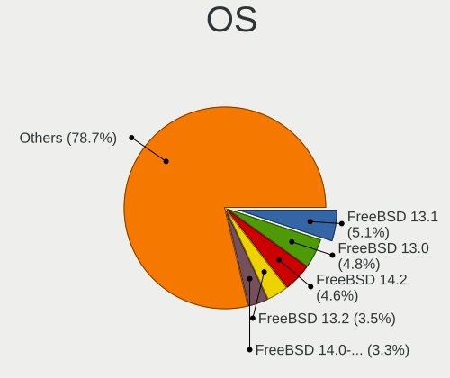

| Name                 | Computers | Percent |
|----------------------|-----------|---------|
| FreeBSD 13.1         | 236       | 5.08%   |
| FreeBSD 13.0         | 224       | 4.82%   |
| FreeBSD 14.2         | 213       | 4.58%   |
| FreeBSD 13.2         | 164       | 3.53%   |
| FreeBSD 14.0-CURRENT | 152       | 3.27%   |
| FreeBSD 12.2         | 141       | 3.03%   |
| FreeBSD 14.0         | 135       | 2.9%    |
| FreeBSD 14.1         | 120       | 2.58%   |
| FreeBSD 12.2-p2      | 96        | 2.07%   |
| FreeBSD 13.0-p4      | 85        | 1.83%   |
| FreeBSD 13.1-p5      | 83        | 1.79%   |
| FreeBSD 15.0-CURRENT | 82        | 1.76%   |
| FreeBSD 12.1-p10     | 80        | 1.72%   |
| FreeBSD 14.3         | 77        | 1.66%   |
| FreeBSD 14.0-p6      | 77        | 1.66%   |
| FreeBSD 13.0-p5      | 76        | 1.64%   |
| FreeBSD 14.2-p2      | 73        | 1.57%   |
| FreeBSD 13.0-STABLE  | 72        | 1.55%   |
| FreeBSD 13.1-p2      | 71        | 1.53%   |
| FreeBSD 12.1-p8      | 69        | 1.48%   |
| FreeBSD 13.0-CURRENT | 66        | 1.42%   |
| FreeBSD 14.1-p5      | 58        | 1.25%   |
| FreeBSD 12.1         | 58        | 1.25%   |
| FreeBSD 12.1-p5      | 55        | 1.18%   |
| FreeBSD 13.1-p7      | 53        | 1.14%   |
| FreeBSD 14.1-p6      | 52        | 1.12%   |
| FreeBSD 12.2-p3      | 52        | 1.12%   |
| FreeBSD 14.0-p4      | 51        | 1.1%    |
| FreeBSD 14.2-p3      | 49        | 1.05%   |
| FreeBSD 12.1-STABLE  | 49        | 1.05%   |
| FreeBSD 12.1-p7      | 48        | 1.03%   |
| FreeBSD 13.0-p3      | 47        | 1.01%   |
| FreeBSD 12.2-p4      | 47        | 1.01%   |
| FreeBSD 14.0-p5      | 46        | 0.99%   |
| FreeBSD 13.0-p7      | 45        | 0.97%   |
| FreeBSD 14.1-p2      | 38        | 0.82%   |
| FreeBSD 15.0         | 37        | 0.8%    |
| FreeBSD 13.0-p11     | 37        | 0.8%    |
| FreeBSD 14.3-p2      | 36        | 0.77%   |
| FreeBSD 12.2-p6      | 35        | 0.75%   |

OS Family
---------

OS without a version

| Name    | Computers | Percent |
|---------|-----------|---------|
| FreeBSD | 3751      | 100%    |

Arch
----

OS architecture (x86_64, i586, etc.)

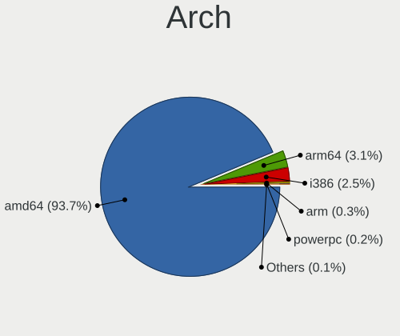

| Name    | Computers | Percent |
|---------|-----------|---------|
| amd64   | 3520      | 93.74%  |
| arm64   | 118       | 3.14%   |
| i386    | 95        | 2.53%   |
| arm     | 13        | 0.35%   |
| powerpc | 6         | 0.16%   |
| riscv   | 2         | 0.05%   |
| sparc64 | 1         | 0.03%   |

DE
--

Desktop Environment

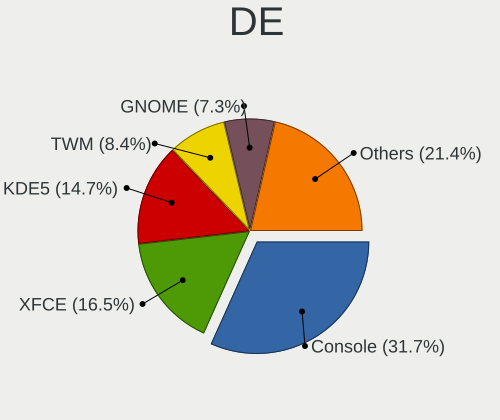

| Name          | Computers | Percent |
|---------------|-----------|---------|
| Console       | 1261      | 31.72%  |
| XFCE          | 654       | 16.45%  |
| KDE5          | 584       | 14.69%  |
| TWM           | 335       | 8.43%   |
| GNOME         | 289       | 7.27%   |
| MATE          | 203       | 5.11%   |
| i3            | 150       | 3.77%   |
| Openbox       | 89        | 2.24%   |
| LXQt          | 59        | 1.48%   |
| Cinnamon      | 35        | 0.88%   |
| AwesomeWM     | 35        | 0.88%   |
| KDE6          | 31        | 0.78%   |
| KDE           | 31        | 0.78%   |
| Fluxbox       | 31        | 0.78%   |
| Enlightenment | 25        | 0.63%   |
| LXDE          | 20        | 0.5%    |
| Lumina        | 13        | 0.33%   |
| dwm           | 13        | 0.33%   |
| X-Cinnamon    | 11        | 0.28%   |
| Picom         | 10        | 0.25%   |
| Hyprland      | 9         | 0.23%   |
| Budgie        | 7         | 0.18%   |
| Window Maker  | 6         | 0.15%   |
| IceWM         | 6         | 0.15%   |
| GNUstep       | 6         | 0.15%   |
| CDE           | 6         | 0.15%   |
| wlroots       | 5         | 0.13%   |
| xfwm          | 4         | 0.1%    |
| sway          | 4         | 0.1%    |
| spectrwm      | 4         | 0.1%    |
| WindowMaker   | 3         | 0.08%   |
| KDE4          | 3         | 0.08%   |
| Compton       | 3         | 0.08%   |
| xinitrc       | 2         | 0.05%   |
| Wayfire       | 2         | 0.05%   |
| StumpWM       | 2         | 0.05%   |
| helloDesktop  | 2         | 0.05%   |
| fvwm2         | 2         | 0.05%   |
| EXWM          | 2         | 0.05%   |
| Blackbox      | 2         | 0.05%   |

Display Server
--------------

X11 or Wayland

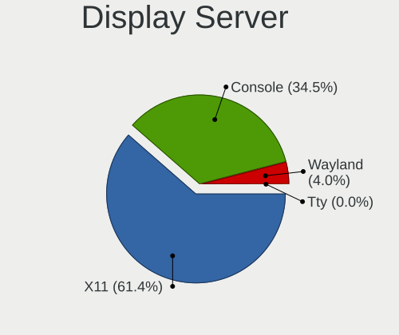

| Name    | Computers | Percent |
|---------|-----------|---------|
| X11     | 2355      | 61.44%  |
| Console | 1323      | 34.52%  |
| Wayland | 154       | 4.02%   |
| Tty     | 1         | 0.03%   |

Display Manager
---------------

SDDM, LightDM, etc.

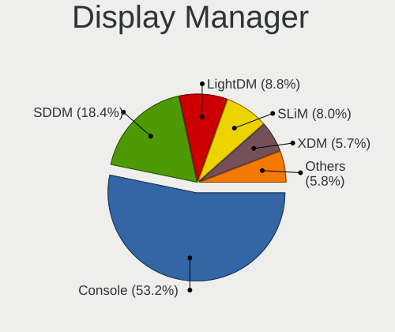

| Name    | Computers | Percent |
|---------|-----------|---------|
| Console | 2078      | 53.21%  |
| SDDM    | 720       | 18.44%  |
| LightDM | 345       | 8.83%   |
| SLiM    | 312       | 7.99%   |
| XDM     | 222       | 5.69%   |
| GDM     | 172       | 4.4%    |
| Ly      | 51        | 1.31%   |
| WDM     | 3         | 0.08%   |
| PCDM    | 2         | 0.05%   |

OS Lang
-------

Language

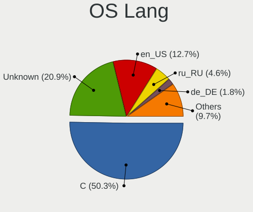

| Lang             | Computers | Percent |
|------------------|-----------|---------|
| C                | 1976      | 50.29%  |
| Unknown          | 821       | 20.9%   |
| en_US            | 499       | 12.7%   |
| ru_RU            | 179       | 4.56%   |
| de_DE            | 71        | 1.81%   |
| fr_FR            | 63        | 1.6%    |
| en_GB            | 47        | 1.2%    |
| zh_CN            | 27        | 0.69%   |
| en_CA            | 21        | 0.53%   |
| es_ES            | 19        | 0.48%   |
| pt_BR            | 18        | 0.46%   |
| en_AU            | 16        | 0.41%   |
| ja_JP            | 15        | 0.38%   |
| pl_PL            | 14        | 0.36%   |
| it_IT            | 11        | 0.28%   |
| uk_UA            | 9         | 0.23%   |
| en_IE            | 9         | 0.23%   |
| fi_FI            | 8         | 0.2%    |
| nb_NO            | 7         | 0.18%   |
| es_AR            | 6         | 0.15%   |
| en_US.ISO8859-1  | 5         | 0.13%   |
| cs_CZ            | 5         | 0.13%   |
| ru_RU.KOI8-R     | 4         | 0.1%    |
| en_NZ            | 4         | 0.1%    |
| el_GR            | 4         | 0.1%    |
| de_DE.ISO8859-1  | 4         | 0.1%    |
| de_CH            | 4         | 0.1%    |
| zh_TW            | 3         | 0.08%   |
| ko_KR            | 3         | 0.08%   |
| es_MX            | 3         | 0.08%   |
| en_US.US-ASCII   | 3         | 0.08%   |
| sv_SE            | 2         | 0.05%   |
| ru               | 2         | 0.05%   |
| pt_PT            | 2         | 0.05%   |
| nl_NL            | 2         | 0.05%   |
| it_IT.ISO8859-15 | 2         | 0.05%   |
| en_SG            | 2         | 0.05%   |
| en_GB.US-ASCII   | 2         | 0.05%   |
| en_GB.ISO8859-1  | 2         | 0.05%   |
| de_DE.ISO8859-15 | 2         | 0.05%   |

Boot Mode
---------

EFI or BIOS

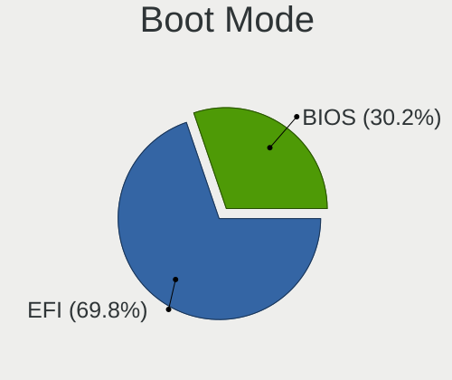

| Mode | Computers | Percent |
|------|-----------|---------|
| EFI  | 2646      | 69.78%  |
| BIOS | 1146      | 30.22%  |

Filesystem
----------

Type of filesystem

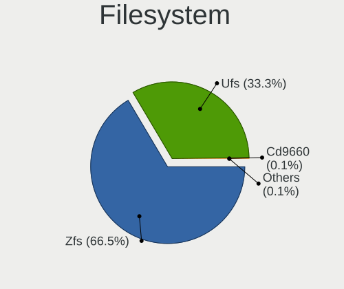

| Type    | Computers | Percent |
|---------|-----------|---------|
| Zfs     | 2535      | 66.48%  |
| Ufs     | 1270      | 33.31%  |
| Nfs     | 2         | 0.05%   |
| Cd9660  | 2         | 0.05%   |
| Xfs     | 1         | 0.03%   |
| Nullfs  | 1         | 0.03%   |
| Msdosfs | 1         | 0.03%   |
| Unknown | 1         | 0.03%   |

Part. scheme
------------

Scheme of partitioning

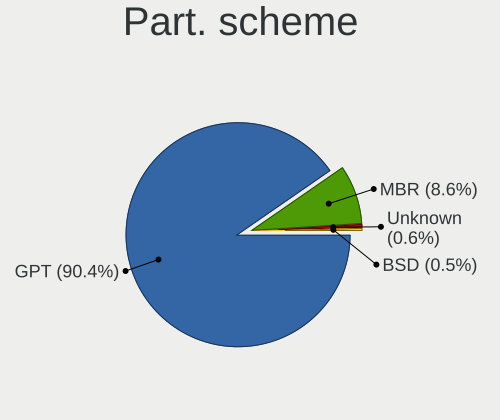

| Type    | Computers | Percent |
|---------|-----------|---------|
| GPT     | 3406      | 90.37%  |
| MBR     | 325       | 8.62%   |
| Unknown | 21        | 0.56%   |
| BSD     | 17        | 0.45%   |

Board
-----

Vendor
------

Motherboard manufacturer

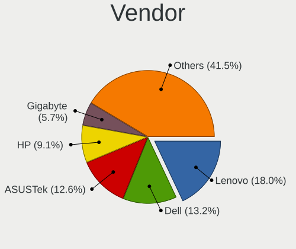

| Name                                 | Computers | Percent |
|--------------------------------------|-----------|---------|
| Lenovo                               | 674       | 17.97%  |
| Dell                                 | 494       | 13.17%  |
| ASUSTek Computer                     | 472       | 12.58%  |
| Hewlett-Packard                      | 342       | 9.12%   |
| Gigabyte Technology                  | 214       | 5.71%   |
| MSI                                  | 159       | 4.24%   |
| ASRock                               | 152       | 4.05%   |
| Unknown                              | 138       | 3.68%   |
| Supermicro                           | 125       | 3.33%   |
| Intel                                | 119       | 3.17%   |
| Apple                                | 102       | 2.72%   |
| Acer                                 | 102       | 2.72%   |
| Fujitsu                              | 45        | 1.2%    |
| Raspberry Pi Foundation              | 42        | 1.12%   |
| Toshiba                              | 29        | 0.77%   |
| Samsung Electronics                  | 25        | 0.67%   |
| Google                               | 23        | 0.61%   |
| ASRockRack                           | 23        | 0.61%   |
| IBM                                  | 20        | 0.53%   |
| Framework                            | 20        | 0.53%   |
| HUAWEI                               | 19        | 0.51%   |
| PC Engines                           | 18        | 0.48%   |
| AZW                                  | 18        | 0.48%   |
| System76                             | 17        | 0.45%   |
| Sony                                 | 17        | 0.45%   |
| Alienware                            | 13        | 0.35%   |
| TUXEDO                               | 11        | 0.29%   |
| Shenzhen Meigao Electronic Equipment | 11        | 0.29%   |
| Biostar                              | 11        | 0.29%   |
| Panasonic                            | 10        | 0.27%   |
| HPE                                  | 9         | 0.24%   |
| Shuttle                              | 8         | 0.21%   |
| Notebook                             | 8         | 0.21%   |
| AMI                                  | 8         | 0.21%   |
| Foxconn                              | 7         | 0.19%   |
| Sun Microsystems                     | 6         | 0.16%   |
| LG Electronics                       | 6         | 0.16%   |
| Gateway                              | 6         | 0.16%   |
| Deciso                               | 6         | 0.16%   |
| Wistron                              | 5         | 0.13%   |

Model
-----

Motherboard model

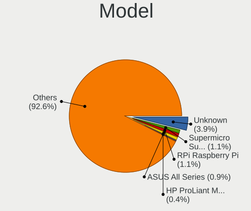

| Name                                              | Computers | Percent |
|---------------------------------------------------|-----------|---------|
| Unknown                                           | 147       | 3.92%   |
| Supermicro Super Server                           | 41        | 1.09%   |
| RPi Raspberry Pi                                  | 41        | 1.09%   |
| ASUS All Series                                   | 35        | 0.93%   |
| HP ProLiant MicroServer Gen8                      | 14        | 0.37%   |
| Dell OEM-R 720xd                                  | 14        | 0.37%   |
| MSI MS-7B89                                       | 11        | 0.29%   |
| PC Engines APU2                                   | 10        | 0.27%   |
| Shenzhen Meigao Electronic Equipment Venus series | 9         | 0.24%   |
| Intel Nobilis                                     | 9         | 0.24%   |
| Dell PowerEdge R710                               | 9         | 0.24%   |
| ASUS TUF Gaming X570-PLUS                         | 9         | 0.24%   |
| HP ProLiant MicroServer                           | 8         | 0.21%   |
| Dell OptiPlex 9020                                | 8         | 0.21%   |
| AZW SER                                           | 8         | 0.21%   |
| HP EliteBook 840 G3                               | 7         | 0.19%   |
| Framework Laptop                                  | 7         | 0.19%   |
| MSI MS-7B86                                       | 6         | 0.16%   |
| Gigabyte B450M DS3H                               | 6         | 0.16%   |
| Dell PowerEdge R610                               | 6         | 0.16%   |
| ASRock Z590 Pro4                                  | 6         | 0.16%   |
| Apple MacBookAir6,2                               | 6         | 0.16%   |
| System76 Lemur Pro                                | 5         | 0.13%   |
| MSI MS-7C02                                       | 5         | 0.13%   |
| MSI MS-7A38                                       | 5         | 0.13%   |
| MSI MS-7817                                       | 5         | 0.13%   |
| HP Z620 Workstation                               | 5         | 0.13%   |
| HP Z440 Workstation                               | 5         | 0.13%   |
| HP Z420 Workstation                               | 5         | 0.13%   |
| Gigabyte B360N WIFI                               | 5         | 0.13%   |
| Fujitsu D3401-H2 S26361-D3401-H2                  | 5         | 0.13%   |
| Framework Laptop (13th Gen Intel Core)            | 5         | 0.13%   |
| Dell XPS 13 9360                                  | 5         | 0.13%   |
| Dell PowerEdge R730xd                             | 5         | 0.13%   |
| Dell PowerEdge R720                               | 5         | 0.13%   |
| Dell OptiPlex 7050                                | 5         | 0.13%   |
| Dell OptiPlex 7040                                | 5         | 0.13%   |
| Dell OptiPlex 3010                                | 5         | 0.13%   |
| Dell Latitude E7240                               | 5         | 0.13%   |
| Dell Latitude E6430                               | 5         | 0.13%   |

Model Family
------------

Motherboard model prefix

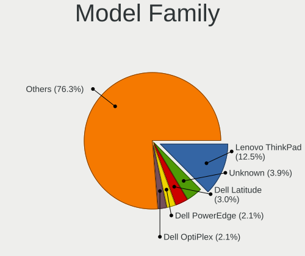

| Name                | Computers | Percent |
|---------------------|-----------|---------|
| Lenovo ThinkPad     | 470       | 12.53%  |
| Unknown             | 147       | 3.92%   |
| Dell Latitude       | 114       | 3.04%   |
| Dell PowerEdge      | 80        | 2.13%   |
| Dell OptiPlex       | 79        | 2.11%   |
| Dell Inspiron       | 71        | 1.89%   |
| ASUS PRIME          | 71        | 1.89%   |
| Lenovo IdeaPad      | 62        | 1.65%   |
| Acer Aspire         | 62        | 1.65%   |
| Dell Precision      | 56        | 1.49%   |
| HP ProLiant         | 54        | 1.44%   |
| ASUS TUF            | 43        | 1.15%   |
| ASUS ROG            | 43        | 1.15%   |
| Supermicro Super    | 41        | 1.09%   |
| RPi Raspberry       | 41        | 1.09%   |
| HP EliteBook        | 39        | 1.04%   |
| Lenovo ThinkCentre  | 36        | 0.96%   |
| HP Compaq           | 35        | 0.93%   |
| ASUS All            | 35        | 0.93%   |
| HP ProBook          | 33        | 0.88%   |
| Dell XPS            | 31        | 0.83%   |
| HP Laptop           | 29        | 0.77%   |
| Toshiba Satellite   | 21        | 0.56%   |
| Framework Laptop    | 20        | 0.53%   |
| HP Pavilion         | 19        | 0.51%   |
| Dell Vostro         | 19        | 0.51%   |
| ASUS VivoBook       | 19        | 0.51%   |
| Lenovo Legion       | 18        | 0.48%   |
| HP EliteDesk        | 18        | 0.48%   |
| Lenovo ThinkBook    | 16        | 0.43%   |
| ASRock X570         | 15        | 0.4%    |
| Dell OEM-R          | 14        | 0.37%   |
| ASUS ASUS           | 14        | 0.37%   |
| IBM System          | 12        | 0.32%   |
| HP ProDesk          | 12        | 0.32%   |
| Gigabyte B450M      | 12        | 0.32%   |
| MSI MS-7B89         | 11        | 0.29%   |
| Lenovo ThinkStation | 11        | 0.29%   |
| HP ENVY             | 11        | 0.29%   |
| Gigabyte X570       | 11        | 0.29%   |

MFG Year
--------

Motherboard manufacture year

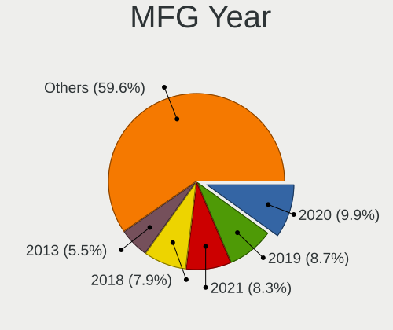

| Year    | Computers | Percent |
|---------|-----------|---------|
| 2020    | 372       | 9.92%   |
| 2019    | 326       | 8.69%   |
| 2021    | 312       | 8.32%   |
| 2018    | 298       | 7.94%   |
| 2013    | 207       | 5.52%   |
| 2022    | 203       | 5.41%   |
| 2011    | 203       | 5.41%   |
| 2023    | 198       | 5.28%   |
| 2012    | 196       | 5.23%   |
| 2014    | 183       | 4.88%   |
| 2017    | 182       | 4.85%   |
| 2015    | 179       | 4.77%   |
| 2016    | 178       | 4.75%   |
| 2024    | 136       | 3.63%   |
| 2010    | 130       | 3.47%   |
| Unknown | 125       | 3.33%   |
| 2009    | 100       | 2.67%   |
| 2008    | 89        | 2.37%   |
| 2007    | 44        | 1.17%   |
| 2025    | 43        | 1.15%   |
| 2006    | 20        | 0.53%   |
| 2005    | 9         | 0.24%   |
| 2004    | 7         | 0.19%   |
| 2003    | 5         | 0.13%   |
| 2002    | 4         | 0.11%   |
| 2001    | 2         | 0.05%   |

Form Factor
-----------

Physical design of the computer

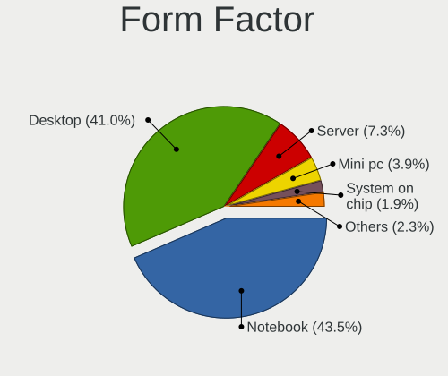

| Name           | Computers | Percent |
|----------------|-----------|---------|
| Notebook       | 1632      | 43.51%  |
| Desktop        | 1537      | 40.98%  |
| Server         | 275       | 7.33%   |
| Mini pc        | 148       | 3.95%   |
| System on chip | 71        | 1.89%   |
| Convertible    | 46        | 1.23%   |
| All in one     | 32        | 0.85%   |
| Tablet         | 9         | 0.24%   |
| Firewall       | 1         | 0.03%   |

Coreboot
--------

Have coreboot on board

| Used | Computers | Percent |
|------|-----------|---------|
| No   | 3685      | 98.24%  |
| Yes  | 66        | 1.76%   |

RAM Size
--------

Total RAM memory

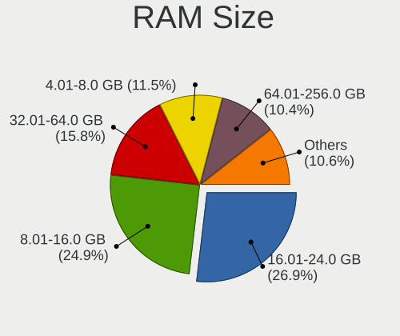

| Size in GB      | Computers | Percent |
|-----------------|-----------|---------|
| 16.01-24.0      | 1025      | 26.86%  |
| 8.01-16.0       | 951       | 24.92%  |
| 32.01-64.0      | 603       | 15.8%   |
| 4.01-8.0        | 437       | 11.45%  |
| 64.01-256.0     | 395       | 10.35%  |
| 2.01-3.0        | 110       | 2.88%   |
| 24.01-32.0      | 80        | 2.1%    |
| 3.01-4.0        | 69        | 1.81%   |
| 0.51-1.0        | 65        | 1.7%    |
| More than 256.0 | 40        | 1.05%   |
| 1.01-2.0        | 20        | 0.52%   |
| 0.01-0.5        | 20        | 0.52%   |
| Unknown         | 1         | 0.03%   |

RAM Used
--------

Used RAM memory

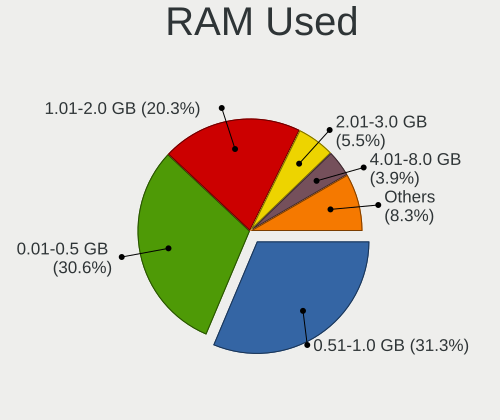

| Used GB         | Computers | Percent |
|-----------------|-----------|---------|
| 0.51-1.0        | 1217      | 31.35%  |
| 0.01-0.5        | 1189      | 30.63%  |
| 1.01-2.0        | 788       | 20.3%   |
| 2.01-3.0        | 214       | 5.51%   |
| 4.01-8.0        | 150       | 3.86%   |
| 3.01-4.0        | 113       | 2.91%   |
| 8.01-16.0       | 62        | 1.6%    |
| 0               | 41        | 1.06%   |
| 24.01-32.0      | 32        | 0.82%   |
| 16.01-24.0      | 27        | 0.7%    |
| 32.01-64.0      | 25        | 0.64%   |
| 64.01-256.0     | 22        | 0.57%   |
| More than 256.0 | 1         | 0.03%   |
| Unknown         | 1         | 0.03%   |

Total Drives
------------

Number of drives on board

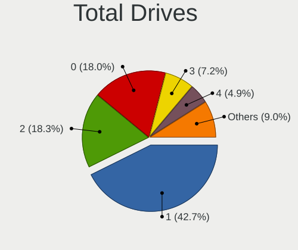

| Drives | Computers | Percent |
|--------|-----------|---------|
| 1      | 1686      | 42.66%  |
| 2      | 725       | 18.35%  |
| 0      | 711       | 17.99%  |
| 3      | 283       | 7.16%   |
| 4      | 192       | 4.86%   |
| 5      | 109       | 2.76%   |
| 6      | 75        | 1.9%    |
| 7      | 41        | 1.04%   |
| 8      | 26        | 0.66%   |
| 10     | 19        | 0.48%   |
| 12     | 14        | 0.35%   |
| 14     | 13        | 0.33%   |
| 9      | 13        | 0.33%   |
| 11     | 11        | 0.28%   |
| 16     | 5         | 0.13%   |
| 18     | 4         | 0.1%    |
| 17     | 4         | 0.1%    |
| 58     | 2         | 0.05%   |
| 25     | 2         | 0.05%   |
| 24     | 2         | 0.05%   |
| 23     | 2         | 0.05%   |
| 15     | 2         | 0.05%   |
| 13     | 2         | 0.05%   |
| 63     | 1         | 0.03%   |
| 47     | 1         | 0.03%   |
| 40     | 1         | 0.03%   |
| 36     | 1         | 0.03%   |
| 30     | 1         | 0.03%   |
| 28     | 1         | 0.03%   |
| 26     | 1         | 0.03%   |
| 21     | 1         | 0.03%   |
| 19     | 1         | 0.03%   |

Has CD-ROM
----------

Has CD-ROM on board

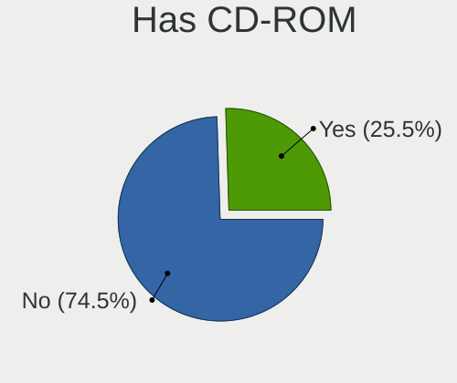

| Presented | Computers | Percent |
|-----------|-----------|---------|
| No        | 2816      | 74.5%   |
| Yes       | 964       | 25.5%   |

Has Ethernet
------------

Has Ethernet on board

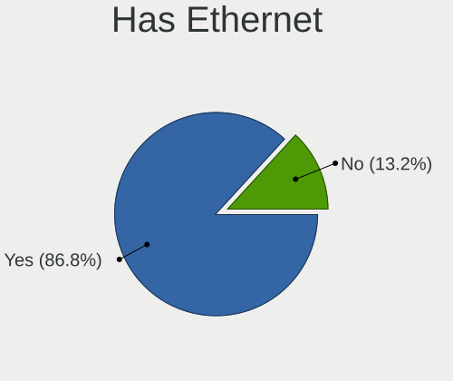

| Presented | Computers | Percent |
|-----------|-----------|---------|
| Yes       | 3258      | 86.83%  |
| No        | 494       | 13.17%  |

Has WiFi
--------

Has WiFi module

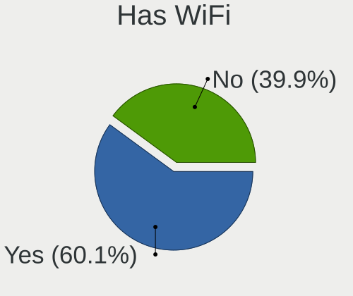

| Presented | Computers | Percent |
|-----------|-----------|---------|
| Yes       | 2272      | 60.09%  |
| No        | 1509      | 39.91%  |

Has Bluetooth
-------------

Has Bluetooth module

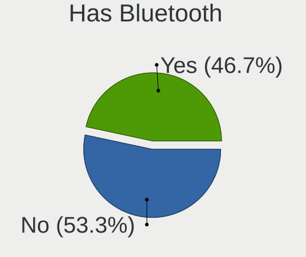

| Presented | Computers | Percent |
|-----------|-----------|---------|
| No        | 2024      | 53.35%  |
| Yes       | 1770      | 46.65%  |

Location
--------

Country
-------

Geographic location (country)

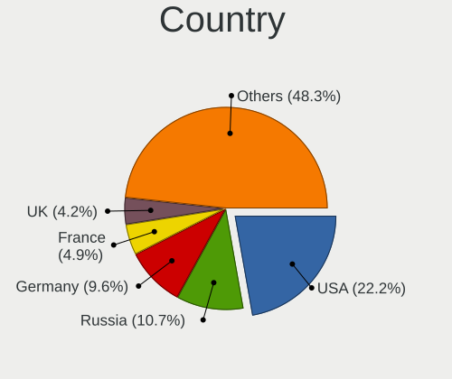

| Country     | Computers | Percent |
|-------------|-----------|---------|
| USA         | 843       | 22.23%  |
| Russia      | 407       | 10.73%  |
| Germany     | 363       | 9.57%   |
| France      | 187       | 4.93%   |
| UK          | 161       | 4.25%   |
| Canada      | 147       | 3.88%   |
| Poland      | 120       | 3.16%   |
| Australia   | 93        | 2.45%   |
| Brazil      | 88        | 2.32%   |
| China       | 86        | 2.27%   |
| Netherlands | 77        | 2.03%   |
| Spain       | 73        | 1.93%   |
| Czechia     | 60        | 1.58%   |
| Switzerland | 58        | 1.53%   |
| Italy       | 55        | 1.45%   |
| Japan       | 54        | 1.42%   |
| Sweden      | 53        | 1.4%    |
| Austria     | 51        | 1.34%   |
| Ukraine     | 49        | 1.29%   |
| India       | 42        | 1.11%   |
| Indonesia   | 41        | 1.08%   |
| Romania     | 39        | 1.03%   |
| Finland     | 36        | 0.95%   |
| Mexico      | 33        | 0.87%   |
| Norway      | 30        | 0.79%   |
| Hungary     | 29        | 0.76%   |
| Argentina   | 28        | 0.74%   |
| Ireland     | 27        | 0.71%   |
| Bulgaria    | 26        | 0.69%   |
| Greece      | 21        | 0.55%   |
| Belgium     | 20        | 0.53%   |
| Portugal    | 18        | 0.47%   |
| Denmark     | 18        | 0.47%   |
| Turkey      | 17        | 0.45%   |
| Thailand    | 17        | 0.45%   |
| New Zealand | 17        | 0.45%   |
| Vietnam     | 15        | 0.4%    |
| Taiwan      | 14        | 0.37%   |
| Croatia     | 14        | 0.37%   |
| Venezuela   | 11        | 0.29%   |

City
----

Geographic location (city)

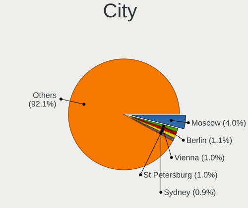

| City          | Computers | Percent |
|---------------|-----------|---------|
| Moscow        | 164       | 4.02%   |
| Berlin        | 44        | 1.08%   |
| Vienna        | 39        | 0.96%   |
| St Petersburg | 39        | 0.96%   |
| Sydney        | 37        | 0.91%   |
| Paris         | 33        | 0.81%   |
| Brooklyn      | 28        | 0.69%   |
| Amsterdam     | 25        | 0.61%   |
| Kyiv          | 23        | 0.56%   |
| Seattle       | 22        | 0.54%   |
| Montreal      | 21        | 0.52%   |
| London        | 21        | 0.52%   |
| Helsinki      | 21        | 0.52%   |
| Zurich        | 20        | 0.49%   |
| Warsaw        | 20        | 0.49%   |
| Prague        | 20        | 0.49%   |
| Gdynia        | 20        | 0.49%   |
| Yekaterinburg | 19        | 0.47%   |
| Melbourne     | 18        | 0.44%   |
| Ludwigsburg   | 18        | 0.44%   |
| Krasnodar     | 18        | 0.44%   |
| Chicago       | 18        | 0.44%   |
| Grand Rapids  | 17        | 0.42%   |
| Budapest      | 17        | 0.42%   |
| Dublin        | 16        | 0.39%   |
| Portland      | 15        | 0.37%   |
| New York      | 15        | 0.37%   |
| Jakarta       | 15        | 0.37%   |
| Stockholm     | 14        | 0.34%   |
| Madrid        | 14        | 0.34%   |
| Los Angeles   | 14        | 0.34%   |
| Perth         | 13        | 0.32%   |
| Munich        | 13        | 0.32%   |
| Tuklaty       | 12        | 0.29%   |
| Sofia         | 12        | 0.29%   |
| Oslo          | 12        | 0.29%   |
| Novosibirsk   | 12        | 0.29%   |
| Hamburg       | 12        | 0.29%   |
| Bucharest     | 12        | 0.29%   |
| Vancouver     | 11        | 0.27%   |

Drives
------

Drive Vendor
------------

Hard drive vendors

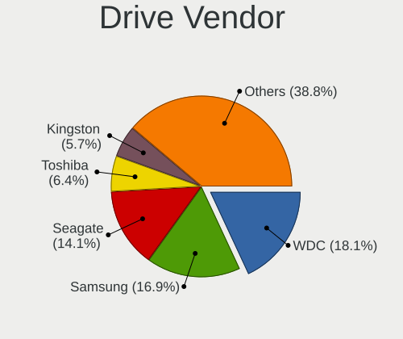

| Vendor              | Computers | Drives | Percent |
|---------------------|-----------|--------|---------|
| WDC                 | 851       | 2541   | 18.05%  |
| Samsung Electronics | 796       | 1695   | 16.89%  |
| Seagate             | 667       | 1802   | 14.15%  |
| Toshiba             | 302       | 636    | 6.41%   |
| Kingston            | 267       | 365    | 5.66%   |
| Crucial             | 265       | 435    | 5.62%   |
| Intel               | 179       | 346    | 3.8%    |
| Hitachi             | 149       | 373    | 3.16%   |
| SanDisk             | 148       | 209    | 3.14%   |
| HGST                | 118       | 469    | 2.5%    |
| A-DATA Technology   | 79        | 97     | 1.68%   |
| SK hynix            | 69        | 94     | 1.46%   |
| Micron Technology   | 62        | 102    | 1.32%   |
| Transcend           | 54        | 73     | 1.15%   |
| Hewlett-Packard     | 45        | 214    | 0.95%   |
| Apple               | 44        | 48     | 0.93%   |
| SPCC                | 35        | 66     | 0.74%   |
| PNY                 | 31        | 46     | 0.66%   |
| Phison              | 25        | 36     | 0.53%   |
| Gigabyte Technology | 21        | 30     | 0.45%   |
| Corsair             | 20        | 54     | 0.42%   |
| China               | 20        | 30     | 0.42%   |
| OCZ                 | 19        | 23     | 0.4%    |
| KIOXIA              | 19        | 19     | 0.4%    |
| LITEON              | 17        | 25     | 0.36%   |
| Apacer              | 17        | 21     | 0.36%   |
| KingSpec            | 16        | 23     | 0.34%   |
| Fujitsu             | 16        | 23     | 0.34%   |
| Patriot             | 15        | 21     | 0.32%   |
| Intenso             | 13        | 17     | 0.28%   |
| Silicon Motion      | 12        | 14     | 0.25%   |
| Goodram             | 12        | 26     | 0.25%   |
| OWC                 | 11        | 22     | 0.23%   |
| Maxtor              | 11        | 15     | 0.23%   |
| FORESEE             | 11        | 11     | 0.23%   |
| Netac               | 10        | 10     | 0.21%   |
| Team                | 9         | 12     | 0.19%   |
| Plextor             | 9         | 15     | 0.19%   |
| Mushkin             | 9         | 11     | 0.19%   |
| Lexar               | 9         | 22     | 0.19%   |

Drive Model
-----------

Hard drive models

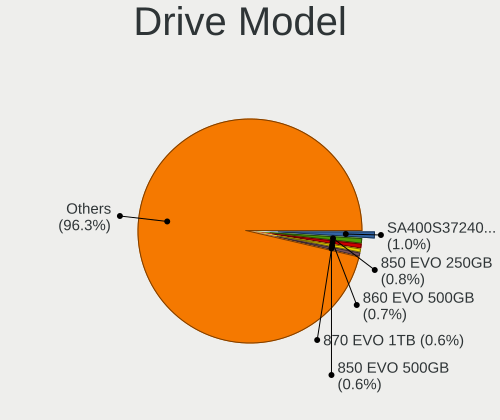

| Model                              | Computers | Percent |
|------------------------------------|-----------|---------|
| Kingston SA400S37240G 240GB        | 56        | 1.01%   |
| Samsung SSD 850 EVO 250GB          | 44        | 0.79%   |
| Samsung SSD 860 EVO 500GB          | 39        | 0.7%    |
| Samsung SSD 870 EVO 1TB            | 32        | 0.58%   |
| Samsung SSD 850 EVO 500GB          | 32        | 0.58%   |
| Crucial CT500MX500SSD1 500GB       | 32        | 0.58%   |
| Kingston SA400S37480G 480GB        | 31        | 0.56%   |
| WDC WD10EZEX-08WN4A0 1TB           | 29        | 0.52%   |
| Seagate ST1000DM010-2EP102 1TB     | 29        | 0.52%   |
| Samsung SSD 970 EVO Plus 1TB       | 29        | 0.52%   |
| Kingston SA400S37120G 120GB        | 29        | 0.52%   |
| Crucial CT1000MX500SSD1 1TB        | 29        | 0.52%   |
| Seagate ST1000LM024 HN-M101MBB 1TB | 28        | 0.5%    |
| Seagate ST2000DM008-2FR102 2TB     | 27        | 0.49%   |
| WDC WD40EFRX-68N32N0 4TB           | 26        | 0.47%   |
| Samsung SSD 860 EVO 250GB          | 26        | 0.47%   |
| Crucial CT240BX500SSD1 240GB       | 26        | 0.47%   |
| WDC WD30EFRX-68EUZN0 3TB           | 25        | 0.45%   |
| Toshiba DT01ACA100 1TB             | 23        | 0.41%   |
| Samsung SSD 860 EVO 1TB            | 23        | 0.41%   |
| Toshiba MQ01ABD100 1TB             | 22        | 0.4%    |
| Seagate ST1000LM035-1RK172 1TB     | 21        | 0.38%   |
| Samsung SSD 870 EVO 500GB          | 21        | 0.38%   |
| Crucial CT250MX500SSD1 250GB       | 21        | 0.38%   |
| HGST HTS721010A9E630 1TB           | 20        | 0.36%   |
| Toshiba MQ01ABF050 500GB           | 19        | 0.34%   |
| Seagate ST4000DM004-2CV104 4TB     | 19        | 0.34%   |
| Samsung SSD 970 EVO Plus 500GB     | 19        | 0.34%   |
| WDC WD20EFRX-68EUZN0 1TB           | 18        | 0.32%   |
| Kingston SV300S37A120G 120GB       | 18        | 0.32%   |
| WDC WD800JD-75MSA3 80GB            | 17        | 0.31%   |
| Seagate ST1000DM003-1CH162 1TB     | 17        | 0.31%   |
| Crucial CT2000MX500SSD1 2TB        | 17        | 0.31%   |
| WDC WD40EFRX-68WT0N0 4TB           | 16        | 0.29%   |
| Seagate ST4000DM000-1F2168 4TB     | 16        | 0.29%   |
| Samsung SSD 850 EVO 1TB            | 16        | 0.29%   |
| Seagate ST500DM002-1BD142 500GB    | 15        | 0.27%   |
| Samsung SSD 850 PRO 256GB          | 15        | 0.27%   |
| WDC WDS500G2B0A-00SM50 500GB       | 14        | 0.25%   |
| Seagate ST8000DM004-2CX188 8TB     | 14        | 0.25%   |

HDD Vendor
----------

Hard disk drive vendors

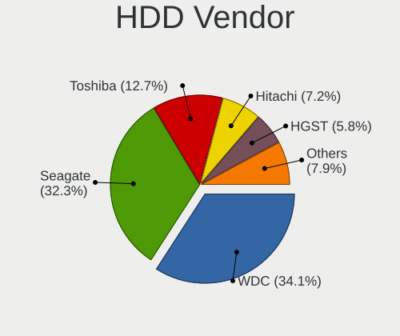

| Vendor               | Computers | Drives | Percent |
|----------------------|-----------|--------|---------|
| WDC                  | 693       | 2203   | 34.14%  |
| Seagate              | 655       | 1780   | 32.27%  |
| Toshiba              | 258       | 567    | 12.71%  |
| Hitachi              | 146       | 359    | 7.19%   |
| HGST                 | 118       | 465    | 5.81%   |
| Samsung Electronics  | 65        | 106    | 3.2%    |
| Hewlett-Packard      | 23        | 169    | 1.13%   |
| Fujitsu              | 16        | 23     | 0.79%   |
| Apple                | 14        | 15     | 0.69%   |
| Maxtor               | 11        | 15     | 0.54%   |
| HPE                  | 6         | 28     | 0.3%    |
| LSI                  | 3         | 6      | 0.15%   |
| SYNOLOGY             | 2         | 4      | 0.1%    |
| IBM/Hitachi          | 2         | 2      | 0.1%    |
| IBM                  | 2         | 2      | 0.1%    |
| HPT                  | 2         | 9      | 0.1%    |
| Dell                 | 2         | 5      | 0.1%    |
| Areca                | 2         | 3      | 0.1%    |
| Adaptec              | 2         | 12     | 0.1%    |
| Western              | 1         | 3      | 0.05%   |
| WD MediaMax          | 1         | 5      | 0.05%   |
| QUANTUM              | 1         | 2      | 0.05%   |
| NETAPP               | 1         | 2      | 0.05%   |
| MaxDigital           | 1         | 1      | 0.05%   |
| IBM-ESXS             | 1         | 12     | 0.05%   |
| ExcelStor Technology | 1         | 4      | 0.05%   |
| ASMedia              | 1         | 1      | 0.05%   |

SSD Vendor
----------

Solid state drive vendors

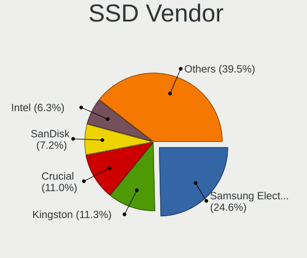

| Vendor              | Computers | Drives | Percent |
|---------------------|-----------|--------|---------|
| Samsung Electronics | 500       | 1163   | 24.63%  |
| Kingston            | 229       | 314    | 11.28%  |
| Crucial             | 224       | 365    | 11.03%  |
| SanDisk             | 147       | 208    | 7.24%   |
| Intel               | 128       | 281    | 6.31%   |
| WDC                 | 108       | 188    | 5.32%   |
| A-DATA Technology   | 58        | 72     | 2.86%   |
| Transcend           | 49        | 66     | 2.41%   |
| Micron Technology   | 42        | 72     | 2.07%   |
| SK hynix            | 34        | 45     | 1.67%   |
| Apple               | 31        | 33     | 1.53%   |
| SPCC                | 29        | 57     | 1.43%   |
| PNY                 | 26        | 40     | 1.28%   |
| Toshiba             | 24        | 30     | 1.18%   |
| Hewlett-Packard     | 22        | 37     | 1.08%   |
| China               | 20        | 30     | 0.99%   |
| OCZ                 | 19        | 23     | 0.94%   |
| Apacer              | 17        | 21     | 0.84%   |
| LITEON              | 16        | 24     | 0.79%   |
| KingSpec            | 16        | 22     | 0.79%   |
| Gigabyte Technology | 16        | 23     | 0.79%   |
| Patriot             | 15        | 21     | 0.74%   |
| Corsair             | 14        | 22     | 0.69%   |
| Intenso             | 13        | 17     | 0.64%   |
| Seagate             | 11        | 15     | 0.54%   |
| OWC                 | 11        | 22     | 0.54%   |
| GOODRAM             | 9         | 22     | 0.44%   |
| Team                | 8         | 11     | 0.39%   |
| MidasForce          | 8         | 10     | 0.39%   |
| Verbatim            | 7         | 7      | 0.34%   |
| Plextor             | 7         | 10     | 0.34%   |
| Mushkin             | 7         | 8      | 0.34%   |
| Lexar               | 7         | 16     | 0.34%   |
| Netac               | 6         | 6      | 0.3%    |
| LITEONIT            | 6         | 6      | 0.3%    |
| Supermicro          | 5         | 6      | 0.25%   |
| Lenovo              | 5         | 6      | 0.25%   |
| FORESEE             | 5         | 5      | 0.25%   |
| Fanxiang            | 5         | 8      | 0.25%   |
| SATADOM             | 4         | 6      | 0.2%    |

Drive Kind
----------

HDD or SSD

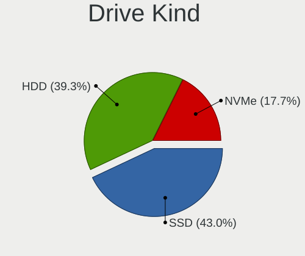

| Kind | Computers | Drives | Percent |
|------|-----------|--------|---------|
| SSD  | 1741      | 3516   | 43.01%  |
| HDD  | 1591      | 5803   | 39.3%   |
| NVMe | 716       | 1136   | 17.69%  |

Drive Connector
---------------

SATA, SAS, NVMe, etc.

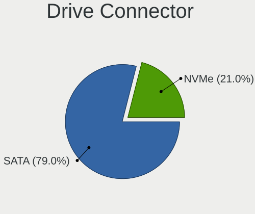

| Type | Computers | Drives | Percent |
|------|-----------|--------|---------|
| SATA | 2688      | 9319   | 78.97%  |
| NVMe | 716       | 1136   | 21.03%  |

Drive Size
----------

Size of hard drive

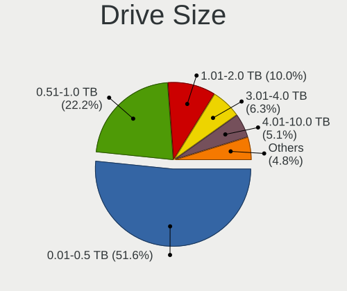

| Size in TB | Computers | Drives | Percent |
|------------|-----------|--------|---------|
| 0.01-0.5   | 1927      | 3688   | 51.62%  |
| 0.51-1.0   | 829       | 1650   | 22.21%  |
| 1.01-2.0   | 373       | 1052   | 9.99%   |
| 3.01-4.0   | 236       | 1093   | 6.32%   |
| 4.01-10.0  | 189       | 1048   | 5.06%   |
| 2.01-3.0   | 102       | 379    | 2.73%   |
| 10.01-20.0 | 70        | 343    | 1.88%   |
| 20.01-50.0 | 7         | 66     | 0.19%   |

Space Total
-----------

Amount of disk space available on the file system

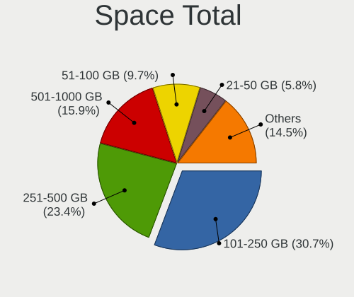

| Size in GB     | Computers | Percent |
|----------------|-----------|---------|
| 101-250        | 1214      | 30.73%  |
| 251-500        | 924       | 23.39%  |
| 501-1000       | 629       | 15.92%  |
| 51-100         | 383       | 9.69%   |
| 21-50          | 230       | 5.82%   |
| 1001-2000      | 224       | 5.67%   |
| 1-20           | 161       | 4.07%   |
| More than 3000 | 107       | 2.71%   |
| 2001-3000      | 40        | 1.01%   |
| Unknown        | 39        | 0.99%   |

Space Used
----------

Amount of used disk space

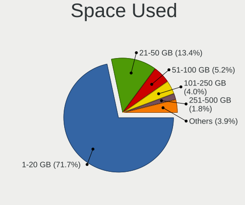

| Used GB        | Computers | Percent |
|----------------|-----------|---------|
| 1-20           | 2822      | 71.68%  |
| 21-50          | 529       | 13.44%  |
| 51-100         | 203       | 5.16%   |
| 101-250        | 158       | 4.01%   |
| 251-500        | 71        | 1.8%    |
| 501-1000       | 49        | 1.24%   |
| Unknown        | 39        | 0.99%   |
| More than 3000 | 28        | 0.71%   |
| 1001-2000      | 23        | 0.58%   |
| 2001-3000      | 13        | 0.33%   |
| 0              | 2         | 0.05%   |

Malfunc. Drives
---------------

Drive models with a malfunction

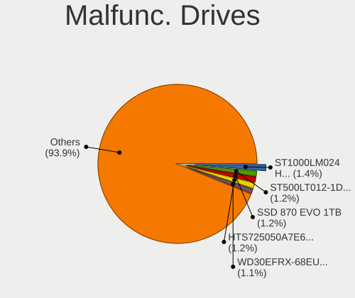

| Model                               | Computers | Drives | Percent |
|-------------------------------------|-----------|--------|---------|
| Seagate ST1000LM024 HN-M101MBB 1TB  | 10        | 11     | 1.37%   |
| Seagate ST500LT012-1DG142 500GB     | 9         | 10     | 1.23%   |
| Samsung Electronics SSD 870 EVO 1TB | 9         | 12     | 1.23%   |
| HGST HTS725050A7E630 500GB          | 9         | 23     | 1.23%   |
| WDC WD30EFRX-68EUZN0 3TB            | 8         | 25     | 1.09%   |
| WDC WD40EFRX-68WT0N0 4TB            | 7         | 17     | 0.96%   |
| Seagate ST500LT012-9WS142 500GB     | 7         | 10     | 0.96%   |
| Seagate ST500LM021-1KJ152 500GB     | 7         | 11     | 0.96%   |
| WDC WD20EFRX-68EUZN0 1TB            | 6         | 14     | 0.82%   |
| Toshiba MQ01ABD100 1TB              | 6         | 6      | 0.82%   |
| Seagate ST9250315AS 250GB           | 6         | 7      | 0.82%   |
| Seagate ST3500413AS 500GB           | 6         | 9      | 0.82%   |
| Kingston SV300S37A120G 120GB        | 6         | 8      | 0.82%   |
| Seagate ST320LT007-9ZV142 320GB     | 5         | 5      | 0.68%   |
| HGST HTS721010A9E630 1TB            | 5         | 28     | 0.68%   |
| Crucial CT525MX300SSD1 528GB        | 5         | 5      | 0.68%   |
| WDC WD5000AAKX-60U6AA0 500GB        | 4         | 5      | 0.55%   |
| Toshiba MQ01ABF050 500GB            | 4         | 4      | 0.55%   |
| Seagate ST9500420AS 500GB           | 4         | 7      | 0.55%   |
| Seagate ST9500325AS 500GB           | 4         | 7      | 0.55%   |
| Seagate ST2000DM001-9YN164 2TB      | 4         | 4      | 0.55%   |
| Seagate ST1000DM003-1CH162 1TB      | 4         | 5      | 0.55%   |
| Samsung Electronics HD501LJ 500GB   | 4         | 6      | 0.55%   |
| Hitachi HTS547550A9E384 500GB       | 4         | 5      | 0.55%   |
| WDC WDS240G2G0A-00JH30 240GB        | 3         | 3      | 0.41%   |
| WDC WD5000AAKX-75U6AA0 500GB        | 3         | 4      | 0.41%   |
| WDC WD2000FYYZ-01UL1B2 2TB          | 3         | 9      | 0.41%   |
| WDC WD2000FYYZ-01UL1B1 2TB          | 3         | 6      | 0.41%   |
| Toshiba MK3265GSX 320GB             | 3         | 3      | 0.41%   |
| Seagate ST9250827AS 250GB           | 3         | 4      | 0.41%   |
| Seagate ST500DM002-1BD142 500GB     | 3         | 4      | 0.41%   |
| Seagate ST380013AS 80GB             | 3         | 4      | 0.41%   |
| Seagate ST3500418AS 500GB           | 3         | 6      | 0.41%   |
| Seagate ST2000LM003 HN-M201RAD 2TB  | 3         | 3      | 0.41%   |
| Seagate ST1000LM035-1RK172 1TB      | 3         | 3      | 0.41%   |
| SanDisk SSD PLUS 480GB              | 3         | 3      | 0.41%   |
| Samsung Electronics HD154UI 1.5TB   | 3         | 4      | 0.41%   |
| Samsung Electronics HD103UJ 1TB     | 3         | 6      | 0.41%   |
| Micron Technology 1100 SATA 256GB   | 3         | 3      | 0.41%   |
| Kingston SNS4151S316GD 16GB         | 3         | 3      | 0.41%   |

Malfunc. Drive Vendor
---------------------

Vendors of faulty drives

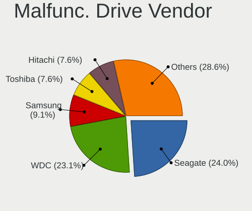

| Vendor              | Computers | Drives | Percent |
|---------------------|-----------|--------|---------|
| Seagate             | 166       | 260    | 23.95%  |
| WDC                 | 160       | 288    | 23.09%  |
| Samsung Electronics | 63        | 85     | 9.09%   |
| Toshiba             | 53        | 91     | 7.65%   |
| Hitachi             | 53        | 91     | 7.65%   |
| Kingston            | 30        | 35     | 4.33%   |
| Intel               | 27        | 40     | 3.9%    |
| HGST                | 24        | 67     | 3.46%   |
| Crucial             | 19        | 27     | 2.74%   |
| Micron Technology   | 12        | 18     | 1.73%   |
| SanDisk             | 11        | 13     | 1.59%   |
| A-DATA Technology   | 9         | 11     | 1.3%    |
| Maxtor              | 8         | 12     | 1.15%   |
| Apple               | 7         | 7      | 1.01%   |
| SK hynix            | 6         | 14     | 0.87%   |
| Fujitsu             | 5         | 9      | 0.72%   |
| Hewlett-Packard     | 4         | 7      | 0.58%   |
| SPCC                | 3         | 3      | 0.43%   |
| OCZ                 | 3         | 4      | 0.43%   |
| LITEON              | 3         | 4      | 0.43%   |
| Netac               | 2         | 2      | 0.29%   |
| Corsair             | 2         | 4      | 0.29%   |
| China               | 2         | 2      | 0.29%   |
| XrayDisk            | 1         | 1      | 0.14%   |
| walram              | 1         | 1      | 0.14%   |
| Transcend           | 1         | 1      | 0.14%   |
| TEXTORM             | 1         | 1      | 0.14%   |
| SSSTC               | 1         | 1      | 0.14%   |
| SMI                 | 1         | 1      | 0.14%   |
| Plextor             | 1         | 1      | 0.14%   |
| Phison              | 1         | 1      | 0.14%   |
| LITEONIT            | 1         | 1      | 0.14%   |
| Lexar               | 1         | 1      | 0.14%   |
| Leven               | 1         | 1      | 0.14%   |
| Lenovo              | 1         | 1      | 0.14%   |
| KingSpec            | 1         | 1      | 0.14%   |
| IBM/Hitachi         | 1         | 1      | 0.14%   |
| HPE                 | 1         | 4      | 0.14%   |
| GK                  | 1         | 1      | 0.14%   |
| Fanxiang            | 1         | 1      | 0.14%   |

Malfunc. HDD Vendor
-------------------

Vendors of faulty HDD drives

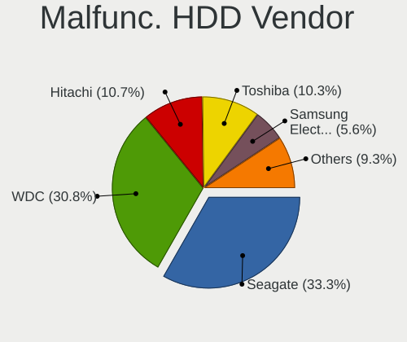

| Vendor               | Computers | Drives | Percent |
|----------------------|-----------|--------|---------|
| Seagate              | 165       | 259    | 33.27%  |
| WDC                  | 153       | 281    | 30.85%  |
| Hitachi              | 53        | 91     | 10.69%  |
| Toshiba              | 51        | 89     | 10.28%  |
| Samsung Electronics  | 28        | 41     | 5.65%   |
| HGST                 | 24        | 67     | 4.84%   |
| Maxtor               | 8         | 12     | 1.61%   |
| Fujitsu              | 5         | 9      | 1.01%   |
| Hewlett-Packard      | 3         | 6      | 0.6%    |
| Apple                | 3         | 3      | 0.6%    |
| IBM/Hitachi          | 1         | 1      | 0.2%    |
| HPE                  | 1         | 4      | 0.2%    |
| ExcelStor Technology | 1         | 2      | 0.2%    |

Malfunc. Drive Kind
-------------------

Kinds of faulty drives

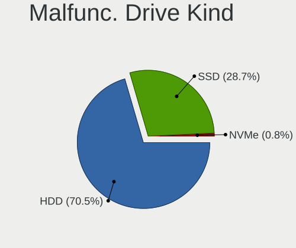

| Kind | Computers | Drives | Percent |
|------|-----------|--------|---------|
| HDD  | 466       | 865    | 70.5%   |
| SSD  | 190       | 251    | 28.74%  |
| NVMe | 5         | 5      | 0.76%   |

Failed Drives
-------------

Failed drive models

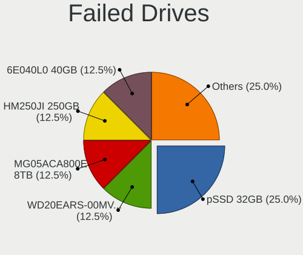

| Model                             | Computers | Drives | Percent |
|-----------------------------------|-----------|--------|---------|
| SanDisk pSSD 32GB                 | 2         | 2      | 25%     |
| WDC WD20EARS-00MVWB0 2TB          | 1         | 1      | 12.5%   |
| Toshiba MG05ACA800E 8TB           | 1         | 1      | 12.5%   |
| Samsung Electronics HM250JI 250GB | 1         | 1      | 12.5%   |
| Maxtor 6E040L0 40GB               | 1         | 1      | 12.5%   |
| Hitachi HUS724040ALE641 4TB       | 1         | 14     | 12.5%   |
| Crucial M4-CT256M4SSD1 256GB      | 1         | 1      | 12.5%   |

Failed Drive Vendor
-------------------

Failed drive vendors

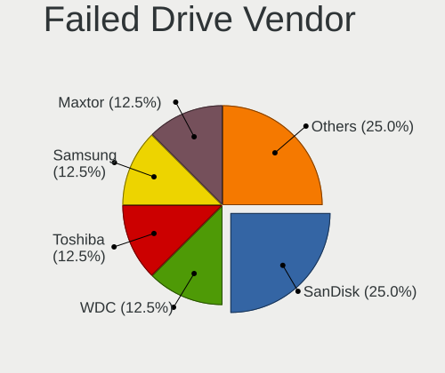

| Vendor              | Computers | Drives | Percent |
|---------------------|-----------|--------|---------|
| SanDisk             | 2         | 2      | 25%     |
| WDC                 | 1         | 1      | 12.5%   |
| Toshiba             | 1         | 1      | 12.5%   |
| Samsung Electronics | 1         | 1      | 12.5%   |
| Maxtor              | 1         | 1      | 12.5%   |
| Hitachi             | 1         | 14     | 12.5%   |
| Crucial             | 1         | 1      | 12.5%   |

Drive Status
------------

Number of failed and malfunc. drives

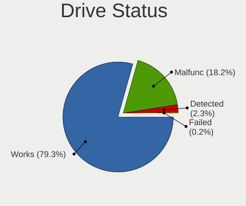

| Status   | Computers | Drives | Percent |
|----------|-----------|--------|---------|
| Works    | 2787      | 9046   | 79.33%  |
| Malfunc  | 638       | 1121   | 18.16%  |
| Detected | 80        | 267    | 2.28%   |
| Failed   | 8         | 21     | 0.23%   |

Storage controller
------------------

Storage Vendor
--------------

Storage controller vendors

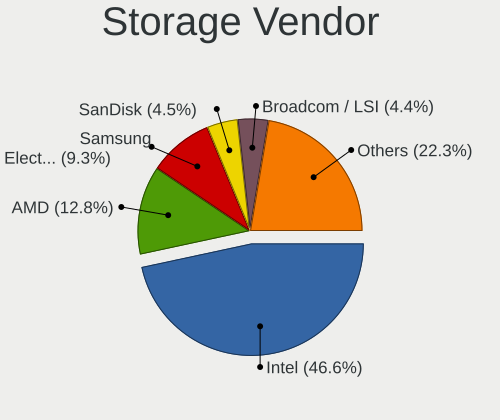

| Vendor                                  | Computers | Percent |
|-----------------------------------------|-----------|---------|
| Intel                                   | 2354      | 46.63%  |
| AMD                                     | 647       | 12.82%  |
| Samsung Electronics                     | 471       | 9.33%   |
| SanDisk                                 | 225       | 4.46%   |
| Broadcom / LSI                          | 223       | 4.42%   |
| ASMedia Technology                      | 105       | 2.08%   |
| Marvell Technology Group                | 91        | 1.8%    |
| Kingston Technology Company             | 90        | 1.78%   |
| Phison Electronics                      | 86        | 1.7%    |
| SK hynix                                | 81        | 1.6%    |
| Micron/Crucial Technology               | 77        | 1.53%   |
| Silicon Motion                          | 65        | 1.29%   |
| Micron Technology                       | 58        | 1.15%   |
| Nvidia                                  | 45        | 0.89%   |
| Toshiba                                 | 43        | 0.85%   |
| KIOXIA                                  | 41        | 0.81%   |
| JMicron Technology                      | 37        | 0.73%   |
| MAXIO Technology (Hangzhou)             | 32        | 0.63%   |
| ADATA Technology                        | 29        | 0.57%   |
| Adaptec                                 | 27        | 0.53%   |
| Realtek Semiconductor                   | 23        | 0.46%   |
| Hewlett-Packard                         | 23        | 0.46%   |
| Shenzhen Longsys Electronics            | 19        | 0.38%   |
| Chelsio Communications                  | 14        | 0.28%   |
| VIA Technologies                        | 12        | 0.24%   |
| Solid State Storage Technology          | 12        | 0.24%   |
| Seagate Technology                      | 11        | 0.22%   |
| Silicon Image                           | 9         | 0.18%   |
| Areca Technology                        | 8         | 0.16%   |
| Union Memory (Shenzhen)                 | 7         | 0.14%   |
| Lite-On Technology                      | 7         | 0.14%   |
| INNOGRIT                                | 7         | 0.14%   |
| Transcend                               | 6         | 0.12%   |
| Silicon Integrated Systems [SiS]        | 6         | 0.12%   |
| Shenzhen Unionmemory Information System | 6         | 0.12%   |
| Lenovo                                  | 5         | 0.1%    |
| 3ware                                   | 5         | 0.1%    |
| Integrated Technology Express           | 4         | 0.08%   |
| Hosin Global Electronics                | 4         | 0.08%   |
| Broadcom                                | 4         | 0.08%   |

Storage Model
-------------

Storage controller models

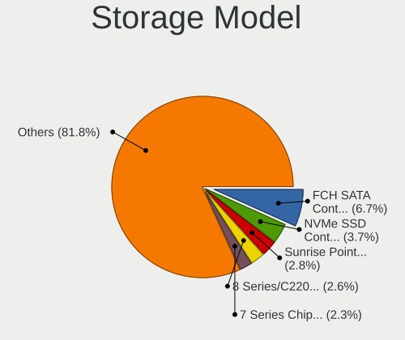

| Model                                                                          | Computers | Percent |
|--------------------------------------------------------------------------------|-----------|---------|
| AMD FCH SATA Controller [AHCI mode]                                            | 387       | 6.72%   |
| Samsung NVMe SSD Controller SM981/PM981/PM983                                  | 214       | 3.72%   |
| Intel Sunrise Point-LP SATA Controller [AHCI mode]                             | 164       | 2.85%   |
| Intel 8 Series/C220 Series Chipset Family 6-port SATA Controller 1 [AHCI mode] | 150       | 2.6%    |
| Intel 7 Series Chipset Family 6-port SATA Controller [AHCI mode]               | 134       | 2.33%   |
| Intel Q170/Q150/B150/H170/H110/Z170/CM236 Chipset SATA Controller [AHCI Mode]  | 113       | 1.96%   |
| Intel 6 Series/C200 Series Chipset Family 6 port Mobile SATA AHCI Controller   | 103       | 1.79%   |
| Intel 6 Series/C200 Series Chipset Family 6 port Desktop SATA AHCI Controller  | 95        | 1.65%   |
| AMD 400 Series Chipset SATA Controller                                         | 95        | 1.65%   |
| AMD SB7x0/SB8x0/SB9x0 SATA Controller [AHCI mode]                              | 85        | 1.48%   |
| Samsung NVMe SSD Controller PM9A1/PM9A3/980PRO                                 | 81        | 1.41%   |
| Samsung NVMe SSD Controller 980 (DRAM-less)                                    | 80        | 1.39%   |
| Intel Wildcat Point-LP SATA Controller [AHCI Mode]                             | 78        | 1.35%   |
| ASMedia ASM1061/ASM1062 Serial ATA Controller                                  | 77        | 1.34%   |
| AMD 500 Series Chipset SATA Controller                                         | 75        | 1.3%    |
| Intel 200 Series PCH SATA controller [AHCI mode]                               | 70        | 1.22%   |
| Broadcom / LSI SAS2008 PCI-Express Fusion-MPT SAS-2 [Falcon]                   | 65        | 1.13%   |
| Intel C610/X99 series chipset 6-Port SATA Controller [AHCI mode]               | 64        | 1.11%   |
| SanDisk Extreme Pro / WD Black SN750 / PC SN730 / Red SN700 NVMe SSD           | 60        | 1.04%   |
| Intel 82801 Mobile SATA Controller [RAID mode]                                 | 59        | 1.02%   |
| Intel Cannon Lake PCH SATA AHCI Controller                                     | 58        | 1.01%   |
| Intel SATA Controller [RAID mode]                                              | 57        | 0.99%   |
| Intel C610/X99 series chipset sSATA Controller [AHCI mode]                     | 57        | 0.99%   |
| Intel 8 Series SATA Controller 1 [AHCI mode]                                   | 56        | 0.97%   |
| Intel Comet Lake SATA AHCI Controller                                          | 55        | 0.95%   |
| Silicon Motion SM2263EN/SM2263XT (DRAM-less) NVMe SSD Controllers              | 52        | 0.9%    |
| Samsung NVMe SSD Controller SM961/PM961/SM963                                  | 51        | 0.89%   |
| AMD SB7x0/SB8x0/SB9x0 IDE Controller                                           | 50        | 0.87%   |
| Intel Volume Management Device NVMe RAID Controller                            | 49        | 0.85%   |
| Intel 5 Series/3400 Series Chipset 6 port SATA AHCI Controller                 | 48        | 0.83%   |
| Intel 7 Series/C210 Series Chipset Family 6-port SATA Controller [AHCI mode]   | 46        | 0.8%    |
| Intel Atom Processor E3800 Series SATA AHCI Controller                         | 45        | 0.78%   |
| Micron/Crucial P2 [Nick P2] / P3 / P3 Plus NVMe PCIe SSD (DRAM-less)           | 42        | 0.73%   |
| Intel 82801JI (ICH10 Family) SATA AHCI Controller                              | 42        | 0.73%   |
| Intel 500 Series Chipset Family SATA AHCI Controller                           | 42        | 0.73%   |
| Intel 82801IBM/IEM (ICH9M/ICH9M-E) 4 port SATA Controller [AHCI mode]          | 38        | 0.66%   |
| Intel C600/X79 series chipset 6-Port SATA AHCI Controller                      | 37        | 0.64%   |
| Intel 82801HM/HEM (ICH8M/ICH8M-E) SATA Controller [AHCI mode]                  | 37        | 0.64%   |
| Intel 82801HM/HEM (ICH8M/ICH8M-E) IDE Controller                               | 37        | 0.64%   |
| Intel 82801G (ICH7 Family) IDE Controller                                      | 37        | 0.64%   |

Storage Kind
------------

Kind of storage controller (IDE, SATA, NVMe, SAS, ...)

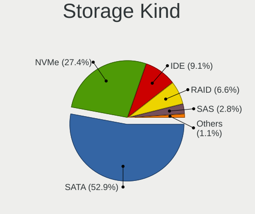

| Kind | Computers | Percent |
|------|-----------|---------|
| SATA | 2627      | 52.92%  |
| NVMe | 1361      | 27.42%  |
| IDE  | 453       | 9.13%   |
| RAID | 329       | 6.63%   |
| SAS  | 140       | 2.82%   |
| SCSI | 54        | 1.09%   |

Processor
---------

CPU Vendor
----------

Processor vendors

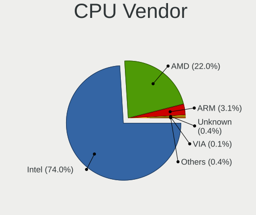

| Vendor                | Computers | Percent |
|-----------------------|-----------|---------|
| Intel                 | 2783      | 74%     |
| AMD                   | 828       | 22.02%  |
| ARM                   | 117       | 3.11%   |
| Unknown               | 16        | 0.43%   |
| VIA                   | 3         | 0.08%   |
| IBM                   | 3         | 0.08%   |
| i                     | 2         | 0.05%   |
| Sun                   | 1         | 0.03%   |
| Rockchip              | 1         | 0.03%   |
| Research              | 1         | 0.03%   |
| Qualcomm Technologies | 1         | 0.03%   |
| NXP                   | 1         | 0.03%   |
| Motorola              | 1         | 0.03%   |
| Cix Technology Group  | 1         | 0.03%   |
| Baikal Electronics    | 1         | 0.03%   |
| Ampere                | 1         | 0.03%   |

CPU Model
---------

Processor models

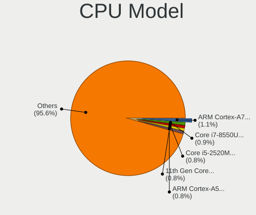

| Model                                   | Computers | Percent |
|-----------------------------------------|-----------|---------|
| ARM Cortex-A72 r0p3                     | 42        | 1.11%   |
| Intel Core i7-8550U CPU @ 1.80GHz       | 34        | 0.9%    |
| Intel Core i5-2520M CPU @ 2.50GHz       | 30        | 0.79%   |
| Intel 11th Gen Core i5-1135G7 @ 2.40GHz | 30        | 0.79%   |
| ARM Cortex-A53 r0p4                     | 30        | 0.79%   |
| Intel 11th Gen Core i7-1165G7 @ 2.80GHz | 29        | 0.77%   |
| Intel Core i5-3320M CPU @ 2.60GHz       | 25        | 0.66%   |
| Intel Core i5-7200U CPU @ 2.50GHz       | 24        | 0.63%   |
| Intel Core i5-6300U CPU @ 2.40GHz       | 24        | 0.63%   |
| Intel Core i5-8350U CPU @ 1.70GHz       | 23        | 0.61%   |
| Intel Core i5-8250U CPU @ 1.60GHz       | 23        | 0.61%   |
| Intel Core i5-5300U CPU @ 2.30GHz       | 23        | 0.61%   |
| Intel Core i5-10210U CPU @ 1.60GHz      | 23        | 0.61%   |
| AMD Ryzen 5 5600G with Radeon Graphics  | 23        | 0.61%   |
| Intel CPU Version                       | 22        | 0.58%   |
| Intel Core i5-6200U CPU @ 2.30GHz       | 22        | 0.58%   |
| Intel Core i5-8265U CPU @ 1.60GHz       | 20        | 0.53%   |
| AMD Ryzen 7 3700X 8-Core Processor      | 20        | 0.53%   |
| Intel Core i7-8565U CPU @ 1.80GHz       | 19        | 0.5%    |
| Intel Core i5-5200U CPU @ 2.20GHz       | 19        | 0.5%    |
| Intel Core 2 Duo                        | 19        | 0.5%    |
| Intel Core i7-7500U CPU @ 2.70GHz       | 18        | 0.48%   |
| ARM Cortex-A55 r2p0                     | 18        | 0.48%   |
| Intel Core i7-3770 CPU @ 3.40GHz        | 17        | 0.45%   |
| Intel Core i7-10510U CPU @ 1.80GHz      | 17        | 0.45%   |
| Intel Core i5-7300U CPU @ 2.60GHz       | 17        | 0.45%   |
| Intel Xeon CPU E5-2650 v2 @ 2.60GHz     | 16        | 0.42%   |
| Intel Core i7-9750H CPU @ 2.60GHz       | 16        | 0.42%   |
| Intel Core i5-3210M CPU @ 2.50GHz       | 16        | 0.42%   |
| Intel Celeron CPU J1900 @ 1.99GHz       | 16        | 0.42%   |
| AMD Ryzen 7 5700U with Radeon Graphics  | 16        | 0.42%   |
|                                         | 16        | 0.42%   |
| Intel Core i7-7700 CPU @ 3.60GHz        | 15        | 0.4%    |
| AMD Ryzen 9 5950X 16-Core Processor     | 15        | 0.4%    |
| Intel Core i7-7700HQ CPU @ 2.80GHz      | 14        | 0.37%   |
| Intel Core i7-5600U CPU @ 2.60GHz       | 14        | 0.37%   |
| Intel Core i5-3470 CPU @ 3.20GHz        | 14        | 0.37%   |
| AMD Ryzen 7 4800H with Radeon Graphics  | 14        | 0.37%   |
| AMD GX-412TC SOC                        | 14        | 0.37%   |
| Intel Core i7-8650U CPU @ 1.90GHz       | 13        | 0.34%   |

CPU Model Family
----------------

Processor model prefix

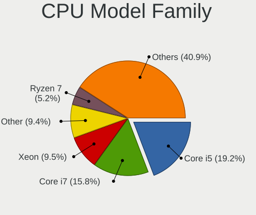

| Model                  | Computers | Percent |
|------------------------|-----------|---------|
| Intel Core i5          | 725       | 19.21%  |
| Intel Core i7          | 595       | 15.76%  |
| Intel Xeon             | 358       | 9.48%   |
| Other                  | 355       | 9.4%    |
| AMD Ryzen 7            | 198       | 5.25%   |
| Intel Core i3          | 189       | 5.01%   |
| AMD Ryzen 5            | 172       | 4.56%   |
| Intel Celeron          | 167       | 4.42%   |
| Intel Core 2 Duo       | 109       | 2.89%   |
| ARM Cortex             | 107       | 2.83%   |
| AMD Ryzen 9            | 92        | 2.44%   |
| Intel Atom             | 79        | 2.09%   |
| Intel Pentium          | 67        | 1.77%   |
| AMD Ryzen 3            | 42        | 1.11%   |
| AMD FX                 | 42        | 1.11%   |
| AMD GX                 | 26        | 0.69%   |
| AMD Ryzen 7 PRO        | 22        | 0.58%   |
| Intel Core i9          | 21        | 0.56%   |
| Intel Core 2 Quad      | 21        | 0.56%   |
| AMD Ryzen 5 PRO        | 21        | 0.56%   |
| Intel Xeon Silver      | 20        | 0.53%   |
| AMD EPYC               | 20        | 0.53%   |
| Intel Pentium 4        | 18        | 0.48%   |
| AMD Ryzen Threadripper | 15        | 0.4%    |
| AMD Athlon             | 15        | 0.4%    |
| Intel Xeon Gold        | 14        | 0.37%   |
| Intel Pentium Silver   | 14        | 0.37%   |
| Intel Pentium M        | 14        | 0.37%   |
| Intel Core 2           | 14        | 0.37%   |
| Intel Core             | 14        | 0.37%   |
| AMD Opteron            | 14        | 0.37%   |
| Intel Genuine          | 13        | 0.34%   |
| AMD Athlon 64 X2       | 11        | 0.29%   |
| AMD A8                 | 10        | 0.26%   |
| AMD Phenom II X4       | 9         | 0.24%   |
| AMD E                  | 9         | 0.24%   |
| AMD A10                | 9         | 0.24%   |
| AMD Turion II Neo      | 8         | 0.21%   |
| AMD Phenom II X6       | 8         | 0.21%   |
| AMD A4                 | 8         | 0.21%   |

CPU Cores
---------

Number of processor cores

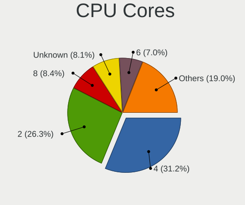

| Number  | Computers | Percent |
|---------|-----------|---------|
| 4       | 1188      | 31.2%   |
| 2       | 1003      | 26.34%  |
| 8       | 320       | 8.4%    |
| Unknown | 308       | 8.09%   |
| 6       | 265       | 6.96%   |
| 16      | 252       | 6.62%   |
| 12      | 178       | 4.67%   |
| 1       | 67        | 1.76%   |
| 24      | 55        | 1.44%   |
| 10      | 47        | 1.23%   |
| 32      | 45        | 1.18%   |
| 20      | 23        | 0.6%    |
| 14      | 11        | 0.29%   |
| 28      | 9         | 0.24%   |
| 64      | 7         | 0.18%   |
| 18      | 4         | 0.11%   |
| 11      | 4         | 0.11%   |
| 40      | 3         | 0.08%   |
| 22      | 3         | 0.08%   |
| 7       | 3         | 0.08%   |
| 3       | 3         | 0.08%   |
| 128     | 2         | 0.05%   |
| 48      | 2         | 0.05%   |
| 36      | 2         | 0.05%   |
| 256     | 1         | 0.03%   |
| 44      | 1         | 0.03%   |
| 26      | 1         | 0.03%   |
| 5       | 1         | 0.03%   |

CPU Sockets
-----------

Number of sockets

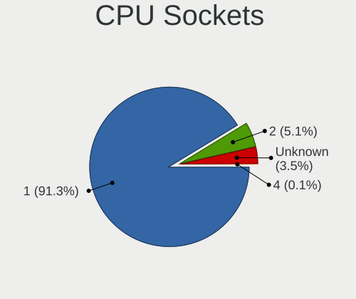

| Number  | Computers | Percent |
|---------|-----------|---------|
| 1       | 3432      | 91.3%   |
| 2       | 193       | 5.13%   |
| Unknown | 132       | 3.51%   |
| 4       | 2         | 0.05%   |

CPU Threads
-----------

Threads per core (Hyper-Threading)

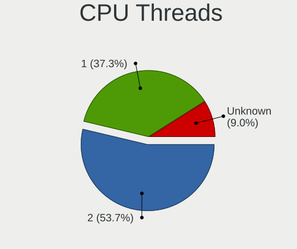

| Number  | Computers | Percent |
|---------|-----------|---------|
| 2       | 2039      | 53.71%  |
| 1       | 1416      | 37.3%   |
| Unknown | 341       | 8.98%   |

CPU Microarch
-------------

Microarchitecture

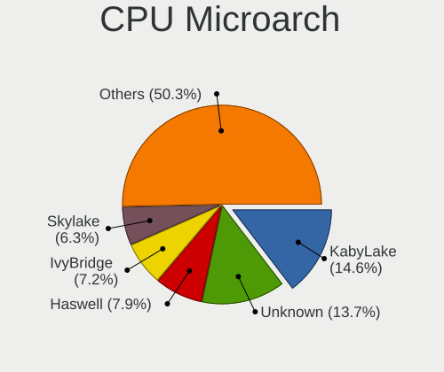

| Name            | Computers | Percent |
|-----------------|-----------|---------|
| KabyLake        | 552       | 14.63%  |
| Unknown         | 515       | 13.65%  |
| Haswell         | 298       | 7.9%    |
| IvyBridge       | 271       | 7.18%   |
| Skylake         | 237       | 6.28%   |
| SandyBridge     | 228       | 6.04%   |
| Zen 2           | 155       | 4.11%   |
| Zen 3           | 151       | 4%      |
| Penryn          | 134       | 3.55%   |
| Broadwell       | 134       | 3.55%   |
| Westmere        | 109       | 2.89%   |
| Zen+            | 95        | 2.52%   |
| TigerLake       | 95        | 2.52%   |
| Silvermont      | 94        | 2.49%   |
| CometLake       | 85        | 2.25%   |
| Core            | 79        | 2.09%   |
| Zen             | 75        | 1.99%   |
| Bonnell         | 63        | 1.67%   |
| K10             | 49        | 1.3%    |
| Piledriver      | 45        | 1.19%   |
| Goldmont plus   | 39        | 1.03%   |
| Nehalem         | 38        | 1.01%   |
| Puma            | 32        | 0.85%   |
| Goldmont        | 29        | 0.77%   |
| P6              | 26        | 0.69%   |
| NetBurst        | 26        | 0.69%   |
| Excavator       | 25        | 0.66%   |
| Bobcat          | 21        | 0.56%   |
| K8 Hammer       | 19        | 0.5%    |
| IceLake         | 16        | 0.42%   |
| Jaguar          | 13        | 0.34%   |
| Bulldozer       | 10        | 0.27%   |
| Steamroller     | 6         | 0.16%   |
| K10 Llano       | 3         | 0.08%   |
| K8 & K10 hybrid | 2         | 0.05%   |
| Geode           | 2         | 0.05%   |
| CannonLake      | 1         | 0.03%   |

Graphics
--------

GPU Vendor
----------

Vendors of graphics cards

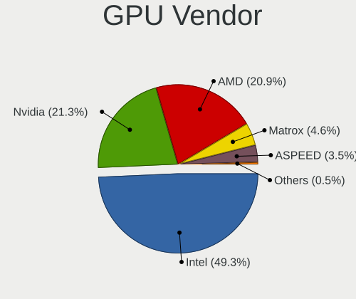

| Vendor                                       | Computers | Percent |
|----------------------------------------------|-----------|---------|
| Intel                                        | 1998      | 49.31%  |
| Nvidia                                       | 862       | 21.27%  |
| AMD                                          | 847       | 20.9%   |
| Matrox Electronics Systems                   | 186       | 4.59%   |
| ASPEED Technology                            | 140       | 3.46%   |
| VIA Technologies                             | 5         | 0.12%   |
| XGI Technology (eXtreme Graphics Innovation) | 4         | 0.1%    |
| S3 Graphics                                  | 4         | 0.1%    |
| Silicon Integrated Systems [SiS]             | 3         | 0.07%   |
| Silicon Motion                               | 1         | 0.02%   |
| NVidia / SGS Thomson (Joint Venture)         | 1         | 0.02%   |
| Huawei Technologies                          | 1         | 0.02%   |

GPU Model
---------

Graphics card models

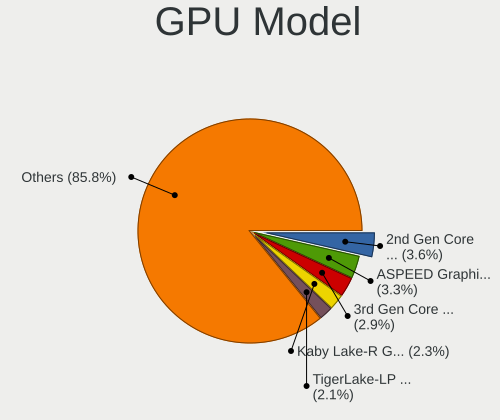

| Model                                                                                    | Computers | Percent |
|------------------------------------------------------------------------------------------|-----------|---------|
| Intel 2nd Generation Core Processor Family Integrated Graphics Controller                | 149       | 3.56%   |
| ASPEED Technology ASPEED Graphics Family                                                 | 140       | 3.35%   |
| Intel 3rd Gen Core processor Graphics Controller                                         | 121       | 2.89%   |
| Intel Kaby Lake-R GT2 [UHD Graphics 620]                                                 | 96        | 2.3%    |
| Intel TigerLake-LP GT2 [Iris Xe Graphics]                                                | 86        | 2.06%   |
| Intel Skylake-U GT2 [HD Graphics 520]                                                    | 79        | 1.89%   |
| Intel Kaby Lake-U GT2 [HD Graphics 620]                                                  | 74        | 1.77%   |
| Intel Haswell-ULT Integrated Graphics Controller                                         | 73        | 1.75%   |
| Intel Broadwell-U GT2 [HD Graphics 5500]                                                 | 73        | 1.75%   |
| Intel Xeon E3-1200 v3/4th Gen Core Processor Integrated Graphics Controller              | 70        | 1.67%   |
| AMD Cezanne [Radeon Vega Series / Radeon Vega Mobile Series]                             | 67        | 1.6%    |
| AMD Renoir [Radeon Vega Series / Radeon Vega Mobile Series]                              | 64        | 1.53%   |
| Intel WhiskeyLake-U GT2 [UHD Graphics 620]                                               | 60        | 1.43%   |
| AMD Ellesmere [Radeon RX 470/480/570/570X/580/580X/590]                                  | 56        | 1.34%   |
| Intel CometLake-U GT2 [UHD Graphics]                                                     | 55        | 1.31%   |
| Intel CoffeeLake-S GT2 [UHD Graphics 630]                                                | 54        | 1.29%   |
| Matrox Electronics Systems MGA G200eW WPCM450                                            | 53        | 1.27%   |
| AMD Picasso/Raven 2 [Radeon Vega Series / Radeon Vega Mobile Series]                     | 53        | 1.27%   |
| Intel Skylake-S GT2 [HD Graphics 530]                                                    | 51        | 1.22%   |
| Intel Atom Processor Z36xxx/Z37xxx Series Graphics & Display                             | 49        | 1.17%   |
| Intel Core Processor Integrated Graphics Controller                                      | 46        | 1.1%    |
| Intel CoffeeLake-H GT2 [UHD Graphics 630]                                                | 43        | 1.03%   |
| Nvidia GK208B [GeForce GT 710]                                                           | 42        | 1%      |
| Matrox Electronics Systems G200eR2                                                       | 41        | 0.98%   |
| Intel Mobile 4 Series Chipset Integrated Graphics Controller                             | 36        | 0.86%   |
| Intel 4th Gen Core Processor Integrated Graphics Controller                              | 36        | 0.86%   |
| Intel Kaby Lake-S GT2 [HD Graphics 630]                                                  | 35        | 0.84%   |
| Intel CometLake-S GT2 [UHD Graphics 630]                                                 | 35        | 0.84%   |
| Intel Atom/Celeron/Pentium Processor x5-E8000/J3xxx/N3xxx Integrated Graphics Controller | 35        | 0.84%   |
| Matrox Electronics Systems MGA G200EH                                                    | 34        | 0.81%   |
| Intel Raptor Lake-P [Iris Xe Graphics]                                                   | 33        | 0.79%   |
| AMD Raven Ridge [Radeon Vega Series / Radeon Vega Mobile Series]                         | 33        | 0.79%   |
| AMD Lucienne                                                                             | 33        | 0.79%   |
| Nvidia GP108 [GeForce GT 1030]                                                           | 32        | 0.77%   |
| Intel Xeon E3-1200 v2/3rd Gen Core processor Graphics Controller                         | 32        | 0.77%   |
| Intel Mobile 945GM/GMS/GME, 943/940GML Express Integrated Graphics Controller            | 32        | 0.77%   |
| Nvidia TU117M [GeForce GTX 1650 Mobile / Max-Q]                                          | 29        | 0.69%   |
| Intel GeminiLake [UHD Graphics 600]                                                      | 29        | 0.69%   |
| Matrox Electronics Systems MGA G200e [Pilot] ServerEngines (SEP1)                        | 27        | 0.65%   |
| Intel Mobile GM965/GL960 Integrated Graphics Controller (secondary)                      | 26        | 0.62%   |

GPU Combo
---------

Combinations of graphics cards

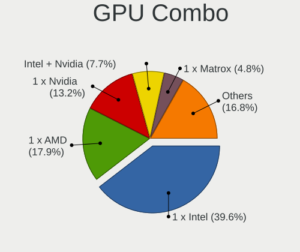

| Name                                     | Computers | Percent |
|------------------------------------------|-----------|---------|
| 1 x Intel                                | 1499      | 39.55%  |
| 1 x AMD                                  | 680       | 17.94%  |
| 1 x Nvidia                               | 502       | 13.25%  |
| Intel + Nvidia                           | 291       | 7.68%   |
| 1 x Matrox                               | 181       | 4.78%   |
| Other                                    | 170       | 4.49%   |
| 2 x Intel                                | 135       | 3.56%   |
| 1 x ASPEED                               | 118       | 3.11%   |
| Intel + AMD                              | 65        | 1.72%   |
| 2 x AMD                                  | 47        | 1.24%   |
| AMD + Nvidia                             | 46        | 1.21%   |
| Nvidia + ASPEED                          | 14        | 0.37%   |
| 2 x Nvidia                               | 6         | 0.16%   |
| 1 x VIA                                  | 5         | 0.13%   |
| AMD + ASPEED                             | 5         | 0.13%   |
| 1 x XGI                                  | 4         | 0.11%   |
| Nvidia + Matrox                          | 4         | 0.11%   |
| 1 x SiS                                  | 3         | 0.08%   |
| 1 x S3 Graphics                          | 3         | 0.08%   |
| Intel + ASPEED                           | 3         | 0.08%   |
| 2 x Nvidia + 1 x ASPEED                  | 2         | 0.05%   |
| 1 x Silicon Motion                       | 1         | 0.03%   |
| 1 x NVidia / SGS Thomson (Joint Venture) | 1         | 0.03%   |
| Nvidia + Huawei Technologies             | 1         | 0.03%   |
| Intel + S3 Graphics                      | 1         | 0.03%   |
| Intel + Matrox                           | 1         | 0.03%   |
| Intel + AMD + 1 x Nvidia                 | 1         | 0.03%   |
| AMD + Matrox                             | 1         | 0.03%   |

GPU Driver
----------

Free vs proprietary

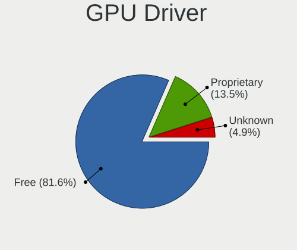

| Driver      | Computers | Percent |
|-------------|-----------|---------|
| Free        | 3087      | 81.56%  |
| Proprietary | 512       | 13.53%  |
| Unknown     | 186       | 4.91%   |

GPU Memory
----------

Total video memory

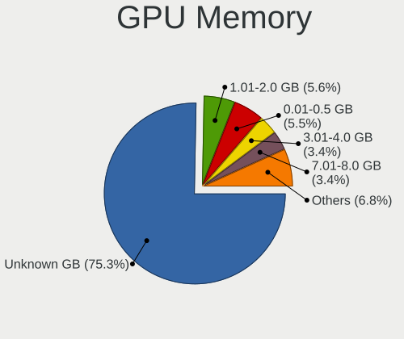

| Size in GB | Computers | Percent |
|------------|-----------|---------|
| Unknown    | 2883      | 75.29%  |
| 1.01-2.0   | 215       | 5.62%   |
| 0.01-0.5   | 209       | 5.46%   |
| 3.01-4.0   | 132       | 3.45%   |
| 7.01-8.0   | 131       | 3.42%   |
| 0.51-1.0   | 131       | 3.42%   |
| 5.01-6.0   | 55        | 1.44%   |
| 8.01-16.0  | 41        | 1.07%   |
| 2.01-3.0   | 20        | 0.52%   |
| 16.01-24.0 | 10        | 0.26%   |
| 4.01-5.0   | 2         | 0.05%   |

Monitor
-------

Monitor Vendor
--------------

Monitor vendors

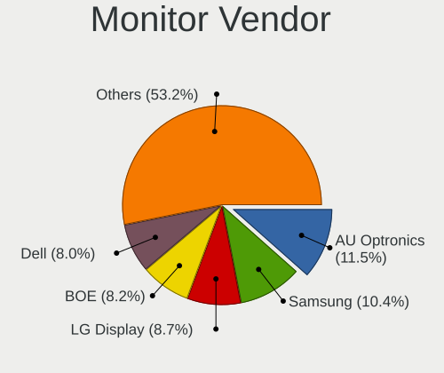

| Vendor                  | Computers | Percent |
|-------------------------|-----------|---------|
| AU Optronics            | 270       | 11.55%  |
| Samsung Electronics     | 243       | 10.39%  |
| LG Display              | 204       | 8.73%   |
| BOE                     | 191       | 8.17%   |
| Dell                    | 187       | 8%      |
| Chimei Innolux          | 161       | 6.89%   |
| Goldstar                | 109       | 4.66%   |
| Lenovo                  | 79        | 3.38%   |
| Hewlett-Packard         | 72        | 3.08%   |
| Acer                    | 64        | 2.74%   |
| Apple                   | 54        | 2.31%   |
| AOC                     | 52        | 2.22%   |
| BenQ                    | 49        | 2.1%    |
| Philips                 | 48        | 2.05%   |
| Sharp                   | 41        | 1.75%   |
| Ancor Communications    | 41        | 1.75%   |
| ViewSonic               | 40        | 1.71%   |
| Iiyama                  | 35        | 1.5%    |
| LG Electronics          | 25        | 1.07%   |
| ASUSTek Computer        | 20        | 0.86%   |
| Sony                    | 19        | 0.81%   |
| Chi Mei Optoelectronics | 19        | 0.81%   |
| InfoVision              | 18        | 0.77%   |
| Eizo                    | 15        | 0.64%   |
| NEC Computers           | 14        | 0.6%    |
| Unknown                 | 13        | 0.56%   |
| MSI                     | 12        | 0.51%   |
| LG Philips              | 12        | 0.51%   |
| CSO                     | 12        | 0.51%   |
| PANDA                   | 11        | 0.47%   |
| Unknown                 | 10        | 0.43%   |
| Sceptre Tech            | 9         | 0.38%   |
| LGD                     | 8         | 0.34%   |
| Idek Iiyama             | 8         | 0.34%   |
| HKC                     | 8         | 0.34%   |
| Toshiba                 | 7         | 0.3%    |
| RTK                     | 7         | 0.3%    |
| Panasonic               | 7         | 0.3%    |
| HannStar                | 7         | 0.3%    |
| Mi                      | 5         | 0.21%   |

Monitor Model
-------------

Monitor models

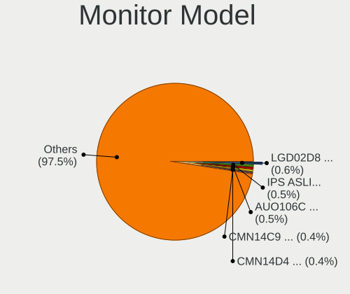

| Model                                                                | Computers | Percent |
|----------------------------------------------------------------------|-----------|---------|
| LG Display LCD Monitor LGD02D8 1366x768 280x160mm 12.7-inch          | 14        | 0.57%   |
| Unknown                                                              | 13        | 0.53%   |
| AU Optronics LCD Monitor AUO106C 1366x768 280x160mm 12.7-inch        | 12        | 0.49%   |
| Chimei Innolux LCD Monitor CMN14C9 1920x1080 310x170mm 13.9-inch     | 11        | 0.45%   |
| Chimei Innolux LCD Monitor CMN14D4 1920x1080 310x170mm 13.9-inch     | 10        | 0.41%   |
| BOE LCD Monitor BOE095F 2256x1504 280x190mm 13.3-inch                | 9         | 0.37%   |
| Lenovo LCD Monitor LEN40B1 1600x900 340x190mm 15.3-inch              | 8         | 0.33%   |
| AU Optronics LCD Monitor AUO243D 1920x1080 310x170mm 13.9-inch       | 8         | 0.33%   |
| LG Display LCD Monitor LGD0521 1920x1080 310x170mm 13.9-inch         | 7         | 0.29%   |
| Chimei Innolux LCD Monitor CMN1132 1366x768 260x140mm 11.6-inch      | 7         | 0.29%   |
| Samsung Electronics C24F390 SAM0D2C 1920x1080 520x290mm 23.4-inch    | 6         | 0.25%   |
| MSI G241 MSI3BA4 1920x1080 530x300mm 24.0-inch                       | 6         | 0.25%   |
| Iiyama PL2775HD IVM6604 1920x1080 600x340mm 27.2-inch                | 6         | 0.25%   |
| Dell U2412M DELA07A 1920x1200 520x320mm 24.0-inch                    | 6         | 0.25%   |
| Chimei Innolux LCD Monitor CMN15F5 1920x1080 340x190mm 15.3-inch     | 6         | 0.25%   |
| AU Optronics LCD Monitor AUO403D 1920x1080 310x170mm 13.9-inch       | 6         | 0.25%   |
| AU Optronics LCD Monitor AUO226D 1920x1080 280x160mm 12.7-inch       | 6         | 0.25%   |
| AU Optronics LCD Monitor AUO133D 1920x1080 310x170mm 13.9-inch       | 6         | 0.25%   |
| AU Optronics LCD Monitor AUO123D 1920x1080 310x170mm 13.9-inch       | 6         | 0.25%   |
| AU Optronics LCD Monitor AUO103D 1920x1080 310x170mm 13.9-inch       | 6         | 0.25%   |
| ViewSonic VA2342 SERIES VSCFA2B 1920x1080 510x290mm 23.1-inch        | 5         | 0.2%    |
| Samsung Electronics LCD Monitor SEC5441 1366x768 340x190mm 15.3-inch | 5         | 0.2%    |
| Samsung Electronics LCD Monitor SEC324C 1600x900 310x170mm 13.9-inch | 5         | 0.2%    |
| Samsung Electronics C27F390 SAM0D32 1920x1080 600x340mm 27.2-inch    | 5         | 0.2%    |
| LG Display LCD Monitor LGD046F 1920x1080 340x190mm 15.3-inch         | 5         | 0.2%    |
| LG Display LCD Monitor LGD03ED 1366x768 280x160mm 12.7-inch          | 5         | 0.2%    |
| LG Display LCD Monitor LGD02D3 1366x768 280x160mm 12.7-inch          | 5         | 0.2%    |
| Lenovo LCD Monitor LEN40B2 1920x1080 340x190mm 15.3-inch             | 5         | 0.2%    |
| Goldstar LG Ultra HD GSM5B09 3840x2160 600x340mm 27.2-inch           | 5         | 0.2%    |
| Goldstar LG Ultra HD GSM5B08 3840x2160 600x340mm 27.2-inch           | 5         | 0.2%    |
| Goldstar LG HDR WFHD GSM7714 2560x1080 800x340mm 34.2-inch           | 5         | 0.2%    |
| Goldstar LG HDR 4K GSM7706 3840x2160 600x340mm 27.2-inch             | 5         | 0.2%    |
| Goldstar LG FULL HD GSM5B55 1920x1080 480x270mm 21.7-inch            | 5         | 0.2%    |
| Dell U2412M DELA07B 1920x1200 520x320mm 24.0-inch                    | 5         | 0.2%    |
| Chimei Innolux LCD Monitor CMN14D6 1366x768 310x170mm 13.9-inch      | 5         | 0.2%    |
| Chimei Innolux LCD Monitor CMN14D5 1920x1080 310x170mm 13.9-inch     | 5         | 0.2%    |
| BOE Technology Group LCD Monitor 1920x1080                           | 5         | 0.2%    |
| AU Optronics LCD Monitor AUO80ED 1920x1080 340x190mm 15.3-inch       | 5         | 0.2%    |
| AU Optronics LCD Monitor AUO71EC 1366x768 340x190mm 15.3-inch        | 5         | 0.2%    |
| AU Optronics LCD Monitor AUO313C 1366x768 310x170mm 13.9-inch        | 5         | 0.2%    |

Monitor Resolution
------------------

Monitor screen resolution

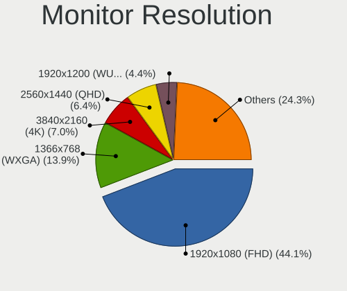

| Resolution         | Computers | Percent |
|--------------------|-----------|---------|
| 1920x1080 (FHD)    | 1003      | 44.15%  |
| 1366x768 (WXGA)    | 315       | 13.86%  |
| 3840x2160 (4K)     | 158       | 6.95%   |
| 2560x1440 (QHD)    | 146       | 6.43%   |
| 1920x1200 (WUXGA)  | 99        | 4.36%   |
| 1600x900 (HD+)     | 81        | 3.57%   |
| 1280x1024 (SXGA)   | 57        | 2.51%   |
| 1280x800 (WXGA)    | 51        | 2.24%   |
| 1440x900 (WXGA+)   | 42        | 1.85%   |
| 2560x1600          | 37        | 1.63%   |
| 1680x1050 (WSXGA+) | 37        | 1.63%   |
| Unknown            | 33        | 1.45%   |
| 3440x1440          | 25        | 1.1%    |
| 2560x1080          | 24        | 1.06%   |
| 1024x600           | 19        | 0.84%   |
| 2256x1504          | 14        | 0.62%   |
| 2880x1800          | 12        | 0.53%   |
| 1600x1200          | 11        | 0.48%   |
| 1024x768 (XGA)     | 10        | 0.44%   |
| 3840x1080          | 9         | 0.4%    |
| 1360x768           | 8         | 0.35%   |
| 3200x1800 (QHD+)   | 7         | 0.31%   |
| 2160x1440          | 6         | 0.26%   |
| 1920x1280          | 5         | 0.22%   |
| 3840x2400          | 4         | 0.18%   |
| 1920x540           | 4         | 0.18%   |
| 1280x720 (HD)      | 4         | 0.18%   |
| 3840x1600          | 3         | 0.13%   |
| 3840x1200          | 3         | 0.13%   |
| 3120x2080          | 3         | 0.13%   |
| 3000x2000          | 3         | 0.13%   |
| 5760x2160          | 2         | 0.09%   |
| 5760x1080          | 2         | 0.09%   |
| 2880x1920          | 2         | 0.09%   |
| 2240x1400          | 2         | 0.09%   |
| 1400x1050          | 2         | 0.09%   |
| 8960x1440          | 1         | 0.04%   |
| 7860x2400          | 1         | 0.04%   |
| 7680x2160          | 1         | 0.04%   |
| 6400x2160          | 1         | 0.04%   |

Monitor Diagonal
----------------

Diagonal size in inches

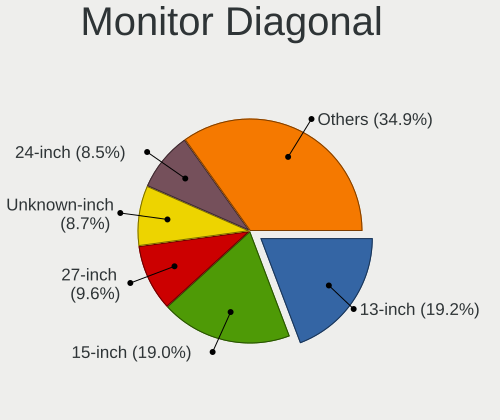

| Inches  | Computers | Percent |
|---------|-----------|---------|
| 13      | 448       | 19.24%  |
| 15      | 442       | 18.99%  |
| 27      | 224       | 9.62%   |
| Unknown | 203       | 8.72%   |
| 24      | 199       | 8.55%   |
| 23      | 115       | 4.94%   |
| 21      | 111       | 4.77%   |
| 12      | 97        | 4.17%   |
| 17      | 63        | 2.71%   |
| 14      | 61        | 2.62%   |
| 19      | 59        | 2.53%   |
| 31      | 53        | 2.28%   |
| 11      | 34        | 1.46%   |
| 34      | 28        | 1.2%    |
| 22      | 25        | 1.07%   |
| 18      | 25        | 1.07%   |
| 10      | 17        | 0.73%   |
| 20      | 13        | 0.56%   |
| 29      | 12        | 0.52%   |
| 32      | 8         | 0.34%   |
| 16      | 8         | 0.34%   |
| 26      | 7         | 0.3%    |
| 40      | 6         | 0.26%   |
| 25      | 6         | 0.26%   |
| 64      | 5         | 0.21%   |
| 54      | 5         | 0.21%   |
| 48      | 5         | 0.21%   |
| 46      | 5         | 0.21%   |
| 42      | 5         | 0.21%   |
| 28      | 5         | 0.21%   |
| 52      | 4         | 0.17%   |
| 9       | 4         | 0.17%   |
| 41      | 3         | 0.13%   |
| 39      | 3         | 0.13%   |
| 74      | 2         | 0.09%   |
| 50      | 2         | 0.09%   |
| 49      | 2         | 0.09%   |
| 37      | 2         | 0.09%   |
| 35      | 2         | 0.09%   |
| 33      | 2         | 0.09%   |

Monitor Width
-------------

Physical width

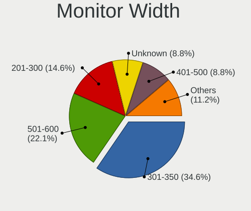

| Width in mm | Computers | Percent |
|-------------|-----------|---------|
| 301-350     | 793       | 34.57%  |
| 501-600     | 506       | 22.06%  |
| 201-300     | 334       | 14.56%  |
| Unknown     | 203       | 8.85%   |
| 401-500     | 202       | 8.81%   |
| 601-700     | 86        | 3.75%   |
| 351-400     | 71        | 3.1%    |
| 701-800     | 39        | 1.7%    |
| 1001-1500   | 31        | 1.35%   |
| 801-900     | 12        | 0.52%   |
| 901-1000    | 10        | 0.44%   |
| 101-200     | 3         | 0.13%   |
| 1501-2000   | 2         | 0.09%   |
| 1-100       | 2         | 0.09%   |

Aspect Ratio
------------

Proportional relationship between the width and the height

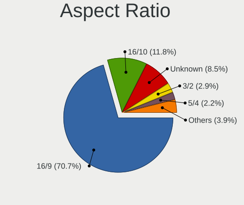

| Ratio   | Computers | Percent |
|---------|-----------|---------|
| 16/9    | 1512      | 70.65%  |
| 16/10   | 252       | 11.78%  |
| Unknown | 182       | 8.5%    |
| 3/2     | 63        | 2.94%   |
| 5/4     | 47        | 2.2%    |
| 21/9    | 41        | 1.92%   |
| 4/3     | 30        | 1.4%    |
| 6/5     | 4         | 0.19%   |
| 32/9    | 3         | 0.14%   |
| 1.96    | 2         | 0.09%   |
| 3.18    | 1         | 0.05%   |
| 11/10   | 1         | 0.05%   |
| 1.00    | 1         | 0.05%   |
| 0.46    | 1         | 0.05%   |

Monitor Area
------------

Area in inch²

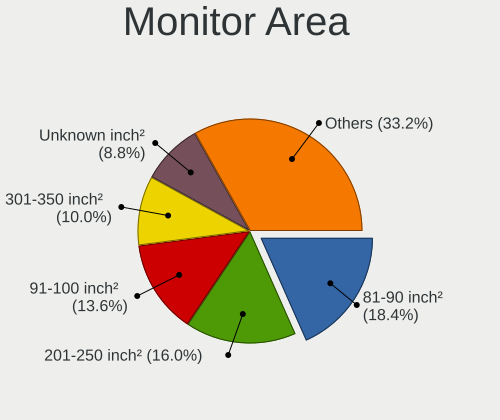

| Area in inch² | Computers | Percent |
|----------------|-----------|---------|
| 81-90          | 424       | 18.36%  |
| 201-250        | 370       | 16.02%  |
| 91-100         | 313       | 13.56%  |
| 301-350        | 232       | 10.05%  |
| Unknown        | 204       | 8.83%   |
| 101-110        | 116       | 5.02%   |
| 351-500        | 103       | 4.46%   |
| 61-70          | 93        | 4.03%   |
| 151-200        | 83        | 3.59%   |
| 71-80          | 70        | 3.03%   |
| 251-300        | 67        | 2.9%    |
| 141-150        | 43        | 1.86%   |
| 121-130        | 39        | 1.69%   |
| 111-120        | 36        | 1.56%   |
| 51-60          | 35        | 1.52%   |
| 501-1000       | 31        | 1.34%   |
| More than 1000 | 23        | 1%      |
| 41-50          | 17        | 0.74%   |
| 131-140        | 6         | 0.26%   |
| 1-40           | 4         | 0.17%   |

Pixel Density
-------------

Pixels per inch

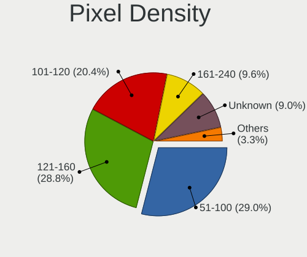

| Density       | Computers | Percent |
|---------------|-----------|---------|
| 51-100        | 657       | 28.98%  |
| 121-160       | 653       | 28.8%   |
| 101-120       | 462       | 20.38%  |
| 161-240       | 217       | 9.57%   |
| Unknown       | 203       | 8.95%   |
| More than 240 | 57        | 2.51%   |
| 1-50          | 18        | 0.79%   |

Multiple Monitors
-----------------

Total monitors connected

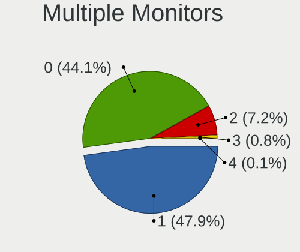

| Total | Computers | Percent |
|-------|-----------|---------|
| 1     | 1848      | 47.86%  |
| 0     | 1702      | 44.08%  |
| 2     | 278       | 7.2%    |
| 3     | 31        | 0.8%    |
| 4     | 2         | 0.05%   |

Network
-------

Net Controller Vendor
---------------------

Controller vendors

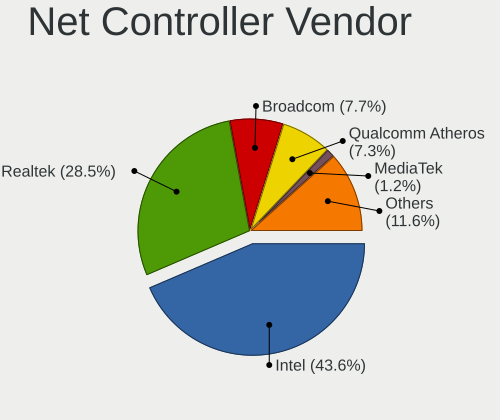

| Vendor                            | Computers | Percent |
|-----------------------------------|-----------|---------|
| Intel                             | 2285      | 43.56%  |
| Realtek Semiconductor             | 1497      | 28.54%  |
| Broadcom                          | 405       | 7.72%   |
| Qualcomm Atheros                  | 385       | 7.34%   |
| MediaTek                          | 63        | 1.2%    |
| TP-Link                           | 47        | 0.9%    |
| Marvell Technology Group          | 43        | 0.82%   |
| Ralink Technology                 | 38        | 0.72%   |
| Mellanox Technologies             | 30        | 0.57%   |
| Ralink                            | 24        | 0.46%   |
| Aquantia                          | 23        | 0.44%   |
| Samsung Electronics               | 22        | 0.42%   |
| Edimax Technology                 | 21        | 0.4%    |
| Sierra Wireless                   | 20        | 0.38%   |
| Nvidia                            | 17        | 0.32%   |
| American Megatrends               | 16        | 0.3%    |
| Xiaomi                            | 14        | 0.27%   |
| D-Link System                     | 14        | 0.27%   |
| Chelsio Communications            | 14        | 0.27%   |
| Dell                              | 13        | 0.25%   |
| Ericsson Business Mobile Networks | 12        | 0.23%   |
| Hewlett-Packard                   | 11        | 0.21%   |
| Google                            | 11        | 0.21%   |
| VIA Technologies                  | 10        | 0.19%   |
| Microchip Technology              | 10        | 0.19%   |
| Insyde Software                   | 9         | 0.17%   |
| D-Link                            | 9         | 0.17%   |
| Qualcomm Technologies             | 8         | 0.15%   |
| Emulex                            | 8         | 0.15%   |
| Qualcomm                          | 7         | 0.13%   |
| Lenovo                            | 7         | 0.13%   |
| Huawei Technologies               | 7         | 0.13%   |
| ASUSTek Computer                  | 7         | 0.13%   |
| Apple                             | 7         | 0.13%   |
| OPPO Electronics                  | 6         | 0.11%   |
| IBM                               | 6         | 0.11%   |
| Qualcomm Atheros Communications   | 5         | 0.1%    |
| Fibocom                           | 5         | 0.1%    |
| Arduino SA                        | 5         | 0.1%    |
| 3Com                              | 5         | 0.1%    |

Net Controller Model
--------------------

Controller models

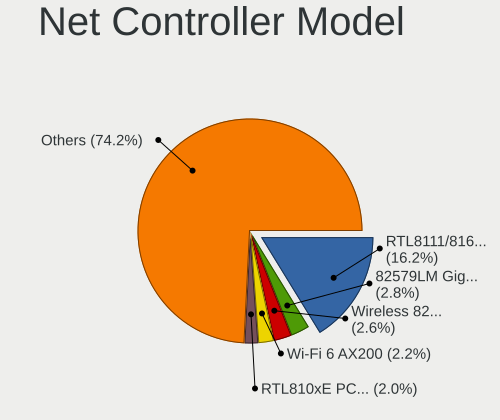

| Model                                                                  | Computers | Percent |
|------------------------------------------------------------------------|-----------|---------|
| Realtek RTL8111/8168/8211/8411 PCI Express Gigabit Ethernet Controller | 1056      | 16.24%  |
| Intel 82579LM Gigabit Network Connection (Lewisville)                  | 179       | 2.75%   |
| Intel Wireless 8265 / 8275                                             | 168       | 2.58%   |
| Intel Wi-Fi 6 AX200                                                    | 146       | 2.25%   |
| Realtek RTL810xE PCI Express Fast Ethernet controller                  | 128       | 1.97%   |
| Intel I211 Gigabit Network Connection                                  | 125       | 1.92%   |
| Realtek RTL8125 2.5GbE Controller                                      | 121       | 1.86%   |
| Intel I210 Gigabit Network Connection                                  | 115       | 1.77%   |
| Intel Wireless 7265                                                    | 92        | 1.41%   |
| Intel Wireless 8260                                                    | 91        | 1.4%    |
| Intel Centrino Advanced-N 6205 [Taylor Peak]                           | 84        | 1.29%   |
| Intel 82574L Gigabit Network Connection                                | 82        | 1.26%   |
| Intel Wi-Fi 6E(802.11ax) AX210/AX1675* 2x2 [Typhoon Peak]              | 78        | 1.2%    |
| Intel Wi-Fi 6 AX201                                                    | 78        | 1.2%    |
| Intel I350 Gigabit Network Connection                                  | 76        | 1.17%   |
| Broadcom NetXtreme BCM5720 Gigabit Ethernet PCIe                       | 74        | 1.14%   |
| Intel Ethernet Connection I217-LM                                      | 72        | 1.11%   |
| Intel Wireless 7260                                                    | 65        | 1%      |
| Intel Ethernet Connection (4) I219-LM                                  | 62        | 0.95%   |
| Intel Wi-Fi 5(802.11ac) Wireless-AC 9x6x [Thunder Peak]                | 56        | 0.86%   |
| Realtek RTL8188EUS 802.11n Wireless Network Adapter                    | 54        | 0.83%   |
| Intel Ethernet Controller I225-V                                       | 54        | 0.83%   |
| Intel Ethernet Connection (2) I219-LM                                  | 53        | 0.82%   |
| Qualcomm Atheros AR9285 Wireless Network Adapter (PCI-Express)         | 51        | 0.78%   |
| Intel Comet Lake PCH-LP CNVi WiFi                                      | 50        | 0.77%   |
| Qualcomm Atheros QCA9565 / AR9565 Wireless Network Adapter             | 49        | 0.75%   |
| Intel Cannon Point-LP CNVi [Wireless-AC]                               | 47        | 0.72%   |
| Realtek RTL8821CE 802.11ac PCIe Wireless Network Adapter               | 46        | 0.71%   |
| Intel Ethernet Connection (4) I219-V                                   | 46        | 0.71%   |
| Intel Ethernet Connection I219-LM                                      | 43        | 0.66%   |
| Intel Ethernet Connection (2) I219-V                                   | 42        | 0.65%   |
| Qualcomm Atheros QCA9377 802.11ac Wireless Network Adapter             | 38        | 0.58%   |
| Intel Cannon Lake PCH CNVi WiFi                                        | 38        | 0.58%   |
| Qualcomm Atheros AR9462 Wireless Network Adapter                       | 37        | 0.57%   |
| Realtek RTL8822CE 802.11ac PCIe Wireless Network Adapter               | 36        | 0.55%   |
| Qualcomm Atheros AR9485 Wireless Network Adapter                       | 36        | 0.55%   |
| Intel Dual Band Wireless-AC 3168NGW [Stone Peak]                       | 36        | 0.55%   |
| Intel 82579V Gigabit Network Connection                                | 36        | 0.55%   |
| Intel Ethernet Connection (3) I218-LM                                  | 35        | 0.54%   |
| Intel Ethernet Connection (7) I219-LM                                  | 32        | 0.49%   |

Wireless Vendor
---------------

Wireless vendors

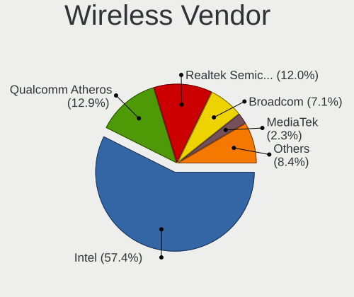

| Vendor                                | Computers | Percent |
|---------------------------------------|-----------|---------|
| Intel                                 | 1421      | 57.39%  |
| Qualcomm Atheros                      | 319       | 12.88%  |
| Realtek Semiconductor                 | 296       | 11.95%  |
| Broadcom                              | 175       | 7.07%   |
| MediaTek                              | 56        | 2.26%   |
| TP-Link                               | 47        | 1.9%    |
| Ralink Technology                     | 38        | 1.53%   |
| Ralink                                | 24        | 0.97%   |
| Edimax Technology                     | 21        | 0.85%   |
| Sierra Wireless                       | 16        | 0.65%   |
| D-Link                                | 9         | 0.36%   |
| Qualcomm Technologies                 | 8         | 0.32%   |
| ASUSTek Computer                      | 7         | 0.28%   |
| Dell                                  | 6         | 0.24%   |
| D-Link System                         | 6         | 0.24%   |
| Qualcomm Atheros Communications       | 5         | 0.2%    |
| NetGear                               | 4         | 0.16%   |
| Micro Star International              | 3         | 0.12%   |
| IMC Networks                          | 3         | 0.12%   |
| Atheros                               | 2         | 0.08%   |
| AboCom Systems                        | 2         | 0.08%   |
| 802.11g Adapter [Linksys WUSB54GC v3] | 2         | 0.08%   |
| ZyXEL Communications                  | 1         | 0.04%   |
| Sagem                                 | 1         | 0.04%   |
| Marvell Technology Group              | 1         | 0.04%   |
| Linksys                               | 1         | 0.04%   |
| BUFFALO                               | 1         | 0.04%   |
| Belkin Components                     | 1         | 0.04%   |

Wireless Model
--------------

Wireless models

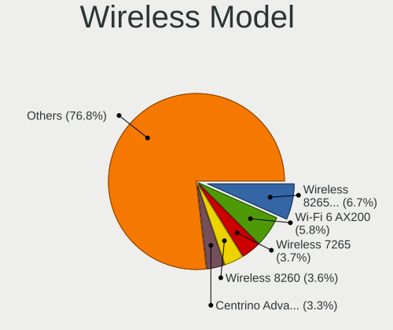

| Model                                                          | Computers | Percent |
|----------------------------------------------------------------|-----------|---------|
| Intel Wireless 8265 / 8275                                     | 168       | 6.7%    |
| Intel Wi-Fi 6 AX200                                            | 146       | 5.82%   |
| Intel Wireless 7265                                            | 92        | 3.67%   |
| Intel Wireless 8260                                            | 91        | 3.63%   |
| Intel Centrino Advanced-N 6205 [Taylor Peak]                   | 84        | 3.35%   |
| Intel Wi-Fi 6E(802.11ax) AX210/AX1675* 2x2 [Typhoon Peak]      | 78        | 3.11%   |
| Intel Wi-Fi 6 AX201                                            | 78        | 3.11%   |
| Intel Wireless 7260                                            | 65        | 2.59%   |
| Intel Wi-Fi 5(802.11ac) Wireless-AC 9x6x [Thunder Peak]        | 56        | 2.23%   |
| Realtek RTL8188EUS 802.11n Wireless Network Adapter            | 54        | 2.15%   |
| Qualcomm Atheros AR9285 Wireless Network Adapter (PCI-Express) | 51        | 2.03%   |
| Intel Comet Lake PCH-LP CNVi WiFi                              | 50        | 1.99%   |
| Qualcomm Atheros QCA9565 / AR9565 Wireless Network Adapter     | 49        | 1.95%   |
| Intel Cannon Point-LP CNVi [Wireless-AC]                       | 47        | 1.87%   |
| Realtek RTL8821CE 802.11ac PCIe Wireless Network Adapter       | 46        | 1.83%   |
| Qualcomm Atheros QCA9377 802.11ac Wireless Network Adapter     | 38        | 1.51%   |
| Intel Cannon Lake PCH CNVi WiFi                                | 38        | 1.51%   |
| Qualcomm Atheros AR9462 Wireless Network Adapter               | 37        | 1.47%   |
| Realtek RTL8822CE 802.11ac PCIe Wireless Network Adapter       | 36        | 1.43%   |
| Qualcomm Atheros AR9485 Wireless Network Adapter               | 36        | 1.43%   |
| Intel Dual Band Wireless-AC 3168NGW [Stone Peak]               | 36        | 1.43%   |
| Intel Alder Lake-P PCH CNVi WiFi                               | 30        | 1.2%    |
| Intel Raptor Lake PCH CNVi WiFi                                | 28        | 1.12%   |
| Broadcom BCM4360 802.11ac Dual Band Wireless Network Adapter   | 28        | 1.12%   |
| Intel Comet Lake PCH CNVi WiFi                                 | 26        | 1.04%   |
| Qualcomm Atheros QCA6174 802.11ac Wireless Network Adapter     | 25        | 1%      |
| Intel Wireless 3165                                            | 25        | 1%      |
| Intel Centrino Ultimate-N 6300                                 | 25        | 1%      |
| Intel Wireless 3160                                            | 23        | 0.92%   |
| Broadcom BCM4331 802.11a/b/g/n                                 | 23        | 0.92%   |
| Qualcomm Atheros AR928X Wireless Network Adapter (PCI-Express) | 22        | 0.88%   |
| MediaTek MT7922 802.11ax PCI Express Wireless Network Adapter  | 21        | 0.84%   |
| TP-Link AC600 wireless Realtek RTL8811AU [Archer T2U Nano]     | 20        | 0.8%    |
| Intel Dual Band Wireless-AC 3165 Plus Bluetooth                | 19        | 0.76%   |
| Realtek RTL8852BE PCIe 802.11ax Wireless Network Controller    | 18        | 0.72%   |
| Intel PRO/Wireless 3945ABG [Golan] Network Connection          | 18        | 0.72%   |
| Broadcom BCM4313 802.11bgn Wireless Network Adapter            | 18        | 0.72%   |
| Intel 700 Series Chipset CNVi WiFi                             | 17        | 0.68%   |
| Ralink RT5370 Wireless Adapter                                 | 16        | 0.64%   |
| Qualcomm Atheros AR93xx Wireless Network Adapter               | 16        | 0.64%   |

Ethernet Vendor
---------------

Ethernet vendors

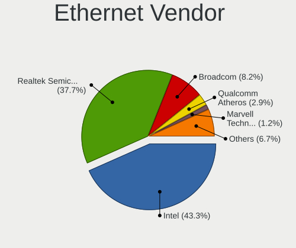

| Vendor                            | Computers | Percent |
|-----------------------------------|-----------|---------|
| Intel                             | 1548      | 43.35%  |
| Realtek Semiconductor             | 1345      | 37.66%  |
| Broadcom                          | 292       | 8.18%   |
| Qualcomm Atheros                  | 103       | 2.88%   |
| Marvell Technology Group          | 42        | 1.18%   |
| Aquantia                          | 23        | 0.64%   |
| Samsung Electronics               | 21        | 0.59%   |
| Nvidia                            | 17        | 0.48%   |
| American Megatrends               | 16        | 0.45%   |
| Xiaomi                            | 14        | 0.39%   |
| Chelsio Communications            | 14        | 0.39%   |
| VIA Technologies                  | 10        | 0.28%   |
| Insyde Software                   | 9         | 0.25%   |
| Microchip Technology              | 8         | 0.22%   |
| Emulex                            | 8         | 0.22%   |
| D-Link System                     | 8         | 0.22%   |
| Qualcomm                          | 7         | 0.2%    |
| Lenovo                            | 7         | 0.2%    |
| OPPO Electronics                  | 6         | 0.17%   |
| IBM                               | 6         | 0.17%   |
| Apple                             | 6         | 0.17%   |
| MediaTek                          | 5         | 0.14%   |
| Google                            | 5         | 0.14%   |
| 3Com                              | 5         | 0.14%   |
| Motorola PCS                      | 4         | 0.11%   |
| AMD                               | 4         | 0.11%   |
| Silicon Integrated Systems [SiS]  | 3         | 0.08%   |
| JMicron Technology                | 3         | 0.08%   |
| Huawei Technologies               | 3         | 0.08%   |
| Cisco Systems                     | 3         | 0.08%   |
| ZTE WCDMA Technologies MSM        | 2         | 0.06%   |
| Sundance Technology Inc / IC Plus | 2         | 0.06%   |
| Solarflare Communications         | 2         | 0.06%   |
| QLogic                            | 2         | 0.06%   |
| National Semiconductor            | 2         | 0.06%   |
| MYRICOM                           | 2         | 0.06%   |
| ADMtek                            | 2         | 0.06%   |
| Accton Technology                 | 2         | 0.06%   |
| U.S. Robotics                     | 1         | 0.03%   |
| Tehuti Networks                   | 1         | 0.03%   |

Ethernet Model
--------------

Ethernet models

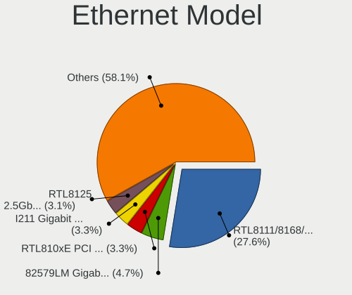

| Model                                                                         | Computers | Percent |
|-------------------------------------------------------------------------------|-----------|---------|
| Realtek RTL8111/8168/8211/8411 PCI Express Gigabit Ethernet Controller        | 1056      | 27.55%  |
| Intel 82579LM Gigabit Network Connection (Lewisville)                         | 179       | 4.67%   |
| Realtek RTL810xE PCI Express Fast Ethernet controller                         | 128       | 3.34%   |
| Intel I211 Gigabit Network Connection                                         | 125       | 3.26%   |
| Realtek RTL8125 2.5GbE Controller                                             | 117       | 3.05%   |
| Intel I210 Gigabit Network Connection                                         | 115       | 3%      |
| Intel 82574L Gigabit Network Connection                                       | 82        | 2.14%   |
| Intel I350 Gigabit Network Connection                                         | 76        | 1.98%   |
| Broadcom NetXtreme BCM5720 Gigabit Ethernet PCIe                              | 74        | 1.93%   |
| Intel Ethernet Connection I217-LM                                             | 72        | 1.88%   |
| Intel Ethernet Connection (4) I219-LM                                         | 62        | 1.62%   |
| Intel Ethernet Controller I225-V                                              | 54        | 1.41%   |
| Intel Ethernet Connection (2) I219-LM                                         | 53        | 1.38%   |
| Intel Ethernet Connection (4) I219-V                                          | 46        | 1.2%    |
| Intel Ethernet Connection I219-LM                                             | 43        | 1.12%   |
| Intel Ethernet Connection (2) I219-V                                          | 42        | 1.1%    |
| Intel 82579V Gigabit Network Connection                                       | 36        | 0.94%   |
| Intel Ethernet Connection (3) I218-LM                                         | 35        | 0.91%   |
| Intel Ethernet Connection (7) I219-LM                                         | 32        | 0.83%   |
| Intel Ethernet Connection (7) I219-V                                          | 31        | 0.81%   |
| Broadcom NetXtreme II BCM5709 Gigabit Ethernet                                | 28        | 0.73%   |
| Intel 82571EB/82571GB Gigabit Ethernet Controller D0/D1 (copper applications) | 26        | 0.68%   |
| Intel 82599ES 10-Gigabit SFI/SFP+ Network Connection                          | 25        | 0.65%   |
| Intel Ethernet Controller I226-V                                              | 23        | 0.6%    |
| Intel 82576 Gigabit Network Connection                                        | 23        | 0.6%    |
| Intel Ethernet Controller 10-Gigabit X540-AT2                                 | 22        | 0.57%   |
| Realtek RTL-8100/8101L/8139 PCI Fast Ethernet Adapter                         | 21        | 0.55%   |
| Intel Ethernet Controller X550                                                | 21        | 0.55%   |
| Intel Ethernet Connection (2) I218-V                                          | 21        | 0.55%   |
| Intel Ethernet Connection I218-LM                                             | 20        | 0.52%   |
| Intel Ethernet Connection (6) I219-V                                          | 20        | 0.52%   |
| Intel 82577LM Gigabit Network Connection                                      | 19        | 0.5%    |
| Broadcom NetXtreme BCM5764M Gigabit Ethernet PCIe                             | 19        | 0.5%    |
| Intel Ethernet Connection (6) I219-LM                                         | 18        | 0.47%   |
| Intel 82567LM Gigabit Network Connection                                      | 18        | 0.47%   |
| Broadcom NetXtreme BCM57765 Gigabit Ethernet PCIe                             | 18        | 0.47%   |
| Intel Ethernet Connection (10) I219-V                                         | 17        | 0.44%   |
| Qualcomm Atheros AR8151 v2.0 Gigabit Ethernet                                 | 16        | 0.42%   |
| Intel Ethernet Connection I219-V                                              | 16        | 0.42%   |
| Intel Ethernet Connection (5) I219-LM                                         | 16        | 0.42%   |

Net Controller Kind
-------------------

Ethernet, WiFi or modem

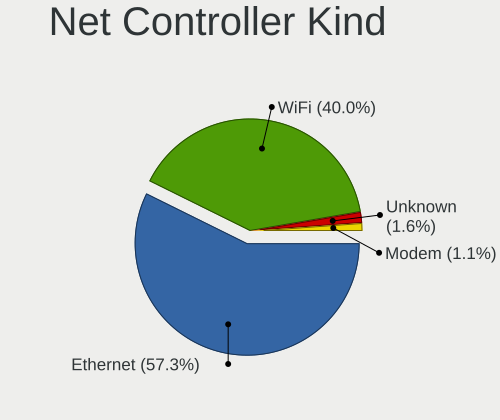

| Kind     | Computers | Percent |
|----------|-----------|---------|
| Ethernet | 3263      | 57.32%  |
| WiFi     | 2275      | 39.96%  |
| Unknown  | 90        | 1.58%   |
| Modem    | 65        | 1.14%   |

Used Controller
---------------

Currently used network controller

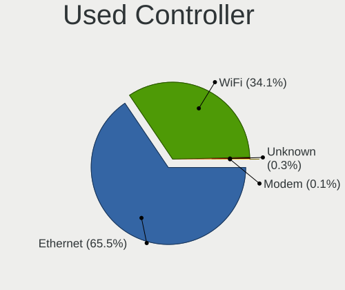

| Kind     | Computers | Percent |
|----------|-----------|---------|
| Ethernet | 2587      | 65.54%  |
| WiFi     | 1344      | 34.05%  |
| Unknown  | 11        | 0.28%   |
| Modem    | 5         | 0.13%   |

NICs
----

Total network controllers on board

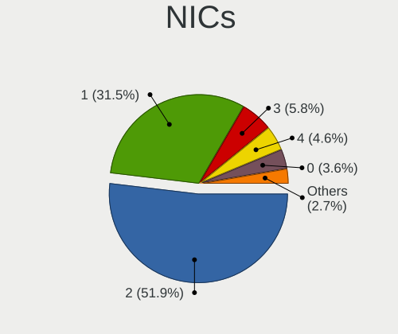

| Total | Computers | Percent |
|-------|-----------|---------|
| 2     | 1968      | 51.89%  |
| 1     | 1194      | 31.48%  |
| 3     | 220       | 5.8%    |
| 4     | 173       | 4.56%   |
| 0     | 135       | 3.56%   |
| 6     | 43        | 1.13%   |
| 5     | 32        | 0.84%   |
| 7     | 10        | 0.26%   |
| 8     | 8         | 0.21%   |
| 9     | 5         | 0.13%   |
| 10    | 3         | 0.08%   |
| 15    | 1         | 0.03%   |
| 11    | 1         | 0.03%   |

IPv6
----

IPv6 vs IPv4

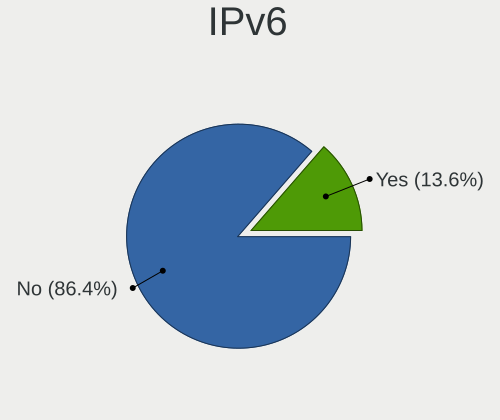

| Used | Computers | Percent |
|------|-----------|---------|
| No   | 3307      | 86.39%  |
| Yes  | 521       | 13.61%  |

Bluetooth
---------

Bluetooth Vendor
----------------

Controller vendors

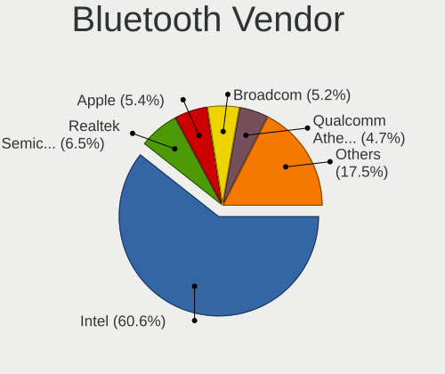

| Vendor                          | Computers | Percent |
|---------------------------------|-----------|---------|
| Intel                           | 1093      | 60.62%  |
| Realtek Semiconductor           | 118       | 6.54%   |
| Apple                           | 97        | 5.38%   |
| Broadcom                        | 94        | 5.21%   |
| Qualcomm Atheros Communications | 85        | 4.71%   |
| Cambridge Silicon Radio         | 54        | 3%      |
| IMC Networks                    | 49        | 2.72%   |
| Foxconn / Hon Hai               | 48        | 2.66%   |
| Lite-On Technology              | 35        | 1.94%   |
| MediaTek                        | 27        | 1.5%    |
| ASUSTek Computer                | 25        | 1.39%   |
| Dell                            | 19        | 1.05%   |
| Hewlett-Packard                 | 16        | 0.89%   |
| TP-Link                         | 7         | 0.39%   |
| Skylight Digital                | 6         | 0.33%   |
| Ralink                          | 5         | 0.28%   |
| Alps Electric                   | 4         | 0.22%   |
| USI                             | 3         | 0.17%   |
| Micro Star International        | 3         | 0.17%   |
| Shenzhen Goodix Technology      | 2         | 0.11%   |
| Unknown                         | 2         | 0.11%   |
| Toshiba                         | 1         | 0.06%   |
| Sino Wealth Electronic          | 1         | 0.06%   |
| Realtek                         | 1         | 0.06%   |
| Ralink Technology               | 1         | 0.06%   |
| Opticis                         | 1         | 0.06%   |
| Integrated System Solution      | 1         | 0.06%   |
| Fujitsu                         | 1         | 0.06%   |
| Esel International              | 1         | 0.06%   |
| Creative Technology             | 1         | 0.06%   |
| Corsair                         | 1         | 0.06%   |
| Askey Computer                  | 1         | 0.06%   |

Bluetooth Model
---------------

Controller models

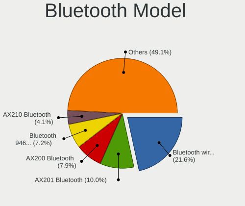

| Model                                                       | Computers | Percent |
|-------------------------------------------------------------|-----------|---------|
| Intel Bluetooth wireless interface                          | 391       | 21.59%  |
| Intel AX201 Bluetooth                                       | 182       | 10.05%  |
| Intel AX200 Bluetooth                                       | 143       | 7.9%    |
| Intel Bluetooth 9460/9560 Jefferson Peak (JfP)              | 131       | 7.23%   |
| Intel AX210 Bluetooth                                       | 74        | 4.09%   |
| Intel AX211 Bluetooth                                       | 67        | 3.7%    |
| Realtek Bluetooth Adapter                                   | 60        | 3.31%   |
| Cambridge Silicon Radio Bluetooth Dongle (HCI mode)         | 54        | 2.98%   |
| Apple Bluetooth Host Controller                             | 51        | 2.82%   |
| Intel Wireless-AC 9260 Bluetooth Adapter                    | 49        | 2.71%   |
| Intel Wireless-AC 3168 Bluetooth                            | 34        | 1.88%   |
| Broadcom BCM20702 Bluetooth 4.0 [ThinkPad]                  | 32        | 1.77%   |
| Broadcom BCM2045B (BDC-2.1)                                 | 28        | 1.55%   |
| Apple Broadcom Built-in Bluetooth                           | 20        | 1.1%    |
| Realtek  Bluetooth 4.2 Adapter                              | 19        | 1.05%   |
| Intel Centrino Bluetooth Wireless Transceiver               | 17        | 0.94%   |
| IMC Networks Realtek Bluetooth Adapter                      | 17        | 0.94%   |
| Apple Built-in Bluetooth 2.0+EDR HCI                        | 17        | 0.94%   |
| Foxconn / Hon Hai Bluetooth USB Module                      | 15        | 0.83%   |
| Qualcomm Atheros QCA9377 Bluetooth 4.1                      | 14        | 0.77%   |
| Qualcomm Atheros AR9462 Bluetooth                           | 12        | 0.66%   |
| Realtek Bluetooth 4.2 Adapter                               | 11        | 0.61%   |
| Qualcomm Atheros AR3012 Bluetooth 4.0                       | 11        | 0.61%   |
| MediaTek RZ608 Bluetooth Adapter                            | 11        | 0.61%   |
| Qualcomm Atheros QCA61x4 Bluetooth 4.0                      | 10        | 0.55%   |
| Qualcomm Atheros Dell Wireless 1707 Bluetooth 4.0 LE Device | 10        | 0.55%   |
| Lite-On Atheros AR3012 Bluetooth                            | 10        | 0.55%   |
| MediaTek Wireless_Device                                    | 9         | 0.5%    |
| Lite-On Bluetooth USB Module                                | 9         | 0.5%    |
| Intel Centrino Advanced-N 6230 Bluetooth adapter            | 9         | 0.5%    |
| Foxconn / Hon Hai MediaTek Bluetooth Adapter                | 9         | 0.5%    |
| Dell DW375 Bluetooth Module                                 | 9         | 0.5%    |
| Realtek Bluetooth 4.0 Adapter                               | 8         | 0.44%   |
| Broadcom BCM20702A0 Bluetooth 4.0                           | 8         | 0.44%   |
| ASUS Broadcom BCM20702A0 Bluetooth                          | 8         | 0.44%   |
| TP-Link Bluetooth 5.0 USB Adapter                           | 7         | 0.39%   |
| Foxconn / Hon Hai RZ616 Bluetooth Adapter                   | 7         | 0.39%   |
| Skylight Digital Realtek Bluetooth Adapter                  | 6         | 0.33%   |
| Realtek RTL8822BE Bluetooth 4.2 Adapter                     | 6         | 0.33%   |
| Lite-On Qualcomm Atheros QCA9377 Bluetooth                  | 6         | 0.33%   |

Sound
-----

Sound Vendor
------------

Sound card vendors

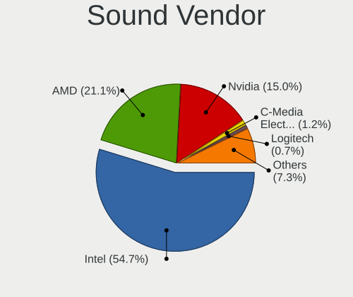

| Vendor                                       | Computers | Percent |
|----------------------------------------------|-----------|---------|
| Intel                                        | 2309      | 54.73%  |
| AMD                                          | 892       | 21.14%  |
| Nvidia                                       | 631       | 14.96%  |
| C-Media Electronics                          | 50        | 1.19%   |
| Logitech                                     | 30        | 0.71%   |
| Creative Labs                                | 24        | 0.57%   |
| Texas Instruments                            | 23        | 0.55%   |
| Lenovo                                       | 20        | 0.47%   |
| Realtek Semiconductor                        | 17        | 0.4%    |
| ASUSTek Computer                             | 13        | 0.31%   |
| GN Netcom                                    | 11        | 0.26%   |
| Plantronics                                  | 10        | 0.24%   |
| JMTek                                        | 10        | 0.24%   |
| Focusrite-Novation                           | 10        | 0.24%   |
| Creative Technology                          | 10        | 0.24%   |
| Generalplus Technology                       | 8         | 0.19%   |
| Thesycon Systemsoftware & Consulting         | 7         | 0.17%   |
| SteelSeries ApS                              | 7         | 0.17%   |
| Kingston Technology                          | 7         | 0.17%   |
| Blue Microphones                             | 7         | 0.17%   |
| VIA Technologies                             | 6         | 0.14%   |
| Sony                                         | 6         | 0.14%   |
| Silicon Integrated Systems [SiS]             | 6         | 0.14%   |
| Apple                                        | 6         | 0.14%   |
| Cambridge Silicon Radio                      | 5         | 0.12%   |
| BEHRINGER International                      | 5         | 0.12%   |
| Zoran Co. Personal Media Division (Nogatech) | 4         | 0.09%   |
| XMOS                                         | 4         | 0.09%   |
| Razer USA                                    | 4         | 0.09%   |
| Tenx Technology                              | 3         | 0.07%   |
| RODE Microphones                             | 3         | 0.07%   |
| Micro Star International                     | 3         | 0.07%   |
| M-Audio                                      | 3         | 0.07%   |
| Huawei Technologies                          | 3         | 0.07%   |
| Hewlett-Packard                              | 3         | 0.07%   |
| FiiO Electronics Technology                  | 3         | 0.07%   |
| Corsair                                      | 3         | 0.07%   |
| ASRock                                       | 3         | 0.07%   |
| Yamaha                                       | 2         | 0.05%   |
| Trust International                          | 2         | 0.05%   |

Sound Model
-----------

Sound card models

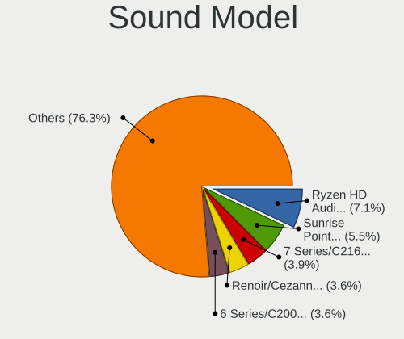

| Model                                                                      | Computers | Percent |
|----------------------------------------------------------------------------|-----------|---------|
| AMD Ryzen HD Audio Controller                                              | 358       | 7.06%   |
| Intel Sunrise Point-LP HD Audio                                            | 277       | 5.46%   |
| Intel 7 Series/C216 Chipset Family High Definition Audio Controller        | 199       | 3.92%   |
| AMD Renoir/Cezanne HDMI/DP Audio Controller                                | 185       | 3.65%   |
| Intel 6 Series/C200 Series Chipset Family High Definition Audio Controller | 182       | 3.59%   |
| AMD Starship/Matisse HD Audio Controller                                   | 129       | 2.54%   |
| Intel 8 Series/C220 Series Chipset High Definition Audio Controller        | 127       | 2.5%    |
| Intel Cannon Lake PCH cAVS                                                 | 109       | 2.15%   |
| Intel Xeon E3-1200 v3/4th Gen Core Processor HD Audio Controller           | 107       | 2.11%   |
| Intel Tiger Lake-LP Smart Sound Technology Audio Controller                | 94        | 1.85%   |
| Intel NM10/ICH7 Family High Definition Audio Controller                    | 90        | 1.77%   |
| Intel Broadwell-U Audio Controller                                         | 88        | 1.73%   |
| Intel 100 Series/C230 Series Chipset Family HD Audio Controller            | 86        | 1.7%    |
| AMD Raven/Raven2/Fenghuang HDMI/DP Audio Controller                        | 84        | 1.66%   |
| AMD SBx00 Azalia (Intel HDA)                                               | 82        | 1.62%   |
| Intel Wildcat Point-LP High Definition Audio Controller                    | 81        | 1.6%    |
| AMD Radeon High Definition Audio Controller                                | 79        | 1.56%   |
| Intel Haswell-ULT HD Audio Controller                                      | 74        | 1.46%   |
| Intel 8 Series HD Audio Controller                                         | 74        | 1.46%   |
| Intel 200 Series PCH HD Audio                                              | 73        | 1.44%   |
| Intel 5 Series/3400 Series Chipset High Definition Audio                   | 72        | 1.42%   |
| Intel Cannon Point-LP High Definition Audio Controller                     | 68        | 1.34%   |
| Intel Comet Lake PCH-LP cAVS                                               | 63        | 1.24%   |
| AMD Family 17h (Models 00h-0fh) HD Audio Controller                        | 63        | 1.24%   |
| Intel 82801I (ICH9 Family) HD Audio Controller                             | 58        | 1.14%   |
| AMD Ellesmere HDMI Audio [Radeon RX 470/480 / 570/580/590]                 | 58        | 1.14%   |
| Nvidia GK208 HDMI/DP Audio Controller                                      | 56        | 1.1%    |
| Nvidia TU107 GeForce GTX 1650 High Definition Audio Controller             | 50        | 0.99%   |
| AMD FCH Azalia Controller                                                  | 46        | 0.91%   |
| Intel Comet Lake PCH cAVS                                                  | 45        | 0.89%   |
| Intel 82801H (ICH8 Family) HD Audio Controller                             | 44        | 0.87%   |
| Nvidia GP107GL High Definition Audio Controller                            | 43        | 0.85%   |
| Intel Alder Lake PCH-P High Definition Audio Controller                    | 43        | 0.85%   |
| AMD Navi 21/23 HDMI/DP Audio Controller                                    | 43        | 0.85%   |
| Intel Atom Processor Z36xxx/Z37xxx Series High Definition Audio Controller | 41        | 0.81%   |
| Intel Raptor Lake-P/U/H cAVS                                               | 38        | 0.75%   |
| Intel Celeron/Pentium Silver Processor High Definition Audio               | 36        | 0.71%   |
| AMD Kabini HDMI/DP Audio                                                   | 36        | 0.71%   |
| Nvidia TU116 High Definition Audio Controller                              | 35        | 0.69%   |
| AMD Oland/Hainan/Cape Verde/Pitcairn HDMI Audio [Radeon HD 7000 Series]    | 35        | 0.69%   |

Memory
------

Memory Vendor
-------------

Memory module vendors

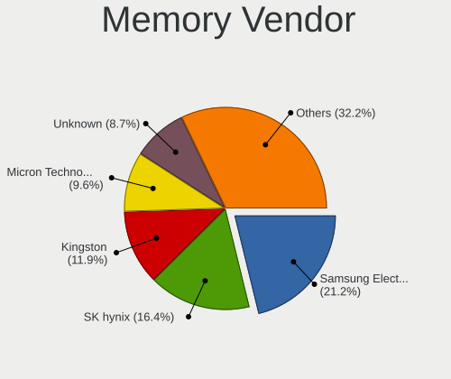

| Vendor                       | Computers | Percent |
|------------------------------|-----------|---------|
| Samsung Electronics          | 884       | 21.17%  |
| SK hynix                     | 685       | 16.41%  |
| Kingston                     | 497       | 11.9%   |
| Micron Technology            | 401       | 9.6%    |
| Unknown                      | 365       | 8.74%   |
| Crucial                      | 279       | 6.68%   |
| Corsair                      | 220       | 5.27%   |
| Unknown                      | 131       | 3.14%   |
| G.Skill                      | 129       | 3.09%   |
| A-DATA Technology            | 70        | 1.68%   |
| Ramaxel Technology           | 68        | 1.63%   |
| Elpida                       | 44        | 1.05%   |
| Nanya Technology             | 37        | 0.89%   |
| Team                         | 36        | 0.86%   |
| Patriot                      | 27        | 0.65%   |
| Transcend                    | 25        | 0.6%    |
| Hewlett-Packard              | 24        | 0.57%   |
| GOODRAM                      | 17        | 0.41%   |
| Unknown (ABCD)               | 16        | 0.38%   |
| Smart                        | 12        | 0.29%   |
| Avant                        | 11        | 0.26%   |
| PNY                          | 9         | 0.22%   |
| Patriot Memory (PDP Systems) | 9         | 0.22%   |
| Apacer                       | 9         | 0.22%   |
| Goldkey                      | 8         | 0.19%   |
| AMD                          | 8         | 0.19%   |
| Timetec                      | 6         | 0.14%   |
| Super Talent                 | 6         | 0.14%   |
| Neo Forza                    | 5         | 0.12%   |
| Lexar                        | 5         | 0.12%   |
| 48spaces                     | 5         | 0.12%   |
| V-GeN                        | 4         | 0.1%    |
| Toshiba                      | 4         | 0.1%    |
| Qimonda                      | 4         | 0.1%    |
| Lexar Co Limited             | 4         | 0.1%    |
| Kllisre                      | 4         | 0.1%    |
| Kingmax                      | 4         | 0.1%    |
| HPE                          | 4         | 0.1%    |
| ASint Technology             | 4         | 0.1%    |
| tigo                         | 3         | 0.07%   |

Memory Model
------------

Memory module models

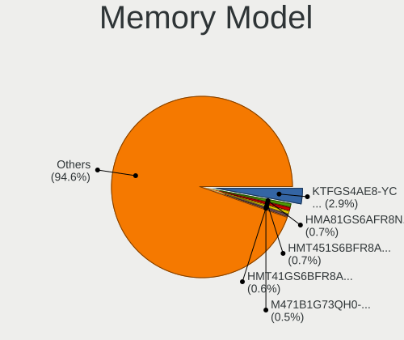

| Model                                                     | Computers | Percent |
|-----------------------------------------------------------|-----------|---------|
| Unknown                                                   | 131       | 2.9%    |
| SK hynix RAM HMA81GS6AFR8N-UH 8GB SODIMM DDR4 2400MT/s    | 32        | 0.71%   |
| SK hynix RAM HMT451S6BFR8A-PB 4GB SODIMM DDR3 1600MT/s    | 30        | 0.66%   |
| SK hynix RAM HMT41GS6BFR8A-PB 8GB SODIMM DDR3 1600MT/s    | 26        | 0.57%   |
| Samsung RAM M471B1G73QH0-YK0 8GB SODIMM DDR3 1867MT/s     | 24        | 0.53%   |
| Samsung RAM M471B5273DH0-CH9 4GB SODIMM DDR3 1334MT/s     | 23        | 0.51%   |
| Samsung RAM M471B5173QH0-YK0 4GB SODIMM DDR3 1600MT/s     | 22        | 0.49%   |
| Samsung RAM M471B5173DB0-YK0 4GB SODIMM DDR3 1600MT/s     | 22        | 0.49%   |
| Samsung RAM M471A1K43CB1-CRC 8GB SODIMM DDR4 2667MT/s     | 22        | 0.49%   |
| SK hynix RAM HMT351S6CFR8C-PB 4GB SODIMM DDR3 1600MT/s    | 21        | 0.46%   |
| SK hynix RAM HMA81GS6CJR8N-VK 8GB SODIMM DDR4 2667MT/s    | 20        | 0.44%   |
| Samsung RAM M471B1G73EB0-YK0 8GB SODIMM DDR3 1600MT/s     | 20        | 0.44%   |
| Samsung RAM M471A1K43BB1-CRC 8GB SODIMM DDR4 2400MT/s     | 20        | 0.44%   |
| Corsair RAM CMK16GX4M2B3200C16 8GB DIMM DDR4 3200MT/s     | 20        | 0.44%   |
| Samsung RAM M471A5244CB0-CRC 4GB SODIMM DDR4 2400MT/s     | 17        | 0.38%   |
| Unknown RAM Module 4GB DIMM 1333MT/s                      | 16        | 0.35%   |
| Samsung RAM M471A1G44BB0-CWE 8GB SODIMM DDR4 3200MT/s     | 16        | 0.35%   |
| Samsung RAM M393B1G70QH0-YK0 8GB DIMM DDR3 1600MT/s       | 16        | 0.35%   |
| Unknown RAM Module 8GB DIMM DDR3 1600MT/s                 | 15        | 0.33%   |
| Samsung RAM M471B5273CH0-CH9 4GB SODIMM DDR3 1334MT/s     | 15        | 0.33%   |
| Samsung RAM M471A1K43CB1-CTD 8GB SODIMM DDR4 3200MT/s     | 15        | 0.33%   |
| Unknown RAM Module 2GB DIMM DDR2 800MT/s                  | 14        | 0.31%   |
| SK hynix RAM HMA82GS6CJR8N-VK 16GB SODIMM DDR4 2667MT/s   | 14        | 0.31%   |
| Samsung RAM M471B5273DH0-CK0 8GB SODIMM DDR3 1600MT/s     | 14        | 0.31%   |
| SK hynix RAM HMAA1GS6CJR6N-XN 8GB SODIMM DDR4 3200MT/s    | 13        | 0.29%   |
| Samsung RAM M471A5244CB0-CWE 4GB SODIMM DDR4 3200MT/s     | 13        | 0.29%   |
| Samsung RAM M471A1G44AB0-CWE 8GB SODIMM DDR4 3200MT/s     | 13        | 0.29%   |
| Ramaxel RAM RMSA3260ME78HAF-2666 8GB SODIMM DDR4 2667MT/s | 13        | 0.29%   |
| Unknown RAM Module 2GB SODIMM DDR2 667MT/s                | 12        | 0.27%   |
| Samsung RAM M471A2K43CB1-CTD 16GB SODIMM DDR4 2667MT/s    | 12        | 0.27%   |
| Samsung RAM M471A1K43DB1-CTD 8GB SODIMM DDR4 2667MT/s     | 12        | 0.27%   |
| SK hynix RAM HMA851S6AFR6N-UH 4GB SODIMM DDR4 2400MT/s    | 11        | 0.24%   |
| Samsung RAM M471B5173EB0-YK0 4GB SODIMM DDR3 1600MT/s     | 11        | 0.24%   |
| Samsung RAM M471A2K43CB1-CRC 16GB SODIMM DDR4 2400MT/s    | 11        | 0.24%   |
| Samsung RAM M471A2G44AM0-CWE 16GiB SODIMM DDR4 3200MT/s   | 11        | 0.24%   |
| Samsung RAM M471A1K43DB1-CWE 8GB SODIMM DDR4 3200MT/s     | 11        | 0.24%   |
| Micron RAM 4ATF1G64HZ-3G2E1 8GB SODIMM DDR4 3200MT/s      | 11        | 0.24%   |
| Unknown RAM Module 4GB SODIMM DDR3 1333MT/s               | 10        | 0.22%   |
| SK hynix RAM Module 4GB SODIMM DDR3 1600MT/s              | 10        | 0.22%   |
| SK hynix RAM HYMP125S64CP8-S6 2GB SODIMM DDR2 975MT/s     | 10        | 0.22%   |

Memory Kind
-----------

Memory module kinds

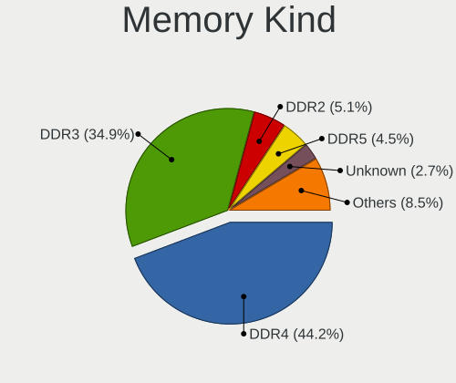

| Kind            | Computers | Percent |
|-----------------|-----------|---------|
| DDR4            | 1599      | 44.24%  |
| DDR3            | 1262      | 34.92%  |
| DDR2            | 186       | 5.15%   |
| DDR5            | 162       | 4.48%   |
| Unknown         | 97        | 2.68%   |
| LPDDR4          | 79        | 2.19%   |
| LPDDR3          | 78        | 2.16%   |
| SDRAM           | 48        | 1.33%   |
| LPDDR5          | 46        | 1.27%   |
| DDR             | 42        | 1.16%   |
| DRAM            | 9         | 0.25%   |
| Logical non-vol | 2         | 0.06%   |
| SRAM            | 1         | 0.03%   |
| RAM             | 1         | 0.03%   |
| EEPROM          | 1         | 0.03%   |
| DDR2 FB-DIMM    | 1         | 0.03%   |

Memory Form Factor
------------------

Physical design of the memory module

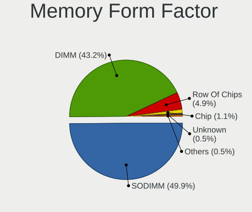

| Name            | Computers | Percent |
|-----------------|-----------|---------|
| SODIMM          | 1803      | 49.88%  |
| DIMM            | 1560      | 43.15%  |
| Row Of Chips    | 177       | 4.9%    |
| Chip            | 40        | 1.11%   |
| Unknown         | 17        | 0.47%   |
| FB-DIMM         | 9         | 0.25%   |
| RIMM            | 8         | 0.22%   |
| Proprietary Car | 1         | 0.03%   |

Memory Size
-----------

Memory module size

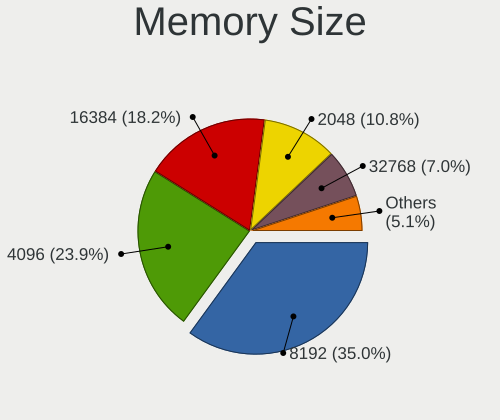

| Size   | Computers | Percent |
|--------|-----------|---------|
| 8192   | 1385      | 35.03%  |
| 4096   | 945       | 23.9%   |
| 16384  | 719       | 18.18%  |
| 2048   | 428       | 10.82%  |
| 32768  | 276       | 6.98%   |
| 1024   | 129       | 3.26%   |
| 512    | 28        | 0.71%   |
| 65536  | 11        | 0.28%   |
| 49152  | 8         | 0.2%    |
| 256    | 6         | 0.15%   |
| 131072 | 4         | 0.1%    |
| 3072   | 4         | 0.1%    |
| 12288  | 2         | 0.05%   |
| 6144   | 2         | 0.05%   |
| 128    | 2         | 0.05%   |
| 2560   | 1         | 0.03%   |
| 64     | 1         | 0.03%   |
| 32     | 1         | 0.03%   |
| 8      | 1         | 0.03%   |
| 1      | 1         | 0.03%   |

Memory Speed
------------

Memory module speed

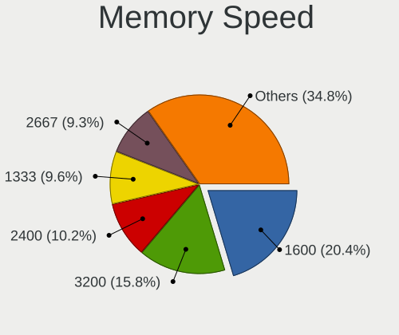

| Speed   | Computers | Percent |
|---------|-----------|---------|
| 1600    | 789       | 20.37%  |
| 3200    | 613       | 15.83%  |
| 2400    | 396       | 10.22%  |
| 1333    | 370       | 9.55%   |
| 2667    | 359       | 9.27%   |
| 2133    | 269       | 6.95%   |
| 800     | 106       | 2.74%   |
| 667     | 105       | 2.71%   |
| 4800    | 88        | 2.27%   |
| Unknown | 82        | 2.12%   |
| 1867    | 72        | 1.86%   |
| 1334    | 72        | 1.86%   |
| 5600    | 60        | 1.55%   |
| 2666    | 51        | 1.32%   |
| 1067    | 47        | 1.21%   |
| 1066    | 40        | 1.03%   |
| 3600    | 38        | 0.98%   |
| 4267    | 37        | 0.96%   |
| 6400    | 36        | 0.93%   |
| 2933    | 34        | 0.88%   |
| 3000    | 29        | 0.75%   |
| 533     | 29        | 0.75%   |
| 1866    | 27        | 0.7%    |
| 3733    | 17        | 0.44%   |
| 975     | 12        | 0.31%   |
| 400     | 12        | 0.31%   |
| 5200    | 10        | 0.26%   |
| 4266    | 9         | 0.23%   |
| 266     | 6         | 0.15%   |
| 2048    | 5         | 0.13%   |
| 6000    | 4         | 0.1%    |
| 4000    | 4         | 0.1%    |
| 3400    | 4         | 0.1%    |
| 3066    | 4         | 0.1%    |
| 3534    | 3         | 0.08%   |
| 1639    | 3         | 0.08%   |
| 333     | 3         | 0.08%   |
| 8533    | 2         | 0.05%   |
| 7500    | 2         | 0.05%   |
| 7467    | 2         | 0.05%   |

Printers & scanners
-------------------

Printer Vendor
--------------

Printer device vendors

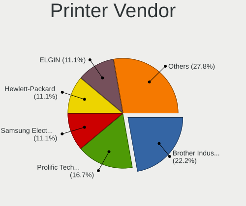

| Vendor              | Computers | Percent |
|---------------------|-----------|---------|
| Brother Industries  | 4         | 22.22%  |
| Prolific Technology | 3         | 16.67%  |
| Samsung Electronics | 2         | 11.11%  |
| Hewlett-Packard     | 2         | 11.11%  |
| ELGIN               | 2         | 11.11%  |
| Xerox               | 1         | 5.56%   |
| Seiko Epson         | 1         | 5.56%   |
| QinHeng Electronics | 1         | 5.56%   |
| Dymo-CoStar         | 1         | 5.56%   |
| Canon               | 1         | 5.56%   |

Printer Model
-------------

Printer device models

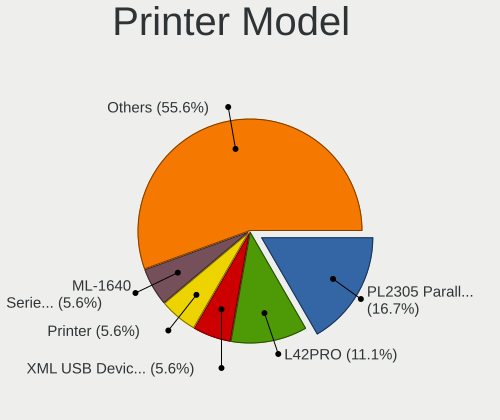

| Model                                                                                      | Computers | Percent |
|--------------------------------------------------------------------------------------------|-----------|---------|
| Prolific PL2305 Parallel Port                                                              | 3         | 16.67%  |
| ELGIN L42PRO                                                                               | 2         | 11.11%  |
| Xerox XML USB Device Interface                                                             | 1         | 5.56%   |
| Seiko Epson Printer                                                                        | 1         | 5.56%   |
| Samsung ML-1640 Series Laser Printer                                                       | 1         | 5.56%   |
| Samsung ML-1610 Mono Laser Printer                                                         | 1         | 5.56%   |
| QinHeng CH340S                                                                             | 1         | 5.56%   |
| HP LaserJet 1012                                                                           | 1         | 5.56%   |
| HP HP LaserJet M14-M17 Printer HP LEDM IPP Printer HP LEDM IPP Printer HP LEDM IPP Printer | 1         | 5.56%   |
| Dymo-CoStar LabelWriter 450                                                                | 1         | 5.56%   |
| Canon LBP2900                                                                              | 1         | 5.56%   |
| Brother MFC-7360N                                                                          | 1         | 5.56%   |
| Brother HL-L5200DW series                                                                  | 1         | 5.56%   |
| Brother HL-2030 Laser Printer                                                              | 1         | 5.56%   |
| Brother HL-1430 Laser Printer                                                              | 1         | 5.56%   |

Scanner Vendor
--------------

Scanner device vendors

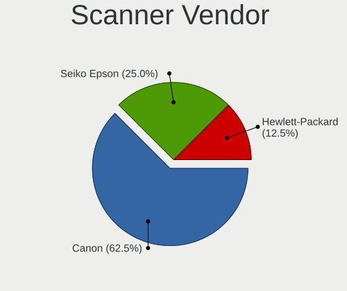

| Vendor          | Computers | Percent |
|-----------------|-----------|---------|
| Canon           | 6         | 60%     |
| Seiko Epson     | 3         | 30%     |
| Hewlett-Packard | 1         | 10%     |

Scanner Model
-------------

Scanner device models

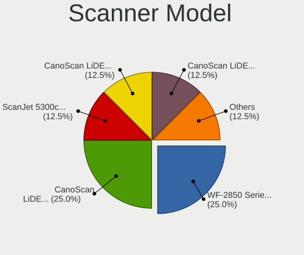

| Model                                                                               | Computers | Percent |
|-------------------------------------------------------------------------------------|-----------|---------|
| Seiko Epson WF-2850 Series EPSON Scanner USB2.0 Printer EPSON Utility USB2.0 Faxout | 2         | 20%     |
| Canon CanoScan LiDE 110                                                             | 2         | 20%     |
| Seiko Epson GT-9300UF [Perfection 2400 PHOTO]                                       | 1         | 10%     |
| HP ScanJet 5300c/5370c                                                              | 1         | 10%     |
| Canon CanoScan LIDE 25                                                              | 1         | 10%     |
| Canon CanoScan LiDE 220                                                             | 1         | 10%     |
| Canon CanoScan LiDE 120                                                             | 1         | 10%     |
| Canon CanoScan 9000F                                                                | 1         | 10%     |

Camera
------

Camera Vendor
-------------

Camera device vendors

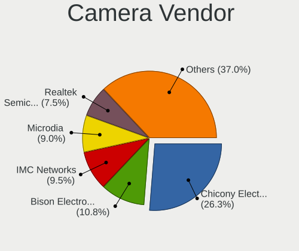

| Vendor                                 | Computers | Percent |
|----------------------------------------|-----------|---------|
| Chicony Electronics                    | 384       | 26.27%  |
| Bison Electronics                      | 158       | 10.81%  |
| IMC Networks                           | 139       | 9.51%   |
| Microdia                               | 131       | 8.96%   |
| Realtek Semiconductor                  | 109       | 7.46%   |
| Sunplus Innovation Technology          | 93        | 6.36%   |
| Logitech                               | 72        | 4.92%   |
| Lite-On Technology                     | 41        | 2.8%    |
| Quanta                                 | 38        | 2.6%    |
| Luxvisions Innotech Limited            | 37        | 2.53%   |
| Syntek                                 | 34        | 2.33%   |
| Suyin                                  | 30        | 2.05%   |
| Cheng Uei Precision Industry (Foxlink) | 30        | 2.05%   |
| Apple                                  | 26        | 1.78%   |
| Silicon Motion                         | 12        | 0.82%   |
| Lenovo                                 | 11        | 0.75%   |
| Shenzhen Kingcome Optoelectronic       | 10        | 0.68%   |
| Ricoh                                  | 10        | 0.68%   |
| Z-Star Microelectronics                | 9         | 0.62%   |
| Supreme Electronics                    | 7         | 0.48%   |
| Alcor Micro                            | 7         | 0.48%   |
| Importek                               | 6         | 0.41%   |
| ALi                                    | 6         | 0.41%   |
| Jiangxi Shinetech Optical              | 5         | 0.34%   |
| Framework                              | 5         | 0.34%   |
| Unknown (3730304233343731345430)       | 4         | 0.27%   |
| ARC International                      | 4         | 0.27%   |
| Trust                                  | 3         | 0.21%   |
| OmniVision Technologies                | 3         | 0.21%   |
| WCM_USB                                | 2         | 0.14%   |
| Unknown                                | 2         | 0.14%   |
| SHENZHEN EMEET TECHNOLOGY              | 2         | 0.14%   |
| Primax Electronics                     | 2         | 0.14%   |
| Pixart Imaging                         | 2         | 0.14%   |
| Intel                                  | 2         | 0.14%   |
| DX-240124-XH                           | 2         | 0.14%   |
| DigiTech                               | 2         | 0.14%   |
| Dell                                   | 2         | 0.14%   |
| Cubeternet                             | 2         | 0.14%   |
| YGTek                                  | 1         | 0.07%   |

Camera Model
------------

Camera device models

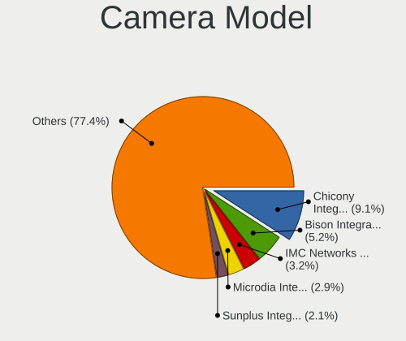

| Model                                         | Computers | Percent |
|-----------------------------------------------|-----------|---------|
| Chicony Integrated Camera                     | 135       | 9.13%   |
| Bison Integrated Camera                       | 77        | 5.21%   |
| IMC Networks Integrated Camera                | 48        | 3.25%   |
| Microdia Integrated_Webcam_HD                 | 43        | 2.91%   |
| Sunplus Integrated_Webcam_HD                  | 31        | 2.1%    |
| Chicony HD Webcam                             | 30        | 2.03%   |
| Bison SunplusIT Integrated Camera             | 26        | 1.76%   |
| Chicony Integrated Camera (1280x720@30)       | 24        | 1.62%   |
| Syntek Integrated Camera                      | 22        | 1.49%   |
| Realtek Integrated_Webcam_HD                  | 22        | 1.49%   |
| Microdia Integrated Webcam                    | 22        | 1.49%   |
| Lite-On Integrated Camera                     | 22        | 1.49%   |
| Luxvisions Innotech Limited Integrated Camera | 21        | 1.42%   |
| IMC Networks Realtek PC Camera                | 20        | 1.35%   |
| Chicony Lenovo Integrated Camera (0.3MP)      | 20        | 1.35%   |
| Logitech Webcam C270                          | 19        | 1.29%   |
| IMC Networks EasyCamera                       | 19        | 1.29%   |
| Realtek USB 2.0 PC Camera                     | 16        | 1.08%   |
| Chicony Chicony USB2.0 Camera                 | 14        | 0.95%   |
| Apple FaceTime HD Camera                      | 12        | 0.81%   |
| Logitech HD Pro Webcam C920                   | 11        | 0.74%   |
| Chicony Realtek DMFT RGB                      | 11        | 0.74%   |
| Bison Lenovo EasyCamera                       | 11        | 0.74%   |
| Apple FaceTime HD Camera (Built-in)           | 11        | 0.74%   |
| Realtek Laptop Camera                         | 10        | 0.68%   |
| Chicony ThinkPad T490 Webcam                  | 10        | 0.68%   |
| Chicony Integrated IR Camera                  | 10        | 0.68%   |
| Bison ThinkPad Integrated Camera              | 10        | 0.68%   |
| Sunplus Laptop_Integrated_Webcam_FHD          | 9         | 0.61%   |
| Quanta HP TrueVision HD Camera                | 9         | 0.61%   |
| Chicony Integrated Camera [ThinkPad]          | 9         | 0.61%   |
| Chicony EasyCamera                            | 9         | 0.61%   |
| Bison ThinkPad P50 Integrated Camera          | 9         | 0.61%   |
| Microdia Integrated Webcam HD                 | 8         | 0.54%   |
| IMC Networks UVC VGA Webcam                   | 8         | 0.54%   |
| Bison HD Webcam                               | 8         | 0.54%   |
| Syntek EasyCamera                             | 7         | 0.47%   |
| Sunplus Laptop Integrated Webcam HD           | 7         | 0.47%   |
| Sunplus HD WebCam                             | 7         | 0.47%   |
| Lite-On HP HD Camera                          | 7         | 0.47%   |

Security
--------

Fingerprint Vendor
------------------

Fingerprint sensor vendors

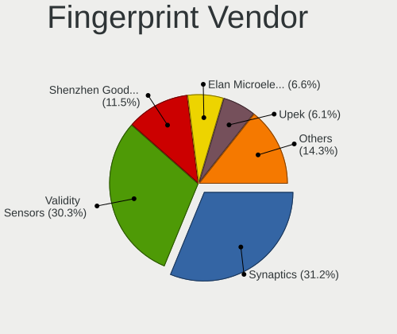

| Vendor                     | Computers | Percent |
|----------------------------|-----------|---------|
| Synaptics                  | 133       | 31.22%  |
| Validity Sensors           | 129       | 30.28%  |
| Shenzhen Goodix Technology | 49        | 11.5%   |
| Elan Microelectronics      | 28        | 6.57%   |
| Upek                       | 26        | 6.1%    |
| AuthenTec                  | 16        | 3.76%   |
| STMicroelectronics         | 11        | 2.58%   |
| LighTuning Technology      | 9         | 2.11%   |
| FocalTech Systems          | 9         | 2.11%   |
| Broadcom                   | 9         | 2.11%   |
| Fingerprint Cards          | 4         | 0.94%   |
| Samsung Electronics        | 2         | 0.47%   |
| DigitalPersona             | 1         | 0.23%   |

Fingerprint Model
-----------------

Fingerprint sensor models

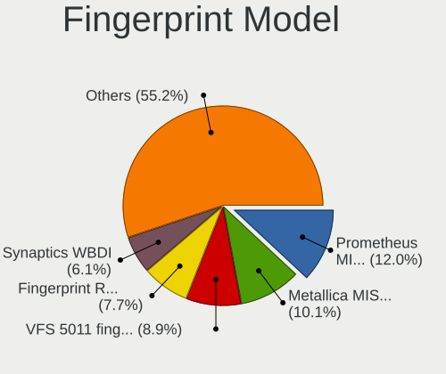

| Model                                                                        | Computers | Percent |
|------------------------------------------------------------------------------|-----------|---------|
| Synaptics Prometheus MIS Touch Fingerprint Reader                            | 51        | 11.97%  |
| Synaptics Metallica MIS Touch Fingerprint Reader                             | 43        | 10.09%  |
| Validity Sensors VFS 5011 fingerprint sensor                                 | 38        | 8.92%   |
| Shenzhen Goodix Fingerprint Reader                                           | 33        | 7.75%   |
| Validity Sensors Synaptics WBDI                                              | 26        | 6.1%    |
| Upek Biometric Touchchip/Touchstrip Fingerprint Sensor                       | 26        | 6.1%    |
| Elan Fingerprint Sensor                                                      | 26        | 6.1%    |
| Validity Sensors VFS7500 Touch Fingerprint Sensor                            | 18        | 4.23%   |
| Validity Sensors VFS495 Fingerprint Reader                                   | 14        | 3.29%   |
| Validity Sensors VFS5011 Fingerprint Reader                                  | 13        | 3.05%   |
| Synaptics Metallica MOH Touch Fingerprint Reader                             | 11        | 2.58%   |
| Synaptics FS7604 Touch Fingerprint Sensor with PurePrint                     | 11        | 2.58%   |
| STMicroelectronics Fingerprint Reader                                        | 11        | 2.58%   |
| Shenzhen Goodix  Fingerprint Device                                          | 10        | 2.35%   |
| Broadcom BCM5880 Secure Applications Processor with fingerprint swipe sensor | 9         | 2.11%   |
| FocalTech Systems Fingerprint Reader                                         | 7         | 1.64%   |
| AuthenTec AES2810                                                            | 7         | 1.64%   |
| Shenzhen Goodix Fingerprint Reader SGX                                       | 6         | 1.41%   |
| LighTuning EgisTec Touch Fingerprint Sensor                                  | 5         | 1.17%   |
| Synaptics WBDI                                                               | 4         | 0.94%   |
| LighTuning ES603 Swipe Fingerprint Sensor                                    | 4         | 0.94%   |
| Fingerprint Cards FPC Fingerprint Reader                                     | 4         | 0.94%   |
| AuthenTec AES1660                                                            | 4         | 0.94%   |
| Validity Sensors VFS491                                                      | 3         | 0.7%    |
| Validity Sensors VFS451 Fingerprint Reader                                   | 3         | 0.7%    |
| Validity Sensors Swipe Fingerprint Sensor                                    | 3         | 0.7%    |
| Synaptics WBDI Fingerprint Reader USB 086                                    | 3         | 0.7%    |
| Synaptics Fingerprint reader [HP G6]                                         | 3         | 0.7%    |
| AuthenTec AES2501 Fingerprint Sensor                                         | 3         | 0.7%    |
| Validity Sensors VFS471 Fingerprint Reader                                   | 2         | 0.47%   |
| Validity Sensors VFS Fingerprint sensor                                      | 2         | 0.47%   |
| Validity Sensors Synaptics VFS7552 Touch Fingerprint Sensor with PurePrint   | 2         | 0.47%   |
| Validity Sensors Fingerprint scanner                                         | 2         | 0.47%   |
| Synaptics UWP WBDI Device                                                    | 2         | 0.47%   |
| Synaptics UWP WBDI                                                           | 2         | 0.47%   |
| Samsung CanvasBio Fingerprint Reader                                         | 2         | 0.47%   |
| Elan WBF Fingerprint Sensor                                                  | 2         | 0.47%   |
| Validity Sensors VFS7552 Touch Fingerprint Sensor                            | 1         | 0.23%   |
| Validity Sensors VFS101 Fingerprint Reader                                   | 1         | 0.23%   |
| Validity Sensors Synaptics VFS7552 Touch Fingerprint Sensor                  | 1         | 0.23%   |

Chipcard Vendor
---------------

Chipcard module vendors

Zero info for selected period =(

Chipcard Model
--------------

Chipcard module models

Zero info for selected period =(

Unsupported
-----------

Unsupported Devices
-------------------

Total unsupported devices on board

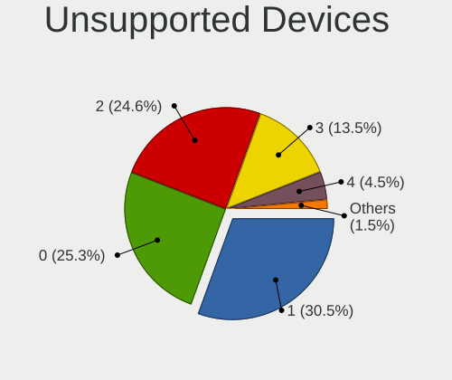

| Total | Computers | Percent |
|-------|-----------|---------|
| 1     | 1192      | 30.55%  |
| 0     | 989       | 25.35%  |
| 2     | 961       | 24.63%  |
| 3     | 527       | 13.51%  |
| 4     | 174       | 4.46%   |
| 5     | 40        | 1.03%   |
| 6     | 15        | 0.38%   |
| 7     | 3         | 0.08%   |
| 9     | 1         | 0.03%   |

Unsupported Device Types
------------------------

Types of unsupported devices

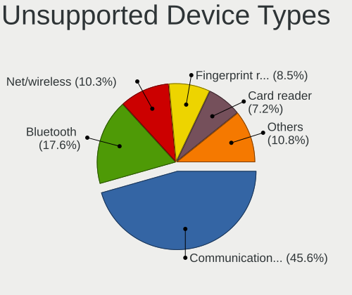

| Type                     | Computers | Percent |
|--------------------------|-----------|---------|
| Communication controller | 2223      | 45.59%  |
| Bluetooth                | 860       | 17.64%  |
| Net/wireless             | 502       | 10.3%   |
| Fingerprint reader       | 415       | 8.51%   |
| Card reader              | 350       | 7.18%   |
| Firewire controller      | 228       | 4.68%   |
| Net/ethernet             | 93        | 1.91%   |
| Sound                    | 80        | 1.64%   |
| Network                  | 64        | 1.31%   |
| Storage                  | 27        | 0.55%   |
| Modem                    | 15        | 0.31%   |
| Dvb card                 | 7         | 0.14%   |
| Storage/ide              | 4         | 0.08%   |
| Storage/raid             | 3         | 0.06%   |
| Storage/nvme             | 3         | 0.06%   |
| Storage/ata              | 1         | 0.02%   |
| Graphics card            | 1         | 0.02%   |

