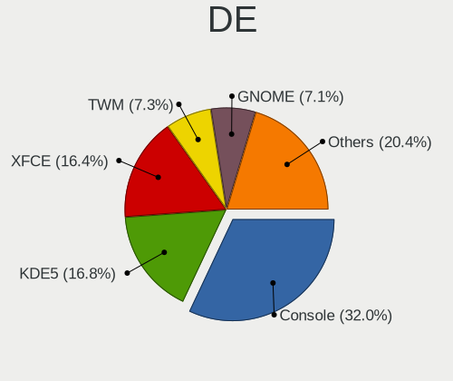
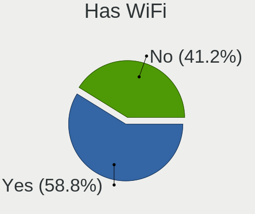
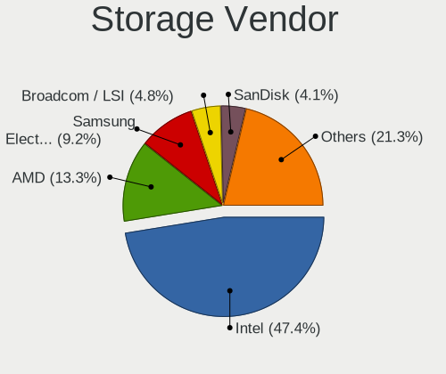
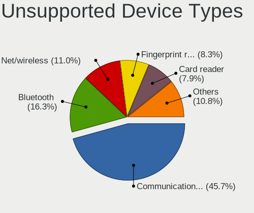

FreeBSD - Tested Hardware & Statistics
--------------------------------------

A project to collect tested hardware configurations for FreeBSD.

Anyone can contribute to this report by the [hw-probe](https://github.com/linuxhw/hw-probe/blob/master/INSTALL.BSD.md) tool:

    hw-probe -all -upload

Please contribute! Especially if your hardware is rare.

This is a report for all computer types. See also reports for [desktops](/Dist/FreeBSD/Desktop/README.md) and [notebooks](/Dist/FreeBSD/Notebook/README.md).

Contents
--------

* [ Test Cases ](#test-cases)

* [ System ](#system)
  - [ OS                       ](#os)
  - [ OS Family                ](#os-family)
  - [ Arch                     ](#arch)
  - [ DE                       ](#de)
  - [ Display Server           ](#display-server)
  - [ Display Manager          ](#display-manager)
  - [ OS Lang                  ](#os-lang)
  - [ Boot Mode                ](#boot-mode)
  - [ Filesystem               ](#filesystem)
  - [ Part. scheme             ](#part-scheme)

* [ Board ](#board)
  - [ Vendor                   ](#vendor)
  - [ Model                    ](#model)
  - [ Model Family             ](#model-family)
  - [ MFG Year                 ](#mfg-year)
  - [ Form Factor              ](#form-factor)
  - [ Coreboot                 ](#coreboot)
  - [ RAM Size                 ](#ram-size)
  - [ RAM Used                 ](#ram-used)
  - [ Total Drives             ](#total-drives)
  - [ Has CD-ROM               ](#has-cd-rom)
  - [ Has Ethernet             ](#has-ethernet)
  - [ Has WiFi                 ](#has-wifi)
  - [ Has Bluetooth            ](#has-bluetooth)

* [ Location ](#location)
  - [ Country                  ](#country)
  - [ City                     ](#city)

* [ Drives ](#drives)
  - [ Drive Vendor             ](#drive-vendor)
  - [ Drive Model              ](#drive-model)
  - [ HDD Vendor               ](#hdd-vendor)
  - [ SSD Vendor               ](#ssd-vendor)
  - [ Drive Kind               ](#drive-kind)
  - [ Drive Connector          ](#drive-connector)
  - [ Drive Size               ](#drive-size)
  - [ Space Total              ](#space-total)
  - [ Space Used               ](#space-used)
  - [ Malfunc. Drives          ](#malfunc-drives)
  - [ Malfunc. Drive Vendor    ](#malfunc-drive-vendor)
  - [ Malfunc. HDD Vendor      ](#malfunc-hdd-vendor)
  - [ Malfunc. Drive Kind      ](#malfunc-drive-kind)
  - [ Failed Drives            ](#failed-drives)
  - [ Failed Drive Vendor      ](#failed-drive-vendor)
  - [ Drive Status             ](#drive-status)

* [ Storage controller ](#storage-controller)
  - [ Storage Vendor           ](#storage-vendor)
  - [ Storage Model            ](#storage-model)
  - [ Storage Kind             ](#storage-kind)

* [ Processor ](#processor)
  - [ CPU Vendor               ](#cpu-vendor)
  - [ CPU Model                ](#cpu-model)
  - [ CPU Model Family         ](#cpu-model-family)
  - [ CPU Cores                ](#cpu-cores)
  - [ CPU Sockets              ](#cpu-sockets)
  - [ CPU Threads              ](#cpu-threads)
  - [ CPU Microarch            ](#cpu-microarch)

* [ Graphics ](#graphics)
  - [ GPU Vendor               ](#gpu-vendor)
  - [ GPU Model                ](#gpu-model)
  - [ GPU Combo                ](#gpu-combo)
  - [ GPU Driver               ](#gpu-driver)
  - [ GPU Memory               ](#gpu-memory)

* [ Monitor ](#monitor)
  - [ Monitor Vendor           ](#monitor-vendor)
  - [ Monitor Model            ](#monitor-model)
  - [ Monitor Resolution       ](#monitor-resolution)
  - [ Monitor Diagonal         ](#monitor-diagonal)
  - [ Monitor Width            ](#monitor-width)
  - [ Aspect Ratio             ](#aspect-ratio)
  - [ Monitor Area             ](#monitor-area)
  - [ Pixel Density            ](#pixel-density)
  - [ Multiple Monitors        ](#multiple-monitors)

* [ Network ](#network)
  - [ Net Controller Vendor    ](#net-controller-vendor)
  - [ Net Controller Model     ](#net-controller-model)
  - [ Wireless Vendor          ](#wireless-vendor)
  - [ Wireless Model           ](#wireless-model)
  - [ Ethernet Vendor          ](#ethernet-vendor)
  - [ Ethernet Model           ](#ethernet-model)
  - [ Net Controller Kind      ](#net-controller-kind)
  - [ Used Controller          ](#used-controller)
  - [ NICs                     ](#nics)
  - [ IPv6                     ](#ipv6)

* [ Bluetooth ](#bluetooth)
  - [ Bluetooth Vendor         ](#bluetooth-vendor)
  - [ Bluetooth Model          ](#bluetooth-model)

* [ Sound ](#sound)
  - [ Sound Vendor             ](#sound-vendor)
  - [ Sound Model              ](#sound-model)

* [ Memory ](#memory)
  - [ Memory Vendor            ](#memory-vendor)
  - [ Memory Model             ](#memory-model)
  - [ Memory Kind              ](#memory-kind)
  - [ Memory Form Factor       ](#memory-form-factor)
  - [ Memory Size              ](#memory-size)
  - [ Memory Speed             ](#memory-speed)

* [ Printers & scanners ](#printers--scanners)
  - [ Printer Vendor           ](#printer-vendor)
  - [ Printer Model            ](#printer-model)
  - [ Scanner Vendor           ](#scanner-vendor)
  - [ Scanner Model            ](#scanner-model)

* [ Camera ](#camera)
  - [ Camera Vendor            ](#camera-vendor)
  - [ Camera Model             ](#camera-model)

* [ Security ](#security)
  - [ Fingerprint Vendor       ](#fingerprint-vendor)
  - [ Fingerprint Model        ](#fingerprint-model)
  - [ Chipcard Vendor          ](#chipcard-vendor)
  - [ Chipcard Model           ](#chipcard-model)

* [ Unsupported ](#unsupported)
  - [ Unsupported Devices      ](#unsupported-devices)
  - [ Unsupported Device Types ](#unsupported-device-types)

Test Cases
----------

Total: 5060

| Vendor        | Model                       | Form-Factor | Probe                                                     | Date         |
|---------------|-----------------------------|-------------|-----------------------------------------------------------|--------------|
| Unknown       | DH61BR G32662-203           | Desktop     | [c082ba6276](https://bsd-hardware.info/?probe=c082ba6276) | Jan 06, 2025 |
| Lenovo        | ThinkPad T480s 20L8S7T30... | Notebook    | [3ae6ff393d](https://bsd-hardware.info/?probe=3ae6ff393d) | Jan 05, 2025 |
| Lenovo        | ThinkPad T480s 20L8S7T30... | Notebook    | [1a06e00ecf](https://bsd-hardware.info/?probe=1a06e00ecf) | Jan 05, 2025 |
| MSI           | H81M-P33                    | Desktop     | [4de04d7c63](https://bsd-hardware.info/?probe=4de04d7c63) | Jan 05, 2025 |
| ASUSTek       | P5Q-E                       | Desktop     | [ced4dbfd4b](https://bsd-hardware.info/?probe=ced4dbfd4b) | Jan 05, 2025 |
| ASUSTek       | ROG CROSSHAIR VIII HERO     | Desktop     | [c5f2cf7f1e](https://bsd-hardware.info/?probe=c5f2cf7f1e) | Jan 05, 2025 |
| Infinix       | YL51A5                      | Notebook    | [de145e7ce4](https://bsd-hardware.info/?probe=de145e7ce4) | Jan 05, 2025 |
| HP            | OMEN by Transcend Gaming... | Notebook    | [4cc5cf0eab](https://bsd-hardware.info/?probe=4cc5cf0eab) | Jan 04, 2025 |
| HP            | Unknown                     | Notebook    | [babd844cfb](https://bsd-hardware.info/?probe=babd844cfb) | Jan 04, 2025 |
| Acer          | Aspire A514-54              | Notebook    | [adaff2786e](https://bsd-hardware.info/?probe=adaff2786e) | Jan 04, 2025 |
| HP            | Unknown                     | Notebook    | [54cd46759e](https://bsd-hardware.info/?probe=54cd46759e) | Jan 03, 2025 |
| Dell          | 0YP4HV A00                  | Desktop     | [f4bf8c469e](https://bsd-hardware.info/?probe=f4bf8c469e) | Jan 03, 2025 |
| AMI           | Aptio CRB                   | Mini pc     | [977feef3aa](https://bsd-hardware.info/?probe=977feef3aa) | Jan 03, 2025 |
| ASUSTek       | Z10PE-D8 WS                 | Server      | [63f27f8783](https://bsd-hardware.info/?probe=63f27f8783) | Jan 03, 2025 |
| Dell          | 0YP4HV A00                  | Desktop     | [7c407b8021](https://bsd-hardware.info/?probe=7c407b8021) | Jan 03, 2025 |
| MSI           | MS-B1711                    | Desktop     | [98df812bc4](https://bsd-hardware.info/?probe=98df812bc4) | Jan 03, 2025 |
| MSI           | MS-B1711                    | Desktop     | [c58187f624](https://bsd-hardware.info/?probe=c58187f624) | Jan 03, 2025 |
| ASUSTek       | K53BY                       | Notebook    | [4b6604e875](https://bsd-hardware.info/?probe=4b6604e875) | Jan 03, 2025 |
| ASUSTek       | K53BY                       | Notebook    | [dac2953ae0](https://bsd-hardware.info/?probe=dac2953ae0) | Jan 03, 2025 |
| Apple         | MacBookPro11,4              | Notebook    | [f990a4641f](https://bsd-hardware.info/?probe=f990a4641f) | Jan 03, 2025 |
| Dell          | 0JJ7YG A00                  | Desktop     | [60a9be6897](https://bsd-hardware.info/?probe=60a9be6897) | Jan 02, 2025 |
| youyeetoo     | X1 SBC                      | Notebook    | [645ba05e41](https://bsd-hardware.info/?probe=645ba05e41) | Jan 02, 2025 |
| Framework     | Laptop 16 (AMD Ryzen 704... | Notebook    | [587525ebab](https://bsd-hardware.info/?probe=587525ebab) | Jan 02, 2025 |
| Dell          | 01D4TT A00                  | Desktop     | [447a0925d1](https://bsd-hardware.info/?probe=447a0925d1) | Jan 02, 2025 |
| Dell          | 0JJ7YG A00                  | Desktop     | [f586af63cf](https://bsd-hardware.info/?probe=f586af63cf) | Jan 02, 2025 |
| Lenovo        | ThinkPad X220 Tablet 429... | Notebook    | [5270850f20](https://bsd-hardware.info/?probe=5270850f20) | Jan 02, 2025 |
| Lenovo        | ThinkPad T420s 417153U      | Notebook    | [f3220cb60d](https://bsd-hardware.info/?probe=f3220cb60d) | Jan 02, 2025 |
| Dell          | Precision 7540              | Notebook    | [481eeb3296](https://bsd-hardware.info/?probe=481eeb3296) | Jan 02, 2025 |
| Sony          | VGN-NS21M_S                 | Notebook    | [ab610fe8e7](https://bsd-hardware.info/?probe=ab610fe8e7) | Jan 01, 2025 |
| Sony          | VGN-NS21M_S                 | Notebook    | [b848c2ce3e](https://bsd-hardware.info/?probe=b848c2ce3e) | Jan 01, 2025 |
| HP            | 83E2                        | Desktop     | [c0cce366c3](https://bsd-hardware.info/?probe=c0cce366c3) | Jan 01, 2025 |
| Gigabyte      | EP43T-UD3L                  | Desktop     | [4c4764a3fe](https://bsd-hardware.info/?probe=4c4764a3fe) | Jan 01, 2025 |
| ASUSTek       | K53BY                       | Notebook    | [7e68090b10](https://bsd-hardware.info/?probe=7e68090b10) | Dec 31, 2024 |
| UD            | sgt-k13                     | Mini pc     | [4c703e6c49](https://bsd-hardware.info/?probe=4c703e6c49) | Dec 31, 2024 |
| Dell          | Latitude 7390               | Notebook    | [12d707eac2](https://bsd-hardware.info/?probe=12d707eac2) | Dec 31, 2024 |
| ASRockRack    | EPYC3101D4I-2T              | Desktop     | [be896d46e1](https://bsd-hardware.info/?probe=be896d46e1) | Dec 31, 2024 |
| HP            | 8055                        | Desktop     | [ad2cab0e5d](https://bsd-hardware.info/?probe=ad2cab0e5d) | Dec 31, 2024 |
| Shenzhen s... | miniPC                      | Desktop     | [974d78e0bf](https://bsd-hardware.info/?probe=974d78e0bf) | Dec 31, 2024 |
| ASUSTek       | P8H67-M PRO                 | Desktop     | [002e1aabfa](https://bsd-hardware.info/?probe=002e1aabfa) | Dec 30, 2024 |
| Lenovo        | IdeaPad 320-15IKB Touch ... | Notebook    | [ed15ca801e](https://bsd-hardware.info/?probe=ed15ca801e) | Dec 30, 2024 |
| Lenovo        | ThinkBook 14 G6 IRL 21KG    | Notebook    | [221e1f01f4](https://bsd-hardware.info/?probe=221e1f01f4) | Dec 29, 2024 |
| HUAWEI        | MRGFG-XX                    | Notebook    | [e23afd3be3](https://bsd-hardware.info/?probe=e23afd3be3) | Dec 29, 2024 |
| HUAWEI        | MRGFG-XX                    | Notebook    | [6095e2193f](https://bsd-hardware.info/?probe=6095e2193f) | Dec 29, 2024 |
| MSI           | H81M-P33                    | Desktop     | [a1fc208c90](https://bsd-hardware.info/?probe=a1fc208c90) | Dec 29, 2024 |
| ASUSTek       | P5Q-E                       | Desktop     | [f497fed563](https://bsd-hardware.info/?probe=f497fed563) | Dec 29, 2024 |
| ASUSTek       | ROG CROSSHAIR VIII HERO     | Desktop     | [71afdfab99](https://bsd-hardware.info/?probe=71afdfab99) | Dec 29, 2024 |
| Intel         | NUC11ATBC2 M53055-500       | Mini pc     | [691fb927f2](https://bsd-hardware.info/?probe=691fb927f2) | Dec 28, 2024 |
| NF533MS       | 1.0                         | Desktop     | [3f9b4a5c4f](https://bsd-hardware.info/?probe=3f9b4a5c4f) | Dec 28, 2024 |
| Intel         | NUC11TNBi3 M11908-403       | Mini pc     | [f28edc2c8b](https://bsd-hardware.info/?probe=f28edc2c8b) | Dec 28, 2024 |
| Lenovo        | IdeaPad 320-14IKB 80YF      | Notebook    | [81977dc6c5](https://bsd-hardware.info/?probe=81977dc6c5) | Dec 28, 2024 |
| UD            | sgt-k13                     | Mini pc     | [74cbbc576a](https://bsd-hardware.info/?probe=74cbbc576a) | Dec 27, 2024 |
| Intel         | HURONRIVER                  | Desktop     | [dda4ccd2af](https://bsd-hardware.info/?probe=dda4ccd2af) | Dec 26, 2024 |
| Lenovo        | 3111 SDK0J40697 WIN 3305... | Mini pc     | [07a2d0d1ce](https://bsd-hardware.info/?probe=07a2d0d1ce) | Dec 25, 2024 |
| Lenovo        | ThinkPad T480 20L6S29D1V    | Notebook    | [c074abf948](https://bsd-hardware.info/?probe=c074abf948) | Dec 25, 2024 |
| Lenovo        | ThinkPad T430 2344BPU       | Notebook    | [1432f4e11c](https://bsd-hardware.info/?probe=1432f4e11c) | Dec 25, 2024 |
| Gateway       | LT40                        | Notebook    | [7546fc1fd0](https://bsd-hardware.info/?probe=7546fc1fd0) | Dec 25, 2024 |
| Dell          | 0T7D40 A01                  | Desktop     | [af31d44d1f](https://bsd-hardware.info/?probe=af31d44d1f) | Dec 24, 2024 |
| Dell          | Precision 5510              | Notebook    | [ebf00fc632](https://bsd-hardware.info/?probe=ebf00fc632) | Dec 24, 2024 |
| Lenovo        | ThinkPad P14s Gen 1 20Y1... | Notebook    | [6eebafd5ad](https://bsd-hardware.info/?probe=6eebafd5ad) | Dec 24, 2024 |
| Apple         | MacBookPro8,3               | Notebook    | [af06d6afc4](https://bsd-hardware.info/?probe=af06d6afc4) | Dec 24, 2024 |
| Lenovo        | ThinkPad X1 Yoga 3rd 20L... | Convertible | [b6c70a48ea](https://bsd-hardware.info/?probe=b6c70a48ea) | Dec 24, 2024 |
| Unknown       | Unknown                     | All in one  | [cb659e7cd1](https://bsd-hardware.info/?probe=cb659e7cd1) | Dec 24, 2024 |
| Gigabyte      | Z790 AORUS MASTER X         | Desktop     | [d8022a2734](https://bsd-hardware.info/?probe=d8022a2734) | Dec 24, 2024 |
| ASUSTek       | TUF Gaming X570-PLUS        | Desktop     | [2c141d9a6e](https://bsd-hardware.info/?probe=2c141d9a6e) | Dec 24, 2024 |
| Dell          | 0FF3FN A00                  | Desktop     | [33a3dcb343](https://bsd-hardware.info/?probe=33a3dcb343) | Dec 24, 2024 |
| Gigabyte      | M68MT-S2                    | Desktop     | [0ac816abb8](https://bsd-hardware.info/?probe=0ac816abb8) | Dec 22, 2024 |
| Dell          | Latitude 5420               | Notebook    | [89370a8376](https://bsd-hardware.info/?probe=89370a8376) | Dec 21, 2024 |
| Dell          | 00V62H A00                  | Desktop     | [0b6e2a4e95](https://bsd-hardware.info/?probe=0b6e2a4e95) | Dec 21, 2024 |
| ASUSTek       | TUF Gaming B560M-PLUS WI... | Desktop     | [bee58d9e52](https://bsd-hardware.info/?probe=bee58d9e52) | Dec 21, 2024 |
| Star Labs     | StarLite                    | Tablet      | [86df31742e](https://bsd-hardware.info/?probe=86df31742e) | Dec 20, 2024 |
| HP            | 8158 A01                    | Mini pc     | [323f176156](https://bsd-hardware.info/?probe=323f176156) | Dec 20, 2024 |
| Lenovo        | SHARKBAY NO DPK             | Desktop     | [0e54b0ed66](https://bsd-hardware.info/?probe=0e54b0ed66) | Dec 20, 2024 |
| Star Labs     | StarLite                    | Tablet      | [712cca18b3](https://bsd-hardware.info/?probe=712cca18b3) | Dec 19, 2024 |
| HP            | Pavilion 15                 | Notebook    | [9d1a480f9d](https://bsd-hardware.info/?probe=9d1a480f9d) | Dec 19, 2024 |
| Lenovo        | ThinkBook 14 G2 ARE 20VF    | Notebook    | [1aec80e256](https://bsd-hardware.info/?probe=1aec80e256) | Dec 18, 2024 |
| Razer         | Blade 16 - RZ09-0510        | Notebook    | [be6f32ce1d](https://bsd-hardware.info/?probe=be6f32ce1d) | Dec 17, 2024 |
| Gigabyte      | G41M-Combo                  | Desktop     | [d2d73e5ab9](https://bsd-hardware.info/?probe=d2d73e5ab9) | Dec 16, 2024 |
| Dell          | 0FF3FN A00                  | Desktop     | [6f008745da](https://bsd-hardware.info/?probe=6f008745da) | Dec 16, 2024 |
| PC Engines    | APU2                        | Desktop     | [731738fd98](https://bsd-hardware.info/?probe=731738fd98) | Dec 15, 2024 |
| Lenovo        | ThinkPad T490 20N3S61A13    | Notebook    | [150320a6b1](https://bsd-hardware.info/?probe=150320a6b1) | Dec 15, 2024 |
| Gigabyte      | H97M-HD3                    | Desktop     | [b916e546ab](https://bsd-hardware.info/?probe=b916e546ab) | Dec 14, 2024 |
| Dell          | XPS 13 7390 2-in-1          | Convertible | [7444db1fd8](https://bsd-hardware.info/?probe=7444db1fd8) | Dec 14, 2024 |
| HP            | Laptop 14-dq2xxx            | Notebook    | [fc481181a6](https://bsd-hardware.info/?probe=fc481181a6) | Dec 14, 2024 |
| ASUSTek       | P5Q-E                       | Desktop     | [814f666054](https://bsd-hardware.info/?probe=814f666054) | Dec 14, 2024 |
| Gigabyte      | M68MT-S2                    | Desktop     | [87ce6d4615](https://bsd-hardware.info/?probe=87ce6d4615) | Dec 13, 2024 |
| Lenovo        | ThinkPad X1 Carbon Gen 9... | Notebook    | [1f7a60f418](https://bsd-hardware.info/?probe=1f7a60f418) | Dec 13, 2024 |
| JGINYUE       | X99-8D4G Server             | Desktop     | [8a6322442d](https://bsd-hardware.info/?probe=8a6322442d) | Dec 13, 2024 |
| Dell          | 0VRCY5 A14                  | Server      | [ea3362af64](https://bsd-hardware.info/?probe=ea3362af64) | Dec 12, 2024 |
| WeiBu         | ADL-N Prod                  | Desktop     | [de66071f16](https://bsd-hardware.info/?probe=de66071f16) | Dec 12, 2024 |
| Lenovo        | ThinkPad X250 20CLS14400    | Notebook    | [d3a7de0e4b](https://bsd-hardware.info/?probe=d3a7de0e4b) | Dec 12, 2024 |
| Intel         | X79_PLUS                    | Desktop     | [0382eb3cd4](https://bsd-hardware.info/?probe=0382eb3cd4) | Dec 10, 2024 |
| ASUSTek       | PRIME Z790-A WIFI           | Desktop     | [09413cb67c](https://bsd-hardware.info/?probe=09413cb67c) | Dec 10, 2024 |
| Framework     | Laptop 16 (AMD Ryzen 704... | Notebook    | [9f9235fcd6](https://bsd-hardware.info/?probe=9f9235fcd6) | Dec 10, 2024 |
| JGINYUE       | X99-8D4G Server             | Desktop     | [0a59d0dd76](https://bsd-hardware.info/?probe=0a59d0dd76) | Dec 09, 2024 |
| Alienware     | m15 R6                      | Notebook    | [9060b1741b](https://bsd-hardware.info/?probe=9060b1741b) | Dec 08, 2024 |
| Gigabyte      | B450 I AORUS PRO WIFI-CF    | Desktop     | [57a5cf527b](https://bsd-hardware.info/?probe=57a5cf527b) | Dec 08, 2024 |
| Acer          | Extensa 215-33              | Notebook    | [79a63f2804](https://bsd-hardware.info/?probe=79a63f2804) | Dec 07, 2024 |
| Acer          | Extensa 215-33              | Notebook    | [3d830ad581](https://bsd-hardware.info/?probe=3d830ad581) | Dec 07, 2024 |
| Timi          | TM1703                      | Notebook    | [6af452297e](https://bsd-hardware.info/?probe=6af452297e) | Dec 07, 2024 |
| Gigabyte      | Z690 AORUS ULTRA            | Desktop     | [3ec2b38bad](https://bsd-hardware.info/?probe=3ec2b38bad) | Dec 07, 2024 |
| Apple         | MacBookAir6,2               | Notebook    | [bf94f894cb](https://bsd-hardware.info/?probe=bf94f894cb) | Dec 07, 2024 |
| ASUSTek       | ROG STRIX X870E-E GAMING... | Desktop     | [4edaabd936](https://bsd-hardware.info/?probe=4edaabd936) | Dec 07, 2024 |
| Apple         | MacBookAir6,2               | Notebook    | [831f538244](https://bsd-hardware.info/?probe=831f538244) | Dec 06, 2024 |
| Raspberry ... | Raspberry Pi                | Soc         | [5f8f2f10e2](https://bsd-hardware.info/?probe=5f8f2f10e2) | Dec 06, 2024 |
| Unknown       | Unknown                     | Desktop     | [5077b94887](https://bsd-hardware.info/?probe=5077b94887) | Dec 06, 2024 |
| ASUSTek       | PRIME Z790-A WIFI           | Desktop     | [7839a021dc](https://bsd-hardware.info/?probe=7839a021dc) | Dec 06, 2024 |
| MSI           | B550M PRO-VDH               | Desktop     | [2bd3d72cbb](https://bsd-hardware.info/?probe=2bd3d72cbb) | Dec 06, 2024 |
| Dell          | Inspiron 5737               | Notebook    | [d63af5805c](https://bsd-hardware.info/?probe=d63af5805c) | Dec 05, 2024 |
| MSI           | Z77A-G41                    | Desktop     | [7091f79308](https://bsd-hardware.info/?probe=7091f79308) | Dec 05, 2024 |
| Notebook      | N7x0WU                      | Notebook    | [d9312fac72](https://bsd-hardware.info/?probe=d9312fac72) | Dec 05, 2024 |
| Sony          | SVE11115ELW                 | Notebook    | [6a33a5005f](https://bsd-hardware.info/?probe=6a33a5005f) | Dec 05, 2024 |
| HP            | 1998                        | Desktop     | [6233446d5e](https://bsd-hardware.info/?probe=6233446d5e) | Dec 04, 2024 |
| ASUSTek       | CROSSHAIR V FORMULA-Z       | Desktop     | [8fbade62a5](https://bsd-hardware.info/?probe=8fbade62a5) | Dec 04, 2024 |
| ASUSTek       | PRIME B650M-K               | Desktop     | [b75044f43a](https://bsd-hardware.info/?probe=b75044f43a) | Dec 04, 2024 |
| Dell          | Precision 5510              | Notebook    | [928a571c76](https://bsd-hardware.info/?probe=928a571c76) | Dec 03, 2024 |
| TUXEDO        | Pulse 14 Gen3               | Notebook    | [56a08b7475](https://bsd-hardware.info/?probe=56a08b7475) | Dec 03, 2024 |
| Dell          | Latitude E6540              | Notebook    | [7e1c664559](https://bsd-hardware.info/?probe=7e1c664559) | Dec 03, 2024 |
| Alienware     | m15 R6                      | Notebook    | [477e29857e](https://bsd-hardware.info/?probe=477e29857e) | Dec 03, 2024 |
| Lenovo        | ThinkPad X1 Carbon 7th 2... | Notebook    | [b659f5f797](https://bsd-hardware.info/?probe=b659f5f797) | Dec 03, 2024 |
| Fujitsu       | LIFEBOOK U727               | Notebook    | [804be89553](https://bsd-hardware.info/?probe=804be89553) | Dec 02, 2024 |
| Alienware     | m15 R6                      | Notebook    | [b19c3ccd89](https://bsd-hardware.info/?probe=b19c3ccd89) | Dec 02, 2024 |
| Intel         | X79 (INTEL Xeon E5/Corei... | Desktop     | [e3cc180fdd](https://bsd-hardware.info/?probe=e3cc180fdd) | Dec 02, 2024 |
| MSI           | H61M-P21                    | Desktop     | [55ae602922](https://bsd-hardware.info/?probe=55ae602922) | Dec 02, 2024 |
| Supermicro    | X11SPM-F                    | Server      | [3fdfe4a819](https://bsd-hardware.info/?probe=3fdfe4a819) | Dec 01, 2024 |
| MSI           | Z77A-G41                    | Desktop     | [76cc6deb79](https://bsd-hardware.info/?probe=76cc6deb79) | Dec 01, 2024 |
| MSI           | H81M-P33                    | Desktop     | [a910f6b4a8](https://bsd-hardware.info/?probe=a910f6b4a8) | Dec 01, 2024 |
| ASUSTek       | P5Q-E                       | Desktop     | [dd9d2b4701](https://bsd-hardware.info/?probe=dd9d2b4701) | Dec 01, 2024 |
| ASUSTek       | ROG CROSSHAIR VIII HERO     | Desktop     | [aaabbe33c6](https://bsd-hardware.info/?probe=aaabbe33c6) | Dec 01, 2024 |
| ASUSTek       | ROG STRIX X670E-F GAMING... | Desktop     | [ee30758c43](https://bsd-hardware.info/?probe=ee30758c43) | Nov 30, 2024 |
| ASRockRack    | EPYC3101D4I-2T              | Desktop     | [a070b11044](https://bsd-hardware.info/?probe=a070b11044) | Nov 30, 2024 |
| ASUSTek       | PRIME B650M-K               | Desktop     | [cae7ae1e3f](https://bsd-hardware.info/?probe=cae7ae1e3f) | Nov 30, 2024 |
| HP            | ENVY 15                     | Notebook    | [c83ef9f375](https://bsd-hardware.info/?probe=c83ef9f375) | Nov 30, 2024 |
| ASUSTek       | Pro B560M-C                 | Desktop     | [d459b88a7a](https://bsd-hardware.info/?probe=d459b88a7a) | Nov 30, 2024 |
| Gigabyte      | Z490 AORUS MASTER           | Desktop     | [5a7a5ce019](https://bsd-hardware.info/?probe=5a7a5ce019) | Nov 30, 2024 |
| Dell          | Precision 7730              | Notebook    | [57ea84435b](https://bsd-hardware.info/?probe=57ea84435b) | Nov 29, 2024 |
| HP            | 21B4 A01                    | Desktop     | [8540ec3124](https://bsd-hardware.info/?probe=8540ec3124) | Nov 29, 2024 |
| Framework     | Laptop 13 (Intel Core Ul... | Notebook    | [41ab1da986](https://bsd-hardware.info/?probe=41ab1da986) | Nov 29, 2024 |
| Lenovo        | ThinkPad X1 Carbon Gen 9... | Notebook    | [b6aaae01ed](https://bsd-hardware.info/?probe=b6aaae01ed) | Nov 29, 2024 |
| ASUSTek       | TUF Gaming B550-PLUS        | Desktop     | [f309cf2bee](https://bsd-hardware.info/?probe=f309cf2bee) | Nov 28, 2024 |
| Dell          | Inspiron 3195               | Convertible | [1fdcce2de5](https://bsd-hardware.info/?probe=1fdcce2de5) | Nov 28, 2024 |
| MSI           | B450M MORTAR MAX            | Desktop     | [f1ade048b2](https://bsd-hardware.info/?probe=f1ade048b2) | Nov 28, 2024 |
| MSI           | B450M MORTAR MAX            | Desktop     | [b7056e45fd](https://bsd-hardware.info/?probe=b7056e45fd) | Nov 27, 2024 |
| MSI           | B450M MORTAR MAX            | Desktop     | [8c4222d88e](https://bsd-hardware.info/?probe=8c4222d88e) | Nov 27, 2024 |
| ASUSTek       | CROSSHAIR V FORMULA-Z       | Desktop     | [8282b592ac](https://bsd-hardware.info/?probe=8282b592ac) | Nov 27, 2024 |
| Dell          | Latitude 5320               | Notebook    | [aeca583292](https://bsd-hardware.info/?probe=aeca583292) | Nov 27, 2024 |
| ASUSTek       | TUF Gaming B550-PLUS        | Desktop     | [ba28a2eea4](https://bsd-hardware.info/?probe=ba28a2eea4) | Nov 27, 2024 |
| Lenovo        | Legion Slim 5 16IRH8 83D... | Notebook    | [208feb98b3](https://bsd-hardware.info/?probe=208feb98b3) | Nov 26, 2024 |
| Lenovo        | Legion Slim 5 16IRH8 83D... | Notebook    | [1f1948481c](https://bsd-hardware.info/?probe=1f1948481c) | Nov 26, 2024 |
| HP            | ZBook 17 G2                 | Notebook    | [c8d95da1f8](https://bsd-hardware.info/?probe=c8d95da1f8) | Nov 26, 2024 |
| MSI           | H310M PRO-M2 PLUS           | Desktop     | [db040ae85a](https://bsd-hardware.info/?probe=db040ae85a) | Nov 26, 2024 |
| Unknown       | Unknown                     | Desktop     | [52c9820eec](https://bsd-hardware.info/?probe=52c9820eec) | Nov 24, 2024 |
| MSI           | H81M-P33                    | Desktop     | [9e5c756f1f](https://bsd-hardware.info/?probe=9e5c756f1f) | Nov 24, 2024 |
| ASUSTek       | P5Q-E                       | Desktop     | [2d7f40d5f5](https://bsd-hardware.info/?probe=2d7f40d5f5) | Nov 24, 2024 |
| ASUSTek       | ROG CROSSHAIR VIII HERO     | Desktop     | [ed997ac3e9](https://bsd-hardware.info/?probe=ed997ac3e9) | Nov 24, 2024 |
| Gigabyte      | Z490 AORUS MASTER           | Desktop     | [acfb1a77bf](https://bsd-hardware.info/?probe=acfb1a77bf) | Nov 24, 2024 |
| ASUSTek       | Maximus VI HERO             | Desktop     | [e606e48c03](https://bsd-hardware.info/?probe=e606e48c03) | Nov 23, 2024 |
| Intel         | DG45ID AAE27729-307         | Desktop     | [14f367aa0a](https://bsd-hardware.info/?probe=14f367aa0a) | Nov 23, 2024 |
| GPD           | MicroPC                     | Notebook    | [dac20acac9](https://bsd-hardware.info/?probe=dac20acac9) | Nov 22, 2024 |
| Intel         | NUC5i5MYBE H47797-205       | Mini pc     | [ae8781cafb](https://bsd-hardware.info/?probe=ae8781cafb) | Nov 22, 2024 |
| Lenovo        | 3136 SDK0J40697 WIN 3305... | Mini pc     | [8871445d07](https://bsd-hardware.info/?probe=8871445d07) | Nov 22, 2024 |
| pc1           | ID-PCI7E                    | Desktop     | [faccfe1d3b](https://bsd-hardware.info/?probe=faccfe1d3b) | Nov 22, 2024 |
| ASRockRack    | X470D4U2-2T                 | Desktop     | [638b70ebe3](https://bsd-hardware.info/?probe=638b70ebe3) | Nov 20, 2024 |
| HP            | 21B4 A01                    | Desktop     | [53fb142fb3](https://bsd-hardware.info/?probe=53fb142fb3) | Nov 20, 2024 |
| Unknown       | Unknown                     | Desktop     | [9cb678b64b](https://bsd-hardware.info/?probe=9cb678b64b) | Nov 19, 2024 |
| Lenovo        | ThinkPad T430 2344DUC       | Notebook    | [63d0cde972](https://bsd-hardware.info/?probe=63d0cde972) | Nov 19, 2024 |
| ASUSTek       | ROG STRIX B550-F GAMING ... | Desktop     | [43f93bb4ab](https://bsd-hardware.info/?probe=43f93bb4ab) | Nov 19, 2024 |
| ASUSTek       | PRIME B650M-K               | Desktop     | [f4ba847672](https://bsd-hardware.info/?probe=f4ba847672) | Nov 18, 2024 |
| ASUSTek       | PRIME H310M-D R2.0          | Desktop     | [e59272c611](https://bsd-hardware.info/?probe=e59272c611) | Nov 18, 2024 |
| HP            | ProBook 440 G7              | Notebook    | [fc3020f308](https://bsd-hardware.info/?probe=fc3020f308) | Nov 18, 2024 |
| Lenovo        | Legion Pro 5 16IRX9 83DF    | Notebook    | [3fa8964010](https://bsd-hardware.info/?probe=3fa8964010) | Nov 18, 2024 |
| Dell          | 0D517D A00                  | Desktop     | [1bc1b8eb94](https://bsd-hardware.info/?probe=1bc1b8eb94) | Nov 17, 2024 |
| Lenovo        | ThinkPad E595 20NFCTO1WW    | Notebook    | [b16a33c476](https://bsd-hardware.info/?probe=b16a33c476) | Nov 17, 2024 |
| Gigabyte      | H61M-DS2                    | Desktop     | [b475794daf](https://bsd-hardware.info/?probe=b475794daf) | Nov 16, 2024 |
| Supermicro    | X11SPW-TF                   | Server      | [736d1ca560](https://bsd-hardware.info/?probe=736d1ca560) | Nov 15, 2024 |
| Lenovo        | 310B SDK0J40697 WIN 3305... | Mini pc     | [09f650ccef](https://bsd-hardware.info/?probe=09f650ccef) | Nov 15, 2024 |
| ASUSTek       | M5A97 LE R2.0               | Desktop     | [b9b63a6ca9](https://bsd-hardware.info/?probe=b9b63a6ca9) | Nov 15, 2024 |
| Supermicro    | X10SDV-TP8F                 | Server      | [f764b90e3d](https://bsd-hardware.info/?probe=f764b90e3d) | Nov 14, 2024 |
| Standard      | Unknown                     | Notebook    | [a56385a000](https://bsd-hardware.info/?probe=a56385a000) | Nov 14, 2024 |
| Notebook      | V3xxENx                     | Notebook    | [bb5a62f653](https://bsd-hardware.info/?probe=bb5a62f653) | Nov 14, 2024 |
| ASUSTek       | M5A97 LE R2.0               | Desktop     | [0def0b220f](https://bsd-hardware.info/?probe=0def0b220f) | Nov 13, 2024 |
| ASUSTek       | ROG STRIX B550-F GAMING ... | Desktop     | [2cda07b3f5](https://bsd-hardware.info/?probe=2cda07b3f5) | Nov 12, 2024 |
| Lenovo        | 3130 SDK0J40697 WIN 3305... | Mini pc     | [7dab30a926](https://bsd-hardware.info/?probe=7dab30a926) | Nov 12, 2024 |
| ASRock        | X570 PG Velocita            | Desktop     | [2a30e356a7](https://bsd-hardware.info/?probe=2a30e356a7) | Nov 12, 2024 |
| ASUSTek       | TUF Gaming B560M-PLUS WI... | Desktop     | [e36d556ad9](https://bsd-hardware.info/?probe=e36d556ad9) | Nov 12, 2024 |
| HP            | Laptop 15t-dy200            | Notebook    | [bb0b650de5](https://bsd-hardware.info/?probe=bb0b650de5) | Nov 11, 2024 |
| ICL           | S1411 G2R                   | Notebook    | [988f54b681](https://bsd-hardware.info/?probe=988f54b681) | Nov 11, 2024 |
| Raspberry ... | Raspberry Pi                | Soc         | [e883cc34cb](https://bsd-hardware.info/?probe=e883cc34cb) | Nov 11, 2024 |
| Dell          | Inspiron 5559               | Notebook    | [4044711f14](https://bsd-hardware.info/?probe=4044711f14) | Nov 10, 2024 |
| Apple         | MacBookPro8,3               | Notebook    | [f3bbee2559](https://bsd-hardware.info/?probe=f3bbee2559) | Nov 10, 2024 |
| Lenovo        | ThinkPad E14 Gen 4 21E30... | Notebook    | [58bb75f0db](https://bsd-hardware.info/?probe=58bb75f0db) | Nov 10, 2024 |
| HP            | OMEN by Transcend Gaming... | Notebook    | [213d36f877](https://bsd-hardware.info/?probe=213d36f877) | Nov 10, 2024 |
| ASUSTek       | TUF Gaming X670E-PLUS WI... | Desktop     | [8583a7eb2e](https://bsd-hardware.info/?probe=8583a7eb2e) | Nov 09, 2024 |
| Unknown       | V00                         | Mini pc     | [5a5692fcd5](https://bsd-hardware.info/?probe=5a5692fcd5) | Nov 08, 2024 |
| Unknown       | Unknown                     | Notebook    | [5bd09820d9](https://bsd-hardware.info/?probe=5bd09820d9) | Nov 07, 2024 |
| RDW Comput... | Kama-10                     | Desktop     | [0886b2b851](https://bsd-hardware.info/?probe=0886b2b851) | Nov 07, 2024 |
| Unknown       | 0XN8Y6 A11                  | Server      | [db77a6d18f](https://bsd-hardware.info/?probe=db77a6d18f) | Nov 07, 2024 |
| Gigabyte      | B650M D3HP                  | Desktop     | [adf503f345](https://bsd-hardware.info/?probe=adf503f345) | Nov 06, 2024 |
| Gigabyte      | B650M D3HP                  | Desktop     | [fe8076ef02](https://bsd-hardware.info/?probe=fe8076ef02) | Nov 06, 2024 |
| Unknown       | Unknown                     | All in one  | [032599d498](https://bsd-hardware.info/?probe=032599d498) | Nov 06, 2024 |
| ASUSTek       | G75VW                       | Notebook    | [2ede0a1468](https://bsd-hardware.info/?probe=2ede0a1468) | Nov 06, 2024 |
| ASUSTek       | PRIME B650M-K               | Desktop     | [45f3b7828e](https://bsd-hardware.info/?probe=45f3b7828e) | Nov 04, 2024 |
| Unknown       | Unknown                     | Desktop     | [85bc2300d4](https://bsd-hardware.info/?probe=85bc2300d4) | Nov 04, 2024 |
| Lenovo        | ThinkPad T14 Gen 3 21CF0... | Notebook    | [7aa93cd8ba](https://bsd-hardware.info/?probe=7aa93cd8ba) | Nov 03, 2024 |
| Lenovo        | ThinkPad E14 Gen 2 20TA0... | Notebook    | [b4adfdddc6](https://bsd-hardware.info/?probe=b4adfdddc6) | Nov 03, 2024 |
| HPE           | ProLiant MicroServer Gen... | Desktop     | [6ac27395ac](https://bsd-hardware.info/?probe=6ac27395ac) | Nov 03, 2024 |
| Microsoft     | Surface Go 2                | Tablet      | [ba332cc036](https://bsd-hardware.info/?probe=ba332cc036) | Nov 02, 2024 |
| HP            | Pavilion 15                 | Notebook    | [c9e7f09cd1](https://bsd-hardware.info/?probe=c9e7f09cd1) | Nov 02, 2024 |
| Dell          | 072T6D A01                  | Server      | [c55e70f365](https://bsd-hardware.info/?probe=c55e70f365) | Nov 02, 2024 |
| Raspberry ... | Raspberry Pi                | Soc         | [fd0677d03b](https://bsd-hardware.info/?probe=fd0677d03b) | Nov 01, 2024 |
| ASUSTek       | ROG STRIX B550-A GAMING     | Desktop     | [b140c0e1d4](https://bsd-hardware.info/?probe=b140c0e1d4) | Nov 01, 2024 |
| ASUSTek       | VivoBook_ASUSLaptop X140... | Notebook    | [90c3811006](https://bsd-hardware.info/?probe=90c3811006) | Nov 01, 2024 |
| ASUSTek       | VivoBook_ASUSLaptop X140... | Notebook    | [a137d76671](https://bsd-hardware.info/?probe=a137d76671) | Nov 01, 2024 |
| ASRock        | Z790M-ITX WiFi              | Desktop     | [ef9a5f66a2](https://bsd-hardware.info/?probe=ef9a5f66a2) | Oct 31, 2024 |
| MSI           | B450M MORTAR                | Desktop     | [eb24aa8d7d](https://bsd-hardware.info/?probe=eb24aa8d7d) | Oct 31, 2024 |
| MSI           | H310M PRO-M2 PLUS           | Desktop     | [8c3d77a23b](https://bsd-hardware.info/?probe=8c3d77a23b) | Oct 31, 2024 |
| ASRockRack    | EPYC3101D4I-2T              | Desktop     | [1c6bd76968](https://bsd-hardware.info/?probe=1c6bd76968) | Oct 31, 2024 |
| ASUSTek       | PRIME B650M-K               | Desktop     | [9a4c1afe1d](https://bsd-hardware.info/?probe=9a4c1afe1d) | Oct 31, 2024 |
| Google        | Morphius                    | Notebook    | [192655d2b9](https://bsd-hardware.info/?probe=192655d2b9) | Oct 31, 2024 |
| MSI           | H310M PRO-M2 PLUS           | Desktop     | [8ad31a1bad](https://bsd-hardware.info/?probe=8ad31a1bad) | Oct 30, 2024 |
| Lenovo        | ThinkPad X1 Yoga Gen 5 2... | Convertible | [2b103a6d58](https://bsd-hardware.info/?probe=2b103a6d58) | Oct 30, 2024 |
| Dell          | 053CWD A00                  | Desktop     | [1a6b365ab4](https://bsd-hardware.info/?probe=1a6b365ab4) | Oct 30, 2024 |
| Shenzhen M... | AHWSA                       | Desktop     | [03cf413a7e](https://bsd-hardware.info/?probe=03cf413a7e) | Oct 30, 2024 |
| Gigabyte      | B450M DS3H-CF               | Desktop     | [ef22672b81](https://bsd-hardware.info/?probe=ef22672b81) | Oct 29, 2024 |
| ASRock        | Z790M-ITX WiFi              | Desktop     | [ae87d2f3a1](https://bsd-hardware.info/?probe=ae87d2f3a1) | Oct 29, 2024 |
| Apple         | Mac-F2238AC8                | All in one  | [418f1ffa34](https://bsd-hardware.info/?probe=418f1ffa34) | Oct 29, 2024 |
| ASRock        | X570 Taichi                 | Desktop     | [4c642bb872](https://bsd-hardware.info/?probe=4c642bb872) | Oct 28, 2024 |
| Schenker      | SLIM15 SSL15L19             | Notebook    | [e2f93ce841](https://bsd-hardware.info/?probe=e2f93ce841) | Oct 28, 2024 |
| Dell          | Latitude 5490               | Notebook    | [aa1887b2e7](https://bsd-hardware.info/?probe=aa1887b2e7) | Oct 28, 2024 |
| Acer          | Aspire ES1-512              | Notebook    | [7027c4efd5](https://bsd-hardware.info/?probe=7027c4efd5) | Oct 28, 2024 |
| Quantum en... | HackBoard 2                 | Desktop     | [77f7cc8b05](https://bsd-hardware.info/?probe=77f7cc8b05) | Oct 27, 2024 |
| Intel         | D2500CC AAG81477-401        | Desktop     | [0c7e857ac8](https://bsd-hardware.info/?probe=0c7e857ac8) | Oct 27, 2024 |
| MSI           | Modern 15 A5M               | Notebook    | [c26a915201](https://bsd-hardware.info/?probe=c26a915201) | Oct 27, 2024 |
| LG Electro... | 14Z90Q-G.AH75A2             | Notebook    | [8cfb5020e9](https://bsd-hardware.info/?probe=8cfb5020e9) | Oct 27, 2024 |
| Gigabyte      | B450M S2H V2                | Desktop     | [1dd8ec6cbc](https://bsd-hardware.info/?probe=1dd8ec6cbc) | Oct 27, 2024 |
| Gigabyte      | AERO 15WV8                  | Notebook    | [8b197de6cf](https://bsd-hardware.info/?probe=8b197de6cf) | Oct 26, 2024 |
| Lenovo        | ThinkPad X200 745496U       | Notebook    | [324b718161](https://bsd-hardware.info/?probe=324b718161) | Oct 26, 2024 |
| Intel         | NUC6i5SYB H81131-503        | Mini pc     | [522c952e57](https://bsd-hardware.info/?probe=522c952e57) | Oct 26, 2024 |
| HP            | Laptop 15s-eq2xxx           | Notebook    | [cd3af9a100](https://bsd-hardware.info/?probe=cd3af9a100) | Oct 25, 2024 |
| HP            | ProBook 455 15.6 inch G9... | Notebook    | [e76040ded0](https://bsd-hardware.info/?probe=e76040ded0) | Oct 25, 2024 |
| Gigabyte      | H55M-UD2H                   | Desktop     | [273712e14f](https://bsd-hardware.info/?probe=273712e14f) | Oct 25, 2024 |
| HP            | 18E7                        | Desktop     | [dbdd29df9f](https://bsd-hardware.info/?probe=dbdd29df9f) | Oct 25, 2024 |
| MSI           | B450M MORTAR MAX            | Desktop     | [69990077f3](https://bsd-hardware.info/?probe=69990077f3) | Oct 25, 2024 |
| HUAWEI        | HVY-WXX9                    | Notebook    | [b8a1806d8a](https://bsd-hardware.info/?probe=b8a1806d8a) | Oct 25, 2024 |
| Lenovo        | ThinkPad T420 4236MA3       | Notebook    | [1fe30aef50](https://bsd-hardware.info/?probe=1fe30aef50) | Oct 24, 2024 |
| Intel         | NUC6i5SYB H81131-503        | Mini pc     | [cfa86d5e17](https://bsd-hardware.info/?probe=cfa86d5e17) | Oct 23, 2024 |
| Dell          | XPS 13 7390                 | Notebook    | [ac396bece7](https://bsd-hardware.info/?probe=ac396bece7) | Oct 23, 2024 |
| ASRock        | B550M Phantom Gaming 4      | Desktop     | [c963db262c](https://bsd-hardware.info/?probe=c963db262c) | Oct 22, 2024 |
| Intel         | NUC8BEB J72688-305          | Mini pc     | [f1b1232cc2](https://bsd-hardware.info/?probe=f1b1232cc2) | Oct 21, 2024 |
| Dell          | Latitude 5290 2-in-1        | Notebook    | [ddd11037f6](https://bsd-hardware.info/?probe=ddd11037f6) | Oct 20, 2024 |
| Gigabyte      | B450M DS3H WIFI-CF          | Desktop     | [2c4cb4fd49](https://bsd-hardware.info/?probe=2c4cb4fd49) | Oct 20, 2024 |
| Unknown       | Unknown                     | Desktop     | [7d49a8dfcd](https://bsd-hardware.info/?probe=7d49a8dfcd) | Oct 20, 2024 |
| Lenovo        | ThinkPad L470 W10DG 20JV... | Notebook    | [a56783d219](https://bsd-hardware.info/?probe=a56783d219) | Oct 18, 2024 |
| Apple         | MacBookAir4,1               | Notebook    | [fc2968d698](https://bsd-hardware.info/?probe=fc2968d698) | Oct 18, 2024 |
| HP            | 81C6 MVB 0C                 | Server      | [6e680b95d7](https://bsd-hardware.info/?probe=6e680b95d7) | Oct 17, 2024 |
| ASUSTek       | ROG STRIX X670E-F GAMING... | Desktop     | [c163cc64f9](https://bsd-hardware.info/?probe=c163cc64f9) | Oct 16, 2024 |
| Acer          | Aspire V5-531               | Notebook    | [31a71a6cb4](https://bsd-hardware.info/?probe=31a71a6cb4) | Oct 15, 2024 |
| Shenzhen M... | F7BFD                       | Desktop     | [def723c09a](https://bsd-hardware.info/?probe=def723c09a) | Oct 15, 2024 |
| Lenovo        | ThinkPad T490 20N2S0QE00    | Notebook    | [4ea2230818](https://bsd-hardware.info/?probe=4ea2230818) | Oct 15, 2024 |
| Lenovo        | ThinkPad X280 20KF001UUS    | Notebook    | [b63d757906](https://bsd-hardware.info/?probe=b63d757906) | Oct 14, 2024 |
| Lenovo        | ThinkPad X250 20CLA455CD    | Notebook    | [875eeb5304](https://bsd-hardware.info/?probe=875eeb5304) | Oct 14, 2024 |
| Shenzhen M... | AHBNB OEM                   | Desktop     | [cb7d2d44d9](https://bsd-hardware.info/?probe=cb7d2d44d9) | Oct 14, 2024 |
| Lenovo        | ThinkPad E490 20N9S48S00    | Notebook    | [6df8b611a2](https://bsd-hardware.info/?probe=6df8b611a2) | Oct 14, 2024 |
| Dell          | Edge Gateway 5100           | Mini pc     | [9c72aef3b4](https://bsd-hardware.info/?probe=9c72aef3b4) | Oct 14, 2024 |
| Lenovo        | ThinkPad T490 20N2S0QE00    | Notebook    | [b7f189a238](https://bsd-hardware.info/?probe=b7f189a238) | Oct 14, 2024 |
| Lenovo        | IdeaPad 310-15ISK 80SM      | Notebook    | [d8ae2f1df2](https://bsd-hardware.info/?probe=d8ae2f1df2) | Oct 13, 2024 |
| MSI           | H81M-P33                    | Desktop     | [a47d55306c](https://bsd-hardware.info/?probe=a47d55306c) | Oct 13, 2024 |
| ASUSTek       | P5Q-E                       | Desktop     | [5f32e7b082](https://bsd-hardware.info/?probe=5f32e7b082) | Oct 13, 2024 |
| ASUSTek       | ROG CROSSHAIR VIII HERO     | Desktop     | [27016d6537](https://bsd-hardware.info/?probe=27016d6537) | Oct 13, 2024 |
| Gigabyte      | X99-UD4P-CF                 | Desktop     | [a7f00617a4](https://bsd-hardware.info/?probe=a7f00617a4) | Oct 12, 2024 |
| GPD           | P2 MAX                      | Notebook    | [884f11539a](https://bsd-hardware.info/?probe=884f11539a) | Oct 12, 2024 |
| Gigabyte      | Z370 AORUS Ultra Gaming-... | Desktop     | [b8416db286](https://bsd-hardware.info/?probe=b8416db286) | Oct 12, 2024 |
| ASUSTek       | PRIME A320M-K/BR            | Desktop     | [3e9754954d](https://bsd-hardware.info/?probe=3e9754954d) | Oct 12, 2024 |
| ASUSTek       | ASUS TUF Gaming A16 FA60... | Notebook    | [c926ec5baf](https://bsd-hardware.info/?probe=c926ec5baf) | Oct 11, 2024 |
| Dell          | 0R1PCR A00                  | Desktop     | [d4abcde1eb](https://bsd-hardware.info/?probe=d4abcde1eb) | Oct 10, 2024 |
| MSI           | PRO B550M-VC WIFI           | Desktop     | [566f6b1b2f](https://bsd-hardware.info/?probe=566f6b1b2f) | Oct 09, 2024 |
| MSI           | PRO B550M-VC WIFI           | Desktop     | [8ad5f1d680](https://bsd-hardware.info/?probe=8ad5f1d680) | Oct 09, 2024 |
| ASUSTek       | PRIME A320M-K/BR            | Desktop     | [cb476ab6ab](https://bsd-hardware.info/?probe=cb476ab6ab) | Oct 09, 2024 |
| HP            | Spectre x360 Convertible... | Convertible | [b3efeccae5](https://bsd-hardware.info/?probe=b3efeccae5) | Oct 09, 2024 |
| ASUSTek       | X510UNR                     | Notebook    | [33388f232b](https://bsd-hardware.info/?probe=33388f232b) | Oct 08, 2024 |
| Gigabyte      | AORUS 16X ASG               | Notebook    | [0a05bfa1e3](https://bsd-hardware.info/?probe=0a05bfa1e3) | Oct 08, 2024 |
| MSI           | MAG B550M MORTAR WIFI       | Desktop     | [97e0c04743](https://bsd-hardware.info/?probe=97e0c04743) | Oct 07, 2024 |
| MSI           | H81M-P33                    | Desktop     | [fd33f9f838](https://bsd-hardware.info/?probe=fd33f9f838) | Oct 06, 2024 |
| ASUSTek       | P5Q-E                       | Desktop     | [a1eb43b45a](https://bsd-hardware.info/?probe=a1eb43b45a) | Oct 06, 2024 |
| ASUSTek       | ROG CROSSHAIR VIII HERO     | Desktop     | [4c2adb15b8](https://bsd-hardware.info/?probe=4c2adb15b8) | Oct 06, 2024 |
| ASUSTek       | PRIME A320M-K/BR            | Desktop     | [e4e1bf6fa2](https://bsd-hardware.info/?probe=e4e1bf6fa2) | Oct 05, 2024 |
| Unknown       | Unknown                     | Desktop     | [de2fbce313](https://bsd-hardware.info/?probe=de2fbce313) | Oct 04, 2024 |
| ASUSTek       | Pro B560M-C                 | Desktop     | [a19e1fcd0e](https://bsd-hardware.info/?probe=a19e1fcd0e) | Oct 04, 2024 |
| System76      | Pangolin                    | Notebook    | [956c014a4d](https://bsd-hardware.info/?probe=956c014a4d) | Oct 04, 2024 |
| Lenovo        | ThinkPad P73 20QRCTO1WW     | Notebook    | [7ca711991e](https://bsd-hardware.info/?probe=7ca711991e) | Oct 03, 2024 |
| Lenovo        | ThinkPad X1 Carbon 6th 2... | Notebook    | [bbc44a72cc](https://bsd-hardware.info/?probe=bbc44a72cc) | Oct 03, 2024 |
| Acer          | IAXBT-BL                    | All in one  | [e7a350d699](https://bsd-hardware.info/?probe=e7a350d699) | Oct 03, 2024 |
| HP            | EliteBook 840 G3            | Notebook    | [b4f6d6a1f9](https://bsd-hardware.info/?probe=b4f6d6a1f9) | Oct 03, 2024 |
| HP            | EliteBook 840 G3            | Notebook    | [56d22f4ec1](https://bsd-hardware.info/?probe=56d22f4ec1) | Oct 03, 2024 |
| MSI           | B450M PRO-VDH MAX           | Desktop     | [54719a13c6](https://bsd-hardware.info/?probe=54719a13c6) | Oct 03, 2024 |
| Intel         | DH67BL AAG10189-206         | Desktop     | [45d47552af](https://bsd-hardware.info/?probe=45d47552af) | Oct 02, 2024 |
| Acer          | Aspire A515-45              | Notebook    | [3e03a4540a](https://bsd-hardware.info/?probe=3e03a4540a) | Oct 02, 2024 |
| ASUSTek       | VivoBook 15_ASUS Laptop ... | Notebook    | [5d35565dad](https://bsd-hardware.info/?probe=5d35565dad) | Oct 02, 2024 |
| Dell          | Latitude 5440               | Notebook    | [8add6da490](https://bsd-hardware.info/?probe=8add6da490) | Oct 01, 2024 |
| HP            | ProLiant MicroServer Gen... | Desktop     | [762010dd94](https://bsd-hardware.info/?probe=762010dd94) | Sep 30, 2024 |
| ASUSTek       | P7H55-M LX                  | Desktop     | [74ed82c97a](https://bsd-hardware.info/?probe=74ed82c97a) | Sep 30, 2024 |
| ASRockRack    | EPYC3101D4I-2T              | Desktop     | [eb2586d6b5](https://bsd-hardware.info/?probe=eb2586d6b5) | Sep 30, 2024 |
| Framework     | Laptop (13th Gen Intel C... | Notebook    | [a103b74d47](https://bsd-hardware.info/?probe=a103b74d47) | Sep 30, 2024 |
| Framework     | Laptop (13th Gen Intel C... | Notebook    | [538ac0af8c](https://bsd-hardware.info/?probe=538ac0af8c) | Sep 30, 2024 |
| Framework     | Laptop (13th Gen Intel C... | Notebook    | [dcfdda02ff](https://bsd-hardware.info/?probe=dcfdda02ff) | Sep 30, 2024 |
| ASUSTek       | P8Z77-V LX                  | Desktop     | [7557aa9e0a](https://bsd-hardware.info/?probe=7557aa9e0a) | Sep 30, 2024 |
| Dell          | Latitude E6220              | Notebook    | [caad1e11d1](https://bsd-hardware.info/?probe=caad1e11d1) | Sep 30, 2024 |
| ASUSTek       | P8Z77-V LX                  | Desktop     | [0372d7f73b](https://bsd-hardware.info/?probe=0372d7f73b) | Sep 30, 2024 |
| Gigabyte      | H61M-S2P                    | Desktop     | [63b5ffc944](https://bsd-hardware.info/?probe=63b5ffc944) | Sep 30, 2024 |
| Intel         | DB75EN AAG39650-400         | Desktop     | [800f9bb0b7](https://bsd-hardware.info/?probe=800f9bb0b7) | Sep 29, 2024 |
| Apple         | MacBookPro11,1              | Notebook    | [b9eba86e8e](https://bsd-hardware.info/?probe=b9eba86e8e) | Sep 29, 2024 |
| Acer          | Aspire VN7-571G             | Notebook    | [e67b6464df](https://bsd-hardware.info/?probe=e67b6464df) | Sep 29, 2024 |
| Apple         | Mac-031AEE4D24BFF0B1 Mac... | Mini pc     | [d7ac432813](https://bsd-hardware.info/?probe=d7ac432813) | Sep 29, 2024 |
| Apple         | MacBookPro8,3               | Notebook    | [15c24e17a2](https://bsd-hardware.info/?probe=15c24e17a2) | Sep 28, 2024 |
| Lenovo        | ThinkPad P14s Gen 1 20Y1... | Notebook    | [833762523c](https://bsd-hardware.info/?probe=833762523c) | Sep 28, 2024 |
| ASUSTek       | ASUS TUF Gaming A15 FA50... | Notebook    | [127d44b4fc](https://bsd-hardware.info/?probe=127d44b4fc) | Sep 28, 2024 |
| Dell          | Precision M4600             | Notebook    | [b64ebca386](https://bsd-hardware.info/?probe=b64ebca386) | Sep 27, 2024 |
| Gigabyte      | X670E AORUS XTREME          | Desktop     | [3a93bb7f24](https://bsd-hardware.info/?probe=3a93bb7f24) | Sep 26, 2024 |
| HP            | ZBook 17 G2                 | Notebook    | [24de39a693](https://bsd-hardware.info/?probe=24de39a693) | Sep 26, 2024 |
| MSI           | PS63 Modern 8M              | Notebook    | [fc39fcb987](https://bsd-hardware.info/?probe=fc39fcb987) | Sep 26, 2024 |
| Supermicro    | A2SDi-12C-HLN4F             | Server      | [7e03be508a](https://bsd-hardware.info/?probe=7e03be508a) | Sep 25, 2024 |
| Lenovo        | ThinkPad T480s 20L8SAG00... | Notebook    | [f6d1411def](https://bsd-hardware.info/?probe=f6d1411def) | Sep 25, 2024 |
| Apple         | MacBookPro11,4              | Notebook    | [df7c99c150](https://bsd-hardware.info/?probe=df7c99c150) | Sep 25, 2024 |
| AZW           | SER V2.0                    | Mini pc     | [3c1f888c17](https://bsd-hardware.info/?probe=3c1f888c17) | Sep 25, 2024 |
| Dell          | Inspiron 5559               | Notebook    | [cebd0ef1e3](https://bsd-hardware.info/?probe=cebd0ef1e3) | Sep 25, 2024 |
| HP            | ProLiant ML350 Gen9         | Desktop     | [14aefb427d](https://bsd-hardware.info/?probe=14aefb427d) | Sep 24, 2024 |
| Gigabyte      | B450 AORUS M                | Desktop     | [38e250ae59](https://bsd-hardware.info/?probe=38e250ae59) | Sep 24, 2024 |
| Apple         | MacBookPro11,4              | Notebook    | [5138a61509](https://bsd-hardware.info/?probe=5138a61509) | Sep 24, 2024 |
| Dell          | 0DPRKF A03                  | Server      | [6b077bc5ef](https://bsd-hardware.info/?probe=6b077bc5ef) | Sep 23, 2024 |
| Google        | Dragonair                   | Notebook    | [47b39b3760](https://bsd-hardware.info/?probe=47b39b3760) | Sep 23, 2024 |
| Dell          | Precision M4800             | Notebook    | [e44c7842b3](https://bsd-hardware.info/?probe=e44c7842b3) | Sep 22, 2024 |
| MSI           | GF63 Thin 10SC              | Notebook    | [b10913dd8e](https://bsd-hardware.info/?probe=b10913dd8e) | Sep 20, 2024 |
| Lenovo        | ThinkPad T450s 20BWS2FQ0... | Notebook    | [8a1f8b7ead](https://bsd-hardware.info/?probe=8a1f8b7ead) | Sep 20, 2024 |
| Google        | Dragonair                   | Notebook    | [ec1f3c073b](https://bsd-hardware.info/?probe=ec1f3c073b) | Sep 20, 2024 |
| Unknown       | Unknown                     | Desktop     | [170341d296](https://bsd-hardware.info/?probe=170341d296) | Sep 19, 2024 |
| ASUSTek       | PRIME Z370-P II             | Desktop     | [5d6734e438](https://bsd-hardware.info/?probe=5d6734e438) | Sep 18, 2024 |
| HP            | ZBook 17 G2                 | Notebook    | [fbfc038a2d](https://bsd-hardware.info/?probe=fbfc038a2d) | Sep 18, 2024 |
| Lenovo        | IdeaPad Gaming 3 15IMH05... | Notebook    | [9aea4f42bc](https://bsd-hardware.info/?probe=9aea4f42bc) | Sep 18, 2024 |
| Shuttle       | FZ270                       | Desktop     | [eff73dcdb7](https://bsd-hardware.info/?probe=eff73dcdb7) | Sep 17, 2024 |
| ASUSTek       | P7P55D                      | Desktop     | [dd70c06a90](https://bsd-hardware.info/?probe=dd70c06a90) | Sep 17, 2024 |
| ASRock        | B550 Taichi                 | Desktop     | [4d8657f05e](https://bsd-hardware.info/?probe=4d8657f05e) | Sep 17, 2024 |
| ASUSTek       | F3E                         | Notebook    | [cbed34c50d](https://bsd-hardware.info/?probe=cbed34c50d) | Sep 17, 2024 |
| Apple         | Mac-35C5E08120C7EEAF Mac... | Mini pc     | [b0b0968f6b](https://bsd-hardware.info/?probe=b0b0968f6b) | Sep 17, 2024 |
| Apple         | MacBookPro8,1               | Notebook    | [a809727aca](https://bsd-hardware.info/?probe=a809727aca) | Sep 17, 2024 |
| Unknown       | Unknown                     | Desktop     | [bda2cdb68d](https://bsd-hardware.info/?probe=bda2cdb68d) | Sep 16, 2024 |
| Lenovo        | ThinkPad E480 20KN0048IA    | Notebook    | [d8315913b0](https://bsd-hardware.info/?probe=d8315913b0) | Sep 16, 2024 |
| Dell          | Inspiron 15 3525            | Notebook    | [ab6af4bbcd](https://bsd-hardware.info/?probe=ab6af4bbcd) | Sep 15, 2024 |
| Dell          | 0T7D40 A01                  | Desktop     | [c69ca23766](https://bsd-hardware.info/?probe=c69ca23766) | Sep 15, 2024 |
| ASUSTek       | ROG STRIX X670E-F GAMING... | Desktop     | [0582bbb64f](https://bsd-hardware.info/?probe=0582bbb64f) | Sep 15, 2024 |
| ASUSTek       | TUF Gaming B450M-PRO S      | Desktop     | [25bed13946](https://bsd-hardware.info/?probe=25bed13946) | Sep 15, 2024 |
| MSI           | 970 GAMING                  | Desktop     | [54a49ef19c](https://bsd-hardware.info/?probe=54a49ef19c) | Sep 14, 2024 |
| Acer          | Aspire VX5-591G             | Notebook    | [82e530d2c7](https://bsd-hardware.info/?probe=82e530d2c7) | Sep 14, 2024 |
| Chuwi         | LarkBox X                   | Mini pc     | [e2630b5b9b](https://bsd-hardware.info/?probe=e2630b5b9b) | Sep 14, 2024 |
| Fujitsu       | D3403-A1 S26361-D3403-A1    | Desktop     | [7fd8e4f735](https://bsd-hardware.info/?probe=7fd8e4f735) | Sep 14, 2024 |
| Fujitsu       | D3403-A1 S26361-D3403-A1    | Desktop     | [91c0b794d3](https://bsd-hardware.info/?probe=91c0b794d3) | Sep 14, 2024 |
| ASUSTek       | ROG STRIX X570-F GAMING     | Desktop     | [df5b4013a0](https://bsd-hardware.info/?probe=df5b4013a0) | Sep 14, 2024 |
| Dell          | Latitude 5591               | Notebook    | [99f8e55057](https://bsd-hardware.info/?probe=99f8e55057) | Sep 14, 2024 |
| Dell          | Latitude 5591               | Notebook    | [618f474b5c](https://bsd-hardware.info/?probe=618f474b5c) | Sep 14, 2024 |
| ASUSTek       | PRIME A520M-K               | Desktop     | [b4a25585d8](https://bsd-hardware.info/?probe=b4a25585d8) | Sep 13, 2024 |
| Unknown       | Unknown                     | Desktop     | [92a6c31579](https://bsd-hardware.info/?probe=92a6c31579) | Sep 12, 2024 |
| Framework     | Laptop                      | Notebook    | [c374e02dcb](https://bsd-hardware.info/?probe=c374e02dcb) | Sep 11, 2024 |
| Framework     | Laptop 13 (AMD Ryzen 704... | Notebook    | [854819dc14](https://bsd-hardware.info/?probe=854819dc14) | Sep 10, 2024 |
| Dell          | 0XDN97 A02                  | Server      | [e093c04d5b](https://bsd-hardware.info/?probe=e093c04d5b) | Sep 10, 2024 |
| Lenovo        | ThinkPad T470 W10DG 20JN... | Notebook    | [99f8df70a7](https://bsd-hardware.info/?probe=99f8df70a7) | Sep 08, 2024 |
| MSI           | H81M-P33                    | Desktop     | [501f155011](https://bsd-hardware.info/?probe=501f155011) | Sep 08, 2024 |
| ASUSTek       | P5Q-E                       | Desktop     | [6d991754a1](https://bsd-hardware.info/?probe=6d991754a1) | Sep 08, 2024 |
| ASUSTek       | ROG CROSSHAIR VIII HERO     | Desktop     | [4555603f55](https://bsd-hardware.info/?probe=4555603f55) | Sep 08, 2024 |
| Framework     | Laptop (13th Gen Intel C... | Notebook    | [8f49a75dc6](https://bsd-hardware.info/?probe=8f49a75dc6) | Sep 07, 2024 |
| HP            | ZBook 17 G2                 | Notebook    | [a0946e4145](https://bsd-hardware.info/?probe=a0946e4145) | Sep 07, 2024 |
| Google        | Dragonair                   | Notebook    | [d49059cd45](https://bsd-hardware.info/?probe=d49059cd45) | Sep 06, 2024 |
| Dell          | 0804P1 A01                  | Server      | [5c6e408f38](https://bsd-hardware.info/?probe=5c6e408f38) | Sep 06, 2024 |
| Lenovo        | 36E2 SDK0J40709 WIN 3259... | Desktop     | [402a485372](https://bsd-hardware.info/?probe=402a485372) | Sep 05, 2024 |
| Lenovo        | 36E2 SDK0J40709 WIN 3259... | Desktop     | [f9efdc8b31](https://bsd-hardware.info/?probe=f9efdc8b31) | Sep 05, 2024 |
| Dell          | 0KYWH7 A03                  | Desktop     | [e7685ec40f](https://bsd-hardware.info/?probe=e7685ec40f) | Sep 05, 2024 |
| HP            | ProLiant DL360e Gen8        | Server      | [d531308475](https://bsd-hardware.info/?probe=d531308475) | Sep 04, 2024 |
| HP            | ProLiant DL360e Gen8        | Server      | [3daf79e31d](https://bsd-hardware.info/?probe=3daf79e31d) | Sep 04, 2024 |
| Lenovo        | SHARKBAY NOK                | Desktop     | [024f86a86f](https://bsd-hardware.info/?probe=024f86a86f) | Sep 03, 2024 |
| Lenovo        | ThinkPad T480 20L6SCEE0G    | Notebook    | [19a5aed9cd](https://bsd-hardware.info/?probe=19a5aed9cd) | Sep 02, 2024 |
| Lenovo        | ThinkPad A285 20MXS01R00    | Notebook    | [0c27cded03](https://bsd-hardware.info/?probe=0c27cded03) | Sep 01, 2024 |
| Lenovo        | ThinkPad T580 20L90024GE    | Notebook    | [5fcf7e4608](https://bsd-hardware.info/?probe=5fcf7e4608) | Sep 01, 2024 |
| Apple         | MacBookPro8,2               | Notebook    | [c0d6563b06](https://bsd-hardware.info/?probe=c0d6563b06) | Sep 01, 2024 |
| MSI           | H81M-P33                    | Desktop     | [e3c0874758](https://bsd-hardware.info/?probe=e3c0874758) | Sep 01, 2024 |
| ASUSTek       | P5Q-E                       | Desktop     | [50014d5a6e](https://bsd-hardware.info/?probe=50014d5a6e) | Sep 01, 2024 |
| ASUSTek       | ROG CROSSHAIR VIII HERO     | Desktop     | [6d2430cad3](https://bsd-hardware.info/?probe=6d2430cad3) | Sep 01, 2024 |
| Shenzhen M... | F7BSC                       | Mini pc     | [f9fedcb8ce](https://bsd-hardware.info/?probe=f9fedcb8ce) | Sep 01, 2024 |
| ASRockRack    | EPYC3101D4I-2T              | Desktop     | [a740cbb4da](https://bsd-hardware.info/?probe=a740cbb4da) | Aug 31, 2024 |
| ASUSTek       | VivoBook_ASUSLaptop X150... | Notebook    | [bca7dbbacf](https://bsd-hardware.info/?probe=bca7dbbacf) | Aug 30, 2024 |
| ASUSTek       | M5A78L LE                   | Desktop     | [ce3bee8f61](https://bsd-hardware.info/?probe=ce3bee8f61) | Aug 29, 2024 |
| Dell          | Inspiron 15 3525            | Notebook    | [b95aee85a8](https://bsd-hardware.info/?probe=b95aee85a8) | Aug 29, 2024 |
| Acer          | Aspire 5551                 | Notebook    | [07da5932a6](https://bsd-hardware.info/?probe=07da5932a6) | Aug 27, 2024 |
| Framework     | Laptop (13th Gen Intel C... | Notebook    | [beffed77d6](https://bsd-hardware.info/?probe=beffed77d6) | Aug 26, 2024 |
| Panasonic     | CFSV7-3                     | Notebook    | [e4b6778e3d](https://bsd-hardware.info/?probe=e4b6778e3d) | Aug 26, 2024 |
| Dell          | 06X1TJ A01                  | Desktop     | [a3a44c5d03](https://bsd-hardware.info/?probe=a3a44c5d03) | Aug 26, 2024 |
| ASUSTek       | TUF Gaming X670E-PLUS WI... | Desktop     | [db7a0dda31](https://bsd-hardware.info/?probe=db7a0dda31) | Aug 26, 2024 |
| Notebook      | NV4xPZ                      | Notebook    | [329e26918b](https://bsd-hardware.info/?probe=329e26918b) | Aug 26, 2024 |
| Dell          | Studio 1537                 | Notebook    | [552e42fd5f](https://bsd-hardware.info/?probe=552e42fd5f) | Aug 25, 2024 |
| HP            | Laptop 15s-eq2xxx           | Notebook    | [0253c7a9c5](https://bsd-hardware.info/?probe=0253c7a9c5) | Aug 25, 2024 |
| ASUSTek       | TUF Gaming X670E-PLUS WI... | Desktop     | [c56df5fe7c](https://bsd-hardware.info/?probe=c56df5fe7c) | Aug 25, 2024 |
| Lenovo        | ThinkPad X250 20CMCTO1WW    | Notebook    | [403fdba0ec](https://bsd-hardware.info/?probe=403fdba0ec) | Aug 25, 2024 |
| MSI           | B85M-G43                    | Desktop     | [54097f5004](https://bsd-hardware.info/?probe=54097f5004) | Aug 25, 2024 |
| HP            | EliteBook 2570p             | Notebook    | [facf720e84](https://bsd-hardware.info/?probe=facf720e84) | Aug 24, 2024 |
| Dell          | Latitude 3520               | Notebook    | [2b4c8140e2](https://bsd-hardware.info/?probe=2b4c8140e2) | Aug 24, 2024 |
| Lenovo        | MAHOBAY                     | Desktop     | [c29f65325f](https://bsd-hardware.info/?probe=c29f65325f) | Aug 24, 2024 |
| ASUSTek       | Z10PA-U8 Series             | Desktop     | [4e57035d21](https://bsd-hardware.info/?probe=4e57035d21) | Aug 24, 2024 |
| ASRockRack    | X470D4U                     | Desktop     | [841d8b72ac](https://bsd-hardware.info/?probe=841d8b72ac) | Aug 24, 2024 |
| MSI           | B450M PRO-M2 V2             | Desktop     | [fe3c1c44f8](https://bsd-hardware.info/?probe=fe3c1c44f8) | Aug 24, 2024 |
| Lenovo        | ThinkPad X1 Carbon 4th 2... | Notebook    | [91106574a4](https://bsd-hardware.info/?probe=91106574a4) | Aug 24, 2024 |
| Gigabyte      | B550M DS3H                  | Desktop     | [04c96f56e7](https://bsd-hardware.info/?probe=04c96f56e7) | Aug 22, 2024 |
| Dell          | Latitude 5414               | Notebook    | [0f9d0c49d2](https://bsd-hardware.info/?probe=0f9d0c49d2) | Aug 22, 2024 |
| Intel         | NUC6i7KYB H90766-405        | Mini pc     | [998352a9cb](https://bsd-hardware.info/?probe=998352a9cb) | Aug 21, 2024 |
| ASUSTek       | P7P55D                      | Desktop     | [4d303038e8](https://bsd-hardware.info/?probe=4d303038e8) | Aug 21, 2024 |
| Gigabyte      | Z77N-WIFI                   | Desktop     | [ce8cad61be](https://bsd-hardware.info/?probe=ce8cad61be) | Aug 21, 2024 |
| Aquarius      | AQH610T SKU 00              | Desktop     | [62fbfbc201](https://bsd-hardware.info/?probe=62fbfbc201) | Aug 20, 2024 |
| Aquarius      | AQH610T SKU 00              | Desktop     | [0b32fb7cf5](https://bsd-hardware.info/?probe=0b32fb7cf5) | Aug 20, 2024 |
| ASUSTek       | P7P55D                      | Desktop     | [d457cff496](https://bsd-hardware.info/?probe=d457cff496) | Aug 19, 2024 |
| MSI           | H81M-P33                    | Desktop     | [6b69bd06db](https://bsd-hardware.info/?probe=6b69bd06db) | Aug 18, 2024 |
| ASUSTek       | P5Q-E                       | Desktop     | [f4e719a968](https://bsd-hardware.info/?probe=f4e719a968) | Aug 18, 2024 |
| ASUSTek       | ROG CROSSHAIR VIII HERO     | Desktop     | [5fe961f1a0](https://bsd-hardware.info/?probe=5fe961f1a0) | Aug 18, 2024 |
| Lenovo        | ThinkPad X230 23255RG       | Notebook    | [b79ae8b113](https://bsd-hardware.info/?probe=b79ae8b113) | Aug 18, 2024 |
| Lenovo        | ThinkPad T580 20LAS5DA00    | Notebook    | [501ea0cf32](https://bsd-hardware.info/?probe=501ea0cf32) | Aug 17, 2024 |
| Acer          | TravelMate P653-MG          | Notebook    | [dc474eaaca](https://bsd-hardware.info/?probe=dc474eaaca) | Aug 16, 2024 |
| Apple         | Mac-8ED6AF5B48C039E1 Mac... | Mini pc     | [42dffebb26](https://bsd-hardware.info/?probe=42dffebb26) | Aug 15, 2024 |
| Dell          | 06NR82 A03                  | Server      | [72ce1e9f1a](https://bsd-hardware.info/?probe=72ce1e9f1a) | Aug 15, 2024 |
| Dell          | Latitude 3390 2-in-1        | Convertible | [2ddbaa3101](https://bsd-hardware.info/?probe=2ddbaa3101) | Aug 15, 2024 |
| MSI           | B450M PRO-VDH PLUS          | Desktop     | [d9c45f3bef](https://bsd-hardware.info/?probe=d9c45f3bef) | Aug 15, 2024 |
| Lenovo        | ThinkPad T580 20LAS5DA00    | Notebook    | [eb06fa3657](https://bsd-hardware.info/?probe=eb06fa3657) | Aug 14, 2024 |
| Dell          | 06NR82 A03                  | Server      | [e86e0f000f](https://bsd-hardware.info/?probe=e86e0f000f) | Aug 13, 2024 |
| Dell          | 0T7D40 A01                  | Desktop     | [d051177b97](https://bsd-hardware.info/?probe=d051177b97) | Aug 12, 2024 |
| MSI           | B450I GAMING PLUS MAX WI... | Desktop     | [abca29e921](https://bsd-hardware.info/?probe=abca29e921) | Aug 12, 2024 |
| MSI           | B550 GAMING GEN3            | Desktop     | [09c4b51ebb](https://bsd-hardware.info/?probe=09c4b51ebb) | Aug 12, 2024 |
| Apple         | MacBookAir7,2               | Notebook    | [a7587990e0](https://bsd-hardware.info/?probe=a7587990e0) | Aug 11, 2024 |
| ASUSTek       | P5Q-E                       | Desktop     | [eb7aecd79c](https://bsd-hardware.info/?probe=eb7aecd79c) | Aug 11, 2024 |
| BCM           | MX3160N                     | Desktop     | [21903781a9](https://bsd-hardware.info/?probe=21903781a9) | Aug 10, 2024 |
| Lenovo        | ThinkPad T580 20LAS5DA00    | Notebook    | [fb7569f1d6](https://bsd-hardware.info/?probe=fb7569f1d6) | Aug 10, 2024 |
| Lenovo        | ThinkBook 14 G6 IRL 21KG    | Notebook    | [be844f9c6e](https://bsd-hardware.info/?probe=be844f9c6e) | Aug 09, 2024 |
| Lenovo        | Aptio CRB SDK0F82993 WIN    | Mini pc     | [3143afaa1c](https://bsd-hardware.info/?probe=3143afaa1c) | Aug 09, 2024 |
| MSI           | B350M BAZOOKA               | Desktop     | [ea0e584b5e](https://bsd-hardware.info/?probe=ea0e584b5e) | Aug 09, 2024 |
| Fujitsu       | D3543-A1 S26361-D3543-A1... | Desktop     | [4b81b4bd7f](https://bsd-hardware.info/?probe=4b81b4bd7f) | Aug 08, 2024 |
| Lenovo        | 3110 SDK0J40697 WIN 3305... | All in one  | [6545cf6714](https://bsd-hardware.info/?probe=6545cf6714) | Aug 08, 2024 |
| Unknown       | Unknown                     | Desktop     | [d7fba3c543](https://bsd-hardware.info/?probe=d7fba3c543) | Aug 08, 2024 |
| ASUSTek       | M5A97 LE R2.0               | Desktop     | [19c38af5df](https://bsd-hardware.info/?probe=19c38af5df) | Aug 08, 2024 |
| Shenzhen M... | F7BSC                       | Mini pc     | [3648ccf01b](https://bsd-hardware.info/?probe=3648ccf01b) | Aug 07, 2024 |
| Shuttle       | FZ270                       | Desktop     | [a509bdd918](https://bsd-hardware.info/?probe=a509bdd918) | Aug 06, 2024 |
| ASUSTek       | TUF Gaming B550-PLUS        | Desktop     | [3a97ebc128](https://bsd-hardware.info/?probe=3a97ebc128) | Aug 05, 2024 |
| Lenovo        | ThinkPad X230 Tablet 343... | Notebook    | [482cba9f2f](https://bsd-hardware.info/?probe=482cba9f2f) | Aug 05, 2024 |
| Lenovo        | ThinkPad T490 20N3S51700    | Notebook    | [7c1dc95eda](https://bsd-hardware.info/?probe=7c1dc95eda) | Aug 04, 2024 |
| Intel         | NUC7i5BNB J31144-304        | Mini pc     | [d3f2062d5c](https://bsd-hardware.info/?probe=d3f2062d5c) | Aug 04, 2024 |
| ASUSTek       | Z10PA-U8 Series             | Desktop     | [6c162eb9de](https://bsd-hardware.info/?probe=6c162eb9de) | Aug 04, 2024 |
| ASUSTek       | ROG CROSSHAIR VIII HERO     | Desktop     | [d5924117c3](https://bsd-hardware.info/?probe=d5924117c3) | Aug 04, 2024 |
| PC Special... | L140CU                      | Notebook    | [41e8ed9ff2](https://bsd-hardware.info/?probe=41e8ed9ff2) | Aug 04, 2024 |
| Unknown       | DH61BR G32662-203           | Desktop     | [596a891e0a](https://bsd-hardware.info/?probe=596a891e0a) | Aug 04, 2024 |
| AMI           | Intel                       | Desktop     | [8cd545a638](https://bsd-hardware.info/?probe=8cd545a638) | Aug 03, 2024 |
| Dell          | Inspiron 5559               | Notebook    | [55e351abed](https://bsd-hardware.info/?probe=55e351abed) | Aug 03, 2024 |
| Dell          | Studio 1535                 | Notebook    | [def6732820](https://bsd-hardware.info/?probe=def6732820) | Aug 03, 2024 |
| ASUSTek       | VivoBook_ASUSLaptop X512... | Notebook    | [578dc2d4a6](https://bsd-hardware.info/?probe=578dc2d4a6) | Aug 03, 2024 |
| Lenovo        | ThinkPad T480 20L6SDA400    | Notebook    | [2cc969595a](https://bsd-hardware.info/?probe=2cc969595a) | Aug 02, 2024 |
| HP            | ProBook 430 G2              | Notebook    | [af3d093448](https://bsd-hardware.info/?probe=af3d093448) | Jul 31, 2024 |
| ASRockRack    | EPYC3101D4I-2T              | Desktop     | [f7134ef010](https://bsd-hardware.info/?probe=f7134ef010) | Jul 31, 2024 |
| Lenovo        | ThinkPad X61 Tablet 7762... | Notebook    | [74d35cb262](https://bsd-hardware.info/?probe=74d35cb262) | Jul 30, 2024 |
| Supermicro    | X12SPL-F                    | Server      | [4d5ddb4ffe](https://bsd-hardware.info/?probe=4d5ddb4ffe) | Jul 30, 2024 |
| HP            | 158Ch                       | Mini pc     | [76fe88223e](https://bsd-hardware.info/?probe=76fe88223e) | Jul 30, 2024 |
| Unknown       | Unknown                     | Desktop     | [875611436f](https://bsd-hardware.info/?probe=875611436f) | Jul 30, 2024 |
| Shenzhen M... | F7BSC                       | Mini pc     | [2568089906](https://bsd-hardware.info/?probe=2568089906) | Jul 30, 2024 |
| Apple         | MacBookPro14,1              | Notebook    | [e7cfb93b94](https://bsd-hardware.info/?probe=e7cfb93b94) | Jul 29, 2024 |
| Apple         | Mac-FFE5EF870D7BA81A iMa... | All in one  | [b22c5cc5ff](https://bsd-hardware.info/?probe=b22c5cc5ff) | Jul 29, 2024 |
| Lenovo        | ThinkPad X230 23066CC       | Notebook    | [fad7a780db](https://bsd-hardware.info/?probe=fad7a780db) | Jul 29, 2024 |
| Lenovo        | ThinkPad X1 Yoga 1st 20F... | Convertible | [a7843447c0](https://bsd-hardware.info/?probe=a7843447c0) | Jul 29, 2024 |
| Lenovo        | IdeaPad 320-15AST 80XV      | Notebook    | [14634a95c5](https://bsd-hardware.info/?probe=14634a95c5) | Jul 29, 2024 |
| Unknown       | Unknown                     | Desktop     | [483220bff7](https://bsd-hardware.info/?probe=483220bff7) | Jul 29, 2024 |
| Raspberry ... | Raspberry Pi                | Soc         | [a285a1d330](https://bsd-hardware.info/?probe=a285a1d330) | Jul 29, 2024 |
| Dell          | 0XNNCJ A01                  | Server      | [f730573f18](https://bsd-hardware.info/?probe=f730573f18) | Jul 28, 2024 |
| Lenovo        | ThinkPad T580 20LAS1KA00    | Notebook    | [7809ec60bf](https://bsd-hardware.info/?probe=7809ec60bf) | Jul 28, 2024 |
| ASRock        | C2550D4I                    | Desktop     | [2eaa4d9c12](https://bsd-hardware.info/?probe=2eaa4d9c12) | Jul 28, 2024 |
| Apple         | MacBookPro14,1              | Notebook    | [8ab282bab2](https://bsd-hardware.info/?probe=8ab282bab2) | Jul 28, 2024 |
| MSI           | H81M-P33                    | Desktop     | [c810c53c9c](https://bsd-hardware.info/?probe=c810c53c9c) | Jul 28, 2024 |
| Dell          | XPS 13 9343                 | Notebook    | [f7837f7b55](https://bsd-hardware.info/?probe=f7837f7b55) | Jul 28, 2024 |
| Dell          | XPS 13 9343                 | Notebook    | [9053a69af6](https://bsd-hardware.info/?probe=9053a69af6) | Jul 28, 2024 |
| Lenovo        | ThinkPad T480s 20L8S6JH0... | Notebook    | [1ab89ce2c3](https://bsd-hardware.info/?probe=1ab89ce2c3) | Jul 28, 2024 |
| Acer          | E5-572G-57VZ                | Notebook    | [f4c2bf9852](https://bsd-hardware.info/?probe=f4c2bf9852) | Jul 27, 2024 |
| ASUSTek       | STRIX B250G GAMING          | Desktop     | [f18c3a7168](https://bsd-hardware.info/?probe=f18c3a7168) | Jul 27, 2024 |
| Apple         | MacBookPro11,4              | Notebook    | [6bade1eaf8](https://bsd-hardware.info/?probe=6bade1eaf8) | Jul 26, 2024 |
| Unknown       | DH61BR G32662-203           | Desktop     | [6e073b5233](https://bsd-hardware.info/?probe=6e073b5233) | Jul 26, 2024 |
| Apple         | Mac-F221BEC8                | Desktop     | [dd834b1229](https://bsd-hardware.info/?probe=dd834b1229) | Jul 26, 2024 |
| Dell          | XPS 13 9343                 | Notebook    | [c979e064f1](https://bsd-hardware.info/?probe=c979e064f1) | Jul 25, 2024 |
| Fujitsu       | LIFEBOOK U727               | Notebook    | [9987b28027](https://bsd-hardware.info/?probe=9987b28027) | Jul 24, 2024 |
| Dell EMC      | EDGE680-CPU A00             | Desktop     | [4934b78db6](https://bsd-hardware.info/?probe=4934b78db6) | Jul 24, 2024 |
| Aquarius      | NE356                       | Notebook    | [9692d33611](https://bsd-hardware.info/?probe=9692d33611) | Jul 24, 2024 |
| Lenovo        | V580c 20160                 | Notebook    | [1dd14bc1d9](https://bsd-hardware.info/?probe=1dd14bc1d9) | Jul 24, 2024 |
| Framework     | Laptop (12th Gen Intel C... | Notebook    | [cc3b04bc73](https://bsd-hardware.info/?probe=cc3b04bc73) | Jul 23, 2024 |
| AMI           | Aptio CRB                   | Mini pc     | [bcba33e64d](https://bsd-hardware.info/?probe=bcba33e64d) | Jul 23, 2024 |
| Google        | Akemi                       | Notebook    | [039591ce70](https://bsd-hardware.info/?probe=039591ce70) | Jul 23, 2024 |
| Raspberry ... | Raspberry Pi                | Soc         | [513933df99](https://bsd-hardware.info/?probe=513933df99) | Jul 22, 2024 |
| Unknown       | Unknown                     | Desktop     | [2e77b6eb96](https://bsd-hardware.info/?probe=2e77b6eb96) | Jul 21, 2024 |
| Unknown       | Unknown                     | Desktop     | [0a7faa3d8b](https://bsd-hardware.info/?probe=0a7faa3d8b) | Jul 21, 2024 |
| Lenovo        | 3111 SDK0J40697 WIN 3305... | Mini pc     | [f154ce2461](https://bsd-hardware.info/?probe=f154ce2461) | Jul 20, 2024 |
| Lenovo        | ThinkPad P1 Gen 6 21FWS2... | Notebook    | [bf0783a496](https://bsd-hardware.info/?probe=bf0783a496) | Jul 20, 2024 |
| Lenovo        | ThinkPad E14 Gen 5 21JK0... | Notebook    | [3183ea3c76](https://bsd-hardware.info/?probe=3183ea3c76) | Jul 20, 2024 |
| HP            | ProBook 440 G7              | Notebook    | [4c1681ce44](https://bsd-hardware.info/?probe=4c1681ce44) | Jul 19, 2024 |
| HP            | ProBook 440 G7              | Notebook    | [672a6d3ada](https://bsd-hardware.info/?probe=672a6d3ada) | Jul 19, 2024 |
| HP            | Laptop 15-bs0xx             | Notebook    | [1b5a45541a](https://bsd-hardware.info/?probe=1b5a45541a) | Jul 19, 2024 |
| HP            | 158A                        | Desktop     | [3645ec654d](https://bsd-hardware.info/?probe=3645ec654d) | Jul 18, 2024 |
| Lenovo        | ThinkPad X1 Carbon 6th 2... | Notebook    | [2d169fbf2d](https://bsd-hardware.info/?probe=2d169fbf2d) | Jul 18, 2024 |
| Lenovo        | ThinkPad X1 Carbon 6th 2... | Notebook    | [898dbbc136](https://bsd-hardware.info/?probe=898dbbc136) | Jul 18, 2024 |
| Lenovo        | 310B SDK0J40697 WIN 3305... | Mini pc     | [552a5bc55f](https://bsd-hardware.info/?probe=552a5bc55f) | Jul 18, 2024 |
| Supermicro    | X10DRW-i                    | Server      | [c7ef8f27ab](https://bsd-hardware.info/?probe=c7ef8f27ab) | Jul 17, 2024 |
| Supermicro    | X10DRW-i                    | Server      | [5dc74323e6](https://bsd-hardware.info/?probe=5dc74323e6) | Jul 17, 2024 |
| HP            | ProLiant DL380 G7           | Server      | [38696c55b4](https://bsd-hardware.info/?probe=38696c55b4) | Jul 17, 2024 |
| Supermicro    | X7DVL-3                     | Desktop     | [cee10ef296](https://bsd-hardware.info/?probe=cee10ef296) | Jul 17, 2024 |
| Supermicro    | X10SL7-F                    | Server      | [d443e7decc](https://bsd-hardware.info/?probe=d443e7decc) | Jul 17, 2024 |
| Intel         | NUC12WSBi3 M36953-303       | Mini pc     | [80ae54023f](https://bsd-hardware.info/?probe=80ae54023f) | Jul 17, 2024 |
| Toshiba       | Satellite S50D-A            | Notebook    | [42d990a580](https://bsd-hardware.info/?probe=42d990a580) | Jul 16, 2024 |
| ASUSTek       | X550CC                      | Notebook    | [edd7342aa3](https://bsd-hardware.info/?probe=edd7342aa3) | Jul 16, 2024 |
| ASUSTek       | TUF Gaming X570-PLUS        | Desktop     | [cca488376a](https://bsd-hardware.info/?probe=cca488376a) | Jul 14, 2024 |
| ASUSTek       | TUF Gaming X570-PLUS        | Desktop     | [37831b36d6](https://bsd-hardware.info/?probe=37831b36d6) | Jul 14, 2024 |
| Lenovo        | ThinkPad X230 Tablet 343... | Notebook    | [a41f95a475](https://bsd-hardware.info/?probe=a41f95a475) | Jul 14, 2024 |
| Gigabyte      | MP32-AR1-00 01010101        | Server      | [7eed45e354](https://bsd-hardware.info/?probe=7eed45e354) | Jul 14, 2024 |
| Lenovo        | FALCON SB27A42854           | Server      | [e0b9a15ecd](https://bsd-hardware.info/?probe=e0b9a15ecd) | Jul 14, 2024 |
| Gigabyte      | MP32-AR1-00 01010101        | Server      | [930b346dd0](https://bsd-hardware.info/?probe=930b346dd0) | Jul 14, 2024 |
| Lenovo        | FALCON SB27A42854           | Server      | [7f0bfb6be8](https://bsd-hardware.info/?probe=7f0bfb6be8) | Jul 14, 2024 |
| ASUSTek       | TUF Gaming B550-PLUS WIF... | Desktop     | [bc91fdaa8c](https://bsd-hardware.info/?probe=bc91fdaa8c) | Jul 14, 2024 |
| Valve         | Jupiter                     | Notebook    | [e236d32d37](https://bsd-hardware.info/?probe=e236d32d37) | Jul 14, 2024 |
| MSI           | H81M-P33                    | Desktop     | [b218dc32a8](https://bsd-hardware.info/?probe=b218dc32a8) | Jul 14, 2024 |
| ASUSTek       | P5Q-E                       | Desktop     | [a93627695c](https://bsd-hardware.info/?probe=a93627695c) | Jul 14, 2024 |
| ASUSTek       | ROG CROSSHAIR VIII HERO     | Desktop     | [444d8544de](https://bsd-hardware.info/?probe=444d8544de) | Jul 14, 2024 |
| iKOOLCORE ... | R2                          | Desktop     | [457c9ab408](https://bsd-hardware.info/?probe=457c9ab408) | Jul 14, 2024 |
| TUXEDO        | Pulse 14 Gen3               | Notebook    | [3400ac8782](https://bsd-hardware.info/?probe=3400ac8782) | Jul 13, 2024 |
| ASUSTek       | Pro WS WRX80E-SAGE SE WI... | Desktop     | [c853ac7461](https://bsd-hardware.info/?probe=c853ac7461) | Jul 13, 2024 |
| Lenovo        | ThinkBook 14-IIL 20SL       | Notebook    | [0232a3609d](https://bsd-hardware.info/?probe=0232a3609d) | Jul 12, 2024 |
| Lenovo        | ThinkBook 14-IIL 20SL       | Notebook    | [3f63a359bd](https://bsd-hardware.info/?probe=3f63a359bd) | Jul 12, 2024 |
| Raspberry ... | Raspberry Pi                | Soc         | [7928a68cca](https://bsd-hardware.info/?probe=7928a68cca) | Jul 11, 2024 |
| ASUSTek       | X551MA                      | Notebook    | [30209d394a](https://bsd-hardware.info/?probe=30209d394a) | Jul 11, 2024 |
| MSI           | PRO B760-VC WIFI            | Desktop     | [e7fae0a304](https://bsd-hardware.info/?probe=e7fae0a304) | Jul 11, 2024 |
| ASUSTek       | ProArt Z790-CREATOR WIFI    | Desktop     | [9e1ff60a44](https://bsd-hardware.info/?probe=9e1ff60a44) | Jul 11, 2024 |
| Dell          | Precision 3561              | Notebook    | [8e7a5bcecd](https://bsd-hardware.info/?probe=8e7a5bcecd) | Jul 11, 2024 |
| Siragon       | MPC-7000                    | Server      | [49bbe48257](https://bsd-hardware.info/?probe=49bbe48257) | Jul 10, 2024 |
| AMI           | Aptio CRB                   | Mini pc     | [30596149ed](https://bsd-hardware.info/?probe=30596149ed) | Jul 10, 2024 |
| Dell          | Latitude 7280               | Notebook    | [f6f77a8b31](https://bsd-hardware.info/?probe=f6f77a8b31) | Jul 10, 2024 |
| HP            | 83E8                        | Desktop     | [06b44184a4](https://bsd-hardware.info/?probe=06b44184a4) | Jul 09, 2024 |
| Supermicro    | X12SPL-F                    | Server      | [34a461f10b](https://bsd-hardware.info/?probe=34a461f10b) | Jul 09, 2024 |
| Supermicro    | H12SSL-C                    | Server      | [1b777ab271](https://bsd-hardware.info/?probe=1b777ab271) | Jul 08, 2024 |
| Lenovo        | ThinkPad E16 Gen 1 21JNC... | Notebook    | [3ecc86438d](https://bsd-hardware.info/?probe=3ecc86438d) | Jul 08, 2024 |
| ASUSTek       | ROG STRIX B650E-I GAMING... | Desktop     | [4b9cdbf4d2](https://bsd-hardware.info/?probe=4b9cdbf4d2) | Jul 07, 2024 |
| MSI           | H81M-P33                    | Desktop     | [e76ffa15a4](https://bsd-hardware.info/?probe=e76ffa15a4) | Jul 07, 2024 |
| ASUSTek       | P5Q-E                       | Desktop     | [a33387b7a5](https://bsd-hardware.info/?probe=a33387b7a5) | Jul 07, 2024 |
| ASUSTek       | ROG CROSSHAIR VIII HERO     | Desktop     | [e923df9fa3](https://bsd-hardware.info/?probe=e923df9fa3) | Jul 07, 2024 |
| Dell          | Inspiron 15-3567            | Notebook    | [7a5e3b5861](https://bsd-hardware.info/?probe=7a5e3b5861) | Jul 07, 2024 |
| Gigabyte      | G41M-Combo                  | Desktop     | [ddeb9d1478](https://bsd-hardware.info/?probe=ddeb9d1478) | Jul 05, 2024 |
| Lenovo        | ThinkPad T14 Gen 1 20UES... | Notebook    | [ca7824f89c](https://bsd-hardware.info/?probe=ca7824f89c) | Jul 04, 2024 |
| Dell          | Latitude 7280               | Notebook    | [ad0933e8bd](https://bsd-hardware.info/?probe=ad0933e8bd) | Jul 04, 2024 |
| MSI           | B450M-A PRO MAX             | Desktop     | [da4d14dbcb](https://bsd-hardware.info/?probe=da4d14dbcb) | Jul 03, 2024 |
| ASUSTek       | PRIME B660M-K D4            | Desktop     | [22e00e24fa](https://bsd-hardware.info/?probe=22e00e24fa) | Jul 03, 2024 |
| Gigabyte      | B450M DS3H-CF               | Desktop     | [df8915643d](https://bsd-hardware.info/?probe=df8915643d) | Jul 02, 2024 |
| Shenzhen M... | F7BSC                       | Mini pc     | [257386d824](https://bsd-hardware.info/?probe=257386d824) | Jul 02, 2024 |
| Shenzhen M... | F7BSC                       | Mini pc     | [48c5e92c4c](https://bsd-hardware.info/?probe=48c5e92c4c) | Jul 02, 2024 |
| Dell          | Latitude 7280               | Notebook    | [28a70adb15](https://bsd-hardware.info/?probe=28a70adb15) | Jul 02, 2024 |
| ASUSTek       | P9X79 WS                    | Desktop     | [08fdfb0356](https://bsd-hardware.info/?probe=08fdfb0356) | Jul 02, 2024 |
| Gigabyte      | A320M-S2H-CF                | Desktop     | [4bfb98c555](https://bsd-hardware.info/?probe=4bfb98c555) | Jul 01, 2024 |
| Dell          | Latitude D630               | Notebook    | [aab009eec7](https://bsd-hardware.info/?probe=aab009eec7) | Jul 01, 2024 |
| ASRockRack    | B650D4U                     | Server      | [a6054cba61](https://bsd-hardware.info/?probe=a6054cba61) | Jul 01, 2024 |
| HP            | 18E7                        | Desktop     | [ece3f5dee1](https://bsd-hardware.info/?probe=ece3f5dee1) | Jul 01, 2024 |
| HP            | 18E7                        | Desktop     | [87f79e3014](https://bsd-hardware.info/?probe=87f79e3014) | Jul 01, 2024 |
| ASRockRack    | EPYC3101D4I-2T              | Desktop     | [38cebb1de0](https://bsd-hardware.info/?probe=38cebb1de0) | Jun 30, 2024 |
| Apple         | MacBookPro14,1              | Notebook    | [41adaa07be](https://bsd-hardware.info/?probe=41adaa07be) | Jun 30, 2024 |
| Lenovo        | IdeaPad 1 14ADA05 82GW      | Notebook    | [e58b83e10d](https://bsd-hardware.info/?probe=e58b83e10d) | Jun 30, 2024 |
| Dell          | Inspiron 3501               | Notebook    | [058d42521c](https://bsd-hardware.info/?probe=058d42521c) | Jun 29, 2024 |
| Framework     | Laptop 16 (AMD Ryzen 704... | Notebook    | [e27538e64c](https://bsd-hardware.info/?probe=e27538e64c) | Jun 28, 2024 |
| Lenovo        | ThinkPad X220 429137G       | Notebook    | [f8dbb73971](https://bsd-hardware.info/?probe=f8dbb73971) | Jun 27, 2024 |
| Dell          | Inspiron 3542               | Notebook    | [8ca5137564](https://bsd-hardware.info/?probe=8ca5137564) | Jun 27, 2024 |
| Dell          | Inspiron 3542               | Notebook    | [2b8c7918dc](https://bsd-hardware.info/?probe=2b8c7918dc) | Jun 27, 2024 |
| Dell          | Inspiron 3584               | Notebook    | [d68624f694](https://bsd-hardware.info/?probe=d68624f694) | Jun 27, 2024 |
| HP            | Laptop 15s-fq4xxx           | Notebook    | [da144e0424](https://bsd-hardware.info/?probe=da144e0424) | Jun 27, 2024 |
| ASRock        | X300M-STX                   | Desktop     | [2c4cc4c744](https://bsd-hardware.info/?probe=2c4cc4c744) | Jun 26, 2024 |
| Lenovo        | ThinkBook 16 G6 IRL 21KH    | Notebook    | [ddb6ff92c1](https://bsd-hardware.info/?probe=ddb6ff92c1) | Jun 26, 2024 |
| MSI           | PRO B760M-P                 | Desktop     | [18ecac9dc3](https://bsd-hardware.info/?probe=18ecac9dc3) | Jun 26, 2024 |
| ASRockRack    | B650D4U                     | Server      | [ec5b0e44e9](https://bsd-hardware.info/?probe=ec5b0e44e9) | Jun 26, 2024 |
| ASUSTek       | TUF Gaming B650M-PLUS       | Desktop     | [c2ac893b66](https://bsd-hardware.info/?probe=c2ac893b66) | Jun 25, 2024 |
| Gigabyte      | X570 AORUS ELITE            | Desktop     | [6df2b85c04](https://bsd-hardware.info/?probe=6df2b85c04) | Jun 24, 2024 |
| Lenovo        | ThinkPad X230 Tablet 343... | Notebook    | [0a40ae675f](https://bsd-hardware.info/?probe=0a40ae675f) | Jun 24, 2024 |
| HP            | ENVY x360 Convertible 15... | Convertible | [af65fe5d3a](https://bsd-hardware.info/?probe=af65fe5d3a) | Jun 24, 2024 |
| ASUSTek       | TUF Gaming B550M-PLUS       | Desktop     | [6d499422cd](https://bsd-hardware.info/?probe=6d499422cd) | Jun 23, 2024 |
| Acer          | Aspire V3-372               | Notebook    | [aa282936fa](https://bsd-hardware.info/?probe=aa282936fa) | Jun 22, 2024 |
| ASUSTek       | ROG STRIX X670E-F GAMING... | Desktop     | [cd04d52df4](https://bsd-hardware.info/?probe=cd04d52df4) | Jun 22, 2024 |
| Dell          | XPS 15 9560                 | Notebook    | [f3b5f883fb](https://bsd-hardware.info/?probe=f3b5f883fb) | Jun 21, 2024 |
| ASUSTek       | ROG STRIX X670E-F GAMING... | Desktop     | [c77c97d1e0](https://bsd-hardware.info/?probe=c77c97d1e0) | Jun 21, 2024 |
| Acer          | TravelMate B311-31          | Notebook    | [5b03e6f7ec](https://bsd-hardware.info/?probe=5b03e6f7ec) | Jun 20, 2024 |
| Dell          | 0KC9NP A01                  | Desktop     | [bb7ac1fa79](https://bsd-hardware.info/?probe=bb7ac1fa79) | Jun 19, 2024 |
| KVADRA        | DS20                        | Server      | [cd82e3d75d](https://bsd-hardware.info/?probe=cd82e3d75d) | Jun 18, 2024 |
| Lenovo        | IdeaPad 1 14ADA05 82GW      | Notebook    | [68ba6aaac3](https://bsd-hardware.info/?probe=68ba6aaac3) | Jun 18, 2024 |
| ASUSTek       | 1001P                       | Notebook    | [757aec0ac5](https://bsd-hardware.info/?probe=757aec0ac5) | Jun 17, 2024 |
| Unknown       | Unknown                     | Desktop     | [dd5f673761](https://bsd-hardware.info/?probe=dd5f673761) | Jun 17, 2024 |
| ASUSTek       | X540LA                      | Notebook    | [0e87e95b25](https://bsd-hardware.info/?probe=0e87e95b25) | Jun 17, 2024 |
| Alienware     | 0T76PD A01                  | Desktop     | [df36192471](https://bsd-hardware.info/?probe=df36192471) | Jun 16, 2024 |
| Lenovo        | ThinkPad X260 20F5A28AUK    | Notebook    | [e41fe01667](https://bsd-hardware.info/?probe=e41fe01667) | Jun 16, 2024 |
| ASUSTek       | P9D-I Series                | Server      | [d467be9689](https://bsd-hardware.info/?probe=d467be9689) | Jun 16, 2024 |
| Acer          | TravelMate B311-31          | Notebook    | [5a2eaacf36](https://bsd-hardware.info/?probe=5a2eaacf36) | Jun 16, 2024 |
| ASUSTek       | Z10PA-U8 Series             | Desktop     | [ed87446558](https://bsd-hardware.info/?probe=ed87446558) | Jun 15, 2024 |
| ASUSTek       | Z10PA-U8 Series             | Desktop     | [386e93d33b](https://bsd-hardware.info/?probe=386e93d33b) | Jun 15, 2024 |
| Lenovo        | ThinkPad T14 Gen 3 21CF0... | Notebook    | [67cec80204](https://bsd-hardware.info/?probe=67cec80204) | Jun 15, 2024 |
| Dell          | 0Y2K8N A01                  | Desktop     | [9754002682](https://bsd-hardware.info/?probe=9754002682) | Jun 14, 2024 |
| HP            | EliteBook 8540p             | Notebook    | [cad0e50ea5](https://bsd-hardware.info/?probe=cad0e50ea5) | Jun 14, 2024 |
| HP            | ProLiant ML350p Gen8        | Desktop     | [820bfd0c77](https://bsd-hardware.info/?probe=820bfd0c77) | Jun 14, 2024 |
| MSI           | B85M-G43                    | Desktop     | [933e4d7430](https://bsd-hardware.info/?probe=933e4d7430) | Jun 14, 2024 |
| Lenovo        | ThinkPad X250 20CMCTO1WW    | Notebook    | [bbc7b223f1](https://bsd-hardware.info/?probe=bbc7b223f1) | Jun 14, 2024 |
| Fujitsu       | LIFEBOOK LH532              | Notebook    | [096152e5dc](https://bsd-hardware.info/?probe=096152e5dc) | Jun 13, 2024 |
| Fujitsu       | LIFEBOOK LH532              | Notebook    | [763cd9a9e3](https://bsd-hardware.info/?probe=763cd9a9e3) | Jun 13, 2024 |
| ASUSTek       | X551MA                      | Notebook    | [4cfbb83bb6](https://bsd-hardware.info/?probe=4cfbb83bb6) | Jun 12, 2024 |
| ASUSTek       | TUF B360M-PLUS GAMING/BR    | Desktop     | [3ef620dd9a](https://bsd-hardware.info/?probe=3ef620dd9a) | Jun 12, 2024 |
| TUXEDO        | Pulse 15 Gen1               | Notebook    | [77a2048193](https://bsd-hardware.info/?probe=77a2048193) | Jun 12, 2024 |
| MSI           | B450I GAMING PLUS MAX WI... | Desktop     | [8a90f18f6a](https://bsd-hardware.info/?probe=8a90f18f6a) | Jun 11, 2024 |
| Lenovo        | 30FD SDK0J40697 WIN 3305... | Mini pc     | [d34fdb069a](https://bsd-hardware.info/?probe=d34fdb069a) | Jun 11, 2024 |
| Apple         | MacBookPro11,4              | Notebook    | [3988badee2](https://bsd-hardware.info/?probe=3988badee2) | Jun 11, 2024 |
| Gigabyte      | Z370P D3-CF                 | Desktop     | [68dcdfd73f](https://bsd-hardware.info/?probe=68dcdfd73f) | Jun 10, 2024 |
| Dell          | 0804P1 A01                  | Server      | [a094fb0d0c](https://bsd-hardware.info/?probe=a094fb0d0c) | Jun 10, 2024 |
| AZW           | SER V1.0                    | Mini pc     | [d4076aff58](https://bsd-hardware.info/?probe=d4076aff58) | Jun 10, 2024 |
| ASUSTek       | K53E                        | Notebook    | [33bac1bf13](https://bsd-hardware.info/?probe=33bac1bf13) | Jun 10, 2024 |
| Lenovo        | ThinkPad T530 2429GL9       | Notebook    | [acc2537d8d](https://bsd-hardware.info/?probe=acc2537d8d) | Jun 08, 2024 |
| Dell          | 0804P1 A01                  | Server      | [712e873785](https://bsd-hardware.info/?probe=712e873785) | Jun 08, 2024 |
| Lenovo        | IdeaPad 5 14ALC05 82LM      | Notebook    | [b8dc419264](https://bsd-hardware.info/?probe=b8dc419264) | Jun 08, 2024 |
| Lenovo        | ThinkBook 16 G6 IRL 21KH    | Notebook    | [8f7f98fc18](https://bsd-hardware.info/?probe=8f7f98fc18) | Jun 07, 2024 |
| MSI           | MAG B650 TOMAHAWK WIFI      | Desktop     | [0b068fd252](https://bsd-hardware.info/?probe=0b068fd252) | Jun 07, 2024 |
| ASUSTek       | VivoBook_ASUSLaptop M140... | Notebook    | [290910cd2c](https://bsd-hardware.info/?probe=290910cd2c) | Jun 07, 2024 |
| TYAN Compu... | Intel 440BX/GX Rev. 4       | Desktop     | [84ad498f3e](https://bsd-hardware.info/?probe=84ad498f3e) | Jun 07, 2024 |
| Aquarius      | NE355                       | Notebook    | [3dce660a88](https://bsd-hardware.info/?probe=3dce660a88) | Jun 07, 2024 |
| Lenovo        | ThinkPad X250 20CLA455CD    | Notebook    | [8efeb91994](https://bsd-hardware.info/?probe=8efeb91994) | Jun 07, 2024 |
| HP            | 8711                        | Mini pc     | [0ee419a469](https://bsd-hardware.info/?probe=0ee419a469) | Jun 06, 2024 |
| Notebook      | N7x0WU                      | Notebook    | [61e6b811dd](https://bsd-hardware.info/?probe=61e6b811dd) | Jun 06, 2024 |
| Aquarius      | NE355                       | Notebook    | [61ecb77716](https://bsd-hardware.info/?probe=61ecb77716) | Jun 06, 2024 |
| Maibenben     | MaiBook M                   | Notebook    | [6be90cf12e](https://bsd-hardware.info/?probe=6be90cf12e) | Jun 05, 2024 |
| ASUSTek       | X455LD                      | Notebook    | [2ed45b3a24](https://bsd-hardware.info/?probe=2ed45b3a24) | Jun 05, 2024 |
| Google        | Astronaut                   | Notebook    | [7d888b2dd9](https://bsd-hardware.info/?probe=7d888b2dd9) | Jun 05, 2024 |
| Dell          | 0Y2V0C A03                  | Desktop     | [efc4ae0ffc](https://bsd-hardware.info/?probe=efc4ae0ffc) | Jun 04, 2024 |
| ASRock        | X99 Extreme4                | Desktop     | [af182c3b9b](https://bsd-hardware.info/?probe=af182c3b9b) | Jun 04, 2024 |
| Apple         | Mac-FC02E91DDD3FA6A4 iMa... | All in one  | [229fad1a79](https://bsd-hardware.info/?probe=229fad1a79) | Jun 04, 2024 |
| Dell          | 0Y2V0C A03                  | Desktop     | [515e7801ba](https://bsd-hardware.info/?probe=515e7801ba) | Jun 04, 2024 |
| Apple         | Mac-FC02E91DDD3FA6A4 iMa... | All in one  | [b80ae91917](https://bsd-hardware.info/?probe=b80ae91917) | Jun 04, 2024 |
| Lenovo        | ThinkPad E14 Gen 5 21JK0... | Notebook    | [f07fafed9c](https://bsd-hardware.info/?probe=f07fafed9c) | Jun 04, 2024 |
| Lenovo        | ThinkPad T470 20HD000EMX    | Notebook    | [40ab3ce43b](https://bsd-hardware.info/?probe=40ab3ce43b) | Jun 03, 2024 |
| Fujitsu       | LIFEBOOK U747               | Notebook    | [a1086cd874](https://bsd-hardware.info/?probe=a1086cd874) | Jun 03, 2024 |
| HP            | ProBook 6550b               | Notebook    | [8c0329672d](https://bsd-hardware.info/?probe=8c0329672d) | Jun 03, 2024 |
| MSI           | A520M-A PRO                 | Desktop     | [403fce848d](https://bsd-hardware.info/?probe=403fce848d) | Jun 02, 2024 |
| Lenovo        | ThinkPad E495 20NECTO1WW    | Notebook    | [b11a20d476](https://bsd-hardware.info/?probe=b11a20d476) | Jun 02, 2024 |
| Dell          | Latitude 7440               | Notebook    | [5f2fdfaf4f](https://bsd-hardware.info/?probe=5f2fdfaf4f) | Jun 02, 2024 |
| HP            | Laptop 15-gw0xxx            | Notebook    | [03970270a7](https://bsd-hardware.info/?probe=03970270a7) | Jun 01, 2024 |
| TUXEDO        | Pulse 15 Gen1               | Notebook    | [76cd424940](https://bsd-hardware.info/?probe=76cd424940) | May 31, 2024 |
| ASRockRack    | EPYC3101D4I-2T              | Desktop     | [eafa09a812](https://bsd-hardware.info/?probe=eafa09a812) | May 31, 2024 |
| ASUSTek       | PRIME Z270-P                | Desktop     | [e9d5c616a0](https://bsd-hardware.info/?probe=e9d5c616a0) | May 31, 2024 |
| Dell          | 0HFG24 A00                  | Server      | [d1dd924014](https://bsd-hardware.info/?probe=d1dd924014) | May 30, 2024 |
| pine64        | rock64_rk3328               | Desktop     | [d417f7c182](https://bsd-hardware.info/?probe=d417f7c182) | May 30, 2024 |
| MSI           | H110M PRO-VH                | Desktop     | [7fdc7a3552](https://bsd-hardware.info/?probe=7fdc7a3552) | May 30, 2024 |
| Lenovo        | ThinkBook 14 G2 ARE 20VF    | Notebook    | [f5d17502cb](https://bsd-hardware.info/?probe=f5d17502cb) | May 29, 2024 |
| Lenovo        | ThinkPad E495 20NECTO1WW    | Notebook    | [e8b73c0891](https://bsd-hardware.info/?probe=e8b73c0891) | May 29, 2024 |
| ICL           | S1523 G1R                   | Notebook    | [3217562505](https://bsd-hardware.info/?probe=3217562505) | May 28, 2024 |
| Gigabyte      | Z790 EAGLE AX               | Desktop     | [65d52d2137](https://bsd-hardware.info/?probe=65d52d2137) | May 28, 2024 |
| Dell          | 0TWW5Y A02                  | Server      | [22fdb634c0](https://bsd-hardware.info/?probe=22fdb634c0) | May 26, 2024 |
| ASRock        | B85M Pro3                   | Desktop     | [e534762e31](https://bsd-hardware.info/?probe=e534762e31) | May 26, 2024 |
| Gigabyte      | GA-990FXA-UD5               | Desktop     | [73ad6d19d7](https://bsd-hardware.info/?probe=73ad6d19d7) | May 26, 2024 |
| Samsung       | 300E4C/300E5C/300E7C        | Notebook    | [1a92f5398f](https://bsd-hardware.info/?probe=1a92f5398f) | May 26, 2024 |
| Gigabyte      | Z790 EAGLE AX               | Desktop     | [354c2b5195](https://bsd-hardware.info/?probe=354c2b5195) | May 26, 2024 |
| ASUSTek       | VivoBook_ASUSLaptop X412... | Notebook    | [7738e5ded1](https://bsd-hardware.info/?probe=7738e5ded1) | May 25, 2024 |
| Lenovo        | ThinkPad T460 20FMA09CGE    | Notebook    | [0ce512e3ba](https://bsd-hardware.info/?probe=0ce512e3ba) | May 25, 2024 |
| Apple         | Mac-F60DEB81FF30ACF6 Mac... | Desktop     | [1f9f3170fd](https://bsd-hardware.info/?probe=1f9f3170fd) | May 25, 2024 |
| Dell          | 0M9KCM A02                  | Desktop     | [eef1fbf128](https://bsd-hardware.info/?probe=eef1fbf128) | May 24, 2024 |
| Unknown       | Unknown                     | Desktop     | [a4498a9e10](https://bsd-hardware.info/?probe=a4498a9e10) | May 24, 2024 |
| HP            | Pavilion dv6                | Notebook    | [0ed63d3ed2](https://bsd-hardware.info/?probe=0ed63d3ed2) | May 24, 2024 |
| Apple         | MacBookPro11,1              | Notebook    | [9ee71f878e](https://bsd-hardware.info/?probe=9ee71f878e) | May 23, 2024 |
| Apple         | MacBookPro11,1              | Notebook    | [1a6b006807](https://bsd-hardware.info/?probe=1a6b006807) | May 23, 2024 |
| Samsung       | R530/R730/R540              | Notebook    | [255bd5e2ff](https://bsd-hardware.info/?probe=255bd5e2ff) | May 23, 2024 |
| HP            | ZBook 17 G2                 | Notebook    | [6c9cc5620b](https://bsd-hardware.info/?probe=6c9cc5620b) | May 22, 2024 |
| Apple         | Mac-F221BEC8                | Desktop     | [169fdec0c9](https://bsd-hardware.info/?probe=169fdec0c9) | May 22, 2024 |
| Dell          | 04Y8V0 A02                  | Desktop     | [7ed99b125e](https://bsd-hardware.info/?probe=7ed99b125e) | May 22, 2024 |
| Dell          | 040DDP A01                  | Desktop     | [402d9046c4](https://bsd-hardware.info/?probe=402d9046c4) | May 22, 2024 |
| Unknown       | Unknown                     | Notebook    | [7e05c3ee4b](https://bsd-hardware.info/?probe=7e05c3ee4b) | May 21, 2024 |
| ASRock        | B550 Phantom Gaming 4       | Desktop     | [e9e0fec5c7](https://bsd-hardware.info/?probe=e9e0fec5c7) | May 21, 2024 |
| ASRock        | B550 PG Velocita            | Desktop     | [76ab3f40af](https://bsd-hardware.info/?probe=76ab3f40af) | May 20, 2024 |
| Alienware     | m16 R1                      | Notebook    | [4f607db6c3](https://bsd-hardware.info/?probe=4f607db6c3) | May 18, 2024 |
| ASUSTek       | X555LAB                     | Notebook    | [e39c22cfc5](https://bsd-hardware.info/?probe=e39c22cfc5) | May 18, 2024 |
| HP            | ProBook 440 G7              | Notebook    | [00e8ab26a3](https://bsd-hardware.info/?probe=00e8ab26a3) | May 18, 2024 |
| Irbis         | NB131                       | Convertible | [826411a401](https://bsd-hardware.info/?probe=826411a401) | May 18, 2024 |
| AZW           | SER V2.0                    | Mini pc     | [c6a56bab91](https://bsd-hardware.info/?probe=c6a56bab91) | May 16, 2024 |
| Apple         | Mac-F60DEB81FF30ACF6 Mac... | Desktop     | [ae59cb0577](https://bsd-hardware.info/?probe=ae59cb0577) | May 16, 2024 |
| HP            | 829A                        | Mini pc     | [75797287df](https://bsd-hardware.info/?probe=75797287df) | May 14, 2024 |
| Sony          | VPCSB3Q9E                   | Notebook    | [103114e640](https://bsd-hardware.info/?probe=103114e640) | May 14, 2024 |
| Acer          | TravelMate B118-M           | Notebook    | [c8e5ce4e55](https://bsd-hardware.info/?probe=c8e5ce4e55) | May 14, 2024 |
| Supermicro    | X11DPi-NT                   | Server      | [3b32165bd7](https://bsd-hardware.info/?probe=3b32165bd7) | May 13, 2024 |
| Sony          | VPCSB3Q9E                   | Notebook    | [081979c837](https://bsd-hardware.info/?probe=081979c837) | May 13, 2024 |
| Lenovo        | 3111 SDK0J40697 WIN 3305... | Mini pc     | [1dc00e313e](https://bsd-hardware.info/?probe=1dc00e313e) | May 13, 2024 |
| MSI           | H81M-P33                    | Desktop     | [ee2140f432](https://bsd-hardware.info/?probe=ee2140f432) | May 12, 2024 |
| ASUSTek       | P5Q-E                       | Desktop     | [787f507077](https://bsd-hardware.info/?probe=787f507077) | May 12, 2024 |
| ASUSTek       | ROG CROSSHAIR VIII HERO     | Desktop     | [642b430f22](https://bsd-hardware.info/?probe=642b430f22) | May 12, 2024 |
| Supermicro    | Super Server                | Server      | [1372ec0dc4](https://bsd-hardware.info/?probe=1372ec0dc4) | May 11, 2024 |
| Lenovo        | ThinkPad T440 20B7S0W900    | Notebook    | [e3b9c9632c](https://bsd-hardware.info/?probe=e3b9c9632c) | May 10, 2024 |
| ASUSTek       | PN50-E1                     | Mini pc     | [3e236114af](https://bsd-hardware.info/?probe=3e236114af) | May 10, 2024 |
| ASUSTek       | PN50-E1                     | Mini pc     | [833657e0ab](https://bsd-hardware.info/?probe=833657e0ab) | May 10, 2024 |
| ASUSTek       | PN50-E1                     | Mini pc     | [bafdd06339](https://bsd-hardware.info/?probe=bafdd06339) | May 10, 2024 |
| ASUSTek       | H110M-C                     | Desktop     | [fbfee7e505](https://bsd-hardware.info/?probe=fbfee7e505) | May 09, 2024 |
| Lenovo        | ThinkPad T480 20L6SDG900    | Notebook    | [5d8a5c86b1](https://bsd-hardware.info/?probe=5d8a5c86b1) | May 09, 2024 |
| ASUSTek       | TUF B360-PLUS GAMING        | Desktop     | [c809f82bd6](https://bsd-hardware.info/?probe=c809f82bd6) | May 09, 2024 |
| Lenovo        | ThinkPad T480 20L6SDG900    | Notebook    | [f8b7f38969](https://bsd-hardware.info/?probe=f8b7f38969) | May 09, 2024 |
| Acer          | TravelMate B118-M           | Notebook    | [216637ad84](https://bsd-hardware.info/?probe=216637ad84) | May 08, 2024 |
| ASUSTek       | ProArt B550-CREATOR         | Desktop     | [c23ee67c69](https://bsd-hardware.info/?probe=c23ee67c69) | May 08, 2024 |
| Lenovo        | ThinkPad X1 Nano Gen 1 2... | Notebook    | [b97dcbade6](https://bsd-hardware.info/?probe=b97dcbade6) | May 07, 2024 |
| Lenovo        | ThinkPad W520 4284GZ1       | Notebook    | [0990e7253e](https://bsd-hardware.info/?probe=0990e7253e) | May 07, 2024 |
| Dell          | 072T6D A01                  | Server      | [a7a95f387b](https://bsd-hardware.info/?probe=a7a95f387b) | May 07, 2024 |
| MSI           | MS-7097                     | Desktop     | [df5c7407fd](https://bsd-hardware.info/?probe=df5c7407fd) | May 06, 2024 |
| Dell          | 0GXM1W A01                  | Desktop     | [1238d729a7](https://bsd-hardware.info/?probe=1238d729a7) | May 06, 2024 |
| ASUSTek       | G11CD                       | Desktop     | [e4d4f0e1b2](https://bsd-hardware.info/?probe=e4d4f0e1b2) | May 06, 2024 |
| Dell          | Precision 7560              | Notebook    | [62956576cd](https://bsd-hardware.info/?probe=62956576cd) | May 06, 2024 |
| Lenovo        | 500w Gen 3 82J3             | Convertible | [02317ba035](https://bsd-hardware.info/?probe=02317ba035) | May 05, 2024 |
| ASUSTek       | PRIME Z690-P D4             | Desktop     | [e7a48c0ebb](https://bsd-hardware.info/?probe=e7a48c0ebb) | May 05, 2024 |
| MSI           | H81M-P33                    | Desktop     | [db35e993b4](https://bsd-hardware.info/?probe=db35e993b4) | May 05, 2024 |
| ASUSTek       | ROG CROSSHAIR VIII HERO     | Desktop     | [76bd355935](https://bsd-hardware.info/?probe=76bd355935) | May 05, 2024 |
| ASUSTek       | P5Q-E                       | Desktop     | [4e42133f58](https://bsd-hardware.info/?probe=4e42133f58) | May 05, 2024 |
| Lenovo        | ThinkPad P1 Gen 4i 20Y4S... | Notebook    | [f67c0c6b18](https://bsd-hardware.info/?probe=f67c0c6b18) | May 05, 2024 |
| Protectli     | FW2B                        | Desktop     | [92725f96b8](https://bsd-hardware.info/?probe=92725f96b8) | May 05, 2024 |
| Lenovo        | Legion 5 Pro 16ACH6H 82J... | Notebook    | [89a61aca01](https://bsd-hardware.info/?probe=89a61aca01) | May 04, 2024 |
| HP            | ZBook 17 G2                 | Notebook    | [8558fc6b60](https://bsd-hardware.info/?probe=8558fc6b60) | May 04, 2024 |
| Gigabyte      | GA-78LMT-S2 sex             | Desktop     | [89beae510f](https://bsd-hardware.info/?probe=89beae510f) | May 04, 2024 |
| Chuwi         | GemiBook Pro                | Notebook    | [2656d00123](https://bsd-hardware.info/?probe=2656d00123) | May 03, 2024 |
| Dell          | 0MGK50 A02                  | Desktop     | [6f9b5b3cad](https://bsd-hardware.info/?probe=6f9b5b3cad) | May 03, 2024 |
| Dell          | Precision 3571              | Notebook    | [d8015bf7e8](https://bsd-hardware.info/?probe=d8015bf7e8) | May 03, 2024 |
| Gigabyte      | Z370P D3-CF                 | Desktop     | [591ac5deba](https://bsd-hardware.info/?probe=591ac5deba) | May 03, 2024 |
| Lenovo        | B40-30 80F1                 | Notebook    | [98be66c2e6](https://bsd-hardware.info/?probe=98be66c2e6) | May 03, 2024 |
| Apple         | Mac-F60DEB81FF30ACF6 Mac... | Desktop     | [5240c726c5](https://bsd-hardware.info/?probe=5240c726c5) | May 03, 2024 |
| ASUSTek       | TUF Gaming A620-PRO WIFI    | Desktop     | [a186355a65](https://bsd-hardware.info/?probe=a186355a65) | May 02, 2024 |
| Apple         | Mac-F60DEB81FF30ACF6 Mac... | Desktop     | [db2e2d1fbc](https://bsd-hardware.info/?probe=db2e2d1fbc) | May 02, 2024 |
| Dell          | Inspiron 15-3552            | Notebook    | [0a47152038](https://bsd-hardware.info/?probe=0a47152038) | May 02, 2024 |
| Quanta        | S5HF MB 31S5HMB0010         | Server      | [cdfd36bbab](https://bsd-hardware.info/?probe=cdfd36bbab) | May 02, 2024 |
| Dell          | Precision 7560              | Notebook    | [2f6e45641d](https://bsd-hardware.info/?probe=2f6e45641d) | May 02, 2024 |
| Apple         | MacBookAir6,2               | Notebook    | [a9ec0cba48](https://bsd-hardware.info/?probe=a9ec0cba48) | May 02, 2024 |
| Supermicro    | X10DRH-iT                   | Server      | [87e2dda1f8](https://bsd-hardware.info/?probe=87e2dda1f8) | May 02, 2024 |
| Dell          | Latitude 7490               | Notebook    | [e55889ef1e](https://bsd-hardware.info/?probe=e55889ef1e) | May 02, 2024 |
| Intel         | NUC10i3FNB M38070-307       | Mini pc     | [671adbdfc4](https://bsd-hardware.info/?probe=671adbdfc4) | May 01, 2024 |
| Lenovo        | ThinkPad E490 20N9S48S00    | Notebook    | [f70fb4bd81](https://bsd-hardware.info/?probe=f70fb4bd81) | May 01, 2024 |
| ASRockRack    | EPYC3101D4I-2T              | Desktop     | [15e26ac086](https://bsd-hardware.info/?probe=15e26ac086) | Apr 30, 2024 |
| ASUSTek       | Z170 PRO GAMING             | Desktop     | [72deae70f8](https://bsd-hardware.info/?probe=72deae70f8) | Apr 29, 2024 |
| Acer          | Aspire 5551                 | Notebook    | [ee15a7d2b5](https://bsd-hardware.info/?probe=ee15a7d2b5) | Apr 29, 2024 |
| Dell          | 07N90W A02                  | Desktop     | [f0520bbeb9](https://bsd-hardware.info/?probe=f0520bbeb9) | Apr 29, 2024 |
| Apple         | MacBookAir6,2               | Notebook    | [26a2dbed23](https://bsd-hardware.info/?probe=26a2dbed23) | Apr 28, 2024 |
| Apple         | MacBookAir6,2               | Notebook    | [126d9918f3](https://bsd-hardware.info/?probe=126d9918f3) | Apr 28, 2024 |
| Quantum en... | HackBoard 2                 | Desktop     | [a7b0ea1eca](https://bsd-hardware.info/?probe=a7b0ea1eca) | Apr 28, 2024 |
| Apple         | MacBookAir6,2               | Notebook    | [5bb2644b89](https://bsd-hardware.info/?probe=5bb2644b89) | Apr 28, 2024 |
| Shenzhen M... | AHWSA                       | Desktop     | [eb205801e7](https://bsd-hardware.info/?probe=eb205801e7) | Apr 27, 2024 |
| HP            | ZBook 15 G6                 | Notebook    | [95aadf59d9](https://bsd-hardware.info/?probe=95aadf59d9) | Apr 27, 2024 |
| ASUSTek       | K43E                        | Notebook    | [19049c7899](https://bsd-hardware.info/?probe=19049c7899) | Apr 27, 2024 |
| Lenovo        | Legion Pro 5 16ARX8 82WM    | Notebook    | [1c5398a208](https://bsd-hardware.info/?probe=1c5398a208) | Apr 26, 2024 |
| Apple         | MacBookAir6,2               | Notebook    | [2b066c44b9](https://bsd-hardware.info/?probe=2b066c44b9) | Apr 26, 2024 |
| Apple         | MacBookAir6,2               | Notebook    | [a206641c60](https://bsd-hardware.info/?probe=a206641c60) | Apr 26, 2024 |
| System76      | Pangolin                    | Notebook    | [d47c9a5d44](https://bsd-hardware.info/?probe=d47c9a5d44) | Apr 26, 2024 |
| ASUSTek       | ProArt X670E-CREATOR WIF... | Desktop     | [ac75273460](https://bsd-hardware.info/?probe=ac75273460) | Apr 25, 2024 |
| Apple         | MacBookPro10,1              | Notebook    | [ae0802fcda](https://bsd-hardware.info/?probe=ae0802fcda) | Apr 25, 2024 |
| ASRockRack    | W680D4U-2L2T/G5             | Server      | [3f6efbf89d](https://bsd-hardware.info/?probe=3f6efbf89d) | Apr 24, 2024 |
| Supermicro    | X10SDV-F                    | Server      | [89b351b2c6](https://bsd-hardware.info/?probe=89b351b2c6) | Apr 24, 2024 |
| Dell          | 048DY8 A00                  | Desktop     | [9604806e18](https://bsd-hardware.info/?probe=9604806e18) | Apr 24, 2024 |
| ASUSTek       | M5A97 LE R2.0               | Desktop     | [0b322f0da8](https://bsd-hardware.info/?probe=0b322f0da8) | Apr 24, 2024 |
| HP            | ProBook 440 G2              | Notebook    | [459837155f](https://bsd-hardware.info/?probe=459837155f) | Apr 24, 2024 |
| ASUSTek       | ROG STRIX X670E-F GAMING... | Desktop     | [f5683de21a](https://bsd-hardware.info/?probe=f5683de21a) | Apr 24, 2024 |
| Dell          | 03X6X0 A07                  | Server      | [fcb58713da](https://bsd-hardware.info/?probe=fcb58713da) | Apr 24, 2024 |
| Lenovo        | ThinkPad X280 20KFCTO1WW    | Notebook    | [d76cb40918](https://bsd-hardware.info/?probe=d76cb40918) | Apr 23, 2024 |
| ASUSTek       | P8H61-M LX                  | Desktop     | [eaee094e07](https://bsd-hardware.info/?probe=eaee094e07) | Apr 23, 2024 |
| Lenovo        | ThinkPad X1 Extreme 2nd ... | Notebook    | [7ae4c9320c](https://bsd-hardware.info/?probe=7ae4c9320c) | Apr 23, 2024 |
| Gigabyte      | X570 AORUS MASTER           | Desktop     | [58a64ecc64](https://bsd-hardware.info/?probe=58a64ecc64) | Apr 23, 2024 |
| ASUSTek       | K43E                        | Notebook    | [cf2e60227c](https://bsd-hardware.info/?probe=cf2e60227c) | Apr 22, 2024 |
| Lenovo        | ThinkBook 16 G5+ APH 21K... | Notebook    | [428f8cd2c7](https://bsd-hardware.info/?probe=428f8cd2c7) | Apr 22, 2024 |
| Lenovo        | ThinkPad X1 Carbon 6th 2... | Notebook    | [4f57a0fe86](https://bsd-hardware.info/?probe=4f57a0fe86) | Apr 22, 2024 |
| Lenovo        | ThinkPad T440 20B7S01V00    | Notebook    | [3008b64c82](https://bsd-hardware.info/?probe=3008b64c82) | Apr 22, 2024 |
| Dell          | Precision 7680              | Notebook    | [4987815b22](https://bsd-hardware.info/?probe=4987815b22) | Apr 21, 2024 |
| Lenovo        | ThinkPad T400 6474E18       | Notebook    | [fcd3339ec5](https://bsd-hardware.info/?probe=fcd3339ec5) | Apr 21, 2024 |
| Lenovo        | ThinkPad T530 23942U1       | Notebook    | [a3b075c680](https://bsd-hardware.info/?probe=a3b075c680) | Apr 21, 2024 |
| Lenovo        | 367D 31900059 STD           | Desktop     | [eed4d35722](https://bsd-hardware.info/?probe=eed4d35722) | Apr 21, 2024 |
| Lenovo        | 3135 SDK0J40697 WIN 3305... | Mini pc     | [0384fe830f](https://bsd-hardware.info/?probe=0384fe830f) | Apr 21, 2024 |
| Gigabyte      | B460 AORUS PRO AC           | Desktop     | [fe0730cde5](https://bsd-hardware.info/?probe=fe0730cde5) | Apr 20, 2024 |
| ASUSTek       | TUF Gaming X570-PLUS        | Desktop     | [572876d341](https://bsd-hardware.info/?probe=572876d341) | Apr 20, 2024 |
| AZW           | SER V1                      | Desktop     | [4e085db4ef](https://bsd-hardware.info/?probe=4e085db4ef) | Apr 19, 2024 |
| HP            | 3646h                       | Desktop     | [615b37fb0f](https://bsd-hardware.info/?probe=615b37fb0f) | Apr 19, 2024 |
| ASUSTek       | Maximus VII HERO            | Desktop     | [909b53a869](https://bsd-hardware.info/?probe=909b53a869) | Apr 19, 2024 |
| Gigabyte      | Z590I AORUS ULTRA           | Desktop     | [bf06ab7481](https://bsd-hardware.info/?probe=bf06ab7481) | Apr 19, 2024 |
| Lenovo        | ThinkPad X230 Tablet 343... | Notebook    | [2400099ef5](https://bsd-hardware.info/?probe=2400099ef5) | Apr 19, 2024 |
| Lenovo        | ThinkPad X230 Tablet 343... | Notebook    | [0a6e2a3b33](https://bsd-hardware.info/?probe=0a6e2a3b33) | Apr 18, 2024 |
| SLIMBOOK      | PROX14-AMD                  | Notebook    | [b874667e73](https://bsd-hardware.info/?probe=b874667e73) | Apr 17, 2024 |
| Intel         | DN2820FYK H24582-201        | Desktop     | [1bc36f8af1](https://bsd-hardware.info/?probe=1bc36f8af1) | Apr 17, 2024 |
| Lenovo        | 367D 31900059 STD           | Desktop     | [b6e893449c](https://bsd-hardware.info/?probe=b6e893449c) | Apr 17, 2024 |
| ASUSTek       | VivoBook_ASUSLaptop X740... | Notebook    | [20d7b596db](https://bsd-hardware.info/?probe=20d7b596db) | Apr 17, 2024 |
| Lenovo        | IdeaPad 500S-14ISK 80Q3     | Notebook    | [ec41825788](https://bsd-hardware.info/?probe=ec41825788) | Apr 17, 2024 |
| Intel         | DP965LT AAD41694-210        | Desktop     | [90e9ba9d77](https://bsd-hardware.info/?probe=90e9ba9d77) | Apr 16, 2024 |
| Intel         | MAHOBAY                     | Desktop     | [c76dc714f2](https://bsd-hardware.info/?probe=c76dc714f2) | Apr 15, 2024 |
| Dell          | 0H21J3 A07                  | Server      | [9315b36ed5](https://bsd-hardware.info/?probe=9315b36ed5) | Apr 15, 2024 |
| Unknown       | Unknown                     | Desktop     | [08cdf907e4](https://bsd-hardware.info/?probe=08cdf907e4) | Apr 15, 2024 |
| Unknown       | Unknown                     | Desktop     | [75fccc1dbe](https://bsd-hardware.info/?probe=75fccc1dbe) | Apr 15, 2024 |
| Unknown       | Unknown                     | Desktop     | [ba545bb931](https://bsd-hardware.info/?probe=ba545bb931) | Apr 15, 2024 |
| Lenovo        | ThinkPad T460 20FMA09CGE    | Notebook    | [c7219eb82e](https://bsd-hardware.info/?probe=c7219eb82e) | Apr 15, 2024 |
| Lenovo        | ThinkPad E550 20DF005VRT    | Notebook    | [5c50bf1b60](https://bsd-hardware.info/?probe=5c50bf1b60) | Apr 14, 2024 |
| MSI           | B450I GAMING PLUS MAX WI... | Desktop     | [7ab7294373](https://bsd-hardware.info/?probe=7ab7294373) | Apr 14, 2024 |
| Unknown       | Unknown                     | Desktop     | [34d08de74d](https://bsd-hardware.info/?probe=34d08de74d) | Apr 13, 2024 |
| ASRock        | X99 Extreme4                | Desktop     | [8d5a19e786](https://bsd-hardware.info/?probe=8d5a19e786) | Apr 13, 2024 |
| ASRock        | X99 Extreme4                | Desktop     | [f2fdbc8d66](https://bsd-hardware.info/?probe=f2fdbc8d66) | Apr 13, 2024 |
| HUAWEI        | MRGFG-XX                    | Notebook    | [94b19fd1c0](https://bsd-hardware.info/?probe=94b19fd1c0) | Apr 13, 2024 |
| Lenovo        | ThinkPad E490 20N9S48S00    | Notebook    | [a755c9e288](https://bsd-hardware.info/?probe=a755c9e288) | Apr 13, 2024 |
| Fujitsu       | FARQ18004                   | Tablet      | [dd8f55bb7e](https://bsd-hardware.info/?probe=dd8f55bb7e) | Apr 13, 2024 |
| Fujitsu       | FARQ18004                   | Tablet      | [fbebb1537a](https://bsd-hardware.info/?probe=fbebb1537a) | Apr 13, 2024 |
| Fujitsu       | D3427-A1 S26361-D3427-A1    | Desktop     | [0f9af3b2b5](https://bsd-hardware.info/?probe=0f9af3b2b5) | Apr 13, 2024 |
| Lenovo        | ThinkBook 16 G6+ IMH 21L... | Notebook    | [7ae1277ce9](https://bsd-hardware.info/?probe=7ae1277ce9) | Apr 12, 2024 |
| Dell          | 0GM819                      | Desktop     | [6140b5e6ad](https://bsd-hardware.info/?probe=6140b5e6ad) | Apr 12, 2024 |
| Sony          | VGN-FZ4000E                 | Notebook    | [f3d6322ab6](https://bsd-hardware.info/?probe=f3d6322ab6) | Apr 12, 2024 |
| MSI           | A520M-A PRO                 | Desktop     | [ad2494f0c0](https://bsd-hardware.info/?probe=ad2494f0c0) | Apr 11, 2024 |
| Lenovo        | ThinkPad T400 6475FA4       | Notebook    | [4318a318e5](https://bsd-hardware.info/?probe=4318a318e5) | Apr 11, 2024 |
| ASUSTek       | Z97-A                       | Desktop     | [2f83e16bd9](https://bsd-hardware.info/?probe=2f83e16bd9) | Apr 11, 2024 |
| Dell          | 0TWW5Y A02                  | Server      | [7f7aa552e1](https://bsd-hardware.info/?probe=7f7aa552e1) | Apr 10, 2024 |
| Gigabyte      | H97M-D3H                    | Desktop     | [8c0a605e99](https://bsd-hardware.info/?probe=8c0a605e99) | Apr 10, 2024 |
| MSI           | A520M-A PRO                 | Desktop     | [3fb8a577ad](https://bsd-hardware.info/?probe=3fb8a577ad) | Apr 10, 2024 |
| System76      | Pangolin                    | Notebook    | [faa2fc0480](https://bsd-hardware.info/?probe=faa2fc0480) | Apr 09, 2024 |
| MSI           | B450M MORTAR MAX            | Desktop     | [816bfd4777](https://bsd-hardware.info/?probe=816bfd4777) | Apr 09, 2024 |
| Intel         | D525MW AAE93082-401         | Desktop     | [9a37f5660f](https://bsd-hardware.info/?probe=9a37f5660f) | Apr 09, 2024 |
| ASUSTek       | PRIME B650-PLUS             | Desktop     | [1335666f76](https://bsd-hardware.info/?probe=1335666f76) | Apr 09, 2024 |
| System76      | Pangolin                    | Notebook    | [e6feb0adcc](https://bsd-hardware.info/?probe=e6feb0adcc) | Apr 09, 2024 |
| ASRock        | AMD BC-250                  | Desktop     | [3b38d89497](https://bsd-hardware.info/?probe=3b38d89497) | Apr 09, 2024 |
| Lenovo        | ThinkPad S5-S531 20B0000... | Notebook    | [cf65a95f23](https://bsd-hardware.info/?probe=cf65a95f23) | Apr 08, 2024 |
| Lenovo        | ThinkPad S5-S531 20B0000... | Notebook    | [bea4d85189](https://bsd-hardware.info/?probe=bea4d85189) | Apr 08, 2024 |
| HP            | ProLiant ML310e Gen8        | Desktop     | [040c686c32](https://bsd-hardware.info/?probe=040c686c32) | Apr 07, 2024 |
| Foxconn       | H61MXV/H67MXV               | Desktop     | [53663c4ae5](https://bsd-hardware.info/?probe=53663c4ae5) | Apr 07, 2024 |
| SolidRun      | CEX7 Platform               | Desktop     | [7c5ed3c2fe](https://bsd-hardware.info/?probe=7c5ed3c2fe) | Apr 06, 2024 |
| HP            | 2B28                        | Desktop     | [b4f2207b5d](https://bsd-hardware.info/?probe=b4f2207b5d) | Apr 06, 2024 |
| HP            | 2B28                        | Desktop     | [5a64d57e01](https://bsd-hardware.info/?probe=5a64d57e01) | Apr 05, 2024 |
| Unknown       | AHP958                      | Notebook    | [69cf299159](https://bsd-hardware.info/?probe=69cf299159) | Apr 04, 2024 |
| Dell          | XPS 15 7590                 | Notebook    | [1458ea15f4](https://bsd-hardware.info/?probe=1458ea15f4) | Apr 04, 2024 |
| ASRock        | Z790M-ITX WiFi              | Desktop     | [b2bbe7eb8d](https://bsd-hardware.info/?probe=b2bbe7eb8d) | Apr 04, 2024 |
| Gigabyte      | X570 I AORUS PRO WIFI       | Desktop     | [0ab49168ee](https://bsd-hardware.info/?probe=0ab49168ee) | Apr 02, 2024 |
| ASUSTek       | K43E                        | Notebook    | [f35f5d82f5](https://bsd-hardware.info/?probe=f35f5d82f5) | Mar 31, 2024 |
| Dell          | Latitude 5480               | Notebook    | [ba2a2a829e](https://bsd-hardware.info/?probe=ba2a2a829e) | Mar 31, 2024 |
| Apple         | MacBookAir7,2               | Notebook    | [a596a6f2fc](https://bsd-hardware.info/?probe=a596a6f2fc) | Mar 30, 2024 |
| ASRock        | Q1900-ITX                   | Desktop     | [cfceb60c9e](https://bsd-hardware.info/?probe=cfceb60c9e) | Mar 28, 2024 |
| ASRock        | Q1900-ITX                   | Desktop     | [d29def9398](https://bsd-hardware.info/?probe=d29def9398) | Mar 28, 2024 |
| Acer          | Aspire 4730Z                | Notebook    | [18c48b4f53](https://bsd-hardware.info/?probe=18c48b4f53) | Mar 28, 2024 |
| Toshiba       | Satellite C645              | Notebook    | [a5d1838130](https://bsd-hardware.info/?probe=a5d1838130) | Mar 28, 2024 |
| Acer          | Aspire 7730Z                | Notebook    | [7ee3036a24](https://bsd-hardware.info/?probe=7ee3036a24) | Mar 27, 2024 |
| Fujitsu       | LIFEBOOK U727               | Notebook    | [76e6dff995](https://bsd-hardware.info/?probe=76e6dff995) | Mar 27, 2024 |
| ASUSTek       | TUF Gaming B650-PLUS        | Desktop     | [f960805584](https://bsd-hardware.info/?probe=f960805584) | Mar 26, 2024 |
| Lenovo        | ThinkPad T14s Gen 1 20T0... | Notebook    | [6891d04d9b](https://bsd-hardware.info/?probe=6891d04d9b) | Mar 26, 2024 |
| Dell          | 0WXD1Y A00                  | Server      | [e485076a3c](https://bsd-hardware.info/?probe=e485076a3c) | Mar 25, 2024 |
| Intel         | DH61CR AAG14064-204         | Desktop     | [c1d0a393a3](https://bsd-hardware.info/?probe=c1d0a393a3) | Mar 25, 2024 |
| ASRock        | J5040-ITX                   | Desktop     | [075487240d](https://bsd-hardware.info/?probe=075487240d) | Mar 25, 2024 |
| ASUSTek       | PRIME J4005I-C              | Desktop     | [33c6bf6200](https://bsd-hardware.info/?probe=33c6bf6200) | Mar 25, 2024 |
| Dell          | Latitude 5580               | Notebook    | [b1969a4408](https://bsd-hardware.info/?probe=b1969a4408) | Mar 25, 2024 |
| MSI           | MS-N014                     | Notebook    | [372cc157f0](https://bsd-hardware.info/?probe=372cc157f0) | Mar 24, 2024 |
| MSI           | MPG X570 GAMING EDGE WIF... | Desktop     | [c2fcfcd39d](https://bsd-hardware.info/?probe=c2fcfcd39d) | Mar 24, 2024 |
| Intel         | D53427RKE G87971-403        | Desktop     | [5cf0576fee](https://bsd-hardware.info/?probe=5cf0576fee) | Mar 23, 2024 |
| ASUSTek       | ZenBook UX363EA_UX363EA     | Convertible | [c27c12203e](https://bsd-hardware.info/?probe=c27c12203e) | Mar 23, 2024 |
| ASUSTek       | SABERTOOTH 990FX R2.0       | Desktop     | [c00f4d37cc](https://bsd-hardware.info/?probe=c00f4d37cc) | Mar 22, 2024 |
| HP            | ProLiant MicroServer        | Desktop     | [7fa3a9e12a](https://bsd-hardware.info/?probe=7fa3a9e12a) | Mar 22, 2024 |
| HP            | ProLiant MicroServer        | Desktop     | [c158a70e91](https://bsd-hardware.info/?probe=c158a70e91) | Mar 22, 2024 |
| PC Engines    | APU2                        | Desktop     | [1f2d9aef5b](https://bsd-hardware.info/?probe=1f2d9aef5b) | Mar 22, 2024 |
| Gigabyte      | H81M-S2V                    | Desktop     | [f04f1f2154](https://bsd-hardware.info/?probe=f04f1f2154) | Mar 20, 2024 |
| ASUSTek       | PRIME A520M-K               | Desktop     | [aeaeb5bff5](https://bsd-hardware.info/?probe=aeaeb5bff5) | Mar 19, 2024 |
| Unknown       | Unknown                     | Desktop     | [9acbce6ef2](https://bsd-hardware.info/?probe=9acbce6ef2) | Mar 19, 2024 |
| Protectli     | FW6 Ver                     | Desktop     | [bab06633ba](https://bsd-hardware.info/?probe=bab06633ba) | Mar 19, 2024 |
| HP            | ZBook 17 G2                 | Notebook    | [8a5397997e](https://bsd-hardware.info/?probe=8a5397997e) | Mar 18, 2024 |
| Lenovo        | 30D9 SDK0J40700 WIN 3258... | Desktop     | [139d9be65a](https://bsd-hardware.info/?probe=139d9be65a) | Mar 18, 2024 |
| ASRock        | B450M-HDV R4.0              | Desktop     | [bbc697af5e](https://bsd-hardware.info/?probe=bbc697af5e) | Mar 17, 2024 |
| Dell          | Latitude D830               | Notebook    | [832440d0c3](https://bsd-hardware.info/?probe=832440d0c3) | Mar 17, 2024 |
| Unknown       | Unknown                     | Desktop     | [2776bdbd27](https://bsd-hardware.info/?probe=2776bdbd27) | Mar 16, 2024 |
| Alienware     | 0446JC A01                  | Desktop     | [d207e3f488](https://bsd-hardware.info/?probe=d207e3f488) | Mar 16, 2024 |
| Acer          | Aspire 4730Z                | Notebook    | [c2025d1b60](https://bsd-hardware.info/?probe=c2025d1b60) | Mar 15, 2024 |
| Lenovo        | IdeaPad 500-14ISK 80NS      | Notebook    | [34ab895e86](https://bsd-hardware.info/?probe=34ab895e86) | Mar 15, 2024 |
| Dell          | 0T7D40 A01                  | Desktop     | [5b8f4fe788](https://bsd-hardware.info/?probe=5b8f4fe788) | Mar 14, 2024 |
| Maibenben     | MaiBook M                   | Notebook    | [48e337257c](https://bsd-hardware.info/?probe=48e337257c) | Mar 14, 2024 |
| Apple         | MacBookAir7,2               | Notebook    | [58cc0f695b](https://bsd-hardware.info/?probe=58cc0f695b) | Mar 14, 2024 |
| ASUSTek       | K43E                        | Notebook    | [1bcbc3c82b](https://bsd-hardware.info/?probe=1bcbc3c82b) | Mar 14, 2024 |
| Dell          | Inspiron 15 3511            | Notebook    | [7ac9f4bd85](https://bsd-hardware.info/?probe=7ac9f4bd85) | Mar 14, 2024 |
| Lenovo        | IdeaPad 3 15ITL6 82MD       | Notebook    | [e97bd00aad](https://bsd-hardware.info/?probe=e97bd00aad) | Mar 13, 2024 |
| TULPAR        | A5 V20.3                    | Notebook    | [476d91b2cf](https://bsd-hardware.info/?probe=476d91b2cf) | Mar 13, 2024 |
| Lenovo        | Legion Pro 5 16ARX8 82WM    | Notebook    | [4b52e91e24](https://bsd-hardware.info/?probe=4b52e91e24) | Mar 13, 2024 |
| Acer          | Aspire V5-573G              | Notebook    | [59445c5f19](https://bsd-hardware.info/?probe=59445c5f19) | Mar 12, 2024 |
| HP            | 829E                        | Mini pc     | [9a88100331](https://bsd-hardware.info/?probe=9a88100331) | Mar 12, 2024 |
| Lenovo        | 310C SDK0J40697 WIN 3305... | Mini pc     | [21ccd8ebd4](https://bsd-hardware.info/?probe=21ccd8ebd4) | Mar 12, 2024 |
| Dell          | 08NPPY A00                  | Desktop     | [adcbf8a526](https://bsd-hardware.info/?probe=adcbf8a526) | Mar 12, 2024 |
| Framework     | Laptop                      | Notebook    | [2c49c1b561](https://bsd-hardware.info/?probe=2c49c1b561) | Mar 12, 2024 |
| Acer          | Nitro AN16-41               | Notebook    | [6ffc9c7b00](https://bsd-hardware.info/?probe=6ffc9c7b00) | Mar 11, 2024 |
| Lenovo        | Legion 5 Pro 16ARH7H 82R... | Notebook    | [6b569c8620](https://bsd-hardware.info/?probe=6b569c8620) | Mar 11, 2024 |
| ASUSTek       | ROG Zephyrus G14 GA401QM... | Notebook    | [93771fbea1](https://bsd-hardware.info/?probe=93771fbea1) | Mar 11, 2024 |
| ASUSTek       | ASUS TUF Gaming A15 FA50... | Notebook    | [322c6ac646](https://bsd-hardware.info/?probe=322c6ac646) | Mar 11, 2024 |
| MSI           | Bravo 15 C7VFKP             | Notebook    | [4efb48cb1c](https://bsd-hardware.info/?probe=4efb48cb1c) | Mar 11, 2024 |
| Acer          | Aspire A514-54              | Notebook    | [926fbd1fcf](https://bsd-hardware.info/?probe=926fbd1fcf) | Mar 11, 2024 |
| Lenovo        | ThinkPad T470s W10DG 20J... | Notebook    | [0ceb5cfbf8](https://bsd-hardware.info/?probe=0ceb5cfbf8) | Mar 10, 2024 |
| Unknown       | Unknown                     | Desktop     | [820c6cbe0c](https://bsd-hardware.info/?probe=820c6cbe0c) | Mar 10, 2024 |
| ZOTAC         | Unknown                     | Desktop     | [9217678a4f](https://bsd-hardware.info/?probe=9217678a4f) | Mar 10, 2024 |
| HP            | Compaq Presario C700        | Notebook    | [ae4a5bc366](https://bsd-hardware.info/?probe=ae4a5bc366) | Mar 09, 2024 |
| Lenovo        | ThinkPad T14 Gen 2a 20XK... | Notebook    | [7158ba18d1](https://bsd-hardware.info/?probe=7158ba18d1) | Mar 07, 2024 |
| Dell          | 002KVM A01                  | Desktop     | [92ae9e6766](https://bsd-hardware.info/?probe=92ae9e6766) | Mar 07, 2024 |
| HUAWEI        | CREFG-XX                    | Notebook    | [b16b7180ee](https://bsd-hardware.info/?probe=b16b7180ee) | Mar 05, 2024 |
| ASUSTek       | VivoBook_ASUSLaptop S560... | Notebook    | [fa7a3ad31d](https://bsd-hardware.info/?probe=fa7a3ad31d) | Mar 05, 2024 |
| ASUSTek       | PRIME A520M-E               | Desktop     | [b0e5a68883](https://bsd-hardware.info/?probe=b0e5a68883) | Mar 03, 2024 |
| Dell          | Inspiron 5559               | Notebook    | [2010f287bf](https://bsd-hardware.info/?probe=2010f287bf) | Mar 03, 2024 |
| Toshiba       | Satellite P300              | Notebook    | [3ecfa61763](https://bsd-hardware.info/?probe=3ecfa61763) | Mar 03, 2024 |
| Lenovo        | ThinkPad X230 23254S6       | Notebook    | [cae99ac427](https://bsd-hardware.info/?probe=cae99ac427) | Mar 03, 2024 |
| Apple         | MacBookPro8,3               | Notebook    | [89647876db](https://bsd-hardware.info/?probe=89647876db) | Mar 02, 2024 |
| Lenovo        | ThinkPad T495 20NJ0000US    | Notebook    | [052c7d6fdf](https://bsd-hardware.info/?probe=052c7d6fdf) | Mar 01, 2024 |
| ASRockRack    | EPYC3101D4I-2T              | Desktop     | [cd922b0100](https://bsd-hardware.info/?probe=cd922b0100) | Feb 29, 2024 |
| AZW           | SER V1.0                    | Mini pc     | [f2248d5411](https://bsd-hardware.info/?probe=f2248d5411) | Feb 28, 2024 |
| ASUSTek       | TUF Gaming X570-PLUS        | Desktop     | [0857785c6d](https://bsd-hardware.info/?probe=0857785c6d) | Feb 27, 2024 |
| ASUSTek       | P8P67                       | Desktop     | [1971d6c84c](https://bsd-hardware.info/?probe=1971d6c84c) | Feb 27, 2024 |
| Supermicro    | X7DWE                       | Desktop     | [23e991022f](https://bsd-hardware.info/?probe=23e991022f) | Feb 27, 2024 |
| Lenovo        | B40-30 80F1                 | Notebook    | [9e435212e2](https://bsd-hardware.info/?probe=9e435212e2) | Feb 27, 2024 |
| ASUSTek       | M4A89TD PRO USB3            | Desktop     | [c0561cccdd](https://bsd-hardware.info/?probe=c0561cccdd) | Feb 26, 2024 |
| Supermicro    | X10DRH-iT                   | Server      | [8aa7f1166e](https://bsd-hardware.info/?probe=8aa7f1166e) | Feb 26, 2024 |
| Lenovo        | ThinkBook 15 G4 IAP 21DJ    | Notebook    | [4d63500465](https://bsd-hardware.info/?probe=4d63500465) | Feb 26, 2024 |
| IP3 Techno... | ARN39E                      | Notebook    | [e6405ae506](https://bsd-hardware.info/?probe=e6405ae506) | Feb 26, 2024 |
| MSI           | H81M-P33                    | Desktop     | [7e215d6165](https://bsd-hardware.info/?probe=7e215d6165) | Feb 25, 2024 |
| ASUSTek       | P5Q-E                       | Desktop     | [d86a9bc700](https://bsd-hardware.info/?probe=d86a9bc700) | Feb 25, 2024 |
| ASUSTek       | ROG CROSSHAIR VIII HERO     | Desktop     | [7c8bd6104e](https://bsd-hardware.info/?probe=7c8bd6104e) | Feb 25, 2024 |
| ASUSTek       | PRIME B450M-A               | Desktop     | [101b5912bf](https://bsd-hardware.info/?probe=101b5912bf) | Feb 25, 2024 |
| Dell          | 086D43 A10                  | Server      | [b8c86900b6](https://bsd-hardware.info/?probe=b8c86900b6) | Feb 25, 2024 |
| Dell          | Precision M4800             | Notebook    | [2fb6088a6c](https://bsd-hardware.info/?probe=2fb6088a6c) | Feb 25, 2024 |
| Dell          | Precision M4800             | Notebook    | [8b92089beb](https://bsd-hardware.info/?probe=8b92089beb) | Feb 25, 2024 |
| Acer          | Aspire A315-22              | Notebook    | [809d582231](https://bsd-hardware.info/?probe=809d582231) | Feb 24, 2024 |
| Lenovo        | G50-80 80E5                 | Notebook    | [518698bce2](https://bsd-hardware.info/?probe=518698bce2) | Feb 24, 2024 |
| Dell          | 0T7D40 A01                  | Desktop     | [151b04e792](https://bsd-hardware.info/?probe=151b04e792) | Feb 23, 2024 |
| HP            | ProBook 450 G3              | Notebook    | [8e96322919](https://bsd-hardware.info/?probe=8e96322919) | Feb 22, 2024 |
| HP            | ProBook 430 G4              | Notebook    | [9d55da54e7](https://bsd-hardware.info/?probe=9d55da54e7) | Feb 22, 2024 |
| Advatronix... | C2750D4I v1.0               | Desktop     | [ba0ab14231](https://bsd-hardware.info/?probe=ba0ab14231) | Feb 22, 2024 |
| Dell          | Latitude E7250              | Notebook    | [ffc8dcf395](https://bsd-hardware.info/?probe=ffc8dcf395) | Feb 22, 2024 |
| Raspberry ... | Raspberry Pi                | Soc         | [28e6ba3f75](https://bsd-hardware.info/?probe=28e6ba3f75) | Feb 22, 2024 |
| ASRock        | B650 PG Lightning           | Desktop     | [54d6c96d25](https://bsd-hardware.info/?probe=54d6c96d25) | Feb 22, 2024 |
| Unknown       | Unknown                     | Desktop     | [a5ae8a1c9d](https://bsd-hardware.info/?probe=a5ae8a1c9d) | Feb 21, 2024 |
| ASRock        | 4X4-5000 Series             | Desktop     | [dc9ef8f030](https://bsd-hardware.info/?probe=dc9ef8f030) | Feb 21, 2024 |
| Gigabyte      | Z97X-UD3H-CF                | Desktop     | [054056b5fa](https://bsd-hardware.info/?probe=054056b5fa) | Feb 21, 2024 |
| HP            | Laptop 15-bs0xx             | Notebook    | [d64816723d](https://bsd-hardware.info/?probe=d64816723d) | Feb 20, 2024 |
| Infinix       | INBook X1                   | Notebook    | [dd3185320b](https://bsd-hardware.info/?probe=dd3185320b) | Feb 20, 2024 |
| Lenovo        | IdeaPad S145-15AST 81N3     | Notebook    | [3cd6bbf6be](https://bsd-hardware.info/?probe=3cd6bbf6be) | Feb 19, 2024 |
| ASUSTek       | TUF Gaming X570-PLUS        | Desktop     | [59c7610a80](https://bsd-hardware.info/?probe=59c7610a80) | Feb 19, 2024 |
| Dell          | 0FF3FN A00                  | Desktop     | [cb83e35a3e](https://bsd-hardware.info/?probe=cb83e35a3e) | Feb 19, 2024 |
| Gigabyte      | Z97X-UD3H-CF                | Desktop     | [d84e00c746](https://bsd-hardware.info/?probe=d84e00c746) | Feb 19, 2024 |
| Gigabyte      | G1.Sniper H6                | Desktop     | [471f2213f0](https://bsd-hardware.info/?probe=471f2213f0) | Feb 19, 2024 |
| Fujitsu       | D3401-H2 S26361-D3401-H2    | Desktop     | [057ab23bee](https://bsd-hardware.info/?probe=057ab23bee) | Feb 18, 2024 |
| Dell          | 0T7D40 A01                  | Desktop     | [7aeebe2c82](https://bsd-hardware.info/?probe=7aeebe2c82) | Feb 18, 2024 |
| ASUSTek       | P5Q-E                       | Desktop     | [6c06931b93](https://bsd-hardware.info/?probe=6c06931b93) | Feb 18, 2024 |
| ASUSTek       | ROG CROSSHAIR VIII HERO     | Desktop     | [84aa76dfc8](https://bsd-hardware.info/?probe=84aa76dfc8) | Feb 18, 2024 |
| Dell          | Latitude E6430              | Notebook    | [1f9f417c2f](https://bsd-hardware.info/?probe=1f9f417c2f) | Feb 18, 2024 |
| HP            | 83E9                        | Desktop     | [f5a6f9001d](https://bsd-hardware.info/?probe=f5a6f9001d) | Feb 17, 2024 |
| ASUSTek       | VivoBook_ASUSLaptop X350... | Notebook    | [a7aada8678](https://bsd-hardware.info/?probe=a7aada8678) | Feb 17, 2024 |
| ASUSTek       | VivoBook_ASUS Laptop E21... | Notebook    | [fb1f5f8545](https://bsd-hardware.info/?probe=fb1f5f8545) | Feb 16, 2024 |
| Dell          | Vostro 15-3568              | Notebook    | [cc65de13e8](https://bsd-hardware.info/?probe=cc65de13e8) | Feb 16, 2024 |
| Dell          | Latitude E7470              | Notebook    | [3a08bc08be](https://bsd-hardware.info/?probe=3a08bc08be) | Feb 15, 2024 |
| Google        | Ultima                      | Notebook    | [732adeb5e4](https://bsd-hardware.info/?probe=732adeb5e4) | Feb 15, 2024 |
| Fujitsu       | D3031 S26361-D3031-A100-... | Server      | [7fcc4087e9](https://bsd-hardware.info/?probe=7fcc4087e9) | Feb 15, 2024 |
| Fujitsu       | D3031 S26361-D3031-A100-... | Server      | [f9ad9d25e3](https://bsd-hardware.info/?probe=f9ad9d25e3) | Feb 14, 2024 |
| HP            | ProLiant DL320e Gen8 v2     | Server      | [c56fc3f2fc](https://bsd-hardware.info/?probe=c56fc3f2fc) | Feb 14, 2024 |
| ASUSTek       | PRIME A520M-A II            | Desktop     | [acb70accb8](https://bsd-hardware.info/?probe=acb70accb8) | Feb 14, 2024 |
| ASUSTek       | PRIME X370-PRO              | Desktop     | [7a18edf610](https://bsd-hardware.info/?probe=7a18edf610) | Feb 13, 2024 |
| ASRock        | X570 Phantom Gaming 4       | Desktop     | [d24c0ab2c0](https://bsd-hardware.info/?probe=d24c0ab2c0) | Feb 13, 2024 |
| Dell          | Inspiron 3558               | Notebook    | [e0e665c1b5](https://bsd-hardware.info/?probe=e0e665c1b5) | Feb 13, 2024 |
| Dell          | 0PC10G A00                  | Mini pc     | [836dac7d2c](https://bsd-hardware.info/?probe=836dac7d2c) | Feb 13, 2024 |
| ASRock        | Z590 Steel Legend           | Desktop     | [e7dfc1ffe5](https://bsd-hardware.info/?probe=e7dfc1ffe5) | Feb 13, 2024 |
| ASRock        | Z590 Steel Legend           | Desktop     | [30702fa4b5](https://bsd-hardware.info/?probe=30702fa4b5) | Feb 13, 2024 |
| Lenovo        | ThinkPad T410 2522WAR       | Notebook    | [caccf07908](https://bsd-hardware.info/?probe=caccf07908) | Feb 12, 2024 |
| Dell          | 0FF3FN A00                  | Desktop     | [56b53a9e68](https://bsd-hardware.info/?probe=56b53a9e68) | Feb 11, 2024 |
| ASUSTek       | TUF Gaming B550M-PLUS       | Desktop     | [fa2107c718](https://bsd-hardware.info/?probe=fa2107c718) | Feb 11, 2024 |
| ASUSTek       | P5Q-E                       | Desktop     | [08506a1aff](https://bsd-hardware.info/?probe=08506a1aff) | Feb 11, 2024 |
| ASUSTek       | ROG CROSSHAIR VIII HERO     | Desktop     | [5f3d8e3288](https://bsd-hardware.info/?probe=5f3d8e3288) | Feb 11, 2024 |
| HP            | ProBook 440 G8 Notebook ... | Notebook    | [977c74f4c0](https://bsd-hardware.info/?probe=977c74f4c0) | Feb 08, 2024 |
| HP            | ProLiant DL180 G6           | Server      | [bf8b98f373](https://bsd-hardware.info/?probe=bf8b98f373) | Feb 08, 2024 |
| Gigabyte      | H81M-D2V                    | Desktop     | [1b2b064c64](https://bsd-hardware.info/?probe=1b2b064c64) | Feb 08, 2024 |
| Lenovo        | ThinkPad T14s Gen 4 21F8... | Notebook    | [2a4911715a](https://bsd-hardware.info/?probe=2a4911715a) | Feb 07, 2024 |
| Apple         | Mac-031AEE4D24BFF0B1 Mac... | Mini pc     | [365bb9e521](https://bsd-hardware.info/?probe=365bb9e521) | Feb 07, 2024 |
| Panasonic     | CF-52VDA131M                | Notebook    | [1ebdac9598](https://bsd-hardware.info/?probe=1ebdac9598) | Feb 07, 2024 |
| ASRock        | B450M-HDV                   | Desktop     | [841a005fc8](https://bsd-hardware.info/?probe=841a005fc8) | Feb 06, 2024 |
| Supermicro    | A1SRM-2758F                 | Server      | [aa8f6d0d16](https://bsd-hardware.info/?probe=aa8f6d0d16) | Feb 06, 2024 |
| MSI           | PRO B550M-P GEN3            | Desktop     | [6a6b1dbe8f](https://bsd-hardware.info/?probe=6a6b1dbe8f) | Feb 06, 2024 |
| Lenovo        | IdeaPad 110-15ACL 80TJ      | Notebook    | [e7c9d50432](https://bsd-hardware.info/?probe=e7c9d50432) | Feb 05, 2024 |
| Lenovo        | ThinkCentre M90p 3853RN9    | Desktop     | [c0395ca728](https://bsd-hardware.info/?probe=c0395ca728) | Feb 05, 2024 |
| Apple         | MacBookPro11,1              | Notebook    | [c77173c2f3](https://bsd-hardware.info/?probe=c77173c2f3) | Feb 04, 2024 |
| MSI           | H81M-P33                    | Desktop     | [444eaddd27](https://bsd-hardware.info/?probe=444eaddd27) | Feb 04, 2024 |
| ASUSTek       | P5Q-E                       | Desktop     | [87358bcf94](https://bsd-hardware.info/?probe=87358bcf94) | Feb 04, 2024 |
| ASUSTek       | ROG CROSSHAIR VIII HERO     | Desktop     | [94f15f8857](https://bsd-hardware.info/?probe=94f15f8857) | Feb 04, 2024 |
| Lenovo        | ThinkPad X1 Carbon 4th 2... | Notebook    | [6a78256797](https://bsd-hardware.info/?probe=6a78256797) | Feb 04, 2024 |
| ASUSTek       | Pro B560M-C                 | Desktop     | [676019447d](https://bsd-hardware.info/?probe=676019447d) | Feb 03, 2024 |
| Apple         | MacBookPro8,2               | Notebook    | [95f19036db](https://bsd-hardware.info/?probe=95f19036db) | Feb 03, 2024 |
| Acer          | Aspire A315-22              | Notebook    | [0bd7a59dfe](https://bsd-hardware.info/?probe=0bd7a59dfe) | Feb 02, 2024 |
| Gigabyte      | GA-MA78GM-S2HP              | Desktop     | [c0ca7a18ae](https://bsd-hardware.info/?probe=c0ca7a18ae) | Feb 01, 2024 |
| Gigabyte      | Z97-HD3                     | Desktop     | [b41ed8f957](https://bsd-hardware.info/?probe=b41ed8f957) | Feb 01, 2024 |
| Apple         | MacBookPro14,1              | Notebook    | [c8d68d0eec](https://bsd-hardware.info/?probe=c8d68d0eec) | Feb 01, 2024 |
| ASRockRack    | EPYC3101D4I-2T              | Desktop     | [aae98167a1](https://bsd-hardware.info/?probe=aae98167a1) | Jan 31, 2024 |
| Acer          | TravelMate P645-SG          | Notebook    | [5765a3732f](https://bsd-hardware.info/?probe=5765a3732f) | Jan 31, 2024 |
| Acer          | TravelMate P645-SG          | Notebook    | [32dc9a4b1b](https://bsd-hardware.info/?probe=32dc9a4b1b) | Jan 31, 2024 |
| Lenovo        | ThinkBook 14 G6 IRL 21KG    | Notebook    | [a1fc491614](https://bsd-hardware.info/?probe=a1fc491614) | Jan 31, 2024 |
| Razer         | Blade 14 (2022) - RZ09-0... | Notebook    | [a2d3483ef9](https://bsd-hardware.info/?probe=a2d3483ef9) | Jan 30, 2024 |
| Gigabyte      | Z690 UD DDR4                | Desktop     | [8b93ca6177](https://bsd-hardware.info/?probe=8b93ca6177) | Jan 29, 2024 |
| Gigabyte      | Z690 UD DDR4                | Desktop     | [5d0e727014](https://bsd-hardware.info/?probe=5d0e727014) | Jan 29, 2024 |
| Dell          | 0T7D40 A01                  | Desktop     | [19ab947fb4](https://bsd-hardware.info/?probe=19ab947fb4) | Jan 29, 2024 |
| MSI           | H81M-P33                    | Desktop     | [d411f5eb4b](https://bsd-hardware.info/?probe=d411f5eb4b) | Jan 28, 2024 |
| ASUSTek       | P5Q-E                       | Desktop     | [22436fad84](https://bsd-hardware.info/?probe=22436fad84) | Jan 28, 2024 |
| ASUSTek       | ROG CROSSHAIR VIII HERO     | Desktop     | [ec38d3e15f](https://bsd-hardware.info/?probe=ec38d3e15f) | Jan 28, 2024 |
| ASRock        | H310CM-HDV/M.2              | Desktop     | [4f45811a17](https://bsd-hardware.info/?probe=4f45811a17) | Jan 27, 2024 |
| Supermicro    | X10SDV-4C-TLN2F             | Server      | [47783e5e00](https://bsd-hardware.info/?probe=47783e5e00) | Jan 26, 2024 |
| ASUSTek       | TUF Gaming B560M-PLUS WI... | Desktop     | [713a924dbc](https://bsd-hardware.info/?probe=713a924dbc) | Jan 26, 2024 |
| HC Technol... | HCAR5000-MI                 | Desktop     | [70f47b16e5](https://bsd-hardware.info/?probe=70f47b16e5) | Jan 25, 2024 |
| ASUSTek       | PN50                        | Mini pc     | [5e0f98bff5](https://bsd-hardware.info/?probe=5e0f98bff5) | Jan 25, 2024 |
| Fujitsu       | D3403-U1 S26361-D3403-U1    | Desktop     | [d1da11d4cd](https://bsd-hardware.info/?probe=d1da11d4cd) | Jan 24, 2024 |
| HP            | ProLiant DL180 G6           | Server      | [8682cccdcb](https://bsd-hardware.info/?probe=8682cccdcb) | Jan 24, 2024 |
| HP            | ZBook 17 G2                 | Notebook    | [db2c57b081](https://bsd-hardware.info/?probe=db2c57b081) | Jan 24, 2024 |
| ASRock        | B660M-STX                   | Desktop     | [5ee66bbf7a](https://bsd-hardware.info/?probe=5ee66bbf7a) | Jan 23, 2024 |
| Lenovo        | Legion Y9000X 2020 81TH     | Notebook    | [3711b11e8a](https://bsd-hardware.info/?probe=3711b11e8a) | Jan 23, 2024 |
| SolidRun      | CEX7 Platform               | Desktop     | [ae1a4bcbae](https://bsd-hardware.info/?probe=ae1a4bcbae) | Jan 23, 2024 |
| HP            | ProBook 650 G1              | Notebook    | [50888a6e05](https://bsd-hardware.info/?probe=50888a6e05) | Jan 22, 2024 |

...

See full list of test cases in the file [Test_Cases.md](</Dist/FreeBSD/All/Test_Cases.md>).

System
------

OS
--

Installed operating systems

| Name                 | Computers | Percent |
|----------------------|-----------|---------|
| FreeBSD 13.1         | 236       | 6.04%   |
| FreeBSD 13.0         | 223       | 5.71%   |
| FreeBSD 13.2         | 164       | 4.2%    |
| FreeBSD 14.0-CURRENT | 152       | 3.89%   |
| FreeBSD 12.2         | 141       | 3.61%   |
| FreeBSD 14.0         | 135       | 3.46%   |
| FreeBSD 14.1         | 114       | 2.92%   |
| FreeBSD 12.2-p2      | 96        | 2.46%   |
| FreeBSD 13.0-p4      | 85        | 2.18%   |
| FreeBSD 13.1-p5      | 83        | 2.13%   |
| FreeBSD 12.1-p10     | 80        | 2.05%   |
| FreeBSD 14.0-p6      | 77        | 1.97%   |
| FreeBSD 13.0-p5      | 76        | 1.95%   |
| FreeBSD 13.0-STABLE  | 72        | 1.84%   |
| FreeBSD 13.1-p2      | 71        | 1.82%   |
| FreeBSD 12.1-p8      | 69        | 1.77%   |
| FreeBSD 13.0-CURRENT | 66        | 1.69%   |
| FreeBSD 14.2         | 64        | 1.64%   |
| FreeBSD 14.1-p5      | 58        | 1.49%   |
| FreeBSD 12.1         | 58        | 1.49%   |
| FreeBSD 12.1-p5      | 55        | 1.41%   |
| FreeBSD 13.1-p7      | 53        | 1.36%   |
| FreeBSD 12.2-p3      | 52        | 1.33%   |
| FreeBSD 14.0-p4      | 50        | 1.28%   |
| FreeBSD 12.1-STABLE  | 49        | 1.25%   |
| FreeBSD 12.1-p7      | 48        | 1.23%   |
| FreeBSD 15.0-CURRENT | 47        | 1.2%    |
| FreeBSD 13.0-p3      | 47        | 1.2%    |
| FreeBSD 12.2-p4      | 47        | 1.2%    |
| FreeBSD 14.1-p6      | 46        | 1.18%   |
| FreeBSD 14.0-p5      | 46        | 1.18%   |
| FreeBSD 13.0-p7      | 45        | 1.15%   |
| FreeBSD 14.1-p2      | 37        | 0.95%   |
| FreeBSD 13.0-p11     | 37        | 0.95%   |
| FreeBSD 12.2-p6      | 35        | 0.9%    |
| FreeBSD 13.1-STABLE  | 34        | 0.87%   |
| FreeBSD 13.2-p2      | 33        | 0.85%   |
| FreeBSD 13.0-p2      | 33        | 0.85%   |
| FreeBSD 12.2-STABLE  | 33        | 0.85%   |
| FreeBSD 14.1-p3      | 29        | 0.74%   |

OS Family
---------

OS without a version

| Name    | Computers | Percent |
|---------|-----------|---------|
| FreeBSD | 3177      | 100%    |

Arch
----

OS architecture (x86_64, i586, etc.)

| Name    | Computers | Percent |
|---------|-----------|---------|
| amd64   | 2974      | 93.52%  |
| arm64   | 101       | 3.18%   |
| i386    | 84        | 2.64%   |
| arm     | 13        | 0.41%   |
| powerpc | 6         | 0.19%   |
| sparc64 | 1         | 0.03%   |
| riscv   | 1         | 0.03%   |

DE
--

Desktop Environment

| Name          | Computers | Percent |
|---------------|-----------|---------|
| Console       | 1066      | 32.01%  |
| KDE5          | 560       | 16.82%  |
| XFCE          | 545       | 16.37%  |
| TWM           | 244       | 7.33%   |
| GNOME         | 237       | 7.12%   |
| MATE          | 170       | 5.11%   |
| i3            | 133       | 3.99%   |
| Openbox       | 75        | 2.25%   |
| LXQt          | 43        | 1.29%   |
| Cinnamon      | 35        | 1.05%   |
| AwesomeWM     | 32        | 0.96%   |
| Enlightenment | 24        | 0.72%   |
| Fluxbox       | 23        | 0.69%   |
| LXDE          | 17        | 0.51%   |
| DWM           | 12        | 0.36%   |
| Lumina        | 11        | 0.33%   |
| X-Cinnamon    | 10        | 0.3%    |
| Picom         | 8         | 0.24%   |
| KDE           | 8         | 0.24%   |
| ICEWM         | 6         | 0.18%   |
| Hyprland      | 6         | 0.18%   |
| GNUstep       | 6         | 0.18%   |
| Budgie        | 6         | 0.18%   |
| wlroots       | 5         | 0.15%   |
| CDE           | 5         | 0.15%   |
| xfwm          | 4         | 0.12%   |
| sway          | 4         | 0.12%   |
| spectrwm      | 4         | 0.12%   |
| Window Maker  | 3         | 0.09%   |
| Compton       | 3         | 0.09%   |
| xinitrc       | 2         | 0.06%   |
| WindowMaker   | 2         | 0.06%   |
| Wayfire       | 2         | 0.06%   |
| stumpwm       | 2         | 0.06%   |
| KDE6          | 2         | 0.06%   |
| helloDesktop  | 2         | 0.06%   |
| EXWM          | 2         | 0.06%   |
| Blackbox      | 2         | 0.06%   |
| Xfwm4         | 1         | 0.03%   |
| Potato        | 1         | 0.03%   |

Display Server
--------------

X11 or Wayland

| Name    | Computers | Percent |
|---------|-----------|---------|
| X11     | 2003      | 61.92%  |
| Console | 1126      | 34.81%  |
| Wayland | 105       | 3.25%   |
| Tty     | 1         | 0.03%   |

Display Manager
---------------

SDDM, LightDM, etc.

| Name    | Computers | Percent |
|---------|-----------|---------|
| Console | 1757      | 53.37%  |
| SDDM    | 588       | 17.86%  |
| SLiM    | 287       | 8.72%   |
| LightDM | 272       | 8.26%   |
| XDM     | 202       | 6.14%   |
| GDM     | 146       | 4.43%   |
| Ly      | 37        | 1.12%   |
| PCDM    | 2         | 0.06%   |
| WDM     | 1         | 0.03%   |

OS Lang
-------

Language

| Lang             | Computers | Percent |
|------------------|-----------|---------|
| C                | 1571      | 47.23%  |
| Unknown          | 739       | 22.22%  |
| en_US            | 462       | 13.89%  |
| ru_RU            | 160       | 4.81%   |
| de_DE            | 63        | 1.89%   |
| fr_FR            | 50        | 1.5%    |
| en_GB            | 42        | 1.26%   |
| zh_CN            | 24        | 0.72%   |
| en_CA            | 19        | 0.57%   |
| pt_BR            | 16        | 0.48%   |
| pl_PL            | 13        | 0.39%   |
| ja_JP            | 13        | 0.39%   |
| es_ES            | 13        | 0.39%   |
| en_AU            | 10        | 0.3%    |
| uk_UA            | 9         | 0.27%   |
| it_IT            | 9         | 0.27%   |
| en_IE            | 9         | 0.27%   |
| nb_NO            | 7         | 0.21%   |
| fi_FI            | 5         | 0.15%   |
| es_AR            | 5         | 0.15%   |
| en_US.ISO8859-1  | 5         | 0.15%   |
| cs_CZ            | 5         | 0.15%   |
| ru_RU.KOI8-R     | 4         | 0.12%   |
| en_NZ            | 4         | 0.12%   |
| el_GR            | 4         | 0.12%   |
| de_CH            | 4         | 0.12%   |
| zh_TW            | 3         | 0.09%   |
| en_US.US-ASCII   | 3         | 0.09%   |
| de_DE.ISO8859-1  | 3         | 0.09%   |
| sv_SE            | 2         | 0.06%   |
| ru               | 2         | 0.06%   |
| pt_PT            | 2         | 0.06%   |
| nl_NL            | 2         | 0.06%   |
| ko_KR            | 2         | 0.06%   |
| it_IT.ISO8859-15 | 2         | 0.06%   |
| es_MX            | 2         | 0.06%   |
| en_SG            | 2         | 0.06%   |
| en_GB.US-ASCII   | 2         | 0.06%   |
| en_GB.ISO8859-1  | 2         | 0.06%   |
| de               | 2         | 0.06%   |

Boot Mode
---------

EFI or BIOS

| Mode | Computers | Percent |
|------|-----------|---------|
| EFI  | 2176      | 67.81%  |
| BIOS | 1033      | 32.19%  |

Filesystem
----------

Type of filesystem

| Type    | Computers | Percent |
|---------|-----------|---------|
| Zfs     | 2115      | 65.6%   |
| Ufs     | 1102      | 34.18%  |
| Nfs     | 2         | 0.06%   |
| Cd9660  | 2         | 0.06%   |
| Xfs     | 1         | 0.03%   |
| Nullfs  | 1         | 0.03%   |
| Unknown | 1         | 0.03%   |

Part. scheme
------------

Scheme of partitioning

| Type    | Computers | Percent |
|---------|-----------|---------|
| GPT     | 2863      | 89.66%  |
| MBR     | 298       | 9.33%   |
| Unknown | 17        | 0.53%   |
| BSD     | 15        | 0.47%   |

Board
-----

Vendor
------

Motherboard manufacturer

| Name                                 | Computers | Percent |
|--------------------------------------|-----------|---------|
| Lenovo                               | 548       | 17.25%  |
| Dell                                 | 442       | 13.91%  |
| ASUSTek Computer                     | 405       | 12.75%  |
| Hewlett-Packard                      | 275       | 8.66%   |
| Gigabyte Technology                  | 185       | 5.82%   |
| MSI                                  | 135       | 4.25%   |
| ASRock                               | 131       | 4.12%   |
| Unknown                              | 120       | 3.78%   |
| Intel                                | 108       | 3.4%    |
| Supermicro                           | 103       | 3.24%   |
| Acer                                 | 90        | 2.83%   |
| Apple                                | 80        | 2.52%   |
| Fujitsu                              | 40        | 1.26%   |
| Raspberry Pi Foundation              | 32        | 1.01%   |
| Toshiba                              | 26        | 0.82%   |
| Samsung Electronics                  | 22        | 0.69%   |
| IBM                                  | 19        | 0.6%    |
| Google                               | 19        | 0.6%    |
| ASRockRack                           | 19        | 0.6%    |
| PC Engines                           | 18        | 0.57%   |
| HUAWEI                               | 16        | 0.5%    |
| System76                             | 15        | 0.47%   |
| Framework                            | 15        | 0.47%   |
| AZW                                  | 13        | 0.41%   |
| Sony                                 | 12        | 0.38%   |
| Alienware                            | 12        | 0.38%   |
| TUXEDO                               | 11        | 0.35%   |
| HPE                                  | 9         | 0.28%   |
| Shuttle                              | 8         | 0.25%   |
| Notebook                             | 8         | 0.25%   |
| AMI                                  | 8         | 0.25%   |
| Shenzhen Meigao Electronic Equipment | 7         | 0.22%   |
| Panasonic                            | 7         | 0.22%   |
| Sun Microsystems                     | 6         | 0.19%   |
| Gateway                              | 6         | 0.19%   |
| Biostar                              | 6         | 0.19%   |
| Timi                                 | 5         | 0.16%   |
| Foxconn                              | 5         | 0.16%   |
| Deciso                               | 5         | 0.16%   |
| Cisco Systems                        | 5         | 0.16%   |

Model
-----

Motherboard model

| Name                                              | Computers | Percent |
|---------------------------------------------------|-----------|---------|
| Unknown                                           | 128       | 4.03%   |
| RPi Raspberry Pi                                  | 31        | 0.98%   |
| ASUS All Series                                   | 31        | 0.98%   |
| Supermicro Super Server                           | 30        | 0.94%   |
| Dell OEM-R 720xd                                  | 14        | 0.44%   |
| HP ProLiant MicroServer Gen8                      | 11        | 0.35%   |
| PC Engines APU2                                   | 10        | 0.31%   |
| MSI MS-7B89                                       | 10        | 0.31%   |
| Intel Nobilis                                     | 9         | 0.28%   |
| ASUS TUF GAMING X570-PLUS                         | 9         | 0.28%   |
| HP ProLiant MicroServer                           | 8         | 0.25%   |
| Dell PowerEdge R710                               | 8         | 0.25%   |
| Dell OptiPlex 9020                                | 8         | 0.25%   |
| AZW SER                                           | 8         | 0.25%   |
| Shenzhen Meigao Electronic Equipment Venus Series | 7         | 0.22%   |
| Framework Laptop                                  | 7         | 0.22%   |
| HP EliteBook 840 G3                               | 6         | 0.19%   |
| Gigabyte B450M DS3H                               | 6         | 0.19%   |
| Dell PowerEdge R610                               | 6         | 0.19%   |
| ASRock Z590 Pro4                                  | 6         | 0.19%   |
| MSI MS-7C02                                       | 5         | 0.16%   |
| HP Z620 Workstation                               | 5         | 0.16%   |
| HP Z440 Workstation                               | 5         | 0.16%   |
| Gigabyte B360N WIFI                               | 5         | 0.16%   |
| Fujitsu D3401-H2 S26361-D3401-H2                  | 5         | 0.16%   |
| Dell PowerEdge R720                               | 5         | 0.16%   |
| Dell OptiPlex 7050                                | 5         | 0.16%   |
| Dell Latitude E7240                               | 5         | 0.16%   |
| Dell Latitude E6430                               | 5         | 0.16%   |
| ASUS M5A97 LE R2.0                                | 5         | 0.16%   |
| ASRock X570 Phantom Gaming 4                      | 5         | 0.16%   |
| Apple MacBookAir6,2                               | 5         | 0.16%   |
| AMI Aptio CRB                                     | 5         | 0.16%   |
| System76 Lemur Pro                                | 4         | 0.13%   |
| Supermicro X9SCL/X9SCM                            | 4         | 0.13%   |
| Supermicro X10SLL-F                               | 4         | 0.13%   |
| Sun Microsystems Sun Fire X4150                   | 4         | 0.13%   |
| MSI MS-7B86                                       | 4         | 0.13%   |
| MSI MS-7A38                                       | 4         | 0.13%   |
| MSI MS-7693                                       | 4         | 0.13%   |

Model Family
------------

Motherboard model prefix

| Name               | Computers | Percent |
|--------------------|-----------|---------|
| Lenovo ThinkPad    | 386       | 12.15%  |
| Unknown            | 128       | 4.03%   |
| Dell Latitude      | 100       | 3.15%   |
| Dell PowerEdge     | 76        | 2.39%   |
| Dell OptiPlex      | 66        | 2.08%   |
| Dell Inspiron      | 66        | 2.08%   |
| ASUS PRIME         | 57        | 1.79%   |
| Acer Aspire        | 53        | 1.67%   |
| Dell Precision     | 52        | 1.64%   |
| Lenovo IdeaPad     | 50        | 1.57%   |
| HP ProLiant        | 45        | 1.42%   |
| ASUS TUF           | 41        | 1.29%   |
| ASUS ROG           | 38        | 1.2%    |
| RPi Raspberry      | 31        | 0.98%   |
| HP Compaq          | 31        | 0.98%   |
| ASUS All           | 31        | 0.98%   |
| Supermicro Super   | 30        | 0.94%   |
| Lenovo ThinkCentre | 27        | 0.85%   |
| HP ProBook         | 27        | 0.85%   |
| Dell XPS           | 26        | 0.82%   |
| HP EliteBook       | 24        | 0.76%   |
| HP Laptop          | 19        | 0.6%    |
| Toshiba Satellite  | 18        | 0.57%   |
| HP Pavilion        | 17        | 0.54%   |
| Dell Vostro        | 17        | 0.54%   |
| HP EliteDesk       | 16        | 0.5%    |
| Lenovo Legion      | 15        | 0.47%   |
| Framework Laptop   | 15        | 0.47%   |
| ASUS VivoBook      | 15        | 0.47%   |
| ASRock X570        | 15        | 0.47%   |
| Dell OEM-R         | 14        | 0.44%   |
| Lenovo ThinkBook   | 12        | 0.38%   |
| IBM System         | 12        | 0.38%   |
| Gigabyte B450M     | 12        | 0.38%   |
| ASUS ASUS          | 12        | 0.38%   |
| Gigabyte X570      | 11        | 0.35%   |
| PC Engines APU2    | 10        | 0.31%   |
| MSI MS-7B89        | 10        | 0.31%   |
| HP ENVY            | 10        | 0.31%   |
| ASUS ZenBook       | 10        | 0.31%   |

MFG Year
--------

Motherboard manufacture year

| Year    | Computers | Percent |
|---------|-----------|---------|
| 2020    | 327       | 10.29%  |
| 2019    | 283       | 8.91%   |
| 2021    | 273       | 8.59%   |
| 2018    | 253       | 7.96%   |
| 2013    | 188       | 5.92%   |
| 2011    | 182       | 5.73%   |
| 2022    | 168       | 5.29%   |
| 2012    | 166       | 5.23%   |
| 2014    | 165       | 5.19%   |
| 2017    | 163       | 5.13%   |
| 2015    | 157       | 4.94%   |
| 2016    | 156       | 4.91%   |
| 2023    | 153       | 4.82%   |
| 2010    | 119       | 3.75%   |
| Unknown | 109       | 3.43%   |
| 2009    | 87        | 2.74%   |
| 2008    | 82        | 2.58%   |
| 2024    | 67        | 2.11%   |
| 2007    | 38        | 1.2%    |
| 2006    | 18        | 0.57%   |
| 2005    | 7         | 0.22%   |
| 2004    | 6         | 0.19%   |
| 2003    | 5         | 0.16%   |
| 2002    | 4         | 0.13%   |
| 2001    | 1         | 0.03%   |

Form Factor
-----------

Physical design of the computer

| Name           | Computers | Percent |
|----------------|-----------|---------|
| Notebook       | 1367      | 43.03%  |
| Desktop        | 1327      | 41.77%  |
| Server         | 238       | 7.49%   |
| Mini pc        | 115       | 3.62%   |
| System on chip | 61        | 1.92%   |
| Convertible    | 36        | 1.13%   |
| All in one     | 28        | 0.88%   |
| Tablet         | 5         | 0.16%   |

Coreboot
--------

Have coreboot on board

| Used | Computers | Percent |
|------|-----------|---------|
| No   | 3118      | 98.14%  |
| Yes  | 59        | 1.86%   |

RAM Size
--------

Total RAM memory

| Size in GB      | Computers | Percent |
|-----------------|-----------|---------|
| 16.01-24.0      | 846       | 26.22%  |
| 8.01-16.0       | 833       | 25.81%  |
| 32.01-64.0      | 494       | 15.31%  |
| 4.01-8.0        | 384       | 11.9%   |
| 64.01-256.0     | 326       | 10.1%   |
| 2.01-3.0        | 99        | 3.07%   |
| 3.01-4.0        | 62        | 1.92%   |
| 24.01-32.0      | 61        | 1.89%   |
| 0.51-1.0        | 58        | 1.8%    |
| More than 256.0 | 26        | 0.81%   |
| 0.01-0.5        | 19        | 0.59%   |
| 1.01-2.0        | 18        | 0.56%   |
| Unknown         | 1         | 0.03%   |

RAM Used
--------

Used RAM memory

| Used GB         | Computers | Percent |
|-----------------|-----------|---------|
| 0.01-0.5        | 1036      | 31.56%  |
| 0.51-1.0        | 1021      | 31.1%   |
| 1.01-2.0        | 639       | 19.46%  |
| 2.01-3.0        | 175       | 5.33%   |
| 4.01-8.0        | 123       | 3.75%   |
| 3.01-4.0        | 95        | 2.89%   |
| 8.01-16.0       | 56        | 1.71%   |
| 0               | 37        | 1.13%   |
| 24.01-32.0      | 31        | 0.94%   |
| 32.01-64.0      | 24        | 0.73%   |
| 16.01-24.0      | 24        | 0.73%   |
| 64.01-256.0     | 20        | 0.61%   |
| More than 256.0 | 1         | 0.03%   |
| Unknown         | 1         | 0.03%   |

Total Drives
------------

Number of drives on board

| Drives | Computers | Percent |
|--------|-----------|---------|
| 1      | 1486      | 44.53%  |
| 2      | 646       | 19.36%  |
| 0      | 480       | 14.38%  |
| 3      | 251       | 7.52%   |
| 4      | 167       | 5%      |
| 5      | 102       | 3.06%   |
| 6      | 62        | 1.86%   |
| 7      | 35        | 1.05%   |
| 8      | 23        | 0.69%   |
| 10     | 15        | 0.45%   |
| 14     | 12        | 0.36%   |
| 12     | 12        | 0.36%   |
| 9      | 11        | 0.33%   |
| 11     | 8         | 0.24%   |
| 18     | 3         | 0.09%   |
| 17     | 3         | 0.09%   |
| 16     | 3         | 0.09%   |
| 58     | 2         | 0.06%   |
| 25     | 2         | 0.06%   |
| 24     | 2         | 0.06%   |
| 23     | 2         | 0.06%   |
| 15     | 2         | 0.06%   |
| 13     | 2         | 0.06%   |
| 63     | 1         | 0.03%   |
| 40     | 1         | 0.03%   |
| 30     | 1         | 0.03%   |
| 28     | 1         | 0.03%   |
| 21     | 1         | 0.03%   |
| 19     | 1         | 0.03%   |

Has CD-ROM
----------

Has CD-ROM on board

| Presented | Computers | Percent |
|-----------|-----------|---------|
| No        | 2369      | 74.01%  |
| Yes       | 832       | 25.99%  |

Has Ethernet
------------

Has Ethernet on board

| Presented | Computers | Percent |
|-----------|-----------|---------|
| Yes       | 2760      | 86.85%  |
| No        | 418       | 13.15%  |

Has WiFi
--------

Has WiFi module

| Presented | Computers | Percent |
|-----------|-----------|---------|
| Yes       | 1884      | 58.84%  |
| No        | 1318      | 41.16%  |

Has Bluetooth
-------------

Has Bluetooth module

| Presented | Computers | Percent |
|-----------|-----------|---------|
| No        | 1765      | 54.97%  |
| Yes       | 1446      | 45.03%  |

Location
--------

Country
-------

Geographic location (country)

| Country     | Computers | Percent |
|-------------|-----------|---------|
| USA         | 697       | 21.7%   |
| Russia      | 353       | 10.99%  |
| Germany     | 309       | 9.62%   |
| France      | 166       | 5.17%   |
| UK          | 129       | 4.02%   |
| Canada      | 123       | 3.83%   |
| Poland      | 109       | 3.39%   |
| China       | 74        | 2.3%    |
| Brazil      | 73        | 2.27%   |
| Australia   | 72        | 2.24%   |
| Netherlands | 64        | 1.99%   |
| Spain       | 59        | 1.84%   |
| Czechia     | 57        | 1.77%   |
| Switzerland | 54        | 1.68%   |
| Ukraine     | 49        | 1.53%   |
| Japan       | 48        | 1.49%   |
| Italy       | 45        | 1.4%    |
| Austria     | 44        | 1.37%   |
| Sweden      | 41        | 1.28%   |
| Indonesia   | 37        | 1.15%   |
| India       | 33        | 1.03%   |
| Romania     | 32        | 1%      |
| Norway      | 29        | 0.9%    |
| Finland     | 28        | 0.87%   |
| Ireland     | 26        | 0.81%   |
| Mexico      | 23        | 0.72%   |
| Argentina   | 23        | 0.72%   |
| Hungary     | 20        | 0.62%   |
| Greece      | 20        | 0.62%   |
| Bulgaria    | 18        | 0.56%   |
| Thailand    | 17        | 0.53%   |
| Portugal    | 16        | 0.5%    |
| New Zealand | 16        | 0.5%    |
| Denmark     | 16        | 0.5%    |
| Belgium     | 16        | 0.5%    |
| Vietnam     | 15        | 0.47%   |
| Turkey      | 13        | 0.4%    |
| Taiwan      | 13        | 0.4%    |
| Croatia     | 13        | 0.4%    |
| Serbia      | 10        | 0.31%   |

City
----

Geographic location (city)

| City          | Computers | Percent |
|---------------|-----------|---------|
| Moscow        | 144       | 4.17%   |
| Berlin        | 37        | 1.07%   |
| Vienna        | 36        | 1.04%   |
| St Petersburg | 33        | 0.96%   |
| Sydney        | 32        | 0.93%   |
| Brooklyn      | 28        | 0.81%   |
| Paris         | 27        | 0.78%   |
| Kyiv          | 23        | 0.67%   |
| Gdynia        | 20        | 0.58%   |
| Warsaw        | 19        | 0.55%   |
| Amsterdam     | 19        | 0.55%   |
| Zurich        | 18        | 0.52%   |
| Prague        | 18        | 0.52%   |
| London        | 18        | 0.52%   |
| Krasnodar     | 18        | 0.52%   |
| Ludwigsburg   | 17        | 0.49%   |
| Grand Rapids  | 17        | 0.49%   |
| Chicago       | 17        | 0.49%   |
| Yekaterinburg | 16        | 0.46%   |
| Helsinki      | 16        | 0.46%   |
| Dublin        | 16        | 0.46%   |
| Seattle       | 15        | 0.43%   |
| Montreal      | 15        | 0.43%   |
| Jakarta       | 15        | 0.43%   |
| Portland      | 14        | 0.41%   |
| Madrid        | 14        | 0.41%   |
| New York      | 13        | 0.38%   |
| Tuklaty       | 12        | 0.35%   |
| Stockholm     | 12        | 0.35%   |
| Vancouver     | 11        | 0.32%   |
| Ozersk        | 11        | 0.32%   |
| Oslo          | 11        | 0.32%   |
| Munich        | 11        | 0.32%   |
| Melbourne     | 11        | 0.32%   |
| Hamburg       | 11        | 0.32%   |
| Sofia         | 10        | 0.29%   |
| Shenzhen      | 10        | 0.29%   |
| Nuremberg     | 10        | 0.29%   |
| Novosibirsk   | 10        | 0.29%   |
| Los Angeles   | 10        | 0.29%   |

Drives
------

Drive Vendor
------------

Hard drive vendors

| Vendor              | Computers | Drives | Percent |
|---------------------|-----------|--------|---------|
| WDC                 | 766       | 2277   | 18.33%  |
| Samsung Electronics | 715       | 1454   | 17.11%  |
| Seagate             | 585       | 1507   | 14%     |
| Toshiba             | 263       | 552    | 6.29%   |
| Kingston            | 245       | 330    | 5.86%   |
| Crucial             | 229       | 368    | 5.48%   |
| Intel               | 166       | 316    | 3.97%   |
| Hitachi             | 127       | 317    | 3.04%   |
| SanDisk             | 124       | 168    | 2.97%   |
| HGST                | 108       | 411    | 2.58%   |
| A-DATA Technology   | 72        | 89     | 1.72%   |
| SK hynix            | 62        | 84     | 1.48%   |
| Micron Technology   | 55        | 92     | 1.32%   |
| Transcend           | 48        | 63     | 1.15%   |
| Hewlett-Packard     | 39        | 199    | 0.93%   |
| Apple               | 37        | 40     | 0.89%   |
| SPCC                | 31        | 56     | 0.74%   |
| Phison              | 25        | 36     | 0.6%    |
| PNY                 | 23        | 35     | 0.55%   |
| Gigabyte Technology | 20        | 29     | 0.48%   |
| OCZ                 | 19        | 23     | 0.45%   |
| KIOXIA              | 19        | 19     | 0.45%   |
| Corsair             | 19        | 51     | 0.45%   |
| LITEON              | 16        | 22     | 0.38%   |
| KingSpec            | 15        | 21     | 0.36%   |
| China               | 15        | 22     | 0.36%   |
| Apacer              | 14        | 15     | 0.34%   |
| Fujitsu             | 13        | 19     | 0.31%   |
| Silicon Motion      | 12        | 14     | 0.29%   |
| Patriot             | 11        | 16     | 0.26%   |
| GOODRAM             | 11        | 25     | 0.26%   |
| FORESEE             | 11        | 11     | 0.26%   |
| OWC                 | 10        | 16     | 0.24%   |
| Maxtor              | 10        | 14     | 0.24%   |
| Intenso             | 10        | 11     | 0.24%   |
| Team                | 9         | 12     | 0.22%   |
| Plextor             | 9         | 15     | 0.22%   |
| Mushkin             | 9         | 11     | 0.22%   |
| Lenovo              | 9         | 10     | 0.22%   |
| SSSTC               | 8         | 11     | 0.19%   |

Drive Model
-----------

Hard drive models

| Model                              | Computers | Percent |
|------------------------------------|-----------|---------|
| Kingston SA400S37240G 240GB        | 52        | 1.05%   |
| Samsung SSD 850 EVO 250GB          | 37        | 0.75%   |
| Samsung SSD 860 EVO 500GB          | 30        | 0.61%   |
| Samsung SSD 970 EVO Plus 1TB       | 29        | 0.59%   |
| WDC WD10EZEX-08WN4A0 1TB           | 27        | 0.55%   |
| Samsung SSD 870 EVO 1TB            | 27        | 0.55%   |
| Kingston SA400S37480G 480GB        | 27        | 0.55%   |
| Kingston SA400S37120G 120GB        | 27        | 0.55%   |
| WDC WD40EFRX-68N32N0 4TB           | 26        | 0.53%   |
| Seagate ST1000LM024 HN-M101MBB 1TB | 26        | 0.53%   |
| Seagate ST1000DM010-2EP102 1TB     | 26        | 0.53%   |
| Samsung SSD 860 EVO 250GB          | 25        | 0.51%   |
| Samsung SSD 850 EVO 500GB          | 25        | 0.51%   |
| Seagate ST2000DM008-2FR102 2TB     | 24        | 0.49%   |
| Crucial CT500MX500SSD1 500GB       | 24        | 0.49%   |
| WDC WD30EFRX-68EUZN0 3TB           | 22        | 0.44%   |
| Crucial CT1000MX500SSD1 1TB        | 22        | 0.44%   |
| Toshiba MQ01ABD100 1TB             | 21        | 0.42%   |
| Toshiba DT01ACA100 1TB             | 20        | 0.4%    |
| Samsung SSD 860 EVO 1TB            | 20        | 0.4%    |
| Crucial CT240BX500SSD1 240GB       | 20        | 0.4%    |
| Crucial CT250MX500SSD1 250GB       | 19        | 0.38%   |
| Toshiba MQ01ABF050 500GB           | 18        | 0.36%   |
| Seagate ST4000DM004-2CV104 4TB     | 18        | 0.36%   |
| Seagate ST1000LM035-1RK172 1TB     | 18        | 0.36%   |
| Samsung SSD 870 EVO 500GB          | 18        | 0.36%   |
| HGST HTS721010A9E630 1TB           | 18        | 0.36%   |
| WDC WD800JD-75MSA3 80GB            | 17        | 0.34%   |
| Samsung SSD 970 EVO Plus 500GB     | 17        | 0.34%   |
| Kingston SV300S37A120G 120GB       | 17        | 0.34%   |
| WDC WD20EFRX-68EUZN0 2TB           | 16        | 0.32%   |
| Seagate ST4000DM000-1F2168 4TB     | 16        | 0.32%   |
| Samsung SSD 850 EVO 1TB            | 16        | 0.32%   |
| Seagate ST1000DM003-1CH162 1TB     | 14        | 0.28%   |
| Samsung SSD 980 1TB                | 14        | 0.28%   |
| Samsung SSD 970 EVO 500GB          | 14        | 0.28%   |
| WDC WD40EFRX-68WT0N0 4TB           | 13        | 0.26%   |
| Seagate ST4000VN008-2DR166 4TB     | 13        | 0.26%   |
| Samsung SSD 850 PRO 256GB          | 13        | 0.26%   |
| HGST HTS725050A7E630 500GB         | 13        | 0.26%   |

HDD Vendor
----------

Hard disk drive vendors

| Vendor               | Computers | Drives | Percent |
|----------------------|-----------|--------|---------|
| WDC                  | 623       | 1969   | 34.73%  |
| Seagate              | 575       | 1487   | 32.05%  |
| Toshiba              | 222       | 489    | 12.37%  |
| Hitachi              | 125       | 309    | 6.97%   |
| HGST                 | 108       | 407    | 6.02%   |
| Samsung Electronics  | 61        | 99     | 3.4%    |
| Hewlett-Packard      | 20        | 161    | 1.11%   |
| Fujitsu              | 13        | 19     | 0.72%   |
| Apple                | 11        | 12     | 0.61%   |
| Maxtor               | 10        | 14     | 0.56%   |
| HPE                  | 5         | 22     | 0.28%   |
| LSI                  | 3         | 6      | 0.17%   |
| IBM/Hitachi          | 2         | 2      | 0.11%   |
| HPT                  | 2         | 9      | 0.11%   |
| Dell                 | 2         | 5      | 0.11%   |
| Areca                | 2         | 3      | 0.11%   |
| Adaptec              | 2         | 12     | 0.11%   |
| WD MediaMax          | 1         | 4      | 0.06%   |
| SYNOLOGY             | 1         | 1      | 0.06%   |
| QUANTUM              | 1         | 2      | 0.06%   |
| NETAPP               | 1         | 2      | 0.06%   |
| MaxDigital           | 1         | 1      | 0.06%   |
| IBM                  | 1         | 1      | 0.06%   |
| ExcelStor Technology | 1         | 4      | 0.06%   |
| ASMedia              | 1         | 1      | 0.06%   |

SSD Vendor
----------

Solid state drive vendors

| Vendor              | Computers | Drives | Percent |
|---------------------|-----------|--------|---------|
| Samsung Electronics | 425       | 935    | 24.48%  |
| Kingston            | 208       | 281    | 11.98%  |
| Crucial             | 188       | 298    | 10.83%  |
| SanDisk             | 123       | 167    | 7.09%   |
| Intel               | 115       | 251    | 6.62%   |
| WDC                 | 95        | 163    | 5.47%   |
| A-DATA Technology   | 51        | 64     | 2.94%   |
| Transcend           | 43        | 56     | 2.48%   |
| Micron Technology   | 35        | 62     | 2.02%   |
| SK hynix            | 28        | 37     | 1.61%   |
| Apple               | 26        | 28     | 1.5%    |
| SPCC                | 25        | 47     | 1.44%   |
| Toshiba             | 21        | 24     | 1.21%   |
| OCZ                 | 19        | 23     | 1.09%   |
| PNY                 | 18        | 29     | 1.04%   |
| Hewlett-Packard     | 18        | 30     | 1.04%   |
| LITEON              | 15        | 21     | 0.86%   |
| KingSpec            | 15        | 21     | 0.86%   |
| Gigabyte Technology | 15        | 22     | 0.86%   |
| China               | 15        | 22     | 0.86%   |
| Apacer              | 14        | 15     | 0.81%   |
| Corsair             | 13        | 19     | 0.75%   |
| Patriot             | 11        | 16     | 0.63%   |
| OWC                 | 10        | 16     | 0.58%   |
| Intenso             | 10        | 11     | 0.58%   |
| Seagate             | 9         | 13     | 0.52%   |
| Team                | 8         | 11     | 0.46%   |
| MidasForce          | 8         | 10     | 0.46%   |
| GOODRAM             | 8         | 21     | 0.46%   |
| Plextor             | 7         | 10     | 0.4%    |
| Mushkin             | 7         | 8      | 0.4%    |
| Lexar               | 6         | 15     | 0.35%   |
| Verbatim            | 5         | 5      | 0.29%   |
| LITEONIT            | 5         | 5      | 0.29%   |
| Lenovo              | 5         | 6      | 0.29%   |
| FORESEE             | 5         | 5      | 0.29%   |
| Supermicro          | 4         | 4      | 0.23%   |
| Phison              | 4         | 5      | 0.23%   |
| Netac               | 4         | 4      | 0.23%   |
| Hoodisk             | 4         | 6      | 0.23%   |

Drive Kind
----------

HDD or SSD

| Kind | Computers | Drives | Percent |
|------|-----------|--------|---------|
| SSD  | 1497      | 2916   | 41.58%  |
| HDD  | 1401      | 5041   | 38.92%  |
| NVMe | 702       | 1114   | 19.5%   |

Drive Connector
---------------

SATA, SAS, NVMe, etc.

| Type | Computers | Drives | Percent |
|------|-----------|--------|---------|
| SATA | 2340      | 7957   | 76.92%  |
| NVMe | 702       | 1114   | 23.08%  |

Drive Size
----------

Size of hard drive

| Size in TB | Computers | Drives | Percent |
|------------|-----------|--------|---------|
| 0.01-0.5   | 1692      | 3124   | 52%     |
| 0.51-1.0   | 719       | 1501   | 22.1%   |
| 1.01-2.0   | 335       | 931    | 10.3%   |
| 3.01-4.0   | 199       | 897    | 6.12%   |
| 4.01-10.0  | 162       | 928    | 4.98%   |
| 2.01-3.0   | 95        | 332    | 2.92%   |
| 10.01-20.0 | 49        | 238    | 1.51%   |
| 20.01-50.0 | 3         | 6      | 0.09%   |

Space Total
-----------

Amount of disk space available on the file system

| Size in GB     | Computers | Percent |
|----------------|-----------|---------|
| 101-250        | 1026      | 30.69%  |
| 251-500        | 771       | 23.06%  |
| 501-1000       | 507       | 15.17%  |
| 51-100         | 331       | 9.9%    |
| 21-50          | 213       | 6.37%   |
| 1001-2000      | 187       | 5.59%   |
| 1-20           | 148       | 4.43%   |
| More than 3000 | 92        | 2.75%   |
| 2001-3000      | 39        | 1.17%   |
| Unknown        | 29        | 0.87%   |

Space Used
----------

Amount of used disk space

| Used GB        | Computers | Percent |
|----------------|-----------|---------|
| 1-20           | 2382      | 71.73%  |
| 21-50          | 441       | 13.28%  |
| 51-100         | 167       | 5.03%   |
| 101-250        | 132       | 3.97%   |
| 251-500        | 65        | 1.96%   |
| 501-1000       | 44        | 1.32%   |
| Unknown        | 29        | 0.87%   |
| More than 3000 | 27        | 0.81%   |
| 1001-2000      | 20        | 0.6%    |
| 2001-3000      | 12        | 0.36%   |
| 0              | 2         | 0.06%   |

Malfunc. Drives
---------------

Drive models with a malfunction

| Model                               | Computers | Drives | Percent |
|-------------------------------------|-----------|--------|---------|
| Seagate ST500LT012-1DG142 500GB     | 9         | 10     | 1.41%   |
| Samsung Electronics SSD 870 EVO 1TB | 9         | 11     | 1.41%   |
| HGST HTS725050A7E630 500GB          | 9         | 22     | 1.41%   |
| Seagate ST1000LM024 HN-M101MBB 1TB  | 8         | 9      | 1.26%   |
| WDC WD30EFRX-68EUZN0 3TB            | 7         | 24     | 1.1%    |
| WDC WD40EFRX-68WT0N0 4TB            | 6         | 16     | 0.94%   |
| Seagate ST500LT012-9WS142 500GB     | 6         | 9      | 0.94%   |
| Seagate ST3500413AS 500GB           | 6         | 9      | 0.94%   |
| Kingston SV300S37A120G 120GB        | 6         | 7      | 0.94%   |
| WDC WD20EFRX-68EUZN0 2TB            | 5         | 12     | 0.78%   |
| Toshiba MQ01ABD100 1TB              | 5         | 5      | 0.78%   |
| Seagate ST500LM021-1KJ152 500GB     | 5         | 9      | 0.78%   |
| HGST HTS721010A9E630 1TB            | 5         | 26     | 0.78%   |
| WDC WD5000AAKX-60U6AA0 500GB        | 4         | 4      | 0.63%   |
| Toshiba MQ01ABF050 500GB            | 4         | 4      | 0.63%   |
| Seagate ST9500420AS 500GB           | 4         | 6      | 0.63%   |
| Seagate ST9500325AS 500GB           | 4         | 7      | 0.63%   |
| Seagate ST9250315AS 250GB           | 4         | 5      | 0.63%   |
| Seagate ST320LT007-9ZV142 320GB     | 4         | 4      | 0.63%   |
| Seagate ST2000DM001-9YN164 2TB      | 4         | 4      | 0.63%   |
| Samsung Electronics HD501LJ 500GB   | 4         | 6      | 0.63%   |
| Hitachi HTS547550A9E384 500GB       | 4         | 5      | 0.63%   |
| Crucial CT525MX300SSD1 528GB        | 4         | 4      | 0.63%   |
| WDC WD2000FYYZ-01UL1B2 2TB          | 3         | 9      | 0.47%   |
| Toshiba MK3265GSX 320GB             | 3         | 3      | 0.47%   |
| Seagate ST9250827AS 250GB           | 3         | 4      | 0.47%   |
| Seagate ST380013AS 80GB             | 3         | 4      | 0.47%   |
| Seagate ST3500418AS 500GB           | 3         | 6      | 0.47%   |
| Seagate ST1000DM003-1CH162 1TB      | 3         | 4      | 0.47%   |
| SanDisk SSD PLUS 480GB              | 3         | 3      | 0.47%   |
| Samsung Electronics HD154UI 1.5TB   | 3         | 4      | 0.47%   |
| Samsung Electronics HD103UJ 1TB     | 3         | 6      | 0.47%   |
| Kingston SNS4151S316GD 16GB         | 3         | 3      | 0.47%   |
| Kingston SA400S37240G 240GB         | 3         | 3      | 0.47%   |
| Intel SSDSC2BW480A4 480GB           | 3         | 6      | 0.47%   |
| Intel SSDSA2M080G2GC 80GB           | 3         | 3      | 0.47%   |
| Hitachi HTS545032B9A300 320GB       | 3         | 4      | 0.47%   |
| Crucial CT480M500SSD1 480GB         | 3         | 4      | 0.47%   |
| WDC WDS240G2G0A-00JH30 240GB        | 2         | 2      | 0.31%   |
| WDC WD5003AZEX-00MK2A0 500GB        | 2         | 2      | 0.31%   |

Malfunc. Drive Vendor
---------------------

Vendors of faulty drives

| Vendor               | Computers | Drives | Percent |
|----------------------|-----------|--------|---------|
| Seagate              | 143       | 209    | 23.71%  |
| WDC                  | 134       | 246    | 22.22%  |
| Samsung Electronics  | 59        | 78     | 9.78%   |
| Hitachi              | 47        | 80     | 7.79%   |
| Toshiba              | 46        | 80     | 7.63%   |
| Kingston             | 29        | 33     | 4.81%   |
| Intel                | 26        | 37     | 4.31%   |
| HGST                 | 23        | 62     | 3.81%   |
| Crucial              | 17        | 25     | 2.82%   |
| SanDisk              | 9         | 11     | 1.49%   |
| Micron Technology    | 9         | 15     | 1.49%   |
| A-DATA Technology    | 8         | 10     | 1.33%   |
| Maxtor               | 7         | 11     | 1.16%   |
| SK hynix             | 6         | 13     | 1%      |
| Hewlett-Packard      | 4         | 7      | 0.66%   |
| Fujitsu              | 4         | 7      | 0.66%   |
| Apple                | 4         | 4      | 0.66%   |
| OCZ                  | 3         | 4      | 0.5%    |
| LITEON               | 3         | 4      | 0.5%    |
| SPCC                 | 2         | 2      | 0.33%   |
| Corsair              | 2         | 4      | 0.33%   |
| walram               | 1         | 1      | 0.17%   |
| Transcend            | 1         | 1      | 0.17%   |
| TEXTORM              | 1         | 1      | 0.17%   |
| SSSTC                | 1         | 1      | 0.17%   |
| SMI                  | 1         | 1      | 0.17%   |
| Plextor              | 1         | 1      | 0.17%   |
| Phison               | 1         | 1      | 0.17%   |
| Netac                | 1         | 1      | 0.17%   |
| Lexar                | 1         | 1      | 0.17%   |
| Leven                | 1         | 1      | 0.17%   |
| Lenovo               | 1         | 1      | 0.17%   |
| IBM/Hitachi          | 1         | 1      | 0.17%   |
| HPE                  | 1         | 4      | 0.17%   |
| GK                   | 1         | 1      | 0.17%   |
| Fanxiang             | 1         | 1      | 0.17%   |
| ExcelStor Technology | 1         | 2      | 0.17%   |
| Apacer               | 1         | 1      | 0.17%   |
| AMD                  | 1         | 2      | 0.17%   |

Malfunc. HDD Vendor
-------------------

Vendors of faulty HDD drives

| Vendor               | Computers | Drives | Percent |
|----------------------|-----------|--------|---------|
| Seagate              | 142       | 208    | 32.64%  |
| WDC                  | 131       | 243    | 30.11%  |
| Hitachi              | 47        | 80     | 10.8%   |
| Toshiba              | 45        | 79     | 10.34%  |
| Samsung Electronics  | 28        | 40     | 6.44%   |
| HGST                 | 23        | 62     | 5.29%   |
| Maxtor               | 7         | 11     | 1.61%   |
| Fujitsu              | 4         | 7      | 0.92%   |
| Hewlett-Packard      | 3         | 6      | 0.69%   |
| Apple                | 2         | 2      | 0.46%   |
| IBM/Hitachi          | 1         | 1      | 0.23%   |
| HPE                  | 1         | 4      | 0.23%   |
| ExcelStor Technology | 1         | 2      | 0.23%   |

Malfunc. Drive Kind
-------------------

Kinds of faulty drives

| Kind | Computers | Drives | Percent |
|------|-----------|--------|---------|
| HDD  | 407       | 745    | 71.03%  |
| SSD  | 161       | 215    | 28.1%   |
| NVMe | 5         | 5      | 0.87%   |

Failed Drives
-------------

Failed drive models

| Model                             | Computers | Drives | Percent |
|-----------------------------------|-----------|--------|---------|
| WDC WD20EARS-00MVWB0 2TB          | 1         | 1      | 14.29%  |
| Toshiba MG05ACA800E 8TB           | 1         | 1      | 14.29%  |
| SanDisk pSSD 16GB                 | 1         | 1      | 14.29%  |
| Samsung Electronics HM250JI 250GB | 1         | 1      | 14.29%  |
| Maxtor 6E040L0 40GB               | 1         | 1      | 14.29%  |
| Hitachi HUS724040ALE641 4TB       | 1         | 14     | 14.29%  |
| Crucial M4-CT256M4SSD1 256GB      | 1         | 1      | 14.29%  |

Failed Drive Vendor
-------------------

Failed drive vendors

| Vendor              | Computers | Drives | Percent |
|---------------------|-----------|--------|---------|
| WDC                 | 1         | 1      | 14.29%  |
| Toshiba             | 1         | 1      | 14.29%  |
| SanDisk             | 1         | 1      | 14.29%  |
| Samsung Electronics | 1         | 1      | 14.29%  |
| Maxtor              | 1         | 1      | 14.29%  |
| Hitachi             | 1         | 14     | 14.29%  |
| Crucial             | 1         | 1      | 14.29%  |

Drive Status
------------

Number of failed and malfunc. drives

| Status   | Computers | Drives | Percent |
|----------|-----------|--------|---------|
| Works    | 2475      | 7825   | 79.61%  |
| Malfunc  | 552       | 965    | 17.75%  |
| Detected | 75        | 261    | 2.41%   |
| Failed   | 7         | 20     | 0.23%   |

Storage controller
------------------

Storage Vendor
--------------

Storage controller vendors

| Vendor                                  | Computers | Percent |
|-----------------------------------------|-----------|---------|
| Intel                                   | 2013      | 47.44%  |
| AMD                                     | 563       | 13.27%  |
| Samsung Electronics                     | 389       | 9.17%   |
| Broadcom / LSI                          | 202       | 4.76%   |
| SanDisk                                 | 172       | 4.05%   |
| ASMedia Technology                      | 86        | 2.03%   |
| Marvell Technology Group                | 81        | 1.91%   |
| Phison Electronics                      | 69        | 1.63%   |
| Kingston Technology Company             | 67        | 1.58%   |
| SK hynix                                | 63        | 1.48%   |
| Micron/Crucial Technology               | 62        | 1.46%   |
| Silicon Motion                          | 59        | 1.39%   |
| Micron Technology                       | 37        | 0.87%   |
| Nvidia                                  | 36        | 0.85%   |
| Toshiba                                 | 33        | 0.78%   |
| KIOXIA                                  | 32        | 0.75%   |
| JMicron Technology                      | 32        | 0.75%   |
| ADATA Technology                        | 26        | 0.61%   |
| Adaptec                                 | 23        | 0.54%   |
| Realtek Semiconductor                   | 20        | 0.47%   |
| Hewlett-Packard                         | 20        | 0.47%   |
| MAXIO Technology (Hangzhou)             | 19        | 0.45%   |
| Shenzhen Longsys Electronics            | 15        | 0.35%   |
| Seagate Technology                      | 10        | 0.24%   |
| VIA Technologies                        | 9         | 0.21%   |
| Solid State Storage Technology          | 9         | 0.21%   |
| Silicon Image                           | 9         | 0.21%   |
| Chelsio Communications                  | 9         | 0.21%   |
| Union Memory (Shenzhen)                 | 7         | 0.16%   |
| Lite-On Technology                      | 7         | 0.16%   |
| Areca Technology                        | 7         | 0.16%   |
| Transcend                               | 6         | 0.14%   |
| Silicon Integrated Systems [SiS]        | 6         | 0.14%   |
| Shenzhen Unionmemory Information System | 5         | 0.12%   |
| Lenovo                                  | 5         | 0.12%   |
| 3ware                                   | 5         | 0.12%   |
| INNOGRIT                                | 4         | 0.09%   |
| Integrated Technology Express           | 3         | 0.07%   |
| Broadcom                                | 3         | 0.07%   |
| Biwin Storage Technology                | 3         | 0.07%   |

Storage Model
-------------

Storage controller models

| Model                                                                          | Computers | Percent |
|--------------------------------------------------------------------------------|-----------|---------|
| AMD FCH SATA Controller [AHCI mode]                                            | 349       | 7.17%   |
| Samsung NVMe SSD Controller SM981/PM981/PM983                                  | 191       | 3.93%   |
| Intel Sunrise Point-LP SATA Controller [AHCI mode]                             | 139       | 2.86%   |
| Intel 8 Series/C220 Series Chipset Family 6-port SATA Controller 1 [AHCI mode] | 128       | 2.63%   |
| Intel 7 Series Chipset Family 6-port SATA Controller [AHCI mode]               | 113       | 2.32%   |
| Intel Q170/Q150/B150/H170/H110/Z170/CM236 Chipset SATA Controller [AHCI Mode]  | 96        | 1.97%   |
| Intel 6 Series/C200 Series Chipset Family 6 port Mobile SATA AHCI Controller   | 96        | 1.97%   |
| Intel 6 Series/C200 Series Chipset Family 6 port Desktop SATA AHCI Controller  | 88        | 1.81%   |
| AMD 400 Series Chipset SATA Controller                                         | 86        | 1.77%   |
| AMD SB7x0/SB8x0/SB9x0 SATA Controller [AHCI mode]                              | 80        | 1.64%   |
| Intel Wildcat Point-LP SATA Controller [AHCI Mode]                             | 70        | 1.44%   |
| ASMedia ASM1061/ASM1062 Serial ATA Controller                                  | 69        | 1.42%   |
| Samsung NVMe SSD Controller 980 (DRAM-less)                                    | 68        | 1.4%    |
| Samsung NVMe SSD Controller PM9A1/PM9A3/980PRO                                 | 63        | 1.29%   |
| Broadcom / LSI SAS2008 PCI-Express Fusion-MPT SAS-2 [Falcon]                   | 59        | 1.21%   |
| Intel 200 Series PCH SATA controller [AHCI mode]                               | 56        | 1.15%   |
| AMD 500 Series Chipset SATA Controller                                         | 56        | 1.15%   |
| Intel C610/X99 series chipset 6-Port SATA Controller [AHCI mode]               | 55        | 1.13%   |
| Intel SATA Controller [RAID mode]                                              | 52        | 1.07%   |
| Intel Comet Lake SATA AHCI Controller                                          | 52        | 1.07%   |
| Intel C610/X99 series chipset sSATA Controller [AHCI mode]                     | 51        | 1.05%   |
| Intel 82801 Mobile SATA Controller [RAID mode]                                 | 51        | 1.05%   |
| SanDisk Extreme Pro / WD Black SN750 / PC SN730 / Red SN700 NVMe SSD           | 50        | 1.03%   |
| Intel 8 Series SATA Controller 1 [AHCI mode]                                   | 50        | 1.03%   |
| Silicon Motion SM2263EN/SM2263XT (DRAM-less) NVMe SSD Controllers              | 49        | 1.01%   |
| Samsung NVMe SSD Controller SM961/PM961/SM963                                  | 45        | 0.92%   |
| AMD SB7x0/SB8x0/SB9x0 IDE Controller                                           | 44        | 0.9%    |
| Intel Cannon Lake PCH SATA AHCI Controller                                     | 43        | 0.88%   |
| Intel 7 Series/C210 Series Chipset Family 6-port SATA Controller [AHCI mode]   | 43        | 0.88%   |
| Intel Atom Processor E3800 Series SATA AHCI Controller                         | 42        | 0.86%   |
| Intel 5 Series/3400 Series Chipset 6 port SATA AHCI Controller                 | 40        | 0.82%   |
| Intel 82801JI (ICH10 Family) SATA AHCI Controller                              | 39        | 0.8%    |
| Micron/Crucial P2 [Nick P2] / P3 / P3 Plus NVMe PCIe SSD (DRAM-less)           | 38        | 0.78%   |
| Intel Volume Management Device NVMe RAID Controller                            | 37        | 0.76%   |
| Intel C600/X79 series chipset 6-Port SATA AHCI Controller                      | 35        | 0.72%   |
| Intel 82801HM/HEM (ICH8M/ICH8M-E) SATA Controller [AHCI mode]                  | 35        | 0.72%   |
| Intel 82801HM/HEM (ICH8M/ICH8M-E) IDE Controller                               | 35        | 0.72%   |
| Intel 82801G (ICH7 Family) IDE Controller                                      | 35        | 0.72%   |
| Intel 82801IBM/IEM (ICH9M/ICH9M-E) 4 port SATA Controller [AHCI mode]          | 34        | 0.7%    |
| Intel 500 Series Chipset Family SATA AHCI Controller                           | 34        | 0.7%    |

Storage Kind
------------

Kind of storage controller (IDE, SATA, NVMe, SAS, ...)

| Kind | Computers | Percent |
|------|-----------|---------|
| SATA | 2259      | 53.82%  |
| NVMe | 1085      | 25.85%  |
| IDE  | 401       | 9.55%   |
| RAID | 284       | 6.77%   |
| SAS  | 126       | 3%      |
| SCSI | 42        | 1%      |

Processor
---------

CPU Vendor
----------

Processor vendors

| Vendor             | Computers | Percent |
|--------------------|-----------|---------|
| Intel              | 2349      | 73.73%  |
| AMD                | 706       | 22.16%  |
| ARM                | 101       | 3.17%   |
| Unknown            | 15        | 0.47%   |
| VIA                | 3         | 0.09%   |
| IBM                | 3         | 0.09%   |
| i                  | 2         | 0.06%   |
| Sun                | 1         | 0.03%   |
| Rockchip           | 1         | 0.03%   |
| Research           | 1         | 0.03%   |
| NXP                | 1         | 0.03%   |
| Motorola           | 1         | 0.03%   |
| Baikal Electronics | 1         | 0.03%   |
| Ampere             | 1         | 0.03%   |

CPU Model
---------

Processor models

| Model                                   | Computers | Percent |
|-----------------------------------------|-----------|---------|
| ARM Cortex-A72 r0p3                     | 34        | 1.06%   |
| Intel Core i5-2520M CPU @ 2.50GHz       | 29        | 0.9%    |
| Intel Core i7-8550U CPU @ 1.80GHz       | 28        | 0.87%   |
| ARM Cortex-A53 r0p4                     | 27        | 0.84%   |
| Intel 11th Gen Core i7-1165G7 @ 2.80GHz | 26        | 0.81%   |
| Intel Core i5-5300U CPU @ 2.30GHz       | 23        | 0.72%   |
| Intel Core i5-6200U CPU @ 2.30GHz       | 22        | 0.69%   |
| Intel Core i5-3320M CPU @ 2.60GHz       | 22        | 0.69%   |
| Intel 11th Gen Core i5-1135G7 @ 2.40GHz | 21        | 0.65%   |
| AMD Ryzen 5 5600G with Radeon Graphics  | 21        | 0.65%   |
| Intel CPU Version                       | 20        | 0.62%   |
| Intel Core i5-8250U CPU @ 1.60GHz       | 20        | 0.62%   |
| Intel Core i5-6300U CPU @ 2.40GHz       | 20        | 0.62%   |
| Intel Core i5-8350U CPU @ 1.70GHz       | 19        | 0.59%   |
| Intel Core i5-7200U CPU @ 2.50GHz       | 19        | 0.59%   |
| Intel Core i5-10210U CPU @ 1.60GHz      | 19        | 0.59%   |
| AMD Ryzen 7 3700X 8-Core Processor      | 19        | 0.59%   |
| Intel Core i7-8565U CPU @ 1.80GHz       | 18        | 0.56%   |
| Intel Core i5-5200U CPU @ 2.20GHz       | 18        | 0.56%   |
| Intel Xeon CPU E5-2650 v2 @ 2.60GHz     | 16        | 0.5%    |
| Intel Core i7-9750H CPU @ 2.60GHz       | 16        | 0.5%    |
| Intel Celeron CPU J1900 @ 1.99GHz       | 16        | 0.5%    |
| Intel Core i7-7500U CPU @ 2.70GHz       | 15        | 0.47%   |
| Intel Core i7-3770 CPU @ 3.40GHz        | 15        | 0.47%   |
| Intel Core i7-10510U CPU @ 1.80GHz      | 15        | 0.47%   |
| ARM Cortex-A55 r2p0                     | 15        | 0.47%   |
| AMD Ryzen 7 5700U with Radeon Graphics  | 15        | 0.47%   |
|                                         | 15        | 0.47%   |
| Intel Core i7-7700 CPU @ 3.60GHz        | 14        | 0.44%   |
| Intel Core i5-7300U CPU @ 2.60GHz       | 14        | 0.44%   |
| Intel Core 2 Duo                        | 14        | 0.44%   |
| AMD Ryzen 9 5950X 16-Core Processor     | 14        | 0.44%   |
| AMD Ryzen 7 4800H with Radeon Graphics  | 14        | 0.44%   |
| AMD GX-412TC SOC                        | 14        | 0.44%   |
| Intel Core i5-8265U CPU @ 1.60GHz       | 13        | 0.41%   |
| Intel Core i5-3210M CPU @ 2.50GHz       | 13        | 0.41%   |
| AMD Ryzen 9 3900X 12-Core Processor     | 13        | 0.41%   |
| Intel Core i7-6600U CPU @ 2.60GHz       | 12        | 0.37%   |
| Intel Core i5-3470 CPU @ 3.20GHz        | 12        | 0.37%   |
| AMD Ryzen 7 4700U with Radeon Graphics  | 12        | 0.37%   |

CPU Model Family
----------------

Processor model prefix

| Model                  | Computers | Percent |
|------------------------|-----------|---------|
| Intel Core i5          | 621       | 19.43%  |
| Intel Core i7          | 511       | 15.99%  |
| Intel Xeon             | 314       | 9.82%   |
| Other                  | 271       | 8.48%   |
| AMD Ryzen 7            | 169       | 5.29%   |
| Intel Core i3          | 153       | 4.79%   |
| Intel Celeron          | 145       | 4.54%   |
| AMD Ryzen 5            | 140       | 4.38%   |
| Intel Core 2 Duo       | 94        | 2.94%   |
| ARM Cortex             | 92        | 2.88%   |
| AMD Ryzen 9            | 77        | 2.41%   |
| Intel Atom             | 69        | 2.16%   |
| Intel Pentium          | 56        | 1.75%   |
| AMD FX                 | 38        | 1.19%   |
| AMD Ryzen 3            | 35        | 1.1%    |
| AMD GX                 | 26        | 0.81%   |
| AMD Ryzen 7 PRO        | 21        | 0.66%   |
| Intel Xeon Silver      | 19        | 0.59%   |
| Intel Core i9          | 19        | 0.59%   |
| Intel Core 2 Quad      | 19        | 0.59%   |
| AMD Ryzen 5 PRO        | 18        | 0.56%   |
| Intel Pentium 4        | 16        | 0.5%    |
| AMD EPYC               | 15        | 0.47%   |
| Intel Pentium Silver   | 14        | 0.44%   |
| Intel Core 2           | 14        | 0.44%   |
| Intel Pentium M        | 13        | 0.41%   |
| AMD Athlon             | 13        | 0.41%   |
| AMD Opteron            | 12        | 0.38%   |
| AMD Ryzen Threadripper | 11        | 0.34%   |
| Intel Xeon Gold        | 10        | 0.31%   |
| Intel Genuine          | 9         | 0.28%   |
| AMD E                  | 9         | 0.28%   |
| AMD Athlon 64 X2       | 9         | 0.28%   |
| AMD A10                | 9         | 0.28%   |
| AMD Turion II Neo      | 8         | 0.25%   |
| Intel Pentium Dual     | 7         | 0.22%   |
| AMD Phenom II X6       | 7         | 0.22%   |
| AMD Phenom II X4       | 7         | 0.22%   |
| AMD A8                 | 7         | 0.22%   |
| AMD A6                 | 7         | 0.22%   |

CPU Cores
---------

Number of processor cores

| Number  | Computers | Percent |
|---------|-----------|---------|
| 4       | 1009      | 31.46%  |
| 2       | 860       | 26.82%  |
| Unknown | 266       | 8.29%   |
| 8       | 249       | 7.76%   |
| 16      | 229       | 7.14%   |
| 6       | 200       | 6.24%   |
| 12      | 158       | 4.93%   |
| 1       | 61        | 1.9%    |
| 24      | 47        | 1.47%   |
| 32      | 40        | 1.25%   |
| 10      | 35        | 1.09%   |
| 20      | 19        | 0.59%   |
| 14      | 9         | 0.28%   |
| 64      | 6         | 0.19%   |
| 28      | 6         | 0.19%   |
| 48      | 2         | 0.06%   |
| 36      | 2         | 0.06%   |
| 22      | 2         | 0.06%   |
| 3       | 2         | 0.06%   |
| 128     | 1         | 0.03%   |
| 40      | 1         | 0.03%   |
| 18      | 1         | 0.03%   |
| 11      | 1         | 0.03%   |
| 5       | 1         | 0.03%   |

CPU Sockets
-----------

Number of sockets

| Number  | Computers | Percent |
|---------|-----------|---------|
| 1       | 2896      | 90.95%  |
| 2       | 173       | 5.43%   |
| Unknown | 114       | 3.58%   |
| 4       | 1         | 0.03%   |

CPU Threads
-----------

Threads per core (Hyper-Threading)

| Number  | Computers | Percent |
|---------|-----------|---------|
| 2       | 1632      | 51.06%  |
| 1       | 1268      | 39.67%  |
| Unknown | 296       | 9.26%   |

CPU Microarch
-------------

Microarchitecture

| Name            | Computers | Percent |
|-----------------|-----------|---------|
| KabyLake        | 451       | 14.12%  |
| Unknown         | 373       | 11.68%  |
| Haswell         | 258       | 8.08%   |
| IvyBridge       | 240       | 7.51%   |
| Skylake         | 208       | 6.51%   |
| SandyBridge     | 206       | 6.45%   |
| Zen 2           | 139       | 4.35%   |
| Broadwell       | 119       | 3.73%   |
| Zen 3           | 116       | 3.63%   |
| Penryn          | 112       | 3.51%   |
| Westmere        | 93        | 2.91%   |
| Zen+            | 87        | 2.72%   |
| Silvermont      | 85        | 2.66%   |
| TigerLake       | 76        | 2.38%   |
| Core            | 75        | 2.35%   |
| CometLake       | 73        | 2.29%   |
| Zen             | 68        | 2.13%   |
| Bonnell         | 57        | 1.78%   |
| K10             | 45        | 1.41%   |
| Piledriver      | 41        | 1.28%   |
| Nehalem         | 35        | 1.1%    |
| Goldmont plus   | 34        | 1.06%   |
| Puma            | 30        | 0.94%   |
| NetBurst        | 25        | 0.78%   |
| Goldmont        | 23        | 0.72%   |
| Excavator       | 23        | 0.72%   |
| P6              | 20        | 0.63%   |
| Bobcat          | 19        | 0.59%   |
| K8 Hammer       | 16        | 0.5%    |
| IceLake         | 15        | 0.47%   |
| Jaguar          | 13        | 0.41%   |
| Bulldozer       | 9         | 0.28%   |
| Steamroller     | 3         | 0.09%   |
| K10 Llano       | 3         | 0.09%   |
| K8 & K10 hybrid | 2         | 0.06%   |
| Geode           | 2         | 0.06%   |

Graphics
--------

GPU Vendor
----------

Vendors of graphics cards

| Vendor                                       | Computers | Percent |
|----------------------------------------------|-----------|---------|
| Intel                                        | 1660      | 48.72%  |
| Nvidia                                       | 737       | 21.63%  |
| AMD                                          | 713       | 20.93%  |
| Matrox Electronics Systems                   | 170       | 4.99%   |
| ASPEED Technology                            | 111       | 3.26%   |
| XGI Technology (eXtreme Graphics Innovation) | 4         | 0.12%   |
| VIA Technologies                             | 4         | 0.12%   |
| Silicon Integrated Systems [SiS]             | 3         | 0.09%   |
| S3 Graphics                                  | 2         | 0.06%   |
| Silicon Motion                               | 1         | 0.03%   |
| NVidia / SGS Thomson (Joint Venture)         | 1         | 0.03%   |
| Huawei Technologies                          | 1         | 0.03%   |

GPU Model
---------

Graphics card models

| Model                                                                                    | Computers | Percent |
|------------------------------------------------------------------------------------------|-----------|---------|
| Intel 2nd Generation Core Processor Family Integrated Graphics Controller                | 135       | 3.84%   |
| ASPEED Technology ASPEED Graphics Family                                                 | 111       | 3.16%   |
| Intel 3rd Gen Core processor Graphics Controller                                         | 102       | 2.9%    |
| Intel UHD Graphics 620                                                                   | 81        | 2.3%    |
| Intel Skylake GT2 [HD Graphics 520]                                                      | 71        | 2.02%   |
| Intel TigerLake-LP GT2 [Iris Xe Graphics]                                                | 69        | 1.96%   |
| Intel HD Graphics 5500                                                                   | 66        | 1.88%   |
| Intel Haswell-ULT Integrated Graphics Controller                                         | 63        | 1.79%   |
| Intel HD Graphics 620                                                                    | 62        | 1.76%   |
| Intel Xeon E3-1200 v3/4th Gen Core Processor Integrated Graphics Controller              | 59        | 1.68%   |
| Intel HD Graphics 530                                                                    | 58        | 1.65%   |
| AMD Renoir [Radeon Vega Series / Radeon Vega Mobile Series]                              | 58        | 1.65%   |
| AMD Cezanne [Radeon Vega Series / Radeon Vega Mobile Series]                             | 55        | 1.56%   |
| AMD Ellesmere [Radeon RX 470/480/570/570X/580/580X/590]                                  | 52        | 1.48%   |
| Intel HD Graphics 630                                                                    | 50        | 1.42%   |
| Matrox Electronics Systems MGA G200eW WPCM450                                            | 48        | 1.36%   |
| Intel WhiskeyLake-U GT2 [UHD Graphics 620]                                               | 46        | 1.31%   |
| Intel CometLake-U GT2 [UHD Graphics]                                                     | 46        | 1.31%   |
| Intel Atom Processor Z36xxx/Z37xxx Series Graphics & Display                             | 46        | 1.31%   |
| AMD Picasso/Raven 2 [Radeon Vega Series / Radeon Vega Mobile Series]                     | 46        | 1.31%   |
| Nvidia GK208B [GeForce GT 710]                                                           | 40        | 1.14%   |
| Matrox Electronics Systems G200eR2                                                       | 40        | 1.14%   |
| Intel CoffeeLake-H GT2 [UHD Graphics 630]                                                | 39        | 1.11%   |
| Intel CoffeeLake-S GT2 [UHD Graphics 630]                                                | 38        | 1.08%   |
| Intel Core Processor Integrated Graphics Controller                                      | 36        | 1.02%   |
| Intel CometLake-S GT2 [UHD Graphics 630]                                                 | 33        | 0.94%   |
| Intel Mobile 4 Series Chipset Integrated Graphics Controller                             | 30        | 0.85%   |
| Intel Atom/Celeron/Pentium Processor x5-E8000/J3xxx/N3xxx Integrated Graphics Controller | 30        | 0.85%   |
| Intel Xeon E3-1200 v2/3rd Gen Core processor Graphics Controller                         | 29        | 0.82%   |
| Intel 4th Gen Core Processor Integrated Graphics Controller                              | 29        | 0.82%   |
| AMD Raven Ridge [Radeon Vega Series / Radeon Vega Mobile Series]                         | 29        | 0.82%   |
| AMD Lucienne                                                                             | 29        | 0.82%   |
| Intel Mobile 945GM/GMS/GME, 943/940GML Express Integrated Graphics Controller            | 28        | 0.8%    |
| Nvidia GP108 [GeForce GT 1030]                                                           | 26        | 0.74%   |
| Matrox Electronics Systems MGA G200EH                                                    | 26        | 0.74%   |
| Matrox Electronics Systems MGA G200e [Pilot] ServerEngines (SEP1)                        | 26        | 0.74%   |
| Nvidia TU117M [GeForce GTX 1650 Mobile / Max-Q]                                          | 25        | 0.71%   |
| Intel Mobile GM965/GL960 Integrated Graphics Controller (secondary)                      | 24        | 0.68%   |
| Intel Mobile GM965/GL960 Integrated Graphics Controller (primary)                        | 24        | 0.68%   |
| Intel GeminiLake [UHD Graphics 600]                                                      | 24        | 0.68%   |

GPU Combo
---------

Combinations of graphics cards

| Name                                     | Computers | Percent |
|------------------------------------------|-----------|---------|
| 1 x Intel                                | 1245      | 38.82%  |
| 1 x AMD                                  | 585       | 18.24%  |
| 1 x Nvidia                               | 440       | 13.72%  |
| Intel + Nvidia                           | 244       | 7.61%   |
| 1 x Matrox                               | 167       | 5.21%   |
| Other                                    | 147       | 4.58%   |
| 2 x Intel                                | 116       | 3.62%   |
| 1 x ASPEED                               | 96        | 2.99%   |
| Intel + AMD                              | 50        | 1.56%   |
| 2 x AMD                                  | 39        | 1.22%   |
| AMD + Nvidia                             | 35        | 1.09%   |
| Nvidia + ASPEED                          | 11        | 0.34%   |
| 2 x Nvidia                               | 6         | 0.19%   |
| 1 x XGI                                  | 4         | 0.12%   |
| 1 x VIA                                  | 4         | 0.12%   |
| 1 x SiS                                  | 3         | 0.09%   |
| AMD + ASPEED                             | 3         | 0.09%   |
| 1 x S3 Graphics                          | 2         | 0.06%   |
| Nvidia + Matrox                          | 2         | 0.06%   |
| Intel + ASPEED                           | 2         | 0.06%   |
| 2 x Nvidia + 1 x ASPEED                  | 1         | 0.03%   |
| 1 x Silicon Motion                       | 1         | 0.03%   |
| 1 x NVidia / SGS Thomson (Joint Venture) | 1         | 0.03%   |
| Nvidia + Huawei Technologies             | 1         | 0.03%   |
| Intel + Matrox                           | 1         | 0.03%   |
| Intel + AMD + 1 x Nvidia                 | 1         | 0.03%   |

GPU Driver
----------

Free vs proprietary

| Driver      | Computers | Percent |
|-------------|-----------|---------|
| Free        | 2573      | 80.33%  |
| Proprietary | 468       | 14.61%  |
| Unknown     | 162       | 5.06%   |

GPU Memory
----------

Total video memory

| Size in GB | Computers | Percent |
|------------|-----------|---------|
| Unknown    | 2422      | 74.82%  |
| 1.01-2.0   | 187       | 5.78%   |
| 0.01-0.5   | 182       | 5.62%   |
| 7.01-8.0   | 116       | 3.58%   |
| 3.01-4.0   | 112       | 3.46%   |
| 0.51-1.0   | 112       | 3.46%   |
| 5.01-6.0   | 48        | 1.48%   |
| 8.01-16.0  | 32        | 0.99%   |
| 2.01-3.0   | 19        | 0.59%   |
| 16.01-24.0 | 5         | 0.15%   |
| 4.01-5.0   | 2         | 0.06%   |

Monitor
-------

Monitor Vendor
--------------

Monitor vendors

| Vendor                  | Computers | Percent |
|-------------------------|-----------|---------|
| AU Optronics            | 222       | 11.14%  |
| Samsung Electronics     | 208       | 10.44%  |
| LG Display              | 177       | 8.88%   |
| BOE                     | 165       | 8.28%   |
| Dell                    | 160       | 8.03%   |
| Chimei Innolux          | 131       | 6.57%   |
| Goldstar                | 93        | 4.67%   |
| Lenovo                  | 70        | 3.51%   |
| Hewlett-Packard         | 59        | 2.96%   |
| Acer                    | 57        | 2.86%   |
| AOC                     | 49        | 2.46%   |
| Apple                   | 46        | 2.31%   |
| BenQ                    | 45        | 2.26%   |
| Philips                 | 40        | 2.01%   |
| Ancor Communications    | 38        | 1.91%   |
| Sharp                   | 37        | 1.86%   |
| ViewSonic               | 35        | 1.76%   |
| Iiyama                  | 30        | 1.51%   |
| LG Electronics          | 22        | 1.1%    |
| Sony                    | 16        | 0.8%    |
| Chi Mei Optoelectronics | 16        | 0.8%    |
| InfoVision              | 15        | 0.75%   |
| Eizo                    | 13        | 0.65%   |
| CSO                     | 12        | 0.6%    |
| ASUSTek Computer        | 12        | 0.6%    |
| NEC Computers           | 11        | 0.55%   |
| Unknown                 | 10        | 0.5%    |
| PANDA                   | 10        | 0.5%    |
| LG Philips              | 10        | 0.5%    |
| Unknown                 | 10        | 0.5%    |
| Sceptre Tech            | 9         | 0.45%   |
| MSI                     | 9         | 0.45%   |
| LGD                     | 8         | 0.4%    |
| Idek Iiyama             | 8         | 0.4%    |
| Toshiba                 | 7         | 0.35%   |
| RTK                     | 5         | 0.25%   |
| Panasonic               | 5         | 0.25%   |
| Lenovo Group Limited    | 5         | 0.25%   |
| JDI                     | 5         | 0.25%   |
| HKC                     | 5         | 0.25%   |

Monitor Model
-------------

Monitor models

| Model                                                                | Computers | Percent |
|----------------------------------------------------------------------|-----------|---------|
| LG Display LCD Monitor LGD02D8 1366x768 280x160mm 12.7-inch          | 13        | 0.62%   |
| AU Optronics LCD Monitor AUO106C 1366x768 280x160mm 12.7-inch        | 12        | 0.58%   |
| Unknown                                                              | 10        | 0.48%   |
| Chimei Innolux LCD Monitor CMN14C9 1920x1080 310x170mm 13.9-inch     | 9         | 0.43%   |
| Chimei Innolux LCD Monitor CMN14D4 1920x1080 310x170mm 13.9-inch     | 8         | 0.38%   |
| BOE LCD Monitor BOE095F 2256x1504 280x190mm 13.3-inch                | 8         | 0.38%   |
| AU Optronics LCD Monitor AUO243D 1920x1080 310x170mm 13.9-inch       | 7         | 0.34%   |
| MSI G241 MSI3BA4 1920x1080 530x300mm 24.0-inch                       | 6         | 0.29%   |
| Lenovo LCD Monitor LEN40B1 1600x900 350x190mm 15.7-inch              | 6         | 0.29%   |
| Iiyama PL2775HD IVM6604 1920x1080 600x340mm 27.2-inch                | 6         | 0.29%   |
| Chimei Innolux LCD Monitor CMN1132 1366x768 260x140mm 11.6-inch      | 6         | 0.29%   |
| ViewSonic VA2342 SERIES VSCFA2B 1920x1080 510x290mm 23.1-inch        | 5         | 0.24%   |
| Samsung Electronics C27F390 SAM0D32 1920x1080 600x340mm 27.2-inch    | 5         | 0.24%   |
| LG Display LCD Monitor LGD0521 1920x1080 310x170mm 13.9-inch         | 5         | 0.24%   |
| LG Display LCD Monitor LGD03ED 1366x768 280x160mm 12.7-inch          | 5         | 0.24%   |
| LG Display LCD Monitor LGD02D3 1366x768 280x160mm 12.7-inch          | 5         | 0.24%   |
| Lenovo LCD Monitor LEN40B2 1920x1080 340x190mm 15.3-inch             | 5         | 0.24%   |
| Goldstar LG Ultra HD GSM5B09 3840x2160 600x340mm 27.2-inch           | 5         | 0.24%   |
| Goldstar LG Ultra HD GSM5B08 3840x2160 600x340mm 27.2-inch           | 5         | 0.24%   |
| Goldstar LG HDR WFHD GSM7714 2560x1080 800x340mm 34.2-inch           | 5         | 0.24%   |
| Dell U2412M DELA07A 1920x1200 520x320mm 24.0-inch                    | 5         | 0.24%   |
| Chimei Innolux LCD Monitor CMN15F5 1920x1080 340x190mm 15.3-inch     | 5         | 0.24%   |
| Chimei Innolux LCD Monitor CMN14D5 1920x1080 310x170mm 13.9-inch     | 5         | 0.24%   |
| BOE Technology Group LCD Monitor 1920x1080                           | 5         | 0.24%   |
| AU Optronics LCD Monitor AUO80ED 1920x1080 340x190mm 15.3-inch       | 5         | 0.24%   |
| AU Optronics LCD Monitor AUO71EC 1366x768 340x190mm 15.3-inch        | 5         | 0.24%   |
| AU Optronics LCD Monitor AUO313C 1366x768 310x170mm 13.9-inch        | 5         | 0.24%   |
| AU Optronics LCD Monitor AUO2E3C 1366x768 310x170mm 13.9-inch        | 5         | 0.24%   |
| AU Optronics LCD Monitor AUO226D 1920x1080 280x160mm 12.7-inch       | 5         | 0.24%   |
| AU Optronics LCD Monitor AUO133D 1920x1080 310x170mm 13.9-inch       | 5         | 0.24%   |
| AU Optronics LCD Monitor AUO123D 1920x1080 310x170mm 13.9-inch       | 5         | 0.24%   |
| AU Optronics LCD Monitor AUO103D 1920x1080 310x170mm 13.9-inch       | 5         | 0.24%   |
| ViewSonic VG2439 Series VSCD22B 1920x1080 520x290mm 23.4-inch        | 4         | 0.19%   |
| Sharp LCD Monitor SHP1449 1920x1080 290x170mm 13.2-inch              | 4         | 0.19%   |
| Sharp LCD Monitor SHP143E 3840x2160 350x190mm 15.7-inch              | 4         | 0.19%   |
| Sceptre Tech Sceptre P30 SPT0BCC 2560x1080 690x290mm 29.5-inch       | 4         | 0.19%   |
| Samsung Electronics U28E590 SAM0C4D 3840x2160 610x350mm 27.7-inch    | 4         | 0.19%   |
| Samsung Electronics S24F350 SAM0D20 1920x1080 520x290mm 23.4-inch    | 4         | 0.19%   |
| Samsung Electronics LCD Monitor SEC324C 1600x900 310x170mm 13.9-inch | 4         | 0.19%   |
| Samsung Electronics LCD Monitor SEC3047 1366x768 280x160mm 12.7-inch | 4         | 0.19%   |

Monitor Resolution
------------------

Monitor screen resolution

| Resolution         | Computers | Percent |
|--------------------|-----------|---------|
| 1920x1080 (FHD)    | 841       | 43.37%  |
| 1366x768 (WXGA)    | 277       | 14.29%  |
| 3840x2160 (4K)     | 136       | 7.01%   |
| 2560x1440 (QHD)    | 123       | 6.34%   |
| 1920x1200 (WUXGA)  | 86        | 4.44%   |
| 1600x900 (HD+)     | 73        | 3.76%   |
| 1280x1024 (SXGA)   | 51        | 2.63%   |
| 1280x800 (WXGA)    | 41        | 2.11%   |
| 1440x900 (WXGA+)   | 35        | 1.81%   |
| 1680x1050 (WSXGA+) | 33        | 1.7%    |
| 2560x1600          | 31        | 1.6%    |
| Unknown            | 30        | 1.55%   |
| 2560x1080          | 23        | 1.19%   |
| 3440x1440          | 19        | 0.98%   |
| 1024x600           | 17        | 0.88%   |
| 2256x1504          | 12        | 0.62%   |
| 1600x1200          | 10        | 0.52%   |
| 1024x768 (XGA)     | 9         | 0.46%   |
| 3840x1080          | 8         | 0.41%   |
| 2880x1800          | 8         | 0.41%   |
| 3200x1800 (QHD+)   | 6         | 0.31%   |
| 2160x1440          | 6         | 0.31%   |
| 1360x768           | 5         | 0.26%   |
| 1920x540           | 4         | 0.21%   |
| 1920x1280          | 4         | 0.21%   |
| 3840x2400          | 3         | 0.15%   |
| 3840x1200          | 3         | 0.15%   |
| 3000x2000          | 3         | 0.15%   |
| 1280x720 (HD)      | 3         | 0.15%   |
| 5760x2160          | 2         | 0.1%    |
| 5760x1080          | 2         | 0.1%    |
| 3840x1600          | 2         | 0.1%    |
| 3120x2080          | 2         | 0.1%    |
| 2880x1920          | 2         | 0.1%    |
| 1400x1050          | 2         | 0.1%    |
| 8960x1440          | 1         | 0.05%   |
| 7860x2400          | 1         | 0.05%   |
| 7680x2160          | 1         | 0.05%   |
| 5760x1256          | 1         | 0.05%   |
| 5760x1200          | 1         | 0.05%   |

Monitor Diagonal
----------------

Diagonal size in inches

| Inches  | Computers | Percent |
|---------|-----------|---------|
| 13      | 380       | 19.19%  |
| 15      | 364       | 18.38%  |
| 27      | 182       | 9.19%   |
| Unknown | 178       | 8.99%   |
| 24      | 171       | 8.64%   |
| 23      | 99        | 5%      |
| 21      | 96        | 4.85%   |
| 12      | 88        | 4.44%   |
| 17      | 56        | 2.83%   |
| 14      | 52        | 2.63%   |
| 19      | 51        | 2.58%   |
| 31      | 43        | 2.17%   |
| 11      | 31        | 1.57%   |
| 34      | 23        | 1.16%   |
| 22      | 23        | 1.16%   |
| 18      | 23        | 1.16%   |
| 10      | 15        | 0.76%   |
| 20      | 13        | 0.66%   |
| 29      | 10        | 0.51%   |
| 32      | 7         | 0.35%   |
| 16      | 6         | 0.3%    |
| 46      | 5         | 0.25%   |
| 42      | 5         | 0.25%   |
| 28      | 5         | 0.25%   |
| 26      | 5         | 0.25%   |
| 25      | 5         | 0.25%   |
| 64      | 4         | 0.2%    |
| 52      | 4         | 0.2%    |
| 40      | 4         | 0.2%    |
| 9       | 4         | 0.2%    |
| 54      | 3         | 0.15%   |
| 74      | 2         | 0.1%    |
| 50      | 2         | 0.1%    |
| 49      | 2         | 0.1%    |
| 48      | 2         | 0.1%    |
| 43      | 2         | 0.1%    |
| 41      | 2         | 0.1%    |
| 39      | 2         | 0.1%    |
| 35      | 2         | 0.1%    |
| 33      | 2         | 0.1%    |

Monitor Width
-------------

Physical width

| Width in mm | Computers | Percent |
|-------------|-----------|---------|
| 301-350     | 664       | 34.05%  |
| 501-600     | 424       | 21.74%  |
| 201-300     | 291       | 14.92%  |
| 401-500     | 178       | 9.13%   |
| Unknown     | 178       | 9.13%   |
| 601-700     | 72        | 3.69%   |
| 351-400     | 61        | 3.13%   |
| 701-800     | 33        | 1.69%   |
| 1001-1500   | 25        | 1.28%   |
| 901-1000    | 10        | 0.51%   |
| 801-900     | 8         | 0.41%   |
| 101-200     | 3         | 0.15%   |
| 1501-2000   | 2         | 0.1%    |
| 1-100       | 1         | 0.05%   |

Aspect Ratio
------------

Proportional relationship between the width and the height

| Ratio   | Computers | Percent |
|---------|-----------|---------|
| 16/9    | 1287      | 70.48%  |
| 16/10   | 212       | 11.61%  |
| Unknown | 163       | 8.93%   |
| 3/2     | 50        | 2.74%   |
| 5/4     | 40        | 2.19%   |
| 21/9    | 35        | 1.92%   |
| 4/3     | 28        | 1.53%   |
| 6/5     | 4         | 0.22%   |
| 32/9    | 2         | 0.11%   |
| 3.18    | 1         | 0.05%   |
| 11/10   | 1         | 0.05%   |
| 1.96    | 1         | 0.05%   |
| 1.00    | 1         | 0.05%   |
| 0.46    | 1         | 0.05%   |

Monitor Area
------------

Area in inch

| Area in inch | Computers | Percent |
|----------------|-----------|---------|
| 81-90          | 360       | 18.33%  |
| 201-250        | 316       | 16.09%  |
| 91-100         | 259       | 13.19%  |
| 301-350        | 189       | 9.62%   |
| Unknown        | 178       | 9.06%   |
| 101-110        | 96        | 4.89%   |
| 61-70          | 85        | 4.33%   |
| 351-500        | 85        | 4.33%   |
| 151-200        | 74        | 3.77%   |
| 251-300        | 62        | 3.16%   |
| 71-80          | 58        | 2.95%   |
| 141-150        | 39        | 1.99%   |
| 121-130        | 36        | 1.83%   |
| 51-60          | 32        | 1.63%   |
| 111-120        | 28        | 1.43%   |
| 501-1000       | 25        | 1.27%   |
| More than 1000 | 19        | 0.97%   |
| 41-50          | 15        | 0.76%   |
| 1-40           | 4         | 0.2%    |
| 131-140        | 4         | 0.2%    |

Pixel Density
-------------

Pixels per inch

| Density       | Computers | Percent |
|---------------|-----------|---------|
| 51-100        | 557       | 28.83%  |
| 121-160       | 555       | 28.73%  |
| 101-120       | 395       | 20.45%  |
| 161-240       | 183       | 9.47%   |
| Unknown       | 178       | 9.21%   |
| More than 240 | 48        | 2.48%   |
| 1-50          | 16        | 0.83%   |

Multiple Monitors
-----------------

Total monitors connected

| Total | Computers | Percent |
|-------|-----------|---------|
| 1     | 1593      | 48.82%  |
| 0     | 1408      | 43.15%  |
| 2     | 236       | 7.23%   |
| 3     | 24        | 0.74%   |
| 4     | 2         | 0.06%   |

Network
-------

Net Controller Vendor
---------------------

Controller vendors

| Vendor                            | Computers | Percent |
|-----------------------------------|-----------|---------|
| Intel                             | 1939      | 43.84%  |
| Realtek Semiconductor             | 1258      | 28.44%  |
| Broadcom                          | 346       | 7.82%   |
| Qualcomm Atheros                  | 334       | 7.55%   |
| MediaTek                          | 44        | 0.99%   |
| TP-Link                           | 42        | 0.95%   |
| Marvell Technology Group          | 41        | 0.93%   |
| Ralink Technology                 | 38        | 0.86%   |
| Mellanox Technologies             | 24        | 0.54%   |
| Ralink                            | 22        | 0.5%    |
| Samsung Electronics               | 18        | 0.41%   |
| Edimax Technology                 | 18        | 0.41%   |
| Sierra Wireless                   | 15        | 0.34%   |
| Nvidia                            | 15        | 0.34%   |
| Aquantia                          | 15        | 0.34%   |
| Xiaomi                            | 13        | 0.29%   |
| Dell                              | 13        | 0.29%   |
| D-Link System                     | 13        | 0.29%   |
| Hewlett-Packard                   | 11        | 0.25%   |
| Ericsson Business Mobile Networks | 10        | 0.23%   |
| American Megatrends               | 10        | 0.23%   |
| VIA Technologies                  | 9         | 0.2%    |
| Chelsio Communications            | 9         | 0.2%    |
| Google                            | 8         | 0.18%   |
| D-Link                            | 7         | 0.16%   |
| Qualcomm Technologies             | 6         | 0.14%   |
| IBM                               | 6         | 0.14%   |
| Huawei Technologies               | 6         | 0.14%   |
| Emulex                            | 6         | 0.14%   |
| ASUSTek Computer                  | 6         | 0.14%   |
| Apple                             | 6         | 0.14%   |
| Qualcomm                          | 5         | 0.11%   |
| Lenovo                            | 5         | 0.11%   |
| Arduino SA                        | 5         | 0.11%   |
| 3Com                              | 5         | 0.11%   |
| Silicon Integrated Systems [SiS]  | 4         | 0.09%   |
| Qualcomm Atheros Communications   | 4         | 0.09%   |
| OPPO Electronics                  | 4         | 0.09%   |
| NetGear                           | 4         | 0.09%   |
| QinHeng Electronics               | 3         | 0.07%   |

Net Controller Model
--------------------

Controller models

| Model                                                                  | Computers | Percent |
|------------------------------------------------------------------------|-----------|---------|
| Realtek RTL8111/8168/8211/8411 PCI Express Gigabit Ethernet Controller | 901       | 16.51%  |
| Intel 82579LM Gigabit Network Connection (Lewisville)                  | 166       | 3.04%   |
| Intel Wireless 8265 / 8275                                             | 138       | 2.53%   |
| Intel Wi-Fi 6 AX200                                                    | 130       | 2.38%   |
| Intel I211 Gigabit Network Connection                                  | 119       | 2.18%   |
| Realtek RTL810xE PCI Express Fast Ethernet controller                  | 113       | 2.07%   |
| Intel I210 Gigabit Network Connection                                  | 94        | 1.72%   |
| Realtek RTL8125 2.5GbE Controller                                      | 91        | 1.67%   |
| Intel Wireless 8260                                                    | 80        | 1.47%   |
| Intel Wireless 7265                                                    | 77        | 1.41%   |
| Intel Centrino Advanced-N 6205 [Taylor Peak]                           | 77        | 1.41%   |
| Intel 82574L Gigabit Network Connection                                | 77        | 1.41%   |
| Broadcom NetXtreme BCM5720 Gigabit Ethernet PCIe                       | 70        | 1.28%   |
| Intel I350 Gigabit Network Connection                                  | 67        | 1.23%   |
| Intel Wi-Fi 6E(802.11ax) AX210/AX1675* 2x2 [Typhoon Peak]              | 64        | 1.17%   |
| Intel Wi-Fi 6 AX201                                                    | 61        | 1.12%   |
| Intel Ethernet Connection I217-LM                                      | 60        | 1.1%    |
| Intel Wireless 7260                                                    | 53        | 0.97%   |
| Intel Wi-Fi 5(802.11ac) Wireless-AC 9x6x [Thunder Peak]                | 48        | 0.88%   |
| Intel Ethernet Connection (4) I219-LM                                  | 48        | 0.88%   |
| Realtek RTL8188EUS 802.11n Wireless Network Adapter                    | 46        | 0.84%   |
| Qualcomm Atheros QCA9565 / AR9565 Wireless Network Adapter             | 46        | 0.84%   |
| Intel Ethernet Controller I225-V                                       | 46        | 0.84%   |
| Qualcomm Atheros AR9285 Wireless Network Adapter (PCI-Express)         | 45        | 0.82%   |
| Intel Ethernet Connection (2) I219-LM                                  | 45        | 0.82%   |
| Intel Comet Lake PCH-LP CNVi WiFi                                      | 41        | 0.75%   |
| Intel Ethernet Connection I219-LM                                      | 37        | 0.68%   |
| Intel Ethernet Connection (4) I219-V                                   | 37        | 0.68%   |
| Intel Ethernet Connection (2) I219-V                                   | 36        | 0.66%   |
| Intel Cannon Point-LP CNVi [Wireless-AC]                               | 36        | 0.66%   |
| Realtek RTL8821CE 802.11ac PCIe Wireless Network Adapter               | 33        | 0.6%    |
| Intel Cannon Lake PCH CNVi WiFi                                        | 33        | 0.6%    |
| Intel 82579V Gigabit Network Connection                                | 33        | 0.6%    |
| Qualcomm Atheros AR9462 Wireless Network Adapter                       | 32        | 0.59%   |
| Qualcomm Atheros QCA9377 802.11ac Wireless Network Adapter             | 31        | 0.57%   |
| Intel Ethernet Connection (3) I218-LM                                  | 31        | 0.57%   |
| Intel Dual Band Wireless-AC 3168NGW [Stone Peak]                       | 31        | 0.57%   |
| Realtek RTL8822CE 802.11ac PCIe Wireless Network Adapter               | 30        | 0.55%   |
| Qualcomm Atheros AR9485 Wireless Network Adapter                       | 30        | 0.55%   |
| Intel Ethernet Connection (7) I219-V                                   | 27        | 0.49%   |

Wireless Vendor
---------------

Wireless vendors

| Vendor                                | Computers | Percent |
|---------------------------------------|-----------|---------|
| Intel                                 | 1182      | 57.27%  |
| Qualcomm Atheros                      | 276       | 13.37%  |
| Realtek Semiconductor                 | 237       | 11.48%  |
| Broadcom                              | 142       | 6.88%   |
| TP-Link                               | 42        | 2.03%   |
| MediaTek                              | 42        | 2.03%   |
| Ralink Technology                     | 38        | 1.84%   |
| Ralink                                | 22        | 1.07%   |
| Edimax Technology                     | 18        | 0.87%   |
| Sierra Wireless                       | 11        | 0.53%   |
| D-Link                                | 7         | 0.34%   |
| Qualcomm Technologies                 | 6         | 0.29%   |
| Dell                                  | 6         | 0.29%   |
| D-Link System                         | 6         | 0.29%   |
| ASUSTek Computer                      | 6         | 0.29%   |
| Qualcomm Atheros Communications       | 4         | 0.19%   |
| NetGear                               | 4         | 0.19%   |
| IMC Networks                          | 3         | 0.15%   |
| Micro Star International              | 2         | 0.1%    |
| Atheros                               | 2         | 0.1%    |
| AboCom Systems                        | 2         | 0.1%    |
| ZyXEL Communications                  | 1         | 0.05%   |
| Sagem                                 | 1         | 0.05%   |
| Marvell Technology Group              | 1         | 0.05%   |
| Linksys                               | 1         | 0.05%   |
| BUFFALO                               | 1         | 0.05%   |
| 802.11g Adapter [Linksys WUSB54GC v3] | 1         | 0.05%   |

Wireless Model
--------------

Wireless models

| Model                                                          | Computers | Percent |
|----------------------------------------------------------------|-----------|---------|
| Intel Wireless 8265 / 8275                                     | 138       | 6.6%    |
| Intel Wi-Fi 6 AX200                                            | 130       | 6.21%   |
| Intel Wireless 8260                                            | 80        | 3.82%   |
| Intel Wireless 7265                                            | 77        | 3.68%   |
| Intel Centrino Advanced-N 6205 [Taylor Peak]                   | 77        | 3.68%   |
| Intel Wi-Fi 6E(802.11ax) AX210/AX1675* 2x2 [Typhoon Peak]      | 64        | 3.06%   |
| Intel Wi-Fi 6 AX201                                            | 61        | 2.92%   |
| Intel Wireless 7260                                            | 53        | 2.53%   |
| Intel Wi-Fi 5(802.11ac) Wireless-AC 9x6x [Thunder Peak]        | 48        | 2.29%   |
| Realtek RTL8188EUS 802.11n Wireless Network Adapter            | 46        | 2.2%    |
| Qualcomm Atheros QCA9565 / AR9565 Wireless Network Adapter     | 46        | 2.2%    |
| Qualcomm Atheros AR9285 Wireless Network Adapter (PCI-Express) | 45        | 2.15%   |
| Intel Comet Lake PCH-LP CNVi WiFi                              | 41        | 1.96%   |
| Intel Cannon Point-LP CNVi [Wireless-AC]                       | 36        | 1.72%   |
| Realtek RTL8821CE 802.11ac PCIe Wireless Network Adapter       | 33        | 1.58%   |
| Intel Cannon Lake PCH CNVi WiFi                                | 33        | 1.58%   |
| Qualcomm Atheros AR9462 Wireless Network Adapter               | 32        | 1.53%   |
| Qualcomm Atheros QCA9377 802.11ac Wireless Network Adapter     | 31        | 1.48%   |
| Intel Dual Band Wireless-AC 3168NGW [Stone Peak]               | 31        | 1.48%   |
| Realtek RTL8822CE 802.11ac PCIe Wireless Network Adapter       | 30        | 1.43%   |
| Qualcomm Atheros AR9485 Wireless Network Adapter               | 30        | 1.43%   |
| Intel Comet Lake PCH CNVi WiFi                                 | 23        | 1.1%    |
| Intel Centrino Ultimate-N 6300                                 | 23        | 1.1%    |
| Broadcom BCM4360 802.11ac Dual Band Wireless Network Adapter   | 23        | 1.1%    |
| Intel Wireless 3165                                            | 22        | 1.05%   |
| Qualcomm Atheros QCA6174 802.11ac Wireless Network Adapter     | 21        | 1%      |
| Intel Wireless 3160                                            | 21        | 1%      |
| Qualcomm Atheros AR928X Wireless Network Adapter (PCI-Express) | 19        | 0.91%   |
| Broadcom BCM4331 802.11a/b/g/n                                 | 19        | 0.91%   |
| TP-Link AC600 wireless Realtek RTL8811AU [Archer T2U Nano]     | 18        | 0.86%   |
| Intel Dual Band Wireless-AC 3165 Plus Bluetooth                | 18        | 0.86%   |
| Intel PRO/Wireless 3945ABG [Golan] Network Connection          | 17        | 0.81%   |
| Intel Alder Lake-P PCH CNVi WiFi                               | 17        | 0.81%   |
| Ralink RT5370 Wireless Adapter                                 | 16        | 0.76%   |
| Intel Raptor Lake PCH CNVi WiFi                                | 16        | 0.76%   |
| MediaTek MT7922 802.11ax PCI Express Wireless Network Adapter  | 14        | 0.67%   |
| Edimax EW-7811Un 802.11n Wireless Adapter [Realtek RTL8188CUS] | 14        | 0.67%   |
| Intel Centrino Advanced-N 6235                                 | 13        | 0.62%   |
| Broadcom BCM43224 802.11a/b/g/n                                | 13        | 0.62%   |
| Broadcom BCM4313 802.11bgn Wireless Network Adapter            | 13        | 0.62%   |

Ethernet Vendor
---------------

Ethernet vendors

| Vendor                                 | Computers | Percent |
|----------------------------------------|-----------|---------|
| Intel                                  | 1321      | 43.81%  |
| Realtek Semiconductor                  | 1133      | 37.58%  |
| Broadcom                               | 251       | 8.33%   |
| Qualcomm Atheros                       | 89        | 2.95%   |
| Marvell Technology Group               | 40        | 1.33%   |
| Samsung Electronics                    | 18        | 0.6%    |
| Nvidia                                 | 15        | 0.5%    |
| Aquantia                               | 15        | 0.5%    |
| Xiaomi                                 | 13        | 0.43%   |
| American Megatrends                    | 10        | 0.33%   |
| VIA Technologies                       | 9         | 0.3%    |
| Chelsio Communications                 | 9         | 0.3%    |
| D-Link System                          | 7         | 0.23%   |
| IBM                                    | 6         | 0.2%    |
| Emulex                                 | 6         | 0.2%    |
| Qualcomm                               | 5         | 0.17%   |
| Lenovo                                 | 5         | 0.17%   |
| Google                                 | 5         | 0.17%   |
| Apple                                  | 5         | 0.17%   |
| 3Com                                   | 5         | 0.17%   |
| OPPO Electronics                       | 4         | 0.13%   |
| Silicon Integrated Systems [SiS]       | 3         | 0.1%    |
| JMicron Technology                     | 3         | 0.1%    |
| Insyde Software                        | 3         | 0.1%    |
| Cisco Systems                          | 3         | 0.1%    |
| AMD                                    | 3         | 0.1%    |
| Sundance Technology Inc / IC Plus      | 2         | 0.07%   |
| Solarflare Communications              | 2         | 0.07%   |
| QLogic                                 | 2         | 0.07%   |
| National Semiconductor                 | 2         | 0.07%   |
| MYRICOM                                | 2         | 0.07%   |
| Motorola PCS                           | 2         | 0.07%   |
| MediaTek                               | 2         | 0.07%   |
| Huawei Technologies                    | 2         | 0.07%   |
| ADMtek                                 | 2         | 0.07%   |
| Accton Technology                      | 2         | 0.07%   |
| ZTE WCDMA Technologies MSM             | 1         | 0.03%   |
| U.S. Robotics                          | 1         | 0.03%   |
| Tehuti Networks                        | 1         | 0.03%   |
| Sony Ericsson Mobile Communications AB | 1         | 0.03%   |

Ethernet Model
--------------

Ethernet models

| Model                                                                         | Computers | Percent |
|-------------------------------------------------------------------------------|-----------|---------|
| Realtek RTL8111/8168/8211/8411 PCI Express Gigabit Ethernet Controller        | 901       | 27.83%  |
| Intel 82579LM Gigabit Network Connection (Lewisville)                         | 166       | 5.13%   |
| Intel I211 Gigabit Network Connection                                         | 119       | 3.68%   |
| Realtek RTL810xE PCI Express Fast Ethernet controller                         | 113       | 3.49%   |
| Intel I210 Gigabit Network Connection                                         | 94        | 2.9%    |
| Realtek RTL8125 2.5GbE Controller                                             | 88        | 2.72%   |
| Intel 82574L Gigabit Network Connection                                       | 77        | 2.38%   |
| Broadcom NetXtreme BCM5720 Gigabit Ethernet PCIe                              | 70        | 2.16%   |
| Intel I350 Gigabit Network Connection                                         | 67        | 2.07%   |
| Intel Ethernet Connection I217-LM                                             | 60        | 1.85%   |
| Intel Ethernet Connection (4) I219-LM                                         | 48        | 1.48%   |
| Intel Ethernet Controller I225-V                                              | 46        | 1.42%   |
| Intel Ethernet Connection (2) I219-LM                                         | 45        | 1.39%   |
| Intel Ethernet Connection I219-LM                                             | 37        | 1.14%   |
| Intel Ethernet Connection (4) I219-V                                          | 37        | 1.14%   |
| Intel Ethernet Connection (2) I219-V                                          | 36        | 1.11%   |
| Intel 82579V Gigabit Network Connection                                       | 33        | 1.02%   |
| Intel Ethernet Connection (3) I218-LM                                         | 31        | 0.96%   |
| Intel Ethernet Connection (7) I219-V                                          | 27        | 0.83%   |
| Broadcom NetXtreme II BCM5709 Gigabit Ethernet                                | 26        | 0.8%    |
| Intel Ethernet Connection (7) I219-LM                                         | 25        | 0.77%   |
| Intel 82571EB/82571GB Gigabit Ethernet Controller D0/D1 (copper applications) | 23        | 0.71%   |
| Intel 82599ES 10-Gigabit SFI/SFP+ Network Connection                          | 21        | 0.65%   |
| Intel 82576 Gigabit Network Connection                                        | 20        | 0.62%   |
| Realtek RTL-8100/8101L/8139 PCI Fast Ethernet Adapter                         | 19        | 0.59%   |
| Intel Ethernet Connection I218-LM                                             | 17        | 0.53%   |
| Intel Ethernet Connection (2) I218-V                                          | 17        | 0.53%   |
| Intel Ethernet Controller 10-Gigabit X540-AT2                                 | 16        | 0.49%   |
| Intel Ethernet Connection (5) I219-LM                                         | 16        | 0.49%   |
| Intel 82577LM Gigabit Network Connection                                      | 16        | 0.49%   |
| Qualcomm Atheros AR8151 v2.0 Gigabit Ethernet                                 | 15        | 0.46%   |
| Intel Ethernet Controller X550                                                | 15        | 0.46%   |
| Intel Ethernet Controller I226-V                                              | 15        | 0.46%   |
| Intel Ethernet Connection I219-V                                              | 15        | 0.46%   |
| Intel Ethernet Connection (6) I219-V                                          | 15        | 0.46%   |
| Broadcom NetXtreme BCM57765 Gigabit Ethernet PCIe                             | 15        | 0.46%   |
| Broadcom NetXtreme BCM5764M Gigabit Ethernet PCIe                             | 15        | 0.46%   |
| Intel Ethernet Connection (10) I219-V                                         | 14        | 0.43%   |
| Samsung Galaxy series, misc. (tethering mode)                                 | 13        | 0.4%    |
| Nvidia MCP79 Ethernet                                                         | 13        | 0.4%    |

Net Controller Kind
-------------------

Ethernet, WiFi or modem

| Kind     | Computers | Percent |
|----------|-----------|---------|
| Ethernet | 2763      | 57.86%  |
| WiFi     | 1887      | 39.52%  |
| Unknown  | 71        | 1.49%   |
| Modem    | 54        | 1.13%   |

Used Controller
---------------

Currently used network controller

| Kind     | Computers | Percent |
|----------|-----------|---------|
| Ethernet | 2274      | 66.41%  |
| WiFi     | 1135      | 33.15%  |
| Unknown  | 10        | 0.29%   |
| Modem    | 5         | 0.15%   |

NICs
----

Total network controllers on board

| Total | Computers | Percent |
|-------|-----------|---------|
| 2     | 1655      | 51.65%  |
| 1     | 1019      | 31.8%   |
| 3     | 183       | 5.71%   |
| 4     | 149       | 4.65%   |
| 0     | 113       | 3.53%   |
| 6     | 38        | 1.19%   |
| 5     | 26        | 0.81%   |
| 8     | 8         | 0.25%   |
| 7     | 8         | 0.25%   |
| 10    | 3         | 0.09%   |
| 9     | 2         | 0.06%   |

IPv6
----

IPv6 vs IPv4

| Used | Computers | Percent |
|------|-----------|---------|
| No   | 2843      | 87.77%  |
| Yes  | 396       | 12.23%  |

Bluetooth
---------

Bluetooth Vendor
----------------

Controller vendors

| Vendor                          | Computers | Percent |
|---------------------------------|-----------|---------|
| Intel                           | 882       | 59.84%  |
| Realtek Semiconductor           | 88        | 5.97%   |
| Broadcom                        | 83        | 5.63%   |
| Apple                           | 80        | 5.43%   |
| Qualcomm Atheros Communications | 74        | 5.02%   |
| Cambridge Silicon Radio         | 48        | 3.26%   |
| IMC Networks                    | 38        | 2.58%   |
| Foxconn / Hon Hai               | 35        | 2.37%   |
| Lite-On Technology              | 32        | 2.17%   |
| ASUSTek Computer                | 24        | 1.63%   |
| MediaTek                        | 19        | 1.29%   |
| Dell                            | 19        | 1.29%   |
| Hewlett-Packard                 | 14        | 0.95%   |
| Skylight Digital                | 6         | 0.41%   |
| TP-Link                         | 5         | 0.34%   |
| Ralink                          | 5         | 0.34%   |
| Alps Electric                   | 4         | 0.27%   |
| USI                             | 3         | 0.2%    |
| Micro Star International        | 3         | 0.2%    |
| Unknown                         | 2         | 0.14%   |
| Toshiba                         | 1         | 0.07%   |
| Sino Wealth Electronic          | 1         | 0.07%   |
| Shenzhen Goodix Technology      | 1         | 0.07%   |
| Realtek                         | 1         | 0.07%   |
| Ralink Technology               | 1         | 0.07%   |
| Opticis                         | 1         | 0.07%   |
| Fujitsu                         | 1         | 0.07%   |
| Esel International              | 1         | 0.07%   |
| Creative Technology             | 1         | 0.07%   |
| Corsair                         | 1         | 0.07%   |

Bluetooth Model
---------------

Controller models

| Model                                                       | Computers | Percent |
|-------------------------------------------------------------|-----------|---------|
| Intel Bluetooth wireless interface                          | 323       | 21.82%  |
| Intel AX201 Bluetooth                                       | 141       | 9.53%   |
| Intel AX200 Bluetooth                                       | 127       | 8.58%   |
| Intel Bluetooth 9460/9560 Jefferson Peak (JfP)              | 107       | 7.23%   |
| Intel AX210 Bluetooth                                       | 59        | 3.99%   |
| Cambridge Silicon Radio Bluetooth Dongle (HCI mode)         | 48        | 3.24%   |
| Realtek Bluetooth Adapter                                   | 47        | 3.18%   |
| Intel Wireless-AC 9260 Bluetooth Adapter                    | 42        | 2.84%   |
| Apple Bluetooth Host Controller                             | 42        | 2.84%   |
| Intel AX211 Bluetooth                                       | 34        | 2.3%    |
| Intel Wireless-AC 3168 Bluetooth                            | 30        | 2.03%   |
| Broadcom BCM20702 Bluetooth 4.0 [ThinkPad]                  | 30        | 2.03%   |
| Broadcom BCM2045B (BDC-2.1)                                 | 25        | 1.69%   |
| Intel Centrino Bluetooth Wireless Transceiver               | 16        | 1.08%   |
| Foxconn / Hon Hai Bluetooth USB Module                      | 15        | 1.01%   |
| Apple Built-in Bluetooth 2.0+EDR HCI                        | 15        | 1.01%   |
| Apple Broadcom Built-in Bluetooth                           | 14        | 0.95%   |
| Realtek  Bluetooth 4.2 Adapter                              | 13        | 0.88%   |
| Qualcomm Atheros QCA9377 Bluetooth 4.1                      | 13        | 0.88%   |
| IMC Networks Realtek Bluetooth Adapter                      | 12        | 0.81%   |
| Qualcomm Atheros Dell Wireless 1707 Bluetooth 4.0 LE Device | 10        | 0.68%   |
| Qualcomm Atheros AR9462 Bluetooth                           | 10        | 0.68%   |
| Qualcomm Atheros AR3012 Bluetooth 4.0                       | 10        | 0.68%   |
| MediaTek RZ608 Bluetooth Adapter                            | 10        | 0.68%   |
| Lite-On Atheros AR3012 Bluetooth                            | 10        | 0.68%   |
| Dell DW375 Bluetooth Module                                 | 9         | 0.61%   |
| Realtek Bluetooth 4.2 Adapter                               | 8         | 0.54%   |
| Qualcomm Atheros QCA61x4 Bluetooth 4.0                      | 8         | 0.54%   |
| Intel Centrino Advanced-N 6230 Bluetooth adapter            | 8         | 0.54%   |
| Broadcom BCM20702A0 Bluetooth 4.0                           | 8         | 0.54%   |
| ASUS Broadcom BCM20702A0 Bluetooth                          | 8         | 0.54%   |
| Lite-On Bluetooth USB Module                                | 7         | 0.47%   |
| Skylight Digital Realtek Bluetooth Adapter                  | 6         | 0.41%   |
| Realtek Bluetooth 4.0 Adapter                               | 6         | 0.41%   |
| Broadcom BCM2045B (BDC-2) [Bluetooth Controller]            | 6         | 0.41%   |
| Apple Built-in iSight (no firmware loaded)                  | 6         | 0.41%   |
| TP-Link Bluetooth 5.0 USB Adapter                           | 5         | 0.34%   |
| Realtek RTL8723B Bluetooth                                  | 5         | 0.34%   |
| Ralink RT3290 Bluetooth                                     | 5         | 0.34%   |
| MediaTek Wireless_Device                                    | 5         | 0.34%   |

Sound
-----

Sound Vendor
------------

Sound card vendors

| Vendor                                       | Computers | Percent |
|----------------------------------------------|-----------|---------|
| Intel                                        | 1922      | 54.46%  |
| AMD                                          | 751       | 21.28%  |
| Nvidia                                       | 537       | 15.22%  |
| C-Media Electronics                          | 40        | 1.13%   |
| Logitech                                     | 28        | 0.79%   |
| Creative Labs                                | 20        | 0.57%   |
| Texas Instruments                            | 18        | 0.51%   |
| Lenovo                                       | 17        | 0.48%   |
| Realtek Semiconductor                        | 16        | 0.45%   |
| Plantronics                                  | 9         | 0.26%   |
| JMTek                                        | 9         | 0.26%   |
| Focusrite-Novation                           | 9         | 0.26%   |
| ASUSTek Computer                             | 9         | 0.26%   |
| GN Netcom                                    | 8         | 0.23%   |
| Generalplus Technology                       | 8         | 0.23%   |
| Thesycon Systemsoftware & Consulting         | 7         | 0.2%    |
| Creative Technology                          | 7         | 0.2%    |
| Blue Microphones                             | 7         | 0.2%    |
| SteelSeries ApS                              | 6         | 0.17%   |
| Sony                                         | 6         | 0.17%   |
| Silicon Integrated Systems [SiS]             | 6         | 0.17%   |
| Kingston Technology                          | 6         | 0.17%   |
| BEHRINGER International                      | 5         | 0.14%   |
| VIA Technologies                             | 4         | 0.11%   |
| Tenx Technology                              | 3         | 0.09%   |
| Micro Star International                     | 3         | 0.09%   |
| M-Audio                                      | 3         | 0.09%   |
| Huawei Technologies                          | 3         | 0.09%   |
| FiiO Electronics Technology                  | 3         | 0.09%   |
| Cambridge Silicon Radio                      | 3         | 0.09%   |
| Apple                                        | 3         | 0.09%   |
| Zoran Co. Personal Media Division (Nogatech) | 2         | 0.06%   |
| Yamaha                                       | 2         | 0.06%   |
| XMOS                                         | 2         | 0.06%   |
| Trust                                        | 2         | 0.06%   |
| Samsung Electronics                          | 2         | 0.06%   |
| ROCCAT                                       | 2         | 0.06%   |
| Razer USA                                    | 2         | 0.06%   |
| Microsoft                                    | 2         | 0.06%   |
| Dell                                         | 2         | 0.06%   |

Sound Model
-----------

Sound card models

| Model                                                                      | Computers | Percent |
|----------------------------------------------------------------------------|-----------|---------|
| AMD Family 17h/19h/1ah HD Audio Controller                                 | 289       | 6.81%   |
| Intel Sunrise Point-LP HD Audio                                            | 235       | 5.53%   |
| Intel 7 Series/C216 Chipset Family High Definition Audio Controller        | 171       | 4.03%   |
| Intel 6 Series/C200 Series Chipset Family High Definition Audio Controller | 167       | 3.93%   |
| AMD Renoir Radeon High Definition Audio Controller                         | 151       | 3.56%   |
| AMD Starship/Matisse HD Audio Controller                                   | 113       | 2.66%   |
| Intel 8 Series/C220 Series Chipset High Definition Audio Controller        | 108       | 2.54%   |
| Intel Xeon E3-1200 v3/4th Gen Core Processor HD Audio Controller           | 89        | 2.1%    |
| Intel Cannon Lake PCH cAVS                                                 | 88        | 2.07%   |
| Intel NM10/ICH7 Family High Definition Audio Controller                    | 81        | 1.91%   |
| Intel Broadwell-U Audio Controller                                         | 79        | 1.86%   |
| AMD SBx00 Azalia (Intel HDA)                                               | 76        | 1.79%   |
| Intel Tiger Lake-LP Smart Sound Technology Audio Controller                | 75        | 1.77%   |
| AMD Raven/Raven2/Fenghuang HDMI/DP Audio Controller                        | 73        | 1.72%   |
| Intel Wildcat Point-LP High Definition Audio Controller                    | 72        | 1.7%    |
| Intel 100 Series/C230 Series Chipset Family HD Audio Controller            | 71        | 1.67%   |
| Intel Haswell-ULT HD Audio Controller                                      | 64        | 1.51%   |
| Intel 8 Series HD Audio Controller                                         | 64        | 1.51%   |
| AMD Family 17h (Models 00h-0fh) HD Audio Controller                        | 61        | 1.44%   |
| Intel 200 Series PCH HD Audio                                              | 60        | 1.41%   |
| Intel 5 Series/3400 Series Chipset High Definition Audio                   | 58        | 1.37%   |
| AMD Rembrandt Radeon High Definition Audio Controller                      | 56        | 1.32%   |
| AMD Ellesmere HDMI Audio [Radeon RX 470/480 / 570/580/590]                 | 54        | 1.27%   |
| Nvidia GK208 HDMI/DP Audio Controller                                      | 50        | 1.18%   |
| Intel Comet Lake PCH-LP cAVS                                               | 50        | 1.18%   |
| Intel Cannon Point-LP High Definition Audio Controller                     | 50        | 1.18%   |
| Intel 82801I (ICH9 Family) HD Audio Controller                             | 48        | 1.13%   |
| Nvidia TU107 GeForce GTX 1650 High Definition Audio Controller             | 42        | 0.99%   |
| Intel 82801H (ICH8 Family) HD Audio Controller                             | 42        | 0.99%   |
| Intel Comet Lake PCH cAVS                                                  | 40        | 0.94%   |
| AMD FCH Azalia Controller                                                  | 40        | 0.94%   |
| Intel Atom Processor Z36xxx/Z37xxx Series High Definition Audio Controller | 38        | 0.89%   |
| Nvidia GP107GL High Definition Audio Controller                            | 37        | 0.87%   |
| AMD Navi 21/23 HDMI/DP Audio Controller                                    | 35        | 0.82%   |
| AMD Kabini HDMI/DP Audio                                                   | 33        | 0.78%   |
| Nvidia TU116 High Definition Audio Controller                              | 32        | 0.75%   |
| Intel Celeron/Pentium Silver Processor High Definition Audio               | 31        | 0.73%   |
| Intel 82801JI (ICH10 Family) HD Audio Controller                           | 30        | 0.71%   |
| AMD Baffin HDMI/DP Audio [Radeon RX 550 640SP / RX 560/560X]               | 29        | 0.68%   |
| Nvidia GP108 High Definition Audio Controller                              | 26        | 0.61%   |

Memory
------

Memory Vendor
-------------

Memory module vendors

| Vendor                       | Computers | Percent |
|------------------------------|-----------|---------|
| Samsung Electronics          | 746       | 21.21%  |
| SK hynix                     | 584       | 16.6%   |
| Kingston                     | 415       | 11.8%   |
| Micron Technology            | 343       | 9.75%   |
| Unknown                      | 323       | 9.18%   |
| Crucial                      | 232       | 6.59%   |
| Corsair                      | 187       | 5.32%   |
| G.Skill                      | 116       | 3.3%    |
| Unknown                      | 97        | 2.76%   |
| Ramaxel Technology           | 56        | 1.59%   |
| A-DATA Technology            | 55        | 1.56%   |
| Elpida                       | 38        | 1.08%   |
| Nanya Technology             | 30        | 0.85%   |
| Team                         | 27        | 0.77%   |
| Transcend                    | 22        | 0.63%   |
| Patriot                      | 22        | 0.63%   |
| Hewlett-Packard              | 18        | 0.51%   |
| GOODRAM                      | 16        | 0.45%   |
| Unknown (ABCD)               | 14        | 0.4%    |
| Smart                        | 11        | 0.31%   |
| Avant                        | 11        | 0.31%   |
| PNY                          | 9         | 0.26%   |
| Patriot Memory (PDP Systems) | 8         | 0.23%   |
| Apacer                       | 8         | 0.23%   |
| Goldkey                      | 7         | 0.2%    |
| AMD                          | 7         | 0.2%    |
| Super Talent                 | 6         | 0.17%   |
| Neo Forza                    | 5         | 0.14%   |
| Toshiba                      | 4         | 0.11%   |
| Qimonda                      | 4         | 0.11%   |
| Lexar Co Limited             | 4         | 0.11%   |
| Kllisre                      | 4         | 0.11%   |
| Kingmax                      | 4         | 0.11%   |
| HPE                          | 4         | 0.11%   |
| 48spaces                     | 4         | 0.11%   |
| V-GeN                        | 3         | 0.09%   |
| tigo                         | 3         | 0.09%   |
| Golden Empire                | 3         | 0.09%   |
| GeIL                         | 3         | 0.09%   |
| ASint Technology             | 3         | 0.09%   |

Memory Model
------------

Memory module models

| Model                                                        | Computers | Percent |
|--------------------------------------------------------------|-----------|---------|
| Unknown                                                      | 97        | 2.53%   |
| SK hynix RAM HMT451S6BFR8A-PB 4GB SODIMM DDR3 1600MT/s       | 27        | 0.71%   |
| SK hynix RAM HMA81GS6AFR8N-UH 8GB SODIMM DDR4 2400MT/s       | 24        | 0.63%   |
| SK hynix RAM HMT41GS6BFR8A-PB 8GB SODIMM DDR3 1600MT/s       | 23        | 0.6%    |
| Samsung RAM M471B5273DH0-CH9 4GB SODIMM DDR3 1334MT/s        | 23        | 0.6%    |
| Samsung RAM M471B5173QH0-YK0 4GB SODIMM DDR3 1600MT/s        | 21        | 0.55%   |
| Samsung RAM M471B5173DB0-YK0 4GB SODIMM DDR3 1600MT/s        | 19        | 0.5%    |
| Samsung RAM M471B1G73QH0-YK0 8GB SODIMM DDR3 1867MT/s        | 19        | 0.5%    |
| SK hynix RAM HMT351S6CFR8C-PB 4GB SODIMM DDR3 1600MT/s       | 18        | 0.47%   |
| Samsung RAM M471B1G73EB0-YK0 8GB SODIMM DDR3 1600MT/s        | 17        | 0.44%   |
| Samsung RAM M471A1K43BB1-CRC 8GB SODIMM DDR4 2400MT/s        | 17        | 0.44%   |
| SK hynix RAM HMA81GS6CJR8N-VK 8GB SODIMM DDR4 2667MT/s       | 16        | 0.42%   |
| Samsung RAM M471A1K43CB1-CRC 8GB SODIMM DDR4 2667MT/s        | 16        | 0.42%   |
| Samsung RAM M393B1G70QH0-YK0 8GB DIMM DDR3 1600MT/s          | 16        | 0.42%   |
| Unknown RAM Module 4GB DIMM 1333MT/s                         | 15        | 0.39%   |
| Samsung RAM M471A5244CB0-CRC 4GB SODIMM DDR4 2400MT/s        | 15        | 0.39%   |
| Corsair RAM CMK16GX4M2B3200C16 8GB DIMM DDR4 3200MT/s        | 15        | 0.39%   |
| Samsung RAM M471B5273CH0-CH9 4GB SODIMM DDR3 1334MT/s        | 14        | 0.37%   |
| Samsung RAM M471B5273DH0-CK0 8GB SODIMM DDR3 1600MT/s        | 13        | 0.34%   |
| Samsung RAM M471A1K43CB1-CTD 8GB SODIMM DDR4 2667MT/s        | 13        | 0.34%   |
| Unknown RAM Module 2GB SODIMM DDR2 667MT/s                   | 12        | 0.31%   |
| SK hynix RAM HMA82GS6CJR8N-VK 16GB SODIMM DDR4 2667MT/s      | 12        | 0.31%   |
| Samsung RAM M471A1G44AB0-CWE 8GB SODIMM DDR4 3200MT/s        | 12        | 0.31%   |
| Unknown RAM Module 2GB DIMM DDR2 800MT/s                     | 11        | 0.29%   |
| SK hynix RAM HMAA1GS6CJR6N-XN 8GB SODIMM DDR4 3200MT/s       | 11        | 0.29%   |
| SK hynix RAM HMA851S6AFR6N-UH 4GB SODIMM DDR4 2400MT/s       | 11        | 0.29%   |
| Samsung RAM M471A5244CB0-CWE 4GB SODIMM DDR4 3200MT/s        | 11        | 0.29%   |
| Samsung RAM M471A1G44BB0-CWE 8GB SODIMM DDR4 3200MT/s        | 11        | 0.29%   |
| Ramaxel RAM RMSA3260ME78HAF-2666 8GB SODIMM DDR4 2667MT/s    | 11        | 0.29%   |
| Unknown RAM Module 8GB DIMM DDR3 1600MT/s                    | 10        | 0.26%   |
| Samsung RAM M471A2K43CB1-CRC 16GB SODIMM DDR4 2400MT/s       | 10        | 0.26%   |
| Unknown RAM Module 8GB DIMM 1333MT/s                         | 9         | 0.24%   |
| Samsung RAM M471B5773CHS-CH9 2GB SODIMM DDR3 1333MT/s        | 9         | 0.24%   |
| Samsung RAM M471B5173EB0-YK0 4GB SODIMM DDR3 1600MT/s        | 9         | 0.24%   |
| Samsung RAM M471A5244CB0-CTD 4GB SODIMM DDR4 2667MT/s        | 9         | 0.24%   |
| Samsung RAM M471A2K43DB1-CWE 16GB SODIMM DDR4 3200MT/s       | 9         | 0.24%   |
| Samsung RAM M471A2K43CB1-CTD 16GB SODIMM DDR4 2667MT/s       | 9         | 0.24%   |
| Samsung RAM M471A1K43DB1-CWE 8GB SODIMM DDR4 3200MT/s        | 9         | 0.24%   |
| Samsung RAM M471A1K43DB1-CTD 8GB SODIMM DDR4 2667MT/s        | 9         | 0.24%   |
| Samsung RAM K4EBE304EB-EGCG 8GB Row Of Chips LPDDR3 2133MT/s | 9         | 0.24%   |

Memory Kind
-----------

Memory module kinds

| Kind            | Computers | Percent |
|-----------------|-----------|---------|
| DDR4            | 1335      | 43.68%  |
| DDR3            | 1114      | 36.45%  |
| DDR2            | 166       | 5.43%   |
| DDR5            | 92        | 3.01%   |
| Unknown         | 89        | 2.91%   |
| LPDDR3          | 70        | 2.29%   |
| LPDDR4          | 64        | 2.09%   |
| SDRAM           | 43        | 1.41%   |
| DDR             | 38        | 1.24%   |
| LPDDR5          | 32        | 1.05%   |
| DRAM            | 8         | 0.26%   |
| SRAM            | 1         | 0.03%   |
| RAM             | 1         | 0.03%   |
| Logical non-vol | 1         | 0.03%   |
| EEPROM          | 1         | 0.03%   |
| DDR2 FB-DIMM    | 1         | 0.03%   |

Memory Form Factor
------------------

Physical design of the memory module

| Name            | Computers | Percent |
|-----------------|-----------|---------|
| SODIMM          | 1498      | 49%     |
| DIMM            | 1349      | 44.13%  |
| Row Of Chips    | 143       | 4.68%   |
| Chip            | 38        | 1.24%   |
| Unknown         | 13        | 0.43%   |
| RIMM            | 8         | 0.26%   |
| FB-DIMM         | 7         | 0.23%   |
| Proprietary Car | 1         | 0.03%   |

Memory Size
-----------

Memory module size

| Size   | Computers | Percent |
|--------|-----------|---------|
| 8192   | 1161      | 34.78%  |
| 4096   | 832       | 24.93%  |
| 16384  | 586       | 17.56%  |
| 2048   | 385       | 11.53%  |
| 32768  | 211       | 6.32%   |
| 1024   | 110       | 3.3%    |
| 512    | 24        | 0.72%   |
| 65536  | 7         | 0.21%   |
| 256    | 5         | 0.15%   |
| 49152  | 4         | 0.12%   |
| 3072   | 3         | 0.09%   |
| 131072 | 2         | 0.06%   |
| 128    | 2         | 0.06%   |
| 6144   | 1         | 0.03%   |
| 2560   | 1         | 0.03%   |
| 64     | 1         | 0.03%   |
| 32     | 1         | 0.03%   |
| 8      | 1         | 0.03%   |
| 1      | 1         | 0.03%   |

Memory Speed
------------

Memory module speed

| Speed   | Computers | Percent |
|---------|-----------|---------|
| 1600    | 694       | 21.28%  |
| 3200    | 463       | 14.19%  |
| 2400    | 337       | 10.33%  |
| 1333    | 334       | 10.24%  |
| 2667    | 316       | 9.69%   |
| 2133    | 242       | 7.42%   |
| 800     | 95        | 2.91%   |
| 667     | 94        | 2.88%   |
| 1334    | 69        | 2.12%   |
| Unknown | 67        | 2.05%   |
| 1867    | 61        | 1.87%   |
| 4800    | 53        | 1.62%   |
| 2666    | 44        | 1.35%   |
| 1067    | 39        | 1.2%    |
| 5600    | 33        | 1.01%   |
| 1066    | 33        | 1.01%   |
| 4267    | 32        | 0.98%   |
| 2933    | 31        | 0.95%   |
| 3600    | 29        | 0.89%   |
| 533     | 28        | 0.86%   |
| 3000    | 27        | 0.83%   |
| 6400    | 26        | 0.8%    |
| 1866    | 24        | 0.74%   |
| 400     | 11        | 0.34%   |
| 975     | 9         | 0.28%   |
| 4266    | 8         | 0.25%   |
| 5200    | 7         | 0.21%   |
| 266     | 6         | 0.18%   |
| 3733    | 5         | 0.15%   |
| 2048    | 5         | 0.15%   |
| 4000    | 4         | 0.12%   |
| 3400    | 4         | 0.12%   |
| 1639    | 3         | 0.09%   |
| 333     | 3         | 0.09%   |
| 7500    | 2         | 0.06%   |
| 3534    | 2         | 0.06%   |
| 2800    | 2         | 0.06%   |
| 1400    | 2         | 0.06%   |
| 1332    | 2         | 0.06%   |
| 65535   | 1         | 0.03%   |

Printers & scanners
-------------------

Printer Vendor
--------------

Printer device vendors

| Vendor              | Computers | Percent |
|---------------------|-----------|---------|
| Brother Industries  | 4         | 23.53%  |
| Prolific Technology | 3         | 17.65%  |
| Samsung Electronics | 2         | 11.76%  |
| Hewlett-Packard     | 2         | 11.76%  |
| ELGIN               | 2         | 11.76%  |
| Seiko Epson         | 1         | 5.88%   |
| QinHeng Electronics | 1         | 5.88%   |
| Dymo-CoStar         | 1         | 5.88%   |
| Canon               | 1         | 5.88%   |

Printer Model
-------------

Printer device models

| Model                                                                                      | Computers | Percent |
|--------------------------------------------------------------------------------------------|-----------|---------|
| Prolific PL2305 Parallel Port                                                              | 3         | 17.65%  |
| ELGIN L42PRO                                                                               | 2         | 11.76%  |
| Seiko Epson Printer                                                                        | 1         | 5.88%   |
| Samsung ML-1640 Series Laser Printer                                                       | 1         | 5.88%   |
| Samsung ML-1610 Mono Laser Printer                                                         | 1         | 5.88%   |
| QinHeng CH340S                                                                             | 1         | 5.88%   |
| HP LaserJet 1012                                                                           | 1         | 5.88%   |
| HP HP LaserJet M14-M17 Printer HP LEDM IPP Printer HP LEDM IPP Printer HP LEDM IPP Printer | 1         | 5.88%   |
| Dymo-CoStar LabelWriter 450                                                                | 1         | 5.88%   |
| Canon LBP2900                                                                              | 1         | 5.88%   |
| Brother MFC-7360N                                                                          | 1         | 5.88%   |
| Brother HL-L5200DW series                                                                  | 1         | 5.88%   |
| Brother HL-2030 Laser Printer                                                              | 1         | 5.88%   |
| Brother HL-1430 Laser Printer                                                              | 1         | 5.88%   |

Scanner Vendor
--------------

Scanner device vendors

| Vendor          | Computers | Percent |
|-----------------|-----------|---------|
| Canon           | 6         | 60%     |
| Seiko Epson     | 3         | 30%     |
| Hewlett-Packard | 1         | 10%     |

Scanner Model
-------------

Scanner device models

| Model                                                                               | Computers | Percent |
|-------------------------------------------------------------------------------------|-----------|---------|
| Seiko Epson WF-2850 Series EPSON Scanner USB2.0 Printer EPSON Utility USB2.0 Faxout | 2         | 20%     |
| Canon CanoScan LiDE 110                                                             | 2         | 20%     |
| Seiko Epson GT-9300UF [Perfection 2400 PHOTO]                                       | 1         | 10%     |
| HP ScanJet 5300c/5370c                                                              | 1         | 10%     |
| Canon CanoScan LIDE 25                                                              | 1         | 10%     |
| Canon CanoScan LiDE 220                                                             | 1         | 10%     |
| Canon CanoScan LiDE 120                                                             | 1         | 10%     |
| Canon CanoScan 9000F                                                                | 1         | 10%     |

Camera
------

Camera Vendor
-------------

Camera device vendors

| Vendor                                 | Computers | Percent |
|----------------------------------------|-----------|---------|
| Chicony Electronics                    | 325       | 26.75%  |
| IMC Networks                           | 121       | 9.96%   |
| Microdia                               | 116       | 9.55%   |
| Bison Electronics                      | 115       | 9.47%   |
| Realtek Semiconductor                  | 95        | 7.82%   |
| Sunplus Innovation Technology          | 81        | 6.67%   |
| Logitech                               | 65        | 5.35%   |
| Lite-On Technology                     | 33        | 2.72%   |
| Syntek                                 | 26        | 2.14%   |
| Suyin                                  | 26        | 2.14%   |
| Quanta                                 | 26        | 2.14%   |
| Cheng Uei Precision Industry (Foxlink) | 25        | 2.06%   |
| Luxvisions Innotech Limited            | 24        | 1.98%   |
| Apple                                  | 23        | 1.89%   |
| Silicon Motion                         | 11        | 0.91%   |
| Lenovo                                 | 10        | 0.82%   |
| Z-Star Microelectronics                | 8         | 0.66%   |
| Shenzhen Kingcome Optoelectronic       | 8         | 0.66%   |
| Ricoh                                  | 7         | 0.58%   |
| ALi                                    | 6         | 0.49%   |
| Alcor Micro                            | 6         | 0.49%   |
| Importek                               | 5         | 0.41%   |
| Supreme Electronics                    | 4         | 0.33%   |
| Jiangxi Shinetech Optical              | 4         | 0.33%   |
| ARC International                      | 4         | 0.33%   |
| Unknown (3730304233343731345430)       | 3         | 0.25%   |
| OmniVision Technologies                | 3         | 0.25%   |
| WCM_USB                                | 2         | 0.16%   |
| Unknown                                | 2         | 0.16%   |
| Trust                                  | 2         | 0.16%   |
| SHENZHEN EMEET TECHNOLOGY              | 2         | 0.16%   |
| Primax Electronics                     | 2         | 0.16%   |
| Pixart Imaging                         | 2         | 0.16%   |
| Intel                                  | 2         | 0.16%   |
| Framework                              | 2         | 0.16%   |
| DX-240124-XH                           | 2         | 0.16%   |
| DigiTech                               | 2         | 0.16%   |
| Cubeternet                             | 2         | 0.16%   |
| YGTek                                  | 1         | 0.08%   |
| Valve Software                         | 1         | 0.08%   |

Camera Model
------------

Camera device models

| Model                                         | Computers | Percent |
|-----------------------------------------------|-----------|---------|
| Chicony integrated camera                     | 110       | 8.95%   |
| Bison Integrated Camera                       | 62        | 5.04%   |
| IMC Networks Integrated Camera                | 43        | 3.5%    |
| Microdia Integrated_Webcam_HD                 | 37        | 3.01%   |
| Sunplus Integrated_Webcam_HD                  | 29        | 2.36%   |
| Chicony HD WebCam                             | 28        | 2.28%   |
| Realtek Integrated_Webcam_HD                  | 21        | 1.71%   |
| Microdia Integrated Webcam                    | 21        | 1.71%   |
| Chicony Lenovo Integrated Camera (0.3MP)      | 20        | 1.63%   |
| Logitech Webcam C270                          | 19        | 1.55%   |
| Chicony Integrated Camera (1280x720@30)       | 19        | 1.55%   |
| Lite-On Integrated Camera                     | 18        | 1.46%   |
| IMC Networks Realtek PC Camera                | 18        | 1.46%   |
| Realtek USB 2.0 PC Camera                     | 16        | 1.3%    |
| Bison SunplusIT Integrated Camera             | 16        | 1.3%    |
| Syntek Integrated Camera                      | 15        | 1.22%   |
| IMC Networks EasyCamera                       | 15        | 1.22%   |
| Luxvisions Innotech Limited Integrated Camera | 13        | 1.06%   |
| Logitech HD Pro Webcam C920                   | 11        | 0.9%    |
| Chicony Integrated IR Camera                  | 10        | 0.81%   |
| Chicony Chicony USB2.0 Camera                 | 10        | 0.81%   |
| Bison Lenovo EasyCamera                       | 10        | 0.81%   |
| Apple FaceTime HD Camera (Built-in)           | 10        | 0.81%   |
| Apple FaceTime HD Camera                      | 10        | 0.81%   |
| Sunplus Laptop_Integrated_Webcam_FHD          | 9         | 0.73%   |
| Chicony Realtek DMFT RGB                      | 9         | 0.73%   |
| Chicony Integrated Camera [ThinkPad]          | 9         | 0.73%   |
| Realtek Laptop Camera                         | 8         | 0.65%   |
| Chicony ThinkPad T490 Webcam                  | 8         | 0.65%   |
| Chicony EasyCamera                            | 8         | 0.65%   |
| Bison ThinkPad Integrated Camera              | 8         | 0.65%   |
| Sunplus Laptop Integrated Webcam HD           | 7         | 0.57%   |
| Sunplus HD WebCam                             | 7         | 0.57%   |
| Microdia Integrated Webcam HD                 | 7         | 0.57%   |
| Syntek EasyCamera                             | 6         | 0.49%   |
| Realtek Integrated Webcam                     | 6         | 0.49%   |
| Quanta HP TrueVision HD Camera                | 6         | 0.49%   |
| Quanta HD Webcam                              | 6         | 0.49%   |
| Lenovo Integrated Webcam [R5U877]             | 6         | 0.49%   |
| IMC Networks UVC VGA Webcam                   | 6         | 0.49%   |

Security
--------

Fingerprint Vendor
------------------

Fingerprint sensor vendors

| Vendor                     | Computers | Percent |
|----------------------------|-----------|---------|
| Validity Sensors           | 102       | 29.57%  |
| Synaptics                  | 96        | 27.83%  |
| Shenzhen Goodix Technology | 43        | 12.46%  |
| Upek                       | 24        | 6.96%   |
| Elan Microelectronics      | 23        | 6.67%   |
| AuthenTec                  | 15        | 4.35%   |
| STMicroelectronics         | 11        | 3.19%   |
| LighTuning Technology      | 9         | 2.61%   |
| FocalTech Systems          | 9         | 2.61%   |
| Broadcom                   | 9         | 2.61%   |
| Fingerprint Cards          | 2         | 0.58%   |
| Samsung Electronics        | 1         | 0.29%   |
| DigitalPersona             | 1         | 0.29%   |

Fingerprint Model
-----------------

Fingerprint sensor models

| Model                                                                        | Computers | Percent |
|------------------------------------------------------------------------------|-----------|---------|
| Synaptics Prometheus MIS Touch Fingerprint Reader                            | 37        | 10.72%  |
| Synaptics Metallica MIS Touch Fingerprint Reader                             | 36        | 10.43%  |
| Validity Sensors VFS 5011 fingerprint sensor                                 | 30        | 8.7%    |
| Shenzhen Goodix Fingerprint Reader                                           | 29        | 8.41%   |
| Upek Biometric Touchchip/Touchstrip Fingerprint Sensor                       | 24        | 6.96%   |
| Validity Sensors Synaptics WBDI                                              | 23        | 6.67%   |
| Elan Fingerprint Sensor                                                      | 21        | 6.09%   |
| Validity Sensors VFS7500 Touch Fingerprint Sensor                            | 14        | 4.06%   |
| STMicroelectronics Fingerprint Reader                                        | 11        | 3.19%   |
| Broadcom BCM5880 Secure Applications Processor with fingerprint swipe sensor | 9         | 2.61%   |
| Validity Sensors VFS5011 Fingerprint Reader                                  | 8         | 2.32%   |
| Validity Sensors VFS495 Fingerprint Reader                                   | 8         | 2.32%   |
| Shenzhen Goodix  Fingerprint Device                                          | 8         | 2.32%   |
| Synaptics Metallica MOH Touch Fingerprint Reader                             | 7         | 2.03%   |
| FocalTech Systems Fingerprint Reader                                         | 7         | 2.03%   |
| Shenzhen Goodix Fingerprint Reader SGX                                       | 6         | 1.74%   |
| AuthenTec AES2810                                                            | 6         | 1.74%   |
| Synaptics FS7604 Touch Fingerprint Sensor with PurePrint                     | 5         | 1.45%   |
| LighTuning EgisTec Touch Fingerprint Sensor                                  | 5         | 1.45%   |
| LighTuning ES603 Swipe Fingerprint Sensor                                    | 4         | 1.16%   |
| AuthenTec AES1660                                                            | 4         | 1.16%   |
| Validity Sensors VFS491                                                      | 3         | 0.87%   |
| Validity Sensors VFS451 Fingerprint Reader                                   | 3         | 0.87%   |
| AuthenTec AES2501 Fingerprint Sensor                                         | 3         | 0.87%   |
| Validity Sensors VFS471 Fingerprint Reader                                   | 2         | 0.58%   |
| Validity Sensors VFS Fingerprint sensor                                      | 2         | 0.58%   |
| Validity Sensors Synaptics VFS7552 Touch Fingerprint Sensor with PurePrint   | 2         | 0.58%   |
| Validity Sensors Swipe Fingerprint Sensor                                    | 2         | 0.58%   |
| Validity Sensors Fingerprint scanner                                         | 2         | 0.58%   |
| Synaptics WBDI                                                               | 2         | 0.58%   |
| Synaptics UWP WBDI                                                           | 2         | 0.58%   |
| Synaptics Fingerprint reader [HP G6]                                         | 2         | 0.58%   |
| Fingerprint Cards FPC Fingerprint Reader                                     | 2         | 0.58%   |
| Elan WBF Fingerprint Sensor                                                  | 2         | 0.58%   |
| Validity Sensors VFS7552 Touch Fingerprint Sensor                            | 1         | 0.29%   |
| Validity Sensors VFS101 Fingerprint Reader                                   | 1         | 0.29%   |
| Validity Sensors Synaptics VFS7552 Touch Fingerprint Sensor                  | 1         | 0.29%   |
| Synaptics WBDI Fingerprint Reader USB 102                                    | 1         | 0.29%   |
| Synaptics WBDI Fingerprint Reader USB 086                                    | 1         | 0.29%   |
| Synaptics UWP WBDI Device                                                    | 1         | 0.29%   |

Chipcard Vendor
---------------

Chipcard module vendors

Zero info for selected period =(

Chipcard Model
--------------

Chipcard module models

Zero info for selected period =(

Unsupported
-----------

Unsupported Devices
-------------------

Total unsupported devices on board

| Total | Computers | Percent |
|-------|-----------|---------|
| 1     | 1017      | 30.84%  |
| 0     | 866       | 26.26%  |
| 2     | 804       | 24.38%  |
| 3     | 420       | 12.73%  |
| 4     | 142       | 4.31%   |
| 5     | 31        | 0.94%   |
| 6     | 14        | 0.42%   |
| 7     | 3         | 0.09%   |
| 9     | 1         | 0.03%   |

Unsupported Device Types
------------------------

Types of unsupported devices

| Type                     | Computers | Percent |
|--------------------------|-----------|---------|
| Communication controller | 1849      | 45.71%  |
| Bluetooth                | 660       | 16.32%  |
| Net/wireless             | 444       | 10.98%  |
| Fingerprint reader       | 335       | 8.28%   |
| Card reader              | 321       | 7.94%   |
| Firewire controller      | 206       | 5.09%   |
| Net/ethernet             | 69        | 1.71%   |
| Sound                    | 61        | 1.51%   |
| Network                  | 47        | 1.16%   |
| Storage                  | 25        | 0.62%   |
| Modem                    | 14        | 0.35%   |
| Dvb card                 | 7         | 0.17%   |
| Storage/ide              | 3         | 0.07%   |
| Storage/raid             | 2         | 0.05%   |
| Storage/nvme             | 1         | 0.02%   |
| Graphics card            | 1         | 0.02%   |

