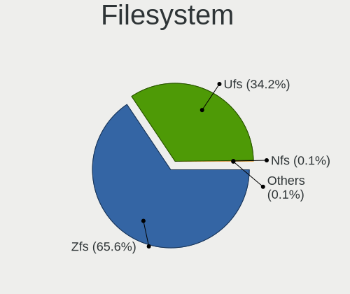
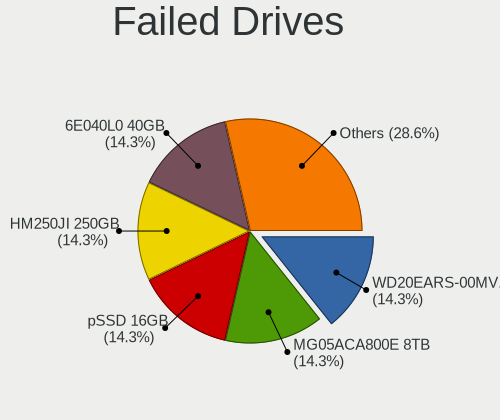
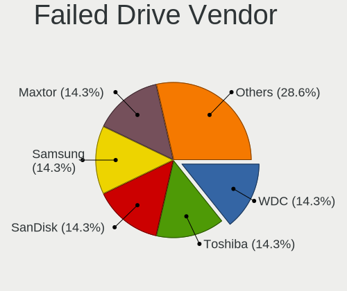
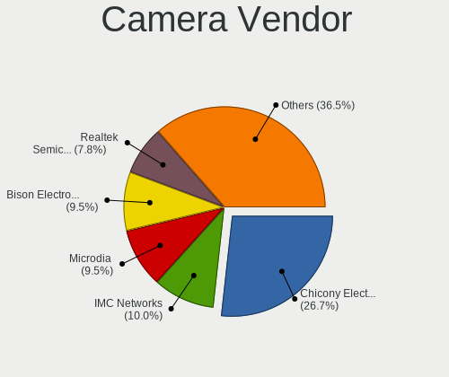

FreeBSD - Tested Hardware & Statistics
--------------------------------------

A project to collect tested hardware configurations for FreeBSD.

Anyone can contribute to this report by the [hw-probe](https://github.com/linuxhw/hw-probe/blob/master/INSTALL.BSD.md) tool:

    hw-probe -all -upload

Please contribute! Especially if your hardware is rare.

This is a report for all computer types. See also reports for [desktops](/Dist/FreeBSD/Desktop/README.md) and [notebooks](/Dist/FreeBSD/Notebook/README.md).

Contents
--------

* [ Test Cases ](#test-cases)

* [ System ](#system)
  - [ OS                       ](#os)
  - [ OS Family                ](#os-family)
  - [ Arch                     ](#arch)
  - [ DE                       ](#de)
  - [ Display Server           ](#display-server)
  - [ Display Manager          ](#display-manager)
  - [ OS Lang                  ](#os-lang)
  - [ Boot Mode                ](#boot-mode)
  - [ Filesystem               ](#filesystem)
  - [ Part. scheme             ](#part-scheme)

* [ Board ](#board)
  - [ Vendor                   ](#vendor)
  - [ Model                    ](#model)
  - [ Model Family             ](#model-family)
  - [ MFG Year                 ](#mfg-year)
  - [ Form Factor              ](#form-factor)
  - [ Coreboot                 ](#coreboot)
  - [ RAM Size                 ](#ram-size)
  - [ RAM Used                 ](#ram-used)
  - [ Total Drives             ](#total-drives)
  - [ Has CD-ROM               ](#has-cd-rom)
  - [ Has Ethernet             ](#has-ethernet)
  - [ Has WiFi                 ](#has-wifi)
  - [ Has Bluetooth            ](#has-bluetooth)

* [ Location ](#location)
  - [ Country                  ](#country)
  - [ City                     ](#city)

* [ Drives ](#drives)
  - [ Drive Vendor             ](#drive-vendor)
  - [ Drive Model              ](#drive-model)
  - [ HDD Vendor               ](#hdd-vendor)
  - [ SSD Vendor               ](#ssd-vendor)
  - [ Drive Kind               ](#drive-kind)
  - [ Drive Connector          ](#drive-connector)
  - [ Drive Size               ](#drive-size)
  - [ Space Total              ](#space-total)
  - [ Space Used               ](#space-used)
  - [ Malfunc. Drives          ](#malfunc-drives)
  - [ Malfunc. Drive Vendor    ](#malfunc-drive-vendor)
  - [ Malfunc. HDD Vendor      ](#malfunc-hdd-vendor)
  - [ Malfunc. Drive Kind      ](#malfunc-drive-kind)
  - [ Failed Drives            ](#failed-drives)
  - [ Failed Drive Vendor      ](#failed-drive-vendor)
  - [ Drive Status             ](#drive-status)

* [ Storage controller ](#storage-controller)
  - [ Storage Vendor           ](#storage-vendor)
  - [ Storage Model            ](#storage-model)
  - [ Storage Kind             ](#storage-kind)

* [ Processor ](#processor)
  - [ CPU Vendor               ](#cpu-vendor)
  - [ CPU Model                ](#cpu-model)
  - [ CPU Model Family         ](#cpu-model-family)
  - [ CPU Cores                ](#cpu-cores)
  - [ CPU Sockets              ](#cpu-sockets)
  - [ CPU Threads              ](#cpu-threads)
  - [ CPU Microarch            ](#cpu-microarch)

* [ Graphics ](#graphics)
  - [ GPU Vendor               ](#gpu-vendor)
  - [ GPU Model                ](#gpu-model)
  - [ GPU Combo                ](#gpu-combo)
  - [ GPU Driver               ](#gpu-driver)
  - [ GPU Memory               ](#gpu-memory)

* [ Monitor ](#monitor)
  - [ Monitor Vendor           ](#monitor-vendor)
  - [ Monitor Model            ](#monitor-model)
  - [ Monitor Resolution       ](#monitor-resolution)
  - [ Monitor Diagonal         ](#monitor-diagonal)
  - [ Monitor Width            ](#monitor-width)
  - [ Aspect Ratio             ](#aspect-ratio)
  - [ Monitor Area             ](#monitor-area)
  - [ Pixel Density            ](#pixel-density)
  - [ Multiple Monitors        ](#multiple-monitors)

* [ Network ](#network)
  - [ Net Controller Vendor    ](#net-controller-vendor)
  - [ Net Controller Model     ](#net-controller-model)
  - [ Wireless Vendor          ](#wireless-vendor)
  - [ Wireless Model           ](#wireless-model)
  - [ Ethernet Vendor          ](#ethernet-vendor)
  - [ Ethernet Model           ](#ethernet-model)
  - [ Net Controller Kind      ](#net-controller-kind)
  - [ Used Controller          ](#used-controller)
  - [ NICs                     ](#nics)
  - [ IPv6                     ](#ipv6)

* [ Bluetooth ](#bluetooth)
  - [ Bluetooth Vendor         ](#bluetooth-vendor)
  - [ Bluetooth Model          ](#bluetooth-model)

* [ Sound ](#sound)
  - [ Sound Vendor             ](#sound-vendor)
  - [ Sound Model              ](#sound-model)

* [ Memory ](#memory)
  - [ Memory Vendor            ](#memory-vendor)
  - [ Memory Model             ](#memory-model)
  - [ Memory Kind              ](#memory-kind)
  - [ Memory Form Factor       ](#memory-form-factor)
  - [ Memory Size              ](#memory-size)
  - [ Memory Speed             ](#memory-speed)

* [ Printers & scanners ](#printers--scanners)
  - [ Printer Vendor           ](#printer-vendor)
  - [ Printer Model            ](#printer-model)
  - [ Scanner Vendor           ](#scanner-vendor)
  - [ Scanner Model            ](#scanner-model)

* [ Camera ](#camera)
  - [ Camera Vendor            ](#camera-vendor)
  - [ Camera Model             ](#camera-model)

* [ Security ](#security)
  - [ Fingerprint Vendor       ](#fingerprint-vendor)
  - [ Fingerprint Model        ](#fingerprint-model)
  - [ Chipcard Vendor          ](#chipcard-vendor)
  - [ Chipcard Model           ](#chipcard-model)

* [ Unsupported ](#unsupported)
  - [ Unsupported Devices      ](#unsupported-devices)
  - [ Unsupported Device Types ](#unsupported-device-types)

Test Cases
----------

Total: 3258

| Vendor        | Model                       | Form-Factor | Probe                                                     | Date         |
|---------------|-----------------------------|-------------|-----------------------------------------------------------|--------------|
| Chuwi         | Unknown                     | Notebook    | [5e687fcc83](https://bsd-hardware.info/?probe=5e687fcc83) | Apr 01, 2023 |
| ASRock        | X570S PG Riptide            | Desktop     | [8ccb321056](https://bsd-hardware.info/?probe=8ccb321056) | Apr 01, 2023 |
| MSI           | B450 GAMING PLUS MAX        | Desktop     | [c7944c3ce9](https://bsd-hardware.info/?probe=c7944c3ce9) | Mar 31, 2023 |
| SolidRun      | CEX7 Platform               | Desktop     | [8e2e4d6686](https://bsd-hardware.info/?probe=8e2e4d6686) | Mar 31, 2023 |
| ASRockRack    | EPYC3101D4I-2T              | Desktop     | [3c3a780d95](https://bsd-hardware.info/?probe=3c3a780d95) | Mar 31, 2023 |
| ASRockRack    | EPYCD8-2T                   | Desktop     | [75f414997a](https://bsd-hardware.info/?probe=75f414997a) | Mar 31, 2023 |
| HP            | 339A                        | Desktop     | [ad10416fe3](https://bsd-hardware.info/?probe=ad10416fe3) | Mar 31, 2023 |
| Biostar       | TH67B                       | Desktop     | [234c5e0b83](https://bsd-hardware.info/?probe=234c5e0b83) | Mar 31, 2023 |
| HMT           | W041-TF-A-45                | Notebook    | [666df5a7e0](https://bsd-hardware.info/?probe=666df5a7e0) | Mar 31, 2023 |
| ASRock        | X570M Pro4                  | Desktop     | [1d7c737c38](https://bsd-hardware.info/?probe=1d7c737c38) | Mar 29, 2023 |
| Google        | Stout                       | Notebook    | [d8346bb5da](https://bsd-hardware.info/?probe=d8346bb5da) | Mar 29, 2023 |
| Alienware     | 049PDM A00                  | Desktop     | [139d115cdb](https://bsd-hardware.info/?probe=139d115cdb) | Mar 29, 2023 |
| Shuttle       | FH110                       | Desktop     | [4fa8a9cc08](https://bsd-hardware.info/?probe=4fa8a9cc08) | Mar 28, 2023 |
| Lenovo        | ThinkPad X1 Extreme 20MF... | Notebook    | [b4805cd318](https://bsd-hardware.info/?probe=b4805cd318) | Mar 27, 2023 |
| ASRock        | X570S PG Riptide            | Desktop     | [0d66edbd38](https://bsd-hardware.info/?probe=0d66edbd38) | Mar 27, 2023 |
| Dell          | 0VD5HY A00                  | Desktop     | [1b54a68123](https://bsd-hardware.info/?probe=1b54a68123) | Mar 26, 2023 |
| Dell          | 0C2GT0 A05                  | Server      | [2d32ae23e6](https://bsd-hardware.info/?probe=2d32ae23e6) | Mar 26, 2023 |
| Dell          | Inspiron 5559               | Notebook    | [7652c9891e](https://bsd-hardware.info/?probe=7652c9891e) | Mar 26, 2023 |
| MSI           | H81M-P33                    | Desktop     | [f07e9fd36c](https://bsd-hardware.info/?probe=f07e9fd36c) | Mar 26, 2023 |
| ASUSTek       | P5Q-E                       | Desktop     | [3f21567fdf](https://bsd-hardware.info/?probe=3f21567fdf) | Mar 26, 2023 |
| ASUSTek       | ROG CROSSHAIR VIII HERO     | Desktop     | [38a22651c6](https://bsd-hardware.info/?probe=38a22651c6) | Mar 26, 2023 |
| ASUSTek       | ASUS TUF Gaming A15 FA50... | Notebook    | [a46f77ccdc](https://bsd-hardware.info/?probe=a46f77ccdc) | Mar 25, 2023 |
| ASUSTek       | ASUS TUF Gaming A15 FA50... | Notebook    | [b64571464f](https://bsd-hardware.info/?probe=b64571464f) | Mar 25, 2023 |
| HP            | 1497                        | Desktop     | [08daaf3be1](https://bsd-hardware.info/?probe=08daaf3be1) | Mar 25, 2023 |
| HP            | 21B4 A01                    | Desktop     | [8de4b8231a](https://bsd-hardware.info/?probe=8de4b8231a) | Mar 25, 2023 |
| HP            | 1497                        | Desktop     | [fc6a7ebc91](https://bsd-hardware.info/?probe=fc6a7ebc91) | Mar 25, 2023 |
| eMachines     | eM350                       | Notebook    | [bb900ace2d](https://bsd-hardware.info/?probe=bb900ace2d) | Mar 25, 2023 |
| HP            | 1497                        | Desktop     | [e98b5284d9](https://bsd-hardware.info/?probe=e98b5284d9) | Mar 25, 2023 |
| Alienware     | 14                          | Notebook    | [742d648570](https://bsd-hardware.info/?probe=742d648570) | Mar 25, 2023 |
| Acer          | AOD270                      | Notebook    | [73877008e9](https://bsd-hardware.info/?probe=73877008e9) | Mar 25, 2023 |
| Acer          | Nitro AN515-53              | Notebook    | [a46e065fac](https://bsd-hardware.info/?probe=a46e065fac) | Mar 23, 2023 |
| Dell          | Inspiron 5559               | Notebook    | [f294f7ae04](https://bsd-hardware.info/?probe=f294f7ae04) | Mar 23, 2023 |
| HP            | 3397                        | Desktop     | [a3a77965fc](https://bsd-hardware.info/?probe=a3a77965fc) | Mar 23, 2023 |
| Intel         | SandyBridge Platform        | Notebook    | [954a21f7de](https://bsd-hardware.info/?probe=954a21f7de) | Mar 23, 2023 |
| Dell          | Edge Gateway 5100           | Mini pc     | [7cb4288db0](https://bsd-hardware.info/?probe=7cb4288db0) | Mar 23, 2023 |
| HUAWEI        | HVY-WXX9                    | Notebook    | [e1b5d66244](https://bsd-hardware.info/?probe=e1b5d66244) | Mar 20, 2023 |
| ASRock        | B550M Pro4                  | Desktop     | [4dc54510d2](https://bsd-hardware.info/?probe=4dc54510d2) | Mar 19, 2023 |
| ASUSTek       | PRO B460M-C                 | Desktop     | [cab50cddd5](https://bsd-hardware.info/?probe=cab50cddd5) | Mar 19, 2023 |
| ASUSTek       | PRO B460M-C                 | Desktop     | [ff4dda40eb](https://bsd-hardware.info/?probe=ff4dda40eb) | Mar 19, 2023 |
| MSI           | H81M-P33                    | Desktop     | [17f0f138ee](https://bsd-hardware.info/?probe=17f0f138ee) | Mar 19, 2023 |
| ASUSTek       | P5Q-E                       | Desktop     | [da50d91be4](https://bsd-hardware.info/?probe=da50d91be4) | Mar 19, 2023 |
| ASUSTek       | ROG CROSSHAIR VIII HERO     | Desktop     | [726abe2f1d](https://bsd-hardware.info/?probe=726abe2f1d) | Mar 19, 2023 |
| HP            | 212B                        | Desktop     | [d4d93ad679](https://bsd-hardware.info/?probe=d4d93ad679) | Mar 19, 2023 |
| GVC           | DR 738                      | Desktop     | [88455ed9e7](https://bsd-hardware.info/?probe=88455ed9e7) | Mar 18, 2023 |
| HP            | ProBook 450 G8 Notebook ... | Notebook    | [c83b0dda87](https://bsd-hardware.info/?probe=c83b0dda87) | Mar 18, 2023 |
| HP            | ProBook 450 G8 Notebook ... | Notebook    | [9ac4738956](https://bsd-hardware.info/?probe=9ac4738956) | Mar 18, 2023 |
| IP3 Techno... | ACN1S                       | Notebook    | [d0761f4192](https://bsd-hardware.info/?probe=d0761f4192) | Mar 18, 2023 |
| Lenovo        | ThinkPad X1 Carbon 6th 2... | Notebook    | [6d9c564a33](https://bsd-hardware.info/?probe=6d9c564a33) | Mar 17, 2023 |
| HP            | 3397                        | Desktop     | [2851f91f5f](https://bsd-hardware.info/?probe=2851f91f5f) | Mar 17, 2023 |
| ASUSTek       | 1001P                       | Notebook    | [76eae56ba3](https://bsd-hardware.info/?probe=76eae56ba3) | Mar 15, 2023 |
| OEGStone      | W54_55SU1,SUW               | Notebook    | [64316408f0](https://bsd-hardware.info/?probe=64316408f0) | Mar 15, 2023 |
| Acer          | Aspire V3-112P              | Notebook    | [104c10f9b0](https://bsd-hardware.info/?probe=104c10f9b0) | Mar 14, 2023 |
| Dell          | Inspiron 5567               | Notebook    | [b878473783](https://bsd-hardware.info/?probe=b878473783) | Mar 13, 2023 |
| ASUSTek       | PRIME X370-PRO              | Desktop     | [49764ec5fa](https://bsd-hardware.info/?probe=49764ec5fa) | Mar 13, 2023 |
| ASRock        | X570 Phantom Gaming 4       | Desktop     | [a8a9ed7f9e](https://bsd-hardware.info/?probe=a8a9ed7f9e) | Mar 13, 2023 |
| Lenovo        | ThinkPad E495 20NEA00QUS    | Notebook    | [8b112aa100](https://bsd-hardware.info/?probe=8b112aa100) | Mar 13, 2023 |
| Dell          | Inspiron 5567               | Notebook    | [b2ef9ff3dc](https://bsd-hardware.info/?probe=b2ef9ff3dc) | Mar 12, 2023 |
| HP            | 0AA8h                       | Desktop     | [15ddd97321](https://bsd-hardware.info/?probe=15ddd97321) | Mar 12, 2023 |
| Supermicro    | X7DWE                       | Desktop     | [e40b569ff7](https://bsd-hardware.info/?probe=e40b569ff7) | Mar 12, 2023 |
| MSI           | H81M-P33                    | Desktop     | [12dbc1a2b3](https://bsd-hardware.info/?probe=12dbc1a2b3) | Mar 12, 2023 |
| ASUSTek       | P5Q-E                       | Desktop     | [bcd9058821](https://bsd-hardware.info/?probe=bcd9058821) | Mar 12, 2023 |
| ASUSTek       | ROG CROSSHAIR VIII HERO     | Desktop     | [d93ae717cc](https://bsd-hardware.info/?probe=d93ae717cc) | Mar 12, 2023 |
| Google        | Kohaku                      | Notebook    | [88491d298e](https://bsd-hardware.info/?probe=88491d298e) | Mar 12, 2023 |
| Lenovo        | ThinkPad P52s 20LBS0FH00    | Notebook    | [80dd48bca9](https://bsd-hardware.info/?probe=80dd48bca9) | Mar 12, 2023 |
| Dell          | Precision 7720              | Notebook    | [01f5f21b76](https://bsd-hardware.info/?probe=01f5f21b76) | Mar 12, 2023 |
| ASUSTek       | M5A97 LE R2.0               | Desktop     | [c8abf1f5bf](https://bsd-hardware.info/?probe=c8abf1f5bf) | Mar 11, 2023 |
| ASUSTek       | TUF Gaming B550-PLUS        | Desktop     | [3548f4efa2](https://bsd-hardware.info/?probe=3548f4efa2) | Mar 11, 2023 |
| Lenovo        | ThinkPad P52s 20LBS0FH00    | Notebook    | [a4366e53ba](https://bsd-hardware.info/?probe=a4366e53ba) | Mar 10, 2023 |
| MSI           | PRO H610M-B DDR4            | Desktop     | [654bdb4eb2](https://bsd-hardware.info/?probe=654bdb4eb2) | Mar 10, 2023 |
| Raspberry ... | Raspberry Pi                | Soc         | [62c09245a4](https://bsd-hardware.info/?probe=62c09245a4) | Mar 10, 2023 |
| Gigabyte      | B360M D2V                   | Desktop     | [6ac60b8104](https://bsd-hardware.info/?probe=6ac60b8104) | Mar 10, 2023 |
| Intel         | Jasper Lake Client Platf... | Notebook    | [88de48013c](https://bsd-hardware.info/?probe=88de48013c) | Mar 10, 2023 |
| Lenovo        | ThinkPad T495 20NKS0HN1N    | Notebook    | [af190c38e9](https://bsd-hardware.info/?probe=af190c38e9) | Mar 10, 2023 |
| Fujitsu       | CELSIUS H730                | Notebook    | [223879138d](https://bsd-hardware.info/?probe=223879138d) | Mar 10, 2023 |
| Lenovo        | ThinkPad X220 4286CTO       | Notebook    | [e5a43dd311](https://bsd-hardware.info/?probe=e5a43dd311) | Mar 10, 2023 |
| Lenovo        | ThinkPad P52s 20LBS0FH00    | Notebook    | [44a8bf8fbc](https://bsd-hardware.info/?probe=44a8bf8fbc) | Mar 10, 2023 |
| Apple         | Mac-F2268CC8                | All in one  | [970f35af17](https://bsd-hardware.info/?probe=970f35af17) | Mar 09, 2023 |
| Lenovo        | ThinkPad E14 Gen 3 20Y70... | Notebook    | [278a2a11cd](https://bsd-hardware.info/?probe=278a2a11cd) | Mar 09, 2023 |
| Lenovo        | ThinkPad E14 Gen 3 20Y70... | Notebook    | [ef85735453](https://bsd-hardware.info/?probe=ef85735453) | Mar 09, 2023 |
| Huanan        | X99-QD4 V1.0                | Desktop     | [58090b9dbf](https://bsd-hardware.info/?probe=58090b9dbf) | Mar 09, 2023 |
| Dell          | Latitude D620               | Notebook    | [8b3ad4e8b9](https://bsd-hardware.info/?probe=8b3ad4e8b9) | Mar 09, 2023 |
| Dell          | Latitude D620               | Notebook    | [d42a8ee079](https://bsd-hardware.info/?probe=d42a8ee079) | Mar 09, 2023 |
| ASRock        | H610M-HVS/M.2 R2.0          | Desktop     | [98fe8cc428](https://bsd-hardware.info/?probe=98fe8cc428) | Mar 09, 2023 |
| Samsung       | 750XEE                      | Notebook    | [47d2204f58](https://bsd-hardware.info/?probe=47d2204f58) | Mar 08, 2023 |
| Lenovo        | ThinkPad X230 2324A14       | Notebook    | [124b3bdb95](https://bsd-hardware.info/?probe=124b3bdb95) | Mar 08, 2023 |
| Lenovo        | IdeaPad 5 15ALC05 82LN      | Notebook    | [9466e6d4f4](https://bsd-hardware.info/?probe=9466e6d4f4) | Mar 07, 2023 |
| Lenovo        | ThinkPad T16 Gen 1 21BVC... | Notebook    | [1a2543f92f](https://bsd-hardware.info/?probe=1a2543f92f) | Mar 06, 2023 |
| Apple         | Mac-F2268CC8                | All in one  | [2ba0e18863](https://bsd-hardware.info/?probe=2ba0e18863) | Mar 05, 2023 |
| ASUSTek       | PRO B460M-C                 | Desktop     | [a3f77b82cc](https://bsd-hardware.info/?probe=a3f77b82cc) | Mar 05, 2023 |
| MSI           | H81M-P33                    | Desktop     | [dfa124b6f9](https://bsd-hardware.info/?probe=dfa124b6f9) | Mar 05, 2023 |
| ASUSTek       | P5Q-E                       | Desktop     | [64513c0ff5](https://bsd-hardware.info/?probe=64513c0ff5) | Mar 05, 2023 |
| ASUSTek       | ROG CROSSHAIR VIII HERO     | Desktop     | [ebba69095d](https://bsd-hardware.info/?probe=ebba69095d) | Mar 05, 2023 |
| ASRock        | E350M1                      | Desktop     | [461f8cca23](https://bsd-hardware.info/?probe=461f8cca23) | Mar 04, 2023 |
| Intel         | D510MO AAE76523-403         | Desktop     | [0da634580f](https://bsd-hardware.info/?probe=0da634580f) | Mar 03, 2023 |
| Lenovo        | ThinkPad T480 20L6S29E0T    | Notebook    | [6d7b30d2c4](https://bsd-hardware.info/?probe=6d7b30d2c4) | Mar 03, 2023 |
| ASUSTek       | ASUS TUF Gaming F15 FX50... | Notebook    | [f9db95d778](https://bsd-hardware.info/?probe=f9db95d778) | Mar 03, 2023 |
| Raspberry ... | Raspberry Pi                | Soc         | [3daad10634](https://bsd-hardware.info/?probe=3daad10634) | Mar 02, 2023 |
| ASRock        | H470M-STX                   | Desktop     | [98096adfaa](https://bsd-hardware.info/?probe=98096adfaa) | Mar 01, 2023 |
| ASRockRack    | EPYC3101D4I-2T              | Desktop     | [d675a5bab2](https://bsd-hardware.info/?probe=d675a5bab2) | Feb 28, 2023 |
| Lenovo        | Kabini CRB 31900058 STD     | Desktop     | [735f2f3ece](https://bsd-hardware.info/?probe=735f2f3ece) | Feb 28, 2023 |
| Lenovo        | ThinkPad T480s 20L7002CU... | Notebook    | [0e051e7291](https://bsd-hardware.info/?probe=0e051e7291) | Feb 27, 2023 |
| Dell          | 0HHV7N A00                  | Desktop     | [ffbb7e1a96](https://bsd-hardware.info/?probe=ffbb7e1a96) | Feb 27, 2023 |
| Lenovo        | Kabini CRB 31900058 STD     | Desktop     | [b0fcea0c90](https://bsd-hardware.info/?probe=b0fcea0c90) | Feb 27, 2023 |
| MSI           | PRO H610M-B DDR4            | Desktop     | [e85ed3f609](https://bsd-hardware.info/?probe=e85ed3f609) | Feb 27, 2023 |
| ASUSTek       | X541SA                      | Notebook    | [9d406d735e](https://bsd-hardware.info/?probe=9d406d735e) | Feb 26, 2023 |
| HP            | EliteBook 8570p             | Notebook    | [1a4897cb53](https://bsd-hardware.info/?probe=1a4897cb53) | Feb 26, 2023 |
| MSI           | H81M-P33                    | Desktop     | [806efadc12](https://bsd-hardware.info/?probe=806efadc12) | Feb 26, 2023 |
| ASUSTek       | P5Q-E                       | Desktop     | [efb350b5f2](https://bsd-hardware.info/?probe=efb350b5f2) | Feb 26, 2023 |
| ASUSTek       | ROG CROSSHAIR VIII HERO     | Desktop     | [62567aa5d4](https://bsd-hardware.info/?probe=62567aa5d4) | Feb 26, 2023 |
| Lenovo        | ThinkPad L14 Gen 3 21C5C... | Notebook    | [2ab690000c](https://bsd-hardware.info/?probe=2ab690000c) | Feb 25, 2023 |
| Lenovo        | ThinkPad L14 Gen 3 21C5C... | Notebook    | [ae0dc68ba6](https://bsd-hardware.info/?probe=ae0dc68ba6) | Feb 25, 2023 |
| Lenovo        | ThinkPad T530 24297XG       | Notebook    | [97d9b10c8a](https://bsd-hardware.info/?probe=97d9b10c8a) | Feb 24, 2023 |
| HP            | EliteBook 8570p             | Notebook    | [1e548fa114](https://bsd-hardware.info/?probe=1e548fa114) | Feb 24, 2023 |
| Seeed Stud... | ODYSSEY-X86J4105 SD-BS-C... | Desktop     | [b2681fdfb4](https://bsd-hardware.info/?probe=b2681fdfb4) | Feb 23, 2023 |
| Lenovo        | ThinkPad X280 20KFCTO1WW    | Notebook    | [3dae7e3ebb](https://bsd-hardware.info/?probe=3dae7e3ebb) | Feb 23, 2023 |
| Lenovo        | ThinkPad L14 Gen 3 21C5C... | Notebook    | [6669622646](https://bsd-hardware.info/?probe=6669622646) | Feb 23, 2023 |
| Gigabyte      | Z87X-OC-CF                  | Desktop     | [dca82c50d0](https://bsd-hardware.info/?probe=dca82c50d0) | Feb 23, 2023 |
| Gigabyte      | X670E AORUS MASTER          | Desktop     | [e55635df08](https://bsd-hardware.info/?probe=e55635df08) | Feb 23, 2023 |
| Unknown       | Unknown                     | Desktop     | [9e92cf3575](https://bsd-hardware.info/?probe=9e92cf3575) | Feb 22, 2023 |
| HP            | Victus by Laptop 16-e0xx... | Notebook    | [b2ed608da5](https://bsd-hardware.info/?probe=b2ed608da5) | Feb 21, 2023 |
| ASRock        | X570 Taichi                 | Desktop     | [8eb068a097](https://bsd-hardware.info/?probe=8eb068a097) | Feb 20, 2023 |
| MSI           | H81M-P33                    | Desktop     | [28f48b7936](https://bsd-hardware.info/?probe=28f48b7936) | Feb 19, 2023 |
| ASUSTek       | P5Q-E                       | Desktop     | [b3525afaa7](https://bsd-hardware.info/?probe=b3525afaa7) | Feb 19, 2023 |
| ASUSTek       | ROG CROSSHAIR VIII HERO     | Desktop     | [19c7044a7d](https://bsd-hardware.info/?probe=19c7044a7d) | Feb 19, 2023 |
| Intel         | NUC7JYB J67969-404          | Mini pc     | [c30dd3fbca](https://bsd-hardware.info/?probe=c30dd3fbca) | Feb 19, 2023 |
| Intel         | NUC5PPYB H76558-102         | Mini pc     | [a27331804b](https://bsd-hardware.info/?probe=a27331804b) | Feb 19, 2023 |
| Intel         | DN2820FYK H24582-203        | Desktop     | [dd0d96422f](https://bsd-hardware.info/?probe=dd0d96422f) | Feb 19, 2023 |
| Lenovo        | ThinkPad X1 Carbon Gen 9... | Notebook    | [63b73012e6](https://bsd-hardware.info/?probe=63b73012e6) | Feb 18, 2023 |
| HP            | EliteBook 8570p             | Notebook    | [1ba2a827d9](https://bsd-hardware.info/?probe=1ba2a827d9) | Feb 18, 2023 |
| Lenovo        | ThinkPad R60e 0658W2M       | Notebook    | [dba66ebfb5](https://bsd-hardware.info/?probe=dba66ebfb5) | Feb 17, 2023 |
| ASUSTek       | ROG STRIX Z390-I GAMING     | Desktop     | [b241a8afd7](https://bsd-hardware.info/?probe=b241a8afd7) | Feb 16, 2023 |
| ASRock        | A520M-ITX/ac                | Desktop     | [dd083df1a2](https://bsd-hardware.info/?probe=dd083df1a2) | Feb 16, 2023 |
| TUXEDO        | InfinityBook Pro 14 Gen6    | Notebook    | [0f4dd9a9bc](https://bsd-hardware.info/?probe=0f4dd9a9bc) | Feb 15, 2023 |
| ASUSTek       | STRIX Z270F GAMING          | Desktop     | [6f4b514959](https://bsd-hardware.info/?probe=6f4b514959) | Feb 14, 2023 |
| Lenovo        | ThinkPad T430 2347FV6       | Notebook    | [cf016ce514](https://bsd-hardware.info/?probe=cf016ce514) | Feb 14, 2023 |
| ASUSTek       | ASUS TUF Gaming A15 FA50... | Notebook    | [c176577762](https://bsd-hardware.info/?probe=c176577762) | Feb 14, 2023 |
| Fujitsu       | D3413-A1 S26361-D3413-A1    | Desktop     | [d69aba5432](https://bsd-hardware.info/?probe=d69aba5432) | Feb 14, 2023 |
| ASUSTek       | PRIME X370-PRO              | Desktop     | [b3f41e1cb4](https://bsd-hardware.info/?probe=b3f41e1cb4) | Feb 13, 2023 |
| ASRock        | X570 Phantom Gaming 4       | Desktop     | [b962baf73d](https://bsd-hardware.info/?probe=b962baf73d) | Feb 13, 2023 |
| Acer          | Aspire one V1.05            | Notebook    | [eec371a28f](https://bsd-hardware.info/?probe=eec371a28f) | Feb 13, 2023 |
| Dell          | Inspiron 5567               | Notebook    | [df5f01d72e](https://bsd-hardware.info/?probe=df5f01d72e) | Feb 13, 2023 |
| Panasonic     | CF-30KAPAXAM                | Notebook    | [f686e3756c](https://bsd-hardware.info/?probe=f686e3756c) | Feb 13, 2023 |
| ASUSTek       | P8Z68 DELUXE                | Desktop     | [f65675c771](https://bsd-hardware.info/?probe=f65675c771) | Feb 13, 2023 |
| ASUSTek       | H170I-PRO                   | Desktop     | [63000ada74](https://bsd-hardware.info/?probe=63000ada74) | Feb 12, 2023 |
| HP            | 212B                        | Desktop     | [0e13beb9f6](https://bsd-hardware.info/?probe=0e13beb9f6) | Feb 12, 2023 |
| ASUSTek       | TUF Gaming B450M-PRO S      | Desktop     | [5507e05838](https://bsd-hardware.info/?probe=5507e05838) | Feb 12, 2023 |
| Alienware     | m15                         | Notebook    | [3ab3e4b671](https://bsd-hardware.info/?probe=3ab3e4b671) | Feb 12, 2023 |
| MSI           | H81M-P33                    | Desktop     | [84aff26f99](https://bsd-hardware.info/?probe=84aff26f99) | Feb 12, 2023 |
| ASUSTek       | P5Q-E                       | Desktop     | [4e899d9a1c](https://bsd-hardware.info/?probe=4e899d9a1c) | Feb 12, 2023 |
| ASUSTek       | ROG CROSSHAIR VIII HERO     | Desktop     | [d16e93b7f3](https://bsd-hardware.info/?probe=d16e93b7f3) | Feb 12, 2023 |
| HP            | ProBook 450 G2              | Notebook    | [acff807555](https://bsd-hardware.info/?probe=acff807555) | Feb 12, 2023 |
| ASUSTek       | PRIME H410M-K               | Desktop     | [d2edba8775](https://bsd-hardware.info/?probe=d2edba8775) | Feb 11, 2023 |
| Gigabyte      | Z490 VISION G               | Desktop     | [6f8ad1a8b9](https://bsd-hardware.info/?probe=6f8ad1a8b9) | Feb 11, 2023 |
| Lenovo        | ThinkPad X1 Carbon 7th 2... | Notebook    | [8d49d50738](https://bsd-hardware.info/?probe=8d49d50738) | Feb 11, 2023 |
| Acer          | Aspire A315-58              | Notebook    | [81827ccbca](https://bsd-hardware.info/?probe=81827ccbca) | Feb 10, 2023 |
| Apple         | Mac-F22C86C8                | Mini pc     | [4284c60268](https://bsd-hardware.info/?probe=4284c60268) | Feb 10, 2023 |
| Lenovo        | IdeaPad Y700-15ISK 80NV     | Notebook    | [0c9cf4e002](https://bsd-hardware.info/?probe=0c9cf4e002) | Feb 09, 2023 |
| Lenovo        | IdeaPad Y700-15ISK 80NV     | Notebook    | [ca1e51a042](https://bsd-hardware.info/?probe=ca1e51a042) | Feb 09, 2023 |
| ASUSTek       | P7P55D DELUXE               | Desktop     | [dd9685a909](https://bsd-hardware.info/?probe=dd9685a909) | Feb 09, 2023 |
| HP            | Pavilion dv6                | Notebook    | [d6c8ad1034](https://bsd-hardware.info/?probe=d6c8ad1034) | Feb 08, 2023 |
| Gigabyte      | H61M-S2V-B3                 | Desktop     | [33af90dd93](https://bsd-hardware.info/?probe=33af90dd93) | Feb 08, 2023 |
| ASUSTek       | ASUS TUF Gaming F15 FX50... | Notebook    | [f3b0d5ac82](https://bsd-hardware.info/?probe=f3b0d5ac82) | Feb 08, 2023 |
| Lenovo        | IdeaPad 5 14ITL05 82FE      | Notebook    | [4fc5363829](https://bsd-hardware.info/?probe=4fc5363829) | Feb 07, 2023 |
| Lenovo        | IdeaPad Gaming 3 15IHU6 ... | Notebook    | [ef722fc37b](https://bsd-hardware.info/?probe=ef722fc37b) | Feb 06, 2023 |
| MSI           | B450M MORTAR MAX            | Desktop     | [ec37957aed](https://bsd-hardware.info/?probe=ec37957aed) | Feb 05, 2023 |
| HP            | Pavilion Laptop 14-bf0xx    | Notebook    | [a98d28355d](https://bsd-hardware.info/?probe=a98d28355d) | Feb 05, 2023 |
| MSI           | H81M-P33                    | Desktop     | [6f8f329a5b](https://bsd-hardware.info/?probe=6f8f329a5b) | Feb 05, 2023 |
| ASUSTek       | P5Q-E                       | Desktop     | [bd418783d4](https://bsd-hardware.info/?probe=bd418783d4) | Feb 05, 2023 |
| ASUSTek       | ROG CROSSHAIR VIII HERO     | Desktop     | [ec1ab0bf97](https://bsd-hardware.info/?probe=ec1ab0bf97) | Feb 05, 2023 |
| Samsung       | 700T1C                      | Notebook    | [91d5c568d1](https://bsd-hardware.info/?probe=91d5c568d1) | Feb 05, 2023 |
| Toshiba       | PORTEGE Z930                | Notebook    | [5462140da0](https://bsd-hardware.info/?probe=5462140da0) | Feb 05, 2023 |
| Lenovo        | IdeaPad Gaming 3 15IHU6 ... | Notebook    | [0232c45faa](https://bsd-hardware.info/?probe=0232c45faa) | Feb 04, 2023 |
| Lenovo        | ThinkPad P14s Gen 3 21AK... | Notebook    | [b7a491a010](https://bsd-hardware.info/?probe=b7a491a010) | Feb 03, 2023 |
| ASUSTek       | ASUS TUF Gaming F15 FX50... | Notebook    | [d36789c493](https://bsd-hardware.info/?probe=d36789c493) | Feb 02, 2023 |
| Lenovo        | ThinkPad T460 20FMS04200    | Notebook    | [3178015cd3](https://bsd-hardware.info/?probe=3178015cd3) | Feb 02, 2023 |
| ASUSTek       | ASUS TUF Gaming F15 FX50... | Notebook    | [a54516414a](https://bsd-hardware.info/?probe=a54516414a) | Feb 01, 2023 |
| Lenovo        | ThinkPad T460p 20FW0018A... | Notebook    | [932e722b2d](https://bsd-hardware.info/?probe=932e722b2d) | Feb 01, 2023 |
| ASRockRack    | EPYC3101D4I-2T              | Desktop     | [6d46662662](https://bsd-hardware.info/?probe=6d46662662) | Jan 31, 2023 |
| MSI           | MAG B550 TOMAHAWK           | Desktop     | [82ab576c6c](https://bsd-hardware.info/?probe=82ab576c6c) | Jan 31, 2023 |
| Lenovo        | ThinkPad X1 Carbon 3rd 2... | Notebook    | [341bae363a](https://bsd-hardware.info/?probe=341bae363a) | Jan 31, 2023 |
| Lenovo        | ThinkPad X1 Carbon 5th 2... | Notebook    | [0b48f96d1e](https://bsd-hardware.info/?probe=0b48f96d1e) | Jan 31, 2023 |
| F-Plus Mob... | FLAPTOP r                   | Notebook    | [c2f84d2103](https://bsd-hardware.info/?probe=c2f84d2103) | Jan 31, 2023 |
| F-Plus Mob... | FLAPTOP r                   | Notebook    | [165d435f30](https://bsd-hardware.info/?probe=165d435f30) | Jan 31, 2023 |
| ASRock        | 970 Extreme3                | Desktop     | [5e2fd4b48f](https://bsd-hardware.info/?probe=5e2fd4b48f) | Jan 30, 2023 |
| ASUSTek       | ASUS TUF Gaming F15 FX50... | Notebook    | [39ae8fb9c8](https://bsd-hardware.info/?probe=39ae8fb9c8) | Jan 30, 2023 |
| HP            | Pavilion Notebook           | Notebook    | [75b9ef6ee6](https://bsd-hardware.info/?probe=75b9ef6ee6) | Jan 30, 2023 |
| Lenovo        | Legion 5 15ARH05 82B5       | Notebook    | [21398109dc](https://bsd-hardware.info/?probe=21398109dc) | Jan 29, 2023 |
| MSI           | H81M-P33                    | Desktop     | [e6626da98c](https://bsd-hardware.info/?probe=e6626da98c) | Jan 29, 2023 |
| ASUSTek       | P5Q-E                       | Desktop     | [3d5ea9f313](https://bsd-hardware.info/?probe=3d5ea9f313) | Jan 29, 2023 |
| ASUSTek       | ROG CROSSHAIR VIII HERO     | Desktop     | [9b7532b795](https://bsd-hardware.info/?probe=9b7532b795) | Jan 29, 2023 |
| Lenovo        | Legion 5 15ARH05 82B5       | Notebook    | [2098b8808d](https://bsd-hardware.info/?probe=2098b8808d) | Jan 29, 2023 |
| Dell          | 08NPPY A00                  | Desktop     | [1c4edf62e6](https://bsd-hardware.info/?probe=1c4edf62e6) | Jan 28, 2023 |
| Gigabyte      | B550 AORUS PRO              | Desktop     | [8fd7f80256](https://bsd-hardware.info/?probe=8fd7f80256) | Jan 28, 2023 |
| Acer          | Aspire one V1.05            | Notebook    | [1cbfce4d7e](https://bsd-hardware.info/?probe=1cbfce4d7e) | Jan 28, 2023 |
| Lenovo        | ThinkPad T14 Gen 2a 20XK... | Notebook    | [d5f06d91db](https://bsd-hardware.info/?probe=d5f06d91db) | Jan 28, 2023 |
| HP            | Laptop 14s-fq1xxx           | Notebook    | [1603f38c4c](https://bsd-hardware.info/?probe=1603f38c4c) | Jan 28, 2023 |
| ASUSTek       | WS-C621E-SAGE Series        | Server      | [d32c9457b9](https://bsd-hardware.info/?probe=d32c9457b9) | Jan 28, 2023 |
| F-Plus Mob... | FLAPTOP r                   | Notebook    | [448f9265f2](https://bsd-hardware.info/?probe=448f9265f2) | Jan 27, 2023 |
| F-Plus Mob... | FLAPTOP r                   | Notebook    | [512bf8f61d](https://bsd-hardware.info/?probe=512bf8f61d) | Jan 27, 2023 |
| HP            | EliteBook 840 G3            | Notebook    | [92c676e033](https://bsd-hardware.info/?probe=92c676e033) | Jan 26, 2023 |
| ASUSTek       | ROG STRIX X570-E GAMING     | Desktop     | [87e25e2abd](https://bsd-hardware.info/?probe=87e25e2abd) | Jan 26, 2023 |
| Shuttle       | DS20U                       | Desktop     | [71033e4a64](https://bsd-hardware.info/?probe=71033e4a64) | Jan 26, 2023 |
| IBM           | 9210MML                     | Desktop     | [8b7e2413ee](https://bsd-hardware.info/?probe=8b7e2413ee) | Jan 25, 2023 |
| ADI Engine... | RCC-VE                      | Desktop     | [e2941c00fc](https://bsd-hardware.info/?probe=e2941c00fc) | Jan 25, 2023 |
| Supermicro    | X11SSH-F                    | Server      | [106cf811d8](https://bsd-hardware.info/?probe=106cf811d8) | Jan 25, 2023 |
| Lenovo        | IdeaPad Y700-15ISK 80NV     | Notebook    | [4eb4e63a2c](https://bsd-hardware.info/?probe=4eb4e63a2c) | Jan 25, 2023 |
| Lenovo        | ThinkBook 14-IIL 20SL       | Notebook    | [afeb216c1e](https://bsd-hardware.info/?probe=afeb216c1e) | Jan 25, 2023 |
| ASUSTek       | WS-C621E-SAGE Series        | Server      | [ab59ccf04c](https://bsd-hardware.info/?probe=ab59ccf04c) | Jan 24, 2023 |
| Lenovo        | ThinkPad X220 4291WF5       | Notebook    | [24544f4a94](https://bsd-hardware.info/?probe=24544f4a94) | Jan 24, 2023 |
| Lenovo        | ThinkPad T430 2342AG4       | Notebook    | [b5e972d19a](https://bsd-hardware.info/?probe=b5e972d19a) | Jan 24, 2023 |
| Dell          | XPS 13 9310                 | Notebook    | [7319560506](https://bsd-hardware.info/?probe=7319560506) | Jan 24, 2023 |
| Medion        | S14409                      | Notebook    | [9a44efb64c](https://bsd-hardware.info/?probe=9a44efb64c) | Jan 23, 2023 |
| Dell          | Latitude E6400              | Notebook    | [dcc804a61f](https://bsd-hardware.info/?probe=dcc804a61f) | Jan 22, 2023 |
| Dell          | Latitude E6400              | Notebook    | [9dd8d0184f](https://bsd-hardware.info/?probe=9dd8d0184f) | Jan 22, 2023 |
| ASUSTek       | P5Q-E                       | Desktop     | [26d1d923d6](https://bsd-hardware.info/?probe=26d1d923d6) | Jan 22, 2023 |
| MSI           | H81M-P33                    | Desktop     | [0bbc074f1c](https://bsd-hardware.info/?probe=0bbc074f1c) | Jan 22, 2023 |
| ASUSTek       | ROG CROSSHAIR VIII HERO     | Desktop     | [28d8d82d34](https://bsd-hardware.info/?probe=28d8d82d34) | Jan 22, 2023 |
| Unknown       | AMD-GX3                     | Desktop     | [a38ff8331a](https://bsd-hardware.info/?probe=a38ff8331a) | Jan 20, 2023 |
| Unknown       | Unknown                     | Desktop     | [3afbfc6cea](https://bsd-hardware.info/?probe=3afbfc6cea) | Jan 20, 2023 |
| Unknown       | YL-SKUL6                    | Desktop     | [ef4abfe322](https://bsd-hardware.info/?probe=ef4abfe322) | Jan 20, 2023 |
| Unknown       | Unknown                     | Desktop     | [e13627df1a](https://bsd-hardware.info/?probe=e13627df1a) | Jan 20, 2023 |
| Acer          | TravelMate B311-31          | Notebook    | [dc3f072645](https://bsd-hardware.info/?probe=dc3f072645) | Jan 19, 2023 |
| Unknown       | Unknown                     | Desktop     | [35e269ef1c](https://bsd-hardware.info/?probe=35e269ef1c) | Jan 19, 2023 |
| Dell          | Precision 5540              | Notebook    | [683769b797](https://bsd-hardware.info/?probe=683769b797) | Jan 19, 2023 |
| ASUSTek       | ROG Maximus XI HERO         | Desktop     | [b528c0bbe3](https://bsd-hardware.info/?probe=b528c0bbe3) | Jan 18, 2023 |
| ASUSTek       | TUF Gaming Z690-PLUS WIF... | Desktop     | [c3281eb186](https://bsd-hardware.info/?probe=c3281eb186) | Jan 18, 2023 |
| Fujitsu       | D3031 S26361-D3031-A100-... | Server      | [ed566c9a5c](https://bsd-hardware.info/?probe=ed566c9a5c) | Jan 18, 2023 |
| Fujitsu       | PRIMERGY RX200 S6           | Desktop     | [f7de27b0ca](https://bsd-hardware.info/?probe=f7de27b0ca) | Jan 18, 2023 |
| Fujitsu       | D3031 S26361-D3031-A100-... | Server      | [cfb839082b](https://bsd-hardware.info/?probe=cfb839082b) | Jan 18, 2023 |
| Lenovo        | H30-05 90BJ0085SP           | Desktop     | [d491694079](https://bsd-hardware.info/?probe=d491694079) | Jan 18, 2023 |
| Fujitsu       | PRIMERGY RX200 S6           | Desktop     | [9eee9cc526](https://bsd-hardware.info/?probe=9eee9cc526) | Jan 18, 2023 |
| Intel         | DH67BL AAG10189-206         | Desktop     | [37ae895d75](https://bsd-hardware.info/?probe=37ae895d75) | Jan 17, 2023 |
| Intel         | DQ45CB AAE30148-302         | Desktop     | [349da05405](https://bsd-hardware.info/?probe=349da05405) | Jan 17, 2023 |
| HP            | 1998                        | Desktop     | [6c36e5e82e](https://bsd-hardware.info/?probe=6c36e5e82e) | Jan 17, 2023 |
| Lenovo        | IdeaPad 5 14ALC05 82LM      | Notebook    | [78327c664e](https://bsd-hardware.info/?probe=78327c664e) | Jan 16, 2023 |
| ASRock        | X570 Phantom Gaming 4       | Desktop     | [7ef714a7f1](https://bsd-hardware.info/?probe=7ef714a7f1) | Jan 16, 2023 |
| Lenovo        | ThinkPad A485 20MVS0LG00    | Notebook    | [247370372d](https://bsd-hardware.info/?probe=247370372d) | Jan 15, 2023 |
| AZW           | SEi                         | Mini pc     | [362a33bd50](https://bsd-hardware.info/?probe=362a33bd50) | Jan 15, 2023 |
| MSI           | H81M-P33                    | Desktop     | [800b3bc34b](https://bsd-hardware.info/?probe=800b3bc34b) | Jan 15, 2023 |
| ASUSTek       | P5Q-E                       | Desktop     | [ffbcac312f](https://bsd-hardware.info/?probe=ffbcac312f) | Jan 15, 2023 |
| ASUSTek       | ROG CROSSHAIR VIII HERO     | Desktop     | [48e7397e29](https://bsd-hardware.info/?probe=48e7397e29) | Jan 15, 2023 |
| Lenovo        | B590 20208                  | Notebook    | [e4c2272546](https://bsd-hardware.info/?probe=e4c2272546) | Jan 15, 2023 |
| ASRock        | X570 Phantom Gaming 4       | Desktop     | [05cc17947c](https://bsd-hardware.info/?probe=05cc17947c) | Jan 15, 2023 |
| Lenovo        | Legion S7 15ACH6 82K8       | Notebook    | [ad094a458b](https://bsd-hardware.info/?probe=ad094a458b) | Jan 14, 2023 |
| ASUSTek       | PRIME X370-PRO              | Desktop     | [f682e06d06](https://bsd-hardware.info/?probe=f682e06d06) | Jan 13, 2023 |
| ASUSTek       | TUF Gaming Z690-PLUS WIF... | Desktop     | [917972b6ae](https://bsd-hardware.info/?probe=917972b6ae) | Jan 12, 2023 |
| ASUSTek       | TUF Gaming Z690-PLUS WIF... | Desktop     | [bd60eadfc4](https://bsd-hardware.info/?probe=bd60eadfc4) | Jan 12, 2023 |
| ASUSTek       | Pro WS WRX80E-SAGE SE WI... | Desktop     | [95ebd841b2](https://bsd-hardware.info/?probe=95ebd841b2) | Jan 12, 2023 |
| ASUSTek       | PRIME Z390-P                | Desktop     | [3126dc27f1](https://bsd-hardware.info/?probe=3126dc27f1) | Jan 12, 2023 |
| Dell          | Latitude E6420              | Notebook    | [cb7b02c421](https://bsd-hardware.info/?probe=cb7b02c421) | Jan 11, 2023 |
| Lenovo        | ThinkPad X220 4291LF6       | Notebook    | [25cddb26c3](https://bsd-hardware.info/?probe=25cddb26c3) | Jan 11, 2023 |
| Raspberry ... | Raspberry Pi                | Soc         | [864db5c1f9](https://bsd-hardware.info/?probe=864db5c1f9) | Jan 11, 2023 |
| ASRockRack    | X470D4U2/1N1                | Desktop     | [07f15d0014](https://bsd-hardware.info/?probe=07f15d0014) | Jan 11, 2023 |
| Supermicro    | X10SDV-4C-TLN2F             | Server      | [2428fe6bd3](https://bsd-hardware.info/?probe=2428fe6bd3) | Jan 10, 2023 |
| Lenovo        | Legion S7 15ACH6 82K8       | Notebook    | [9bda43254c](https://bsd-hardware.info/?probe=9bda43254c) | Jan 10, 2023 |
| HP            | ProLiant DL160 Gen9         | Server      | [3a9ec9299c](https://bsd-hardware.info/?probe=3a9ec9299c) | Jan 09, 2023 |
| ASUSTek       | M5A78L-M/USB3               | Desktop     | [8def3dc9b2](https://bsd-hardware.info/?probe=8def3dc9b2) | Jan 09, 2023 |
| Acer          | Aspire A514-54              | Notebook    | [470fa4f28a](https://bsd-hardware.info/?probe=470fa4f28a) | Jan 09, 2023 |
| Dell          | Inspiron 5558               | Notebook    | [97b65880b0](https://bsd-hardware.info/?probe=97b65880b0) | Jan 09, 2023 |
| MSI           | H81M-P33                    | Desktop     | [585a3dc78c](https://bsd-hardware.info/?probe=585a3dc78c) | Jan 08, 2023 |
| ASUSTek       | P5Q-E                       | Desktop     | [1e9d8cc278](https://bsd-hardware.info/?probe=1e9d8cc278) | Jan 08, 2023 |
| ASUSTek       | ROG CROSSHAIR VIII HERO     | Desktop     | [490261883c](https://bsd-hardware.info/?probe=490261883c) | Jan 08, 2023 |
| Dell          | XPS 13 9310                 | Notebook    | [e56cfbdedc](https://bsd-hardware.info/?probe=e56cfbdedc) | Jan 08, 2023 |
| Dell          | XPS 13 9310                 | Notebook    | [db483e3d46](https://bsd-hardware.info/?probe=db483e3d46) | Jan 08, 2023 |
| Supermicro    | X10DRL-i                    | Server      | [c0fa5bb871](https://bsd-hardware.info/?probe=c0fa5bb871) | Jan 06, 2023 |
| MSI           | MEG Z690 UNIFY-X            | Desktop     | [e70cd80d11](https://bsd-hardware.info/?probe=e70cd80d11) | Jan 05, 2023 |
| Dell          | 02YYK5 A01                  | Desktop     | [219200b0b6](https://bsd-hardware.info/?probe=219200b0b6) | Jan 05, 2023 |
| MSI           | PRO H610M-B DDR4            | Desktop     | [cc9d84d5ed](https://bsd-hardware.info/?probe=cc9d84d5ed) | Jan 05, 2023 |
| ASUSTek       | X99-DELUXE                  | Desktop     | [9dc3183152](https://bsd-hardware.info/?probe=9dc3183152) | Jan 04, 2023 |
| Supermicro    | X10DRiB                     | Desktop     | [d120c268f7](https://bsd-hardware.info/?probe=d120c268f7) | Jan 04, 2023 |
| Supermicro    | X10DRi-T                    | Desktop     | [3bd4e1dc9c](https://bsd-hardware.info/?probe=3bd4e1dc9c) | Jan 04, 2023 |
| HP            | EliteBook 8570p             | Notebook    | [17f5e2e3d2](https://bsd-hardware.info/?probe=17f5e2e3d2) | Jan 04, 2023 |
| Lenovo        | ThinkPad T430 23446FP       | Notebook    | [a1517b13f6](https://bsd-hardware.info/?probe=a1517b13f6) | Jan 04, 2023 |
| HP            | ProLiant MicroServer Gen... | Desktop     | [409d119307](https://bsd-hardware.info/?probe=409d119307) | Jan 02, 2023 |
| Intel         | DH77KC AAG39641-400         | Desktop     | [d66b90249d](https://bsd-hardware.info/?probe=d66b90249d) | Jan 02, 2023 |
| Alienware     | m15 R4                      | Notebook    | [1438237430](https://bsd-hardware.info/?probe=1438237430) | Jan 02, 2023 |
| ASUSTek       | TUF Gaming Z690-PLUS WIF... | Desktop     | [1697219032](https://bsd-hardware.info/?probe=1697219032) | Jan 02, 2023 |
| Shuttle       | DS20U                       | Desktop     | [a5aa09e49f](https://bsd-hardware.info/?probe=a5aa09e49f) | Jan 01, 2023 |
| Lenovo        | ThinkPad X280 20KFCTO1WW    | Notebook    | [a9b3805c0b](https://bsd-hardware.info/?probe=a9b3805c0b) | Jan 01, 2023 |
| MSI           | H81M-P33                    | Desktop     | [0a57dcce99](https://bsd-hardware.info/?probe=0a57dcce99) | Jan 01, 2023 |
| ASUSTek       | P5Q-E                       | Desktop     | [d3306559de](https://bsd-hardware.info/?probe=d3306559de) | Jan 01, 2023 |
| ASUSTek       | ROG CROSSHAIR VIII HERO     | Desktop     | [772779fadf](https://bsd-hardware.info/?probe=772779fadf) | Jan 01, 2023 |
| Lenovo        | IdeaPad L340-17IWL 81M0     | Notebook    | [22c4a06468](https://bsd-hardware.info/?probe=22c4a06468) | Dec 31, 2022 |
| ASRockRack    | EPYC3101D4I-2T              | Desktop     | [ab7e64f657](https://bsd-hardware.info/?probe=ab7e64f657) | Dec 31, 2022 |
| Lenovo        | 30D9 SDK0J40700 WIN 3258... | Desktop     | [ac867149f2](https://bsd-hardware.info/?probe=ac867149f2) | Dec 31, 2022 |
| Lenovo        | IdeaPad 330-15IKB 81DE      | Notebook    | [956499202e](https://bsd-hardware.info/?probe=956499202e) | Dec 30, 2022 |
| Gigabyte      | B550M AORUS PRO-P           | Desktop     | [d22c37fa81](https://bsd-hardware.info/?probe=d22c37fa81) | Dec 29, 2022 |
| MSI           | H270 GAMING M3              | Desktop     | [5d14519e73](https://bsd-hardware.info/?probe=5d14519e73) | Dec 28, 2022 |
| MSI           | H270 GAMING M3              | Desktop     | [5dcdab1ee3](https://bsd-hardware.info/?probe=5dcdab1ee3) | Dec 28, 2022 |
| Timi          | Redmi Book Pro 14 2022      | Notebook    | [ce5e882952](https://bsd-hardware.info/?probe=ce5e882952) | Dec 28, 2022 |
| Google        | Peppy                       | Notebook    | [e063619f03](https://bsd-hardware.info/?probe=e063619f03) | Dec 27, 2022 |
| Apple         | Mac-27ADBB7B4CEE8E61 iMa... | All in one  | [07dc4a3178](https://bsd-hardware.info/?probe=07dc4a3178) | Dec 27, 2022 |
| HP            | ProLiant MicroServer        | Desktop     | [50c8cb79f7](https://bsd-hardware.info/?probe=50c8cb79f7) | Dec 26, 2022 |
| ASUSTek       | P5Q-E                       | Desktop     | [bc829dbb1a](https://bsd-hardware.info/?probe=bc829dbb1a) | Dec 25, 2022 |
| MSI           | H81M-P33                    | Desktop     | [f73a37ab81](https://bsd-hardware.info/?probe=f73a37ab81) | Dec 25, 2022 |
| ASUSTek       | ROG CROSSHAIR VIII HERO     | Desktop     | [2e842ddb27](https://bsd-hardware.info/?probe=2e842ddb27) | Dec 25, 2022 |
| Lenovo        | IdeaPad 330-15IKB 81DE      | Notebook    | [883dbf15e4](https://bsd-hardware.info/?probe=883dbf15e4) | Dec 25, 2022 |
| Supermicro    | X10SRH-CLN4FA               | Desktop     | [84c360ad02](https://bsd-hardware.info/?probe=84c360ad02) | Dec 24, 2022 |
| Alienware     | m15 R4                      | Notebook    | [deaef8f0ef](https://bsd-hardware.info/?probe=deaef8f0ef) | Dec 24, 2022 |
| Dell          | 0H28RR A04                  | Server      | [8e22402d9e](https://bsd-hardware.info/?probe=8e22402d9e) | Dec 24, 2022 |
| HP            | ProLiant MicroServer Gen... | Desktop     | [a2bc442acd](https://bsd-hardware.info/?probe=a2bc442acd) | Dec 23, 2022 |
| Unknown       | Unknown                     | Desktop     | [d702dfcde2](https://bsd-hardware.info/?probe=d702dfcde2) | Dec 23, 2022 |
| Dell          | Vostro 1400                 | Notebook    | [087a3d269f](https://bsd-hardware.info/?probe=087a3d269f) | Dec 23, 2022 |
| Lenovo        | Legion Y530-15ICH 81FV      | Notebook    | [527bf6bbe4](https://bsd-hardware.info/?probe=527bf6bbe4) | Dec 22, 2022 |
| Supermicro    | X9DR3-F                     | Desktop     | [b8c89bdca8](https://bsd-hardware.info/?probe=b8c89bdca8) | Dec 22, 2022 |
| Supermicro    | X9DR3-F                     | Desktop     | [b0d1792185](https://bsd-hardware.info/?probe=b0d1792185) | Dec 21, 2022 |
| ASRock        | 4X4-4000 Series             | Desktop     | [009ef73bd1](https://bsd-hardware.info/?probe=009ef73bd1) | Dec 20, 2022 |
| HP            | ProLiant MicroServer Gen... | Desktop     | [8de4ff8626](https://bsd-hardware.info/?probe=8de4ff8626) | Dec 20, 2022 |
| Lenovo        | ThinkPad T530 2392AQU       | Notebook    | [9a3cbe1893](https://bsd-hardware.info/?probe=9a3cbe1893) | Dec 19, 2022 |
| Dell          | 09KPNV A01                  | Desktop     | [0eea35e069](https://bsd-hardware.info/?probe=0eea35e069) | Dec 19, 2022 |
| HUAWEI        | CREM-WXX9                   | Notebook    | [ced12f0b41](https://bsd-hardware.info/?probe=ced12f0b41) | Dec 19, 2022 |
| Lenovo        | ThinkPad A485 20MVS0LG00    | Notebook    | [683591700f](https://bsd-hardware.info/?probe=683591700f) | Dec 19, 2022 |
| HP            | ProLiant MicroServer        | Desktop     | [b730e64d4a](https://bsd-hardware.info/?probe=b730e64d4a) | Dec 19, 2022 |
| Acer          | Veriton M680G               | Desktop     | [cb44a9e848](https://bsd-hardware.info/?probe=cb44a9e848) | Dec 19, 2022 |
| Acer          | Veriton M680G               | Desktop     | [f7184d9158](https://bsd-hardware.info/?probe=f7184d9158) | Dec 19, 2022 |
| Inventec      | Dell Wyse Thin Client De... | Mini pc     | [c233fa7d25](https://bsd-hardware.info/?probe=c233fa7d25) | Dec 18, 2022 |
| Dell          | Precision M4800             | Notebook    | [b7a834c4d0](https://bsd-hardware.info/?probe=b7a834c4d0) | Dec 18, 2022 |
| ASRock        | B660M-ITX/ac                | Desktop     | [f6c8eb4e18](https://bsd-hardware.info/?probe=f6c8eb4e18) | Dec 18, 2022 |
| ASUSTek       | ROG CROSSHAIR VIII HERO     | Desktop     | [c1b0b83306](https://bsd-hardware.info/?probe=c1b0b83306) | Dec 18, 2022 |
| MSI           | H81M-P33                    | Desktop     | [78e4743abd](https://bsd-hardware.info/?probe=78e4743abd) | Dec 18, 2022 |
| ASUSTek       | P5Q-E                       | Desktop     | [f232e5746e](https://bsd-hardware.info/?probe=f232e5746e) | Dec 18, 2022 |
| ShenZhen M... | MW-NANO-APL-4L              | Desktop     | [108c9de5cc](https://bsd-hardware.info/?probe=108c9de5cc) | Dec 18, 2022 |
| Dell          | Latitude E6430              | Notebook    | [b8f950de05](https://bsd-hardware.info/?probe=b8f950de05) | Dec 17, 2022 |
| HP            | EliteBook 8570p             | Notebook    | [7cf06451fd](https://bsd-hardware.info/?probe=7cf06451fd) | Dec 17, 2022 |
| BESSTAR Te... | UM350                       | Desktop     | [b7e599f99d](https://bsd-hardware.info/?probe=b7e599f99d) | Dec 17, 2022 |
| Dell          | Latitude E6430              | Notebook    | [8d92a4e37e](https://bsd-hardware.info/?probe=8d92a4e37e) | Dec 17, 2022 |
| Lenovo        | B50-80 80EW                 | Notebook    | [e6778fa5fd](https://bsd-hardware.info/?probe=e6778fa5fd) | Dec 15, 2022 |
| ASUSTek       | K50IN                       | Notebook    | [b8bfdec836](https://bsd-hardware.info/?probe=b8bfdec836) | Dec 15, 2022 |
| Dell          | Latitude 5400               | Notebook    | [639993a130](https://bsd-hardware.info/?probe=639993a130) | Dec 15, 2022 |
| Dell          | Latitude 5400               | Notebook    | [5b9eb16e5e](https://bsd-hardware.info/?probe=5b9eb16e5e) | Dec 15, 2022 |
| HUAWEI        | KLVL-WXXW                   | Notebook    | [55f876d83f](https://bsd-hardware.info/?probe=55f876d83f) | Dec 15, 2022 |
| Unknown       | Unknown                     | Desktop     | [7c644cc639](https://bsd-hardware.info/?probe=7c644cc639) | Dec 15, 2022 |
| Dell          | Vostro 15-3568              | Notebook    | [6fc0671dc6](https://bsd-hardware.info/?probe=6fc0671dc6) | Dec 14, 2022 |
| HP            | ProLiant MicroServer        | Desktop     | [617f431099](https://bsd-hardware.info/?probe=617f431099) | Dec 14, 2022 |
| HP            | ProBook 440 G8 Notebook ... | Notebook    | [babe4bb620](https://bsd-hardware.info/?probe=babe4bb620) | Dec 13, 2022 |
| ASUSTek       | PRIME X370-PRO              | Desktop     | [f52a3d3fa6](https://bsd-hardware.info/?probe=f52a3d3fa6) | Dec 13, 2022 |
| ASUSTek       | PRIME H410M-A               | Desktop     | [f51b401c31](https://bsd-hardware.info/?probe=f51b401c31) | Dec 13, 2022 |
| Lenovo        | ThinkPad T440p 20AWS0Y40... | Notebook    | [ce2b20b3a9](https://bsd-hardware.info/?probe=ce2b20b3a9) | Dec 13, 2022 |
| Huanan        | X99-F8D V2.4                | Desktop     | [3d06b605c5](https://bsd-hardware.info/?probe=3d06b605c5) | Dec 13, 2022 |
| Fanless Mi... | Rev JSL1                    | Mini pc     | [353c3d5cee](https://bsd-hardware.info/?probe=353c3d5cee) | Dec 12, 2022 |
| Lenovo        | ThinkPad T440p 20AWS0Y40... | Notebook    | [7463e05c88](https://bsd-hardware.info/?probe=7463e05c88) | Dec 12, 2022 |
| HP            | EliteBook 8570p             | Notebook    | [64c92d49d9](https://bsd-hardware.info/?probe=64c92d49d9) | Dec 12, 2022 |
| ASUSTek       | ROG STRIX B550-F GAMING     | Desktop     | [73cb5d86bc](https://bsd-hardware.info/?probe=73cb5d86bc) | Dec 12, 2022 |
| Lenovo        | ThinkPad X1 Carbon Gen 1... | Notebook    | [809da57d90](https://bsd-hardware.info/?probe=809da57d90) | Dec 11, 2022 |
| Biostar       | A68N-5600E                  | Desktop     | [5274876096](https://bsd-hardware.info/?probe=5274876096) | Dec 11, 2022 |
| Acer          | Swift SF114-34              | Notebook    | [0be43b76d1](https://bsd-hardware.info/?probe=0be43b76d1) | Dec 11, 2022 |
| MSI           | H81M-P33                    | Desktop     | [1f110891d0](https://bsd-hardware.info/?probe=1f110891d0) | Dec 11, 2022 |
| ASUSTek       | P5Q-E                       | Desktop     | [028383847e](https://bsd-hardware.info/?probe=028383847e) | Dec 11, 2022 |
| ASUSTek       | ROG CROSSHAIR VIII HERO     | Desktop     | [99502ebe9a](https://bsd-hardware.info/?probe=99502ebe9a) | Dec 11, 2022 |
| HP            | EliteBook 8570p             | Notebook    | [6d10b2a0b4](https://bsd-hardware.info/?probe=6d10b2a0b4) | Dec 11, 2022 |
| ASUSTek       | PRIME B550-PLUS             | Desktop     | [1d8397a653](https://bsd-hardware.info/?probe=1d8397a653) | Dec 10, 2022 |
| ASUSTek       | ZenBook UX325UA_UM325UA     | Notebook    | [2048ff5f71](https://bsd-hardware.info/?probe=2048ff5f71) | Dec 09, 2022 |
| ASUSTek       | PRIME B550-PLUS             | Desktop     | [c30f53fc6d](https://bsd-hardware.info/?probe=c30f53fc6d) | Dec 09, 2022 |
| ASUSTek       | P8H77-V LE                  | Desktop     | [10b6c81bce](https://bsd-hardware.info/?probe=10b6c81bce) | Dec 09, 2022 |
| ASUSTek       | PRIME B550-PLUS             | Desktop     | [c953c78309](https://bsd-hardware.info/?probe=c953c78309) | Dec 07, 2022 |
| HP            | 82A2                        | Desktop     | [c612b7e283](https://bsd-hardware.info/?probe=c612b7e283) | Dec 06, 2022 |
| Huanan        | X99-F8D V2.4                | Desktop     | [f6685811a3](https://bsd-hardware.info/?probe=f6685811a3) | Dec 05, 2022 |
| Acer          | Swift SF114-34              | Notebook    | [2c560bad00](https://bsd-hardware.info/?probe=2c560bad00) | Dec 05, 2022 |
| Google        | Lick                        | Notebook    | [8099b2df21](https://bsd-hardware.info/?probe=8099b2df21) | Dec 04, 2022 |
| MSI           | H81M-P33                    | Desktop     | [d72a45fb8f](https://bsd-hardware.info/?probe=d72a45fb8f) | Dec 04, 2022 |
| ASUSTek       | P5Q-E                       | Desktop     | [595d174631](https://bsd-hardware.info/?probe=595d174631) | Dec 04, 2022 |
| ASUSTek       | ROG CROSSHAIR VIII HERO     | Desktop     | [8ee41750dc](https://bsd-hardware.info/?probe=8ee41750dc) | Dec 04, 2022 |
| Google        | Lick                        | Notebook    | [9eb2abcdcc](https://bsd-hardware.info/?probe=9eb2abcdcc) | Dec 03, 2022 |
| Google        | Lars                        | Notebook    | [4130b19cfa](https://bsd-hardware.info/?probe=4130b19cfa) | Dec 03, 2022 |
| Lenovo        | ThinkPad X250 20CLS5BU00    | Notebook    | [10619ac217](https://bsd-hardware.info/?probe=10619ac217) | Dec 03, 2022 |
| ASUSTek       | ROG STRIX X470-F GAMING     | Desktop     | [aeb690b9f3](https://bsd-hardware.info/?probe=aeb690b9f3) | Dec 03, 2022 |
| ASUSTek       | ROG STRIX X470-F GAMING     | Desktop     | [d4e60c5984](https://bsd-hardware.info/?probe=d4e60c5984) | Dec 03, 2022 |
| Intel         | NUC11ATBC4 M53051-400       | Mini pc     | [6fe2ba74b7](https://bsd-hardware.info/?probe=6fe2ba74b7) | Dec 01, 2022 |
| ASRockRack    | EPYC3101D4I-2T              | Desktop     | [087264570d](https://bsd-hardware.info/?probe=087264570d) | Nov 30, 2022 |
| Panasonic     | CF-31-5                     | Notebook    | [7047afaaf4](https://bsd-hardware.info/?probe=7047afaaf4) | Nov 30, 2022 |
| Apple         | MacBookPro8,1               | Notebook    | [3dd9e3557c](https://bsd-hardware.info/?probe=3dd9e3557c) | Nov 30, 2022 |
| Lenovo        | MAHOBAY                     | Desktop     | [1d61d0cf62](https://bsd-hardware.info/?probe=1d61d0cf62) | Nov 29, 2022 |
| ASRockRack    | X470D4U                     | Desktop     | [38d7f55ef7](https://bsd-hardware.info/?probe=38d7f55ef7) | Nov 29, 2022 |
| Lenovo        | ThinkPad T430 2347G7G       | Notebook    | [640540cd67](https://bsd-hardware.info/?probe=640540cd67) | Nov 29, 2022 |
| MSI           | PRO H610M-B DDR4            | Desktop     | [929e4bda1e](https://bsd-hardware.info/?probe=929e4bda1e) | Nov 29, 2022 |
| MSI           | PRO H610M-B DDR4            | Desktop     | [7c9ee800c5](https://bsd-hardware.info/?probe=7c9ee800c5) | Nov 29, 2022 |
| Acer          | TravelMate B115-M           | Notebook    | [13e318fec2](https://bsd-hardware.info/?probe=13e318fec2) | Nov 29, 2022 |
| ASUSTek       | Pro WS 565-ACE              | Desktop     | [378270eba0](https://bsd-hardware.info/?probe=378270eba0) | Nov 28, 2022 |
| MSI           | H81M-P33                    | Desktop     | [597d48d1c9](https://bsd-hardware.info/?probe=597d48d1c9) | Nov 27, 2022 |
| ASUSTek       | P5Q-E                       | Desktop     | [10d76fd431](https://bsd-hardware.info/?probe=10d76fd431) | Nov 27, 2022 |
| ASUSTek       | ROG CROSSHAIR VIII HERO     | Desktop     | [383341b2f1](https://bsd-hardware.info/?probe=383341b2f1) | Nov 27, 2022 |
| ASRock        | Q1900B-ITX                  | Desktop     | [c93690c7ca](https://bsd-hardware.info/?probe=c93690c7ca) | Nov 27, 2022 |
| Shuttle       | FZ270                       | Desktop     | [04a7f49322](https://bsd-hardware.info/?probe=04a7f49322) | Nov 27, 2022 |
| Shuttle       | FZ270                       | Desktop     | [10016f39b9](https://bsd-hardware.info/?probe=10016f39b9) | Nov 27, 2022 |
| ASRock        | Q1900B-ITX                  | Desktop     | [675c9fdf94](https://bsd-hardware.info/?probe=675c9fdf94) | Nov 27, 2022 |
| ASRock        | Q1900B-ITX                  | Desktop     | [a337eb9e5f](https://bsd-hardware.info/?probe=a337eb9e5f) | Nov 27, 2022 |
| Shuttle       | FH270                       | Desktop     | [192351ac6f](https://bsd-hardware.info/?probe=192351ac6f) | Nov 27, 2022 |
| Shuttle       | FH270                       | Desktop     | [3b68d89092](https://bsd-hardware.info/?probe=3b68d89092) | Nov 27, 2022 |
| Dell          | 0VRCY5 A14                  | Server      | [5048d00fd8](https://bsd-hardware.info/?probe=5048d00fd8) | Nov 27, 2022 |
| Dell          | 0VRCY5 A14                  | Server      | [60bdb57227](https://bsd-hardware.info/?probe=60bdb57227) | Nov 27, 2022 |
| Dell          | 0VRCY5 A14                  | Server      | [ebdca950cc](https://bsd-hardware.info/?probe=ebdca950cc) | Nov 27, 2022 |
| ASUSTek       | PRIME B450M-A               | Desktop     | [5f0b8df8d0](https://bsd-hardware.info/?probe=5f0b8df8d0) | Nov 27, 2022 |
| HP            | EliteBook 8570p             | Notebook    | [3ad7cec298](https://bsd-hardware.info/?probe=3ad7cec298) | Nov 26, 2022 |
| Lenovo        | ThinkPad T430 23446FP       | Notebook    | [6c2ef140be](https://bsd-hardware.info/?probe=6c2ef140be) | Nov 25, 2022 |
| Supermicro    | M11SDV-8C+-LN4F             | Server      | [bcf17b19ec](https://bsd-hardware.info/?probe=bcf17b19ec) | Nov 25, 2022 |
| Dell          | 0PTTT9 A01                  | Desktop     | [74575d6dfe](https://bsd-hardware.info/?probe=74575d6dfe) | Nov 25, 2022 |
| Sony          | SVP1321V9RB                 | Notebook    | [932facd689](https://bsd-hardware.info/?probe=932facd689) | Nov 25, 2022 |
| ASRock        | B450M-HDV                   | Desktop     | [d0009172b1](https://bsd-hardware.info/?probe=d0009172b1) | Nov 24, 2022 |
| ASRock        | B450M-HDV                   | Desktop     | [25cc0129d9](https://bsd-hardware.info/?probe=25cc0129d9) | Nov 24, 2022 |
| Dell          | 0T7D40 A01                  | Desktop     | [45d96a0b5a](https://bsd-hardware.info/?probe=45d96a0b5a) | Nov 24, 2022 |
| Apple         | Mac-F2208EC8                | Mini pc     | [0ed70ba3c3](https://bsd-hardware.info/?probe=0ed70ba3c3) | Nov 23, 2022 |
| Dell          | XPS 13 9343                 | Notebook    | [8ec61db3f0](https://bsd-hardware.info/?probe=8ec61db3f0) | Nov 22, 2022 |
| Gigabyte      | Z590I AORUS ULTRA           | Desktop     | [e55eb53894](https://bsd-hardware.info/?probe=e55eb53894) | Nov 21, 2022 |
| ASUSTek       | ZenBook UX434FL_UX434FL     | Notebook    | [56bc3b04fd](https://bsd-hardware.info/?probe=56bc3b04fd) | Nov 21, 2022 |
| ASUSTek       | SABERTOOTH 990FX R2.0       | Desktop     | [f7129f1c87](https://bsd-hardware.info/?probe=f7129f1c87) | Nov 21, 2022 |
| ASUSTek       | SABERTOOTH 990FX R2.0       | Desktop     | [17aa370584](https://bsd-hardware.info/?probe=17aa370584) | Nov 21, 2022 |
| HP            | ProBook 4540s               | Notebook    | [6dce896f40](https://bsd-hardware.info/?probe=6dce896f40) | Nov 20, 2022 |
| Lenovo        | ThinkPad X270 W10DG 20K5... | Notebook    | [8257d11669](https://bsd-hardware.info/?probe=8257d11669) | Nov 20, 2022 |
| MSI           | H81M-P33                    | Desktop     | [d3303d1962](https://bsd-hardware.info/?probe=d3303d1962) | Nov 20, 2022 |
| ASUSTek       | P5Q-E                       | Desktop     | [b1512a254c](https://bsd-hardware.info/?probe=b1512a254c) | Nov 20, 2022 |
| ASUSTek       | ROG CROSSHAIR VIII HERO     | Desktop     | [521e5ffa8e](https://bsd-hardware.info/?probe=521e5ffa8e) | Nov 20, 2022 |
| TOPFEEL       | H110D4-P1                   | Desktop     | [90b1dfc430](https://bsd-hardware.info/?probe=90b1dfc430) | Nov 19, 2022 |
| Lenovo        | Legion Y530-15ICH 81FV      | Notebook    | [eaf4ec693e](https://bsd-hardware.info/?probe=eaf4ec693e) | Nov 19, 2022 |
| Huanan        | X99-F8D V2.4                | Desktop     | [9faf79b3f3](https://bsd-hardware.info/?probe=9faf79b3f3) | Nov 18, 2022 |
| Samsung       | 3570R/370R/470R/450R/510... | Notebook    | [7691355396](https://bsd-hardware.info/?probe=7691355396) | Nov 18, 2022 |
| Foxconn       | 2AB1                        | Desktop     | [f732942dd9](https://bsd-hardware.info/?probe=f732942dd9) | Nov 18, 2022 |
| HP            | EliteBook 8570p             | Notebook    | [436a2d30f6](https://bsd-hardware.info/?probe=436a2d30f6) | Nov 16, 2022 |
| MSI           | B450M MORTAR MAX            | Desktop     | [15657b37e2](https://bsd-hardware.info/?probe=15657b37e2) | Nov 15, 2022 |
| MSI           | B450M MORTAR MAX            | Desktop     | [f4a8c42773](https://bsd-hardware.info/?probe=f4a8c42773) | Nov 15, 2022 |
| Dell          | Vostro 3550                 | Notebook    | [2aeadb4dfc](https://bsd-hardware.info/?probe=2aeadb4dfc) | Nov 14, 2022 |
| Lenovo        | Yoga Slim 7 Pro 14ACH5 O... | Notebook    | [4c83122cc0](https://bsd-hardware.info/?probe=4c83122cc0) | Nov 14, 2022 |
| ASUSTek       | Rampage V EDITION 10        | Desktop     | [443891740b](https://bsd-hardware.info/?probe=443891740b) | Nov 13, 2022 |
| Medion        | E15415                      | Notebook    | [e467080570](https://bsd-hardware.info/?probe=e467080570) | Nov 13, 2022 |
| ASUSTek       | PRIME X370-PRO              | Desktop     | [6f1e732a53](https://bsd-hardware.info/?probe=6f1e732a53) | Nov 13, 2022 |
| ASUSTek       | ROG CROSSHAIR VIII HERO     | Desktop     | [15e38a5ca8](https://bsd-hardware.info/?probe=15e38a5ca8) | Nov 13, 2022 |
| ASUSTek       | P5Q-E                       | Desktop     | [2b1175a4df](https://bsd-hardware.info/?probe=2b1175a4df) | Nov 13, 2022 |
| MSI           | H81M-P33                    | Desktop     | [98b0980231](https://bsd-hardware.info/?probe=98b0980231) | Nov 13, 2022 |
| ASRock        | X570 Phantom Gaming 4       | Desktop     | [072f2a6c27](https://bsd-hardware.info/?probe=072f2a6c27) | Nov 13, 2022 |
| Dell          | Latitude E7240              | Notebook    | [ea99621380](https://bsd-hardware.info/?probe=ea99621380) | Nov 12, 2022 |
| Huanan        | X99-F8D V2.4                | Desktop     | [22ec05d988](https://bsd-hardware.info/?probe=22ec05d988) | Nov 12, 2022 |
| Google        | Akemi                       | Notebook    | [2d8e99f0c2](https://bsd-hardware.info/?probe=2d8e99f0c2) | Nov 12, 2022 |
| Fujitsu       | D3313-G1 S26361-D3313-G1    | Desktop     | [569d5b0cca](https://bsd-hardware.info/?probe=569d5b0cca) | Nov 10, 2022 |
| ASUSTek       | P5B-Deluxe                  | Desktop     | [87d7d4435b](https://bsd-hardware.info/?probe=87d7d4435b) | Nov 10, 2022 |
| HP            | 21B4 A01                    | Desktop     | [c064c50fea](https://bsd-hardware.info/?probe=c064c50fea) | Nov 09, 2022 |
| HP            | 21B4 A01                    | Desktop     | [e5c599dfab](https://bsd-hardware.info/?probe=e5c599dfab) | Nov 09, 2022 |
| ZOTAC         | ZBOX-QCM7T3000/EN072080S... | Mini pc     | [62ab446b5d](https://bsd-hardware.info/?probe=62ab446b5d) | Nov 09, 2022 |
| HP            | 21B4 A01                    | Desktop     | [0a3ba5478b](https://bsd-hardware.info/?probe=0a3ba5478b) | Nov 09, 2022 |
| Fujitsu       | D3313-G1 S26361-D3313-G1    | Desktop     | [c32a7b407d](https://bsd-hardware.info/?probe=c32a7b407d) | Nov 09, 2022 |
| Dell          | 09KPNV A01                  | Desktop     | [32331d772c](https://bsd-hardware.info/?probe=32331d772c) | Nov 08, 2022 |
| ASRock        | B450 Gaming K4              | Desktop     | [127e0126d1](https://bsd-hardware.info/?probe=127e0126d1) | Nov 08, 2022 |
| Lenovo        | ThinkPad X270 20HMCTO1WW    | Notebook    | [9f15cb8acc](https://bsd-hardware.info/?probe=9f15cb8acc) | Nov 08, 2022 |
| HP            | EliteBook 840 G3            | Notebook    | [5807159f51](https://bsd-hardware.info/?probe=5807159f51) | Nov 08, 2022 |
| Google        | Zako                        | Desktop     | [5d4b53e2d4](https://bsd-hardware.info/?probe=5d4b53e2d4) | Nov 08, 2022 |
| HP            | ProBook 4540s               | Notebook    | [9c4be9deab](https://bsd-hardware.info/?probe=9c4be9deab) | Nov 07, 2022 |
| ONDA          | N78G5D3 Ver:5.00            | Desktop     | [009bc44d12](https://bsd-hardware.info/?probe=009bc44d12) | Nov 07, 2022 |
| Acer          | RS880M05                    | Desktop     | [455f9b5026](https://bsd-hardware.info/?probe=455f9b5026) | Nov 07, 2022 |
| MSI           | H81M-P33                    | Desktop     | [750d2f53c7](https://bsd-hardware.info/?probe=750d2f53c7) | Nov 06, 2022 |
| ASUSTek       | P5Q-E                       | Desktop     | [e427ea787e](https://bsd-hardware.info/?probe=e427ea787e) | Nov 06, 2022 |
| ASUSTek       | ROG CROSSHAIR VIII HERO     | Desktop     | [c6abe84145](https://bsd-hardware.info/?probe=c6abe84145) | Nov 06, 2022 |
| Lenovo        | IdeaPad 110-15ACL 80TJ      | Notebook    | [c4fd2595e6](https://bsd-hardware.info/?probe=c4fd2595e6) | Nov 06, 2022 |
| Lenovo        | ThinkPad T430 23446FP       | Notebook    | [1373bd7f3e](https://bsd-hardware.info/?probe=1373bd7f3e) | Nov 05, 2022 |
| HP            | ProBook 4540s               | Notebook    | [7596b602c6](https://bsd-hardware.info/?probe=7596b602c6) | Nov 05, 2022 |
| ASUSTek       | ROG STRIX B550-F GAMING     | Desktop     | [d27fd3b1a7](https://bsd-hardware.info/?probe=d27fd3b1a7) | Nov 04, 2022 |
| Lenovo        | YangTianM6880N              | Desktop     | [2e9c3b7368](https://bsd-hardware.info/?probe=2e9c3b7368) | Nov 04, 2022 |
| BESSTAR Te... | HM80                        | Desktop     | [d5c5f30a2d](https://bsd-hardware.info/?probe=d5c5f30a2d) | Nov 04, 2022 |
| Unknown       | Unknown                     | Desktop     | [58c2f4b4f7](https://bsd-hardware.info/?probe=58c2f4b4f7) | Nov 04, 2022 |
| Samsung       | 750TDA                      | Notebook    | [a880b1f616](https://bsd-hardware.info/?probe=a880b1f616) | Nov 02, 2022 |
| HP            | ProLiant DL180 G6           | Server      | [289d2f383b](https://bsd-hardware.info/?probe=289d2f383b) | Nov 02, 2022 |
| Gigabyte      | Z97X-UD5H                   | Desktop     | [d7141b866c](https://bsd-hardware.info/?probe=d7141b866c) | Nov 02, 2022 |
| ASRockRack    | EPYC3101D4I-2T              | Desktop     | [bb0f8a5bfc](https://bsd-hardware.info/?probe=bb0f8a5bfc) | Oct 31, 2022 |
| Fujitsu       | D3401-H2 S26361-D3401-H2    | Desktop     | [cce93ff157](https://bsd-hardware.info/?probe=cce93ff157) | Oct 30, 2022 |
| MSI           | H81M-P33                    | Desktop     | [b67d6a7bb2](https://bsd-hardware.info/?probe=b67d6a7bb2) | Oct 30, 2022 |
| ASUSTek       | P5Q-E                       | Desktop     | [8161bfd24d](https://bsd-hardware.info/?probe=8161bfd24d) | Oct 30, 2022 |
| ASUSTek       | ROG CROSSHAIR VIII HERO     | Desktop     | [a0896f17e4](https://bsd-hardware.info/?probe=a0896f17e4) | Oct 30, 2022 |
| Lenovo        | ThinkPad T470p 20J7S0BR0... | Notebook    | [2776d8c350](https://bsd-hardware.info/?probe=2776d8c350) | Oct 30, 2022 |
| Lenovo        | ThinkPad T460 20FMS10N00    | Notebook    | [04ce25bd7f](https://bsd-hardware.info/?probe=04ce25bd7f) | Oct 29, 2022 |
| Dell          | Inspiron 7720               | Notebook    | [6911e08b7e](https://bsd-hardware.info/?probe=6911e08b7e) | Oct 28, 2022 |
| Lenovo        | ThinkPad X1 Carbon Gen 1... | Notebook    | [caad4323ba](https://bsd-hardware.info/?probe=caad4323ba) | Oct 23, 2022 |
| MSI           | H81M-P33                    | Desktop     | [626f503cad](https://bsd-hardware.info/?probe=626f503cad) | Oct 23, 2022 |
| ASUSTek       | P5Q-E                       | Desktop     | [2b98739799](https://bsd-hardware.info/?probe=2b98739799) | Oct 23, 2022 |
| ASUSTek       | ROG CROSSHAIR VIII HERO     | Desktop     | [56dac6bc80](https://bsd-hardware.info/?probe=56dac6bc80) | Oct 23, 2022 |
| IBM           | 49Y6512                     | Server      | [1bc9e20b16](https://bsd-hardware.info/?probe=1bc9e20b16) | Oct 23, 2022 |
| Acer          | Revo RN86                   | Desktop     | [692ea69bab](https://bsd-hardware.info/?probe=692ea69bab) | Oct 21, 2022 |
| HP            | 18E4                        | Desktop     | [d66ffbbf6d](https://bsd-hardware.info/?probe=d66ffbbf6d) | Oct 21, 2022 |
| Dell          | Precision M4500             | Notebook    | [66ded228ea](https://bsd-hardware.info/?probe=66ded228ea) | Oct 20, 2022 |
| ASUSTek       | SABERTOOTH Z77              | Desktop     | [348bef7dba](https://bsd-hardware.info/?probe=348bef7dba) | Oct 20, 2022 |
| MSI           | MAG Z590 TOMAHAWK WIFI      | Desktop     | [3e2f5956c1](https://bsd-hardware.info/?probe=3e2f5956c1) | Oct 19, 2022 |
| HP            | ENVY Laptop 13-aq0xxx       | Notebook    | [bc229efed9](https://bsd-hardware.info/?probe=bc229efed9) | Oct 18, 2022 |
| Unknown       | Unknown                     | Desktop     | [20ff21d751](https://bsd-hardware.info/?probe=20ff21d751) | Oct 18, 2022 |
| Lenovo        | 30D0 NOK                    | Desktop     | [d1fab8bd54](https://bsd-hardware.info/?probe=d1fab8bd54) | Oct 18, 2022 |
| HP            | ENVY Laptop 13-aq0xxx       | Notebook    | [0a8b1f727f](https://bsd-hardware.info/?probe=0a8b1f727f) | Oct 17, 2022 |
| Acer          | Aspire A514-54              | Notebook    | [e057b613a0](https://bsd-hardware.info/?probe=e057b613a0) | Oct 17, 2022 |
| Lenovo        | XiaoXinPro-13API 2019 81... | Notebook    | [dfa08657fd](https://bsd-hardware.info/?probe=dfa08657fd) | Oct 16, 2022 |
| Dell          | Inspiron 15 5510            | Notebook    | [22881028bc](https://bsd-hardware.info/?probe=22881028bc) | Oct 16, 2022 |
| TYAN Compu... | Intel 440BX/GX Rev. 4       | Desktop     | [8d99f317e4](https://bsd-hardware.info/?probe=8d99f317e4) | Oct 15, 2022 |
| Dell          | 0G1548 A00                  | Desktop     | [226af33d5b](https://bsd-hardware.info/?probe=226af33d5b) | Oct 15, 2022 |
| ASRock        | G41C-GS R2.0                | Desktop     | [06214241b3](https://bsd-hardware.info/?probe=06214241b3) | Oct 15, 2022 |
| Lenovo        | ThinkPad T430 23446FP       | Notebook    | [6b15856d20](https://bsd-hardware.info/?probe=6b15856d20) | Oct 15, 2022 |
| Intel         | NUC8BEB J72692-308          | Mini pc     | [e67cb3a0c5](https://bsd-hardware.info/?probe=e67cb3a0c5) | Oct 14, 2022 |
| IBM           | 49Y6512                     | Server      | [4471bf6465](https://bsd-hardware.info/?probe=4471bf6465) | Oct 14, 2022 |
| ASUSTek       | PRIME X370-PRO              | Desktop     | [10358c7207](https://bsd-hardware.info/?probe=10358c7207) | Oct 13, 2022 |
| ASRock        | X570 Phantom Gaming 4       | Desktop     | [b20b6c7997](https://bsd-hardware.info/?probe=b20b6c7997) | Oct 13, 2022 |
| IBM           | 49Y6512                     | Server      | [1ead286cbe](https://bsd-hardware.info/?probe=1ead286cbe) | Oct 13, 2022 |
| Lenovo        | ThinkPad T440s 20AR003SM... | Notebook    | [df62882c3b](https://bsd-hardware.info/?probe=df62882c3b) | Oct 12, 2022 |
| HP            | 1589                        | Desktop     | [0696d30d3f](https://bsd-hardware.info/?probe=0696d30d3f) | Oct 12, 2022 |
| Dell          | 0WC7KF A00                  | All in one  | [5f271a82bf](https://bsd-hardware.info/?probe=5f271a82bf) | Oct 11, 2022 |
| Dell          | 0WC7KF A00                  | All in one  | [0f87a99ca7](https://bsd-hardware.info/?probe=0f87a99ca7) | Oct 11, 2022 |
| Lenovo        | 316E NOK                    | Mini pc     | [2a7c8f55cb](https://bsd-hardware.info/?probe=2a7c8f55cb) | Oct 10, 2022 |
| ASRock        | X399 Taichi                 | Desktop     | [c79fa6f001](https://bsd-hardware.info/?probe=c79fa6f001) | Oct 09, 2022 |
| Lenovo        | ThinkPad T590 20N4CTO1WW    | Notebook    | [442a743538](https://bsd-hardware.info/?probe=442a743538) | Oct 08, 2022 |
| Supermicro    | X8DT6                       | Server      | [2bd1529913](https://bsd-hardware.info/?probe=2bd1529913) | Oct 07, 2022 |
| ASRockRack    | EP2C612D16FM                | Desktop     | [30a582fccb](https://bsd-hardware.info/?probe=30a582fccb) | Oct 07, 2022 |
| Lenovo        | ThinkPad E14 Gen 2 20T6S... | Notebook    | [601029d3fc](https://bsd-hardware.info/?probe=601029d3fc) | Oct 06, 2022 |
| Lenovo        | IdeaPad 3 15ALC6 82KU       | Notebook    | [ce9cfa77aa](https://bsd-hardware.info/?probe=ce9cfa77aa) | Oct 05, 2022 |
| HP            | Compaq 6735s                | Notebook    | [f61208cfea](https://bsd-hardware.info/?probe=f61208cfea) | Oct 05, 2022 |
| HP            | Compaq 6735s                | Notebook    | [718126149c](https://bsd-hardware.info/?probe=718126149c) | Oct 05, 2022 |
| Acer          | TravelMate B115-M           | Notebook    | [86289a60aa](https://bsd-hardware.info/?probe=86289a60aa) | Oct 05, 2022 |
| Acer          | TravelMate B115-M           | Notebook    | [9f4642f6a5](https://bsd-hardware.info/?probe=9f4642f6a5) | Oct 05, 2022 |
| ASUSTek       | P8B75-M                     | Desktop     | [2620fd3511](https://bsd-hardware.info/?probe=2620fd3511) | Oct 04, 2022 |
| Dell          | Precision 5510              | Notebook    | [f69c9fb0ea](https://bsd-hardware.info/?probe=f69c9fb0ea) | Oct 04, 2022 |
| ASRock        | Z77 Extreme4                | Desktop     | [459c674b3b](https://bsd-hardware.info/?probe=459c674b3b) | Oct 04, 2022 |
| Lenovo        | Legion 5 15IMH05 82AU       | Notebook    | [d89559e5c2](https://bsd-hardware.info/?probe=d89559e5c2) | Oct 03, 2022 |
| Toshiba       | NB300                       | Notebook    | [c18ae50101](https://bsd-hardware.info/?probe=c18ae50101) | Oct 03, 2022 |
| TUXEDO        | Aura 15 Gen1                | Notebook    | [e83d522905](https://bsd-hardware.info/?probe=e83d522905) | Oct 03, 2022 |
| Dell          | Precision M4500             | Notebook    | [6b987b43b1](https://bsd-hardware.info/?probe=6b987b43b1) | Oct 03, 2022 |
| IBM           | 9210MML                     | Desktop     | [a6e7d7483f](https://bsd-hardware.info/?probe=a6e7d7483f) | Oct 03, 2022 |
| HPE           | ProLiant ML30 Gen10         | Desktop     | [f1b45790d4](https://bsd-hardware.info/?probe=f1b45790d4) | Oct 02, 2022 |
| Dell          | Precision M4800             | Notebook    | [0fcbdeeeb7](https://bsd-hardware.info/?probe=0fcbdeeeb7) | Oct 02, 2022 |
| HP            | 212B                        | Desktop     | [7bc6506336](https://bsd-hardware.info/?probe=7bc6506336) | Oct 01, 2022 |
| HP            | 255 G8 Notebook PC          | Notebook    | [f9851a3257](https://bsd-hardware.info/?probe=f9851a3257) | Oct 01, 2022 |
| Unknown       | Unknown                     | Desktop     | [bdabafdcb1](https://bsd-hardware.info/?probe=bdabafdcb1) | Oct 01, 2022 |
| Supermicro    | X10SLH-F/X10SLM+-F          | Server      | [6f95477df3](https://bsd-hardware.info/?probe=6f95477df3) | Sep 30, 2022 |
| ASRockRack    | EPYC3101D4I-2T              | Desktop     | [8e658fe40f](https://bsd-hardware.info/?probe=8e658fe40f) | Sep 30, 2022 |
| IBM           | ThinkPad T43 18714AG        | Notebook    | [5fd9a63834](https://bsd-hardware.info/?probe=5fd9a63834) | Sep 30, 2022 |
| AMI           | MNHO-048                    | Desktop     | [2ec6e55a75](https://bsd-hardware.info/?probe=2ec6e55a75) | Sep 28, 2022 |
| Acer          | Swift SF313-52              | Notebook    | [83516dabac](https://bsd-hardware.info/?probe=83516dabac) | Sep 28, 2022 |
| MSI           | A520M-A PRO                 | Desktop     | [7e75a1888b](https://bsd-hardware.info/?probe=7e75a1888b) | Sep 27, 2022 |
| ASRock        | X570M Pro4                  | Desktop     | [433857f5f7](https://bsd-hardware.info/?probe=433857f5f7) | Sep 27, 2022 |
| Lenovo        | ThinkPad P53 20QNCTO1WW     | Notebook    | [b2024820d1](https://bsd-hardware.info/?probe=b2024820d1) | Sep 26, 2022 |
| Acer          | Swift SF313-52              | Notebook    | [6339e6b468](https://bsd-hardware.info/?probe=6339e6b468) | Sep 25, 2022 |
| Pegatron      | H81-X1                      | Desktop     | [a27c76c490](https://bsd-hardware.info/?probe=a27c76c490) | Sep 25, 2022 |
| ASUSTek       | P9D-X Series                | Server      | [3494695f54](https://bsd-hardware.info/?probe=3494695f54) | Sep 25, 2022 |
| Gigabyte      | GB-BSi5A-6200               | Notebook    | [c947635b8f](https://bsd-hardware.info/?probe=c947635b8f) | Sep 25, 2022 |
| Gigabyte      | GB-BSi5A-6200               | Notebook    | [533c7f35f1](https://bsd-hardware.info/?probe=533c7f35f1) | Sep 25, 2022 |
| Supermicro    | X10SRi-FB                   | Server      | [59ff2014e5](https://bsd-hardware.info/?probe=59ff2014e5) | Sep 25, 2022 |
| Intel         | S1200SP H57532-210          | Server      | [ab6e70abca](https://bsd-hardware.info/?probe=ab6e70abca) | Sep 25, 2022 |
| Supermicro    | X8DT3                       | Server      | [eda1df037b](https://bsd-hardware.info/?probe=eda1df037b) | Sep 25, 2022 |
| Supermicro    | X7DB8                       | Desktop     | [6ebc173873](https://bsd-hardware.info/?probe=6ebc173873) | Sep 25, 2022 |
| Deciso        | Netboard A10 V2.1           | Desktop     | [8bbf714f6d](https://bsd-hardware.info/?probe=8bbf714f6d) | Sep 25, 2022 |
| Deciso        | Netboard A10 V2.1           | Desktop     | [60d4585ece](https://bsd-hardware.info/?probe=60d4585ece) | Sep 25, 2022 |
| IBM           | ThinkPad T40 23737CG        | Notebook    | [dfc9b64da2](https://bsd-hardware.info/?probe=dfc9b64da2) | Sep 25, 2022 |
| System76      | Gazelle                     | Notebook    | [d087321049](https://bsd-hardware.info/?probe=d087321049) | Sep 24, 2022 |
| MSI           | Z490-A PRO                  | Desktop     | [dbda136daa](https://bsd-hardware.info/?probe=dbda136daa) | Sep 24, 2022 |
| Dell          | System Vostro 3750          | Notebook    | [166fbacd73](https://bsd-hardware.info/?probe=166fbacd73) | Sep 24, 2022 |
| System76      | Gazelle                     | Notebook    | [6d5d4f5021](https://bsd-hardware.info/?probe=6d5d4f5021) | Sep 24, 2022 |
| NITRINOnet    | M360RUS56                   | Desktop     | [490b9593e0](https://bsd-hardware.info/?probe=490b9593e0) | Sep 23, 2022 |
| HP            | 21D0                        | Desktop     | [43fa46655e](https://bsd-hardware.info/?probe=43fa46655e) | Sep 21, 2022 |
| Acer          | Aspire E5-771               | Notebook    | [0a58077c49](https://bsd-hardware.info/?probe=0a58077c49) | Sep 20, 2022 |
| HP            | 21D0                        | Desktop     | [463e2563d7](https://bsd-hardware.info/?probe=463e2563d7) | Sep 19, 2022 |
| Toshiba       | PORTEGE R700                | Notebook    | [10b85eccae](https://bsd-hardware.info/?probe=10b85eccae) | Sep 19, 2022 |
| HP            | EliteBook 840 G3            | Notebook    | [322c8947b6](https://bsd-hardware.info/?probe=322c8947b6) | Sep 19, 2022 |
| HP            | EliteBook 840 G3            | Notebook    | [0307c109b5](https://bsd-hardware.info/?probe=0307c109b5) | Sep 19, 2022 |
| HP            | ProLiant ML350p Gen8        | Desktop     | [1a9c6a10bd](https://bsd-hardware.info/?probe=1a9c6a10bd) | Sep 19, 2022 |
| HP            | 0B54h D                     | Desktop     | [a24f08281d](https://bsd-hardware.info/?probe=a24f08281d) | Sep 19, 2022 |
| Lenovo        | ThinkPad X250 20CL001GUS    | Notebook    | [2f1f82558e](https://bsd-hardware.info/?probe=2f1f82558e) | Sep 18, 2022 |
| Fujitsu       | LIFEBOOK A532               | Notebook    | [91e0f723ea](https://bsd-hardware.info/?probe=91e0f723ea) | Sep 18, 2022 |
| ASUSTek       | X455LJ                      | Notebook    | [431ad10ab2](https://bsd-hardware.info/?probe=431ad10ab2) | Sep 17, 2022 |
| Gigabyte      | H410M S2 V2                 | Desktop     | [8de53ac515](https://bsd-hardware.info/?probe=8de53ac515) | Sep 17, 2022 |
| Unknown       | Unknown                     | Desktop     | [83e48aa232](https://bsd-hardware.info/?probe=83e48aa232) | Sep 16, 2022 |
| ASUSTek       | M5A88-M                     | Desktop     | [09b5ca588f](https://bsd-hardware.info/?probe=09b5ca588f) | Sep 16, 2022 |
| Lenovo        | ThinkPad L420 7829WDY       | Notebook    | [a697be2aa9](https://bsd-hardware.info/?probe=a697be2aa9) | Sep 16, 2022 |
| Intel         | NUC8BEB J72688-308          | Mini pc     | [ce024b9f84](https://bsd-hardware.info/?probe=ce024b9f84) | Sep 15, 2022 |
| IBM           | ThinkPad T43 18714AG        | Notebook    | [15a7e37cbf](https://bsd-hardware.info/?probe=15a7e37cbf) | Sep 15, 2022 |
| Google        | Peppy                       | Notebook    | [80ffa77224](https://bsd-hardware.info/?probe=80ffa77224) | Sep 15, 2022 |
| MSI           | PRESTIGE X570 CREATION      | Desktop     | [2b4cf189e9](https://bsd-hardware.info/?probe=2b4cf189e9) | Sep 14, 2022 |
| Dell          | 0HJK12 A03                  | Server      | [96ad323ca0](https://bsd-hardware.info/?probe=96ad323ca0) | Sep 13, 2022 |
| Dell          | 0H5J4J A01                  | Server      | [acb91f797f](https://bsd-hardware.info/?probe=acb91f797f) | Sep 13, 2022 |
| Intel         | D945GCLF2 AAE46416-106      | Desktop     | [8e2f7792eb](https://bsd-hardware.info/?probe=8e2f7792eb) | Sep 13, 2022 |
| ASUSTek       | PRIME X370-PRO              | Desktop     | [f023ae7ed2](https://bsd-hardware.info/?probe=f023ae7ed2) | Sep 13, 2022 |
| ASRock        | X570 Phantom Gaming 4       | Desktop     | [baaf9cbda6](https://bsd-hardware.info/?probe=baaf9cbda6) | Sep 13, 2022 |
| HP            | 8648                        | Desktop     | [e7e610794c](https://bsd-hardware.info/?probe=e7e610794c) | Sep 12, 2022 |
| Dell          | Inspiron 15 3511            | Notebook    | [5abbba28de](https://bsd-hardware.info/?probe=5abbba28de) | Sep 11, 2022 |
| ASUSTek       | P5Q-E                       | Desktop     | [1cbbe33027](https://bsd-hardware.info/?probe=1cbbe33027) | Sep 11, 2022 |
| MSI           | H81M-P33                    | Desktop     | [3b668ace72](https://bsd-hardware.info/?probe=3b668ace72) | Sep 11, 2022 |
| ASUSTek       | ROG CROSSHAIR VIII HERO     | Desktop     | [62c287a993](https://bsd-hardware.info/?probe=62c287a993) | Sep 11, 2022 |
| ASRockRack    | X470D4U2/1N1                | Desktop     | [f91afdb2f3](https://bsd-hardware.info/?probe=f91afdb2f3) | Sep 09, 2022 |
| MSI           | MPG Z490 GAMING EDGE WIF... | Desktop     | [98dff45d54](https://bsd-hardware.info/?probe=98dff45d54) | Sep 09, 2022 |
| Toshiba       | Satellite A200              | Notebook    | [860aea3ce4](https://bsd-hardware.info/?probe=860aea3ce4) | Sep 08, 2022 |
| Dell          | Precision 7540              | Notebook    | [f39c0f4d92](https://bsd-hardware.info/?probe=f39c0f4d92) | Sep 08, 2022 |
| ASRockRack    | X470D4U2/1N1                | Desktop     | [b0965df7e1](https://bsd-hardware.info/?probe=b0965df7e1) | Sep 08, 2022 |
| Dell          | Latitude 5310               | Notebook    | [6edf4d34fe](https://bsd-hardware.info/?probe=6edf4d34fe) | Sep 07, 2022 |
| Dell          | Latitude E5470              | Notebook    | [9e798cbfc8](https://bsd-hardware.info/?probe=9e798cbfc8) | Sep 07, 2022 |
| HP            | EliteBook 8570p             | Notebook    | [7c6751649b](https://bsd-hardware.info/?probe=7c6751649b) | Sep 07, 2022 |
| Dell          | Vostro 5415                 | Notebook    | [ef6d4ee660](https://bsd-hardware.info/?probe=ef6d4ee660) | Sep 06, 2022 |
| ASUSTek       | VivoBook_ASUSLaptop X515... | Notebook    | [cffed92600](https://bsd-hardware.info/?probe=cffed92600) | Sep 06, 2022 |
| Dell          | Precision 7550              | Notebook    | [d2bf200529](https://bsd-hardware.info/?probe=d2bf200529) | Sep 06, 2022 |
| Dell          | XPS 13 9343                 | Notebook    | [ec74af083f](https://bsd-hardware.info/?probe=ec74af083f) | Sep 04, 2022 |
| MSI           | H81M-P33                    | Desktop     | [3f7258c807](https://bsd-hardware.info/?probe=3f7258c807) | Sep 04, 2022 |
| ASUSTek       | P5Q-E                       | Desktop     | [cced3168c8](https://bsd-hardware.info/?probe=cced3168c8) | Sep 04, 2022 |
| ASUSTek       | ROG CROSSHAIR VIII HERO     | Desktop     | [61b82d5ebb](https://bsd-hardware.info/?probe=61b82d5ebb) | Sep 04, 2022 |
| MSI           | MPG X570 GAMING EDGE WIF... | Desktop     | [df57940ad5](https://bsd-hardware.info/?probe=df57940ad5) | Sep 03, 2022 |
| Lenovo        | ThinkPad X1 Extreme Gen ... | Notebook    | [72757feb65](https://bsd-hardware.info/?probe=72757feb65) | Sep 03, 2022 |
| Lenovo        | ThinkPad X1 Extreme Gen ... | Notebook    | [5d575c85d0](https://bsd-hardware.info/?probe=5d575c85d0) | Sep 03, 2022 |
| Lenovo        | YangTianM6880N              | Desktop     | [f675498946](https://bsd-hardware.info/?probe=f675498946) | Sep 02, 2022 |
| Unknown       | HX90                        | Desktop     | [568468e95b](https://bsd-hardware.info/?probe=568468e95b) | Sep 01, 2022 |
| Dell          | 0HYPX2 A00                  | Server      | [2779d78756](https://bsd-hardware.info/?probe=2779d78756) | Sep 01, 2022 |
| Dell          | 0MD99X A07                  | Server      | [3c8cc375dc](https://bsd-hardware.info/?probe=3c8cc375dc) | Sep 01, 2022 |
| Valve         | Jupiter                     | Notebook    | [4e58d828cc](https://bsd-hardware.info/?probe=4e58d828cc) | Sep 01, 2022 |
| Dell          | 07T4MC A09                  | Desktop     | [50fbb0435c](https://bsd-hardware.info/?probe=50fbb0435c) | Aug 31, 2022 |
| Dell          | 07T4MC A09                  | Desktop     | [200b8d381e](https://bsd-hardware.info/?probe=200b8d381e) | Aug 31, 2022 |
| Dell          | 07T4MC A09                  | Desktop     | [ebc79d7728](https://bsd-hardware.info/?probe=ebc79d7728) | Aug 31, 2022 |
| Toshiba       | Satellite A300              | Notebook    | [ac185c104b](https://bsd-hardware.info/?probe=ac185c104b) | Aug 31, 2022 |
| Intel         | X79 V2.72A                  | Desktop     | [435901d8c9](https://bsd-hardware.info/?probe=435901d8c9) | Aug 29, 2022 |
| Dell          | Latitude 7390               | Notebook    | [bc5eb8e237](https://bsd-hardware.info/?probe=bc5eb8e237) | Aug 29, 2022 |
| Gigabyte      | H81M-DS2                    | Desktop     | [75ec0260f9](https://bsd-hardware.info/?probe=75ec0260f9) | Aug 28, 2022 |
| Dell          | Precision 7550              | Notebook    | [71f615178f](https://bsd-hardware.info/?probe=71f615178f) | Aug 27, 2022 |
| Supermicro    | X10SLH-F/X10SLM+-F          | Server      | [10ca365b40](https://bsd-hardware.info/?probe=10ca365b40) | Aug 26, 2022 |
| Dell          | 07T4MC A00                  | Desktop     | [1060f1b6e3](https://bsd-hardware.info/?probe=1060f1b6e3) | Aug 26, 2022 |
| ASUSTek       | PRIME Z690-P D4             | Desktop     | [5684672f5a](https://bsd-hardware.info/?probe=5684672f5a) | Aug 26, 2022 |
| Supermicro    | X10SLL-F                    | Server      | [a760a87c5d](https://bsd-hardware.info/?probe=a760a87c5d) | Aug 25, 2022 |
| ASUSTek       | VivoBook_ASUSLaptop X570... | Notebook    | [0466d87f04](https://bsd-hardware.info/?probe=0466d87f04) | Aug 25, 2022 |
| HP            | ENVY Notebook               | Notebook    | [7e33273132](https://bsd-hardware.info/?probe=7e33273132) | Aug 25, 2022 |
| ASRock        | AD2550-ITX                  | Desktop     | [43d0101ac4](https://bsd-hardware.info/?probe=43d0101ac4) | Aug 24, 2022 |
| Lenovo        | Yoga Slim 7 Pro 14ACH5 8... | Notebook    | [fcfa6205d8](https://bsd-hardware.info/?probe=fcfa6205d8) | Aug 23, 2022 |
| HP            | ENVY x360 Convertible 13... | Convertible | [eec9546431](https://bsd-hardware.info/?probe=eec9546431) | Aug 23, 2022 |
| Lenovo        | ThinkCentre M91p 4512A47    | Desktop     | [3556794570](https://bsd-hardware.info/?probe=3556794570) | Aug 23, 2022 |
| Lenovo        | IdeaPad 5 14ITL05 82FE      | Notebook    | [cc2a81fc1b](https://bsd-hardware.info/?probe=cc2a81fc1b) | Aug 21, 2022 |
| Lenovo        | IdeaPad Gaming 3 15ACH6 ... | Notebook    | [6184507a45](https://bsd-hardware.info/?probe=6184507a45) | Aug 21, 2022 |
| MSI           | H81M-P33                    | Desktop     | [89535fc84c](https://bsd-hardware.info/?probe=89535fc84c) | Aug 21, 2022 |
| ASUSTek       | P5Q-E                       | Desktop     | [ac2d88c2dd](https://bsd-hardware.info/?probe=ac2d88c2dd) | Aug 21, 2022 |
| ASUSTek       | ROG CROSSHAIR VIII HERO     | Desktop     | [b5786b8119](https://bsd-hardware.info/?probe=b5786b8119) | Aug 21, 2022 |
| HP            | Pavilion g6                 | Notebook    | [c146b538e1](https://bsd-hardware.info/?probe=c146b538e1) | Aug 20, 2022 |
| Lenovo        | IdeaPad 530S-14ARR 81H1     | Notebook    | [560213a2d6](https://bsd-hardware.info/?probe=560213a2d6) | Aug 19, 2022 |
| ASRock        | B550 Extreme4               | Desktop     | [ce0d33d973](https://bsd-hardware.info/?probe=ce0d33d973) | Aug 19, 2022 |
| ASUSTek       | ZenBook 14 UX410UFR         | Notebook    | [2bf0f0ef08](https://bsd-hardware.info/?probe=2bf0f0ef08) | Aug 19, 2022 |
| Gigabyte      | H61M-DS2                    | Desktop     | [a2fc8d9c67](https://bsd-hardware.info/?probe=a2fc8d9c67) | Aug 18, 2022 |
| Dell          | 0VG93V A00                  | Desktop     | [8de9fa2319](https://bsd-hardware.info/?probe=8de9fa2319) | Aug 18, 2022 |
| Google        | Peppy                       | Notebook    | [e2e0a1953d](https://bsd-hardware.info/?probe=e2e0a1953d) | Aug 18, 2022 |
| Intel         | S2600WTTR G92187-372        | Server      | [ce1988c8ff](https://bsd-hardware.info/?probe=ce1988c8ff) | Aug 18, 2022 |
| Fujitsu       | D3373-B1 S26361-D3373-B1... | Server      | [676fd4e9b4](https://bsd-hardware.info/?probe=676fd4e9b4) | Aug 17, 2022 |
| ASUSTek       | M4A87TD EVO                 | Desktop     | [c03da8657e](https://bsd-hardware.info/?probe=c03da8657e) | Aug 17, 2022 |
| Unknown       | Unknown                     | Desktop     | [3208aefb72](https://bsd-hardware.info/?probe=3208aefb72) | Aug 17, 2022 |
| Dell          | 042P49 A00                  | Desktop     | [7130975fe3](https://bsd-hardware.info/?probe=7130975fe3) | Aug 17, 2022 |
| Gigabyte      | H61M-DS2                    | Desktop     | [9a7d45e51c](https://bsd-hardware.info/?probe=9a7d45e51c) | Aug 16, 2022 |
| Acer          | Aspire 4552G                | Notebook    | [a8f8e41c91](https://bsd-hardware.info/?probe=a8f8e41c91) | Aug 14, 2022 |
| Sony          | VGN-UX1XRN                  | Notebook    | [312df080a7](https://bsd-hardware.info/?probe=312df080a7) | Aug 14, 2022 |
| MSI           | GF63 Thin 9SC               | Notebook    | [dacea7c6be](https://bsd-hardware.info/?probe=dacea7c6be) | Aug 14, 2022 |
| ASUSTek       | PRIME X370-PRO              | Desktop     | [4055810ef2](https://bsd-hardware.info/?probe=4055810ef2) | Aug 14, 2022 |
| Lenovo        | ThinkPad X1 Carbon 7th 2... | Notebook    | [2da32e59b0](https://bsd-hardware.info/?probe=2da32e59b0) | Aug 14, 2022 |
| MSI           | H81M-P33                    | Desktop     | [3d0836d403](https://bsd-hardware.info/?probe=3d0836d403) | Aug 14, 2022 |
| ASUSTek       | P5Q-E                       | Desktop     | [c50be0ecae](https://bsd-hardware.info/?probe=c50be0ecae) | Aug 14, 2022 |
| ASUSTek       | ROG CROSSHAIR VIII HERO     | Desktop     | [4b6ad32189](https://bsd-hardware.info/?probe=4b6ad32189) | Aug 14, 2022 |
| ASUSTek       | PRIME X370-PRO              | Desktop     | [5d4af4fba9](https://bsd-hardware.info/?probe=5d4af4fba9) | Aug 13, 2022 |
| Fujitsu       | D3031 S26361-D3031-A100-... | Server      | [3d46e0eace](https://bsd-hardware.info/?probe=3d46e0eace) | Aug 13, 2022 |
| Fujitsu       | D3031 S26361-D3031-A100-... | Server      | [c961cea235](https://bsd-hardware.info/?probe=c961cea235) | Aug 13, 2022 |
| Fujitsu       | PRIMERGY RX200 S6           | Desktop     | [6884e940a1](https://bsd-hardware.info/?probe=6884e940a1) | Aug 13, 2022 |
| ASRock        | X570 Phantom Gaming 4       | Desktop     | [1292c617d2](https://bsd-hardware.info/?probe=1292c617d2) | Aug 13, 2022 |
| Fujitsu       | D3031 S26361-D3031-A100-... | Server      | [5ceace59c1](https://bsd-hardware.info/?probe=5ceace59c1) | Aug 12, 2022 |
| ASRock        | H110M-DGS R3.0              | Desktop     | [0c654b6c34](https://bsd-hardware.info/?probe=0c654b6c34) | Aug 11, 2022 |
| Lenovo        | ThinkPad R60e 0658W2M       | Notebook    | [45e44ad953](https://bsd-hardware.info/?probe=45e44ad953) | Aug 10, 2022 |
| ASRock        | X399 Taichi                 | Desktop     | [efd9ee1d33](https://bsd-hardware.info/?probe=efd9ee1d33) | Aug 10, 2022 |
| Dell          | 042P49 A00                  | Desktop     | [a38375fa97](https://bsd-hardware.info/?probe=a38375fa97) | Aug 08, 2022 |
| Dell          | 042P49 A00                  | Desktop     | [81a5e313cd](https://bsd-hardware.info/?probe=81a5e313cd) | Aug 08, 2022 |
| Unknown       | Unknown                     | Desktop     | [467bcd3c04](https://bsd-hardware.info/?probe=467bcd3c04) | Aug 07, 2022 |
| GVC           | DR 738                      | Desktop     | [ea08102a81](https://bsd-hardware.info/?probe=ea08102a81) | Aug 06, 2022 |
| Gigabyte      | H97M-HD3                    | Desktop     | [4a7705414f](https://bsd-hardware.info/?probe=4a7705414f) | Aug 06, 2022 |
| Gigabyte      | H81M-DS2                    | Desktop     | [5b88dea745](https://bsd-hardware.info/?probe=5b88dea745) | Aug 06, 2022 |
| Dell          | Inspiron 3581               | Notebook    | [f31cc32515](https://bsd-hardware.info/?probe=f31cc32515) | Aug 04, 2022 |
| Gigabyte      | P85-D3                      | Desktop     | [7f077abed9](https://bsd-hardware.info/?probe=7f077abed9) | Aug 02, 2022 |
| ASUSTek       | B85-PRO GAMER               | Desktop     | [b29e940a75](https://bsd-hardware.info/?probe=b29e940a75) | Aug 02, 2022 |
| Lenovo        | IdeaPad Gaming 3 15ARH05... | Notebook    | [d5e9213bb5](https://bsd-hardware.info/?probe=d5e9213bb5) | Aug 01, 2022 |
| HP            | EliteBook 850 G7 Noteboo... | Notebook    | [f603e648c7](https://bsd-hardware.info/?probe=f603e648c7) | Aug 01, 2022 |
| Lenovo        | ThinkPad T480 20L6S29E0T    | Notebook    | [546fa8380b](https://bsd-hardware.info/?probe=546fa8380b) | Aug 01, 2022 |
| Dell          | Inspiron 5559               | Notebook    | [13baedb59b](https://bsd-hardware.info/?probe=13baedb59b) | Jul 31, 2022 |
| Gigabyte      | 970A-DS3P FX                | Desktop     | [3c33e546bb](https://bsd-hardware.info/?probe=3c33e546bb) | Jul 31, 2022 |
| Gigabyte      | GB-BSi3-1115G4              | Desktop     | [4cd0769d75](https://bsd-hardware.info/?probe=4cd0769d75) | Jul 30, 2022 |
| Dell          | 0T7D40 A01                  | Desktop     | [bd2f6f8596](https://bsd-hardware.info/?probe=bd2f6f8596) | Jul 29, 2022 |
| Dell          | 040DDP A01                  | Desktop     | [5d4d3d7553](https://bsd-hardware.info/?probe=5d4d3d7553) | Jul 29, 2022 |
| Lenovo        | IdeaPad 330-15ARR 81D2      | Notebook    | [7b130fb168](https://bsd-hardware.info/?probe=7b130fb168) | Jul 27, 2022 |
| HP            | 1825                        | Desktop     | [8c96329681](https://bsd-hardware.info/?probe=8c96329681) | Jul 24, 2022 |
| Dell          | Precision 5560              | Notebook    | [3dc82c6d91](https://bsd-hardware.info/?probe=3dc82c6d91) | Jul 23, 2022 |
| Lenovo        | G40-45 80E1                 | Notebook    | [6e31b5f45b](https://bsd-hardware.info/?probe=6e31b5f45b) | Jul 23, 2022 |
| HP            | ProLiant ML310e Gen8 v2     | Desktop     | [6cdc79a36f](https://bsd-hardware.info/?probe=6cdc79a36f) | Jul 22, 2022 |
| ASUSTek       | Maximus VIII HERO           | Desktop     | [051f604f9a](https://bsd-hardware.info/?probe=051f604f9a) | Jul 21, 2022 |
| Dell          | Studio XPS 1340             | Notebook    | [642da98e96](https://bsd-hardware.info/?probe=642da98e96) | Jul 21, 2022 |
| Gigabyte      | H61M-DS2                    | Desktop     | [3ba3cedec4](https://bsd-hardware.info/?probe=3ba3cedec4) | Jul 21, 2022 |
| Dell          | 0WR7PY A03                  | Desktop     | [46a6f4e8f3](https://bsd-hardware.info/?probe=46a6f4e8f3) | Jul 19, 2022 |
| Dell          | 08HPGT A02                  | Desktop     | [ae260e17eb](https://bsd-hardware.info/?probe=ae260e17eb) | Jul 19, 2022 |
| ASUSTek       | ZenBook UX325UA_UM325UA     | Notebook    | [9af051c79f](https://bsd-hardware.info/?probe=9af051c79f) | Jul 17, 2022 |
| ASUSTek       | ROG CROSSHAIR VIII HERO     | Desktop     | [3bf44f4bb5](https://bsd-hardware.info/?probe=3bf44f4bb5) | Jul 17, 2022 |
| Lenovo        | ThinkPad T480 20L6SB2N00    | Notebook    | [6c5c9eefc0](https://bsd-hardware.info/?probe=6c5c9eefc0) | Jul 17, 2022 |
| Gigabyte      | H310M S2 x.x                | Desktop     | [b11ca9c369](https://bsd-hardware.info/?probe=b11ca9c369) | Jul 16, 2022 |
| Sony          | VGN-NS21M_S                 | Notebook    | [c78caf8215](https://bsd-hardware.info/?probe=c78caf8215) | Jul 16, 2022 |
| HP            | EliteBook 8570p             | Notebook    | [978f01c546](https://bsd-hardware.info/?probe=978f01c546) | Jul 16, 2022 |
| Lenovo        | ThinkPad T420 4236C92       | Notebook    | [4067ce2036](https://bsd-hardware.info/?probe=4067ce2036) | Jul 16, 2022 |
| HP            | Laptop 15-bs1xx             | Notebook    | [fe84e9fda5](https://bsd-hardware.info/?probe=fe84e9fda5) | Jul 15, 2022 |
| Raspberry ... | Raspberry Pi                | Soc         | [070ccc68f8](https://bsd-hardware.info/?probe=070ccc68f8) | Jul 15, 2022 |
| Acer          | Veriton X490G               | Desktop     | [2912c74632](https://bsd-hardware.info/?probe=2912c74632) | Jul 15, 2022 |
| Lenovo        | ThinkPad X260 20F6S0KA00    | Notebook    | [117014d55f](https://bsd-hardware.info/?probe=117014d55f) | Jul 14, 2022 |
| Intel         | Q3XXG4-P V1.0               | Desktop     | [607a66e533](https://bsd-hardware.info/?probe=607a66e533) | Jul 14, 2022 |
| Lenovo        | ThinkPad T495 20NJ0010PB    | Notebook    | [078888676a](https://bsd-hardware.info/?probe=078888676a) | Jul 13, 2022 |
| MouseCompu... | B360M                       | Desktop     | [3c22f3e91b](https://bsd-hardware.info/?probe=3c22f3e91b) | Jul 13, 2022 |
| Apple         | MacBookAir5,2               | Notebook    | [894b6f82cf](https://bsd-hardware.info/?probe=894b6f82cf) | Jul 13, 2022 |
| Toshiba       | Satellite L305D             | Notebook    | [b0311b8175](https://bsd-hardware.info/?probe=b0311b8175) | Jul 12, 2022 |
| ASUSTek       | VivoBook_ASUSLaptop E210... | Notebook    | [7081ddd59c](https://bsd-hardware.info/?probe=7081ddd59c) | Jul 11, 2022 |
| Acer          | Veriton X490G               | Desktop     | [cbae2b155b](https://bsd-hardware.info/?probe=cbae2b155b) | Jul 11, 2022 |
| Acer          | Veriton X490G               | Desktop     | [3cd79878cd](https://bsd-hardware.info/?probe=3cd79878cd) | Jul 11, 2022 |
| ASRock        | B75 Pro3                    | Desktop     | [7f4fa7f74d](https://bsd-hardware.info/?probe=7f4fa7f74d) | Jul 10, 2022 |
| Toshiba       | Satellite L305D             | Notebook    | [ed950787b0](https://bsd-hardware.info/?probe=ed950787b0) | Jul 10, 2022 |
| Unknown       | Unknown                     | Desktop     | [947d413e10](https://bsd-hardware.info/?probe=947d413e10) | Jul 09, 2022 |
| Intel         | DN2820FYK H24582-203        | Desktop     | [8a9a8cdbd0](https://bsd-hardware.info/?probe=8a9a8cdbd0) | Jul 08, 2022 |
| Intel         | NUC5PPYB H76558-102         | Mini pc     | [2d521e085b](https://bsd-hardware.info/?probe=2d521e085b) | Jul 08, 2022 |
| Samsung       | 340XAA/350XAA/550XAA        | Notebook    | [ba96a05e5c](https://bsd-hardware.info/?probe=ba96a05e5c) | Jul 08, 2022 |
| ASUSTek       | PRIME A520M-A II            | Desktop     | [0819ecdcf9](https://bsd-hardware.info/?probe=0819ecdcf9) | Jul 07, 2022 |
| ASUSTek       | PRIME A520M-A II            | Desktop     | [d459d3431a](https://bsd-hardware.info/?probe=d459d3431a) | Jul 07, 2022 |
| Lenovo        | IdeaPad 5 Pro 16ACH6 82L... | Notebook    | [66543e9280](https://bsd-hardware.info/?probe=66543e9280) | Jul 07, 2022 |
| Dell          | Latitude E6420              | Notebook    | [c41c8ff4f4](https://bsd-hardware.info/?probe=c41c8ff4f4) | Jul 07, 2022 |
| Intel         | NUC11PHBi7 M26151-402       | Mini pc     | [7c34be7c2e](https://bsd-hardware.info/?probe=7c34be7c2e) | Jul 06, 2022 |
| Fujitsu       | LIFEBOOK A555               | Notebook    | [d9fd7e54cf](https://bsd-hardware.info/?probe=d9fd7e54cf) | Jul 06, 2022 |
| BESSTAR Te... | GB1B                        | Mini pc     | [dbbe9124a2](https://bsd-hardware.info/?probe=dbbe9124a2) | Jul 05, 2022 |
| Acer          | Aspire XC-895 V:1.0         | Desktop     | [d67aa61a6b](https://bsd-hardware.info/?probe=d67aa61a6b) | Jul 05, 2022 |
| Acer          | Revo RN86                   | Desktop     | [2dc98202aa](https://bsd-hardware.info/?probe=2dc98202aa) | Jul 05, 2022 |
| Unknown       | Unknown                     | Notebook    | [584ecf8423](https://bsd-hardware.info/?probe=584ecf8423) | Jul 05, 2022 |
| HP            | Laptop 15-bs1xx             | Notebook    | [b697848727](https://bsd-hardware.info/?probe=b697848727) | Jul 05, 2022 |
| Intel         | NUC7i3BNB J22859-303        | Mini pc     | [886522d5e6](https://bsd-hardware.info/?probe=886522d5e6) | Jul 04, 2022 |
| Intel         | NUC11PABi5 K90634-305       | Mini pc     | [81e9f8506f](https://bsd-hardware.info/?probe=81e9f8506f) | Jul 04, 2022 |
| Intel         | NUC11PABi5 K90634-305       | Mini pc     | [d82547b583](https://bsd-hardware.info/?probe=d82547b583) | Jul 04, 2022 |
| Intel         | NUC7i3BNB J22859-303        | Mini pc     | [a3cba2571b](https://bsd-hardware.info/?probe=a3cba2571b) | Jul 04, 2022 |
| ASRock        | Z490M Pro4                  | Desktop     | [b57457834e](https://bsd-hardware.info/?probe=b57457834e) | Jul 04, 2022 |
| Gigabyte      | Z370M D3H-CF                | Desktop     | [1d3db5e35a](https://bsd-hardware.info/?probe=1d3db5e35a) | Jul 04, 2022 |
| LG Electro... | 17Z990-R.AAC9U1             | Notebook    | [5777cb6dc6](https://bsd-hardware.info/?probe=5777cb6dc6) | Jul 01, 2022 |
| ASRock        | X300M-STX                   | Desktop     | [a76b64487b](https://bsd-hardware.info/?probe=a76b64487b) | Jul 01, 2022 |
| HP            | EliteBook 850 G7 Noteboo... | Notebook    | [f573327012](https://bsd-hardware.info/?probe=f573327012) | Jun 29, 2022 |
| ASRock        | P67 Professional            | Desktop     | [3372d35113](https://bsd-hardware.info/?probe=3372d35113) | Jun 28, 2022 |
| Gigabyte      | H61MA-D3V                   | Desktop     | [898da0bcec](https://bsd-hardware.info/?probe=898da0bcec) | Jun 28, 2022 |
| Acer          | Aspire A114-33              | Notebook    | [d3659c85e9](https://bsd-hardware.info/?probe=d3659c85e9) | Jun 28, 2022 |
| Samsung       | R530/R730/R540              | Notebook    | [a4cd230718](https://bsd-hardware.info/?probe=a4cd230718) | Jun 27, 2022 |
| MSI           | MS-B120                     | Mini pc     | [aa27c1dfd0](https://bsd-hardware.info/?probe=aa27c1dfd0) | Jun 25, 2022 |
| ASUSTek       | PRIME Z590-P                | Desktop     | [70aea59a1b](https://bsd-hardware.info/?probe=70aea59a1b) | Jun 25, 2022 |
| ASUSTek       | PRIME Z590-P                | Desktop     | [c285cb7899](https://bsd-hardware.info/?probe=c285cb7899) | Jun 23, 2022 |
| ASUSTek       | ROG STRIX X570-F GAMING     | Desktop     | [7d054ce34f](https://bsd-hardware.info/?probe=7d054ce34f) | Jun 23, 2022 |
| MSI           | B85M-E45                    | Desktop     | [d9cc6cee6b](https://bsd-hardware.info/?probe=d9cc6cee6b) | Jun 21, 2022 |
| Lenovo        | ThinkPad X270 20HN001HUS    | Notebook    | [139e4817d7](https://bsd-hardware.info/?probe=139e4817d7) | Jun 21, 2022 |
| Apple         | Mac-8ED6AF5B48C039E1 Mac... | Mini pc     | [ee4d6d5761](https://bsd-hardware.info/?probe=ee4d6d5761) | Jun 21, 2022 |
| Intel         | D945GCLF2 AAE46416-104      | Desktop     | [84f2afeff4](https://bsd-hardware.info/?probe=84f2afeff4) | Jun 21, 2022 |
| Lenovo        | ThinkPad R60e 0658W2M       | Notebook    | [8ad937beaa](https://bsd-hardware.info/?probe=8ad937beaa) | Jun 21, 2022 |
| ASUSTek       | Z87M-PLUS                   | Desktop     | [5e51d228ec](https://bsd-hardware.info/?probe=5e51d228ec) | Jun 21, 2022 |
| HP            | 3031h                       | Desktop     | [96ecd77f94](https://bsd-hardware.info/?probe=96ecd77f94) | Jun 19, 2022 |
| HP            | 3031h                       | Desktop     | [4da4d936b8](https://bsd-hardware.info/?probe=4da4d936b8) | Jun 19, 2022 |
| Dell          | Latitude 5521               | Notebook    | [2c9d24a69e](https://bsd-hardware.info/?probe=2c9d24a69e) | Jun 19, 2022 |
| Fujitsu Si... | AMILO Li3710                | Notebook    | [6d4bc39638](https://bsd-hardware.info/?probe=6d4bc39638) | Jun 18, 2022 |
| Toshiba       | Satellite A300              | Notebook    | [e057898546](https://bsd-hardware.info/?probe=e057898546) | Jun 18, 2022 |
| Sony          | VGN-NS21M_S                 | Notebook    | [c9701a7ff5](https://bsd-hardware.info/?probe=c9701a7ff5) | Jun 18, 2022 |
| Intel         | NUC7i5BNB J31144-306        | Mini pc     | [66f9b621be](https://bsd-hardware.info/?probe=66f9b621be) | Jun 17, 2022 |
| HP            | 86E9 A                      | Desktop     | [1d1ac2dd90](https://bsd-hardware.info/?probe=1d1ac2dd90) | Jun 16, 2022 |
| Dell          | 07KY25 A00                  | Desktop     | [9981217b1b](https://bsd-hardware.info/?probe=9981217b1b) | Jun 16, 2022 |
| ASUSTek       | ZenBook UX461FA_UX461FA     | Convertible | [3079ca74a6](https://bsd-hardware.info/?probe=3079ca74a6) | Jun 16, 2022 |
| Raspberry ... | Raspberry Pi                | Soc         | [b699c2a617](https://bsd-hardware.info/?probe=b699c2a617) | Jun 15, 2022 |
| Raspberry ... | Raspberry Pi                | Soc         | [45083c3a78](https://bsd-hardware.info/?probe=45083c3a78) | Jun 15, 2022 |
| Dell          | Latitude E5420              | Notebook    | [524ab094e1](https://bsd-hardware.info/?probe=524ab094e1) | Jun 13, 2022 |
| ASUSTek       | ZenBook UX391FA_UX391FA     | Notebook    | [8825a49f37](https://bsd-hardware.info/?probe=8825a49f37) | Jun 13, 2022 |
| Dell          | 0HMF7C A01                  | Desktop     | [ad0f6d4b31](https://bsd-hardware.info/?probe=ad0f6d4b31) | Jun 13, 2022 |
| Gigabyte      | B550M AORUS PRO-P           | Desktop     | [1febab0774](https://bsd-hardware.info/?probe=1febab0774) | Jun 12, 2022 |
| Dell          | Latitude 7390               | Notebook    | [2b888ed291](https://bsd-hardware.info/?probe=2b888ed291) | Jun 12, 2022 |
| HP            | Laptop 15s-fq1xxx           | Notebook    | [380218b2c1](https://bsd-hardware.info/?probe=380218b2c1) | Jun 12, 2022 |
| Fujitsu Si... | AMILO Li3710                | Notebook    | [387bf3d18f](https://bsd-hardware.info/?probe=387bf3d18f) | Jun 12, 2022 |
| Supermicro    | X9DR3-F                     | Desktop     | [d81151c0e8](https://bsd-hardware.info/?probe=d81151c0e8) | Jun 12, 2022 |
| ASUSTek       | Maximus VII FORMULA         | Desktop     | [5215d1ebb8](https://bsd-hardware.info/?probe=5215d1ebb8) | Jun 12, 2022 |
| Lenovo        | IdeaPadFlex 5 14ITL05 82... | Convertible | [af923daeda](https://bsd-hardware.info/?probe=af923daeda) | Jun 12, 2022 |
| Fujitsu Si... | AMILO Li3710                | Notebook    | [edebcb2719](https://bsd-hardware.info/?probe=edebcb2719) | Jun 12, 2022 |
| Fujitsu       | LIFEBOOK A555               | Notebook    | [23d96bc669](https://bsd-hardware.info/?probe=23d96bc669) | Jun 11, 2022 |
| Dell          | 0804P1 A04                  | Server      | [c8ddb7dae6](https://bsd-hardware.info/?probe=c8ddb7dae6) | Jun 10, 2022 |
| Dell          | Latitude E5420              | Notebook    | [aca711c5ec](https://bsd-hardware.info/?probe=aca711c5ec) | Jun 09, 2022 |
| Lenovo        | IdeaPad 130-15AST 81H5      | Notebook    | [9f33082ffa](https://bsd-hardware.info/?probe=9f33082ffa) | Jun 08, 2022 |
| Dell          | Precision M4800             | Notebook    | [4d77bb0082](https://bsd-hardware.info/?probe=4d77bb0082) | Jun 08, 2022 |
| Dell          | Latitude E5420              | Notebook    | [a3a9820968](https://bsd-hardware.info/?probe=a3a9820968) | Jun 07, 2022 |
| Lenovo        | ThinkPad T14 Gen 1 20S0C... | Notebook    | [56111732fd](https://bsd-hardware.info/?probe=56111732fd) | Jun 07, 2022 |
| Lenovo        | ThinkPad T14 Gen 1 20S0C... | Notebook    | [aeec87e07f](https://bsd-hardware.info/?probe=aeec87e07f) | Jun 06, 2022 |
| Dell          | Latitude 5410               | Notebook    | [3334ff3727](https://bsd-hardware.info/?probe=3334ff3727) | Jun 06, 2022 |
| MSI           | Z590 PRO WIFI               | Desktop     | [29b410eeb6](https://bsd-hardware.info/?probe=29b410eeb6) | Jun 06, 2022 |
| Gigabyte      | F2A75M-D3H                  | Desktop     | [ae3436167b](https://bsd-hardware.info/?probe=ae3436167b) | Jun 05, 2022 |
| Lenovo        | ThinkPad X220 4286CTO       | Notebook    | [cb98f3014e](https://bsd-hardware.info/?probe=cb98f3014e) | Jun 05, 2022 |
| ASRock        | B550 Phantom Gaming-ITX/... | Desktop     | [ff3865e01f](https://bsd-hardware.info/?probe=ff3865e01f) | Jun 05, 2022 |
| Dell          | Latitude 7490               | Notebook    | [18215740d1](https://bsd-hardware.info/?probe=18215740d1) | Jun 05, 2022 |
| Lenovo        | Aptio CRB SDK0E50515 STD    | Mini pc     | [260ae5b2fe](https://bsd-hardware.info/?probe=260ae5b2fe) | Jun 04, 2022 |
| Lenovo        | ThinkPad T590 20N4CTO1WW    | Notebook    | [f3ad761457](https://bsd-hardware.info/?probe=f3ad761457) | Jun 04, 2022 |
| Dell          | Latitude E5500              | Notebook    | [b1cb5de914](https://bsd-hardware.info/?probe=b1cb5de914) | Jun 03, 2022 |
| ASUSTek       | X441UV                      | Notebook    | [c8906b438b](https://bsd-hardware.info/?probe=c8906b438b) | Jun 03, 2022 |
| HP            | EliteBook 8570p             | Notebook    | [1067f6ab27](https://bsd-hardware.info/?probe=1067f6ab27) | Jun 03, 2022 |
| Apple         | MacBookPro11,4              | Notebook    | [29f1ef0cdc](https://bsd-hardware.info/?probe=29f1ef0cdc) | Jun 02, 2022 |
| Lenovo        | ThinkPad W520 4282AD4       | Notebook    | [40198abaa2](https://bsd-hardware.info/?probe=40198abaa2) | Jun 02, 2022 |
| Acer          | Nitro AN515-55              | Notebook    | [0cf6981a98](https://bsd-hardware.info/?probe=0cf6981a98) | Jun 02, 2022 |
| ASUSTek       | ROG Maximus XI HERO         | Desktop     | [1cc3d99da5](https://bsd-hardware.info/?probe=1cc3d99da5) | May 31, 2022 |
| GPD           | MicroPC                     | Notebook    | [a448570ff9](https://bsd-hardware.info/?probe=a448570ff9) | May 31, 2022 |
| Dell          | Inspiron 5559               | Notebook    | [283a074737](https://bsd-hardware.info/?probe=283a074737) | May 31, 2022 |
| Acer          | Aspire E5-576               | Notebook    | [138e9fdeb4](https://bsd-hardware.info/?probe=138e9fdeb4) | May 31, 2022 |
| GPD           | MicroPC                     | Notebook    | [0046ab7c9b](https://bsd-hardware.info/?probe=0046ab7c9b) | May 31, 2022 |
| NF-M2S        | ABIT                        | Desktop     | [bef9700756](https://bsd-hardware.info/?probe=bef9700756) | May 31, 2022 |
| HP            | Pavilion g6                 | Notebook    | [32854b73a5](https://bsd-hardware.info/?probe=32854b73a5) | May 30, 2022 |
| ASUSTek       | PRIME B350-PLUS             | Desktop     | [f39611345a](https://bsd-hardware.info/?probe=f39611345a) | May 30, 2022 |
| System76      | Galago Pro                  | Notebook    | [126ebc1522](https://bsd-hardware.info/?probe=126ebc1522) | May 29, 2022 |
| Unknown       | Unknown                     | Desktop     | [90b27f0ac1](https://bsd-hardware.info/?probe=90b27f0ac1) | May 29, 2022 |
| ASUSTek       | P5Q-E                       | Desktop     | [cf67e4079f](https://bsd-hardware.info/?probe=cf67e4079f) | May 29, 2022 |
| ASUSTek       | ROG CROSSHAIR VIII HERO     | Desktop     | [8ebd281f5f](https://bsd-hardware.info/?probe=8ebd281f5f) | May 29, 2022 |
| MSI           | H81M-P33                    | Desktop     | [ab2181e1b4](https://bsd-hardware.info/?probe=ab2181e1b4) | May 29, 2022 |
| Dell          | G5 5590                     | Notebook    | [86bac52410](https://bsd-hardware.info/?probe=86bac52410) | May 29, 2022 |
| Dell          | Latitude E6430              | Notebook    | [d7ced37bac](https://bsd-hardware.info/?probe=d7ced37bac) | May 29, 2022 |
| PC Engines    | APU3                        | Desktop     | [fca5a642c2](https://bsd-hardware.info/?probe=fca5a642c2) | May 28, 2022 |
| Lenovo        | ThinkPad X250 20CMS0FA00    | Notebook    | [5afeac632d](https://bsd-hardware.info/?probe=5afeac632d) | May 28, 2022 |
| Unknown       | Unknown                     | Desktop     | [a56bc64f26](https://bsd-hardware.info/?probe=a56bc64f26) | May 27, 2022 |
| Unknown       | Unknown                     | Desktop     | [4e15ce78c8](https://bsd-hardware.info/?probe=4e15ce78c8) | May 26, 2022 |
| Unknown       | Unknown                     | Notebook    | [3ff577e111](https://bsd-hardware.info/?probe=3ff577e111) | May 26, 2022 |
| Unknown       | Unknown                     | Notebook    | [9e2f16664a](https://bsd-hardware.info/?probe=9e2f16664a) | May 26, 2022 |
| Dell          | Inspiron 3505               | Notebook    | [cddd786b51](https://bsd-hardware.info/?probe=cddd786b51) | May 26, 2022 |
| HP            | 158A                        | Desktop     | [883958cd36](https://bsd-hardware.info/?probe=883958cd36) | May 25, 2022 |
| Unknown       | Unknown                     | Desktop     | [78d1ad4565](https://bsd-hardware.info/?probe=78d1ad4565) | May 25, 2022 |
| Notebook      | N7x0WU                      | Notebook    | [37242aa9a3](https://bsd-hardware.info/?probe=37242aa9a3) | May 25, 2022 |
| ASRockRack    | E3C242D4U2-2T               | Desktop     | [d35f1fb7e0](https://bsd-hardware.info/?probe=d35f1fb7e0) | May 25, 2022 |
| Lenovo        | IdeaPad Y700-15ISK 80NV     | Notebook    | [1cc5f44e4a](https://bsd-hardware.info/?probe=1cc5f44e4a) | May 25, 2022 |
| Lenovo        | IdeaPad S510p 20298         | Notebook    | [c41aea0ea7](https://bsd-hardware.info/?probe=c41aea0ea7) | May 24, 2022 |
| ASRock        | B550 Phantom Gaming-ITX/... | Desktop     | [3dc5a6f7d2](https://bsd-hardware.info/?probe=3dc5a6f7d2) | May 24, 2022 |
| TUXEDO        | Aura 15 Gen1                | Notebook    | [727f9708b4](https://bsd-hardware.info/?probe=727f9708b4) | May 24, 2022 |
| Dell          | 055H3G A01                  | Desktop     | [cc1c76afc0](https://bsd-hardware.info/?probe=cc1c76afc0) | May 24, 2022 |
| Dell          | Latitude E6540              | Notebook    | [70871cf070](https://bsd-hardware.info/?probe=70871cf070) | May 24, 2022 |
| ASUSTek       | ROG STRIX B550-F GAMING     | Desktop     | [a74913bffa](https://bsd-hardware.info/?probe=a74913bffa) | May 23, 2022 |
| khadas        | edge-v                      | Desktop     | [60fb48e34c](https://bsd-hardware.info/?probe=60fb48e34c) | May 23, 2022 |
| khadas        | edge-v                      | Desktop     | [6facaa8032](https://bsd-hardware.info/?probe=6facaa8032) | May 22, 2022 |
| ASUSTek       | ROG Maximus XI HERO         | Desktop     | [443b1d3c3e](https://bsd-hardware.info/?probe=443b1d3c3e) | May 22, 2022 |
| Dell          | Precision M4800             | Notebook    | [6a703b66f8](https://bsd-hardware.info/?probe=6a703b66f8) | May 22, 2022 |
| Dell          | Latitude E7240              | Notebook    | [970234b430](https://bsd-hardware.info/?probe=970234b430) | May 22, 2022 |
| MSI           | H81M-P33                    | Desktop     | [d5a0fd71f2](https://bsd-hardware.info/?probe=d5a0fd71f2) | May 22, 2022 |
| ASUSTek       | P5Q-E                       | Desktop     | [2b93a0b59f](https://bsd-hardware.info/?probe=2b93a0b59f) | May 22, 2022 |
| ASUSTek       | ROG CROSSHAIR VIII HERO     | Desktop     | [becc2fddbd](https://bsd-hardware.info/?probe=becc2fddbd) | May 22, 2022 |
| Intel         | NUC9i7QNB K49245-402        | Mini pc     | [92881489e1](https://bsd-hardware.info/?probe=92881489e1) | May 22, 2022 |
| Supermicro    | X9SRW-F                     | Server      | [89da730497](https://bsd-hardware.info/?probe=89da730497) | May 21, 2022 |
| Lenovo        | IdeaPad Y700-15ISK 80NV     | Notebook    | [ddaca5356c](https://bsd-hardware.info/?probe=ddaca5356c) | May 21, 2022 |
| Lenovo        | ThinkPad X13 Gen 1 20UF0... | Notebook    | [cf5f498572](https://bsd-hardware.info/?probe=cf5f498572) | May 21, 2022 |
| GVC           | DR 738                      | Desktop     | [938866fb80](https://bsd-hardware.info/?probe=938866fb80) | May 21, 2022 |
| Dell          | Latitude 5520               | Notebook    | [cbc2c03fa1](https://bsd-hardware.info/?probe=cbc2c03fa1) | May 20, 2022 |
| Dell          | XPS 13 9343                 | Notebook    | [44abecc1ef](https://bsd-hardware.info/?probe=44abecc1ef) | May 20, 2022 |
| ASUSTek       | 1001P                       | Notebook    | [6ffa9529a3](https://bsd-hardware.info/?probe=6ffa9529a3) | May 20, 2022 |
| ASUSTek       | 1001P                       | Notebook    | [2820584223](https://bsd-hardware.info/?probe=2820584223) | May 20, 2022 |
| ASUSTek       | TUF B350M-PLUS GAMING       | Desktop     | [819bed6cfb](https://bsd-hardware.info/?probe=819bed6cfb) | May 19, 2022 |
| HP            | ProBook 455 G7              | Notebook    | [c6944afe69](https://bsd-hardware.info/?probe=c6944afe69) | May 19, 2022 |
| Lenovo        | MAHOBAY 31900004 STD        | All in one  | [a9189728e3](https://bsd-hardware.info/?probe=a9189728e3) | May 19, 2022 |
| TUXEDO        | Aura 15 Gen1                | Notebook    | [1c84f0f722](https://bsd-hardware.info/?probe=1c84f0f722) | May 19, 2022 |
| Acer          | Aspire 5742                 | Notebook    | [b0ea5e7a5e](https://bsd-hardware.info/?probe=b0ea5e7a5e) | May 19, 2022 |
| Gigabyte      | H61MA-D3V                   | Desktop     | [f369e09063](https://bsd-hardware.info/?probe=f369e09063) | May 19, 2022 |
| Gigabyte      | X470 AORUS GAMING 7 WIFI... | Desktop     | [9c459aae41](https://bsd-hardware.info/?probe=9c459aae41) | May 19, 2022 |
| MSI           | K9N6PGM2-V2                 | Desktop     | [d5a6eba10b](https://bsd-hardware.info/?probe=d5a6eba10b) | May 19, 2022 |
| ASUSTek       | PRIME Z690-P WIFI           | Desktop     | [1014f7f61c](https://bsd-hardware.info/?probe=1014f7f61c) | May 18, 2022 |
| Dell          | 0DXJD9 A01                  | Desktop     | [be13c9069c](https://bsd-hardware.info/?probe=be13c9069c) | May 18, 2022 |
| Gigabyte      | B450M DS3H-CF               | Desktop     | [edcd612c83](https://bsd-hardware.info/?probe=edcd612c83) | May 18, 2022 |
| Lenovo        | ThinkPad L420 7854CTO       | Notebook    | [56cf502c2f](https://bsd-hardware.info/?probe=56cf502c2f) | May 18, 2022 |
| Lenovo        | ThinkPad T420s 41732AU      | Notebook    | [9d9ddcc409](https://bsd-hardware.info/?probe=9d9ddcc409) | May 18, 2022 |
| Lenovo        | ThinkPad X270 20HMCTO1WW    | Notebook    | [2d3de77101](https://bsd-hardware.info/?probe=2d3de77101) | May 18, 2022 |
| Lenovo        | ThinkPad E490 20N8CTO1WW    | Notebook    | [86866ce217](https://bsd-hardware.info/?probe=86866ce217) | May 17, 2022 |
| Dell          | 04JN2K A12                  | Server      | [550e12f317](https://bsd-hardware.info/?probe=550e12f317) | May 17, 2022 |
| Lenovo        | 7X06CTO1WW                  | Server      | [311c32e56e](https://bsd-hardware.info/?probe=311c32e56e) | May 17, 2022 |
| Intel         | NUC10i3FNB M38070-307       | Mini pc     | [7189b48418](https://bsd-hardware.info/?probe=7189b48418) | May 17, 2022 |
| TUXEDO        | InfinityBook13V3            | Notebook    | [fd081a3636](https://bsd-hardware.info/?probe=fd081a3636) | May 17, 2022 |
| Dell          | 07T4MC A11                  | Desktop     | [63d6080a31](https://bsd-hardware.info/?probe=63d6080a31) | May 17, 2022 |
| Fujitsu       | D3401-H2 S26361-D3401-H2    | Desktop     | [b87692aeb4](https://bsd-hardware.info/?probe=b87692aeb4) | May 15, 2022 |
| Dell          | Precision M4800             | Notebook    | [6dc325b553](https://bsd-hardware.info/?probe=6dc325b553) | May 15, 2022 |
| ASRock        | E350M1                      | Desktop     | [1850fa38e0](https://bsd-hardware.info/?probe=1850fa38e0) | May 14, 2022 |
| ASRock        | E350M1                      | Desktop     | [4520b5034e](https://bsd-hardware.info/?probe=4520b5034e) | May 13, 2022 |
| MSI           | MS-7369                     | Desktop     | [c2c6bd80e8](https://bsd-hardware.info/?probe=c2c6bd80e8) | May 13, 2022 |
| Unknown       | Unknown                     | Desktop     | [f3ab857e43](https://bsd-hardware.info/?probe=f3ab857e43) | May 13, 2022 |
| ASUSTek       | PRIME X370-PRO              | Desktop     | [6a9177eef7](https://bsd-hardware.info/?probe=6a9177eef7) | May 13, 2022 |
| ASRock        | X570 Phantom Gaming 4       | Desktop     | [11034dd80f](https://bsd-hardware.info/?probe=11034dd80f) | May 13, 2022 |
| Intel         | DH67BL AAG10189-213         | Desktop     | [e8d2744812](https://bsd-hardware.info/?probe=e8d2744812) | May 12, 2022 |
| Intel         | NUC11PHBi7 M26151-402       | Mini pc     | [3a3729e497](https://bsd-hardware.info/?probe=3a3729e497) | May 12, 2022 |
| Intel         | NUC11PHBi7 M26151-402       | Mini pc     | [46b11e5051](https://bsd-hardware.info/?probe=46b11e5051) | May 12, 2022 |
| HP            | ProLiant MicroServer        | Desktop     | [e569bffe8f](https://bsd-hardware.info/?probe=e569bffe8f) | May 12, 2022 |
| Lenovo        | 7X06CTO1WW                  | Server      | [54a5041cdf](https://bsd-hardware.info/?probe=54a5041cdf) | May 12, 2022 |
| Acer          | Aspire A715-42G             | Notebook    | [991f67362f](https://bsd-hardware.info/?probe=991f67362f) | May 12, 2022 |
| Lenovo        | 7X06CTO1WW                  | Server      | [8cdb309c2e](https://bsd-hardware.info/?probe=8cdb309c2e) | May 11, 2022 |
| ASRock        | A320M Pro4-F                | Desktop     | [f307756ddf](https://bsd-hardware.info/?probe=f307756ddf) | May 11, 2022 |
| Lenovo        | ThinkPad T495s 20QKS1812... | Notebook    | [89db84f7ec](https://bsd-hardware.info/?probe=89db84f7ec) | May 10, 2022 |
| ASUSTek       | PRIME B550-PLUS             | Desktop     | [224614e9ab](https://bsd-hardware.info/?probe=224614e9ab) | May 10, 2022 |
| ASRock        | X570 Phantom Gaming 4       | Desktop     | [76eef59920](https://bsd-hardware.info/?probe=76eef59920) | May 10, 2022 |
| Dell          | Latitude 2100               | Notebook    | [40406069ee](https://bsd-hardware.info/?probe=40406069ee) | May 09, 2022 |
| Lenovo        | ThinkPad E490 20N8CTO1WW    | Notebook    | [5259bc1933](https://bsd-hardware.info/?probe=5259bc1933) | May 08, 2022 |
| Lenovo        | ThinkPad X250 20CLS02V00    | Notebook    | [7e2771b8f6](https://bsd-hardware.info/?probe=7e2771b8f6) | May 08, 2022 |
| Lenovo        | ThinkPad E490 20N8CTO1WW    | Notebook    | [a69f0fefca](https://bsd-hardware.info/?probe=a69f0fefca) | May 07, 2022 |
| Supermicro    | X10SRL-FB                   | Server      | [331947afe1](https://bsd-hardware.info/?probe=331947afe1) | May 07, 2022 |
| Dell          | Inspiron 15-7568            | Notebook    | [850df51257](https://bsd-hardware.info/?probe=850df51257) | May 06, 2022 |
| Raspberry ... | Raspberry Pi                | Soc         | [659e98fd68](https://bsd-hardware.info/?probe=659e98fd68) | May 06, 2022 |
| Lenovo        | ThinkPad X1 Carbon 3rd 2... | Notebook    | [015bf0fea4](https://bsd-hardware.info/?probe=015bf0fea4) | May 06, 2022 |
| Lenovo        | ThinkPad X220 42872WU       | Notebook    | [e99738632d](https://bsd-hardware.info/?probe=e99738632d) | May 06, 2022 |
| BESSTAR Te... | GB1B                        | Mini pc     | [407fc42fad](https://bsd-hardware.info/?probe=407fc42fad) | May 05, 2022 |
| ASUSTek       | TUF Gaming Z590-PLUS        | Desktop     | [5f9e266167](https://bsd-hardware.info/?probe=5f9e266167) | May 04, 2022 |
| ASUSTek       | TUF Gaming Z590-PLUS        | Desktop     | [7d4dd8ba29](https://bsd-hardware.info/?probe=7d4dd8ba29) | May 04, 2022 |
| Dell          | Vostro 5590                 | Notebook    | [1f23973fb4](https://bsd-hardware.info/?probe=1f23973fb4) | May 04, 2022 |
| Intel         | NUC10i7FNB K61360-303       | Mini pc     | [86ea07c719](https://bsd-hardware.info/?probe=86ea07c719) | May 03, 2022 |
| Acer          | Aspire ES1-132              | Notebook    | [18426698ad](https://bsd-hardware.info/?probe=18426698ad) | May 02, 2022 |
| ASUSTek       | H97I-PLUS                   | Desktop     | [1fde9daf7d](https://bsd-hardware.info/?probe=1fde9daf7d) | May 01, 2022 |
| Dell          | Latitude E5570              | Notebook    | [c214ce4ab0](https://bsd-hardware.info/?probe=c214ce4ab0) | May 01, 2022 |
| Toshiba       | Satellite P25               | Notebook    | [6a920e9c8a](https://bsd-hardware.info/?probe=6a920e9c8a) | May 01, 2022 |
| Lenovo        | B50-30 20382                | Notebook    | [5701dac149](https://bsd-hardware.info/?probe=5701dac149) | Apr 30, 2022 |
| HP            | 8158 A01                    | Mini pc     | [de45e5a021](https://bsd-hardware.info/?probe=de45e5a021) | Apr 29, 2022 |
| HP            | Laptop 15-dw1xxx            | Notebook    | [7a212b5833](https://bsd-hardware.info/?probe=7a212b5833) | Apr 29, 2022 |
| HP            | 1495                        | Desktop     | [6e0f1cc72e](https://bsd-hardware.info/?probe=6e0f1cc72e) | Apr 29, 2022 |
| MSI           | A520M-A PRO                 | Desktop     | [336add4fcb](https://bsd-hardware.info/?probe=336add4fcb) | Apr 28, 2022 |
| Lenovo        | ThinkPad T470 20HES0ES1F    | Notebook    | [f1f0676663](https://bsd-hardware.info/?probe=f1f0676663) | Apr 28, 2022 |
| MSI           | A520M-A PRO                 | Desktop     | [34f2ba40e7](https://bsd-hardware.info/?probe=34f2ba40e7) | Apr 27, 2022 |
| Lenovo        | IdeaPadFlex 5 14ALC05 82... | Convertible | [0750e29d3c](https://bsd-hardware.info/?probe=0750e29d3c) | Apr 27, 2022 |
| Lenovo        | ThinkPad E490 20N8CTO1WW    | Notebook    | [30e267dd51](https://bsd-hardware.info/?probe=30e267dd51) | Apr 27, 2022 |
| Notebook      | N7x0WU                      | Notebook    | [b7c06932a3](https://bsd-hardware.info/?probe=b7c06932a3) | Apr 27, 2022 |
| Gigabyte      | X470 AORUS ULTRA GAMING-... | Desktop     | [1a475f0939](https://bsd-hardware.info/?probe=1a475f0939) | Apr 27, 2022 |
| ASRock        | X570S PG Riptide            | Desktop     | [928d2abb5e](https://bsd-hardware.info/?probe=928d2abb5e) | Apr 26, 2022 |
| Framework     | Laptop                      | Notebook    | [5d6cb039ea](https://bsd-hardware.info/?probe=5d6cb039ea) | Apr 25, 2022 |
| Intel         | S3420GP E77063-304          | Server      | [09a475e0bc](https://bsd-hardware.info/?probe=09a475e0bc) | Apr 25, 2022 |
| HP            | ProLiant DL180 G6           | Server      | [3834dccb1f](https://bsd-hardware.info/?probe=3834dccb1f) | Apr 25, 2022 |
| Gigabyte      | H310M S2 x.x                | Desktop     | [549053284c](https://bsd-hardware.info/?probe=549053284c) | Apr 25, 2022 |
| MSI           | X399 GAMING PRO CARBON A... | Desktop     | [86c4af7ca4](https://bsd-hardware.info/?probe=86c4af7ca4) | Apr 25, 2022 |
| Apple         | MacBookPro8,3               | Notebook    | [e588c93d54](https://bsd-hardware.info/?probe=e588c93d54) | Apr 24, 2022 |
| Lenovo        | ThinkPad 11e Yoga Gen 6 ... | Convertible | [fd100bcc6a](https://bsd-hardware.info/?probe=fd100bcc6a) | Apr 24, 2022 |
| Dell          | 0T7D40 A01                  | Desktop     | [7a43bfada9](https://bsd-hardware.info/?probe=7a43bfada9) | Apr 23, 2022 |
| Dell          | Latitude E6520              | Notebook    | [c4ae703add](https://bsd-hardware.info/?probe=c4ae703add) | Apr 23, 2022 |
| Dell          | 0HD5W2 A00                  | Desktop     | [955922ebe2](https://bsd-hardware.info/?probe=955922ebe2) | Apr 23, 2022 |
| Dell          | 0HD5W2 A00                  | Desktop     | [4d66b2b328](https://bsd-hardware.info/?probe=4d66b2b328) | Apr 23, 2022 |
| MSI           | X570-A PRO                  | Desktop     | [89fcee49d9](https://bsd-hardware.info/?probe=89fcee49d9) | Apr 22, 2022 |
| HP            | 2820h                       | Desktop     | [d888b8b775](https://bsd-hardware.info/?probe=d888b8b775) | Apr 22, 2022 |
| Lenovo        | B570 1068FQG                | Notebook    | [a0d1f01226](https://bsd-hardware.info/?probe=a0d1f01226) | Apr 22, 2022 |
| Supermicro    | X9SCL/X9SCM                 | Desktop     | [947038b1f9](https://bsd-hardware.info/?probe=947038b1f9) | Apr 22, 2022 |
| MSI           | PRESTIGE X570 CREATION      | Desktop     | [28c8d07136](https://bsd-hardware.info/?probe=28c8d07136) | Apr 22, 2022 |
| Dell          | 06JWJY A01                  | Desktop     | [16f4cc5d53](https://bsd-hardware.info/?probe=16f4cc5d53) | Apr 20, 2022 |
| Dell          | 0T7D40 A01                  | Desktop     | [4ad1c07aa5](https://bsd-hardware.info/?probe=4ad1c07aa5) | Apr 19, 2022 |
| Dell          | 0FKD45 A03                  | Server      | [dde6af4613](https://bsd-hardware.info/?probe=dde6af4613) | Apr 19, 2022 |
| Gigabyte      | N3160ND3V                   | Desktop     | [eb3d850e0a](https://bsd-hardware.info/?probe=eb3d850e0a) | Apr 17, 2022 |
| ASRockRack    | C3758D4I-4L                 | Desktop     | [0a550ec649](https://bsd-hardware.info/?probe=0a550ec649) | Apr 17, 2022 |
| ASRockRack    | C3758D4I-4L                 | Desktop     | [c1e6f095a8](https://bsd-hardware.info/?probe=c1e6f095a8) | Apr 17, 2022 |
| System76      | Lemur Pro                   | Notebook    | [bbeb7d48fa](https://bsd-hardware.info/?probe=bbeb7d48fa) | Apr 17, 2022 |
| Shuttle       | DS20U                       | Desktop     | [f01372719f](https://bsd-hardware.info/?probe=f01372719f) | Apr 16, 2022 |
| HUAWEI        | NBLL-WXX9                   | Notebook    | [d259128717](https://bsd-hardware.info/?probe=d259128717) | Apr 16, 2022 |
| Shuttle       | SH570                       | Desktop     | [08e2af8890](https://bsd-hardware.info/?probe=08e2af8890) | Apr 16, 2022 |
| ASUSTek       | AT5NM10T-I                  | Desktop     | [211c3291dd](https://bsd-hardware.info/?probe=211c3291dd) | Apr 15, 2022 |
| Lenovo        | ThinkPad X1 Carbon 3rd 2... | Notebook    | [eda0880c67](https://bsd-hardware.info/?probe=eda0880c67) | Apr 15, 2022 |
| HP            | 86E9 A                      | Desktop     | [be43a8efde](https://bsd-hardware.info/?probe=be43a8efde) | Apr 14, 2022 |
| HP            | ProLiant MicroServer        | Desktop     | [fa76da045a](https://bsd-hardware.info/?probe=fa76da045a) | Apr 13, 2022 |
| ASUSTek       | PRIME X370-PRO              | Desktop     | [f6bc20d345](https://bsd-hardware.info/?probe=f6bc20d345) | Apr 13, 2022 |
| ASRock        | X570 Phantom Gaming 4       | Desktop     | [bb9129d4df](https://bsd-hardware.info/?probe=bb9129d4df) | Apr 13, 2022 |
| Lenovo        | ThinkPad X1 Yoga 1st 20F... | Convertible | [4cbd9f9314](https://bsd-hardware.info/?probe=4cbd9f9314) | Apr 12, 2022 |
| Dell          | Latitude E6440              | Notebook    | [eea29a3895](https://bsd-hardware.info/?probe=eea29a3895) | Apr 12, 2022 |
| Intel         | DH67CL AAG10212-205         | Desktop     | [ecbb820987](https://bsd-hardware.info/?probe=ecbb820987) | Apr 12, 2022 |
| Lenovo        | 3136 SDK0J40697 WIN 3305... | Mini pc     | [e0f42a2bb2](https://bsd-hardware.info/?probe=e0f42a2bb2) | Apr 11, 2022 |
| Alienware     | 049PDM A00                  | Desktop     | [6dac56f3bb](https://bsd-hardware.info/?probe=6dac56f3bb) | Apr 11, 2022 |
| Lenovo        | ThinkPad X201 3680MG1       | Notebook    | [a2b9975fe2](https://bsd-hardware.info/?probe=a2b9975fe2) | Apr 11, 2022 |
| Lenovo        | ThinkPad T460p 20FXS09D1... | Notebook    | [edbde611c3](https://bsd-hardware.info/?probe=edbde611c3) | Apr 11, 2022 |
| Dell          | 0WR7PY A03                  | Desktop     | [641d1574ce](https://bsd-hardware.info/?probe=641d1574ce) | Apr 11, 2022 |
| Toshiba       | Satellite Pro T130          | Notebook    | [62dd51afcf](https://bsd-hardware.info/?probe=62dd51afcf) | Apr 11, 2022 |
| ASRock        | X370 Taichi                 | Desktop     | [7f156a0671](https://bsd-hardware.info/?probe=7f156a0671) | Apr 10, 2022 |
| ASRock        | X370 Taichi                 | Desktop     | [a006c9e999](https://bsd-hardware.info/?probe=a006c9e999) | Apr 10, 2022 |
| MSI           | H81M-P33                    | Desktop     | [52abbcbc5b](https://bsd-hardware.info/?probe=52abbcbc5b) | Apr 10, 2022 |
| ASUSTek       | P5Q-E                       | Desktop     | [0cbb5faa2e](https://bsd-hardware.info/?probe=0cbb5faa2e) | Apr 10, 2022 |
| ASUSTek       | ROG CROSSHAIR VIII HERO     | Desktop     | [5d759d6436](https://bsd-hardware.info/?probe=5d759d6436) | Apr 10, 2022 |
| Intel         | DH67CL AAG10212-205         | Desktop     | [de2cd29be6](https://bsd-hardware.info/?probe=de2cd29be6) | Apr 10, 2022 |
| Supermicro    | X10SRL-FB                   | Server      | [58223e52f7](https://bsd-hardware.info/?probe=58223e52f7) | Apr 10, 2022 |
| Lenovo        | ThinkPad X220 42872WU       | Notebook    | [3b7da460a2](https://bsd-hardware.info/?probe=3b7da460a2) | Apr 10, 2022 |
| Intel         | DH67BL AAG10189-211         | Desktop     | [2a03c05cce](https://bsd-hardware.info/?probe=2a03c05cce) | Apr 10, 2022 |
| Intel         | DH61CR AAG14064-204         | Desktop     | [fa4b6b0257](https://bsd-hardware.info/?probe=fa4b6b0257) | Apr 09, 2022 |
| Intel         | DH61CR AAG14064-205         | Desktop     | [4436915ba0](https://bsd-hardware.info/?probe=4436915ba0) | Apr 09, 2022 |
| Intel         | DH61CR AAG14064-210         | Desktop     | [a01376dfc5](https://bsd-hardware.info/?probe=a01376dfc5) | Apr 09, 2022 |
| Intel         | DH61CR AAG14064-205         | Desktop     | [85a5d08117](https://bsd-hardware.info/?probe=85a5d08117) | Apr 09, 2022 |
| Intel         | DH67BL AAG10189-211         | Desktop     | [689ff6c484](https://bsd-hardware.info/?probe=689ff6c484) | Apr 09, 2022 |
| Lenovo        | ThinkPad T495 20NJ0000US    | Notebook    | [c626b32508](https://bsd-hardware.info/?probe=c626b32508) | Apr 09, 2022 |
| Intel         | DH55TC AAE70932-302         | Desktop     | [b9a45002ae](https://bsd-hardware.info/?probe=b9a45002ae) | Apr 09, 2022 |
| Intel         | DH67CL AAG10212-205         | Desktop     | [68f10ed8de](https://bsd-hardware.info/?probe=68f10ed8de) | Apr 09, 2022 |
| Intel         | DH67CL AAG10212-205         | Desktop     | [092643d1c3](https://bsd-hardware.info/?probe=092643d1c3) | Apr 09, 2022 |
| Intel         | DH61CR AAG14064-205         | Desktop     | [02b581994b](https://bsd-hardware.info/?probe=02b581994b) | Apr 08, 2022 |
| Acer          | Swift SF114-32              | Notebook    | [7bc748ce7c](https://bsd-hardware.info/?probe=7bc748ce7c) | Apr 08, 2022 |
| Lenovo        | MAHOBAY NO DPK              | Desktop     | [840805d1fa](https://bsd-hardware.info/?probe=840805d1fa) | Apr 08, 2022 |
| Dell          | Vostro 1400                 | Notebook    | [7e0964d31d](https://bsd-hardware.info/?probe=7e0964d31d) | Apr 08, 2022 |
| Dell          | 07YXFK A00                  | Server      | [de85a76391](https://bsd-hardware.info/?probe=de85a76391) | Apr 07, 2022 |
| Gigabyte      | B450M S2H                   | Desktop     | [ee73e0cddb](https://bsd-hardware.info/?probe=ee73e0cddb) | Apr 07, 2022 |
| Dell          | 0RMRF7 A06                  | Server      | [3b18b65e78](https://bsd-hardware.info/?probe=3b18b65e78) | Apr 07, 2022 |
| ASUSTek       | PRIME H310M-D R2.0          | Desktop     | [da64cbb0d1](https://bsd-hardware.info/?probe=da64cbb0d1) | Apr 07, 2022 |
| MSI           | MAG B550M MORTAR            | Desktop     | [d9ef1569d2](https://bsd-hardware.info/?probe=d9ef1569d2) | Apr 07, 2022 |
| Gigabyte      | B560M D3H                   | Desktop     | [99343fc0da](https://bsd-hardware.info/?probe=99343fc0da) | Apr 06, 2022 |
| HPE           | ProLiant MicroServer Gen... | Desktop     | [7db1501c5c](https://bsd-hardware.info/?probe=7db1501c5c) | Apr 06, 2022 |
| ASUSTek       | TUF Gaming X570-PLUS        | Desktop     | [2d04e83ea4](https://bsd-hardware.info/?probe=2d04e83ea4) | Apr 06, 2022 |
| ASRock        | AM1H-ITX                    | Desktop     | [5556bf474c](https://bsd-hardware.info/?probe=5556bf474c) | Apr 06, 2022 |
| Unknown       | Unknown                     | Desktop     | [821456e342](https://bsd-hardware.info/?probe=821456e342) | Apr 06, 2022 |
| Unknown       | Unknown                     | Desktop     | [6955791aa5](https://bsd-hardware.info/?probe=6955791aa5) | Apr 06, 2022 |
| Raspberry ... | Raspberry Pi                | Soc         | [debc9ceac3](https://bsd-hardware.info/?probe=debc9ceac3) | Apr 06, 2022 |
| Deciso        | Netboard A20                | Notebook    | [0829d5a85d](https://bsd-hardware.info/?probe=0829d5a85d) | Apr 06, 2022 |
| Dell          | Precision M4800             | Notebook    | [7a7968204a](https://bsd-hardware.info/?probe=7a7968204a) | Apr 06, 2022 |
| Dell          | 07978V A08                  | Server      | [f315c33e95](https://bsd-hardware.info/?probe=f315c33e95) | Apr 06, 2022 |
| AMI           | Aptio CRB                   | Mini pc     | [7eee3bb3d8](https://bsd-hardware.info/?probe=7eee3bb3d8) | Apr 06, 2022 |
| Timi          | TM1612                      | Notebook    | [0389c8d487](https://bsd-hardware.info/?probe=0389c8d487) | Apr 05, 2022 |
| Lenovo        | ThinkPad X1 Yoga 3rd 20L... | Convertible | [64d42b9c5f](https://bsd-hardware.info/?probe=64d42b9c5f) | Apr 05, 2022 |
| Apple         | Mac-F4238CC8 PVT            | All in one  | [1dd1823662](https://bsd-hardware.info/?probe=1dd1823662) | Apr 04, 2022 |
| Gigabyte      | H310M S2 x.x                | Desktop     | [29a9462f72](https://bsd-hardware.info/?probe=29a9462f72) | Apr 04, 2022 |
| ASUSTek       | UX305UA                     | Notebook    | [3fb1786193](https://bsd-hardware.info/?probe=3fb1786193) | Apr 04, 2022 |
| HP            | 212B                        | Desktop     | [33e7c65907](https://bsd-hardware.info/?probe=33e7c65907) | Apr 04, 2022 |
| HP            | EliteBook 8570p             | Notebook    | [0c73871c49](https://bsd-hardware.info/?probe=0c73871c49) | Apr 04, 2022 |
| ASUSTek       | ROG CROSSHAIR VIII HERO     | Desktop     | [1043649da9](https://bsd-hardware.info/?probe=1043649da9) | Apr 03, 2022 |
| MSI           | H81M-P33                    | Desktop     | [b0d11aabb7](https://bsd-hardware.info/?probe=b0d11aabb7) | Apr 03, 2022 |
| ASUSTek       | P5Q-E                       | Desktop     | [dbaaa0dcda](https://bsd-hardware.info/?probe=dbaaa0dcda) | Apr 03, 2022 |
| VIT           | M2420                       | Notebook    | [108b4d79a6](https://bsd-hardware.info/?probe=108b4d79a6) | Apr 03, 2022 |
| Gigabyte      | X570 AORUS PRO              | Desktop     | [3877a33214](https://bsd-hardware.info/?probe=3877a33214) | Apr 02, 2022 |
| Gigabyte      | X570 AORUS PRO              | Desktop     | [3da637e3c6](https://bsd-hardware.info/?probe=3da637e3c6) | Apr 02, 2022 |
| MSI           | Bravo 15 A4DDR              | Notebook    | [1868573e9a](https://bsd-hardware.info/?probe=1868573e9a) | Apr 02, 2022 |
| Deciso        | OPNsense Appliance          | Notebook    | [cdd056df79](https://bsd-hardware.info/?probe=cdd056df79) | Mar 31, 2022 |
| HP            | 158A                        | Desktop     | [5d463584db](https://bsd-hardware.info/?probe=5d463584db) | Mar 31, 2022 |
| Lenovo        | ThinkPad X260 20F5A28AUK    | Notebook    | [f53c625efd](https://bsd-hardware.info/?probe=f53c625efd) | Mar 30, 2022 |
| ASUSTek       | PRO B460M-C                 | Desktop     | [0542f7a16d](https://bsd-hardware.info/?probe=0542f7a16d) | Mar 29, 2022 |
| HUAWEI        | CREM-WXX9                   | Notebook    | [e750905413](https://bsd-hardware.info/?probe=e750905413) | Mar 29, 2022 |
| Fujitsu       | LIFEBOOK A544               | Notebook    | [e363c95c1c](https://bsd-hardware.info/?probe=e363c95c1c) | Mar 29, 2022 |
| ASUSTek       | D700SA                      | Desktop     | [e0d66ad9cf](https://bsd-hardware.info/?probe=e0d66ad9cf) | Mar 28, 2022 |

...

See full list of test cases in the file [Test_Cases.md](</Dist/FreeBSD/All/Test_Cases.md>).

System
------

OS
--

Installed operating systems

| Name                 | Computers | Percent |
|----------------------|-----------|---------|
| FreeBSD 13.1         | 226       | 8.84%   |
| FreeBSD 13.0         | 222       | 8.68%   |
| FreeBSD 12.2         | 141       | 5.51%   |
| FreeBSD 14.0-CURRENT | 126       | 4.93%   |
| FreeBSD 12.2-p2      | 96        | 3.75%   |
| FreeBSD 13.0-p4      | 85        | 3.32%   |
| FreeBSD 13.1-p5      | 81        | 3.17%   |
| FreeBSD 12.1-p10     | 79        | 3.09%   |
| FreeBSD 13.0-p5      | 76        | 2.97%   |
| FreeBSD 13.0-STABLE  | 72        | 2.82%   |
| FreeBSD 13.1-p2      | 70        | 2.74%   |
| FreeBSD 12.1-p8      | 69        | 2.7%    |
| FreeBSD 13.0-CURRENT | 66        | 2.58%   |
| FreeBSD 12.1         | 58        | 2.27%   |
| FreeBSD 12.1-p5      | 55        | 2.15%   |
| FreeBSD 12.2-p3      | 52        | 2.03%   |
| FreeBSD 12.1-STABLE  | 49        | 1.92%   |
| FreeBSD 12.1-p7      | 48        | 1.88%   |
| FreeBSD 13.0-p3      | 47        | 1.84%   |
| FreeBSD 12.2-p4      | 47        | 1.84%   |
| FreeBSD 13.0-p7      | 45        | 1.76%   |
| FreeBSD 13.1-p7      | 42        | 1.64%   |
| FreeBSD 13.0-p11     | 37        | 1.45%   |
| FreeBSD 12.2-p6      | 35        | 1.37%   |
| FreeBSD 13.1-STABLE  | 33        | 1.29%   |
| FreeBSD 13.0-p2      | 33        | 1.29%   |
| FreeBSD 12.2-STABLE  | 32        | 1.25%   |
| FreeBSD 13.1-p1      | 28        | 1.1%    |
| FreeBSD 13.0-p6      | 25        | 0.98%   |
| FreeBSD 12.3         | 23        | 0.9%    |
| FreeBSD 13.0-p10     | 22        | 0.86%   |
| FreeBSD 13.1-p4      | 21        | 0.82%   |
| FreeBSD 12.1-p6      | 21        | 0.82%   |
| FreeBSD 12.2-p10     | 17        | 0.66%   |
| FreeBSD 12.1-p4      | 17        | 0.66%   |
| FreeBSD 13.1-p3      | 16        | 0.63%   |
| FreeBSD 12.3-p5      | 16        | 0.63%   |
| FreeBSD 12.1-p9      | 16        | 0.63%   |
| FreeBSD 12.1-p12     | 12        | 0.47%   |
| FreeBSD 12.2-p1      | 11        | 0.43%   |

OS Family
---------

OS without a version

| Name    | Computers | Percent |
|---------|-----------|---------|
| FreeBSD | 2130      | 100%    |

Arch
----

OS architecture (x86_64, i586, etc.)

| Name    | Computers | Percent |
|---------|-----------|---------|
| amd64   | 1974      | 92.63%  |
| i386    | 71        | 3.33%   |
| arm64   | 70        | 3.28%   |
| arm     | 11        | 0.52%   |
| powerpc | 3         | 0.14%   |
| sparc64 | 1         | 0.05%   |
| riscv   | 1         | 0.05%   |

DE
--

Desktop Environment

| Name          | Computers | Percent |
|---------------|-----------|---------|
| Console       | 739       | 33.42%  |
| XFCE          | 364       | 16.46%  |
| KDE5          | 346       | 15.65%  |
| TWM           | 155       | 7.01%   |
| GNOME         | 144       | 6.51%   |
| MATE          | 124       | 5.61%   |
| i3            | 98        | 4.43%   |
| Openbox       | 58        | 2.62%   |
| Cinnamon      | 26        | 1.18%   |
| AwesomeWM     | 25        | 1.13%   |
| LXQt          | 21        | 0.95%   |
| Fluxbox       | 18        | 0.81%   |
| Enlightenment | 17        | 0.77%   |
| LXDE          | 15        | 0.68%   |
| Lumina        | 11        | 0.5%    |
| DWM           | 8         | 0.36%   |
| GNUstep       | 5         | 0.23%   |
| xfwm          | 4         | 0.18%   |
| CDE           | 4         | 0.18%   |
| X-Cinnamon    | 3         | 0.14%   |
| spectrwm      | 3         | 0.14%   |
| Picom         | 3         | 0.14%   |
| IceWM         | 3         | 0.14%   |
| Window Maker  | 2         | 0.09%   |
| helloDesktop  | 2         | 0.09%   |
| Compton       | 2         | 0.09%   |
| xinitrc       | 1         | 0.05%   |
| Xfwm4         | 1         | 0.05%   |
| sway          | 1         | 0.05%   |
| StumpWM       | 1         | 0.05%   |
| plasma        | 1         | 0.05%   |
| KWin          | 1         | 0.05%   |
| KDE           | 1         | 0.05%   |
| ctwm          | 1         | 0.05%   |
| bspwm         | 1         | 0.05%   |
| awesome       | 1         | 0.05%   |
| akonadi_newm  | 1         | 0.05%   |

Display Server
--------------

X11 or Wayland

| Name    | Computers | Percent |
|---------|-----------|---------|
| X11     | 1331      | 61.45%  |
| Console | 793       | 36.61%  |
| Wayland | 41        | 1.89%   |
| Tty     | 1         | 0.05%   |

Display Manager
---------------

SDDM, LightDM, etc.

| Name    | Computers | Percent |
|---------|-----------|---------|
| Console | 1228      | 55.95%  |
| SDDM    | 336       | 15.31%  |
| SLiM    | 240       | 10.93%  |
| XDM     | 144       | 6.56%   |
| LightDM | 130       | 5.92%   |
| GDM     | 96        | 4.37%   |
| Ly      | 18        | 0.82%   |
| PCDM    | 2         | 0.09%   |
| WDM     | 1         | 0.05%   |

OS Lang
-------

Language

| Lang             | Computers | Percent |
|------------------|-----------|---------|
| C                | 877       | 39.2%   |
| Unknown          | 632       | 28.25%  |
| en_US            | 314       | 14.04%  |
| ru_RU            | 121       | 5.41%   |
| de_DE            | 43        | 1.92%   |
| fr_FR            | 38        | 1.7%    |
| en_GB            | 32        | 1.43%   |
| zh_CN            | 16        | 0.72%   |
| en_CA            | 15        | 0.67%   |
| pt_BR            | 11        | 0.49%   |
| uk_UA            | 9         | 0.4%    |
| ja_JP            | 9         | 0.4%    |
| es_ES            | 9         | 0.4%    |
| pl_PL            | 8         | 0.36%   |
| nb_NO            | 7         | 0.31%   |
| en_AU            | 7         | 0.31%   |
| en_IE            | 6         | 0.27%   |
| it_IT            | 5         | 0.22%   |
| ru_RU.KOI8-R     | 4         | 0.18%   |
| en_US.ISO8859-1  | 4         | 0.18%   |
| en_NZ            | 4         | 0.18%   |
| el_GR            | 4         | 0.18%   |
| cs_CZ            | 4         | 0.18%   |
| fi_FI            | 3         | 0.13%   |
| es_AR            | 3         | 0.13%   |
| en_US.US-ASCII   | 3         | 0.13%   |
| de_DE.ISO8859-1  | 3         | 0.13%   |
| de_CH            | 3         | 0.13%   |
| zh_TW            | 2         | 0.09%   |
| sv_SE            | 2         | 0.09%   |
| pt_PT            | 2         | 0.09%   |
| nl_NL            | 2         | 0.09%   |
| it_IT.ISO8859-15 | 2         | 0.09%   |
| en_SG            | 2         | 0.09%   |
| en_GB.US-ASCII   | 2         | 0.09%   |
| en_GB.ISO8859-1  | 2         | 0.09%   |
| zh_CN.GB2312     | 1         | 0.04%   |
| sv_SE.US-ASCII   | 1         | 0.04%   |
| sl_SI            | 1         | 0.04%   |
| POSIX            | 1         | 0.04%   |

Boot Mode
---------

EFI or BIOS

| Mode | Computers | Percent |
|------|-----------|---------|
| EFI  | 1331      | 61.88%  |
| BIOS | 820       | 38.12%  |

Filesystem
----------

Type of filesystem

| Type    | Computers | Percent |
|---------|-----------|---------|
| Zfs     | 1360      | 63.23%  |
| Ufs     | 785       | 36.49%  |
| Nfs     | 2         | 0.09%   |
| Cd9660  | 2         | 0.09%   |
| Xfs     | 1         | 0.05%   |
| Unknown | 1         | 0.05%   |

Part. scheme
------------

Scheme of partitioning

| Type    | Computers | Percent |
|---------|-----------|---------|
| GPT     | 1883      | 87.91%  |
| MBR     | 241       | 11.25%  |
| BSD     | 10        | 0.47%   |
| Unknown | 8         | 0.37%   |

Board
-----

Vendor
------

Motherboard manufacturer

| Name                    | Computers | Percent |
|-------------------------|-----------|---------|
| Lenovo                  | 349       | 16.38%  |
| Dell                    | 305       | 14.32%  |
| ASUSTek Computer        | 275       | 12.91%  |
| Hewlett-Packard         | 187       | 8.78%   |
| Gigabyte Technology     | 124       | 5.82%   |
| ASRock                  | 99        | 4.65%   |
| MSI                     | 87        | 4.08%   |
| Unknown                 | 82        | 3.85%   |
| Supermicro              | 81        | 3.8%    |
| Intel                   | 81        | 3.8%    |
| Acer                    | 63        | 2.96%   |
| Apple                   | 42        | 1.97%   |
| Fujitsu                 | 28        | 1.31%   |
| Toshiba                 | 21        | 0.99%   |
| IBM                     | 18        | 0.85%   |
| Raspberry Pi Foundation | 17        | 0.8%    |
| Samsung Electronics     | 16        | 0.75%   |
| PC Engines              | 14        | 0.66%   |
| ASRockRack              | 14        | 0.66%   |
| System76                | 13        | 0.61%   |
| HUAWEI                  | 12        | 0.56%   |
| Google                  | 12        | 0.56%   |
| Sony                    | 9         | 0.42%   |
| TUXEDO                  | 7         | 0.33%   |
| Shuttle                 | 7         | 0.33%   |
| HPE                     | 7         | 0.33%   |
| Sun Microsystems        | 6         | 0.28%   |
| Panasonic               | 5         | 0.23%   |
| Notebook                | 5         | 0.23%   |
| Gateway                 | 5         | 0.23%   |
| Framework               | 5         | 0.23%   |
| Deciso                  | 5         | 0.23%   |
| Cisco Systems           | 5         | 0.23%   |
| Biostar                 | 5         | 0.23%   |
| Beckhoff Automation     | 5         | 0.23%   |
| AMI                     | 5         | 0.23%   |
| Alienware               | 5         | 0.23%   |
| Wistron                 | 4         | 0.19%   |
| Pegatron                | 4         | 0.19%   |
| Huanan                  | 4         | 0.19%   |

Model
-----

Motherboard model

| Name                             | Computers | Percent |
|----------------------------------|-----------|---------|
| Unknown                          | 86        | 4.04%   |
| ASUS All Series                  | 27        | 1.27%   |
| Supermicro Super Server          | 21        | 0.99%   |
| RPi Raspberry Pi                 | 16        | 0.75%   |
| Dell OEM-R 720xd                 | 13        | 0.61%   |
| HP ProLiant MicroServer Gen8     | 10        | 0.47%   |
| Intel Nobilis                    | 9         | 0.42%   |
| PC Engines APU2                  | 7         | 0.33%   |
| Dell PowerEdge R710              | 7         | 0.33%   |
| HP ProLiant MicroServer          | 6         | 0.28%   |
| ASUS TUF Gaming X570-PLUS        | 6         | 0.28%   |
| MSI MS-7C02                      | 5         | 0.23%   |
| HP Z440 Workstation              | 5         | 0.23%   |
| HP EliteBook 840 G3              | 5         | 0.23%   |
| Framework Laptop                 | 5         | 0.23%   |
| Dell OptiPlex 9020               | 5         | 0.23%   |
| Dell Latitude E7240              | 5         | 0.23%   |
| System76 Lemur Pro               | 4         | 0.19%   |
| Supermicro X9SCL/X9SCM           | 4         | 0.19%   |
| Sun Microsystems SUN FIRE X4150  | 4         | 0.19%   |
| HPE ProLiant MicroServer Gen10   | 4         | 0.19%   |
| HP Z620 Workstation              | 4         | 0.19%   |
| HP t620 Quad Core TC             | 4         | 0.19%   |
| HP Compaq Elite 8300 SFF         | 4         | 0.19%   |
| Gigabyte X570 I AORUS PRO WIFI   | 4         | 0.19%   |
| Gigabyte B450M DS3H              | 4         | 0.19%   |
| Fujitsu D3401-H2 S26361-D3401-H2 | 4         | 0.19%   |
| Dell PowerEdge T30               | 4         | 0.19%   |
| Dell PowerEdge R720              | 4         | 0.19%   |
| Dell PowerEdge R610              | 4         | 0.19%   |
| Dell OptiPlex 7040               | 4         | 0.19%   |
| Dell OptiPlex 3010               | 4         | 0.19%   |
| Dell Latitude E6430              | 4         | 0.19%   |
| ASRock Q1900B-ITX                | 4         | 0.19%   |
| Apple iMac10,1                   | 4         | 0.19%   |
| Wistron ProLiant ML110 G6        | 3         | 0.14%   |
| Supermicro X7SPA-HF              | 3         | 0.14%   |
| Supermicro X10SLL-F              | 3         | 0.14%   |
| PC Engines apu4                  | 3         | 0.14%   |
| PC Engines APU                   | 3         | 0.14%   |

Model Family
------------

Motherboard model prefix

| Name               | Computers | Percent |
|--------------------|-----------|---------|
| Lenovo ThinkPad    | 253       | 11.88%  |
| Unknown            | 86        | 4.04%   |
| Dell Latitude      | 72        | 3.38%   |
| Dell PowerEdge     | 54        | 2.54%   |
| Dell Inspiron      | 46        | 2.16%   |
| Dell OptiPlex      | 40        | 1.88%   |
| ASUS PRIME         | 38        | 1.78%   |
| Acer Aspire        | 35        | 1.64%   |
| HP ProLiant        | 34        | 1.6%    |
| Dell Precision     | 33        | 1.55%   |
| Lenovo IdeaPad     | 31        | 1.46%   |
| HP Compaq          | 29        | 1.36%   |
| ASUS All           | 27        | 1.27%   |
| ASUS ROG           | 23        | 1.08%   |
| ASUS TUF           | 22        | 1.03%   |
| Supermicro Super   | 21        | 0.99%   |
| Dell XPS           | 18        | 0.85%   |
| RPi Raspberry      | 16        | 0.75%   |
| HP ProBook         | 16        | 0.75%   |
| HP EliteBook       | 15        | 0.7%    |
| Toshiba Satellite  | 13        | 0.61%   |
| Lenovo ThinkCentre | 13        | 0.61%   |
| Dell Vostro        | 13        | 0.61%   |
| Dell OEM-R         | 13        | 0.61%   |
| IBM System         | 11        | 0.52%   |
| HP Pavilion        | 11        | 0.52%   |
| ASRock X570        | 11        | 0.52%   |
| Intel Nobilis      | 9         | 0.42%   |
| Gigabyte X570      | 9         | 0.42%   |
| HP Laptop          | 8         | 0.38%   |
| HP ENVY            | 8         | 0.38%   |
| HP EliteDesk       | 8         | 0.38%   |
| ASUS ZenBook       | 8         | 0.38%   |
| ASRock X370        | 8         | 0.38%   |
| PC Engines APU2    | 7         | 0.33%   |
| Lenovo Legion      | 7         | 0.33%   |
| HPE ProLiant       | 7         | 0.33%   |
| HP t620            | 7         | 0.33%   |
| Gigabyte B450M     | 7         | 0.33%   |
| Fujitsu PRIMERGY   | 7         | 0.33%   |

MFG Year
--------

Motherboard manufacture year

| Year    | Computers | Percent |
|---------|-----------|---------|
| 2020    | 245       | 11.5%   |
| 2019    | 234       | 10.99%  |
| 2018    | 193       | 9.06%   |
| 2021    | 177       | 8.31%   |
| 2011    | 146       | 6.85%   |
| 2013    | 128       | 6.01%   |
| 2014    | 121       | 5.68%   |
| 2017    | 115       | 5.4%    |
| 2015    | 113       | 5.31%   |
| 2012    | 107       | 5.02%   |
| 2016    | 102       | 4.79%   |
| 2010    | 91        | 4.27%   |
| 2022    | 80        | 3.76%   |
| Unknown | 75        | 3.52%   |
| 2009    | 67        | 3.15%   |
| 2008    | 62        | 2.91%   |
| 2007    | 31        | 1.46%   |
| 2006    | 16        | 0.75%   |
| 2005    | 6         | 0.28%   |
| 2004    | 6         | 0.28%   |
| 2023    | 5         | 0.23%   |
| 2003    | 5         | 0.23%   |
| 2002    | 4         | 0.19%   |
| 2001    | 1         | 0.05%   |

Form Factor
-----------

Physical design of the computer

| Name           | Computers | Percent |
|----------------|-----------|---------|
| Desktop        | 929       | 43.62%  |
| Notebook       | 875       | 41.08%  |
| Server         | 173       | 8.12%   |
| Mini pc        | 60        | 2.82%   |
| System on chip | 49        | 2.3%    |
| Convertible    | 24        | 1.13%   |
| All in one     | 20        | 0.94%   |

Coreboot
--------

Have coreboot on board

| Used | Computers | Percent |
|------|-----------|---------|
| No   | 2087      | 97.98%  |
| Yes  | 43        | 2.02%   |

RAM Size
--------

Total RAM memory

| Size in GB      | Computers | Percent |
|-----------------|-----------|---------|
| 8.01-16.0       | 564       | 26.12%  |
| 16.01-24.0      | 540       | 25.01%  |
| 32.01-64.0      | 307       | 14.22%  |
| 4.01-8.0        | 283       | 13.11%  |
| 64.01-256.0     | 199       | 9.22%   |
| 2.01-3.0        | 81        | 3.75%   |
| 24.01-32.0      | 49        | 2.27%   |
| 0.51-1.0        | 47        | 2.18%   |
| 3.01-4.0        | 42        | 1.95%   |
| 1.01-2.0        | 18        | 0.83%   |
| 0.01-0.5        | 15        | 0.69%   |
| More than 256.0 | 13        | 0.6%    |
| Unknown         | 1         | 0.05%   |

RAM Used
--------

Used RAM memory

| Used GB         | Computers | Percent |
|-----------------|-----------|---------|
| 0.01-0.5        | 735       | 33.21%  |
| 0.51-1.0        | 662       | 29.91%  |
| 1.01-2.0        | 390       | 17.62%  |
| 2.01-3.0        | 101       | 4.56%   |
| 4.01-8.0        | 82        | 3.71%   |
| 3.01-4.0        | 70        | 3.16%   |
| 8.01-16.0       | 50        | 2.26%   |
| 24.01-32.0      | 31        | 1.4%    |
| 0               | 27        | 1.22%   |
| 32.01-64.0      | 22        | 0.99%   |
| 16.01-24.0      | 22        | 0.99%   |
| 64.01-256.0     | 19        | 0.86%   |
| More than 256.0 | 1         | 0.05%   |
| Unknown         | 1         | 0.05%   |

Total Drives
------------

Number of drives on board

| Drives | Computers | Percent |
|--------|-----------|---------|
| 1      | 1041      | 47.21%  |
| 2      | 465       | 21.09%  |
| 3      | 186       | 8.44%   |
| 0      | 144       | 6.53%   |
| 4      | 129       | 5.85%   |
| 5      | 76        | 3.45%   |
| 6      | 51        | 2.31%   |
| 7      | 27        | 1.22%   |
| 8      | 18        | 0.82%   |
| 10     | 11        | 0.5%    |
| 14     | 9         | 0.41%   |
| 12     | 9         | 0.41%   |
| 11     | 8         | 0.36%   |
| 9      | 8         | 0.36%   |
| 18     | 3         | 0.14%   |
| 58     | 2         | 0.09%   |
| 25     | 2         | 0.09%   |
| 23     | 2         | 0.09%   |
| 17     | 2         | 0.09%   |
| 16     | 2         | 0.09%   |
| 15     | 2         | 0.09%   |
| 13     | 2         | 0.09%   |
| 63     | 1         | 0.05%   |
| 40     | 1         | 0.05%   |
| 28     | 1         | 0.05%   |
| 24     | 1         | 0.05%   |
| 21     | 1         | 0.05%   |
| 19     | 1         | 0.05%   |

Has CD-ROM
----------

Has CD-ROM on board

| Presented | Computers | Percent |
|-----------|-----------|---------|
| No        | 1536      | 71.48%  |
| Yes       | 613       | 28.52%  |

Has Ethernet
------------

Has Ethernet on board

| Presented | Computers | Percent |
|-----------|-----------|---------|
| Yes       | 1882      | 88.32%  |
| No        | 249       | 11.68%  |

Has WiFi
--------

Has WiFi module

| Presented | Computers | Percent |
|-----------|-----------|---------|
| Yes       | 1172      | 54.64%  |
| No        | 973       | 45.36%  |

Has Bluetooth
-------------

Has Bluetooth module

| Presented | Computers | Percent |
|-----------|-----------|---------|
| No        | 1311      | 60.92%  |
| Yes       | 841       | 39.08%  |

Location
--------

Country
-------

Geographic location (country)

| Country     | Computers | Percent |
|-------------|-----------|---------|
| USA         | 492       | 22.95%  |
| Russia      | 233       | 10.87%  |
| Germany     | 217       | 10.12%  |
| France      | 110       | 5.13%   |
| Canada      | 84        | 3.92%   |
| UK          | 79        | 3.68%   |
| Poland      | 69        | 3.22%   |
| Ukraine     | 48        | 2.24%   |
| Czechia     | 46        | 2.15%   |
| China       | 45        | 2.1%    |
| Netherlands | 44        | 2.05%   |
| Brazil      | 44        | 2.05%   |
| Australia   | 41        | 1.91%   |
| Japan       | 38        | 1.77%   |
| Austria     | 36        | 1.68%   |
| Switzerland | 35        | 1.63%   |
| Spain       | 30        | 1.4%    |
| Italy       | 30        | 1.4%    |
| Sweden      | 26        | 1.21%   |
| Norway      | 26        | 1.21%   |
| Finland     | 23        | 1.07%   |
| India       | 22        | 1.03%   |
| Romania     | 20        | 0.93%   |
| Indonesia   | 19        | 0.89%   |
| Greece      | 17        | 0.79%   |
| Thailand    | 15        | 0.7%    |
| Ireland     | 15        | 0.7%    |
| Portugal    | 13        | 0.61%   |
| Denmark     | 13        | 0.61%   |
| Belgium     | 13        | 0.61%   |
| Argentina   | 13        | 0.61%   |
| New Zealand | 12        | 0.56%   |
| Hungary     | 11        | 0.51%   |
| Bulgaria    | 11        | 0.51%   |
| Taiwan      | 9         | 0.42%   |
| Slovenia    | 8         | 0.37%   |
| Mexico      | 8         | 0.37%   |
| Croatia     | 8         | 0.37%   |
| Singapore   | 7         | 0.33%   |
| Serbia      | 7         | 0.33%   |

City
----

Geographic location (city)

| City          | Computers | Percent |
|---------------|-----------|---------|
| Moscow        | 91        | 3.98%   |
| Vienna        | 30        | 1.31%   |
| Berlin        | 27        | 1.18%   |
| Brooklyn      | 26        | 1.14%   |
| Kyiv          | 23        | 1.01%   |
| St Petersburg | 19        | 0.83%   |
| Paris         | 18        | 0.79%   |
| Gdynia        | 18        | 0.79%   |
| London        | 16        | 0.7%    |
| Warsaw        | 15        | 0.66%   |
| Montreal      | 15        | 0.66%   |
| Ludwigsburg   | 15        | 0.66%   |
| Grand Rapids  | 15        | 0.66%   |
| Chicago       | 15        | 0.66%   |
| Amsterdam     | 15        | 0.66%   |
| Zurich        | 14        | 0.61%   |
| Sydney        | 14        | 0.61%   |
| Helsinki      | 14        | 0.61%   |
| Prague        | 13        | 0.57%   |
| Yekaterinburg | 12        | 0.52%   |
| Tuklaty       | 12        | 0.52%   |
| Krasnodar     | 11        | 0.48%   |
| Seattle       | 10        | 0.44%   |
| Portland      | 10        | 0.44%   |
| Jakarta       | 10        | 0.44%   |
| Oslo          | 9         | 0.39%   |
| Novosibirsk   | 9         | 0.39%   |
| Lexington     | 9         | 0.39%   |
| Dublin        | 9         | 0.39%   |
| Athens        | 9         | 0.39%   |
| Sofia         | 8         | 0.35%   |
| Shenzhen      | 8         | 0.35%   |
| Rochester     | 8         | 0.35%   |
| Poway         | 8         | 0.35%   |
| Ozersk        | 8         | 0.35%   |
| Munich        | 8         | 0.35%   |
| Madrid        | 8         | 0.35%   |
| Stockholm     | 7         | 0.31%   |
| Singapore     | 7         | 0.31%   |
| Perth         | 7         | 0.31%   |

Drives
------

Drive Vendor
------------

Hard drive vendors

| Vendor              | Computers | Drives | Percent |
|---------------------|-----------|--------|---------|
| WDC                 | 599       | 1702   | 19.54%  |
| Samsung Electronics | 514       | 953    | 16.77%  |
| Seagate             | 435       | 1124   | 14.19%  |
| Toshiba             | 198       | 429    | 6.46%   |
| Crucial             | 169       | 252    | 5.51%   |
| Kingston            | 167       | 220    | 5.45%   |
| Intel               | 129       | 246    | 4.21%   |
| Hitachi             | 96        | 261    | 3.13%   |
| SanDisk             | 87        | 121    | 2.84%   |
| HGST                | 85        | 314    | 2.77%   |
| A-DATA Technology   | 54        | 69     | 1.76%   |
| SK hynix            | 47        | 53     | 1.53%   |
| Transcend           | 41        | 53     | 1.34%   |
| Micron Technology   | 41        | 67     | 1.34%   |
| Hewlett-Packard     | 27        | 160    | 0.88%   |
| Phison              | 21        | 30     | 0.69%   |
| PNY                 | 17        | 28     | 0.55%   |
| Corsair             | 17        | 35     | 0.55%   |
| OCZ                 | 16        | 20     | 0.52%   |
| SPCC                | 15        | 34     | 0.49%   |
| KIOXIA              | 15        | 15     | 0.49%   |
| Apple               | 13        | 14     | 0.42%   |
| KingSpec            | 11        | 16     | 0.36%   |
| Gigabyte Technology | 11        | 13     | 0.36%   |
| Silicon Motion      | 10        | 11     | 0.33%   |
| LITEON              | 10        | 15     | 0.33%   |
| GOODRAM             | 10        | 20     | 0.33%   |
| Fujitsu             | 10        | 15     | 0.33%   |
| Patriot             | 8         | 11     | 0.26%   |
| OWC                 | 8         | 12     | 0.26%   |
| Maxtor              | 8         | 12     | 0.26%   |
| China               | 8         | 9      | 0.26%   |
| Plextor             | 7         | 13     | 0.23%   |
| Intenso             | 7         | 8      | 0.23%   |
| Apacer              | 7         | 7      | 0.23%   |
| Mushkin             | 6         | 7      | 0.2%    |
| Lenovo              | 6         | 6      | 0.2%    |
| Hikvision           | 6         | 6      | 0.2%    |
| FORESEE             | 6         | 6      | 0.2%    |
| SSSTC               | 5         | 6      | 0.16%   |

Drive Model
-----------

Hard drive models

| Model                              | Computers | Percent |
|------------------------------------|-----------|---------|
| Kingston SA400S37240G 240GB        | 41        | 1.13%   |
| Samsung SSD 850 EVO 250GB          | 29        | 0.8%    |
| WDC WD40EFRX-68N32N0 4TB           | 22        | 0.61%   |
| Seagate ST1000DM010-2EP102 1TB     | 22        | 0.61%   |
| WDC WD30EFRX-68EUZN0 3TB           | 21        | 0.58%   |
| WDC WD10EZEX-08WN4A0 1TB           | 21        | 0.58%   |
| Kingston SA400S37120G 120GB        | 21        | 0.58%   |
| Samsung SSD 860 EVO 500GB          | 20        | 0.55%   |
| Samsung SSD 850 EVO 500GB          | 19        | 0.52%   |
| Samsung SSD 970 EVO Plus 1TB       | 18        | 0.5%    |
| Crucial CT500MX500SSD1 500GB       | 18        | 0.5%    |
| WDC WD800JD-75MSA3 80GB            | 17        | 0.47%   |
| Seagate ST1000LM024 HN-M101MBB 1TB | 17        | 0.47%   |
| Samsung SSD 860 EVO 250GB          | 17        | 0.47%   |
| Toshiba MQ01ABD100 1TB             | 16        | 0.44%   |
| Toshiba DT01ACA100 1TB             | 16        | 0.44%   |
| Seagate ST4000DM000-1F2168 4TB     | 16        | 0.44%   |
| Seagate ST1000LM035-1RK172 1TB     | 16        | 0.44%   |
| Crucial CT250MX500SSD1 250GB       | 16        | 0.44%   |
| Seagate ST2000DM008-2FR102 2TB     | 15        | 0.41%   |
| HGST HTS721010A9E630 1TB           | 15        | 0.41%   |
| Crucial CT240BX500SSD1 240GB       | 15        | 0.41%   |
| Samsung SSD 970 EVO Plus 500GB     | 14        | 0.39%   |
| Crucial CT1000MX500SSD1 1TB        | 14        | 0.39%   |
| Toshiba MQ01ABF050 500GB           | 13        | 0.36%   |
| Seagate ST1000DM003-1CH162 1TB     | 13        | 0.36%   |
| Samsung SSD 860 EVO 1TB            | 13        | 0.36%   |
| WDC WD20EFRX-68EUZN0 2TB           | 12        | 0.33%   |
| Seagate ST4000VN008-2DR166 4TB     | 12        | 0.33%   |
| Seagate ST500DM002-1BD142 500GB    | 11        | 0.3%    |
| Seagate ST2000DM001-1CH164 2TB     | 11        | 0.3%    |
| Seagate ST1000LM048-2E7172 1TB     | 11        | 0.3%    |
| Samsung SSD 870 EVO 1TB            | 11        | 0.3%    |
| Samsung SSD 850 EVO 1TB            | 11        | 0.3%    |
| WDC WD40EFRX-68WT0N0 4TB           | 10        | 0.28%   |
| Seagate ST8000DM004-2CX188 8TB     | 10        | 0.28%   |
| Seagate ST3500418AS 500GB          | 10        | 0.28%   |
| Seagate ST2000LM007-1R8174 2TB     | 10        | 0.28%   |
| Samsung SSD 970 EVO 500GB          | 10        | 0.28%   |
| Samsung SSD 970 EVO 1TB            | 10        | 0.28%   |

HDD Vendor
----------

Hard disk drive vendors

| Vendor               | Computers | Drives | Percent |
|----------------------|-----------|--------|---------|
| WDC                  | 480       | 1471   | 35.24%  |
| Seagate              | 429       | 1112   | 31.5%   |
| Toshiba              | 163       | 377    | 11.97%  |
| Hitachi              | 95        | 257    | 6.98%   |
| HGST                 | 85        | 314    | 6.24%   |
| Samsung Electronics  | 46        | 73     | 3.38%   |
| Hewlett-Packard      | 19        | 149    | 1.4%    |
| Fujitsu              | 10        | 15     | 0.73%   |
| Maxtor               | 8         | 12     | 0.59%   |
| Apple                | 4         | 5      | 0.29%   |
| LSI                  | 3         | 6      | 0.22%   |
| HPE                  | 3         | 17     | 0.22%   |
| IBM/Hitachi          | 2         | 2      | 0.15%   |
| HPT                  | 2         | 9      | 0.15%   |
| Dell                 | 2         | 5      | 0.15%   |
| Areca                | 2         | 3      | 0.15%   |
| Adaptec              | 2         | 12     | 0.15%   |
| WD MediaMax          | 1         | 2      | 0.07%   |
| SYNOLOGY             | 1         | 1      | 0.07%   |
| QUANTUM              | 1         | 2      | 0.07%   |
| NETAPP               | 1         | 2      | 0.07%   |
| MaxDigital           | 1         | 1      | 0.07%   |
| IBM                  | 1         | 1      | 0.07%   |
| ExcelStor Technology | 1         | 4      | 0.07%   |

SSD Vendor
----------

Solid state drive vendors

| Vendor              | Computers | Drives | Percent |
|---------------------|-----------|--------|---------|
| Samsung Electronics | 287       | 558    | 24.36%  |
| Kingston            | 143       | 186    | 12.14%  |
| Crucial             | 140       | 209    | 11.88%  |
| Intel               | 88        | 193    | 7.47%   |
| SanDisk             | 87        | 121    | 7.39%   |
| WDC                 | 65        | 110    | 5.52%   |
| A-DATA Technology   | 39        | 51     | 3.31%   |
| Transcend           | 36        | 46     | 3.06%   |
| Micron Technology   | 24        | 41     | 2.04%   |
| Toshiba             | 20        | 21     | 1.7%    |
| SK hynix            | 17        | 20     | 1.44%   |
| OCZ                 | 16        | 20     | 1.36%   |
| PNY                 | 12        | 22     | 1.02%   |
| KingSpec            | 11        | 16     | 0.93%   |
| Corsair             | 11        | 14     | 0.93%   |
| SPCC                | 10        | 27     | 0.85%   |
| LITEON              | 9         | 14     | 0.76%   |
| Apple               | 9         | 9      | 0.76%   |
| Patriot             | 8         | 11     | 0.68%   |
| OWC                 | 8         | 12     | 0.68%   |
| China               | 8         | 9      | 0.68%   |
| Intenso             | 7         | 8      | 0.59%   |
| GOODRAM             | 7         | 16     | 0.59%   |
| Apacer              | 7         | 7      | 0.59%   |
| Gigabyte Technology | 6         | 7      | 0.51%   |
| Seagate             | 5         | 7      | 0.42%   |
| Plextor             | 5         | 8      | 0.42%   |
| Hewlett-Packard     | 5         | 5      | 0.42%   |
| Team                | 4         | 6      | 0.34%   |
| Phison              | 4         | 5      | 0.34%   |
| Mushkin             | 4         | 4      | 0.34%   |
| LITEONIT            | 4         | 4      | 0.34%   |
| Hoodisk             | 4         | 6      | 0.34%   |
| Hikvision           | 4         | 4      | 0.34%   |
| Zheino              | 3         | 4      | 0.25%   |
| Verbatim            | 3         | 3      | 0.25%   |
| Vaseky              | 3         | 3      | 0.25%   |
| Supermicro          | 3         | 3      | 0.25%   |
| Lexar               | 3         | 9      | 0.25%   |
| Lenovo              | 3         | 3      | 0.25%   |

Drive Kind
----------

HDD or SSD

| Kind | Computers | Drives | Percent |
|------|-----------|--------|---------|
| HDD  | 1062      | 3852   | 40.29%  |
| SSD  | 1021      | 1891   | 38.73%  |
| NVMe | 553       | 848    | 20.98%  |

Drive Connector
---------------

SATA, SAS, NVMe, etc.

| Type | Computers | Drives | Percent |
|------|-----------|--------|---------|
| SATA | 1677      | 5743   | 75.2%   |
| NVMe | 553       | 848    | 24.8%   |

Drive Size
----------

Size of hard drive

| Size in TB | Computers | Drives | Percent |
|------------|-----------|--------|---------|
| 0.01-0.5   | 1222      | 2336   | 51.96%  |
| 0.51-1.0   | 508       | 987    | 21.6%   |
| 1.01-2.0   | 237       | 616    | 10.08%  |
| 3.01-4.0   | 144       | 652    | 6.12%   |
| 4.01-10.0  | 125       | 693    | 5.31%   |
| 2.01-3.0   | 81        | 286    | 3.44%   |
| 10.01-20.0 | 32        | 167    | 1.36%   |
| 20.01-50.0 | 3         | 6      | 0.13%   |

Space Total
-----------

Amount of disk space available on the file system

| Size in GB     | Computers | Percent |
|----------------|-----------|---------|
| 101-250        | 677       | 30.65%  |
| 251-500        | 496       | 22.45%  |
| 501-1000       | 304       | 13.76%  |
| 51-100         | 238       | 10.77%  |
| 21-50          | 158       | 7.15%   |
| 1-20           | 117       | 5.3%    |
| 1001-2000      | 108       | 4.89%   |
| More than 3000 | 61        | 2.76%   |
| 2001-3000      | 27        | 1.22%   |
| Unknown        | 23        | 1.04%   |

Space Used
----------

Amount of used disk space

| Used GB        | Computers | Percent |
|----------------|-----------|---------|
| 1-20           | 1580      | 71.46%  |
| 21-50          | 292       | 13.21%  |
| 51-100         | 113       | 5.11%   |
| 101-250        | 82        | 3.71%   |
| 251-500        | 41        | 1.85%   |
| 501-1000       | 34        | 1.54%   |
| Unknown        | 23        | 1.04%   |
| More than 3000 | 19        | 0.86%   |
| 1001-2000      | 14        | 0.63%   |
| 2001-3000      | 12        | 0.54%   |
| 0              | 1         | 0.05%   |

Malfunc. Drives
---------------

Drive models with a malfunction

| Model                               | Computers | Drives | Percent |
|-------------------------------------|-----------|--------|---------|
| WDC WD30EFRX-68EUZN0 3TB            | 6         | 18     | 1.32%   |
| Seagate ST500LT012-1DG142 500GB     | 6         | 6      | 1.32%   |
| Seagate ST3500413AS 500GB           | 6         | 9      | 1.32%   |
| Seagate ST1000LM024 HN-M101MBB 1TB  | 6         | 7      | 1.32%   |
| HGST HTS725050A7E630 500GB          | 6         | 14     | 1.32%   |
| WDC WD20EFRX-68EUZN0 2TB            | 5         | 12     | 1.1%    |
| Samsung Electronics SSD 870 EVO 1TB | 5         | 7      | 1.1%    |
| WDC WD40EFRX-68WT0N0 4TB            | 4         | 12     | 0.88%   |
| Seagate ST9500420AS 500GB           | 4         | 6      | 0.88%   |
| Samsung Electronics HD501LJ 500GB   | 4         | 6      | 0.88%   |
| Toshiba MQ01ABF050 500GB            | 3         | 3      | 0.66%   |
| Toshiba MQ01ABD100 1TB              | 3         | 3      | 0.66%   |
| Seagate ST500LT012-9WS142 500GB     | 3         | 6      | 0.66%   |
| Seagate ST380013AS 80GB             | 3         | 4      | 0.66%   |
| Seagate ST3500418AS 500GB           | 3         | 6      | 0.66%   |
| Seagate ST320LT007-9ZV142 320GB     | 3         | 3      | 0.66%   |
| Seagate ST2000DM001-9YN164 2TB      | 3         | 3      | 0.66%   |
| Seagate ST1000DM003-1CH162 1TB      | 3         | 4      | 0.66%   |
| Samsung Electronics HD103UJ 1TB     | 3         | 6      | 0.66%   |
| Intel SSDSA2M080G2GC 80GB           | 3         | 3      | 0.66%   |
| HGST HTS721010A9E630 1TB            | 3         | 15     | 0.66%   |
| WDC WDS240G2G0A-00JH30 240GB        | 2         | 2      | 0.44%   |
| WDC WD5000LPLX-00ZNTT0 500GB        | 2         | 3      | 0.44%   |
| WDC WD5000AAKX-60U6AA0 500GB        | 2         | 2      | 0.44%   |
| WDC WD40EFRX-68N32N0 4TB            | 2         | 5      | 0.44%   |
| WDC WD3200BPVT-80JJ5T0 320GB        | 2         | 2      | 0.44%   |
| WDC WD20EARS-00MVWB0 2TB            | 2         | 2      | 0.44%   |
| WDC WD2002FYPS-02W3B0 2TB           | 2         | 2      | 0.44%   |
| WDC WD2002FYPS-01U1B0 2TB           | 2         | 3      | 0.44%   |
| WDC WD2000FYYZ-01UL1B2 2TB          | 2         | 4      | 0.44%   |
| WDC WD2000FYYZ-01UL1B1 2TB          | 2         | 4      | 0.44%   |
| WDC WD15EADS-00P8B0 1.5TB           | 2         | 2      | 0.44%   |
| Toshiba MK3261GSYN 320GB            | 2         | 2      | 0.44%   |
| Toshiba MK2546GSX 250GB             | 2         | 2      | 0.44%   |
| Seagate ST9500325AS 500GB           | 2         | 2      | 0.44%   |
| Seagate ST9250827AS 250GB           | 2         | 3      | 0.44%   |
| Seagate ST9250315AS 250GB           | 2         | 2      | 0.44%   |
| Seagate ST500LM012 HN-M500MBB 500GB | 2         | 2      | 0.44%   |
| Seagate ST500DM002-1BD142 500GB     | 2         | 2      | 0.44%   |
| Seagate ST500DM002-1BC142 500GB     | 2         | 2      | 0.44%   |

Malfunc. Drive Vendor
---------------------

Vendors of faulty drives

| Vendor               | Computers | Drives | Percent |
|----------------------|-----------|--------|---------|
| Seagate              | 106       | 152    | 24.54%  |
| WDC                  | 99        | 186    | 22.92%  |
| Samsung Electronics  | 40        | 53     | 9.26%   |
| Hitachi              | 37        | 61     | 8.56%   |
| Toshiba              | 31        | 58     | 7.18%   |
| Intel                | 20        | 28     | 4.63%   |
| Kingston             | 16        | 18     | 3.7%    |
| HGST                 | 14        | 36     | 3.24%   |
| Crucial              | 11        | 17     | 2.55%   |
| SanDisk              | 8         | 10     | 1.85%   |
| A-DATA Technology    | 7         | 9      | 1.62%   |
| Micron Technology    | 6         | 11     | 1.39%   |
| Maxtor               | 5         | 9      | 1.16%   |
| SK hynix             | 4         | 6      | 0.93%   |
| Hewlett-Packard      | 4         | 7      | 0.93%   |
| OCZ                  | 3         | 4      | 0.69%   |
| Fujitsu              | 2         | 5      | 0.46%   |
| Corsair              | 2         | 4      | 0.46%   |
| Apple                | 2         | 2      | 0.46%   |
| walram               | 1         | 1      | 0.23%   |
| Transcend            | 1         | 1      | 0.23%   |
| SSSTC                | 1         | 1      | 0.23%   |
| SPCC                 | 1         | 1      | 0.23%   |
| SMI                  | 1         | 1      | 0.23%   |
| Plextor              | 1         | 1      | 0.23%   |
| Phison               | 1         | 1      | 0.23%   |
| LITEON               | 1         | 1      | 0.23%   |
| Lexar                | 1         | 1      | 0.23%   |
| IBM/Hitachi          | 1         | 1      | 0.23%   |
| GK                   | 1         | 1      | 0.23%   |
| Fanxiang             | 1         | 1      | 0.23%   |
| ExcelStor Technology | 1         | 2      | 0.23%   |
| Apacer               | 1         | 1      | 0.23%   |
| AMD                  | 1         | 2      | 0.23%   |

Malfunc. HDD Vendor
-------------------

Vendors of faulty HDD drives

| Vendor               | Computers | Drives | Percent |
|----------------------|-----------|--------|---------|
| Seagate              | 105       | 151    | 33.33%  |
| WDC                  | 96        | 183    | 30.48%  |
| Hitachi              | 37        | 61     | 11.75%  |
| Toshiba              | 30        | 57     | 9.52%   |
| Samsung Electronics  | 20        | 26     | 6.35%   |
| HGST                 | 14        | 36     | 4.44%   |
| Maxtor               | 5         | 9      | 1.59%   |
| Hewlett-Packard      | 3         | 6      | 0.95%   |
| Fujitsu              | 2         | 5      | 0.63%   |
| IBM/Hitachi          | 1         | 1      | 0.32%   |
| ExcelStor Technology | 1         | 2      | 0.32%   |
| Apple                | 1         | 1      | 0.32%   |

Malfunc. Drive Kind
-------------------

Kinds of faulty drives

| Kind | Computers | Drives | Percent |
|------|-----------|--------|---------|
| HDD  | 294       | 538    | 71.88%  |
| SSD  | 111       | 151    | 27.14%  |
| NVMe | 4         | 4      | 0.98%   |

Failed Drives
-------------

Failed drive models

| Model                             | Computers | Drives | Percent |
|-----------------------------------|-----------|--------|---------|
| WDC WD20EARS-00MVWB0 2TB          | 1         | 1      | 14.29%  |
| Toshiba MG05ACA800E 8TB           | 1         | 1      | 14.29%  |
| SanDisk pSSD 128GB                | 1         | 1      | 14.29%  |
| Samsung Electronics HM250JI 250GB | 1         | 1      | 14.29%  |
| Maxtor 6E040L0 41GB               | 1         | 1      | 14.29%  |
| Hitachi HUS724040ALE641 4TB       | 1         | 14     | 14.29%  |
| Crucial M4-CT256M4SSD1 256GB      | 1         | 1      | 14.29%  |

Failed Drive Vendor
-------------------

Failed drive vendors

| Vendor              | Computers | Drives | Percent |
|---------------------|-----------|--------|---------|
| WDC                 | 1         | 1      | 14.29%  |
| Toshiba             | 1         | 1      | 14.29%  |
| SanDisk             | 1         | 1      | 14.29%  |
| Samsung Electronics | 1         | 1      | 14.29%  |
| Maxtor              | 1         | 1      | 14.29%  |
| Hitachi             | 1         | 14     | 14.29%  |
| Crucial             | 1         | 1      | 14.29%  |

Drive Status
------------

Number of failed and malfunc. drives

| Status   | Computers | Drives | Percent |
|----------|-----------|--------|---------|
| Works    | 1803      | 5637   | 79.5%   |
| Malfunc  | 393       | 693    | 17.33%  |
| Detected | 65        | 241    | 2.87%   |
| Failed   | 7         | 20     | 0.31%   |

Storage controller
------------------

Storage Vendor
--------------

Storage controller vendors

| Vendor                           | Computers | Percent |
|----------------------------------|-----------|---------|
| Intel                            | 1419      | 50.84%  |
| AMD                              | 379       | 13.58%  |
| Samsung Electronics              | 229       | 8.2%    |
| Broadcom / LSI                   | 147       | 5.27%   |
| SanDisk                          | 91        | 3.26%   |
| ASMedia Technology               | 63        | 2.26%   |
| Marvell Technology Group         | 55        | 1.97%   |
| Phison Electronics               | 39        | 1.4%    |
| Silicon Motion                   | 38        | 1.36%   |
| SK hynix                         | 30        | 1.07%   |
| Nvidia                           | 30        | 1.07%   |
| Kingston Technology Company      | 27        | 0.97%   |
| JMicron Technology               | 25        | 0.9%    |
| Micron/Crucial Technology        | 24        | 0.86%   |
| Toshiba                          | 20        | 0.72%   |
| Adaptec                          | 20        | 0.72%   |
| Micron Technology                | 19        | 0.68%   |
| KIOXIA                           | 17        | 0.61%   |
| Hewlett-Packard                  | 15        | 0.54%   |
| ADATA Technology                 | 14        | 0.5%    |
| Silicon Image                    | 9         | 0.32%   |
| VIA Technologies                 | 7         | 0.25%   |
| Areca Technology                 | 7         | 0.25%   |
| Silicon Integrated Systems [SiS] | 6         | 0.21%   |
| Union Memory (Shenzhen)          | 5         | 0.18%   |
| Solid State Storage Technology   | 5         | 0.18%   |
| Seagate Technology               | 5         | 0.18%   |
| Realtek Semiconductor            | 5         | 0.18%   |
| Lite-On Technology               | 5         | 0.18%   |
| Chelsio Communications           | 5         | 0.18%   |
| 3ware                            | 5         | 0.18%   |
| Transcend                        | 3         | 0.11%   |
| Shenzhen Longsys Electronics     | 3         | 0.11%   |
| Lenovo                           | 3         | 0.11%   |
| Integrated Technology Express    | 3         | 0.11%   |
| Broadcom                         | 3         | 0.11%   |
| ULi Electronics                  | 2         | 0.07%   |
| Promise Technology               | 2         | 0.07%   |
| MAXIO Technology (Hangzhou)      | 2         | 0.07%   |
| HighPoint Technologies           | 2         | 0.07%   |

Storage Model
-------------

Storage controller models

| Model                                                                          | Computers | Percent |
|--------------------------------------------------------------------------------|-----------|---------|
| AMD FCH SATA Controller [AHCI mode]                                            | 248       | 7.67%   |
| Samsung NVMe SSD Controller SM981/PM981/PM983                                  | 131       | 4.05%   |
| Intel Sunrise Point-LP SATA Controller [AHCI mode]                             | 97        | 3%      |
| Intel 8 Series/C220 Series Chipset Family 6-port SATA Controller 1 [AHCI mode] | 92        | 2.84%   |
| Intel 7 Series Chipset Family 6-port SATA Controller [AHCI mode]               | 76        | 2.35%   |
| Intel 6 Series/C200 Series Chipset Family 6 port Mobile SATA AHCI Controller   | 74        | 2.29%   |
| Intel 6 Series/C200 Series Chipset Family 6 port Desktop SATA AHCI Controller  | 73        | 2.26%   |
| Intel Q170/Q150/B150/H170/H110/Z170/CM236 Chipset SATA Controller [AHCI Mode]  | 70        | 2.16%   |
| AMD SB7x0/SB8x0/SB9x0 SATA Controller [AHCI mode]                              | 63        | 1.95%   |
| ASMedia ASM1062 Serial ATA Controller                                          | 57        | 1.76%   |
| AMD 400 Series Chipset SATA Controller                                         | 57        | 1.76%   |
| Intel Wildcat Point-LP SATA Controller [AHCI Mode]                             | 51        | 1.58%   |
| Broadcom / LSI SAS2008 PCI-Express Fusion-MPT SAS-2 [Falcon]                   | 49        | 1.52%   |
| Intel Comet Lake SATA AHCI Controller                                          | 41        | 1.27%   |
| SanDisk WD Black SN750 / PC SN730 NVMe SSD                                     | 38        | 1.18%   |
| Intel C610/X99 series chipset 6-Port SATA Controller [AHCI mode]               | 37        | 1.14%   |
| AMD SB7x0/SB8x0/SB9x0 IDE Controller                                           | 35        | 1.08%   |
| Intel C610/X99 series chipset sSATA Controller [AHCI mode]                     | 34        | 1.05%   |
| Intel 82801 Mobile SATA Controller [RAID mode]                                 | 34        | 1.05%   |
| Intel 8 Series SATA Controller 1 [AHCI mode]                                   | 34        | 1.05%   |
| Intel 7 Series/C210 Series Chipset Family 6-port SATA Controller [AHCI mode]   | 34        | 1.05%   |
| Silicon Motion SM2263EN/SM2263XT SSD Controller                                | 33        | 1.02%   |
| Samsung NVMe SSD Controller SM961/PM961/SM963                                  | 33        | 1.02%   |
| Intel 82801JI (ICH10 Family) SATA AHCI Controller                              | 33        | 1.02%   |
| Intel 200 Series PCH SATA controller [AHCI mode]                               | 33        | 1.02%   |
| Intel 82801G (ICH7 Family) IDE Controller                                      | 32        | 0.99%   |
| Samsung NVMe SSD Controller 980                                                | 31        | 0.96%   |
| Intel Cannon Lake PCH SATA AHCI Controller                                     | 31        | 0.96%   |
| AMD 500 Series Chipset SATA Controller                                         | 31        | 0.96%   |
| Unknown                                                                        | 31        | 0.96%   |
| Samsung NVMe SSD Controller PM9A1/PM9A3/980PRO                                 | 30        | 0.93%   |
| Intel 5 Series/3400 Series Chipset 6 port SATA AHCI Controller                 | 30        | 0.93%   |
| Intel C600/X79 series chipset 6-Port SATA AHCI Controller                      | 28        | 0.87%   |
| Intel 82801HM/HEM (ICH8M/ICH8M-E) SATA Controller [AHCI mode]                  | 27        | 0.83%   |
| Intel 82801HM/HEM (ICH8M/ICH8M-E) IDE Controller                               | 27        | 0.83%   |
| Intel Atom Processor E3800 Series SATA AHCI Controller                         | 25        | 0.77%   |
| Phison E12 NVMe Controller                                                     | 23        | 0.71%   |
| Intel Cannon Lake Mobile PCH SATA AHCI Controller                              | 23        | 0.71%   |
| Intel 82801IBM/IEM (ICH9M/ICH9M-E) 4 port SATA Controller [AHCI mode]          | 23        | 0.71%   |
| Intel SATA Controller [RAID mode]                                              | 22        | 0.68%   |

Storage Kind
------------

Kind of storage controller (IDE, SATA, NVMe, SAS, ...)

| Kind | Computers | Percent |
|------|-----------|---------|
| SATA | 1561      | 56.07%  |
| NVMe | 586       | 21.05%  |
| IDE  | 325       | 11.67%  |
| RAID | 185       | 6.65%   |
| SAS  | 93        | 3.34%   |
| SCSI | 34        | 1.22%   |

Processor
---------

CPU Vendor
----------

Processor vendors

| Vendor             | Computers | Percent |
|--------------------|-----------|---------|
| Intel              | 1596      | 74.72%  |
| AMD                | 448       | 20.97%  |
| ARM                | 69        | 3.23%   |
| Unknown            | 13        | 0.61%   |
| IBM                | 2         | 0.09%   |
| VIA                | 1         | 0.05%   |
| Sun                | 1         | 0.05%   |
| Rockchip           | 1         | 0.05%   |
| Research           | 1         | 0.05%   |
| NXP                | 1         | 0.05%   |
| Motorola           | 1         | 0.05%   |
| i                  | 1         | 0.05%   |
| Baikal Electronics | 1         | 0.05%   |

CPU Model
---------

Processor models

| Model                                   | Computers | Percent |
|-----------------------------------------|-----------|---------|
| ARM Cortex-A72 r0p3                     | 26        | 1.21%   |
| Intel Core i5-2520M CPU @ 2.50GHz       | 23        | 1.07%   |
| Intel Core i7-8550U CPU @ 1.80GHz       | 19        | 0.88%   |
| ARM Cortex-A53 r0p4                     | 19        | 0.88%   |
| Intel Core i5-5300U CPU @ 2.30GHz       | 18        | 0.84%   |
| Intel CPU Version                       | 16        | 0.74%   |
| Intel Core i5-10210U CPU @ 1.60GHz      | 16        | 0.74%   |
| Intel Xeon CPU E5-2650 v2 @ 2.60GHz     | 15        | 0.7%    |
| AMD Ryzen 7 3700X 8-Core Processor      | 15        | 0.7%    |
| Intel Core i7-8565U CPU @ 1.80GHz       | 14        | 0.65%   |
| Intel Core i5-7200U CPU @ 2.50GHz       | 14        | 0.65%   |
| Intel Core i5-3320M CPU @ 2.60GHz       | 14        | 0.65%   |
| Intel 11th Gen Core i7-1165G7 @ 2.80GHz | 14        | 0.65%   |
| Intel Core i7-7500U CPU @ 2.70GHz       | 13        | 0.6%    |
| Intel Core i5-8250U CPU @ 1.60GHz       | 13        | 0.6%    |
| Intel Core i5-6200U CPU @ 2.30GHz       | 13        | 0.6%    |
|                                         | 13        | 0.6%    |
| Intel Core i5-5200U CPU @ 2.20GHz       | 12        | 0.56%   |
| Intel Core i7-9750H CPU @ 2.60GHz       | 11        | 0.51%   |
| Intel Core i7-3770 CPU @ 3.40GHz        | 11        | 0.51%   |
| Intel Core i5-8350U CPU @ 1.70GHz       | 11        | 0.51%   |
| Intel Celeron CPU J1900 @ 1.99GHz       | 11        | 0.51%   |
| AMD Ryzen 9 3900X 12-Core Processor     | 11        | 0.51%   |
| AMD Ryzen 5 5600G with Radeon Graphics  | 11        | 0.51%   |
| AMD GX-412TC SOC                        | 11        | 0.51%   |
| AMD FX-8350 Eight-Core Processor        | 11        | 0.51%   |
| Intel Xeon                              | 10        | 0.47%   |
| Intel Core i7-8750H CPU @ 2.20GHz       | 10        | 0.47%   |
| Intel Core i5-8265U CPU @ 1.60GHz       | 10        | 0.47%   |
| Intel Core i5-6300U CPU @ 2.40GHz       | 10        | 0.47%   |
| Intel 11th Gen Core i5-1135G7 @ 2.40GHz | 10        | 0.47%   |
| Intel Core i7-7700 CPU @ 3.60GHz        | 9         | 0.42%   |
| Intel Core i7-6600U CPU @ 2.60GHz       | 9         | 0.42%   |
| Intel Core i7-4790K CPU @ 4.00GHz       | 9         | 0.42%   |
| Intel Core i7-10750H CPU @ 2.60GHz      | 9         | 0.42%   |
| Intel Core i7-10510U CPU @ 1.80GHz      | 9         | 0.42%   |
| Intel Core i5-3470 CPU @ 3.20GHz        | 9         | 0.42%   |
| AMD Ryzen 9 5950X 16-Core Processor     | 9         | 0.42%   |
| AMD Ryzen 7 4800H with Radeon Graphics  | 9         | 0.42%   |
| AMD Ryzen 7 2700X Eight-Core Processor  | 9         | 0.42%   |

CPU Model Family
----------------

Processor model prefix

| Model                  | Computers | Percent |
|------------------------|-----------|---------|
| Intel Core i5          | 419       | 19.57%  |
| Intel Core i7          | 366       | 17.09%  |
| Intel Xeon             | 242       | 11.3%   |
| Other                  | 127       | 5.93%   |
| Intel Core i3          | 98        | 4.58%   |
| AMD Ryzen 7            | 98        | 4.58%   |
| Intel Celeron          | 94        | 4.39%   |
| AMD Ryzen 5            | 80        | 3.74%   |
| Intel Core 2 Duo       | 72        | 3.36%   |
| ARM Cortex             | 63        | 2.94%   |
| Intel Atom             | 52        | 2.43%   |
| Intel Pentium          | 40        | 1.87%   |
| AMD Ryzen 9            | 36        | 1.68%   |
| AMD FX                 | 28        | 1.31%   |
| AMD Ryzen 3            | 23        | 1.07%   |
| AMD GX                 | 23        | 1.07%   |
| Intel Pentium 4        | 15        | 0.7%    |
| Intel Xeon Silver      | 14        | 0.65%   |
| AMD Ryzen 7 PRO        | 14        | 0.65%   |
| Intel Core 2 Quad      | 13        | 0.61%   |
| Intel Core 2           | 13        | 0.61%   |
| Intel Pentium M        | 12        | 0.56%   |
| AMD Ryzen 5 PRO        | 12        | 0.56%   |
| AMD Opteron            | 12        | 0.56%   |
| Intel Core i9          | 11        | 0.51%   |
| AMD EPYC               | 10        | 0.47%   |
| AMD Ryzen Threadripper | 9         | 0.42%   |
| Intel Pentium Silver   | 7         | 0.33%   |
| AMD Turion II Neo      | 7         | 0.33%   |
| AMD E                  | 7         | 0.33%   |
| AMD Athlon 64 X2       | 7         | 0.33%   |
| AMD A10                | 7         | 0.33%   |
| AMD Phenom II X6       | 6         | 0.28%   |
| AMD Athlon             | 6         | 0.28%   |
| AMD A8                 | 6         | 0.28%   |
| Intel Pentium Dual     | 5         | 0.23%   |
| AMD Phenom II X4       | 5         | 0.23%   |
| AMD Phenom             | 5         | 0.23%   |
| AMD E2                 | 5         | 0.23%   |
| AMD A6                 | 5         | 0.23%   |

CPU Cores
---------

Number of processor cores

| Number  | Computers | Percent |
|---------|-----------|---------|
| 4       | 691       | 32.27%  |
| 2       | 587       | 27.42%  |
| Unknown | 207       | 9.67%   |
| 8       | 157       | 7.33%   |
| 16      | 136       | 6.35%   |
| 6       | 130       | 6.07%   |
| 12      | 89        | 4.16%   |
| 1       | 54        | 2.52%   |
| 24      | 28        | 1.31%   |
| 32      | 22        | 1.03%   |
| 10      | 15        | 0.7%    |
| 20      | 11        | 0.51%   |
| 64      | 4         | 0.19%   |
| 48      | 2         | 0.09%   |
| 28      | 2         | 0.09%   |
| 14      | 2         | 0.09%   |
| 3       | 2         | 0.09%   |
| 128     | 1         | 0.05%   |
| 11      | 1         | 0.05%   |

CPU Sockets
-----------

Number of sockets

| Number  | Computers | Percent |
|---------|-----------|---------|
| 1       | 1926      | 90.17%  |
| 2       | 130       | 6.09%   |
| Unknown | 79        | 3.7%    |
| 4       | 1         | 0.05%   |

CPU Threads
-----------

Threads per core (Hyper-Threading)

| Number  | Computers | Percent |
|---------|-----------|---------|
| 2       | 1068      | 49.98%  |
| 1       | 835       | 39.07%  |
| Unknown | 234       | 10.95%  |

CPU Microarch
-------------

Microarchitecture

| Name            | Computers | Percent |
|-----------------|-----------|---------|
| KabyLake        | 305       | 14.26%  |
| IvyBridge       | 179       | 8.37%   |
| Haswell         | 178       | 8.32%   |
| SandyBridge     | 160       | 7.48%   |
| Unknown         | 150       | 7.01%   |
| Skylake         | 137       | 6.4%    |
| Zen 2           | 102       | 4.77%   |
| Penryn          | 81        | 3.79%   |
| Broadwell       | 81        | 3.79%   |
| Westmere        | 71        | 3.32%   |
| Core            | 64        | 2.99%   |
| Zen+            | 61        | 2.85%   |
| Zen 3           | 57        | 2.66%   |
| Silvermont      | 54        | 2.52%   |
| CometLake       | 49        | 2.29%   |
| Bonnell         | 49        | 2.29%   |
| Zen             | 48        | 2.24%   |
| TigerLake       | 35        | 1.64%   |
| Piledriver      | 34        | 1.59%   |
| K10             | 34        | 1.59%   |
| Nehalem         | 31        | 1.45%   |
| Puma            | 25        | 1.17%   |
| NetBurst        | 23        | 1.08%   |
| Goldmont plus   | 21        | 0.98%   |
| P6              | 18        | 0.84%   |
| Excavator       | 15        | 0.7%    |
| Bobcat          | 15        | 0.7%    |
| K8 Hammer       | 14        | 0.65%   |
| Goldmont        | 14        | 0.65%   |
| Jaguar          | 13        | 0.61%   |
| IceLake         | 9         | 0.42%   |
| Bulldozer       | 4         | 0.19%   |
| Steamroller     | 3         | 0.14%   |
| K8 & K10 hybrid | 2         | 0.09%   |
| Geode           | 2         | 0.09%   |
| K10 Llano       | 1         | 0.05%   |

Graphics
--------

GPU Vendor
----------

Vendors of graphics cards

| Vendor                                       | Computers | Percent |
|----------------------------------------------|-----------|---------|
| Intel                                        | 1078      | 47.74%  |
| Nvidia                                       | 513       | 22.72%  |
| AMD                                          | 447       | 19.8%   |
| Matrox Electronics Systems                   | 135       | 5.98%   |
| ASPEED Technology                            | 73        | 3.23%   |
| Silicon Integrated Systems [SiS]             | 3         | 0.13%   |
| XGI Technology (eXtreme Graphics Innovation) | 2         | 0.09%   |
| VIA Technologies                             | 2         | 0.09%   |
| S3 Graphics                                  | 2         | 0.09%   |
| Silicon Motion                               | 1         | 0.04%   |
| NVidia / SGS Thomson (Joint Venture)         | 1         | 0.04%   |
| Huawei Technologies                          | 1         | 0.04%   |

GPU Model
---------

Graphics card models

| Model                                                                                    | Computers | Percent |
|------------------------------------------------------------------------------------------|-----------|---------|
| Intel 2nd Generation Core Processor Family Integrated Graphics Controller                | 97        | 4.16%   |
| ASPEED Technology ASPEED Graphics Family                                                 | 73        | 3.13%   |
| Intel 3rd Gen Core processor Graphics Controller                                         | 72        | 3.09%   |
| Intel UHD Graphics 620                                                                   | 49        | 2.1%    |
| Intel HD Graphics 5500                                                                   | 47        | 2.02%   |
| Intel Skylake GT2 [HD Graphics 520]                                                      | 45        | 1.93%   |
| Intel HD Graphics 620                                                                    | 43        | 1.85%   |
| Intel Xeon E3-1200 v3/4th Gen Core Processor Integrated Graphics Controller              | 42        | 1.8%    |
| Matrox Electronics Systems MGA G200eW WPCM450                                            | 41        | 1.76%   |
| Intel HD Graphics 530                                                                    | 40        | 1.72%   |
| Intel Haswell-ULT Integrated Graphics Controller                                         | 37        | 1.59%   |
| AMD Renoir                                                                               | 37        | 1.59%   |
| AMD Ellesmere [Radeon RX 470/480/570/570X/580/580X/590]                                  | 36        | 1.55%   |
| Nvidia GK208B [GeForce GT 710]                                                           | 34        | 1.46%   |
| Intel WhiskeyLake-U GT2 [UHD Graphics 620]                                               | 34        | 1.46%   |
| Intel TigerLake-LP GT2 [Iris Xe Graphics]                                                | 34        | 1.46%   |
| Intel CometLake-U GT2 [UHD Graphics]                                                     | 32        | 1.37%   |
| Matrox Electronics Systems G200eR2                                                       | 29        | 1.24%   |
| Intel HD Graphics 630                                                                    | 29        | 1.24%   |
| Intel CoffeeLake-H GT2 [UHD Graphics 630]                                                | 29        | 1.24%   |
| AMD Picasso/Raven 2 [Radeon Vega Series / Radeon Vega Mobile Series]                     | 28        | 1.2%    |
| AMD Cezanne [Radeon Vega Series / Radeon Vega Mobile Series]                             | 28        | 1.2%    |
| Intel Atom Processor Z36xxx/Z37xxx Series Graphics & Display                             | 27        | 1.16%   |
| Intel Mobile 945GM/GMS/GME, 943/940GML Express Integrated Graphics Controller            | 26        | 1.12%   |
| Intel Core Processor Integrated Graphics Controller                                      | 26        | 1.12%   |
| Matrox Electronics Systems MGA G200e [Pilot] ServerEngines (SEP1)                        | 25        | 1.07%   |
| Intel Xeon E3-1200 v2/3rd Gen Core processor Graphics Controller                         | 25        | 1.07%   |
| Intel CoffeeLake-S GT2 [UHD Graphics 630]                                                | 23        | 0.99%   |
| Nvidia GP108 [GeForce GT 1030]                                                           | 22        | 0.94%   |
| Intel Atom/Celeron/Pentium Processor x5-E8000/J3xxx/N3xxx Integrated Graphics Controller | 21        | 0.9%    |
| Intel 4th Gen Core Processor Integrated Graphics Controller                              | 21        | 0.9%    |
| Intel CometLake-S GT2 [UHD Graphics 630]                                                 | 20        | 0.86%   |
| AMD Raven Ridge [Radeon Vega Series / Radeon Vega Mobile Series]                         | 20        | 0.86%   |
| AMD ES1000                                                                               | 20        | 0.86%   |
| Matrox Electronics Systems MGA G200EH                                                    | 19        | 0.82%   |
| Intel Mobile 4 Series Chipset Integrated Graphics Controller                             | 19        | 0.82%   |
| Intel Mobile 945GSE Express Integrated Graphics Controller                               | 18        | 0.77%   |
| Intel Mobile GM965/GL960 Integrated Graphics Controller (secondary)                      | 17        | 0.73%   |
| Intel Mobile GM965/GL960 Integrated Graphics Controller (primary)                        | 17        | 0.73%   |
| Intel Atom Processor D4xx/D5xx/N4xx/N5xx Integrated Graphics Controller                  | 17        | 0.73%   |

GPU Combo
---------

Combinations of graphics cards

| Name                                     | Computers | Percent |
|------------------------------------------|-----------|---------|
| 1 x Intel                                | 792       | 36.96%  |
| 1 x AMD                                  | 374       | 17.45%  |
| 1 x Nvidia                               | 326       | 15.21%  |
| Intel + Nvidia                           | 158       | 7.37%   |
| 1 x Matrox                               | 134       | 6.25%   |
| Other                                    | 109       | 5.09%   |
| 2 x Intel                                | 89        | 4.15%   |
| 1 x ASPEED                               | 65        | 3.03%   |
| Intel + AMD                              | 34        | 1.59%   |
| 2 x AMD                                  | 17        | 0.79%   |
| AMD + Nvidia                             | 17        | 0.79%   |
| Nvidia + ASPEED                          | 6         | 0.28%   |
| 2 x Nvidia                               | 5         | 0.23%   |
| 1 x SiS                                  | 3         | 0.14%   |
| 1 x XGI                                  | 2         | 0.09%   |
| 1 x VIA                                  | 2         | 0.09%   |
| 1 x S3 Graphics                          | 2         | 0.09%   |
| AMD + ASPEED                             | 2         | 0.09%   |
| 1 x Silicon Motion                       | 1         | 0.05%   |
| 1 x NVidia / SGS Thomson (Joint Venture) | 1         | 0.05%   |
| Nvidia + Huawei Technologies             | 1         | 0.05%   |
| Intel + Matrox                           | 1         | 0.05%   |
| Intel + ASPEED                           | 1         | 0.05%   |
| Intel + AMD + 1 x Nvidia                 | 1         | 0.05%   |

GPU Driver
----------

Free vs proprietary

| Driver      | Computers | Percent |
|-------------|-----------|---------|
| Free        | 1692      | 78.84%  |
| Proprietary | 332       | 15.47%  |
| Unknown     | 122       | 5.68%   |

GPU Memory
----------

Total video memory

| Size in GB | Computers | Percent |
|------------|-----------|---------|
| Unknown    | 1644      | 76.01%  |
| 1.01-2.0   | 140       | 6.47%   |
| 0.01-0.5   | 104       | 4.81%   |
| 0.51-1.0   | 88        | 4.07%   |
| 3.01-4.0   | 72        | 3.33%   |
| 7.01-8.0   | 59        | 2.73%   |
| 5.01-6.0   | 31        | 1.43%   |
| 2.01-3.0   | 12        | 0.55%   |
| 8.01-16.0  | 12        | 0.55%   |
| 4.01-5.0   | 1         | 0.05%   |

Monitor
-------

Monitor Vendor
--------------

Monitor vendors

| Vendor                  | Computers | Percent |
|-------------------------|-----------|---------|
| AU Optronics            | 152       | 11.81%  |
| Samsung Electronics     | 142       | 11.03%  |
| LG Display              | 134       | 10.41%  |
| Dell                    | 109       | 8.47%   |
| BOE                     | 80        | 6.22%   |
| Chimei Innolux          | 77        | 5.98%   |
| Goldstar                | 61        | 4.74%   |
| Lenovo                  | 46        | 3.57%   |
| Acer                    | 43        | 3.34%   |
| Hewlett-Packard         | 41        | 3.19%   |
| AOC                     | 37        | 2.87%   |
| Philips                 | 29        | 2.25%   |
| BenQ                    | 29        | 2.25%   |
| Sharp                   | 26        | 2.02%   |
| Ancor Communications    | 26        | 2.02%   |
| Apple                   | 24        | 1.86%   |
| LG Electronics          | 20        | 1.55%   |
| Iiyama                  | 17        | 1.32%   |
| ViewSonic               | 15        | 1.17%   |
| Sony                    | 12        | 0.93%   |
| Chi Mei Optoelectronics | 12        | 0.93%   |
| InfoVision              | 10        | 0.78%   |
| Eizo                    | 10        | 0.78%   |
| Unknown                 | 9         | 0.7%    |
| NEC Computers           | 9         | 0.7%    |
| ASUSTek Computer        | 8         | 0.62%   |
| Sceptre Tech            | 7         | 0.54%   |
| PANDA                   | 7         | 0.54%   |
| LGD                     | 7         | 0.54%   |
| Toshiba                 | 6         | 0.47%   |
| Idek Iiyama             | 6         | 0.47%   |
| Panasonic               | 5         | 0.39%   |
| LG Philips              | 5         | 0.39%   |
| JDI                     | 5         | 0.39%   |
| HannStar                | 4         | 0.31%   |
| CSO                     | 4         | 0.31%   |
| CPT                     | 4         | 0.31%   |
| Mi                      | 3         | 0.23%   |
| Fujitsu Siemens         | 3         | 0.23%   |
| Vizio                   | 2         | 0.16%   |

Monitor Model
-------------

Monitor models

| Model                                                                | Computers | Percent |
|----------------------------------------------------------------------|-----------|---------|
| AU Optronics LCD Monitor AUO106C 1366x768 280x160mm 12.7-inch        | 10        | 0.75%   |
| LG Display LCD Monitor LGD02D8 1366x768 280x160mm 12.7-inch          | 6         | 0.45%   |
| Chimei Innolux LCD Monitor CMN14D4 1920x1080 310x170mm 13.9-inch     | 6         | 0.45%   |
| Goldstar LG Ultra HD GSM5B09 3840x2160 600x340mm 27.2-inch           | 5         | 0.37%   |
| Goldstar LG Ultra HD GSM5B08 3840x2160 600x340mm 27.2-inch           | 5         | 0.37%   |
| Chimei Innolux LCD Monitor CMN14C9 1920x1080 310x170mm 13.9-inch     | 5         | 0.37%   |
| BOE LCD Monitor BOE095F 2256x1504 280x190mm 13.3-inch                | 5         | 0.37%   |
| AU Optronics LCD Monitor AUO71EC 1366x768 340x190mm 15.3-inch        | 5         | 0.37%   |
| Sceptre Tech Sceptre P30 SPT0BCC 2560x1080 690x290mm 29.5-inch       | 4         | 0.3%    |
| Samsung Electronics LCD Monitor SEC3047 1366x768 280x160mm 12.7-inch | 4         | 0.3%    |
| LG Display LCD Monitor LGD0521 1920x1080 310x170mm 13.9-inch         | 4         | 0.3%    |
| LG Display LCD Monitor LGD0437 1920x1080 280x160mm 12.7-inch         | 4         | 0.3%    |
| LG Display LCD Monitor LGD03ED 1366x768 280x160mm 12.7-inch          | 4         | 0.3%    |
| Lenovo LCD Monitor LEN40B2 1920x1080 340x190mm 15.3-inch             | 4         | 0.3%    |
| Lenovo LCD Monitor LEN40B1 1600x900 340x190mm 15.3-inch              | 4         | 0.3%    |
| Lenovo LCD Monitor LEN4036 1440x900 300x190mm 14.0-inch              | 4         | 0.3%    |
| Lenovo LCD Monitor LEN4000 1024x768 250x180mm 12.1-inch              | 4         | 0.3%    |
| Goldstar LG HDR WFHD GSM7714 2560x1080 800x340mm 34.2-inch           | 4         | 0.3%    |
| Dell U2414H DELA0A2 1920x1080 530x300mm 24.0-inch                    | 4         | 0.3%    |
| Dell U2412M DELA07B 1920x1200 520x320mm 24.0-inch                    | 4         | 0.3%    |
| Dell U2412M DELA07A 1920x1200 520x320mm 24.0-inch                    | 4         | 0.3%    |
| Chimei Innolux LCD Monitor CMN14D5 1920x1080 310x170mm 13.9-inch     | 4         | 0.3%    |
| Chimei Innolux LCD Monitor CMN1239 1920x1080 280x160mm 12.7-inch     | 4         | 0.3%    |
| Chimei Innolux LCD Monitor CMN1132 1366x768 260x140mm 11.6-inch      | 4         | 0.3%    |
| AU Optronics LCD Monitor AUO313C 1366x768 310x170mm 13.9-inch        | 4         | 0.3%    |
| AU Optronics LCD Monitor AUO243D 1920x1080 310x170mm 13.9-inch       | 4         | 0.3%    |
| AU Optronics LCD Monitor AUO226D 1920x1080 280x160mm 12.7-inch       | 4         | 0.3%    |
| AU Optronics LCD Monitor AUO133D 1920x1080 310x170mm 13.9-inch       | 4         | 0.3%    |
| AOC 24G1WG4 AOC2401 1920x1080 520x290mm 23.4-inch                    | 4         | 0.3%    |
| ViewSonic LCD Monitor VSCD22B 1920x1080 520x290mm 23.4-inch          | 3         | 0.22%   |
| Sharp LCD Monitor SHP1449 1920x1080 290x170mm 13.2-inch              | 3         | 0.22%   |
| Samsung Electronics S24F350 SAM0D20 1920x1080 520x290mm 23.4-inch    | 3         | 0.22%   |
| Samsung Electronics S22B300 SAM08AC 1920x1080 480x270mm 21.7-inch    | 3         | 0.22%   |
| Philips PHL 243V5 PHLC0D1 1920x1080 520x290mm 23.4-inch              | 3         | 0.22%   |
| Philips LCD Monitor PHL08C3 1920x1080 600x340mm 27.2-inch            | 3         | 0.22%   |
| Panasonic VVX13F009G00 MEI96A2 1920x1080 290x170mm 13.2-inch         | 3         | 0.22%   |
| LGD LCD Monitor 1920x1080                                            | 3         | 0.22%   |
| LG Electronics LCD Monitor LG Ultra HD                               | 3         | 0.22%   |
| LG Display LCD Monitor LGD05FA 1920x1080 310x170mm 13.9-inch         | 3         | 0.22%   |
| LG Display LCD Monitor LGD03AB 1366x768 340x190mm 15.3-inch          | 3         | 0.22%   |

Monitor Resolution
------------------

Monitor screen resolution

| Resolution         | Computers | Percent |
|--------------------|-----------|---------|
| 1920x1080 (FHD)    | 538       | 42.63%  |
| 1366x768 (WXGA)    | 184       | 14.58%  |
| 3840x2160 (4K)     | 86        | 6.81%   |
| 2560x1440 (QHD)    | 76        | 6.02%   |
| 1600x900 (HD+)     | 56        | 4.44%   |
| 1920x1200 (WUXGA)  | 53        | 4.2%    |
| 1280x1024 (SXGA)   | 44        | 3.49%   |
| 1280x800 (WXGA)    | 33        | 2.61%   |
| 1680x1050 (WSXGA+) | 24        | 1.9%    |
| Unknown            | 23        | 1.82%   |
| 1440x900 (WXGA+)   | 21        | 1.66%   |
| 1024x600           | 16        | 1.27%   |
| 2560x1080          | 15        | 1.19%   |
| 3440x1440          | 14        | 1.11%   |
| 2560x1600          | 6         | 0.48%   |
| 2256x1504          | 6         | 0.48%   |
| 1024x768 (XGA)     | 6         | 0.48%   |
| 3840x1080          | 5         | 0.4%    |
| 3200x1800 (QHD+)   | 5         | 0.4%    |
| 1600x1200          | 5         | 0.4%    |
| 1920x540           | 4         | 0.32%   |
| 3840x1200          | 3         | 0.24%   |
| 3000x2000          | 3         | 0.24%   |
| 2880x1620          | 3         | 0.24%   |
| 2160x1440          | 3         | 0.24%   |
| 5760x1080          | 2         | 0.16%   |
| 2880x1800          | 2         | 0.16%   |
| 1400x1050          | 2         | 0.16%   |
| 1360x768           | 2         | 0.16%   |
| 1280x720 (HD)      | 2         | 0.16%   |
| 7680x2160          | 1         | 0.08%   |
| 5760x2160          | 1         | 0.08%   |
| 5760x1256          | 1         | 0.08%   |
| 5760x1200          | 1         | 0.08%   |
| 4480x1080          | 1         | 0.08%   |
| 3840x1600          | 1         | 0.08%   |
| 3640x1920          | 1         | 0.08%   |
| 3600x1080          | 1         | 0.08%   |
| 3520x1200          | 1         | 0.08%   |
| 3520x1080          | 1         | 0.08%   |

Monitor Diagonal
----------------

Diagonal size in inches

| Inches  | Computers | Percent |
|---------|-----------|---------|
| 13      | 243       | 18.98%  |
| 15      | 222       | 17.34%  |
| Unknown | 127       | 9.92%   |
| 24      | 105       | 8.2%    |
| 27      | 103       | 8.05%   |
| 21      | 69        | 5.39%   |
| 23      | 65        | 5.08%   |
| 12      | 62        | 4.84%   |
| 17      | 45        | 3.52%   |
| 19      | 38        | 2.97%   |
| 31      | 27        | 2.11%   |
| 14      | 26        | 2.03%   |
| 22      | 17        | 1.33%   |
| 11      | 17        | 1.33%   |
| 34      | 16        | 1.25%   |
| 18      | 15        | 1.17%   |
| 10      | 12        | 0.94%   |
| 20      | 10        | 0.78%   |
| 29      | 7         | 0.55%   |
| 64      | 4         | 0.31%   |
| 26      | 4         | 0.31%   |
| 9       | 4         | 0.31%   |
| 46      | 3         | 0.23%   |
| 42      | 3         | 0.23%   |
| 40      | 3         | 0.23%   |
| 32      | 3         | 0.23%   |
| 25      | 3         | 0.23%   |
| 16      | 3         | 0.23%   |
| 54      | 2         | 0.16%   |
| 52      | 2         | 0.16%   |
| 49      | 2         | 0.16%   |
| 48      | 2         | 0.16%   |
| 43      | 2         | 0.16%   |
| 41      | 2         | 0.16%   |
| 39      | 2         | 0.16%   |
| 74      | 1         | 0.08%   |
| 57      | 1         | 0.08%   |
| 55      | 1         | 0.08%   |
| 47      | 1         | 0.08%   |
| 37      | 1         | 0.08%   |

Monitor Width
-------------

Physical width

| Width in mm | Computers | Percent |
|-------------|-----------|---------|
| 301-350     | 421       | 33.33%  |
| 501-600     | 258       | 20.43%  |
| 201-300     | 184       | 14.57%  |
| Unknown     | 127       | 10.06%  |
| 401-500     | 125       | 9.9%    |
| 351-400     | 46        | 3.64%   |
| 601-700     | 45        | 3.56%   |
| 701-800     | 20        | 1.58%   |
| 1001-1500   | 19        | 1.5%    |
| 901-1000    | 7         | 0.55%   |
| 801-900     | 6         | 0.48%   |
| 101-200     | 3         | 0.24%   |
| 1501-2000   | 1         | 0.08%   |
| 1-100       | 1         | 0.08%   |

Aspect Ratio
------------

Proportional relationship between the width and the height

| Ratio   | Computers | Percent |
|---------|-----------|---------|
| 16/9    | 839       | 70.98%  |
| 16/10   | 119       | 10.07%  |
| Unknown | 117       | 9.9%    |
| 5/4     | 35        | 2.96%   |
| 21/9    | 25        | 2.12%   |
| 3/2     | 19        | 1.61%   |
| 4/3     | 18        | 1.52%   |
| 6/5     | 3         | 0.25%   |
| 32/9    | 2         | 0.17%   |
| 3.18    | 1         | 0.08%   |
| 11/10   | 1         | 0.08%   |
| 1.96    | 1         | 0.08%   |
| 1.00    | 1         | 0.08%   |
| 0.46    | 1         | 0.08%   |

Monitor Area
------------

Area in inch

| Area in inch | Computers | Percent |
|----------------|-----------|---------|
| 81-90          | 217       | 17.06%  |
| 201-250        | 209       | 16.43%  |
| 91-100         | 171       | 13.44%  |
| Unknown        | 127       | 9.98%   |
| 301-350        | 109       | 8.57%   |
| 61-70          | 63        | 4.95%   |
| 101-110        | 56        | 4.4%    |
| 151-200        | 53        | 4.17%   |
| 351-500        | 51        | 4.01%   |
| 251-300        | 43        | 3.38%   |
| 71-80          | 42        | 3.3%    |
| 141-150        | 30        | 2.36%   |
| 121-130        | 28        | 2.2%    |
| 501-1000       | 19        | 1.49%   |
| 51-60          | 16        | 1.26%   |
| 41-50          | 14        | 1.1%    |
| More than 1000 | 13        | 1.02%   |
| 1-40           | 4         | 0.31%   |
| 111-120        | 4         | 0.31%   |
| 131-140        | 3         | 0.24%   |

Pixel Density
-------------

Pixels per inch

| Density       | Computers | Percent |
|---------------|-----------|---------|
| 51-100        | 367       | 29.45%  |
| 121-160       | 340       | 27.29%  |
| 101-120       | 268       | 21.51%  |
| Unknown       | 127       | 10.19%  |
| 161-240       | 105       | 8.43%   |
| More than 240 | 29        | 2.33%   |
| 1-50          | 10        | 0.8%    |

Multiple Monitors
-----------------

Total monitors connected

| Total | Computers | Percent |
|-------|-----------|---------|
| 1     | 1042      | 47.86%  |
| 0     | 959       | 44.05%  |
| 2     | 162       | 7.44%   |
| 3     | 13        | 0.6%    |
| 4     | 1         | 0.05%   |

Network
-------

Net Controller Vendor
---------------------

Controller vendors

| Vendor                            | Computers | Percent |
|-----------------------------------|-----------|---------|
| Intel                             | 1277      | 43.7%   |
| Realtek Semiconductor             | 808       | 27.65%  |
| Broadcom                          | 245       | 8.38%   |
| Qualcomm Atheros                  | 241       | 8.25%   |
| Marvell Technology Group          | 35        | 1.2%    |
| Ralink Technology                 | 31        | 1.06%   |
| TP-Link                           | 26        | 0.89%   |
| Ralink                            | 15        | 0.51%   |
| Mellanox Technologies             | 15        | 0.51%   |
| Edimax Technology                 | 14        | 0.48%   |
| Nvidia                            | 12        | 0.41%   |
| MediaTek                          | 11        | 0.38%   |
| Xiaomi                            | 10        | 0.34%   |
| D-Link System                     | 10        | 0.34%   |
| VIA Technologies                  | 9         | 0.31%   |
| Sierra Wireless                   | 8         | 0.27%   |
| Hewlett-Packard                   | 8         | 0.27%   |
| Ericsson Business Mobile Networks | 8         | 0.27%   |
| Aquantia                          | 8         | 0.27%   |
| Samsung Electronics               | 7         | 0.24%   |
| IBM                               | 5         | 0.17%   |
| Google                            | 5         | 0.17%   |
| Dell                              | 5         | 0.17%   |
| Chelsio Communications            | 5         | 0.17%   |
| Arduino SA                        | 5         | 0.17%   |
| American Megatrends               | 5         | 0.17%   |
| Silicon Integrated Systems [SiS]  | 4         | 0.14%   |
| Qualcomm                          | 4         | 0.14%   |
| NetGear                           | 4         | 0.14%   |
| Huawei Technologies               | 4         | 0.14%   |
| Emulex                            | 4         | 0.14%   |
| D-Link                            | 4         | 0.14%   |
| Apple                             | 4         | 0.14%   |
| 3Com                              | 4         | 0.14%   |
| IMC Networks                      | 3         | 0.1%    |
| Dresden Elektronik                | 3         | 0.1%    |
| Cisco Systems                     | 3         | 0.1%    |
| AMD                               | 3         | 0.1%    |
| Solarflare Communications         | 2         | 0.07%   |
| Qualcomm Atheros Communications   | 2         | 0.07%   |

Net Controller Model
--------------------

Controller models

| Model                                                                         | Computers | Percent |
|-------------------------------------------------------------------------------|-----------|---------|
| Realtek RTL8111/8168/8411 PCI Express Gigabit Ethernet Controller             | 606       | 16.87%  |
| Intel 82579LM Gigabit Network Connection (Lewisville)                         | 128       | 3.56%   |
| Intel I211 Gigabit Network Connection                                         | 88        | 2.45%   |
| Intel Wireless 8265 / 8275                                                    | 84        | 2.34%   |
| Realtek RTL810xE PCI Express Fast Ethernet controller                         | 82        | 2.28%   |
| Intel Wi-Fi 6 AX200                                                           | 76        | 2.12%   |
| Intel I210 Gigabit Network Connection                                         | 73        | 2.03%   |
| Intel 82574L Gigabit Network Connection                                       | 63        | 1.75%   |
| Intel Centrino Advanced-N 6205 [Taylor Peak]                                  | 59        | 1.64%   |
| Broadcom NetXtreme BCM5720 Gigabit Ethernet PCIe                              | 55        | 1.53%   |
| Intel Wireless 7265                                                           | 52        | 1.45%   |
| Intel Wireless 8260                                                           | 51        | 1.42%   |
| Intel I350 Gigabit Network Connection                                         | 48        | 1.34%   |
| Intel Ethernet Connection I217-LM                                             | 41        | 1.14%   |
| Qualcomm Atheros AR9285 Wireless Network Adapter (PCI-Express)                | 38        | 1.06%   |
| Intel Wireless 7260                                                           | 38        | 1.06%   |
| Intel Wireless-AC 9260                                                        | 37        | 1.03%   |
| Intel Ethernet Connection (2) I219-LM                                         | 34        | 0.95%   |
| Realtek RTL8125 2.5GbE Controller                                             | 33        | 0.92%   |
| Realtek RTL8188EUS 802.11n Wireless Network Adapter                           | 30        | 0.83%   |
| Intel Comet Lake PCH-LP CNVi WiFi                                             | 30        | 0.83%   |
| Qualcomm Atheros QCA9565 / AR9565 Wireless Network Adapter                    | 29        | 0.81%   |
| Intel 82579V Gigabit Network Connection                                       | 26        | 0.72%   |
| Intel Wi-Fi 6 AX201                                                           | 25        | 0.7%    |
| Intel Ethernet Connection (4) I219-V                                          | 25        | 0.7%    |
| Intel Dual Band Wireless-AC 3168NGW [Stone Peak]                              | 25        | 0.7%    |
| Intel Ethernet Connection I219-LM                                             | 24        | 0.67%   |
| Intel Ethernet Connection (4) I219-LM                                         | 24        | 0.67%   |
| Intel Cannon Point-LP CNVi [Wireless-AC]                                      | 24        | 0.67%   |
| Intel Ethernet Connection (3) I218-LM                                         | 23        | 0.64%   |
| Intel Cannon Lake PCH CNVi WiFi                                               | 23        | 0.64%   |
| Intel 82571EB/82571GB Gigabit Ethernet Controller D0/D1 (copper applications) | 22        | 0.61%   |
| Realtek RTL8822CE 802.11ac PCIe Wireless Network Adapter                      | 21        | 0.58%   |
| Realtek RTL8821CE 802.11ac PCIe Wireless Network Adapter                      | 21        | 0.58%   |
| Qualcomm Atheros QCA9377 802.11ac Wireless Network Adapter                    | 21        | 0.58%   |
| Qualcomm Atheros AR9462 Wireless Network Adapter                              | 21        | 0.58%   |
| Intel Ethernet Controller I225-V                                              | 21        | 0.58%   |
| Intel Ethernet Connection (2) I219-V                                          | 21        | 0.58%   |
| Broadcom NetXtreme II BCM5709 Gigabit Ethernet                                | 20        | 0.56%   |
| Qualcomm Atheros AR9485 Wireless Network Adapter                              | 19        | 0.53%   |

Wireless Vendor
---------------

Wireless vendors

| Vendor                                | Computers | Percent |
|---------------------------------------|-----------|---------|
| Intel                                 | 731       | 56.62%  |
| Qualcomm Atheros                      | 196       | 15.18%  |
| Realtek Semiconductor                 | 142       | 11%     |
| Broadcom                              | 88        | 6.82%   |
| Ralink Technology                     | 31        | 2.4%    |
| TP-Link                               | 26        | 2.01%   |
| Ralink                                | 15        | 1.16%   |
| Edimax Technology                     | 14        | 1.08%   |
| MediaTek                              | 11        | 0.85%   |
| Sierra Wireless                       | 6         | 0.46%   |
| NetGear                               | 4         | 0.31%   |
| D-Link System                         | 4         | 0.31%   |
| D-Link                                | 4         | 0.31%   |
| IMC Networks                          | 3         | 0.23%   |
| Dell                                  | 3         | 0.23%   |
| Qualcomm Atheros Communications       | 2         | 0.15%   |
| Atheros                               | 2         | 0.15%   |
| ASUSTek Computer                      | 2         | 0.15%   |
| AboCom Systems                        | 2         | 0.15%   |
| Sagem                                 | 1         | 0.08%   |
| Marvell Technology Group              | 1         | 0.08%   |
| Linksys                               | 1         | 0.08%   |
| BUFFALO                               | 1         | 0.08%   |
| 802.11g Adapter [Linksys WUSB54GC v3] | 1         | 0.08%   |

Wireless Model
--------------

Wireless models

| Model                                                                   | Computers | Percent |
|-------------------------------------------------------------------------|-----------|---------|
| Intel Wireless 8265 / 8275                                              | 84        | 6.46%   |
| Intel Wi-Fi 6 AX200                                                     | 76        | 5.84%   |
| Intel Centrino Advanced-N 6205 [Taylor Peak]                            | 59        | 4.53%   |
| Intel Wireless 7265                                                     | 52        | 4%      |
| Intel Wireless 8260                                                     | 51        | 3.92%   |
| Qualcomm Atheros AR9285 Wireless Network Adapter (PCI-Express)          | 38        | 2.92%   |
| Intel Wireless 7260                                                     | 38        | 2.92%   |
| Intel Wireless-AC 9260                                                  | 37        | 2.84%   |
| Realtek RTL8188EUS 802.11n Wireless Network Adapter                     | 30        | 2.31%   |
| Intel Comet Lake PCH-LP CNVi WiFi                                       | 30        | 2.31%   |
| Qualcomm Atheros QCA9565 / AR9565 Wireless Network Adapter              | 29        | 2.23%   |
| Intel Wi-Fi 6 AX201                                                     | 25        | 1.92%   |
| Intel Dual Band Wireless-AC 3168NGW [Stone Peak]                        | 25        | 1.92%   |
| Intel Cannon Point-LP CNVi [Wireless-AC]                                | 24        | 1.84%   |
| Intel Cannon Lake PCH CNVi WiFi                                         | 23        | 1.77%   |
| Realtek RTL8822CE 802.11ac PCIe Wireless Network Adapter                | 21        | 1.61%   |
| Realtek RTL8821CE 802.11ac PCIe Wireless Network Adapter                | 21        | 1.61%   |
| Qualcomm Atheros QCA9377 802.11ac Wireless Network Adapter              | 21        | 1.61%   |
| Qualcomm Atheros AR9462 Wireless Network Adapter                        | 21        | 1.61%   |
| Qualcomm Atheros AR9485 Wireless Network Adapter                        | 19        | 1.46%   |
| Intel Wireless 3165                                                     | 19        | 1.46%   |
| Intel Comet Lake PCH CNVi WiFi                                          | 18        | 1.38%   |
| Intel Centrino Ultimate-N 6300                                          | 17        | 1.31%   |
| Intel Wi-Fi 6 AX210/AX211/AX411 160MHz                                  | 16        | 1.23%   |
| Ralink RT5370 Wireless Adapter                                          | 15        | 1.15%   |
| Intel Wireless 3160                                                     | 14        | 1.08%   |
| Intel PRO/Wireless 3945ABG [Golan] Network Connection                   | 14        | 1.08%   |
| Qualcomm Atheros AR928X Wireless Network Adapter (PCI-Express)          | 13        | 1%      |
| Qualcomm Atheros AR242x / AR542x Wireless Network Adapter (PCI-Express) | 12        | 0.92%   |
| Intel Dual Band Wireless-AC 3165 Plus Bluetooth                         | 12        | 0.92%   |
| Intel Centrino Advanced-N 6235                                          | 12        | 0.92%   |
| Edimax EW-7811Un 802.11n Wireless Adapter [Realtek RTL8188CUS]          | 12        | 0.92%   |
| TP-Link AC600 wireless Realtek RTL8811AU [Archer T2U Nano]              | 11        | 0.85%   |
| Qualcomm Atheros QCA6174 802.11ac Wireless Network Adapter              | 11        | 0.85%   |
| Qualcomm Atheros AR93xx Wireless Network Adapter                        | 11        | 0.85%   |
| Broadcom BCM4321 802.11a/b/g/n                                          | 11        | 0.85%   |
| Qualcomm Atheros AR9287 Wireless Network Adapter (PCI-Express)          | 10        | 0.77%   |
| Broadcom BCM43224 802.11a/b/g/n                                         | 10        | 0.77%   |
| Broadcom BCM4313 802.11bgn Wireless Network Adapter                     | 10        | 0.77%   |
| Realtek RTL8188CE 802.11b/g/n WiFi Adapter                              | 9         | 0.69%   |

Ethernet Vendor
---------------

Ethernet vendors

| Vendor                            | Computers | Percent |
|-----------------------------------|-----------|---------|
| Intel                             | 916       | 44.55%  |
| Realtek Semiconductor             | 740       | 35.99%  |
| Broadcom                          | 181       | 8.8%    |
| Qualcomm Atheros                  | 71        | 3.45%   |
| Marvell Technology Group          | 34        | 1.65%   |
| Nvidia                            | 12        | 0.58%   |
| Xiaomi                            | 10        | 0.49%   |
| VIA Technologies                  | 9         | 0.44%   |
| Aquantia                          | 8         | 0.39%   |
| Samsung Electronics               | 7         | 0.34%   |
| D-Link System                     | 6         | 0.29%   |
| Chelsio Communications            | 5         | 0.24%   |
| American Megatrends               | 5         | 0.24%   |
| Qualcomm                          | 4         | 0.19%   |
| Google                            | 4         | 0.19%   |
| Emulex                            | 4         | 0.19%   |
| 3Com                              | 4         | 0.19%   |
| Silicon Integrated Systems [SiS]  | 3         | 0.15%   |
| Cisco Systems                     | 3         | 0.15%   |
| Apple                             | 3         | 0.15%   |
| AMD                               | 3         | 0.15%   |
| Solarflare Communications         | 2         | 0.1%    |
| QLogic                            | 2         | 0.1%    |
| Lenovo                            | 2         | 0.1%    |
| JMicron Technology                | 2         | 0.1%    |
| ADMtek                            | 2         | 0.1%    |
| U.S. Robotics                     | 1         | 0.05%   |
| Tehuti Networks                   | 1         | 0.05%   |
| Sundance Technology Inc / IC Plus | 1         | 0.05%   |
| Realtek                           | 1         | 0.05%   |
| OPPO Electronics                  | 1         | 0.05%   |
| OnePlus Technology (Shenzhen)     | 1         | 0.05%   |
| National Semiconductor            | 1         | 0.05%   |
| MYRICOM                           | 1         | 0.05%   |
| Insyde Software                   | 1         | 0.05%   |
| Huawei Technologies               | 1         | 0.05%   |
| HMD Global                        | 1         | 0.05%   |
| Davicom Semiconductor             | 1         | 0.05%   |
| Amazon.com                        | 1         | 0.05%   |
| Accton Technology                 | 1         | 0.05%   |

Ethernet Model
--------------

Ethernet models

| Model                                                                         | Computers | Percent |
|-------------------------------------------------------------------------------|-----------|---------|
| Realtek RTL8111/8168/8411 PCI Express Gigabit Ethernet Controller             | 606       | 27.55%  |
| Intel 82579LM Gigabit Network Connection (Lewisville)                         | 128       | 5.82%   |
| Intel I211 Gigabit Network Connection                                         | 88        | 4%      |
| Realtek RTL810xE PCI Express Fast Ethernet controller                         | 82        | 3.73%   |
| Intel I210 Gigabit Network Connection                                         | 73        | 3.32%   |
| Intel 82574L Gigabit Network Connection                                       | 63        | 2.86%   |
| Broadcom NetXtreme BCM5720 Gigabit Ethernet PCIe                              | 55        | 2.5%    |
| Intel I350 Gigabit Network Connection                                         | 48        | 2.18%   |
| Intel Ethernet Connection I217-LM                                             | 41        | 1.86%   |
| Intel Ethernet Connection (2) I219-LM                                         | 34        | 1.55%   |
| Realtek RTL8125 2.5GbE Controller                                             | 30        | 1.36%   |
| Intel 82579V Gigabit Network Connection                                       | 26        | 1.18%   |
| Intel Ethernet Connection (4) I219-V                                          | 25        | 1.14%   |
| Intel Ethernet Connection I219-LM                                             | 24        | 1.09%   |
| Intel Ethernet Connection (4) I219-LM                                         | 24        | 1.09%   |
| Intel Ethernet Connection (3) I218-LM                                         | 23        | 1.05%   |
| Intel 82571EB/82571GB Gigabit Ethernet Controller D0/D1 (copper applications) | 22        | 1%      |
| Intel Ethernet Controller I225-V                                              | 21        | 0.95%   |
| Intel Ethernet Connection (2) I219-V                                          | 21        | 0.95%   |
| Broadcom NetXtreme II BCM5709 Gigabit Ethernet                                | 20        | 0.91%   |
| Intel Ethernet Connection (7) I219-V                                          | 18        | 0.82%   |
| Intel Ethernet Connection (7) I219-LM                                         | 16        | 0.73%   |
| Intel 82599ES 10-Gigabit SFI/SFP+ Network Connection                          | 14        | 0.64%   |
| Intel 82576 Gigabit Network Connection                                        | 14        | 0.64%   |
| Realtek RTL-8100/8101L/8139 PCI Fast Ethernet Adapter                         | 13        | 0.59%   |
| Intel Ethernet Connection I218-LM                                             | 13        | 0.59%   |
| Intel Ethernet Connection (2) I218-V                                          | 12        | 0.55%   |
| Intel 82577LM Gigabit Network Connection                                      | 12        | 0.55%   |
| Intel 82572EI Gigabit Ethernet Controller (Copper)                            | 12        | 0.55%   |
| Nvidia MCP79 Ethernet                                                         | 11        | 0.5%    |
| Intel Ethernet Controller X550                                                | 11        | 0.5%    |
| Broadcom NetXtreme BCM5764M Gigabit Ethernet PCIe                             | 11        | 0.5%    |
| Qualcomm Atheros AR8151 v2.0 Gigabit Ethernet                                 | 10        | 0.45%   |
| Intel Ethernet Controller 10-Gigabit X540-AT2                                 | 10        | 0.45%   |
| Intel Ethernet Connection I219-V                                              | 10        | 0.45%   |
| Qualcomm Atheros Killer E220x Gigabit Ethernet Controller                     | 9         | 0.41%   |
| Qualcomm Atheros AR8132 Fast Ethernet                                         | 9         | 0.41%   |
| Qualcomm Atheros AR8121/AR8113/AR8114 Gigabit or Fast Ethernet                | 9         | 0.41%   |
| Marvell Group 88E8056 PCI-E Gigabit Ethernet Controller                       | 9         | 0.41%   |
| Intel Ethernet Connection I217-V                                              | 9         | 0.41%   |

Net Controller Kind
-------------------

Ethernet, WiFi or modem

| Kind     | Computers | Percent |
|----------|-----------|---------|
| Ethernet | 1884      | 59.81%  |
| WiFi     | 1174      | 37.27%  |
| Modem    | 48        | 1.52%   |
| Unknown  | 44        | 1.4%    |

Used Controller
---------------

Currently used network controller

| Kind     | Computers | Percent |
|----------|-----------|---------|
| Ethernet | 1681      | 67.73%  |
| WiFi     | 786       | 31.67%  |
| Unknown  | 10        | 0.4%    |
| Modem    | 5         | 0.2%    |

NICs
----

Total network controllers on board

| Total | Computers | Percent |
|-------|-----------|---------|
| 2     | 1115      | 51.91%  |
| 1     | 668       | 31.1%   |
| 3     | 114       | 5.31%   |
| 4     | 108       | 5.03%   |
| 0     | 84        | 3.91%   |
| 6     | 26        | 1.21%   |
| 5     | 19        | 0.88%   |
| 8     | 6         | 0.28%   |
| 7     | 5         | 0.23%   |
| 10    | 3         | 0.14%   |

IPv6
----

IPv6 vs IPv4

| Used | Computers | Percent |
|------|-----------|---------|
| No   | 1934      | 89.04%  |
| Yes  | 238       | 10.96%  |

Bluetooth
---------

Bluetooth Vendor
----------------

Controller vendors

| Vendor                          | Computers | Percent |
|---------------------------------|-----------|---------|
| Intel                           | 506       | 59.53%  |
| Broadcom                        | 59        | 6.94%   |
| Qualcomm Atheros Communications | 52        | 6.12%   |
| Realtek Semiconductor           | 45        | 5.29%   |
| Apple                           | 41        | 4.82%   |
| Cambridge Silicon Radio         | 31        | 3.65%   |
| IMC Networks                    | 21        | 2.47%   |
| Foxconn / Hon Hai               | 20        | 2.35%   |
| ASUSTek Computer                | 18        | 2.12%   |
| Lite-On Technology              | 15        | 1.76%   |
| Dell                            | 14        | 1.65%   |
| Hewlett-Packard                 | 10        | 1.18%   |
| Skylight Digital                | 5         | 0.59%   |
| Alps Electric                   | 4         | 0.47%   |
| MediaTek                        | 3         | 0.35%   |
| Toshiba                         | 1         | 0.12%   |
| Ralink                          | 1         | 0.12%   |
| Opticis                         | 1         | 0.12%   |
| Micro Star International        | 1         | 0.12%   |
| Esel International              | 1         | 0.12%   |
| Creative Technology             | 1         | 0.12%   |

Bluetooth Model
---------------

Controller models

| Model                                                       | Computers | Percent |
|-------------------------------------------------------------|-----------|---------|
| Intel Bluetooth wireless interface                          | 196       | 22.98%  |
| Intel AX200 Bluetooth                                       | 73        | 8.56%   |
| Intel AX201 Bluetooth                                       | 72        | 8.44%   |
| Intel Bluetooth 9460/9560 Jefferson Peak (JfP)              | 71        | 8.32%   |
| Intel Wireless-AC 9260 Bluetooth Adapter                    | 33        | 3.87%   |
| Cambridge Silicon Radio Bluetooth Dongle (HCI mode)         | 31        | 3.63%   |
| Intel Wireless-AC 3168 Bluetooth                            | 24        | 2.81%   |
| Broadcom BCM2045B (BDC-2.1)                                 | 21        | 2.46%   |
| Apple Bluetooth Host Controller                             | 21        | 2.46%   |
| Broadcom BCM20702 Bluetooth 4.0 [ThinkPad]                  | 20        | 2.34%   |
| Realtek Bluetooth Adapter                                   | 18        | 2.11%   |
| Intel Centrino Bluetooth Wireless Transceiver               | 14        | 1.64%   |
| Intel AX210 Bluetooth                                       | 14        | 1.64%   |
| Foxconn / Hon Hai Bluetooth USB Module                      | 12        | 1.41%   |
| Qualcomm Atheros QCA9377 Bluetooth 4.1                      | 10        | 1.17%   |
| Apple Built-in Bluetooth 2.0+EDR HCI                        | 10        | 1.17%   |
| Realtek  Bluetooth 4.2 Adapter                              | 9         | 1.06%   |
| Qualcomm Atheros AR9462 Bluetooth                           | 7         | 0.82%   |
| Qualcomm Atheros AR3012 Bluetooth 4.0                       | 7         | 0.82%   |
| Intel Centrino Advanced-N 6230 Bluetooth adapter            | 7         | 0.82%   |
| IMC Networks Realtek Bluetooth Adapter                      | 7         | 0.82%   |
| Dell DW375 Bluetooth Module                                 | 7         | 0.82%   |
| Qualcomm Atheros Dell Wireless 1707 Bluetooth 4.0 LE Device | 6         | 0.7%    |
| Broadcom BCM20702A0 Bluetooth 4.0                           | 6         | 0.7%    |
| ASUS Broadcom BCM20702A0 Bluetooth                          | 6         | 0.7%    |
| Skylight Digital Realtek Bluetooth Adapter                  | 5         | 0.59%   |
| Realtek Bluetooth 4.2 Adapter                               | 5         | 0.59%   |
| Intel Wireless Bluetooth                                    | 5         | 0.59%   |
| Apple Built-in iSight (no firmware loaded)                  | 5         | 0.59%   |
| Realtek Bluetooth 4.0 Adapter                               | 4         | 0.47%   |
| Qualcomm Atheros QCA61x4 Bluetooth 4.0                      | 4         | 0.47%   |
| Lite-On Atheros AR3012 Bluetooth                            | 4         | 0.47%   |
| HP Bluetooth 2.0 Interface [Broadcom BCM2045]               | 4         | 0.47%   |
| Foxconn / Hon Hai MediaTek Bluetooth Adapter                | 4         | 0.47%   |
| Broadcom BCM2045B (BDC-2) [Bluetooth Controller]            | 4         | 0.47%   |
| Realtek RTL8822BE Bluetooth 4.2 Adapter                     | 3         | 0.35%   |
| Realtek RTL8723B Bluetooth                                  | 3         | 0.35%   |
| Qualcomm Atheros Dell Wireless 1820 Bluetooth 4.1LE         | 3         | 0.35%   |
| Qualcomm Atheros AR9462 Bluetooth 3.0 + HS Adapter          | 3         | 0.35%   |
| Qualcomm Atheros AR3011 Bluetooth (no firmware)             | 3         | 0.35%   |

Sound
-----

Sound Vendor
------------

Sound card vendors

| Vendor                               | Computers | Percent |
|--------------------------------------|-----------|---------|
| Intel                                | 1256      | 54.73%  |
| AMD                                  | 469       | 20.44%  |
| Nvidia                               | 372       | 16.21%  |
| C-Media Electronics                  | 24        | 1.05%   |
| Logitech                             | 19        | 0.83%   |
| Creative Labs                        | 16        | 0.7%    |
| Lenovo                               | 12        | 0.52%   |
| Realtek Semiconductor                | 11        | 0.48%   |
| Texas Instruments                    | 10        | 0.44%   |
| Silicon Integrated Systems [SiS]     | 6         | 0.26%   |
| Kingston Technology                  | 6         | 0.26%   |
| JMTek                                | 6         | 0.26%   |
| GN Netcom                            | 6         | 0.26%   |
| SteelSeries ApS                      | 5         | 0.22%   |
| ASUSTek Computer                     | 5         | 0.22%   |
| Sony                                 | 4         | 0.17%   |
| Generalplus Technology               | 4         | 0.17%   |
| Focusrite-Novation                   | 4         | 0.17%   |
| Blue Microphones                     | 4         | 0.17%   |
| BEHRINGER International              | 4         | 0.17%   |
| Thesycon Systemsoftware & Consulting | 3         | 0.13%   |
| Plantronics                          | 3         | 0.13%   |
| M-Audio                              | 3         | 0.13%   |
| Creative Technology                  | 3         | 0.13%   |
| Yamaha                               | 2         | 0.09%   |
| VIA Technologies                     | 2         | 0.09%   |
| Trust                                | 2         | 0.09%   |
| Microsoft                            | 2         | 0.09%   |
| Micro Star International             | 2         | 0.09%   |
| FiiO Electronics Technology          | 2         | 0.09%   |
| Corsair                              | 2         | 0.09%   |
| Cambridge Silicon Radio              | 2         | 0.09%   |
| Apple                                | 2         | 0.09%   |
| XMOS                                 | 1         | 0.04%   |
| Xilinx                               | 1         | 0.04%   |
| ULi Electronics                      | 1         | 0.04%   |
| Tenx Technology                      | 1         | 0.04%   |
| Samsung Electronics                  | 1         | 0.04%   |
| ROCCAT                               | 1         | 0.04%   |
| Razer USA                            | 1         | 0.04%   |

Sound Model
-----------

Sound card models

| Model                                                                      | Computers | Percent |
|----------------------------------------------------------------------------|-----------|---------|
| Intel Sunrise Point-LP HD Audio                                            | 151       | 5.57%   |
| AMD Family 17h/19h HD Audio Controller                                     | 137       | 5.05%   |
| Intel 6 Series/C200 Series Chipset Family High Definition Audio Controller | 132       | 4.87%   |
| Intel 7 Series/C216 Chipset Family High Definition Audio Controller        | 119       | 4.39%   |
| AMD Starship/Matisse HD Audio Controller                                   | 81        | 2.99%   |
| AMD Renoir Radeon High Definition Audio Controller                         | 79        | 2.91%   |
| Intel 8 Series/C220 Series Chipset High Definition Audio Controller        | 76        | 2.8%    |
| Intel NM10/ICH7 Family High Definition Audio Controller                    | 68        | 2.51%   |
| Intel Xeon E3-1200 v3/4th Gen Core Processor HD Audio Controller           | 61        | 2.25%   |
| Intel Cannon Lake PCH cAVS                                                 | 60        | 2.21%   |
| AMD SBx00 Azalia (Intel HDA)                                               | 60        | 2.21%   |
| Intel Broadwell-U Audio Controller                                         | 55        | 2.03%   |
| Intel Wildcat Point-LP High Definition Audio Controller                    | 50        | 1.84%   |
| Intel 100 Series/C230 Series Chipset Family HD Audio Controller            | 50        | 1.84%   |
| AMD Family 17h (Models 00h-0fh) HD Audio Controller                        | 48        | 1.77%   |
| AMD Raven/Raven2/Fenghuang HDMI/DP Audio Controller                        | 46        | 1.7%    |
| Intel 5 Series/3400 Series Chipset High Definition Audio                   | 44        | 1.62%   |
| Nvidia GK208 HDMI/DP Audio Controller                                      | 43        | 1.59%   |
| Intel Haswell-ULT HD Audio Controller                                      | 38        | 1.4%    |
| Intel 8 Series HD Audio Controller                                         | 38        | 1.4%    |
| AMD Ellesmere HDMI Audio [Radeon RX 470/480 / 570/580/590]                 | 38        | 1.4%    |
| Intel Cannon Point-LP High Definition Audio Controller                     | 36        | 1.33%   |
| Intel Comet Lake PCH-LP cAVS                                               | 35        | 1.29%   |
| Intel Tiger Lake-LP Smart Sound Technology Audio Controller                | 34        | 1.25%   |
| Nvidia TU107 GeForce GTX 1650 High Definition Audio Controller             | 33        | 1.22%   |
| Intel Comet Lake PCH cAVS                                                  | 33        | 1.22%   |
| Intel 82801I (ICH9 Family) HD Audio Controller                             | 33        | 1.22%   |
| Intel 82801H (ICH8 Family) HD Audio Controller                             | 32        | 1.18%   |
| AMD FCH Azalia Controller                                                  | 32        | 1.18%   |
| Intel 200 Series PCH HD Audio                                              | 28        | 1.03%   |
| Nvidia GP107GL High Definition Audio Controller                            | 27        | 1%      |
| AMD Kabini HDMI/DP Audio                                                   | 27        | 1%      |
| Nvidia TU116 High Definition Audio Controller                              | 25        | 0.92%   |
| Intel 82801JI (ICH10 Family) HD Audio Controller                           | 25        | 0.92%   |
| Nvidia GP108 High Definition Audio Controller                              | 22        | 0.81%   |
| AMD Baffin HDMI/DP Audio [Radeon RX 550 640SP / RX 560/560X]               | 22        | 0.81%   |
| Intel Celeron/Pentium Silver Processor High Definition Audio               | 20        | 0.74%   |
| Intel Atom Processor Z36xxx/Z37xxx Series High Definition Audio Controller | 20        | 0.74%   |
| Nvidia High Definition Audio Controller                                    | 19        | 0.7%    |
| Nvidia GF108 High Definition Audio Controller                              | 18        | 0.66%   |

Memory
------

Memory Vendor
-------------

Memory module vendors

| Vendor                       | Computers | Percent |
|------------------------------|-----------|---------|
| Samsung Electronics          | 497       | 21.16%  |
| SK hynix                     | 386       | 16.43%  |
| Kingston                     | 292       | 12.43%  |
| Unknown                      | 263       | 11.2%   |
| Micron Technology            | 211       | 8.98%   |
| Crucial                      | 148       | 6.3%    |
| Corsair                      | 133       | 5.66%   |
| G.Skill                      | 72        | 3.07%   |
| Unknown                      | 41        | 1.75%   |
| Ramaxel Technology           | 38        | 1.62%   |
| A-DATA Technology            | 34        | 1.45%   |
| Elpida                       | 22        | 0.94%   |
| Nanya Technology             | 20        | 0.85%   |
| Transcend                    | 15        | 0.64%   |
| Team                         | 15        | 0.64%   |
| GOODRAM                      | 15        | 0.64%   |
| Patriot                      | 13        | 0.55%   |
| Hewlett-Packard              | 13        | 0.55%   |
| Unknown (ABCD)               | 8         | 0.34%   |
| Avant                        | 8         | 0.34%   |
| Super Talent                 | 6         | 0.26%   |
| Smart                        | 6         | 0.26%   |
| PNY                          | 6         | 0.26%   |
| Neo Forza                    | 5         | 0.21%   |
| Goldkey                      | 5         | 0.21%   |
| Qimonda                      | 4         | 0.17%   |
| Patriot Memory (PDP Systems) | 4         | 0.17%   |
| AMD                          | 4         | 0.17%   |
| 48spaces                     | 4         | 0.17%   |
| HPE                          | 3         | 0.13%   |
| Golden Empire                | 3         | 0.13%   |
| Apacer                       | 3         | 0.13%   |
| V-GeN                        | 2         | 0.09%   |
| V-Color                      | 2         | 0.09%   |
| Toshiba                      | 2         | 0.09%   |
| Tigo                         | 2         | 0.09%   |
| Silicon Power                | 2         | 0.09%   |
| PUSKILL                      | 2         | 0.09%   |
| KomputerBay                  | 2         | 0.09%   |
| Kllisre                      | 2         | 0.09%   |

Memory Model
------------

Memory module models

| Model                                                        | Computers | Percent |
|--------------------------------------------------------------|-----------|---------|
| Unknown                                                      | 41        | 1.59%   |
| SK hynix RAM HMT451S6BFR8A-PB 4GB SODIMM DDR3 1600MT/s       | 19        | 0.74%   |
| Samsung RAM M471B5273DH0-CH9 4GB SODIMM DDR3 1334MT/s        | 19        | 0.74%   |
| SK hynix RAM HMT41GS6BFR8A-PB 8GB SODIMM DDR3 1600MT/s       | 17        | 0.66%   |
| SK hynix RAM HMA81GS6AFR8N-UH 8GB SODIMM DDR4 2400MT/s       | 17        | 0.66%   |
| Samsung RAM M471B1G73QH0-YK0 8GB SODIMM DDR3 1867MT/s        | 16        | 0.62%   |
| Samsung RAM M471B5173QH0-YK0 4GB SODIMM DDR3 1600MT/s        | 15        | 0.58%   |
| Samsung RAM M393B1G70QH0-YK0 8192MB DIMM DDR3 1600MT/s       | 15        | 0.58%   |
| SK hynix RAM HMT351S6CFR8C-PB 4GB SODIMM DDR3 1600MT/s       | 14        | 0.54%   |
| Unknown RAM Module 4GB DIMM 1333MT/s                         | 13        | 0.51%   |
| Samsung RAM M471B1G73EB0-YK0 8GB SODIMM DDR3 1600MT/s        | 12        | 0.47%   |
| Samsung RAM M471A1K43CB1-CRC 8GB SODIMM DDR4 2400MT/s        | 12        | 0.47%   |
| Samsung RAM M471B5173DB0-YK0 4GB SODIMM DDR3 1600MT/s        | 11        | 0.43%   |
| Unknown RAM Module 2GB SODIMM DDR2 667MT/s                   | 10        | 0.39%   |
| SK hynix RAM HMA82GS6CJR8N-VK 16GB SODIMM DDR4 2667MT/s      | 10        | 0.39%   |
| Samsung RAM M471B5273CH0-CH9 4GB SODIMM DDR3 1334MT/s        | 10        | 0.39%   |
| Samsung RAM M471A1K43CB1-CTD 8GB SODIMM DDR4 2667MT/s        | 10        | 0.39%   |
| Corsair RAM CMK16GX4M2B3200C16 8GB DIMM DDR4 3200MT/s        | 10        | 0.39%   |
| Unknown RAM Module 2GB DIMM DDR2 800MT/s                     | 9         | 0.35%   |
| SK hynix RAM HMAA1GS6CJR6N-XN 8GB SODIMM DDR4 3200MT/s       | 9         | 0.35%   |
| Samsung RAM M471A1K43BB1-CRC 8GB SODIMM DDR4 2400MT/s        | 9         | 0.35%   |
| SK hynix RAM HMT451S6AFR8A-PB 4GB SODIMM DDR3 1600MT/s       | 8         | 0.31%   |
| Samsung RAM M471A1G44AB0-CWE 8GB SODIMM DDR4 3200MT/s        | 8         | 0.31%   |
| Crucial RAM CT102464BA160B.C16 8GB DIMM DDR3 1600MT/s        | 8         | 0.31%   |
| Unknown RAM Module 2GB SODIMM DDR2                           | 7         | 0.27%   |
| Samsung RAM M471B5273DH0-CK0 4GB SODIMM DDR3 1600MT/s        | 7         | 0.27%   |
| Samsung RAM M471A5244CB0-CRC 4GB SODIMM DDR4 2400MT/s        | 7         | 0.27%   |
| Samsung RAM M471A2K43DB1-CWE 16GB SODIMM DDR4 3200MT/s       | 7         | 0.27%   |
| Samsung RAM M471A2K43CB1-CTD 16GB SODIMM DDR4 2667MT/s       | 7         | 0.27%   |
| Samsung RAM K4EBE304EB-EGCG 8GB Row Of Chips LPDDR3 2133MT/s | 7         | 0.27%   |
| Unknown RAM Module 8GB DIMM DDR3 1600MT/s                    | 6         | 0.23%   |
| Unknown RAM Module 8GB DIMM 1333MT/s                         | 6         | 0.23%   |
| Unknown RAM Module 8192MB DIMM DDR3 1600MT/s                 | 6         | 0.23%   |
| SK hynix RAM HMT351S6BFR8C-H9 4GB SODIMM DDR3 1333MT/s       | 6         | 0.23%   |
| SK hynix RAM HMT31GR7BFR4C-H9 8GB DIMM DDR3 1333MT/s         | 6         | 0.23%   |
| SK hynix RAM HMA81GS6DJR8N-XN 8GB SODIMM DDR4 3200MT/s       | 6         | 0.23%   |
| SK hynix RAM HMA81GS6CJR8N-VK 8GB SODIMM DDR4 2667MT/s       | 6         | 0.23%   |
| Samsung RAM M471B5773CHS-CH9 2GB SODIMM 1333MT/s             | 6         | 0.23%   |
| Samsung RAM M471B5674-M0-YK0 4GB Chip DDR3 1600MT/s          | 6         | 0.23%   |
| Samsung RAM M471A5244CB0-CTD 4GB SODIMM DDR4 2667MT/s        | 6         | 0.23%   |

Memory Kind
-----------

Memory module kinds

| Kind         | Computers | Percent |
|--------------|-----------|---------|
| DDR4         | 845       | 41.56%  |
| DDR3         | 811       | 39.89%  |
| DDR2         | 138       | 6.79%   |
| Unknown      | 71        | 3.49%   |
| LPDDR3       | 48        | 2.36%   |
| SDRAM        | 34        | 1.67%   |
| DDR          | 34        | 1.67%   |
| LPDDR4       | 33        | 1.62%   |
| DRAM         | 7         | 0.34%   |
| DDR5         | 5         | 0.25%   |
| LPDDR5       | 4         | 0.2%    |
| SRAM         | 1         | 0.05%   |
| RAM          | 1         | 0.05%   |
| DDR2 FB-DIMM | 1         | 0.05%   |

Memory Form Factor
------------------

Physical design of the memory module

| Name         | Computers | Percent |
|--------------|-----------|---------|
| DIMM         | 962       | 47.3%   |
| SODIMM       | 948       | 46.61%  |
| Row Of Chips | 78        | 3.83%   |
| Chip         | 27        | 1.33%   |
| Unknown      | 7         | 0.34%   |
| RIMM         | 6         | 0.29%   |
| FB-DIMM      | 6         | 0.29%   |

Memory Size
-----------

Memory module size

| Size   | Computers | Percent |
|--------|-----------|---------|
| 8192   | 779       | 34.95%  |
| 4096   | 577       | 25.89%  |
| 16384  | 363       | 16.29%  |
| 2048   | 288       | 12.92%  |
| 32768  | 93        | 4.17%   |
| 1024   | 91        | 4.08%   |
| 512    | 23        | 1.03%   |
| 256    | 5         | 0.22%   |
| 65536  | 3         | 0.13%   |
| 128    | 2         | 0.09%   |
| 131072 | 1         | 0.04%   |
| 2560   | 1         | 0.04%   |
| 64     | 1         | 0.04%   |
| 32     | 1         | 0.04%   |
| 8      | 1         | 0.04%   |

Memory Speed
------------

Memory module speed

| Speed   | Computers | Percent |
|---------|-----------|---------|
| 1600    | 480       | 22.14%  |
| 1333    | 266       | 12.27%  |
| 3200    | 236       | 10.89%  |
| 2400    | 221       | 10.19%  |
| 2667    | 197       | 9.09%   |
| 2133    | 186       | 8.58%   |
| 667     | 81        | 3.74%   |
| 800     | 74        | 3.41%   |
| Unknown | 59        | 2.72%   |
| 1334    | 49        | 2.26%   |
| 1867    | 42        | 1.94%   |
| 2666    | 41        | 1.89%   |
| 1067    | 32        | 1.48%   |
| 1066    | 27        | 1.25%   |
| 533     | 25        | 1.15%   |
| 3000    | 20        | 0.92%   |
| 2933    | 18        | 0.83%   |
| 4267    | 17        | 0.78%   |
| 3600    | 16        | 0.74%   |
| 1866    | 10        | 0.46%   |
| 400     | 8         | 0.37%   |
| 975     | 6         | 0.28%   |
| 266     | 6         | 0.28%   |
| 6400    | 4         | 0.18%   |
| 4266    | 4         | 0.18%   |
| 3400    | 4         | 0.18%   |
| 2134    | 4         | 0.18%   |
| 2048    | 4         | 0.18%   |
| 4800    | 3         | 0.14%   |
| 4000    | 3         | 0.14%   |
| 333     | 3         | 0.14%   |
| 5200    | 2         | 0.09%   |
| 3534    | 2         | 0.09%   |
| 1639    | 2         | 0.09%   |
| 1332    | 2         | 0.09%   |
| 65535   | 1         | 0.05%   |
| 4133    | 1         | 0.05%   |
| 3500    | 1         | 0.05%   |
| 3066    | 1         | 0.05%   |
| 2800    | 1         | 0.05%   |

Printers & scanners
-------------------

Printer Vendor
--------------

Printer device vendors

| Vendor              | Computers | Percent |
|---------------------|-----------|---------|
| Brother Industries  | 4         | 28.57%  |
| Hewlett-Packard     | 2         | 14.29%  |
| ELGIN               | 2         | 14.29%  |
| Seiko Epson         | 1         | 7.14%   |
| Samsung Electronics | 1         | 7.14%   |
| QinHeng Electronics | 1         | 7.14%   |
| Prolific Technology | 1         | 7.14%   |
| Dymo-CoStar         | 1         | 7.14%   |
| Canon               | 1         | 7.14%   |

Printer Model
-------------

Printer device models

| Model                                                                                      | Computers | Percent |
|--------------------------------------------------------------------------------------------|-----------|---------|
| ELGIN L42PRO                                                                               | 2         | 14.29%  |
| Seiko Epson Printer                                                                        | 1         | 7.14%   |
| Samsung ML-1610 Mono Laser Printer                                                         | 1         | 7.14%   |
| QinHeng CH340S                                                                             | 1         | 7.14%   |
| Prolific PL2305 Parallel Port                                                              | 1         | 7.14%   |
| HP LaserJet 1012                                                                           | 1         | 7.14%   |
| HP HP LaserJet M14-M17 Printer HP LEDM IPP Printer HP LEDM IPP Printer HP LEDM IPP Printer | 1         | 7.14%   |
| Dymo-CoStar LabelWriter 450                                                                | 1         | 7.14%   |
| Canon LBP2900                                                                              | 1         | 7.14%   |
| Brother MFC-7360N                                                                          | 1         | 7.14%   |
| Brother HL-L5200DW series                                                                  | 1         | 7.14%   |
| Brother HL-2030 Laser Printer                                                              | 1         | 7.14%   |
| Brother HL-1430 Laser Printer                                                              | 1         | 7.14%   |

Scanner Vendor
--------------

Scanner device vendors

| Vendor          | Computers | Percent |
|-----------------|-----------|---------|
| Canon           | 4         | 66.67%  |
| Seiko Epson     | 1         | 16.67%  |
| Hewlett-Packard | 1         | 16.67%  |

Scanner Model
-------------

Scanner device models

| Model                                                                               | Computers | Percent |
|-------------------------------------------------------------------------------------|-----------|---------|
| Canon CanoScan LiDE 110                                                             | 2         | 33.33%  |
| Seiko Epson WF-2850 Series EPSON Scanner USB2.0 Printer EPSON Utility USB2.0 Faxout | 1         | 16.67%  |
| HP ScanJet 5300c/5370c                                                              | 1         | 16.67%  |
| Canon CanoScan LIDE 25                                                              | 1         | 16.67%  |
| Canon CanoScan LiDE 220                                                             | 1         | 16.67%  |

Camera
------

Camera Vendor
-------------

Camera device vendors

| Vendor                                 | Computers | Percent |
|----------------------------------------|-----------|---------|
| Chicony Electronics                    | 218       | 28.35%  |
| IMC Networks                           | 82        | 10.66%  |
| Microdia                               | 75        | 9.75%   |
| Bison Electronics                      | 69        | 8.97%   |
| Realtek Semiconductor                  | 58        | 7.54%   |
| Sunplus Innovation Technology          | 46        | 5.98%   |
| Logitech                               | 40        | 5.2%    |
| Suyin                                  | 22        | 2.86%   |
| Lite-On Technology                     | 22        | 2.86%   |
| Syntek                                 | 15        | 1.95%   |
| Cheng Uei Precision Industry (Foxlink) | 15        | 1.95%   |
| Quanta                                 | 13        | 1.69%   |
| Apple                                  | 12        | 1.56%   |
| Silicon Motion                         | 8         | 1.04%   |
| Lenovo                                 | 8         | 1.04%   |
| Luxvisions Innotech Limited            | 7         | 0.91%   |
| Z-Star Microelectronics                | 5         | 0.65%   |
| ALi                                    | 5         | 0.65%   |
| Importek                               | 4         | 0.52%   |
| Alcor Micro                            | 4         | 0.52%   |
| Supreme Electronics                    | 3         | 0.39%   |
| Shenzhen Kingcome Optoelectronic       | 3         | 0.39%   |
| Ricoh                                  | 3         | 0.39%   |
| ARC International                      | 3         | 0.39%   |
| WCM_USB                                | 2         | 0.26%   |
| SHENZHEN EMEET TECHNOLOGY              | 2         | 0.26%   |
| Primax Electronics                     | 2         | 0.26%   |
| Pixart Imaging                         | 2         | 0.26%   |
| OmniVision Technologies                | 2         | 0.26%   |
| Jiangxi Shinetech Optical              | 2         | 0.26%   |
| Intel                                  | 2         | 0.26%   |
| Cubeternet                             | 2         | 0.26%   |
| YGTek                                  | 1         | 0.13%   |
| Valve Software                         | 1         | 0.13%   |
| USB Camera                             | 1         | 0.13%   |
| Unknown                                | 1         | 0.13%   |
| Trust                                  | 1         | 0.13%   |
| Sonix Technology                       | 1         | 0.13%   |
| Huawei Technologies                    | 1         | 0.13%   |
| Goodong Industry                       | 1         | 0.13%   |

Camera Model
------------

Camera device models

| Model                                         | Computers | Percent |
|-----------------------------------------------|-----------|---------|
| Chicony Integrated Camera                     | 68        | 8.73%   |
| Bison Integrated Camera                       | 36        | 4.62%   |
| IMC Networks Integrated Camera                | 30        | 3.85%   |
| Realtek Integrated_Webcam_HD                  | 18        | 2.31%   |
| Microdia Integrated_Webcam_HD                 | 18        | 2.31%   |
| Microdia Integrated Webcam                    | 18        | 2.31%   |
| Chicony HD WebCam                             | 18        | 2.31%   |
| Chicony Lenovo Integrated Camera (0.3MP)      | 15        | 1.93%   |
| Sunplus Integrated_Webcam_HD                  | 14        | 1.8%    |
| Logitech Webcam C270                          | 13        | 1.67%   |
| Lite-On Integrated Camera                     | 13        | 1.67%   |
| Chicony Integrated Camera (1280x720@30)       | 12        | 1.54%   |
| Realtek USB 2.0 PC Camera                     | 11        | 1.41%   |
| IMC Networks Realtek PC Camera                | 10        | 1.28%   |
| IMC Networks EasyCamera                       | 9         | 1.16%   |
| Chicony Realtek DMFT RGB                      | 9         | 1.16%   |
| Logitech HD Pro Webcam C920                   | 8         | 1.03%   |
| Chicony Chicony USB2.0 Camera                 | 8         | 1.03%   |
| Syntek Integrated Camera                      | 7         | 0.9%    |
| Sunplus Laptop_Integrated_Webcam_FHD          | 7         | 0.9%    |
| Chicony ThinkPad T490 Webcam                  | 7         | 0.9%    |
| Bison SunplusIT Integrated Camera             | 7         | 0.9%    |
| Bison Lenovo EasyCamera                       | 7         | 0.9%    |
| Sunplus HD WebCam                             | 6         | 0.77%   |
| Microdia Integrated Webcam HD                 | 6         | 0.77%   |
| IMC Networks Integrated Webcam                | 6         | 0.77%   |
| Chicony Integrated IR Camera                  | 6         | 0.77%   |
| Apple FaceTime HD Camera                      | 6         | 0.77%   |
| Syntek EasyCamera                             | 5         | 0.64%   |
| Sunplus Laptop Integrated WebCam HD           | 5         | 0.64%   |
| Quanta HD Webcam                              | 5         | 0.64%   |
| Lenovo Integrated Webcam [R5U877]             | 5         | 0.64%   |
| IMC Networks UVC VGA Webcam                   | 5         | 0.64%   |
| Chicony Integrated Camera [ThinkPad]          | 5         | 0.64%   |
| Bison ThinkPad Integrated Camera              | 5         | 0.64%   |
| Apple FaceTime HD Camera (Built-in)           | 5         | 0.64%   |
| Realtek Integrated Webcam                     | 4         | 0.51%   |
| Microdia Webcam Vitade AF                     | 4         | 0.51%   |
| Microdia Dell Laptop Integrated Webcam HD     | 4         | 0.51%   |
| Luxvisions Innotech Limited Integrated Camera | 4         | 0.51%   |

Security
--------

Fingerprint Vendor
------------------

Fingerprint sensor vendors

| Vendor                     | Computers | Percent |
|----------------------------|-----------|---------|
| Validity Sensors           | 70        | 32.56%  |
| Synaptics                  | 57        | 26.51%  |
| Shenzhen Goodix Technology | 28        | 13.02%  |
| Upek                       | 18        | 8.37%   |
| STMicroelectronics         | 10        | 4.65%   |
| AuthenTec                  | 10        | 4.65%   |
| Broadcom                   | 8         | 3.72%   |
| LighTuning Technology      | 6         | 2.79%   |
| FocalTech Systems          | 4         | 1.86%   |
| Elan Microelectronics      | 2         | 0.93%   |
| Samsung Electronics        | 1         | 0.47%   |
| DigitalPersona             | 1         | 0.47%   |

Fingerprint Model
-----------------

Fingerprint sensor models

| Model                                                                        | Computers | Percent |
|------------------------------------------------------------------------------|-----------|---------|
| Synaptics Prometheus MIS Touch Fingerprint Reader                            | 24        | 11.16%  |
| Shenzhen Goodix Fingerprint Reader                                           | 21        | 9.77%   |
| Validity Sensors VFS 5011 fingerprint sensor                                 | 20        | 9.3%    |
| Synaptics Metallica MIS Touch Fingerprint Reader                             | 20        | 9.3%    |
| Upek Biometric Touchchip/Touchstrip Fingerprint Sensor                       | 18        | 8.37%   |
| Validity Sensors Synaptics WBDI                                              | 17        | 7.91%   |
| Validity Sensors VFS7500 Touch Fingerprint Sensor                            | 10        | 4.65%   |
| STMicroelectronics Fingerprint Reader                                        | 10        | 4.65%   |
| Broadcom BCM5880 Secure Applications Processor with fingerprint swipe sensor | 8         | 3.72%   |
| Validity Sensors VFS5011 Fingerprint Reader                                  | 7         | 3.26%   |
| Validity Sensors VFS495 Fingerprint Reader                                   | 6         | 2.79%   |
| Shenzhen Goodix  Fingerprint Device                                          | 5         | 2.33%   |
| LighTuning EgisTec Touch Fingerprint Sensor                                  | 5         | 2.33%   |
| Synaptics FS7604 Touch Fingerprint Sensor with PurePrint                     | 4         | 1.86%   |
| AuthenTec AES1660                                                            | 4         | 1.86%   |
| Synaptics UWP WBDI                                                           | 3         | 1.4%    |
| Synaptics Metallica MOH Touch Fingerprint Reader                             | 3         | 1.4%    |
| FocalTech Systems Fingerprint Reader                                         | 3         | 1.4%    |
| AuthenTec AES2501 Fingerprint Sensor                                         | 3         | 1.4%    |
| Validity Sensors VFS471 Fingerprint Reader                                   | 2         | 0.93%   |
| Validity Sensors VFS Fingerprint sensor                                      | 2         | 0.93%   |
| Validity Sensors Synaptics VFS7552 Touch Fingerprint Sensor with PurePrint   | 2         | 0.93%   |
| Synaptics WBDI                                                               | 2         | 0.93%   |
| Shenzhen Goodix Fingerprint Reader SGX                                       | 2         | 0.93%   |
| Elan Fingerprint Sensor                                                      | 2         | 0.93%   |
| AuthenTec AES2810                                                            | 2         | 0.93%   |
| Validity Sensors VFS491                                                      | 1         | 0.47%   |
| Validity Sensors VFS451 Fingerprint Reader                                   | 1         | 0.47%   |
| Validity Sensors Synaptics VFS7552 Touch Fingerprint Sensor                  | 1         | 0.47%   |
| Validity Sensors Fingerprint scanner                                         | 1         | 0.47%   |
| Synaptics WBDI Fingerprint Reader USB 102                                    | 1         | 0.47%   |
| Samsung CanvasBio Fingerprint Reader                                         | 1         | 0.47%   |
| LighTuning ES603 Swipe Fingerprint Sensor                                    | 1         | 0.47%   |
| FocalTech Systems FocalTech Fingerprint Device                               | 1         | 0.47%   |
| DigitalPersona Fingerprint Reader                                            | 1         | 0.47%   |
| AuthenTec AES2660                                                            | 1         | 0.47%   |

Chipcard Vendor
---------------

Chipcard module vendors

Zero info for selected period =(

Chipcard Model
--------------

Chipcard module models

Zero info for selected period =(

Unsupported
-----------

Unsupported Devices
-------------------

Total unsupported devices on board

| Total | Computers | Percent |
|-------|-----------|---------|
| 1     | 703       | 31.85%  |
| 0     | 629       | 28.5%   |
| 2     | 496       | 22.47%  |
| 3     | 249       | 11.28%  |
| 4     | 97        | 4.4%    |
| 5     | 19        | 0.86%   |
| 6     | 11        | 0.5%    |
| 7     | 2         | 0.09%   |
| 9     | 1         | 0.05%   |

Unsupported Device Types
------------------------

Types of unsupported devices

| Type                     | Computers | Percent |
|--------------------------|-----------|---------|
| Communication controller | 1198      | 46.29%  |
| Bluetooth                | 364       | 14.06%  |
| Net/wireless             | 290       | 11.21%  |
| Card reader              | 232       | 8.96%   |
| Fingerprint reader       | 209       | 8.08%   |
| Firewire controller      | 151       | 5.83%   |
| Sound                    | 37        | 1.43%   |
| Net/ethernet             | 33        | 1.28%   |
| Network                  | 30        | 1.16%   |
| Storage                  | 20        | 0.77%   |
| Modem                    | 14        | 0.54%   |
| Dvb card                 | 5         | 0.19%   |
| Storage/ide              | 2         | 0.08%   |
| Storage/raid             | 1         | 0.04%   |
| Storage/nvme             | 1         | 0.04%   |
| Graphics card            | 1         | 0.04%   |

