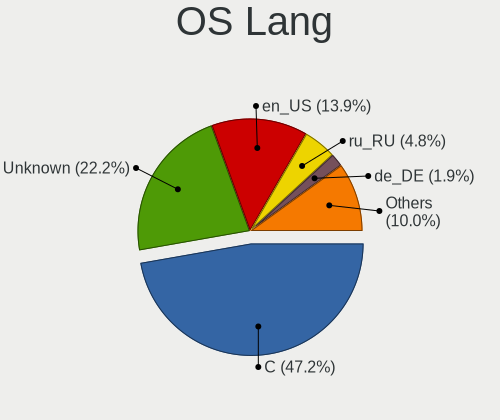
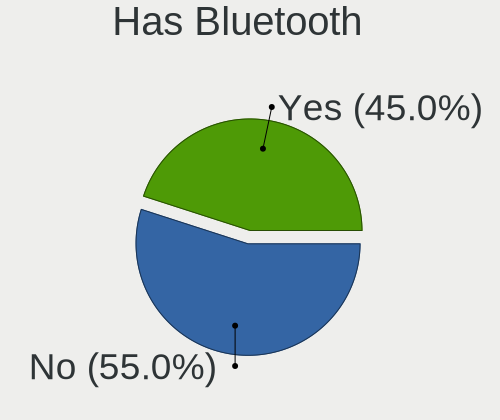
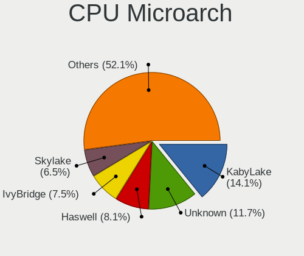
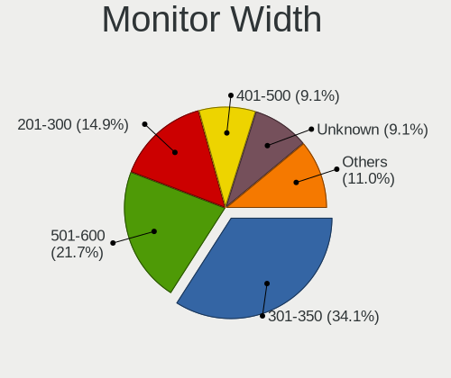
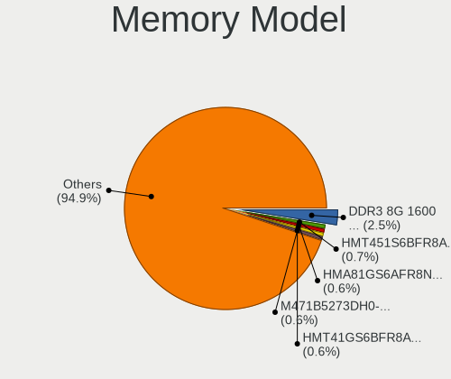

FreeBSD - Tested Hardware & Statistics
--------------------------------------

A project to collect tested hardware configurations for FreeBSD.

Anyone can contribute to this report by the [hw-probe](https://github.com/linuxhw/hw-probe/blob/master/INSTALL.BSD.md) tool:

    hw-probe -all -upload

Please contribute! Especially if your hardware is rare.

This is a report for all computer types. See also reports for [desktops](/Dist/FreeBSD/Desktop/README.md) and [notebooks](/Dist/FreeBSD/Notebook/README.md).

Contents
--------

* [ Test Cases ](#test-cases)

* [ System ](#system)
  - [ OS                       ](#os)
  - [ OS Family                ](#os-family)
  - [ Arch                     ](#arch)
  - [ DE                       ](#de)
  - [ Display Server           ](#display-server)
  - [ Display Manager          ](#display-manager)
  - [ OS Lang                  ](#os-lang)
  - [ Boot Mode                ](#boot-mode)
  - [ Filesystem               ](#filesystem)
  - [ Part. scheme             ](#part-scheme)

* [ Board ](#board)
  - [ Vendor                   ](#vendor)
  - [ Model                    ](#model)
  - [ Model Family             ](#model-family)
  - [ MFG Year                 ](#mfg-year)
  - [ Form Factor              ](#form-factor)
  - [ Coreboot                 ](#coreboot)
  - [ RAM Size                 ](#ram-size)
  - [ RAM Used                 ](#ram-used)
  - [ Total Drives             ](#total-drives)
  - [ Has CD-ROM               ](#has-cd-rom)
  - [ Has Ethernet             ](#has-ethernet)
  - [ Has WiFi                 ](#has-wifi)
  - [ Has Bluetooth            ](#has-bluetooth)

* [ Location ](#location)
  - [ Country                  ](#country)
  - [ City                     ](#city)

* [ Drives ](#drives)
  - [ Drive Vendor             ](#drive-vendor)
  - [ Drive Model              ](#drive-model)
  - [ HDD Vendor               ](#hdd-vendor)
  - [ SSD Vendor               ](#ssd-vendor)
  - [ Drive Kind               ](#drive-kind)
  - [ Drive Connector          ](#drive-connector)
  - [ Drive Size               ](#drive-size)
  - [ Space Total              ](#space-total)
  - [ Space Used               ](#space-used)
  - [ Malfunc. Drives          ](#malfunc-drives)
  - [ Malfunc. Drive Vendor    ](#malfunc-drive-vendor)
  - [ Malfunc. HDD Vendor      ](#malfunc-hdd-vendor)
  - [ Malfunc. Drive Kind      ](#malfunc-drive-kind)
  - [ Failed Drives            ](#failed-drives)
  - [ Failed Drive Vendor      ](#failed-drive-vendor)
  - [ Drive Status             ](#drive-status)

* [ Storage controller ](#storage-controller)
  - [ Storage Vendor           ](#storage-vendor)
  - [ Storage Model            ](#storage-model)
  - [ Storage Kind             ](#storage-kind)

* [ Processor ](#processor)
  - [ CPU Vendor               ](#cpu-vendor)
  - [ CPU Model                ](#cpu-model)
  - [ CPU Model Family         ](#cpu-model-family)
  - [ CPU Cores                ](#cpu-cores)
  - [ CPU Sockets              ](#cpu-sockets)
  - [ CPU Threads              ](#cpu-threads)
  - [ CPU Microarch            ](#cpu-microarch)

* [ Graphics ](#graphics)
  - [ GPU Vendor               ](#gpu-vendor)
  - [ GPU Model                ](#gpu-model)
  - [ GPU Combo                ](#gpu-combo)
  - [ GPU Driver               ](#gpu-driver)
  - [ GPU Memory               ](#gpu-memory)

* [ Monitor ](#monitor)
  - [ Monitor Vendor           ](#monitor-vendor)
  - [ Monitor Model            ](#monitor-model)
  - [ Monitor Resolution       ](#monitor-resolution)
  - [ Monitor Diagonal         ](#monitor-diagonal)
  - [ Monitor Width            ](#monitor-width)
  - [ Aspect Ratio             ](#aspect-ratio)
  - [ Monitor Area             ](#monitor-area)
  - [ Pixel Density            ](#pixel-density)
  - [ Multiple Monitors        ](#multiple-monitors)

* [ Network ](#network)
  - [ Net Controller Vendor    ](#net-controller-vendor)
  - [ Net Controller Model     ](#net-controller-model)
  - [ Wireless Vendor          ](#wireless-vendor)
  - [ Wireless Model           ](#wireless-model)
  - [ Ethernet Vendor          ](#ethernet-vendor)
  - [ Ethernet Model           ](#ethernet-model)
  - [ Net Controller Kind      ](#net-controller-kind)
  - [ Used Controller          ](#used-controller)
  - [ NICs                     ](#nics)
  - [ IPv6                     ](#ipv6)

* [ Bluetooth ](#bluetooth)
  - [ Bluetooth Vendor         ](#bluetooth-vendor)
  - [ Bluetooth Model          ](#bluetooth-model)

* [ Sound ](#sound)
  - [ Sound Vendor             ](#sound-vendor)
  - [ Sound Model              ](#sound-model)

* [ Memory ](#memory)
  - [ Memory Vendor            ](#memory-vendor)
  - [ Memory Model             ](#memory-model)
  - [ Memory Kind              ](#memory-kind)
  - [ Memory Form Factor       ](#memory-form-factor)
  - [ Memory Size              ](#memory-size)
  - [ Memory Speed             ](#memory-speed)

* [ Printers & scanners ](#printers--scanners)
  - [ Printer Vendor           ](#printer-vendor)
  - [ Printer Model            ](#printer-model)
  - [ Scanner Vendor           ](#scanner-vendor)
  - [ Scanner Model            ](#scanner-model)

* [ Camera ](#camera)
  - [ Camera Vendor            ](#camera-vendor)
  - [ Camera Model             ](#camera-model)

* [ Security ](#security)
  - [ Fingerprint Vendor       ](#fingerprint-vendor)
  - [ Fingerprint Model        ](#fingerprint-model)
  - [ Chipcard Vendor          ](#chipcard-vendor)
  - [ Chipcard Model           ](#chipcard-model)

* [ Unsupported ](#unsupported)
  - [ Unsupported Devices      ](#unsupported-devices)
  - [ Unsupported Device Types ](#unsupported-device-types)

Test Cases
----------

Total: 2802

| Vendor        | Model                       | Form-Factor | Probe                                                     | Date         |
|---------------|-----------------------------|-------------|-----------------------------------------------------------|--------------|
| Samsung       | 750TDA                      | Notebook    | [a880b1f616](https://bsd-hardware.info/?probe=a880b1f616) | Nov 02, 2022 |
| HP            | ProLiant DL180 G6           | Server      | [289d2f383b](https://bsd-hardware.info/?probe=289d2f383b) | Nov 02, 2022 |
| Gigabyte      | Z97X-UD5H                   | Desktop     | [d7141b866c](https://bsd-hardware.info/?probe=d7141b866c) | Nov 02, 2022 |
| ASRockRack    | EPYC3101D4I-2T              | Desktop     | [bb0f8a5bfc](https://bsd-hardware.info/?probe=bb0f8a5bfc) | Oct 31, 2022 |
| Fujitsu       | D3401-H2 S26361-D3401-H2    | Desktop     | [cce93ff157](https://bsd-hardware.info/?probe=cce93ff157) | Oct 30, 2022 |
| MSI           | H81M-P33                    | Desktop     | [b67d6a7bb2](https://bsd-hardware.info/?probe=b67d6a7bb2) | Oct 30, 2022 |
| ASUSTek       | P5Q-E                       | Desktop     | [8161bfd24d](https://bsd-hardware.info/?probe=8161bfd24d) | Oct 30, 2022 |
| ASUSTek       | ROG CROSSHAIR VIII HERO     | Desktop     | [a0896f17e4](https://bsd-hardware.info/?probe=a0896f17e4) | Oct 30, 2022 |
| Lenovo        | ThinkPad T470p 20J7S0BR0... | Notebook    | [2776d8c350](https://bsd-hardware.info/?probe=2776d8c350) | Oct 30, 2022 |
| Lenovo        | ThinkPad T460 20FMS10N00    | Notebook    | [04ce25bd7f](https://bsd-hardware.info/?probe=04ce25bd7f) | Oct 29, 2022 |
| Dell          | Inspiron 7720               | Notebook    | [6911e08b7e](https://bsd-hardware.info/?probe=6911e08b7e) | Oct 28, 2022 |
| Lenovo        | ThinkPad X1 Carbon Gen 1... | Notebook    | [caad4323ba](https://bsd-hardware.info/?probe=caad4323ba) | Oct 23, 2022 |
| MSI           | H81M-P33                    | Desktop     | [626f503cad](https://bsd-hardware.info/?probe=626f503cad) | Oct 23, 2022 |
| ASUSTek       | P5Q-E                       | Desktop     | [2b98739799](https://bsd-hardware.info/?probe=2b98739799) | Oct 23, 2022 |
| ASUSTek       | ROG CROSSHAIR VIII HERO     | Desktop     | [56dac6bc80](https://bsd-hardware.info/?probe=56dac6bc80) | Oct 23, 2022 |
| IBM           | 49Y6512                     | Server      | [1bc9e20b16](https://bsd-hardware.info/?probe=1bc9e20b16) | Oct 23, 2022 |
| Acer          | Revo RN86                   | Desktop     | [692ea69bab](https://bsd-hardware.info/?probe=692ea69bab) | Oct 21, 2022 |
| HP            | 18E4                        | Desktop     | [d66ffbbf6d](https://bsd-hardware.info/?probe=d66ffbbf6d) | Oct 21, 2022 |
| Dell          | Precision M4500             | Notebook    | [66ded228ea](https://bsd-hardware.info/?probe=66ded228ea) | Oct 20, 2022 |
| ASUSTek       | SABERTOOTH Z77              | Desktop     | [348bef7dba](https://bsd-hardware.info/?probe=348bef7dba) | Oct 20, 2022 |
| MSI           | MAG Z590 TOMAHAWK WIFI      | Desktop     | [3e2f5956c1](https://bsd-hardware.info/?probe=3e2f5956c1) | Oct 19, 2022 |
| HP            | ENVY Laptop 13-aq0xxx       | Notebook    | [bc229efed9](https://bsd-hardware.info/?probe=bc229efed9) | Oct 18, 2022 |
| Unknown       | Unknown                     | Desktop     | [20ff21d751](https://bsd-hardware.info/?probe=20ff21d751) | Oct 18, 2022 |
| Lenovo        | 30D0 NOK                    | Desktop     | [d1fab8bd54](https://bsd-hardware.info/?probe=d1fab8bd54) | Oct 18, 2022 |
| HP            | ENVY Laptop 13-aq0xxx       | Notebook    | [0a8b1f727f](https://bsd-hardware.info/?probe=0a8b1f727f) | Oct 17, 2022 |
| Acer          | Aspire A514-54              | Notebook    | [e057b613a0](https://bsd-hardware.info/?probe=e057b613a0) | Oct 17, 2022 |
| Lenovo        | XiaoXinPro-13API 2019 81... | Notebook    | [dfa08657fd](https://bsd-hardware.info/?probe=dfa08657fd) | Oct 16, 2022 |
| Dell          | Inspiron 15 5510            | Notebook    | [22881028bc](https://bsd-hardware.info/?probe=22881028bc) | Oct 16, 2022 |
| TYAN Compu... | Intel 440BX/GX Rev. 4       | Desktop     | [8d99f317e4](https://bsd-hardware.info/?probe=8d99f317e4) | Oct 15, 2022 |
| Dell          | 0G1548 A00                  | Desktop     | [226af33d5b](https://bsd-hardware.info/?probe=226af33d5b) | Oct 15, 2022 |
| ASRock        | G41C-GS R2.0                | Desktop     | [06214241b3](https://bsd-hardware.info/?probe=06214241b3) | Oct 15, 2022 |
| Lenovo        | ThinkPad T430 23446FP       | Notebook    | [6b15856d20](https://bsd-hardware.info/?probe=6b15856d20) | Oct 15, 2022 |
| Intel         | NUC8BEB J72692-308          | Mini pc     | [e67cb3a0c5](https://bsd-hardware.info/?probe=e67cb3a0c5) | Oct 14, 2022 |
| IBM           | 49Y6512                     | Server      | [4471bf6465](https://bsd-hardware.info/?probe=4471bf6465) | Oct 14, 2022 |
| ASUSTek       | PRIME X370-PRO              | Desktop     | [10358c7207](https://bsd-hardware.info/?probe=10358c7207) | Oct 13, 2022 |
| ASRock        | X570 Phantom Gaming 4       | Desktop     | [b20b6c7997](https://bsd-hardware.info/?probe=b20b6c7997) | Oct 13, 2022 |
| IBM           | 49Y6512                     | Server      | [1ead286cbe](https://bsd-hardware.info/?probe=1ead286cbe) | Oct 13, 2022 |
| Lenovo        | ThinkPad T440s 20AR003SM... | Notebook    | [df62882c3b](https://bsd-hardware.info/?probe=df62882c3b) | Oct 12, 2022 |
| HP            | 1589                        | Desktop     | [0696d30d3f](https://bsd-hardware.info/?probe=0696d30d3f) | Oct 12, 2022 |
| Dell          | 0WC7KF A00                  | All in one  | [5f271a82bf](https://bsd-hardware.info/?probe=5f271a82bf) | Oct 11, 2022 |
| Dell          | 0WC7KF A00                  | All in one  | [0f87a99ca7](https://bsd-hardware.info/?probe=0f87a99ca7) | Oct 11, 2022 |
| Lenovo        | 316E NOK                    | Mini pc     | [2a7c8f55cb](https://bsd-hardware.info/?probe=2a7c8f55cb) | Oct 10, 2022 |
| ASRock        | X399 Taichi                 | Desktop     | [c79fa6f001](https://bsd-hardware.info/?probe=c79fa6f001) | Oct 09, 2022 |
| Lenovo        | ThinkPad T590 20N4CTO1WW    | Notebook    | [442a743538](https://bsd-hardware.info/?probe=442a743538) | Oct 08, 2022 |
| Supermicro    | X8DT6                       | Server      | [2bd1529913](https://bsd-hardware.info/?probe=2bd1529913) | Oct 07, 2022 |
| ASRockRack    | EP2C612D16FM                | Desktop     | [30a582fccb](https://bsd-hardware.info/?probe=30a582fccb) | Oct 07, 2022 |
| Lenovo        | ThinkPad E14 Gen 2 20T6S... | Notebook    | [601029d3fc](https://bsd-hardware.info/?probe=601029d3fc) | Oct 06, 2022 |
| Lenovo        | IdeaPad 3 15ALC6 82KU       | Notebook    | [ce9cfa77aa](https://bsd-hardware.info/?probe=ce9cfa77aa) | Oct 05, 2022 |
| HP            | Compaq 6735s                | Notebook    | [f61208cfea](https://bsd-hardware.info/?probe=f61208cfea) | Oct 05, 2022 |
| HP            | Compaq 6735s                | Notebook    | [718126149c](https://bsd-hardware.info/?probe=718126149c) | Oct 05, 2022 |
| Acer          | TravelMate B115-M           | Notebook    | [86289a60aa](https://bsd-hardware.info/?probe=86289a60aa) | Oct 05, 2022 |
| Acer          | TravelMate B115-M           | Notebook    | [9f4642f6a5](https://bsd-hardware.info/?probe=9f4642f6a5) | Oct 05, 2022 |
| ASUSTek       | P8B75-M                     | Desktop     | [2620fd3511](https://bsd-hardware.info/?probe=2620fd3511) | Oct 04, 2022 |
| Dell          | Precision 5510              | Notebook    | [f69c9fb0ea](https://bsd-hardware.info/?probe=f69c9fb0ea) | Oct 04, 2022 |
| ASRock        | Z77 Extreme4                | Desktop     | [459c674b3b](https://bsd-hardware.info/?probe=459c674b3b) | Oct 04, 2022 |
| Lenovo        | Legion 5 15IMH05 82AU       | Notebook    | [d89559e5c2](https://bsd-hardware.info/?probe=d89559e5c2) | Oct 03, 2022 |
| Toshiba       | NB300                       | Notebook    | [c18ae50101](https://bsd-hardware.info/?probe=c18ae50101) | Oct 03, 2022 |
| TUXEDO        | Aura 15 Gen1                | Notebook    | [e83d522905](https://bsd-hardware.info/?probe=e83d522905) | Oct 03, 2022 |
| Dell          | Precision M4500             | Notebook    | [6b987b43b1](https://bsd-hardware.info/?probe=6b987b43b1) | Oct 03, 2022 |
| IBM           | 9210MML                     | Desktop     | [a6e7d7483f](https://bsd-hardware.info/?probe=a6e7d7483f) | Oct 03, 2022 |
| HPE           | ProLiant ML30 Gen10         | Desktop     | [f1b45790d4](https://bsd-hardware.info/?probe=f1b45790d4) | Oct 02, 2022 |
| Dell          | Precision M4800             | Notebook    | [0fcbdeeeb7](https://bsd-hardware.info/?probe=0fcbdeeeb7) | Oct 02, 2022 |
| HP            | 212B                        | Desktop     | [7bc6506336](https://bsd-hardware.info/?probe=7bc6506336) | Oct 01, 2022 |
| HP            | 255 G8 Notebook PC          | Notebook    | [f9851a3257](https://bsd-hardware.info/?probe=f9851a3257) | Oct 01, 2022 |
| Unknown       | Unknown                     | Desktop     | [bdabafdcb1](https://bsd-hardware.info/?probe=bdabafdcb1) | Oct 01, 2022 |
| Supermicro    | X10SLH-F/X10SLM+-F          | Server      | [6f95477df3](https://bsd-hardware.info/?probe=6f95477df3) | Sep 30, 2022 |
| ASRockRack    | EPYC3101D4I-2T              | Desktop     | [8e658fe40f](https://bsd-hardware.info/?probe=8e658fe40f) | Sep 30, 2022 |
| IBM           | ThinkPad T43 18714AG        | Notebook    | [5fd9a63834](https://bsd-hardware.info/?probe=5fd9a63834) | Sep 30, 2022 |
| AMI           | MNHO-048                    | Desktop     | [2ec6e55a75](https://bsd-hardware.info/?probe=2ec6e55a75) | Sep 28, 2022 |
| Acer          | Swift SF313-52              | Notebook    | [83516dabac](https://bsd-hardware.info/?probe=83516dabac) | Sep 28, 2022 |
| MSI           | A520M-A PRO                 | Desktop     | [7e75a1888b](https://bsd-hardware.info/?probe=7e75a1888b) | Sep 27, 2022 |
| ASRock        | X570M Pro4                  | Desktop     | [433857f5f7](https://bsd-hardware.info/?probe=433857f5f7) | Sep 27, 2022 |
| Lenovo        | ThinkPad P53 20QNCTO1WW     | Notebook    | [b2024820d1](https://bsd-hardware.info/?probe=b2024820d1) | Sep 26, 2022 |
| Acer          | Swift SF313-52              | Notebook    | [6339e6b468](https://bsd-hardware.info/?probe=6339e6b468) | Sep 25, 2022 |
| Pegatron      | H81-X1                      | Desktop     | [a27c76c490](https://bsd-hardware.info/?probe=a27c76c490) | Sep 25, 2022 |
| ASUSTek       | P9D-X Series                | Server      | [3494695f54](https://bsd-hardware.info/?probe=3494695f54) | Sep 25, 2022 |
| Gigabyte      | GB-BSi5A-6200               | Notebook    | [c947635b8f](https://bsd-hardware.info/?probe=c947635b8f) | Sep 25, 2022 |
| Gigabyte      | GB-BSi5A-6200               | Notebook    | [533c7f35f1](https://bsd-hardware.info/?probe=533c7f35f1) | Sep 25, 2022 |
| Supermicro    | X10SRi-FB                   | Server      | [59ff2014e5](https://bsd-hardware.info/?probe=59ff2014e5) | Sep 25, 2022 |
| Intel         | S1200SP H57532-210          | Server      | [ab6e70abca](https://bsd-hardware.info/?probe=ab6e70abca) | Sep 25, 2022 |
| Supermicro    | X8DT3                       | Server      | [eda1df037b](https://bsd-hardware.info/?probe=eda1df037b) | Sep 25, 2022 |
| Supermicro    | X7DB8                       | Desktop     | [6ebc173873](https://bsd-hardware.info/?probe=6ebc173873) | Sep 25, 2022 |
| Deciso        | Netboard A10 V2.1           | Desktop     | [8bbf714f6d](https://bsd-hardware.info/?probe=8bbf714f6d) | Sep 25, 2022 |
| Deciso        | Netboard A10 V2.1           | Desktop     | [60d4585ece](https://bsd-hardware.info/?probe=60d4585ece) | Sep 25, 2022 |
| IBM           | ThinkPad T40 23737CG        | Notebook    | [dfc9b64da2](https://bsd-hardware.info/?probe=dfc9b64da2) | Sep 25, 2022 |
| System76      | Gazelle                     | Notebook    | [d087321049](https://bsd-hardware.info/?probe=d087321049) | Sep 24, 2022 |
| MSI           | Z490-A PRO                  | Desktop     | [dbda136daa](https://bsd-hardware.info/?probe=dbda136daa) | Sep 24, 2022 |
| Dell          | System Vostro 3750          | Notebook    | [166fbacd73](https://bsd-hardware.info/?probe=166fbacd73) | Sep 24, 2022 |
| System76      | Gazelle                     | Notebook    | [6d5d4f5021](https://bsd-hardware.info/?probe=6d5d4f5021) | Sep 24, 2022 |
| NITRINOnet    | M360RUS56                   | Desktop     | [490b9593e0](https://bsd-hardware.info/?probe=490b9593e0) | Sep 23, 2022 |
| HP            | 21D0                        | Desktop     | [43fa46655e](https://bsd-hardware.info/?probe=43fa46655e) | Sep 21, 2022 |
| Acer          | Aspire E5-771               | Notebook    | [0a58077c49](https://bsd-hardware.info/?probe=0a58077c49) | Sep 20, 2022 |
| HP            | 21D0                        | Desktop     | [463e2563d7](https://bsd-hardware.info/?probe=463e2563d7) | Sep 19, 2022 |
| Toshiba       | PORTEGE R700                | Notebook    | [10b85eccae](https://bsd-hardware.info/?probe=10b85eccae) | Sep 19, 2022 |
| HP            | EliteBook 840 G3            | Notebook    | [322c8947b6](https://bsd-hardware.info/?probe=322c8947b6) | Sep 19, 2022 |
| HP            | EliteBook 840 G3            | Notebook    | [0307c109b5](https://bsd-hardware.info/?probe=0307c109b5) | Sep 19, 2022 |
| HP            | ProLiant ML350p Gen8        | Desktop     | [1a9c6a10bd](https://bsd-hardware.info/?probe=1a9c6a10bd) | Sep 19, 2022 |
| HP            | 0B54h D                     | Desktop     | [a24f08281d](https://bsd-hardware.info/?probe=a24f08281d) | Sep 19, 2022 |
| Lenovo        | ThinkPad X250 20CL001GUS    | Notebook    | [2f1f82558e](https://bsd-hardware.info/?probe=2f1f82558e) | Sep 18, 2022 |
| Fujitsu       | LIFEBOOK A532               | Notebook    | [91e0f723ea](https://bsd-hardware.info/?probe=91e0f723ea) | Sep 18, 2022 |
| ASUSTek       | X455LJ                      | Notebook    | [431ad10ab2](https://bsd-hardware.info/?probe=431ad10ab2) | Sep 17, 2022 |
| Gigabyte      | H410M S2 V2                 | Desktop     | [8de53ac515](https://bsd-hardware.info/?probe=8de53ac515) | Sep 17, 2022 |
| Unknown       | Unknown                     | Desktop     | [83e48aa232](https://bsd-hardware.info/?probe=83e48aa232) | Sep 16, 2022 |
| ASUSTek       | M5A88-M                     | Desktop     | [09b5ca588f](https://bsd-hardware.info/?probe=09b5ca588f) | Sep 16, 2022 |
| Lenovo        | ThinkPad L420 7829WDY       | Notebook    | [a697be2aa9](https://bsd-hardware.info/?probe=a697be2aa9) | Sep 16, 2022 |
| Intel         | NUC8BEB J72688-308          | Mini pc     | [ce024b9f84](https://bsd-hardware.info/?probe=ce024b9f84) | Sep 15, 2022 |
| IBM           | ThinkPad T43 18714AG        | Notebook    | [15a7e37cbf](https://bsd-hardware.info/?probe=15a7e37cbf) | Sep 15, 2022 |
| Google        | Peppy                       | Notebook    | [80ffa77224](https://bsd-hardware.info/?probe=80ffa77224) | Sep 15, 2022 |
| MSI           | PRESTIGE X570 CREATION      | Desktop     | [2b4cf189e9](https://bsd-hardware.info/?probe=2b4cf189e9) | Sep 14, 2022 |
| Dell          | 0HJK12 A03                  | Server      | [96ad323ca0](https://bsd-hardware.info/?probe=96ad323ca0) | Sep 13, 2022 |
| Dell          | 0H5J4J A01                  | Server      | [acb91f797f](https://bsd-hardware.info/?probe=acb91f797f) | Sep 13, 2022 |
| Intel         | D945GCLF2 AAE46416-106      | Desktop     | [8e2f7792eb](https://bsd-hardware.info/?probe=8e2f7792eb) | Sep 13, 2022 |
| ASUSTek       | PRIME X370-PRO              | Desktop     | [f023ae7ed2](https://bsd-hardware.info/?probe=f023ae7ed2) | Sep 13, 2022 |
| ASRock        | X570 Phantom Gaming 4       | Desktop     | [baaf9cbda6](https://bsd-hardware.info/?probe=baaf9cbda6) | Sep 13, 2022 |
| HP            | 8648                        | Desktop     | [e7e610794c](https://bsd-hardware.info/?probe=e7e610794c) | Sep 12, 2022 |
| Dell          | Inspiron 15 3511            | Notebook    | [5abbba28de](https://bsd-hardware.info/?probe=5abbba28de) | Sep 11, 2022 |
| ASUSTek       | P5Q-E                       | Desktop     | [1cbbe33027](https://bsd-hardware.info/?probe=1cbbe33027) | Sep 11, 2022 |
| MSI           | H81M-P33                    | Desktop     | [3b668ace72](https://bsd-hardware.info/?probe=3b668ace72) | Sep 11, 2022 |
| ASUSTek       | ROG CROSSHAIR VIII HERO     | Desktop     | [62c287a993](https://bsd-hardware.info/?probe=62c287a993) | Sep 11, 2022 |
| ASRockRack    | X470D4U2/1N1                | Desktop     | [f91afdb2f3](https://bsd-hardware.info/?probe=f91afdb2f3) | Sep 09, 2022 |
| MSI           | MPG Z490 GAMING EDGE WIF... | Desktop     | [98dff45d54](https://bsd-hardware.info/?probe=98dff45d54) | Sep 09, 2022 |
| Toshiba       | Satellite A200              | Notebook    | [860aea3ce4](https://bsd-hardware.info/?probe=860aea3ce4) | Sep 08, 2022 |
| Dell          | Precision 7540              | Notebook    | [f39c0f4d92](https://bsd-hardware.info/?probe=f39c0f4d92) | Sep 08, 2022 |
| ASRockRack    | X470D4U2/1N1                | Desktop     | [b0965df7e1](https://bsd-hardware.info/?probe=b0965df7e1) | Sep 08, 2022 |
| Dell          | Latitude 5310               | Notebook    | [6edf4d34fe](https://bsd-hardware.info/?probe=6edf4d34fe) | Sep 07, 2022 |
| Dell          | Latitude E5470              | Notebook    | [9e798cbfc8](https://bsd-hardware.info/?probe=9e798cbfc8) | Sep 07, 2022 |
| HP            | EliteBook 8570p             | Notebook    | [7c6751649b](https://bsd-hardware.info/?probe=7c6751649b) | Sep 07, 2022 |
| Dell          | Vostro 5415                 | Notebook    | [ef6d4ee660](https://bsd-hardware.info/?probe=ef6d4ee660) | Sep 06, 2022 |
| ASUSTek       | VivoBook_ASUSLaptop X515... | Notebook    | [cffed92600](https://bsd-hardware.info/?probe=cffed92600) | Sep 06, 2022 |
| Dell          | Precision 7550              | Notebook    | [d2bf200529](https://bsd-hardware.info/?probe=d2bf200529) | Sep 06, 2022 |
| Dell          | XPS 13 9343                 | Notebook    | [ec74af083f](https://bsd-hardware.info/?probe=ec74af083f) | Sep 04, 2022 |
| MSI           | H81M-P33                    | Desktop     | [3f7258c807](https://bsd-hardware.info/?probe=3f7258c807) | Sep 04, 2022 |
| ASUSTek       | P5Q-E                       | Desktop     | [cced3168c8](https://bsd-hardware.info/?probe=cced3168c8) | Sep 04, 2022 |
| ASUSTek       | ROG CROSSHAIR VIII HERO     | Desktop     | [61b82d5ebb](https://bsd-hardware.info/?probe=61b82d5ebb) | Sep 04, 2022 |
| MSI           | MPG X570 GAMING EDGE WIF... | Desktop     | [df57940ad5](https://bsd-hardware.info/?probe=df57940ad5) | Sep 03, 2022 |
| Lenovo        | ThinkPad X1 Extreme Gen ... | Notebook    | [72757feb65](https://bsd-hardware.info/?probe=72757feb65) | Sep 03, 2022 |
| Lenovo        | ThinkPad X1 Extreme Gen ... | Notebook    | [5d575c85d0](https://bsd-hardware.info/?probe=5d575c85d0) | Sep 03, 2022 |
| Lenovo        | YangTianM6880N              | Desktop     | [f675498946](https://bsd-hardware.info/?probe=f675498946) | Sep 02, 2022 |
| Unknown       | HX90                        | Desktop     | [568468e95b](https://bsd-hardware.info/?probe=568468e95b) | Sep 01, 2022 |
| Dell          | 0HYPX2 A00                  | Server      | [2779d78756](https://bsd-hardware.info/?probe=2779d78756) | Sep 01, 2022 |
| Dell          | 0MD99X A07                  | Server      | [3c8cc375dc](https://bsd-hardware.info/?probe=3c8cc375dc) | Sep 01, 2022 |
| Valve         | Jupiter                     | Notebook    | [4e58d828cc](https://bsd-hardware.info/?probe=4e58d828cc) | Sep 01, 2022 |
| Dell          | 07T4MC A09                  | Desktop     | [50fbb0435c](https://bsd-hardware.info/?probe=50fbb0435c) | Aug 31, 2022 |
| Dell          | 07T4MC A09                  | Desktop     | [200b8d381e](https://bsd-hardware.info/?probe=200b8d381e) | Aug 31, 2022 |
| Dell          | 07T4MC A09                  | Desktop     | [ebc79d7728](https://bsd-hardware.info/?probe=ebc79d7728) | Aug 31, 2022 |
| Toshiba       | Satellite A300              | Notebook    | [ac185c104b](https://bsd-hardware.info/?probe=ac185c104b) | Aug 31, 2022 |
| Intel         | X79 V2.72A                  | Desktop     | [435901d8c9](https://bsd-hardware.info/?probe=435901d8c9) | Aug 29, 2022 |
| Dell          | Latitude 7390               | Notebook    | [bc5eb8e237](https://bsd-hardware.info/?probe=bc5eb8e237) | Aug 29, 2022 |
| Gigabyte      | H81M-DS2                    | Desktop     | [75ec0260f9](https://bsd-hardware.info/?probe=75ec0260f9) | Aug 28, 2022 |
| Dell          | Precision 7550              | Notebook    | [71f615178f](https://bsd-hardware.info/?probe=71f615178f) | Aug 27, 2022 |
| Supermicro    | X10SLH-F/X10SLM+-F          | Server      | [10ca365b40](https://bsd-hardware.info/?probe=10ca365b40) | Aug 26, 2022 |
| Dell          | 07T4MC A00                  | Desktop     | [1060f1b6e3](https://bsd-hardware.info/?probe=1060f1b6e3) | Aug 26, 2022 |
| ASUSTek       | PRIME Z690-P D4             | Desktop     | [5684672f5a](https://bsd-hardware.info/?probe=5684672f5a) | Aug 26, 2022 |
| Supermicro    | X10SLL-F                    | Server      | [a760a87c5d](https://bsd-hardware.info/?probe=a760a87c5d) | Aug 25, 2022 |
| ASUSTek       | VivoBook_ASUSLaptop X570... | Notebook    | [0466d87f04](https://bsd-hardware.info/?probe=0466d87f04) | Aug 25, 2022 |
| HP            | ENVY Notebook               | Notebook    | [7e33273132](https://bsd-hardware.info/?probe=7e33273132) | Aug 25, 2022 |
| ASRock        | AD2550-ITX                  | Desktop     | [43d0101ac4](https://bsd-hardware.info/?probe=43d0101ac4) | Aug 24, 2022 |
| Lenovo        | Yoga Slim 7 Pro 14ACH5 8... | Notebook    | [fcfa6205d8](https://bsd-hardware.info/?probe=fcfa6205d8) | Aug 23, 2022 |
| HP            | ENVY x360 Convertible 13... | Convertible | [eec9546431](https://bsd-hardware.info/?probe=eec9546431) | Aug 23, 2022 |
| Lenovo        | ThinkCentre M91p 4512A47    | Desktop     | [3556794570](https://bsd-hardware.info/?probe=3556794570) | Aug 23, 2022 |
| Lenovo        | IdeaPad 5 14ITL05 82FE      | Notebook    | [cc2a81fc1b](https://bsd-hardware.info/?probe=cc2a81fc1b) | Aug 21, 2022 |
| Lenovo        | IdeaPad Gaming 3 15ACH6 ... | Notebook    | [6184507a45](https://bsd-hardware.info/?probe=6184507a45) | Aug 21, 2022 |
| MSI           | H81M-P33                    | Desktop     | [89535fc84c](https://bsd-hardware.info/?probe=89535fc84c) | Aug 21, 2022 |
| ASUSTek       | P5Q-E                       | Desktop     | [ac2d88c2dd](https://bsd-hardware.info/?probe=ac2d88c2dd) | Aug 21, 2022 |
| ASUSTek       | ROG CROSSHAIR VIII HERO     | Desktop     | [b5786b8119](https://bsd-hardware.info/?probe=b5786b8119) | Aug 21, 2022 |
| HP            | Pavilion g6                 | Notebook    | [c146b538e1](https://bsd-hardware.info/?probe=c146b538e1) | Aug 20, 2022 |
| Lenovo        | IdeaPad 530S-14ARR 81H1     | Notebook    | [560213a2d6](https://bsd-hardware.info/?probe=560213a2d6) | Aug 19, 2022 |
| ASRock        | B550 Extreme4               | Desktop     | [ce0d33d973](https://bsd-hardware.info/?probe=ce0d33d973) | Aug 19, 2022 |
| ASUSTek       | ZenBook 14 UX410UFR         | Notebook    | [2bf0f0ef08](https://bsd-hardware.info/?probe=2bf0f0ef08) | Aug 19, 2022 |
| Gigabyte      | H61M-DS2                    | Desktop     | [a2fc8d9c67](https://bsd-hardware.info/?probe=a2fc8d9c67) | Aug 18, 2022 |
| Dell          | 0VG93V A00                  | Desktop     | [8de9fa2319](https://bsd-hardware.info/?probe=8de9fa2319) | Aug 18, 2022 |
| Google        | Peppy                       | Notebook    | [e2e0a1953d](https://bsd-hardware.info/?probe=e2e0a1953d) | Aug 18, 2022 |
| Intel         | S2600WTTR G92187-372        | Server      | [ce1988c8ff](https://bsd-hardware.info/?probe=ce1988c8ff) | Aug 18, 2022 |
| Fujitsu       | D3373-B1 S26361-D3373-B1... | Server      | [676fd4e9b4](https://bsd-hardware.info/?probe=676fd4e9b4) | Aug 17, 2022 |
| ASUSTek       | M4A87TD EVO                 | Desktop     | [c03da8657e](https://bsd-hardware.info/?probe=c03da8657e) | Aug 17, 2022 |
| Unknown       | Unknown                     | Desktop     | [3208aefb72](https://bsd-hardware.info/?probe=3208aefb72) | Aug 17, 2022 |
| Dell          | 042P49 A00                  | Desktop     | [7130975fe3](https://bsd-hardware.info/?probe=7130975fe3) | Aug 17, 2022 |
| Gigabyte      | H61M-DS2                    | Desktop     | [9a7d45e51c](https://bsd-hardware.info/?probe=9a7d45e51c) | Aug 16, 2022 |
| Acer          | Aspire 4552G                | Notebook    | [a8f8e41c91](https://bsd-hardware.info/?probe=a8f8e41c91) | Aug 14, 2022 |
| Sony          | VGN-UX1XRN                  | Notebook    | [312df080a7](https://bsd-hardware.info/?probe=312df080a7) | Aug 14, 2022 |
| MSI           | GF63 Thin 9SC               | Notebook    | [dacea7c6be](https://bsd-hardware.info/?probe=dacea7c6be) | Aug 14, 2022 |
| ASUSTek       | PRIME X370-PRO              | Desktop     | [4055810ef2](https://bsd-hardware.info/?probe=4055810ef2) | Aug 14, 2022 |
| Lenovo        | ThinkPad X1 Carbon 7th 2... | Notebook    | [2da32e59b0](https://bsd-hardware.info/?probe=2da32e59b0) | Aug 14, 2022 |
| MSI           | H81M-P33                    | Desktop     | [3d0836d403](https://bsd-hardware.info/?probe=3d0836d403) | Aug 14, 2022 |
| ASUSTek       | P5Q-E                       | Desktop     | [c50be0ecae](https://bsd-hardware.info/?probe=c50be0ecae) | Aug 14, 2022 |
| ASUSTek       | ROG CROSSHAIR VIII HERO     | Desktop     | [4b6ad32189](https://bsd-hardware.info/?probe=4b6ad32189) | Aug 14, 2022 |
| ASUSTek       | PRIME X370-PRO              | Desktop     | [5d4af4fba9](https://bsd-hardware.info/?probe=5d4af4fba9) | Aug 13, 2022 |
| Fujitsu       | D3031 S26361-D3031-A100-... | Server      | [3d46e0eace](https://bsd-hardware.info/?probe=3d46e0eace) | Aug 13, 2022 |
| Fujitsu       | D3031 S26361-D3031-A100-... | Server      | [c961cea235](https://bsd-hardware.info/?probe=c961cea235) | Aug 13, 2022 |
| Fujitsu       | PRIMERGY RX200 S6           | Desktop     | [6884e940a1](https://bsd-hardware.info/?probe=6884e940a1) | Aug 13, 2022 |
| ASRock        | X570 Phantom Gaming 4       | Desktop     | [1292c617d2](https://bsd-hardware.info/?probe=1292c617d2) | Aug 13, 2022 |
| Fujitsu       | D3031 S26361-D3031-A100-... | Server      | [5ceace59c1](https://bsd-hardware.info/?probe=5ceace59c1) | Aug 12, 2022 |
| ASRock        | H110M-DGS R3.0              | Desktop     | [0c654b6c34](https://bsd-hardware.info/?probe=0c654b6c34) | Aug 11, 2022 |
| Lenovo        | ThinkPad R60e 0658W2M       | Notebook    | [45e44ad953](https://bsd-hardware.info/?probe=45e44ad953) | Aug 10, 2022 |
| ASRock        | X399 Taichi                 | Desktop     | [efd9ee1d33](https://bsd-hardware.info/?probe=efd9ee1d33) | Aug 10, 2022 |
| Dell          | 042P49 A00                  | Desktop     | [a38375fa97](https://bsd-hardware.info/?probe=a38375fa97) | Aug 08, 2022 |
| Dell          | 042P49 A00                  | Desktop     | [81a5e313cd](https://bsd-hardware.info/?probe=81a5e313cd) | Aug 08, 2022 |
| Unknown       | Unknown                     | Desktop     | [467bcd3c04](https://bsd-hardware.info/?probe=467bcd3c04) | Aug 07, 2022 |
| GVC           | DR 738                      | Desktop     | [ea08102a81](https://bsd-hardware.info/?probe=ea08102a81) | Aug 06, 2022 |
| Gigabyte      | H97M-HD3                    | Desktop     | [4a7705414f](https://bsd-hardware.info/?probe=4a7705414f) | Aug 06, 2022 |
| Gigabyte      | H81M-DS2                    | Desktop     | [5b88dea745](https://bsd-hardware.info/?probe=5b88dea745) | Aug 06, 2022 |
| Dell          | Inspiron 3581               | Notebook    | [f31cc32515](https://bsd-hardware.info/?probe=f31cc32515) | Aug 04, 2022 |
| Gigabyte      | P85-D3                      | Desktop     | [7f077abed9](https://bsd-hardware.info/?probe=7f077abed9) | Aug 02, 2022 |
| ASUSTek       | B85-PRO GAMER               | Desktop     | [b29e940a75](https://bsd-hardware.info/?probe=b29e940a75) | Aug 02, 2022 |
| Lenovo        | IdeaPad Gaming 3 15ARH05... | Notebook    | [d5e9213bb5](https://bsd-hardware.info/?probe=d5e9213bb5) | Aug 01, 2022 |
| HP            | EliteBook 850 G7 Noteboo... | Notebook    | [f603e648c7](https://bsd-hardware.info/?probe=f603e648c7) | Aug 01, 2022 |
| Lenovo        | ThinkPad T480 20L6S29E0T    | Notebook    | [546fa8380b](https://bsd-hardware.info/?probe=546fa8380b) | Aug 01, 2022 |
| Dell          | Inspiron 5559               | Notebook    | [13baedb59b](https://bsd-hardware.info/?probe=13baedb59b) | Jul 31, 2022 |
| Gigabyte      | 970A-DS3P FX                | Desktop     | [3c33e546bb](https://bsd-hardware.info/?probe=3c33e546bb) | Jul 31, 2022 |
| Gigabyte      | GB-BSi3-1115G4              | Desktop     | [4cd0769d75](https://bsd-hardware.info/?probe=4cd0769d75) | Jul 30, 2022 |
| Dell          | 0T7D40 A01                  | Desktop     | [bd2f6f8596](https://bsd-hardware.info/?probe=bd2f6f8596) | Jul 29, 2022 |
| Dell          | 040DDP A01                  | Desktop     | [5d4d3d7553](https://bsd-hardware.info/?probe=5d4d3d7553) | Jul 29, 2022 |
| Lenovo        | IdeaPad 330-15ARR 81D2      | Notebook    | [7b130fb168](https://bsd-hardware.info/?probe=7b130fb168) | Jul 27, 2022 |
| HP            | 1825                        | Desktop     | [8c96329681](https://bsd-hardware.info/?probe=8c96329681) | Jul 24, 2022 |
| Dell          | Precision 5560              | Notebook    | [3dc82c6d91](https://bsd-hardware.info/?probe=3dc82c6d91) | Jul 23, 2022 |
| Lenovo        | G40-45 80E1                 | Notebook    | [6e31b5f45b](https://bsd-hardware.info/?probe=6e31b5f45b) | Jul 23, 2022 |
| HP            | ProLiant ML310e Gen8 v2     | Desktop     | [6cdc79a36f](https://bsd-hardware.info/?probe=6cdc79a36f) | Jul 22, 2022 |
| ASUSTek       | Maximus VIII HERO           | Desktop     | [051f604f9a](https://bsd-hardware.info/?probe=051f604f9a) | Jul 21, 2022 |
| Dell          | Studio XPS 1340             | Notebook    | [642da98e96](https://bsd-hardware.info/?probe=642da98e96) | Jul 21, 2022 |
| Gigabyte      | H61M-DS2                    | Desktop     | [3ba3cedec4](https://bsd-hardware.info/?probe=3ba3cedec4) | Jul 21, 2022 |
| Dell          | 0WR7PY A03                  | Desktop     | [46a6f4e8f3](https://bsd-hardware.info/?probe=46a6f4e8f3) | Jul 19, 2022 |
| Dell          | 08HPGT A02                  | Desktop     | [ae260e17eb](https://bsd-hardware.info/?probe=ae260e17eb) | Jul 19, 2022 |
| ASUSTek       | ZenBook UX325UA_UM325UA     | Notebook    | [9af051c79f](https://bsd-hardware.info/?probe=9af051c79f) | Jul 17, 2022 |
| ASUSTek       | ROG CROSSHAIR VIII HERO     | Desktop     | [3bf44f4bb5](https://bsd-hardware.info/?probe=3bf44f4bb5) | Jul 17, 2022 |
| Lenovo        | ThinkPad T480 20L6SB2N00    | Notebook    | [6c5c9eefc0](https://bsd-hardware.info/?probe=6c5c9eefc0) | Jul 17, 2022 |
| Gigabyte      | H310M S2 x.x                | Desktop     | [b11ca9c369](https://bsd-hardware.info/?probe=b11ca9c369) | Jul 16, 2022 |
| Sony          | VGN-NS21M_S                 | Notebook    | [c78caf8215](https://bsd-hardware.info/?probe=c78caf8215) | Jul 16, 2022 |
| HP            | EliteBook 8570p             | Notebook    | [978f01c546](https://bsd-hardware.info/?probe=978f01c546) | Jul 16, 2022 |
| Lenovo        | ThinkPad T420 4236C92       | Notebook    | [4067ce2036](https://bsd-hardware.info/?probe=4067ce2036) | Jul 16, 2022 |
| HP            | Laptop 15-bs1xx             | Notebook    | [fe84e9fda5](https://bsd-hardware.info/?probe=fe84e9fda5) | Jul 15, 2022 |
| Raspberry ... | Raspberry Pi                | Soc         | [070ccc68f8](https://bsd-hardware.info/?probe=070ccc68f8) | Jul 15, 2022 |
| Acer          | Veriton X490G               | Desktop     | [2912c74632](https://bsd-hardware.info/?probe=2912c74632) | Jul 15, 2022 |
| Lenovo        | ThinkPad X260 20F6S0KA00    | Notebook    | [117014d55f](https://bsd-hardware.info/?probe=117014d55f) | Jul 14, 2022 |
| Intel         | Q3XXG4-P V1.0               | Desktop     | [607a66e533](https://bsd-hardware.info/?probe=607a66e533) | Jul 14, 2022 |
| Lenovo        | ThinkPad T495 20NJ0010PB    | Notebook    | [078888676a](https://bsd-hardware.info/?probe=078888676a) | Jul 13, 2022 |
| MouseCompu... | B360M                       | Desktop     | [3c22f3e91b](https://bsd-hardware.info/?probe=3c22f3e91b) | Jul 13, 2022 |
| Apple         | MacBookAir5,2               | Notebook    | [894b6f82cf](https://bsd-hardware.info/?probe=894b6f82cf) | Jul 13, 2022 |
| Toshiba       | Satellite L305D             | Notebook    | [b0311b8175](https://bsd-hardware.info/?probe=b0311b8175) | Jul 12, 2022 |
| ASUSTek       | VivoBook_ASUSLaptop E210... | Notebook    | [7081ddd59c](https://bsd-hardware.info/?probe=7081ddd59c) | Jul 11, 2022 |
| Acer          | Veriton X490G               | Desktop     | [cbae2b155b](https://bsd-hardware.info/?probe=cbae2b155b) | Jul 11, 2022 |
| Acer          | Veriton X490G               | Desktop     | [3cd79878cd](https://bsd-hardware.info/?probe=3cd79878cd) | Jul 11, 2022 |
| ASRock        | B75 Pro3                    | Desktop     | [7f4fa7f74d](https://bsd-hardware.info/?probe=7f4fa7f74d) | Jul 10, 2022 |
| Toshiba       | Satellite L305D             | Notebook    | [ed950787b0](https://bsd-hardware.info/?probe=ed950787b0) | Jul 10, 2022 |
| Unknown       | Unknown                     | Desktop     | [947d413e10](https://bsd-hardware.info/?probe=947d413e10) | Jul 09, 2022 |
| Intel         | DN2820FYK H24582-203        | Desktop     | [8a9a8cdbd0](https://bsd-hardware.info/?probe=8a9a8cdbd0) | Jul 08, 2022 |
| Intel         | NUC5PPYB                    | Mini pc     | [2d521e085b](https://bsd-hardware.info/?probe=2d521e085b) | Jul 08, 2022 |
| Samsung       | 340XAA/350XAA/550XAA        | Notebook    | [ba96a05e5c](https://bsd-hardware.info/?probe=ba96a05e5c) | Jul 08, 2022 |
| ASUSTek       | PRIME A520M-A II            | Desktop     | [0819ecdcf9](https://bsd-hardware.info/?probe=0819ecdcf9) | Jul 07, 2022 |
| ASUSTek       | PRIME A520M-A II            | Desktop     | [d459d3431a](https://bsd-hardware.info/?probe=d459d3431a) | Jul 07, 2022 |
| Lenovo        | IdeaPad 5 Pro 16ACH6 82L... | Notebook    | [66543e9280](https://bsd-hardware.info/?probe=66543e9280) | Jul 07, 2022 |
| Dell          | Latitude E6420              | Notebook    | [c41c8ff4f4](https://bsd-hardware.info/?probe=c41c8ff4f4) | Jul 07, 2022 |
| Intel         | NUC11PHBi7 M26151-402       | Mini pc     | [7c34be7c2e](https://bsd-hardware.info/?probe=7c34be7c2e) | Jul 06, 2022 |
| Fujitsu       | LIFEBOOK A555               | Notebook    | [d9fd7e54cf](https://bsd-hardware.info/?probe=d9fd7e54cf) | Jul 06, 2022 |
| BESSTAR Te... | GB1B                        | Mini pc     | [dbbe9124a2](https://bsd-hardware.info/?probe=dbbe9124a2) | Jul 05, 2022 |
| Acer          | Aspire XC-895 V:1.0         | Desktop     | [d67aa61a6b](https://bsd-hardware.info/?probe=d67aa61a6b) | Jul 05, 2022 |
| Acer          | Revo RN86                   | Desktop     | [2dc98202aa](https://bsd-hardware.info/?probe=2dc98202aa) | Jul 05, 2022 |
| Unknown       | Unknown                     | Notebook    | [584ecf8423](https://bsd-hardware.info/?probe=584ecf8423) | Jul 05, 2022 |
| HP            | Laptop 15-bs1xx             | Notebook    | [b697848727](https://bsd-hardware.info/?probe=b697848727) | Jul 05, 2022 |
| Intel         | NUC7i3BNB J22859-303        | Mini pc     | [886522d5e6](https://bsd-hardware.info/?probe=886522d5e6) | Jul 04, 2022 |
| Intel         | NUC11PABi5 K90634-305       | Mini pc     | [81e9f8506f](https://bsd-hardware.info/?probe=81e9f8506f) | Jul 04, 2022 |
| Intel         | NUC11PABi5 K90634-305       | Mini pc     | [d82547b583](https://bsd-hardware.info/?probe=d82547b583) | Jul 04, 2022 |
| Intel         | NUC7i3BNB J22859-303        | Mini pc     | [a3cba2571b](https://bsd-hardware.info/?probe=a3cba2571b) | Jul 04, 2022 |
| ASRock        | Z490M Pro4                  | Desktop     | [b57457834e](https://bsd-hardware.info/?probe=b57457834e) | Jul 04, 2022 |
| Gigabyte      | Z370M D3H-CF                | Desktop     | [1d3db5e35a](https://bsd-hardware.info/?probe=1d3db5e35a) | Jul 04, 2022 |
| LG Electro... | 17Z990-R.AAC9U1             | Notebook    | [5777cb6dc6](https://bsd-hardware.info/?probe=5777cb6dc6) | Jul 01, 2022 |
| ASRock        | X300M-STX                   | Desktop     | [a76b64487b](https://bsd-hardware.info/?probe=a76b64487b) | Jul 01, 2022 |
| HP            | EliteBook 850 G7 Noteboo... | Notebook    | [f573327012](https://bsd-hardware.info/?probe=f573327012) | Jun 29, 2022 |
| ASRock        | P67 Professional            | Desktop     | [3372d35113](https://bsd-hardware.info/?probe=3372d35113) | Jun 28, 2022 |
| Gigabyte      | H61MA-D3V                   | Desktop     | [898da0bcec](https://bsd-hardware.info/?probe=898da0bcec) | Jun 28, 2022 |
| Acer          | Aspire A114-33              | Notebook    | [d3659c85e9](https://bsd-hardware.info/?probe=d3659c85e9) | Jun 28, 2022 |
| Samsung       | R530/R730/R540              | Notebook    | [a4cd230718](https://bsd-hardware.info/?probe=a4cd230718) | Jun 27, 2022 |
| MSI           | MS-B120                     | Mini pc     | [aa27c1dfd0](https://bsd-hardware.info/?probe=aa27c1dfd0) | Jun 25, 2022 |
| ASUSTek       | PRIME Z590-P                | Desktop     | [70aea59a1b](https://bsd-hardware.info/?probe=70aea59a1b) | Jun 25, 2022 |
| ASUSTek       | PRIME Z590-P                | Desktop     | [c285cb7899](https://bsd-hardware.info/?probe=c285cb7899) | Jun 23, 2022 |
| ASUSTek       | ROG STRIX X570-F GAMING     | Desktop     | [7d054ce34f](https://bsd-hardware.info/?probe=7d054ce34f) | Jun 23, 2022 |
| MSI           | B85M-E45                    | Desktop     | [d9cc6cee6b](https://bsd-hardware.info/?probe=d9cc6cee6b) | Jun 21, 2022 |
| Lenovo        | ThinkPad X270 20HN001HUS    | Notebook    | [139e4817d7](https://bsd-hardware.info/?probe=139e4817d7) | Jun 21, 2022 |
| Apple         | Mac-8ED6AF5B48C039E1 Mac... | Mini pc     | [ee4d6d5761](https://bsd-hardware.info/?probe=ee4d6d5761) | Jun 21, 2022 |
| Intel         | D945GCLF2 AAE46416-104      | Desktop     | [84f2afeff4](https://bsd-hardware.info/?probe=84f2afeff4) | Jun 21, 2022 |
| Lenovo        | ThinkPad R60e 0658W2M       | Notebook    | [8ad937beaa](https://bsd-hardware.info/?probe=8ad937beaa) | Jun 21, 2022 |
| ASUSTek       | Z87M-PLUS                   | Desktop     | [5e51d228ec](https://bsd-hardware.info/?probe=5e51d228ec) | Jun 21, 2022 |
| HP            | 3031h                       | Desktop     | [96ecd77f94](https://bsd-hardware.info/?probe=96ecd77f94) | Jun 19, 2022 |
| HP            | 3031h                       | Desktop     | [4da4d936b8](https://bsd-hardware.info/?probe=4da4d936b8) | Jun 19, 2022 |
| Dell          | Latitude 5521               | Notebook    | [2c9d24a69e](https://bsd-hardware.info/?probe=2c9d24a69e) | Jun 19, 2022 |
| Fujitsu Si... | AMILO Li3710                | Notebook    | [6d4bc39638](https://bsd-hardware.info/?probe=6d4bc39638) | Jun 18, 2022 |
| Toshiba       | Satellite A300              | Notebook    | [e057898546](https://bsd-hardware.info/?probe=e057898546) | Jun 18, 2022 |
| Sony          | VGN-NS21M_S                 | Notebook    | [c9701a7ff5](https://bsd-hardware.info/?probe=c9701a7ff5) | Jun 18, 2022 |
| Intel         | NUC7i5BNB J31144-306        | Mini pc     | [66f9b621be](https://bsd-hardware.info/?probe=66f9b621be) | Jun 17, 2022 |
| HP            | 86E9 A                      | Desktop     | [1d1ac2dd90](https://bsd-hardware.info/?probe=1d1ac2dd90) | Jun 16, 2022 |
| Dell          | 07KY25 A00                  | Desktop     | [9981217b1b](https://bsd-hardware.info/?probe=9981217b1b) | Jun 16, 2022 |
| ASUSTek       | ZenBook UX461FA_UX461FA     | Convertible | [3079ca74a6](https://bsd-hardware.info/?probe=3079ca74a6) | Jun 16, 2022 |
| Raspberry ... | Raspberry Pi                | Soc         | [b699c2a617](https://bsd-hardware.info/?probe=b699c2a617) | Jun 15, 2022 |
| Raspberry ... | Raspberry Pi                | Soc         | [45083c3a78](https://bsd-hardware.info/?probe=45083c3a78) | Jun 15, 2022 |
| Dell          | Latitude E5420              | Notebook    | [524ab094e1](https://bsd-hardware.info/?probe=524ab094e1) | Jun 13, 2022 |
| ASUSTek       | ZenBook UX391FA_UX391FA     | Notebook    | [8825a49f37](https://bsd-hardware.info/?probe=8825a49f37) | Jun 13, 2022 |
| Dell          | 0HMF7C A01                  | Desktop     | [ad0f6d4b31](https://bsd-hardware.info/?probe=ad0f6d4b31) | Jun 13, 2022 |
| Gigabyte      | B550M AORUS PRO-P           | Desktop     | [1febab0774](https://bsd-hardware.info/?probe=1febab0774) | Jun 12, 2022 |
| Dell          | Latitude 7390               | Notebook    | [2b888ed291](https://bsd-hardware.info/?probe=2b888ed291) | Jun 12, 2022 |
| HP            | Laptop 15s-fq1xxx           | Notebook    | [380218b2c1](https://bsd-hardware.info/?probe=380218b2c1) | Jun 12, 2022 |
| Fujitsu Si... | AMILO Li3710                | Notebook    | [387bf3d18f](https://bsd-hardware.info/?probe=387bf3d18f) | Jun 12, 2022 |
| Supermicro    | X9DR3-F                     | Desktop     | [d81151c0e8](https://bsd-hardware.info/?probe=d81151c0e8) | Jun 12, 2022 |
| ASUSTek       | Maximus VII FORMULA         | Desktop     | [5215d1ebb8](https://bsd-hardware.info/?probe=5215d1ebb8) | Jun 12, 2022 |
| Lenovo        | IdeaPadFlex 5 14ITL05 82... | Convertible | [af923daeda](https://bsd-hardware.info/?probe=af923daeda) | Jun 12, 2022 |
| Fujitsu Si... | AMILO Li3710                | Notebook    | [edebcb2719](https://bsd-hardware.info/?probe=edebcb2719) | Jun 12, 2022 |
| Fujitsu       | LIFEBOOK A555               | Notebook    | [23d96bc669](https://bsd-hardware.info/?probe=23d96bc669) | Jun 11, 2022 |
| Dell          | 0804P1 A04                  | Server      | [c8ddb7dae6](https://bsd-hardware.info/?probe=c8ddb7dae6) | Jun 10, 2022 |
| Dell          | Latitude E5420              | Notebook    | [aca711c5ec](https://bsd-hardware.info/?probe=aca711c5ec) | Jun 09, 2022 |
| Lenovo        | IdeaPad 130-15AST 81H5      | Notebook    | [9f33082ffa](https://bsd-hardware.info/?probe=9f33082ffa) | Jun 08, 2022 |
| Dell          | Precision M4800             | Notebook    | [4d77bb0082](https://bsd-hardware.info/?probe=4d77bb0082) | Jun 08, 2022 |
| Dell          | Latitude E5420              | Notebook    | [a3a9820968](https://bsd-hardware.info/?probe=a3a9820968) | Jun 07, 2022 |
| Lenovo        | ThinkPad T14 Gen 1 20S0C... | Notebook    | [56111732fd](https://bsd-hardware.info/?probe=56111732fd) | Jun 07, 2022 |
| Lenovo        | ThinkPad T14 Gen 1 20S0C... | Notebook    | [aeec87e07f](https://bsd-hardware.info/?probe=aeec87e07f) | Jun 06, 2022 |
| Dell          | Latitude 5410               | Notebook    | [3334ff3727](https://bsd-hardware.info/?probe=3334ff3727) | Jun 06, 2022 |
| MSI           | Z590 PRO WIFI               | Desktop     | [29b410eeb6](https://bsd-hardware.info/?probe=29b410eeb6) | Jun 06, 2022 |
| Gigabyte      | F2A75M-D3H                  | Desktop     | [ae3436167b](https://bsd-hardware.info/?probe=ae3436167b) | Jun 05, 2022 |
| Lenovo        | ThinkPad X220 4286CTO       | Notebook    | [cb98f3014e](https://bsd-hardware.info/?probe=cb98f3014e) | Jun 05, 2022 |
| ASRock        | B550 Phantom Gaming-ITX/... | Desktop     | [ff3865e01f](https://bsd-hardware.info/?probe=ff3865e01f) | Jun 05, 2022 |
| Dell          | Latitude 7490               | Notebook    | [18215740d1](https://bsd-hardware.info/?probe=18215740d1) | Jun 05, 2022 |
| Lenovo        | Aptio CRB SDK0E50515 STD    | Mini pc     | [260ae5b2fe](https://bsd-hardware.info/?probe=260ae5b2fe) | Jun 04, 2022 |
| Lenovo        | ThinkPad T590 20N4CTO1WW    | Notebook    | [f3ad761457](https://bsd-hardware.info/?probe=f3ad761457) | Jun 04, 2022 |
| Dell          | Latitude E5500              | Notebook    | [b1cb5de914](https://bsd-hardware.info/?probe=b1cb5de914) | Jun 03, 2022 |
| ASUSTek       | X441UV                      | Notebook    | [c8906b438b](https://bsd-hardware.info/?probe=c8906b438b) | Jun 03, 2022 |
| HP            | EliteBook 8570p             | Notebook    | [1067f6ab27](https://bsd-hardware.info/?probe=1067f6ab27) | Jun 03, 2022 |
| Apple         | MacBookPro11,4              | Notebook    | [29f1ef0cdc](https://bsd-hardware.info/?probe=29f1ef0cdc) | Jun 02, 2022 |
| Lenovo        | ThinkPad W520 4282AD4       | Notebook    | [40198abaa2](https://bsd-hardware.info/?probe=40198abaa2) | Jun 02, 2022 |
| Acer          | Nitro AN515-55              | Notebook    | [0cf6981a98](https://bsd-hardware.info/?probe=0cf6981a98) | Jun 02, 2022 |
| ASUSTek       | ROG Maximus XI HERO         | Desktop     | [1cc3d99da5](https://bsd-hardware.info/?probe=1cc3d99da5) | May 31, 2022 |
| GPD           | MicroPC                     | Notebook    | [a448570ff9](https://bsd-hardware.info/?probe=a448570ff9) | May 31, 2022 |
| Dell          | Inspiron 5559               | Notebook    | [283a074737](https://bsd-hardware.info/?probe=283a074737) | May 31, 2022 |
| Acer          | Aspire E5-576               | Notebook    | [138e9fdeb4](https://bsd-hardware.info/?probe=138e9fdeb4) | May 31, 2022 |
| GPD           | MicroPC                     | Notebook    | [0046ab7c9b](https://bsd-hardware.info/?probe=0046ab7c9b) | May 31, 2022 |
| NF-M2S        | ABIT                        | Desktop     | [bef9700756](https://bsd-hardware.info/?probe=bef9700756) | May 31, 2022 |
| HP            | Pavilion g6                 | Notebook    | [32854b73a5](https://bsd-hardware.info/?probe=32854b73a5) | May 30, 2022 |
| ASUSTek       | PRIME B350-PLUS             | Desktop     | [f39611345a](https://bsd-hardware.info/?probe=f39611345a) | May 30, 2022 |
| System76      | Galago Pro                  | Notebook    | [126ebc1522](https://bsd-hardware.info/?probe=126ebc1522) | May 29, 2022 |
| Unknown       | Unknown                     | Desktop     | [90b27f0ac1](https://bsd-hardware.info/?probe=90b27f0ac1) | May 29, 2022 |
| ASUSTek       | P5Q-E                       | Desktop     | [cf67e4079f](https://bsd-hardware.info/?probe=cf67e4079f) | May 29, 2022 |
| ASUSTek       | ROG CROSSHAIR VIII HERO     | Desktop     | [8ebd281f5f](https://bsd-hardware.info/?probe=8ebd281f5f) | May 29, 2022 |
| MSI           | H81M-P33                    | Desktop     | [ab2181e1b4](https://bsd-hardware.info/?probe=ab2181e1b4) | May 29, 2022 |
| Dell          | G5 5590                     | Notebook    | [86bac52410](https://bsd-hardware.info/?probe=86bac52410) | May 29, 2022 |
| Dell          | Latitude E6430              | Notebook    | [d7ced37bac](https://bsd-hardware.info/?probe=d7ced37bac) | May 29, 2022 |
| PC Engines    | APU3                        | Desktop     | [fca5a642c2](https://bsd-hardware.info/?probe=fca5a642c2) | May 28, 2022 |
| Lenovo        | ThinkPad X250 20CMS0FA00    | Notebook    | [5afeac632d](https://bsd-hardware.info/?probe=5afeac632d) | May 28, 2022 |
| Unknown       | Unknown                     | Desktop     | [a56bc64f26](https://bsd-hardware.info/?probe=a56bc64f26) | May 27, 2022 |
| Unknown       | Unknown                     | Desktop     | [4e15ce78c8](https://bsd-hardware.info/?probe=4e15ce78c8) | May 26, 2022 |
| Unknown       | Unknown                     | Notebook    | [3ff577e111](https://bsd-hardware.info/?probe=3ff577e111) | May 26, 2022 |
| Unknown       | Unknown                     | Notebook    | [9e2f16664a](https://bsd-hardware.info/?probe=9e2f16664a) | May 26, 2022 |
| Dell          | Inspiron 3505               | Notebook    | [cddd786b51](https://bsd-hardware.info/?probe=cddd786b51) | May 26, 2022 |
| HP            | 158A                        | Desktop     | [883958cd36](https://bsd-hardware.info/?probe=883958cd36) | May 25, 2022 |
| Unknown       | Unknown                     | Desktop     | [78d1ad4565](https://bsd-hardware.info/?probe=78d1ad4565) | May 25, 2022 |
| Notebook      | N7x0WU                      | Notebook    | [37242aa9a3](https://bsd-hardware.info/?probe=37242aa9a3) | May 25, 2022 |
| ASRockRack    | E3C242D4U2-2T               | Desktop     | [d35f1fb7e0](https://bsd-hardware.info/?probe=d35f1fb7e0) | May 25, 2022 |
| Lenovo        | IdeaPad Y700-15ISK 80NV     | Notebook    | [1cc5f44e4a](https://bsd-hardware.info/?probe=1cc5f44e4a) | May 25, 2022 |
| Lenovo        | IdeaPad S510p 20298         | Notebook    | [c41aea0ea7](https://bsd-hardware.info/?probe=c41aea0ea7) | May 24, 2022 |
| ASRock        | B550 Phantom Gaming-ITX/... | Desktop     | [3dc5a6f7d2](https://bsd-hardware.info/?probe=3dc5a6f7d2) | May 24, 2022 |
| TUXEDO        | Aura 15 Gen1                | Notebook    | [727f9708b4](https://bsd-hardware.info/?probe=727f9708b4) | May 24, 2022 |
| Dell          | 055H3G A01                  | Desktop     | [cc1c76afc0](https://bsd-hardware.info/?probe=cc1c76afc0) | May 24, 2022 |
| Dell          | Latitude E6540              | Notebook    | [70871cf070](https://bsd-hardware.info/?probe=70871cf070) | May 24, 2022 |
| ASUSTek       | ROG STRIX B550-F GAMING     | Desktop     | [a74913bffa](https://bsd-hardware.info/?probe=a74913bffa) | May 23, 2022 |
| khadas        | edge-v                      | Desktop     | [60fb48e34c](https://bsd-hardware.info/?probe=60fb48e34c) | May 23, 2022 |
| khadas        | edge-v                      | Desktop     | [6facaa8032](https://bsd-hardware.info/?probe=6facaa8032) | May 22, 2022 |
| ASUSTek       | ROG Maximus XI HERO         | Desktop     | [443b1d3c3e](https://bsd-hardware.info/?probe=443b1d3c3e) | May 22, 2022 |
| Dell          | Precision M4800             | Notebook    | [6a703b66f8](https://bsd-hardware.info/?probe=6a703b66f8) | May 22, 2022 |
| Dell          | Latitude E7240              | Notebook    | [970234b430](https://bsd-hardware.info/?probe=970234b430) | May 22, 2022 |
| MSI           | H81M-P33                    | Desktop     | [d5a0fd71f2](https://bsd-hardware.info/?probe=d5a0fd71f2) | May 22, 2022 |
| ASUSTek       | P5Q-E                       | Desktop     | [2b93a0b59f](https://bsd-hardware.info/?probe=2b93a0b59f) | May 22, 2022 |
| ASUSTek       | ROG CROSSHAIR VIII HERO     | Desktop     | [becc2fddbd](https://bsd-hardware.info/?probe=becc2fddbd) | May 22, 2022 |
| Intel         | NUC9i7QNB K49245-402        | Mini pc     | [92881489e1](https://bsd-hardware.info/?probe=92881489e1) | May 22, 2022 |
| Supermicro    | X9SRW-F                     | Server      | [89da730497](https://bsd-hardware.info/?probe=89da730497) | May 21, 2022 |
| Lenovo        | IdeaPad Y700-15ISK 80NV     | Notebook    | [ddaca5356c](https://bsd-hardware.info/?probe=ddaca5356c) | May 21, 2022 |
| Lenovo        | ThinkPad X13 Gen 1 20UF0... | Notebook    | [cf5f498572](https://bsd-hardware.info/?probe=cf5f498572) | May 21, 2022 |
| GVC           | DR 738                      | Desktop     | [938866fb80](https://bsd-hardware.info/?probe=938866fb80) | May 21, 2022 |
| Dell          | Latitude 5520               | Notebook    | [cbc2c03fa1](https://bsd-hardware.info/?probe=cbc2c03fa1) | May 20, 2022 |
| Dell          | XPS 13 9343                 | Notebook    | [44abecc1ef](https://bsd-hardware.info/?probe=44abecc1ef) | May 20, 2022 |
| ASUSTek       | 1001P                       | Notebook    | [6ffa9529a3](https://bsd-hardware.info/?probe=6ffa9529a3) | May 20, 2022 |
| ASUSTek       | 1001P                       | Notebook    | [2820584223](https://bsd-hardware.info/?probe=2820584223) | May 20, 2022 |
| ASUSTek       | TUF B350M-PLUS GAMING       | Desktop     | [819bed6cfb](https://bsd-hardware.info/?probe=819bed6cfb) | May 19, 2022 |
| HP            | ProBook 455 G7              | Notebook    | [c6944afe69](https://bsd-hardware.info/?probe=c6944afe69) | May 19, 2022 |
| Lenovo        | MAHOBAY 31900004 STD        | All in one  | [a9189728e3](https://bsd-hardware.info/?probe=a9189728e3) | May 19, 2022 |
| TUXEDO        | Aura 15 Gen1                | Notebook    | [1c84f0f722](https://bsd-hardware.info/?probe=1c84f0f722) | May 19, 2022 |
| Acer          | Aspire 5742                 | Notebook    | [b0ea5e7a5e](https://bsd-hardware.info/?probe=b0ea5e7a5e) | May 19, 2022 |
| Gigabyte      | H61MA-D3V                   | Desktop     | [f369e09063](https://bsd-hardware.info/?probe=f369e09063) | May 19, 2022 |
| Gigabyte      | X470 AORUS GAMING 7 WIFI... | Desktop     | [9c459aae41](https://bsd-hardware.info/?probe=9c459aae41) | May 19, 2022 |
| MSI           | K9N6PGM2-V2                 | Desktop     | [d5a6eba10b](https://bsd-hardware.info/?probe=d5a6eba10b) | May 19, 2022 |
| ASUSTek       | PRIME Z690-P WIFI           | Desktop     | [1014f7f61c](https://bsd-hardware.info/?probe=1014f7f61c) | May 18, 2022 |
| Dell          | 0DXJD9 A01                  | Desktop     | [be13c9069c](https://bsd-hardware.info/?probe=be13c9069c) | May 18, 2022 |
| Gigabyte      | B450M DS3H-CF               | Desktop     | [edcd612c83](https://bsd-hardware.info/?probe=edcd612c83) | May 18, 2022 |
| Lenovo        | ThinkPad L420 7854CTO       | Notebook    | [56cf502c2f](https://bsd-hardware.info/?probe=56cf502c2f) | May 18, 2022 |
| Lenovo        | ThinkPad T420s 41732AU      | Notebook    | [9d9ddcc409](https://bsd-hardware.info/?probe=9d9ddcc409) | May 18, 2022 |
| Lenovo        | ThinkPad X270 20HMCTO1WW    | Notebook    | [2d3de77101](https://bsd-hardware.info/?probe=2d3de77101) | May 18, 2022 |
| Lenovo        | ThinkPad E490 20N8CTO1WW    | Notebook    | [86866ce217](https://bsd-hardware.info/?probe=86866ce217) | May 17, 2022 |
| Dell          | 04JN2K A12                  | Server      | [550e12f317](https://bsd-hardware.info/?probe=550e12f317) | May 17, 2022 |
| Lenovo        | 7X06CTO1WW                  | Server      | [311c32e56e](https://bsd-hardware.info/?probe=311c32e56e) | May 17, 2022 |
| Intel         | NUC10i3FNB M38070-307       | Mini pc     | [7189b48418](https://bsd-hardware.info/?probe=7189b48418) | May 17, 2022 |
| TUXEDO        | InfinityBook13V3            | Notebook    | [fd081a3636](https://bsd-hardware.info/?probe=fd081a3636) | May 17, 2022 |
| Dell          | 07T4MC A11                  | Desktop     | [63d6080a31](https://bsd-hardware.info/?probe=63d6080a31) | May 17, 2022 |
| Fujitsu       | D3401-H2 S26361-D3401-H2    | Desktop     | [b87692aeb4](https://bsd-hardware.info/?probe=b87692aeb4) | May 15, 2022 |
| Dell          | Precision M4800             | Notebook    | [6dc325b553](https://bsd-hardware.info/?probe=6dc325b553) | May 15, 2022 |
| ASRock        | E350M1                      | Desktop     | [1850fa38e0](https://bsd-hardware.info/?probe=1850fa38e0) | May 14, 2022 |
| ASRock        | E350M1                      | Desktop     | [4520b5034e](https://bsd-hardware.info/?probe=4520b5034e) | May 13, 2022 |
| MSI           | MS-7369                     | Desktop     | [c2c6bd80e8](https://bsd-hardware.info/?probe=c2c6bd80e8) | May 13, 2022 |
| Unknown       | Unknown                     | Desktop     | [f3ab857e43](https://bsd-hardware.info/?probe=f3ab857e43) | May 13, 2022 |
| ASUSTek       | PRIME X370-PRO              | Desktop     | [6a9177eef7](https://bsd-hardware.info/?probe=6a9177eef7) | May 13, 2022 |
| ASRock        | X570 Phantom Gaming 4       | Desktop     | [11034dd80f](https://bsd-hardware.info/?probe=11034dd80f) | May 13, 2022 |
| Intel         | DH67BL AAG10189-213         | Desktop     | [e8d2744812](https://bsd-hardware.info/?probe=e8d2744812) | May 12, 2022 |
| Intel         | NUC11PHBi7 M26151-402       | Mini pc     | [3a3729e497](https://bsd-hardware.info/?probe=3a3729e497) | May 12, 2022 |
| Intel         | NUC11PHBi7 M26151-402       | Mini pc     | [46b11e5051](https://bsd-hardware.info/?probe=46b11e5051) | May 12, 2022 |
| HP            | ProLiant MicroServer        | Desktop     | [e569bffe8f](https://bsd-hardware.info/?probe=e569bffe8f) | May 12, 2022 |
| Lenovo        | 7X06CTO1WW                  | Server      | [54a5041cdf](https://bsd-hardware.info/?probe=54a5041cdf) | May 12, 2022 |
| Acer          | Aspire A715-42G             | Notebook    | [991f67362f](https://bsd-hardware.info/?probe=991f67362f) | May 12, 2022 |
| Lenovo        | 7X06CTO1WW                  | Server      | [8cdb309c2e](https://bsd-hardware.info/?probe=8cdb309c2e) | May 11, 2022 |
| ASRock        | A320M Pro4-F                | Desktop     | [f307756ddf](https://bsd-hardware.info/?probe=f307756ddf) | May 11, 2022 |
| Lenovo        | ThinkPad T495s 20QKS1812... | Notebook    | [89db84f7ec](https://bsd-hardware.info/?probe=89db84f7ec) | May 10, 2022 |
| ASUSTek       | PRIME H470M-PLUS            | Desktop     | [224614e9ab](https://bsd-hardware.info/?probe=224614e9ab) | May 10, 2022 |
| ASRock        | X570 Phantom Gaming 4       | Desktop     | [76eef59920](https://bsd-hardware.info/?probe=76eef59920) | May 10, 2022 |
| Dell          | Latitude 2100               | Notebook    | [40406069ee](https://bsd-hardware.info/?probe=40406069ee) | May 09, 2022 |
| Lenovo        | ThinkPad E490 20N8CTO1WW    | Notebook    | [5259bc1933](https://bsd-hardware.info/?probe=5259bc1933) | May 08, 2022 |
| Lenovo        | ThinkPad X250 20CLS02V00    | Notebook    | [7e2771b8f6](https://bsd-hardware.info/?probe=7e2771b8f6) | May 08, 2022 |
| Lenovo        | ThinkPad E490 20N8CTO1WW    | Notebook    | [a69f0fefca](https://bsd-hardware.info/?probe=a69f0fefca) | May 07, 2022 |
| Supermicro    | X10SRL-FB                   | Server      | [331947afe1](https://bsd-hardware.info/?probe=331947afe1) | May 07, 2022 |
| Dell          | Inspiron 15-7568            | Notebook    | [850df51257](https://bsd-hardware.info/?probe=850df51257) | May 06, 2022 |
| Raspberry ... | Raspberry Pi                | Soc         | [659e98fd68](https://bsd-hardware.info/?probe=659e98fd68) | May 06, 2022 |
| Lenovo        | ThinkPad X1 Carbon 3rd 2... | Notebook    | [015bf0fea4](https://bsd-hardware.info/?probe=015bf0fea4) | May 06, 2022 |
| Lenovo        | ThinkPad X220 42872WU       | Notebook    | [e99738632d](https://bsd-hardware.info/?probe=e99738632d) | May 06, 2022 |
| BESSTAR Te... | GB1B                        | Mini pc     | [407fc42fad](https://bsd-hardware.info/?probe=407fc42fad) | May 05, 2022 |
| ASUSTek       | TUF Gaming Z590-PLUS        | Desktop     | [5f9e266167](https://bsd-hardware.info/?probe=5f9e266167) | May 04, 2022 |
| ASUSTek       | TUF Gaming Z590-PLUS        | Desktop     | [7d4dd8ba29](https://bsd-hardware.info/?probe=7d4dd8ba29) | May 04, 2022 |
| Dell          | Vostro 5590                 | Notebook    | [1f23973fb4](https://bsd-hardware.info/?probe=1f23973fb4) | May 04, 2022 |
| Intel         | NUC10i7FNB K61360-303       | Mini pc     | [86ea07c719](https://bsd-hardware.info/?probe=86ea07c719) | May 03, 2022 |
| Acer          | Aspire ES1-132              | Notebook    | [18426698ad](https://bsd-hardware.info/?probe=18426698ad) | May 02, 2022 |
| ASUSTek       | H97I-PLUS                   | Desktop     | [1fde9daf7d](https://bsd-hardware.info/?probe=1fde9daf7d) | May 01, 2022 |
| Dell          | Latitude E5570              | Notebook    | [c214ce4ab0](https://bsd-hardware.info/?probe=c214ce4ab0) | May 01, 2022 |
| Toshiba       | Satellite P25               | Notebook    | [6a920e9c8a](https://bsd-hardware.info/?probe=6a920e9c8a) | May 01, 2022 |
| Lenovo        | B50-30 20382                | Notebook    | [5701dac149](https://bsd-hardware.info/?probe=5701dac149) | Apr 30, 2022 |
| HP            | 8158 A01                    | Mini pc     | [de45e5a021](https://bsd-hardware.info/?probe=de45e5a021) | Apr 29, 2022 |
| HP            | Laptop 15-dw1xxx            | Notebook    | [7a212b5833](https://bsd-hardware.info/?probe=7a212b5833) | Apr 29, 2022 |
| HP            | 1495                        | Desktop     | [6e0f1cc72e](https://bsd-hardware.info/?probe=6e0f1cc72e) | Apr 29, 2022 |
| MSI           | A520M-A PRO                 | Desktop     | [336add4fcb](https://bsd-hardware.info/?probe=336add4fcb) | Apr 28, 2022 |
| Lenovo        | ThinkPad T470 20HES0ES1F    | Notebook    | [f1f0676663](https://bsd-hardware.info/?probe=f1f0676663) | Apr 28, 2022 |
| MSI           | A520M-A PRO                 | Desktop     | [34f2ba40e7](https://bsd-hardware.info/?probe=34f2ba40e7) | Apr 27, 2022 |
| Lenovo        | IdeaPadFlex 5 14ALC05 82... | Convertible | [0750e29d3c](https://bsd-hardware.info/?probe=0750e29d3c) | Apr 27, 2022 |
| Lenovo        | ThinkPad E490 20N8CTO1WW    | Notebook    | [30e267dd51](https://bsd-hardware.info/?probe=30e267dd51) | Apr 27, 2022 |
| Notebook      | N7x0WU                      | Notebook    | [b7c06932a3](https://bsd-hardware.info/?probe=b7c06932a3) | Apr 27, 2022 |
| Gigabyte      | X470 AORUS ULTRA GAMING-... | Desktop     | [1a475f0939](https://bsd-hardware.info/?probe=1a475f0939) | Apr 27, 2022 |
| ASRock        | X570S PG Riptide            | Desktop     | [928d2abb5e](https://bsd-hardware.info/?probe=928d2abb5e) | Apr 26, 2022 |
| Framework     | Laptop                      | Notebook    | [5d6cb039ea](https://bsd-hardware.info/?probe=5d6cb039ea) | Apr 25, 2022 |
| Intel         | S3420GP E77063-304          | Server      | [09a475e0bc](https://bsd-hardware.info/?probe=09a475e0bc) | Apr 25, 2022 |
| HP            | ProLiant DL180 G6           | Server      | [3834dccb1f](https://bsd-hardware.info/?probe=3834dccb1f) | Apr 25, 2022 |
| Gigabyte      | H310M S2 x.x                | Desktop     | [549053284c](https://bsd-hardware.info/?probe=549053284c) | Apr 25, 2022 |
| MSI           | X399 GAMING PRO CARBON A... | Desktop     | [86c4af7ca4](https://bsd-hardware.info/?probe=86c4af7ca4) | Apr 25, 2022 |
| Apple         | MacBookPro8,3               | Notebook    | [e588c93d54](https://bsd-hardware.info/?probe=e588c93d54) | Apr 24, 2022 |
| Lenovo        | ThinkPad 11e Yoga Gen 6 ... | Convertible | [fd100bcc6a](https://bsd-hardware.info/?probe=fd100bcc6a) | Apr 24, 2022 |
| Dell          | 0T7D40 A01                  | Desktop     | [7a43bfada9](https://bsd-hardware.info/?probe=7a43bfada9) | Apr 23, 2022 |
| Dell          | Latitude E6520              | Notebook    | [c4ae703add](https://bsd-hardware.info/?probe=c4ae703add) | Apr 23, 2022 |
| Dell          | 0HD5W2 A00                  | Desktop     | [955922ebe2](https://bsd-hardware.info/?probe=955922ebe2) | Apr 23, 2022 |
| Dell          | 0HD5W2 A00                  | Desktop     | [4d66b2b328](https://bsd-hardware.info/?probe=4d66b2b328) | Apr 23, 2022 |
| MSI           | X570-A PRO                  | Desktop     | [89fcee49d9](https://bsd-hardware.info/?probe=89fcee49d9) | Apr 22, 2022 |
| HP            | 2820h                       | Desktop     | [d888b8b775](https://bsd-hardware.info/?probe=d888b8b775) | Apr 22, 2022 |
| Lenovo        | B570 1068FQG                | Notebook    | [a0d1f01226](https://bsd-hardware.info/?probe=a0d1f01226) | Apr 22, 2022 |
| Supermicro    | X9SCL/X9SCM                 | Desktop     | [947038b1f9](https://bsd-hardware.info/?probe=947038b1f9) | Apr 22, 2022 |
| MSI           | PRESTIGE X570 CREATION      | Desktop     | [28c8d07136](https://bsd-hardware.info/?probe=28c8d07136) | Apr 22, 2022 |
| Dell          | 06JWJY A01                  | Desktop     | [16f4cc5d53](https://bsd-hardware.info/?probe=16f4cc5d53) | Apr 20, 2022 |
| Dell          | 0T7D40 A01                  | Desktop     | [4ad1c07aa5](https://bsd-hardware.info/?probe=4ad1c07aa5) | Apr 19, 2022 |
| Dell          | 0FKD45 A03                  | Server      | [dde6af4613](https://bsd-hardware.info/?probe=dde6af4613) | Apr 19, 2022 |
| Gigabyte      | N3160ND3V                   | Desktop     | [eb3d850e0a](https://bsd-hardware.info/?probe=eb3d850e0a) | Apr 17, 2022 |
| ASRockRack    | C3758D4I-4L                 | Desktop     | [0a550ec649](https://bsd-hardware.info/?probe=0a550ec649) | Apr 17, 2022 |
| ASRockRack    | C3758D4I-4L                 | Desktop     | [c1e6f095a8](https://bsd-hardware.info/?probe=c1e6f095a8) | Apr 17, 2022 |
| System76      | Lemur Pro                   | Notebook    | [bbeb7d48fa](https://bsd-hardware.info/?probe=bbeb7d48fa) | Apr 17, 2022 |
| Shuttle       | DS20U                       | Desktop     | [f01372719f](https://bsd-hardware.info/?probe=f01372719f) | Apr 16, 2022 |
| HUAWEI        | NBLL-WXX9                   | Notebook    | [d259128717](https://bsd-hardware.info/?probe=d259128717) | Apr 16, 2022 |
| Shuttle       | SH570                       | Desktop     | [08e2af8890](https://bsd-hardware.info/?probe=08e2af8890) | Apr 16, 2022 |
| ASUSTek       | AT5NM10T-I                  | Desktop     | [211c3291dd](https://bsd-hardware.info/?probe=211c3291dd) | Apr 15, 2022 |
| Lenovo        | ThinkPad X1 Carbon 3rd 2... | Notebook    | [eda0880c67](https://bsd-hardware.info/?probe=eda0880c67) | Apr 15, 2022 |
| HP            | 86E9 A                      | Desktop     | [be43a8efde](https://bsd-hardware.info/?probe=be43a8efde) | Apr 14, 2022 |
| HP            | ProLiant MicroServer        | Desktop     | [fa76da045a](https://bsd-hardware.info/?probe=fa76da045a) | Apr 13, 2022 |
| ASUSTek       | PRIME X370-PRO              | Desktop     | [f6bc20d345](https://bsd-hardware.info/?probe=f6bc20d345) | Apr 13, 2022 |
| ASRock        | X570 Phantom Gaming 4       | Desktop     | [bb9129d4df](https://bsd-hardware.info/?probe=bb9129d4df) | Apr 13, 2022 |
| Lenovo        | ThinkPad X1 Yoga 1st 20F... | Convertible | [4cbd9f9314](https://bsd-hardware.info/?probe=4cbd9f9314) | Apr 12, 2022 |
| Dell          | Latitude E6440              | Notebook    | [eea29a3895](https://bsd-hardware.info/?probe=eea29a3895) | Apr 12, 2022 |
| Intel         | DH67CL AAG10212-205         | Desktop     | [ecbb820987](https://bsd-hardware.info/?probe=ecbb820987) | Apr 12, 2022 |
| Lenovo        | 3136 SDK0J40697 WIN 3305... | Mini pc     | [e0f42a2bb2](https://bsd-hardware.info/?probe=e0f42a2bb2) | Apr 11, 2022 |
| Dell          | 0DXJD9 A01                  | Desktop     | [6dac56f3bb](https://bsd-hardware.info/?probe=6dac56f3bb) | Apr 11, 2022 |
| Lenovo        | ThinkPad X201 3680MG1       | Notebook    | [a2b9975fe2](https://bsd-hardware.info/?probe=a2b9975fe2) | Apr 11, 2022 |
| Lenovo        | ThinkPad T460p 20FXS09D1... | Notebook    | [edbde611c3](https://bsd-hardware.info/?probe=edbde611c3) | Apr 11, 2022 |
| Dell          | 0WR7PY A03                  | Desktop     | [641d1574ce](https://bsd-hardware.info/?probe=641d1574ce) | Apr 11, 2022 |
| Toshiba       | Satellite Pro T130          | Notebook    | [62dd51afcf](https://bsd-hardware.info/?probe=62dd51afcf) | Apr 11, 2022 |
| ASRock        | X370 Taichi                 | Desktop     | [7f156a0671](https://bsd-hardware.info/?probe=7f156a0671) | Apr 10, 2022 |
| ASRock        | X370 Taichi                 | Desktop     | [a006c9e999](https://bsd-hardware.info/?probe=a006c9e999) | Apr 10, 2022 |
| MSI           | H81M-P33                    | Desktop     | [52abbcbc5b](https://bsd-hardware.info/?probe=52abbcbc5b) | Apr 10, 2022 |
| ASUSTek       | P5Q-E                       | Desktop     | [0cbb5faa2e](https://bsd-hardware.info/?probe=0cbb5faa2e) | Apr 10, 2022 |
| ASUSTek       | ROG CROSSHAIR VIII HERO     | Desktop     | [5d759d6436](https://bsd-hardware.info/?probe=5d759d6436) | Apr 10, 2022 |
| Intel         | DH67CL AAG10212-205         | Desktop     | [de2cd29be6](https://bsd-hardware.info/?probe=de2cd29be6) | Apr 10, 2022 |
| Supermicro    | X10SRL-FB                   | Server      | [58223e52f7](https://bsd-hardware.info/?probe=58223e52f7) | Apr 10, 2022 |
| Lenovo        | ThinkPad X220 42872WU       | Notebook    | [3b7da460a2](https://bsd-hardware.info/?probe=3b7da460a2) | Apr 10, 2022 |
| Intel         | DH67BL AAG10189-211         | Desktop     | [2a03c05cce](https://bsd-hardware.info/?probe=2a03c05cce) | Apr 10, 2022 |
| Intel         | DH61CR AAG14064-204         | Desktop     | [fa4b6b0257](https://bsd-hardware.info/?probe=fa4b6b0257) | Apr 09, 2022 |
| Intel         | DH61CR AAG14064-205         | Desktop     | [4436915ba0](https://bsd-hardware.info/?probe=4436915ba0) | Apr 09, 2022 |
| Intel         | DH61CR AAG14064-210         | Desktop     | [a01376dfc5](https://bsd-hardware.info/?probe=a01376dfc5) | Apr 09, 2022 |
| Intel         | DH61CR AAG14064-205         | Desktop     | [85a5d08117](https://bsd-hardware.info/?probe=85a5d08117) | Apr 09, 2022 |
| Intel         | DH67BL AAG10189-211         | Desktop     | [689ff6c484](https://bsd-hardware.info/?probe=689ff6c484) | Apr 09, 2022 |
| Lenovo        | ThinkPad T495 20NJ0000US    | Notebook    | [c626b32508](https://bsd-hardware.info/?probe=c626b32508) | Apr 09, 2022 |
| Intel         | DH55TC AAE70932-302         | Desktop     | [b9a45002ae](https://bsd-hardware.info/?probe=b9a45002ae) | Apr 09, 2022 |
| Intel         | DH67CL AAG10212-205         | Desktop     | [68f10ed8de](https://bsd-hardware.info/?probe=68f10ed8de) | Apr 09, 2022 |
| Intel         | DH67CL AAG10212-205         | Desktop     | [092643d1c3](https://bsd-hardware.info/?probe=092643d1c3) | Apr 09, 2022 |
| Intel         | DH61CR AAG14064-205         | Desktop     | [02b581994b](https://bsd-hardware.info/?probe=02b581994b) | Apr 08, 2022 |
| Acer          | Swift SF114-32              | Notebook    | [7bc748ce7c](https://bsd-hardware.info/?probe=7bc748ce7c) | Apr 08, 2022 |
| Lenovo        | MAHOBAY NO DPK              | Desktop     | [840805d1fa](https://bsd-hardware.info/?probe=840805d1fa) | Apr 08, 2022 |
| Dell          | Vostro 1400                 | Notebook    | [7e0964d31d](https://bsd-hardware.info/?probe=7e0964d31d) | Apr 08, 2022 |
| Dell          | 07YXFK A00                  | Server      | [de85a76391](https://bsd-hardware.info/?probe=de85a76391) | Apr 07, 2022 |
| Gigabyte      | B450M S2H                   | Desktop     | [ee73e0cddb](https://bsd-hardware.info/?probe=ee73e0cddb) | Apr 07, 2022 |
| Dell          | 0RMRF7 A06                  | Server      | [3b18b65e78](https://bsd-hardware.info/?probe=3b18b65e78) | Apr 07, 2022 |
| ASUSTek       | PRIME H310M-D R2.0          | Desktop     | [da64cbb0d1](https://bsd-hardware.info/?probe=da64cbb0d1) | Apr 07, 2022 |
| MSI           | MAG B550M MORTAR            | Desktop     | [d9ef1569d2](https://bsd-hardware.info/?probe=d9ef1569d2) | Apr 07, 2022 |
| Gigabyte      | B560M D3H                   | Desktop     | [99343fc0da](https://bsd-hardware.info/?probe=99343fc0da) | Apr 06, 2022 |
| HPE           | ProLiant MicroServer Gen... | Desktop     | [7db1501c5c](https://bsd-hardware.info/?probe=7db1501c5c) | Apr 06, 2022 |
| ASUSTek       | TUF Gaming X570-PLUS        | Desktop     | [2d04e83ea4](https://bsd-hardware.info/?probe=2d04e83ea4) | Apr 06, 2022 |
| ASRock        | AM1H-ITX                    | Desktop     | [5556bf474c](https://bsd-hardware.info/?probe=5556bf474c) | Apr 06, 2022 |
| Unknown       | Unknown                     | Desktop     | [821456e342](https://bsd-hardware.info/?probe=821456e342) | Apr 06, 2022 |
| Unknown       | Unknown                     | Desktop     | [6955791aa5](https://bsd-hardware.info/?probe=6955791aa5) | Apr 06, 2022 |
| Raspberry ... | Raspberry Pi                | Soc         | [debc9ceac3](https://bsd-hardware.info/?probe=debc9ceac3) | Apr 06, 2022 |
| Deciso        | Netboard A20                | Notebook    | [0829d5a85d](https://bsd-hardware.info/?probe=0829d5a85d) | Apr 06, 2022 |
| Dell          | Precision M4800             | Notebook    | [7a7968204a](https://bsd-hardware.info/?probe=7a7968204a) | Apr 06, 2022 |
| Dell          | 07978V A08                  | Server      | [f315c33e95](https://bsd-hardware.info/?probe=f315c33e95) | Apr 06, 2022 |
| AMI           | Aptio CRB                   | Mini pc     | [7eee3bb3d8](https://bsd-hardware.info/?probe=7eee3bb3d8) | Apr 06, 2022 |
| Timi          | TM1612                      | Notebook    | [0389c8d487](https://bsd-hardware.info/?probe=0389c8d487) | Apr 05, 2022 |
| Lenovo        | ThinkPad X1 Yoga 3rd 20L... | Convertible | [64d42b9c5f](https://bsd-hardware.info/?probe=64d42b9c5f) | Apr 05, 2022 |
| Apple         | Mac-F4238CC8 PVT            | All in one  | [1dd1823662](https://bsd-hardware.info/?probe=1dd1823662) | Apr 04, 2022 |
| Gigabyte      | H310M S2 x.x                | Desktop     | [29a9462f72](https://bsd-hardware.info/?probe=29a9462f72) | Apr 04, 2022 |
| ASUSTek       | UX305UA                     | Notebook    | [3fb1786193](https://bsd-hardware.info/?probe=3fb1786193) | Apr 04, 2022 |
| HP            | 212B                        | Desktop     | [33e7c65907](https://bsd-hardware.info/?probe=33e7c65907) | Apr 04, 2022 |
| HP            | EliteBook 8570p             | Notebook    | [0c73871c49](https://bsd-hardware.info/?probe=0c73871c49) | Apr 04, 2022 |
| ASUSTek       | ROG CROSSHAIR VIII HERO     | Desktop     | [1043649da9](https://bsd-hardware.info/?probe=1043649da9) | Apr 03, 2022 |
| MSI           | H81M-P33                    | Desktop     | [b0d11aabb7](https://bsd-hardware.info/?probe=b0d11aabb7) | Apr 03, 2022 |
| ASUSTek       | P5Q-E                       | Desktop     | [dbaaa0dcda](https://bsd-hardware.info/?probe=dbaaa0dcda) | Apr 03, 2022 |
| VIT           | M2420                       | Notebook    | [108b4d79a6](https://bsd-hardware.info/?probe=108b4d79a6) | Apr 03, 2022 |
| Gigabyte      | X570 AORUS PRO              | Desktop     | [3877a33214](https://bsd-hardware.info/?probe=3877a33214) | Apr 02, 2022 |
| Gigabyte      | X570 AORUS PRO              | Desktop     | [3da637e3c6](https://bsd-hardware.info/?probe=3da637e3c6) | Apr 02, 2022 |
| MSI           | Bravo 15 A4DDR              | Notebook    | [1868573e9a](https://bsd-hardware.info/?probe=1868573e9a) | Apr 02, 2022 |
| Deciso        | OPNsense Appliance          | Notebook    | [cdd056df79](https://bsd-hardware.info/?probe=cdd056df79) | Mar 31, 2022 |
| HP            | 158A                        | Desktop     | [5d463584db](https://bsd-hardware.info/?probe=5d463584db) | Mar 31, 2022 |
| Lenovo        | ThinkPad X260 20F5A28AUK    | Notebook    | [f53c625efd](https://bsd-hardware.info/?probe=f53c625efd) | Mar 30, 2022 |
| ASUSTek       | PRO B460M-C                 | Desktop     | [0542f7a16d](https://bsd-hardware.info/?probe=0542f7a16d) | Mar 29, 2022 |
| HUAWEI        | CREM-WXX9                   | Notebook    | [e750905413](https://bsd-hardware.info/?probe=e750905413) | Mar 29, 2022 |
| Fujitsu       | LIFEBOOK A544               | Notebook    | [e363c95c1c](https://bsd-hardware.info/?probe=e363c95c1c) | Mar 29, 2022 |
| ASUSTek       | D700SA                      | Desktop     | [e0d66ad9cf](https://bsd-hardware.info/?probe=e0d66ad9cf) | Mar 28, 2022 |
| MSI           | H81M-P33                    | Desktop     | [823d2d7336](https://bsd-hardware.info/?probe=823d2d7336) | Mar 27, 2022 |
| ASUSTek       | P5Q-E                       | Desktop     | [4e44bfd765](https://bsd-hardware.info/?probe=4e44bfd765) | Mar 27, 2022 |
| ASUSTek       | ROG CROSSHAIR VIII HERO     | Desktop     | [51507583f6](https://bsd-hardware.info/?probe=51507583f6) | Mar 27, 2022 |
| Supermicro    | A1SRi 123456789             | Mini pc     | [0a90b33ac1](https://bsd-hardware.info/?probe=0a90b33ac1) | Mar 26, 2022 |
| Deciso        | Netboard A20                | Notebook    | [835d6c060f](https://bsd-hardware.info/?probe=835d6c060f) | Mar 25, 2022 |
| Deciso        | Netboard A20                | Notebook    | [5a6b66aa01](https://bsd-hardware.info/?probe=5a6b66aa01) | Mar 24, 2022 |
| ASUSTek       | P5KPL-CM                    | Desktop     | [d9e74758f3](https://bsd-hardware.info/?probe=d9e74758f3) | Mar 24, 2022 |
| Lenovo        | ThinkPad R60e 0658W2M       | Notebook    | [315573b63e](https://bsd-hardware.info/?probe=315573b63e) | Mar 24, 2022 |
| Lenovo        | XiaoXinPro-13ARE 2020 82... | Notebook    | [859a429ad0](https://bsd-hardware.info/?probe=859a429ad0) | Mar 24, 2022 |
| Lenovo        | ThinkPad X230 2325BV9       | Notebook    | [d2a16f6102](https://bsd-hardware.info/?probe=d2a16f6102) | Mar 23, 2022 |
| Dell          | 0DNFFW A00                  | All in one  | [30432daccb](https://bsd-hardware.info/?probe=30432daccb) | Mar 23, 2022 |
| MSI           | MS-A6221 100                | Desktop     | [ba62f48990](https://bsd-hardware.info/?probe=ba62f48990) | Mar 23, 2022 |
| Lenovo        | ThinkPad X13 Gen 1 20UF0... | Notebook    | [693d365311](https://bsd-hardware.info/?probe=693d365311) | Mar 23, 2022 |
| ASUSTek       | M4A78T-E                    | Desktop     | [7c46c8e712](https://bsd-hardware.info/?probe=7c46c8e712) | Mar 23, 2022 |
| Gateway       | NV55C                       | Notebook    | [a63381d681](https://bsd-hardware.info/?probe=a63381d681) | Mar 22, 2022 |
| Lenovo        | ThinkPad T14s Gen 2i 20W... | Notebook    | [6858ad2b12](https://bsd-hardware.info/?probe=6858ad2b12) | Mar 22, 2022 |
| Gigabyte      | GA-78LMT-USB3 SEx           | Desktop     | [4a9a28c612](https://bsd-hardware.info/?probe=4a9a28c612) | Mar 22, 2022 |
| ASRock        | H61M-VG3                    | Desktop     | [543bcf2d09](https://bsd-hardware.info/?probe=543bcf2d09) | Mar 22, 2022 |
| ASUSTek       | PRO B460M-C                 | Desktop     | [6ceff4eca1](https://bsd-hardware.info/?probe=6ceff4eca1) | Mar 21, 2022 |
| BESSTAR Te... | GB1B                        | Mini pc     | [9f760529c1](https://bsd-hardware.info/?probe=9f760529c1) | Mar 21, 2022 |
| Unknown       | Unknown                     | Desktop     | [c4ffde79eb](https://bsd-hardware.info/?probe=c4ffde79eb) | Mar 21, 2022 |
| ASUSTek       | PRIME B550M-A               | Desktop     | [d0946bc53f](https://bsd-hardware.info/?probe=d0946bc53f) | Mar 21, 2022 |
| MSI           | B450 TOMAHAWK MAX           | Desktop     | [d2ecb6259c](https://bsd-hardware.info/?probe=d2ecb6259c) | Mar 20, 2022 |
| HP            | EliteBook 8570p             | Notebook    | [7e1e137c8f](https://bsd-hardware.info/?probe=7e1e137c8f) | Mar 20, 2022 |
| Acer          | Swift SF314-42              | Notebook    | [6a579dca44](https://bsd-hardware.info/?probe=6a579dca44) | Mar 20, 2022 |
| ASRock        | X570 Pro4                   | Desktop     | [2aeeaaacfc](https://bsd-hardware.info/?probe=2aeeaaacfc) | Mar 20, 2022 |
| ASRock        | X570 Pro4                   | Desktop     | [4b6df22ff5](https://bsd-hardware.info/?probe=4b6df22ff5) | Mar 20, 2022 |
| MSI           | H81M-P33                    | Desktop     | [d9421c2715](https://bsd-hardware.info/?probe=d9421c2715) | Mar 20, 2022 |
| ASUSTek       | P5Q-E                       | Desktop     | [5a6cb7ab07](https://bsd-hardware.info/?probe=5a6cb7ab07) | Mar 20, 2022 |
| ASUSTek       | ROG CROSSHAIR VIII HERO     | Desktop     | [12814be80b](https://bsd-hardware.info/?probe=12814be80b) | Mar 20, 2022 |
| Lenovo        | ThinkPad E490 20N8CTO1WW    | Notebook    | [0dbac1ca61](https://bsd-hardware.info/?probe=0dbac1ca61) | Mar 19, 2022 |
| ASUSTek       | PRIME Z590-P                | Desktop     | [054946738a](https://bsd-hardware.info/?probe=054946738a) | Mar 19, 2022 |
| Dell          | Latitude E7440              | Notebook    | [a776ebf7f4](https://bsd-hardware.info/?probe=a776ebf7f4) | Mar 19, 2022 |
| Toshiba       | Satellite Pro L40           | Notebook    | [5ff92a5bb3](https://bsd-hardware.info/?probe=5ff92a5bb3) | Mar 19, 2022 |
| Toshiba       | Satellite Pro L40           | Notebook    | [71a7b43ec6](https://bsd-hardware.info/?probe=71a7b43ec6) | Mar 19, 2022 |
| ASUSTek       | PRIME B350M-A               | Desktop     | [753af67ffa](https://bsd-hardware.info/?probe=753af67ffa) | Mar 18, 2022 |
| ASUSTek       | PRIME B550M-A               | Desktop     | [b23ab09f52](https://bsd-hardware.info/?probe=b23ab09f52) | Mar 18, 2022 |
| ASUSTek       | PRIME B550M-A               | Desktop     | [545e5ebfc9](https://bsd-hardware.info/?probe=545e5ebfc9) | Mar 18, 2022 |
| Gigabyte      | GA-78LMT-USB3 SEx           | Desktop     | [6d4ac7f6f5](https://bsd-hardware.info/?probe=6d4ac7f6f5) | Mar 18, 2022 |
| Lenovo        | ThinkPad T460s 20FAS4KH0... | Notebook    | [dbb0e378d5](https://bsd-hardware.info/?probe=dbb0e378d5) | Mar 17, 2022 |
| Gigabyte      | GA-78LMT-USB3 SEx           | Desktop     | [3f94a005a7](https://bsd-hardware.info/?probe=3f94a005a7) | Mar 17, 2022 |
| Acer          | Aspire 4820T                | Notebook    | [1617262a28](https://bsd-hardware.info/?probe=1617262a28) | Mar 16, 2022 |
| BESSTAR Te... | GB1B                        | Mini pc     | [bb895c5df3](https://bsd-hardware.info/?probe=bb895c5df3) | Mar 16, 2022 |
| Acer          | Aspire A315-23              | Notebook    | [7fb743c654](https://bsd-hardware.info/?probe=7fb743c654) | Mar 15, 2022 |
| ASUSTek       | N50Vc                       | Notebook    | [883ded6cb1](https://bsd-hardware.info/?probe=883ded6cb1) | Mar 15, 2022 |
| Lenovo        | IdeaPad Y700-15ISK 80NV     | Notebook    | [dd57366224](https://bsd-hardware.info/?probe=dd57366224) | Mar 15, 2022 |
| Intel         | NUC8BEB J72692-308          | Mini pc     | [b137b25594](https://bsd-hardware.info/?probe=b137b25594) | Mar 15, 2022 |
| Acer          | Aspire A114-33              | Notebook    | [6e7384f4cc](https://bsd-hardware.info/?probe=6e7384f4cc) | Mar 15, 2022 |
| Lenovo        | ThinkPad T420 4236MBU       | Notebook    | [8bd2318fb6](https://bsd-hardware.info/?probe=8bd2318fb6) | Mar 15, 2022 |
| Gigabyte      | B550I AORUS PRO AX          | Desktop     | [a5fd383c40](https://bsd-hardware.info/?probe=a5fd383c40) | Mar 14, 2022 |
| Gateway       | LT27                        | Notebook    | [6d1c6f8215](https://bsd-hardware.info/?probe=6d1c6f8215) | Mar 14, 2022 |
| Dell          | Inspiron 5502               | Notebook    | [9e440b5500](https://bsd-hardware.info/?probe=9e440b5500) | Mar 13, 2022 |
| Huanan        | X99-F8D V2.4                | Desktop     | [4ef193841e](https://bsd-hardware.info/?probe=4ef193841e) | Mar 13, 2022 |
| Supermicro    | X11SPA-TF                   | Server      | [ce8759e747](https://bsd-hardware.info/?probe=ce8759e747) | Mar 12, 2022 |
| Apple         | MacBookPro12,1              | Notebook    | [e04a1b354c](https://bsd-hardware.info/?probe=e04a1b354c) | Mar 11, 2022 |
| ASUSTek       | P5K PRO                     | Desktop     | [fbde5657e8](https://bsd-hardware.info/?probe=fbde5657e8) | Mar 11, 2022 |
| Apple         | MacBookPro12,1              | Notebook    | [ac59621182](https://bsd-hardware.info/?probe=ac59621182) | Mar 10, 2022 |
| ASRock        | Q1900B-ITX                  | Desktop     | [b4142103cb](https://bsd-hardware.info/?probe=b4142103cb) | Mar 10, 2022 |
| Lenovo        | ThinkPad E580 20KSCTO1WW    | Notebook    | [be311b6a34](https://bsd-hardware.info/?probe=be311b6a34) | Mar 10, 2022 |
| Gigabyte      | C246-WU4-CF                 | Desktop     | [17b3590a3f](https://bsd-hardware.info/?probe=17b3590a3f) | Mar 08, 2022 |
| Dell          | G5 5590                     | Notebook    | [0871c1269b](https://bsd-hardware.info/?probe=0871c1269b) | Mar 07, 2022 |
| Cisco Syst... | UCSC-C3K-M4SRB 73-17622-... | Server      | [f168e21dd6](https://bsd-hardware.info/?probe=f168e21dd6) | Mar 07, 2022 |
| Intel         | DX79TO AAG28805-401         | Desktop     | [431b37f050](https://bsd-hardware.info/?probe=431b37f050) | Mar 06, 2022 |
| ASUSTek       | ROG Zephyrus G14 GA402RJ... | Notebook    | [20cdc9d999](https://bsd-hardware.info/?probe=20cdc9d999) | Mar 06, 2022 |
| Lenovo        | ThinkPad X1 Yoga 3rd 20L... | Convertible | [f8801c62bc](https://bsd-hardware.info/?probe=f8801c62bc) | Mar 05, 2022 |
| ASUSTek       | PRIME B550M-A               | Desktop     | [0d2956a144](https://bsd-hardware.info/?probe=0d2956a144) | Mar 04, 2022 |
| Gigabyte      | AB350M-Gaming 3-CF          | Desktop     | [1daab68f1f](https://bsd-hardware.info/?probe=1daab68f1f) | Mar 04, 2022 |
| Intel         | D865PERL AAC27646-213       | Desktop     | [4e11b970ab](https://bsd-hardware.info/?probe=4e11b970ab) | Mar 03, 2022 |
| MSI           | U-100 Ver.001               | Desktop     | [50aba1dee8](https://bsd-hardware.info/?probe=50aba1dee8) | Mar 03, 2022 |
| Framework     | Laptop                      | Notebook    | [1f58e0594f](https://bsd-hardware.info/?probe=1f58e0594f) | Mar 01, 2022 |
| Raspberry ... | Raspberry Pi                | Soc         | [3f1d5448b3](https://bsd-hardware.info/?probe=3f1d5448b3) | Mar 01, 2022 |
| Supermicro    | A2SDi-LN4F                  | Desktop     | [b10f6655d9](https://bsd-hardware.info/?probe=b10f6655d9) | Mar 01, 2022 |
| Dell          | 0DNFFW A00                  | All in one  | [2db3ec9574](https://bsd-hardware.info/?probe=2db3ec9574) | Feb 27, 2022 |
| Lenovo        | ThinkPad T440p 20AWS1JN0... | Notebook    | [cba9255f4a](https://bsd-hardware.info/?probe=cba9255f4a) | Feb 27, 2022 |
| Cisco Syst... | UCSC-C240-M4L 74-12420-0... | Server      | [5d94552e31](https://bsd-hardware.info/?probe=5d94552e31) | Feb 27, 2022 |
| Dell          | Latitude E5440              | Notebook    | [b0314f9200](https://bsd-hardware.info/?probe=b0314f9200) | Feb 26, 2022 |
| Dell          | Inspiron 5559               | Notebook    | [c34e21ffd5](https://bsd-hardware.info/?probe=c34e21ffd5) | Feb 26, 2022 |
| MSI           | B365M PRO-VDH               | Desktop     | [d45ca02f84](https://bsd-hardware.info/?probe=d45ca02f84) | Feb 24, 2022 |
| Intel         | NUC8i7HNB J68197-502        | Mini pc     | [7467d71c8d](https://bsd-hardware.info/?probe=7467d71c8d) | Feb 24, 2022 |
| Dell          | Latitude E6430              | Notebook    | [fdde41404d](https://bsd-hardware.info/?probe=fdde41404d) | Feb 24, 2022 |
| MSI           | MAG B550M BAZOOKA           | Desktop     | [68f6eb4328](https://bsd-hardware.info/?probe=68f6eb4328) | Feb 23, 2022 |
| Shuttle       | FZ270                       | Desktop     | [7e0eb61342](https://bsd-hardware.info/?probe=7e0eb61342) | Feb 22, 2022 |
| MSI           | MAG B550M BAZOOKA           | Desktop     | [c1397b851e](https://bsd-hardware.info/?probe=c1397b851e) | Feb 22, 2022 |
| GALAX         | B365M G10b                  | Desktop     | [ceb2291168](https://bsd-hardware.info/?probe=ceb2291168) | Feb 22, 2022 |
| ASRock        | A88M-G                      | Desktop     | [14fcd1e849](https://bsd-hardware.info/?probe=14fcd1e849) | Feb 21, 2022 |
| Dell          | Latitude 7480               | Notebook    | [f0e8e4a30a](https://bsd-hardware.info/?probe=f0e8e4a30a) | Feb 21, 2022 |
| Acer          | Aspire A114-33              | Notebook    | [da786acd84](https://bsd-hardware.info/?probe=da786acd84) | Feb 20, 2022 |
| ASUSTek       | ROG STRIX X570-F GAMING     | Desktop     | [807a29112e](https://bsd-hardware.info/?probe=807a29112e) | Feb 19, 2022 |
| Fujitsu       | D3128-A1 S26361-D3128-A1    | Desktop     | [0f3ee4caab](https://bsd-hardware.info/?probe=0f3ee4caab) | Feb 18, 2022 |
| Apple         | MacBookPro10,1              | Notebook    | [64ccf1e6a0](https://bsd-hardware.info/?probe=64ccf1e6a0) | Feb 18, 2022 |
| Lenovo        | V145-15AST 81MT             | Notebook    | [bc5296ee7d](https://bsd-hardware.info/?probe=bc5296ee7d) | Feb 16, 2022 |
| Cisco Syst... | UCSC-C3K-M4SRB 73-17622-... | Server      | [95c7aed281](https://bsd-hardware.info/?probe=95c7aed281) | Feb 16, 2022 |
| ASRockRack    | EPYC3101D4I-2T              | Desktop     | [e506cf84f4](https://bsd-hardware.info/?probe=e506cf84f4) | Feb 15, 2022 |
| Supermicro    | X9SCL/X9SCM                 | Desktop     | [2b58423bfe](https://bsd-hardware.info/?probe=2b58423bfe) | Feb 15, 2022 |
| Acer          | Aspire A114-33              | Notebook    | [06887b10fd](https://bsd-hardware.info/?probe=06887b10fd) | Feb 15, 2022 |
| Dell          | Latitude 3420               | Notebook    | [f1796d75ed](https://bsd-hardware.info/?probe=f1796d75ed) | Feb 14, 2022 |
| WOOKING       | X5                          | Notebook    | [1099e6c574](https://bsd-hardware.info/?probe=1099e6c574) | Feb 14, 2022 |
| Apple         | Mac-F4238CC8 PVT            | All in one  | [99f564e44a](https://bsd-hardware.info/?probe=99f564e44a) | Feb 14, 2022 |
| Biostar       | X470GTA                     | Desktop     | [b7fc5ef684](https://bsd-hardware.info/?probe=b7fc5ef684) | Feb 12, 2022 |
| Apple         | MacBookPro8,1               | Notebook    | [aa484c30a8](https://bsd-hardware.info/?probe=aa484c30a8) | Feb 12, 2022 |
| MSI           | H81M-P33                    | Desktop     | [5b4505d25e](https://bsd-hardware.info/?probe=5b4505d25e) | Feb 11, 2022 |
| ASUSTek       | P5Q-E                       | Desktop     | [42c29744d6](https://bsd-hardware.info/?probe=42c29744d6) | Feb 11, 2022 |
| ASUSTek       | ROG CROSSHAIR VIII HERO     | Desktop     | [1b042ff2e0](https://bsd-hardware.info/?probe=1b042ff2e0) | Feb 11, 2022 |
| Intel         | NUC6i5SYB H81131-503        | Mini pc     | [946c9acc2e](https://bsd-hardware.info/?probe=946c9acc2e) | Feb 11, 2022 |
| Lenovo        | ThinkPad P51 20HHCTO1WW     | Notebook    | [e4f43cfcad](https://bsd-hardware.info/?probe=e4f43cfcad) | Feb 10, 2022 |
| HP            | 83E1                        | Desktop     | [d8e995126f](https://bsd-hardware.info/?probe=d8e995126f) | Feb 10, 2022 |
| ASUSTek       | 1215B                       | Notebook    | [1ccf85f60d](https://bsd-hardware.info/?probe=1ccf85f60d) | Feb 10, 2022 |
| Intel         | NUC5i5MYBE H47797-205       | Mini pc     | [8be9390356](https://bsd-hardware.info/?probe=8be9390356) | Feb 09, 2022 |
| Gigabyte      | 990FXA-UD3                  | Desktop     | [3c315d0c15](https://bsd-hardware.info/?probe=3c315d0c15) | Feb 09, 2022 |
| ASUSTek       | A9T                         | Notebook    | [2962e2b02f](https://bsd-hardware.info/?probe=2962e2b02f) | Feb 09, 2022 |
| ASRock        | X370 Gaming X               | Desktop     | [22f8d133d4](https://bsd-hardware.info/?probe=22f8d133d4) | Feb 09, 2022 |
| ASUSTek       | PRIME Z270-P                | Desktop     | [ae4f0642fd](https://bsd-hardware.info/?probe=ae4f0642fd) | Feb 09, 2022 |
| Notebook      | N7x0WU                      | Notebook    | [5063e8f546](https://bsd-hardware.info/?probe=5063e8f546) | Feb 08, 2022 |
| Dell          | 0654JC A01                  | Desktop     | [bbcf2bad96](https://bsd-hardware.info/?probe=bbcf2bad96) | Feb 08, 2022 |
| HP            | ProBook 445 G7              | Notebook    | [494195b923](https://bsd-hardware.info/?probe=494195b923) | Feb 08, 2022 |
| ASUSTek       | PRIME B450M-GAMING/BR       | Desktop     | [d57de875a6](https://bsd-hardware.info/?probe=d57de875a6) | Feb 07, 2022 |
| HP            | 0B54h D                     | Desktop     | [c2b43efb8f](https://bsd-hardware.info/?probe=c2b43efb8f) | Feb 07, 2022 |
| Gigabyte      | X570 I AORUS PRO WIFI       | Desktop     | [91b1ec3b93](https://bsd-hardware.info/?probe=91b1ec3b93) | Feb 06, 2022 |
| Lenovo        | ThinkPad X250 20CMCTO1WW    | Notebook    | [4ba527dc9b](https://bsd-hardware.info/?probe=4ba527dc9b) | Feb 06, 2022 |
| Unknown       | Unknown                     | Desktop     | [8d38089ced](https://bsd-hardware.info/?probe=8d38089ced) | Feb 06, 2022 |
| Raspberry ... | Raspberry Pi                | Soc         | [d04ab1a7bf](https://bsd-hardware.info/?probe=d04ab1a7bf) | Feb 06, 2022 |
| HP            | ProLiant ML350p Gen8        | Desktop     | [7987f643d7](https://bsd-hardware.info/?probe=7987f643d7) | Feb 06, 2022 |
| Unknown       | Unknown                     | Desktop     | [12e979c82a](https://bsd-hardware.info/?probe=12e979c82a) | Feb 06, 2022 |
| HP            | 0B54h D                     | Desktop     | [1878f5822c](https://bsd-hardware.info/?probe=1878f5822c) | Feb 06, 2022 |
| Raspberry ... | Raspberry Pi                | Soc         | [b9ed6f82cc](https://bsd-hardware.info/?probe=b9ed6f82cc) | Feb 06, 2022 |
| HP            | ProLiant ML350p Gen8        | Desktop     | [b9e0021bfb](https://bsd-hardware.info/?probe=b9e0021bfb) | Feb 06, 2022 |
| Kontron       | KT965/ATXP 61420000         | Desktop     | [b5389bbf43](https://bsd-hardware.info/?probe=b5389bbf43) | Feb 06, 2022 |
| ASUSTek       | ROG CROSSHAIR VIII HERO     | Desktop     | [e41d9cff21](https://bsd-hardware.info/?probe=e41d9cff21) | Feb 06, 2022 |
| MSI           | H81M-P33                    | Desktop     | [049a615166](https://bsd-hardware.info/?probe=049a615166) | Feb 06, 2022 |
| ASUSTek       | P5Q-E                       | Desktop     | [5afa08fe32](https://bsd-hardware.info/?probe=5afa08fe32) | Feb 06, 2022 |
| System76      | Lemur Pro                   | Notebook    | [713b33351f](https://bsd-hardware.info/?probe=713b33351f) | Feb 06, 2022 |
| Acidanther... | Mac-7BA5B2D9E42DDD94 iMa... | All in one  | [b6329aa072](https://bsd-hardware.info/?probe=b6329aa072) | Feb 06, 2022 |
| Notebook      | NS50_70MU                   | Notebook    | [3b3ff8b95d](https://bsd-hardware.info/?probe=3b3ff8b95d) | Feb 05, 2022 |
| Raspberry ... | Raspberry Pi                | Soc         | [840c7f2142](https://bsd-hardware.info/?probe=840c7f2142) | Feb 05, 2022 |
| Gateway       | DX4870                      | Desktop     | [5035507c5c](https://bsd-hardware.info/?probe=5035507c5c) | Feb 05, 2022 |
| HP            | 802E                        | Desktop     | [e23b3e314a](https://bsd-hardware.info/?probe=e23b3e314a) | Feb 05, 2022 |
| Lenovo        | Yoga S730-13IWL 81J0        | Notebook    | [f333ed9201](https://bsd-hardware.info/?probe=f333ed9201) | Feb 05, 2022 |
| Gateway       | DX4870                      | Desktop     | [1f31c4a99b](https://bsd-hardware.info/?probe=1f31c4a99b) | Feb 05, 2022 |
| ASUSTek       | P4P800-VM                   | Desktop     | [2343c503a7](https://bsd-hardware.info/?probe=2343c503a7) | Feb 04, 2022 |
| Dell          | 05DN3X A00                  | Desktop     | [edef5c789d](https://bsd-hardware.info/?probe=edef5c789d) | Feb 04, 2022 |
| Lenovo        | IdeaPad Gaming 3 15ARH05... | Notebook    | [e660899158](https://bsd-hardware.info/?probe=e660899158) | Feb 03, 2022 |
| Dell          | Latitude E7450              | Notebook    | [8a3867f171](https://bsd-hardware.info/?probe=8a3867f171) | Feb 03, 2022 |
| Supermicro    | H11DSi                      | Server      | [4e41dc7f8b](https://bsd-hardware.info/?probe=4e41dc7f8b) | Feb 03, 2022 |
| HUAWEI        | MACHD-WXX9                  | Notebook    | [3debf6433b](https://bsd-hardware.info/?probe=3debf6433b) | Feb 02, 2022 |
| Lenovo        | Yoga S730-13IWL 81J0        | Notebook    | [c03bfe6a21](https://bsd-hardware.info/?probe=c03bfe6a21) | Feb 01, 2022 |
| Dell          | Vostro 3550                 | Notebook    | [97ef0862c2](https://bsd-hardware.info/?probe=97ef0862c2) | Feb 01, 2022 |
| Lenovo        | IdeaPad Gaming 3 15ARH05... | Notebook    | [cb0ebb96d5](https://bsd-hardware.info/?probe=cb0ebb96d5) | Feb 01, 2022 |
| Dell          | G3 3500                     | Notebook    | [536a7a1b38](https://bsd-hardware.info/?probe=536a7a1b38) | Jan 31, 2022 |
| Lenovo        | ThinkPad T480s 20L8S1GX0... | Notebook    | [556fcb7e5e](https://bsd-hardware.info/?probe=556fcb7e5e) | Jan 31, 2022 |
| MSI           | Summit E13FlipEvo A11MT     | Notebook    | [61e3f35ee8](https://bsd-hardware.info/?probe=61e3f35ee8) | Jan 31, 2022 |
| Dell          | 0D28YY A02                  | Desktop     | [8eb27db8c9](https://bsd-hardware.info/?probe=8eb27db8c9) | Jan 31, 2022 |
| Dell          | 0J37VM A01                  | Desktop     | [47061377bd](https://bsd-hardware.info/?probe=47061377bd) | Jan 31, 2022 |
| ASUSTek       | 1015PEM                     | Notebook    | [efea0efb2b](https://bsd-hardware.info/?probe=efea0efb2b) | Jan 31, 2022 |
| Dell          | 0TK7TF A00                  | Desktop     | [d13ca7163c](https://bsd-hardware.info/?probe=d13ca7163c) | Jan 30, 2022 |
| GPD           | G1621-02                    | Notebook    | [1970f517fd](https://bsd-hardware.info/?probe=1970f517fd) | Jan 30, 2022 |
| Intel         | D2500CC AAG81477-401        | Desktop     | [f4d8bd7979](https://bsd-hardware.info/?probe=f4d8bd7979) | Jan 30, 2022 |
| HP            | Notebook                    | Notebook    | [b0e0bc12c8](https://bsd-hardware.info/?probe=b0e0bc12c8) | Jan 30, 2022 |
| HP            | EliteBook 8570p             | Notebook    | [f47789d894](https://bsd-hardware.info/?probe=f47789d894) | Jan 29, 2022 |
| Gigabyte      | X570 I AORUS PRO WIFI       | Desktop     | [e0c2a150f7](https://bsd-hardware.info/?probe=e0c2a150f7) | Jan 29, 2022 |
| Gigabyte      | Z68X-UD7-B3                 | Desktop     | [37cc045649](https://bsd-hardware.info/?probe=37cc045649) | Jan 28, 2022 |
| ASUSTek       | PRIME H410M-A               | Desktop     | [c7ef0e518f](https://bsd-hardware.info/?probe=c7ef0e518f) | Jan 27, 2022 |
| MSI           | GE76 Raider 10UG            | Notebook    | [b48b628936](https://bsd-hardware.info/?probe=b48b628936) | Jan 27, 2022 |
| Gigabyte      | X470 AORUS ULTRA GAMING-... | Desktop     | [eb44c8d7e1](https://bsd-hardware.info/?probe=eb44c8d7e1) | Jan 27, 2022 |
| Firefly       | ROC-RK3566-PC               | Soc         | [aac0cd5332](https://bsd-hardware.info/?probe=aac0cd5332) | Jan 27, 2022 |
| Kontron       | KT965/ATXP 61420000         | Desktop     | [36109b09ca](https://bsd-hardware.info/?probe=36109b09ca) | Jan 26, 2022 |
| Dell          | Inspiron 15 7000 Gaming     | Notebook    | [652e2e284f](https://bsd-hardware.info/?probe=652e2e284f) | Jan 26, 2022 |
| HP            | ProLiant MicroServer        | Desktop     | [b62251041b](https://bsd-hardware.info/?probe=b62251041b) | Jan 26, 2022 |
| Raspberry ... | Raspberry Pi                | Soc         | [4df3db0379](https://bsd-hardware.info/?probe=4df3db0379) | Jan 26, 2022 |
| MSI           | G31TM-P21                   | Desktop     | [10ca6492c1](https://bsd-hardware.info/?probe=10ca6492c1) | Jan 25, 2022 |
| MSI           | G31TM-P21                   | Desktop     | [7563c4cf09](https://bsd-hardware.info/?probe=7563c4cf09) | Jan 25, 2022 |
| HP            | ProLiant DL180 G6           | Server      | [28f84e935f](https://bsd-hardware.info/?probe=28f84e935f) | Jan 25, 2022 |
| Kontron       | KT965/ATXP 61420000         | Desktop     | [db757ea2ef](https://bsd-hardware.info/?probe=db757ea2ef) | Jan 25, 2022 |
| Gigabyte      | H310M S2 x.x                | Desktop     | [b0aeac1ef8](https://bsd-hardware.info/?probe=b0aeac1ef8) | Jan 25, 2022 |
| Dell          | Inspiron 5555               | Notebook    | [e54be582a7](https://bsd-hardware.info/?probe=e54be582a7) | Jan 25, 2022 |
| MSI           | GT75VR 7RF                  | Notebook    | [db276eaa53](https://bsd-hardware.info/?probe=db276eaa53) | Jan 25, 2022 |
| Intel         | S3420GP E77063-304          | Server      | [acaa85b561](https://bsd-hardware.info/?probe=acaa85b561) | Jan 25, 2022 |
| Supermicro    | A1SAi 123456789             | Mini pc     | [83d1798c6e](https://bsd-hardware.info/?probe=83d1798c6e) | Jan 24, 2022 |
| ASUSTek       | P5M2                        | Desktop     | [f2d4eccf4d](https://bsd-hardware.info/?probe=f2d4eccf4d) | Jan 24, 2022 |
| ASUSTek       | ROG CROSSHAIR VIII HERO     | Desktop     | [a90b68e57b](https://bsd-hardware.info/?probe=a90b68e57b) | Jan 23, 2022 |
| MSI           | H81M-P33                    | Desktop     | [9d6207401e](https://bsd-hardware.info/?probe=9d6207401e) | Jan 23, 2022 |
| ASUSTek       | P5Q-E                       | Desktop     | [691f4c1a9a](https://bsd-hardware.info/?probe=691f4c1a9a) | Jan 23, 2022 |
| ASUSTek       | PRIME Z590-P                | Desktop     | [0473b57d99](https://bsd-hardware.info/?probe=0473b57d99) | Jan 19, 2022 |
| Gigabyte      | Z68X-UD7-B3                 | Desktop     | [082da3ef7f](https://bsd-hardware.info/?probe=082da3ef7f) | Jan 19, 2022 |
| Fujitsu Si... | AMILO Li 2727               | Notebook    | [268e1621eb](https://bsd-hardware.info/?probe=268e1621eb) | Jan 18, 2022 |
| HP            | EliteBook 8570p             | Notebook    | [61406080a7](https://bsd-hardware.info/?probe=61406080a7) | Jan 18, 2022 |
| HP            | Pavilion Gaming Laptop 1... | Notebook    | [1763a44db9](https://bsd-hardware.info/?probe=1763a44db9) | Jan 18, 2022 |
| Lenovo        | ThinkPad L570 W10DG 20JR... | Notebook    | [2aea9384ac](https://bsd-hardware.info/?probe=2aea9384ac) | Jan 17, 2022 |
| ASUSTek       | M5A97 R2.0                  | Desktop     | [9f442754d0](https://bsd-hardware.info/?probe=9f442754d0) | Jan 17, 2022 |
| ASUSTek       | N50Vc                       | Notebook    | [468a2d7ab8](https://bsd-hardware.info/?probe=468a2d7ab8) | Jan 17, 2022 |
| MSI           | H81M-P33                    | Desktop     | [4cc0e9443d](https://bsd-hardware.info/?probe=4cc0e9443d) | Jan 16, 2022 |
| ASUSTek       | ROG CROSSHAIR VIII HERO     | Desktop     | [7307e3e0be](https://bsd-hardware.info/?probe=7307e3e0be) | Jan 16, 2022 |
| ASUSTek       | P5Q-E                       | Desktop     | [d9f18d4d56](https://bsd-hardware.info/?probe=d9f18d4d56) | Jan 16, 2022 |
| Supermicro    | X8DTH                       | Server      | [2f589abf33](https://bsd-hardware.info/?probe=2f589abf33) | Jan 16, 2022 |
| Dell          | 0599V5 A06                  | Server      | [ba13bbecfd](https://bsd-hardware.info/?probe=ba13bbecfd) | Jan 16, 2022 |
| Dell          | 0599V5 A06                  | Server      | [5d84fb4075](https://bsd-hardware.info/?probe=5d84fb4075) | Jan 16, 2022 |
| Acer          | TravelMate 8481TG           | Notebook    | [fae71f7e35](https://bsd-hardware.info/?probe=fae71f7e35) | Jan 15, 2022 |
| ASUSTek       | PRIME H310M-K R2.0          | Desktop     | [8b55745b6f](https://bsd-hardware.info/?probe=8b55745b6f) | Jan 14, 2022 |
| ASUSTek       | PRIME H410M-A               | Desktop     | [d09cf2e0a7](https://bsd-hardware.info/?probe=d09cf2e0a7) | Jan 14, 2022 |
| ASUSTek       | Z87-PRO                     | Desktop     | [280ea0618b](https://bsd-hardware.info/?probe=280ea0618b) | Jan 14, 2022 |
| Gigabyte      | B450M DS3H-CF               | Desktop     | [825d20fcf7](https://bsd-hardware.info/?probe=825d20fcf7) | Jan 14, 2022 |
| Lenovo        | ThinkPad T460p 20FXS09D1... | Notebook    | [3ef1595af6](https://bsd-hardware.info/?probe=3ef1595af6) | Jan 13, 2022 |
| Gigabyte      | B450M DS3H-CF               | Desktop     | [b953d9d2e6](https://bsd-hardware.info/?probe=b953d9d2e6) | Jan 13, 2022 |
| ASUSTek       | TUF B365M-PLUS GAMING       | Desktop     | [384cbe9714](https://bsd-hardware.info/?probe=384cbe9714) | Jan 13, 2022 |
| ASUSTek       | PRIME X370-PRO              | Desktop     | [1d7c4c096e](https://bsd-hardware.info/?probe=1d7c4c096e) | Jan 13, 2022 |
| ASUSTek       | P5G41T-M LX2/GB             | Desktop     | [1527560bbd](https://bsd-hardware.info/?probe=1527560bbd) | Jan 11, 2022 |
| HP            | ProLiant MicroServer        | Desktop     | [0da2a93271](https://bsd-hardware.info/?probe=0da2a93271) | Jan 11, 2022 |
| Lenovo        | ThinkPad E480 20KN0048IA    | Notebook    | [1a2f28f5cc](https://bsd-hardware.info/?probe=1a2f28f5cc) | Jan 11, 2022 |
| Lenovo        | ThinkPad X250 20CL001GUS    | Notebook    | [4ae2360503](https://bsd-hardware.info/?probe=4ae2360503) | Jan 11, 2022 |
| Supermicro    | X7SBL                       | Desktop     | [c7d877a988](https://bsd-hardware.info/?probe=c7d877a988) | Jan 11, 2022 |
| Intel         | DH61CR AAG14064-210         | Desktop     | [15bb78bf9a](https://bsd-hardware.info/?probe=15bb78bf9a) | Jan 11, 2022 |
| Intel         | DQ35JO AAD82085-804         | Desktop     | [117b469a53](https://bsd-hardware.info/?probe=117b469a53) | Jan 11, 2022 |
| Lenovo        | ThinkPad T470s W10DG 20J... | Notebook    | [6c895cb96f](https://bsd-hardware.info/?probe=6c895cb96f) | Jan 10, 2022 |
| Supermicro    | X11SSL-F                    | Server      | [7e51dd7048](https://bsd-hardware.info/?probe=7e51dd7048) | Jan 10, 2022 |
| Dell          | Latitude E6430              | Notebook    | [e18a4bc564](https://bsd-hardware.info/?probe=e18a4bc564) | Jan 10, 2022 |
| Dell          | Latitude E5430 non-vPro     | Notebook    | [877bb1b29f](https://bsd-hardware.info/?probe=877bb1b29f) | Jan 10, 2022 |
| HP            | ProLiant MicroServer        | Desktop     | [e95a3dd5ec](https://bsd-hardware.info/?probe=e95a3dd5ec) | Jan 10, 2022 |
| ASUSTek       | A68HM-PLUS                  | Desktop     | [650628a974](https://bsd-hardware.info/?probe=650628a974) | Jan 10, 2022 |
| ASUSTek       | P5G41T-M LX2/GB             | Desktop     | [d914e4c500](https://bsd-hardware.info/?probe=d914e4c500) | Jan 10, 2022 |
| Lenovo        | ThinkPad X13 Gen 1 20T20... | Notebook    | [6836fc60f6](https://bsd-hardware.info/?probe=6836fc60f6) | Jan 09, 2022 |
| ASUSTek       | PRIME H310-PLUS             | Desktop     | [03252493ce](https://bsd-hardware.info/?probe=03252493ce) | Jan 09, 2022 |
| ASRock        | FM2A85X Extreme6            | Desktop     | [c87969f2d8](https://bsd-hardware.info/?probe=c87969f2d8) | Jan 09, 2022 |
| ASRock        | Z170M Extreme4              | Desktop     | [c518ded272](https://bsd-hardware.info/?probe=c518ded272) | Jan 09, 2022 |
| ASUSTek       | ROG STRIX B550-I GAMING     | Desktop     | [2cc4698cbc](https://bsd-hardware.info/?probe=2cc4698cbc) | Jan 09, 2022 |
| ASUSTek       | ROG STRIX B550-I GAMING     | Desktop     | [2481037b2a](https://bsd-hardware.info/?probe=2481037b2a) | Jan 09, 2022 |
| Cisco Syst... | UCSC-C240-M4L 74-12420-0... | Server      | [1b3588ab2f](https://bsd-hardware.info/?probe=1b3588ab2f) | Jan 08, 2022 |
| Gigabyte      | H470 HD3                    | Desktop     | [afa675e7a7](https://bsd-hardware.info/?probe=afa675e7a7) | Jan 08, 2022 |
| Intel         | DH67CL AAG10212-205         | Desktop     | [1b0837ff84](https://bsd-hardware.info/?probe=1b0837ff84) | Jan 08, 2022 |
| MSI           | GT75VR 7RF                  | Notebook    | [cca6cc3c0b](https://bsd-hardware.info/?probe=cca6cc3c0b) | Jan 07, 2022 |
| Dell          | Precision 7530              | Notebook    | [498bfe852c](https://bsd-hardware.info/?probe=498bfe852c) | Jan 07, 2022 |
| Gigabyte      | B150-HD3P-CF                | Desktop     | [9752eae10b](https://bsd-hardware.info/?probe=9752eae10b) | Jan 06, 2022 |
| TUXEDO        | N14xWU                      | Notebook    | [4ac0707c49](https://bsd-hardware.info/?probe=4ac0707c49) | Jan 06, 2022 |
| Lenovo        | ThinkPad E14 Gen 3 20Y70... | Notebook    | [6c208c85a5](https://bsd-hardware.info/?probe=6c208c85a5) | Jan 06, 2022 |
| Unknown       | Unknown                     | Desktop     | [7367c82ceb](https://bsd-hardware.info/?probe=7367c82ceb) | Jan 05, 2022 |
| Unknown       | Unknown                     | Desktop     | [54ba0d5236](https://bsd-hardware.info/?probe=54ba0d5236) | Jan 05, 2022 |
| Raspberry ... | Raspberry Pi                | Soc         | [6a1fe572b1](https://bsd-hardware.info/?probe=6a1fe572b1) | Jan 05, 2022 |
| Apple         | MacBook5,1                  | Notebook    | [f0aeeb7f3c](https://bsd-hardware.info/?probe=f0aeeb7f3c) | Jan 05, 2022 |
| ASUSTek       | PN50                        | Mini pc     | [7ea8daae8d](https://bsd-hardware.info/?probe=7ea8daae8d) | Jan 05, 2022 |
| HP            | ENVY x360 Convertible 15... | Convertible | [40a0d1e964](https://bsd-hardware.info/?probe=40a0d1e964) | Jan 05, 2022 |
| Dell          | XPS 15 9575                 | Notebook    | [e7925aa387](https://bsd-hardware.info/?probe=e7925aa387) | Jan 05, 2022 |
| Dell          | Latitude E5450              | Notebook    | [a05fbe1c26](https://bsd-hardware.info/?probe=a05fbe1c26) | Jan 05, 2022 |
| ASUSTek       | TUF GAMING B550-PLUS        | Desktop     | [ea4719600a](https://bsd-hardware.info/?probe=ea4719600a) | Jan 05, 2022 |
| HP            | EliteBook 8570p             | Notebook    | [1bbb37d4c6](https://bsd-hardware.info/?probe=1bbb37d4c6) | Jan 03, 2022 |
| Toshiba       | TECRA Z40-B                 | Notebook    | [d498fcd3f8](https://bsd-hardware.info/?probe=d498fcd3f8) | Jan 02, 2022 |
| ASUSTek       | U31SD                       | Notebook    | [a07366611d](https://bsd-hardware.info/?probe=a07366611d) | Jan 02, 2022 |
| Dell          | Inspiron 5558               | Notebook    | [3a239ea97a](https://bsd-hardware.info/?probe=3a239ea97a) | Jan 02, 2022 |
| ASUSTek       | P8H67-M PRO                 | Desktop     | [d789a35c01](https://bsd-hardware.info/?probe=d789a35c01) | Jan 02, 2022 |
| MSI           | H81M-P33                    | Desktop     | [759c219ace](https://bsd-hardware.info/?probe=759c219ace) | Jan 02, 2022 |
| Unknown       | Unknown                     | Desktop     | [c183bdd5af](https://bsd-hardware.info/?probe=c183bdd5af) | Jan 01, 2022 |
| ASUSTek       | PRIME H310-PLUS             | Desktop     | [82256452fe](https://bsd-hardware.info/?probe=82256452fe) | Jan 01, 2022 |
| ASRock        | B450 Steel Legend           | Desktop     | [e67007df20](https://bsd-hardware.info/?probe=e67007df20) | Jan 01, 2022 |
| Framework     | Laptop                      | Notebook    | [9c201bb573](https://bsd-hardware.info/?probe=9c201bb573) | Jan 01, 2022 |
| Unknown       | Unknown                     | Desktop     | [4848e4009f](https://bsd-hardware.info/?probe=4848e4009f) | Jan 01, 2022 |
| Lenovo        | IdeaPad 330-15IGM 81D1      | Notebook    | [87c8ee9b4c](https://bsd-hardware.info/?probe=87c8ee9b4c) | Dec 31, 2021 |
| Lenovo        | Yoga 720-15IKB 80X7         | Convertible | [7782674614](https://bsd-hardware.info/?probe=7782674614) | Dec 31, 2021 |
| HP            | ProLiant MicroServer        | Desktop     | [d641a4bea9](https://bsd-hardware.info/?probe=d641a4bea9) | Dec 30, 2021 |
| ASUSTek       | P8B75-M                     | Desktop     | [c3884fac44](https://bsd-hardware.info/?probe=c3884fac44) | Dec 30, 2021 |
| Gigabyte      | B550M AORUS PRO-P           | Desktop     | [dd62d57a45](https://bsd-hardware.info/?probe=dd62d57a45) | Dec 29, 2021 |
| friendlyel... | nanopi-m4                   | Desktop     | [bb29e50061](https://bsd-hardware.info/?probe=bb29e50061) | Dec 27, 2021 |
| Lenovo        | ThinkBook 14 G3 ACL 21A2    | Notebook    | [42b4bcbcc2](https://bsd-hardware.info/?probe=42b4bcbcc2) | Dec 27, 2021 |
| Lenovo        | ThinkBook 14 G3 ACL 21A2    | Notebook    | [695d7201d4](https://bsd-hardware.info/?probe=695d7201d4) | Dec 27, 2021 |
| AMI           | PEISIA E3845 VER1.0         | Desktop     | [d19f149583](https://bsd-hardware.info/?probe=d19f149583) | Dec 26, 2021 |
| Supermicro    | X11SPA-TF                   | Server      | [c2fafbf517](https://bsd-hardware.info/?probe=c2fafbf517) | Dec 26, 2021 |
| Gigabyte      | P67A-D3-B3                  | Desktop     | [62f424cac5](https://bsd-hardware.info/?probe=62f424cac5) | Dec 26, 2021 |
| khadas        | edge-v                      | Desktop     | [42c428aac0](https://bsd-hardware.info/?probe=42c428aac0) | Dec 26, 2021 |
| MSI           | PRESTIGE X570 CREATION      | Desktop     | [afc3e2a972](https://bsd-hardware.info/?probe=afc3e2a972) | Dec 25, 2021 |
| Intel         | D54250WYK H13922-304        | Desktop     | [61acc33619](https://bsd-hardware.info/?probe=61acc33619) | Dec 22, 2021 |
| HP            | 1850                        | Desktop     | [aa737033c4](https://bsd-hardware.info/?probe=aa737033c4) | Dec 21, 2021 |
| HP            | 1850                        | Desktop     | [17f42cda78](https://bsd-hardware.info/?probe=17f42cda78) | Dec 21, 2021 |
| Lenovo        | ThinkPad X270 20HMCTO1WW    | Notebook    | [efccc9b019](https://bsd-hardware.info/?probe=efccc9b019) | Dec 21, 2021 |
| Lenovo        | ThinkPad X280 20KF001UUS    | Notebook    | [5b9001009e](https://bsd-hardware.info/?probe=5b9001009e) | Dec 20, 2021 |
| Purism        | Librem Mini v2              | Desktop     | [528ef01c87](https://bsd-hardware.info/?probe=528ef01c87) | Dec 20, 2021 |
| ASUSTek       | X99-E-10G WS                | Desktop     | [dacf7f604c](https://bsd-hardware.info/?probe=dacf7f604c) | Dec 20, 2021 |
| Unknown       | Raspberry Pi 4 Model B R... | Desktop     | [69bf80f0c6](https://bsd-hardware.info/?probe=69bf80f0c6) | Dec 20, 2021 |
| Unknown       | Raspberry Pi 3 Model B P... | Desktop     | [ef0dcfaccf](https://bsd-hardware.info/?probe=ef0dcfaccf) | Dec 20, 2021 |
| TOXIC by B... | 15CL872 1050TI              | Notebook    | [0a1683170a](https://bsd-hardware.info/?probe=0a1683170a) | Dec 20, 2021 |
| Gigabyte      | X470 AORUS ULTRA GAMING-... | Desktop     | [bc55ac50d1](https://bsd-hardware.info/?probe=bc55ac50d1) | Dec 20, 2021 |
| Acer          | Revo RN86                   | Desktop     | [68541bb331](https://bsd-hardware.info/?probe=68541bb331) | Dec 20, 2021 |
| Acer          | Aspire XC-895 V:1.0         | Desktop     | [58440d7663](https://bsd-hardware.info/?probe=58440d7663) | Dec 20, 2021 |
| HPE           | ProLiant DL380 Gen10        | Server      | [d1e6144816](https://bsd-hardware.info/?probe=d1e6144816) | Dec 20, 2021 |
| Gigabyte      | X570 AORUS PRO              | Desktop     | [17cad87a0d](https://bsd-hardware.info/?probe=17cad87a0d) | Dec 19, 2021 |
| MSI           | MS-9852 10                  | Desktop     | [4b851eef0a](https://bsd-hardware.info/?probe=4b851eef0a) | Dec 19, 2021 |
| Lenovo        | ThinkPad X380 Yoga S1 20... | Convertible | [c27ba488aa](https://bsd-hardware.info/?probe=c27ba488aa) | Dec 18, 2021 |
| Lenovo        | ThinkPad X380 Yoga S1 20... | Convertible | [92a28500da](https://bsd-hardware.info/?probe=92a28500da) | Dec 18, 2021 |
| Lenovo        | IdeaPad 320S-13IKB 81AK     | Notebook    | [66b8fc8279](https://bsd-hardware.info/?probe=66b8fc8279) | Dec 18, 2021 |
| HP            | EliteBook Folio 9470m       | Notebook    | [b872e9b044](https://bsd-hardware.info/?probe=b872e9b044) | Dec 18, 2021 |
| Lenovo        | ThinkPad T590 20N4CTO1WW    | Notebook    | [4147a5824d](https://bsd-hardware.info/?probe=4147a5824d) | Dec 16, 2021 |
| HP            | ProBook 650 G5              | Notebook    | [d4ffc24c6f](https://bsd-hardware.info/?probe=d4ffc24c6f) | Dec 15, 2021 |
| ASUSTek       | M4A785TD-V EVO              | Desktop     | [848e618f87](https://bsd-hardware.info/?probe=848e618f87) | Dec 15, 2021 |
| Lenovo        | ThinkPad L470 20J40013US    | Notebook    | [32080a81c5](https://bsd-hardware.info/?probe=32080a81c5) | Dec 15, 2021 |
| Lenovo        | ThinkPad L470 20J40013US    | Notebook    | [e517ae0a82](https://bsd-hardware.info/?probe=e517ae0a82) | Dec 15, 2021 |
| ASUSTek       | 1005P                       | Notebook    | [4c43bd561f](https://bsd-hardware.info/?probe=4c43bd561f) | Dec 14, 2021 |
| HP            | 18E6                        | All in one  | [dbee391b8d](https://bsd-hardware.info/?probe=dbee391b8d) | Dec 14, 2021 |
| Gigabyte      | MZ32-AR0-00 01000100        | Server      | [15b7679ca1](https://bsd-hardware.info/?probe=15b7679ca1) | Dec 14, 2021 |
| ASUSTek       | PRIME X370-PRO              | Desktop     | [d46498baa7](https://bsd-hardware.info/?probe=d46498baa7) | Dec 13, 2021 |
| HP            | ProBook 440 G6              | Notebook    | [7a8a66430a](https://bsd-hardware.info/?probe=7a8a66430a) | Dec 13, 2021 |
| Lenovo        | ThinkPad A285 20MW000JMH    | Notebook    | [ff53f0763c](https://bsd-hardware.info/?probe=ff53f0763c) | Dec 12, 2021 |
| HP            | ProBook 440 G6              | Notebook    | [f3c014b120](https://bsd-hardware.info/?probe=f3c014b120) | Dec 12, 2021 |
| MSI           | H81M-P33                    | Desktop     | [fe193c863a](https://bsd-hardware.info/?probe=fe193c863a) | Dec 12, 2021 |
| Intel         | NUC7JYB J67970-400          | Mini pc     | [c55f468566](https://bsd-hardware.info/?probe=c55f468566) | Dec 12, 2021 |
| Unknown       | Unknown                     | Desktop     | [b726a1b3e3](https://bsd-hardware.info/?probe=b726a1b3e3) | Dec 11, 2021 |
| ASUSTek       | PRIME X570-PRO              | Desktop     | [9a8d19aa04](https://bsd-hardware.info/?probe=9a8d19aa04) | Dec 11, 2021 |
| PC Engines    | apu4                        | Desktop     | [826a08be25](https://bsd-hardware.info/?probe=826a08be25) | Dec 11, 2021 |
| Unknown       | Unknown                     | Desktop     | [7633cb9296](https://bsd-hardware.info/?probe=7633cb9296) | Dec 11, 2021 |
| ASUSTek       | M5A99X EVO                  | Desktop     | [2e3b493ba3](https://bsd-hardware.info/?probe=2e3b493ba3) | Dec 11, 2021 |
| Lenovo        | ThinkPad Edge E430 3254A... | Notebook    | [990e05c219](https://bsd-hardware.info/?probe=990e05c219) | Dec 11, 2021 |
| HUAWEI        | KLVL-WXX9                   | Notebook    | [b7841e03f5](https://bsd-hardware.info/?probe=b7841e03f5) | Dec 11, 2021 |
| ASUSTek       | ROG Maximus X FORMULA       | Desktop     | [8a9387c5da](https://bsd-hardware.info/?probe=8a9387c5da) | Dec 11, 2021 |
| ASUSTek       | ROG Maximus X FORMULA       | Desktop     | [9762ebd7c7](https://bsd-hardware.info/?probe=9762ebd7c7) | Dec 10, 2021 |
| ASUSTek       | ROG Maximus XI HERO         | Desktop     | [74538b669d](https://bsd-hardware.info/?probe=74538b669d) | Dec 10, 2021 |
| HPE           | ProLiant MicroServer Gen... | Server      | [26220d3f14](https://bsd-hardware.info/?probe=26220d3f14) | Dec 09, 2021 |
| Lenovo        | ThinkPad T590 20N4CTO1WW    | Notebook    | [eb69e83fbf](https://bsd-hardware.info/?probe=eb69e83fbf) | Dec 09, 2021 |
| ASUSTek       | ROG STRIX X570-E GAMING     | Desktop     | [c83118d6d0](https://bsd-hardware.info/?probe=c83118d6d0) | Dec 09, 2021 |
| MSI           | H81M-P33                    | Desktop     | [237b84b5fc](https://bsd-hardware.info/?probe=237b84b5fc) | Dec 09, 2021 |
| Cisco Syst... | UCSC-C240-M3L 74-10443-0... | Desktop     | [3956ad0525](https://bsd-hardware.info/?probe=3956ad0525) | Dec 09, 2021 |
| Framework     | Laptop                      | Notebook    | [46dec0c088](https://bsd-hardware.info/?probe=46dec0c088) | Dec 08, 2021 |
| Framework     | Laptop                      | Notebook    | [a8cd4dc680](https://bsd-hardware.info/?probe=a8cd4dc680) | Dec 08, 2021 |
| Lenovo        | ThinkPad X220 42915CG       | Notebook    | [088facef28](https://bsd-hardware.info/?probe=088facef28) | Dec 08, 2021 |
| Toshiba       | Satellite P755              | Notebook    | [44818070a2](https://bsd-hardware.info/?probe=44818070a2) | Dec 08, 2021 |
| Unknown       | Raspberry Pi 4 Model B R... | Desktop     | [5dbff17614](https://bsd-hardware.info/?probe=5dbff17614) | Dec 06, 2021 |
| Unknown       | Raspberry Pi 3 Model B P... | Desktop     | [646ca92a69](https://bsd-hardware.info/?probe=646ca92a69) | Dec 06, 2021 |
| ASUSTek       | P5B                         | Desktop     | [93b542ab79](https://bsd-hardware.info/?probe=93b542ab79) | Dec 06, 2021 |
| Lenovo        | ThinkPad T470s 20HGS18V0... | Notebook    | [a7b9f4a7f8](https://bsd-hardware.info/?probe=a7b9f4a7f8) | Dec 06, 2021 |
| Lenovo        | ThinkPad X1 Yoga 1st 20F... | Convertible | [9c85f07244](https://bsd-hardware.info/?probe=9c85f07244) | Dec 06, 2021 |
| Gigabyte      | GA-8S661FXM-775             | Desktop     | [3a64909558](https://bsd-hardware.info/?probe=3a64909558) | Dec 06, 2021 |
| Gigabyte      | B550M AORUS ELITE           | Desktop     | [66ed413cab](https://bsd-hardware.info/?probe=66ed413cab) | Dec 05, 2021 |
| TOXIC by B... | 15CL872 1050TI              | Notebook    | [4fbb430947](https://bsd-hardware.info/?probe=4fbb430947) | Dec 05, 2021 |
| MSI           | X99S MPOWER                 | Desktop     | [ba0ac00cf6](https://bsd-hardware.info/?probe=ba0ac00cf6) | Dec 04, 2021 |
| ASUSTek       | 1215B                       | Notebook    | [6dbcac684f](https://bsd-hardware.info/?probe=6dbcac684f) | Dec 04, 2021 |
| ASUSTek       | P7P55D                      | Desktop     | [73373c3c65](https://bsd-hardware.info/?probe=73373c3c65) | Dec 04, 2021 |
| Unknown       | Unknown                     | Desktop     | [a91c9ec877](https://bsd-hardware.info/?probe=a91c9ec877) | Dec 04, 2021 |
| Samsung       | 530XBB                      | Notebook    | [8387645312](https://bsd-hardware.info/?probe=8387645312) | Dec 03, 2021 |
| Samsung       | 530XBB                      | Notebook    | [e1983c2353](https://bsd-hardware.info/?probe=e1983c2353) | Dec 03, 2021 |
| HP            | 0B54h D                     | Desktop     | [5186b81327](https://bsd-hardware.info/?probe=5186b81327) | Dec 02, 2021 |
| Lenovo        | ThinkPad X1 Carbon Gen 9... | Notebook    | [8f9e9ddde5](https://bsd-hardware.info/?probe=8f9e9ddde5) | Dec 02, 2021 |
| Dell          | 0Y5DDC A00                  | Desktop     | [888de14ef5](https://bsd-hardware.info/?probe=888de14ef5) | Dec 02, 2021 |
| Samsung       | 530XBB                      | Notebook    | [b344605891](https://bsd-hardware.info/?probe=b344605891) | Dec 02, 2021 |
| ASRock        | B450 Steel Legend           | Desktop     | [f3a11b2c2d](https://bsd-hardware.info/?probe=f3a11b2c2d) | Dec 01, 2021 |
| ASUSTek       | 1015BX                      | Notebook    | [9e57263095](https://bsd-hardware.info/?probe=9e57263095) | Nov 29, 2021 |
| ASUSTek       | P7P55D                      | Desktop     | [540d2ef68c](https://bsd-hardware.info/?probe=540d2ef68c) | Nov 29, 2021 |
| MSI           | H81M-P33                    | Desktop     | [effc42884a](https://bsd-hardware.info/?probe=effc42884a) | Nov 28, 2021 |
| ASUSTek       | P5Q-E                       | Desktop     | [158a4879ac](https://bsd-hardware.info/?probe=158a4879ac) | Nov 28, 2021 |
| Dell          | 0F0XJ6 A11                  | Server      | [e5049a7fd4](https://bsd-hardware.info/?probe=e5049a7fd4) | Nov 28, 2021 |
| Lenovo        | ThinkPad R60e 0658W2M       | Notebook    | [91d67ba784](https://bsd-hardware.info/?probe=91d67ba784) | Nov 27, 2021 |
| Lenovo        | ThinkPad W530 2447AV9       | Notebook    | [4e7fc367bc](https://bsd-hardware.info/?probe=4e7fc367bc) | Nov 27, 2021 |
| Shuttle       | FH270                       | Desktop     | [81643d52fd](https://bsd-hardware.info/?probe=81643d52fd) | Nov 26, 2021 |
| Dell          | 0VRCY5 A14                  | Server      | [5add1e88aa](https://bsd-hardware.info/?probe=5add1e88aa) | Nov 26, 2021 |
| Dell          | 0VRCY5 A14                  | Server      | [23281cbd58](https://bsd-hardware.info/?probe=23281cbd58) | Nov 26, 2021 |
| Dell          | 0VRCY5 A14                  | Server      | [f092d1f57b](https://bsd-hardware.info/?probe=f092d1f57b) | Nov 26, 2021 |
| ASRock        | Q1900B-ITX                  | Desktop     | [7f32937b2c](https://bsd-hardware.info/?probe=7f32937b2c) | Nov 26, 2021 |
| Shuttle       | FZ270                       | Desktop     | [309687b5be](https://bsd-hardware.info/?probe=309687b5be) | Nov 26, 2021 |
| ASRock        | Q1900B-ITX                  | Desktop     | [4df18caa5f](https://bsd-hardware.info/?probe=4df18caa5f) | Nov 26, 2021 |
| ASUSTek       | ROG CROSSHAIR VIII HERO     | Desktop     | [a915598e32](https://bsd-hardware.info/?probe=a915598e32) | Nov 26, 2021 |
| Lenovo        | IdeaPad 330-15ARR 81D2      | Notebook    | [ade9f77281](https://bsd-hardware.info/?probe=ade9f77281) | Nov 25, 2021 |
| Lenovo        | MAHOBAY                     | Desktop     | [b77016bee5](https://bsd-hardware.info/?probe=b77016bee5) | Nov 25, 2021 |
| Gigabyte      | G41M-Combo                  | Desktop     | [d227ad0b48](https://bsd-hardware.info/?probe=d227ad0b48) | Nov 25, 2021 |
| Gigabyte      | G41M-Combo                  | Desktop     | [3a4a54eed4](https://bsd-hardware.info/?probe=3a4a54eed4) | Nov 25, 2021 |
| Gigabyte      | MZBSWBP-00                  | Desktop     | [9e7a72d920](https://bsd-hardware.info/?probe=9e7a72d920) | Nov 24, 2021 |
| Acer          | Aspire E5-521G              | Notebook    | [5306253276](https://bsd-hardware.info/?probe=5306253276) | Nov 23, 2021 |
| Lenovo        | ThinkPad T430 2347G7G       | Notebook    | [66c64c1af9](https://bsd-hardware.info/?probe=66c64c1af9) | Nov 23, 2021 |
| ASRock        | X570M Pro4                  | Desktop     | [b10f02e887](https://bsd-hardware.info/?probe=b10f02e887) | Nov 23, 2021 |
| Acer          | Aspire 5560                 | Notebook    | [e117631726](https://bsd-hardware.info/?probe=e117631726) | Nov 22, 2021 |
| Supermicro    | X7SPA-HF                    | Desktop     | [0ed5f516f4](https://bsd-hardware.info/?probe=0ed5f516f4) | Nov 21, 2021 |
| ASUSTek       | P5Q-E                       | Desktop     | [60ccf13a97](https://bsd-hardware.info/?probe=60ccf13a97) | Nov 21, 2021 |
| Supermicro    | X9SRE/X9SRE-3F/X9SRi/X9S... | Desktop     | [fe64c7bb21](https://bsd-hardware.info/?probe=fe64c7bb21) | Nov 21, 2021 |
| Gigabyte      | MX33-BS1-V1                 | Server      | [bd71d84cf2](https://bsd-hardware.info/?probe=bd71d84cf2) | Nov 21, 2021 |
| ASRockRack    | E3C246D4U2-2T               | Desktop     | [fd00b64a4c](https://bsd-hardware.info/?probe=fd00b64a4c) | Nov 21, 2021 |
| Acer          | Aspire A315-21              | Notebook    | [44c1f82bee](https://bsd-hardware.info/?probe=44c1f82bee) | Nov 20, 2021 |
| Dell          | 0M5DCD A00                  | Desktop     | [2f26c69137](https://bsd-hardware.info/?probe=2f26c69137) | Nov 20, 2021 |
| Lenovo        | IdeaPad S130-14IGM 81J2     | Notebook    | [7330a6f958](https://bsd-hardware.info/?probe=7330a6f958) | Nov 20, 2021 |
| Lenovo        | ThinkPad X220 42915CG       | Notebook    | [d8628f80c0](https://bsd-hardware.info/?probe=d8628f80c0) | Nov 19, 2021 |
| HP            | Laptop 15s-du1xxx           | Notebook    | [8ebeac18ca](https://bsd-hardware.info/?probe=8ebeac18ca) | Nov 19, 2021 |
| Lenovo        | ThinkPad X1 Carbon Gen 9... | Notebook    | [ddfd14ef31](https://bsd-hardware.info/?probe=ddfd14ef31) | Nov 17, 2021 |
| Lenovo        | ThinkPad X1 Carbon Gen 9... | Notebook    | [ad4f0d967d](https://bsd-hardware.info/?probe=ad4f0d967d) | Nov 17, 2021 |
| HP            | EliteBook 8570p             | Notebook    | [822a2481bb](https://bsd-hardware.info/?probe=822a2481bb) | Nov 17, 2021 |
| Lenovo        | ThinkPad R60e 0658W2M       | Notebook    | [73774ed18e](https://bsd-hardware.info/?probe=73774ed18e) | Nov 16, 2021 |
| HP            | 87D6 SMVB                   | Desktop     | [ffa88d066b](https://bsd-hardware.info/?probe=ffa88d066b) | Nov 16, 2021 |
| PC Engines    | APU                         | Desktop     | [c1656cb13b](https://bsd-hardware.info/?probe=c1656cb13b) | Nov 15, 2021 |
| Supermicro    | A1SAi 123456789             | Mini pc     | [9f93934350](https://bsd-hardware.info/?probe=9f93934350) | Nov 15, 2021 |
| Dell          | Vostro 14-5480              | Notebook    | [0ba4cab539](https://bsd-hardware.info/?probe=0ba4cab539) | Nov 14, 2021 |
| HP            | ProLiant MicroServer Gen... | Desktop     | [33b6a20321](https://bsd-hardware.info/?probe=33b6a20321) | Nov 14, 2021 |
| PC Engines    | APU                         | Desktop     | [6db53946a4](https://bsd-hardware.info/?probe=6db53946a4) | Nov 14, 2021 |
| Dell          | G15 5510                    | Notebook    | [e9d432bc06](https://bsd-hardware.info/?probe=e9d432bc06) | Nov 12, 2021 |
| Dell          | G15 5510                    | Notebook    | [91750755e4](https://bsd-hardware.info/?probe=91750755e4) | Nov 12, 2021 |
| Dell          | Vostro 1400                 | Notebook    | [1c594c9ded](https://bsd-hardware.info/?probe=1c594c9ded) | Nov 12, 2021 |
| PC Engines    | APU2                        | Desktop     | [424bb1e286](https://bsd-hardware.info/?probe=424bb1e286) | Nov 10, 2021 |
| ASUSTek       | P8B-E Series                | Server      | [d50484387c](https://bsd-hardware.info/?probe=d50484387c) | Nov 10, 2021 |
| Apple         | MacBook3,1                  | Notebook    | [61f1f0aef0](https://bsd-hardware.info/?probe=61f1f0aef0) | Nov 10, 2021 |
| HP            | Compaq 6720s                | Notebook    | [6b0d316afc](https://bsd-hardware.info/?probe=6b0d316afc) | Nov 10, 2021 |
| MSI           | GF615M-P33 V2               | Desktop     | [6be2d8aec7](https://bsd-hardware.info/?probe=6be2d8aec7) | Nov 09, 2021 |
| ASUSTek       | 1001P                       | Notebook    | [648081d75b](https://bsd-hardware.info/?probe=648081d75b) | Nov 09, 2021 |
| HP            | Compaq 6720s                | Notebook    | [06e31b2e77](https://bsd-hardware.info/?probe=06e31b2e77) | Nov 09, 2021 |
| HP            | Mini 110-1000               | Notebook    | [ef66d7a110](https://bsd-hardware.info/?probe=ef66d7a110) | Nov 09, 2021 |
| Dell          | Latitude E6430              | Notebook    | [46f2ef2432](https://bsd-hardware.info/?probe=46f2ef2432) | Nov 08, 2021 |
| MSI           | MS-9129                     | Desktop     | [4ab900bda7](https://bsd-hardware.info/?probe=4ab900bda7) | Nov 08, 2021 |
| MSI           | MS-9129                     | Desktop     | [7c69051998](https://bsd-hardware.info/?probe=7c69051998) | Nov 08, 2021 |
| IBM           | Remote Supervisor Adapte... | Server      | [41d40d8752](https://bsd-hardware.info/?probe=41d40d8752) | Nov 08, 2021 |
| IBM           | 69Y5698                     | Server      | [f723cae263](https://bsd-hardware.info/?probe=f723cae263) | Nov 08, 2021 |
| IBM           | PCI-Express Riser Card, ... | Server      | [29c13efbcc](https://bsd-hardware.info/?probe=29c13efbcc) | Nov 08, 2021 |
| IBM           | Remote Supervisor Adapte... | Server      | [d6d1baf39e](https://bsd-hardware.info/?probe=d6d1baf39e) | Nov 08, 2021 |
| Sun Micros... | Sun Fire X4150              | Server      | [51e87104a0](https://bsd-hardware.info/?probe=51e87104a0) | Nov 08, 2021 |
| Sun Micros... | Sun Fire X4150              | Server      | [547e778f00](https://bsd-hardware.info/?probe=547e778f00) | Nov 08, 2021 |
| IBM           | PCI-Express Riser Card, ... | Server      | [a83d437aa3](https://bsd-hardware.info/?probe=a83d437aa3) | Nov 08, 2021 |
| IBM           | 69Y5698                     | Server      | [b3c000e4a3](https://bsd-hardware.info/?probe=b3c000e4a3) | Nov 08, 2021 |
| Unknown       | Unknown                     | Desktop     | [27e7cd5267](https://bsd-hardware.info/?probe=27e7cd5267) | Nov 08, 2021 |
| PC Engines    | APU                         | Desktop     | [a39767bccb](https://bsd-hardware.info/?probe=a39767bccb) | Nov 08, 2021 |
| IBM           | ThinkPad R52 185869G        | Notebook    | [6fd6fd89c5](https://bsd-hardware.info/?probe=6fd6fd89c5) | Nov 08, 2021 |
| Sun Micros... | Sun Fire X4150              | Server      | [a78ccf0184](https://bsd-hardware.info/?probe=a78ccf0184) | Nov 08, 2021 |
| IBM           | Remote Supervisor Adapte... | Server      | [976fad41fc](https://bsd-hardware.info/?probe=976fad41fc) | Nov 08, 2021 |
| PC Engines    | APU2                        | Desktop     | [12ab05bc2e](https://bsd-hardware.info/?probe=12ab05bc2e) | Nov 08, 2021 |
| PC Engines    | APU2                        | Desktop     | [bcb26e0164](https://bsd-hardware.info/?probe=bcb26e0164) | Nov 08, 2021 |
| ASUSTek       | P9X79 WS                    | Desktop     | [050e2e2a8c](https://bsd-hardware.info/?probe=050e2e2a8c) | Nov 08, 2021 |
| Firefly       | roc-rk3399-pc-plus          | Desktop     | [dab56eef53](https://bsd-hardware.info/?probe=dab56eef53) | Nov 07, 2021 |
| Firefly       | roc-rk3399-pc-plus          | Desktop     | [f26b302e43](https://bsd-hardware.info/?probe=f26b302e43) | Nov 07, 2021 |
| HP            | 3397                        | Desktop     | [3434fa8427](https://bsd-hardware.info/?probe=3434fa8427) | Nov 07, 2021 |
| Dell          | Inspiron N5050              | Notebook    | [2fbf2a9b2b](https://bsd-hardware.info/?probe=2fbf2a9b2b) | Nov 06, 2021 |
| HP            | 3048h                       | Desktop     | [c2e57e5b06](https://bsd-hardware.info/?probe=c2e57e5b06) | Nov 06, 2021 |
| Intel         | NUC7i7BNB J31145-304        | Mini pc     | [abaafd0a1e](https://bsd-hardware.info/?probe=abaafd0a1e) | Nov 05, 2021 |
| ASUSTek       | P4PE2-X                     | Desktop     | [25c402cbf0](https://bsd-hardware.info/?probe=25c402cbf0) | Nov 05, 2021 |
| Dell          | XPS 13 9350                 | Notebook    | [4cc0fd57a5](https://bsd-hardware.info/?probe=4cc0fd57a5) | Nov 04, 2021 |
| Lenovo        | IdeaPad S510p 20298         | Notebook    | [d3cfb73823](https://bsd-hardware.info/?probe=d3cfb73823) | Nov 04, 2021 |
| ASRock        | 970 Extreme4                | Desktop     | [cc090875b1](https://bsd-hardware.info/?probe=cc090875b1) | Nov 04, 2021 |
| Lenovo        | ThinkPad X270 20HMCTO1WW    | Notebook    | [c469695daf](https://bsd-hardware.info/?probe=c469695daf) | Nov 04, 2021 |
| Raspberry ... | Raspberry Pi                | Soc         | [83480615f6](https://bsd-hardware.info/?probe=83480615f6) | Nov 04, 2021 |
| Dell          | XPS 13 9343                 | Notebook    | [227c2380d0](https://bsd-hardware.info/?probe=227c2380d0) | Nov 04, 2021 |
| TUXEDO        | Pulse 15 Gen1               | Notebook    | [6f779d5170](https://bsd-hardware.info/?probe=6f779d5170) | Nov 03, 2021 |
| Dell          | XPS 13 7390 2-in-1          | Convertible | [cc8c604fa6](https://bsd-hardware.info/?probe=cc8c604fa6) | Nov 03, 2021 |
| Toshiba       | Satellite Pro L510          | Notebook    | [52ce915b05](https://bsd-hardware.info/?probe=52ce915b05) | Nov 03, 2021 |
| HP            | Spectre x360 Convertible... | Convertible | [1b230dbc6a](https://bsd-hardware.info/?probe=1b230dbc6a) | Nov 03, 2021 |
| TUXEDO        | Pulse 15 Gen1               | Notebook    | [72f0937505](https://bsd-hardware.info/?probe=72f0937505) | Nov 02, 2021 |
| Lenovo        | ThinkPad X1 Extreme Gen ... | Notebook    | [e54d79065e](https://bsd-hardware.info/?probe=e54d79065e) | Nov 02, 2021 |
| Lenovo        | ThinkPad X1 Extreme Gen ... | Notebook    | [a71d3392eb](https://bsd-hardware.info/?probe=a71d3392eb) | Nov 02, 2021 |
| ASUSTek       | TUF GAMING X570-PLUS        | Desktop     | [a6b0693d9f](https://bsd-hardware.info/?probe=a6b0693d9f) | Nov 01, 2021 |
| HP            | Spectre x360 Convertible... | Convertible | [547171ef28](https://bsd-hardware.info/?probe=547171ef28) | Nov 01, 2021 |
| Gigabyte      | H110M-H-CF                  | Desktop     | [202d616682](https://bsd-hardware.info/?probe=202d616682) | Oct 31, 2021 |
| Acer          | Aspire E5-575               | Notebook    | [6ea93bc344](https://bsd-hardware.info/?probe=6ea93bc344) | Oct 31, 2021 |
| Apple         | Mac-F221BEC8                | Desktop     | [bf9d536016](https://bsd-hardware.info/?probe=bf9d536016) | Oct 30, 2021 |
| MSI           | GS65 Stealth Thin 8RF       | Notebook    | [eb5c495379](https://bsd-hardware.info/?probe=eb5c495379) | Oct 30, 2021 |
| MSI           | Z270 PC MATE                | Desktop     | [bc9dc27f58](https://bsd-hardware.info/?probe=bc9dc27f58) | Oct 30, 2021 |
| ADI Engine... | RCC-VE                      | Desktop     | [9744b5eca0](https://bsd-hardware.info/?probe=9744b5eca0) | Oct 29, 2021 |
| Raspberry ... | Raspberry Pi                | Soc         | [d2ffea0e21](https://bsd-hardware.info/?probe=d2ffea0e21) | Oct 29, 2021 |
| Supermicro    | X11SSH-F                    | Server      | [06db2a9c2f](https://bsd-hardware.info/?probe=06db2a9c2f) | Oct 29, 2021 |
| ASUSTek       | SABERTOOTH 990FX R2.0       | Desktop     | [206f086c58](https://bsd-hardware.info/?probe=206f086c58) | Oct 29, 2021 |
| Lenovo        | ThinkPad T430s 23532QG      | Notebook    | [db2a9e5e6f](https://bsd-hardware.info/?probe=db2a9e5e6f) | Oct 29, 2021 |
| Gigabyte      | Z77X-UD3H                   | Desktop     | [4c9b877754](https://bsd-hardware.info/?probe=4c9b877754) | Oct 29, 2021 |
| Toshiba       | Dakar10FW8                  | Notebook    | [06598a2ed3](https://bsd-hardware.info/?probe=06598a2ed3) | Oct 29, 2021 |
| Acer          | Aspire E5-573G              | Notebook    | [e390271460](https://bsd-hardware.info/?probe=e390271460) | Oct 29, 2021 |
| HP            | 1589                        | Desktop     | [8a1cec788f](https://bsd-hardware.info/?probe=8a1cec788f) | Oct 28, 2021 |
| Dell          | 0KC9NP A01                  | Desktop     | [d80d739506](https://bsd-hardware.info/?probe=d80d739506) | Oct 28, 2021 |
| Lenovo        | IdeaPad Y700-15ISK 80NV     | Notebook    | [0fa0f325e9](https://bsd-hardware.info/?probe=0fa0f325e9) | Oct 28, 2021 |
| Edelweiss     | TF307-MB-S-D                | Soc         | [2478821f6e](https://bsd-hardware.info/?probe=2478821f6e) | Oct 28, 2021 |
| Lenovo        | ThinkPad T470p 20J7S0PM0... | Notebook    | [7a61d90a55](https://bsd-hardware.info/?probe=7a61d90a55) | Oct 28, 2021 |
| Dell          | 04JN2K A09                  | Server      | [89d5f99632](https://bsd-hardware.info/?probe=89d5f99632) | Oct 27, 2021 |
| Radxa         | rock-pi-4                   | Desktop     | [767ef0f0a6](https://bsd-hardware.info/?probe=767ef0f0a6) | Oct 27, 2021 |
| Raspberry ... | Raspberry Pi                | Soc         | [70422b437f](https://bsd-hardware.info/?probe=70422b437f) | Oct 27, 2021 |
| Edelweiss     | TF307-MB-S-D                | Soc         | [b0ef9f0259](https://bsd-hardware.info/?probe=b0ef9f0259) | Oct 27, 2021 |
| Radxa         | rock-pi-4                   | Desktop     | [fcd3e65f7e](https://bsd-hardware.info/?probe=fcd3e65f7e) | Oct 26, 2021 |

...

See full list of test cases in the file [Test_Cases.md](</Dist/FreeBSD/All/Test_Cases.md>).

System
------

OS
--

Installed operating systems

| Name                 | Computers | Percent |
|----------------------|-----------|---------|
| FreeBSD 13.0         | 222       | 9.91%   |
| FreeBSD 13.1         | 168       | 7.5%    |
| FreeBSD 12.2         | 141       | 6.29%   |
| FreeBSD 14.0-CURRENT | 105       | 4.69%   |
| FreeBSD 12.2-p2      | 96        | 4.28%   |
| FreeBSD 13.0-p4      | 85        | 3.79%   |
| FreeBSD 12.1-p10     | 79        | 3.53%   |
| FreeBSD 13.0-p5      | 76        | 3.39%   |
| FreeBSD 13.0-STABLE  | 72        | 3.21%   |
| FreeBSD 12.1-p8      | 69        | 3.08%   |
| FreeBSD 13.0-CURRENT | 66        | 2.95%   |
| FreeBSD 13.1-p2      | 58        | 2.59%   |
| FreeBSD 12.1         | 58        | 2.59%   |
| FreeBSD 12.1-p5      | 55        | 2.45%   |
| FreeBSD 12.2-p3      | 52        | 2.32%   |
| FreeBSD 12.1-STABLE  | 49        | 2.19%   |
| FreeBSD 12.1-p7      | 48        | 2.14%   |
| FreeBSD 13.0-p3      | 47        | 2.1%    |
| FreeBSD 12.2-p4      | 47        | 2.1%    |
| FreeBSD 13.0-p7      | 44        | 1.96%   |
| FreeBSD 13.0-p11     | 37        | 1.65%   |
| FreeBSD 12.2-p6      | 35        | 1.56%   |
| FreeBSD 13.0-p2      | 33        | 1.47%   |
| FreeBSD 12.2-STABLE  | 32        | 1.43%   |
| FreeBSD 13.1-p1      | 27        | 1.2%    |
| FreeBSD 13.0-p6      | 25        | 1.12%   |
| FreeBSD 13.0-p10     | 22        | 0.98%   |
| FreeBSD 12.1-p6      | 21        | 0.94%   |
| FreeBSD 12.3         | 19        | 0.85%   |
| FreeBSD 12.2-p10     | 17        | 0.76%   |
| FreeBSD 12.1-p4      | 17        | 0.76%   |
| FreeBSD 12.3-p5      | 16        | 0.71%   |
| FreeBSD 12.1-p9      | 16        | 0.71%   |
| FreeBSD 13.1-STABLE  | 14        | 0.62%   |
| FreeBSD 12.1-p12     | 12        | 0.54%   |
| FreeBSD 12.2-p1      | 11        | 0.49%   |
| FreeBSD 13.0-RC2     | 9         | 0.4%    |
| FreeBSD 13.0-p1      | 9         | 0.4%    |
| FreeBSD 13.0-p8      | 8         | 0.36%   |
| FreeBSD 12.1-p3      | 8         | 0.36%   |

OS Family
---------

OS without a version

| Name    | Computers | Percent |
|---------|-----------|---------|
| FreeBSD | 1885      | 100%    |

Arch
----

OS architecture (x86_64, i586, etc.)

| Name    | Computers | Percent |
|---------|-----------|---------|
| amd64   | 1740      | 92.26%  |
| i386    | 68        | 3.61%   |
| arm64   | 64        | 3.39%   |
| arm     | 10        | 0.53%   |
| powerpc | 2         | 0.11%   |
| sparc64 | 1         | 0.05%   |
| riscv   | 1         | 0.05%   |

DE
--

Desktop Environment

| Name          | Computers | Percent |
|---------------|-----------|---------|
| Console       | 659       | 33.69%  |
| XFCE          | 308       | 15.75%  |
| KDE5          | 305       | 15.59%  |
| TWM           | 146       | 7.46%   |
| GNOME         | 133       | 6.8%    |
| MATE          | 105       | 5.37%   |
| i3            | 86        | 4.4%    |
| Openbox       | 53        | 2.71%   |
| Cinnamon      | 25        | 1.28%   |
| AwesomeWM     | 22        | 1.12%   |
| LXQt          | 18        | 0.92%   |
| LXDE          | 15        | 0.77%   |
| Fluxbox       | 15        | 0.77%   |
| Enlightenment | 13        | 0.66%   |
| Lumina        | 10        | 0.51%   |
| DWM           | 6         | 0.31%   |
| xfwm          | 4         | 0.2%    |
| GNUstep       | 4         | 0.2%    |
| CDE           | 4         | 0.2%    |
| spectrwm      | 3         | 0.15%   |
| Picom         | 3         | 0.15%   |
| X-Cinnamon    | 2         | 0.1%    |
| Window Maker  | 2         | 0.1%    |
| IceWM         | 2         | 0.1%    |
| helloDesktop  | 2         | 0.1%    |
| Compton       | 2         | 0.1%    |
| xinitrc       | 1         | 0.05%   |
| Xfwm4         | 1         | 0.05%   |
| StumpWM       | 1         | 0.05%   |
| plasma        | 1         | 0.05%   |
| KWin          | 1         | 0.05%   |
| KDE           | 1         | 0.05%   |
| ctwm          | 1         | 0.05%   |
| awesome       | 1         | 0.05%   |
| akonadi_newm  | 1         | 0.05%   |

Display Server
--------------

X11 or Wayland

| Name    | Computers | Percent |
|---------|-----------|---------|
| X11     | 1171      | 61.15%  |
| Console | 713       | 37.23%  |
| Wayland | 31        | 1.62%   |

Display Manager
---------------

SDDM, LightDM, etc.

| Name    | Computers | Percent |
|---------|-----------|---------|
| Console | 1110      | 57.16%  |
| SDDM    | 293       | 15.09%  |
| SLiM    | 209       | 10.76%  |
| XDM     | 129       | 6.64%   |
| LightDM | 102       | 5.25%   |
| GDM     | 86        | 4.43%   |
| Ly      | 10        | 0.51%   |
| PCDM    | 2         | 0.1%    |
| WDM     | 1         | 0.05%   |

OS Lang
-------

Language

| Lang             | Computers | Percent |
|------------------|-----------|---------|
| C                | 717       | 36.21%  |
| Unknown          | 605       | 30.56%  |
| en_US            | 285       | 14.39%  |
| ru_RU            | 108       | 5.45%   |
| de_DE            | 41        | 2.07%   |
| fr_FR            | 32        | 1.62%   |
| en_GB            | 30        | 1.52%   |
| zh_CN            | 13        | 0.66%   |
| en_CA            | 12        | 0.61%   |
| pt_BR            | 10        | 0.51%   |
| uk_UA            | 9         | 0.45%   |
| ja_JP            | 9         | 0.45%   |
| pl_PL            | 7         | 0.35%   |
| nb_NO            | 7         | 0.35%   |
| es_ES            | 7         | 0.35%   |
| en_AU            | 7         | 0.35%   |
| en_IE            | 6         | 0.3%    |
| it_IT            | 5         | 0.25%   |
| en_US.ISO8859-1  | 4         | 0.2%    |
| en_NZ            | 4         | 0.2%    |
| el_GR            | 4         | 0.2%    |
| ru_RU.KOI8-R     | 3         | 0.15%   |
| fi_FI            | 3         | 0.15%   |
| es_AR            | 3         | 0.15%   |
| en_US.US-ASCII   | 3         | 0.15%   |
| de_DE.ISO8859-1  | 3         | 0.15%   |
| de_CH            | 3         | 0.15%   |
| zh_TW            | 2         | 0.1%    |
| sv_SE            | 2         | 0.1%    |
| pt_PT            | 2         | 0.1%    |
| nl_NL            | 2         | 0.1%    |
| it_IT.ISO8859-15 | 2         | 0.1%    |
| en_SG            | 2         | 0.1%    |
| en_GB.US-ASCII   | 2         | 0.1%    |
| cs_CZ            | 2         | 0.1%    |
| zh_CN.GB2312     | 1         | 0.05%   |
| sv_SE.US-ASCII   | 1         | 0.05%   |
| sl_SI            | 1         | 0.05%   |
| POSIX            | 1         | 0.05%   |
| no_NO.ISO8859-15 | 1         | 0.05%   |

Boot Mode
---------

EFI or BIOS

| Mode | Computers | Percent |
|------|-----------|---------|
| EFI  | 1145      | 60.07%  |
| BIOS | 761       | 39.93%  |

Filesystem
----------

Type of filesystem

| Type    | Computers | Percent |
|---------|-----------|---------|
| Zfs     | 1177      | 61.88%  |
| Ufs     | 722       | 37.96%  |
| Xfs     | 1         | 0.05%   |
| Nfs     | 1         | 0.05%   |
| Unknown | 1         | 0.05%   |

Part. scheme
------------

Scheme of partitioning

| Type    | Computers | Percent |
|---------|-----------|---------|
| GPT     | 1650      | 87.07%  |
| MBR     | 228       | 12.03%  |
| BSD     | 10        | 0.53%   |
| Unknown | 7         | 0.37%   |

Board
-----

Vendor
------

Motherboard manufacturer

| Name                    | Computers | Percent |
|-------------------------|-----------|---------|
| Lenovo                  | 306       | 16.23%  |
| Dell                    | 281       | 14.91%  |
| ASUSTek Computer        | 240       | 12.73%  |
| Hewlett-Packard         | 158       | 8.38%   |
| Gigabyte Technology     | 116       | 6.15%   |
| ASRock                  | 89        | 4.72%   |
| MSI                     | 80        | 4.24%   |
| Unknown                 | 75        | 3.98%   |
| Supermicro              | 74        | 3.93%   |
| Intel                   | 73        | 3.87%   |
| Acer                    | 54        | 2.86%   |
| Apple                   | 37        | 1.96%   |
| Fujitsu                 | 25        | 1.33%   |
| Toshiba                 | 20        | 1.06%   |
| IBM                     | 18        | 0.95%   |
| Raspberry Pi Foundation | 14        | 0.74%   |
| PC Engines              | 14        | 0.74%   |
| System76                | 13        | 0.69%   |
| Samsung Electronics     | 13        | 0.69%   |
| ASRockRack              | 11        | 0.58%   |
| Sony                    | 9         | 0.48%   |
| HUAWEI                  | 9         | 0.48%   |
| HPE                     | 7         | 0.37%   |
| TUXEDO                  | 6         | 0.32%   |
| Sun Microsystems        | 6         | 0.32%   |
| Shuttle                 | 6         | 0.32%   |
| Notebook                | 5         | 0.27%   |
| Google                  | 5         | 0.27%   |
| Gateway                 | 5         | 0.27%   |
| Framework               | 5         | 0.27%   |
| Deciso                  | 5         | 0.27%   |
| Cisco Systems           | 5         | 0.27%   |
| Beckhoff Automation     | 5         | 0.27%   |
| AMI                     | 5         | 0.27%   |
| Wistron                 | 4         | 0.21%   |
| Pegatron                | 4         | 0.21%   |
| Biostar                 | 4         | 0.21%   |
| Panasonic               | 3         | 0.16%   |
| Huanan                  | 3         | 0.16%   |
| Foxconn                 | 3         | 0.16%   |

Model
-----

Motherboard model

| Name                             | Computers | Percent |
|----------------------------------|-----------|---------|
| Unknown                          | 78        | 4.14%   |
| ASUS All Series                  | 25        | 1.33%   |
| Supermicro Super Server          | 18        | 0.95%   |
| RPi Raspberry Pi                 | 13        | 0.69%   |
| Dell OEM-R 720xd                 | 11        | 0.58%   |
| HP ProLiant MicroServer Gen8     | 8         | 0.42%   |
| PC Engines APU2                  | 7         | 0.37%   |
| Intel Nobilis                    | 7         | 0.37%   |
| Dell PowerEdge R710              | 7         | 0.37%   |
| HP ProLiant MicroServer          | 6         | 0.32%   |
| ASUS TUF GAMING X570-PLUS        | 6         | 0.32%   |
| MSI MS-7C02                      | 5         | 0.27%   |
| Framework Laptop                 | 5         | 0.27%   |
| Dell OptiPlex 9020               | 5         | 0.27%   |
| System76 Lemur Pro               | 4         | 0.21%   |
| Supermicro X9SCL/X9SCM           | 4         | 0.21%   |
| Sun Microsystems Sun Fire X4150  | 4         | 0.21%   |
| HPE ProLiant MicroServer Gen10   | 4         | 0.21%   |
| HP Z620 Workstation              | 4         | 0.21%   |
| Gigabyte X570 I AORUS PRO WIFI   | 4         | 0.21%   |
| Gigabyte B450M DS3H              | 4         | 0.21%   |
| Fujitsu D3401-H2 S26361-D3401-H2 | 4         | 0.21%   |
| Dell PowerEdge T30               | 4         | 0.21%   |
| Dell PowerEdge R720              | 4         | 0.21%   |
| Dell PowerEdge R610              | 4         | 0.21%   |
| Dell OptiPlex 7040               | 4         | 0.21%   |
| Dell OptiPlex 3010               | 4         | 0.21%   |
| Dell Latitude E7240              | 4         | 0.21%   |
| ASRock Q1900B-ITX                | 4         | 0.21%   |
| Wistron ProLiant ML110 G6        | 3         | 0.16%   |
| Supermicro X7SPA-HF              | 3         | 0.16%   |
| Supermicro X10SLL-F              | 3         | 0.16%   |
| PC Engines apu4                  | 3         | 0.16%   |
| PC Engines APU                   | 3         | 0.16%   |
| MSI MS-7C37                      | 3         | 0.16%   |
| MSI MS-7817                      | 3         | 0.16%   |
| MSI MS-7693                      | 3         | 0.16%   |
| MSI MS-7522                      | 3         | 0.16%   |
| Lenovo ThinkPad T490 20N2CTO1WW  | 3         | 0.16%   |
| HUAWEI MACH-WX9                  | 3         | 0.16%   |

Model Family
------------

Motherboard model prefix

| Name                 | Computers | Percent |
|----------------------|-----------|---------|
| Lenovo ThinkPad      | 226       | 11.99%  |
| Unknown              | 78        | 4.14%   |
| Dell Latitude        | 66        | 3.5%    |
| Dell PowerEdge       | 51        | 2.71%   |
| Dell Inspiron        | 44        | 2.33%   |
| Dell OptiPlex        | 38        | 2.02%   |
| ASUS PRIME           | 33        | 1.75%   |
| Acer Aspire          | 32        | 1.7%    |
| HP ProLiant          | 31        | 1.64%   |
| Dell Precision       | 28        | 1.49%   |
| ASUS All             | 25        | 1.33%   |
| Lenovo IdeaPad       | 23        | 1.22%   |
| HP Compaq            | 22        | 1.17%   |
| ASUS ROG             | 20        | 1.06%   |
| Supermicro Super     | 18        | 0.95%   |
| ASUS TUF             | 18        | 0.95%   |
| Dell XPS             | 16        | 0.85%   |
| Toshiba Satellite    | 13        | 0.69%   |
| RPi Raspberry        | 13        | 0.69%   |
| Lenovo ThinkCentre   | 13        | 0.69%   |
| HP EliteBook         | 13        | 0.69%   |
| HP ProBook           | 12        | 0.64%   |
| IBM System           | 11        | 0.58%   |
| Dell Vostro          | 11        | 0.58%   |
| Dell OEM-R           | 11        | 0.58%   |
| Gigabyte X570        | 9         | 0.48%   |
| ASRock X570          | 9         | 0.48%   |
| HP Pavilion          | 8         | 0.42%   |
| HP ENVY              | 8         | 0.42%   |
| ASRock X370          | 8         | 0.42%   |
| PC Engines APU2      | 7         | 0.37%   |
| Intel Nobilis        | 7         | 0.37%   |
| HPE ProLiant         | 7         | 0.37%   |
| HP Laptop            | 7         | 0.37%   |
| HP EliteDesk         | 7         | 0.37%   |
| Gigabyte B450M       | 7         | 0.37%   |
| Fujitsu PRIMERGY     | 7         | 0.37%   |
| IBM ThinkPad         | 6         | 0.32%   |
| ASUS ZenBook         | 6         | 0.32%   |
| Sun Microsystems Sun | 5         | 0.27%   |

MFG Year
--------

Motherboard manufacture year

| Year    | Computers | Percent |
|---------|-----------|---------|
| 2020    | 220       | 11.67%  |
| 2019    | 217       | 11.51%  |
| 2018    | 181       | 9.6%    |
| 2021    | 145       | 7.69%   |
| 2011    | 129       | 6.84%   |
| 2013    | 115       | 6.1%    |
| 2014    | 107       | 5.68%   |
| 2017    | 105       | 5.57%   |
| 2015    | 105       | 5.57%   |
| 2012    | 98        | 5.2%    |
| 2016    | 90        | 4.77%   |
| 2010    | 86        | 4.56%   |
| Unknown | 69        | 3.66%   |
| 2009    | 60        | 3.18%   |
| 2008    | 56        | 2.97%   |
| 2022    | 33        | 1.75%   |
| 2007    | 31        | 1.64%   |
| 2006    | 16        | 0.85%   |
| 2005    | 6         | 0.32%   |
| 2004    | 6         | 0.32%   |
| 2003    | 5         | 0.27%   |
| 2002    | 4         | 0.21%   |
| 2001    | 1         | 0.05%   |

Form Factor
-----------

Physical design of the computer

| Name           | Computers | Percent |
|----------------|-----------|---------|
| Desktop        | 820       | 43.5%   |
| Notebook       | 763       | 40.48%  |
| Server         | 164       | 8.7%    |
| Mini pc        | 51        | 2.71%   |
| System on chip | 46        | 2.44%   |
| Convertible    | 24        | 1.27%   |
| All in one     | 17        | 0.9%    |

Coreboot
--------

Have coreboot on board

| Used | Computers | Percent |
|------|-----------|---------|
| No   | 1849      | 98.09%  |
| Yes  | 36        | 1.91%   |

RAM Size
--------

Total RAM memory

| Size in GB      | Computers | Percent |
|-----------------|-----------|---------|
| 8.01-16.0       | 506       | 26.52%  |
| 16.01-24.0      | 467       | 24.48%  |
| 32.01-64.0      | 270       | 14.15%  |
| 4.01-8.0        | 245       | 12.84%  |
| 64.01-256.0     | 171       | 8.96%   |
| 2.01-3.0        | 78        | 4.09%   |
| 24.01-32.0      | 45        | 2.36%   |
| 0.51-1.0        | 45        | 2.36%   |
| 3.01-4.0        | 38        | 1.99%   |
| 1.01-2.0        | 17        | 0.89%   |
| 0.01-0.5        | 15        | 0.79%   |
| More than 256.0 | 10        | 0.52%   |
| Unknown         | 1         | 0.05%   |

RAM Used
--------

Used RAM memory

| Used GB         | Computers | Percent |
|-----------------|-----------|---------|
| 0.01-0.5        | 655       | 33.52%  |
| 0.51-1.0        | 580       | 29.68%  |
| 1.01-2.0        | 324       | 16.58%  |
| 2.01-3.0        | 86        | 4.4%    |
| 4.01-8.0        | 78        | 3.99%   |
| 3.01-4.0        | 62        | 3.17%   |
| 8.01-16.0       | 49        | 2.51%   |
| 24.01-32.0      | 30        | 1.54%   |
| 0               | 26        | 1.33%   |
| 32.01-64.0      | 22        | 1.13%   |
| 16.01-24.0      | 21        | 1.07%   |
| 64.01-256.0     | 19        | 0.97%   |
| More than 256.0 | 1         | 0.05%   |
| Unknown         | 1         | 0.05%   |

Total Drives
------------

Number of drives on board

| Drives | Computers | Percent |
|--------|-----------|---------|
| 1      | 903       | 46.33%  |
| 2      | 418       | 21.45%  |
| 3      | 167       | 8.57%   |
| 0      | 123       | 6.31%   |
| 4      | 115       | 5.9%    |
| 5      | 69        | 3.54%   |
| 6      | 50        | 2.57%   |
| 7      | 24        | 1.23%   |
| 8      | 17        | 0.87%   |
| 14     | 9         | 0.46%   |
| 12     | 9         | 0.46%   |
| 10     | 9         | 0.46%   |
| 11     | 8         | 0.41%   |
| 9      | 7         | 0.36%   |
| 18     | 3         | 0.15%   |
| 25     | 2         | 0.1%    |
| 23     | 2         | 0.1%    |
| 17     | 2         | 0.1%    |
| 15     | 2         | 0.1%    |
| 13     | 2         | 0.1%    |
| 63     | 1         | 0.05%   |
| 58     | 1         | 0.05%   |
| 40     | 1         | 0.05%   |
| 28     | 1         | 0.05%   |
| 24     | 1         | 0.05%   |
| 21     | 1         | 0.05%   |
| 19     | 1         | 0.05%   |
| 16     | 1         | 0.05%   |

Has CD-ROM
----------

Has CD-ROM on board

| Presented | Computers | Percent |
|-----------|-----------|---------|
| No        | 1340      | 70.49%  |
| Yes       | 561       | 29.51%  |

Has Ethernet
------------

Has Ethernet on board

| Presented | Computers | Percent |
|-----------|-----------|---------|
| Yes       | 1676      | 88.91%  |
| No        | 209       | 11.09%  |

Has WiFi
--------

Has WiFi module

| Presented | Computers | Percent |
|-----------|-----------|---------|
| Yes       | 1020      | 53.71%  |
| No        | 879       | 46.29%  |

Has Bluetooth
-------------

Has Bluetooth module

| Presented | Computers | Percent |
|-----------|-----------|---------|
| No        | 1194      | 62.71%  |
| Yes       | 710       | 37.29%  |

Location
--------

Country
-------

Geographic location (country)

| Country     | Computers | Percent |
|-------------|-----------|---------|
| USA         | 443       | 23.35%  |
| Russia      | 196       | 10.33%  |
| Germany     | 186       | 9.8%    |
| France      | 95        | 5.01%   |
| UK          | 69        | 3.64%   |
| Canada      | 65        | 3.43%   |
| Poland      | 63        | 3.32%   |
| Ukraine     | 47        | 2.48%   |
| Brazil      | 44        | 2.32%   |
| Netherlands | 41        | 2.16%   |
| Czechia     | 41        | 2.16%   |
| Australia   | 39        | 2.06%   |
| Japan       | 37        | 1.95%   |
| China       | 36        | 1.9%    |
| Switzerland | 33        | 1.74%   |
| Austria     | 31        | 1.63%   |
| Italy       | 28        | 1.48%   |
| Norway      | 26        | 1.37%   |
| Sweden      | 23        | 1.21%   |
| Spain       | 23        | 1.21%   |
| India       | 20        | 1.05%   |
| Finland     | 20        | 1.05%   |
| Indonesia   | 19        | 1%      |
| Romania     | 15        | 0.79%   |
| Ireland     | 15        | 0.79%   |
| Thailand    | 14        | 0.74%   |
| Portugal    | 13        | 0.69%   |
| Argentina   | 13        | 0.69%   |
| New Zealand | 12        | 0.63%   |
| Greece      | 12        | 0.63%   |
| Denmark     | 12        | 0.63%   |
| Belgium     | 12        | 0.63%   |
| Hungary     | 10        | 0.53%   |
| Bulgaria    | 10        | 0.53%   |
| Croatia     | 8         | 0.42%   |
| Taiwan      | 7         | 0.37%   |
| Slovenia    | 7         | 0.37%   |
| Singapore   | 7         | 0.37%   |
| Serbia      | 6         | 0.32%   |
| Philippines | 5         | 0.26%   |

City
----

Geographic location (city)

| City          | Computers | Percent |
|---------------|-----------|---------|
| Moscow        | 71        | 3.53%   |
| Brooklyn      | 26        | 1.29%   |
| Vienna        | 24        | 1.19%   |
| Kyiv          | 23        | 1.14%   |
| Berlin        | 23        | 1.14%   |
| St Petersburg | 17        | 0.85%   |
| Paris         | 17        | 0.85%   |
| Gdynia        | 16        | 0.8%    |
| Warsaw        | 15        | 0.75%   |
| Chicago       | 15        | 0.75%   |
| Sydney        | 14        | 0.7%    |
| London        | 14        | 0.7%    |
| Zurich        | 13        | 0.65%   |
| Prague        | 13        | 0.65%   |
| Amsterdam     | 13        | 0.65%   |
| Yekaterinburg | 12        | 0.6%    |
| Tuklaty       | 12        | 0.6%    |
| Helsinki      | 12        | 0.6%    |
| Grand Rapids  | 12        | 0.6%    |
| Portland      | 10        | 0.5%    |
| Jakarta       | 10        | 0.5%    |
| Seattle       | 9         | 0.45%   |
| Oslo          | 9         | 0.45%   |
| Krasnodar     | 9         | 0.45%   |
| Dublin        | 9         | 0.45%   |
| Sofia         | 8         | 0.4%    |
| Rochester     | 8         | 0.4%    |
| Poway         | 8         | 0.4%    |
| Novosibirsk   | 8         | 0.4%    |
| Montreal      | 8         | 0.4%    |
| Madrid        | 8         | 0.4%    |
| Lexington     | 8         | 0.4%    |
| Singapore     | 7         | 0.35%   |
| Shenzhen      | 7         | 0.35%   |
| Ozersk        | 7         | 0.35%   |
| Munich        | 7         | 0.35%   |
| Bucharest     | 7         | 0.35%   |
| Brno          | 7         | 0.35%   |
| Brighton      | 7         | 0.35%   |
| Athens        | 7         | 0.35%   |

Drives
------

Drive Vendor
------------

Hard drive vendors

| Vendor              | Computers | Drives | Percent |
|---------------------|-----------|--------|---------|
| WDC                 | 543       | 1488   | 19.85%  |
| Samsung Electronics | 459       | 823    | 16.78%  |
| Seagate             | 400       | 1028   | 14.62%  |
| Toshiba             | 183       | 394    | 6.69%   |
| Kingston            | 145       | 189    | 5.3%    |
| Crucial             | 143       | 206    | 5.23%   |
| Intel               | 112       | 211    | 4.09%   |
| Hitachi             | 91        | 255    | 3.33%   |
| HGST                | 79        | 264    | 2.89%   |
| SanDisk             | 78        | 109    | 2.85%   |
| A-DATA Technology   | 49        | 64     | 1.79%   |
| SK hynix            | 44        | 49     | 1.61%   |
| Transcend           | 37        | 48     | 1.35%   |
| Micron Technology   | 36        | 62     | 1.32%   |
| Hewlett-Packard     | 26        | 159    | 0.95%   |
| Phison              | 16        | 25     | 0.58%   |
| SPCC                | 15        | 34     | 0.55%   |
| OCZ                 | 15        | 19     | 0.55%   |
| PNY                 | 13        | 23     | 0.48%   |
| Apple               | 13        | 14     | 0.48%   |
| KIOXIA              | 12        | 12     | 0.44%   |
| Corsair             | 12        | 26     | 0.44%   |
| KingSpec            | 10        | 13     | 0.37%   |
| Goodram             | 10        | 17     | 0.37%   |
| Fujitsu             | 10        | 15     | 0.37%   |
| Silicon Motion      | 8         | 8      | 0.29%   |
| OWC                 | 8         | 12     | 0.29%   |
| Maxtor              | 8         | 12     | 0.29%   |
| LITEON              | 8         | 12     | 0.29%   |
| Gigabyte Technology | 7         | 9      | 0.26%   |
| China               | 7         | 8      | 0.26%   |
| Apacer              | 7         | 7      | 0.26%   |
| Plextor             | 6         | 12     | 0.22%   |
| Patriot             | 6         | 9      | 0.22%   |
| Mushkin             | 6         | 7      | 0.22%   |
| Lenovo              | 5         | 5      | 0.18%   |
| Intenso             | 5         | 5      | 0.18%   |
| Hikvision           | 5         | 5      | 0.18%   |
| LITEONIT            | 4         | 4      | 0.15%   |
| Hoodisk             | 4         | 6      | 0.15%   |

Drive Model
-----------

Hard drive models

| Model                              | Computers | Percent |
|------------------------------------|-----------|---------|
| Kingston SA400S37240G 240GB        | 36        | 1.11%   |
| Samsung SSD 850 EVO 250GB          | 26        | 0.8%    |
| WDC WD40EFRX-68N32N0 4TB           | 22        | 0.68%   |
| Seagate ST1000DM010-2EP102 1TB     | 21        | 0.65%   |
| WDC WD10EZEX-08WN4A0 1TB           | 19        | 0.59%   |
| WDC WD30EFRX-68EUZN0 3TB           | 18        | 0.55%   |
| Samsung SSD 860 EVO 500GB          | 18        | 0.55%   |
| Samsung SSD 850 EVO 500GB          | 18        | 0.55%   |
| Kingston SA400S37120G 120GB        | 18        | 0.55%   |
| Seagate ST1000LM024 HN-M101MBB 1TB | 17        | 0.52%   |
| Toshiba DT01ACA100 1TB             | 16        | 0.49%   |
| Samsung SSD 970 EVO Plus 1TB       | 16        | 0.49%   |
| Samsung SSD 860 EVO 250GB          | 16        | 0.49%   |
| Crucial CT250MX500SSD1 250GB       | 16        | 0.49%   |
| Seagate ST4000DM000-1F2168 4TB     | 15        | 0.46%   |
| Crucial CT500MX500SSD1 500GB       | 15        | 0.46%   |
| WDC WD800JD-75MSA3 80GB            | 14        | 0.43%   |
| Toshiba MQ01ABD100 1TB             | 14        | 0.43%   |
| HGST HTS721010A9E630 1TB           | 14        | 0.43%   |
| Seagate ST1000LM035-1RK172 1TB     | 13        | 0.4%    |
| Samsung SSD 970 EVO Plus 500GB     | 13        | 0.4%    |
| WDC WD20EFRX-68EUZN0 2TB           | 12        | 0.37%   |
| Seagate ST1000DM003-1CH162 1TB     | 12        | 0.37%   |
| Samsung SSD 860 EVO 1TB            | 12        | 0.37%   |
| Crucial CT240BX500SSD1 240GB       | 12        | 0.37%   |
| Toshiba MQ01ABF050 500GB           | 11        | 0.34%   |
| Seagate ST500DM002-1BD142 500GB    | 11        | 0.34%   |
| Seagate ST2000DM008-2FR102 2TB     | 11        | 0.34%   |
| Seagate ST2000DM001-1CH164 2TB     | 11        | 0.34%   |
| Seagate ST1000LM048-2E7172 1TB     | 11        | 0.34%   |
| WDC WD40EFRX-68WT0N0 4TB           | 10        | 0.31%   |
| Seagate ST8000DM004-2CX188 8TB     | 10        | 0.31%   |
| Seagate ST3500418AS 500GB          | 10        | 0.31%   |
| Samsung SSD 970 EVO 1TB            | 10        | 0.31%   |
| Kingston SV300S37A120G 120GB       | 10        | 0.31%   |
| Toshiba MQ04ABF100 1TB             | 9         | 0.28%   |
| Seagate ST4000VN008-2DR166 4TB     | 9         | 0.28%   |
| Seagate ST4000DM004-2CV104 4TB     | 9         | 0.28%   |
| Seagate ST1000DM003-1ER162 1TB     | 9         | 0.28%   |
| Samsung SSD 970 EVO 500GB          | 9         | 0.28%   |

HDD Vendor
----------

Hard disk drive vendors

| Vendor               | Computers | Drives | Percent |
|----------------------|-----------|--------|---------|
| WDC                  | 436       | 1285   | 34.69%  |
| Seagate              | 396       | 1019   | 31.5%   |
| Toshiba              | 151       | 346    | 12.01%  |
| Hitachi              | 90        | 251    | 7.16%   |
| HGST                 | 79        | 264    | 6.28%   |
| Samsung Electronics  | 45        | 72     | 3.58%   |
| Hewlett-Packard      | 18        | 148    | 1.43%   |
| Fujitsu              | 10        | 15     | 0.8%    |
| Maxtor               | 8         | 12     | 0.64%   |
| Apple                | 4         | 5      | 0.32%   |
| LSI                  | 3         | 6      | 0.24%   |
| IBM/Hitachi          | 2         | 2      | 0.16%   |
| HPE                  | 2         | 12     | 0.16%   |
| Dell                 | 2         | 5      | 0.16%   |
| Areca                | 2         | 3      | 0.16%   |
| Adaptec              | 2         | 12     | 0.16%   |
| WD MediaMax          | 1         | 2      | 0.08%   |
| SYNOLOGY             | 1         | 1      | 0.08%   |
| QUANTUM              | 1         | 2      | 0.08%   |
| NETAPP               | 1         | 2      | 0.08%   |
| MaxDigital           | 1         | 1      | 0.08%   |
| IBM                  | 1         | 1      | 0.08%   |
| ExcelStor Technology | 1         | 4      | 0.08%   |

SSD Vendor
----------

Solid state drive vendors

| Vendor              | Computers | Drives | Percent |
|---------------------|-----------|--------|---------|
| Samsung Electronics | 256       | 475    | 24.52%  |
| Kingston            | 126       | 166    | 12.07%  |
| Crucial             | 119       | 171    | 11.4%   |
| Intel               | 79        | 166    | 7.57%   |
| SanDisk             | 78        | 109    | 7.47%   |
| WDC                 | 61        | 99     | 5.84%   |
| A-DATA Technology   | 36        | 48     | 3.45%   |
| Transcend           | 32        | 41     | 3.07%   |
| Micron Technology   | 24        | 41     | 2.3%    |
| Toshiba             | 18        | 19     | 1.72%   |
| SK hynix            | 17        | 19     | 1.63%   |
| OCZ                 | 15        | 19     | 1.44%   |
| SPCC                | 10        | 27     | 0.96%   |
| KingSpec            | 10        | 13     | 0.96%   |
| Apple               | 9         | 9      | 0.86%   |
| PNY                 | 8         | 17     | 0.77%   |
| OWC                 | 8         | 12     | 0.77%   |
| Corsair             | 8         | 11     | 0.77%   |
| LITEON              | 7         | 11     | 0.67%   |
| Goodram             | 7         | 13     | 0.67%   |
| China               | 7         | 8      | 0.67%   |
| Apacer              | 7         | 7      | 0.67%   |
| Patriot             | 6         | 9      | 0.57%   |
| Intenso             | 5         | 5      | 0.48%   |
| Hewlett-Packard     | 5         | 5      | 0.48%   |
| Gigabyte Technology | 5         | 6      | 0.48%   |
| Plextor             | 4         | 7      | 0.38%   |
| Phison              | 4         | 5      | 0.38%   |
| Mushkin             | 4         | 4      | 0.38%   |
| LITEONIT            | 4         | 4      | 0.38%   |
| Hoodisk             | 4         | 6      | 0.38%   |
| Zheino              | 3         | 4      | 0.29%   |
| Verbatim            | 3         | 3      | 0.29%   |
| Vaseky              | 3         | 3      | 0.29%   |
| Team                | 3         | 5      | 0.29%   |
| Seagate             | 3         | 5      | 0.29%   |
| Lexar               | 3         | 8      | 0.29%   |
| Hikvision           | 3         | 3      | 0.29%   |
| EMTEC               | 3         | 3      | 0.29%   |
| ZTC                 | 2         | 3      | 0.19%   |

Drive Kind
----------

HDD or SSD

| Kind | Computers | Drives | Percent |
|------|-----------|--------|---------|
| HDD  | 973       | 3470   | 41.62%  |
| SSD  | 905       | 1645   | 38.71%  |
| NVMe | 460       | 709    | 19.67%  |

Drive Connector
---------------

SATA, SAS, NVMe, etc.

| Type | Computers | Drives | Percent |
|------|-----------|--------|---------|
| SATA | 1513      | 5115   | 76.69%  |
| NVMe | 460       | 709    | 23.31%  |

Drive Size
----------

Size of hard drive

| Size in TB | Computers | Drives | Percent |
|------------|-----------|--------|---------|
| 0.01-0.5   | 1105      | 2092   | 51.95%  |
| 0.51-1.0   | 456       | 884    | 21.44%  |
| 1.01-2.0   | 217       | 544    | 10.2%   |
| 3.01-4.0   | 127       | 548    | 5.97%   |
| 4.01-10.0  | 117       | 633    | 5.5%    |
| 2.01-3.0   | 74        | 268    | 3.48%   |
| 10.01-20.0 | 28        | 140    | 1.32%   |
| 20.01-50.0 | 3         | 6      | 0.14%   |

Space Total
-----------

Amount of disk space available on the file system

| Size in GB     | Computers | Percent |
|----------------|-----------|---------|
| 101-250        | 602       | 30.86%  |
| 251-500        | 434       | 22.25%  |
| 501-1000       | 266       | 13.63%  |
| 51-100         | 211       | 10.81%  |
| 21-50          | 140       | 7.18%   |
| 1-20           | 103       | 5.28%   |
| 1001-2000      | 93        | 4.77%   |
| More than 3000 | 55        | 2.82%   |
| 2001-3000      | 25        | 1.28%   |
| Unknown        | 22        | 1.13%   |

Space Used
----------

Amount of used disk space

| Used GB        | Computers | Percent |
|----------------|-----------|---------|
| 1-20           | 1378      | 70.31%  |
| 21-50          | 266       | 13.57%  |
| 51-100         | 105       | 5.36%   |
| 101-250        | 77        | 3.93%   |
| 251-500        | 39        | 1.99%   |
| 501-1000       | 31        | 1.58%   |
| Unknown        | 22        | 1.12%   |
| More than 3000 | 18        | 0.92%   |
| 1001-2000      | 12        | 0.61%   |
| 2001-3000      | 11        | 0.56%   |
| 0              | 1         | 0.05%   |

Malfunc. Drives
---------------

Drive models with a malfunction

| Model                               | Computers | Drives | Percent |
|-------------------------------------|-----------|--------|---------|
| Seagate ST500LT012-1DG142 500GB     | 6         | 6      | 1.45%   |
| Seagate ST3500413AS 500GB           | 6         | 9      | 1.45%   |
| Seagate ST1000LM024 HN-M101MBB 1TB  | 6         | 7      | 1.45%   |
| HGST HTS725050A7E630 500GB          | 6         | 13     | 1.45%   |
| WDC WD30EFRX-68EUZN0 3TB            | 5         | 17     | 1.2%    |
| WDC WD20EFRX-68EUZN0 2TB            | 5         | 12     | 1.2%    |
| WDC WD40EFRX-68WT0N0 4TB            | 4         | 12     | 0.96%   |
| Seagate ST9500420AS 500GB           | 4         | 6      | 0.96%   |
| Samsung Electronics SSD 870 EVO 1TB | 4         | 6      | 0.96%   |
| Samsung Electronics HD501LJ 500GB   | 4         | 6      | 0.96%   |
| Toshiba MQ01ABF050 500GB            | 3         | 3      | 0.72%   |
| Toshiba MQ01ABD100 1TB              | 3         | 3      | 0.72%   |
| Seagate ST500LT012-9WS142 500GB     | 3         | 6      | 0.72%   |
| Seagate ST380013AS 80GB             | 3         | 4      | 0.72%   |
| Seagate ST3500418AS 500GB           | 3         | 6      | 0.72%   |
| Seagate ST320LT007-9ZV142 320GB     | 3         | 3      | 0.72%   |
| Seagate ST2000DM001-9YN164 2TB      | 3         | 3      | 0.72%   |
| Samsung Electronics HD103UJ 1TB     | 3         | 6      | 0.72%   |
| Intel SSDSA2M080G2GC 80GB           | 3         | 3      | 0.72%   |
| HGST HTS721010A9E630 1TB            | 3         | 11     | 0.72%   |
| WDC WDS240G2G0A-00JH30 240GB        | 2         | 2      | 0.48%   |
| WDC WD5000LPLX-00ZNTT0 500GB        | 2         | 2      | 0.48%   |
| WDC WD40EFRX-68N32N0 4TB            | 2         | 5      | 0.48%   |
| WDC WD3200BPVT-80JJ5T0 320GB        | 2         | 2      | 0.48%   |
| WDC WD20EARS-00MVWB0 2TB            | 2         | 2      | 0.48%   |
| WDC WD2002FYPS-02W3B0 2TB           | 2         | 2      | 0.48%   |
| WDC WD2002FYPS-01U1B0 2TB           | 2         | 3      | 0.48%   |
| WDC WD2000FYYZ-01UL1B2 2TB          | 2         | 4      | 0.48%   |
| WDC WD2000FYYZ-01UL1B1 2TB          | 2         | 4      | 0.48%   |
| WDC WD15EADS-00P8B0 1.5TB           | 2         | 2      | 0.48%   |
| Toshiba MK3261GSYN 320GB            | 2         | 2      | 0.48%   |
| Toshiba MK2546GSX 250GB             | 2         | 2      | 0.48%   |
| Seagate ST9500325AS 500GB           | 2         | 2      | 0.48%   |
| Seagate ST9250827AS 250GB           | 2         | 3      | 0.48%   |
| Seagate ST9250315AS 250GB           | 2         | 2      | 0.48%   |
| Seagate ST500LM012 HN-M500MBB 500GB | 2         | 2      | 0.48%   |
| Seagate ST500DM002-1BD142 500GB     | 2         | 2      | 0.48%   |
| Seagate ST500DM002-1BC142 500GB     | 2         | 2      | 0.48%   |
| Seagate ST2000DM008-2FR102 2TB      | 2         | 2      | 0.48%   |
| Seagate ST2000DM006-2DM164 2TB      | 2         | 2      | 0.48%   |

Malfunc. Drive Vendor
---------------------

Vendors of faulty drives

| Vendor               | Computers | Drives | Percent |
|----------------------|-----------|--------|---------|
| Seagate              | 98        | 141    | 25.06%  |
| WDC                  | 91        | 176    | 23.27%  |
| Samsung Electronics  | 35        | 46     | 8.95%   |
| Hitachi              | 34        | 58     | 8.7%    |
| Toshiba              | 29        | 54     | 7.42%   |
| Intel                | 19        | 27     | 4.86%   |
| HGST                 | 14        | 31     | 3.58%   |
| Kingston             | 12        | 13     | 3.07%   |
| Crucial              | 10        | 16     | 2.56%   |
| SanDisk              | 7         | 9      | 1.79%   |
| Micron Technology    | 6         | 11     | 1.53%   |
| Maxtor               | 5         | 9      | 1.28%   |
| A-DATA Technology    | 5         | 7      | 1.28%   |
| SK hynix             | 4         | 5      | 1.02%   |
| Hewlett-Packard      | 3         | 6      | 0.77%   |
| OCZ                  | 2         | 3      | 0.51%   |
| Fujitsu              | 2         | 5      | 0.51%   |
| Apple                | 2         | 2      | 0.51%   |
| Transcend            | 1         | 1      | 0.26%   |
| SSSTC                | 1         | 1      | 0.26%   |
| SPCC                 | 1         | 1      | 0.26%   |
| SMI                  | 1         | 1      | 0.26%   |
| Plextor              | 1         | 1      | 0.26%   |
| Phison               | 1         | 1      | 0.26%   |
| Lexar                | 1         | 1      | 0.26%   |
| IBM/Hitachi          | 1         | 1      | 0.26%   |
| GK                   | 1         | 1      | 0.26%   |
| ExcelStor Technology | 1         | 2      | 0.26%   |
| Corsair              | 1         | 3      | 0.26%   |
| Apacer               | 1         | 1      | 0.26%   |
| AMD                  | 1         | 2      | 0.26%   |

Malfunc. HDD Vendor
-------------------

Vendors of faulty HDD drives

| Vendor               | Computers | Drives | Percent |
|----------------------|-----------|--------|---------|
| Seagate              | 97        | 140    | 33.22%  |
| WDC                  | 88        | 173    | 30.14%  |
| Hitachi              | 34        | 58     | 11.64%  |
| Toshiba              | 28        | 53     | 9.59%   |
| Samsung Electronics  | 19        | 25     | 6.51%   |
| HGST                 | 14        | 31     | 4.79%   |
| Maxtor               | 5         | 9      | 1.71%   |
| Hewlett-Packard      | 2         | 5      | 0.68%   |
| Fujitsu              | 2         | 5      | 0.68%   |
| IBM/Hitachi          | 1         | 1      | 0.34%   |
| ExcelStor Technology | 1         | 2      | 0.34%   |
| Apple                | 1         | 1      | 0.34%   |

Malfunc. Drive Kind
-------------------

Kinds of faulty drives

| Kind | Computers | Drives | Percent |
|------|-----------|--------|---------|
| HDD  | 272       | 503    | 73.71%  |
| SSD  | 94        | 130    | 25.47%  |
| NVMe | 3         | 3      | 0.81%   |

Failed Drives
-------------

Failed drive models

| Model                             | Computers | Drives | Percent |
|-----------------------------------|-----------|--------|---------|
| WDC WD20EARS-00MVWB0 2TB          | 1         | 1      | 14.29%  |
| Toshiba MG05ACA800E 8TB           | 1         | 1      | 14.29%  |
| SanDisk pSSD 256GB                | 1         | 1      | 14.29%  |
| Samsung Electronics HM250JI 250GB | 1         | 1      | 14.29%  |
| Maxtor 6E040L0 41GB               | 1         | 1      | 14.29%  |
| Hitachi HUS724040ALE641 4TB       | 1         | 14     | 14.29%  |
| Crucial M4-CT256M4SSD1 256GB      | 1         | 1      | 14.29%  |

Failed Drive Vendor
-------------------

Failed drive vendors

| Vendor              | Computers | Drives | Percent |
|---------------------|-----------|--------|---------|
| WDC                 | 1         | 1      | 14.29%  |
| Toshiba             | 1         | 1      | 14.29%  |
| SanDisk             | 1         | 1      | 14.29%  |
| Samsung Electronics | 1         | 1      | 14.29%  |
| Maxtor              | 1         | 1      | 14.29%  |
| Hitachi             | 1         | 14     | 14.29%  |
| Crucial             | 1         | 1      | 14.29%  |

Drive Status
------------

Number of failed and malfunc. drives

| Status   | Computers | Drives | Percent |
|----------|-----------|--------|---------|
| Works    | 1589      | 4941   | 78.98%  |
| Malfunc  | 355       | 636    | 17.64%  |
| Detected | 61        | 227    | 3.03%   |
| Failed   | 7         | 20     | 0.35%   |

Storage controller
------------------

Storage Vendor
--------------

Storage controller vendors

| Vendor                           | Computers | Percent |
|----------------------------------|-----------|---------|
| Intel                            | 1280      | 51.88%  |
| AMD                              | 328       | 13.3%   |
| Samsung Electronics              | 201       | 8.15%   |
| Broadcom / LSI                   | 137       | 5.55%   |
| SanDisk                          | 75        | 3.04%   |
| ASMedia Technology               | 57        | 2.31%   |
| Marvell Technology Group         | 51        | 2.07%   |
| Silicon Motion                   | 29        | 1.18%   |
| SK hynix                         | 27        | 1.09%   |
| Phison Electronics               | 27        | 1.09%   |
| Nvidia                           | 24        | 0.97%   |
| Kingston Technology Company      | 21        | 0.85%   |
| JMicron Technology               | 21        | 0.85%   |
| Adaptec                          | 20        | 0.81%   |
| Micron/Crucial Technology        | 19        | 0.77%   |
| Toshiba                          | 18        | 0.73%   |
| Micron Technology                | 15        | 0.61%   |
| KIOXIA                           | 14        | 0.57%   |
| Hewlett-Packard                  | 14        | 0.57%   |
| ADATA Technology                 | 11        | 0.45%   |
| Silicon Image                    | 9         | 0.36%   |
| VIA Technologies                 | 7         | 0.28%   |
| Areca Technology                 | 7         | 0.28%   |
| Silicon Integrated Systems [SiS] | 6         | 0.24%   |
| Union Memory (Shenzhen)          | 5         | 0.2%    |
| Lite-On Technology               | 5         | 0.2%    |
| 3ware                            | 5         | 0.2%    |
| Seagate Technology               | 4         | 0.16%   |
| Realtek Semiconductor            | 4         | 0.16%   |
| Lenovo                           | 3         | 0.12%   |
| Integrated Technology Express    | 3         | 0.12%   |
| Chelsio Communications           | 3         | 0.12%   |
| Broadcom                         | 3         | 0.12%   |
| Unknown                          | 3         | 0.12%   |
| ULi Electronics                  | 2         | 0.08%   |
| Solid State Storage Technology   | 2         | 0.08%   |
| Promise Technology               | 2         | 0.08%   |
| MAXIO Technology (Hangzhou)      | 2         | 0.08%   |
| Shenzhen Longsys Electronics     | 1         | 0.04%   |
| Apple                            | 1         | 0.04%   |

Storage Model
-------------

Storage controller models

| Model                                                                          | Computers | Percent |
|--------------------------------------------------------------------------------|-----------|---------|
| AMD FCH SATA Controller [AHCI mode]                                            | 218       | 7.6%    |
| Samsung NVMe SSD Controller SM981/PM981/PM983                                  | 119       | 4.15%   |
| Intel Sunrise Point-LP SATA Controller [AHCI mode]                             | 88        | 3.07%   |
| Intel 8 Series/C220 Series Chipset Family 6-port SATA Controller 1 [AHCI mode] | 85        | 2.96%   |
| Intel 6 Series/C200 Series Chipset Family 6 port Mobile SATA AHCI Controller   | 71        | 2.48%   |
| Intel Q170/Q150/B150/H170/H110/Z170/CM236 Chipset SATA Controller [AHCI Mode]  | 65        | 2.27%   |
| Intel 7 Series Chipset Family 6-port SATA Controller [AHCI mode]               | 64        | 2.23%   |
| Intel 6 Series/C200 Series Chipset Family 6 port Desktop SATA AHCI Controller  | 64        | 2.23%   |
| AMD SB7x0/SB8x0/SB9x0 SATA Controller [AHCI mode]                              | 60        | 2.09%   |
| ASMedia ASM1062 Serial ATA Controller                                          | 52        | 1.81%   |
| AMD 400 Series Chipset SATA Controller                                         | 49        | 1.71%   |
| Intel Wildcat Point-LP SATA Controller [AHCI Mode]                             | 46        | 1.6%    |
| Broadcom / LSI SAS2008 PCI-Express Fusion-MPT SAS-2 [Falcon]                   | 45        | 1.57%   |
| Unknown                                                                        | 44        | 1.53%   |
| Intel Comet Lake SATA AHCI Controller                                          | 36        | 1.26%   |
| SanDisk WD Black SN750 / PC SN730 NVMe SSD                                     | 33        | 1.15%   |
| Samsung NVMe SSD Controller SM961/PM961/SM963                                  | 33        | 1.15%   |
| Intel 82801 Mobile SATA Controller [RAID mode]                                 | 32        | 1.12%   |
| AMD SB7x0/SB8x0/SB9x0 IDE Controller                                           | 32        | 1.12%   |
| Intel C610/X99 series chipset 6-Port SATA Controller [AHCI mode]               | 31        | 1.08%   |
| Intel 82801G (ICH7 Family) IDE Controller                                      | 31        | 1.08%   |
| Intel 82801JI (ICH10 Family) SATA AHCI Controller                              | 30        | 1.05%   |
| Intel 8 Series SATA Controller 1 [AHCI mode]                                   | 30        | 1.05%   |
| Intel 7 Series/C210 Series Chipset Family 6-port SATA Controller [AHCI mode]   | 30        | 1.05%   |
| Intel 200 Series PCH SATA controller [AHCI mode]                               | 29        | 1.01%   |
| Intel 5 Series/3400 Series Chipset 6 port SATA AHCI Controller                 | 28        | 0.98%   |
| Intel Cannon Lake PCH SATA AHCI Controller                                     | 27        | 0.94%   |
| Intel 82801HM/HEM (ICH8M/ICH8M-E) SATA Controller [AHCI mode]                  | 27        | 0.94%   |
| Intel 82801HM/HEM (ICH8M/ICH8M-E) IDE Controller                               | 27        | 0.94%   |
| Intel C610/X99 series chipset sSATA Controller [AHCI mode]                     | 26        | 0.91%   |
| Intel C600/X79 series chipset 6-Port SATA AHCI Controller                      | 26        | 0.91%   |
| Silicon Motion SM2263EN/SM2263XT SSD Controller                                | 24        | 0.84%   |
| Intel Atom Processor E3800 Series SATA AHCI Controller                         | 23        | 0.8%    |
| Samsung NVMe SSD Controller 980                                                | 22        | 0.77%   |
| Intel SATA Controller [RAID mode]                                              | 22        | 0.77%   |
| Intel 82801IBM/IEM (ICH9M/ICH9M-E) 4 port SATA Controller [AHCI mode]          | 21        | 0.73%   |
| AMD 500 Series Chipset SATA Controller                                         | 21        | 0.73%   |
| Samsung NVMe SSD Controller PM9A1/PM9A3/980PRO                                 | 20        | 0.7%    |
| Phison E12 NVMe Controller                                                     | 20        | 0.7%    |
| Intel Cannon Lake Mobile PCH SATA AHCI Controller                              | 20        | 0.7%    |

Storage Kind
------------

Kind of storage controller (IDE, SATA, NVMe, SAS, ...)

| Kind | Computers | Percent |
|------|-----------|---------|
| SATA | 1380      | 56.03%  |
| NVMe | 488       | 19.81%  |
| IDE  | 311       | 12.63%  |
| RAID | 172       | 6.98%   |
| SAS  | 85        | 3.45%   |
| SCSI | 27        | 1.1%    |

Processor
---------

CPU Vendor
----------

Processor vendors

| Vendor             | Computers | Percent |
|--------------------|-----------|---------|
| Intel              | 1428      | 75.48%  |
| AMD                | 379       | 20.03%  |
| ARM                | 64        | 3.38%   |
| Unknown            | 13        | 0.69%   |
| VIA                | 1         | 0.05%   |
| Sun                | 1         | 0.05%   |
| Rockchip           | 1         | 0.05%   |
| Research           | 1         | 0.05%   |
| Motorola           | 1         | 0.05%   |
| IBM                | 1         | 0.05%   |
| i                  | 1         | 0.05%   |
| Baikal Electronics | 1         | 0.05%   |

CPU Model
---------

Processor models

| Model                                   | Computers | Percent |
|-----------------------------------------|-----------|---------|
| ARM Cortex-A72 r0p3                     | 23        | 1.21%   |
| Intel Core i5-2520M CPU @ 2.50GHz       | 20        | 1.05%   |
| Intel Core i7-8550U CPU @ 1.80GHz       | 19        | 1%      |
| ARM Cortex-A53 r0p4                     | 19        | 1%      |
| Intel CPU Version                       | 16        | 0.84%   |
| Intel Core i5-5300U CPU @ 2.30GHz       | 16        | 0.84%   |
| Intel Core i7-8565U CPU @ 1.80GHz       | 14        | 0.74%   |
| Intel Xeon CPU E5-2650 v2 @ 2.60GHz     | 13        | 0.68%   |
| Intel Core i5-7200U CPU @ 2.50GHz       | 13        | 0.68%   |
| Intel Core i5-10210U CPU @ 1.60GHz      | 13        | 0.68%   |
|                                         | 13        | 0.68%   |
| Intel Core i5-8250U CPU @ 1.60GHz       | 12        | 0.63%   |
| Intel Core i5-6200U CPU @ 2.30GHz       | 12        | 0.63%   |
| Intel Core i5-3320M CPU @ 2.60GHz       | 12        | 0.63%   |
| Intel 11th Gen Core i7-1165G7 @ 2.80GHz | 12        | 0.63%   |
| AMD Ryzen 7 3700X 8-Core Processor      | 12        | 0.63%   |
| Intel Core i7-9750H CPU @ 2.60GHz       | 11        | 0.58%   |
| Intel Core i7-7500U CPU @ 2.70GHz       | 11        | 0.58%   |
| Intel Core i7-3770 CPU @ 3.40GHz        | 11        | 0.58%   |
| Intel Celeron CPU J1900 @ 1.99GHz       | 11        | 0.58%   |
| AMD Ryzen 9 3900X 12-Core Processor     | 11        | 0.58%   |
| AMD GX-412TC SOC                        | 11        | 0.58%   |
| AMD FX-8350 Eight-Core Processor        | 11        | 0.58%   |
| Intel Core i5-5200U CPU @ 2.20GHz       | 10        | 0.53%   |
| Intel Xeon                              | 9         | 0.47%   |
| Intel Core i7-4790K CPU @ 4.00GHz       | 9         | 0.47%   |
| Intel Core i7-10510U CPU @ 1.80GHz      | 9         | 0.47%   |
| Intel Core i5-8350U CPU @ 1.70GHz       | 9         | 0.47%   |
| Intel Core i5-6300U CPU @ 2.40GHz       | 9         | 0.47%   |
| AMD Ryzen 7 2700X Eight-Core Processor  | 9         | 0.47%   |
| AMD Ryzen 7 1700 Eight-Core Processor   | 9         | 0.47%   |
| AMD Ryzen 5 5600G with Radeon Graphics  | 9         | 0.47%   |
| Intel Core i7-8750H CPU @ 2.20GHz       | 8         | 0.42%   |
| Intel Core i7-7700HQ CPU @ 2.80GHz      | 8         | 0.42%   |
| Intel Core i7-6500U CPU @ 2.50GHz       | 8         | 0.42%   |
| Intel Core i7-3520M CPU @ 2.90GHz       | 8         | 0.42%   |
| Intel Core i7-10750H CPU @ 2.60GHz      | 8         | 0.42%   |
| Intel Core i5-8265U CPU @ 1.60GHz       | 8         | 0.42%   |
| Intel Celeron CPU N3150 @ 1.60GHz       | 8         | 0.42%   |
| Intel Atom CPU N270 @ 1.60GHz           | 8         | 0.42%   |

CPU Model Family
----------------

Processor model prefix

| Model                  | Computers | Percent |
|------------------------|-----------|---------|
| Intel Core i5          | 371       | 19.57%  |
| Intel Core i7          | 340       | 17.93%  |
| Intel Xeon             | 221       | 11.66%  |
| Other                  | 99        | 5.22%   |
| Intel Core i3          | 86        | 4.54%   |
| Intel Celeron          | 80        | 4.22%   |
| AMD Ryzen 7            | 80        | 4.22%   |
| Intel Core 2 Duo       | 65        | 3.43%   |
| AMD Ryzen 5            | 64        | 3.38%   |
| ARM Cortex             | 58        | 3.06%   |
| Intel Atom             | 48        | 2.53%   |
| Intel Pentium          | 36        | 1.9%    |
| AMD Ryzen 9            | 30        | 1.58%   |
| AMD FX                 | 26        | 1.37%   |
| AMD Ryzen 3            | 21        | 1.11%   |
| AMD GX                 | 16        | 0.84%   |
| Intel Pentium 4        | 15        | 0.79%   |
| Intel Xeon Silver      | 14        | 0.74%   |
| Intel Core 2           | 13        | 0.69%   |
| Intel Core 2 Quad      | 12        | 0.63%   |
| AMD Ryzen 7 PRO        | 12        | 0.63%   |
| AMD Opteron            | 12        | 0.63%   |
| Intel Pentium M        | 11        | 0.58%   |
| Intel Core i9          | 9         | 0.47%   |
| AMD Ryzen 5 PRO        | 9         | 0.47%   |
| AMD Ryzen Threadripper | 8         | 0.42%   |
| AMD EPYC               | 8         | 0.42%   |
| AMD Turion II Neo      | 7         | 0.37%   |
| AMD Athlon 64 X2       | 7         | 0.37%   |
| AMD A10                | 7         | 0.37%   |
| Intel Pentium Silver   | 6         | 0.32%   |
| AMD E                  | 6         | 0.32%   |
| Intel Pentium Dual     | 5         | 0.26%   |
| AMD Phenom II X6       | 5         | 0.26%   |
| AMD Phenom II X4       | 5         | 0.26%   |
| AMD Phenom             | 5         | 0.26%   |
| AMD A8                 | 5         | 0.26%   |
| AMD A4                 | 5         | 0.26%   |
| Intel Pentium Gold     | 4         | 0.21%   |
| Intel Genuine          | 4         | 0.21%   |

CPU Cores
---------

Number of processor cores

| Number  | Computers | Percent |
|---------|-----------|---------|
| 4       | 611       | 32.26%  |
| 2       | 531       | 28.04%  |
| Unknown | 190       | 10.03%  |
| 8       | 146       | 7.71%   |
| 6       | 115       | 6.07%   |
| 16      | 108       | 5.7%    |
| 12      | 70        | 3.7%    |
| 1       | 52        | 2.75%   |
| 24      | 26        | 1.37%   |
| 32      | 14        | 0.74%   |
| 20      | 11        | 0.58%   |
| 10      | 10        | 0.53%   |
| 64      | 2         | 0.11%   |
| 14      | 2         | 0.11%   |
| 3       | 2         | 0.11%   |
| 128     | 1         | 0.05%   |
| 48      | 1         | 0.05%   |
| 28      | 1         | 0.05%   |
| 11      | 1         | 0.05%   |

CPU Sockets
-----------

Number of sockets

| Number  | Computers | Percent |
|---------|-----------|---------|
| 1       | 1700      | 89.85%  |
| 2       | 118       | 6.24%   |
| Unknown | 73        | 3.86%   |
| 4       | 1         | 0.05%   |

CPU Threads
-----------

Threads per core (Hyper-Threading)

| Number  | Computers | Percent |
|---------|-----------|---------|
| 2       | 954       | 50.45%  |
| 1       | 720       | 38.08%  |
| Unknown | 217       | 11.48%  |

CPU Microarch
-------------

Microarchitecture

| Name            | Computers | Percent |
|-----------------|-----------|---------|
| KabyLake        | 274       | 14.47%  |
| Haswell         | 164       | 8.66%   |
| IvyBridge       | 157       | 8.29%   |
| SandyBridge     | 148       | 7.82%   |
| Skylake         | 124       | 6.55%   |
| Unknown         | 115       | 6.08%   |
| Zen 2           | 89        | 4.7%    |
| Penryn          | 70        | 3.7%    |
| Broadwell       | 69        | 3.65%   |
| Westmere        | 68        | 3.59%   |
| Core            | 64        | 3.38%   |
| Zen+            | 55        | 2.91%   |
| Silvermont      | 50        | 2.64%   |
| Bonnell         | 46        | 2.43%   |
| Zen             | 44        | 2.32%   |
| CometLake       | 43        | 2.27%   |
| Zen 3           | 36        | 1.9%    |
| Piledriver      | 32        | 1.69%   |
| K10             | 31        | 1.64%   |
| Nehalem         | 30        | 1.58%   |
| TigerLake       | 25        | 1.32%   |
| NetBurst        | 23        | 1.22%   |
| Puma            | 19        | 1%      |
| P6              | 17        | 0.9%    |
| Goldmont plus   | 17        | 0.9%    |
| Excavator       | 15        | 0.79%   |
| K8 Hammer       | 14        | 0.74%   |
| Bobcat          | 14        | 0.74%   |
| Goldmont        | 13        | 0.69%   |
| Jaguar          | 8         | 0.42%   |
| IceLake         | 8         | 0.42%   |
| Bulldozer       | 4         | 0.21%   |
| Steamroller     | 3         | 0.16%   |
| K8 & K10 hybrid | 2         | 0.11%   |
| K10 Llano       | 1         | 0.05%   |
| Geode           | 1         | 0.05%   |

Graphics
--------

GPU Vendor
----------

Vendors of graphics cards

| Vendor                                       | Computers | Percent |
|----------------------------------------------|-----------|---------|
| Intel                                        | 956       | 48.11%  |
| Nvidia                                       | 454       | 22.85%  |
| AMD                                          | 375       | 18.87%  |
| Matrox Electronics Systems                   | 128       | 6.44%   |
| ASPEED Technology                            | 63        | 3.17%   |
| Silicon Integrated Systems [SiS]             | 3         | 0.15%   |
| XGI Technology (eXtreme Graphics Innovation) | 2         | 0.1%    |
| VIA Technologies                             | 2         | 0.1%    |
| S3 Graphics                                  | 2         | 0.1%    |
| NVidia / SGS Thomson (Joint Venture)         | 1         | 0.05%   |
| Huawei Technologies                          | 1         | 0.05%   |

GPU Model
---------

Graphics card models

| Model                                                                                    | Computers | Percent |
|------------------------------------------------------------------------------------------|-----------|---------|
| Intel 2nd Generation Core Processor Family Integrated Graphics Controller                | 88        | 4.28%   |
| ASPEED Technology ASPEED Graphics Family                                                 | 63        | 3.07%   |
| Intel 3rd Gen Core processor Graphics Controller                                         | 61        | 2.97%   |
| Intel UHD Graphics 620                                                                   | 45        | 2.19%   |
| Intel HD Graphics 5500                                                                   | 42        | 2.04%   |
| Matrox Electronics Systems MGA G200eW WPCM450                                            | 41        | 2%      |
| Intel Skylake GT2 [HD Graphics 520]                                                      | 40        | 1.95%   |
| Intel Xeon E3-1200 v3/4th Gen Core Processor Integrated Graphics Controller              | 38        | 1.85%   |
| Intel HD Graphics 620                                                                    | 38        | 1.85%   |
| Intel HD Graphics 530                                                                    | 35        | 1.7%    |
| Intel Haswell-ULT Integrated Graphics Controller                                         | 33        | 1.61%   |
| Nvidia GK208B [GeForce GT 710]                                                           | 32        | 1.56%   |
| AMD Ellesmere [Radeon RX 470/480/570/570X/580/580X/590]                                  | 32        | 1.56%   |
| AMD Renoir                                                                               | 31        | 1.51%   |
| Intel WhiskeyLake-U GT2 [UHD Graphics 620]                                               | 30        | 1.46%   |
| Intel CometLake-U GT2 [UHD Graphics]                                                     | 28        | 1.36%   |
| Matrox Electronics Systems G200eR2                                                       | 27        | 1.31%   |
| Matrox Electronics Systems MGA G200e [Pilot] ServerEngines (SEP1)                        | 25        | 1.22%   |
| Intel Core Processor Integrated Graphics Controller                                      | 25        | 1.22%   |
| Intel Atom Processor Z36xxx/Z37xxx Series Graphics & Display                             | 25        | 1.22%   |
| Intel TigerLake-LP GT2 [Iris Xe Graphics]                                                | 24        | 1.17%   |
| Intel Mobile 945GM/GMS/GME, 943/940GML Express Integrated Graphics Controller            | 24        | 1.17%   |
| Intel HD Graphics 630                                                                    | 24        | 1.17%   |
| Intel CoffeeLake-H GT2 [UHD Graphics 630]                                                | 24        | 1.17%   |
| AMD Picasso/Raven 2 [Radeon Vega Series / Radeon Vega Mobile Series]                     | 23        | 1.12%   |
| Intel Xeon E3-1200 v2/3rd Gen Core processor Graphics Controller                         | 22        | 1.07%   |
| Intel CoffeeLake-S GT2 [UHD Graphics 630]                                                | 22        | 1.07%   |
| Intel Atom/Celeron/Pentium Processor x5-E8000/J3xxx/N3xxx Integrated Graphics Controller | 20        | 0.97%   |
| Intel 4th Gen Core Processor Integrated Graphics Controller                              | 20        | 0.97%   |
| AMD ES1000                                                                               | 20        | 0.97%   |
| Nvidia GP108 [GeForce GT 1030]                                                           | 19        | 0.92%   |
| Intel CometLake-S GT2 [UHD Graphics 630]                                                 | 19        | 0.92%   |
| AMD Raven Ridge [Radeon Vega Series / Radeon Vega Mobile Series]                         | 19        | 0.92%   |
| Intel Mobile GM965/GL960 Integrated Graphics Controller (secondary)                      | 17        | 0.83%   |
| Intel Mobile GM965/GL960 Integrated Graphics Controller (primary)                        | 17        | 0.83%   |
| Intel Mobile 945GSE Express Integrated Graphics Controller                               | 17        | 0.83%   |
| Intel Mobile 4 Series Chipset Integrated Graphics Controller                             | 17        | 0.83%   |
| Matrox Electronics Systems MGA G200EH                                                    | 16        | 0.78%   |
| AMD Cezanne                                                                              | 16        | 0.78%   |
| Intel Atom Processor D4xx/D5xx/N4xx/N5xx Integrated Graphics Controller                  | 15        | 0.73%   |

GPU Combo
---------

Combinations of graphics cards

| Name                                     | Computers | Percent |
|------------------------------------------|-----------|---------|
| 1 x Intel                                | 700       | 36.94%  |
| 1 x AMD                                  | 315       | 16.62%  |
| 1 x Nvidia                               | 292       | 15.41%  |
| Intel + Nvidia                           | 141       | 7.44%   |
| 1 x Matrox                               | 127       | 6.7%    |
| Other                                    | 101       | 5.33%   |
| 2 x Intel                                | 83        | 4.38%   |
| 1 x ASPEED                               | 55        | 2.9%    |
| Intel + AMD                              | 28        | 1.48%   |
| 2 x AMD                                  | 17        | 0.9%    |
| AMD + Nvidia                             | 11        | 0.58%   |
| 2 x Nvidia                               | 5         | 0.26%   |
| Nvidia + ASPEED                          | 5         | 0.26%   |
| 1 x SiS                                  | 3         | 0.16%   |
| 1 x XGI                                  | 2         | 0.11%   |
| 1 x VIA                                  | 2         | 0.11%   |
| 1 x S3 Graphics                          | 2         | 0.11%   |
| AMD + ASPEED                             | 2         | 0.11%   |
| 1 x NVidia / SGS Thomson (Joint Venture) | 1         | 0.05%   |
| Nvidia + Huawei Technologies             | 1         | 0.05%   |
| Intel + Matrox                           | 1         | 0.05%   |
| Intel + ASPEED                           | 1         | 0.05%   |

GPU Driver
----------

Free vs proprietary

| Driver      | Computers | Percent |
|-------------|-----------|---------|
| Free        | 1492      | 78.73%  |
| Proprietary | 293       | 15.46%  |
| Unknown     | 110       | 5.8%    |

GPU Memory
----------

Total video memory

| Size in GB | Computers | Percent |
|------------|-----------|---------|
| Unknown    | 1459      | 76.35%  |
| 1.01-2.0   | 131       | 6.86%   |
| 0.01-0.5   | 83        | 4.34%   |
| 0.51-1.0   | 75        | 3.92%   |
| 3.01-4.0   | 66        | 3.45%   |
| 7.01-8.0   | 48        | 2.51%   |
| 5.01-6.0   | 27        | 1.41%   |
| 2.01-3.0   | 12        | 0.63%   |
| 8.01-16.0  | 9         | 0.47%   |
| 4.01-5.0   | 1         | 0.05%   |

Monitor
-------

Monitor Vendor
--------------

Monitor vendors

| Vendor                  | Computers | Percent |
|-------------------------|-----------|---------|
| AU Optronics            | 142       | 11.99%  |
| Samsung Electronics     | 133       | 11.23%  |
| LG Display              | 125       | 10.56%  |
| Dell                    | 98        | 8.28%   |
| BOE                     | 70        | 5.91%   |
| Chimei Innolux          | 69        | 5.83%   |
| Goldstar                | 61        | 5.15%   |
| Lenovo                  | 45        | 3.8%    |
| Acer                    | 39        | 3.29%   |
| Hewlett-Packard         | 36        | 3.04%   |
| AOC                     | 34        | 2.87%   |
| Philips                 | 27        | 2.28%   |
| BenQ                    | 26        | 2.2%    |
| Ancor Communications    | 25        | 2.11%   |
| Sharp                   | 24        | 2.03%   |
| Apple                   | 21        | 1.77%   |
| Iiyama                  | 17        | 1.44%   |
| LG Electronics          | 16        | 1.35%   |
| ViewSonic               | 14        | 1.18%   |
| Sony                    | 11        | 0.93%   |
| Chi Mei Optoelectronics | 11        | 0.93%   |
| Eizo                    | 10        | 0.84%   |
| NEC Computers           | 9         | 0.76%   |
| InfoVision              | 9         | 0.76%   |
| Unknown                 | 8         | 0.68%   |
| Sceptre Tech            | 7         | 0.59%   |
| PANDA                   | 7         | 0.59%   |
| LGD                     | 6         | 0.51%   |
| ASUSTek Computer        | 6         | 0.51%   |
| Toshiba                 | 5         | 0.42%   |
| Panasonic               | 5         | 0.42%   |
| LG Philips              | 5         | 0.42%   |
| JDI                     | 5         | 0.42%   |
| Idek Iiyama             | 4         | 0.34%   |
| HannStar                | 4         | 0.34%   |
| CSO                     | 4         | 0.34%   |
| CPT                     | 4         | 0.34%   |
| Fujitsu Siemens         | 3         | 0.25%   |
| Vizio                   | 2         | 0.17%   |
| RTK                     | 2         | 0.17%   |

Monitor Model
-------------

Monitor models

| Model                                                                | Computers | Percent |
|----------------------------------------------------------------------|-----------|---------|
| AU Optronics LCD Monitor AUO106C 1366x768 280x160mm 12.7-inch        | 10        | 0.81%   |
| LG Display LCD Monitor LGD02D8 1366x768 280x160mm 12.7-inch          | 6         | 0.49%   |
| Goldstar LG Ultra HD GSM5B09 3840x2160 600x340mm 27.2-inch           | 5         | 0.41%   |
| Goldstar LG Ultra HD GSM5B08 3840x2160 600x340mm 27.2-inch           | 5         | 0.41%   |
| Chimei Innolux LCD Monitor CMN14D4 1920x1080 310x170mm 13.9-inch     | 5         | 0.41%   |
| Chimei Innolux LCD Monitor CMN14C9 1920x1080 310x170mm 13.9-inch     | 5         | 0.41%   |
| BOE LCD Monitor BOE095F 2256x1504 280x190mm 13.3-inch                | 5         | 0.41%   |
| AU Optronics LCD Monitor AUO71EC 1366x768 340x190mm 15.3-inch        | 5         | 0.41%   |
| Sceptre Tech Sceptre P30 SPT0BCC 2560x1080 690x290mm 29.5-inch       | 4         | 0.32%   |
| Samsung Electronics LCD Monitor SEC3047 1366x768 280x160mm 12.7-inch | 4         | 0.32%   |
| LG Display LCD Monitor LGD0521 1920x1080 310x170mm 13.9-inch         | 4         | 0.32%   |
| LG Display LCD Monitor LGD0437 1920x1080 280x160mm 12.7-inch         | 4         | 0.32%   |
| Lenovo LCD Monitor LEN40B2 1920x1080 340x190mm 15.3-inch             | 4         | 0.32%   |
| Lenovo LCD Monitor LEN4036 1440x900 300x190mm 14.0-inch              | 4         | 0.32%   |
| Lenovo LCD Monitor LEN4000 1024x768 250x180mm 12.1-inch              | 4         | 0.32%   |
| Goldstar LG HDR WFHD GSM7714 2560x1080 800x340mm 34.2-inch           | 4         | 0.32%   |
| Dell U2414H DELA0A2 1920x1080 530x300mm 24.0-inch                    | 4         | 0.32%   |
| Dell U2412M DELA07B 1920x1200 520x320mm 24.0-inch                    | 4         | 0.32%   |
| Dell U2412M DELA07A 1920x1200 520x320mm 24.0-inch                    | 4         | 0.32%   |
| Chimei Innolux LCD Monitor CMN14D5 1920x1080 310x170mm 13.9-inch     | 4         | 0.32%   |
| Chimei Innolux LCD Monitor CMN1239 1920x1080 280x160mm 12.7-inch     | 4         | 0.32%   |
| AU Optronics LCD Monitor AUO313C 1366x768 310x170mm 13.9-inch        | 4         | 0.32%   |
| AU Optronics LCD Monitor AUO243D 1920x1080 310x170mm 13.9-inch       | 4         | 0.32%   |
| AU Optronics LCD Monitor AUO133D 1920x1080 310x170mm 13.9-inch       | 4         | 0.32%   |
| ViewSonic LCD Monitor VSCD22B 1920x1080 520x290mm 23.4-inch          | 3         | 0.24%   |
| Sharp LCD Monitor SHP1449 1920x1080 290x170mm 13.2-inch              | 3         | 0.24%   |
| Samsung Electronics S24F350 SAM0D20 1920x1080 520x290mm 23.4-inch    | 3         | 0.24%   |
| Samsung Electronics S22B300 SAM08AC 1920x1080 480x270mm 21.7-inch    | 3         | 0.24%   |
| Philips PHL 243V5 PHLC0D1 1920x1080 520x290mm 23.4-inch              | 3         | 0.24%   |
| Philips LCD Monitor PHL08C3 1920x1080 600x340mm 27.2-inch            | 3         | 0.24%   |
| Panasonic VVX13F009G00 MEI96A2 1920x1080 290x170mm 13.2-inch         | 3         | 0.24%   |
| LGD LCD Monitor 1920x1080                                            | 3         | 0.24%   |
| LG Display LCD Monitor LGD05FA 1920x1080 310x170mm 13.9-inch         | 3         | 0.24%   |
| LG Display LCD Monitor LGD03ED 1366x768 280x160mm 12.7-inch          | 3         | 0.24%   |
| LG Display LCD Monitor LGD03AB 1366x768 340x190mm 15.3-inch          | 3         | 0.24%   |
| LG Display LCD Monitor LGD0362 1600x900 310x170mm 13.9-inch          | 3         | 0.24%   |
| LG Display LCD Monitor LGD0353 1366x768 350x190mm 15.7-inch          | 3         | 0.24%   |
| LG Display LCD Monitor LGD02DC 1366x768 340x190mm 15.3-inch          | 3         | 0.24%   |
| LG Display LCD Monitor LGD02D3 1366x768 280x160mm 12.7-inch          | 3         | 0.24%   |
| LG Display LCD Monitor LGD0258 1600x900 350x190mm 15.7-inch          | 3         | 0.24%   |

Monitor Resolution
------------------

Monitor screen resolution

| Resolution         | Computers | Percent |
|--------------------|-----------|---------|
| 1920x1080 (FHD)    | 489       | 42.12%  |
| 1366x768 (WXGA)    | 168       | 14.47%  |
| 3840x2160 (4K)     | 77        | 6.63%   |
| 2560x1440 (QHD)    | 68        | 5.86%   |
| 1600x900 (HD+)     | 54        | 4.65%   |
| 1920x1200 (WUXGA)  | 50        | 4.31%   |
| 1280x1024 (SXGA)   | 43        | 3.7%    |
| 1280x800 (WXGA)    | 33        | 2.84%   |
| 1680x1050 (WSXGA+) | 24        | 2.07%   |
| 1440x900 (WXGA+)   | 19        | 1.64%   |
| Unknown            | 19        | 1.64%   |
| 2560x1080          | 15        | 1.29%   |
| 1024x600           | 15        | 1.29%   |
| 3440x1440          | 13        | 1.12%   |
| 2560x1600          | 6         | 0.52%   |
| 2256x1504          | 6         | 0.52%   |
| 1024x768 (XGA)     | 6         | 0.52%   |
| 3200x1800 (QHD+)   | 5         | 0.43%   |
| 1600x1200          | 5         | 0.43%   |
| 3840x1080          | 4         | 0.34%   |
| 1920x540           | 4         | 0.34%   |
| 3840x1200          | 3         | 0.26%   |
| 3000x2000          | 3         | 0.26%   |
| 2880x1620          | 3         | 0.26%   |
| 2880x1800          | 2         | 0.17%   |
| 2160x1440          | 2         | 0.17%   |
| 1400x1050          | 2         | 0.17%   |
| 1360x768           | 2         | 0.17%   |
| 1280x720 (HD)      | 2         | 0.17%   |
| 7680x2160          | 1         | 0.09%   |
| 5760x2160          | 1         | 0.09%   |
| 5760x1256          | 1         | 0.09%   |
| 5760x1200          | 1         | 0.09%   |
| 5760x1080          | 1         | 0.09%   |
| 4480x1080          | 1         | 0.09%   |
| 3840x1600          | 1         | 0.09%   |
| 3640x1920          | 1         | 0.09%   |
| 3600x1080          | 1         | 0.09%   |
| 3520x1200          | 1         | 0.09%   |
| 3520x1080          | 1         | 0.09%   |

Monitor Diagonal
----------------

Diagonal size in inches

| Inches  | Computers | Percent |
|---------|-----------|---------|
| 13      | 225       | 19.08%  |
| 15      | 204       | 17.3%   |
| Unknown | 105       | 8.91%   |
| 24      | 99        | 8.4%    |
| 27      | 92        | 7.8%    |
| 21      | 67        | 5.68%   |
| 23      | 62        | 5.26%   |
| 12      | 59        | 5%      |
| 17      | 44        | 3.73%   |
| 19      | 36        | 3.05%   |
| 14      | 24        | 2.04%   |
| 31      | 23        | 1.95%   |
| 22      | 17        | 1.44%   |
| 34      | 15        | 1.27%   |
| 11      | 15        | 1.27%   |
| 18      | 14        | 1.19%   |
| 10      | 11        | 0.93%   |
| 20      | 10        | 0.85%   |
| 29      | 7         | 0.59%   |
| 64      | 4         | 0.34%   |
| 26      | 4         | 0.34%   |
| 9       | 4         | 0.34%   |
| 42      | 3         | 0.25%   |
| 40      | 3         | 0.25%   |
| 32      | 3         | 0.25%   |
| 25      | 3         | 0.25%   |
| 54      | 2         | 0.17%   |
| 52      | 2         | 0.17%   |
| 49      | 2         | 0.17%   |
| 48      | 2         | 0.17%   |
| 46      | 2         | 0.17%   |
| 43      | 2         | 0.17%   |
| 41      | 2         | 0.17%   |
| 39      | 2         | 0.17%   |
| 16      | 2         | 0.17%   |
| 57      | 1         | 0.08%   |
| 55      | 1         | 0.08%   |
| 47      | 1         | 0.08%   |
| 37      | 1         | 0.08%   |
| 35      | 1         | 0.08%   |

Monitor Width
-------------

Physical width

| Width in mm | Computers | Percent |
|-------------|-----------|---------|
| 301-350     | 388       | 33.36%  |
| 501-600     | 239       | 20.55%  |
| 201-300     | 172       | 14.79%  |
| 401-500     | 121       | 10.4%   |
| Unknown     | 105       | 9.03%   |
| 351-400     | 44        | 3.78%   |
| 601-700     | 41        | 3.53%   |
| 701-800     | 19        | 1.63%   |
| 1001-1500   | 18        | 1.55%   |
| 901-1000    | 7         | 0.6%    |
| 801-900     | 6         | 0.52%   |
| 101-200     | 3         | 0.26%   |

Aspect Ratio
------------

Proportional relationship between the width and the height

| Ratio   | Computers | Percent |
|---------|-----------|---------|
| 16/9    | 777       | 71.35%  |
| 16/10   | 115       | 10.56%  |
| Unknown | 96        | 8.82%   |
| 5/4     | 34        | 3.12%   |
| 21/9    | 24        | 2.2%    |
| 4/3     | 18        | 1.65%   |
| 3/2     | 17        | 1.56%   |
| 6/5     | 2         | 0.18%   |
| 32/9    | 2         | 0.18%   |
| 3.18    | 1         | 0.09%   |
| 11/10   | 1         | 0.09%   |
| 1.96    | 1         | 0.09%   |
| 1.00    | 1         | 0.09%   |

Monitor Area
------------

Area in inch

| Area in inch | Computers | Percent |
|----------------|-----------|---------|
| 201-250        | 201       | 17.15%  |
| 81-90          | 200       | 17.06%  |
| 91-100         | 155       | 13.23%  |
| Unknown        | 105       | 8.96%   |
| 301-350        | 98        | 8.36%   |
| 61-70          | 60        | 5.12%   |
| 101-110        | 54        | 4.61%   |
| 151-200        | 51        | 4.35%   |
| 351-500        | 46        | 3.92%   |
| 251-300        | 41        | 3.5%    |
| 71-80          | 40        | 3.41%   |
| 141-150        | 29        | 2.47%   |
| 121-130        | 25        | 2.13%   |
| 501-1000       | 18        | 1.54%   |
| 51-60          | 14        | 1.19%   |
| 41-50          | 13        | 1.11%   |
| More than 1000 | 12        | 1.02%   |
| 111-120        | 4         | 0.34%   |
| 1-40           | 3         | 0.26%   |
| 131-140        | 3         | 0.26%   |

Pixel Density
-------------

Pixels per inch

| Density       | Computers | Percent |
|---------------|-----------|---------|
| 51-100        | 348       | 30.37%  |
| 121-160       | 312       | 27.23%  |
| 101-120       | 248       | 21.64%  |
| Unknown       | 105       | 9.16%   |
| 161-240       | 97        | 8.46%   |
| More than 240 | 27        | 2.36%   |
| 1-50          | 9         | 0.79%   |

Multiple Monitors
-----------------

Total monitors connected

| Total | Computers | Percent |
|-------|-----------|---------|
| 1     | 919       | 47.81%  |
| 0     | 842       | 43.81%  |
| 2     | 147       | 7.65%   |
| 3     | 13        | 0.68%   |
| 4     | 1         | 0.05%   |

Network
-------

Net Controller Vendor
---------------------

Controller vendors

| Vendor                            | Computers | Percent |
|-----------------------------------|-----------|---------|
| Intel                             | 1127      | 43.65%  |
| Realtek Semiconductor             | 698       | 27.03%  |
| Broadcom                          | 227       | 8.79%   |
| Qualcomm Atheros                  | 218       | 8.44%   |
| Marvell Technology Group          | 33        | 1.28%   |
| Ralink Technology                 | 30        | 1.16%   |
| TP-Link                           | 22        | 0.85%   |
| Ralink                            | 14        | 0.54%   |
| Edimax Technology                 | 13        | 0.5%    |
| Mellanox Technologies             | 11        | 0.43%   |
| Xiaomi                            | 9         | 0.35%   |
| Nvidia                            | 9         | 0.35%   |
| D-Link System                     | 9         | 0.35%   |
| VIA Technologies                  | 8         | 0.31%   |
| MediaTek                          | 8         | 0.31%   |
| Hewlett-Packard                   | 8         | 0.31%   |
| Samsung Electronics               | 7         | 0.27%   |
| Aquantia                          | 7         | 0.27%   |
| Sierra Wireless                   | 6         | 0.23%   |
| Ericsson Business Mobile Networks | 6         | 0.23%   |
| IBM                               | 5         | 0.19%   |
| Silicon Integrated Systems [SiS]  | 4         | 0.15%   |
| Qualcomm                          | 4         | 0.15%   |
| Huawei Technologies               | 4         | 0.15%   |
| Google                            | 4         | 0.15%   |
| Emulex                            | 4         | 0.15%   |
| Dell                              | 4         | 0.15%   |
| D-Link                            | 4         | 0.15%   |
| Arduino SA                        | 4         | 0.15%   |
| Apple                             | 4         | 0.15%   |
| American Megatrends               | 4         | 0.15%   |
| 3Com                              | 4         | 0.15%   |
| NetGear                           | 3         | 0.12%   |
| IMC Networks                      | 3         | 0.12%   |
| Cisco Systems                     | 3         | 0.12%   |
| Chelsio Communications            | 3         | 0.12%   |
| AMD                               | 3         | 0.12%   |
| Solarflare Communications         | 2         | 0.08%   |
| Lenovo                            | 2         | 0.08%   |
| JMicron Technology                | 2         | 0.08%   |

Net Controller Model
--------------------

Controller models

| Model                                                                         | Computers | Percent |
|-------------------------------------------------------------------------------|-----------|---------|
| Realtek RTL8111/8168/8411 PCI Express Gigabit Ethernet Controller             | 526       | 16.6%   |
| Intel 82579LM Gigabit Network Connection (Lewisville)                         | 110       | 3.47%   |
| Intel I211 Gigabit Network Connection                                         | 80        | 2.53%   |
| Intel Wireless 8265 / 8275                                                    | 79        | 2.49%   |
| Realtek RTL810xE PCI Express Fast Ethernet controller                         | 74        | 2.34%   |
| Intel I210 Gigabit Network Connection                                         | 68        | 2.15%   |
| Intel Wi-Fi 6 AX200                                                           | 63        | 1.99%   |
| Intel 82574L Gigabit Network Connection                                       | 61        | 1.93%   |
| Intel Centrino Advanced-N 6205 [Taylor Peak]                                  | 53        | 1.67%   |
| Broadcom NetXtreme BCM5720 Gigabit Ethernet PCIe                              | 48        | 1.52%   |
| Intel Wireless 8260                                                           | 45        | 1.42%   |
| Intel Wireless 7265                                                           | 43        | 1.36%   |
| Intel I350 Gigabit Network Connection                                         | 43        | 1.36%   |
| Intel Ethernet Connection I217-LM                                             | 36        | 1.14%   |
| Qualcomm Atheros AR9285 Wireless Network Adapter (PCI-Express)                | 35        | 1.1%    |
| Intel Wireless 7260                                                           | 35        | 1.1%    |
| Intel Wireless-AC 9260                                                        | 32        | 1.01%   |
| Intel Ethernet Connection (2) I219-LM                                         | 31        | 0.98%   |
| Realtek RTL8188EUS 802.11n Wireless Network Adapter                           | 28        | 0.88%   |
| Intel Comet Lake PCH-LP CNVi WiFi                                             | 27        | 0.85%   |
| Qualcomm Atheros QCA9565 / AR9565 Wireless Network Adapter                    | 26        | 0.82%   |
| Intel Ethernet Connection (4) I219-V                                          | 24        | 0.76%   |
| Realtek RTL8125 2.5GbE Controller                                             | 23        | 0.73%   |
| Intel 82579V Gigabit Network Connection                                       | 23        | 0.73%   |
| Intel Dual Band Wireless-AC 3168NGW [Stone Peak]                              | 22        | 0.69%   |
| Intel Ethernet Connection I219-LM                                             | 21        | 0.66%   |
| Intel Ethernet Connection (4) I219-LM                                         | 21        | 0.66%   |
| Intel Cannon Point-LP CNVi [Wireless-AC]                                      | 21        | 0.66%   |
| Intel Ethernet Connection (3) I218-LM                                         | 20        | 0.63%   |
| Intel Cannon Lake PCH CNVi WiFi                                               | 20        | 0.63%   |
| Intel 82571EB/82571GB Gigabit Ethernet Controller D0/D1 (copper applications) | 20        | 0.63%   |
| Broadcom NetXtreme II BCM5709 Gigabit Ethernet                                | 20        | 0.63%   |
| Intel Ethernet Connection (2) I219-V                                          | 19        | 0.6%    |
| Realtek RTL8821CE 802.11ac PCIe Wireless Network Adapter                      | 18        | 0.57%   |
| Qualcomm Atheros QCA9377 802.11ac Wireless Network Adapter                    | 18        | 0.57%   |
| Qualcomm Atheros AR9462 Wireless Network Adapter                              | 18        | 0.57%   |
| Intel Comet Lake PCH CNVi WiFi                                                | 18        | 0.57%   |
| Qualcomm Atheros AR9485 Wireless Network Adapter                              | 17        | 0.54%   |
| Intel Ethernet Connection (7) I219-V                                          | 17        | 0.54%   |
| Realtek RTL8822CE 802.11ac PCIe Wireless Network Adapter                      | 16        | 0.51%   |

Wireless Vendor
---------------

Wireless vendors

| Vendor                                | Computers | Percent |
|---------------------------------------|-----------|---------|
| Intel                                 | 630       | 55.8%   |
| Qualcomm Atheros                      | 176       | 15.59%  |
| Realtek Semiconductor                 | 124       | 10.98%  |
| Broadcom                              | 81        | 7.17%   |
| Ralink Technology                     | 30        | 2.66%   |
| TP-Link                               | 22        | 1.95%   |
| Ralink                                | 14        | 1.24%   |
| Edimax Technology                     | 13        | 1.15%   |
| MediaTek                              | 7         | 0.62%   |
| Sierra Wireless                       | 5         | 0.44%   |
| D-Link                                | 4         | 0.35%   |
| NetGear                               | 3         | 0.27%   |
| IMC Networks                          | 3         | 0.27%   |
| Dell                                  | 3         | 0.27%   |
| D-Link System                         | 3         | 0.27%   |
| Atheros                               | 2         | 0.18%   |
| ASUSTek Computer                      | 2         | 0.18%   |
| AboCom Systems                        | 2         | 0.18%   |
| Sagem                                 | 1         | 0.09%   |
| Qualcomm Atheros Communications       | 1         | 0.09%   |
| Linksys                               | 1         | 0.09%   |
| BUFFALO                               | 1         | 0.09%   |
| 802.11g Adapter [Linksys WUSB54GC v3] | 1         | 0.09%   |

Wireless Model
--------------

Wireless models

| Model                                                                   | Computers | Percent |
|-------------------------------------------------------------------------|-----------|---------|
| Intel Wireless 8265 / 8275                                              | 79        | 6.96%   |
| Intel Wi-Fi 6 AX200                                                     | 63        | 5.55%   |
| Intel Centrino Advanced-N 6205 [Taylor Peak]                            | 53        | 4.67%   |
| Intel Wireless 8260                                                     | 45        | 3.96%   |
| Intel Wireless 7265                                                     | 43        | 3.79%   |
| Qualcomm Atheros AR9285 Wireless Network Adapter (PCI-Express)          | 35        | 3.08%   |
| Intel Wireless 7260                                                     | 35        | 3.08%   |
| Intel Wireless-AC 9260                                                  | 32        | 2.82%   |
| Realtek RTL8188EUS 802.11n Wireless Network Adapter                     | 28        | 2.47%   |
| Intel Comet Lake PCH-LP CNVi WiFi                                       | 27        | 2.38%   |
| Qualcomm Atheros QCA9565 / AR9565 Wireless Network Adapter              | 26        | 2.29%   |
| Intel Dual Band Wireless-AC 3168NGW [Stone Peak]                        | 22        | 1.94%   |
| Intel Cannon Point-LP CNVi [Wireless-AC]                                | 21        | 1.85%   |
| Intel Cannon Lake PCH CNVi WiFi                                         | 20        | 1.76%   |
| Realtek RTL8821CE 802.11ac PCIe Wireless Network Adapter                | 18        | 1.59%   |
| Qualcomm Atheros QCA9377 802.11ac Wireless Network Adapter              | 18        | 1.59%   |
| Qualcomm Atheros AR9462 Wireless Network Adapter                        | 18        | 1.59%   |
| Intel Comet Lake PCH CNVi WiFi                                          | 18        | 1.59%   |
| Qualcomm Atheros AR9485 Wireless Network Adapter                        | 17        | 1.5%    |
| Realtek RTL8822CE 802.11ac PCIe Wireless Network Adapter                | 16        | 1.41%   |
| Intel Wireless 3165                                                     | 16        | 1.41%   |
| Intel Wi-Fi 6 AX201                                                     | 15        | 1.32%   |
| Intel Centrino Ultimate-N 6300                                          | 15        | 1.32%   |
| Ralink RT5370 Wireless Adapter                                          | 14        | 1.23%   |
| Intel Wireless 3160                                                     | 13        | 1.15%   |
| Intel PRO/Wireless 3945ABG [Golan] Network Connection                   | 12        | 1.06%   |
| Qualcomm Atheros AR93xx Wireless Network Adapter                        | 11        | 0.97%   |
| Qualcomm Atheros AR928X Wireless Network Adapter (PCI-Express)          | 11        | 0.97%   |
| Qualcomm Atheros AR242x / AR542x Wireless Network Adapter (PCI-Express) | 11        | 0.97%   |
| Intel Wi-Fi 6 AX210/AX211/AX411 160MHz                                  | 11        | 0.97%   |
| Intel Dual Band Wireless-AC 3165 Plus Bluetooth                         | 11        | 0.97%   |
| Edimax EW-7811Un 802.11n Wireless Adapter [Realtek RTL8188CUS]          | 11        | 0.97%   |
| TP-Link AC600 wireless Realtek RTL8811AU [Archer T2U Nano]              | 10        | 0.88%   |
| Qualcomm Atheros QCA6174 802.11ac Wireless Network Adapter              | 10        | 0.88%   |
| Intel Centrino Advanced-N 6235                                          | 10        | 0.88%   |
| Broadcom BCM4321 802.11a/b/g/n                                          | 10        | 0.88%   |
| Realtek RTL8188CE 802.11b/g/n WiFi Adapter                              | 9         | 0.79%   |
| Qualcomm Atheros AR9287 Wireless Network Adapter (PCI-Express)          | 9         | 0.79%   |
| Broadcom BCM4331 802.11a/b/g/n                                          | 9         | 0.79%   |
| Broadcom BCM43224 802.11a/b/g/n                                         | 9         | 0.79%   |

Ethernet Vendor
---------------

Ethernet vendors

| Vendor                            | Computers | Percent |
|-----------------------------------|-----------|---------|
| Intel                             | 818       | 44.65%  |
| Realtek Semiconductor             | 638       | 34.83%  |
| Broadcom                          | 168       | 9.17%   |
| Qualcomm Atheros                  | 67        | 3.66%   |
| Marvell Technology Group          | 33        | 1.8%    |
| Xiaomi                            | 9         | 0.49%   |
| Nvidia                            | 9         | 0.49%   |
| VIA Technologies                  | 8         | 0.44%   |
| Samsung Electronics               | 7         | 0.38%   |
| Aquantia                          | 7         | 0.38%   |
| D-Link System                     | 6         | 0.33%   |
| IBM                               | 5         | 0.27%   |
| Qualcomm                          | 4         | 0.22%   |
| Google                            | 4         | 0.22%   |
| Emulex                            | 4         | 0.22%   |
| American Megatrends               | 4         | 0.22%   |
| 3Com                              | 4         | 0.22%   |
| Silicon Integrated Systems [SiS]  | 3         | 0.16%   |
| Cisco Systems                     | 3         | 0.16%   |
| Chelsio Communications            | 3         | 0.16%   |
| Apple                             | 3         | 0.16%   |
| AMD                               | 3         | 0.16%   |
| Solarflare Communications         | 2         | 0.11%   |
| Lenovo                            | 2         | 0.11%   |
| JMicron Technology                | 2         | 0.11%   |
| ADMtek                            | 2         | 0.11%   |
| U.S. Robotics                     | 1         | 0.05%   |
| Tehuti Networks                   | 1         | 0.05%   |
| Sundance Technology Inc / IC Plus | 1         | 0.05%   |
| Realtek                           | 1         | 0.05%   |
| QLogic                            | 1         | 0.05%   |
| OPPO Electronics                  | 1         | 0.05%   |
| National Semiconductor            | 1         | 0.05%   |
| MYRICOM                           | 1         | 0.05%   |
| Insyde Software                   | 1         | 0.05%   |
| Huawei Technologies               | 1         | 0.05%   |
| HMD Global                        | 1         | 0.05%   |
| Davicom Semiconductor             | 1         | 0.05%   |
| Amazon.com                        | 1         | 0.05%   |
| Accton Technology                 | 1         | 0.05%   |

Ethernet Model
--------------

Ethernet models

| Model                                                                         | Computers | Percent |
|-------------------------------------------------------------------------------|-----------|---------|
| Realtek RTL8111/8168/8411 PCI Express Gigabit Ethernet Controller             | 526       | 26.86%  |
| Intel 82579LM Gigabit Network Connection (Lewisville)                         | 110       | 5.62%   |
| Intel I211 Gigabit Network Connection                                         | 80        | 4.09%   |
| Realtek RTL810xE PCI Express Fast Ethernet controller                         | 74        | 3.78%   |
| Intel I210 Gigabit Network Connection                                         | 68        | 3.47%   |
| Intel 82574L Gigabit Network Connection                                       | 61        | 3.12%   |
| Broadcom NetXtreme BCM5720 Gigabit Ethernet PCIe                              | 48        | 2.45%   |
| Intel I350 Gigabit Network Connection                                         | 43        | 2.2%    |
| Intel Ethernet Connection I217-LM                                             | 36        | 1.84%   |
| Intel Ethernet Connection (2) I219-LM                                         | 31        | 1.58%   |
| Intel Ethernet Connection (4) I219-V                                          | 24        | 1.23%   |
| Intel 82579V Gigabit Network Connection                                       | 23        | 1.17%   |
| Intel Ethernet Connection I219-LM                                             | 21        | 1.07%   |
| Intel Ethernet Connection (4) I219-LM                                         | 21        | 1.07%   |
| Intel Ethernet Connection (3) I218-LM                                         | 20        | 1.02%   |
| Intel 82571EB/82571GB Gigabit Ethernet Controller D0/D1 (copper applications) | 20        | 1.02%   |
| Broadcom NetXtreme II BCM5709 Gigabit Ethernet                                | 20        | 1.02%   |
| Realtek RTL8125 2.5GbE Controller                                             | 19        | 0.97%   |
| Intel Ethernet Connection (2) I219-V                                          | 19        | 0.97%   |
| Intel Ethernet Connection (7) I219-V                                          | 17        | 0.87%   |
| Intel Ethernet Connection (7) I219-LM                                         | 15        | 0.77%   |
| Intel 82576 Gigabit Network Connection                                        | 14        | 0.72%   |
| Realtek RTL-8100/8101L/8139 PCI Fast Ethernet Adapter                         | 12        | 0.61%   |
| Intel Ethernet Controller I225-V                                              | 12        | 0.61%   |
| Intel Ethernet Connection I218-LM                                             | 12        | 0.61%   |
| Intel 82577LM Gigabit Network Connection                                      | 12        | 0.61%   |
| Intel 82599ES 10-Gigabit SFI/SFP+ Network Connection                          | 11        | 0.56%   |
| Intel 82572EI Gigabit Ethernet Controller (Copper)                            | 11        | 0.56%   |
| Broadcom NetXtreme BCM5764M Gigabit Ethernet PCIe                             | 11        | 0.56%   |
| Qualcomm Atheros AR8151 v2.0 Gigabit Ethernet                                 | 10        | 0.51%   |
| Intel Ethernet Connection (2) I218-V                                          | 10        | 0.51%   |
| Qualcomm Atheros Killer E220x Gigabit Ethernet Controller                     | 9         | 0.46%   |
| Intel Ethernet Controller X550                                                | 9         | 0.46%   |
| Intel Ethernet Connection I219-V                                              | 9         | 0.46%   |
| Intel Ethernet Connection (6) I219-V                                          | 9         | 0.46%   |
| Broadcom NetXtreme BCM5723 Gigabit Ethernet PCIe                              | 9         | 0.46%   |
| Qualcomm Atheros AR8132 Fast Ethernet                                         | 8         | 0.41%   |
| Qualcomm Atheros AR8121/AR8113/AR8114 Gigabit or Fast Ethernet                | 8         | 0.41%   |
| Nvidia MCP79 Ethernet                                                         | 8         | 0.41%   |
| Marvell Group 88E8056 PCI-E Gigabit Ethernet Controller                       | 8         | 0.41%   |

Net Controller Kind
-------------------

Ethernet, WiFi or modem

| Kind     | Computers | Percent |
|----------|-----------|---------|
| Ethernet | 1679      | 60.48%  |
| WiFi     | 1022      | 36.82%  |
| Modem    | 39        | 1.4%    |
| Unknown  | 36        | 1.3%    |

Used Controller
---------------

Currently used network controller

| Kind     | Computers | Percent |
|----------|-----------|---------|
| Ethernet | 1530      | 67.88%  |
| WiFi     | 709       | 31.46%  |
| Unknown  | 10        | 0.44%   |
| Modem    | 5         | 0.22%   |

NICs
----

Total network controllers on board

| Total | Computers | Percent |
|-------|-----------|---------|
| 2     | 1004      | 52.84%  |
| 1     | 574       | 30.21%  |
| 4     | 98        | 5.16%   |
| 3     | 94        | 4.95%   |
| 0     | 79        | 4.16%   |
| 6     | 24        | 1.26%   |
| 5     | 16        | 0.84%   |
| 8     | 5         | 0.26%   |
| 7     | 5         | 0.26%   |
| 10    | 1         | 0.05%   |

IPv6
----

IPv6 vs IPv4

| Used | Computers | Percent |
|------|-----------|---------|
| No   | 1724      | 89.7%   |
| Yes  | 198       | 10.3%   |

Bluetooth
---------

Bluetooth Vendor
----------------

Controller vendors

| Vendor                          | Computers | Percent |
|---------------------------------|-----------|---------|
| Intel                           | 424       | 59.3%   |
| Broadcom                        | 51        | 7.13%   |
| Qualcomm Atheros Communications | 44        | 6.15%   |
| Realtek Semiconductor           | 36        | 5.03%   |
| Apple                           | 36        | 5.03%   |
| Cambridge Silicon Radio         | 24        | 3.36%   |
| IMC Networks                    | 19        | 2.66%   |
| Foxconn / Hon Hai               | 17        | 2.38%   |
| ASUSTek Computer                | 15        | 2.1%    |
| Lite-On Technology              | 14        | 1.96%   |
| Dell                            | 14        | 1.96%   |
| Hewlett-Packard                 | 10        | 1.4%    |
| Realtek                         | 4         | 0.56%   |
| Alps Electric                   | 3         | 0.42%   |
| MediaTek                        | 2         | 0.28%   |
| Toshiba                         | 1         | 0.14%   |
| Micro Star International        | 1         | 0.14%   |

Bluetooth Model
---------------

Controller models

| Model                                                       | Computers | Percent |
|-------------------------------------------------------------|-----------|---------|
| Intel Bluetooth wireless interface                          | 172       | 24.02%  |
| Intel AX200 Bluetooth                                       | 60        | 8.38%   |
| Intel Bluetooth 9460/9560 Jefferson Peak (JfP)              | 59        | 8.24%   |
| Intel AX201 Bluetooth                                       | 54        | 7.54%   |
| Intel Wireless-AC 9260 Bluetooth Adapter                    | 28        | 3.91%   |
| Cambridge Silicon Radio Bluetooth Dongle (HCI mode)         | 24        | 3.35%   |
| Intel Wireless-AC 3168 Bluetooth                            | 22        | 3.07%   |
| Broadcom BCM2045B (BDC-2.1)                                 | 19        | 2.65%   |
| Broadcom BCM20702 Bluetooth 4.0 [ThinkPad]                  | 17        | 2.37%   |
| Apple Bluetooth Host Controller                             | 16        | 2.23%   |
| Realtek  Bluetooth 4.2 Adapter                              | 14        | 1.96%   |
| Intel Centrino Bluetooth Wireless Transceiver               | 13        | 1.82%   |
| Realtek  Bluetooth Adapter                                  | 10        | 1.4%    |
| Foxconn / Hon Hai Bluetooth USB Module                      | 10        | 1.4%    |
| Intel AX210 Bluetooth                                       | 9         | 1.26%   |
| Qualcomm Atheros  QCA9377 Bluetooth 4.1                     | 8         | 1.12%   |
| Apple Built-in Bluetooth 2.0+EDR HCI                        | 8         | 1.12%   |
| Qualcomm Atheros AR9462 Bluetooth                           | 7         | 0.98%   |
| Intel Centrino Advanced-N 6230 Bluetooth adapter            | 7         | 0.98%   |
| Dell DW375 Bluetooth Module                                 | 7         | 0.98%   |
| Qualcomm Atheros Dell Wireless 1707 Bluetooth 4.0 LE Device | 5         | 0.7%    |
| Qualcomm Atheros AR3012 Bluetooth 4.0                       | 5         | 0.7%    |
| Broadcom BCM20702A0 Bluetooth 4.0                           | 5         | 0.7%    |
| ASUS Broadcom BCM20702A0 Bluetooth                          | 5         | 0.7%    |
| Apple Built-in iSight (no firmware loaded)                  | 5         | 0.7%    |
| Apple Apple Broadcom Built-in Bluetooth                     | 5         | 0.7%    |
| Realtek  Bluetooth 4.0 Adapter                              | 4         | 0.56%   |
| Realtek Bluetooth Radio                                     | 4         | 0.56%   |
| Qualcomm Atheros QCA61x4 Bluetooth 4.0                      | 4         | 0.56%   |
| Lite-On Atheros AR3012 Bluetooth                            | 4         | 0.56%   |
| HP Bluetooth 2.0 Interface [Broadcom BCM2045]               | 4         | 0.56%   |
| Broadcom BCM2045B (BDC-2) [Bluetooth Controller]            | 4         | 0.56%   |
| Realtek Bluetooth Radio                                     | 3         | 0.42%   |
| Qualcomm Atheros Dell Wireless 1820 Bluetooth 4.1LE         | 3         | 0.42%   |
| Lite-On Qualcomm Atheros QCA9377 Bluetooth                  | 3         | 0.42%   |
| IMC Networks Realtek Bluetooth Adapter                      | 3         | 0.42%   |
| IMC Networks Bluetooth Radio                                | 3         | 0.42%   |
| IMC Networks Bluetooth module                               | 3         | 0.42%   |
| HP Broadcom 2070 Bluetooth Combo                            | 3         | 0.42%   |
| HP Atheros AR9285 Malbec Bluetooth Adapter                  | 3         | 0.42%   |

Sound
-----

Sound Vendor
------------

Sound card vendors

| Vendor                                          | Computers | Percent |
|-------------------------------------------------|-----------|---------|
| Intel                                           | 1116      | 55.69%  |
| AMD                                             | 396       | 19.76%  |
| Nvidia                                          | 323       | 16.12%  |
| C-Media Electronics                             | 20        | 1%      |
| Logitech                                        | 16        | 0.8%    |
| Creative Labs                                   | 15        | 0.75%   |
| Lenovo                                          | 11        | 0.55%   |
| Realtek Semiconductor                           | 10        | 0.5%    |
| Texas Instruments                               | 9         | 0.45%   |
| Silicon Integrated Systems [SiS]                | 6         | 0.3%    |
| SteelSeries ApS                                 | 5         | 0.25%   |
| JMTek                                           | 5         | 0.25%   |
| Sony                                            | 4         | 0.2%    |
| Kingston Technology                             | 4         | 0.2%    |
| GN Netcom                                       | 4         | 0.2%    |
| Generalplus Technology                          | 4         | 0.2%    |
| Thesycon Systemsoftware & Consulting            | 3         | 0.15%   |
| Plantronics                                     | 3         | 0.15%   |
| M-Audio                                         | 3         | 0.15%   |
| Creative Technology                             | 3         | 0.15%   |
| Blue Microphones                                | 3         | 0.15%   |
| BEHRINGER International                         | 3         | 0.15%   |
| Yamaha                                          | 2         | 0.1%    |
| VIA Technologies                                | 2         | 0.1%    |
| Trust                                           | 2         | 0.1%    |
| Microsoft                                       | 2         | 0.1%    |
| Focusrite-Novation                              | 2         | 0.1%    |
| FiiO Electronics Technology                     | 2         | 0.1%    |
| Cambridge Silicon Radio                         | 2         | 0.1%    |
| XMOS                                            | 1         | 0.05%   |
| ULi Electronics                                 | 1         | 0.05%   |
| Tenx Technology                                 | 1         | 0.05%   |
| Samsung Electronics                             | 1         | 0.05%   |
| ROCCAT                                          | 1         | 0.05%   |
| Razer USA                                       | 1         | 0.05%   |
| Micronas                                        | 1         | 0.05%   |
| Micro Star International                        | 1         | 0.05%   |
| Licensed by Sony Computer Entertainment America | 1         | 0.05%   |
| iCreate Technologies                            | 1         | 0.05%   |
| Huawei Technologies                             | 1         | 0.05%   |

Sound Model
-----------

Sound card models

| Model                                                                      | Computers | Percent |
|----------------------------------------------------------------------------|-----------|---------|
| Intel Sunrise Point-LP HD Audio                                            | 138       | 5.86%   |
| Intel 6 Series/C200 Series Chipset Family High Definition Audio Controller | 122       | 5.18%   |
| AMD Family 17h/19h HD Audio Controller                                     | 104       | 4.41%   |
| Intel 7 Series/C216 Chipset Family High Definition Audio Controller        | 103       | 4.37%   |
| Intel 8 Series/C220 Series Chipset High Definition Audio Controller        | 70        | 2.97%   |
| AMD Starship/Matisse HD Audio Controller                                   | 68        | 2.89%   |
| Intel NM10/ICH7 Family High Definition Audio Controller                    | 64        | 2.72%   |
| Intel Xeon E3-1200 v3/4th Gen Core Processor HD Audio Controller           | 57        | 2.42%   |
| AMD SBx00 Azalia (Intel HDA)                                               | 56        | 2.38%   |
| AMD Renoir Radeon High Definition Audio Controller                         | 56        | 2.38%   |
| Intel Cannon Lake PCH cAVS                                                 | 52        | 2.21%   |
| Intel Broadwell-U Audio Controller                                         | 50        | 2.12%   |
| AMD Family 17h (Models 00h-0fh) HD Audio Controller                        | 48        | 2.04%   |
| Intel Wildcat Point-LP High Definition Audio Controller                    | 45        | 1.91%   |
| Intel 100 Series/C230 Series Chipset Family HD Audio Controller            | 44        | 1.87%   |
| Nvidia GK208 HDMI/DP Audio Controller                                      | 41        | 1.74%   |
| Intel 5 Series/3400 Series Chipset High Definition Audio                   | 41        | 1.74%   |
| AMD Raven/Raven2/Fenghuang HDMI/DP Audio Controller                        | 40        | 1.7%    |
| Intel Haswell-ULT HD Audio Controller                                      | 34        | 1.44%   |
| Intel 8 Series HD Audio Controller                                         | 34        | 1.44%   |
| AMD Ellesmere HDMI Audio [Radeon RX 470/480 / 570/580/590]                 | 34        | 1.44%   |
| Intel Cannon Point-LP High Definition Audio Controller                     | 32        | 1.36%   |
| Intel Comet Lake PCH-LP cAVS                                               | 31        | 1.32%   |
| Intel 82801H (ICH8 Family) HD Audio Controller                             | 31        | 1.32%   |
| Intel 82801I (ICH9 Family) HD Audio Controller                             | 30        | 1.27%   |
| Intel Comet Lake PCH cAVS                                                  | 29        | 1.23%   |
| Nvidia TU107 GeForce GTX 1650 High Definition Audio Controller             | 27        | 1.15%   |
| Intel 200 Series PCH HD Audio                                              | 25        | 1.06%   |
| AMD FCH Azalia Controller                                                  | 25        | 1.06%   |
| Nvidia TU116 High Definition Audio Controller                              | 24        | 1.02%   |
| Intel Tiger Lake-LP Smart Sound Technology Audio Controller                | 24        | 1.02%   |
| Intel 82801JI (ICH10 Family) HD Audio Controller                           | 24        | 1.02%   |
| Nvidia GP107GL High Definition Audio Controller                            | 23        | 0.98%   |
| AMD Baffin HDMI/DP Audio [Radeon RX 550 640SP / RX 560/560X]               | 21        | 0.89%   |
| Nvidia GP108 High Definition Audio Controller                              | 19        | 0.81%   |
| Nvidia High Definition Audio Controller                                    | 18        | 0.76%   |
| Intel Atom Processor Z36xxx/Z37xxx Series High Definition Audio Controller | 18        | 0.76%   |
| AMD RV710/730 HDMI Audio [Radeon HD 4000 series]                           | 18        | 0.76%   |
| Intel CM238 HD Audio Controller                                            | 17        | 0.72%   |
| Nvidia GF119 HDMI Audio Controller                                         | 16        | 0.68%   |

Memory
------

Memory Vendor
-------------

Memory module vendors

| Vendor                       | Computers | Percent |
|------------------------------|-----------|---------|
| Samsung Electronics          | 425       | 20.53%  |
| SK hynix                     | 338       | 16.33%  |
| Kingston                     | 264       | 12.75%  |
| Unknown                      | 254       | 12.27%  |
| Micron Technology            | 179       | 8.65%   |
| Crucial                      | 136       | 6.57%   |
| Corsair                      | 120       | 5.8%    |
| G.Skill                      | 59        | 2.85%   |
| Ramaxel Technology           | 31        | 1.5%    |
| A-DATA Technology            | 29        | 1.4%    |
| Unknown                      | 28        | 1.35%   |
| Elpida                       | 20        | 0.97%   |
| Nanya Technology             | 17        | 0.82%   |
| Transcend                    | 15        | 0.72%   |
| Team                         | 14        | 0.68%   |
| GOODRAM                      | 12        | 0.58%   |
| Patriot                      | 11        | 0.53%   |
| Hewlett-Packard              | 11        | 0.53%   |
| Unknown (ABCD)               | 6         | 0.29%   |
| Smart                        | 6         | 0.29%   |
| PNY                          | 6         | 0.29%   |
| Avant                        | 6         | 0.29%   |
| Neo Forza                    | 5         | 0.24%   |
| Goldkey                      | 5         | 0.24%   |
| Super Talent                 | 4         | 0.19%   |
| Qimonda                      | 4         | 0.19%   |
| Patriot Memory (PDP Systems) | 4         | 0.19%   |
| AMD                          | 4         | 0.19%   |
| 48spaces                     | 4         | 0.19%   |
| HPE                          | 3         | 0.14%   |
| Apacer                       | 3         | 0.14%   |
| V-GeN                        | 2         | 0.1%    |
| V-Color                      | 2         | 0.1%    |
| Toshiba                      | 2         | 0.1%    |
| Tigo                         | 2         | 0.1%    |
| KomputerBay                  | 2         | 0.1%    |
| Kingmax                      | 2         | 0.1%    |
| Kimtigo                      | 2         | 0.1%    |
| Golden Empire                | 2         | 0.1%    |
| Unknown (AB)                 | 1         | 0.05%   |

Memory Model
------------

Memory module models

| Model                                                        | Computers | Percent |
|--------------------------------------------------------------|-----------|---------|
| Unknown                                                      | 28        | 1.23%   |
| Samsung RAM M471B5273DH0-CH9 4GB SODIMM DDR3 1334MT/s        | 18        | 0.79%   |
| SK hynix RAM HMT41GS6BFR8A-PB 8GB SODIMM DDR3 1600MT/s       | 16        | 0.7%    |
| SK hynix RAM HMA81GS6AFR8N-UH 8GB SODIMM DDR4 2400MT/s       | 16        | 0.7%    |
| SK hynix RAM HMT451S6BFR8A-PB 4GB SODIMM DDR3 1600MT/s       | 14        | 0.61%   |
| Samsung RAM M471B1G73QH0-YK0 8GB SODIMM DDR3 1867MT/s        | 14        | 0.61%   |
| Samsung RAM M393B1G70QH0-YK0 8GB DIMM DDR3 1600MT/s          | 13        | 0.57%   |
| Unknown RAM Module 4GB DIMM 1333MT/s                         | 12        | 0.53%   |
| Samsung RAM M471B5173QH0-YK0 4GB SODIMM DDR3 1600MT/s        | 12        | 0.53%   |
| Samsung RAM M471A1K43CB1-CRC 8GB SODIMM DDR4 2400MT/s        | 12        | 0.53%   |
| SK hynix RAM HMT351S6CFR8C-PB 4GB SODIMM DDR3 1600MT/s       | 11        | 0.48%   |
| Samsung RAM M471B1G73EB0-YK0 8GB SODIMM DDR3 1600MT/s        | 11        | 0.48%   |
| Unknown RAM Module 2GB SODIMM DDR2 667MT/s                   | 10        | 0.44%   |
| Corsair RAM CMK16GX4M2B3200C16 8GB DIMM DDR4 3200MT/s        | 10        | 0.44%   |
| Unknown RAM Module 2GB DIMM DDR2 800MT/s                     | 9         | 0.4%    |
| SK hynix RAM HMAA1GS6CJR6N-XN 8GB SODIMM DDR4 3200MT/s       | 9         | 0.4%    |
| Samsung RAM M471B5273CH0-CH9 4GB SODIMM DDR3 1334MT/s        | 9         | 0.4%    |
| SK hynix RAM HMT451S6AFR8A-PB 4GB SODIMM DDR3 1600MT/s       | 8         | 0.35%   |
| SK hynix RAM HMA82GS6CJR8N-VK 16GB SODIMM DDR4 2667MT/s      | 8         | 0.35%   |
| Samsung RAM M471B5173DB0-YK0 4GB SODIMM DDR3 1600MT/s        | 8         | 0.35%   |
| Samsung RAM M471A1K43CB1-CTD 8GB SODIMM DDR4 2667MT/s        | 8         | 0.35%   |
| Crucial RAM CT102464BA160B.C16 8GB DIMM DDR3 1600MT/s        | 8         | 0.35%   |
| Samsung RAM M471B5273DH0-CK0 4GB SODIMM DDR3 1600MT/s        | 7         | 0.31%   |
| Samsung RAM M471A1K43BB1-CRC 8GB SODIMM DDR4 2400MT/s        | 7         | 0.31%   |
| Samsung RAM M471A1G44AB0-CWE 8GB SODIMM DDR4 3200MT/s        | 7         | 0.31%   |
| Samsung RAM K4EBE304EB-EGCG 8GB Row Of Chips LPDDR3 2133MT/s | 7         | 0.31%   |
| Unknown RAM Module 8GB DIMM DDR3 1600MT/s                    | 6         | 0.26%   |
| Unknown RAM Module 8GB DIMM 1333MT/s                         | 6         | 0.26%   |
| Unknown RAM Module 8192MB DIMM DDR3 1600MT/s                 | 6         | 0.26%   |
| Unknown RAM Module 2GB SODIMM DDR2                           | 6         | 0.26%   |
| SK hynix RAM HMT351S6BFR8C-H9 4GB SODIMM DDR3 1333MT/s       | 6         | 0.26%   |
| SK hynix RAM HMT31GR7BFR4C-H9 8GB DIMM DDR3 1333MT/s         | 6         | 0.26%   |
| SK hynix RAM HMA81GS6DJR8N-XN 8GB SODIMM DDR4 3200MT/s       | 6         | 0.26%   |
| SK hynix RAM HMA81GS6CJR8N-VK 8GB SODIMM DDR4 2667MT/s       | 6         | 0.26%   |
| Samsung RAM M471B5773CHS-CH9 2GB SODIMM DDR3 1333MT/s        | 6         | 0.26%   |
| Samsung RAM M471A5244CB0-CRC 4GB SODIMM DDR4 2400MT/s        | 6         | 0.26%   |
| Samsung RAM M471A2K43DB1-CWE 16GB SODIMM DDR4 3200MT/s       | 6         | 0.26%   |
| Samsung RAM M471A2K43CB1-CTD 16GB SODIMM DDR4 2667MT/s       | 6         | 0.26%   |
| Samsung RAM M471A1K43DB1-CWE 8GB SODIMM DDR4 3200MT/s        | 6         | 0.26%   |
| Samsung RAM M378B5273DH0-CK0 4GB DIMM DDR3 1600MT/s          | 6         | 0.26%   |

Memory Kind
-----------

Memory module kinds

| Kind    | Computers | Percent |
|---------|-----------|---------|
| DDR3    | 734       | 40.94%  |
| DDR4    | 721       | 40.21%  |
| DDR2    | 130       | 7.25%   |
| Unknown | 69        | 3.85%   |
| LPDDR3  | 42        | 2.34%   |
| DDR     | 33        | 1.84%   |
| SDRAM   | 31        | 1.73%   |
| LPDDR4  | 22        | 1.23%   |
| DRAM    | 7         | 0.39%   |
| LPDDR5  | 2         | 0.11%   |
| SRAM    | 1         | 0.06%   |
| RAM     | 1         | 0.06%   |

Memory Form Factor
------------------

Physical design of the memory module

| Name         | Computers | Percent |
|--------------|-----------|---------|
| DIMM         | 864       | 48.19%  |
| SODIMM       | 834       | 46.51%  |
| Row Of Chips | 55        | 3.07%   |
| Chip         | 25        | 1.39%   |
| FB-DIMM      | 6         | 0.33%   |
| RIMM         | 5         | 0.28%   |
| Unknown      | 4         | 0.22%   |

Memory Size
-----------

Memory module size

| Size  | Computers | Percent |
|-------|-----------|---------|
| 8192  | 697       | 35.34%  |
| 4096  | 512       | 25.96%  |
| 16384 | 309       | 15.67%  |
| 2048  | 257       | 13.03%  |
| 1024  | 89        | 4.51%   |
| 32768 | 74        | 3.75%   |
| 512   | 22        | 1.12%   |
| 256   | 5         | 0.25%   |
| 65536 | 2         | 0.1%    |
| 128   | 2         | 0.1%    |
| 2560  | 1         | 0.05%   |
| 64    | 1         | 0.05%   |
| 32    | 1         | 0.05%   |

Memory Speed
------------

Memory module speed

| Speed   | Computers | Percent |
|---------|-----------|---------|
| 1600    | 426       | 22.21%  |
| 1333    | 252       | 13.14%  |
| 2400    | 193       | 10.06%  |
| 3200    | 182       | 9.49%   |
| 2667    | 167       | 8.71%   |
| 2133    | 166       | 8.65%   |
| 667     | 78        | 4.07%   |
| 800     | 68        | 3.55%   |
| Unknown | 57        | 2.97%   |
| 1334    | 46        | 2.4%    |
| 2666    | 42        | 2.19%   |
| 1867    | 36        | 1.88%   |
| 1066    | 29        | 1.51%   |
| 1067    | 26        | 1.36%   |
| 533     | 24        | 1.25%   |
| 2933    | 22        | 1.15%   |
| 3600    | 13        | 0.68%   |
| 3000    | 12        | 0.63%   |
| 4267    | 11        | 0.57%   |
| 1866    | 11        | 0.57%   |
| 400     | 8         | 0.42%   |
| 975     | 6         | 0.31%   |
| 266     | 6         | 0.31%   |
| 2134    | 4         | 0.21%   |
| 4266    | 3         | 0.16%   |
| 3400    | 3         | 0.16%   |
| 333     | 3         | 0.16%   |
| 3534    | 2         | 0.1%    |
| 2048    | 2         | 0.1%    |
| 1639    | 2         | 0.1%    |
| 1332    | 2         | 0.1%    |
| 65535   | 1         | 0.05%   |
| 6400    | 1         | 0.05%   |
| 5200    | 1         | 0.05%   |
| 4800    | 1         | 0.05%   |
| 4133    | 1         | 0.05%   |
| 3500    | 1         | 0.05%   |
| 3066    | 1         | 0.05%   |
| 2800    | 1         | 0.05%   |
| 1800    | 1         | 0.05%   |

Printers & scanners
-------------------

Printer Vendor
--------------

Printer device vendors

| Vendor              | Computers | Percent |
|---------------------|-----------|---------|
| Brother Industries  | 4         | 30.77%  |
| Hewlett-Packard     | 2         | 15.38%  |
| ELGIN               | 2         | 15.38%  |
| Seiko Epson         | 1         | 7.69%   |
| Samsung Electronics | 1         | 7.69%   |
| QinHeng Electronics | 1         | 7.69%   |
| Prolific Technology | 1         | 7.69%   |
| Canon               | 1         | 7.69%   |

Printer Model
-------------

Printer device models

| Model                                                                                      | Computers | Percent |
|--------------------------------------------------------------------------------------------|-----------|---------|
| ELGIN L42PRO                                                                               | 2         | 15.38%  |
| Seiko Epson Printer                                                                        | 1         | 7.69%   |
| Samsung ML-1610 Mono Laser Printer                                                         | 1         | 7.69%   |
| QinHeng CH340S                                                                             | 1         | 7.69%   |
| Prolific PL2305 Parallel Port                                                              | 1         | 7.69%   |
| HP LaserJet 1012                                                                           | 1         | 7.69%   |
| HP HP LaserJet M14-M17 Printer HP LEDM IPP Printer HP LEDM IPP Printer HP LEDM IPP Printer | 1         | 7.69%   |
| Canon LBP2900                                                                              | 1         | 7.69%   |
| Brother MFC-7360N                                                                          | 1         | 7.69%   |
| Brother HL-L5200DW series                                                                  | 1         | 7.69%   |
| Brother HL-2030 Laser Printer                                                              | 1         | 7.69%   |
| Brother HL-1430 Laser Printer                                                              | 1         | 7.69%   |

Scanner Vendor
--------------

Scanner device vendors

| Vendor          | Computers | Percent |
|-----------------|-----------|---------|
| Canon           | 4         | 80%     |
| Hewlett-Packard | 1         | 20%     |

Scanner Model
-------------

Scanner device models

| Model                   | Computers | Percent |
|-------------------------|-----------|---------|
| Canon CanoScan LiDE 110 | 2         | 40%     |
| HP ScanJet 5300c/5370c  | 1         | 20%     |
| Canon CanoScan LIDE 25  | 1         | 20%     |
| Canon CanoScan LiDE 220 | 1         | 20%     |

Camera
------

Camera Vendor
-------------

Camera device vendors

| Vendor                                 | Computers | Percent |
|----------------------------------------|-----------|---------|
| Chicony Electronics                    | 199       | 29.92%  |
| IMC Networks                           | 70        | 10.53%  |
| Microdia                               | 59        | 8.87%   |
| Acer                                   | 56        | 8.42%   |
| Realtek Semiconductor                  | 55        | 8.27%   |
| Sunplus Innovation Technology          | 41        | 6.17%   |
| Logitech                               | 34        | 5.11%   |
| Suyin                                  | 22        | 3.31%   |
| Lite-On Technology                     | 21        | 3.16%   |
| Cheng Uei Precision Industry (Foxlink) | 13        | 1.95%   |
| Quanta                                 | 11        | 1.65%   |
| Apple                                  | 11        | 1.65%   |
| Lenovo                                 | 8         | 1.2%    |
| Syntek                                 | 6         | 0.9%    |
| Silicon Motion                         | 6         | 0.9%    |
| Z-Star Microelectronics                | 5         | 0.75%   |
| Importek                               | 4         | 0.6%    |
| ALi                                    | 4         | 0.6%    |
| Alcor Micro                            | 4         | 0.6%    |
| Ricoh                                  | 3         | 0.45%   |
| Luxvisions Innotech Limited            | 3         | 0.45%   |
| ARC International                      | 3         | 0.45%   |
| WCM_USB                                | 2         | 0.3%    |
| Unknown                                | 2         | 0.3%    |
| Sonix Technology                       | 2         | 0.3%    |
| SHENZHEN EMEET TECHNOLOGY              | 2         | 0.3%    |
| Primax Electronics                     | 2         | 0.3%    |
| Pixart Imaging                         | 2         | 0.3%    |
| OmniVision Technologies                | 2         | 0.3%    |
| Intel                                  | 2         | 0.3%    |
| Cubeternet                             | 2         | 0.3%    |
| YGTek                                  | 1         | 0.15%   |
| Valve Software                         | 1         | 0.15%   |
| ShineTech                              | 1         | 0.15%   |
| Huawei Technologies                    | 1         | 0.15%   |
| Genesys Logic                          | 1         | 0.15%   |
| GEMBIRD                                | 1         | 0.15%   |
| DigiTech                               | 1         | 0.15%   |
| Aveo Technology                        | 1         | 0.15%   |
| Arkmicro Technologies                  | 1         | 0.15%   |

Camera Model
------------

Camera device models

| Model                                     | Computers | Percent |
|-------------------------------------------|-----------|---------|
| Chicony Integrated Camera                 | 62        | 9.23%   |
| Acer Integrated Camera                    | 29        | 4.32%   |
| IMC Networks Integrated Camera            | 26        | 3.87%   |
| Realtek Integrated_Webcam_HD              | 20        | 2.98%   |
| Chicony HD WebCam                         | 18        | 2.68%   |
| Sunplus Integrated_Webcam_HD              | 14        | 2.08%   |
| Microdia Integrated_Webcam_HD             | 14        | 2.08%   |
| Microdia Integrated Webcam                | 14        | 2.08%   |
| Chicony Lenovo Integrated Camera (0.3MP)  | 14        | 2.08%   |
| Logitech Webcam C270                      | 12        | 1.79%   |
| Lite-On Integrated Camera                 | 12        | 1.79%   |
| Chicony Chicony USB2.0 Camera             | 11        | 1.64%   |
| Realtek Realtek USB2.0 PC Camera          | 10        | 1.49%   |
| IMC Networks USB2.0 HD UVC WebCam         | 10        | 1.49%   |
| Chicony Integrated Camera (1280x720@30)   | 10        | 1.49%   |
| Logitech HD Pro Webcam C920               | 8         | 1.19%   |
| IMC Networks EasyCamera                   | 8         | 1.19%   |
| Chicony ThinkPad T490 Webcam              | 7         | 1.04%   |
| Sunplus Laptop_Integrated_Webcam_FHD      | 6         | 0.89%   |
| IMC Networks Integrated Webcam            | 6         | 0.89%   |
| Apple FaceTime HD Camera                  | 6         | 0.89%   |
| Acer SunplusIT Integrated Camera          | 6         | 0.89%   |
| Sunplus Laptop Integrated WebCam HD       | 5         | 0.74%   |
| Sunplus HD WebCam                         | 5         | 0.74%   |
| Microdia Integrated Webcam HD             | 5         | 0.74%   |
| Lenovo Integrated Webcam [R5U877]         | 5         | 0.74%   |
| IMC Networks UVC VGA Webcam               | 5         | 0.74%   |
| Acer Lenovo EasyCamera                    | 5         | 0.74%   |
| Realtek Integrated Webcam                 | 4         | 0.6%    |
| Quanta HD WebCam                          | 4         | 0.6%    |
| Microdia Dell Laptop Integrated Webcam HD | 4         | 0.6%    |
| Lite-On HP HD Camera                      | 4         | 0.6%    |
| Chicony USB2.0 VGA UVC WebCam             | 4         | 0.6%    |
| Chicony Integrated IR Camera              | 4         | 0.6%    |
| Chicony Integrated HP HD Webcam           | 4         | 0.6%    |
| Chicony Integrated Camera [ThinkPad]      | 4         | 0.6%    |
| Chicony HP HD Webcam [Fixed]              | 4         | 0.6%    |
| Chicony EasyCamera                        | 4         | 0.6%    |
| Apple FaceTime HD Camera (Built-in)       | 4         | 0.6%    |
| ALi Gateway Webcam                        | 4         | 0.6%    |

Security
--------

Fingerprint Vendor
------------------

Fingerprint sensor vendors

| Vendor                     | Computers | Percent |
|----------------------------|-----------|---------|
| Validity Sensors           | 65        | 34.95%  |
| Synaptics                  | 51        | 27.42%  |
| Shenzhen Goodix Technology | 22        | 11.83%  |
| Upek                       | 16        | 8.6%    |
| STMicroelectronics         | 10        | 5.38%   |
| AuthenTec                  | 9         | 4.84%   |
| Broadcom                   | 8         | 4.3%    |
| LighTuning Technology      | 3         | 1.61%   |
| Samsung Electronics        | 1         | 0.54%   |
| Elan Microelectronics      | 1         | 0.54%   |

Fingerprint Model
-----------------

Fingerprint sensor models

| Model                                                                        | Computers | Percent |
|------------------------------------------------------------------------------|-----------|---------|
| Synaptics Prometheus MIS Touch Fingerprint Reader                            | 22        | 11.83%  |
| Validity Sensors VFS 5011 fingerprint sensor                                 | 20        | 10.75%  |
| Validity Sensors Synaptics WBDI                                              | 16        | 8.6%    |
| Upek Biometric Touchchip/Touchstrip Fingerprint Sensor                       | 16        | 8.6%    |
| Synaptics Metallica MIS Touch Fingerprint Reader                             | 16        | 8.6%    |
| Shenzhen Goodix Fingerprint Reader                                           | 14        | 7.53%   |
| STMicroelectronics Fingerprint Reader                                        | 10        | 5.38%   |
| Validity Sensors VFS7500 Touch Fingerprint Sensor                            | 9         | 4.84%   |
| Broadcom BCM5880 Secure Applications Processor with fingerprint swipe sensor | 8         | 4.3%    |
| Validity Sensors VFS495 Fingerprint Reader                                   | 6         | 3.23%   |
| Shenzhen Goodix  Fingerprint Device                                          | 6         | 3.23%   |
| Validity Sensors VFS5011 Fingerprint Reader                                  | 5         | 2.69%   |
| Synaptics  FS7604 Touch Fingerprint Sensor with PurePrint                    | 4         | 2.15%   |
| Unknown                                                                      | 4         | 2.15%   |
| Synaptics Metallica MOH Touch Fingerprint Reader                             | 3         | 1.61%   |
| AuthenTec AuthenTec Inc. AES1660                                             | 3         | 1.61%   |
| AuthenTec AES2501 Fingerprint Sensor                                         | 3         | 1.61%   |
| Validity Sensors VFS471 Fingerprint Reader                                   | 2         | 1.08%   |
| Validity Sensors Synaptics VFS7552 Touch Fingerprint Sensor with PurePrint   | 2         | 1.08%   |
| Shenzhen Goodix FingerPrint                                                  | 2         | 1.08%   |
| LighTuning EgisTec Touch Fingerprint Sensor                                  | 2         | 1.08%   |
| AuthenTec AES2810                                                            | 2         | 1.08%   |
| Validity Sensors VFS491                                                      | 1         | 0.54%   |
| Validity Sensors VFS451 Fingerprint Reader                                   | 1         | 0.54%   |
| Validity Sensors VFS Fingerprint sensor                                      | 1         | 0.54%   |
| Validity Sensors Synaptics VFS7552 Touch Fingerprint Sensor                  | 1         | 0.54%   |
| Validity Sensors Fingerprint scanner                                         | 1         | 0.54%   |
| Synaptics  WBDI                                                              | 1         | 0.54%   |
| Synaptics product 0x00be                                                     | 1         | 0.54%   |
| Samsung Fingerprint Sensor Device - 730B                                     | 1         | 0.54%   |
| LighTuning ES603 Swipe Fingerprint Sensor                                    | 1         | 0.54%   |
| Elan ELAN WBF Fingerprint Sensor                                             | 1         | 0.54%   |
| AuthenTec AuthenTec Inc. AES2660                                             | 1         | 0.54%   |

Chipcard Vendor
---------------

Chipcard module vendors

Zero info for selected period =(

Chipcard Model
--------------

Chipcard module models

Zero info for selected period =(

Unsupported
-----------

Unsupported Devices
-------------------

Total unsupported devices on board

| Total | Computers | Percent |
|-------|-----------|---------|
| 1     | 621       | 31.8%   |
| 0     | 564       | 28.88%  |
| 2     | 444       | 22.73%  |
| 3     | 209       | 10.7%   |
| 4     | 84        | 4.3%    |
| 5     | 18        | 0.92%   |
| 6     | 10        | 0.51%   |
| 7     | 2         | 0.1%    |
| 9     | 1         | 0.05%   |

Unsupported Device Types
------------------------

Types of unsupported devices

| Type                     | Computers | Percent |
|--------------------------|-----------|---------|
| Communication controller | 1060      | 46.63%  |
| Bluetooth                | 285       | 12.54%  |
| Net/wireless             | 264       | 11.61%  |
| Card reader              | 214       | 9.41%   |
| Fingerprint reader       | 180       | 7.92%   |
| Firewire controller      | 139       | 6.12%   |
| Sound                    | 34        | 1.5%    |
| Net/ethernet             | 30        | 1.32%   |
| Network                  | 24        | 1.06%   |
| Storage                  | 19        | 0.84%   |
| Modem                    | 14        | 0.62%   |
| Dvb card                 | 5         | 0.22%   |
| Storage/ide              | 2         | 0.09%   |
| Storage/raid             | 1         | 0.04%   |
| Storage/nvme             | 1         | 0.04%   |
| Graphics card            | 1         | 0.04%   |

