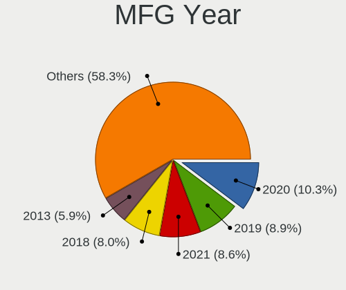
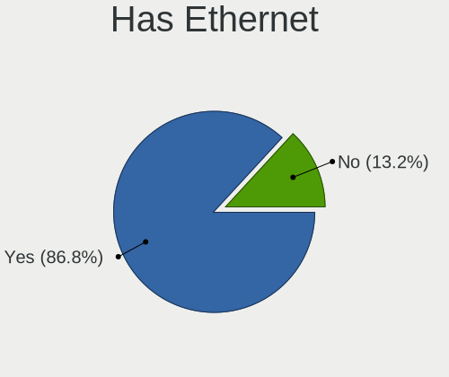
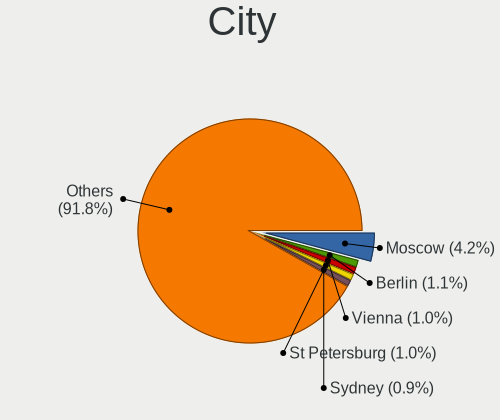
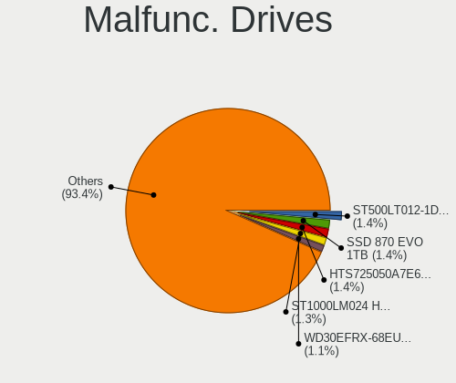
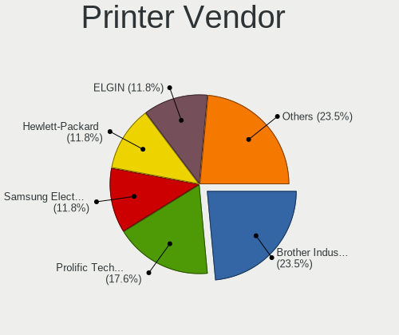
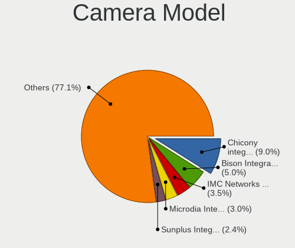

FreeBSD - Tested Hardware & Statistics
--------------------------------------

A project to collect tested hardware configurations for FreeBSD.

Anyone can contribute to this report by the [hw-probe](https://github.com/linuxhw/hw-probe/blob/master/INSTALL.BSD.md) tool:

    hw-probe -all -upload

Please contribute! Especially if your hardware is rare.

This is a report for all computer types. See also reports for [desktops](/Dist/FreeBSD/Desktop/README.md) and [notebooks](/Dist/FreeBSD/Notebook/README.md).

Contents
--------

* [ Test Cases ](#test-cases)

* [ System ](#system)
  - [ OS                       ](#os)
  - [ OS Family                ](#os-family)
  - [ Arch                     ](#arch)
  - [ DE                       ](#de)
  - [ Display Server           ](#display-server)
  - [ Display Manager          ](#display-manager)
  - [ OS Lang                  ](#os-lang)
  - [ Boot Mode                ](#boot-mode)
  - [ Filesystem               ](#filesystem)
  - [ Part. scheme             ](#part-scheme)

* [ Board ](#board)
  - [ Vendor                   ](#vendor)
  - [ Model                    ](#model)
  - [ Model Family             ](#model-family)
  - [ MFG Year                 ](#mfg-year)
  - [ Form Factor              ](#form-factor)
  - [ Coreboot                 ](#coreboot)
  - [ RAM Size                 ](#ram-size)
  - [ RAM Used                 ](#ram-used)
  - [ Total Drives             ](#total-drives)
  - [ Has CD-ROM               ](#has-cd-rom)
  - [ Has Ethernet             ](#has-ethernet)
  - [ Has WiFi                 ](#has-wifi)
  - [ Has Bluetooth            ](#has-bluetooth)

* [ Location ](#location)
  - [ Country                  ](#country)
  - [ City                     ](#city)

* [ Drives ](#drives)
  - [ Drive Vendor             ](#drive-vendor)
  - [ Drive Model              ](#drive-model)
  - [ HDD Vendor               ](#hdd-vendor)
  - [ SSD Vendor               ](#ssd-vendor)
  - [ Drive Kind               ](#drive-kind)
  - [ Drive Connector          ](#drive-connector)
  - [ Drive Size               ](#drive-size)
  - [ Space Total              ](#space-total)
  - [ Space Used               ](#space-used)
  - [ Malfunc. Drives          ](#malfunc-drives)
  - [ Malfunc. Drive Vendor    ](#malfunc-drive-vendor)
  - [ Malfunc. HDD Vendor      ](#malfunc-hdd-vendor)
  - [ Malfunc. Drive Kind      ](#malfunc-drive-kind)
  - [ Failed Drives            ](#failed-drives)
  - [ Failed Drive Vendor      ](#failed-drive-vendor)
  - [ Drive Status             ](#drive-status)

* [ Storage controller ](#storage-controller)
  - [ Storage Vendor           ](#storage-vendor)
  - [ Storage Model            ](#storage-model)
  - [ Storage Kind             ](#storage-kind)

* [ Processor ](#processor)
  - [ CPU Vendor               ](#cpu-vendor)
  - [ CPU Model                ](#cpu-model)
  - [ CPU Model Family         ](#cpu-model-family)
  - [ CPU Cores                ](#cpu-cores)
  - [ CPU Sockets              ](#cpu-sockets)
  - [ CPU Threads              ](#cpu-threads)
  - [ CPU Microarch            ](#cpu-microarch)

* [ Graphics ](#graphics)
  - [ GPU Vendor               ](#gpu-vendor)
  - [ GPU Model                ](#gpu-model)
  - [ GPU Combo                ](#gpu-combo)
  - [ GPU Driver               ](#gpu-driver)
  - [ GPU Memory               ](#gpu-memory)

* [ Monitor ](#monitor)
  - [ Monitor Vendor           ](#monitor-vendor)
  - [ Monitor Model            ](#monitor-model)
  - [ Monitor Resolution       ](#monitor-resolution)
  - [ Monitor Diagonal         ](#monitor-diagonal)
  - [ Monitor Width            ](#monitor-width)
  - [ Aspect Ratio             ](#aspect-ratio)
  - [ Monitor Area             ](#monitor-area)
  - [ Pixel Density            ](#pixel-density)
  - [ Multiple Monitors        ](#multiple-monitors)

* [ Network ](#network)
  - [ Net Controller Vendor    ](#net-controller-vendor)
  - [ Net Controller Model     ](#net-controller-model)
  - [ Wireless Vendor          ](#wireless-vendor)
  - [ Wireless Model           ](#wireless-model)
  - [ Ethernet Vendor          ](#ethernet-vendor)
  - [ Ethernet Model           ](#ethernet-model)
  - [ Net Controller Kind      ](#net-controller-kind)
  - [ Used Controller          ](#used-controller)
  - [ NICs                     ](#nics)
  - [ IPv6                     ](#ipv6)

* [ Bluetooth ](#bluetooth)
  - [ Bluetooth Vendor         ](#bluetooth-vendor)
  - [ Bluetooth Model          ](#bluetooth-model)

* [ Sound ](#sound)
  - [ Sound Vendor             ](#sound-vendor)
  - [ Sound Model              ](#sound-model)

* [ Memory ](#memory)
  - [ Memory Vendor            ](#memory-vendor)
  - [ Memory Model             ](#memory-model)
  - [ Memory Kind              ](#memory-kind)
  - [ Memory Form Factor       ](#memory-form-factor)
  - [ Memory Size              ](#memory-size)
  - [ Memory Speed             ](#memory-speed)

* [ Printers & scanners ](#printers--scanners)
  - [ Printer Vendor           ](#printer-vendor)
  - [ Printer Model            ](#printer-model)
  - [ Scanner Vendor           ](#scanner-vendor)
  - [ Scanner Model            ](#scanner-model)

* [ Camera ](#camera)
  - [ Camera Vendor            ](#camera-vendor)
  - [ Camera Model             ](#camera-model)

* [ Security ](#security)
  - [ Fingerprint Vendor       ](#fingerprint-vendor)
  - [ Fingerprint Model        ](#fingerprint-model)
  - [ Chipcard Vendor          ](#chipcard-vendor)
  - [ Chipcard Model           ](#chipcard-model)

* [ Unsupported ](#unsupported)
  - [ Unsupported Devices      ](#unsupported-devices)
  - [ Unsupported Device Types ](#unsupported-device-types)

Test Cases
----------

Total: 2706

| Vendor        | Model                       | Form-Factor | Probe                                                     | Date         |
|---------------|-----------------------------|-------------|-----------------------------------------------------------|--------------|
| LG Electro... | 17Z990-R.AAC9U1             | Notebook    | [5777cb6dc6](https://bsd-hardware.info/?probe=5777cb6dc6) | Jul 01, 2022 |
| ASRock        | X300M-STX                   | Desktop     | [a76b64487b](https://bsd-hardware.info/?probe=a76b64487b) | Jul 01, 2022 |
| HP            | EliteBook 850 G7 Noteboo... | Notebook    | [f573327012](https://bsd-hardware.info/?probe=f573327012) | Jun 29, 2022 |
| ASRock        | P67 Professional            | Desktop     | [3372d35113](https://bsd-hardware.info/?probe=3372d35113) | Jun 28, 2022 |
| Gigabyte      | H61MA-D3V                   | Desktop     | [898da0bcec](https://bsd-hardware.info/?probe=898da0bcec) | Jun 28, 2022 |
| Acer          | Aspire A114-33              | Notebook    | [d3659c85e9](https://bsd-hardware.info/?probe=d3659c85e9) | Jun 28, 2022 |
| Samsung       | R530/R730/R540              | Notebook    | [a4cd230718](https://bsd-hardware.info/?probe=a4cd230718) | Jun 27, 2022 |
| Dell          | Inspiron 5559               | Notebook    | [e0c49be06e](https://bsd-hardware.info/?probe=e0c49be06e) | Jun 27, 2022 |
| MSI           | H81M-P33                    | Desktop     | [079fcf320f](https://bsd-hardware.info/?probe=079fcf320f) | Jun 26, 2022 |
| ASUSTek       | P5Q-E                       | Desktop     | [bbc59d9815](https://bsd-hardware.info/?probe=bbc59d9815) | Jun 26, 2022 |
| ASUSTek       | ROG CROSSHAIR VIII HERO     | Desktop     | [6eb02df970](https://bsd-hardware.info/?probe=6eb02df970) | Jun 26, 2022 |
| MSI           | MS-B120                     | Mini pc     | [aa27c1dfd0](https://bsd-hardware.info/?probe=aa27c1dfd0) | Jun 25, 2022 |
| ASUSTek       | PRIME Z590-P                | Desktop     | [70aea59a1b](https://bsd-hardware.info/?probe=70aea59a1b) | Jun 25, 2022 |
| ASUSTek       | PRIME Z590-P                | Desktop     | [c285cb7899](https://bsd-hardware.info/?probe=c285cb7899) | Jun 23, 2022 |
| ASUSTek       | ROG STRIX X570-F GAMING     | Desktop     | [7d054ce34f](https://bsd-hardware.info/?probe=7d054ce34f) | Jun 23, 2022 |
| MSI           | B85M-E45                    | Desktop     | [d9cc6cee6b](https://bsd-hardware.info/?probe=d9cc6cee6b) | Jun 21, 2022 |
| Lenovo        | ThinkPad X270 20HN001HUS    | Notebook    | [139e4817d7](https://bsd-hardware.info/?probe=139e4817d7) | Jun 21, 2022 |
| Apple         | Mac-8ED6AF5B48C039E1 Mac... | Mini pc     | [ee4d6d5761](https://bsd-hardware.info/?probe=ee4d6d5761) | Jun 21, 2022 |
| Intel         | D945GCLF2 AAE46416-104      | Desktop     | [84f2afeff4](https://bsd-hardware.info/?probe=84f2afeff4) | Jun 21, 2022 |
| Lenovo        | ThinkPad R60e 0658W2M       | Notebook    | [8ad937beaa](https://bsd-hardware.info/?probe=8ad937beaa) | Jun 21, 2022 |
| ASUSTek       | Z87M-PLUS                   | Desktop     | [5e51d228ec](https://bsd-hardware.info/?probe=5e51d228ec) | Jun 21, 2022 |
| HP            | 3031h                       | Desktop     | [96ecd77f94](https://bsd-hardware.info/?probe=96ecd77f94) | Jun 19, 2022 |
| HP            | 3031h                       | Desktop     | [4da4d936b8](https://bsd-hardware.info/?probe=4da4d936b8) | Jun 19, 2022 |
| Dell          | Latitude 5521               | Notebook    | [2c9d24a69e](https://bsd-hardware.info/?probe=2c9d24a69e) | Jun 19, 2022 |
| Dell          | Inspiron 5559               | Notebook    | [5b7a6bf8f8](https://bsd-hardware.info/?probe=5b7a6bf8f8) | Jun 19, 2022 |
| Fujitsu Si... | AMILO Li3710                | Notebook    | [6d4bc39638](https://bsd-hardware.info/?probe=6d4bc39638) | Jun 18, 2022 |
| Toshiba       | Satellite A300              | Notebook    | [e057898546](https://bsd-hardware.info/?probe=e057898546) | Jun 18, 2022 |
| Sony          | VGN-NS21M_S                 | Notebook    | [c9701a7ff5](https://bsd-hardware.info/?probe=c9701a7ff5) | Jun 18, 2022 |
| Intel         | NUC7i5BNB J31144-306        | Mini pc     | [66f9b621be](https://bsd-hardware.info/?probe=66f9b621be) | Jun 17, 2022 |
| HP            | 86E9 A                      | Desktop     | [1d1ac2dd90](https://bsd-hardware.info/?probe=1d1ac2dd90) | Jun 16, 2022 |
| Dell          | Inspiron 5559               | Notebook    | [3344e5152d](https://bsd-hardware.info/?probe=3344e5152d) | Jun 16, 2022 |
| Dell          | Inspiron 5559               | Notebook    | [9f630c894a](https://bsd-hardware.info/?probe=9f630c894a) | Jun 16, 2022 |
| Dell          | 07KY25 A00                  | Desktop     | [9981217b1b](https://bsd-hardware.info/?probe=9981217b1b) | Jun 16, 2022 |
| ASUSTek       | ZenBook UX461FA_UX461FA     | Convertible | [3079ca74a6](https://bsd-hardware.info/?probe=3079ca74a6) | Jun 16, 2022 |
| Raspberry ... | Raspberry Pi                | Soc         | [b699c2a617](https://bsd-hardware.info/?probe=b699c2a617) | Jun 15, 2022 |
| Raspberry ... | Raspberry Pi                | Soc         | [45083c3a78](https://bsd-hardware.info/?probe=45083c3a78) | Jun 15, 2022 |
| Dell          | Latitude E5420              | Notebook    | [524ab094e1](https://bsd-hardware.info/?probe=524ab094e1) | Jun 13, 2022 |
| ASUSTek       | PRIME X370-PRO              | Desktop     | [8cc71bff7d](https://bsd-hardware.info/?probe=8cc71bff7d) | Jun 13, 2022 |
| ASRock        | X570 Phantom Gaming 4       | Desktop     | [59fba84256](https://bsd-hardware.info/?probe=59fba84256) | Jun 13, 2022 |
| ASUSTek       | ZenBook UX391FA_UX391FA     | Notebook    | [8825a49f37](https://bsd-hardware.info/?probe=8825a49f37) | Jun 13, 2022 |
| Dell          | 0HMF7C A01                  | Desktop     | [ad0f6d4b31](https://bsd-hardware.info/?probe=ad0f6d4b31) | Jun 13, 2022 |
| Gigabyte      | B550M AORUS PRO-P           | Desktop     | [1febab0774](https://bsd-hardware.info/?probe=1febab0774) | Jun 12, 2022 |
| Dell          | Latitude 7390               | Notebook    | [2b888ed291](https://bsd-hardware.info/?probe=2b888ed291) | Jun 12, 2022 |
| HP            | Laptop 15s-fq1xxx           | Notebook    | [380218b2c1](https://bsd-hardware.info/?probe=380218b2c1) | Jun 12, 2022 |
| Fujitsu Si... | AMILO Li3710                | Notebook    | [387bf3d18f](https://bsd-hardware.info/?probe=387bf3d18f) | Jun 12, 2022 |
| MSI           | H81M-P33                    | Desktop     | [87a66430db](https://bsd-hardware.info/?probe=87a66430db) | Jun 12, 2022 |
| ASUSTek       | P5Q-E                       | Desktop     | [9b34d14850](https://bsd-hardware.info/?probe=9b34d14850) | Jun 12, 2022 |
| ASUSTek       | ROG CROSSHAIR VIII HERO     | Desktop     | [c281c439e8](https://bsd-hardware.info/?probe=c281c439e8) | Jun 12, 2022 |
| Dell          | Inspiron 5559               | Notebook    | [e7017b0ea5](https://bsd-hardware.info/?probe=e7017b0ea5) | Jun 12, 2022 |
| Supermicro    | X9DR3-F                     | Desktop     | [d81151c0e8](https://bsd-hardware.info/?probe=d81151c0e8) | Jun 12, 2022 |
| ASUSTek       | Maximus VII FORMULA         | Desktop     | [5215d1ebb8](https://bsd-hardware.info/?probe=5215d1ebb8) | Jun 12, 2022 |
| Lenovo        | IdeaPadFlex 5 14ITL05 82... | Convertible | [af923daeda](https://bsd-hardware.info/?probe=af923daeda) | Jun 12, 2022 |
| Fujitsu Si... | AMILO Li3710                | Notebook    | [edebcb2719](https://bsd-hardware.info/?probe=edebcb2719) | Jun 12, 2022 |
| Fujitsu       | LIFEBOOK A555               | Notebook    | [23d96bc669](https://bsd-hardware.info/?probe=23d96bc669) | Jun 11, 2022 |
| Dell          | 0804P1 A04                  | Server      | [c8ddb7dae6](https://bsd-hardware.info/?probe=c8ddb7dae6) | Jun 10, 2022 |
| Dell          | Latitude E5420              | Notebook    | [aca711c5ec](https://bsd-hardware.info/?probe=aca711c5ec) | Jun 09, 2022 |
| Lenovo        | IdeaPad 130-15AST 81H5      | Notebook    | [9f33082ffa](https://bsd-hardware.info/?probe=9f33082ffa) | Jun 08, 2022 |
| Dell          | Precision M4800             | Notebook    | [4d77bb0082](https://bsd-hardware.info/?probe=4d77bb0082) | Jun 08, 2022 |
| Dell          | Precision M4800             | Notebook    | [b9169c863c](https://bsd-hardware.info/?probe=b9169c863c) | Jun 08, 2022 |
| Dell          | Inspiron 5559               | Notebook    | [1a9b85f6c5](https://bsd-hardware.info/?probe=1a9b85f6c5) | Jun 07, 2022 |
| Dell          | Latitude E5420              | Notebook    | [a3a9820968](https://bsd-hardware.info/?probe=a3a9820968) | Jun 07, 2022 |
| Lenovo        | ThinkPad T14 Gen 1 20S0C... | Notebook    | [56111732fd](https://bsd-hardware.info/?probe=56111732fd) | Jun 07, 2022 |
| Lenovo        | ThinkPad T14 Gen 1 20S0C... | Notebook    | [aeec87e07f](https://bsd-hardware.info/?probe=aeec87e07f) | Jun 06, 2022 |
| Dell          | Latitude 5410               | Notebook    | [3334ff3727](https://bsd-hardware.info/?probe=3334ff3727) | Jun 06, 2022 |
| MSI           | Z590 PRO WIFI               | Desktop     | [29b410eeb6](https://bsd-hardware.info/?probe=29b410eeb6) | Jun 06, 2022 |
| Gigabyte      | F2A75M-D3H                  | Desktop     | [ae3436167b](https://bsd-hardware.info/?probe=ae3436167b) | Jun 05, 2022 |
| Lenovo        | ThinkPad X220 4286CTO       | Notebook    | [cb98f3014e](https://bsd-hardware.info/?probe=cb98f3014e) | Jun 05, 2022 |
| ASRock        | B550 Phantom Gaming-ITX/... | Desktop     | [ff3865e01f](https://bsd-hardware.info/?probe=ff3865e01f) | Jun 05, 2022 |
| MSI           | H81M-P33                    | Desktop     | [49ab973713](https://bsd-hardware.info/?probe=49ab973713) | Jun 05, 2022 |
| ASUSTek       | ROG CROSSHAIR VIII HERO     | Desktop     | [7f11ab4091](https://bsd-hardware.info/?probe=7f11ab4091) | Jun 05, 2022 |
| ASUSTek       | P5Q-E                       | Desktop     | [10381fadd6](https://bsd-hardware.info/?probe=10381fadd6) | Jun 05, 2022 |
| Dell          | Latitude 7490               | Notebook    | [18215740d1](https://bsd-hardware.info/?probe=18215740d1) | Jun 05, 2022 |
| Lenovo        | Aptio CRB SDK0E50515 STD    | Mini pc     | [260ae5b2fe](https://bsd-hardware.info/?probe=260ae5b2fe) | Jun 04, 2022 |
| Dell          | Inspiron 5559               | Notebook    | [0f0c2bcf67](https://bsd-hardware.info/?probe=0f0c2bcf67) | Jun 04, 2022 |
| Lenovo        | ThinkPad T590 20N4CTO1WW    | Notebook    | [f3ad761457](https://bsd-hardware.info/?probe=f3ad761457) | Jun 04, 2022 |
| Dell          | Latitude E5500              | Notebook    | [b1cb5de914](https://bsd-hardware.info/?probe=b1cb5de914) | Jun 03, 2022 |
| ASUSTek       | X441UV                      | Notebook    | [c8906b438b](https://bsd-hardware.info/?probe=c8906b438b) | Jun 03, 2022 |
| HP            | EliteBook 8570p             | Notebook    | [1067f6ab27](https://bsd-hardware.info/?probe=1067f6ab27) | Jun 03, 2022 |
| Apple         | MacBookPro11,4              | Notebook    | [29f1ef0cdc](https://bsd-hardware.info/?probe=29f1ef0cdc) | Jun 02, 2022 |
| Lenovo        | ThinkPad W520 4282AD4       | Notebook    | [40198abaa2](https://bsd-hardware.info/?probe=40198abaa2) | Jun 02, 2022 |
| Acer          | Nitro AN515-55              | Notebook    | [0cf6981a98](https://bsd-hardware.info/?probe=0cf6981a98) | Jun 02, 2022 |
| ASUSTek       | ROG Maximus XI HERO         | Desktop     | [1cc3d99da5](https://bsd-hardware.info/?probe=1cc3d99da5) | May 31, 2022 |
| GPD           | MicroPC                     | Notebook    | [a448570ff9](https://bsd-hardware.info/?probe=a448570ff9) | May 31, 2022 |
| Dell          | Inspiron 5559               | Notebook    | [ca9f2125af](https://bsd-hardware.info/?probe=ca9f2125af) | May 31, 2022 |
| Dell          | Inspiron 5559               | Notebook    | [283a074737](https://bsd-hardware.info/?probe=283a074737) | May 31, 2022 |
| Acer          | Aspire E5-576               | Notebook    | [138e9fdeb4](https://bsd-hardware.info/?probe=138e9fdeb4) | May 31, 2022 |
| GPD           | MicroPC                     | Notebook    | [0046ab7c9b](https://bsd-hardware.info/?probe=0046ab7c9b) | May 31, 2022 |
| NF-M2S        | ABIT                        | Desktop     | [bef9700756](https://bsd-hardware.info/?probe=bef9700756) | May 31, 2022 |
| HP            | Pavilion g6                 | Notebook    | [32854b73a5](https://bsd-hardware.info/?probe=32854b73a5) | May 30, 2022 |
| ASUSTek       | PRIME B350-PLUS             | Desktop     | [f39611345a](https://bsd-hardware.info/?probe=f39611345a) | May 30, 2022 |
| System76      | Galago Pro                  | Notebook    | [126ebc1522](https://bsd-hardware.info/?probe=126ebc1522) | May 29, 2022 |
| Unknown       | Unknown                     | Desktop     | [90b27f0ac1](https://bsd-hardware.info/?probe=90b27f0ac1) | May 29, 2022 |
| ASUSTek       | P5Q-E                       | Desktop     | [cf67e4079f](https://bsd-hardware.info/?probe=cf67e4079f) | May 29, 2022 |
| ASUSTek       | ROG CROSSHAIR VIII HERO     | Desktop     | [8ebd281f5f](https://bsd-hardware.info/?probe=8ebd281f5f) | May 29, 2022 |
| MSI           | H81M-P33                    | Desktop     | [ab2181e1b4](https://bsd-hardware.info/?probe=ab2181e1b4) | May 29, 2022 |
| Dell          | G5 5590                     | Notebook    | [86bac52410](https://bsd-hardware.info/?probe=86bac52410) | May 29, 2022 |
| Dell          | Latitude E6430              | Notebook    | [d7ced37bac](https://bsd-hardware.info/?probe=d7ced37bac) | May 29, 2022 |
| PC Engines    | APU3                        | Desktop     | [fca5a642c2](https://bsd-hardware.info/?probe=fca5a642c2) | May 28, 2022 |
| Lenovo        | ThinkPad X250 20CMS0FA00    | Notebook    | [5afeac632d](https://bsd-hardware.info/?probe=5afeac632d) | May 28, 2022 |
| HP            | EliteBook 8570p             | Notebook    | [3d0fdb11ff](https://bsd-hardware.info/?probe=3d0fdb11ff) | May 27, 2022 |
| Unknown       | Unknown                     | Desktop     | [a56bc64f26](https://bsd-hardware.info/?probe=a56bc64f26) | May 27, 2022 |
| Unknown       | Unknown                     | Desktop     | [4e15ce78c8](https://bsd-hardware.info/?probe=4e15ce78c8) | May 26, 2022 |
| Unknown       | Unknown                     | Notebook    | [3ff577e111](https://bsd-hardware.info/?probe=3ff577e111) | May 26, 2022 |
| Unknown       | Unknown                     | Notebook    | [9e2f16664a](https://bsd-hardware.info/?probe=9e2f16664a) | May 26, 2022 |
| Dell          | Inspiron 3505               | Notebook    | [cddd786b51](https://bsd-hardware.info/?probe=cddd786b51) | May 26, 2022 |
| HP            | 158A                        | Desktop     | [883958cd36](https://bsd-hardware.info/?probe=883958cd36) | May 25, 2022 |
| Unknown       | Unknown                     | Desktop     | [78d1ad4565](https://bsd-hardware.info/?probe=78d1ad4565) | May 25, 2022 |
| Notebook      | N7x0WU                      | Notebook    | [37242aa9a3](https://bsd-hardware.info/?probe=37242aa9a3) | May 25, 2022 |
| ASRockRack    | E3C242D4U2-2T               | Desktop     | [d35f1fb7e0](https://bsd-hardware.info/?probe=d35f1fb7e0) | May 25, 2022 |
| Lenovo        | IdeaPad Y700-15ISK 80NV     | Notebook    | [1cc5f44e4a](https://bsd-hardware.info/?probe=1cc5f44e4a) | May 25, 2022 |
| Lenovo        | IdeaPad S510p 20298         | Notebook    | [c41aea0ea7](https://bsd-hardware.info/?probe=c41aea0ea7) | May 24, 2022 |
| ASRock        | B550 Phantom Gaming-ITX/... | Desktop     | [3dc5a6f7d2](https://bsd-hardware.info/?probe=3dc5a6f7d2) | May 24, 2022 |
| TUXEDO        | Aura 15 Gen1                | Notebook    | [727f9708b4](https://bsd-hardware.info/?probe=727f9708b4) | May 24, 2022 |
| Dell          | 055H3G A01                  | Desktop     | [cc1c76afc0](https://bsd-hardware.info/?probe=cc1c76afc0) | May 24, 2022 |
| Dell          | Latitude E6540              | Notebook    | [70871cf070](https://bsd-hardware.info/?probe=70871cf070) | May 24, 2022 |
| ASUSTek       | ROG STRIX B550-F GAMING     | Desktop     | [a74913bffa](https://bsd-hardware.info/?probe=a74913bffa) | May 23, 2022 |
| khadas        | edge-v                      | Desktop     | [60fb48e34c](https://bsd-hardware.info/?probe=60fb48e34c) | May 23, 2022 |
| khadas        | edge-v                      | Desktop     | [6facaa8032](https://bsd-hardware.info/?probe=6facaa8032) | May 22, 2022 |
| ASUSTek       | ROG Maximus XI HERO         | Desktop     | [443b1d3c3e](https://bsd-hardware.info/?probe=443b1d3c3e) | May 22, 2022 |
| Dell          | Precision M4800             | Notebook    | [6a703b66f8](https://bsd-hardware.info/?probe=6a703b66f8) | May 22, 2022 |
| Dell          | Latitude E7240              | Notebook    | [970234b430](https://bsd-hardware.info/?probe=970234b430) | May 22, 2022 |
| MSI           | H81M-P33                    | Desktop     | [d5a0fd71f2](https://bsd-hardware.info/?probe=d5a0fd71f2) | May 22, 2022 |
| ASUSTek       | P5Q-E                       | Desktop     | [2b93a0b59f](https://bsd-hardware.info/?probe=2b93a0b59f) | May 22, 2022 |
| ASUSTek       | ROG CROSSHAIR VIII HERO     | Desktop     | [becc2fddbd](https://bsd-hardware.info/?probe=becc2fddbd) | May 22, 2022 |
| Intel         | NUC9i7QNB K49245-402        | Mini pc     | [92881489e1](https://bsd-hardware.info/?probe=92881489e1) | May 22, 2022 |
| Supermicro    | X9SRW-F                     | Server      | [89da730497](https://bsd-hardware.info/?probe=89da730497) | May 21, 2022 |
| Lenovo        | IdeaPad Y700-15ISK 80NV     | Notebook    | [ddaca5356c](https://bsd-hardware.info/?probe=ddaca5356c) | May 21, 2022 |
| Lenovo        | ThinkPad X13 Gen 1 20UF0... | Notebook    | [cf5f498572](https://bsd-hardware.info/?probe=cf5f498572) | May 21, 2022 |
| GVC           | DR 738                      | Desktop     | [938866fb80](https://bsd-hardware.info/?probe=938866fb80) | May 21, 2022 |
| Dell          | Latitude 5520               | Notebook    | [cbc2c03fa1](https://bsd-hardware.info/?probe=cbc2c03fa1) | May 20, 2022 |
| Dell          | XPS 13 9343                 | Notebook    | [44abecc1ef](https://bsd-hardware.info/?probe=44abecc1ef) | May 20, 2022 |
| ASUSTek       | 1001P                       | Notebook    | [6ffa9529a3](https://bsd-hardware.info/?probe=6ffa9529a3) | May 20, 2022 |
| ASUSTek       | 1001P                       | Notebook    | [2820584223](https://bsd-hardware.info/?probe=2820584223) | May 20, 2022 |
| ASUSTek       | TUF B350M-PLUS GAMING       | Desktop     | [819bed6cfb](https://bsd-hardware.info/?probe=819bed6cfb) | May 19, 2022 |
| HP            | ProBook 455 G7              | Notebook    | [c6944afe69](https://bsd-hardware.info/?probe=c6944afe69) | May 19, 2022 |
| TUXEDO        | Aura 15 Gen1                | Notebook    | [a4b6a40758](https://bsd-hardware.info/?probe=a4b6a40758) | May 19, 2022 |
| Lenovo        | MAHOBAY 31900004 STD        | All in one  | [a9189728e3](https://bsd-hardware.info/?probe=a9189728e3) | May 19, 2022 |
| TUXEDO        | Aura 15 Gen1                | Notebook    | [1c84f0f722](https://bsd-hardware.info/?probe=1c84f0f722) | May 19, 2022 |
| Acer          | Aspire 5742                 | Notebook    | [b0ea5e7a5e](https://bsd-hardware.info/?probe=b0ea5e7a5e) | May 19, 2022 |
| Gigabyte      | H61MA-D3V                   | Desktop     | [f369e09063](https://bsd-hardware.info/?probe=f369e09063) | May 19, 2022 |
| Gigabyte      | X470 AORUS GAMING 7 WIFI... | Desktop     | [9c459aae41](https://bsd-hardware.info/?probe=9c459aae41) | May 19, 2022 |
| MSI           | K9N6PGM2-V2                 | Desktop     | [d5a6eba10b](https://bsd-hardware.info/?probe=d5a6eba10b) | May 19, 2022 |
| ASUSTek       | PRIME Z690-P WIFI           | Desktop     | [1014f7f61c](https://bsd-hardware.info/?probe=1014f7f61c) | May 18, 2022 |
| Dell          | 0DXJD9 A01                  | Desktop     | [be13c9069c](https://bsd-hardware.info/?probe=be13c9069c) | May 18, 2022 |
| Gigabyte      | B450M DS3H-CF               | Desktop     | [edcd612c83](https://bsd-hardware.info/?probe=edcd612c83) | May 18, 2022 |
| Lenovo        | ThinkPad L420 7854CTO       | Notebook    | [56cf502c2f](https://bsd-hardware.info/?probe=56cf502c2f) | May 18, 2022 |
| Lenovo        | ThinkPad T420s 41732AU      | Notebook    | [9d9ddcc409](https://bsd-hardware.info/?probe=9d9ddcc409) | May 18, 2022 |
| Lenovo        | ThinkPad X270 20HMCTO1WW    | Notebook    | [2d3de77101](https://bsd-hardware.info/?probe=2d3de77101) | May 18, 2022 |
| Lenovo        | ThinkPad E490 20N8CTO1WW    | Notebook    | [86866ce217](https://bsd-hardware.info/?probe=86866ce217) | May 17, 2022 |
| Dell          | 04JN2K A12                  | Server      | [550e12f317](https://bsd-hardware.info/?probe=550e12f317) | May 17, 2022 |
| Lenovo        | 7X06CTO1WW                  | Server      | [311c32e56e](https://bsd-hardware.info/?probe=311c32e56e) | May 17, 2022 |
| Intel         | NUC10i3FNB M38070-307       | Mini pc     | [7189b48418](https://bsd-hardware.info/?probe=7189b48418) | May 17, 2022 |
| TUXEDO        | InfinityBook13V3            | Notebook    | [fd081a3636](https://bsd-hardware.info/?probe=fd081a3636) | May 17, 2022 |
| Dell          | 07T4MC A11                  | Desktop     | [63d6080a31](https://bsd-hardware.info/?probe=63d6080a31) | May 17, 2022 |
| Fujitsu       | D3401-H2 S26361-D3401-H2    | Desktop     | [b87692aeb4](https://bsd-hardware.info/?probe=b87692aeb4) | May 15, 2022 |
| MSI           | H81M-P33                    | Desktop     | [7ac64b1e55](https://bsd-hardware.info/?probe=7ac64b1e55) | May 15, 2022 |
| ASUSTek       | P5Q-E                       | Desktop     | [b8960b35d4](https://bsd-hardware.info/?probe=b8960b35d4) | May 15, 2022 |
| ASUSTek       | ROG CROSSHAIR VIII HERO     | Desktop     | [e07337b1a1](https://bsd-hardware.info/?probe=e07337b1a1) | May 15, 2022 |
| Dell          | Precision M4800             | Notebook    | [6dc325b553](https://bsd-hardware.info/?probe=6dc325b553) | May 15, 2022 |
| ASRock        | E350M1                      | Desktop     | [1850fa38e0](https://bsd-hardware.info/?probe=1850fa38e0) | May 14, 2022 |
| ASRock        | E350M1                      | Desktop     | [4520b5034e](https://bsd-hardware.info/?probe=4520b5034e) | May 13, 2022 |
| MSI           | MS-7369                     | Desktop     | [c2c6bd80e8](https://bsd-hardware.info/?probe=c2c6bd80e8) | May 13, 2022 |
| Unknown       | Unknown                     | Desktop     | [f3ab857e43](https://bsd-hardware.info/?probe=f3ab857e43) | May 13, 2022 |
| ASUSTek       | PRIME X370-PRO              | Desktop     | [6a9177eef7](https://bsd-hardware.info/?probe=6a9177eef7) | May 13, 2022 |
| ASRock        | X570 Phantom Gaming 4       | Desktop     | [11034dd80f](https://bsd-hardware.info/?probe=11034dd80f) | May 13, 2022 |
| Intel         | DH67BL AAG10189-213         | Desktop     | [e8d2744812](https://bsd-hardware.info/?probe=e8d2744812) | May 12, 2022 |
| Intel         | NUC11PHBi7 M26151-402       | Mini pc     | [3a3729e497](https://bsd-hardware.info/?probe=3a3729e497) | May 12, 2022 |
| Intel         | NUC11PHBi7 M26151-402       | Mini pc     | [46b11e5051](https://bsd-hardware.info/?probe=46b11e5051) | May 12, 2022 |
| HP            | ProLiant MicroServer        | Desktop     | [e569bffe8f](https://bsd-hardware.info/?probe=e569bffe8f) | May 12, 2022 |
| Lenovo        | 7X06CTO1WW                  | Server      | [54a5041cdf](https://bsd-hardware.info/?probe=54a5041cdf) | May 12, 2022 |
| Acer          | Aspire A715-42G             | Notebook    | [991f67362f](https://bsd-hardware.info/?probe=991f67362f) | May 12, 2022 |
| Lenovo        | 7X06CTO1WW                  | Server      | [8cdb309c2e](https://bsd-hardware.info/?probe=8cdb309c2e) | May 11, 2022 |
| ASRock        | A320M Pro4-F                | Desktop     | [f307756ddf](https://bsd-hardware.info/?probe=f307756ddf) | May 11, 2022 |
| Lenovo        | ThinkPad T495s 20QKS1812... | Notebook    | [89db84f7ec](https://bsd-hardware.info/?probe=89db84f7ec) | May 10, 2022 |
| ASUSTek       | PRIME H470M-PLUS            | Desktop     | [224614e9ab](https://bsd-hardware.info/?probe=224614e9ab) | May 10, 2022 |
| ASRock        | X570 Phantom Gaming 4       | Desktop     | [76eef59920](https://bsd-hardware.info/?probe=76eef59920) | May 10, 2022 |
| Dell          | Latitude 2100               | Notebook    | [40406069ee](https://bsd-hardware.info/?probe=40406069ee) | May 09, 2022 |
| Lenovo        | ThinkPad E490 20N8CTO1WW    | Notebook    | [5259bc1933](https://bsd-hardware.info/?probe=5259bc1933) | May 08, 2022 |
| ASUSTek       | P5Q-E                       | Desktop     | [58cad4a2a5](https://bsd-hardware.info/?probe=58cad4a2a5) | May 08, 2022 |
| MSI           | H81M-P33                    | Desktop     | [bafda9a2aa](https://bsd-hardware.info/?probe=bafda9a2aa) | May 08, 2022 |
| ASUSTek       | ROG CROSSHAIR VIII HERO     | Desktop     | [76e16e7fdc](https://bsd-hardware.info/?probe=76e16e7fdc) | May 08, 2022 |
| Lenovo        | ThinkPad X250 20CLS02V00    | Notebook    | [7e2771b8f6](https://bsd-hardware.info/?probe=7e2771b8f6) | May 08, 2022 |
| Lenovo        | ThinkPad E490 20N8CTO1WW    | Notebook    | [a69f0fefca](https://bsd-hardware.info/?probe=a69f0fefca) | May 07, 2022 |
| Supermicro    | X10SRL-FB                   | Server      | [331947afe1](https://bsd-hardware.info/?probe=331947afe1) | May 07, 2022 |
| Dell          | Inspiron 15-7568            | Notebook    | [850df51257](https://bsd-hardware.info/?probe=850df51257) | May 06, 2022 |
| Raspberry ... | Raspberry Pi                | Soc         | [659e98fd68](https://bsd-hardware.info/?probe=659e98fd68) | May 06, 2022 |
| Lenovo        | ThinkPad X1 Carbon 3rd 2... | Notebook    | [015bf0fea4](https://bsd-hardware.info/?probe=015bf0fea4) | May 06, 2022 |
| Lenovo        | ThinkPad X220 42872WU       | Notebook    | [e99738632d](https://bsd-hardware.info/?probe=e99738632d) | May 06, 2022 |
| BESSTAR Te... | GB1B                        | Mini pc     | [407fc42fad](https://bsd-hardware.info/?probe=407fc42fad) | May 05, 2022 |
| ASUSTek       | TUF Gaming Z590-PLUS        | Desktop     | [5f9e266167](https://bsd-hardware.info/?probe=5f9e266167) | May 04, 2022 |
| ASUSTek       | TUF Gaming Z590-PLUS        | Desktop     | [7d4dd8ba29](https://bsd-hardware.info/?probe=7d4dd8ba29) | May 04, 2022 |
| Dell          | Vostro 5590                 | Notebook    | [1f23973fb4](https://bsd-hardware.info/?probe=1f23973fb4) | May 04, 2022 |
| Intel         | NUC10i7FNB K61360-303       | Mini pc     | [86ea07c719](https://bsd-hardware.info/?probe=86ea07c719) | May 03, 2022 |
| Acer          | Aspire ES1-132              | Notebook    | [18426698ad](https://bsd-hardware.info/?probe=18426698ad) | May 02, 2022 |
| ASUSTek       | H97I-PLUS                   | Desktop     | [1fde9daf7d](https://bsd-hardware.info/?probe=1fde9daf7d) | May 01, 2022 |
| Dell          | Latitude E5570              | Notebook    | [c214ce4ab0](https://bsd-hardware.info/?probe=c214ce4ab0) | May 01, 2022 |
| ASUSTek       | P5Q-E                       | Desktop     | [a28d0e9c9d](https://bsd-hardware.info/?probe=a28d0e9c9d) | May 01, 2022 |
| ASUSTek       | ROG CROSSHAIR VIII HERO     | Desktop     | [7b1cd9e231](https://bsd-hardware.info/?probe=7b1cd9e231) | May 01, 2022 |
| MSI           | H81M-P33                    | Desktop     | [30d7aec5a0](https://bsd-hardware.info/?probe=30d7aec5a0) | May 01, 2022 |
| Toshiba       | Satellite P25               | Notebook    | [6a920e9c8a](https://bsd-hardware.info/?probe=6a920e9c8a) | May 01, 2022 |
| Lenovo        | B50-30 20382                | Notebook    | [5701dac149](https://bsd-hardware.info/?probe=5701dac149) | Apr 30, 2022 |
| HP            | 8158 A01                    | Mini pc     | [de45e5a021](https://bsd-hardware.info/?probe=de45e5a021) | Apr 29, 2022 |
| HP            | Laptop 15-dw1xxx            | Notebook    | [7a212b5833](https://bsd-hardware.info/?probe=7a212b5833) | Apr 29, 2022 |
| HP            | 1495                        | Desktop     | [6e0f1cc72e](https://bsd-hardware.info/?probe=6e0f1cc72e) | Apr 29, 2022 |
| MSI           | A520M-A PRO                 | Desktop     | [336add4fcb](https://bsd-hardware.info/?probe=336add4fcb) | Apr 28, 2022 |
| Lenovo        | ThinkPad T470 20HES0ES1F    | Notebook    | [f1f0676663](https://bsd-hardware.info/?probe=f1f0676663) | Apr 28, 2022 |
| MSI           | A520M-A PRO                 | Desktop     | [34f2ba40e7](https://bsd-hardware.info/?probe=34f2ba40e7) | Apr 27, 2022 |
| Lenovo        | IdeaPadFlex 5 14ALC05 82... | Convertible | [0750e29d3c](https://bsd-hardware.info/?probe=0750e29d3c) | Apr 27, 2022 |
| Lenovo        | ThinkPad E490 20N8CTO1WW    | Notebook    | [30e267dd51](https://bsd-hardware.info/?probe=30e267dd51) | Apr 27, 2022 |
| Notebook      | N7x0WU                      | Notebook    | [b7c06932a3](https://bsd-hardware.info/?probe=b7c06932a3) | Apr 27, 2022 |
| Gigabyte      | X470 AORUS ULTRA GAMING-... | Desktop     | [1a475f0939](https://bsd-hardware.info/?probe=1a475f0939) | Apr 27, 2022 |
| ASRock        | X570S PG Riptide            | Desktop     | [928d2abb5e](https://bsd-hardware.info/?probe=928d2abb5e) | Apr 26, 2022 |
| Framework     | Laptop                      | Notebook    | [5d6cb039ea](https://bsd-hardware.info/?probe=5d6cb039ea) | Apr 25, 2022 |
| Intel         | S3420GP E77063-304          | Server      | [09a475e0bc](https://bsd-hardware.info/?probe=09a475e0bc) | Apr 25, 2022 |
| HP            | ProLiant DL180 G6           | Server      | [3834dccb1f](https://bsd-hardware.info/?probe=3834dccb1f) | Apr 25, 2022 |
| Gigabyte      | H310M S2 x.x                | Desktop     | [549053284c](https://bsd-hardware.info/?probe=549053284c) | Apr 25, 2022 |
| MSI           | X399 GAMING PRO CARBON A... | Desktop     | [86c4af7ca4](https://bsd-hardware.info/?probe=86c4af7ca4) | Apr 25, 2022 |
| MSI           | H81M-P33                    | Desktop     | [d14d6194ed](https://bsd-hardware.info/?probe=d14d6194ed) | Apr 24, 2022 |
| ASUSTek       | P5Q-E                       | Desktop     | [27a4680bec](https://bsd-hardware.info/?probe=27a4680bec) | Apr 24, 2022 |
| ASUSTek       | ROG CROSSHAIR VIII HERO     | Desktop     | [76580a0375](https://bsd-hardware.info/?probe=76580a0375) | Apr 24, 2022 |
| Apple         | MacBookPro8,3               | Notebook    | [e588c93d54](https://bsd-hardware.info/?probe=e588c93d54) | Apr 24, 2022 |
| Lenovo        | ThinkPad 11e Yoga Gen 6 ... | Convertible | [fd100bcc6a](https://bsd-hardware.info/?probe=fd100bcc6a) | Apr 24, 2022 |
| Dell          | 0T7D40 A01                  | Desktop     | [7a43bfada9](https://bsd-hardware.info/?probe=7a43bfada9) | Apr 23, 2022 |
| Dell          | Latitude E6520              | Notebook    | [c4ae703add](https://bsd-hardware.info/?probe=c4ae703add) | Apr 23, 2022 |
| Dell          | 0HD5W2 A00                  | Desktop     | [955922ebe2](https://bsd-hardware.info/?probe=955922ebe2) | Apr 23, 2022 |
| Dell          | 0HD5W2 A00                  | Desktop     | [4d66b2b328](https://bsd-hardware.info/?probe=4d66b2b328) | Apr 23, 2022 |
| MSI           | X570-A PRO                  | Desktop     | [89fcee49d9](https://bsd-hardware.info/?probe=89fcee49d9) | Apr 22, 2022 |
| HP            | 2820h                       | Desktop     | [d888b8b775](https://bsd-hardware.info/?probe=d888b8b775) | Apr 22, 2022 |
| Lenovo        | B570 1068FQG                | Notebook    | [a0d1f01226](https://bsd-hardware.info/?probe=a0d1f01226) | Apr 22, 2022 |
| Supermicro    | X9SCL/X9SCM                 | Desktop     | [947038b1f9](https://bsd-hardware.info/?probe=947038b1f9) | Apr 22, 2022 |
| MSI           | PRESTIGE X570 CREATION      | Desktop     | [28c8d07136](https://bsd-hardware.info/?probe=28c8d07136) | Apr 22, 2022 |
| HP            | EliteBook 8570p             | Notebook    | [c4dee3f070](https://bsd-hardware.info/?probe=c4dee3f070) | Apr 21, 2022 |
| Dell          | 06JWJY A01                  | Desktop     | [16f4cc5d53](https://bsd-hardware.info/?probe=16f4cc5d53) | Apr 20, 2022 |
| HP            | EliteBook 8570p             | Notebook    | [d9acb17caf](https://bsd-hardware.info/?probe=d9acb17caf) | Apr 20, 2022 |
| Dell          | 0T7D40 A01                  | Desktop     | [4ad1c07aa5](https://bsd-hardware.info/?probe=4ad1c07aa5) | Apr 19, 2022 |
| Dell          | 0FKD45 A03                  | Server      | [dde6af4613](https://bsd-hardware.info/?probe=dde6af4613) | Apr 19, 2022 |
| Gigabyte      | N3160ND3V                   | Desktop     | [eb3d850e0a](https://bsd-hardware.info/?probe=eb3d850e0a) | Apr 17, 2022 |
| MSI           | H81M-P33                    | Desktop     | [4bc268cc37](https://bsd-hardware.info/?probe=4bc268cc37) | Apr 17, 2022 |
| ASUSTek       | P5Q-E                       | Desktop     | [1c967bd89f](https://bsd-hardware.info/?probe=1c967bd89f) | Apr 17, 2022 |
| ASUSTek       | ROG CROSSHAIR VIII HERO     | Desktop     | [c8badc9bc6](https://bsd-hardware.info/?probe=c8badc9bc6) | Apr 17, 2022 |
| ASRockRack    | C3758D4I-4L                 | Desktop     | [0a550ec649](https://bsd-hardware.info/?probe=0a550ec649) | Apr 17, 2022 |
| ASRockRack    | C3758D4I-4L                 | Desktop     | [c1e6f095a8](https://bsd-hardware.info/?probe=c1e6f095a8) | Apr 17, 2022 |
| System76      | Lemur Pro                   | Notebook    | [bbeb7d48fa](https://bsd-hardware.info/?probe=bbeb7d48fa) | Apr 17, 2022 |
| Shuttle       | DS20U                       | Desktop     | [f01372719f](https://bsd-hardware.info/?probe=f01372719f) | Apr 16, 2022 |
| HUAWEI        | NBLL-WXX9                   | Notebook    | [d259128717](https://bsd-hardware.info/?probe=d259128717) | Apr 16, 2022 |
| Shuttle       | SH570                       | Desktop     | [08e2af8890](https://bsd-hardware.info/?probe=08e2af8890) | Apr 16, 2022 |
| ASUSTek       | AT5NM10T-I                  | Desktop     | [211c3291dd](https://bsd-hardware.info/?probe=211c3291dd) | Apr 15, 2022 |
| Lenovo        | ThinkPad X1 Carbon 3rd 2... | Notebook    | [eda0880c67](https://bsd-hardware.info/?probe=eda0880c67) | Apr 15, 2022 |
| HP            | 86E9 A                      | Desktop     | [be43a8efde](https://bsd-hardware.info/?probe=be43a8efde) | Apr 14, 2022 |
| HP            | ProLiant MicroServer        | Desktop     | [fa76da045a](https://bsd-hardware.info/?probe=fa76da045a) | Apr 13, 2022 |
| ASUSTek       | PRIME X370-PRO              | Desktop     | [f6bc20d345](https://bsd-hardware.info/?probe=f6bc20d345) | Apr 13, 2022 |
| ASRock        | X570 Phantom Gaming 4       | Desktop     | [bb9129d4df](https://bsd-hardware.info/?probe=bb9129d4df) | Apr 13, 2022 |
| Lenovo        | ThinkPad X1 Yoga 1st 20F... | Convertible | [4cbd9f9314](https://bsd-hardware.info/?probe=4cbd9f9314) | Apr 12, 2022 |
| Dell          | Latitude E6440              | Notebook    | [eea29a3895](https://bsd-hardware.info/?probe=eea29a3895) | Apr 12, 2022 |
| Intel         | DH67CL AAG10212-205         | Desktop     | [ecbb820987](https://bsd-hardware.info/?probe=ecbb820987) | Apr 12, 2022 |
| Lenovo        | 3136 SDK0J40697 WIN 3305... | Mini pc     | [e0f42a2bb2](https://bsd-hardware.info/?probe=e0f42a2bb2) | Apr 11, 2022 |
| Dell          | 0DXJD9 A01                  | Desktop     | [6dac56f3bb](https://bsd-hardware.info/?probe=6dac56f3bb) | Apr 11, 2022 |
| Lenovo        | ThinkPad X201 3680MG1       | Notebook    | [a2b9975fe2](https://bsd-hardware.info/?probe=a2b9975fe2) | Apr 11, 2022 |
| Lenovo        | ThinkPad T460p 20FXS09D1... | Notebook    | [edbde611c3](https://bsd-hardware.info/?probe=edbde611c3) | Apr 11, 2022 |
| Dell          | 0WR7PY A03                  | Desktop     | [641d1574ce](https://bsd-hardware.info/?probe=641d1574ce) | Apr 11, 2022 |
| Toshiba       | Satellite Pro T130          | Notebook    | [62dd51afcf](https://bsd-hardware.info/?probe=62dd51afcf) | Apr 11, 2022 |
| ASRock        | X370 Taichi                 | Desktop     | [7f156a0671](https://bsd-hardware.info/?probe=7f156a0671) | Apr 10, 2022 |
| ASRock        | X370 Taichi                 | Desktop     | [a006c9e999](https://bsd-hardware.info/?probe=a006c9e999) | Apr 10, 2022 |
| MSI           | H81M-P33                    | Desktop     | [52abbcbc5b](https://bsd-hardware.info/?probe=52abbcbc5b) | Apr 10, 2022 |
| ASUSTek       | P5Q-E                       | Desktop     | [0cbb5faa2e](https://bsd-hardware.info/?probe=0cbb5faa2e) | Apr 10, 2022 |
| ASUSTek       | ROG CROSSHAIR VIII HERO     | Desktop     | [5d759d6436](https://bsd-hardware.info/?probe=5d759d6436) | Apr 10, 2022 |
| Supermicro    | X10SRL-FB                   | Server      | [3045542a60](https://bsd-hardware.info/?probe=3045542a60) | Apr 10, 2022 |
| Intel         | DH67CL AAG10212-205         | Desktop     | [de2cd29be6](https://bsd-hardware.info/?probe=de2cd29be6) | Apr 10, 2022 |
| Supermicro    | X10SRL-FB                   | Server      | [58223e52f7](https://bsd-hardware.info/?probe=58223e52f7) | Apr 10, 2022 |
| Lenovo        | ThinkPad X220 42872WU       | Notebook    | [3b7da460a2](https://bsd-hardware.info/?probe=3b7da460a2) | Apr 10, 2022 |
| Intel         | DH67BL AAG10189-211         | Desktop     | [2a03c05cce](https://bsd-hardware.info/?probe=2a03c05cce) | Apr 10, 2022 |
| Intel         | DH61CR AAG14064-204         | Desktop     | [fa4b6b0257](https://bsd-hardware.info/?probe=fa4b6b0257) | Apr 09, 2022 |
| Intel         | DH61CR AAG14064-205         | Desktop     | [4436915ba0](https://bsd-hardware.info/?probe=4436915ba0) | Apr 09, 2022 |
| Intel         | DH61CR AAG14064-210         | Desktop     | [a01376dfc5](https://bsd-hardware.info/?probe=a01376dfc5) | Apr 09, 2022 |
| Intel         | DH61CR AAG14064-205         | Desktop     | [85a5d08117](https://bsd-hardware.info/?probe=85a5d08117) | Apr 09, 2022 |
| Intel         | DH67BL AAG10189-211         | Desktop     | [689ff6c484](https://bsd-hardware.info/?probe=689ff6c484) | Apr 09, 2022 |
| Lenovo        | ThinkPad T495 20NJ0000US    | Notebook    | [c626b32508](https://bsd-hardware.info/?probe=c626b32508) | Apr 09, 2022 |
| Intel         | DH55TC AAE70932-302         | Desktop     | [b9a45002ae](https://bsd-hardware.info/?probe=b9a45002ae) | Apr 09, 2022 |
| Intel         | DH67CL AAG10212-205         | Desktop     | [68f10ed8de](https://bsd-hardware.info/?probe=68f10ed8de) | Apr 09, 2022 |
| Intel         | DH67CL AAG10212-205         | Desktop     | [092643d1c3](https://bsd-hardware.info/?probe=092643d1c3) | Apr 09, 2022 |
| Intel         | DH61CR AAG14064-205         | Desktop     | [02b581994b](https://bsd-hardware.info/?probe=02b581994b) | Apr 08, 2022 |
| Acer          | Swift SF114-32              | Notebook    | [7bc748ce7c](https://bsd-hardware.info/?probe=7bc748ce7c) | Apr 08, 2022 |
| Lenovo        | MAHOBAY NO DPK              | Desktop     | [840805d1fa](https://bsd-hardware.info/?probe=840805d1fa) | Apr 08, 2022 |
| Dell          | Vostro 1400                 | Notebook    | [7e0964d31d](https://bsd-hardware.info/?probe=7e0964d31d) | Apr 08, 2022 |
| Dell          | 07YXFK A00                  | Server      | [de85a76391](https://bsd-hardware.info/?probe=de85a76391) | Apr 07, 2022 |
| Gigabyte      | B450M S2H                   | Desktop     | [ee73e0cddb](https://bsd-hardware.info/?probe=ee73e0cddb) | Apr 07, 2022 |
| Dell          | 0RMRF7 A06                  | Server      | [3b18b65e78](https://bsd-hardware.info/?probe=3b18b65e78) | Apr 07, 2022 |
| ASUSTek       | PRIME H310M-D R2.0          | Desktop     | [da64cbb0d1](https://bsd-hardware.info/?probe=da64cbb0d1) | Apr 07, 2022 |
| MSI           | MAG B550M MORTAR            | Desktop     | [d9ef1569d2](https://bsd-hardware.info/?probe=d9ef1569d2) | Apr 07, 2022 |
| Gigabyte      | B560M D3H                   | Desktop     | [99343fc0da](https://bsd-hardware.info/?probe=99343fc0da) | Apr 06, 2022 |
| HPE           | ProLiant MicroServer Gen... | Desktop     | [7db1501c5c](https://bsd-hardware.info/?probe=7db1501c5c) | Apr 06, 2022 |
| ASUSTek       | TUF Gaming X570-PLUS        | Desktop     | [2d04e83ea4](https://bsd-hardware.info/?probe=2d04e83ea4) | Apr 06, 2022 |
| ASRock        | AM1H-ITX                    | Desktop     | [5556bf474c](https://bsd-hardware.info/?probe=5556bf474c) | Apr 06, 2022 |
| Unknown       | Unknown                     | Desktop     | [821456e342](https://bsd-hardware.info/?probe=821456e342) | Apr 06, 2022 |
| Unknown       | Unknown                     | Desktop     | [6955791aa5](https://bsd-hardware.info/?probe=6955791aa5) | Apr 06, 2022 |
| Raspberry ... | Raspberry Pi                | Soc         | [debc9ceac3](https://bsd-hardware.info/?probe=debc9ceac3) | Apr 06, 2022 |
| Deciso        | Netboard A20                | Notebook    | [0829d5a85d](https://bsd-hardware.info/?probe=0829d5a85d) | Apr 06, 2022 |
| Dell          | Precision M4800             | Notebook    | [7a7968204a](https://bsd-hardware.info/?probe=7a7968204a) | Apr 06, 2022 |
| Dell          | 07978V A08                  | Server      | [f315c33e95](https://bsd-hardware.info/?probe=f315c33e95) | Apr 06, 2022 |
| AMI           | Aptio CRB                   | Mini pc     | [7eee3bb3d8](https://bsd-hardware.info/?probe=7eee3bb3d8) | Apr 06, 2022 |
| Timi          | TM1612                      | Notebook    | [0389c8d487](https://bsd-hardware.info/?probe=0389c8d487) | Apr 05, 2022 |
| Lenovo        | ThinkPad X1 Yoga 3rd 20L... | Convertible | [64d42b9c5f](https://bsd-hardware.info/?probe=64d42b9c5f) | Apr 05, 2022 |
| Apple         | Mac-F4238CC8 PVT            | All in one  | [1dd1823662](https://bsd-hardware.info/?probe=1dd1823662) | Apr 04, 2022 |
| Gigabyte      | H310M S2 x.x                | Desktop     | [29a9462f72](https://bsd-hardware.info/?probe=29a9462f72) | Apr 04, 2022 |
| ASUSTek       | UX305UA                     | Notebook    | [3fb1786193](https://bsd-hardware.info/?probe=3fb1786193) | Apr 04, 2022 |
| HP            | 212B                        | Desktop     | [33e7c65907](https://bsd-hardware.info/?probe=33e7c65907) | Apr 04, 2022 |
| HP            | EliteBook 8570p             | Notebook    | [0c73871c49](https://bsd-hardware.info/?probe=0c73871c49) | Apr 04, 2022 |
| ASUSTek       | ROG CROSSHAIR VIII HERO     | Desktop     | [1043649da9](https://bsd-hardware.info/?probe=1043649da9) | Apr 03, 2022 |
| MSI           | H81M-P33                    | Desktop     | [b0d11aabb7](https://bsd-hardware.info/?probe=b0d11aabb7) | Apr 03, 2022 |
| ASUSTek       | P5Q-E                       | Desktop     | [dbaaa0dcda](https://bsd-hardware.info/?probe=dbaaa0dcda) | Apr 03, 2022 |
| VIT           | M2420                       | Notebook    | [108b4d79a6](https://bsd-hardware.info/?probe=108b4d79a6) | Apr 03, 2022 |
| Gigabyte      | X570 AORUS PRO              | Desktop     | [3877a33214](https://bsd-hardware.info/?probe=3877a33214) | Apr 02, 2022 |
| Gigabyte      | X570 AORUS PRO              | Desktop     | [3da637e3c6](https://bsd-hardware.info/?probe=3da637e3c6) | Apr 02, 2022 |
| MSI           | Bravo 15 A4DDR              | Notebook    | [1868573e9a](https://bsd-hardware.info/?probe=1868573e9a) | Apr 02, 2022 |
| Deciso        | OPNsense Appliance          | Notebook    | [cdd056df79](https://bsd-hardware.info/?probe=cdd056df79) | Mar 31, 2022 |
| HP            | 158A                        | Desktop     | [5d463584db](https://bsd-hardware.info/?probe=5d463584db) | Mar 31, 2022 |
| Lenovo        | ThinkPad X260 20F5A28AUK    | Notebook    | [f53c625efd](https://bsd-hardware.info/?probe=f53c625efd) | Mar 30, 2022 |
| ASUSTek       | PRO B460M-C                 | Desktop     | [0542f7a16d](https://bsd-hardware.info/?probe=0542f7a16d) | Mar 29, 2022 |
| HUAWEI        | CREM-WXX9                   | Notebook    | [e750905413](https://bsd-hardware.info/?probe=e750905413) | Mar 29, 2022 |
| Fujitsu       | LIFEBOOK A544               | Notebook    | [e363c95c1c](https://bsd-hardware.info/?probe=e363c95c1c) | Mar 29, 2022 |
| ASUSTek       | D700SA                      | Desktop     | [e0d66ad9cf](https://bsd-hardware.info/?probe=e0d66ad9cf) | Mar 28, 2022 |
| MSI           | H81M-P33                    | Desktop     | [823d2d7336](https://bsd-hardware.info/?probe=823d2d7336) | Mar 27, 2022 |
| ASUSTek       | P5Q-E                       | Desktop     | [4e44bfd765](https://bsd-hardware.info/?probe=4e44bfd765) | Mar 27, 2022 |
| ASUSTek       | ROG CROSSHAIR VIII HERO     | Desktop     | [51507583f6](https://bsd-hardware.info/?probe=51507583f6) | Mar 27, 2022 |
| Supermicro    | A1SRi 123456789             | Mini pc     | [0a90b33ac1](https://bsd-hardware.info/?probe=0a90b33ac1) | Mar 26, 2022 |
| Deciso        | Netboard A20                | Notebook    | [835d6c060f](https://bsd-hardware.info/?probe=835d6c060f) | Mar 25, 2022 |
| Deciso        | Netboard A20                | Notebook    | [5a6b66aa01](https://bsd-hardware.info/?probe=5a6b66aa01) | Mar 24, 2022 |
| ASUSTek       | P5KPL-CM                    | Desktop     | [d9e74758f3](https://bsd-hardware.info/?probe=d9e74758f3) | Mar 24, 2022 |
| Lenovo        | ThinkPad R60e 0658W2M       | Notebook    | [315573b63e](https://bsd-hardware.info/?probe=315573b63e) | Mar 24, 2022 |
| Lenovo        | XiaoXinPro-13ARE 2020 82... | Notebook    | [859a429ad0](https://bsd-hardware.info/?probe=859a429ad0) | Mar 24, 2022 |
| HP            | EliteBook 8570p             | Notebook    | [e9f59e748e](https://bsd-hardware.info/?probe=e9f59e748e) | Mar 24, 2022 |
| Lenovo        | ThinkPad X230 2325BV9       | Notebook    | [d2a16f6102](https://bsd-hardware.info/?probe=d2a16f6102) | Mar 23, 2022 |
| Dell          | 0DNFFW A00                  | All in one  | [30432daccb](https://bsd-hardware.info/?probe=30432daccb) | Mar 23, 2022 |
| MSI           | MS-A6221 100                | Desktop     | [ba62f48990](https://bsd-hardware.info/?probe=ba62f48990) | Mar 23, 2022 |
| Lenovo        | ThinkPad X13 Gen 1 20UF0... | Notebook    | [693d365311](https://bsd-hardware.info/?probe=693d365311) | Mar 23, 2022 |
| ASUSTek       | M4A78T-E                    | Desktop     | [7c46c8e712](https://bsd-hardware.info/?probe=7c46c8e712) | Mar 23, 2022 |
| Gateway       | NV55C                       | Notebook    | [a63381d681](https://bsd-hardware.info/?probe=a63381d681) | Mar 22, 2022 |
| Lenovo        | ThinkPad T14s Gen 2i 20W... | Notebook    | [6858ad2b12](https://bsd-hardware.info/?probe=6858ad2b12) | Mar 22, 2022 |
| Gigabyte      | GA-78LMT-USB3 SEx           | Desktop     | [4a9a28c612](https://bsd-hardware.info/?probe=4a9a28c612) | Mar 22, 2022 |
| ASRock        | H61M-VG3                    | Desktop     | [543bcf2d09](https://bsd-hardware.info/?probe=543bcf2d09) | Mar 22, 2022 |
| ASUSTek       | PRO B460M-C                 | Desktop     | [6ceff4eca1](https://bsd-hardware.info/?probe=6ceff4eca1) | Mar 21, 2022 |
| BESSTAR Te... | GB1B                        | Mini pc     | [9f760529c1](https://bsd-hardware.info/?probe=9f760529c1) | Mar 21, 2022 |
| Unknown       | Unknown                     | Desktop     | [c4ffde79eb](https://bsd-hardware.info/?probe=c4ffde79eb) | Mar 21, 2022 |
| ASUSTek       | PRIME B550M-A               | Desktop     | [d0946bc53f](https://bsd-hardware.info/?probe=d0946bc53f) | Mar 21, 2022 |
| MSI           | B450 TOMAHAWK MAX           | Desktop     | [d2ecb6259c](https://bsd-hardware.info/?probe=d2ecb6259c) | Mar 20, 2022 |
| HP            | EliteBook 8570p             | Notebook    | [7e1e137c8f](https://bsd-hardware.info/?probe=7e1e137c8f) | Mar 20, 2022 |
| Acer          | Swift SF314-42              | Notebook    | [6a579dca44](https://bsd-hardware.info/?probe=6a579dca44) | Mar 20, 2022 |
| HP            | EliteBook 8570p             | Notebook    | [dafb1bbb92](https://bsd-hardware.info/?probe=dafb1bbb92) | Mar 20, 2022 |
| ASRock        | X570 Pro4                   | Desktop     | [2aeeaaacfc](https://bsd-hardware.info/?probe=2aeeaaacfc) | Mar 20, 2022 |
| ASRock        | X570 Pro4                   | Desktop     | [4b6df22ff5](https://bsd-hardware.info/?probe=4b6df22ff5) | Mar 20, 2022 |
| MSI           | H81M-P33                    | Desktop     | [d9421c2715](https://bsd-hardware.info/?probe=d9421c2715) | Mar 20, 2022 |
| ASUSTek       | P5Q-E                       | Desktop     | [5a6cb7ab07](https://bsd-hardware.info/?probe=5a6cb7ab07) | Mar 20, 2022 |
| ASUSTek       | ROG CROSSHAIR VIII HERO     | Desktop     | [12814be80b](https://bsd-hardware.info/?probe=12814be80b) | Mar 20, 2022 |
| Lenovo        | ThinkPad E490 20N8CTO1WW    | Notebook    | [0dbac1ca61](https://bsd-hardware.info/?probe=0dbac1ca61) | Mar 19, 2022 |
| ASUSTek       | PRIME Z590-P                | Desktop     | [054946738a](https://bsd-hardware.info/?probe=054946738a) | Mar 19, 2022 |
| Dell          | Latitude E7440              | Notebook    | [a776ebf7f4](https://bsd-hardware.info/?probe=a776ebf7f4) | Mar 19, 2022 |
| Toshiba       | Satellite Pro L40           | Notebook    | [5ff92a5bb3](https://bsd-hardware.info/?probe=5ff92a5bb3) | Mar 19, 2022 |
| Toshiba       | Satellite Pro L40           | Notebook    | [71a7b43ec6](https://bsd-hardware.info/?probe=71a7b43ec6) | Mar 19, 2022 |
| ASUSTek       | PRIME B550M-A               | Desktop     | [40cd6d1472](https://bsd-hardware.info/?probe=40cd6d1472) | Mar 19, 2022 |
| ASUSTek       | PRIME B350M-A               | Desktop     | [753af67ffa](https://bsd-hardware.info/?probe=753af67ffa) | Mar 18, 2022 |
| ASUSTek       | PRIME B550M-A               | Desktop     | [b23ab09f52](https://bsd-hardware.info/?probe=b23ab09f52) | Mar 18, 2022 |
| ASUSTek       | PRIME B550M-A               | Desktop     | [545e5ebfc9](https://bsd-hardware.info/?probe=545e5ebfc9) | Mar 18, 2022 |
| Gigabyte      | GA-78LMT-USB3 SEx           | Desktop     | [6d4ac7f6f5](https://bsd-hardware.info/?probe=6d4ac7f6f5) | Mar 18, 2022 |
| Lenovo        | ThinkPad T460s 20FAS4KH0... | Notebook    | [dbb0e378d5](https://bsd-hardware.info/?probe=dbb0e378d5) | Mar 17, 2022 |
| Gigabyte      | GA-78LMT-USB3 SEx           | Desktop     | [3f94a005a7](https://bsd-hardware.info/?probe=3f94a005a7) | Mar 17, 2022 |
| Acer          | Aspire 4820T                | Notebook    | [1617262a28](https://bsd-hardware.info/?probe=1617262a28) | Mar 16, 2022 |
| BESSTAR Te... | GB1B                        | Mini pc     | [bb895c5df3](https://bsd-hardware.info/?probe=bb895c5df3) | Mar 16, 2022 |
| Acer          | Aspire A315-23              | Notebook    | [7fb743c654](https://bsd-hardware.info/?probe=7fb743c654) | Mar 15, 2022 |
| ASUSTek       | N50Vc                       | Notebook    | [883ded6cb1](https://bsd-hardware.info/?probe=883ded6cb1) | Mar 15, 2022 |
| Lenovo        | IdeaPad Y700-15ISK 80NV     | Notebook    | [dd57366224](https://bsd-hardware.info/?probe=dd57366224) | Mar 15, 2022 |
| Intel         | NUC8BEB J72692-308          | Mini pc     | [b137b25594](https://bsd-hardware.info/?probe=b137b25594) | Mar 15, 2022 |
| Acer          | Aspire A114-33              | Notebook    | [6e7384f4cc](https://bsd-hardware.info/?probe=6e7384f4cc) | Mar 15, 2022 |
| Lenovo        | ThinkPad T420 4236MBU       | Notebook    | [8bd2318fb6](https://bsd-hardware.info/?probe=8bd2318fb6) | Mar 15, 2022 |
| Gigabyte      | B550I AORUS PRO AX          | Desktop     | [a5fd383c40](https://bsd-hardware.info/?probe=a5fd383c40) | Mar 14, 2022 |
| Gateway       | LT27                        | Notebook    | [6d1c6f8215](https://bsd-hardware.info/?probe=6d1c6f8215) | Mar 14, 2022 |
| Dell          | Inspiron 5502               | Notebook    | [9e440b5500](https://bsd-hardware.info/?probe=9e440b5500) | Mar 13, 2022 |
| ASUSTek       | PRIME X370-PRO              | Desktop     | [3c28521de5](https://bsd-hardware.info/?probe=3c28521de5) | Mar 13, 2022 |
| ASUSTek       | ROG CROSSHAIR VIII HERO     | Desktop     | [d01a922777](https://bsd-hardware.info/?probe=d01a922777) | Mar 13, 2022 |
| ASRock        | X570 Phantom Gaming 4       | Desktop     | [3b2e18a52e](https://bsd-hardware.info/?probe=3b2e18a52e) | Mar 13, 2022 |
| Huanan        | X99-F8D V2.4                | Desktop     | [4ef193841e](https://bsd-hardware.info/?probe=4ef193841e) | Mar 13, 2022 |
| Supermicro    | X11SPA-TF                   | Server      | [ce8759e747](https://bsd-hardware.info/?probe=ce8759e747) | Mar 12, 2022 |
| Apple         | MacBookPro12,1              | Notebook    | [e04a1b354c](https://bsd-hardware.info/?probe=e04a1b354c) | Mar 11, 2022 |
| ASUSTek       | P5K PRO                     | Desktop     | [fbde5657e8](https://bsd-hardware.info/?probe=fbde5657e8) | Mar 11, 2022 |
| Apple         | MacBookPro12,1              | Notebook    | [ac59621182](https://bsd-hardware.info/?probe=ac59621182) | Mar 10, 2022 |
| ASRock        | Q1900B-ITX                  | Desktop     | [b4142103cb](https://bsd-hardware.info/?probe=b4142103cb) | Mar 10, 2022 |
| Lenovo        | ThinkPad E580 20KSCTO1WW    | Notebook    | [be311b6a34](https://bsd-hardware.info/?probe=be311b6a34) | Mar 10, 2022 |
| Gigabyte      | C246-WU4-CF                 | Desktop     | [17b3590a3f](https://bsd-hardware.info/?probe=17b3590a3f) | Mar 08, 2022 |
| Dell          | G5 5590                     | Notebook    | [0871c1269b](https://bsd-hardware.info/?probe=0871c1269b) | Mar 07, 2022 |
| Cisco Syst... | UCSC-C3K-M4SRB 73-17622-... | Server      | [f168e21dd6](https://bsd-hardware.info/?probe=f168e21dd6) | Mar 07, 2022 |
| Intel         | DX79TO AAG28805-401         | Desktop     | [431b37f050](https://bsd-hardware.info/?probe=431b37f050) | Mar 06, 2022 |
| ASUSTek       | ROG Zephyrus G14 GA402RJ... | Notebook    | [20cdc9d999](https://bsd-hardware.info/?probe=20cdc9d999) | Mar 06, 2022 |
| ASUSTek       | ROG CROSSHAIR VIII HERO     | Desktop     | [c2051f121a](https://bsd-hardware.info/?probe=c2051f121a) | Mar 06, 2022 |
| Lenovo        | ThinkPad X1 Yoga 3rd 20L... | Convertible | [f8801c62bc](https://bsd-hardware.info/?probe=f8801c62bc) | Mar 05, 2022 |
| ASUSTek       | PRIME B550M-A               | Desktop     | [0d2956a144](https://bsd-hardware.info/?probe=0d2956a144) | Mar 04, 2022 |
| Gigabyte      | AB350M-Gaming 3-CF          | Desktop     | [1daab68f1f](https://bsd-hardware.info/?probe=1daab68f1f) | Mar 04, 2022 |
| Intel         | D865PERL AAC27646-213       | Desktop     | [4e11b970ab](https://bsd-hardware.info/?probe=4e11b970ab) | Mar 03, 2022 |
| MSI           | U-100 Ver.001               | Desktop     | [50aba1dee8](https://bsd-hardware.info/?probe=50aba1dee8) | Mar 03, 2022 |
| Framework     | Laptop                      | Notebook    | [1f58e0594f](https://bsd-hardware.info/?probe=1f58e0594f) | Mar 01, 2022 |
| Raspberry ... | Raspberry Pi                | Soc         | [3f1d5448b3](https://bsd-hardware.info/?probe=3f1d5448b3) | Mar 01, 2022 |
| Supermicro    | A2SDi-LN4F                  | Desktop     | [b10f6655d9](https://bsd-hardware.info/?probe=b10f6655d9) | Mar 01, 2022 |
| Dell          | 0DNFFW A00                  | All in one  | [2db3ec9574](https://bsd-hardware.info/?probe=2db3ec9574) | Feb 27, 2022 |
| Lenovo        | ThinkPad T440p 20AWS1JN0... | Notebook    | [cba9255f4a](https://bsd-hardware.info/?probe=cba9255f4a) | Feb 27, 2022 |
| ASUSTek       | ROG CROSSHAIR VIII HERO     | Desktop     | [dd3af3538c](https://bsd-hardware.info/?probe=dd3af3538c) | Feb 27, 2022 |
| Cisco Syst... | UCSC-C240-M4L 74-12420-0... | Server      | [5d94552e31](https://bsd-hardware.info/?probe=5d94552e31) | Feb 27, 2022 |
| Dell          | Latitude E5440              | Notebook    | [b0314f9200](https://bsd-hardware.info/?probe=b0314f9200) | Feb 26, 2022 |
| Dell          | Inspiron 5559               | Notebook    | [c34e21ffd5](https://bsd-hardware.info/?probe=c34e21ffd5) | Feb 26, 2022 |
| MSI           | B365M PRO-VDH               | Desktop     | [d45ca02f84](https://bsd-hardware.info/?probe=d45ca02f84) | Feb 24, 2022 |
| Intel         | NUC8i7HNB J68197-502        | Mini pc     | [7467d71c8d](https://bsd-hardware.info/?probe=7467d71c8d) | Feb 24, 2022 |
| Dell          | Latitude E6430              | Notebook    | [fdde41404d](https://bsd-hardware.info/?probe=fdde41404d) | Feb 24, 2022 |
| MSI           | MAG B550M BAZOOKA           | Desktop     | [68f6eb4328](https://bsd-hardware.info/?probe=68f6eb4328) | Feb 23, 2022 |
| Shuttle       | FZ270                       | Desktop     | [7e0eb61342](https://bsd-hardware.info/?probe=7e0eb61342) | Feb 22, 2022 |
| MSI           | MAG B550M BAZOOKA           | Desktop     | [c1397b851e](https://bsd-hardware.info/?probe=c1397b851e) | Feb 22, 2022 |
| GALAX         | B365M G10b                  | Desktop     | [ceb2291168](https://bsd-hardware.info/?probe=ceb2291168) | Feb 22, 2022 |
| ASRock        | A88M-G                      | Desktop     | [14fcd1e849](https://bsd-hardware.info/?probe=14fcd1e849) | Feb 21, 2022 |
| Dell          | Latitude 7480               | Notebook    | [f0e8e4a30a](https://bsd-hardware.info/?probe=f0e8e4a30a) | Feb 21, 2022 |
| ASUSTek       | ROG CROSSHAIR VIII HERO     | Desktop     | [4380b61b37](https://bsd-hardware.info/?probe=4380b61b37) | Feb 20, 2022 |
| Acer          | Aspire A114-33              | Notebook    | [da786acd84](https://bsd-hardware.info/?probe=da786acd84) | Feb 20, 2022 |
| ASUSTek       | ROG STRIX X570-F GAMING     | Desktop     | [807a29112e](https://bsd-hardware.info/?probe=807a29112e) | Feb 19, 2022 |
| Fujitsu       | D3128-A1 S26361-D3128-A1    | Desktop     | [0f3ee4caab](https://bsd-hardware.info/?probe=0f3ee4caab) | Feb 18, 2022 |
| Apple         | MacBookPro10,1              | Notebook    | [64ccf1e6a0](https://bsd-hardware.info/?probe=64ccf1e6a0) | Feb 18, 2022 |
| Lenovo        | V145-15AST 81MT             | Notebook    | [bc5296ee7d](https://bsd-hardware.info/?probe=bc5296ee7d) | Feb 16, 2022 |
| Cisco Syst... | UCSC-C3K-M4SRB 73-17622-... | Server      | [95c7aed281](https://bsd-hardware.info/?probe=95c7aed281) | Feb 16, 2022 |
| ASRockRack    | EPYC3101D4I-2T              | Desktop     | [e506cf84f4](https://bsd-hardware.info/?probe=e506cf84f4) | Feb 15, 2022 |
| Supermicro    | X9SCL/X9SCM                 | Desktop     | [2b58423bfe](https://bsd-hardware.info/?probe=2b58423bfe) | Feb 15, 2022 |
| Acer          | Aspire A114-33              | Notebook    | [06887b10fd](https://bsd-hardware.info/?probe=06887b10fd) | Feb 15, 2022 |
| Dell          | Latitude 3420               | Notebook    | [f1796d75ed](https://bsd-hardware.info/?probe=f1796d75ed) | Feb 14, 2022 |
| WOOKING       | X5                          | Notebook    | [1099e6c574](https://bsd-hardware.info/?probe=1099e6c574) | Feb 14, 2022 |
| Apple         | Mac-F4238CC8 PVT            | All in one  | [99f564e44a](https://bsd-hardware.info/?probe=99f564e44a) | Feb 14, 2022 |
| ASUSTek       | PRIME X370-PRO              | Desktop     | [7c826b01b0](https://bsd-hardware.info/?probe=7c826b01b0) | Feb 13, 2022 |
| ASUSTek       | ROG CROSSHAIR VIII HERO     | Desktop     | [d480af922b](https://bsd-hardware.info/?probe=d480af922b) | Feb 13, 2022 |
| ASRock        | X570 Phantom Gaming 4       | Desktop     | [60d6f27545](https://bsd-hardware.info/?probe=60d6f27545) | Feb 13, 2022 |
| Biostar       | X470GTA                     | Desktop     | [b7fc5ef684](https://bsd-hardware.info/?probe=b7fc5ef684) | Feb 12, 2022 |
| Apple         | MacBookPro8,1               | Notebook    | [aa484c30a8](https://bsd-hardware.info/?probe=aa484c30a8) | Feb 12, 2022 |
| MSI           | H81M-P33                    | Desktop     | [5b4505d25e](https://bsd-hardware.info/?probe=5b4505d25e) | Feb 11, 2022 |
| ASUSTek       | P5Q-E                       | Desktop     | [42c29744d6](https://bsd-hardware.info/?probe=42c29744d6) | Feb 11, 2022 |
| ASUSTek       | ROG CROSSHAIR VIII HERO     | Desktop     | [1b042ff2e0](https://bsd-hardware.info/?probe=1b042ff2e0) | Feb 11, 2022 |
| Intel         | NUC6i5SYB H81131-503        | Mini pc     | [946c9acc2e](https://bsd-hardware.info/?probe=946c9acc2e) | Feb 11, 2022 |
| Lenovo        | ThinkPad P51 20HHCTO1WW     | Notebook    | [e4f43cfcad](https://bsd-hardware.info/?probe=e4f43cfcad) | Feb 10, 2022 |
| HP            | 83E1                        | Desktop     | [d8e995126f](https://bsd-hardware.info/?probe=d8e995126f) | Feb 10, 2022 |
| ASUSTek       | 1215B                       | Notebook    | [1ccf85f60d](https://bsd-hardware.info/?probe=1ccf85f60d) | Feb 10, 2022 |
| Intel         | NUC5i5MYBE H47797-205       | Mini pc     | [8be9390356](https://bsd-hardware.info/?probe=8be9390356) | Feb 09, 2022 |
| Gigabyte      | 990FXA-UD3                  | Desktop     | [3c315d0c15](https://bsd-hardware.info/?probe=3c315d0c15) | Feb 09, 2022 |
| ASUSTek       | A9T                         | Notebook    | [2962e2b02f](https://bsd-hardware.info/?probe=2962e2b02f) | Feb 09, 2022 |
| ASRock        | X370 Gaming X               | Desktop     | [22f8d133d4](https://bsd-hardware.info/?probe=22f8d133d4) | Feb 09, 2022 |
| ASUSTek       | PRIME Z270-P                | Desktop     | [ae4f0642fd](https://bsd-hardware.info/?probe=ae4f0642fd) | Feb 09, 2022 |
| Notebook      | N7x0WU                      | Notebook    | [5063e8f546](https://bsd-hardware.info/?probe=5063e8f546) | Feb 08, 2022 |
| Dell          | 0654JC A01                  | Desktop     | [bbcf2bad96](https://bsd-hardware.info/?probe=bbcf2bad96) | Feb 08, 2022 |
| HP            | ProBook 445 G7              | Notebook    | [494195b923](https://bsd-hardware.info/?probe=494195b923) | Feb 08, 2022 |
| ASUSTek       | PRIME B450M-GAMING/BR       | Desktop     | [d57de875a6](https://bsd-hardware.info/?probe=d57de875a6) | Feb 07, 2022 |
| HP            | 0B54h D                     | Desktop     | [c2b43efb8f](https://bsd-hardware.info/?probe=c2b43efb8f) | Feb 07, 2022 |
| Gigabyte      | X570 I AORUS PRO WIFI       | Desktop     | [91b1ec3b93](https://bsd-hardware.info/?probe=91b1ec3b93) | Feb 06, 2022 |
| Lenovo        | ThinkPad X250 20CMCTO1WW    | Notebook    | [4ba527dc9b](https://bsd-hardware.info/?probe=4ba527dc9b) | Feb 06, 2022 |
| Unknown       | Unknown                     | Desktop     | [8d38089ced](https://bsd-hardware.info/?probe=8d38089ced) | Feb 06, 2022 |
| Raspberry ... | Raspberry Pi                | Soc         | [d04ab1a7bf](https://bsd-hardware.info/?probe=d04ab1a7bf) | Feb 06, 2022 |
| HP            | ProLiant ML350p Gen8        | Desktop     | [7987f643d7](https://bsd-hardware.info/?probe=7987f643d7) | Feb 06, 2022 |
| Unknown       | Unknown                     | Desktop     | [12e979c82a](https://bsd-hardware.info/?probe=12e979c82a) | Feb 06, 2022 |
| HP            | 0B54h D                     | Desktop     | [1878f5822c](https://bsd-hardware.info/?probe=1878f5822c) | Feb 06, 2022 |
| Raspberry ... | Raspberry Pi                | Soc         | [b9ed6f82cc](https://bsd-hardware.info/?probe=b9ed6f82cc) | Feb 06, 2022 |
| HP            | ProLiant ML350p Gen8        | Desktop     | [b9e0021bfb](https://bsd-hardware.info/?probe=b9e0021bfb) | Feb 06, 2022 |
| Kontron       | KT965/ATXP 61420000         | Desktop     | [b5389bbf43](https://bsd-hardware.info/?probe=b5389bbf43) | Feb 06, 2022 |
| ASUSTek       | ROG CROSSHAIR VIII HERO     | Desktop     | [e41d9cff21](https://bsd-hardware.info/?probe=e41d9cff21) | Feb 06, 2022 |
| MSI           | H81M-P33                    | Desktop     | [049a615166](https://bsd-hardware.info/?probe=049a615166) | Feb 06, 2022 |
| ASUSTek       | P5Q-E                       | Desktop     | [5afa08fe32](https://bsd-hardware.info/?probe=5afa08fe32) | Feb 06, 2022 |
| System76      | Lemur Pro                   | Notebook    | [713b33351f](https://bsd-hardware.info/?probe=713b33351f) | Feb 06, 2022 |
| Acidanther... | Mac-7BA5B2D9E42DDD94 iMa... | All in one  | [b6329aa072](https://bsd-hardware.info/?probe=b6329aa072) | Feb 06, 2022 |
| Notebook      | NS50_70MU                   | Notebook    | [3b3ff8b95d](https://bsd-hardware.info/?probe=3b3ff8b95d) | Feb 05, 2022 |
| Raspberry ... | Raspberry Pi                | Soc         | [840c7f2142](https://bsd-hardware.info/?probe=840c7f2142) | Feb 05, 2022 |
| Gateway       | DX4870                      | Desktop     | [5035507c5c](https://bsd-hardware.info/?probe=5035507c5c) | Feb 05, 2022 |
| HP            | 802E                        | Desktop     | [e23b3e314a](https://bsd-hardware.info/?probe=e23b3e314a) | Feb 05, 2022 |
| Lenovo        | Yoga S730-13IWL 81J0        | Notebook    | [f333ed9201](https://bsd-hardware.info/?probe=f333ed9201) | Feb 05, 2022 |
| Gateway       | DX4870                      | Desktop     | [1f31c4a99b](https://bsd-hardware.info/?probe=1f31c4a99b) | Feb 05, 2022 |
| ASUSTek       | P4P800-VM                   | Desktop     | [2343c503a7](https://bsd-hardware.info/?probe=2343c503a7) | Feb 04, 2022 |
| Dell          | 05DN3X A00                  | Desktop     | [edef5c789d](https://bsd-hardware.info/?probe=edef5c789d) | Feb 04, 2022 |
| Lenovo        | IdeaPad Gaming 3 15ARH05... | Notebook    | [e660899158](https://bsd-hardware.info/?probe=e660899158) | Feb 03, 2022 |
| Dell          | Latitude E7450              | Notebook    | [8a3867f171](https://bsd-hardware.info/?probe=8a3867f171) | Feb 03, 2022 |
| Supermicro    | H11DSi                      | Server      | [4e41dc7f8b](https://bsd-hardware.info/?probe=4e41dc7f8b) | Feb 03, 2022 |
| HUAWEI        | MACHD-WXX9                  | Notebook    | [3debf6433b](https://bsd-hardware.info/?probe=3debf6433b) | Feb 02, 2022 |
| Lenovo        | Yoga S730-13IWL 81J0        | Notebook    | [c03bfe6a21](https://bsd-hardware.info/?probe=c03bfe6a21) | Feb 01, 2022 |
| Dell          | Vostro 3550                 | Notebook    | [97ef0862c2](https://bsd-hardware.info/?probe=97ef0862c2) | Feb 01, 2022 |
| Lenovo        | IdeaPad Gaming 3 15ARH05... | Notebook    | [cb0ebb96d5](https://bsd-hardware.info/?probe=cb0ebb96d5) | Feb 01, 2022 |
| Dell          | G3 3500                     | Notebook    | [536a7a1b38](https://bsd-hardware.info/?probe=536a7a1b38) | Jan 31, 2022 |
| Lenovo        | ThinkPad T480s 20L8S1GX0... | Notebook    | [556fcb7e5e](https://bsd-hardware.info/?probe=556fcb7e5e) | Jan 31, 2022 |
| MSI           | Summit E13FlipEvo A11MT     | Notebook    | [61e3f35ee8](https://bsd-hardware.info/?probe=61e3f35ee8) | Jan 31, 2022 |
| Dell          | 0D28YY A02                  | Desktop     | [8eb27db8c9](https://bsd-hardware.info/?probe=8eb27db8c9) | Jan 31, 2022 |
| Dell          | 0J37VM A01                  | Desktop     | [47061377bd](https://bsd-hardware.info/?probe=47061377bd) | Jan 31, 2022 |
| ASUSTek       | 1015PEM                     | Notebook    | [efea0efb2b](https://bsd-hardware.info/?probe=efea0efb2b) | Jan 31, 2022 |
| Dell          | 0TK7TF A00                  | Desktop     | [d13ca7163c](https://bsd-hardware.info/?probe=d13ca7163c) | Jan 30, 2022 |
| GPD           | G1621-02                    | Notebook    | [1970f517fd](https://bsd-hardware.info/?probe=1970f517fd) | Jan 30, 2022 |
| Intel         | D2500CC AAG81477-401        | Desktop     | [f4d8bd7979](https://bsd-hardware.info/?probe=f4d8bd7979) | Jan 30, 2022 |
| ASUSTek       | ROG CROSSHAIR VIII HERO     | Desktop     | [03824075b4](https://bsd-hardware.info/?probe=03824075b4) | Jan 30, 2022 |
| HP            | Notebook                    | Notebook    | [b0e0bc12c8](https://bsd-hardware.info/?probe=b0e0bc12c8) | Jan 30, 2022 |
| HP            | EliteBook 8570p             | Notebook    | [f47789d894](https://bsd-hardware.info/?probe=f47789d894) | Jan 29, 2022 |
| Gigabyte      | X570 I AORUS PRO WIFI       | Desktop     | [e0c2a150f7](https://bsd-hardware.info/?probe=e0c2a150f7) | Jan 29, 2022 |
| Gigabyte      | Z68X-UD7-B3                 | Desktop     | [37cc045649](https://bsd-hardware.info/?probe=37cc045649) | Jan 28, 2022 |
| ASUSTek       | PRIME H410M-A               | Desktop     | [c7ef0e518f](https://bsd-hardware.info/?probe=c7ef0e518f) | Jan 27, 2022 |
| ASUSTek       | PRIME H410M-A               | Desktop     | [c2d7238521](https://bsd-hardware.info/?probe=c2d7238521) | Jan 27, 2022 |
| MSI           | GE76 Raider 10UG            | Notebook    | [b48b628936](https://bsd-hardware.info/?probe=b48b628936) | Jan 27, 2022 |
| Gigabyte      | X470 AORUS ULTRA GAMING-... | Desktop     | [eb44c8d7e1](https://bsd-hardware.info/?probe=eb44c8d7e1) | Jan 27, 2022 |
| Firefly       | ROC-RK3566-PC               | Soc         | [aac0cd5332](https://bsd-hardware.info/?probe=aac0cd5332) | Jan 27, 2022 |
| Kontron       | KT965/ATXP 61420000         | Desktop     | [36109b09ca](https://bsd-hardware.info/?probe=36109b09ca) | Jan 26, 2022 |
| Dell          | Inspiron 15 7000 Gaming     | Notebook    | [652e2e284f](https://bsd-hardware.info/?probe=652e2e284f) | Jan 26, 2022 |
| HP            | ProLiant MicroServer        | Desktop     | [b62251041b](https://bsd-hardware.info/?probe=b62251041b) | Jan 26, 2022 |
| Raspberry ... | Raspberry Pi                | Soc         | [4df3db0379](https://bsd-hardware.info/?probe=4df3db0379) | Jan 26, 2022 |
| MSI           | G31TM-P21                   | Desktop     | [10ca6492c1](https://bsd-hardware.info/?probe=10ca6492c1) | Jan 25, 2022 |
| MSI           | G31TM-P21                   | Desktop     | [7563c4cf09](https://bsd-hardware.info/?probe=7563c4cf09) | Jan 25, 2022 |
| HP            | ProLiant DL180 G6           | Server      | [28f84e935f](https://bsd-hardware.info/?probe=28f84e935f) | Jan 25, 2022 |
| Kontron       | KT965/ATXP 61420000         | Desktop     | [db757ea2ef](https://bsd-hardware.info/?probe=db757ea2ef) | Jan 25, 2022 |
| Gigabyte      | H310M S2 x.x                | Desktop     | [b0aeac1ef8](https://bsd-hardware.info/?probe=b0aeac1ef8) | Jan 25, 2022 |
| Dell          | Inspiron 5555               | Notebook    | [e54be582a7](https://bsd-hardware.info/?probe=e54be582a7) | Jan 25, 2022 |
| MSI           | GT75VR 7RF                  | Notebook    | [db276eaa53](https://bsd-hardware.info/?probe=db276eaa53) | Jan 25, 2022 |
| Intel         | S3420GP E77063-304          | Server      | [acaa85b561](https://bsd-hardware.info/?probe=acaa85b561) | Jan 25, 2022 |
| Supermicro    | A1SAi 123456789             | Mini pc     | [83d1798c6e](https://bsd-hardware.info/?probe=83d1798c6e) | Jan 24, 2022 |
| ASUSTek       | P5M2                        | Desktop     | [f2d4eccf4d](https://bsd-hardware.info/?probe=f2d4eccf4d) | Jan 24, 2022 |
| ASUSTek       | ROG CROSSHAIR VIII HERO     | Desktop     | [a90b68e57b](https://bsd-hardware.info/?probe=a90b68e57b) | Jan 23, 2022 |
| MSI           | H81M-P33                    | Desktop     | [9d6207401e](https://bsd-hardware.info/?probe=9d6207401e) | Jan 23, 2022 |
| ASUSTek       | P5Q-E                       | Desktop     | [691f4c1a9a](https://bsd-hardware.info/?probe=691f4c1a9a) | Jan 23, 2022 |
| ASUSTek       | PRIME Z590-P                | Desktop     | [0473b57d99](https://bsd-hardware.info/?probe=0473b57d99) | Jan 19, 2022 |
| Gigabyte      | Z68X-UD7-B3                 | Desktop     | [082da3ef7f](https://bsd-hardware.info/?probe=082da3ef7f) | Jan 19, 2022 |
| Fujitsu Si... | AMILO Li 2727               | Notebook    | [268e1621eb](https://bsd-hardware.info/?probe=268e1621eb) | Jan 18, 2022 |
| HP            | EliteBook 8570p             | Notebook    | [61406080a7](https://bsd-hardware.info/?probe=61406080a7) | Jan 18, 2022 |
| HP            | Pavilion Gaming Laptop 1... | Notebook    | [1763a44db9](https://bsd-hardware.info/?probe=1763a44db9) | Jan 18, 2022 |
| HP            | EliteBook 8570p             | Notebook    | [1520fece28](https://bsd-hardware.info/?probe=1520fece28) | Jan 17, 2022 |
| Lenovo        | ThinkPad L570 W10DG 20JR... | Notebook    | [2aea9384ac](https://bsd-hardware.info/?probe=2aea9384ac) | Jan 17, 2022 |
| ASUSTek       | M5A97 R2.0                  | Desktop     | [9f442754d0](https://bsd-hardware.info/?probe=9f442754d0) | Jan 17, 2022 |
| ASUSTek       | N50Vc                       | Notebook    | [468a2d7ab8](https://bsd-hardware.info/?probe=468a2d7ab8) | Jan 17, 2022 |
| MSI           | H81M-P33                    | Desktop     | [4cc0e9443d](https://bsd-hardware.info/?probe=4cc0e9443d) | Jan 16, 2022 |
| ASUSTek       | ROG CROSSHAIR VIII HERO     | Desktop     | [7307e3e0be](https://bsd-hardware.info/?probe=7307e3e0be) | Jan 16, 2022 |
| ASUSTek       | P5Q-E                       | Desktop     | [d9f18d4d56](https://bsd-hardware.info/?probe=d9f18d4d56) | Jan 16, 2022 |
| Supermicro    | X8DTH                       | Server      | [2f589abf33](https://bsd-hardware.info/?probe=2f589abf33) | Jan 16, 2022 |
| Dell          | 0599V5 A06                  | Server      | [ba13bbecfd](https://bsd-hardware.info/?probe=ba13bbecfd) | Jan 16, 2022 |
| Dell          | 0599V5 A06                  | Server      | [5d84fb4075](https://bsd-hardware.info/?probe=5d84fb4075) | Jan 16, 2022 |
| Acer          | TravelMate 8481TG           | Notebook    | [fae71f7e35](https://bsd-hardware.info/?probe=fae71f7e35) | Jan 15, 2022 |
| HP            | EliteBook 8570p             | Notebook    | [5f106ee686](https://bsd-hardware.info/?probe=5f106ee686) | Jan 15, 2022 |
| ASUSTek       | PRIME H310M-K R2.0          | Desktop     | [8b55745b6f](https://bsd-hardware.info/?probe=8b55745b6f) | Jan 14, 2022 |
| ASUSTek       | PRIME H410M-A               | Desktop     | [625c8f0f2c](https://bsd-hardware.info/?probe=625c8f0f2c) | Jan 14, 2022 |
| ASUSTek       | PRIME H410M-A               | Desktop     | [d09cf2e0a7](https://bsd-hardware.info/?probe=d09cf2e0a7) | Jan 14, 2022 |
| ASUSTek       | Z87-PRO                     | Desktop     | [280ea0618b](https://bsd-hardware.info/?probe=280ea0618b) | Jan 14, 2022 |
| Gigabyte      | B450M DS3H-CF               | Desktop     | [825d20fcf7](https://bsd-hardware.info/?probe=825d20fcf7) | Jan 14, 2022 |
| Lenovo        | ThinkPad T460p 20FXS09D1... | Notebook    | [3ef1595af6](https://bsd-hardware.info/?probe=3ef1595af6) | Jan 13, 2022 |
| Gigabyte      | B450M DS3H-CF               | Desktop     | [b953d9d2e6](https://bsd-hardware.info/?probe=b953d9d2e6) | Jan 13, 2022 |
| ASUSTek       | TUF B365M-PLUS GAMING       | Desktop     | [384cbe9714](https://bsd-hardware.info/?probe=384cbe9714) | Jan 13, 2022 |
| ASUSTek       | PRIME X370-PRO              | Desktop     | [1d7c4c096e](https://bsd-hardware.info/?probe=1d7c4c096e) | Jan 13, 2022 |
| ASRock        | X570 Phantom Gaming 4       | Desktop     | [05903427da](https://bsd-hardware.info/?probe=05903427da) | Jan 13, 2022 |
| ASUSTek       | P5G41T-M LX2/GB             | Desktop     | [1527560bbd](https://bsd-hardware.info/?probe=1527560bbd) | Jan 11, 2022 |
| HP            | ProLiant MicroServer        | Desktop     | [0da2a93271](https://bsd-hardware.info/?probe=0da2a93271) | Jan 11, 2022 |
| Lenovo        | ThinkPad E480 20KN0048IA    | Notebook    | [1a2f28f5cc](https://bsd-hardware.info/?probe=1a2f28f5cc) | Jan 11, 2022 |
| Lenovo        | ThinkPad X250 20CL001GUS    | Notebook    | [4ae2360503](https://bsd-hardware.info/?probe=4ae2360503) | Jan 11, 2022 |
| Supermicro    | X7SBL                       | Desktop     | [c7d877a988](https://bsd-hardware.info/?probe=c7d877a988) | Jan 11, 2022 |
| Intel         | DH61CR AAG14064-210         | Desktop     | [15bb78bf9a](https://bsd-hardware.info/?probe=15bb78bf9a) | Jan 11, 2022 |
| Intel         | DQ35JO AAD82085-804         | Desktop     | [117b469a53](https://bsd-hardware.info/?probe=117b469a53) | Jan 11, 2022 |
| Lenovo        | ThinkPad T470s W10DG 20J... | Notebook    | [6c895cb96f](https://bsd-hardware.info/?probe=6c895cb96f) | Jan 10, 2022 |
| Supermicro    | X11SSL-F                    | Server      | [7e51dd7048](https://bsd-hardware.info/?probe=7e51dd7048) | Jan 10, 2022 |
| Dell          | Latitude E6430              | Notebook    | [e18a4bc564](https://bsd-hardware.info/?probe=e18a4bc564) | Jan 10, 2022 |
| Dell          | Latitude E5430 non-vPro     | Notebook    | [877bb1b29f](https://bsd-hardware.info/?probe=877bb1b29f) | Jan 10, 2022 |
| HP            | ProLiant MicroServer        | Desktop     | [e95a3dd5ec](https://bsd-hardware.info/?probe=e95a3dd5ec) | Jan 10, 2022 |
| ASUSTek       | A68HM-PLUS                  | Desktop     | [650628a974](https://bsd-hardware.info/?probe=650628a974) | Jan 10, 2022 |
| ASUSTek       | P5G41T-M LX2/GB             | Desktop     | [d914e4c500](https://bsd-hardware.info/?probe=d914e4c500) | Jan 10, 2022 |
| Lenovo        | ThinkPad X13 Gen 1 20T20... | Notebook    | [6836fc60f6](https://bsd-hardware.info/?probe=6836fc60f6) | Jan 09, 2022 |
| ASUSTek       | PRIME H310-PLUS             | Desktop     | [03252493ce](https://bsd-hardware.info/?probe=03252493ce) | Jan 09, 2022 |
| ASUSTek       | ROG CROSSHAIR VIII HERO     | Desktop     | [3e2010c5d6](https://bsd-hardware.info/?probe=3e2010c5d6) | Jan 09, 2022 |
| ASRock        | FM2A85X Extreme6            | Desktop     | [c87969f2d8](https://bsd-hardware.info/?probe=c87969f2d8) | Jan 09, 2022 |
| ASRock        | Z170M Extreme4              | Desktop     | [c518ded272](https://bsd-hardware.info/?probe=c518ded272) | Jan 09, 2022 |
| ASUSTek       | ROG STRIX B550-I GAMING     | Desktop     | [2cc4698cbc](https://bsd-hardware.info/?probe=2cc4698cbc) | Jan 09, 2022 |
| ASUSTek       | ROG STRIX B550-I GAMING     | Desktop     | [2481037b2a](https://bsd-hardware.info/?probe=2481037b2a) | Jan 09, 2022 |
| Cisco Syst... | UCSC-C240-M4L 74-12420-0... | Server      | [1b3588ab2f](https://bsd-hardware.info/?probe=1b3588ab2f) | Jan 08, 2022 |
| Gigabyte      | H470 HD3                    | Desktop     | [afa675e7a7](https://bsd-hardware.info/?probe=afa675e7a7) | Jan 08, 2022 |
| Intel         | DH67CL AAG10212-205         | Desktop     | [1b0837ff84](https://bsd-hardware.info/?probe=1b0837ff84) | Jan 08, 2022 |
| MSI           | GT75VR 7RF                  | Notebook    | [cca6cc3c0b](https://bsd-hardware.info/?probe=cca6cc3c0b) | Jan 07, 2022 |
| Dell          | Precision 7530              | Notebook    | [498bfe852c](https://bsd-hardware.info/?probe=498bfe852c) | Jan 07, 2022 |
| Gigabyte      | B150-HD3P-CF                | Desktop     | [9752eae10b](https://bsd-hardware.info/?probe=9752eae10b) | Jan 06, 2022 |
| TUXEDO        | N14xWU                      | Notebook    | [4ac0707c49](https://bsd-hardware.info/?probe=4ac0707c49) | Jan 06, 2022 |
| Lenovo        | ThinkPad E14 Gen 3 20Y70... | Notebook    | [6c208c85a5](https://bsd-hardware.info/?probe=6c208c85a5) | Jan 06, 2022 |
| Unknown       | Unknown                     | Desktop     | [7367c82ceb](https://bsd-hardware.info/?probe=7367c82ceb) | Jan 05, 2022 |
| Unknown       | Unknown                     | Desktop     | [54ba0d5236](https://bsd-hardware.info/?probe=54ba0d5236) | Jan 05, 2022 |
| Raspberry ... | Raspberry Pi                | Soc         | [6a1fe572b1](https://bsd-hardware.info/?probe=6a1fe572b1) | Jan 05, 2022 |
| Apple         | MacBook5,1                  | Notebook    | [f0aeeb7f3c](https://bsd-hardware.info/?probe=f0aeeb7f3c) | Jan 05, 2022 |
| ASUSTek       | PN50                        | Mini pc     | [7ea8daae8d](https://bsd-hardware.info/?probe=7ea8daae8d) | Jan 05, 2022 |
| HP            | ENVY x360 Convertible 15... | Convertible | [40a0d1e964](https://bsd-hardware.info/?probe=40a0d1e964) | Jan 05, 2022 |
| Dell          | XPS 15 9575                 | Notebook    | [e7925aa387](https://bsd-hardware.info/?probe=e7925aa387) | Jan 05, 2022 |
| Dell          | Latitude E5450              | Notebook    | [a05fbe1c26](https://bsd-hardware.info/?probe=a05fbe1c26) | Jan 05, 2022 |
| ASUSTek       | TUF GAMING B550-PLUS        | Desktop     | [ea4719600a](https://bsd-hardware.info/?probe=ea4719600a) | Jan 05, 2022 |
| HP            | EliteBook 8570p             | Notebook    | [1bbb37d4c6](https://bsd-hardware.info/?probe=1bbb37d4c6) | Jan 03, 2022 |
| HP            | EliteBook 8570p             | Notebook    | [0a180d834c](https://bsd-hardware.info/?probe=0a180d834c) | Jan 03, 2022 |
| Toshiba       | TECRA Z40-B                 | Notebook    | [d498fcd3f8](https://bsd-hardware.info/?probe=d498fcd3f8) | Jan 02, 2022 |
| ASUSTek       | U31SD                       | Notebook    | [a07366611d](https://bsd-hardware.info/?probe=a07366611d) | Jan 02, 2022 |
| Dell          | Inspiron 5558               | Notebook    | [3a239ea97a](https://bsd-hardware.info/?probe=3a239ea97a) | Jan 02, 2022 |
| ASUSTek       | P8H67-M PRO                 | Desktop     | [d789a35c01](https://bsd-hardware.info/?probe=d789a35c01) | Jan 02, 2022 |
| MSI           | H81M-P33                    | Desktop     | [759c219ace](https://bsd-hardware.info/?probe=759c219ace) | Jan 02, 2022 |
| ASUSTek       | ROG CROSSHAIR VIII HERO     | Desktop     | [cc32542766](https://bsd-hardware.info/?probe=cc32542766) | Jan 02, 2022 |
| Unknown       | Unknown                     | Desktop     | [c183bdd5af](https://bsd-hardware.info/?probe=c183bdd5af) | Jan 01, 2022 |
| ASUSTek       | PRIME H310-PLUS             | Desktop     | [82256452fe](https://bsd-hardware.info/?probe=82256452fe) | Jan 01, 2022 |
| ASRock        | B450 Steel Legend           | Desktop     | [e67007df20](https://bsd-hardware.info/?probe=e67007df20) | Jan 01, 2022 |
| Framework     | Laptop                      | Notebook    | [9c201bb573](https://bsd-hardware.info/?probe=9c201bb573) | Jan 01, 2022 |
| Unknown       | Unknown                     | Desktop     | [4848e4009f](https://bsd-hardware.info/?probe=4848e4009f) | Jan 01, 2022 |
| Lenovo        | IdeaPad 330-15IGM 81D1      | Notebook    | [87c8ee9b4c](https://bsd-hardware.info/?probe=87c8ee9b4c) | Dec 31, 2021 |
| Lenovo        | Yoga 720-15IKB 80X7         | Convertible | [7782674614](https://bsd-hardware.info/?probe=7782674614) | Dec 31, 2021 |
| HP            | ProLiant MicroServer        | Desktop     | [d641a4bea9](https://bsd-hardware.info/?probe=d641a4bea9) | Dec 30, 2021 |
| ASUSTek       | P8B75-M                     | Desktop     | [c3884fac44](https://bsd-hardware.info/?probe=c3884fac44) | Dec 30, 2021 |
| Gigabyte      | B550M AORUS PRO-P           | Desktop     | [dd62d57a45](https://bsd-hardware.info/?probe=dd62d57a45) | Dec 29, 2021 |
| HP            | EliteBook 8570p             | Notebook    | [b956c2a933](https://bsd-hardware.info/?probe=b956c2a933) | Dec 28, 2021 |
| friendlyel... | nanopi-m4                   | Desktop     | [bb29e50061](https://bsd-hardware.info/?probe=bb29e50061) | Dec 27, 2021 |
| Lenovo        | ThinkBook 14 G3 ACL 21A2    | Notebook    | [42b4bcbcc2](https://bsd-hardware.info/?probe=42b4bcbcc2) | Dec 27, 2021 |
| Lenovo        | ThinkBook 14 G3 ACL 21A2    | Notebook    | [695d7201d4](https://bsd-hardware.info/?probe=695d7201d4) | Dec 27, 2021 |
| AMI           | PEISIA E3845 VER1.0         | Desktop     | [d19f149583](https://bsd-hardware.info/?probe=d19f149583) | Dec 26, 2021 |
| Supermicro    | X11SPA-TF                   | Server      | [c2fafbf517](https://bsd-hardware.info/?probe=c2fafbf517) | Dec 26, 2021 |
| Gigabyte      | P67A-D3-B3                  | Desktop     | [62f424cac5](https://bsd-hardware.info/?probe=62f424cac5) | Dec 26, 2021 |
| ASUSTek       | ROG CROSSHAIR VIII HERO     | Desktop     | [ffd55bcd2b](https://bsd-hardware.info/?probe=ffd55bcd2b) | Dec 26, 2021 |
| khadas        | edge-v                      | Desktop     | [42c428aac0](https://bsd-hardware.info/?probe=42c428aac0) | Dec 26, 2021 |
| MSI           | PRESTIGE X570 CREATION      | Desktop     | [afc3e2a972](https://bsd-hardware.info/?probe=afc3e2a972) | Dec 25, 2021 |
| Intel         | D54250WYK H13922-304        | Desktop     | [61acc33619](https://bsd-hardware.info/?probe=61acc33619) | Dec 22, 2021 |
| HP            | 1850                        | Desktop     | [aa737033c4](https://bsd-hardware.info/?probe=aa737033c4) | Dec 21, 2021 |
| HP            | 1850                        | Desktop     | [17f42cda78](https://bsd-hardware.info/?probe=17f42cda78) | Dec 21, 2021 |
| Lenovo        | ThinkPad X270 20HMCTO1WW    | Notebook    | [efccc9b019](https://bsd-hardware.info/?probe=efccc9b019) | Dec 21, 2021 |
| Lenovo        | ThinkPad X280 20KF001UUS    | Notebook    | [5b9001009e](https://bsd-hardware.info/?probe=5b9001009e) | Dec 20, 2021 |
| Purism        | Librem Mini v2              | Desktop     | [528ef01c87](https://bsd-hardware.info/?probe=528ef01c87) | Dec 20, 2021 |
| ASUSTek       | X99-E-10G WS                | Desktop     | [dacf7f604c](https://bsd-hardware.info/?probe=dacf7f604c) | Dec 20, 2021 |
| Unknown       | Raspberry Pi 4 Model B R... | Desktop     | [69bf80f0c6](https://bsd-hardware.info/?probe=69bf80f0c6) | Dec 20, 2021 |
| Unknown       | Raspberry Pi 3 Model B P... | Desktop     | [ef0dcfaccf](https://bsd-hardware.info/?probe=ef0dcfaccf) | Dec 20, 2021 |
| TOXIC by B... | 15CL872 1050TI              | Notebook    | [0a1683170a](https://bsd-hardware.info/?probe=0a1683170a) | Dec 20, 2021 |
| HP            | EliteBook 8570p             | Notebook    | [44d3e7366c](https://bsd-hardware.info/?probe=44d3e7366c) | Dec 20, 2021 |
| Gigabyte      | X470 AORUS ULTRA GAMING-... | Desktop     | [bc55ac50d1](https://bsd-hardware.info/?probe=bc55ac50d1) | Dec 20, 2021 |
| Unknown       | Unknown                     | Desktop     | [68541bb331](https://bsd-hardware.info/?probe=68541bb331) | Dec 20, 2021 |
| Acer          | Aspire XC-895 V:1.0         | Desktop     | [58440d7663](https://bsd-hardware.info/?probe=58440d7663) | Dec 20, 2021 |
| HPE           | ProLiant DL380 Gen10        | Server      | [d1e6144816](https://bsd-hardware.info/?probe=d1e6144816) | Dec 20, 2021 |
| Gigabyte      | X570 AORUS PRO              | Desktop     | [17cad87a0d](https://bsd-hardware.info/?probe=17cad87a0d) | Dec 19, 2021 |
| MSI           | MS-9852 10                  | Desktop     | [4b851eef0a](https://bsd-hardware.info/?probe=4b851eef0a) | Dec 19, 2021 |
| ASUSTek       | ROG CROSSHAIR VIII HERO     | Desktop     | [aad4c49e2c](https://bsd-hardware.info/?probe=aad4c49e2c) | Dec 19, 2021 |
| Lenovo        | ThinkPad X380 Yoga S1 20... | Convertible | [c27ba488aa](https://bsd-hardware.info/?probe=c27ba488aa) | Dec 18, 2021 |
| Lenovo        | ThinkPad X380 Yoga S1 20... | Convertible | [92a28500da](https://bsd-hardware.info/?probe=92a28500da) | Dec 18, 2021 |
| Lenovo        | IdeaPad 320S-13IKB 81AK     | Notebook    | [66b8fc8279](https://bsd-hardware.info/?probe=66b8fc8279) | Dec 18, 2021 |
| HP            | EliteBook Folio 9470m       | Notebook    | [b872e9b044](https://bsd-hardware.info/?probe=b872e9b044) | Dec 18, 2021 |
| Lenovo        | ThinkPad T590 20N4CTO1WW    | Notebook    | [4147a5824d](https://bsd-hardware.info/?probe=4147a5824d) | Dec 16, 2021 |
| HP            | ProBook 650 G5              | Notebook    | [d4ffc24c6f](https://bsd-hardware.info/?probe=d4ffc24c6f) | Dec 15, 2021 |
| ASUSTek       | M4A785TD-V EVO              | Desktop     | [848e618f87](https://bsd-hardware.info/?probe=848e618f87) | Dec 15, 2021 |
| Lenovo        | ThinkPad L470 20J40013US    | Notebook    | [32080a81c5](https://bsd-hardware.info/?probe=32080a81c5) | Dec 15, 2021 |
| Lenovo        | ThinkPad L470 20J40013US    | Notebook    | [e517ae0a82](https://bsd-hardware.info/?probe=e517ae0a82) | Dec 15, 2021 |
| ASUSTek       | 1005P                       | Notebook    | [4c43bd561f](https://bsd-hardware.info/?probe=4c43bd561f) | Dec 14, 2021 |
| HP            | 18E6                        | All in one  | [dbee391b8d](https://bsd-hardware.info/?probe=dbee391b8d) | Dec 14, 2021 |
| Gigabyte      | MZ32-AR0-00 01000100        | Server      | [15b7679ca1](https://bsd-hardware.info/?probe=15b7679ca1) | Dec 14, 2021 |
| ASUSTek       | PRIME X370-PRO              | Desktop     | [d46498baa7](https://bsd-hardware.info/?probe=d46498baa7) | Dec 13, 2021 |
| HP            | ProBook 440 G6              | Notebook    | [7a8a66430a](https://bsd-hardware.info/?probe=7a8a66430a) | Dec 13, 2021 |
| ASRock        | X570 Phantom Gaming 4       | Desktop     | [e19753a0ea](https://bsd-hardware.info/?probe=e19753a0ea) | Dec 13, 2021 |
| Lenovo        | ThinkPad A285 20MW000JMH    | Notebook    | [ff53f0763c](https://bsd-hardware.info/?probe=ff53f0763c) | Dec 12, 2021 |
| HP            | ProBook 440 G6              | Notebook    | [f3c014b120](https://bsd-hardware.info/?probe=f3c014b120) | Dec 12, 2021 |
| HP            | EliteBook 8570p             | Notebook    | [045ffeb9b3](https://bsd-hardware.info/?probe=045ffeb9b3) | Dec 12, 2021 |
| ASUSTek       | ROG CROSSHAIR VIII HERO     | Desktop     | [8ba9932299](https://bsd-hardware.info/?probe=8ba9932299) | Dec 12, 2021 |
| MSI           | H81M-P33                    | Desktop     | [fe193c863a](https://bsd-hardware.info/?probe=fe193c863a) | Dec 12, 2021 |
| Intel         | NUC7JYB J67970-400          | Mini pc     | [c55f468566](https://bsd-hardware.info/?probe=c55f468566) | Dec 12, 2021 |
| Unknown       | Unknown                     | Desktop     | [b726a1b3e3](https://bsd-hardware.info/?probe=b726a1b3e3) | Dec 11, 2021 |
| ASUSTek       | PRIME X570-PRO              | Desktop     | [9a8d19aa04](https://bsd-hardware.info/?probe=9a8d19aa04) | Dec 11, 2021 |
| PC Engines    | apu4                        | Desktop     | [826a08be25](https://bsd-hardware.info/?probe=826a08be25) | Dec 11, 2021 |
| Unknown       | Unknown                     | Desktop     | [7633cb9296](https://bsd-hardware.info/?probe=7633cb9296) | Dec 11, 2021 |
| ASUSTek       | M5A99X EVO                  | Desktop     | [2e3b493ba3](https://bsd-hardware.info/?probe=2e3b493ba3) | Dec 11, 2021 |
| Lenovo        | ThinkPad Edge E430 3254A... | Notebook    | [990e05c219](https://bsd-hardware.info/?probe=990e05c219) | Dec 11, 2021 |
| HUAWEI        | KLVL-WXX9                   | Notebook    | [b7841e03f5](https://bsd-hardware.info/?probe=b7841e03f5) | Dec 11, 2021 |
| ASUSTek       | ROG Maximus X FORMULA       | Desktop     | [8a9387c5da](https://bsd-hardware.info/?probe=8a9387c5da) | Dec 11, 2021 |
| ASUSTek       | ROG Maximus X FORMULA       | Desktop     | [9762ebd7c7](https://bsd-hardware.info/?probe=9762ebd7c7) | Dec 10, 2021 |
| ASUSTek       | ROG Maximus XI HERO         | Desktop     | [74538b669d](https://bsd-hardware.info/?probe=74538b669d) | Dec 10, 2021 |
| HPE           | ProLiant MicroServer Gen... | Server      | [26220d3f14](https://bsd-hardware.info/?probe=26220d3f14) | Dec 09, 2021 |
| Lenovo        | ThinkPad T590 20N4CTO1WW    | Notebook    | [eb69e83fbf](https://bsd-hardware.info/?probe=eb69e83fbf) | Dec 09, 2021 |
| ASUSTek       | ROG STRIX X570-E GAMING     | Desktop     | [c83118d6d0](https://bsd-hardware.info/?probe=c83118d6d0) | Dec 09, 2021 |
| MSI           | H81M-P33                    | Desktop     | [237b84b5fc](https://bsd-hardware.info/?probe=237b84b5fc) | Dec 09, 2021 |
| Cisco Syst... | UCSC-C240-M3L 74-10443-0... | Desktop     | [3956ad0525](https://bsd-hardware.info/?probe=3956ad0525) | Dec 09, 2021 |
| Framework     | Laptop                      | Notebook    | [46dec0c088](https://bsd-hardware.info/?probe=46dec0c088) | Dec 08, 2021 |
| Framework     | Laptop                      | Notebook    | [a8cd4dc680](https://bsd-hardware.info/?probe=a8cd4dc680) | Dec 08, 2021 |
| Lenovo        | ThinkPad X220 42915CG       | Notebook    | [088facef28](https://bsd-hardware.info/?probe=088facef28) | Dec 08, 2021 |
| Toshiba       | Satellite P755              | Notebook    | [44818070a2](https://bsd-hardware.info/?probe=44818070a2) | Dec 08, 2021 |
| Unknown       | Raspberry Pi 4 Model B R... | Desktop     | [5dbff17614](https://bsd-hardware.info/?probe=5dbff17614) | Dec 06, 2021 |
| Unknown       | Raspberry Pi 3 Model B P... | Desktop     | [646ca92a69](https://bsd-hardware.info/?probe=646ca92a69) | Dec 06, 2021 |
| ASUSTek       | P5B                         | Desktop     | [93b542ab79](https://bsd-hardware.info/?probe=93b542ab79) | Dec 06, 2021 |
| Lenovo        | ThinkPad T470s 20HGS18V0... | Notebook    | [a7b9f4a7f8](https://bsd-hardware.info/?probe=a7b9f4a7f8) | Dec 06, 2021 |
| Lenovo        | ThinkPad X1 Yoga 1st 20F... | Convertible | [9c85f07244](https://bsd-hardware.info/?probe=9c85f07244) | Dec 06, 2021 |
| Gigabyte      | GA-8S661FXM-775             | Desktop     | [3a64909558](https://bsd-hardware.info/?probe=3a64909558) | Dec 06, 2021 |
| Gigabyte      | B550M AORUS ELITE           | Desktop     | [66ed413cab](https://bsd-hardware.info/?probe=66ed413cab) | Dec 05, 2021 |
| ASUSTek       | ROG CROSSHAIR VIII HERO     | Desktop     | [4f463cab29](https://bsd-hardware.info/?probe=4f463cab29) | Dec 05, 2021 |
| TOXIC by B... | 15CL872 1050TI              | Notebook    | [4fbb430947](https://bsd-hardware.info/?probe=4fbb430947) | Dec 05, 2021 |
| MSI           | X99S MPOWER                 | Desktop     | [ba0ac00cf6](https://bsd-hardware.info/?probe=ba0ac00cf6) | Dec 04, 2021 |
| ASUSTek       | 1215B                       | Notebook    | [6dbcac684f](https://bsd-hardware.info/?probe=6dbcac684f) | Dec 04, 2021 |
| ASUSTek       | P7P55D                      | Desktop     | [73373c3c65](https://bsd-hardware.info/?probe=73373c3c65) | Dec 04, 2021 |
| Unknown       | Unknown                     | Desktop     | [a91c9ec877](https://bsd-hardware.info/?probe=a91c9ec877) | Dec 04, 2021 |
| Samsung       | 530XBB                      | Notebook    | [8387645312](https://bsd-hardware.info/?probe=8387645312) | Dec 03, 2021 |
| Samsung       | 530XBB                      | Notebook    | [e1983c2353](https://bsd-hardware.info/?probe=e1983c2353) | Dec 03, 2021 |
| HP            | 0B54h D                     | Desktop     | [5186b81327](https://bsd-hardware.info/?probe=5186b81327) | Dec 02, 2021 |
| Lenovo        | ThinkPad X1 Carbon Gen 9... | Notebook    | [8f9e9ddde5](https://bsd-hardware.info/?probe=8f9e9ddde5) | Dec 02, 2021 |
| Dell          | 0Y5DDC A00                  | Desktop     | [888de14ef5](https://bsd-hardware.info/?probe=888de14ef5) | Dec 02, 2021 |
| Samsung       | 530XBB                      | Notebook    | [b344605891](https://bsd-hardware.info/?probe=b344605891) | Dec 02, 2021 |
| ASRock        | B450 Steel Legend           | Desktop     | [f3a11b2c2d](https://bsd-hardware.info/?probe=f3a11b2c2d) | Dec 01, 2021 |
| ASUSTek       | 1015BX                      | Notebook    | [9e57263095](https://bsd-hardware.info/?probe=9e57263095) | Nov 29, 2021 |
| ASUSTek       | P7P55D                      | Desktop     | [540d2ef68c](https://bsd-hardware.info/?probe=540d2ef68c) | Nov 29, 2021 |
| MSI           | H81M-P33                    | Desktop     | [effc42884a](https://bsd-hardware.info/?probe=effc42884a) | Nov 28, 2021 |
| ASUSTek       | ROG CROSSHAIR VIII HERO     | Desktop     | [67ba2e6efa](https://bsd-hardware.info/?probe=67ba2e6efa) | Nov 28, 2021 |
| ASUSTek       | P5Q-E                       | Desktop     | [158a4879ac](https://bsd-hardware.info/?probe=158a4879ac) | Nov 28, 2021 |
| Dell          | 0F0XJ6 A11                  | Server      | [e5049a7fd4](https://bsd-hardware.info/?probe=e5049a7fd4) | Nov 28, 2021 |
| Lenovo        | ThinkPad R60e 0658W2M       | Notebook    | [91d67ba784](https://bsd-hardware.info/?probe=91d67ba784) | Nov 27, 2021 |
| Lenovo        | ThinkPad W530 2447AV9       | Notebook    | [4e7fc367bc](https://bsd-hardware.info/?probe=4e7fc367bc) | Nov 27, 2021 |
| HP            | EliteBook 8570p             | Notebook    | [92fc69392b](https://bsd-hardware.info/?probe=92fc69392b) | Nov 27, 2021 |
| Shuttle       | FH270                       | Desktop     | [81643d52fd](https://bsd-hardware.info/?probe=81643d52fd) | Nov 26, 2021 |
| Dell          | 0VRCY5 A14                  | Server      | [5add1e88aa](https://bsd-hardware.info/?probe=5add1e88aa) | Nov 26, 2021 |
| Dell          | 0VRCY5 A14                  | Server      | [23281cbd58](https://bsd-hardware.info/?probe=23281cbd58) | Nov 26, 2021 |
| Dell          | 0VRCY5 A14                  | Server      | [f092d1f57b](https://bsd-hardware.info/?probe=f092d1f57b) | Nov 26, 2021 |
| ASRock        | Q1900B-ITX                  | Desktop     | [7f32937b2c](https://bsd-hardware.info/?probe=7f32937b2c) | Nov 26, 2021 |
| Shuttle       | FZ270                       | Desktop     | [309687b5be](https://bsd-hardware.info/?probe=309687b5be) | Nov 26, 2021 |
| ASRock        | Q1900B-ITX                  | Desktop     | [4df18caa5f](https://bsd-hardware.info/?probe=4df18caa5f) | Nov 26, 2021 |
| ASUSTek       | ROG CROSSHAIR VIII HERO     | Desktop     | [a915598e32](https://bsd-hardware.info/?probe=a915598e32) | Nov 26, 2021 |
| Lenovo        | IdeaPad 330-15ARR 81D2      | Notebook    | [ade9f77281](https://bsd-hardware.info/?probe=ade9f77281) | Nov 25, 2021 |
| Lenovo        | MAHOBAY                     | Desktop     | [b77016bee5](https://bsd-hardware.info/?probe=b77016bee5) | Nov 25, 2021 |
| Gigabyte      | G41M-Combo                  | Desktop     | [d227ad0b48](https://bsd-hardware.info/?probe=d227ad0b48) | Nov 25, 2021 |
| Gigabyte      | G41M-Combo                  | Desktop     | [3a4a54eed4](https://bsd-hardware.info/?probe=3a4a54eed4) | Nov 25, 2021 |
| Gigabyte      | MZBSWBP-00                  | Desktop     | [9e7a72d920](https://bsd-hardware.info/?probe=9e7a72d920) | Nov 24, 2021 |
| Acer          | Aspire E5-521G              | Notebook    | [5306253276](https://bsd-hardware.info/?probe=5306253276) | Nov 23, 2021 |
| Lenovo        | ThinkPad T430 2347G7G       | Notebook    | [66c64c1af9](https://bsd-hardware.info/?probe=66c64c1af9) | Nov 23, 2021 |
| ASRock        | X570M Pro4                  | Desktop     | [b10f02e887](https://bsd-hardware.info/?probe=b10f02e887) | Nov 23, 2021 |
| Lenovo        | ThinkPad R60e 0658W2M       | Notebook    | [1827cc60df](https://bsd-hardware.info/?probe=1827cc60df) | Nov 23, 2021 |
| Acer          | Aspire 5560                 | Notebook    | [e117631726](https://bsd-hardware.info/?probe=e117631726) | Nov 22, 2021 |
| HP            | EliteBook 8570p             | Notebook    | [d3888a4c7d](https://bsd-hardware.info/?probe=d3888a4c7d) | Nov 21, 2021 |
| Supermicro    | X7SPA-HF                    | Desktop     | [0ed5f516f4](https://bsd-hardware.info/?probe=0ed5f516f4) | Nov 21, 2021 |
| ASUSTek       | P5Q-E                       | Desktop     | [60ccf13a97](https://bsd-hardware.info/?probe=60ccf13a97) | Nov 21, 2021 |
| Supermicro    | X9SRE/X9SRE-3F/X9SRi/X9S... | Desktop     | [fe64c7bb21](https://bsd-hardware.info/?probe=fe64c7bb21) | Nov 21, 2021 |
| Gigabyte      | MX33-BS1-V1                 | Server      | [bd71d84cf2](https://bsd-hardware.info/?probe=bd71d84cf2) | Nov 21, 2021 |
| ASRockRack    | E3C246D4U2-2T               | Desktop     | [fd00b64a4c](https://bsd-hardware.info/?probe=fd00b64a4c) | Nov 21, 2021 |
| Acer          | Aspire A315-21              | Notebook    | [44c1f82bee](https://bsd-hardware.info/?probe=44c1f82bee) | Nov 20, 2021 |
| Dell          | 0M5DCD A00                  | Desktop     | [2f26c69137](https://bsd-hardware.info/?probe=2f26c69137) | Nov 20, 2021 |
| Lenovo        | IdeaPad S130-14IGM 81J2     | Notebook    | [7330a6f958](https://bsd-hardware.info/?probe=7330a6f958) | Nov 20, 2021 |
| Lenovo        | ThinkPad X220 42915CG       | Notebook    | [d8628f80c0](https://bsd-hardware.info/?probe=d8628f80c0) | Nov 19, 2021 |
| HP            | Laptop 15s-du1xxx           | Notebook    | [8ebeac18ca](https://bsd-hardware.info/?probe=8ebeac18ca) | Nov 19, 2021 |
| Lenovo        | ThinkPad X1 Carbon Gen 9... | Notebook    | [ddfd14ef31](https://bsd-hardware.info/?probe=ddfd14ef31) | Nov 17, 2021 |
| Lenovo        | ThinkPad X1 Carbon Gen 9... | Notebook    | [ad4f0d967d](https://bsd-hardware.info/?probe=ad4f0d967d) | Nov 17, 2021 |
| HP            | EliteBook 8570p             | Notebook    | [822a2481bb](https://bsd-hardware.info/?probe=822a2481bb) | Nov 17, 2021 |
| Lenovo        | ThinkPad R60e 0658W2M       | Notebook    | [73774ed18e](https://bsd-hardware.info/?probe=73774ed18e) | Nov 16, 2021 |
| HP            | 87D6 SMVB                   | Desktop     | [ffa88d066b](https://bsd-hardware.info/?probe=ffa88d066b) | Nov 16, 2021 |
| PC Engines    | APU                         | Desktop     | [c1656cb13b](https://bsd-hardware.info/?probe=c1656cb13b) | Nov 15, 2021 |
| Supermicro    | A1SAi 123456789             | Mini pc     | [9f93934350](https://bsd-hardware.info/?probe=9f93934350) | Nov 15, 2021 |
| Dell          | Vostro 14-5480              | Notebook    | [0ba4cab539](https://bsd-hardware.info/?probe=0ba4cab539) | Nov 14, 2021 |
| HP            | ProLiant MicroServer Gen... | Desktop     | [33b6a20321](https://bsd-hardware.info/?probe=33b6a20321) | Nov 14, 2021 |
| PC Engines    | APU                         | Desktop     | [6db53946a4](https://bsd-hardware.info/?probe=6db53946a4) | Nov 14, 2021 |
| ASUSTek       | PRIME X370-PRO              | Desktop     | [bf9a0bc7f2](https://bsd-hardware.info/?probe=bf9a0bc7f2) | Nov 13, 2021 |
| HP            | EliteBook 8570p             | Notebook    | [ea51e03be6](https://bsd-hardware.info/?probe=ea51e03be6) | Nov 13, 2021 |
| ASRock        | X570 Phantom Gaming 4       | Desktop     | [1233db9192](https://bsd-hardware.info/?probe=1233db9192) | Nov 13, 2021 |
| Dell          | G15 5510                    | Notebook    | [e9d432bc06](https://bsd-hardware.info/?probe=e9d432bc06) | Nov 12, 2021 |
| Dell          | G15 5510                    | Notebook    | [91750755e4](https://bsd-hardware.info/?probe=91750755e4) | Nov 12, 2021 |
| Dell          | Vostro 1400                 | Notebook    | [1c594c9ded](https://bsd-hardware.info/?probe=1c594c9ded) | Nov 12, 2021 |
| PC Engines    | APU2                        | Desktop     | [424bb1e286](https://bsd-hardware.info/?probe=424bb1e286) | Nov 10, 2021 |
| ASUSTek       | P8B-E Series                | Server      | [d50484387c](https://bsd-hardware.info/?probe=d50484387c) | Nov 10, 2021 |
| Apple         | MacBook3,1                  | Notebook    | [61f1f0aef0](https://bsd-hardware.info/?probe=61f1f0aef0) | Nov 10, 2021 |
| HP            | Compaq 6720s                | Notebook    | [6b0d316afc](https://bsd-hardware.info/?probe=6b0d316afc) | Nov 10, 2021 |
| MSI           | GF615M-P33 V2               | Desktop     | [6be2d8aec7](https://bsd-hardware.info/?probe=6be2d8aec7) | Nov 09, 2021 |
| ASUSTek       | 1001P                       | Notebook    | [648081d75b](https://bsd-hardware.info/?probe=648081d75b) | Nov 09, 2021 |
| HP            | Compaq 6720s                | Notebook    | [06e31b2e77](https://bsd-hardware.info/?probe=06e31b2e77) | Nov 09, 2021 |
| HP            | EliteBook 8570p             | Notebook    | [28a264a128](https://bsd-hardware.info/?probe=28a264a128) | Nov 09, 2021 |
| HP            | Mini 110-1000               | Notebook    | [ef66d7a110](https://bsd-hardware.info/?probe=ef66d7a110) | Nov 09, 2021 |
| Dell          | Latitude E6430              | Notebook    | [46f2ef2432](https://bsd-hardware.info/?probe=46f2ef2432) | Nov 08, 2021 |
| MSI           | MS-9129                     | Desktop     | [4ab900bda7](https://bsd-hardware.info/?probe=4ab900bda7) | Nov 08, 2021 |
| MSI           | MS-9129                     | Desktop     | [7c69051998](https://bsd-hardware.info/?probe=7c69051998) | Nov 08, 2021 |
| IBM           | Remote Supervisor Adapte... | Server      | [41d40d8752](https://bsd-hardware.info/?probe=41d40d8752) | Nov 08, 2021 |
| IBM           | 69Y5698                     | Server      | [f723cae263](https://bsd-hardware.info/?probe=f723cae263) | Nov 08, 2021 |
| HP            | EliteBook 8570p             | Notebook    | [d0b487888a](https://bsd-hardware.info/?probe=d0b487888a) | Nov 08, 2021 |
| IBM           | PCI-Express Riser Card, ... | Server      | [29c13efbcc](https://bsd-hardware.info/?probe=29c13efbcc) | Nov 08, 2021 |
| IBM           | Remote Supervisor Adapte... | Server      | [d6d1baf39e](https://bsd-hardware.info/?probe=d6d1baf39e) | Nov 08, 2021 |
| Sun Micros... | Sun Fire X4150              | Server      | [51e87104a0](https://bsd-hardware.info/?probe=51e87104a0) | Nov 08, 2021 |
| Sun Micros... | Sun Fire X4150              | Server      | [547e778f00](https://bsd-hardware.info/?probe=547e778f00) | Nov 08, 2021 |
| IBM           | PCI-Express Riser Card, ... | Server      | [a83d437aa3](https://bsd-hardware.info/?probe=a83d437aa3) | Nov 08, 2021 |
| IBM           | 69Y5698                     | Server      | [b3c000e4a3](https://bsd-hardware.info/?probe=b3c000e4a3) | Nov 08, 2021 |
| Unknown       | Unknown                     | Desktop     | [27e7cd5267](https://bsd-hardware.info/?probe=27e7cd5267) | Nov 08, 2021 |
| PC Engines    | APU                         | Desktop     | [a39767bccb](https://bsd-hardware.info/?probe=a39767bccb) | Nov 08, 2021 |
| IBM           | ThinkPad R52 185869G        | Notebook    | [6fd6fd89c5](https://bsd-hardware.info/?probe=6fd6fd89c5) | Nov 08, 2021 |
| Sun Micros... | Sun Fire X4150              | Server      | [a78ccf0184](https://bsd-hardware.info/?probe=a78ccf0184) | Nov 08, 2021 |
| IBM           | Remote Supervisor Adapte... | Server      | [976fad41fc](https://bsd-hardware.info/?probe=976fad41fc) | Nov 08, 2021 |
| PC Engines    | APU2                        | Desktop     | [12ab05bc2e](https://bsd-hardware.info/?probe=12ab05bc2e) | Nov 08, 2021 |
| PC Engines    | APU2                        | Desktop     | [bcb26e0164](https://bsd-hardware.info/?probe=bcb26e0164) | Nov 08, 2021 |
| ASUSTek       | P9X79 WS                    | Desktop     | [050e2e2a8c](https://bsd-hardware.info/?probe=050e2e2a8c) | Nov 08, 2021 |
| Firefly       | roc-rk3399-pc-plus          | Desktop     | [dab56eef53](https://bsd-hardware.info/?probe=dab56eef53) | Nov 07, 2021 |
| Firefly       | roc-rk3399-pc-plus          | Desktop     | [f26b302e43](https://bsd-hardware.info/?probe=f26b302e43) | Nov 07, 2021 |
| HP            | 3397                        | Desktop     | [3434fa8427](https://bsd-hardware.info/?probe=3434fa8427) | Nov 07, 2021 |
| Dell          | Inspiron N5050              | Notebook    | [2fbf2a9b2b](https://bsd-hardware.info/?probe=2fbf2a9b2b) | Nov 06, 2021 |
| HP            | 3048h                       | Desktop     | [c2e57e5b06](https://bsd-hardware.info/?probe=c2e57e5b06) | Nov 06, 2021 |
| Intel         | NUC7i7BNB J31145-304        | Mini pc     | [abaafd0a1e](https://bsd-hardware.info/?probe=abaafd0a1e) | Nov 05, 2021 |
| ASUSTek       | P4PE2-X                     | Desktop     | [25c402cbf0](https://bsd-hardware.info/?probe=25c402cbf0) | Nov 05, 2021 |
| Dell          | XPS 13 9350                 | Notebook    | [4cc0fd57a5](https://bsd-hardware.info/?probe=4cc0fd57a5) | Nov 04, 2021 |
| Lenovo        | IdeaPad S510p 20298         | Notebook    | [d3cfb73823](https://bsd-hardware.info/?probe=d3cfb73823) | Nov 04, 2021 |
| ASRock        | 970 Extreme4                | Desktop     | [cc090875b1](https://bsd-hardware.info/?probe=cc090875b1) | Nov 04, 2021 |
| Gigabyte      | MZ32-AR0-00 01000100        | Server      | [82ac7fe0cf](https://bsd-hardware.info/?probe=82ac7fe0cf) | Nov 04, 2021 |
| Lenovo        | ThinkPad X270 20HMCTO1WW    | Notebook    | [c469695daf](https://bsd-hardware.info/?probe=c469695daf) | Nov 04, 2021 |
| Raspberry ... | Raspberry Pi                | Soc         | [83480615f6](https://bsd-hardware.info/?probe=83480615f6) | Nov 04, 2021 |
| Dell          | XPS 13 9343                 | Notebook    | [227c2380d0](https://bsd-hardware.info/?probe=227c2380d0) | Nov 04, 2021 |
| TUXEDO        | Pulse 15 Gen1               | Notebook    | [6f779d5170](https://bsd-hardware.info/?probe=6f779d5170) | Nov 03, 2021 |
| Dell          | XPS 13 7390 2-in-1          | Convertible | [cc8c604fa6](https://bsd-hardware.info/?probe=cc8c604fa6) | Nov 03, 2021 |
| Toshiba       | Satellite Pro L510          | Notebook    | [52ce915b05](https://bsd-hardware.info/?probe=52ce915b05) | Nov 03, 2021 |
| HP            | Spectre x360 Convertible... | Convertible | [1b230dbc6a](https://bsd-hardware.info/?probe=1b230dbc6a) | Nov 03, 2021 |
| TUXEDO        | Pulse 15 Gen1               | Notebook    | [72f0937505](https://bsd-hardware.info/?probe=72f0937505) | Nov 02, 2021 |
| Lenovo        | ThinkPad X1 Extreme Gen ... | Notebook    | [e54d79065e](https://bsd-hardware.info/?probe=e54d79065e) | Nov 02, 2021 |
| Lenovo        | ThinkPad X1 Extreme Gen ... | Notebook    | [a71d3392eb](https://bsd-hardware.info/?probe=a71d3392eb) | Nov 02, 2021 |
| ASUSTek       | TUF GAMING X570-PLUS        | Desktop     | [a6b0693d9f](https://bsd-hardware.info/?probe=a6b0693d9f) | Nov 01, 2021 |
| HP            | Spectre x360 Convertible... | Convertible | [547171ef28](https://bsd-hardware.info/?probe=547171ef28) | Nov 01, 2021 |
| Gigabyte      | H110M-H-CF                  | Desktop     | [202d616682](https://bsd-hardware.info/?probe=202d616682) | Oct 31, 2021 |
| Acer          | Aspire E5-575               | Notebook    | [6ea93bc344](https://bsd-hardware.info/?probe=6ea93bc344) | Oct 31, 2021 |
| Apple         | Mac-F221BEC8                | Desktop     | [bf9d536016](https://bsd-hardware.info/?probe=bf9d536016) | Oct 30, 2021 |
| MSI           | GS65 Stealth Thin 8RF       | Notebook    | [eb5c495379](https://bsd-hardware.info/?probe=eb5c495379) | Oct 30, 2021 |
| MSI           | Z270 PC MATE                | Desktop     | [bc9dc27f58](https://bsd-hardware.info/?probe=bc9dc27f58) | Oct 30, 2021 |
| ADI Engine... | RCC-VE                      | Desktop     | [9744b5eca0](https://bsd-hardware.info/?probe=9744b5eca0) | Oct 29, 2021 |
| Raspberry ... | Raspberry Pi                | Soc         | [d2ffea0e21](https://bsd-hardware.info/?probe=d2ffea0e21) | Oct 29, 2021 |
| Supermicro    | X11SSH-F                    | Server      | [06db2a9c2f](https://bsd-hardware.info/?probe=06db2a9c2f) | Oct 29, 2021 |
| ASUSTek       | SABERTOOTH 990FX R2.0       | Desktop     | [206f086c58](https://bsd-hardware.info/?probe=206f086c58) | Oct 29, 2021 |
| Lenovo        | ThinkPad T430s 23532QG      | Notebook    | [db2a9e5e6f](https://bsd-hardware.info/?probe=db2a9e5e6f) | Oct 29, 2021 |
| Gigabyte      | Z77X-UD3H                   | Desktop     | [4c9b877754](https://bsd-hardware.info/?probe=4c9b877754) | Oct 29, 2021 |
| Toshiba       | Dakar10FW8                  | Notebook    | [06598a2ed3](https://bsd-hardware.info/?probe=06598a2ed3) | Oct 29, 2021 |
| Acer          | Aspire E5-573G              | Notebook    | [e390271460](https://bsd-hardware.info/?probe=e390271460) | Oct 29, 2021 |
| HP            | 1589                        | Desktop     | [8a1cec788f](https://bsd-hardware.info/?probe=8a1cec788f) | Oct 28, 2021 |
| Dell          | 0KC9NP A01                  | Desktop     | [d80d739506](https://bsd-hardware.info/?probe=d80d739506) | Oct 28, 2021 |
| Lenovo        | IdeaPad Y700-15ISK 80NV     | Notebook    | [0fa0f325e9](https://bsd-hardware.info/?probe=0fa0f325e9) | Oct 28, 2021 |
| Lenovo        | IdeaPad Y700-15ISK 80NV     | Notebook    | [7f77c09ea1](https://bsd-hardware.info/?probe=7f77c09ea1) | Oct 28, 2021 |
| Edelweiss     | TF307-MB-S-D                | Soc         | [2478821f6e](https://bsd-hardware.info/?probe=2478821f6e) | Oct 28, 2021 |
| Lenovo        | ThinkPad T470p 20J7S0PM0... | Notebook    | [7a61d90a55](https://bsd-hardware.info/?probe=7a61d90a55) | Oct 28, 2021 |
| Gigabyte      | MZ32-AR0-00 01000100        | Server      | [ef776bd64d](https://bsd-hardware.info/?probe=ef776bd64d) | Oct 28, 2021 |
| Dell          | 04JN2K A09                  | Server      | [89d5f99632](https://bsd-hardware.info/?probe=89d5f99632) | Oct 27, 2021 |
| Radxa         | rock-pi-4                   | Desktop     | [767ef0f0a6](https://bsd-hardware.info/?probe=767ef0f0a6) | Oct 27, 2021 |
| Raspberry ... | Raspberry Pi                | Soc         | [70422b437f](https://bsd-hardware.info/?probe=70422b437f) | Oct 27, 2021 |
| Edelweiss     | TF307-MB-S-D                | Soc         | [b0ef9f0259](https://bsd-hardware.info/?probe=b0ef9f0259) | Oct 27, 2021 |
| Radxa         | rock-pi-4                   | Desktop     | [fcd3e65f7e](https://bsd-hardware.info/?probe=fcd3e65f7e) | Oct 26, 2021 |
| Lenovo        | ThinkPad X1 Extreme Gen ... | Notebook    | [8ad7b068f4](https://bsd-hardware.info/?probe=8ad7b068f4) | Oct 26, 2021 |
| Lenovo        | ThinkPad X1 Extreme Gen ... | Notebook    | [c520513abd](https://bsd-hardware.info/?probe=c520513abd) | Oct 26, 2021 |
| GPD           | MicroPC                     | Notebook    | [8d0ac5e551](https://bsd-hardware.info/?probe=8d0ac5e551) | Oct 25, 2021 |
| Beckhoff A... | CX51x0 G3                   | Desktop     | [6db720018b](https://bsd-hardware.info/?probe=6db720018b) | Oct 25, 2021 |
| Beckhoff A... | CX20x3 G1                   | Desktop     | [a49fbd5ce3](https://bsd-hardware.info/?probe=a49fbd5ce3) | Oct 25, 2021 |
| Lenovo        | ThinkPad P14s Gen 1 20Y1... | Notebook    | [d910c79d75](https://bsd-hardware.info/?probe=d910c79d75) | Oct 24, 2021 |
| ASUSTek       | P5Q-E                       | Desktop     | [d821d68ffa](https://bsd-hardware.info/?probe=d821d68ffa) | Oct 24, 2021 |
| MSI           | H81M-P33                    | Desktop     | [b4a1918b44](https://bsd-hardware.info/?probe=b4a1918b44) | Oct 24, 2021 |
| Dell          | XPS 13 9350                 | Notebook    | [a1ab44830c](https://bsd-hardware.info/?probe=a1ab44830c) | Oct 24, 2021 |
| Lenovo        | ThinkPad Mini10 3507A31     | Notebook    | [ced0819a8e](https://bsd-hardware.info/?probe=ced0819a8e) | Oct 24, 2021 |
| Dell          | 02P9X9 A05                  | Server      | [e26c6a355d](https://bsd-hardware.info/?probe=e26c6a355d) | Oct 24, 2021 |
| ASUSTek       | P10S WS                     | Desktop     | [e2d86f8c45](https://bsd-hardware.info/?probe=e2d86f8c45) | Oct 23, 2021 |
| Gigabyte      | B450M S2H                   | Desktop     | [f3bf8edc1e](https://bsd-hardware.info/?probe=f3bf8edc1e) | Oct 22, 2021 |
| HP            | 18E7                        | Desktop     | [bc3f111ee4](https://bsd-hardware.info/?probe=bc3f111ee4) | Oct 22, 2021 |
| Dell          | XPS 13 9343                 | Notebook    | [4b8421b910](https://bsd-hardware.info/?probe=4b8421b910) | Oct 21, 2021 |
| Apple         | Mac-F42C88C8 Proto1         | Desktop     | [15d56aee58](https://bsd-hardware.info/?probe=15d56aee58) | Oct 21, 2021 |
| Lenovo        | G580 26897SJ                | Notebook    | [da14095fb7](https://bsd-hardware.info/?probe=da14095fb7) | Oct 20, 2021 |
| Apple         | Mac-F221BEC8                | Desktop     | [4e91fa71b2](https://bsd-hardware.info/?probe=4e91fa71b2) | Oct 19, 2021 |
| Lenovo        | ThinkPad T490 20N2CTO1WW    | Notebook    | [087d40ba7c](https://bsd-hardware.info/?probe=087d40ba7c) | Oct 19, 2021 |
| Radxa         | rock-pi-4                   | Desktop     | [876564310f](https://bsd-hardware.info/?probe=876564310f) | Oct 19, 2021 |
| Unknown       | Unknown                     | Desktop     | [9716564d5e](https://bsd-hardware.info/?probe=9716564d5e) | Oct 19, 2021 |
| Gigabyte      | MZ32-AR0-00 01000100        | Server      | [5570d5214d](https://bsd-hardware.info/?probe=5570d5214d) | Oct 19, 2021 |
| Firefly       | roc-rk3399-pc-plus          | Desktop     | [39c78ac754](https://bsd-hardware.info/?probe=39c78ac754) | Oct 19, 2021 |
| Lenovo        | 3190 SDK0J40697 WIN 3305... | Mini pc     | [93f9e34d05](https://bsd-hardware.info/?probe=93f9e34d05) | Oct 19, 2021 |
| Lenovo        | ThinkPad E14 Gen 3 20Y7C... | Notebook    | [d8a6d0daf3](https://bsd-hardware.info/?probe=d8a6d0daf3) | Oct 18, 2021 |
| Unknown       | Raspberry Pi                | Soc         | [9f66ee1b41](https://bsd-hardware.info/?probe=9f66ee1b41) | Oct 18, 2021 |
| Firefly       | roc-rk3399-pc-plus          | Desktop     | [5173ffc13b](https://bsd-hardware.info/?probe=5173ffc13b) | Oct 17, 2021 |
| ASUSTek       | P5Q-E                       | Desktop     | [da31eaf836](https://bsd-hardware.info/?probe=da31eaf836) | Oct 17, 2021 |
| HP            | EliteBook 8570p             | Notebook    | [86613b04d3](https://bsd-hardware.info/?probe=86613b04d3) | Oct 17, 2021 |
| Dell          | 0Y7WYT A00                  | Desktop     | [1de7ed2a67](https://bsd-hardware.info/?probe=1de7ed2a67) | Oct 16, 2021 |
| Dell          | Inspiron 3493               | Notebook    | [ed41c18cfc](https://bsd-hardware.info/?probe=ed41c18cfc) | Oct 16, 2021 |
| Dell          | Latitude E6430              | Notebook    | [d31f35bb29](https://bsd-hardware.info/?probe=d31f35bb29) | Oct 15, 2021 |
| ASUSTek       | ROG STRIX X470-F GAMING     | Desktop     | [6ceda5d7b4](https://bsd-hardware.info/?probe=6ceda5d7b4) | Oct 15, 2021 |
| Dell          | XPS 13 9343                 | Notebook    | [7dd8f42ab1](https://bsd-hardware.info/?probe=7dd8f42ab1) | Oct 15, 2021 |
| Lenovo        | IdeaPad 320-15ABR 80XS      | Notebook    | [d6c59472e5](https://bsd-hardware.info/?probe=d6c59472e5) | Oct 15, 2021 |
| ASUSTek       | TUF B350M-PLUS GAMING       | Desktop     | [c4efccfa90](https://bsd-hardware.info/?probe=c4efccfa90) | Oct 15, 2021 |
| ASUSTek       | PRIME X370-PRO              | Desktop     | [80719c7010](https://bsd-hardware.info/?probe=80719c7010) | Oct 13, 2021 |
| Dell          | Inspiron 7460               | Notebook    | [3dbc09a4df](https://bsd-hardware.info/?probe=3dbc09a4df) | Oct 13, 2021 |
| ASRock        | X570 Phantom Gaming 4       | Desktop     | [f397fb3c85](https://bsd-hardware.info/?probe=f397fb3c85) | Oct 13, 2021 |
| Supermicro    | X8DTU                       | Server      | [e83e6a0cd8](https://bsd-hardware.info/?probe=e83e6a0cd8) | Oct 12, 2021 |
| Dell          | XPS 13 9343                 | Notebook    | [3bd1b15cee](https://bsd-hardware.info/?probe=3bd1b15cee) | Oct 11, 2021 |
| ASRock        | AB350 Gaming-ITX/ac         | Desktop     | [e53866a5d9](https://bsd-hardware.info/?probe=e53866a5d9) | Oct 11, 2021 |
| ASUSTek       | P9X79                       | Desktop     | [be9d90602d](https://bsd-hardware.info/?probe=be9d90602d) | Oct 11, 2021 |
| Dell          | 04JN2K A04                  | Server      | [f529f87cea](https://bsd-hardware.info/?probe=f529f87cea) | Oct 11, 2021 |
| ASUSTek       | TUF Gaming FX505DT_FX505... | Notebook    | [be42957ecd](https://bsd-hardware.info/?probe=be42957ecd) | Oct 10, 2021 |
| ASUSTek       | TUF Gaming FX505DT_FX505... | Notebook    | [ca2dd5f540](https://bsd-hardware.info/?probe=ca2dd5f540) | Oct 10, 2021 |
| Acer          | Acadia V1.45                | Notebook    | [29fe65832b](https://bsd-hardware.info/?probe=29fe65832b) | Oct 10, 2021 |
| Google        | Terra                       | Notebook    | [9ba239a4a3](https://bsd-hardware.info/?probe=9ba239a4a3) | Oct 10, 2021 |
| ASUSTek       | PN50-E1                     | Mini pc     | [2781b31f9b](https://bsd-hardware.info/?probe=2781b31f9b) | Oct 10, 2021 |
| HP            | EliteBook 8570p             | Notebook    | [1b48acadd5](https://bsd-hardware.info/?probe=1b48acadd5) | Oct 10, 2021 |
| ASUSTek       | K53E                        | Notebook    | [4572d8b5e7](https://bsd-hardware.info/?probe=4572d8b5e7) | Oct 08, 2021 |
| Framework     | Laptop                      | Notebook    | [1e67a5d922](https://bsd-hardware.info/?probe=1e67a5d922) | Oct 08, 2021 |
| ASUSTek       | F83VD                       | Notebook    | [5f2df13f5b](https://bsd-hardware.info/?probe=5f2df13f5b) | Oct 06, 2021 |
| Supermicro    | X10SRH-CLN4FA               | Desktop     | [8e713b55dc](https://bsd-hardware.info/?probe=8e713b55dc) | Oct 06, 2021 |
| HP            | ENVY x360 Convertible 15... | Convertible | [f45a4133bc](https://bsd-hardware.info/?probe=f45a4133bc) | Oct 06, 2021 |
| MSI           | 970A-G43                    | Desktop     | [5664e84f3c](https://bsd-hardware.info/?probe=5664e84f3c) | Oct 06, 2021 |
| Lenovo        | ThinkPad P53 20QNCTO1WW     | Notebook    | [5b08c1de3d](https://bsd-hardware.info/?probe=5b08c1de3d) | Oct 06, 2021 |
| Dell          | XPS 13 9343                 | Notebook    | [f271d0163d](https://bsd-hardware.info/?probe=f271d0163d) | Oct 03, 2021 |
| ASUSTek       | A9T                         | Notebook    | [83106a58ef](https://bsd-hardware.info/?probe=83106a58ef) | Oct 03, 2021 |
| Framework     | Laptop                      | Notebook    | [e5aca4b7d0](https://bsd-hardware.info/?probe=e5aca4b7d0) | Oct 02, 2021 |
| ASUSTek       | H81M-E                      | Desktop     | [0cc0d2dcb1](https://bsd-hardware.info/?probe=0cc0d2dcb1) | Oct 01, 2021 |
| ASUSTek       | H81M-E                      | Desktop     | [76866f2db7](https://bsd-hardware.info/?probe=76866f2db7) | Oct 01, 2021 |
| ASUSTek       | H81M-E                      | Desktop     | [319470ebbd](https://bsd-hardware.info/?probe=319470ebbd) | Oct 01, 2021 |
| MSI           | PRESTIGE X570 CREATION      | Desktop     | [76c73f0745](https://bsd-hardware.info/?probe=76c73f0745) | Oct 01, 2021 |
| MSI           | PRESTIGE X570 CREATION      | Desktop     | [1da3490d20](https://bsd-hardware.info/?probe=1da3490d20) | Sep 30, 2021 |
| Lenovo        | IdeaPad 320-15AST 80XV      | Notebook    | [1c4cf7c21c](https://bsd-hardware.info/?probe=1c4cf7c21c) | Sep 30, 2021 |
| HP            | Stream Notebook PC 11       | Notebook    | [c8ea8a4c4f](https://bsd-hardware.info/?probe=c8ea8a4c4f) | Sep 30, 2021 |
| Unknown       | Raspberry Pi                | Soc         | [e902c727eb](https://bsd-hardware.info/?probe=e902c727eb) | Sep 30, 2021 |
| Foxconn       | 2A92                        | Desktop     | [da467830af](https://bsd-hardware.info/?probe=da467830af) | Sep 30, 2021 |
| Apple         | MacBookPro13,2              | Notebook    | [0bf74dea55](https://bsd-hardware.info/?probe=0bf74dea55) | Sep 30, 2021 |
| HP            | 0AE8h C                     | Desktop     | [159e371cc7](https://bsd-hardware.info/?probe=159e371cc7) | Sep 30, 2021 |
| Lenovo        | IdeaPad Y700-15ISK 80NV     | Notebook    | [cec09523c6](https://bsd-hardware.info/?probe=cec09523c6) | Sep 29, 2021 |
| Dell          | 06X1TJ A00                  | Desktop     | [ab93f4d860](https://bsd-hardware.info/?probe=ab93f4d860) | Sep 29, 2021 |
| MSI           | B450 TOMAHAWK MAX           | Desktop     | [74e5b610f0](https://bsd-hardware.info/?probe=74e5b610f0) | Sep 28, 2021 |
| Dell          | Latitude 5490               | Notebook    | [f0f4370a9c](https://bsd-hardware.info/?probe=f0f4370a9c) | Sep 27, 2021 |
| ASUSTek       | PRIME H310M-D R2.0          | Desktop     | [a302e181a5](https://bsd-hardware.info/?probe=a302e181a5) | Sep 27, 2021 |
| System76      | Darter Pro                  | Notebook    | [f99c9f56b7](https://bsd-hardware.info/?probe=f99c9f56b7) | Sep 25, 2021 |
| Toshiba       | Dakar10FW8                  | Notebook    | [6a4298baaa](https://bsd-hardware.info/?probe=6a4298baaa) | Sep 24, 2021 |
| ASUSTek       | H81M-E                      | Desktop     | [137654a2f8](https://bsd-hardware.info/?probe=137654a2f8) | Sep 24, 2021 |
| ASUSTek       | PRIME Z590-A                | Desktop     | [1aa5ced5a0](https://bsd-hardware.info/?probe=1aa5ced5a0) | Sep 23, 2021 |
| Dell          | 0Y2K8N A01                  | Desktop     | [1559654b51](https://bsd-hardware.info/?probe=1559654b51) | Sep 23, 2021 |
| Dell          | Precision 7710              | Notebook    | [f0bebc2b21](https://bsd-hardware.info/?probe=f0bebc2b21) | Sep 23, 2021 |
| System76      | Galago Pro                  | Notebook    | [ebe0575f31](https://bsd-hardware.info/?probe=ebe0575f31) | Sep 23, 2021 |
| System76      | Galago Pro                  | Notebook    | [2769c09619](https://bsd-hardware.info/?probe=2769c09619) | Sep 23, 2021 |
| ASUSTek       | H81M-E                      | Desktop     | [dec23f7ff8](https://bsd-hardware.info/?probe=dec23f7ff8) | Sep 23, 2021 |
| HP            | 829A                        | Mini pc     | [43609b166f](https://bsd-hardware.info/?probe=43609b166f) | Sep 22, 2021 |
| ASRock        | X58 Extreme3                | Desktop     | [540fef417b](https://bsd-hardware.info/?probe=540fef417b) | Sep 22, 2021 |
| Dell          | Precision 7710              | Notebook    | [46e9438bf9](https://bsd-hardware.info/?probe=46e9438bf9) | Sep 22, 2021 |
| Dell          | Latitude 5491               | Notebook    | [006dc5a9f4](https://bsd-hardware.info/?probe=006dc5a9f4) | Sep 22, 2021 |
| Intel         | NUC7i7BNB J31145-304        | Mini pc     | [31a63f86a2](https://bsd-hardware.info/?probe=31a63f86a2) | Sep 22, 2021 |
| Dell          | Latitude E7450              | Notebook    | [4f1e40ad63](https://bsd-hardware.info/?probe=4f1e40ad63) | Sep 21, 2021 |
| BESSTAR Te... | GB1B                        | Mini pc     | [e0ad80acf9](https://bsd-hardware.info/?probe=e0ad80acf9) | Sep 20, 2021 |
| Unknown       | Unknown                     | Desktop     | [b45dad63f6](https://bsd-hardware.info/?probe=b45dad63f6) | Sep 20, 2021 |
| Unknown       | Unknown                     | Desktop     | [ed7c1c1f3b](https://bsd-hardware.info/?probe=ed7c1c1f3b) | Sep 20, 2021 |
| ASUSTek       | ASUS TUF Gaming A17 FA70... | Notebook    | [22c1aefeab](https://bsd-hardware.info/?probe=22c1aefeab) | Sep 19, 2021 |
| HP            | EliteBook 8570p             | Notebook    | [646148fc25](https://bsd-hardware.info/?probe=646148fc25) | Sep 18, 2021 |
| Lenovo        | G40-70 20369                | Notebook    | [ef8eafa662](https://bsd-hardware.info/?probe=ef8eafa662) | Sep 18, 2021 |
| MSI           | P65 Creator 8RE             | Notebook    | [2684b5021c](https://bsd-hardware.info/?probe=2684b5021c) | Sep 18, 2021 |
| Gigabyte      | EP45-UD3R                   | Desktop     | [21e4a40d62](https://bsd-hardware.info/?probe=21e4a40d62) | Sep 18, 2021 |
| Firefly       | roc-rk3399-pc-plus          | Desktop     | [198c4264f9](https://bsd-hardware.info/?probe=198c4264f9) | Sep 16, 2021 |
| QTQD          | Board                       | Desktop     | [2e778ac107](https://bsd-hardware.info/?probe=2e778ac107) | Sep 16, 2021 |
| ASUSTek       | G551JW                      | Notebook    | [5624c69d4b](https://bsd-hardware.info/?probe=5624c69d4b) | Sep 16, 2021 |
| System76      | Galago Pro                  | Notebook    | [41cd62c0fe](https://bsd-hardware.info/?probe=41cd62c0fe) | Sep 16, 2021 |
| Firefly       | roc-rk3399-pc-plus          | Desktop     | [d05c3ba858](https://bsd-hardware.info/?probe=d05c3ba858) | Sep 15, 2021 |
| Firefly       | roc-rk3399-pc-plus          | Desktop     | [062602e8db](https://bsd-hardware.info/?probe=062602e8db) | Sep 15, 2021 |
| ASUSTek       | VivoBook_ASUSLaptop X512... | Notebook    | [0b73df29bf](https://bsd-hardware.info/?probe=0b73df29bf) | Sep 15, 2021 |
| BESSTAR Te... | GB1B                        | Mini pc     | [f1a2baeecb](https://bsd-hardware.info/?probe=f1a2baeecb) | Sep 14, 2021 |
| IBM           | ThinkPad X41 2525FAG        | Notebook    | [63a34dc807](https://bsd-hardware.info/?probe=63a34dc807) | Sep 14, 2021 |
| Dell          | 01V648 A02                  | Server      | [5d650e34e4](https://bsd-hardware.info/?probe=5d650e34e4) | Sep 14, 2021 |
| Lenovo        | ThinkPad E14 Gen 3 20Y7C... | Notebook    | [8611fbfd97](https://bsd-hardware.info/?probe=8611fbfd97) | Sep 14, 2021 |
| ASUSTek       | PRIME X370-PRO              | Desktop     | [433df71bee](https://bsd-hardware.info/?probe=433df71bee) | Sep 13, 2021 |
| ASRock        | X570 Phantom Gaming 4       | Desktop     | [e15f50c6b9](https://bsd-hardware.info/?probe=e15f50c6b9) | Sep 13, 2021 |
| Gigabyte      | X470 AORUS GAMING 5 WIFI... | Desktop     | [8fff74c89c](https://bsd-hardware.info/?probe=8fff74c89c) | Sep 13, 2021 |
| HP            | EliteBook 8570p             | Notebook    | [5a4e53da56](https://bsd-hardware.info/?probe=5a4e53da56) | Sep 12, 2021 |
| Intel         | NUC5CPYB H61145-413         | Mini pc     | [072047d3e5](https://bsd-hardware.info/?probe=072047d3e5) | Sep 12, 2021 |
| BESSTAR Te... | GB1B                        | Mini pc     | [3607c373aa](https://bsd-hardware.info/?probe=3607c373aa) | Sep 11, 2021 |
| MSI           | Z590 PRO WIFI               | Desktop     | [b77d4fef6b](https://bsd-hardware.info/?probe=b77d4fef6b) | Sep 11, 2021 |
| ASRock        | X570 Taichi                 | Desktop     | [d23af74c18](https://bsd-hardware.info/?probe=d23af74c18) | Sep 10, 2021 |
| HP            | 212B                        | Desktop     | [d3894b9f37](https://bsd-hardware.info/?probe=d3894b9f37) | Sep 10, 2021 |
| Lenovo        | ThinkPad X395 20NL000GPG    | Notebook    | [d7812a2905](https://bsd-hardware.info/?probe=d7812a2905) | Sep 10, 2021 |
| Lenovo        | ThinkPad X395 20NL000GPG    | Notebook    | [cdde22fb04](https://bsd-hardware.info/?probe=cdde22fb04) | Sep 10, 2021 |
| Apple         | Mac-F2268DC8                | All in one  | [73912d5852](https://bsd-hardware.info/?probe=73912d5852) | Sep 09, 2021 |
| Gigabyte      | Z68P-DS3                    | Desktop     | [9a2545337b](https://bsd-hardware.info/?probe=9a2545337b) | Sep 09, 2021 |
| Unknown       | Raspberry Pi                | Soc         | [8b51d2aabb](https://bsd-hardware.info/?probe=8b51d2aabb) | Sep 09, 2021 |
| ASUSTek       | TP300LD                     | Notebook    | [e9d8f7de51](https://bsd-hardware.info/?probe=e9d8f7de51) | Sep 09, 2021 |
| ASUSTek       | VX7SX                       | Notebook    | [6ca36a455d](https://bsd-hardware.info/?probe=6ca36a455d) | Sep 09, 2021 |
| Dell          | XPS 13 9343                 | Notebook    | [1f9857aa23](https://bsd-hardware.info/?probe=1f9857aa23) | Sep 08, 2021 |
| Lenovo        | ThinkPad T440s 20AR003SM... | Notebook    | [ff88b24116](https://bsd-hardware.info/?probe=ff88b24116) | Sep 08, 2021 |
| Gigabyte      | F2A88XM-D3H                 | Desktop     | [d5750a95a4](https://bsd-hardware.info/?probe=d5750a95a4) | Sep 08, 2021 |
| Lenovo        | ThinkPad T490 20N2CTO1WW    | Notebook    | [bf9b083102](https://bsd-hardware.info/?probe=bf9b083102) | Sep 08, 2021 |
| Dell          | XPS 15 9500                 | Notebook    | [30424125f5](https://bsd-hardware.info/?probe=30424125f5) | Sep 08, 2021 |
| Dell          | XPS 15 9500                 | Notebook    | [76da651584](https://bsd-hardware.info/?probe=76da651584) | Sep 08, 2021 |
| HP            | 158A                        | Desktop     | [a9b66cb0e1](https://bsd-hardware.info/?probe=a9b66cb0e1) | Sep 08, 2021 |
| Dell          | XPS 15 9570                 | Notebook    | [ee8980fec1](https://bsd-hardware.info/?probe=ee8980fec1) | Sep 07, 2021 |
| ASUSTek       | G551JW                      | Notebook    | [309b5d559f](https://bsd-hardware.info/?probe=309b5d559f) | Sep 07, 2021 |
| System76      | Galago Pro                  | Notebook    | [203560e1f5](https://bsd-hardware.info/?probe=203560e1f5) | Sep 07, 2021 |
| System76      | Galago Pro                  | Notebook    | [d3b33c7681](https://bsd-hardware.info/?probe=d3b33c7681) | Sep 07, 2021 |
| ASUSTek       | P8Z68-V LX                  | Desktop     | [29cfd33c5e](https://bsd-hardware.info/?probe=29cfd33c5e) | Sep 06, 2021 |
| HP            | Pavilion Gaming Laptop 1... | Notebook    | [b8408cb369](https://bsd-hardware.info/?probe=b8408cb369) | Sep 06, 2021 |
| HP            | EliteBook 8570p             | Notebook    | [7a289e8d1b](https://bsd-hardware.info/?probe=7a289e8d1b) | Sep 06, 2021 |
| MSI           | B360-A PRO                  | Desktop     | [ca906cd56a](https://bsd-hardware.info/?probe=ca906cd56a) | Sep 06, 2021 |
| Panasonic     | CF-F9KWHZZQ2                | Notebook    | [d160186cfb](https://bsd-hardware.info/?probe=d160186cfb) | Sep 05, 2021 |
| Panasonic     | CF-F9KWHZZQ2                | Notebook    | [05e94c09f6](https://bsd-hardware.info/?probe=05e94c09f6) | Sep 05, 2021 |
| Lenovo        | ThinkPad T61 6459CTO        | Notebook    | [713b72cfff](https://bsd-hardware.info/?probe=713b72cfff) | Sep 05, 2021 |
| Dell          | 0C522T A01                  | Desktop     | [f735ee3c9e](https://bsd-hardware.info/?probe=f735ee3c9e) | Sep 05, 2021 |
| Lenovo        | ThinkPad E15 Gen 3 20YG0... | Notebook    | [5147f5734d](https://bsd-hardware.info/?probe=5147f5734d) | Sep 04, 2021 |
| Lenovo        | ThinkPad E15 Gen 3 20YG0... | Notebook    | [2e8b641cc4](https://bsd-hardware.info/?probe=2e8b641cc4) | Sep 04, 2021 |
| Apple         | MacBookPro5,1               | Notebook    | [2cba98f24b](https://bsd-hardware.info/?probe=2cba98f24b) | Sep 04, 2021 |
| Gigabyte      | X399 DESIGNARE EX-CF        | Desktop     | [a78cc6a11b](https://bsd-hardware.info/?probe=a78cc6a11b) | Sep 04, 2021 |
| ASUSTek       | P8H61-M LE/USB3             | Desktop     | [fa4da2509b](https://bsd-hardware.info/?probe=fa4da2509b) | Sep 03, 2021 |
| ASUSTek       | P8H61-M LE/USB3             | Desktop     | [97035edd33](https://bsd-hardware.info/?probe=97035edd33) | Sep 03, 2021 |
| Dell          | Latitude E6530              | Notebook    | [8dbff835d2](https://bsd-hardware.info/?probe=8dbff835d2) | Sep 02, 2021 |
| HP            | 2000                        | Notebook    | [4e83c9da3f](https://bsd-hardware.info/?probe=4e83c9da3f) | Sep 02, 2021 |
| HP            | 2000                        | Notebook    | [7a48e639e6](https://bsd-hardware.info/?probe=7a48e639e6) | Sep 02, 2021 |
| Dell          | 0Y2K8N A01                  | Desktop     | [7294dc1dcc](https://bsd-hardware.info/?probe=7294dc1dcc) | Sep 01, 2021 |
| ASUSTek       | ROG STRIX X570-F GAMING     | Desktop     | [1ef37663db](https://bsd-hardware.info/?probe=1ef37663db) | Sep 01, 2021 |
| ASUSTek       | PRIME Z590-P                | Desktop     | [aeb23122b6](https://bsd-hardware.info/?probe=aeb23122b6) | Aug 31, 2021 |
| HP            | 1589                        | Desktop     | [60b6ae2327](https://bsd-hardware.info/?probe=60b6ae2327) | Aug 31, 2021 |
| HP            | 1589                        | Desktop     | [288b956c1e](https://bsd-hardware.info/?probe=288b956c1e) | Aug 31, 2021 |
| Apple         | Mac-F2268CC8                | All in one  | [28bf815655](https://bsd-hardware.info/?probe=28bf815655) | Aug 30, 2021 |
| ASRock        | 970 Extreme3                | Desktop     | [8f18868bb4](https://bsd-hardware.info/?probe=8f18868bb4) | Aug 30, 2021 |
| Intel         | DG33BU AAD79951-408         | Desktop     | [e8f4f644e3](https://bsd-hardware.info/?probe=e8f4f644e3) | Aug 30, 2021 |
| ASUSTek       | P4P800-VM                   | Desktop     | [f23a539453](https://bsd-hardware.info/?probe=f23a539453) | Aug 30, 2021 |
| Dell          | 00NH4P A07                  | Server      | [d5d287c66c](https://bsd-hardware.info/?probe=d5d287c66c) | Aug 30, 2021 |
| Dell          | 0VWT90 A02                  | Server      | [5172ee16d3](https://bsd-hardware.info/?probe=5172ee16d3) | Aug 30, 2021 |
| ASRock        | H67M                        | Desktop     | [53d71eb3fc](https://bsd-hardware.info/?probe=53d71eb3fc) | Aug 29, 2021 |
| Gigabyte      | N3160ND3V                   | Desktop     | [66430483e3](https://bsd-hardware.info/?probe=66430483e3) | Aug 29, 2021 |
| ASRock        | H67M                        | Desktop     | [4b65ec99db](https://bsd-hardware.info/?probe=4b65ec99db) | Aug 29, 2021 |
| Lenovo        | ThinkPad P14s Gen 1 20Y1... | Notebook    | [d028fc63d4](https://bsd-hardware.info/?probe=d028fc63d4) | Aug 29, 2021 |
| ASUSTek       | TUF Gaming FX505DT_FX505... | Notebook    | [67fd361be0](https://bsd-hardware.info/?probe=67fd361be0) | Aug 28, 2021 |
| Dell          | 0G3HR7 A00                  | Desktop     | [7f75f30b75](https://bsd-hardware.info/?probe=7f75f30b75) | Aug 27, 2021 |
| HP            | EliteBook 8570p             | Notebook    | [fae9e84f60](https://bsd-hardware.info/?probe=fae9e84f60) | Aug 27, 2021 |
| Notebook      | N7x0WU                      | Notebook    | [7681a46a5b](https://bsd-hardware.info/?probe=7681a46a5b) | Aug 27, 2021 |
| Lenovo        | ThinkPad P14s Gen 1 20Y1... | Notebook    | [76f004bd26](https://bsd-hardware.info/?probe=76f004bd26) | Aug 26, 2021 |
| Medion        | MS-7616                     | Desktop     | [98f0e21e6c](https://bsd-hardware.info/?probe=98f0e21e6c) | Aug 26, 2021 |
| Medion        | MS-7616                     | Desktop     | [663b50102d](https://bsd-hardware.info/?probe=663b50102d) | Aug 26, 2021 |
| ECS-USA       | GeForce6100PM-M2            | Desktop     | [f6324966fb](https://bsd-hardware.info/?probe=f6324966fb) | Aug 26, 2021 |
| HP            | 18E6                        | All in one  | [20d70ad9ba](https://bsd-hardware.info/?probe=20d70ad9ba) | Aug 26, 2021 |
| ASUSTek       | ROG STRIX X570-E GAMING     | Desktop     | [a3fe3577b0](https://bsd-hardware.info/?probe=a3fe3577b0) | Aug 26, 2021 |
| ASRock        | B450M-HDV                   | Desktop     | [fdeba8e75d](https://bsd-hardware.info/?probe=fdeba8e75d) | Aug 26, 2021 |
| Apple         | MacBookPro8,3               | Notebook    | [455af20b0d](https://bsd-hardware.info/?probe=455af20b0d) | Aug 26, 2021 |
| ASRock        | B450M Pro4                  | Desktop     | [70dc185964](https://bsd-hardware.info/?probe=70dc185964) | Aug 25, 2021 |
| BANGHO        | MAX G5                      | Notebook    | [d2560f69f7](https://bsd-hardware.info/?probe=d2560f69f7) | Aug 24, 2021 |
| Unknown       | Raspberry Pi                | Soc         | [0b02720fcc](https://bsd-hardware.info/?probe=0b02720fcc) | Aug 23, 2021 |
| MSI           | B450 TOMAHAWK               | Desktop     | [b7c1cae5a8](https://bsd-hardware.info/?probe=b7c1cae5a8) | Aug 23, 2021 |
| MSI           | B450 TOMAHAWK               | Desktop     | [ff33f91374](https://bsd-hardware.info/?probe=ff33f91374) | Aug 22, 2021 |
| ASUSTek       | P5Q                         | Desktop     | [01c4a15001](https://bsd-hardware.info/?probe=01c4a15001) | Aug 22, 2021 |
| Gigabyte      | X570 I AORUS PRO WIFI       | Desktop     | [3e088c942b](https://bsd-hardware.info/?probe=3e088c942b) | Aug 22, 2021 |
| ASRock        | B450M-HDV                   | Desktop     | [996f8b5618](https://bsd-hardware.info/?probe=996f8b5618) | Aug 22, 2021 |
| HP            | EliteBook 8570p             | Notebook    | [a98c6adb40](https://bsd-hardware.info/?probe=a98c6adb40) | Aug 22, 2021 |
| ASRock        | 990FX Killer                | Desktop     | [9f6f8fe218](https://bsd-hardware.info/?probe=9f6f8fe218) | Aug 22, 2021 |
| Avell High... | A60 MUV                     | Notebook    | [85f5c972a5](https://bsd-hardware.info/?probe=85f5c972a5) | Aug 21, 2021 |
| Lenovo        | ZhaoYang K4e-IML 81VQ       | Notebook    | [cd3ac84240](https://bsd-hardware.info/?probe=cd3ac84240) | Aug 21, 2021 |
| Dell          | Inspiron N7010              | Notebook    | [0db8536c63](https://bsd-hardware.info/?probe=0db8536c63) | Aug 21, 2021 |
| Gigabyte      | X470 AORUS GAMING 5 WIFI... | Desktop     | [5bf55e14a4](https://bsd-hardware.info/?probe=5bf55e14a4) | Aug 21, 2021 |
| Toshiba       | Satellite L50-C             | Notebook    | [250db17f57](https://bsd-hardware.info/?probe=250db17f57) | Aug 20, 2021 |
| Toshiba       | Satellite L50-C             | Notebook    | [a2e1cbd3d8](https://bsd-hardware.info/?probe=a2e1cbd3d8) | Aug 20, 2021 |
| Dell          | Latitude E6540              | Notebook    | [7d7cc24971](https://bsd-hardware.info/?probe=7d7cc24971) | Aug 19, 2021 |
| Lenovo        | 3728 SDK0J40709 WIN 3259... | Desktop     | [7ba1ccc40d](https://bsd-hardware.info/?probe=7ba1ccc40d) | Aug 19, 2021 |
| HP            | EliteBook 8570p             | Notebook    | [71092e78e2](https://bsd-hardware.info/?probe=71092e78e2) | Aug 17, 2021 |
| Biostar       | TH55B HD                    | Desktop     | [635f13a7c0](https://bsd-hardware.info/?probe=635f13a7c0) | Aug 16, 2021 |
| HP            | 158A                        | Desktop     | [e2c79dfa71](https://bsd-hardware.info/?probe=e2c79dfa71) | Aug 16, 2021 |
| Lenovo        | IdeaPad Y700-15ISK 80NV     | Notebook    | [1498417edf](https://bsd-hardware.info/?probe=1498417edf) | Aug 15, 2021 |
| Lenovo        | IdeaPad Y700-15ISK 80NV     | Notebook    | [c40cb92b67](https://bsd-hardware.info/?probe=c40cb92b67) | Aug 15, 2021 |
| Lenovo        | ThinkPad T61 6459CTO        | Notebook    | [b5018b8651](https://bsd-hardware.info/?probe=b5018b8651) | Aug 14, 2021 |
| HP            | EliteBook 8570p             | Notebook    | [6e97c9a59e](https://bsd-hardware.info/?probe=6e97c9a59e) | Aug 14, 2021 |
| Dell          | 0G261D A00                  | Desktop     | [ba9e468d6d](https://bsd-hardware.info/?probe=ba9e468d6d) | Aug 14, 2021 |
| Biostar       | TH55B HD                    | Desktop     | [6aef0c0281](https://bsd-hardware.info/?probe=6aef0c0281) | Aug 13, 2021 |
| ASUSTek       | PRIME X370-PRO              | Desktop     | [b5f1b8963a](https://bsd-hardware.info/?probe=b5f1b8963a) | Aug 13, 2021 |
| ASRock        | X570 Phantom Gaming 4       | Desktop     | [8331eb7cbf](https://bsd-hardware.info/?probe=8331eb7cbf) | Aug 13, 2021 |
| Cisco Syst... | UCSC-C240-M3L 74-10443-0... | Desktop     | [adf41eedab](https://bsd-hardware.info/?probe=adf41eedab) | Aug 13, 2021 |
| Dell          | 0X3D66 A01                  | Server      | [16c4967dc7](https://bsd-hardware.info/?probe=16c4967dc7) | Aug 13, 2021 |
| Cisco Syst... | UCSC-C240-M3L 74-10443-0... | Desktop     | [4dd5f1c0c6](https://bsd-hardware.info/?probe=4dd5f1c0c6) | Aug 12, 2021 |
| Dell          | Latitude E7240              | Notebook    | [762d8366d0](https://bsd-hardware.info/?probe=762d8366d0) | Aug 12, 2021 |
| Cisco Syst... | UCSC-C240-M3L 74-10443-0... | Desktop     | [1c835c20cb](https://bsd-hardware.info/?probe=1c835c20cb) | Aug 09, 2021 |
| Lenovo        | Unknown                     | Notebook    | [e16ce5e864](https://bsd-hardware.info/?probe=e16ce5e864) | Aug 08, 2021 |
| Gigabyte      | X470 AORUS GAMING 5 WIFI... | Desktop     | [1a89e4b6d7](https://bsd-hardware.info/?probe=1a89e4b6d7) | Aug 07, 2021 |
| HP            | ZBook 17 G2                 | Notebook    | [f2d911563a](https://bsd-hardware.info/?probe=f2d911563a) | Aug 07, 2021 |
| Lenovo        | ThinkPad X1 Extreme 20MF... | Notebook    | [6d5e1a13d0](https://bsd-hardware.info/?probe=6d5e1a13d0) | Aug 07, 2021 |
| Lenovo        | XiaoXinPro-13ARE 2020 82... | Notebook    | [bf56b2a81a](https://bsd-hardware.info/?probe=bf56b2a81a) | Aug 05, 2021 |
| Samsung       | 300E5M/300E5L               | Notebook    | [ae874102c3](https://bsd-hardware.info/?probe=ae874102c3) | Aug 04, 2021 |
| Lenovo        | G505 20240                  | Notebook    | [16e6ec4054](https://bsd-hardware.info/?probe=16e6ec4054) | Aug 02, 2021 |
| Dell          | Inspiron 3442               | Notebook    | [6283cb4190](https://bsd-hardware.info/?probe=6283cb4190) | Aug 01, 2021 |
| Apple         | MacBookPro8,1               | Notebook    | [1d941ee61d](https://bsd-hardware.info/?probe=1d941ee61d) | Jul 31, 2021 |
| HP            | ZBook 17 G2                 | Notebook    | [2faf8af7be](https://bsd-hardware.info/?probe=2faf8af7be) | Jul 30, 2021 |
| HP            | ZBook 17 G2                 | Notebook    | [c7fb9e9dee](https://bsd-hardware.info/?probe=c7fb9e9dee) | Jul 27, 2021 |
| HP            | ZBook 17 G2                 | Notebook    | [50c349b7b5](https://bsd-hardware.info/?probe=50c349b7b5) | Jul 27, 2021 |
| Lenovo        | ThinkPad T410 2516DCU       | Notebook    | [c3aa245b5d](https://bsd-hardware.info/?probe=c3aa245b5d) | Jul 27, 2021 |
| ASUSTek       | ROG Maximus XI HERO         | Desktop     | [0c4fd12ee6](https://bsd-hardware.info/?probe=0c4fd12ee6) | Jul 26, 2021 |
| Lenovo        | ThinkPad E590 20NB0012RT    | Notebook    | [98072b8db6](https://bsd-hardware.info/?probe=98072b8db6) | Jul 26, 2021 |
| Intel         | Skylake Platform            | Notebook    | [a9144c7e47](https://bsd-hardware.info/?probe=a9144c7e47) | Jul 25, 2021 |
| Lenovo        | ThinkPad S1 Yoga 12 20DK... | Notebook    | [38910aa754](https://bsd-hardware.info/?probe=38910aa754) | Jul 25, 2021 |
| Unknown       | Unknown                     | Desktop     | [223d74d547](https://bsd-hardware.info/?probe=223d74d547) | Jul 25, 2021 |
| Apple         | Mac-942B59F58194171B iMa... | All in one  | [d26a6c8990](https://bsd-hardware.info/?probe=d26a6c8990) | Jul 24, 2021 |
| HP            | ZBook 17 G2                 | Notebook    | [6149ab50a8](https://bsd-hardware.info/?probe=6149ab50a8) | Jul 24, 2021 |
| Lenovo        | IdeaPad 100S-14IBR 80R9     | Notebook    | [3fb09d0402](https://bsd-hardware.info/?probe=3fb09d0402) | Jul 24, 2021 |
| Lenovo        | IdeaPad 100S-14IBR 80R9     | Notebook    | [bef816fe74](https://bsd-hardware.info/?probe=bef816fe74) | Jul 24, 2021 |
| Dell          | G5 5505                     | Notebook    | [9933a09c4f](https://bsd-hardware.info/?probe=9933a09c4f) | Jul 24, 2021 |
| HP            | ZBook 17 G2                 | Notebook    | [1ef99f31dd](https://bsd-hardware.info/?probe=1ef99f31dd) | Jul 23, 2021 |
| Dell          | Inspiron N4030              | Notebook    | [d6feef8717](https://bsd-hardware.info/?probe=d6feef8717) | Jul 23, 2021 |
| Acer          | Aspire A715-75G             | Notebook    | [f613cb0452](https://bsd-hardware.info/?probe=f613cb0452) | Jul 23, 2021 |
| Dell          | Inspiron N4030              | Notebook    | [9a3c3705d0](https://bsd-hardware.info/?probe=9a3c3705d0) | Jul 23, 2021 |
| ASRock        | X570 Phantom Gaming 4       | Desktop     | [586c14dd63](https://bsd-hardware.info/?probe=586c14dd63) | Jul 23, 2021 |
| ASUSTek       | PRIME X370-PRO              | Desktop     | [389bf7ae4b](https://bsd-hardware.info/?probe=389bf7ae4b) | Jul 23, 2021 |
| Raspberry ... | Raspberry Pi                | Soc         | [fc6688138c](https://bsd-hardware.info/?probe=fc6688138c) | Jul 23, 2021 |
| ASUSTek       | H170 PRO GAMING             | Desktop     | [ef9820081f](https://bsd-hardware.info/?probe=ef9820081f) | Jul 21, 2021 |
| Lenovo        | ThinkPad W520 42763KU       | Notebook    | [e16321d2fb](https://bsd-hardware.info/?probe=e16321d2fb) | Jul 21, 2021 |
| IBM           | ThinkPad T43 26686CU        | Notebook    | [122a5774ab](https://bsd-hardware.info/?probe=122a5774ab) | Jul 21, 2021 |
| IBM           | ThinkPad T43 26686CU        | Notebook    | [fdb4ebcf10](https://bsd-hardware.info/?probe=fdb4ebcf10) | Jul 21, 2021 |
| Avell High... | A62 LIV                     | Notebook    | [5983302b1d](https://bsd-hardware.info/?probe=5983302b1d) | Jul 21, 2021 |
| Samsung       | 340XAA/350XAA/550XAA        | Notebook    | [daa7e68a1f](https://bsd-hardware.info/?probe=daa7e68a1f) | Jul 21, 2021 |
| Apple         | MacBookPro8,1               | Notebook    | [89a9db74f9](https://bsd-hardware.info/?probe=89a9db74f9) | Jul 21, 2021 |
| Lenovo        | ThinkPad T410 2516DCU       | Notebook    | [04b19bd02a](https://bsd-hardware.info/?probe=04b19bd02a) | Jul 21, 2021 |
| ASUSTek       | PRIME H310M-E R2.0          | Desktop     | [8df129e74d](https://bsd-hardware.info/?probe=8df129e74d) | Jul 20, 2021 |
| Dell          | Inspiron 5758               | Notebook    | [7542ae751d](https://bsd-hardware.info/?probe=7542ae751d) | Jul 20, 2021 |
| Dell          | Inspiron 3521               | Notebook    | [1fed4e841b](https://bsd-hardware.info/?probe=1fed4e841b) | Jul 19, 2021 |
| Lenovo        | XiaoXinPro-13ARE 2020 82... | Notebook    | [e0e6f62814](https://bsd-hardware.info/?probe=e0e6f62814) | Jul 19, 2021 |
| Dell          | Inspiron 5559               | Notebook    | [e38b3f1f93](https://bsd-hardware.info/?probe=e38b3f1f93) | Jul 19, 2021 |
| Cisco Syst... | UCSC-C240-M4L 74-12420-0... | Server      | [0d51f6e407](https://bsd-hardware.info/?probe=0d51f6e407) | Jul 19, 2021 |
| Lenovo        | XiaoXinPro-13ARE 2020 82... | Notebook    | [b0da42c20d](https://bsd-hardware.info/?probe=b0da42c20d) | Jul 18, 2021 |
| ASUSTek       | VivoBook_ASUSLaptop X512... | Notebook    | [9c9d4cc782](https://bsd-hardware.info/?probe=9c9d4cc782) | Jul 18, 2021 |
| ASUSTek       | VivoBook_ASUSLaptop X512... | Notebook    | [3d5e512e18](https://bsd-hardware.info/?probe=3d5e512e18) | Jul 18, 2021 |
| HP            | ProBook 440 G7              | Notebook    | [63dc88528c](https://bsd-hardware.info/?probe=63dc88528c) | Jul 17, 2021 |
| HP            | ProBook 440 G7              | Notebook    | [7138e2a9e7](https://bsd-hardware.info/?probe=7138e2a9e7) | Jul 17, 2021 |
| Dell          | Inspiron 3442               | Notebook    | [8f8cc52f23](https://bsd-hardware.info/?probe=8f8cc52f23) | Jul 17, 2021 |
| Dell          | 0HD5W2 A00                  | Desktop     | [8315a3b948](https://bsd-hardware.info/?probe=8315a3b948) | Jul 17, 2021 |
| Dell          | 0HD5W2 A00                  | Desktop     | [8780a9eb26](https://bsd-hardware.info/?probe=8780a9eb26) | Jul 17, 2021 |
| Cisco Syst... | UCSC-C240-M3L 74-10443-0... | Desktop     | [fb1c3af983](https://bsd-hardware.info/?probe=fb1c3af983) | Jul 16, 2021 |
| Gigabyte      | P55A-UD3                    | Desktop     | [dc1b4d8a6b](https://bsd-hardware.info/?probe=dc1b4d8a6b) | Jul 16, 2021 |
| HP            | ProBook 440 G7              | Notebook    | [b73eb50747](https://bsd-hardware.info/?probe=b73eb50747) | Jul 16, 2021 |
| HP            | EliteBook 8570p             | Notebook    | [462fc329a9](https://bsd-hardware.info/?probe=462fc329a9) | Jul 16, 2021 |
| HP            | ProBook 440 G7              | Notebook    | [d2866f01b5](https://bsd-hardware.info/?probe=d2866f01b5) | Jul 16, 2021 |
| Apple         | Mac-F4228EC8 DVT            | All in one  | [35b4547cf0](https://bsd-hardware.info/?probe=35b4547cf0) | Jul 15, 2021 |
| Framework     | Laptop                      | Notebook    | [8a7b477512](https://bsd-hardware.info/?probe=8a7b477512) | Jul 15, 2021 |
| Framework     | Laptop                      | Notebook    | [647138144b](https://bsd-hardware.info/?probe=647138144b) | Jul 14, 2021 |
| Supermicro    | X11SPA-TF                   | Server      | [8652f50adf](https://bsd-hardware.info/?probe=8652f50adf) | Jul 14, 2021 |
| Cisco Syst... | UCSC-C240-M3L 74-10443-0... | Desktop     | [9d729e0508](https://bsd-hardware.info/?probe=9d729e0508) | Jul 13, 2021 |
| Lenovo        | ThinkPad X1 Carbon Gen 8... | Notebook    | [85e94a1288](https://bsd-hardware.info/?probe=85e94a1288) | Jul 13, 2021 |
| ASUSTek       | PRIME X370-PRO              | Desktop     | [5038f75992](https://bsd-hardware.info/?probe=5038f75992) | Jul 13, 2021 |
| ASUSTek       | ROG Maximus XI HERO         | Desktop     | [7717726619](https://bsd-hardware.info/?probe=7717726619) | Jul 13, 2021 |
| Lenovo        | ThinkPad T420 42368A3       | Notebook    | [0a3b5c9c27](https://bsd-hardware.info/?probe=0a3b5c9c27) | Jul 12, 2021 |
| Intel         | NUC6i5SYB H81131-503        | Mini pc     | [7fe4b5ff70](https://bsd-hardware.info/?probe=7fe4b5ff70) | Jul 12, 2021 |
| ASUSTek       | G74Sx                       | Notebook    | [96bee8d702](https://bsd-hardware.info/?probe=96bee8d702) | Jul 12, 2021 |
| Gigabyte      | X570 I AORUS PRO WIFI       | Desktop     | [0c9fc39896](https://bsd-hardware.info/?probe=0c9fc39896) | Jul 11, 2021 |
| HP            | ProLiant MicroServer Gen... | Desktop     | [250fc347ce](https://bsd-hardware.info/?probe=250fc347ce) | Jul 11, 2021 |
| HP            | ProLiant MicroServer Gen... | Desktop     | [93b487fc6a](https://bsd-hardware.info/?probe=93b487fc6a) | Jul 11, 2021 |
| HP            | 158A                        | Desktop     | [d3fb685f2f](https://bsd-hardware.info/?probe=d3fb685f2f) | Jul 11, 2021 |
| Gigabyte      | X570 I AORUS PRO WIFI       | Desktop     | [3d69b35f7d](https://bsd-hardware.info/?probe=3d69b35f7d) | Jul 11, 2021 |
| Lenovo        | ThinkPad X230 2325A95       | Notebook    | [94d66a0677](https://bsd-hardware.info/?probe=94d66a0677) | Jul 10, 2021 |
| HP            | 158A                        | Desktop     | [01d7f3bfd3](https://bsd-hardware.info/?probe=01d7f3bfd3) | Jul 10, 2021 |
| Lenovo        | ThinkPad T470p 20J6A012C... | Notebook    | [ba0270c8f8](https://bsd-hardware.info/?probe=ba0270c8f8) | Jul 09, 2021 |
| Dell          | 0T7D40 A01                  | Desktop     | [f67d589e29](https://bsd-hardware.info/?probe=f67d589e29) | Jul 08, 2021 |
| MSI           | H81M-E33                    | Desktop     | [c9fda90944](https://bsd-hardware.info/?probe=c9fda90944) | Jul 08, 2021 |
| Unknown       | Unknown                     | Desktop     | [4a3836de00](https://bsd-hardware.info/?probe=4a3836de00) | Jul 08, 2021 |
| Dell          | Inspiron N5110              | Notebook    | [08641f83e8](https://bsd-hardware.info/?probe=08641f83e8) | Jul 07, 2021 |
| Acer          | Aspire A515-54G             | Notebook    | [08cafd05b1](https://bsd-hardware.info/?probe=08cafd05b1) | Jul 06, 2021 |
| HP            | 250 G4 Notebook PC          | Notebook    | [7c3643f8b1](https://bsd-hardware.info/?probe=7c3643f8b1) | Jul 06, 2021 |
| Pegatron      | IPPCR-SS                    | Desktop     | [86b2e85d24](https://bsd-hardware.info/?probe=86b2e85d24) | Jul 05, 2021 |
| Dell          | 0HD5W2 A00                  | Desktop     | [9fe5dd4b75](https://bsd-hardware.info/?probe=9fe5dd4b75) | Jul 04, 2021 |
| Dell          | 0HD5W2 A00                  | Desktop     | [e85afd7989](https://bsd-hardware.info/?probe=e85afd7989) | Jul 04, 2021 |
| Supermicro    | C7Z270-CG-L                 | Server      | [b645275811](https://bsd-hardware.info/?probe=b645275811) | Jul 04, 2021 |
| Samsung       | 340XAA/350XAA/550XAA        | Notebook    | [128c08e60f](https://bsd-hardware.info/?probe=128c08e60f) | Jul 04, 2021 |
| HP            | 1589                        | Desktop     | [da8a524302](https://bsd-hardware.info/?probe=da8a524302) | Jul 04, 2021 |
| Lenovo        | Rescuer-15ISK 80RQ          | Notebook    | [46d0d10dd8](https://bsd-hardware.info/?probe=46d0d10dd8) | Jul 03, 2021 |
| HPE           | ProLiant MicroServer Gen... | Server      | [f07b30b043](https://bsd-hardware.info/?probe=f07b30b043) | Jul 03, 2021 |
| Gigabyte      | MMLP3AP-00                  | Notebook    | [168e674b55](https://bsd-hardware.info/?probe=168e674b55) | Jul 03, 2021 |
| Dell          | XPS 13 9343                 | Notebook    | [323044ccaf](https://bsd-hardware.info/?probe=323044ccaf) | Jul 03, 2021 |
| Gigabyte      | X570 AORUS ULTRA            | Desktop     | [7360fb3199](https://bsd-hardware.info/?probe=7360fb3199) | Jul 03, 2021 |
| Dell          | 05DN3X A00                  | Desktop     | [df4415dba4](https://bsd-hardware.info/?probe=df4415dba4) | Jul 03, 2021 |
| Notebook      | W510LU                      | Notebook    | [3d6de69bda](https://bsd-hardware.info/?probe=3d6de69bda) | Jul 02, 2021 |
| Cisco Syst... | UCSC-C240-M4L 74-12420-0... | Server      | [2c38eae6bc](https://bsd-hardware.info/?probe=2c38eae6bc) | Jul 02, 2021 |
| Cisco Syst... | UCSC-C240-M4L 74-12420-0... | Server      | [c339174f12](https://bsd-hardware.info/?probe=c339174f12) | Jul 02, 2021 |
| Acer          | Aspire E5-521               | Notebook    | [f8300de583](https://bsd-hardware.info/?probe=f8300de583) | Jul 01, 2021 |
| Dell          | 0T7D40 A01                  | Desktop     | [d39de0c0dc](https://bsd-hardware.info/?probe=d39de0c0dc) | Jun 30, 2021 |
| ASUSTek       | TUF B450M-PRO GAMING        | Desktop     | [adcfefc5cb](https://bsd-hardware.info/?probe=adcfefc5cb) | Jun 30, 2021 |
| Intel         | NUC7i7BNB J31145-302        | Mini pc     | [a54eaf1e7b](https://bsd-hardware.info/?probe=a54eaf1e7b) | Jun 28, 2021 |
| Samsung       | NC10                        | Notebook    | [d33644912a](https://bsd-hardware.info/?probe=d33644912a) | Jun 28, 2021 |
| Toshiba       | Satellite C655D             | Notebook    | [10bdf263b3](https://bsd-hardware.info/?probe=10bdf263b3) | Jun 27, 2021 |
| Gigabyte      | A320M-S2H-CF                | Desktop     | [c1a27ca913](https://bsd-hardware.info/?probe=c1a27ca913) | Jun 27, 2021 |
| HP            | ProLiant ML310 G5p          | Desktop     | [e20e168df8](https://bsd-hardware.info/?probe=e20e168df8) | Jun 27, 2021 |
| Dell          | Vostro 5481                 | Notebook    | [bb318fbc50](https://bsd-hardware.info/?probe=bb318fbc50) | Jun 26, 2021 |
| ASUSTek       | X556UAK                     | Notebook    | [795f6e5a42](https://bsd-hardware.info/?probe=795f6e5a42) | Jun 26, 2021 |
| Apple         | Mac-F4228EC8 DVT            | All in one  | [5f46ba6832](https://bsd-hardware.info/?probe=5f46ba6832) | Jun 26, 2021 |
| Toshiba       | PORTEGE X20W-D              | Convertible | [1e5dc453f6](https://bsd-hardware.info/?probe=1e5dc453f6) | Jun 25, 2021 |
| Lenovo        | ThinkPad W520 42763KU       | Notebook    | [591cbc0879](https://bsd-hardware.info/?probe=591cbc0879) | Jun 24, 2021 |
| Dell          | Inspiron 5567               | Notebook    | [0b90603ace](https://bsd-hardware.info/?probe=0b90603ace) | Jun 23, 2021 |
| Lenovo        | Yoga 500-14IBD 80N4         | Notebook    | [9fda78d739](https://bsd-hardware.info/?probe=9fda78d739) | Jun 23, 2021 |
| Lenovo        | IdeaPad Y700-15ISK 80NV     | Notebook    | [ae63f87748](https://bsd-hardware.info/?probe=ae63f87748) | Jun 22, 2021 |
| Gigabyte      | X470 AORUS GAMING 5 WIFI... | Desktop     | [9f4ce06dce](https://bsd-hardware.info/?probe=9f4ce06dce) | Jun 22, 2021 |
| Dell          | 0GTK4K A02                  | Desktop     | [53f4f785ba](https://bsd-hardware.info/?probe=53f4f785ba) | Jun 22, 2021 |
| ASUSTek       | G74Sx                       | Notebook    | [8b444409f4](https://bsd-hardware.info/?probe=8b444409f4) | Jun 22, 2021 |
| ASRock        | X370 Taichi                 | Desktop     | [925bc3b3f6](https://bsd-hardware.info/?probe=925bc3b3f6) | Jun 22, 2021 |
| Lenovo        | ThinkPad X270 20HMS0MA18    | Notebook    | [117b790a84](https://bsd-hardware.info/?probe=117b790a84) | Jun 22, 2021 |
| Lenovo        | 314F SDK0J40697 WIN 3305... | Desktop     | [ccb9856049](https://bsd-hardware.info/?probe=ccb9856049) | Jun 21, 2021 |
| ASRock        | X399M Taichi                | Desktop     | [8ca573bb39](https://bsd-hardware.info/?probe=8ca573bb39) | Jun 21, 2021 |
| Lenovo        | ThinkPad T450s 20BWS0L60... | Notebook    | [6ea6f6ffe7](https://bsd-hardware.info/?probe=6ea6f6ffe7) | Jun 20, 2021 |
| Dell          | Studio 1558                 | Notebook    | [c2ba752ab5](https://bsd-hardware.info/?probe=c2ba752ab5) | Jun 20, 2021 |
| Lenovo        | ThinkPad T420 4236NHG       | Notebook    | [ea00bc1f1f](https://bsd-hardware.info/?probe=ea00bc1f1f) | Jun 20, 2021 |
| HP            | ENVY x2 Detachable PC 13    | Notebook    | [8c78180ff9](https://bsd-hardware.info/?probe=8c78180ff9) | Jun 20, 2021 |
| HP            | ENVY x2 Detachable PC 13    | Notebook    | [2e7a8b5be3](https://bsd-hardware.info/?probe=2e7a8b5be3) | Jun 20, 2021 |
| Wistron       | ProLiant ML110 G6           | Desktop     | [8f336c0fa3](https://bsd-hardware.info/?probe=8f336c0fa3) | Jun 19, 2021 |
| Wistron       | ProLiant ML110 G6           | Desktop     | [dc619f203f](https://bsd-hardware.info/?probe=dc619f203f) | Jun 19, 2021 |
| HP            | EliteBook 8570p             | Notebook    | [cc24e867fc](https://bsd-hardware.info/?probe=cc24e867fc) | Jun 19, 2021 |
| IBM           | ThinkPad T42 2374K46        | Notebook    | [acf931a3e0](https://bsd-hardware.info/?probe=acf931a3e0) | Jun 19, 2021 |
| Lenovo        | ThinkPad T60 20076PU        | Notebook    | [7138c789e3](https://bsd-hardware.info/?probe=7138c789e3) | Jun 19, 2021 |
| ASUSTek       | PRIME Z270-A                | Desktop     | [c7b4a17b7d](https://bsd-hardware.info/?probe=c7b4a17b7d) | Jun 19, 2021 |
| Dell          | Inspiron 15-7579            | Notebook    | [4b8b5f7918](https://bsd-hardware.info/?probe=4b8b5f7918) | Jun 19, 2021 |
| Lenovo        | ThinkPad T60 20076PU        | Notebook    | [7d36d27958](https://bsd-hardware.info/?probe=7d36d27958) | Jun 19, 2021 |
| Lenovo        | ThinkPad T430 2349GCU       | Notebook    | [2b05811c5f](https://bsd-hardware.info/?probe=2b05811c5f) | Jun 18, 2021 |
| Lenovo        | 36EB SDK0R32862 WIN 3258... | Desktop     | [9e9eedc9ed](https://bsd-hardware.info/?probe=9e9eedc9ed) | Jun 18, 2021 |
| LG Electro... | E500-GP01A9                 | Notebook    | [7db1345e97](https://bsd-hardware.info/?probe=7db1345e97) | Jun 17, 2021 |
| LG Electro... | E500-GP01A9                 | Notebook    | [cbade775b6](https://bsd-hardware.info/?probe=cbade775b6) | Jun 17, 2021 |
| Acer          | Aspire V3-571G              | Notebook    | [a9fe2f5aad](https://bsd-hardware.info/?probe=a9fe2f5aad) | Jun 16, 2021 |
| LG Electro... | E500-GP01A9                 | Notebook    | [80052d6cdc](https://bsd-hardware.info/?probe=80052d6cdc) | Jun 15, 2021 |
| Lenovo        | ThinkPad E490 20N8CTO1WW    | Notebook    | [901005edd3](https://bsd-hardware.info/?probe=901005edd3) | Jun 15, 2021 |
| Dell          | 00NH4P A09                  | Server      | [1098796c5f](https://bsd-hardware.info/?probe=1098796c5f) | Jun 14, 2021 |
| ASRock        | C2750D4I                    | Desktop     | [09cbe1322a](https://bsd-hardware.info/?probe=09cbe1322a) | Jun 14, 2021 |
| Raspberry ... | Raspberry Pi                | Soc         | [692d412c0c](https://bsd-hardware.info/?probe=692d412c0c) | Jun 14, 2021 |
| Dell          | Latitude E6440              | Notebook    | [8fa2c1f5c4](https://bsd-hardware.info/?probe=8fa2c1f5c4) | Jun 13, 2021 |
| ASUSTek       | PRIME X370-PRO              | Desktop     | [c066194e27](https://bsd-hardware.info/?probe=c066194e27) | Jun 13, 2021 |
| ASUSTek       | P5K SE/EPU                  | Desktop     | [60d9b24b69](https://bsd-hardware.info/?probe=60d9b24b69) | Jun 13, 2021 |
| Lenovo        | ThinkPad E14 20RBCTO1WW     | Notebook    | [3d50ba4d85](https://bsd-hardware.info/?probe=3d50ba4d85) | Jun 13, 2021 |
| Dell          | G5 5505                     | Notebook    | [97319295ee](https://bsd-hardware.info/?probe=97319295ee) | Jun 13, 2021 |
| GVC           | DR 738                      | Desktop     | [3e8940224f](https://bsd-hardware.info/?probe=3e8940224f) | Jun 13, 2021 |
| Dell          | Latitude E6440              | Notebook    | [77f259babe](https://bsd-hardware.info/?probe=77f259babe) | Jun 12, 2021 |
| MSI           | Z97 GAMING 3                | Desktop     | [c6d7626b29](https://bsd-hardware.info/?probe=c6d7626b29) | Jun 12, 2021 |
| ASRock        | B550 Phantom Gaming 4       | Desktop     | [5ccdc16de4](https://bsd-hardware.info/?probe=5ccdc16de4) | Jun 12, 2021 |
| MSI           | PRESTIGE X570 CREATION      | Desktop     | [8757523e10](https://bsd-hardware.info/?probe=8757523e10) | Jun 12, 2021 |
| Dell          | Vostro 5490                 | Notebook    | [cf3508718c](https://bsd-hardware.info/?probe=cf3508718c) | Jun 11, 2021 |
| SLIMBOOK      | Unknown                     | Notebook    | [80a9ba918e](https://bsd-hardware.info/?probe=80a9ba918e) | Jun 11, 2021 |
| Unknown       | Unknown                     | Soc         | [ce45b72607](https://bsd-hardware.info/?probe=ce45b72607) | Jun 11, 2021 |
| Gigabyte      | X570 I AORUS PRO WIFI       | Desktop     | [9062f35935](https://bsd-hardware.info/?probe=9062f35935) | Jun 10, 2021 |
| Dell          | Latitude E4300              | Notebook    | [1150e00893](https://bsd-hardware.info/?probe=1150e00893) | Jun 10, 2021 |
| MSI           | B360-A PRO                  | Desktop     | [f0fcc2c8b0](https://bsd-hardware.info/?probe=f0fcc2c8b0) | Jun 10, 2021 |
| Lenovo        | ThinkPad X1 Carbon Gen 8... | Notebook    | [1138d47591](https://bsd-hardware.info/?probe=1138d47591) | Jun 10, 2021 |
| Panasonic     | CFQV9-1                     | Convertible | [bb08e98562](https://bsd-hardware.info/?probe=bb08e98562) | Jun 09, 2021 |
| ASUSTek       | PRIME Z590M-PLUS            | Desktop     | [db12a78352](https://bsd-hardware.info/?probe=db12a78352) | Jun 08, 2021 |
| Lenovo        | IdeaPad 330-15ARR 81D2      | Notebook    | [4ac6c9b3eb](https://bsd-hardware.info/?probe=4ac6c9b3eb) | Jun 08, 2021 |
| Acer          | Aspire ES1-132              | Notebook    | [62c87cf194](https://bsd-hardware.info/?probe=62c87cf194) | Jun 07, 2021 |
| Lenovo        | ThinkPad T410 2518A37       | Notebook    | [c887ff2917](https://bsd-hardware.info/?probe=c887ff2917) | Jun 07, 2021 |
| ASRock        | B450M Pro4                  | Desktop     | [9a7adb8860](https://bsd-hardware.info/?probe=9a7adb8860) | Jun 06, 2021 |
| Acer          | Aspire ES1-132              | Notebook    | [bf95bf607d](https://bsd-hardware.info/?probe=bf95bf607d) | Jun 06, 2021 |
| Lenovo        | IdeaPad 330-15ARR 81D2      | Notebook    | [8fc867cfae](https://bsd-hardware.info/?probe=8fc867cfae) | Jun 06, 2021 |
| Acer          | Aspire ES1-132              | Notebook    | [bf605b741b](https://bsd-hardware.info/?probe=bf605b741b) | Jun 04, 2021 |
| Lenovo        | ThinkPad X220 4291ON5       | Notebook    | [66743a51cc](https://bsd-hardware.info/?probe=66743a51cc) | Jun 04, 2021 |
| ASUSTek       | PRIME B450M-GAMING/BR       | Desktop     | [edebe87739](https://bsd-hardware.info/?probe=edebe87739) | Jun 04, 2021 |
| Acer          | Aspire A515-51G             | Notebook    | [53a69aa8c1](https://bsd-hardware.info/?probe=53a69aa8c1) | Jun 04, 2021 |
| Intel         | S2600WTTR G92187-372        | Server      | [289d61b1b2](https://bsd-hardware.info/?probe=289d61b1b2) | Jun 04, 2021 |
| Lenovo        | IdeaPad 330-15ARR 81D2      | Notebook    | [84e93d02e1](https://bsd-hardware.info/?probe=84e93d02e1) | Jun 03, 2021 |
| Lenovo        | IdeaPad 330-15ARR 81D2      | Notebook    | [1bb850edca](https://bsd-hardware.info/?probe=1bb850edca) | Jun 03, 2021 |
| HP            | EliteBook 8570p             | Notebook    | [52ba4e835f](https://bsd-hardware.info/?probe=52ba4e835f) | Jun 03, 2021 |
| Lenovo        | ThinkPad T420 4237A12       | Notebook    | [dc29d714d9](https://bsd-hardware.info/?probe=dc29d714d9) | Jun 02, 2021 |
| Acer          | Aspire E5-573G              | Notebook    | [52de90ff3d](https://bsd-hardware.info/?probe=52de90ff3d) | Jun 02, 2021 |
| Apple         | MacBookPro9,1               | Notebook    | [afc70d9c77](https://bsd-hardware.info/?probe=afc70d9c77) | Jun 01, 2021 |
| Biostar       | TH67B                       | Desktop     | [1f2321ec41](https://bsd-hardware.info/?probe=1f2321ec41) | Jun 01, 2021 |
| HPE           | ProLiant MicroServer Gen... | Server      | [c42933f9fd](https://bsd-hardware.info/?probe=c42933f9fd) | Jun 01, 2021 |
| Notebook      | N7x0WU                      | Notebook    | [ba4260c181](https://bsd-hardware.info/?probe=ba4260c181) | Jun 01, 2021 |
| ASUSTek       | P5Q-E                       | Desktop     | [d9657e7246](https://bsd-hardware.info/?probe=d9657e7246) | Jun 01, 2021 |
| ASUSTek       | PRIME Z590-P                | Desktop     | [8c06f6b716](https://bsd-hardware.info/?probe=8c06f6b716) | Jun 01, 2021 |
| Sony          | SVF1421DSGW                 | Notebook    | [64f3f02018](https://bsd-hardware.info/?probe=64f3f02018) | Jun 01, 2021 |
| Dell          | 0CNCJW A08                  | Server      | [5acc629d2e](https://bsd-hardware.info/?probe=5acc629d2e) | Jun 01, 2021 |
| Supermicro    | X7SPA-HF                    | Desktop     | [b316bfd5cf](https://bsd-hardware.info/?probe=b316bfd5cf) | Jun 01, 2021 |
| MSI           | X370 GAMING PRO CARBON      | Desktop     | [7a41fca3bb](https://bsd-hardware.info/?probe=7a41fca3bb) | Jun 01, 2021 |
| ASUSTek       | X99-A II                    | Desktop     | [6b06c67610](https://bsd-hardware.info/?probe=6b06c67610) | Jun 01, 2021 |
| MSI           | MAG Z490 TOMAHAWK           | Desktop     | [0b3c9a332d](https://bsd-hardware.info/?probe=0b3c9a332d) | May 31, 2021 |
| ASUSTek       | PN50                        | Mini pc     | [d305b914e2](https://bsd-hardware.info/?probe=d305b914e2) | May 31, 2021 |
| MSI           | B450 TOMAHAWK MAX II        | Desktop     | [a87473149b](https://bsd-hardware.info/?probe=a87473149b) | May 31, 2021 |
| MSI           | B450 TOMAHAWK MAX II        | Desktop     | [82d464f2a8](https://bsd-hardware.info/?probe=82d464f2a8) | May 31, 2021 |
| Lenovo        | ThinkPad T490 20N3X50500    | Notebook    | [6311d603ff](https://bsd-hardware.info/?probe=6311d603ff) | May 31, 2021 |
| ASUSTek       | UX31A                       | Notebook    | [67a6df2b68](https://bsd-hardware.info/?probe=67a6df2b68) | May 30, 2021 |
| System76      | Gazelle                     | Notebook    | [f9c37f2c8d](https://bsd-hardware.info/?probe=f9c37f2c8d) | May 30, 2021 |
| HP            | Pavilion Laptop 15-cc0xx    | Notebook    | [9dd5a9eeef](https://bsd-hardware.info/?probe=9dd5a9eeef) | May 30, 2021 |
| Dell          | Vostro 5568                 | Notebook    | [84a1925fc9](https://bsd-hardware.info/?probe=84a1925fc9) | May 29, 2021 |
| Unknown       | Raspberry Pi                | Soc         | [4e4f164625](https://bsd-hardware.info/?probe=4e4f164625) | May 29, 2021 |
| Unknown       | Unknown                     | Soc         | [d96ade87e5](https://bsd-hardware.info/?probe=d96ade87e5) | May 29, 2021 |
| Dell          | Inspiron N5050              | Notebook    | [9b06ff01bb](https://bsd-hardware.info/?probe=9b06ff01bb) | May 29, 2021 |
| Lenovo        | ThinkPad T450s 20BWS0L60... | Notebook    | [ac567bd12d](https://bsd-hardware.info/?probe=ac567bd12d) | May 28, 2021 |
| Lenovo        | ThinkPad A485 20MVS0FD00    | Notebook    | [2f1ba02130](https://bsd-hardware.info/?probe=2f1ba02130) | May 28, 2021 |
| Gigabyte      | B85-HD3                     | Desktop     | [331da3091c](https://bsd-hardware.info/?probe=331da3091c) | May 28, 2021 |
| Acer          | Nitro AN515-54              | Notebook    | [337a8b5a3d](https://bsd-hardware.info/?probe=337a8b5a3d) | May 28, 2021 |
| MSI           | X399 GAMING PRO CARBON A... | Desktop     | [20052b0d55](https://bsd-hardware.info/?probe=20052b0d55) | May 27, 2021 |
| Lenovo        | IdeaPad Y700-15ISK 80NV     | Notebook    | [1cdbad9dfe](https://bsd-hardware.info/?probe=1cdbad9dfe) | May 27, 2021 |
| ASUSTek       | P7H55-M/USB3                | Desktop     | [87068a97be](https://bsd-hardware.info/?probe=87068a97be) | May 26, 2021 |
| MSI           | B85M-G43                    | Desktop     | [24b107b13c](https://bsd-hardware.info/?probe=24b107b13c) | May 26, 2021 |
| ASRock        | X570 Phantom Gaming-ITX/... | Desktop     | [2247c7130f](https://bsd-hardware.info/?probe=2247c7130f) | May 26, 2021 |
| Fujitsu       | D3383-B1 S26361-D3383-B1... | Server      | [6460f775b0](https://bsd-hardware.info/?probe=6460f775b0) | May 25, 2021 |
| Fujitsu       | D3383-B1 S26361-D3383-B1... | Server      | [10a74a9200](https://bsd-hardware.info/?probe=10a74a9200) | May 25, 2021 |
| HP            | 1790                        | Desktop     | [59e472fb01](https://bsd-hardware.info/?probe=59e472fb01) | May 24, 2021 |
| Lenovo        | ThinkPad X220 4291PU5       | Notebook    | [c6d626c350](https://bsd-hardware.info/?probe=c6d626c350) | May 24, 2021 |
| HP            | 1790                        | Desktop     | [3a4e33eb4d](https://bsd-hardware.info/?probe=3a4e33eb4d) | May 24, 2021 |
| Acer          | Aspire E5-571P              | Notebook    | [7c8c842fa7](https://bsd-hardware.info/?probe=7c8c842fa7) | May 24, 2021 |
| ASUSTek       | 1015PX                      | Notebook    | [c6e717c1e9](https://bsd-hardware.info/?probe=c6e717c1e9) | May 24, 2021 |
| Gigabyte      | X470 AORUS GAMING 5 WIFI... | Desktop     | [f035aab141](https://bsd-hardware.info/?probe=f035aab141) | May 24, 2021 |
| Lenovo        | ThinkPad X270 20HM004JBR    | Notebook    | [88c27e65d7](https://bsd-hardware.info/?probe=88c27e65d7) | May 23, 2021 |
| ASRock        | X570 Phantom Gaming-ITX/... | Desktop     | [4d15a3ffe3](https://bsd-hardware.info/?probe=4d15a3ffe3) | May 23, 2021 |
| Dell          | Latitude D620               | Notebook    | [1bd280a155](https://bsd-hardware.info/?probe=1bd280a155) | May 23, 2021 |
| Unknown       | Raspberry Pi                | Soc         | [951c3e534c](https://bsd-hardware.info/?probe=951c3e534c) | May 23, 2021 |
| MSI           | H61I-E35/W8                 | Desktop     | [d07ad10827](https://bsd-hardware.info/?probe=d07ad10827) | May 22, 2021 |
| HP            | ProLiant MicroServer Gen... | Desktop     | [80cf566074](https://bsd-hardware.info/?probe=80cf566074) | May 21, 2021 |
| Dell          | 0215PR A04                  | Desktop     | [dddf168db9](https://bsd-hardware.info/?probe=dddf168db9) | May 21, 2021 |
| Unknown       | Raspberry Pi                | Soc         | [b8b40dbc2d](https://bsd-hardware.info/?probe=b8b40dbc2d) | May 20, 2021 |
| Notebook      | N7x0WU                      | Notebook    | [70760365d0](https://bsd-hardware.info/?probe=70760365d0) | May 20, 2021 |
| Dell          | Latitude E6410              | Notebook    | [c0115917d2](https://bsd-hardware.info/?probe=c0115917d2) | May 19, 2021 |
| Lenovo        | Z51-70 80K6                 | Notebook    | [89ca4554ca](https://bsd-hardware.info/?probe=89ca4554ca) | May 18, 2021 |
| HP            | 843F                        | Desktop     | [08eea80f1c](https://bsd-hardware.info/?probe=08eea80f1c) | May 18, 2021 |
| ASRock        | J3455-ITX                   | Desktop     | [c9218ee21d](https://bsd-hardware.info/?probe=c9218ee21d) | May 17, 2021 |
| Supermicro    | X7DCU                       | Desktop     | [b4b4ebc9f2](https://bsd-hardware.info/?probe=b4b4ebc9f2) | May 17, 2021 |
| Packard Be... | AOA110                      | Notebook    | [4d9eb84daa](https://bsd-hardware.info/?probe=4d9eb84daa) | May 16, 2021 |
| MSI           | GL65 Leopard 10SFSK         | Notebook    | [a40e426983](https://bsd-hardware.info/?probe=a40e426983) | May 15, 2021 |
| Gigabyte      | B550I AORUS PRO AX          | Desktop     | [62b9ea2794](https://bsd-hardware.info/?probe=62b9ea2794) | May 14, 2021 |
| Intel         | NUC7i5BNB J31144-309        | Mini pc     | [26c56bcf3d](https://bsd-hardware.info/?probe=26c56bcf3d) | May 13, 2021 |
| Dell          | Latitude E5550              | Notebook    | [dca8ba9d37](https://bsd-hardware.info/?probe=dca8ba9d37) | May 13, 2021 |
| ASUSTek       | G750JM                      | Notebook    | [37be4ea27a](https://bsd-hardware.info/?probe=37be4ea27a) | May 13, 2021 |
| Lenovo        | 1037 NO DPK                 | Server      | [ffaa30bc08](https://bsd-hardware.info/?probe=ffaa30bc08) | May 12, 2021 |
| Lenovo        | 1037 NO DPK                 | Server      | [f086a8250a](https://bsd-hardware.info/?probe=f086a8250a) | May 12, 2021 |
| Lenovo        | 1037 NO DPK                 | Server      | [d76c4d99bf](https://bsd-hardware.info/?probe=d76c4d99bf) | May 12, 2021 |
| Unknown       | Raspberry Pi                | Soc         | [d4a2aebcf1](https://bsd-hardware.info/?probe=d4a2aebcf1) | May 12, 2021 |
| Apple         | MacBookPro6,2               | Notebook    | [0ab44e95df](https://bsd-hardware.info/?probe=0ab44e95df) | May 12, 2021 |
| EVGA          | X299 FTW K                  | Desktop     | [c4862c598a](https://bsd-hardware.info/?probe=c4862c598a) | May 11, 2021 |
| Gigabyte      | Z97X-UD3H-CF                | Desktop     | [cc49321b12](https://bsd-hardware.info/?probe=cc49321b12) | May 11, 2021 |
| HP            | ProLiant BL460c G6          | Server      | [2b539fcf18](https://bsd-hardware.info/?probe=2b539fcf18) | May 11, 2021 |
| Gigabyte      | X470 AORUS GAMING 5 WIFI... | Desktop     | [a9a897258e](https://bsd-hardware.info/?probe=a9a897258e) | May 11, 2021 |
| Notebook      | NL5xRU                      | Notebook    | [792fb07dd9](https://bsd-hardware.info/?probe=792fb07dd9) | May 10, 2021 |
| ASUSTek       | ROG STRIX X570-E GAMING     | Desktop     | [8d78068ca7](https://bsd-hardware.info/?probe=8d78068ca7) | May 09, 2021 |
| ASUSTek       | P8H77-M PRO                 | Desktop     | [b3acafeb1a](https://bsd-hardware.info/?probe=b3acafeb1a) | May 09, 2021 |
| ASUSTek       | P8H77-M PRO                 | Desktop     | [86cec3b874](https://bsd-hardware.info/?probe=86cec3b874) | May 09, 2021 |
| Unknown       | Raspberry Pi                | Soc         | [add2c1bcba](https://bsd-hardware.info/?probe=add2c1bcba) | May 09, 2021 |
| HP            | EliteBook 8570p             | Notebook    | [062fe5ec40](https://bsd-hardware.info/?probe=062fe5ec40) | May 09, 2021 |
| Dell          | 03X6X0 A03                  | Server      | [d6312ecf58](https://bsd-hardware.info/?probe=d6312ecf58) | May 09, 2021 |
| Shuttle       | FH87                        | Desktop     | [bf5457ff02](https://bsd-hardware.info/?probe=bf5457ff02) | May 09, 2021 |
| Dell          | G5 5505                     | Notebook    | [ba74d8eee0](https://bsd-hardware.info/?probe=ba74d8eee0) | May 08, 2021 |
| Acer          | Predator PH517-61           | Notebook    | [9e03a76684](https://bsd-hardware.info/?probe=9e03a76684) | May 08, 2021 |
| Dell          | Latitude 5500               | Notebook    | [2538b038ed](https://bsd-hardware.info/?probe=2538b038ed) | May 08, 2021 |
| Toshiba       | TECRA M11                   | Notebook    | [6357d0d51f](https://bsd-hardware.info/?probe=6357d0d51f) | May 08, 2021 |
| Dell          | G5 5505                     | Notebook    | [23ae99e489](https://bsd-hardware.info/?probe=23ae99e489) | May 08, 2021 |
| HP            | Laptop 17-by0xxx            | Notebook    | [10af242f8b](https://bsd-hardware.info/?probe=10af242f8b) | May 07, 2021 |
| Lenovo        | ThinkPad X220 4290NE3       | Notebook    | [9d15dab449](https://bsd-hardware.info/?probe=9d15dab449) | May 07, 2021 |
| Unknown       | Raspberry Pi                | Soc         | [ae3bb311de](https://bsd-hardware.info/?probe=ae3bb311de) | May 07, 2021 |
| HP            | Laptop 17-by0xxx            | Notebook    | [b0b4ca9f27](https://bsd-hardware.info/?probe=b0b4ca9f27) | May 07, 2021 |
| ASUSTek       | P8H77-M PRO                 | Desktop     | [87e5651fd1](https://bsd-hardware.info/?probe=87e5651fd1) | May 06, 2021 |
| Lenovo        | ThinkPad P73 20QRCTO1WW     | Notebook    | [d5adf152a7](https://bsd-hardware.info/?probe=d5adf152a7) | May 05, 2021 |
| Gigabyte      | X58A-UD5                    | Desktop     | [24502c7f7b](https://bsd-hardware.info/?probe=24502c7f7b) | May 04, 2021 |
| ASRock        | Z170M Extreme4              | Desktop     | [e2d2bb7f28](https://bsd-hardware.info/?probe=e2d2bb7f28) | May 04, 2021 |
| ASUSTek       | TUF GAMING X570-PRO         | Desktop     | [4d7013aeab](https://bsd-hardware.info/?probe=4d7013aeab) | May 04, 2021 |
| ASUSTek       | TUF GAMING X570-PLUS        | Desktop     | [cbbf4f86cd](https://bsd-hardware.info/?probe=cbbf4f86cd) | May 03, 2021 |
| ASUSTek       | TUF GAMING X570-PLUS        | Desktop     | [7fc73d2db3](https://bsd-hardware.info/?probe=7fc73d2db3) | May 03, 2021 |
| Supermicro    | X7DCL                       | Desktop     | [27fc294bca](https://bsd-hardware.info/?probe=27fc294bca) | May 03, 2021 |
| Unknown       | Raspberry Pi                | Soc         | [87c4175f48](https://bsd-hardware.info/?probe=87c4175f48) | May 03, 2021 |
| Pegatron      | T12Ah                       | Notebook    | [ce8d45af17](https://bsd-hardware.info/?probe=ce8d45af17) | May 03, 2021 |
| Lenovo        | Legion 5P 15IMH05H 82AW     | Notebook    | [2be8cf963c](https://bsd-hardware.info/?probe=2be8cf963c) | May 02, 2021 |
| Lenovo        | ThinkPad T440p 20AW0049L... | Notebook    | [7660f9b6db](https://bsd-hardware.info/?probe=7660f9b6db) | May 02, 2021 |
| ASUSTek       | Z97-K                       | Desktop     | [d8ecc7077a](https://bsd-hardware.info/?probe=d8ecc7077a) | May 02, 2021 |
| GVC           | DR 738                      | Desktop     | [9ff0fb7df4](https://bsd-hardware.info/?probe=9ff0fb7df4) | May 01, 2021 |
| Lenovo        | IdeaPad Y700-15ISK 80NV     | Notebook    | [5020fdee8a](https://bsd-hardware.info/?probe=5020fdee8a) | May 01, 2021 |
| GVC           | DR 738                      | Desktop     | [2acd0848c8](https://bsd-hardware.info/?probe=2acd0848c8) | May 01, 2021 |
| Gigabyte      | H81M-S2PV                   | Desktop     | [2713d38658](https://bsd-hardware.info/?probe=2713d38658) | May 01, 2021 |
| Acer          | Aspire V5-531               | Notebook    | [edbf1ff1c6](https://bsd-hardware.info/?probe=edbf1ff1c6) | May 01, 2021 |
| Acer          | Aspire V5-531               | Notebook    | [8282b3e5fb](https://bsd-hardware.info/?probe=8282b3e5fb) | May 01, 2021 |
| Beckhoff A... | CB3056 G4                   | Desktop     | [120665d4d3](https://bsd-hardware.info/?probe=120665d4d3) | Apr 30, 2021 |
| ASRock        | Z390M-ITX/ac                | Desktop     | [23196aa66b](https://bsd-hardware.info/?probe=23196aa66b) | Apr 30, 2021 |
| HP            | Laptop 17-by0xxx            | Notebook    | [47221a4d1d](https://bsd-hardware.info/?probe=47221a4d1d) | Apr 30, 2021 |
| Lenovo        | ThinkPad T590 20N4CTO1WW    | Notebook    | [7c642e5e7d](https://bsd-hardware.info/?probe=7c642e5e7d) | Apr 30, 2021 |
| Dell          | 0FJ030                      | Desktop     | [91418a4965](https://bsd-hardware.info/?probe=91418a4965) | Apr 30, 2021 |
| Dell          | 0FJ030                      | Desktop     | [7bee24ee8a](https://bsd-hardware.info/?probe=7bee24ee8a) | Apr 30, 2021 |
| Dell          | 0FJ030                      | Desktop     | [d5277ad9e1](https://bsd-hardware.info/?probe=d5277ad9e1) | Apr 30, 2021 |
| Dell          | 0FJ030                      | Desktop     | [63b1980830](https://bsd-hardware.info/?probe=63b1980830) | Apr 30, 2021 |
| HPE           | ProLiant MicroServer Gen... | Server      | [105c13acca](https://bsd-hardware.info/?probe=105c13acca) | Apr 29, 2021 |
| Lenovo        | ThinkPad T590 20N4CTO1WW    | Notebook    | [2e2e69cb9e](https://bsd-hardware.info/?probe=2e2e69cb9e) | Apr 29, 2021 |
| Toshiba       | Satellite C655D             | Notebook    | [6398601e16](https://bsd-hardware.info/?probe=6398601e16) | Apr 29, 2021 |
| Dell          | Inspiron 3793               | Notebook    | [c2d56fc369](https://bsd-hardware.info/?probe=c2d56fc369) | Apr 29, 2021 |
| Intel         | NUC5i3RYB H41000-503        | Mini pc     | [1653ea52ce](https://bsd-hardware.info/?probe=1653ea52ce) | Apr 29, 2021 |
| HP            | Laptop 17-by0xxx            | Notebook    | [14cf64712f](https://bsd-hardware.info/?probe=14cf64712f) | Apr 29, 2021 |
| Lenovo        | ThinkPad X380 Yoga 20LH0... | Convertible | [6ec28a973a](https://bsd-hardware.info/?probe=6ec28a973a) | Apr 28, 2021 |
| Dell          | Latitude E5420              | Notebook    | [32f03aa888](https://bsd-hardware.info/?probe=32f03aa888) | Apr 27, 2021 |
| ASUSTek       | Z87-PRO                     | Desktop     | [d218181abb](https://bsd-hardware.info/?probe=d218181abb) | Apr 26, 2021 |
| Unknown       | Raspberry Pi                | Soc         | [81610a700d](https://bsd-hardware.info/?probe=81610a700d) | Apr 26, 2021 |
| Unknown       | Raspberry Pi                | Soc         | [aed8e7c08c](https://bsd-hardware.info/?probe=aed8e7c08c) | Apr 26, 2021 |
| Dell          | Latitude E5420              | Notebook    | [4b4cd45ac7](https://bsd-hardware.info/?probe=4b4cd45ac7) | Apr 26, 2021 |
| Dell          | Latitude E5420              | Notebook    | [6457b99e73](https://bsd-hardware.info/?probe=6457b99e73) | Apr 26, 2021 |
| HP            | EliteBook 8570p             | Notebook    | [e90abb54c9](https://bsd-hardware.info/?probe=e90abb54c9) | Apr 25, 2021 |
| pine64        | pinebook-pro-rk3399         | Desktop     | [79713a2668](https://bsd-hardware.info/?probe=79713a2668) | Apr 25, 2021 |
| Dell          | Precision 5510              | Notebook    | [063d746a48](https://bsd-hardware.info/?probe=063d746a48) | Apr 25, 2021 |
| Dell          | Precision 5510              | Notebook    | [6bb3b7aa11](https://bsd-hardware.info/?probe=6bb3b7aa11) | Apr 25, 2021 |
| HP            | Compaq Presario CQ71        | Notebook    | [258ef16ace](https://bsd-hardware.info/?probe=258ef16ace) | Apr 25, 2021 |
| Lenovo        | ThinkPad X1 Carbon 5th 2... | Notebook    | [4993ad0feb](https://bsd-hardware.info/?probe=4993ad0feb) | Apr 25, 2021 |
| ASUSTek       | SABERTOOTH Z97 MARK 2       | Desktop     | [8055ed41df](https://bsd-hardware.info/?probe=8055ed41df) | Apr 25, 2021 |
| Gigabyte      | F2A75M-HD2                  | Desktop     | [18a74377ac](https://bsd-hardware.info/?probe=18a74377ac) | Apr 25, 2021 |
| Dell          | Inspiron 3793               | Notebook    | [c784e7b290](https://bsd-hardware.info/?probe=c784e7b290) | Apr 25, 2021 |
| Fujitsu       | D3417-B2 S26361-D3417-B2    | Desktop     | [9a0602d408](https://bsd-hardware.info/?probe=9a0602d408) | Apr 25, 2021 |
| Dell          | Inspiron N5050              | Notebook    | [2939c4cb17](https://bsd-hardware.info/?probe=2939c4cb17) | Apr 24, 2021 |
| Intel         | NUC7i5BNB J31144-303        | Mini pc     | [a1ce8dde18](https://bsd-hardware.info/?probe=a1ce8dde18) | Apr 24, 2021 |
| HP            | ProBook 4530s               | Notebook    | [4fb8582dc1](https://bsd-hardware.info/?probe=4fb8582dc1) | Apr 24, 2021 |
| Lenovo        | ThinkPad E14 20RAS0F600     | Notebook    | [94d082c57c](https://bsd-hardware.info/?probe=94d082c57c) | Apr 24, 2021 |
| Gigabyte      | 990FXA-UD3                  | Desktop     | [da3281b86a](https://bsd-hardware.info/?probe=da3281b86a) | Apr 24, 2021 |
| Intel         | NUC5i5MYBE H47797-205       | Mini pc     | [535c213eeb](https://bsd-hardware.info/?probe=535c213eeb) | Apr 24, 2021 |
| Supermicro    | X10SDV-8C-TLN4F             | Desktop     | [6a22da5c5d](https://bsd-hardware.info/?probe=6a22da5c5d) | Apr 24, 2021 |
| HP            | Laptop 17-by0xxx            | Notebook    | [4f4a6b1ab0](https://bsd-hardware.info/?probe=4f4a6b1ab0) | Apr 24, 2021 |
| ASUSTek       | SABERTOOTH 990FX R2.0       | Desktop     | [ab8235808d](https://bsd-hardware.info/?probe=ab8235808d) | Apr 23, 2021 |
| Toshiba       | Satellite L50-C             | Notebook    | [9cf9861053](https://bsd-hardware.info/?probe=9cf9861053) | Apr 23, 2021 |
| Pegatron      | T12Ah                       | Notebook    | [5de4060089](https://bsd-hardware.info/?probe=5de4060089) | Apr 23, 2021 |
| Dell          | Precision 5520              | Notebook    | [7d5f7b5033](https://bsd-hardware.info/?probe=7d5f7b5033) | Apr 23, 2021 |
| Supermicro    | X10SRL-FB                   | Server      | [f36f748797](https://bsd-hardware.info/?probe=f36f748797) | Apr 23, 2021 |
| Toshiba       | Satellite L50-C             | Notebook    | [94b2e5d5ff](https://bsd-hardware.info/?probe=94b2e5d5ff) | Apr 23, 2021 |
| Alienware     | M15x                        | Notebook    | [0b60c1cb25](https://bsd-hardware.info/?probe=0b60c1cb25) | Apr 22, 2021 |
| Lenovo        | ThinkPad E490 20N9001SBR    | Notebook    | [852a900303](https://bsd-hardware.info/?probe=852a900303) | Apr 22, 2021 |
| Lenovo        | 36F7 SDK0J40700 WIN 3258... | Desktop     | [c43975a08f](https://bsd-hardware.info/?probe=c43975a08f) | Apr 22, 2021 |
| Lenovo        | ThinkPad Edge E320 1298R... | Notebook    | [6a96e2c5b1](https://bsd-hardware.info/?probe=6a96e2c5b1) | Apr 22, 2021 |
| Lenovo        | ThinkPad X270 20HMCTO1WW    | Notebook    | [7c7573eb45](https://bsd-hardware.info/?probe=7c7573eb45) | Apr 22, 2021 |
| ASUSTek       | PRIME X370-PRO              | Desktop     | [6251043541](https://bsd-hardware.info/?probe=6251043541) | Apr 22, 2021 |
| Lenovo        | ThinkPad X270 20HMS0NS00    | Notebook    | [72fb01f474](https://bsd-hardware.info/?probe=72fb01f474) | Apr 22, 2021 |
| HP            | EliteBook 840 G3            | Notebook    | [2b97986de1](https://bsd-hardware.info/?probe=2b97986de1) | Apr 21, 2021 |
| ASUSTek       | TUF GAMING X570-PLUS        | Desktop     | [a932c6d687](https://bsd-hardware.info/?probe=a932c6d687) | Apr 21, 2021 |
| Dell          | 0MWYPT A02                  | Desktop     | [92d895d2d4](https://bsd-hardware.info/?probe=92d895d2d4) | Apr 21, 2021 |
| ASRock        | J4105-ITX                   | Desktop     | [66eee76b50](https://bsd-hardware.info/?probe=66eee76b50) | Apr 21, 2021 |
| HP            | 8430 1000                   | All in one  | [0d21e083f4](https://bsd-hardware.info/?probe=0d21e083f4) | Apr 20, 2021 |
| Dell          | Latitude 5580               | Notebook    | [f967516613](https://bsd-hardware.info/?probe=f967516613) | Apr 20, 2021 |
| ASRock        | H110M-STX                   | Desktop     | [c98cb0e438](https://bsd-hardware.info/?probe=c98cb0e438) | Apr 19, 2021 |
| Dell          | Latitude E6440              | Notebook    | [3a656ded12](https://bsd-hardware.info/?probe=3a656ded12) | Apr 19, 2021 |
| Dell          | Latitude E6440              | Notebook    | [68f57531cb](https://bsd-hardware.info/?probe=68f57531cb) | Apr 19, 2021 |
| System76      | Lemur Pro                   | Notebook    | [0bd96ef663](https://bsd-hardware.info/?probe=0bd96ef663) | Apr 19, 2021 |
| Supermicro    | X7SPA-HF                    | Desktop     | [418cc1382c](https://bsd-hardware.info/?probe=418cc1382c) | Apr 18, 2021 |
| ASUSTek       | P5Q-E                       | Desktop     | [be1821da8a](https://bsd-hardware.info/?probe=be1821da8a) | Apr 18, 2021 |
| MSI           | H81M-P33                    | Desktop     | [3a81fe2ee4](https://bsd-hardware.info/?probe=3a81fe2ee4) | Apr 18, 2021 |
| Unknown       | Raspberry Pi                | Soc         | [ce7b152e96](https://bsd-hardware.info/?probe=ce7b152e96) | Apr 17, 2021 |
| Unknown       | Unknown                     | Desktop     | [48090193c1](https://bsd-hardware.info/?probe=48090193c1) | Apr 17, 2021 |
| Unknown       | Unknown                     | Desktop     | [1c4a81b9a5](https://bsd-hardware.info/?probe=1c4a81b9a5) | Apr 17, 2021 |
| Unknown       | Unknown                     | Desktop     | [7b295345e6](https://bsd-hardware.info/?probe=7b295345e6) | Apr 17, 2021 |
| Unknown       | Unknown                     | Desktop     | [0c708350cd](https://bsd-hardware.info/?probe=0c708350cd) | Apr 17, 2021 |
| ASUSTek       | P5KPL-AM IN/ROEM/SI         | Desktop     | [76861635b1](https://bsd-hardware.info/?probe=76861635b1) | Apr 17, 2021 |
| ASUSTek       | Q500A                       | Notebook    | [c52b593262](https://bsd-hardware.info/?probe=c52b593262) | Apr 17, 2021 |
| Samsung       | NC10                        | Notebook    | [3307e80418](https://bsd-hardware.info/?probe=3307e80418) | Apr 17, 2021 |
| Unknown       | Raspberry Pi                | Soc         | [9dfe1dae23](https://bsd-hardware.info/?probe=9dfe1dae23) | Apr 16, 2021 |
| Clevo         | W55xEU                      | Notebook    | [229587fbd5](https://bsd-hardware.info/?probe=229587fbd5) | Apr 16, 2021 |
| ASUSTek       | SABERTOOTH 990FX R2.0       | Desktop     | [5b71c5420f](https://bsd-hardware.info/?probe=5b71c5420f) | Apr 15, 2021 |
| ASRock        | AM1H-ITX                    | Desktop     | [917ee44fe9](https://bsd-hardware.info/?probe=917ee44fe9) | Apr 15, 2021 |
| HP            | EliteBook Folio 9470m       | Notebook    | [e1837571df](https://bsd-hardware.info/?probe=e1837571df) | Apr 15, 2021 |
| ASUSTek       | Maximus VIII HERO           | Desktop     | [7f9cdc62a2](https://bsd-hardware.info/?probe=7f9cdc62a2) | Apr 14, 2021 |
| Beckhoff A... | CB3163 G5                   | Desktop     | [25df932cdf](https://bsd-hardware.info/?probe=25df932cdf) | Apr 14, 2021 |
| Beckhoff A... | CX51x0 G2                   | Desktop     | [ab8247d8b5](https://bsd-hardware.info/?probe=ab8247d8b5) | Apr 14, 2021 |
| Lenovo        | ThinkPad E490 20N8CTO1WW    | Notebook    | [270bd22b8d](https://bsd-hardware.info/?probe=270bd22b8d) | Apr 14, 2021 |
| Gigabyte      | B450M DS3H-CF               | Desktop     | [431eaac648](https://bsd-hardware.info/?probe=431eaac648) | Apr 14, 2021 |
| Supermicro    | X11SSA-F                    | Server      | [b34ee32475](https://bsd-hardware.info/?probe=b34ee32475) | Apr 13, 2021 |
| ASRockRack    | EPYC3101D4I-2T              | Desktop     | [a2ef397dde](https://bsd-hardware.info/?probe=a2ef397dde) | Apr 13, 2021 |
| Dell          | XPS 13 9360                 | Notebook    | [f8bfc70f13](https://bsd-hardware.info/?probe=f8bfc70f13) | Apr 13, 2021 |
| Samsung       | NC10                        | Notebook    | [dd4310d56f](https://bsd-hardware.info/?probe=dd4310d56f) | Apr 13, 2021 |
| Dell          | Latitude E5470              | Notebook    | [af72876fd2](https://bsd-hardware.info/?probe=af72876fd2) | Apr 12, 2021 |
| Dell          | Latitude D610               | Notebook    | [d2cbb1f229](https://bsd-hardware.info/?probe=d2cbb1f229) | Apr 12, 2021 |
| Dell          | Inspiron 3521               | Notebook    | [9050866fb2](https://bsd-hardware.info/?probe=9050866fb2) | Apr 12, 2021 |
| Quanta        | S2ML 31S2MMB0030            | Server      | [a4980e3ea4](https://bsd-hardware.info/?probe=a4980e3ea4) | Apr 12, 2021 |
| pine64        | pinebook-pro-rk3399         | Desktop     | [0f04e5f048](https://bsd-hardware.info/?probe=0f04e5f048) | Apr 11, 2021 |
| Lenovo        | IdeaPad Y700-15ISK 80NV     | Notebook    | [6f935f23d5](https://bsd-hardware.info/?probe=6f935f23d5) | Apr 11, 2021 |
| Dell          | Latitude E5570              | Notebook    | [da926f1065](https://bsd-hardware.info/?probe=da926f1065) | Apr 11, 2021 |
| Acer          | Extensa 2540                | Notebook    | [e7d6ece4ba](https://bsd-hardware.info/?probe=e7d6ece4ba) | Apr 11, 2021 |
| HUAWEI        | HN-WX9X                     | Notebook    | [d776625073](https://bsd-hardware.info/?probe=d776625073) | Apr 11, 2021 |
| Supermicro    | X7SPA-HF                    | Desktop     | [6e9cbcbd1c](https://bsd-hardware.info/?probe=6e9cbcbd1c) | Apr 11, 2021 |
| MSI           | H81M-P33                    | Desktop     | [335cf58a3f](https://bsd-hardware.info/?probe=335cf58a3f) | Apr 11, 2021 |
| ASUSTek       | P5Q-E                       | Desktop     | [03a078e8b7](https://bsd-hardware.info/?probe=03a078e8b7) | Apr 11, 2021 |
| Lenovo        | ThinkPad P14s Gen 1 20Y1... | Notebook    | [bd88655975](https://bsd-hardware.info/?probe=bd88655975) | Apr 10, 2021 |
| Lenovo        | ThinkPad T430 23495P8       | Notebook    | [2c985c22ef](https://bsd-hardware.info/?probe=2c985c22ef) | Apr 10, 2021 |
| Lenovo        | ThinkPad T420 4236NUG       | Notebook    | [4ff3fa22ff](https://bsd-hardware.info/?probe=4ff3fa22ff) | Apr 07, 2021 |
| HP            | 3397                        | Desktop     | [93995c5c65](https://bsd-hardware.info/?probe=93995c5c65) | Apr 06, 2021 |
| HP            | EliteBook 8570p             | Notebook    | [d9ec051372](https://bsd-hardware.info/?probe=d9ec051372) | Apr 06, 2021 |
| Lenovo        | ThinkPad A485 20MUS07E00    | Notebook    | [812939c17f](https://bsd-hardware.info/?probe=812939c17f) | Apr 05, 2021 |
| Lenovo        | ThinkPad A485 20MUS07E00    | Notebook    | [22b35a127a](https://bsd-hardware.info/?probe=22b35a127a) | Apr 05, 2021 |
| Dell          | G5 5590                     | Notebook    | [18863bc535](https://bsd-hardware.info/?probe=18863bc535) | Apr 05, 2021 |
| Lenovo        | ThinkPad P52 20M9CTO1WW     | Notebook    | [676f16ac86](https://bsd-hardware.info/?probe=676f16ac86) | Apr 05, 2021 |
| Lenovo        | 3728 SDK0J40709 WIN 3259... | Desktop     | [acd4452f00](https://bsd-hardware.info/?probe=acd4452f00) | Apr 05, 2021 |
| Lenovo        | ThinkPad L15 Gen 1 20U3C... | Notebook    | [2de4bc8337](https://bsd-hardware.info/?probe=2de4bc8337) | Apr 04, 2021 |
| ASRock        | X570 Phantom Gaming-ITX/... | Desktop     | [f6cecd17ee](https://bsd-hardware.info/?probe=f6cecd17ee) | Apr 04, 2021 |
| Dell          | 0T2HR0 A01                  | Desktop     | [0ea0ca31bf](https://bsd-hardware.info/?probe=0ea0ca31bf) | Apr 04, 2021 |
| Dell          | Latitude E7440              | Notebook    | [6ec8fd788a](https://bsd-hardware.info/?probe=6ec8fd788a) | Apr 04, 2021 |
| HP            | 158A                        | Desktop     | [ec84d94d08](https://bsd-hardware.info/?probe=ec84d94d08) | Apr 04, 2021 |
| Dell          | Latitude E5420              | Notebook    | [be14a1d28e](https://bsd-hardware.info/?probe=be14a1d28e) | Apr 04, 2021 |
| Dell          | 0KV3RP A00                  | Desktop     | [95cff0e170](https://bsd-hardware.info/?probe=95cff0e170) | Apr 04, 2021 |
| Lenovo        | ThinkPad E490 20N8CTO1WW    | Notebook    | [2376cf30b2](https://bsd-hardware.info/?probe=2376cf30b2) | Apr 03, 2021 |
| ASUSTek       | M5A78L-M LE                 | Desktop     | [5486804bb1](https://bsd-hardware.info/?probe=5486804bb1) | Apr 03, 2021 |
| ASUSTek       | M5A78L-M LE                 | Desktop     | [3465d85a60](https://bsd-hardware.info/?probe=3465d85a60) | Apr 03, 2021 |
| Dell          | 0KV3RP A00                  | Desktop     | [7b7495169b](https://bsd-hardware.info/?probe=7b7495169b) | Apr 03, 2021 |
| Dell          | 0KV3RP A00                  | Desktop     | [03e0a4e33d](https://bsd-hardware.info/?probe=03e0a4e33d) | Apr 03, 2021 |
| Colorful T... | C.Q1900M PRO V20            | Desktop     | [5283765cbe](https://bsd-hardware.info/?probe=5283765cbe) | Apr 03, 2021 |
| Lenovo        | SHARKBAY 0B98401 PRO        | Desktop     | [7fc044cdb6](https://bsd-hardware.info/?probe=7fc044cdb6) | Apr 03, 2021 |
| Toshiba       | Satellite L50-C             | Notebook    | [ff59142f85](https://bsd-hardware.info/?probe=ff59142f85) | Apr 03, 2021 |
| ASUSTek       | M5A78L-M LE                 | Desktop     | [c6bf1a93f2](https://bsd-hardware.info/?probe=c6bf1a93f2) | Apr 02, 2021 |
| Gigabyte      | X570 AORUS ELITE            | Desktop     | [325186171a](https://bsd-hardware.info/?probe=325186171a) | Apr 02, 2021 |
| HP            | EliteBook 8570p             | Notebook    | [cdeafa0952](https://bsd-hardware.info/?probe=cdeafa0952) | Apr 02, 2021 |
| HP            | 158A                        | Desktop     | [bbe4b7acdd](https://bsd-hardware.info/?probe=bbe4b7acdd) | Apr 01, 2021 |
| Unknown       | Unknown                     | Desktop     | [4c936807e4](https://bsd-hardware.info/?probe=4c936807e4) | Apr 01, 2021 |
| Lenovo        | ThinkPad X220 4290NE3       | Notebook    | [f466982179](https://bsd-hardware.info/?probe=f466982179) | Apr 01, 2021 |
| Sony          | VGN-FW290J                  | Notebook    | [4a6ca78bc0](https://bsd-hardware.info/?probe=4a6ca78bc0) | Apr 01, 2021 |
| Dell          | 042P49 A02                  | Desktop     | [e4e80d663f](https://bsd-hardware.info/?probe=e4e80d663f) | Apr 01, 2021 |
| ASUSTek       | 1225B                       | Notebook    | [3eff93bfb5](https://bsd-hardware.info/?probe=3eff93bfb5) | Mar 31, 2021 |
| Toshiba       | Satellite L50-C             | Notebook    | [32f33a7a8b](https://bsd-hardware.info/?probe=32f33a7a8b) | Mar 31, 2021 |
| Dell          | 0KV3RP A00                  | Desktop     | [9ff9106729](https://bsd-hardware.info/?probe=9ff9106729) | Mar 30, 2021 |
| Samsung       | N145P/N250P/N260P           | Notebook    | [a38a620353](https://bsd-hardware.info/?probe=a38a620353) | Mar 29, 2021 |
| Lenovo        | ThinkPad X1 Carbon 7th 2... | Notebook    | [4376accb5e](https://bsd-hardware.info/?probe=4376accb5e) | Mar 29, 2021 |
| Lenovo        | ThinkPad X220 4290EE8       | Notebook    | [f46976d85d](https://bsd-hardware.info/?probe=f46976d85d) | Mar 29, 2021 |
| Lenovo        | ThinkPad P15 Gen 1 20ST0... | Notebook    | [342e914968](https://bsd-hardware.info/?probe=342e914968) | Mar 29, 2021 |
| Lenovo        | ThinkPad T490 20N20009FR    | Notebook    | [e1f691ac78](https://bsd-hardware.info/?probe=e1f691ac78) | Mar 29, 2021 |
| HP            | EliteBook Folio 9470m       | Notebook    | [57de8a523c](https://bsd-hardware.info/?probe=57de8a523c) | Mar 29, 2021 |
| pine64        | pinebook-pro-rk3399         | Desktop     | [ea524ab4c4](https://bsd-hardware.info/?probe=ea524ab4c4) | Mar 28, 2021 |
| ASUSTek       | LEONITE                     | Desktop     | [fc1c23bee2](https://bsd-hardware.info/?probe=fc1c23bee2) | Mar 28, 2021 |
| Packard Be... | AOA110                      | Notebook    | [fbdf068328](https://bsd-hardware.info/?probe=fbdf068328) | Mar 28, 2021 |
| Packard Be... | AOA110                      | Notebook    | [8da75861b4](https://bsd-hardware.info/?probe=8da75861b4) | Mar 28, 2021 |
| Unknown       | Unknown                     | Desktop     | [52ee368a24](https://bsd-hardware.info/?probe=52ee368a24) | Mar 27, 2021 |
| HP            | EliteBook 8570p             | Notebook    | [ed80dc9019](https://bsd-hardware.info/?probe=ed80dc9019) | Mar 27, 2021 |
| HP            | ProBook 455 G7              | Notebook    | [dd877e6c6c](https://bsd-hardware.info/?probe=dd877e6c6c) | Mar 27, 2021 |
| Lenovo        | ThinkPad T590 20N4CTO1WW    | Notebook    | [dec8aa97f5](https://bsd-hardware.info/?probe=dec8aa97f5) | Mar 26, 2021 |
| Lenovo        | ThinkPad T590 20N4CTO1WW    | Notebook    | [83ed58b4d0](https://bsd-hardware.info/?probe=83ed58b4d0) | Mar 26, 2021 |
| HPE           | ProLiant MicroServer Gen... | Server      | [e789c55f2e](https://bsd-hardware.info/?probe=e789c55f2e) | Mar 26, 2021 |
| HP            | Pavilion Gaming Laptop 1... | Notebook    | [3cb0e979f8](https://bsd-hardware.info/?probe=3cb0e979f8) | Mar 26, 2021 |
| ASUSTek       | P8Z68-V LX                  | Desktop     | [0263b0e32e](https://bsd-hardware.info/?probe=0263b0e32e) | Mar 26, 2021 |
| Dell          | Precision M4600             | Notebook    | [04fb75b4ea](https://bsd-hardware.info/?probe=04fb75b4ea) | Mar 26, 2021 |
| Lenovo        | IdeaPad Y700-15ISK 80NV     | Notebook    | [beacf76b6a](https://bsd-hardware.info/?probe=beacf76b6a) | Mar 26, 2021 |
| ASUSTek       | P8H67-V                     | Desktop     | [73d43a5525](https://bsd-hardware.info/?probe=73d43a5525) | Mar 25, 2021 |
| HUAWEI        | MACH-WX9                    | Notebook    | [f7e09652d9](https://bsd-hardware.info/?probe=f7e09652d9) | Mar 25, 2021 |
| HUAWEI        | MACH-WX9                    | Notebook    | [f9fdc75b45](https://bsd-hardware.info/?probe=f9fdc75b45) | Mar 25, 2021 |
| Lenovo        | ThinkPad L530 24812TG       | Notebook    | [520982317e](https://bsd-hardware.info/?probe=520982317e) | Mar 25, 2021 |
| Dell          | Latitude 7390               | Notebook    | [2ad87768af](https://bsd-hardware.info/?probe=2ad87768af) | Mar 25, 2021 |
| Lenovo        | ThinkPad X220 4291IR6       | Notebook    | [3e9aab9818](https://bsd-hardware.info/?probe=3e9aab9818) | Mar 25, 2021 |
| Lenovo        | ThinkPad L590 20Q7000YSP    | Notebook    | [038fbabfe8](https://bsd-hardware.info/?probe=038fbabfe8) | Mar 24, 2021 |
| MSI           | GE75 Raider 10SGS           | Notebook    | [fea3cdb5d1](https://bsd-hardware.info/?probe=fea3cdb5d1) | Mar 24, 2021 |
| Lenovo        | ThinkPad R61 77331CU        | Notebook    | [d223a9b1fb](https://bsd-hardware.info/?probe=d223a9b1fb) | Mar 23, 2021 |
| ASUSTek       | 900A                        | Notebook    | [e920222f0e](https://bsd-hardware.info/?probe=e920222f0e) | Mar 23, 2021 |
| Toshiba       | Satellite L50-C             | Notebook    | [70cf274538](https://bsd-hardware.info/?probe=70cf274538) | Mar 23, 2021 |
| Lenovo        | ThinkPad E490 20N8CTO1WW    | Notebook    | [dc40b42864](https://bsd-hardware.info/?probe=dc40b42864) | Mar 22, 2021 |
| Avell High... | A62                         | Notebook    | [df77dd6562](https://bsd-hardware.info/?probe=df77dd6562) | Mar 22, 2021 |
| Notebook      | N85_N87HCHNHZ               | Notebook    | [e84b5b6e5f](https://bsd-hardware.info/?probe=e84b5b6e5f) | Mar 22, 2021 |
| ASUSTek       | 900A                        | Notebook    | [a76303a060](https://bsd-hardware.info/?probe=a76303a060) | Mar 21, 2021 |
| HP            | ProLiant DL360 G6           | Server      | [fc2224f94f](https://bsd-hardware.info/?probe=fc2224f94f) | Mar 21, 2021 |
| Supermicro    | X7SPA-HF                    | Desktop     | [2d74297a3d](https://bsd-hardware.info/?probe=2d74297a3d) | Mar 21, 2021 |
| MSI           | PRESTIGE X570 CREATION      | Desktop     | [207d91889f](https://bsd-hardware.info/?probe=207d91889f) | Mar 21, 2021 |
| ASUSTek       | P5Q-E                       | Desktop     | [4ae4e346eb](https://bsd-hardware.info/?probe=4ae4e346eb) | Mar 21, 2021 |
| Apple         | MacBookPro6,2               | Notebook    | [d0b3b5da10](https://bsd-hardware.info/?probe=d0b3b5da10) | Mar 21, 2021 |
| ASUSTek       | P8H77-I                     | Desktop     | [46d36c6b23](https://bsd-hardware.info/?probe=46d36c6b23) | Mar 21, 2021 |
| pine64        | pinebook-pro-rk3399         | Desktop     | [835da13d39](https://bsd-hardware.info/?probe=835da13d39) | Mar 18, 2021 |
| Dell          | Latitude 5580               | Notebook    | [175191ccff](https://bsd-hardware.info/?probe=175191ccff) | Mar 18, 2021 |
| HP            | 1998                        | Desktop     | [0867602100](https://bsd-hardware.info/?probe=0867602100) | Mar 18, 2021 |
| Dell          | 0X3D66 A01                  | Server      | [eda4a540c7](https://bsd-hardware.info/?probe=eda4a540c7) | Mar 18, 2021 |
| Dell          | Latitude 5580               | Notebook    | [f6225cf8d8](https://bsd-hardware.info/?probe=f6225cf8d8) | Mar 18, 2021 |
| Samsung       | 950XCJ/951XCJ/950XCR        | Notebook    | [bec05a34de](https://bsd-hardware.info/?probe=bec05a34de) | Mar 18, 2021 |
| Gigabyte      | 970A-DS3P                   | Desktop     | [a5833ca2c9](https://bsd-hardware.info/?probe=a5833ca2c9) | Mar 18, 2021 |
| HP            | 8053                        | Desktop     | [b7ebdfe456](https://bsd-hardware.info/?probe=b7ebdfe456) | Mar 17, 2021 |
| ASRock        | X370 Pro4                   | Desktop     | [1376dc139b](https://bsd-hardware.info/?probe=1376dc139b) | Mar 17, 2021 |
| Gigabyte      | 970A-UD3P                   | Desktop     | [cc3151bc6f](https://bsd-hardware.info/?probe=cc3151bc6f) | Mar 17, 2021 |
| Unknown       | Raspberry Pi                | Soc         | [e3f20f8770](https://bsd-hardware.info/?probe=e3f20f8770) | Mar 17, 2021 |
| Supermicro    | X10SRA-F                    | Server      | [14a919ab3f](https://bsd-hardware.info/?probe=14a919ab3f) | Mar 17, 2021 |
| Dell          | Inspiron 7566               | Notebook    | [183ac9b791](https://bsd-hardware.info/?probe=183ac9b791) | Mar 17, 2021 |
| Dell          | Inspiron 7566               | Notebook    | [b4a35aa7b0](https://bsd-hardware.info/?probe=b4a35aa7b0) | Mar 17, 2021 |
| Lenovo        | ThinkPad X395 20NL001SMX    | Notebook    | [cd016e96ee](https://bsd-hardware.info/?probe=cd016e96ee) | Mar 17, 2021 |
| Intel         | PB_1900A V2.1               | Desktop     | [a2378c3bee](https://bsd-hardware.info/?probe=a2378c3bee) | Mar 17, 2021 |
| Lenovo        | ThinkPad T470 20HES5PK00    | Notebook    | [6b2abd4df5](https://bsd-hardware.info/?probe=6b2abd4df5) | Mar 17, 2021 |
| Lenovo        | ThinkPad T480s 20L7001HR... | Notebook    | [ebd44c21d9](https://bsd-hardware.info/?probe=ebd44c21d9) | Mar 17, 2021 |
| Intel         | Q3XXG4-P V1.0               | Desktop     | [1a3213efea](https://bsd-hardware.info/?probe=1a3213efea) | Mar 17, 2021 |
| Gigabyte      | B360HD3PLM-CF               | Desktop     | [d83fc71c91](https://bsd-hardware.info/?probe=d83fc71c91) | Mar 17, 2021 |
| Intel         | Q3XXG4-P V1.0               | Desktop     | [ba9aa1ae70](https://bsd-hardware.info/?probe=ba9aa1ae70) | Mar 17, 2021 |
| HP            | 843F                        | Desktop     | [ee25e87045](https://bsd-hardware.info/?probe=ee25e87045) | Mar 17, 2021 |
| ASRock        | Z490M Pro4                  | Desktop     | [6e0891ce80](https://bsd-hardware.info/?probe=6e0891ce80) | Mar 17, 2021 |
| Gateway       | Solo 450                    | Notebook    | [41e40c653e](https://bsd-hardware.info/?probe=41e40c653e) | Mar 16, 2021 |
| Lenovo        | ThinkPad X270 W10DG 20K5... | Notebook    | [b9eeb28ada](https://bsd-hardware.info/?probe=b9eeb28ada) | Mar 16, 2021 |
| Dell          | Latitude E6440              | Notebook    | [a332efd9d9](https://bsd-hardware.info/?probe=a332efd9d9) | Mar 15, 2021 |
| HP            | ProLiant DL385 G2           | Server      | [8a7564245e](https://bsd-hardware.info/?probe=8a7564245e) | Mar 15, 2021 |
| Apple         | MacBook3,1                  | Notebook    | [ed3684513f](https://bsd-hardware.info/?probe=ed3684513f) | Mar 15, 2021 |
| Samsung       | N150P                       | Notebook    | [68483fab9d](https://bsd-hardware.info/?probe=68483fab9d) | Mar 14, 2021 |
| MSI           | H81M-P33                    | Desktop     | [c0fea07919](https://bsd-hardware.info/?probe=c0fea07919) | Mar 14, 2021 |
| ASRock        | Z490M Pro4                  | Desktop     | [c0df245c1b](https://bsd-hardware.info/?probe=c0df245c1b) | Mar 13, 2021 |
| Gigabyte      | AB350M-Gaming 3-CF          | Desktop     | [49509bf7ee](https://bsd-hardware.info/?probe=49509bf7ee) | Mar 13, 2021 |
| HP            | EliteBook 820 G1            | Notebook    | [565343b334](https://bsd-hardware.info/?probe=565343b334) | Mar 13, 2021 |
| Supermicro    | X11SSA-F                    | Server      | [8e712a9213](https://bsd-hardware.info/?probe=8e712a9213) | Mar 13, 2021 |
| Lenovo        | ThinkPad E460 20ETA00DCD    | Notebook    | [0a6985f078](https://bsd-hardware.info/?probe=0a6985f078) | Mar 13, 2021 |
| MSI           | B450 GAMING PLUS            | Desktop     | [547fd655f0](https://bsd-hardware.info/?probe=547fd655f0) | Mar 13, 2021 |
| MSI           | PRESTIGE X570 CREATION      | Desktop     | [b64f76412b](https://bsd-hardware.info/?probe=b64f76412b) | Mar 12, 2021 |
| Lenovo        | IdeaPad Y700-15ISK 80NV     | Notebook    | [acbc65fd42](https://bsd-hardware.info/?probe=acbc65fd42) | Mar 10, 2021 |
| Dell          | Latitude 3410               | Notebook    | [80d7bf959a](https://bsd-hardware.info/?probe=80d7bf959a) | Mar 10, 2021 |
| Lenovo        | Legion 5 15IMH05 82AU       | Notebook    | [9fed35d792](https://bsd-hardware.info/?probe=9fed35d792) | Mar 10, 2021 |
| MSI           | B150M MORTAR                | Desktop     | [19923e24d6](https://bsd-hardware.info/?probe=19923e24d6) | Mar 10, 2021 |
| Lenovo        | ThinkPad X200s 7470W1V      | Notebook    | [926fe13d8f](https://bsd-hardware.info/?probe=926fe13d8f) | Mar 09, 2021 |
| HP            | 255 G3                      | Notebook    | [861bdc647d](https://bsd-hardware.info/?probe=861bdc647d) | Mar 09, 2021 |
| HP            | ProBook 455 G7              | Notebook    | [1fcde7c0e1](https://bsd-hardware.info/?probe=1fcde7c0e1) | Mar 09, 2021 |
| ASRock        | Q1900M                      | Desktop     | [f366c06928](https://bsd-hardware.info/?probe=f366c06928) | Mar 09, 2021 |
| Gateway       | Solo 450                    | Notebook    | [5dcb6e0ef6](https://bsd-hardware.info/?probe=5dcb6e0ef6) | Mar 09, 2021 |
| ASRock        | N3150B-ITX                  | Desktop     | [0fe33342f7](https://bsd-hardware.info/?probe=0fe33342f7) | Mar 09, 2021 |
| Clevo         | W55xEU                      | Notebook    | [e51ee3b14c](https://bsd-hardware.info/?probe=e51ee3b14c) | Mar 08, 2021 |
| Supermicro    | X7SPA-HF                    | Desktop     | [9dafdeae77](https://bsd-hardware.info/?probe=9dafdeae77) | Mar 07, 2021 |
| HP            | 255 G3                      | Notebook    | [bd82ed65e9](https://bsd-hardware.info/?probe=bd82ed65e9) | Mar 07, 2021 |
| Supermicro    | X11SSA-F                    | Server      | [e69a0777d1](https://bsd-hardware.info/?probe=e69a0777d1) | Mar 07, 2021 |
| Clevo         | W55xEU                      | Notebook    | [d874753fe2](https://bsd-hardware.info/?probe=d874753fe2) | Mar 07, 2021 |
| pine64        | pinebook-pro-rk3399         | Desktop     | [c00bcdcc87](https://bsd-hardware.info/?probe=c00bcdcc87) | Mar 06, 2021 |
| ASUSTek       | 1015BX                      | Notebook    | [5834a52924](https://bsd-hardware.info/?probe=5834a52924) | Mar 06, 2021 |
| MSI           | 970 GAMING                  | Desktop     | [56e5678551](https://bsd-hardware.info/?probe=56e5678551) | Mar 06, 2021 |
| ASUSTek       | X99-E-10G WS                | Desktop     | [4e73497945](https://bsd-hardware.info/?probe=4e73497945) | Mar 06, 2021 |
| ASUSTek       | STRIX B250F GAMING          | Desktop     | [cf965a3a5b](https://bsd-hardware.info/?probe=cf965a3a5b) | Mar 06, 2021 |
| Alienware     | 14                          | Notebook    | [0e0cdf952a](https://bsd-hardware.info/?probe=0e0cdf952a) | Mar 06, 2021 |
| Lenovo        | ThinkPad T60 20076PU        | Notebook    | [5375f351a5](https://bsd-hardware.info/?probe=5375f351a5) | Mar 05, 2021 |
| Clevo         | W240EU/W250EUQ/W270EUQ      | Notebook    | [17ed006376](https://bsd-hardware.info/?probe=17ed006376) | Mar 05, 2021 |
| Gigabyte      | H61M-DS2 x.x                | Desktop     | [6bd5ea83b3](https://bsd-hardware.info/?probe=6bd5ea83b3) | Mar 05, 2021 |
| Dell          | Precision 3541              | Notebook    | [d07a4dc2c7](https://bsd-hardware.info/?probe=d07a4dc2c7) | Mar 04, 2021 |
| Gigabyte      | Z87-D3HP-CF                 | Desktop     | [155b42abbe](https://bsd-hardware.info/?probe=155b42abbe) | Mar 03, 2021 |
| Unknown       | Raspberry Pi                | Soc         | [47308f353b](https://bsd-hardware.info/?probe=47308f353b) | Mar 03, 2021 |
| Unknown       | Raspberry Pi                | Soc         | [9a1012d6b4](https://bsd-hardware.info/?probe=9a1012d6b4) | Mar 03, 2021 |
| IBM           | 69Y4438                     | Server      | [8bbc599cdd](https://bsd-hardware.info/?probe=8bbc599cdd) | Mar 03, 2021 |
| Intel         | NUC6i5SYB H81131-503        | Mini pc     | [55045aa9e5](https://bsd-hardware.info/?probe=55045aa9e5) | Mar 03, 2021 |
| HP            | ProLiant DL180 G6           | Server      | [4907dd5d8f](https://bsd-hardware.info/?probe=4907dd5d8f) | Mar 03, 2021 |
| Lenovo        | ThinkPad X1 Carbon 3rd 2... | Notebook    | [b60382da32](https://bsd-hardware.info/?probe=b60382da32) | Mar 03, 2021 |
| Acer          | Extensa 5630                | Notebook    | [6a1b523efb](https://bsd-hardware.info/?probe=6a1b523efb) | Mar 03, 2021 |
| Lenovo        | ThinkPad X1 Carbon 3rd 2... | Notebook    | [6a4b5b90b7](https://bsd-hardware.info/?probe=6a4b5b90b7) | Mar 02, 2021 |
| Gigabyte      | H61M-DS2 x.x                | Desktop     | [e486f49535](https://bsd-hardware.info/?probe=e486f49535) | Mar 02, 2021 |
| Lenovo        | ThinkPad T490 20N3X50500    | Notebook    | [5f4ec887b6](https://bsd-hardware.info/?probe=5f4ec887b6) | Mar 02, 2021 |
| HP            | 0B54h D                     | Desktop     | [eb8428d5f3](https://bsd-hardware.info/?probe=eb8428d5f3) | Mar 01, 2021 |
| Gigabyte      | 8IG1000MK                   | Desktop     | [49ee1efce0](https://bsd-hardware.info/?probe=49ee1efce0) | Mar 01, 2021 |
| Intel         | S3420GP E77063-304          | Server      | [044617a994](https://bsd-hardware.info/?probe=044617a994) | Mar 01, 2021 |
| Kontron       | KT965/ATXP 61420000         | Desktop     | [8755a0003d](https://bsd-hardware.info/?probe=8755a0003d) | Mar 01, 2021 |
| Gigabyte      | H61M-DS2 x.x                | Desktop     | [c2c3f6ef12](https://bsd-hardware.info/?probe=c2c3f6ef12) | Mar 01, 2021 |
| Gigabyte      | 990FXA-UD3 R5               | Desktop     | [b831f0d435](https://bsd-hardware.info/?probe=b831f0d435) | Mar 01, 2021 |
| Raspberry ... | Raspberry Pi                | Soc         | [749a4d6bbe](https://bsd-hardware.info/?probe=749a4d6bbe) | Mar 01, 2021 |
| Supermicro    | X7SPA-HF                    | Desktop     | [88f669fbac](https://bsd-hardware.info/?probe=88f669fbac) | Feb 28, 2021 |
| MSI           | H81M-P33                    | Desktop     | [b3f09a241d](https://bsd-hardware.info/?probe=b3f09a241d) | Feb 28, 2021 |
| ASUSTek       | P5Q-E                       | Desktop     | [3c6b444246](https://bsd-hardware.info/?probe=3c6b444246) | Feb 28, 2021 |
| HP            | 86E9 A                      | Desktop     | [215398b88f](https://bsd-hardware.info/?probe=215398b88f) | Feb 28, 2021 |
| Lenovo        | ThinkPad T530 2429J74       | Notebook    | [8573903191](https://bsd-hardware.info/?probe=8573903191) | Feb 28, 2021 |
| Dell          | Latitude 5580               | Notebook    | [ab4ea78367](https://bsd-hardware.info/?probe=ab4ea78367) | Feb 28, 2021 |
| ASUSTek       | PRIME H310-PLUS             | Desktop     | [b933667add](https://bsd-hardware.info/?probe=b933667add) | Feb 27, 2021 |
| Lenovo        | ThinkPad E14 20RBCTO1WW     | Notebook    | [f2c2e5345a](https://bsd-hardware.info/?probe=f2c2e5345a) | Feb 27, 2021 |
| HP            | Compaq 6820s                | Notebook    | [f63d65b78c](https://bsd-hardware.info/?probe=f63d65b78c) | Feb 26, 2021 |
| pine64        | pinebook-pro-rk3399         | Desktop     | [3abcd73d48](https://bsd-hardware.info/?probe=3abcd73d48) | Feb 26, 2021 |
| Toshiba       | Satellite L50-C             | Notebook    | [3af26c7a29](https://bsd-hardware.info/?probe=3af26c7a29) | Feb 25, 2021 |
| Lenovo        | ThinkPad X280 20KFCTO1WW    | Notebook    | [9bdf9ecec8](https://bsd-hardware.info/?probe=9bdf9ecec8) | Feb 25, 2021 |
| MSI           | 770-C45                     | Desktop     | [552e94c083](https://bsd-hardware.info/?probe=552e94c083) | Feb 25, 2021 |
| Gigabyte      | F2A55M-DS2                  | Desktop     | [4d6813b28d](https://bsd-hardware.info/?probe=4d6813b28d) | Feb 25, 2021 |
| Gigabyte      | X570 AORUS MASTER           | Desktop     | [29936dd1c0](https://bsd-hardware.info/?probe=29936dd1c0) | Feb 25, 2021 |
| Acer          | Aspire V5-531               | Notebook    | [fc868b6179](https://bsd-hardware.info/?probe=fc868b6179) | Feb 25, 2021 |
| Acer          | RS780HVF                    | Desktop     | [3367ae4413](https://bsd-hardware.info/?probe=3367ae4413) | Feb 24, 2021 |
| MSI           | PRESTIGE X570 CREATION      | Desktop     | [3fbd6c46d7](https://bsd-hardware.info/?probe=3fbd6c46d7) | Feb 24, 2021 |
| MSI           | PRESTIGE X570 CREATION      | Desktop     | [8b74a0b4b1](https://bsd-hardware.info/?probe=8b74a0b4b1) | Feb 24, 2021 |
| Lenovo        | ThinkPad E14 20RBCTO1WW     | Notebook    | [aacafb6ace](https://bsd-hardware.info/?probe=aacafb6ace) | Feb 24, 2021 |
| MSI           | MPG Z490 GAMING CARBON W... | Desktop     | [34f3a0a646](https://bsd-hardware.info/?probe=34f3a0a646) | Feb 24, 2021 |
| MSI           | MPG Z490 GAMING CARBON W... | Desktop     | [1cd829c99e](https://bsd-hardware.info/?probe=1cd829c99e) | Feb 24, 2021 |
| Unknown       | Unknown                     | Notebook    | [d11ec93413](https://bsd-hardware.info/?probe=d11ec93413) | Feb 23, 2021 |
| PC Engines    | APU2                        | Desktop     | [02a107a767](https://bsd-hardware.info/?probe=02a107a767) | Feb 23, 2021 |
| Dell          | Studio 1537                 | Notebook    | [a4c1d361eb](https://bsd-hardware.info/?probe=a4c1d361eb) | Feb 23, 2021 |
| Lenovo        | 30D9 SDK0J40700 WIN 3258... | Desktop     | [551b4557a8](https://bsd-hardware.info/?probe=551b4557a8) | Feb 23, 2021 |
| ASRock        | AM1H-ITX                    | Desktop     | [5711cd36ad](https://bsd-hardware.info/?probe=5711cd36ad) | Feb 23, 2021 |
| ASRock        | AM1H-ITX                    | Desktop     | [9f2a56a964](https://bsd-hardware.info/?probe=9f2a56a964) | Feb 23, 2021 |
| Lenovo        | ThinkPad T450 20BUS08800    | Notebook    | [d783b3b4dd](https://bsd-hardware.info/?probe=d783b3b4dd) | Feb 22, 2021 |
| MSI           | A320M PRO-VD PLUS           | Desktop     | [ebd0bd91fb](https://bsd-hardware.info/?probe=ebd0bd91fb) | Feb 22, 2021 |
| Lenovo        | ThinkPad X61s 766734A       | Notebook    | [3eb96dce87](https://bsd-hardware.info/?probe=3eb96dce87) | Feb 22, 2021 |
| Dell          | Inspiron 910                | Notebook    | [047950e61b](https://bsd-hardware.info/?probe=047950e61b) | Feb 22, 2021 |
| ASRock        | AM1H-ITX                    | Desktop     | [e632b96e96](https://bsd-hardware.info/?probe=e632b96e96) | Feb 22, 2021 |
| Gigabyte      | 990FXA-UD3                  | Desktop     | [4e77948419](https://bsd-hardware.info/?probe=4e77948419) | Feb 22, 2021 |
| ASUSTek       | SABERTOOTH 990FX R2.0       | Desktop     | [189e92f641](https://bsd-hardware.info/?probe=189e92f641) | Feb 22, 2021 |
| ASUSTek       | M4A88TD-V EVO/USB3          | Desktop     | [b1f1b3cd82](https://bsd-hardware.info/?probe=b1f1b3cd82) | Feb 22, 2021 |
| ASUSTek       | M4A88TD-V EVO/USB3          | Desktop     | [929bda8001](https://bsd-hardware.info/?probe=929bda8001) | Feb 22, 2021 |
| PORSCHE DE... | BOOK ONE                    | Convertible | [e550e3ba04](https://bsd-hardware.info/?probe=e550e3ba04) | Feb 21, 2021 |
| Lenovo        | ThinkPad E490 20N8CTO1WW    | Notebook    | [7f8c483af1](https://bsd-hardware.info/?probe=7f8c483af1) | Feb 21, 2021 |
| Lenovo        | ThinkPad X1 Carbon 4th 4... | Notebook    | [f8f9140d92](https://bsd-hardware.info/?probe=f8f9140d92) | Feb 21, 2021 |
| Dell          | 0M8K4M A00                  | Desktop     | [6d3defcde3](https://bsd-hardware.info/?probe=6d3defcde3) | Feb 21, 2021 |
| Gigabyte      | P15FR7                      | Notebook    | [c65b4d297a](https://bsd-hardware.info/?probe=c65b4d297a) | Feb 21, 2021 |
| PORSCHE DE... | BOOK ONE                    | Convertible | [5bb5d378b3](https://bsd-hardware.info/?probe=5bb5d378b3) | Feb 20, 2021 |
| Dell          | Latitude E6430              | Notebook    | [a7fd669be4](https://bsd-hardware.info/?probe=a7fd669be4) | Feb 20, 2021 |
| Fujitsu       | FMVNF70YJ                   | Notebook    | [ac880c0076](https://bsd-hardware.info/?probe=ac880c0076) | Feb 20, 2021 |
| Unknown       | Unknown                     | Desktop     | [74b11992d7](https://bsd-hardware.info/?probe=74b11992d7) | Feb 20, 2021 |
| ASUSTek       | TUF GAMING X570-PLUS        | Desktop     | [8e52de9bec](https://bsd-hardware.info/?probe=8e52de9bec) | Feb 19, 2021 |
| Dell          | Latitude E7450              | Notebook    | [0a8e2a2e29](https://bsd-hardware.info/?probe=0a8e2a2e29) | Feb 19, 2021 |
| Lenovo        | ThinkPad E490 20N8CTO1WW    | Notebook    | [a9604cfdb8](https://bsd-hardware.info/?probe=a9604cfdb8) | Feb 19, 2021 |
| Lenovo        | V130-15IKB 81HN             | Notebook    | [893c17f73a](https://bsd-hardware.info/?probe=893c17f73a) | Feb 19, 2021 |
| Lenovo        | V130-15IKB 81HN             | Notebook    | [d0f504fad2](https://bsd-hardware.info/?probe=d0f504fad2) | Feb 19, 2021 |
| Unknown       | Unknown                     | Desktop     | [feab93714a](https://bsd-hardware.info/?probe=feab93714a) | Feb 19, 2021 |
| ASUSTek       | G73Jh                       | Notebook    | [ba7fb8e83c](https://bsd-hardware.info/?probe=ba7fb8e83c) | Feb 19, 2021 |
| Lenovo        | ThinkPad X220 4290NE3       | Notebook    | [a6a1824172](https://bsd-hardware.info/?probe=a6a1824172) | Feb 19, 2021 |
| Lenovo        | Board                       | Desktop     | [344d52652b](https://bsd-hardware.info/?probe=344d52652b) | Feb 19, 2021 |
| ASUSTek       | TUF GAMING X570-PLUS        | Desktop     | [94c953e866](https://bsd-hardware.info/?probe=94c953e866) | Feb 18, 2021 |
| ASUSTek       | TUF GAMING X570-PRO         | Desktop     | [aaf73f12bf](https://bsd-hardware.info/?probe=aaf73f12bf) | Feb 18, 2021 |
| Raspberry ... | rpi                         | Desktop     | [92ee9b3619](https://bsd-hardware.info/?probe=92ee9b3619) | Feb 18, 2021 |
| ASUSTek       | M2N-E SLI                   | Desktop     | [b2b56c7ec8](https://bsd-hardware.info/?probe=b2b56c7ec8) | Feb 18, 2021 |
| Lenovo        | ThinkPad X13 Gen 1 20UF0... | Notebook    | [ed75b3d15b](https://bsd-hardware.info/?probe=ed75b3d15b) | Feb 18, 2021 |
| Lenovo        | ThinkPad X13 Gen 1 20UF0... | Notebook    | [5e4643fe26](https://bsd-hardware.info/?probe=5e4643fe26) | Feb 18, 2021 |
| ASRock        | A320M-DGS                   | Desktop     | [d8a1ca5210](https://bsd-hardware.info/?probe=d8a1ca5210) | Feb 17, 2021 |
| Unknown       | Raspberry Pi                | Soc         | [d1ad5d61d2](https://bsd-hardware.info/?probe=d1ad5d61d2) | Feb 17, 2021 |
| MSI           | 770-C45                     | Desktop     | [9f6a603cf3](https://bsd-hardware.info/?probe=9f6a603cf3) | Feb 17, 2021 |
| pine64        | pinebook-pro-rk3399         | Desktop     | [b750f83194](https://bsd-hardware.info/?probe=b750f83194) | Feb 17, 2021 |
| ASUSTek       | G73Jh                       | Notebook    | [e730b4215a](https://bsd-hardware.info/?probe=e730b4215a) | Feb 17, 2021 |
| ASUSTek       | G73Jh                       | Notebook    | [35164ad41b](https://bsd-hardware.info/?probe=35164ad41b) | Feb 17, 2021 |
| Acer          | Aspire V5-531               | Notebook    | [ad4634140e](https://bsd-hardware.info/?probe=ad4634140e) | Feb 16, 2021 |
| Gateway       | DX4870                      | Desktop     | [3c7520d73c](https://bsd-hardware.info/?probe=3c7520d73c) | Feb 16, 2021 |
| Gigabyte      | M68MT-S2                    | Desktop     | [5d94572e10](https://bsd-hardware.info/?probe=5d94572e10) | Feb 16, 2021 |
| ASUSTek       | B85M-G                      | Desktop     | [1f9c16c765](https://bsd-hardware.info/?probe=1f9c16c765) | Feb 16, 2021 |
| ASUSTek       | B85M-G                      | Desktop     | [40ff6c6d9d](https://bsd-hardware.info/?probe=40ff6c6d9d) | Feb 16, 2021 |
| Lenovo        | ThinkPad X13 Gen 1 20UF0... | Notebook    | [3df4abb2e9](https://bsd-hardware.info/?probe=3df4abb2e9) | Feb 16, 2021 |
| Huanan        | X79 INTEL (INTEL Xeon E5... | Desktop     | [ae42a14150](https://bsd-hardware.info/?probe=ae42a14150) | Feb 16, 2021 |
| Unknown       | Raspberry Pi                | Soc         | [a601b10377](https://bsd-hardware.info/?probe=a601b10377) | Feb 16, 2021 |
| Acer          | Spin SP111-32N              | Notebook    | [dd7644026b](https://bsd-hardware.info/?probe=dd7644026b) | Feb 16, 2021 |
| Lenovo        | ThinkPad Edge 03282UA       | Notebook    | [0735d22638](https://bsd-hardware.info/?probe=0735d22638) | Feb 16, 2021 |
| Lenovo        | G505s 20255                 | Notebook    | [8bfcff9039](https://bsd-hardware.info/?probe=8bfcff9039) | Feb 16, 2021 |
| MOTILE        | M142                        | Notebook    | [5ec101bb3e](https://bsd-hardware.info/?probe=5ec101bb3e) | Feb 15, 2021 |
| Gigabyte      | Z97X-UD3H-CF                | Desktop     | [3c043807ba](https://bsd-hardware.info/?probe=3c043807ba) | Feb 15, 2021 |
| ASRock        | Z170M Extreme4              | Desktop     | [9b72f6d86f](https://bsd-hardware.info/?probe=9b72f6d86f) | Feb 15, 2021 |
| ASRock        | H110M-STX                   | Desktop     | [299df03ae2](https://bsd-hardware.info/?probe=299df03ae2) | Feb 15, 2021 |
| A-DATA Tec... | XENIA159GENI72060           | Notebook    | [be88e8f865](https://bsd-hardware.info/?probe=be88e8f865) | Feb 15, 2021 |
| ASRock        | H470M-STX                   | Desktop     | [85683c5fbc](https://bsd-hardware.info/?probe=85683c5fbc) | Feb 14, 2021 |
| HP            | EliteBook 8460p             | Notebook    | [ada1119026](https://bsd-hardware.info/?probe=ada1119026) | Feb 14, 2021 |
| HP            | ENVY dv7                    | Notebook    | [4637a9eeff](https://bsd-hardware.info/?probe=4637a9eeff) | Feb 14, 2021 |
| ASUSTek       | X553MA                      | Notebook    | [cfc7d86b5a](https://bsd-hardware.info/?probe=cfc7d86b5a) | Feb 14, 2021 |
| ASUSTek       | TUF B450-PLUS GAMING        | Desktop     | [0aa356795a](https://bsd-hardware.info/?probe=0aa356795a) | Feb 14, 2021 |
| Dell          | G7 7500                     | Notebook    | [a1c2eaee5f](https://bsd-hardware.info/?probe=a1c2eaee5f) | Feb 14, 2021 |
| Lenovo        | ThinkPad T495s 20QKS1812... | Notebook    | [0e5e228d18](https://bsd-hardware.info/?probe=0e5e228d18) | Feb 13, 2021 |
| Fujitsu       | D3417-B1 S26361-D3417-B1    | Desktop     | [2dd1ab825a](https://bsd-hardware.info/?probe=2dd1ab825a) | Feb 13, 2021 |
| Fujitsu       | D3417-B2 S26361-D3417-B2    | Desktop     | [ce899d0480](https://bsd-hardware.info/?probe=ce899d0480) | Feb 13, 2021 |
| MSI           | H87-G43                     | Desktop     | [f68c4910f7](https://bsd-hardware.info/?probe=f68c4910f7) | Feb 13, 2021 |
| Lenovo        | ThinkPad T495s 20QKS1812... | Notebook    | [2d93a6bebc](https://bsd-hardware.info/?probe=2d93a6bebc) | Feb 13, 2021 |
| MSI           | PRESTIGE X570 CREATION      | Desktop     | [f5cda92434](https://bsd-hardware.info/?probe=f5cda92434) | Feb 13, 2021 |
| ASUSTek       | PRIME B450M-A               | Desktop     | [ba7f82b343](https://bsd-hardware.info/?probe=ba7f82b343) | Feb 12, 2021 |
| ASUSTek       | E200HA                      | Notebook    | [5781a8b561](https://bsd-hardware.info/?probe=5781a8b561) | Feb 12, 2021 |
| Supermicro    | X11DPi-NT                   | Server      | [d088fbcf53](https://bsd-hardware.info/?probe=d088fbcf53) | Feb 12, 2021 |
| Lenovo        | ThinkPad T61 6459CTO        | Notebook    | [c2c9931f74](https://bsd-hardware.info/?probe=c2c9931f74) | Feb 12, 2021 |
| Lenovo        | ThinkPad T61 6459CTO        | Notebook    | [c9e6341e78](https://bsd-hardware.info/?probe=c9e6341e78) | Feb 12, 2021 |
| Dell          | 0PRWNC A04                  | Server      | [32f145ea04](https://bsd-hardware.info/?probe=32f145ea04) | Feb 11, 2021 |
| Dell          | 0C4Y3R A02                  | Server      | [ac57ab9ef6](https://bsd-hardware.info/?probe=ac57ab9ef6) | Feb 11, 2021 |
| Dell          | 0PRWNC A04                  | Server      | [e37de1cd8c](https://bsd-hardware.info/?probe=e37de1cd8c) | Feb 11, 2021 |
| Dell          | 0RGP26 A01                  | Server      | [aa44179a5f](https://bsd-hardware.info/?probe=aa44179a5f) | Feb 11, 2021 |
| Dell          | 03X6X0 A08                  | Server      | [3105ed01be](https://bsd-hardware.info/?probe=3105ed01be) | Feb 11, 2021 |
| Lenovo        | ThinkPad Edge 03282UA       | Notebook    | [f215fd8377](https://bsd-hardware.info/?probe=f215fd8377) | Feb 11, 2021 |
| Lenovo        | ThinkPad X1 Yoga 1st 20F... | Convertible | [b6cb68c67d](https://bsd-hardware.info/?probe=b6cb68c67d) | Feb 11, 2021 |
| ASUSTek       | P5GDC Pro                   | Desktop     | [ca50169bf4](https://bsd-hardware.info/?probe=ca50169bf4) | Feb 11, 2021 |
| Matsushita... | CF-T2BW1AXR                 | Notebook    | [f6ec2858a5](https://bsd-hardware.info/?probe=f6ec2858a5) | Feb 10, 2021 |
| pine64        | pinebook-pro-rk3399         | Desktop     | [2befc5e754](https://bsd-hardware.info/?probe=2befc5e754) | Feb 10, 2021 |
| ASUSTek       | Z87-PRO                     | Desktop     | [ad0f0dde9d](https://bsd-hardware.info/?probe=ad0f0dde9d) | Feb 10, 2021 |
| Dell          | Latitude E6230              | Notebook    | [696e95fc08](https://bsd-hardware.info/?probe=696e95fc08) | Feb 10, 2021 |
| pine64        | pinebook-pro-rk3399         | Desktop     | [5a55b22f44](https://bsd-hardware.info/?probe=5a55b22f44) | Feb 09, 2021 |
| ASRock        | AB350 Pro4                  | Desktop     | [c7e65fff25](https://bsd-hardware.info/?probe=c7e65fff25) | Feb 09, 2021 |
| Dell          | 0D9JG3 A00                  | Desktop     | [65dd4083c5](https://bsd-hardware.info/?probe=65dd4083c5) | Feb 09, 2021 |
| Apple         | Mac-F4238CC8 PVT            | All in one  | [22badcab59](https://bsd-hardware.info/?probe=22badcab59) | Feb 09, 2021 |
| MSI           | PRESTIGE X570 CREATION      | Desktop     | [6bfaacbfd8](https://bsd-hardware.info/?probe=6bfaacbfd8) | Feb 09, 2021 |
| Lenovo        | ThinkPad Edge 03282UA       | Notebook    | [d48a95ffc2](https://bsd-hardware.info/?probe=d48a95ffc2) | Feb 09, 2021 |
| HP            | EliteBook 8570p             | Notebook    | [72137c63f8](https://bsd-hardware.info/?probe=72137c63f8) | Feb 09, 2021 |
| ASRock        | B550 Phantom Gaming 4       | Desktop     | [435f081b3b](https://bsd-hardware.info/?probe=435f081b3b) | Feb 09, 2021 |
| Lenovo        | 20QD0000US                  | Notebook    | [8d1c80c2cb](https://bsd-hardware.info/?probe=8d1c80c2cb) | Feb 09, 2021 |
| Dell          | Latitude 7370               | Notebook    | [8ec8d28024](https://bsd-hardware.info/?probe=8ec8d28024) | Feb 08, 2021 |
| ASRock        | B550 Phantom Gaming 4       | Desktop     | [7a8ab8feaf](https://bsd-hardware.info/?probe=7a8ab8feaf) | Feb 08, 2021 |
| Lenovo        | ThinkPad X1 Carbon 4th 2... | Notebook    | [a2833c6695](https://bsd-hardware.info/?probe=a2833c6695) | Feb 08, 2021 |
| ASRock        | H61M-S                      | Desktop     | [f7b01b5274](https://bsd-hardware.info/?probe=f7b01b5274) | Feb 08, 2021 |
| Apple         | Mac-F22C86C8                | Mini pc     | [66f3be77f0](https://bsd-hardware.info/?probe=66f3be77f0) | Feb 08, 2021 |
| Apple         | Mac-F226BEC8 PVT            | All in one  | [4986cc83b9](https://bsd-hardware.info/?probe=4986cc83b9) | Feb 08, 2021 |
| Lenovo        | ThinkPad X230 Tablet 343... | Notebook    | [55debb2f24](https://bsd-hardware.info/?probe=55debb2f24) | Feb 08, 2021 |
| Lenovo        | ThinkPad E420 1141CTO       | Notebook    | [a201c5f713](https://bsd-hardware.info/?probe=a201c5f713) | Feb 08, 2021 |
| Lenovo        | 20QD0000US                  | Notebook    | [77e80759a0](https://bsd-hardware.info/?probe=77e80759a0) | Feb 08, 2021 |
| System76      | Lemur Pro                   | Notebook    | [3071c04a4b](https://bsd-hardware.info/?probe=3071c04a4b) | Feb 08, 2021 |
| System76      | Galago Pro                  | Notebook    | [8f39c38e2e](https://bsd-hardware.info/?probe=8f39c38e2e) | Feb 08, 2021 |
| Lenovo        | ThinkPad E420 1141CTO       | Notebook    | [d0a5d1cb86](https://bsd-hardware.info/?probe=d0a5d1cb86) | Feb 08, 2021 |
| Dell          | 096JG8 A00                  | Desktop     | [b6630c8516](https://bsd-hardware.info/?probe=b6630c8516) | Feb 07, 2021 |
| Beckhoff A... | CB3163 G5                   | Desktop     | [b2e1c3a20c](https://bsd-hardware.info/?probe=b2e1c3a20c) | Feb 07, 2021 |
| Lenovo        | ThinkPad T420 42368A3       | Notebook    | [5d7840d28e](https://bsd-hardware.info/?probe=5d7840d28e) | Feb 07, 2021 |
| Toshiba       | Satellite L50-C             | Notebook    | [7a5a694be1](https://bsd-hardware.info/?probe=7a5a694be1) | Feb 06, 2021 |
| Lenovo        | ThinkPad X220 42915CG       | Notebook    | [0bc3ba767e](https://bsd-hardware.info/?probe=0bc3ba767e) | Feb 06, 2021 |
| pine64        | pinebook-pro-rk3399         | Desktop     | [97e72f0066](https://bsd-hardware.info/?probe=97e72f0066) | Feb 06, 2021 |
| Lenovo        | ThinkPad X1 Extreme 20MF... | Notebook    | [045a80d8bc](https://bsd-hardware.info/?probe=045a80d8bc) | Feb 06, 2021 |
| Lenovo        | ThinkPad X1 Extreme 20MF... | Notebook    | [3754dfb89c](https://bsd-hardware.info/?probe=3754dfb89c) | Feb 06, 2021 |
| IBM           | 00D3729 SVT                 | Server      | [350dbdbdc6](https://bsd-hardware.info/?probe=350dbdbdc6) | Feb 06, 2021 |
| ASUSTek       | TUF GAMING X570-PRO         | Desktop     | [334260d445](https://bsd-hardware.info/?probe=334260d445) | Feb 06, 2021 |
| MSI           | PRESTIGE X570 CREATION      | Desktop     | [9ca1607f31](https://bsd-hardware.info/?probe=9ca1607f31) | Feb 06, 2021 |
| Dell          | Latitude E5430 vPro         | Notebook    | [bee421a110](https://bsd-hardware.info/?probe=bee421a110) | Feb 06, 2021 |
| ASUSTek       | P5Q                         | Desktop     | [86448fd312](https://bsd-hardware.info/?probe=86448fd312) | Feb 06, 2021 |
| Dell          | Latitude E5430 vPro         | Notebook    | [e8157ac6a3](https://bsd-hardware.info/?probe=e8157ac6a3) | Feb 06, 2021 |
| LattePanda    | Alpha                       | Desktop     | [108ee0613e](https://bsd-hardware.info/?probe=108ee0613e) | Feb 06, 2021 |
| Lenovo        | ThinkPad E420 1141CTO       | Notebook    | [a51cf81e58](https://bsd-hardware.info/?probe=a51cf81e58) | Feb 06, 2021 |
| Acer          | Extensa 5220                | Notebook    | [5d6a8a51d0](https://bsd-hardware.info/?probe=5d6a8a51d0) | Feb 06, 2021 |
| Acer          | Extensa 5220                | Notebook    | [c443decee1](https://bsd-hardware.info/?probe=c443decee1) | Feb 06, 2021 |
| Dell          | Vostro 3750                 | Notebook    | [87b8a38ef9](https://bsd-hardware.info/?probe=87b8a38ef9) | Feb 05, 2021 |
| Lenovo        | ThinkPad T430 2349H2G       | Notebook    | [229db16a93](https://bsd-hardware.info/?probe=229db16a93) | Feb 05, 2021 |
| Acer          | Aspire E5-576               | Notebook    | [95e841a292](https://bsd-hardware.info/?probe=95e841a292) | Feb 04, 2021 |
| Supermicro    | X8DT6                       | Server      | [6acb4d8445](https://bsd-hardware.info/?probe=6acb4d8445) | Feb 04, 2021 |
| HP            | 0AECh D                     | Desktop     | [6dde87584c](https://bsd-hardware.info/?probe=6dde87584c) | Feb 04, 2021 |
| HP            | 829A                        | Mini pc     | [ede207c6df](https://bsd-hardware.info/?probe=ede207c6df) | Feb 04, 2021 |
| Lenovo        | IdeaPad 510-15IKB 80SV      | Notebook    | [92879d0781](https://bsd-hardware.info/?probe=92879d0781) | Feb 03, 2021 |
| Lenovo        | IdeaPad 510-15IKB 80SV      | Notebook    | [3ebe1fd064](https://bsd-hardware.info/?probe=3ebe1fd064) | Feb 03, 2021 |
| ASUSTek       | ROG ZENITH II EXTREME AL... | Desktop     | [454dccca92](https://bsd-hardware.info/?probe=454dccca92) | Feb 03, 2021 |
| Intel         | NUC6i5SYB H81131-503        | Mini pc     | [01a2dd5a52](https://bsd-hardware.info/?probe=01a2dd5a52) | Feb 02, 2021 |
| System76      | Lemur Pro                   | Notebook    | [e1cc11993d](https://bsd-hardware.info/?probe=e1cc11993d) | Feb 02, 2021 |
| ECS           | H67H2-CM                    | Desktop     | [64899aa335](https://bsd-hardware.info/?probe=64899aa335) | Feb 01, 2021 |
| ECS           | H67H2-CM                    | Desktop     | [8411460444](https://bsd-hardware.info/?probe=8411460444) | Feb 01, 2021 |
| MSI           | PRESTIGE X570 CREATION      | Desktop     | [92cfe3f58b](https://bsd-hardware.info/?probe=92cfe3f58b) | Feb 01, 2021 |
| HP            | EliteBook 8570p             | Notebook    | [46c938b853](https://bsd-hardware.info/?probe=46c938b853) | Feb 01, 2021 |
| Apple         | MacBookPro6,2               | Notebook    | [6174748602](https://bsd-hardware.info/?probe=6174748602) | Feb 01, 2021 |
| Lenovo        | ThinkPad SL510 2847Q9G      | Notebook    | [12e9632d4b](https://bsd-hardware.info/?probe=12e9632d4b) | Jan 31, 2021 |
| Dell          | Vostro V131                 | Notebook    | [897616d9c8](https://bsd-hardware.info/?probe=897616d9c8) | Jan 31, 2021 |
| Acer          | Aspire V5-531               | Notebook    | [0c4e2f8a07](https://bsd-hardware.info/?probe=0c4e2f8a07) | Jan 30, 2021 |
| Lenovo        | ThinkPad X230 Tablet 343... | Notebook    | [dbc05e2913](https://bsd-hardware.info/?probe=dbc05e2913) | Jan 30, 2021 |
| Acer          | Aspire V5-531               | Notebook    | [b917d2b6ad](https://bsd-hardware.info/?probe=b917d2b6ad) | Jan 30, 2021 |
| Toshiba       | Satellite L50-C             | Notebook    | [98af88dfe6](https://bsd-hardware.info/?probe=98af88dfe6) | Jan 30, 2021 |
| Clevo         | W55xEU                      | Notebook    | [ecacada83f](https://bsd-hardware.info/?probe=ecacada83f) | Jan 29, 2021 |
| HP            | 213D A01                    | Desktop     | [6ba43fff0a](https://bsd-hardware.info/?probe=6ba43fff0a) | Jan 29, 2021 |
| Gigabyte      | Z97X-UD5H                   | Desktop     | [8fce51696b](https://bsd-hardware.info/?probe=8fce51696b) | Jan 29, 2021 |
| Toshiba       | Satellite L50-C             | Notebook    | [f76ea8946b](https://bsd-hardware.info/?probe=f76ea8946b) | Jan 28, 2021 |
| HP            | ProLiant DL380 Gen9         | Server      | [c2bb148e8a](https://bsd-hardware.info/?probe=c2bb148e8a) | Jan 28, 2021 |
| Dell          | 06G98X A02                  | Server      | [b062e0f4e4](https://bsd-hardware.info/?probe=b062e0f4e4) | Jan 28, 2021 |
| Dell          | 0WCJNT A06                  | Server      | [4710d6000d](https://bsd-hardware.info/?probe=4710d6000d) | Jan 28, 2021 |
| Supermicro    | X10DRU-i+                   | Desktop     | [dfb2f9c5ab](https://bsd-hardware.info/?probe=dfb2f9c5ab) | Jan 27, 2021 |
| pine64        | pinebook-pro-rk3399         | Desktop     | [1720175648](https://bsd-hardware.info/?probe=1720175648) | Jan 27, 2021 |
| MSI           | B75A-G43                    | Desktop     | [645c73853e](https://bsd-hardware.info/?probe=645c73853e) | Jan 26, 2021 |
| Lenovo        | ThinkPad T570 20HAS0DP00    | Notebook    | [f73844a707](https://bsd-hardware.info/?probe=f73844a707) | Jan 26, 2021 |
| Gateway       | DX4870                      | Desktop     | [c0cc5f9082](https://bsd-hardware.info/?probe=c0cc5f9082) | Jan 26, 2021 |
| HPE           | ProLiant MicroServer Gen... | Desktop     | [881d50fc9e](https://bsd-hardware.info/?probe=881d50fc9e) | Jan 26, 2021 |
| HP            | 2B18                        | Desktop     | [524474f943](https://bsd-hardware.info/?probe=524474f943) | Jan 25, 2021 |
| Gigabyte      | X99-UD4-CF                  | Desktop     | [7766e24b52](https://bsd-hardware.info/?probe=7766e24b52) | Jan 25, 2021 |
| Dell          | Vostro V131                 | Notebook    | [630822a6a1](https://bsd-hardware.info/?probe=630822a6a1) | Jan 25, 2021 |
| Matsushita... | CF-T2BW1AXR                 | Notebook    | [c16cd20c42](https://bsd-hardware.info/?probe=c16cd20c42) | Jan 25, 2021 |
| Acer          | Aspire 5515                 | Notebook    | [d9ef473a7a](https://bsd-hardware.info/?probe=d9ef473a7a) | Jan 25, 2021 |
| Fujitsu       | LIFEBOOK E753               | Notebook    | [9a615ebaf8](https://bsd-hardware.info/?probe=9a615ebaf8) | Jan 24, 2021 |
| pine64        | pinebook-pro-rk3399         | Desktop     | [2338de9efc](https://bsd-hardware.info/?probe=2338de9efc) | Jan 24, 2021 |
| HP            | Laptop 17-ca1xxx            | Notebook    | [ecf07ad5fe](https://bsd-hardware.info/?probe=ecf07ad5fe) | Jan 24, 2021 |
| Acer          | Aspire V5-531               | Notebook    | [41caa6acaa](https://bsd-hardware.info/?probe=41caa6acaa) | Jan 24, 2021 |
| HP            | EliteBook 8570p             | Notebook    | [c2e361eeff](https://bsd-hardware.info/?probe=c2e361eeff) | Jan 23, 2021 |
| Huanan        | X99-TF                      | Desktop     | [0927a8adb1](https://bsd-hardware.info/?probe=0927a8adb1) | Jan 23, 2021 |
| ASUSTek       | TUF GAMING B550M-PLUS       | Desktop     | [12e20c2cb0](https://bsd-hardware.info/?probe=12e20c2cb0) | Jan 23, 2021 |
| Unknown       | Unknown                     | Desktop     | [623ea6a889](https://bsd-hardware.info/?probe=623ea6a889) | Jan 23, 2021 |
| Sun Micros... | Ultra 24 50                 | Desktop     | [622589c8e7](https://bsd-hardware.info/?probe=622589c8e7) | Jan 22, 2021 |
| Sun Micros... | Ultra 24 50                 | Desktop     | [7a3cb6a061](https://bsd-hardware.info/?probe=7a3cb6a061) | Jan 22, 2021 |
| Supermicro    | X8DT6                       | Server      | [b24cc06305](https://bsd-hardware.info/?probe=b24cc06305) | Jan 22, 2021 |
| Gigabyte      | B75M-D3H                    | Desktop     | [a48feed322](https://bsd-hardware.info/?probe=a48feed322) | Jan 22, 2021 |
| HP            | EliteBook 8570p             | Notebook    | [86e5ba4c5b](https://bsd-hardware.info/?probe=86e5ba4c5b) | Jan 22, 2021 |
| MSI           | PRESTIGE X570 CREATION      | Desktop     | [b7e374d8bc](https://bsd-hardware.info/?probe=b7e374d8bc) | Jan 22, 2021 |
| ASUSTek       | M4A87TD EVO                 | Desktop     | [12ea57f317](https://bsd-hardware.info/?probe=12ea57f317) | Jan 22, 2021 |
| ASUSTek       | SABERTOOTH 990FX R2.0       | Desktop     | [94158c1b42](https://bsd-hardware.info/?probe=94158c1b42) | Jan 22, 2021 |
| Gigabyte      | B75M-D3H                    | Desktop     | [9ce2294c44](https://bsd-hardware.info/?probe=9ce2294c44) | Jan 21, 2021 |
| MSI           | MS-7235                     | Desktop     | [6a0d60ad2c](https://bsd-hardware.info/?probe=6a0d60ad2c) | Jan 21, 2021 |
| Supermicro    | X8DTH                       | Server      | [9ea2aeeb86](https://bsd-hardware.info/?probe=9ea2aeeb86) | Jan 20, 2021 |
| Apple         | MacBookPro11,4              | Notebook    | [dad5d994a0](https://bsd-hardware.info/?probe=dad5d994a0) | Jan 20, 2021 |
| System76      | Bonobo Extreme              | Notebook    | [8e91df5bb8](https://bsd-hardware.info/?probe=8e91df5bb8) | Jan 20, 2021 |
| Apple         | MacBook4,1                  | Notebook    | [539b95f535](https://bsd-hardware.info/?probe=539b95f535) | Jan 20, 2021 |
| ASRock        | X570 Taichi                 | Desktop     | [c684e49f24](https://bsd-hardware.info/?probe=c684e49f24) | Jan 20, 2021 |
| Lenovo        | ThinkPad P50 20EQS0U60C     | Notebook    | [d8cf9e878e](https://bsd-hardware.info/?probe=d8cf9e878e) | Jan 19, 2021 |
| Dell          | Latitude E7240              | Notebook    | [b79278a4ad](https://bsd-hardware.info/?probe=b79278a4ad) | Jan 19, 2021 |
| Matsushita... | CF-T2BW1AXR                 | Notebook    | [7f12336d2f](https://bsd-hardware.info/?probe=7f12336d2f) | Jan 19, 2021 |
| Lenovo        | ThinkPad T490 20N2CTO1WW    | Notebook    | [9458fbeb87](https://bsd-hardware.info/?probe=9458fbeb87) | Jan 19, 2021 |
| ASUSTek       | SABERTOOTH Z77              | Desktop     | [c107103d53](https://bsd-hardware.info/?probe=c107103d53) | Jan 19, 2021 |
| HP            | EliteBook 8570p             | Notebook    | [fcedf7a28d](https://bsd-hardware.info/?probe=fcedf7a28d) | Jan 19, 2021 |
| Matsushita... | CF-T2BW1AXR                 | Notebook    | [393d233391](https://bsd-hardware.info/?probe=393d233391) | Jan 19, 2021 |
| Gigabyte      | X470 AORUS ULTRA GAMING-... | Desktop     | [ad33eaab8a](https://bsd-hardware.info/?probe=ad33eaab8a) | Jan 19, 2021 |
| Intel         | NUC5i5RYB H40999-503        | Mini pc     | [f76929b920](https://bsd-hardware.info/?probe=f76929b920) | Jan 19, 2021 |
| ASUSTek       | Z97-A                       | Desktop     | [8c55004504](https://bsd-hardware.info/?probe=8c55004504) | Jan 19, 2021 |
| ASUSTek       | PRIME X570-P                | Desktop     | [77575d5da3](https://bsd-hardware.info/?probe=77575d5da3) | Jan 18, 2021 |
| TUXEDO        | Pulse 14 Gen1               | Notebook    | [5359b4dee9](https://bsd-hardware.info/?probe=5359b4dee9) | Jan 18, 2021 |
| Toshiba       | KIRA                        | Notebook    | [1ee77fde0b](https://bsd-hardware.info/?probe=1ee77fde0b) | Jan 18, 2021 |
| Dell          | Vostro 1510                 | Notebook    | [ef1c0e0f2e](https://bsd-hardware.info/?probe=ef1c0e0f2e) | Jan 17, 2021 |
| Supermicro    | X8STi                       | Desktop     | [7d0e121099](https://bsd-hardware.info/?probe=7d0e121099) | Jan 15, 2021 |
| Matsushita... | CF-T2BW1AXR                 | Notebook    | [4426ed4494](https://bsd-hardware.info/?probe=4426ed4494) | Jan 15, 2021 |
| ASUSTek       | Z9PR-D12 Series             | Server      | [c1d4bbd74e](https://bsd-hardware.info/?probe=c1d4bbd74e) | Jan 15, 2021 |
| Dell          | Inspiron 5521               | Notebook    | [b663df318c](https://bsd-hardware.info/?probe=b663df318c) | Jan 14, 2021 |
| HP            | ProLiant DL385 G2           | Server      | [7cbc5a570e](https://bsd-hardware.info/?probe=7cbc5a570e) | Jan 13, 2021 |
| HP            | ProLiant DL320 G5           | Server      | [d6114de1cc](https://bsd-hardware.info/?probe=d6114de1cc) | Jan 13, 2021 |
| Supermicro    | X10SDV-4C+-TLN4F            | Server      | [fb3f2294ab](https://bsd-hardware.info/?probe=fb3f2294ab) | Jan 13, 2021 |
| Supermicro    | A2SDi-2C-HLN4F              | Server      | [61713ec1a6](https://bsd-hardware.info/?probe=61713ec1a6) | Jan 13, 2021 |
| Lenovo        | ThinkPad X1 Yoga 3rd 20L... | Convertible | [9773669778](https://bsd-hardware.info/?probe=9773669778) | Jan 13, 2021 |
| EVGA          | X299 MICRO                  | Desktop     | [bcaab030b8](https://bsd-hardware.info/?probe=bcaab030b8) | Jan 13, 2021 |
| Lenovo        | ThinkPad E590 20NB005MUS    | Notebook    | [f32bbdaff3](https://bsd-hardware.info/?probe=f32bbdaff3) | Jan 13, 2021 |
| Acer          | Aspire E5-521               | Notebook    | [079f83a360](https://bsd-hardware.info/?probe=079f83a360) | Jan 13, 2021 |
| ASUSTek       | ROG STRIX B450-F GAMING     | Desktop     | [e187571226](https://bsd-hardware.info/?probe=e187571226) | Jan 12, 2021 |
| Lenovo        | ThinkPad X201 3626HMG       | Notebook    | [a0b1fd0ca5](https://bsd-hardware.info/?probe=a0b1fd0ca5) | Jan 12, 2021 |
| Lenovo        | ThinkPad X201 3626HMG       | Notebook    | [f384858fd6](https://bsd-hardware.info/?probe=f384858fd6) | Jan 12, 2021 |
| HP            | EliteBook 2530p             | Notebook    | [1fd927e2cd](https://bsd-hardware.info/?probe=1fd927e2cd) | Jan 11, 2021 |
| Lenovo        | ThinkPad X270 20HMCTO1WW    | Notebook    | [6598d39f06](https://bsd-hardware.info/?probe=6598d39f06) | Jan 11, 2021 |
| Sony          | VGN-FW290J                  | Notebook    | [6683d77c92](https://bsd-hardware.info/?probe=6683d77c92) | Jan 11, 2021 |
| MSI           | PRESTIGE X570 CREATION      | Desktop     | [6b1ffbee3e](https://bsd-hardware.info/?probe=6b1ffbee3e) | Jan 10, 2021 |
| Supermicro    | C7Z170-OCEB                 | Server      | [9f6632de8b](https://bsd-hardware.info/?probe=9f6632de8b) | Jan 10, 2021 |
| ASUSTek       | H81T                        | Desktop     | [1cc7b912e3](https://bsd-hardware.info/?probe=1cc7b912e3) | Jan 10, 2021 |
| Supermicro    | X7SLA                       | Desktop     | [2d31f38bf0](https://bsd-hardware.info/?probe=2d31f38bf0) | Jan 10, 2021 |
| Supermicro    | X7SPA-HF                    | Desktop     | [834cb6c68a](https://bsd-hardware.info/?probe=834cb6c68a) | Jan 10, 2021 |
| ASUSTek       | Z170 PRO GAMING             | Desktop     | [05ba950c1a](https://bsd-hardware.info/?probe=05ba950c1a) | Jan 09, 2021 |
| HP            | EliteBook 8570p             | Notebook    | [bb4f8afc82](https://bsd-hardware.info/?probe=bb4f8afc82) | Jan 09, 2021 |
| BANGHO        | MAX G5 i1                   | Notebook    | [c184b13749](https://bsd-hardware.info/?probe=c184b13749) | Jan 09, 2021 |
| Alienware     | 14                          | Notebook    | [dd2cc000a7](https://bsd-hardware.info/?probe=dd2cc000a7) | Jan 07, 2021 |
| Alienware     | 14                          | Notebook    | [48f61623f2](https://bsd-hardware.info/?probe=48f61623f2) | Jan 07, 2021 |
| Lenovo        | 41875PG                     | Notebook    | [0de11a4114](https://bsd-hardware.info/?probe=0de11a4114) | Jan 07, 2021 |
| ASUSTek       | P5Q-EM                      | Desktop     | [ba7d356667](https://bsd-hardware.info/?probe=ba7d356667) | Jan 07, 2021 |
| Lenovo        | 3172 NOK                    | Mini pc     | [3004d2300d](https://bsd-hardware.info/?probe=3004d2300d) | Jan 07, 2021 |
| Dell          | 0D9JG3 A00                  | Desktop     | [8a7640febf](https://bsd-hardware.info/?probe=8a7640febf) | Jan 05, 2021 |
| ASRockRack    | B450D4U-V1L                 | Desktop     | [739db7d4a8](https://bsd-hardware.info/?probe=739db7d4a8) | Jan 04, 2021 |
| Dell          | Latitude 7480               | Notebook    | [9c8bd9c479](https://bsd-hardware.info/?probe=9c8bd9c479) | Jan 04, 2021 |
| Dell          | Latitude 7480               | Notebook    | [78d3823932](https://bsd-hardware.info/?probe=78d3823932) | Jan 04, 2021 |
| Lenovo        | ThinkPad T520 4239CTO       | Notebook    | [b2669e195e](https://bsd-hardware.info/?probe=b2669e195e) | Jan 03, 2021 |
| Lenovo        | ThinkPad T520 4239CTO       | Notebook    | [a502198932](https://bsd-hardware.info/?probe=a502198932) | Jan 03, 2021 |
| Lenovo        | ThinkPad X220 4286CTO       | Notebook    | [c5e7d3037f](https://bsd-hardware.info/?probe=c5e7d3037f) | Jan 03, 2021 |
| Lenovo        | ThinkPad E490 20N8CTO1WW    | Notebook    | [1ffaf5420c](https://bsd-hardware.info/?probe=1ffaf5420c) | Jan 03, 2021 |
| MSI           | X58 Pro-E                   | Desktop     | [bd108f94d5](https://bsd-hardware.info/?probe=bd108f94d5) | Jan 02, 2021 |
| HP            | EliteBook 840 G3            | Notebook    | [11011ecee1](https://bsd-hardware.info/?probe=11011ecee1) | Jan 02, 2021 |
| HP            | ZBook 17 G4                 | Notebook    | [40ad0612de](https://bsd-hardware.info/?probe=40ad0612de) | Jan 02, 2021 |
| Toshiba       | Satellite L50-C             | Notebook    | [de391d20e5](https://bsd-hardware.info/?probe=de391d20e5) | Jan 01, 2021 |
| MSI           | X370 GAMING PRO CARBON      | Desktop     | [c279f7d056](https://bsd-hardware.info/?probe=c279f7d056) | Jan 01, 2021 |
| Intel         | NUC8BEB J72692-306          | Mini pc     | [084b983e43](https://bsd-hardware.info/?probe=084b983e43) | Dec 31, 2020 |
| Lenovo        | 30D9 SDK0J40700 WIN 3258... | Desktop     | [3f6d52a034](https://bsd-hardware.info/?probe=3f6d52a034) | Dec 31, 2020 |
| Dell          | 0CU395                      | Desktop     | [c71de24556](https://bsd-hardware.info/?probe=c71de24556) | Dec 30, 2020 |
| Lenovo        | ThinkPad E590 20NB005MUS    | Notebook    | [bb0846a279](https://bsd-hardware.info/?probe=bb0846a279) | Dec 30, 2020 |
| Lenovo        | ThinkPad E590 20NB005MUS    | Notebook    | [59a72ffcad](https://bsd-hardware.info/?probe=59a72ffcad) | Dec 29, 2020 |
| Lenovo        | ThinkPad E590 20NB005MUS    | Notebook    | [41c388c760](https://bsd-hardware.info/?probe=41c388c760) | Dec 29, 2020 |
| Lenovo        | ThinkPad E590 20NB005MUS    | Notebook    | [6491c362f0](https://bsd-hardware.info/?probe=6491c362f0) | Dec 29, 2020 |
| Notebook      | N7x0WU                      | Notebook    | [a478d3904a](https://bsd-hardware.info/?probe=a478d3904a) | Dec 28, 2020 |
| Dell          | 03CDJK A01                  | All in one  | [66c7fdcc5a](https://bsd-hardware.info/?probe=66c7fdcc5a) | Dec 28, 2020 |
| ASUSTek       | PRIME H310M-D R2.0          | Desktop     | [b26cfcd81d](https://bsd-hardware.info/?probe=b26cfcd81d) | Dec 28, 2020 |
| Pegatron      | T12Ah                       | Notebook    | [427bb18c90](https://bsd-hardware.info/?probe=427bb18c90) | Dec 27, 2020 |
| Supermicro    | X7SPA-HF                    | Desktop     | [c36054c65f](https://bsd-hardware.info/?probe=c36054c65f) | Dec 27, 2020 |
| Wistron       | ProLiant ML110 G6           | Desktop     | [6859f63b6b](https://bsd-hardware.info/?probe=6859f63b6b) | Dec 27, 2020 |
| HP            | 655                         | Notebook    | [ae2de01d19](https://bsd-hardware.info/?probe=ae2de01d19) | Dec 26, 2020 |
| Gigabyte      | X79-UD3                     | Desktop     | [a8baf509d9](https://bsd-hardware.info/?probe=a8baf509d9) | Dec 26, 2020 |
| Lenovo        | ThinkPad P53 20QQS3R100     | Notebook    | [50ba4dea40](https://bsd-hardware.info/?probe=50ba4dea40) | Dec 25, 2020 |
| MSI           | 880G-E45                    | Desktop     | [76e8524ce1](https://bsd-hardware.info/?probe=76e8524ce1) | Dec 25, 2020 |
| MSI           | Z77A-GD80                   | Desktop     | [ff9b2a344c](https://bsd-hardware.info/?probe=ff9b2a344c) | Dec 25, 2020 |
| ASRock        | G41C-GS R2.0                | Desktop     | [5b5000d15c](https://bsd-hardware.info/?probe=5b5000d15c) | Dec 25, 2020 |
| HP            | ProLiant MicroServer        | Desktop     | [f51f3873ce](https://bsd-hardware.info/?probe=f51f3873ce) | Dec 25, 2020 |
| HP            | ProLiant DL360 G6           | Server      | [fa8992d938](https://bsd-hardware.info/?probe=fa8992d938) | Dec 25, 2020 |
| ASRock        | A320M-HDV R4.0              | Desktop     | [5e8506d20e](https://bsd-hardware.info/?probe=5e8506d20e) | Dec 24, 2020 |
| MSI           | MS-16GH                     | Notebook    | [35ad1fb80b](https://bsd-hardware.info/?probe=35ad1fb80b) | Dec 24, 2020 |
| Dell          | 0WTH3T A02                  | Server      | [813cc71069](https://bsd-hardware.info/?probe=813cc71069) | Dec 24, 2020 |
| ASUSTek       | M3A78 PRO                   | Desktop     | [f521976730](https://bsd-hardware.info/?probe=f521976730) | Dec 23, 2020 |
| Dell          | Inspiron 5758               | Notebook    | [c61b54598c](https://bsd-hardware.info/?probe=c61b54598c) | Dec 23, 2020 |
| TYAN Compu... | Intel 440BX/GX Rev. 4       | Desktop     | [d2a09126c0](https://bsd-hardware.info/?probe=d2a09126c0) | Dec 23, 2020 |
| Lenovo        | 30D9 SDK0J40700 WIN 3258... | Desktop     | [843e5c8568](https://bsd-hardware.info/?probe=843e5c8568) | Dec 23, 2020 |
| Toshiba       | Satellite L50-C             | Notebook    | [8195760dd6](https://bsd-hardware.info/?probe=8195760dd6) | Dec 23, 2020 |
| Lenovo        | IdeaPad S340-15IWL 81N8     | Notebook    | [b6ae43880d](https://bsd-hardware.info/?probe=b6ae43880d) | Dec 22, 2020 |
| HP            | 1495                        | Desktop     | [2606547041](https://bsd-hardware.info/?probe=2606547041) | Dec 22, 2020 |
| Lenovo        | ThinkPad T460 20FMS2J000    | Notebook    | [a069a19a1b](https://bsd-hardware.info/?probe=a069a19a1b) | Dec 22, 2020 |
| Samsung       | N140                        | Notebook    | [cab912c576](https://bsd-hardware.info/?probe=cab912c576) | Dec 21, 2020 |
| Acer          | TravelMate Spin B118-RN     | Convertible | [c3acc4d372](https://bsd-hardware.info/?probe=c3acc4d372) | Dec 21, 2020 |
| Apple         | Mac-F221BEC8                | Desktop     | [65372542a1](https://bsd-hardware.info/?probe=65372542a1) | Dec 20, 2020 |
| Supermicro    | X7SPA-HF                    | Desktop     | [148098460a](https://bsd-hardware.info/?probe=148098460a) | Dec 20, 2020 |
| ASRockRack    | EPC612D4U-8R                | Desktop     | [617694f591](https://bsd-hardware.info/?probe=617694f591) | Dec 19, 2020 |
| Lenovo        | ThinkPad X200s 7470A98      | Notebook    | [41f36aa8b6](https://bsd-hardware.info/?probe=41f36aa8b6) | Dec 19, 2020 |
| MSI           | B85M-P33 V2                 | Desktop     | [58fae94330](https://bsd-hardware.info/?probe=58fae94330) | Dec 19, 2020 |
| Lenovo        | ThinkPad W500 4063HK6       | Notebook    | [7330a399ba](https://bsd-hardware.info/?probe=7330a399ba) | Dec 19, 2020 |
| Lenovo        | Y50-70 20378                | Notebook    | [b65cd3d698](https://bsd-hardware.info/?probe=b65cd3d698) | Dec 18, 2020 |
| Dell          | Latitude E7440              | Notebook    | [af765f08b5](https://bsd-hardware.info/?probe=af765f08b5) | Dec 18, 2020 |
| Supermicro    | X10SRL-FB                   | Server      | [7553078a58](https://bsd-hardware.info/?probe=7553078a58) | Dec 18, 2020 |
| Dell          | 0GM819                      | Desktop     | [adc8eb1931](https://bsd-hardware.info/?probe=adc8eb1931) | Dec 18, 2020 |
| Lenovo        | ThinkPad X1 Carbon 4th 2... | Notebook    | [de7d8622aa](https://bsd-hardware.info/?probe=de7d8622aa) | Dec 18, 2020 |
| Lenovo        | ThinkPad X1 Carbon 4th 2... | Notebook    | [7f6ebffad8](https://bsd-hardware.info/?probe=7f6ebffad8) | Dec 18, 2020 |
| HP            | 2000                        | Notebook    | [f83c769501](https://bsd-hardware.info/?probe=f83c769501) | Dec 18, 2020 |
| Supermicro    | X10SRi-F                    | Desktop     | [6452298012](https://bsd-hardware.info/?probe=6452298012) | Dec 18, 2020 |
| Lenovo        | ThinkPad T460p 20FXCTO1W... | Notebook    | [ddc907ccf4](https://bsd-hardware.info/?probe=ddc907ccf4) | Dec 17, 2020 |
| Foxconn       | CALI                        | Desktop     | [4ee71ef5fd](https://bsd-hardware.info/?probe=4ee71ef5fd) | Dec 17, 2020 |
| ASUSTek       | TUF X299 MARK 2             | Desktop     | [b05dffbcb3](https://bsd-hardware.info/?probe=b05dffbcb3) | Dec 17, 2020 |
| HP            | 805D                        | Desktop     | [dc62857275](https://bsd-hardware.info/?probe=dc62857275) | Dec 17, 2020 |
| ASUSTek       | PRIME A320M-K               | Desktop     | [aa2cac571b](https://bsd-hardware.info/?probe=aa2cac571b) | Dec 17, 2020 |
| HARDKERNEL    | ODROID-H2                   | Desktop     | [b970622e26](https://bsd-hardware.info/?probe=b970622e26) | Dec 17, 2020 |
| Supermicro    | H12SSL-C                    | Server      | [6c4d7aceec](https://bsd-hardware.info/?probe=6c4d7aceec) | Dec 17, 2020 |
| HPE           | ProLiant ML30 Gen10         | Desktop     | [f8a95c37d5](https://bsd-hardware.info/?probe=f8a95c37d5) | Dec 16, 2020 |
| Supermicro    | A1SAi 123456789             | Mini pc     | [42c9846bf8](https://bsd-hardware.info/?probe=42c9846bf8) | Dec 16, 2020 |
| Supermicro    | X10SLL-F                    | Server      | [cf2e66b6aa](https://bsd-hardware.info/?probe=cf2e66b6aa) | Dec 16, 2020 |
| ASRock        | A300M-STX                   | Desktop     | [baf7799231](https://bsd-hardware.info/?probe=baf7799231) | Dec 16, 2020 |
| ASUSTek       | KGPE-D16                    | Desktop     | [3c26c06338](https://bsd-hardware.info/?probe=3c26c06338) | Dec 16, 2020 |
| Lenovo        | ThinkPad X1 Carbon 4th 2... | Notebook    | [1414d7ae80](https://bsd-hardware.info/?probe=1414d7ae80) | Dec 16, 2020 |
| Apple         | Mac-FC02E91DDD3FA6A4 iMa... | All in one  | [4e217288fe](https://bsd-hardware.info/?probe=4e217288fe) | Dec 16, 2020 |
| Dell          | 0VD5HY A07                  | Desktop     | [9e7f246e3f](https://bsd-hardware.info/?probe=9e7f246e3f) | Dec 16, 2020 |
| Lenovo        | ThinkPad T490 20N3X50500    | Notebook    | [c4d6dd6438](https://bsd-hardware.info/?probe=c4d6dd6438) | Dec 16, 2020 |
| HP            | OMEN Laptop 15-en0xxx       | Notebook    | [7b7c8bf457](https://bsd-hardware.info/?probe=7b7c8bf457) | Dec 16, 2020 |
| Supermicro    | X11SSA-F                    | Server      | [8b95c95762](https://bsd-hardware.info/?probe=8b95c95762) | Dec 16, 2020 |
| ASRock        | X570 Phantom Gaming 4       | Desktop     | [84cf071529](https://bsd-hardware.info/?probe=84cf071529) | Dec 16, 2020 |
| Supermicro    | X8STi                       | Desktop     | [80c2762cfb](https://bsd-hardware.info/?probe=80c2762cfb) | Dec 16, 2020 |
| AMI           | Aptio CRB                   | Mini pc     | [e9467c8d1f](https://bsd-hardware.info/?probe=e9467c8d1f) | Dec 16, 2020 |
| ASRockRack    | D1541D4U-2O8R               | Desktop     | [d59d8a3b6d](https://bsd-hardware.info/?probe=d59d8a3b6d) | Dec 16, 2020 |
| Supermicro    | X11SSH-F                    | Desktop     | [ebb920c0c4](https://bsd-hardware.info/?probe=ebb920c0c4) | Dec 16, 2020 |
| ASUSTek       | H87M-E                      | Desktop     | [3072a7f257](https://bsd-hardware.info/?probe=3072a7f257) | Dec 16, 2020 |
| Centerm       | C30                         | Desktop     | [862ffd88e6](https://bsd-hardware.info/?probe=862ffd88e6) | Dec 16, 2020 |
| Lenovo        | IdeaPad 320-15ISK 80XH      | Notebook    | [0309e4ac24](https://bsd-hardware.info/?probe=0309e4ac24) | Dec 16, 2020 |
| ASRock        | 990FX Extreme4              | Desktop     | [20c77fd91b](https://bsd-hardware.info/?probe=20c77fd91b) | Dec 16, 2020 |
| Supermicro    | X9DR3-F                     | Desktop     | [31017ce819](https://bsd-hardware.info/?probe=31017ce819) | Dec 16, 2020 |
| Gigabyte      | Z68P-DS3                    | Desktop     | [a1fe36fd99](https://bsd-hardware.info/?probe=a1fe36fd99) | Dec 16, 2020 |
| HP            | ProLiant DL360e Gen8        | Server      | [e22af8ee52](https://bsd-hardware.info/?probe=e22af8ee52) | Dec 16, 2020 |
| Lenovo        | ThinkPad X230 23244A9       | Notebook    | [d2e3890c19](https://bsd-hardware.info/?probe=d2e3890c19) | Dec 16, 2020 |
| Lenovo        | ThinkPad X230 23244A9       | Notebook    | [7aaf6835e2](https://bsd-hardware.info/?probe=7aaf6835e2) | Dec 16, 2020 |
| ASUSTek       | P4PE2-X                     | Desktop     | [692114d3c4](https://bsd-hardware.info/?probe=692114d3c4) | Dec 16, 2020 |
| Dell          | 06FW8M A05                  | Server      | [7f2e3c1007](https://bsd-hardware.info/?probe=7f2e3c1007) | Dec 16, 2020 |
| Toshiba       | Satellite C655D             | Notebook    | [23ca402ed6](https://bsd-hardware.info/?probe=23ca402ed6) | Dec 16, 2020 |
| HP            | ProLiant MicroServer        | Desktop     | [ed52173bf4](https://bsd-hardware.info/?probe=ed52173bf4) | Dec 16, 2020 |
| Supermicro    | A2SDi-2C-HLN4F              | Server      | [41a47359c2](https://bsd-hardware.info/?probe=41a47359c2) | Dec 16, 2020 |
| Gigabyte      | Z97P-D3                     | Desktop     | [588af8f5b3](https://bsd-hardware.info/?probe=588af8f5b3) | Dec 16, 2020 |
| HP            | 3396                        | Desktop     | [858b6f57a3](https://bsd-hardware.info/?probe=858b6f57a3) | Dec 16, 2020 |
| Lenovo        | IdeaPad Slim 7 14IIL05 8... | Notebook    | [3278083ba9](https://bsd-hardware.info/?probe=3278083ba9) | Dec 16, 2020 |
| Dell          | XPS 15 9570                 | Notebook    | [91c4a075a1](https://bsd-hardware.info/?probe=91c4a075a1) | Dec 16, 2020 |
| Lenovo        | G50-80 80E5                 | Notebook    | [61c248a1e6](https://bsd-hardware.info/?probe=61c248a1e6) | Dec 16, 2020 |
| Acer          | Aspire X1440                | Desktop     | [6100b30349](https://bsd-hardware.info/?probe=6100b30349) | Dec 15, 2020 |
| Supermicro    | X10SLH-F/X10SLM+-F          | Server      | [0006d96181](https://bsd-hardware.info/?probe=0006d96181) | Dec 15, 2020 |
| Unknown       | Raspberry Pi                | Soc         | [bc31648010](https://bsd-hardware.info/?probe=bc31648010) | Dec 15, 2020 |
| Unknown       | Raspberry Pi                | Soc         | [2f8ab415d5](https://bsd-hardware.info/?probe=2f8ab415d5) | Dec 15, 2020 |
| Dell          | 0K399H A02                  | Server      | [d1244f5c61](https://bsd-hardware.info/?probe=d1244f5c61) | Dec 15, 2020 |
| Supermicro    | C7Z270-CG-L                 | Server      | [825ec10782](https://bsd-hardware.info/?probe=825ec10782) | Dec 15, 2020 |
| Lenovo        | ThinkPad T420s 417153U      | Notebook    | [7af178dcda](https://bsd-hardware.info/?probe=7af178dcda) | Dec 15, 2020 |
| Supermicro    | X10SDV-TLN4F                | Server      | [8ab697e7dd](https://bsd-hardware.info/?probe=8ab697e7dd) | Dec 15, 2020 |
| Acer          | Aspire E5-471               | Notebook    | [a2a6e419ed](https://bsd-hardware.info/?probe=a2a6e419ed) | Dec 15, 2020 |
| Acer          | Aspire E5-471               | Notebook    | [6bfc5ec3b9](https://bsd-hardware.info/?probe=6bfc5ec3b9) | Dec 15, 2020 |
| ASRock        | X570 Steel Legend           | Desktop     | [3035e895be](https://bsd-hardware.info/?probe=3035e895be) | Dec 15, 2020 |
| ASRock        | X570 Steel Legend           | Desktop     | [b62a4e79b6](https://bsd-hardware.info/?probe=b62a4e79b6) | Dec 15, 2020 |
| ASUSTek       | TUF Gaming FX505DT_FX505... | Notebook    | [1952513db8](https://bsd-hardware.info/?probe=1952513db8) | Dec 15, 2020 |
| Intel         | S5000PSL                    | Server      | [0546131058](https://bsd-hardware.info/?probe=0546131058) | Dec 14, 2020 |
| ASUSTek       | SABERTOOTH 990FX R2.0       | Desktop     | [fb6286f788](https://bsd-hardware.info/?probe=fb6286f788) | Dec 13, 2020 |
| Gigabyte      | B85-HD3-A                   | Desktop     | [754dc80dae](https://bsd-hardware.info/?probe=754dc80dae) | Dec 13, 2020 |
| Lenovo        | ThinkPad X250 20CLS8S900    | Notebook    | [b67a427b6c](https://bsd-hardware.info/?probe=b67a427b6c) | Dec 12, 2020 |
| Lenovo        | ThinkPad T420 4180AJ3       | Notebook    | [683eca8c23](https://bsd-hardware.info/?probe=683eca8c23) | Dec 11, 2020 |
| Eluktronic... | THINN-15                    | Notebook    | [b898297110](https://bsd-hardware.info/?probe=b898297110) | Dec 10, 2020 |
| Eluktronic... | THINN-15                    | Notebook    | [6e254f47fd](https://bsd-hardware.info/?probe=6e254f47fd) | Dec 10, 2020 |
| Eluktronic... | THINN-15                    | Notebook    | [78bab7cda9](https://bsd-hardware.info/?probe=78bab7cda9) | Dec 10, 2020 |
| Lenovo        | ThinkPad X250 20CLS02000    | Notebook    | [cbd9f8a13c](https://bsd-hardware.info/?probe=cbd9f8a13c) | Dec 09, 2020 |
| Gigabyte      | A320M-H-CF                  | Desktop     | [3f15b2b477](https://bsd-hardware.info/?probe=3f15b2b477) | Dec 09, 2020 |
| Dell          | Latitude 2100               | Notebook    | [899ce6ffe4](https://bsd-hardware.info/?probe=899ce6ffe4) | Dec 08, 2020 |
| ASUSTek       | K72F                        | Notebook    | [321cd9d139](https://bsd-hardware.info/?probe=321cd9d139) | Dec 08, 2020 |
| ASUSTek       | K72F                        | Notebook    | [b36ff0b052](https://bsd-hardware.info/?probe=b36ff0b052) | Dec 08, 2020 |
| MSI           | Z370-A PRO                  | Desktop     | [2a35436acf](https://bsd-hardware.info/?probe=2a35436acf) | Dec 08, 2020 |
| Toshiba       | Satellite L50-C             | Notebook    | [2b478c0d01](https://bsd-hardware.info/?probe=2b478c0d01) | Dec 08, 2020 |
| Acer          | Peppy                       | Notebook    | [d15caaca04](https://bsd-hardware.info/?probe=d15caaca04) | Dec 08, 2020 |
| Lenovo        | ThinkPad X1 Carbon 6th 2... | Notebook    | [16206c4970](https://bsd-hardware.info/?probe=16206c4970) | Dec 07, 2020 |
| HP            | 1589                        | Desktop     | [356a85cc4c](https://bsd-hardware.info/?probe=356a85cc4c) | Dec 07, 2020 |
| Lenovo        | ThinkPad T400 6475K43       | Notebook    | [e5b985be88](https://bsd-hardware.info/?probe=e5b985be88) | Dec 07, 2020 |
| Gigabyte      | B450 I AORUS PRO WIFI-CF    | Desktop     | [b267dacb95](https://bsd-hardware.info/?probe=b267dacb95) | Dec 07, 2020 |
| Intel         | NUC5i5RYB H40999-506        | Mini pc     | [8a7b8618bf](https://bsd-hardware.info/?probe=8a7b8618bf) | Dec 07, 2020 |
| Dell          | XPS 13 9300                 | Notebook    | [7c1efa11b9](https://bsd-hardware.info/?probe=7c1efa11b9) | Dec 07, 2020 |
| Lenovo        | ThinkPad T450s 20BWS05G0... | Notebook    | [bc2855974c](https://bsd-hardware.info/?probe=bc2855974c) | Dec 06, 2020 |
| Lenovo        | ThinkPad X1 Extreme 20MF... | Notebook    | [e0f096eb0d](https://bsd-hardware.info/?probe=e0f096eb0d) | Dec 06, 2020 |
| Lenovo        | ThinkPad X1 Extreme 20MF... | Notebook    | [3d7c8e695c](https://bsd-hardware.info/?probe=3d7c8e695c) | Dec 06, 2020 |
| PC Special... | Recoil II                   | Notebook    | [343eec31b5](https://bsd-hardware.info/?probe=343eec31b5) | Dec 06, 2020 |
| Intel         | Q3XXG4-P V1.0               | Desktop     | [25f1315d53](https://bsd-hardware.info/?probe=25f1315d53) | Dec 06, 2020 |
| ASRock        | X370 Gaming-ITX/ac          | Desktop     | [33724c243d](https://bsd-hardware.info/?probe=33724c243d) | Dec 06, 2020 |
| Panasonic     | CFMX4-1                     | Notebook    | [761d21f21a](https://bsd-hardware.info/?probe=761d21f21a) | Dec 06, 2020 |
| Samsung       | N145P/N250P/N260P           | Notebook    | [b4cb55c681](https://bsd-hardware.info/?probe=b4cb55c681) | Dec 05, 2020 |
| ASUSTek       | Z97-PRO GAMER               | Desktop     | [75e86a92f7](https://bsd-hardware.info/?probe=75e86a92f7) | Dec 05, 2020 |
| ASUSTek       | PRIME X570-P                | Desktop     | [1076ee5826](https://bsd-hardware.info/?probe=1076ee5826) | Dec 04, 2020 |
| ASUSTek       | PRIME X570-P                | Desktop     | [ec1363a9ea](https://bsd-hardware.info/?probe=ec1363a9ea) | Dec 04, 2020 |
| HP            | 0B54h D                     | Desktop     | [de35ebc178](https://bsd-hardware.info/?probe=de35ebc178) | Dec 04, 2020 |
| Acer          | Aspire XC-895 V:1.0         | Desktop     | [c5017eff06](https://bsd-hardware.info/?probe=c5017eff06) | Dec 04, 2020 |
| Lenovo        | ThinkPad R400 7439X13       | Notebook    | [0d85bf3f3a](https://bsd-hardware.info/?probe=0d85bf3f3a) | Dec 03, 2020 |
| Acer          | Aspire V5-531               | Notebook    | [f62cab95dd](https://bsd-hardware.info/?probe=f62cab95dd) | Dec 03, 2020 |
| Dell          | 0XDN97 A02                  | Server      | [3db5214e1e](https://bsd-hardware.info/?probe=3db5214e1e) | Dec 01, 2020 |
| Sony          | SVP1321V9RB                 | Notebook    | [9cddee6a0a](https://bsd-hardware.info/?probe=9cddee6a0a) | Dec 01, 2020 |
| Sony          | SVP1321V9RB                 | Notebook    | [d4250ef269](https://bsd-hardware.info/?probe=d4250ef269) | Dec 01, 2020 |
| MSI           | X460/X460DX                 | Notebook    | [099fbcbec8](https://bsd-hardware.info/?probe=099fbcbec8) | Dec 01, 2020 |
| Dell          | 0XDN97 A02                  | Server      | [6048a6a9a0](https://bsd-hardware.info/?probe=6048a6a9a0) | Dec 01, 2020 |
| Dell          | 0XDN97 A02                  | Server      | [7c21a2a389](https://bsd-hardware.info/?probe=7c21a2a389) | Dec 01, 2020 |
| Dell          | 07T4MC A06                  | Desktop     | [db3a815b76](https://bsd-hardware.info/?probe=db3a815b76) | Nov 30, 2020 |
| Lenovo        | ThinkPad T460 20FMS78014    | Notebook    | [c811e29e6c](https://bsd-hardware.info/?probe=c811e29e6c) | Nov 30, 2020 |
| ASRock        | N68-GE                      | Desktop     | [ce9159c2fa](https://bsd-hardware.info/?probe=ce9159c2fa) | Nov 30, 2020 |
| ASRock        | N68-GE                      | Desktop     | [59cef03993](https://bsd-hardware.info/?probe=59cef03993) | Nov 30, 2020 |
| HP            | ProBook 640 G1              | Notebook    | [8f36943974](https://bsd-hardware.info/?probe=8f36943974) | Nov 29, 2020 |
| MSI           | X99S SLI PLUS               | Desktop     | [9b2421d9d5](https://bsd-hardware.info/?probe=9b2421d9d5) | Nov 28, 2020 |
| ASRock        | N68-GE                      | Desktop     | [028eabaec2](https://bsd-hardware.info/?probe=028eabaec2) | Nov 28, 2020 |
| HP            | 158B                        | Desktop     | [3d780dd078](https://bsd-hardware.info/?probe=3d780dd078) | Nov 28, 2020 |
| Dell          | XPS 13 9300                 | Notebook    | [bf5b8bac58](https://bsd-hardware.info/?probe=bf5b8bac58) | Nov 27, 2020 |
| Gigabyte      | AB350-Gaming 3-CF           | Desktop     | [81baaa5db7](https://bsd-hardware.info/?probe=81baaa5db7) | Nov 27, 2020 |
| Dell          | Latitude E6440              | Notebook    | [f9278127a1](https://bsd-hardware.info/?probe=f9278127a1) | Nov 27, 2020 |
| Dell          | Inspiron 3542               | Notebook    | [063a26aec7](https://bsd-hardware.info/?probe=063a26aec7) | Nov 26, 2020 |
| Gigabyte      | AB350-Gaming 3-CF           | Desktop     | [dc2c5b8cbb](https://bsd-hardware.info/?probe=dc2c5b8cbb) | Nov 26, 2020 |
| Gigabyte      | AB350-Gaming 3-CF           | Desktop     | [edecb50f1a](https://bsd-hardware.info/?probe=edecb50f1a) | Nov 26, 2020 |
| ASUSTek       | X55A                        | Notebook    | [4591e37fa0](https://bsd-hardware.info/?probe=4591e37fa0) | Nov 25, 2020 |
| Lenovo        | ThinkPad T420 4236N2G       | Notebook    | [1565d5d570](https://bsd-hardware.info/?probe=1565d5d570) | Nov 24, 2020 |
| Gigabyte      | GA-990FXA-UD3               | Desktop     | [be7bea92e1](https://bsd-hardware.info/?probe=be7bea92e1) | Nov 24, 2020 |
| ASUSTek       | H97M-E                      | Desktop     | [c3230a9065](https://bsd-hardware.info/?probe=c3230a9065) | Nov 23, 2020 |
| Intel         | NUC10i7FNB K61360-303       | Mini pc     | [ccc091cdc9](https://bsd-hardware.info/?probe=ccc091cdc9) | Nov 23, 2020 |
| Lenovo        | ThinkPad E490 20N8CTO1WW    | Notebook    | [0738824c51](https://bsd-hardware.info/?probe=0738824c51) | Nov 22, 2020 |
| HP            | EliteBook 8570p             | Notebook    | [1f3fa432dc](https://bsd-hardware.info/?probe=1f3fa432dc) | Nov 21, 2020 |
| Dell          | Latitude 5280               | Notebook    | [d1be72cc7e](https://bsd-hardware.info/?probe=d1be72cc7e) | Nov 21, 2020 |
| Dell          | Latitude 5280               | Notebook    | [fd4e8756b4](https://bsd-hardware.info/?probe=fd4e8756b4) | Nov 21, 2020 |
| HP            | ProBook 430 G2              | Notebook    | [da49561a8f](https://bsd-hardware.info/?probe=da49561a8f) | Nov 20, 2020 |
| Samsung       | NC210/NC110                 | Notebook    | [3ce5c260a2](https://bsd-hardware.info/?probe=3ce5c260a2) | Nov 20, 2020 |
| Unknown       | Raspberry Pi                | Soc         | [f5d0564278](https://bsd-hardware.info/?probe=f5d0564278) | Nov 19, 2020 |
| Lenovo        | Y50-70 20378                | Notebook    | [4b3200a110](https://bsd-hardware.info/?probe=4b3200a110) | Nov 19, 2020 |
| HUAWEI        | BC11HGSA0 V100R003          | Server      | [ac2c7107d3](https://bsd-hardware.info/?probe=ac2c7107d3) | Nov 19, 2020 |
| Dell          | 00NH4P A02                  | Server      | [c5afa7a348](https://bsd-hardware.info/?probe=c5afa7a348) | Nov 19, 2020 |
| Dell          | 00NH4P A12                  | Server      | [4e074cb643](https://bsd-hardware.info/?probe=4e074cb643) | Nov 19, 2020 |
| Lenovo        | Board                       | Desktop     | [16ca205380](https://bsd-hardware.info/?probe=16ca205380) | Nov 19, 2020 |
| Lenovo        | ThinkPad T490 20N3X50500    | Notebook    | [ab385a348d](https://bsd-hardware.info/?probe=ab385a348d) | Nov 18, 2020 |
| MSI           | 970 GAMING                  | Desktop     | [002b408f7e](https://bsd-hardware.info/?probe=002b408f7e) | Nov 18, 2020 |
| Lenovo        | ThinkPad T440 20B7S0A800    | Notebook    | [d3474f1ca3](https://bsd-hardware.info/?probe=d3474f1ca3) | Nov 18, 2020 |
| ASUSTek       | M5A99FX PRO R2.0            | Desktop     | [fe58627d0b](https://bsd-hardware.info/?probe=fe58627d0b) | Nov 18, 2020 |
| Lenovo        | Legion Y540-15IRH-PG0 81... | Notebook    | [dce3ba8c99](https://bsd-hardware.info/?probe=dce3ba8c99) | Nov 18, 2020 |
| MSI           | X58 Pro-E                   | Desktop     | [dcead4762f](https://bsd-hardware.info/?probe=dcead4762f) | Nov 18, 2020 |
| Lenovo        | ThinkPad X1 Extreme 20MF... | Notebook    | [e7db61fd34](https://bsd-hardware.info/?probe=e7db61fd34) | Nov 17, 2020 |
| Dell          | 01J90F A09                  | Server      | [fcd1a34e85](https://bsd-hardware.info/?probe=fcd1a34e85) | Nov 15, 2020 |
| HP            | 158B                        | Desktop     | [139ad0983a](https://bsd-hardware.info/?probe=139ad0983a) | Nov 14, 2020 |
| ASUSTek       | P5GDC Pro                   | Desktop     | [8776b186c1](https://bsd-hardware.info/?probe=8776b186c1) | Nov 14, 2020 |
| Matsushita... | CF-T2BW1AXR                 | Notebook    | [1cb38b186d](https://bsd-hardware.info/?probe=1cb38b186d) | Nov 13, 2020 |
| Fujitsu       | D2828-A2 S26361-D2828-A2    | Desktop     | [4906efb45d](https://bsd-hardware.info/?probe=4906efb45d) | Nov 12, 2020 |
| Dell          | 0YFVT1 A06                  | Server      | [fd37374e7b](https://bsd-hardware.info/?probe=fd37374e7b) | Nov 11, 2020 |
| HP            | EliteBook 840 G3            | Notebook    | [e44b010bc9](https://bsd-hardware.info/?probe=e44b010bc9) | Nov 11, 2020 |
| HP            | EliteBook 840 G3            | Notebook    | [2fb1bc911f](https://bsd-hardware.info/?probe=2fb1bc911f) | Nov 11, 2020 |
| Gigabyte      | A320M-H-CF                  | Desktop     | [3ad5666a61](https://bsd-hardware.info/?probe=3ad5666a61) | Nov 11, 2020 |
| ASRock        | X570 Steel Legend           | Desktop     | [8a79e3f5e4](https://bsd-hardware.info/?probe=8a79e3f5e4) | Nov 11, 2020 |
| Raspberry ... | rpi                         | Desktop     | [d8835e8297](https://bsd-hardware.info/?probe=d8835e8297) | Nov 11, 2020 |
| Sony          | VGN-S150(UC)                | Notebook    | [f2f3923ea6](https://bsd-hardware.info/?probe=f2f3923ea6) | Nov 10, 2020 |
| Pegatron      | 1.03                        | Desktop     | [e660e12e3c](https://bsd-hardware.info/?probe=e660e12e3c) | Nov 10, 2020 |
| Lenovo        | ThinkPad T580 20L9000ECD    | Notebook    | [771d8ead80](https://bsd-hardware.info/?probe=771d8ead80) | Nov 10, 2020 |
| HP            | ProBook 650 G2              | Notebook    | [b6c63ea3f8](https://bsd-hardware.info/?probe=b6c63ea3f8) | Nov 09, 2020 |
| HP            | ProBook 650 G2              | Notebook    | [0d5f2584b7](https://bsd-hardware.info/?probe=0d5f2584b7) | Nov 09, 2020 |
| MSI           | Z97S SLI Krait Edition      | Desktop     | [c766aab801](https://bsd-hardware.info/?probe=c766aab801) | Nov 09, 2020 |
| System76      | Serval WS                   | Notebook    | [0ac6aed43b](https://bsd-hardware.info/?probe=0ac6aed43b) | Nov 09, 2020 |
| System76      | Bonobo Extreme              | Notebook    | [de33b2c793](https://bsd-hardware.info/?probe=de33b2c793) | Nov 09, 2020 |
| System76      | Serval WS                   | Notebook    | [b23f15f795](https://bsd-hardware.info/?probe=b23f15f795) | Nov 09, 2020 |
| ASUSTek       | PRIME Z270-P                | Desktop     | [5117406115](https://bsd-hardware.info/?probe=5117406115) | Nov 07, 2020 |
| Dell          | 0X4N41 A01                  | Desktop     | [f73634d8ac](https://bsd-hardware.info/?probe=f73634d8ac) | Nov 07, 2020 |
| Supermicro    | X9SCL/X9SCMA                | Desktop     | [55cb2936f9](https://bsd-hardware.info/?probe=55cb2936f9) | Nov 06, 2020 |
| Lenovo        | Legion Y540-15IRH-PG0 81... | Notebook    | [698d36e0c7](https://bsd-hardware.info/?probe=698d36e0c7) | Nov 05, 2020 |
| System76      | Lemur Pro                   | Notebook    | [0b36cb0679](https://bsd-hardware.info/?probe=0b36cb0679) | Nov 05, 2020 |
| ASUSTek       | TUF GAMING X570-PRO         | Desktop     | [80457e5b01](https://bsd-hardware.info/?probe=80457e5b01) | Nov 05, 2020 |
| Acer          | TravelMate Spin B118-RN     | Convertible | [41c071ead3](https://bsd-hardware.info/?probe=41c071ead3) | Nov 03, 2020 |
| HP            | 0A64h                       | Desktop     | [39a185f54f](https://bsd-hardware.info/?probe=39a185f54f) | Nov 03, 2020 |
| HP            | 0A64h                       | Desktop     | [df92229856](https://bsd-hardware.info/?probe=df92229856) | Nov 03, 2020 |
| Lenovo        | V130-15IKB 81HN             | Notebook    | [d20a8be7d4](https://bsd-hardware.info/?probe=d20a8be7d4) | Nov 03, 2020 |
| Gigabyte      | G1.Sniper M3-CF             | Desktop     | [29f0346899](https://bsd-hardware.info/?probe=29f0346899) | Nov 03, 2020 |
| ASRock        | X370 Professional Gaming    | Desktop     | [63db0c4563](https://bsd-hardware.info/?probe=63db0c4563) | Nov 03, 2020 |
| Apple         | MacBookPro6,2               | Notebook    | [81e299fd14](https://bsd-hardware.info/?probe=81e299fd14) | Nov 03, 2020 |
| Fujitsu       | LIFEBOOK AH531              | Notebook    | [4ab524eadb](https://bsd-hardware.info/?probe=4ab524eadb) | Nov 02, 2020 |
| Lenovo        | ThinkPad T520 4243FS9       | Notebook    | [242cd8a6e7](https://bsd-hardware.info/?probe=242cd8a6e7) | Nov 02, 2020 |
| ASRock        | X570 Phantom Gaming 4       | Desktop     | [b63de23b03](https://bsd-hardware.info/?probe=b63de23b03) | Nov 02, 2020 |
| ASUSTek       | ROG CROSSHAIR VIII IMPAC... | Desktop     | [9f871ab960](https://bsd-hardware.info/?probe=9f871ab960) | Nov 01, 2020 |
| HP            | Compaq nx7400 (RU430ET#A... | Notebook    | [c9c7bae008](https://bsd-hardware.info/?probe=c9c7bae008) | Nov 01, 2020 |
| Lenovo        | ThinkPad X13 Gen 1 20UFC... | Notebook    | [ed34c1310f](https://bsd-hardware.info/?probe=ed34c1310f) | Nov 01, 2020 |
| Lenovo        | ThinkPad T430s 23564Q4      | Notebook    | [661877d8c9](https://bsd-hardware.info/?probe=661877d8c9) | Nov 01, 2020 |
| Toshiba       | Satellite M100              | Notebook    | [e6e0a1294c](https://bsd-hardware.info/?probe=e6e0a1294c) | Nov 01, 2020 |
| Supermicro    | X11SSH-F                    | Desktop     | [916bec83fe](https://bsd-hardware.info/?probe=916bec83fe) | Nov 01, 2020 |
| ASRock        | X570 Phantom Gaming 4       | Desktop     | [14b263b0e4](https://bsd-hardware.info/?probe=14b263b0e4) | Nov 01, 2020 |
| Supermicro    | X11SSA-F                    | Server      | [28754cfa66](https://bsd-hardware.info/?probe=28754cfa66) | Nov 01, 2020 |
| Unknown       | Raspberry Pi                | Soc         | [cd269c4db1](https://bsd-hardware.info/?probe=cd269c4db1) | Nov 01, 2020 |
| ASRock        | A320M-ITX                   | Desktop     | [7fab9dd55a](https://bsd-hardware.info/?probe=7fab9dd55a) | Oct 31, 2020 |
| HP            | 213D A01                    | Desktop     | [b081e36525](https://bsd-hardware.info/?probe=b081e36525) | Oct 31, 2020 |
| ASUSTek       | M5A78L-M PLUS/USB3          | Desktop     | [8227b36f77](https://bsd-hardware.info/?probe=8227b36f77) | Oct 31, 2020 |
| Lenovo        | ThinkPad T495 20NJS0KP00    | Notebook    | [7a706e46de](https://bsd-hardware.info/?probe=7a706e46de) | Oct 31, 2020 |
| Lenovo        | ThinkPad T430 23501B3       | Notebook    | [53233cc736](https://bsd-hardware.info/?probe=53233cc736) | Oct 31, 2020 |
| Toshiba       | Satellite L50-C             | Notebook    | [e5c99b958d](https://bsd-hardware.info/?probe=e5c99b958d) | Oct 31, 2020 |
| ASRockRack    | X470D4U                     | Desktop     | [dd6020d86c](https://bsd-hardware.info/?probe=dd6020d86c) | Oct 31, 2020 |
| HP            | System Board R3A            | Desktop     | [fe2dde4a68](https://bsd-hardware.info/?probe=fe2dde4a68) | Oct 31, 2020 |
| Intel         | X79 V2.81A                  | Desktop     | [d5b4cdf28a](https://bsd-hardware.info/?probe=d5b4cdf28a) | Oct 30, 2020 |
| MSI           | B360-A PRO                  | Desktop     | [07c77b6394](https://bsd-hardware.info/?probe=07c77b6394) | Oct 30, 2020 |
| Dell          | 0X744K A01                  | Server      | [6554f9d2d5](https://bsd-hardware.info/?probe=6554f9d2d5) | Oct 30, 2020 |
| ASRock        | H81M-VG4                    | Desktop     | [6cec785688](https://bsd-hardware.info/?probe=6cec785688) | Oct 30, 2020 |
| Intel         | DH61CR AAG14064-210         | Desktop     | [62853b48f2](https://bsd-hardware.info/?probe=62853b48f2) | Oct 30, 2020 |
| Intel         | DH61CR AAG14064-210         | Desktop     | [e0efbb1010](https://bsd-hardware.info/?probe=e0efbb1010) | Oct 30, 2020 |
| Acer          | Aspire V5-531               | Notebook    | [f9a374a310](https://bsd-hardware.info/?probe=f9a374a310) | Oct 30, 2020 |
| AZW           | BT3 X                       | Desktop     | [b9f23ee753](https://bsd-hardware.info/?probe=b9f23ee753) | Oct 30, 2020 |
| Intel         | DH61CR AAG14064-208         | Desktop     | [a14808a593](https://bsd-hardware.info/?probe=a14808a593) | Oct 30, 2020 |
| Gigabyte      | 945GZM-S2                   | Desktop     | [0b5f008429](https://bsd-hardware.info/?probe=0b5f008429) | Oct 30, 2020 |
| HP            | 339A                        | Desktop     | [20a87680cd](https://bsd-hardware.info/?probe=20a87680cd) | Oct 30, 2020 |
| HP            | ProLiant MicroServer Gen... | Desktop     | [11c1c3d9d2](https://bsd-hardware.info/?probe=11c1c3d9d2) | Oct 30, 2020 |
| Dell          | 0M5DCD A00                  | Desktop     | [ec13cfdd0d](https://bsd-hardware.info/?probe=ec13cfdd0d) | Oct 29, 2020 |
| Dell          | 0TW856 A02                  | Server      | [f181777604](https://bsd-hardware.info/?probe=f181777604) | Oct 29, 2020 |
| Dell          | 042P49 A02                  | Desktop     | [c34a9c7091](https://bsd-hardware.info/?probe=c34a9c7091) | Oct 29, 2020 |
| Lenovo        | ThinkPad T490 20N3X50500    | Notebook    | [d5b0402c0e](https://bsd-hardware.info/?probe=d5b0402c0e) | Oct 29, 2020 |
| Supermicro    | X10SAE                      | Server      | [d29048ae5d](https://bsd-hardware.info/?probe=d29048ae5d) | Oct 29, 2020 |
| Sun Micros... | SUN FIRE X4150              | Server      | [806421299d](https://bsd-hardware.info/?probe=806421299d) | Oct 29, 2020 |
| Supermicro    | X8DT3                       | Server      | [0a771c7b0e](https://bsd-hardware.info/?probe=0a771c7b0e) | Oct 29, 2020 |
| Fujitsu       | D3171-A1 S26361-D3171-A1    | Desktop     | [dcfdce9db3](https://bsd-hardware.info/?probe=dcfdce9db3) | Oct 29, 2020 |
| Fujitsu       | D3171-A1 S26361-D3171-A1    | Desktop     | [60b6922346](https://bsd-hardware.info/?probe=60b6922346) | Oct 29, 2020 |
| Supermicro    | C7Z270-CG-L                 | Server      | [012796ac84](https://bsd-hardware.info/?probe=012796ac84) | Oct 29, 2020 |
| Fujitsu       | D3171-A1 S26361-D3171-A1    | Desktop     | [4605976791](https://bsd-hardware.info/?probe=4605976791) | Oct 29, 2020 |
| ASRock        | B360 Pro4                   | Desktop     | [05d3ab8d4b](https://bsd-hardware.info/?probe=05d3ab8d4b) | Oct 29, 2020 |
| ASUSTek       | H110I-PLUS                  | Desktop     | [57ecc0c410](https://bsd-hardware.info/?probe=57ecc0c410) | Oct 29, 2020 |
| Intel         | NUC5i5MYBE H47797-205       | Mini pc     | [7636c5c2b8](https://bsd-hardware.info/?probe=7636c5c2b8) | Oct 29, 2020 |
| Shuttle       | FH270                       | Desktop     | [0ba087730e](https://bsd-hardware.info/?probe=0ba087730e) | Oct 29, 2020 |
| Gigabyte      | 990FXA-UD3                  | Desktop     | [5179fdb72a](https://bsd-hardware.info/?probe=5179fdb72a) | Oct 29, 2020 |
| Shuttle       | FH270                       | Desktop     | [532cda62a8](https://bsd-hardware.info/?probe=532cda62a8) | Oct 29, 2020 |
| Dell          | 03X6X0 A03                  | Server      | [7d7b8ca054](https://bsd-hardware.info/?probe=7d7b8ca054) | Oct 29, 2020 |
| Supermicro    | X10SL7-F                    | Server      | [b6df404fea](https://bsd-hardware.info/?probe=b6df404fea) | Oct 29, 2020 |
| Lenovo        | ThinkPad X1 Carbon 5th 2... | Notebook    | [7c8972f650](https://bsd-hardware.info/?probe=7c8972f650) | Oct 29, 2020 |
| Lenovo        | ThinkPad X61 7675A29        | Notebook    | [c7a5a867ab](https://bsd-hardware.info/?probe=c7a5a867ab) | Oct 29, 2020 |
| ASRock        | J3455-ITX                   | Desktop     | [1d5bd18d14](https://bsd-hardware.info/?probe=1d5bd18d14) | Oct 29, 2020 |
| Intel         | D53427RKE G87971-406        | Desktop     | [bb6eeb8ef8](https://bsd-hardware.info/?probe=bb6eeb8ef8) | Oct 29, 2020 |
| Dell          | 0VRCY5 A14                  | Server      | [8f4b51dabd](https://bsd-hardware.info/?probe=8f4b51dabd) | Oct 29, 2020 |
| Gigabyte      | H61M-S1                     | Desktop     | [40f5e63003](https://bsd-hardware.info/?probe=40f5e63003) | Oct 29, 2020 |
| Dell          | 0VRCY5 A14                  | Server      | [bb3d02abc3](https://bsd-hardware.info/?probe=bb3d02abc3) | Oct 29, 2020 |
| Dell          | 0VRCY5 A14                  | Server      | [26d1d76748](https://bsd-hardware.info/?probe=26d1d76748) | Oct 29, 2020 |
| Dell          | 0VRCY5 A14                  | Server      | [fb3b9ecee9](https://bsd-hardware.info/?probe=fb3b9ecee9) | Oct 29, 2020 |
| Dell          | 0YFVT1 A06                  | Server      | [fca49dda17](https://bsd-hardware.info/?probe=fca49dda17) | Oct 29, 2020 |
| Dell          | 0VRCY5 A14                  | Server      | [785c53f34c](https://bsd-hardware.info/?probe=785c53f34c) | Oct 29, 2020 |
| Dell          | 0VRCY5 A14                  | Server      | [f5efac2cc7](https://bsd-hardware.info/?probe=f5efac2cc7) | Oct 29, 2020 |
| Dell          | 0VRCY5 A14                  | Server      | [cc8f51b953](https://bsd-hardware.info/?probe=cc8f51b953) | Oct 29, 2020 |
| Dell          | 0VRCY5 A14                  | Server      | [397aee2b27](https://bsd-hardware.info/?probe=397aee2b27) | Oct 29, 2020 |
| Intel         | S2600GZ G11481-352          | Server      | [474b0e44ea](https://bsd-hardware.info/?probe=474b0e44ea) | Oct 29, 2020 |
| Dell          | 0M332H A00                  | Server      | [9c70f76349](https://bsd-hardware.info/?probe=9c70f76349) | Oct 29, 2020 |
| Dell          | 072T6D A01                  | Server      | [4389b1ce81](https://bsd-hardware.info/?probe=4389b1ce81) | Oct 29, 2020 |
| Fujitsu       | LIFEBOOK AH531              | Notebook    | [9a8a4a3322](https://bsd-hardware.info/?probe=9a8a4a3322) | Oct 29, 2020 |
| Shuttle       | FH270                       | Desktop     | [25b278a2dc](https://bsd-hardware.info/?probe=25b278a2dc) | Oct 29, 2020 |
| Shuttle       | FH270                       | Desktop     | [e93928c59b](https://bsd-hardware.info/?probe=e93928c59b) | Oct 29, 2020 |
| Lenovo        | ThinkPad T410 2537AT1       | Notebook    | [4e693bfcb2](https://bsd-hardware.info/?probe=4e693bfcb2) | Oct 29, 2020 |
| Unknown       | Raspberry Pi                | Soc         | [ee44119a88](https://bsd-hardware.info/?probe=ee44119a88) | Oct 29, 2020 |
| Unknown       | Raspberry Pi                | Soc         | [41704ef2ca](https://bsd-hardware.info/?probe=41704ef2ca) | Oct 29, 2020 |
| HP            | ProLiant MicroServer Gen... | Desktop     | [05a6d6be68](https://bsd-hardware.info/?probe=05a6d6be68) | Oct 29, 2020 |
| Unknown       | Raspberry Pi                | Soc         | [ffac1dc008](https://bsd-hardware.info/?probe=ffac1dc008) | Oct 29, 2020 |
| Lenovo        | ThinkServer TS460 70TT00... | Desktop     | [1151c41ed4](https://bsd-hardware.info/?probe=1151c41ed4) | Oct 29, 2020 |
| Dell          | Precision M4800             | Notebook    | [8afb8e7443](https://bsd-hardware.info/?probe=8afb8e7443) | Oct 29, 2020 |
| Gigabyte      | Z97X-UD3H-BK-CF             | Desktop     | [ccb2eb6bc6](https://bsd-hardware.info/?probe=ccb2eb6bc6) | Oct 29, 2020 |
| HP            | 8433 11                     | Desktop     | [5a242d9c9e](https://bsd-hardware.info/?probe=5a242d9c9e) | Oct 29, 2020 |
| HPE           | ProLiant MicroServer Gen... | Desktop     | [3cebf4d7db](https://bsd-hardware.info/?probe=3cebf4d7db) | Oct 29, 2020 |
| ASRock        | TRX40 Taichi                | Desktop     | [dda9a512ac](https://bsd-hardware.info/?probe=dda9a512ac) | Oct 29, 2020 |
| Dell          | Vostro 3550                 | Notebook    | [ecddd9d212](https://bsd-hardware.info/?probe=ecddd9d212) | Oct 29, 2020 |
| Schenker      | N13xWU                      | Notebook    | [c23a22a72d](https://bsd-hardware.info/?probe=c23a22a72d) | Oct 29, 2020 |
| Fujitsu       | LIFEBOOK AH531              | Notebook    | [0c8f5b5cb4](https://bsd-hardware.info/?probe=0c8f5b5cb4) | Oct 29, 2020 |
| ASRock        | QC5000M-ITX/PH              | Desktop     | [8d27c35122](https://bsd-hardware.info/?probe=8d27c35122) | Oct 29, 2020 |
| HP            | 8433 11                     | Desktop     | [958d23195d](https://bsd-hardware.info/?probe=958d23195d) | Oct 29, 2020 |
| Lenovo        | Board                       | Desktop     | [d930c41db2](https://bsd-hardware.info/?probe=d930c41db2) | Oct 29, 2020 |
| ASRock        | X370 Gaming-ITX/ac          | Desktop     | [7d6c198163](https://bsd-hardware.info/?probe=7d6c198163) | Oct 29, 2020 |
| ASRock        | X370 Gaming-ITX/ac          | Desktop     | [a6093706cb](https://bsd-hardware.info/?probe=a6093706cb) | Oct 29, 2020 |
| ASUSTek       | P8H67-M PRO                 | Desktop     | [199633a970](https://bsd-hardware.info/?probe=199633a970) | Oct 29, 2020 |
| Lenovo        | ThinkPad W520 4284W5L       | Notebook    | [2664153a6e](https://bsd-hardware.info/?probe=2664153a6e) | Oct 29, 2020 |
| HP            | ProLiant DL380 G7           | Server      | [7cc48a8d08](https://bsd-hardware.info/?probe=7cc48a8d08) | Oct 29, 2020 |
| HP            | ProLiant DL380 Gen9         | Server      | [d35f62ba44](https://bsd-hardware.info/?probe=d35f62ba44) | Oct 29, 2020 |
| HP            | ProLiant DL380 Gen9         | Server      | [b5bf9162b0](https://bsd-hardware.info/?probe=b5bf9162b0) | Oct 29, 2020 |
| HP            | ProLiant MicroServer        | Desktop     | [c1c3ffb720](https://bsd-hardware.info/?probe=c1c3ffb720) | Oct 29, 2020 |
| Lenovo        | ThinkPad X230 2320JXM       | Notebook    | [cdbf62a168](https://bsd-hardware.info/?probe=cdbf62a168) | Oct 29, 2020 |
| Dell          | 06NWYK A01                  | Desktop     | [9d4ea8797b](https://bsd-hardware.info/?probe=9d4ea8797b) | Oct 29, 2020 |
| Dell          | 06NWYK A01                  | Desktop     | [5ae47d058d](https://bsd-hardware.info/?probe=5ae47d058d) | Oct 29, 2020 |
| ASRockRack    | EPC612D4U-8R                | Desktop     | [b9ecd0e2b3](https://bsd-hardware.info/?probe=b9ecd0e2b3) | Oct 29, 2020 |
| ASUSTek       | N3150I-C                    | Desktop     | [7cd880d212](https://bsd-hardware.info/?probe=7cd880d212) | Oct 29, 2020 |
| PC Engines    | APU2                        | Desktop     | [67892c93d8](https://bsd-hardware.info/?probe=67892c93d8) | Oct 29, 2020 |
| Gigabyte      | Z68A-D3H-B3                 | Desktop     | [c58964875e](https://bsd-hardware.info/?probe=c58964875e) | Oct 29, 2020 |
| Unknown       | Raspberry Pi                | Soc         | [a114c9d6ea](https://bsd-hardware.info/?probe=a114c9d6ea) | Oct 29, 2020 |
| HUAWEI        | MACH-WX9                    | Notebook    | [2a1b806f39](https://bsd-hardware.info/?probe=2a1b806f39) | Oct 29, 2020 |
| ASUSTek       | PRIME J4005I-C              | Desktop     | [bab75ac477](https://bsd-hardware.info/?probe=bab75ac477) | Oct 29, 2020 |
| ASUSTek       | B85M-G                      | Desktop     | [ecd53e20ca](https://bsd-hardware.info/?probe=ecd53e20ca) | Oct 29, 2020 |
| Dell          | 0WXD1Y A00                  | Server      | [7debdd2d01](https://bsd-hardware.info/?probe=7debdd2d01) | Oct 29, 2020 |
| ASUSTek       | H110I-PLUS                  | Desktop     | [fdb5dd1d9f](https://bsd-hardware.info/?probe=fdb5dd1d9f) | Oct 29, 2020 |
| ASUSTek       | H110I-PLUS                  | Desktop     | [6027a607ef](https://bsd-hardware.info/?probe=6027a607ef) | Oct 29, 2020 |
| Lenovo        | IdeaPad S540-15IWL GTX 8... | Notebook    | [cd2ad2800e](https://bsd-hardware.info/?probe=cd2ad2800e) | Oct 29, 2020 |
| Lenovo        | IdeaPad S540-15IWL GTX 8... | Notebook    | [8387b08f3f](https://bsd-hardware.info/?probe=8387b08f3f) | Oct 29, 2020 |
| Dell          | 0XCR8D A02                  | Desktop     | [18571970a9](https://bsd-hardware.info/?probe=18571970a9) | Oct 29, 2020 |
| Dell          | Inspiron 3542               | Notebook    | [aa90ef6e4b](https://bsd-hardware.info/?probe=aa90ef6e4b) | Oct 29, 2020 |
| ADI Engine... | RCC-VE                      | Desktop     | [30440abc03](https://bsd-hardware.info/?probe=30440abc03) | Oct 29, 2020 |
| Supermicro    | X10SDV-4C-TLN2F             | Server      | [c41d989a06](https://bsd-hardware.info/?probe=c41d989a06) | Oct 28, 2020 |
| Lenovo        | ThinkPad T490 20N3X50500    | Notebook    | [393a8ce89a](https://bsd-hardware.info/?probe=393a8ce89a) | Oct 28, 2020 |
| Lenovo        | Board                       | Desktop     | [e5e50363ec](https://bsd-hardware.info/?probe=e5e50363ec) | Oct 28, 2020 |
| Gigabyte      | Z77X-UD5H                   | Desktop     | [7b7c8ae752](https://bsd-hardware.info/?probe=7b7c8ae752) | Oct 28, 2020 |
| HP            | 830C                        | Desktop     | [3094b77cc7](https://bsd-hardware.info/?probe=3094b77cc7) | Oct 28, 2020 |
| Intel         | NUC6CAYB J23203-404         | Mini pc     | [61acc249ae](https://bsd-hardware.info/?probe=61acc249ae) | Oct 28, 2020 |
| Lenovo        | ThinkPad E490 20N8CTO1WW    | Notebook    | [26c750117f](https://bsd-hardware.info/?probe=26c750117f) | Oct 28, 2020 |
| Intel         | S1200BTL E98681-352         | Server      | [f88eaf06ac](https://bsd-hardware.info/?probe=f88eaf06ac) | Oct 28, 2020 |
| ASRock        | X570 Pro4                   | Desktop     | [ed4949fb58](https://bsd-hardware.info/?probe=ed4949fb58) | Oct 28, 2020 |
| ASUSTek       | PRIME Z270-P                | Desktop     | [b265db0663](https://bsd-hardware.info/?probe=b265db0663) | Oct 28, 2020 |
| Lenovo        | ThinkPad T490 20N3X50500    | Notebook    | [0a6ee35d3a](https://bsd-hardware.info/?probe=0a6ee35d3a) | Oct 28, 2020 |
| Lenovo        | IdeaPad S540-15IWL GTX 8... | Notebook    | [f8fa32353f](https://bsd-hardware.info/?probe=f8fa32353f) | Oct 28, 2020 |
| Intel         | D945GCF AAD73937-203        | Desktop     | [322450b653](https://bsd-hardware.info/?probe=322450b653) | Oct 27, 2020 |
| HP            | ProLiant ML30 Gen9          | Desktop     | [ecaec68cdb](https://bsd-hardware.info/?probe=ecaec68cdb) | Oct 27, 2020 |
| System76      | Lemur Pro                   | Notebook    | [d775f6dac4](https://bsd-hardware.info/?probe=d775f6dac4) | Oct 26, 2020 |
| Toshiba       | Satellite C655D             | Notebook    | [4492d307fc](https://bsd-hardware.info/?probe=4492d307fc) | Oct 25, 2020 |
| HP            | ProLiant MicroServer Gen... | Desktop     | [825a724001](https://bsd-hardware.info/?probe=825a724001) | Oct 25, 2020 |
| Lenovo        | ThinkPad X230 23254S6       | Notebook    | [f4ac5ddaa4](https://bsd-hardware.info/?probe=f4ac5ddaa4) | Oct 25, 2020 |
| Supermicro    | H8DGU                       | Server      | [58a580dd6b](https://bsd-hardware.info/?probe=58a580dd6b) | Oct 24, 2020 |
| Supermicro    | X10DRW-i                    | Server      | [3c7d64a2cb](https://bsd-hardware.info/?probe=3c7d64a2cb) | Oct 24, 2020 |
| Sony          | SVP1321V9RB                 | Notebook    | [3f414895be](https://bsd-hardware.info/?probe=3f414895be) | Oct 24, 2020 |
| HP            | 635                         | Notebook    | [3b21406e87](https://bsd-hardware.info/?probe=3b21406e87) | Oct 23, 2020 |
| HP            | ENVY x360 Convertible 15... | Convertible | [adc45416ce](https://bsd-hardware.info/?probe=adc45416ce) | Oct 23, 2020 |
| Dell          | 0K240Y A01                  | Desktop     | [5ffeb3d23e](https://bsd-hardware.info/?probe=5ffeb3d23e) | Oct 22, 2020 |
| ASRock        | A320M-DGS                   | Desktop     | [1a007b8047](https://bsd-hardware.info/?probe=1a007b8047) | Oct 22, 2020 |
| ASUSTek       | PRIME Z270-P                | Desktop     | [822c0704fd](https://bsd-hardware.info/?probe=822c0704fd) | Oct 21, 2020 |
| ASUSTek       | PRIME Z270-P                | Desktop     | [c43a048264](https://bsd-hardware.info/?probe=c43a048264) | Oct 21, 2020 |
| Compaq        | 041Ch                       | Desktop     | [da28e43783](https://bsd-hardware.info/?probe=da28e43783) | Oct 21, 2020 |
| Dell          | Latitude E7240              | Notebook    | [0e736e5e31](https://bsd-hardware.info/?probe=0e736e5e31) | Oct 20, 2020 |
| Lenovo        | ThinkPad T495s 20QKS1812... | Notebook    | [a3bc7a0c88](https://bsd-hardware.info/?probe=a3bc7a0c88) | Oct 19, 2020 |
| Lenovo        | ThinkPad X230 23257Y1       | Notebook    | [7d49ddfd8c](https://bsd-hardware.info/?probe=7d49ddfd8c) | Oct 19, 2020 |
| ASUSTek       | TUF Gaming FX505DT_FX505... | Notebook    | [de9499f9fb](https://bsd-hardware.info/?probe=de9499f9fb) | Oct 15, 2020 |
| MSI           | B450 TOMAHAWK MAX           | Desktop     | [b429d784d9](https://bsd-hardware.info/?probe=b429d784d9) | Oct 15, 2020 |
| Gigabyte      | Z97X-UD5H                   | Desktop     | [9c98af24ed](https://bsd-hardware.info/?probe=9c98af24ed) | Oct 14, 2020 |
| HP            | 1589                        | Desktop     | [ffe6858cc1](https://bsd-hardware.info/?probe=ffe6858cc1) | Oct 14, 2020 |
| Acer          | Aspire one                  | Notebook    | [8514ff3ee8](https://bsd-hardware.info/?probe=8514ff3ee8) | Oct 14, 2020 |
| Lenovo        | ThinkPad T480 20L5S1S000    | Notebook    | [ec1fa2e60c](https://bsd-hardware.info/?probe=ec1fa2e60c) | Oct 13, 2020 |
| ASUSTek       | P8H77-V                     | Desktop     | [908cb441bb](https://bsd-hardware.info/?probe=908cb441bb) | Oct 10, 2020 |
| Lenovo        | ThinkPad E495 20NE0001US    | Notebook    | [a1fc75a9b7](https://bsd-hardware.info/?probe=a1fc75a9b7) | Oct 09, 2020 |
| HP            | ProBook 6550b               | Notebook    | [c1f086e90c](https://bsd-hardware.info/?probe=c1f086e90c) | Oct 08, 2020 |
| System76      | Lemur Pro                   | Notebook    | [30b32ece8f](https://bsd-hardware.info/?probe=30b32ece8f) | Oct 07, 2020 |
| Gigabyte      | F2A55M-DS2                  | Desktop     | [25ccd85552](https://bsd-hardware.info/?probe=25ccd85552) | Oct 04, 2020 |
| Lenovo        | ThinkPad X220 4291OQ6       | Notebook    | [ed0340e006](https://bsd-hardware.info/?probe=ed0340e006) | Oct 04, 2020 |
| Gigabyte      | F2A55M-DS2                  | Desktop     | [a8560e851d](https://bsd-hardware.info/?probe=a8560e851d) | Oct 04, 2020 |
| MSI           | MS-6533                     | Desktop     | [29a839abbd](https://bsd-hardware.info/?probe=29a839abbd) | Oct 04, 2020 |
| Lenovo        | ThinkPad T480 20L5S1S000    | Notebook    | [655613c78b](https://bsd-hardware.info/?probe=655613c78b) | Oct 04, 2020 |
| Lenovo        | Y50-70 20378                | Notebook    | [51cffbc74d](https://bsd-hardware.info/?probe=51cffbc74d) | Oct 03, 2020 |
| Lenovo        | ThinkPad W520 4284W5L       | Notebook    | [01d2c090de](https://bsd-hardware.info/?probe=01d2c090de) | Oct 03, 2020 |
| Dell          | Inspiron MM061              | Notebook    | [7f814a7e8d](https://bsd-hardware.info/?probe=7f814a7e8d) | Oct 02, 2020 |
| Acer          | Peppy                       | Notebook    | [d68bd5cbb5](https://bsd-hardware.info/?probe=d68bd5cbb5) | Oct 02, 2020 |
| Acer          | Peppy                       | Notebook    | [26058cddbf](https://bsd-hardware.info/?probe=26058cddbf) | Oct 02, 2020 |
| Gigabyte      | MZ32-AR0-00 01000100        | Server      | [93e2466fc6](https://bsd-hardware.info/?probe=93e2466fc6) | Oct 01, 2020 |
| ASUSTek       | Rampage II Extreme          | Desktop     | [79a8c559bf](https://bsd-hardware.info/?probe=79a8c559bf) | Oct 01, 2020 |
| AMD           | Unknown                     | Desktop     | [f50e732f51](https://bsd-hardware.info/?probe=f50e732f51) | Oct 01, 2020 |
| ASRock        | Z170M Extreme4              | Desktop     | [d9fa2574c6](https://bsd-hardware.info/?probe=d9fa2574c6) | Sep 30, 2020 |
| ASRock        | 970 Pro3 R2.0               | Desktop     | [73070a2888](https://bsd-hardware.info/?probe=73070a2888) | Sep 28, 2020 |
| Lenovo        | 3098 SDK0E50510 WIN         | Desktop     | [b9b460d9e2](https://bsd-hardware.info/?probe=b9b460d9e2) | Sep 28, 2020 |
| Dell          | Precision 5510              | Notebook    | [a167382d6e](https://bsd-hardware.info/?probe=a167382d6e) | Sep 26, 2020 |
| Dell          | Precision 5510              | Notebook    | [621d3ea7a0](https://bsd-hardware.info/?probe=621d3ea7a0) | Sep 26, 2020 |
| Dell          | Precision 5510              | Notebook    | [80d5930e7d](https://bsd-hardware.info/?probe=80d5930e7d) | Sep 26, 2020 |
| Dell          | Precision 5510              | Notebook    | [e6fb884d8f](https://bsd-hardware.info/?probe=e6fb884d8f) | Sep 26, 2020 |
| Dell          | Precision 5510              | Notebook    | [837ffdd649](https://bsd-hardware.info/?probe=837ffdd649) | Sep 26, 2020 |
| ASUSTek       | UX305FA                     | Notebook    | [4ecb1e9cd3](https://bsd-hardware.info/?probe=4ecb1e9cd3) | Sep 25, 2020 |
| MSI           | X570-A PRO                  | Desktop     | [247ecc6e06](https://bsd-hardware.info/?probe=247ecc6e06) | Sep 25, 2020 |
| Gigabyte      | C246-WU4-CF                 | Desktop     | [4117a39b03](https://bsd-hardware.info/?probe=4117a39b03) | Sep 23, 2020 |
| Unknown       | Unknown                     | Desktop     | [d1b1775be3](https://bsd-hardware.info/?probe=d1b1775be3) | Sep 23, 2020 |
| Apple         | MacBookAir5,1               | Notebook    | [6cced6fcf0](https://bsd-hardware.info/?probe=6cced6fcf0) | Sep 23, 2020 |
| ASUSTek       | N56VJ                       | Notebook    | [9fb23e0394](https://bsd-hardware.info/?probe=9fb23e0394) | Sep 22, 2020 |
| Dell          | 0PC5F7 A03                  | Desktop     | [7ee09677a1](https://bsd-hardware.info/?probe=7ee09677a1) | Sep 21, 2020 |
| Dell          | Latitude 3490               | Notebook    | [b28cc12aeb](https://bsd-hardware.info/?probe=b28cc12aeb) | Sep 20, 2020 |
| Fujitsu       | D3279-A1 S26361-D3279-A1... | Server      | [0f4461e95f](https://bsd-hardware.info/?probe=0f4461e95f) | Sep 19, 2020 |
| Lenovo        | ThinkPad X250 20CL001DGE    | Notebook    | [9057cb0832](https://bsd-hardware.info/?probe=9057cb0832) | Sep 18, 2020 |
| Unknown       | Unknown                     | Desktop     | [7a4c568ace](https://bsd-hardware.info/?probe=7a4c568ace) | Sep 18, 2020 |
| ASRock        | J3455-ITX                   | Desktop     | [d128343dea](https://bsd-hardware.info/?probe=d128343dea) | Sep 17, 2020 |
| Notebook      | N7x0WU                      | Notebook    | [e444068605](https://bsd-hardware.info/?probe=e444068605) | Sep 17, 2020 |
| Lenovo        | ThinkPad T460 20FMS78014    | Notebook    | [53e545fcb9](https://bsd-hardware.info/?probe=53e545fcb9) | Sep 17, 2020 |
| Google        | Panther                     | Desktop     | [0d68e9ddaa](https://bsd-hardware.info/?probe=0d68e9ddaa) | Sep 17, 2020 |
| Google        | Panther                     | Desktop     | [3fc498b163](https://bsd-hardware.info/?probe=3fc498b163) | Sep 17, 2020 |
| Acer          | TravelMate 270              | Notebook    | [56a5581907](https://bsd-hardware.info/?probe=56a5581907) | Sep 17, 2020 |
| Supermicro    | X8SIL                       | Desktop     | [61e49d050e](https://bsd-hardware.info/?probe=61e49d050e) | Sep 16, 2020 |
| Dell          | 088DT1 A01                  | Desktop     | [84cf47591f](https://bsd-hardware.info/?probe=84cf47591f) | Sep 16, 2020 |
| HP            | nx9010 (DN775T)             | Notebook    | [b7c0cb252f](https://bsd-hardware.info/?probe=b7c0cb252f) | Sep 16, 2020 |
| Unknown       | Raspberry Pi                | Soc         | [c7564f242a](https://bsd-hardware.info/?probe=c7564f242a) | Sep 15, 2020 |
| Unknown       | Unknown                     | Desktop     | [af659dee7f](https://bsd-hardware.info/?probe=af659dee7f) | Sep 15, 2020 |
| Unknown       | Unknown                     | Desktop     | [a1a19285c8](https://bsd-hardware.info/?probe=a1a19285c8) | Sep 15, 2020 |
| Unknown       | Raspberry Pi                | Soc         | [9c6094360f](https://bsd-hardware.info/?probe=9c6094360f) | Sep 15, 2020 |
| HP            | ProLiant DL380 G7           | Server      | [29d2ccf6bb](https://bsd-hardware.info/?probe=29d2ccf6bb) | Sep 15, 2020 |
| ASUSTek       | M5A97 LE R2.0               | Desktop     | [4d8f3a419d](https://bsd-hardware.info/?probe=4d8f3a419d) | Sep 15, 2020 |
| ASUSTek       | M5A97 LE R2.0               | Desktop     | [df8bb51672](https://bsd-hardware.info/?probe=df8bb51672) | Sep 15, 2020 |
| Lenovo        | ThinkPad X61 7673AG4        | Notebook    | [650e00a14a](https://bsd-hardware.info/?probe=650e00a14a) | Sep 14, 2020 |
| HP            | 3398                        | Desktop     | [b90cceed06](https://bsd-hardware.info/?probe=b90cceed06) | Sep 14, 2020 |
| HP            | 8433 11                     | Desktop     | [b526beeda7](https://bsd-hardware.info/?probe=b526beeda7) | Sep 14, 2020 |
| ASUSTek       | ZenBook S UX391UA           | Notebook    | [d7d299f9fc](https://bsd-hardware.info/?probe=d7d299f9fc) | Sep 14, 2020 |
| Unknown       | Raspberry Pi                | Soc         | [7a05270ddb](https://bsd-hardware.info/?probe=7a05270ddb) | Sep 14, 2020 |
| ASUSTek       | ZenBook S UX391UA           | Notebook    | [ec434bfdcd](https://bsd-hardware.info/?probe=ec434bfdcd) | Sep 14, 2020 |
| ASUSTek       | TUF GAMING X570-PRO         | Desktop     | [ad993a51ed](https://bsd-hardware.info/?probe=ad993a51ed) | Sep 14, 2020 |
| ASRock        | Z170M Extreme4              | Desktop     | [a1137e365e](https://bsd-hardware.info/?probe=a1137e365e) | Sep 14, 2020 |
| ASUSTek       | ZenBook S UX391UA           | Notebook    | [628b379afb](https://bsd-hardware.info/?probe=628b379afb) | Sep 14, 2020 |
| Supermicro    | X7SPA-HF                    | Desktop     | [4fc8c45427](https://bsd-hardware.info/?probe=4fc8c45427) | Sep 13, 2020 |
| ASUSTek       | ZenBook S UX391UA           | Notebook    | [decfd42a65](https://bsd-hardware.info/?probe=decfd42a65) | Sep 13, 2020 |
| Dell          | Inspiron 5559               | Notebook    | [295bd02c59](https://bsd-hardware.info/?probe=295bd02c59) | Sep 13, 2020 |
| HP            | ProLiant MicroServer Gen... | Desktop     | [88f2d98930](https://bsd-hardware.info/?probe=88f2d98930) | Sep 12, 2020 |
| Dell          | Inspiron 5559               | Notebook    | [4da402fda8](https://bsd-hardware.info/?probe=4da402fda8) | Sep 12, 2020 |
| ASRock        | 4CoreDual-SATA2             | Desktop     | [dcc0cad9d7](https://bsd-hardware.info/?probe=dcc0cad9d7) | Sep 12, 2020 |
| ASRock        | 4CoreDual-SATA2             | Desktop     | [ab56103ab2](https://bsd-hardware.info/?probe=ab56103ab2) | Sep 12, 2020 |
| ASRock        | 4CoreDual-SATA2             | Desktop     | [5ee4974453](https://bsd-hardware.info/?probe=5ee4974453) | Sep 12, 2020 |
| ASRock        | Z170M Extreme4              | Desktop     | [b4ccd9a8ae](https://bsd-hardware.info/?probe=b4ccd9a8ae) | Sep 11, 2020 |
| Toshiba       | Satellite C75D-B            | Notebook    | [9fb68e38d8](https://bsd-hardware.info/?probe=9fb68e38d8) | Sep 10, 2020 |
| ASUSTek       | TUF GAMING X570-PLUS        | Desktop     | [5e765b66b5](https://bsd-hardware.info/?probe=5e765b66b5) | Sep 08, 2020 |
| IBM           | 49Y6498                     | Server      | [802ca21d21](https://bsd-hardware.info/?probe=802ca21d21) | Sep 07, 2020 |
| Supermicro    | X7SPA-HF                    | Desktop     | [8cae135795](https://bsd-hardware.info/?probe=8cae135795) | Sep 06, 2020 |
| Dell          | 0F0XJ6 A13                  | Server      | [3c3570b55d](https://bsd-hardware.info/?probe=3c3570b55d) | Sep 05, 2020 |
| ASUSTek       | X202E                       | Notebook    | [f69506db3b](https://bsd-hardware.info/?probe=f69506db3b) | Sep 05, 2020 |
| Lenovo        | ThinkPad W540 20BG001KUK    | Notebook    | [986575086d](https://bsd-hardware.info/?probe=986575086d) | Sep 05, 2020 |
| Lenovo        | ThinkPad W540 20BG001KUK    | Notebook    | [152377b2ea](https://bsd-hardware.info/?probe=152377b2ea) | Sep 05, 2020 |
| Dell          | Precision M4800             | Notebook    | [ce29daf5ad](https://bsd-hardware.info/?probe=ce29daf5ad) | Sep 05, 2020 |
| Acer          | Aspire E5-576               | Notebook    | [3caaff83b7](https://bsd-hardware.info/?probe=3caaff83b7) | Sep 04, 2020 |
| Dell          | Precision M4800             | Notebook    | [1565096482](https://bsd-hardware.info/?probe=1565096482) | Sep 04, 2020 |
| Dell          | Precision M4800             | Notebook    | [ec0e767276](https://bsd-hardware.info/?probe=ec0e767276) | Sep 04, 2020 |
| MSI           | MS-7250                     | Desktop     | [41e2d9dab3](https://bsd-hardware.info/?probe=41e2d9dab3) | Sep 04, 2020 |
| HP            | Pavilion dv6500             | Notebook    | [316ffb0740](https://bsd-hardware.info/?probe=316ffb0740) | Sep 04, 2020 |
| HP            | ProLiant MicroServer Gen... | Desktop     | [94a279c84d](https://bsd-hardware.info/?probe=94a279c84d) | Sep 03, 2020 |
| Lenovo        | ThinkPad W540 20BG001KUK    | Notebook    | [f95de56bcd](https://bsd-hardware.info/?probe=f95de56bcd) | Sep 03, 2020 |
| Unknown       | Unknown                     | Desktop     | [4b7abcf4fb](https://bsd-hardware.info/?probe=4b7abcf4fb) | Sep 02, 2020 |
| ASUSTek       | X99-DELUXE                  | Desktop     | [8e1b14e5b4](https://bsd-hardware.info/?probe=8e1b14e5b4) | Sep 02, 2020 |
| Lenovo        | ThinkPad T420 4180MNU       | Notebook    | [4ea892826e](https://bsd-hardware.info/?probe=4ea892826e) | Sep 02, 2020 |
| Lenovo        | ThinkPad T495 20NJ0002US    | Notebook    | [0f7fdfb5f8](https://bsd-hardware.info/?probe=0f7fdfb5f8) | Sep 01, 2020 |
| Lenovo        | ThinkPad X1 Carbon 6th 2... | Notebook    | [4025af2f18](https://bsd-hardware.info/?probe=4025af2f18) | Sep 01, 2020 |
| ASUSTek       | STRIX B250G GAMING          | Desktop     | [a02398f78f](https://bsd-hardware.info/?probe=a02398f78f) | Sep 01, 2020 |
| Acer          | Spin SP111-32N              | Convertible | [b8fdb26064](https://bsd-hardware.info/?probe=b8fdb26064) | Sep 01, 2020 |
| Acer          | Spin SP111-32N              | Convertible | [33266821d4](https://bsd-hardware.info/?probe=33266821d4) | Sep 01, 2020 |
| Lenovo        | ThinkPad T470s W10DG 20J... | Notebook    | [309d82d225](https://bsd-hardware.info/?probe=309d82d225) | Aug 29, 2020 |
| Lenovo        | ThinkPad T590 20N40016CD    | Notebook    | [0eea690916](https://bsd-hardware.info/?probe=0eea690916) | Aug 29, 2020 |
| IBM           | ThinkPad T42 2374K46        | Notebook    | [bdd45acd8d](https://bsd-hardware.info/?probe=bdd45acd8d) | Aug 29, 2020 |
| Lenovo        | ThinkPad T60 20076PU        | Notebook    | [522182f3c4](https://bsd-hardware.info/?probe=522182f3c4) | Aug 29, 2020 |
| Gigabyte      | X470 AORUS GAMING 5 WIFI... | Desktop     | [a426ddb739](https://bsd-hardware.info/?probe=a426ddb739) | Aug 28, 2020 |
| MSI           | H87-G43                     | Desktop     | [f8ad421f67](https://bsd-hardware.info/?probe=f8ad421f67) | Aug 27, 2020 |
| Intel         | Q3XXG4-P V1.0               | Desktop     | [d726b9507a](https://bsd-hardware.info/?probe=d726b9507a) | Aug 27, 2020 |
| Dell          | 0RF703                      | Desktop     | [1170b4bfd8](https://bsd-hardware.info/?probe=1170b4bfd8) | Aug 26, 2020 |
| Dell          | Inspiron 15 7000 Gaming     | Notebook    | [0e99e72ec9](https://bsd-hardware.info/?probe=0e99e72ec9) | Aug 26, 2020 |
| Dell          | Inspiron 15 7000 Gaming     | Notebook    | [b9477154b9](https://bsd-hardware.info/?probe=b9477154b9) | Aug 26, 2020 |
| ASUSTek       | P5KPL-CM                    | Desktop     | [224d30576d](https://bsd-hardware.info/?probe=224d30576d) | Aug 26, 2020 |
| ASUSTek       | Z97-A                       | Desktop     | [05232c0843](https://bsd-hardware.info/?probe=05232c0843) | Aug 26, 2020 |
| Lenovo        | ThinkPad T420 42364F2       | Notebook    | [37b49273af](https://bsd-hardware.info/?probe=37b49273af) | Aug 25, 2020 |
| HP            | 3031h                       | Desktop     | [1f2695b3a7](https://bsd-hardware.info/?probe=1f2695b3a7) | Aug 25, 2020 |
| Acer          | Aspire XC-605               | Desktop     | [d8688fe23f](https://bsd-hardware.info/?probe=d8688fe23f) | Aug 24, 2020 |
| HP            | Spectre x360 Convertible... | Convertible | [3ae7eebb87](https://bsd-hardware.info/?probe=3ae7eebb87) | Aug 24, 2020 |
| ASUSTek       | TUF B450-PLUS GAMING        | Desktop     | [1dbb703a8b](https://bsd-hardware.info/?probe=1dbb703a8b) | Aug 23, 2020 |
| HKC           | NT11T                       | Notebook    | [1988c603c9](https://bsd-hardware.info/?probe=1988c603c9) | Aug 22, 2020 |
| Google        | Link                        | Notebook    | [ad371b5358](https://bsd-hardware.info/?probe=ad371b5358) | Aug 22, 2020 |
| MSI           | X58 Pro-E                   | Desktop     | [f546e653c8](https://bsd-hardware.info/?probe=f546e653c8) | Aug 22, 2020 |
| Dell          | 0D28YY A00                  | Desktop     | [899faf7677](https://bsd-hardware.info/?probe=899faf7677) | Aug 21, 2020 |
| PC Engines    | apu4                        | Desktop     | [61a77b1498](https://bsd-hardware.info/?probe=61a77b1498) | Aug 21, 2020 |
| ASUSTek       | P5QD TURBO                  | Desktop     | [598e77539b](https://bsd-hardware.info/?probe=598e77539b) | Aug 21, 2020 |
| ASUSTek       | P5QD TURBO                  | Desktop     | [eb8d562618](https://bsd-hardware.info/?probe=eb8d562618) | Aug 21, 2020 |
| ASUSTek       | P5QD TURBO                  | Desktop     | [e210609359](https://bsd-hardware.info/?probe=e210609359) | Aug 21, 2020 |
| Dell          | Latitude 2100               | Notebook    | [13dd55a097](https://bsd-hardware.info/?probe=13dd55a097) | Aug 20, 2020 |
| Acer          | AOD270                      | Notebook    | [41d2974f13](https://bsd-hardware.info/?probe=41d2974f13) | Aug 20, 2020 |
| HP            | Compaq Mini 110c-1100       | Notebook    | [515042ff2d](https://bsd-hardware.info/?probe=515042ff2d) | Aug 20, 2020 |
| Lenovo        | ThinkPad X1 Carbon 3rd 2... | Notebook    | [2dd2bb5d60](https://bsd-hardware.info/?probe=2dd2bb5d60) | Aug 20, 2020 |
| Acer          | E1-510                      | Notebook    | [c65d08aa57](https://bsd-hardware.info/?probe=c65d08aa57) | Aug 20, 2020 |
| Dell          | Inspiron 15 7000 Gaming     | Notebook    | [19d1c3d086](https://bsd-hardware.info/?probe=19d1c3d086) | Aug 20, 2020 |
| Supermicro    | X9SCL/X9SCM                 | Desktop     | [c7b7186102](https://bsd-hardware.info/?probe=c7b7186102) | Aug 20, 2020 |
| PC Engines    | apu4                        | Desktop     | [4126b77fe4](https://bsd-hardware.info/?probe=4126b77fe4) | Aug 20, 2020 |
| PC Engines    | APU3                        | Desktop     | [77a98ff534](https://bsd-hardware.info/?probe=77a98ff534) | Aug 20, 2020 |
| AMI           | Aptio CRB                   | Mini pc     | [724c60dc27](https://bsd-hardware.info/?probe=724c60dc27) | Aug 20, 2020 |
| Fujitsu       | D3401-H2 S26361-D3401-H2    | Desktop     | [ef6a04a78f](https://bsd-hardware.info/?probe=ef6a04a78f) | Aug 20, 2020 |
| Fujitsu       | D3401-H2 S26361-D3401-H2    | Desktop     | [55a44d5cf1](https://bsd-hardware.info/?probe=55a44d5cf1) | Aug 20, 2020 |
| HP            | Compaq Presario CQ71        | Notebook    | [b34e70d7d4](https://bsd-hardware.info/?probe=b34e70d7d4) | Aug 20, 2020 |
| ASUSTek       | Maximus VII FORMULA         | Desktop     | [38571b0c9e](https://bsd-hardware.info/?probe=38571b0c9e) | Aug 19, 2020 |
| AMD           | Unknown                     | Desktop     | [d311edd27c](https://bsd-hardware.info/?probe=d311edd27c) | Aug 19, 2020 |
| AMD           | Unknown                     | Desktop     | [0e7bfc7009](https://bsd-hardware.info/?probe=0e7bfc7009) | Aug 19, 2020 |
| Intel         | DH61AG AAG23736-505         | Desktop     | [3f99489a19](https://bsd-hardware.info/?probe=3f99489a19) | Aug 19, 2020 |
| ASUSTek       | Maximus VIII RANGER         | Desktop     | [42de38c478](https://bsd-hardware.info/?probe=42de38c478) | Aug 19, 2020 |
| Dell          | Precision M6600             | Notebook    | [b6c974b8bd](https://bsd-hardware.info/?probe=b6c974b8bd) | Aug 19, 2020 |
| ASUSTek       | P8H67-M LX                  | Desktop     | [ba2fa91db8](https://bsd-hardware.info/?probe=ba2fa91db8) | Aug 19, 2020 |
| Supermicro    | X8SIL                       | Desktop     | [36c8203607](https://bsd-hardware.info/?probe=36c8203607) | Aug 19, 2020 |
| Supermicro    | X10SLL-F                    | Server      | [fad80ef902](https://bsd-hardware.info/?probe=fad80ef902) | Aug 19, 2020 |
| Supermicro    | X9SCL/X9SCM                 | Desktop     | [a95a7b56e8](https://bsd-hardware.info/?probe=a95a7b56e8) | Aug 19, 2020 |
| Supermicro    | X9DAi                       | Desktop     | [eb73c9d13d](https://bsd-hardware.info/?probe=eb73c9d13d) | Aug 19, 2020 |
| Supermicro    | X10SLL-F                    | Server      | [5008bc3f03](https://bsd-hardware.info/?probe=5008bc3f03) | Aug 19, 2020 |
| Supermicro    | X9SCL/X9SCM                 | Desktop     | [f71fb99cd3](https://bsd-hardware.info/?probe=f71fb99cd3) | Aug 19, 2020 |
| Supermicro    | PDSBM                       | Desktop     | [68d416e29f](https://bsd-hardware.info/?probe=68d416e29f) | Aug 19, 2020 |
| ASRock        | X370 Gaming K4              | Desktop     | [430dd42760](https://bsd-hardware.info/?probe=430dd42760) | Aug 19, 2020 |
| ASUSTek       | PRIME B360M-A               | Desktop     | [c79a8e744e](https://bsd-hardware.info/?probe=c79a8e744e) | Aug 19, 2020 |
| ASUSTek       | PRIME J4005I-C              | Desktop     | [b3031be5f6](https://bsd-hardware.info/?probe=b3031be5f6) | Aug 19, 2020 |
| ASUSTek       | E402SA                      | Notebook    | [26aef04e22](https://bsd-hardware.info/?probe=26aef04e22) | Aug 19, 2020 |
| ASUSTek       | P8P67 PRO                   | Desktop     | [d4de017cce](https://bsd-hardware.info/?probe=d4de017cce) | Aug 18, 2020 |
| Razer         | Blade Stealth               | Notebook    | [a467ffacf3](https://bsd-hardware.info/?probe=a467ffacf3) | Aug 17, 2020 |
| Razer         | Blade Stealth               | Notebook    | [37b1b5d950](https://bsd-hardware.info/?probe=37b1b5d950) | Aug 17, 2020 |
| Apple         | MacBookPro5,3               | Notebook    | [8e8a2cd80e](https://bsd-hardware.info/?probe=8e8a2cd80e) | Aug 17, 2020 |
| Unknown       | Unknown                     | Notebook    | [2dca4f98fc](https://bsd-hardware.info/?probe=2dca4f98fc) | Aug 17, 2020 |
| ASUSTek       | X202E                       | Notebook    | [2748850530](https://bsd-hardware.info/?probe=2748850530) | Aug 16, 2020 |
| ASRock        | 970 Pro3 R2.0               | Desktop     | [b8a6e73b9f](https://bsd-hardware.info/?probe=b8a6e73b9f) | Aug 15, 2020 |
| Apple         | MacBookAir4,1               | Notebook    | [b517071f26](https://bsd-hardware.info/?probe=b517071f26) | Aug 15, 2020 |
| Apple         | MacBookPro8,3               | Notebook    | [052524523b](https://bsd-hardware.info/?probe=052524523b) | Aug 15, 2020 |
| Intel         | Board                       | Desktop     | [6eed5441ee](https://bsd-hardware.info/?probe=6eed5441ee) | Aug 15, 2020 |
| Wistron       | ProLiant ML110 G5           | Desktop     | [4906f28cfc](https://bsd-hardware.info/?probe=4906f28cfc) | Aug 14, 2020 |
| Intel         | DN2800MT AAG81515-900       | Desktop     | [bcfec367a9](https://bsd-hardware.info/?probe=bcfec367a9) | Aug 14, 2020 |
| ASUSTek       | AM1M-A                      | Desktop     | [4dca0d2aa4](https://bsd-hardware.info/?probe=4dca0d2aa4) | Aug 14, 2020 |
| PC Engines    | APU2                        | Desktop     | [82f64585b8](https://bsd-hardware.info/?probe=82f64585b8) | Aug 14, 2020 |
| Fujitsu       | D3003-B1 S26361-D3003-B1    | Desktop     | [8c92fcf25f](https://bsd-hardware.info/?probe=8c92fcf25f) | Aug 14, 2020 |
| Fujitsu       | D3003-B1 S26361-D3003-B1    | Desktop     | [b6a4e39a1b](https://bsd-hardware.info/?probe=b6a4e39a1b) | Aug 14, 2020 |
| MSI           | X370 GAMING PRO CARBON      | Desktop     | [7579c44fb1](https://bsd-hardware.info/?probe=7579c44fb1) | Aug 14, 2020 |
| Lenovo        | ThinkPad X220 4286CTO       | Notebook    | [90e154cf08](https://bsd-hardware.info/?probe=90e154cf08) | Aug 14, 2020 |
| Lenovo        | ThinkPad X220 4286CTO       | Notebook    | [c98c08b739](https://bsd-hardware.info/?probe=c98c08b739) | Aug 14, 2020 |
| Intel         | DH61CR AAG14064-210         | Desktop     | [075857761c](https://bsd-hardware.info/?probe=075857761c) | Aug 14, 2020 |
| System76      | Kudu                        | Notebook    | [418b97d56f](https://bsd-hardware.info/?probe=418b97d56f) | Aug 14, 2020 |
| ASRock        | 970 Extreme3                | Desktop     | [84a296de94](https://bsd-hardware.info/?probe=84a296de94) | Aug 14, 2020 |
| ASRock        | 970 Extreme3                | Desktop     | [e106ea7223](https://bsd-hardware.info/?probe=e106ea7223) | Aug 14, 2020 |
| Lenovo        | ThinkPad T440p 20AWS3UX0... | Notebook    | [ce9330472e](https://bsd-hardware.info/?probe=ce9330472e) | Aug 13, 2020 |
| Lenovo        | ThinkPad X1 Carbon 6th 2... | Notebook    | [2f119a81b4](https://bsd-hardware.info/?probe=2f119a81b4) | Aug 13, 2020 |
| Lenovo        | ThinkPad T440p 20AWS3UX0... | Notebook    | [a215fde229](https://bsd-hardware.info/?probe=a215fde229) | Aug 13, 2020 |
| Lenovo        | ThinkPad X1 Carbon 4th 2... | Notebook    | [bc97c1c0fa](https://bsd-hardware.info/?probe=bc97c1c0fa) | Aug 13, 2020 |
| Lenovo        | ThinkPad T450 20BUS08800    | Notebook    | [359cd8cf1b](https://bsd-hardware.info/?probe=359cd8cf1b) | Aug 11, 2020 |
| Dell          | Inspiron 1501               | Notebook    | [9ee3e7cbc2](https://bsd-hardware.info/?probe=9ee3e7cbc2) | Aug 11, 2020 |
| Dell          | Inspiron 1501               | Notebook    | [807aae7095](https://bsd-hardware.info/?probe=807aae7095) | Aug 11, 2020 |
| Dell          | Latitude 7290               | Notebook    | [9d900f918c](https://bsd-hardware.info/?probe=9d900f918c) | Aug 10, 2020 |
| HP            | 0B54h D                     | Desktop     | [840b12f1f9](https://bsd-hardware.info/?probe=840b12f1f9) | Aug 09, 2020 |
| HP            | 0B54h D                     | Desktop     | [c4454eaa39](https://bsd-hardware.info/?probe=c4454eaa39) | Aug 09, 2020 |
| Toshiba       | Satellite C655D             | Notebook    | [26c82135bc](https://bsd-hardware.info/?probe=26c82135bc) | Aug 09, 2020 |
| Acer          | Aspire V5-531               | Notebook    | [9168df8552](https://bsd-hardware.info/?probe=9168df8552) | Aug 08, 2020 |
| Intel         | DH61CR AAG14064-210         | Desktop     | [c7e7fbcb0d](https://bsd-hardware.info/?probe=c7e7fbcb0d) | Aug 08, 2020 |
| Dell          | Latitude E7440              | Notebook    | [acd2735dc4](https://bsd-hardware.info/?probe=acd2735dc4) | Aug 07, 2020 |
| Gigabyte      | P35-DS3R                    | Desktop     | [4ed0c89a67](https://bsd-hardware.info/?probe=4ed0c89a67) | Aug 07, 2020 |
| Dell          | 081N4V A07                  | Server      | [2d835336d9](https://bsd-hardware.info/?probe=2d835336d9) | Aug 07, 2020 |
| Dell          | 081N4V A07                  | Server      | [14a20876f4](https://bsd-hardware.info/?probe=14a20876f4) | Aug 07, 2020 |
| HP            | ProLiant DL120 G7           | Server      | [f873647eb9](https://bsd-hardware.info/?probe=f873647eb9) | Aug 07, 2020 |
| ASUSTek       | Z170-P D3                   | Desktop     | [7b8885caf3](https://bsd-hardware.info/?probe=7b8885caf3) | Aug 07, 2020 |
| ASUSTek       | Z170-P D3                   | Desktop     | [2e9821f90f](https://bsd-hardware.info/?probe=2e9821f90f) | Aug 07, 2020 |
| Gigabyte      | EP45-DS4                    | Desktop     | [a56a9c50fc](https://bsd-hardware.info/?probe=a56a9c50fc) | Aug 07, 2020 |
| Sony          | VGN-AR630E                  | Notebook    | [b417df513f](https://bsd-hardware.info/?probe=b417df513f) | Aug 07, 2020 |
| Gigabyte      | P35-DS3R                    | Desktop     | [0b111b137c](https://bsd-hardware.info/?probe=0b111b137c) | Aug 07, 2020 |
| HP            | EliteBook 840 G3            | Notebook    | [71c35a9cc2](https://bsd-hardware.info/?probe=71c35a9cc2) | Aug 06, 2020 |
| Lenovo        | ThinkPad T490 20N30029BR    | Notebook    | [41dbfb6fdc](https://bsd-hardware.info/?probe=41dbfb6fdc) | Aug 06, 2020 |
| Dell          | Precision M6600             | Notebook    | [da6f06315a](https://bsd-hardware.info/?probe=da6f06315a) | Aug 06, 2020 |
| Lenovo        | ThinkPad W520 4284GN2       | Notebook    | [acb3ad955f](https://bsd-hardware.info/?probe=acb3ad955f) | Aug 06, 2020 |
| ASUSTek       | P8P67                       | Desktop     | [c61cac017e](https://bsd-hardware.info/?probe=c61cac017e) | Aug 06, 2020 |
| Lenovo        | ThinkPad L560 20F10032MS    | Notebook    | [bf2b792b64](https://bsd-hardware.info/?probe=bf2b792b64) | Aug 06, 2020 |
| Wistron       | ProLiant ML110 G6           | Desktop     | [0d2e0f44c1](https://bsd-hardware.info/?probe=0d2e0f44c1) | Aug 06, 2020 |
| Lenovo        | ThinkPad L560 20F10032MS    | Notebook    | [0aa6a9a921](https://bsd-hardware.info/?probe=0aa6a9a921) | Aug 06, 2020 |
| Lenovo        | ThinkPad X280 20KFCTO1WW    | Notebook    | [82de136ad3](https://bsd-hardware.info/?probe=82de136ad3) | Aug 06, 2020 |
| ASUSTek       | M32CD_A_F_K20CD_K31CD       | Desktop     | [6245f1e175](https://bsd-hardware.info/?probe=6245f1e175) | Aug 06, 2020 |
| ASUSTek       | K8N-VM                      | Desktop     | [0ddf168986](https://bsd-hardware.info/?probe=0ddf168986) | Aug 06, 2020 |
| Dell          | Inspiron 1525               | Notebook    | [d08ea3542e](https://bsd-hardware.info/?probe=d08ea3542e) | Aug 05, 2020 |
| Huanan        | X99-TF                      | Desktop     | [3498ae8ed4](https://bsd-hardware.info/?probe=3498ae8ed4) | Aug 05, 2020 |
| ASUSTek       | ROG Maximus XI HERO         | Desktop     | [4f4cb01708](https://bsd-hardware.info/?probe=4f4cb01708) | Aug 05, 2020 |
| Dell          | XPS L702X                   | Notebook    | [1bf6e913c2](https://bsd-hardware.info/?probe=1bf6e913c2) | Aug 05, 2020 |
| Toshiba       | Satellite C655D             | Notebook    | [d88981f3c3](https://bsd-hardware.info/?probe=d88981f3c3) | Aug 05, 2020 |
| Dell          | Latitude 7490               | Notebook    | [b1d5e8c619](https://bsd-hardware.info/?probe=b1d5e8c619) | Aug 05, 2020 |
| HP            | ProBook 440 G6              | Notebook    | [0227811abb](https://bsd-hardware.info/?probe=0227811abb) | Aug 05, 2020 |
| HP            | EliteBook 840 G3            | Notebook    | [e568f0f32e](https://bsd-hardware.info/?probe=e568f0f32e) | Aug 04, 2020 |
| Lenovo        | ThinkPad T460p 20FXCTO1W... | Notebook    | [b62876dd94](https://bsd-hardware.info/?probe=b62876dd94) | Aug 04, 2020 |
| HP            | ProLiant MicroServer Gen... | Desktop     | [87c6bf7ca4](https://bsd-hardware.info/?probe=87c6bf7ca4) | Aug 03, 2020 |
| MSI           | B350M BAZOOKA               | Desktop     | [206543e65a](https://bsd-hardware.info/?probe=206543e65a) | Aug 03, 2020 |
| ASUSTek       | PRIME X370-PRO              | Desktop     | [826e22891f](https://bsd-hardware.info/?probe=826e22891f) | Aug 02, 2020 |
| Apple         | MacBook3,1                  | Notebook    | [9b8c4dad4e](https://bsd-hardware.info/?probe=9b8c4dad4e) | Aug 02, 2020 |
| Apple         | MacBook3,1                  | Notebook    | [96af1873cb](https://bsd-hardware.info/?probe=96af1873cb) | Aug 02, 2020 |
| PC Engines    | APU2                        | Desktop     | [e491bf3b3d](https://bsd-hardware.info/?probe=e491bf3b3d) | Aug 02, 2020 |
| Lenovo        | ThinkServer TS140           | Desktop     | [f3d5c29655](https://bsd-hardware.info/?probe=f3d5c29655) | Aug 02, 2020 |
| Biostar       | B450MH                      | Desktop     | [4ad280f947](https://bsd-hardware.info/?probe=4ad280f947) | Aug 02, 2020 |
| Apple         | MacBook3,1                  | Notebook    | [2be2f4929c](https://bsd-hardware.info/?probe=2be2f4929c) | Aug 02, 2020 |
| Apple         | MacBook3,1                  | Notebook    | [2d9f68fe1e](https://bsd-hardware.info/?probe=2d9f68fe1e) | Aug 02, 2020 |
| ASUSTek       | PRIME B350M-A               | Desktop     | [be9c9d6b01](https://bsd-hardware.info/?probe=be9c9d6b01) | Aug 01, 2020 |
| ASUSTek       | K55A                        | Notebook    | [c3b9488a5d](https://bsd-hardware.info/?probe=c3b9488a5d) | Aug 01, 2020 |
| Apple         | MacBook3,1                  | Notebook    | [0062338f6c](https://bsd-hardware.info/?probe=0062338f6c) | Aug 01, 2020 |
| Toshiba       | Satellite C655D             | Notebook    | [0d7992edcb](https://bsd-hardware.info/?probe=0d7992edcb) | Aug 01, 2020 |
| Lenovo        | ThinkPad T480 20L5000BMD    | Notebook    | [6259248178](https://bsd-hardware.info/?probe=6259248178) | Jul 31, 2020 |
| HPE           | ProLiant MicroServer Gen... | Desktop     | [6b015a340b](https://bsd-hardware.info/?probe=6b015a340b) | Jul 31, 2020 |
| Lenovo        | ThinkPad T470 W10DG 20JM... | Notebook    | [e4d2dcda5b](https://bsd-hardware.info/?probe=e4d2dcda5b) | Jul 31, 2020 |
| Lenovo        | ThinkServer TS460 70TT00... | Desktop     | [1225b3037d](https://bsd-hardware.info/?probe=1225b3037d) | Jul 30, 2020 |
| Dell          | Precision M4800             | Notebook    | [adbaced1b1](https://bsd-hardware.info/?probe=adbaced1b1) | Jul 30, 2020 |
| Dell          | 0VHWTR A02                  | Desktop     | [33c49e1172](https://bsd-hardware.info/?probe=33c49e1172) | Jul 30, 2020 |
| ASUSTek       | X202E                       | Notebook    | [ade2424c6a](https://bsd-hardware.info/?probe=ade2424c6a) | Jul 30, 2020 |
| ASUSTek       | Z170-P                      | Desktop     | [49e01a949b](https://bsd-hardware.info/?probe=49e01a949b) | Jul 29, 2020 |
| HP            | Laptop 15-bs0xx             | Notebook    | [4cfc4cff49](https://bsd-hardware.info/?probe=4cfc4cff49) | Jul 28, 2020 |
| Gigabyte      | Z370 AORUS Ultra Gaming-... | Desktop     | [4948f4ca5e](https://bsd-hardware.info/?probe=4948f4ca5e) | Jul 28, 2020 |
| Gigabyte      | EP45-UD3P                   | Desktop     | [7dc2e2b665](https://bsd-hardware.info/?probe=7dc2e2b665) | Jul 27, 2020 |
| Dell          | Inspiron 3521               | Notebook    | [300cbce244](https://bsd-hardware.info/?probe=300cbce244) | Jul 26, 2020 |
| Lenovo        | ThinkPad X230 2324E38       | Notebook    | [6e8caee5d8](https://bsd-hardware.info/?probe=6e8caee5d8) | Jul 25, 2020 |
| ASUSTek       | P5Q DELUXE                  | Desktop     | [eb3f0a19ae](https://bsd-hardware.info/?probe=eb3f0a19ae) | Jul 25, 2020 |
| Procomp In... | G41MXE                      | Desktop     | [a76a3bb201](https://bsd-hardware.info/?probe=a76a3bb201) | Jul 25, 2020 |
| Timi          | RedmiBook 14 II             | Notebook    | [a7bf2669ce](https://bsd-hardware.info/?probe=a7bf2669ce) | Jul 24, 2020 |
| Samsung       | 270E5K/270E5Q/271E5K/257... | Notebook    | [1b84bffd9b](https://bsd-hardware.info/?probe=1b84bffd9b) | Jul 24, 2020 |
| ASUSTek       | X202E                       | Notebook    | [5c5222daad](https://bsd-hardware.info/?probe=5c5222daad) | Jul 23, 2020 |
| Lenovo        | ThinkPad E490 20N8CTO1WW    | Notebook    | [2e8c0ef401](https://bsd-hardware.info/?probe=2e8c0ef401) | Jul 21, 2020 |
| Lenovo        | ThinkPad E490 20N8CTO1WW    | Notebook    | [ff2a0edd8a](https://bsd-hardware.info/?probe=ff2a0edd8a) | Jul 21, 2020 |
| Dell          | Precision M4800             | Notebook    | [bbd03815ce](https://bsd-hardware.info/?probe=bbd03815ce) | Jul 20, 2020 |
| HUAWEI        | MACH-WX9                    | Notebook    | [455ba9f0a8](https://bsd-hardware.info/?probe=455ba9f0a8) | Jul 20, 2020 |
| Lenovo        | ThinkPad E490 20N8CTO1WW    | Notebook    | [de1425a34c](https://bsd-hardware.info/?probe=de1425a34c) | Jul 19, 2020 |
| Lenovo        | ThinkPad E490 20N8CTO1WW    | Notebook    | [5b8fe1f4f7](https://bsd-hardware.info/?probe=5b8fe1f4f7) | Jul 19, 2020 |
| Intel         | NUC7JYB J67969-404          | Mini pc     | [d06bcfe514](https://bsd-hardware.info/?probe=d06bcfe514) | Jul 19, 2020 |
| Lenovo        | ThinkPad SL410 28747GC      | Notebook    | [3b62dd9788](https://bsd-hardware.info/?probe=3b62dd9788) | Jul 19, 2020 |
| ASRock        | H81 Pro BTC R2.0            | Desktop     | [ad0f6a38e8](https://bsd-hardware.info/?probe=ad0f6a38e8) | Jul 18, 2020 |
| ASRock        | A320M-HDV R4.0              | Desktop     | [fbb220d8ee](https://bsd-hardware.info/?probe=fbb220d8ee) | Jul 18, 2020 |
| Supermicro    | X10SRL-F                    | Server      | [1eb3ed1b04](https://bsd-hardware.info/?probe=1eb3ed1b04) | Jul 18, 2020 |
| ASUSTek       | ROG CROSSHAIR VII HERO      | Desktop     | [4ee625240f](https://bsd-hardware.info/?probe=4ee625240f) | Jul 17, 2020 |
| Toshiba       | Satellite C655D             | Notebook    | [191b32d117](https://bsd-hardware.info/?probe=191b32d117) | Jul 17, 2020 |
| Dell          | Latitude XT2                | Notebook    | [19456100cf](https://bsd-hardware.info/?probe=19456100cf) | Jul 16, 2020 |
| Toshiba       | Satellite C655D             | Notebook    | [1a5890839c](https://bsd-hardware.info/?probe=1a5890839c) | Jul 16, 2020 |
| Toshiba       | Satellite C655D             | Notebook    | [ea366ca7f6](https://bsd-hardware.info/?probe=ea366ca7f6) | Jul 16, 2020 |
| Dell          | Latitude XT2                | Notebook    | [160725773f](https://bsd-hardware.info/?probe=160725773f) | Jul 16, 2020 |
| Gigabyte      | Z68AP-D3                    | Desktop     | [cd0f7f8768](https://bsd-hardware.info/?probe=cd0f7f8768) | Jul 16, 2020 |
| Dell          | 0XPDFK A01                  | Desktop     | [78557a353c](https://bsd-hardware.info/?probe=78557a353c) | Jul 16, 2020 |
| ASUSTek       | ROG STRIX Z390-F GAMING     | Desktop     | [c5e74a5c69](https://bsd-hardware.info/?probe=c5e74a5c69) | Jul 16, 2020 |
| Supermicro    | X10SRL-FB                   | Server      | [8326d2d466](https://bsd-hardware.info/?probe=8326d2d466) | Jul 15, 2020 |
| MSI           | 970A-G43                    | Desktop     | [ff78d7a31e](https://bsd-hardware.info/?probe=ff78d7a31e) | Jul 15, 2020 |
| Supermicro    | X10SRi-FB                   | Server      | [81db3f5be2](https://bsd-hardware.info/?probe=81db3f5be2) | Jul 15, 2020 |
| Supermicro    | NSM5200A                    | Desktop     | [49a39eb60f](https://bsd-hardware.info/?probe=49a39eb60f) | Jul 15, 2020 |
| Gigabyte      | GA-790FXTA-UD5              | Desktop     | [667d98ccb2](https://bsd-hardware.info/?probe=667d98ccb2) | Jul 15, 2020 |
| ASRock        | B450 Pro4                   | Desktop     | [836bf04a97](https://bsd-hardware.info/?probe=836bf04a97) | Jul 15, 2020 |
| Toshiba       | Satellite C655D             | Notebook    | [9b2cb9f62c](https://bsd-hardware.info/?probe=9b2cb9f62c) | Jul 15, 2020 |
| Toshiba       | Satellite C655D             | Notebook    | [981c74a766](https://bsd-hardware.info/?probe=981c74a766) | Jul 15, 2020 |
| Schenker      | N13xWU                      | Notebook    | [225afaa47f](https://bsd-hardware.info/?probe=225afaa47f) | Jul 15, 2020 |
| Acer          | Veriton X275                | Desktop     | [316a7638d9](https://bsd-hardware.info/?probe=316a7638d9) | Jul 15, 2020 |
| Dell          | Latitude E6440              | Notebook    | [a59bcf04fe](https://bsd-hardware.info/?probe=a59bcf04fe) | Jul 13, 2020 |
| Sony          | VPCEG17FB                   | Notebook    | [7d48bd3606](https://bsd-hardware.info/?probe=7d48bd3606) | Jul 13, 2020 |
| Gigabyte      | B365M DS3H                  | Desktop     | [b918568cf9](https://bsd-hardware.info/?probe=b918568cf9) | Jul 12, 2020 |
| Apple         | Mac-F22C86C8                | Mini pc     | [5b84d9ea88](https://bsd-hardware.info/?probe=5b84d9ea88) | Jul 12, 2020 |
| Dell          | Inspiron 7773               | Notebook    | [0b335f5918](https://bsd-hardware.info/?probe=0b335f5918) | Jul 12, 2020 |
| Gigabyte      | Z77-D3H                     | Desktop     | [97c6656398](https://bsd-hardware.info/?probe=97c6656398) | Jul 12, 2020 |
| ASUSTek       | ROG STRIX B450-F GAMING     | Desktop     | [152192ce7d](https://bsd-hardware.info/?probe=152192ce7d) | Jul 12, 2020 |
| Toshiba       | Satellite L50-C             | Notebook    | [cef5a64eb8](https://bsd-hardware.info/?probe=cef5a64eb8) | Jul 11, 2020 |
| Unknown       | Raspberry Pi                | Soc         | [e1b15635ff](https://bsd-hardware.info/?probe=e1b15635ff) | Jul 09, 2020 |
| Matsushita... | CF-T2BW1AXR                 | Notebook    | [37fdd37fcb](https://bsd-hardware.info/?probe=37fdd37fcb) | Jul 09, 2020 |
| Matsushita... | CF-T2BW1AXR                 | Notebook    | [869b744f40](https://bsd-hardware.info/?probe=869b744f40) | Jul 09, 2020 |
| Lenovo        | ThinkPad X220 429136G       | Notebook    | [d507033da7](https://bsd-hardware.info/?probe=d507033da7) | Jul 08, 2020 |
| ASUSTek       | P8H67-M PRO                 | Desktop     | [3f17c20932](https://bsd-hardware.info/?probe=3f17c20932) | Jul 08, 2020 |
| Lenovo        | ThinkPad X250 20CLS2A109    | Notebook    | [63fcde3b31](https://bsd-hardware.info/?probe=63fcde3b31) | Jul 08, 2020 |
| Schenker      | SCHENKER_COMPACT15_17_SC... | Notebook    | [95434cbf80](https://bsd-hardware.info/?probe=95434cbf80) | Jul 07, 2020 |
| Unknown       | Raspberry Pi                | Soc         | [b380c9ddc9](https://bsd-hardware.info/?probe=b380c9ddc9) | Jul 05, 2020 |
| Lenovo        | ThinkPad X270 20HMCTO1WW    | Notebook    | [91c0e8c69d](https://bsd-hardware.info/?probe=91c0e8c69d) | Jul 05, 2020 |
| ASUSTek       | ROG STRIX B450-I GAMING     | Desktop     | [9d8094fcc4](https://bsd-hardware.info/?probe=9d8094fcc4) | Jul 04, 2020 |
| Gigabyte      | H81M-S1                     | Desktop     | [4fd534f8b6](https://bsd-hardware.info/?probe=4fd534f8b6) | Jul 04, 2020 |
| Unknown       | Raspberry Pi                | Soc         | [353335b6c1](https://bsd-hardware.info/?probe=353335b6c1) | Jul 04, 2020 |
| MSI           | PRESTIGE X570 CREATION      | Desktop     | [b0bc58a8ae](https://bsd-hardware.info/?probe=b0bc58a8ae) | Jul 04, 2020 |
| Gigabyte      | B365M DS3H                  | Desktop     | [c1d6e81589](https://bsd-hardware.info/?probe=c1d6e81589) | Jul 04, 2020 |
| Acer          | Aspire V5-531               | Notebook    | [2394ca7e03](https://bsd-hardware.info/?probe=2394ca7e03) | Jul 03, 2020 |
| Toshiba       | Satellite L50-C             | Notebook    | [4f34d107bc](https://bsd-hardware.info/?probe=4f34d107bc) | Jul 03, 2020 |
| Toshiba       | Satellite L50-C             | Notebook    | [067478e4be](https://bsd-hardware.info/?probe=067478e4be) | Jul 03, 2020 |
| Gigabyte      | AB350-Gaming 3-CF           | Desktop     | [ef34d6e908](https://bsd-hardware.info/?probe=ef34d6e908) | Jun 30, 2020 |
| Gigabyte      | AB350-Gaming 3-CF           | Desktop     | [b955e8c3bc](https://bsd-hardware.info/?probe=b955e8c3bc) | Jun 30, 2020 |
| HP            | ProBook 430 G2              | Notebook    | [3a33aa0d8c](https://bsd-hardware.info/?probe=3a33aa0d8c) | Jun 30, 2020 |
| HP            | ProBook 430 G2              | Notebook    | [365ebdaf9c](https://bsd-hardware.info/?probe=365ebdaf9c) | Jun 30, 2020 |
| Gigabyte      | X470 AORUS ULTRA GAMING-... | Desktop     | [08dd1b91a8](https://bsd-hardware.info/?probe=08dd1b91a8) | Jun 30, 2020 |
| ASUSTek       | K52JK                       | Notebook    | [d5d32f1334](https://bsd-hardware.info/?probe=d5d32f1334) | Jun 29, 2020 |
| Sony          | SVF1521K1EB                 | Notebook    | [fe29d4e002](https://bsd-hardware.info/?probe=fe29d4e002) | Jun 29, 2020 |
| Foxconn       | nT-330i                     | Desktop     | [79ab8efb37](https://bsd-hardware.info/?probe=79ab8efb37) | Jun 29, 2020 |
| Gigabyte      | B365M DS3H                  | Desktop     | [8d86a1a21c](https://bsd-hardware.info/?probe=8d86a1a21c) | Jun 28, 2020 |
| Gigabyte      | B365M DS3H                  | Desktop     | [74e514f08e](https://bsd-hardware.info/?probe=74e514f08e) | Jun 28, 2020 |
| Gigabyte      | B365M DS3H                  | Desktop     | [cec0e3241a](https://bsd-hardware.info/?probe=cec0e3241a) | Jun 28, 2020 |
| ASRock        | 990FX Extreme9              | Desktop     | [6c0bba6d4f](https://bsd-hardware.info/?probe=6c0bba6d4f) | Jun 26, 2020 |
| ASUSTek       | X202E                       | Notebook    | [b9058f83db](https://bsd-hardware.info/?probe=b9058f83db) | Jun 21, 2020 |
| Acer          | Peppy                       | Notebook    | [f5bf2c1fc7](https://bsd-hardware.info/?probe=f5bf2c1fc7) | Jun 18, 2020 |
| Lenovo        | ThinkPad T480s 20L7CTO1W... | Notebook    | [2d0dc32ced](https://bsd-hardware.info/?probe=2d0dc32ced) | Jun 16, 2020 |
| Unknown       | Unknown                     | Desktop     | [a24cfb5df9](https://bsd-hardware.info/?probe=a24cfb5df9) | Jun 16, 2020 |
| ASUSTek       | ROG CROSSHAIR VII HERO      | Desktop     | [c00d9e9c92](https://bsd-hardware.info/?probe=c00d9e9c92) | Jun 15, 2020 |
| Intel         | DH61AGL G71256-202          | Desktop     | [666757a826](https://bsd-hardware.info/?probe=666757a826) | Jun 14, 2020 |
| PC Engines    | APU2                        | Desktop     | [dc1c86095f](https://bsd-hardware.info/?probe=dc1c86095f) | Jun 14, 2020 |
| Lenovo        | ThinkPad T590 20N4CTO1WW    | Notebook    | [90e2b57f16](https://bsd-hardware.info/?probe=90e2b57f16) | Jun 14, 2020 |
| Lenovo        | ThinkPad T590 20N4CTO1WW    | Notebook    | [5b35ada62a](https://bsd-hardware.info/?probe=5b35ada62a) | Jun 14, 2020 |
| HPE           | ProLiant MicroServer Gen... | Server      | [be41b5cd29](https://bsd-hardware.info/?probe=be41b5cd29) | Jun 14, 2020 |
| Lenovo        | ThinkPad T590 20N4CTO1WW    | Notebook    | [9ad34ffa59](https://bsd-hardware.info/?probe=9ad34ffa59) | Jun 14, 2020 |
| Intel         | NUC7JYB J67967-401          | Mini pc     | [e44a7e90e0](https://bsd-hardware.info/?probe=e44a7e90e0) | Jun 14, 2020 |
| ASUSTek       | X202E                       | Notebook    | [c70d3c3953](https://bsd-hardware.info/?probe=c70d3c3953) | Jun 14, 2020 |
| Intel         | NUC7i3DNB J57625-508        | Mini pc     | [06beb9ad2c](https://bsd-hardware.info/?probe=06beb9ad2c) | Jun 12, 2020 |
| HP            | 86D3                        | Desktop     | [8d60ba9dfb](https://bsd-hardware.info/?probe=8d60ba9dfb) | Jun 12, 2020 |
| MSI           | X399 GAMING PRO CARBON A... | Desktop     | [8936b9252c](https://bsd-hardware.info/?probe=8936b9252c) | Jun 11, 2020 |
| Lenovo        | G50-45 80E3                 | Notebook    | [56d1b97dc1](https://bsd-hardware.info/?probe=56d1b97dc1) | Jun 11, 2020 |
| ASUSTek       | X202E                       | Notebook    | [1490331b00](https://bsd-hardware.info/?probe=1490331b00) | Jun 11, 2020 |
| ASUSTek       | X202E                       | Notebook    | [795abfc2ec](https://bsd-hardware.info/?probe=795abfc2ec) | Jun 11, 2020 |
| ASUSTek       | X202E                       | Notebook    | [0a25561487](https://bsd-hardware.info/?probe=0a25561487) | Jun 11, 2020 |
| ASUSTek       | X202E                       | Notebook    | [0f5a72a66f](https://bsd-hardware.info/?probe=0f5a72a66f) | Jun 10, 2020 |
| ASUSTek       | X202E                       | Notebook    | [78a59293ed](https://bsd-hardware.info/?probe=78a59293ed) | Jun 10, 2020 |
| ASRock        | N3150B-ITX                  | Desktop     | [2b9248155e](https://bsd-hardware.info/?probe=2b9248155e) | Jun 09, 2020 |
| ASUSTek       | N3150I-C                    | Desktop     | [3da71be3c9](https://bsd-hardware.info/?probe=3da71be3c9) | Jun 09, 2020 |
| Lenovo        | ThinkPad W520 4284W5L       | Notebook    | [9ba8051e48](https://bsd-hardware.info/?probe=9ba8051e48) | Jun 09, 2020 |
| HP            | 158A                        | Desktop     | [dfff5dd2f9](https://bsd-hardware.info/?probe=dfff5dd2f9) | Jun 09, 2020 |
| Gigabyte      | C1007UN-D                   | Desktop     | [26729f77dc](https://bsd-hardware.info/?probe=26729f77dc) | Jun 05, 2020 |
| Gigabyte      | C1007UN-D                   | Desktop     | [19fec8e4a3](https://bsd-hardware.info/?probe=19fec8e4a3) | Jun 05, 2020 |
| ASUSTek       | VivoBook 15_ASUS Laptop ... | Notebook    | [7b85836a46](https://bsd-hardware.info/?probe=7b85836a46) | Jun 04, 2020 |
| Intel         | D525MW AAE93082-401         | Desktop     | [82d3305fb4](https://bsd-hardware.info/?probe=82d3305fb4) | Jun 04, 2020 |
| Dell          | Latitude E6410              | Notebook    | [996540c1dc](https://bsd-hardware.info/?probe=996540c1dc) | Jun 04, 2020 |
| HP            | Compaq nc6320 (RU405EA#A... | Notebook    | [256e0ae719](https://bsd-hardware.info/?probe=256e0ae719) | Jun 03, 2020 |
| ASUSTek       | ROG Maximus XI HERO         | Desktop     | [dab7165b99](https://bsd-hardware.info/?probe=dab7165b99) | Jun 03, 2020 |
| Sun Micros... | Sun Ultra 40 M2 Workstat... | Server      | [970467efef](https://bsd-hardware.info/?probe=970467efef) | Jun 03, 2020 |
| Gigabyte      | GA-970A-DS3                 | Desktop     | [73f1bc75e0](https://bsd-hardware.info/?probe=73f1bc75e0) | Jun 02, 2020 |
| Gigabyte      | GA-970A-DS3                 | Desktop     | [4e60d4674a](https://bsd-hardware.info/?probe=4e60d4674a) | Jun 02, 2020 |
| Intel         | Intel powered classmate ... | Notebook    | [57fdab151e](https://bsd-hardware.info/?probe=57fdab151e) | Jun 02, 2020 |
| Supermicro    | X11SAE-M                    | Server      | [f6cf8f7870](https://bsd-hardware.info/?probe=f6cf8f7870) | Jun 02, 2020 |
| Dell          | Latitude E6320              | Notebook    | [2ebfa76c28](https://bsd-hardware.info/?probe=2ebfa76c28) | Jun 01, 2020 |
| HP            | ZBook 17 G2                 | Notebook    | [d615b5020d](https://bsd-hardware.info/?probe=d615b5020d) | Jun 01, 2020 |
| ASUSTek       | Z97-K                       | Desktop     | [1c88ae5a1f](https://bsd-hardware.info/?probe=1c88ae5a1f) | Jun 01, 2020 |
| ASUSTek       | Z97-K                       | Desktop     | [ef6b630ddd](https://bsd-hardware.info/?probe=ef6b630ddd) | Jun 01, 2020 |
| Dell          | Latitude E5400              | Notebook    | [54854343e4](https://bsd-hardware.info/?probe=54854343e4) | Jun 01, 2020 |
| Supermicro    | X7SPA-HF                    | Desktop     | [4377f719c7](https://bsd-hardware.info/?probe=4377f719c7) | May 31, 2020 |
| ASUSTek       | P5Q-E                       | Desktop     | [130ab3c706](https://bsd-hardware.info/?probe=130ab3c706) | May 31, 2020 |
| MSI           | B450M MORTAR MAX            | Desktop     | [6bff2db7e3](https://bsd-hardware.info/?probe=6bff2db7e3) | May 31, 2020 |
| Unknown       | Unknown                     | Desktop     | [ee9f9df2c1](https://bsd-hardware.info/?probe=ee9f9df2c1) | May 31, 2020 |
| Unknown       | Unknown                     | Desktop     | [6034ab8e6e](https://bsd-hardware.info/?probe=6034ab8e6e) | May 31, 2020 |
| ASRock        | Q1900M                      | Desktop     | [8787d15bc5](https://bsd-hardware.info/?probe=8787d15bc5) | May 31, 2020 |
| ASRock        | Q1900M                      | Desktop     | [79fe3017ef](https://bsd-hardware.info/?probe=79fe3017ef) | May 31, 2020 |
| Dell          | 0XCR8D A00                  | Desktop     | [363e0b72c4](https://bsd-hardware.info/?probe=363e0b72c4) | May 30, 2020 |
| MSI           | B450M BAZOOKA PLUS          | Desktop     | [e7bc61facb](https://bsd-hardware.info/?probe=e7bc61facb) | May 30, 2020 |
| Intel         | Intel powered classmate ... | Notebook    | [d7caef6258](https://bsd-hardware.info/?probe=d7caef6258) | May 30, 2020 |
| Intel         | S1200RP G62253-405          | Server      | [2793b07b38](https://bsd-hardware.info/?probe=2793b07b38) | May 30, 2020 |
| Gigabyte      | H77N-WIFI                   | Desktop     | [48dd406069](https://bsd-hardware.info/?probe=48dd406069) | May 30, 2020 |
| Intel         | Intel powered classmate ... | Notebook    | [3979cda9aa](https://bsd-hardware.info/?probe=3979cda9aa) | May 29, 2020 |
| Gigabyte      | B450M S2H                   | Desktop     | [6baf39851a](https://bsd-hardware.info/?probe=6baf39851a) | May 29, 2020 |
| Gigabyte      | X570 AORUS ELITE            | Desktop     | [c039ff6ab2](https://bsd-hardware.info/?probe=c039ff6ab2) | May 29, 2020 |
| Gigabyte      | B450M DS3H-CF               | Desktop     | [c7c50d64cf](https://bsd-hardware.info/?probe=c7c50d64cf) | May 29, 2020 |
| HP            | EliteBook 840 G3            | Notebook    | [6c7374d0ab](https://bsd-hardware.info/?probe=6c7374d0ab) | May 29, 2020 |
| ASUSTek       | M5A78L-M LX PLUS            | Desktop     | [d99ae1aad1](https://bsd-hardware.info/?probe=d99ae1aad1) | May 29, 2020 |
| Dell          | XPS 13 9360                 | Notebook    | [1887b030c4](https://bsd-hardware.info/?probe=1887b030c4) | May 29, 2020 |
| Supermicro    | X9DBL-3F/X9DBL-iF           | Server      | [1f4d1e4607](https://bsd-hardware.info/?probe=1f4d1e4607) | May 29, 2020 |
| VIA Techno... | VT8623-8235                 | Desktop     | [21b471f0f6](https://bsd-hardware.info/?probe=21b471f0f6) | May 29, 2020 |
| Intel         | DG41RQ AAE54511-205         | Desktop     | [c2067bb99a](https://bsd-hardware.info/?probe=c2067bb99a) | May 29, 2020 |
| Gigabyte      | C1007UN-D                   | Desktop     | [705b7e8f47](https://bsd-hardware.info/?probe=705b7e8f47) | May 29, 2020 |
| HP            | 304Bh                       | Desktop     | [534617fe54](https://bsd-hardware.info/?probe=534617fe54) | May 29, 2020 |
| Dell          | 03FV9K A00                  | Server      | [e59aebee71](https://bsd-hardware.info/?probe=e59aebee71) | May 29, 2020 |
| ASUSTek       | P8Z77-V LK                  | Desktop     | [0f7697b73a](https://bsd-hardware.info/?probe=0f7697b73a) | May 28, 2020 |
| Dell          | 0T10XW A02                  | Desktop     | [81f39f3061](https://bsd-hardware.info/?probe=81f39f3061) | May 28, 2020 |
| Gigabyte      | AB350-Gaming 3-CF           | Desktop     | [a34217ec03](https://bsd-hardware.info/?probe=a34217ec03) | May 28, 2020 |
| Gigabyte      | AB350-Gaming 3-CF           | Desktop     | [0d931ff2a1](https://bsd-hardware.info/?probe=0d931ff2a1) | May 28, 2020 |
| Supermicro    | X7SPA-HF                    | Desktop     | [c7ea6cabca](https://bsd-hardware.info/?probe=c7ea6cabca) | May 28, 2020 |
| MSI           | H81M-P33                    | Desktop     | [e10b99be8b](https://bsd-hardware.info/?probe=e10b99be8b) | May 28, 2020 |
| ASUSTek       | P5Q-E                       | Desktop     | [9d61a6e68c](https://bsd-hardware.info/?probe=9d61a6e68c) | May 28, 2020 |
| ASUSTek       | P5Q-E                       | Desktop     | [cf6acc34ac](https://bsd-hardware.info/?probe=cf6acc34ac) | May 28, 2020 |
| Schenker      | SCHENKER_COMPACT15_17_SC... | Notebook    | [96fcd8fc28](https://bsd-hardware.info/?probe=96fcd8fc28) | May 28, 2020 |
| Lenovo        | ThinkPad X1 Carbon 4th 2... | Notebook    | [68840c222b](https://bsd-hardware.info/?probe=68840c222b) | May 28, 2020 |
| Gigabyte      | MQLP7AP-00                  | Desktop     | [07036eab43](https://bsd-hardware.info/?probe=07036eab43) | May 28, 2020 |
| Lenovo        | ThinkPad X240 20AMA52RUK    | Notebook    | [c65cdb97de](https://bsd-hardware.info/?probe=c65cdb97de) | May 28, 2020 |
| HP            | 158A                        | Desktop     | [aac1eeb66a](https://bsd-hardware.info/?probe=aac1eeb66a) | May 27, 2020 |
| Lenovo        | ThinkPad T460p 20FXS0H70... | Notebook    | [dfd9a97efc](https://bsd-hardware.info/?probe=dfd9a97efc) | May 27, 2020 |
| Lenovo        | ThinkPad T460p 20FXS0H70... | Notebook    | [0c4faa7698](https://bsd-hardware.info/?probe=0c4faa7698) | May 27, 2020 |
| Dell          | 0MD99X A12                  | Server      | [e2ab2682cb](https://bsd-hardware.info/?probe=e2ab2682cb) | May 27, 2020 |
| ASUSTek       | P8H61 PRO                   | Desktop     | [94c4617d4e](https://bsd-hardware.info/?probe=94c4617d4e) | May 27, 2020 |
| Dell          | Latitude E6420              | Notebook    | [7c8a68918a](https://bsd-hardware.info/?probe=7c8a68918a) | May 27, 2020 |
| ASRock        | 970 Extreme4                | Desktop     | [33782ef7f1](https://bsd-hardware.info/?probe=33782ef7f1) | May 27, 2020 |
| Acer          | Aspire 4820T                | Notebook    | [239eea83c6](https://bsd-hardware.info/?probe=239eea83c6) | May 26, 2020 |
| Gigabyte      | B450M GAMING                | Desktop     | [b4c4c676c4](https://bsd-hardware.info/?probe=b4c4c676c4) | May 26, 2020 |
| MSI           | 970 GAMING                  | Desktop     | [b1594a3f62](https://bsd-hardware.info/?probe=b1594a3f62) | May 26, 2020 |
| ASUSTek       | H81M-C                      | Desktop     | [d65f5372ec](https://bsd-hardware.info/?probe=d65f5372ec) | May 26, 2020 |
| ASUSTek       | A9T                         | Notebook    | [1f098ac490](https://bsd-hardware.info/?probe=1f098ac490) | May 26, 2020 |
| Unknown       | YL-J3060L2                  | Desktop     | [55be2fab24](https://bsd-hardware.info/?probe=55be2fab24) | May 26, 2020 |
| ASRock        | Q1900B-ITX                  | Desktop     | [2b357d5fa1](https://bsd-hardware.info/?probe=2b357d5fa1) | May 26, 2020 |
| Gigabyte      | GA-MA78GM-UD2H              | Desktop     | [66bce86f33](https://bsd-hardware.info/?probe=66bce86f33) | May 26, 2020 |
| ASUSTek       | GL553VE                     | Notebook    | [dc7bb56859](https://bsd-hardware.info/?probe=dc7bb56859) | May 26, 2020 |
| Dell          | Inspiron 3543               | Notebook    | [b38c2a2e8f](https://bsd-hardware.info/?probe=b38c2a2e8f) | May 26, 2020 |
| ASUSTek       | U47A                        | Notebook    | [d14c9c0372](https://bsd-hardware.info/?probe=d14c9c0372) | May 26, 2020 |
| Lenovo        | ThinkPad T410 2537H21       | Notebook    | [0087b62853](https://bsd-hardware.info/?probe=0087b62853) | May 25, 2020 |
| Lenovo        | IdeaPad Z570 HuronRiver ... | Notebook    | [9728d93191](https://bsd-hardware.info/?probe=9728d93191) | May 25, 2020 |
| Lenovo        | ThinkPad T60 2007J3G        | Notebook    | [ee60eb3dc8](https://bsd-hardware.info/?probe=ee60eb3dc8) | May 25, 2020 |
| HP            | EliteBook 8560w             | Notebook    | [c240e3a1ea](https://bsd-hardware.info/?probe=c240e3a1ea) | May 25, 2020 |
| Acer          | WMCP78M                     | Desktop     | [db1e7a52b9](https://bsd-hardware.info/?probe=db1e7a52b9) | May 25, 2020 |
| Acer          | WMCP78M                     | Desktop     | [d9b08cfc0c](https://bsd-hardware.info/?probe=d9b08cfc0c) | May 25, 2020 |
| Intel         | NUC6i5SYB H81131-503        | Mini pc     | [6b854263e7](https://bsd-hardware.info/?probe=6b854263e7) | May 25, 2020 |
| HP            | 0B54h D                     | Desktop     | [b43db1d84e](https://bsd-hardware.info/?probe=b43db1d84e) | May 25, 2020 |
| Acer          | Predator PH517-61           | Notebook    | [310bd9e4af](https://bsd-hardware.info/?probe=310bd9e4af) | May 25, 2020 |
| Intel         | NUC7JYB J67967-404          | Mini pc     | [d910596224](https://bsd-hardware.info/?probe=d910596224) | May 25, 2020 |
| Apple         | Mac-4BC72D62AD45599E Mac... | Mini pc     | [dc34d6fd02](https://bsd-hardware.info/?probe=dc34d6fd02) | May 25, 2020 |
| TUXEDO        | N13xWU                      | Notebook    | [9649f2d700](https://bsd-hardware.info/?probe=9649f2d700) | May 25, 2020 |
| TUXEDO        | N13xWU                      | Notebook    | [7230dca5a8](https://bsd-hardware.info/?probe=7230dca5a8) | May 25, 2020 |
| Sony          | VPCM12M1E                   | Notebook    | [1e5d0a4d7a](https://bsd-hardware.info/?probe=1e5d0a4d7a) | May 25, 2020 |
| Lenovo        | ThinkPad X60 1707YF8        | Notebook    | [f08acc6929](https://bsd-hardware.info/?probe=f08acc6929) | May 25, 2020 |
| HP            | 213D A01                    | Desktop     | [23f8adb299](https://bsd-hardware.info/?probe=23f8adb299) | May 25, 2020 |
| Lenovo        | ThinkPad T420 4180B39       | Notebook    | [05ed5eb1e4](https://bsd-hardware.info/?probe=05ed5eb1e4) | May 25, 2020 |
| MSI           | MS-7255                     | Desktop     | [3984f45545](https://bsd-hardware.info/?probe=3984f45545) | May 25, 2020 |
| Supermicro    | X11SSH-F                    | Server      | [360e63cc66](https://bsd-hardware.info/?probe=360e63cc66) | May 25, 2020 |
| HP            | ProLiant DL365 G5           | Server      | [4ebc960e9c](https://bsd-hardware.info/?probe=4ebc960e9c) | May 25, 2020 |
| Gigabyte      | 945GM-S2                    | Desktop     | [59e3624de7](https://bsd-hardware.info/?probe=59e3624de7) | May 25, 2020 |
| Unknown       | Unknown                     | Desktop     | [a209f74444](https://bsd-hardware.info/?probe=a209f74444) | May 25, 2020 |
| Gigabyte      | F2A75M-HD2                  | Desktop     | [09bfdeafbd](https://bsd-hardware.info/?probe=09bfdeafbd) | May 25, 2020 |
| Unknown       | Raspberry Pi                | Soc         | [8903f0d051](https://bsd-hardware.info/?probe=8903f0d051) | May 25, 2020 |
| Unknown       | Raspberry Pi                | Soc         | [2e5210f64f](https://bsd-hardware.info/?probe=2e5210f64f) | May 25, 2020 |
| ASRock        | J4205-ITX                   | Desktop     | [bb67f0e80b](https://bsd-hardware.info/?probe=bb67f0e80b) | May 25, 2020 |
| ASUSTek       | Z87-EXPERT                  | Desktop     | [9f0ad7bbcf](https://bsd-hardware.info/?probe=9f0ad7bbcf) | May 25, 2020 |
| MSI           | Z87I GAMING AC              | Desktop     | [5d38b05178](https://bsd-hardware.info/?probe=5d38b05178) | May 25, 2020 |
| Intel         | D54250WYK H13922-303        | Desktop     | [90e967f56b](https://bsd-hardware.info/?probe=90e967f56b) | May 25, 2020 |
| Intel         | S3420GP E51976-406          | Server      | [6b7fba08dd](https://bsd-hardware.info/?probe=6b7fba08dd) | May 25, 2020 |
| Supermicro    | X11DPH-T                    | Desktop     | [1db4784753](https://bsd-hardware.info/?probe=1db4784753) | May 25, 2020 |
| Supermicro    | X11DPH-T                    | Desktop     | [79aea35f1f](https://bsd-hardware.info/?probe=79aea35f1f) | May 25, 2020 |
| ASUSTek       | P5M2                        | Desktop     | [c1f04b3a84](https://bsd-hardware.info/?probe=c1f04b3a84) | May 25, 2020 |
| ASUSTek       | P6T SE                      | Desktop     | [66bbed8d59](https://bsd-hardware.info/?probe=66bbed8d59) | May 25, 2020 |
| ASUSTek       | P6T SE                      | Desktop     | [6eb355eabd](https://bsd-hardware.info/?probe=6eb355eabd) | May 25, 2020 |
| Intel         | S5000PSL                    | Server      | [9a893e2cc9](https://bsd-hardware.info/?probe=9a893e2cc9) | May 25, 2020 |
| Gigabyte      | EX58-UD4                    | Desktop     | [e7f015c6da](https://bsd-hardware.info/?probe=e7f015c6da) | May 25, 2020 |
| ASUSTek       | P5Q                         | Desktop     | [97732c8106](https://bsd-hardware.info/?probe=97732c8106) | May 25, 2020 |
| ASUSTek       | P5GD2-Deluxe                | Desktop     | [5b1dc84da5](https://bsd-hardware.info/?probe=5b1dc84da5) | May 25, 2020 |
| Acer          | WMCP78M                     | Desktop     | [55755e9ab9](https://bsd-hardware.info/?probe=55755e9ab9) | May 25, 2020 |
| ASUSTek       | P5K-E                       | Desktop     | [a1b81962ac](https://bsd-hardware.info/?probe=a1b81962ac) | May 25, 2020 |
| ASUSTek       | P5K-E                       | Desktop     | [8f72d18bff](https://bsd-hardware.info/?probe=8f72d18bff) | May 25, 2020 |
| Lenovo        | IdeaPad 320-15ISK 80XH      | Notebook    | [709a3db7de](https://bsd-hardware.info/?probe=709a3db7de) | May 25, 2020 |
| Gigabyte      | Z68P-DS3                    | Desktop     | [c06e03cda0](https://bsd-hardware.info/?probe=c06e03cda0) | May 25, 2020 |
| Lenovo        | ThinkPad X1 Carbon 5th 2... | Notebook    | [bb2fcf8d92](https://bsd-hardware.info/?probe=bb2fcf8d92) | May 25, 2020 |
| Lenovo        | ThinkPad T410s 291245G      | Notebook    | [6394ae37a8](https://bsd-hardware.info/?probe=6394ae37a8) | May 25, 2020 |
| Lenovo        | ThinkPad T410s 291245G      | Notebook    | [b453d7ac18](https://bsd-hardware.info/?probe=b453d7ac18) | May 25, 2020 |
| ASUSTek       | B75M-PLUS                   | Desktop     | [4620a00ccc](https://bsd-hardware.info/?probe=4620a00ccc) | May 25, 2020 |
| Gigabyte      | Z68MA-D2H-B3                | Desktop     | [85bebeaea0](https://bsd-hardware.info/?probe=85bebeaea0) | May 25, 2020 |
| Gigabyte      | Z68MA-D2H-B3                | Desktop     | [9fea968a19](https://bsd-hardware.info/?probe=9fea968a19) | May 25, 2020 |
| Lenovo        | ThinkPad X220 42902WU       | Notebook    | [e8a2f44b21](https://bsd-hardware.info/?probe=e8a2f44b21) | May 24, 2020 |
| HP            | ZBook 15                    | Notebook    | [3e9076f244](https://bsd-hardware.info/?probe=3e9076f244) | May 23, 2020 |
| HP            | ZBook 15                    | Notebook    | [23ec663f87](https://bsd-hardware.info/?probe=23ec663f87) | May 23, 2020 |
| MiTAC         | PH12SI                      | Desktop     | [528e378206](https://bsd-hardware.info/?probe=528e378206) | May 23, 2020 |
| Lenovo        | ThinkPad X270 20HNCTO1WW    | Notebook    | [7def094afb](https://bsd-hardware.info/?probe=7def094afb) | May 23, 2020 |
| Dell          | XPS 13 9360                 | Notebook    | [152f5cda4c](https://bsd-hardware.info/?probe=152f5cda4c) | May 23, 2020 |
| Fujitsu       | D3049-A1 S26361-D3049-A1... | Server      | [6cf7f9ea4b](https://bsd-hardware.info/?probe=6cf7f9ea4b) | May 23, 2020 |
| Dell          | XPS 13 9360                 | Notebook    | [d350b44569](https://bsd-hardware.info/?probe=d350b44569) | May 23, 2020 |
| ASUSTek       | PRIME X399-A                | Desktop     | [29cd63acaa](https://bsd-hardware.info/?probe=29cd63acaa) | May 23, 2020 |
| ASUSTek       | PRIME X399-A                | Desktop     | [29dbe3892c](https://bsd-hardware.info/?probe=29dbe3892c) | May 23, 2020 |
| Dell          | XPS 13 9360                 | Notebook    | [4199e37b56](https://bsd-hardware.info/?probe=4199e37b56) | May 23, 2020 |
| Lenovo        | ThinkPad T430s 23539LU      | Notebook    | [eab6164233](https://bsd-hardware.info/?probe=eab6164233) | May 23, 2020 |
| ASUSTek       | K52JK                       | Notebook    | [6a6b06fc67](https://bsd-hardware.info/?probe=6a6b06fc67) | May 23, 2020 |
| Lenovo        | ThinkPad X230 2325V4M       | Notebook    | [8060b3ffe1](https://bsd-hardware.info/?probe=8060b3ffe1) | May 23, 2020 |
| Lenovo        | ThinkPad X1 Carbon 3460A... | Notebook    | [8ed0fee673](https://bsd-hardware.info/?probe=8ed0fee673) | May 22, 2020 |
| ASUSTek       | M5A99FX PRO R2.0            | Desktop     | [db03bef1c6](https://bsd-hardware.info/?probe=db03bef1c6) | May 22, 2020 |
| Dell          | Latitude E5470              | Notebook    | [1a7976d306](https://bsd-hardware.info/?probe=1a7976d306) | May 22, 2020 |
| MSI           | 970 GAMING                  | Desktop     | [eb5651f31c](https://bsd-hardware.info/?probe=eb5651f31c) | May 22, 2020 |
| Lenovo        | ThinkPad T440p 20AWS07F0... | Notebook    | [9001a6ea5b](https://bsd-hardware.info/?probe=9001a6ea5b) | May 22, 2020 |
| Lenovo        | ThinkPad T440p 20AWS07F0... | Notebook    | [79ec87b2db](https://bsd-hardware.info/?probe=79ec87b2db) | May 22, 2020 |
| Dell          | Latitude E6530              | Notebook    | [04cd35a77b](https://bsd-hardware.info/?probe=04cd35a77b) | May 21, 2020 |
| Lenovo        | G570 20079                  | Notebook    | [807f3398e3](https://bsd-hardware.info/?probe=807f3398e3) | May 20, 2020 |
| Lenovo        | G570 20079                  | Notebook    | [ab53dfc003](https://bsd-hardware.info/?probe=ab53dfc003) | May 19, 2020 |
| Lenovo        | G570 20079                  | Notebook    | [4a419328b8](https://bsd-hardware.info/?probe=4a419328b8) | May 16, 2020 |
| ASUSTek       | A3L                         | Notebook    | [0d292bca2f](https://bsd-hardware.info/?probe=0d292bca2f) | May 15, 2020 |
| ASUSTek       | X71SL                       | Notebook    | [2fd46cb7c7](https://bsd-hardware.info/?probe=2fd46cb7c7) | May 15, 2020 |
| ASUSTek       | X71SL                       | Notebook    | [8a027d0a73](https://bsd-hardware.info/?probe=8a027d0a73) | May 14, 2020 |
| Dell          | Latitude E6530              | Notebook    | [2c5eec6613](https://bsd-hardware.info/?probe=2c5eec6613) | May 09, 2020 |
| Dell          | Latitude E6530              | Notebook    | [1542f8e5a8](https://bsd-hardware.info/?probe=1542f8e5a8) | May 09, 2020 |
| ASUSTek       | X71SL                       | Notebook    | [b48cb0f2ce](https://bsd-hardware.info/?probe=b48cb0f2ce) | May 05, 2020 |

...

See full list of test cases in the file [Test_Cases.md](</Dist/FreeBSD/All/Test_Cases.md>).

System
------

OS
--

Installed operating systems

| Name                  | Computers | Percent |
|-----------------------|-----------|---------|
| FreeBSD 13.0          | 216       | 10.61%  |
| FreeBSD 12.2          | 141       | 6.93%   |
| FreeBSD 14.0-CURRENT  | 97        | 4.76%   |
| FreeBSD 12.2-p2       | 96        | 4.72%   |
| FreeBSD 13.1          | 89        | 4.37%   |
| FreeBSD 13.0-p4       | 85        | 4.17%   |
| FreeBSD 12.1-p10      | 79        | 3.88%   |
| FreeBSD 13.0-p5       | 76        | 3.73%   |
| FreeBSD 13.0-STABLE   | 72        | 3.54%   |
| FreeBSD 12.1-p8       | 69        | 3.39%   |
| FreeBSD 13.0-CURRENT  | 66        | 3.24%   |
| FreeBSD 12.1          | 58        | 2.85%   |
| FreeBSD 12.1-p5       | 55        | 2.7%    |
| FreeBSD 12.2-p3       | 52        | 2.55%   |
| FreeBSD 12.1-STABLE   | 49        | 2.41%   |
| FreeBSD 12.1-p7       | 48        | 2.36%   |
| FreeBSD 13.0-p3       | 47        | 2.31%   |
| FreeBSD 12.2-p4       | 47        | 2.31%   |
| FreeBSD 13.0-p7       | 44        | 2.16%   |
| FreeBSD 13.0-p11      | 37        | 1.82%   |
| FreeBSD 12.2-p6       | 35        | 1.72%   |
| FreeBSD 13.0-p2       | 33        | 1.62%   |
| FreeBSD 12.2-STABLE   | 32        | 1.57%   |
| FreeBSD 13.0-p6       | 25        | 1.23%   |
| FreeBSD 13.0-p10      | 21        | 1.03%   |
| FreeBSD 12.1-p6       | 21        | 1.03%   |
| FreeBSD 12.3          | 18        | 0.88%   |
| FreeBSD 12.2-p10      | 17        | 0.83%   |
| FreeBSD 12.1-p4       | 17        | 0.83%   |
| FreeBSD 12.1-p9       | 16        | 0.79%   |
| FreeBSD 12.1-p12      | 12        | 0.59%   |
| FreeBSD 12.2-p1       | 11        | 0.54%   |
| FreeBSD 13.1-STABLE   | 9         | 0.44%   |
| FreeBSD 13.0-RC2      | 9         | 0.44%   |
| FreeBSD 13.0-p1       | 9         | 0.44%   |
| FreeBSD 13.0-p8       | 8         | 0.39%   |
| FreeBSD 12.1-p3       | 8         | 0.39%   |
| FreeBSD 13.0-RC5      | 7         | 0.34%   |
| FreeBSD 12.3-p5       | 7         | 0.34%   |
| FreeBSD 12.2-p9       | 7         | 0.34%   |
| FreeBSD 12.2-p5       | 7         | 0.34%   |
| FreeBSD 12.1-p1       | 7         | 0.34%   |
| FreeBSD 13.0-RC1      | 6         | 0.29%   |
| FreeBSD 13.0-BETA3    | 6         | 0.29%   |
| FreeBSD 13.0-BETA2    | 6         | 0.29%   |
| FreeBSD 13.0-BETA1    | 6         | 0.29%   |
| FreeBSD 12.3-STABLE   | 6         | 0.29%   |
| FreeBSD 12.3-p1       | 6         | 0.29%   |
| FreeBSD 12.2-p11      | 6         | 0.29%   |
| FreeBSD 12.1-p2       | 6         | 0.29%   |
| FreeBSD 11.4-p4       | 6         | 0.29%   |
| FreeBSD 13.1-RC6      | 5         | 0.25%   |
| FreeBSD 13.1-BETA2    | 5         | 0.25%   |
| FreeBSD 12.2-p8       | 5         | 0.25%   |
| FreeBSD 13.0-RC3      | 4         | 0.2%    |
| FreeBSD 12.1-p22-HBSD | 4         | 0.2%    |
| FreeBSD 11.4-p6       | 4         | 0.2%    |
| FreeBSD 10.4-p13      | 4         | 0.2%    |
| FreeBSD 13.1-RC4      | 3         | 0.15%   |
| FreeBSD 13.1-RC3      | 3         | 0.15%   |

OS Family
---------

OS without a version

| Name    | Computers | Percent |
|---------|-----------|---------|
| FreeBSD | 1720      | 100%    |

Arch
----

OS architecture (x86_64, i586, etc.)

| Name    | Computers | Percent |
|---------|-----------|---------|
| amd64   | 1586      | 92.16%  |
| i386    | 62        | 3.6%    |
| arm64   | 61        | 3.54%   |
| arm     | 8         | 0.46%   |
| powerpc | 2         | 0.12%   |
| sparc64 | 1         | 0.06%   |
| riscv   | 1         | 0.06%   |

DE
--

Desktop Environment

| Name          | Computers | Percent |
|---------------|-----------|---------|
| Console       | 601       | 33.78%  |
| XFCE          | 276       | 15.51%  |
| KDE5          | 274       | 15.4%   |
| TWM           | 129       | 7.25%   |
| GNOME         | 122       | 6.86%   |
| MATE          | 94        | 5.28%   |
| i3            | 82        | 4.61%   |
| Openbox       | 50        | 2.81%   |
| Cinnamon      | 24        | 1.35%   |
| AwesomeWM     | 21        | 1.18%   |
| LXQt          | 17        | 0.96%   |
| Fluxbox       | 15        | 0.84%   |
| LXDE          | 13        | 0.73%   |
| Enlightenment | 11        | 0.62%   |
| Lumina        | 10        | 0.56%   |
| DWM           | 5         | 0.28%   |
| GNUstep       | 4         | 0.22%   |
| CDE           | 4         | 0.22%   |
| xfwm          | 3         | 0.17%   |
| Picom         | 3         | 0.17%   |
| X-Cinnamon    | 2         | 0.11%   |
| Window Maker  | 2         | 0.11%   |
| spectrwm      | 2         | 0.11%   |
| IceWM         | 2         | 0.11%   |
| helloDesktop  | 2         | 0.11%   |
| Compton       | 2         | 0.11%   |
| akonadi_newm  | 2         | 0.11%   |
| xinitrc       | 1         | 0.06%   |
| Xfwm4         | 1         | 0.06%   |
| StumpWM       | 1         | 0.06%   |
| KWin          | 1         | 0.06%   |
| KDE           | 1         | 0.06%   |
| ctwm          | 1         | 0.06%   |
| awesome       | 1         | 0.06%   |

Display Server
--------------

X11 or Wayland

| Name    | Computers | Percent |
|---------|-----------|---------|
| X11     | 1070      | 61.25%  |
| Console | 650       | 37.21%  |
| Wayland | 27        | 1.55%   |

Display Manager
---------------

SDDM, LightDM, etc.

| Name    | Computers | Percent |
|---------|-----------|---------|
| Console | 1008      | 57.05%  |
| SDDM    | 260       | 14.71%  |
| SLiM    | 192       | 10.87%  |
| XDM     | 119       | 6.73%   |
| LightDM | 95        | 5.38%   |
| GDM     | 80        | 4.53%   |
| Ly      | 10        | 0.57%   |
| PCDM    | 2         | 0.11%   |
| WDM     | 1         | 0.06%   |

OS Lang
-------

Language

| Lang             | Computers | Percent |
|------------------|-----------|---------|
| C                | 610       | 33.78%  |
| Unknown          | 583       | 32.28%  |
| en_US            | 265       | 14.67%  |
| ru_RU            | 101       | 5.59%   |
| de_DE            | 37        | 2.05%   |
| en_GB            | 30        | 1.66%   |
| fr_FR            | 29        | 1.61%   |
| en_CA            | 11        | 0.61%   |
| zh_CN            | 10        | 0.55%   |
| pt_BR            | 10        | 0.55%   |
| uk_UA            | 9         | 0.5%    |
| ja_JP            | 8         | 0.44%   |
| pl_PL            | 7         | 0.39%   |
| nb_NO            | 7         | 0.39%   |
| en_AU            | 7         | 0.39%   |
| es_ES            | 6         | 0.33%   |
| en_IE            | 6         | 0.33%   |
| it_IT            | 4         | 0.22%   |
| en_US.ISO8859-1  | 4         | 0.22%   |
| en_NZ            | 4         | 0.22%   |
| el_GR            | 4         | 0.22%   |
| ru_RU.KOI8-R     | 3         | 0.17%   |
| fi_FI            | 3         | 0.17%   |
| en_US.US-ASCII   | 3         | 0.17%   |
| de_DE.ISO8859-1  | 3         | 0.17%   |
| de_CH            | 3         | 0.17%   |
| sv_SE            | 2         | 0.11%   |
| pt_PT            | 2         | 0.11%   |
| nl_NL            | 2         | 0.11%   |
| it_IT.ISO8859-15 | 2         | 0.11%   |
| es_AR            | 2         | 0.11%   |
| en_SG            | 2         | 0.11%   |
| en_GB.US-ASCII   | 2         | 0.11%   |
| zh_TW            | 1         | 0.06%   |
| zh_CN.GB2312     | 1         | 0.06%   |
| sv_SE.US-ASCII   | 1         | 0.06%   |
| sl_SI            | 1         | 0.06%   |
| POSIX            | 1         | 0.06%   |
| no_NO.ISO8859-15 | 1         | 0.06%   |
| it_IT.ISO8859-1  | 1         | 0.06%   |
| it_CH            | 1         | 0.06%   |
| hu_HU.US-ASCII   | 1         | 0.06%   |
| fr_FR.US-ASCII   | 1         | 0.06%   |
| fi_FI.ISO8859-15 | 1         | 0.06%   |
| et_EE.US-ASCII   | 1         | 0.06%   |
| es_MX            | 1         | 0.06%   |
| es_ES.ISO8859-15 | 1         | 0.06%   |
| en_US.utf-8      | 1         | 0.06%   |
| en_PH            | 1         | 0.06%   |
| en_NZ.US-ASCII   | 1         | 0.06%   |
| en_NL            | 1         | 0.06%   |
| en_GB.ISO8859-1  | 1         | 0.06%   |
| en_AU.US-ASCII   | 1         | 0.06%   |
| en_AU.ISO8859-1  | 1         | 0.06%   |
| de_DE.ISO8859-15 | 1         | 0.06%   |
| de_AT            | 1         | 0.06%   |
| cv_RU.US-ASCII   | 1         | 0.06%   |
| cs_CZ            | 1         | 0.06%   |

Boot Mode
---------

EFI or BIOS

| Mode | Computers | Percent |
|------|-----------|---------|
| EFI  | 1045      | 60.06%  |
| BIOS | 695       | 39.94%  |

Filesystem
----------

Type of filesystem

| Type    | Computers | Percent |
|---------|-----------|---------|
| Zfs     | 1069      | 61.68%  |
| Ufs     | 661       | 38.14%  |
| Xfs     | 1         | 0.06%   |
| Nfs     | 1         | 0.06%   |
| Unknown | 1         | 0.06%   |

Part. scheme
------------

Scheme of partitioning

| Type    | Computers | Percent |
|---------|-----------|---------|
| GPT     | 1505      | 87.04%  |
| MBR     | 208       | 12.03%  |
| BSD     | 10        | 0.58%   |
| Unknown | 6         | 0.35%   |

Board
-----

Vendor
------

Motherboard manufacturer

| Name                    | Computers | Percent |
|-------------------------|-----------|---------|
| Lenovo                  | 282       | 16.4%   |
| Dell                    | 250       | 14.53%  |
| ASUSTek Computer        | 228       | 13.26%  |
| Hewlett-Packard         | 145       | 8.43%   |
| Gigabyte Technology     | 103       | 5.99%   |
| ASRock                  | 81        | 4.71%   |
| MSI                     | 75        | 4.36%   |
| Supermicro              | 68        | 3.95%   |
| Unknown                 | 68        | 3.95%   |
| Intel                   | 65        | 3.78%   |
| Acer                    | 47        | 2.73%   |
| Apple                   | 36        | 2.09%   |
| Fujitsu                 | 20        | 1.16%   |
| Toshiba                 | 15        | 0.87%   |
| PC Engines              | 14        | 0.81%   |
| IBM                     | 14        | 0.81%   |
| Raspberry Pi Foundation | 13        | 0.76%   |
| System76                | 12        | 0.7%    |
| Samsung Electronics     | 11        | 0.64%   |
| HUAWEI                  | 9         | 0.52%   |
| Sony                    | 8         | 0.47%   |
| ASRockRack              | 8         | 0.47%   |
| HPE                     | 7         | 0.41%   |
| TUXEDO                  | 6         | 0.35%   |
| Sun Microsystems        | 6         | 0.35%   |
| Shuttle                 | 6         | 0.35%   |
| Framework               | 6         | 0.35%   |
| Notebook                | 5         | 0.29%   |
| Gateway                 | 5         | 0.29%   |
| Cisco Systems           | 5         | 0.29%   |
| Beckhoff Automation     | 5         | 0.29%   |
| Wistron                 | 4         | 0.23%   |
| Biostar                 | 4         | 0.23%   |
| AMI                     | 4         | 0.23%   |
| Pegatron                | 3         | 0.17%   |
| Panasonic               | 3         | 0.17%   |
| Huanan                  | 3         | 0.17%   |
| Google                  | 3         | 0.17%   |
| Foxconn                 | 3         | 0.17%   |
| Deciso                  | 3         | 0.17%   |
| Avell High Performance  | 3         | 0.17%   |
| Timi                    | 2         | 0.12%   |
| Schenker                | 2         | 0.12%   |
| LG Electronics          | 2         | 0.12%   |
| GPD                     | 2         | 0.12%   |
| Fujitsu Siemens         | 2         | 0.12%   |
| Firefly                 | 2         | 0.12%   |
| EVGA                    | 2         | 0.12%   |
| Clevo                   | 2         | 0.12%   |
| BESSTAR Tech            | 2         | 0.12%   |
| BANGHO                  | 2         | 0.12%   |
| Alienware               | 2         | 0.12%   |
| ADI Engineering         | 2         | 0.12%   |
| WOOKING                 | 1         | 0.06%   |
| VIT                     | 1         | 0.06%   |
| VIA Technologies        | 1         | 0.06%   |
| TYAN Computer           | 1         | 0.06%   |
| TOXIC by BTO            | 1         | 0.06%   |
| SLIMBOOK                | 1         | 0.06%   |
| Razer                   | 1         | 0.06%   |

Model
-----

Motherboard model

| Name                             | Computers | Percent |
|----------------------------------|-----------|---------|
| Unknown                          | 71        | 4.13%   |
| ASUS All Series                  | 24        | 1.4%    |
| Supermicro Super Server          | 17        | 0.99%   |
| RPi Raspberry Pi                 | 12        | 0.7%    |
| Dell OEM-R 720xd                 | 11        | 0.64%   |
| HP ProLiant MicroServer Gen8     | 8         | 0.47%   |
| PC Engines APU2                  | 7         | 0.41%   |
| Intel Nobilis                    | 7         | 0.41%   |
| HP ProLiant MicroServer          | 6         | 0.35%   |
| Framework Laptop                 | 6         | 0.35%   |
| ASUS TUF GAMING X570-PLUS        | 6         | 0.35%   |
| MSI MS-7C02                      | 5         | 0.29%   |
| Dell PowerEdge R710              | 5         | 0.29%   |
| Dell OptiPlex 9020               | 5         | 0.29%   |
| System76 Lemur Pro               | 4         | 0.23%   |
| Supermicro X9SCL/X9SCM           | 4         | 0.23%   |
| Sun Microsystems Sun Fire X4150  | 4         | 0.23%   |
| HPE ProLiant MicroServer Gen10   | 4         | 0.23%   |
| HP Z620 Workstation              | 4         | 0.23%   |
| Gigabyte X570 I AORUS PRO WIFI   | 4         | 0.23%   |
| Gigabyte B450M DS3H              | 4         | 0.23%   |
| Dell PowerEdge R610              | 4         | 0.23%   |
| Dell OptiPlex 7040               | 4         | 0.23%   |
| Dell Latitude E7240              | 4         | 0.23%   |
| ASRock Q1900B-ITX                | 4         | 0.23%   |
| Wistron ProLiant ML110 G6        | 3         | 0.17%   |
| Supermicro X7SPA-HF              | 3         | 0.17%   |
| Supermicro X10SLL-F              | 3         | 0.17%   |
| PC Engines apu4                  | 3         | 0.17%   |
| PC Engines APU                   | 3         | 0.17%   |
| MSI MS-7817                      | 3         | 0.17%   |
| MSI MS-7693                      | 3         | 0.17%   |
| MSI MS-7522                      | 3         | 0.17%   |
| Lenovo ThinkPad T490 20N2CTO1WW  | 3         | 0.17%   |
| HUAWEI MACH-WX9                  | 3         | 0.17%   |
| HP Z600 Workstation              | 3         | 0.17%   |
| HP Z420 Workstation              | 3         | 0.17%   |
| HP t620 PLUS Quad Core TC        | 3         | 0.17%   |
| HP ProLiant DL380 Gen9           | 3         | 0.17%   |
| HP EliteBook 8570p               | 3         | 0.17%   |
| HP EliteBook 840 G3              | 3         | 0.17%   |
| Fujitsu D3401-H2 S26361-D3401-H2 | 3         | 0.17%   |
| Dell XPS 13 9360                 | 3         | 0.17%   |
| Dell Precision M4800             | 3         | 0.17%   |
| Dell PowerEdge R720              | 3         | 0.17%   |
| Dell PowerEdge R440              | 3         | 0.17%   |
| Dell PowerEdge R210 II           | 3         | 0.17%   |
| Dell OptiPlex 3010               | 3         | 0.17%   |
| Dell Latitude E7450              | 3         | 0.17%   |
| Dell Latitude E7440              | 3         | 0.17%   |
| Dell Latitude E6430              | 3         | 0.17%   |
| Dell Latitude E5420              | 3         | 0.17%   |
| Dell Latitude 2100               | 3         | 0.17%   |
| Dell Inspiron 3521               | 3         | 0.17%   |
| Dell Inspiron 15 7000 Gaming     | 3         | 0.17%   |
| ASUS SABERTOOTH 990FX R2.0       | 3         | 0.17%   |
| ASUS PRIME Z590-P                | 3         | 0.17%   |
| ASUS P5Q-E                       | 3         | 0.17%   |
| ASUS P5Q                         | 3         | 0.17%   |
| Apple iMac7,1                    | 3         | 0.17%   |

Model Family
------------

Motherboard model prefix

| Name                 | Computers | Percent |
|----------------------|-----------|---------|
| Lenovo ThinkPad      | 214       | 12.44%  |
| Unknown              | 71        | 4.13%   |
| Dell Latitude        | 62        | 3.6%    |
| Dell PowerEdge       | 45        | 2.62%   |
| Dell Inspiron        | 40        | 2.33%   |
| Dell OptiPlex        | 33        | 1.92%   |
| HP ProLiant          | 30        | 1.74%   |
| ASUS PRIME           | 30        | 1.74%   |
| Acer Aspire          | 29        | 1.69%   |
| ASUS All             | 24        | 1.4%    |
| HP Compaq            | 21        | 1.22%   |
| Dell Precision       | 21        | 1.22%   |
| ASUS ROG             | 20        | 1.16%   |
| Lenovo IdeaPad       | 18        | 1.05%   |
| ASUS TUF             | 18        | 1.05%   |
| Supermicro Super     | 17        | 0.99%   |
| Dell XPS             | 15        | 0.87%   |
| RPi Raspberry        | 12        | 0.7%    |
| HP ProBook           | 12        | 0.7%    |
| HP EliteBook         | 12        | 0.7%    |
| Dell OEM-R           | 11        | 0.64%   |
| Toshiba Satellite    | 10        | 0.58%   |
| Lenovo ThinkCentre   | 10        | 0.58%   |
| IBM System           | 10        | 0.58%   |
| Dell Vostro          | 10        | 0.58%   |
| Gigabyte X570        | 9         | 0.52%   |
| ASRock X570          | 9         | 0.52%   |
| HP Pavilion          | 8         | 0.47%   |
| ASRock X370          | 8         | 0.47%   |
| PC Engines APU2      | 7         | 0.41%   |
| Intel Nobilis        | 7         | 0.41%   |
| HPE ProLiant         | 7         | 0.41%   |
| Gigabyte B450M       | 7         | 0.41%   |
| HP Laptop            | 6         | 0.35%   |
| Framework Laptop     | 6         | 0.35%   |
| Sun Microsystems Sun | 5         | 0.29%   |
| MSI MS-7C02          | 5         | 0.29%   |
| Lenovo ThinkStation  | 5         | 0.29%   |
| HP ENVY              | 5         | 0.29%   |
| HP EliteDesk         | 5         | 0.29%   |
| ASRock 970           | 5         | 0.29%   |
| Wistron ProLiant     | 4         | 0.23%   |
| System76 Lemur       | 4         | 0.23%   |
| Supermicro X9SCL     | 4         | 0.23%   |
| Lenovo Legion        | 4         | 0.23%   |
| IBM ThinkPad         | 4         | 0.23%   |
| HP ZBook             | 4         | 0.23%   |
| HP Z620              | 4         | 0.23%   |
| Fujitsu PRIMERGY     | 4         | 0.23%   |
| Fujitsu LIFEBOOK     | 4         | 0.23%   |
| Dell Studio          | 4         | 0.23%   |
| Dell G5              | 4         | 0.23%   |
| ASUS ZenBook         | 4         | 0.23%   |
| ASUS SABERTOOTH      | 4         | 0.23%   |
| ASUS P5Q             | 4         | 0.23%   |
| ASRock Q1900B-ITX    | 4         | 0.23%   |
| Apple MacBookPro8    | 4         | 0.23%   |
| Supermicro X7SPA-HF  | 3         | 0.17%   |
| Supermicro X10SLL-F  | 3         | 0.17%   |
| PC Engines apu4      | 3         | 0.17%   |

MFG Year
--------

Motherboard manufacture year

| Year    | Computers | Percent |
|---------|-----------|---------|
| 2019    | 209       | 12.15%  |
| 2020    | 208       | 12.09%  |
| 2018    | 167       | 9.71%   |
| 2011    | 121       | 7.03%   |
| 2021    | 120       | 6.98%   |
| 2013    | 107       | 6.22%   |
| 2014    | 97        | 5.64%   |
| 2017    | 96        | 5.58%   |
| 2015    | 96        | 5.58%   |
| 2012    | 92        | 5.35%   |
| 2016    | 81        | 4.71%   |
| 2010    | 76        | 4.42%   |
| Unknown | 63        | 3.66%   |
| 2009    | 57        | 3.31%   |
| 2008    | 50        | 2.91%   |
| 2007    | 29        | 1.69%   |
| 2022    | 17        | 0.99%   |
| 2006    | 14        | 0.81%   |
| 2005    | 6         | 0.35%   |
| 2004    | 6         | 0.35%   |
| 2002    | 4         | 0.23%   |
| 2003    | 3         | 0.17%   |
| 2001    | 1         | 0.06%   |

Form Factor
-----------

Physical design of the computer

| Name           | Computers | Percent |
|----------------|-----------|---------|
| Desktop        | 751       | 43.66%  |
| Notebook       | 689       | 40.06%  |
| Server         | 149       | 8.66%   |
| Mini pc        | 47        | 2.73%   |
| System on chip | 45        | 2.62%   |
| Convertible    | 23        | 1.34%   |
| All in one     | 16        | 0.93%   |

Coreboot
--------

Have coreboot on board

| Used | Computers | Percent |
|------|-----------|---------|
| No   | 1689      | 98.2%   |
| Yes  | 31        | 1.8%    |

RAM Size
--------

Total RAM memory

| Size in GB      | Computers | Percent |
|-----------------|-----------|---------|
| 8.01-16.0       | 463       | 26.64%  |
| 16.01-24.0      | 420       | 24.17%  |
| 32.01-64.0      | 242       | 13.92%  |
| 4.01-8.0        | 228       | 13.12%  |
| 64.01-256.0     | 155       | 8.92%   |
| 2.01-3.0        | 72        | 4.14%   |
| 0.51-1.0        | 42        | 2.42%   |
| 24.01-32.0      | 40        | 2.3%    |
| 3.01-4.0        | 36        | 2.07%   |
| 1.01-2.0        | 17        | 0.98%   |
| 0.01-0.5        | 12        | 0.69%   |
| More than 256.0 | 10        | 0.58%   |
| Unknown         | 1         | 0.06%   |

RAM Used
--------

Used RAM memory

| Used GB         | Computers | Percent |
|-----------------|-----------|---------|
| 0.01-0.5        | 600       | 33.63%  |
| 0.51-1.0        | 525       | 29.43%  |
| 1.01-2.0        | 287       | 16.09%  |
| 4.01-8.0        | 74        | 4.15%   |
| 2.01-3.0        | 71        | 3.98%   |
| 3.01-4.0        | 61        | 3.42%   |
| 8.01-16.0       | 49        | 2.75%   |
| 24.01-32.0      | 29        | 1.63%   |
| 32.01-64.0      | 23        | 1.29%   |
| 0               | 23        | 1.29%   |
| 16.01-24.0      | 21        | 1.18%   |
| 64.01-256.0     | 19        | 1.07%   |
| More than 256.0 | 1         | 0.06%   |
| Unknown         | 1         | 0.06%   |

Total Drives
------------

Number of drives on board

| Drives | Computers | Percent |
|--------|-----------|---------|
| 1      | 820       | 46.2%   |
| 2      | 382       | 21.52%  |
| 3      | 155       | 8.73%   |
| 0      | 108       | 6.08%   |
| 4      | 106       | 5.97%   |
| 5      | 65        | 3.66%   |
| 6      | 44        | 2.48%   |
| 7      | 24        | 1.35%   |
| 8      | 14        | 0.79%   |
| 14     | 9         | 0.51%   |
| 12     | 9         | 0.51%   |
| 10     | 7         | 0.39%   |
| 9      | 7         | 0.39%   |
| 11     | 6         | 0.34%   |
| 18     | 3         | 0.17%   |
| 25     | 2         | 0.11%   |
| 23     | 2         | 0.11%   |
| 17     | 2         | 0.11%   |
| 15     | 2         | 0.11%   |
| 13     | 2         | 0.11%   |
| 63     | 1         | 0.06%   |
| 58     | 1         | 0.06%   |
| 40     | 1         | 0.06%   |
| 28     | 1         | 0.06%   |
| 24     | 1         | 0.06%   |
| 21     | 1         | 0.06%   |

Has CD-ROM
----------

Has CD-ROM on board

| Presented | Computers | Percent |
|-----------|-----------|---------|
| No        | 1222      | 70.39%  |
| Yes       | 514       | 29.61%  |

Has Ethernet
------------

Has Ethernet on board

| Presented | Computers | Percent |
|-----------|-----------|---------|
| Yes       | 1542      | 89.65%  |
| No        | 178       | 10.35%  |

Has WiFi
--------

Has WiFi module

| Presented | Computers | Percent |
|-----------|-----------|---------|
| Yes       | 924       | 53.35%  |
| No        | 808       | 46.65%  |

Has Bluetooth
-------------

Has Bluetooth module

| Presented | Computers | Percent |
|-----------|-----------|---------|
| No        | 1095      | 63.08%  |
| Yes       | 641       | 36.92%  |

Location
--------

Country
-------

Geographic location (country)

| Country        | Computers | Percent |
|----------------|-----------|---------|
| USA            | 416       | 24.09%  |
| Russia         | 176       | 10.19%  |
| Germany        | 158       | 9.15%   |
| France         | 85        | 4.92%   |
| UK             | 66        | 3.82%   |
| Canada         | 60        | 3.47%   |
| Poland         | 57        | 3.3%    |
| Ukraine        | 47        | 2.72%   |
| Brazil         | 42        | 2.43%   |
| Netherlands    | 41        | 2.37%   |
| Japan          | 36        | 2.08%   |
| Czechia        | 36        | 2.08%   |
| Australia      | 36        | 2.08%   |
| Switzerland    | 32        | 1.85%   |
| Austria        | 30        | 1.74%   |
| China          | 29        | 1.68%   |
| Norway         | 25        | 1.45%   |
| Italy          | 24        | 1.39%   |
| Sweden         | 22        | 1.27%   |
| Indonesia      | 19        | 1.1%    |
| Finland        | 18        | 1.04%   |
| Spain          | 17        | 0.98%   |
| India          | 17        | 0.98%   |
| Ireland        | 15        | 0.87%   |
| Romania        | 13        | 0.75%   |
| Portugal       | 13        | 0.75%   |
| Thailand       | 12        | 0.69%   |
| Greece         | 11        | 0.64%   |
| Argentina      | 11        | 0.64%   |
| New Zealand    | 10        | 0.58%   |
| Hungary        | 10        | 0.58%   |
| Denmark        | 10        | 0.58%   |
| Bulgaria       | 10        | 0.58%   |
| Belgium        | 10        | 0.58%   |
| Croatia        | 8         | 0.46%   |
| Serbia         | 6         | 0.35%   |
| Taiwan         | 5         | 0.29%   |
| Slovenia       | 5         | 0.29%   |
| Singapore      | 5         | 0.29%   |
| Colombia       | 5         | 0.29%   |
| Vietnam        | 4         | 0.23%   |
| Philippines    | 4         | 0.23%   |
| Mexico         | 4         | 0.23%   |
| Malaysia       | 4         | 0.23%   |
| Hong Kong      | 4         | 0.23%   |
| Estonia        | 4         | 0.23%   |
| Turkey         | 3         | 0.17%   |
| Slovakia       | 3         | 0.17%   |
| Lithuania      | 3         | 0.17%   |
| Latvia         | 3         | 0.17%   |
| Iran           | 3         | 0.17%   |
| Czech Republic | 3         | 0.17%   |
| Armenia        | 3         | 0.17%   |
| UAE            | 2         | 0.12%   |
| South Africa   | 2         | 0.12%   |
| Peru           | 2         | 0.12%   |
| Nepal          | 2         | 0.12%   |
| Namibia        | 2         | 0.12%   |
| Guadeloupe     | 2         | 0.12%   |
| Belarus        | 2         | 0.12%   |

City
----

Geographic location (city)

| City            | Computers | Percent |
|-----------------|-----------|---------|
| Moscow          | 63        | 3.44%   |
| Brooklyn        | 25        | 1.37%   |
| Vienna          | 23        | 1.26%   |
| Kyiv            | 23        | 1.26%   |
| Berlin          | 22        | 1.2%    |
| Chicago         | 15        | 0.82%   |
| Warsaw          | 14        | 0.77%   |
| Sydney          | 14        | 0.77%   |
| Paris           | 14        | 0.77%   |
| Gdynia          | 14        | 0.77%   |
| St Petersburg   | 13        | 0.71%   |
| Prague          | 13        | 0.71%   |
| London          | 13        | 0.71%   |
| Amsterdam       | 13        | 0.71%   |
| Zurich          | 12        | 0.66%   |
| Yekaterinburg   | 12        | 0.66%   |
| Tuklaty         | 12        | 0.66%   |
| Grand Rapids    | 12        | 0.66%   |
| Helsinki        | 11        | 0.6%    |
| Jakarta         | 10        | 0.55%   |
| Portland        | 9         | 0.49%   |
| Oslo            | 9         | 0.49%   |
| Dublin          | 9         | 0.49%   |
| Sofia           | 8         | 0.44%   |
| Seattle         | 8         | 0.44%   |
| Rochester       | 8         | 0.44%   |
| Poway           | 8         | 0.44%   |
| Novosibirsk     | 8         | 0.44%   |
| Lexington       | 8         | 0.44%   |
| Krasnodar       | 8         | 0.44%   |
| Shenzhen        | 7         | 0.38%   |
| Munich          | 7         | 0.38%   |
| Montreal        | 7         | 0.38%   |
| Brighton        | 7         | 0.38%   |
| Zagreb          | 6         | 0.33%   |
| Wernigerode     | 6         | 0.33%   |
| Teaneck         | 6         | 0.33%   |
| Perth           | 6         | 0.33%   |
| Ozersk          | 6         | 0.33%   |
| Madrid          | 6         | 0.33%   |
| Krasnoyarsk     | 6         | 0.33%   |
| Frisco          | 6         | 0.33%   |
| Falkenstein     | 6         | 0.33%   |
| Bucharest       | 6         | 0.33%   |
| Bangkok         | 6         | 0.33%   |
| Athens          | 6         | 0.33%   |
| Zaporizhzhya    | 5         | 0.27%   |
| Vancouver       | 5         | 0.27%   |
| Ulyanovsk       | 5         | 0.27%   |
| Toronto         | 5         | 0.27%   |
| Tamm            | 5         | 0.27%   |
| Stuttgart       | 5         | 0.27%   |
| Stockholm       | 5         | 0.27%   |
| Soisy-sur-Seine | 5         | 0.27%   |
| Singapore       | 5         | 0.27%   |
| Shibuya         | 5         | 0.27%   |
| Rio de Janeiro  | 5         | 0.27%   |
| Omaha           | 5         | 0.27%   |
| New York        | 5         | 0.27%   |
| Milan           | 5         | 0.27%   |

Drives
------

Drive Vendor
------------

Hard drive vendors

| Vendor              | Computers | Drives | Percent |
|---------------------|-----------|--------|---------|
| WDC                 | 497       | 1391   | 19.8%   |
| Samsung Electronics | 420       | 745    | 16.73%  |
| Seagate             | 370       | 934    | 14.74%  |
| Toshiba             | 170       | 367    | 6.77%   |
| Crucial             | 130       | 189    | 5.18%   |
| Kingston            | 127       | 167    | 5.06%   |
| Intel               | 103       | 191    | 4.1%    |
| Hitachi             | 80        | 236    | 3.19%   |
| HGST                | 75        | 258    | 2.99%   |
| SanDisk             | 73        | 102    | 2.91%   |
| A-DATA Technology   | 47        | 60     | 1.87%   |
| SK hynix            | 39        | 43     | 1.55%   |
| Transcend           | 34        | 44     | 1.35%   |
| Micron Technology   | 32        | 57     | 1.27%   |
| Hewlett-Packard     | 26        | 153    | 1.04%   |
| OCZ                 | 15        | 19     | 0.6%    |
| SPCC                | 14        | 33     | 0.56%   |
| Phison              | 14        | 24     | 0.56%   |
| Corsair             | 12        | 29     | 0.48%   |
| Apple               | 12        | 13     | 0.48%   |
| PNY                 | 11        | 20     | 0.44%   |
| Fujitsu             | 10        | 15     | 0.4%    |
| KIOXIA              | 9         | 9      | 0.36%   |
| KingSpec            | 9         | 12     | 0.36%   |
| Goodram             | 9         | 16     | 0.36%   |
| OWC                 | 8         | 12     | 0.32%   |
| LITEON              | 8         | 16     | 0.32%   |
| Gigabyte Technology | 7         | 9      | 0.28%   |
| China               | 7         | 8      | 0.28%   |
| Apacer              | 7         | 7      | 0.28%   |
| Silicon Motion      | 6         | 6      | 0.24%   |
| Plextor             | 6         | 12     | 0.24%   |
| Mushkin             | 6         | 7      | 0.24%   |
| Maxtor              | 6         | 10     | 0.24%   |
| Patriot             | 5         | 8      | 0.2%    |
| Lenovo              | 4         | 4      | 0.16%   |
| Intenso             | 4         | 4      | 0.16%   |
| Hoodisk             | 4         | 6      | 0.16%   |
| BIWIN               | 4         | 5      | 0.16%   |
| Zheino              | 3         | 4      | 0.12%   |
| Verbatim            | 3         | 3      | 0.12%   |
| Vaseky              | 3         | 3      | 0.12%   |
| Union Memory        | 3         | 3      | 0.12%   |
| Team                | 3         | 5      | 0.12%   |
| NETAPP              | 3         | 9      | 0.12%   |
| LSI                 | 3         | 6      | 0.12%   |
| LITEONIT            | 3         | 3      | 0.12%   |
| Lexar               | 3         | 6      | 0.12%   |
| KIOXIA-EXCERIA      | 3         | 5      | 0.12%   |
| HPE                 | 3         | 18     | 0.12%   |
| Hikvision           | 3         | 3      | 0.12%   |
| EMTEC               | 3         | 3      | 0.12%   |
| Dell                | 3         | 7      | 0.12%   |
| ZTC                 | 2         | 3      | 0.08%   |
| T-FORCE             | 2         | 3      | 0.08%   |
| SSSTC               | 2         | 3      | 0.08%   |
| Smartbuy            | 2         | 2      | 0.08%   |
| ORICO               | 2         | 2      | 0.08%   |
| IBM/Hitachi         | 2         | 2      | 0.08%   |
| FTS                 | 2         | 2      | 0.08%   |

Drive Model
-----------

Hard drive models

| Model                              | Computers | Percent |
|------------------------------------|-----------|---------|
| Kingston SA400S37240G 240GB        | 33        | 1.11%   |
| Samsung SSD 850 EVO 250GB          | 25        | 0.84%   |
| WDC WD40EFRX-68N32N0 4TB           | 20        | 0.67%   |
| WDC WD10EZEX-08WN4A0 1TB           | 19        | 0.64%   |
| WDC WD30EFRX-68EUZN0 3TB           | 18        | 0.6%    |
| Samsung SSD 860 EVO 500GB          | 18        | 0.6%    |
| Samsung SSD 850 EVO 500GB          | 17        | 0.57%   |
| Kingston SA400S37120G 120GB        | 17        | 0.57%   |
| Seagate ST1000DM010-2EP102 1TB     | 16        | 0.54%   |
| Toshiba DT01ACA100 1TB             | 15        | 0.5%    |
| Seagate ST4000DM000-1F2168 4TB     | 15        | 0.5%    |
| Seagate ST1000LM024 HN-M101MBB 1TB | 15        | 0.5%    |
| Samsung SSD 860 EVO 250GB          | 15        | 0.5%    |
| Toshiba MQ01ABD100 1TB             | 14        | 0.47%   |
| HGST HTS721010A9E630 1TB           | 14        | 0.47%   |
| Crucial CT500MX500SSD1 500GB       | 14        | 0.47%   |
| WDC WD800JD-75MSA3 80GB            | 13        | 0.44%   |
| Samsung SSD 970 EVO Plus 1TB       | 13        | 0.44%   |
| Crucial CT250MX500SSD1 250GB       | 13        | 0.44%   |
| Samsung SSD 860 EVO 1TB            | 12        | 0.4%    |
| WDC WD20EFRX-68EUZN0 2TB           | 11        | 0.37%   |
| Toshiba MQ01ABF050 500GB           | 11        | 0.37%   |
| Seagate ST2000DM001-1CH164 2TB     | 11        | 0.37%   |
| Seagate ST1000LM035-1RK172 1TB     | 11        | 0.37%   |
| WDC WD40EFRX-68WT0N0 4TB           | 10        | 0.34%   |
| Seagate ST8000DM004-2CX188 8TB     | 10        | 0.34%   |
| Seagate ST3500418AS 500GB          | 10        | 0.34%   |
| Seagate ST1000LM048-2E7172 1TB     | 10        | 0.34%   |
| Seagate ST1000DM003-1CH162 1TB     | 10        | 0.34%   |
| Samsung SSD 970 EVO 1TB            | 10        | 0.34%   |
| Crucial CT240BX500SSD1 240GB       | 10        | 0.34%   |
| Toshiba MQ04ABF100 1TB             | 9         | 0.3%    |
| Seagate ST500DM002-1BD142 500GB    | 9         | 0.3%    |
| Seagate ST4000VN008-2DR166 4TB     | 9         | 0.3%    |
| Seagate ST2000DM008-2FR102 2TB     | 9         | 0.3%    |
| Seagate ST1000DM003-1ER162 1TB     | 9         | 0.3%    |
| Samsung SSD 970 EVO Plus 500GB     | 9         | 0.3%    |
| Samsung SSD 970 EVO 500GB          | 9         | 0.3%    |
| Kingston SV300S37A120G 120GB       | 9         | 0.3%    |
| WDC WD20EARX-00PASB0 2TB           | 8         | 0.27%   |
| Seagate ST4000DM004-2CV104 4TB     | 8         | 0.27%   |
| Seagate ST3500413AS 500GB          | 8         | 0.27%   |
| Samsung SSD 960 EVO 250GB          | 8         | 0.27%   |
| Samsung SSD 870 EVO 1TB            | 8         | 0.27%   |
| Samsung SSD 860 QVO 1TB            | 8         | 0.27%   |
| Samsung SSD 850 PRO 256GB          | 8         | 0.27%   |
| Samsung SSD 850 EVO 1TB            | 8         | 0.27%   |
| Kingston SA400S37480G 480GB        | 8         | 0.27%   |
| HGST HTS725050A7E630 500GB         | 8         | 0.27%   |
| HP RAID 1(1+0) 2TB                 | 8         | 0.27%   |
| WDC WDS240G2G0A-00JH30 240GB       | 7         | 0.24%   |
| WDC WDS100T3X0C-00SJG0 1TB         | 7         | 0.24%   |
| WDC WD80EFZX-68UW8N0 8TB           | 7         | 0.24%   |
| WDC WD20EZRX-00D8PB0 2TB           | 7         | 0.24%   |
| Samsung SSD 970 EVO Plus 250GB     | 7         | 0.24%   |
| Samsung SSD 850 PRO 512GB          | 7         | 0.24%   |
| Crucial CT2000MX500SSD1 2TB        | 7         | 0.24%   |
| Crucial CT1000P1SSD8 1TB           | 7         | 0.24%   |
| Crucial CT1000MX500SSD1 1TB        | 7         | 0.24%   |
| WDC WDS500G3X0C-00SJG0 500GB       | 6         | 0.2%    |

HDD Vendor
----------

Hard disk drive vendors

| Vendor               | Computers | Drives | Percent |
|----------------------|-----------|--------|---------|
| WDC                  | 403       | 1210   | 34.68%  |
| Seagate              | 366       | 925    | 31.5%   |
| Toshiba              | 139       | 322    | 11.96%  |
| Hitachi              | 80        | 236    | 6.88%   |
| HGST                 | 75        | 258    | 6.45%   |
| Samsung Electronics  | 41        | 66     | 3.53%   |
| Hewlett-Packard      | 18        | 142    | 1.55%   |
| Fujitsu              | 10        | 15     | 0.86%   |
| Maxtor               | 6         | 10     | 0.52%   |
| Apple                | 4         | 5      | 0.34%   |
| LSI                  | 3         | 6      | 0.26%   |
| IBM/Hitachi          | 2         | 2      | 0.17%   |
| HPE                  | 2         | 12     | 0.17%   |
| Dell                 | 2         | 5      | 0.17%   |
| Areca                | 2         | 3      | 0.17%   |
| Adaptec              | 2         | 12     | 0.17%   |
| WD MediaMax          | 1         | 1      | 0.09%   |
| SYNOLOGY             | 1         | 1      | 0.09%   |
| QUANTUM              | 1         | 1      | 0.09%   |
| NETAPP               | 1         | 2      | 0.09%   |
| MaxDigital           | 1         | 1      | 0.09%   |
| IBM                  | 1         | 1      | 0.09%   |
| ExcelStor Technology | 1         | 4      | 0.09%   |

SSD Vendor
----------

Solid state drive vendors

| Vendor              | Computers | Drives | Percent |
|---------------------|-----------|--------|---------|
| Samsung Electronics | 237       | 437    | 24.56%  |
| Kingston            | 113       | 150    | 11.71%  |
| Crucial             | 109       | 158    | 11.3%   |
| SanDisk             | 73        | 102    | 7.56%   |
| Intel               | 73        | 151    | 7.56%   |
| WDC                 | 53        | 89     | 5.49%   |
| A-DATA Technology   | 34        | 44     | 3.52%   |
| Transcend           | 29        | 37     | 3.01%   |
| Micron Technology   | 24        | 41     | 2.49%   |
| Toshiba             | 18        | 19     | 1.87%   |
| SK hynix            | 17        | 18     | 1.76%   |
| OCZ                 | 15        | 19     | 1.55%   |
| SPCC                | 9         | 26     | 0.93%   |
| KingSpec            | 9         | 12     | 0.93%   |
| OWC                 | 8         | 12     | 0.83%   |
| Corsair             | 8         | 11     | 0.83%   |
| Apple               | 8         | 8      | 0.83%   |
| PNY                 | 7         | 15     | 0.73%   |
| LITEON              | 7         | 15     | 0.73%   |
| China               | 7         | 8      | 0.73%   |
| Apacer              | 7         | 7      | 0.73%   |
| Goodram             | 6         | 12     | 0.62%   |
| Patriot             | 5         | 8      | 0.52%   |
| Hewlett-Packard     | 5         | 5      | 0.52%   |
| Gigabyte Technology | 5         | 6      | 0.52%   |
| Plextor             | 4         | 7      | 0.41%   |
| Mushkin             | 4         | 4      | 0.41%   |
| Intenso             | 4         | 4      | 0.41%   |
| Hoodisk             | 4         | 6      | 0.41%   |
| Zheino              | 3         | 4      | 0.31%   |
| Verbatim            | 3         | 3      | 0.31%   |
| Vaseky              | 3         | 3      | 0.31%   |
| Team                | 3         | 5      | 0.31%   |
| Seagate             | 3         | 5      | 0.31%   |
| Phison              | 3         | 4      | 0.31%   |
| LITEONIT            | 3         | 3      | 0.31%   |
| Lexar               | 3         | 6      | 0.31%   |
| EMTEC               | 3         | 3      | 0.31%   |
| ZTC                 | 2         | 3      | 0.21%   |
| Smartbuy            | 2         | 2      | 0.21%   |
| ORICO               | 2         | 2      | 0.21%   |
| NETAPP              | 2         | 7      | 0.21%   |
| Lenovo              | 2         | 2      | 0.21%   |
| FTS                 | 2         | 2      | 0.21%   |
| FORESEE             | 2         | 2      | 0.21%   |
| BIWIN               | 2         | 3      | 0.21%   |
| AMD                 | 2         | 3      | 0.21%   |
| TCSUNBOW            | 1         | 1      | 0.1%    |
| Supermicro          | 1         | 1      | 0.1%    |
| SSSTC               | 1         | 1      | 0.1%    |
| SMI                 | 1         | 1      | 0.1%    |
| SATADOM             | 1         | 2      | 0.1%    |
| MyDigitalSSD        | 1         | 1      | 0.1%    |
| MicroDream          | 1         | 1      | 0.1%    |
| Kston               | 1         | 1      | 0.1%    |
| KLLISRE             | 1         | 1      | 0.1%    |
| KingDian            | 1         | 5      | 0.1%    |
| HPE                 | 1         | 6      | 0.1%    |
| Hikvision           | 1         | 1      | 0.1%    |
| GK                  | 1         | 1      | 0.1%    |

Drive Kind
----------

HDD or SSD

| Kind | Computers | Drives | Percent |
|------|-----------|--------|---------|
| HDD  | 899       | 3240   | 41.99%  |
| SSD  | 835       | 1522   | 39%     |
| NVMe | 407       | 628    | 19.01%  |

Drive Connector
---------------

SATA, SAS, NVMe, etc.

| Type | Computers | Drives | Percent |
|------|-----------|--------|---------|
| SATA | 1391      | 4762   | 77.36%  |
| NVMe | 407       | 628    | 22.64%  |

Drive Size
----------

Size of hard drive

| Size in TB | Computers | Drives | Percent |
|------------|-----------|--------|---------|
| 0.01-0.5   | 1020      | 1950   | 51.96%  |
| 0.51-1.0   | 412       | 808    | 20.99%  |
| 1.01-2.0   | 204       | 496    | 10.39%  |
| 3.01-4.0   | 117       | 500    | 5.96%   |
| 4.01-10.0  | 111       | 624    | 5.65%   |
| 2.01-3.0   | 71        | 258    | 3.62%   |
| 10.01-20.0 | 25        | 120    | 1.27%   |
| 20.01-50.0 | 3         | 6      | 0.15%   |

Space Total
-----------

Amount of disk space available on the file system

| Size in GB     | Computers | Percent |
|----------------|-----------|---------|
| 101-250        | 541       | 30.39%  |
| 251-500        | 395       | 22.19%  |
| 501-1000       | 241       | 13.54%  |
| 51-100         | 196       | 11.01%  |
| 21-50          | 129       | 7.25%   |
| 1-20           | 99        | 5.56%   |
| 1001-2000      | 88        | 4.94%   |
| More than 3000 | 50        | 2.81%   |
| 2001-3000      | 23        | 1.29%   |
| Unknown        | 18        | 1.01%   |

Space Used
----------

Amount of used disk space

| Used GB        | Computers | Percent |
|----------------|-----------|---------|
| 1-20           | 1252      | 70.3%   |
| 21-50          | 245       | 13.76%  |
| 51-100         | 96        | 5.39%   |
| 101-250        | 68        | 3.82%   |
| 251-500        | 38        | 2.13%   |
| 501-1000       | 27        | 1.52%   |
| Unknown        | 18        | 1.01%   |
| More than 3000 | 15        | 0.84%   |
| 1001-2000      | 11        | 0.62%   |
| 2001-3000      | 10        | 0.56%   |
| 0              | 1         | 0.06%   |

Malfunc. Drives
---------------

Drive models with a malfunction

| Model                               | Computers | Drives | Percent |
|-------------------------------------|-----------|--------|---------|
| Seagate ST3500413AS 500GB           | 6         | 9      | 1.59%   |
| HGST HTS725050A7E630 500GB          | 6         | 14     | 1.59%   |
| WDC WD30EFRX-68EUZN0 3TB            | 5         | 17     | 1.33%   |
| Seagate ST500LT012-1DG142 500GB     | 5         | 5      | 1.33%   |
| Seagate ST1000LM024 HN-M101MBB 1TB  | 5         | 5      | 1.33%   |
| WDC WD40EFRX-68WT0N0 4TB            | 4         | 12     | 1.06%   |
| WDC WD20EFRX-68EUZN0 2TB            | 4         | 10     | 1.06%   |
| Seagate ST9500420AS 500GB           | 4         | 6      | 1.06%   |
| Samsung Electronics SSD 870 EVO 1TB | 4         | 6      | 1.06%   |
| Toshiba MQ01ABD100 1TB              | 3         | 3      | 0.8%    |
| Seagate ST500LT012-9WS142 500GB     | 3         | 6      | 0.8%    |
| Seagate ST380013AS 80GB             | 3         | 4      | 0.8%    |
| Seagate ST3500418AS 500GB           | 3         | 6      | 0.8%    |
| Seagate ST320LT007-9ZV142 320GB     | 3         | 3      | 0.8%    |
| Samsung Electronics HD501LJ 500GB   | 3         | 5      | 0.8%    |
| Samsung Electronics HD103UJ 1TB     | 3         | 6      | 0.8%    |
| Intel SSDSA2M080G2GC 80GB           | 3         | 3      | 0.8%    |
| HGST HTS721010A9E630 1TB            | 3         | 11     | 0.8%    |
| WDC WDS240G2G0A-00JH30 240GB        | 2         | 2      | 0.53%   |
| WDC WD20EARS-00MVWB0 2TB            | 2         | 2      | 0.53%   |
| WDC WD2002FYPS-02W3B0 2TB           | 2         | 2      | 0.53%   |
| WDC WD2002FYPS-01U1B0 2TB           | 2         | 3      | 0.53%   |
| WDC WD2000FYYZ-01UL1B2 2TB          | 2         | 4      | 0.53%   |
| WDC WD2000FYYZ-01UL1B1 2TB          | 2         | 4      | 0.53%   |
| WDC WD15EADS-00P8B0 1.5TB           | 2         | 2      | 0.53%   |
| Toshiba MQ01ABF050 500GB            | 2         | 2      | 0.53%   |
| Toshiba MK3261GSYN 320GB            | 2         | 2      | 0.53%   |
| Toshiba MK2546GSX 250GB             | 2         | 2      | 0.53%   |
| Seagate ST9250827AS 250GB           | 2         | 3      | 0.53%   |
| Seagate ST9250315AS 250GB           | 2         | 2      | 0.53%   |
| Seagate ST500LM012 HN-M500MBB 500GB | 2         | 2      | 0.53%   |
| Seagate ST500DM002-1BD142 500GB     | 2         | 2      | 0.53%   |
| Seagate ST500DM002-1BC142 500GB     | 2         | 2      | 0.53%   |
| Seagate ST2000DM008-2FR102 2TB      | 2         | 2      | 0.53%   |
| Seagate ST2000DM006-2DM164 2TB      | 2         | 2      | 0.53%   |
| Seagate ST2000DM001-9YN164 2TB      | 2         | 2      | 0.53%   |
| Seagate ST2000DM001-1CH164 2TB      | 2         | 2      | 0.53%   |
| Seagate ST2000DL003-9VT166 2TB      | 2         | 5      | 0.53%   |
| Seagate ST1000LM035-1RK172 1TB      | 2         | 2      | 0.53%   |
| Seagate ST1000DM003-9YN162 1TB      | 2         | 6      | 0.53%   |
| Seagate ST1000DM003-1ER162 1TB      | 2         | 2      | 0.53%   |
| SanDisk SSD PLUS 480GB              | 2         | 2      | 0.53%   |
| SanDisk SSD PLUS 240GB              | 2         | 3      | 0.53%   |
| Samsung Electronics HD154UI 1.5TB   | 2         | 2      | 0.53%   |
| Micron Technology 1100 SATA 256GB   | 2         | 2      | 0.53%   |
| Maxtor 6Y080P0 82GB                 | 2         | 3      | 0.53%   |
| Kingston SMS200S360G 64GB           | 2         | 2      | 0.53%   |
| Intel SSDSCKKF256G8H 256GB          | 2         | 4      | 0.53%   |
| Intel SSDSC2CW120A3 120GB           | 2         | 2      | 0.53%   |
| Hitachi HTS547550A9E384 500GB       | 2         | 2      | 0.53%   |
| Hitachi HTS545032B9A300 320GB       | 2         | 3      | 0.53%   |
| Hitachi HTS541612J9SA00 120GB       | 2         | 2      | 0.53%   |
| Crucial CT525MX300SSD1 528GB        | 2         | 2      | 0.53%   |
| Crucial CT480M500SSD1 480GB         | 2         | 3      | 0.53%   |
| A-DATA Technology SU630 240GB       | 2         | 2      | 0.53%   |
| WDC WDS120G2G0A-00JH30 120GB        | 1         | 1      | 0.27%   |
| WDC WD800JB-00JJC0 80GB             | 1         | 2      | 0.27%   |
| WDC WD800BB-00HEA0 80GB             | 1         | 1      | 0.27%   |
| WDC WD800AAJS-60WAA0 80GB           | 1         | 1      | 0.27%   |
| WDC WD7501AALS-00E8B0 752GB         | 1         | 1      | 0.27%   |

Malfunc. Drive Vendor
---------------------

Vendors of faulty drives

| Vendor               | Computers | Drives | Percent |
|----------------------|-----------|--------|---------|
| Seagate              | 92        | 132    | 25.84%  |
| WDC                  | 84        | 163    | 23.6%   |
| Samsung Electronics  | 31        | 40     | 8.71%   |
| Hitachi              | 27        | 48     | 7.58%   |
| Toshiba              | 26        | 52     | 7.3%    |
| Intel                | 19        | 25     | 5.34%   |
| HGST                 | 13        | 31     | 3.65%   |
| Crucial              | 10        | 15     | 2.81%   |
| Kingston             | 8         | 8      | 2.25%   |
| SanDisk              | 7         | 9      | 1.97%   |
| Micron Technology    | 6         | 11     | 1.69%   |
| A-DATA Technology    | 5         | 6      | 1.4%    |
| SK hynix             | 4         | 4      | 1.12%   |
| Maxtor               | 4         | 8      | 1.12%   |
| Hewlett-Packard      | 3         | 6      | 0.84%   |
| OCZ                  | 2         | 3      | 0.56%   |
| Fujitsu              | 2         | 5      | 0.56%   |
| Apple                | 2         | 2      | 0.56%   |
| Transcend            | 1         | 1      | 0.28%   |
| SSSTC                | 1         | 1      | 0.28%   |
| SMI                  | 1         | 1      | 0.28%   |
| Plextor              | 1         | 1      | 0.28%   |
| Lexar                | 1         | 1      | 0.28%   |
| IBM/Hitachi          | 1         | 1      | 0.28%   |
| GK                   | 1         | 1      | 0.28%   |
| ExcelStor Technology | 1         | 2      | 0.28%   |
| Corsair              | 1         | 3      | 0.28%   |
| Apacer               | 1         | 1      | 0.28%   |
| AMD                  | 1         | 2      | 0.28%   |

Malfunc. HDD Vendor
-------------------

Vendors of faulty HDD drives

| Vendor               | Computers | Drives | Percent |
|----------------------|-----------|--------|---------|
| Seagate              | 91        | 131    | 34.34%  |
| WDC                  | 81        | 160    | 30.57%  |
| Hitachi              | 27        | 48     | 10.19%  |
| Toshiba              | 25        | 51     | 9.43%   |
| Samsung Electronics  | 17        | 22     | 6.42%   |
| HGST                 | 13        | 31     | 4.91%   |
| Maxtor               | 4         | 8      | 1.51%   |
| Hewlett-Packard      | 2         | 5      | 0.75%   |
| Fujitsu              | 2         | 5      | 0.75%   |
| IBM/Hitachi          | 1         | 1      | 0.38%   |
| ExcelStor Technology | 1         | 2      | 0.38%   |
| Apple                | 1         | 1      | 0.38%   |

Malfunc. Drive Kind
-------------------

Kinds of faulty drives

| Kind | Computers | Drives | Percent |
|------|-----------|--------|---------|
| HDD  | 247       | 465    | 73.51%  |
| SSD  | 86        | 115    | 25.6%   |
| NVMe | 3         | 3      | 0.89%   |

Failed Drives
-------------

Failed drive models

| Model                             | Computers | Drives | Percent |
|-----------------------------------|-----------|--------|---------|
| WDC WD20EARS-00MVWB0 2TB          | 1         | 1      | 16.67%  |
| SanDisk pSSD 256GB                | 1         | 1      | 16.67%  |
| Samsung Electronics HM250JI 250GB | 1         | 1      | 16.67%  |
| Maxtor 6E040L0 41GB               | 1         | 1      | 16.67%  |
| Hitachi HUS724040ALE641 4TB       | 1         | 14     | 16.67%  |
| Crucial M4-CT256M4SSD1 256GB      | 1         | 1      | 16.67%  |

Failed Drive Vendor
-------------------

Failed drive vendors

| Vendor              | Computers | Drives | Percent |
|---------------------|-----------|--------|---------|
| WDC                 | 1         | 1      | 16.67%  |
| SanDisk             | 1         | 1      | 16.67%  |
| Samsung Electronics | 1         | 1      | 16.67%  |
| Maxtor              | 1         | 1      | 16.67%  |
| Hitachi             | 1         | 14     | 16.67%  |
| Crucial             | 1         | 1      | 16.67%  |

Drive Status
------------

Number of failed and malfunc. drives

| Status   | Computers | Drives | Percent |
|----------|-----------|--------|---------|
| Works    | 1451      | 4577   | 78.94%  |
| Malfunc  | 323       | 583    | 17.57%  |
| Detected | 58        | 211    | 3.16%   |
| Failed   | 6         | 19     | 0.33%   |

Storage controller
------------------

Storage Vendor
--------------

Storage controller vendors

| Vendor                           | Computers | Percent |
|----------------------------------|-----------|---------|
| Intel                            | 1167      | 51.98%  |
| AMD                              | 303       | 13.5%   |
| Samsung Electronics              | 181       | 8.06%   |
| Broadcom / LSI                   | 123       | 5.48%   |
| SanDisk                          | 66        | 2.94%   |
| ASMedia Technology               | 52        | 2.32%   |
| Marvell Technology Group         | 48        | 2.14%   |
| Silicon Motion                   | 26        | 1.16%   |
| Phison Electronics               | 25        | 1.11%   |
| Nvidia                           | 23        | 1.02%   |
| SK hynix                         | 22        | 0.98%   |
| JMicron Technology               | 21        | 0.94%   |
| Adaptec                          | 18        | 0.8%    |
| Toshiba                          | 17        | 0.76%   |
| Micron/Crucial Technology        | 16        | 0.71%   |
| Kingston Technology Company      | 15        | 0.67%   |
| Hewlett-Packard                  | 14        | 0.62%   |
| Micron Technology                | 12        | 0.53%   |
| KIOXIA                           | 11        | 0.49%   |
| ADATA Technology                 | 11        | 0.49%   |
| Silicon Image                    | 9         | 0.4%    |
| VIA Technologies                 | 7         | 0.31%   |
| Areca Technology                 | 7         | 0.31%   |
| Silicon Integrated Systems [SiS] | 6         | 0.27%   |
| Lite-On Technology               | 5         | 0.22%   |
| Union Memory (Shenzhen)          | 4         | 0.18%   |
| Seagate Technology               | 4         | 0.18%   |
| Realtek Semiconductor            | 4         | 0.18%   |
| Integrated Technology Express    | 3         | 0.13%   |
| Chelsio Communications           | 3         | 0.13%   |
| Broadcom                         | 3         | 0.13%   |
| 3ware                            | 3         | 0.13%   |
| Unknown                          | 3         | 0.13%   |
| ULi Electronics                  | 2         | 0.09%   |
| Solid State Storage Technology   | 2         | 0.09%   |
| Promise Technology               | 2         | 0.09%   |
| MAXIO Technology (Hangzhou)      | 2         | 0.09%   |
| Lenovo                           | 2         | 0.09%   |
| Shenzhen Longsys Electronics     | 1         | 0.04%   |
| Apple                            | 1         | 0.04%   |
| Amazon.com                       | 1         | 0.04%   |

Storage Model
-------------

Storage controller models

| Model                                                                            | Computers | Percent |
|----------------------------------------------------------------------------------|-----------|---------|
| AMD FCH SATA Controller [AHCI mode]                                              | 200       | 7.62%   |
| Samsung NVMe SSD Controller SM981/PM981/PM983                                    | 107       | 4.08%   |
| Intel Sunrise Point-LP SATA Controller [AHCI mode]                               | 79        | 3.01%   |
| Intel 8 Series/C220 Series Chipset Family 6-port SATA Controller 1 [AHCI mode]   | 73        | 2.78%   |
| Intel 6 Series/C200 Series Chipset Family 6 port Mobile SATA AHCI Controller     | 67        | 2.55%   |
| Intel 7 Series Chipset Family 6-port SATA Controller [AHCI mode]                 | 60        | 2.29%   |
| Intel 6 Series/C200 Series Chipset Family 6 port Desktop SATA AHCI Controller    | 60        | 2.29%   |
| Intel Q170/Q150/B150/H170/H110/Z170/CM236 Chipset SATA Controller [AHCI Mode]    | 57        | 2.17%   |
| AMD SB7x0/SB8x0/SB9x0 SATA Controller [AHCI mode]                                | 56        | 2.13%   |
| ASMedia ASM1062 Serial ATA Controller                                            | 47        | 1.79%   |
| AMD 400 Series Chipset SATA Controller                                           | 47        | 1.79%   |
| Intel Wildcat Point-LP SATA Controller [AHCI Mode]                               | 42        | 1.6%    |
| Broadcom / LSI SAS2008 PCI-Express Fusion-MPT SAS-2 [Falcon]                     | 39        | 1.49%   |
| Unknown                                                                          | 37        | 1.41%   |
| Intel Comet Lake SATA AHCI Controller                                            | 32        | 1.22%   |
| SanDisk WD Black SN750 / PC SN730 NVMe SSD                                       | 31        | 1.18%   |
| Samsung NVMe SSD Controller SM961/PM961/SM963                                    | 31        | 1.18%   |
| Intel 82801 Mobile SATA Controller [RAID mode]                                   | 30        | 1.14%   |
| AMD SB7x0/SB8x0/SB9x0 IDE Controller                                             | 30        | 1.14%   |
| Intel 82801G (ICH7 Family) IDE Controller                                        | 29        | 1.1%    |
| Intel C610/X99 series chipset 6-Port SATA Controller [AHCI mode]                 | 28        | 1.07%   |
| Intel 82801JI (ICH10 Family) SATA AHCI Controller                                | 28        | 1.07%   |
| Intel 8 Series SATA Controller 1 [AHCI mode]                                     | 28        | 1.07%   |
| Intel 82801HM/HEM (ICH8M/ICH8M-E) SATA Controller [AHCI mode]                    | 27        | 1.03%   |
| Intel 82801HM/HEM (ICH8M/ICH8M-E) IDE Controller                                 | 27        | 1.03%   |
| Intel 7 Series/C210 Series Chipset Family 6-port SATA Controller [AHCI mode]     | 27        | 1.03%   |
| Intel 200 Series PCH SATA controller [AHCI mode]                                 | 27        | 1.03%   |
| Intel Cannon Lake PCH SATA AHCI Controller                                       | 25        | 0.95%   |
| Intel C610/X99 series chipset sSATA Controller [AHCI mode]                       | 24        | 0.91%   |
| Intel 5 Series/3400 Series Chipset 6 port SATA AHCI Controller                   | 24        | 0.91%   |
| Intel C600/X79 series chipset 6-Port SATA AHCI Controller                        | 23        | 0.88%   |
| Silicon Motion SM2263EN/SM2263XT SSD Controller                                  | 21        | 0.8%    |
| Intel 82801IBM/IEM (ICH9M/ICH9M-E) 4 port SATA Controller [AHCI mode]            | 20        | 0.76%   |
| Intel SATA Controller [RAID mode]                                                | 19        | 0.72%   |
| Intel Atom Processor E3800 Series SATA AHCI Controller                           | 19        | 0.72%   |
| AMD 500 Series Chipset SATA Controller                                           | 19        | 0.72%   |
| Samsung NVMe SSD Controller PM9A1/PM9A3/980PRO                                   | 18        | 0.69%   |
| Phison E12 NVMe Controller                                                       | 18        | 0.69%   |
| Intel NM10/ICH7 Family SATA Controller [AHCI mode]                               | 18        | 0.69%   |
| Intel Cannon Lake Mobile PCH SATA AHCI Controller                                | 18        | 0.69%   |
| Intel 82801GBM/GHM (ICH7-M Family) SATA Controller [IDE mode]                    | 18        | 0.69%   |
| Samsung NVMe SSD Controller 980                                                  | 17        | 0.65%   |
| Intel C620 Series Chipset Family SSATA Controller [AHCI mode]                    | 16        | 0.61%   |
| Intel C620 Series Chipset Family SATA Controller [AHCI mode]                     | 16        | 0.61%   |
| Intel Atom/Celeron/Pentium Processor x5-E8000/J3xxx/N3xxx Series SATA Controller | 16        | 0.61%   |
| Intel 9 Series Chipset Family SATA Controller [AHCI Mode]                        | 15        | 0.57%   |
| Intel NM10/ICH7 Family SATA Controller [IDE mode]                                | 14        | 0.53%   |
| Intel Celeron/Pentium Silver Processor SATA Controller                           | 14        | 0.53%   |
| Intel C602 chipset 4-Port SATA Storage Control Unit                              | 14        | 0.53%   |
| Intel 500 Series Chipset Family SATA AHCI Controller                             | 14        | 0.53%   |
| Broadcom / LSI SAS3008 PCI-Express Fusion-MPT SAS-3                              | 14        | 0.53%   |
| AMD FCH SATA Controller [IDE mode]                                               | 14        | 0.53%   |
| Intel 5 Series/3400 Series Chipset 4 port SATA AHCI Controller                   | 13        | 0.5%    |
| Intel 400 Series Chipset Family SATA AHCI Controller                             | 13        | 0.5%    |
| SanDisk WD Blue SN550 NVMe SSD                                                   | 12        | 0.46%   |
| Marvell Group 88SE9230 PCIe 2.0 x2 4-port SATA 6 Gb/s RAID Controller            | 12        | 0.46%   |
| JMicron JMB363 SATA/IDE Controller                                               | 12        | 0.46%   |
| Intel SSD 660P Series                                                            | 12        | 0.46%   |
| Intel HM170/QM170 Chipset SATA Controller [AHCI Mode]                            | 12        | 0.46%   |
| Intel 82801JI (ICH10 Family) 4 port SATA IDE Controller #1                       | 12        | 0.46%   |

Storage Kind
------------

Kind of storage controller (IDE, SATA, NVMe, SAS, ...)

| Kind | Computers | Percent |
|------|-----------|---------|
| SATA | 1262      | 56.19%  |
| NVMe | 432       | 19.23%  |
| IDE  | 294       | 13.09%  |
| RAID | 151       | 6.72%   |
| SAS  | 80        | 3.56%   |
| SCSI | 27        | 1.2%    |

Processor
---------

CPU Vendor
----------

Processor vendors

| Vendor             | Computers | Percent |
|--------------------|-----------|---------|
| Intel              | 1299      | 75.26%  |
| AMD                | 347       | 20.1%   |
| ARM                | 60        | 3.48%   |
| Unknown            | 13        | 0.75%   |
| VIA                | 1         | 0.06%   |
| Sun                | 1         | 0.06%   |
| Rockchip           | 1         | 0.06%   |
| Motorola           | 1         | 0.06%   |
| IBM                | 1         | 0.06%   |
| i                  | 1         | 0.06%   |
| Baikal Electronics | 1         | 0.06%   |

CPU Model
---------

Processor models

| Model                                       | Computers | Percent |
|---------------------------------------------|-----------|---------|
| ARM Cortex-A72 r0p3                         | 22        | 1.27%   |
| Intel Core i5-2520M CPU @ 2.50GHz           | 19        | 1.09%   |
| Intel Core i7-8550U CPU @ 1.80GHz           | 18        | 1.04%   |
| ARM Cortex-A53 r0p4                         | 18        | 1.04%   |
| Intel CPU Version                           | 16        | 0.92%   |
| Intel Core i5-5300U CPU @ 2.30GHz           | 16        | 0.92%   |
| Intel Xeon CPU E5-2650 v2 @ 2.60GHz         | 13        | 0.75%   |
| Intel Core i7-8565U CPU @ 1.80GHz           | 13        | 0.75%   |
| Intel Core i5-7200U CPU @ 2.50GHz           | 13        | 0.75%   |
| Intel Core i5-10210U CPU @ 1.60GHz          | 13        | 0.75%   |
|                                             | 13        | 0.75%   |
| Intel Core i5-3320M CPU @ 2.60GHz           | 12        | 0.69%   |
| Intel Core i7-7500U CPU @ 2.70GHz           | 11        | 0.63%   |
| Intel Core i5-8250U CPU @ 1.60GHz           | 11        | 0.63%   |
| AMD Ryzen 7 3700X 8-Core Processor          | 11        | 0.63%   |
| AMD GX-412TC SOC                            | 11        | 0.63%   |
| AMD FX-8350 Eight-Core Processor            | 11        | 0.63%   |
| Intel Core i7-9750H CPU @ 2.60GHz           | 10        | 0.58%   |
| Intel Core i5-6200U CPU @ 2.30GHz           | 10        | 0.58%   |
| Intel Celeron CPU J1900 @ 1.99GHz           | 10        | 0.58%   |
| Intel 11th Gen Core i7-1165G7 @ 2.80GHz     | 10        | 0.58%   |
| AMD Ryzen 9 3900X 12-Core Processor         | 10        | 0.58%   |
| Intel Xeon                                  | 9         | 0.52%   |
| Intel Core i7-3770 CPU @ 3.40GHz            | 9         | 0.52%   |
| Intel Core i7-10510U CPU @ 1.80GHz          | 9         | 0.52%   |
| AMD Ryzen 7 2700X Eight-Core Processor      | 9         | 0.52%   |
| Intel Core i7-8750H CPU @ 2.20GHz           | 8         | 0.46%   |
| Intel Core i7-4790K CPU @ 4.00GHz           | 8         | 0.46%   |
| Intel Core i7-3520M CPU @ 2.90GHz           | 8         | 0.46%   |
| Intel Core i5-8265U CPU @ 1.60GHz           | 8         | 0.46%   |
| Intel Core i5-6300U CPU @ 2.40GHz           | 8         | 0.46%   |
| Intel Core i5-5200U CPU @ 2.20GHz           | 8         | 0.46%   |
| Intel Celeron CPU N3150 @ 1.60GHz           | 8         | 0.46%   |
| Intel Atom CPU N270 @ 1.60GHz               | 8         | 0.46%   |
| AMD Ryzen 7 2700 Eight-Core Processor       | 8         | 0.46%   |
| AMD Ryzen 7 1700 Eight-Core Processor       | 8         | 0.46%   |
| AMD Ryzen 5 5600G with Radeon Graphics      | 8         | 0.46%   |
| Intel Pentium 4                             | 7         | 0.4%    |
| Intel Core i7-7700HQ CPU @ 2.80GHz          | 7         | 0.4%    |
| Intel Core i7-6600U CPU @ 2.60GHz           | 7         | 0.4%    |
| Intel Core i7-10750H CPU @ 2.60GHz          | 7         | 0.4%    |
| Intel Core i5-6500 CPU @ 3.20GHz            | 7         | 0.4%    |
| Intel Core 2 Duo                            | 7         | 0.4%    |
| AMD Ryzen 7 4800H with Radeon Graphics      | 7         | 0.4%    |
| AMD Ryzen 7 4700U with Radeon Graphics      | 7         | 0.4%    |
| AMD Ryzen 5 2600 Six-Core Processor         | 7         | 0.4%    |
| AMD Ryzen 5 2400G with Radeon Vega Graphics | 7         | 0.4%    |
| Intel Core i7-7700 CPU @ 3.60GHz            | 6         | 0.35%   |
| Intel Core i7-6500U CPU @ 2.50GHz           | 6         | 0.35%   |
| Intel Core i7-5600U CPU @ 2.60GHz           | 6         | 0.35%   |
| Intel Core i7-4770 CPU @ 3.40GHz            | 6         | 0.35%   |
| Intel Core i7-1065G7 CPU @ 1.30GHz          | 6         | 0.35%   |
| Intel Core i5-8350U CPU @ 1.70GHz           | 6         | 0.35%   |
| Intel Core i5-7300U CPU @ 2.60GHz           | 6         | 0.35%   |
| Intel Core i5-3470 CPU @ 3.20GHz            | 6         | 0.35%   |
| Intel Core i5-3210M CPU @ 2.50GHz           | 6         | 0.35%   |
| Intel Core i5-2500 CPU @ 3.30GHz            | 6         | 0.35%   |
| Intel Core i5-10400 CPU @ 2.90GHz           | 6         | 0.35%   |
| Intel Core i5 CPU M 520 @ 2.40GHz           | 6         | 0.35%   |
| Intel Core i3-3220 CPU @ 3.30GHz            | 6         | 0.35%   |

CPU Model Family
----------------

Processor model prefix

| Model                   | Computers | Percent |
|-------------------------|-----------|---------|
| Intel Core i5           | 338       | 19.53%  |
| Intel Core i7           | 318       | 18.37%  |
| Intel Xeon              | 196       | 11.32%  |
| Other                   | 80        | 4.62%   |
| Intel Core i3           | 79        | 4.56%   |
| AMD Ryzen 7             | 73        | 4.22%   |
| Intel Celeron           | 69        | 3.99%   |
| Intel Core 2 Duo        | 62        | 3.58%   |
| AMD Ryzen 5             | 58        | 3.35%   |
| ARM Cortex              | 56        | 3.24%   |
| Intel Atom              | 45        | 2.6%    |
| Intel Pentium           | 35        | 2.02%   |
| AMD Ryzen 9             | 28        | 1.62%   |
| AMD FX                  | 24        | 1.39%   |
| AMD Ryzen 3             | 18        | 1.04%   |
| Intel Xeon Silver       | 14        | 0.81%   |
| Intel Pentium 4         | 14        | 0.81%   |
| AMD GX                  | 14        | 0.81%   |
| Intel Core 2            | 13        | 0.75%   |
| Intel Core 2 Quad       | 12        | 0.69%   |
| AMD Opteron             | 12        | 0.69%   |
| AMD Ryzen 7 PRO         | 11        | 0.64%   |
| Intel Pentium M         | 9         | 0.52%   |
| Intel Core i9           | 8         | 0.46%   |
| AMD EPYC                | 8         | 0.46%   |
| AMD Turion II Neo       | 7         | 0.4%    |
| AMD Ryzen 5 PRO         | 7         | 0.4%    |
| AMD Athlon 64 X2        | 7         | 0.4%    |
| AMD A10                 | 7         | 0.4%    |
| AMD Ryzen Threadripper  | 6         | 0.35%   |
| AMD E                   | 6         | 0.35%   |
| Intel Pentium Silver    | 5         | 0.29%   |
| Intel Pentium Dual      | 5         | 0.29%   |
| AMD Phenom II X6        | 5         | 0.29%   |
| AMD Phenom II X4        | 5         | 0.29%   |
| AMD Phenom              | 5         | 0.29%   |
| AMD A4                  | 5         | 0.29%   |
| Intel Genuine           | 4         | 0.23%   |
| Intel Core m3           | 4         | 0.23%   |
| AMD G                   | 4         | 0.23%   |
| AMD E2                  | 4         | 0.23%   |
| AMD Athlon              | 4         | 0.23%   |
| AMD A8                  | 4         | 0.23%   |
| AMD A6                  | 4         | 0.23%   |
| AMD Sempron             | 3         | 0.17%   |
| Intel Xeon Gold         | 2         | 0.12%   |
| Intel Xeon Bronze       | 2         | 0.12%   |
| Intel Pentium Gold      | 2         | 0.12%   |
| Intel Pentium Dual-Core | 2         | 0.12%   |
| Intel Pentium D         | 2         | 0.12%   |
| Intel Core 2 Extreme    | 2         | 0.12%   |
| Intel Celeron M         | 2         | 0.12%   |
| AMD Ryzen Embedded      | 2         | 0.12%   |
| AMD C-50                | 2         | 0.12%   |
| AMD Athlon X4           | 2         | 0.12%   |
| AMD Athlon II X2        | 2         | 0.12%   |
| Intel Pentium III       | 1         | 0.06%   |
| Intel Mobile Pentium 4  | 1         | 0.06%   |
| Intel Core m7           | 1         | 0.06%   |
| Intel Core M            | 1         | 0.06%   |

CPU Cores
---------

Number of processor cores

| Number  | Computers | Percent |
|---------|-----------|---------|
| 4       | 552       | 31.94%  |
| 2       | 491       | 28.41%  |
| Unknown | 181       | 10.47%  |
| 8       | 127       | 7.35%   |
| 6       | 105       | 6.08%   |
| 16      | 100       | 5.79%   |
| 12      | 61        | 3.53%   |
| 1       | 46        | 2.66%   |
| 24      | 24        | 1.39%   |
| 32      | 13        | 0.75%   |
| 20      | 9         | 0.52%   |
| 10      | 9         | 0.52%   |
| 64      | 2         | 0.12%   |
| 14      | 2         | 0.12%   |
| 3       | 2         | 0.12%   |
| 128     | 1         | 0.06%   |
| 48      | 1         | 0.06%   |
| 28      | 1         | 0.06%   |
| 11      | 1         | 0.06%   |

CPU Sockets
-----------

Number of sockets

| Number  | Computers | Percent |
|---------|-----------|---------|
| 1       | 1548      | 89.64%  |
| 2       | 110       | 6.37%   |
| Unknown | 68        | 3.94%   |
| 4       | 1         | 0.06%   |

CPU Threads
-----------

Threads per core (Hyper-Threading)

| Number  | Computers | Percent |
|---------|-----------|---------|
| 2       | 873       | 50.67%  |
| 1       | 646       | 37.49%  |
| Unknown | 204       | 11.84%  |

CPU Microarch
-------------

Microarchitecture

| Name          | Computers | Percent |
|---------------|-----------|---------|
| KabyLake      | 250       | 14.48%  |
| Haswell       | 147       | 8.52%   |
| IvyBridge     | 146       | 8.46%   |
| SandyBridge   | 139       | 8.05%   |
| Skylake       | 113       | 6.55%   |
| Unknown       | 98        | 5.68%   |
| Zen 2         | 83        | 4.81%   |
| Penryn        | 67        | 3.88%   |
| Core          | 63        | 3.65%   |
| Broadwell     | 63        | 3.65%   |
| Westmere      | 59        | 3.42%   |
| Zen+          | 51        | 2.95%   |
| Silvermont    | 46        | 2.67%   |
| Bonnell       | 43        | 2.49%   |
| Zen           | 40        | 2.32%   |
| CometLake     | 38        | 2.2%    |
| Zen 3         | 31        | 1.8%    |
| Piledriver    | 31        | 1.8%    |
| K10           | 30        | 1.74%   |
| Nehalem       | 28        | 1.62%   |
| NetBurst      | 21        | 1.22%   |
| TigerLake     | 18        | 1.04%   |
| Puma          | 16        | 0.93%   |
| Excavator     | 15        | 0.87%   |
| K8 Hammer     | 14        | 0.81%   |
| Goldmont plus | 14        | 0.81%   |
| Bobcat        | 14        | 0.81%   |
| P6            | 13        | 0.75%   |
| Goldmont      | 12        | 0.7%    |
| Jaguar        | 8         | 0.46%   |
| IceLake       | 7         | 0.41%   |
| Steamroller   | 3         | 0.17%   |
| Bulldozer     | 3         | 0.17%   |
| K10 Llano     | 1         | 0.06%   |
| Geode         | 1         | 0.06%   |

Graphics
--------

GPU Vendor
----------

Vendors of graphics cards

| Vendor                                       | Computers | Percent |
|----------------------------------------------|-----------|---------|
| Intel                                        | 862       | 47.76%  |
| Nvidia                                       | 419       | 23.21%  |
| AMD                                          | 341       | 18.89%  |
| Matrox Electronics Systems                   | 116       | 6.43%   |
| ASPEED Technology                            | 56        | 3.1%    |
| Silicon Integrated Systems [SiS]             | 3         | 0.17%   |
| XGI Technology (eXtreme Graphics Innovation) | 2         | 0.11%   |
| VIA Technologies                             | 2         | 0.11%   |
| S3 Graphics                                  | 2         | 0.11%   |
| NVidia / SGS Thomson (Joint Venture)         | 1         | 0.06%   |
| Huawei Technologies                          | 1         | 0.06%   |

GPU Model
---------

Graphics card models

| Model                                                                                    | Computers | Percent |
|------------------------------------------------------------------------------------------|-----------|---------|
| Intel 2nd Generation Core Processor Family Integrated Graphics Controller                | 83        | 4.44%   |
| Intel 3rd Gen Core processor Graphics Controller                                         | 57        | 3.05%   |
| ASPEED Technology ASPEED Graphics Family                                                 | 56        | 3%      |
| Intel UHD Graphics 620                                                                   | 40        | 2.14%   |
| Intel HD Graphics 5500                                                                   | 39        | 2.09%   |
| Matrox Electronics Systems MGA G200eW WPCM450                                            | 37        | 1.98%   |
| Intel HD Graphics 620                                                                    | 37        | 1.98%   |
| Intel Skylake GT2 [HD Graphics 520]                                                      | 35        | 1.87%   |
| Intel Xeon E3-1200 v3/4th Gen Core Processor Integrated Graphics Controller              | 32        | 1.71%   |
| Nvidia GK208B [GeForce GT 710]                                                           | 31        | 1.66%   |
| Intel HD Graphics 530                                                                    | 31        | 1.66%   |
| Intel Haswell-ULT Integrated Graphics Controller                                         | 31        | 1.66%   |
| AMD Ellesmere [Radeon RX 470/480/570/570X/580/580X/590]                                  | 31        | 1.66%   |
| AMD Renoir                                                                               | 30        | 1.61%   |
| Intel WhiskeyLake-U GT2 [UHD Graphics 620]                                               | 28        | 1.5%    |
| Intel CometLake-U GT2 [UHD Graphics]                                                     | 26        | 1.39%   |
| Matrox Electronics Systems G200eR2                                                       | 25        | 1.34%   |
| Intel Core Processor Integrated Graphics Controller                                      | 23        | 1.23%   |
| Intel Xeon E3-1200 v2/3rd Gen Core processor Graphics Controller                         | 22        | 1.18%   |
| Intel Mobile 945GM/GMS/GME, 943/940GML Express Integrated Graphics Controller            | 22        | 1.18%   |
| Intel CoffeeLake-H GT2 [UHD Graphics 630]                                                | 22        | 1.18%   |
| Matrox Electronics Systems MGA G200e [Pilot] ServerEngines (SEP1)                        | 21        | 1.12%   |
| Intel HD Graphics 630                                                                    | 21        | 1.12%   |
| Intel Atom Processor Z36xxx/Z37xxx Series Graphics & Display                             | 21        | 1.12%   |
| Intel Atom/Celeron/Pentium Processor x5-E8000/J3xxx/N3xxx Integrated Graphics Controller | 20        | 1.07%   |
| Intel 4th Gen Core Processor Integrated Graphics Controller                              | 20        | 1.07%   |
| AMD Picasso/Raven 2 [Radeon Vega Series / Radeon Vega Mobile Series]                     | 20        | 1.07%   |
| Intel CoffeeLake-S GT2 [UHD Graphics 630]                                                | 19        | 1.02%   |
| AMD ES1000                                                                               | 19        | 1.02%   |
| Intel TigerLake-LP GT2 [Iris Xe Graphics]                                                | 18        | 0.96%   |
| Nvidia GP108 [GeForce GT 1030]                                                           | 17        | 0.91%   |
| Intel Mobile GM965/GL960 Integrated Graphics Controller (secondary)                      | 17        | 0.91%   |
| Intel Mobile GM965/GL960 Integrated Graphics Controller (primary)                        | 17        | 0.91%   |
| Intel Mobile 945GSE Express Integrated Graphics Controller                               | 17        | 0.91%   |
| Intel Mobile 4 Series Chipset Integrated Graphics Controller                             | 17        | 0.91%   |
| Intel CometLake-S GT2 [UHD Graphics 630]                                                 | 17        | 0.91%   |
| AMD Raven Ridge [Radeon Vega Series / Radeon Vega Mobile Series]                         | 17        | 0.91%   |
| Matrox Electronics Systems MGA G200EH                                                    | 15        | 0.8%    |
| Intel Atom Processor D4xx/D5xx/N4xx/N5xx Integrated Graphics Controller                  | 14        | 0.75%   |
| Intel IvyBridge GT2 [HD Graphics 4000]                                                   | 12        | 0.64%   |
| AMD Lexa PRO [Radeon 540/540X/550/550X / RX 540X/550/550X]                               | 12        | 0.64%   |
| Nvidia GP107 [GeForce GTX 1050 Ti]                                                       | 11        | 0.59%   |
| Matrox Electronics Systems Integrated Matrox G200eW3 Graphics Controller                 | 11        | 0.59%   |
| AMD Cezanne                                                                              | 11        | 0.59%   |
| Nvidia GT218 [GeForce 210]                                                               | 10        | 0.54%   |
| Intel GeminiLake [UHD Graphics 600]                                                      | 10        | 0.54%   |
| Intel CometLake-H GT2 [UHD Graphics]                                                     | 10        | 0.54%   |
| Intel 4 Series Chipset Integrated Graphics Controller                                    | 10        | 0.54%   |
| AMD RV730 XT [Radeon HD 4670]                                                            | 9         | 0.48%   |
| Nvidia TU117M [GeForce GTX 1650 Mobile / Max-Q]                                          | 8         | 0.43%   |
| Nvidia TU117M                                                                            | 8         | 0.43%   |
| AMD Wani [Radeon R5/R6/R7 Graphics]                                                      | 8         | 0.43%   |
| AMD Lucienne                                                                             | 8         | 0.43%   |
| Nvidia TU116 [GeForce GTX 1660 Ti]                                                       | 7         | 0.37%   |
| Nvidia TU116 [GeForce GTX 1660 SUPER]                                                    | 7         | 0.37%   |
| Nvidia GP108M [GeForce MX150]                                                            | 7         | 0.37%   |
| Nvidia GP106 [GeForce GTX 1060 3GB]                                                      | 7         | 0.37%   |
| Nvidia GM206 [GeForce GTX 960]                                                           | 7         | 0.37%   |
| Nvidia GK208B [GeForce GT 730]                                                           | 7         | 0.37%   |
| Intel Iris Plus Graphics G7                                                              | 7         | 0.37%   |

GPU Combo
---------

Combinations of graphics cards

| Name                                     | Computers | Percent |
|------------------------------------------|-----------|---------|
| 1 x Intel                                | 630       | 36.48%  |
| 1 x AMD                                  | 285       | 16.5%   |
| 1 x Nvidia                               | 278       | 16.1%   |
| Intel + Nvidia                           | 124       | 7.18%   |
| 1 x Matrox                               | 116       | 6.72%   |
| Other                                    | 94        | 5.44%   |
| 2 x Intel                                | 77        | 4.46%   |
| 1 x ASPEED                               | 49        | 2.84%   |
| Intel + AMD                              | 28        | 1.62%   |
| 2 x AMD                                  | 16        | 0.93%   |
| AMD + Nvidia                             | 8         | 0.46%   |
| 2 x Nvidia                               | 4         | 0.23%   |
| Nvidia + ASPEED                          | 4         | 0.23%   |
| 1 x SiS                                  | 3         | 0.17%   |
| 1 x XGI                                  | 2         | 0.12%   |
| 1 x VIA                                  | 2         | 0.12%   |
| 1 x S3 Graphics                          | 2         | 0.12%   |
| AMD + ASPEED                             | 2         | 0.12%   |
| 1 x NVidia / SGS Thomson (Joint Venture) | 1         | 0.06%   |
| Nvidia + Huawei Technologies             | 1         | 0.06%   |
| Intel + ASPEED                           | 1         | 0.06%   |

GPU Driver
----------

Free vs proprietary

| Driver      | Computers | Percent |
|-------------|-----------|---------|
| Free        | 1359      | 78.55%  |
| Proprietary | 269       | 15.55%  |
| Unknown     | 102       | 5.9%    |

GPU Memory
----------

Total video memory

| Size in GB | Computers | Percent |
|------------|-----------|---------|
| Unknown    | 1328      | 76.19%  |
| 1.01-2.0   | 122       | 7%      |
| 0.01-0.5   | 78        | 4.48%   |
| 0.51-1.0   | 66        | 3.79%   |
| 3.01-4.0   | 59        | 3.38%   |
| 7.01-8.0   | 44        | 2.52%   |
| 5.01-6.0   | 25        | 1.43%   |
| 2.01-3.0   | 11        | 0.63%   |
| 8.01-16.0  | 9         | 0.52%   |
| 4.01-5.0   | 1         | 0.06%   |

Monitor
-------

Monitor Vendor
--------------

Monitor vendors

| Vendor                  | Computers | Percent |
|-------------------------|-----------|---------|
| AU Optronics            | 127       | 11.8%   |
| Samsung Electronics     | 121       | 11.25%  |
| LG Display              | 116       | 10.78%  |
| Dell                    | 90        | 8.36%   |
| BOE                     | 62        | 5.76%   |
| Chimei Innolux          | 61        | 5.67%   |
| Goldstar                | 54        | 5.02%   |
| Lenovo                  | 42        | 3.9%    |
| Acer                    | 37        | 3.44%   |
| Hewlett-Packard         | 35        | 3.25%   |
| AOC                     | 30        | 2.79%   |
| BenQ                    | 23        | 2.14%   |
| Sharp                   | 22        | 2.04%   |
| Ancor Communications    | 22        | 2.04%   |
| Philips                 | 21        | 1.95%   |
| Apple                   | 21        | 1.95%   |
| LG Electronics          | 16        | 1.49%   |
| ViewSonic               | 14        | 1.3%    |
| Iiyama                  | 14        | 1.3%    |
| Sony                    | 11        | 1.02%   |
| Chi Mei Optoelectronics | 11        | 1.02%   |
| Eizo                    | 10        | 0.93%   |
| NEC Computers           | 9         | 0.84%   |
| InfoVision              | 9         | 0.84%   |
| Unknown                 | 9         | 0.84%   |
| PANDA                   | 7         | 0.65%   |
| Sceptre Tech            | 5         | 0.46%   |
| JDI                     | 5         | 0.46%   |
| ASUSTek Computer        | 5         | 0.46%   |
| Panasonic               | 4         | 0.37%   |
| LGD                     | 4         | 0.37%   |
| LG Philips              | 4         | 0.37%   |
| Idek Iiyama             | 4         | 0.37%   |
| HannStar                | 4         | 0.37%   |
| CPT                     | 4         | 0.37%   |
| Toshiba                 | 3         | 0.28%   |
| Fujitsu Siemens         | 3         | 0.28%   |
| CSO                     | 3         | 0.28%   |
| RTK                     | 2         | 0.19%   |
| IBM                     | 2         | 0.19%   |
| HPN                     | 2         | 0.19%   |
| Hitachi                 | 2         | 0.19%   |
| YTH                     | 1         | 0.09%   |
| Vizio                   | 1         | 0.09%   |
| VIE                     | 1         | 0.09%   |
| Vestel Elektronik       | 1         | 0.09%   |
| USR                     | 1         | 0.09%   |
| Unknown (XXX)           | 1         | 0.09%   |
| SDC                     | 1         | 0.09%   |
| SAC                     | 1         | 0.09%   |
| Pixio                   | 1         | 0.09%   |
| Orion                   | 1         | 0.09%   |
| Nvidia                  | 1         | 0.09%   |
| Mi                      | 1         | 0.09%   |
| Medion                  | 1         | 0.09%   |
| Lenovo Group Limited    | 1         | 0.09%   |
| JXC                     | 1         | 0.09%   |
| IOD                     | 1         | 0.09%   |
| Insignia                | 1         | 0.09%   |
| InnoLux Display         | 1         | 0.09%   |

Monitor Model
-------------

Monitor models

| Model                                                                | Computers | Percent |
|----------------------------------------------------------------------|-----------|---------|
| AU Optronics LCD Monitor AUO106C 1366x768 280x160mm 12.7-inch        | 10        | 0.9%    |
| Unknown                                                              | 9         | 0.81%   |
| LG Display LCD Monitor LGD02D8 1366x768 280x160mm 12.7-inch          | 6         | 0.54%   |
| Goldstar LG Ultra HD GSM5B09 3840x2160 600x340mm 27.2-inch           | 5         | 0.45%   |
| Goldstar LG Ultra HD GSM5B08 3840x2160 600x340mm 27.2-inch           | 5         | 0.45%   |
| Chimei Innolux LCD Monitor CMN14D4 1920x1080 310x170mm 13.9-inch     | 5         | 0.45%   |
| BOE LCD Monitor BOE095F 2256x1504 280x190mm 13.3-inch                | 5         | 0.45%   |
| Samsung Electronics LCD Monitor SEC3047 1366x768 280x160mm 12.7-inch | 4         | 0.36%   |
| LG Display LCD Monitor LGD0521 1920x1080 310x170mm 13.9-inch         | 4         | 0.36%   |
| LG Display LCD Monitor LGD0437 1920x1080 280x160mm 12.7-inch         | 4         | 0.36%   |
| Lenovo LCD Monitor LEN40B2 1920x1080 340x190mm 15.3-inch             | 4         | 0.36%   |
| Lenovo LCD Monitor LEN4036 1440x900 300x190mm 14.0-inch              | 4         | 0.36%   |
| Lenovo LCD Monitor LEN4000 1024x768 250x180mm 12.1-inch              | 4         | 0.36%   |
| Goldstar LG HDR WFHD GSM7714 2560x1080 800x340mm 34.2-inch           | 4         | 0.36%   |
| Dell U2414H DELA0A2 1920x1080 530x300mm 24.0-inch                    | 4         | 0.36%   |
| Dell U2412M DELA07B 1920x1200 520x320mm 24.0-inch                    | 4         | 0.36%   |
| Chimei Innolux LCD Monitor CMN14D5 1920x1080 310x170mm 13.9-inch     | 4         | 0.36%   |
| Chimei Innolux LCD Monitor CMN14C9 1920x1080 310x170mm 13.9-inch     | 4         | 0.36%   |
| Chimei Innolux LCD Monitor CMN1239 1920x1080 280x160mm 12.7-inch     | 4         | 0.36%   |
| AU Optronics LCD Monitor AUO71EC 1366x768 340x190mm 15.3-inch        | 4         | 0.36%   |
| ViewSonic LCD Monitor VSCD22B 1920x1080 520x290mm 23.4-inch          | 3         | 0.27%   |
| Sharp LCD Monitor SHP1449 1920x1080 290x170mm 13.2-inch              | 3         | 0.27%   |
| Sceptre Tech Sceptre P30 SPT0BCC 2560x1080 690x290mm 29.5-inch       | 3         | 0.27%   |
| Samsung Electronics S24F350 SAM0D20 1920x1080 520x290mm 23.4-inch    | 3         | 0.27%   |
| Philips LCD Monitor PHL08C3 1920x1080 600x340mm 27.2-inch            | 3         | 0.27%   |
| Panasonic VVX13F009G00 MEI96A2 1920x1080 290x170mm 13.2-inch         | 3         | 0.27%   |
| LGD LCD Monitor 1920x1080                                            | 3         | 0.27%   |
| LG Display LCD Monitor LGD05FA 1920x1080 310x170mm 13.9-inch         | 3         | 0.27%   |
| LG Display LCD Monitor LGD03ED 1366x768 280x160mm 12.7-inch          | 3         | 0.27%   |
| LG Display LCD Monitor LGD03AB 1366x768 340x190mm 15.3-inch          | 3         | 0.27%   |
| LG Display LCD Monitor LGD0362 1600x900 310x170mm 13.9-inch          | 3         | 0.27%   |
| LG Display LCD Monitor LGD02DC 1366x768 340x190mm 15.3-inch          | 3         | 0.27%   |
| LG Display LCD Monitor LGD02D3 1366x768 280x160mm 12.7-inch          | 3         | 0.27%   |
| LG Display LCD Monitor LGD0258 1600x900 350x190mm 15.7-inch          | 3         | 0.27%   |
| Lenovo LCD Monitor LEN40B1 1600x900 340x190mm 15.3-inch              | 3         | 0.27%   |
| Lenovo LCD Monitor LEN4011 1280x800 260x160mm 12.0-inch              | 3         | 0.27%   |
| JDI LCD Monitor JDI422A 3000x2000 290x200mm 13.9-inch                | 3         | 0.27%   |
| InfoVision LCD Monitor IVO057D 1920x1080 310x170mm 13.9-inch         | 3         | 0.27%   |
| Goldstar LG FULL HD GSM5B55 1920x1080 480x270mm 21.7-inch            | 3         | 0.27%   |
| Dell U2518D DEL413C 2560x1440 550x310mm 24.9-inch                    | 3         | 0.27%   |
| Dell U2412M DELA07A 1920x1200 520x320mm 24.0-inch                    | 3         | 0.27%   |
| Dell P2715Q DEL40BD 3840x2160 600x340mm 27.2-inch                    | 3         | 0.27%   |
| BOE LCD Monitor BOE0742 1920x1080 310x170mm 13.9-inch                | 3         | 0.27%   |
| AU Optronics LCD Monitor AUO80ED 1920x1080 340x190mm 15.3-inch       | 3         | 0.27%   |
| AU Optronics LCD Monitor AUO313C 1366x768 310x170mm 13.9-inch        | 3         | 0.27%   |
| AU Optronics LCD Monitor AUO26EC 1366x768 340x190mm 15.3-inch        | 3         | 0.27%   |
| AU Optronics LCD Monitor AUO243D 1920x1080 310x170mm 13.9-inch       | 3         | 0.27%   |
| AU Optronics LCD Monitor AUO2336 2560x1440 310x170mm 13.9-inch       | 3         | 0.27%   |
| AU Optronics LCD Monitor AUO213E 1600x900 310x170mm 13.9-inch        | 3         | 0.27%   |
| AU Optronics LCD Monitor AUO2036 2560x1440 310x170mm 13.9-inch       | 3         | 0.27%   |
| AU Optronics LCD Monitor AUO133D 1920x1080 310x170mm 13.9-inch       | 3         | 0.27%   |
| AU Optronics LCD Monitor AUO123D 1920x1080 310x170mm 13.9-inch       | 3         | 0.27%   |
| AOC Q3277 AOC3277 2560x1440 710x400mm 32.1-inch                      | 3         | 0.27%   |
| Acer AL1716 ACRAD46 1280x1024 340x270mm 17.1-inch                    | 3         | 0.27%   |
| ViewSonic LCD Monitor VSCFA2B 1920x1080 510x290mm 23.1-inch          | 2         | 0.18%   |
| Sony TV SNY4B03 1920x1080 930x520mm 41.9-inch                        | 2         | 0.18%   |
| Sony LCD Monitor TV XV 1920x1080                                     | 2         | 0.18%   |
| Samsung Electronics U28E590 SAM0C4D 3840x2160 610x350mm 27.7-inch    | 2         | 0.18%   |
| Samsung Electronics S27C750 SAM0A60 1920x1080 600x340mm 27.2-inch    | 2         | 0.18%   |
| Samsung Electronics S22B300 SAM08AC 1920x1080 480x270mm 21.7-inch    | 2         | 0.18%   |

Monitor Resolution
------------------

Monitor screen resolution

| Resolution         | Computers | Percent |
|--------------------|-----------|---------|
| 1920x1080 (FHD)    | 434       | 41.06%  |
| 1366x768 (WXGA)    | 160       | 15.14%  |
| 3840x2160 (4K)     | 74        | 7%      |
| 2560x1440 (QHD)    | 65        | 6.15%   |
| 1600x900 (HD+)     | 49        | 4.64%   |
| 1920x1200 (WUXGA)  | 45        | 4.26%   |
| 1280x1024 (SXGA)   | 40        | 3.78%   |
| 1280x800 (WXGA)    | 30        | 2.84%   |
| 1680x1050 (WSXGA+) | 22        | 2.08%   |
| 1440x900 (WXGA+)   | 18        | 1.7%    |
| Unknown            | 18        | 1.7%    |
| 1024x600           | 14        | 1.32%   |
| 3440x1440          | 12        | 1.14%   |
| 2560x1080          | 9         | 0.85%   |
| 2560x1600          | 5         | 0.47%   |
| 2256x1504          | 5         | 0.47%   |
| 1600x1200          | 5         | 0.47%   |
| 1024x768 (XGA)     | 5         | 0.47%   |
| 3840x1080          | 4         | 0.38%   |
| 3200x1800 (QHD+)   | 4         | 0.38%   |
| 1920x540           | 4         | 0.38%   |
| 3000x2000          | 3         | 0.28%   |
| 2880x1620          | 3         | 0.28%   |
| 3840x1200          | 2         | 0.19%   |
| 2880x1800          | 2         | 0.19%   |
| 2160x1440          | 2         | 0.19%   |
| 1400x1050          | 2         | 0.19%   |
| 1280x720 (HD)      | 2         | 0.19%   |
| 7680x2160          | 1         | 0.09%   |
| 5760x2160          | 1         | 0.09%   |
| 5760x1256          | 1         | 0.09%   |
| 5760x1200          | 1         | 0.09%   |
| 5760x1080          | 1         | 0.09%   |
| 4480x1080          | 1         | 0.09%   |
| 3840x1600          | 1         | 0.09%   |
| 3640x1920          | 1         | 0.09%   |
| 3600x1080          | 1         | 0.09%   |
| 3520x1200          | 1         | 0.09%   |
| 3520x1080          | 1         | 0.09%   |
| 3360x1050          | 1         | 0.09%   |
| 2880x1920          | 1         | 0.09%   |
| 2648x1024          | 1         | 0.09%   |
| 2560x2520          | 1         | 0.09%   |
| 2048x1152          | 1         | 0.09%   |
| 1920x1920          | 1         | 0.09%   |
| 1360x768           | 1         | 0.09%   |
| 11520x2160         | 1         | 0.09%   |

Monitor Diagonal
----------------

Diagonal size in inches

| Inches  | Computers | Percent |
|---------|-----------|---------|
| 13      | 203       | 18.97%  |
| 15      | 186       | 17.38%  |
| Unknown | 99        | 9.25%   |
| 27      | 87        | 8.13%   |
| 24      | 80        | 7.48%   |
| 23      | 59        | 5.51%   |
| 21      | 59        | 5.51%   |
| 12      | 58        | 5.42%   |
| 17      | 40        | 3.74%   |
| 19      | 33        | 3.08%   |
| 14      | 22        | 2.06%   |
| 31      | 21        | 1.96%   |
| 22      | 15        | 1.4%    |
| 18      | 14        | 1.31%   |
| 11      | 13        | 1.21%   |
| 34      | 12        | 1.12%   |
| 10      | 10        | 0.93%   |
| 20      | 8         | 0.75%   |
| 29      | 5         | 0.47%   |
| 64      | 4         | 0.37%   |
| 9       | 4         | 0.37%   |
| 42      | 3         | 0.28%   |
| 40      | 3         | 0.28%   |
| 32      | 3         | 0.28%   |
| 26      | 3         | 0.28%   |
| 25      | 3         | 0.28%   |
| 54      | 2         | 0.19%   |
| 52      | 2         | 0.19%   |
| 49      | 2         | 0.19%   |
| 48      | 2         | 0.19%   |
| 46      | 2         | 0.19%   |
| 43      | 2         | 0.19%   |
| 41      | 2         | 0.19%   |
| 16      | 2         | 0.19%   |
| 55      | 1         | 0.09%   |
| 47      | 1         | 0.09%   |
| 37      | 1         | 0.09%   |
| 35      | 1         | 0.09%   |
| 33      | 1         | 0.09%   |
| 28      | 1         | 0.09%   |
| 8       | 1         | 0.09%   |

Monitor Width
-------------

Physical width

| Width in mm | Computers | Percent |
|-------------|-----------|---------|
| 301-350     | 354       | 33.49%  |
| 501-600     | 214       | 20.25%  |
| 201-300     | 158       | 14.95%  |
| 401-500     | 109       | 10.31%  |
| Unknown     | 99        | 9.37%   |
| 351-400     | 39        | 3.69%   |
| 601-700     | 37        | 3.5%    |
| 1001-1500   | 17        | 1.61%   |
| 701-800     | 16        | 1.51%   |
| 901-1000    | 6         | 0.57%   |
| 801-900     | 5         | 0.47%   |
| 101-200     | 3         | 0.28%   |

Aspect Ratio
------------

Proportional relationship between the width and the height

| Ratio   | Computers | Percent |
|---------|-----------|---------|
| 16/9    | 709       | 71.54%  |
| 16/10   | 106       | 10.7%   |
| Unknown | 90        | 9.08%   |
| 5/4     | 31        | 3.13%   |
| 21/9    | 18        | 1.82%   |
| 4/3     | 17        | 1.72%   |
| 3/2     | 13        | 1.31%   |
| 32/9    | 2         | 0.2%    |
| 6/5     | 1         | 0.1%    |
| 3.18    | 1         | 0.1%    |
| 11/10   | 1         | 0.1%    |
| 1.96    | 1         | 0.1%    |
| 1.00    | 1         | 0.1%    |

Monitor Area
------------

Area in inch

| Area in inch | Computers | Percent |
|----------------|-----------|---------|
| 81-90          | 182       | 17.14%  |
| 201-250        | 174       | 16.38%  |
| 91-100         | 142       | 13.37%  |
| Unknown        | 99        | 9.32%   |
| 301-350        | 91        | 8.57%   |
| 61-70          | 59        | 5.56%   |
| 101-110        | 48        | 4.52%   |
| 151-200        | 45        | 4.24%   |
| 351-500        | 41        | 3.86%   |
| 251-300        | 36        | 3.39%   |
| 71-80          | 35        | 3.3%    |
| 141-150        | 28        | 2.64%   |
| 121-130        | 21        | 1.98%   |
| 501-1000       | 16        | 1.51%   |
| 51-60          | 12        | 1.13%   |
| 41-50          | 12        | 1.13%   |
| More than 1000 | 11        | 1.04%   |
| 111-120        | 4         | 0.38%   |
| 1-40           | 3         | 0.28%   |
| 131-140        | 3         | 0.28%   |

Pixel Density
-------------

Pixels per inch

| Density       | Computers | Percent |
|---------------|-----------|---------|
| 51-100        | 303       | 29.16%  |
| 121-160       | 286       | 27.53%  |
| 101-120       | 231       | 22.23%  |
| Unknown       | 99        | 9.53%   |
| 161-240       | 88        | 8.47%   |
| More than 240 | 24        | 2.31%   |
| 1-50          | 8         | 0.77%   |

Multiple Monitors
-----------------

Total monitors connected

| Total | Computers | Percent |
|-------|-----------|---------|
| 1     | 829       | 47.34%  |
| 0     | 773       | 44.15%  |
| 2     | 137       | 7.82%   |
| 3     | 12        | 0.69%   |

Network
-------

Net Controller Vendor
---------------------

Controller vendors

| Vendor                            | Computers | Percent |
|-----------------------------------|-----------|---------|
| Intel                             | 1023      | 43.44%  |
| Realtek Semiconductor             | 636       | 27.01%  |
| Broadcom                          | 208       | 8.83%   |
| Qualcomm Atheros                  | 202       | 8.58%   |
| Marvell Technology Group          | 30        | 1.27%   |
| Ralink Technology                 | 29        | 1.23%   |
| TP-Link                           | 19        | 0.81%   |
| Ralink                            | 14        | 0.59%   |
| Edimax Technology                 | 13        | 0.55%   |
| Mellanox Technologies             | 11        | 0.47%   |
| D-Link System                     | 9         | 0.38%   |
| VIA Technologies                  | 8         | 0.34%   |
| Nvidia                            | 8         | 0.34%   |
| Hewlett-Packard                   | 8         | 0.34%   |
| Aquantia                          | 7         | 0.3%    |
| Xiaomi                            | 6         | 0.25%   |
| Ericsson Business Mobile Networks | 6         | 0.25%   |
| Sierra Wireless                   | 5         | 0.21%   |
| Samsung Electronics               | 5         | 0.21%   |
| IBM                               | 5         | 0.21%   |
| Silicon Integrated Systems [SiS]  | 4         | 0.17%   |
| Qualcomm                          | 4         | 0.17%   |
| MediaTek                          | 4         | 0.17%   |
| Huawei Technologies               | 4         | 0.17%   |
| Emulex                            | 4         | 0.17%   |
| Dell                              | 4         | 0.17%   |
| Arduino SA                        | 4         | 0.17%   |
| Apple                             | 4         | 0.17%   |
| 3Com                              | 4         | 0.17%   |
| NetGear                           | 3         | 0.13%   |
| D-Link                            | 3         | 0.13%   |
| Cisco Systems                     | 3         | 0.13%   |
| Chelsio Communications            | 3         | 0.13%   |
| AMD                               | 3         | 0.13%   |
| Solarflare Communications         | 2         | 0.08%   |
| Lenovo                            | 2         | 0.08%   |
| JMicron Technology                | 2         | 0.08%   |
| IMC Networks                      | 2         | 0.08%   |
| Google                            | 2         | 0.08%   |
| Dresden Elektronik                | 2         | 0.08%   |
| Atheros                           | 2         | 0.08%   |
| ASUSTek Computer                  | 2         | 0.08%   |
| American Megatrends               | 2         | 0.08%   |
| ADMtek                            | 2         | 0.08%   |
| Accton Technology                 | 2         | 0.08%   |
| AboCom Systems                    | 2         | 0.08%   |
| Van Ooijen Technische Informatica | 1         | 0.04%   |
| ULi Electronics                   | 1         | 0.04%   |
| U.S. Robotics                     | 1         | 0.04%   |
| Tehuti Networks                   | 1         | 0.04%   |
| Sundance Technology Inc / IC Plus | 1         | 0.04%   |
| Realtek                           | 1         | 0.04%   |
| Qualcomm Atheros Communications   | 1         | 0.04%   |
| QLogic                            | 1         | 0.04%   |
| Pulse-Eight                       | 1         | 0.04%   |
| OPPO Electronics                  | 1         | 0.04%   |
| OpenMoko                          | 1         | 0.04%   |
| National Semiconductor            | 1         | 0.04%   |
| Microchip Technology              | 1         | 0.04%   |
| Linksys                           | 1         | 0.04%   |

Net Controller Model
--------------------

Controller models

| Model                                                                         | Computers | Percent |
|-------------------------------------------------------------------------------|-----------|---------|
| Realtek RTL8111/8168/8411 PCI Express Gigabit Ethernet Controller             | 486       | 16.76%  |
| Intel 82579LM Gigabit Network Connection (Lewisville)                         | 104       | 3.59%   |
| Intel I211 Gigabit Network Connection                                         | 74        | 2.55%   |
| Intel Wireless 8265 / 8275                                                    | 72        | 2.48%   |
| Realtek RTL810xE PCI Express Fast Ethernet controller                         | 66        | 2.28%   |
| Intel Wi-Fi 6 AX200                                                           | 59        | 2.04%   |
| Intel 82574L Gigabit Network Connection                                       | 58        | 2%      |
| Intel I210 Gigabit Network Connection                                         | 57        | 1.97%   |
| Intel Centrino Advanced-N 6205 [Taylor Peak]                                  | 51        | 1.76%   |
| Broadcom NetXtreme BCM5720 Gigabit Ethernet PCIe                              | 45        | 1.55%   |
| Intel Wireless 7265                                                           | 42        | 1.45%   |
| Intel Wireless 8260                                                           | 41        | 1.41%   |
| Intel I350 Gigabit Network Connection                                         | 40        | 1.38%   |
| Qualcomm Atheros AR9285 Wireless Network Adapter (PCI-Express)                | 33        | 1.14%   |
| Intel Wireless 7260                                                           | 33        | 1.14%   |
| Intel Ethernet Connection I217-LM                                             | 33        | 1.14%   |
| Intel Wireless-AC 9260                                                        | 31        | 1.07%   |
| Realtek RTL8188EUS 802.11n Wireless Network Adapter                           | 28        | 0.97%   |
| Intel Ethernet Connection (2) I219-LM                                         | 26        | 0.9%    |
| Qualcomm Atheros QCA9565 / AR9565 Wireless Network Adapter                    | 25        | 0.86%   |
| Intel Comet Lake PCH-LP CNVi WiFi                                             | 25        | 0.86%   |
| Intel Ethernet Connection (4) I219-V                                          | 23        | 0.79%   |
| Intel 82579V Gigabit Network Connection                                       | 22        | 0.76%   |
| Realtek RTL8125 2.5GbE Controller                                             | 20        | 0.69%   |
| Intel Ethernet Connection (3) I218-LM                                         | 20        | 0.69%   |
| Intel Ethernet Connection (4) I219-LM                                         | 19        | 0.66%   |
| Intel Dual Band Wireless-AC 3168NGW [Stone Peak]                              | 19        | 0.66%   |
| Intel 82571EB/82571GB Gigabit Ethernet Controller D0/D1 (copper applications) | 19        | 0.66%   |
| Intel Ethernet Connection (2) I219-V                                          | 18        | 0.62%   |
| Intel Cannon Point-LP CNVi [Wireless-AC]                                      | 18        | 0.62%   |
| Intel Cannon Lake PCH CNVi WiFi                                               | 18        | 0.62%   |
| Qualcomm Atheros AR9485 Wireless Network Adapter                              | 17        | 0.59%   |
| Intel Ethernet Connection I219-LM                                             | 17        | 0.59%   |
| Broadcom NetXtreme II BCM5709 Gigabit Ethernet                                | 17        | 0.59%   |
| Qualcomm Atheros AR9462 Wireless Network Adapter                              | 16        | 0.55%   |
| Intel Ethernet Connection (7) I219-V                                          | 16        | 0.55%   |
| Realtek RTL8821CE 802.11ac PCIe Wireless Network Adapter                      | 15        | 0.52%   |
| Intel Comet Lake PCH CNVi WiFi                                                | 15        | 0.52%   |
| Intel Centrino Ultimate-N 6300                                                | 15        | 0.52%   |
| Ralink RT5370 Wireless Adapter                                                | 14        | 0.48%   |
| Qualcomm Atheros QCA9377 802.11ac Wireless Network Adapter                    | 14        | 0.48%   |
| Realtek RTL8822CE 802.11ac PCIe Wireless Network Adapter                      | 13        | 0.45%   |
| Intel Wireless 3165                                                           | 13        | 0.45%   |
| Intel Wireless 3160                                                           | 13        | 0.45%   |
| Intel Ethernet Connection (7) I219-LM                                         | 13        | 0.45%   |
| Intel 82576 Gigabit Network Connection                                        | 13        | 0.45%   |
| Realtek RTL-8100/8101L/8139 PCI Fast Ethernet Adapter                         | 12        | 0.41%   |
| Intel Ethernet Connection I218-LM                                             | 12        | 0.41%   |
| Qualcomm Atheros AR242x / AR542x Wireless Network Adapter (PCI-Express)       | 11        | 0.38%   |
| Intel Wi-Fi 6 AX201                                                           | 11        | 0.38%   |
| Intel PRO/Wireless 3945ABG [Golan] Network Connection                         | 11        | 0.38%   |
| Intel Dual Band Wireless-AC 3165 Plus Bluetooth                               | 11        | 0.38%   |
| Intel 82577LM Gigabit Network Connection                                      | 11        | 0.38%   |
| Intel 82572EI Gigabit Ethernet Controller (Copper)                            | 11        | 0.38%   |
| Edimax EW-7811Un 802.11n Wireless Adapter [Realtek RTL8188CUS]                | 11        | 0.38%   |
| Broadcom NetXtreme BCM5764M Gigabit Ethernet PCIe                             | 11        | 0.38%   |
| Qualcomm Atheros AR93xx Wireless Network Adapter                              | 10        | 0.34%   |
| Qualcomm Atheros AR8151 v2.0 Gigabit Ethernet                                 | 10        | 0.34%   |
| Intel Wi-Fi 6 AX210/AX211/AX411 160MHz                                        | 10        | 0.34%   |
| Intel Ethernet Connection (2) I218-V                                          | 10        | 0.34%   |

Wireless Vendor
---------------

Wireless vendors

| Vendor                                | Computers | Percent |
|---------------------------------------|-----------|---------|
| Intel                                 | 574       | 56.16%  |
| Qualcomm Atheros                      | 161       | 15.75%  |
| Realtek Semiconductor                 | 109       | 10.67%  |
| Broadcom                              | 73        | 7.14%   |
| Ralink Technology                     | 29        | 2.84%   |
| TP-Link                               | 19        | 1.86%   |
| Ralink                                | 14        | 1.37%   |
| Edimax Technology                     | 13        | 1.27%   |
| Sierra Wireless                       | 4         | 0.39%   |
| NetGear                               | 3         | 0.29%   |
| Dell                                  | 3         | 0.29%   |
| D-Link System                         | 3         | 0.29%   |
| D-Link                                | 3         | 0.29%   |
| MediaTek                              | 2         | 0.2%    |
| IMC Networks                          | 2         | 0.2%    |
| Atheros                               | 2         | 0.2%    |
| ASUSTek Computer                      | 2         | 0.2%    |
| AboCom Systems                        | 2         | 0.2%    |
| Qualcomm Atheros Communications       | 1         | 0.1%    |
| Linksys                               | 1         | 0.1%    |
| BUFFALO                               | 1         | 0.1%    |
| 802.11g Adapter [Linksys WUSB54GC v3] | 1         | 0.1%    |

Wireless Model
--------------

Wireless models

| Model                                                                   | Computers | Percent |
|-------------------------------------------------------------------------|-----------|---------|
| Intel Wireless 8265 / 8275                                              | 72        | 7.01%   |
| Intel Wi-Fi 6 AX200                                                     | 59        | 5.74%   |
| Intel Centrino Advanced-N 6205 [Taylor Peak]                            | 51        | 4.97%   |
| Intel Wireless 7265                                                     | 42        | 4.09%   |
| Intel Wireless 8260                                                     | 41        | 3.99%   |
| Qualcomm Atheros AR9285 Wireless Network Adapter (PCI-Express)          | 33        | 3.21%   |
| Intel Wireless 7260                                                     | 33        | 3.21%   |
| Intel Wireless-AC 9260                                                  | 31        | 3.02%   |
| Realtek RTL8188EUS 802.11n Wireless Network Adapter                     | 28        | 2.73%   |
| Qualcomm Atheros QCA9565 / AR9565 Wireless Network Adapter              | 25        | 2.43%   |
| Intel Comet Lake PCH-LP CNVi WiFi                                       | 25        | 2.43%   |
| Intel Dual Band Wireless-AC 3168NGW [Stone Peak]                        | 19        | 1.85%   |
| Intel Cannon Point-LP CNVi [Wireless-AC]                                | 18        | 1.75%   |
| Intel Cannon Lake PCH CNVi WiFi                                         | 18        | 1.75%   |
| Qualcomm Atheros AR9485 Wireless Network Adapter                        | 17        | 1.66%   |
| Qualcomm Atheros AR9462 Wireless Network Adapter                        | 16        | 1.56%   |
| Realtek RTL8821CE 802.11ac PCIe Wireless Network Adapter                | 15        | 1.46%   |
| Intel Comet Lake PCH CNVi WiFi                                          | 15        | 1.46%   |
| Ralink RT5370 Wireless Adapter                                          | 14        | 1.36%   |
| Qualcomm Atheros QCA9377 802.11ac Wireless Network Adapter              | 14        | 1.36%   |
| Intel Centrino Ultimate-N 6300                                          | 14        | 1.36%   |
| Realtek RTL8822CE 802.11ac PCIe Wireless Network Adapter                | 13        | 1.27%   |
| Intel Wireless 3165                                                     | 13        | 1.27%   |
| Intel Wireless 3160                                                     | 13        | 1.27%   |
| Qualcomm Atheros AR242x / AR542x Wireless Network Adapter (PCI-Express) | 11        | 1.07%   |
| Intel Wi-Fi 6 AX201                                                     | 11        | 1.07%   |
| Intel PRO/Wireless 3945ABG [Golan] Network Connection                   | 11        | 1.07%   |
| Intel Dual Band Wireless-AC 3165 Plus Bluetooth                         | 11        | 1.07%   |
| Edimax EW-7811Un 802.11n Wireless Adapter [Realtek RTL8188CUS]          | 11        | 1.07%   |
| Qualcomm Atheros AR93xx Wireless Network Adapter                        | 10        | 0.97%   |
| Intel Wi-Fi 6 AX210/AX211/AX411 160MHz                                  | 10        | 0.97%   |
| Broadcom BCM4321 802.11a/b/g/n                                          | 10        | 0.97%   |
| TP-Link AC600 wireless Realtek RTL8811AU [Archer T2U Nano]              | 9         | 0.88%   |
| Realtek RTL8188CE 802.11b/g/n WiFi Adapter                              | 9         | 0.88%   |
| Qualcomm Atheros AR928X Wireless Network Adapter (PCI-Express)          | 9         | 0.88%   |
| Intel Centrino Advanced-N 6235                                          | 9         | 0.88%   |
| Broadcom BCM4331 802.11a/b/g/n                                          | 9         | 0.88%   |
| Qualcomm Atheros QCA6174 802.11ac Wireless Network Adapter              | 8         | 0.78%   |
| Qualcomm Atheros AR9287 Wireless Network Adapter (PCI-Express)          | 8         | 0.78%   |
| Broadcom BCM4313 802.11bgn Wireless Network Adapter                     | 8         | 0.78%   |
| Intel PRO/Wireless 4965 AG or AGN [Kedron] Network Connection           | 7         | 0.68%   |
| Realtek RTL8723BE PCIe Wireless Network Adapter                         | 6         | 0.58%   |
| Ralink MT7601U Wireless Adapter                                         | 6         | 0.58%   |
| Intel Gemini Lake PCH CNVi WiFi                                         | 6         | 0.58%   |
| Broadcom BCM43224 802.11a/b/g/n                                         | 6         | 0.58%   |
| Broadcom BCM4312 802.11b/g LP-PHY                                       | 6         | 0.58%   |
| Realtek RTL8822BE 802.11a/b/g/n/ac WiFi adapter                         | 5         | 0.49%   |
| Ralink RT2870/RT3070 Wireless Adapter                                   | 5         | 0.49%   |
| Ralink RT3090 Wireless 802.11n 1T/1R PCIe                               | 5         | 0.49%   |
| Intel WiFi Link 5100                                                    | 5         | 0.49%   |
| Intel Centrino Wireless-N 1030 [Rainbow Peak]                           | 5         | 0.49%   |
| Intel Centrino Wireless-N 1000 [Condor Peak]                            | 5         | 0.49%   |
| Broadcom BCM43602 802.11ac Wireless LAN SoC                             | 5         | 0.49%   |
| Broadcom BCM4352 802.11ac Wireless Network Adapter                      | 5         | 0.49%   |
| Broadcom BCM4322 802.11a/b/g/n Wireless LAN Controller                  | 5         | 0.49%   |
| Realtek RTL8188EE Wireless Network Adapter                              | 4         | 0.39%   |
| Qualcomm Atheros AR5212 802.11abg NIC                                   | 4         | 0.39%   |
| Intel PRO/Wireless 5100 AGN [Shiloh] Network Connection                 | 4         | 0.39%   |
| Intel Ice Lake-LP PCH CNVi WiFi                                         | 4         | 0.39%   |
| Intel Centrino Wireless-N 2230                                          | 4         | 0.39%   |

Ethernet Vendor
---------------

Ethernet vendors

| Vendor                            | Computers | Percent |
|-----------------------------------|-----------|---------|
| Intel                             | 744       | 44.36%  |
| Realtek Semiconductor             | 588       | 35.06%  |
| Broadcom                          | 157       | 9.36%   |
| Qualcomm Atheros                  | 66        | 3.94%   |
| Marvell Technology Group          | 30        | 1.79%   |
| VIA Technologies                  | 8         | 0.48%   |
| Nvidia                            | 8         | 0.48%   |
| Aquantia                          | 7         | 0.42%   |
| Xiaomi                            | 6         | 0.36%   |
| D-Link System                     | 6         | 0.36%   |
| Samsung Electronics               | 5         | 0.3%    |
| Qualcomm                          | 4         | 0.24%   |
| Emulex                            | 4         | 0.24%   |
| 3Com                              | 4         | 0.24%   |
| Silicon Integrated Systems [SiS]  | 3         | 0.18%   |
| Cisco Systems                     | 3         | 0.18%   |
| Chelsio Communications            | 3         | 0.18%   |
| Apple                             | 3         | 0.18%   |
| AMD                               | 3         | 0.18%   |
| Solarflare Communications         | 2         | 0.12%   |
| Lenovo                            | 2         | 0.12%   |
| JMicron Technology                | 2         | 0.12%   |
| Google                            | 2         | 0.12%   |
| American Megatrends               | 2         | 0.12%   |
| ADMtek                            | 2         | 0.12%   |
| U.S. Robotics                     | 1         | 0.06%   |
| Tehuti Networks                   | 1         | 0.06%   |
| Sundance Technology Inc / IC Plus | 1         | 0.06%   |
| Realtek                           | 1         | 0.06%   |
| QLogic                            | 1         | 0.06%   |
| OPPO Electronics                  | 1         | 0.06%   |
| National Semiconductor            | 1         | 0.06%   |
| Insyde Software                   | 1         | 0.06%   |
| Huawei Technologies               | 1         | 0.06%   |
| HMD Global                        | 1         | 0.06%   |
| Davicom Semiconductor             | 1         | 0.06%   |
| Amazon.com                        | 1         | 0.06%   |
| Accton Technology                 | 1         | 0.06%   |

Ethernet Model
--------------

Ethernet models

| Model                                                                         | Computers | Percent |
|-------------------------------------------------------------------------------|-----------|---------|
| Realtek RTL8111/8168/8411 PCI Express Gigabit Ethernet Controller             | 486       | 27.09%  |
| Intel 82579LM Gigabit Network Connection (Lewisville)                         | 104       | 5.8%    |
| Intel I211 Gigabit Network Connection                                         | 74        | 4.12%   |
| Realtek RTL810xE PCI Express Fast Ethernet controller                         | 66        | 3.68%   |
| Intel 82574L Gigabit Network Connection                                       | 58        | 3.23%   |
| Intel I210 Gigabit Network Connection                                         | 57        | 3.18%   |
| Broadcom NetXtreme BCM5720 Gigabit Ethernet PCIe                              | 45        | 2.51%   |
| Intel I350 Gigabit Network Connection                                         | 40        | 2.23%   |
| Intel Ethernet Connection I217-LM                                             | 33        | 1.84%   |
| Intel Ethernet Connection (2) I219-LM                                         | 26        | 1.45%   |
| Intel Ethernet Connection (4) I219-V                                          | 23        | 1.28%   |
| Intel 82579V Gigabit Network Connection                                       | 22        | 1.23%   |
| Intel Ethernet Connection (3) I218-LM                                         | 20        | 1.11%   |
| Intel Ethernet Connection (4) I219-LM                                         | 19        | 1.06%   |
| Intel 82571EB/82571GB Gigabit Ethernet Controller D0/D1 (copper applications) | 19        | 1.06%   |
| Intel Ethernet Connection (2) I219-V                                          | 18        | 1%      |
| Realtek RTL8125 2.5GbE Controller                                             | 17        | 0.95%   |
| Intel Ethernet Connection I219-LM                                             | 17        | 0.95%   |
| Broadcom NetXtreme II BCM5709 Gigabit Ethernet                                | 17        | 0.95%   |
| Intel Ethernet Connection (7) I219-V                                          | 16        | 0.89%   |
| Intel Ethernet Connection (7) I219-LM                                         | 13        | 0.72%   |
| Intel 82576 Gigabit Network Connection                                        | 13        | 0.72%   |
| Realtek RTL-8100/8101L/8139 PCI Fast Ethernet Adapter                         | 12        | 0.67%   |
| Intel Ethernet Connection I218-LM                                             | 12        | 0.67%   |
| Intel 82577LM Gigabit Network Connection                                      | 11        | 0.61%   |
| Intel 82572EI Gigabit Ethernet Controller (Copper)                            | 11        | 0.61%   |
| Broadcom NetXtreme BCM5764M Gigabit Ethernet PCIe                             | 11        | 0.61%   |
| Qualcomm Atheros AR8151 v2.0 Gigabit Ethernet                                 | 10        | 0.56%   |
| Intel Ethernet Connection (2) I218-V                                          | 10        | 0.56%   |
| Intel Ethernet Controller X550                                                | 9         | 0.5%    |
| Broadcom NetXtreme BCM5723 Gigabit Ethernet PCIe                              | 9         | 0.5%    |
| Qualcomm Atheros Killer E220x Gigabit Ethernet Controller                     | 8         | 0.45%   |
| Qualcomm Atheros AR8132 Fast Ethernet                                         | 8         | 0.45%   |
| Qualcomm Atheros AR8121/AR8113/AR8114 Gigabit or Fast Ethernet                | 8         | 0.45%   |
| Intel Ethernet Controller I225-V                                              | 8         | 0.45%   |
| Intel Ethernet Connection I219-V                                              | 8         | 0.45%   |
| Intel Ethernet Connection (6) I219-V                                          | 8         | 0.45%   |
| Intel Ethernet Connection (10) I219-V                                         | 8         | 0.45%   |
| Intel 82599ES 10-Gigabit SFI/SFP+ Network Connection                          | 8         | 0.45%   |
| Intel 82573L Gigabit Ethernet Controller                                      | 8         | 0.45%   |
| Intel 82557/8/9/0/1 Ethernet Pro 100                                          | 8         | 0.45%   |
| Broadcom NetXtreme II BCM5708 Gigabit Ethernet                                | 8         | 0.45%   |
| Broadcom NetXtreme BCM57765 Gigabit Ethernet PCIe                             | 8         | 0.45%   |
| Qualcomm Atheros AR8152 v2.0 Fast Ethernet                                    | 7         | 0.39%   |
| Nvidia MCP79 Ethernet                                                         | 7         | 0.39%   |
| Marvell Group 88E8058 PCI-E Gigabit Ethernet Controller                       | 7         | 0.39%   |
| Marvell Group 88E8056 PCI-E Gigabit Ethernet Controller                       | 7         | 0.39%   |
| Intel Ethernet Controller 10-Gigabit X540-AT2                                 | 7         | 0.39%   |
| Intel 82580 Gigabit Network Connection                                        | 7         | 0.39%   |
| Intel 82567LM Gigabit Network Connection                                      | 7         | 0.39%   |
| Intel 80003ES2LAN Gigabit Ethernet Controller (Copper)                        | 7         | 0.39%   |
| Broadcom NetXtreme II BCM5716 Gigabit Ethernet                                | 7         | 0.39%   |
| Realtek RTL8169 PCI Gigabit Ethernet Controller                               | 6         | 0.33%   |
| Marvell Group 88E8040 PCI-E Fast Ethernet Controller                          | 6         | 0.33%   |
| Intel Ethernet Connection I217-V                                              | 6         | 0.33%   |
| Intel Ethernet Connection (3) I218-V                                          | 6         | 0.33%   |
| Intel 82567LM-3 Gigabit Network Connection                                    | 6         | 0.33%   |
| Aquantia AQC107 NBase-T/IEEE 802.3bz Ethernet Controller [AQtion]             | 6         | 0.33%   |
| Qualcomm Atheros Killer E2500 Gigabit Ethernet Controller                     | 5         | 0.28%   |
| Intel Ethernet Controller X710 for 10GbE SFP+                                 | 5         | 0.28%   |

Net Controller Kind
-------------------

Ethernet, WiFi or modem

| Kind     | Computers | Percent |
|----------|-----------|---------|
| Ethernet | 1545      | 60.61%  |
| WiFi     | 926       | 36.33%  |
| Modem    | 42        | 1.65%   |
| Unknown  | 36        | 1.41%   |

Used Controller
---------------

Currently used network controller

| Kind     | Computers | Percent |
|----------|-----------|---------|
| Ethernet | 1427      | 67.86%  |
| WiFi     | 661       | 31.43%  |
| Unknown  | 10        | 0.48%   |
| Modem    | 5         | 0.24%   |

NICs
----

Total network controllers on board

| Total | Computers | Percent |
|-------|-----------|---------|
| 2     | 927       | 53.46%  |
| 1     | 511       | 29.47%  |
| 4     | 89        | 5.13%   |
| 3     | 85        | 4.9%    |
| 0     | 74        | 4.27%   |
| 6     | 23        | 1.33%   |
| 5     | 15        | 0.87%   |
| 8     | 5         | 0.29%   |
| 7     | 4         | 0.23%   |
| 10    | 1         | 0.06%   |

IPv6
----

IPv6 vs IPv4

| Used | Computers | Percent |
|------|-----------|---------|
| No   | 1590      | 90.75%  |
| Yes  | 162       | 9.25%   |

Bluetooth
---------

Bluetooth Vendor
----------------

Controller vendors

| Vendor                          | Computers | Percent |
|---------------------------------|-----------|---------|
| Intel                           | 381       | 59.07%  |
| Broadcom                        | 49        | 7.6%    |
| Qualcomm Atheros Communications | 40        | 6.2%    |
| Apple                           | 34        | 5.27%   |
| Realtek Semiconductor           | 31        | 4.81%   |
| Cambridge Silicon Radio         | 24        | 3.72%   |
| IMC Networks                    | 16        | 2.48%   |
| ASUSTek Computer                | 15        | 2.33%   |
| Dell                            | 13        | 2.02%   |
| Lite-On Technology              | 12        | 1.86%   |
| Foxconn / Hon Hai               | 11        | 1.71%   |
| Hewlett-Packard                 | 10        | 1.55%   |
| Realtek                         | 4         | 0.62%   |
| Alps Electric                   | 2         | 0.31%   |
| Toshiba                         | 1         | 0.16%   |
| Micro Star International        | 1         | 0.16%   |
| MediaTek                        | 1         | 0.16%   |

Bluetooth Model
---------------

Controller models

| Model                                                       | Computers | Percent |
|-------------------------------------------------------------|-----------|---------|
| Intel Bluetooth wireless interface                          | 159       | 24.61%  |
| Intel AX200 Bluetooth                                       | 57        | 8.82%   |
| Intel Bluetooth 9460/9560 Jefferson Peak (JfP)              | 53        | 8.2%    |
| Intel AX201 Bluetooth                                       | 42        | 6.5%    |
| Intel Wireless-AC 9260 Bluetooth Adapter                    | 27        | 4.18%   |
| Cambridge Silicon Radio Bluetooth Dongle (HCI mode)         | 24        | 3.72%   |
| Intel Wireless-AC 3168 Bluetooth                            | 19        | 2.94%   |
| Broadcom BCM2045B (BDC-2.1)                                 | 18        | 2.79%   |
| Broadcom BCM20702 Bluetooth 4.0 [ThinkPad]                  | 16        | 2.48%   |
| Apple Bluetooth Host Controller                             | 16        | 2.48%   |
| Realtek  Bluetooth 4.2 Adapter                              | 11        | 1.7%    |
| Intel Centrino Bluetooth Wireless Transceiver               | 11        | 1.7%    |
| Realtek  Bluetooth Adapter                                  | 9         | 1.39%   |
| Intel AX210 Bluetooth                                       | 8         | 1.24%   |
| Foxconn / Hon Hai Bluetooth USB Module                      | 8         | 1.24%   |
| Qualcomm Atheros AR9462 Bluetooth                           | 7         | 1.08%   |
| Apple Built-in Bluetooth 2.0+EDR HCI                        | 7         | 1.08%   |
| Qualcomm Atheros  QCA9377 Bluetooth 4.1                     | 6         | 0.93%   |
| Intel Centrino Advanced-N 6230 Bluetooth adapter            | 6         | 0.93%   |
| Dell DW375 Bluetooth Module                                 | 6         | 0.93%   |
| Qualcomm Atheros Dell Wireless 1707 Bluetooth 4.0 LE Device | 5         | 0.77%   |
| Qualcomm Atheros AR3012 Bluetooth 4.0                       | 5         | 0.77%   |
| Broadcom BCM20702A0 Bluetooth 4.0                           | 5         | 0.77%   |
| ASUS Broadcom BCM20702A0 Bluetooth                          | 5         | 0.77%   |
| Apple Built-in iSight (no firmware loaded)                  | 5         | 0.77%   |
| Realtek  Bluetooth 4.0 Adapter                              | 4         | 0.62%   |
| Realtek Bluetooth Radio                                     | 4         | 0.62%   |
| Lite-On Atheros AR3012 Bluetooth                            | 4         | 0.62%   |
| HP Bluetooth 2.0 Interface [Broadcom BCM2045]               | 4         | 0.62%   |
| Broadcom BCM2045B (BDC-2) [Bluetooth Controller]            | 4         | 0.62%   |
| Apple Apple Broadcom Built-in Bluetooth                     | 4         | 0.62%   |
| Qualcomm Atheros QCA61x4 Bluetooth 4.0                      | 3         | 0.46%   |
| Lite-On Qualcomm Atheros QCA9377 Bluetooth                  | 3         | 0.46%   |
| IMC Networks Bluetooth module                               | 3         | 0.46%   |
| HP Broadcom 2070 Bluetooth Combo                            | 3         | 0.46%   |
| HP Atheros AR9285 Malbec Bluetooth Adapter                  | 3         | 0.46%   |
| Dell Dell Wireless 380 Bluetooth 4.0 Module                 | 3         | 0.46%   |
| ASUS BT-253 Bluetooth Adapter                               | 3         | 0.46%   |
| Realtek RTL8822BE Bluetooth 4.2 Adapter                     | 2         | 0.31%   |
| Realtek RTL8723B Bluetooth                                  | 2         | 0.31%   |
| Realtek Bluetooth Radio                                     | 2         | 0.31%   |
| Qualcomm Atheros  QCA61x4 Bluetooth 4.1                     | 2         | 0.31%   |
| Qualcomm Atheros Dell Wireless 1820 Bluetooth 4.1LE         | 2         | 0.31%   |
| Qualcomm Atheros Dell Wireless 1703 Bluetooth               | 2         | 0.31%   |
| Qualcomm Atheros Atheros AR9462 Bluetooth 3.0 + HS Adapter  | 2         | 0.31%   |
| Qualcomm Atheros AR3011 Bluetooth (no firmware)             | 2         | 0.31%   |
| IMC Networks Realtek Bluetooth Adapter                      | 2         | 0.31%   |
| IMC Networks Realtek Bluetooth 4.0 + High Speed Chip        | 2         | 0.31%   |
| IMC Networks Bluetooth Radio                                | 2         | 0.31%   |
| Dell Wireless 355 Bluetooth                                 | 2         | 0.31%   |
| Broadcom BCM2045 Bluetooth                                  | 2         | 0.31%   |
| ASUS Qualcomm Atheros AR9462 Bluetooth 4.0 + HS Adapter     | 2         | 0.31%   |
| ASUS Bluetooth USB module                                   | 2         | 0.31%   |
| Toshiba ASKEY Bluetooth Controller BTU1030                  | 1         | 0.15%   |
| Realtek  Bluetooth 4.0 + High Speed Chip                    | 1         | 0.15%   |
| Qualcomm Atheros  QCA9565 Bluetooth 4.0 + HS Adapter        | 1         | 0.15%   |
| Qualcomm Atheros Dell Wireless 1802 Bluetooth 4.0 LE        | 1         | 0.15%   |
| Qualcomm Atheros Bluetooth                                  | 1         | 0.15%   |
| Qualcomm Atheros AR3011 Bluetooth                           | 1         | 0.15%   |
| Micro Star International MS-6970 BToes Bluetooth adapter    | 1         | 0.15%   |

Sound
-----

Sound Vendor
------------

Sound card vendors

| Vendor                                          | Computers | Percent |
|-------------------------------------------------|-----------|---------|
| Intel                                           | 1010      | 55.19%  |
| AMD                                             | 356       | 19.45%  |
| Nvidia                                          | 301       | 16.45%  |
| C-Media Electronics                             | 19        | 1.04%   |
| Logitech                                        | 16        | 0.87%   |
| Creative Labs                                   | 15        | 0.82%   |
| Realtek Semiconductor                           | 10        | 0.55%   |
| Lenovo                                          | 10        | 0.55%   |
| Texas Instruments                               | 9         | 0.49%   |
| Silicon Integrated Systems [SiS]                | 6         | 0.33%   |
| SteelSeries ApS                                 | 5         | 0.27%   |
| JMTek                                           | 5         | 0.27%   |
| Sony                                            | 4         | 0.22%   |
| Kingston Technology                             | 4         | 0.22%   |
| Generalplus Technology                          | 4         | 0.22%   |
| Thesycon Systemsoftware & Consulting            | 3         | 0.16%   |
| M-Audio                                         | 3         | 0.16%   |
| GN Netcom                                       | 3         | 0.16%   |
| Creative Technology                             | 3         | 0.16%   |
| Blue Microphones                                | 3         | 0.16%   |
| BEHRINGER International                         | 3         | 0.16%   |
| Yamaha                                          | 2         | 0.11%   |
| VIA Technologies                                | 2         | 0.11%   |
| Trust                                           | 2         | 0.11%   |
| Plantronics                                     | 2         | 0.11%   |
| Microsoft                                       | 2         | 0.11%   |
| Focusrite-Novation                              | 2         | 0.11%   |
| Cambridge Silicon Radio                         | 2         | 0.11%   |
| XMOS                                            | 1         | 0.05%   |
| ULi Electronics                                 | 1         | 0.05%   |
| Tenx Technology                                 | 1         | 0.05%   |
| Samsung Electronics                             | 1         | 0.05%   |
| ROCCAT                                          | 1         | 0.05%   |
| Razer USA                                       | 1         | 0.05%   |
| Micronas                                        | 1         | 0.05%   |
| Licensed by Sony Computer Entertainment America | 1         | 0.05%   |
| iCreate Technologies                            | 1         | 0.05%   |
| Huawei Technologies                             | 1         | 0.05%   |
| FiiO Electronics Technology                     | 1         | 0.05%   |
| ESS Technology                                  | 1         | 0.05%   |
| Ensoniq                                         | 1         | 0.05%   |
| EGO SYStems                                     | 1         | 0.05%   |
| Dell                                            | 1         | 0.05%   |
| Corsair                                         | 1         | 0.05%   |
| CMX Systems                                     | 1         | 0.05%   |
| Cirrus Logic                                    | 1         | 0.05%   |
| AudioQuest                                      | 1         | 0.05%   |
| Audio-Technica                                  | 1         | 0.05%   |
| ASUSTek Computer                                | 1         | 0.05%   |
| Astro Gaming                                    | 1         | 0.05%   |
| Apple                                           | 1         | 0.05%   |
| AKAI  Professional M.I.                         | 1         | 0.05%   |

Sound Model
-----------

Sound card models

| Model                                                                                             | Computers | Percent |
|---------------------------------------------------------------------------------------------------|-----------|---------|
| Intel Sunrise Point-LP HD Audio                                                                   | 126       | 5.86%   |
| Intel 6 Series/C200 Series Chipset Family High Definition Audio Controller                        | 114       | 5.3%    |
| Intel 7 Series/C216 Chipset Family High Definition Audio Controller                               | 95        | 4.42%   |
| AMD Family 17h/19h HD Audio Controller                                                            | 89        | 4.14%   |
| Intel 8 Series/C220 Series Chipset High Definition Audio Controller                               | 63        | 2.93%   |
| AMD Starship/Matisse HD Audio Controller                                                          | 63        | 2.93%   |
| Intel NM10/ICH7 Family High Definition Audio Controller                                           | 57        | 2.65%   |
| AMD SBx00 Azalia (Intel HDA)                                                                      | 51        | 2.37%   |
| Intel Xeon E3-1200 v3/4th Gen Core Processor HD Audio Controller                                  | 50        | 2.33%   |
| Intel Cannon Lake PCH cAVS                                                                        | 47        | 2.19%   |
| Intel Broadwell-U Audio Controller                                                                | 46        | 2.14%   |
| AMD Renoir Radeon High Definition Audio Controller                                                | 46        | 2.14%   |
| AMD Family 17h (Models 00h-0fh) HD Audio Controller                                               | 45        | 2.09%   |
| Intel Wildcat Point-LP High Definition Audio Controller                                           | 42        | 1.95%   |
| Nvidia GK208 HDMI/DP Audio Controller                                                             | 40        | 1.86%   |
| Intel 100 Series/C230 Series Chipset Family HD Audio Controller                                   | 38        | 1.77%   |
| Intel 5 Series/3400 Series Chipset High Definition Audio                                          | 37        | 1.72%   |
| AMD Raven/Raven2/Fenghuang HDMI/DP Audio Controller                                               | 35        | 1.63%   |
| AMD Ellesmere HDMI Audio [Radeon RX 470/480 / 570/580/590]                                        | 33        | 1.54%   |
| Intel Haswell-ULT HD Audio Controller                                                             | 32        | 1.49%   |
| Intel 8 Series HD Audio Controller                                                                | 32        | 1.49%   |
| Intel 82801H (ICH8 Family) HD Audio Controller                                                    | 31        | 1.44%   |
| Intel Comet Lake PCH-LP cAVS                                                                      | 29        | 1.35%   |
| Intel Cannon Point-LP High Definition Audio Controller                                            | 29        | 1.35%   |
| Intel 82801I (ICH9 Family) HD Audio Controller                                                    | 29        | 1.35%   |
| Nvidia TU107 GeForce GTX 1650 High Definition Audio Controller                                    | 26        | 1.21%   |
| Intel Comet Lake PCH cAVS                                                                         | 24        | 1.12%   |
| Intel 82801JI (ICH10 Family) HD Audio Controller                                                  | 24        | 1.12%   |
| Intel 200 Series PCH HD Audio                                                                     | 24        | 1.12%   |
| Nvidia TU116 High Definition Audio Controller                                                     | 23        | 1.07%   |
| AMD FCH Azalia Controller                                                                         | 22        | 1.02%   |
| Nvidia GP107GL High Definition Audio Controller                                                   | 21        | 0.98%   |
| AMD Baffin HDMI/DP Audio [Radeon RX 550 640SP / RX 560/560X]                                      | 19        | 0.88%   |
| Nvidia High Definition Audio Controller                                                           | 18        | 0.84%   |
| Intel Tiger Lake-LP Smart Sound Technology Audio Controller                                       | 18        | 0.84%   |
| AMD RV710/730 HDMI Audio [Radeon HD 4000 series]                                                  | 18        | 0.84%   |
| Nvidia GP108 High Definition Audio Controller                                                     | 17        | 0.79%   |
| Nvidia GF119 HDMI Audio Controller                                                                | 16        | 0.74%   |
| Intel CM238 HD Audio Controller                                                                   | 16        | 0.74%   |
| Nvidia GK107 HDMI Audio Controller                                                                | 15        | 0.7%    |
| Intel Atom/Celeron/Pentium Processor x5-E8000/J3xxx/N3xxx Series High Definition Audio Controller | 15        | 0.7%    |
| AMD Kabini HDMI/DP Audio                                                                          | 15        | 0.7%    |
| Intel C600/X79 series chipset High Definition Audio Controller                                    | 14        | 0.65%   |
| Intel Atom Processor Z36xxx/Z37xxx Series High Definition Audio Controller                        | 14        | 0.65%   |
| Nvidia GP106 High Definition Audio Controller                                                     | 13        | 0.6%    |
| Intel Celeron/Pentium Silver Processor High Definition Audio                                      | 13        | 0.6%    |
| Intel 9 Series Chipset Family HD Audio Controller                                                 | 12        | 0.56%   |
| Nvidia GF108 High Definition Audio Controller                                                     | 11        | 0.51%   |
| AMD Oland/Hainan/Cape Verde/Pitcairn HDMI Audio [Radeon HD 7000 Series]                           | 11        | 0.51%   |
| AMD Family 15h (Models 60h-6fh) Audio Controller                                                  | 11        | 0.51%   |
| Intel C610/X99 series chipset HD Audio Controller                                                 | 10        | 0.47%   |
| Nvidia TU104 HD Audio Controller                                                                  | 9         | 0.42%   |
| Nvidia GP104 High Definition Audio Controller                                                     | 9         | 0.42%   |
| AMD Wrestler HDMI Audio                                                                           | 9         | 0.42%   |
| Nvidia MCP79 High Definition Audio                                                                | 8         | 0.37%   |
| Nvidia GM206 High Definition Audio Controller                                                     | 8         | 0.37%   |
| Nvidia GM107 High Definition Audio Controller [GeForce 940MX]                                     | 8         | 0.37%   |
| Nvidia GK104 HDMI Audio Controller                                                                | 8         | 0.37%   |
| Intel Ice Lake-LP Smart Sound Technology Audio Controller                                         | 8         | 0.37%   |
| AMD Navi 10 HDMI Audio                                                                            | 8         | 0.37%   |

Memory
------

Memory Vendor
-------------

Memory module vendors

| Vendor                       | Computers | Percent |
|------------------------------|-----------|---------|
| Samsung Electronics          | 387       | 20.61%  |
| SK hynix                     | 301       | 16.03%  |
| Unknown                      | 260       | 13.84%  |
| Kingston                     | 244       | 12.99%  |
| Micron Technology            | 158       | 8.41%   |
| Crucial                      | 121       | 6.44%   |
| Corsair                      | 112       | 5.96%   |
| G.Skill                      | 55        | 2.93%   |
| Ramaxel Technology           | 28        | 1.49%   |
| A-DATA Technology            | 25        | 1.33%   |
| Elpida                       | 18        | 0.96%   |
| Nanya Technology             | 16        | 0.85%   |
| Team                         | 14        | 0.75%   |
| Transcend                    | 13        | 0.69%   |
| Goodram                      | 12        | 0.64%   |
| Hewlett-Packard              | 10        | 0.53%   |
| Patriot                      | 8         | 0.43%   |
| Smart                        | 6         | 0.32%   |
| PNY                          | 6         | 0.32%   |
| Avant                        | 6         | 0.32%   |
| Unknown (ABCD)               | 5         | 0.27%   |
| Super Talent                 | 4         | 0.21%   |
| Qimonda                      | 4         | 0.21%   |
| Patriot Memory (PDP Systems) | 4         | 0.21%   |
| Neo Forza                    | 4         | 0.21%   |
| 48spaces                     | 4         | 0.21%   |
| HPE                          | 3         | 0.16%   |
| Goldkey                      | 3         | 0.16%   |
| V-GeN                        | 2         | 0.11%   |
| V-Color                      | 2         | 0.11%   |
| Toshiba                      | 2         | 0.11%   |
| Tigo                         | 2         | 0.11%   |
| KomputerBay                  | 2         | 0.11%   |
| Kimtigo                      | 2         | 0.11%   |
| Golden Empire                | 2         | 0.11%   |
| AMD                          | 2         | 0.11%   |
| Unknown (AB)                 | 1         | 0.05%   |
| Unknown (0x7F7F7F94FFFFFFFF) | 1         | 0.05%   |
| Unknown (0x05F7)             | 1         | 0.05%   |
| Unknown (0x0191)             | 1         | 0.05%   |
| Unknown (000000000C01)       | 1         | 0.05%   |
| TIMETEC                      | 1         | 0.05%   |
| Teikon                       | 1         | 0.05%   |
| Silicon Power                | 1         | 0.05%   |
| S                            | 1         | 0.05%   |
| Ramos Technology             | 1         | 0.05%   |
| PUSKILL                      | 1         | 0.05%   |
| Panram                       | 1         | 0.05%   |
| Miron                        | 1         | 0.05%   |
| Magnum Tech                  | 1         | 0.05%   |
| Lexar                        | 1         | 0.05%   |
| Kreton                       | 1         | 0.05%   |
| KLEVV                        | 1         | 0.05%   |
| KingTiger                    | 1         | 0.05%   |
| Kingmax Semiconductor        | 1         | 0.05%   |
| Kingmax                      | 1         | 0.05%   |
| Innodisk                     | 1         | 0.05%   |
| H                            | 1         | 0.05%   |
| Gold Key                     | 1         | 0.05%   |
| GeIL                         | 1         | 0.05%   |

Memory Model
------------

Memory module models

| Model                                                             | Computers | Percent |
|-------------------------------------------------------------------|-----------|---------|
| Unknown                                                           | 260       | 12.92%  |
| Samsung RAM M471B5273DH0-CH9 4GB SODIMM DDR3 1334MT/s             | 18        | 0.89%   |
| SK hynix RAM HMT41GS6BFR8A-PB 8GB SODIMM DDR3 1600MT/s            | 16        | 0.79%   |
| SK hynix RAM HMA81GS6AFR8N-UH 8GB SODIMM DDR4 2400MT/s            | 14        | 0.7%    |
| Samsung RAM M471B1G73QH0-YK0 8GB SODIMM DDR3 1867MT/s             | 14        | 0.7%    |
| Samsung RAM M471B5173QH0-YK0 4GB SODIMM DDR3 1600MT/s             | 12        | 0.6%    |
| Samsung RAM M471A1K43CB1-CRC 8GB SODIMM DDR4 2400MT/s             | 12        | 0.6%    |
| SK hynix RAM HMT351S6CFR8C-PB 4GB SODIMM DDR3 1600MT/s            | 11        | 0.55%   |
| Samsung RAM M471B1G73EB0-YK0 8GB SODIMM DDR3 1600MT/s             | 11        | 0.55%   |
| Samsung RAM M393B1G70QH0-YK0 8GB DIMM DDR3 1600MT/s               | 11        | 0.55%   |
| SK hynix RAM HMT451S6BFR8A-PB 4GB SODIMM DDR3 1600MT/s            | 10        | 0.5%    |
| Corsair RAM CMK16GX4M2B3200C16 8GB DIMM DDR4 3200MT/s             | 10        | 0.5%    |
| Samsung RAM M471B5273CH0-CH9 4GB SODIMM DDR3 1334MT/s             | 9         | 0.45%   |
| SK hynix RAM HMT451S6AFR8A-PB 4GB SODIMM DDR3 1600MT/s            | 8         | 0.4%    |
| SK hynix RAM HMA82GS6CJR8N-VK 16GB SODIMM DDR4 2667MT/s           | 8         | 0.4%    |
| Crucial RAM CT102464BA160B.C16 8GB DIMM DDR3 1600MT/s             | 8         | 0.4%    |
| SK hynix RAM HMAA1GS6CJR6N-XN 8GB SODIMM DDR4 3200MT/s            | 7         | 0.35%   |
| Samsung RAM M471B5173DB0-YK0 4GB SODIMM DDR3 1600MT/s             | 7         | 0.35%   |
| Samsung RAM M471A1K43CB1-CTD 8GB SODIMM DDR4 2667MT/s             | 7         | 0.35%   |
| Samsung RAM K4EBE304EB-EGCG 8GB Row Of Chips LPDDR3 2133MT/s      | 7         | 0.35%   |
| SK hynix RAM HMT425S6AFR6A-PB 2GB SODIMM DDR3 1600MT/s            | 6         | 0.3%    |
| Samsung RAM M471B5773CHS-CH9 2GB SODIMM DDR3 1333MT/s             | 6         | 0.3%    |
| Samsung RAM M471B5273DH0-CK0 4GB SODIMM DDR3 1600MT/s             | 6         | 0.3%    |
| Samsung RAM M471A2K43CB1-CTD 16GB SODIMM DDR4 2667MT/s            | 6         | 0.3%    |
| Samsung RAM M471A1K43BB1-CRC 8GB SODIMM DDR4 2400MT/s             | 6         | 0.3%    |
| Samsung RAM M471A1G44AB0-CWE 8GB SODIMM DDR4 3200MT/s             | 6         | 0.3%    |
| SK hynix RAM HMT351S6EFR8C-PB 4GB SODIMM DDR3 1600MT/s            | 5         | 0.25%   |
| SK hynix RAM HMT351S6CFR8C-H9 4GB SODIMM DDR3 1333MT/s            | 5         | 0.25%   |
| SK hynix RAM HMT31GR7BFR4C-H9 8GB DIMM DDR3 1333MT/s              | 5         | 0.25%   |
| SK hynix RAM HMA81GS6DJR8N-XN 8GB SODIMM DDR4 3200MT/s            | 5         | 0.25%   |
| SK hynix RAM HMA81GS6CJR8N-VK 8GB SODIMM DDR4 2667MT/s            | 5         | 0.25%   |
| Samsung RAM M471B5674-M0-YK0 4GB Chip DDR3 1600MT/s               | 5         | 0.25%   |
| Samsung RAM M471A5244CB0-CTD 4GB SODIMM DDR4 2667MT/s             | 5         | 0.25%   |
| Samsung RAM M471A5244CB0-CRC 4GB SODIMM DDR4 2400MT/s             | 5         | 0.25%   |
| Samsung RAM M471A4G43MB1-CTD 0kB SODIMM DDR4 2667MT/s             | 5         | 0.25%   |
| Samsung RAM M471A2K43DB1-CTD 16GB SODIMM DDR4 2667MT/s            | 5         | 0.25%   |
| Samsung RAM M471A2G44AM0-CTD 16GB SODIMM DDR4 2667MT/s            | 5         | 0.25%   |
| Samsung RAM M471A1K43DB1-CWE 8GB SODIMM DDR4 3200MT/s             | 5         | 0.25%   |
| Samsung RAM M378B5273DH0-CK0 4GB DIMM DDR3 1600MT/s               | 5         | 0.25%   |
| Micron RAM 8KTF51264HZ-1G6E1 4GB SODIMM DDR3 1600MT/s             | 5         | 0.25%   |
| Kingston RAM 99U5428-018.A00LF 8GB SODIMM DDR3 1600MT/s           | 5         | 0.25%   |
| G.Skill RAM F4-3200C16-16GVK 16GB DIMM DDR4 3200MT/s              | 5         | 0.25%   |
| Crucial RAM CT102464BF160B.M16 8GB SODIMM DDR3 1600MT/s           | 5         | 0.25%   |
| Crucial RAM CT102464BF160B.C16 8GB SODIMM DDR3 1600MT/s           | 5         | 0.25%   |
| Crucial RAM BLS8G3D1609DS1S00. 8GB DIMM DDR3 1600MT/s             | 5         | 0.25%   |
| Unknown (ABCD) RAM 123456789012345678 1536MB DIMM LPDDR3 2400MT/s | 4         | 0.2%    |
| SK hynix RAM HYMP125S64CP8-S6 2GB SODIMM DDR2 975MT/s             | 4         | 0.2%    |
| SK hynix RAM HMT351S6BFR8C-H9 4GB SODIMM DDR3 1333MT/s            | 4         | 0.2%    |
| SK hynix RAM HMT325S6BFR8C-H9 2GB SODIMM DDR3 1333MT/s            | 4         | 0.2%    |
| SK hynix RAM HMA851S6AFR6N-UH 4GB SODIMM DDR4 2400MT/s            | 4         | 0.2%    |
| SK hynix RAM HMA82GS6AFR8N-UH 16GB SODIMM DDR4 2400MT/s           | 4         | 0.2%    |
| SK hynix RAM HMA82GR7DJR8N-XN 16GB DIMM DDR4 3200MT/s             | 4         | 0.2%    |
| SK hynix RAM HMA81GS6JJR8N-VK 8GB SODIMM DDR4 2667MT/s            | 4         | 0.2%    |
| SK hynix RAM HMA41GS6AFR8N-TF 8GB SODIMM DDR4 2133MT/s            | 4         | 0.2%    |
| Samsung RAM M471B5773DH0-CH9 2GB SODIMM DDR3 1334MT/s             | 4         | 0.2%    |
| Samsung RAM M471B1G73DB0-YK0 8GB SODIMM DDR3 1600MT/s             | 4         | 0.2%    |
| Samsung RAM M471A5244CB0-CWE 4GB SODIMM DDR4 3200MT/s             | 4         | 0.2%    |
| Samsung RAM M471A5244BB0-CRC 4GB SODIMM DDR4 2400MT/s             | 4         | 0.2%    |
| Samsung RAM M471A4G43AB1-CWE 32GB SODIMM DDR4 3200MT/s            | 4         | 0.2%    |
| Samsung RAM M471A1K43DB1-CTD 8GB SODIMM DDR4 2667MT/s             | 4         | 0.2%    |

Memory Kind
-----------

Memory module kinds

| Kind    | Computers | Percent |
|---------|-----------|---------|
| DDR3    | 672       | 41.15%  |
| DDR4    | 645       | 39.5%   |
| DDR2    | 124       | 7.59%   |
| Unknown | 66        | 4.04%   |
| LPDDR3  | 41        | 2.51%   |
| SDRAM   | 30        | 1.84%   |
| DDR     | 28        | 1.71%   |
| LPDDR4  | 18        | 1.1%    |
| DRAM    | 7         | 0.43%   |
| SRAM    | 1         | 0.06%   |
| RAM     | 1         | 0.06%   |

Memory Form Factor
------------------

Physical design of the memory module

| Name         | Computers | Percent |
|--------------|-----------|---------|
| DIMM         | 797       | 48.78%  |
| SODIMM       | 754       | 46.14%  |
| Row Of Chips | 45        | 2.75%   |
| Chip         | 24        | 1.47%   |
| FB-DIMM      | 6         | 0.37%   |
| RIMM         | 4         | 0.24%   |
| Unknown      | 4         | 0.24%   |

Memory Size
-----------

Memory module size

| Size  | Computers | Percent |
|-------|-----------|---------|
| 8192  | 626       | 34.86%  |
| 4096  | 470       | 26.17%  |
| 16384 | 280       | 15.59%  |
| 2048  | 237       | 13.2%   |
| 1024  | 85        | 4.73%   |
| 32768 | 68        | 3.79%   |
| 512   | 19        | 1.06%   |
| 256   | 5         | 0.28%   |
| 128   | 2         | 0.11%   |
| 65536 | 1         | 0.06%   |
| 2560  | 1         | 0.06%   |
| 64    | 1         | 0.06%   |
| 32    | 1         | 0.06%   |

Memory Speed
------------

Memory module speed

| Speed   | Computers | Percent |
|---------|-----------|---------|
| 1600    | 394       | 22.63%  |
| 1333    | 234       | 13.44%  |
| 2400    | 171       | 9.82%   |
| 2133    | 155       | 8.9%    |
| 2667    | 153       | 8.79%   |
| 3200    | 142       | 8.16%   |
| 667     | 75        | 4.31%   |
| 800     | 64        | 3.68%   |
| Unknown | 53        | 3.04%   |
| 2666    | 43        | 2.47%   |
| 1334    | 43        | 2.47%   |
| 1867    | 35        | 2.01%   |
| 1066    | 25        | 1.44%   |
| 533     | 22        | 1.26%   |
| 1067    | 21        | 1.21%   |
| 2933    | 20        | 1.15%   |
| 3600    | 12        | 0.69%   |
| 4267    | 10        | 0.57%   |
| 3000    | 10        | 0.57%   |
| 1866    | 8         | 0.46%   |
| 400     | 7         | 0.4%    |
| 975     | 5         | 0.29%   |
| 266     | 5         | 0.29%   |
| 2134    | 4         | 0.23%   |
| 3400    | 3         | 0.17%   |
| 333     | 3         | 0.17%   |
| 3534    | 2         | 0.11%   |
| 2048    | 2         | 0.11%   |
| 1639    | 2         | 0.11%   |
| 1332    | 2         | 0.11%   |
| 65535   | 1         | 0.06%   |
| 5200    | 1         | 0.06%   |
| 4800    | 1         | 0.06%   |
| 4266    | 1         | 0.06%   |
| 4133    | 1         | 0.06%   |
| 3500    | 1         | 0.06%   |
| 3066    | 1         | 0.06%   |
| 2800    | 1         | 0.06%   |
| 1800    | 1         | 0.06%   |
| 1400    | 1         | 0.06%   |
| 1200    | 1         | 0.06%   |
| 933     | 1         | 0.06%   |
| 666     | 1         | 0.06%   |
| 200     | 1         | 0.06%   |
| 166     | 1         | 0.06%   |
| 100     | 1         | 0.06%   |

Printers & scanners
-------------------

Printer Vendor
--------------

Printer device vendors

| Vendor              | Computers | Percent |
|---------------------|-----------|---------|
| Brother Industries  | 3         | 25%     |
| Hewlett-Packard     | 2         | 16.67%  |
| ELGIN               | 2         | 16.67%  |
| Seiko Epson         | 1         | 8.33%   |
| Samsung Electronics | 1         | 8.33%   |
| QinHeng Electronics | 1         | 8.33%   |
| Prolific Technology | 1         | 8.33%   |
| Canon               | 1         | 8.33%   |

Printer Model
-------------

Printer device models

| Model                                                                                      | Computers | Percent |
|--------------------------------------------------------------------------------------------|-----------|---------|
| ELGIN L42PRO                                                                               | 2         | 16.67%  |
| Seiko Epson Printer                                                                        | 1         | 8.33%   |
| Samsung ML-1610 Mono Laser Printer                                                         | 1         | 8.33%   |
| QinHeng CH340S                                                                             | 1         | 8.33%   |
| Prolific PL2305 Parallel Port                                                              | 1         | 8.33%   |
| HP LaserJet 1012                                                                           | 1         | 8.33%   |
| HP HP LaserJet M14-M17 Printer HP LEDM IPP Printer HP LEDM IPP Printer HP LEDM IPP Printer | 1         | 8.33%   |
| Canon LBP2900                                                                              | 1         | 8.33%   |
| Brother MFC-7360N                                                                          | 1         | 8.33%   |
| Brother HL-L5200DW series                                                                  | 1         | 8.33%   |
| Brother HL-2030 Laser Printer                                                              | 1         | 8.33%   |

Scanner Vendor
--------------

Scanner device vendors

| Vendor          | Computers | Percent |
|-----------------|-----------|---------|
| Canon           | 4         | 80%     |
| Hewlett-Packard | 1         | 20%     |

Scanner Model
-------------

Scanner device models

| Model                   | Computers | Percent |
|-------------------------|-----------|---------|
| Canon CanoScan LiDE 110 | 2         | 40%     |
| HP ScanJet 5300c/5370c  | 1         | 20%     |
| Canon CanoScan LIDE 25  | 1         | 20%     |
| Canon CanoScan LiDE 220 | 1         | 20%     |

Camera
------

Camera Vendor
-------------

Camera device vendors

| Vendor                                 | Computers | Percent |
|----------------------------------------|-----------|---------|
| Chicony Electronics                    | 185       | 30.78%  |
| IMC Networks                           | 61        | 10.15%  |
| Microdia                               | 53        | 8.82%   |
| Acer                                   | 51        | 8.49%   |
| Realtek Semiconductor                  | 48        | 7.99%   |
| Sunplus Innovation Technology          | 34        | 5.66%   |
| Logitech                               | 30        | 4.99%   |
| Suyin                                  | 21        | 3.49%   |
| Lite-On Technology                     | 19        | 3.16%   |
| Cheng Uei Precision Industry (Foxlink) | 13        | 2.16%   |
| Quanta                                 | 11        | 1.83%   |
| Apple                                  | 10        | 1.66%   |
| Lenovo                                 | 8         | 1.33%   |
| Z-Star Microelectronics                | 5         | 0.83%   |
| Syntek                                 | 5         | 0.83%   |
| Silicon Motion                         | 5         | 0.83%   |
| Importek                               | 4         | 0.67%   |
| ARC International                      | 3         | 0.5%    |
| ALi                                    | 3         | 0.5%    |
| Alcor Micro                            | 3         | 0.5%    |
| WCM_USB                                | 2         | 0.33%   |
| SHENZHEN EMEET TECHNOLOGY              | 2         | 0.33%   |
| Primax Electronics                     | 2         | 0.33%   |
| Pixart Imaging                         | 2         | 0.33%   |
| OmniVision Technologies                | 2         | 0.33%   |
| Luxvisions Innotech Limited            | 2         | 0.33%   |
| Intel                                  | 2         | 0.33%   |
| Cubeternet                             | 2         | 0.33%   |
| Unknown                                | 2         | 0.33%   |
| YGTek                                  | 1         | 0.17%   |
| Valve Software                         | 1         | 0.17%   |
| Sonix Technology                       | 1         | 0.17%   |
| ShineTech                              | 1         | 0.17%   |
| Ricoh                                  | 1         | 0.17%   |
| Huawei Technologies                    | 1         | 0.17%   |
| Genesys Logic                          | 1         | 0.17%   |
| GEMBIRD                                | 1         | 0.17%   |
| DigiTech                               | 1         | 0.17%   |
| Aveo Technology                        | 1         | 0.17%   |
| Arkmicro Technologies                  | 1         | 0.17%   |

Camera Model
------------

Camera device models

| Model                                               | Computers | Percent |
|-----------------------------------------------------|-----------|---------|
| Chicony Integrated Camera                           | 57        | 9.39%   |
| Acer Integrated Camera                              | 26        | 4.28%   |
| IMC Networks Integrated Camera                      | 22        | 3.62%   |
| Chicony HD WebCam                                   | 16        | 2.64%   |
| Realtek Integrated_Webcam_HD                        | 15        | 2.47%   |
| Microdia Integrated Webcam                          | 14        | 2.31%   |
| Chicony Lenovo Integrated Camera (0.3MP)            | 14        | 2.31%   |
| Sunplus Integrated_Webcam_HD                        | 12        | 1.98%   |
| Lite-On Integrated Camera                           | 12        | 1.98%   |
| Microdia Integrated_Webcam_HD                       | 11        | 1.81%   |
| Chicony Chicony USB2.0 Camera                       | 11        | 1.81%   |
| Logitech Webcam C270                                | 10        | 1.65%   |
| Chicony Integrated Camera (1280x720@30)             | 10        | 1.65%   |
| IMC Networks USB2.0 HD UVC WebCam                   | 9         | 1.48%   |
| Realtek Realtek USB2.0 PC Camera                    | 8         | 1.32%   |
| Logitech HD Pro Webcam C920                         | 8         | 1.32%   |
| IMC Networks EasyCamera                             | 7         | 1.15%   |
| IMC Networks Integrated Webcam                      | 6         | 0.99%   |
| Chicony ThinkPad T490 Webcam                        | 6         | 0.99%   |
| Apple FaceTime HD Camera                            | 6         | 0.99%   |
| Sunplus Laptop_Integrated_Webcam_FHD                | 5         | 0.82%   |
| Microdia Integrated Webcam HD                       | 5         | 0.82%   |
| Lenovo Integrated Webcam [R5U877]                   | 5         | 0.82%   |
| IMC Networks UVC VGA Webcam                         | 5         | 0.82%   |
| Acer SunplusIT Integrated Camera                    | 5         | 0.82%   |
| Acer Lenovo EasyCamera                              | 5         | 0.82%   |
| Sunplus Laptop Integrated Webcam HD                 | 4         | 0.66%   |
| Realtek Integrated Webcam                           | 4         | 0.66%   |
| Quanta HD WebCam                                    | 4         | 0.66%   |
| Microdia Dell Laptop Integrated Webcam HD           | 4         | 0.66%   |
| Lite-On HP HD Camera                                | 4         | 0.66%   |
| Chicony Integrated IR Camera                        | 4         | 0.66%   |
| Chicony Integrated HP HD Webcam                     | 4         | 0.66%   |
| Chicony Integrated Camera [ThinkPad]                | 4         | 0.66%   |
| Chicony HP HD Webcam [Fixed]                        | 4         | 0.66%   |
| Chicony EasyCamera                                  | 4         | 0.66%   |
| Syntek Lenovo EasyCamera                            | 3         | 0.49%   |
| Suyin Integrated_Webcam_HD                          | 3         | 0.49%   |
| Suyin 1.3M HD WebCam                                | 3         | 0.49%   |
| Sunplus HD WebCam                                   | 3         | 0.49%   |
| Realtek Integrated Webcam HD                        | 3         | 0.49%   |
| Microdia Webcam Vitade AF                           | 3         | 0.49%   |
| Microdia Dell Integrated HD Webcam                  | 3         | 0.49%   |
| IMC Networks USB2.0 UVC VGA WebCam                  | 3         | 0.49%   |
| IMC Networks USB2.0 UVC HD Webcam                   | 3         | 0.49%   |
| Chicony Webcam                                      | 3         | 0.49%   |
| Chicony USB2.0 VGA UVC WebCam                       | 3         | 0.49%   |
| Chicony Realtek DMFT - RGB                          | 3         | 0.49%   |
| Chicony Lenovo EasyCamera                           | 3         | 0.49%   |
| Chicony Chicony USB 2.0 Camera                      | 3         | 0.49%   |
| Cheng Uei Precision Industry (Foxlink) HP HD Webcam | 3         | 0.49%   |
| Cheng Uei Precision Industry (Foxlink) HD Camera    | 3         | 0.49%   |
| ARC International Camera                            | 3         | 0.49%   |
| Apple FaceTime HD Camera (Built-in)                 | 3         | 0.49%   |
| ALi Gateway Webcam                                  | 3         | 0.49%   |
| Acer ThinkPad Integrated Camera                     | 3         | 0.49%   |
| Acer Lenovo Integrated Webcam                       | 3         | 0.49%   |
| Z-Star Webcam                                       | 2         | 0.33%   |
| Z-Star Namuga 1.3M Webcam                           | 2         | 0.33%   |
| WCM_USB WEB CAM                                     | 2         | 0.33%   |

Security
--------

Fingerprint Vendor
------------------

Fingerprint sensor vendors

| Vendor                     | Computers | Percent |
|----------------------------|-----------|---------|
| Validity Sensors           | 62        | 35.43%  |
| Synaptics                  | 46        | 26.29%  |
| Shenzhen Goodix Technology | 22        | 12.57%  |
| Upek                       | 16        | 9.14%   |
| STMicroelectronics         | 9         | 5.14%   |
| Broadcom                   | 8         | 4.57%   |
| AuthenTec                  | 8         | 4.57%   |
| LighTuning Technology      | 2         | 1.14%   |
| Samsung Electronics        | 1         | 0.57%   |
| Elan Microelectronics      | 1         | 0.57%   |

Fingerprint Model
-----------------

Fingerprint sensor models

| Model                                                                        | Computers | Percent |
|------------------------------------------------------------------------------|-----------|---------|
| Synaptics Prometheus MIS Touch Fingerprint Reader                            | 19        | 10.86%  |
| Validity Sensors VFS 5011 fingerprint sensor                                 | 18        | 10.29%  |
| Upek Biometric Touchchip/Touchstrip Fingerprint Sensor                       | 16        | 9.14%   |
| Synaptics Metallica MIS Touch Fingerprint Reader                             | 16        | 9.14%   |
| Validity Sensors Synaptics WBDI                                              | 15        | 8.57%   |
| Shenzhen Goodix Fingerprint Reader                                           | 14        | 8%      |
| Validity Sensors VFS7500 Touch Fingerprint Sensor                            | 9         | 5.14%   |
| STMicroelectronics Fingerprint Reader                                        | 9         | 5.14%   |
| Broadcom BCM5880 Secure Applications Processor with fingerprint swipe sensor | 8         | 4.57%   |
| Validity Sensors VFS495 Fingerprint Reader                                   | 6         | 3.43%   |
| Shenzhen Goodix  Fingerprint Device                                          | 6         | 3.43%   |
| Validity Sensors VFS5011 Fingerprint Reader                                  | 5         | 2.86%   |
| Synaptics  FS7604 Touch Fingerprint Sensor with PurePrint                    | 3         | 1.71%   |
| Synaptics Metallica MOH Touch Fingerprint Reader                             | 3         | 1.71%   |
| AuthenTec AES2501 Fingerprint Sensor                                         | 3         | 1.71%   |
| Unknown                                                                      | 3         | 1.71%   |
| Validity Sensors VFS471 Fingerprint Reader                                   | 2         | 1.14%   |
| Validity Sensors Synaptics VFS7552 Touch Fingerprint Sensor with PurePrint   | 2         | 1.14%   |
| Shenzhen Goodix FingerPrint                                                  | 2         | 1.14%   |
| AuthenTec AuthenTec Inc. AES1660                                             | 2         | 1.14%   |
| AuthenTec AES2810                                                            | 2         | 1.14%   |
| Validity Sensors VFS491                                                      | 1         | 0.57%   |
| Validity Sensors VFS451 Fingerprint Reader                                   | 1         | 0.57%   |
| Validity Sensors VFS Fingerprint sensor                                      | 1         | 0.57%   |
| Validity Sensors Synaptics VFS7552 Touch Fingerprint Sensor                  | 1         | 0.57%   |
| Validity Sensors Fingerprint scanner                                         | 1         | 0.57%   |
| Synaptics  WBDI                                                              | 1         | 0.57%   |
| Synaptics product 0x00be                                                     | 1         | 0.57%   |
| Samsung Fingerprint Sensor Device - 730B                                     | 1         | 0.57%   |
| LighTuning ES603 Swipe Fingerprint Sensor                                    | 1         | 0.57%   |
| LighTuning EgisTec Touch Fingerprint Sensor                                  | 1         | 0.57%   |
| Elan ELAN WBF Fingerprint Sensor                                             | 1         | 0.57%   |
| AuthenTec AuthenTec Inc. AES2660                                             | 1         | 0.57%   |

Chipcard Vendor
---------------

Chipcard module vendors

Zero info for selected period =(

Chipcard Model
--------------

Chipcard module models

Zero info for selected period =(

Unsupported
-----------

Unsupported Devices
-------------------

Total unsupported devices on board

| Total | Computers | Percent |
|-------|-----------|---------|
| 1     | 545       | 30.76%  |
| 0     | 524       | 29.57%  |
| 2     | 399       | 22.52%  |
| 3     | 194       | 10.95%  |
| 4     | 80        | 4.51%   |
| 5     | 17        | 0.96%   |
| 6     | 10        | 0.56%   |
| 7     | 2         | 0.11%   |
| 9     | 1         | 0.06%   |

Unsupported Device Types
------------------------

Types of unsupported devices

| Type                     | Computers | Percent |
|--------------------------|-----------|---------|
| Communication controller | 959       | 46%     |
| Bluetooth                | 254       | 12.18%  |
| Net/wireless             | 241       | 11.56%  |
| Card reader              | 208       | 9.98%   |
| Fingerprint reader       | 169       | 8.11%   |
| Firewire controller      | 132       | 6.33%   |
| Sound                    | 32        | 1.53%   |
| Net/ethernet             | 30        | 1.44%   |
| Network                  | 23        | 1.1%    |
| Storage                  | 16        | 0.77%   |
| Modem                    | 12        | 0.58%   |
| Dvb card                 | 4         | 0.19%   |
| Storage/ide              | 2         | 0.1%    |
| Storage/raid             | 1         | 0.05%   |
| Storage/nvme             | 1         | 0.05%   |
| Graphics card            | 1         | 0.05%   |

