FreeBSD - Tested Hardware & Statistics (Desktops)
-------------------------------------------------

A project to collect tested hardware configurations for FreeBSD.

Anyone can contribute to this report by the [hw-probe](https://github.com/linuxhw/hw-probe/blob/master/INSTALL.BSD.md) tool:

    hw-probe -all -upload

Please contribute! Especially if your hardware is rare.

Contents
--------

* [ Test Cases ](#test-cases)

* [ System ](#system)
  - [ OS                       ](#os)
  - [ OS Family                ](#os-family)
  - [ Arch                     ](#arch)
  - [ DE                       ](#de)
  - [ Display Server           ](#display-server)
  - [ Display Manager          ](#display-manager)
  - [ OS Lang                  ](#os-lang)
  - [ Boot Mode                ](#boot-mode)
  - [ Filesystem               ](#filesystem)
  - [ Part. scheme             ](#part-scheme)

* [ Board ](#board)
  - [ Vendor                   ](#vendor)
  - [ Model                    ](#model)
  - [ Model Family             ](#model-family)
  - [ MFG Year                 ](#mfg-year)
  - [ Form Factor              ](#form-factor)
  - [ Coreboot                 ](#coreboot)
  - [ RAM Size                 ](#ram-size)
  - [ RAM Used                 ](#ram-used)
  - [ Total Drives             ](#total-drives)
  - [ Has CD-ROM               ](#has-cd-rom)
  - [ Has Ethernet             ](#has-ethernet)
  - [ Has WiFi                 ](#has-wifi)
  - [ Has Bluetooth            ](#has-bluetooth)

* [ Location ](#location)
  - [ Country                  ](#country)
  - [ City                     ](#city)

* [ Drives ](#drives)
  - [ Drive Vendor             ](#drive-vendor)
  - [ Drive Model              ](#drive-model)
  - [ HDD Vendor               ](#hdd-vendor)
  - [ SSD Vendor               ](#ssd-vendor)
  - [ Drive Kind               ](#drive-kind)
  - [ Drive Connector          ](#drive-connector)
  - [ Drive Size               ](#drive-size)
  - [ Space Total              ](#space-total)
  - [ Space Used               ](#space-used)
  - [ Malfunc. Drives          ](#malfunc-drives)
  - [ Malfunc. Drive Vendor    ](#malfunc-drive-vendor)
  - [ Malfunc. HDD Vendor      ](#malfunc-hdd-vendor)
  - [ Malfunc. Drive Kind      ](#malfunc-drive-kind)
  - [ Failed Drives            ](#failed-drives)
  - [ Failed Drive Vendor      ](#failed-drive-vendor)
  - [ Drive Status             ](#drive-status)

* [ Storage controller ](#storage-controller)
  - [ Storage Vendor           ](#storage-vendor)
  - [ Storage Model            ](#storage-model)
  - [ Storage Kind             ](#storage-kind)

* [ Processor ](#processor)
  - [ CPU Vendor               ](#cpu-vendor)
  - [ CPU Model                ](#cpu-model)
  - [ CPU Model Family         ](#cpu-model-family)
  - [ CPU Cores                ](#cpu-cores)
  - [ CPU Sockets              ](#cpu-sockets)
  - [ CPU Threads              ](#cpu-threads)
  - [ CPU Microarch            ](#cpu-microarch)

* [ Graphics ](#graphics)
  - [ GPU Vendor               ](#gpu-vendor)
  - [ GPU Model                ](#gpu-model)
  - [ GPU Combo                ](#gpu-combo)
  - [ GPU Driver               ](#gpu-driver)
  - [ GPU Memory               ](#gpu-memory)

* [ Monitor ](#monitor)
  - [ Monitor Vendor           ](#monitor-vendor)
  - [ Monitor Model            ](#monitor-model)
  - [ Monitor Resolution       ](#monitor-resolution)
  - [ Monitor Diagonal         ](#monitor-diagonal)
  - [ Monitor Width            ](#monitor-width)
  - [ Aspect Ratio             ](#aspect-ratio)
  - [ Monitor Area             ](#monitor-area)
  - [ Pixel Density            ](#pixel-density)
  - [ Multiple Monitors        ](#multiple-monitors)

* [ Network ](#network)
  - [ Net Controller Vendor    ](#net-controller-vendor)
  - [ Net Controller Model     ](#net-controller-model)
  - [ Wireless Vendor          ](#wireless-vendor)
  - [ Wireless Model           ](#wireless-model)
  - [ Ethernet Vendor          ](#ethernet-vendor)
  - [ Ethernet Model           ](#ethernet-model)
  - [ Net Controller Kind      ](#net-controller-kind)
  - [ Used Controller          ](#used-controller)
  - [ NICs                     ](#nics)
  - [ IPv6                     ](#ipv6)

* [ Bluetooth ](#bluetooth)
  - [ Bluetooth Vendor         ](#bluetooth-vendor)
  - [ Bluetooth Model          ](#bluetooth-model)

* [ Sound ](#sound)
  - [ Sound Vendor             ](#sound-vendor)
  - [ Sound Model              ](#sound-model)

* [ Memory ](#memory)
  - [ Memory Vendor            ](#memory-vendor)
  - [ Memory Model             ](#memory-model)
  - [ Memory Kind              ](#memory-kind)
  - [ Memory Form Factor       ](#memory-form-factor)
  - [ Memory Size              ](#memory-size)
  - [ Memory Speed             ](#memory-speed)

* [ Printers & scanners ](#printers--scanners)
  - [ Printer Vendor           ](#printer-vendor)
  - [ Printer Model            ](#printer-model)
  - [ Scanner Vendor           ](#scanner-vendor)
  - [ Scanner Model            ](#scanner-model)

* [ Camera ](#camera)
  - [ Camera Vendor            ](#camera-vendor)
  - [ Camera Model             ](#camera-model)

* [ Security ](#security)
  - [ Fingerprint Vendor       ](#fingerprint-vendor)
  - [ Fingerprint Model        ](#fingerprint-model)
  - [ Chipcard Vendor          ](#chipcard-vendor)
  - [ Chipcard Model           ](#chipcard-model)

* [ Unsupported ](#unsupported)
  - [ Unsupported Devices      ](#unsupported-devices)
  - [ Unsupported Device Types ](#unsupported-device-types)

Test Cases
----------

Total: 2729

| Vendor        | Model                       | Probe                                                     | Date         |
|---------------|-----------------------------|-----------------------------------------------------------|--------------|
| Unknown       | Unknown                     | [952050187f](https://bsd-hardware.info/?probe=952050187f) | Jan 03, 2026 |
| Gigabyte      | Z590 UD AC                  | [2fc259e539](https://bsd-hardware.info/?probe=2fc259e539) | Dec 30, 2025 |
| ASUSTek       | Pro WS WRX80E-SAGE SE WI... | [57365eba60](https://bsd-hardware.info/?probe=57365eba60) | Dec 30, 2025 |
| ASRock        | B450M-HDV R4.0              | [d8f6dc7553](https://bsd-hardware.info/?probe=d8f6dc7553) | Dec 28, 2025 |
| ASUSTek       | ROG CROSSHAIR VIII HERO     | [4c910be0ef](https://bsd-hardware.info/?probe=4c910be0ef) | Dec 28, 2025 |
| MSI           | H81M-P33                    | [a9ee8bf095](https://bsd-hardware.info/?probe=a9ee8bf095) | Dec 28, 2025 |
| ASUSTek       | P5Q-E                       | [691c2992ae](https://bsd-hardware.info/?probe=691c2992ae) | Dec 28, 2025 |
| HP            | 805A                        | [79cd88dc0f](https://bsd-hardware.info/?probe=79cd88dc0f) | Dec 27, 2025 |
| ASUSTek       | PRIME B760M-A AX6 II        | [0e087b33c7](https://bsd-hardware.info/?probe=0e087b33c7) | Dec 25, 2025 |
| Unknown       | Unknown                     | [c239dd747a](https://bsd-hardware.info/?probe=c239dd747a) | Dec 23, 2025 |
| Gigabyte      | Z690 AORUS MASTER           | [34a14b9ae5](https://bsd-hardware.info/?probe=34a14b9ae5) | Dec 22, 2025 |
| ASUSTek       | PRIME X470-PRO              | [c88818f69d](https://bsd-hardware.info/?probe=c88818f69d) | Dec 20, 2025 |
| Shenzhen M... | AHWSA                       | [4202af6465](https://bsd-hardware.info/?probe=4202af6465) | Dec 20, 2025 |
| ASRock        | B850M Pro-A WiFi            | [b1b749d3ea](https://bsd-hardware.info/?probe=b1b749d3ea) | Dec 19, 2025 |
| Dell          | 0KWVT8 A02                  | [3ee774aa9b](https://bsd-hardware.info/?probe=3ee774aa9b) | Dec 18, 2025 |
| Meigao Inn... | P1WSB                       | [c8212f0aac](https://bsd-hardware.info/?probe=c8212f0aac) | Dec 16, 2025 |
| Lenovo        | 3098                        | [187d2847f3](https://bsd-hardware.info/?probe=187d2847f3) | Dec 16, 2025 |
| Unknown       | Unknown                     | [bf1c387335](https://bsd-hardware.info/?probe=bf1c387335) | Dec 14, 2025 |
| Biostar       | H510MHP                     | [4ad899402e](https://bsd-hardware.info/?probe=4ad899402e) | Dec 14, 2025 |
| ASUSTek       | PRIME H370M-PLUS            | [4adb33eb06](https://bsd-hardware.info/?probe=4adb33eb06) | Dec 13, 2025 |
| ASUSTek       | Z8P                         | [c25473d690](https://bsd-hardware.info/?probe=c25473d690) | Dec 12, 2025 |
| Dell          | 0H0P0M A00                  | [6e947007a9](https://bsd-hardware.info/?probe=6e947007a9) | Dec 12, 2025 |
| Dell          | 0J3C2F A00                  | [54bb8f0006](https://bsd-hardware.info/?probe=54bb8f0006) | Dec 12, 2025 |
| ASRock        | B850M Pro-A WiFi            | [50da8cd206](https://bsd-hardware.info/?probe=50da8cd206) | Dec 11, 2025 |
| Gigabyte      | B550 AORUS ELITE V2         | [ec4ce978f4](https://bsd-hardware.info/?probe=ec4ce978f4) | Dec 10, 2025 |
| Foxconn       | K8M890-8237A                | [012a0f80a9](https://bsd-hardware.info/?probe=012a0f80a9) | Dec 09, 2025 |
| ASUSTek       | PRIME B650-PLUS WIFI        | [d3ed24b18f](https://bsd-hardware.info/?probe=d3ed24b18f) | Dec 06, 2025 |
| Unknown       | Unknown                     | [bcf5c05b84](https://bsd-hardware.info/?probe=bcf5c05b84) | Dec 06, 2025 |
| ASUSTek       | Z10PA-U8 Series             | [7dbdf4a9a9](https://bsd-hardware.info/?probe=7dbdf4a9a9) | Dec 05, 2025 |
| Pegatron      | NARRA3                      | [afc324cb51](https://bsd-hardware.info/?probe=afc324cb51) | Dec 05, 2025 |
| Foxconn       | Napa HP P/N                 | [6490373908](https://bsd-hardware.info/?probe=6490373908) | Dec 04, 2025 |
| HP            | 2B29                        | [be6e023ec2](https://bsd-hardware.info/?probe=be6e023ec2) | Dec 04, 2025 |
| Meigao Inn... | P1WSB                       | [daf0cf1b5e](https://bsd-hardware.info/?probe=daf0cf1b5e) | Dec 02, 2025 |
| Lenovo        | ThinkStation S20 4157A5G    | [ed445f9da4](https://bsd-hardware.info/?probe=ed445f9da4) | Dec 01, 2025 |
| Unknown       | Unknown                     | [8484ad8a73](https://bsd-hardware.info/?probe=8484ad8a73) | Dec 01, 2025 |
| ASRockRack    | EPYC3101D4I-2T              | [07322fb51e](https://bsd-hardware.info/?probe=07322fb51e) | Nov 30, 2025 |
| Gigabyte      | Z690 AORUS MASTER           | [93283569e0](https://bsd-hardware.info/?probe=93283569e0) | Nov 30, 2025 |
| ASUSTek       | P5Q-E                       | [c4ae96b022](https://bsd-hardware.info/?probe=c4ae96b022) | Nov 30, 2025 |
| MSI           | H81M-P33                    | [3387d770f8](https://bsd-hardware.info/?probe=3387d770f8) | Nov 30, 2025 |
| ASUSTek       | ROG CROSSHAIR VIII HERO     | [db6cea5fd8](https://bsd-hardware.info/?probe=db6cea5fd8) | Nov 30, 2025 |
| ASUSTek       | ROG STRIX X670E-F GAMING... | [854577e2b3](https://bsd-hardware.info/?probe=854577e2b3) | Nov 29, 2025 |
| ASRock        | X570 Taichi                 | [1269b36c93](https://bsd-hardware.info/?probe=1269b36c93) | Nov 29, 2025 |
| ASRock        | X570 Taichi                 | [33c2ee0f6e](https://bsd-hardware.info/?probe=33c2ee0f6e) | Nov 29, 2025 |
| Supermicro    | X11SSN-L-WOHS               | [a0d4b672aa](https://bsd-hardware.info/?probe=a0d4b672aa) | Nov 25, 2025 |
| Unknown       | Unknown                     | [c079f3387a](https://bsd-hardware.info/?probe=c079f3387a) | Nov 24, 2025 |
| ASUSTek       | M2N-MX SE Plus              | [0a5beb9e8d](https://bsd-hardware.info/?probe=0a5beb9e8d) | Nov 24, 2025 |
| Dell          | 0T0MHW A02                  | [24397f66db](https://bsd-hardware.info/?probe=24397f66db) | Nov 24, 2025 |
| ASUSTek       | P5Q-E                       | [6dc6882c58](https://bsd-hardware.info/?probe=6dc6882c58) | Nov 23, 2025 |
| MSI           | H81M-P33                    | [9c3403d8cd](https://bsd-hardware.info/?probe=9c3403d8cd) | Nov 23, 2025 |
| ASUSTek       | ROG CROSSHAIR VIII HERO     | [01a5b680c5](https://bsd-hardware.info/?probe=01a5b680c5) | Nov 23, 2025 |
| HP            | 18E7                        | [6746ef5670](https://bsd-hardware.info/?probe=6746ef5670) | Nov 22, 2025 |
| Supermicro    | X7SPA-HF                    | [967c8d1062](https://bsd-hardware.info/?probe=967c8d1062) | Nov 22, 2025 |
| MSI           | B450M BAZOOKA               | [5f0711432a](https://bsd-hardware.info/?probe=5f0711432a) | Nov 19, 2025 |
| Dell          | 0KYJ8C A02                  | [b8369b973e](https://bsd-hardware.info/?probe=b8369b973e) | Nov 19, 2025 |
| Gigabyte      | A520M K V2                  | [17caec5bdb](https://bsd-hardware.info/?probe=17caec5bdb) | Nov 19, 2025 |
| Lenovo        | SHARKBAY 0B98401 PRO        | [7c6dc15a93](https://bsd-hardware.info/?probe=7c6dc15a93) | Nov 18, 2025 |
| ASRock        | C2750D4I                    | [d26feffeb7](https://bsd-hardware.info/?probe=d26feffeb7) | Nov 18, 2025 |
| MSI           | B450M MORTAR TITANIUM       | [ec60f694f7](https://bsd-hardware.info/?probe=ec60f694f7) | Nov 15, 2025 |
| MSI           | B450M MORTAR TITANIUM       | [cccc94e04a](https://bsd-hardware.info/?probe=cccc94e04a) | Nov 15, 2025 |
| Intel         | D5400XS AAD94664-501        | [c700f8a0b8](https://bsd-hardware.info/?probe=c700f8a0b8) | Nov 14, 2025 |
| Gigabyte      | H110M-S2H-CF                | [25c0e04e46](https://bsd-hardware.info/?probe=25c0e04e46) | Nov 13, 2025 |
| Intel         | D5400XS AAD94664-501        | [d0e11002d1](https://bsd-hardware.info/?probe=d0e11002d1) | Nov 10, 2025 |
| ASUSTek       | ROG CROSSHAIR VIII HERO     | [6d6cad644a](https://bsd-hardware.info/?probe=6d6cad644a) | Nov 09, 2025 |
| ASUSTek       | P5Q-E                       | [6d3eb55b22](https://bsd-hardware.info/?probe=6d3eb55b22) | Nov 09, 2025 |
| MSI           | H81M-P33                    | [10143f0078](https://bsd-hardware.info/?probe=10143f0078) | Nov 09, 2025 |
| Gigabyte      | Z790 AORUS ELITE AX         | [f1880c4f62](https://bsd-hardware.info/?probe=f1880c4f62) | Nov 07, 2025 |
| HC Technol... | HCAR4000-MI                 | [52cfddcffe](https://bsd-hardware.info/?probe=52cfddcffe) | Nov 07, 2025 |
| Dell          | 0NC2VH A01                  | [aad305c619](https://bsd-hardware.info/?probe=aad305c619) | Nov 07, 2025 |
| ADI Engine... | RCC-VE                      | [bdd2ca79b8](https://bsd-hardware.info/?probe=bdd2ca79b8) | Nov 07, 2025 |
| MSI           | MAG B550 TOMAHAWK           | [f3cd8dcad3](https://bsd-hardware.info/?probe=f3cd8dcad3) | Nov 06, 2025 |
| ASUSTek       | ROG STRIX X670E-I GAMING... | [f148aa72f2](https://bsd-hardware.info/?probe=f148aa72f2) | Nov 04, 2025 |
| ASRock        | TRX50 WS                    | [2c60e8337f](https://bsd-hardware.info/?probe=2c60e8337f) | Nov 03, 2025 |
| Gigabyte      | B550 AORUS ELITE AX V2      | [b8275c57ad](https://bsd-hardware.info/?probe=b8275c57ad) | Nov 02, 2025 |
| MSI           | H81M-P33                    | [9805a34b01](https://bsd-hardware.info/?probe=9805a34b01) | Nov 02, 2025 |
| ASUSTek       | ROG CROSSHAIR VIII HERO     | [8fa45f5d44](https://bsd-hardware.info/?probe=8fa45f5d44) | Nov 02, 2025 |
| ASUSTek       | P5Q-E                       | [74fa8a77a5](https://bsd-hardware.info/?probe=74fa8a77a5) | Nov 02, 2025 |
| ASRockRack    | EPYC3101D4I-2T              | [aec70a7c90](https://bsd-hardware.info/?probe=aec70a7c90) | Oct 31, 2025 |
| System76      | Thelio Major thelio-majo... | [bf3d02ce96](https://bsd-hardware.info/?probe=bf3d02ce96) | Oct 30, 2025 |
| MSI           | B450 GAMING PLUS MAX        | [4ac61885aa](https://bsd-hardware.info/?probe=4ac61885aa) | Oct 29, 2025 |
| ASUSTek       | PRIME H310M-D R2.0          | [c5849e0963](https://bsd-hardware.info/?probe=c5849e0963) | Oct 27, 2025 |
| ASRock        | B450M-HDV R4.0              | [d7697a7753](https://bsd-hardware.info/?probe=d7697a7753) | Oct 26, 2025 |
| Lenovo        | IdeaPad 1 15IAU7 82VY       | [23579e6d61](https://bsd-hardware.info/?probe=23579e6d61) | Oct 21, 2025 |
| ASRock        | X570 Taichi                 | [8c113ad45d](https://bsd-hardware.info/?probe=8c113ad45d) | Oct 20, 2025 |
| ASUSTek       | ROG CROSSHAIR VIII HERO     | [4b6a524d67](https://bsd-hardware.info/?probe=4b6a524d67) | Oct 19, 2025 |
| MSI           | H81M-P33                    | [44c8f9ff88](https://bsd-hardware.info/?probe=44c8f9ff88) | Oct 19, 2025 |
| ASUSTek       | P5Q-E                       | [a545e029ad](https://bsd-hardware.info/?probe=a545e029ad) | Oct 19, 2025 |
| ASRock        | X570 Taichi                 | [49eb18e35e](https://bsd-hardware.info/?probe=49eb18e35e) | Oct 19, 2025 |
| MSI           | PRO X870-P WIFI             | [ccc858ed53](https://bsd-hardware.info/?probe=ccc858ed53) | Oct 17, 2025 |
| Supermicro    | X12SCZ-TLN4FA               | [0fad2202dd](https://bsd-hardware.info/?probe=0fad2202dd) | Oct 16, 2025 |
| ASUSTek       | P5Q-E                       | [8bed50740c](https://bsd-hardware.info/?probe=8bed50740c) | Oct 12, 2025 |
| MSI           | H81M-P33                    | [02efd3960a](https://bsd-hardware.info/?probe=02efd3960a) | Oct 12, 2025 |
| ASUSTek       | ROG CROSSHAIR VIII HERO     | [f5c1e89755](https://bsd-hardware.info/?probe=f5c1e89755) | Oct 12, 2025 |
| Foxconn       | K8M890-8237A                | [1e4b5d8b22](https://bsd-hardware.info/?probe=1e4b5d8b22) | Oct 12, 2025 |
| Gigabyte      | X99-UD4-CF                  | [ffafedf092](https://bsd-hardware.info/?probe=ffafedf092) | Oct 11, 2025 |
| ASRock        | C2750D4I                    | [ff0319914d](https://bsd-hardware.info/?probe=ff0319914d) | Oct 11, 2025 |
| ASUSTek       | PRIME H470M-PLUS            | [06f490cc2f](https://bsd-hardware.info/?probe=06f490cc2f) | Oct 06, 2025 |
| ASUSTek       | PRIME B660M-A D4            | [0924eb3aec](https://bsd-hardware.info/?probe=0924eb3aec) | Oct 06, 2025 |
| ASUSTek       | PRIME B660M-A D4            | [220280c784](https://bsd-hardware.info/?probe=220280c784) | Oct 06, 2025 |
| ASRock        | Z690 PG Riptide             | [60b589dee7](https://bsd-hardware.info/?probe=60b589dee7) | Oct 06, 2025 |
| ASUSTek       | ROG STRIX X670E-I GAMING... | [b2c72f07d0](https://bsd-hardware.info/?probe=b2c72f07d0) | Oct 05, 2025 |
| MSI           | PRO H610M-B DDR4            | [a958e981ab](https://bsd-hardware.info/?probe=a958e981ab) | Oct 03, 2025 |
| ASUSTek       | PRIME B550-PLUS             | [d7ab9216d9](https://bsd-hardware.info/?probe=d7ab9216d9) | Oct 03, 2025 |
| ASUSTek       | PRIME B650M-K               | [3a59bb574c](https://bsd-hardware.info/?probe=3a59bb574c) | Oct 01, 2025 |
| ASRockRack    | EPYC3101D4I-2T              | [f9e37e7b96](https://bsd-hardware.info/?probe=f9e37e7b96) | Sep 30, 2025 |
| ASUSTek       | PRIME B550M-A WIFI II       | [7c3103f38f](https://bsd-hardware.info/?probe=7c3103f38f) | Sep 29, 2025 |
| Dell          | 0FDY5C A00                  | [f53a02c1de](https://bsd-hardware.info/?probe=f53a02c1de) | Sep 29, 2025 |
| MSI           | H81M-P33                    | [8fe4d62c8f](https://bsd-hardware.info/?probe=8fe4d62c8f) | Sep 28, 2025 |
| ASUSTek       | P5Q-E                       | [48ef152fc5](https://bsd-hardware.info/?probe=48ef152fc5) | Sep 28, 2025 |
| ASUSTek       | ROG CROSSHAIR VIII HERO     | [84959ac273](https://bsd-hardware.info/?probe=84959ac273) | Sep 28, 2025 |
| ASRock        | B450M-HDV                   | [ae298ed3f1](https://bsd-hardware.info/?probe=ae298ed3f1) | Sep 27, 2025 |
| Maxtang       | AL50 V1.0                   | [836d832e90](https://bsd-hardware.info/?probe=836d832e90) | Sep 27, 2025 |
| Maxtang       | AL50 V1.0                   | [7ffb442904](https://bsd-hardware.info/?probe=7ffb442904) | Sep 27, 2025 |
| MSI           | H170M PRO-DH                | [76b6247bda](https://bsd-hardware.info/?probe=76b6247bda) | Sep 24, 2025 |
| Gigabyte      | Z690 AORUS MASTER           | [5a1c00c761](https://bsd-hardware.info/?probe=5a1c00c761) | Sep 23, 2025 |
| MSI           | H170M PRO-DH                | [4a04153296](https://bsd-hardware.info/?probe=4a04153296) | Sep 23, 2025 |
| Biostar       | B550T-SILVER                | [7cf921087a](https://bsd-hardware.info/?probe=7cf921087a) | Sep 21, 2025 |
| ASUSTek       | P5Q-E                       | [07f7434e42](https://bsd-hardware.info/?probe=07f7434e42) | Sep 21, 2025 |
| MSI           | H81M-P33                    | [4199a49976](https://bsd-hardware.info/?probe=4199a49976) | Sep 21, 2025 |
| ASUSTek       | ROG CROSSHAIR VIII HERO     | [a678424e5d](https://bsd-hardware.info/?probe=a678424e5d) | Sep 21, 2025 |
| ASRock        | C2750D4I                    | [42e18a0cc5](https://bsd-hardware.info/?probe=42e18a0cc5) | Sep 20, 2025 |
| AZW           | ME mini                     | [30b06671da](https://bsd-hardware.info/?probe=30b06671da) | Sep 15, 2025 |
| Unknown       | Unknown                     | [8bb0abaf8b](https://bsd-hardware.info/?probe=8bb0abaf8b) | Sep 15, 2025 |
| MSI           | MAG B550 TOMAHAWK           | [7dadb13f0c](https://bsd-hardware.info/?probe=7dadb13f0c) | Sep 12, 2025 |
| Unknown       | Unknown                     | [4537509e33](https://bsd-hardware.info/?probe=4537509e33) | Sep 11, 2025 |
| MSI           | MAG B550 TOMAHAWK           | [347be812f3](https://bsd-hardware.info/?probe=347be812f3) | Sep 10, 2025 |
| Lenovo        | 334B SDK0T76530 WIN 3556... | [a7b9cd2d37](https://bsd-hardware.info/?probe=a7b9cd2d37) | Sep 08, 2025 |
| Gigabyte      | Z690 AORUS MASTER           | [c0cf03d32b](https://bsd-hardware.info/?probe=c0cf03d32b) | Sep 07, 2025 |
| ASUSTek       | P5Q-E                       | [10eea6235f](https://bsd-hardware.info/?probe=10eea6235f) | Sep 07, 2025 |
| MSI           | H81M-P33                    | [731635f5d2](https://bsd-hardware.info/?probe=731635f5d2) | Sep 07, 2025 |
| ASUSTek       | ROG CROSSHAIR VIII HERO     | [126577a7d2](https://bsd-hardware.info/?probe=126577a7d2) | Sep 07, 2025 |
| MSI           | B85M-E45                    | [e53d8cc826](https://bsd-hardware.info/?probe=e53d8cc826) | Sep 05, 2025 |
| ASRockRack    | EPYC3101D4I-2T              | [343067a346](https://bsd-hardware.info/?probe=343067a346) | Aug 31, 2025 |
| ASUSTek       | P5Q-E                       | [92160963a0](https://bsd-hardware.info/?probe=92160963a0) | Aug 31, 2025 |
| MSI           | H81M-P33                    | [46a01f7010](https://bsd-hardware.info/?probe=46a01f7010) | Aug 31, 2025 |
| ASUSTek       | ROG CROSSHAIR VIII HERO     | [5068be69ef](https://bsd-hardware.info/?probe=5068be69ef) | Aug 31, 2025 |
| Lenovo        | NOK                         | [49d075edf8](https://bsd-hardware.info/?probe=49d075edf8) | Aug 30, 2025 |
| TianBei       | WTR PRO                     | [32673c7817](https://bsd-hardware.info/?probe=32673c7817) | Aug 30, 2025 |
| ASUSTek       | ROG STRIX X670E-F GAMING... | [8ddaddf148](https://bsd-hardware.info/?probe=8ddaddf148) | Aug 28, 2025 |
| Gigabyte      | B550M DS3H                  | [dbb56cb8fb](https://bsd-hardware.info/?probe=dbb56cb8fb) | Aug 27, 2025 |
| HP            | 805A                        | [fcb9166742](https://bsd-hardware.info/?probe=fcb9166742) | Aug 26, 2025 |
| MSI           | H170M PRO-DH                | [2583d9b37d](https://bsd-hardware.info/?probe=2583d9b37d) | Aug 25, 2025 |
| HP            | 212A                        | [30b0fc9b4b](https://bsd-hardware.info/?probe=30b0fc9b4b) | Aug 24, 2025 |
| Dell          | 0C522T A03                  | [eb89c60c0c](https://bsd-hardware.info/?probe=eb89c60c0c) | Aug 24, 2025 |
| Inventec      | D CLASS A02                 | [3cc1d7bf13](https://bsd-hardware.info/?probe=3cc1d7bf13) | Aug 22, 2025 |
| Unknown       | Unknown                     | [4033c541b0](https://bsd-hardware.info/?probe=4033c541b0) | Aug 20, 2025 |
| MSI           | B450 GAMING PLUS MAX        | [6f0ea8e468](https://bsd-hardware.info/?probe=6f0ea8e468) | Aug 15, 2025 |
| Gigabyte      | B550M AORUS PRO             | [04f23441a1](https://bsd-hardware.info/?probe=04f23441a1) | Aug 15, 2025 |
| Biostar       | H61ML                       | [deff780254](https://bsd-hardware.info/?probe=deff780254) | Aug 15, 2025 |
| Unknown       | Unknown                     | [d9e5de6036](https://bsd-hardware.info/?probe=d9e5de6036) | Aug 13, 2025 |
| Gigabyte      | B550M DS3H AC               | [60942f4c9d](https://bsd-hardware.info/?probe=60942f4c9d) | Aug 08, 2025 |
| HP            | 1589                        | [5b683ade1b](https://bsd-hardware.info/?probe=5b683ade1b) | Aug 08, 2025 |
| Intel         | H55                         | [265962d7f8](https://bsd-hardware.info/?probe=265962d7f8) | Aug 07, 2025 |
| HP            | 1589                        | [71d6de25a8](https://bsd-hardware.info/?probe=71d6de25a8) | Aug 07, 2025 |
| Gigabyte      | Q370M D3H GSM PLUS          | [184b8f1112](https://bsd-hardware.info/?probe=184b8f1112) | Aug 05, 2025 |
| Gigabyte      | A520M H                     | [c451abe541](https://bsd-hardware.info/?probe=c451abe541) | Aug 05, 2025 |
| Dell          | 0D4MD1 A04                  | [efbd3718aa](https://bsd-hardware.info/?probe=efbd3718aa) | Aug 03, 2025 |
| ASRock        | B450 Pro4                   | [228b81bd75](https://bsd-hardware.info/?probe=228b81bd75) | Aug 03, 2025 |
| Gigabyte      | EP35-DS3                    | [59c90c13a2](https://bsd-hardware.info/?probe=59c90c13a2) | Aug 02, 2025 |
| Gigabyte      | EP35-DS3                    | [a400900476](https://bsd-hardware.info/?probe=a400900476) | Aug 02, 2025 |
| Fujitsu       | D3417-B2 S26361-D3417-B2    | [ae5b4dcc9e](https://bsd-hardware.info/?probe=ae5b4dcc9e) | Aug 01, 2025 |
| ASRockRack    | EPYC3101D4I-2T              | [a7a1351f16](https://bsd-hardware.info/?probe=a7a1351f16) | Jul 31, 2025 |
| Shenzhen M... | F7BFD                       | [c685320f2f](https://bsd-hardware.info/?probe=c685320f2f) | Jul 21, 2025 |
| Dell          | 0FF3FN A00                  | [e5883a0067](https://bsd-hardware.info/?probe=e5883a0067) | Jul 21, 2025 |
| ASUSTek       | TUF Gaming X570-PLUS        | [82159cf430](https://bsd-hardware.info/?probe=82159cf430) | Jul 21, 2025 |
| ASUSTek       | P5Q-E                       | [2cd5a729c5](https://bsd-hardware.info/?probe=2cd5a729c5) | Jul 20, 2025 |
| MSI           | H81M-P33                    | [6dd5db0b7c](https://bsd-hardware.info/?probe=6dd5db0b7c) | Jul 20, 2025 |
| ASUSTek       | ROG CROSSHAIR VIII HERO     | [2f399ea55a](https://bsd-hardware.info/?probe=2f399ea55a) | Jul 20, 2025 |
| Dell          | 0NC2VH A01                  | [0f1b12cd50](https://bsd-hardware.info/?probe=0f1b12cd50) | Jul 19, 2025 |
| Intel         | ADL-4L                      | [0a6e57dbac](https://bsd-hardware.info/?probe=0a6e57dbac) | Jul 18, 2025 |
| MSI           | MS-7094                     | [f3f0dc4490](https://bsd-hardware.info/?probe=f3f0dc4490) | Jul 17, 2025 |
| MSI           | MS-7094                     | [9fd62eee04](https://bsd-hardware.info/?probe=9fd62eee04) | Jul 17, 2025 |
| Gigabyte      | GA-990FX-GAMING             | [df102fc16f](https://bsd-hardware.info/?probe=df102fc16f) | Jul 13, 2025 |
| ASUSTek       | P5Q-E                       | [bf3534723a](https://bsd-hardware.info/?probe=bf3534723a) | Jul 13, 2025 |
| MSI           | H81M-P33                    | [91420fb1e7](https://bsd-hardware.info/?probe=91420fb1e7) | Jul 13, 2025 |
| ASUSTek       | ROG CROSSHAIR VIII HERO     | [eb30859f46](https://bsd-hardware.info/?probe=eb30859f46) | Jul 13, 2025 |
| ASUSTek       | PRIME A520M-K               | [6adf994c5d](https://bsd-hardware.info/?probe=6adf994c5d) | Jul 13, 2025 |
| ASRock        | B550M Pro4                  | [f6e6871e33](https://bsd-hardware.info/?probe=f6e6871e33) | Jul 13, 2025 |
| ASUSTek       | PRIME B650-PLUS             | [e7905dd101](https://bsd-hardware.info/?probe=e7905dd101) | Jul 12, 2025 |
| ASUSTek       | PRIME B650-PLUS             | [0e85813296](https://bsd-hardware.info/?probe=0e85813296) | Jul 11, 2025 |
| Biostar       | A320MH                      | [8fa78d8cd6](https://bsd-hardware.info/?probe=8fa78d8cd6) | Jul 11, 2025 |
| Biostar       | A320MH                      | [f1b336ba44](https://bsd-hardware.info/?probe=f1b336ba44) | Jul 10, 2025 |
| HP            | 8598                        | [455c425d70](https://bsd-hardware.info/?probe=455c425d70) | Jul 08, 2025 |
| Gigabyte      | B760M AORUS ELITE AX        | [03a5e5f706](https://bsd-hardware.info/?probe=03a5e5f706) | Jul 08, 2025 |
| ASUSTek       | ROG STRIX B650E-F GAMING... | [dbe8c4b960](https://bsd-hardware.info/?probe=dbe8c4b960) | Jul 05, 2025 |
| Unknown       | Unknown                     | [ca4c253c70](https://bsd-hardware.info/?probe=ca4c253c70) | Jul 03, 2025 |
| Dell          | 0FF3FN A00                  | [54f5555c99](https://bsd-hardware.info/?probe=54f5555c99) | Jul 02, 2025 |
| ASUSTek       | TUF Gaming X570-PLUS        | [50c321b2b3](https://bsd-hardware.info/?probe=50c321b2b3) | Jul 02, 2025 |
| ASUSTek       | Z97-K                       | [8f30e2320a](https://bsd-hardware.info/?probe=8f30e2320a) | Jul 02, 2025 |
| ASRockRack    | EPYC3101D4I-2T              | [5ab64a8eff](https://bsd-hardware.info/?probe=5ab64a8eff) | Jun 30, 2025 |
| Gigabyte      | H97M-HD3                    | [4cb52bdd37](https://bsd-hardware.info/?probe=4cb52bdd37) | Jun 29, 2025 |
| ASUSTek       | H81M-C/BR                   | [413a703228](https://bsd-hardware.info/?probe=413a703228) | Jun 29, 2025 |
| Unknown       | Unknown                     | [3a115ee8dc](https://bsd-hardware.info/?probe=3a115ee8dc) | Jun 28, 2025 |
| ASUSTek       | B85M-E                      | [31ebf2e268](https://bsd-hardware.info/?probe=31ebf2e268) | Jun 28, 2025 |
| ASUSTek       | H81M-C/BR                   | [a2fd75ca95](https://bsd-hardware.info/?probe=a2fd75ca95) | Jun 26, 2025 |
| ASRock        | H110M-HDV PS                | [e5584ef56a](https://bsd-hardware.info/?probe=e5584ef56a) | Jun 26, 2025 |
| Unknown       | Unknown                     | [fa168d3811](https://bsd-hardware.info/?probe=fa168d3811) | Jun 23, 2025 |
| Unknown       | Unknown                     | [2334f66abc](https://bsd-hardware.info/?probe=2334f66abc) | Jun 23, 2025 |
| Gigabyte      | B450 AORUS ELITE            | [16369e202f](https://bsd-hardware.info/?probe=16369e202f) | Jun 21, 2025 |
| ASRock        | X570 Taichi                 | [a44fcb9c82](https://bsd-hardware.info/?probe=a44fcb9c82) | Jun 18, 2025 |
| HP            | ProLiant ML350 Gen9         | [8270c7f798](https://bsd-hardware.info/?probe=8270c7f798) | Jun 13, 2025 |
| Gigabyte      | B550 AORUS ELITE V2         | [a1ba39eb50](https://bsd-hardware.info/?probe=a1ba39eb50) | Jun 11, 2025 |
| HP            | 1589                        | [0337694ce8](https://bsd-hardware.info/?probe=0337694ce8) | Jun 10, 2025 |
| ASRock        | H110M-HDV                   | [84b0d8923e](https://bsd-hardware.info/?probe=84b0d8923e) | Jun 08, 2025 |
| HP            | ProLiant ML350 Gen9         | [0eb00f7b16](https://bsd-hardware.info/?probe=0eb00f7b16) | Jun 08, 2025 |
| MSI           | B360M PRO-VDH               | [4a490d92f7](https://bsd-hardware.info/?probe=4a490d92f7) | Jun 08, 2025 |
| MSI           | H81M-P33                    | [afb24fff25](https://bsd-hardware.info/?probe=afb24fff25) | Jun 08, 2025 |
| ASUSTek       | P5Q-E                       | [510295b34c](https://bsd-hardware.info/?probe=510295b34c) | Jun 08, 2025 |
| ASUSTek       | ROG CROSSHAIR VIII HERO     | [85480ce94e](https://bsd-hardware.info/?probe=85480ce94e) | Jun 08, 2025 |
| Gigabyte      | X870E AORUS ELITE WIFI7     | [5da359f302](https://bsd-hardware.info/?probe=5da359f302) | Jun 07, 2025 |
| Gigabyte      | Z270X-Ultra Gaming-CF       | [ebaaa9be17](https://bsd-hardware.info/?probe=ebaaa9be17) | Jun 06, 2025 |
| ASUSTek       | PRIME Z690-P WIFI           | [91aaa73832](https://bsd-hardware.info/?probe=91aaa73832) | Jun 06, 2025 |
| ASUSTek       | PRIME Q370M-C               | [924c3fb858](https://bsd-hardware.info/?probe=924c3fb858) | Jun 06, 2025 |
| ASUSTek       | CROSSHAIR V FORMULA-Z       | [345bae72fc](https://bsd-hardware.info/?probe=345bae72fc) | Jun 05, 2025 |
| Dell          | 096JG8 A01                  | [8575a5c583](https://bsd-hardware.info/?probe=8575a5c583) | Jun 05, 2025 |
| ASUSTek       | PRIME B550M-K               | [fa655ea070](https://bsd-hardware.info/?probe=fa655ea070) | Jun 03, 2025 |
| Gigabyte      | B460M AORUS PRO             | [6896906052](https://bsd-hardware.info/?probe=6896906052) | Jun 02, 2025 |
| ASUSTek       | H81M-PLUS                   | [ea96f86242](https://bsd-hardware.info/?probe=ea96f86242) | Jun 02, 2025 |
| ASUSTek       | Q170M-C                     | [38bead9fa9](https://bsd-hardware.info/?probe=38bead9fa9) | Jun 01, 2025 |
| ASUSTek       | P5Q-E                       | [124894d883](https://bsd-hardware.info/?probe=124894d883) | Jun 01, 2025 |
| MSI           | H81M-P33                    | [364d380d86](https://bsd-hardware.info/?probe=364d380d86) | Jun 01, 2025 |
| ASUSTek       | ROG CROSSHAIR VIII HERO     | [ecbdbc00c0](https://bsd-hardware.info/?probe=ecbdbc00c0) | Jun 01, 2025 |
| ASRockRack    | EPYC3101D4I-2T              | [a6b36b2483](https://bsd-hardware.info/?probe=a6b36b2483) | May 31, 2025 |
| ASUSTek       | TUF Gaming X670E-PLUS WI... | [02782e94e9](https://bsd-hardware.info/?probe=02782e94e9) | May 25, 2025 |
| MSI           | H81M-P33                    | [5ecd381b04](https://bsd-hardware.info/?probe=5ecd381b04) | May 25, 2025 |
| ASUSTek       | P5Q-E                       | [16cb81bebf](https://bsd-hardware.info/?probe=16cb81bebf) | May 25, 2025 |
| ASUSTek       | ROG CROSSHAIR VIII HERO     | [791baf1f5d](https://bsd-hardware.info/?probe=791baf1f5d) | May 25, 2025 |
| ASUSTek       | CROSSHAIR V FORMULA-Z       | [0e7a45f929](https://bsd-hardware.info/?probe=0e7a45f929) | May 25, 2025 |
| Huanan        | X99-F8 GAMING V5.0          | [abf077ad07](https://bsd-hardware.info/?probe=abf077ad07) | May 23, 2025 |
| Huanan        | X99-F8 GAMING V5.0          | [85f62b727c](https://bsd-hardware.info/?probe=85f62b727c) | May 23, 2025 |
| ASUSTek       | EB1012G                     | [6687e92476](https://bsd-hardware.info/?probe=6687e92476) | May 20, 2025 |
| ASUSTek       | EB1012G                     | [6ffbbdff8d](https://bsd-hardware.info/?probe=6ffbbdff8d) | May 20, 2025 |
| ASUSTek       | PRIME B550M-K               | [dd4f6b856f](https://bsd-hardware.info/?probe=dd4f6b856f) | May 18, 2025 |
| ASRock        | X670E Taichi                | [1753bf6fd2](https://bsd-hardware.info/?probe=1753bf6fd2) | May 18, 2025 |
| Gigabyte      | Z370 HD3P-CF                | [56779b659d](https://bsd-hardware.info/?probe=56779b659d) | May 15, 2025 |
| WTM           | W-N95-R B0                  | [29e6d7770c](https://bsd-hardware.info/?probe=29e6d7770c) | May 15, 2025 |
| ASRock        | X99 Taichi                  | [89be650fad](https://bsd-hardware.info/?probe=89be650fad) | May 15, 2025 |
| Gigabyte      | B650 AORUS ELITE AX         | [d9910d0b4e](https://bsd-hardware.info/?probe=d9910d0b4e) | May 12, 2025 |
| ASUSTek       | TUF Gaming Z890-PRO WIFI    | [d20947a825](https://bsd-hardware.info/?probe=d20947a825) | May 11, 2025 |
| Gigabyte      | 945GCM-S2C                  | [4b6343527e](https://bsd-hardware.info/?probe=4b6343527e) | May 09, 2025 |
| ASUSTek       | PRIME B550M-K               | [8d2de26425](https://bsd-hardware.info/?probe=8d2de26425) | May 09, 2025 |
| MSI           | PRO B550M-P GEN3            | [fbd90405e0](https://bsd-hardware.info/?probe=fbd90405e0) | May 08, 2025 |
| HP            | 2820h                       | [ab949a749b](https://bsd-hardware.info/?probe=ab949a749b) | May 07, 2025 |
| MSI           | Z77A-G41                    | [c170c71c1d](https://bsd-hardware.info/?probe=c170c71c1d) | May 07, 2025 |
| ASUSTek       | M5A78L/USB3                 | [fc0b6b0505](https://bsd-hardware.info/?probe=fc0b6b0505) | May 05, 2025 |
| MSI           | H81M-P33                    | [a85e19e75c](https://bsd-hardware.info/?probe=a85e19e75c) | May 04, 2025 |
| ASUSTek       | P5Q-E                       | [782db38f7e](https://bsd-hardware.info/?probe=782db38f7e) | May 04, 2025 |
| ASUSTek       | ROG CROSSHAIR VIII HERO     | [ed13190630](https://bsd-hardware.info/?probe=ed13190630) | May 04, 2025 |
| MSI           | MS-B0A91                    | [62ddf978c7](https://bsd-hardware.info/?probe=62ddf978c7) | May 02, 2025 |
| ASRockRack    | EPYC3101D4I-2T              | [6b797ed88a](https://bsd-hardware.info/?probe=6b797ed88a) | Apr 30, 2025 |
| ASUSTek       | TUF Gaming X570-PLUS        | [0d436dac10](https://bsd-hardware.info/?probe=0d436dac10) | Apr 29, 2025 |
| MSI           | MPG X570 GAMING EDGE WIF... | [8dd60d512b](https://bsd-hardware.info/?probe=8dd60d512b) | Apr 29, 2025 |
| ASUSTek       | P11C-M-10G-2T Series        | [f8cf09267a](https://bsd-hardware.info/?probe=f8cf09267a) | Apr 29, 2025 |
| MSI           | H170M PRO-DH                | [79786044d1](https://bsd-hardware.info/?probe=79786044d1) | Apr 28, 2025 |
| MSI           | H81M-P33                    | [fc5d99ba85](https://bsd-hardware.info/?probe=fc5d99ba85) | Apr 27, 2025 |
| ASUSTek       | P5Q-E                       | [b5d3e7e2e9](https://bsd-hardware.info/?probe=b5d3e7e2e9) | Apr 27, 2025 |
| ASUSTek       | ROG CROSSHAIR VIII HERO     | [36049de292](https://bsd-hardware.info/?probe=36049de292) | Apr 27, 2025 |
| MSI           | MPG X570 GAMING EDGE WIF... | [dbf182e003](https://bsd-hardware.info/?probe=dbf182e003) | Apr 26, 2025 |
| Unknown       | Unknown                     | [4221e767b7](https://bsd-hardware.info/?probe=4221e767b7) | Apr 26, 2025 |
| Supermicro    | H12DSU-iN                   | [372c716e25](https://bsd-hardware.info/?probe=372c716e25) | Apr 23, 2025 |
| ASRockRack    | X470D4U                     | [74ac7fabaf](https://bsd-hardware.info/?probe=74ac7fabaf) | Apr 22, 2025 |
| ASUSTek       | M5A78L-M LX V2              | [012c58be27](https://bsd-hardware.info/?probe=012c58be27) | Apr 22, 2025 |
| Dell          | 0T7D40 A01                  | [1fbea4adab](https://bsd-hardware.info/?probe=1fbea4adab) | Apr 20, 2025 |
| Dell          | 01TKCC A00                  | [b29be898f7](https://bsd-hardware.info/?probe=b29be898f7) | Apr 19, 2025 |
| Dell          | 01TKCC A00                  | [2ada39d778](https://bsd-hardware.info/?probe=2ada39d778) | Apr 19, 2025 |
| ASUSTek       | Pro WS X570-ACE             | [a43794155c](https://bsd-hardware.info/?probe=a43794155c) | Apr 19, 2025 |
| LCO           | A320M-A PRO M2              | [b824b92901](https://bsd-hardware.info/?probe=b824b92901) | Apr 18, 2025 |
| ASUSTek       | Z10PA-U8 Series             | [3bc8e7fcb7](https://bsd-hardware.info/?probe=3bc8e7fcb7) | Apr 12, 2025 |
| ASRock        | X570 Phantom Gaming 4       | [cc7cee0293](https://bsd-hardware.info/?probe=cc7cee0293) | Apr 11, 2025 |
| ASRock        | X570 Phantom Gaming 4       | [1b4ff42aac](https://bsd-hardware.info/?probe=1b4ff42aac) | Apr 11, 2025 |
| ECS           | H67H2-M3                    | [f22281ce0a](https://bsd-hardware.info/?probe=f22281ce0a) | Apr 11, 2025 |
| ASUSTek       | P8Z77-V PRO                 | [c613b01133](https://bsd-hardware.info/?probe=c613b01133) | Apr 09, 2025 |
| ASUSTek       | M2N-MX SE Plus              | [f2d3e93ebe](https://bsd-hardware.info/?probe=f2d3e93ebe) | Apr 07, 2025 |
| Unknown       | Unknown                     | [a219137ae6](https://bsd-hardware.info/?probe=a219137ae6) | Apr 04, 2025 |
| Unknown       | Unknown                     | [49fdfdf354](https://bsd-hardware.info/?probe=49fdfdf354) | Apr 03, 2025 |
| ASRock        | 990FX Extreme4              | [5a5c6b3387](https://bsd-hardware.info/?probe=5a5c6b3387) | Apr 03, 2025 |
| ASRock        | 990FX Extreme4              | [7386db6143](https://bsd-hardware.info/?probe=7386db6143) | Apr 03, 2025 |
| ASUSTek       | CS-B                        | [83c4831da3](https://bsd-hardware.info/?probe=83c4831da3) | Apr 02, 2025 |
| Gigabyte      | X470 AORUS ULTRA GAMING-... | [b770040540](https://bsd-hardware.info/?probe=b770040540) | Apr 02, 2025 |
| ASUSTek       | PRIME Z390-P                | [9b6371e02e](https://bsd-hardware.info/?probe=9b6371e02e) | Apr 01, 2025 |
| Supermicro    | X10DRi-T4+                  | [17969eda6c](https://bsd-hardware.info/?probe=17969eda6c) | Apr 01, 2025 |
| ASRockRack    | EPYC3101D4I-2T              | [297f215c44](https://bsd-hardware.info/?probe=297f215c44) | Mar 31, 2025 |
| ASRock        | H110M-HDV                   | [b391354376](https://bsd-hardware.info/?probe=b391354376) | Mar 31, 2025 |
| ASRock        | Z97 Pro4                    | [f675faa69e](https://bsd-hardware.info/?probe=f675faa69e) | Mar 30, 2025 |
| Unknown       | Unknown                     | [8c82da1864](https://bsd-hardware.info/?probe=8c82da1864) | Mar 30, 2025 |
| ASRock        | B850 Pro-A WiFi             | [45ab5e083c](https://bsd-hardware.info/?probe=45ab5e083c) | Mar 30, 2025 |
| ASUSTek       | ROG CROSSHAIR VIII HERO     | [d08bffc513](https://bsd-hardware.info/?probe=d08bffc513) | Mar 30, 2025 |
| MSI           | H81M-P33                    | [99f1692376](https://bsd-hardware.info/?probe=99f1692376) | Mar 30, 2025 |
| ASUSTek       | P5Q-E                       | [9e88a529ba](https://bsd-hardware.info/?probe=9e88a529ba) | Mar 30, 2025 |
| ASUSTek       | A68HM-K                     | [5c664ad15b](https://bsd-hardware.info/?probe=5c664ad15b) | Mar 30, 2025 |
| Unknown       | Unknown                     | [25ab8ab567](https://bsd-hardware.info/?probe=25ab8ab567) | Mar 29, 2025 |
| Gigabyte      | H61M-DS2                    | [97b8e67bac](https://bsd-hardware.info/?probe=97b8e67bac) | Mar 29, 2025 |
| ASRock        | B450 Gaming K4              | [7fe924cb49](https://bsd-hardware.info/?probe=7fe924cb49) | Mar 29, 2025 |
| HP            | ProLiant ML350p Gen8        | [770b60c2fd](https://bsd-hardware.info/?probe=770b60c2fd) | Mar 29, 2025 |
| Lenovo        | 1052                        | [f193a44173](https://bsd-hardware.info/?probe=f193a44173) | Mar 28, 2025 |
| MSI           | B450M PRO-VDH PLUS          | [e8f0f5c95e](https://bsd-hardware.info/?probe=e8f0f5c95e) | Mar 26, 2025 |
| Win Elemen... | M9                          | [171d171bb3](https://bsd-hardware.info/?probe=171d171bb3) | Mar 25, 2025 |
| MSI           | A520M-A PRO                 | [5100c6543b](https://bsd-hardware.info/?probe=5100c6543b) | Mar 24, 2025 |
| MSI           | H310M PRO-M2 PLUS           | [f363ab98a9](https://bsd-hardware.info/?probe=f363ab98a9) | Mar 24, 2025 |
| MSI           | A520M-A PRO                 | [68c06fc378](https://bsd-hardware.info/?probe=68c06fc378) | Mar 23, 2025 |
| MSI           | H81M-P33                    | [bca4ff2484](https://bsd-hardware.info/?probe=bca4ff2484) | Mar 23, 2025 |
| ASUSTek       | ROG CROSSHAIR VIII HERO     | [65230eae73](https://bsd-hardware.info/?probe=65230eae73) | Mar 23, 2025 |
| ASUSTek       | P5Q-E                       | [9fc9c1702d](https://bsd-hardware.info/?probe=9fc9c1702d) | Mar 23, 2025 |
| ASUSTek       | Pro WS W790-ACE             | [5fbc70c816](https://bsd-hardware.info/?probe=5fbc70c816) | Mar 22, 2025 |
| Unknown       | Unknown                     | [e70cebabc4](https://bsd-hardware.info/?probe=e70cebabc4) | Mar 21, 2025 |
| ASUSTek       | PRIME B650M-A WIFI II       | [f27bb225f5](https://bsd-hardware.info/?probe=f27bb225f5) | Mar 18, 2025 |
| ASUSTek       | Z10PA-U8 Series             | [29b0f8e87d](https://bsd-hardware.info/?probe=29b0f8e87d) | Mar 18, 2025 |
| Unknown       | Unknown                     | [f64606c4b1](https://bsd-hardware.info/?probe=f64606c4b1) | Mar 17, 2025 |
| ASUSTek       | PRIME H310M-CS R2.0         | [e8cb9a2372](https://bsd-hardware.info/?probe=e8cb9a2372) | Mar 16, 2025 |
| ASUSTek       | P5Q-E                       | [bcbb9eea46](https://bsd-hardware.info/?probe=bcbb9eea46) | Mar 16, 2025 |
| MSI           | H81M-P33                    | [c475684d9f](https://bsd-hardware.info/?probe=c475684d9f) | Mar 16, 2025 |
| ASUSTek       | ROG CROSSHAIR VIII HERO     | [d3573250f3](https://bsd-hardware.info/?probe=d3573250f3) | Mar 16, 2025 |
| HP            | 3647h                       | [85ffa750b7](https://bsd-hardware.info/?probe=85ffa750b7) | Mar 15, 2025 |
| ASRock        | Z790 Nova WiFi              | [d4c291b987](https://bsd-hardware.info/?probe=d4c291b987) | Mar 14, 2025 |
| Apple         | Mac-F60DEB81FF30ACF6 Mac... | [4f340cc256](https://bsd-hardware.info/?probe=4f340cc256) | Mar 14, 2025 |
| MSI           | A320M-A PRO MAX             | [e66444911a](https://bsd-hardware.info/?probe=e66444911a) | Mar 14, 2025 |
| Lenovo        | 36C5 SDK0J40700 WIN 3258... | [ab0a54841d](https://bsd-hardware.info/?probe=ab0a54841d) | Mar 11, 2025 |
| Lenovo        | 36C5 SDK0J40700 WIN 3258... | [1a52577ea4](https://bsd-hardware.info/?probe=1a52577ea4) | Mar 11, 2025 |
| Dell          | 00F82W A01                  | [3b2c9eff89](https://bsd-hardware.info/?probe=3b2c9eff89) | Mar 10, 2025 |
| ASUSTek       | PRIME A620-PLUS WIFI6       | [4af8669f12](https://bsd-hardware.info/?probe=4af8669f12) | Mar 10, 2025 |
| HP            | ProLiant MicroServer Gen... | [b55d928287](https://bsd-hardware.info/?probe=b55d928287) | Mar 09, 2025 |
| HP            | ProLiant MicroServer Gen... | [461e5bbb35](https://bsd-hardware.info/?probe=461e5bbb35) | Mar 09, 2025 |
| ASUSTek       | P5Q-E                       | [602ce5757c](https://bsd-hardware.info/?probe=602ce5757c) | Mar 09, 2025 |
| ASUSTek       | ROG CROSSHAIR VIII HERO     | [26395e8c8d](https://bsd-hardware.info/?probe=26395e8c8d) | Mar 09, 2025 |
| ASUSTek       | PRIME B550-PLUS             | [ac6cc1f988](https://bsd-hardware.info/?probe=ac6cc1f988) | Mar 08, 2025 |
| Dell          | 0VNP2H A00                  | [af1c8b5431](https://bsd-hardware.info/?probe=af1c8b5431) | Mar 07, 2025 |
| ASUSTek       | M5A78L-M LX3                | [c1624f4def](https://bsd-hardware.info/?probe=c1624f4def) | Mar 06, 2025 |
| MSI           | Z370 PC PRO                 | [15e3e22705](https://bsd-hardware.info/?probe=15e3e22705) | Mar 05, 2025 |
| Acer          | Revo RL80                   | [09d36e7ce1](https://bsd-hardware.info/?probe=09d36e7ce1) | Mar 04, 2025 |
| Gigabyte      | H370N WIFI-CF               | [2e4532832a](https://bsd-hardware.info/?probe=2e4532832a) | Mar 03, 2025 |
| Dell          | 0JP3NX A01                  | [cffa04a386](https://bsd-hardware.info/?probe=cffa04a386) | Mar 02, 2025 |
| Dell          | 0JP3NX A01                  | [39cfefe136](https://bsd-hardware.info/?probe=39cfefe136) | Mar 01, 2025 |
| ASRock        | X570 Taichi                 | [e619e20d9a](https://bsd-hardware.info/?probe=e619e20d9a) | Mar 01, 2025 |
| ASRock        | Z790 PG-ITX/TB4             | [ac6523d9f4](https://bsd-hardware.info/?probe=ac6523d9f4) | Mar 01, 2025 |
| ASRockRack    | EPYC3101D4I-2T              | [09148af185](https://bsd-hardware.info/?probe=09148af185) | Feb 28, 2025 |
| ASRock        | H610M-HVS                   | [7adf5fd742](https://bsd-hardware.info/?probe=7adf5fd742) | Feb 28, 2025 |
| Unknown       | Unknown                     | [0eb7c6d1ca](https://bsd-hardware.info/?probe=0eb7c6d1ca) | Feb 28, 2025 |
| Dell          | 042P49 A00                  | [c0882d78d1](https://bsd-hardware.info/?probe=c0882d78d1) | Feb 26, 2025 |
| MSI           | H61M-P21                    | [7c25c8442a](https://bsd-hardware.info/?probe=7c25c8442a) | Feb 26, 2025 |
| ASUSTek       | PRIME H310M-D R2.0          | [bb149e96b4](https://bsd-hardware.info/?probe=bb149e96b4) | Feb 25, 2025 |
| ASUSTek       | M4A87TD                     | [6a4908e4a5](https://bsd-hardware.info/?probe=6a4908e4a5) | Feb 24, 2025 |
| Dell          | 0YF8P5 A00                  | [de9324ffa4](https://bsd-hardware.info/?probe=de9324ffa4) | Feb 23, 2025 |
| ASRock        | H110M-HDV                   | [52074409d8](https://bsd-hardware.info/?probe=52074409d8) | Feb 22, 2025 |
| ASUSTek       | TUF Gaming B650M-PLUS       | [87567eacb3](https://bsd-hardware.info/?probe=87567eacb3) | Feb 21, 2025 |
| ASUSTek       | ROG STRIX X870E-E GAMING... | [859821f909](https://bsd-hardware.info/?probe=859821f909) | Feb 20, 2025 |
| ASUSTek       | TUF Gaming X670E-PLUS WI... | [b5120b37dd](https://bsd-hardware.info/?probe=b5120b37dd) | Feb 18, 2025 |
| Unknown       | Unknown                     | [58ef0569ff](https://bsd-hardware.info/?probe=58ef0569ff) | Feb 18, 2025 |
| HP            | 8062                        | [7128a165c8](https://bsd-hardware.info/?probe=7128a165c8) | Feb 17, 2025 |
| YZ            | 1170-12-2C-V11C             | [39fa4456b5](https://bsd-hardware.info/?probe=39fa4456b5) | Feb 16, 2025 |
| Gigabyte      | B550 AORUS PRO AX           | [bc10f393bd](https://bsd-hardware.info/?probe=bc10f393bd) | Feb 16, 2025 |
| MSI           | MAG B550M MORTAR            | [88fe5be4db](https://bsd-hardware.info/?probe=88fe5be4db) | Feb 15, 2025 |
| Lenovo        | ThinkCentre A85 7543A1G     | [7b35d3e657](https://bsd-hardware.info/?probe=7b35d3e657) | Feb 15, 2025 |
| Fujitsu       | D3543-A1 S26361-D3543-A1... | [e54e66f244](https://bsd-hardware.info/?probe=e54e66f244) | Feb 14, 2025 |
| HP            | 1589                        | [73d37bac3e](https://bsd-hardware.info/?probe=73d37bac3e) | Feb 14, 2025 |
| HP            | 1589                        | [df7cbd34e2](https://bsd-hardware.info/?probe=df7cbd34e2) | Feb 14, 2025 |
| ASUSTek       | Z10PA-U8 Series             | [1193915796](https://bsd-hardware.info/?probe=1193915796) | Feb 13, 2025 |
| HP            | 81C5 MVB                    | [9778f1a756](https://bsd-hardware.info/?probe=9778f1a756) | Feb 12, 2025 |
| Biostar       | H610MHP                     | [2858dee74a](https://bsd-hardware.info/?probe=2858dee74a) | Feb 10, 2025 |
| eMachines     | ET1331                      | [9152b95e67](https://bsd-hardware.info/?probe=9152b95e67) | Feb 09, 2025 |
| HP            | 1998                        | [11fe9b837d](https://bsd-hardware.info/?probe=11fe9b837d) | Feb 07, 2025 |
| ASUSTek       | ROG STRIX X870E-E GAMING... | [6e495d471a](https://bsd-hardware.info/?probe=6e495d471a) | Feb 07, 2025 |
| Shenzhen M... | F7BFD                       | [49c0b3bc1a](https://bsd-hardware.info/?probe=49c0b3bc1a) | Feb 07, 2025 |
| Supermicro    | H12DSU-iN                   | [7af848aaf5](https://bsd-hardware.info/?probe=7af848aaf5) | Feb 06, 2025 |
| ASUSTek       | P5G41T-M LE                 | [fbd98be515](https://bsd-hardware.info/?probe=fbd98be515) | Feb 06, 2025 |
| ASUSTek       | P8H61                       | [db07401928](https://bsd-hardware.info/?probe=db07401928) | Feb 05, 2025 |
| Gigabyte      | H310M S2V x.x               | [ffe47e6545](https://bsd-hardware.info/?probe=ffe47e6545) | Feb 05, 2025 |
| BY OEM        | ZRD310C5                    | [87a405641f](https://bsd-hardware.info/?probe=87a405641f) | Feb 05, 2025 |
| ASUSTek       | PRIME B550-PLUS             | [5fac942f80](https://bsd-hardware.info/?probe=5fac942f80) | Feb 05, 2025 |
| RDW Comput... | Kama-10                     | [dec4e9b163](https://bsd-hardware.info/?probe=dec4e9b163) | Feb 04, 2025 |
| HP            | 3398                        | [fd84b616a8](https://bsd-hardware.info/?probe=fd84b616a8) | Feb 04, 2025 |
| ASUSTek       | P8H77-M PRO                 | [1ccb46473c](https://bsd-hardware.info/?probe=1ccb46473c) | Feb 03, 2025 |
| ASUSTek       | P8H77-M PRO                 | [3e6c86dfef](https://bsd-hardware.info/?probe=3e6c86dfef) | Feb 02, 2025 |
| MSI           | H81M-P33                    | [c028b899bd](https://bsd-hardware.info/?probe=c028b899bd) | Feb 02, 2025 |
| Apple         | Mac-7BA5B2D9E42DDD94 iMa... | [80056c77c5](https://bsd-hardware.info/?probe=80056c77c5) | Feb 01, 2025 |
| ASRockRack    | EPYC3101D4I-2T              | [8630cd5f0f](https://bsd-hardware.info/?probe=8630cd5f0f) | Jan 31, 2025 |
| ASUSTek       | PRIME B350-PLUS             | [e47e1cfe8a](https://bsd-hardware.info/?probe=e47e1cfe8a) | Jan 30, 2025 |
| HP            | 3647h                       | [e2b71fafdc](https://bsd-hardware.info/?probe=e2b71fafdc) | Jan 29, 2025 |
| HP            | 83F0                        | [37f70b0d40](https://bsd-hardware.info/?probe=37f70b0d40) | Jan 28, 2025 |
| HP            | 158A                        | [3d7e044908](https://bsd-hardware.info/?probe=3d7e044908) | Jan 27, 2025 |
| MSI           | H81M-P33                    | [da004402cb](https://bsd-hardware.info/?probe=da004402cb) | Jan 26, 2025 |
| ASUSTek       | P5Q-E                       | [b426fd739e](https://bsd-hardware.info/?probe=b426fd739e) | Jan 26, 2025 |
| ASUSTek       | ROG CROSSHAIR VIII HERO     | [2977b08b0c](https://bsd-hardware.info/?probe=2977b08b0c) | Jan 26, 2025 |
| MSI           | H310M PRO-M2 PLUS           | [341ceca962](https://bsd-hardware.info/?probe=341ceca962) | Jan 23, 2025 |
| ASRock        | H510M-HVS R2.0              | [1a8de7ff11](https://bsd-hardware.info/?probe=1a8de7ff11) | Jan 22, 2025 |
| ASUSTek       | ROG STRIX X670E-F GAMING... | [c33c30034b](https://bsd-hardware.info/?probe=c33c30034b) | Jan 22, 2025 |
| ASRock        | Z97 Anniversary             | [6398cb5a35](https://bsd-hardware.info/?probe=6398cb5a35) | Jan 22, 2025 |
| Stormshiel... | SNi20-A                     | [8e3b7a97f3](https://bsd-hardware.info/?probe=8e3b7a97f3) | Jan 21, 2025 |
| ASRock        | H510M-HVS R2.0              | [bc49c4d512](https://bsd-hardware.info/?probe=bc49c4d512) | Jan 21, 2025 |
| ASUSTek       | K31CD-K                     | [a473dadfcd](https://bsd-hardware.info/?probe=a473dadfcd) | Jan 20, 2025 |
| MSI           | H81M-P33                    | [5e880dd0d6](https://bsd-hardware.info/?probe=5e880dd0d6) | Jan 19, 2025 |
| ASUSTek       | ROG CROSSHAIR VIII HERO     | [0efcc3ceb4](https://bsd-hardware.info/?probe=0efcc3ceb4) | Jan 19, 2025 |
| ASUSTek       | P5Q-E                       | [f7d1005a86](https://bsd-hardware.info/?probe=f7d1005a86) | Jan 19, 2025 |
| MSI           | H170M PRO-DH                | [aa8e034c7a](https://bsd-hardware.info/?probe=aa8e034c7a) | Jan 19, 2025 |
| Fujitsu       | D3313-G1 S26361-D3313-G1    | [a4662b7bdf](https://bsd-hardware.info/?probe=a4662b7bdf) | Jan 18, 2025 |
| Fujitsu       | D3313-G1 S26361-D3313-G1    | [27cd4199c7](https://bsd-hardware.info/?probe=27cd4199c7) | Jan 18, 2025 |
| AZW           | U59                         | [c8036acd35](https://bsd-hardware.info/?probe=c8036acd35) | Jan 18, 2025 |
| BCM           | MX3160N                     | [964add2c8c](https://bsd-hardware.info/?probe=964add2c8c) | Jan 16, 2025 |
| pc1           | ID-PCI7E                    | [06839a216e](https://bsd-hardware.info/?probe=06839a216e) | Jan 16, 2025 |
| Gigabyte      | Z590I AORUS ULTRA           | [278d81e3a7](https://bsd-hardware.info/?probe=278d81e3a7) | Jan 15, 2025 |
| Unknown       | DH61BR G32662-203           | [88b78708a8](https://bsd-hardware.info/?probe=88b78708a8) | Jan 14, 2025 |
| Acer          | Aspire XC-885 V:1.1         | [1006bd9465](https://bsd-hardware.info/?probe=1006bd9465) | Jan 14, 2025 |
| HP            | ProLiant MicroServer Gen... | [f9d58fe580](https://bsd-hardware.info/?probe=f9d58fe580) | Jan 13, 2025 |
| ASUSTek       | P5Q-E                       | [83c4c9f64c](https://bsd-hardware.info/?probe=83c4c9f64c) | Jan 12, 2025 |
| MSI           | H81M-P33                    | [09bbdcbe44](https://bsd-hardware.info/?probe=09bbdcbe44) | Jan 12, 2025 |
| ASUSTek       | ROG CROSSHAIR VIII HERO     | [b87f4b7309](https://bsd-hardware.info/?probe=b87f4b7309) | Jan 12, 2025 |
| MSI           | Z77A-G41                    | [8d47df26a4](https://bsd-hardware.info/?probe=8d47df26a4) | Jan 11, 2025 |
| HP            | 1589                        | [5e66766fea](https://bsd-hardware.info/?probe=5e66766fea) | Jan 11, 2025 |
| Dell          | 0Y2K8N A01                  | [a237b55588](https://bsd-hardware.info/?probe=a237b55588) | Jan 11, 2025 |
| HP            | ProLiant ML350 Gen9         | [d16de5f0f7](https://bsd-hardware.info/?probe=d16de5f0f7) | Jan 11, 2025 |
| Lenovo        | 3106 SDK0J40697 WIN 3305... | [21af8ea83c](https://bsd-hardware.info/?probe=21af8ea83c) | Jan 09, 2025 |
| ASRock        | X370M-HDV                   | [71268f3de5](https://bsd-hardware.info/?probe=71268f3de5) | Jan 09, 2025 |
| ASUSTek       | Pro B560M-C                 | [f39dd47bb4](https://bsd-hardware.info/?probe=f39dd47bb4) | Jan 09, 2025 |
| Dell          | 0W2F8G A00                  | [d3b2a6a93c](https://bsd-hardware.info/?probe=d3b2a6a93c) | Jan 09, 2025 |
| Dell          | 0W2F8G A00                  | [b579f405bc](https://bsd-hardware.info/?probe=b579f405bc) | Jan 09, 2025 |
| Dell          | 0T2HR0 A01                  | [62827bbdeb](https://bsd-hardware.info/?probe=62827bbdeb) | Jan 07, 2025 |
| Shenzhen s... | miniPC                      | [2f1c2d7656](https://bsd-hardware.info/?probe=2f1c2d7656) | Jan 07, 2025 |
| Shenzhen s... | miniPC                      | [4469b0f5bb](https://bsd-hardware.info/?probe=4469b0f5bb) | Jan 07, 2025 |
| Unknown       | DH61BR G32662-203           | [c082ba6276](https://bsd-hardware.info/?probe=c082ba6276) | Jan 06, 2025 |
| MSI           | H81M-P33                    | [4de04d7c63](https://bsd-hardware.info/?probe=4de04d7c63) | Jan 05, 2025 |
| ASUSTek       | P5Q-E                       | [ced4dbfd4b](https://bsd-hardware.info/?probe=ced4dbfd4b) | Jan 05, 2025 |
| ASUSTek       | ROG CROSSHAIR VIII HERO     | [c5f2cf7f1e](https://bsd-hardware.info/?probe=c5f2cf7f1e) | Jan 05, 2025 |
| Dell          | 0YP4HV A00                  | [f4bf8c469e](https://bsd-hardware.info/?probe=f4bf8c469e) | Jan 03, 2025 |
| Dell          | 0YP4HV A00                  | [7c407b8021](https://bsd-hardware.info/?probe=7c407b8021) | Jan 03, 2025 |
| MSI           | MS-B1711                    | [98df812bc4](https://bsd-hardware.info/?probe=98df812bc4) | Jan 03, 2025 |
| MSI           | MS-B1711                    | [c58187f624](https://bsd-hardware.info/?probe=c58187f624) | Jan 03, 2025 |
| Dell          | 0JJ7YG A00                  | [60a9be6897](https://bsd-hardware.info/?probe=60a9be6897) | Jan 02, 2025 |
| Dell          | 01D4TT A00                  | [447a0925d1](https://bsd-hardware.info/?probe=447a0925d1) | Jan 02, 2025 |
| Dell          | 0JJ7YG A00                  | [f586af63cf](https://bsd-hardware.info/?probe=f586af63cf) | Jan 02, 2025 |
| HP            | 83E2                        | [c0cce366c3](https://bsd-hardware.info/?probe=c0cce366c3) | Jan 01, 2025 |
| Gigabyte      | EP43T-UD3L                  | [4c4764a3fe](https://bsd-hardware.info/?probe=4c4764a3fe) | Jan 01, 2025 |
| ASRockRack    | EPYC3101D4I-2T              | [be896d46e1](https://bsd-hardware.info/?probe=be896d46e1) | Dec 31, 2024 |
| HP            | 8055                        | [ad2cab0e5d](https://bsd-hardware.info/?probe=ad2cab0e5d) | Dec 31, 2024 |
| Shenzhen s... | miniPC                      | [974d78e0bf](https://bsd-hardware.info/?probe=974d78e0bf) | Dec 31, 2024 |
| ASUSTek       | P8H67-M PRO                 | [002e1aabfa](https://bsd-hardware.info/?probe=002e1aabfa) | Dec 30, 2024 |
| MSI           | H81M-P33                    | [a1fc208c90](https://bsd-hardware.info/?probe=a1fc208c90) | Dec 29, 2024 |
| ASUSTek       | P5Q-E                       | [f497fed563](https://bsd-hardware.info/?probe=f497fed563) | Dec 29, 2024 |
| ASUSTek       | ROG CROSSHAIR VIII HERO     | [71afdfab99](https://bsd-hardware.info/?probe=71afdfab99) | Dec 29, 2024 |
| NF533MS       | 1.0                         | [3f9b4a5c4f](https://bsd-hardware.info/?probe=3f9b4a5c4f) | Dec 28, 2024 |
| Intel         | HURONRIVER                  | [dda4ccd2af](https://bsd-hardware.info/?probe=dda4ccd2af) | Dec 26, 2024 |
| Dell          | 0T7D40 A01                  | [af31d44d1f](https://bsd-hardware.info/?probe=af31d44d1f) | Dec 24, 2024 |
| Gigabyte      | Z790 AORUS MASTER X         | [d8022a2734](https://bsd-hardware.info/?probe=d8022a2734) | Dec 24, 2024 |
| ASUSTek       | TUF Gaming X570-PLUS        | [2c141d9a6e](https://bsd-hardware.info/?probe=2c141d9a6e) | Dec 24, 2024 |
| Dell          | 0FF3FN A00                  | [33a3dcb343](https://bsd-hardware.info/?probe=33a3dcb343) | Dec 24, 2024 |
| Gigabyte      | M68MT-S2                    | [0ac816abb8](https://bsd-hardware.info/?probe=0ac816abb8) | Dec 22, 2024 |
| Dell          | 00V62H A00                  | [0b6e2a4e95](https://bsd-hardware.info/?probe=0b6e2a4e95) | Dec 21, 2024 |
| ASUSTek       | TUF Gaming B560M-PLUS WI... | [bee58d9e52](https://bsd-hardware.info/?probe=bee58d9e52) | Dec 21, 2024 |
| Lenovo        | SHARKBAY NO DPK             | [0e54b0ed66](https://bsd-hardware.info/?probe=0e54b0ed66) | Dec 20, 2024 |
| Gigabyte      | G41M-Combo                  | [d2d73e5ab9](https://bsd-hardware.info/?probe=d2d73e5ab9) | Dec 16, 2024 |
| Dell          | 0FF3FN A00                  | [6f008745da](https://bsd-hardware.info/?probe=6f008745da) | Dec 16, 2024 |
| PC Engines    | APU2                        | [731738fd98](https://bsd-hardware.info/?probe=731738fd98) | Dec 15, 2024 |
| Gigabyte      | H97M-HD3                    | [b916e546ab](https://bsd-hardware.info/?probe=b916e546ab) | Dec 14, 2024 |
| ASUSTek       | P5Q-E                       | [814f666054](https://bsd-hardware.info/?probe=814f666054) | Dec 14, 2024 |
| Gigabyte      | M68MT-S2                    | [87ce6d4615](https://bsd-hardware.info/?probe=87ce6d4615) | Dec 13, 2024 |
| JGINYUE       | X99-8D4G Server             | [8a6322442d](https://bsd-hardware.info/?probe=8a6322442d) | Dec 13, 2024 |
| WeiBu         | ADL-N Prod                  | [de66071f16](https://bsd-hardware.info/?probe=de66071f16) | Dec 12, 2024 |
| Intel         | X79_PLUS                    | [0382eb3cd4](https://bsd-hardware.info/?probe=0382eb3cd4) | Dec 10, 2024 |
| ASUSTek       | PRIME Z790-A WIFI           | [09413cb67c](https://bsd-hardware.info/?probe=09413cb67c) | Dec 10, 2024 |
| JGINYUE       | X99-8D4G Server             | [0a59d0dd76](https://bsd-hardware.info/?probe=0a59d0dd76) | Dec 09, 2024 |
| Gigabyte      | B450 I AORUS PRO WIFI-CF    | [57a5cf527b](https://bsd-hardware.info/?probe=57a5cf527b) | Dec 08, 2024 |
| Gigabyte      | Z690 AORUS ULTRA            | [3ec2b38bad](https://bsd-hardware.info/?probe=3ec2b38bad) | Dec 07, 2024 |
| ASUSTek       | ROG STRIX X870E-E GAMING... | [4edaabd936](https://bsd-hardware.info/?probe=4edaabd936) | Dec 07, 2024 |
| Unknown       | Unknown                     | [5077b94887](https://bsd-hardware.info/?probe=5077b94887) | Dec 06, 2024 |
| ASUSTek       | PRIME Z790-A WIFI           | [7839a021dc](https://bsd-hardware.info/?probe=7839a021dc) | Dec 06, 2024 |
| MSI           | B550M PRO-VDH               | [2bd3d72cbb](https://bsd-hardware.info/?probe=2bd3d72cbb) | Dec 06, 2024 |
| MSI           | Z77A-G41                    | [7091f79308](https://bsd-hardware.info/?probe=7091f79308) | Dec 05, 2024 |
| HP            | 1998                        | [6233446d5e](https://bsd-hardware.info/?probe=6233446d5e) | Dec 04, 2024 |
| ASUSTek       | CROSSHAIR V FORMULA-Z       | [8fbade62a5](https://bsd-hardware.info/?probe=8fbade62a5) | Dec 04, 2024 |
| ASUSTek       | PRIME B650M-K               | [b75044f43a](https://bsd-hardware.info/?probe=b75044f43a) | Dec 04, 2024 |
| Intel         | X79 (INTEL Xeon E5/Corei... | [e3cc180fdd](https://bsd-hardware.info/?probe=e3cc180fdd) | Dec 02, 2024 |
| MSI           | H61M-P21                    | [55ae602922](https://bsd-hardware.info/?probe=55ae602922) | Dec 02, 2024 |
| MSI           | Z77A-G41                    | [76cc6deb79](https://bsd-hardware.info/?probe=76cc6deb79) | Dec 01, 2024 |
| MSI           | H81M-P33                    | [a910f6b4a8](https://bsd-hardware.info/?probe=a910f6b4a8) | Dec 01, 2024 |
| ASUSTek       | P5Q-E                       | [dd9d2b4701](https://bsd-hardware.info/?probe=dd9d2b4701) | Dec 01, 2024 |
| ASUSTek       | ROG CROSSHAIR VIII HERO     | [aaabbe33c6](https://bsd-hardware.info/?probe=aaabbe33c6) | Dec 01, 2024 |
| ASUSTek       | ROG STRIX X670E-F GAMING... | [ee30758c43](https://bsd-hardware.info/?probe=ee30758c43) | Nov 30, 2024 |
| ASRockRack    | EPYC3101D4I-2T              | [a070b11044](https://bsd-hardware.info/?probe=a070b11044) | Nov 30, 2024 |
| ASUSTek       | PRIME B650M-K               | [cae7ae1e3f](https://bsd-hardware.info/?probe=cae7ae1e3f) | Nov 30, 2024 |
| ASUSTek       | Pro B560M-C                 | [d459b88a7a](https://bsd-hardware.info/?probe=d459b88a7a) | Nov 30, 2024 |
| Gigabyte      | Z490 AORUS MASTER           | [5a7a5ce019](https://bsd-hardware.info/?probe=5a7a5ce019) | Nov 30, 2024 |
| HP            | 21B4 A01                    | [8540ec3124](https://bsd-hardware.info/?probe=8540ec3124) | Nov 29, 2024 |
| ASUSTek       | TUF Gaming B550-PLUS        | [f309cf2bee](https://bsd-hardware.info/?probe=f309cf2bee) | Nov 28, 2024 |
| MSI           | B450M MORTAR MAX            | [f1ade048b2](https://bsd-hardware.info/?probe=f1ade048b2) | Nov 28, 2024 |
| MSI           | B450M MORTAR MAX            | [b7056e45fd](https://bsd-hardware.info/?probe=b7056e45fd) | Nov 27, 2024 |
| MSI           | B450M MORTAR MAX            | [8c4222d88e](https://bsd-hardware.info/?probe=8c4222d88e) | Nov 27, 2024 |
| ASUSTek       | CROSSHAIR V FORMULA-Z       | [8282b592ac](https://bsd-hardware.info/?probe=8282b592ac) | Nov 27, 2024 |
| ASUSTek       | TUF Gaming B550-PLUS        | [ba28a2eea4](https://bsd-hardware.info/?probe=ba28a2eea4) | Nov 27, 2024 |
| MSI           | H310M PRO-M2 PLUS           | [db040ae85a](https://bsd-hardware.info/?probe=db040ae85a) | Nov 26, 2024 |
| Unknown       | Unknown                     | [52c9820eec](https://bsd-hardware.info/?probe=52c9820eec) | Nov 24, 2024 |
| MSI           | H81M-P33                    | [9e5c756f1f](https://bsd-hardware.info/?probe=9e5c756f1f) | Nov 24, 2024 |
| ASUSTek       | P5Q-E                       | [2d7f40d5f5](https://bsd-hardware.info/?probe=2d7f40d5f5) | Nov 24, 2024 |
| ASUSTek       | ROG CROSSHAIR VIII HERO     | [ed997ac3e9](https://bsd-hardware.info/?probe=ed997ac3e9) | Nov 24, 2024 |
| Gigabyte      | Z490 AORUS MASTER           | [acfb1a77bf](https://bsd-hardware.info/?probe=acfb1a77bf) | Nov 24, 2024 |
| ASUSTek       | Maximus VI HERO             | [e606e48c03](https://bsd-hardware.info/?probe=e606e48c03) | Nov 23, 2024 |
| Intel         | DG45ID AAE27729-307         | [14f367aa0a](https://bsd-hardware.info/?probe=14f367aa0a) | Nov 23, 2024 |
| pc1           | ID-PCI7E                    | [faccfe1d3b](https://bsd-hardware.info/?probe=faccfe1d3b) | Nov 22, 2024 |
| ASRockRack    | X470D4U2-2T                 | [638b70ebe3](https://bsd-hardware.info/?probe=638b70ebe3) | Nov 20, 2024 |
| HP            | 21B4 A01                    | [53fb142fb3](https://bsd-hardware.info/?probe=53fb142fb3) | Nov 20, 2024 |
| Unknown       | Unknown                     | [9cb678b64b](https://bsd-hardware.info/?probe=9cb678b64b) | Nov 19, 2024 |
| ASUSTek       | ROG STRIX B550-F GAMING ... | [43f93bb4ab](https://bsd-hardware.info/?probe=43f93bb4ab) | Nov 19, 2024 |
| ASUSTek       | PRIME B650M-K               | [f4ba847672](https://bsd-hardware.info/?probe=f4ba847672) | Nov 18, 2024 |
| ASUSTek       | PRIME H310M-D R2.0          | [e59272c611](https://bsd-hardware.info/?probe=e59272c611) | Nov 18, 2024 |
| Dell          | 0D517D A00                  | [1bc1b8eb94](https://bsd-hardware.info/?probe=1bc1b8eb94) | Nov 17, 2024 |
| Gigabyte      | H61M-DS2                    | [b475794daf](https://bsd-hardware.info/?probe=b475794daf) | Nov 16, 2024 |
| ASUSTek       | M5A97 LE R2.0               | [b9b63a6ca9](https://bsd-hardware.info/?probe=b9b63a6ca9) | Nov 15, 2024 |
| ASUSTek       | M5A97 LE R2.0               | [0def0b220f](https://bsd-hardware.info/?probe=0def0b220f) | Nov 13, 2024 |
| ASUSTek       | ROG STRIX B550-F GAMING ... | [2cda07b3f5](https://bsd-hardware.info/?probe=2cda07b3f5) | Nov 12, 2024 |
| ASRock        | X570 PG Velocita            | [2a30e356a7](https://bsd-hardware.info/?probe=2a30e356a7) | Nov 12, 2024 |
| ASUSTek       | TUF Gaming B560M-PLUS WI... | [e36d556ad9](https://bsd-hardware.info/?probe=e36d556ad9) | Nov 12, 2024 |
| ASUSTek       | TUF Gaming X670E-PLUS WI... | [8583a7eb2e](https://bsd-hardware.info/?probe=8583a7eb2e) | Nov 09, 2024 |
| RDW Comput... | Kama-10                     | [0886b2b851](https://bsd-hardware.info/?probe=0886b2b851) | Nov 07, 2024 |
| Gigabyte      | B650M D3HP                  | [adf503f345](https://bsd-hardware.info/?probe=adf503f345) | Nov 06, 2024 |
| Gigabyte      | B650M D3HP                  | [fe8076ef02](https://bsd-hardware.info/?probe=fe8076ef02) | Nov 06, 2024 |
| ASUSTek       | PRIME B650M-K               | [45f3b7828e](https://bsd-hardware.info/?probe=45f3b7828e) | Nov 04, 2024 |
| Unknown       | Unknown                     | [85bc2300d4](https://bsd-hardware.info/?probe=85bc2300d4) | Nov 04, 2024 |
| HPE           | ProLiant MicroServer Gen... | [6ac27395ac](https://bsd-hardware.info/?probe=6ac27395ac) | Nov 03, 2024 |
| ASUSTek       | ROG STRIX B550-A GAMING     | [b140c0e1d4](https://bsd-hardware.info/?probe=b140c0e1d4) | Nov 01, 2024 |
| ASRock        | Z790M-ITX WiFi              | [ef9a5f66a2](https://bsd-hardware.info/?probe=ef9a5f66a2) | Oct 31, 2024 |
| MSI           | B450M MORTAR                | [eb24aa8d7d](https://bsd-hardware.info/?probe=eb24aa8d7d) | Oct 31, 2024 |
| MSI           | H310M PRO-M2 PLUS           | [8c3d77a23b](https://bsd-hardware.info/?probe=8c3d77a23b) | Oct 31, 2024 |
| ASRockRack    | EPYC3101D4I-2T              | [1c6bd76968](https://bsd-hardware.info/?probe=1c6bd76968) | Oct 31, 2024 |
| ASUSTek       | PRIME B650M-K               | [9a4c1afe1d](https://bsd-hardware.info/?probe=9a4c1afe1d) | Oct 31, 2024 |
| MSI           | H310M PRO-M2 PLUS           | [8ad31a1bad](https://bsd-hardware.info/?probe=8ad31a1bad) | Oct 30, 2024 |
| Dell          | 053CWD A00                  | [1a6b365ab4](https://bsd-hardware.info/?probe=1a6b365ab4) | Oct 30, 2024 |
| Shenzhen M... | AHWSA                       | [03cf413a7e](https://bsd-hardware.info/?probe=03cf413a7e) | Oct 30, 2024 |
| Gigabyte      | B450M DS3H-CF               | [ef22672b81](https://bsd-hardware.info/?probe=ef22672b81) | Oct 29, 2024 |
| ASRock        | Z790M-ITX WiFi              | [ae87d2f3a1](https://bsd-hardware.info/?probe=ae87d2f3a1) | Oct 29, 2024 |
| ASRock        | X570 Taichi                 | [4c642bb872](https://bsd-hardware.info/?probe=4c642bb872) | Oct 28, 2024 |
| Quantum en... | HackBoard 2                 | [77f7cc8b05](https://bsd-hardware.info/?probe=77f7cc8b05) | Oct 27, 2024 |
| Intel         | D2500CC AAG81477-401        | [0c7e857ac8](https://bsd-hardware.info/?probe=0c7e857ac8) | Oct 27, 2024 |
| Gigabyte      | B450M S2H V2                | [1dd8ec6cbc](https://bsd-hardware.info/?probe=1dd8ec6cbc) | Oct 27, 2024 |
| Gigabyte      | H55M-UD2H                   | [273712e14f](https://bsd-hardware.info/?probe=273712e14f) | Oct 25, 2024 |
| HP            | 18E7                        | [dbdd29df9f](https://bsd-hardware.info/?probe=dbdd29df9f) | Oct 25, 2024 |
| MSI           | B450M MORTAR MAX            | [69990077f3](https://bsd-hardware.info/?probe=69990077f3) | Oct 25, 2024 |
| ASRock        | B550M Phantom Gaming 4      | [c963db262c](https://bsd-hardware.info/?probe=c963db262c) | Oct 22, 2024 |
| Gigabyte      | B450M DS3H WIFI-CF          | [2c4cb4fd49](https://bsd-hardware.info/?probe=2c4cb4fd49) | Oct 20, 2024 |
| Unknown       | Unknown                     | [7d49a8dfcd](https://bsd-hardware.info/?probe=7d49a8dfcd) | Oct 20, 2024 |
| ASUSTek       | ROG STRIX X670E-F GAMING... | [c163cc64f9](https://bsd-hardware.info/?probe=c163cc64f9) | Oct 16, 2024 |
| Shenzhen M... | F7BFD                       | [def723c09a](https://bsd-hardware.info/?probe=def723c09a) | Oct 15, 2024 |
| Shenzhen M... | AHBNB OEM                   | [cb7d2d44d9](https://bsd-hardware.info/?probe=cb7d2d44d9) | Oct 14, 2024 |
| MSI           | H81M-P33                    | [a47d55306c](https://bsd-hardware.info/?probe=a47d55306c) | Oct 13, 2024 |
| ASUSTek       | P5Q-E                       | [5f32e7b082](https://bsd-hardware.info/?probe=5f32e7b082) | Oct 13, 2024 |
| ASUSTek       | ROG CROSSHAIR VIII HERO     | [27016d6537](https://bsd-hardware.info/?probe=27016d6537) | Oct 13, 2024 |
| Gigabyte      | X99-UD4P-CF                 | [a7f00617a4](https://bsd-hardware.info/?probe=a7f00617a4) | Oct 12, 2024 |
| Gigabyte      | Z370 AORUS Ultra Gaming-... | [b8416db286](https://bsd-hardware.info/?probe=b8416db286) | Oct 12, 2024 |
| ASUSTek       | PRIME A320M-K/BR            | [3e9754954d](https://bsd-hardware.info/?probe=3e9754954d) | Oct 12, 2024 |
| Dell          | 0R1PCR A00                  | [d4abcde1eb](https://bsd-hardware.info/?probe=d4abcde1eb) | Oct 10, 2024 |
| MSI           | PRO B550M-VC WIFI           | [566f6b1b2f](https://bsd-hardware.info/?probe=566f6b1b2f) | Oct 09, 2024 |
| MSI           | PRO B550M-VC WIFI           | [8ad5f1d680](https://bsd-hardware.info/?probe=8ad5f1d680) | Oct 09, 2024 |
| ASUSTek       | PRIME A320M-K/BR            | [cb476ab6ab](https://bsd-hardware.info/?probe=cb476ab6ab) | Oct 09, 2024 |
| MSI           | MAG B550M MORTAR WIFI       | [97e0c04743](https://bsd-hardware.info/?probe=97e0c04743) | Oct 07, 2024 |
| MSI           | H81M-P33                    | [fd33f9f838](https://bsd-hardware.info/?probe=fd33f9f838) | Oct 06, 2024 |
| ASUSTek       | P5Q-E                       | [a1eb43b45a](https://bsd-hardware.info/?probe=a1eb43b45a) | Oct 06, 2024 |
| ASUSTek       | ROG CROSSHAIR VIII HERO     | [4c2adb15b8](https://bsd-hardware.info/?probe=4c2adb15b8) | Oct 06, 2024 |
| ASUSTek       | PRIME A320M-K/BR            | [e4e1bf6fa2](https://bsd-hardware.info/?probe=e4e1bf6fa2) | Oct 05, 2024 |
| Unknown       | Unknown                     | [de2fbce313](https://bsd-hardware.info/?probe=de2fbce313) | Oct 04, 2024 |
| ASUSTek       | Pro B560M-C                 | [a19e1fcd0e](https://bsd-hardware.info/?probe=a19e1fcd0e) | Oct 04, 2024 |
| MSI           | B450M PRO-VDH MAX           | [54719a13c6](https://bsd-hardware.info/?probe=54719a13c6) | Oct 03, 2024 |
| Intel         | DH67BL AAG10189-206         | [45d47552af](https://bsd-hardware.info/?probe=45d47552af) | Oct 02, 2024 |
| HP            | ProLiant MicroServer Gen... | [762010dd94](https://bsd-hardware.info/?probe=762010dd94) | Sep 30, 2024 |
| ASUSTek       | P7H55-M LX                  | [74ed82c97a](https://bsd-hardware.info/?probe=74ed82c97a) | Sep 30, 2024 |
| ASRockRack    | EPYC3101D4I-2T              | [eb2586d6b5](https://bsd-hardware.info/?probe=eb2586d6b5) | Sep 30, 2024 |
| ASUSTek       | P8Z77-V LX                  | [7557aa9e0a](https://bsd-hardware.info/?probe=7557aa9e0a) | Sep 30, 2024 |
| ASUSTek       | P8Z77-V LX                  | [0372d7f73b](https://bsd-hardware.info/?probe=0372d7f73b) | Sep 30, 2024 |
| Gigabyte      | H61M-S2P                    | [63b5ffc944](https://bsd-hardware.info/?probe=63b5ffc944) | Sep 30, 2024 |
| Intel         | DB75EN AAG39650-400         | [800f9bb0b7](https://bsd-hardware.info/?probe=800f9bb0b7) | Sep 29, 2024 |
| Gigabyte      | X670E AORUS XTREME          | [3a93bb7f24](https://bsd-hardware.info/?probe=3a93bb7f24) | Sep 26, 2024 |
| HP            | ProLiant ML350 Gen9         | [14aefb427d](https://bsd-hardware.info/?probe=14aefb427d) | Sep 24, 2024 |
| Gigabyte      | B450 AORUS M                | [38e250ae59](https://bsd-hardware.info/?probe=38e250ae59) | Sep 24, 2024 |
| Unknown       | Unknown                     | [170341d296](https://bsd-hardware.info/?probe=170341d296) | Sep 19, 2024 |
| ASUSTek       | PRIME Z370-P II             | [5d6734e438](https://bsd-hardware.info/?probe=5d6734e438) | Sep 18, 2024 |
| Shuttle       | FZ270                       | [eff73dcdb7](https://bsd-hardware.info/?probe=eff73dcdb7) | Sep 17, 2024 |
| ASUSTek       | P7P55D                      | [dd70c06a90](https://bsd-hardware.info/?probe=dd70c06a90) | Sep 17, 2024 |
| ASRock        | B550 Taichi                 | [4d8657f05e](https://bsd-hardware.info/?probe=4d8657f05e) | Sep 17, 2024 |
| Unknown       | Unknown                     | [bda2cdb68d](https://bsd-hardware.info/?probe=bda2cdb68d) | Sep 16, 2024 |
| Dell          | 0T7D40 A01                  | [c69ca23766](https://bsd-hardware.info/?probe=c69ca23766) | Sep 15, 2024 |
| ASUSTek       | ROG STRIX X670E-F GAMING... | [0582bbb64f](https://bsd-hardware.info/?probe=0582bbb64f) | Sep 15, 2024 |
| ASUSTek       | TUF Gaming B450M-PRO S      | [25bed13946](https://bsd-hardware.info/?probe=25bed13946) | Sep 15, 2024 |
| MSI           | 970 GAMING                  | [54a49ef19c](https://bsd-hardware.info/?probe=54a49ef19c) | Sep 14, 2024 |
| Fujitsu       | D3403-A1 S26361-D3403-A1    | [7fd8e4f735](https://bsd-hardware.info/?probe=7fd8e4f735) | Sep 14, 2024 |
| Fujitsu       | D3403-A1 S26361-D3403-A1    | [91c0b794d3](https://bsd-hardware.info/?probe=91c0b794d3) | Sep 14, 2024 |
| ASUSTek       | ROG STRIX X570-F GAMING     | [df5b4013a0](https://bsd-hardware.info/?probe=df5b4013a0) | Sep 14, 2024 |
| ASUSTek       | PRIME A520M-K               | [b4a25585d8](https://bsd-hardware.info/?probe=b4a25585d8) | Sep 13, 2024 |
| Unknown       | Unknown                     | [92a6c31579](https://bsd-hardware.info/?probe=92a6c31579) | Sep 12, 2024 |
| MSI           | H81M-P33                    | [501f155011](https://bsd-hardware.info/?probe=501f155011) | Sep 08, 2024 |
| ASUSTek       | P5Q-E                       | [6d991754a1](https://bsd-hardware.info/?probe=6d991754a1) | Sep 08, 2024 |
| ASUSTek       | ROG CROSSHAIR VIII HERO     | [4555603f55](https://bsd-hardware.info/?probe=4555603f55) | Sep 08, 2024 |
| Lenovo        | 36E2 SDK0J40709 WIN 3259... | [402a485372](https://bsd-hardware.info/?probe=402a485372) | Sep 05, 2024 |
| Lenovo        | 36E2 SDK0J40709 WIN 3259... | [f9efdc8b31](https://bsd-hardware.info/?probe=f9efdc8b31) | Sep 05, 2024 |
| Dell          | 0KYWH7 A03                  | [e7685ec40f](https://bsd-hardware.info/?probe=e7685ec40f) | Sep 05, 2024 |
| Lenovo        | SHARKBAY NOK                | [024f86a86f](https://bsd-hardware.info/?probe=024f86a86f) | Sep 03, 2024 |
| MSI           | H81M-P33                    | [e3c0874758](https://bsd-hardware.info/?probe=e3c0874758) | Sep 01, 2024 |
| ASUSTek       | P5Q-E                       | [50014d5a6e](https://bsd-hardware.info/?probe=50014d5a6e) | Sep 01, 2024 |
| ASUSTek       | ROG CROSSHAIR VIII HERO     | [6d2430cad3](https://bsd-hardware.info/?probe=6d2430cad3) | Sep 01, 2024 |
| ASRockRack    | EPYC3101D4I-2T              | [a740cbb4da](https://bsd-hardware.info/?probe=a740cbb4da) | Aug 31, 2024 |
| ASUSTek       | M5A78L LE                   | [ce3bee8f61](https://bsd-hardware.info/?probe=ce3bee8f61) | Aug 29, 2024 |
| Dell          | 06X1TJ A01                  | [a3a44c5d03](https://bsd-hardware.info/?probe=a3a44c5d03) | Aug 26, 2024 |
| ASUSTek       | TUF Gaming X670E-PLUS WI... | [db7a0dda31](https://bsd-hardware.info/?probe=db7a0dda31) | Aug 26, 2024 |
| ASUSTek       | TUF Gaming X670E-PLUS WI... | [c56df5fe7c](https://bsd-hardware.info/?probe=c56df5fe7c) | Aug 25, 2024 |
| Unknown       | Unknown                     | [54097f5004](https://bsd-hardware.info/?probe=54097f5004) | Aug 25, 2024 |
| Lenovo        | MAHOBAY                     | [c29f65325f](https://bsd-hardware.info/?probe=c29f65325f) | Aug 24, 2024 |
| ASUSTek       | Z10PA-U8 Series             | [4e57035d21](https://bsd-hardware.info/?probe=4e57035d21) | Aug 24, 2024 |
| ASRockRack    | X470D4U                     | [841d8b72ac](https://bsd-hardware.info/?probe=841d8b72ac) | Aug 24, 2024 |
| MSI           | B450M PRO-M2 V2             | [fe3c1c44f8](https://bsd-hardware.info/?probe=fe3c1c44f8) | Aug 24, 2024 |
| Gigabyte      | B550M DS3H                  | [04c96f56e7](https://bsd-hardware.info/?probe=04c96f56e7) | Aug 22, 2024 |
| ASUSTek       | P7P55D                      | [4d303038e8](https://bsd-hardware.info/?probe=4d303038e8) | Aug 21, 2024 |
| Gigabyte      | Z77N-WIFI                   | [ce8cad61be](https://bsd-hardware.info/?probe=ce8cad61be) | Aug 21, 2024 |
| Aquarius      | AQH610T SKU 00              | [62fbfbc201](https://bsd-hardware.info/?probe=62fbfbc201) | Aug 20, 2024 |
| Aquarius      | AQH610T SKU 00              | [0b32fb7cf5](https://bsd-hardware.info/?probe=0b32fb7cf5) | Aug 20, 2024 |
| ASUSTek       | P7P55D                      | [d457cff496](https://bsd-hardware.info/?probe=d457cff496) | Aug 19, 2024 |
| MSI           | H81M-P33                    | [6b69bd06db](https://bsd-hardware.info/?probe=6b69bd06db) | Aug 18, 2024 |
| ASUSTek       | P5Q-E                       | [f4e719a968](https://bsd-hardware.info/?probe=f4e719a968) | Aug 18, 2024 |
| ASUSTek       | ROG CROSSHAIR VIII HERO     | [5fe961f1a0](https://bsd-hardware.info/?probe=5fe961f1a0) | Aug 18, 2024 |
| MSI           | B450M PRO-VDH PLUS          | [d9c45f3bef](https://bsd-hardware.info/?probe=d9c45f3bef) | Aug 15, 2024 |
| Dell          | 0T7D40 A01                  | [d051177b97](https://bsd-hardware.info/?probe=d051177b97) | Aug 12, 2024 |
| MSI           | B450I GAMING PLUS MAX WI... | [abca29e921](https://bsd-hardware.info/?probe=abca29e921) | Aug 12, 2024 |
| MSI           | B550 GAMING GEN3            | [09c4b51ebb](https://bsd-hardware.info/?probe=09c4b51ebb) | Aug 12, 2024 |
| ASUSTek       | P5Q-E                       | [eb7aecd79c](https://bsd-hardware.info/?probe=eb7aecd79c) | Aug 11, 2024 |
| BCM           | MX3160N                     | [21903781a9](https://bsd-hardware.info/?probe=21903781a9) | Aug 10, 2024 |
| MSI           | B350M BAZOOKA               | [ea0e584b5e](https://bsd-hardware.info/?probe=ea0e584b5e) | Aug 09, 2024 |
| Fujitsu       | D3543-A1 S26361-D3543-A1... | [4b81b4bd7f](https://bsd-hardware.info/?probe=4b81b4bd7f) | Aug 08, 2024 |
| Unknown       | Unknown                     | [d7fba3c543](https://bsd-hardware.info/?probe=d7fba3c543) | Aug 08, 2024 |
| ASUSTek       | M5A97 LE R2.0               | [19c38af5df](https://bsd-hardware.info/?probe=19c38af5df) | Aug 08, 2024 |
| Shuttle       | FZ270                       | [a509bdd918](https://bsd-hardware.info/?probe=a509bdd918) | Aug 06, 2024 |
| ASUSTek       | TUF Gaming B550-PLUS        | [3a97ebc128](https://bsd-hardware.info/?probe=3a97ebc128) | Aug 05, 2024 |
| ASUSTek       | Z10PA-U8 Series             | [6c162eb9de](https://bsd-hardware.info/?probe=6c162eb9de) | Aug 04, 2024 |
| ASUSTek       | ROG CROSSHAIR VIII HERO     | [d5924117c3](https://bsd-hardware.info/?probe=d5924117c3) | Aug 04, 2024 |
| Unknown       | DH61BR G32662-203           | [596a891e0a](https://bsd-hardware.info/?probe=596a891e0a) | Aug 04, 2024 |
| AMI           | Intel                       | [8cd545a638](https://bsd-hardware.info/?probe=8cd545a638) | Aug 03, 2024 |
| ASRockRack    | EPYC3101D4I-2T              | [f7134ef010](https://bsd-hardware.info/?probe=f7134ef010) | Jul 31, 2024 |
| Unknown       | Unknown                     | [875611436f](https://bsd-hardware.info/?probe=875611436f) | Jul 30, 2024 |
| Unknown       | Unknown                     | [483220bff7](https://bsd-hardware.info/?probe=483220bff7) | Jul 29, 2024 |
| ASRock        | C2550D4I                    | [2eaa4d9c12](https://bsd-hardware.info/?probe=2eaa4d9c12) | Jul 28, 2024 |
| MSI           | H81M-P33                    | [c810c53c9c](https://bsd-hardware.info/?probe=c810c53c9c) | Jul 28, 2024 |
| ASUSTek       | STRIX B250G GAMING          | [f18c3a7168](https://bsd-hardware.info/?probe=f18c3a7168) | Jul 27, 2024 |
| Unknown       | DH61BR G32662-203           | [6e073b5233](https://bsd-hardware.info/?probe=6e073b5233) | Jul 26, 2024 |
| Apple         | Mac-F221BEC8                | [dd834b1229](https://bsd-hardware.info/?probe=dd834b1229) | Jul 26, 2024 |
| Dell EMC      | EDGE680-CPU A00             | [4934b78db6](https://bsd-hardware.info/?probe=4934b78db6) | Jul 24, 2024 |
| Unknown       | Unknown                     | [2e77b6eb96](https://bsd-hardware.info/?probe=2e77b6eb96) | Jul 21, 2024 |
| Unknown       | Unknown                     | [0a7faa3d8b](https://bsd-hardware.info/?probe=0a7faa3d8b) | Jul 21, 2024 |
| HP            | 158A                        | [3645ec654d](https://bsd-hardware.info/?probe=3645ec654d) | Jul 18, 2024 |
| Supermicro    | X7DVL-3                     | [cee10ef296](https://bsd-hardware.info/?probe=cee10ef296) | Jul 17, 2024 |
| ASUSTek       | TUF Gaming X570-PLUS        | [cca488376a](https://bsd-hardware.info/?probe=cca488376a) | Jul 14, 2024 |
| ASUSTek       | TUF Gaming X570-PLUS        | [37831b36d6](https://bsd-hardware.info/?probe=37831b36d6) | Jul 14, 2024 |
| ASUSTek       | TUF Gaming B550-PLUS WIF... | [bc91fdaa8c](https://bsd-hardware.info/?probe=bc91fdaa8c) | Jul 14, 2024 |
| MSI           | H81M-P33                    | [b218dc32a8](https://bsd-hardware.info/?probe=b218dc32a8) | Jul 14, 2024 |
| ASUSTek       | P5Q-E                       | [a93627695c](https://bsd-hardware.info/?probe=a93627695c) | Jul 14, 2024 |
| ASUSTek       | ROG CROSSHAIR VIII HERO     | [444d8544de](https://bsd-hardware.info/?probe=444d8544de) | Jul 14, 2024 |
| iKOOLCORE ... | R2                          | [457c9ab408](https://bsd-hardware.info/?probe=457c9ab408) | Jul 14, 2024 |
| ASUSTek       | Pro WS WRX80E-SAGE SE WI... | [c853ac7461](https://bsd-hardware.info/?probe=c853ac7461) | Jul 13, 2024 |
| MSI           | PRO B760-VC WIFI            | [e7fae0a304](https://bsd-hardware.info/?probe=e7fae0a304) | Jul 11, 2024 |
| ASUSTek       | ProArt Z790-CREATOR WIFI    | [9e1ff60a44](https://bsd-hardware.info/?probe=9e1ff60a44) | Jul 11, 2024 |
| HP            | 83E8                        | [06b44184a4](https://bsd-hardware.info/?probe=06b44184a4) | Jul 09, 2024 |
| ASUSTek       | ROG STRIX B650E-I GAMING... | [4b9cdbf4d2](https://bsd-hardware.info/?probe=4b9cdbf4d2) | Jul 07, 2024 |
| MSI           | H81M-P33                    | [e76ffa15a4](https://bsd-hardware.info/?probe=e76ffa15a4) | Jul 07, 2024 |
| ASUSTek       | P5Q-E                       | [a33387b7a5](https://bsd-hardware.info/?probe=a33387b7a5) | Jul 07, 2024 |
| ASUSTek       | ROG CROSSHAIR VIII HERO     | [e923df9fa3](https://bsd-hardware.info/?probe=e923df9fa3) | Jul 07, 2024 |
| Gigabyte      | G41M-Combo                  | [ddeb9d1478](https://bsd-hardware.info/?probe=ddeb9d1478) | Jul 05, 2024 |
| MSI           | B450M-A PRO MAX             | [da4d14dbcb](https://bsd-hardware.info/?probe=da4d14dbcb) | Jul 03, 2024 |
| ASUSTek       | PRIME B660M-K D4            | [22e00e24fa](https://bsd-hardware.info/?probe=22e00e24fa) | Jul 03, 2024 |
| Gigabyte      | B450M DS3H-CF               | [df8915643d](https://bsd-hardware.info/?probe=df8915643d) | Jul 02, 2024 |
| ASUSTek       | P9X79 WS                    | [08fdfb0356](https://bsd-hardware.info/?probe=08fdfb0356) | Jul 02, 2024 |
| Gigabyte      | A320M-S2H-CF                | [4bfb98c555](https://bsd-hardware.info/?probe=4bfb98c555) | Jul 01, 2024 |
| HP            | 18E7                        | [ece3f5dee1](https://bsd-hardware.info/?probe=ece3f5dee1) | Jul 01, 2024 |
| HP            | 18E7                        | [87f79e3014](https://bsd-hardware.info/?probe=87f79e3014) | Jul 01, 2024 |
| ASRockRack    | EPYC3101D4I-2T              | [38cebb1de0](https://bsd-hardware.info/?probe=38cebb1de0) | Jun 30, 2024 |
| ASRock        | X300M-STX                   | [2c4cc4c744](https://bsd-hardware.info/?probe=2c4cc4c744) | Jun 26, 2024 |
| MSI           | PRO B760M-P                 | [18ecac9dc3](https://bsd-hardware.info/?probe=18ecac9dc3) | Jun 26, 2024 |
| ASUSTek       | TUF Gaming B650M-PLUS       | [c2ac893b66](https://bsd-hardware.info/?probe=c2ac893b66) | Jun 25, 2024 |
| Gigabyte      | X570 AORUS ELITE            | [6df2b85c04](https://bsd-hardware.info/?probe=6df2b85c04) | Jun 24, 2024 |
| ASUSTek       | TUF Gaming B550M-PLUS       | [6d499422cd](https://bsd-hardware.info/?probe=6d499422cd) | Jun 23, 2024 |
| ASUSTek       | ROG STRIX X670E-F GAMING... | [cd04d52df4](https://bsd-hardware.info/?probe=cd04d52df4) | Jun 22, 2024 |
| ASUSTek       | ROG STRIX X670E-F GAMING... | [c77c97d1e0](https://bsd-hardware.info/?probe=c77c97d1e0) | Jun 21, 2024 |
| Dell          | 0KC9NP A01                  | [bb7ac1fa79](https://bsd-hardware.info/?probe=bb7ac1fa79) | Jun 19, 2024 |
| Unknown       | Unknown                     | [dd5f673761](https://bsd-hardware.info/?probe=dd5f673761) | Jun 17, 2024 |
| Alienware     | 0T76PD A01                  | [df36192471](https://bsd-hardware.info/?probe=df36192471) | Jun 16, 2024 |
| ASUSTek       | Z10PA-U8 Series             | [ed87446558](https://bsd-hardware.info/?probe=ed87446558) | Jun 15, 2024 |
| ASUSTek       | Z10PA-U8 Series             | [386e93d33b](https://bsd-hardware.info/?probe=386e93d33b) | Jun 15, 2024 |
| Dell          | 0Y2K8N A01                  | [9754002682](https://bsd-hardware.info/?probe=9754002682) | Jun 14, 2024 |
| HP            | ProLiant ML350p Gen8        | [820bfd0c77](https://bsd-hardware.info/?probe=820bfd0c77) | Jun 14, 2024 |
| Unknown       | Unknown                     | [933e4d7430](https://bsd-hardware.info/?probe=933e4d7430) | Jun 14, 2024 |
| ASUSTek       | TUF B360M-PLUS GAMING/BR    | [3ef620dd9a](https://bsd-hardware.info/?probe=3ef620dd9a) | Jun 12, 2024 |
| MSI           | B450I GAMING PLUS MAX WI... | [8a90f18f6a](https://bsd-hardware.info/?probe=8a90f18f6a) | Jun 11, 2024 |
| Gigabyte      | Z370P D3-CF                 | [68dcdfd73f](https://bsd-hardware.info/?probe=68dcdfd73f) | Jun 10, 2024 |
| MSI           | MAG B650 TOMAHAWK WIFI      | [0b068fd252](https://bsd-hardware.info/?probe=0b068fd252) | Jun 07, 2024 |
| TYAN Compu... | Intel 440BX/GX Rev. 4       | [84ad498f3e](https://bsd-hardware.info/?probe=84ad498f3e) | Jun 07, 2024 |
| Dell          | 0Y2V0C A03                  | [efc4ae0ffc](https://bsd-hardware.info/?probe=efc4ae0ffc) | Jun 04, 2024 |
| ASRock        | X99 Extreme4                | [af182c3b9b](https://bsd-hardware.info/?probe=af182c3b9b) | Jun 04, 2024 |
| Dell          | 0Y2V0C A03                  | [515e7801ba](https://bsd-hardware.info/?probe=515e7801ba) | Jun 04, 2024 |
| MSI           | A520M-A PRO                 | [403fce848d](https://bsd-hardware.info/?probe=403fce848d) | Jun 02, 2024 |
| ASRockRack    | EPYC3101D4I-2T              | [eafa09a812](https://bsd-hardware.info/?probe=eafa09a812) | May 31, 2024 |
| ASUSTek       | PRIME Z270-P                | [e9d5c616a0](https://bsd-hardware.info/?probe=e9d5c616a0) | May 31, 2024 |
| pine64        | rock64_rk3328               | [d417f7c182](https://bsd-hardware.info/?probe=d417f7c182) | May 30, 2024 |
| MSI           | H110M PRO-VH                | [7fdc7a3552](https://bsd-hardware.info/?probe=7fdc7a3552) | May 30, 2024 |
| Gigabyte      | Z790 EAGLE AX               | [65d52d2137](https://bsd-hardware.info/?probe=65d52d2137) | May 28, 2024 |
| ASRock        | B85M Pro3                   | [e534762e31](https://bsd-hardware.info/?probe=e534762e31) | May 26, 2024 |
| Gigabyte      | GA-990FXA-UD5               | [73ad6d19d7](https://bsd-hardware.info/?probe=73ad6d19d7) | May 26, 2024 |
| Gigabyte      | Z790 EAGLE AX               | [354c2b5195](https://bsd-hardware.info/?probe=354c2b5195) | May 26, 2024 |
| Apple         | Mac-F60DEB81FF30ACF6 Mac... | [1f9f3170fd](https://bsd-hardware.info/?probe=1f9f3170fd) | May 25, 2024 |
| Dell          | 0M9KCM A02                  | [eef1fbf128](https://bsd-hardware.info/?probe=eef1fbf128) | May 24, 2024 |
| Unknown       | Unknown                     | [a4498a9e10](https://bsd-hardware.info/?probe=a4498a9e10) | May 24, 2024 |
| Apple         | Mac-F221BEC8                | [169fdec0c9](https://bsd-hardware.info/?probe=169fdec0c9) | May 22, 2024 |
| Dell          | 04Y8V0 A02                  | [7ed99b125e](https://bsd-hardware.info/?probe=7ed99b125e) | May 22, 2024 |
| Dell          | 040DDP A01                  | [402d9046c4](https://bsd-hardware.info/?probe=402d9046c4) | May 22, 2024 |
| ASRock        | B550 Phantom Gaming 4       | [e9e0fec5c7](https://bsd-hardware.info/?probe=e9e0fec5c7) | May 21, 2024 |
| ASRock        | B550 PG Velocita            | [76ab3f40af](https://bsd-hardware.info/?probe=76ab3f40af) | May 20, 2024 |
| Apple         | Mac-F60DEB81FF30ACF6 Mac... | [ae59cb0577](https://bsd-hardware.info/?probe=ae59cb0577) | May 16, 2024 |
| MSI           | H81M-P33                    | [ee2140f432](https://bsd-hardware.info/?probe=ee2140f432) | May 12, 2024 |
| ASUSTek       | P5Q-E                       | [787f507077](https://bsd-hardware.info/?probe=787f507077) | May 12, 2024 |
| ASUSTek       | ROG CROSSHAIR VIII HERO     | [642b430f22](https://bsd-hardware.info/?probe=642b430f22) | May 12, 2024 |
| ASUSTek       | H110M-C                     | [fbfee7e505](https://bsd-hardware.info/?probe=fbfee7e505) | May 09, 2024 |
| ASUSTek       | TUF B360-PLUS GAMING        | [c809f82bd6](https://bsd-hardware.info/?probe=c809f82bd6) | May 09, 2024 |
| ASUSTek       | ProArt B550-CREATOR         | [c23ee67c69](https://bsd-hardware.info/?probe=c23ee67c69) | May 08, 2024 |
| MSI           | MS-7097                     | [df5c7407fd](https://bsd-hardware.info/?probe=df5c7407fd) | May 06, 2024 |
| Dell          | 0GXM1W A01                  | [1238d729a7](https://bsd-hardware.info/?probe=1238d729a7) | May 06, 2024 |
| ASUSTek       | G11CD                       | [e4d4f0e1b2](https://bsd-hardware.info/?probe=e4d4f0e1b2) | May 06, 2024 |
| ASUSTek       | PRIME Z690-P D4             | [e7a48c0ebb](https://bsd-hardware.info/?probe=e7a48c0ebb) | May 05, 2024 |
| MSI           | H81M-P33                    | [db35e993b4](https://bsd-hardware.info/?probe=db35e993b4) | May 05, 2024 |
| ASUSTek       | ROG CROSSHAIR VIII HERO     | [76bd355935](https://bsd-hardware.info/?probe=76bd355935) | May 05, 2024 |
| ASUSTek       | P5Q-E                       | [4e42133f58](https://bsd-hardware.info/?probe=4e42133f58) | May 05, 2024 |
| Protectli     | FW2B                        | [92725f96b8](https://bsd-hardware.info/?probe=92725f96b8) | May 05, 2024 |
| Gigabyte      | GA-78LMT-S2 sex             | [89beae510f](https://bsd-hardware.info/?probe=89beae510f) | May 04, 2024 |
| Dell          | 0MGK50 A02                  | [6f9b5b3cad](https://bsd-hardware.info/?probe=6f9b5b3cad) | May 03, 2024 |
| Gigabyte      | Z370P D3-CF                 | [591ac5deba](https://bsd-hardware.info/?probe=591ac5deba) | May 03, 2024 |
| Apple         | Mac-F60DEB81FF30ACF6 Mac... | [5240c726c5](https://bsd-hardware.info/?probe=5240c726c5) | May 03, 2024 |
| ASUSTek       | TUF Gaming A620-PRO WIFI    | [a186355a65](https://bsd-hardware.info/?probe=a186355a65) | May 02, 2024 |
| Apple         | Mac-F60DEB81FF30ACF6 Mac... | [db2e2d1fbc](https://bsd-hardware.info/?probe=db2e2d1fbc) | May 02, 2024 |
| ASRockRack    | EPYC3101D4I-2T              | [15e26ac086](https://bsd-hardware.info/?probe=15e26ac086) | Apr 30, 2024 |
| ASUSTek       | Z170 PRO GAMING             | [72deae70f8](https://bsd-hardware.info/?probe=72deae70f8) | Apr 29, 2024 |
| Dell          | 07N90W A02                  | [f0520bbeb9](https://bsd-hardware.info/?probe=f0520bbeb9) | Apr 29, 2024 |
| Quantum en... | HackBoard 2                 | [a7b0ea1eca](https://bsd-hardware.info/?probe=a7b0ea1eca) | Apr 28, 2024 |
| Shenzhen M... | AHWSA                       | [eb205801e7](https://bsd-hardware.info/?probe=eb205801e7) | Apr 27, 2024 |
| ASUSTek       | ProArt X670E-CREATOR WIF... | [ac75273460](https://bsd-hardware.info/?probe=ac75273460) | Apr 25, 2024 |
| Dell          | 048DY8 A00                  | [9604806e18](https://bsd-hardware.info/?probe=9604806e18) | Apr 24, 2024 |
| ASUSTek       | M5A97 LE R2.0               | [0b322f0da8](https://bsd-hardware.info/?probe=0b322f0da8) | Apr 24, 2024 |
| ASUSTek       | ROG STRIX X670E-F GAMING... | [f5683de21a](https://bsd-hardware.info/?probe=f5683de21a) | Apr 24, 2024 |
| ASUSTek       | P8H61-M LX                  | [eaee094e07](https://bsd-hardware.info/?probe=eaee094e07) | Apr 23, 2024 |
| Gigabyte      | X570 AORUS MASTER           | [58a64ecc64](https://bsd-hardware.info/?probe=58a64ecc64) | Apr 23, 2024 |
| Lenovo        | 367D 31900059 STD           | [eed4d35722](https://bsd-hardware.info/?probe=eed4d35722) | Apr 21, 2024 |
| Gigabyte      | B460 AORUS PRO AC           | [fe0730cde5](https://bsd-hardware.info/?probe=fe0730cde5) | Apr 20, 2024 |
| ASUSTek       | TUF Gaming X570-PLUS        | [572876d341](https://bsd-hardware.info/?probe=572876d341) | Apr 20, 2024 |
| AZW           | SER V1                      | [4e085db4ef](https://bsd-hardware.info/?probe=4e085db4ef) | Apr 19, 2024 |
| HP            | 3646h                       | [615b37fb0f](https://bsd-hardware.info/?probe=615b37fb0f) | Apr 19, 2024 |
| ASUSTek       | Maximus VII HERO            | [909b53a869](https://bsd-hardware.info/?probe=909b53a869) | Apr 19, 2024 |
| Gigabyte      | Z590I AORUS ULTRA           | [bf06ab7481](https://bsd-hardware.info/?probe=bf06ab7481) | Apr 19, 2024 |
| Intel         | DN2820FYK H24582-201        | [1bc36f8af1](https://bsd-hardware.info/?probe=1bc36f8af1) | Apr 17, 2024 |
| Lenovo        | 367D 31900059 STD           | [b6e893449c](https://bsd-hardware.info/?probe=b6e893449c) | Apr 17, 2024 |
| Intel         | DP965LT AAD41694-210        | [90e9ba9d77](https://bsd-hardware.info/?probe=90e9ba9d77) | Apr 16, 2024 |
| Intel         | MAHOBAY                     | [c76dc714f2](https://bsd-hardware.info/?probe=c76dc714f2) | Apr 15, 2024 |
| Unknown       | Unknown                     | [08cdf907e4](https://bsd-hardware.info/?probe=08cdf907e4) | Apr 15, 2024 |
| Unknown       | Unknown                     | [75fccc1dbe](https://bsd-hardware.info/?probe=75fccc1dbe) | Apr 15, 2024 |
| Unknown       | Unknown                     | [ba545bb931](https://bsd-hardware.info/?probe=ba545bb931) | Apr 15, 2024 |
| MSI           | B450I GAMING PLUS MAX WI... | [7ab7294373](https://bsd-hardware.info/?probe=7ab7294373) | Apr 14, 2024 |
| Unknown       | Unknown                     | [34d08de74d](https://bsd-hardware.info/?probe=34d08de74d) | Apr 13, 2024 |
| ASRock        | X99 Extreme4                | [8d5a19e786](https://bsd-hardware.info/?probe=8d5a19e786) | Apr 13, 2024 |
| ASRock        | X99 Extreme4                | [f2fdbc8d66](https://bsd-hardware.info/?probe=f2fdbc8d66) | Apr 13, 2024 |
| Fujitsu       | D3427-A1 S26361-D3427-A1    | [0f9af3b2b5](https://bsd-hardware.info/?probe=0f9af3b2b5) | Apr 13, 2024 |
| Dell          | 0GM819                      | [6140b5e6ad](https://bsd-hardware.info/?probe=6140b5e6ad) | Apr 12, 2024 |
| MSI           | A520M-A PRO                 | [ad2494f0c0](https://bsd-hardware.info/?probe=ad2494f0c0) | Apr 11, 2024 |
| ASUSTek       | Z97-A                       | [2f83e16bd9](https://bsd-hardware.info/?probe=2f83e16bd9) | Apr 11, 2024 |
| Gigabyte      | H97M-D3H                    | [8c0a605e99](https://bsd-hardware.info/?probe=8c0a605e99) | Apr 10, 2024 |
| MSI           | A520M-A PRO                 | [3fb8a577ad](https://bsd-hardware.info/?probe=3fb8a577ad) | Apr 10, 2024 |
| MSI           | B450M MORTAR MAX            | [816bfd4777](https://bsd-hardware.info/?probe=816bfd4777) | Apr 09, 2024 |
| Intel         | D525MW AAE93082-401         | [9a37f5660f](https://bsd-hardware.info/?probe=9a37f5660f) | Apr 09, 2024 |
| ASUSTek       | PRIME B650-PLUS             | [1335666f76](https://bsd-hardware.info/?probe=1335666f76) | Apr 09, 2024 |
| ASRock        | AMD BC-250                  | [3b38d89497](https://bsd-hardware.info/?probe=3b38d89497) | Apr 09, 2024 |
| HP            | ProLiant ML310e Gen8        | [040c686c32](https://bsd-hardware.info/?probe=040c686c32) | Apr 07, 2024 |
| Foxconn       | H61MXV/H67MXV               | [53663c4ae5](https://bsd-hardware.info/?probe=53663c4ae5) | Apr 07, 2024 |
| SolidRun      | CEX7 Platform               | [7c5ed3c2fe](https://bsd-hardware.info/?probe=7c5ed3c2fe) | Apr 06, 2024 |
| HP            | 2B28                        | [b4f2207b5d](https://bsd-hardware.info/?probe=b4f2207b5d) | Apr 06, 2024 |
| HP            | 2B28                        | [5a64d57e01](https://bsd-hardware.info/?probe=5a64d57e01) | Apr 05, 2024 |
| ASRock        | Z790M-ITX WiFi              | [b2bbe7eb8d](https://bsd-hardware.info/?probe=b2bbe7eb8d) | Apr 04, 2024 |
| Gigabyte      | X570 I AORUS PRO WIFI       | [0ab49168ee](https://bsd-hardware.info/?probe=0ab49168ee) | Apr 02, 2024 |
| ASRock        | Q1900-ITX                   | [cfceb60c9e](https://bsd-hardware.info/?probe=cfceb60c9e) | Mar 28, 2024 |
| ASRock        | Q1900-ITX                   | [d29def9398](https://bsd-hardware.info/?probe=d29def9398) | Mar 28, 2024 |
| ASUSTek       | TUF Gaming B650-PLUS        | [f960805584](https://bsd-hardware.info/?probe=f960805584) | Mar 26, 2024 |
| Intel         | DH61CR AAG14064-204         | [c1d0a393a3](https://bsd-hardware.info/?probe=c1d0a393a3) | Mar 25, 2024 |
| ASRock        | J5040-ITX                   | [075487240d](https://bsd-hardware.info/?probe=075487240d) | Mar 25, 2024 |
| ASUSTek       | PRIME J4005I-C              | [33c6bf6200](https://bsd-hardware.info/?probe=33c6bf6200) | Mar 25, 2024 |
| MSI           | MPG X570 GAMING EDGE WIF... | [c2fcfcd39d](https://bsd-hardware.info/?probe=c2fcfcd39d) | Mar 24, 2024 |
| Intel         | D53427RKE G87971-403        | [5cf0576fee](https://bsd-hardware.info/?probe=5cf0576fee) | Mar 23, 2024 |
| ASUSTek       | SABERTOOTH 990FX R2.0       | [c00f4d37cc](https://bsd-hardware.info/?probe=c00f4d37cc) | Mar 22, 2024 |
| HP            | ProLiant MicroServer        | [7fa3a9e12a](https://bsd-hardware.info/?probe=7fa3a9e12a) | Mar 22, 2024 |
| HP            | ProLiant MicroServer        | [c158a70e91](https://bsd-hardware.info/?probe=c158a70e91) | Mar 22, 2024 |
| PC Engines    | APU2                        | [1f2d9aef5b](https://bsd-hardware.info/?probe=1f2d9aef5b) | Mar 22, 2024 |
| Gigabyte      | H81M-S2V                    | [f04f1f2154](https://bsd-hardware.info/?probe=f04f1f2154) | Mar 20, 2024 |
| ASUSTek       | PRIME A520M-K               | [aeaeb5bff5](https://bsd-hardware.info/?probe=aeaeb5bff5) | Mar 19, 2024 |
| Unknown       | Unknown                     | [9acbce6ef2](https://bsd-hardware.info/?probe=9acbce6ef2) | Mar 19, 2024 |
| Protectli     | FW6 Ver                     | [bab06633ba](https://bsd-hardware.info/?probe=bab06633ba) | Mar 19, 2024 |
| Lenovo        | 30D9 SDK0J40700 WIN 3258... | [139d9be65a](https://bsd-hardware.info/?probe=139d9be65a) | Mar 18, 2024 |
| ASRock        | B450M-HDV R4.0              | [bbc697af5e](https://bsd-hardware.info/?probe=bbc697af5e) | Mar 17, 2024 |
| Unknown       | Unknown                     | [2776bdbd27](https://bsd-hardware.info/?probe=2776bdbd27) | Mar 16, 2024 |
| Alienware     | 0446JC A01                  | [d207e3f488](https://bsd-hardware.info/?probe=d207e3f488) | Mar 16, 2024 |
| Dell          | 0T7D40 A01                  | [5b8f4fe788](https://bsd-hardware.info/?probe=5b8f4fe788) | Mar 14, 2024 |
| Dell          | 08NPPY A00                  | [adcbf8a526](https://bsd-hardware.info/?probe=adcbf8a526) | Mar 12, 2024 |
| Win Elemen... | M9                          | [820c6cbe0c](https://bsd-hardware.info/?probe=820c6cbe0c) | Mar 10, 2024 |
| ZOTAC         | Unknown                     | [9217678a4f](https://bsd-hardware.info/?probe=9217678a4f) | Mar 10, 2024 |
| Dell          | 002KVM A01                  | [92ae9e6766](https://bsd-hardware.info/?probe=92ae9e6766) | Mar 07, 2024 |
| ASUSTek       | PRIME A520M-E               | [b0e5a68883](https://bsd-hardware.info/?probe=b0e5a68883) | Mar 03, 2024 |
| ASRockRack    | EPYC3101D4I-2T              | [cd922b0100](https://bsd-hardware.info/?probe=cd922b0100) | Feb 29, 2024 |
| ASUSTek       | TUF Gaming X570-PLUS        | [0857785c6d](https://bsd-hardware.info/?probe=0857785c6d) | Feb 27, 2024 |
| ASUSTek       | P8P67                       | [1971d6c84c](https://bsd-hardware.info/?probe=1971d6c84c) | Feb 27, 2024 |
| Supermicro    | X7DWE                       | [23e991022f](https://bsd-hardware.info/?probe=23e991022f) | Feb 27, 2024 |
| ASUSTek       | M4A89TD PRO USB3            | [c0561cccdd](https://bsd-hardware.info/?probe=c0561cccdd) | Feb 26, 2024 |
| MSI           | H81M-P33                    | [7e215d6165](https://bsd-hardware.info/?probe=7e215d6165) | Feb 25, 2024 |
| ASUSTek       | P5Q-E                       | [d86a9bc700](https://bsd-hardware.info/?probe=d86a9bc700) | Feb 25, 2024 |
| ASUSTek       | ROG CROSSHAIR VIII HERO     | [7c8bd6104e](https://bsd-hardware.info/?probe=7c8bd6104e) | Feb 25, 2024 |
| ASUSTek       | PRIME B450M-A               | [101b5912bf](https://bsd-hardware.info/?probe=101b5912bf) | Feb 25, 2024 |
| Dell          | 0T7D40 A01                  | [151b04e792](https://bsd-hardware.info/?probe=151b04e792) | Feb 23, 2024 |
| Advatronix... | C2750D4I v1.0               | [ba0ab14231](https://bsd-hardware.info/?probe=ba0ab14231) | Feb 22, 2024 |
| ASRock        | B650 PG Lightning           | [54d6c96d25](https://bsd-hardware.info/?probe=54d6c96d25) | Feb 22, 2024 |
| Unknown       | Unknown                     | [a5ae8a1c9d](https://bsd-hardware.info/?probe=a5ae8a1c9d) | Feb 21, 2024 |
| ASRock        | 4X4-5000 Series             | [dc9ef8f030](https://bsd-hardware.info/?probe=dc9ef8f030) | Feb 21, 2024 |
| Gigabyte      | Z97X-UD3H-CF                | [054056b5fa](https://bsd-hardware.info/?probe=054056b5fa) | Feb 21, 2024 |
| ASUSTek       | TUF Gaming X570-PLUS        | [59c7610a80](https://bsd-hardware.info/?probe=59c7610a80) | Feb 19, 2024 |
| Dell          | 0FF3FN A00                  | [cb83e35a3e](https://bsd-hardware.info/?probe=cb83e35a3e) | Feb 19, 2024 |
| Gigabyte      | Z97X-UD3H-CF                | [d84e00c746](https://bsd-hardware.info/?probe=d84e00c746) | Feb 19, 2024 |
| Gigabyte      | G1.Sniper H6                | [471f2213f0](https://bsd-hardware.info/?probe=471f2213f0) | Feb 19, 2024 |
| Fujitsu       | D3401-H2 S26361-D3401-H2    | [057ab23bee](https://bsd-hardware.info/?probe=057ab23bee) | Feb 18, 2024 |
| Dell          | 0T7D40 A01                  | [7aeebe2c82](https://bsd-hardware.info/?probe=7aeebe2c82) | Feb 18, 2024 |
| ASUSTek       | P5Q-E                       | [6c06931b93](https://bsd-hardware.info/?probe=6c06931b93) | Feb 18, 2024 |
| ASUSTek       | ROG CROSSHAIR VIII HERO     | [84aa76dfc8](https://bsd-hardware.info/?probe=84aa76dfc8) | Feb 18, 2024 |
| HP            | 83E9                        | [f5a6f9001d](https://bsd-hardware.info/?probe=f5a6f9001d) | Feb 17, 2024 |
| ASUSTek       | PRIME A520M-A II            | [acb70accb8](https://bsd-hardware.info/?probe=acb70accb8) | Feb 14, 2024 |
| ASUSTek       | PRIME X370-PRO              | [7a18edf610](https://bsd-hardware.info/?probe=7a18edf610) | Feb 13, 2024 |
| ASRock        | X570 Phantom Gaming 4       | [d24c0ab2c0](https://bsd-hardware.info/?probe=d24c0ab2c0) | Feb 13, 2024 |
| ASRock        | Z590 Steel Legend           | [e7dfc1ffe5](https://bsd-hardware.info/?probe=e7dfc1ffe5) | Feb 13, 2024 |
| ASRock        | Z590 Steel Legend           | [30702fa4b5](https://bsd-hardware.info/?probe=30702fa4b5) | Feb 13, 2024 |
| Dell          | 0FF3FN A00                  | [56b53a9e68](https://bsd-hardware.info/?probe=56b53a9e68) | Feb 11, 2024 |
| ASUSTek       | TUF Gaming B550M-PLUS       | [fa2107c718](https://bsd-hardware.info/?probe=fa2107c718) | Feb 11, 2024 |
| ASUSTek       | P5Q-E                       | [08506a1aff](https://bsd-hardware.info/?probe=08506a1aff) | Feb 11, 2024 |
| ASUSTek       | ROG CROSSHAIR VIII HERO     | [5f3d8e3288](https://bsd-hardware.info/?probe=5f3d8e3288) | Feb 11, 2024 |
| Gigabyte      | H81M-D2V                    | [1b2b064c64](https://bsd-hardware.info/?probe=1b2b064c64) | Feb 08, 2024 |
| ASRock        | B450M-HDV                   | [841a005fc8](https://bsd-hardware.info/?probe=841a005fc8) | Feb 06, 2024 |
| MSI           | PRO B550M-P GEN3            | [6a6b1dbe8f](https://bsd-hardware.info/?probe=6a6b1dbe8f) | Feb 06, 2024 |
| Lenovo        | ThinkCentre M90p 3853RN9    | [c0395ca728](https://bsd-hardware.info/?probe=c0395ca728) | Feb 05, 2024 |
| MSI           | H81M-P33                    | [444eaddd27](https://bsd-hardware.info/?probe=444eaddd27) | Feb 04, 2024 |
| ASUSTek       | P5Q-E                       | [87358bcf94](https://bsd-hardware.info/?probe=87358bcf94) | Feb 04, 2024 |
| ASUSTek       | ROG CROSSHAIR VIII HERO     | [94f15f8857](https://bsd-hardware.info/?probe=94f15f8857) | Feb 04, 2024 |
| ASUSTek       | Pro B560M-C                 | [676019447d](https://bsd-hardware.info/?probe=676019447d) | Feb 03, 2024 |
| Gigabyte      | GA-MA78GM-S2HP              | [c0ca7a18ae](https://bsd-hardware.info/?probe=c0ca7a18ae) | Feb 01, 2024 |
| Gigabyte      | Z97-HD3                     | [b41ed8f957](https://bsd-hardware.info/?probe=b41ed8f957) | Feb 01, 2024 |
| ASRockRack    | EPYC3101D4I-2T              | [aae98167a1](https://bsd-hardware.info/?probe=aae98167a1) | Jan 31, 2024 |
| Gigabyte      | Z690 UD DDR4                | [8b93ca6177](https://bsd-hardware.info/?probe=8b93ca6177) | Jan 29, 2024 |
| Gigabyte      | Z690 UD DDR4                | [5d0e727014](https://bsd-hardware.info/?probe=5d0e727014) | Jan 29, 2024 |
| Dell          | 0T7D40 A01                  | [19ab947fb4](https://bsd-hardware.info/?probe=19ab947fb4) | Jan 29, 2024 |
| MSI           | H81M-P33                    | [d411f5eb4b](https://bsd-hardware.info/?probe=d411f5eb4b) | Jan 28, 2024 |
| ASUSTek       | P5Q-E                       | [22436fad84](https://bsd-hardware.info/?probe=22436fad84) | Jan 28, 2024 |
| ASUSTek       | ROG CROSSHAIR VIII HERO     | [ec38d3e15f](https://bsd-hardware.info/?probe=ec38d3e15f) | Jan 28, 2024 |
| ASRock        | H310CM-HDV/M.2              | [4f45811a17](https://bsd-hardware.info/?probe=4f45811a17) | Jan 27, 2024 |
| ASUSTek       | TUF Gaming B560M-PLUS WI... | [713a924dbc](https://bsd-hardware.info/?probe=713a924dbc) | Jan 26, 2024 |
| HC Technol... | HCAR5000-MI                 | [70f47b16e5](https://bsd-hardware.info/?probe=70f47b16e5) | Jan 25, 2024 |
| Fujitsu       | D3403-U1 S26361-D3403-U1    | [d1da11d4cd](https://bsd-hardware.info/?probe=d1da11d4cd) | Jan 24, 2024 |
| ASRock        | B660M-STX                   | [5ee66bbf7a](https://bsd-hardware.info/?probe=5ee66bbf7a) | Jan 23, 2024 |
| SolidRun      | CEX7 Platform               | [ae1a4bcbae](https://bsd-hardware.info/?probe=ae1a4bcbae) | Jan 23, 2024 |
| Gigabyte      | H87-D3H-CF                  | [60fb8ff088](https://bsd-hardware.info/?probe=60fb8ff088) | Jan 21, 2024 |
| SolidRun      | CEX7 Platform               | [d876c335eb](https://bsd-hardware.info/?probe=d876c335eb) | Jan 21, 2024 |
| ASUSTek       | TUF Gaming B550-PLUS        | [86b81c8374](https://bsd-hardware.info/?probe=86b81c8374) | Jan 19, 2024 |
| ASUSTek       | ROG STRIX Z370-G GAMING     | [e2053919c4](https://bsd-hardware.info/?probe=e2053919c4) | Jan 15, 2024 |
| ASUSTek       | PRIME X370-PRO              | [a95eae54ba](https://bsd-hardware.info/?probe=a95eae54ba) | Jan 13, 2024 |
| ASRock        | X570 Phantom Gaming 4       | [f1224c8ebd](https://bsd-hardware.info/?probe=f1224c8ebd) | Jan 13, 2024 |
| ASUSTek       | ROG STRIX B550-F GAMING     | [9736c485c9](https://bsd-hardware.info/?probe=9736c485c9) | Jan 12, 2024 |
| ASUSTek       | Pro WS WRX80E-SAGE SE WI... | [33704d0025](https://bsd-hardware.info/?probe=33704d0025) | Jan 12, 2024 |
| Dell          | 0MGK50 A02                  | [311083cbe9](https://bsd-hardware.info/?probe=311083cbe9) | Jan 11, 2024 |
| Dell          | 0MGK50 A02                  | [7c2faad499](https://bsd-hardware.info/?probe=7c2faad499) | Jan 11, 2024 |
| ASRock        | B450M-HDV                   | [c15701f2a9](https://bsd-hardware.info/?probe=c15701f2a9) | Jan 10, 2024 |
| ASRock        | B450M-HDV                   | [82d5d6af92](https://bsd-hardware.info/?probe=82d5d6af92) | Jan 10, 2024 |
| HP            | 3641h                       | [90626880cf](https://bsd-hardware.info/?probe=90626880cf) | Jan 09, 2024 |
| Unknown       | Unknown                     | [821748c324](https://bsd-hardware.info/?probe=821748c324) | Jan 08, 2024 |
| MSI           | B450-A PRO                  | [f7e3102e87](https://bsd-hardware.info/?probe=f7e3102e87) | Jan 07, 2024 |
| MSI           | H81M-P33                    | [e2407e0579](https://bsd-hardware.info/?probe=e2407e0579) | Jan 07, 2024 |
| ASUSTek       | P5Q-E                       | [e97b058f7c](https://bsd-hardware.info/?probe=e97b058f7c) | Jan 07, 2024 |
| ASUSTek       | ROG CROSSHAIR VIII HERO     | [d429a5298b](https://bsd-hardware.info/?probe=d429a5298b) | Jan 07, 2024 |
| Unknown       | Unknown                     | [6564d3ecfe](https://bsd-hardware.info/?probe=6564d3ecfe) | Jan 07, 2024 |
| Roqos         | Core RC10                   | [3f3aabf270](https://bsd-hardware.info/?probe=3f3aabf270) | Jan 06, 2024 |
| Dell          | 0D24M8 A01                  | [17862ade20](https://bsd-hardware.info/?probe=17862ade20) | Jan 03, 2024 |
| ASUSTek       | CM6870                      | [d7b4e67cdc](https://bsd-hardware.info/?probe=d7b4e67cdc) | Jan 03, 2024 |
| ASUSTek       | ROG STRIX B650E-I GAMING... | [a29eec0aa5](https://bsd-hardware.info/?probe=a29eec0aa5) | Jan 02, 2024 |
| Alienware     | 07HV66 A00                  | [ea6a3f3020](https://bsd-hardware.info/?probe=ea6a3f3020) | Jan 01, 2024 |
| ASRockRack    | EPYC3101D4I-2T              | [7e2b858339](https://bsd-hardware.info/?probe=7e2b858339) | Dec 31, 2023 |
| ASRock        | B450 Gaming K4              | [84985aa669](https://bsd-hardware.info/?probe=84985aa669) | Dec 31, 2023 |
| MSI           | H81M-P33                    | [82e08820f2](https://bsd-hardware.info/?probe=82e08820f2) | Dec 31, 2023 |
| ASUSTek       | P5Q-E                       | [da3b88ef85](https://bsd-hardware.info/?probe=da3b88ef85) | Dec 31, 2023 |
| ASUSTek       | ROG CROSSHAIR VIII HERO     | [391f4c0e0b](https://bsd-hardware.info/?probe=391f4c0e0b) | Dec 31, 2023 |
| ASUSTek       | CM6870                      | [1889675f37](https://bsd-hardware.info/?probe=1889675f37) | Dec 30, 2023 |
| HP            | 3397                        | [46b6923bcd](https://bsd-hardware.info/?probe=46b6923bcd) | Dec 30, 2023 |
| Unknown       | Unknown                     | [ba78787dff](https://bsd-hardware.info/?probe=ba78787dff) | Dec 29, 2023 |
| ASUSTek       | ROG STRIX B460-G GAMING     | [6b9d713fe0](https://bsd-hardware.info/?probe=6b9d713fe0) | Dec 28, 2023 |
| MSI           | Aspen                       | [ac6dd2b153](https://bsd-hardware.info/?probe=ac6dd2b153) | Dec 27, 2023 |
| Lenovo        | 30D9 SDK0J40700 WIN 3258... | [504fb1678f](https://bsd-hardware.info/?probe=504fb1678f) | Dec 24, 2023 |
| ASUSTek       | P5Q-E                       | [04675127c2](https://bsd-hardware.info/?probe=04675127c2) | Dec 24, 2023 |
| ASUSTek       | ROG CROSSHAIR VIII HERO     | [1ef7136151](https://bsd-hardware.info/?probe=1ef7136151) | Dec 24, 2023 |
| Acer          | Veriton X490G               | [3f4dbee6d1](https://bsd-hardware.info/?probe=3f4dbee6d1) | Dec 24, 2023 |
| Acer          | Veriton X490G               | [1865afdae1](https://bsd-hardware.info/?probe=1865afdae1) | Dec 24, 2023 |
| MSI           | MPG X570 GAMING EDGE WIF... | [06457349dc](https://bsd-hardware.info/?probe=06457349dc) | Dec 22, 2023 |
| Dell          | 0VD5HY A00                  | [03b0e973ca](https://bsd-hardware.info/?probe=03b0e973ca) | Dec 19, 2023 |
| ASUSTek       | P5Q-E                       | [5a4d01667e](https://bsd-hardware.info/?probe=5a4d01667e) | Dec 17, 2023 |
| ASUSTek       | ROG CROSSHAIR VIII HERO     | [ea79e98108](https://bsd-hardware.info/?probe=ea79e98108) | Dec 17, 2023 |
| MSI           | A520M-A PRO                 | [11e5e87b70](https://bsd-hardware.info/?probe=11e5e87b70) | Dec 16, 2023 |
| ASUSTek       | PRO B460M-C                 | [7a32a123f6](https://bsd-hardware.info/?probe=7a32a123f6) | Dec 15, 2023 |
| Gigabyte      | H61M-S2PV                   | [88d2ae1175](https://bsd-hardware.info/?probe=88d2ae1175) | Dec 14, 2023 |
| Dell          | 0NK5PH A00                  | [60451d4e43](https://bsd-hardware.info/?probe=60451d4e43) | Dec 14, 2023 |
| AZW           | EQ                          | [d83e11a7dc](https://bsd-hardware.info/?probe=d83e11a7dc) | Dec 13, 2023 |
| ASUSTek       | PRIME X370-PRO              | [bc50d301fa](https://bsd-hardware.info/?probe=bc50d301fa) | Dec 13, 2023 |
| ASRock        | X570 Phantom Gaming 4       | [dced442907](https://bsd-hardware.info/?probe=dced442907) | Dec 13, 2023 |
| Unknown       | Unknown                     | [123088175c](https://bsd-hardware.info/?probe=123088175c) | Dec 11, 2023 |
| EVGA          | X570 DARK.0                 | [1c84a8169b](https://bsd-hardware.info/?probe=1c84a8169b) | Dec 11, 2023 |
| Dell          | 0NC2VH A01                  | [6e876a349f](https://bsd-hardware.info/?probe=6e876a349f) | Dec 11, 2023 |
| Dell          | 0NW6H5 A00                  | [2febbeffc2](https://bsd-hardware.info/?probe=2febbeffc2) | Dec 11, 2023 |
| AZW           | EQ                          | [0280c1cdb9](https://bsd-hardware.info/?probe=0280c1cdb9) | Dec 10, 2023 |
| ASUSTek       | CM6870                      | [881ad2eacf](https://bsd-hardware.info/?probe=881ad2eacf) | Dec 10, 2023 |
| ASUSTek       | TUF Gaming B560M-PLUS       | [47480f848d](https://bsd-hardware.info/?probe=47480f848d) | Dec 10, 2023 |
| MSI           | H81M-P33                    | [2b1599aacd](https://bsd-hardware.info/?probe=2b1599aacd) | Dec 10, 2023 |
| ASUSTek       | Pro WS X570-ACE             | [89f0463ec6](https://bsd-hardware.info/?probe=89f0463ec6) | Dec 10, 2023 |
| ASUSTek       | CM6870                      | [78399ba39e](https://bsd-hardware.info/?probe=78399ba39e) | Dec 09, 2023 |
| Gigabyte      | B650 AORUS ELITE AX V2      | [7a6cdb3f06](https://bsd-hardware.info/?probe=7a6cdb3f06) | Dec 09, 2023 |
| ASUSTek       | PRIME X399-A                | [d62ad0d622](https://bsd-hardware.info/?probe=d62ad0d622) | Dec 09, 2023 |
| ASUSTek       | Z10PE-D16 WS                | [7fd4743b86](https://bsd-hardware.info/?probe=7fd4743b86) | Dec 07, 2023 |
| Dell          | 0NW6H5 A00                  | [41e61ade9a](https://bsd-hardware.info/?probe=41e61ade9a) | Dec 06, 2023 |
| ECS           | MCP61M-M3                   | [6d6c04c278](https://bsd-hardware.info/?probe=6d6c04c278) | Dec 05, 2023 |
| ASUSTek       | TUF Gaming X570-PLUS        | [8c023b9c33](https://bsd-hardware.info/?probe=8c023b9c33) | Dec 05, 2023 |
| MSI           | G31TM-P21                   | [4f5b576aff](https://bsd-hardware.info/?probe=4f5b576aff) | Dec 03, 2023 |
| ASUSTek       | TUF Gaming B550M-PLUS       | [a9b3beae66](https://bsd-hardware.info/?probe=a9b3beae66) | Dec 02, 2023 |
| ASRock        | Z590 Pro4                   | [0457bab107](https://bsd-hardware.info/?probe=0457bab107) | Dec 01, 2023 |
| ASRockRack    | EPYC3101D4I-2T              | [f1cb9a41ba](https://bsd-hardware.info/?probe=f1cb9a41ba) | Nov 30, 2023 |
| MSI           | B450M MORTAR                | [4017ce5221](https://bsd-hardware.info/?probe=4017ce5221) | Nov 29, 2023 |
| CNCTION-IA... | Unknown                     | [1b4871792b](https://bsd-hardware.info/?probe=1b4871792b) | Nov 28, 2023 |
| ASUSTek       | PRIME A520M-E               | [8d7c03be2f](https://bsd-hardware.info/?probe=8d7c03be2f) | Nov 28, 2023 |
| ASUSTek       | ProArt B550-CREATOR         | [806a29d40a](https://bsd-hardware.info/?probe=806a29d40a) | Nov 28, 2023 |
| ASRock        | B450 Steel Legend           | [c9f6264329](https://bsd-hardware.info/?probe=c9f6264329) | Nov 27, 2023 |
| ASRock        | B450 Steel Legend           | [1e9f19c4ae](https://bsd-hardware.info/?probe=1e9f19c4ae) | Nov 27, 2023 |
| Lenovo        | 1036 NO DPK                 | [3b18ff26c0](https://bsd-hardware.info/?probe=3b18ff26c0) | Nov 27, 2023 |
| ASUSTek       | PRIME A320M-K               | [42bddda351](https://bsd-hardware.info/?probe=42bddda351) | Nov 26, 2023 |
| MSI           | H81M-P33                    | [b653e75063](https://bsd-hardware.info/?probe=b653e75063) | Nov 26, 2023 |
| ASUSTek       | P5Q-E                       | [1454187842](https://bsd-hardware.info/?probe=1454187842) | Nov 26, 2023 |
| ASUSTek       | ROG CROSSHAIR VIII HERO     | [28f6ec2a7b](https://bsd-hardware.info/?probe=28f6ec2a7b) | Nov 26, 2023 |
| HP            | ProLiant ML350p Gen8        | [24f4b0ec7e](https://bsd-hardware.info/?probe=24f4b0ec7e) | Nov 24, 2023 |
| Silicom       | 80300-0214-G16 R310         | [34382c8f4b](https://bsd-hardware.info/?probe=34382c8f4b) | Nov 24, 2023 |
| Samsung       | DT1234567890 SEC_SW_REVI... | [4c80855e88](https://bsd-hardware.info/?probe=4c80855e88) | Nov 22, 2023 |
| Fujitsu       | D3233-A1 S26361-D3233-A1    | [a37a33268d](https://bsd-hardware.info/?probe=a37a33268d) | Nov 21, 2023 |
| Fujitsu       | D3233-A1 S26361-D3233-A1    | [fb283e956a](https://bsd-hardware.info/?probe=fb283e956a) | Nov 21, 2023 |
| ASRock        | X570 Phantom Gaming 4       | [4b6284d041](https://bsd-hardware.info/?probe=4b6284d041) | Nov 20, 2023 |
| PICO PC       | MNHO-113                    | [c9a12372b4](https://bsd-hardware.info/?probe=c9a12372b4) | Nov 20, 2023 |
| MSI           | H81M-P33                    | [6406980bbf](https://bsd-hardware.info/?probe=6406980bbf) | Nov 19, 2023 |
| ASUSTek       | P5Q-E                       | [e7ccb4156e](https://bsd-hardware.info/?probe=e7ccb4156e) | Nov 19, 2023 |
| ASUSTek       | ROG CROSSHAIR VIII HERO     | [a570c7994c](https://bsd-hardware.info/?probe=a570c7994c) | Nov 19, 2023 |
| MSI           | B560-A PRO                  | [cf9b5a14ce](https://bsd-hardware.info/?probe=cf9b5a14ce) | Nov 19, 2023 |
| ASUSTek       | P7P55D                      | [9eab94b4f7](https://bsd-hardware.info/?probe=9eab94b4f7) | Nov 18, 2023 |
| ASUSTek       | TUF Gaming B560M-PLUS WI... | [cfbda53125](https://bsd-hardware.info/?probe=cfbda53125) | Nov 18, 2023 |
| HP            | 18E7                        | [3cbe1117fa](https://bsd-hardware.info/?probe=3cbe1117fa) | Nov 14, 2023 |
| ASUSTek       | P7P55D                      | [2487233a5d](https://bsd-hardware.info/?probe=2487233a5d) | Nov 13, 2023 |
| ASUSTek       | Pro WS X570-ACE             | [ee4c8ddddc](https://bsd-hardware.info/?probe=ee4c8ddddc) | Nov 13, 2023 |
| ASUSTek       | PRIME X370-PRO              | [771c13f8ea](https://bsd-hardware.info/?probe=771c13f8ea) | Nov 13, 2023 |
| ASRock        | X570 Phantom Gaming 4       | [35ae423f7a](https://bsd-hardware.info/?probe=35ae423f7a) | Nov 13, 2023 |
| MSI           | H81M-P33                    | [a062354358](https://bsd-hardware.info/?probe=a062354358) | Nov 12, 2023 |
| ASUSTek       | P5Q-E                       | [0869172a54](https://bsd-hardware.info/?probe=0869172a54) | Nov 12, 2023 |
| ASUSTek       | ROG CROSSHAIR VIII HERO     | [b1e348523f](https://bsd-hardware.info/?probe=b1e348523f) | Nov 12, 2023 |
| ASRockRack    | X470D4U2-2T                 | [f32f8bdf95](https://bsd-hardware.info/?probe=f32f8bdf95) | Nov 12, 2023 |
| ASUSTek       | Z97-A                       | [3ce8e78453](https://bsd-hardware.info/?probe=3ce8e78453) | Nov 11, 2023 |
| Win Elemen... | M9                          | [c535fae89f](https://bsd-hardware.info/?probe=c535fae89f) | Nov 10, 2023 |
| ASRock        | B460M Steel Legend          | [13bdfc626b](https://bsd-hardware.info/?probe=13bdfc626b) | Nov 09, 2023 |
| ASUSTek       | CROSSHAIR VI HERO           | [3c3b2abb3d](https://bsd-hardware.info/?probe=3c3b2abb3d) | Nov 09, 2023 |
| ASRockRack    | X470D4U2-2T                 | [b7b9df03f3](https://bsd-hardware.info/?probe=b7b9df03f3) | Nov 09, 2023 |
| ASUSTek       | Pro WS X570-ACE             | [6588258570](https://bsd-hardware.info/?probe=6588258570) | Nov 07, 2023 |
| ASUSTek       | ROG STRIX B550-F GAMING     | [e8c7d22b1f](https://bsd-hardware.info/?probe=e8c7d22b1f) | Nov 05, 2023 |
| MSI           | H81M-P33                    | [d44c30f985](https://bsd-hardware.info/?probe=d44c30f985) | Nov 05, 2023 |
| ASUSTek       | P5Q-E                       | [dac3ca2eca](https://bsd-hardware.info/?probe=dac3ca2eca) | Nov 05, 2023 |
| ASUSTek       | ROG CROSSHAIR VIII HERO     | [e744712416](https://bsd-hardware.info/?probe=e744712416) | Nov 05, 2023 |
| ASUSTek       | Z97-A                       | [a8aad4a386](https://bsd-hardware.info/?probe=a8aad4a386) | Nov 04, 2023 |
| Dell          | 0Y2V0C A03                  | [5c7de92bb3](https://bsd-hardware.info/?probe=5c7de92bb3) | Nov 03, 2023 |
| ASUSTek       | ProArt B550-CREATOR         | [2fab5b5adf](https://bsd-hardware.info/?probe=2fab5b5adf) | Nov 01, 2023 |
| ASRock        | Z590 Pro4                   | [03fa12a885](https://bsd-hardware.info/?probe=03fa12a885) | Nov 01, 2023 |
| MSI           | 970 GAMING                  | [f93d5865b8](https://bsd-hardware.info/?probe=f93d5865b8) | Nov 01, 2023 |
| Unknown       | Unknown                     | [1a63df656e](https://bsd-hardware.info/?probe=1a63df656e) | Oct 31, 2023 |
| ASRockRack    | EPYC3101D4I-2T              | [87e3260963](https://bsd-hardware.info/?probe=87e3260963) | Oct 31, 2023 |
| ASUSTek       | PRIME A520M-K               | [c60aeb219e](https://bsd-hardware.info/?probe=c60aeb219e) | Oct 31, 2023 |
| ASRock        | X570 Phantom Gaming 4       | [c163891517](https://bsd-hardware.info/?probe=c163891517) | Oct 31, 2023 |
| Intel         | DCP847SKE                   | [ba44d23972](https://bsd-hardware.info/?probe=ba44d23972) | Oct 29, 2023 |
| Dell          | 02YYK5 A01                  | [1b42e4a912](https://bsd-hardware.info/?probe=1b42e4a912) | Oct 26, 2023 |
| Unknown       | Unknown                     | [6b3f2cf24c](https://bsd-hardware.info/?probe=6b3f2cf24c) | Oct 25, 2023 |
| Unknown       | Unknown                     | [8e245ccb85](https://bsd-hardware.info/?probe=8e245ccb85) | Oct 25, 2023 |
| Unknown       | Unknown                     | [db96ffb93a](https://bsd-hardware.info/?probe=db96ffb93a) | Oct 25, 2023 |
| Unknown       | Unknown                     | [06f91445cb](https://bsd-hardware.info/?probe=06f91445cb) | Oct 24, 2023 |
| Shuttle       | FZ270                       | [1aa4ad0971](https://bsd-hardware.info/?probe=1aa4ad0971) | Oct 23, 2023 |
| Dell          | 02YYK5 A01                  | [ab44e043d2](https://bsd-hardware.info/?probe=ab44e043d2) | Oct 23, 2023 |
| MSI           | H81M-P33                    | [dd9ff802a9](https://bsd-hardware.info/?probe=dd9ff802a9) | Oct 22, 2023 |
| ASUSTek       | P5Q-E                       | [1b94fd9385](https://bsd-hardware.info/?probe=1b94fd9385) | Oct 22, 2023 |
| ASUSTek       | ROG CROSSHAIR VIII HERO     | [cc7fb797f5](https://bsd-hardware.info/?probe=cc7fb797f5) | Oct 22, 2023 |
| Win Elemen... | M9                          | [629eefe0c2](https://bsd-hardware.info/?probe=629eefe0c2) | Oct 21, 2023 |
| ASUSTek       | PRIME H470M-PLUS            | [88cdd6135f](https://bsd-hardware.info/?probe=88cdd6135f) | Oct 20, 2023 |
| Dell          | 02YYK5 A01                  | [a8727c3ee3](https://bsd-hardware.info/?probe=a8727c3ee3) | Oct 19, 2023 |
| MSI           | PRO H610M-B DDR4            | [1cc822b8c1](https://bsd-hardware.info/?probe=1cc822b8c1) | Oct 19, 2023 |
| Dell          | 0NW6H5 A00                  | [606ed441ae](https://bsd-hardware.info/?probe=606ed441ae) | Oct 19, 2023 |
| ASUSTek       | X99-A/USB                   | [0f914c6351](https://bsd-hardware.info/?probe=0f914c6351) | Oct 17, 2023 |
| MSI           | H81M-P33                    | [6902d492db](https://bsd-hardware.info/?probe=6902d492db) | Oct 15, 2023 |
| ASUSTek       | P5Q-E                       | [094b766a05](https://bsd-hardware.info/?probe=094b766a05) | Oct 15, 2023 |
| ASUSTek       | ROG CROSSHAIR VIII HERO     | [b502116394](https://bsd-hardware.info/?probe=b502116394) | Oct 15, 2023 |
| ASUSTek       | PRIME X370-PRO              | [697f24cf01](https://bsd-hardware.info/?probe=697f24cf01) | Oct 13, 2023 |
| ASRock        | X570 Phantom Gaming 4       | [d14ff47394](https://bsd-hardware.info/?probe=d14ff47394) | Oct 13, 2023 |
| Unknown       | Unknown                     | [0fd1a7196f](https://bsd-hardware.info/?probe=0fd1a7196f) | Oct 13, 2023 |
| ASUSTek       | Pro WS X570-ACE             | [a7307b8de1](https://bsd-hardware.info/?probe=a7307b8de1) | Oct 12, 2023 |
| ANGXUN        | X79-VG2 V1.3                | [c823cbad48](https://bsd-hardware.info/?probe=c823cbad48) | Oct 10, 2023 |
| ASUSTek       | ProArt X670E-CREATOR WIF... | [f55c557bcf](https://bsd-hardware.info/?probe=f55c557bcf) | Oct 09, 2023 |

...

See full list of test cases in the file [Test_Cases.md](</Dist/FreeBSD/Desktop/Test_Cases.md>).

System
------

OS
--

Installed operating systems

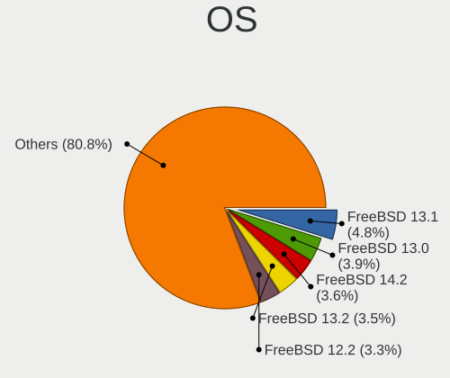

| Name                 | Desktops | Percent |
|----------------------|----------|---------|
| FreeBSD 13.1         | 96       | 4.84%   |
| FreeBSD 13.0         | 78       | 3.93%   |
| FreeBSD 14.2         | 72       | 3.63%   |
| FreeBSD 13.2         | 69       | 3.48%   |
| FreeBSD 12.2         | 66       | 3.32%   |
| FreeBSD 14.0-CURRENT | 62       | 3.12%   |
| FreeBSD 13.0-p5      | 43       | 2.17%   |
| FreeBSD 12.2-p2      | 41       | 2.07%   |
| FreeBSD 14.1         | 40       | 2.02%   |
| FreeBSD 14.0         | 40       | 2.02%   |
| FreeBSD 13.1-p2      | 40       | 2.02%   |
| FreeBSD 14.0-p6      | 35       | 1.76%   |
| FreeBSD 13.0-p4      | 35       | 1.76%   |
| FreeBSD 12.1-p8      | 35       | 1.76%   |
| FreeBSD 12.1-p10     | 35       | 1.76%   |
| FreeBSD 14.2-p2      | 34       | 1.71%   |
| FreeBSD 13.1-p5      | 33       | 1.66%   |
| FreeBSD 13.0-STABLE  | 33       | 1.66%   |
| FreeBSD 12.1-STABLE  | 29       | 1.46%   |
| FreeBSD 12.1-p5      | 29       | 1.46%   |
| FreeBSD 14.1-p6      | 28       | 1.41%   |
| FreeBSD 12.1-p7      | 28       | 1.41%   |
| FreeBSD 13.1-p7      | 26       | 1.31%   |
| FreeBSD 14.0-p4      | 25       | 1.26%   |
| FreeBSD 12.2-p3      | 24       | 1.21%   |
| FreeBSD 13.0-CURRENT | 22       | 1.11%   |
| FreeBSD 12.1         | 22       | 1.11%   |
| FreeBSD 14.3         | 21       | 1.06%   |
| FreeBSD 14.2-p3      | 21       | 1.06%   |
| FreeBSD 14.1-p5      | 21       | 1.06%   |
| FreeBSD 13.0-p11     | 21       | 1.06%   |
| FreeBSD 15.0-CURRENT | 20       | 1.01%   |
| FreeBSD 14.0-p5      | 20       | 1.01%   |
| FreeBSD 13.0-p7      | 20       | 1.01%   |
| FreeBSD 12.2-p4      | 19       | 0.96%   |
| FreeBSD 13.0-p3      | 18       | 0.91%   |
| FreeBSD 12.2-STABLE  | 17       | 0.86%   |
| FreeBSD 14.3-p5      | 16       | 0.81%   |
| FreeBSD 13.2-p2      | 16       | 0.81%   |
| FreeBSD 12.3         | 16       | 0.81%   |

OS Family
---------

OS without a version

| Name    | Desktops | Percent |
|---------|----------|---------|
| FreeBSD | 1537     | 100%    |

Arch
----

OS architecture (x86_64, i586, etc.)

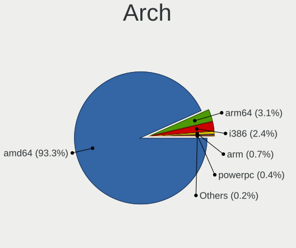

| Name    | Desktops | Percent |
|---------|----------|---------|
| amd64   | 1434     | 93.3%   |
| arm64   | 47       | 3.06%   |
| i386    | 37       | 2.41%   |
| arm     | 10       | 0.65%   |
| powerpc | 6        | 0.39%   |
| riscv   | 2        | 0.13%   |
| sparc64 | 1        | 0.07%   |

DE
--

Desktop Environment

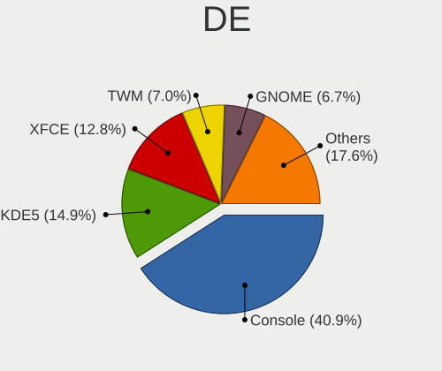

| Name          | Desktops | Percent |
|---------------|----------|---------|
| Console       | 661      | 40.93%  |
| KDE5          | 240      | 14.86%  |
| XFCE          | 207      | 12.82%  |
| TWM           | 113      | 7%      |
| GNOME         | 109      | 6.75%   |
| MATE          | 79       | 4.89%   |
| Openbox       | 36       | 2.23%   |
| i3            | 36       | 2.23%   |
| LXQt          | 18       | 1.11%   |
| Fluxbox       | 14       | 0.87%   |
| AwesomeWM     | 12       | 0.74%   |
| Cinnamon      | 10       | 0.62%   |
| LXDE          | 8        | 0.5%    |
| Enlightenment | 8        | 0.5%    |
| KDE6          | 7        | 0.43%   |
| Lumina        | 6        | 0.37%   |
| KDE           | 6        | 0.37%   |
| DWM           | 6        | 0.37%   |
| X-Cinnamon    | 5        | 0.31%   |
| CDE           | 4        | 0.25%   |
| Window Maker  | 3        | 0.19%   |
| Picom         | 3        | 0.19%   |
| xinitrc       | 2        | 0.12%   |
| xfwm          | 2        | 0.12%   |
| KDE4          | 2        | 0.12%   |
| GNUstep       | 2        | 0.12%   |
| Budgie        | 2        | 0.12%   |
| wlroots       | 1        | 0.06%   |
| WindowMaker   | 1        | 0.06%   |
| spectrwm      | 1        | 0.06%   |
| plasma        | 1        | 0.06%   |
| KWin          | 1        | 0.06%   |
| ICEWM         | 1        | 0.06%   |
| Hyprland      | 1        | 0.06%   |
| fvwm2         | 1        | 0.06%   |
| fvwm          | 1        | 0.06%   |
| cwm           | 1        | 0.06%   |
| Compton       | 1        | 0.06%   |
| bspwm         | 1        | 0.06%   |
| Blackbox      | 1        | 0.06%   |

Display Server
--------------

X11 or Wayland

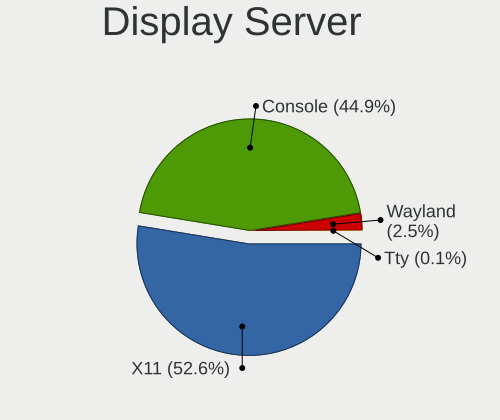

| Name    | Desktops | Percent |
|---------|----------|---------|
| X11     | 825      | 52.58%  |
| Console | 704      | 44.87%  |
| Wayland | 39       | 2.49%   |
| Tty     | 1        | 0.06%   |

Display Manager
---------------

SDDM, LightDM, etc.

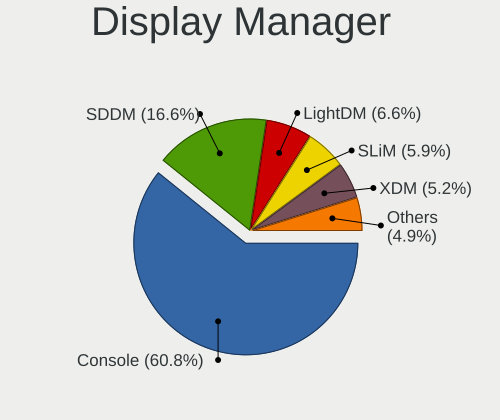

| Name    | Desktops | Percent |
|---------|----------|---------|
| Console | 965      | 60.81%  |
| SDDM    | 263      | 16.57%  |
| LightDM | 105      | 6.62%   |
| SLiM    | 94       | 5.92%   |
| XDM     | 83       | 5.23%   |
| GDM     | 64       | 4.03%   |
| Ly      | 13       | 0.82%   |

OS Lang
-------

Language

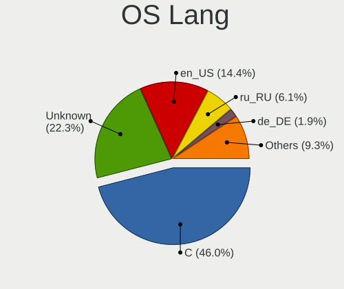

| Lang             | Desktops | Percent |
|------------------|----------|---------|
| C                | 745      | 45.99%  |
| Unknown          | 361      | 22.28%  |
| en_US            | 234      | 14.44%  |
| ru_RU            | 99       | 6.11%   |
| de_DE            | 30       | 1.85%   |
| fr_FR            | 24       | 1.48%   |
| en_GB            | 15       | 0.93%   |
| pt_BR            | 10       | 0.62%   |
| en_CA            | 10       | 0.62%   |
| zh_CN            | 9        | 0.56%   |
| ja_JP            | 9        | 0.56%   |
| it_IT            | 8        | 0.49%   |
| es_ES            | 7        | 0.43%   |
| uk_UA            | 6        | 0.37%   |
| pl_PL            | 6        | 0.37%   |
| fi_FI            | 6        | 0.37%   |
| en_AU            | 6        | 0.37%   |
| en_IE            | 4        | 0.25%   |
| el_GR            | 4        | 0.25%   |
| ru_RU.KOI8-R     | 3        | 0.19%   |
| sv_SE            | 2        | 0.12%   |
| nb_NO            | 2        | 0.12%   |
| es_AR            | 2        | 0.12%   |
| zh_TW            | 1        | 0.06%   |
| sv_SE.US-ASCII   | 1        | 0.06%   |
| ru               | 1        | 0.06%   |
| nl_NL            | 1        | 0.06%   |
| it_IT.ISO8859-15 | 1        | 0.06%   |
| fr_FR.US-ASCII   | 1        | 0.06%   |
| fi_FI.ISO8859-15 | 1        | 0.06%   |
| et_EE.US-ASCII   | 1        | 0.06%   |
| es_MX            | 1        | 0.06%   |
| es_ES.ISO8859-15 | 1        | 0.06%   |
| en_US.utf-8      | 1        | 0.06%   |
| en_US.ISO8859-15 | 1        | 0.06%   |
| en_US.ISO8859-1  | 1        | 0.06%   |
| en_GB.US-ASCII   | 1        | 0.06%   |
| de_DE.ISO8859-1  | 1        | 0.06%   |
| de_CH            | 1        | 0.06%   |
| da_DK            | 1        | 0.06%   |

Boot Mode
---------

EFI or BIOS

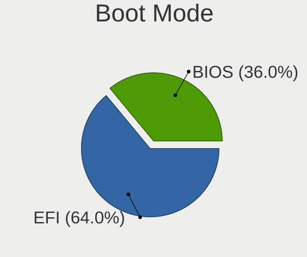

| Mode | Desktops | Percent |
|------|----------|---------|
| EFI  | 1000     | 64.02%  |
| BIOS | 562      | 35.98%  |

Filesystem
----------

Type of filesystem

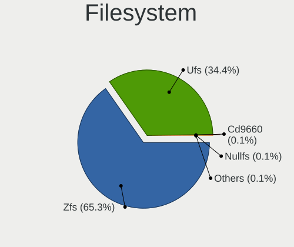

| Type    | Desktops | Percent |
|---------|----------|---------|
| Zfs     | 1019     | 65.28%  |
| Ufs     | 537      | 34.4%   |
| Cd9660  | 2        | 0.13%   |
| Nullfs  | 1        | 0.06%   |
| Nfs     | 1        | 0.06%   |
| Msdosfs | 1        | 0.06%   |

Part. scheme
------------

Scheme of partitioning

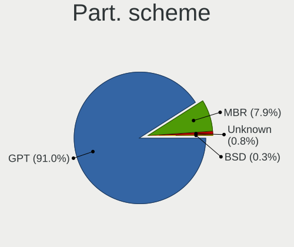

| Type    | Desktops | Percent |
|---------|----------|---------|
| GPT     | 1404     | 90.99%  |
| MBR     | 122      | 7.91%   |
| Unknown | 12       | 0.78%   |
| BSD     | 5        | 0.32%   |

Board
-----

Vendor
------

Motherboard manufacturer

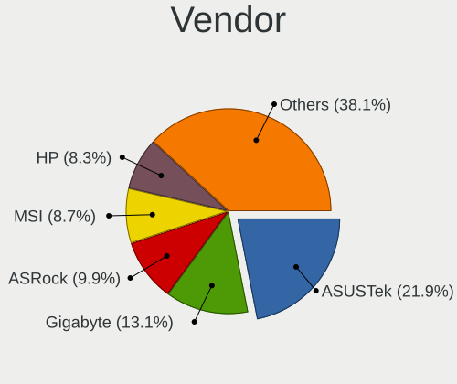

| Name                                 | Desktops | Percent |
|--------------------------------------|----------|---------|
| ASUSTek Computer                     | 337      | 21.93%  |
| Gigabyte Technology                  | 202      | 13.14%  |
| ASRock                               | 152      | 9.89%   |
| MSI                                  | 133      | 8.65%   |
| Hewlett-Packard                      | 127      | 8.26%   |
| Dell                                 | 119      | 7.74%   |
| Unknown                              | 91       | 5.92%   |
| Intel                                | 54       | 3.51%   |
| Supermicro                           | 42       | 2.73%   |
| Lenovo                               | 39       | 2.54%   |
| Fujitsu                              | 25       | 1.63%   |
| PC Engines                           | 18       | 1.17%   |
| ASRockRack                           | 18       | 1.17%   |
| Acer                                 | 13       | 0.85%   |
| Biostar                              | 11       | 0.72%   |
| Shuttle                              | 8        | 0.52%   |
| Apple                                | 8        | 0.52%   |
| Shenzhen Meigao Electronic Equipment | 7        | 0.46%   |
| Foxconn                              | 7        | 0.46%   |
| AZW                                  | 7        | 0.46%   |
| Huanan                               | 5        | 0.33%   |
| Beckhoff Automation                  | 5        | 0.33%   |
| Wistron                              | 4        | 0.26%   |
| Pegatron                             | 4        | 0.26%   |
| HPE                                  | 4        | 0.26%   |
| Alienware                            | 4        | 0.26%   |
| EVGA                                 | 3        | 0.2%    |
| ECS                                  | 3        | 0.2%    |
| AMI                                  | 3        | 0.2%    |
| TYAN Computer                        | 2        | 0.13%   |
| RDW Computers                        | 2        | 0.13%   |
| Radxa                                | 2        | 0.13%   |
| Protectli                            | 2        | 0.13%   |
| pine64                               | 2        | 0.13%   |
| Maxtang                              | 2        | 0.13%   |
| HC Technology.                       | 2        | 0.13%   |
| Google                               | 2        | 0.13%   |
| Gateway                              | 2        | 0.13%   |
| Deciso                               | 2        | 0.13%   |
| BESSTAR Tech                         | 2        | 0.13%   |

Model
-----

Motherboard model

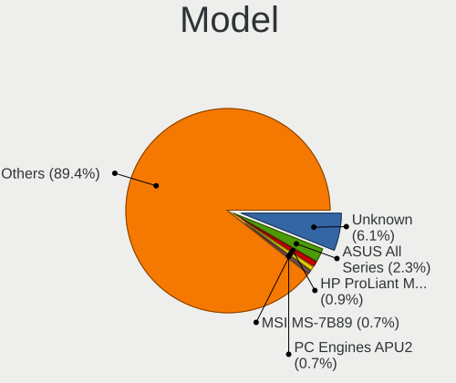

| Name                                              | Desktops | Percent |
|---------------------------------------------------|----------|---------|
| Unknown                                           | 93       | 6.05%   |
| ASUS All Series                                   | 35       | 2.28%   |
| HP ProLiant MicroServer Gen8                      | 14       | 0.91%   |
| MSI MS-7B89                                       | 11       | 0.72%   |
| PC Engines APU2                                   | 10       | 0.65%   |
| Intel Nobilis                                     | 9        | 0.59%   |
| ASUS TUF GAMING X570-PLUS                         | 9        | 0.59%   |
| HP ProLiant MicroServer                           | 8        | 0.52%   |
| Dell OptiPlex 9020                                | 8        | 0.52%   |
| Shenzhen Meigao Electronic Equipment Venus series | 6        | 0.39%   |
| MSI MS-7B86                                       | 6        | 0.39%   |
| Gigabyte B450M DS3H                               | 6        | 0.39%   |
| ASRock Z590 Pro4                                  | 6        | 0.39%   |
| MSI MS-7C02                                       | 5        | 0.33%   |
| MSI MS-7A38                                       | 5        | 0.33%   |
| MSI MS-7817                                       | 5        | 0.33%   |
| HP Z620 Workstation                               | 5        | 0.33%   |
| HP Z440 Workstation                               | 5        | 0.33%   |
| HP Z420 Workstation                               | 5        | 0.33%   |
| Gigabyte B360N WIFI                               | 5        | 0.33%   |
| Fujitsu D3401-H2 S26361-D3401-H2                  | 5        | 0.33%   |
| Dell OptiPlex 7050                                | 5        | 0.33%   |
| Dell OptiPlex 7040                                | 5        | 0.33%   |
| Dell OptiPlex 3010                                | 5        | 0.33%   |
| ASUS M5A97 LE R2.0                                | 5        | 0.33%   |
| ASRock X570 Phantom Gaming 4                      | 5        | 0.33%   |
| Supermicro X9SCL/X9SCM                            | 4        | 0.26%   |
| Supermicro X7SPA-HF                               | 4        | 0.26%   |
| MSI MS-7C37                                       | 4        | 0.26%   |
| MSI MS-7693                                       | 4        | 0.26%   |
| HP t620 Quad Core TC                              | 4        | 0.26%   |
| HP EliteDesk 800 G1 SFF                           | 4        | 0.26%   |
| HP Compaq Elite 8300 SFF                          | 4        | 0.26%   |
| Gigabyte X570 I AORUS PRO WIFI                    | 4        | 0.26%   |
| Gigabyte H61M-DS2                                 | 4        | 0.26%   |
| Dell PowerEdge T30                                | 4        | 0.26%   |
| ASUS TUF Gaming B550-PLUS                         | 4        | 0.26%   |
| ASUS SABERTOOTH 990FX R2.0                        | 4        | 0.26%   |
| ASUS ROG STRIX B550-F GAMING                      | 4        | 0.26%   |
| ASUS PRIME B550-PLUS                              | 4        | 0.26%   |

Model Family
------------

Motherboard model prefix

| Name                                       | Desktops | Percent |
|--------------------------------------------|----------|---------|
| Unknown                                    | 93       | 6.05%   |
| Dell OptiPlex                              | 76       | 4.94%   |
| ASUS PRIME                                 | 71       | 4.62%   |
| ASUS TUF                                   | 40       | 2.6%    |
| ASUS ROG                                   | 38       | 2.47%   |
| ASUS All                                   | 35       | 2.28%   |
| HP ProLiant                                | 31       | 2.02%   |
| HP Compaq                                  | 25       | 1.63%   |
| Lenovo ThinkCentre                         | 19       | 1.24%   |
| Dell Precision                             | 17       | 1.11%   |
| ASRock X570                                | 15       | 0.98%   |
| HP EliteDesk                               | 14       | 0.91%   |
| Gigabyte B450M                             | 12       | 0.78%   |
| MSI MS-7B89                                | 11       | 0.72%   |
| HP ProDesk                                 | 11       | 0.72%   |
| Gigabyte X570                              | 11       | 0.72%   |
| PC Engines APU2                            | 10       | 0.65%   |
| ASUS PRO                                   | 10       | 0.65%   |
| Intel Nobilis                              | 9        | 0.59%   |
| Fujitsu ESPRIMO                            | 9        | 0.59%   |
| Dell PowerEdge                             | 8        | 0.52%   |
| ASRock X370                                | 8        | 0.52%   |
| Lenovo ThinkStation                        | 7        | 0.46%   |
| HP t620                                    | 7        | 0.46%   |
| Gigabyte B550M                             | 7        | 0.46%   |
| ASRock Z590                                | 7        | 0.46%   |
| ASRock B550                                | 7        | 0.46%   |
| Shenzhen Meigao Electronic Equipment Venus | 6        | 0.39%   |
| MSI MS-7B86                                | 6        | 0.39%   |
| Lenovo IdeaCentre                          | 6        | 0.39%   |
| ASUS M5A97                                 | 6        | 0.39%   |
| ASUS M5A78L-M                              | 6        | 0.39%   |
| Acer Aspire                                | 6        | 0.39%   |
| MSI MS-7C02                                | 5        | 0.33%   |
| MSI MS-7A38                                | 5        | 0.33%   |
| MSI MS-7817                                | 5        | 0.33%   |
| HP Z620                                    | 5        | 0.33%   |
| HP Z440                                    | 5        | 0.33%   |
| HP Z420                                    | 5        | 0.33%   |
| Gigabyte X470                              | 5        | 0.33%   |

MFG Year
--------

Motherboard manufacture year

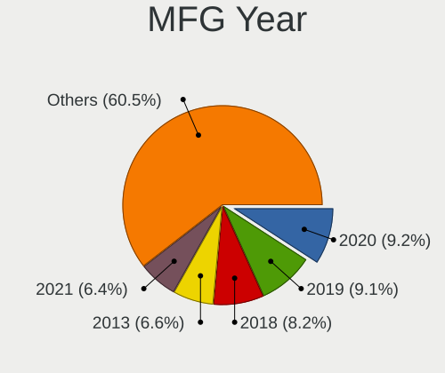

| Year    | Desktops | Percent |
|---------|----------|---------|
| 2020    | 141      | 9.17%   |
| 2019    | 140      | 9.11%   |
| 2018    | 126      | 8.2%    |
| 2013    | 102      | 6.64%   |
| 2021    | 98       | 6.38%   |
| 2012    | 93       | 6.05%   |
| 2014    | 92       | 5.99%   |
| 2011    | 85       | 5.53%   |
| 2023    | 75       | 4.88%   |
| 2016    | 71       | 4.62%   |
| 2017    | 70       | 4.55%   |
| 2015    | 68       | 4.42%   |
| 2022    | 66       | 4.29%   |
| Unknown | 65       | 4.23%   |
| 2010    | 58       | 3.77%   |
| 2009    | 47       | 3.06%   |
| 2024    | 41       | 2.67%   |
| 2008    | 40       | 2.6%    |
| 2025    | 18       | 1.17%   |
| 2007    | 18       | 1.17%   |
| 2006    | 8        | 0.52%   |
| 2005    | 5        | 0.33%   |
| 2004    | 5        | 0.33%   |
| 2003    | 2        | 0.13%   |
| 2002    | 2        | 0.13%   |
| 2001    | 1        | 0.07%   |

Form Factor
-----------

Physical design of the computer

| Name    | Desktops | Percent |
|---------|----------|---------|
| Desktop | 1537     | 100%    |

Coreboot
--------

Have coreboot on board

| Used | Desktops | Percent |
|------|----------|---------|
| No   | 1509     | 98.18%  |
| Yes  | 28       | 1.82%   |

RAM Size
--------

Total RAM memory

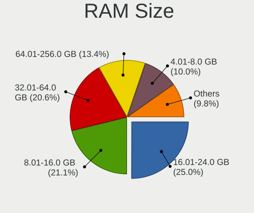

| Size in GB      | Desktops | Percent |
|-----------------|----------|---------|
| 16.01-24.0      | 392      | 25.03%  |
| 8.01-16.0       | 331      | 21.14%  |
| 32.01-64.0      | 323      | 20.63%  |
| 64.01-256.0     | 210      | 13.41%  |
| 4.01-8.0        | 157      | 10.03%  |
| 2.01-3.0        | 39       | 2.49%   |
| 24.01-32.0      | 31       | 1.98%   |
| 0.51-1.0        | 28       | 1.79%   |
| 3.01-4.0        | 23       | 1.47%   |
| 0.01-0.5        | 15       | 0.96%   |
| More than 256.0 | 10       | 0.64%   |
| 1.01-2.0        | 6        | 0.38%   |
| Unknown         | 1        | 0.06%   |

RAM Used
--------

Used RAM memory

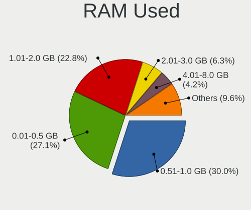

| Used GB     | Desktops | Percent |
|-------------|----------|---------|
| 0.51-1.0    | 484      | 29.97%  |
| 0.01-0.5    | 438      | 27.12%  |
| 1.01-2.0    | 369      | 22.85%  |
| 2.01-3.0    | 101      | 6.25%   |
| 4.01-8.0    | 68       | 4.21%   |
| 3.01-4.0    | 58       | 3.59%   |
| 8.01-16.0   | 28       | 1.73%   |
| 0           | 20       | 1.24%   |
| 24.01-32.0  | 15       | 0.93%   |
| 32.01-64.0  | 12       | 0.74%   |
| 16.01-24.0  | 11       | 0.68%   |
| 64.01-256.0 | 10       | 0.62%   |
| Unknown     | 1        | 0.06%   |

Total Drives
------------

Number of drives on board

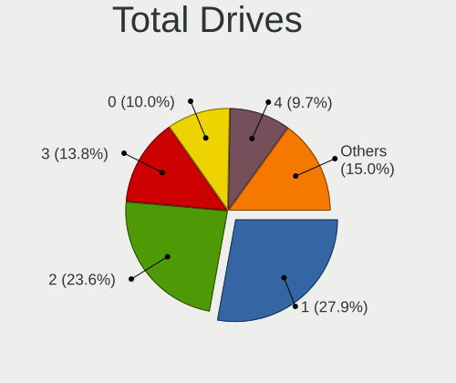

| Drives | Desktops | Percent |
|--------|----------|---------|
| 1      | 461      | 27.85%  |
| 2      | 390      | 23.56%  |
| 3      | 229      | 13.84%  |
| 0      | 166      | 10.03%  |
| 4      | 160      | 9.67%   |
| 5      | 97       | 5.86%   |
| 6      | 55       | 3.32%   |
| 7      | 33       | 1.99%   |
| 8      | 15       | 0.91%   |
| 9      | 11       | 0.66%   |
| 10     | 10       | 0.6%    |
| 12     | 5        | 0.3%    |
| 11     | 5        | 0.3%    |
| 17     | 3        | 0.18%   |
| 14     | 3        | 0.18%   |
| 23     | 2        | 0.12%   |
| 16     | 2        | 0.12%   |
| 13     | 2        | 0.12%   |
| 36     | 1        | 0.06%   |
| 24     | 1        | 0.06%   |
| 21     | 1        | 0.06%   |
| 19     | 1        | 0.06%   |
| 18     | 1        | 0.06%   |
| 15     | 1        | 0.06%   |

Has CD-ROM
----------

Has CD-ROM on board

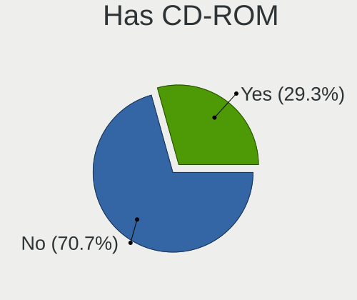

| Presented | Desktops | Percent |
|-----------|----------|---------|
| No        | 1097     | 70.68%  |
| Yes       | 455      | 29.32%  |

Has Ethernet
------------

Has Ethernet on board

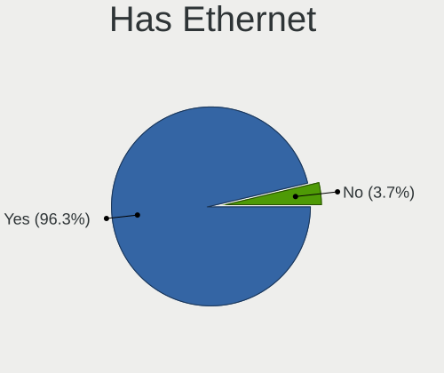

| Presented | Desktops | Percent |
|-----------|----------|---------|
| Yes       | 1481     | 96.29%  |
| No        | 57       | 3.71%   |

Has WiFi
--------

Has WiFi module

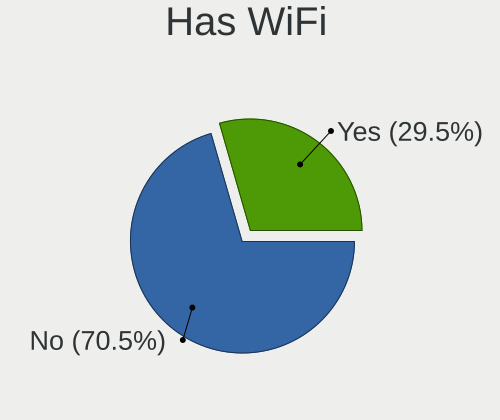

| Presented | Desktops | Percent |
|-----------|----------|---------|
| No        | 1099     | 70.54%  |
| Yes       | 459      | 29.46%  |

Has Bluetooth
-------------

Has Bluetooth module

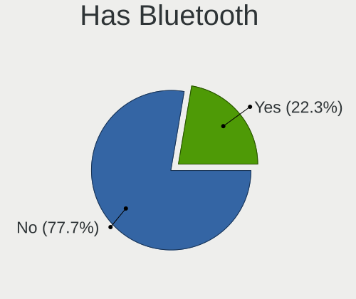

| Presented | Desktops | Percent |
|-----------|----------|---------|
| No        | 1207     | 77.67%  |
| Yes       | 347      | 22.33%  |

Location
--------

Country
-------

Geographic location (country)

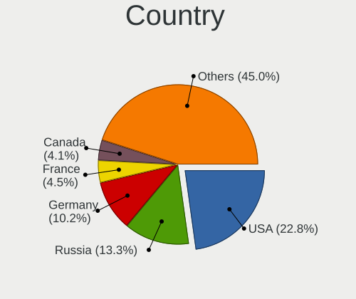

| Country     | Desktops | Percent |
|-------------|----------|---------|
| USA         | 354      | 22.81%  |
| Russia      | 206      | 13.27%  |
| Germany     | 159      | 10.24%  |
| France      | 70       | 4.51%   |
| Canada      | 64       | 4.12%   |
| UK          | 57       | 3.67%   |
| Poland      | 56       | 3.61%   |
| Australia   | 40       | 2.58%   |
| Brazil      | 39       | 2.51%   |
| Netherlands | 36       | 2.32%   |
| China       | 27       | 1.74%   |
| Spain       | 26       | 1.68%   |
| Czechia     | 25       | 1.61%   |
| Ukraine     | 24       | 1.55%   |
| Italy       | 24       | 1.55%   |
| Sweden      | 23       | 1.48%   |
| Japan       | 23       | 1.48%   |
| Finland     | 20       | 1.29%   |
| Romania     | 18       | 1.16%   |
| Switzerland | 17       | 1.1%    |
| Indonesia   | 17       | 1.1%    |
| Austria     | 15       | 0.97%   |
| Ireland     | 12       | 0.77%   |
| Hungary     | 12       | 0.77%   |
| Greece      | 11       | 0.71%   |
| Norway      | 10       | 0.64%   |
| India       | 10       | 0.64%   |
| Mexico      | 9        | 0.58%   |
| Bulgaria    | 9        | 0.58%   |
| Taiwan      | 8        | 0.52%   |
| Belgium     | 8        | 0.52%   |
| Thailand    | 7        | 0.45%   |
| Serbia      | 7        | 0.45%   |
| Venezuela   | 6        | 0.39%   |
| Slovenia    | 6        | 0.39%   |
| Estonia     | 6        | 0.39%   |
| Argentina   | 6        | 0.39%   |
| Malaysia    | 5        | 0.32%   |
| Denmark     | 5        | 0.32%   |
| Chile       | 5        | 0.32%   |

City
----

Geographic location (city)

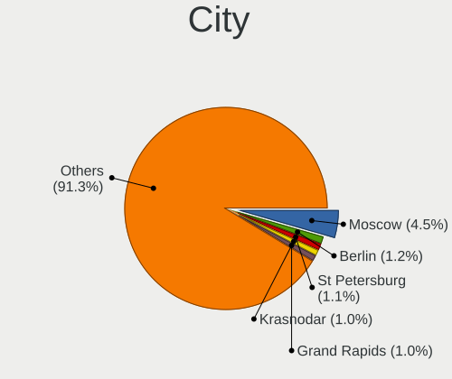

| City              | Desktops | Percent |
|-------------------|----------|---------|
| Moscow            | 75       | 4.48%   |
| Berlin            | 20       | 1.19%   |
| St Petersburg     | 18       | 1.07%   |
| Krasnodar         | 16       | 0.96%   |
| Grand Rapids      | 16       | 0.96%   |
| Sydney            | 15       | 0.9%    |
| Ludwigsburg       | 12       | 0.72%   |
| Kyiv              | 12       | 0.72%   |
| Helsinki          | 12       | 0.72%   |
| Yekaterinburg     | 11       | 0.66%   |
| Paris             | 11       | 0.66%   |
| Amsterdam         | 11       | 0.66%   |
| Vienna            | 10       | 0.6%    |
| Montreal          | 10       | 0.6%    |
| Warsaw            | 9        | 0.54%   |
| Tuklaty           | 8        | 0.48%   |
| Solden            | 8        | 0.48%   |
| Melbourne         | 8        | 0.48%   |
| Madrid            | 8        | 0.48%   |
| London            | 8        | 0.48%   |
| Budapest          | 8        | 0.48%   |
| Stockholm         | 7        | 0.42%   |
| Seattle           | 7        | 0.42%   |
| Prague            | 7        | 0.42%   |
| Portland          | 7        | 0.42%   |
| Novosibirsk       | 7        | 0.42%   |
| New York          | 7        | 0.42%   |
| Kamensk-Ural'skiy | 7        | 0.42%   |
| Hamburg           | 7        | 0.42%   |
| Falkenstein       | 7        | 0.42%   |
| Dublin            | 7        | 0.42%   |
| Chicago           | 7        | 0.42%   |
| Zurich            | 6        | 0.36%   |
| Toronto           | 6        | 0.36%   |
| Rochester         | 6        | 0.36%   |
| Rio de Janeiro    | 6        | 0.36%   |
| Poway             | 6        | 0.36%   |
| Medan             | 6        | 0.36%   |
| Lublin            | 6        | 0.36%   |
| Los Angeles       | 6        | 0.36%   |

Drives
------

Drive Vendor
------------

Hard drive vendors

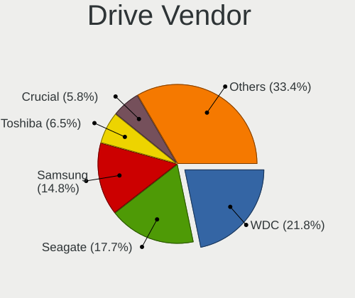

| Vendor              | Desktops | Drives | Percent |
|---------------------|----------|--------|---------|
| WDC                 | 542      | 1888   | 21.76%  |
| Seagate             | 441      | 1185   | 17.7%   |
| Samsung Electronics | 369      | 1036   | 14.81%  |
| Toshiba             | 163      | 371    | 6.54%   |
| Crucial             | 144      | 247    | 5.78%   |
| Kingston            | 141      | 198    | 5.66%   |
| Intel               | 82       | 174    | 3.29%   |
| Hitachi             | 73       | 160    | 2.93%   |
| SanDisk             | 63       | 95     | 2.53%   |
| HGST                | 54       | 161    | 2.17%   |
| A-DATA Technology   | 44       | 56     | 1.77%   |
| Transcend           | 19       | 29     | 0.76%   |
| SK hynix            | 19       | 37     | 0.76%   |
| SPCC                | 18       | 45     | 0.72%   |
| Hewlett-Packard     | 16       | 52     | 0.64%   |
| PNY                 | 15       | 20     | 0.6%    |
| Micron Technology   | 15       | 29     | 0.6%    |
| Corsair             | 15       | 46     | 0.6%    |
| OCZ                 | 14       | 17     | 0.56%   |
| Phison              | 13       | 17     | 0.52%   |
| China               | 13       | 22     | 0.52%   |
| Patriot             | 12       | 17     | 0.48%   |
| Goodram             | 12       | 26     | 0.48%   |
| Maxtor              | 11       | 15     | 0.44%   |
| Gigabyte Technology | 9        | 14     | 0.36%   |
| Apacer              | 9        | 12     | 0.36%   |
| Plextor             | 8        | 14     | 0.32%   |
| KingSpec            | 7        | 11     | 0.28%   |
| Intenso             | 7        | 9      | 0.28%   |
| MidasForce          | 6        | 8      | 0.24%   |
| Verbatim            | 5        | 5      | 0.2%    |
| Netac               | 5        | 5      | 0.2%    |
| Mushkin             | 5        | 7      | 0.2%    |
| LITEON              | 5        | 7      | 0.2%    |
| Lexar               | 5        | 10     | 0.2%    |
| KIOXIA-EXCERIA      | 5        | 10     | 0.2%    |
| FORESEE             | 5        | 5      | 0.2%    |
| Team                | 4        | 5      | 0.16%   |
| T-FORCE             | 4        | 5      | 0.16%   |
| Silicon Motion      | 4        | 5      | 0.16%   |

Drive Model
-----------

Hard drive models

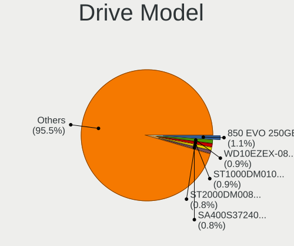

| Model                           | Desktops | Percent |
|---------------------------------|----------|---------|
| Samsung SSD 850 EVO 250GB       | 33       | 1.07%   |
| WDC WD10EZEX-08WN4A0 1TB        | 29       | 0.94%   |
| Seagate ST1000DM010-2EP102 1TB  | 28       | 0.9%    |
| Seagate ST2000DM008-2FR102 2TB  | 25       | 0.81%   |
| Kingston SA400S37240G 240GB     | 25       | 0.81%   |
| Kingston SA400S37480G 480GB     | 24       | 0.78%   |
| Toshiba DT01ACA100 1TB          | 21       | 0.68%   |
| WDC WD30EFRX-68EUZN0 3TB        | 20       | 0.65%   |
| Samsung SSD 870 EVO 1TB         | 20       | 0.65%   |
| WDC WD40EFRX-68N32N0 4TB        | 18       | 0.58%   |
| Samsung SSD 860 EVO 500GB       | 18       | 0.58%   |
| Samsung SSD 860 EVO 1TB         | 18       | 0.58%   |
| Samsung SSD 850 EVO 500GB       | 18       | 0.58%   |
| Kingston SA400S37120G 120GB     | 18       | 0.58%   |
| Crucial CT240BX500SSD1 240GB    | 18       | 0.58%   |
| Seagate ST4000DM004-2CV104 4TB  | 17       | 0.55%   |
| WDC WD800JD-75MSA3 80GB         | 16       | 0.52%   |
| Samsung SSD 970 EVO Plus 1TB    | 16       | 0.52%   |
| WDC WD20EFRX-68EUZN0 1TB        | 15       | 0.48%   |
| Seagate ST500DM002-1BD142 500GB | 15       | 0.48%   |
| Seagate ST1000DM003-1CH162 1TB  | 15       | 0.48%   |
| Crucial CT1000MX500SSD1 1TB     | 15       | 0.48%   |
| Samsung SSD 860 EVO 250GB       | 14       | 0.45%   |
| Seagate ST4000DM000-1F2168 4TB  | 13       | 0.42%   |
| Seagate ST1000DM003-1ER162 1TB  | 13       | 0.42%   |
| Crucial CT500MX500SSD1 500GB    | 13       | 0.42%   |
| Crucial CT250MX500SSD1 250GB    | 13       | 0.42%   |
| Samsung SSD 970 EVO Plus 500GB  | 12       | 0.39%   |
| Samsung SSD 870 EVO 500GB       | 12       | 0.39%   |
| WDC WD40EFRX-68WT0N0 4TB        | 11       | 0.36%   |
| Toshiba DT01ACA050 500GB        | 11       | 0.36%   |
| Seagate ST8000DM004-2CX188 8TB  | 11       | 0.36%   |
| Seagate ST3500418AS 500GB       | 11       | 0.36%   |
| Kingston SV300S37A120G 120GB    | 11       | 0.36%   |
| WDC WD20EZRZ-00Z5HB0 2TB        | 10       | 0.32%   |
| WDC WD20EARX-00PASB0 2TB        | 10       | 0.32%   |
| WDC WD10EFRX-68FYTN0 1TB        | 10       | 0.32%   |
| Seagate ST4000VN008-2DR166 4TB  | 10       | 0.32%   |
| Seagate ST2000DM001-1CH164 2TB  | 10       | 0.32%   |
| Samsung SSD 850 EVO 1TB         | 10       | 0.32%   |

HDD Vendor
----------

Hard disk drive vendors

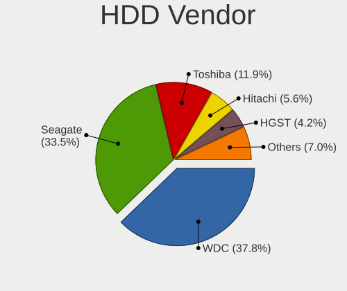

| Vendor               | Desktops | Drives | Percent |
|----------------------|----------|--------|---------|
| WDC                  | 488      | 1714   | 37.8%   |
| Seagate              | 433      | 1169   | 33.54%  |
| Toshiba              | 153      | 357    | 11.85%  |
| Hitachi              | 72       | 152    | 5.58%   |
| HGST                 | 54       | 161    | 4.18%   |
| Samsung Electronics  | 53       | 87     | 4.11%   |
| Maxtor               | 11       | 15     | 0.85%   |
| Hewlett-Packard      | 8        | 36     | 0.62%   |
| HPE                  | 3        | 9      | 0.23%   |
| Apple                | 3        | 4      | 0.23%   |
| HPT                  | 2        | 9      | 0.15%   |
| Fujitsu              | 2        | 3      | 0.15%   |
| Western              | 1        | 3      | 0.08%   |
| WD MediaMax          | 1        | 5      | 0.08%   |
| Synology             | 1        | 3      | 0.08%   |
| QUANTUM              | 1        | 2      | 0.08%   |
| MaxDigital           | 1        | 1      | 0.08%   |
| IBM/Hitachi          | 1        | 1      | 0.08%   |
| IBM                  | 1        | 1      | 0.08%   |
| ExcelStor Technology | 1        | 4      | 0.08%   |
| Areca                | 1        | 1      | 0.08%   |

SSD Vendor
----------

Solid state drive vendors

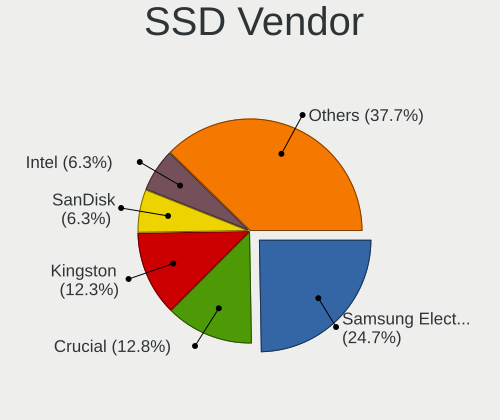

| Vendor              | Desktops | Drives | Percent |
|---------------------|----------|--------|---------|
| Samsung Electronics | 248      | 760    | 24.73%  |
| Crucial             | 128      | 220    | 12.76%  |
| Kingston            | 123      | 170    | 12.26%  |
| SanDisk             | 63       | 95     | 6.28%   |
| Intel               | 63       | 149    | 6.28%   |
| WDC                 | 57       | 108    | 5.68%   |
| A-DATA Technology   | 33       | 43     | 3.29%   |
| Transcend           | 17       | 26     | 1.69%   |
| SPCC                | 14       | 39     | 1.4%    |
| OCZ                 | 14       | 17     | 1.4%    |
| Micron Technology   | 13       | 26     | 1.3%    |
| China               | 13       | 22     | 1.3%    |
| SK hynix            | 12       | 21     | 1.2%    |
| PNY                 | 12       | 16     | 1.2%    |
| Patriot             | 12       | 17     | 1.2%    |
| Toshiba             | 9        | 10     | 0.9%    |
| GOODRAM             | 9        | 22     | 0.9%    |
| Corsair             | 9        | 14     | 0.9%    |
| Apacer              | 9        | 12     | 0.9%    |
| Seagate             | 7        | 11     | 0.7%    |
| Plextor             | 7        | 10     | 0.7%    |
| KingSpec            | 7        | 10     | 0.7%    |
| Intenso             | 7        | 9      | 0.7%    |
| Gigabyte Technology | 7        | 12     | 0.7%    |
| MidasForce          | 6        | 8      | 0.6%    |
| Verbatim            | 5        | 5      | 0.5%    |
| LITEON              | 5        | 7      | 0.5%    |
| Hewlett-Packard     | 5        | 9      | 0.5%    |
| Team                | 4        | 5      | 0.4%    |
| Mushkin             | 4        | 5      | 0.4%    |
| FORESEE             | 4        | 4      | 0.4%    |
| AMD                 | 4        | 5      | 0.4%    |
| Vaseky              | 3        | 3      | 0.3%    |
| SATADOM             | 3        | 4      | 0.3%    |
| Netac               | 3        | 3      | 0.3%    |
| Lexar               | 3        | 4      | 0.3%    |
| Hoodisk             | 3        | 5      | 0.3%    |
| Emtec               | 3        | 4      | 0.3%    |
| walram              | 2        | 2      | 0.2%    |
| ViperTeq            | 2        | 2      | 0.2%    |

Drive Kind
----------

HDD or SSD

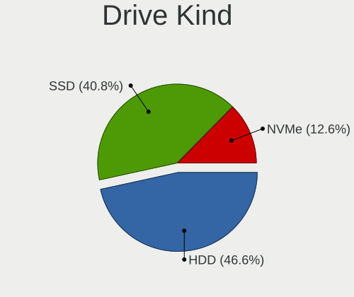

| Kind | Desktops | Drives | Percent |
|------|----------|--------|---------|
| HDD  | 955      | 3737   | 46.59%  |
| SSD  | 836      | 1998   | 40.78%  |
| NVMe | 259      | 489    | 12.63%  |

Drive Connector
---------------

SATA, SAS, NVMe, etc.

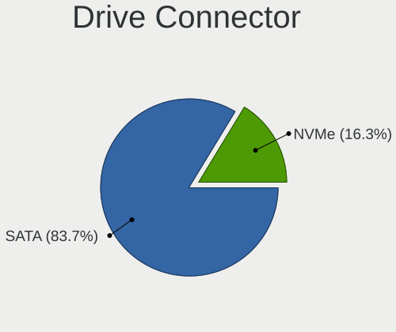

| Type | Desktops | Drives | Percent |
|------|----------|--------|---------|
| SATA | 1329     | 5735   | 83.69%  |
| NVMe | 259      | 489    | 16.31%  |

Drive Size
----------

Size of hard drive

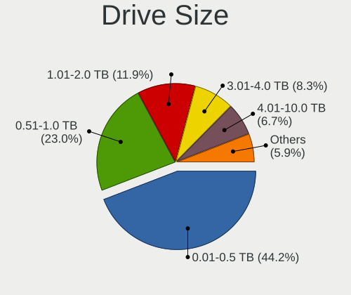

| Size in TB | Desktops | Drives | Percent |
|------------|----------|--------|---------|
| 0.01-0.5   | 922      | 2000   | 44.16%  |
| 0.51-1.0   | 480      | 1034   | 22.99%  |
| 1.01-2.0   | 249      | 784    | 11.93%  |
| 3.01-4.0   | 174      | 700    | 8.33%   |
| 4.01-10.0  | 140      | 754    | 6.7%    |
| 2.01-3.0   | 74       | 245    | 3.54%   |
| 10.01-20.0 | 46       | 212    | 2.2%    |
| 20.01-50.0 | 3        | 6      | 0.14%   |

Space Total
-----------

Amount of disk space available on the file system

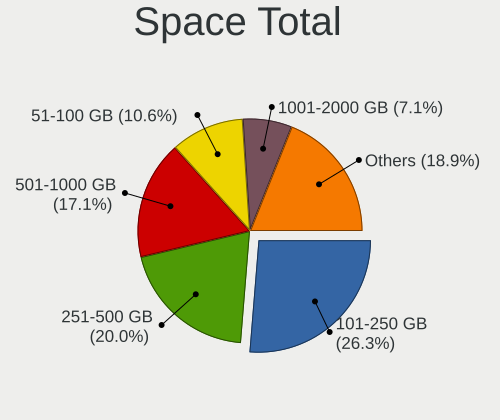

| Size in GB     | Desktops | Percent |
|----------------|----------|---------|
| 101-250        | 429      | 26.29%  |
| 251-500        | 326      | 19.98%  |
| 501-1000       | 279      | 17.1%   |
| 51-100         | 173      | 10.6%   |
| 1001-2000      | 116      | 7.11%   |
| 21-50          | 100      | 6.13%   |
| 1-20           | 85       | 5.21%   |
| More than 3000 | 75       | 4.6%    |
| 2001-3000      | 25       | 1.53%   |
| Unknown        | 24       | 1.47%   |

Space Used
----------

Amount of used disk space

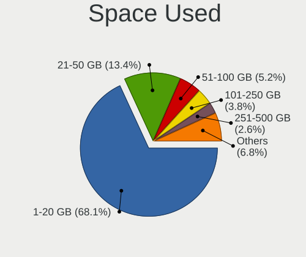

| Used GB        | Desktops | Percent |
|----------------|----------|---------|
| 1-20           | 1101     | 68.13%  |
| 21-50          | 217      | 13.43%  |
| 51-100         | 84       | 5.2%    |
| 101-250        | 62       | 3.84%   |
| 251-500        | 42       | 2.6%    |
| 501-1000       | 30       | 1.86%   |
| More than 3000 | 25       | 1.55%   |
| Unknown        | 24       | 1.49%   |
| 1001-2000      | 19       | 1.18%   |
| 2001-3000      | 10       | 0.62%   |
| 0              | 2        | 0.12%   |

Malfunc. Drives
---------------

Drive models with a malfunction

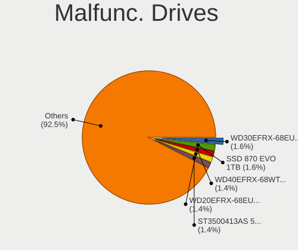

| Model                               | Desktops | Drives | Percent |
|-------------------------------------|----------|--------|---------|
| WDC WD30EFRX-68EUZN0 3TB            | 7        | 19     | 1.64%   |
| Samsung Electronics SSD 870 EVO 1TB | 7        | 10     | 1.64%   |
| WDC WD40EFRX-68WT0N0 4TB            | 6        | 12     | 1.41%   |
| WDC WD20EFRX-68EUZN0 1TB            | 6        | 14     | 1.41%   |
| Seagate ST3500413AS 500GB           | 6        | 9      | 1.41%   |
| WDC WD5000AAKX-60U6AA0 500GB        | 4        | 5      | 0.94%   |
| Seagate ST2000DM001-9YN164 2TB      | 4        | 4      | 0.94%   |
| Seagate ST1000DM003-1CH162 1TB      | 4        | 5      | 0.94%   |
| HGST HTS725050A7E630 500GB          | 4        | 14     | 0.94%   |
| Crucial CT525MX300SSD1 528GB        | 4        | 4      | 0.94%   |
| WDC WD2000FYYZ-01UL1B2 2TB          | 3        | 9      | 0.7%    |
| Seagate ST500DM002-1BD142 500GB     | 3        | 4      | 0.7%    |
| Seagate ST3500418AS 500GB           | 3        | 6      | 0.7%    |
| Samsung Electronics HD501LJ 500GB   | 3        | 4      | 0.7%    |
| Samsung Electronics HD154UI 1.5TB   | 3        | 4      | 0.7%    |
| Samsung Electronics HD103UJ 1TB     | 3        | 6      | 0.7%    |
| Kingston SV300S37A120G 120GB        | 3        | 3      | 0.7%    |
| Intel SSDSA2M080G2GC 80GB           | 3        | 3      | 0.7%    |
| Hitachi HUA722020ALA330 2TB         | 3        | 6      | 0.7%    |
| WDC WD5003AZEX-00MK2A0 500GB        | 2        | 2      | 0.47%   |
| WDC WD5000LPLX-22ZNTT0 500GB        | 2        | 2      | 0.47%   |
| WDC WD5000AAKX-221CA1 500GB         | 2        | 2      | 0.47%   |
| WDC WD5000AAKX-08U6AA0 500GB        | 2        | 2      | 0.47%   |
| WDC WD5000AAKX-083CA0 500GB         | 2        | 2      | 0.47%   |
| WDC WD5000AAKX-00ERMA0 500GB        | 2        | 2      | 0.47%   |
| WDC WD40EZRZ-00WN9B0 4TB            | 2        | 2      | 0.47%   |
| WDC WD40EFRX-68N32N0 4TB            | 2        | 5      | 0.47%   |
| WDC WD3200AAJS-22B4A0 320GB         | 2        | 2      | 0.47%   |
| WDC WD20EZRX-00D8PB0 2TB            | 2        | 3      | 0.47%   |
| WDC WD20EARX-00PASB0 2TB            | 2        | 2      | 0.47%   |
| WDC WD20EARS-00MVWB0 2TB            | 2        | 2      | 0.47%   |
| WDC WD2002FYPS-02W3B0 2TB           | 2        | 2      | 0.47%   |
| WDC WD2002FYPS-01U1B0 2TB           | 2        | 7      | 0.47%   |
| WDC WD2000FYYZ-01UL1B1 2TB          | 2        | 4      | 0.47%   |
| WDC WD15EADS-00P8B0 1.5TB           | 2        | 2      | 0.47%   |
| WDC WD10EZEX-75M2NA0 1TB            | 2        | 2      | 0.47%   |
| WDC WD10EZEX-08WN4A0 1TB            | 2        | 2      | 0.47%   |
| Toshiba MQ01ABD100 1TB              | 2        | 2      | 0.47%   |
| Toshiba MK5076GSXN 500GB            | 2        | 2      | 0.47%   |
| Toshiba MK3265GSX 320GB             | 2        | 2      | 0.47%   |

Malfunc. Drive Vendor
---------------------

Vendors of faulty drives

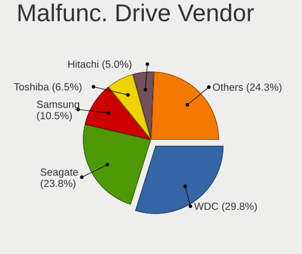

| Vendor               | Desktops | Drives | Percent |
|----------------------|----------|--------|---------|
| WDC                  | 119      | 221    | 29.82%  |
| Seagate              | 95       | 150    | 23.81%  |
| Samsung Electronics  | 42       | 61     | 10.53%  |
| Toshiba              | 26       | 56     | 6.52%   |
| Hitachi              | 20       | 30     | 5.01%   |
| Crucial              | 14       | 21     | 3.51%   |
| Kingston             | 13       | 14     | 3.26%   |
| Intel                | 13       | 21     | 3.26%   |
| HGST                 | 12       | 25     | 3.01%   |
| Maxtor               | 8        | 12     | 2.01%   |
| A-DATA Technology    | 5        | 6      | 1.25%   |
| SanDisk              | 4        | 5      | 1%      |
| SPCC                 | 3        | 3      | 0.75%   |
| SK hynix             | 3        | 11     | 0.75%   |
| OCZ                  | 2        | 3      | 0.5%    |
| Micron Technology    | 2        | 6      | 0.5%    |
| LITEON               | 2        | 3      | 0.5%    |
| Hewlett-Packard      | 2        | 4      | 0.5%    |
| Corsair              | 2        | 4      | 0.5%    |
| China                | 2        | 2      | 0.5%    |
| walram               | 1        | 1      | 0.25%   |
| TEXTORM              | 1        | 1      | 0.25%   |
| Plextor              | 1        | 1      | 0.25%   |
| Netac                | 1        | 1      | 0.25%   |
| Leven                | 1        | 1      | 0.25%   |
| KingSpec             | 1        | 1      | 0.25%   |
| HPE                  | 1        | 4      | 0.25%   |
| GK                   | 1        | 1      | 0.25%   |
| ExcelStor Technology | 1        | 2      | 0.25%   |
| AMD                  | 1        | 2      | 0.25%   |

Malfunc. HDD Vendor
-------------------

Vendors of faulty HDD drives

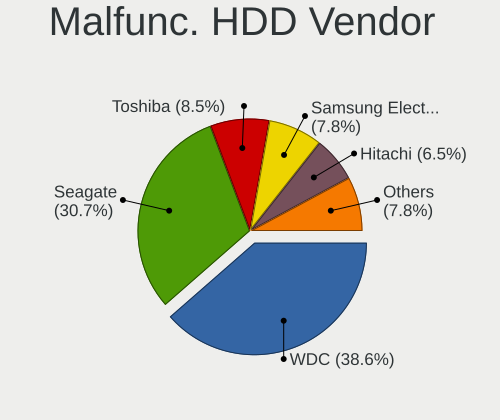

| Vendor               | Desktops | Drives | Percent |
|----------------------|----------|--------|---------|
| WDC                  | 118      | 220    | 38.56%  |
| Seagate              | 94       | 149    | 30.72%  |
| Toshiba              | 26       | 56     | 8.5%    |
| Samsung Electronics  | 24       | 36     | 7.84%   |
| Hitachi              | 20       | 30     | 6.54%   |
| HGST                 | 12       | 25     | 3.92%   |
| Maxtor               | 8        | 12     | 2.61%   |
| Hewlett-Packard      | 2        | 4      | 0.65%   |
| HPE                  | 1        | 4      | 0.33%   |
| ExcelStor Technology | 1        | 2      | 0.33%   |

Malfunc. Drive Kind
-------------------

Kinds of faulty drives

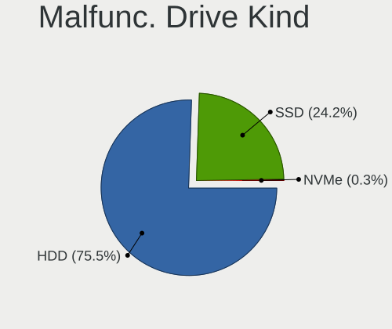

| Kind | Desktops | Drives | Percent |
|------|----------|--------|---------|
| HDD  | 281      | 538    | 75.54%  |
| SSD  | 90       | 134    | 24.19%  |
| NVMe | 1        | 1      | 0.27%   |

Failed Drives
-------------

Failed drive models

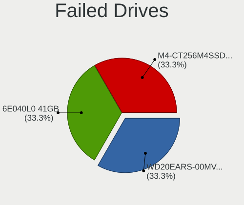

| Model                        | Desktops | Drives | Percent |
|------------------------------|----------|--------|---------|
| WDC WD20EARS-00MVWB0 2TB     | 1        | 1      | 25%     |
| Toshiba MG05ACA800E 8TB      | 1        | 1      | 25%     |
| Maxtor 6E040L0 40GB          | 1        | 1      | 25%     |
| Crucial M4-CT256M4SSD1 256GB | 1        | 1      | 25%     |

Failed Drive Vendor
-------------------

Failed drive vendors

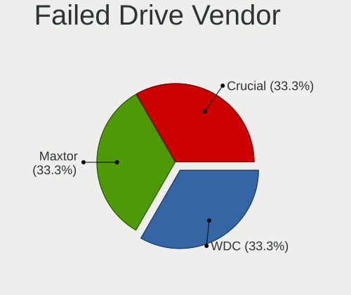

| Vendor  | Desktops | Drives | Percent |
|---------|----------|--------|---------|
| WDC     | 1        | 1      | 25%     |
| Toshiba | 1        | 1      | 25%     |
| Maxtor  | 1        | 1      | 25%     |
| Crucial | 1        | 1      | 25%     |

Drive Status
------------

Number of failed and malfunc. drives

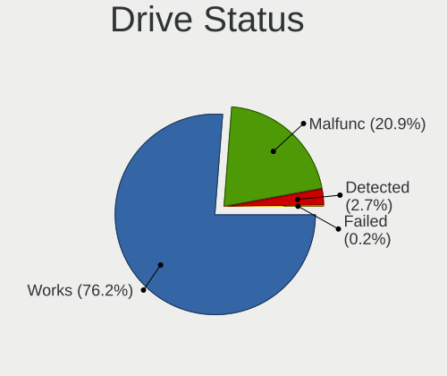

| Status   | Desktops | Drives | Percent |
|----------|----------|--------|---------|
| Works    | 1287     | 5439   | 76.24%  |
| Malfunc  | 352      | 673    | 20.85%  |
| Detected | 45       | 108    | 2.67%   |
| Failed   | 4        | 4      | 0.24%   |

Storage controller
------------------

Storage Vendor
--------------

Storage controller vendors

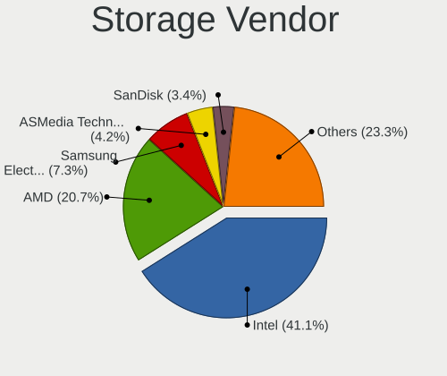

| Vendor                           | Desktops | Percent |
|----------------------------------|----------|---------|
| Intel                            | 945      | 41.05%  |
| AMD                              | 476      | 20.68%  |
| Samsung Electronics              | 169      | 7.34%   |
| ASMedia Technology               | 97       | 4.21%   |
| SanDisk                          | 79       | 3.43%   |
| Broadcom / LSI                   | 72       | 3.13%   |
| Marvell Technology Group         | 66       | 2.87%   |
| Phison Electronics               | 50       | 2.17%   |
| Kingston Technology Company      | 43       | 1.87%   |
| Micron/Crucial Technology        | 37       | 1.61%   |
| JMicron Technology               | 35       | 1.52%   |
| Silicon Motion                   | 32       | 1.39%   |
| Nvidia                           | 26       | 1.13%   |
| SK hynix                         | 17       | 0.74%   |
| ADATA Technology                 | 14       | 0.61%   |
| Realtek Semiconductor            | 13       | 0.56%   |
| Adaptec                          | 12       | 0.52%   |
| VIA Technologies                 | 11       | 0.48%   |
| Micron Technology                | 11       | 0.48%   |
| MAXIO Technology (Hangzhou)      | 10       | 0.43%   |
| Silicon Image                    | 9        | 0.39%   |
| Chelsio Communications           | 8        | 0.35%   |
| KIOXIA                           | 7        | 0.3%    |
| Shenzhen Longsys Electronics     | 6        | 0.26%   |
| Seagate Technology               | 6        | 0.26%   |
| Areca Technology                 | 6        | 0.26%   |
| Toshiba                          | 5        | 0.22%   |
| Hewlett-Packard                  | 5        | 0.22%   |
| Integrated Technology Express    | 4        | 0.17%   |
| INNOGRIT                         | 4        | 0.17%   |
| Silicon Integrated Systems [SiS] | 3        | 0.13%   |
| Promise Technology               | 3        | 0.13%   |
| Lite-On Technology               | 3        | 0.13%   |
| 3ware                            | 3        | 0.13%   |
| Hosin Global Electronics         | 2        | 0.09%   |
| HighPoint Technologies           | 2        | 0.09%   |
| ULi Electronics                  | 1        | 0.04%   |
| Transcend                        | 1        | 0.04%   |
| TenaFe                           | 1        | 0.04%   |
| Solidigm                         | 1        | 0.04%   |

Storage Model
-------------

Storage controller models

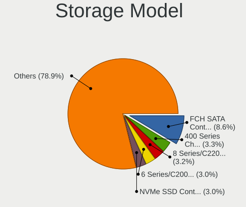

| Model                                                                                   | Desktops | Percent |
|-----------------------------------------------------------------------------------------|----------|---------|
| AMD FCH SATA Controller [AHCI mode]                                                     | 238      | 8.63%   |
| AMD 400 Series Chipset SATA Controller                                                  | 91       | 3.3%    |
| Intel 8 Series/C220 Series Chipset Family 6-port SATA Controller 1 [AHCI mode]          | 87       | 3.16%   |
| Intel 6 Series/C200 Series Chipset Family 6 port Desktop SATA AHCI Controller           | 84       | 3.05%   |
| Samsung NVMe SSD Controller SM981/PM981/PM983                                           | 82       | 2.97%   |
| Intel Q170/Q150/B150/H170/H110/Z170/CM236 Chipset SATA Controller [AHCI Mode]           | 77       | 2.79%   |
| ASMedia ASM1061/ASM1062 Serial ATA Controller                                           | 74       | 2.68%   |
| AMD 500 Series Chipset SATA Controller                                                  | 74       | 2.68%   |
| AMD SB7x0/SB8x0/SB9x0 SATA Controller [AHCI mode]                                       | 71       | 2.58%   |
| Intel 200 Series PCH SATA controller [AHCI mode]                                        | 60       | 2.18%   |
| Intel Cannon Lake PCH SATA AHCI Controller                                              | 51       | 1.85%   |
| Intel SATA Controller [RAID mode]                                                       | 50       | 1.81%   |
| AMD SB7x0/SB8x0/SB9x0 IDE Controller                                                    | 46       | 1.67%   |
| Intel 7 Series/C210 Series Chipset Family 6-port SATA Controller [AHCI mode]            | 44       | 1.6%    |
| Samsung NVMe SSD Controller PM9A1/PM9A3/980PRO                                          | 38       | 1.38%   |
| Intel 500 Series Chipset Family SATA AHCI Controller                                    | 35       | 1.27%   |
| AMD 600 Series Chipset SATA Controller                                                  | 35       | 1.27%   |
| Intel C610/X99 series chipset 6-Port SATA Controller [AHCI mode]                        | 32       | 1.16%   |
| Intel C610/X99 series chipset sSATA Controller [AHCI mode]                              | 31       | 1.12%   |
| Intel 82801JI (ICH10 Family) SATA AHCI Controller                                       | 31       | 1.12%   |
| Silicon Motion SM2263EN/SM2263XT (DRAM-less) NVMe SSD Controllers                       | 29       | 1.05%   |
| Broadcom / LSI SAS2008 PCI-Express Fusion-MPT SAS-2 [Falcon]                            | 28       | 1.02%   |
| Intel Alder Lake-S PCH SATA Controller [AHCI Mode]                                      | 27       | 0.98%   |
| Intel NM10/ICH7 Family SATA Controller [IDE mode]                                       | 26       | 0.94%   |
| Intel 9 Series Chipset Family SATA Controller [AHCI Mode]                               | 26       | 0.94%   |
| Samsung NVMe SSD Controller 980 (DRAM-less)                                             | 22       | 0.8%    |
| Intel C600/X79 series chipset 6-Port SATA AHCI Controller                               | 22       | 0.8%    |
| Intel Atom Processor E3800 Series SATA AHCI Controller                                  | 22       | 0.8%    |
| Intel 82801G (ICH7 Family) IDE Controller                                               | 22       | 0.8%    |
| Samsung NVMe SSD Controller SM961/PM961/SM963                                           | 20       | 0.73%   |
| Micron/Crucial P2 [Nick P2] / P3 / P3 Plus NVMe PCIe SSD (DRAM-less)                    | 20       | 0.73%   |
| Intel Comet Lake SATA AHCI Controller                                                   | 20       | 0.73%   |
| Intel C602 chipset 4-Port SATA Storage Control Unit                                     | 20       | 0.73%   |
| Intel 5 Series/3400 Series Chipset 6 port SATA AHCI Controller                          | 18       | 0.65%   |
| Phison E12 NVMe Controller                                                              | 17       | 0.62%   |
| AMD A320 Chipset SATA Controller [AHCI mode]                                            | 17       | 0.62%   |
| Marvell Group 88SE9172 SATA 6Gb/s Controller                                            | 16       | 0.58%   |
| Intel 6 Series/C200 Series Chipset Family Desktop SATA Controller (IDE mode, ports 0-3) | 16       | 0.58%   |
| AMD X370 Series Chipset SATA Controller                                                 | 16       | 0.58%   |
| AMD 300 Series Chipset SATA Controller                                                  | 16       | 0.58%   |

Storage Kind
------------

Kind of storage controller (IDE, SATA, NVMe, SAS, ...)

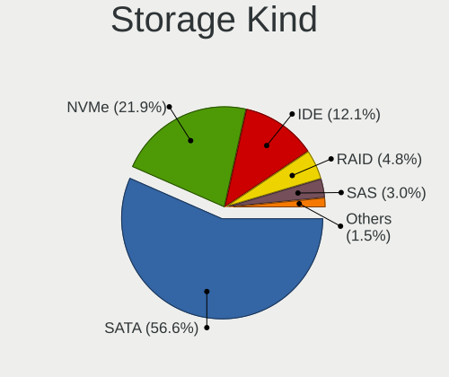

| Kind | Desktops | Percent |
|------|----------|---------|
| SATA | 1246     | 56.58%  |
| NVMe | 482      | 21.89%  |
| IDE  | 267      | 12.13%  |
| RAID | 106      | 4.81%   |
| SAS  | 67       | 3.04%   |
| SCSI | 34       | 1.54%   |

Processor
---------

CPU Vendor
----------

Processor vendors

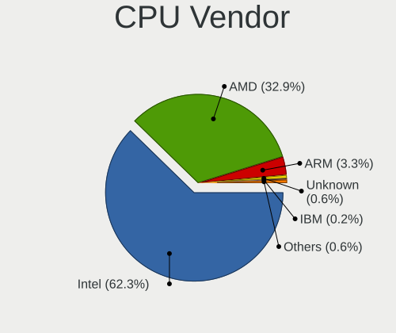

| Vendor                | Desktops | Percent |
|-----------------------|----------|---------|
| Intel                 | 961      | 62.28%  |
| AMD                   | 508      | 32.92%  |
| ARM                   | 51       | 3.31%   |
| Unknown               | 10       | 0.65%   |
| IBM                   | 3        | 0.19%   |
| VIA                   | 2        | 0.13%   |
| i                     | 2        | 0.13%   |
| Sun                   | 1        | 0.06%   |
| Research              | 1        | 0.06%   |
| Qualcomm Technologies | 1        | 0.06%   |
| NXP                   | 1        | 0.06%   |
| Motorola              | 1        | 0.06%   |
| Cix Technology Group  | 1        | 0.06%   |

CPU Model
---------

Processor models

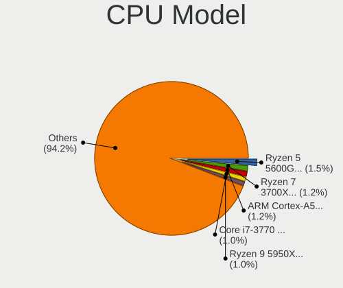

| Model                                       | Desktops | Percent |
|---------------------------------------------|----------|---------|
| AMD Ryzen 5 5600G with Radeon Graphics      | 23       | 1.48%   |
| AMD Ryzen 7 3700X 8-Core Processor          | 19       | 1.22%   |
| ARM Cortex-A55 r2p0                         | 18       | 1.16%   |
| Intel Core i7-3770 CPU @ 3.40GHz            | 16       | 1.03%   |
| AMD Ryzen 9 5950X 16-Core Processor         | 15       | 0.96%   |
| Intel Core i7-7700 CPU @ 3.60GHz            | 14       | 0.9%    |
| Intel Core i5-3470 CPU @ 3.20GHz            | 14       | 0.9%    |
| AMD GX-412TC SOC                            | 14       | 0.9%    |
| AMD Ryzen 9 3900X 12-Core Processor         | 13       | 0.83%   |
| AMD Ryzen 7 2700X Eight-Core Processor      | 13       | 0.83%   |
| ARM Cortex-A53 r0p4                         | 12       | 0.77%   |
| Intel Core i7-4790K CPU @ 4.00GHz           | 11       | 0.71%   |
| Intel Core i7-10700K CPU @ 3.80GHz          | 11       | 0.71%   |
| Intel Core i5-6500 CPU @ 3.20GHz            | 11       | 0.71%   |
| Intel Core i5-10400 CPU @ 2.90GHz           | 11       | 0.71%   |
| Intel Celeron CPU J1900 @ 1.99GHz           | 11       | 0.71%   |
| AMD Ryzen 9 5900X 12-Core Processor         | 11       | 0.71%   |
| AMD Ryzen 7 5700G with Radeon Graphics      | 11       | 0.71%   |
| AMD Ryzen 5 3600 6-Core Processor           | 11       | 0.71%   |
| AMD Ryzen 5 2600 Six-Core Processor         | 11       | 0.71%   |
| AMD Ryzen 5 2400G with Radeon Vega Graphics | 11       | 0.71%   |
| AMD FX-8350 Eight-Core Processor            | 11       | 0.71%   |
| Intel Core i7-6700 CPU @ 3.40GHz            | 10       | 0.64%   |
| AMD Ryzen 7 1700 Eight-Core Processor       | 10       | 0.64%   |
|                                             | 10       | 0.64%   |
| AMD Ryzen 7 5800X 8-Core Processor          | 9        | 0.58%   |
| AMD Ryzen 3 3200G with Radeon Vega Graphics | 9        | 0.58%   |
| Intel Core i7-9700K CPU @ 3.60GHz           | 8        | 0.51%   |
| Intel Core i7-4790 CPU @ 3.60GHz            | 8        | 0.51%   |
| Intel Core i7-4770 CPU @ 3.40GHz            | 8        | 0.51%   |
| Intel Core i7-10700 CPU @ 2.90GHz           | 8        | 0.51%   |
| Intel Core i5-4570 CPU @ 3.20GHz            | 8        | 0.51%   |
| Intel Core i5-2500 CPU @ 3.30GHz            | 8        | 0.51%   |
| Intel Core i3-6100 CPU @ 3.70GHz            | 8        | 0.51%   |
| AMD Ryzen 9 7950X 16-Core Processor         | 8        | 0.51%   |
| Intel N100                                  | 7        | 0.45%   |
| Intel Core i7-8700 CPU @ 3.20GHz            | 7        | 0.45%   |
| Intel Core i5-8500 CPU @ 3.00GHz            | 7        | 0.45%   |
| Intel Core i5-4690 CPU @ 3.50GHz            | 7        | 0.45%   |
| Intel Core i5-2400 CPU @ 3.10GHz            | 7        | 0.45%   |

CPU Model Family
----------------

Processor model prefix

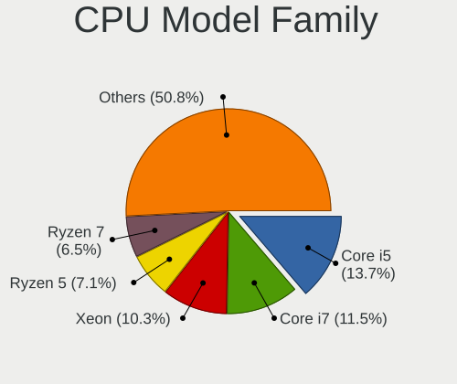

| Model                   | Desktops | Percent |
|-------------------------|----------|---------|
| Intel Core i5           | 213      | 13.73%  |
| Intel Core i7           | 179      | 11.54%  |
| Intel Xeon              | 160      | 10.32%  |
| AMD Ryzen 5             | 110      | 7.09%   |
| AMD Ryzen 7             | 101      | 6.51%   |
| Other                   | 100      | 6.45%   |
| Intel Core i3           | 87       | 5.61%   |
| AMD Ryzen 9             | 71       | 4.58%   |
| Intel Celeron           | 70       | 4.51%   |
| ARM Cortex              | 44       | 2.84%   |
| Intel Atom              | 43       | 2.77%   |
| AMD FX                  | 42       | 2.71%   |
| Intel Pentium           | 36       | 2.32%   |
| Intel Core 2 Duo        | 34       | 2.19%   |
| AMD Ryzen 3             | 26       | 1.68%   |
| AMD GX                  | 25       | 1.61%   |
| Intel Core 2 Quad       | 21       | 1.35%   |
| Intel Pentium 4         | 14       | 0.9%    |
| AMD Ryzen Threadripper  | 14       | 0.9%    |
| Intel Core i9           | 12       | 0.77%   |
| AMD Athlon 64 X2        | 11       | 0.71%   |
| AMD Phenom II X4        | 9        | 0.58%   |
| AMD Athlon              | 9        | 0.58%   |
| AMD Turion II Neo       | 8        | 0.52%   |
| AMD Phenom II X6        | 8        | 0.52%   |
| AMD Ryzen 5 PRO         | 7        | 0.45%   |
| AMD Phenom              | 7        | 0.45%   |
| AMD A10                 | 7        | 0.45%   |
| AMD G                   | 6        | 0.39%   |
| Intel Pentium Silver    | 5        | 0.32%   |
| Intel Pentium Gold      | 5        | 0.32%   |
| Intel Core 2            | 5        | 0.32%   |
| AMD Ryzen 7 PRO         | 5        | 0.32%   |
| Intel Pentium Dual-Core | 4        | 0.26%   |
| AMD Opteron             | 4        | 0.26%   |
| AMD EPYC                | 4        | 0.26%   |
| AMD Athlon II X2        | 4        | 0.26%   |
| AMD A8                  | 4        | 0.26%   |
| AMD Sempron             | 3        | 0.19%   |
| AMD A4                  | 3        | 0.19%   |

CPU Cores
---------

Number of processor cores

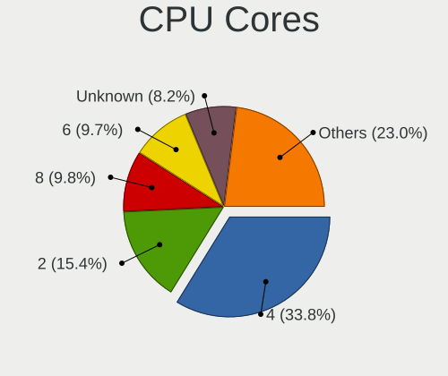

| Number  | Desktops | Percent |
|---------|----------|---------|
| 4       | 530      | 33.8%   |
| 2       | 242      | 15.43%  |
| 8       | 154      | 9.82%   |
| 6       | 152      | 9.69%   |
| Unknown | 129      | 8.23%   |
| 16      | 110      | 7.02%   |
| 12      | 98       | 6.25%   |
| 24      | 40       | 2.55%   |
| 32      | 31       | 1.98%   |
| 1       | 27       | 1.72%   |
| 10      | 21       | 1.34%   |
| 14      | 7        | 0.45%   |
| 28      | 5        | 0.32%   |
| 64      | 4        | 0.26%   |
| 20      | 4        | 0.26%   |
| 18      | 4        | 0.26%   |
| 3       | 3        | 0.19%   |
| 256     | 1        | 0.06%   |
| 128     | 1        | 0.06%   |
| 48      | 1        | 0.06%   |
| 36      | 1        | 0.06%   |
| 26      | 1        | 0.06%   |
| 22      | 1        | 0.06%   |
| 11      | 1        | 0.06%   |

CPU Sockets
-----------

Number of sockets

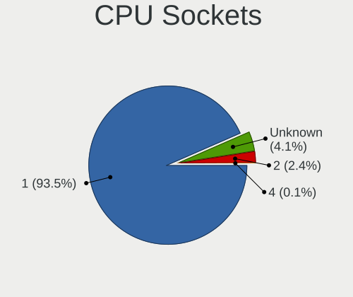

| Number  | Desktops | Percent |
|---------|----------|---------|
| 1       | 1442     | 93.45%  |
| Unknown | 63       | 4.08%   |
| 2       | 37       | 2.4%    |
| 4       | 1        | 0.06%   |

CPU Threads
-----------

Threads per core (Hyper-Threading)

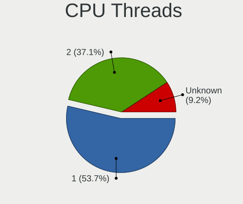

| Number  | Desktops | Percent |
|---------|----------|---------|
| 1       | 836      | 53.66%  |
| 2       | 578      | 37.1%   |
| Unknown | 144      | 9.24%   |

CPU Microarch
-------------

Microarchitecture

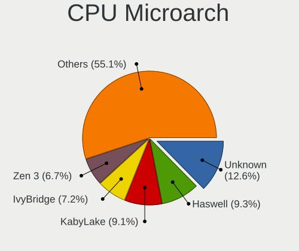

| Name          | Desktops | Percent |
|---------------|----------|---------|
| Unknown       | 196      | 12.63%  |
| Haswell       | 145      | 9.34%   |
| KabyLake      | 141      | 9.09%   |
| IvyBridge     | 111      | 7.15%   |
| Zen 3         | 104      | 6.7%    |
| Zen 2         | 95       | 6.12%   |
| SandyBridge   | 91       | 5.86%   |
| Skylake       | 79       | 5.09%   |
| Zen+          | 59       | 3.8%    |
| Penryn        | 59       | 3.8%    |
| CometLake     | 49       | 3.16%   |
| Zen           | 48       | 3.09%   |
| K10           | 44       | 2.84%   |
| Silvermont    | 40       | 2.58%   |
| Piledriver    | 39       | 2.51%   |
| Westmere      | 32       | 2.06%   |
| Bonnell       | 25       | 1.61%   |
| Core          | 24       | 1.55%   |
| Broadwell     | 22       | 1.42%   |
| Puma          | 20       | 1.29%   |
| NetBurst      | 20       | 1.29%   |
| Nehalem       | 18       | 1.16%   |
| K8 Hammer     | 15       | 0.97%   |
| Goldmont      | 14       | 0.9%    |
| Jaguar        | 12       | 0.77%   |
| Goldmont plus | 10       | 0.64%   |
| Bulldozer     | 10       | 0.64%   |
| Bobcat        | 9        | 0.58%   |
| Excavator     | 6        | 0.39%   |
| Steamroller   | 5        | 0.32%   |
| P6            | 4        | 0.26%   |
| TigerLake     | 2        | 0.13%   |
| Geode         | 2        | 0.13%   |
| K10 Llano     | 1        | 0.06%   |
| IceLake       | 1        | 0.06%   |

Graphics
--------

GPU Vendor
----------

Vendors of graphics cards

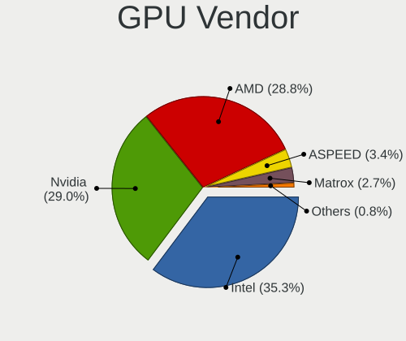

| Vendor                                       | Desktops | Percent |
|----------------------------------------------|----------|---------|
| Intel                                        | 545      | 35.25%  |
| Nvidia                                       | 449      | 29.04%  |
| AMD                                          | 445      | 28.78%  |
| ASPEED Technology                            | 52       | 3.36%   |
| Matrox Electronics Systems                   | 42       | 2.72%   |
| XGI Technology (eXtreme Graphics Innovation) | 4        | 0.26%   |
| VIA Technologies                             | 4        | 0.26%   |
| S3 Graphics                                  | 3        | 0.19%   |
| Silicon Integrated Systems [SiS]             | 1        | 0.06%   |
| NVidia / SGS Thomson (Joint Venture)         | 1        | 0.06%   |

GPU Model
---------

Graphics card models

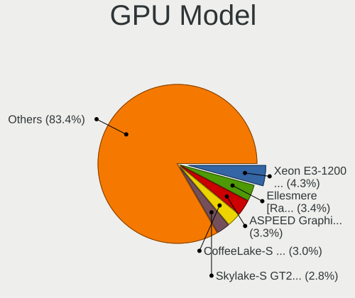

| Model                                                                                    | Desktops | Percent |
|------------------------------------------------------------------------------------------|----------|---------|
| Intel Xeon E3-1200 v3/4th Gen Core Processor Integrated Graphics Controller              | 68       | 4.27%   |
| AMD Ellesmere [Radeon RX 470/480/570/570X/580/580X/590]                                  | 54       | 3.39%   |
| ASPEED Technology ASPEED Graphics Family                                                 | 52       | 3.26%   |
| Intel CoffeeLake-S GT2 [UHD Graphics 630]                                                | 47       | 2.95%   |
| Intel Skylake-S GT2 [HD Graphics 530]                                                    | 44       | 2.76%   |
| AMD Cezanne [Radeon Vega Series / Radeon Vega Mobile Series]                             | 41       | 2.57%   |
| Nvidia GK208B [GeForce GT 710]                                                           | 39       | 2.45%   |
| Intel 2nd Generation Core Processor Family Integrated Graphics Controller                | 38       | 2.39%   |
| Intel Xeon E3-1200 v2/3rd Gen Core processor Graphics Controller                         | 32       | 2.01%   |
| Nvidia GP108 [GeForce GT 1030]                                                           | 31       | 1.95%   |
| Intel Kaby Lake-S GT2 [HD Graphics 630]                                                  | 30       | 1.88%   |
| Intel CometLake-S GT2 [UHD Graphics 630]                                                 | 30       | 1.88%   |
| Intel Atom Processor Z36xxx/Z37xxx Series Graphics & Display                             | 23       | 1.44%   |
| Matrox Electronics Systems MGA G200EH                                                    | 22       | 1.38%   |
| Intel 4 Series Chipset Integrated Graphics Controller                                    | 20       | 1.26%   |
| Nvidia GP107 [GeForce GTX 1050 Ti]                                                       | 19       | 1.19%   |
| AMD Raven Ridge [Radeon Vega Series / Radeon Vega Mobile Series]                         | 19       | 1.19%   |
| Intel IvyBridge GT2 [HD Graphics 4000]                                                   | 17       | 1.07%   |
| AMD Raphael                                                                              | 17       | 1.07%   |
| AMD Picasso/Raven 2 [Radeon Vega Series / Radeon Vega Mobile Series]                     | 17       | 1.07%   |
| Nvidia GT218 [GeForce 210]                                                               | 15       | 0.94%   |
| AMD Navi 23 [Radeon RX 6600/6600 XT/6600M]                                               | 14       | 0.88%   |
| AMD Navi 10 [Radeon RX 5600 OEM/5600 XT / 5700/5700 XT]                                  | 14       | 0.88%   |
| Matrox Electronics Systems MGA G200eW WPCM450                                            | 13       | 0.82%   |
| AMD Renoir [Radeon Vega Series / Radeon Vega Mobile Series]                              | 13       | 0.82%   |
| Nvidia GK208B [GeForce GT 730]                                                           | 12       | 0.75%   |
| Nvidia TU116 [GeForce GTX 1660 Ti]                                                       | 11       | 0.69%   |
| Intel Atom/Celeron/Pentium Processor x5-E8000/J3xxx/N3xxx Integrated Graphics Controller | 11       | 0.69%   |
| Intel 4th Generation Core Processor Family Integrated Graphics Controller                | 11       | 0.69%   |
| AMD Lexa PRO [Radeon 540/540X/550/550X / RX 540X/550/550X]                               | 11       | 0.69%   |
| Nvidia TU117 [GeForce GTX 1650]                                                          | 10       | 0.63%   |
| Nvidia GP106 [GeForce GTX 1060 6GB]                                                      | 10       | 0.63%   |
| Nvidia GM206 [GeForce GTX 960]                                                           | 10       | 0.63%   |
| AMD RV730 XT [Radeon HD 4670]                                                            | 10       | 0.63%   |
| AMD Navi 22 [Radeon RX 6700/6700 XT/6750 XT / 6800M/6850M XT]                            | 10       | 0.63%   |
| Nvidia TU116 [GeForce GTX 1660 SUPER]                                                    | 9        | 0.56%   |
| Nvidia GP106 [GeForce GTX 1060 3GB]                                                      | 9        | 0.56%   |
| Nvidia GP104 [GeForce GTX 1070]                                                          | 9        | 0.56%   |
| Nvidia GF119 [GeForce GT 610]                                                            | 9        | 0.56%   |
| Intel Core Processor Integrated Graphics Controller                                      | 9        | 0.56%   |

GPU Combo
---------

Combinations of graphics cards

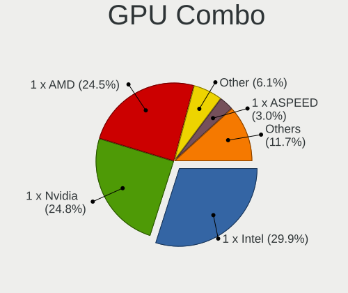

| Name                                     | Desktops | Percent |
|------------------------------------------|----------|---------|
| 1 x Intel                                | 466      | 29.91%  |
| 1 x Nvidia                               | 386      | 24.78%  |
| 1 x AMD                                  | 381      | 24.45%  |
| Other                                    | 95       | 6.1%    |
| 1 x ASPEED                               | 47       | 3.02%   |
| 1 x Matrox                               | 42       | 2.7%    |
| Intel + Nvidia                           | 38       | 2.44%   |
| 2 x AMD                                  | 27       | 1.73%   |
| Intel + AMD                              | 20       | 1.28%   |
| 2 x Intel                                | 18       | 1.16%   |
| AMD + Nvidia                             | 14       | 0.9%    |
| Nvidia + ASPEED                          | 5        | 0.32%   |
| 2 x Nvidia                               | 4        | 0.26%   |
| 1 x XGI                                  | 4        | 0.26%   |
| 1 x VIA                                  | 4        | 0.26%   |
| 1 x S3 Graphics                          | 2        | 0.13%   |
| 1 x SiS                                  | 1        | 0.06%   |
| 1 x NVidia / SGS Thomson (Joint Venture) | 1        | 0.06%   |
| Intel + S3 Graphics                      | 1        | 0.06%   |
| Intel + ASPEED                           | 1        | 0.06%   |
| AMD + ASPEED                             | 1        | 0.06%   |

GPU Driver
----------

Free vs proprietary

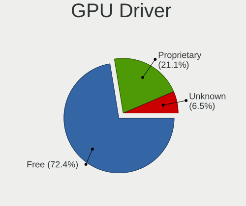

| Driver      | Desktops | Percent |
|-------------|----------|---------|
| Free        | 1122     | 72.43%  |
| Proprietary | 327      | 21.11%  |
| Unknown     | 100      | 6.46%   |

GPU Memory
----------

Total video memory

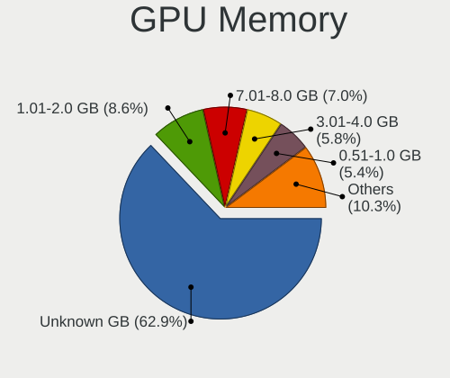

| Size in GB | Desktops | Percent |
|------------|----------|---------|
| Unknown    | 994      | 62.91%  |
| 1.01-2.0   | 136      | 8.61%   |
| 7.01-8.0   | 111      | 7.03%   |
| 3.01-4.0   | 92       | 5.82%   |
| 0.51-1.0   | 85       | 5.38%   |
| 0.01-0.5   | 65       | 4.11%   |
| 5.01-6.0   | 40       | 2.53%   |
| 8.01-16.0  | 35       | 2.22%   |
| 2.01-3.0   | 11       | 0.7%    |
| 16.01-24.0 | 9        | 0.57%   |
| 4.01-5.0   | 2        | 0.13%   |

Monitor
-------

Monitor Vendor
--------------

Monitor vendors

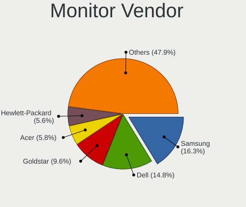

| Vendor               | Desktops | Percent |
|----------------------|----------|---------|
| Samsung Electronics  | 137      | 16.25%  |
| Dell                 | 125      | 14.83%  |
| Goldstar             | 81       | 9.61%   |
| Acer                 | 49       | 5.81%   |
| Hewlett-Packard      | 47       | 5.58%   |
| AOC                  | 36       | 4.27%   |
| Philips              | 35       | 4.15%   |
| BenQ                 | 33       | 3.91%   |
| ViewSonic            | 28       | 3.32%   |
| Iiyama               | 28       | 3.32%   |
| Ancor Communications | 28       | 3.32%   |
| LG Electronics       | 24       | 2.85%   |
| Lenovo               | 18       | 2.14%   |
| Sony                 | 17       | 2.02%   |
| MSI                  | 12       | 1.42%   |
| ASUSTek Computer     | 12       | 1.42%   |
| NEC Computers        | 11       | 1.3%    |
| Eizo                 | 11       | 1.3%    |
| Idek Iiyama          | 8        | 0.95%   |
| Unknown              | 7        | 0.83%   |
| Unknown              | 6        | 0.71%   |
| RTK                  | 5        | 0.59%   |
| Sceptre Tech         | 4        | 0.47%   |
| Toshiba              | 3        | 0.36%   |
| Mi                   | 3        | 0.36%   |
| IPS                  | 3        | 0.36%   |
| Gigabyte Technology  | 3        | 0.36%   |
| SKG                  | 2        | 0.24%   |
| Plain Tree Systems   | 2        | 0.24%   |
| Panasonic            | 2        | 0.24%   |
| Microstep            | 2        | 0.24%   |
| IOD                  | 2        | 0.24%   |
| Insignia             | 2        | 0.24%   |
| IBM                  | 2        | 0.24%   |
| HPN                  | 2        | 0.24%   |
| Gateway              | 2        | 0.24%   |
| Fujitsu Siemens      | 2        | 0.24%   |
| Dostyle              | 2        | 0.24%   |
| Apple                | 2        | 0.24%   |
| Westinghouse         | 1        | 0.12%   |

Monitor Model
-------------

Monitor models

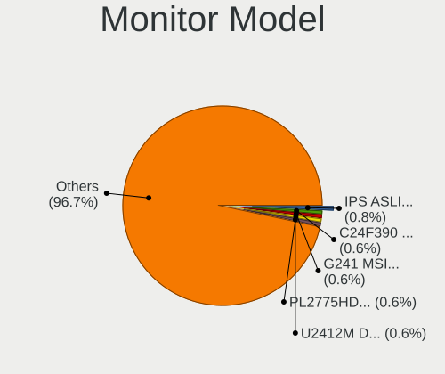

| Model                                                                 | Desktops | Percent |
|-----------------------------------------------------------------------|----------|---------|
| Unknown                                                               | 7        | 0.75%   |
| Samsung Electronics C24F390 SAM0D2C 1920x1080 520x290mm 23.4-inch     | 6        | 0.65%   |
| MSI G241 MSI3BA4 1920x1080 530x300mm 24.0-inch                        | 6        | 0.65%   |
| Iiyama PL2775HD IVM6604 1920x1080 600x340mm 27.2-inch                 | 6        | 0.65%   |
| Dell U2412M DELA07A 1920x1200 520x320mm 24.0-inch                     | 6        | 0.65%   |
| Goldstar LG Ultra HD GSM5B09 3840x2160 600x340mm 27.2-inch            | 5        | 0.54%   |
| Samsung Electronics U28E590 SAM0C4D 3840x2160 610x350mm 27.7-inch     | 4        | 0.43%   |
| Philips PHL 223V5 PHLC0CF 1920x1080 480x270mm 21.7-inch               | 4        | 0.43%   |
| Lenovo LEN X24A LEN60CF 1920x1080 530x300mm 24.0-inch                 | 4        | 0.43%   |
| Goldstar LG HDR 4K GSM7707 3840x2160 600x340mm 27.2-inch              | 4        | 0.43%   |
| Goldstar LG HDR 4K GSM7706 3840x2160 600x340mm 27.2-inch              | 4        | 0.43%   |
| Dell U2412M DELA07B 1920x1200 520x320mm 24.0-inch                     | 4        | 0.43%   |
| ViewSonic VX2457 VSCB931 1920x1080 520x290mm 23.4-inch                | 3        | 0.32%   |
| ViewSonic VA2342 SERIES VSCFA2B 1920x1080 510x290mm 23.1-inch         | 3        | 0.32%   |
| Samsung Electronics SyncMaster SAM00A4 1024x768 300x230mm 14.9-inch   | 3        | 0.32%   |
| Samsung Electronics S24F350 SAM0D20 1920x1080 520x290mm 23.4-inch     | 3        | 0.32%   |
| Samsung Electronics S22B300 SAM08AC 1920x1080 480x270mm 21.7-inch     | 3        | 0.32%   |
| Samsung Electronics LCD Monitor SAM0C39 1920x1080 700x390mm 31.5-inch | 3        | 0.32%   |
| Samsung Electronics C27F390 SAM0D32 1920x1080 600x340mm 27.2-inch     | 3        | 0.32%   |
| Philips PHL 243V5 PHLC0D1 1920x1080 520x290mm 23.4-inch               | 3        | 0.32%   |
| LG Electronics LCD Monitor LG Ultra HD                                | 3        | 0.32%   |
| Iiyama PLX2783H IVM6648 1920x1080 600x340mm 27.2-inch                 | 3        | 0.32%   |
| Hewlett-Packard LP2475w HWP26F9 1920x1200 540x350mm 25.3-inch         | 3        | 0.32%   |
| Hewlett-Packard LP2475w HWP26F8 1920x1200 540x350mm 25.3-inch         | 3        | 0.32%   |
| Goldstar LG ULTRAGEAR GSM5B7F 2560x1440 600x340mm 27.2-inch           | 3        | 0.32%   |
| Goldstar LG Ultra HD GSM5B08 3840x2160 600x340mm 27.2-inch            | 3        | 0.32%   |
| Goldstar LG IPS FULLHD GSM5AB8 1920x1080 480x270mm 21.7-inch          | 3        | 0.32%   |
| Goldstar LG FULL HD GSM5B55 1920x1080 480x270mm 21.7-inch             | 3        | 0.32%   |
| Goldstar 22MP55 GSM5A26 1920x1080 480x270mm 21.7-inch                 | 3        | 0.32%   |
| Dell U2518D DEL413C 2560x1440 550x310mm 24.9-inch                     | 3        | 0.32%   |
| Dell LCD Monitor U2412M                                               | 3        | 0.32%   |
| AOC Q27P1B AOC2701 2560x1440 600x340mm 27.2-inch                      | 3        | 0.32%   |
| AOC 24G1WG4 AOC2401 1920x1080 520x290mm 23.4-inch                     | 3        | 0.32%   |
| Ancor Communications ASUS VS197 ACI19F2 1366x768 410x230mm 18.5-inch  | 3        | 0.32%   |
| ViewSonic VG2439 Series VSCD22B 1920x1080 520x290mm 23.4-inch         | 2        | 0.22%   |
| unknown LCD Monitor SAMSUNG 1920x1080                                 | 2        | 0.22%   |
| Sony TV SNY4B03 1920x1080 930x520mm 41.9-inch                         | 2        | 0.22%   |
| Sony LCD Monitor TV XV 1920x1080                                      | 2        | 0.22%   |
| SKG AF24H1 SKG2428 1920x1080 530x300mm 24.0-inch                      | 2        | 0.22%   |
| Samsung Electronics U32R59x SAM0F94 3840x2160 700x390mm 31.5-inch     | 2        | 0.22%   |

Monitor Resolution
------------------

Monitor screen resolution

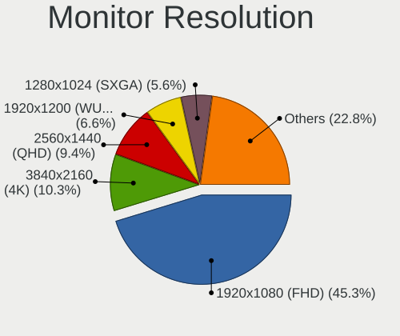

| Resolution         | Desktops | Percent |
|--------------------|----------|---------|
| 1920x1080 (FHD)    | 379      | 45.28%  |
| 3840x2160 (4K)     | 86       | 10.27%  |
| 2560x1440 (QHD)    | 79       | 9.44%   |
| 1920x1200 (WUXGA)  | 55       | 6.57%   |
| 1280x1024 (SXGA)   | 47       | 5.62%   |
| Unknown            | 26       | 3.11%   |
| 1680x1050 (WSXGA+) | 25       | 2.99%   |
| 3440x1440          | 18       | 2.15%   |
| 1366x768 (WXGA)    | 17       | 2.03%   |
| 1600x900 (HD+)     | 16       | 1.91%   |
| 1440x900 (WXGA+)   | 15       | 1.79%   |
| 2560x1080          | 13       | 1.55%   |
| 1600x1200          | 10       | 1.19%   |
| 3840x1080          | 7        | 0.84%   |
| 1024x768 (XGA)     | 6        | 0.72%   |
| 1360x768           | 5        | 0.6%    |
| 2560x1600          | 4        | 0.48%   |
| 3840x1600          | 2        | 0.24%   |
| 3840x1200          | 2        | 0.24%   |
| 1920x540           | 2        | 0.24%   |
| 1280x720 (HD)      | 2        | 0.24%   |
| 8960x1440          | 1        | 0.12%   |
| 7860x2400          | 1        | 0.12%   |
| 7680x2160          | 1        | 0.12%   |
| 6400x2160          | 1        | 0.12%   |
| 5760x1256          | 1        | 0.12%   |
| 5760x1200          | 1        | 0.12%   |
| 5760x1080          | 1        | 0.12%   |
| 5120x1440          | 1        | 0.12%   |
| 3640x1920          | 1        | 0.12%   |
| 3600x1080          | 1        | 0.12%   |
| 3520x1200          | 1        | 0.12%   |
| 3360x1050          | 1        | 0.12%   |
| 2944x1080          | 1        | 0.12%   |
| 2648x1024          | 1        | 0.12%   |
| 2560x2520          | 1        | 0.12%   |
| 2390x1280          | 1        | 0.12%   |
| 2288x1430          | 1        | 0.12%   |
| 2048x1152          | 1        | 0.12%   |
| 1280x960           | 1        | 0.12%   |

Monitor Diagonal
----------------

Diagonal size in inches

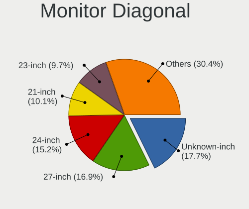

| Inches  | Desktops | Percent |
|---------|----------|---------|
| Unknown | 150      | 17.69%  |
| 27      | 143      | 16.86%  |
| 24      | 129      | 15.21%  |
| 21      | 86       | 10.14%  |
| 23      | 82       | 9.67%   |
| 19      | 44       | 5.19%   |
| 31      | 40       | 4.72%   |
| 22      | 21       | 2.48%   |
| 17      | 21       | 2.48%   |
| 18      | 17       | 2%      |
| 34      | 15       | 1.77%   |
| 15      | 12       | 1.42%   |
| 20      | 8        | 0.94%   |
| 14      | 8        | 0.94%   |
| 32      | 6        | 0.71%   |
| 29      | 6        | 0.71%   |
| 25      | 6        | 0.71%   |
| 40      | 5        | 0.59%   |
| 54      | 4        | 0.47%   |
| 52      | 4        | 0.47%   |
| 46      | 4        | 0.47%   |
| 42      | 4        | 0.47%   |
| 26      | 4        | 0.47%   |
| 41      | 3        | 0.35%   |
| 28      | 3        | 0.35%   |
| 13      | 3        | 0.35%   |
| 48      | 2        | 0.24%   |
| 39      | 2        | 0.24%   |
| 16      | 2        | 0.24%   |
| 74      | 1        | 0.12%   |
| 64      | 1        | 0.12%   |
| 57      | 1        | 0.12%   |
| 55      | 1        | 0.12%   |
| 50      | 1        | 0.12%   |
| 49      | 1        | 0.12%   |
| 47      | 1        | 0.12%   |
| 37      | 1        | 0.12%   |
| 36      | 1        | 0.12%   |
| 35      | 1        | 0.12%   |
| 33      | 1        | 0.12%   |

Monitor Width
-------------

Physical width

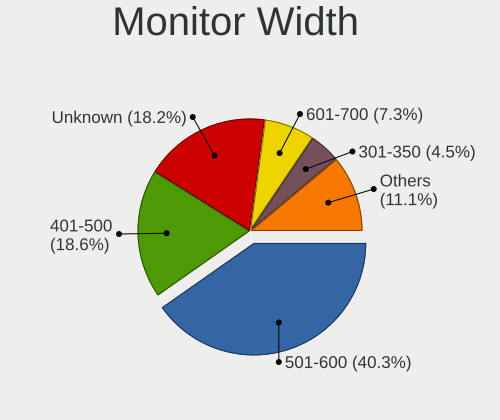

| Width in mm | Desktops | Percent |
|-------------|----------|---------|
| 501-600     | 331      | 40.27%  |
| 401-500     | 153      | 18.61%  |
| Unknown     | 150      | 18.25%  |
| 601-700     | 60       | 7.3%    |
| 301-350     | 37       | 4.5%    |
| 701-800     | 23       | 2.8%    |
| 351-400     | 19       | 2.31%   |
| 1001-1500   | 19       | 2.31%   |
| 201-300     | 10       | 1.22%   |
| 901-1000    | 9        | 1.09%   |
| 801-900     | 8        | 0.97%   |
| 1501-2000   | 1        | 0.12%   |
| 101-200     | 1        | 0.12%   |
| 1-100       | 1        | 0.12%   |

Aspect Ratio
------------

Proportional relationship between the width and the height

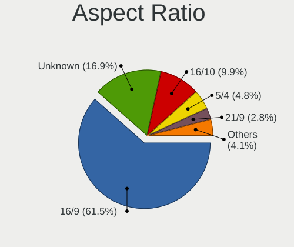

| Ratio   | Desktops | Percent |
|---------|----------|---------|
| 16/9    | 485      | 61.55%  |
| Unknown | 133      | 16.88%  |
| 16/10   | 78       | 9.9%    |
| 5/4     | 38       | 4.82%   |
| 21/9    | 22       | 2.79%   |
| 4/3     | 18       | 2.28%   |
| 3/2     | 9        | 1.14%   |
| 6/5     | 3        | 0.38%   |
| 32/9    | 2        | 0.25%   |

Monitor Area
------------

Area in inch²

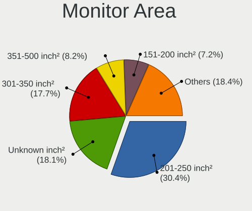

| Area in inch² | Desktops | Percent |
|----------------|----------|---------|
| 201-250        | 253      | 30.41%  |
| Unknown        | 151      | 18.15%  |
| 301-350        | 147      | 17.67%  |
| 351-500        | 68       | 8.17%   |
| 151-200        | 60       | 7.21%   |
| 251-300        | 54       | 6.49%   |
| 141-150        | 35       | 4.21%   |
| 501-1000       | 22       | 2.64%   |
| More than 1000 | 15       | 1.8%    |
| 101-110        | 11       | 1.32%   |
| 111-120        | 5        | 0.6%    |
| 81-90          | 4        | 0.48%   |
| 121-130        | 3        | 0.36%   |
| 71-80          | 1        | 0.12%   |
| 51-60          | 1        | 0.12%   |
| 1-40           | 1        | 0.12%   |
| 91-100         | 1        | 0.12%   |

Pixel Density
-------------

Pixels per inch

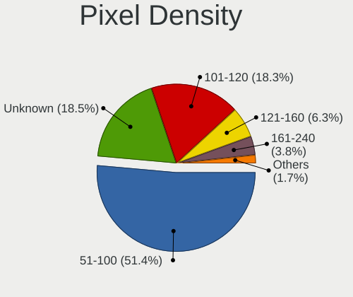

| Density       | Desktops | Percent |
|---------------|----------|---------|
| 51-100        | 418      | 51.41%  |
| Unknown       | 150      | 18.45%  |
| 101-120       | 149      | 18.33%  |
| 121-160       | 51       | 6.27%   |
| 161-240       | 31       | 3.81%   |
| 1-50          | 13       | 1.6%    |
| More than 240 | 1        | 0.12%   |

Multiple Monitors
-----------------

Total monitors connected

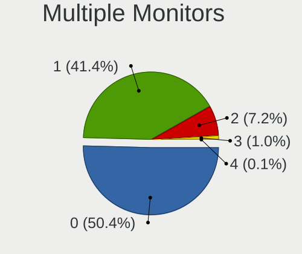

| Total | Desktops | Percent |
|-------|----------|---------|
| 0     | 794      | 50.41%  |
| 1     | 652      | 41.4%   |
| 2     | 113      | 7.17%   |
| 3     | 15       | 0.95%   |
| 4     | 1        | 0.06%   |

Network
-------

Net Controller Vendor
---------------------

Controller vendors

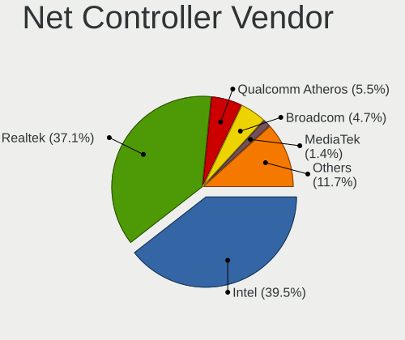

| Vendor                            | Desktops | Percent |
|-----------------------------------|----------|---------|
| Intel                             | 807      | 39.46%  |
| Realtek Semiconductor             | 759      | 37.11%  |
| Qualcomm Atheros                  | 113      | 5.53%   |
| Broadcom                          | 97       | 4.74%   |
| MediaTek                          | 29       | 1.42%   |
| Mellanox Technologies             | 18       | 0.88%   |
| Aquantia                          | 17       | 0.83%   |
| TP-Link                           | 15       | 0.73%   |
| Ralink Technology                 | 13       | 0.64%   |
| Marvell Technology Group          | 13       | 0.64%   |
| Ralink                            | 11       | 0.54%   |
| VIA Technologies                  | 10       | 0.49%   |
| Samsung Electronics               | 10       | 0.49%   |
| American Megatrends               | 10       | 0.49%   |
| D-Link System                     | 8        | 0.39%   |
| Chelsio Communications            | 8        | 0.39%   |
| ASUSTek Computer                  | 6        | 0.29%   |
| Nvidia                            | 5        | 0.24%   |
| 3Com                              | 5        | 0.24%   |
| Xiaomi                            | 4        | 0.2%    |
| QinHeng Electronics               | 4        | 0.2%    |
| OPPO Electronics                  | 4        | 0.2%    |
| Edimax Technology                 | 4        | 0.2%    |
| Apple                             | 4        | 0.2%    |
| Qualcomm Technologies             | 3        | 0.15%   |
| Microchip Technology              | 3        | 0.15%   |
| IMC Networks                      | 3        | 0.15%   |
| Dresden Elektronik                | 3        | 0.15%   |
| D-Link                            | 3        | 0.15%   |
| Arduino SA                        | 3        | 0.15%   |
| Accton Technology                 | 3        | 0.15%   |
| Sundance Technology Inc / IC Plus | 2        | 0.1%    |
| STMicroelectronics                | 2        | 0.1%    |
| Qualcomm Atheros Communications   | 2        | 0.1%    |
| Qualcomm                          | 2        | 0.1%    |
| Micro Star International          | 2        | 0.1%    |
| LG Electronics                    | 2        | 0.1%    |
| Huawei Technologies               | 2        | 0.1%    |
| Google                            | 2        | 0.1%    |
| Emulex                            | 2        | 0.1%    |

Net Controller Model
--------------------

Controller models

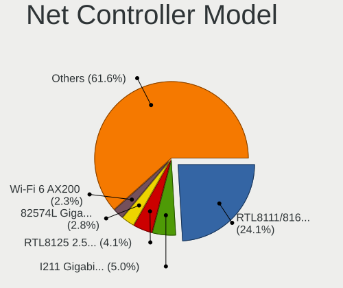

| Model                                                                         | Desktops | Percent |
|-------------------------------------------------------------------------------|----------|---------|
| Realtek RTL8111/8168/8211/8411 PCI Express Gigabit Ethernet Controller        | 577      | 24.06%  |
| Intel I211 Gigabit Network Connection                                         | 120      | 5%      |
| Realtek RTL8125 2.5GbE Controller                                             | 99       | 4.13%   |
| Intel 82574L Gigabit Network Connection                                       | 68       | 2.84%   |
| Intel Wi-Fi 6 AX200                                                           | 56       | 2.34%   |
| Intel 82579LM Gigabit Network Connection (Lewisville)                         | 56       | 2.34%   |
| Intel I210 Gigabit Network Connection                                         | 54       | 2.25%   |
| Intel Ethernet Controller I225-V                                              | 46       | 1.92%   |
| Intel Ethernet Connection I217-LM                                             | 38       | 1.58%   |
| Intel Ethernet Connection (2) I219-V                                          | 36       | 1.5%    |
| Intel Ethernet Connection (2) I219-LM                                         | 34       | 1.42%   |
| Intel 82579V Gigabit Network Connection                                       | 34       | 1.42%   |
| Intel I350 Gigabit Network Connection                                         | 26       | 1.08%   |
| Intel Ethernet Connection (7) I219-V                                          | 21       | 0.88%   |
| Intel Ethernet Connection (2) I218-V                                          | 21       | 0.88%   |
| Broadcom NetXtreme BCM5720 Gigabit Ethernet PCIe                              | 21       | 0.88%   |
| Intel Ethernet Controller I226-V                                              | 19       | 0.79%   |
| Realtek RTL810xE PCI Express Fast Ethernet controller                         | 18       | 0.75%   |
| Intel 82571EB/82571GB Gigabit Ethernet Controller D0/D1 (copper applications) | 18       | 0.75%   |
| Intel Wi-Fi 5(802.11ac) Wireless-AC 9x6x [Thunder Peak]                       | 17       | 0.71%   |
| Intel Dual Band Wireless-AC 3168NGW [Stone Peak]                              | 17       | 0.71%   |
| Qualcomm Atheros AR9462 Wireless Network Adapter                              | 16       | 0.67%   |
| Realtek RTL-8100/8101L/8139 PCI Fast Ethernet Adapter                         | 15       | 0.63%   |
| MediaTek MT7922 802.11ax PCI Express Wireless Network Adapter                 | 15       | 0.63%   |
| Intel Ethernet Connection (7) I219-LM                                         | 15       | 0.63%   |
| Intel Wi-Fi 6E(802.11ax) AX210/AX1675* 2x2 [Typhoon Peak]                     | 14       | 0.58%   |
| Intel Ethernet Controller X550                                                | 14       | 0.58%   |
| Intel Cannon Lake PCH CNVi WiFi                                               | 14       | 0.58%   |
| Realtek RTL8821CE 802.11ac PCIe Wireless Network Adapter                      | 13       | 0.54%   |
| Qualcomm Atheros AR93xx Wireless Network Adapter                              | 13       | 0.54%   |
| Realtek RTL8169 PCI Gigabit Ethernet Controller                               | 12       | 0.5%    |
| Mellanox MT27500 Family [ConnectX-3]                                          | 12       | 0.5%    |
| Intel Wireless 7265                                                           | 12       | 0.5%    |
| Intel Ethernet Connection I217-V                                              | 12       | 0.5%    |
| Intel 82580 Gigabit Network Connection                                        | 12       | 0.5%    |
| Intel 82572EI Gigabit Ethernet Controller (Copper)                            | 12       | 0.5%    |
| Intel 82576 Gigabit Network Connection                                        | 11       | 0.46%   |
| Intel 82567LM-3 Gigabit Network Connection                                    | 11       | 0.46%   |
| Broadcom NetXtreme BCM5723 Gigabit Ethernet PCIe                              | 11       | 0.46%   |
| Realtek RTL8192EE PCIe Wireless Network Adapter                               | 10       | 0.42%   |

Wireless Vendor
---------------

Wireless vendors

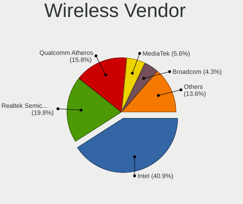

| Vendor                                | Desktops | Percent |
|---------------------------------------|----------|---------|
| Intel                                 | 199      | 40.95%  |
| Realtek Semiconductor                 | 96       | 19.75%  |
| Qualcomm Atheros                      | 77       | 15.84%  |
| MediaTek                              | 27       | 5.56%   |
| Broadcom                              | 21       | 4.32%   |
| TP-Link                               | 15       | 3.09%   |
| Ralink Technology                     | 13       | 2.67%   |
| Ralink                                | 11       | 2.26%   |
| ASUSTek Computer                      | 6        | 1.23%   |
| Edimax Technology                     | 4        | 0.82%   |
| Qualcomm Technologies                 | 3        | 0.62%   |
| IMC Networks                          | 3        | 0.62%   |
| D-Link                                | 3        | 0.62%   |
| Qualcomm Atheros Communications       | 2        | 0.41%   |
| Micro Star International              | 2        | 0.41%   |
| Linksys                               | 1        | 0.21%   |
| Atheros                               | 1        | 0.21%   |
| AboCom Systems                        | 1        | 0.21%   |
| 802.11g Adapter [Linksys WUSB54GC v3] | 1        | 0.21%   |

Wireless Model
--------------

Wireless models

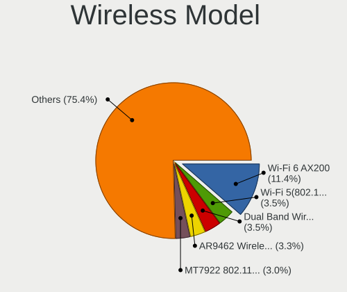

| Model                                                          | Desktops | Percent |
|----------------------------------------------------------------|----------|---------|
| Intel Wi-Fi 6 AX200                                            | 56       | 11.38%  |
| Intel Wi-Fi 5(802.11ac) Wireless-AC 9x6x [Thunder Peak]        | 17       | 3.46%   |
| Intel Dual Band Wireless-AC 3168NGW [Stone Peak]               | 17       | 3.46%   |
| Qualcomm Atheros AR9462 Wireless Network Adapter               | 16       | 3.25%   |
| MediaTek MT7922 802.11ax PCI Express Wireless Network Adapter  | 15       | 3.05%   |
| Intel Wi-Fi 6E(802.11ax) AX210/AX1675* 2x2 [Typhoon Peak]      | 14       | 2.85%   |
| Intel Cannon Lake PCH CNVi WiFi                                | 14       | 2.85%   |
| Realtek RTL8821CE 802.11ac PCIe Wireless Network Adapter       | 13       | 2.64%   |
| Qualcomm Atheros AR93xx Wireless Network Adapter               | 13       | 2.64%   |
| Intel Wireless 7265                                            | 12       | 2.44%   |
| Realtek RTL8192EE PCIe Wireless Network Adapter                | 10       | 2.03%   |
| Realtek RTL8188EUS 802.11n Wireless Network Adapter            | 10       | 2.03%   |
| Intel Wireless 8260                                            | 10       | 2.03%   |
| Broadcom BCM4360 802.11ac Dual Band Wireless Network Adapter   | 9        | 1.83%   |
| Realtek 8811CU Wireless LAN 802.11ac USB NIC                   | 8        | 1.63%   |
| Qualcomm Atheros AR9287 Wireless Network Adapter (PCI-Express) | 8        | 1.63%   |
| Qualcomm Atheros AR9285 Wireless Network Adapter (PCI-Express) | 8        | 1.63%   |
| MediaTek MT7921K (RZ608) Wi-Fi 6E 80MHz                        | 8        | 1.63%   |
| Intel Wireless 8265 / 8275                                     | 7        | 1.42%   |
| Intel Alder Lake-S PCH CNVi WiFi                               | 7        | 1.42%   |
| Intel 700 Series Chipset CNVi WiFi                             | 7        | 1.42%   |
| Realtek RTL8852BE PCIe 802.11ax Wireless Network Controller    | 6        | 1.22%   |
| Realtek RTL8812AE 802.11ac PCIe Wireless Network Adapter       | 6        | 1.22%   |
| Qualcomm Atheros AR9485 Wireless Network Adapter               | 6        | 1.22%   |
| Realtek RTL88x2bu [AC1200 Techkey]                             | 5        | 1.02%   |
| Realtek RTL8188EE Wireless Network Adapter                     | 5        | 1.02%   |
| Qualcomm Atheros QCA9377 802.11ac Wireless Network Adapter     | 5        | 1.02%   |
| Qualcomm Atheros AR928X Wireless Network Adapter (PCI-Express) | 5        | 1.02%   |
| Qualcomm Atheros AR9227 Wireless Network Adapter               | 5        | 1.02%   |
| Intel Wireless 7260                                            | 5        | 1.02%   |
| Intel Wireless 3165                                            | 5        | 1.02%   |
| Intel Wireless 3160                                            | 5        | 1.02%   |
| Intel Tiger Lake PCH CNVi WiFi                                 | 5        | 1.02%   |
| Intel Comet Lake PCH CNVi WiFi                                 | 5        | 1.02%   |
| Realtek RTL8852CE PCIe 802.11ax Wireless Network Controller    | 4        | 0.81%   |
| Realtek RTL8822CE 802.11ac PCIe Wireless Network Adapter       | 4        | 0.81%   |
| Intel Alder Lake-N PCH CNVi WiFi                               | 4        | 0.81%   |
| Broadcom BCM4352 802.11ac Dual Band Wireless Network Adapter   | 4        | 0.81%   |
| TP-Link Archer T2U PLUS [RTL8821AU]                            | 3        | 0.61%   |
| Realtek RTL8821AE 802.11ac PCIe Wireless Network Adapter       | 3        | 0.61%   |

Ethernet Vendor
---------------

Ethernet vendors

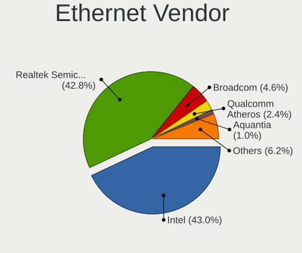

| Vendor                            | Desktops | Percent |
|-----------------------------------|----------|---------|
| Intel                             | 724      | 42.99%  |
| Realtek Semiconductor             | 720      | 42.76%  |
| Broadcom                          | 78       | 4.63%   |
| Qualcomm Atheros                  | 41       | 2.43%   |
| Aquantia                          | 17       | 1.01%   |
| Marvell Technology Group          | 13       | 0.77%   |
| VIA Technologies                  | 10       | 0.59%   |
| Samsung Electronics               | 10       | 0.59%   |
| American Megatrends               | 10       | 0.59%   |
| D-Link System                     | 8        | 0.48%   |
| Chelsio Communications            | 8        | 0.48%   |
| Nvidia                            | 5        | 0.3%    |
| 3Com                              | 5        | 0.3%    |
| Xiaomi                            | 4        | 0.24%   |
| OPPO Electronics                  | 4        | 0.24%   |
| Apple                             | 3        | 0.18%   |
| Sundance Technology Inc / IC Plus | 2        | 0.12%   |
| Qualcomm                          | 2        | 0.12%   |
| Emulex                            | 2        | 0.12%   |
| ADMtek                            | 2        | 0.12%   |
| Accton Technology                 | 2        | 0.12%   |
| U.S. Robotics                     | 1        | 0.06%   |
| Tehuti Networks                   | 1        | 0.06%   |
| Spreadtrum Communications         | 1        | 0.06%   |
| Solarflare Communications         | 1        | 0.06%   |
| sipeed                            | 1        | 0.06%   |
| Silicon Integrated Systems [SiS]  | 1        | 0.06%   |
| OnePlus Technology (Shenzhen)     | 1        | 0.06%   |
| National Semiconductor            | 1        | 0.06%   |
| MYRICOM                           | 1        | 0.06%   |
| Motorola PCS                      | 1        | 0.06%   |
| Microchip Technology              | 1        | 0.06%   |
| MediaTek                          | 1        | 0.06%   |
| Huawei Technologies               | 1        | 0.06%   |
| Davicom Semiconductor             | 1        | 0.06%   |

Ethernet Model
--------------

Ethernet models

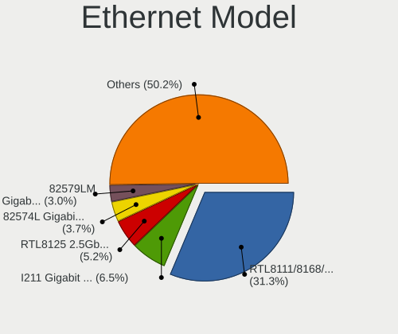

| Model                                                                         | Desktops | Percent |
|-------------------------------------------------------------------------------|----------|---------|
| Realtek RTL8111/8168/8211/8411 PCI Express Gigabit Ethernet Controller        | 577      | 31.32%  |
| Intel I211 Gigabit Network Connection                                         | 120      | 6.51%   |
| Realtek RTL8125 2.5GbE Controller                                             | 96       | 5.21%   |
| Intel 82574L Gigabit Network Connection                                       | 68       | 3.69%   |
| Intel 82579LM Gigabit Network Connection (Lewisville)                         | 56       | 3.04%   |
| Intel I210 Gigabit Network Connection                                         | 54       | 2.93%   |
| Intel Ethernet Controller I225-V                                              | 46       | 2.5%    |
| Intel Ethernet Connection I217-LM                                             | 38       | 2.06%   |
| Intel Ethernet Connection (2) I219-V                                          | 36       | 1.95%   |
| Intel Ethernet Connection (2) I219-LM                                         | 34       | 1.85%   |
| Intel 82579V Gigabit Network Connection                                       | 34       | 1.85%   |
| Intel I350 Gigabit Network Connection                                         | 26       | 1.41%   |
| Intel Ethernet Connection (7) I219-V                                          | 21       | 1.14%   |
| Intel Ethernet Connection (2) I218-V                                          | 21       | 1.14%   |
| Broadcom NetXtreme BCM5720 Gigabit Ethernet PCIe                              | 21       | 1.14%   |
| Intel Ethernet Controller I226-V                                              | 19       | 1.03%   |
| Realtek RTL810xE PCI Express Fast Ethernet controller                         | 18       | 0.98%   |
| Intel 82571EB/82571GB Gigabit Ethernet Controller D0/D1 (copper applications) | 18       | 0.98%   |
| Realtek RTL-8100/8101L/8139 PCI Fast Ethernet Adapter                         | 15       | 0.81%   |
| Intel Ethernet Connection (7) I219-LM                                         | 15       | 0.81%   |
| Intel Ethernet Controller X550                                                | 14       | 0.76%   |
| Realtek RTL8169 PCI Gigabit Ethernet Controller                               | 12       | 0.65%   |
| Intel Ethernet Connection I217-V                                              | 12       | 0.65%   |
| Intel 82580 Gigabit Network Connection                                        | 12       | 0.65%   |
| Intel 82572EI Gigabit Ethernet Controller (Copper)                            | 12       | 0.65%   |
| Intel 82576 Gigabit Network Connection                                        | 11       | 0.6%    |
| Intel 82567LM-3 Gigabit Network Connection                                    | 11       | 0.6%    |
| Broadcom NetXtreme BCM5723 Gigabit Ethernet PCIe                              | 11       | 0.6%    |
| Intel 82599ES 10-Gigabit SFI/SFP+ Network Connection                          | 10       | 0.54%   |
| American Megatrends Virtual Ethernet                                          | 10       | 0.54%   |
| Qualcomm Atheros Killer E220x Gigabit Ethernet Controller                     | 9        | 0.49%   |
| Marvell Group 88E8056 PCI-E Gigabit Ethernet Controller                       | 9        | 0.49%   |
| Intel Ethernet Controller 10-Gigabit X540-AT2                                 | 9        | 0.49%   |
| Intel Ethernet Connection (5) I219-LM                                         | 8        | 0.43%   |
| Intel 82557/8/9/0/1 Ethernet Pro 100                                          | 8        | 0.43%   |
| Samsung Galaxy series, misc. (tethering mode)                                 | 7        | 0.38%   |
| Qualcomm Atheros AR8121/AR8113/AR8114 Gigabit or Fast Ethernet                | 7        | 0.38%   |
| Intel 82566DM-2 Gigabit Network Connection                                    | 7        | 0.38%   |
| Broadcom NetXtreme BCM5719 Gigabit Ethernet PCIe                              | 7        | 0.38%   |
| VIA VT6105/VT6106S [Rhine-III]                                                | 6        | 0.33%   |

Net Controller Kind
-------------------

Ethernet, WiFi or modem

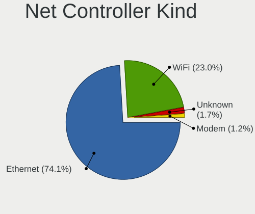

| Kind     | Desktops | Percent |
|----------|----------|---------|
| Ethernet | 1483     | 74.08%  |
| WiFi     | 460      | 22.98%  |
| Unknown  | 35       | 1.75%   |
| Modem    | 24       | 1.2%    |

Used Controller
---------------

Currently used network controller

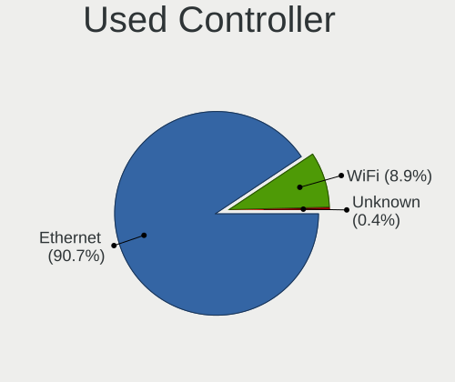

| Kind     | Desktops | Percent |
|----------|----------|---------|
| Ethernet | 1369     | 90.66%  |
| WiFi     | 135      | 8.94%   |
| Unknown  | 6        | 0.4%    |

NICs
----

Total network controllers on board

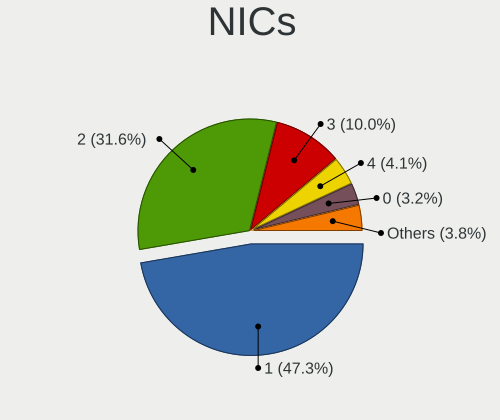

| Total | Desktops | Percent |
|-------|----------|---------|
| 1     | 741      | 47.29%  |
| 2     | 495      | 31.59%  |
| 3     | 157      | 10.02%  |
| 4     | 65       | 4.15%   |
| 0     | 50       | 3.19%   |
| 5     | 24       | 1.53%   |
| 6     | 20       | 1.28%   |
| 7     | 7        | 0.45%   |
| 8     | 3        | 0.19%   |
| 9     | 2        | 0.13%   |
| 15    | 1        | 0.06%   |
| 11    | 1        | 0.06%   |
| 10    | 1        | 0.06%   |

IPv6
----

IPv6 vs IPv4

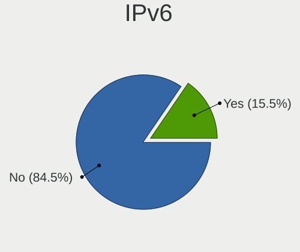

| Used | Desktops | Percent |
|------|----------|---------|
| No   | 1334     | 84.54%  |
| Yes  | 244      | 15.46%  |

Bluetooth
---------

Bluetooth Vendor
----------------

Controller vendors

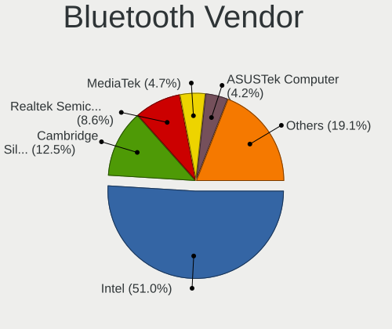

| Vendor                          | Desktops | Percent |
|---------------------------------|----------|---------|
| Intel                           | 184      | 50.97%  |
| Cambridge Silicon Radio         | 45       | 12.47%  |
| Realtek Semiconductor           | 31       | 8.59%   |
| MediaTek                        | 17       | 4.71%   |
| ASUSTek Computer                | 15       | 4.16%   |
| Foxconn / Hon Hai               | 13       | 3.6%    |
| IMC Networks                    | 12       | 3.32%   |
| Qualcomm Atheros Communications | 10       | 2.77%   |
| Apple                           | 10       | 2.77%   |
| Broadcom                        | 7        | 1.94%   |
| Lite-On Technology              | 5        | 1.39%   |
| Micro Star International        | 3        | 0.83%   |
| TP-Link                         | 2        | 0.55%   |
| Unknown                         | 2        | 0.55%   |
| Sino Wealth Electronic          | 1        | 0.28%   |
| Realtek                         | 1        | 0.28%   |
| Ralink                          | 1        | 0.28%   |
| Integrated System Solution      | 1        | 0.28%   |
| Corsair                         | 1        | 0.28%   |

Bluetooth Model
---------------

Controller models

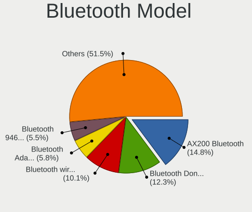

| Model                                                       | Desktops | Percent |
|-------------------------------------------------------------|----------|---------|
| Intel AX200 Bluetooth                                       | 54       | 14.79%  |
| Cambridge Silicon Radio Bluetooth Dongle (HCI mode)         | 45       | 12.33%  |
| Intel Bluetooth wireless interface                          | 37       | 10.14%  |
| Realtek Bluetooth Adapter                                   | 21       | 5.75%   |
| Intel Bluetooth 9460/9560 Jefferson Peak (JfP)              | 20       | 5.48%   |
| Intel Wireless-AC 9260 Bluetooth Adapter                    | 18       | 4.93%   |
| Intel AX201 Bluetooth                                       | 18       | 4.93%   |
| Intel Wireless-AC 3168 Bluetooth                            | 15       | 4.11%   |
| Intel AX210 Bluetooth                                       | 14       | 3.84%   |
| Intel AX211 Bluetooth                                       | 9        | 2.47%   |
| MediaTek RZ608 Bluetooth Adapter                            | 8        | 2.19%   |
| Foxconn / Hon Hai RZ616 Bluetooth Adapter                   | 7        | 1.92%   |
| Broadcom BCM20702A0 Bluetooth 4.0                           | 6        | 1.64%   |
| Apple Bluetooth Host Controller                             | 6        | 1.64%   |
| Realtek  Bluetooth 4.2 Adapter                              | 5        | 1.37%   |
| ASUS Broadcom BCM20702A0 Bluetooth                          | 5        | 1.37%   |
| MediaTek Wireless_Device                                    | 4        | 1.1%    |
| MediaTek RZ616 Bluetooth Adapter                            | 4        | 1.1%    |
| IMC Networks Realtek Bluetooth Adapter                      | 4        | 1.1%    |
| Apple Built-in Bluetooth 2.0+EDR HCI                        | 4        | 1.1%    |
| IMC Networks Qualcomm Atheros AR9462 Bluetooth 4.0          | 3        | 0.82%   |
| Foxconn / Hon Hai Android ADB Interface                     | 3        | 0.82%   |
| Unknown                                                     | 3        | 0.82%   |
| TP-Link Bluetooth 5.0 USB Adapter                           | 2        | 0.55%   |
| Realtek Bluetooth 4.2 Adapter                               | 2        | 0.55%   |
| Qualcomm Atheros Dell Wireless 1707 Bluetooth 4.0 LE Device | 2        | 0.55%   |
| Qualcomm Atheros AR3011 Bluetooth (no firmware)             | 2        | 0.55%   |
| Micro Star International Bluetooth 2.1+EDR USB Device       | 2        | 0.55%   |
| Lite-On Bluetooth USB Module                                | 2        | 0.55%   |
| Lite-On Atheros AR3012 Bluetooth                            | 2        | 0.55%   |
| Intel Centrino Bluetooth Wireless Transceiver               | 2        | 0.55%   |
| IMC Networks Realtek Bluetooth 4.0 + High Speed Chip        | 2        | 0.55%   |
| Foxconn / Hon Hai Wireless_Device                           | 2        | 0.55%   |
| ASUS USB-BT500                                              | 2        | 0.55%   |
| ASUS Qualcomm Atheros AR9462 Bluetooth 4.0 + HS Adapter     | 2        | 0.55%   |
| ASUS Broadcom BCM20702 Single-Chip Bluetooth 4.0 + LE       | 2        | 0.55%   |
| ASUS Bluetooth USB module                                   | 2        | 0.55%   |
| Sino Wealth Electronic RK Bluetooth Keyboar                 | 1        | 0.27%   |
| Realtek RTL8723B Bluetooth                                  | 1        | 0.27%   |
| Realtek Bluetooth Radio                                     | 1        | 0.27%   |

Sound
-----

Sound Vendor
------------

Sound card vendors

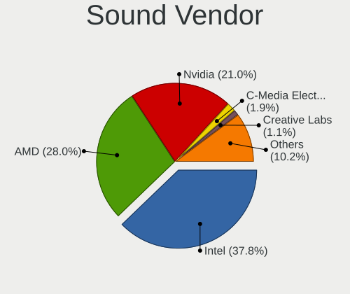

| Vendor                                       | Desktops | Percent |
|----------------------------------------------|----------|---------|
| Intel                                        | 749      | 37.81%  |
| AMD                                          | 554      | 27.97%  |
| Nvidia                                       | 417      | 21.05%  |
| C-Media Electronics                          | 37       | 1.87%   |
| Creative Labs                                | 22       | 1.11%   |
| Logitech                                     | 19       | 0.96%   |
| Texas Instruments                            | 12       | 0.61%   |
| Focusrite-Novation                           | 9        | 0.45%   |
| ASUSTek Computer                             | 9        | 0.45%   |
| Realtek Semiconductor                        | 8        | 0.4%    |
| JMTek                                        | 7        | 0.35%   |
| Blue Microphones                             | 7        | 0.35%   |
| Thesycon Systemsoftware & Consulting         | 6        | 0.3%    |
| Creative Technology                          | 6        | 0.3%    |
| VIA Technologies                             | 5        | 0.25%   |
| Sony                                         | 5        | 0.25%   |
| Plantronics                                  | 5        | 0.25%   |
| Kingston Technology                          | 5        | 0.25%   |
| Generalplus Technology                       | 5        | 0.25%   |
| BEHRINGER International                      | 5        | 0.25%   |
| Zoran Co. Personal Media Division (Nogatech) | 4        | 0.2%    |
| SteelSeries ApS                              | 4        | 0.2%    |
| Razer USA                                    | 4        | 0.2%    |
| Cambridge Silicon Radio                      | 4        | 0.2%    |
| XMOS                                         | 3        | 0.15%   |
| Tenx Technology                              | 3        | 0.15%   |
| Silicon Integrated Systems [SiS]             | 3        | 0.15%   |
| Micro Star International                     | 3        | 0.15%   |
| Huawei Technologies                          | 3        | 0.15%   |
| GN Netcom                                    | 3        | 0.15%   |
| Corsair                                      | 3        | 0.15%   |
| ASRock                                       | 3        | 0.15%   |
| Apple                                        | 3        | 0.15%   |
| Yamaha                                       | 2        | 0.1%    |
| Trust                                        | 2        | 0.1%    |
| RODE Microphones                             | 2        | 0.1%    |
| ROCCAT                                       | 2        | 0.1%    |
| Mark of the Unicorn                          | 2        | 0.1%    |
| M-Audio                                      | 2        | 0.1%    |
| Hewlett-Packard                              | 2        | 0.1%    |

Sound Model
-----------

Sound card models

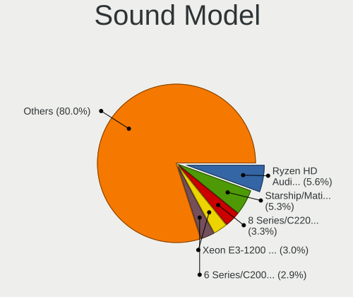

| Model                                                                      | Desktops | Percent |
|----------------------------------------------------------------------------|----------|---------|
| AMD Ryzen HD Audio Controller                                              | 132      | 5.57%   |
| AMD Starship/Matisse HD Audio Controller                                   | 125      | 5.27%   |
| Intel 8 Series/C220 Series Chipset High Definition Audio Controller        | 78       | 3.29%   |
| Intel Xeon E3-1200 v3/4th Gen Core Processor HD Audio Controller           | 71       | 3%      |
| Intel 6 Series/C200 Series Chipset Family High Definition Audio Controller | 68       | 2.87%   |
| AMD SBx00 Azalia (Intel HDA)                                               | 67       | 2.83%   |
| AMD Renoir/Cezanne HDMI/DP Audio Controller                                | 65       | 2.74%   |
| Intel 200 Series PCH HD Audio                                              | 63       | 2.66%   |
| Intel 100 Series/C230 Series Chipset Family HD Audio Controller            | 60       | 2.53%   |
| Intel 7 Series/C216 Chipset Family High Definition Audio Controller        | 58       | 2.45%   |
| AMD Family 17h (Models 00h-0fh) HD Audio Controller                        | 57       | 2.41%   |
| AMD Ellesmere HDMI Audio [Radeon RX 470/480 / 570/580/590]                 | 56       | 2.36%   |
| Nvidia GK208 HDMI/DP Audio Controller                                      | 53       | 2.24%   |
| Intel Cannon Lake PCH cAVS                                                 | 48       | 2.03%   |
| AMD Navi 21/23 HDMI/DP Audio Controller                                    | 41       | 1.73%   |
| AMD Raven/Raven2/Fenghuang HDMI/DP Audio Controller                        | 36       | 1.52%   |
| Intel NM10/ICH7 Family High Definition Audio Controller                    | 34       | 1.43%   |
| Intel 82801JI (ICH10 Family) HD Audio Controller                           | 33       | 1.39%   |
| Nvidia GP107GL High Definition Audio Controller                            | 32       | 1.35%   |
| Nvidia GP108 High Definition Audio Controller                              | 31       | 1.31%   |
| AMD Radeon High Definition Audio Controller                                | 31       | 1.31%   |
| AMD Oland/Hainan/Cape Verde/Pitcairn HDMI Audio [Radeon HD 7000 Series]    | 29       | 1.22%   |
| AMD Baffin HDMI/DP Audio [Radeon RX 550 640SP / RX 560/560X]               | 28       | 1.18%   |
| Nvidia TU116 High Definition Audio Controller                              | 27       | 1.14%   |
| Intel C600/X79 series chipset High Definition Audio Controller             | 25       | 1.05%   |
| Nvidia High Definition Audio Controller                                    | 24       | 1.01%   |
| Intel C610/X99 series chipset HD Audio Controller                          | 24       | 1.01%   |
| AMD FCH Azalia Controller                                                  | 24       | 1.01%   |
| Intel Alder Lake-S HD Audio Controller                                     | 23       | 0.97%   |
| Intel 9 Series Chipset Family HD Audio Controller                          | 23       | 0.97%   |
| Nvidia GP106 High Definition Audio Controller                              | 21       | 0.89%   |
| Nvidia GF119 HDMI Audio Controller                                         | 21       | 0.89%   |
| Nvidia GP104 High Definition Audio Controller                              | 20       | 0.84%   |
| Intel 5 Series/3400 Series Chipset High Definition Audio                   | 19       | 0.8%    |
| Nvidia GK107 HDMI Audio Controller                                         | 18       | 0.76%   |
| Intel Smart Sound Technology (SST) Audio Controller                        | 17       | 0.72%   |
| Intel Comet Lake PCH cAVS                                                  | 17       | 0.72%   |
| AMD RV710/730 HDMI Audio [Radeon HD 4000 series]                           | 17       | 0.72%   |
| AMD Navi 10 HDMI Audio                                                     | 17       | 0.72%   |
| Nvidia GM107 High Definition Audio Controller [GeForce 940MX]              | 16       | 0.68%   |

Memory
------

Memory Vendor
-------------

Memory module vendors

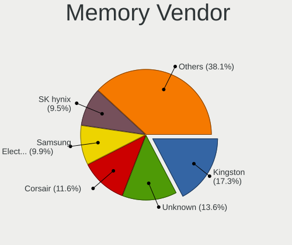

| Vendor                       | Desktops | Percent |
|------------------------------|----------|---------|
| Kingston                     | 283      | 17.32%  |
| Unknown                      | 222      | 13.59%  |
| Corsair                      | 189      | 11.57%  |
| Samsung Electronics          | 161      | 9.85%   |
| SK hynix                     | 156      | 9.55%   |
| Crucial                      | 124      | 7.59%   |
| G.Skill                      | 113      | 6.92%   |
| Micron Technology            | 99       | 6.06%   |
| Unknown                      | 48       | 2.94%   |
| A-DATA Technology            | 31       | 1.9%    |
| Patriot                      | 21       | 1.29%   |
| Team                         | 20       | 1.22%   |
| Hewlett-Packard              | 14       | 0.86%   |
| Nanya Technology             | 12       | 0.73%   |
| Ramaxel Technology           | 11       | 0.67%   |
| GOODRAM                      | 11       | 0.67%   |
| Transcend                    | 10       | 0.61%   |
| Patriot Memory (PDP Systems) | 9        | 0.55%   |
| AMD                          | 5        | 0.31%   |
| Unknown (ABCD)               | 4        | 0.24%   |
| Lexar Co Limited             | 4        | 0.24%   |
| Apacer                       | 4        | 0.24%   |
| Timetec                      | 3        | 0.18%   |
| tigo                         | 3        | 0.18%   |
| Super Talent                 | 3        | 0.18%   |
| Qimonda                      | 3        | 0.18%   |
| Lexar                        | 3        | 0.18%   |
| Kllisre                      | 3        | 0.18%   |
| Kingmax                      | 3        | 0.18%   |
| Goldkey                      | 3        | 0.18%   |
| GeIL                         | 3        | 0.18%   |
| Avant                        | 3        | 0.18%   |
| ASint Technology             | 3        | 0.18%   |
| V-GeN                        | 2        | 0.12%   |
| Silicon Power                | 2        | 0.12%   |
| PNY                          | 2        | 0.12%   |
| Kreton                       | 2        | 0.12%   |
| Innodisk                     | 2        | 0.12%   |
| HPE                          | 2        | 0.12%   |
| Golden Empire                | 2        | 0.12%   |

Memory Model
------------

Memory module models

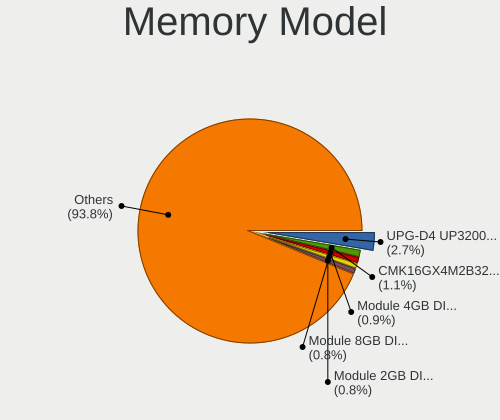

| Model                                                  | Desktops | Percent |
|--------------------------------------------------------|----------|---------|
| Unknown                                                | 48       | 2.69%   |
| Corsair RAM CMK16GX4M2B3200C16 8GB DIMM DDR4 3200MT/s  | 19       | 1.06%   |
| Unknown RAM Module 4GB DIMM 1333MT/s                   | 16       | 0.9%    |
| Unknown RAM Module 8GB DIMM DDR3 1600MT/s              | 14       | 0.78%   |
| Unknown RAM Module 2GB DIMM DDR2 800MT/s               | 14       | 0.78%   |
| Unknown RAM Module 8GB DIMM 1333MT/s                   | 9        | 0.5%    |
| Kingston RAM KF3200C16D4/16GX 16GB DIMM DDR4 3200MT/s  | 9        | 0.5%    |
| G.Skill RAM F4-3200C16-16GVK 16GB DIMM DDR4 3200MT/s   | 9        | 0.5%    |
| Crucial RAM CT102464BA160B.C16 8GB DIMM DDR3 1600MT/s  | 9        | 0.5%    |
| Unknown RAM Module 2GB DIMM 1333MT/s                   | 8        | 0.45%   |
| SK hynix RAM HMT451U6BFR8A-PB 4GB DIMM DDR3 1600MT/s   | 8        | 0.45%   |
| Samsung RAM M391A2K43BB1-CTD 16GB DIMM DDR4 3200MT/s   | 8        | 0.45%   |
| Corsair RAM CMK16GX4M2E3200C16 8GB DIMM DDR4 3733MT/s  | 8        | 0.45%   |
| Corsair RAM CMK16GX4M2B3000C15 8GB DIMM DDR4 3000MT/s  | 8        | 0.45%   |
| Unknown RAM Module 1GB DIMM SDRAM                      | 7        | 0.39%   |
| SK hynix RAM HMT451U6BFR8C-PB 4GB DIMM DDR3 1600MT/s   | 7        | 0.39%   |
| Samsung RAM M378B5273DH0-CK0 4GB DIMM DDR3 1600MT/s    | 7        | 0.39%   |
| Kingston RAM KHX2400C15/8G 8GB DIMM DDR4 2400MT/s      | 7        | 0.39%   |
| Unknown RAM Module 8192MB DIMM DDR3 1600MT/s           | 6        | 0.34%   |
| Unknown RAM Module 512MB DIMM SDRAM                    | 6        | 0.34%   |
| Unknown RAM Module 4GB SODIMM DDR3 1333MT/s            | 6        | 0.34%   |
| SK hynix RAM HMT451U6AFR8C-PB 4GB DIMM DDR3 1600MT/s   | 6        | 0.34%   |
| SK hynix RAM HMA81GU6JJR8N-VK 8GB DIMM DDR4 2667MT/s   | 6        | 0.34%   |
| Kingston RAM KHX1866C10D3/8G 8GB DIMM DDR3 1867MT/s    | 6        | 0.34%   |
| G.Skill RAM F4-3200C16-32GVK 32GB DIMM DDR4 3200MT/s   | 6        | 0.34%   |
| Unknown RAM Module 8GB DIMM DDR3 1333MT/s              | 5        | 0.28%   |
| Unknown RAM Module 2GB DIMM SDRAM                      | 5        | 0.28%   |
| Unknown RAM Module 2048MB DIMM DDR2 800MT/s            | 5        | 0.28%   |
| Team RAM TEAMGROUP-UD4-3200 8GB DIMM DDR4 3200MT/s     | 5        | 0.28%   |
| Samsung RAM M378B5773CH0-CH9 2GB DIMM DDR3 1333MT/s    | 5        | 0.28%   |
| Samsung RAM M378B5173QH0-CK0 4GB DIMM DDR3 1600MT/s    | 5        | 0.28%   |
| Kingston RAM KHX2666C16/8G 8GB DIMM DDR4 2933MT/s      | 5        | 0.28%   |
| Kingston RAM KHX2400C15/16G 16GB DIMM DDR4 2400MT/s    | 5        | 0.28%   |
| Crucial RAM BLS8G3D1609DS1S00. 8GB DIMM DDR3 1866MT/s  | 5        | 0.28%   |
| Corsair RAM CMK64GX4M2E3200C16 32GB DIMM DDR4 3200MT/s | 5        | 0.28%   |
| Corsair RAM CMK32GX4M2D3600C18 16GB DIMM DDR4 3600MT/s | 5        | 0.28%   |
| Corsair RAM CMK32GX4M2A2666C16 16GB DIMM DDR4 3000MT/s | 5        | 0.28%   |
| Unknown RAM Module 4GB DIMM DDR 1333MT/s               | 4        | 0.22%   |
| Unknown RAM Module 4096MB DIMM 1333MT/s                | 4        | 0.22%   |
| Unknown RAM Module 2GB DIMM 800MT/s                    | 4        | 0.22%   |

Memory Kind
-----------

Memory module kinds

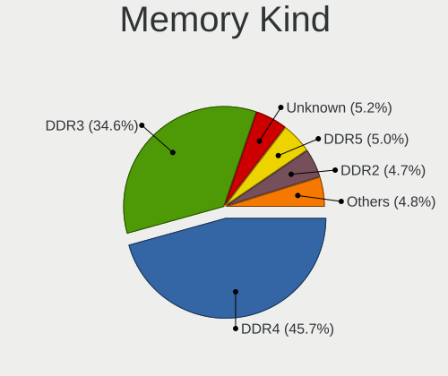

| Kind         | Desktops | Percent |
|--------------|----------|---------|
| DDR4         | 662      | 45.69%  |
| DDR3         | 501      | 34.58%  |
| Unknown      | 75       | 5.18%   |
| DDR5         | 73       | 5.04%   |
| DDR2         | 68       | 4.69%   |
| SDRAM        | 35       | 2.42%   |
| DDR          | 18       | 1.24%   |
| LPDDR4       | 7        | 0.48%   |
| LPDDR5       | 4        | 0.28%   |
| DRAM         | 4        | 0.28%   |
| LPDDR3       | 1        | 0.07%   |
| DDR2 FB-DIMM | 1        | 0.07%   |

Memory Form Factor
------------------

Physical design of the memory module

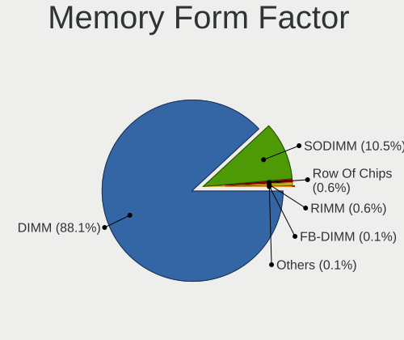

| Name         | Desktops | Percent |
|--------------|----------|---------|
| DIMM         | 1270     | 88.13%  |
| SODIMM       | 151      | 10.48%  |
| Row Of Chips | 8        | 0.56%   |
| RIMM         | 8        | 0.56%   |
| FB-DIMM      | 2        | 0.14%   |
| Chip         | 1        | 0.07%   |
| Unknown      | 1        | 0.07%   |

Memory Size
-----------

Memory module size

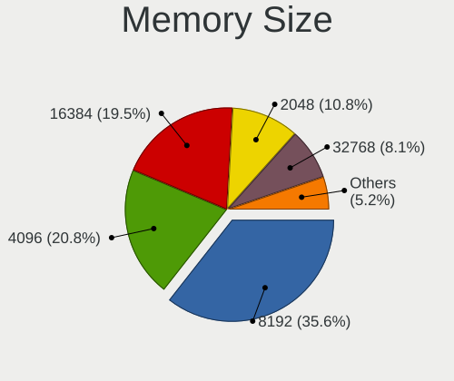

| Size   | Desktops | Percent |
|--------|----------|---------|
| 8192   | 559      | 35.58%  |
| 4096   | 326      | 20.75%  |
| 16384  | 307      | 19.54%  |
| 2048   | 169      | 10.76%  |
| 32768  | 128      | 8.15%   |
| 1024   | 50       | 3.18%   |
| 512    | 15       | 0.95%   |
| 49152  | 7        | 0.45%   |
| 128    | 2        | 0.13%   |
| 131072 | 1        | 0.06%   |
| 65536  | 1        | 0.06%   |
| 6144   | 1        | 0.06%   |
| 3072   | 1        | 0.06%   |
| 256    | 1        | 0.06%   |
| 64     | 1        | 0.06%   |
| 32     | 1        | 0.06%   |
| 8      | 1        | 0.06%   |

Memory Speed
------------

Memory module speed

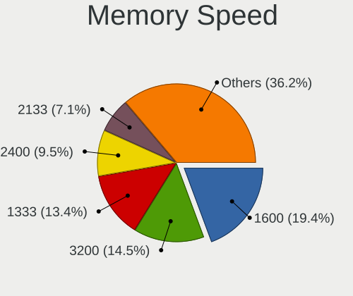

| Speed   | Desktops | Percent |
|---------|----------|---------|
| 1600    | 298      | 19.35%  |
| 3200    | 223      | 14.48%  |
| 1333    | 207      | 13.44%  |
| 2400    | 146      | 9.48%   |
| 2133    | 109      | 7.08%   |
| 2667    | 87       | 5.65%   |
| 800     | 73       | 4.74%   |
| 4800    | 47       | 3.05%   |
| 3600    | 38       | 2.47%   |
| 667     | 37       | 2.4%    |
| 2666    | 35       | 2.27%   |
| Unknown | 34       | 2.21%   |
| 3000    | 29       | 1.88%   |
| 2933    | 21       | 1.36%   |
| 1066    | 20       | 1.3%    |
| 1866    | 19       | 1.23%   |
| 5600    | 12       | 0.78%   |
| 400     | 12       | 0.78%   |
| 1867    | 11       | 0.71%   |
| 3733    | 10       | 0.65%   |
| 533     | 10       | 0.65%   |
| 5200    | 7        | 0.45%   |
| 6400    | 6        | 0.39%   |
| 1067    | 6        | 0.39%   |
| 6000    | 4        | 0.26%   |
| 3400    | 4        | 0.26%   |
| 3066    | 4        | 0.26%   |
| 1334    | 4        | 0.26%   |
| 4000    | 3        | 0.19%   |
| 3534    | 3        | 0.19%   |
| 2800    | 2        | 0.13%   |
| 2048    | 2        | 0.13%   |
| 1400    | 2        | 0.13%   |
| 1332    | 2        | 0.13%   |
| 333     | 2        | 0.13%   |
| 65535   | 1        | 0.06%   |
| 7200    | 1        | 0.06%   |
| 5500    | 1        | 0.06%   |
| 4133    | 1        | 0.06%   |
| 3500    | 1        | 0.06%   |

Printers & scanners
-------------------

Printer Vendor
--------------

Printer device vendors

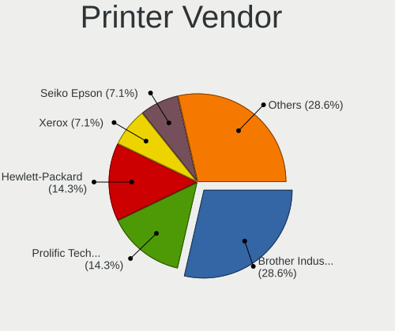

| Vendor              | Desktops | Percent |
|---------------------|----------|---------|
| Brother Industries  | 4        | 28.57%  |
| Prolific Technology | 2        | 14.29%  |
| Hewlett-Packard     | 2        | 14.29%  |
| Xerox               | 1        | 7.14%   |
| Seiko Epson         | 1        | 7.14%   |
| Samsung Electronics | 1        | 7.14%   |
| QinHeng Electronics | 1        | 7.14%   |
| Dymo-CoStar         | 1        | 7.14%   |
| Canon               | 1        | 7.14%   |

Printer Model
-------------

Printer device models

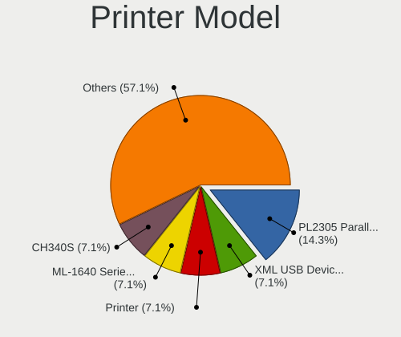

| Model                                                                                      | Desktops | Percent |
|--------------------------------------------------------------------------------------------|----------|---------|
| Prolific PL2305 Parallel Port                                                              | 2        | 14.29%  |
| Xerox XML USB Device Interface                                                             | 1        | 7.14%   |
| Seiko Epson Printer                                                                        | 1        | 7.14%   |
| Samsung ML-1640 Series Laser Printer                                                       | 1        | 7.14%   |
| QinHeng CH340S                                                                             | 1        | 7.14%   |
| HP LaserJet 1012                                                                           | 1        | 7.14%   |
| HP HP LaserJet M14-M17 Printer HP LEDM IPP Printer HP LEDM IPP Printer HP LEDM IPP Printer | 1        | 7.14%   |
| Dymo-CoStar LabelWriter 450                                                                | 1        | 7.14%   |
| Canon LBP2900                                                                              | 1        | 7.14%   |
| Brother MFC-7360N                                                                          | 1        | 7.14%   |
| Brother HL-L5200DW series                                                                  | 1        | 7.14%   |
| Brother HL-2030 Laser Printer                                                              | 1        | 7.14%   |
| Brother HL-1430 Laser Printer                                                              | 1        | 7.14%   |

Scanner Vendor
--------------

Scanner device vendors

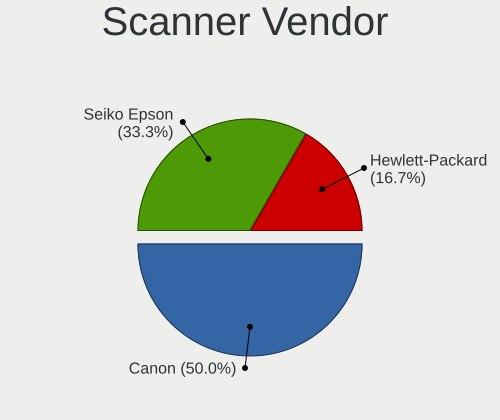

| Vendor          | Desktops | Percent |
|-----------------|----------|---------|
| Canon           | 4        | 50%     |
| Seiko Epson     | 3        | 37.5%   |
| Hewlett-Packard | 1        | 12.5%   |

Scanner Model
-------------

Scanner device models

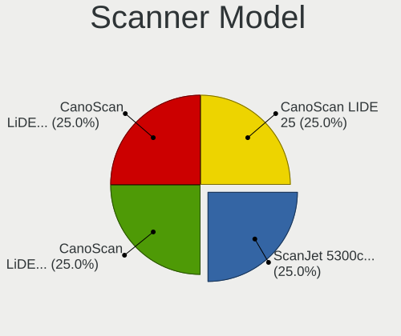

| Model                                                                               | Desktops | Percent |
|-------------------------------------------------------------------------------------|----------|---------|
| Seiko Epson WF-2850 Series EPSON Scanner USB2.0 Printer EPSON Utility USB2.0 Faxout | 2        | 25%     |
| Seiko Epson GT-9300UF [Perfection 2400 PHOTO]                                       | 1        | 12.5%   |
| HP ScanJet 5300c/5370c                                                              | 1        | 12.5%   |
| Canon CanoScan LIDE 25                                                              | 1        | 12.5%   |
| Canon CanoScan LiDE 220                                                             | 1        | 12.5%   |
| Canon CanoScan LiDE 110                                                             | 1        | 12.5%   |
| Canon CanoScan 9000F                                                                | 1        | 12.5%   |

Camera
------

Camera Vendor
-------------

Camera device vendors

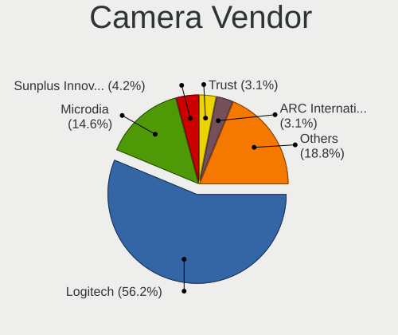

| Vendor                        | Desktops | Percent |
|-------------------------------|----------|---------|
| Logitech                      | 54       | 56.25%  |
| Microdia                      | 14       | 14.58%  |
| Sunplus Innovation Technology | 4        | 4.17%   |
| Trust                         | 3        | 3.13%   |
| ARC International             | 3        | 3.13%   |
| WCM_USB                       | 2        | 2.08%   |
| SHENZHEN EMEET TECHNOLOGY     | 2        | 2.08%   |
| Z-Star Microelectronics       | 1        | 1.04%   |
| YGTek                         | 1        | 1.04%   |
| Valve Software                | 1        | 1.04%   |
| Suyin                         | 1        | 1.04%   |
| Sonix Technology              | 1        | 1.04%   |
| Realtek Semiconductor         | 1        | 1.04%   |
| OmniVision Technologies       | 1        | 1.04%   |
| Nam Tai E&E Products          | 1        | 1.04%   |
| Lenovo                        | 1        | 1.04%   |
| Huawei Technologies           | 1        | 1.04%   |
| Cubeternet                    | 1        | 1.04%   |
| Aveo Technology               | 1        | 1.04%   |
| Asuscom Network               | 1        | 1.04%   |
| Arkmicro Technologies         | 1        | 1.04%   |

Camera Model
------------

Camera device models

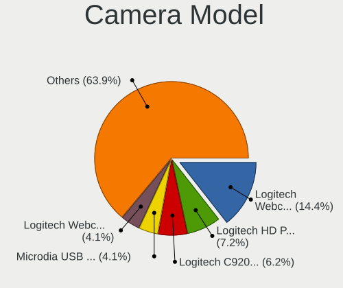

| Model                                          | Desktops | Percent |
|------------------------------------------------|----------|---------|
| Logitech Webcam C270                           | 14       | 14.43%  |
| Logitech HD Pro Webcam C920                    | 7        | 7.22%   |
| Logitech C920 PRO HD Webcam                    | 6        | 6.19%   |
| Microdia USB 2.0 Camera                        | 4        | 4.12%   |
| Logitech Webcam C930e                          | 4        | 4.12%   |
| Logitech Webcam C310                           | 3        | 3.09%   |
| Logitech C922 Pro Stream Webcam                | 3        | 3.09%   |
| Logitech C920 HD Pro Webcam                    | 3        | 3.09%   |
| Logitech BRIO Ultra HD Webcam                  | 3        | 3.09%   |
| ARC International Camera                       | 3        | 3.09%   |
| WCM_USB WEB CAM                                | 2        | 2.06%   |
| Sunplus 2-USB 2.0 Camera                       | 2        | 2.06%   |
| SHENZHEN EMEET TECHNOLOGY HD Webcam eMeet C960 | 2        | 2.06%   |
| Microdia Webcam Vitade AF                      | 2        | 2.06%   |
| Microdia Lenovo EasyCamera                     | 2        | 2.06%   |
| Microdia JOYACCESS JA-Webcam                   | 2        | 2.06%   |
| Microdia HP Integrated Webcam                  | 2        | 2.06%   |
| Logitech Logi Webcam C920e                     | 2        | 2.06%   |
| Logitech Labtec Webcam Pro                     | 2        | 2.06%   |
| Logitech HD Webcam C525                        | 2        | 2.06%   |
| Logitech C505 HD Webcam                        | 2        | 2.06%   |
| Z-Star Venus USB2.0 Camera                     | 1        | 1.03%   |
| YGTek Webcam                                   | 1        | 1.03%   |
| Valve Software 3D Camera                       | 1        | 1.03%   |
| Trust Trust USB Camera                         | 1        | 1.03%   |
| Trust Trust QHD Webcam                         | 1        | 1.03%   |
| Trust Canyon CNS-CWC6 Webcam                   | 1        | 1.03%   |
| Suyin Acer CrystalEye Webcam                   | 1        | 1.03%   |
| Sunplus SPCA2281 Web Camera                    | 1        | 1.03%   |
| Sunplus 2K FHD camera                          | 1        | 1.03%   |
| Sonix FHD Webcam                               | 1        | 1.03%   |
| Realtek USB Video Device                       | 1        | 1.03%   |
| OmniVision Monitor Webcam                      | 1        | 1.03%   |
| Nam Tai E&E Products Sony Playstation Eye      | 1        | 1.03%   |
| Microdia USB  Live camera                      | 1        | 1.03%   |
| Microdia Camera                                | 1        | 1.03%   |
| Logitech Webcam C170                           | 1        | 1.03%   |
| Logitech QuickCam OEM Cisco VT Camera II       | 1        | 1.03%   |
| Logitech Logitech Webcam C925e                 | 1        | 1.03%   |
| Logitech HD Webcam C615                        | 1        | 1.03%   |

Security
--------

Fingerprint Vendor
------------------

Fingerprint sensor vendors

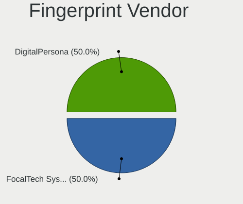

| Vendor            | Desktops | Percent |
|-------------------|----------|---------|
| FocalTech Systems | 1        | 50%     |
| DigitalPersona    | 1        | 50%     |

Fingerprint Model
-----------------

Fingerprint sensor models

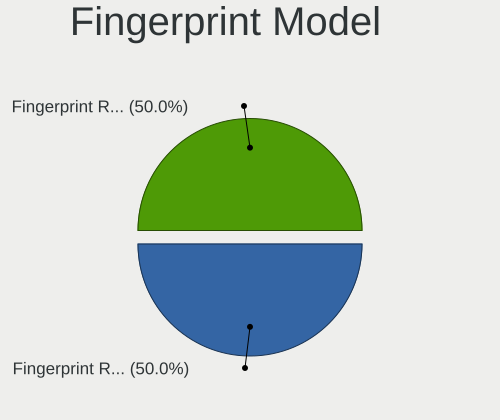

| Model                                | Desktops | Percent |
|--------------------------------------|----------|---------|
| FocalTech Systems Fingerprint Reader | 1        | 50%     |
| DigitalPersona Fingerprint Reader    | 1        | 50%     |

Chipcard Vendor
---------------

Chipcard module vendors

Zero info for selected period =(

Chipcard Model
--------------

Chipcard module models

Zero info for selected period =(

Unsupported
-----------

Unsupported Devices
-------------------

Total unsupported devices on board

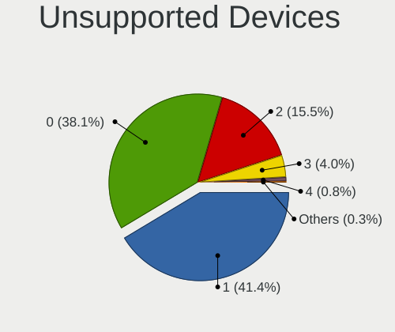

| Total | Desktops | Percent |
|-------|----------|---------|
| 1     | 659      | 41.39%  |
| 0     | 607      | 38.13%  |
| 2     | 246      | 15.45%  |
| 3     | 64       | 4.02%   |
| 4     | 12       | 0.75%   |
| 6     | 2        | 0.13%   |
| 5     | 2        | 0.13%   |

Unsupported Device Types
------------------------

Types of unsupported devices

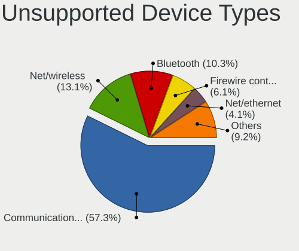

| Type                     | Desktops | Percent |
|--------------------------|----------|---------|
| Communication controller | 726      | 57.3%   |
| Net/wireless             | 166      | 13.1%   |
| Bluetooth                | 130      | 10.26%  |
| Firewire controller      | 77       | 6.08%   |
| Net/ethernet             | 52       | 4.1%    |
| Sound                    | 49       | 3.87%   |
| Network                  | 34       | 2.68%   |
| Card reader              | 22       | 1.74%   |
| Dvb card                 | 5        | 0.39%   |
| Storage/raid             | 3        | 0.24%   |
| Fingerprint reader       | 2        | 0.16%   |
| Storage/nvme             | 1        | 0.08%   |

