FreeBSD - Tested Hardware & Statistics (Desktops)
-------------------------------------------------

A project to collect tested hardware configurations for FreeBSD.

Anyone can contribute to this report by the [hw-probe](https://github.com/linuxhw/hw-probe/blob/master/INSTALL.BSD.md) tool:

    hw-probe -all -upload

Please contribute! Especially if your hardware is rare.

Contents
--------

* [ Test Cases ](#test-cases)

* [ System ](#system)
  - [ OS                       ](#os)
  - [ OS Family                ](#os-family)
  - [ Arch                     ](#arch)
  - [ DE                       ](#de)
  - [ Display Server           ](#display-server)
  - [ Display Manager          ](#display-manager)
  - [ OS Lang                  ](#os-lang)
  - [ Boot Mode                ](#boot-mode)
  - [ Filesystem               ](#filesystem)
  - [ Part. scheme             ](#part-scheme)

* [ Board ](#board)
  - [ Vendor                   ](#vendor)
  - [ Model                    ](#model)
  - [ Model Family             ](#model-family)
  - [ MFG Year                 ](#mfg-year)
  - [ Form Factor              ](#form-factor)
  - [ Coreboot                 ](#coreboot)
  - [ RAM Size                 ](#ram-size)
  - [ RAM Used                 ](#ram-used)
  - [ Total Drives             ](#total-drives)
  - [ Has CD-ROM               ](#has-cd-rom)
  - [ Has Ethernet             ](#has-ethernet)
  - [ Has WiFi                 ](#has-wifi)
  - [ Has Bluetooth            ](#has-bluetooth)

* [ Location ](#location)
  - [ Country                  ](#country)
  - [ City                     ](#city)

* [ Drives ](#drives)
  - [ Drive Vendor             ](#drive-vendor)
  - [ Drive Model              ](#drive-model)
  - [ HDD Vendor               ](#hdd-vendor)
  - [ SSD Vendor               ](#ssd-vendor)
  - [ Drive Kind               ](#drive-kind)
  - [ Drive Connector          ](#drive-connector)
  - [ Drive Size               ](#drive-size)
  - [ Space Total              ](#space-total)
  - [ Space Used               ](#space-used)
  - [ Malfunc. Drives          ](#malfunc-drives)
  - [ Malfunc. Drive Vendor    ](#malfunc-drive-vendor)
  - [ Malfunc. HDD Vendor      ](#malfunc-hdd-vendor)
  - [ Malfunc. Drive Kind      ](#malfunc-drive-kind)
  - [ Failed Drives            ](#failed-drives)
  - [ Failed Drive Vendor      ](#failed-drive-vendor)
  - [ Drive Status             ](#drive-status)

* [ Storage controller ](#storage-controller)
  - [ Storage Vendor           ](#storage-vendor)
  - [ Storage Model            ](#storage-model)
  - [ Storage Kind             ](#storage-kind)

* [ Processor ](#processor)
  - [ CPU Vendor               ](#cpu-vendor)
  - [ CPU Model                ](#cpu-model)
  - [ CPU Model Family         ](#cpu-model-family)
  - [ CPU Cores                ](#cpu-cores)
  - [ CPU Sockets              ](#cpu-sockets)
  - [ CPU Threads              ](#cpu-threads)
  - [ CPU Microarch            ](#cpu-microarch)

* [ Graphics ](#graphics)
  - [ GPU Vendor               ](#gpu-vendor)
  - [ GPU Model                ](#gpu-model)
  - [ GPU Combo                ](#gpu-combo)
  - [ GPU Driver               ](#gpu-driver)
  - [ GPU Memory               ](#gpu-memory)

* [ Monitor ](#monitor)
  - [ Monitor Vendor           ](#monitor-vendor)
  - [ Monitor Model            ](#monitor-model)
  - [ Monitor Resolution       ](#monitor-resolution)
  - [ Monitor Diagonal         ](#monitor-diagonal)
  - [ Monitor Width            ](#monitor-width)
  - [ Aspect Ratio             ](#aspect-ratio)
  - [ Monitor Area             ](#monitor-area)
  - [ Pixel Density            ](#pixel-density)
  - [ Multiple Monitors        ](#multiple-monitors)

* [ Network ](#network)
  - [ Net Controller Vendor    ](#net-controller-vendor)
  - [ Net Controller Model     ](#net-controller-model)
  - [ Wireless Vendor          ](#wireless-vendor)
  - [ Wireless Model           ](#wireless-model)
  - [ Ethernet Vendor          ](#ethernet-vendor)
  - [ Ethernet Model           ](#ethernet-model)
  - [ Net Controller Kind      ](#net-controller-kind)
  - [ Used Controller          ](#used-controller)
  - [ NICs                     ](#nics)
  - [ IPv6                     ](#ipv6)

* [ Bluetooth ](#bluetooth)
  - [ Bluetooth Vendor         ](#bluetooth-vendor)
  - [ Bluetooth Model          ](#bluetooth-model)

* [ Sound ](#sound)
  - [ Sound Vendor             ](#sound-vendor)
  - [ Sound Model              ](#sound-model)

* [ Memory ](#memory)
  - [ Memory Vendor            ](#memory-vendor)
  - [ Memory Model             ](#memory-model)
  - [ Memory Kind              ](#memory-kind)
  - [ Memory Form Factor       ](#memory-form-factor)
  - [ Memory Size              ](#memory-size)
  - [ Memory Speed             ](#memory-speed)

* [ Printers & scanners ](#printers--scanners)
  - [ Printer Vendor           ](#printer-vendor)
  - [ Printer Model            ](#printer-model)
  - [ Scanner Vendor           ](#scanner-vendor)
  - [ Scanner Model            ](#scanner-model)

* [ Camera ](#camera)
  - [ Camera Vendor            ](#camera-vendor)
  - [ Camera Model             ](#camera-model)

* [ Security ](#security)
  - [ Fingerprint Vendor       ](#fingerprint-vendor)
  - [ Fingerprint Model        ](#fingerprint-model)
  - [ Chipcard Vendor          ](#chipcard-vendor)
  - [ Chipcard Model           ](#chipcard-model)

* [ Unsupported ](#unsupported)
  - [ Unsupported Devices      ](#unsupported-devices)
  - [ Unsupported Device Types ](#unsupported-device-types)

Test Cases
----------

Total: 2019

| Vendor        | Model                       | Probe                                                     | Date         |
|---------------|-----------------------------|-----------------------------------------------------------|--------------|
| ASUSTek       | ProArt B550-CREATOR         | [c23ee67c69](https://bsd-hardware.info/?probe=c23ee67c69) | May 08, 2024 |
| MSI           | MS-7097                     | [df5c7407fd](https://bsd-hardware.info/?probe=df5c7407fd) | May 06, 2024 |
| Dell          | 0GXM1W A01                  | [1238d729a7](https://bsd-hardware.info/?probe=1238d729a7) | May 06, 2024 |
| ASUSTek       | G11CD                       | [e4d4f0e1b2](https://bsd-hardware.info/?probe=e4d4f0e1b2) | May 06, 2024 |
| ASUSTek       | PRIME Z690-P D4             | [e7a48c0ebb](https://bsd-hardware.info/?probe=e7a48c0ebb) | May 05, 2024 |
| MSI           | H81M-P33                    | [db35e993b4](https://bsd-hardware.info/?probe=db35e993b4) | May 05, 2024 |
| ASUSTek       | ROG CROSSHAIR VIII HERO     | [76bd355935](https://bsd-hardware.info/?probe=76bd355935) | May 05, 2024 |
| ASUSTek       | P5Q-E                       | [4e42133f58](https://bsd-hardware.info/?probe=4e42133f58) | May 05, 2024 |
| Protectli     | FW2B                        | [92725f96b8](https://bsd-hardware.info/?probe=92725f96b8) | May 05, 2024 |
| Gigabyte      | GA-78LMT-S2 sex             | [89beae510f](https://bsd-hardware.info/?probe=89beae510f) | May 04, 2024 |
| Dell          | 0MGK50 A02                  | [6f9b5b3cad](https://bsd-hardware.info/?probe=6f9b5b3cad) | May 03, 2024 |
| Gigabyte      | Z370P D3-CF                 | [591ac5deba](https://bsd-hardware.info/?probe=591ac5deba) | May 03, 2024 |
| Apple         | Mac-F60DEB81FF30ACF6 Mac... | [5240c726c5](https://bsd-hardware.info/?probe=5240c726c5) | May 03, 2024 |
| ASUSTek       | TUF Gaming A620-PRO WIFI    | [a186355a65](https://bsd-hardware.info/?probe=a186355a65) | May 02, 2024 |
| Apple         | Mac-F60DEB81FF30ACF6 Mac... | [db2e2d1fbc](https://bsd-hardware.info/?probe=db2e2d1fbc) | May 02, 2024 |
| ASRockRack    | EPYC3101D4I-2T              | [15e26ac086](https://bsd-hardware.info/?probe=15e26ac086) | Apr 30, 2024 |
| ASUSTek       | Z170 PRO GAMING             | [72deae70f8](https://bsd-hardware.info/?probe=72deae70f8) | Apr 29, 2024 |
| Dell          | 07N90W A02                  | [f0520bbeb9](https://bsd-hardware.info/?probe=f0520bbeb9) | Apr 29, 2024 |
| Quantum en... | HackBoard 2                 | [a7b0ea1eca](https://bsd-hardware.info/?probe=a7b0ea1eca) | Apr 28, 2024 |
| Shenzhen M... | AHWSA                       | [eb205801e7](https://bsd-hardware.info/?probe=eb205801e7) | Apr 27, 2024 |
| ASUSTek       | ProArt X670E-CREATOR WIF... | [ac75273460](https://bsd-hardware.info/?probe=ac75273460) | Apr 25, 2024 |
| Dell          | 048DY8 A00                  | [9604806e18](https://bsd-hardware.info/?probe=9604806e18) | Apr 24, 2024 |
| ASUSTek       | M5A97 LE R2.0               | [0b322f0da8](https://bsd-hardware.info/?probe=0b322f0da8) | Apr 24, 2024 |
| ASUSTek       | ROG STRIX X670E-F GAMING... | [f5683de21a](https://bsd-hardware.info/?probe=f5683de21a) | Apr 24, 2024 |
| ASUSTek       | P8H61-M LX                  | [eaee094e07](https://bsd-hardware.info/?probe=eaee094e07) | Apr 23, 2024 |
| Gigabyte      | X570 AORUS MASTER           | [58a64ecc64](https://bsd-hardware.info/?probe=58a64ecc64) | Apr 23, 2024 |
| Lenovo        | 367D 31900059 STD           | [eed4d35722](https://bsd-hardware.info/?probe=eed4d35722) | Apr 21, 2024 |
| Gigabyte      | B460 AORUS PRO AC           | [fe0730cde5](https://bsd-hardware.info/?probe=fe0730cde5) | Apr 20, 2024 |
| ASUSTek       | TUF Gaming X570-PLUS        | [572876d341](https://bsd-hardware.info/?probe=572876d341) | Apr 20, 2024 |
| AZW           | SER V1                      | [4e085db4ef](https://bsd-hardware.info/?probe=4e085db4ef) | Apr 19, 2024 |
| HP            | 3646h                       | [615b37fb0f](https://bsd-hardware.info/?probe=615b37fb0f) | Apr 19, 2024 |
| ASUSTek       | Maximus VII HERO            | [909b53a869](https://bsd-hardware.info/?probe=909b53a869) | Apr 19, 2024 |
| Gigabyte      | Z590I AORUS ULTRA           | [bf06ab7481](https://bsd-hardware.info/?probe=bf06ab7481) | Apr 19, 2024 |
| Intel         | DN2820FYK H24582-201        | [1bc36f8af1](https://bsd-hardware.info/?probe=1bc36f8af1) | Apr 17, 2024 |
| Lenovo        | 367D 31900059 STD           | [b6e893449c](https://bsd-hardware.info/?probe=b6e893449c) | Apr 17, 2024 |
| Intel         | DP965LT AAD41694-210        | [90e9ba9d77](https://bsd-hardware.info/?probe=90e9ba9d77) | Apr 16, 2024 |
| Intel         | MAHOBAY                     | [c76dc714f2](https://bsd-hardware.info/?probe=c76dc714f2) | Apr 15, 2024 |
| Unknown       | Unknown                     | [08cdf907e4](https://bsd-hardware.info/?probe=08cdf907e4) | Apr 15, 2024 |
| Unknown       | Unknown                     | [75fccc1dbe](https://bsd-hardware.info/?probe=75fccc1dbe) | Apr 15, 2024 |
| Unknown       | Unknown                     | [ba545bb931](https://bsd-hardware.info/?probe=ba545bb931) | Apr 15, 2024 |
| MSI           | B450I GAMING PLUS MAX WI... | [7ab7294373](https://bsd-hardware.info/?probe=7ab7294373) | Apr 14, 2024 |
| Unknown       | Unknown                     | [34d08de74d](https://bsd-hardware.info/?probe=34d08de74d) | Apr 13, 2024 |
| ASRock        | X99 Extreme4                | [8d5a19e786](https://bsd-hardware.info/?probe=8d5a19e786) | Apr 13, 2024 |
| ASRock        | X99 Extreme4                | [f2fdbc8d66](https://bsd-hardware.info/?probe=f2fdbc8d66) | Apr 13, 2024 |
| Fujitsu       | D3427-A1 S26361-D3427-A1    | [0f9af3b2b5](https://bsd-hardware.info/?probe=0f9af3b2b5) | Apr 13, 2024 |
| Dell          | 0GM819                      | [6140b5e6ad](https://bsd-hardware.info/?probe=6140b5e6ad) | Apr 12, 2024 |
| MSI           | A520M-A PRO                 | [ad2494f0c0](https://bsd-hardware.info/?probe=ad2494f0c0) | Apr 11, 2024 |
| ASUSTek       | Z97-A                       | [2f83e16bd9](https://bsd-hardware.info/?probe=2f83e16bd9) | Apr 11, 2024 |
| Gigabyte      | H97M-D3H                    | [8c0a605e99](https://bsd-hardware.info/?probe=8c0a605e99) | Apr 10, 2024 |
| MSI           | A520M-A PRO                 | [3fb8a577ad](https://bsd-hardware.info/?probe=3fb8a577ad) | Apr 10, 2024 |
| MSI           | B450M MORTAR MAX            | [816bfd4777](https://bsd-hardware.info/?probe=816bfd4777) | Apr 09, 2024 |
| Intel         | D525MW AAE93082-401         | [9a37f5660f](https://bsd-hardware.info/?probe=9a37f5660f) | Apr 09, 2024 |
| ASUSTek       | PRIME B650-PLUS             | [1335666f76](https://bsd-hardware.info/?probe=1335666f76) | Apr 09, 2024 |
| ASRock        | AMD BC-250                  | [3b38d89497](https://bsd-hardware.info/?probe=3b38d89497) | Apr 09, 2024 |
| HP            | ProLiant ML310e Gen8        | [040c686c32](https://bsd-hardware.info/?probe=040c686c32) | Apr 07, 2024 |
| Foxconn       | H61MXV/H67MXV               | [53663c4ae5](https://bsd-hardware.info/?probe=53663c4ae5) | Apr 07, 2024 |
| SolidRun      | CEX7 Platform               | [7c5ed3c2fe](https://bsd-hardware.info/?probe=7c5ed3c2fe) | Apr 06, 2024 |
| HP            | 2B28                        | [b4f2207b5d](https://bsd-hardware.info/?probe=b4f2207b5d) | Apr 06, 2024 |
| HP            | 2B28                        | [5a64d57e01](https://bsd-hardware.info/?probe=5a64d57e01) | Apr 05, 2024 |
| ASRock        | Z790M-ITX WiFi              | [b2bbe7eb8d](https://bsd-hardware.info/?probe=b2bbe7eb8d) | Apr 04, 2024 |
| Gigabyte      | X570 I AORUS PRO WIFI       | [0ab49168ee](https://bsd-hardware.info/?probe=0ab49168ee) | Apr 02, 2024 |
| ASRock        | Q1900-ITX                   | [cfceb60c9e](https://bsd-hardware.info/?probe=cfceb60c9e) | Mar 28, 2024 |
| ASRock        | Q1900-ITX                   | [d29def9398](https://bsd-hardware.info/?probe=d29def9398) | Mar 28, 2024 |
| ASUSTek       | TUF Gaming B650-PLUS        | [f960805584](https://bsd-hardware.info/?probe=f960805584) | Mar 26, 2024 |
| Intel         | DH61CR AAG14064-204         | [c1d0a393a3](https://bsd-hardware.info/?probe=c1d0a393a3) | Mar 25, 2024 |
| ASRock        | J5040-ITX                   | [075487240d](https://bsd-hardware.info/?probe=075487240d) | Mar 25, 2024 |
| ASUSTek       | PRIME J4005I-C              | [33c6bf6200](https://bsd-hardware.info/?probe=33c6bf6200) | Mar 25, 2024 |
| MSI           | MPG X570 GAMING EDGE WIF... | [c2fcfcd39d](https://bsd-hardware.info/?probe=c2fcfcd39d) | Mar 24, 2024 |
| Intel         | D53427RKE G87971-403        | [5cf0576fee](https://bsd-hardware.info/?probe=5cf0576fee) | Mar 23, 2024 |
| ASUSTek       | SABERTOOTH 990FX R2.0       | [c00f4d37cc](https://bsd-hardware.info/?probe=c00f4d37cc) | Mar 22, 2024 |
| HP            | ProLiant MicroServer        | [7fa3a9e12a](https://bsd-hardware.info/?probe=7fa3a9e12a) | Mar 22, 2024 |
| HP            | ProLiant MicroServer        | [c158a70e91](https://bsd-hardware.info/?probe=c158a70e91) | Mar 22, 2024 |
| PC Engines    | APU2                        | [1f2d9aef5b](https://bsd-hardware.info/?probe=1f2d9aef5b) | Mar 22, 2024 |
| Gigabyte      | H81M-S2V                    | [f04f1f2154](https://bsd-hardware.info/?probe=f04f1f2154) | Mar 20, 2024 |
| ASUSTek       | PRIME A520M-K               | [aeaeb5bff5](https://bsd-hardware.info/?probe=aeaeb5bff5) | Mar 19, 2024 |
| Unknown       | Unknown                     | [9acbce6ef2](https://bsd-hardware.info/?probe=9acbce6ef2) | Mar 19, 2024 |
| Protectli     | FW6 Ver                     | [bab06633ba](https://bsd-hardware.info/?probe=bab06633ba) | Mar 19, 2024 |
| Lenovo        | 30D9 SDK0J40700 WIN 3258... | [139d9be65a](https://bsd-hardware.info/?probe=139d9be65a) | Mar 18, 2024 |
| ASRock        | B450M-HDV R4.0              | [bbc697af5e](https://bsd-hardware.info/?probe=bbc697af5e) | Mar 17, 2024 |
| Unknown       | Unknown                     | [2776bdbd27](https://bsd-hardware.info/?probe=2776bdbd27) | Mar 16, 2024 |
| Alienware     | 0446JC A01                  | [d207e3f488](https://bsd-hardware.info/?probe=d207e3f488) | Mar 16, 2024 |
| Dell          | 0T7D40 A01                  | [5b8f4fe788](https://bsd-hardware.info/?probe=5b8f4fe788) | Mar 14, 2024 |
| Dell          | 08NPPY A00                  | [adcbf8a526](https://bsd-hardware.info/?probe=adcbf8a526) | Mar 12, 2024 |
| Unknown       | Unknown                     | [820c6cbe0c](https://bsd-hardware.info/?probe=820c6cbe0c) | Mar 10, 2024 |
| ZOTAC         | Unknown                     | [9217678a4f](https://bsd-hardware.info/?probe=9217678a4f) | Mar 10, 2024 |
| Dell          | 002KVM A01                  | [92ae9e6766](https://bsd-hardware.info/?probe=92ae9e6766) | Mar 07, 2024 |
| ASUSTek       | PRIME A520M-E               | [b0e5a68883](https://bsd-hardware.info/?probe=b0e5a68883) | Mar 03, 2024 |
| ASRockRack    | EPYC3101D4I-2T              | [cd922b0100](https://bsd-hardware.info/?probe=cd922b0100) | Feb 29, 2024 |
| ASUSTek       | TUF Gaming X570-PLUS        | [0857785c6d](https://bsd-hardware.info/?probe=0857785c6d) | Feb 27, 2024 |
| ASUSTek       | P8P67                       | [1971d6c84c](https://bsd-hardware.info/?probe=1971d6c84c) | Feb 27, 2024 |
| Supermicro    | X7DWE                       | [23e991022f](https://bsd-hardware.info/?probe=23e991022f) | Feb 27, 2024 |
| ASUSTek       | M4A89TD PRO USB3            | [c0561cccdd](https://bsd-hardware.info/?probe=c0561cccdd) | Feb 26, 2024 |
| MSI           | H81M-P33                    | [7e215d6165](https://bsd-hardware.info/?probe=7e215d6165) | Feb 25, 2024 |
| ASUSTek       | P5Q-E                       | [d86a9bc700](https://bsd-hardware.info/?probe=d86a9bc700) | Feb 25, 2024 |
| ASUSTek       | ROG CROSSHAIR VIII HERO     | [7c8bd6104e](https://bsd-hardware.info/?probe=7c8bd6104e) | Feb 25, 2024 |
| ASUSTek       | PRIME B450M-A               | [101b5912bf](https://bsd-hardware.info/?probe=101b5912bf) | Feb 25, 2024 |
| Dell          | 0T7D40 A01                  | [151b04e792](https://bsd-hardware.info/?probe=151b04e792) | Feb 23, 2024 |
| Advatronix... | C2750D4I v1.0               | [ba0ab14231](https://bsd-hardware.info/?probe=ba0ab14231) | Feb 22, 2024 |
| ASRock        | B650 PG Lightning           | [54d6c96d25](https://bsd-hardware.info/?probe=54d6c96d25) | Feb 22, 2024 |
| Unknown       | Unknown                     | [a5ae8a1c9d](https://bsd-hardware.info/?probe=a5ae8a1c9d) | Feb 21, 2024 |
| ASRock        | 4X4-5000 Series             | [dc9ef8f030](https://bsd-hardware.info/?probe=dc9ef8f030) | Feb 21, 2024 |
| Gigabyte      | Z97X-UD3H-CF                | [054056b5fa](https://bsd-hardware.info/?probe=054056b5fa) | Feb 21, 2024 |
| ASUSTek       | TUF Gaming X570-PLUS        | [59c7610a80](https://bsd-hardware.info/?probe=59c7610a80) | Feb 19, 2024 |
| Dell          | 0FF3FN A00                  | [cb83e35a3e](https://bsd-hardware.info/?probe=cb83e35a3e) | Feb 19, 2024 |
| Gigabyte      | Z97X-UD3H-CF                | [d84e00c746](https://bsd-hardware.info/?probe=d84e00c746) | Feb 19, 2024 |
| Gigabyte      | G1.Sniper H6                | [471f2213f0](https://bsd-hardware.info/?probe=471f2213f0) | Feb 19, 2024 |
| Fujitsu       | D3401-H2 S26361-D3401-H2    | [057ab23bee](https://bsd-hardware.info/?probe=057ab23bee) | Feb 18, 2024 |
| Dell          | 0T7D40 A01                  | [7aeebe2c82](https://bsd-hardware.info/?probe=7aeebe2c82) | Feb 18, 2024 |
| ASUSTek       | P5Q-E                       | [6c06931b93](https://bsd-hardware.info/?probe=6c06931b93) | Feb 18, 2024 |
| ASUSTek       | ROG CROSSHAIR VIII HERO     | [84aa76dfc8](https://bsd-hardware.info/?probe=84aa76dfc8) | Feb 18, 2024 |
| HP            | 83E9                        | [f5a6f9001d](https://bsd-hardware.info/?probe=f5a6f9001d) | Feb 17, 2024 |
| ASUSTek       | PRIME A520M-A II            | [acb70accb8](https://bsd-hardware.info/?probe=acb70accb8) | Feb 14, 2024 |
| ASUSTek       | PRIME X370-PRO              | [7a18edf610](https://bsd-hardware.info/?probe=7a18edf610) | Feb 13, 2024 |
| ASRock        | X570 Phantom Gaming 4       | [d24c0ab2c0](https://bsd-hardware.info/?probe=d24c0ab2c0) | Feb 13, 2024 |
| ASRock        | Z590 Steel Legend           | [e7dfc1ffe5](https://bsd-hardware.info/?probe=e7dfc1ffe5) | Feb 13, 2024 |
| ASRock        | Z590 Steel Legend           | [30702fa4b5](https://bsd-hardware.info/?probe=30702fa4b5) | Feb 13, 2024 |
| Dell          | 0FF3FN A00                  | [56b53a9e68](https://bsd-hardware.info/?probe=56b53a9e68) | Feb 11, 2024 |
| ASUSTek       | TUF Gaming B550M-PLUS       | [fa2107c718](https://bsd-hardware.info/?probe=fa2107c718) | Feb 11, 2024 |
| ASUSTek       | P5Q-E                       | [08506a1aff](https://bsd-hardware.info/?probe=08506a1aff) | Feb 11, 2024 |
| ASUSTek       | ROG CROSSHAIR VIII HERO     | [5f3d8e3288](https://bsd-hardware.info/?probe=5f3d8e3288) | Feb 11, 2024 |
| Gigabyte      | H81M-D2V                    | [1b2b064c64](https://bsd-hardware.info/?probe=1b2b064c64) | Feb 08, 2024 |
| ASRock        | B450M-HDV                   | [841a005fc8](https://bsd-hardware.info/?probe=841a005fc8) | Feb 06, 2024 |
| MSI           | PRO B550M-P GEN3            | [6a6b1dbe8f](https://bsd-hardware.info/?probe=6a6b1dbe8f) | Feb 06, 2024 |
| Lenovo        | ThinkCentre M90p 3853RN9    | [c0395ca728](https://bsd-hardware.info/?probe=c0395ca728) | Feb 05, 2024 |
| MSI           | H81M-P33                    | [444eaddd27](https://bsd-hardware.info/?probe=444eaddd27) | Feb 04, 2024 |
| ASUSTek       | P5Q-E                       | [87358bcf94](https://bsd-hardware.info/?probe=87358bcf94) | Feb 04, 2024 |
| ASUSTek       | ROG CROSSHAIR VIII HERO     | [94f15f8857](https://bsd-hardware.info/?probe=94f15f8857) | Feb 04, 2024 |
| ASUSTek       | Pro B560M-C                 | [676019447d](https://bsd-hardware.info/?probe=676019447d) | Feb 03, 2024 |
| Gigabyte      | GA-MA78GM-S2HP              | [c0ca7a18ae](https://bsd-hardware.info/?probe=c0ca7a18ae) | Feb 01, 2024 |
| Gigabyte      | Z97-HD3                     | [b41ed8f957](https://bsd-hardware.info/?probe=b41ed8f957) | Feb 01, 2024 |
| ASRockRack    | EPYC3101D4I-2T              | [aae98167a1](https://bsd-hardware.info/?probe=aae98167a1) | Jan 31, 2024 |
| Gigabyte      | Z690 UD DDR4                | [8b93ca6177](https://bsd-hardware.info/?probe=8b93ca6177) | Jan 29, 2024 |
| Gigabyte      | Z690 UD DDR4                | [5d0e727014](https://bsd-hardware.info/?probe=5d0e727014) | Jan 29, 2024 |
| Dell          | 0T7D40 A01                  | [19ab947fb4](https://bsd-hardware.info/?probe=19ab947fb4) | Jan 29, 2024 |
| MSI           | H81M-P33                    | [d411f5eb4b](https://bsd-hardware.info/?probe=d411f5eb4b) | Jan 28, 2024 |
| ASUSTek       | P5Q-E                       | [22436fad84](https://bsd-hardware.info/?probe=22436fad84) | Jan 28, 2024 |
| ASUSTek       | ROG CROSSHAIR VIII HERO     | [ec38d3e15f](https://bsd-hardware.info/?probe=ec38d3e15f) | Jan 28, 2024 |
| ASRock        | H310CM-HDV/M.2              | [4f45811a17](https://bsd-hardware.info/?probe=4f45811a17) | Jan 27, 2024 |
| ASUSTek       | TUF Gaming B560M-PLUS WI... | [713a924dbc](https://bsd-hardware.info/?probe=713a924dbc) | Jan 26, 2024 |
| HC Technol... | HCAR5000-MI                 | [70f47b16e5](https://bsd-hardware.info/?probe=70f47b16e5) | Jan 25, 2024 |
| Fujitsu       | D3403-U1 S26361-D3403-U1    | [d1da11d4cd](https://bsd-hardware.info/?probe=d1da11d4cd) | Jan 24, 2024 |
| ASRock        | B660M-STX                   | [5ee66bbf7a](https://bsd-hardware.info/?probe=5ee66bbf7a) | Jan 23, 2024 |
| SolidRun      | CEX7 Platform               | [ae1a4bcbae](https://bsd-hardware.info/?probe=ae1a4bcbae) | Jan 23, 2024 |
| Gigabyte      | H87-D3H-CF                  | [60fb8ff088](https://bsd-hardware.info/?probe=60fb8ff088) | Jan 21, 2024 |
| SolidRun      | CEX7 Platform               | [d876c335eb](https://bsd-hardware.info/?probe=d876c335eb) | Jan 21, 2024 |
| ASUSTek       | TUF Gaming B550-PLUS        | [86b81c8374](https://bsd-hardware.info/?probe=86b81c8374) | Jan 19, 2024 |
| ASUSTek       | ROG STRIX Z370-G GAMING     | [e2053919c4](https://bsd-hardware.info/?probe=e2053919c4) | Jan 15, 2024 |
| ASUSTek       | PRIME X370-PRO              | [a95eae54ba](https://bsd-hardware.info/?probe=a95eae54ba) | Jan 13, 2024 |
| ASRock        | X570 Phantom Gaming 4       | [f1224c8ebd](https://bsd-hardware.info/?probe=f1224c8ebd) | Jan 13, 2024 |
| ASUSTek       | ROG STRIX B550-F GAMING     | [9736c485c9](https://bsd-hardware.info/?probe=9736c485c9) | Jan 12, 2024 |
| ASUSTek       | Pro WS WRX80E-SAGE SE WI... | [33704d0025](https://bsd-hardware.info/?probe=33704d0025) | Jan 12, 2024 |
| Dell          | 0MGK50 A02                  | [311083cbe9](https://bsd-hardware.info/?probe=311083cbe9) | Jan 11, 2024 |
| Dell          | 0MGK50 A02                  | [7c2faad499](https://bsd-hardware.info/?probe=7c2faad499) | Jan 11, 2024 |
| ASRock        | B450M-HDV                   | [c15701f2a9](https://bsd-hardware.info/?probe=c15701f2a9) | Jan 10, 2024 |
| ASRock        | B450M-HDV                   | [82d5d6af92](https://bsd-hardware.info/?probe=82d5d6af92) | Jan 10, 2024 |
| HP            | 3641h                       | [90626880cf](https://bsd-hardware.info/?probe=90626880cf) | Jan 09, 2024 |
| Unknown       | Unknown                     | [821748c324](https://bsd-hardware.info/?probe=821748c324) | Jan 08, 2024 |
| MSI           | B450-A PRO                  | [f7e3102e87](https://bsd-hardware.info/?probe=f7e3102e87) | Jan 07, 2024 |
| MSI           | H81M-P33                    | [e2407e0579](https://bsd-hardware.info/?probe=e2407e0579) | Jan 07, 2024 |
| ASUSTek       | P5Q-E                       | [e97b058f7c](https://bsd-hardware.info/?probe=e97b058f7c) | Jan 07, 2024 |
| ASUSTek       | ROG CROSSHAIR VIII HERO     | [d429a5298b](https://bsd-hardware.info/?probe=d429a5298b) | Jan 07, 2024 |
| Unknown       | Unknown                     | [6564d3ecfe](https://bsd-hardware.info/?probe=6564d3ecfe) | Jan 07, 2024 |
| Roqos         | Core RC10                   | [3f3aabf270](https://bsd-hardware.info/?probe=3f3aabf270) | Jan 06, 2024 |
| Dell          | 0D24M8 A01                  | [17862ade20](https://bsd-hardware.info/?probe=17862ade20) | Jan 03, 2024 |
| ASUSTek       | CM6870                      | [d7b4e67cdc](https://bsd-hardware.info/?probe=d7b4e67cdc) | Jan 03, 2024 |
| ASUSTek       | ROG STRIX B650E-I GAMING... | [a29eec0aa5](https://bsd-hardware.info/?probe=a29eec0aa5) | Jan 02, 2024 |
| Alienware     | 07HV66 A00                  | [ea6a3f3020](https://bsd-hardware.info/?probe=ea6a3f3020) | Jan 01, 2024 |
| ASRockRack    | EPYC3101D4I-2T              | [7e2b858339](https://bsd-hardware.info/?probe=7e2b858339) | Dec 31, 2023 |
| ASRock        | B450 Gaming K4              | [84985aa669](https://bsd-hardware.info/?probe=84985aa669) | Dec 31, 2023 |
| MSI           | H81M-P33                    | [82e08820f2](https://bsd-hardware.info/?probe=82e08820f2) | Dec 31, 2023 |
| ASUSTek       | P5Q-E                       | [da3b88ef85](https://bsd-hardware.info/?probe=da3b88ef85) | Dec 31, 2023 |
| ASUSTek       | ROG CROSSHAIR VIII HERO     | [391f4c0e0b](https://bsd-hardware.info/?probe=391f4c0e0b) | Dec 31, 2023 |
| ASUSTek       | CM6870                      | [1889675f37](https://bsd-hardware.info/?probe=1889675f37) | Dec 30, 2023 |
| HP            | 3397                        | [46b6923bcd](https://bsd-hardware.info/?probe=46b6923bcd) | Dec 30, 2023 |
| Unknown       | Unknown                     | [ba78787dff](https://bsd-hardware.info/?probe=ba78787dff) | Dec 29, 2023 |
| ASUSTek       | ROG STRIX B460-G GAMING     | [6b9d713fe0](https://bsd-hardware.info/?probe=6b9d713fe0) | Dec 28, 2023 |
| MSI           | Aspen                       | [ac6dd2b153](https://bsd-hardware.info/?probe=ac6dd2b153) | Dec 27, 2023 |
| Lenovo        | 30D9 SDK0J40700 WIN 3258... | [504fb1678f](https://bsd-hardware.info/?probe=504fb1678f) | Dec 24, 2023 |
| ASUSTek       | P5Q-E                       | [04675127c2](https://bsd-hardware.info/?probe=04675127c2) | Dec 24, 2023 |
| ASUSTek       | ROG CROSSHAIR VIII HERO     | [1ef7136151](https://bsd-hardware.info/?probe=1ef7136151) | Dec 24, 2023 |
| Acer          | Veriton X490G               | [3f4dbee6d1](https://bsd-hardware.info/?probe=3f4dbee6d1) | Dec 24, 2023 |
| Acer          | Veriton X490G               | [1865afdae1](https://bsd-hardware.info/?probe=1865afdae1) | Dec 24, 2023 |
| MSI           | MPG X570 GAMING EDGE WIF... | [06457349dc](https://bsd-hardware.info/?probe=06457349dc) | Dec 22, 2023 |
| Dell          | 0VD5HY A00                  | [03b0e973ca](https://bsd-hardware.info/?probe=03b0e973ca) | Dec 19, 2023 |
| ASUSTek       | P5Q-E                       | [5a4d01667e](https://bsd-hardware.info/?probe=5a4d01667e) | Dec 17, 2023 |
| ASUSTek       | ROG CROSSHAIR VIII HERO     | [ea79e98108](https://bsd-hardware.info/?probe=ea79e98108) | Dec 17, 2023 |
| MSI           | A520M-A PRO                 | [11e5e87b70](https://bsd-hardware.info/?probe=11e5e87b70) | Dec 16, 2023 |
| ASUSTek       | PRO B460M-C                 | [7a32a123f6](https://bsd-hardware.info/?probe=7a32a123f6) | Dec 15, 2023 |
| Gigabyte      | H61M-S2PV                   | [88d2ae1175](https://bsd-hardware.info/?probe=88d2ae1175) | Dec 14, 2023 |
| Dell          | 0NK5PH A00                  | [60451d4e43](https://bsd-hardware.info/?probe=60451d4e43) | Dec 14, 2023 |
| AZW           | EQ                          | [d83e11a7dc](https://bsd-hardware.info/?probe=d83e11a7dc) | Dec 13, 2023 |
| ASUSTek       | PRIME X370-PRO              | [bc50d301fa](https://bsd-hardware.info/?probe=bc50d301fa) | Dec 13, 2023 |
| ASRock        | X570 Phantom Gaming 4       | [dced442907](https://bsd-hardware.info/?probe=dced442907) | Dec 13, 2023 |
| Unknown       | Unknown                     | [123088175c](https://bsd-hardware.info/?probe=123088175c) | Dec 11, 2023 |
| EVGA          | X570 DARK.0                 | [1c84a8169b](https://bsd-hardware.info/?probe=1c84a8169b) | Dec 11, 2023 |
| Dell          | 0NC2VH A01                  | [6e876a349f](https://bsd-hardware.info/?probe=6e876a349f) | Dec 11, 2023 |
| Dell          | 0NW6H5 A00                  | [2febbeffc2](https://bsd-hardware.info/?probe=2febbeffc2) | Dec 11, 2023 |
| AZW           | EQ                          | [0280c1cdb9](https://bsd-hardware.info/?probe=0280c1cdb9) | Dec 10, 2023 |
| ASUSTek       | CM6870                      | [881ad2eacf](https://bsd-hardware.info/?probe=881ad2eacf) | Dec 10, 2023 |
| ASUSTek       | TUF Gaming B560M-PLUS       | [47480f848d](https://bsd-hardware.info/?probe=47480f848d) | Dec 10, 2023 |
| MSI           | H81M-P33                    | [2b1599aacd](https://bsd-hardware.info/?probe=2b1599aacd) | Dec 10, 2023 |
| ASUSTek       | Pro WS X570-ACE             | [89f0463ec6](https://bsd-hardware.info/?probe=89f0463ec6) | Dec 10, 2023 |
| ASUSTek       | CM6870                      | [78399ba39e](https://bsd-hardware.info/?probe=78399ba39e) | Dec 09, 2023 |
| Gigabyte      | B650 AORUS ELITE AX V2      | [7a6cdb3f06](https://bsd-hardware.info/?probe=7a6cdb3f06) | Dec 09, 2023 |
| ASUSTek       | PRIME X399-A                | [d62ad0d622](https://bsd-hardware.info/?probe=d62ad0d622) | Dec 09, 2023 |
| ASUSTek       | Z10PE-D16 WS                | [7fd4743b86](https://bsd-hardware.info/?probe=7fd4743b86) | Dec 07, 2023 |
| Dell          | 0NW6H5 A00                  | [41e61ade9a](https://bsd-hardware.info/?probe=41e61ade9a) | Dec 06, 2023 |
| ECS           | MCP61M-M3                   | [6d6c04c278](https://bsd-hardware.info/?probe=6d6c04c278) | Dec 05, 2023 |
| ASUSTek       | TUF Gaming X570-PLUS        | [8c023b9c33](https://bsd-hardware.info/?probe=8c023b9c33) | Dec 05, 2023 |
| MSI           | G31TM-P21                   | [4f5b576aff](https://bsd-hardware.info/?probe=4f5b576aff) | Dec 03, 2023 |
| ASUSTek       | TUF Gaming B550M-PLUS       | [a9b3beae66](https://bsd-hardware.info/?probe=a9b3beae66) | Dec 02, 2023 |
| ASRock        | Z590 Pro4                   | [0457bab107](https://bsd-hardware.info/?probe=0457bab107) | Dec 01, 2023 |
| ASRockRack    | EPYC3101D4I-2T              | [f1cb9a41ba](https://bsd-hardware.info/?probe=f1cb9a41ba) | Nov 30, 2023 |
| MSI           | B450M MORTAR                | [4017ce5221](https://bsd-hardware.info/?probe=4017ce5221) | Nov 29, 2023 |
| CNCTION-IA... | Unknown                     | [1b4871792b](https://bsd-hardware.info/?probe=1b4871792b) | Nov 28, 2023 |
| ASUSTek       | PRIME A520M-E               | [8d7c03be2f](https://bsd-hardware.info/?probe=8d7c03be2f) | Nov 28, 2023 |
| ASUSTek       | ProArt B550-CREATOR         | [806a29d40a](https://bsd-hardware.info/?probe=806a29d40a) | Nov 28, 2023 |
| ASRock        | B450 Steel Legend           | [c9f6264329](https://bsd-hardware.info/?probe=c9f6264329) | Nov 27, 2023 |
| ASRock        | B450 Steel Legend           | [1e9f19c4ae](https://bsd-hardware.info/?probe=1e9f19c4ae) | Nov 27, 2023 |
| Lenovo        | 1036 NO DPK                 | [3b18ff26c0](https://bsd-hardware.info/?probe=3b18ff26c0) | Nov 27, 2023 |
| ASUSTek       | PRIME A320M-K               | [42bddda351](https://bsd-hardware.info/?probe=42bddda351) | Nov 26, 2023 |
| MSI           | H81M-P33                    | [b653e75063](https://bsd-hardware.info/?probe=b653e75063) | Nov 26, 2023 |
| ASUSTek       | P5Q-E                       | [1454187842](https://bsd-hardware.info/?probe=1454187842) | Nov 26, 2023 |
| ASUSTek       | ROG CROSSHAIR VIII HERO     | [28f6ec2a7b](https://bsd-hardware.info/?probe=28f6ec2a7b) | Nov 26, 2023 |
| HP            | ProLiant ML350p Gen8        | [24f4b0ec7e](https://bsd-hardware.info/?probe=24f4b0ec7e) | Nov 24, 2023 |
| Silicom       | 80300-0214-G16 R310         | [34382c8f4b](https://bsd-hardware.info/?probe=34382c8f4b) | Nov 24, 2023 |
| Samsung       | DT1234567890 SEC_SW_REVI... | [4c80855e88](https://bsd-hardware.info/?probe=4c80855e88) | Nov 22, 2023 |
| Fujitsu       | D3233-A1 S26361-D3233-A1    | [a37a33268d](https://bsd-hardware.info/?probe=a37a33268d) | Nov 21, 2023 |
| Fujitsu       | D3233-A1 S26361-D3233-A1    | [fb283e956a](https://bsd-hardware.info/?probe=fb283e956a) | Nov 21, 2023 |
| ASRock        | X570 Phantom Gaming 4       | [4b6284d041](https://bsd-hardware.info/?probe=4b6284d041) | Nov 20, 2023 |
| PICO PC       | MNHO-113                    | [c9a12372b4](https://bsd-hardware.info/?probe=c9a12372b4) | Nov 20, 2023 |
| MSI           | H81M-P33                    | [6406980bbf](https://bsd-hardware.info/?probe=6406980bbf) | Nov 19, 2023 |
| ASUSTek       | P5Q-E                       | [e7ccb4156e](https://bsd-hardware.info/?probe=e7ccb4156e) | Nov 19, 2023 |
| ASUSTek       | ROG CROSSHAIR VIII HERO     | [a570c7994c](https://bsd-hardware.info/?probe=a570c7994c) | Nov 19, 2023 |
| MSI           | B560-A PRO                  | [cf9b5a14ce](https://bsd-hardware.info/?probe=cf9b5a14ce) | Nov 19, 2023 |
| ASUSTek       | P7P55D                      | [9eab94b4f7](https://bsd-hardware.info/?probe=9eab94b4f7) | Nov 18, 2023 |
| ASUSTek       | TUF Gaming B560M-PLUS WI... | [cfbda53125](https://bsd-hardware.info/?probe=cfbda53125) | Nov 18, 2023 |
| HP            | 18E7                        | [3cbe1117fa](https://bsd-hardware.info/?probe=3cbe1117fa) | Nov 14, 2023 |
| ASUSTek       | P7P55D                      | [2487233a5d](https://bsd-hardware.info/?probe=2487233a5d) | Nov 13, 2023 |
| ASUSTek       | Pro WS X570-ACE             | [ee4c8ddddc](https://bsd-hardware.info/?probe=ee4c8ddddc) | Nov 13, 2023 |
| ASUSTek       | PRIME X370-PRO              | [771c13f8ea](https://bsd-hardware.info/?probe=771c13f8ea) | Nov 13, 2023 |
| ASRock        | X570 Phantom Gaming 4       | [35ae423f7a](https://bsd-hardware.info/?probe=35ae423f7a) | Nov 13, 2023 |
| MSI           | H81M-P33                    | [a062354358](https://bsd-hardware.info/?probe=a062354358) | Nov 12, 2023 |
| ASUSTek       | P5Q-E                       | [0869172a54](https://bsd-hardware.info/?probe=0869172a54) | Nov 12, 2023 |
| ASUSTek       | ROG CROSSHAIR VIII HERO     | [b1e348523f](https://bsd-hardware.info/?probe=b1e348523f) | Nov 12, 2023 |
| ASRockRack    | X470D4U2-2T                 | [f32f8bdf95](https://bsd-hardware.info/?probe=f32f8bdf95) | Nov 12, 2023 |
| ASUSTek       | Z97-A                       | [3ce8e78453](https://bsd-hardware.info/?probe=3ce8e78453) | Nov 11, 2023 |
| Unknown       | Unknown                     | [c535fae89f](https://bsd-hardware.info/?probe=c535fae89f) | Nov 10, 2023 |
| ASRock        | B460M Steel Legend          | [13bdfc626b](https://bsd-hardware.info/?probe=13bdfc626b) | Nov 09, 2023 |
| ASUSTek       | CROSSHAIR VI HERO           | [3c3b2abb3d](https://bsd-hardware.info/?probe=3c3b2abb3d) | Nov 09, 2023 |
| ASRockRack    | X470D4U2-2T                 | [b7b9df03f3](https://bsd-hardware.info/?probe=b7b9df03f3) | Nov 09, 2023 |
| ASUSTek       | Pro WS X570-ACE             | [6588258570](https://bsd-hardware.info/?probe=6588258570) | Nov 07, 2023 |
| ASUSTek       | ROG STRIX B550-F GAMING     | [e8c7d22b1f](https://bsd-hardware.info/?probe=e8c7d22b1f) | Nov 05, 2023 |
| MSI           | H81M-P33                    | [d44c30f985](https://bsd-hardware.info/?probe=d44c30f985) | Nov 05, 2023 |
| ASUSTek       | P5Q-E                       | [dac3ca2eca](https://bsd-hardware.info/?probe=dac3ca2eca) | Nov 05, 2023 |
| ASUSTek       | ROG CROSSHAIR VIII HERO     | [e744712416](https://bsd-hardware.info/?probe=e744712416) | Nov 05, 2023 |
| ASUSTek       | Z97-A                       | [a8aad4a386](https://bsd-hardware.info/?probe=a8aad4a386) | Nov 04, 2023 |
| Dell          | 0Y2V0C A03                  | [5c7de92bb3](https://bsd-hardware.info/?probe=5c7de92bb3) | Nov 03, 2023 |
| ASUSTek       | ProArt B550-CREATOR         | [2fab5b5adf](https://bsd-hardware.info/?probe=2fab5b5adf) | Nov 01, 2023 |
| ASRock        | Z590 Pro4                   | [03fa12a885](https://bsd-hardware.info/?probe=03fa12a885) | Nov 01, 2023 |
| MSI           | 970 GAMING                  | [f93d5865b8](https://bsd-hardware.info/?probe=f93d5865b8) | Nov 01, 2023 |
| Unknown       | Unknown                     | [1a63df656e](https://bsd-hardware.info/?probe=1a63df656e) | Oct 31, 2023 |
| ASRockRack    | EPYC3101D4I-2T              | [87e3260963](https://bsd-hardware.info/?probe=87e3260963) | Oct 31, 2023 |
| ASUSTek       | PRIME A520M-K               | [c60aeb219e](https://bsd-hardware.info/?probe=c60aeb219e) | Oct 31, 2023 |
| ASRock        | X570 Phantom Gaming 4       | [c163891517](https://bsd-hardware.info/?probe=c163891517) | Oct 31, 2023 |
| Intel         | DCP847SKE                   | [ba44d23972](https://bsd-hardware.info/?probe=ba44d23972) | Oct 29, 2023 |
| Dell          | 02YYK5 A01                  | [1b42e4a912](https://bsd-hardware.info/?probe=1b42e4a912) | Oct 26, 2023 |
| Unknown       | Unknown                     | [6b3f2cf24c](https://bsd-hardware.info/?probe=6b3f2cf24c) | Oct 25, 2023 |
| Unknown       | Unknown                     | [8e245ccb85](https://bsd-hardware.info/?probe=8e245ccb85) | Oct 25, 2023 |
| Unknown       | Unknown                     | [db96ffb93a](https://bsd-hardware.info/?probe=db96ffb93a) | Oct 25, 2023 |
| Unknown       | Unknown                     | [06f91445cb](https://bsd-hardware.info/?probe=06f91445cb) | Oct 24, 2023 |
| Shuttle       | FZ270                       | [1aa4ad0971](https://bsd-hardware.info/?probe=1aa4ad0971) | Oct 23, 2023 |
| Dell          | 02YYK5 A01                  | [ab44e043d2](https://bsd-hardware.info/?probe=ab44e043d2) | Oct 23, 2023 |
| MSI           | H81M-P33                    | [dd9ff802a9](https://bsd-hardware.info/?probe=dd9ff802a9) | Oct 22, 2023 |
| ASUSTek       | P5Q-E                       | [1b94fd9385](https://bsd-hardware.info/?probe=1b94fd9385) | Oct 22, 2023 |
| ASUSTek       | ROG CROSSHAIR VIII HERO     | [cc7fb797f5](https://bsd-hardware.info/?probe=cc7fb797f5) | Oct 22, 2023 |
| Unknown       | Unknown                     | [629eefe0c2](https://bsd-hardware.info/?probe=629eefe0c2) | Oct 21, 2023 |
| ASUSTek       | PRIME H470M-PLUS            | [88cdd6135f](https://bsd-hardware.info/?probe=88cdd6135f) | Oct 20, 2023 |
| Dell          | 02YYK5 A01                  | [a8727c3ee3](https://bsd-hardware.info/?probe=a8727c3ee3) | Oct 19, 2023 |
| MSI           | PRO H610M-B DDR4            | [1cc822b8c1](https://bsd-hardware.info/?probe=1cc822b8c1) | Oct 19, 2023 |
| Dell          | 0NW6H5 A00                  | [606ed441ae](https://bsd-hardware.info/?probe=606ed441ae) | Oct 19, 2023 |
| ASUSTek       | X99-A/USB                   | [0f914c6351](https://bsd-hardware.info/?probe=0f914c6351) | Oct 17, 2023 |
| MSI           | H81M-P33                    | [6902d492db](https://bsd-hardware.info/?probe=6902d492db) | Oct 15, 2023 |
| ASUSTek       | P5Q-E                       | [094b766a05](https://bsd-hardware.info/?probe=094b766a05) | Oct 15, 2023 |
| ASUSTek       | ROG CROSSHAIR VIII HERO     | [b502116394](https://bsd-hardware.info/?probe=b502116394) | Oct 15, 2023 |
| ASUSTek       | PRIME X370-PRO              | [697f24cf01](https://bsd-hardware.info/?probe=697f24cf01) | Oct 13, 2023 |
| ASRock        | X570 Phantom Gaming 4       | [d14ff47394](https://bsd-hardware.info/?probe=d14ff47394) | Oct 13, 2023 |
| Unknown       | Unknown                     | [0fd1a7196f](https://bsd-hardware.info/?probe=0fd1a7196f) | Oct 13, 2023 |
| ASUSTek       | Pro WS X570-ACE             | [a7307b8de1](https://bsd-hardware.info/?probe=a7307b8de1) | Oct 12, 2023 |
| ANGXUN        | X79-VG2 V1.3                | [c823cbad48](https://bsd-hardware.info/?probe=c823cbad48) | Oct 10, 2023 |
| ASUSTek       | ProArt X670E-CREATOR WIF... | [f55c557bcf](https://bsd-hardware.info/?probe=f55c557bcf) | Oct 09, 2023 |
| EVGA          | X299 MICRO                  | [2907f2166d](https://bsd-hardware.info/?probe=2907f2166d) | Oct 09, 2023 |
| MSI           | H81M-P33                    | [a9729ebc38](https://bsd-hardware.info/?probe=a9729ebc38) | Oct 08, 2023 |
| ASUSTek       | P5Q-E                       | [06a76899d6](https://bsd-hardware.info/?probe=06a76899d6) | Oct 08, 2023 |
| ASUSTek       | ROG CROSSHAIR VIII HERO     | [cacbb83f98](https://bsd-hardware.info/?probe=cacbb83f98) | Oct 08, 2023 |
| MSI           | Aspen                       | [7bb665508f](https://bsd-hardware.info/?probe=7bb665508f) | Oct 07, 2023 |
| GVC           | DR 738                      | [1aa25f04a8](https://bsd-hardware.info/?probe=1aa25f04a8) | Oct 07, 2023 |
| ASRock        | X570 Phantom Gaming 4       | [b3580a1e53](https://bsd-hardware.info/?probe=b3580a1e53) | Oct 07, 2023 |
| Unknown       | Unknown                     | [9d236eb8bb](https://bsd-hardware.info/?probe=9d236eb8bb) | Oct 06, 2023 |
| Unknown       | Unknown                     | [9ad768a37a](https://bsd-hardware.info/?probe=9ad768a37a) | Oct 04, 2023 |
| ASUSTek       | Pro WS W680-ACE IPMI        | [6a98aea3f9](https://bsd-hardware.info/?probe=6a98aea3f9) | Oct 03, 2023 |
| MSI           | H81M-P33                    | [da12fe3c05](https://bsd-hardware.info/?probe=da12fe3c05) | Oct 01, 2023 |
| ASUSTek       | P5Q-E                       | [6975204e47](https://bsd-hardware.info/?probe=6975204e47) | Oct 01, 2023 |
| ASRockRack    | EPYC3101D4I-2T              | [c6903de57a](https://bsd-hardware.info/?probe=c6903de57a) | Sep 30, 2023 |
| Gigabyte      | B450M S2H V2                | [31da8655d1](https://bsd-hardware.info/?probe=31da8655d1) | Sep 28, 2023 |
| Biostar       | A55MLC2                     | [fac0f247d0](https://bsd-hardware.info/?probe=fac0f247d0) | Sep 28, 2023 |
| Dell          | 07T4MC A09                  | [bde8cc45df](https://bsd-hardware.info/?probe=bde8cc45df) | Sep 26, 2023 |
| Dell          | 07T4MC A09                  | [0ce8f84155](https://bsd-hardware.info/?probe=0ce8f84155) | Sep 26, 2023 |
| Unknown       | Unknown                     | [1ba135fef1](https://bsd-hardware.info/?probe=1ba135fef1) | Sep 24, 2023 |
| Unknown       | Unknown                     | [9c8516c8a8](https://bsd-hardware.info/?probe=9c8516c8a8) | Sep 24, 2023 |
| MSI           | H81M-P33                    | [971f3fdba1](https://bsd-hardware.info/?probe=971f3fdba1) | Sep 24, 2023 |
| ASUSTek       | P5Q-E                       | [6538212bd6](https://bsd-hardware.info/?probe=6538212bd6) | Sep 24, 2023 |
| ASUSTek       | ROG CROSSHAIR VIII HERO     | [f7aee1db53](https://bsd-hardware.info/?probe=f7aee1db53) | Sep 24, 2023 |
| AZW           | SEi V1.0                    | [1d0307b36d](https://bsd-hardware.info/?probe=1d0307b36d) | Sep 23, 2023 |
| ASUSTek       | PRIME B550M-A (WI-FI)       | [ab77dcfd74](https://bsd-hardware.info/?probe=ab77dcfd74) | Sep 15, 2023 |
| Gigabyte      | X470 AORUS ULTRA GAMING-... | [6fc18e3db7](https://bsd-hardware.info/?probe=6fc18e3db7) | Sep 15, 2023 |
| ASUSTek       | PRIME X370-PRO              | [5dee3a945f](https://bsd-hardware.info/?probe=5dee3a945f) | Sep 13, 2023 |
| ASRock        | X570 Phantom Gaming 4       | [9fee6e83fc](https://bsd-hardware.info/?probe=9fee6e83fc) | Sep 13, 2023 |
| HP            | 212B                        | [3370718b29](https://bsd-hardware.info/?probe=3370718b29) | Sep 13, 2023 |
| ASUSTek       | PRIME B550M-A (WI-FI)       | [78bc36f5a9](https://bsd-hardware.info/?probe=78bc36f5a9) | Sep 11, 2023 |
| Gigabyte      | GA-870A-UD3                 | [095b8aa8fb](https://bsd-hardware.info/?probe=095b8aa8fb) | Sep 11, 2023 |
| MSI           | H81M-P33                    | [57a847859f](https://bsd-hardware.info/?probe=57a847859f) | Sep 10, 2023 |
| ASUSTek       | P5Q-E                       | [b7e0d87f47](https://bsd-hardware.info/?probe=b7e0d87f47) | Sep 10, 2023 |
| ASUSTek       | ROG CROSSHAIR VIII HERO     | [c2378b3e83](https://bsd-hardware.info/?probe=c2378b3e83) | Sep 10, 2023 |
| MSI           | PRESTIGE X570 CREATION      | [7947ecdca3](https://bsd-hardware.info/?probe=7947ecdca3) | Sep 08, 2023 |
| ASUSTek       | Pro WS WRX80E-SAGE SE WI... | [24e745026c](https://bsd-hardware.info/?probe=24e745026c) | Sep 08, 2023 |
| Unknown       | Unknown                     | [29578638c1](https://bsd-hardware.info/?probe=29578638c1) | Sep 08, 2023 |
| ASUSTek       | SABERTOOTH 990FX R2.0       | [0b7d85b124](https://bsd-hardware.info/?probe=0b7d85b124) | Sep 06, 2023 |
| Unknown       | Unknown                     | [50f509c032](https://bsd-hardware.info/?probe=50f509c032) | Sep 05, 2023 |
| Lenovo        | SHARKBAY SDK0E50510 WIN     | [1bde5a65b6](https://bsd-hardware.info/?probe=1bde5a65b6) | Sep 03, 2023 |
| MSI           | H81M-P33                    | [b47290007a](https://bsd-hardware.info/?probe=b47290007a) | Sep 03, 2023 |
| ASUSTek       | P5Q-E                       | [ef4604a40f](https://bsd-hardware.info/?probe=ef4604a40f) | Sep 03, 2023 |
| ASUSTek       | ROG CROSSHAIR VIII HERO     | [8d37c44440](https://bsd-hardware.info/?probe=8d37c44440) | Sep 03, 2023 |
| AAEON         | FWS-2363 V1.0               | [098bc5466b](https://bsd-hardware.info/?probe=098bc5466b) | Sep 03, 2023 |
| Shuttle       | DS20U                       | [d034a8e5b8](https://bsd-hardware.info/?probe=d034a8e5b8) | Sep 02, 2023 |
| Intel         | HM570                       | [de018603ae](https://bsd-hardware.info/?probe=de018603ae) | Sep 02, 2023 |
| ASRockRack    | EPYC3101D4I-2T              | [82ac08abc0](https://bsd-hardware.info/?probe=82ac08abc0) | Aug 31, 2023 |
| HP            | 802F                        | [1f64f7e11f](https://bsd-hardware.info/?probe=1f64f7e11f) | Aug 30, 2023 |
| SolidRun      | CEX7 Platform               | [b83ebfd33b](https://bsd-hardware.info/?probe=b83ebfd33b) | Aug 29, 2023 |
| Nvidia        | MCP79                       | [0897b3a117](https://bsd-hardware.info/?probe=0897b3a117) | Aug 29, 2023 |
| Supermicro    | X9DRD-iF                    | [be36f2fe2b](https://bsd-hardware.info/?probe=be36f2fe2b) | Aug 28, 2023 |
| MSI           | PRESTIGE X570 CREATION      | [df915d5ab9](https://bsd-hardware.info/?probe=df915d5ab9) | Aug 27, 2023 |
| MSI           | H81M-P33                    | [2e9a066a01](https://bsd-hardware.info/?probe=2e9a066a01) | Aug 27, 2023 |
| ASUSTek       | P5Q-E                       | [9898ae1ead](https://bsd-hardware.info/?probe=9898ae1ead) | Aug 27, 2023 |
| ASUSTek       | ROG CROSSHAIR VIII HERO     | [0bb56ff672](https://bsd-hardware.info/?probe=0bb56ff672) | Aug 27, 2023 |
| SolidRun      | CEX7 Platform               | [4d51e18ce4](https://bsd-hardware.info/?probe=4d51e18ce4) | Aug 25, 2023 |
| MSI           | G31M3-L V2                  | [7335b3dea2](https://bsd-hardware.info/?probe=7335b3dea2) | Aug 22, 2023 |
| MSI           | MEG X570 ACE                | [0d69491bdd](https://bsd-hardware.info/?probe=0d69491bdd) | Aug 21, 2023 |
| MSI           | MEG X570 ACE                | [913cc77381](https://bsd-hardware.info/?probe=913cc77381) | Aug 21, 2023 |
| Lenovo        | ThinkCentre M90p 3853RN9    | [818c1b5f31](https://bsd-hardware.info/?probe=818c1b5f31) | Aug 20, 2023 |
| Shuttle       | DS20U                       | [5c511e0613](https://bsd-hardware.info/?probe=5c511e0613) | Aug 20, 2023 |
| Lenovo        | 30C7 SDK0J40700 WIN 3258... | [9e92903663](https://bsd-hardware.info/?probe=9e92903663) | Aug 18, 2023 |
| MSI           | MS-7721                     | [678c81c8c1](https://bsd-hardware.info/?probe=678c81c8c1) | Aug 18, 2023 |
| Supermicro    | M12SWA-TF                   | [2e38f0b91a](https://bsd-hardware.info/?probe=2e38f0b91a) | Aug 16, 2023 |
| Gigabyte      | Z390 AORUS PRO WIFI-CF      | [fc152ce8d4](https://bsd-hardware.info/?probe=fc152ce8d4) | Aug 16, 2023 |
| MSI           | A520M-A PRO                 | [cc946b2a89](https://bsd-hardware.info/?probe=cc946b2a89) | Aug 15, 2023 |
| ASUSTek       | PRIME X370-PRO              | [2529ce32a7](https://bsd-hardware.info/?probe=2529ce32a7) | Aug 13, 2023 |
| ASRock        | X570 Phantom Gaming 4       | [80fbf43a6c](https://bsd-hardware.info/?probe=80fbf43a6c) | Aug 13, 2023 |
| ASUSTek       | P5Q-E                       | [fbb75a1ace](https://bsd-hardware.info/?probe=fbb75a1ace) | Aug 13, 2023 |
| MSI           | H81M-P33                    | [c7b0e4ca6c](https://bsd-hardware.info/?probe=c7b0e4ca6c) | Aug 13, 2023 |
| ASUSTek       | ROG CROSSHAIR VIII HERO     | [245d908d1a](https://bsd-hardware.info/?probe=245d908d1a) | Aug 13, 2023 |
| PC Engines    | APU2                        | [2e9106fc92](https://bsd-hardware.info/?probe=2e9106fc92) | Aug 11, 2023 |
| Gigabyte      | AX370M-DS3H-CF              | [7b00ddd0a1](https://bsd-hardware.info/?probe=7b00ddd0a1) | Aug 11, 2023 |
| PC Engines    | apu1                        | [0b3594d9a3](https://bsd-hardware.info/?probe=0b3594d9a3) | Aug 11, 2023 |
| MSI           | PRESTIGE X570 CREATION      | [65092dde79](https://bsd-hardware.info/?probe=65092dde79) | Aug 09, 2023 |
| MSI           | MPG X570 GAMING EDGE WIF... | [2f6574d368](https://bsd-hardware.info/?probe=2f6574d368) | Aug 08, 2023 |
| MSI           | H81M-P33                    | [1f7493ada9](https://bsd-hardware.info/?probe=1f7493ada9) | Aug 06, 2023 |
| ASUSTek       | P5Q-E                       | [46b9ec2e56](https://bsd-hardware.info/?probe=46b9ec2e56) | Aug 06, 2023 |
| ASUSTek       | ROG CROSSHAIR VIII HERO     | [5bd8b552e6](https://bsd-hardware.info/?probe=5bd8b552e6) | Aug 06, 2023 |
| ASRock        | B550 PG Velocita            | [3ff5fcfbc0](https://bsd-hardware.info/?probe=3ff5fcfbc0) | Aug 02, 2023 |
| HP            | 8298                        | [961bfad69a](https://bsd-hardware.info/?probe=961bfad69a) | Aug 01, 2023 |
| ASRockRack    | EPYC3101D4I-2T              | [be9b9caa66](https://bsd-hardware.info/?probe=be9b9caa66) | Jul 31, 2023 |
| ASUSTek       | PRIME A320I-K               | [09f173d4b6](https://bsd-hardware.info/?probe=09f173d4b6) | Jul 30, 2023 |
| MSI           | H81M-P33                    | [9c27c27611](https://bsd-hardware.info/?probe=9c27c27611) | Jul 30, 2023 |
| ASUSTek       | P5Q-E                       | [a2dbe84ed3](https://bsd-hardware.info/?probe=a2dbe84ed3) | Jul 30, 2023 |
| ASUSTek       | ROG CROSSHAIR VIII HERO     | [591f8397a9](https://bsd-hardware.info/?probe=591f8397a9) | Jul 30, 2023 |
| ASUSTek       | P8P67                       | [0e10359af8](https://bsd-hardware.info/?probe=0e10359af8) | Jul 29, 2023 |
| Fujitsu       | D3230-A1 S26361-D3230-A1    | [64137e0eec](https://bsd-hardware.info/?probe=64137e0eec) | Jul 29, 2023 |
| Dell          | 0PTTT9 A01                  | [a3624fdcfc](https://bsd-hardware.info/?probe=a3624fdcfc) | Jul 24, 2023 |
| MSI           | H81M-P33                    | [14b1509851](https://bsd-hardware.info/?probe=14b1509851) | Jul 23, 2023 |
| ASUSTek       | P5Q-E                       | [7b725a65c4](https://bsd-hardware.info/?probe=7b725a65c4) | Jul 23, 2023 |
| ASUSTek       | ROG CROSSHAIR VIII HERO     | [877ddd1995](https://bsd-hardware.info/?probe=877ddd1995) | Jul 23, 2023 |
| MSI           | B450 GAMING PRO CARBON A... | [ce0f05e871](https://bsd-hardware.info/?probe=ce0f05e871) | Jul 18, 2023 |
| Unknown       | Unknown                     | [4a82a6a375](https://bsd-hardware.info/?probe=4a82a6a375) | Jul 17, 2023 |
| Intel         | HM570                       | [a9abbf1e12](https://bsd-hardware.info/?probe=a9abbf1e12) | Jul 15, 2023 |
| Unknown       | Unknown                     | [a322b1ee22](https://bsd-hardware.info/?probe=a322b1ee22) | Jul 13, 2023 |
| ASUSTek       | PRIME X370-PRO              | [88fae8d98c](https://bsd-hardware.info/?probe=88fae8d98c) | Jul 13, 2023 |
| ASRock        | X570 Phantom Gaming 4       | [1516e2960a](https://bsd-hardware.info/?probe=1516e2960a) | Jul 13, 2023 |
| Radxa         | rock-pi-n10a                | [a9767501e2](https://bsd-hardware.info/?probe=a9767501e2) | Jul 12, 2023 |
| Gigabyte      | X470 AORUS ULTRA GAMING-... | [08b0409497](https://bsd-hardware.info/?probe=08b0409497) | Jul 12, 2023 |
| ASUSTek       | PRIME Z690-P D4             | [d0f09cc8c4](https://bsd-hardware.info/?probe=d0f09cc8c4) | Jul 11, 2023 |
| ASRock        | Z690 PG Riptide             | [813e46e924](https://bsd-hardware.info/?probe=813e46e924) | Jul 10, 2023 |
| MSI           | H81M-P33                    | [f0de15f4e2](https://bsd-hardware.info/?probe=f0de15f4e2) | Jul 09, 2023 |
| ASUSTek       | P5Q-E                       | [3bb3ebc39d](https://bsd-hardware.info/?probe=3bb3ebc39d) | Jul 09, 2023 |
| ASUSTek       | ROG CROSSHAIR VIII HERO     | [87bb7727a2](https://bsd-hardware.info/?probe=87bb7727a2) | Jul 09, 2023 |
| HP            | 3397                        | [3d32ba4cd9](https://bsd-hardware.info/?probe=3d32ba4cd9) | Jul 08, 2023 |
| Dell          | 0PTTT9 A01                  | [0f55bad1af](https://bsd-hardware.info/?probe=0f55bad1af) | Jul 08, 2023 |
| MSI           | MAG B560 TORPEDO            | [e0d3f841c7](https://bsd-hardware.info/?probe=e0d3f841c7) | Jul 07, 2023 |
| MSI           | H510I PRO WIFI              | [743d249ba5](https://bsd-hardware.info/?probe=743d249ba5) | Jul 07, 2023 |
| Intel         | DQ67SW AAG12527-310         | [e36e748937](https://bsd-hardware.info/?probe=e36e748937) | Jul 06, 2023 |
| ASRock        | Z690 PG Riptide             | [364cf5800b](https://bsd-hardware.info/?probe=364cf5800b) | Jul 06, 2023 |
| HP            | 82F2 A01                    | [a77d73b637](https://bsd-hardware.info/?probe=a77d73b637) | Jul 04, 2023 |
| ASUSTek       | PRIME H510M-A               | [fd5fa70fb7](https://bsd-hardware.info/?probe=fd5fa70fb7) | Jul 03, 2023 |
| Gigabyte      | B360N WIFI-CF               | [e569621be2](https://bsd-hardware.info/?probe=e569621be2) | Jul 03, 2023 |
| Gigabyte      | H270N-WIFI-CF               | [553cd9ecae](https://bsd-hardware.info/?probe=553cd9ecae) | Jul 03, 2023 |
| ASRock        | J3455B-ITX                  | [3c80c960d3](https://bsd-hardware.info/?probe=3c80c960d3) | Jul 03, 2023 |
| ASRock        | J3455B-ITX                  | [051ddf6f8d](https://bsd-hardware.info/?probe=051ddf6f8d) | Jul 03, 2023 |
| Gigabyte      | H270N-WIFI-CF               | [dfdb0bd650](https://bsd-hardware.info/?probe=dfdb0bd650) | Jul 03, 2023 |
| Gigabyte      | B360N WIFI-CF               | [e68bb73773](https://bsd-hardware.info/?probe=e68bb73773) | Jul 03, 2023 |
| Gigabyte      | B360N WIFI-CF               | [3b4a248520](https://bsd-hardware.info/?probe=3b4a248520) | Jul 03, 2023 |
| Gigabyte      | B360N WIFI-CF               | [0a2a221aae](https://bsd-hardware.info/?probe=0a2a221aae) | Jul 03, 2023 |
| Gigabyte      | B360N WIFI-CF               | [7e5ee8de12](https://bsd-hardware.info/?probe=7e5ee8de12) | Jul 03, 2023 |
| Gigabyte      | B360N WIFI-CF               | [3b50a90ebc](https://bsd-hardware.info/?probe=3b50a90ebc) | Jul 03, 2023 |
| Gigabyte      | M85M-US2H                   | [e0a38ef6ad](https://bsd-hardware.info/?probe=e0a38ef6ad) | Jul 03, 2023 |
| MSI           | H81M-P33                    | [71edaf952e](https://bsd-hardware.info/?probe=71edaf952e) | Jul 02, 2023 |
| ASUSTek       | P5Q-E                       | [98254451c1](https://bsd-hardware.info/?probe=98254451c1) | Jul 02, 2023 |
| ASUSTek       | ROG CROSSHAIR VIII HERO     | [977d44457e](https://bsd-hardware.info/?probe=977d44457e) | Jul 02, 2023 |
| Dell          | 03KWTV A00                  | [d8f6429e70](https://bsd-hardware.info/?probe=d8f6429e70) | Jul 02, 2023 |
| Gigabyte      | H77M-D3H                    | [9f6d45e43e](https://bsd-hardware.info/?probe=9f6d45e43e) | Jul 02, 2023 |
| Gigabyte      | H77M-D3H                    | [3eb03fa8a7](https://bsd-hardware.info/?probe=3eb03fa8a7) | Jul 02, 2023 |
| Gigabyte      | B360M D2V                   | [bf5f6fd6dd](https://bsd-hardware.info/?probe=bf5f6fd6dd) | Jun 30, 2023 |
| ASRockRack    | EPYC3101D4I-2T              | [6479d60da2](https://bsd-hardware.info/?probe=6479d60da2) | Jun 30, 2023 |
| ASUSTek       | ROG STRIX X570-F GAMING     | [b6cfa09740](https://bsd-hardware.info/?probe=b6cfa09740) | Jun 30, 2023 |
| Unknown       | Unknown                     | [c07f4ffa1e](https://bsd-hardware.info/?probe=c07f4ffa1e) | Jun 29, 2023 |
| MSI           | H81M-P33                    | [80bd24461a](https://bsd-hardware.info/?probe=80bd24461a) | Jun 25, 2023 |
| ASUSTek       | P5Q-E                       | [e368d55893](https://bsd-hardware.info/?probe=e368d55893) | Jun 25, 2023 |
| ASUSTek       | ROG CROSSHAIR VIII HERO     | [483865aca5](https://bsd-hardware.info/?probe=483865aca5) | Jun 25, 2023 |
| ASUSTek       | TUF Gaming B450-PLUS II     | [6172c8b66f](https://bsd-hardware.info/?probe=6172c8b66f) | Jun 22, 2023 |
| ASUSTek       | P5K PRO                     | [f0b283fdaf](https://bsd-hardware.info/?probe=f0b283fdaf) | Jun 19, 2023 |
| ASRock        | X570 Phantom Gaming 4       | [705c750691](https://bsd-hardware.info/?probe=705c750691) | Jun 17, 2023 |
| Lenovo        | ThinkCentre A70 7099A5P     | [4e827b2cbf](https://bsd-hardware.info/?probe=4e827b2cbf) | Jun 16, 2023 |
| Lenovo        | ThinkCentre A70 7099A5P     | [3d71827388](https://bsd-hardware.info/?probe=3d71827388) | Jun 16, 2023 |
| Dell          | 053CWD A00                  | [7a5418ac7e](https://bsd-hardware.info/?probe=7a5418ac7e) | Jun 16, 2023 |
| Unknown       | Unknown                     | [6b4f214b72](https://bsd-hardware.info/?probe=6b4f214b72) | Jun 15, 2023 |
| Unknown       | Unknown                     | [615e7cbf52](https://bsd-hardware.info/?probe=615e7cbf52) | Jun 15, 2023 |
| Unknown       | Unknown                     | [8357f0f72e](https://bsd-hardware.info/?probe=8357f0f72e) | Jun 15, 2023 |
| Unknown       | Unknown                     | [f41e1f2b83](https://bsd-hardware.info/?probe=f41e1f2b83) | Jun 14, 2023 |
| ASUSTek       | PRIME X370-PRO              | [6e8e70ddc2](https://bsd-hardware.info/?probe=6e8e70ddc2) | Jun 13, 2023 |
| ASRock        | X570 Phantom Gaming 4       | [c19a29f083](https://bsd-hardware.info/?probe=c19a29f083) | Jun 13, 2023 |
| MSI           | H81M-P33                    | [3d9a05635f](https://bsd-hardware.info/?probe=3d9a05635f) | Jun 11, 2023 |
| ASUSTek       | P5Q-E                       | [b8f3eeed4b](https://bsd-hardware.info/?probe=b8f3eeed4b) | Jun 11, 2023 |
| ASUSTek       | ROG CROSSHAIR VIII HERO     | [9c888141fb](https://bsd-hardware.info/?probe=9c888141fb) | Jun 11, 2023 |
| MSI           | PRESTIGE X570 CREATION      | [7e0151a93f](https://bsd-hardware.info/?probe=7e0151a93f) | Jun 10, 2023 |
| ASRock        | Z590 Pro4                   | [d04a63aa31](https://bsd-hardware.info/?probe=d04a63aa31) | Jun 06, 2023 |
| HP            | 212B                        | [4db61072c4](https://bsd-hardware.info/?probe=4db61072c4) | Jun 05, 2023 |
| MSI           | H81M-P33                    | [88598bfbf5](https://bsd-hardware.info/?probe=88598bfbf5) | Jun 04, 2023 |
| ASUSTek       | P5Q-E                       | [fac0ed387e](https://bsd-hardware.info/?probe=fac0ed387e) | Jun 04, 2023 |
| ASUSTek       | ROG CROSSHAIR VIII HERO     | [3c76deca15](https://bsd-hardware.info/?probe=3c76deca15) | Jun 04, 2023 |
| ASRock        | Z590 Pro4                   | [314d462dcd](https://bsd-hardware.info/?probe=314d462dcd) | Jun 04, 2023 |
| Lenovo        | 30D2 SDK0J40697 WIN 3305... | [d4247f35c8](https://bsd-hardware.info/?probe=d4247f35c8) | Jun 02, 2023 |
| ASRockRack    | EPYC3101D4I-2T              | [2445651c96](https://bsd-hardware.info/?probe=2445651c96) | May 31, 2023 |
| ASRock        | Z590 Pro4                   | [a9b9a2e045](https://bsd-hardware.info/?probe=a9b9a2e045) | May 29, 2023 |
| ASRock        | Z590 Pro4                   | [e63f1f4874](https://bsd-hardware.info/?probe=e63f1f4874) | May 29, 2023 |
| ASRock        | Z590 Pro4                   | [382fe30ec1](https://bsd-hardware.info/?probe=382fe30ec1) | May 28, 2023 |
| Gigabyte      | H170-D3HP-CF                | [d5fdf2ff2c](https://bsd-hardware.info/?probe=d5fdf2ff2c) | May 28, 2023 |
| ASUSTek       | ROG CROSSHAIR VIII HERO     | [28c84f71fd](https://bsd-hardware.info/?probe=28c84f71fd) | May 28, 2023 |
| ASUSTek       | P5Q-E                       | [cf8b2af78b](https://bsd-hardware.info/?probe=cf8b2af78b) | May 28, 2023 |
| Lenovo        | 30D0 SDK0J40705 WIN 3425... | [8514299fe4](https://bsd-hardware.info/?probe=8514299fe4) | May 26, 2023 |
| ASRockRack    | GENOAD8UD-2T/X550           | [c6b62c6b5b](https://bsd-hardware.info/?probe=c6b62c6b5b) | May 26, 2023 |
| ASRock        | X570 Phantom Gaming 4       | [81775d5ca1](https://bsd-hardware.info/?probe=81775d5ca1) | May 26, 2023 |
| ASUSTek       | PRIME A520M-A II            | [eba55377e0](https://bsd-hardware.info/?probe=eba55377e0) | May 22, 2023 |
| MSI           | H81M-P33                    | [cadb0f588f](https://bsd-hardware.info/?probe=cadb0f588f) | May 21, 2023 |
| ASUSTek       | P5Q-E                       | [4a55c4a669](https://bsd-hardware.info/?probe=4a55c4a669) | May 21, 2023 |
| ASUSTek       | ROG CROSSHAIR VIII HERO     | [f2fb56c7dc](https://bsd-hardware.info/?probe=f2fb56c7dc) | May 21, 2023 |
| HP            | 158B                        | [1ef3762103](https://bsd-hardware.info/?probe=1ef3762103) | May 20, 2023 |
| HP            | 158B                        | [a9c63041a6](https://bsd-hardware.info/?probe=a9c63041a6) | May 20, 2023 |
| ASUSTek       | PRO B460M-C                 | [9350bb37db](https://bsd-hardware.info/?probe=9350bb37db) | May 18, 2023 |
| Gigabyte      | H170-D3HP-CF                | [830100249f](https://bsd-hardware.info/?probe=830100249f) | May 17, 2023 |
| Lenovo        | 30D0 SDK0J40705 WIN 3425... | [27be69ed61](https://bsd-hardware.info/?probe=27be69ed61) | May 15, 2023 |
| ASRock        | Z790M-ITX WiFi              | [3bf2cd6d1e](https://bsd-hardware.info/?probe=3bf2cd6d1e) | May 14, 2023 |
| MSI           | B450M MORTAR                | [7d0fe109f0](https://bsd-hardware.info/?probe=7d0fe109f0) | May 14, 2023 |
| MSI           | B85M-G43                    | [6d2160dcee](https://bsd-hardware.info/?probe=6d2160dcee) | May 14, 2023 |
| Fujitsu       | D2990-A2 S26361-D2990-A2    | [47800f4d42](https://bsd-hardware.info/?probe=47800f4d42) | May 14, 2023 |
| MSI           | H81M-P33                    | [ebf1ee8152](https://bsd-hardware.info/?probe=ebf1ee8152) | May 14, 2023 |
| ASUSTek       | P5Q-E                       | [2bf04b4cf1](https://bsd-hardware.info/?probe=2bf04b4cf1) | May 14, 2023 |
| ASUSTek       | ROG CROSSHAIR VIII HERO     | [ae7796a444](https://bsd-hardware.info/?probe=ae7796a444) | May 14, 2023 |
| HP            | 802F                        | [fdf293f78f](https://bsd-hardware.info/?probe=fdf293f78f) | May 14, 2023 |
| ASUSTek       | PRIME X370-PRO              | [a477479a00](https://bsd-hardware.info/?probe=a477479a00) | May 13, 2023 |
| ASRock        | X570 Phantom Gaming 4       | [de9fcd9543](https://bsd-hardware.info/?probe=de9fcd9543) | May 13, 2023 |
| Unknown       | Unknown                     | [990b3eb510](https://bsd-hardware.info/?probe=990b3eb510) | May 12, 2023 |
| ASUSTek       | ROG STRIX X670E-F GAMING... | [dcea67b6a6](https://bsd-hardware.info/?probe=dcea67b6a6) | May 08, 2023 |
| MSI           | H81M-P33                    | [55cfed4de4](https://bsd-hardware.info/?probe=55cfed4de4) | May 07, 2023 |
| ASUSTek       | P5Q-E                       | [0cb51a327e](https://bsd-hardware.info/?probe=0cb51a327e) | May 07, 2023 |
| ASUSTek       | ROG CROSSHAIR VIII HERO     | [7e41914431](https://bsd-hardware.info/?probe=7e41914431) | May 07, 2023 |
| HP            | 805D                        | [648c680432](https://bsd-hardware.info/?probe=648c680432) | May 07, 2023 |
| ASUSTek       | P5K SE/EPU                  | [4cde43ac30](https://bsd-hardware.info/?probe=4cde43ac30) | May 04, 2023 |
| Supermicro    | X10DRi-T                    | [ba54a43cb4](https://bsd-hardware.info/?probe=ba54a43cb4) | May 03, 2023 |
| HP            | 1589                        | [4aee1909c8](https://bsd-hardware.info/?probe=4aee1909c8) | May 03, 2023 |
| Unknown       | HX90                        | [b3300c45bc](https://bsd-hardware.info/?probe=b3300c45bc) | May 01, 2023 |
| ASRockRack    | EPYC3101D4I-2T              | [9d82570c34](https://bsd-hardware.info/?probe=9d82570c34) | Apr 30, 2023 |
| Dell          | 0FF3FN A00                  | [717b46840a](https://bsd-hardware.info/?probe=717b46840a) | Apr 30, 2023 |
| Dell          | 0H634K A00                  | [5e783a1c2e](https://bsd-hardware.info/?probe=5e783a1c2e) | Apr 30, 2023 |
| GVC           | DR 738                      | [21b338db1b](https://bsd-hardware.info/?probe=21b338db1b) | Apr 30, 2023 |
| MSI           | H81M-P33                    | [e28acf1164](https://bsd-hardware.info/?probe=e28acf1164) | Apr 30, 2023 |
| ASUSTek       | P5Q-E                       | [33d1b6e2d2](https://bsd-hardware.info/?probe=33d1b6e2d2) | Apr 30, 2023 |
| ASUSTek       | ROG CROSSHAIR VIII HERO     | [b0d9eaaceb](https://bsd-hardware.info/?probe=b0d9eaaceb) | Apr 30, 2023 |
| MSI           | H110M PRO-VD                | [ce8453fcce](https://bsd-hardware.info/?probe=ce8453fcce) | Apr 27, 2023 |
| Gigabyte      | B360M D2V                   | [d4881f1fb6](https://bsd-hardware.info/?probe=d4881f1fb6) | Apr 25, 2023 |
| ASUSTek       | TUF Gaming X670E-PLUS WI... | [d3373e972b](https://bsd-hardware.info/?probe=d3373e972b) | Apr 24, 2023 |
| MSI           | H81M-P33                    | [6df7a17ff2](https://bsd-hardware.info/?probe=6df7a17ff2) | Apr 23, 2023 |
| ASUSTek       | P5Q-E                       | [37564b68c3](https://bsd-hardware.info/?probe=37564b68c3) | Apr 23, 2023 |
| ASUSTek       | ROG CROSSHAIR VIII HERO     | [d44a98739c](https://bsd-hardware.info/?probe=d44a98739c) | Apr 23, 2023 |
| ASUSTek       | P8H77-V                     | [60f61f7ecb](https://bsd-hardware.info/?probe=60f61f7ecb) | Apr 22, 2023 |
| ASUSTek       | ROG STRIX B550-E GAMING     | [838979f891](https://bsd-hardware.info/?probe=838979f891) | Apr 20, 2023 |
| HP            | 158B                        | [40fe372619](https://bsd-hardware.info/?probe=40fe372619) | Apr 20, 2023 |
| ASUSTek       | Pro B560M-C                 | [b341a9c9c9](https://bsd-hardware.info/?probe=b341a9c9c9) | Apr 19, 2023 |
| Lenovo        | YangTianM6880N              | [a567c3062c](https://bsd-hardware.info/?probe=a567c3062c) | Apr 18, 2023 |
| MSI           | H81M-P33                    | [e285cc821f](https://bsd-hardware.info/?probe=e285cc821f) | Apr 16, 2023 |
| ASUSTek       | P5Q-E                       | [b79bdd39da](https://bsd-hardware.info/?probe=b79bdd39da) | Apr 16, 2023 |
| ASUSTek       | ROG CROSSHAIR VIII HERO     | [e6734bf5e3](https://bsd-hardware.info/?probe=e6734bf5e3) | Apr 16, 2023 |
| Dell          | 09KPNV A01                  | [cf533da9bf](https://bsd-hardware.info/?probe=cf533da9bf) | Apr 16, 2023 |
| ASUSTek       | PRIME X299-A II             | [8c345e7a24](https://bsd-hardware.info/?probe=8c345e7a24) | Apr 14, 2023 |
| Unknown       | Unknown                     | [926ab149ae](https://bsd-hardware.info/?probe=926ab149ae) | Apr 14, 2023 |
| ASUSTek       | PRIME X370-PRO              | [e2b6422180](https://bsd-hardware.info/?probe=e2b6422180) | Apr 13, 2023 |
| ASRock        | X570 Phantom Gaming 4       | [f54d0b103e](https://bsd-hardware.info/?probe=f54d0b103e) | Apr 13, 2023 |
| Unknown       | Unknown                     | [c960f2dc8b](https://bsd-hardware.info/?probe=c960f2dc8b) | Apr 12, 2023 |
| HP            | 212B                        | [0fb2a36b23](https://bsd-hardware.info/?probe=0fb2a36b23) | Apr 12, 2023 |
| MSI           | H81M-P33                    | [90ab4216eb](https://bsd-hardware.info/?probe=90ab4216eb) | Apr 09, 2023 |
| ASUSTek       | P5Q-E                       | [62358071bf](https://bsd-hardware.info/?probe=62358071bf) | Apr 09, 2023 |
| ASUSTek       | ROG CROSSHAIR VIII HERO     | [a06682a305](https://bsd-hardware.info/?probe=a06682a305) | Apr 09, 2023 |
| HP            | 212B                        | [6dc537109d](https://bsd-hardware.info/?probe=6dc537109d) | Apr 09, 2023 |
| Unknown       | Unknown                     | [f96c113329](https://bsd-hardware.info/?probe=f96c113329) | Apr 08, 2023 |
| ASUSTek       | PRIME B450M-K II            | [ee2b566f14](https://bsd-hardware.info/?probe=ee2b566f14) | Apr 04, 2023 |
| Unknown       | Unknown                     | [c801b9e5af](https://bsd-hardware.info/?probe=c801b9e5af) | Apr 03, 2023 |
| Unknown       | Unknown                     | [9b2420726f](https://bsd-hardware.info/?probe=9b2420726f) | Apr 03, 2023 |
| HP            | 212B                        | [00c0cbbc9a](https://bsd-hardware.info/?probe=00c0cbbc9a) | Apr 03, 2023 |
| Unknown       | Unknown                     | [414cbf5935](https://bsd-hardware.info/?probe=414cbf5935) | Apr 03, 2023 |
| Unknown       | Unknown                     | [6b79c64c73](https://bsd-hardware.info/?probe=6b79c64c73) | Apr 03, 2023 |
| Gigabyte      | GB-BSi3-1115G4              | [2a7e5e0e71](https://bsd-hardware.info/?probe=2a7e5e0e71) | Apr 02, 2023 |
| MSI           | B450M MORTAR MAX            | [01bf5e8678](https://bsd-hardware.info/?probe=01bf5e8678) | Apr 02, 2023 |
| MSI           | H81M-P33                    | [0013b5dfa4](https://bsd-hardware.info/?probe=0013b5dfa4) | Apr 02, 2023 |
| ASUSTek       | P5Q-E                       | [ff7383d618](https://bsd-hardware.info/?probe=ff7383d618) | Apr 02, 2023 |
| ASUSTek       | ROG CROSSHAIR VIII HERO     | [d4cc6cf349](https://bsd-hardware.info/?probe=d4cc6cf349) | Apr 02, 2023 |
| ASRock        | X570S PG Riptide            | [8ccb321056](https://bsd-hardware.info/?probe=8ccb321056) | Apr 01, 2023 |
| MSI           | B450 GAMING PLUS MAX        | [c7944c3ce9](https://bsd-hardware.info/?probe=c7944c3ce9) | Mar 31, 2023 |
| SolidRun      | CEX7 Platform               | [8e2e4d6686](https://bsd-hardware.info/?probe=8e2e4d6686) | Mar 31, 2023 |
| ASRockRack    | EPYC3101D4I-2T              | [3c3a780d95](https://bsd-hardware.info/?probe=3c3a780d95) | Mar 31, 2023 |
| ASRockRack    | EPYCD8-2T                   | [75f414997a](https://bsd-hardware.info/?probe=75f414997a) | Mar 31, 2023 |
| HP            | 339A                        | [ad10416fe3](https://bsd-hardware.info/?probe=ad10416fe3) | Mar 31, 2023 |
| Biostar       | TH67B                       | [234c5e0b83](https://bsd-hardware.info/?probe=234c5e0b83) | Mar 31, 2023 |
| ASRock        | X570M Pro4                  | [1d7c737c38](https://bsd-hardware.info/?probe=1d7c737c38) | Mar 29, 2023 |
| Alienware     | 049PDM A00                  | [139d115cdb](https://bsd-hardware.info/?probe=139d115cdb) | Mar 29, 2023 |
| Shuttle       | FH110                       | [4fa8a9cc08](https://bsd-hardware.info/?probe=4fa8a9cc08) | Mar 28, 2023 |
| ASRock        | X570S PG Riptide            | [0d66edbd38](https://bsd-hardware.info/?probe=0d66edbd38) | Mar 27, 2023 |
| Dell          | 0VD5HY A00                  | [1b54a68123](https://bsd-hardware.info/?probe=1b54a68123) | Mar 26, 2023 |
| MSI           | H81M-P33                    | [f07e9fd36c](https://bsd-hardware.info/?probe=f07e9fd36c) | Mar 26, 2023 |
| ASUSTek       | P5Q-E                       | [3f21567fdf](https://bsd-hardware.info/?probe=3f21567fdf) | Mar 26, 2023 |
| ASUSTek       | ROG CROSSHAIR VIII HERO     | [38a22651c6](https://bsd-hardware.info/?probe=38a22651c6) | Mar 26, 2023 |
| HP            | 1497                        | [08daaf3be1](https://bsd-hardware.info/?probe=08daaf3be1) | Mar 25, 2023 |
| HP            | 21B4 A01                    | [8de4b8231a](https://bsd-hardware.info/?probe=8de4b8231a) | Mar 25, 2023 |
| HP            | 1497                        | [fc6a7ebc91](https://bsd-hardware.info/?probe=fc6a7ebc91) | Mar 25, 2023 |
| HP            | 1497                        | [e98b5284d9](https://bsd-hardware.info/?probe=e98b5284d9) | Mar 25, 2023 |
| HP            | 3397                        | [a3a77965fc](https://bsd-hardware.info/?probe=a3a77965fc) | Mar 23, 2023 |
| ASRock        | B550M Pro4                  | [4dc54510d2](https://bsd-hardware.info/?probe=4dc54510d2) | Mar 19, 2023 |
| ASUSTek       | PRO B460M-C                 | [cab50cddd5](https://bsd-hardware.info/?probe=cab50cddd5) | Mar 19, 2023 |
| ASUSTek       | PRO B460M-C                 | [ff4dda40eb](https://bsd-hardware.info/?probe=ff4dda40eb) | Mar 19, 2023 |
| MSI           | H81M-P33                    | [17f0f138ee](https://bsd-hardware.info/?probe=17f0f138ee) | Mar 19, 2023 |
| ASUSTek       | P5Q-E                       | [da50d91be4](https://bsd-hardware.info/?probe=da50d91be4) | Mar 19, 2023 |
| ASUSTek       | ROG CROSSHAIR VIII HERO     | [726abe2f1d](https://bsd-hardware.info/?probe=726abe2f1d) | Mar 19, 2023 |
| HP            | 212B                        | [d4d93ad679](https://bsd-hardware.info/?probe=d4d93ad679) | Mar 19, 2023 |
| GVC           | DR 738                      | [88455ed9e7](https://bsd-hardware.info/?probe=88455ed9e7) | Mar 18, 2023 |
| HP            | 3397                        | [2851f91f5f](https://bsd-hardware.info/?probe=2851f91f5f) | Mar 17, 2023 |
| ASUSTek       | PRIME X370-PRO              | [49764ec5fa](https://bsd-hardware.info/?probe=49764ec5fa) | Mar 13, 2023 |
| ASRock        | X570 Phantom Gaming 4       | [a8a9ed7f9e](https://bsd-hardware.info/?probe=a8a9ed7f9e) | Mar 13, 2023 |
| HP            | 0AA8h                       | [15ddd97321](https://bsd-hardware.info/?probe=15ddd97321) | Mar 12, 2023 |
| Supermicro    | X7DWE                       | [e40b569ff7](https://bsd-hardware.info/?probe=e40b569ff7) | Mar 12, 2023 |
| MSI           | H81M-P33                    | [12dbc1a2b3](https://bsd-hardware.info/?probe=12dbc1a2b3) | Mar 12, 2023 |
| ASUSTek       | P5Q-E                       | [bcd9058821](https://bsd-hardware.info/?probe=bcd9058821) | Mar 12, 2023 |
| ASUSTek       | ROG CROSSHAIR VIII HERO     | [d93ae717cc](https://bsd-hardware.info/?probe=d93ae717cc) | Mar 12, 2023 |
| ASUSTek       | M5A97 LE R2.0               | [c8abf1f5bf](https://bsd-hardware.info/?probe=c8abf1f5bf) | Mar 11, 2023 |
| ASUSTek       | TUF Gaming B550-PLUS        | [3548f4efa2](https://bsd-hardware.info/?probe=3548f4efa2) | Mar 11, 2023 |
| MSI           | PRO H610M-B DDR4            | [654bdb4eb2](https://bsd-hardware.info/?probe=654bdb4eb2) | Mar 10, 2023 |
| Gigabyte      | B360M D2V                   | [6ac60b8104](https://bsd-hardware.info/?probe=6ac60b8104) | Mar 10, 2023 |
| Huanan        | X99-QD4 V1.0                | [58090b9dbf](https://bsd-hardware.info/?probe=58090b9dbf) | Mar 09, 2023 |
| ASRock        | H610M-HVS/M.2 R2.0          | [98fe8cc428](https://bsd-hardware.info/?probe=98fe8cc428) | Mar 09, 2023 |
| ASUSTek       | PRO B460M-C                 | [a3f77b82cc](https://bsd-hardware.info/?probe=a3f77b82cc) | Mar 05, 2023 |
| MSI           | H81M-P33                    | [dfa124b6f9](https://bsd-hardware.info/?probe=dfa124b6f9) | Mar 05, 2023 |
| ASUSTek       | P5Q-E                       | [64513c0ff5](https://bsd-hardware.info/?probe=64513c0ff5) | Mar 05, 2023 |
| ASUSTek       | ROG CROSSHAIR VIII HERO     | [ebba69095d](https://bsd-hardware.info/?probe=ebba69095d) | Mar 05, 2023 |
| ASRock        | E350M1                      | [461f8cca23](https://bsd-hardware.info/?probe=461f8cca23) | Mar 04, 2023 |
| Intel         | D510MO AAE76523-403         | [0da634580f](https://bsd-hardware.info/?probe=0da634580f) | Mar 03, 2023 |
| ASRock        | H470M-STX                   | [98096adfaa](https://bsd-hardware.info/?probe=98096adfaa) | Mar 01, 2023 |
| ASRockRack    | EPYC3101D4I-2T              | [d675a5bab2](https://bsd-hardware.info/?probe=d675a5bab2) | Feb 28, 2023 |
| Lenovo        | Kabini CRB 31900058 STD     | [735f2f3ece](https://bsd-hardware.info/?probe=735f2f3ece) | Feb 28, 2023 |
| Dell          | 0HHV7N A00                  | [ffbb7e1a96](https://bsd-hardware.info/?probe=ffbb7e1a96) | Feb 27, 2023 |
| Lenovo        | Kabini CRB 31900058 STD     | [b0fcea0c90](https://bsd-hardware.info/?probe=b0fcea0c90) | Feb 27, 2023 |
| MSI           | PRO H610M-B DDR4            | [e85ed3f609](https://bsd-hardware.info/?probe=e85ed3f609) | Feb 27, 2023 |
| MSI           | H81M-P33                    | [806efadc12](https://bsd-hardware.info/?probe=806efadc12) | Feb 26, 2023 |
| ASUSTek       | P5Q-E                       | [efb350b5f2](https://bsd-hardware.info/?probe=efb350b5f2) | Feb 26, 2023 |
| ASUSTek       | ROG CROSSHAIR VIII HERO     | [62567aa5d4](https://bsd-hardware.info/?probe=62567aa5d4) | Feb 26, 2023 |
| Seeed Stud... | ODYSSEY-X86J4105 SD-BS-C... | [b2681fdfb4](https://bsd-hardware.info/?probe=b2681fdfb4) | Feb 23, 2023 |
| Gigabyte      | Z87X-OC-CF                  | [dca82c50d0](https://bsd-hardware.info/?probe=dca82c50d0) | Feb 23, 2023 |
| Gigabyte      | X670E AORUS MASTER          | [e55635df08](https://bsd-hardware.info/?probe=e55635df08) | Feb 23, 2023 |
| Unknown       | Unknown                     | [9e92cf3575](https://bsd-hardware.info/?probe=9e92cf3575) | Feb 22, 2023 |
| ASRock        | X570 Taichi                 | [8eb068a097](https://bsd-hardware.info/?probe=8eb068a097) | Feb 20, 2023 |
| MSI           | H81M-P33                    | [28f48b7936](https://bsd-hardware.info/?probe=28f48b7936) | Feb 19, 2023 |
| ASUSTek       | P5Q-E                       | [b3525afaa7](https://bsd-hardware.info/?probe=b3525afaa7) | Feb 19, 2023 |
| ASUSTek       | ROG CROSSHAIR VIII HERO     | [19c7044a7d](https://bsd-hardware.info/?probe=19c7044a7d) | Feb 19, 2023 |
| Intel         | DN2820FYK H24582-203        | [dd0d96422f](https://bsd-hardware.info/?probe=dd0d96422f) | Feb 19, 2023 |
| ASUSTek       | ROG STRIX Z390-I GAMING     | [b241a8afd7](https://bsd-hardware.info/?probe=b241a8afd7) | Feb 16, 2023 |
| ASRock        | A520M-ITX/ac                | [dd083df1a2](https://bsd-hardware.info/?probe=dd083df1a2) | Feb 16, 2023 |
| ASUSTek       | STRIX Z270F GAMING          | [6f4b514959](https://bsd-hardware.info/?probe=6f4b514959) | Feb 14, 2023 |
| Fujitsu       | D3413-A1 S26361-D3413-A1    | [d69aba5432](https://bsd-hardware.info/?probe=d69aba5432) | Feb 14, 2023 |
| ASUSTek       | PRIME X370-PRO              | [b3f41e1cb4](https://bsd-hardware.info/?probe=b3f41e1cb4) | Feb 13, 2023 |
| ASRock        | X570 Phantom Gaming 4       | [b962baf73d](https://bsd-hardware.info/?probe=b962baf73d) | Feb 13, 2023 |
| ASUSTek       | P8Z68 DELUXE                | [f65675c771](https://bsd-hardware.info/?probe=f65675c771) | Feb 13, 2023 |
| ASUSTek       | H170I-PRO                   | [63000ada74](https://bsd-hardware.info/?probe=63000ada74) | Feb 12, 2023 |
| HP            | 212B                        | [0e13beb9f6](https://bsd-hardware.info/?probe=0e13beb9f6) | Feb 12, 2023 |
| ASUSTek       | TUF Gaming B450M-PRO S      | [5507e05838](https://bsd-hardware.info/?probe=5507e05838) | Feb 12, 2023 |
| MSI           | H81M-P33                    | [84aff26f99](https://bsd-hardware.info/?probe=84aff26f99) | Feb 12, 2023 |
| ASUSTek       | P5Q-E                       | [4e899d9a1c](https://bsd-hardware.info/?probe=4e899d9a1c) | Feb 12, 2023 |
| ASUSTek       | ROG CROSSHAIR VIII HERO     | [d16e93b7f3](https://bsd-hardware.info/?probe=d16e93b7f3) | Feb 12, 2023 |
| ASUSTek       | PRIME H410M-K               | [d2edba8775](https://bsd-hardware.info/?probe=d2edba8775) | Feb 11, 2023 |
| Gigabyte      | Z490 VISION G               | [6f8ad1a8b9](https://bsd-hardware.info/?probe=6f8ad1a8b9) | Feb 11, 2023 |
| ASUSTek       | P7P55D DELUXE               | [dd9685a909](https://bsd-hardware.info/?probe=dd9685a909) | Feb 09, 2023 |
| Gigabyte      | H61M-S2V-B3                 | [33af90dd93](https://bsd-hardware.info/?probe=33af90dd93) | Feb 08, 2023 |
| MSI           | B450M MORTAR MAX            | [ec37957aed](https://bsd-hardware.info/?probe=ec37957aed) | Feb 05, 2023 |
| MSI           | H81M-P33                    | [6f8f329a5b](https://bsd-hardware.info/?probe=6f8f329a5b) | Feb 05, 2023 |
| ASUSTek       | P5Q-E                       | [bd418783d4](https://bsd-hardware.info/?probe=bd418783d4) | Feb 05, 2023 |
| ASUSTek       | ROG CROSSHAIR VIII HERO     | [ec1ab0bf97](https://bsd-hardware.info/?probe=ec1ab0bf97) | Feb 05, 2023 |
| ASRockRack    | EPYC3101D4I-2T              | [6d46662662](https://bsd-hardware.info/?probe=6d46662662) | Jan 31, 2023 |
| MSI           | MAG B550 TOMAHAWK           | [82ab576c6c](https://bsd-hardware.info/?probe=82ab576c6c) | Jan 31, 2023 |
| ASRock        | 970 Extreme3                | [5e2fd4b48f](https://bsd-hardware.info/?probe=5e2fd4b48f) | Jan 30, 2023 |
| MSI           | H81M-P33                    | [e6626da98c](https://bsd-hardware.info/?probe=e6626da98c) | Jan 29, 2023 |
| ASUSTek       | P5Q-E                       | [3d5ea9f313](https://bsd-hardware.info/?probe=3d5ea9f313) | Jan 29, 2023 |
| ASUSTek       | ROG CROSSHAIR VIII HERO     | [9b7532b795](https://bsd-hardware.info/?probe=9b7532b795) | Jan 29, 2023 |
| Dell          | 08NPPY A00                  | [1c4edf62e6](https://bsd-hardware.info/?probe=1c4edf62e6) | Jan 28, 2023 |
| Gigabyte      | B550 AORUS PRO              | [8fd7f80256](https://bsd-hardware.info/?probe=8fd7f80256) | Jan 28, 2023 |
| ASUSTek       | ROG STRIX X570-E GAMING     | [87e25e2abd](https://bsd-hardware.info/?probe=87e25e2abd) | Jan 26, 2023 |
| Shuttle       | DS20U                       | [71033e4a64](https://bsd-hardware.info/?probe=71033e4a64) | Jan 26, 2023 |
| IBM           | 9210MML                     | [8b7e2413ee](https://bsd-hardware.info/?probe=8b7e2413ee) | Jan 25, 2023 |
| ADI Engine... | RCC-VE                      | [e2941c00fc](https://bsd-hardware.info/?probe=e2941c00fc) | Jan 25, 2023 |
| ASUSTek       | P5Q-E                       | [26d1d923d6](https://bsd-hardware.info/?probe=26d1d923d6) | Jan 22, 2023 |
| MSI           | H81M-P33                    | [0bbc074f1c](https://bsd-hardware.info/?probe=0bbc074f1c) | Jan 22, 2023 |
| ASUSTek       | ROG CROSSHAIR VIII HERO     | [28d8d82d34](https://bsd-hardware.info/?probe=28d8d82d34) | Jan 22, 2023 |
| Unknown       | AMD-GX3                     | [a38ff8331a](https://bsd-hardware.info/?probe=a38ff8331a) | Jan 20, 2023 |
| Unknown       | Unknown                     | [3afbfc6cea](https://bsd-hardware.info/?probe=3afbfc6cea) | Jan 20, 2023 |
| Unknown       | YL-SKUL6                    | [ef4abfe322](https://bsd-hardware.info/?probe=ef4abfe322) | Jan 20, 2023 |
| Unknown       | Unknown                     | [e13627df1a](https://bsd-hardware.info/?probe=e13627df1a) | Jan 20, 2023 |
| Unknown       | Unknown                     | [35e269ef1c](https://bsd-hardware.info/?probe=35e269ef1c) | Jan 19, 2023 |
| ASUSTek       | ROG Maximus XI HERO         | [b528c0bbe3](https://bsd-hardware.info/?probe=b528c0bbe3) | Jan 18, 2023 |
| ASUSTek       | TUF Gaming Z690-PLUS WIF... | [c3281eb186](https://bsd-hardware.info/?probe=c3281eb186) | Jan 18, 2023 |
| Fujitsu       | PRIMERGY RX200 S6           | [f7de27b0ca](https://bsd-hardware.info/?probe=f7de27b0ca) | Jan 18, 2023 |
| Lenovo        | H30-05 90BJ0085SP           | [d491694079](https://bsd-hardware.info/?probe=d491694079) | Jan 18, 2023 |
| Fujitsu       | PRIMERGY RX200 S6           | [9eee9cc526](https://bsd-hardware.info/?probe=9eee9cc526) | Jan 18, 2023 |
| Intel         | DH67BL AAG10189-206         | [37ae895d75](https://bsd-hardware.info/?probe=37ae895d75) | Jan 17, 2023 |
| Intel         | DQ45CB AAE30148-302         | [349da05405](https://bsd-hardware.info/?probe=349da05405) | Jan 17, 2023 |
| HP            | 1998                        | [6c36e5e82e](https://bsd-hardware.info/?probe=6c36e5e82e) | Jan 17, 2023 |
| ASRock        | X570 Phantom Gaming 4       | [7ef714a7f1](https://bsd-hardware.info/?probe=7ef714a7f1) | Jan 16, 2023 |
| MSI           | H81M-P33                    | [800b3bc34b](https://bsd-hardware.info/?probe=800b3bc34b) | Jan 15, 2023 |
| ASUSTek       | P5Q-E                       | [ffbcac312f](https://bsd-hardware.info/?probe=ffbcac312f) | Jan 15, 2023 |
| ASUSTek       | ROG CROSSHAIR VIII HERO     | [48e7397e29](https://bsd-hardware.info/?probe=48e7397e29) | Jan 15, 2023 |
| ASRock        | X570 Phantom Gaming 4       | [05cc17947c](https://bsd-hardware.info/?probe=05cc17947c) | Jan 15, 2023 |
| ASUSTek       | PRIME X370-PRO              | [f682e06d06](https://bsd-hardware.info/?probe=f682e06d06) | Jan 13, 2023 |
| ASUSTek       | TUF Gaming Z690-PLUS WIF... | [917972b6ae](https://bsd-hardware.info/?probe=917972b6ae) | Jan 12, 2023 |
| ASUSTek       | TUF Gaming Z690-PLUS WIF... | [bd60eadfc4](https://bsd-hardware.info/?probe=bd60eadfc4) | Jan 12, 2023 |
| ASUSTek       | Pro WS WRX80E-SAGE SE WI... | [95ebd841b2](https://bsd-hardware.info/?probe=95ebd841b2) | Jan 12, 2023 |
| ASUSTek       | PRIME Z390-P                | [3126dc27f1](https://bsd-hardware.info/?probe=3126dc27f1) | Jan 12, 2023 |
| ASRockRack    | X470D4U2/1N1                | [07f15d0014](https://bsd-hardware.info/?probe=07f15d0014) | Jan 11, 2023 |
| ASUSTek       | M5A78L-M/USB3               | [8def3dc9b2](https://bsd-hardware.info/?probe=8def3dc9b2) | Jan 09, 2023 |
| MSI           | H81M-P33                    | [585a3dc78c](https://bsd-hardware.info/?probe=585a3dc78c) | Jan 08, 2023 |
| ASUSTek       | P5Q-E                       | [1e9d8cc278](https://bsd-hardware.info/?probe=1e9d8cc278) | Jan 08, 2023 |
| ASUSTek       | ROG CROSSHAIR VIII HERO     | [490261883c](https://bsd-hardware.info/?probe=490261883c) | Jan 08, 2023 |
| MSI           | MEG Z690 UNIFY-X            | [e70cd80d11](https://bsd-hardware.info/?probe=e70cd80d11) | Jan 05, 2023 |
| Dell          | 02YYK5 A01                  | [219200b0b6](https://bsd-hardware.info/?probe=219200b0b6) | Jan 05, 2023 |
| MSI           | PRO H610M-B DDR4            | [cc9d84d5ed](https://bsd-hardware.info/?probe=cc9d84d5ed) | Jan 05, 2023 |
| ASUSTek       | X99-DELUXE                  | [9dc3183152](https://bsd-hardware.info/?probe=9dc3183152) | Jan 04, 2023 |
| Supermicro    | X10DRiB                     | [d120c268f7](https://bsd-hardware.info/?probe=d120c268f7) | Jan 04, 2023 |
| HP            | ProLiant MicroServer Gen... | [409d119307](https://bsd-hardware.info/?probe=409d119307) | Jan 02, 2023 |
| Intel         | DH77KC AAG39641-400         | [d66b90249d](https://bsd-hardware.info/?probe=d66b90249d) | Jan 02, 2023 |
| ASUSTek       | TUF Gaming Z690-PLUS WIF... | [1697219032](https://bsd-hardware.info/?probe=1697219032) | Jan 02, 2023 |
| Shuttle       | DS20U                       | [a5aa09e49f](https://bsd-hardware.info/?probe=a5aa09e49f) | Jan 01, 2023 |
| MSI           | H81M-P33                    | [0a57dcce99](https://bsd-hardware.info/?probe=0a57dcce99) | Jan 01, 2023 |
| ASUSTek       | P5Q-E                       | [d3306559de](https://bsd-hardware.info/?probe=d3306559de) | Jan 01, 2023 |
| ASUSTek       | ROG CROSSHAIR VIII HERO     | [772779fadf](https://bsd-hardware.info/?probe=772779fadf) | Jan 01, 2023 |
| ASRockRack    | EPYC3101D4I-2T              | [ab7e64f657](https://bsd-hardware.info/?probe=ab7e64f657) | Dec 31, 2022 |
| Lenovo        | 30D9 SDK0J40700 WIN 3258... | [ac867149f2](https://bsd-hardware.info/?probe=ac867149f2) | Dec 31, 2022 |
| Gigabyte      | B550M AORUS PRO-P           | [d22c37fa81](https://bsd-hardware.info/?probe=d22c37fa81) | Dec 29, 2022 |
| MSI           | H270 GAMING M3              | [5d14519e73](https://bsd-hardware.info/?probe=5d14519e73) | Dec 28, 2022 |
| MSI           | H270 GAMING M3              | [5dcdab1ee3](https://bsd-hardware.info/?probe=5dcdab1ee3) | Dec 28, 2022 |
| HP            | ProLiant MicroServer        | [50c8cb79f7](https://bsd-hardware.info/?probe=50c8cb79f7) | Dec 26, 2022 |
| ASUSTek       | P5Q-E                       | [bc829dbb1a](https://bsd-hardware.info/?probe=bc829dbb1a) | Dec 25, 2022 |
| MSI           | H81M-P33                    | [f73a37ab81](https://bsd-hardware.info/?probe=f73a37ab81) | Dec 25, 2022 |
| ASUSTek       | ROG CROSSHAIR VIII HERO     | [2e842ddb27](https://bsd-hardware.info/?probe=2e842ddb27) | Dec 25, 2022 |
| Supermicro    | X10SRH-CLN4FA               | [84c360ad02](https://bsd-hardware.info/?probe=84c360ad02) | Dec 24, 2022 |
| HP            | ProLiant MicroServer Gen... | [a2bc442acd](https://bsd-hardware.info/?probe=a2bc442acd) | Dec 23, 2022 |
| Unknown       | Unknown                     | [d702dfcde2](https://bsd-hardware.info/?probe=d702dfcde2) | Dec 23, 2022 |
| Supermicro    | X9DR3-F                     | [b8c89bdca8](https://bsd-hardware.info/?probe=b8c89bdca8) | Dec 22, 2022 |
| Supermicro    | X9DR3-F                     | [b0d1792185](https://bsd-hardware.info/?probe=b0d1792185) | Dec 21, 2022 |
| ASRock        | 4X4-4000 Series             | [009ef73bd1](https://bsd-hardware.info/?probe=009ef73bd1) | Dec 20, 2022 |
| HP            | ProLiant MicroServer Gen... | [8de4ff8626](https://bsd-hardware.info/?probe=8de4ff8626) | Dec 20, 2022 |
| Dell          | 09KPNV A01                  | [0eea35e069](https://bsd-hardware.info/?probe=0eea35e069) | Dec 19, 2022 |
| HP            | ProLiant MicroServer        | [b730e64d4a](https://bsd-hardware.info/?probe=b730e64d4a) | Dec 19, 2022 |
| Acer          | Veriton M680G               | [cb44a9e848](https://bsd-hardware.info/?probe=cb44a9e848) | Dec 19, 2022 |
| Acer          | Veriton M680G               | [f7184d9158](https://bsd-hardware.info/?probe=f7184d9158) | Dec 19, 2022 |
| ASRock        | B660M-ITX/ac                | [f6c8eb4e18](https://bsd-hardware.info/?probe=f6c8eb4e18) | Dec 18, 2022 |
| ASUSTek       | ROG CROSSHAIR VIII HERO     | [c1b0b83306](https://bsd-hardware.info/?probe=c1b0b83306) | Dec 18, 2022 |
| MSI           | H81M-P33                    | [78e4743abd](https://bsd-hardware.info/?probe=78e4743abd) | Dec 18, 2022 |
| ASUSTek       | P5Q-E                       | [f232e5746e](https://bsd-hardware.info/?probe=f232e5746e) | Dec 18, 2022 |
| ShenZhen M... | MW-NANO-APL-4L              | [108c9de5cc](https://bsd-hardware.info/?probe=108c9de5cc) | Dec 18, 2022 |
| BESSTAR Te... | UM350                       | [b7e599f99d](https://bsd-hardware.info/?probe=b7e599f99d) | Dec 17, 2022 |
| Unknown       | Unknown                     | [7c644cc639](https://bsd-hardware.info/?probe=7c644cc639) | Dec 15, 2022 |
| HP            | ProLiant MicroServer        | [617f431099](https://bsd-hardware.info/?probe=617f431099) | Dec 14, 2022 |
| ASUSTek       | PRIME X370-PRO              | [f52a3d3fa6](https://bsd-hardware.info/?probe=f52a3d3fa6) | Dec 13, 2022 |
| ASUSTek       | PRIME H410M-A               | [f51b401c31](https://bsd-hardware.info/?probe=f51b401c31) | Dec 13, 2022 |
| Huanan        | X99-F8D V2.4                | [3d06b605c5](https://bsd-hardware.info/?probe=3d06b605c5) | Dec 13, 2022 |
| ASUSTek       | ROG STRIX B550-F GAMING     | [73cb5d86bc](https://bsd-hardware.info/?probe=73cb5d86bc) | Dec 12, 2022 |
| Biostar       | A68N-5600E                  | [5274876096](https://bsd-hardware.info/?probe=5274876096) | Dec 11, 2022 |
| MSI           | H81M-P33                    | [1f110891d0](https://bsd-hardware.info/?probe=1f110891d0) | Dec 11, 2022 |
| ASUSTek       | P5Q-E                       | [028383847e](https://bsd-hardware.info/?probe=028383847e) | Dec 11, 2022 |
| ASUSTek       | ROG CROSSHAIR VIII HERO     | [99502ebe9a](https://bsd-hardware.info/?probe=99502ebe9a) | Dec 11, 2022 |
| ASUSTek       | PRIME B550-PLUS             | [1d8397a653](https://bsd-hardware.info/?probe=1d8397a653) | Dec 10, 2022 |
| ASUSTek       | PRIME B550-PLUS             | [c30f53fc6d](https://bsd-hardware.info/?probe=c30f53fc6d) | Dec 09, 2022 |
| ASUSTek       | P8H77-V LE                  | [10b6c81bce](https://bsd-hardware.info/?probe=10b6c81bce) | Dec 09, 2022 |
| ASUSTek       | PRIME B550-PLUS             | [c953c78309](https://bsd-hardware.info/?probe=c953c78309) | Dec 07, 2022 |
| HP            | 82A2                        | [c612b7e283](https://bsd-hardware.info/?probe=c612b7e283) | Dec 06, 2022 |
| Huanan        | X99-F8D V2.4                | [f6685811a3](https://bsd-hardware.info/?probe=f6685811a3) | Dec 05, 2022 |
| MSI           | H81M-P33                    | [d72a45fb8f](https://bsd-hardware.info/?probe=d72a45fb8f) | Dec 04, 2022 |
| ASUSTek       | P5Q-E                       | [595d174631](https://bsd-hardware.info/?probe=595d174631) | Dec 04, 2022 |
| ASUSTek       | ROG CROSSHAIR VIII HERO     | [8ee41750dc](https://bsd-hardware.info/?probe=8ee41750dc) | Dec 04, 2022 |
| ASUSTek       | ROG STRIX X470-F GAMING     | [aeb690b9f3](https://bsd-hardware.info/?probe=aeb690b9f3) | Dec 03, 2022 |
| ASUSTek       | ROG STRIX X470-F GAMING     | [d4e60c5984](https://bsd-hardware.info/?probe=d4e60c5984) | Dec 03, 2022 |
| ASRockRack    | EPYC3101D4I-2T              | [087264570d](https://bsd-hardware.info/?probe=087264570d) | Nov 30, 2022 |
| Lenovo        | MAHOBAY                     | [1d61d0cf62](https://bsd-hardware.info/?probe=1d61d0cf62) | Nov 29, 2022 |
| ASRockRack    | X470D4U                     | [38d7f55ef7](https://bsd-hardware.info/?probe=38d7f55ef7) | Nov 29, 2022 |
| MSI           | PRO H610M-B DDR4            | [929e4bda1e](https://bsd-hardware.info/?probe=929e4bda1e) | Nov 29, 2022 |
| MSI           | PRO H610M-B DDR4            | [7c9ee800c5](https://bsd-hardware.info/?probe=7c9ee800c5) | Nov 29, 2022 |
| ASUSTek       | Pro WS 565-ACE              | [378270eba0](https://bsd-hardware.info/?probe=378270eba0) | Nov 28, 2022 |
| MSI           | H81M-P33                    | [597d48d1c9](https://bsd-hardware.info/?probe=597d48d1c9) | Nov 27, 2022 |
| ASUSTek       | P5Q-E                       | [10d76fd431](https://bsd-hardware.info/?probe=10d76fd431) | Nov 27, 2022 |
| ASUSTek       | ROG CROSSHAIR VIII HERO     | [383341b2f1](https://bsd-hardware.info/?probe=383341b2f1) | Nov 27, 2022 |
| ASRock        | Q1900B-ITX                  | [c93690c7ca](https://bsd-hardware.info/?probe=c93690c7ca) | Nov 27, 2022 |
| Shuttle       | FZ270                       | [04a7f49322](https://bsd-hardware.info/?probe=04a7f49322) | Nov 27, 2022 |
| Shuttle       | FZ270                       | [10016f39b9](https://bsd-hardware.info/?probe=10016f39b9) | Nov 27, 2022 |
| ASRock        | Q1900B-ITX                  | [675c9fdf94](https://bsd-hardware.info/?probe=675c9fdf94) | Nov 27, 2022 |
| ASRock        | Q1900B-ITX                  | [a337eb9e5f](https://bsd-hardware.info/?probe=a337eb9e5f) | Nov 27, 2022 |
| Shuttle       | FH270                       | [192351ac6f](https://bsd-hardware.info/?probe=192351ac6f) | Nov 27, 2022 |
| Shuttle       | FH270                       | [3b68d89092](https://bsd-hardware.info/?probe=3b68d89092) | Nov 27, 2022 |
| ASUSTek       | PRIME B450M-A               | [5f0b8df8d0](https://bsd-hardware.info/?probe=5f0b8df8d0) | Nov 27, 2022 |
| Dell          | 0PTTT9 A01                  | [74575d6dfe](https://bsd-hardware.info/?probe=74575d6dfe) | Nov 25, 2022 |
| ASRock        | B450M-HDV                   | [d0009172b1](https://bsd-hardware.info/?probe=d0009172b1) | Nov 24, 2022 |
| ASRock        | B450M-HDV                   | [25cc0129d9](https://bsd-hardware.info/?probe=25cc0129d9) | Nov 24, 2022 |
| Dell          | 0T7D40 A01                  | [45d96a0b5a](https://bsd-hardware.info/?probe=45d96a0b5a) | Nov 24, 2022 |
| Gigabyte      | Z590I AORUS ULTRA           | [e55eb53894](https://bsd-hardware.info/?probe=e55eb53894) | Nov 21, 2022 |
| ASUSTek       | SABERTOOTH 990FX R2.0       | [f7129f1c87](https://bsd-hardware.info/?probe=f7129f1c87) | Nov 21, 2022 |
| ASUSTek       | SABERTOOTH 990FX R2.0       | [17aa370584](https://bsd-hardware.info/?probe=17aa370584) | Nov 21, 2022 |
| MSI           | H81M-P33                    | [d3303d1962](https://bsd-hardware.info/?probe=d3303d1962) | Nov 20, 2022 |
| ASUSTek       | P5Q-E                       | [b1512a254c](https://bsd-hardware.info/?probe=b1512a254c) | Nov 20, 2022 |
| ASUSTek       | ROG CROSSHAIR VIII HERO     | [521e5ffa8e](https://bsd-hardware.info/?probe=521e5ffa8e) | Nov 20, 2022 |
| TOPFEEL       | H110D4-P1                   | [90b1dfc430](https://bsd-hardware.info/?probe=90b1dfc430) | Nov 19, 2022 |
| Huanan        | X99-F8D V2.4                | [9faf79b3f3](https://bsd-hardware.info/?probe=9faf79b3f3) | Nov 18, 2022 |
| Foxconn       | 2AB1                        | [f732942dd9](https://bsd-hardware.info/?probe=f732942dd9) | Nov 18, 2022 |
| MSI           | B450M MORTAR MAX            | [15657b37e2](https://bsd-hardware.info/?probe=15657b37e2) | Nov 15, 2022 |
| MSI           | B450M MORTAR MAX            | [f4a8c42773](https://bsd-hardware.info/?probe=f4a8c42773) | Nov 15, 2022 |
| ASUSTek       | Rampage V EDITION 10        | [443891740b](https://bsd-hardware.info/?probe=443891740b) | Nov 13, 2022 |
| ASUSTek       | PRIME X370-PRO              | [6f1e732a53](https://bsd-hardware.info/?probe=6f1e732a53) | Nov 13, 2022 |
| ASUSTek       | ROG CROSSHAIR VIII HERO     | [15e38a5ca8](https://bsd-hardware.info/?probe=15e38a5ca8) | Nov 13, 2022 |
| ASUSTek       | P5Q-E                       | [2b1175a4df](https://bsd-hardware.info/?probe=2b1175a4df) | Nov 13, 2022 |
| MSI           | H81M-P33                    | [98b0980231](https://bsd-hardware.info/?probe=98b0980231) | Nov 13, 2022 |
| ASRock        | X570 Phantom Gaming 4       | [072f2a6c27](https://bsd-hardware.info/?probe=072f2a6c27) | Nov 13, 2022 |
| Huanan        | X99-F8D V2.4                | [22ec05d988](https://bsd-hardware.info/?probe=22ec05d988) | Nov 12, 2022 |
| Fujitsu       | D3313-G1 S26361-D3313-G1    | [569d5b0cca](https://bsd-hardware.info/?probe=569d5b0cca) | Nov 10, 2022 |
| ASUSTek       | P5B-Deluxe                  | [87d7d4435b](https://bsd-hardware.info/?probe=87d7d4435b) | Nov 10, 2022 |
| HP            | 21B4 A01                    | [c064c50fea](https://bsd-hardware.info/?probe=c064c50fea) | Nov 09, 2022 |
| HP            | 21B4 A01                    | [e5c599dfab](https://bsd-hardware.info/?probe=e5c599dfab) | Nov 09, 2022 |
| HP            | 21B4 A01                    | [0a3ba5478b](https://bsd-hardware.info/?probe=0a3ba5478b) | Nov 09, 2022 |
| Fujitsu       | D3313-G1 S26361-D3313-G1    | [c32a7b407d](https://bsd-hardware.info/?probe=c32a7b407d) | Nov 09, 2022 |
| Dell          | 09KPNV A01                  | [32331d772c](https://bsd-hardware.info/?probe=32331d772c) | Nov 08, 2022 |
| ASRock        | B450 Gaming K4              | [127e0126d1](https://bsd-hardware.info/?probe=127e0126d1) | Nov 08, 2022 |
| Google        | Zako                        | [5d4b53e2d4](https://bsd-hardware.info/?probe=5d4b53e2d4) | Nov 08, 2022 |
| ONDA          | N78G5D3 Ver:5.00            | [009bc44d12](https://bsd-hardware.info/?probe=009bc44d12) | Nov 07, 2022 |
| Acer          | RS880M05                    | [455f9b5026](https://bsd-hardware.info/?probe=455f9b5026) | Nov 07, 2022 |
| MSI           | H81M-P33                    | [750d2f53c7](https://bsd-hardware.info/?probe=750d2f53c7) | Nov 06, 2022 |
| ASUSTek       | P5Q-E                       | [e427ea787e](https://bsd-hardware.info/?probe=e427ea787e) | Nov 06, 2022 |
| ASUSTek       | ROG CROSSHAIR VIII HERO     | [c6abe84145](https://bsd-hardware.info/?probe=c6abe84145) | Nov 06, 2022 |
| ASUSTek       | ROG STRIX B550-F GAMING     | [d27fd3b1a7](https://bsd-hardware.info/?probe=d27fd3b1a7) | Nov 04, 2022 |
| Lenovo        | YangTianM6880N              | [2e9c3b7368](https://bsd-hardware.info/?probe=2e9c3b7368) | Nov 04, 2022 |
| BESSTAR Te... | HM80                        | [d5c5f30a2d](https://bsd-hardware.info/?probe=d5c5f30a2d) | Nov 04, 2022 |
| Unknown       | Unknown                     | [58c2f4b4f7](https://bsd-hardware.info/?probe=58c2f4b4f7) | Nov 04, 2022 |
| Gigabyte      | Z97X-UD5H                   | [d7141b866c](https://bsd-hardware.info/?probe=d7141b866c) | Nov 02, 2022 |
| ASRockRack    | EPYC3101D4I-2T              | [bb0f8a5bfc](https://bsd-hardware.info/?probe=bb0f8a5bfc) | Oct 31, 2022 |
| Fujitsu       | D3401-H2 S26361-D3401-H2    | [cce93ff157](https://bsd-hardware.info/?probe=cce93ff157) | Oct 30, 2022 |
| MSI           | H81M-P33                    | [b67d6a7bb2](https://bsd-hardware.info/?probe=b67d6a7bb2) | Oct 30, 2022 |
| ASUSTek       | P5Q-E                       | [8161bfd24d](https://bsd-hardware.info/?probe=8161bfd24d) | Oct 30, 2022 |
| ASUSTek       | ROG CROSSHAIR VIII HERO     | [a0896f17e4](https://bsd-hardware.info/?probe=a0896f17e4) | Oct 30, 2022 |
| MSI           | H81M-P33                    | [626f503cad](https://bsd-hardware.info/?probe=626f503cad) | Oct 23, 2022 |
| ASUSTek       | P5Q-E                       | [2b98739799](https://bsd-hardware.info/?probe=2b98739799) | Oct 23, 2022 |
| ASUSTek       | ROG CROSSHAIR VIII HERO     | [56dac6bc80](https://bsd-hardware.info/?probe=56dac6bc80) | Oct 23, 2022 |
| Acer          | Revo RN86                   | [692ea69bab](https://bsd-hardware.info/?probe=692ea69bab) | Oct 21, 2022 |
| HP            | 18E4                        | [d66ffbbf6d](https://bsd-hardware.info/?probe=d66ffbbf6d) | Oct 21, 2022 |
| ASUSTek       | SABERTOOTH Z77              | [348bef7dba](https://bsd-hardware.info/?probe=348bef7dba) | Oct 20, 2022 |
| MSI           | MAG Z590 TOMAHAWK WIFI      | [3e2f5956c1](https://bsd-hardware.info/?probe=3e2f5956c1) | Oct 19, 2022 |
| Unknown       | Unknown                     | [20ff21d751](https://bsd-hardware.info/?probe=20ff21d751) | Oct 18, 2022 |
| Lenovo        | 30D0 NOK                    | [d1fab8bd54](https://bsd-hardware.info/?probe=d1fab8bd54) | Oct 18, 2022 |
| TYAN Compu... | Intel 440BX/GX Rev. 4       | [8d99f317e4](https://bsd-hardware.info/?probe=8d99f317e4) | Oct 15, 2022 |
| Dell          | 0G1548 A00                  | [226af33d5b](https://bsd-hardware.info/?probe=226af33d5b) | Oct 15, 2022 |
| ASRock        | G41C-GS R2.0                | [06214241b3](https://bsd-hardware.info/?probe=06214241b3) | Oct 15, 2022 |
| ASUSTek       | PRIME X370-PRO              | [10358c7207](https://bsd-hardware.info/?probe=10358c7207) | Oct 13, 2022 |
| ASRock        | X570 Phantom Gaming 4       | [b20b6c7997](https://bsd-hardware.info/?probe=b20b6c7997) | Oct 13, 2022 |
| HP            | 1589                        | [0696d30d3f](https://bsd-hardware.info/?probe=0696d30d3f) | Oct 12, 2022 |
| ASRock        | X399 Taichi                 | [c79fa6f001](https://bsd-hardware.info/?probe=c79fa6f001) | Oct 09, 2022 |
| ASRockRack    | EP2C612D16FM                | [30a582fccb](https://bsd-hardware.info/?probe=30a582fccb) | Oct 07, 2022 |
| ASUSTek       | P8B75-M                     | [2620fd3511](https://bsd-hardware.info/?probe=2620fd3511) | Oct 04, 2022 |
| ASRock        | Z77 Extreme4                | [459c674b3b](https://bsd-hardware.info/?probe=459c674b3b) | Oct 04, 2022 |
| IBM           | 9210MML                     | [a6e7d7483f](https://bsd-hardware.info/?probe=a6e7d7483f) | Oct 03, 2022 |
| HPE           | ProLiant ML30 Gen10         | [f1b45790d4](https://bsd-hardware.info/?probe=f1b45790d4) | Oct 02, 2022 |
| HP            | 212B                        | [7bc6506336](https://bsd-hardware.info/?probe=7bc6506336) | Oct 01, 2022 |
| Unknown       | Unknown                     | [bdabafdcb1](https://bsd-hardware.info/?probe=bdabafdcb1) | Oct 01, 2022 |
| ASRockRack    | EPYC3101D4I-2T              | [8e658fe40f](https://bsd-hardware.info/?probe=8e658fe40f) | Sep 30, 2022 |
| AMI           | MNHO-048                    | [2ec6e55a75](https://bsd-hardware.info/?probe=2ec6e55a75) | Sep 28, 2022 |
| MSI           | A520M-A PRO                 | [7e75a1888b](https://bsd-hardware.info/?probe=7e75a1888b) | Sep 27, 2022 |
| ASRock        | X570M Pro4                  | [433857f5f7](https://bsd-hardware.info/?probe=433857f5f7) | Sep 27, 2022 |
| Pegatron      | H81-X1                      | [a27c76c490](https://bsd-hardware.info/?probe=a27c76c490) | Sep 25, 2022 |
| Supermicro    | X7DB8                       | [6ebc173873](https://bsd-hardware.info/?probe=6ebc173873) | Sep 25, 2022 |
| Deciso        | Netboard A10 V2.1           | [8bbf714f6d](https://bsd-hardware.info/?probe=8bbf714f6d) | Sep 25, 2022 |
| Deciso        | Netboard A10 V2.1           | [60d4585ece](https://bsd-hardware.info/?probe=60d4585ece) | Sep 25, 2022 |
| MSI           | Z490-A PRO                  | [dbda136daa](https://bsd-hardware.info/?probe=dbda136daa) | Sep 24, 2022 |
| NITRINOnet    | M360RUS56                   | [490b9593e0](https://bsd-hardware.info/?probe=490b9593e0) | Sep 23, 2022 |
| HP            | 21D0                        | [43fa46655e](https://bsd-hardware.info/?probe=43fa46655e) | Sep 21, 2022 |
| HP            | 21D0                        | [463e2563d7](https://bsd-hardware.info/?probe=463e2563d7) | Sep 19, 2022 |
| HP            | ProLiant ML350p Gen8        | [1a9c6a10bd](https://bsd-hardware.info/?probe=1a9c6a10bd) | Sep 19, 2022 |
| HP            | 0B54h D                     | [a24f08281d](https://bsd-hardware.info/?probe=a24f08281d) | Sep 19, 2022 |
| Gigabyte      | H410M S2 V2                 | [8de53ac515](https://bsd-hardware.info/?probe=8de53ac515) | Sep 17, 2022 |
| Unknown       | Unknown                     | [83e48aa232](https://bsd-hardware.info/?probe=83e48aa232) | Sep 16, 2022 |
| ASUSTek       | M5A88-M                     | [09b5ca588f](https://bsd-hardware.info/?probe=09b5ca588f) | Sep 16, 2022 |
| MSI           | PRESTIGE X570 CREATION      | [2b4cf189e9](https://bsd-hardware.info/?probe=2b4cf189e9) | Sep 14, 2022 |
| Intel         | D945GCLF2 AAE46416-106      | [8e2f7792eb](https://bsd-hardware.info/?probe=8e2f7792eb) | Sep 13, 2022 |
| ASUSTek       | PRIME X370-PRO              | [f023ae7ed2](https://bsd-hardware.info/?probe=f023ae7ed2) | Sep 13, 2022 |
| ASRock        | X570 Phantom Gaming 4       | [baaf9cbda6](https://bsd-hardware.info/?probe=baaf9cbda6) | Sep 13, 2022 |
| HP            | 8648                        | [e7e610794c](https://bsd-hardware.info/?probe=e7e610794c) | Sep 12, 2022 |
| ASUSTek       | P5Q-E                       | [1cbbe33027](https://bsd-hardware.info/?probe=1cbbe33027) | Sep 11, 2022 |
| MSI           | H81M-P33                    | [3b668ace72](https://bsd-hardware.info/?probe=3b668ace72) | Sep 11, 2022 |
| ASUSTek       | ROG CROSSHAIR VIII HERO     | [62c287a993](https://bsd-hardware.info/?probe=62c287a993) | Sep 11, 2022 |
| ASRockRack    | X470D4U2/1N1                | [f91afdb2f3](https://bsd-hardware.info/?probe=f91afdb2f3) | Sep 09, 2022 |
| MSI           | MPG Z490 GAMING EDGE WIF... | [98dff45d54](https://bsd-hardware.info/?probe=98dff45d54) | Sep 09, 2022 |
| ASRockRack    | X470D4U2/1N1                | [b0965df7e1](https://bsd-hardware.info/?probe=b0965df7e1) | Sep 08, 2022 |
| MSI           | H81M-P33                    | [3f7258c807](https://bsd-hardware.info/?probe=3f7258c807) | Sep 04, 2022 |
| ASUSTek       | P5Q-E                       | [cced3168c8](https://bsd-hardware.info/?probe=cced3168c8) | Sep 04, 2022 |
| ASUSTek       | ROG CROSSHAIR VIII HERO     | [61b82d5ebb](https://bsd-hardware.info/?probe=61b82d5ebb) | Sep 04, 2022 |
| MSI           | MPG X570 GAMING EDGE WIF... | [df57940ad5](https://bsd-hardware.info/?probe=df57940ad5) | Sep 03, 2022 |
| Lenovo        | YangTianM6880N              | [f675498946](https://bsd-hardware.info/?probe=f675498946) | Sep 02, 2022 |
| Unknown       | HX90                        | [568468e95b](https://bsd-hardware.info/?probe=568468e95b) | Sep 01, 2022 |
| Dell          | 07T4MC A09                  | [50fbb0435c](https://bsd-hardware.info/?probe=50fbb0435c) | Aug 31, 2022 |
| Dell          | 07T4MC A09                  | [200b8d381e](https://bsd-hardware.info/?probe=200b8d381e) | Aug 31, 2022 |
| Dell          | 07T4MC A09                  | [ebc79d7728](https://bsd-hardware.info/?probe=ebc79d7728) | Aug 31, 2022 |
| Intel         | X79 V2.72A                  | [435901d8c9](https://bsd-hardware.info/?probe=435901d8c9) | Aug 29, 2022 |
| Gigabyte      | H81M-DS2                    | [75ec0260f9](https://bsd-hardware.info/?probe=75ec0260f9) | Aug 28, 2022 |
| Dell          | 07T4MC A00                  | [1060f1b6e3](https://bsd-hardware.info/?probe=1060f1b6e3) | Aug 26, 2022 |
| ASUSTek       | PRIME Z690-P D4             | [5684672f5a](https://bsd-hardware.info/?probe=5684672f5a) | Aug 26, 2022 |
| ASRock        | AD2550-ITX                  | [43d0101ac4](https://bsd-hardware.info/?probe=43d0101ac4) | Aug 24, 2022 |
| Lenovo        | ThinkCentre M91p 4512A47    | [3556794570](https://bsd-hardware.info/?probe=3556794570) | Aug 23, 2022 |
| MSI           | H81M-P33                    | [89535fc84c](https://bsd-hardware.info/?probe=89535fc84c) | Aug 21, 2022 |
| ASUSTek       | P5Q-E                       | [ac2d88c2dd](https://bsd-hardware.info/?probe=ac2d88c2dd) | Aug 21, 2022 |
| ASUSTek       | ROG CROSSHAIR VIII HERO     | [b5786b8119](https://bsd-hardware.info/?probe=b5786b8119) | Aug 21, 2022 |
| ASRock        | B550 Extreme4               | [ce0d33d973](https://bsd-hardware.info/?probe=ce0d33d973) | Aug 19, 2022 |
| Gigabyte      | H61M-DS2                    | [a2fc8d9c67](https://bsd-hardware.info/?probe=a2fc8d9c67) | Aug 18, 2022 |
| Dell          | 0VG93V A00                  | [8de9fa2319](https://bsd-hardware.info/?probe=8de9fa2319) | Aug 18, 2022 |
| ASUSTek       | M4A87TD EVO                 | [c03da8657e](https://bsd-hardware.info/?probe=c03da8657e) | Aug 17, 2022 |
| Unknown       | Unknown                     | [3208aefb72](https://bsd-hardware.info/?probe=3208aefb72) | Aug 17, 2022 |
| Dell          | 042P49 A00                  | [7130975fe3](https://bsd-hardware.info/?probe=7130975fe3) | Aug 17, 2022 |
| Gigabyte      | H61M-DS2                    | [9a7d45e51c](https://bsd-hardware.info/?probe=9a7d45e51c) | Aug 16, 2022 |
| ASUSTek       | PRIME X370-PRO              | [4055810ef2](https://bsd-hardware.info/?probe=4055810ef2) | Aug 14, 2022 |
| MSI           | H81M-P33                    | [3d0836d403](https://bsd-hardware.info/?probe=3d0836d403) | Aug 14, 2022 |
| ASUSTek       | P5Q-E                       | [c50be0ecae](https://bsd-hardware.info/?probe=c50be0ecae) | Aug 14, 2022 |
| ASUSTek       | ROG CROSSHAIR VIII HERO     | [4b6ad32189](https://bsd-hardware.info/?probe=4b6ad32189) | Aug 14, 2022 |
| ASUSTek       | PRIME X370-PRO              | [5d4af4fba9](https://bsd-hardware.info/?probe=5d4af4fba9) | Aug 13, 2022 |
| Fujitsu       | PRIMERGY RX200 S6           | [6884e940a1](https://bsd-hardware.info/?probe=6884e940a1) | Aug 13, 2022 |
| ASRock        | X570 Phantom Gaming 4       | [1292c617d2](https://bsd-hardware.info/?probe=1292c617d2) | Aug 13, 2022 |
| ASRock        | H110M-DGS R3.0              | [0c654b6c34](https://bsd-hardware.info/?probe=0c654b6c34) | Aug 11, 2022 |
| ASRock        | X399 Taichi                 | [efd9ee1d33](https://bsd-hardware.info/?probe=efd9ee1d33) | Aug 10, 2022 |
| Dell          | 042P49 A00                  | [a38375fa97](https://bsd-hardware.info/?probe=a38375fa97) | Aug 08, 2022 |
| Dell          | 042P49 A00                  | [81a5e313cd](https://bsd-hardware.info/?probe=81a5e313cd) | Aug 08, 2022 |
| Unknown       | Unknown                     | [467bcd3c04](https://bsd-hardware.info/?probe=467bcd3c04) | Aug 07, 2022 |
| GVC           | DR 738                      | [ea08102a81](https://bsd-hardware.info/?probe=ea08102a81) | Aug 06, 2022 |
| Gigabyte      | H97M-HD3                    | [4a7705414f](https://bsd-hardware.info/?probe=4a7705414f) | Aug 06, 2022 |
| Gigabyte      | H81M-DS2                    | [5b88dea745](https://bsd-hardware.info/?probe=5b88dea745) | Aug 06, 2022 |
| Gigabyte      | P85-D3                      | [7f077abed9](https://bsd-hardware.info/?probe=7f077abed9) | Aug 02, 2022 |
| ASUSTek       | B85-PRO GAMER               | [b29e940a75](https://bsd-hardware.info/?probe=b29e940a75) | Aug 02, 2022 |
| Gigabyte      | 970A-DS3P FX                | [3c33e546bb](https://bsd-hardware.info/?probe=3c33e546bb) | Jul 31, 2022 |
| Gigabyte      | GB-BSi3-1115G4              | [4cd0769d75](https://bsd-hardware.info/?probe=4cd0769d75) | Jul 30, 2022 |
| Dell          | 0T7D40 A01                  | [bd2f6f8596](https://bsd-hardware.info/?probe=bd2f6f8596) | Jul 29, 2022 |
| Dell          | 040DDP A01                  | [5d4d3d7553](https://bsd-hardware.info/?probe=5d4d3d7553) | Jul 29, 2022 |
| HP            | 1825                        | [8c96329681](https://bsd-hardware.info/?probe=8c96329681) | Jul 24, 2022 |
| HP            | ProLiant ML310e Gen8 v2     | [6cdc79a36f](https://bsd-hardware.info/?probe=6cdc79a36f) | Jul 22, 2022 |
| ASUSTek       | Maximus VIII HERO           | [051f604f9a](https://bsd-hardware.info/?probe=051f604f9a) | Jul 21, 2022 |
| Gigabyte      | H61M-DS2                    | [3ba3cedec4](https://bsd-hardware.info/?probe=3ba3cedec4) | Jul 21, 2022 |
| Dell          | 0WR7PY A03                  | [46a6f4e8f3](https://bsd-hardware.info/?probe=46a6f4e8f3) | Jul 19, 2022 |
| Dell          | 08HPGT A02                  | [ae260e17eb](https://bsd-hardware.info/?probe=ae260e17eb) | Jul 19, 2022 |
| ASUSTek       | ROG CROSSHAIR VIII HERO     | [3bf44f4bb5](https://bsd-hardware.info/?probe=3bf44f4bb5) | Jul 17, 2022 |
| Gigabyte      | H310M S2 x.x                | [b11ca9c369](https://bsd-hardware.info/?probe=b11ca9c369) | Jul 16, 2022 |
| Acer          | Veriton X490G               | [2912c74632](https://bsd-hardware.info/?probe=2912c74632) | Jul 15, 2022 |
| Intel         | Q3XXG4-P V1.0               | [607a66e533](https://bsd-hardware.info/?probe=607a66e533) | Jul 14, 2022 |
| MouseCompu... | B360M                       | [3c22f3e91b](https://bsd-hardware.info/?probe=3c22f3e91b) | Jul 13, 2022 |
| Acer          | Veriton X490G               | [cbae2b155b](https://bsd-hardware.info/?probe=cbae2b155b) | Jul 11, 2022 |
| Acer          | Veriton X490G               | [3cd79878cd](https://bsd-hardware.info/?probe=3cd79878cd) | Jul 11, 2022 |
| ASRock        | B75 Pro3                    | [7f4fa7f74d](https://bsd-hardware.info/?probe=7f4fa7f74d) | Jul 10, 2022 |
| Unknown       | Unknown                     | [947d413e10](https://bsd-hardware.info/?probe=947d413e10) | Jul 09, 2022 |
| Intel         | DN2820FYK H24582-203        | [8a9a8cdbd0](https://bsd-hardware.info/?probe=8a9a8cdbd0) | Jul 08, 2022 |
| ASUSTek       | PRIME A520M-A II            | [0819ecdcf9](https://bsd-hardware.info/?probe=0819ecdcf9) | Jul 07, 2022 |
| ASUSTek       | PRIME A520M-A II            | [d459d3431a](https://bsd-hardware.info/?probe=d459d3431a) | Jul 07, 2022 |
| Acer          | Aspire XC-895 V:1.0         | [d67aa61a6b](https://bsd-hardware.info/?probe=d67aa61a6b) | Jul 05, 2022 |
| Acer          | Revo RN86                   | [2dc98202aa](https://bsd-hardware.info/?probe=2dc98202aa) | Jul 05, 2022 |
| ASRock        | Z490M Pro4                  | [b57457834e](https://bsd-hardware.info/?probe=b57457834e) | Jul 04, 2022 |
| Gigabyte      | Z370M D3H-CF                | [1d3db5e35a](https://bsd-hardware.info/?probe=1d3db5e35a) | Jul 04, 2022 |
| ASRock        | X300M-STX                   | [a76b64487b](https://bsd-hardware.info/?probe=a76b64487b) | Jul 01, 2022 |
| ASRock        | P67 Professional            | [3372d35113](https://bsd-hardware.info/?probe=3372d35113) | Jun 28, 2022 |
| Gigabyte      | H61MA-D3V                   | [898da0bcec](https://bsd-hardware.info/?probe=898da0bcec) | Jun 28, 2022 |
| ASUSTek       | PRIME Z590-P                | [70aea59a1b](https://bsd-hardware.info/?probe=70aea59a1b) | Jun 25, 2022 |
| ASUSTek       | PRIME Z590-P                | [c285cb7899](https://bsd-hardware.info/?probe=c285cb7899) | Jun 23, 2022 |
| ASUSTek       | ROG STRIX X570-F GAMING     | [7d054ce34f](https://bsd-hardware.info/?probe=7d054ce34f) | Jun 23, 2022 |
| MSI           | B85M-E45                    | [d9cc6cee6b](https://bsd-hardware.info/?probe=d9cc6cee6b) | Jun 21, 2022 |
| Intel         | D945GCLF2 AAE46416-104      | [84f2afeff4](https://bsd-hardware.info/?probe=84f2afeff4) | Jun 21, 2022 |
| ASUSTek       | Z87M-PLUS                   | [5e51d228ec](https://bsd-hardware.info/?probe=5e51d228ec) | Jun 21, 2022 |
| HP            | 3031h                       | [96ecd77f94](https://bsd-hardware.info/?probe=96ecd77f94) | Jun 19, 2022 |
| HP            | 3031h                       | [4da4d936b8](https://bsd-hardware.info/?probe=4da4d936b8) | Jun 19, 2022 |
| HP            | 86E9 A                      | [1d1ac2dd90](https://bsd-hardware.info/?probe=1d1ac2dd90) | Jun 16, 2022 |
| Dell          | 07KY25 A00                  | [9981217b1b](https://bsd-hardware.info/?probe=9981217b1b) | Jun 16, 2022 |
| Dell          | 0HMF7C A01                  | [ad0f6d4b31](https://bsd-hardware.info/?probe=ad0f6d4b31) | Jun 13, 2022 |
| Gigabyte      | B550M AORUS PRO-P           | [1febab0774](https://bsd-hardware.info/?probe=1febab0774) | Jun 12, 2022 |
| Supermicro    | X9DR3-F                     | [d81151c0e8](https://bsd-hardware.info/?probe=d81151c0e8) | Jun 12, 2022 |
| ASUSTek       | Maximus VII FORMULA         | [5215d1ebb8](https://bsd-hardware.info/?probe=5215d1ebb8) | Jun 12, 2022 |
| MSI           | Z590 PRO WIFI               | [29b410eeb6](https://bsd-hardware.info/?probe=29b410eeb6) | Jun 06, 2022 |
| Gigabyte      | F2A75M-D3H                  | [ae3436167b](https://bsd-hardware.info/?probe=ae3436167b) | Jun 05, 2022 |
| ASRock        | B550 Phantom Gaming-ITX/... | [ff3865e01f](https://bsd-hardware.info/?probe=ff3865e01f) | Jun 05, 2022 |
| ASUSTek       | ROG Maximus XI HERO         | [1cc3d99da5](https://bsd-hardware.info/?probe=1cc3d99da5) | May 31, 2022 |
| NF-M2S        | ABIT                        | [bef9700756](https://bsd-hardware.info/?probe=bef9700756) | May 31, 2022 |
| ASUSTek       | PRIME B350-PLUS             | [f39611345a](https://bsd-hardware.info/?probe=f39611345a) | May 30, 2022 |
| Unknown       | Unknown                     | [90b27f0ac1](https://bsd-hardware.info/?probe=90b27f0ac1) | May 29, 2022 |
| ASUSTek       | P5Q-E                       | [cf67e4079f](https://bsd-hardware.info/?probe=cf67e4079f) | May 29, 2022 |
| ASUSTek       | ROG CROSSHAIR VIII HERO     | [8ebd281f5f](https://bsd-hardware.info/?probe=8ebd281f5f) | May 29, 2022 |
| MSI           | H81M-P33                    | [ab2181e1b4](https://bsd-hardware.info/?probe=ab2181e1b4) | May 29, 2022 |
| PC Engines    | APU3                        | [fca5a642c2](https://bsd-hardware.info/?probe=fca5a642c2) | May 28, 2022 |
| Unknown       | Unknown                     | [a56bc64f26](https://bsd-hardware.info/?probe=a56bc64f26) | May 27, 2022 |
| Unknown       | Unknown                     | [4e15ce78c8](https://bsd-hardware.info/?probe=4e15ce78c8) | May 26, 2022 |
| HP            | 158A                        | [883958cd36](https://bsd-hardware.info/?probe=883958cd36) | May 25, 2022 |
| Unknown       | Unknown                     | [78d1ad4565](https://bsd-hardware.info/?probe=78d1ad4565) | May 25, 2022 |
| ASRockRack    | E3C242D4U2-2T               | [d35f1fb7e0](https://bsd-hardware.info/?probe=d35f1fb7e0) | May 25, 2022 |
| ASRock        | B550 Phantom Gaming-ITX/... | [3dc5a6f7d2](https://bsd-hardware.info/?probe=3dc5a6f7d2) | May 24, 2022 |
| Dell          | 055H3G A01                  | [cc1c76afc0](https://bsd-hardware.info/?probe=cc1c76afc0) | May 24, 2022 |
| ASUSTek       | ROG STRIX B550-F GAMING     | [a74913bffa](https://bsd-hardware.info/?probe=a74913bffa) | May 23, 2022 |
| khadas        | edge-v                      | [60fb48e34c](https://bsd-hardware.info/?probe=60fb48e34c) | May 23, 2022 |
| khadas        | edge-v                      | [6facaa8032](https://bsd-hardware.info/?probe=6facaa8032) | May 22, 2022 |
| ASUSTek       | ROG Maximus XI HERO         | [443b1d3c3e](https://bsd-hardware.info/?probe=443b1d3c3e) | May 22, 2022 |
| MSI           | H81M-P33                    | [d5a0fd71f2](https://bsd-hardware.info/?probe=d5a0fd71f2) | May 22, 2022 |
| ASUSTek       | P5Q-E                       | [2b93a0b59f](https://bsd-hardware.info/?probe=2b93a0b59f) | May 22, 2022 |
| ASUSTek       | ROG CROSSHAIR VIII HERO     | [becc2fddbd](https://bsd-hardware.info/?probe=becc2fddbd) | May 22, 2022 |
| GVC           | DR 738                      | [938866fb80](https://bsd-hardware.info/?probe=938866fb80) | May 21, 2022 |
| ASUSTek       | TUF B350M-PLUS GAMING       | [819bed6cfb](https://bsd-hardware.info/?probe=819bed6cfb) | May 19, 2022 |
| Gigabyte      | H61MA-D3V                   | [f369e09063](https://bsd-hardware.info/?probe=f369e09063) | May 19, 2022 |
| Gigabyte      | X470 AORUS GAMING 7 WIFI... | [9c459aae41](https://bsd-hardware.info/?probe=9c459aae41) | May 19, 2022 |
| MSI           | K9N6PGM2-V2                 | [d5a6eba10b](https://bsd-hardware.info/?probe=d5a6eba10b) | May 19, 2022 |
| ASUSTek       | PRIME Z690-P WIFI           | [1014f7f61c](https://bsd-hardware.info/?probe=1014f7f61c) | May 18, 2022 |
| Dell          | 0DXJD9 A01                  | [be13c9069c](https://bsd-hardware.info/?probe=be13c9069c) | May 18, 2022 |
| Gigabyte      | B450M DS3H-CF               | [edcd612c83](https://bsd-hardware.info/?probe=edcd612c83) | May 18, 2022 |
| Dell          | 07T4MC A11                  | [63d6080a31](https://bsd-hardware.info/?probe=63d6080a31) | May 17, 2022 |
| Fujitsu       | D3401-H2 S26361-D3401-H2    | [b87692aeb4](https://bsd-hardware.info/?probe=b87692aeb4) | May 15, 2022 |
| MSI           | B450M MORTAR MAX            | [1850fa38e0](https://bsd-hardware.info/?probe=1850fa38e0) | May 14, 2022 |
| MSI           | B450M MORTAR MAX            | [4520b5034e](https://bsd-hardware.info/?probe=4520b5034e) | May 13, 2022 |
| MSI           | MS-7369                     | [c2c6bd80e8](https://bsd-hardware.info/?probe=c2c6bd80e8) | May 13, 2022 |
| Unknown       | Unknown                     | [f3ab857e43](https://bsd-hardware.info/?probe=f3ab857e43) | May 13, 2022 |
| ASUSTek       | PRIME X370-PRO              | [6a9177eef7](https://bsd-hardware.info/?probe=6a9177eef7) | May 13, 2022 |
| ASRock        | X570 Phantom Gaming 4       | [11034dd80f](https://bsd-hardware.info/?probe=11034dd80f) | May 13, 2022 |
| Intel         | DH67BL AAG10189-213         | [e8d2744812](https://bsd-hardware.info/?probe=e8d2744812) | May 12, 2022 |
| HP            | ProLiant MicroServer        | [e569bffe8f](https://bsd-hardware.info/?probe=e569bffe8f) | May 12, 2022 |
| ASRock        | A320M Pro4-F                | [f307756ddf](https://bsd-hardware.info/?probe=f307756ddf) | May 11, 2022 |
| ASUSTek       | PRIME B550-PLUS             | [224614e9ab](https://bsd-hardware.info/?probe=224614e9ab) | May 10, 2022 |
| ASRock        | X570 Phantom Gaming 4       | [76eef59920](https://bsd-hardware.info/?probe=76eef59920) | May 10, 2022 |
| ASUSTek       | TUF Gaming Z590-PLUS        | [5f9e266167](https://bsd-hardware.info/?probe=5f9e266167) | May 04, 2022 |
| ASUSTek       | TUF Gaming Z590-PLUS        | [7d4dd8ba29](https://bsd-hardware.info/?probe=7d4dd8ba29) | May 04, 2022 |
| ASUSTek       | H97I-PLUS                   | [1fde9daf7d](https://bsd-hardware.info/?probe=1fde9daf7d) | May 01, 2022 |
| HP            | 1495                        | [6e0f1cc72e](https://bsd-hardware.info/?probe=6e0f1cc72e) | Apr 29, 2022 |
| MSI           | A520M-A PRO                 | [336add4fcb](https://bsd-hardware.info/?probe=336add4fcb) | Apr 28, 2022 |
| MSI           | A520M-A PRO                 | [34f2ba40e7](https://bsd-hardware.info/?probe=34f2ba40e7) | Apr 27, 2022 |
| Gigabyte      | X470 AORUS ULTRA GAMING-... | [1a475f0939](https://bsd-hardware.info/?probe=1a475f0939) | Apr 27, 2022 |
| ASRock        | X570S PG Riptide            | [928d2abb5e](https://bsd-hardware.info/?probe=928d2abb5e) | Apr 26, 2022 |
| Gigabyte      | H310M S2 x.x                | [549053284c](https://bsd-hardware.info/?probe=549053284c) | Apr 25, 2022 |
| MSI           | X399 GAMING PRO CARBON A... | [86c4af7ca4](https://bsd-hardware.info/?probe=86c4af7ca4) | Apr 25, 2022 |
| Dell          | 0T7D40 A01                  | [7a43bfada9](https://bsd-hardware.info/?probe=7a43bfada9) | Apr 23, 2022 |
| Dell          | 0HD5W2 A00                  | [955922ebe2](https://bsd-hardware.info/?probe=955922ebe2) | Apr 23, 2022 |
| Dell          | 0HD5W2 A00                  | [4d66b2b328](https://bsd-hardware.info/?probe=4d66b2b328) | Apr 23, 2022 |
| MSI           | X570-A PRO                  | [89fcee49d9](https://bsd-hardware.info/?probe=89fcee49d9) | Apr 22, 2022 |
| HP            | 2820h                       | [d888b8b775](https://bsd-hardware.info/?probe=d888b8b775) | Apr 22, 2022 |
| Supermicro    | X9SCL/X9SCM                 | [947038b1f9](https://bsd-hardware.info/?probe=947038b1f9) | Apr 22, 2022 |
| MSI           | PRESTIGE X570 CREATION      | [28c8d07136](https://bsd-hardware.info/?probe=28c8d07136) | Apr 22, 2022 |
| Dell          | 06JWJY A01                  | [16f4cc5d53](https://bsd-hardware.info/?probe=16f4cc5d53) | Apr 20, 2022 |
| Dell          | 0T7D40 A01                  | [4ad1c07aa5](https://bsd-hardware.info/?probe=4ad1c07aa5) | Apr 19, 2022 |
| Gigabyte      | N3160ND3V                   | [eb3d850e0a](https://bsd-hardware.info/?probe=eb3d850e0a) | Apr 17, 2022 |
| ASRockRack    | C3758D4I-4L                 | [0a550ec649](https://bsd-hardware.info/?probe=0a550ec649) | Apr 17, 2022 |
| ASRockRack    | C3758D4I-4L                 | [c1e6f095a8](https://bsd-hardware.info/?probe=c1e6f095a8) | Apr 17, 2022 |
| Shuttle       | DS20U                       | [f01372719f](https://bsd-hardware.info/?probe=f01372719f) | Apr 16, 2022 |
| Shuttle       | SH570                       | [08e2af8890](https://bsd-hardware.info/?probe=08e2af8890) | Apr 16, 2022 |
| ASUSTek       | AT5NM10T-I                  | [211c3291dd](https://bsd-hardware.info/?probe=211c3291dd) | Apr 15, 2022 |
| HP            | 86E9 A                      | [be43a8efde](https://bsd-hardware.info/?probe=be43a8efde) | Apr 14, 2022 |
| HP            | ProLiant MicroServer        | [fa76da045a](https://bsd-hardware.info/?probe=fa76da045a) | Apr 13, 2022 |
| ASUSTek       | PRIME X370-PRO              | [f6bc20d345](https://bsd-hardware.info/?probe=f6bc20d345) | Apr 13, 2022 |
| ASRock        | X570 Phantom Gaming 4       | [bb9129d4df](https://bsd-hardware.info/?probe=bb9129d4df) | Apr 13, 2022 |
| Intel         | DH67CL AAG10212-205         | [ecbb820987](https://bsd-hardware.info/?probe=ecbb820987) | Apr 12, 2022 |
| Alienware     | 049PDM A00                  | [6dac56f3bb](https://bsd-hardware.info/?probe=6dac56f3bb) | Apr 11, 2022 |
| Dell          | 0WR7PY A03                  | [641d1574ce](https://bsd-hardware.info/?probe=641d1574ce) | Apr 11, 2022 |
| ASRock        | X370 Taichi                 | [7f156a0671](https://bsd-hardware.info/?probe=7f156a0671) | Apr 10, 2022 |
| ASRock        | X370 Taichi                 | [a006c9e999](https://bsd-hardware.info/?probe=a006c9e999) | Apr 10, 2022 |

...

See full list of test cases in the file [Test_Cases.md](</Dist/FreeBSD/Desktop/Test_Cases.md>).

System
------

OS
--

Installed operating systems

| Name                 | Desktops | Percent |
|----------------------|----------|---------|
| FreeBSD 13.1         | 96       | 6.45%   |
| FreeBSD 13.0         | 78       | 5.24%   |
| FreeBSD 12.2         | 66       | 4.43%   |
| FreeBSD 13.2         | 65       | 4.37%   |
| FreeBSD 14.0-CURRENT | 62       | 4.16%   |
| FreeBSD 13.0-p5      | 43       | 2.89%   |
| FreeBSD 12.2-p2      | 41       | 2.75%   |
| FreeBSD 13.1-p2      | 40       | 2.69%   |
| FreeBSD 14.0         | 35       | 2.35%   |
| FreeBSD 13.0-p4      | 35       | 2.35%   |
| FreeBSD 12.1-p8      | 35       | 2.35%   |
| FreeBSD 12.1-p10     | 35       | 2.35%   |
| FreeBSD 13.1-p5      | 33       | 2.22%   |
| FreeBSD 13.0-STABLE  | 33       | 2.22%   |
| FreeBSD 12.1-STABLE  | 29       | 1.95%   |
| FreeBSD 12.1-p5      | 29       | 1.95%   |
| FreeBSD 12.1-p7      | 28       | 1.88%   |
| FreeBSD 13.1-p7      | 26       | 1.75%   |
| FreeBSD 14.0-p6      | 24       | 1.61%   |
| FreeBSD 14.0-p4      | 24       | 1.61%   |
| FreeBSD 12.2-p3      | 24       | 1.61%   |
| FreeBSD 13.0-CURRENT | 22       | 1.48%   |
| FreeBSD 12.1         | 22       | 1.48%   |
| FreeBSD 13.0-p11     | 21       | 1.41%   |
| FreeBSD 13.0-p7      | 20       | 1.34%   |
| FreeBSD 14.0-p5      | 19       | 1.28%   |
| FreeBSD 12.2-p4      | 19       | 1.28%   |
| FreeBSD 13.0-p3      | 18       | 1.21%   |
| FreeBSD 13.2-p2      | 16       | 1.07%   |
| FreeBSD 12.3         | 16       | 1.07%   |
| FreeBSD 12.2-STABLE  | 16       | 1.07%   |
| FreeBSD 13.1-STABLE  | 15       | 1.01%   |
| FreeBSD 13.0-p10     | 14       | 0.94%   |
| FreeBSD 13.1-p1      | 13       | 0.87%   |
| FreeBSD 13.0-p2      | 13       | 0.87%   |
| FreeBSD 13.2-STABLE  | 11       | 0.74%   |
| FreeBSD 13.2-p3      | 11       | 0.74%   |
| FreeBSD 13.2-p1      | 11       | 0.74%   |
| FreeBSD 12.2-p6      | 11       | 0.74%   |
| FreeBSD 12.1-p6      | 11       | 0.74%   |

OS Family
---------

OS without a version

| Name    | Desktops | Percent |
|---------|----------|---------|
| FreeBSD | 1178     | 100%    |

Arch
----

OS architecture (x86_64, i586, etc.)

| Name    | Desktops | Percent |
|---------|----------|---------|
| amd64   | 1089     | 92.44%  |
| arm64   | 39       | 3.31%   |
| i386    | 32       | 2.72%   |
| arm     | 10       | 0.85%   |
| powerpc | 6        | 0.51%   |
| sparc64 | 1        | 0.08%   |
| riscv   | 1        | 0.08%   |

DE
--

Desktop Environment

| Name          | Desktops | Percent |
|---------------|----------|---------|
| Console       | 513      | 41.84%  |
| KDE5          | 201      | 16.39%  |
| XFCE          | 156      | 12.72%  |
| GNOME         | 77       | 6.28%   |
| TWM           | 69       | 5.63%   |
| MATE          | 58       | 4.73%   |
| i3            | 31       | 2.53%   |
| Openbox       | 26       | 2.12%   |
| Cinnamon      | 10       | 0.82%   |
| AwesomeWM     | 10       | 0.82%   |
| LXQt          | 9        | 0.73%   |
| Fluxbox       | 9        | 0.73%   |
| LXDE          | 7        | 0.57%   |
| Enlightenment | 7        | 0.57%   |
| X-Cinnamon    | 5        | 0.41%   |
| Lumina        | 5        | 0.41%   |
| DWM           | 5        | 0.41%   |
| Picom         | 3        | 0.24%   |
| CDE           | 3        | 0.24%   |
| xinitrc       | 2        | 0.16%   |
| xfwm          | 2        | 0.16%   |
| Window Maker  | 2        | 0.16%   |
| KDE           | 2        | 0.16%   |
| GNUstep       | 2        | 0.16%   |
| Budgie        | 2        | 0.16%   |
| wlroots       | 1        | 0.08%   |
| spectrwm      | 1        | 0.08%   |
| plasma        | 1        | 0.08%   |
| KWin          | 1        | 0.08%   |
| ICEWM         | 1        | 0.08%   |
| fvwm2         | 1        | 0.08%   |
| Compton       | 1        | 0.08%   |
| bspwm         | 1        | 0.08%   |
| Blackbox      | 1        | 0.08%   |
| akonadi_newm  | 1        | 0.08%   |

Display Server
--------------

X11 or Wayland

| Name    | Desktops | Percent |
|---------|----------|---------|
| X11     | 627      | 52.29%  |
| Console | 554      | 46.21%  |
| Wayland | 17       | 1.42%   |
| Tty     | 1        | 0.08%   |

Display Manager
---------------

SDDM, LightDM, etc.

| Name    | Desktops | Percent |
|---------|----------|---------|
| Console | 732      | 60.5%   |
| SDDM    | 190      | 15.7%   |
| SLiM    | 81       | 6.69%   |
| XDM     | 76       | 6.28%   |
| LightDM | 74       | 6.12%   |
| GDM     | 49       | 4.05%   |
| Ly      | 8        | 0.66%   |

OS Lang
-------

Language

| Lang             | Desktops | Percent |
|------------------|----------|---------|
| C                | 502      | 40.48%  |
| Unknown          | 313      | 25.24%  |
| en_US            | 198      | 15.97%  |
| ru_RU            | 81       | 6.53%   |
| de_DE            | 22       | 1.77%   |
| fr_FR            | 15       | 1.21%   |
| en_GB            | 15       | 1.21%   |
| en_CA            | 9        | 0.73%   |
| pt_BR            | 7        | 0.56%   |
| ja_JP            | 7        | 0.56%   |
| zh_CN            | 6        | 0.48%   |
| uk_UA            | 6        | 0.48%   |
| pl_PL            | 6        | 0.48%   |
| it_IT            | 6        | 0.48%   |
| en_AU            | 5        | 0.4%    |
| es_ES            | 4        | 0.32%   |
| en_IE            | 4        | 0.32%   |
| el_GR            | 4        | 0.32%   |
| ru_RU.KOI8-R     | 3        | 0.24%   |
| fi_FI            | 3        | 0.24%   |
| sv_SE            | 2        | 0.16%   |
| nb_NO            | 2        | 0.16%   |
| es_AR            | 2        | 0.16%   |
| zh_TW            | 1        | 0.08%   |
| sv_SE.US-ASCII   | 1        | 0.08%   |
| ru               | 1        | 0.08%   |
| nl_NL            | 1        | 0.08%   |
| it_IT.ISO8859-15 | 1        | 0.08%   |
| fr_FR.US-ASCII   | 1        | 0.08%   |
| fi_FI.ISO8859-15 | 1        | 0.08%   |
| et_EE.US-ASCII   | 1        | 0.08%   |
| es_MX            | 1        | 0.08%   |
| es_ES.ISO8859-15 | 1        | 0.08%   |
| en_US.utf-8      | 1        | 0.08%   |
| en_US.ISO8859-15 | 1        | 0.08%   |
| en_US.ISO8859-1  | 1        | 0.08%   |
| en_GB.US-ASCII   | 1        | 0.08%   |
| de_DE.ISO8859-1  | 1        | 0.08%   |
| de_CH            | 1        | 0.08%   |
| da_DK            | 1        | 0.08%   |

Boot Mode
---------

EFI or BIOS

| Mode | Desktops | Percent |
|------|----------|---------|
| EFI  | 712      | 59.58%  |
| BIOS | 483      | 40.42%  |

Filesystem
----------

Type of filesystem

| Type   | Desktops | Percent |
|--------|----------|---------|
| Zfs    | 749      | 62.89%  |
| Ufs    | 439      | 36.86%  |
| Cd9660 | 2        | 0.17%   |
| Nfs    | 1        | 0.08%   |

Part. scheme
------------

Scheme of partitioning

| Type    | Desktops | Percent |
|---------|----------|---------|
| GPT     | 1056     | 89.19%  |
| MBR     | 113      | 9.54%   |
| Unknown | 10       | 0.84%   |
| BSD     | 5        | 0.42%   |

Board
-----

Vendor
------

Motherboard manufacturer

| Name                | Desktops | Percent |
|---------------------|----------|---------|
| ASUSTek Computer    | 258      | 21.9%   |
| Gigabyte Technology | 148      | 12.56%  |
| ASRock              | 123      | 10.44%  |
| Hewlett-Packard     | 102      | 8.66%   |
| MSI                 | 96       | 8.15%   |
| Dell                | 88       | 7.47%   |
| Unknown             | 72       | 6.11%   |
| Intel               | 46       | 3.9%    |
| Supermicro          | 36       | 3.06%   |
| Lenovo              | 27       | 2.29%   |
| Fujitsu             | 21       | 1.78%   |
| PC Engines          | 17       | 1.44%   |
| ASRockRack          | 16       | 1.36%   |
| Acer                | 11       | 0.93%   |
| Shuttle             | 8        | 0.68%   |
| Biostar             | 6        | 0.51%   |
| Foxconn             | 5        | 0.42%   |
| Beckhoff Automation | 5        | 0.42%   |
| AZW                 | 5        | 0.42%   |
| Wistron             | 4        | 0.34%   |
| Huanan              | 4        | 0.34%   |
| Apple               | 4        | 0.34%   |
| Pegatron            | 3        | 0.25%   |
| HPE                 | 3        | 0.25%   |
| EVGA                | 3        | 0.25%   |
| Alienware           | 3        | 0.25%   |
| Radxa               | 2        | 0.17%   |
| Protectli           | 2        | 0.17%   |
| Google              | 2        | 0.17%   |
| Gateway             | 2        | 0.17%   |
| ECS                 | 2        | 0.17%   |
| Deciso              | 2        | 0.17%   |
| BESSTAR Tech        | 2        | 0.17%   |
| AMI                 | 2        | 0.17%   |
| ADI Engineering     | 2        | 0.17%   |
| ZOTAC               | 1        | 0.08%   |
| VIA Technologies    | 1        | 0.08%   |
| TYAN Computer       | 1        | 0.08%   |
| TOPFEEL             | 1        | 0.08%   |
| Sun Microsystems    | 1        | 0.08%   |

Model
-----

Motherboard model

| Name                             | Desktops | Percent |
|----------------------------------|----------|---------|
| Unknown                          | 74       | 6.28%   |
| ASUS All Series                  | 30       | 2.55%   |
| HP ProLiant MicroServer Gen8     | 10       | 0.85%   |
| PC Engines APU2                  | 9        | 0.76%   |
| Intel Nobilis                    | 9        | 0.76%   |
| ASUS TUF Gaming X570-PLUS        | 9        | 0.76%   |
| HP ProLiant MicroServer          | 8        | 0.68%   |
| MSI MS-7B89                      | 7        | 0.59%   |
| ASRock Z590 Pro4                 | 6        | 0.51%   |
| MSI MS-7C02                      | 5        | 0.42%   |
| HP Z440 Workstation              | 5        | 0.42%   |
| Gigabyte B360N WIFI              | 5        | 0.42%   |
| Fujitsu D3401-H2 S26361-D3401-H2 | 5        | 0.42%   |
| Dell OptiPlex 9020               | 5        | 0.42%   |
| Dell OptiPlex 7050               | 5        | 0.42%   |
| ASRock X570 Phantom Gaming 4     | 5        | 0.42%   |
| Supermicro X9SCL/X9SCM           | 4        | 0.34%   |
| MSI MS-7693                      | 4        | 0.34%   |
| HP Z620 Workstation              | 4        | 0.34%   |
| HP Z420 Workstation              | 4        | 0.34%   |
| HP t620 Quad Core TC             | 4        | 0.34%   |
| HP Compaq Elite 8300 SFF         | 4        | 0.34%   |
| Gigabyte X570 I AORUS PRO WIFI   | 4        | 0.34%   |
| Gigabyte B450M DS3H              | 4        | 0.34%   |
| Dell PowerEdge T30               | 4        | 0.34%   |
| Dell OptiPlex 7040               | 4        | 0.34%   |
| Dell OptiPlex 3010               | 4        | 0.34%   |
| ASUS SABERTOOTH 990FX R2.0       | 4        | 0.34%   |
| ASUS ROG STRIX B550-F GAMING     | 4        | 0.34%   |
| ASRock Q1900B-ITX                | 4        | 0.34%   |
| Wistron ProLiant ML110 G6        | 3        | 0.25%   |
| Supermicro X7SPA-HF              | 3        | 0.25%   |
| PC Engines apu4                  | 3        | 0.25%   |
| PC Engines APU                   | 3        | 0.25%   |
| MSI MS-7C37                      | 3        | 0.25%   |
| MSI MS-7B86                      | 3        | 0.25%   |
| MSI MS-7817                      | 3        | 0.25%   |
| MSI MS-7529                      | 3        | 0.25%   |
| MSI MS-7522                      | 3        | 0.25%   |
| HP Z820 Workstation              | 3        | 0.25%   |

Model Family
------------

Motherboard model prefix

| Name                | Desktops | Percent |
|---------------------|----------|---------|
| Unknown             | 74       | 6.28%   |
| Dell OptiPlex       | 51       | 4.33%   |
| ASUS PRIME          | 51       | 4.33%   |
| ASUS TUF            | 30       | 2.55%   |
| ASUS ROG            | 30       | 2.55%   |
| ASUS All            | 30       | 2.55%   |
| HP ProLiant         | 24       | 2.04%   |
| HP Compaq           | 22       | 1.87%   |
| Dell Precision      | 16       | 1.36%   |
| Lenovo ThinkCentre  | 14       | 1.19%   |
| ASRock X570         | 13       | 1.1%    |
| Gigabyte X570       | 10       | 0.85%   |
| PC Engines APU2     | 9        | 0.76%   |
| Intel Nobilis       | 9        | 0.76%   |
| ASUS PRO            | 9        | 0.76%   |
| HP EliteDesk        | 8        | 0.68%   |
| Gigabyte B450M      | 8        | 0.68%   |
| Fujitsu ESPRIMO     | 8        | 0.68%   |
| Dell PowerEdge      | 8        | 0.68%   |
| ASRock X370         | 8        | 0.68%   |
| MSI MS-7B89         | 7        | 0.59%   |
| HP t620             | 7        | 0.59%   |
| ASRock Z590         | 7        | 0.59%   |
| HP ProDesk          | 6        | 0.51%   |
| MSI MS-7C02         | 5        | 0.42%   |
| HP Z440             | 5        | 0.42%   |
| Gigabyte X470       | 5        | 0.42%   |
| Gigabyte B360N      | 5        | 0.42%   |
| Fujitsu D3401-H2    | 5        | 0.42%   |
| ASUS SABERTOOTH     | 5        | 0.42%   |
| ASRock B550         | 5        | 0.42%   |
| ASRock 970          | 5        | 0.42%   |
| Acer Veriton        | 5        | 0.42%   |
| Acer Aspire         | 5        | 0.42%   |
| Wistron ProLiant    | 4        | 0.34%   |
| Supermicro X9SCL    | 4        | 0.34%   |
| MSI MS-7693         | 4        | 0.34%   |
| Lenovo ThinkStation | 4        | 0.34%   |
| Lenovo IdeaCentre   | 4        | 0.34%   |
| HP Z620             | 4        | 0.34%   |

MFG Year
--------

Motherboard manufacture year

| Year    | Desktops | Percent |
|---------|----------|---------|
| 2019    | 123      | 10.44%  |
| 2020    | 106      | 9%      |
| 2018    | 101      | 8.57%   |
| 2021    | 86       | 7.3%    |
| 2013    | 83       | 7.05%   |
| 2014    | 78       | 6.62%   |
| 2011    | 73       | 6.2%    |
| 2012    | 65       | 5.52%   |
| 2016    | 61       | 5.18%   |
| 2017    | 60       | 5.09%   |
| Unknown | 57       | 4.84%   |
| 2015    | 54       | 4.58%   |
| 2010    | 47       | 3.99%   |
| 2022    | 41       | 3.48%   |
| 2023    | 38       | 3.23%   |
| 2009    | 38       | 3.23%   |
| 2008    | 32       | 2.72%   |
| 2007    | 13       | 1.1%    |
| 2006    | 5        | 0.42%   |
| 2005    | 5        | 0.42%   |
| 2004    | 4        | 0.34%   |
| 2024    | 3        | 0.25%   |
| 2003    | 2        | 0.17%   |
| 2002    | 2        | 0.17%   |
| 2001    | 1        | 0.08%   |

Form Factor
-----------

Physical design of the computer

| Name    | Desktops | Percent |
|---------|----------|---------|
| Desktop | 1178     | 100%    |

Coreboot
--------

Have coreboot on board

| Used | Desktops | Percent |
|------|----------|---------|
| No   | 1151     | 97.71%  |
| Yes  | 27       | 2.29%   |

RAM Size
--------

Total RAM memory

| Size in GB      | Desktops | Percent |
|-----------------|----------|---------|
| 16.01-24.0      | 289      | 24.2%   |
| 8.01-16.0       | 262      | 21.94%  |
| 32.01-64.0      | 236      | 19.77%  |
| 64.01-256.0     | 145      | 12.14%  |
| 4.01-8.0        | 132      | 11.06%  |
| 2.01-3.0        | 37       | 3.1%    |
| 0.51-1.0        | 25       | 2.09%   |
| 24.01-32.0      | 23       | 1.93%   |
| 3.01-4.0        | 20       | 1.68%   |
| 0.01-0.5        | 13       | 1.09%   |
| 1.01-2.0        | 6        | 0.5%    |
| More than 256.0 | 5        | 0.42%   |
| Unknown         | 1        | 0.08%   |

RAM Used
--------

Used RAM memory

| Used GB     | Desktops | Percent |
|-------------|----------|---------|
| 0.51-1.0    | 367      | 29.67%  |
| 0.01-0.5    | 355      | 28.7%   |
| 1.01-2.0    | 263      | 21.26%  |
| 2.01-3.0    | 70       | 5.66%   |
| 3.01-4.0    | 47       | 3.8%    |
| 4.01-8.0    | 46       | 3.72%   |
| 8.01-16.0   | 25       | 2.02%   |
| 0           | 19       | 1.54%   |
| 24.01-32.0  | 14       | 1.13%   |
| 32.01-64.0  | 11       | 0.89%   |
| 16.01-24.0  | 10       | 0.81%   |
| 64.01-256.0 | 9        | 0.73%   |
| Unknown     | 1        | 0.08%   |

Total Drives
------------

Number of drives on board

| Drives | Desktops | Percent |
|--------|----------|---------|
| 1      | 352      | 28%     |
| 2      | 302      | 24.03%  |
| 3      | 188      | 14.96%  |
| 4      | 128      | 10.18%  |
| 0      | 86       | 6.84%   |
| 5      | 84       | 6.68%   |
| 6      | 43       | 3.42%   |
| 7      | 25       | 1.99%   |
| 8      | 13       | 1.03%   |
| 9      | 8        | 0.64%   |
| 10     | 7        | 0.56%   |
| 12     | 4        | 0.32%   |
| 14     | 3        | 0.24%   |
| 11     | 3        | 0.24%   |
| 23     | 2        | 0.16%   |
| 17     | 2        | 0.16%   |
| 13     | 2        | 0.16%   |
| 24     | 1        | 0.08%   |
| 21     | 1        | 0.08%   |
| 19     | 1        | 0.08%   |
| 18     | 1        | 0.08%   |
| 15     | 1        | 0.08%   |

Has CD-ROM
----------

Has CD-ROM on board

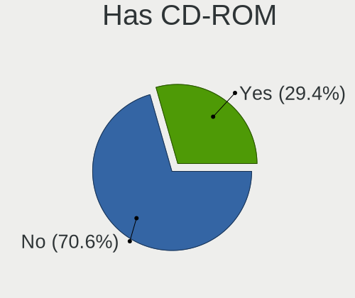

| Presented | Desktops | Percent |
|-----------|----------|---------|
| No        | 832      | 69.97%  |
| Yes       | 357      | 30.03%  |

Has Ethernet
------------

Has Ethernet on board

| Presented | Desktops | Percent |
|-----------|----------|---------|
| Yes       | 1130     | 95.84%  |
| No        | 49       | 4.16%   |

Has WiFi
--------

Has WiFi module

| Presented | Desktops | Percent |
|-----------|----------|---------|
| No        | 878      | 73.78%  |
| Yes       | 312      | 26.22%  |

Has Bluetooth
-------------

Has Bluetooth module

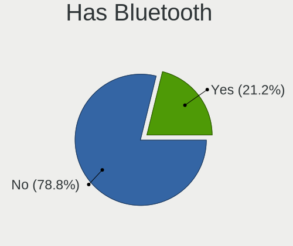

| Presented | Desktops | Percent |
|-----------|----------|---------|
| No        | 959      | 80.86%  |
| Yes       | 227      | 19.14%  |

Location
--------

Country
-------

Geographic location (country)

| Country     | Desktops | Percent |
|-------------|----------|---------|
| USA         | 270      | 22.73%  |
| Russia      | 164      | 13.8%   |
| Germany     | 123      | 10.35%  |
| France      | 54       | 4.55%   |
| Canada      | 51       | 4.29%   |
| Poland      | 47       | 3.96%   |
| UK          | 40       | 3.37%   |
| Netherlands | 29       | 2.44%   |
| Australia   | 26       | 2.19%   |
| Ukraine     | 23       | 1.94%   |
| Czechia     | 23       | 1.94%   |
| Brazil      | 23       | 1.94%   |
| Japan       | 20       | 1.68%   |
| Sweden      | 19       | 1.6%    |
| Italy       | 18       | 1.52%   |
| China       | 18       | 1.52%   |
| Finland     | 16       | 1.35%   |
| Spain       | 15       | 1.26%   |
| Switzerland | 14       | 1.18%   |
| Romania     | 11       | 0.93%   |
| Ireland     | 11       | 0.93%   |
| Indonesia   | 11       | 0.93%   |
| Greece      | 10       | 0.84%   |
| Austria     | 10       | 0.84%   |
| Hungary     | 9        | 0.76%   |
| Norway      | 8        | 0.67%   |
| Thailand    | 7        | 0.59%   |
| Taiwan      | 7        | 0.59%   |
| India       | 7        | 0.59%   |
| Bulgaria    | 7        | 0.59%   |
| Belgium     | 7        | 0.59%   |
| Serbia      | 6        | 0.51%   |
| Slovenia    | 5        | 0.42%   |
| Mexico      | 5        | 0.42%   |
| Denmark     | 5        | 0.42%   |
| Argentina   | 5        | 0.42%   |
| Slovakia    | 4        | 0.34%   |
| New Zealand | 4        | 0.34%   |
| Estonia     | 4        | 0.34%   |
| Croatia     | 4        | 0.34%   |

City
----

Geographic location (city)

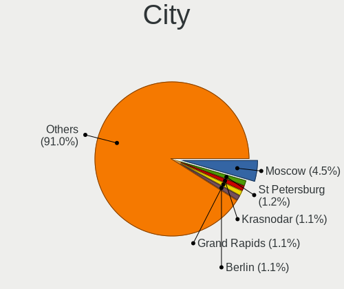

| City              | Desktops | Percent |
|-------------------|----------|---------|
| Moscow            | 54       | 4.24%   |
| St Petersburg     | 16       | 1.26%   |
| Krasnodar         | 16       | 1.26%   |
| Grand Rapids      | 15       | 1.18%   |
| Berlin            | 14       | 1.1%    |
| Kyiv              | 12       | 0.94%   |
| Sydney            | 11       | 0.86%   |
| Ludwigsburg       | 11       | 0.86%   |
| Helsinki          | 10       | 0.78%   |
| Yekaterinburg     | 9        | 0.71%   |
| Warsaw            | 8        | 0.63%   |
| Vienna            | 8        | 0.63%   |
| Tuklaty           | 8        | 0.63%   |
| Montreal          | 8        | 0.63%   |
| Madrid            | 7        | 0.55%   |
| London            | 7        | 0.55%   |
| Hamburg           | 7        | 0.55%   |
| Falkenstein       | 7        | 0.55%   |
| Dublin            | 7        | 0.55%   |
| Chicago           | 7        | 0.55%   |
| Amsterdam         | 7        | 0.55%   |
| Toronto           | 6        | 0.47%   |
| Rochester         | 6        | 0.47%   |
| Prague            | 6        | 0.47%   |
| Poway             | 6        | 0.47%   |
| Portland          | 6        | 0.47%   |
| Paris             | 6        | 0.47%   |
| Novosibirsk       | 6        | 0.47%   |
| Medan             | 6        | 0.47%   |
| Lublin            | 6        | 0.47%   |
| Kamensk-Ural'skiy | 6        | 0.47%   |
| Brooklyn          | 6        | 0.47%   |
| Zurich            | 5        | 0.39%   |
| Zaporizhzhya      | 5        | 0.39%   |
| Teaneck           | 5        | 0.39%   |
| Stockholm         | 5        | 0.39%   |
| Sofia             | 5        | 0.39%   |
| Seattle           | 5        | 0.39%   |
| Ozersk            | 5        | 0.39%   |
| Gdansk            | 5        | 0.39%   |

Drives
------

Drive Vendor
------------

Hard drive vendors

| Vendor              | Desktops | Drives | Percent |
|---------------------|----------|--------|---------|
| WDC                 | 446      | 1573   | 22.4%   |
| Seagate             | 352      | 912    | 17.68%  |
| Samsung Electronics | 297      | 757    | 14.92%  |
| Toshiba             | 129      | 295    | 6.48%   |
| Kingston            | 119      | 158    | 5.98%   |
| Crucial             | 110      | 175    | 5.52%   |
| Intel               | 70       | 148    | 3.52%   |
| Hitachi             | 54       | 123    | 2.71%   |
| HGST                | 45       | 98     | 2.26%   |
| SanDisk             | 42       | 61     | 2.11%   |
| A-DATA Technology   | 36       | 47     | 1.81%   |
| Transcend           | 16       | 23     | 0.8%    |
| SK hynix            | 15       | 29     | 0.75%   |
| Corsair             | 14       | 43     | 0.7%    |
| Phison              | 13       | 17     | 0.65%   |
| OCZ                 | 13       | 16     | 0.65%   |
| Micron Technology   | 13       | 27     | 0.65%   |
| SPCC                | 12       | 29     | 0.6%    |
| Hewlett-Packard     | 12       | 37     | 0.6%    |
| GOODRAM             | 11       | 23     | 0.55%   |
| Maxtor              | 10       | 14     | 0.5%    |
| PNY                 | 9        | 11     | 0.45%   |
| Patriot             | 9        | 13     | 0.45%   |
| Plextor             | 7        | 13     | 0.35%   |
| Gigabyte Technology | 7        | 12     | 0.35%   |
| MidasForce          | 6        | 8      | 0.3%    |
| Intenso             | 6        | 7      | 0.3%    |
| China               | 6        | 11     | 0.3%    |
| KingSpec            | 5        | 8      | 0.25%   |
| Apacer              | 5        | 6      | 0.25%   |
| Verbatim            | 4        | 4      | 0.2%    |
| Team                | 4        | 5      | 0.2%    |
| Silicon Motion      | 4        | 5      | 0.2%    |
| Netac               | 4        | 4      | 0.2%    |
| Mushkin             | 4        | 5      | 0.2%    |
| LITEON              | 4        | 4      | 0.2%    |
| KIOXIA-EXCERIA      | 4        | 10     | 0.2%    |
| FORESEE             | 4        | 4      | 0.2%    |
| Vaseky              | 3        | 3      | 0.15%   |
| T-FORCE             | 3        | 4      | 0.15%   |

Drive Model
-----------

Hard drive models

| Model                           | Desktops | Percent |
|---------------------------------|----------|---------|
| WDC WD10EZEX-08WN4A0 1TB        | 25       | 1%      |
| Samsung SSD 850 EVO 250GB       | 25       | 1%      |
| Seagate ST1000DM010-2EP102 1TB  | 23       | 0.92%   |
| Kingston SA400S37240G 240GB     | 21       | 0.84%   |
| Seagate ST2000DM008-2FR102 2TB  | 20       | 0.8%    |
| WDC WD30EFRX-68EUZN0 3TB        | 18       | 0.72%   |
| Toshiba DT01ACA100 1TB          | 17       | 0.68%   |
| WDC WD800JD-75MSA3 80GB         | 16       | 0.64%   |
| WDC WD40EFRX-68N32N0 4TB        | 16       | 0.64%   |
| Kingston SA400S37480G 480GB     | 16       | 0.64%   |
| Kingston SA400S37120G 120GB     | 16       | 0.64%   |
| Samsung SSD 970 EVO Plus 1TB    | 15       | 0.6%    |
| Samsung SSD 860 EVO 1TB         | 14       | 0.56%   |
| Samsung SSD 850 EVO 500GB       | 14       | 0.56%   |
| WDC WD20EFRX-68EUZN0 2TB        | 13       | 0.52%   |
| Seagate ST4000DM000-1F2168 4TB  | 13       | 0.52%   |
| Samsung SSD 870 EVO 1TB         | 13       | 0.52%   |
| Samsung SSD 860 EVO 250GB       | 13       | 0.52%   |
| Crucial CT240BX500SSD1 240GB    | 13       | 0.52%   |
| Seagate ST500DM002-1BD142 500GB | 12       | 0.48%   |
| Seagate ST1000DM003-1ER162 1TB  | 12       | 0.48%   |
| Seagate ST4000DM004-2CV104 4TB  | 11       | 0.44%   |
| Seagate ST1000DM003-1CH162 1TB  | 11       | 0.44%   |
| Crucial CT250MX500SSD1 250GB    | 11       | 0.44%   |
| Seagate ST3500418AS 500GB       | 10       | 0.4%    |
| Samsung SSD 970 EVO Plus 500GB  | 10       | 0.4%    |
| WDC WD40EFRX-68WT0N0 4TB        | 9        | 0.36%   |
| Seagate ST4000VN008-2DR166 4TB  | 9        | 0.36%   |
| Seagate ST2000DM001-1CH164 2TB  | 9        | 0.36%   |
| Samsung SSD 870 EVO 500GB       | 9        | 0.36%   |
| Samsung SSD 860 EVO 500GB       | 9        | 0.36%   |
| Samsung SSD 850 EVO 1TB         | 9        | 0.36%   |
| Kingston SV300S37A120G 120GB    | 9        | 0.36%   |
| WDC WD20EZRZ-00Z5HB0 2TB        | 8        | 0.32%   |
| WDC WD20EARX-00PASB0 2TB        | 8        | 0.32%   |
| WDC WD10EFRX-68FYTN0 1TB        | 8        | 0.32%   |
| Toshiba HDWD110 1TB             | 8        | 0.32%   |
| Toshiba DT01ACA050 500GB        | 8        | 0.32%   |
| Samsung SSD 980 PRO 1TB         | 8        | 0.32%   |
| Samsung SSD 870 QVO 1TB         | 8        | 0.32%   |

HDD Vendor
----------

Hard disk drive vendors

| Vendor               | Desktops | Drives | Percent |
|----------------------|----------|--------|---------|
| WDC                  | 402      | 1429   | 38.69%  |
| Seagate              | 344      | 897    | 33.11%  |
| Toshiba              | 120      | 283    | 11.55%  |
| Hitachi              | 54       | 123    | 5.2%    |
| HGST                 | 45       | 98     | 4.33%   |
| Samsung Electronics  | 43       | 70     | 4.14%   |
| Maxtor               | 10       | 14     | 0.96%   |
| Hewlett-Packard      | 6        | 28     | 0.58%   |
| Apple                | 3        | 4      | 0.29%   |
| HPT                  | 2        | 9      | 0.19%   |
| HPE                  | 2        | 8      | 0.19%   |
| WD MediaMax          | 1        | 3      | 0.1%    |
| QUANTUM              | 1        | 2      | 0.1%    |
| MaxDigital           | 1        | 1      | 0.1%    |
| IBM/Hitachi          | 1        | 1      | 0.1%    |
| IBM                  | 1        | 1      | 0.1%    |
| Fujitsu              | 1        | 2      | 0.1%    |
| ExcelStor Technology | 1        | 4      | 0.1%    |
| Areca                | 1        | 1      | 0.1%    |

SSD Vendor
----------

Solid state drive vendors

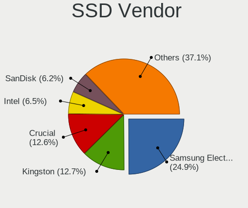

| Vendor              | Desktops | Drives | Percent |
|---------------------|----------|--------|---------|
| Samsung Electronics | 188      | 506    | 24.67%  |
| Kingston            | 102      | 132    | 13.39%  |
| Crucial             | 95       | 149    | 12.47%  |
| Intel               | 51       | 123    | 6.69%   |
| WDC                 | 48       | 81     | 6.3%    |
| SanDisk             | 42       | 61     | 5.51%   |
| A-DATA Technology   | 27       | 36     | 3.54%   |
| Transcend           | 14       | 20     | 1.84%   |
| OCZ                 | 13       | 16     | 1.71%   |
| Micron Technology   | 11       | 24     | 1.44%   |
| Patriot             | 9        | 13     | 1.18%   |
| Toshiba             | 8        | 8      | 1.05%   |
| SPCC                | 8        | 24     | 1.05%   |
| SK hynix            | 8        | 13     | 1.05%   |
| GOODRAM             | 8        | 19     | 1.05%   |
| Corsair             | 8        | 11     | 1.05%   |
| Seagate             | 7        | 10     | 0.92%   |
| PNY                 | 6        | 7      | 0.79%   |
| Plextor             | 6        | 9      | 0.79%   |
| MidasForce          | 6        | 8      | 0.79%   |
| Intenso             | 6        | 7      | 0.79%   |
| China               | 6        | 11     | 0.79%   |
| KingSpec            | 5        | 8      | 0.66%   |
| Gigabyte Technology | 5        | 10     | 0.66%   |
| Apacer              | 5        | 6      | 0.66%   |
| Verbatim            | 4        | 4      | 0.52%   |
| Team                | 4        | 5      | 0.52%   |
| LITEON              | 4        | 4      | 0.52%   |
| Vaseky              | 3        | 3      | 0.39%   |
| Mushkin             | 3        | 3      | 0.39%   |
| Hoodisk             | 3        | 5      | 0.39%   |
| FORESEE             | 3        | 3      | 0.39%   |
| Smartbuy            | 2        | 2      | 0.26%   |
| SATADOM             | 2        | 3      | 0.26%   |
| OWC                 | 2        | 7      | 0.26%   |
| ORICO               | 2        | 2      | 0.26%   |
| Netac               | 2        | 2      | 0.26%   |
| LITEONIT            | 2        | 2      | 0.26%   |
| Lexar               | 2        | 3      | 0.26%   |
| Kston               | 2        | 2      | 0.26%   |

Drive Kind
----------

HDD or SSD

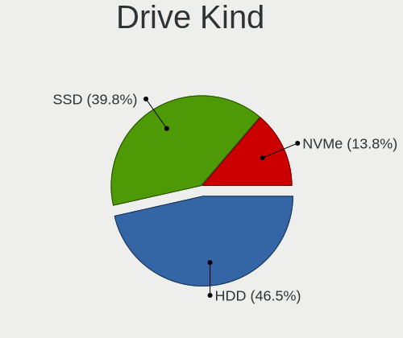

| Kind | Desktops | Drives | Percent |
|------|----------|--------|---------|
| HDD  | 764      | 2978   | 46.25%  |
| SSD  | 644      | 1403   | 38.98%  |
| NVMe | 244      | 467    | 14.77%  |

Drive Connector
---------------

SATA, SAS, NVMe, etc.

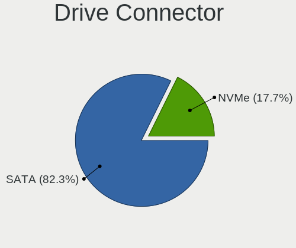

| Type | Desktops | Drives | Percent |
|------|----------|--------|---------|
| SATA | 1043     | 4381   | 81.04%  |
| NVMe | 244      | 467    | 18.96%  |

Drive Size
----------

Size of hard drive

| Size in TB | Desktops | Drives | Percent |
|------------|----------|--------|---------|
| 0.01-0.5   | 737      | 1552   | 44.67%  |
| 0.51-1.0   | 372      | 772    | 22.55%  |
| 1.01-2.0   | 203      | 590    | 12.3%   |
| 3.01-4.0   | 133      | 481    | 8.06%   |
| 4.01-10.0  | 109      | 637    | 6.61%   |
| 2.01-3.0   | 66       | 218    | 4%      |
| 10.01-20.0 | 29       | 130    | 1.76%   |
| 20.01-50.0 | 1        | 1      | 0.06%   |

Space Total
-----------

Amount of disk space available on the file system

| Size in GB     | Desktops | Percent |
|----------------|----------|---------|
| 101-250        | 324      | 26.11%  |
| 251-500        | 236      | 19.02%  |
| 501-1000       | 199      | 16.04%  |
| 51-100         | 139      | 11.2%   |
| 21-50          | 90       | 7.25%   |
| 1001-2000      | 79       | 6.37%   |
| 1-20           | 77       | 6.2%    |
| More than 3000 | 59       | 4.75%   |
| 2001-3000      | 23       | 1.85%   |
| Unknown        | 15       | 1.21%   |

Space Used
----------

Amount of used disk space

| Used GB        | Desktops | Percent |
|----------------|----------|---------|
| 1-20           | 829      | 67.4%   |
| 21-50          | 169      | 13.74%  |
| 51-100         | 62       | 5.04%   |
| 101-250        | 44       | 3.58%   |
| 251-500        | 36       | 2.93%   |
| 501-1000       | 26       | 2.11%   |
| More than 3000 | 22       | 1.79%   |
| 1001-2000      | 16       | 1.3%    |
| Unknown        | 15       | 1.22%   |
| 2001-3000      | 9        | 0.73%   |
| 0              | 2        | 0.16%   |

Malfunc. Drives
---------------

Drive models with a malfunction

| Model                               | Desktops | Drives | Percent |
|-------------------------------------|----------|--------|---------|
| Samsung Electronics SSD 870 EVO 1TB | 7        | 9      | 2.08%   |
| WDC WD30EFRX-68EUZN0 3TB            | 6        | 18     | 1.79%   |
| Seagate ST3500413AS 500GB           | 6        | 9      | 1.79%   |
| WDC WD40EFRX-68WT0N0 4TB            | 5        | 14     | 1.49%   |
| WDC WD20EFRX-68EUZN0 2TB            | 5        | 12     | 1.49%   |
| WDC WD5000AAKX-60U6AA0 500GB        | 4        | 4      | 1.19%   |
| WDC WD2000FYYZ-01UL1B2 2TB          | 3        | 5      | 0.89%   |
| Seagate ST3500418AS 500GB           | 3        | 6      | 0.89%   |
| Seagate ST2000DM001-9YN164 2TB      | 3        | 3      | 0.89%   |
| Seagate ST1000DM003-1CH162 1TB      | 3        | 4      | 0.89%   |
| Samsung Electronics HD501LJ 500GB   | 3        | 4      | 0.89%   |
| Samsung Electronics HD154UI 1.5TB   | 3        | 4      | 0.89%   |
| Samsung Electronics HD103UJ 1TB     | 3        | 6      | 0.89%   |
| Kingston SV300S37A120G 120GB        | 3        | 3      | 0.89%   |
| Intel SSDSA2M080G2GC 80GB           | 3        | 3      | 0.89%   |
| HGST HTS725050A7E630 500GB          | 3        | 10     | 0.89%   |
| Crucial CT525MX300SSD1 528GB        | 3        | 3      | 0.89%   |
| WDC WD5003AZEX-00MK2A0 500GB        | 2        | 2      | 0.6%    |
| WDC WD5000LPLX-22ZNTT0 500GB        | 2        | 2      | 0.6%    |
| WDC WD5000AAKX-083CA0 500GB         | 2        | 2      | 0.6%    |
| WDC WD5000AAKX-00ERMA0 500GB        | 2        | 2      | 0.6%    |
| WDC WD40EFRX-68N32N0 4TB            | 2        | 5      | 0.6%    |
| WDC WD20EZRX-00D8PB0 2TB            | 2        | 3      | 0.6%    |
| WDC WD20EARS-00MVWB0 2TB            | 2        | 2      | 0.6%    |
| WDC WD2002FYPS-02W3B0 2TB           | 2        | 2      | 0.6%    |
| WDC WD2002FYPS-01U1B0 2TB           | 2        | 3      | 0.6%    |
| WDC WD2000FYYZ-01UL1B1 2TB          | 2        | 4      | 0.6%    |
| WDC WD15EADS-00P8B0 1.5TB           | 2        | 2      | 0.6%    |
| Toshiba MK5076GSXN 500GB            | 2        | 2      | 0.6%    |
| Toshiba HDWE140 4TB                 | 2        | 11     | 0.6%    |
| Toshiba DT01ACA300 3TB              | 2        | 9      | 0.6%    |
| Seagate ST9250827AS 250GB           | 2        | 3      | 0.6%    |
| Seagate ST500DM002-1BD142 500GB     | 2        | 2      | 0.6%    |
| Seagate ST500DM002-1BC142 500GB     | 2        | 2      | 0.6%    |
| Seagate ST380013AS 80GB             | 2        | 3      | 0.6%    |
| Seagate ST2000DM008-2FR102 2TB      | 2        | 2      | 0.6%    |
| Seagate ST2000DM006-2DM164 2TB      | 2        | 2      | 0.6%    |
| Seagate ST1000DM003-9YN162 1TB      | 2        | 6      | 0.6%    |
| Seagate ST1000DM003-1ER162 1TB      | 2        | 2      | 0.6%    |
| Samsung Electronics HD204UI 2TB     | 2        | 4      | 0.6%    |

Malfunc. Drive Vendor
---------------------

Vendors of faulty drives

| Vendor               | Desktops | Drives | Percent |
|----------------------|----------|--------|---------|
| WDC                  | 95       | 183    | 30.16%  |
| Seagate              | 75       | 105    | 23.81%  |
| Samsung Electronics  | 33       | 47     | 10.48%  |
| Toshiba              | 19       | 41     | 6.03%   |
| Hitachi              | 16       | 23     | 5.08%   |
| Intel                | 12       | 17     | 3.81%   |
| Crucial              | 12       | 18     | 3.81%   |
| Kingston             | 11       | 12     | 3.49%   |
| HGST                 | 9        | 18     | 2.86%   |
| Maxtor               | 7        | 11     | 2.22%   |
| SanDisk              | 4        | 5      | 1.27%   |
| A-DATA Technology    | 3        | 4      | 0.95%   |
| SK hynix             | 2        | 7      | 0.63%   |
| OCZ                  | 2        | 3      | 0.63%   |
| Micron Technology    | 2        | 6      | 0.63%   |
| LITEON               | 2        | 2      | 0.63%   |
| Hewlett-Packard      | 2        | 4      | 0.63%   |
| Corsair              | 2        | 4      | 0.63%   |
| walram               | 1        | 1      | 0.32%   |
| SPCC                 | 1        | 1      | 0.32%   |
| Plextor              | 1        | 1      | 0.32%   |
| HPE                  | 1        | 4      | 0.32%   |
| GK                   | 1        | 1      | 0.32%   |
| ExcelStor Technology | 1        | 2      | 0.32%   |
| AMD                  | 1        | 2      | 0.32%   |

Malfunc. HDD Vendor
-------------------

Vendors of faulty HDD drives

| Vendor               | Desktops | Drives | Percent |
|----------------------|----------|--------|---------|
| WDC                  | 94       | 182    | 38.68%  |
| Seagate              | 74       | 104    | 30.45%  |
| Samsung Electronics  | 20       | 28     | 8.23%   |
| Toshiba              | 19       | 41     | 7.82%   |
| Hitachi              | 16       | 23     | 6.58%   |
| HGST                 | 9        | 18     | 3.7%    |
| Maxtor               | 7        | 11     | 2.88%   |
| Hewlett-Packard      | 2        | 4      | 0.82%   |
| HPE                  | 1        | 4      | 0.41%   |
| ExcelStor Technology | 1        | 2      | 0.41%   |

Malfunc. Drive Kind
-------------------

Kinds of faulty drives

| Kind | Desktops | Drives | Percent |
|------|----------|--------|---------|
| HDD  | 222      | 417    | 76.03%  |
| SSD  | 69       | 104    | 23.63%  |
| NVMe | 1        | 1      | 0.34%   |

Failed Drives
-------------

Failed drive models

| Model                        | Desktops | Drives | Percent |
|------------------------------|----------|--------|---------|
| WDC WD20EARS-00MVWB0 2TB     | 1        | 1      | 25%     |
| Toshiba MG05ACA800E 8TB      | 1        | 1      | 25%     |
| Maxtor 6E040L0 40GB          | 1        | 1      | 25%     |
| Crucial M4-CT256M4SSD1 256GB | 1        | 1      | 25%     |

Failed Drive Vendor
-------------------

Failed drive vendors

| Vendor  | Desktops | Drives | Percent |
|---------|----------|--------|---------|
| WDC     | 1        | 1      | 25%     |
| Toshiba | 1        | 1      | 25%     |
| Maxtor  | 1        | 1      | 25%     |
| Crucial | 1        | 1      | 25%     |

Drive Status
------------

Number of failed and malfunc. drives

| Status   | Desktops | Drives | Percent |
|----------|----------|--------|---------|
| Works    | 1016     | 4219   | 76.05%  |
| Malfunc  | 275      | 522    | 20.58%  |
| Detected | 41       | 103    | 3.07%   |
| Failed   | 4        | 4      | 0.3%    |

Storage controller
------------------

Storage Vendor
--------------

Storage controller vendors

| Vendor                           | Desktops | Percent |
|----------------------------------|----------|---------|
| Intel                            | 733      | 42.74%  |
| AMD                              | 360      | 20.99%  |
| Samsung Electronics              | 124      | 7.23%   |
| ASMedia Technology               | 72       | 4.2%    |
| Marvell Technology Group         | 56       | 3.27%   |
| Broadcom / LSI                   | 55       | 3.21%   |
| SanDisk                          | 51       | 2.97%   |
| Phison Electronics               | 32       | 1.87%   |
| JMicron Technology               | 28       | 1.63%   |
| Silicon Motion                   | 26       | 1.52%   |
| Kingston Technology Company      | 26       | 1.52%   |
| Nvidia                           | 20       | 1.17%   |
| Micron/Crucial Technology        | 20       | 1.17%   |
| SK hynix                         | 10       | 0.58%   |
| Adaptec                          | 10       | 0.58%   |
| Silicon Image                    | 9        | 0.52%   |
| ADATA Technology                 | 9        | 0.52%   |
| VIA Technologies                 | 7        | 0.41%   |
| Realtek Semiconductor            | 7        | 0.41%   |
| Areca Technology                 | 6        | 0.35%   |
| Seagate Technology               | 5        | 0.29%   |
| KIOXIA                           | 5        | 0.29%   |
| Toshiba                          | 4        | 0.23%   |
| Micron Technology                | 4        | 0.23%   |
| MAXIO Technology (Hangzhou)      | 4        | 0.23%   |
| Hewlett-Packard                  | 4        | 0.23%   |
| Silicon Integrated Systems [SiS] | 3        | 0.17%   |
| Lite-On Technology               | 3        | 0.17%   |
| Integrated Technology Express    | 3        | 0.17%   |
| Chelsio Communications           | 3        | 0.17%   |
| 3ware                            | 3        | 0.17%   |
| Shenzhen Longsys Electronics     | 2        | 0.12%   |
| Promise Technology               | 2        | 0.12%   |
| HighPoint Technologies           | 2        | 0.12%   |
| ULi Electronics                  | 1        | 0.06%   |
| Transcend                        | 1        | 0.06%   |
| O2 Micro                         | 1        | 0.06%   |
| Lenovo                           | 1        | 0.06%   |
| INNOGRIT                         | 1        | 0.06%   |
| Broadcom                         | 1        | 0.06%   |

Storage Model
-------------

Storage controller models

| Model                                                                          | Desktops | Percent |
|--------------------------------------------------------------------------------|----------|---------|
| AMD FCH SATA Controller [AHCI mode]                                            | 200      | 9.62%   |
| Intel 6 Series/C200 Series Chipset Family 6 port Desktop SATA AHCI Controller  | 72       | 3.46%   |
| Samsung NVMe SSD Controller SM981/PM981/PM983                                  | 67       | 3.22%   |
| AMD 400 Series Chipset SATA Controller                                         | 67       | 3.22%   |
| Intel 8 Series/C220 Series Chipset Family 6-port SATA Controller 1 [AHCI mode] | 65       | 3.13%   |
| Intel Q170/Q150/B150/H170/H110/Z170/CM236 Chipset SATA Controller [AHCI Mode]  | 62       | 2.98%   |
| ASMedia ASM1061/ASM1062 Serial ATA Controller                                  | 62       | 2.98%   |
| AMD SB7x0/SB8x0/SB9x0 SATA Controller [AHCI mode]                              | 61       | 2.94%   |
| AMD 500 Series Chipset SATA Controller                                         | 42       | 2.02%   |
| AMD SB7x0/SB8x0/SB9x0 IDE Controller                                           | 40       | 1.92%   |
| Intel SATA Controller [RAID mode]                                              | 39       | 1.88%   |
| Intel 200 Series PCH SATA controller [AHCI mode]                               | 39       | 1.88%   |
| Intel 7 Series/C210 Series Chipset Family 6-port SATA Controller [AHCI mode]   | 37       | 1.78%   |
| Intel Cannon Lake PCH SATA AHCI Controller                                     | 36       | 1.73%   |
| Intel 500 Series Chipset Family SATA AHCI Controller                           | 27       | 1.3%    |
| Samsung NVMe SSD Controller PM9A1/PM9A3/980PRO                                 | 26       | 1.25%   |
| Silicon Motion SM2263EN/SM2263XT (DRAM-less) NVMe SSD Controllers              | 24       | 1.15%   |
| Intel C610/X99 series chipset sSATA Controller [AHCI mode]                     | 24       | 1.15%   |
| Intel 9 Series Chipset Family SATA Controller [AHCI Mode]                      | 23       | 1.11%   |
| Intel 82801JI (ICH10 Family) SATA AHCI Controller                              | 23       | 1.11%   |
| Intel C610/X99 series chipset 6-Port SATA Controller [AHCI mode]               | 22       | 1.06%   |
| Broadcom / LSI SAS2008 PCI-Express Fusion-MPT SAS-2 [Falcon]                   | 22       | 1.06%   |
| Intel NM10/ICH7 Family SATA Controller [IDE mode]                              | 21       | 1.01%   |
| Intel C600/X79 series chipset 6-Port SATA AHCI Controller                      | 20       | 0.96%   |
| Intel 82801G (ICH7 Family) IDE Controller                                      | 20       | 0.96%   |
| Intel Atom Processor E3800 Series SATA AHCI Controller                         | 19       | 0.91%   |
| Samsung NVMe SSD Controller 980 (DRAM-less)                                    | 18       | 0.87%   |
| Intel Comet Lake SATA AHCI Controller                                          | 18       | 0.87%   |
| Intel C602 chipset 4-Port SATA Storage Control Unit                            | 18       | 0.87%   |
| Samsung NVMe SSD Controller SM961/PM961/SM963                                  | 16       | 0.77%   |
| Phison E12 NVMe Controller                                                     | 15       | 0.72%   |
| Intel Alder Lake-S PCH SATA Controller [AHCI Mode]                             | 15       | 0.72%   |
| AMD X370 Series Chipset SATA Controller                                        | 15       | 0.72%   |
| Marvell Group 88SE9172 SATA 6Gb/s Controller                                   | 14       | 0.67%   |
| JMicron JMB363 SATA/IDE Controller                                             | 14       | 0.67%   |
| AMD FCH SATA Controller [IDE mode]                                             | 14       | 0.67%   |
| Micron/Crucial P2 [Nick P2] / P3 / P3 Plus NVMe PCIe SSD (DRAM-less)           | 13       | 0.63%   |
| Intel 5 Series/3400 Series Chipset 6 port SATA AHCI Controller                 | 13       | 0.63%   |
| AMD 300 Series Chipset SATA Controller                                         | 13       | 0.63%   |
| Sandisk WD Black SN770 / PC SN740 256GB / PC SN560 (DRAM-less) NVMe SSD        | 12       | 0.58%   |

Storage Kind
------------

Kind of storage controller (IDE, SATA, NVMe, SAS, ...)

| Kind | Desktops | Percent |
|------|----------|---------|
| SATA | 946      | 57.06%  |
| NVMe | 326      | 19.66%  |
| IDE  | 227      | 13.69%  |
| RAID | 81       | 4.89%   |
| SAS  | 55       | 3.32%   |
| SCSI | 23       | 1.39%   |

Processor
---------

CPU Vendor
----------

Processor vendors

| Vendor   | Desktops | Percent |
|----------|----------|---------|
| Intel    | 742      | 62.83%  |
| AMD      | 377      | 31.92%  |
| ARM      | 44       | 3.73%   |
| Unknown  | 9        | 0.76%   |
| IBM      | 3        | 0.25%   |
| VIA      | 1        | 0.08%   |
| Sun      | 1        | 0.08%   |
| Research | 1        | 0.08%   |
| NXP      | 1        | 0.08%   |
| Motorola | 1        | 0.08%   |
| i        | 1        | 0.08%   |

CPU Model
---------

Processor models

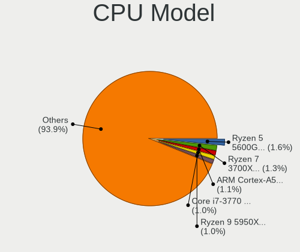

| Model                                       | Desktops | Percent |
|---------------------------------------------|----------|---------|
| AMD Ryzen 7 3700X 8-Core Processor          | 17       | 1.43%   |
| ARM Cortex-A55 r2p0                         | 15       | 1.26%   |
| AMD Ryzen 5 5600G with Radeon Graphics      | 15       | 1.26%   |
| Intel Core i7-7700 CPU @ 3.60GHz            | 13       | 1.09%   |
| AMD GX-412TC SOC                            | 13       | 1.09%   |
| Intel Core i7-3770 CPU @ 3.40GHz            | 12       | 1.01%   |
| Intel Core i5-3470 CPU @ 3.20GHz            | 12       | 1.01%   |
| AMD Ryzen 9 3900X 12-Core Processor         | 12       | 1.01%   |
| Intel Core i7-10700K CPU @ 3.80GHz          | 11       | 0.92%   |
| AMD Ryzen 9 5950X 16-Core Processor         | 11       | 0.92%   |
| AMD Ryzen 7 2700X Eight-Core Processor      | 11       | 0.92%   |
| AMD FX-8350 Eight-Core Processor            | 11       | 0.92%   |
| Intel Core i7-4790K CPU @ 4.00GHz           | 10       | 0.84%   |
| Intel Core i5-10400 CPU @ 2.90GHz           | 10       | 0.84%   |
| ARM Cortex-A53 r0p4                         | 10       | 0.84%   |
| AMD Ryzen 7 1700 Eight-Core Processor       | 10       | 0.84%   |
| Intel Core i5-6500 CPU @ 3.20GHz            | 9        | 0.76%   |
| Intel Celeron CPU J1900 @ 1.99GHz           | 9        | 0.76%   |
| AMD Ryzen 7 5800X 8-Core Processor          | 9        | 0.76%   |
| AMD Ryzen 5 3600 6-Core Processor           | 9        | 0.76%   |
| AMD Ryzen 5 2600 Six-Core Processor         | 9        | 0.76%   |
|                                             | 9        | 0.76%   |
| Intel Core i7-4770 CPU @ 3.40GHz            | 8        | 0.67%   |
| Intel Core i5-2500 CPU @ 3.30GHz            | 8        | 0.67%   |
| AMD Ryzen 9 5900X 12-Core Processor         | 8        | 0.67%   |
| AMD Ryzen 5 2400G with Radeon Vega Graphics | 8        | 0.67%   |
| AMD Ryzen 3 3200G with Radeon Vega Graphics | 8        | 0.67%   |
| Intel Core i3-3220 CPU @ 3.30GHz            | 7        | 0.59%   |
| Intel Core 2 Quad CPU Q6600 @ 2.40GHz       | 7        | 0.59%   |
| Intel Celeron CPU N3150 @ 1.60GHz           | 7        | 0.59%   |
| AMD Ryzen 9 3950X 16-Core Processor         | 7        | 0.59%   |
| Intel Core i7-6700 CPU @ 3.40GHz            | 6        | 0.5%    |
| Intel Core i7-10700 CPU @ 2.90GHz           | 6        | 0.5%    |
| Intel Core i5-2400 CPU @ 3.10GHz            | 6        | 0.5%    |
| Intel Celeron CPU G1610T @ 2.30GHz          | 6        | 0.5%    |
| ARM ARM1176 r0p7 (ECO: 0x00000000)          | 6        | 0.5%    |
| AMD Ryzen 7 2700 Eight-Core Processor       | 6        | 0.5%    |
| AMD FX-6300 Six-Core Processor              | 6        | 0.5%    |
| Intel Xeon                                  | 5        | 0.42%   |
| Intel Core i9-9900K CPU @ 3.60GHz           | 5        | 0.42%   |

CPU Model Family
----------------

Processor model prefix

| Model                   | Desktops | Percent |
|-------------------------|----------|---------|
| Intel Core i5           | 158      | 13.33%  |
| Intel Core i7           | 143      | 12.07%  |
| Intel Xeon              | 124      | 10.46%  |
| AMD Ryzen 7             | 76       | 6.41%   |
| AMD Ryzen 5             | 67       | 5.65%   |
| Other                   | 64       | 5.4%    |
| Intel Core i3           | 63       | 5.32%   |
| Intel Celeron           | 60       | 5.06%   |
| AMD Ryzen 9             | 49       | 4.14%   |
| ARM Cortex              | 38       | 3.21%   |
| Intel Atom              | 37       | 3.12%   |
| AMD FX                  | 32       | 2.7%    |
| Intel Pentium           | 31       | 2.62%   |
| Intel Core 2 Duo        | 25       | 2.11%   |
| AMD GX                  | 24       | 2.03%   |
| AMD Ryzen 3             | 20       | 1.69%   |
| Intel Core 2 Quad       | 17       | 1.43%   |
| Intel Pentium 4         | 13       | 1.1%    |
| AMD Ryzen Threadripper  | 11       | 0.93%   |
| Intel Core i9           | 9        | 0.76%   |
| AMD Athlon 64 X2        | 9        | 0.76%   |
| AMD Turion II Neo       | 8        | 0.68%   |
| AMD Phenom II X6        | 7        | 0.59%   |
| AMD Phenom II X4        | 7        | 0.59%   |
| AMD Athlon              | 7        | 0.59%   |
| AMD Phenom              | 6        | 0.51%   |
| AMD A10                 | 6        | 0.51%   |
| Intel Pentium Gold      | 5        | 0.42%   |
| Intel Core 2            | 5        | 0.42%   |
| AMD Ryzen 5 PRO         | 5        | 0.42%   |
| AMD G                   | 5        | 0.42%   |
| Intel Pentium Dual-Core | 4        | 0.34%   |
| AMD Ryzen 7 PRO         | 4        | 0.34%   |
| Intel Pentium Silver    | 3        | 0.25%   |
| AMD Sempron             | 3        | 0.25%   |
| AMD Opteron             | 3        | 0.25%   |
| AMD EPYC                | 3        | 0.25%   |
| AMD Athlon II X2        | 3        | 0.25%   |
| AMD A4                  | 3        | 0.25%   |
| Intel Xeon Bronze       | 2        | 0.17%   |

CPU Cores
---------

Number of processor cores

| Number  | Desktops | Percent |
|---------|----------|---------|
| 4       | 414      | 34.91%  |
| 2       | 195      | 16.44%  |
| Unknown | 107      | 9.02%   |
| 8       | 103      | 8.68%   |
| 6       | 93       | 7.84%   |
| 16      | 89       | 7.5%    |
| 12      | 71       | 5.99%   |
| 24      | 31       | 2.61%   |
| 32      | 29       | 2.45%   |
| 1       | 24       | 2.02%   |
| 10      | 12       | 1.01%   |
| 14      | 5        | 0.42%   |
| 64      | 4        | 0.34%   |
| 20      | 2        | 0.17%   |
| 3       | 2        | 0.17%   |
| 48      | 1        | 0.08%   |
| 36      | 1        | 0.08%   |
| 28      | 1        | 0.08%   |
| 22      | 1        | 0.08%   |
| 11      | 1        | 0.08%   |

CPU Sockets
-----------

Number of sockets

| Number  | Desktops | Percent |
|---------|----------|---------|
| 1       | 1098     | 92.89%  |
| Unknown | 55       | 4.65%   |
| 2       | 28       | 2.37%   |
| 4       | 1        | 0.08%   |

CPU Threads
-----------

Threads per core (Hyper-Threading)

| Number  | Desktops | Percent |
|---------|----------|---------|
| 1       | 685      | 58.05%  |
| 2       | 375      | 31.78%  |
| Unknown | 120      | 10.17%  |

CPU Microarch
-------------

Microarchitecture

| Name          | Desktops | Percent |
|---------------|----------|---------|
| Haswell       | 114      | 9.61%   |
| Unknown       | 111      | 9.36%   |
| KabyLake      | 104      | 8.77%   |
| IvyBridge     | 93       | 7.84%   |
| Zen 2         | 79       | 6.66%   |
| SandyBridge   | 73       | 6.16%   |
| Zen 3         | 61       | 5.14%   |
| Skylake       | 61       | 5.14%   |
| Zen+          | 48       | 4.05%   |
| Penryn        | 43       | 3.63%   |
| CometLake     | 42       | 3.54%   |
| Zen           | 40       | 3.37%   |
| K10           | 39       | 3.29%   |
| Piledriver    | 35       | 2.95%   |
| Silvermont    | 34       | 2.87%   |
| Westmere      | 24       | 2.02%   |
| Core          | 23       | 1.94%   |
| Bonnell       | 23       | 1.94%   |
| NetBurst      | 19       | 1.6%    |
| Puma          | 18       | 1.52%   |
| Nehalem       | 16       | 1.35%   |
| Broadwell     | 15       | 1.26%   |
| K8 Hammer     | 12       | 1.01%   |
| Jaguar        | 12       | 1.01%   |
| Goldmont      | 12       | 1.01%   |
| Goldmont plus | 8        | 0.67%   |
| Bobcat        | 8        | 0.67%   |
| Excavator     | 4        | 0.34%   |
| Bulldozer     | 4        | 0.34%   |
| Steamroller   | 3        | 0.25%   |
| P6            | 3        | 0.25%   |
| TigerLake     | 2        | 0.17%   |
| Geode         | 2        | 0.17%   |
| K10 Llano     | 1        | 0.08%   |

Graphics
--------

GPU Vendor
----------

Vendors of graphics cards

| Vendor                                       | Desktops | Percent |
|----------------------------------------------|----------|---------|
| Intel                                        | 413      | 35.54%  |
| Nvidia                                       | 362      | 31.15%  |
| AMD                                          | 306      | 26.33%  |
| ASPEED Technology                            | 39       | 3.36%   |
| Matrox Electronics Systems                   | 34       | 2.93%   |
| XGI Technology (eXtreme Graphics Innovation) | 2        | 0.17%   |
| VIA Technologies                             | 2        | 0.17%   |
| S3 Graphics                                  | 2        | 0.17%   |
| Silicon Integrated Systems [SiS]             | 1        | 0.09%   |
| NVidia / SGS Thomson (Joint Venture)         | 1        | 0.09%   |

GPU Model
---------

Graphics card models

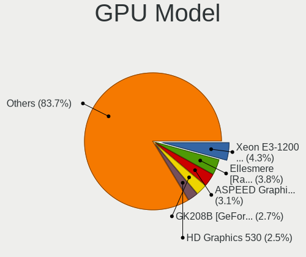

| Model                                                                                    | Desktops | Percent |
|------------------------------------------------------------------------------------------|----------|---------|
| Intel Xeon E3-1200 v3/4th Gen Core Processor Integrated Graphics Controller              | 52       | 4.36%   |
| AMD Ellesmere [Radeon RX 470/480/570/570X/580/580X/590]                                  | 43       | 3.61%   |
| ASPEED Technology ASPEED Graphics Family                                                 | 39       | 3.27%   |
| Nvidia GK208B [GeForce GT 710]                                                           | 35       | 2.94%   |
| Intel HD Graphics 530                                                                    | 30       | 2.52%   |
| Intel CoffeeLake-S GT2 [UHD Graphics 630]                                                | 29       | 2.43%   |
| Intel Xeon E3-1200 v2/3rd Gen Core processor Graphics Controller                         | 28       | 2.35%   |
| Intel CometLake-S GT2 [UHD Graphics 630]                                                 | 28       | 2.35%   |
| Nvidia GP108 [GeForce GT 1030]                                                           | 25       | 2.1%    |
| Intel HD Graphics 630                                                                    | 25       | 2.1%    |
| Intel 2nd Generation Core Processor Family Integrated Graphics Controller                | 25       | 2.1%    |
| AMD Cezanne [Radeon Vega Series / Radeon Vega Mobile Series]                             | 22       | 1.85%   |
| Intel Atom Processor Z36xxx/Z37xxx Series Graphics & Display                             | 20       | 1.68%   |
| Matrox Electronics Systems MGA G200EH                                                    | 15       | 1.26%   |
| Intel IvyBridge GT2 [HD Graphics 4000]                                                   | 15       | 1.26%   |
| Intel 4 Series Chipset Integrated Graphics Controller                                    | 14       | 1.17%   |
| AMD Raven Ridge [Radeon Vega Series / Radeon Vega Mobile Series]                         | 14       | 1.17%   |
| Nvidia GP107 [GeForce GTX 1050 Ti]                                                       | 13       | 1.09%   |
| Matrox Electronics Systems MGA G200eW WPCM450                                            | 12       | 1.01%   |
| AMD Picasso/Raven 2 [Radeon Vega Series / Radeon Vega Mobile Series]                     | 12       | 1.01%   |
| Nvidia GT218 [GeForce 210]                                                               | 11       | 0.92%   |
| Intel Atom/Celeron/Pentium Processor x5-E8000/J3xxx/N3xxx Integrated Graphics Controller | 10       | 0.84%   |
| AMD Raphael                                                                              | 10       | 0.84%   |
| AMD Navi 10 [Radeon RX 5600 OEM/5600 XT / 5700/5700 XT]                                  | 10       | 0.84%   |
| AMD Lexa PRO [Radeon 540/540X/550/550X / RX 540X/550/550X]                               | 10       | 0.84%   |
| Nvidia TU117 [GeForce GTX 1650]                                                          | 9        | 0.76%   |
| Nvidia TU116 [GeForce GTX 1660 Ti]                                                       | 9        | 0.76%   |
| AMD RV730 XT [Radeon HD 4670]                                                            | 9        | 0.76%   |
| AMD Renoir [Radeon RX Vega 6 (Ryzen 4000/5000 Mobile Series)]                            | 9        | 0.76%   |
| Nvidia GP106 [GeForce GTX 1060 6GB]                                                      | 8        | 0.67%   |
| Nvidia GP104 [GeForce GTX 1080]                                                          | 8        | 0.67%   |
| Nvidia GP104 [GeForce GTX 1070]                                                          | 8        | 0.67%   |
| Intel 82G33/G31 Express Integrated Graphics Controller                                   | 8        | 0.67%   |
| Intel 82945G/GZ Integrated Graphics Controller                                           | 8        | 0.67%   |
| Intel 4th Generation Core Processor Family Integrated Graphics Controller                | 8        | 0.67%   |
| Nvidia TU116 [GeForce GTX 1660 SUPER]                                                    | 7        | 0.59%   |
| Nvidia GP107 [GeForce GTX 1050]                                                          | 7        | 0.59%   |
| Nvidia GP106 [GeForce GTX 1060 3GB]                                                      | 7        | 0.59%   |
| Nvidia GM206 [GeForce GTX 960]                                                           | 7        | 0.59%   |
| Nvidia GM204 [GeForce GTX 970]                                                           | 7        | 0.59%   |

GPU Combo
---------

Combinations of graphics cards

| Name                                     | Desktops | Percent |
|------------------------------------------|----------|---------|
| 1 x Intel                                | 357      | 30.1%   |
| 1 x Nvidia                               | 317      | 26.73%  |
| 1 x AMD                                  | 269      | 22.68%  |
| Other                                    | 81       | 6.83%   |
| 1 x Matrox                               | 34       | 2.87%   |
| 1 x ASPEED                               | 34       | 2.87%   |
| Intel + Nvidia                           | 30       | 2.53%   |
| 2 x AMD                                  | 18       | 1.52%   |
| 2 x Intel                                | 13       | 1.1%    |
| Intel + AMD                              | 11       | 0.93%   |
| AMD + Nvidia                             | 5        | 0.42%   |
| Nvidia + ASPEED                          | 4        | 0.34%   |
| 2 x Nvidia                               | 3        | 0.25%   |
| 1 x XGI                                  | 2        | 0.17%   |
| 1 x VIA                                  | 2        | 0.17%   |
| 1 x S3 Graphics                          | 2        | 0.17%   |
| 1 x SiS                                  | 1        | 0.08%   |
| 1 x NVidia / SGS Thomson (Joint Venture) | 1        | 0.08%   |
| Intel + ASPEED                           | 1        | 0.08%   |
| AMD + ASPEED                             | 1        | 0.08%   |

GPU Driver
----------

Free vs proprietary

| Driver      | Desktops | Percent |
|-------------|----------|---------|
| Free        | 819      | 69.11%  |
| Proprietary | 279      | 23.54%  |
| Unknown     | 87       | 7.34%   |

GPU Memory
----------

Total video memory

| Size in GB | Desktops | Percent |
|------------|----------|---------|
| Unknown    | 762      | 63.18%  |
| 1.01-2.0   | 114      | 9.45%   |
| 7.01-8.0   | 83       | 6.88%   |
| 3.01-4.0   | 71       | 5.89%   |
| 0.51-1.0   | 67       | 5.56%   |
| 0.01-0.5   | 45       | 3.73%   |
| 5.01-6.0   | 31       | 2.57%   |
| 8.01-16.0  | 20       | 1.66%   |
| 2.01-3.0   | 10       | 0.83%   |
| 4.01-5.0   | 2        | 0.17%   |
| 16.01-24.0 | 1        | 0.08%   |

Monitor
-------

Monitor Vendor
--------------

Monitor vendors

| Vendor               | Desktops | Percent |
|----------------------|----------|---------|
| Samsung Electronics  | 103      | 16.09%  |
| Dell                 | 102      | 15.94%  |
| Goldstar             | 63       | 9.84%   |
| Acer                 | 40       | 6.25%   |
| Hewlett-Packard      | 36       | 5.63%   |
| AOC                  | 33       | 5.16%   |
| BenQ                 | 25       | 3.91%   |
| Ancor Communications | 24       | 3.75%   |
| Philips              | 23       | 3.59%   |
| Iiyama               | 21       | 3.28%   |
| LG Electronics       | 20       | 3.13%   |
| ViewSonic            | 18       | 2.81%   |
| Sony                 | 14       | 2.19%   |
| Lenovo               | 13       | 2.03%   |
| NEC Computers        | 9        | 1.41%   |
| Idek Iiyama          | 8        | 1.25%   |
| Eizo                 | 7        | 1.09%   |
| Unknown              | 6        | 0.94%   |
| MSI                  | 6        | 0.94%   |
| ASUSTek Computer     | 6        | 0.94%   |
| Sceptre Tech         | 3        | 0.47%   |
| RTK                  | 3        | 0.47%   |
| Unknown              | 3        | 0.47%   |
| Toshiba              | 2        | 0.31%   |
| Panasonic            | 2        | 0.31%   |
| Microstep            | 2        | 0.31%   |
| Mi                   | 2        | 0.31%   |
| IOD                  | 2        | 0.31%   |
| Insignia             | 2        | 0.31%   |
| IBM                  | 2        | 0.31%   |
| HPN                  | 2        | 0.31%   |
| Gigabyte Technology  | 2        | 0.31%   |
| Gateway              | 2        | 0.31%   |
| Fujitsu Siemens      | 2        | 0.31%   |
| Apple                | 2        | 0.31%   |
| Wacom                | 1        | 0.16%   |
| VMO                  | 1        | 0.16%   |
| Vizio                | 1        | 0.16%   |
| Viotek               | 1        | 0.16%   |
| VIE                  | 1        | 0.16%   |

Monitor Model
-------------

Monitor models

| Model                                                                | Desktops | Percent |
|----------------------------------------------------------------------|----------|---------|
| MSI G241 MSI3BA4 1920x1080 530x300mm 24.0-inch                       | 6        | 0.85%   |
| Iiyama PL2775HD IVM6604 1920x1080 600x340mm 27.2-inch                | 6        | 0.85%   |
| Goldstar LG Ultra HD GSM5B09 3840x2160 600x340mm 27.2-inch           | 5        | 0.71%   |
| Dell U2412M DELA07A 1920x1200 520x320mm 24.0-inch                    | 5        | 0.71%   |
| Lenovo LEN X24A LEN60CF 1920x1080 530x300mm 24.0-inch                | 4        | 0.57%   |
| Samsung Electronics U28E590 SAM0C4D 3840x2160 610x350mm 27.7-inch    | 3        | 0.43%   |
| Samsung Electronics SyncMaster SAM00A4 1024x768 300x230mm 14.9-inch  | 3        | 0.43%   |
| Samsung Electronics S22B300 SAM08AC 1920x1080 480x270mm 21.7-inch    | 3        | 0.43%   |
| Philips PHL 243V5 PHLC0D1 1920x1080 520x290mm 23.4-inch              | 3        | 0.43%   |
| LG Electronics LCD Monitor LG Ultra HD                               | 3        | 0.43%   |
| Goldstar LG Ultra HD GSM5B08 3840x2160 600x340mm 27.2-inch           | 3        | 0.43%   |
| Goldstar LG FULL HD GSM5B55 1920x1080 480x270mm 21.7-inch            | 3        | 0.43%   |
| Goldstar 22MP55 GSM5A26 1920x1080 480x270mm 21.7-inch                | 3        | 0.43%   |
| Dell U2518D DEL413C 2560x1440 550x310mm 24.9-inch                    | 3        | 0.43%   |
| Dell U2412M DELA07B 1920x1200 520x320mm 24.0-inch                    | 3        | 0.43%   |
| Dell LCD Monitor U2412M                                              | 3        | 0.43%   |
| AOC 24G1WG4 AOC2401 1920x1080 520x290mm 23.4-inch                    | 3        | 0.43%   |
| Unknown                                                              | 3        | 0.43%   |
| ViewSonic VX2457 VSCB931 1920x1080 520x290mm 23.4-inch               | 2        | 0.28%   |
| ViewSonic VG2439 Series VSCD22B 1920x1080 520x290mm 23.4-inch        | 2        | 0.28%   |
| ViewSonic LCD Monitor VSCFA2B 1920x1080 510x290mm 23.1-inch          | 2        | 0.28%   |
| unknown LCD Monitor SAMSUNG 1920x1080                                | 2        | 0.28%   |
| Sony TV SNY4B03 1920x1080 930x520mm 41.9-inch                        | 2        | 0.28%   |
| Sony LCD Monitor TV XV 1920x1080                                     | 2        | 0.28%   |
| Samsung Electronics U32R59x SAM0F94 3840x2160 700x390mm 31.5-inch    | 2        | 0.28%   |
| Samsung Electronics SyncMaster SAM021E 1680x1050 430x270mm 20.0-inch | 2        | 0.28%   |
| Samsung Electronics SyncMaster SAM011F 1280x1024 380x300mm 19.1-inch | 2        | 0.28%   |
| Samsung Electronics SME1920NR SAM06A4 1280x1024 380x300mm 19.1-inch  | 2        | 0.28%   |
| Samsung Electronics S27C750 SAM0A60 1920x1080 600x340mm 27.2-inch    | 2        | 0.28%   |
| Samsung Electronics S24F350 SAM0D20 1920x1080 520x290mm 23.4-inch    | 2        | 0.28%   |
| Samsung Electronics LCD Monitor SyncMaster 1920x1200                 | 2        | 0.28%   |
| Samsung Electronics LCD Monitor SyncMaster 1280x1024                 | 2        | 0.28%   |
| Samsung Electronics LCD Monitor SAM04FB 1920x1080                    | 2        | 0.28%   |
| Samsung Electronics C32JG5x SAM0FDE 2560x1440 700x390mm 31.5-inch    | 2        | 0.28%   |
| Samsung Electronics C24F390 SAM0D2C 1920x1080 520x290mm 23.4-inch    | 2        | 0.28%   |
| RTK WCS Display RTK1A1B 1920x1080 344x195mm 15.6-inch                | 2        | 0.28%   |
| Philips PHL 326E8F PHLC170 2560x1440 700x390mm 31.5-inch             | 2        | 0.28%   |
| Philips PHL 276E8V PHLC18F 3840x2160 600x340mm 27.2-inch             | 2        | 0.28%   |
| Philips PHL 273V7 PHLC156 1920x1080 600x340mm 27.2-inch              | 2        | 0.28%   |
| NEC Computers FE791SB NEC61D7 1600x1200 330x240mm 16.1-inch          | 2        | 0.28%   |

Monitor Resolution
------------------

Monitor screen resolution

| Resolution         | Desktops | Percent |
|--------------------|----------|---------|
| 1920x1080 (FHD)    | 275      | 43.1%   |
| 3840x2160 (4K)     | 62       | 9.72%   |
| 2560x1440 (QHD)    | 56       | 8.78%   |
| 1920x1200 (WUXGA)  | 50       | 7.84%   |
| 1280x1024 (SXGA)   | 39       | 6.11%   |
| Unknown            | 24       | 3.76%   |
| 1680x1050 (WSXGA+) | 21       | 3.29%   |
| 1600x900 (HD+)     | 14       | 2.19%   |
| 1366x768 (WXGA)    | 14       | 2.19%   |
| 3440x1440          | 12       | 1.88%   |
| 2560x1080          | 11       | 1.72%   |
| 1440x900 (WXGA+)   | 10       | 1.57%   |
| 1600x1200          | 7        | 1.1%    |
| 3840x1080          | 6        | 0.94%   |
| 1024x768 (XGA)     | 6        | 0.94%   |
| 2560x1600          | 3        | 0.47%   |
| 3840x1600          | 2        | 0.31%   |
| 3840x1200          | 2        | 0.31%   |
| 1920x540           | 2        | 0.31%   |
| 1360x768           | 2        | 0.31%   |
| 1280x720 (HD)      | 2        | 0.31%   |
| 8960x1440          | 1        | 0.16%   |
| 7860x2400          | 1        | 0.16%   |
| 7680x2160          | 1        | 0.16%   |
| 5760x1256          | 1        | 0.16%   |
| 5760x1200          | 1        | 0.16%   |
| 5760x1080          | 1        | 0.16%   |
| 5120x1440          | 1        | 0.16%   |
| 3640x1920          | 1        | 0.16%   |
| 3600x1080          | 1        | 0.16%   |
| 3520x1200          | 1        | 0.16%   |
| 3360x1050          | 1        | 0.16%   |
| 2648x1024          | 1        | 0.16%   |
| 2560x2520          | 1        | 0.16%   |
| 2390x1280          | 1        | 0.16%   |
| 2288x1430          | 1        | 0.16%   |
| 2048x1152          | 1        | 0.16%   |
| 11520x2160         | 1        | 0.16%   |
| 1024x600           | 1        | 0.16%   |

Monitor Diagonal
----------------

Diagonal size in inches

| Inches  | Desktops | Percent |
|---------|----------|---------|
| Unknown | 118      | 18.44%  |
| 24      | 105      | 16.41%  |
| 27      | 93       | 14.53%  |
| 21      | 67       | 10.47%  |
| 23      | 57       | 8.91%   |
| 19      | 34       | 5.31%   |
| 31      | 28       | 4.38%   |
| 22      | 19       | 2.97%   |
| 17      | 17       | 2.66%   |
| 18      | 15       | 2.34%   |
| 34      | 11       | 1.72%   |
| 20      | 7        | 1.09%   |
| 15      | 7        | 1.09%   |
| 14      | 7        | 1.09%   |
| 29      | 5        | 0.78%   |
| 25      | 5        | 0.78%   |
| 42      | 4        | 0.63%   |
| 52      | 3        | 0.47%   |
| 46      | 3        | 0.47%   |
| 40      | 3        | 0.47%   |
| 32      | 3        | 0.47%   |
| 28      | 3        | 0.47%   |
| 26      | 3        | 0.47%   |
| 13      | 3        | 0.47%   |
| 54      | 2        | 0.31%   |
| 41      | 2        | 0.31%   |
| 16      | 2        | 0.31%   |
| 74      | 1        | 0.16%   |
| 64      | 1        | 0.16%   |
| 57      | 1        | 0.16%   |
| 55      | 1        | 0.16%   |
| 49      | 1        | 0.16%   |
| 48      | 1        | 0.16%   |
| 47      | 1        | 0.16%   |
| 43      | 1        | 0.16%   |
| 39      | 1        | 0.16%   |
| 37      | 1        | 0.16%   |
| 36      | 1        | 0.16%   |
| 35      | 1        | 0.16%   |
| 33      | 1        | 0.16%   |

Monitor Width
-------------

Physical width

| Width in mm | Desktops | Percent |
|-------------|----------|---------|
| 501-600     | 241      | 38.81%  |
| 401-500     | 122      | 19.65%  |
| Unknown     | 118      | 19%     |
| 601-700     | 44       | 7.09%   |
| 301-350     | 27       | 4.35%   |
| 701-800     | 16       | 2.58%   |
| 351-400     | 15       | 2.42%   |
| 1001-1500   | 13       | 2.09%   |
| 201-300     | 9        | 1.45%   |
| 901-1000    | 9        | 1.45%   |
| 801-900     | 5        | 0.81%   |
| 1501-2000   | 1        | 0.16%   |
| 101-200     | 1        | 0.16%   |

Aspect Ratio
------------

Proportional relationship between the width and the height

| Ratio   | Desktops | Percent |
|---------|----------|---------|
| 16/9    | 352      | 58.76%  |
| Unknown | 109      | 18.2%   |
| 16/10   | 64       | 10.68%  |
| 5/4     | 29       | 4.84%   |
| 21/9    | 18       | 3.01%   |
| 4/3     | 15       | 2.5%    |
| 3/2     | 7        | 1.17%   |
| 6/5     | 3        | 0.5%    |
| 32/9    | 2        | 0.33%   |

Monitor Area
------------

Area in inch

| Area in inch | Desktops | Percent |
|----------------|----------|---------|
| 201-250        | 193      | 30.73%  |
| Unknown        | 118      | 18.79%  |
| 301-350        | 97       | 15.45%  |
| 251-300        | 49       | 7.8%    |
| 351-500        | 48       | 7.64%   |
| 151-200        | 46       | 7.32%   |
| 141-150        | 29       | 4.62%   |
| 501-1000       | 18       | 2.87%   |
| More than 1000 | 10       | 1.59%   |
| 101-110        | 8        | 1.27%   |
| 111-120        | 4        | 0.64%   |
| 81-90          | 3        | 0.48%   |
| 121-130        | 3        | 0.48%   |
| 71-80          | 1        | 0.16%   |
| 1-40           | 1        | 0.16%   |

Pixel Density
-------------

Pixels per inch

| Density | Desktops | Percent |
|---------|----------|---------|
| 51-100  | 319      | 51.79%  |
| Unknown | 118      | 19.16%  |
| 101-120 | 111      | 18.02%  |
| 121-160 | 36       | 5.84%   |
| 161-240 | 23       | 3.73%   |
| 1-50    | 9        | 1.46%   |

Multiple Monitors
-----------------

Total monitors connected

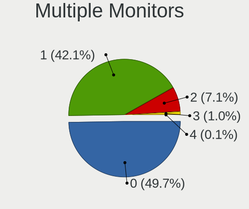

| Total | Desktops | Percent |
|-------|----------|---------|
| 0     | 603      | 50.25%  |
| 1     | 501      | 41.75%  |
| 2     | 85       | 7.08%   |
| 3     | 10       | 0.83%   |
| 4     | 1        | 0.08%   |

Network
-------

Net Controller Vendor
---------------------

Controller vendors

| Vendor                            | Desktops | Percent |
|-----------------------------------|----------|---------|
| Intel                             | 620      | 40.76%  |
| Realtek Semiconductor             | 555      | 36.49%  |
| Qualcomm Atheros                  | 85       | 5.59%   |
| Broadcom                          | 73       | 4.8%    |
| Mellanox Technologies             | 14       | 0.92%   |
| TP-Link                           | 12       | 0.79%   |
| Ralink Technology                 | 12       | 0.79%   |
| Marvell Technology Group          | 12       | 0.79%   |
| Ralink                            | 11       | 0.72%   |
| MediaTek                          | 11       | 0.72%   |
| VIA Technologies                  | 9        | 0.59%   |
| Samsung Electronics               | 9        | 0.59%   |
| Aquantia                          | 8        | 0.53%   |
| American Megatrends               | 8        | 0.53%   |
| D-Link System                     | 6        | 0.39%   |
| ASUSTek Computer                  | 5        | 0.33%   |
| Xiaomi                            | 4        | 0.26%   |
| Nvidia                            | 4        | 0.26%   |
| Apple                             | 4        | 0.26%   |
| 3Com                              | 4        | 0.26%   |
| IMC Networks                      | 3        | 0.2%    |
| Dresden Elektronik                | 3        | 0.2%    |
| Chelsio Communications            | 3        | 0.2%    |
| Arduino SA                        | 3        | 0.2%    |
| Accton Technology                 | 3        | 0.2%    |
| Sundance Technology Inc / IC Plus | 2        | 0.13%   |
| Qualcomm Atheros Communications   | 2        | 0.13%   |
| Qualcomm                          | 2        | 0.13%   |
| OPPO Electronics                  | 2        | 0.13%   |
| Huawei Technologies               | 2        | 0.13%   |
| Edimax Technology                 | 2        | 0.13%   |
| D-Link                            | 2        | 0.13%   |
| Atmel                             | 2        | 0.13%   |
| ADMtek                            | 2        | 0.13%   |
| U.S. Robotics                     | 1        | 0.07%   |
| Tehuti Networks                   | 1        | 0.07%   |
| Solarflare Communications         | 1        | 0.07%   |
| Silicon Integrated Systems [SiS]  | 1        | 0.07%   |
| Sigma Designs                     | 1        | 0.07%   |
| QinHeng Electronics               | 1        | 0.07%   |

Net Controller Model
--------------------

Controller models

| Model                                                                         | Desktops | Percent |
|-------------------------------------------------------------------------------|----------|---------|
| Realtek RTL8111/8168/8211/8411 PCI Express Gigabit Ethernet Controller        | 434      | 24.3%   |
| Intel I211 Gigabit Network Connection                                         | 110      | 6.16%   |
| Realtek RTL8125 2.5GbE Controller                                             | 61       | 3.42%   |
| Intel 82574L Gigabit Network Connection                                       | 56       | 3.14%   |
| Intel 82579LM Gigabit Network Connection (Lewisville)                         | 48       | 2.69%   |
| Intel Wi-Fi 6 AX200                                                           | 45       | 2.52%   |
| Intel I210 Gigabit Network Connection                                         | 44       | 2.46%   |
| Intel Ethernet Controller I225-V                                              | 35       | 1.96%   |
| Intel Ethernet Connection (2) I219-LM                                         | 28       | 1.57%   |
| Intel 82579V Gigabit Network Connection                                       | 28       | 1.57%   |
| Intel Ethernet Connection (2) I219-V                                          | 27       | 1.51%   |
| Intel Ethernet Connection I217-LM                                             | 26       | 1.46%   |
| Intel I350 Gigabit Network Connection                                         | 18       | 1.01%   |
| Intel Ethernet Connection (7) I219-V                                          | 17       | 0.95%   |
| Intel Ethernet Connection (2) I218-V                                          | 16       | 0.9%    |
| Intel 82571EB/82571GB Gigabit Ethernet Controller D0/D1 (copper applications) | 16       | 0.9%    |
| Broadcom NetXtreme BCM5720 Gigabit Ethernet PCIe                              | 16       | 0.9%    |
| Realtek RTL810xE PCI Express Fast Ethernet controller                         | 14       | 0.78%   |
| Intel Wi-Fi 5(802.11ac) Wireless-AC 9x6x [Thunder Peak]                       | 14       | 0.78%   |
| Realtek RTL-8100/8101L/8139 PCI Fast Ethernet Adapter                         | 12       | 0.67%   |
| Intel Dual Band Wireless-AC 3168NGW [Stone Peak]                              | 12       | 0.67%   |
| Qualcomm Atheros AR9462 Wireless Network Adapter                              | 11       | 0.62%   |
| Intel Ethernet Connection I217-V                                              | 11       | 0.62%   |
| Intel 82572EI Gigabit Ethernet Controller (Copper)                            | 11       | 0.62%   |
| Broadcom NetXtreme BCM5723 Gigabit Ethernet PCIe                              | 11       | 0.62%   |
| Intel Cannon Lake PCH CNVi WiFi                                               | 10       | 0.56%   |
| Realtek RTL8188EUS 802.11n Wireless Network Adapter                           | 9        | 0.5%    |
| Realtek RTL8169 PCI Gigabit Ethernet Controller                               | 9        | 0.5%    |
| Qualcomm Atheros Killer E220x Gigabit Ethernet Controller                     | 9        | 0.5%    |
| Qualcomm Atheros AR93xx Wireless Network Adapter                              | 9        | 0.5%    |
| Marvell Group 88E8056 PCI-E Gigabit Ethernet Controller                       | 9        | 0.5%    |
| Intel Wireless 7265                                                           | 9        | 0.5%    |
| Intel Ethernet Controller X550                                                | 9        | 0.5%    |
| Intel Ethernet Connection (7) I219-LM                                         | 9        | 0.5%    |
| Intel 82576 Gigabit Network Connection                                        | 9        | 0.5%    |
| Intel 82567LM-3 Gigabit Network Connection                                    | 9        | 0.5%    |
| Qualcomm Atheros AR9287 Wireless Network Adapter (PCI-Express)                | 8        | 0.45%   |
| Mellanox MT27500 Family [ConnectX-3]                                          | 8        | 0.45%   |
| Intel Ethernet Connection (5) I219-LM                                         | 8        | 0.45%   |
| Intel 82580 Gigabit Network Connection                                        | 8        | 0.45%   |

Wireless Vendor
---------------

Wireless vendors

| Vendor                                | Desktops | Percent |
|---------------------------------------|----------|---------|
| Intel                                 | 139      | 41.37%  |
| Realtek Semiconductor                 | 65       | 19.35%  |
| Qualcomm Atheros                      | 55       | 16.37%  |
| Broadcom                              | 13       | 3.87%   |
| TP-Link                               | 12       | 3.57%   |
| Ralink Technology                     | 12       | 3.57%   |
| Ralink                                | 11       | 3.27%   |
| MediaTek                              | 11       | 3.27%   |
| ASUSTek Computer                      | 5        | 1.49%   |
| IMC Networks                          | 3        | 0.89%   |
| Qualcomm Atheros Communications       | 2        | 0.6%    |
| Edimax Technology                     | 2        | 0.6%    |
| D-Link                                | 2        | 0.6%    |
| Linksys                               | 1        | 0.3%    |
| Atheros                               | 1        | 0.3%    |
| AboCom Systems                        | 1        | 0.3%    |
| 802.11g Adapter [Linksys WUSB54GC v3] | 1        | 0.3%    |

Wireless Model
--------------

Wireless models

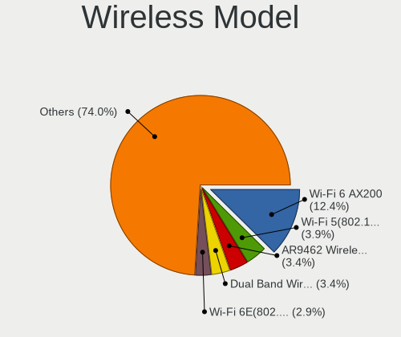

| Model                                                          | Desktops | Percent |
|----------------------------------------------------------------|----------|---------|
| Intel Wi-Fi 6 AX200                                            | 45       | 13.2%   |
| Intel Wi-Fi 5(802.11ac) Wireless-AC 9x6x [Thunder Peak]        | 14       | 4.11%   |
| Intel Dual Band Wireless-AC 3168NGW [Stone Peak]               | 12       | 3.52%   |
| Qualcomm Atheros AR9462 Wireless Network Adapter               | 11       | 3.23%   |
| Intel Cannon Lake PCH CNVi WiFi                                | 10       | 2.93%   |
| Realtek RTL8188EUS 802.11n Wireless Network Adapter            | 9        | 2.64%   |
| Qualcomm Atheros AR93xx Wireless Network Adapter               | 9        | 2.64%   |
| Intel Wireless 7265                                            | 9        | 2.64%   |
| Qualcomm Atheros AR9287 Wireless Network Adapter (PCI-Express) | 8        | 2.35%   |
| Realtek RTL8821CE 802.11ac PCIe Wireless Network Adapter       | 7        | 2.05%   |
| Realtek RTL8192EE PCIe Wireless Network Adapter                | 7        | 2.05%   |
| Intel Wi-Fi 6E(802.11ax) AX210/AX1675* 2x2 [Typhoon Peak]      | 7        | 2.05%   |
| Broadcom BCM4360 802.11ac Dual Band Wireless Network Adapter   | 7        | 2.05%   |
| Intel Wireless 8260                                            | 6        | 1.76%   |
| Realtek RTL8188EE Wireless Network Adapter                     | 5        | 1.47%   |
| Qualcomm Atheros AR928X Wireless Network Adapter (PCI-Express) | 5        | 1.47%   |
| Qualcomm Atheros AR9285 Wireless Network Adapter (PCI-Express) | 5        | 1.47%   |
| MediaTek MT7922 802.11ax PCI Express Wireless Network Adapter  | 5        | 1.47%   |
| Realtek RTL88x2bu [AC1200 Techkey]                             | 4        | 1.17%   |
| Realtek RTL8822CE 802.11ac PCIe Wireless Network Adapter       | 4        | 1.17%   |
| Realtek RTL8812AE 802.11ac PCIe Wireless Network Adapter       | 4        | 1.17%   |
| Realtek 8811CU Wireless LAN 802.11ac USB NIC                   | 4        | 1.17%   |
| Qualcomm Atheros AR9485 Wireless Network Adapter               | 4        | 1.17%   |
| MediaTek MT7921K (RZ608) Wi-Fi 6E 80MHz                        | 4        | 1.17%   |
| Intel Wireless 8265 / 8275                                     | 4        | 1.17%   |
| Intel Wireless 7260                                            | 4        | 1.17%   |
| Intel Wireless 3160                                            | 4        | 1.17%   |
| Intel Comet Lake PCH CNVi WiFi                                 | 4        | 1.17%   |
| Intel Alder Lake-S PCH CNVi WiFi                               | 4        | 1.17%   |
| Realtek RTL8821AE 802.11ac PCIe Wireless Network Adapter       | 3        | 0.88%   |
| Ralink RT5572 Wireless Adapter                                 | 3        | 0.88%   |
| Ralink RT5370 Wireless Adapter                                 | 3        | 0.88%   |
| Ralink RT3090 Wireless 802.11n 1T/1R PCIe                      | 3        | 0.88%   |
| Qualcomm Atheros AR9227 Wireless Network Adapter               | 3        | 0.88%   |
| Intel Wireless 3165                                            | 3        | 0.88%   |
| Intel Tiger Lake PCH CNVi WiFi                                 | 3        | 0.88%   |
| Intel Gemini Lake PCH CNVi WiFi                                | 3        | 0.88%   |
| Intel CNVi: Wi-Fi                                              | 3        | 0.88%   |
| ASUS Realtek 8188EUS [USB-N10 Nano]                            | 3        | 0.88%   |
| TP-Link TL-WN722N v2/v3 [Realtek RTL8188EUS]                   | 2        | 0.59%   |

Ethernet Vendor
---------------

Ethernet vendors

| Vendor                            | Desktops | Percent |
|-----------------------------------|----------|---------|
| Intel                             | 574      | 44.77%  |
| Realtek Semiconductor             | 524      | 40.87%  |
| Broadcom                          | 61       | 4.76%   |
| Qualcomm Atheros                  | 33       | 2.57%   |
| Marvell Technology Group          | 12       | 0.94%   |
| VIA Technologies                  | 9        | 0.7%    |
| Samsung Electronics               | 9        | 0.7%    |
| Aquantia                          | 8        | 0.62%   |
| American Megatrends               | 8        | 0.62%   |
| D-Link System                     | 6        | 0.47%   |
| Xiaomi                            | 4        | 0.31%   |
| Nvidia                            | 4        | 0.31%   |
| 3Com                              | 4        | 0.31%   |
| Chelsio Communications            | 3        | 0.23%   |
| Apple                             | 3        | 0.23%   |
| Sundance Technology Inc / IC Plus | 2        | 0.16%   |
| Qualcomm                          | 2        | 0.16%   |
| OPPO Electronics                  | 2        | 0.16%   |
| ADMtek                            | 2        | 0.16%   |
| Accton Technology                 | 2        | 0.16%   |
| U.S. Robotics                     | 1        | 0.08%   |
| Tehuti Networks                   | 1        | 0.08%   |
| Solarflare Communications         | 1        | 0.08%   |
| Silicon Integrated Systems [SiS]  | 1        | 0.08%   |
| OnePlus Technology (Shenzhen)     | 1        | 0.08%   |
| MYRICOM                           | 1        | 0.08%   |
| MediaTek                          | 1        | 0.08%   |
| Huawei Technologies               | 1        | 0.08%   |
| Emulex                            | 1        | 0.08%   |
| Davicom Semiconductor             | 1        | 0.08%   |

Ethernet Model
--------------

Ethernet models

| Model                                                                         | Desktops | Percent |
|-------------------------------------------------------------------------------|----------|---------|
| Realtek RTL8111/8168/8211/8411 PCI Express Gigabit Ethernet Controller        | 434      | 31%     |
| Intel I211 Gigabit Network Connection                                         | 110      | 7.86%   |
| Realtek RTL8125 2.5GbE Controller                                             | 56       | 4%      |
| Intel 82574L Gigabit Network Connection                                       | 56       | 4%      |
| Intel 82579LM Gigabit Network Connection (Lewisville)                         | 48       | 3.43%   |
| Intel I210 Gigabit Network Connection                                         | 44       | 3.14%   |
| Intel Ethernet Controller I225-V                                              | 35       | 2.5%    |
| Intel Ethernet Connection (2) I219-LM                                         | 28       | 2%      |
| Intel 82579V Gigabit Network Connection                                       | 28       | 2%      |
| Intel Ethernet Connection (2) I219-V                                          | 27       | 1.93%   |
| Intel Ethernet Connection I217-LM                                             | 26       | 1.86%   |
| Intel I350 Gigabit Network Connection                                         | 18       | 1.29%   |
| Intel Ethernet Connection (7) I219-V                                          | 17       | 1.21%   |
| Intel Ethernet Connection (2) I218-V                                          | 16       | 1.14%   |
| Intel 82571EB/82571GB Gigabit Ethernet Controller D0/D1 (copper applications) | 16       | 1.14%   |
| Broadcom NetXtreme BCM5720 Gigabit Ethernet PCIe                              | 16       | 1.14%   |
| Realtek RTL810xE PCI Express Fast Ethernet controller                         | 14       | 1%      |
| Realtek RTL-8100/8101L/8139 PCI Fast Ethernet Adapter                         | 12       | 0.86%   |
| Intel Ethernet Connection I217-V                                              | 11       | 0.79%   |
| Intel 82572EI Gigabit Ethernet Controller (Copper)                            | 11       | 0.79%   |
| Broadcom NetXtreme BCM5723 Gigabit Ethernet PCIe                              | 11       | 0.79%   |
| Realtek RTL8169 PCI Gigabit Ethernet Controller                               | 9        | 0.64%   |
| Qualcomm Atheros Killer E220x Gigabit Ethernet Controller                     | 9        | 0.64%   |
| Marvell Group 88E8056 PCI-E Gigabit Ethernet Controller                       | 9        | 0.64%   |
| Intel Ethernet Controller X550                                                | 9        | 0.64%   |
| Intel Ethernet Connection (7) I219-LM                                         | 9        | 0.64%   |
| Intel 82576 Gigabit Network Connection                                        | 9        | 0.64%   |
| Intel 82567LM-3 Gigabit Network Connection                                    | 9        | 0.64%   |
| Intel Ethernet Connection (5) I219-LM                                         | 8        | 0.57%   |
| Intel 82580 Gigabit Network Connection                                        | 8        | 0.57%   |
| Intel 82557/8/9/0/1 Ethernet Pro 100                                          | 8        | 0.57%   |
| American Megatrends Virtual Ethernet                                          | 8        | 0.57%   |
| Samsung Galaxy series, misc. (tethering mode)                                 | 7        | 0.5%    |
| Qualcomm Atheros AR8121/AR8113/AR8114 Gigabit or Fast Ethernet                | 7        | 0.5%    |
| Intel 82599ES 10-Gigabit SFI/SFP+ Network Connection                          | 7        | 0.5%    |
| Intel Ethernet Controller I226-V                                              | 6        | 0.43%   |
| Intel Ethernet Connection (11) I219-V                                         | 6        | 0.43%   |
| Intel 82566DM-2 Gigabit Network Connection                                    | 6        | 0.43%   |
| VIA VT6105/VT6106S [Rhine-III]                                                | 5        | 0.36%   |
| Qualcomm Atheros AR8151 v2.0 Gigabit Ethernet                                 | 5        | 0.36%   |

Net Controller Kind
-------------------

Ethernet, WiFi or modem

| Kind     | Desktops | Percent |
|----------|----------|---------|
| Ethernet | 1131     | 76.01%  |
| WiFi     | 313      | 21.03%  |
| Unknown  | 30       | 2.02%   |
| Modem    | 14       | 0.94%   |

Used Controller
---------------

Currently used network controller

| Kind     | Desktops | Percent |
|----------|----------|---------|
| Ethernet | 1070     | 90.52%  |
| WiFi     | 107      | 9.05%   |
| Unknown  | 5        | 0.42%   |

NICs
----

Total network controllers on board

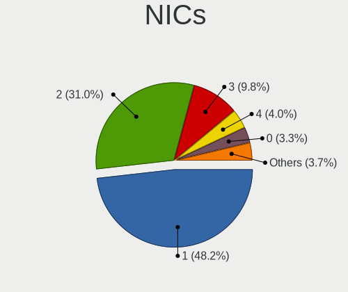

| Total | Desktops | Percent |
|-------|----------|---------|
| 1     | 591      | 49.58%  |
| 2     | 349      | 29.28%  |
| 3     | 122      | 10.23%  |
| 4     | 45       | 3.78%   |
| 0     | 42       | 3.52%   |
| 5     | 18       | 1.51%   |
| 6     | 15       | 1.26%   |
| 7     | 6        | 0.5%    |
| 8     | 3        | 0.25%   |
| 10    | 1        | 0.08%   |

IPv6
----

IPv6 vs IPv4

| Used | Desktops | Percent |
|------|----------|---------|
| No   | 1047     | 86.46%  |
| Yes  | 164      | 13.54%  |

Bluetooth
---------

Bluetooth Vendor
----------------

Controller vendors

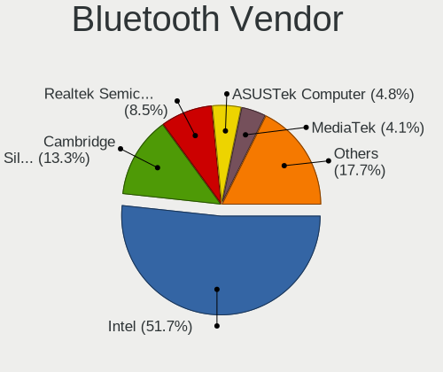

| Vendor                          | Desktops | Percent |
|---------------------------------|----------|---------|
| Intel                           | 127      | 54.04%  |
| Cambridge Silicon Radio         | 33       | 14.04%  |
| Realtek Semiconductor           | 19       | 8.09%   |
| ASUSTek Computer                | 13       | 5.53%   |
| IMC Networks                    | 7        | 2.98%   |
| Qualcomm Atheros Communications | 6        | 2.55%   |
| Apple                           | 6        | 2.55%   |
| MediaTek                        | 5        | 2.13%   |
| Broadcom                        | 5        | 2.13%   |
| Lite-On Technology              | 4        | 1.7%    |
| Foxconn / Hon Hai               | 3        | 1.28%   |
| TP-Link                         | 1        | 0.43%   |
| Sino Wealth Electronic          | 1        | 0.43%   |
| Realtek                         | 1        | 0.43%   |
| Ralink                          | 1        | 0.43%   |
| Micro Star International        | 1        | 0.43%   |
| Corsair                         | 1        | 0.43%   |
| Unknown                         | 1        | 0.43%   |

Bluetooth Model
---------------

Controller models

| Model                                                       | Desktops | Percent |
|-------------------------------------------------------------|----------|---------|
| Intel AX200 Bluetooth                                       | 41       | 17.23%  |
| Cambridge Silicon Radio Bluetooth Dongle (HCI mode)         | 33       | 13.87%  |
| Intel Bluetooth wireless interface                          | 24       | 10.08%  |
| Intel Wireless-AC 9260 Bluetooth Adapter                    | 15       | 6.3%    |
| Intel AX201 Bluetooth                                       | 15       | 6.3%    |
| Intel Bluetooth 9460/9560 Jefferson Peak (JfP)              | 14       | 5.88%   |
| Realtek Bluetooth Adapter                                   | 11       | 4.62%   |
| Intel Wireless-AC 3168 Bluetooth                            | 11       | 4.62%   |
| Intel AX210 Bluetooth                                       | 6        | 2.52%   |
| Realtek  Bluetooth 4.2 Adapter                              | 5        | 2.1%    |
| Broadcom BCM20702A0 Bluetooth 4.0                           | 5        | 2.1%    |
| MediaTek RZ608 Bluetooth Adapter                            | 4        | 1.68%   |
| ASUS Broadcom BCM20702A0 Bluetooth                          | 4        | 1.68%   |
| Apple Bluetooth Host Controller                             | 4        | 1.68%   |
| IMC Networks Qualcomm Atheros AR9462 Bluetooth 4.0          | 3        | 1.26%   |
| Foxconn / Hon Hai RZ616 Bluetooth Adapter                   | 3        | 1.26%   |
| Realtek Bluetooth 4.2 Adapter                               | 2        | 0.84%   |
| Qualcomm Atheros AR3011 Bluetooth (no firmware)             | 2        | 0.84%   |
| Lite-On Atheros AR3012 Bluetooth                            | 2        | 0.84%   |
| Intel Centrino Bluetooth Wireless Transceiver               | 2        | 0.84%   |
| Intel AX211 Bluetooth                                       | 2        | 0.84%   |
| IMC Networks Realtek Bluetooth 4.0 + High Speed Chip        | 2        | 0.84%   |
| ASUS Qualcomm Atheros AR9462 Bluetooth 4.0 + HS Adapter     | 2        | 0.84%   |
| ASUS Broadcom BCM20702 Single-Chip Bluetooth 4.0 + LE       | 2        | 0.84%   |
| ASUS Bluetooth USB module                                   | 2        | 0.84%   |
| Apple Built-in Bluetooth 2.0+EDR HCI                        | 2        | 0.84%   |
| TP-Link Bluetooth 5.0 USB Adapter                           | 1        | 0.42%   |
| Sino Wealth Electronic RK Bluetooth Keyboar                 | 1        | 0.42%   |
| Realtek RTL8723B Bluetooth                                  | 1        | 0.42%   |
| Realtek  Bluetooth 4.0 Adapter                              | 1        | 0.42%   |
| Ralink RT3290 Bluetooth                                     | 1        | 0.42%   |
| Qualcomm Atheros QCA61x4 Bluetooth 4.1                      | 1        | 0.42%   |
| Qualcomm Atheros Dell Wireless 1707 Bluetooth 4.0 LE Device | 1        | 0.42%   |
| Qualcomm Atheros AR9462 Bluetooth 3.0 + HS Adapter          | 1        | 0.42%   |
| Qualcomm Atheros AR9462 Bluetooth                           | 1        | 0.42%   |
| Micro Star International MS-6970 BToes Bluetooth adapter    | 1        | 0.42%   |
| MediaTek RZ616 Bluetooth Adapter                            | 1        | 0.42%   |
| Lite-On Bluetooth USB Module                                | 1        | 0.42%   |
| Lite-On Atheros AR9462 Bluetooth 4.0 + HS                   | 1        | 0.42%   |
| IMC Networks Wireless_Device                                | 1        | 0.42%   |

Sound
-----

Sound Vendor
------------

Sound card vendors

| Vendor                                       | Desktops | Percent |
|----------------------------------------------|----------|---------|
| Intel                                        | 561      | 38.35%  |
| AMD                                          | 394      | 26.93%  |
| Nvidia                                       | 330      | 22.56%  |
| C-Media Electronics                          | 27       | 1.85%   |
| Creative Labs                                | 18       | 1.23%   |
| Logitech                                     | 17       | 1.16%   |
| Texas Instruments                            | 9        | 0.62%   |
| Realtek Semiconductor                        | 6        | 0.41%   |
| Focusrite-Novation                           | 6        | 0.41%   |
| BEHRINGER International                      | 5        | 0.34%   |
| ASUSTek Computer                             | 5        | 0.34%   |
| Sony                                         | 4        | 0.27%   |
| Kingston Technology                          | 4        | 0.27%   |
| JMTek                                        | 4        | 0.27%   |
| Generalplus Technology                       | 4        | 0.27%   |
| Blue Microphones                             | 4        | 0.27%   |
| Tenx Technology                              | 3        | 0.21%   |
| SteelSeries ApS                              | 3        | 0.21%   |
| Silicon Integrated Systems [SiS]             | 3        | 0.21%   |
| Plantronics                                  | 3        | 0.21%   |
| Creative Technology                          | 3        | 0.21%   |
| Yamaha                                       | 2        | 0.14%   |
| VIA Technologies                             | 2        | 0.14%   |
| Trust                                        | 2        | 0.14%   |
| Thesycon Systemsoftware & Consulting         | 2        | 0.14%   |
| Micro Star International                     | 2        | 0.14%   |
| M-Audio                                      | 2        | 0.14%   |
| Huawei Technologies                          | 2        | 0.14%   |
| GN Netcom                                    | 2        | 0.14%   |
| Corsair                                      | 2        | 0.14%   |
| Cambridge Silicon Radio                      | 2        | 0.14%   |
| Zoran Co. Personal Media Division (Nogatech) | 1        | 0.07%   |
| XMOS                                         | 1        | 0.07%   |
| Xilinx                                       | 1        | 0.07%   |
| Universal Audio                              | 1        | 0.07%   |
| Trust International                          | 1        | 0.07%   |
| Solid State Logic                            | 1        | 0.07%   |
| Shure                                        | 1        | 0.07%   |
| Samsung Electronics                          | 1        | 0.07%   |
| Samson Technologies                          | 1        | 0.07%   |

Sound Model
-----------

Sound card models

| Model                                                                      | Desktops | Percent |
|----------------------------------------------------------------------------|----------|---------|
| AMD Starship/Matisse HD Audio Controller                                   | 101      | 5.85%   |
| AMD Family 17h/19h HD Audio Controller                                     | 72       | 4.17%   |
| Intel 8 Series/C220 Series Chipset High Definition Audio Controller        | 57       | 3.3%    |
| AMD SBx00 Azalia (Intel HDA)                                               | 57       | 3.3%    |
| Intel 6 Series/C200 Series Chipset Family High Definition Audio Controller | 56       | 3.24%   |
| Intel Xeon E3-1200 v3/4th Gen Core Processor HD Audio Controller           | 53       | 3.07%   |
| AMD Family 17h (Models 00h-0fh) HD Audio Controller                        | 51       | 2.95%   |
| Intel 7 Series/C216 Chipset Family High Definition Audio Controller        | 46       | 2.66%   |
| Intel 100 Series/C230 Series Chipset Family HD Audio Controller            | 46       | 2.66%   |
| Nvidia GK208 HDMI/DP Audio Controller                                      | 45       | 2.61%   |
| AMD Ellesmere HDMI Audio [Radeon RX 470/480 / 570/580/590]                 | 45       | 2.61%   |
| Intel 200 Series PCH HD Audio                                              | 43       | 2.49%   |
| AMD Renoir Radeon High Definition Audio Controller                         | 34       | 1.97%   |
| Intel Cannon Lake PCH cAVS                                                 | 32       | 1.85%   |
| Intel NM10/ICH7 Family High Definition Audio Controller                    | 29       | 1.68%   |
| AMD Raven/Raven2/Fenghuang HDMI/DP Audio Controller                        | 26       | 1.51%   |
| Nvidia GP108 High Definition Audio Controller                              | 25       | 1.45%   |
| Nvidia GP107GL High Definition Audio Controller                            | 25       | 1.45%   |
| Intel 82801JI (ICH10 Family) HD Audio Controller                           | 25       | 1.45%   |
| AMD Navi 21/23 HDMI/DP Audio Controller                                    | 23       | 1.33%   |
| AMD Baffin HDMI/DP Audio [Radeon RX 550 640SP / RX 560/560X]               | 22       | 1.27%   |
| Nvidia TU116 High Definition Audio Controller                              | 21       | 1.22%   |
| Intel C600/X79 series chipset High Definition Audio Controller             | 21       | 1.22%   |
| Nvidia High Definition Audio Controller                                    | 20       | 1.16%   |
| Intel 9 Series Chipset Family HD Audio Controller                          | 20       | 1.16%   |
| AMD FCH Azalia Controller                                                  | 20       | 1.16%   |
| Nvidia GP104 High Definition Audio Controller                              | 18       | 1.04%   |
| Nvidia GF119 HDMI Audio Controller                                         | 18       | 1.04%   |
| Intel C610/X99 series chipset HD Audio Controller                          | 18       | 1.04%   |
| Nvidia GP106 High Definition Audio Controller                              | 17       | 0.98%   |
| AMD Oland/Hainan/Cape Verde/Pitcairn HDMI Audio [Radeon HD 7000 Series]    | 16       | 0.93%   |
| AMD RV710/730 HDMI Audio [Radeon HD 4000 series]                           | 15       | 0.87%   |
| Nvidia GM107 High Definition Audio Controller [GeForce 940MX]              | 14       | 0.81%   |
| Nvidia GK107 HDMI Audio Controller                                         | 14       | 0.81%   |
| Intel Comet Lake PCH cAVS                                                  | 14       | 0.81%   |
| Intel Atom Processor Z36xxx/Z37xxx Series High Definition Audio Controller | 14       | 0.81%   |
| Intel 5 Series/3400 Series Chipset High Definition Audio                   | 14       | 0.81%   |
| AMD Kabini HDMI/DP Audio                                                   | 14       | 0.81%   |
| Nvidia GF108 High Definition Audio Controller                              | 13       | 0.75%   |
| Intel Smart Sound Technology (SST) Audio Controller                        | 13       | 0.75%   |

Memory
------

Memory Vendor
-------------

Memory module vendors

| Vendor                       | Desktops | Percent |
|------------------------------|----------|---------|
| Kingston                     | 206      | 16.68%  |
| Unknown                      | 182      | 14.74%  |
| Corsair                      | 149      | 12.06%  |
| Samsung Electronics          | 122      | 9.88%   |
| SK hynix                     | 115      | 9.31%   |
| Crucial                      | 97       | 7.85%   |
| G.Skill                      | 86       | 6.96%   |
| Micron Technology            | 78       | 6.32%   |
| A-DATA Technology            | 25       | 2.02%   |
| Unknown                      | 21       | 1.7%    |
| Patriot                      | 14       | 1.13%   |
| Team                         | 12       | 0.97%   |
| Ramaxel Technology           | 11       | 0.89%   |
| Nanya Technology             | 10       | 0.81%   |
| Hewlett-Packard              | 10       | 0.81%   |
| Goodram                      | 10       | 0.81%   |
| Transcend                    | 9        | 0.73%   |
| Patriot Memory (PDP Systems) | 7        | 0.57%   |
| AMD                          | 5        | 0.4%    |
| Unknown (ABCD)               | 4        | 0.32%   |
| Super Talent                 | 3        | 0.24%   |
| Qimonda                      | 3        | 0.24%   |
| Kingmax                      | 3        | 0.24%   |
| Avant                        | 3        | 0.24%   |
| Apacer                       | 3        | 0.24%   |
| Tigo                         | 2        | 0.16%   |
| Silicon Power                | 2        | 0.16%   |
| PNY                          | 2        | 0.16%   |
| Lexar Co Limited             | 2        | 0.16%   |
| Kllisre                      | 2        | 0.16%   |
| HPE                          | 2        | 0.16%   |
| Goldkey                      | 2        | 0.16%   |
| Golden Empire                | 2        | 0.16%   |
| GeIL                         | 2        | 0.16%   |
| Elpida                       | 2        | 0.16%   |
| ASint Technology             | 2        | 0.16%   |
| V-GeN                        | 1        | 0.08%   |
| V-Color                      | 1        | 0.08%   |
| Unknown (AB)                 | 1        | 0.08%   |
| Unknown (8A5D)               | 1        | 0.08%   |

Memory Model
------------

Memory module models

| Model                                                        | Desktops | Percent |
|--------------------------------------------------------------|----------|---------|
| Unknown                                                      | 21       | 1.55%   |
| Unknown RAM Module 4GB DIMM 1333MT/s                         | 13       | 0.96%   |
| Corsair RAM CMK16GX4M2B3200C16 8GB DIMM DDR4 3200MT/s        | 13       | 0.96%   |
| Unknown RAM Module 2GB DIMM DDR2 800MT/s                     | 10       | 0.74%   |
| Unknown RAM Module 8GB DIMM 1333MT/s                         | 9        | 0.66%   |
| Crucial RAM CT102464BA160B.C16 8GB DIMM DDR3 1600MT/s        | 9        | 0.66%   |
| Unknown RAM Module 8GB DIMM DDR3 1600MT/s                    | 8        | 0.59%   |
| Corsair RAM CMK16GX4M2E3200C16 8GB DIMM DDR4 3200MT/s        | 8        | 0.59%   |
| Unknown RAM Module 2GB DIMM 1333MT/s                         | 7        | 0.52%   |
| Samsung RAM M391A2K43BB1-CTD 16GB DIMM DDR4 3200MT/s         | 7        | 0.52%   |
| Samsung RAM M378B5273DH0-CK0 4GB DIMM DDR3 1600MT/s          | 7        | 0.52%   |
| Kingston RAM KHX2400C15/8G 8GB DIMM DDR4 2400MT/s            | 7        | 0.52%   |
| Unknown RAM Module 8192MB DIMM DDR3 1600MT/s                 | 6        | 0.44%   |
| Unknown RAM Module 1GB DIMM SDRAM                            | 6        | 0.44%   |
| Kingston RAM KHX1866C10D3/8G 8GB DIMM DDR3 1867MT/s          | 6        | 0.44%   |
| Kingston RAM KF3200C16D4/16GX 16GB DIMM DDR4 3200MT/s        | 6        | 0.44%   |
| G.Skill RAM F4-3200C16-16GVK 16GB DIMM DDR4 3200MT/s         | 6        | 0.44%   |
| Unknown RAM Module 512MB DIMM SDRAM                          | 5        | 0.37%   |
| Unknown RAM Module 4GB SODIMM DDR3 1333MT/s                  | 5        | 0.37%   |
| Unknown RAM Module 2GB DIMM SDRAM                            | 5        | 0.37%   |
| Unknown RAM Module 2048MB DIMM DDR2 800MT/s                  | 5        | 0.37%   |
| SK hynix RAM HMT451U6BFR8C-PB 4GB DIMM DDR3 1600MT/s         | 5        | 0.37%   |
| SK hynix RAM HMT451U6AFR8C-PB 4GB DIMM DDR3 1600MT/s         | 5        | 0.37%   |
| Samsung RAM M378A4G43MB1-CTD 32GB DIMM DDR4 2666MT/s         | 5        | 0.37%   |
| G.Skill RAM F4-3200C16-32GVK 32GB DIMM DDR4 3200MT/s         | 5        | 0.37%   |
| Crucial RAM BLS8G3D1609DS1S00. 8GB DIMM DDR3 1600MT/s        | 5        | 0.37%   |
| Corsair RAM CMK32GX4M2D3600C18 16GB DIMM DDR4 3600MT/s       | 5        | 0.37%   |
| Corsair RAM CMK32GX4M2A2666C16 16GB DIMM DDR4 3000MT/s       | 5        | 0.37%   |
| Corsair RAM CMK16GX4M2B3000C15 8GB DIMM DDR4 3000MT/s        | 5        | 0.37%   |
| Unknown RAM Module 4096MB DIMM 1333MT/s                      | 4        | 0.3%    |
| Unknown (ABCD) RAM 123456789012345678 4GB DIMM DDR4 2400MT/s | 4        | 0.3%    |
| SK hynix RAM HMT451U6BFR8A-PB 4GB DIMM DDR3 1600MT/s         | 4        | 0.3%    |
| SK hynix RAM HMA81GU6JJR8N-VK 8GB DIMM DDR4 2667MT/s         | 4        | 0.3%    |
| Samsung RAM M378B5773CH0-CH9 2GB DIMM DDR3 1333MT/s          | 4        | 0.3%    |
| Micron RAM 8JTF51264AZ-1G6E1 4GB DIMM DDR3 1600MT/s          | 4        | 0.3%    |
| Micron RAM 8ATF1G64AZ-3G2J1 8GB DIMM DDR4 3200MT/s           | 4        | 0.3%    |
| Kingston RAM KHX3200C16D4/8GX 8GB DIMM DDR4 3200MT/s         | 4        | 0.3%    |
| Kingston RAM KHX3200C16D4/32GX 32GB DIMM DDR4 3200MT/s       | 4        | 0.3%    |
| Kingston RAM KHX2666C16/8G 8GB DIMM DDR4 2933MT/s            | 4        | 0.3%    |
| Kingston RAM KHX1600C10D3/8G 8GB DIMM DDR3 1600MT/s          | 4        | 0.3%    |

Memory Kind
-----------

Memory module kinds

| Kind         | Desktops | Percent |
|--------------|----------|---------|
| DDR4         | 494      | 45.03%  |
| DDR3         | 410      | 37.37%  |
| Unknown      | 60       | 5.47%   |
| DDR2         | 55       | 5.01%   |
| SDRAM        | 32       | 2.92%   |
| DDR5         | 21       | 1.91%   |
| DDR          | 16       | 1.46%   |
| LPDDR4       | 5        | 0.46%   |
| DRAM         | 2        | 0.18%   |
| LPDDR3       | 1        | 0.09%   |
| DDR2 FB-DIMM | 1        | 0.09%   |

Memory Form Factor
------------------

Physical design of the memory module

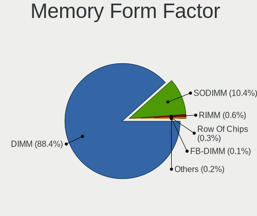

| Name         | Desktops | Percent |
|--------------|----------|---------|
| DIMM         | 970      | 88.83%  |
| SODIMM       | 109      | 9.98%   |
| RIMM         | 8        | 0.73%   |
| Row Of Chips | 2        | 0.18%   |
| FB-DIMM      | 1        | 0.09%   |
| Chip         | 1        | 0.09%   |
| Unknown      | 1        | 0.09%   |

Memory Size
-----------

Memory module size

| Size  | Desktops | Percent |
|-------|----------|---------|
| 8192  | 414      | 34.73%  |
| 4096  | 269      | 22.57%  |
| 16384 | 223      | 18.71%  |
| 2048  | 142      | 11.91%  |
| 32768 | 83       | 6.96%   |
| 1024  | 42       | 3.52%   |
| 512   | 13       | 1.09%   |
| 128   | 2        | 0.17%   |
| 256   | 1        | 0.08%   |
| 64    | 1        | 0.08%   |
| 32    | 1        | 0.08%   |
| 8     | 1        | 0.08%   |

Memory Speed
------------

Memory module speed

| Speed   | Desktops | Percent |
|---------|----------|---------|
| 1600    | 237      | 20.4%   |
| 1333    | 168      | 14.46%  |
| 3200    | 154      | 13.25%  |
| 2400    | 109      | 9.38%   |
| 2133    | 92       | 7.92%   |
| 2667    | 65       | 5.59%   |
| 800     | 61       | 5.25%   |
| 2666    | 35       | 3.01%   |
| 667     | 30       | 2.58%   |
| Unknown | 28       | 2.41%   |
| 3600    | 25       | 2.15%   |
| 3000    | 24       | 2.07%   |
| 2933    | 18       | 1.55%   |
| 1066    | 16       | 1.38%   |
| 4800    | 15       | 1.29%   |
| 1866    | 13       | 1.12%   |
| 533     | 10       | 0.86%   |
| 1867    | 9        | 0.77%   |
| 400     | 8        | 0.69%   |
| 1067    | 7        | 0.6%    |
| 3400    | 4        | 0.34%   |
| 1334    | 4        | 0.34%   |
| 5600    | 3        | 0.26%   |
| 4000    | 3        | 0.26%   |
| 6400    | 2        | 0.17%   |
| 5200    | 2        | 0.17%   |
| 3534    | 2        | 0.17%   |
| 2048    | 2        | 0.17%   |
| 1400    | 2        | 0.17%   |
| 1332    | 2        | 0.17%   |
| 333     | 2        | 0.17%   |
| 65535   | 1        | 0.09%   |
| 4133    | 1        | 0.09%   |
| 3500    | 1        | 0.09%   |
| 3066    | 1        | 0.09%   |
| 2800    | 1        | 0.09%   |
| 2134    | 1        | 0.09%   |
| 1800    | 1        | 0.09%   |
| 1639    | 1        | 0.09%   |
| 933     | 1        | 0.09%   |

Printers & scanners
-------------------

Printer Vendor
--------------

Printer device vendors

| Vendor              | Desktops | Percent |
|---------------------|----------|---------|
| Brother Industries  | 4        | 33.33%  |
| Prolific Technology | 2        | 16.67%  |
| Hewlett-Packard     | 2        | 16.67%  |
| Seiko Epson         | 1        | 8.33%   |
| QinHeng Electronics | 1        | 8.33%   |
| Dymo-CoStar         | 1        | 8.33%   |
| Canon               | 1        | 8.33%   |

Printer Model
-------------

Printer device models

| Model                                                                                      | Desktops | Percent |
|--------------------------------------------------------------------------------------------|----------|---------|
| Prolific PL2305 Parallel Port                                                              | 2        | 16.67%  |
| Seiko Epson Printer                                                                        | 1        | 8.33%   |
| QinHeng CH340S                                                                             | 1        | 8.33%   |
| HP LaserJet 1012                                                                           | 1        | 8.33%   |
| HP HP LaserJet M14-M17 Printer HP LEDM IPP Printer HP LEDM IPP Printer HP LEDM IPP Printer | 1        | 8.33%   |
| Dymo-CoStar LabelWriter 450                                                                | 1        | 8.33%   |
| Canon LBP2900                                                                              | 1        | 8.33%   |
| Brother MFC-7360N                                                                          | 1        | 8.33%   |
| Brother HL-L5200DW series                                                                  | 1        | 8.33%   |
| Brother HL-2030 Laser Printer                                                              | 1        | 8.33%   |
| Brother HL-1430 Laser Printer                                                              | 1        | 8.33%   |

Scanner Vendor
--------------

Scanner device vendors

| Vendor          | Desktops | Percent |
|-----------------|----------|---------|
| Canon           | 3        | 50%     |
| Seiko Epson     | 2        | 33.33%  |
| Hewlett-Packard | 1        | 16.67%  |

Scanner Model
-------------

Scanner device models

| Model                                                                               | Desktops | Percent |
|-------------------------------------------------------------------------------------|----------|---------|
| Seiko Epson WF-2850 Series EPSON Scanner USB2.0 Printer EPSON Utility USB2.0 Faxout | 2        | 33.33%  |
| HP ScanJet 5300c/5370c                                                              | 1        | 16.67%  |
| Canon CanoScan LIDE 25                                                              | 1        | 16.67%  |
| Canon CanoScan LiDE 220                                                             | 1        | 16.67%  |
| Canon CanoScan LiDE 110                                                             | 1        | 16.67%  |

Camera
------

Camera Vendor
-------------

Camera device vendors

| Vendor                    | Desktops | Percent |
|---------------------------|----------|---------|
| Logitech                  | 40       | 55.56%  |
| Microdia                  | 11       | 15.28%  |
| WCM_USB                   | 2        | 2.78%   |
| Trust                     | 2        | 2.78%   |
| SHENZHEN EMEET TECHNOLOGY | 2        | 2.78%   |
| ARC International         | 2        | 2.78%   |
| Z-Star Microelectronics   | 1        | 1.39%   |
| YGTek                     | 1        | 1.39%   |
| Valve Software            | 1        | 1.39%   |
| Suyin                     | 1        | 1.39%   |
| Sonix Technology          | 1        | 1.39%   |
| Realtek Semiconductor     | 1        | 1.39%   |
| OmniVision Technologies   | 1        | 1.39%   |
| Nam Tai E&E Products      | 1        | 1.39%   |
| Lenovo                    | 1        | 1.39%   |
| Huawei Technologies       | 1        | 1.39%   |
| Cubeternet                | 1        | 1.39%   |
| Aveo Technology           | 1        | 1.39%   |
| Arkmicro Technologies     | 1        | 1.39%   |

Camera Model
------------

Camera device models

| Model                                          | Desktops | Percent |
|------------------------------------------------|----------|---------|
| Logitech Webcam C270                           | 13       | 18.06%  |
| Logitech HD Pro Webcam C920                    | 5        | 6.94%   |
| Logitech C920 PRO HD Webcam                    | 4        | 5.56%   |
| Microdia USB 2.0 Camera                        | 3        | 4.17%   |
| Logitech C922 Pro Stream Webcam                | 3        | 4.17%   |
| WCM_USB WEB CAM                                | 2        | 2.78%   |
| SHENZHEN EMEET TECHNOLOGY HD Webcam eMeet C960 | 2        | 2.78%   |
| Microdia Webcam Vitade AF                      | 2        | 2.78%   |
| Microdia Lenovo EasyCamera                     | 2        | 2.78%   |
| Microdia HP Integrated Webcam                  | 2        | 2.78%   |
| Logitech Webcam C310                           | 2        | 2.78%   |
| Logitech Labtec Webcam Pro                     | 2        | 2.78%   |
| Logitech C505 HD Webcam                        | 2        | 2.78%   |
| Logitech BRIO Ultra HD Webcam                  | 2        | 2.78%   |
| ARC International Camera                       | 2        | 2.78%   |
| Z-Star Venus USB2.0 Camera                     | 1        | 1.39%   |
| YGTek Webcam                                   | 1        | 1.39%   |
| Valve Software 3D Camera                       | 1        | 1.39%   |
| Trust Trust QHD Webcam                         | 1        | 1.39%   |
| Trust Canyon CNS-CWC6 Webcam                   | 1        | 1.39%   |
| Suyin Acer CrystalEye Webcam                   | 1        | 1.39%   |
| Sonix FHD Webcam                               | 1        | 1.39%   |
| Realtek USB Video Device                       | 1        | 1.39%   |
| OmniVision Monitor Webcam                      | 1        | 1.39%   |
| Nam Tai E&E Products Sony Playstation Eye      | 1        | 1.39%   |
| Microdia JOYACCESS JA-Webcam                   | 1        | 1.39%   |
| Microdia Camera                                | 1        | 1.39%   |
| Logitech Webcam C930e                          | 1        | 1.39%   |
| Logitech Webcam C170                           | 1        | 1.39%   |
| Logitech QuickCam OEM Cisco VT Camera II       | 1        | 1.39%   |
| Logitech Logitech Webcam C925e                 | 1        | 1.39%   |
| Logitech HD Webcam C615                        | 1        | 1.39%   |
| Logitech HD Webcam C525                        | 1        | 1.39%   |
| Logitech C920 HD Pro Webcam                    | 1        | 1.39%   |
| Lenovo Integrated Camera                       | 1        | 1.39%   |
| Huawei HiCamera                                | 1        | 1.39%   |
| Cubeternet GL-UPC822 UVC WebCam                | 1        | 1.39%   |
| Aveo USB2.0 Camera                             | 1        | 1.39%   |
| Arkmicro USB 2.0 PC CAMERA                     | 1        | 1.39%   |

Security
--------

Fingerprint Vendor
------------------

Fingerprint sensor vendors

| Vendor            | Desktops | Percent |
|-------------------|----------|---------|
| FocalTech Systems | 1        | 50%     |
| DigitalPersona    | 1        | 50%     |

Fingerprint Model
-----------------

Fingerprint sensor models

| Model                                | Desktops | Percent |
|--------------------------------------|----------|---------|
| FocalTech Systems Fingerprint Reader | 1        | 50%     |
| DigitalPersona Fingerprint Reader    | 1        | 50%     |

Chipcard Vendor
---------------

Chipcard module vendors

Zero info for selected period =(

Chipcard Model
--------------

Chipcard module models

Zero info for selected period =(

Unsupported
-----------

Unsupported Devices
-------------------

Total unsupported devices on board

| Total | Desktops | Percent |
|-------|----------|---------|
| 1     | 498      | 41.06%  |
| 0     | 489      | 40.31%  |
| 2     | 175      | 14.43%  |
| 3     | 38       | 3.13%   |
| 4     | 11       | 0.91%   |
| 6     | 2        | 0.16%   |

Unsupported Device Types
------------------------

Types of unsupported devices

| Type                     | Desktops | Percent |
|--------------------------|----------|---------|
| Communication controller | 545      | 59.89%  |
| Net/wireless             | 115      | 12.64%  |
| Bluetooth                | 81       | 8.9%    |
| Firewire controller      | 67       | 7.36%   |
| Net/ethernet             | 28       | 3.08%   |
| Sound                    | 26       | 2.86%   |
| Network                  | 23       | 2.53%   |
| Card reader              | 17       | 1.87%   |
| Dvb card                 | 4        | 0.44%   |
| Storage/raid             | 2        | 0.22%   |
| Fingerprint reader       | 2        | 0.22%   |

