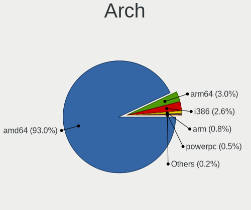
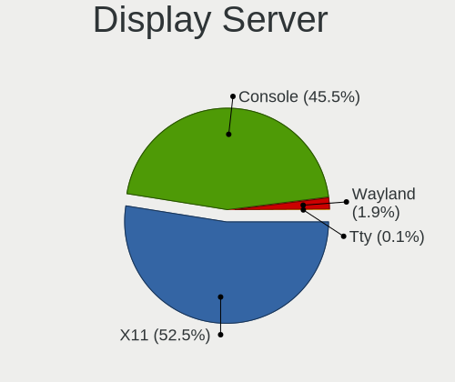
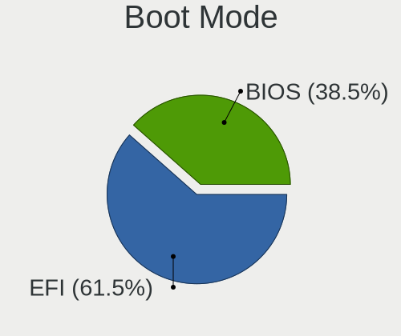
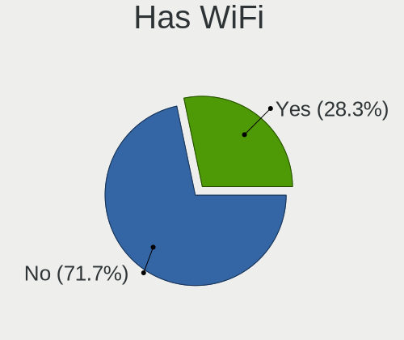
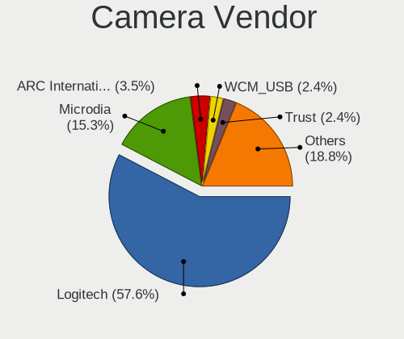

FreeBSD - Tested Hardware & Statistics (Desktops)
-------------------------------------------------

A project to collect tested hardware configurations for FreeBSD.

Anyone can contribute to this report by the [hw-probe](https://github.com/linuxhw/hw-probe/blob/master/INSTALL.BSD.md) tool:

    hw-probe -all -upload

Please contribute! Especially if your hardware is rare.

Contents
--------

* [ Test Cases ](#test-cases)

* [ System ](#system)
  - [ OS                       ](#os)
  - [ OS Family                ](#os-family)
  - [ Arch                     ](#arch)
  - [ DE                       ](#de)
  - [ Display Server           ](#display-server)
  - [ Display Manager          ](#display-manager)
  - [ OS Lang                  ](#os-lang)
  - [ Boot Mode                ](#boot-mode)
  - [ Filesystem               ](#filesystem)
  - [ Part. scheme             ](#part-scheme)

* [ Board ](#board)
  - [ Vendor                   ](#vendor)
  - [ Model                    ](#model)
  - [ Model Family             ](#model-family)
  - [ MFG Year                 ](#mfg-year)
  - [ Form Factor              ](#form-factor)
  - [ Coreboot                 ](#coreboot)
  - [ RAM Size                 ](#ram-size)
  - [ RAM Used                 ](#ram-used)
  - [ Total Drives             ](#total-drives)
  - [ Has CD-ROM               ](#has-cd-rom)
  - [ Has Ethernet             ](#has-ethernet)
  - [ Has WiFi                 ](#has-wifi)
  - [ Has Bluetooth            ](#has-bluetooth)

* [ Location ](#location)
  - [ Country                  ](#country)
  - [ City                     ](#city)

* [ Drives ](#drives)
  - [ Drive Vendor             ](#drive-vendor)
  - [ Drive Model              ](#drive-model)
  - [ HDD Vendor               ](#hdd-vendor)
  - [ SSD Vendor               ](#ssd-vendor)
  - [ Drive Kind               ](#drive-kind)
  - [ Drive Connector          ](#drive-connector)
  - [ Drive Size               ](#drive-size)
  - [ Space Total              ](#space-total)
  - [ Space Used               ](#space-used)
  - [ Malfunc. Drives          ](#malfunc-drives)
  - [ Malfunc. Drive Vendor    ](#malfunc-drive-vendor)
  - [ Malfunc. HDD Vendor      ](#malfunc-hdd-vendor)
  - [ Malfunc. Drive Kind      ](#malfunc-drive-kind)
  - [ Failed Drives            ](#failed-drives)
  - [ Failed Drive Vendor      ](#failed-drive-vendor)
  - [ Drive Status             ](#drive-status)

* [ Storage controller ](#storage-controller)
  - [ Storage Vendor           ](#storage-vendor)
  - [ Storage Model            ](#storage-model)
  - [ Storage Kind             ](#storage-kind)

* [ Processor ](#processor)
  - [ CPU Vendor               ](#cpu-vendor)
  - [ CPU Model                ](#cpu-model)
  - [ CPU Model Family         ](#cpu-model-family)
  - [ CPU Cores                ](#cpu-cores)
  - [ CPU Sockets              ](#cpu-sockets)
  - [ CPU Threads              ](#cpu-threads)
  - [ CPU Microarch            ](#cpu-microarch)

* [ Graphics ](#graphics)
  - [ GPU Vendor               ](#gpu-vendor)
  - [ GPU Model                ](#gpu-model)
  - [ GPU Combo                ](#gpu-combo)
  - [ GPU Driver               ](#gpu-driver)
  - [ GPU Memory               ](#gpu-memory)

* [ Monitor ](#monitor)
  - [ Monitor Vendor           ](#monitor-vendor)
  - [ Monitor Model            ](#monitor-model)
  - [ Monitor Resolution       ](#monitor-resolution)
  - [ Monitor Diagonal         ](#monitor-diagonal)
  - [ Monitor Width            ](#monitor-width)
  - [ Aspect Ratio             ](#aspect-ratio)
  - [ Monitor Area             ](#monitor-area)
  - [ Pixel Density            ](#pixel-density)
  - [ Multiple Monitors        ](#multiple-monitors)

* [ Network ](#network)
  - [ Net Controller Vendor    ](#net-controller-vendor)
  - [ Net Controller Model     ](#net-controller-model)
  - [ Wireless Vendor          ](#wireless-vendor)
  - [ Wireless Model           ](#wireless-model)
  - [ Ethernet Vendor          ](#ethernet-vendor)
  - [ Ethernet Model           ](#ethernet-model)
  - [ Net Controller Kind      ](#net-controller-kind)
  - [ Used Controller          ](#used-controller)
  - [ NICs                     ](#nics)
  - [ IPv6                     ](#ipv6)

* [ Bluetooth ](#bluetooth)
  - [ Bluetooth Vendor         ](#bluetooth-vendor)
  - [ Bluetooth Model          ](#bluetooth-model)

* [ Sound ](#sound)
  - [ Sound Vendor             ](#sound-vendor)
  - [ Sound Model              ](#sound-model)

* [ Memory ](#memory)
  - [ Memory Vendor            ](#memory-vendor)
  - [ Memory Model             ](#memory-model)
  - [ Memory Kind              ](#memory-kind)
  - [ Memory Form Factor       ](#memory-form-factor)
  - [ Memory Size              ](#memory-size)
  - [ Memory Speed             ](#memory-speed)

* [ Printers & scanners ](#printers--scanners)
  - [ Printer Vendor           ](#printer-vendor)
  - [ Printer Model            ](#printer-model)
  - [ Scanner Vendor           ](#scanner-vendor)
  - [ Scanner Model            ](#scanner-model)

* [ Camera ](#camera)
  - [ Camera Vendor            ](#camera-vendor)
  - [ Camera Model             ](#camera-model)

* [ Security ](#security)
  - [ Fingerprint Vendor       ](#fingerprint-vendor)
  - [ Fingerprint Model        ](#fingerprint-model)
  - [ Chipcard Vendor          ](#chipcard-vendor)
  - [ Chipcard Model           ](#chipcard-model)

* [ Unsupported ](#unsupported)
  - [ Unsupported Devices      ](#unsupported-devices)
  - [ Unsupported Device Types ](#unsupported-device-types)

Test Cases
----------

Total: 1437

| Vendor        | Model                       | Probe                                                     | Date         |
|---------------|-----------------------------|-----------------------------------------------------------|--------------|
| ASRockRack    | EPYC3101D4I-2T              | [d675a5bab2](https://bsd-hardware.info/?probe=d675a5bab2) | Feb 28, 2023 |
| Lenovo        | Kabini CRB 31900058 STD     | [735f2f3ece](https://bsd-hardware.info/?probe=735f2f3ece) | Feb 28, 2023 |
| Dell          | 0HHV7N A00                  | [ffbb7e1a96](https://bsd-hardware.info/?probe=ffbb7e1a96) | Feb 27, 2023 |
| Lenovo        | Kabini CRB 31900058 STD     | [b0fcea0c90](https://bsd-hardware.info/?probe=b0fcea0c90) | Feb 27, 2023 |
| MSI           | PRO H610M-B DDR4            | [e85ed3f609](https://bsd-hardware.info/?probe=e85ed3f609) | Feb 27, 2023 |
| MSI           | H81M-P33                    | [806efadc12](https://bsd-hardware.info/?probe=806efadc12) | Feb 26, 2023 |
| ASUSTek       | P5Q-E                       | [efb350b5f2](https://bsd-hardware.info/?probe=efb350b5f2) | Feb 26, 2023 |
| ASUSTek       | ROG CROSSHAIR VIII HERO     | [62567aa5d4](https://bsd-hardware.info/?probe=62567aa5d4) | Feb 26, 2023 |
| Seeed Stud... | ODYSSEY-X86J4105 SD-BS-C... | [b2681fdfb4](https://bsd-hardware.info/?probe=b2681fdfb4) | Feb 23, 2023 |
| Gigabyte      | Z87X-OC-CF                  | [dca82c50d0](https://bsd-hardware.info/?probe=dca82c50d0) | Feb 23, 2023 |
| Gigabyte      | X670E AORUS MASTER          | [e55635df08](https://bsd-hardware.info/?probe=e55635df08) | Feb 23, 2023 |
| Unknown       | Unknown                     | [9e92cf3575](https://bsd-hardware.info/?probe=9e92cf3575) | Feb 22, 2023 |
| ASRock        | X570 Taichi                 | [8eb068a097](https://bsd-hardware.info/?probe=8eb068a097) | Feb 20, 2023 |
| MSI           | H81M-P33                    | [28f48b7936](https://bsd-hardware.info/?probe=28f48b7936) | Feb 19, 2023 |
| ASUSTek       | P5Q-E                       | [b3525afaa7](https://bsd-hardware.info/?probe=b3525afaa7) | Feb 19, 2023 |
| ASUSTek       | ROG CROSSHAIR VIII HERO     | [19c7044a7d](https://bsd-hardware.info/?probe=19c7044a7d) | Feb 19, 2023 |
| Intel         | DN2820FYK H24582-203        | [dd0d96422f](https://bsd-hardware.info/?probe=dd0d96422f) | Feb 19, 2023 |
| ASUSTek       | ROG STRIX Z390-I GAMING     | [b241a8afd7](https://bsd-hardware.info/?probe=b241a8afd7) | Feb 16, 2023 |
| ASRock        | A520M-ITX/ac                | [dd083df1a2](https://bsd-hardware.info/?probe=dd083df1a2) | Feb 16, 2023 |
| ASUSTek       | STRIX Z270F GAMING          | [6f4b514959](https://bsd-hardware.info/?probe=6f4b514959) | Feb 14, 2023 |
| Fujitsu       | D3413-A1 S26361-D3413-A1    | [d69aba5432](https://bsd-hardware.info/?probe=d69aba5432) | Feb 14, 2023 |
| ASUSTek       | PRIME X370-PRO              | [b3f41e1cb4](https://bsd-hardware.info/?probe=b3f41e1cb4) | Feb 13, 2023 |
| ASRock        | X570 Phantom Gaming 4       | [b962baf73d](https://bsd-hardware.info/?probe=b962baf73d) | Feb 13, 2023 |
| ASUSTek       | P8Z68 DELUXE                | [f65675c771](https://bsd-hardware.info/?probe=f65675c771) | Feb 13, 2023 |
| ASUSTek       | H170I-PRO                   | [63000ada74](https://bsd-hardware.info/?probe=63000ada74) | Feb 12, 2023 |
| HP            | 212B                        | [0e13beb9f6](https://bsd-hardware.info/?probe=0e13beb9f6) | Feb 12, 2023 |
| ASUSTek       | TUF Gaming B450M-PRO S      | [5507e05838](https://bsd-hardware.info/?probe=5507e05838) | Feb 12, 2023 |
| MSI           | H81M-P33                    | [84aff26f99](https://bsd-hardware.info/?probe=84aff26f99) | Feb 12, 2023 |
| ASUSTek       | P5Q-E                       | [4e899d9a1c](https://bsd-hardware.info/?probe=4e899d9a1c) | Feb 12, 2023 |
| ASUSTek       | ROG CROSSHAIR VIII HERO     | [d16e93b7f3](https://bsd-hardware.info/?probe=d16e93b7f3) | Feb 12, 2023 |
| ASUSTek       | PRIME H410M-K               | [d2edba8775](https://bsd-hardware.info/?probe=d2edba8775) | Feb 11, 2023 |
| Gigabyte      | Z490 VISION G               | [6f8ad1a8b9](https://bsd-hardware.info/?probe=6f8ad1a8b9) | Feb 11, 2023 |
| ASUSTek       | P7P55D DELUXE               | [dd9685a909](https://bsd-hardware.info/?probe=dd9685a909) | Feb 09, 2023 |
| Gigabyte      | H61M-S2V-B3                 | [33af90dd93](https://bsd-hardware.info/?probe=33af90dd93) | Feb 08, 2023 |
| MSI           | B450M MORTAR MAX            | [ec37957aed](https://bsd-hardware.info/?probe=ec37957aed) | Feb 05, 2023 |
| MSI           | H81M-P33                    | [6f8f329a5b](https://bsd-hardware.info/?probe=6f8f329a5b) | Feb 05, 2023 |
| ASUSTek       | P5Q-E                       | [bd418783d4](https://bsd-hardware.info/?probe=bd418783d4) | Feb 05, 2023 |
| ASUSTek       | ROG CROSSHAIR VIII HERO     | [ec1ab0bf97](https://bsd-hardware.info/?probe=ec1ab0bf97) | Feb 05, 2023 |
| ASRockRack    | EPYC3101D4I-2T              | [6d46662662](https://bsd-hardware.info/?probe=6d46662662) | Jan 31, 2023 |
| MSI           | MAG B550 TOMAHAWK           | [82ab576c6c](https://bsd-hardware.info/?probe=82ab576c6c) | Jan 31, 2023 |
| ASRock        | 970 Extreme3                | [5e2fd4b48f](https://bsd-hardware.info/?probe=5e2fd4b48f) | Jan 30, 2023 |
| MSI           | H81M-P33                    | [e6626da98c](https://bsd-hardware.info/?probe=e6626da98c) | Jan 29, 2023 |
| ASUSTek       | P5Q-E                       | [3d5ea9f313](https://bsd-hardware.info/?probe=3d5ea9f313) | Jan 29, 2023 |
| ASUSTek       | ROG CROSSHAIR VIII HERO     | [9b7532b795](https://bsd-hardware.info/?probe=9b7532b795) | Jan 29, 2023 |
| Dell          | 08NPPY A00                  | [1c4edf62e6](https://bsd-hardware.info/?probe=1c4edf62e6) | Jan 28, 2023 |
| Gigabyte      | B550 AORUS PRO              | [8fd7f80256](https://bsd-hardware.info/?probe=8fd7f80256) | Jan 28, 2023 |
| ASUSTek       | ROG STRIX X570-E GAMING     | [87e25e2abd](https://bsd-hardware.info/?probe=87e25e2abd) | Jan 26, 2023 |
| Shuttle       | DS20U                       | [71033e4a64](https://bsd-hardware.info/?probe=71033e4a64) | Jan 26, 2023 |
| IBM           | 9210MML                     | [8b7e2413ee](https://bsd-hardware.info/?probe=8b7e2413ee) | Jan 25, 2023 |
| ADI Engine... | RCC-VE                      | [e2941c00fc](https://bsd-hardware.info/?probe=e2941c00fc) | Jan 25, 2023 |
| ASUSTek       | P5Q-E                       | [26d1d923d6](https://bsd-hardware.info/?probe=26d1d923d6) | Jan 22, 2023 |
| MSI           | H81M-P33                    | [0bbc074f1c](https://bsd-hardware.info/?probe=0bbc074f1c) | Jan 22, 2023 |
| ASUSTek       | ROG CROSSHAIR VIII HERO     | [28d8d82d34](https://bsd-hardware.info/?probe=28d8d82d34) | Jan 22, 2023 |
| Unknown       | AMD-GX3                     | [a38ff8331a](https://bsd-hardware.info/?probe=a38ff8331a) | Jan 20, 2023 |
| Unknown       | Unknown                     | [3afbfc6cea](https://bsd-hardware.info/?probe=3afbfc6cea) | Jan 20, 2023 |
| Unknown       | YL-SKUL6                    | [ef4abfe322](https://bsd-hardware.info/?probe=ef4abfe322) | Jan 20, 2023 |
| Unknown       | Unknown                     | [e13627df1a](https://bsd-hardware.info/?probe=e13627df1a) | Jan 20, 2023 |
| Unknown       | Unknown                     | [35e269ef1c](https://bsd-hardware.info/?probe=35e269ef1c) | Jan 19, 2023 |
| ASUSTek       | ROG Maximus XI HERO         | [b528c0bbe3](https://bsd-hardware.info/?probe=b528c0bbe3) | Jan 18, 2023 |
| ASUSTek       | TUF Gaming Z690-PLUS WIF... | [c3281eb186](https://bsd-hardware.info/?probe=c3281eb186) | Jan 18, 2023 |
| Fujitsu       | PRIMERGY RX200 S6           | [f7de27b0ca](https://bsd-hardware.info/?probe=f7de27b0ca) | Jan 18, 2023 |
| Lenovo        | H30-05 90BJ0085SP           | [d491694079](https://bsd-hardware.info/?probe=d491694079) | Jan 18, 2023 |
| Fujitsu       | PRIMERGY RX200 S6           | [9eee9cc526](https://bsd-hardware.info/?probe=9eee9cc526) | Jan 18, 2023 |
| Intel         | DH67BL AAG10189-206         | [37ae895d75](https://bsd-hardware.info/?probe=37ae895d75) | Jan 17, 2023 |
| Intel         | DQ45CB AAE30148-302         | [349da05405](https://bsd-hardware.info/?probe=349da05405) | Jan 17, 2023 |
| HP            | 1998                        | [6c36e5e82e](https://bsd-hardware.info/?probe=6c36e5e82e) | Jan 17, 2023 |
| ASRock        | X570 Phantom Gaming 4       | [7ef714a7f1](https://bsd-hardware.info/?probe=7ef714a7f1) | Jan 16, 2023 |
| MSI           | H81M-P33                    | [800b3bc34b](https://bsd-hardware.info/?probe=800b3bc34b) | Jan 15, 2023 |
| ASUSTek       | P5Q-E                       | [ffbcac312f](https://bsd-hardware.info/?probe=ffbcac312f) | Jan 15, 2023 |
| ASUSTek       | ROG CROSSHAIR VIII HERO     | [48e7397e29](https://bsd-hardware.info/?probe=48e7397e29) | Jan 15, 2023 |
| ASRock        | X570 Phantom Gaming 4       | [05cc17947c](https://bsd-hardware.info/?probe=05cc17947c) | Jan 15, 2023 |
| ASUSTek       | PRIME X370-PRO              | [f682e06d06](https://bsd-hardware.info/?probe=f682e06d06) | Jan 13, 2023 |
| ASUSTek       | TUF Gaming Z690-PLUS WIF... | [917972b6ae](https://bsd-hardware.info/?probe=917972b6ae) | Jan 12, 2023 |
| ASUSTek       | TUF Gaming Z690-PLUS WIF... | [bd60eadfc4](https://bsd-hardware.info/?probe=bd60eadfc4) | Jan 12, 2023 |
| ASUSTek       | Pro WS WRX80E-SAGE SE WI... | [95ebd841b2](https://bsd-hardware.info/?probe=95ebd841b2) | Jan 12, 2023 |
| ASUSTek       | PRIME Z390-P                | [3126dc27f1](https://bsd-hardware.info/?probe=3126dc27f1) | Jan 12, 2023 |
| ASRockRack    | X470D4U2/1N1                | [07f15d0014](https://bsd-hardware.info/?probe=07f15d0014) | Jan 11, 2023 |
| ASUSTek       | M5A78L-M/USB3               | [8def3dc9b2](https://bsd-hardware.info/?probe=8def3dc9b2) | Jan 09, 2023 |
| MSI           | H81M-P33                    | [585a3dc78c](https://bsd-hardware.info/?probe=585a3dc78c) | Jan 08, 2023 |
| ASUSTek       | P5Q-E                       | [1e9d8cc278](https://bsd-hardware.info/?probe=1e9d8cc278) | Jan 08, 2023 |
| ASUSTek       | ROG CROSSHAIR VIII HERO     | [490261883c](https://bsd-hardware.info/?probe=490261883c) | Jan 08, 2023 |
| MSI           | MEG Z690 UNIFY-X            | [e70cd80d11](https://bsd-hardware.info/?probe=e70cd80d11) | Jan 05, 2023 |
| Dell          | 02YYK5 A01                  | [219200b0b6](https://bsd-hardware.info/?probe=219200b0b6) | Jan 05, 2023 |
| MSI           | PRO H610M-B DDR4            | [cc9d84d5ed](https://bsd-hardware.info/?probe=cc9d84d5ed) | Jan 05, 2023 |
| ASUSTek       | X99-DELUXE                  | [9dc3183152](https://bsd-hardware.info/?probe=9dc3183152) | Jan 04, 2023 |
| Supermicro    | X10DRiB                     | [d120c268f7](https://bsd-hardware.info/?probe=d120c268f7) | Jan 04, 2023 |
| Supermicro    | X10DRi-T                    | [3bd4e1dc9c](https://bsd-hardware.info/?probe=3bd4e1dc9c) | Jan 04, 2023 |
| HP            | ProLiant MicroServer Gen... | [409d119307](https://bsd-hardware.info/?probe=409d119307) | Jan 02, 2023 |
| Intel         | DH77KC AAG39641-400         | [d66b90249d](https://bsd-hardware.info/?probe=d66b90249d) | Jan 02, 2023 |
| ASUSTek       | TUF Gaming Z690-PLUS WIF... | [1697219032](https://bsd-hardware.info/?probe=1697219032) | Jan 02, 2023 |
| Shuttle       | DS20U                       | [a5aa09e49f](https://bsd-hardware.info/?probe=a5aa09e49f) | Jan 01, 2023 |
| MSI           | H81M-P33                    | [0a57dcce99](https://bsd-hardware.info/?probe=0a57dcce99) | Jan 01, 2023 |
| ASUSTek       | P5Q-E                       | [d3306559de](https://bsd-hardware.info/?probe=d3306559de) | Jan 01, 2023 |
| ASUSTek       | ROG CROSSHAIR VIII HERO     | [772779fadf](https://bsd-hardware.info/?probe=772779fadf) | Jan 01, 2023 |
| ASRockRack    | EPYC3101D4I-2T              | [ab7e64f657](https://bsd-hardware.info/?probe=ab7e64f657) | Dec 31, 2022 |
| Lenovo        | 30D9 SDK0J40700 WIN 3258... | [ac867149f2](https://bsd-hardware.info/?probe=ac867149f2) | Dec 31, 2022 |
| Gigabyte      | B550M AORUS PRO-P           | [d22c37fa81](https://bsd-hardware.info/?probe=d22c37fa81) | Dec 29, 2022 |
| MSI           | H270 GAMING M3              | [5d14519e73](https://bsd-hardware.info/?probe=5d14519e73) | Dec 28, 2022 |
| MSI           | H270 GAMING M3              | [5dcdab1ee3](https://bsd-hardware.info/?probe=5dcdab1ee3) | Dec 28, 2022 |
| HP            | ProLiant MicroServer        | [50c8cb79f7](https://bsd-hardware.info/?probe=50c8cb79f7) | Dec 26, 2022 |
| ASUSTek       | P5Q-E                       | [bc829dbb1a](https://bsd-hardware.info/?probe=bc829dbb1a) | Dec 25, 2022 |
| MSI           | H81M-P33                    | [f73a37ab81](https://bsd-hardware.info/?probe=f73a37ab81) | Dec 25, 2022 |
| ASUSTek       | ROG CROSSHAIR VIII HERO     | [2e842ddb27](https://bsd-hardware.info/?probe=2e842ddb27) | Dec 25, 2022 |
| Supermicro    | X10SRH-CLN4FA               | [84c360ad02](https://bsd-hardware.info/?probe=84c360ad02) | Dec 24, 2022 |
| HP            | ProLiant MicroServer Gen... | [a2bc442acd](https://bsd-hardware.info/?probe=a2bc442acd) | Dec 23, 2022 |
| Unknown       | Unknown                     | [d702dfcde2](https://bsd-hardware.info/?probe=d702dfcde2) | Dec 23, 2022 |
| Supermicro    | X9DR3-F                     | [b8c89bdca8](https://bsd-hardware.info/?probe=b8c89bdca8) | Dec 22, 2022 |
| Supermicro    | X9DR3-F                     | [b0d1792185](https://bsd-hardware.info/?probe=b0d1792185) | Dec 21, 2022 |
| ASRock        | 4X4-4000 Series             | [009ef73bd1](https://bsd-hardware.info/?probe=009ef73bd1) | Dec 20, 2022 |
| HP            | ProLiant MicroServer Gen... | [8de4ff8626](https://bsd-hardware.info/?probe=8de4ff8626) | Dec 20, 2022 |
| Dell          | 09KPNV A01                  | [0eea35e069](https://bsd-hardware.info/?probe=0eea35e069) | Dec 19, 2022 |
| HP            | ProLiant MicroServer        | [b730e64d4a](https://bsd-hardware.info/?probe=b730e64d4a) | Dec 19, 2022 |
| Acer          | Veriton M680G               | [cb44a9e848](https://bsd-hardware.info/?probe=cb44a9e848) | Dec 19, 2022 |
| Acer          | Veriton M680G               | [f7184d9158](https://bsd-hardware.info/?probe=f7184d9158) | Dec 19, 2022 |
| ASRock        | B660M-ITX/ac                | [f6c8eb4e18](https://bsd-hardware.info/?probe=f6c8eb4e18) | Dec 18, 2022 |
| ASUSTek       | ROG CROSSHAIR VIII HERO     | [c1b0b83306](https://bsd-hardware.info/?probe=c1b0b83306) | Dec 18, 2022 |
| MSI           | H81M-P33                    | [78e4743abd](https://bsd-hardware.info/?probe=78e4743abd) | Dec 18, 2022 |
| ASUSTek       | P5Q-E                       | [f232e5746e](https://bsd-hardware.info/?probe=f232e5746e) | Dec 18, 2022 |
| ShenZhen M... | MW-NANO-APL-4L              | [108c9de5cc](https://bsd-hardware.info/?probe=108c9de5cc) | Dec 18, 2022 |
| BESSTAR Te... | UM350                       | [b7e599f99d](https://bsd-hardware.info/?probe=b7e599f99d) | Dec 17, 2022 |
| Unknown       | Unknown                     | [7c644cc639](https://bsd-hardware.info/?probe=7c644cc639) | Dec 15, 2022 |
| HP            | ProLiant MicroServer        | [617f431099](https://bsd-hardware.info/?probe=617f431099) | Dec 14, 2022 |
| ASUSTek       | PRIME X370-PRO              | [f52a3d3fa6](https://bsd-hardware.info/?probe=f52a3d3fa6) | Dec 13, 2022 |
| ASUSTek       | PRIME H410M-A               | [f51b401c31](https://bsd-hardware.info/?probe=f51b401c31) | Dec 13, 2022 |
| Huanan        | X99-F8D V2.4                | [3d06b605c5](https://bsd-hardware.info/?probe=3d06b605c5) | Dec 13, 2022 |
| ASUSTek       | ROG STRIX B550-F GAMING     | [73cb5d86bc](https://bsd-hardware.info/?probe=73cb5d86bc) | Dec 12, 2022 |
| Biostar       | A68N-5600E                  | [5274876096](https://bsd-hardware.info/?probe=5274876096) | Dec 11, 2022 |
| MSI           | H81M-P33                    | [1f110891d0](https://bsd-hardware.info/?probe=1f110891d0) | Dec 11, 2022 |
| ASUSTek       | P5Q-E                       | [028383847e](https://bsd-hardware.info/?probe=028383847e) | Dec 11, 2022 |
| ASUSTek       | ROG CROSSHAIR VIII HERO     | [99502ebe9a](https://bsd-hardware.info/?probe=99502ebe9a) | Dec 11, 2022 |
| ASUSTek       | PRIME B550-PLUS             | [1d8397a653](https://bsd-hardware.info/?probe=1d8397a653) | Dec 10, 2022 |
| ASUSTek       | PRIME B550-PLUS             | [c30f53fc6d](https://bsd-hardware.info/?probe=c30f53fc6d) | Dec 09, 2022 |
| ASUSTek       | P8H77-V LE                  | [10b6c81bce](https://bsd-hardware.info/?probe=10b6c81bce) | Dec 09, 2022 |
| ASUSTek       | PRIME B550-PLUS             | [c953c78309](https://bsd-hardware.info/?probe=c953c78309) | Dec 07, 2022 |
| HP            | 82A2                        | [c612b7e283](https://bsd-hardware.info/?probe=c612b7e283) | Dec 06, 2022 |
| Huanan        | X99-F8D V2.4                | [f6685811a3](https://bsd-hardware.info/?probe=f6685811a3) | Dec 05, 2022 |
| MSI           | H81M-P33                    | [d72a45fb8f](https://bsd-hardware.info/?probe=d72a45fb8f) | Dec 04, 2022 |
| ASUSTek       | P5Q-E                       | [595d174631](https://bsd-hardware.info/?probe=595d174631) | Dec 04, 2022 |
| ASUSTek       | ROG CROSSHAIR VIII HERO     | [8ee41750dc](https://bsd-hardware.info/?probe=8ee41750dc) | Dec 04, 2022 |
| ASUSTek       | ROG STRIX X470-F GAMING     | [aeb690b9f3](https://bsd-hardware.info/?probe=aeb690b9f3) | Dec 03, 2022 |
| ASUSTek       | ROG STRIX X470-F GAMING     | [d4e60c5984](https://bsd-hardware.info/?probe=d4e60c5984) | Dec 03, 2022 |
| ASRockRack    | EPYC3101D4I-2T              | [087264570d](https://bsd-hardware.info/?probe=087264570d) | Nov 30, 2022 |
| Lenovo        | MAHOBAY                     | [1d61d0cf62](https://bsd-hardware.info/?probe=1d61d0cf62) | Nov 29, 2022 |
| ASRockRack    | X470D4U                     | [38d7f55ef7](https://bsd-hardware.info/?probe=38d7f55ef7) | Nov 29, 2022 |
| MSI           | PRO H610M-B DDR4            | [929e4bda1e](https://bsd-hardware.info/?probe=929e4bda1e) | Nov 29, 2022 |
| MSI           | PRO H610M-B DDR4            | [7c9ee800c5](https://bsd-hardware.info/?probe=7c9ee800c5) | Nov 29, 2022 |
| ASUSTek       | Pro WS 565-ACE              | [378270eba0](https://bsd-hardware.info/?probe=378270eba0) | Nov 28, 2022 |
| MSI           | H81M-P33                    | [597d48d1c9](https://bsd-hardware.info/?probe=597d48d1c9) | Nov 27, 2022 |
| ASUSTek       | P5Q-E                       | [10d76fd431](https://bsd-hardware.info/?probe=10d76fd431) | Nov 27, 2022 |
| ASUSTek       | ROG CROSSHAIR VIII HERO     | [383341b2f1](https://bsd-hardware.info/?probe=383341b2f1) | Nov 27, 2022 |
| ASRock        | Q1900B-ITX                  | [c93690c7ca](https://bsd-hardware.info/?probe=c93690c7ca) | Nov 27, 2022 |
| Shuttle       | FZ270                       | [04a7f49322](https://bsd-hardware.info/?probe=04a7f49322) | Nov 27, 2022 |
| Shuttle       | FZ270                       | [10016f39b9](https://bsd-hardware.info/?probe=10016f39b9) | Nov 27, 2022 |
| ASRock        | Q1900B-ITX                  | [675c9fdf94](https://bsd-hardware.info/?probe=675c9fdf94) | Nov 27, 2022 |
| ASRock        | Q1900B-ITX                  | [a337eb9e5f](https://bsd-hardware.info/?probe=a337eb9e5f) | Nov 27, 2022 |
| Shuttle       | FH270                       | [192351ac6f](https://bsd-hardware.info/?probe=192351ac6f) | Nov 27, 2022 |
| Shuttle       | FH270                       | [3b68d89092](https://bsd-hardware.info/?probe=3b68d89092) | Nov 27, 2022 |
| ASUSTek       | PRIME B450M-A               | [5f0b8df8d0](https://bsd-hardware.info/?probe=5f0b8df8d0) | Nov 27, 2022 |
| Dell          | 0PTTT9 A01                  | [74575d6dfe](https://bsd-hardware.info/?probe=74575d6dfe) | Nov 25, 2022 |
| ASRock        | B450M-HDV                   | [d0009172b1](https://bsd-hardware.info/?probe=d0009172b1) | Nov 24, 2022 |
| ASRock        | B450M-HDV                   | [25cc0129d9](https://bsd-hardware.info/?probe=25cc0129d9) | Nov 24, 2022 |
| Dell          | 0T7D40 A01                  | [45d96a0b5a](https://bsd-hardware.info/?probe=45d96a0b5a) | Nov 24, 2022 |
| Gigabyte      | Z590I AORUS ULTRA           | [e55eb53894](https://bsd-hardware.info/?probe=e55eb53894) | Nov 21, 2022 |
| ASUSTek       | SABERTOOTH 990FX R2.0       | [f7129f1c87](https://bsd-hardware.info/?probe=f7129f1c87) | Nov 21, 2022 |
| ASUSTek       | SABERTOOTH 990FX R2.0       | [17aa370584](https://bsd-hardware.info/?probe=17aa370584) | Nov 21, 2022 |
| MSI           | H81M-P33                    | [d3303d1962](https://bsd-hardware.info/?probe=d3303d1962) | Nov 20, 2022 |
| ASUSTek       | P5Q-E                       | [b1512a254c](https://bsd-hardware.info/?probe=b1512a254c) | Nov 20, 2022 |
| ASUSTek       | ROG CROSSHAIR VIII HERO     | [521e5ffa8e](https://bsd-hardware.info/?probe=521e5ffa8e) | Nov 20, 2022 |
| TOPFEEL       | H110D4-P1                   | [90b1dfc430](https://bsd-hardware.info/?probe=90b1dfc430) | Nov 19, 2022 |
| Huanan        | X99-F8D V2.4                | [9faf79b3f3](https://bsd-hardware.info/?probe=9faf79b3f3) | Nov 18, 2022 |
| Foxconn       | 2AB1                        | [f732942dd9](https://bsd-hardware.info/?probe=f732942dd9) | Nov 18, 2022 |
| MSI           | B450M MORTAR MAX            | [15657b37e2](https://bsd-hardware.info/?probe=15657b37e2) | Nov 15, 2022 |
| MSI           | B450M MORTAR MAX            | [f4a8c42773](https://bsd-hardware.info/?probe=f4a8c42773) | Nov 15, 2022 |
| ASUSTek       | Rampage V EDITION 10        | [443891740b](https://bsd-hardware.info/?probe=443891740b) | Nov 13, 2022 |
| ASUSTek       | PRIME X370-PRO              | [6f1e732a53](https://bsd-hardware.info/?probe=6f1e732a53) | Nov 13, 2022 |
| ASUSTek       | ROG CROSSHAIR VIII HERO     | [15e38a5ca8](https://bsd-hardware.info/?probe=15e38a5ca8) | Nov 13, 2022 |
| ASUSTek       | P5Q-E                       | [2b1175a4df](https://bsd-hardware.info/?probe=2b1175a4df) | Nov 13, 2022 |
| MSI           | H81M-P33                    | [98b0980231](https://bsd-hardware.info/?probe=98b0980231) | Nov 13, 2022 |
| ASRock        | X570 Phantom Gaming 4       | [072f2a6c27](https://bsd-hardware.info/?probe=072f2a6c27) | Nov 13, 2022 |
| Huanan        | X99-F8D V2.4                | [22ec05d988](https://bsd-hardware.info/?probe=22ec05d988) | Nov 12, 2022 |
| Fujitsu       | D3313-G1 S26361-D3313-G1    | [569d5b0cca](https://bsd-hardware.info/?probe=569d5b0cca) | Nov 10, 2022 |
| ASUSTek       | P5B-Deluxe                  | [87d7d4435b](https://bsd-hardware.info/?probe=87d7d4435b) | Nov 10, 2022 |
| HP            | 21B4 A01                    | [c064c50fea](https://bsd-hardware.info/?probe=c064c50fea) | Nov 09, 2022 |
| HP            | 21B4 A01                    | [e5c599dfab](https://bsd-hardware.info/?probe=e5c599dfab) | Nov 09, 2022 |
| HP            | 21B4 A01                    | [0a3ba5478b](https://bsd-hardware.info/?probe=0a3ba5478b) | Nov 09, 2022 |
| Fujitsu       | D3313-G1 S26361-D3313-G1    | [c32a7b407d](https://bsd-hardware.info/?probe=c32a7b407d) | Nov 09, 2022 |
| Dell          | 09KPNV A01                  | [32331d772c](https://bsd-hardware.info/?probe=32331d772c) | Nov 08, 2022 |
| ASRock        | B450 Gaming K4              | [127e0126d1](https://bsd-hardware.info/?probe=127e0126d1) | Nov 08, 2022 |
| Google        | Zako                        | [5d4b53e2d4](https://bsd-hardware.info/?probe=5d4b53e2d4) | Nov 08, 2022 |
| ONDA          | N78G5D3 Ver:5.00            | [009bc44d12](https://bsd-hardware.info/?probe=009bc44d12) | Nov 07, 2022 |
| Acer          | RS880M05                    | [455f9b5026](https://bsd-hardware.info/?probe=455f9b5026) | Nov 07, 2022 |
| MSI           | H81M-P33                    | [750d2f53c7](https://bsd-hardware.info/?probe=750d2f53c7) | Nov 06, 2022 |
| ASUSTek       | P5Q-E                       | [e427ea787e](https://bsd-hardware.info/?probe=e427ea787e) | Nov 06, 2022 |
| ASUSTek       | ROG CROSSHAIR VIII HERO     | [c6abe84145](https://bsd-hardware.info/?probe=c6abe84145) | Nov 06, 2022 |
| ASUSTek       | ROG STRIX B550-F GAMING     | [d27fd3b1a7](https://bsd-hardware.info/?probe=d27fd3b1a7) | Nov 04, 2022 |
| Lenovo        | YangTianM6880N              | [2e9c3b7368](https://bsd-hardware.info/?probe=2e9c3b7368) | Nov 04, 2022 |
| BESSTAR Te... | HM80                        | [d5c5f30a2d](https://bsd-hardware.info/?probe=d5c5f30a2d) | Nov 04, 2022 |
| Unknown       | Unknown                     | [58c2f4b4f7](https://bsd-hardware.info/?probe=58c2f4b4f7) | Nov 04, 2022 |
| Gigabyte      | Z97X-UD5H                   | [d7141b866c](https://bsd-hardware.info/?probe=d7141b866c) | Nov 02, 2022 |
| ASRockRack    | EPYC3101D4I-2T              | [bb0f8a5bfc](https://bsd-hardware.info/?probe=bb0f8a5bfc) | Oct 31, 2022 |
| Fujitsu       | D3401-H2 S26361-D3401-H2    | [cce93ff157](https://bsd-hardware.info/?probe=cce93ff157) | Oct 30, 2022 |
| MSI           | H81M-P33                    | [b67d6a7bb2](https://bsd-hardware.info/?probe=b67d6a7bb2) | Oct 30, 2022 |
| ASUSTek       | P5Q-E                       | [8161bfd24d](https://bsd-hardware.info/?probe=8161bfd24d) | Oct 30, 2022 |
| ASUSTek       | ROG CROSSHAIR VIII HERO     | [a0896f17e4](https://bsd-hardware.info/?probe=a0896f17e4) | Oct 30, 2022 |
| MSI           | H81M-P33                    | [626f503cad](https://bsd-hardware.info/?probe=626f503cad) | Oct 23, 2022 |
| ASUSTek       | P5Q-E                       | [2b98739799](https://bsd-hardware.info/?probe=2b98739799) | Oct 23, 2022 |
| ASUSTek       | ROG CROSSHAIR VIII HERO     | [56dac6bc80](https://bsd-hardware.info/?probe=56dac6bc80) | Oct 23, 2022 |
| Acer          | Revo RN86                   | [692ea69bab](https://bsd-hardware.info/?probe=692ea69bab) | Oct 21, 2022 |
| HP            | 18E4                        | [d66ffbbf6d](https://bsd-hardware.info/?probe=d66ffbbf6d) | Oct 21, 2022 |
| ASUSTek       | SABERTOOTH Z77              | [348bef7dba](https://bsd-hardware.info/?probe=348bef7dba) | Oct 20, 2022 |
| MSI           | MAG Z590 TOMAHAWK WIFI      | [3e2f5956c1](https://bsd-hardware.info/?probe=3e2f5956c1) | Oct 19, 2022 |
| Unknown       | Unknown                     | [20ff21d751](https://bsd-hardware.info/?probe=20ff21d751) | Oct 18, 2022 |
| Lenovo        | 30D0 NOK                    | [d1fab8bd54](https://bsd-hardware.info/?probe=d1fab8bd54) | Oct 18, 2022 |
| TYAN Compu... | Intel 440BX/GX Rev. 4       | [8d99f317e4](https://bsd-hardware.info/?probe=8d99f317e4) | Oct 15, 2022 |
| Dell          | 0G1548 A00                  | [226af33d5b](https://bsd-hardware.info/?probe=226af33d5b) | Oct 15, 2022 |
| ASRock        | G41C-GS R2.0                | [06214241b3](https://bsd-hardware.info/?probe=06214241b3) | Oct 15, 2022 |
| ASUSTek       | PRIME X370-PRO              | [10358c7207](https://bsd-hardware.info/?probe=10358c7207) | Oct 13, 2022 |
| ASRock        | X570 Phantom Gaming 4       | [b20b6c7997](https://bsd-hardware.info/?probe=b20b6c7997) | Oct 13, 2022 |
| HP            | 1589                        | [0696d30d3f](https://bsd-hardware.info/?probe=0696d30d3f) | Oct 12, 2022 |
| ASRock        | X399 Taichi                 | [c79fa6f001](https://bsd-hardware.info/?probe=c79fa6f001) | Oct 09, 2022 |
| ASRockRack    | EP2C612D16FM                | [30a582fccb](https://bsd-hardware.info/?probe=30a582fccb) | Oct 07, 2022 |
| ASUSTek       | P8B75-M                     | [2620fd3511](https://bsd-hardware.info/?probe=2620fd3511) | Oct 04, 2022 |
| ASRock        | Z77 Extreme4                | [459c674b3b](https://bsd-hardware.info/?probe=459c674b3b) | Oct 04, 2022 |
| IBM           | 9210MML                     | [a6e7d7483f](https://bsd-hardware.info/?probe=a6e7d7483f) | Oct 03, 2022 |
| HPE           | ProLiant ML30 Gen10         | [f1b45790d4](https://bsd-hardware.info/?probe=f1b45790d4) | Oct 02, 2022 |
| HP            | 212B                        | [7bc6506336](https://bsd-hardware.info/?probe=7bc6506336) | Oct 01, 2022 |
| Unknown       | Unknown                     | [bdabafdcb1](https://bsd-hardware.info/?probe=bdabafdcb1) | Oct 01, 2022 |
| ASRockRack    | EPYC3101D4I-2T              | [8e658fe40f](https://bsd-hardware.info/?probe=8e658fe40f) | Sep 30, 2022 |
| AMI           | MNHO-048                    | [2ec6e55a75](https://bsd-hardware.info/?probe=2ec6e55a75) | Sep 28, 2022 |
| MSI           | A520M-A PRO                 | [7e75a1888b](https://bsd-hardware.info/?probe=7e75a1888b) | Sep 27, 2022 |
| ASRock        | X570M Pro4                  | [433857f5f7](https://bsd-hardware.info/?probe=433857f5f7) | Sep 27, 2022 |
| Pegatron      | H81-X1                      | [a27c76c490](https://bsd-hardware.info/?probe=a27c76c490) | Sep 25, 2022 |
| Supermicro    | X7DB8                       | [6ebc173873](https://bsd-hardware.info/?probe=6ebc173873) | Sep 25, 2022 |
| Deciso        | Netboard A10 V2.1           | [8bbf714f6d](https://bsd-hardware.info/?probe=8bbf714f6d) | Sep 25, 2022 |
| Deciso        | Netboard A10 V2.1           | [60d4585ece](https://bsd-hardware.info/?probe=60d4585ece) | Sep 25, 2022 |
| MSI           | Z490-A PRO                  | [dbda136daa](https://bsd-hardware.info/?probe=dbda136daa) | Sep 24, 2022 |
| NITRINOnet    | M360RUS56                   | [490b9593e0](https://bsd-hardware.info/?probe=490b9593e0) | Sep 23, 2022 |
| HP            | 21D0                        | [43fa46655e](https://bsd-hardware.info/?probe=43fa46655e) | Sep 21, 2022 |
| HP            | 21D0                        | [463e2563d7](https://bsd-hardware.info/?probe=463e2563d7) | Sep 19, 2022 |
| HP            | ProLiant ML350p Gen8        | [1a9c6a10bd](https://bsd-hardware.info/?probe=1a9c6a10bd) | Sep 19, 2022 |
| HP            | 0B54h D                     | [a24f08281d](https://bsd-hardware.info/?probe=a24f08281d) | Sep 19, 2022 |
| Gigabyte      | H410M S2 V2                 | [8de53ac515](https://bsd-hardware.info/?probe=8de53ac515) | Sep 17, 2022 |
| Unknown       | Unknown                     | [83e48aa232](https://bsd-hardware.info/?probe=83e48aa232) | Sep 16, 2022 |
| ASUSTek       | M5A88-M                     | [09b5ca588f](https://bsd-hardware.info/?probe=09b5ca588f) | Sep 16, 2022 |
| MSI           | PRESTIGE X570 CREATION      | [2b4cf189e9](https://bsd-hardware.info/?probe=2b4cf189e9) | Sep 14, 2022 |
| Intel         | D945GCLF2 AAE46416-106      | [8e2f7792eb](https://bsd-hardware.info/?probe=8e2f7792eb) | Sep 13, 2022 |
| ASUSTek       | PRIME X370-PRO              | [f023ae7ed2](https://bsd-hardware.info/?probe=f023ae7ed2) | Sep 13, 2022 |
| ASRock        | X570 Phantom Gaming 4       | [baaf9cbda6](https://bsd-hardware.info/?probe=baaf9cbda6) | Sep 13, 2022 |
| HP            | 8648                        | [e7e610794c](https://bsd-hardware.info/?probe=e7e610794c) | Sep 12, 2022 |
| ASUSTek       | P5Q-E                       | [1cbbe33027](https://bsd-hardware.info/?probe=1cbbe33027) | Sep 11, 2022 |
| MSI           | H81M-P33                    | [3b668ace72](https://bsd-hardware.info/?probe=3b668ace72) | Sep 11, 2022 |
| ASUSTek       | ROG CROSSHAIR VIII HERO     | [62c287a993](https://bsd-hardware.info/?probe=62c287a993) | Sep 11, 2022 |
| ASRockRack    | X470D4U2/1N1                | [f91afdb2f3](https://bsd-hardware.info/?probe=f91afdb2f3) | Sep 09, 2022 |
| MSI           | MPG Z490 GAMING EDGE WIF... | [98dff45d54](https://bsd-hardware.info/?probe=98dff45d54) | Sep 09, 2022 |
| ASRockRack    | X470D4U2/1N1                | [b0965df7e1](https://bsd-hardware.info/?probe=b0965df7e1) | Sep 08, 2022 |
| MSI           | H81M-P33                    | [3f7258c807](https://bsd-hardware.info/?probe=3f7258c807) | Sep 04, 2022 |
| ASUSTek       | P5Q-E                       | [cced3168c8](https://bsd-hardware.info/?probe=cced3168c8) | Sep 04, 2022 |
| ASUSTek       | ROG CROSSHAIR VIII HERO     | [61b82d5ebb](https://bsd-hardware.info/?probe=61b82d5ebb) | Sep 04, 2022 |
| MSI           | MPG X570 GAMING EDGE WIF... | [df57940ad5](https://bsd-hardware.info/?probe=df57940ad5) | Sep 03, 2022 |
| Lenovo        | YangTianM6880N              | [f675498946](https://bsd-hardware.info/?probe=f675498946) | Sep 02, 2022 |
| Unknown       | HX90                        | [568468e95b](https://bsd-hardware.info/?probe=568468e95b) | Sep 01, 2022 |
| Dell          | 07T4MC A09                  | [50fbb0435c](https://bsd-hardware.info/?probe=50fbb0435c) | Aug 31, 2022 |
| Dell          | 07T4MC A09                  | [200b8d381e](https://bsd-hardware.info/?probe=200b8d381e) | Aug 31, 2022 |
| Dell          | 07T4MC A09                  | [ebc79d7728](https://bsd-hardware.info/?probe=ebc79d7728) | Aug 31, 2022 |
| Intel         | X79 V2.72A                  | [435901d8c9](https://bsd-hardware.info/?probe=435901d8c9) | Aug 29, 2022 |
| Gigabyte      | H81M-DS2                    | [75ec0260f9](https://bsd-hardware.info/?probe=75ec0260f9) | Aug 28, 2022 |
| Dell          | 07T4MC A00                  | [1060f1b6e3](https://bsd-hardware.info/?probe=1060f1b6e3) | Aug 26, 2022 |
| ASUSTek       | PRIME Z690-P D4             | [5684672f5a](https://bsd-hardware.info/?probe=5684672f5a) | Aug 26, 2022 |
| ASRock        | AD2550-ITX                  | [43d0101ac4](https://bsd-hardware.info/?probe=43d0101ac4) | Aug 24, 2022 |
| Lenovo        | ThinkCentre M91p 4512A47    | [3556794570](https://bsd-hardware.info/?probe=3556794570) | Aug 23, 2022 |
| MSI           | H81M-P33                    | [89535fc84c](https://bsd-hardware.info/?probe=89535fc84c) | Aug 21, 2022 |
| ASUSTek       | P5Q-E                       | [ac2d88c2dd](https://bsd-hardware.info/?probe=ac2d88c2dd) | Aug 21, 2022 |
| ASUSTek       | ROG CROSSHAIR VIII HERO     | [b5786b8119](https://bsd-hardware.info/?probe=b5786b8119) | Aug 21, 2022 |
| ASRock        | B550 Extreme4               | [ce0d33d973](https://bsd-hardware.info/?probe=ce0d33d973) | Aug 19, 2022 |
| Gigabyte      | H61M-DS2                    | [a2fc8d9c67](https://bsd-hardware.info/?probe=a2fc8d9c67) | Aug 18, 2022 |
| Dell          | 0VG93V A00                  | [8de9fa2319](https://bsd-hardware.info/?probe=8de9fa2319) | Aug 18, 2022 |
| ASUSTek       | M4A87TD EVO                 | [c03da8657e](https://bsd-hardware.info/?probe=c03da8657e) | Aug 17, 2022 |
| Unknown       | Unknown                     | [3208aefb72](https://bsd-hardware.info/?probe=3208aefb72) | Aug 17, 2022 |
| Dell          | 042P49 A00                  | [7130975fe3](https://bsd-hardware.info/?probe=7130975fe3) | Aug 17, 2022 |
| Gigabyte      | H61M-DS2                    | [9a7d45e51c](https://bsd-hardware.info/?probe=9a7d45e51c) | Aug 16, 2022 |
| ASUSTek       | PRIME X370-PRO              | [4055810ef2](https://bsd-hardware.info/?probe=4055810ef2) | Aug 14, 2022 |
| MSI           | H81M-P33                    | [3d0836d403](https://bsd-hardware.info/?probe=3d0836d403) | Aug 14, 2022 |
| ASUSTek       | P5Q-E                       | [c50be0ecae](https://bsd-hardware.info/?probe=c50be0ecae) | Aug 14, 2022 |
| ASUSTek       | ROG CROSSHAIR VIII HERO     | [4b6ad32189](https://bsd-hardware.info/?probe=4b6ad32189) | Aug 14, 2022 |
| ASUSTek       | PRIME X370-PRO              | [5d4af4fba9](https://bsd-hardware.info/?probe=5d4af4fba9) | Aug 13, 2022 |
| Fujitsu       | PRIMERGY RX200 S6           | [6884e940a1](https://bsd-hardware.info/?probe=6884e940a1) | Aug 13, 2022 |
| ASRock        | X570 Phantom Gaming 4       | [1292c617d2](https://bsd-hardware.info/?probe=1292c617d2) | Aug 13, 2022 |
| ASRock        | H110M-DGS R3.0              | [0c654b6c34](https://bsd-hardware.info/?probe=0c654b6c34) | Aug 11, 2022 |
| ASRock        | X399 Taichi                 | [efd9ee1d33](https://bsd-hardware.info/?probe=efd9ee1d33) | Aug 10, 2022 |
| Dell          | 042P49 A00                  | [a38375fa97](https://bsd-hardware.info/?probe=a38375fa97) | Aug 08, 2022 |
| Dell          | 042P49 A00                  | [81a5e313cd](https://bsd-hardware.info/?probe=81a5e313cd) | Aug 08, 2022 |
| Unknown       | Unknown                     | [467bcd3c04](https://bsd-hardware.info/?probe=467bcd3c04) | Aug 07, 2022 |
| GVC           | DR 738                      | [ea08102a81](https://bsd-hardware.info/?probe=ea08102a81) | Aug 06, 2022 |
| Gigabyte      | H97M-HD3                    | [4a7705414f](https://bsd-hardware.info/?probe=4a7705414f) | Aug 06, 2022 |
| Gigabyte      | H81M-DS2                    | [5b88dea745](https://bsd-hardware.info/?probe=5b88dea745) | Aug 06, 2022 |
| Gigabyte      | P85-D3                      | [7f077abed9](https://bsd-hardware.info/?probe=7f077abed9) | Aug 02, 2022 |
| ASUSTek       | B85-PRO GAMER               | [b29e940a75](https://bsd-hardware.info/?probe=b29e940a75) | Aug 02, 2022 |
| Gigabyte      | 970A-DS3P FX                | [3c33e546bb](https://bsd-hardware.info/?probe=3c33e546bb) | Jul 31, 2022 |
| Gigabyte      | GB-BSi3-1115G4              | [4cd0769d75](https://bsd-hardware.info/?probe=4cd0769d75) | Jul 30, 2022 |
| Dell          | 0T7D40 A01                  | [bd2f6f8596](https://bsd-hardware.info/?probe=bd2f6f8596) | Jul 29, 2022 |
| Dell          | 040DDP A01                  | [5d4d3d7553](https://bsd-hardware.info/?probe=5d4d3d7553) | Jul 29, 2022 |
| HP            | 1825                        | [8c96329681](https://bsd-hardware.info/?probe=8c96329681) | Jul 24, 2022 |
| HP            | ProLiant ML310e Gen8 v2     | [6cdc79a36f](https://bsd-hardware.info/?probe=6cdc79a36f) | Jul 22, 2022 |
| ASUSTek       | Maximus VIII HERO           | [051f604f9a](https://bsd-hardware.info/?probe=051f604f9a) | Jul 21, 2022 |
| Gigabyte      | H61M-DS2                    | [3ba3cedec4](https://bsd-hardware.info/?probe=3ba3cedec4) | Jul 21, 2022 |
| Dell          | 0WR7PY A03                  | [46a6f4e8f3](https://bsd-hardware.info/?probe=46a6f4e8f3) | Jul 19, 2022 |
| Dell          | 08HPGT A02                  | [ae260e17eb](https://bsd-hardware.info/?probe=ae260e17eb) | Jul 19, 2022 |
| ASUSTek       | ROG CROSSHAIR VIII HERO     | [3bf44f4bb5](https://bsd-hardware.info/?probe=3bf44f4bb5) | Jul 17, 2022 |
| Gigabyte      | H310M S2 x.x                | [b11ca9c369](https://bsd-hardware.info/?probe=b11ca9c369) | Jul 16, 2022 |
| Acer          | Veriton X490G               | [2912c74632](https://bsd-hardware.info/?probe=2912c74632) | Jul 15, 2022 |
| Intel         | Q3XXG4-P V1.0               | [607a66e533](https://bsd-hardware.info/?probe=607a66e533) | Jul 14, 2022 |
| MouseCompu... | B360M                       | [3c22f3e91b](https://bsd-hardware.info/?probe=3c22f3e91b) | Jul 13, 2022 |
| Acer          | Veriton X490G               | [cbae2b155b](https://bsd-hardware.info/?probe=cbae2b155b) | Jul 11, 2022 |
| Acer          | Veriton X490G               | [3cd79878cd](https://bsd-hardware.info/?probe=3cd79878cd) | Jul 11, 2022 |
| ASRock        | B75 Pro3                    | [7f4fa7f74d](https://bsd-hardware.info/?probe=7f4fa7f74d) | Jul 10, 2022 |
| Unknown       | Unknown                     | [947d413e10](https://bsd-hardware.info/?probe=947d413e10) | Jul 09, 2022 |
| Intel         | DN2820FYK H24582-203        | [8a9a8cdbd0](https://bsd-hardware.info/?probe=8a9a8cdbd0) | Jul 08, 2022 |
| ASUSTek       | PRIME A520M-A II            | [0819ecdcf9](https://bsd-hardware.info/?probe=0819ecdcf9) | Jul 07, 2022 |
| ASUSTek       | PRIME A520M-A II            | [d459d3431a](https://bsd-hardware.info/?probe=d459d3431a) | Jul 07, 2022 |
| Acer          | Aspire XC-895 V:1.0         | [d67aa61a6b](https://bsd-hardware.info/?probe=d67aa61a6b) | Jul 05, 2022 |
| Acer          | Revo RN86                   | [2dc98202aa](https://bsd-hardware.info/?probe=2dc98202aa) | Jul 05, 2022 |
| ASRock        | Z490M Pro4                  | [b57457834e](https://bsd-hardware.info/?probe=b57457834e) | Jul 04, 2022 |
| Gigabyte      | Z370M D3H-CF                | [1d3db5e35a](https://bsd-hardware.info/?probe=1d3db5e35a) | Jul 04, 2022 |
| ASRock        | X300M-STX                   | [a76b64487b](https://bsd-hardware.info/?probe=a76b64487b) | Jul 01, 2022 |
| ASRock        | P67 Professional            | [3372d35113](https://bsd-hardware.info/?probe=3372d35113) | Jun 28, 2022 |
| Gigabyte      | H61MA-D3V                   | [898da0bcec](https://bsd-hardware.info/?probe=898da0bcec) | Jun 28, 2022 |
| ASUSTek       | PRIME Z590-P                | [70aea59a1b](https://bsd-hardware.info/?probe=70aea59a1b) | Jun 25, 2022 |
| ASUSTek       | PRIME Z590-P                | [c285cb7899](https://bsd-hardware.info/?probe=c285cb7899) | Jun 23, 2022 |
| ASUSTek       | ROG STRIX X570-F GAMING     | [7d054ce34f](https://bsd-hardware.info/?probe=7d054ce34f) | Jun 23, 2022 |
| MSI           | B85M-E45                    | [d9cc6cee6b](https://bsd-hardware.info/?probe=d9cc6cee6b) | Jun 21, 2022 |
| Intel         | D945GCLF2 AAE46416-104      | [84f2afeff4](https://bsd-hardware.info/?probe=84f2afeff4) | Jun 21, 2022 |
| ASUSTek       | Z87M-PLUS                   | [5e51d228ec](https://bsd-hardware.info/?probe=5e51d228ec) | Jun 21, 2022 |
| HP            | 3031h                       | [96ecd77f94](https://bsd-hardware.info/?probe=96ecd77f94) | Jun 19, 2022 |
| HP            | 3031h                       | [4da4d936b8](https://bsd-hardware.info/?probe=4da4d936b8) | Jun 19, 2022 |
| HP            | 86E9 A                      | [1d1ac2dd90](https://bsd-hardware.info/?probe=1d1ac2dd90) | Jun 16, 2022 |
| Dell          | 07KY25 A00                  | [9981217b1b](https://bsd-hardware.info/?probe=9981217b1b) | Jun 16, 2022 |
| Dell          | 0HMF7C A01                  | [ad0f6d4b31](https://bsd-hardware.info/?probe=ad0f6d4b31) | Jun 13, 2022 |
| Gigabyte      | B550M AORUS PRO-P           | [1febab0774](https://bsd-hardware.info/?probe=1febab0774) | Jun 12, 2022 |
| Supermicro    | X9DR3-F                     | [d81151c0e8](https://bsd-hardware.info/?probe=d81151c0e8) | Jun 12, 2022 |
| ASUSTek       | Maximus VII FORMULA         | [5215d1ebb8](https://bsd-hardware.info/?probe=5215d1ebb8) | Jun 12, 2022 |
| MSI           | Z590 PRO WIFI               | [29b410eeb6](https://bsd-hardware.info/?probe=29b410eeb6) | Jun 06, 2022 |
| Gigabyte      | F2A75M-D3H                  | [ae3436167b](https://bsd-hardware.info/?probe=ae3436167b) | Jun 05, 2022 |
| ASRock        | B550 Phantom Gaming-ITX/... | [ff3865e01f](https://bsd-hardware.info/?probe=ff3865e01f) | Jun 05, 2022 |
| ASUSTek       | ROG Maximus XI HERO         | [1cc3d99da5](https://bsd-hardware.info/?probe=1cc3d99da5) | May 31, 2022 |
| NF-M2S        | ABIT                        | [bef9700756](https://bsd-hardware.info/?probe=bef9700756) | May 31, 2022 |
| ASUSTek       | PRIME B350-PLUS             | [f39611345a](https://bsd-hardware.info/?probe=f39611345a) | May 30, 2022 |
| Unknown       | Unknown                     | [90b27f0ac1](https://bsd-hardware.info/?probe=90b27f0ac1) | May 29, 2022 |
| ASUSTek       | P5Q-E                       | [cf67e4079f](https://bsd-hardware.info/?probe=cf67e4079f) | May 29, 2022 |
| ASUSTek       | ROG CROSSHAIR VIII HERO     | [8ebd281f5f](https://bsd-hardware.info/?probe=8ebd281f5f) | May 29, 2022 |
| MSI           | H81M-P33                    | [ab2181e1b4](https://bsd-hardware.info/?probe=ab2181e1b4) | May 29, 2022 |
| PC Engines    | APU3                        | [fca5a642c2](https://bsd-hardware.info/?probe=fca5a642c2) | May 28, 2022 |
| Unknown       | Unknown                     | [a56bc64f26](https://bsd-hardware.info/?probe=a56bc64f26) | May 27, 2022 |
| Unknown       | Unknown                     | [4e15ce78c8](https://bsd-hardware.info/?probe=4e15ce78c8) | May 26, 2022 |
| HP            | 158A                        | [883958cd36](https://bsd-hardware.info/?probe=883958cd36) | May 25, 2022 |
| Unknown       | Unknown                     | [78d1ad4565](https://bsd-hardware.info/?probe=78d1ad4565) | May 25, 2022 |
| ASRockRack    | E3C242D4U2-2T               | [d35f1fb7e0](https://bsd-hardware.info/?probe=d35f1fb7e0) | May 25, 2022 |
| ASRock        | B550 Phantom Gaming-ITX/... | [3dc5a6f7d2](https://bsd-hardware.info/?probe=3dc5a6f7d2) | May 24, 2022 |
| Dell          | 055H3G A01                  | [cc1c76afc0](https://bsd-hardware.info/?probe=cc1c76afc0) | May 24, 2022 |
| ASUSTek       | ROG STRIX B550-F GAMING     | [a74913bffa](https://bsd-hardware.info/?probe=a74913bffa) | May 23, 2022 |
| khadas        | edge-v                      | [60fb48e34c](https://bsd-hardware.info/?probe=60fb48e34c) | May 23, 2022 |
| khadas        | edge-v                      | [6facaa8032](https://bsd-hardware.info/?probe=6facaa8032) | May 22, 2022 |
| ASUSTek       | ROG Maximus XI HERO         | [443b1d3c3e](https://bsd-hardware.info/?probe=443b1d3c3e) | May 22, 2022 |
| MSI           | H81M-P33                    | [d5a0fd71f2](https://bsd-hardware.info/?probe=d5a0fd71f2) | May 22, 2022 |
| ASUSTek       | P5Q-E                       | [2b93a0b59f](https://bsd-hardware.info/?probe=2b93a0b59f) | May 22, 2022 |
| ASUSTek       | ROG CROSSHAIR VIII HERO     | [becc2fddbd](https://bsd-hardware.info/?probe=becc2fddbd) | May 22, 2022 |
| GVC           | DR 738                      | [938866fb80](https://bsd-hardware.info/?probe=938866fb80) | May 21, 2022 |
| ASUSTek       | TUF B350M-PLUS GAMING       | [819bed6cfb](https://bsd-hardware.info/?probe=819bed6cfb) | May 19, 2022 |
| Gigabyte      | H61MA-D3V                   | [f369e09063](https://bsd-hardware.info/?probe=f369e09063) | May 19, 2022 |
| Gigabyte      | X470 AORUS GAMING 7 WIFI... | [9c459aae41](https://bsd-hardware.info/?probe=9c459aae41) | May 19, 2022 |
| MSI           | K9N6PGM2-V2                 | [d5a6eba10b](https://bsd-hardware.info/?probe=d5a6eba10b) | May 19, 2022 |
| ASUSTek       | PRIME Z690-P WIFI           | [1014f7f61c](https://bsd-hardware.info/?probe=1014f7f61c) | May 18, 2022 |
| Dell          | 0DXJD9 A01                  | [be13c9069c](https://bsd-hardware.info/?probe=be13c9069c) | May 18, 2022 |
| Gigabyte      | B450M DS3H-CF               | [edcd612c83](https://bsd-hardware.info/?probe=edcd612c83) | May 18, 2022 |
| Dell          | 07T4MC A11                  | [63d6080a31](https://bsd-hardware.info/?probe=63d6080a31) | May 17, 2022 |
| Fujitsu       | D3401-H2 S26361-D3401-H2    | [b87692aeb4](https://bsd-hardware.info/?probe=b87692aeb4) | May 15, 2022 |
| ASRock        | E350M1                      | [1850fa38e0](https://bsd-hardware.info/?probe=1850fa38e0) | May 14, 2022 |
| ASRock        | E350M1                      | [4520b5034e](https://bsd-hardware.info/?probe=4520b5034e) | May 13, 2022 |
| MSI           | MS-7369                     | [c2c6bd80e8](https://bsd-hardware.info/?probe=c2c6bd80e8) | May 13, 2022 |
| Unknown       | Unknown                     | [f3ab857e43](https://bsd-hardware.info/?probe=f3ab857e43) | May 13, 2022 |
| ASUSTek       | PRIME X370-PRO              | [6a9177eef7](https://bsd-hardware.info/?probe=6a9177eef7) | May 13, 2022 |
| ASRock        | X570 Phantom Gaming 4       | [11034dd80f](https://bsd-hardware.info/?probe=11034dd80f) | May 13, 2022 |
| Intel         | DH67BL AAG10189-213         | [e8d2744812](https://bsd-hardware.info/?probe=e8d2744812) | May 12, 2022 |
| HP            | ProLiant MicroServer        | [e569bffe8f](https://bsd-hardware.info/?probe=e569bffe8f) | May 12, 2022 |
| ASRock        | A320M Pro4-F                | [f307756ddf](https://bsd-hardware.info/?probe=f307756ddf) | May 11, 2022 |
| ASUSTek       | PRIME B550-PLUS             | [224614e9ab](https://bsd-hardware.info/?probe=224614e9ab) | May 10, 2022 |
| ASRock        | X570 Phantom Gaming 4       | [76eef59920](https://bsd-hardware.info/?probe=76eef59920) | May 10, 2022 |
| ASUSTek       | TUF Gaming Z590-PLUS        | [5f9e266167](https://bsd-hardware.info/?probe=5f9e266167) | May 04, 2022 |
| ASUSTek       | TUF Gaming Z590-PLUS        | [7d4dd8ba29](https://bsd-hardware.info/?probe=7d4dd8ba29) | May 04, 2022 |
| ASUSTek       | H97I-PLUS                   | [1fde9daf7d](https://bsd-hardware.info/?probe=1fde9daf7d) | May 01, 2022 |
| HP            | 1495                        | [6e0f1cc72e](https://bsd-hardware.info/?probe=6e0f1cc72e) | Apr 29, 2022 |
| MSI           | A520M-A PRO                 | [336add4fcb](https://bsd-hardware.info/?probe=336add4fcb) | Apr 28, 2022 |
| MSI           | A520M-A PRO                 | [34f2ba40e7](https://bsd-hardware.info/?probe=34f2ba40e7) | Apr 27, 2022 |
| Gigabyte      | X470 AORUS ULTRA GAMING-... | [1a475f0939](https://bsd-hardware.info/?probe=1a475f0939) | Apr 27, 2022 |
| ASRock        | X570S PG Riptide            | [928d2abb5e](https://bsd-hardware.info/?probe=928d2abb5e) | Apr 26, 2022 |
| Gigabyte      | H310M S2 x.x                | [549053284c](https://bsd-hardware.info/?probe=549053284c) | Apr 25, 2022 |
| MSI           | X399 GAMING PRO CARBON A... | [86c4af7ca4](https://bsd-hardware.info/?probe=86c4af7ca4) | Apr 25, 2022 |
| Dell          | 0T7D40 A01                  | [7a43bfada9](https://bsd-hardware.info/?probe=7a43bfada9) | Apr 23, 2022 |
| Dell          | 0HD5W2 A00                  | [955922ebe2](https://bsd-hardware.info/?probe=955922ebe2) | Apr 23, 2022 |
| Dell          | 0HD5W2 A00                  | [4d66b2b328](https://bsd-hardware.info/?probe=4d66b2b328) | Apr 23, 2022 |
| MSI           | X570-A PRO                  | [89fcee49d9](https://bsd-hardware.info/?probe=89fcee49d9) | Apr 22, 2022 |
| HP            | 2820h                       | [d888b8b775](https://bsd-hardware.info/?probe=d888b8b775) | Apr 22, 2022 |
| Supermicro    | X9SCL/X9SCM                 | [947038b1f9](https://bsd-hardware.info/?probe=947038b1f9) | Apr 22, 2022 |
| MSI           | PRESTIGE X570 CREATION      | [28c8d07136](https://bsd-hardware.info/?probe=28c8d07136) | Apr 22, 2022 |
| Dell          | 06JWJY A01                  | [16f4cc5d53](https://bsd-hardware.info/?probe=16f4cc5d53) | Apr 20, 2022 |
| Dell          | 0T7D40 A01                  | [4ad1c07aa5](https://bsd-hardware.info/?probe=4ad1c07aa5) | Apr 19, 2022 |
| Gigabyte      | N3160ND3V                   | [eb3d850e0a](https://bsd-hardware.info/?probe=eb3d850e0a) | Apr 17, 2022 |
| ASRockRack    | C3758D4I-4L                 | [0a550ec649](https://bsd-hardware.info/?probe=0a550ec649) | Apr 17, 2022 |
| ASRockRack    | C3758D4I-4L                 | [c1e6f095a8](https://bsd-hardware.info/?probe=c1e6f095a8) | Apr 17, 2022 |
| Shuttle       | DS20U                       | [f01372719f](https://bsd-hardware.info/?probe=f01372719f) | Apr 16, 2022 |
| Shuttle       | SH570                       | [08e2af8890](https://bsd-hardware.info/?probe=08e2af8890) | Apr 16, 2022 |
| ASUSTek       | AT5NM10T-I                  | [211c3291dd](https://bsd-hardware.info/?probe=211c3291dd) | Apr 15, 2022 |
| HP            | 86E9 A                      | [be43a8efde](https://bsd-hardware.info/?probe=be43a8efde) | Apr 14, 2022 |
| HP            | ProLiant MicroServer        | [fa76da045a](https://bsd-hardware.info/?probe=fa76da045a) | Apr 13, 2022 |
| ASUSTek       | PRIME X370-PRO              | [f6bc20d345](https://bsd-hardware.info/?probe=f6bc20d345) | Apr 13, 2022 |
| ASRock        | X570 Phantom Gaming 4       | [bb9129d4df](https://bsd-hardware.info/?probe=bb9129d4df) | Apr 13, 2022 |
| Intel         | DH67CL AAG10212-205         | [ecbb820987](https://bsd-hardware.info/?probe=ecbb820987) | Apr 12, 2022 |
| Dell          | 0DXJD9 A01                  | [6dac56f3bb](https://bsd-hardware.info/?probe=6dac56f3bb) | Apr 11, 2022 |
| Dell          | 0WR7PY A03                  | [641d1574ce](https://bsd-hardware.info/?probe=641d1574ce) | Apr 11, 2022 |
| ASRock        | X370 Taichi                 | [7f156a0671](https://bsd-hardware.info/?probe=7f156a0671) | Apr 10, 2022 |
| ASRock        | X370 Taichi                 | [a006c9e999](https://bsd-hardware.info/?probe=a006c9e999) | Apr 10, 2022 |
| MSI           | H81M-P33                    | [52abbcbc5b](https://bsd-hardware.info/?probe=52abbcbc5b) | Apr 10, 2022 |
| ASUSTek       | P5Q-E                       | [0cbb5faa2e](https://bsd-hardware.info/?probe=0cbb5faa2e) | Apr 10, 2022 |
| ASUSTek       | ROG CROSSHAIR VIII HERO     | [5d759d6436](https://bsd-hardware.info/?probe=5d759d6436) | Apr 10, 2022 |
| Intel         | DH67CL AAG10212-205         | [de2cd29be6](https://bsd-hardware.info/?probe=de2cd29be6) | Apr 10, 2022 |
| Intel         | DH67BL AAG10189-211         | [2a03c05cce](https://bsd-hardware.info/?probe=2a03c05cce) | Apr 10, 2022 |
| Intel         | DH61CR AAG14064-204         | [fa4b6b0257](https://bsd-hardware.info/?probe=fa4b6b0257) | Apr 09, 2022 |
| Intel         | DH61CR AAG14064-205         | [4436915ba0](https://bsd-hardware.info/?probe=4436915ba0) | Apr 09, 2022 |
| Intel         | DH61CR AAG14064-210         | [a01376dfc5](https://bsd-hardware.info/?probe=a01376dfc5) | Apr 09, 2022 |
| Intel         | DH61CR AAG14064-205         | [85a5d08117](https://bsd-hardware.info/?probe=85a5d08117) | Apr 09, 2022 |
| Intel         | DH67BL AAG10189-211         | [689ff6c484](https://bsd-hardware.info/?probe=689ff6c484) | Apr 09, 2022 |
| Intel         | DH55TC AAE70932-302         | [b9a45002ae](https://bsd-hardware.info/?probe=b9a45002ae) | Apr 09, 2022 |
| Intel         | DH67CL AAG10212-205         | [68f10ed8de](https://bsd-hardware.info/?probe=68f10ed8de) | Apr 09, 2022 |
| Intel         | DH67CL AAG10212-205         | [092643d1c3](https://bsd-hardware.info/?probe=092643d1c3) | Apr 09, 2022 |
| Intel         | DH61CR AAG14064-205         | [02b581994b](https://bsd-hardware.info/?probe=02b581994b) | Apr 08, 2022 |
| Lenovo        | MAHOBAY NO DPK              | [840805d1fa](https://bsd-hardware.info/?probe=840805d1fa) | Apr 08, 2022 |
| Gigabyte      | B450M S2H                   | [ee73e0cddb](https://bsd-hardware.info/?probe=ee73e0cddb) | Apr 07, 2022 |
| ASUSTek       | PRIME H310M-D R2.0          | [da64cbb0d1](https://bsd-hardware.info/?probe=da64cbb0d1) | Apr 07, 2022 |
| MSI           | MAG B550M MORTAR            | [d9ef1569d2](https://bsd-hardware.info/?probe=d9ef1569d2) | Apr 07, 2022 |
| Gigabyte      | B560M D3H                   | [99343fc0da](https://bsd-hardware.info/?probe=99343fc0da) | Apr 06, 2022 |
| HPE           | ProLiant MicroServer Gen... | [7db1501c5c](https://bsd-hardware.info/?probe=7db1501c5c) | Apr 06, 2022 |
| ASUSTek       | TUF Gaming X570-PLUS        | [2d04e83ea4](https://bsd-hardware.info/?probe=2d04e83ea4) | Apr 06, 2022 |
| ASRock        | AM1H-ITX                    | [5556bf474c](https://bsd-hardware.info/?probe=5556bf474c) | Apr 06, 2022 |
| Unknown       | Unknown                     | [821456e342](https://bsd-hardware.info/?probe=821456e342) | Apr 06, 2022 |
| Unknown       | Unknown                     | [6955791aa5](https://bsd-hardware.info/?probe=6955791aa5) | Apr 06, 2022 |
| Gigabyte      | H310M S2 x.x                | [29a9462f72](https://bsd-hardware.info/?probe=29a9462f72) | Apr 04, 2022 |
| HP            | 212B                        | [33e7c65907](https://bsd-hardware.info/?probe=33e7c65907) | Apr 04, 2022 |
| ASUSTek       | ROG CROSSHAIR VIII HERO     | [1043649da9](https://bsd-hardware.info/?probe=1043649da9) | Apr 03, 2022 |
| MSI           | H81M-P33                    | [b0d11aabb7](https://bsd-hardware.info/?probe=b0d11aabb7) | Apr 03, 2022 |
| ASUSTek       | P5Q-E                       | [dbaaa0dcda](https://bsd-hardware.info/?probe=dbaaa0dcda) | Apr 03, 2022 |
| Gigabyte      | X570 AORUS PRO              | [3877a33214](https://bsd-hardware.info/?probe=3877a33214) | Apr 02, 2022 |
| Gigabyte      | X570 AORUS PRO              | [3da637e3c6](https://bsd-hardware.info/?probe=3da637e3c6) | Apr 02, 2022 |
| HP            | 158A                        | [5d463584db](https://bsd-hardware.info/?probe=5d463584db) | Mar 31, 2022 |
| ASUSTek       | PRO B460M-C                 | [0542f7a16d](https://bsd-hardware.info/?probe=0542f7a16d) | Mar 29, 2022 |
| ASUSTek       | D700SA                      | [e0d66ad9cf](https://bsd-hardware.info/?probe=e0d66ad9cf) | Mar 28, 2022 |
| MSI           | H81M-P33                    | [823d2d7336](https://bsd-hardware.info/?probe=823d2d7336) | Mar 27, 2022 |
| ASUSTek       | P5Q-E                       | [4e44bfd765](https://bsd-hardware.info/?probe=4e44bfd765) | Mar 27, 2022 |
| ASUSTek       | ROG CROSSHAIR VIII HERO     | [51507583f6](https://bsd-hardware.info/?probe=51507583f6) | Mar 27, 2022 |
| ASUSTek       | P5KPL-CM                    | [d9e74758f3](https://bsd-hardware.info/?probe=d9e74758f3) | Mar 24, 2022 |
| MSI           | MS-A6221 100                | [ba62f48990](https://bsd-hardware.info/?probe=ba62f48990) | Mar 23, 2022 |
| ASUSTek       | M4A78T-E                    | [7c46c8e712](https://bsd-hardware.info/?probe=7c46c8e712) | Mar 23, 2022 |
| Gigabyte      | GA-78LMT-USB3 SEx           | [4a9a28c612](https://bsd-hardware.info/?probe=4a9a28c612) | Mar 22, 2022 |
| ASRock        | H61M-VG3                    | [543bcf2d09](https://bsd-hardware.info/?probe=543bcf2d09) | Mar 22, 2022 |
| ASUSTek       | PRO B460M-C                 | [6ceff4eca1](https://bsd-hardware.info/?probe=6ceff4eca1) | Mar 21, 2022 |
| Unknown       | Unknown                     | [c4ffde79eb](https://bsd-hardware.info/?probe=c4ffde79eb) | Mar 21, 2022 |
| ASUSTek       | PRIME B550M-A               | [d0946bc53f](https://bsd-hardware.info/?probe=d0946bc53f) | Mar 21, 2022 |
| MSI           | B450 TOMAHAWK MAX           | [d2ecb6259c](https://bsd-hardware.info/?probe=d2ecb6259c) | Mar 20, 2022 |
| ASRock        | X570 Pro4                   | [2aeeaaacfc](https://bsd-hardware.info/?probe=2aeeaaacfc) | Mar 20, 2022 |
| ASRock        | X570 Pro4                   | [4b6df22ff5](https://bsd-hardware.info/?probe=4b6df22ff5) | Mar 20, 2022 |
| MSI           | H81M-P33                    | [d9421c2715](https://bsd-hardware.info/?probe=d9421c2715) | Mar 20, 2022 |
| ASUSTek       | P5Q-E                       | [5a6cb7ab07](https://bsd-hardware.info/?probe=5a6cb7ab07) | Mar 20, 2022 |
| ASUSTek       | ROG CROSSHAIR VIII HERO     | [12814be80b](https://bsd-hardware.info/?probe=12814be80b) | Mar 20, 2022 |
| ASUSTek       | PRIME Z590-P                | [054946738a](https://bsd-hardware.info/?probe=054946738a) | Mar 19, 2022 |
| ASUSTek       | PRIME B350M-A               | [753af67ffa](https://bsd-hardware.info/?probe=753af67ffa) | Mar 18, 2022 |
| ASUSTek       | PRIME B550M-A               | [b23ab09f52](https://bsd-hardware.info/?probe=b23ab09f52) | Mar 18, 2022 |
| ASUSTek       | PRIME B550M-A               | [545e5ebfc9](https://bsd-hardware.info/?probe=545e5ebfc9) | Mar 18, 2022 |
| Gigabyte      | GA-78LMT-USB3 SEx           | [6d4ac7f6f5](https://bsd-hardware.info/?probe=6d4ac7f6f5) | Mar 18, 2022 |
| Gigabyte      | GA-78LMT-USB3 SEx           | [3f94a005a7](https://bsd-hardware.info/?probe=3f94a005a7) | Mar 17, 2022 |
| Gigabyte      | B550I AORUS PRO AX          | [a5fd383c40](https://bsd-hardware.info/?probe=a5fd383c40) | Mar 14, 2022 |
| Huanan        | X99-F8D V2.4                | [4ef193841e](https://bsd-hardware.info/?probe=4ef193841e) | Mar 13, 2022 |
| ASUSTek       | P5K PRO                     | [fbde5657e8](https://bsd-hardware.info/?probe=fbde5657e8) | Mar 11, 2022 |
| ASRock        | Q1900B-ITX                  | [b4142103cb](https://bsd-hardware.info/?probe=b4142103cb) | Mar 10, 2022 |
| Gigabyte      | C246-WU4-CF                 | [17b3590a3f](https://bsd-hardware.info/?probe=17b3590a3f) | Mar 08, 2022 |
| Intel         | DX79TO AAG28805-401         | [431b37f050](https://bsd-hardware.info/?probe=431b37f050) | Mar 06, 2022 |
| ASUSTek       | PRIME B550M-A               | [0d2956a144](https://bsd-hardware.info/?probe=0d2956a144) | Mar 04, 2022 |
| Gigabyte      | AB350M-Gaming 3-CF          | [1daab68f1f](https://bsd-hardware.info/?probe=1daab68f1f) | Mar 04, 2022 |
| Intel         | D865PERL AAC27646-213       | [4e11b970ab](https://bsd-hardware.info/?probe=4e11b970ab) | Mar 03, 2022 |
| MSI           | U-100 Ver.001               | [50aba1dee8](https://bsd-hardware.info/?probe=50aba1dee8) | Mar 03, 2022 |
| Supermicro    | A2SDi-LN4F                  | [b10f6655d9](https://bsd-hardware.info/?probe=b10f6655d9) | Mar 01, 2022 |
| MSI           | B365M PRO-VDH               | [d45ca02f84](https://bsd-hardware.info/?probe=d45ca02f84) | Feb 24, 2022 |
| MSI           | MAG B550M BAZOOKA           | [68f6eb4328](https://bsd-hardware.info/?probe=68f6eb4328) | Feb 23, 2022 |
| Shuttle       | FZ270                       | [7e0eb61342](https://bsd-hardware.info/?probe=7e0eb61342) | Feb 22, 2022 |
| MSI           | MAG B550M BAZOOKA           | [c1397b851e](https://bsd-hardware.info/?probe=c1397b851e) | Feb 22, 2022 |
| GALAX         | B365M G10b                  | [ceb2291168](https://bsd-hardware.info/?probe=ceb2291168) | Feb 22, 2022 |
| ASRock        | A88M-G                      | [14fcd1e849](https://bsd-hardware.info/?probe=14fcd1e849) | Feb 21, 2022 |
| ASUSTek       | ROG STRIX X570-F GAMING     | [807a29112e](https://bsd-hardware.info/?probe=807a29112e) | Feb 19, 2022 |
| Fujitsu       | D3128-A1 S26361-D3128-A1    | [0f3ee4caab](https://bsd-hardware.info/?probe=0f3ee4caab) | Feb 18, 2022 |
| ASRockRack    | EPYC3101D4I-2T              | [e506cf84f4](https://bsd-hardware.info/?probe=e506cf84f4) | Feb 15, 2022 |
| Supermicro    | X9SCL/X9SCM                 | [2b58423bfe](https://bsd-hardware.info/?probe=2b58423bfe) | Feb 15, 2022 |
| Biostar       | X470GTA                     | [b7fc5ef684](https://bsd-hardware.info/?probe=b7fc5ef684) | Feb 12, 2022 |
| MSI           | H81M-P33                    | [5b4505d25e](https://bsd-hardware.info/?probe=5b4505d25e) | Feb 11, 2022 |
| ASUSTek       | P5Q-E                       | [42c29744d6](https://bsd-hardware.info/?probe=42c29744d6) | Feb 11, 2022 |
| ASUSTek       | ROG CROSSHAIR VIII HERO     | [1b042ff2e0](https://bsd-hardware.info/?probe=1b042ff2e0) | Feb 11, 2022 |
| HP            | 83E1                        | [d8e995126f](https://bsd-hardware.info/?probe=d8e995126f) | Feb 10, 2022 |
| Gigabyte      | 990FXA-UD3                  | [3c315d0c15](https://bsd-hardware.info/?probe=3c315d0c15) | Feb 09, 2022 |
| ASRock        | X370 Gaming X               | [22f8d133d4](https://bsd-hardware.info/?probe=22f8d133d4) | Feb 09, 2022 |
| ASUSTek       | PRIME Z270-P                | [ae4f0642fd](https://bsd-hardware.info/?probe=ae4f0642fd) | Feb 09, 2022 |
| Dell          | 0654JC A01                  | [bbcf2bad96](https://bsd-hardware.info/?probe=bbcf2bad96) | Feb 08, 2022 |
| ASUSTek       | PRIME B450M-GAMING/BR       | [d57de875a6](https://bsd-hardware.info/?probe=d57de875a6) | Feb 07, 2022 |
| HP            | 0B54h D                     | [c2b43efb8f](https://bsd-hardware.info/?probe=c2b43efb8f) | Feb 07, 2022 |
| Gigabyte      | X570 I AORUS PRO WIFI       | [91b1ec3b93](https://bsd-hardware.info/?probe=91b1ec3b93) | Feb 06, 2022 |
| Unknown       | Unknown                     | [8d38089ced](https://bsd-hardware.info/?probe=8d38089ced) | Feb 06, 2022 |
| HP            | ProLiant ML350p Gen8        | [7987f643d7](https://bsd-hardware.info/?probe=7987f643d7) | Feb 06, 2022 |
| Unknown       | Unknown                     | [12e979c82a](https://bsd-hardware.info/?probe=12e979c82a) | Feb 06, 2022 |
| HP            | 0B54h D                     | [1878f5822c](https://bsd-hardware.info/?probe=1878f5822c) | Feb 06, 2022 |
| HP            | ProLiant ML350p Gen8        | [b9e0021bfb](https://bsd-hardware.info/?probe=b9e0021bfb) | Feb 06, 2022 |
| Kontron       | KT965/ATXP 61420000         | [b5389bbf43](https://bsd-hardware.info/?probe=b5389bbf43) | Feb 06, 2022 |
| ASUSTek       | ROG CROSSHAIR VIII HERO     | [e41d9cff21](https://bsd-hardware.info/?probe=e41d9cff21) | Feb 06, 2022 |
| MSI           | H81M-P33                    | [049a615166](https://bsd-hardware.info/?probe=049a615166) | Feb 06, 2022 |
| ASUSTek       | P5Q-E                       | [5afa08fe32](https://bsd-hardware.info/?probe=5afa08fe32) | Feb 06, 2022 |
| Gateway       | DX4870                      | [5035507c5c](https://bsd-hardware.info/?probe=5035507c5c) | Feb 05, 2022 |
| HP            | 802E                        | [e23b3e314a](https://bsd-hardware.info/?probe=e23b3e314a) | Feb 05, 2022 |
| Gateway       | DX4870                      | [1f31c4a99b](https://bsd-hardware.info/?probe=1f31c4a99b) | Feb 05, 2022 |
| ASUSTek       | P4P800-VM                   | [2343c503a7](https://bsd-hardware.info/?probe=2343c503a7) | Feb 04, 2022 |
| Dell          | 05DN3X A00                  | [edef5c789d](https://bsd-hardware.info/?probe=edef5c789d) | Feb 04, 2022 |
| Dell          | 0D28YY A02                  | [8eb27db8c9](https://bsd-hardware.info/?probe=8eb27db8c9) | Jan 31, 2022 |
| Dell          | 0J37VM A01                  | [47061377bd](https://bsd-hardware.info/?probe=47061377bd) | Jan 31, 2022 |
| Dell          | 0TK7TF A00                  | [d13ca7163c](https://bsd-hardware.info/?probe=d13ca7163c) | Jan 30, 2022 |
| Intel         | D2500CC AAG81477-401        | [f4d8bd7979](https://bsd-hardware.info/?probe=f4d8bd7979) | Jan 30, 2022 |
| Gigabyte      | X570 I AORUS PRO WIFI       | [e0c2a150f7](https://bsd-hardware.info/?probe=e0c2a150f7) | Jan 29, 2022 |
| Gigabyte      | Z68X-UD7-B3                 | [37cc045649](https://bsd-hardware.info/?probe=37cc045649) | Jan 28, 2022 |
| ASUSTek       | PRIME H410M-A               | [c7ef0e518f](https://bsd-hardware.info/?probe=c7ef0e518f) | Jan 27, 2022 |
| Gigabyte      | X470 AORUS ULTRA GAMING-... | [eb44c8d7e1](https://bsd-hardware.info/?probe=eb44c8d7e1) | Jan 27, 2022 |
| Kontron       | KT965/ATXP 61420000         | [36109b09ca](https://bsd-hardware.info/?probe=36109b09ca) | Jan 26, 2022 |
| HP            | ProLiant MicroServer        | [b62251041b](https://bsd-hardware.info/?probe=b62251041b) | Jan 26, 2022 |
| MSI           | G31TM-P21                   | [10ca6492c1](https://bsd-hardware.info/?probe=10ca6492c1) | Jan 25, 2022 |
| MSI           | G31TM-P21                   | [7563c4cf09](https://bsd-hardware.info/?probe=7563c4cf09) | Jan 25, 2022 |
| Kontron       | KT965/ATXP 61420000         | [db757ea2ef](https://bsd-hardware.info/?probe=db757ea2ef) | Jan 25, 2022 |
| Gigabyte      | H310M S2 x.x                | [b0aeac1ef8](https://bsd-hardware.info/?probe=b0aeac1ef8) | Jan 25, 2022 |
| ASUSTek       | P5M2                        | [f2d4eccf4d](https://bsd-hardware.info/?probe=f2d4eccf4d) | Jan 24, 2022 |
| ASUSTek       | ROG CROSSHAIR VIII HERO     | [a90b68e57b](https://bsd-hardware.info/?probe=a90b68e57b) | Jan 23, 2022 |
| MSI           | H81M-P33                    | [9d6207401e](https://bsd-hardware.info/?probe=9d6207401e) | Jan 23, 2022 |
| ASUSTek       | P5Q-E                       | [691f4c1a9a](https://bsd-hardware.info/?probe=691f4c1a9a) | Jan 23, 2022 |
| ASUSTek       | PRIME Z590-P                | [0473b57d99](https://bsd-hardware.info/?probe=0473b57d99) | Jan 19, 2022 |
| Gigabyte      | Z68X-UD7-B3                 | [082da3ef7f](https://bsd-hardware.info/?probe=082da3ef7f) | Jan 19, 2022 |
| ASUSTek       | M5A97 R2.0                  | [9f442754d0](https://bsd-hardware.info/?probe=9f442754d0) | Jan 17, 2022 |
| MSI           | H81M-P33                    | [4cc0e9443d](https://bsd-hardware.info/?probe=4cc0e9443d) | Jan 16, 2022 |
| ASUSTek       | ROG CROSSHAIR VIII HERO     | [7307e3e0be](https://bsd-hardware.info/?probe=7307e3e0be) | Jan 16, 2022 |
| ASUSTek       | P5Q-E                       | [d9f18d4d56](https://bsd-hardware.info/?probe=d9f18d4d56) | Jan 16, 2022 |
| ASUSTek       | PRIME H310M-K R2.0          | [8b55745b6f](https://bsd-hardware.info/?probe=8b55745b6f) | Jan 14, 2022 |
| ASUSTek       | PRIME H410M-A               | [d09cf2e0a7](https://bsd-hardware.info/?probe=d09cf2e0a7) | Jan 14, 2022 |
| ASUSTek       | Z87-PRO                     | [280ea0618b](https://bsd-hardware.info/?probe=280ea0618b) | Jan 14, 2022 |
| Gigabyte      | B450M DS3H-CF               | [825d20fcf7](https://bsd-hardware.info/?probe=825d20fcf7) | Jan 14, 2022 |
| Gigabyte      | B450M DS3H-CF               | [b953d9d2e6](https://bsd-hardware.info/?probe=b953d9d2e6) | Jan 13, 2022 |
| ASUSTek       | TUF B365M-PLUS GAMING       | [384cbe9714](https://bsd-hardware.info/?probe=384cbe9714) | Jan 13, 2022 |
| ASUSTek       | PRIME X370-PRO              | [1d7c4c096e](https://bsd-hardware.info/?probe=1d7c4c096e) | Jan 13, 2022 |
| ASUSTek       | P5G41T-M LX2/GB             | [1527560bbd](https://bsd-hardware.info/?probe=1527560bbd) | Jan 11, 2022 |
| HP            | ProLiant MicroServer        | [0da2a93271](https://bsd-hardware.info/?probe=0da2a93271) | Jan 11, 2022 |
| Supermicro    | X7SBL                       | [c7d877a988](https://bsd-hardware.info/?probe=c7d877a988) | Jan 11, 2022 |
| Intel         | DH61CR AAG14064-210         | [15bb78bf9a](https://bsd-hardware.info/?probe=15bb78bf9a) | Jan 11, 2022 |
| Intel         | DQ35JO AAD82085-804         | [117b469a53](https://bsd-hardware.info/?probe=117b469a53) | Jan 11, 2022 |
| HP            | ProLiant MicroServer        | [e95a3dd5ec](https://bsd-hardware.info/?probe=e95a3dd5ec) | Jan 10, 2022 |
| ASUSTek       | A68HM-PLUS                  | [650628a974](https://bsd-hardware.info/?probe=650628a974) | Jan 10, 2022 |
| ASUSTek       | P5G41T-M LX2/GB             | [d914e4c500](https://bsd-hardware.info/?probe=d914e4c500) | Jan 10, 2022 |
| ASUSTek       | PRIME H310-PLUS             | [03252493ce](https://bsd-hardware.info/?probe=03252493ce) | Jan 09, 2022 |
| ASRock        | FM2A85X Extreme6            | [c87969f2d8](https://bsd-hardware.info/?probe=c87969f2d8) | Jan 09, 2022 |
| ASRock        | Z170M Extreme4              | [c518ded272](https://bsd-hardware.info/?probe=c518ded272) | Jan 09, 2022 |
| ASUSTek       | ROG STRIX B550-I GAMING     | [2cc4698cbc](https://bsd-hardware.info/?probe=2cc4698cbc) | Jan 09, 2022 |
| ASUSTek       | ROG STRIX B550-I GAMING     | [2481037b2a](https://bsd-hardware.info/?probe=2481037b2a) | Jan 09, 2022 |
| Gigabyte      | H470 HD3                    | [afa675e7a7](https://bsd-hardware.info/?probe=afa675e7a7) | Jan 08, 2022 |
| Intel         | DH67CL AAG10212-205         | [1b0837ff84](https://bsd-hardware.info/?probe=1b0837ff84) | Jan 08, 2022 |
| Gigabyte      | B150-HD3P-CF                | [9752eae10b](https://bsd-hardware.info/?probe=9752eae10b) | Jan 06, 2022 |
| Unknown       | Unknown                     | [7367c82ceb](https://bsd-hardware.info/?probe=7367c82ceb) | Jan 05, 2022 |
| Unknown       | Unknown                     | [54ba0d5236](https://bsd-hardware.info/?probe=54ba0d5236) | Jan 05, 2022 |
| ASUSTek       | TUF GAMING B550-PLUS        | [ea4719600a](https://bsd-hardware.info/?probe=ea4719600a) | Jan 05, 2022 |
| ASUSTek       | P8H67-M PRO                 | [d789a35c01](https://bsd-hardware.info/?probe=d789a35c01) | Jan 02, 2022 |
| MSI           | H81M-P33                    | [759c219ace](https://bsd-hardware.info/?probe=759c219ace) | Jan 02, 2022 |
| Unknown       | Unknown                     | [c183bdd5af](https://bsd-hardware.info/?probe=c183bdd5af) | Jan 01, 2022 |
| ASUSTek       | PRIME H310-PLUS             | [82256452fe](https://bsd-hardware.info/?probe=82256452fe) | Jan 01, 2022 |
| ASRock        | B450 Steel Legend           | [e67007df20](https://bsd-hardware.info/?probe=e67007df20) | Jan 01, 2022 |
| Unknown       | Unknown                     | [4848e4009f](https://bsd-hardware.info/?probe=4848e4009f) | Jan 01, 2022 |
| HP            | ProLiant MicroServer        | [d641a4bea9](https://bsd-hardware.info/?probe=d641a4bea9) | Dec 30, 2021 |
| ASUSTek       | P8B75-M                     | [c3884fac44](https://bsd-hardware.info/?probe=c3884fac44) | Dec 30, 2021 |
| Gigabyte      | B550M AORUS PRO-P           | [dd62d57a45](https://bsd-hardware.info/?probe=dd62d57a45) | Dec 29, 2021 |
| friendlyel... | nanopi-m4                   | [bb29e50061](https://bsd-hardware.info/?probe=bb29e50061) | Dec 27, 2021 |
| AMI           | PEISIA E3845 VER1.0         | [d19f149583](https://bsd-hardware.info/?probe=d19f149583) | Dec 26, 2021 |
| Gigabyte      | P67A-D3-B3                  | [62f424cac5](https://bsd-hardware.info/?probe=62f424cac5) | Dec 26, 2021 |
| khadas        | edge-v                      | [42c428aac0](https://bsd-hardware.info/?probe=42c428aac0) | Dec 26, 2021 |
| MSI           | PRESTIGE X570 CREATION      | [afc3e2a972](https://bsd-hardware.info/?probe=afc3e2a972) | Dec 25, 2021 |
| Intel         | D54250WYK H13922-304        | [61acc33619](https://bsd-hardware.info/?probe=61acc33619) | Dec 22, 2021 |
| HP            | 1850                        | [aa737033c4](https://bsd-hardware.info/?probe=aa737033c4) | Dec 21, 2021 |
| HP            | 1850                        | [17f42cda78](https://bsd-hardware.info/?probe=17f42cda78) | Dec 21, 2021 |
| Purism        | Librem Mini v2              | [528ef01c87](https://bsd-hardware.info/?probe=528ef01c87) | Dec 20, 2021 |
| ASUSTek       | X99-E-10G WS                | [dacf7f604c](https://bsd-hardware.info/?probe=dacf7f604c) | Dec 20, 2021 |
| Unknown       | Raspberry Pi 4 Model B R... | [69bf80f0c6](https://bsd-hardware.info/?probe=69bf80f0c6) | Dec 20, 2021 |
| Unknown       | Raspberry Pi 3 Model B P... | [ef0dcfaccf](https://bsd-hardware.info/?probe=ef0dcfaccf) | Dec 20, 2021 |
| Gigabyte      | X470 AORUS ULTRA GAMING-... | [bc55ac50d1](https://bsd-hardware.info/?probe=bc55ac50d1) | Dec 20, 2021 |
| Acer          | Revo RN86                   | [68541bb331](https://bsd-hardware.info/?probe=68541bb331) | Dec 20, 2021 |
| Acer          | Aspire XC-895 V:1.0         | [58440d7663](https://bsd-hardware.info/?probe=58440d7663) | Dec 20, 2021 |
| Gigabyte      | X570 AORUS PRO              | [17cad87a0d](https://bsd-hardware.info/?probe=17cad87a0d) | Dec 19, 2021 |
| MSI           | MS-9852 10                  | [4b851eef0a](https://bsd-hardware.info/?probe=4b851eef0a) | Dec 19, 2021 |
| ASUSTek       | M4A785TD-V EVO              | [848e618f87](https://bsd-hardware.info/?probe=848e618f87) | Dec 15, 2021 |
| ASUSTek       | PRIME X370-PRO              | [d46498baa7](https://bsd-hardware.info/?probe=d46498baa7) | Dec 13, 2021 |
| MSI           | H81M-P33                    | [fe193c863a](https://bsd-hardware.info/?probe=fe193c863a) | Dec 12, 2021 |
| Unknown       | Unknown                     | [b726a1b3e3](https://bsd-hardware.info/?probe=b726a1b3e3) | Dec 11, 2021 |
| ASUSTek       | PRIME X570-PRO              | [9a8d19aa04](https://bsd-hardware.info/?probe=9a8d19aa04) | Dec 11, 2021 |
| PC Engines    | apu4                        | [826a08be25](https://bsd-hardware.info/?probe=826a08be25) | Dec 11, 2021 |
| Unknown       | Unknown                     | [7633cb9296](https://bsd-hardware.info/?probe=7633cb9296) | Dec 11, 2021 |
| ASUSTek       | M5A99X EVO                  | [2e3b493ba3](https://bsd-hardware.info/?probe=2e3b493ba3) | Dec 11, 2021 |
| ASUSTek       | ROG Maximus X FORMULA       | [8a9387c5da](https://bsd-hardware.info/?probe=8a9387c5da) | Dec 11, 2021 |
| ASUSTek       | ROG Maximus X FORMULA       | [9762ebd7c7](https://bsd-hardware.info/?probe=9762ebd7c7) | Dec 10, 2021 |
| ASUSTek       | ROG Maximus XI HERO         | [74538b669d](https://bsd-hardware.info/?probe=74538b669d) | Dec 10, 2021 |
| ASUSTek       | ROG STRIX X570-E GAMING     | [c83118d6d0](https://bsd-hardware.info/?probe=c83118d6d0) | Dec 09, 2021 |
| MSI           | H81M-P33                    | [237b84b5fc](https://bsd-hardware.info/?probe=237b84b5fc) | Dec 09, 2021 |
| Cisco Syst... | UCSC-C240-M3L 74-10443-0... | [3956ad0525](https://bsd-hardware.info/?probe=3956ad0525) | Dec 09, 2021 |
| Unknown       | Raspberry Pi 4 Model B R... | [5dbff17614](https://bsd-hardware.info/?probe=5dbff17614) | Dec 06, 2021 |
| Unknown       | Raspberry Pi 3 Model B P... | [646ca92a69](https://bsd-hardware.info/?probe=646ca92a69) | Dec 06, 2021 |
| ASUSTek       | P5B                         | [93b542ab79](https://bsd-hardware.info/?probe=93b542ab79) | Dec 06, 2021 |
| Gigabyte      | GA-8S661FXM-775             | [3a64909558](https://bsd-hardware.info/?probe=3a64909558) | Dec 06, 2021 |
| Gigabyte      | B550M AORUS ELITE           | [66ed413cab](https://bsd-hardware.info/?probe=66ed413cab) | Dec 05, 2021 |
| MSI           | X99S MPOWER                 | [ba0ac00cf6](https://bsd-hardware.info/?probe=ba0ac00cf6) | Dec 04, 2021 |
| ASUSTek       | P7P55D                      | [73373c3c65](https://bsd-hardware.info/?probe=73373c3c65) | Dec 04, 2021 |
| Unknown       | Unknown                     | [a91c9ec877](https://bsd-hardware.info/?probe=a91c9ec877) | Dec 04, 2021 |
| HP            | 0B54h D                     | [5186b81327](https://bsd-hardware.info/?probe=5186b81327) | Dec 02, 2021 |
| Dell          | 0Y5DDC A00                  | [888de14ef5](https://bsd-hardware.info/?probe=888de14ef5) | Dec 02, 2021 |
| ASRock        | B450 Steel Legend           | [f3a11b2c2d](https://bsd-hardware.info/?probe=f3a11b2c2d) | Dec 01, 2021 |
| ASUSTek       | P7P55D                      | [540d2ef68c](https://bsd-hardware.info/?probe=540d2ef68c) | Nov 29, 2021 |
| MSI           | H81M-P33                    | [effc42884a](https://bsd-hardware.info/?probe=effc42884a) | Nov 28, 2021 |
| ASUSTek       | P5Q-E                       | [158a4879ac](https://bsd-hardware.info/?probe=158a4879ac) | Nov 28, 2021 |
| Shuttle       | FH270                       | [81643d52fd](https://bsd-hardware.info/?probe=81643d52fd) | Nov 26, 2021 |
| ASRock        | Q1900B-ITX                  | [7f32937b2c](https://bsd-hardware.info/?probe=7f32937b2c) | Nov 26, 2021 |
| Shuttle       | FZ270                       | [309687b5be](https://bsd-hardware.info/?probe=309687b5be) | Nov 26, 2021 |
| ASRock        | Q1900B-ITX                  | [4df18caa5f](https://bsd-hardware.info/?probe=4df18caa5f) | Nov 26, 2021 |
| ASUSTek       | ROG CROSSHAIR VIII HERO     | [a915598e32](https://bsd-hardware.info/?probe=a915598e32) | Nov 26, 2021 |
| Lenovo        | MAHOBAY                     | [b77016bee5](https://bsd-hardware.info/?probe=b77016bee5) | Nov 25, 2021 |
| Gigabyte      | G41M-Combo                  | [d227ad0b48](https://bsd-hardware.info/?probe=d227ad0b48) | Nov 25, 2021 |
| Gigabyte      | G41M-Combo                  | [3a4a54eed4](https://bsd-hardware.info/?probe=3a4a54eed4) | Nov 25, 2021 |
| Gigabyte      | MZBSWBP-00                  | [9e7a72d920](https://bsd-hardware.info/?probe=9e7a72d920) | Nov 24, 2021 |
| ASRock        | X570M Pro4                  | [b10f02e887](https://bsd-hardware.info/?probe=b10f02e887) | Nov 23, 2021 |
| Supermicro    | X7SPA-HF                    | [0ed5f516f4](https://bsd-hardware.info/?probe=0ed5f516f4) | Nov 21, 2021 |
| ASUSTek       | P5Q-E                       | [60ccf13a97](https://bsd-hardware.info/?probe=60ccf13a97) | Nov 21, 2021 |
| Supermicro    | X9SRE/X9SRE-3F/X9SRi/X9S... | [fe64c7bb21](https://bsd-hardware.info/?probe=fe64c7bb21) | Nov 21, 2021 |
| ASRockRack    | E3C246D4U2-2T               | [fd00b64a4c](https://bsd-hardware.info/?probe=fd00b64a4c) | Nov 21, 2021 |
| Dell          | 0M5DCD A00                  | [2f26c69137](https://bsd-hardware.info/?probe=2f26c69137) | Nov 20, 2021 |
| HP            | 87D6 SMVB                   | [ffa88d066b](https://bsd-hardware.info/?probe=ffa88d066b) | Nov 16, 2021 |
| PC Engines    | APU                         | [c1656cb13b](https://bsd-hardware.info/?probe=c1656cb13b) | Nov 15, 2021 |
| HP            | ProLiant MicroServer Gen... | [33b6a20321](https://bsd-hardware.info/?probe=33b6a20321) | Nov 14, 2021 |
| PC Engines    | APU                         | [6db53946a4](https://bsd-hardware.info/?probe=6db53946a4) | Nov 14, 2021 |
| PC Engines    | APU2                        | [424bb1e286](https://bsd-hardware.info/?probe=424bb1e286) | Nov 10, 2021 |
| MSI           | GF615M-P33 V2               | [6be2d8aec7](https://bsd-hardware.info/?probe=6be2d8aec7) | Nov 09, 2021 |
| MSI           | MS-9129                     | [4ab900bda7](https://bsd-hardware.info/?probe=4ab900bda7) | Nov 08, 2021 |
| MSI           | MS-9129                     | [7c69051998](https://bsd-hardware.info/?probe=7c69051998) | Nov 08, 2021 |
| Unknown       | Unknown                     | [27e7cd5267](https://bsd-hardware.info/?probe=27e7cd5267) | Nov 08, 2021 |
| PC Engines    | APU                         | [a39767bccb](https://bsd-hardware.info/?probe=a39767bccb) | Nov 08, 2021 |
| PC Engines    | APU2                        | [12ab05bc2e](https://bsd-hardware.info/?probe=12ab05bc2e) | Nov 08, 2021 |
| PC Engines    | APU2                        | [bcb26e0164](https://bsd-hardware.info/?probe=bcb26e0164) | Nov 08, 2021 |
| ASUSTek       | P9X79 WS                    | [050e2e2a8c](https://bsd-hardware.info/?probe=050e2e2a8c) | Nov 08, 2021 |
| Firefly       | roc-rk3399-pc-plus          | [dab56eef53](https://bsd-hardware.info/?probe=dab56eef53) | Nov 07, 2021 |
| Firefly       | roc-rk3399-pc-plus          | [f26b302e43](https://bsd-hardware.info/?probe=f26b302e43) | Nov 07, 2021 |
| HP            | 3397                        | [3434fa8427](https://bsd-hardware.info/?probe=3434fa8427) | Nov 07, 2021 |
| HP            | 3048h                       | [c2e57e5b06](https://bsd-hardware.info/?probe=c2e57e5b06) | Nov 06, 2021 |
| ASUSTek       | P4PE2-X                     | [25c402cbf0](https://bsd-hardware.info/?probe=25c402cbf0) | Nov 05, 2021 |
| ASRock        | 970 Extreme4                | [cc090875b1](https://bsd-hardware.info/?probe=cc090875b1) | Nov 04, 2021 |
| ASUSTek       | TUF GAMING X570-PLUS        | [a6b0693d9f](https://bsd-hardware.info/?probe=a6b0693d9f) | Nov 01, 2021 |
| Gigabyte      | H110M-H-CF                  | [202d616682](https://bsd-hardware.info/?probe=202d616682) | Oct 31, 2021 |
| Apple         | Mac-F221BEC8                | [bf9d536016](https://bsd-hardware.info/?probe=bf9d536016) | Oct 30, 2021 |
| MSI           | Z270 PC MATE                | [bc9dc27f58](https://bsd-hardware.info/?probe=bc9dc27f58) | Oct 30, 2021 |
| ADI Engine... | RCC-VE                      | [9744b5eca0](https://bsd-hardware.info/?probe=9744b5eca0) | Oct 29, 2021 |
| ASUSTek       | SABERTOOTH 990FX R2.0       | [206f086c58](https://bsd-hardware.info/?probe=206f086c58) | Oct 29, 2021 |
| Gigabyte      | Z77X-UD3H                   | [4c9b877754](https://bsd-hardware.info/?probe=4c9b877754) | Oct 29, 2021 |
| HP            | 1589                        | [8a1cec788f](https://bsd-hardware.info/?probe=8a1cec788f) | Oct 28, 2021 |
| Dell          | 0KC9NP A01                  | [d80d739506](https://bsd-hardware.info/?probe=d80d739506) | Oct 28, 2021 |
| Radxa         | rock-pi-4                   | [767ef0f0a6](https://bsd-hardware.info/?probe=767ef0f0a6) | Oct 27, 2021 |
| Radxa         | rock-pi-4                   | [fcd3e65f7e](https://bsd-hardware.info/?probe=fcd3e65f7e) | Oct 26, 2021 |
| Beckhoff A... | CX51x0 G3                   | [6db720018b](https://bsd-hardware.info/?probe=6db720018b) | Oct 25, 2021 |
| Beckhoff A... | CX20x3 G1                   | [a49fbd5ce3](https://bsd-hardware.info/?probe=a49fbd5ce3) | Oct 25, 2021 |
| ASUSTek       | P5Q-E                       | [d821d68ffa](https://bsd-hardware.info/?probe=d821d68ffa) | Oct 24, 2021 |
| MSI           | H81M-P33                    | [b4a1918b44](https://bsd-hardware.info/?probe=b4a1918b44) | Oct 24, 2021 |
| ASUSTek       | P10S WS                     | [e2d86f8c45](https://bsd-hardware.info/?probe=e2d86f8c45) | Oct 23, 2021 |
| Gigabyte      | B450M S2H                   | [f3bf8edc1e](https://bsd-hardware.info/?probe=f3bf8edc1e) | Oct 22, 2021 |
| HP            | 18E7                        | [bc3f111ee4](https://bsd-hardware.info/?probe=bc3f111ee4) | Oct 22, 2021 |
| Apple         | Mac-F42C88C8 Proto1         | [15d56aee58](https://bsd-hardware.info/?probe=15d56aee58) | Oct 21, 2021 |
| Apple         | Mac-F221BEC8                | [4e91fa71b2](https://bsd-hardware.info/?probe=4e91fa71b2) | Oct 19, 2021 |
| Radxa         | rock-pi-4                   | [876564310f](https://bsd-hardware.info/?probe=876564310f) | Oct 19, 2021 |
| Unknown       | Unknown                     | [9716564d5e](https://bsd-hardware.info/?probe=9716564d5e) | Oct 19, 2021 |
| Firefly       | roc-rk3399-pc-plus          | [39c78ac754](https://bsd-hardware.info/?probe=39c78ac754) | Oct 19, 2021 |
| Firefly       | roc-rk3399-pc-plus          | [5173ffc13b](https://bsd-hardware.info/?probe=5173ffc13b) | Oct 17, 2021 |
| ASUSTek       | P5Q-E                       | [da31eaf836](https://bsd-hardware.info/?probe=da31eaf836) | Oct 17, 2021 |
| Dell          | 0Y7WYT A00                  | [1de7ed2a67](https://bsd-hardware.info/?probe=1de7ed2a67) | Oct 16, 2021 |
| ASUSTek       | ROG STRIX X470-F GAMING     | [6ceda5d7b4](https://bsd-hardware.info/?probe=6ceda5d7b4) | Oct 15, 2021 |
| ASUSTek       | TUF B350M-PLUS GAMING       | [c4efccfa90](https://bsd-hardware.info/?probe=c4efccfa90) | Oct 15, 2021 |
| ASUSTek       | PRIME X370-PRO              | [80719c7010](https://bsd-hardware.info/?probe=80719c7010) | Oct 13, 2021 |
| ASRock        | X570 Phantom Gaming 4       | [f397fb3c85](https://bsd-hardware.info/?probe=f397fb3c85) | Oct 13, 2021 |
| ASRock        | AB350 Gaming-ITX/ac         | [e53866a5d9](https://bsd-hardware.info/?probe=e53866a5d9) | Oct 11, 2021 |
| ASUSTek       | P9X79                       | [be9d90602d](https://bsd-hardware.info/?probe=be9d90602d) | Oct 11, 2021 |
| Supermicro    | X10SRH-CLN4FA               | [8e713b55dc](https://bsd-hardware.info/?probe=8e713b55dc) | Oct 06, 2021 |
| MSI           | 970A-G43                    | [5664e84f3c](https://bsd-hardware.info/?probe=5664e84f3c) | Oct 06, 2021 |
| ASUSTek       | H81M-E                      | [0cc0d2dcb1](https://bsd-hardware.info/?probe=0cc0d2dcb1) | Oct 01, 2021 |
| MSI           | PRESTIGE X570 CREATION      | [76c73f0745](https://bsd-hardware.info/?probe=76c73f0745) | Oct 01, 2021 |
| MSI           | PRESTIGE X570 CREATION      | [1da3490d20](https://bsd-hardware.info/?probe=1da3490d20) | Sep 30, 2021 |
| Foxconn       | 2A92                        | [da467830af](https://bsd-hardware.info/?probe=da467830af) | Sep 30, 2021 |
| HP            | 0AE8h C                     | [159e371cc7](https://bsd-hardware.info/?probe=159e371cc7) | Sep 30, 2021 |
| Dell          | 06X1TJ A00                  | [ab93f4d860](https://bsd-hardware.info/?probe=ab93f4d860) | Sep 29, 2021 |
| MSI           | B450 TOMAHAWK MAX           | [74e5b610f0](https://bsd-hardware.info/?probe=74e5b610f0) | Sep 28, 2021 |
| ASUSTek       | PRIME H310M-D R2.0          | [a302e181a5](https://bsd-hardware.info/?probe=a302e181a5) | Sep 27, 2021 |
| ASUSTek       | PRIME Z590-A                | [1aa5ced5a0](https://bsd-hardware.info/?probe=1aa5ced5a0) | Sep 23, 2021 |
| Dell          | 0Y2K8N A01                  | [1559654b51](https://bsd-hardware.info/?probe=1559654b51) | Sep 23, 2021 |
| ASUSTek       | H81M-E                      | [dec23f7ff8](https://bsd-hardware.info/?probe=dec23f7ff8) | Sep 23, 2021 |
| ASRock        | X58 Extreme3                | [540fef417b](https://bsd-hardware.info/?probe=540fef417b) | Sep 22, 2021 |
| Unknown       | Unknown                     | [b45dad63f6](https://bsd-hardware.info/?probe=b45dad63f6) | Sep 20, 2021 |
| Unknown       | Unknown                     | [ed7c1c1f3b](https://bsd-hardware.info/?probe=ed7c1c1f3b) | Sep 20, 2021 |
| Gigabyte      | EP45-UD3R                   | [21e4a40d62](https://bsd-hardware.info/?probe=21e4a40d62) | Sep 18, 2021 |
| Firefly       | roc-rk3399-pc-plus          | [198c4264f9](https://bsd-hardware.info/?probe=198c4264f9) | Sep 16, 2021 |
| QTQD          | Board                       | [2e778ac107](https://bsd-hardware.info/?probe=2e778ac107) | Sep 16, 2021 |
| Firefly       | roc-rk3399-pc-plus          | [062602e8db](https://bsd-hardware.info/?probe=062602e8db) | Sep 15, 2021 |
| ASUSTek       | PRIME X370-PRO              | [433df71bee](https://bsd-hardware.info/?probe=433df71bee) | Sep 13, 2021 |
| ASRock        | X570 Phantom Gaming 4       | [e15f50c6b9](https://bsd-hardware.info/?probe=e15f50c6b9) | Sep 13, 2021 |
| Gigabyte      | X470 AORUS GAMING 5 WIFI... | [8fff74c89c](https://bsd-hardware.info/?probe=8fff74c89c) | Sep 13, 2021 |
| MSI           | Z590 PRO WIFI               | [b77d4fef6b](https://bsd-hardware.info/?probe=b77d4fef6b) | Sep 11, 2021 |
| ASRock        | X570 Taichi                 | [d23af74c18](https://bsd-hardware.info/?probe=d23af74c18) | Sep 10, 2021 |
| HP            | 212B                        | [d3894b9f37](https://bsd-hardware.info/?probe=d3894b9f37) | Sep 10, 2021 |
| Gigabyte      | Z68P-DS3                    | [9a2545337b](https://bsd-hardware.info/?probe=9a2545337b) | Sep 09, 2021 |
| Gigabyte      | F2A88XM-D3H                 | [d5750a95a4](https://bsd-hardware.info/?probe=d5750a95a4) | Sep 08, 2021 |
| HP            | 158A                        | [a9b66cb0e1](https://bsd-hardware.info/?probe=a9b66cb0e1) | Sep 08, 2021 |
| ASUSTek       | P8Z68-V LX                  | [29cfd33c5e](https://bsd-hardware.info/?probe=29cfd33c5e) | Sep 06, 2021 |
| MSI           | B360-A PRO                  | [ca906cd56a](https://bsd-hardware.info/?probe=ca906cd56a) | Sep 06, 2021 |
| Dell          | 0C522T A01                  | [f735ee3c9e](https://bsd-hardware.info/?probe=f735ee3c9e) | Sep 05, 2021 |
| Gigabyte      | X399 DESIGNARE EX-CF        | [a78cc6a11b](https://bsd-hardware.info/?probe=a78cc6a11b) | Sep 04, 2021 |
| ASUSTek       | P8H61-M LE/USB3             | [fa4da2509b](https://bsd-hardware.info/?probe=fa4da2509b) | Sep 03, 2021 |
| ASUSTek       | P8H61-M LE/USB3             | [97035edd33](https://bsd-hardware.info/?probe=97035edd33) | Sep 03, 2021 |
| Dell          | 0Y2K8N A01                  | [7294dc1dcc](https://bsd-hardware.info/?probe=7294dc1dcc) | Sep 01, 2021 |
| ASUSTek       | ROG STRIX X570-F GAMING     | [1ef37663db](https://bsd-hardware.info/?probe=1ef37663db) | Sep 01, 2021 |
| ASUSTek       | PRIME Z590-P                | [aeb23122b6](https://bsd-hardware.info/?probe=aeb23122b6) | Aug 31, 2021 |
| HP            | 1589                        | [288b956c1e](https://bsd-hardware.info/?probe=288b956c1e) | Aug 31, 2021 |
| ASRock        | 970 Extreme3                | [8f18868bb4](https://bsd-hardware.info/?probe=8f18868bb4) | Aug 30, 2021 |
| Intel         | DG33BU AAD79951-408         | [e8f4f644e3](https://bsd-hardware.info/?probe=e8f4f644e3) | Aug 30, 2021 |
| ASUSTek       | P4P800-VM                   | [f23a539453](https://bsd-hardware.info/?probe=f23a539453) | Aug 30, 2021 |
| ASRock        | H67M                        | [53d71eb3fc](https://bsd-hardware.info/?probe=53d71eb3fc) | Aug 29, 2021 |
| Gigabyte      | N3160ND3V                   | [66430483e3](https://bsd-hardware.info/?probe=66430483e3) | Aug 29, 2021 |
| ASRock        | H67M                        | [4b65ec99db](https://bsd-hardware.info/?probe=4b65ec99db) | Aug 29, 2021 |
| Dell          | 0G3HR7 A00                  | [7f75f30b75](https://bsd-hardware.info/?probe=7f75f30b75) | Aug 27, 2021 |
| Medion        | MS-7616                     | [98f0e21e6c](https://bsd-hardware.info/?probe=98f0e21e6c) | Aug 26, 2021 |
| Medion        | MS-7616                     | [663b50102d](https://bsd-hardware.info/?probe=663b50102d) | Aug 26, 2021 |
| ECS-USA       | GeForce6100PM-M2            | [f6324966fb](https://bsd-hardware.info/?probe=f6324966fb) | Aug 26, 2021 |
| ASUSTek       | ROG STRIX X570-E GAMING     | [a3fe3577b0](https://bsd-hardware.info/?probe=a3fe3577b0) | Aug 26, 2021 |
| ASRock        | B450M-HDV                   | [fdeba8e75d](https://bsd-hardware.info/?probe=fdeba8e75d) | Aug 26, 2021 |
| ASRock        | B450M Pro4                  | [70dc185964](https://bsd-hardware.info/?probe=70dc185964) | Aug 25, 2021 |
| MSI           | B450 TOMAHAWK               | [b7c1cae5a8](https://bsd-hardware.info/?probe=b7c1cae5a8) | Aug 23, 2021 |
| MSI           | B450 TOMAHAWK               | [ff33f91374](https://bsd-hardware.info/?probe=ff33f91374) | Aug 22, 2021 |
| ASUSTek       | P5Q                         | [01c4a15001](https://bsd-hardware.info/?probe=01c4a15001) | Aug 22, 2021 |
| Gigabyte      | X570 I AORUS PRO WIFI       | [3e088c942b](https://bsd-hardware.info/?probe=3e088c942b) | Aug 22, 2021 |
| ASRock        | B450M-HDV                   | [996f8b5618](https://bsd-hardware.info/?probe=996f8b5618) | Aug 22, 2021 |
| ASRock        | 990FX Killer                | [9f6f8fe218](https://bsd-hardware.info/?probe=9f6f8fe218) | Aug 22, 2021 |
| Gigabyte      | X470 AORUS GAMING 5 WIFI... | [5bf55e14a4](https://bsd-hardware.info/?probe=5bf55e14a4) | Aug 21, 2021 |
| Lenovo        | 3728 SDK0J40709 WIN 3259... | [7ba1ccc40d](https://bsd-hardware.info/?probe=7ba1ccc40d) | Aug 19, 2021 |
| Biostar       | TH55B HD                    | [635f13a7c0](https://bsd-hardware.info/?probe=635f13a7c0) | Aug 16, 2021 |
| HP            | 158A                        | [e2c79dfa71](https://bsd-hardware.info/?probe=e2c79dfa71) | Aug 16, 2021 |
| Dell          | 0G261D A00                  | [ba9e468d6d](https://bsd-hardware.info/?probe=ba9e468d6d) | Aug 14, 2021 |
| Biostar       | TH55B HD                    | [6aef0c0281](https://bsd-hardware.info/?probe=6aef0c0281) | Aug 13, 2021 |
| ASUSTek       | PRIME X370-PRO              | [b5f1b8963a](https://bsd-hardware.info/?probe=b5f1b8963a) | Aug 13, 2021 |
| ASRock        | X570 Phantom Gaming 4       | [8331eb7cbf](https://bsd-hardware.info/?probe=8331eb7cbf) | Aug 13, 2021 |
| Cisco Syst... | UCSC-C240-M3L 74-10443-0... | [adf41eedab](https://bsd-hardware.info/?probe=adf41eedab) | Aug 13, 2021 |
| Cisco Syst... | UCSC-C240-M3L 74-10443-0... | [1c835c20cb](https://bsd-hardware.info/?probe=1c835c20cb) | Aug 09, 2021 |
| Gigabyte      | X470 AORUS GAMING 5 WIFI... | [1a89e4b6d7](https://bsd-hardware.info/?probe=1a89e4b6d7) | Aug 07, 2021 |
| ASUSTek       | ROG Maximus XI HERO         | [0c4fd12ee6](https://bsd-hardware.info/?probe=0c4fd12ee6) | Jul 26, 2021 |
| Unknown       | Unknown                     | [223d74d547](https://bsd-hardware.info/?probe=223d74d547) | Jul 25, 2021 |
| ASRock        | X570 Phantom Gaming 4       | [586c14dd63](https://bsd-hardware.info/?probe=586c14dd63) | Jul 23, 2021 |
| ASUSTek       | PRIME X370-PRO              | [389bf7ae4b](https://bsd-hardware.info/?probe=389bf7ae4b) | Jul 23, 2021 |
| ASUSTek       | H170 PRO GAMING             | [ef9820081f](https://bsd-hardware.info/?probe=ef9820081f) | Jul 21, 2021 |
| ASUSTek       | PRIME H310M-E R2.0          | [8df129e74d](https://bsd-hardware.info/?probe=8df129e74d) | Jul 20, 2021 |
| Dell          | 0HD5W2 A00                  | [8315a3b948](https://bsd-hardware.info/?probe=8315a3b948) | Jul 17, 2021 |
| Dell          | 0HD5W2 A00                  | [8780a9eb26](https://bsd-hardware.info/?probe=8780a9eb26) | Jul 17, 2021 |
| Cisco Syst... | UCSC-C240-M3L 74-10443-0... | [fb1c3af983](https://bsd-hardware.info/?probe=fb1c3af983) | Jul 16, 2021 |
| Gigabyte      | P55A-UD3                    | [dc1b4d8a6b](https://bsd-hardware.info/?probe=dc1b4d8a6b) | Jul 16, 2021 |
| Cisco Syst... | UCSC-C240-M3L 74-10443-0... | [9d729e0508](https://bsd-hardware.info/?probe=9d729e0508) | Jul 13, 2021 |
| ASUSTek       | PRIME X370-PRO              | [5038f75992](https://bsd-hardware.info/?probe=5038f75992) | Jul 13, 2021 |
| ASUSTek       | ROG Maximus XI HERO         | [7717726619](https://bsd-hardware.info/?probe=7717726619) | Jul 13, 2021 |
| Gigabyte      | X570 I AORUS PRO WIFI       | [0c9fc39896](https://bsd-hardware.info/?probe=0c9fc39896) | Jul 11, 2021 |
| HP            | ProLiant MicroServer Gen... | [250fc347ce](https://bsd-hardware.info/?probe=250fc347ce) | Jul 11, 2021 |
| HP            | ProLiant MicroServer Gen... | [93b487fc6a](https://bsd-hardware.info/?probe=93b487fc6a) | Jul 11, 2021 |
| Gigabyte      | X570 I AORUS PRO WIFI       | [3d69b35f7d](https://bsd-hardware.info/?probe=3d69b35f7d) | Jul 11, 2021 |
| HP            | 158A                        | [01d7f3bfd3](https://bsd-hardware.info/?probe=01d7f3bfd3) | Jul 10, 2021 |
| Dell          | 0T7D40 A01                  | [f67d589e29](https://bsd-hardware.info/?probe=f67d589e29) | Jul 08, 2021 |
| MSI           | H81M-E33                    | [c9fda90944](https://bsd-hardware.info/?probe=c9fda90944) | Jul 08, 2021 |
| Unknown       | Unknown                     | [4a3836de00](https://bsd-hardware.info/?probe=4a3836de00) | Jul 08, 2021 |
| Pegatron      | IPPCR-SS                    | [86b2e85d24](https://bsd-hardware.info/?probe=86b2e85d24) | Jul 05, 2021 |
| Dell          | 0HD5W2 A00                  | [9fe5dd4b75](https://bsd-hardware.info/?probe=9fe5dd4b75) | Jul 04, 2021 |
| Dell          | 0HD5W2 A00                  | [e85afd7989](https://bsd-hardware.info/?probe=e85afd7989) | Jul 04, 2021 |
| HP            | 1589                        | [da8a524302](https://bsd-hardware.info/?probe=da8a524302) | Jul 04, 2021 |
| Gigabyte      | X570 AORUS ULTRA            | [7360fb3199](https://bsd-hardware.info/?probe=7360fb3199) | Jul 03, 2021 |
| Dell          | 05DN3X A00                  | [df4415dba4](https://bsd-hardware.info/?probe=df4415dba4) | Jul 03, 2021 |
| Dell          | 0T7D40 A01                  | [d39de0c0dc](https://bsd-hardware.info/?probe=d39de0c0dc) | Jun 30, 2021 |
| ASUSTek       | TUF B450M-PRO GAMING        | [adcfefc5cb](https://bsd-hardware.info/?probe=adcfefc5cb) | Jun 30, 2021 |
| Gigabyte      | A320M-S2H-CF                | [c1a27ca913](https://bsd-hardware.info/?probe=c1a27ca913) | Jun 27, 2021 |
| HP            | ProLiant ML310 G5p          | [e20e168df8](https://bsd-hardware.info/?probe=e20e168df8) | Jun 27, 2021 |
| Gigabyte      | X470 AORUS GAMING 5 WIFI... | [9f4ce06dce](https://bsd-hardware.info/?probe=9f4ce06dce) | Jun 22, 2021 |
| Dell          | 0GTK4K A02                  | [53f4f785ba](https://bsd-hardware.info/?probe=53f4f785ba) | Jun 22, 2021 |
| ASRock        | X370 Taichi                 | [925bc3b3f6](https://bsd-hardware.info/?probe=925bc3b3f6) | Jun 22, 2021 |
| Lenovo        | 314F SDK0J40697 WIN 3305... | [ccb9856049](https://bsd-hardware.info/?probe=ccb9856049) | Jun 21, 2021 |
| ASRock        | X399M Taichi                | [8ca573bb39](https://bsd-hardware.info/?probe=8ca573bb39) | Jun 21, 2021 |
| Wistron       | ProLiant ML110 G6           | [8f336c0fa3](https://bsd-hardware.info/?probe=8f336c0fa3) | Jun 19, 2021 |
| Wistron       | ProLiant ML110 G6           | [dc619f203f](https://bsd-hardware.info/?probe=dc619f203f) | Jun 19, 2021 |
| ASUSTek       | PRIME Z270-A                | [c7b4a17b7d](https://bsd-hardware.info/?probe=c7b4a17b7d) | Jun 19, 2021 |
| Lenovo        | 36EB SDK0R32862 WIN 3258... | [9e9eedc9ed](https://bsd-hardware.info/?probe=9e9eedc9ed) | Jun 18, 2021 |
| ASRock        | C2750D4I                    | [09cbe1322a](https://bsd-hardware.info/?probe=09cbe1322a) | Jun 14, 2021 |
| ASUSTek       | PRIME X370-PRO              | [c066194e27](https://bsd-hardware.info/?probe=c066194e27) | Jun 13, 2021 |
| ASUSTek       | P5K SE/EPU                  | [60d9b24b69](https://bsd-hardware.info/?probe=60d9b24b69) | Jun 13, 2021 |
| GVC           | DR 738                      | [3e8940224f](https://bsd-hardware.info/?probe=3e8940224f) | Jun 13, 2021 |
| MSI           | Z97 GAMING 3                | [c6d7626b29](https://bsd-hardware.info/?probe=c6d7626b29) | Jun 12, 2021 |
| ASRock        | B550 Phantom Gaming 4       | [5ccdc16de4](https://bsd-hardware.info/?probe=5ccdc16de4) | Jun 12, 2021 |
| Gigabyte      | X570 I AORUS PRO WIFI       | [9062f35935](https://bsd-hardware.info/?probe=9062f35935) | Jun 10, 2021 |
| MSI           | B360-A PRO                  | [f0fcc2c8b0](https://bsd-hardware.info/?probe=f0fcc2c8b0) | Jun 10, 2021 |
| ASUSTek       | PRIME Z590M-PLUS            | [db12a78352](https://bsd-hardware.info/?probe=db12a78352) | Jun 08, 2021 |
| ASRock        | B450M Pro4                  | [9a7adb8860](https://bsd-hardware.info/?probe=9a7adb8860) | Jun 06, 2021 |
| ASUSTek       | PRIME B450M-GAMING/BR       | [edebe87739](https://bsd-hardware.info/?probe=edebe87739) | Jun 04, 2021 |
| Biostar       | TH67B                       | [1f2321ec41](https://bsd-hardware.info/?probe=1f2321ec41) | Jun 01, 2021 |
| Gigabyte      | H61M-DS2                    | [d9657e7246](https://bsd-hardware.info/?probe=d9657e7246) | Jun 01, 2021 |
| ASUSTek       | PRIME Z590-P                | [8c06f6b716](https://bsd-hardware.info/?probe=8c06f6b716) | Jun 01, 2021 |
| Supermicro    | X7SPA-HF                    | [b316bfd5cf](https://bsd-hardware.info/?probe=b316bfd5cf) | Jun 01, 2021 |
| MSI           | X370 GAMING PRO CARBON      | [7a41fca3bb](https://bsd-hardware.info/?probe=7a41fca3bb) | Jun 01, 2021 |
| ASUSTek       | X99-A II                    | [6b06c67610](https://bsd-hardware.info/?probe=6b06c67610) | Jun 01, 2021 |
| MSI           | MAG Z490 TOMAHAWK           | [0b3c9a332d](https://bsd-hardware.info/?probe=0b3c9a332d) | May 31, 2021 |
| MSI           | B450 TOMAHAWK MAX II        | [a87473149b](https://bsd-hardware.info/?probe=a87473149b) | May 31, 2021 |
| MSI           | B450 TOMAHAWK MAX II        | [82d464f2a8](https://bsd-hardware.info/?probe=82d464f2a8) | May 31, 2021 |
| Gigabyte      | B85-HD3                     | [331da3091c](https://bsd-hardware.info/?probe=331da3091c) | May 28, 2021 |
| MSI           | X399 GAMING PRO CARBON A... | [20052b0d55](https://bsd-hardware.info/?probe=20052b0d55) | May 27, 2021 |
| ASUSTek       | P7H55-M/USB3                | [87068a97be](https://bsd-hardware.info/?probe=87068a97be) | May 26, 2021 |
| MSI           | B85M-G43                    | [24b107b13c](https://bsd-hardware.info/?probe=24b107b13c) | May 26, 2021 |
| ASRock        | X570 Phantom Gaming-ITX/... | [2247c7130f](https://bsd-hardware.info/?probe=2247c7130f) | May 26, 2021 |
| HP            | 1790                        | [59e472fb01](https://bsd-hardware.info/?probe=59e472fb01) | May 24, 2021 |
| HP            | 1790                        | [3a4e33eb4d](https://bsd-hardware.info/?probe=3a4e33eb4d) | May 24, 2021 |
| Gigabyte      | X470 AORUS GAMING 5 WIFI... | [f035aab141](https://bsd-hardware.info/?probe=f035aab141) | May 24, 2021 |
| ASRock        | X570 Phantom Gaming-ITX/... | [4d15a3ffe3](https://bsd-hardware.info/?probe=4d15a3ffe3) | May 23, 2021 |
| MSI           | H61I-E35/W8                 | [d07ad10827](https://bsd-hardware.info/?probe=d07ad10827) | May 22, 2021 |
| HP            | ProLiant MicroServer Gen... | [80cf566074](https://bsd-hardware.info/?probe=80cf566074) | May 21, 2021 |
| Dell          | 0215PR A04                  | [dddf168db9](https://bsd-hardware.info/?probe=dddf168db9) | May 21, 2021 |
| HP            | 843F                        | [08eea80f1c](https://bsd-hardware.info/?probe=08eea80f1c) | May 18, 2021 |
| ASRock        | J3455-ITX                   | [c9218ee21d](https://bsd-hardware.info/?probe=c9218ee21d) | May 17, 2021 |
| Supermicro    | X7DCU                       | [b4b4ebc9f2](https://bsd-hardware.info/?probe=b4b4ebc9f2) | May 17, 2021 |
| Gigabyte      | B550I AORUS PRO AX          | [62b9ea2794](https://bsd-hardware.info/?probe=62b9ea2794) | May 14, 2021 |
| EVGA          | X299 FTW K                  | [c4862c598a](https://bsd-hardware.info/?probe=c4862c598a) | May 11, 2021 |
| Gigabyte      | Z97X-UD3H-CF                | [cc49321b12](https://bsd-hardware.info/?probe=cc49321b12) | May 11, 2021 |
| Gigabyte      | X470 AORUS GAMING 5 WIFI... | [a9a897258e](https://bsd-hardware.info/?probe=a9a897258e) | May 11, 2021 |
| ASUSTek       | ROG STRIX X570-E GAMING     | [8d78068ca7](https://bsd-hardware.info/?probe=8d78068ca7) | May 09, 2021 |
| ASUSTek       | P8H77-M PRO                 | [b3acafeb1a](https://bsd-hardware.info/?probe=b3acafeb1a) | May 09, 2021 |
| ASUSTek       | P8H77-M PRO                 | [86cec3b874](https://bsd-hardware.info/?probe=86cec3b874) | May 09, 2021 |
| Shuttle       | FH87                        | [bf5457ff02](https://bsd-hardware.info/?probe=bf5457ff02) | May 09, 2021 |
| ASUSTek       | P8H77-M PRO                 | [87e5651fd1](https://bsd-hardware.info/?probe=87e5651fd1) | May 06, 2021 |
| Gigabyte      | X58A-UD5                    | [24502c7f7b](https://bsd-hardware.info/?probe=24502c7f7b) | May 04, 2021 |
| ASRock        | Z170M Extreme4              | [e2d2bb7f28](https://bsd-hardware.info/?probe=e2d2bb7f28) | May 04, 2021 |
| ASUSTek       | TUF GAMING X570-PRO         | [4d7013aeab](https://bsd-hardware.info/?probe=4d7013aeab) | May 04, 2021 |
| ASUSTek       | TUF GAMING X570-PLUS        | [cbbf4f86cd](https://bsd-hardware.info/?probe=cbbf4f86cd) | May 03, 2021 |
| ASUSTek       | TUF GAMING X570-PLUS        | [7fc73d2db3](https://bsd-hardware.info/?probe=7fc73d2db3) | May 03, 2021 |
| Supermicro    | X7DCL                       | [27fc294bca](https://bsd-hardware.info/?probe=27fc294bca) | May 03, 2021 |
| ASUSTek       | Z97-K                       | [d8ecc7077a](https://bsd-hardware.info/?probe=d8ecc7077a) | May 02, 2021 |
| GVC           | DR 738                      | [9ff0fb7df4](https://bsd-hardware.info/?probe=9ff0fb7df4) | May 01, 2021 |
| GVC           | DR 738                      | [2acd0848c8](https://bsd-hardware.info/?probe=2acd0848c8) | May 01, 2021 |
| Gigabyte      | H81M-S2PV                   | [2713d38658](https://bsd-hardware.info/?probe=2713d38658) | May 01, 2021 |
| Beckhoff A... | CB3056 G4                   | [120665d4d3](https://bsd-hardware.info/?probe=120665d4d3) | Apr 30, 2021 |
| ASRock        | Z390M-ITX/ac                | [23196aa66b](https://bsd-hardware.info/?probe=23196aa66b) | Apr 30, 2021 |
| Dell          | 0FJ030                      | [91418a4965](https://bsd-hardware.info/?probe=91418a4965) | Apr 30, 2021 |
| Dell          | 0FJ030                      | [7bee24ee8a](https://bsd-hardware.info/?probe=7bee24ee8a) | Apr 30, 2021 |
| Dell          | 0FJ030                      | [d5277ad9e1](https://bsd-hardware.info/?probe=d5277ad9e1) | Apr 30, 2021 |
| Dell          | 0FJ030                      | [63b1980830](https://bsd-hardware.info/?probe=63b1980830) | Apr 30, 2021 |
| ASUSTek       | Z87-PRO                     | [d218181abb](https://bsd-hardware.info/?probe=d218181abb) | Apr 26, 2021 |
| pine64        | pinebook-pro-rk3399         | [79713a2668](https://bsd-hardware.info/?probe=79713a2668) | Apr 25, 2021 |
| ASUSTek       | SABERTOOTH Z97 MARK 2       | [8055ed41df](https://bsd-hardware.info/?probe=8055ed41df) | Apr 25, 2021 |
| Gigabyte      | F2A75M-HD2                  | [18a74377ac](https://bsd-hardware.info/?probe=18a74377ac) | Apr 25, 2021 |
| Fujitsu       | D3417-B2 S26361-D3417-B2    | [9a0602d408](https://bsd-hardware.info/?probe=9a0602d408) | Apr 25, 2021 |
| Gigabyte      | 990FXA-UD3                  | [da3281b86a](https://bsd-hardware.info/?probe=da3281b86a) | Apr 24, 2021 |
| Supermicro    | X10SDV-8C-TLN4F             | [6a22da5c5d](https://bsd-hardware.info/?probe=6a22da5c5d) | Apr 24, 2021 |
| ASUSTek       | SABERTOOTH 990FX R2.0       | [ab8235808d](https://bsd-hardware.info/?probe=ab8235808d) | Apr 23, 2021 |
| Lenovo        | 36F7 SDK0J40700 WIN 3258... | [c43975a08f](https://bsd-hardware.info/?probe=c43975a08f) | Apr 22, 2021 |
| ASUSTek       | PRIME X370-PRO              | [6251043541](https://bsd-hardware.info/?probe=6251043541) | Apr 22, 2021 |
| ASUSTek       | TUF GAMING X570-PLUS        | [a932c6d687](https://bsd-hardware.info/?probe=a932c6d687) | Apr 21, 2021 |
| Dell          | 0MWYPT A02                  | [92d895d2d4](https://bsd-hardware.info/?probe=92d895d2d4) | Apr 21, 2021 |
| ASRock        | J4105-ITX                   | [66eee76b50](https://bsd-hardware.info/?probe=66eee76b50) | Apr 21, 2021 |
| ASRock        | H110M-STX                   | [c98cb0e438](https://bsd-hardware.info/?probe=c98cb0e438) | Apr 19, 2021 |
| Supermicro    | X7SPA-HF                    | [418cc1382c](https://bsd-hardware.info/?probe=418cc1382c) | Apr 18, 2021 |
| ASUSTek       | P5Q-E                       | [be1821da8a](https://bsd-hardware.info/?probe=be1821da8a) | Apr 18, 2021 |
| MSI           | H81M-P33                    | [3a81fe2ee4](https://bsd-hardware.info/?probe=3a81fe2ee4) | Apr 18, 2021 |
| Unknown       | Unknown                     | [48090193c1](https://bsd-hardware.info/?probe=48090193c1) | Apr 17, 2021 |
| Unknown       | Unknown                     | [1c4a81b9a5](https://bsd-hardware.info/?probe=1c4a81b9a5) | Apr 17, 2021 |
| Unknown       | Unknown                     | [7b295345e6](https://bsd-hardware.info/?probe=7b295345e6) | Apr 17, 2021 |
| Unknown       | Unknown                     | [0c708350cd](https://bsd-hardware.info/?probe=0c708350cd) | Apr 17, 2021 |
| ASUSTek       | P5KPL-AM IN/ROEM/SI         | [76861635b1](https://bsd-hardware.info/?probe=76861635b1) | Apr 17, 2021 |
| ASUSTek       | SABERTOOTH 990FX R2.0       | [5b71c5420f](https://bsd-hardware.info/?probe=5b71c5420f) | Apr 15, 2021 |
| ASRock        | AM1H-ITX                    | [917ee44fe9](https://bsd-hardware.info/?probe=917ee44fe9) | Apr 15, 2021 |
| ASUSTek       | Maximus VIII HERO           | [7f9cdc62a2](https://bsd-hardware.info/?probe=7f9cdc62a2) | Apr 14, 2021 |
| Beckhoff A... | CB3163 G5                   | [25df932cdf](https://bsd-hardware.info/?probe=25df932cdf) | Apr 14, 2021 |
| Beckhoff A... | CX51x0 G2                   | [ab8247d8b5](https://bsd-hardware.info/?probe=ab8247d8b5) | Apr 14, 2021 |
| Gigabyte      | B450M DS3H-CF               | [431eaac648](https://bsd-hardware.info/?probe=431eaac648) | Apr 14, 2021 |
| ASRockRack    | EPYC3101D4I-2T              | [a2ef397dde](https://bsd-hardware.info/?probe=a2ef397dde) | Apr 13, 2021 |
| Supermicro    | X7SPA-HF                    | [6e9cbcbd1c](https://bsd-hardware.info/?probe=6e9cbcbd1c) | Apr 11, 2021 |
| MSI           | H81M-P33                    | [335cf58a3f](https://bsd-hardware.info/?probe=335cf58a3f) | Apr 11, 2021 |
| ASUSTek       | P5Q-E                       | [03a078e8b7](https://bsd-hardware.info/?probe=03a078e8b7) | Apr 11, 2021 |
| HP            | 3397                        | [93995c5c65](https://bsd-hardware.info/?probe=93995c5c65) | Apr 06, 2021 |
| Lenovo        | 3728 SDK0J40709 WIN 3259... | [acd4452f00](https://bsd-hardware.info/?probe=acd4452f00) | Apr 05, 2021 |
| ASRock        | X570 Phantom Gaming-ITX/... | [f6cecd17ee](https://bsd-hardware.info/?probe=f6cecd17ee) | Apr 04, 2021 |
| Dell          | 0T2HR0 A01                  | [0ea0ca31bf](https://bsd-hardware.info/?probe=0ea0ca31bf) | Apr 04, 2021 |
| HP            | 158A                        | [ec84d94d08](https://bsd-hardware.info/?probe=ec84d94d08) | Apr 04, 2021 |
| Dell          | 0KV3RP A00                  | [95cff0e170](https://bsd-hardware.info/?probe=95cff0e170) | Apr 04, 2021 |
| ASUSTek       | M5A78L-M LE                 | [5486804bb1](https://bsd-hardware.info/?probe=5486804bb1) | Apr 03, 2021 |
| Dell          | 0KV3RP A00                  | [7b7495169b](https://bsd-hardware.info/?probe=7b7495169b) | Apr 03, 2021 |
| Dell          | 0KV3RP A00                  | [03e0a4e33d](https://bsd-hardware.info/?probe=03e0a4e33d) | Apr 03, 2021 |
| Colorful T... | C.Q1900M PRO V20            | [5283765cbe](https://bsd-hardware.info/?probe=5283765cbe) | Apr 03, 2021 |
| Lenovo        | SHARKBAY 0B98401 PRO        | [7fc044cdb6](https://bsd-hardware.info/?probe=7fc044cdb6) | Apr 03, 2021 |
| ASUSTek       | M5A78L-M LE                 | [c6bf1a93f2](https://bsd-hardware.info/?probe=c6bf1a93f2) | Apr 02, 2021 |
| Gigabyte      | X570 AORUS ELITE            | [325186171a](https://bsd-hardware.info/?probe=325186171a) | Apr 02, 2021 |
| HP            | 158A                        | [bbe4b7acdd](https://bsd-hardware.info/?probe=bbe4b7acdd) | Apr 01, 2021 |
| Unknown       | Unknown                     | [4c936807e4](https://bsd-hardware.info/?probe=4c936807e4) | Apr 01, 2021 |
| Dell          | 042P49 A02                  | [e4e80d663f](https://bsd-hardware.info/?probe=e4e80d663f) | Apr 01, 2021 |
| Dell          | 0KV3RP A00                  | [9ff9106729](https://bsd-hardware.info/?probe=9ff9106729) | Mar 30, 2021 |
| ASUSTek       | LEONITE                     | [fc1c23bee2](https://bsd-hardware.info/?probe=fc1c23bee2) | Mar 28, 2021 |
| Unknown       | Unknown                     | [52ee368a24](https://bsd-hardware.info/?probe=52ee368a24) | Mar 27, 2021 |
| ASUSTek       | P8Z68-V LX                  | [0263b0e32e](https://bsd-hardware.info/?probe=0263b0e32e) | Mar 26, 2021 |
| ASUSTek       | P8H67-V                     | [73d43a5525](https://bsd-hardware.info/?probe=73d43a5525) | Mar 25, 2021 |
| Supermicro    | X7SPA-HF                    | [2d74297a3d](https://bsd-hardware.info/?probe=2d74297a3d) | Mar 21, 2021 |
| MSI           | PRESTIGE X570 CREATION      | [207d91889f](https://bsd-hardware.info/?probe=207d91889f) | Mar 21, 2021 |
| ASUSTek       | P5Q-E                       | [4ae4e346eb](https://bsd-hardware.info/?probe=4ae4e346eb) | Mar 21, 2021 |
| ASUSTek       | P8H77-I                     | [46d36c6b23](https://bsd-hardware.info/?probe=46d36c6b23) | Mar 21, 2021 |
| HP            | 1998                        | [0867602100](https://bsd-hardware.info/?probe=0867602100) | Mar 18, 2021 |
| Gigabyte      | 970A-DS3P                   | [a5833ca2c9](https://bsd-hardware.info/?probe=a5833ca2c9) | Mar 18, 2021 |
| HP            | 8053                        | [b7ebdfe456](https://bsd-hardware.info/?probe=b7ebdfe456) | Mar 17, 2021 |
| ASRock        | X370 Pro4                   | [1376dc139b](https://bsd-hardware.info/?probe=1376dc139b) | Mar 17, 2021 |
| Gigabyte      | 970A-UD3P                   | [cc3151bc6f](https://bsd-hardware.info/?probe=cc3151bc6f) | Mar 17, 2021 |
| Intel         | PB_1900A V2.1               | [a2378c3bee](https://bsd-hardware.info/?probe=a2378c3bee) | Mar 17, 2021 |
| Intel         | Q3XXG4-P V1.0               | [1a3213efea](https://bsd-hardware.info/?probe=1a3213efea) | Mar 17, 2021 |
| Gigabyte      | B360HD3PLM-CF               | [d83fc71c91](https://bsd-hardware.info/?probe=d83fc71c91) | Mar 17, 2021 |
| Intel         | Q3XXG4-P V1.0               | [ba9aa1ae70](https://bsd-hardware.info/?probe=ba9aa1ae70) | Mar 17, 2021 |
| HP            | 843F                        | [ee25e87045](https://bsd-hardware.info/?probe=ee25e87045) | Mar 17, 2021 |
| ASRock        | Z490M Pro4                  | [6e0891ce80](https://bsd-hardware.info/?probe=6e0891ce80) | Mar 17, 2021 |
| MSI           | H81M-P33                    | [c0fea07919](https://bsd-hardware.info/?probe=c0fea07919) | Mar 14, 2021 |
| ASRock        | Z490M Pro4                  | [c0df245c1b](https://bsd-hardware.info/?probe=c0df245c1b) | Mar 13, 2021 |
| Gigabyte      | AB350M-Gaming 3-CF          | [49509bf7ee](https://bsd-hardware.info/?probe=49509bf7ee) | Mar 13, 2021 |
| MSI           | B450 GAMING PLUS            | [547fd655f0](https://bsd-hardware.info/?probe=547fd655f0) | Mar 13, 2021 |
| MSI           | B150M MORTAR                | [19923e24d6](https://bsd-hardware.info/?probe=19923e24d6) | Mar 10, 2021 |
| ASRock        | Q1900M                      | [f366c06928](https://bsd-hardware.info/?probe=f366c06928) | Mar 09, 2021 |
| ASRock        | N3150B-ITX                  | [0fe33342f7](https://bsd-hardware.info/?probe=0fe33342f7) | Mar 09, 2021 |
| Supermicro    | X7SPA-HF                    | [9dafdeae77](https://bsd-hardware.info/?probe=9dafdeae77) | Mar 07, 2021 |
| MSI           | 970 GAMING                  | [56e5678551](https://bsd-hardware.info/?probe=56e5678551) | Mar 06, 2021 |
| ASUSTek       | X99-E-10G WS                | [4e73497945](https://bsd-hardware.info/?probe=4e73497945) | Mar 06, 2021 |
| ASUSTek       | STRIX B250F GAMING          | [cf965a3a5b](https://bsd-hardware.info/?probe=cf965a3a5b) | Mar 06, 2021 |
| Gigabyte      | H61M-DS2 x.x                | [6bd5ea83b3](https://bsd-hardware.info/?probe=6bd5ea83b3) | Mar 05, 2021 |
| Gigabyte      | Z87-D3HP-CF                 | [155b42abbe](https://bsd-hardware.info/?probe=155b42abbe) | Mar 03, 2021 |
| HP            | 0B54h D                     | [eb8428d5f3](https://bsd-hardware.info/?probe=eb8428d5f3) | Mar 01, 2021 |
| Gigabyte      | 8IG1000MK                   | [49ee1efce0](https://bsd-hardware.info/?probe=49ee1efce0) | Mar 01, 2021 |
| Kontron       | KT965/ATXP 61420000         | [8755a0003d](https://bsd-hardware.info/?probe=8755a0003d) | Mar 01, 2021 |
| Gigabyte      | H61M-DS2 x.x                | [c2c3f6ef12](https://bsd-hardware.info/?probe=c2c3f6ef12) | Mar 01, 2021 |
| Gigabyte      | 990FXA-UD3 R5               | [b831f0d435](https://bsd-hardware.info/?probe=b831f0d435) | Mar 01, 2021 |
| Supermicro    | X7SPA-HF                    | [88f669fbac](https://bsd-hardware.info/?probe=88f669fbac) | Feb 28, 2021 |
| MSI           | H81M-P33                    | [b3f09a241d](https://bsd-hardware.info/?probe=b3f09a241d) | Feb 28, 2021 |
| ASUSTek       | P5Q-E                       | [3c6b444246](https://bsd-hardware.info/?probe=3c6b444246) | Feb 28, 2021 |
| HP            | 86E9 A                      | [215398b88f](https://bsd-hardware.info/?probe=215398b88f) | Feb 28, 2021 |
| ASUSTek       | PRIME H310-PLUS             | [b933667add](https://bsd-hardware.info/?probe=b933667add) | Feb 27, 2021 |
| MSI           | 770-C45                     | [552e94c083](https://bsd-hardware.info/?probe=552e94c083) | Feb 25, 2021 |
| Gigabyte      | F2A55M-DS2                  | [4d6813b28d](https://bsd-hardware.info/?probe=4d6813b28d) | Feb 25, 2021 |
| Gigabyte      | X570 AORUS MASTER           | [29936dd1c0](https://bsd-hardware.info/?probe=29936dd1c0) | Feb 25, 2021 |
| Acer          | RS780HVF                    | [3367ae4413](https://bsd-hardware.info/?probe=3367ae4413) | Feb 24, 2021 |
| MSI           | PRESTIGE X570 CREATION      | [3fbd6c46d7](https://bsd-hardware.info/?probe=3fbd6c46d7) | Feb 24, 2021 |
| MSI           | MPG Z490 GAMING CARBON W... | [34f3a0a646](https://bsd-hardware.info/?probe=34f3a0a646) | Feb 24, 2021 |
| MSI           | MPG Z490 GAMING CARBON W... | [1cd829c99e](https://bsd-hardware.info/?probe=1cd829c99e) | Feb 24, 2021 |
| PC Engines    | APU2                        | [02a107a767](https://bsd-hardware.info/?probe=02a107a767) | Feb 23, 2021 |
| Lenovo        | 30D9 SDK0J40700 WIN 3258... | [551b4557a8](https://bsd-hardware.info/?probe=551b4557a8) | Feb 23, 2021 |
| ASRock        | AM1H-ITX                    | [5711cd36ad](https://bsd-hardware.info/?probe=5711cd36ad) | Feb 23, 2021 |
| ASRock        | AM1H-ITX                    | [9f2a56a964](https://bsd-hardware.info/?probe=9f2a56a964) | Feb 23, 2021 |
| MSI           | A320M PRO-VD PLUS           | [ebd0bd91fb](https://bsd-hardware.info/?probe=ebd0bd91fb) | Feb 22, 2021 |
| ASRock        | AM1H-ITX                    | [e632b96e96](https://bsd-hardware.info/?probe=e632b96e96) | Feb 22, 2021 |
| Gigabyte      | 990FXA-UD3                  | [4e77948419](https://bsd-hardware.info/?probe=4e77948419) | Feb 22, 2021 |
| ASUSTek       | SABERTOOTH 990FX R2.0       | [189e92f641](https://bsd-hardware.info/?probe=189e92f641) | Feb 22, 2021 |
| ASUSTek       | M4A88TD-V EVO/USB3          | [b1f1b3cd82](https://bsd-hardware.info/?probe=b1f1b3cd82) | Feb 22, 2021 |
| ASUSTek       | M4A88TD-V EVO/USB3          | [929bda8001](https://bsd-hardware.info/?probe=929bda8001) | Feb 22, 2021 |
| Dell          | 0M8K4M A00                  | [6d3defcde3](https://bsd-hardware.info/?probe=6d3defcde3) | Feb 21, 2021 |
| Unknown       | Unknown                     | [74b11992d7](https://bsd-hardware.info/?probe=74b11992d7) | Feb 20, 2021 |
| ASUSTek       | TUF GAMING X570-PLUS        | [8e52de9bec](https://bsd-hardware.info/?probe=8e52de9bec) | Feb 19, 2021 |
| Unknown       | Unknown                     | [feab93714a](https://bsd-hardware.info/?probe=feab93714a) | Feb 19, 2021 |
| Lenovo        | Board                       | [344d52652b](https://bsd-hardware.info/?probe=344d52652b) | Feb 19, 2021 |
| ASUSTek       | TUF GAMING X570-PLUS        | [94c953e866](https://bsd-hardware.info/?probe=94c953e866) | Feb 18, 2021 |
| ASUSTek       | TUF GAMING X570-PRO         | [aaf73f12bf](https://bsd-hardware.info/?probe=aaf73f12bf) | Feb 18, 2021 |
| Raspberry ... | rpi                         | [92ee9b3619](https://bsd-hardware.info/?probe=92ee9b3619) | Feb 18, 2021 |
| ASUSTek       | M2N-E SLI                   | [b2b56c7ec8](https://bsd-hardware.info/?probe=b2b56c7ec8) | Feb 18, 2021 |
| ASRock        | A320M-DGS                   | [d8a1ca5210](https://bsd-hardware.info/?probe=d8a1ca5210) | Feb 17, 2021 |
| MSI           | 770-C45                     | [9f6a603cf3](https://bsd-hardware.info/?probe=9f6a603cf3) | Feb 17, 2021 |
| Gateway       | DX4870                      | [3c7520d73c](https://bsd-hardware.info/?probe=3c7520d73c) | Feb 16, 2021 |
| Gigabyte      | M68MT-S2                    | [5d94572e10](https://bsd-hardware.info/?probe=5d94572e10) | Feb 16, 2021 |
| ASUSTek       | B85M-G                      | [1f9c16c765](https://bsd-hardware.info/?probe=1f9c16c765) | Feb 16, 2021 |
| ASUSTek       | B85M-G                      | [40ff6c6d9d](https://bsd-hardware.info/?probe=40ff6c6d9d) | Feb 16, 2021 |
| Huanan        | X79 INTEL (INTEL Xeon E5... | [ae42a14150](https://bsd-hardware.info/?probe=ae42a14150) | Feb 16, 2021 |
| Gigabyte      | Z97X-UD3H-CF                | [3c043807ba](https://bsd-hardware.info/?probe=3c043807ba) | Feb 15, 2021 |
| ASRock        | Z170M Extreme4              | [9b72f6d86f](https://bsd-hardware.info/?probe=9b72f6d86f) | Feb 15, 2021 |
| ASRock        | H110M-STX                   | [299df03ae2](https://bsd-hardware.info/?probe=299df03ae2) | Feb 15, 2021 |
| ASRock        | H470M-STX                   | [85683c5fbc](https://bsd-hardware.info/?probe=85683c5fbc) | Feb 14, 2021 |
| ASUSTek       | TUF B450-PLUS GAMING        | [0aa356795a](https://bsd-hardware.info/?probe=0aa356795a) | Feb 14, 2021 |
| Fujitsu       | D3417-B1 S26361-D3417-B1    | [2dd1ab825a](https://bsd-hardware.info/?probe=2dd1ab825a) | Feb 13, 2021 |
| Fujitsu       | D3417-B2 S26361-D3417-B2    | [ce899d0480](https://bsd-hardware.info/?probe=ce899d0480) | Feb 13, 2021 |
| MSI           | H87-G43                     | [f68c4910f7](https://bsd-hardware.info/?probe=f68c4910f7) | Feb 13, 2021 |
| MSI           | PRESTIGE X570 CREATION      | [f5cda92434](https://bsd-hardware.info/?probe=f5cda92434) | Feb 13, 2021 |
| ASUSTek       | PRIME B450M-A               | [ba7f82b343](https://bsd-hardware.info/?probe=ba7f82b343) | Feb 12, 2021 |
| ASUSTek       | P5GDC Pro                   | [ca50169bf4](https://bsd-hardware.info/?probe=ca50169bf4) | Feb 11, 2021 |
| ASUSTek       | Z87-PRO                     | [ad0f0dde9d](https://bsd-hardware.info/?probe=ad0f0dde9d) | Feb 10, 2021 |
| pine64        | pinebook-pro-rk3399         | [5a55b22f44](https://bsd-hardware.info/?probe=5a55b22f44) | Feb 09, 2021 |
| ASRock        | AB350 Pro4                  | [c7e65fff25](https://bsd-hardware.info/?probe=c7e65fff25) | Feb 09, 2021 |

...

See full list of test cases in the file [Test_Cases.md](</Dist/FreeBSD/Desktop/Test_Cases.md>).

System
------

OS
--

Installed operating systems

| Name                 | Desktops | Percent |
|----------------------|----------|---------|
| FreeBSD 13.1         | 87       | 7.81%   |
| FreeBSD 13.0         | 77       | 6.91%   |
| FreeBSD 12.2         | 65       | 5.83%   |
| FreeBSD 14.0-CURRENT | 47       | 4.22%   |
| FreeBSD 13.0-p5      | 43       | 3.86%   |
| FreeBSD 12.2-p2      | 41       | 3.68%   |
| FreeBSD 13.1-p2      | 39       | 3.5%    |
| FreeBSD 13.0-p4      | 35       | 3.14%   |
| FreeBSD 12.1-p8      | 35       | 3.14%   |
| FreeBSD 12.1-p10     | 34       | 3.05%   |
| FreeBSD 13.0-STABLE  | 33       | 2.96%   |
| FreeBSD 13.1-p5      | 30       | 2.69%   |
| FreeBSD 12.1-STABLE  | 29       | 2.6%    |
| FreeBSD 12.1-p5      | 29       | 2.6%    |
| FreeBSD 12.1-p7      | 28       | 2.51%   |
| FreeBSD 12.2-p3      | 24       | 2.15%   |
| FreeBSD 13.0-CURRENT | 22       | 1.97%   |
| FreeBSD 12.1         | 22       | 1.97%   |
| FreeBSD 13.0-p11     | 21       | 1.89%   |
| FreeBSD 13.0-p7      | 19       | 1.71%   |
| FreeBSD 12.2-p4      | 19       | 1.71%   |
| FreeBSD 13.0-p3      | 18       | 1.62%   |
| FreeBSD 12.3         | 16       | 1.44%   |
| FreeBSD 12.2-STABLE  | 16       | 1.44%   |
| FreeBSD 13.1-STABLE  | 15       | 1.35%   |
| FreeBSD 13.0-p10     | 14       | 1.26%   |
| FreeBSD 13.1-p1      | 13       | 1.17%   |
| FreeBSD 13.0-p2      | 13       | 1.17%   |
| FreeBSD 12.2-p6      | 11       | 0.99%   |
| FreeBSD 12.1-p6      | 11       | 0.99%   |
| FreeBSD 13.1-p3      | 10       | 0.9%    |
| FreeBSD 13.0-p6      | 10       | 0.9%    |
| FreeBSD 12.2-p10     | 10       | 0.9%    |
| FreeBSD 12.1-p12     | 9        | 0.81%   |
| FreeBSD 12.1-p9      | 8        | 0.72%   |
| FreeBSD 13.1-p4      | 7        | 0.63%   |
| FreeBSD 12.3-p5      | 7        | 0.63%   |
| FreeBSD 12.2-p1      | 7        | 0.63%   |
| FreeBSD 12.1-p4      | 7        | 0.63%   |
| FreeBSD 13.1-p7      | 5        | 0.45%   |

OS Family
---------

OS without a version

| Name    | Desktops | Percent |
|---------|----------|---------|
| FreeBSD | 904      | 100%    |

Arch
----

OS architecture (x86_64, i586, etc.)

| Name    | Desktops | Percent |
|---------|----------|---------|
| amd64   | 842      | 93.14%  |
| i386    | 27       | 2.99%   |
| arm64   | 23       | 2.54%   |
| arm     | 7        | 0.77%   |
| powerpc | 3        | 0.33%   |
| sparc64 | 1        | 0.11%   |
| riscv   | 1        | 0.11%   |

DE
--

Desktop Environment

| Name          | Desktops | Percent |
|---------------|----------|---------|
| Console       | 400      | 42.78%  |
| KDE5          | 148      | 15.83%  |
| XFCE          | 117      | 12.51%  |
| TWM           | 53       | 5.67%   |
| GNOME         | 50       | 5.35%   |
| MATE          | 49       | 5.24%   |
| Openbox       | 24       | 2.57%   |
| i3            | 24       | 2.57%   |
| Cinnamon      | 9        | 0.96%   |
| Fluxbox       | 8        | 0.86%   |
| AwesomeWM     | 8        | 0.86%   |
| LXQt          | 7        | 0.75%   |
| LXDE          | 6        | 0.64%   |
| Lumina        | 5        | 0.53%   |
| Enlightenment | 5        | 0.53%   |
| DWM           | 4        | 0.43%   |
| CDE           | 3        | 0.32%   |
| xfwm          | 2        | 0.21%   |
| Window Maker  | 2        | 0.21%   |
| GNUstep       | 2        | 0.21%   |
| xinitrc       | 1        | 0.11%   |
| X-Cinnamon    | 1        | 0.11%   |
| spectrwm      | 1        | 0.11%   |
| plasma        | 1        | 0.11%   |
| Picom         | 1        | 0.11%   |
| KWin          | 1        | 0.11%   |
| Compton       | 1        | 0.11%   |
| bspwm         | 1        | 0.11%   |
| akonadi_newm  | 1        | 0.11%   |

Display Server
--------------

X11 or Wayland

| Name    | Desktops | Percent |
|---------|----------|---------|
| X11     | 480      | 52.17%  |
| Console | 430      | 46.74%  |
| Wayland | 9        | 0.98%   |
| Tty     | 1        | 0.11%   |

Display Manager
---------------

SDDM, LightDM, etc.

| Name    | Desktops | Percent |
|---------|----------|---------|
| Console | 587      | 63.53%  |
| SDDM    | 130      | 14.07%  |
| SLiM    | 70       | 7.58%   |
| XDM     | 57       | 6.17%   |
| LightDM | 44       | 4.76%   |
| GDM     | 31       | 3.35%   |
| Ly      | 5        | 0.54%   |

OS Lang
-------

Language

| Lang             | Desktops | Percent |
|------------------|----------|---------|
| C                | 333      | 35.09%  |
| Unknown          | 286      | 30.14%  |
| en_US            | 141      | 14.86%  |
| ru_RU            | 71       | 7.48%   |
| de_DE            | 18       | 1.9%    |
| en_GB            | 14       | 1.48%   |
| fr_FR            | 10       | 1.05%   |
| en_CA            | 7        | 0.74%   |
| uk_UA            | 6        | 0.63%   |
| pt_BR            | 6        | 0.63%   |
| ja_JP            | 6        | 0.63%   |
| zh_CN            | 5        | 0.53%   |
| it_IT            | 4        | 0.42%   |
| es_ES            | 4        | 0.42%   |
| en_AU            | 4        | 0.42%   |
| el_GR            | 4        | 0.42%   |
| ru_RU.KOI8-R     | 3        | 0.32%   |
| sv_SE            | 2        | 0.21%   |
| nb_NO            | 2        | 0.21%   |
| fi_FI            | 2        | 0.21%   |
| es_AR            | 2        | 0.21%   |
| en_IE            | 2        | 0.21%   |
| zh_TW            | 1        | 0.11%   |
| sv_SE.US-ASCII   | 1        | 0.11%   |
| pl_PL            | 1        | 0.11%   |
| nl_NL            | 1        | 0.11%   |
| it_IT.ISO8859-15 | 1        | 0.11%   |
| fr_FR.US-ASCII   | 1        | 0.11%   |
| fi_FI.ISO8859-15 | 1        | 0.11%   |
| et_EE.US-ASCII   | 1        | 0.11%   |
| es_MX            | 1        | 0.11%   |
| es_ES.ISO8859-15 | 1        | 0.11%   |
| en_US.utf-8      | 1        | 0.11%   |
| en_US.ISO8859-1  | 1        | 0.11%   |
| en_GB.US-ASCII   | 1        | 0.11%   |
| de_DE.ISO8859-1  | 1        | 0.11%   |
| de_CH            | 1        | 0.11%   |
| da_DK            | 1        | 0.11%   |
| cv_RU.US-ASCII   | 1        | 0.11%   |

Boot Mode
---------

EFI or BIOS

| Mode | Desktops | Percent |
|------|----------|---------|
| EFI  | 507      | 55.17%  |
| BIOS | 412      | 44.83%  |

Filesystem
----------

Type of filesystem

| Type | Desktops | Percent |
|------|----------|---------|
| Zfs  | 568      | 62.21%  |
| Ufs  | 344      | 37.68%  |
| Nfs  | 1        | 0.11%   |

Part. scheme
------------

Scheme of partitioning

| Type    | Desktops | Percent |
|---------|----------|---------|
| GPT     | 802      | 88.23%  |
| MBR     | 97       | 10.67%  |
| Unknown | 6        | 0.66%   |
| BSD     | 4        | 0.44%   |

Board
-----

Vendor
------

Motherboard manufacturer

| Name                       | Desktops | Percent |
|----------------------------|----------|---------|
| ASUSTek Computer           | 202      | 22.35%  |
| Gigabyte Technology        | 116      | 12.83%  |
| ASRock                     | 95       | 10.51%  |
| Hewlett-Packard            | 77       | 8.52%   |
| MSI                        | 74       | 8.19%   |
| Dell                       | 67       | 7.41%   |
| Unknown                    | 47       | 5.2%    |
| Intel                      | 37       | 4.09%   |
| Supermicro                 | 33       | 3.65%   |
| Lenovo                     | 19       | 2.1%    |
| Fujitsu                    | 15       | 1.66%   |
| PC Engines                 | 14       | 1.55%   |
| ASRockRack                 | 13       | 1.44%   |
| Acer                       | 10       | 1.11%   |
| Shuttle                    | 6        | 0.66%   |
| Biostar                    | 5        | 0.55%   |
| Beckhoff Automation        | 5        | 0.55%   |
| Wistron                    | 4        | 0.44%   |
| Foxconn                    | 4        | 0.44%   |
| Pegatron                   | 3        | 0.33%   |
| Huanan                     | 3        | 0.33%   |
| HPE                        | 3        | 0.33%   |
| Apple                      | 3        | 0.33%   |
| Google                     | 2        | 0.22%   |
| Gateway                    | 2        | 0.22%   |
| EVGA                       | 2        | 0.22%   |
| Deciso                     | 2        | 0.22%   |
| BESSTAR Tech               | 2        | 0.22%   |
| AMI                        | 2        | 0.22%   |
| ADI Engineering            | 2        | 0.22%   |
| VIA Technologies           | 1        | 0.11%   |
| TYAN Computer              | 1        | 0.11%   |
| TOPFEEL                    | 1        | 0.11%   |
| Sun Microsystems           | 1        | 0.11%   |
| ShenZhen MinWin Technology | 1        | 0.11%   |
| Seeed Studio               | 1        | 0.11%   |
| Raspberry Pi Foundation    | 1        | 0.11%   |
| Radxa                      | 1        | 0.11%   |
| QTQD                       | 1        | 0.11%   |
| Purism                     | 1        | 0.11%   |

Model
-----

Motherboard model

| Name                             | Desktops | Percent |
|----------------------------------|----------|---------|
| Unknown                          | 48       | 5.31%   |
| ASUS All Series                  | 27       | 2.99%   |
| HP ProLiant MicroServer Gen8     | 10       | 1.11%   |
| Intel Nobilis                    | 9        | 1%      |
| PC Engines APU2                  | 7        | 0.77%   |
| HP ProLiant MicroServer          | 6        | 0.66%   |
| ASUS TUF GAMING X570-PLUS        | 6        | 0.66%   |
| MSI MS-7C02                      | 5        | 0.55%   |
| Dell OptiPlex 9020               | 5        | 0.55%   |
| Supermicro X9SCL/X9SCM           | 4        | 0.44%   |
| HP Z620 Workstation              | 4        | 0.44%   |
| HP Z440 Workstation              | 4        | 0.44%   |
| Gigabyte X570 I AORUS PRO WIFI   | 4        | 0.44%   |
| Gigabyte B450M DS3H              | 4        | 0.44%   |
| Fujitsu D3401-H2 S26361-D3401-H2 | 4        | 0.44%   |
| Dell PowerEdge T30               | 4        | 0.44%   |
| Dell OptiPlex 7040               | 4        | 0.44%   |
| Dell OptiPlex 3010               | 4        | 0.44%   |
| ASRock Q1900B-ITX                | 4        | 0.44%   |
| Wistron ProLiant ML110 G6        | 3        | 0.33%   |
| Supermicro X7SPA-HF              | 3        | 0.33%   |
| PC Engines apu4                  | 3        | 0.33%   |
| PC Engines APU                   | 3        | 0.33%   |
| MSI MS-7C37                      | 3        | 0.33%   |
| MSI MS-7B89                      | 3        | 0.33%   |
| MSI MS-7817                      | 3        | 0.33%   |
| MSI MS-7693                      | 3        | 0.33%   |
| MSI MS-7522                      | 3        | 0.33%   |
| HP Z600 Workstation              | 3        | 0.33%   |
| HP Z420 Workstation              | 3        | 0.33%   |
| HP t620 Quad Core TC             | 3        | 0.33%   |
| HP t620 PLUS Quad Core TC        | 3        | 0.33%   |
| Gigabyte B550M AORUS PRO-P       | 3        | 0.33%   |
| ASUS SABERTOOTH 990FX R2.0       | 3        | 0.33%   |
| ASUS ROG STRIX X570-E GAMING     | 3        | 0.33%   |
| ASUS PRIME Z590-P                | 3        | 0.33%   |
| ASUS PRIME X370-PRO              | 3        | 0.33%   |
| ASUS PRIME B550-PLUS             | 3        | 0.33%   |
| ASUS P5Q                         | 3        | 0.33%   |
| ASRockRack 520001                | 3        | 0.33%   |

Model Family
------------

Motherboard model prefix

| Name                | Desktops | Percent |
|---------------------|----------|---------|
| Unknown             | 48       | 5.31%   |
| ASUS PRIME          | 38       | 4.2%    |
| Dell OptiPlex       | 37       | 4.09%   |
| ASUS All            | 27       | 2.99%   |
| ASUS ROG            | 22       | 2.43%   |
| HP ProLiant         | 20       | 2.21%   |
| ASUS TUF            | 19       | 2.1%    |
| HP Compaq           | 14       | 1.55%   |
| Dell Precision      | 13       | 1.44%   |
| ASRock X570         | 11       | 1.22%   |
| Lenovo ThinkCentre  | 9        | 1%      |
| Intel Nobilis       | 9        | 1%      |
| Gigabyte X570       | 9        | 1%      |
| ASRock X370         | 8        | 0.88%   |
| PC Engines APU2     | 7        | 0.77%   |
| Gigabyte B450M      | 7        | 0.77%   |
| HP t620             | 6        | 0.66%   |
| HP EliteDesk        | 6        | 0.66%   |
| Dell PowerEdge      | 6        | 0.66%   |
| MSI MS-7C02         | 5        | 0.55%   |
| ASRock 970          | 5        | 0.55%   |
| Acer Aspire         | 5        | 0.55%   |
| Wistron ProLiant    | 4        | 0.44%   |
| Supermicro X9SCL    | 4        | 0.44%   |
| HP Z620             | 4        | 0.44%   |
| HP Z440             | 4        | 0.44%   |
| HP ProDesk          | 4        | 0.44%   |
| Gigabyte B550M      | 4        | 0.44%   |
| Fujitsu ESPRIMO     | 4        | 0.44%   |
| Fujitsu D3401-H2    | 4        | 0.44%   |
| ASUS SABERTOOTH     | 4        | 0.44%   |
| ASUS PRO            | 4        | 0.44%   |
| ASUS P5Q            | 4        | 0.44%   |
| ASUS M5A78L-M       | 4        | 0.44%   |
| ASRock Q1900B-ITX   | 4        | 0.44%   |
| ASRock B550         | 4        | 0.44%   |
| ASRock B450         | 4        | 0.44%   |
| Acer Veriton        | 4        | 0.44%   |
| Supermicro X7SPA-HF | 3        | 0.33%   |
| PC Engines apu4     | 3        | 0.33%   |

MFG Year
--------

Motherboard manufacture year

| Year    | Desktops | Percent |
|---------|----------|---------|
| 2019    | 117      | 12.94%  |
| 2018    | 91       | 10.07%  |
| 2020    | 85       | 9.4%    |
| 2013    | 67       | 7.41%   |
| 2014    | 66       | 7.3%    |
| 2021    | 58       | 6.42%   |
| 2011    | 57       | 6.31%   |
| 2017    | 51       | 5.64%   |
| 2012    | 51       | 5.64%   |
| 2010    | 41       | 4.54%   |
| 2015    | 40       | 4.42%   |
| 2016    | 38       | 4.2%    |
| Unknown | 36       | 3.98%   |
| 2009    | 30       | 3.32%   |
| 2008    | 25       | 2.77%   |
| 2022    | 19       | 2.1%    |
| 2007    | 13       | 1.44%   |
| 2006    | 5        | 0.55%   |
| 2005    | 4        | 0.44%   |
| 2004    | 4        | 0.44%   |
| 2003    | 2        | 0.22%   |
| 2002    | 2        | 0.22%   |
| 2023    | 1        | 0.11%   |
| 2001    | 1        | 0.11%   |

Form Factor
-----------

Physical design of the computer

| Name    | Desktops | Percent |
|---------|----------|---------|
| Desktop | 904      | 100%    |

Coreboot
--------

Have coreboot on board

| Used | Desktops | Percent |
|------|----------|---------|
| No   | 882      | 97.57%  |
| Yes  | 22       | 2.43%   |

RAM Size
--------

Total RAM memory

| Size in GB      | Desktops | Percent |
|-----------------|----------|---------|
| 16.01-24.0      | 214      | 23.44%  |
| 8.01-16.0       | 212      | 23.22%  |
| 32.01-64.0      | 182      | 19.93%  |
| 4.01-8.0        | 107      | 11.72%  |
| 64.01-256.0     | 96       | 10.51%  |
| 2.01-3.0        | 31       | 3.4%    |
| 0.51-1.0        | 21       | 2.3%    |
| 24.01-32.0      | 19       | 2.08%   |
| 3.01-4.0        | 14       | 1.53%   |
| 0.01-0.5        | 9        | 0.99%   |
| 1.01-2.0        | 6        | 0.66%   |
| More than 256.0 | 1        | 0.11%   |
| Unknown         | 1        | 0.11%   |

RAM Used
--------

Used RAM memory

| Used GB     | Desktops | Percent |
|-------------|----------|---------|
| 0.51-1.0    | 280      | 29.32%  |
| 0.01-0.5    | 279      | 29.21%  |
| 1.01-2.0    | 193      | 20.21%  |
| 3.01-4.0    | 42       | 4.4%    |
| 4.01-8.0    | 40       | 4.19%   |
| 2.01-3.0    | 40       | 4.19%   |
| 8.01-16.0   | 24       | 2.51%   |
| 24.01-32.0  | 14       | 1.47%   |
| 0           | 14       | 1.47%   |
| 32.01-64.0  | 10       | 1.05%   |
| 16.01-24.0  | 10       | 1.05%   |
| 64.01-256.0 | 8        | 0.84%   |
| Unknown     | 1        | 0.1%    |

Total Drives
------------

Number of drives on board

| Drives | Desktops | Percent |
|--------|----------|---------|
| 1      | 266      | 28.03%  |
| 2      | 225      | 23.71%  |
| 3      | 145      | 15.28%  |
| 4      | 108      | 11.38%  |
| 5      | 64       | 6.74%   |
| 0      | 42       | 4.43%   |
| 6      | 37       | 3.9%    |
| 7      | 21       | 2.21%   |
| 8      | 10       | 1.05%   |
| 9      | 7        | 0.74%   |
| 10     | 6        | 0.63%   |
| 14     | 3        | 0.32%   |
| 12     | 3        | 0.32%   |
| 11     | 3        | 0.32%   |
| 23     | 2        | 0.21%   |
| 13     | 2        | 0.21%   |
| 21     | 1        | 0.11%   |
| 19     | 1        | 0.11%   |
| 18     | 1        | 0.11%   |
| 17     | 1        | 0.11%   |
| 15     | 1        | 0.11%   |

Has CD-ROM
----------

Has CD-ROM on board

| Presented | Desktops | Percent |
|-----------|----------|---------|
| No        | 626      | 68.57%  |
| Yes       | 287      | 31.43%  |

Has Ethernet
------------

Has Ethernet on board

| Presented | Desktops | Percent |
|-----------|----------|---------|
| Yes       | 868      | 96.02%  |
| No        | 36       | 3.98%   |

Has WiFi
--------

Has WiFi module

| Presented | Desktops | Percent |
|-----------|----------|---------|
| No        | 687      | 75.33%  |
| Yes       | 225      | 24.67%  |

Has Bluetooth
-------------

Has Bluetooth module

| Presented | Desktops | Percent |
|-----------|----------|---------|
| No        | 757      | 83.1%   |
| Yes       | 154      | 16.9%   |

Location
--------

Country
-------

Geographic location (country)

| Country     | Desktops | Percent |
|-------------|----------|---------|
| USA         | 215      | 23.65%  |
| Russia      | 125      | 13.75%  |
| Germany     | 100      | 11%     |
| Canada      | 42       | 4.62%   |
| France      | 40       | 4.4%    |
| UK          | 33       | 3.63%   |
| Poland      | 25       | 2.75%   |
| Ukraine     | 23       | 2.53%   |
| Netherlands | 22       | 2.42%   |
| Australia   | 20       | 2.2%    |
| Japan       | 18       | 1.98%   |
| Czechia     | 17       | 1.87%   |
| Brazil      | 17       | 1.87%   |
| Sweden      | 14       | 1.54%   |
| Italy       | 14       | 1.54%   |
| Finland     | 13       | 1.43%   |
| Switzerland | 12       | 1.32%   |
| Spain       | 12       | 1.32%   |
| China       | 11       | 1.21%   |
| Greece      | 9        | 0.99%   |
| Norway      | 8        | 0.88%   |
| Thailand    | 7        | 0.77%   |
| Romania     | 7        | 0.77%   |
| Belgium     | 7        | 0.77%   |
| Austria     | 7        | 0.77%   |
| Ireland     | 6        | 0.66%   |
| India       | 6        | 0.66%   |
| Hungary     | 6        | 0.66%   |
| Taiwan      | 5        | 0.55%   |
| Serbia      | 5        | 0.55%   |
| Denmark     | 5        | 0.55%   |
| Bulgaria    | 5        | 0.55%   |
| Slovenia    | 4        | 0.44%   |
| New Zealand | 4        | 0.44%   |
| Indonesia   | 4        | 0.44%   |
| Estonia     | 4        | 0.44%   |
| Argentina   | 4        | 0.44%   |
| Mexico      | 3        | 0.33%   |
| Malaysia    | 3        | 0.33%   |
| UAE         | 2        | 0.22%   |

City
----

Geographic location (city)

| City                 | Desktops | Percent |
|----------------------|----------|---------|
| Moscow               | 47       | 4.86%   |
| Grand Rapids         | 14       | 1.45%   |
| Kyiv                 | 12       | 1.24%   |
| Berlin               | 11       | 1.14%   |
| Krasnodar            | 9        | 0.93%   |
| Helsinki             | 9        | 0.93%   |
| Yekaterinburg        | 8        | 0.83%   |
| Tuklaty              | 8        | 0.83%   |
| St Petersburg        | 8        | 0.83%   |
| Ludwigsburg          | 8        | 0.83%   |
| Sydney               | 7        | 0.72%   |
| Warsaw               | 6        | 0.62%   |
| Rochester            | 6        | 0.62%   |
| Poway                | 6        | 0.62%   |
| Portland             | 6        | 0.62%   |
| Paris                | 6        | 0.62%   |
| Novosibirsk          | 6        | 0.62%   |
| London               | 6        | 0.62%   |
| Chicago              | 6        | 0.62%   |
| Amsterdam            | 6        | 0.62%   |
| Zurich               | 5        | 0.52%   |
| Zaporizhzhya         | 5        | 0.52%   |
| Vienna               | 5        | 0.52%   |
| Toronto              | 5        | 0.52%   |
| Teaneck              | 5        | 0.52%   |
| Madrid               | 5        | 0.52%   |
| Kamensk-Ural'skiy    | 5        | 0.52%   |
| Falkenstein          | 5        | 0.52%   |
| City of Saint Peters | 5        | 0.52%   |
| Brooklyn             | 5        | 0.52%   |
| Bellevue             | 5        | 0.52%   |
| Bangkok              | 5        | 0.52%   |
| Athens               | 5        | 0.52%   |
| Tamm                 | 4        | 0.41%   |
| Stockholm            | 4        | 0.41%   |
| Soisy-sur-Seine      | 4        | 0.41%   |
| Sofia                | 4        | 0.41%   |
| Roubaix              | 4        | 0.41%   |
| Rio de Janeiro       | 4        | 0.41%   |
| Redmond              | 4        | 0.41%   |

Drives
------

Drive Vendor
------------

Hard drive vendors

| Vendor              | Desktops | Drives | Percent |
|---------------------|----------|--------|---------|
| WDC                 | 366      | 1195   | 23.45%  |
| Seagate             | 288      | 737    | 18.45%  |
| Samsung Electronics | 233      | 529    | 14.93%  |
| Toshiba             | 98       | 224    | 6.28%   |
| Kingston            | 84       | 113    | 5.38%   |
| Crucial             | 81       | 125    | 5.19%   |
| Intel               | 54       | 109    | 3.46%   |
| Hitachi             | 43       | 102    | 2.75%   |
| HGST                | 39       | 87     | 2.5%    |
| SanDisk             | 32       | 50     | 2.05%   |
| A-DATA Technology   | 30       | 41     | 1.92%   |
| Transcend           | 15       | 21     | 0.96%   |
| OCZ                 | 12       | 15     | 0.77%   |
| SK hynix            | 11       | 13     | 0.7%    |
| Corsair             | 11       | 27     | 0.7%    |
| Phison              | 10       | 13     | 0.64%   |
| Micron Technology   | 10       | 22     | 0.64%   |
| Goodram             | 10       | 20     | 0.64%   |
| SPCC                | 8        | 25     | 0.51%   |
| Maxtor              | 8        | 12     | 0.51%   |
| Hewlett-Packard     | 8        | 22     | 0.51%   |
| PNY                 | 7        | 9      | 0.45%   |
| Patriot             | 7        | 10     | 0.45%   |
| Plextor             | 6        | 12     | 0.38%   |
| Intenso             | 6        | 7      | 0.38%   |
| Silicon Motion      | 4        | 5      | 0.26%   |
| KingSpec            | 4        | 7      | 0.26%   |
| FORESEE             | 4        | 4      | 0.26%   |
| Apacer              | 4        | 4      | 0.26%   |
| Vaseky              | 3        | 3      | 0.19%   |
| Mushkin             | 3        | 4      | 0.19%   |
| KIOXIA-EXCERIA      | 3        | 6      | 0.19%   |
| Hoodisk             | 3        | 5      | 0.19%   |
| Gigabyte Technology | 3        | 3      | 0.19%   |
| China               | 3        | 3      | 0.19%   |
| Verbatim            | 2        | 2      | 0.13%   |
| T-FORCE             | 2        | 3      | 0.13%   |
| Supermicro          | 2        | 2      | 0.13%   |
| Smartbuy            | 2        | 2      | 0.13%   |
| ORICO               | 2        | 2      | 0.13%   |

Drive Model
-----------

Hard drive models

| Model                           | Desktops | Percent |
|---------------------------------|----------|---------|
| Seagate ST1000DM010-2EP102 1TB  | 22       | 1.12%   |
| Samsung SSD 850 EVO 250GB       | 22       | 1.12%   |
| WDC WD10EZEX-08WN4A0 1TB        | 20       | 1.02%   |
| WDC WD30EFRX-68EUZN0 3TB        | 18       | 0.92%   |
| Kingston SA400S37240G 240GB     | 18       | 0.92%   |
| WDC WD800JD-75MSA3 80GB         | 16       | 0.82%   |
| WDC WD40EFRX-68N32N0 4TB        | 14       | 0.71%   |
| Toshiba DT01ACA100 1TB          | 14       | 0.71%   |
| Seagate ST4000DM000-1F2168 4TB  | 13       | 0.66%   |
| Kingston SA400S37120G 120GB     | 13       | 0.66%   |
| Seagate ST2000DM008-2FR102 2TB  | 12       | 0.61%   |
| Seagate ST500DM002-1BD142 500GB | 11       | 0.56%   |
| Seagate ST1000DM003-1CH162 1TB  | 11       | 0.56%   |
| Samsung SSD 860 EVO 250GB       | 11       | 0.56%   |
| Seagate ST3500418AS 500GB       | 10       | 0.51%   |
| Crucial CT240BX500SSD1 240GB    | 10       | 0.51%   |
| WDC WD20EFRX-68EUZN0 2TB        | 9        | 0.46%   |
| Seagate ST2000DM001-1CH164 2TB  | 9        | 0.46%   |
| Seagate ST1000DM003-1ER162 1TB  | 9        | 0.46%   |
| Samsung SSD 860 EVO 1TB         | 9        | 0.46%   |
| Samsung SSD 850 EVO 500GB       | 9        | 0.46%   |
| Crucial CT250MX500SSD1 250GB    | 9        | 0.46%   |
| WDC WD20EARX-00PASB0 2TB        | 8        | 0.41%   |
| Seagate ST4000DM004-2CV104 4TB  | 8        | 0.41%   |
| Samsung SSD 970 EVO Plus 500GB  | 8        | 0.41%   |
| Samsung SSD 970 EVO Plus 1TB    | 8        | 0.41%   |
| Samsung SSD 870 EVO 1TB         | 8        | 0.41%   |
| Samsung SSD 860 EVO 500GB       | 8        | 0.41%   |
| WDC WD40EFRX-68WT0N0 4TB        | 7        | 0.36%   |
| WDC WD20EZRZ-00Z5HB0 2TB        | 7        | 0.36%   |
| WDC WD10EFRX-68FYTN0 1TB        | 7        | 0.36%   |
| Seagate ST8000DM004-2CX188 8TB  | 7        | 0.36%   |
| Seagate ST4000VN008-2DR166 4TB  | 7        | 0.36%   |
| Seagate ST3500413AS 500GB       | 7        | 0.36%   |
| Samsung SSD 980 PRO 1TB         | 7        | 0.36%   |
| Samsung SSD 970 EVO 1TB         | 7        | 0.36%   |
| WDC WD60EFRX-68L0BN1 6TB        | 6        | 0.31%   |
| WDC WD30EFRX-68AX9N0 3TB        | 6        | 0.31%   |
| WDC WD10EZEX-22MFCA0 1TB        | 6        | 0.31%   |
| Seagate ST3500312CS 500GB       | 6        | 0.31%   |

HDD Vendor
----------

Hard disk drive vendors

| Vendor               | Desktops | Drives | Percent |
|----------------------|----------|--------|---------|
| WDC                  | 329      | 1087   | 39.07%  |
| Seagate              | 283      | 727    | 33.61%  |
| Toshiba              | 89       | 212    | 10.57%  |
| Hitachi              | 43       | 102    | 5.11%   |
| HGST                 | 39       | 87     | 4.63%   |
| Samsung Electronics  | 35       | 55     | 4.16%   |
| Maxtor               | 8        | 12     | 0.95%   |
| Hewlett-Packard      | 5        | 16     | 0.59%   |
| Apple                | 2        | 3      | 0.24%   |
| WD MediaMax          | 1        | 2      | 0.12%   |
| QUANTUM              | 1        | 2      | 0.12%   |
| MaxDigital           | 1        | 1      | 0.12%   |
| IBM/Hitachi          | 1        | 1      | 0.12%   |
| IBM                  | 1        | 1      | 0.12%   |
| HPT                  | 1        | 8      | 0.12%   |
| HPE                  | 1        | 4      | 0.12%   |
| ExcelStor Technology | 1        | 4      | 0.12%   |
| Areca                | 1        | 1      | 0.12%   |

SSD Vendor
----------

Solid state drive vendors

| Vendor              | Desktops | Drives | Percent |
|---------------------|----------|--------|---------|
| Samsung Electronics | 144      | 335    | 25.4%   |
| Kingston            | 73       | 94     | 12.87%  |
| Crucial             | 71       | 109    | 12.52%  |
| Intel               | 42       | 92     | 7.41%   |
| WDC                 | 32       | 59     | 5.64%   |
| SanDisk             | 32       | 50     | 5.64%   |
| A-DATA Technology   | 24       | 33     | 4.23%   |
| Transcend           | 13       | 18     | 2.29%   |
| OCZ                 | 12       | 15     | 2.12%   |
| Micron Technology   | 9        | 20     | 1.59%   |
| Toshiba             | 8        | 8      | 1.41%   |
| SK hynix            | 7        | 9      | 1.23%   |
| Patriot             | 7        | 10     | 1.23%   |
| GOODRAM             | 7        | 16     | 1.23%   |
| Intenso             | 6        | 7      | 1.06%   |
| Corsair             | 6        | 8      | 1.06%   |
| SPCC                | 5        | 21     | 0.88%   |
| Plextor             | 5        | 8      | 0.88%   |
| Seagate             | 4        | 6      | 0.71%   |
| PNY                 | 4        | 5      | 0.71%   |
| KingSpec            | 4        | 7      | 0.71%   |
| Apacer              | 4        | 4      | 0.71%   |
| Vaseky              | 3        | 3      | 0.53%   |
| Hoodisk             | 3        | 5      | 0.53%   |
| FORESEE             | 3        | 3      | 0.53%   |
| China               | 3        | 3      | 0.53%   |
| Verbatim            | 2        | 2      | 0.35%   |
| Supermicro          | 2        | 2      | 0.35%   |
| Smartbuy            | 2        | 2      | 0.35%   |
| ORICO               | 2        | 2      | 0.35%   |
| Mushkin             | 2        | 2      | 0.35%   |
| LITEONIT            | 2        | 2      | 0.35%   |
| LITEON              | 2        | 2      | 0.35%   |
| Kston               | 2        | 2      | 0.35%   |
| Innodisk            | 2        | 2      | 0.35%   |
| Hikvision           | 2        | 2      | 0.35%   |
| Emtec               | 2        | 2      | 0.35%   |
| AMD                 | 2        | 3      | 0.35%   |
| ZTC                 | 1        | 2      | 0.18%   |
| Team                | 1        | 1      | 0.18%   |

Drive Kind
----------

HDD or SSD

| Kind | Desktops | Drives | Percent |
|------|----------|--------|---------|
| HDD  | 616      | 2325   | 48.09%  |
| SSD  | 477      | 997    | 37.24%  |
| NVMe | 188      | 342    | 14.68%  |

Drive Connector
---------------

SATA, SAS, NVMe, etc.

| Type | Desktops | Drives | Percent |
|------|----------|--------|---------|
| SATA | 815      | 3322   | 81.26%  |
| NVMe | 188      | 342    | 18.74%  |

Drive Size
----------

Size of hard drive

| Size in TB | Desktops | Drives | Percent |
|------------|----------|--------|---------|
| 0.01-0.5   | 584      | 1202   | 45.31%  |
| 0.51-1.0   | 280      | 596    | 21.72%  |
| 1.01-2.0   | 152      | 429    | 11.79%  |
| 3.01-4.0   | 102      | 335    | 7.91%   |
| 4.01-10.0  | 91       | 473    | 7.06%   |
| 2.01-3.0   | 59       | 197    | 4.58%   |
| 10.01-20.0 | 20       | 89     | 1.55%   |
| 20.01-50.0 | 1        | 1      | 0.08%   |

Space Total
-----------

Amount of disk space available on the file system

| Size in GB     | Desktops | Percent |
|----------------|----------|---------|
| 101-250        | 254      | 27.11%  |
| 251-500        | 175      | 18.68%  |
| 501-1000       | 132      | 14.09%  |
| 51-100         | 113      | 12.06%  |
| 21-50          | 68       | 7.26%   |
| 1-20           | 62       | 6.62%   |
| 1001-2000      | 56       | 5.98%   |
| More than 3000 | 46       | 4.91%   |
| 2001-3000      | 18       | 1.92%   |
| Unknown        | 13       | 1.39%   |

Space Used
----------

Amount of used disk space

| Used GB        | Desktops | Percent |
|----------------|----------|---------|
| 1-20           | 635      | 67.63%  |
| 21-50          | 130      | 13.84%  |
| 51-100         | 49       | 5.22%   |
| 101-250        | 28       | 2.98%   |
| 251-500        | 25       | 2.66%   |
| 501-1000       | 20       | 2.13%   |
| More than 3000 | 17       | 1.81%   |
| Unknown        | 13       | 1.38%   |
| 1001-2000      | 12       | 1.28%   |
| 2001-3000      | 9        | 0.96%   |
| 0              | 1        | 0.11%   |

Malfunc. Drives
---------------

Drive models with a malfunction

| Model                               | Desktops | Drives | Percent |
|-------------------------------------|----------|--------|---------|
| WDC WD30EFRX-68EUZN0 3TB            | 6        | 18     | 2.33%   |
| Seagate ST3500413AS 500GB           | 6        | 9      | 2.33%   |
| WDC WD20EFRX-68EUZN0 2TB            | 5        | 12     | 1.94%   |
| Samsung Electronics SSD 870 EVO 1TB | 5        | 7      | 1.94%   |
| WDC WD40EFRX-68WT0N0 4TB            | 3        | 7      | 1.16%   |
| Seagate ST3500418AS 500GB           | 3        | 6      | 1.16%   |
| Seagate ST2000DM001-9YN164 2TB      | 3        | 3      | 1.16%   |
| Seagate ST1000DM003-1CH162 1TB      | 3        | 4      | 1.16%   |
| Samsung Electronics HD501LJ 500GB   | 3        | 4      | 1.16%   |
| Samsung Electronics HD103UJ 1TB     | 3        | 6      | 1.16%   |
| Intel SSDSA2M080G2GC 80GB           | 3        | 3      | 1.16%   |
| WDC WD40EFRX-68N32N0 4TB            | 2        | 5      | 0.78%   |
| WDC WD20EARS-00MVWB0 2TB            | 2        | 2      | 0.78%   |
| WDC WD2002FYPS-02W3B0 2TB           | 2        | 2      | 0.78%   |
| WDC WD2002FYPS-01U1B0 2TB           | 2        | 3      | 0.78%   |
| WDC WD2000FYYZ-01UL1B2 2TB          | 2        | 4      | 0.78%   |
| WDC WD2000FYYZ-01UL1B1 2TB          | 2        | 4      | 0.78%   |
| WDC WD15EADS-00P8B0 1.5TB           | 2        | 2      | 0.78%   |
| Seagate ST9250827AS 250GB           | 2        | 3      | 0.78%   |
| Seagate ST500DM002-1BD142 500GB     | 2        | 2      | 0.78%   |
| Seagate ST500DM002-1BC142 500GB     | 2        | 2      | 0.78%   |
| Seagate ST380013AS 80GB             | 2        | 3      | 0.78%   |
| Seagate ST2000DM008-2FR102 2TB      | 2        | 2      | 0.78%   |
| Seagate ST2000DM006-2DM164 2TB      | 2        | 2      | 0.78%   |
| Seagate ST1000DM003-9YN162 1TB      | 2        | 6      | 0.78%   |
| Seagate ST1000DM003-1ER162 1TB      | 2        | 2      | 0.78%   |
| Samsung Electronics HD204UI 2TB     | 2        | 3      | 0.78%   |
| Samsung Electronics HD154UI 1.5TB   | 2        | 2      | 0.78%   |
| Maxtor 6Y080P0 82GB                 | 2        | 3      | 0.78%   |
| Kingston SMS200S360G 64GB           | 2        | 2      | 0.78%   |
| Kingston SA400S37120G 120GB         | 2        | 2      | 0.78%   |
| Intel SSDSC2CW120A3 120GB           | 2        | 2      | 0.78%   |
| Hitachi HDS721010CLA332 1TB         | 2        | 3      | 0.78%   |
| HGST HTS725050A7E630 500GB          | 2        | 6      | 0.78%   |
| Crucial CT480M500SSD1 480GB         | 2        | 3      | 0.78%   |
| WDC WDS240G2G0A-00JH30 240GB        | 1        | 1      | 0.39%   |
| WDC WD800JB-00JJC0 80GB             | 1        | 2      | 0.39%   |
| WDC WD800BB-00HEA0 80GB             | 1        | 1      | 0.39%   |
| WDC WD800AAJS-60WAA0 80GB           | 1        | 1      | 0.39%   |
| WDC WD7501AALS-00E8B0 752GB         | 1        | 1      | 0.39%   |

Malfunc. Drive Vendor
---------------------

Vendors of faulty drives

| Vendor               | Desktops | Drives | Percent |
|----------------------|----------|--------|---------|
| WDC                  | 72       | 145    | 29.75%  |
| Seagate              | 65       | 91     | 26.86%  |
| Samsung Electronics  | 26       | 35     | 10.74%  |
| Hitachi              | 12       | 16     | 4.96%   |
| Toshiba              | 11       | 30     | 4.55%   |
| Intel                | 11       | 15     | 4.55%   |
| Kingston             | 6        | 6      | 2.48%   |
| HGST                 | 6        | 11     | 2.48%   |
| Crucial              | 6        | 11     | 2.48%   |
| Maxtor               | 5        | 9      | 2.07%   |
| SanDisk              | 3        | 4      | 1.24%   |
| A-DATA Technology    | 3        | 4      | 1.24%   |
| SK hynix             | 2        | 4      | 0.83%   |
| OCZ                  | 2        | 3      | 0.83%   |
| Micron Technology    | 2        | 6      | 0.83%   |
| Hewlett-Packard      | 2        | 4      | 0.83%   |
| Corsair              | 2        | 4      | 0.83%   |
| SPCC                 | 1        | 1      | 0.41%   |
| Plextor              | 1        | 1      | 0.41%   |
| LITEON               | 1        | 1      | 0.41%   |
| GK                   | 1        | 1      | 0.41%   |
| ExcelStor Technology | 1        | 2      | 0.41%   |
| AMD                  | 1        | 2      | 0.41%   |

Malfunc. HDD Vendor
-------------------

Vendors of faulty HDD drives

| Vendor               | Desktops | Drives | Percent |
|----------------------|----------|--------|---------|
| WDC                  | 71       | 144    | 37.77%  |
| Seagate              | 64       | 90     | 34.04%  |
| Samsung Electronics  | 16       | 21     | 8.51%   |
| Hitachi              | 12       | 16     | 6.38%   |
| Toshiba              | 11       | 30     | 5.85%   |
| HGST                 | 6        | 11     | 3.19%   |
| Maxtor               | 5        | 9      | 2.66%   |
| Hewlett-Packard      | 2        | 4      | 1.06%   |
| ExcelStor Technology | 1        | 2      | 0.53%   |

Malfunc. Drive Kind
-------------------

Kinds of faulty drives

| Kind | Desktops | Drives | Percent |
|------|----------|--------|---------|
| HDD  | 171      | 327    | 76.68%  |
| SSD  | 51       | 78     | 22.87%  |
| NVMe | 1        | 1      | 0.45%   |

Failed Drives
-------------

Failed drive models

| Model                        | Desktops | Drives | Percent |
|------------------------------|----------|--------|---------|
| WDC WD20EARS-00MVWB0 2TB     | 1        | 1      | 25%     |
| Toshiba MG05ACA800E 8TB      | 1        | 1      | 25%     |
| Maxtor 6E040L0 41GB          | 1        | 1      | 25%     |
| Crucial M4-CT256M4SSD1 256GB | 1        | 1      | 25%     |

Failed Drive Vendor
-------------------

Failed drive vendors

| Vendor  | Desktops | Drives | Percent |
|---------|----------|--------|---------|
| WDC     | 1        | 1      | 25%     |
| Toshiba | 1        | 1      | 25%     |
| Maxtor  | 1        | 1      | 25%     |
| Crucial | 1        | 1      | 25%     |

Drive Status
------------

Number of failed and malfunc. drives

| Status   | Desktops | Drives | Percent |
|----------|----------|--------|---------|
| Works    | 802      | 3164   | 76.31%  |
| Malfunc  | 209      | 406    | 19.89%  |
| Detected | 36       | 90     | 3.43%   |
| Failed   | 4        | 4      | 0.38%   |

Storage controller
------------------

Storage Vendor
--------------

Storage controller vendors

| Vendor                           | Desktops | Percent |
|----------------------------------|----------|---------|
| Intel                            | 570      | 43.85%  |
| AMD                              | 276      | 21.23%  |
| Samsung Electronics              | 87       | 6.69%   |
| ASMedia Technology               | 61       | 4.69%   |
| Marvell Technology Group         | 44       | 3.38%   |
| Broadcom / LSI                   | 43       | 3.31%   |
| SanDisk                          | 32       | 2.46%   |
| JMicron Technology               | 23       | 1.77%   |
| Silicon Motion                   | 22       | 1.69%   |
| Phison Electronics               | 22       | 1.69%   |
| Nvidia                           | 17       | 1.31%   |
| Kingston Technology Company      | 14       | 1.08%   |
| Silicon Image                    | 9        | 0.69%   |
| Micron/Crucial Technology        | 9        | 0.69%   |
| Adaptec                          | 8        | 0.62%   |
| VIA Technologies                 | 7        | 0.54%   |
| Areca Technology                 | 6        | 0.46%   |
| ADATA Technology                 | 6        | 0.46%   |
| SK hynix                         | 4        | 0.31%   |
| Seagate Technology               | 4        | 0.31%   |
| Chelsio Communications           | 4        | 0.31%   |
| Toshiba                          | 3        | 0.23%   |
| Silicon Integrated Systems [SiS] | 3        | 0.23%   |
| Micron Technology                | 3        | 0.23%   |
| KIOXIA                           | 3        | 0.23%   |
| Integrated Technology Express    | 3        | 0.23%   |
| Hewlett-Packard                  | 3        | 0.23%   |
| 3ware                            | 3        | 0.23%   |
| Realtek Semiconductor            | 2        | 0.15%   |
| Promise Technology               | 2        | 0.15%   |
| Lite-On Technology               | 2        | 0.15%   |
| ULi Electronics                  | 1        | 0.08%   |
| Transcend                        | 1        | 0.08%   |
| Lenovo                           | 1        | 0.08%   |
| HighPoint Technologies           | 1        | 0.08%   |
| Broadcom                         | 1        | 0.08%   |

Storage Model
-------------

Storage controller models

| Model                                                                          | Desktops | Percent |
|--------------------------------------------------------------------------------|----------|---------|
| AMD FCH SATA Controller [AHCI mode]                                            | 164      | 10.3%   |
| Intel 6 Series/C200 Series Chipset Family 6 port Desktop SATA AHCI Controller  | 61       | 3.83%   |
| ASMedia ASM1062 Serial ATA Controller                                          | 56       | 3.52%   |
| AMD 400 Series Chipset SATA Controller                                         | 52       | 3.27%   |
| Intel 8 Series/C220 Series Chipset Family 6-port SATA Controller 1 [AHCI mode] | 51       | 3.2%    |
| AMD SB7x0/SB8x0/SB9x0 SATA Controller [AHCI mode]                              | 50       | 3.14%   |
| Samsung NVMe SSD Controller SM981/PM981/PM983                                  | 48       | 3.02%   |
| Intel Q170/Q150/B150/H170/H110/Z170/CM236 Chipset SATA Controller [AHCI Mode]  | 47       | 2.95%   |
| AMD SB7x0/SB8x0/SB9x0 IDE Controller                                           | 33       | 2.07%   |
| Intel 7 Series/C210 Series Chipset Family 6-port SATA Controller [AHCI mode]   | 31       | 1.95%   |
| Intel 200 Series PCH SATA controller [AHCI mode]                               | 30       | 1.88%   |
| Intel Cannon Lake PCH SATA AHCI Controller                                     | 28       | 1.76%   |
| AMD 500 Series Chipset SATA Controller                                         | 28       | 1.76%   |
| Intel 82801JI (ICH10 Family) SATA AHCI Controller                              | 23       | 1.44%   |
| Silicon Motion SM2263EN/SM2263XT SSD Controller                                | 21       | 1.32%   |
| Intel SATA Controller [RAID mode]                                              | 20       | 1.26%   |
| Intel C610/X99 series chipset sSATA Controller [AHCI mode]                     | 20       | 1.26%   |
| Broadcom / LSI SAS2008 PCI-Express Fusion-MPT SAS-2 [Falcon]                   | 20       | 1.26%   |
| Samsung NVMe SSD Controller PM9A1/PM9A3/980PRO                                 | 19       | 1.19%   |
| Intel 82801G (ICH7 Family) IDE Controller                                      | 18       | 1.13%   |
| Intel NM10/ICH7 Family SATA Controller [IDE mode]                              | 17       | 1.07%   |
| Intel C610/X99 series chipset 6-Port SATA Controller [AHCI mode]               | 17       | 1.07%   |
| Intel C600/X79 series chipset 6-Port SATA AHCI Controller                      | 17       | 1.07%   |
| Intel 9 Series Chipset Family SATA Controller [AHCI Mode]                      | 17       | 1.07%   |
| Intel Comet Lake SATA AHCI Controller                                          | 16       | 1.01%   |
| Intel Atom Processor E3800 Series SATA AHCI Controller                         | 16       | 1.01%   |
| Samsung NVMe SSD Controller SM961/PM961/SM963                                  | 13       | 0.82%   |
| JMicron JMB363 SATA/IDE Controller                                             | 13       | 0.82%   |
| Intel C602 chipset 4-Port SATA Storage Control Unit                            | 13       | 0.82%   |
| Intel 500 Series Chipset Family SATA AHCI Controller                           | 13       | 0.82%   |
| AMD X370 Series Chipset SATA Controller                                        | 13       | 0.82%   |
| AMD FCH SATA Controller [IDE mode]                                             | 13       | 0.82%   |
| Unknown                                                                        | 13       | 0.82%   |
| Phison E12 NVMe Controller                                                     | 12       | 0.75%   |
| Marvell Group 88SE9172 SATA 6Gb/s Controller                                   | 12       | 0.75%   |
| AMD 300 Series Chipset SATA Controller                                         | 12       | 0.75%   |
| Samsung NVMe SSD Controller 980                                                | 11       | 0.69%   |
| Intel 5 Series/3400 Series Chipset 6 port SATA AHCI Controller                 | 11       | 0.69%   |
| Intel 82801IR/IO/IH (ICH9R/DO/DH) 6 port SATA Controller [AHCI mode]           | 10       | 0.63%   |
| AMD FCH SATA Controller D                                                      | 10       | 0.63%   |

Storage Kind
------------

Kind of storage controller (IDE, SATA, NVMe, SAS, ...)

| Kind | Desktops | Percent |
|------|----------|---------|
| SATA | 724      | 57.55%  |
| NVMe | 212      | 16.85%  |
| IDE  | 195      | 15.5%   |
| RAID | 62       | 4.93%   |
| SAS  | 45       | 3.58%   |
| SCSI | 20       | 1.59%   |

Processor
---------

CPU Vendor
----------

Processor vendors

| Vendor   | Desktops | Percent |
|----------|----------|---------|
| Intel    | 576      | 63.51%  |
| AMD      | 291      | 32.08%  |
| ARM      | 26       | 2.87%   |
| Unknown  | 7        | 0.77%   |
| IBM      | 2        | 0.22%   |
| VIA      | 1        | 0.11%   |
| Sun      | 1        | 0.11%   |
| Research | 1        | 0.11%   |
| Motorola | 1        | 0.11%   |
| i        | 1        | 0.11%   |

CPU Model
---------

Processor models

| Model                                       | Desktops | Percent |
|---------------------------------------------|----------|---------|
| AMD Ryzen 7 3700X 8-Core Processor          | 14       | 1.53%   |
| Intel Core i7-3770 CPU @ 3.40GHz            | 11       | 1.2%    |
| AMD Ryzen 9 3900X 12-Core Processor         | 11       | 1.2%    |
| AMD GX-412TC SOC                            | 11       | 1.2%    |
| AMD FX-8350 Eight-Core Processor            | 11       | 1.2%    |
| Intel Core i7-4790K CPU @ 4.00GHz           | 9        | 0.98%   |
| AMD Ryzen 7 2700X Eight-Core Processor      | 9        | 0.98%   |
| AMD Ryzen 7 1700 Eight-Core Processor       | 9        | 0.98%   |
| AMD Ryzen 5 5600G with Radeon Graphics      | 9        | 0.98%   |
| Intel Core i7-7700 CPU @ 3.60GHz            | 8        | 0.88%   |
| Intel Core i5-10400 CPU @ 2.90GHz           | 8        | 0.88%   |
| Intel Celeron CPU J1900 @ 1.99GHz           | 8        | 0.88%   |
| ARM Cortex-A53 r0p4                         | 8        | 0.88%   |
| AMD Ryzen 9 5950X 16-Core Processor         | 8        | 0.88%   |
| Intel Core i5-6500 CPU @ 3.20GHz            | 7        | 0.77%   |
| Intel Core i5-3470 CPU @ 3.20GHz            | 7        | 0.77%   |
| Intel Core i3-3220 CPU @ 3.30GHz            | 7        | 0.77%   |
| AMD Ryzen 9 3950X 16-Core Processor         | 7        | 0.77%   |
| AMD Ryzen 7 5800X 8-Core Processor          | 7        | 0.77%   |
| AMD Ryzen 5 2400G with Radeon Vega Graphics | 7        | 0.77%   |
|                                             | 7        | 0.77%   |
| Intel Core i7-4770 CPU @ 3.40GHz            | 6        | 0.66%   |
| Intel Core i5-2500 CPU @ 3.30GHz            | 6        | 0.66%   |
| Intel Core 2 Quad CPU Q6600 @ 2.40GHz       | 6        | 0.66%   |
| Intel Celeron CPU N3150 @ 1.60GHz           | 6        | 0.66%   |
| Intel Celeron CPU G1610T @ 2.30GHz          | 6        | 0.66%   |
| AMD Ryzen 7 2700 Eight-Core Processor       | 6        | 0.66%   |
| AMD Ryzen 5 3600 6-Core Processor           | 6        | 0.66%   |
| AMD Ryzen 5 2600 Six-Core Processor         | 6        | 0.66%   |
| AMD Ryzen 3 3200G with Radeon Vega Graphics | 6        | 0.66%   |
| Intel Core i7-8700 CPU @ 3.20GHz            | 5        | 0.55%   |
| Intel Core i7-6700 CPU @ 3.40GHz            | 5        | 0.55%   |
| Intel Core i7-10700 CPU @ 2.90GHz           | 5        | 0.55%   |
| Intel Core i5-3570 CPU @ 3.40GHz            | 5        | 0.55%   |
| Intel Core i5-2400 CPU @ 3.10GHz            | 5        | 0.55%   |
| Intel Core 2 Duo CPU E8400 @ 3.00GHz        | 5        | 0.55%   |
| Intel Atom CPU 330 @ 1.60GHz                | 5        | 0.55%   |
| AMD Ryzen 9 5900X 12-Core Processor         | 5        | 0.55%   |
| AMD Phenom II X6 1090T Processor            | 5        | 0.55%   |
| Intel Xeon CPU E3-1225 v5 @ 3.30GHz         | 4        | 0.44%   |

CPU Model Family
----------------

Processor model prefix

| Model                   | Desktops | Percent |
|-------------------------|----------|---------|
| Intel Core i5           | 125      | 13.75%  |
| Intel Core i7           | 110      | 12.1%   |
| Intel Xeon              | 103      | 11.33%  |
| AMD Ryzen 7             | 58       | 6.38%   |
| Intel Celeron           | 50       | 5.5%    |
| AMD Ryzen 5             | 48       | 5.28%   |
| Intel Core i3           | 41       | 4.51%   |
| Other                   | 40       | 4.4%    |
| AMD Ryzen 9             | 33       | 3.63%   |
| Intel Atom              | 29       | 3.19%   |
| AMD FX                  | 27       | 2.97%   |
| Intel Pentium           | 23       | 2.53%   |
| Intel Core 2 Duo        | 23       | 2.53%   |
| ARM Cortex              | 23       | 2.53%   |
| AMD GX                  | 21       | 2.31%   |
| AMD Ryzen 3             | 16       | 1.76%   |
| Intel Pentium 4         | 12       | 1.32%   |
| Intel Core 2 Quad       | 12       | 1.32%   |
| AMD Ryzen Threadripper  | 9        | 0.99%   |
| Intel Core i9           | 7        | 0.77%   |
| AMD Turion II Neo       | 7        | 0.77%   |
| AMD Athlon 64 X2        | 7        | 0.77%   |
| AMD Phenom II X6        | 6        | 0.66%   |
| AMD Athlon              | 6        | 0.66%   |
| AMD A10                 | 6        | 0.66%   |
| Intel Core 2            | 5        | 0.55%   |
| AMD Phenom II X4        | 5        | 0.55%   |
| AMD Phenom              | 5        | 0.55%   |
| Intel Pentium Gold      | 4        | 0.44%   |
| AMD Ryzen 5 PRO         | 4        | 0.44%   |
| AMD G                   | 4        | 0.44%   |
| AMD Sempron             | 3        | 0.33%   |
| AMD Ryzen 7 PRO         | 3        | 0.33%   |
| AMD Opteron             | 3        | 0.33%   |
| AMD A4                  | 3        | 0.33%   |
| Intel Xeon Bronze       | 2        | 0.22%   |
| Intel Pentium Dual-Core | 2        | 0.22%   |
| Intel Pentium D         | 2        | 0.22%   |
| AMD Phenom II X2        | 2        | 0.22%   |
| AMD E2                  | 2        | 0.22%   |

CPU Cores
---------

Number of processor cores

| Number  | Desktops | Percent |
|---------|----------|---------|
| 4       | 330      | 36.3%   |
| 2       | 152      | 16.72%  |
| Unknown | 82       | 9.02%   |
| 8       | 78       | 8.58%   |
| 6       | 74       | 8.14%   |
| 16      | 70       | 7.7%    |
| 12      | 49       | 5.39%   |
| 24      | 21       | 2.31%   |
| 1       | 20       | 2.2%    |
| 32      | 17       | 1.87%   |
| 10      | 7        | 0.77%   |
| 64      | 2        | 0.22%   |
| 3       | 2        | 0.22%   |
| 48      | 1        | 0.11%   |
| 28      | 1        | 0.11%   |
| 20      | 1        | 0.11%   |
| 14      | 1        | 0.11%   |
| 11      | 1        | 0.11%   |

CPU Sockets
-----------

Number of sockets

| Number  | Desktops | Percent |
|---------|----------|---------|
| 1       | 851      | 93.72%  |
| Unknown | 34       | 3.74%   |
| 2       | 22       | 2.42%   |
| 4       | 1        | 0.11%   |

CPU Threads
-----------

Threads per core (Hyper-Threading)

| Number  | Desktops | Percent |
|---------|----------|---------|
| 1       | 528      | 58.28%  |
| 2       | 285      | 31.46%  |
| Unknown | 93       | 10.26%  |

CPU Microarch
-------------

Microarchitecture

| Name          | Desktops | Percent |
|---------------|----------|---------|
| Haswell       | 91       | 10%     |
| KabyLake      | 76       | 8.35%   |
| IvyBridge     | 76       | 8.35%   |
| Zen 2         | 66       | 7.25%   |
| SandyBridge   | 62       | 6.81%   |
| Unknown       | 57       | 6.26%   |
| Skylake       | 46       | 5.05%   |
| Zen+          | 38       | 4.18%   |
| Zen 3         | 38       | 4.18%   |
| Zen           | 34       | 3.74%   |
| Penryn        | 34       | 3.74%   |
| K10           | 31       | 3.41%   |
| Piledriver    | 30       | 3.3%    |
| Silvermont    | 27       | 2.97%   |
| CometLake     | 24       | 2.64%   |
| Westmere      | 22       | 2.42%   |
| Core          | 21       | 2.31%   |
| Bonnell       | 19       | 2.09%   |
| NetBurst      | 18       | 1.98%   |
| Puma          | 16       | 1.76%   |
| Nehalem       | 15       | 1.65%   |
| Broadwell     | 12       | 1.32%   |
| Jaguar        | 11       | 1.21%   |
| K8 Hammer     | 10       | 1.1%    |
| Goldmont      | 7        | 0.77%   |
| Goldmont plus | 6        | 0.66%   |
| Bobcat        | 6        | 0.66%   |
| Excavator     | 4        | 0.44%   |
| Bulldozer     | 4        | 0.44%   |
| Steamroller   | 3        | 0.33%   |
| P6            | 3        | 0.33%   |
| Geode         | 2        | 0.22%   |
| TigerLake     | 1        | 0.11%   |

Graphics
--------

GPU Vendor
----------

Vendors of graphics cards

| Vendor                                       | Desktops | Percent |
|----------------------------------------------|----------|---------|
| Intel                                        | 305      | 34.19%  |
| Nvidia                                       | 291      | 32.62%  |
| AMD                                          | 227      | 25.45%  |
| Matrox Electronics Systems                   | 32       | 3.59%   |
| ASPEED Technology                            | 29       | 3.25%   |
| XGI Technology (eXtreme Graphics Innovation) | 2        | 0.22%   |
| VIA Technologies                             | 2        | 0.22%   |
| S3 Graphics                                  | 2        | 0.22%   |
| Silicon Integrated Systems [SiS]             | 1        | 0.11%   |
| NVidia / SGS Thomson (Joint Venture)         | 1        | 0.11%   |

GPU Model
---------

Graphics card models

| Model                                                                                    | Desktops | Percent |
|------------------------------------------------------------------------------------------|----------|---------|
| Intel Xeon E3-1200 v3/4th Gen Core Processor Integrated Graphics Controller              | 40       | 4.39%   |
| AMD Ellesmere [Radeon RX 470/480/570/570X/580/580X/590]                                  | 34       | 3.73%   |
| Nvidia GK208B [GeForce GT 710]                                                           | 32       | 3.51%   |
| ASPEED Technology ASPEED Graphics Family                                                 | 29       | 3.18%   |
| Intel Xeon E3-1200 v2/3rd Gen Core processor Graphics Controller                         | 23       | 2.52%   |
| Intel HD Graphics 530                                                                    | 23       | 2.52%   |
| Nvidia GP108 [GeForce GT 1030]                                                           | 21       | 2.31%   |
| Intel CoffeeLake-S GT2 [UHD Graphics 630]                                                | 20       | 2.2%    |
| Intel 2nd Generation Core Processor Family Integrated Graphics Controller                | 19       | 2.09%   |
| Intel CometLake-S GT2 [UHD Graphics 630]                                                 | 16       | 1.76%   |
| Intel Atom Processor Z36xxx/Z37xxx Series Graphics & Display                             | 16       | 1.76%   |
| Intel IvyBridge GT2 [HD Graphics 4000]                                                   | 14       | 1.54%   |
| Matrox Electronics Systems MGA G200EH                                                    | 13       | 1.43%   |
| AMD Cezanne [Radeon Vega Series / Radeon Vega Mobile Series]                             | 13       | 1.43%   |
| Matrox Electronics Systems MGA G200eW WPCM450                                            | 12       | 1.32%   |
| Intel HD Graphics 630                                                                    | 12       | 1.32%   |
| AMD Raven Ridge [Radeon Vega Series / Radeon Vega Mobile Series]                         | 12       | 1.32%   |
| Intel 4 Series Chipset Integrated Graphics Controller                                    | 11       | 1.21%   |
| Nvidia GT218 [GeForce 210]                                                               | 10       | 1.1%    |
| Nvidia GP107 [GeForce GTX 1050 Ti]                                                       | 9        | 0.99%   |
| Nvidia TU116 [GeForce GTX 1660 Ti]                                                       | 8        | 0.88%   |
| Intel Atom/Celeron/Pentium Processor x5-E8000/J3xxx/N3xxx Integrated Graphics Controller | 8        | 0.88%   |
| Intel 82945G/GZ Integrated Graphics Controller                                           | 8        | 0.88%   |
| AMD RV730 XT [Radeon HD 4670]                                                            | 8        | 0.88%   |
| AMD Picasso/Raven 2 [Radeon Vega Series / Radeon Vega Mobile Series]                     | 8        | 0.88%   |
| AMD Lexa PRO [Radeon 540/540X/550/550X / RX 540X/550/550X]                               | 8        | 0.88%   |
| Nvidia TU116 [GeForce GTX 1660 SUPER]                                                    | 7        | 0.77%   |
| Nvidia GP106 [GeForce GTX 1060 3GB]                                                      | 7        | 0.77%   |
| Nvidia GM206 [GeForce GTX 960]                                                           | 7        | 0.77%   |
| Nvidia GK208B [GeForce GT 730]                                                           | 7        | 0.77%   |
| Intel 4th Generation Core Processor Family Integrated Graphics Controller                | 7        | 0.77%   |
| AMD RS880M [Mobility Radeon HD 4225/4250]                                                | 7        | 0.77%   |
| AMD Renoir                                                                               | 7        | 0.77%   |
| Nvidia TU117 [GeForce GTX 1650]                                                          | 6        | 0.66%   |
| Nvidia GP106 [GeForce GTX 1060 6GB]                                                      | 6        | 0.66%   |
| Nvidia GP104 [GeForce GTX 1080]                                                          | 6        | 0.66%   |
| Nvidia GP104 [GeForce GTX 1070]                                                          | 6        | 0.66%   |
| Nvidia GF119 [GeForce GT 610]                                                            | 6        | 0.66%   |
| Intel RocketLake-S GT1 [UHD Graphics 750]                                                | 6        | 0.66%   |
| Intel HD Graphics P530                                                                   | 6        | 0.66%   |

GPU Combo
---------

Combinations of graphics cards

| Name                                     | Desktops | Percent |
|------------------------------------------|----------|---------|
| 1 x Nvidia                               | 262      | 28.82%  |
| 1 x Intel                                | 262      | 28.82%  |
| 1 x AMD                                  | 204      | 22.44%  |
| Other                                    | 56       | 6.16%   |
| 1 x Matrox                               | 32       | 3.52%   |
| 1 x ASPEED                               | 26       | 2.86%   |
| Intel + Nvidia                           | 21       | 2.31%   |
| 2 x Intel                                | 11       | 1.21%   |
| 2 x AMD                                  | 9        | 0.99%   |
| Intel + AMD                              | 9        | 0.99%   |
| 2 x Nvidia                               | 3        | 0.33%   |
| 1 x XGI                                  | 2        | 0.22%   |
| 1 x VIA                                  | 2        | 0.22%   |
| 1 x S3 Graphics                          | 2        | 0.22%   |
| Nvidia + ASPEED                          | 2        | 0.22%   |
| AMD + Nvidia                             | 2        | 0.22%   |
| 1 x SiS                                  | 1        | 0.11%   |
| 1 x NVidia / SGS Thomson (Joint Venture) | 1        | 0.11%   |
| Intel + ASPEED                           | 1        | 0.11%   |
| AMD + ASPEED                             | 1        | 0.11%   |

GPU Driver
----------

Free vs proprietary

| Driver      | Desktops | Percent |
|-------------|----------|---------|
| Free        | 625      | 68.91%  |
| Proprietary | 222      | 24.48%  |
| Unknown     | 60       | 6.62%   |

GPU Memory
----------

Total video memory

| Size in GB | Desktops | Percent |
|------------|----------|---------|
| Unknown    | 588      | 63.91%  |
| 1.01-2.0   | 95       | 10.33%  |
| 0.51-1.0   | 59       | 6.41%   |
| 3.01-4.0   | 53       | 5.76%   |
| 7.01-8.0   | 49       | 5.33%   |
| 0.01-0.5   | 29       | 3.15%   |
| 5.01-6.0   | 26       | 2.83%   |
| 8.01-16.0  | 11       | 1.2%    |
| 2.01-3.0   | 9        | 0.98%   |
| 4.01-5.0   | 1        | 0.11%   |

Monitor
-------

Monitor Vendor
--------------

Monitor vendors

| Vendor               | Desktops | Percent |
|----------------------|----------|---------|
| Samsung Electronics  | 84       | 17.25%  |
| Dell                 | 81       | 16.63%  |
| Goldstar             | 48       | 9.86%   |
| Acer                 | 31       | 6.37%   |
| Hewlett-Packard      | 28       | 5.75%   |
| AOC                  | 26       | 5.34%   |
| BenQ                 | 21       | 4.31%   |
| Philips              | 20       | 4.11%   |
| Ancor Communications | 20       | 4.11%   |
| LG Electronics       | 18       | 3.7%    |
| Sony                 | 12       | 2.46%   |
| Iiyama               | 12       | 2.46%   |
| ViewSonic            | 10       | 2.05%   |
| Lenovo               | 9        | 1.85%   |
| NEC Computers        | 8        | 1.64%   |
| Unknown              | 6        | 1.23%   |
| Idek Iiyama          | 6        | 1.23%   |
| Eizo                 | 6        | 1.23%   |
| ASUSTek Computer     | 5        | 1.03%   |
| Sceptre Tech         | 3        | 0.62%   |
| Toshiba              | 2        | 0.41%   |
| RTK                  | 2        | 0.41%   |
| Panasonic            | 2        | 0.41%   |
| Mi                   | 2        | 0.41%   |
| IOD                  | 2        | 0.41%   |
| HPN                  | 2        | 0.41%   |
| Fujitsu Siemens      | 2        | 0.41%   |
| Apple                | 2        | 0.41%   |
| VIE                  | 1        | 0.21%   |
| Vestel Elektronik    | 1        | 0.21%   |
| SGT                  | 1        | 0.21%   |
| SAC                  | 1        | 0.21%   |
| Orion                | 1        | 0.21%   |
| Medion               | 1        | 0.21%   |
| Insignia             | 1        | 0.21%   |
| IBM                  | 1        | 0.21%   |
| Hitachi              | 1        | 0.21%   |
| Gateway              | 1        | 0.21%   |
| Envision             | 1        | 0.21%   |
| Compal               | 1        | 0.21%   |

Monitor Model
-------------

Monitor models

| Model                                                                | Desktops | Percent |
|----------------------------------------------------------------------|----------|---------|
| Goldstar LG Ultra HD GSM5B09 3840x2160 600x340mm 27.2-inch           | 5        | 0.95%   |
| Dell U2412M DELA07A 1920x1200 520x320mm 24.0-inch                    | 4        | 0.76%   |
| Samsung Electronics S22B300 SAM08AC 1920x1080 480x270mm 21.7-inch    | 3        | 0.57%   |
| Philips PHL 243V5 PHLC0D1 1920x1080 520x290mm 23.4-inch              | 3        | 0.57%   |
| Goldstar LG Ultra HD GSM5B08 3840x2160 600x340mm 27.2-inch           | 3        | 0.57%   |
| Dell U2518D DEL413C 2560x1440 550x310mm 24.9-inch                    | 3        | 0.57%   |
| Dell U2412M DELA07B 1920x1200 520x320mm 24.0-inch                    | 3        | 0.57%   |
| AOC 24G1WG4 AOC2401 1920x1080 520x290mm 23.4-inch                    | 3        | 0.57%   |
| ViewSonic LCD Monitor VSCFA2B 1920x1080 510x290mm 23.1-inch          | 2        | 0.38%   |
| unknown LCD Monitor SAMSUNG 1920x1080                                | 2        | 0.38%   |
| Sony TV SNY4B03 1920x1080 930x520mm 41.9-inch                        | 2        | 0.38%   |
| Sony LCD Monitor TV XV 1920x1080                                     | 2        | 0.38%   |
| Samsung Electronics U28E590 SAM0C4D 3840x2160 610x350mm 27.7-inch    | 2        | 0.38%   |
| Samsung Electronics SyncMaster SAM021E 1680x1050 430x270mm 20.0-inch | 2        | 0.38%   |
| Samsung Electronics SyncMaster SAM00A4 1024x768 300x230mm 14.9-inch  | 2        | 0.38%   |
| Samsung Electronics SME1920NR SAM06A4 1280x1024 380x300mm 19.1-inch  | 2        | 0.38%   |
| Samsung Electronics S27C750 SAM0A60 1920x1080 600x340mm 27.2-inch    | 2        | 0.38%   |
| Samsung Electronics S24F350 SAM0D20 1920x1080 520x290mm 23.4-inch    | 2        | 0.38%   |
| Samsung Electronics LCD Monitor SyncMaster 1280x1024                 | 2        | 0.38%   |
| Samsung Electronics LCD Monitor SAM04FB 1920x1080                    | 2        | 0.38%   |
| Samsung Electronics C32JG5x SAM0FDE 2560x1440 700x390mm 31.5-inch    | 2        | 0.38%   |
| Samsung Electronics C24F390 SAM0D2C 1920x1080 520x290mm 23.4-inch    | 2        | 0.38%   |
| RTK WCS Display RTK1A1B 1920x1080 344x195mm 15.6-inch                | 2        | 0.38%   |
| Philips PHL 273V7 PHLC156 1920x1080 600x340mm 27.2-inch              | 2        | 0.38%   |
| NEC Computers FE791SB NEC61D7 1600x1200 330x240mm 16.1-inch          | 2        | 0.38%   |
| LG Electronics LCD Monitor LG Ultra HD                               | 2        | 0.38%   |
| Lenovo LEN X24A LEN60CF 1920x1080 530x300mm 24.0-inch                | 2        | 0.38%   |
| Lenovo LEN S24e-10 LEN61CA 1920x1080 530x300mm 24.0-inch             | 2        | 0.38%   |
| Lenovo LCD Monitor LEN0990 1440x900 410x260mm 19.1-inch              | 2        | 0.38%   |
| Idek Iiyama LCD Monitor PLX2783H 1920x1080                           | 2        | 0.38%   |
| Hewlett-Packard ZR24w HWP286A 1920x1200 540x350mm 25.3-inch          | 2        | 0.38%   |
| Goldstar W2246 GSM5784 1920x1080 480x270mm 21.7-inch                 | 2        | 0.38%   |
| Goldstar MP59G GSM5B34 1920x1080 480x270mm 21.7-inch                 | 2        | 0.38%   |
| Goldstar LG FULL HD GSM5B55 1920x1080 480x270mm 21.7-inch            | 2        | 0.38%   |
| Goldstar LCD Monitor GSM5AB8 1920x1080 480x270mm 21.7-inch           | 2        | 0.38%   |
| Goldstar 27GL850 GSM5B7F 2560x1440 600x340mm 27.2-inch               | 2        | 0.38%   |
| Goldstar 22MP55 GSM5A26 1920x1080 480x270mm 21.7-inch                | 2        | 0.38%   |
| Dell U2719DC DEL417C 2560x1440 600x340mm 27.2-inch                   | 2        | 0.38%   |
| Dell U2415 DELA0BA 1920x1200 520x320mm 24.0-inch                     | 2        | 0.38%   |
| Dell LCD Monitor U2412M 3840x1200                                    | 2        | 0.38%   |

Monitor Resolution
------------------

Monitor screen resolution

| Resolution         | Desktops | Percent |
|--------------------|----------|---------|
| 1920x1080 (FHD)    | 209      | 43.18%  |
| 3840x2160 (4K)     | 46       | 9.5%    |
| 1920x1200 (WUXGA)  | 40       | 8.26%   |
| 2560x1440 (QHD)    | 39       | 8.06%   |
| 1280x1024 (SXGA)   | 35       | 7.23%   |
| 1680x1050 (WSXGA+) | 18       | 3.72%   |
| Unknown            | 16       | 3.31%   |
| 1600x900 (HD+)     | 13       | 2.69%   |
| 1366x768 (WXGA)    | 10       | 2.07%   |
| 3440x1440          | 9        | 1.86%   |
| 1440x900 (WXGA+)   | 8        | 1.65%   |
| 2560x1080          | 7        | 1.45%   |
| 3840x1080          | 4        | 0.83%   |
| 1600x1200          | 4        | 0.83%   |
| 1024x768 (XGA)     | 4        | 0.83%   |
| 3840x1200          | 2        | 0.41%   |
| 2560x1600          | 2        | 0.41%   |
| 1920x540           | 2        | 0.41%   |
| 7680x2160          | 1        | 0.21%   |
| 5760x1256          | 1        | 0.21%   |
| 5760x1200          | 1        | 0.21%   |
| 5760x1080          | 1        | 0.21%   |
| 3840x1600          | 1        | 0.21%   |
| 3640x1920          | 1        | 0.21%   |
| 3600x1080          | 1        | 0.21%   |
| 3520x1200          | 1        | 0.21%   |
| 3360x1050          | 1        | 0.21%   |
| 2648x1024          | 1        | 0.21%   |
| 2560x2520          | 1        | 0.21%   |
| 2048x1152          | 1        | 0.21%   |
| 1360x768           | 1        | 0.21%   |
| 1280x720 (HD)      | 1        | 0.21%   |
| 11520x2160         | 1        | 0.21%   |
| 1024x600           | 1        | 0.21%   |

Monitor Diagonal
----------------

Diagonal size in inches

| Inches  | Desktops | Percent |
|---------|----------|---------|
| Unknown | 93       | 19.14%  |
| 24      | 74       | 15.23%  |
| 27      | 65       | 13.37%  |
| 21      | 55       | 11.32%  |
| 23      | 46       | 9.47%   |
| 19      | 29       | 5.97%   |
| 31      | 21       | 4.32%   |
| 17      | 17       | 3.5%    |
| 22      | 15       | 3.09%   |
| 18      | 10       | 2.06%   |
| 34      | 7        | 1.44%   |
| 15      | 6        | 1.23%   |
| 20      | 5        | 1.03%   |
| 29      | 4        | 0.82%   |
| 40      | 3        | 0.62%   |
| 25      | 3        | 0.62%   |
| 14      | 3        | 0.62%   |
| 54      | 2        | 0.41%   |
| 52      | 2        | 0.41%   |
| 46      | 2        | 0.41%   |
| 42      | 2        | 0.41%   |
| 41      | 2        | 0.41%   |
| 32      | 2        | 0.41%   |
| 26      | 2        | 0.41%   |
| 16      | 2        | 0.41%   |
| 13      | 2        | 0.41%   |
| 74      | 1        | 0.21%   |
| 64      | 1        | 0.21%   |
| 57      | 1        | 0.21%   |
| 55      | 1        | 0.21%   |
| 49      | 1        | 0.21%   |
| 48      | 1        | 0.21%   |
| 47      | 1        | 0.21%   |
| 43      | 1        | 0.21%   |
| 39      | 1        | 0.21%   |
| 37      | 1        | 0.21%   |
| 28      | 1        | 0.21%   |
| 9       | 1        | 0.21%   |

Monitor Width
-------------

Physical width

| Width in mm | Desktops | Percent |
|-------------|----------|---------|
| 501-600     | 176      | 37.21%  |
| 401-500     | 97       | 20.51%  |
| Unknown     | 93       | 19.66%  |
| 601-700     | 32       | 6.77%   |
| 301-350     | 26       | 5.5%    |
| 351-400     | 12       | 2.54%   |
| 1001-1500   | 12       | 2.54%   |
| 701-800     | 9        | 1.9%    |
| 901-1000    | 6        | 1.27%   |
| 801-900     | 4        | 0.85%   |
| 201-300     | 4        | 0.85%   |
| 1501-2000   | 1        | 0.21%   |
| 101-200     | 1        | 0.21%   |

Aspect Ratio
------------

Proportional relationship between the width and the height

| Ratio   | Desktops | Percent |
|---------|----------|---------|
| 16/9    | 269      | 58.61%  |
| Unknown | 85       | 18.52%  |
| 16/10   | 47       | 10.24%  |
| 5/4     | 27       | 5.88%   |
| 21/9    | 12       | 2.61%   |
| 4/3     | 9        | 1.96%   |
| 3/2     | 6        | 1.31%   |
| 6/5     | 2        | 0.44%   |
| 32/9    | 2        | 0.44%   |

Monitor Area
------------

Area in inch

| Area in inch | Desktops | Percent |
|----------------|----------|---------|
| 201-250        | 150      | 31.45%  |
| Unknown        | 93       | 19.5%   |
| 301-350        | 68       | 14.26%  |
| 151-200        | 37       | 7.76%   |
| 251-300        | 35       | 7.34%   |
| 351-500        | 32       | 6.71%   |
| 141-150        | 25       | 5.24%   |
| 501-1000       | 14       | 2.94%   |
| More than 1000 | 9        | 1.89%   |
| 101-110        | 5        | 1.05%   |
| 121-130        | 3        | 0.63%   |
| 111-120        | 3        | 0.63%   |
| 81-90          | 2        | 0.42%   |
| 1-40           | 1        | 0.21%   |

Pixel Density
-------------

Pixels per inch

| Density | Desktops | Percent |
|---------|----------|---------|
| 51-100  | 242      | 51.93%  |
| Unknown | 93       | 19.96%  |
| 101-120 | 83       | 17.81%  |
| 121-160 | 26       | 5.58%   |
| 161-240 | 15       | 3.22%   |
| 1-50    | 7        | 1.5%    |

Multiple Monitors
-----------------

Total monitors connected

| Total | Desktops | Percent |
|-------|----------|---------|
| 0     | 462      | 50.27%  |
| 1     | 387      | 42.11%  |
| 2     | 62       | 6.75%   |
| 3     | 8        | 0.87%   |

Network
-------

Net Controller Vendor
---------------------

Controller vendors

| Vendor                            | Desktops | Percent |
|-----------------------------------|----------|---------|
| Intel                             | 474      | 41.07%  |
| Realtek Semiconductor             | 412      | 35.7%   |
| Qualcomm Atheros                  | 68       | 5.89%   |
| Broadcom                          | 62       | 5.37%   |
| Marvell Technology Group          | 12       | 1.04%   |
| Ralink Technology                 | 11       | 0.95%   |
| Mellanox Technologies             | 11       | 0.95%   |
| Ralink                            | 10       | 0.87%   |
| VIA Technologies                  | 9        | 0.78%   |
| TP-Link                           | 8        | 0.69%   |
| D-Link System                     | 6        | 0.52%   |
| Aquantia                          | 5        | 0.43%   |
| American Megatrends               | 5        | 0.43%   |
| Xiaomi                            | 4        | 0.35%   |
| Chelsio Communications            | 4        | 0.35%   |
| 3Com                              | 4        | 0.35%   |
| MediaTek                          | 3        | 0.26%   |
| IMC Networks                      | 3        | 0.26%   |
| Arduino SA                        | 3        | 0.26%   |
| Qualcomm Atheros Communications   | 2        | 0.17%   |
| Qualcomm                          | 2        | 0.17%   |
| Nvidia                            | 2        | 0.17%   |
| Huawei Technologies               | 2        | 0.17%   |
| Dresden Elektronik                | 2        | 0.17%   |
| Apple                             | 2        | 0.17%   |
| ADMtek                            | 2        | 0.17%   |
| Accton Technology                 | 2        | 0.17%   |
| U.S. Robotics                     | 1        | 0.09%   |
| Tehuti Networks                   | 1        | 0.09%   |
| Sundance Technology Inc / IC Plus | 1        | 0.09%   |
| Solarflare Communications         | 1        | 0.09%   |
| Silicon Integrated Systems [SiS]  | 1        | 0.09%   |
| Samsung Electronics               | 1        | 0.09%   |
| Pulse-Eight                       | 1        | 0.09%   |
| Microchip Technology              | 1        | 0.09%   |
| Linksys                           | 1        | 0.09%   |
| LG Electronics                    | 1        | 0.09%   |
| Hewlett-Packard                   | 1        | 0.09%   |
| Free Software Initiative of Japan | 1        | 0.09%   |
| Exar                              | 1        | 0.09%   |

Net Controller Model
--------------------

Controller models

| Model                                                                         | Desktops | Percent |
|-------------------------------------------------------------------------------|----------|---------|
| Realtek RTL8111/8168/8411 PCI Express Gigabit Ethernet Controller             | 346      | 25.71%  |
| Intel I211 Gigabit Network Connection                                         | 85       | 6.32%   |
| Intel 82574L Gigabit Network Connection                                       | 50       | 3.71%   |
| Intel I210 Gigabit Network Connection                                         | 37       | 2.75%   |
| Intel Wi-Fi 6 AX200                                                           | 36       | 2.67%   |
| Intel 82579LM Gigabit Network Connection (Lewisville)                         | 36       | 2.67%   |
| Realtek RTL8125 2.5GbE Controller                                             | 30       | 2.23%   |
| Intel 82579V Gigabit Network Connection                                       | 26       | 1.93%   |
| Intel Ethernet Connection (2) I219-LM                                         | 22       | 1.63%   |
| Intel Ethernet Controller I225-V                                              | 20       | 1.49%   |
| Intel Ethernet Connection I217-LM                                             | 19       | 1.41%   |
| Intel Ethernet Connection (2) I219-V                                          | 19       | 1.41%   |
| Intel I350 Gigabit Network Connection                                         | 16       | 1.19%   |
| Intel 82571EB/82571GB Gigabit Ethernet Controller D0/D1 (copper applications) | 15       | 1.11%   |
| Broadcom NetXtreme BCM5720 Gigabit Ethernet PCIe                              | 15       | 1.11%   |
| Intel Ethernet Connection (2) I218-V                                          | 12       | 0.89%   |
| Intel Ethernet Connection (7) I219-V                                          | 11       | 0.82%   |
| Intel Dual Band Wireless-AC 3168NGW [Stone Peak]                              | 11       | 0.82%   |
| Realtek RTL810xE PCI Express Fast Ethernet controller                         | 10       | 0.74%   |
| Intel Wireless-AC 9260                                                        | 10       | 0.74%   |
| Intel 82572EI Gigabit Ethernet Controller (Copper)                            | 10       | 0.74%   |
| Qualcomm Atheros AR93xx Wireless Network Adapter                              | 9        | 0.67%   |
| Marvell Group 88E8056 PCI-E Gigabit Ethernet Controller                       | 9        | 0.67%   |
| Intel Ethernet Connection I217-V                                              | 9        | 0.67%   |
| Broadcom NetXtreme BCM5723 Gigabit Ethernet PCIe                              | 9        | 0.67%   |
| Realtek RTL8188EUS 802.11n Wireless Network Adapter                           | 8        | 0.59%   |
| Realtek RTL-8100/8101L/8139 PCI Fast Ethernet Adapter                         | 8        | 0.59%   |
| Qualcomm Atheros AR9462 Wireless Network Adapter                              | 8        | 0.59%   |
| Intel Ethernet Connection (7) I219-LM                                         | 8        | 0.59%   |
| Qualcomm Atheros Killer E220x Gigabit Ethernet Controller                     | 7        | 0.52%   |
| Qualcomm Atheros AR8121/AR8113/AR8114 Gigabit or Fast Ethernet                | 7        | 0.52%   |
| Intel Wireless 7265                                                           | 7        | 0.52%   |
| Intel 82567LM-3 Gigabit Network Connection                                    | 7        | 0.52%   |
| Intel 82557/8/9/0/1 Ethernet Pro 100                                          | 7        | 0.52%   |
| Realtek RTL8169 PCI Gigabit Ethernet Controller                               | 6        | 0.45%   |
| Qualcomm Atheros AR9287 Wireless Network Adapter (PCI-Express)                | 6        | 0.45%   |
| Intel Ethernet Controller X550                                                | 6        | 0.45%   |
| Intel 82599ES 10-Gigabit SFI/SFP+ Network Connection                          | 6        | 0.45%   |
| Intel 82580 Gigabit Network Connection                                        | 6        | 0.45%   |
| Broadcom BCM4360 802.11ac Wireless Network Adapter                            | 6        | 0.45%   |

Wireless Vendor
---------------

Wireless vendors

| Vendor                                | Desktops | Percent |
|---------------------------------------|----------|---------|
| Intel                                 | 97       | 40.25%  |
| Realtek Semiconductor                 | 44       | 18.26%  |
| Qualcomm Atheros                      | 44       | 18.26%  |
| Broadcom                              | 12       | 4.98%   |
| Ralink Technology                     | 11       | 4.56%   |
| Ralink                                | 10       | 4.15%   |
| TP-Link                               | 8        | 3.32%   |
| MediaTek                              | 3        | 1.24%   |
| IMC Networks                          | 3        | 1.24%   |
| Qualcomm Atheros Communications       | 2        | 0.83%   |
| Linksys                               | 1        | 0.41%   |
| Edimax Technology                     | 1        | 0.41%   |
| D-Link                                | 1        | 0.41%   |
| Atheros                               | 1        | 0.41%   |
| ASUSTek Computer                      | 1        | 0.41%   |
| AboCom Systems                        | 1        | 0.41%   |
| 802.11g Adapter [Linksys WUSB54GC v3] | 1        | 0.41%   |

Wireless Model
--------------

Wireless models

| Model                                                                                         | Desktops | Percent |
|-----------------------------------------------------------------------------------------------|----------|---------|
| Intel Wi-Fi 6 AX200                                                                           | 36       | 14.81%  |
| Intel Dual Band Wireless-AC 3168NGW [Stone Peak]                                              | 11       | 4.53%   |
| Intel Wireless-AC 9260                                                                        | 10       | 4.12%   |
| Qualcomm Atheros AR93xx Wireless Network Adapter                                              | 9        | 3.7%    |
| Realtek RTL8188EUS 802.11n Wireless Network Adapter                                           | 8        | 3.29%   |
| Qualcomm Atheros AR9462 Wireless Network Adapter                                              | 8        | 3.29%   |
| Intel Wireless 7265                                                                           | 7        | 2.88%   |
| Qualcomm Atheros AR9287 Wireless Network Adapter (PCI-Express)                                | 6        | 2.47%   |
| Broadcom BCM4360 802.11ac Wireless Network Adapter                                            | 6        | 2.47%   |
| Realtek RTL8821CE 802.11ac PCIe Wireless Network Adapter                                      | 5        | 2.06%   |
| Qualcomm Atheros AR9285 Wireless Network Adapter (PCI-Express)                                | 5        | 2.06%   |
| Realtek RTL8822CE 802.11ac PCIe Wireless Network Adapter                                      | 4        | 1.65%   |
| Realtek RTL8812AE 802.11ac PCIe Wireless Network Adapter                                      | 4        | 1.65%   |
| Qualcomm Atheros AR9485 Wireless Network Adapter                                              | 4        | 1.65%   |
| Intel Wireless 8260                                                                           | 4        | 1.65%   |
| Intel Comet Lake PCH CNVi WiFi                                                                | 4        | 1.65%   |
| Intel Cannon Lake PCH CNVi WiFi                                                               | 4        | 1.65%   |
| Intel Alder Lake-S PCH CNVi WiFi                                                              | 4        | 1.65%   |
| Realtek RTL8188EE Wireless Network Adapter                                                    | 3        | 1.23%   |
| Realtek Realtek 8811CU Wireless LAN 802.11ac USB NIC                                          | 3        | 1.23%   |
| Ralink RT5572 Wireless Adapter                                                                | 3        | 1.23%   |
| Ralink RT5370 Wireless Adapter                                                                | 3        | 1.23%   |
| Ralink RT3090 Wireless 802.11n 1T/1R PCIe                                                     | 3        | 1.23%   |
| MediaTek MT7921K (RZ608) Wi-Fi 6E 80MHz                                                       | 3        | 1.23%   |
| Intel Wireless 7260                                                                           | 3        | 1.23%   |
| Intel Wireless 3160                                                                           | 3        | 1.23%   |
| Intel Wi-Fi 6 AX210/AX211/AX411 160MHz                                                        | 3        | 1.23%   |
| TP-Link Archer T3U [Realtek RTL8812BU]                                                        | 2        | 0.82%   |
| TP-Link Archer T2U PLUS [RTL8821AU]                                                           | 2        | 0.82%   |
| Realtek RTL88x2bu [AC1200 Techkey]                                                            | 2        | 0.82%   |
| Realtek RTL8822BE 802.11a/b/g/n/ac WiFi adapter                                               | 2        | 0.82%   |
| Realtek RTL8821AE 802.11ac PCIe Wireless Network Adapter                                      | 2        | 0.82%   |
| Realtek RTL8191SU 802.11n WLAN Adapter                                                        | 2        | 0.82%   |
| Realtek Realtek Bluetooth Adapter                                                             | 2        | 0.82%   |
| Realtek Realtek 8812AU/8821AU 802.11ac WLAN Adapter [USB Wireless Dual-Band Adapter 2.4/5Ghz] | 2        | 0.82%   |
| Ralink RT2870/RT3070 Wireless Adapter                                                         | 2        | 0.82%   |
| Ralink RT3060 Wireless 802.11n 1T/1R                                                          | 2        | 0.82%   |
| Qualcomm Atheros QCA9565 / AR9565 Wireless Network Adapter                                    | 2        | 0.82%   |
| Qualcomm Atheros QCA6174 802.11ac Wireless Network Adapter                                    | 2        | 0.82%   |
| Qualcomm Atheros TP-Link TL-WN322G v3 / TL-WN422G v2 802.11g [Atheros AR9271]                 | 2        | 0.82%   |

Ethernet Vendor
---------------

Ethernet vendors

| Vendor                            | Desktops | Percent |
|-----------------------------------|----------|---------|
| Intel                             | 446      | 45.37%  |
| Realtek Semiconductor             | 394      | 40.08%  |
| Broadcom                          | 50       | 5.09%   |
| Qualcomm Atheros                  | 27       | 2.75%   |
| Marvell Technology Group          | 12       | 1.22%   |
| VIA Technologies                  | 9        | 0.92%   |
| D-Link System                     | 6        | 0.61%   |
| Aquantia                          | 5        | 0.51%   |
| American Megatrends               | 5        | 0.51%   |
| Xiaomi                            | 4        | 0.41%   |
| Chelsio Communications            | 4        | 0.41%   |
| 3Com                              | 4        | 0.41%   |
| Qualcomm                          | 2        | 0.2%    |
| Nvidia                            | 2        | 0.2%    |
| ADMtek                            | 2        | 0.2%    |
| U.S. Robotics                     | 1        | 0.1%    |
| Tehuti Networks                   | 1        | 0.1%    |
| Sundance Technology Inc / IC Plus | 1        | 0.1%    |
| Solarflare Communications         | 1        | 0.1%    |
| Silicon Integrated Systems [SiS]  | 1        | 0.1%    |
| Samsung Electronics               | 1        | 0.1%    |
| Huawei Technologies               | 1        | 0.1%    |
| Emulex                            | 1        | 0.1%    |
| Davicom Semiconductor             | 1        | 0.1%    |
| Apple                             | 1        | 0.1%    |
| Accton Technology                 | 1        | 0.1%    |

Ethernet Model
--------------

Ethernet models

| Model                                                                         | Desktops | Percent |
|-------------------------------------------------------------------------------|----------|---------|
| Realtek RTL8111/8168/8411 PCI Express Gigabit Ethernet Controller             | 346      | 32.37%  |
| Intel I211 Gigabit Network Connection                                         | 85       | 7.95%   |
| Intel 82574L Gigabit Network Connection                                       | 50       | 4.68%   |
| Intel I210 Gigabit Network Connection                                         | 37       | 3.46%   |
| Intel 82579LM Gigabit Network Connection (Lewisville)                         | 36       | 3.37%   |
| Realtek RTL8125 2.5GbE Controller                                             | 27       | 2.53%   |
| Intel 82579V Gigabit Network Connection                                       | 26       | 2.43%   |
| Intel Ethernet Connection (2) I219-LM                                         | 22       | 2.06%   |
| Intel Ethernet Controller I225-V                                              | 20       | 1.87%   |
| Intel Ethernet Connection I217-LM                                             | 19       | 1.78%   |
| Intel Ethernet Connection (2) I219-V                                          | 19       | 1.78%   |
| Intel I350 Gigabit Network Connection                                         | 16       | 1.5%    |
| Intel 82571EB/82571GB Gigabit Ethernet Controller D0/D1 (copper applications) | 15       | 1.4%    |
| Broadcom NetXtreme BCM5720 Gigabit Ethernet PCIe                              | 15       | 1.4%    |
| Intel Ethernet Connection (2) I218-V                                          | 12       | 1.12%   |
| Intel Ethernet Connection (7) I219-V                                          | 11       | 1.03%   |
| Realtek RTL810xE PCI Express Fast Ethernet controller                         | 10       | 0.94%   |
| Intel 82572EI Gigabit Ethernet Controller (Copper)                            | 10       | 0.94%   |
| Marvell Group 88E8056 PCI-E Gigabit Ethernet Controller                       | 9        | 0.84%   |
| Intel Ethernet Connection I217-V                                              | 9        | 0.84%   |
| Broadcom NetXtreme BCM5723 Gigabit Ethernet PCIe                              | 9        | 0.84%   |
| Realtek RTL-8100/8101L/8139 PCI Fast Ethernet Adapter                         | 8        | 0.75%   |
| Intel Ethernet Connection (7) I219-LM                                         | 8        | 0.75%   |
| Qualcomm Atheros Killer E220x Gigabit Ethernet Controller                     | 7        | 0.65%   |
| Qualcomm Atheros AR8121/AR8113/AR8114 Gigabit or Fast Ethernet                | 7        | 0.65%   |
| Intel 82567LM-3 Gigabit Network Connection                                    | 7        | 0.65%   |
| Intel 82557/8/9/0/1 Ethernet Pro 100                                          | 7        | 0.65%   |
| Realtek RTL8169 PCI Gigabit Ethernet Controller                               | 6        | 0.56%   |
| Intel Ethernet Controller X550                                                | 6        | 0.56%   |
| Intel 82599ES 10-Gigabit SFI/SFP+ Network Connection                          | 6        | 0.56%   |
| Intel 82580 Gigabit Network Connection                                        | 6        | 0.56%   |
| VIA VT6105/VT6106S [Rhine-III]                                                | 5        | 0.47%   |
| Marvell Group 88E8001 Gigabit Ethernet Controller                             | 5        | 0.47%   |
| Intel Ethernet Controller 10-Gigabit X540-AT2                                 | 5        | 0.47%   |
| Intel Ethernet Connection (11) I219-V                                         | 5        | 0.47%   |
| Intel 82576 Gigabit Network Connection                                        | 5        | 0.47%   |
| Broadcom NetXtreme BCM5764M Gigabit Ethernet PCIe                             | 5        | 0.47%   |
| American Megatrends Virtual Ethernet                                          | 5        | 0.47%   |
| VIA VT6102/VT6103 [Rhine-II]                                                  | 4        | 0.37%   |
| Qualcomm Atheros AR8151 v2.0 Gigabit Ethernet                                 | 4        | 0.37%   |

Net Controller Kind
-------------------

Ethernet, WiFi or modem

| Kind     | Desktops | Percent |
|----------|----------|---------|
| Ethernet | 868      | 77.02%  |
| WiFi     | 225      | 19.96%  |
| Unknown  | 23       | 2.04%   |
| Modem    | 11       | 0.98%   |

Used Controller
---------------

Currently used network controller

| Kind     | Desktops | Percent |
|----------|----------|---------|
| Ethernet | 832      | 89.46%  |
| WiFi     | 93       | 10%     |
| Unknown  | 5        | 0.54%   |

NICs
----

Total network controllers on board

| Total | Desktops | Percent |
|-------|----------|---------|
| 1     | 449      | 49.02%  |
| 2     | 283      | 30.9%   |
| 3     | 82       | 8.95%   |
| 4     | 37       | 4.04%   |
| 0     | 31       | 3.38%   |
| 5     | 14       | 1.53%   |
| 6     | 12       | 1.31%   |
| 7     | 5        | 0.55%   |
| 10    | 2        | 0.22%   |
| 8     | 1        | 0.11%   |

IPv6
----

IPv6 vs IPv4

| Used | Desktops | Percent |
|------|----------|---------|
| No   | 812      | 87.5%   |
| Yes  | 116      | 12.5%   |

Bluetooth
---------

Bluetooth Vendor
----------------

Controller vendors

| Vendor                          | Desktops | Percent |
|---------------------------------|----------|---------|
| Intel                           | 86       | 54.78%  |
| Cambridge Silicon Radio         | 24       | 15.29%  |
| ASUSTek Computer                | 12       | 7.64%   |
| Realtek Semiconductor           | 10       | 6.37%   |
| Qualcomm Atheros Communications | 6        | 3.82%   |
| Apple                           | 5        | 3.18%   |
| IMC Networks                    | 4        | 2.55%   |
| MediaTek                        | 3        | 1.91%   |
| Lite-On Technology              | 3        | 1.91%   |
| Broadcom                        | 3        | 1.91%   |
| Micro Star International        | 1        | 0.64%   |

Bluetooth Model
---------------

Controller models

| Model                                                       | Desktops | Percent |
|-------------------------------------------------------------|----------|---------|
| Intel AX200 Bluetooth                                       | 32       | 20.25%  |
| Cambridge Silicon Radio Bluetooth Dongle (HCI mode)         | 24       | 15.19%  |
| Intel Bluetooth wireless interface                          | 15       | 9.49%   |
| Intel Wireless-AC 9260 Bluetooth Adapter                    | 11       | 6.96%   |
| Intel Wireless-AC 3168 Bluetooth                            | 10       | 6.33%   |
| Intel Bluetooth 9460/9560 Jefferson Peak (JfP)              | 7        | 4.43%   |
| Intel AX201 Bluetooth                                       | 7        | 4.43%   |
| Realtek  Bluetooth 4.2 Adapter                              | 6        | 3.8%    |
| Realtek  Bluetooth Adapter                                  | 4        | 2.53%   |
| ASUS Broadcom BCM20702A0 Bluetooth                          | 4        | 2.53%   |
| MediaTek Wireless_Device                                    | 3        | 1.9%    |
| Broadcom BCM20702A0 Bluetooth 4.0                           | 3        | 1.9%    |
| Apple Bluetooth Host Controller                             | 3        | 1.9%    |
| Qualcomm Atheros AR3011 Bluetooth (no firmware)             | 2        | 1.27%   |
| Intel Centrino Bluetooth Wireless Transceiver               | 2        | 1.27%   |
| Intel AX210 Bluetooth                                       | 2        | 1.27%   |
| IMC Networks Realtek Bluetooth 4.0 + High Speed Chip        | 2        | 1.27%   |
| ASUS Qualcomm Atheros AR9462 Bluetooth 4.0 + HS Adapter     | 2        | 1.27%   |
| ASUS Broadcom BCM20702 Single-Chip Bluetooth 4.0 + LE       | 2        | 1.27%   |
| ASUS Bluetooth USB module                                   | 2        | 1.27%   |
| Apple Built-in Bluetooth 2.0+EDR HCI                        | 2        | 1.27%   |
| Qualcomm Atheros  QCA61x4 Bluetooth 4.1                     | 1        | 0.63%   |
| Qualcomm Atheros Dell Wireless 1707 Bluetooth 4.0 LE Device | 1        | 0.63%   |
| Qualcomm Atheros Atheros AR9462 Bluetooth 3.0 + HS Adapter  | 1        | 0.63%   |
| Qualcomm Atheros AR9462 Bluetooth                           | 1        | 0.63%   |
| Micro Star International MS-6970 BToes Bluetooth adapter    | 1        | 0.63%   |
| Lite-On Bluetooth USB Module                                | 1        | 0.63%   |
| Lite-On Atheros AR9462 Bluetooth 4.0 + HS                   | 1        | 0.63%   |
| Lite-On Atheros AR3012 Bluetooth                            | 1        | 0.63%   |
| Intel Intel Wireless Bluetooth                              | 1        | 0.63%   |
| IMC Networks Realtek Bluetooth Adapter                      | 1        | 0.63%   |
| IMC Networks Qualcomm Atheros AR9462 Bluetooth 4.0          | 1        | 0.63%   |
| ASUS Qualcomm Bluetooth 4.1                                 | 1        | 0.63%   |
| ASUS ASUS USB-BT500                                         | 1        | 0.63%   |

Sound
-----

Sound Vendor
------------

Sound card vendors

| Vendor                                          | Desktops | Percent |
|-------------------------------------------------|----------|---------|
| Intel                                           | 419      | 37.78%  |
| AMD                                             | 301      | 27.14%  |
| Nvidia                                          | 260      | 23.44%  |
| C-Media Electronics                             | 19       | 1.71%   |
| Creative Labs                                   | 15       | 1.35%   |
| Logitech                                        | 13       | 1.17%   |
| Texas Instruments                               | 6        | 0.54%   |
| Realtek Semiconductor                           | 5        | 0.45%   |
| Kingston Technology                             | 4        | 0.36%   |
| JMTek                                           | 4        | 0.36%   |
| Focusrite-Novation                              | 4        | 0.36%   |
| Blue Microphones                                | 4        | 0.36%   |
| BEHRINGER International                         | 4        | 0.36%   |
| SteelSeries ApS                                 | 3        | 0.27%   |
| Sony                                            | 3        | 0.27%   |
| Silicon Integrated Systems [SiS]                | 3        | 0.27%   |
| ASUSTek Computer                                | 3        | 0.27%   |
| Yamaha                                          | 2        | 0.18%   |
| VIA Technologies                                | 2        | 0.18%   |
| Trust                                           | 2        | 0.18%   |
| Thesycon Systemsoftware & Consulting            | 2        | 0.18%   |
| Micro Star International                        | 2        | 0.18%   |
| M-Audio                                         | 2        | 0.18%   |
| Generalplus Technology                          | 2        | 0.18%   |
| Creative Technology                             | 2        | 0.18%   |
| Cambridge Silicon Radio                         | 2        | 0.18%   |
| XMOS                                            | 1        | 0.09%   |
| Tenx Technology                                 | 1        | 0.09%   |
| Samsung Electronics                             | 1        | 0.09%   |
| ROCCAT                                          | 1        | 0.09%   |
| Razer USA                                       | 1        | 0.09%   |
| Microsoft                                       | 1        | 0.09%   |
| Micronas                                        | 1        | 0.09%   |
| Licensed by Sony Computer Entertainment America | 1        | 0.09%   |
| iCreate Technologies                            | 1        | 0.09%   |
| Huawei Technologies                             | 1        | 0.09%   |
| GN Netcom                                       | 1        | 0.09%   |
| FiiO Electronics Technology                     | 1        | 0.09%   |
| Ensoniq                                         | 1        | 0.09%   |
| Dell                                            | 1        | 0.09%   |

Sound Model
-----------

Sound card models

| Model                                                                      | Desktops | Percent |
|----------------------------------------------------------------------------|----------|---------|
| AMD Starship/Matisse HD Audio Controller                                   | 77       | 5.94%   |
| Intel 6 Series/C200 Series Chipset Family High Definition Audio Controller | 48       | 3.7%    |
| AMD SBx00 Azalia (Intel HDA)                                               | 47       | 3.63%   |
| Intel 8 Series/C220 Series Chipset High Definition Audio Controller        | 46       | 3.55%   |
| AMD Family 17h/19h HD Audio Controller                                     | 43       | 3.32%   |
| AMD Family 17h (Models 00h-0fh) HD Audio Controller                        | 43       | 3.32%   |
| Nvidia GK208 HDMI/DP Audio Controller                                      | 41       | 3.16%   |
| Intel Xeon E3-1200 v3/4th Gen Core Processor HD Audio Controller           | 41       | 3.16%   |
| Intel 7 Series/C216 Chipset Family High Definition Audio Controller        | 37       | 2.85%   |
| AMD Ellesmere HDMI Audio [Radeon RX 470/480 / 570/580/590]                 | 36       | 2.78%   |
| Intel 100 Series/C230 Series Chipset Family HD Audio Controller            | 33       | 2.55%   |
| Intel 200 Series PCH HD Audio                                              | 26       | 2.01%   |
| Intel 82801JI (ICH10 Family) HD Audio Controller                           | 25       | 1.93%   |
| Intel NM10/ICH7 Family High Definition Audio Controller                    | 24       | 1.85%   |
| Intel Cannon Lake PCH cAVS                                                 | 23       | 1.77%   |
| Nvidia GP108 High Definition Audio Controller                              | 21       | 1.62%   |
| AMD Renoir Radeon High Definition Audio Controller                         | 21       | 1.62%   |
| Nvidia TU116 High Definition Audio Controller                              | 20       | 1.54%   |
| AMD Raven/Raven2/Fenghuang HDMI/DP Audio Controller                        | 20       | 1.54%   |
| Nvidia High Definition Audio Controller                                    | 18       | 1.39%   |
| AMD FCH Azalia Controller                                                  | 18       | 1.39%   |
| AMD Baffin HDMI/DP Audio [Radeon RX 550 640SP / RX 560/560X]               | 18       | 1.39%   |
| Nvidia GP107GL High Definition Audio Controller                            | 17       | 1.31%   |
| Intel C600/X79 series chipset High Definition Audio Controller             | 17       | 1.31%   |
| Nvidia GP106 High Definition Audio Controller                              | 14       | 1.08%   |
| Nvidia GF119 HDMI Audio Controller                                         | 14       | 1.08%   |
| Intel 9 Series Chipset Family HD Audio Controller                          | 14       | 1.08%   |
| AMD RV710/730 HDMI Audio [Radeon HD 4000 series]                           | 14       | 1.08%   |
| Nvidia GP104 High Definition Audio Controller                              | 13       | 1%      |
| Intel Comet Lake PCH cAVS                                                  | 13       | 1%      |
| Intel C610/X99 series chipset HD Audio Controller                          | 13       | 1%      |
| AMD Kabini HDMI/DP Audio                                                   | 13       | 1%      |
| Intel 5 Series/3400 Series Chipset High Definition Audio                   | 12       | 0.93%   |
| Nvidia GK107 HDMI Audio Controller                                         | 11       | 0.85%   |
| AMD Oland/Hainan/Cape Verde/Pitcairn HDMI Audio [Radeon HD 7000 Series]    | 11       | 0.85%   |
| Nvidia GM107 High Definition Audio Controller [GeForce 940MX]              | 10       | 0.77%   |
| Nvidia GF108 High Definition Audio Controller                              | 10       | 0.77%   |
| Intel Atom Processor Z36xxx/Z37xxx Series High Definition Audio Controller | 10       | 0.77%   |
| Nvidia TU104 HD Audio Controller                                           | 9        | 0.69%   |
| AMD Navi 21/23 HDMI/DP Audio Controller                                    | 9        | 0.69%   |

Memory
------

Memory Vendor
-------------

Memory module vendors

| Vendor                                  | Desktops | Percent |
|-----------------------------------------|----------|---------|
| Unknown                                 | 162      | 17.07%  |
| Kingston                                | 159      | 16.75%  |
| Corsair                                 | 109      | 11.49%  |
| Samsung Electronics                     | 95       | 10.01%  |
| SK hynix                                | 87       | 9.17%   |
| Crucial                                 | 75       | 7.9%    |
| G.Skill                                 | 60       | 6.32%   |
| Micron Technology                       | 58       | 6.11%   |
| A-DATA Technology                       | 19       | 2%      |
| Unknown                                 | 11       | 1.16%   |
| Patriot                                 | 9        | 0.95%   |
| Hewlett-Packard                         | 9        | 0.95%   |
| Team                                    | 8        | 0.84%   |
| Ramaxel Technology                      | 8        | 0.84%   |
| Nanya Technology                        | 8        | 0.84%   |
| Transcend                               | 7        | 0.74%   |
| Goodram                                 | 7        | 0.74%   |
| Patriot Memory (PDP Systems)            | 4        | 0.42%   |
| Unknown (ABCD)                          | 3        | 0.32%   |
| Super Talent                            | 3        | 0.32%   |
| Qimonda                                 | 3        | 0.32%   |
| Avant                                   | 3        | 0.32%   |
| AMD                                     | 3        | 0.32%   |
| Tigo                                    | 2        | 0.21%   |
| Silicon Power                           | 2        | 0.21%   |
| PNY                                     | 2        | 0.21%   |
| Kingmax                                 | 2        | 0.21%   |
| HPE                                     | 2        | 0.21%   |
| Goldkey                                 | 2        | 0.21%   |
| Golden Empire                           | 2        | 0.21%   |
| Elpida                                  | 2        | 0.21%   |
| V-GeN                                   | 1        | 0.11%   |
| V-Color                                 | 1        | 0.11%   |
| Unknown (AB)                            | 1        | 0.11%   |
| Unknown (8A5D)                          | 1        | 0.11%   |
| Unknown (0x05F7)                        | 1        | 0.11%   |
| TIMETEC                                 | 1        | 0.11%   |
| Smart                                   | 1        | 0.11%   |
| SK_Hynix                                | 1        | 0.11%   |
| Silicon Power Computer & Communications | 1        | 0.11%   |

Memory Model
------------

Memory module models

| Model                                                             | Desktops | Percent |
|-------------------------------------------------------------------|----------|---------|
| Unknown RAM Module 4GB DIMM 1333MT/s                              | 13       | 1.25%   |
| Unknown                                                           | 11       | 1.06%   |
| Unknown RAM Module 2GB DIMM DDR2 800MT/s                          | 9        | 0.86%   |
| Corsair RAM CMK16GX4M2B3200C16 8GB DIMM DDR4 3200MT/s             | 9        | 0.86%   |
| Crucial RAM CT102464BA160B.C16 8GB DIMM DDR3 1600MT/s             | 8        | 0.77%   |
| Unknown RAM Module 8GB DIMM DDR3 1600MT/s                         | 6        | 0.58%   |
| Unknown RAM Module 8GB DIMM 1333MT/s                              | 6        | 0.58%   |
| Unknown RAM Module 8192MB DIMM DDR3 1600MT/s                      | 6        | 0.58%   |
| Samsung RAM M391A2K43BB1-CTD 16GB DIMM DDR4 3200MT/s              | 6        | 0.58%   |
| Samsung RAM M378B5273DH0-CK0 4GB DIMM DDR3 1600MT/s               | 6        | 0.58%   |
| Unknown RAM Module 512MB DIMM SDRAM                               | 5        | 0.48%   |
| Unknown RAM Module 2GB DIMM SDRAM                                 | 5        | 0.48%   |
| Unknown RAM Module 2048MB DIMM DDR2 800MT/s                       | 5        | 0.48%   |
| Kingston RAM KF3200C16D4/16GX 16GB DIMM DDR4 3200MT/s             | 5        | 0.48%   |
| G.Skill RAM F4-3200C16-16GVK 16GB DIMM DDR4 3200MT/s              | 5        | 0.48%   |
| Crucial RAM BLS8G3D1609DS1S00. 8GB DIMM DDR3 1600MT/s             | 5        | 0.48%   |
| Unknown RAM Module 4096MB DIMM 1333MT/s                           | 4        | 0.38%   |
| Unknown RAM Module 2GB DIMM 1333MT/s                              | 4        | 0.38%   |
| Unknown RAM Module 1GB DIMM SDRAM                                 | 4        | 0.38%   |
| SK hynix RAM HMT451U6BFR8C-PB 4GB DIMM DDR3 1600MT/s              | 4        | 0.38%   |
| SK hynix RAM HMT451U6BFR8A-PB 4GB DIMM DDR3 1600MT/s              | 4        | 0.38%   |
| SK hynix RAM HMT451U6AFR8C-PB 4GB DIMM DDR3 1600MT/s              | 4        | 0.38%   |
| SK hynix RAM HMA81GU6JJR8N-VK 8GB DIMM DDR4 2667MT/s              | 4        | 0.38%   |
| Kingston RAM KHX3200C16D4/32GX 32GB DIMM DDR4 3200MT/s            | 4        | 0.38%   |
| Kingston RAM KHX1866C10D3/8G 8GB DIMM DDR3 1867MT/s               | 4        | 0.38%   |
| Kingston RAM 99U5458-005.A01LF 4GB DIMM DDR3 1333MT/s             | 4        | 0.38%   |
| Kingston RAM 9965745-002.A00G 16GB DIMM DDR4 3000MT/s             | 4        | 0.38%   |
| Corsair RAM CML8GX3M2A1600C9 4GB DIMM DDR3 1600MT/s               | 4        | 0.38%   |
| Corsair RAM CMK32GX4M2D3600C18 16GB DIMM DDR4 3600MT/s            | 4        | 0.38%   |
| Corsair RAM CMK16GX4M2B3000C15 8GB DIMM DDR4 3000MT/s             | 4        | 0.38%   |
| Unknown RAM Module 8192MB DIMM 1333MT/s                           | 3        | 0.29%   |
| Unknown RAM Module 4096MB DIMM 1600MT/s                           | 3        | 0.29%   |
| Unknown RAM Module 2048MB DIMM DDR2 667MT/s                       | 3        | 0.29%   |
| Unknown RAM Module 2048MB DIMM 800MT/s                            | 3        | 0.29%   |
| Unknown RAM Module 1GB DIMM DDR2 800MT/s                          | 3        | 0.29%   |
| Unknown RAM Module 1024MB DIMM SDRAM                              | 3        | 0.29%   |
| Unknown (ABCD) RAM 123456789012345678 1536MB DIMM LPDDR4 2400MT/s | 3        | 0.29%   |
| Super Talent RAM SUPERTALENT02 4GB DIMM DDR3 1600MT/s             | 3        | 0.29%   |
| SK hynix RAM HMT451S6BFR8A-PB 4GB SODIMM DDR3 1600MT/s            | 3        | 0.29%   |
| Samsung RAM M393B2G70BH0-CK0 16GB DIMM DDR3 1600MT/s              | 3        | 0.29%   |

Memory Kind
-----------

Memory module kinds

| Kind    | Desktops | Percent |
|---------|----------|---------|
| DDR4    | 363      | 42.91%  |
| DDR3    | 331      | 39.13%  |
| Unknown | 55       | 6.5%    |
| DDR2    | 48       | 5.67%   |
| SDRAM   | 25       | 2.96%   |
| DDR     | 16       | 1.89%   |
| LPDDR4  | 3        | 0.35%   |
| DRAM    | 2        | 0.24%   |
| DDR5    | 2        | 0.24%   |
| LPDDR3  | 1        | 0.12%   |

Memory Form Factor
------------------

Physical design of the memory module

| Name         | Desktops | Percent |
|--------------|----------|---------|
| DIMM         | 759      | 90.36%  |
| SODIMM       | 73       | 8.69%   |
| RIMM         | 6        | 0.71%   |
| Row Of Chips | 1        | 0.12%   |
| FB-DIMM      | 1        | 0.12%   |

Memory Size
-----------

Memory module size

| Size  | Desktops | Percent |
|-------|----------|---------|
| 8192  | 314      | 33.98%  |
| 4096  | 221      | 23.92%  |
| 16384 | 178      | 19.26%  |
| 2048  | 114      | 12.34%  |
| 32768 | 41       | 4.44%   |
| 1024  | 37       | 4%      |
| 512   | 13       | 1.41%   |
| 128   | 2        | 0.22%   |
| 256   | 1        | 0.11%   |
| 64    | 1        | 0.11%   |
| 32    | 1        | 0.11%   |
| 8     | 1        | 0.11%   |

Memory Speed
------------

Memory module speed

| Speed   | Desktops | Percent |
|---------|----------|---------|
| 1600    | 185      | 20.62%  |
| 1333    | 146      | 16.28%  |
| 3200    | 100      | 11.15%  |
| 2400    | 78       | 8.7%    |
| 2133    | 78       | 8.7%    |
| 800     | 53       | 5.91%   |
| 2667    | 48       | 5.35%   |
| 2666    | 30       | 3.34%   |
| 667     | 27       | 3.01%   |
| Unknown | 25       | 2.79%   |
| 3000    | 19       | 2.12%   |
| 3600    | 16       | 1.78%   |
| 1066    | 13       | 1.45%   |
| 533     | 11       | 1.23%   |
| 2933    | 9        | 1%      |
| 400     | 8        | 0.89%   |
| 1866    | 7        | 0.78%   |
| 1867    | 6        | 0.67%   |
| 1067    | 6        | 0.67%   |
| 3400    | 4        | 0.45%   |
| 2134    | 4        | 0.45%   |
| 1334    | 3        | 0.33%   |
| 5200    | 2        | 0.22%   |
| 3534    | 2        | 0.22%   |
| 2048    | 2        | 0.22%   |
| 1332    | 2        | 0.22%   |
| 333     | 2        | 0.22%   |
| 65535   | 1        | 0.11%   |
| 6400    | 1        | 0.11%   |
| 4133    | 1        | 0.11%   |
| 3500    | 1        | 0.11%   |
| 3066    | 1        | 0.11%   |
| 2800    | 1        | 0.11%   |
| 1800    | 1        | 0.11%   |
| 1639    | 1        | 0.11%   |
| 1400    | 1        | 0.11%   |
| 933     | 1        | 0.11%   |
| 266     | 1        | 0.11%   |

Printers & scanners
-------------------

Printer Vendor
--------------

Printer device vendors

| Vendor              | Desktops | Percent |
|---------------------|----------|---------|
| Brother Industries  | 4        | 40%     |
| Hewlett-Packard     | 2        | 20%     |
| Seiko Epson         | 1        | 10%     |
| QinHeng Electronics | 1        | 10%     |
| Prolific Technology | 1        | 10%     |
| Canon               | 1        | 10%     |

Printer Model
-------------

Printer device models

| Model                                                                                      | Desktops | Percent |
|--------------------------------------------------------------------------------------------|----------|---------|
| Seiko Epson Printer                                                                        | 1        | 10%     |
| QinHeng CH340S                                                                             | 1        | 10%     |
| Prolific PL2305 Parallel Port                                                              | 1        | 10%     |
| HP LaserJet 1012                                                                           | 1        | 10%     |
| HP HP LaserJet M14-M17 Printer HP LEDM IPP Printer HP LEDM IPP Printer HP LEDM IPP Printer | 1        | 10%     |
| Canon LBP2900                                                                              | 1        | 10%     |
| Brother MFC-7360N                                                                          | 1        | 10%     |
| Brother HL-L5200DW series                                                                  | 1        | 10%     |
| Brother HL-2030 Laser Printer                                                              | 1        | 10%     |
| Brother HL-1430 Laser Printer                                                              | 1        | 10%     |

Scanner Vendor
--------------

Scanner device vendors

| Vendor          | Desktops | Percent |
|-----------------|----------|---------|
| Canon           | 3        | 60%     |
| Seiko Epson     | 1        | 20%     |
| Hewlett-Packard | 1        | 20%     |

Scanner Model
-------------

Scanner device models

| Model                                                                               | Desktops | Percent |
|-------------------------------------------------------------------------------------|----------|---------|
| Seiko Epson WF-2850 Series EPSON Scanner USB2.0 Printer EPSON Utility USB2.0 Faxout | 1        | 20%     |
| HP ScanJet 5300c/5370c                                                              | 1        | 20%     |
| Canon CanoScan LIDE 25                                                              | 1        | 20%     |
| Canon CanoScan LiDE 220                                                             | 1        | 20%     |
| Canon CanoScan LiDE 110                                                             | 1        | 20%     |

Camera
------

Camera Vendor
-------------

Camera device vendors

| Vendor                    | Desktops | Percent |
|---------------------------|----------|---------|
| Logitech                  | 30       | 53.57%  |
| Microdia                  | 9        | 16.07%  |
| WCM_USB                   | 2        | 3.57%   |
| SHENZHEN EMEET TECHNOLOGY | 2        | 3.57%   |
| ARC International         | 2        | 3.57%   |
| YGTek                     | 1        | 1.79%   |
| Valve Software            | 1        | 1.79%   |
| Suyin                     | 1        | 1.79%   |
| Sonix Technology          | 1        | 1.79%   |
| Realtek Semiconductor     | 1        | 1.79%   |
| OmniVision Technologies   | 1        | 1.79%   |
| Lenovo                    | 1        | 1.79%   |
| Huawei Technologies       | 1        | 1.79%   |
| Cubeternet                | 1        | 1.79%   |
| Aveo Technology           | 1        | 1.79%   |
| Arkmicro Technologies     | 1        | 1.79%   |

Camera Model
------------

Camera device models

| Model                                          | Desktops | Percent |
|------------------------------------------------|----------|---------|
| Logitech Webcam C270                           | 10       | 17.86%  |
| Logitech HD Pro Webcam C920                    | 4        | 7.14%   |
| Logitech C920 PRO HD Webcam                    | 3        | 5.36%   |
| WCM_USB WEB CAM                                | 2        | 3.57%   |
| SHENZHEN EMEET TECHNOLOGY HD Webcam eMeet C960 | 2        | 3.57%   |
| Microdia Webcam Vitade AF                      | 2        | 3.57%   |
| Microdia USB 2.0 Camera                        | 2        | 3.57%   |
| Microdia HP Integrated Webcam                  | 2        | 3.57%   |
| Logitech Webcam C310                           | 2        | 3.57%   |
| Logitech Labtec Webcam Pro                     | 2        | 3.57%   |
| Logitech C922 Pro Stream Webcam                | 2        | 3.57%   |
| Logitech C505 HD Webcam                        | 2        | 3.57%   |
| ARC International Camera                       | 2        | 3.57%   |
| YGTek Webcam                                   | 1        | 1.79%   |
| Valve Software 3D Camera                       | 1        | 1.79%   |
| Suyin Acer CrystalEye Webcam                   | 1        | 1.79%   |
| Sonix FHD Webcam                               | 1        | 1.79%   |
| Realtek USB Video Device                       | 1        | 1.79%   |
| OmniVision Monitor Webcam                      | 1        | 1.79%   |
| Microdia REDRAGON  Live Camera                 | 1        | 1.79%   |
| Microdia JOYACCESS JA-Webcam                   | 1        | 1.79%   |
| Microdia Camera                                | 1        | 1.79%   |
| Logitech Webcam C930e                          | 1        | 1.79%   |
| Logitech Webcam C170                           | 1        | 1.79%   |
| Logitech HD Webcam C615                        | 1        | 1.79%   |
| Logitech HD Webcam C525                        | 1        | 1.79%   |
| Logitech BRIO Ultra HD Webcam                  | 1        | 1.79%   |
| Lenovo Lenovo 500 RGB Camera                   | 1        | 1.79%   |
| Huawei HiCamera                                | 1        | 1.79%   |
| Cubeternet GL-UPC822 UVC WebCam                | 1        | 1.79%   |
| Aveo USB2.0 Camera                             | 1        | 1.79%   |
| Arkmicro USB2.0 PC CAMERA                      | 1        | 1.79%   |

Security
--------

Fingerprint Vendor
------------------

Fingerprint sensor vendors

| Vendor             | Desktops | Percent |
|--------------------|----------|---------|
| Focal-systems.Corp | 1        | 50%     |
| DigitalPersona     | 1        | 50%     |

Fingerprint Model
-----------------

Fingerprint sensor models

| Model                                           | Desktops | Percent |
|-------------------------------------------------|----------|---------|
| Focal-systems.Corp FocalTech Fingerprint reader | 1        | 50%     |
| DigitalPersona Fingerprint Reader               | 1        | 50%     |

Chipcard Vendor
---------------

Chipcard module vendors

Zero info for selected period =(

Chipcard Model
--------------

Chipcard module models

Zero info for selected period =(

Unsupported
-----------

Unsupported Devices
-------------------

Total unsupported devices on board

| Total | Desktops | Percent |
|-------|----------|---------|
| 1     | 384      | 41.25%  |
| 0     | 384      | 41.25%  |
| 2     | 128      | 13.75%  |
| 3     | 27       | 2.9%    |
| 4     | 6        | 0.64%   |
| 6     | 2        | 0.21%   |

Unsupported Device Types
------------------------

Types of unsupported devices

| Type                     | Desktops | Percent |
|--------------------------|----------|---------|
| Communication controller | 406      | 59.88%  |
| Net/wireless             | 85       | 12.54%  |
| Firewire controller      | 58       | 8.55%   |
| Bluetooth                | 58       | 8.55%   |
| Sound                    | 20       | 2.95%   |
| Net/ethernet             | 18       | 2.65%   |
| Network                  | 14       | 2.06%   |
| Card reader              | 13       | 1.92%   |
| Dvb card                 | 3        | 0.44%   |
| Fingerprint reader       | 2        | 0.29%   |
| Storage/raid             | 1        | 0.15%   |

