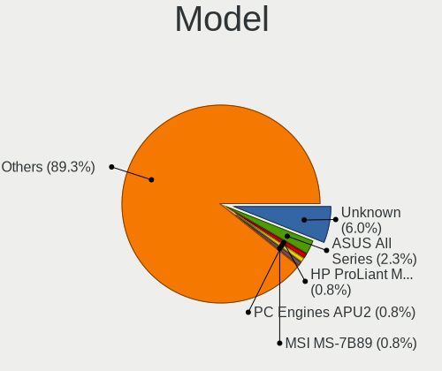
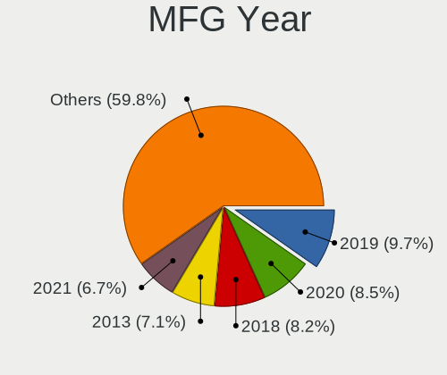
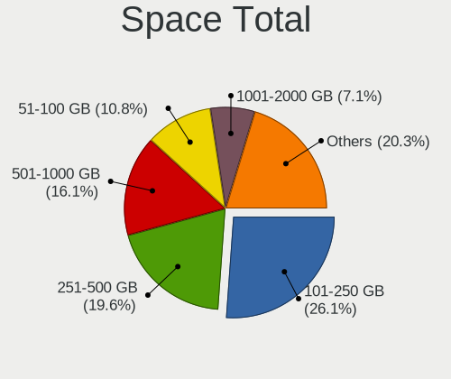
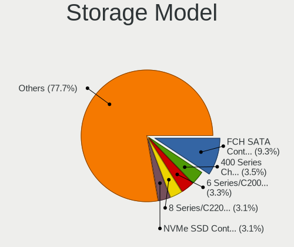
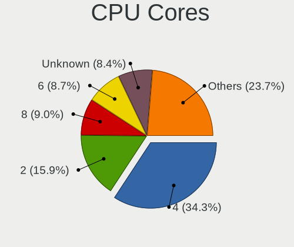
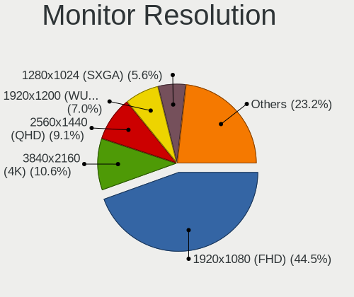
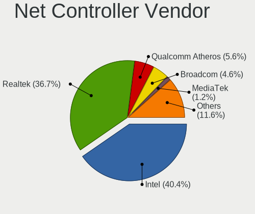
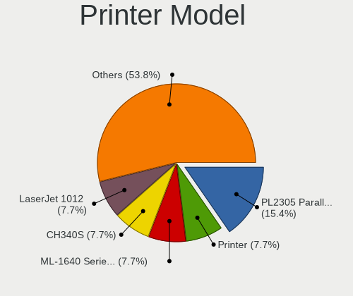

FreeBSD - Tested Hardware & Statistics (Desktops)
-------------------------------------------------

A project to collect tested hardware configurations for FreeBSD.

Anyone can contribute to this report by the [hw-probe](https://github.com/linuxhw/hw-probe/blob/master/INSTALL.BSD.md) tool:

    hw-probe -all -upload

Please contribute! Especially if your hardware is rare.

Contents
--------

* [ Test Cases ](#test-cases)

* [ System ](#system)
  - [ OS                       ](#os)
  - [ OS Family                ](#os-family)
  - [ Arch                     ](#arch)
  - [ DE                       ](#de)
  - [ Display Server           ](#display-server)
  - [ Display Manager          ](#display-manager)
  - [ OS Lang                  ](#os-lang)
  - [ Boot Mode                ](#boot-mode)
  - [ Filesystem               ](#filesystem)
  - [ Part. scheme             ](#part-scheme)

* [ Board ](#board)
  - [ Vendor                   ](#vendor)
  - [ Model                    ](#model)
  - [ Model Family             ](#model-family)
  - [ MFG Year                 ](#mfg-year)
  - [ Form Factor              ](#form-factor)
  - [ Coreboot                 ](#coreboot)
  - [ RAM Size                 ](#ram-size)
  - [ RAM Used                 ](#ram-used)
  - [ Total Drives             ](#total-drives)
  - [ Has CD-ROM               ](#has-cd-rom)
  - [ Has Ethernet             ](#has-ethernet)
  - [ Has WiFi                 ](#has-wifi)
  - [ Has Bluetooth            ](#has-bluetooth)

* [ Location ](#location)
  - [ Country                  ](#country)
  - [ City                     ](#city)

* [ Drives ](#drives)
  - [ Drive Vendor             ](#drive-vendor)
  - [ Drive Model              ](#drive-model)
  - [ HDD Vendor               ](#hdd-vendor)
  - [ SSD Vendor               ](#ssd-vendor)
  - [ Drive Kind               ](#drive-kind)
  - [ Drive Connector          ](#drive-connector)
  - [ Drive Size               ](#drive-size)
  - [ Space Total              ](#space-total)
  - [ Space Used               ](#space-used)
  - [ Malfunc. Drives          ](#malfunc-drives)
  - [ Malfunc. Drive Vendor    ](#malfunc-drive-vendor)
  - [ Malfunc. HDD Vendor      ](#malfunc-hdd-vendor)
  - [ Malfunc. Drive Kind      ](#malfunc-drive-kind)
  - [ Failed Drives            ](#failed-drives)
  - [ Failed Drive Vendor      ](#failed-drive-vendor)
  - [ Drive Status             ](#drive-status)

* [ Storage controller ](#storage-controller)
  - [ Storage Vendor           ](#storage-vendor)
  - [ Storage Model            ](#storage-model)
  - [ Storage Kind             ](#storage-kind)

* [ Processor ](#processor)
  - [ CPU Vendor               ](#cpu-vendor)
  - [ CPU Model                ](#cpu-model)
  - [ CPU Model Family         ](#cpu-model-family)
  - [ CPU Cores                ](#cpu-cores)
  - [ CPU Sockets              ](#cpu-sockets)
  - [ CPU Threads              ](#cpu-threads)
  - [ CPU Microarch            ](#cpu-microarch)

* [ Graphics ](#graphics)
  - [ GPU Vendor               ](#gpu-vendor)
  - [ GPU Model                ](#gpu-model)
  - [ GPU Combo                ](#gpu-combo)
  - [ GPU Driver               ](#gpu-driver)
  - [ GPU Memory               ](#gpu-memory)

* [ Monitor ](#monitor)
  - [ Monitor Vendor           ](#monitor-vendor)
  - [ Monitor Model            ](#monitor-model)
  - [ Monitor Resolution       ](#monitor-resolution)
  - [ Monitor Diagonal         ](#monitor-diagonal)
  - [ Monitor Width            ](#monitor-width)
  - [ Aspect Ratio             ](#aspect-ratio)
  - [ Monitor Area             ](#monitor-area)
  - [ Pixel Density            ](#pixel-density)
  - [ Multiple Monitors        ](#multiple-monitors)

* [ Network ](#network)
  - [ Net Controller Vendor    ](#net-controller-vendor)
  - [ Net Controller Model     ](#net-controller-model)
  - [ Wireless Vendor          ](#wireless-vendor)
  - [ Wireless Model           ](#wireless-model)
  - [ Ethernet Vendor          ](#ethernet-vendor)
  - [ Ethernet Model           ](#ethernet-model)
  - [ Net Controller Kind      ](#net-controller-kind)
  - [ Used Controller          ](#used-controller)
  - [ NICs                     ](#nics)
  - [ IPv6                     ](#ipv6)

* [ Bluetooth ](#bluetooth)
  - [ Bluetooth Vendor         ](#bluetooth-vendor)
  - [ Bluetooth Model          ](#bluetooth-model)

* [ Sound ](#sound)
  - [ Sound Vendor             ](#sound-vendor)
  - [ Sound Model              ](#sound-model)

* [ Memory ](#memory)
  - [ Memory Vendor            ](#memory-vendor)
  - [ Memory Model             ](#memory-model)
  - [ Memory Kind              ](#memory-kind)
  - [ Memory Form Factor       ](#memory-form-factor)
  - [ Memory Size              ](#memory-size)
  - [ Memory Speed             ](#memory-speed)

* [ Printers & scanners ](#printers--scanners)
  - [ Printer Vendor           ](#printer-vendor)
  - [ Printer Model            ](#printer-model)
  - [ Scanner Vendor           ](#scanner-vendor)
  - [ Scanner Model            ](#scanner-model)

* [ Camera ](#camera)
  - [ Camera Vendor            ](#camera-vendor)
  - [ Camera Model             ](#camera-model)

* [ Security ](#security)
  - [ Fingerprint Vendor       ](#fingerprint-vendor)
  - [ Fingerprint Model        ](#fingerprint-model)
  - [ Chipcard Vendor          ](#chipcard-vendor)
  - [ Chipcard Model           ](#chipcard-model)

* [ Unsupported ](#unsupported)
  - [ Unsupported Devices      ](#unsupported-devices)
  - [ Unsupported Device Types ](#unsupported-device-types)

Test Cases
----------

Total: 1109

| Vendor        | Model                       | Probe                                                     | Date         |
|---------------|-----------------------------|-----------------------------------------------------------|--------------|
| HP            | 1495                        | [6e0f1cc72e](https://bsd-hardware.info/?probe=6e0f1cc72e) | Apr 29, 2022 |
| MSI           | A520M-A PRO                 | [336add4fcb](https://bsd-hardware.info/?probe=336add4fcb) | Apr 28, 2022 |
| MSI           | A520M-A PRO                 | [34f2ba40e7](https://bsd-hardware.info/?probe=34f2ba40e7) | Apr 27, 2022 |
| Gigabyte      | X470 AORUS ULTRA GAMING-... | [1a475f0939](https://bsd-hardware.info/?probe=1a475f0939) | Apr 27, 2022 |
| ASRock        | X570S PG Riptide            | [928d2abb5e](https://bsd-hardware.info/?probe=928d2abb5e) | Apr 26, 2022 |
| Gigabyte      | H310M S2 x.x                | [549053284c](https://bsd-hardware.info/?probe=549053284c) | Apr 25, 2022 |
| MSI           | X399 GAMING PRO CARBON A... | [86c4af7ca4](https://bsd-hardware.info/?probe=86c4af7ca4) | Apr 25, 2022 |
| ASUSTek       | P5Q-E                       | [27a4680bec](https://bsd-hardware.info/?probe=27a4680bec) | Apr 24, 2022 |
| MSI           | H81M-P33                    | [d14d6194ed](https://bsd-hardware.info/?probe=d14d6194ed) | Apr 24, 2022 |
| ASUSTek       | ROG CROSSHAIR VIII HERO     | [76580a0375](https://bsd-hardware.info/?probe=76580a0375) | Apr 24, 2022 |
| Dell          | 0T7D40 A01                  | [7a43bfada9](https://bsd-hardware.info/?probe=7a43bfada9) | Apr 23, 2022 |
| Dell          | 0HD5W2 A00                  | [955922ebe2](https://bsd-hardware.info/?probe=955922ebe2) | Apr 23, 2022 |
| Dell          | 0HD5W2 A00                  | [4d66b2b328](https://bsd-hardware.info/?probe=4d66b2b328) | Apr 23, 2022 |
| MSI           | X570-A PRO                  | [89fcee49d9](https://bsd-hardware.info/?probe=89fcee49d9) | Apr 22, 2022 |
| HP            | 2820h                       | [d888b8b775](https://bsd-hardware.info/?probe=d888b8b775) | Apr 22, 2022 |
| Supermicro    | X9SCL/X9SCM                 | [947038b1f9](https://bsd-hardware.info/?probe=947038b1f9) | Apr 22, 2022 |
| MSI           | PRESTIGE X570 CREATION      | [28c8d07136](https://bsd-hardware.info/?probe=28c8d07136) | Apr 22, 2022 |
| Dell          | 06JWJY A01                  | [16f4cc5d53](https://bsd-hardware.info/?probe=16f4cc5d53) | Apr 20, 2022 |
| Dell          | 0T7D40 A01                  | [4ad1c07aa5](https://bsd-hardware.info/?probe=4ad1c07aa5) | Apr 19, 2022 |
| Gigabyte      | N3160ND3V                   | [eb3d850e0a](https://bsd-hardware.info/?probe=eb3d850e0a) | Apr 17, 2022 |
| MSI           | H81M-P33                    | [4bc268cc37](https://bsd-hardware.info/?probe=4bc268cc37) | Apr 17, 2022 |
| ASUSTek       | P5Q-E                       | [1c967bd89f](https://bsd-hardware.info/?probe=1c967bd89f) | Apr 17, 2022 |
| ASUSTek       | ROG CROSSHAIR VIII HERO     | [c8badc9bc6](https://bsd-hardware.info/?probe=c8badc9bc6) | Apr 17, 2022 |
| ASRockRack    | C3758D4I-4L                 | [0a550ec649](https://bsd-hardware.info/?probe=0a550ec649) | Apr 17, 2022 |
| ASRockRack    | C3758D4I-4L                 | [c1e6f095a8](https://bsd-hardware.info/?probe=c1e6f095a8) | Apr 17, 2022 |
| Shuttle       | DS20U                       | [f01372719f](https://bsd-hardware.info/?probe=f01372719f) | Apr 16, 2022 |
| Shuttle       | SH570                       | [08e2af8890](https://bsd-hardware.info/?probe=08e2af8890) | Apr 16, 2022 |
| ASUSTek       | AT5NM10T-I                  | [211c3291dd](https://bsd-hardware.info/?probe=211c3291dd) | Apr 15, 2022 |
| HP            | 86E9 A                      | [be43a8efde](https://bsd-hardware.info/?probe=be43a8efde) | Apr 14, 2022 |
| HP            | ProLiant MicroServer        | [fa76da045a](https://bsd-hardware.info/?probe=fa76da045a) | Apr 13, 2022 |
| ASUSTek       | PRIME X370-PRO              | [f6bc20d345](https://bsd-hardware.info/?probe=f6bc20d345) | Apr 13, 2022 |
| ASRock        | X570 Phantom Gaming 4       | [bb9129d4df](https://bsd-hardware.info/?probe=bb9129d4df) | Apr 13, 2022 |
| Intel         | DH67CL AAG10212-205         | [ecbb820987](https://bsd-hardware.info/?probe=ecbb820987) | Apr 12, 2022 |
| Dell          | 0DXJD9 A01                  | [6dac56f3bb](https://bsd-hardware.info/?probe=6dac56f3bb) | Apr 11, 2022 |
| Dell          | 0WR7PY A03                  | [641d1574ce](https://bsd-hardware.info/?probe=641d1574ce) | Apr 11, 2022 |
| ASRock        | X370 Taichi                 | [7f156a0671](https://bsd-hardware.info/?probe=7f156a0671) | Apr 10, 2022 |
| ASRock        | X370 Taichi                 | [a006c9e999](https://bsd-hardware.info/?probe=a006c9e999) | Apr 10, 2022 |
| ASUSTek       | P5Q-E                       | [0cbb5faa2e](https://bsd-hardware.info/?probe=0cbb5faa2e) | Apr 10, 2022 |
| MSI           | H81M-P33                    | [52abbcbc5b](https://bsd-hardware.info/?probe=52abbcbc5b) | Apr 10, 2022 |
| ASUSTek       | ROG CROSSHAIR VIII HERO     | [5d759d6436](https://bsd-hardware.info/?probe=5d759d6436) | Apr 10, 2022 |
| Intel         | DH67CL AAG10212-205         | [de2cd29be6](https://bsd-hardware.info/?probe=de2cd29be6) | Apr 10, 2022 |
| Intel         | DH67BL AAG10189-211         | [2a03c05cce](https://bsd-hardware.info/?probe=2a03c05cce) | Apr 10, 2022 |
| Intel         | DH61CR AAG14064-204         | [fa4b6b0257](https://bsd-hardware.info/?probe=fa4b6b0257) | Apr 09, 2022 |
| Intel         | DH61CR AAG14064-205         | [4436915ba0](https://bsd-hardware.info/?probe=4436915ba0) | Apr 09, 2022 |
| Intel         | DH61CR AAG14064-210         | [a01376dfc5](https://bsd-hardware.info/?probe=a01376dfc5) | Apr 09, 2022 |
| Intel         | DH61CR AAG14064-205         | [85a5d08117](https://bsd-hardware.info/?probe=85a5d08117) | Apr 09, 2022 |
| Intel         | DH67BL AAG10189-211         | [689ff6c484](https://bsd-hardware.info/?probe=689ff6c484) | Apr 09, 2022 |
| Intel         | DH55TC AAE70932-302         | [b9a45002ae](https://bsd-hardware.info/?probe=b9a45002ae) | Apr 09, 2022 |
| Intel         | DH67CL AAG10212-205         | [68f10ed8de](https://bsd-hardware.info/?probe=68f10ed8de) | Apr 09, 2022 |
| Intel         | DH67CL AAG10212-205         | [092643d1c3](https://bsd-hardware.info/?probe=092643d1c3) | Apr 09, 2022 |
| Intel         | DH61CR AAG14064-205         | [02b581994b](https://bsd-hardware.info/?probe=02b581994b) | Apr 08, 2022 |
| Lenovo        | MAHOBAY NO DPK              | [840805d1fa](https://bsd-hardware.info/?probe=840805d1fa) | Apr 08, 2022 |
| Gigabyte      | B450M S2H                   | [ee73e0cddb](https://bsd-hardware.info/?probe=ee73e0cddb) | Apr 07, 2022 |
| ASUSTek       | PRIME H310M-D R2.0          | [da64cbb0d1](https://bsd-hardware.info/?probe=da64cbb0d1) | Apr 07, 2022 |
| MSI           | MAG B550M MORTAR            | [d9ef1569d2](https://bsd-hardware.info/?probe=d9ef1569d2) | Apr 07, 2022 |
| Gigabyte      | B560M D3H                   | [99343fc0da](https://bsd-hardware.info/?probe=99343fc0da) | Apr 06, 2022 |
| HPE           | ProLiant MicroServer Gen... | [7db1501c5c](https://bsd-hardware.info/?probe=7db1501c5c) | Apr 06, 2022 |
| ASUSTek       | TUF Gaming X570-PLUS        | [2d04e83ea4](https://bsd-hardware.info/?probe=2d04e83ea4) | Apr 06, 2022 |
| ASRock        | AM1H-ITX                    | [5556bf474c](https://bsd-hardware.info/?probe=5556bf474c) | Apr 06, 2022 |
| Unknown       | Unknown                     | [821456e342](https://bsd-hardware.info/?probe=821456e342) | Apr 06, 2022 |
| Unknown       | Unknown                     | [6955791aa5](https://bsd-hardware.info/?probe=6955791aa5) | Apr 06, 2022 |
| Gigabyte      | H310M S2 x.x                | [29a9462f72](https://bsd-hardware.info/?probe=29a9462f72) | Apr 04, 2022 |
| HP            | 212B                        | [33e7c65907](https://bsd-hardware.info/?probe=33e7c65907) | Apr 04, 2022 |
| ASUSTek       | ROG CROSSHAIR VIII HERO     | [1043649da9](https://bsd-hardware.info/?probe=1043649da9) | Apr 03, 2022 |
| MSI           | H81M-P33                    | [b0d11aabb7](https://bsd-hardware.info/?probe=b0d11aabb7) | Apr 03, 2022 |
| ASUSTek       | P5Q-E                       | [dbaaa0dcda](https://bsd-hardware.info/?probe=dbaaa0dcda) | Apr 03, 2022 |
| Gigabyte      | X570 AORUS PRO              | [3877a33214](https://bsd-hardware.info/?probe=3877a33214) | Apr 02, 2022 |
| Gigabyte      | X570 AORUS PRO              | [3da637e3c6](https://bsd-hardware.info/?probe=3da637e3c6) | Apr 02, 2022 |
| HP            | 158A                        | [5d463584db](https://bsd-hardware.info/?probe=5d463584db) | Mar 31, 2022 |
| ASUSTek       | PRO B460M-C                 | [0542f7a16d](https://bsd-hardware.info/?probe=0542f7a16d) | Mar 29, 2022 |
| ASUSTek       | D700SA                      | [e0d66ad9cf](https://bsd-hardware.info/?probe=e0d66ad9cf) | Mar 28, 2022 |
| MSI           | H81M-P33                    | [823d2d7336](https://bsd-hardware.info/?probe=823d2d7336) | Mar 27, 2022 |
| ASUSTek       | P5Q-E                       | [4e44bfd765](https://bsd-hardware.info/?probe=4e44bfd765) | Mar 27, 2022 |
| ASUSTek       | ROG CROSSHAIR VIII HERO     | [51507583f6](https://bsd-hardware.info/?probe=51507583f6) | Mar 27, 2022 |
| ASUSTek       | P5KPL-CM                    | [d9e74758f3](https://bsd-hardware.info/?probe=d9e74758f3) | Mar 24, 2022 |
| MSI           | MS-A6221 100                | [ba62f48990](https://bsd-hardware.info/?probe=ba62f48990) | Mar 23, 2022 |
| ASUSTek       | M4A78T-E                    | [7c46c8e712](https://bsd-hardware.info/?probe=7c46c8e712) | Mar 23, 2022 |
| Gigabyte      | GA-78LMT-USB3 SEx           | [4a9a28c612](https://bsd-hardware.info/?probe=4a9a28c612) | Mar 22, 2022 |
| ASRock        | H61M-VG3                    | [543bcf2d09](https://bsd-hardware.info/?probe=543bcf2d09) | Mar 22, 2022 |
| ASUSTek       | PRO B460M-C                 | [6ceff4eca1](https://bsd-hardware.info/?probe=6ceff4eca1) | Mar 21, 2022 |
| Unknown       | Unknown                     | [c4ffde79eb](https://bsd-hardware.info/?probe=c4ffde79eb) | Mar 21, 2022 |
| ASUSTek       | PRIME B550M-A               | [d0946bc53f](https://bsd-hardware.info/?probe=d0946bc53f) | Mar 21, 2022 |
| MSI           | B450 TOMAHAWK MAX           | [d2ecb6259c](https://bsd-hardware.info/?probe=d2ecb6259c) | Mar 20, 2022 |
| ASRock        | X570 Pro4                   | [2aeeaaacfc](https://bsd-hardware.info/?probe=2aeeaaacfc) | Mar 20, 2022 |
| ASRock        | X570 Pro4                   | [4b6df22ff5](https://bsd-hardware.info/?probe=4b6df22ff5) | Mar 20, 2022 |
| MSI           | H81M-P33                    | [d9421c2715](https://bsd-hardware.info/?probe=d9421c2715) | Mar 20, 2022 |
| ASUSTek       | P5Q-E                       | [5a6cb7ab07](https://bsd-hardware.info/?probe=5a6cb7ab07) | Mar 20, 2022 |
| ASUSTek       | ROG CROSSHAIR VIII HERO     | [12814be80b](https://bsd-hardware.info/?probe=12814be80b) | Mar 20, 2022 |
| ASUSTek       | PRIME Z590-P                | [054946738a](https://bsd-hardware.info/?probe=054946738a) | Mar 19, 2022 |
| ASUSTek       | PRIME B550M-A               | [40cd6d1472](https://bsd-hardware.info/?probe=40cd6d1472) | Mar 19, 2022 |
| ASUSTek       | PRIME B350M-A               | [753af67ffa](https://bsd-hardware.info/?probe=753af67ffa) | Mar 18, 2022 |
| ASUSTek       | PRIME B550M-A               | [b23ab09f52](https://bsd-hardware.info/?probe=b23ab09f52) | Mar 18, 2022 |
| ASUSTek       | PRIME B550M-A               | [545e5ebfc9](https://bsd-hardware.info/?probe=545e5ebfc9) | Mar 18, 2022 |
| Gigabyte      | GA-78LMT-USB3 SEx           | [6d4ac7f6f5](https://bsd-hardware.info/?probe=6d4ac7f6f5) | Mar 18, 2022 |
| Gigabyte      | GA-78LMT-USB3 SEx           | [3f94a005a7](https://bsd-hardware.info/?probe=3f94a005a7) | Mar 17, 2022 |
| Unknown       | Unknown                     | [6e7384f4cc](https://bsd-hardware.info/?probe=6e7384f4cc) | Mar 15, 2022 |
| Gigabyte      | B550I AORUS PRO AX          | [a5fd383c40](https://bsd-hardware.info/?probe=a5fd383c40) | Mar 14, 2022 |
| ASUSTek       | PRIME X370-PRO              | [3c28521de5](https://bsd-hardware.info/?probe=3c28521de5) | Mar 13, 2022 |
| ASUSTek       | ROG CROSSHAIR VIII HERO     | [d01a922777](https://bsd-hardware.info/?probe=d01a922777) | Mar 13, 2022 |
| ASRock        | X570 Phantom Gaming 4       | [3b2e18a52e](https://bsd-hardware.info/?probe=3b2e18a52e) | Mar 13, 2022 |
| Huanan        | X99-F8D V2.4                | [4ef193841e](https://bsd-hardware.info/?probe=4ef193841e) | Mar 13, 2022 |
| ASUSTek       | P5K PRO                     | [fbde5657e8](https://bsd-hardware.info/?probe=fbde5657e8) | Mar 11, 2022 |
| ASRock        | Q1900B-ITX                  | [b4142103cb](https://bsd-hardware.info/?probe=b4142103cb) | Mar 10, 2022 |
| Gigabyte      | C246-WU4-CF                 | [17b3590a3f](https://bsd-hardware.info/?probe=17b3590a3f) | Mar 08, 2022 |
| Intel         | DX79TO AAG28805-401         | [431b37f050](https://bsd-hardware.info/?probe=431b37f050) | Mar 06, 2022 |
| ASUSTek       | ROG CROSSHAIR VIII HERO     | [c2051f121a](https://bsd-hardware.info/?probe=c2051f121a) | Mar 06, 2022 |
| ASUSTek       | PRIME B550M-A               | [0d2956a144](https://bsd-hardware.info/?probe=0d2956a144) | Mar 04, 2022 |
| Gigabyte      | AB350M-Gaming 3-CF          | [1daab68f1f](https://bsd-hardware.info/?probe=1daab68f1f) | Mar 04, 2022 |
| Intel         | D865PERL AAC27646-213       | [4e11b970ab](https://bsd-hardware.info/?probe=4e11b970ab) | Mar 03, 2022 |
| MSI           | U-100 Ver.001               | [50aba1dee8](https://bsd-hardware.info/?probe=50aba1dee8) | Mar 03, 2022 |
| Supermicro    | A2SDi-LN4F                  | [b10f6655d9](https://bsd-hardware.info/?probe=b10f6655d9) | Mar 01, 2022 |
| ASUSTek       | ROG CROSSHAIR VIII HERO     | [dd3af3538c](https://bsd-hardware.info/?probe=dd3af3538c) | Feb 27, 2022 |
| MSI           | B365M PRO-VDH               | [d45ca02f84](https://bsd-hardware.info/?probe=d45ca02f84) | Feb 24, 2022 |
| MSI           | MAG B550M BAZOOKA           | [68f6eb4328](https://bsd-hardware.info/?probe=68f6eb4328) | Feb 23, 2022 |
| Shuttle       | FZ270                       | [7e0eb61342](https://bsd-hardware.info/?probe=7e0eb61342) | Feb 22, 2022 |
| MSI           | MAG B550M BAZOOKA           | [c1397b851e](https://bsd-hardware.info/?probe=c1397b851e) | Feb 22, 2022 |
| GALAX         | B365M G10b                  | [ceb2291168](https://bsd-hardware.info/?probe=ceb2291168) | Feb 22, 2022 |
| ASRock        | A88M-G                      | [14fcd1e849](https://bsd-hardware.info/?probe=14fcd1e849) | Feb 21, 2022 |
| ASUSTek       | ROG CROSSHAIR VIII HERO     | [4380b61b37](https://bsd-hardware.info/?probe=4380b61b37) | Feb 20, 2022 |
| Unknown       | Unknown                     | [da786acd84](https://bsd-hardware.info/?probe=da786acd84) | Feb 20, 2022 |
| ASUSTek       | ROG STRIX X570-F GAMING     | [807a29112e](https://bsd-hardware.info/?probe=807a29112e) | Feb 19, 2022 |
| Fujitsu       | D3128-A1 S26361-D3128-A1    | [0f3ee4caab](https://bsd-hardware.info/?probe=0f3ee4caab) | Feb 18, 2022 |
| ASRockRack    | EPYC3101D4I-2T              | [e506cf84f4](https://bsd-hardware.info/?probe=e506cf84f4) | Feb 15, 2022 |
| Supermicro    | X9SCL/X9SCM                 | [2b58423bfe](https://bsd-hardware.info/?probe=2b58423bfe) | Feb 15, 2022 |
| Unknown       | Unknown                     | [06887b10fd](https://bsd-hardware.info/?probe=06887b10fd) | Feb 15, 2022 |
| ASUSTek       | PRIME X370-PRO              | [7c826b01b0](https://bsd-hardware.info/?probe=7c826b01b0) | Feb 13, 2022 |
| ASUSTek       | ROG CROSSHAIR VIII HERO     | [d480af922b](https://bsd-hardware.info/?probe=d480af922b) | Feb 13, 2022 |
| ASRock        | X570 Phantom Gaming 4       | [60d6f27545](https://bsd-hardware.info/?probe=60d6f27545) | Feb 13, 2022 |
| Biostar       | X470GTA                     | [b7fc5ef684](https://bsd-hardware.info/?probe=b7fc5ef684) | Feb 12, 2022 |
| MSI           | H81M-P33                    | [5b4505d25e](https://bsd-hardware.info/?probe=5b4505d25e) | Feb 11, 2022 |
| ASUSTek       | P5Q-E                       | [42c29744d6](https://bsd-hardware.info/?probe=42c29744d6) | Feb 11, 2022 |
| ASUSTek       | ROG CROSSHAIR VIII HERO     | [1b042ff2e0](https://bsd-hardware.info/?probe=1b042ff2e0) | Feb 11, 2022 |
| HP            | 83E1                        | [d8e995126f](https://bsd-hardware.info/?probe=d8e995126f) | Feb 10, 2022 |
| Gigabyte      | 990FXA-UD3                  | [3c315d0c15](https://bsd-hardware.info/?probe=3c315d0c15) | Feb 09, 2022 |
| ASRock        | X370 Gaming X               | [22f8d133d4](https://bsd-hardware.info/?probe=22f8d133d4) | Feb 09, 2022 |
| ASUSTek       | PRIME Z270-P                | [ae4f0642fd](https://bsd-hardware.info/?probe=ae4f0642fd) | Feb 09, 2022 |
| Dell          | 0654JC A01                  | [bbcf2bad96](https://bsd-hardware.info/?probe=bbcf2bad96) | Feb 08, 2022 |
| ASUSTek       | PRIME B450M-GAMING/BR       | [d57de875a6](https://bsd-hardware.info/?probe=d57de875a6) | Feb 07, 2022 |
| HP            | 0B54h D                     | [c2b43efb8f](https://bsd-hardware.info/?probe=c2b43efb8f) | Feb 07, 2022 |
| Gigabyte      | X570 I AORUS PRO WIFI       | [91b1ec3b93](https://bsd-hardware.info/?probe=91b1ec3b93) | Feb 06, 2022 |
| Unknown       | Unknown                     | [8d38089ced](https://bsd-hardware.info/?probe=8d38089ced) | Feb 06, 2022 |
| HP            | ProLiant ML350p Gen8        | [7987f643d7](https://bsd-hardware.info/?probe=7987f643d7) | Feb 06, 2022 |
| Unknown       | Unknown                     | [12e979c82a](https://bsd-hardware.info/?probe=12e979c82a) | Feb 06, 2022 |
| HP            | 0B54h D                     | [1878f5822c](https://bsd-hardware.info/?probe=1878f5822c) | Feb 06, 2022 |
| HP            | ProLiant ML350p Gen8        | [b9e0021bfb](https://bsd-hardware.info/?probe=b9e0021bfb) | Feb 06, 2022 |
| Kontron       | KT965/ATXP 61420000         | [b5389bbf43](https://bsd-hardware.info/?probe=b5389bbf43) | Feb 06, 2022 |
| ASUSTek       | ROG CROSSHAIR VIII HERO     | [e41d9cff21](https://bsd-hardware.info/?probe=e41d9cff21) | Feb 06, 2022 |
| MSI           | H81M-P33                    | [049a615166](https://bsd-hardware.info/?probe=049a615166) | Feb 06, 2022 |
| ASUSTek       | P5Q-E                       | [5afa08fe32](https://bsd-hardware.info/?probe=5afa08fe32) | Feb 06, 2022 |
| Gateway       | DX4870                      | [5035507c5c](https://bsd-hardware.info/?probe=5035507c5c) | Feb 05, 2022 |
| HP            | 802E                        | [e23b3e314a](https://bsd-hardware.info/?probe=e23b3e314a) | Feb 05, 2022 |
| Gateway       | DX4870                      | [1f31c4a99b](https://bsd-hardware.info/?probe=1f31c4a99b) | Feb 05, 2022 |
| ASUSTek       | P4P800-VM                   | [2343c503a7](https://bsd-hardware.info/?probe=2343c503a7) | Feb 04, 2022 |
| Dell          | 05DN3X A00                  | [edef5c789d](https://bsd-hardware.info/?probe=edef5c789d) | Feb 04, 2022 |
| Dell          | 0D28YY A02                  | [8eb27db8c9](https://bsd-hardware.info/?probe=8eb27db8c9) | Jan 31, 2022 |
| Dell          | 0J37VM A01                  | [47061377bd](https://bsd-hardware.info/?probe=47061377bd) | Jan 31, 2022 |
| Dell          | 0TK7TF A00                  | [d13ca7163c](https://bsd-hardware.info/?probe=d13ca7163c) | Jan 30, 2022 |
| Intel         | D2500CC AAG81477-401        | [f4d8bd7979](https://bsd-hardware.info/?probe=f4d8bd7979) | Jan 30, 2022 |
| ASUSTek       | ROG CROSSHAIR VIII HERO     | [03824075b4](https://bsd-hardware.info/?probe=03824075b4) | Jan 30, 2022 |
| Gigabyte      | X570 I AORUS PRO WIFI       | [e0c2a150f7](https://bsd-hardware.info/?probe=e0c2a150f7) | Jan 29, 2022 |
| Gigabyte      | Z68X-UD7-B3                 | [37cc045649](https://bsd-hardware.info/?probe=37cc045649) | Jan 28, 2022 |
| ASUSTek       | PRIME H410M-A               | [c7ef0e518f](https://bsd-hardware.info/?probe=c7ef0e518f) | Jan 27, 2022 |
| ASUSTek       | PRIME H410M-A               | [c2d7238521](https://bsd-hardware.info/?probe=c2d7238521) | Jan 27, 2022 |
| Gigabyte      | X470 AORUS ULTRA GAMING-... | [eb44c8d7e1](https://bsd-hardware.info/?probe=eb44c8d7e1) | Jan 27, 2022 |
| Kontron       | KT965/ATXP 61420000         | [36109b09ca](https://bsd-hardware.info/?probe=36109b09ca) | Jan 26, 2022 |
| HP            | ProLiant MicroServer        | [b62251041b](https://bsd-hardware.info/?probe=b62251041b) | Jan 26, 2022 |
| MSI           | G31TM-P21                   | [10ca6492c1](https://bsd-hardware.info/?probe=10ca6492c1) | Jan 25, 2022 |
| MSI           | G31TM-P21                   | [7563c4cf09](https://bsd-hardware.info/?probe=7563c4cf09) | Jan 25, 2022 |
| Kontron       | KT965/ATXP 61420000         | [db757ea2ef](https://bsd-hardware.info/?probe=db757ea2ef) | Jan 25, 2022 |
| Gigabyte      | H310M S2 x.x                | [b0aeac1ef8](https://bsd-hardware.info/?probe=b0aeac1ef8) | Jan 25, 2022 |
| ASUSTek       | P5M2                        | [f2d4eccf4d](https://bsd-hardware.info/?probe=f2d4eccf4d) | Jan 24, 2022 |
| ASUSTek       | ROG CROSSHAIR VIII HERO     | [a90b68e57b](https://bsd-hardware.info/?probe=a90b68e57b) | Jan 23, 2022 |
| MSI           | H81M-P33                    | [9d6207401e](https://bsd-hardware.info/?probe=9d6207401e) | Jan 23, 2022 |
| ASUSTek       | P5Q-E                       | [691f4c1a9a](https://bsd-hardware.info/?probe=691f4c1a9a) | Jan 23, 2022 |
| ASUSTek       | PRIME Z590-P                | [0473b57d99](https://bsd-hardware.info/?probe=0473b57d99) | Jan 19, 2022 |
| Gigabyte      | Z68X-UD7-B3                 | [082da3ef7f](https://bsd-hardware.info/?probe=082da3ef7f) | Jan 19, 2022 |
| ASUSTek       | M5A97 R2.0                  | [9f442754d0](https://bsd-hardware.info/?probe=9f442754d0) | Jan 17, 2022 |
| MSI           | H81M-P33                    | [4cc0e9443d](https://bsd-hardware.info/?probe=4cc0e9443d) | Jan 16, 2022 |
| ASUSTek       | ROG CROSSHAIR VIII HERO     | [7307e3e0be](https://bsd-hardware.info/?probe=7307e3e0be) | Jan 16, 2022 |
| ASUSTek       | P5Q-E                       | [d9f18d4d56](https://bsd-hardware.info/?probe=d9f18d4d56) | Jan 16, 2022 |
| ASUSTek       | PRIME H310M-K R2.0          | [8b55745b6f](https://bsd-hardware.info/?probe=8b55745b6f) | Jan 14, 2022 |
| ASUSTek       | PRIME H410M-A               | [625c8f0f2c](https://bsd-hardware.info/?probe=625c8f0f2c) | Jan 14, 2022 |
| ASUSTek       | PRIME H410M-A               | [d09cf2e0a7](https://bsd-hardware.info/?probe=d09cf2e0a7) | Jan 14, 2022 |
| ASUSTek       | Z87-PRO                     | [280ea0618b](https://bsd-hardware.info/?probe=280ea0618b) | Jan 14, 2022 |
| Gigabyte      | B450M DS3H-CF               | [825d20fcf7](https://bsd-hardware.info/?probe=825d20fcf7) | Jan 14, 2022 |
| Gigabyte      | B450M DS3H-CF               | [b953d9d2e6](https://bsd-hardware.info/?probe=b953d9d2e6) | Jan 13, 2022 |
| ASUSTek       | TUF B365M-PLUS GAMING       | [384cbe9714](https://bsd-hardware.info/?probe=384cbe9714) | Jan 13, 2022 |
| ASUSTek       | PRIME X370-PRO              | [1d7c4c096e](https://bsd-hardware.info/?probe=1d7c4c096e) | Jan 13, 2022 |
| ASRock        | X570 Phantom Gaming 4       | [05903427da](https://bsd-hardware.info/?probe=05903427da) | Jan 13, 2022 |
| ASUSTek       | P5G41T-M LX2/GB             | [1527560bbd](https://bsd-hardware.info/?probe=1527560bbd) | Jan 11, 2022 |
| HP            | ProLiant MicroServer        | [0da2a93271](https://bsd-hardware.info/?probe=0da2a93271) | Jan 11, 2022 |
| Supermicro    | X7SBL                       | [c7d877a988](https://bsd-hardware.info/?probe=c7d877a988) | Jan 11, 2022 |
| Intel         | DH61CR AAG14064-210         | [15bb78bf9a](https://bsd-hardware.info/?probe=15bb78bf9a) | Jan 11, 2022 |
| Intel         | DQ35JO AAD82085-804         | [117b469a53](https://bsd-hardware.info/?probe=117b469a53) | Jan 11, 2022 |
| HP            | ProLiant MicroServer        | [e95a3dd5ec](https://bsd-hardware.info/?probe=e95a3dd5ec) | Jan 10, 2022 |
| ASUSTek       | A68HM-PLUS                  | [650628a974](https://bsd-hardware.info/?probe=650628a974) | Jan 10, 2022 |
| ASUSTek       | P5G41T-M LX2/GB             | [d914e4c500](https://bsd-hardware.info/?probe=d914e4c500) | Jan 10, 2022 |
| ASUSTek       | PRIME H310-PLUS             | [03252493ce](https://bsd-hardware.info/?probe=03252493ce) | Jan 09, 2022 |
| ASUSTek       | ROG CROSSHAIR VIII HERO     | [3e2010c5d6](https://bsd-hardware.info/?probe=3e2010c5d6) | Jan 09, 2022 |
| ASRock        | FM2A85X Extreme6            | [c87969f2d8](https://bsd-hardware.info/?probe=c87969f2d8) | Jan 09, 2022 |
| ASRock        | Z170M Extreme4              | [c518ded272](https://bsd-hardware.info/?probe=c518ded272) | Jan 09, 2022 |
| ASUSTek       | ROG STRIX B550-I GAMING     | [2cc4698cbc](https://bsd-hardware.info/?probe=2cc4698cbc) | Jan 09, 2022 |
| ASUSTek       | ROG STRIX B550-I GAMING     | [2481037b2a](https://bsd-hardware.info/?probe=2481037b2a) | Jan 09, 2022 |
| Gigabyte      | H470 HD3                    | [afa675e7a7](https://bsd-hardware.info/?probe=afa675e7a7) | Jan 08, 2022 |
| Intel         | DH67CL AAG10212-205         | [1b0837ff84](https://bsd-hardware.info/?probe=1b0837ff84) | Jan 08, 2022 |
| Gigabyte      | B150-HD3P-CF                | [9752eae10b](https://bsd-hardware.info/?probe=9752eae10b) | Jan 06, 2022 |
| Unknown       | Unknown                     | [7367c82ceb](https://bsd-hardware.info/?probe=7367c82ceb) | Jan 05, 2022 |
| Unknown       | Unknown                     | [54ba0d5236](https://bsd-hardware.info/?probe=54ba0d5236) | Jan 05, 2022 |
| ASUSTek       | TUF GAMING B550-PLUS        | [ea4719600a](https://bsd-hardware.info/?probe=ea4719600a) | Jan 05, 2022 |
| ASUSTek       | P8H67-M PRO                 | [d789a35c01](https://bsd-hardware.info/?probe=d789a35c01) | Jan 02, 2022 |
| MSI           | H81M-P33                    | [759c219ace](https://bsd-hardware.info/?probe=759c219ace) | Jan 02, 2022 |
| ASUSTek       | ROG CROSSHAIR VIII HERO     | [cc32542766](https://bsd-hardware.info/?probe=cc32542766) | Jan 02, 2022 |
| Unknown       | Unknown                     | [c183bdd5af](https://bsd-hardware.info/?probe=c183bdd5af) | Jan 01, 2022 |
| ASUSTek       | PRIME H310-PLUS             | [82256452fe](https://bsd-hardware.info/?probe=82256452fe) | Jan 01, 2022 |
| ASRock        | B450 Steel Legend           | [e67007df20](https://bsd-hardware.info/?probe=e67007df20) | Jan 01, 2022 |
| Unknown       | Unknown                     | [4848e4009f](https://bsd-hardware.info/?probe=4848e4009f) | Jan 01, 2022 |
| HP            | ProLiant MicroServer        | [d641a4bea9](https://bsd-hardware.info/?probe=d641a4bea9) | Dec 30, 2021 |
| ASUSTek       | P8B75-M                     | [c3884fac44](https://bsd-hardware.info/?probe=c3884fac44) | Dec 30, 2021 |
| Gigabyte      | B550M AORUS PRO-P           | [dd62d57a45](https://bsd-hardware.info/?probe=dd62d57a45) | Dec 29, 2021 |
| friendlyel... | nanopi-m4                   | [bb29e50061](https://bsd-hardware.info/?probe=bb29e50061) | Dec 27, 2021 |
| AMI           | PEISIA E3845 VER1.0         | [d19f149583](https://bsd-hardware.info/?probe=d19f149583) | Dec 26, 2021 |
| Gigabyte      | P67A-D3-B3                  | [62f424cac5](https://bsd-hardware.info/?probe=62f424cac5) | Dec 26, 2021 |
| ASUSTek       | ROG CROSSHAIR VIII HERO     | [ffd55bcd2b](https://bsd-hardware.info/?probe=ffd55bcd2b) | Dec 26, 2021 |
| khadas        | edge-v                      | [42c428aac0](https://bsd-hardware.info/?probe=42c428aac0) | Dec 26, 2021 |
| MSI           | PRESTIGE X570 CREATION      | [afc3e2a972](https://bsd-hardware.info/?probe=afc3e2a972) | Dec 25, 2021 |
| Intel         | D54250WYK H13922-304        | [61acc33619](https://bsd-hardware.info/?probe=61acc33619) | Dec 22, 2021 |
| HP            | 1850                        | [aa737033c4](https://bsd-hardware.info/?probe=aa737033c4) | Dec 21, 2021 |
| HP            | 1850                        | [17f42cda78](https://bsd-hardware.info/?probe=17f42cda78) | Dec 21, 2021 |
| Purism        | Librem Mini v2              | [528ef01c87](https://bsd-hardware.info/?probe=528ef01c87) | Dec 20, 2021 |
| ASUSTek       | X99-E-10G WS                | [dacf7f604c](https://bsd-hardware.info/?probe=dacf7f604c) | Dec 20, 2021 |
| Gigabyte      | X470 AORUS ULTRA GAMING-... | [bc55ac50d1](https://bsd-hardware.info/?probe=bc55ac50d1) | Dec 20, 2021 |
| Unknown       | Unknown                     | [68541bb331](https://bsd-hardware.info/?probe=68541bb331) | Dec 20, 2021 |
| Acer          | Aspire XC-895 V:1.0         | [58440d7663](https://bsd-hardware.info/?probe=58440d7663) | Dec 20, 2021 |
| Gigabyte      | X570 AORUS PRO              | [17cad87a0d](https://bsd-hardware.info/?probe=17cad87a0d) | Dec 19, 2021 |
| MSI           | MS-9852 10                  | [4b851eef0a](https://bsd-hardware.info/?probe=4b851eef0a) | Dec 19, 2021 |
| ASUSTek       | ROG CROSSHAIR VIII HERO     | [aad4c49e2c](https://bsd-hardware.info/?probe=aad4c49e2c) | Dec 19, 2021 |
| ASUSTek       | M4A785TD-V EVO              | [848e618f87](https://bsd-hardware.info/?probe=848e618f87) | Dec 15, 2021 |
| ASUSTek       | PRIME X370-PRO              | [d46498baa7](https://bsd-hardware.info/?probe=d46498baa7) | Dec 13, 2021 |
| ASRock        | X570 Phantom Gaming 4       | [e19753a0ea](https://bsd-hardware.info/?probe=e19753a0ea) | Dec 13, 2021 |
| ASUSTek       | ROG CROSSHAIR VIII HERO     | [8ba9932299](https://bsd-hardware.info/?probe=8ba9932299) | Dec 12, 2021 |
| MSI           | H81M-P33                    | [fe193c863a](https://bsd-hardware.info/?probe=fe193c863a) | Dec 12, 2021 |
| Unknown       | Unknown                     | [b726a1b3e3](https://bsd-hardware.info/?probe=b726a1b3e3) | Dec 11, 2021 |
| ASUSTek       | PRIME X570-PRO              | [9a8d19aa04](https://bsd-hardware.info/?probe=9a8d19aa04) | Dec 11, 2021 |
| PC Engines    | apu4                        | [826a08be25](https://bsd-hardware.info/?probe=826a08be25) | Dec 11, 2021 |
| Unknown       | Unknown                     | [7633cb9296](https://bsd-hardware.info/?probe=7633cb9296) | Dec 11, 2021 |
| ASUSTek       | M5A99X EVO                  | [2e3b493ba3](https://bsd-hardware.info/?probe=2e3b493ba3) | Dec 11, 2021 |
| ASUSTek       | ROG Maximus X FORMULA       | [8a9387c5da](https://bsd-hardware.info/?probe=8a9387c5da) | Dec 11, 2021 |
| ASUSTek       | ROG Maximus X FORMULA       | [9762ebd7c7](https://bsd-hardware.info/?probe=9762ebd7c7) | Dec 10, 2021 |
| ASUSTek       | ROG Maximus XI HERO         | [74538b669d](https://bsd-hardware.info/?probe=74538b669d) | Dec 10, 2021 |
| ASUSTek       | ROG STRIX X570-E GAMING     | [c83118d6d0](https://bsd-hardware.info/?probe=c83118d6d0) | Dec 09, 2021 |
| MSI           | H81M-P33                    | [237b84b5fc](https://bsd-hardware.info/?probe=237b84b5fc) | Dec 09, 2021 |
| Cisco Syst... | UCSC-C240-M3L 74-10443-0... | [3956ad0525](https://bsd-hardware.info/?probe=3956ad0525) | Dec 09, 2021 |
| ASUSTek       | P5B                         | [93b542ab79](https://bsd-hardware.info/?probe=93b542ab79) | Dec 06, 2021 |
| Gigabyte      | GA-8S661FXM-775             | [3a64909558](https://bsd-hardware.info/?probe=3a64909558) | Dec 06, 2021 |
| Gigabyte      | B550M AORUS ELITE           | [66ed413cab](https://bsd-hardware.info/?probe=66ed413cab) | Dec 05, 2021 |
| ASUSTek       | ROG CROSSHAIR VIII HERO     | [4f463cab29](https://bsd-hardware.info/?probe=4f463cab29) | Dec 05, 2021 |
| MSI           | X99S MPOWER                 | [ba0ac00cf6](https://bsd-hardware.info/?probe=ba0ac00cf6) | Dec 04, 2021 |
| ASUSTek       | P7P55D                      | [73373c3c65](https://bsd-hardware.info/?probe=73373c3c65) | Dec 04, 2021 |
| Unknown       | Unknown                     | [a91c9ec877](https://bsd-hardware.info/?probe=a91c9ec877) | Dec 04, 2021 |
| HP            | 0B54h D                     | [5186b81327](https://bsd-hardware.info/?probe=5186b81327) | Dec 02, 2021 |
| Dell          | 0Y5DDC A00                  | [888de14ef5](https://bsd-hardware.info/?probe=888de14ef5) | Dec 02, 2021 |
| ASRock        | B450 Steel Legend           | [f3a11b2c2d](https://bsd-hardware.info/?probe=f3a11b2c2d) | Dec 01, 2021 |
| ASUSTek       | P7P55D                      | [540d2ef68c](https://bsd-hardware.info/?probe=540d2ef68c) | Nov 29, 2021 |
| MSI           | H81M-P33                    | [effc42884a](https://bsd-hardware.info/?probe=effc42884a) | Nov 28, 2021 |
| ASUSTek       | ROG CROSSHAIR VIII HERO     | [67ba2e6efa](https://bsd-hardware.info/?probe=67ba2e6efa) | Nov 28, 2021 |
| ASUSTek       | P5Q-E                       | [158a4879ac](https://bsd-hardware.info/?probe=158a4879ac) | Nov 28, 2021 |
| Shuttle       | FH270                       | [81643d52fd](https://bsd-hardware.info/?probe=81643d52fd) | Nov 26, 2021 |
| ASRock        | Q1900B-ITX                  | [7f32937b2c](https://bsd-hardware.info/?probe=7f32937b2c) | Nov 26, 2021 |
| Shuttle       | FZ270                       | [309687b5be](https://bsd-hardware.info/?probe=309687b5be) | Nov 26, 2021 |
| ASRock        | Q1900B-ITX                  | [4df18caa5f](https://bsd-hardware.info/?probe=4df18caa5f) | Nov 26, 2021 |
| ASUSTek       | ROG CROSSHAIR VIII HERO     | [a915598e32](https://bsd-hardware.info/?probe=a915598e32) | Nov 26, 2021 |
| Lenovo        | MAHOBAY                     | [b77016bee5](https://bsd-hardware.info/?probe=b77016bee5) | Nov 25, 2021 |
| Gigabyte      | G41M-Combo                  | [d227ad0b48](https://bsd-hardware.info/?probe=d227ad0b48) | Nov 25, 2021 |
| Gigabyte      | G41M-Combo                  | [3a4a54eed4](https://bsd-hardware.info/?probe=3a4a54eed4) | Nov 25, 2021 |
| Gigabyte      | MZBSWBP-00                  | [9e7a72d920](https://bsd-hardware.info/?probe=9e7a72d920) | Nov 24, 2021 |
| ASRock        | X570M Pro4                  | [b10f02e887](https://bsd-hardware.info/?probe=b10f02e887) | Nov 23, 2021 |
| Supermicro    | X7SPA-HF                    | [0ed5f516f4](https://bsd-hardware.info/?probe=0ed5f516f4) | Nov 21, 2021 |
| ASUSTek       | P5Q-E                       | [60ccf13a97](https://bsd-hardware.info/?probe=60ccf13a97) | Nov 21, 2021 |
| Supermicro    | X9SRE/X9SRE-3F/X9SRi/X9S... | [fe64c7bb21](https://bsd-hardware.info/?probe=fe64c7bb21) | Nov 21, 2021 |
| ASRockRack    | E3C246D4U2-2T               | [fd00b64a4c](https://bsd-hardware.info/?probe=fd00b64a4c) | Nov 21, 2021 |
| Dell          | 0M5DCD A00                  | [2f26c69137](https://bsd-hardware.info/?probe=2f26c69137) | Nov 20, 2021 |
| HP            | 87D6 SMVB                   | [ffa88d066b](https://bsd-hardware.info/?probe=ffa88d066b) | Nov 16, 2021 |
| PC Engines    | APU                         | [c1656cb13b](https://bsd-hardware.info/?probe=c1656cb13b) | Nov 15, 2021 |
| HP            | ProLiant MicroServer Gen... | [33b6a20321](https://bsd-hardware.info/?probe=33b6a20321) | Nov 14, 2021 |
| PC Engines    | APU                         | [6db53946a4](https://bsd-hardware.info/?probe=6db53946a4) | Nov 14, 2021 |
| ASUSTek       | PRIME X370-PRO              | [bf9a0bc7f2](https://bsd-hardware.info/?probe=bf9a0bc7f2) | Nov 13, 2021 |
| ASRock        | X570 Phantom Gaming 4       | [1233db9192](https://bsd-hardware.info/?probe=1233db9192) | Nov 13, 2021 |
| PC Engines    | APU2                        | [424bb1e286](https://bsd-hardware.info/?probe=424bb1e286) | Nov 10, 2021 |
| MSI           | GF615M-P33 V2               | [6be2d8aec7](https://bsd-hardware.info/?probe=6be2d8aec7) | Nov 09, 2021 |
| MSI           | MS-9129                     | [4ab900bda7](https://bsd-hardware.info/?probe=4ab900bda7) | Nov 08, 2021 |
| MSI           | MS-9129                     | [7c69051998](https://bsd-hardware.info/?probe=7c69051998) | Nov 08, 2021 |
| Unknown       | Unknown                     | [27e7cd5267](https://bsd-hardware.info/?probe=27e7cd5267) | Nov 08, 2021 |
| PC Engines    | APU                         | [a39767bccb](https://bsd-hardware.info/?probe=a39767bccb) | Nov 08, 2021 |
| PC Engines    | APU2                        | [12ab05bc2e](https://bsd-hardware.info/?probe=12ab05bc2e) | Nov 08, 2021 |
| PC Engines    | APU2                        | [bcb26e0164](https://bsd-hardware.info/?probe=bcb26e0164) | Nov 08, 2021 |
| ASUSTek       | P9X79 WS                    | [050e2e2a8c](https://bsd-hardware.info/?probe=050e2e2a8c) | Nov 08, 2021 |
| firefly       | roc-rk3399-pc-plus          | [dab56eef53](https://bsd-hardware.info/?probe=dab56eef53) | Nov 07, 2021 |
| firefly       | roc-rk3399-pc-plus          | [f26b302e43](https://bsd-hardware.info/?probe=f26b302e43) | Nov 07, 2021 |
| HP            | 3397                        | [3434fa8427](https://bsd-hardware.info/?probe=3434fa8427) | Nov 07, 2021 |
| HP            | 3048h                       | [c2e57e5b06](https://bsd-hardware.info/?probe=c2e57e5b06) | Nov 06, 2021 |
| ASUSTek       | P4PE2-X                     | [25c402cbf0](https://bsd-hardware.info/?probe=25c402cbf0) | Nov 05, 2021 |
| ASRock        | 970 Extreme4                | [cc090875b1](https://bsd-hardware.info/?probe=cc090875b1) | Nov 04, 2021 |
| ASUSTek       | TUF GAMING X570-PLUS        | [a6b0693d9f](https://bsd-hardware.info/?probe=a6b0693d9f) | Nov 01, 2021 |
| Gigabyte      | H110M-H-CF                  | [202d616682](https://bsd-hardware.info/?probe=202d616682) | Oct 31, 2021 |
| Apple         | Mac-F221BEC8                | [bf9d536016](https://bsd-hardware.info/?probe=bf9d536016) | Oct 30, 2021 |
| MSI           | Z270 PC MATE                | [bc9dc27f58](https://bsd-hardware.info/?probe=bc9dc27f58) | Oct 30, 2021 |
| ADI Engine... | RCC-VE                      | [9744b5eca0](https://bsd-hardware.info/?probe=9744b5eca0) | Oct 29, 2021 |
| ASUSTek       | SABERTOOTH 990FX R2.0       | [206f086c58](https://bsd-hardware.info/?probe=206f086c58) | Oct 29, 2021 |
| Gigabyte      | Z77X-UD3H                   | [4c9b877754](https://bsd-hardware.info/?probe=4c9b877754) | Oct 29, 2021 |
| HP            | 1589                        | [8a1cec788f](https://bsd-hardware.info/?probe=8a1cec788f) | Oct 28, 2021 |
| Dell          | 0KC9NP A01                  | [d80d739506](https://bsd-hardware.info/?probe=d80d739506) | Oct 28, 2021 |
| radxa         | rock-pi-4                   | [767ef0f0a6](https://bsd-hardware.info/?probe=767ef0f0a6) | Oct 27, 2021 |
| radxa         | rock-pi-4                   | [fcd3e65f7e](https://bsd-hardware.info/?probe=fcd3e65f7e) | Oct 26, 2021 |
| Beckhoff A... | CX51x0 G3                   | [6db720018b](https://bsd-hardware.info/?probe=6db720018b) | Oct 25, 2021 |
| Beckhoff A... | CX20x3 G1                   | [a49fbd5ce3](https://bsd-hardware.info/?probe=a49fbd5ce3) | Oct 25, 2021 |
| ASUSTek       | P5Q-E                       | [d821d68ffa](https://bsd-hardware.info/?probe=d821d68ffa) | Oct 24, 2021 |
| MSI           | H81M-P33                    | [b4a1918b44](https://bsd-hardware.info/?probe=b4a1918b44) | Oct 24, 2021 |
| ASUSTek       | P10S WS                     | [e2d86f8c45](https://bsd-hardware.info/?probe=e2d86f8c45) | Oct 23, 2021 |
| Gigabyte      | B450M S2H                   | [f3bf8edc1e](https://bsd-hardware.info/?probe=f3bf8edc1e) | Oct 22, 2021 |
| HP            | 18E7                        | [bc3f111ee4](https://bsd-hardware.info/?probe=bc3f111ee4) | Oct 22, 2021 |
| Apple         | Mac-F42C88C8 Proto1         | [15d56aee58](https://bsd-hardware.info/?probe=15d56aee58) | Oct 21, 2021 |
| Apple         | Mac-F221BEC8                | [4e91fa71b2](https://bsd-hardware.info/?probe=4e91fa71b2) | Oct 19, 2021 |
| radxa         | rock-pi-4                   | [876564310f](https://bsd-hardware.info/?probe=876564310f) | Oct 19, 2021 |
| Unknown       | Unknown                     | [9716564d5e](https://bsd-hardware.info/?probe=9716564d5e) | Oct 19, 2021 |
| firefly       | roc-rk3399-pc-plus          | [39c78ac754](https://bsd-hardware.info/?probe=39c78ac754) | Oct 19, 2021 |
| firefly       | roc-rk3399-pc-plus          | [5173ffc13b](https://bsd-hardware.info/?probe=5173ffc13b) | Oct 17, 2021 |
| ASUSTek       | P5Q-E                       | [da31eaf836](https://bsd-hardware.info/?probe=da31eaf836) | Oct 17, 2021 |
| Dell          | 0Y7WYT A00                  | [1de7ed2a67](https://bsd-hardware.info/?probe=1de7ed2a67) | Oct 16, 2021 |
| ASUSTek       | ROG STRIX X470-F GAMING     | [6ceda5d7b4](https://bsd-hardware.info/?probe=6ceda5d7b4) | Oct 15, 2021 |
| ASUSTek       | TUF B350M-PLUS GAMING       | [c4efccfa90](https://bsd-hardware.info/?probe=c4efccfa90) | Oct 15, 2021 |
| ASUSTek       | PRIME X370-PRO              | [80719c7010](https://bsd-hardware.info/?probe=80719c7010) | Oct 13, 2021 |
| ASRock        | X570 Phantom Gaming 4       | [f397fb3c85](https://bsd-hardware.info/?probe=f397fb3c85) | Oct 13, 2021 |
| ASRock        | AB350 Gaming-ITX/ac         | [e53866a5d9](https://bsd-hardware.info/?probe=e53866a5d9) | Oct 11, 2021 |
| ASUSTek       | P9X79                       | [be9d90602d](https://bsd-hardware.info/?probe=be9d90602d) | Oct 11, 2021 |
| Supermicro    | X10SRH-CLN4FA               | [8e713b55dc](https://bsd-hardware.info/?probe=8e713b55dc) | Oct 06, 2021 |
| MSI           | 970A-G43                    | [5664e84f3c](https://bsd-hardware.info/?probe=5664e84f3c) | Oct 06, 2021 |
| ASUSTek       | H81M-E                      | [0cc0d2dcb1](https://bsd-hardware.info/?probe=0cc0d2dcb1) | Oct 01, 2021 |
| ASUSTek       | H81M-E                      | [76866f2db7](https://bsd-hardware.info/?probe=76866f2db7) | Oct 01, 2021 |
| ASUSTek       | H81M-E                      | [319470ebbd](https://bsd-hardware.info/?probe=319470ebbd) | Oct 01, 2021 |
| MSI           | PRESTIGE X570 CREATION      | [76c73f0745](https://bsd-hardware.info/?probe=76c73f0745) | Oct 01, 2021 |
| MSI           | PRESTIGE X570 CREATION      | [1da3490d20](https://bsd-hardware.info/?probe=1da3490d20) | Sep 30, 2021 |
| Foxconn       | 2A92                        | [da467830af](https://bsd-hardware.info/?probe=da467830af) | Sep 30, 2021 |
| HP            | 0AE8h C                     | [159e371cc7](https://bsd-hardware.info/?probe=159e371cc7) | Sep 30, 2021 |
| Dell          | 06X1TJ A00                  | [ab93f4d860](https://bsd-hardware.info/?probe=ab93f4d860) | Sep 29, 2021 |
| MSI           | B450 TOMAHAWK MAX           | [74e5b610f0](https://bsd-hardware.info/?probe=74e5b610f0) | Sep 28, 2021 |
| ASUSTek       | PRIME H310M-D R2.0          | [a302e181a5](https://bsd-hardware.info/?probe=a302e181a5) | Sep 27, 2021 |
| ASUSTek       | H81M-E                      | [137654a2f8](https://bsd-hardware.info/?probe=137654a2f8) | Sep 24, 2021 |
| ASUSTek       | PRIME Z590-A                | [1aa5ced5a0](https://bsd-hardware.info/?probe=1aa5ced5a0) | Sep 23, 2021 |
| Dell          | 0Y2K8N A01                  | [1559654b51](https://bsd-hardware.info/?probe=1559654b51) | Sep 23, 2021 |
| ASUSTek       | H81M-E                      | [dec23f7ff8](https://bsd-hardware.info/?probe=dec23f7ff8) | Sep 23, 2021 |
| ASRock        | X58 Extreme3                | [540fef417b](https://bsd-hardware.info/?probe=540fef417b) | Sep 22, 2021 |
| Unknown       | Unknown                     | [b45dad63f6](https://bsd-hardware.info/?probe=b45dad63f6) | Sep 20, 2021 |
| Unknown       | Unknown                     | [ed7c1c1f3b](https://bsd-hardware.info/?probe=ed7c1c1f3b) | Sep 20, 2021 |
| Gigabyte      | EP45-UD3R                   | [21e4a40d62](https://bsd-hardware.info/?probe=21e4a40d62) | Sep 18, 2021 |
| firefly       | roc-rk3399-pc-plus          | [198c4264f9](https://bsd-hardware.info/?probe=198c4264f9) | Sep 16, 2021 |
| QTQD          | Board                       | [2e778ac107](https://bsd-hardware.info/?probe=2e778ac107) | Sep 16, 2021 |
| firefly       | roc-rk3399-pc-plus          | [d05c3ba858](https://bsd-hardware.info/?probe=d05c3ba858) | Sep 15, 2021 |
| firefly       | roc-rk3399-pc-plus          | [062602e8db](https://bsd-hardware.info/?probe=062602e8db) | Sep 15, 2021 |
| ASUSTek       | PRIME X370-PRO              | [433df71bee](https://bsd-hardware.info/?probe=433df71bee) | Sep 13, 2021 |
| ASRock        | X570 Phantom Gaming 4       | [e15f50c6b9](https://bsd-hardware.info/?probe=e15f50c6b9) | Sep 13, 2021 |
| Gigabyte      | X470 AORUS GAMING 5 WIFI... | [8fff74c89c](https://bsd-hardware.info/?probe=8fff74c89c) | Sep 13, 2021 |
| MSI           | Z590 PRO WIFI               | [b77d4fef6b](https://bsd-hardware.info/?probe=b77d4fef6b) | Sep 11, 2021 |
| ASRock        | X570 Taichi                 | [d23af74c18](https://bsd-hardware.info/?probe=d23af74c18) | Sep 10, 2021 |
| HP            | 212B                        | [d3894b9f37](https://bsd-hardware.info/?probe=d3894b9f37) | Sep 10, 2021 |
| Gigabyte      | Z68P-DS3                    | [9a2545337b](https://bsd-hardware.info/?probe=9a2545337b) | Sep 09, 2021 |
| Gigabyte      | F2A88XM-D3H                 | [d5750a95a4](https://bsd-hardware.info/?probe=d5750a95a4) | Sep 08, 2021 |
| HP            | 158A                        | [a9b66cb0e1](https://bsd-hardware.info/?probe=a9b66cb0e1) | Sep 08, 2021 |
| ASUSTek       | P8Z68-V LX                  | [29cfd33c5e](https://bsd-hardware.info/?probe=29cfd33c5e) | Sep 06, 2021 |
| MSI           | B360-A PRO                  | [ca906cd56a](https://bsd-hardware.info/?probe=ca906cd56a) | Sep 06, 2021 |
| Dell          | 0C522T A01                  | [f735ee3c9e](https://bsd-hardware.info/?probe=f735ee3c9e) | Sep 05, 2021 |
| Gigabyte      | X399 DESIGNARE EX-CF        | [a78cc6a11b](https://bsd-hardware.info/?probe=a78cc6a11b) | Sep 04, 2021 |
| ASUSTek       | P8H61-M LE/USB3             | [fa4da2509b](https://bsd-hardware.info/?probe=fa4da2509b) | Sep 03, 2021 |
| ASUSTek       | P8H61-M LE/USB3             | [97035edd33](https://bsd-hardware.info/?probe=97035edd33) | Sep 03, 2021 |
| Dell          | 0Y2K8N A01                  | [7294dc1dcc](https://bsd-hardware.info/?probe=7294dc1dcc) | Sep 01, 2021 |
| ASUSTek       | ROG STRIX X570-F GAMING     | [1ef37663db](https://bsd-hardware.info/?probe=1ef37663db) | Sep 01, 2021 |
| ASUSTek       | PRIME Z590-P                | [aeb23122b6](https://bsd-hardware.info/?probe=aeb23122b6) | Aug 31, 2021 |
| HP            | 1589                        | [60b6ae2327](https://bsd-hardware.info/?probe=60b6ae2327) | Aug 31, 2021 |
| HP            | 1589                        | [288b956c1e](https://bsd-hardware.info/?probe=288b956c1e) | Aug 31, 2021 |
| ASRock        | 970 Extreme3                | [8f18868bb4](https://bsd-hardware.info/?probe=8f18868bb4) | Aug 30, 2021 |
| Intel         | DG33BU AAD79951-408         | [e8f4f644e3](https://bsd-hardware.info/?probe=e8f4f644e3) | Aug 30, 2021 |
| ASUSTek       | P4P800-VM                   | [f23a539453](https://bsd-hardware.info/?probe=f23a539453) | Aug 30, 2021 |
| ASRock        | H67M                        | [53d71eb3fc](https://bsd-hardware.info/?probe=53d71eb3fc) | Aug 29, 2021 |
| Gigabyte      | N3160ND3V                   | [66430483e3](https://bsd-hardware.info/?probe=66430483e3) | Aug 29, 2021 |
| ASRock        | H67M                        | [4b65ec99db](https://bsd-hardware.info/?probe=4b65ec99db) | Aug 29, 2021 |
| Dell          | 0G3HR7 A00                  | [7f75f30b75](https://bsd-hardware.info/?probe=7f75f30b75) | Aug 27, 2021 |
| Medion        | MS-7616                     | [98f0e21e6c](https://bsd-hardware.info/?probe=98f0e21e6c) | Aug 26, 2021 |
| Medion        | MS-7616                     | [663b50102d](https://bsd-hardware.info/?probe=663b50102d) | Aug 26, 2021 |
| ECS-USA       | GeForce6100PM-M2            | [f6324966fb](https://bsd-hardware.info/?probe=f6324966fb) | Aug 26, 2021 |
| ASUSTek       | ROG STRIX X570-E GAMING     | [a3fe3577b0](https://bsd-hardware.info/?probe=a3fe3577b0) | Aug 26, 2021 |
| ASRock        | B450M-HDV                   | [fdeba8e75d](https://bsd-hardware.info/?probe=fdeba8e75d) | Aug 26, 2021 |
| ASRock        | B450M Pro4                  | [70dc185964](https://bsd-hardware.info/?probe=70dc185964) | Aug 25, 2021 |
| MSI           | B450 TOMAHAWK               | [b7c1cae5a8](https://bsd-hardware.info/?probe=b7c1cae5a8) | Aug 23, 2021 |
| MSI           | B450 TOMAHAWK               | [ff33f91374](https://bsd-hardware.info/?probe=ff33f91374) | Aug 22, 2021 |
| ASUSTek       | P5Q                         | [01c4a15001](https://bsd-hardware.info/?probe=01c4a15001) | Aug 22, 2021 |
| Gigabyte      | X570 I AORUS PRO WIFI       | [3e088c942b](https://bsd-hardware.info/?probe=3e088c942b) | Aug 22, 2021 |
| ASRock        | B450M-HDV                   | [996f8b5618](https://bsd-hardware.info/?probe=996f8b5618) | Aug 22, 2021 |
| ASRock        | 990FX Killer                | [9f6f8fe218](https://bsd-hardware.info/?probe=9f6f8fe218) | Aug 22, 2021 |
| Gigabyte      | X470 AORUS GAMING 5 WIFI... | [5bf55e14a4](https://bsd-hardware.info/?probe=5bf55e14a4) | Aug 21, 2021 |
| Lenovo        | 3728 SDK0J40709 WIN 3259... | [7ba1ccc40d](https://bsd-hardware.info/?probe=7ba1ccc40d) | Aug 19, 2021 |
| Biostar       | TH55B HD                    | [635f13a7c0](https://bsd-hardware.info/?probe=635f13a7c0) | Aug 16, 2021 |
| HP            | 158A                        | [e2c79dfa71](https://bsd-hardware.info/?probe=e2c79dfa71) | Aug 16, 2021 |
| Dell          | 0G261D A00                  | [ba9e468d6d](https://bsd-hardware.info/?probe=ba9e468d6d) | Aug 14, 2021 |
| Biostar       | TH55B HD                    | [6aef0c0281](https://bsd-hardware.info/?probe=6aef0c0281) | Aug 13, 2021 |
| ASUSTek       | PRIME X370-PRO              | [b5f1b8963a](https://bsd-hardware.info/?probe=b5f1b8963a) | Aug 13, 2021 |
| ASRock        | X570 Phantom Gaming 4       | [8331eb7cbf](https://bsd-hardware.info/?probe=8331eb7cbf) | Aug 13, 2021 |
| Cisco Syst... | UCSC-C240-M3L 74-10443-0... | [adf41eedab](https://bsd-hardware.info/?probe=adf41eedab) | Aug 13, 2021 |
| Cisco Syst... | UCSC-C240-M3L 74-10443-0... | [4dd5f1c0c6](https://bsd-hardware.info/?probe=4dd5f1c0c6) | Aug 12, 2021 |
| Cisco Syst... | UCSC-C240-M3L 74-10443-0... | [1c835c20cb](https://bsd-hardware.info/?probe=1c835c20cb) | Aug 09, 2021 |
| Gigabyte      | X470 AORUS GAMING 5 WIFI... | [1a89e4b6d7](https://bsd-hardware.info/?probe=1a89e4b6d7) | Aug 07, 2021 |
| ASUSTek       | ROG Maximus XI HERO         | [0c4fd12ee6](https://bsd-hardware.info/?probe=0c4fd12ee6) | Jul 26, 2021 |
| Unknown       | Unknown                     | [223d74d547](https://bsd-hardware.info/?probe=223d74d547) | Jul 25, 2021 |
| ASRock        | X570 Phantom Gaming 4       | [586c14dd63](https://bsd-hardware.info/?probe=586c14dd63) | Jul 23, 2021 |
| ASUSTek       | PRIME X370-PRO              | [389bf7ae4b](https://bsd-hardware.info/?probe=389bf7ae4b) | Jul 23, 2021 |
| ASUSTek       | H170 PRO GAMING             | [ef9820081f](https://bsd-hardware.info/?probe=ef9820081f) | Jul 21, 2021 |
| ASUSTek       | PRIME H310M-E R2.0          | [8df129e74d](https://bsd-hardware.info/?probe=8df129e74d) | Jul 20, 2021 |
| Dell          | 0HD5W2 A00                  | [8315a3b948](https://bsd-hardware.info/?probe=8315a3b948) | Jul 17, 2021 |
| Dell          | 0HD5W2 A00                  | [8780a9eb26](https://bsd-hardware.info/?probe=8780a9eb26) | Jul 17, 2021 |
| Cisco Syst... | UCSC-C240-M3L 74-10443-0... | [fb1c3af983](https://bsd-hardware.info/?probe=fb1c3af983) | Jul 16, 2021 |
| Gigabyte      | P55A-UD3                    | [dc1b4d8a6b](https://bsd-hardware.info/?probe=dc1b4d8a6b) | Jul 16, 2021 |
| Cisco Syst... | UCSC-C240-M3L 74-10443-0... | [9d729e0508](https://bsd-hardware.info/?probe=9d729e0508) | Jul 13, 2021 |
| ASUSTek       | PRIME X370-PRO              | [5038f75992](https://bsd-hardware.info/?probe=5038f75992) | Jul 13, 2021 |
| ASUSTek       | ROG Maximus XI HERO         | [7717726619](https://bsd-hardware.info/?probe=7717726619) | Jul 13, 2021 |
| Gigabyte      | X570 I AORUS PRO WIFI       | [0c9fc39896](https://bsd-hardware.info/?probe=0c9fc39896) | Jul 11, 2021 |
| HP            | ProLiant MicroServer Gen... | [250fc347ce](https://bsd-hardware.info/?probe=250fc347ce) | Jul 11, 2021 |
| HP            | ProLiant MicroServer Gen... | [93b487fc6a](https://bsd-hardware.info/?probe=93b487fc6a) | Jul 11, 2021 |
| HP            | 158A                        | [d3fb685f2f](https://bsd-hardware.info/?probe=d3fb685f2f) | Jul 11, 2021 |
| Gigabyte      | X570 I AORUS PRO WIFI       | [3d69b35f7d](https://bsd-hardware.info/?probe=3d69b35f7d) | Jul 11, 2021 |
| HP            | 158A                        | [01d7f3bfd3](https://bsd-hardware.info/?probe=01d7f3bfd3) | Jul 10, 2021 |
| Dell          | 0T7D40 A01                  | [f67d589e29](https://bsd-hardware.info/?probe=f67d589e29) | Jul 08, 2021 |
| MSI           | H81M-E33                    | [c9fda90944](https://bsd-hardware.info/?probe=c9fda90944) | Jul 08, 2021 |
| Unknown       | Unknown                     | [4a3836de00](https://bsd-hardware.info/?probe=4a3836de00) | Jul 08, 2021 |
| Pegatron      | IPPCR-SS                    | [86b2e85d24](https://bsd-hardware.info/?probe=86b2e85d24) | Jul 05, 2021 |
| Dell          | 0HD5W2 A00                  | [9fe5dd4b75](https://bsd-hardware.info/?probe=9fe5dd4b75) | Jul 04, 2021 |
| Dell          | 0HD5W2 A00                  | [e85afd7989](https://bsd-hardware.info/?probe=e85afd7989) | Jul 04, 2021 |
| HP            | 1589                        | [da8a524302](https://bsd-hardware.info/?probe=da8a524302) | Jul 04, 2021 |
| Gigabyte      | X570 AORUS ULTRA            | [7360fb3199](https://bsd-hardware.info/?probe=7360fb3199) | Jul 03, 2021 |
| Dell          | 05DN3X A00                  | [df4415dba4](https://bsd-hardware.info/?probe=df4415dba4) | Jul 03, 2021 |
| Dell          | 0T7D40 A01                  | [d39de0c0dc](https://bsd-hardware.info/?probe=d39de0c0dc) | Jun 30, 2021 |
| ASUSTek       | TUF B450M-PRO GAMING        | [adcfefc5cb](https://bsd-hardware.info/?probe=adcfefc5cb) | Jun 30, 2021 |
| Gigabyte      | A320M-S2H-CF                | [c1a27ca913](https://bsd-hardware.info/?probe=c1a27ca913) | Jun 27, 2021 |
| HP            | ProLiant ML310 G5p          | [e20e168df8](https://bsd-hardware.info/?probe=e20e168df8) | Jun 27, 2021 |
| Gigabyte      | X470 AORUS GAMING 5 WIFI... | [9f4ce06dce](https://bsd-hardware.info/?probe=9f4ce06dce) | Jun 22, 2021 |
| Dell          | 0GTK4K A02                  | [53f4f785ba](https://bsd-hardware.info/?probe=53f4f785ba) | Jun 22, 2021 |
| ASRock        | X370 Taichi                 | [925bc3b3f6](https://bsd-hardware.info/?probe=925bc3b3f6) | Jun 22, 2021 |
| Lenovo        | 314F SDK0J40697 WIN 3305... | [ccb9856049](https://bsd-hardware.info/?probe=ccb9856049) | Jun 21, 2021 |
| ASRock        | X399M Taichi                | [8ca573bb39](https://bsd-hardware.info/?probe=8ca573bb39) | Jun 21, 2021 |
| Wistron       | ProLiant ML110 G6           | [8f336c0fa3](https://bsd-hardware.info/?probe=8f336c0fa3) | Jun 19, 2021 |
| Wistron       | ProLiant ML110 G6           | [dc619f203f](https://bsd-hardware.info/?probe=dc619f203f) | Jun 19, 2021 |
| ASUSTek       | PRIME Z270-A                | [c7b4a17b7d](https://bsd-hardware.info/?probe=c7b4a17b7d) | Jun 19, 2021 |
| Lenovo        | 36EB SDK0R32862 WIN 3258... | [9e9eedc9ed](https://bsd-hardware.info/?probe=9e9eedc9ed) | Jun 18, 2021 |
| ASRock        | C2750D4I                    | [09cbe1322a](https://bsd-hardware.info/?probe=09cbe1322a) | Jun 14, 2021 |
| ASUSTek       | PRIME X370-PRO              | [c066194e27](https://bsd-hardware.info/?probe=c066194e27) | Jun 13, 2021 |
| ASUSTek       | P5K SE/EPU                  | [60d9b24b69](https://bsd-hardware.info/?probe=60d9b24b69) | Jun 13, 2021 |
| GVC           | DR 738                      | [3e8940224f](https://bsd-hardware.info/?probe=3e8940224f) | Jun 13, 2021 |
| MSI           | Z97 GAMING 3                | [c6d7626b29](https://bsd-hardware.info/?probe=c6d7626b29) | Jun 12, 2021 |
| ASRock        | B550 Phantom Gaming 4       | [5ccdc16de4](https://bsd-hardware.info/?probe=5ccdc16de4) | Jun 12, 2021 |
| MSI           | PRESTIGE X570 CREATION      | [8757523e10](https://bsd-hardware.info/?probe=8757523e10) | Jun 12, 2021 |
| Gigabyte      | X570 I AORUS PRO WIFI       | [9062f35935](https://bsd-hardware.info/?probe=9062f35935) | Jun 10, 2021 |
| MSI           | B360-A PRO                  | [f0fcc2c8b0](https://bsd-hardware.info/?probe=f0fcc2c8b0) | Jun 10, 2021 |
| ASUSTek       | PRIME Z590M-PLUS            | [db12a78352](https://bsd-hardware.info/?probe=db12a78352) | Jun 08, 2021 |
| ASRock        | B450M Pro4                  | [9a7adb8860](https://bsd-hardware.info/?probe=9a7adb8860) | Jun 06, 2021 |
| ASUSTek       | PRIME B450M-GAMING/BR       | [edebe87739](https://bsd-hardware.info/?probe=edebe87739) | Jun 04, 2021 |
| Biostar       | TH67B                       | [1f2321ec41](https://bsd-hardware.info/?probe=1f2321ec41) | Jun 01, 2021 |
| ASUSTek       | P5Q-E                       | [d9657e7246](https://bsd-hardware.info/?probe=d9657e7246) | Jun 01, 2021 |
| ASUSTek       | PRIME Z590-P                | [8c06f6b716](https://bsd-hardware.info/?probe=8c06f6b716) | Jun 01, 2021 |
| Supermicro    | X7SPA-HF                    | [b316bfd5cf](https://bsd-hardware.info/?probe=b316bfd5cf) | Jun 01, 2021 |
| MSI           | X370 GAMING PRO CARBON      | [7a41fca3bb](https://bsd-hardware.info/?probe=7a41fca3bb) | Jun 01, 2021 |
| ASUSTek       | X99-A II                    | [6b06c67610](https://bsd-hardware.info/?probe=6b06c67610) | Jun 01, 2021 |
| MSI           | MAG Z490 TOMAHAWK           | [0b3c9a332d](https://bsd-hardware.info/?probe=0b3c9a332d) | May 31, 2021 |
| MSI           | B450 TOMAHAWK MAX II        | [a87473149b](https://bsd-hardware.info/?probe=a87473149b) | May 31, 2021 |
| MSI           | B450 TOMAHAWK MAX II        | [82d464f2a8](https://bsd-hardware.info/?probe=82d464f2a8) | May 31, 2021 |
| Gigabyte      | B85-HD3                     | [331da3091c](https://bsd-hardware.info/?probe=331da3091c) | May 28, 2021 |
| MSI           | X399 GAMING PRO CARBON A... | [20052b0d55](https://bsd-hardware.info/?probe=20052b0d55) | May 27, 2021 |
| ASUSTek       | P7H55-M/USB3                | [87068a97be](https://bsd-hardware.info/?probe=87068a97be) | May 26, 2021 |
| MSI           | B85M-G43                    | [24b107b13c](https://bsd-hardware.info/?probe=24b107b13c) | May 26, 2021 |
| ASRock        | X570 Phantom Gaming-ITX/... | [2247c7130f](https://bsd-hardware.info/?probe=2247c7130f) | May 26, 2021 |
| HP            | 1790                        | [59e472fb01](https://bsd-hardware.info/?probe=59e472fb01) | May 24, 2021 |
| HP            | 1790                        | [3a4e33eb4d](https://bsd-hardware.info/?probe=3a4e33eb4d) | May 24, 2021 |
| Gigabyte      | X470 AORUS GAMING 5 WIFI... | [f035aab141](https://bsd-hardware.info/?probe=f035aab141) | May 24, 2021 |
| ASRock        | X570 Phantom Gaming-ITX/... | [4d15a3ffe3](https://bsd-hardware.info/?probe=4d15a3ffe3) | May 23, 2021 |
| MSI           | H61I-E35/W8                 | [d07ad10827](https://bsd-hardware.info/?probe=d07ad10827) | May 22, 2021 |
| HP            | ProLiant MicroServer Gen... | [80cf566074](https://bsd-hardware.info/?probe=80cf566074) | May 21, 2021 |
| Dell          | 0215PR A04                  | [dddf168db9](https://bsd-hardware.info/?probe=dddf168db9) | May 21, 2021 |
| HP            | 843F                        | [08eea80f1c](https://bsd-hardware.info/?probe=08eea80f1c) | May 18, 2021 |
| ASRock        | J3455-ITX                   | [c9218ee21d](https://bsd-hardware.info/?probe=c9218ee21d) | May 17, 2021 |
| Supermicro    | X7DCU                       | [b4b4ebc9f2](https://bsd-hardware.info/?probe=b4b4ebc9f2) | May 17, 2021 |
| Gigabyte      | B550I AORUS PRO AX          | [62b9ea2794](https://bsd-hardware.info/?probe=62b9ea2794) | May 14, 2021 |
| EVGA          | X299 FTW K                  | [c4862c598a](https://bsd-hardware.info/?probe=c4862c598a) | May 11, 2021 |
| Gigabyte      | Z97X-UD3H-CF                | [cc49321b12](https://bsd-hardware.info/?probe=cc49321b12) | May 11, 2021 |
| Gigabyte      | X470 AORUS GAMING 5 WIFI... | [a9a897258e](https://bsd-hardware.info/?probe=a9a897258e) | May 11, 2021 |
| ASUSTek       | ROG STRIX X570-E GAMING     | [8d78068ca7](https://bsd-hardware.info/?probe=8d78068ca7) | May 09, 2021 |
| ASUSTek       | P8H77-M PRO                 | [b3acafeb1a](https://bsd-hardware.info/?probe=b3acafeb1a) | May 09, 2021 |
| ASUSTek       | P8H77-M PRO                 | [86cec3b874](https://bsd-hardware.info/?probe=86cec3b874) | May 09, 2021 |
| Shuttle       | FH87                        | [bf5457ff02](https://bsd-hardware.info/?probe=bf5457ff02) | May 09, 2021 |
| ASUSTek       | P8H77-M PRO                 | [87e5651fd1](https://bsd-hardware.info/?probe=87e5651fd1) | May 06, 2021 |
| Gigabyte      | X58A-UD5                    | [24502c7f7b](https://bsd-hardware.info/?probe=24502c7f7b) | May 04, 2021 |
| ASRock        | Z170M Extreme4              | [e2d2bb7f28](https://bsd-hardware.info/?probe=e2d2bb7f28) | May 04, 2021 |
| ASUSTek       | TUF GAMING X570-PRO         | [4d7013aeab](https://bsd-hardware.info/?probe=4d7013aeab) | May 04, 2021 |
| ASUSTek       | TUF GAMING X570-PLUS        | [cbbf4f86cd](https://bsd-hardware.info/?probe=cbbf4f86cd) | May 03, 2021 |
| ASUSTek       | TUF GAMING X570-PLUS        | [7fc73d2db3](https://bsd-hardware.info/?probe=7fc73d2db3) | May 03, 2021 |
| Supermicro    | X7DCL                       | [27fc294bca](https://bsd-hardware.info/?probe=27fc294bca) | May 03, 2021 |
| ASUSTek       | Z97-K                       | [d8ecc7077a](https://bsd-hardware.info/?probe=d8ecc7077a) | May 02, 2021 |
| GVC           | DR 738                      | [9ff0fb7df4](https://bsd-hardware.info/?probe=9ff0fb7df4) | May 01, 2021 |
| GVC           | DR 738                      | [2acd0848c8](https://bsd-hardware.info/?probe=2acd0848c8) | May 01, 2021 |
| Gigabyte      | H81M-S2PV                   | [2713d38658](https://bsd-hardware.info/?probe=2713d38658) | May 01, 2021 |
| Beckhoff A... | CB3056 G4                   | [120665d4d3](https://bsd-hardware.info/?probe=120665d4d3) | Apr 30, 2021 |
| ASRock        | Z390M-ITX/ac                | [23196aa66b](https://bsd-hardware.info/?probe=23196aa66b) | Apr 30, 2021 |
| Dell          | 0FJ030                      | [91418a4965](https://bsd-hardware.info/?probe=91418a4965) | Apr 30, 2021 |
| Dell          | 0FJ030                      | [7bee24ee8a](https://bsd-hardware.info/?probe=7bee24ee8a) | Apr 30, 2021 |
| Dell          | 0FJ030                      | [d5277ad9e1](https://bsd-hardware.info/?probe=d5277ad9e1) | Apr 30, 2021 |
| Dell          | 0FJ030                      | [63b1980830](https://bsd-hardware.info/?probe=63b1980830) | Apr 30, 2021 |
| ASUSTek       | Z87-PRO                     | [d218181abb](https://bsd-hardware.info/?probe=d218181abb) | Apr 26, 2021 |
| pine64        | pinebook-pro-rk3399         | [79713a2668](https://bsd-hardware.info/?probe=79713a2668) | Apr 25, 2021 |
| ASUSTek       | SABERTOOTH Z97 MARK 2       | [8055ed41df](https://bsd-hardware.info/?probe=8055ed41df) | Apr 25, 2021 |
| Gigabyte      | F2A75M-HD2                  | [18a74377ac](https://bsd-hardware.info/?probe=18a74377ac) | Apr 25, 2021 |
| Fujitsu       | D3417-B2 S26361-D3417-B2    | [9a0602d408](https://bsd-hardware.info/?probe=9a0602d408) | Apr 25, 2021 |
| Gigabyte      | 990FXA-UD3                  | [da3281b86a](https://bsd-hardware.info/?probe=da3281b86a) | Apr 24, 2021 |
| Supermicro    | X10SDV-8C-TLN4F             | [6a22da5c5d](https://bsd-hardware.info/?probe=6a22da5c5d) | Apr 24, 2021 |
| ASUSTek       | SABERTOOTH 990FX R2.0       | [ab8235808d](https://bsd-hardware.info/?probe=ab8235808d) | Apr 23, 2021 |
| Lenovo        | 36F7 SDK0J40700 WIN 3258... | [c43975a08f](https://bsd-hardware.info/?probe=c43975a08f) | Apr 22, 2021 |
| ASUSTek       | PRIME X370-PRO              | [6251043541](https://bsd-hardware.info/?probe=6251043541) | Apr 22, 2021 |
| ASUSTek       | TUF GAMING X570-PLUS        | [a932c6d687](https://bsd-hardware.info/?probe=a932c6d687) | Apr 21, 2021 |
| Dell          | 0MWYPT A02                  | [92d895d2d4](https://bsd-hardware.info/?probe=92d895d2d4) | Apr 21, 2021 |
| ASRock        | J4105-ITX                   | [66eee76b50](https://bsd-hardware.info/?probe=66eee76b50) | Apr 21, 2021 |
| ASRock        | H110M-STX                   | [c98cb0e438](https://bsd-hardware.info/?probe=c98cb0e438) | Apr 19, 2021 |
| Supermicro    | X7SPA-HF                    | [418cc1382c](https://bsd-hardware.info/?probe=418cc1382c) | Apr 18, 2021 |
| ASUSTek       | P5Q-E                       | [be1821da8a](https://bsd-hardware.info/?probe=be1821da8a) | Apr 18, 2021 |
| MSI           | H81M-P33                    | [3a81fe2ee4](https://bsd-hardware.info/?probe=3a81fe2ee4) | Apr 18, 2021 |
| Unknown       | Unknown                     | [1c4a81b9a5](https://bsd-hardware.info/?probe=1c4a81b9a5) | Apr 17, 2021 |
| Unknown       | Unknown                     | [48090193c1](https://bsd-hardware.info/?probe=48090193c1) | Apr 17, 2021 |
| Unknown       | Unknown                     | [0c708350cd](https://bsd-hardware.info/?probe=0c708350cd) | Apr 17, 2021 |
| Unknown       | Unknown                     | [7b295345e6](https://bsd-hardware.info/?probe=7b295345e6) | Apr 17, 2021 |
| ASUSTek       | P5KPL-AM IN/ROEM/SI         | [76861635b1](https://bsd-hardware.info/?probe=76861635b1) | Apr 17, 2021 |
| ASUSTek       | SABERTOOTH 990FX R2.0       | [5b71c5420f](https://bsd-hardware.info/?probe=5b71c5420f) | Apr 15, 2021 |
| ASRock        | AM1H-ITX                    | [917ee44fe9](https://bsd-hardware.info/?probe=917ee44fe9) | Apr 15, 2021 |
| ASUSTek       | Maximus VIII HERO           | [7f9cdc62a2](https://bsd-hardware.info/?probe=7f9cdc62a2) | Apr 14, 2021 |
| Beckhoff A... | CB3163 G5                   | [25df932cdf](https://bsd-hardware.info/?probe=25df932cdf) | Apr 14, 2021 |
| Beckhoff A... | CX51x0 G2                   | [ab8247d8b5](https://bsd-hardware.info/?probe=ab8247d8b5) | Apr 14, 2021 |
| Gigabyte      | B450M DS3H-CF               | [431eaac648](https://bsd-hardware.info/?probe=431eaac648) | Apr 14, 2021 |
| ASRockRack    | EPYC3101D4I-2T              | [a2ef397dde](https://bsd-hardware.info/?probe=a2ef397dde) | Apr 13, 2021 |
| pine64        | pinebook-pro-rk3399         | [0f04e5f048](https://bsd-hardware.info/?probe=0f04e5f048) | Apr 11, 2021 |
| Supermicro    | X7SPA-HF                    | [6e9cbcbd1c](https://bsd-hardware.info/?probe=6e9cbcbd1c) | Apr 11, 2021 |
| MSI           | H81M-P33                    | [335cf58a3f](https://bsd-hardware.info/?probe=335cf58a3f) | Apr 11, 2021 |
| ASUSTek       | P5Q-E                       | [03a078e8b7](https://bsd-hardware.info/?probe=03a078e8b7) | Apr 11, 2021 |
| HP            | 3397                        | [93995c5c65](https://bsd-hardware.info/?probe=93995c5c65) | Apr 06, 2021 |
| Lenovo        | 3728 SDK0J40709 WIN 3259... | [acd4452f00](https://bsd-hardware.info/?probe=acd4452f00) | Apr 05, 2021 |
| ASRock        | X570 Phantom Gaming-ITX/... | [f6cecd17ee](https://bsd-hardware.info/?probe=f6cecd17ee) | Apr 04, 2021 |
| Dell          | 0T2HR0 A01                  | [0ea0ca31bf](https://bsd-hardware.info/?probe=0ea0ca31bf) | Apr 04, 2021 |
| HP            | 158A                        | [ec84d94d08](https://bsd-hardware.info/?probe=ec84d94d08) | Apr 04, 2021 |
| Dell          | 0KV3RP A00                  | [95cff0e170](https://bsd-hardware.info/?probe=95cff0e170) | Apr 04, 2021 |
| ASUSTek       | M5A78L-M LE                 | [5486804bb1](https://bsd-hardware.info/?probe=5486804bb1) | Apr 03, 2021 |
| ASUSTek       | M5A78L-M LE                 | [3465d85a60](https://bsd-hardware.info/?probe=3465d85a60) | Apr 03, 2021 |
| Dell          | 0KV3RP A00                  | [7b7495169b](https://bsd-hardware.info/?probe=7b7495169b) | Apr 03, 2021 |
| Dell          | 0KV3RP A00                  | [03e0a4e33d](https://bsd-hardware.info/?probe=03e0a4e33d) | Apr 03, 2021 |
| Colorful T... | C.Q1900M PRO V20            | [5283765cbe](https://bsd-hardware.info/?probe=5283765cbe) | Apr 03, 2021 |
| Lenovo        | SHARKBAY 0B98401 PRO        | [7fc044cdb6](https://bsd-hardware.info/?probe=7fc044cdb6) | Apr 03, 2021 |
| ASUSTek       | M5A78L-M LE                 | [c6bf1a93f2](https://bsd-hardware.info/?probe=c6bf1a93f2) | Apr 02, 2021 |
| Gigabyte      | X570 AORUS ELITE            | [325186171a](https://bsd-hardware.info/?probe=325186171a) | Apr 02, 2021 |
| HP            | 158A                        | [bbe4b7acdd](https://bsd-hardware.info/?probe=bbe4b7acdd) | Apr 01, 2021 |
| Dell          | 042P49 A02                  | [e4e80d663f](https://bsd-hardware.info/?probe=e4e80d663f) | Apr 01, 2021 |
| Dell          | 0KV3RP A00                  | [9ff9106729](https://bsd-hardware.info/?probe=9ff9106729) | Mar 30, 2021 |
| pine64        | pinebook-pro-rk3399         | [ea524ab4c4](https://bsd-hardware.info/?probe=ea524ab4c4) | Mar 28, 2021 |
| ASUSTek       | LEONITE                     | [fc1c23bee2](https://bsd-hardware.info/?probe=fc1c23bee2) | Mar 28, 2021 |
| Unknown       | Unknown                     | [52ee368a24](https://bsd-hardware.info/?probe=52ee368a24) | Mar 27, 2021 |
| ASUSTek       | P8Z68-V LX                  | [0263b0e32e](https://bsd-hardware.info/?probe=0263b0e32e) | Mar 26, 2021 |
| ASUSTek       | P8H67-V                     | [73d43a5525](https://bsd-hardware.info/?probe=73d43a5525) | Mar 25, 2021 |
| Supermicro    | X7SPA-HF                    | [2d74297a3d](https://bsd-hardware.info/?probe=2d74297a3d) | Mar 21, 2021 |
| MSI           | PRESTIGE X570 CREATION      | [207d91889f](https://bsd-hardware.info/?probe=207d91889f) | Mar 21, 2021 |
| ASUSTek       | P5Q-E                       | [4ae4e346eb](https://bsd-hardware.info/?probe=4ae4e346eb) | Mar 21, 2021 |
| ASUSTek       | P8H77-I                     | [46d36c6b23](https://bsd-hardware.info/?probe=46d36c6b23) | Mar 21, 2021 |
| pine64        | pinebook-pro-rk3399         | [835da13d39](https://bsd-hardware.info/?probe=835da13d39) | Mar 18, 2021 |
| HP            | 1998                        | [0867602100](https://bsd-hardware.info/?probe=0867602100) | Mar 18, 2021 |
| Gigabyte      | 970A-DS3P                   | [a5833ca2c9](https://bsd-hardware.info/?probe=a5833ca2c9) | Mar 18, 2021 |
| HP            | 8053                        | [b7ebdfe456](https://bsd-hardware.info/?probe=b7ebdfe456) | Mar 17, 2021 |
| ASRock        | X370 Pro4                   | [1376dc139b](https://bsd-hardware.info/?probe=1376dc139b) | Mar 17, 2021 |
| Gigabyte      | 970A-UD3P                   | [cc3151bc6f](https://bsd-hardware.info/?probe=cc3151bc6f) | Mar 17, 2021 |
| Intel         | PB_1900A V2.1               | [a2378c3bee](https://bsd-hardware.info/?probe=a2378c3bee) | Mar 17, 2021 |
| Intel         | Q3XXG4-P V1.0               | [1a3213efea](https://bsd-hardware.info/?probe=1a3213efea) | Mar 17, 2021 |
| Gigabyte      | B360HD3PLM-CF               | [d83fc71c91](https://bsd-hardware.info/?probe=d83fc71c91) | Mar 17, 2021 |
| Intel         | Q3XXG4-P V1.0               | [ba9aa1ae70](https://bsd-hardware.info/?probe=ba9aa1ae70) | Mar 17, 2021 |
| HP            | 843F                        | [ee25e87045](https://bsd-hardware.info/?probe=ee25e87045) | Mar 17, 2021 |
| ASRock        | Z490M Pro4                  | [6e0891ce80](https://bsd-hardware.info/?probe=6e0891ce80) | Mar 17, 2021 |
| MSI           | H81M-P33                    | [c0fea07919](https://bsd-hardware.info/?probe=c0fea07919) | Mar 14, 2021 |
| ASRock        | Z490M Pro4                  | [c0df245c1b](https://bsd-hardware.info/?probe=c0df245c1b) | Mar 13, 2021 |
| Gigabyte      | AB350M-Gaming 3-CF          | [49509bf7ee](https://bsd-hardware.info/?probe=49509bf7ee) | Mar 13, 2021 |
| MSI           | B450 GAMING PLUS            | [547fd655f0](https://bsd-hardware.info/?probe=547fd655f0) | Mar 13, 2021 |
| MSI           | PRESTIGE X570 CREATION      | [b64f76412b](https://bsd-hardware.info/?probe=b64f76412b) | Mar 12, 2021 |
| MSI           | B150M MORTAR                | [19923e24d6](https://bsd-hardware.info/?probe=19923e24d6) | Mar 10, 2021 |
| ASRock        | Q1900M                      | [f366c06928](https://bsd-hardware.info/?probe=f366c06928) | Mar 09, 2021 |
| ASRock        | N3150B-ITX                  | [0fe33342f7](https://bsd-hardware.info/?probe=0fe33342f7) | Mar 09, 2021 |
| Supermicro    | X7SPA-HF                    | [9dafdeae77](https://bsd-hardware.info/?probe=9dafdeae77) | Mar 07, 2021 |
| pine64        | pinebook-pro-rk3399         | [c00bcdcc87](https://bsd-hardware.info/?probe=c00bcdcc87) | Mar 06, 2021 |
| MSI           | 970 GAMING                  | [56e5678551](https://bsd-hardware.info/?probe=56e5678551) | Mar 06, 2021 |
| ASUSTek       | X99-E-10G WS                | [4e73497945](https://bsd-hardware.info/?probe=4e73497945) | Mar 06, 2021 |
| ASUSTek       | STRIX B250F GAMING          | [cf965a3a5b](https://bsd-hardware.info/?probe=cf965a3a5b) | Mar 06, 2021 |
| Gigabyte      | H61M-DS2 x.x                | [6bd5ea83b3](https://bsd-hardware.info/?probe=6bd5ea83b3) | Mar 05, 2021 |
| Gigabyte      | Z87-D3HP-CF                 | [155b42abbe](https://bsd-hardware.info/?probe=155b42abbe) | Mar 03, 2021 |
| Gigabyte      | H61M-DS2 x.x                | [e486f49535](https://bsd-hardware.info/?probe=e486f49535) | Mar 02, 2021 |
| HP            | 0B54h D                     | [eb8428d5f3](https://bsd-hardware.info/?probe=eb8428d5f3) | Mar 01, 2021 |
| Gigabyte      | 8IG1000MK                   | [49ee1efce0](https://bsd-hardware.info/?probe=49ee1efce0) | Mar 01, 2021 |
| Kontron       | KT965/ATXP 61420000         | [8755a0003d](https://bsd-hardware.info/?probe=8755a0003d) | Mar 01, 2021 |
| Gigabyte      | H61M-DS2 x.x                | [c2c3f6ef12](https://bsd-hardware.info/?probe=c2c3f6ef12) | Mar 01, 2021 |
| Gigabyte      | 990FXA-UD3 R5               | [b831f0d435](https://bsd-hardware.info/?probe=b831f0d435) | Mar 01, 2021 |
| Raspberry ... | rpi                         | [749a4d6bbe](https://bsd-hardware.info/?probe=749a4d6bbe) | Mar 01, 2021 |
| Supermicro    | X7SPA-HF                    | [88f669fbac](https://bsd-hardware.info/?probe=88f669fbac) | Feb 28, 2021 |
| MSI           | H81M-P33                    | [b3f09a241d](https://bsd-hardware.info/?probe=b3f09a241d) | Feb 28, 2021 |
| ASUSTek       | P5Q-E                       | [3c6b444246](https://bsd-hardware.info/?probe=3c6b444246) | Feb 28, 2021 |
| HP            | 86E9 A                      | [215398b88f](https://bsd-hardware.info/?probe=215398b88f) | Feb 28, 2021 |
| ASUSTek       | PRIME H310-PLUS             | [b933667add](https://bsd-hardware.info/?probe=b933667add) | Feb 27, 2021 |
| pine64        | pinebook-pro-rk3399         | [3abcd73d48](https://bsd-hardware.info/?probe=3abcd73d48) | Feb 26, 2021 |
| MSI           | 770-C45                     | [552e94c083](https://bsd-hardware.info/?probe=552e94c083) | Feb 25, 2021 |
| Gigabyte      | F2A55M-DS2                  | [4d6813b28d](https://bsd-hardware.info/?probe=4d6813b28d) | Feb 25, 2021 |
| Gigabyte      | X570 AORUS MASTER           | [29936dd1c0](https://bsd-hardware.info/?probe=29936dd1c0) | Feb 25, 2021 |
| Acer          | RS780HVF                    | [3367ae4413](https://bsd-hardware.info/?probe=3367ae4413) | Feb 24, 2021 |
| MSI           | PRESTIGE X570 CREATION      | [3fbd6c46d7](https://bsd-hardware.info/?probe=3fbd6c46d7) | Feb 24, 2021 |
| MSI           | PRESTIGE X570 CREATION      | [8b74a0b4b1](https://bsd-hardware.info/?probe=8b74a0b4b1) | Feb 24, 2021 |
| MSI           | MPG Z490 GAMING CARBON W... | [34f3a0a646](https://bsd-hardware.info/?probe=34f3a0a646) | Feb 24, 2021 |
| MSI           | MPG Z490 GAMING CARBON W... | [1cd829c99e](https://bsd-hardware.info/?probe=1cd829c99e) | Feb 24, 2021 |
| PC Engines    | apu2                        | [02a107a767](https://bsd-hardware.info/?probe=02a107a767) | Feb 23, 2021 |
| Lenovo        | 30D9 SDK0J40700 WIN 3258... | [551b4557a8](https://bsd-hardware.info/?probe=551b4557a8) | Feb 23, 2021 |
| ASRock        | AM1H-ITX                    | [5711cd36ad](https://bsd-hardware.info/?probe=5711cd36ad) | Feb 23, 2021 |
| ASRock        | AM1H-ITX                    | [9f2a56a964](https://bsd-hardware.info/?probe=9f2a56a964) | Feb 23, 2021 |
| MSI           | A320M PRO-VD PLUS           | [ebd0bd91fb](https://bsd-hardware.info/?probe=ebd0bd91fb) | Feb 22, 2021 |
| ASRock        | AM1H-ITX                    | [e632b96e96](https://bsd-hardware.info/?probe=e632b96e96) | Feb 22, 2021 |
| Gigabyte      | 990FXA-UD3                  | [4e77948419](https://bsd-hardware.info/?probe=4e77948419) | Feb 22, 2021 |
| ASUSTek       | SABERTOOTH 990FX R2.0       | [189e92f641](https://bsd-hardware.info/?probe=189e92f641) | Feb 22, 2021 |
| ASUSTek       | M4A88TD-V EVO/USB3          | [b1f1b3cd82](https://bsd-hardware.info/?probe=b1f1b3cd82) | Feb 22, 2021 |
| ASUSTek       | M4A88TD-V EVO/USB3          | [929bda8001](https://bsd-hardware.info/?probe=929bda8001) | Feb 22, 2021 |
| Dell          | 0M8K4M A00                  | [6d3defcde3](https://bsd-hardware.info/?probe=6d3defcde3) | Feb 21, 2021 |
| Unknown       | Unknown                     | [74b11992d7](https://bsd-hardware.info/?probe=74b11992d7) | Feb 20, 2021 |
| ASUSTek       | TUF GAMING X570-PLUS        | [8e52de9bec](https://bsd-hardware.info/?probe=8e52de9bec) | Feb 19, 2021 |
| Unknown       | Unknown                     | [feab93714a](https://bsd-hardware.info/?probe=feab93714a) | Feb 19, 2021 |
| Lenovo        | Board                       | [344d52652b](https://bsd-hardware.info/?probe=344d52652b) | Feb 19, 2021 |
| ASUSTek       | TUF GAMING X570-PLUS        | [94c953e866](https://bsd-hardware.info/?probe=94c953e866) | Feb 18, 2021 |
| ASUSTek       | TUF GAMING X570-PRO         | [aaf73f12bf](https://bsd-hardware.info/?probe=aaf73f12bf) | Feb 18, 2021 |
| Raspberry ... | rpi                         | [92ee9b3619](https://bsd-hardware.info/?probe=92ee9b3619) | Feb 18, 2021 |
| ASUSTek       | M2N-E SLI                   | [b2b56c7ec8](https://bsd-hardware.info/?probe=b2b56c7ec8) | Feb 18, 2021 |
| ASRock        | A320M-DGS                   | [d8a1ca5210](https://bsd-hardware.info/?probe=d8a1ca5210) | Feb 17, 2021 |
| MSI           | 770-C45                     | [9f6a603cf3](https://bsd-hardware.info/?probe=9f6a603cf3) | Feb 17, 2021 |
| pine64        | pinebook-pro-rk3399         | [b750f83194](https://bsd-hardware.info/?probe=b750f83194) | Feb 17, 2021 |
| Gateway       | DX4870                      | [3c7520d73c](https://bsd-hardware.info/?probe=3c7520d73c) | Feb 16, 2021 |
| Gigabyte      | M68MT-S2                    | [5d94572e10](https://bsd-hardware.info/?probe=5d94572e10) | Feb 16, 2021 |
| ASUSTek       | B85M-G                      | [1f9c16c765](https://bsd-hardware.info/?probe=1f9c16c765) | Feb 16, 2021 |
| ASUSTek       | B85M-G                      | [40ff6c6d9d](https://bsd-hardware.info/?probe=40ff6c6d9d) | Feb 16, 2021 |
| Huanan        | X79 INTEL (INTEL Xeon E5... | [ae42a14150](https://bsd-hardware.info/?probe=ae42a14150) | Feb 16, 2021 |
| Gigabyte      | Z97X-UD3H-CF                | [3c043807ba](https://bsd-hardware.info/?probe=3c043807ba) | Feb 15, 2021 |
| ASRock        | Z170M Extreme4              | [9b72f6d86f](https://bsd-hardware.info/?probe=9b72f6d86f) | Feb 15, 2021 |
| ASRock        | H110M-STX                   | [299df03ae2](https://bsd-hardware.info/?probe=299df03ae2) | Feb 15, 2021 |
| ASRock        | H470M-STX                   | [85683c5fbc](https://bsd-hardware.info/?probe=85683c5fbc) | Feb 14, 2021 |
| ASUSTek       | TUF B450-PLUS GAMING        | [0aa356795a](https://bsd-hardware.info/?probe=0aa356795a) | Feb 14, 2021 |
| Fujitsu       | D3417-B1 S26361-D3417-B1    | [2dd1ab825a](https://bsd-hardware.info/?probe=2dd1ab825a) | Feb 13, 2021 |
| Fujitsu       | D3417-B2 S26361-D3417-B2    | [ce899d0480](https://bsd-hardware.info/?probe=ce899d0480) | Feb 13, 2021 |
| MSI           | H87-G43                     | [f68c4910f7](https://bsd-hardware.info/?probe=f68c4910f7) | Feb 13, 2021 |
| MSI           | PRESTIGE X570 CREATION      | [f5cda92434](https://bsd-hardware.info/?probe=f5cda92434) | Feb 13, 2021 |
| ASUSTek       | PRIME B450M-A               | [ba7f82b343](https://bsd-hardware.info/?probe=ba7f82b343) | Feb 12, 2021 |
| ASUSTek       | P5GDC Pro                   | [ca50169bf4](https://bsd-hardware.info/?probe=ca50169bf4) | Feb 11, 2021 |
| pine64        | pinebook-pro-rk3399         | [2befc5e754](https://bsd-hardware.info/?probe=2befc5e754) | Feb 10, 2021 |
| ASUSTek       | Z87-PRO                     | [ad0f0dde9d](https://bsd-hardware.info/?probe=ad0f0dde9d) | Feb 10, 2021 |
| pine64        | pinebook-pro-rk3399         | [5a55b22f44](https://bsd-hardware.info/?probe=5a55b22f44) | Feb 09, 2021 |
| ASRock        | AB350 Pro4                  | [c7e65fff25](https://bsd-hardware.info/?probe=c7e65fff25) | Feb 09, 2021 |
| Dell          | 0D9JG3 A00                  | [65dd4083c5](https://bsd-hardware.info/?probe=65dd4083c5) | Feb 09, 2021 |
| MSI           | PRESTIGE X570 CREATION      | [6bfaacbfd8](https://bsd-hardware.info/?probe=6bfaacbfd8) | Feb 09, 2021 |
| ASRock        | B550 Phantom Gaming 4       | [435f081b3b](https://bsd-hardware.info/?probe=435f081b3b) | Feb 09, 2021 |
| ASRock        | B550 Phantom Gaming 4       | [7a8ab8feaf](https://bsd-hardware.info/?probe=7a8ab8feaf) | Feb 08, 2021 |
| ASRock        | H61M-S                      | [f7b01b5274](https://bsd-hardware.info/?probe=f7b01b5274) | Feb 08, 2021 |
| Dell          | 096JG8 A00                  | [b6630c8516](https://bsd-hardware.info/?probe=b6630c8516) | Feb 07, 2021 |
| Beckhoff A... | CB3163 G5                   | [b2e1c3a20c](https://bsd-hardware.info/?probe=b2e1c3a20c) | Feb 07, 2021 |
| pine64        | pinebook-pro-rk3399         | [97e72f0066](https://bsd-hardware.info/?probe=97e72f0066) | Feb 06, 2021 |
| ASUSTek       | TUF GAMING X570-PRO         | [334260d445](https://bsd-hardware.info/?probe=334260d445) | Feb 06, 2021 |
| MSI           | PRESTIGE X570 CREATION      | [9ca1607f31](https://bsd-hardware.info/?probe=9ca1607f31) | Feb 06, 2021 |
| ASUSTek       | P5Q                         | [86448fd312](https://bsd-hardware.info/?probe=86448fd312) | Feb 06, 2021 |
| LattePanda    | Alpha                       | [108ee0613e](https://bsd-hardware.info/?probe=108ee0613e) | Feb 06, 2021 |
| HP            | 0AECh D                     | [6dde87584c](https://bsd-hardware.info/?probe=6dde87584c) | Feb 04, 2021 |
| ASUSTek       | ROG ZENITH II EXTREME AL... | [454dccca92](https://bsd-hardware.info/?probe=454dccca92) | Feb 03, 2021 |
| ECS           | H67H2-CM                    | [64899aa335](https://bsd-hardware.info/?probe=64899aa335) | Feb 01, 2021 |
| ECS           | H67H2-CM                    | [8411460444](https://bsd-hardware.info/?probe=8411460444) | Feb 01, 2021 |
| MSI           | PRESTIGE X570 CREATION      | [92cfe3f58b](https://bsd-hardware.info/?probe=92cfe3f58b) | Feb 01, 2021 |
| HP            | 213D A01                    | [6ba43fff0a](https://bsd-hardware.info/?probe=6ba43fff0a) | Jan 29, 2021 |
| Gigabyte      | Z97X-UD5H                   | [8fce51696b](https://bsd-hardware.info/?probe=8fce51696b) | Jan 29, 2021 |
| Supermicro    | X10DRU-i+                   | [dfb2f9c5ab](https://bsd-hardware.info/?probe=dfb2f9c5ab) | Jan 27, 2021 |
| pine64        | pinebook-pro-rk3399         | [1720175648](https://bsd-hardware.info/?probe=1720175648) | Jan 27, 2021 |
| MSI           | B75A-G43                    | [645c73853e](https://bsd-hardware.info/?probe=645c73853e) | Jan 26, 2021 |
| Gateway       | DX4870                      | [c0cc5f9082](https://bsd-hardware.info/?probe=c0cc5f9082) | Jan 26, 2021 |
| HPE           | ProLiant MicroServer Gen... | [881d50fc9e](https://bsd-hardware.info/?probe=881d50fc9e) | Jan 26, 2021 |
| HP            | 2B18                        | [524474f943](https://bsd-hardware.info/?probe=524474f943) | Jan 25, 2021 |
| Gigabyte      | X99-UD4-CF                  | [7766e24b52](https://bsd-hardware.info/?probe=7766e24b52) | Jan 25, 2021 |
| pine64        | pinebook-pro-rk3399         | [2338de9efc](https://bsd-hardware.info/?probe=2338de9efc) | Jan 24, 2021 |
| Huanan        | X99-TF                      | [0927a8adb1](https://bsd-hardware.info/?probe=0927a8adb1) | Jan 23, 2021 |
| ASUSTek       | TUF GAMING B550M-PLUS       | [12e20c2cb0](https://bsd-hardware.info/?probe=12e20c2cb0) | Jan 23, 2021 |
| Unknown       | Unknown                     | [623ea6a889](https://bsd-hardware.info/?probe=623ea6a889) | Jan 23, 2021 |
| Sun Micros... | Ultra 24 50                 | [622589c8e7](https://bsd-hardware.info/?probe=622589c8e7) | Jan 22, 2021 |
| Sun Micros... | Ultra 24 50                 | [7a3cb6a061](https://bsd-hardware.info/?probe=7a3cb6a061) | Jan 22, 2021 |
| Gigabyte      | B75M-D3H                    | [a48feed322](https://bsd-hardware.info/?probe=a48feed322) | Jan 22, 2021 |
| MSI           | PRESTIGE X570 CREATION      | [b7e374d8bc](https://bsd-hardware.info/?probe=b7e374d8bc) | Jan 22, 2021 |
| ASUSTek       | M4A87TD EVO                 | [12ea57f317](https://bsd-hardware.info/?probe=12ea57f317) | Jan 22, 2021 |
| ASUSTek       | SABERTOOTH 990FX R2.0       | [94158c1b42](https://bsd-hardware.info/?probe=94158c1b42) | Jan 22, 2021 |
| Gigabyte      | B75M-D3H                    | [9ce2294c44](https://bsd-hardware.info/?probe=9ce2294c44) | Jan 21, 2021 |
| MSI           | MS-7235                     | [6a0d60ad2c](https://bsd-hardware.info/?probe=6a0d60ad2c) | Jan 21, 2021 |
| ASRock        | X570 Taichi                 | [c684e49f24](https://bsd-hardware.info/?probe=c684e49f24) | Jan 20, 2021 |
| ASUSTek       | SABERTOOTH Z77              | [c107103d53](https://bsd-hardware.info/?probe=c107103d53) | Jan 19, 2021 |
| Gigabyte      | X470 AORUS ULTRA GAMING-... | [ad33eaab8a](https://bsd-hardware.info/?probe=ad33eaab8a) | Jan 19, 2021 |
| ASUSTek       | Z97-A                       | [8c55004504](https://bsd-hardware.info/?probe=8c55004504) | Jan 19, 2021 |
| ASUSTek       | PRIME X570-P                | [77575d5da3](https://bsd-hardware.info/?probe=77575d5da3) | Jan 18, 2021 |
| Supermicro    | X8STi                       | [7d0e121099](https://bsd-hardware.info/?probe=7d0e121099) | Jan 15, 2021 |
| EVGA          | X299 MICRO                  | [bcaab030b8](https://bsd-hardware.info/?probe=bcaab030b8) | Jan 13, 2021 |
| ASUSTek       | ROG STRIX B450-F GAMING     | [e187571226](https://bsd-hardware.info/?probe=e187571226) | Jan 12, 2021 |
| MSI           | PRESTIGE X570 CREATION      | [6b1ffbee3e](https://bsd-hardware.info/?probe=6b1ffbee3e) | Jan 10, 2021 |
| ASUSTek       | H81T                        | [1cc7b912e3](https://bsd-hardware.info/?probe=1cc7b912e3) | Jan 10, 2021 |
| Supermicro    | X7SLA                       | [2d31f38bf0](https://bsd-hardware.info/?probe=2d31f38bf0) | Jan 10, 2021 |
| Supermicro    | X7SPA-HF                    | [834cb6c68a](https://bsd-hardware.info/?probe=834cb6c68a) | Jan 10, 2021 |
| ASUSTek       | Z170 PRO GAMING             | [05ba950c1a](https://bsd-hardware.info/?probe=05ba950c1a) | Jan 09, 2021 |
| ASUSTek       | P5Q-EM                      | [ba7d356667](https://bsd-hardware.info/?probe=ba7d356667) | Jan 07, 2021 |
| Dell          | 0D9JG3 A00                  | [8a7640febf](https://bsd-hardware.info/?probe=8a7640febf) | Jan 05, 2021 |
| ASRockRack    | B450D4U-V1L                 | [739db7d4a8](https://bsd-hardware.info/?probe=739db7d4a8) | Jan 04, 2021 |
| MSI           | X58 Pro-E                   | [bd108f94d5](https://bsd-hardware.info/?probe=bd108f94d5) | Jan 02, 2021 |
| MSI           | X370 GAMING PRO CARBON      | [c279f7d056](https://bsd-hardware.info/?probe=c279f7d056) | Jan 01, 2021 |
| Lenovo        | 30D9 SDK0J40700 WIN 3258... | [3f6d52a034](https://bsd-hardware.info/?probe=3f6d52a034) | Dec 31, 2020 |
| Dell          | 0CU395                      | [c71de24556](https://bsd-hardware.info/?probe=c71de24556) | Dec 30, 2020 |
| ASUSTek       | PRIME H310M-D R2.0          | [b26cfcd81d](https://bsd-hardware.info/?probe=b26cfcd81d) | Dec 28, 2020 |
| Supermicro    | X7SPA-HF                    | [c36054c65f](https://bsd-hardware.info/?probe=c36054c65f) | Dec 27, 2020 |
| Wistron       | ProLiant ML110 G6           | [6859f63b6b](https://bsd-hardware.info/?probe=6859f63b6b) | Dec 27, 2020 |
| Gigabyte      | X79-UD3                     | [a8baf509d9](https://bsd-hardware.info/?probe=a8baf509d9) | Dec 26, 2020 |
| MSI           | 880G-E45                    | [76e8524ce1](https://bsd-hardware.info/?probe=76e8524ce1) | Dec 25, 2020 |
| MSI           | Z77A-GD80                   | [ff9b2a344c](https://bsd-hardware.info/?probe=ff9b2a344c) | Dec 25, 2020 |
| ASRock        | G41C-GS R2.0                | [5b5000d15c](https://bsd-hardware.info/?probe=5b5000d15c) | Dec 25, 2020 |
| HP            | ProLiant MicroServer        | [f51f3873ce](https://bsd-hardware.info/?probe=f51f3873ce) | Dec 25, 2020 |
| ASRock        | A320M-HDV R4.0              | [5e8506d20e](https://bsd-hardware.info/?probe=5e8506d20e) | Dec 24, 2020 |
| ASUSTek       | M3A78 PRO                   | [f521976730](https://bsd-hardware.info/?probe=f521976730) | Dec 23, 2020 |
| TYAN Compu... | Intel 440BX/GX Rev. 4       | [d2a09126c0](https://bsd-hardware.info/?probe=d2a09126c0) | Dec 23, 2020 |
| Lenovo        | 30D9 SDK0J40700 WIN 3258... | [843e5c8568](https://bsd-hardware.info/?probe=843e5c8568) | Dec 23, 2020 |
| HP            | 1495                        | [2606547041](https://bsd-hardware.info/?probe=2606547041) | Dec 22, 2020 |
| Apple         | Mac-F221BEC8                | [65372542a1](https://bsd-hardware.info/?probe=65372542a1) | Dec 20, 2020 |
| Supermicro    | X7SPA-HF                    | [148098460a](https://bsd-hardware.info/?probe=148098460a) | Dec 20, 2020 |
| ASRockRack    | EPC612D4U-8R                | [617694f591](https://bsd-hardware.info/?probe=617694f591) | Dec 19, 2020 |
| MSI           | B85M-P33 V2                 | [58fae94330](https://bsd-hardware.info/?probe=58fae94330) | Dec 19, 2020 |
| Dell          | 0GM819                      | [adc8eb1931](https://bsd-hardware.info/?probe=adc8eb1931) | Dec 18, 2020 |
| Supermicro    | X10SRi-F                    | [6452298012](https://bsd-hardware.info/?probe=6452298012) | Dec 18, 2020 |
| Foxconn       | CALI                        | [4ee71ef5fd](https://bsd-hardware.info/?probe=4ee71ef5fd) | Dec 17, 2020 |
| ASUSTek       | TUF X299 MARK 2             | [b05dffbcb3](https://bsd-hardware.info/?probe=b05dffbcb3) | Dec 17, 2020 |
| HP            | 805D                        | [dc62857275](https://bsd-hardware.info/?probe=dc62857275) | Dec 17, 2020 |
| ASUSTek       | PRIME A320M-K               | [aa2cac571b](https://bsd-hardware.info/?probe=aa2cac571b) | Dec 17, 2020 |
| HARDKERNEL    | ODROID-H2                   | [b970622e26](https://bsd-hardware.info/?probe=b970622e26) | Dec 17, 2020 |
| HPE           | ProLiant ML30 Gen10         | [f8a95c37d5](https://bsd-hardware.info/?probe=f8a95c37d5) | Dec 16, 2020 |
| ASRock        | A300M-STX                   | [baf7799231](https://bsd-hardware.info/?probe=baf7799231) | Dec 16, 2020 |
| ASUSTek       | KGPE-D16                    | [3c26c06338](https://bsd-hardware.info/?probe=3c26c06338) | Dec 16, 2020 |
| Dell          | 0VD5HY A07                  | [9e7f246e3f](https://bsd-hardware.info/?probe=9e7f246e3f) | Dec 16, 2020 |
| ASRock        | X570 Phantom Gaming 4       | [84cf071529](https://bsd-hardware.info/?probe=84cf071529) | Dec 16, 2020 |
| Supermicro    | X8STi                       | [80c2762cfb](https://bsd-hardware.info/?probe=80c2762cfb) | Dec 16, 2020 |
| ASRockRack    | D1541D4U-2O8R               | [d59d8a3b6d](https://bsd-hardware.info/?probe=d59d8a3b6d) | Dec 16, 2020 |
| Supermicro    | X11SSH-F                    | [ebb920c0c4](https://bsd-hardware.info/?probe=ebb920c0c4) | Dec 16, 2020 |
| ASUSTek       | H87M-E                      | [3072a7f257](https://bsd-hardware.info/?probe=3072a7f257) | Dec 16, 2020 |
| Centerm       | C30                         | [862ffd88e6](https://bsd-hardware.info/?probe=862ffd88e6) | Dec 16, 2020 |
| ASRock        | 990FX Extreme4              | [20c77fd91b](https://bsd-hardware.info/?probe=20c77fd91b) | Dec 16, 2020 |
| Supermicro    | X9DR3-F                     | [31017ce819](https://bsd-hardware.info/?probe=31017ce819) | Dec 16, 2020 |
| Gigabyte      | Z68P-DS3                    | [a1fe36fd99](https://bsd-hardware.info/?probe=a1fe36fd99) | Dec 16, 2020 |
| ASUSTek       | P4PE2-X                     | [692114d3c4](https://bsd-hardware.info/?probe=692114d3c4) | Dec 16, 2020 |
| HP            | ProLiant MicroServer        | [ed52173bf4](https://bsd-hardware.info/?probe=ed52173bf4) | Dec 16, 2020 |
| Gigabyte      | Z97P-D3                     | [588af8f5b3](https://bsd-hardware.info/?probe=588af8f5b3) | Dec 16, 2020 |
| HP            | 3396                        | [858b6f57a3](https://bsd-hardware.info/?probe=858b6f57a3) | Dec 16, 2020 |
| Acer          | Aspire X1440                | [6100b30349](https://bsd-hardware.info/?probe=6100b30349) | Dec 15, 2020 |
| ASRock        | X570 Steel Legend           | [3035e895be](https://bsd-hardware.info/?probe=3035e895be) | Dec 15, 2020 |
| ASRock        | X570 Steel Legend           | [b62a4e79b6](https://bsd-hardware.info/?probe=b62a4e79b6) | Dec 15, 2020 |
| ASUSTek       | SABERTOOTH 990FX R2.0       | [fb6286f788](https://bsd-hardware.info/?probe=fb6286f788) | Dec 13, 2020 |
| Gigabyte      | B85-HD3-A                   | [754dc80dae](https://bsd-hardware.info/?probe=754dc80dae) | Dec 13, 2020 |
| Gigabyte      | A320M-H-CF                  | [3f15b2b477](https://bsd-hardware.info/?probe=3f15b2b477) | Dec 09, 2020 |
| MSI           | Z370-A PRO                  | [2a35436acf](https://bsd-hardware.info/?probe=2a35436acf) | Dec 08, 2020 |
| HP            | 1589                        | [356a85cc4c](https://bsd-hardware.info/?probe=356a85cc4c) | Dec 07, 2020 |
| Gigabyte      | B450 I AORUS PRO WIFI-CF    | [b267dacb95](https://bsd-hardware.info/?probe=b267dacb95) | Dec 07, 2020 |
| Intel         | Q3XXG4-P V1.0               | [25f1315d53](https://bsd-hardware.info/?probe=25f1315d53) | Dec 06, 2020 |
| ASRock        | X370 Gaming-ITX/ac          | [33724c243d](https://bsd-hardware.info/?probe=33724c243d) | Dec 06, 2020 |
| ASUSTek       | Z97-PRO GAMER               | [75e86a92f7](https://bsd-hardware.info/?probe=75e86a92f7) | Dec 05, 2020 |
| ASUSTek       | PRIME X570-P                | [1076ee5826](https://bsd-hardware.info/?probe=1076ee5826) | Dec 04, 2020 |
| ASUSTek       | PRIME X570-P                | [ec1363a9ea](https://bsd-hardware.info/?probe=ec1363a9ea) | Dec 04, 2020 |
| HP            | 0B54h D                     | [de35ebc178](https://bsd-hardware.info/?probe=de35ebc178) | Dec 04, 2020 |
| Acer          | Aspire XC-895 V:1.0         | [c5017eff06](https://bsd-hardware.info/?probe=c5017eff06) | Dec 04, 2020 |
| Dell          | 07T4MC A06                  | [db3a815b76](https://bsd-hardware.info/?probe=db3a815b76) | Nov 30, 2020 |
| ASRock        | N68-GE                      | [ce9159c2fa](https://bsd-hardware.info/?probe=ce9159c2fa) | Nov 30, 2020 |
| ASRock        | N68-GE                      | [59cef03993](https://bsd-hardware.info/?probe=59cef03993) | Nov 30, 2020 |
| MSI           | X99S SLI PLUS               | [9b2421d9d5](https://bsd-hardware.info/?probe=9b2421d9d5) | Nov 28, 2020 |
| ASRock        | N68-GE                      | [028eabaec2](https://bsd-hardware.info/?probe=028eabaec2) | Nov 28, 2020 |
| HP            | 158B                        | [3d780dd078](https://bsd-hardware.info/?probe=3d780dd078) | Nov 28, 2020 |
| Gigabyte      | AB350-Gaming 3-CF           | [81baaa5db7](https://bsd-hardware.info/?probe=81baaa5db7) | Nov 27, 2020 |
| Gigabyte      | AB350-Gaming 3-CF           | [dc2c5b8cbb](https://bsd-hardware.info/?probe=dc2c5b8cbb) | Nov 26, 2020 |
| Gigabyte      | AB350-Gaming 3-CF           | [edecb50f1a](https://bsd-hardware.info/?probe=edecb50f1a) | Nov 26, 2020 |
| Gigabyte      | GA-990FXA-UD3               | [be7bea92e1](https://bsd-hardware.info/?probe=be7bea92e1) | Nov 24, 2020 |
| ASUSTek       | H97M-E                      | [c3230a9065](https://bsd-hardware.info/?probe=c3230a9065) | Nov 23, 2020 |
| Lenovo        | Board                       | [16ca205380](https://bsd-hardware.info/?probe=16ca205380) | Nov 19, 2020 |
| MSI           | 970 GAMING                  | [002b408f7e](https://bsd-hardware.info/?probe=002b408f7e) | Nov 18, 2020 |
| ASUSTek       | M5A99FX PRO R2.0            | [fe58627d0b](https://bsd-hardware.info/?probe=fe58627d0b) | Nov 18, 2020 |
| MSI           | X58 Pro-E                   | [dcead4762f](https://bsd-hardware.info/?probe=dcead4762f) | Nov 18, 2020 |
| HP            | 158B                        | [139ad0983a](https://bsd-hardware.info/?probe=139ad0983a) | Nov 14, 2020 |
| ASUSTek       | P5GDC Pro                   | [8776b186c1](https://bsd-hardware.info/?probe=8776b186c1) | Nov 14, 2020 |
| Fujitsu       | D2828-A2 S26361-D2828-A2    | [4906efb45d](https://bsd-hardware.info/?probe=4906efb45d) | Nov 12, 2020 |
| Gigabyte      | A320M-H-CF                  | [3ad5666a61](https://bsd-hardware.info/?probe=3ad5666a61) | Nov 11, 2020 |
| ASRock        | X570 Steel Legend           | [8a79e3f5e4](https://bsd-hardware.info/?probe=8a79e3f5e4) | Nov 11, 2020 |
| Raspberry ... | rpi                         | [d8835e8297](https://bsd-hardware.info/?probe=d8835e8297) | Nov 11, 2020 |
| Pegatron      | 1.03                        | [e660e12e3c](https://bsd-hardware.info/?probe=e660e12e3c) | Nov 10, 2020 |
| MSI           | Z97S SLI Krait Edition      | [c766aab801](https://bsd-hardware.info/?probe=c766aab801) | Nov 09, 2020 |
| ASUSTek       | PRIME Z270-P                | [5117406115](https://bsd-hardware.info/?probe=5117406115) | Nov 07, 2020 |
| Dell          | 0X4N41 A01                  | [f73634d8ac](https://bsd-hardware.info/?probe=f73634d8ac) | Nov 07, 2020 |
| Supermicro    | X9SCL/X9SCMA                | [55cb2936f9](https://bsd-hardware.info/?probe=55cb2936f9) | Nov 06, 2020 |
| ASUSTek       | TUF GAMING X570-PRO         | [80457e5b01](https://bsd-hardware.info/?probe=80457e5b01) | Nov 05, 2020 |
| HP            | 0A64h                       | [39a185f54f](https://bsd-hardware.info/?probe=39a185f54f) | Nov 03, 2020 |
| HP            | 0A64h                       | [df92229856](https://bsd-hardware.info/?probe=df92229856) | Nov 03, 2020 |
| Gigabyte      | G1.Sniper M3-CF             | [29f0346899](https://bsd-hardware.info/?probe=29f0346899) | Nov 03, 2020 |
| ASRock        | X370 Professional Gaming    | [63db0c4563](https://bsd-hardware.info/?probe=63db0c4563) | Nov 03, 2020 |
| ASRock        | X570 Phantom Gaming 4       | [b63de23b03](https://bsd-hardware.info/?probe=b63de23b03) | Nov 02, 2020 |
| ASUSTek       | ROG CROSSHAIR VIII IMPAC... | [9f871ab960](https://bsd-hardware.info/?probe=9f871ab960) | Nov 01, 2020 |
| Supermicro    | X11SSH-F                    | [916bec83fe](https://bsd-hardware.info/?probe=916bec83fe) | Nov 01, 2020 |
| ASRock        | X570 Phantom Gaming 4       | [14b263b0e4](https://bsd-hardware.info/?probe=14b263b0e4) | Nov 01, 2020 |
| ASRock        | A320M-ITX                   | [7fab9dd55a](https://bsd-hardware.info/?probe=7fab9dd55a) | Oct 31, 2020 |
| HP            | 213D A01                    | [b081e36525](https://bsd-hardware.info/?probe=b081e36525) | Oct 31, 2020 |
| ASUSTek       | M5A78L-M PLUS/USB3          | [8227b36f77](https://bsd-hardware.info/?probe=8227b36f77) | Oct 31, 2020 |
| ASRockRack    | X470D4U                     | [dd6020d86c](https://bsd-hardware.info/?probe=dd6020d86c) | Oct 31, 2020 |
| HP            | System Board R3A            | [fe2dde4a68](https://bsd-hardware.info/?probe=fe2dde4a68) | Oct 31, 2020 |
| Intel         | X79 V2.81A                  | [d5b4cdf28a](https://bsd-hardware.info/?probe=d5b4cdf28a) | Oct 30, 2020 |
| MSI           | B360-A PRO                  | [07c77b6394](https://bsd-hardware.info/?probe=07c77b6394) | Oct 30, 2020 |
| ASRock        | H81M-VG4                    | [6cec785688](https://bsd-hardware.info/?probe=6cec785688) | Oct 30, 2020 |
| Intel         | DH61CR AAG14064-210         | [62853b48f2](https://bsd-hardware.info/?probe=62853b48f2) | Oct 30, 2020 |
| Intel         | DH61CR AAG14064-210         | [e0efbb1010](https://bsd-hardware.info/?probe=e0efbb1010) | Oct 30, 2020 |
| AZW           | BT3 X                       | [b9f23ee753](https://bsd-hardware.info/?probe=b9f23ee753) | Oct 30, 2020 |
| Intel         | DH61CR AAG14064-208         | [a14808a593](https://bsd-hardware.info/?probe=a14808a593) | Oct 30, 2020 |
| Gigabyte      | 945GZM-S2                   | [0b5f008429](https://bsd-hardware.info/?probe=0b5f008429) | Oct 30, 2020 |
| HP            | 339A                        | [20a87680cd](https://bsd-hardware.info/?probe=20a87680cd) | Oct 30, 2020 |
| HP            | ProLiant MicroServer Gen... | [11c1c3d9d2](https://bsd-hardware.info/?probe=11c1c3d9d2) | Oct 30, 2020 |
| Dell          | 0M5DCD A00                  | [ec13cfdd0d](https://bsd-hardware.info/?probe=ec13cfdd0d) | Oct 29, 2020 |
| Dell          | 042P49 A02                  | [c34a9c7091](https://bsd-hardware.info/?probe=c34a9c7091) | Oct 29, 2020 |
| Fujitsu       | D3171-A1 S26361-D3171-A1    | [dcfdce9db3](https://bsd-hardware.info/?probe=dcfdce9db3) | Oct 29, 2020 |
| Fujitsu       | D3171-A1 S26361-D3171-A1    | [60b6922346](https://bsd-hardware.info/?probe=60b6922346) | Oct 29, 2020 |
| Fujitsu       | D3171-A1 S26361-D3171-A1    | [4605976791](https://bsd-hardware.info/?probe=4605976791) | Oct 29, 2020 |
| ASRock        | B360 Pro4                   | [05d3ab8d4b](https://bsd-hardware.info/?probe=05d3ab8d4b) | Oct 29, 2020 |
| ASUSTek       | H110I-PLUS                  | [57ecc0c410](https://bsd-hardware.info/?probe=57ecc0c410) | Oct 29, 2020 |
| Shuttle       | FH270                       | [0ba087730e](https://bsd-hardware.info/?probe=0ba087730e) | Oct 29, 2020 |
| Gigabyte      | 990FXA-UD3                  | [5179fdb72a](https://bsd-hardware.info/?probe=5179fdb72a) | Oct 29, 2020 |
| Shuttle       | FH270                       | [532cda62a8](https://bsd-hardware.info/?probe=532cda62a8) | Oct 29, 2020 |
| ASRock        | J3455-ITX                   | [1d5bd18d14](https://bsd-hardware.info/?probe=1d5bd18d14) | Oct 29, 2020 |
| Intel         | D53427RKE G87971-406        | [bb6eeb8ef8](https://bsd-hardware.info/?probe=bb6eeb8ef8) | Oct 29, 2020 |
| Gigabyte      | H61M-S1                     | [40f5e63003](https://bsd-hardware.info/?probe=40f5e63003) | Oct 29, 2020 |
| Shuttle       | FH270                       | [25b278a2dc](https://bsd-hardware.info/?probe=25b278a2dc) | Oct 29, 2020 |
| Shuttle       | FH270                       | [e93928c59b](https://bsd-hardware.info/?probe=e93928c59b) | Oct 29, 2020 |
| HP            | ProLiant MicroServer Gen... | [05a6d6be68](https://bsd-hardware.info/?probe=05a6d6be68) | Oct 29, 2020 |
| Lenovo        | ThinkServer TS460 70TT00... | [1151c41ed4](https://bsd-hardware.info/?probe=1151c41ed4) | Oct 29, 2020 |
| Gigabyte      | Z97X-UD3H-BK-CF             | [ccb2eb6bc6](https://bsd-hardware.info/?probe=ccb2eb6bc6) | Oct 29, 2020 |
| HP            | 8433 11                     | [5a242d9c9e](https://bsd-hardware.info/?probe=5a242d9c9e) | Oct 29, 2020 |
| HPE           | ProLiant MicroServer Gen... | [3cebf4d7db](https://bsd-hardware.info/?probe=3cebf4d7db) | Oct 29, 2020 |
| ASRock        | TRX40 Taichi                | [dda9a512ac](https://bsd-hardware.info/?probe=dda9a512ac) | Oct 29, 2020 |
| ASRock        | QC5000M-ITX/PH              | [8d27c35122](https://bsd-hardware.info/?probe=8d27c35122) | Oct 29, 2020 |
| HP            | 8433 11                     | [958d23195d](https://bsd-hardware.info/?probe=958d23195d) | Oct 29, 2020 |
| Lenovo        | Board                       | [d930c41db2](https://bsd-hardware.info/?probe=d930c41db2) | Oct 29, 2020 |
| ASRock        | X370 Gaming-ITX/ac          | [7d6c198163](https://bsd-hardware.info/?probe=7d6c198163) | Oct 29, 2020 |
| ASRock        | X370 Gaming-ITX/ac          | [a6093706cb](https://bsd-hardware.info/?probe=a6093706cb) | Oct 29, 2020 |
| ASUSTek       | P8H67-M PRO                 | [199633a970](https://bsd-hardware.info/?probe=199633a970) | Oct 29, 2020 |
| HP            | ProLiant MicroServer        | [c1c3ffb720](https://bsd-hardware.info/?probe=c1c3ffb720) | Oct 29, 2020 |
| Dell          | 06NWYK A01                  | [9d4ea8797b](https://bsd-hardware.info/?probe=9d4ea8797b) | Oct 29, 2020 |
| Dell          | 06NWYK A01                  | [5ae47d058d](https://bsd-hardware.info/?probe=5ae47d058d) | Oct 29, 2020 |
| ASRockRack    | EPC612D4U-8R                | [b9ecd0e2b3](https://bsd-hardware.info/?probe=b9ecd0e2b3) | Oct 29, 2020 |
| ASUSTek       | N3150I-C                    | [7cd880d212](https://bsd-hardware.info/?probe=7cd880d212) | Oct 29, 2020 |
| PC Engines    | APU2                        | [67892c93d8](https://bsd-hardware.info/?probe=67892c93d8) | Oct 29, 2020 |
| Gigabyte      | Z68A-D3H-B3                 | [c58964875e](https://bsd-hardware.info/?probe=c58964875e) | Oct 29, 2020 |
| ASUSTek       | PRIME J4005I-C              | [bab75ac477](https://bsd-hardware.info/?probe=bab75ac477) | Oct 29, 2020 |
| ASUSTek       | B85M-G                      | [ecd53e20ca](https://bsd-hardware.info/?probe=ecd53e20ca) | Oct 29, 2020 |
| ASUSTek       | H110I-PLUS                  | [fdb5dd1d9f](https://bsd-hardware.info/?probe=fdb5dd1d9f) | Oct 29, 2020 |
| ASUSTek       | H110I-PLUS                  | [6027a607ef](https://bsd-hardware.info/?probe=6027a607ef) | Oct 29, 2020 |
| Dell          | 0XCR8D A02                  | [18571970a9](https://bsd-hardware.info/?probe=18571970a9) | Oct 29, 2020 |
| ADI Engine... | RCC-VE                      | [30440abc03](https://bsd-hardware.info/?probe=30440abc03) | Oct 29, 2020 |
| Lenovo        | Board                       | [e5e50363ec](https://bsd-hardware.info/?probe=e5e50363ec) | Oct 28, 2020 |
| Gigabyte      | Z77X-UD5H                   | [7b7c8ae752](https://bsd-hardware.info/?probe=7b7c8ae752) | Oct 28, 2020 |
| HP            | 830C                        | [3094b77cc7](https://bsd-hardware.info/?probe=3094b77cc7) | Oct 28, 2020 |
| ASRock        | X570 Pro4                   | [ed4949fb58](https://bsd-hardware.info/?probe=ed4949fb58) | Oct 28, 2020 |
| ASUSTek       | PRIME Z270-P                | [b265db0663](https://bsd-hardware.info/?probe=b265db0663) | Oct 28, 2020 |
| Intel         | D945GCF AAD73937-203        | [322450b653](https://bsd-hardware.info/?probe=322450b653) | Oct 27, 2020 |
| HP            | ProLiant ML30 Gen9          | [ecaec68cdb](https://bsd-hardware.info/?probe=ecaec68cdb) | Oct 27, 2020 |
| HP            | ProLiant MicroServer Gen... | [825a724001](https://bsd-hardware.info/?probe=825a724001) | Oct 25, 2020 |
| Dell          | 0K240Y A01                  | [5ffeb3d23e](https://bsd-hardware.info/?probe=5ffeb3d23e) | Oct 22, 2020 |
| ASRock        | A320M-DGS                   | [1a007b8047](https://bsd-hardware.info/?probe=1a007b8047) | Oct 22, 2020 |
| ASUSTek       | PRIME Z270-P                | [822c0704fd](https://bsd-hardware.info/?probe=822c0704fd) | Oct 21, 2020 |
| ASUSTek       | PRIME Z270-P                | [c43a048264](https://bsd-hardware.info/?probe=c43a048264) | Oct 21, 2020 |
| Compaq        | 041Ch                       | [da28e43783](https://bsd-hardware.info/?probe=da28e43783) | Oct 21, 2020 |
| MSI           | B450 TOMAHAWK MAX           | [b429d784d9](https://bsd-hardware.info/?probe=b429d784d9) | Oct 15, 2020 |
| Gigabyte      | Z97X-UD5H                   | [9c98af24ed](https://bsd-hardware.info/?probe=9c98af24ed) | Oct 14, 2020 |
| HP            | 1589                        | [ffe6858cc1](https://bsd-hardware.info/?probe=ffe6858cc1) | Oct 14, 2020 |
| ASUSTek       | P8H77-V                     | [908cb441bb](https://bsd-hardware.info/?probe=908cb441bb) | Oct 10, 2020 |
| Gigabyte      | F2A55M-DS2                  | [25ccd85552](https://bsd-hardware.info/?probe=25ccd85552) | Oct 04, 2020 |
| Gigabyte      | F2A55M-DS2                  | [a8560e851d](https://bsd-hardware.info/?probe=a8560e851d) | Oct 04, 2020 |
| MSI           | MS-6533                     | [29a839abbd](https://bsd-hardware.info/?probe=29a839abbd) | Oct 04, 2020 |
| ASUSTek       | Rampage II Extreme          | [79a8c559bf](https://bsd-hardware.info/?probe=79a8c559bf) | Oct 01, 2020 |
| AMD           | Unknown                     | [f50e732f51](https://bsd-hardware.info/?probe=f50e732f51) | Oct 01, 2020 |
| ASRock        | Z170M Extreme4              | [d9fa2574c6](https://bsd-hardware.info/?probe=d9fa2574c6) | Sep 30, 2020 |
| ASRock        | 970 Pro3 R2.0               | [73070a2888](https://bsd-hardware.info/?probe=73070a2888) | Sep 28, 2020 |
| Lenovo        | 3098 SDK0E50510 WIN         | [b9b460d9e2](https://bsd-hardware.info/?probe=b9b460d9e2) | Sep 28, 2020 |
| MSI           | X570-A PRO                  | [247ecc6e06](https://bsd-hardware.info/?probe=247ecc6e06) | Sep 25, 2020 |
| Gigabyte      | C246-WU4-CF                 | [4117a39b03](https://bsd-hardware.info/?probe=4117a39b03) | Sep 23, 2020 |
| Unknown       | Unknown                     | [d1b1775be3](https://bsd-hardware.info/?probe=d1b1775be3) | Sep 23, 2020 |
| Dell          | 0PC5F7 A03                  | [7ee09677a1](https://bsd-hardware.info/?probe=7ee09677a1) | Sep 21, 2020 |
| Unknown       | Unknown                     | [7a4c568ace](https://bsd-hardware.info/?probe=7a4c568ace) | Sep 18, 2020 |
| ASRock        | J3455-ITX                   | [d128343dea](https://bsd-hardware.info/?probe=d128343dea) | Sep 17, 2020 |
| Google        | Panther                     | [0d68e9ddaa](https://bsd-hardware.info/?probe=0d68e9ddaa) | Sep 17, 2020 |
| Google        | Panther                     | [3fc498b163](https://bsd-hardware.info/?probe=3fc498b163) | Sep 17, 2020 |
| Supermicro    | X8SIL                       | [61e49d050e](https://bsd-hardware.info/?probe=61e49d050e) | Sep 16, 2020 |
| Dell          | 088DT1 A01                  | [84cf47591f](https://bsd-hardware.info/?probe=84cf47591f) | Sep 16, 2020 |
| Unknown       | Unknown                     | [af659dee7f](https://bsd-hardware.info/?probe=af659dee7f) | Sep 15, 2020 |
| Unknown       | Unknown                     | [a1a19285c8](https://bsd-hardware.info/?probe=a1a19285c8) | Sep 15, 2020 |
| ASUSTek       | M5A97 LE R2.0               | [4d8f3a419d](https://bsd-hardware.info/?probe=4d8f3a419d) | Sep 15, 2020 |
| ASUSTek       | M5A97 LE R2.0               | [df8bb51672](https://bsd-hardware.info/?probe=df8bb51672) | Sep 15, 2020 |
| HP            | 3398                        | [b90cceed06](https://bsd-hardware.info/?probe=b90cceed06) | Sep 14, 2020 |
| HP            | 8433 11                     | [b526beeda7](https://bsd-hardware.info/?probe=b526beeda7) | Sep 14, 2020 |
| ASUSTek       | TUF GAMING X570-PRO         | [ad993a51ed](https://bsd-hardware.info/?probe=ad993a51ed) | Sep 14, 2020 |
| ASRock        | Z170M Extreme4              | [a1137e365e](https://bsd-hardware.info/?probe=a1137e365e) | Sep 14, 2020 |
| Supermicro    | X7SPA-HF                    | [4fc8c45427](https://bsd-hardware.info/?probe=4fc8c45427) | Sep 13, 2020 |
| HP            | ProLiant MicroServer Gen... | [88f2d98930](https://bsd-hardware.info/?probe=88f2d98930) | Sep 12, 2020 |
| ASRock        | 4CoreDual-SATA2             | [dcc0cad9d7](https://bsd-hardware.info/?probe=dcc0cad9d7) | Sep 12, 2020 |
| ASRock        | 4CoreDual-SATA2             | [ab56103ab2](https://bsd-hardware.info/?probe=ab56103ab2) | Sep 12, 2020 |
| ASRock        | 4CoreDual-SATA2             | [5ee4974453](https://bsd-hardware.info/?probe=5ee4974453) | Sep 12, 2020 |
| ASRock        | Z170M Extreme4              | [b4ccd9a8ae](https://bsd-hardware.info/?probe=b4ccd9a8ae) | Sep 11, 2020 |
| ASUSTek       | TUF GAMING X570-PLUS        | [5e765b66b5](https://bsd-hardware.info/?probe=5e765b66b5) | Sep 08, 2020 |
| Supermicro    | X7SPA-HF                    | [8cae135795](https://bsd-hardware.info/?probe=8cae135795) | Sep 06, 2020 |
| MSI           | MS-7250                     | [41e2d9dab3](https://bsd-hardware.info/?probe=41e2d9dab3) | Sep 04, 2020 |
| HP            | ProLiant MicroServer Gen... | [94a279c84d](https://bsd-hardware.info/?probe=94a279c84d) | Sep 03, 2020 |
| Unknown       | Unknown                     | [4b7abcf4fb](https://bsd-hardware.info/?probe=4b7abcf4fb) | Sep 02, 2020 |
| ASUSTek       | X99-DELUXE                  | [8e1b14e5b4](https://bsd-hardware.info/?probe=8e1b14e5b4) | Sep 02, 2020 |
| ASUSTek       | STRIX B250G GAMING          | [a02398f78f](https://bsd-hardware.info/?probe=a02398f78f) | Sep 01, 2020 |
| Gigabyte      | X470 AORUS GAMING 5 WIFI... | [a426ddb739](https://bsd-hardware.info/?probe=a426ddb739) | Aug 28, 2020 |
| MSI           | H87-G43                     | [f8ad421f67](https://bsd-hardware.info/?probe=f8ad421f67) | Aug 27, 2020 |
| Intel         | Q3XXG4-P V1.0               | [d726b9507a](https://bsd-hardware.info/?probe=d726b9507a) | Aug 27, 2020 |
| Dell          | 0RF703                      | [1170b4bfd8](https://bsd-hardware.info/?probe=1170b4bfd8) | Aug 26, 2020 |
| ASUSTek       | P5KPL-CM                    | [224d30576d](https://bsd-hardware.info/?probe=224d30576d) | Aug 26, 2020 |
| ASUSTek       | Z97-A                       | [05232c0843](https://bsd-hardware.info/?probe=05232c0843) | Aug 26, 2020 |
| HP            | 3031h                       | [1f2695b3a7](https://bsd-hardware.info/?probe=1f2695b3a7) | Aug 25, 2020 |
| Acer          | Aspire XC-605               | [d8688fe23f](https://bsd-hardware.info/?probe=d8688fe23f) | Aug 24, 2020 |
| ASUSTek       | TUF B450-PLUS GAMING        | [1dbb703a8b](https://bsd-hardware.info/?probe=1dbb703a8b) | Aug 23, 2020 |
| MSI           | X58 Pro-E                   | [f546e653c8](https://bsd-hardware.info/?probe=f546e653c8) | Aug 22, 2020 |
| Dell          | 0D28YY A00                  | [899faf7677](https://bsd-hardware.info/?probe=899faf7677) | Aug 21, 2020 |
| PC Engines    | apu4                        | [61a77b1498](https://bsd-hardware.info/?probe=61a77b1498) | Aug 21, 2020 |
| ASUSTek       | P5QD TURBO                  | [598e77539b](https://bsd-hardware.info/?probe=598e77539b) | Aug 21, 2020 |
| ASUSTek       | P5QD TURBO                  | [eb8d562618](https://bsd-hardware.info/?probe=eb8d562618) | Aug 21, 2020 |
| ASUSTek       | P5QD TURBO                  | [e210609359](https://bsd-hardware.info/?probe=e210609359) | Aug 21, 2020 |
| Supermicro    | X9SCL/X9SCM                 | [c7b7186102](https://bsd-hardware.info/?probe=c7b7186102) | Aug 20, 2020 |
| PC Engines    | apu4                        | [4126b77fe4](https://bsd-hardware.info/?probe=4126b77fe4) | Aug 20, 2020 |
| PC Engines    | apu3                        | [77a98ff534](https://bsd-hardware.info/?probe=77a98ff534) | Aug 20, 2020 |
| Fujitsu       | D3401-H2 S26361-D3401-H2    | [ef6a04a78f](https://bsd-hardware.info/?probe=ef6a04a78f) | Aug 20, 2020 |
| Fujitsu       | D3401-H2 S26361-D3401-H2    | [55a44d5cf1](https://bsd-hardware.info/?probe=55a44d5cf1) | Aug 20, 2020 |
| ASUSTek       | Maximus VII FORMULA         | [38571b0c9e](https://bsd-hardware.info/?probe=38571b0c9e) | Aug 19, 2020 |
| AMD           | Unknown                     | [d311edd27c](https://bsd-hardware.info/?probe=d311edd27c) | Aug 19, 2020 |
| AMD           | Unknown                     | [0e7bfc7009](https://bsd-hardware.info/?probe=0e7bfc7009) | Aug 19, 2020 |
| Intel         | DH61AG AAG23736-505         | [3f99489a19](https://bsd-hardware.info/?probe=3f99489a19) | Aug 19, 2020 |
| ASUSTek       | Maximus VIII RANGER         | [42de38c478](https://bsd-hardware.info/?probe=42de38c478) | Aug 19, 2020 |
| ASUSTek       | P8H67-M LX                  | [ba2fa91db8](https://bsd-hardware.info/?probe=ba2fa91db8) | Aug 19, 2020 |
| Supermicro    | X8SIL                       | [36c8203607](https://bsd-hardware.info/?probe=36c8203607) | Aug 19, 2020 |
| Supermicro    | X9SCL/X9SCM                 | [a95a7b56e8](https://bsd-hardware.info/?probe=a95a7b56e8) | Aug 19, 2020 |
| Supermicro    | X9DAi                       | [eb73c9d13d](https://bsd-hardware.info/?probe=eb73c9d13d) | Aug 19, 2020 |
| Supermicro    | X9SCL/X9SCM                 | [f71fb99cd3](https://bsd-hardware.info/?probe=f71fb99cd3) | Aug 19, 2020 |
| Supermicro    | PDSBM                       | [68d416e29f](https://bsd-hardware.info/?probe=68d416e29f) | Aug 19, 2020 |
| ASRock        | X370 Gaming K4              | [430dd42760](https://bsd-hardware.info/?probe=430dd42760) | Aug 19, 2020 |
| ASUSTek       | PRIME B360M-A               | [c79a8e744e](https://bsd-hardware.info/?probe=c79a8e744e) | Aug 19, 2020 |
| ASUSTek       | PRIME J4005I-C              | [b3031be5f6](https://bsd-hardware.info/?probe=b3031be5f6) | Aug 19, 2020 |
| ASUSTek       | P8P67 PRO                   | [d4de017cce](https://bsd-hardware.info/?probe=d4de017cce) | Aug 18, 2020 |
| ASRock        | 970 Pro3 R2.0               | [b8a6e73b9f](https://bsd-hardware.info/?probe=b8a6e73b9f) | Aug 15, 2020 |
| Intel         | Board                       | [6eed5441ee](https://bsd-hardware.info/?probe=6eed5441ee) | Aug 15, 2020 |
| Wistron       | ProLiant ML110 G5           | [4906f28cfc](https://bsd-hardware.info/?probe=4906f28cfc) | Aug 14, 2020 |
| Intel         | DN2800MT AAG81515-900       | [bcfec367a9](https://bsd-hardware.info/?probe=bcfec367a9) | Aug 14, 2020 |
| ASUSTek       | AM1M-A                      | [4dca0d2aa4](https://bsd-hardware.info/?probe=4dca0d2aa4) | Aug 14, 2020 |
| PC Engines    | apu2                        | [82f64585b8](https://bsd-hardware.info/?probe=82f64585b8) | Aug 14, 2020 |
| Fujitsu       | D3003-B1 S26361-D3003-B1    | [8c92fcf25f](https://bsd-hardware.info/?probe=8c92fcf25f) | Aug 14, 2020 |
| Fujitsu       | D3003-B1 S26361-D3003-B1    | [b6a4e39a1b](https://bsd-hardware.info/?probe=b6a4e39a1b) | Aug 14, 2020 |
| MSI           | X370 GAMING PRO CARBON      | [7579c44fb1](https://bsd-hardware.info/?probe=7579c44fb1) | Aug 14, 2020 |
| Intel         | DH61CR AAG14064-210         | [075857761c](https://bsd-hardware.info/?probe=075857761c) | Aug 14, 2020 |
| ASRock        | 970 Extreme3                | [84a296de94](https://bsd-hardware.info/?probe=84a296de94) | Aug 14, 2020 |
| ASRock        | 970 Extreme3                | [e106ea7223](https://bsd-hardware.info/?probe=e106ea7223) | Aug 14, 2020 |
| HP            | 0B54h D                     | [840b12f1f9](https://bsd-hardware.info/?probe=840b12f1f9) | Aug 09, 2020 |
| HP            | 0B54h D                     | [c4454eaa39](https://bsd-hardware.info/?probe=c4454eaa39) | Aug 09, 2020 |
| Intel         | DH61CR AAG14064-210         | [c7e7fbcb0d](https://bsd-hardware.info/?probe=c7e7fbcb0d) | Aug 08, 2020 |
| Gigabyte      | P35-DS3R                    | [4ed0c89a67](https://bsd-hardware.info/?probe=4ed0c89a67) | Aug 07, 2020 |
| ASUSTek       | Z170-P D3                   | [7b8885caf3](https://bsd-hardware.info/?probe=7b8885caf3) | Aug 07, 2020 |
| ASUSTek       | Z170-P D3                   | [2e9821f90f](https://bsd-hardware.info/?probe=2e9821f90f) | Aug 07, 2020 |
| Gigabyte      | EP45-DS4                    | [a56a9c50fc](https://bsd-hardware.info/?probe=a56a9c50fc) | Aug 07, 2020 |
| Gigabyte      | P35-DS3R                    | [0b111b137c](https://bsd-hardware.info/?probe=0b111b137c) | Aug 07, 2020 |
| ASUSTek       | P8P67                       | [c61cac017e](https://bsd-hardware.info/?probe=c61cac017e) | Aug 06, 2020 |
| Wistron       | ProLiant ML110 G6           | [0d2e0f44c1](https://bsd-hardware.info/?probe=0d2e0f44c1) | Aug 06, 2020 |
| ASUSTek       | M32CD_A_F_K20CD_K31CD       | [6245f1e175](https://bsd-hardware.info/?probe=6245f1e175) | Aug 06, 2020 |
| ASUSTek       | K8N-VM                      | [0ddf168986](https://bsd-hardware.info/?probe=0ddf168986) | Aug 06, 2020 |
| Huanan        | X99-TF                      | [3498ae8ed4](https://bsd-hardware.info/?probe=3498ae8ed4) | Aug 05, 2020 |
| ASUSTek       | ROG Maximus XI HERO         | [4f4cb01708](https://bsd-hardware.info/?probe=4f4cb01708) | Aug 05, 2020 |
| HP            | ProLiant MicroServer Gen... | [87c6bf7ca4](https://bsd-hardware.info/?probe=87c6bf7ca4) | Aug 03, 2020 |
| MSI           | B350M BAZOOKA               | [206543e65a](https://bsd-hardware.info/?probe=206543e65a) | Aug 03, 2020 |
| ASUSTek       | PRIME X370-PRO              | [826e22891f](https://bsd-hardware.info/?probe=826e22891f) | Aug 02, 2020 |
| PC Engines    | apu2                        | [e491bf3b3d](https://bsd-hardware.info/?probe=e491bf3b3d) | Aug 02, 2020 |
| Lenovo        | ThinkServer TS140           | [f3d5c29655](https://bsd-hardware.info/?probe=f3d5c29655) | Aug 02, 2020 |
| Biostar       | B450MH                      | [4ad280f947](https://bsd-hardware.info/?probe=4ad280f947) | Aug 02, 2020 |
| ASUSTek       | PRIME B350M-A               | [be9c9d6b01](https://bsd-hardware.info/?probe=be9c9d6b01) | Aug 01, 2020 |
| HPE           | ProLiant MicroServer Gen... | [6b015a340b](https://bsd-hardware.info/?probe=6b015a340b) | Jul 31, 2020 |
| Lenovo        | ThinkServer TS460 70TT00... | [1225b3037d](https://bsd-hardware.info/?probe=1225b3037d) | Jul 30, 2020 |
| Dell          | 0VHWTR A02                  | [33c49e1172](https://bsd-hardware.info/?probe=33c49e1172) | Jul 30, 2020 |
| ASUSTek       | Z170-P                      | [49e01a949b](https://bsd-hardware.info/?probe=49e01a949b) | Jul 29, 2020 |
| Gigabyte      | Z370 AORUS Ultra Gaming-... | [4948f4ca5e](https://bsd-hardware.info/?probe=4948f4ca5e) | Jul 28, 2020 |
| Gigabyte      | EP45-UD3P                   | [7dc2e2b665](https://bsd-hardware.info/?probe=7dc2e2b665) | Jul 27, 2020 |
| ASUSTek       | P5Q DELUXE                  | [eb3f0a19ae](https://bsd-hardware.info/?probe=eb3f0a19ae) | Jul 25, 2020 |
| Procomp In... | G41MXE                      | [a76a3bb201](https://bsd-hardware.info/?probe=a76a3bb201) | Jul 25, 2020 |
| ASRock        | H81 Pro BTC R2.0            | [ad0f6a38e8](https://bsd-hardware.info/?probe=ad0f6a38e8) | Jul 18, 2020 |
| ASRock        | A320M-HDV R4.0              | [fbb220d8ee](https://bsd-hardware.info/?probe=fbb220d8ee) | Jul 18, 2020 |
| ASUSTek       | ROG CROSSHAIR VII HERO      | [4ee625240f](https://bsd-hardware.info/?probe=4ee625240f) | Jul 17, 2020 |
| Gigabyte      | Z68AP-D3                    | [cd0f7f8768](https://bsd-hardware.info/?probe=cd0f7f8768) | Jul 16, 2020 |
| Dell          | 0XPDFK A01                  | [78557a353c](https://bsd-hardware.info/?probe=78557a353c) | Jul 16, 2020 |
| ASUSTek       | ROG STRIX Z390-F GAMING     | [c5e74a5c69](https://bsd-hardware.info/?probe=c5e74a5c69) | Jul 16, 2020 |
| MSI           | 970A-G43                    | [ff78d7a31e](https://bsd-hardware.info/?probe=ff78d7a31e) | Jul 15, 2020 |
| Supermicro    | NSM5200A                    | [49a39eb60f](https://bsd-hardware.info/?probe=49a39eb60f) | Jul 15, 2020 |
| Gigabyte      | GA-790FXTA-UD5              | [667d98ccb2](https://bsd-hardware.info/?probe=667d98ccb2) | Jul 15, 2020 |
| ASRock        | B450 Pro4                   | [836bf04a97](https://bsd-hardware.info/?probe=836bf04a97) | Jul 15, 2020 |
| Acer          | Veriton X275                | [316a7638d9](https://bsd-hardware.info/?probe=316a7638d9) | Jul 15, 2020 |
| Gigabyte      | B365M DS3H                  | [b918568cf9](https://bsd-hardware.info/?probe=b918568cf9) | Jul 12, 2020 |
| Gigabyte      | Z77-D3H                     | [97c6656398](https://bsd-hardware.info/?probe=97c6656398) | Jul 12, 2020 |
| ASUSTek       | ROG STRIX B450-F GAMING     | [152192ce7d](https://bsd-hardware.info/?probe=152192ce7d) | Jul 12, 2020 |
| ASUSTek       | P8H67-M PRO                 | [3f17c20932](https://bsd-hardware.info/?probe=3f17c20932) | Jul 08, 2020 |
| ASUSTek       | ROG STRIX B450-I GAMING     | [9d8094fcc4](https://bsd-hardware.info/?probe=9d8094fcc4) | Jul 04, 2020 |
| Gigabyte      | H81M-S1                     | [4fd534f8b6](https://bsd-hardware.info/?probe=4fd534f8b6) | Jul 04, 2020 |
| MSI           | PRESTIGE X570 CREATION      | [b0bc58a8ae](https://bsd-hardware.info/?probe=b0bc58a8ae) | Jul 04, 2020 |
| Gigabyte      | B365M DS3H                  | [c1d6e81589](https://bsd-hardware.info/?probe=c1d6e81589) | Jul 04, 2020 |
| Gigabyte      | AB350-Gaming 3-CF           | [ef34d6e908](https://bsd-hardware.info/?probe=ef34d6e908) | Jun 30, 2020 |
| Gigabyte      | AB350-Gaming 3-CF           | [b955e8c3bc](https://bsd-hardware.info/?probe=b955e8c3bc) | Jun 30, 2020 |
| Gigabyte      | X470 AORUS ULTRA GAMING-... | [08dd1b91a8](https://bsd-hardware.info/?probe=08dd1b91a8) | Jun 30, 2020 |
| Foxconn       | nT-330i                     | [79ab8efb37](https://bsd-hardware.info/?probe=79ab8efb37) | Jun 29, 2020 |
| Gigabyte      | B365M DS3H                  | [8d86a1a21c](https://bsd-hardware.info/?probe=8d86a1a21c) | Jun 28, 2020 |
| Gigabyte      | B365M DS3H                  | [74e514f08e](https://bsd-hardware.info/?probe=74e514f08e) | Jun 28, 2020 |
| Gigabyte      | B365M DS3H                  | [cec0e3241a](https://bsd-hardware.info/?probe=cec0e3241a) | Jun 28, 2020 |
| ASRock        | 990FX Extreme9              | [6c0bba6d4f](https://bsd-hardware.info/?probe=6c0bba6d4f) | Jun 26, 2020 |
| Unknown       | Unknown                     | [a24cfb5df9](https://bsd-hardware.info/?probe=a24cfb5df9) | Jun 16, 2020 |
| ASUSTek       | ROG CROSSHAIR VII HERO      | [c00d9e9c92](https://bsd-hardware.info/?probe=c00d9e9c92) | Jun 15, 2020 |
| Intel         | DH61AGL G71256-202          | [666757a826](https://bsd-hardware.info/?probe=666757a826) | Jun 14, 2020 |
| PC Engines    | APU2                        | [dc1c86095f](https://bsd-hardware.info/?probe=dc1c86095f) | Jun 14, 2020 |
| HP            | 86D3                        | [8d60ba9dfb](https://bsd-hardware.info/?probe=8d60ba9dfb) | Jun 12, 2020 |
| MSI           | X399 GAMING PRO CARBON A... | [8936b9252c](https://bsd-hardware.info/?probe=8936b9252c) | Jun 11, 2020 |
| ASRock        | N3150B-ITX                  | [2b9248155e](https://bsd-hardware.info/?probe=2b9248155e) | Jun 09, 2020 |
| ASUSTek       | N3150I-C                    | [3da71be3c9](https://bsd-hardware.info/?probe=3da71be3c9) | Jun 09, 2020 |
| HP            | 158A                        | [dfff5dd2f9](https://bsd-hardware.info/?probe=dfff5dd2f9) | Jun 09, 2020 |
| Gigabyte      | C1007UN-D                   | [26729f77dc](https://bsd-hardware.info/?probe=26729f77dc) | Jun 05, 2020 |
| Gigabyte      | C1007UN-D                   | [19fec8e4a3](https://bsd-hardware.info/?probe=19fec8e4a3) | Jun 05, 2020 |
| Intel         | D525MW AAE93082-401         | [82d3305fb4](https://bsd-hardware.info/?probe=82d3305fb4) | Jun 04, 2020 |
| ASUSTek       | ROG Maximus XI HERO         | [dab7165b99](https://bsd-hardware.info/?probe=dab7165b99) | Jun 03, 2020 |
| Gigabyte      | GA-970A-DS3                 | [73f1bc75e0](https://bsd-hardware.info/?probe=73f1bc75e0) | Jun 02, 2020 |
| Gigabyte      | GA-970A-DS3                 | [4e60d4674a](https://bsd-hardware.info/?probe=4e60d4674a) | Jun 02, 2020 |
| ASUSTek       | Z97-K                       | [1c88ae5a1f](https://bsd-hardware.info/?probe=1c88ae5a1f) | Jun 01, 2020 |
| ASUSTek       | Z97-K                       | [ef6b630ddd](https://bsd-hardware.info/?probe=ef6b630ddd) | Jun 01, 2020 |
| Supermicro    | X7SPA-HF                    | [4377f719c7](https://bsd-hardware.info/?probe=4377f719c7) | May 31, 2020 |
| ASUSTek       | P5Q-E                       | [130ab3c706](https://bsd-hardware.info/?probe=130ab3c706) | May 31, 2020 |
| MSI           | B450M MORTAR MAX            | [6bff2db7e3](https://bsd-hardware.info/?probe=6bff2db7e3) | May 31, 2020 |
| Unknown       | Unknown                     | [ee9f9df2c1](https://bsd-hardware.info/?probe=ee9f9df2c1) | May 31, 2020 |
| Unknown       | Unknown                     | [6034ab8e6e](https://bsd-hardware.info/?probe=6034ab8e6e) | May 31, 2020 |
| ASRock        | Q1900M                      | [8787d15bc5](https://bsd-hardware.info/?probe=8787d15bc5) | May 31, 2020 |
| ASRock        | Q1900M                      | [79fe3017ef](https://bsd-hardware.info/?probe=79fe3017ef) | May 31, 2020 |
| Dell          | 0XCR8D A00                  | [363e0b72c4](https://bsd-hardware.info/?probe=363e0b72c4) | May 30, 2020 |
| MSI           | B450M BAZOOKA PLUS          | [e7bc61facb](https://bsd-hardware.info/?probe=e7bc61facb) | May 30, 2020 |
| Gigabyte      | H77N-WIFI                   | [48dd406069](https://bsd-hardware.info/?probe=48dd406069) | May 30, 2020 |
| Gigabyte      | B450M S2H                   | [6baf39851a](https://bsd-hardware.info/?probe=6baf39851a) | May 29, 2020 |
| Gigabyte      | X570 AORUS ELITE            | [c039ff6ab2](https://bsd-hardware.info/?probe=c039ff6ab2) | May 29, 2020 |
| Gigabyte      | B450M DS3H-CF               | [c7c50d64cf](https://bsd-hardware.info/?probe=c7c50d64cf) | May 29, 2020 |
| ASUSTek       | M5A78L-M LX PLUS            | [d99ae1aad1](https://bsd-hardware.info/?probe=d99ae1aad1) | May 29, 2020 |
| VIA Techno... | VT8623-8235                 | [21b471f0f6](https://bsd-hardware.info/?probe=21b471f0f6) | May 29, 2020 |
| Intel         | DG41RQ AAE54511-205         | [c2067bb99a](https://bsd-hardware.info/?probe=c2067bb99a) | May 29, 2020 |
| Gigabyte      | C1007UN-D                   | [705b7e8f47](https://bsd-hardware.info/?probe=705b7e8f47) | May 29, 2020 |
| HP            | 304Bh                       | [534617fe54](https://bsd-hardware.info/?probe=534617fe54) | May 29, 2020 |
| ASUSTek       | P8Z77-V LK                  | [0f7697b73a](https://bsd-hardware.info/?probe=0f7697b73a) | May 28, 2020 |
| Dell          | 0T10XW A02                  | [81f39f3061](https://bsd-hardware.info/?probe=81f39f3061) | May 28, 2020 |
| Gigabyte      | AB350-Gaming 3-CF           | [a34217ec03](https://bsd-hardware.info/?probe=a34217ec03) | May 28, 2020 |
| Gigabyte      | AB350-Gaming 3-CF           | [0d931ff2a1](https://bsd-hardware.info/?probe=0d931ff2a1) | May 28, 2020 |
| Supermicro    | X7SPA-HF                    | [c7ea6cabca](https://bsd-hardware.info/?probe=c7ea6cabca) | May 28, 2020 |
| MSI           | H81M-P33                    | [e10b99be8b](https://bsd-hardware.info/?probe=e10b99be8b) | May 28, 2020 |
| ASUSTek       | P5Q-E                       | [9d61a6e68c](https://bsd-hardware.info/?probe=9d61a6e68c) | May 28, 2020 |
| ASUSTek       | P5Q-E                       | [cf6acc34ac](https://bsd-hardware.info/?probe=cf6acc34ac) | May 28, 2020 |
| Gigabyte      | MQLP7AP-00                  | [07036eab43](https://bsd-hardware.info/?probe=07036eab43) | May 28, 2020 |
| HP            | 158A                        | [aac1eeb66a](https://bsd-hardware.info/?probe=aac1eeb66a) | May 27, 2020 |
| ASUSTek       | P8H61 PRO                   | [94c4617d4e](https://bsd-hardware.info/?probe=94c4617d4e) | May 27, 2020 |
| ASRock        | 970 Extreme4                | [33782ef7f1](https://bsd-hardware.info/?probe=33782ef7f1) | May 27, 2020 |
| Gigabyte      | B450M GAMING                | [b4c4c676c4](https://bsd-hardware.info/?probe=b4c4c676c4) | May 26, 2020 |
| MSI           | 970 GAMING                  | [b1594a3f62](https://bsd-hardware.info/?probe=b1594a3f62) | May 26, 2020 |
| ASUSTek       | H81M-C                      | [d65f5372ec](https://bsd-hardware.info/?probe=d65f5372ec) | May 26, 2020 |
| Unknown       | YL-J3060L2                  | [55be2fab24](https://bsd-hardware.info/?probe=55be2fab24) | May 26, 2020 |
| ASRock        | Q1900B-ITX                  | [2b357d5fa1](https://bsd-hardware.info/?probe=2b357d5fa1) | May 26, 2020 |
| Gigabyte      | GA-MA78GM-UD2H              | [66bce86f33](https://bsd-hardware.info/?probe=66bce86f33) | May 26, 2020 |
| Acer          | WMCP78M                     | [db1e7a52b9](https://bsd-hardware.info/?probe=db1e7a52b9) | May 25, 2020 |
| Acer          | WMCP78M                     | [d9b08cfc0c](https://bsd-hardware.info/?probe=d9b08cfc0c) | May 25, 2020 |
| HP            | 0B54h D                     | [b43db1d84e](https://bsd-hardware.info/?probe=b43db1d84e) | May 25, 2020 |
| HP            | 213D A01                    | [23f8adb299](https://bsd-hardware.info/?probe=23f8adb299) | May 25, 2020 |
| MSI           | MS-7255                     | [3984f45545](https://bsd-hardware.info/?probe=3984f45545) | May 25, 2020 |
| Gigabyte      | 945GM-S2                    | [59e3624de7](https://bsd-hardware.info/?probe=59e3624de7) | May 25, 2020 |
| Unknown       | Unknown                     | [a209f74444](https://bsd-hardware.info/?probe=a209f74444) | May 25, 2020 |
| Gigabyte      | F2A75M-HD2                  | [09bfdeafbd](https://bsd-hardware.info/?probe=09bfdeafbd) | May 25, 2020 |
| ASRock        | J4205-ITX                   | [bb67f0e80b](https://bsd-hardware.info/?probe=bb67f0e80b) | May 25, 2020 |
| ASUSTek       | Z87-EXPERT                  | [9f0ad7bbcf](https://bsd-hardware.info/?probe=9f0ad7bbcf) | May 25, 2020 |
| MSI           | Z87I GAMING AC              | [5d38b05178](https://bsd-hardware.info/?probe=5d38b05178) | May 25, 2020 |
| Intel         | D54250WYK H13922-303        | [90e967f56b](https://bsd-hardware.info/?probe=90e967f56b) | May 25, 2020 |
| Supermicro    | X11DPH-T                    | [1db4784753](https://bsd-hardware.info/?probe=1db4784753) | May 25, 2020 |
| Supermicro    | X11DPH-T                    | [79aea35f1f](https://bsd-hardware.info/?probe=79aea35f1f) | May 25, 2020 |
| ASUSTek       | P6T SE                      | [66bbed8d59](https://bsd-hardware.info/?probe=66bbed8d59) | May 25, 2020 |
| ASUSTek       | P5M2                        | [c1f04b3a84](https://bsd-hardware.info/?probe=c1f04b3a84) | May 25, 2020 |
| ASUSTek       | P6T SE                      | [6eb355eabd](https://bsd-hardware.info/?probe=6eb355eabd) | May 25, 2020 |
| Gigabyte      | EX58-UD4                    | [e7f015c6da](https://bsd-hardware.info/?probe=e7f015c6da) | May 25, 2020 |
| ASUSTek       | P5Q                         | [97732c8106](https://bsd-hardware.info/?probe=97732c8106) | May 25, 2020 |
| ASUSTek       | P5GD2-Deluxe                | [5b1dc84da5](https://bsd-hardware.info/?probe=5b1dc84da5) | May 25, 2020 |
| Acer          | WMCP78M                     | [55755e9ab9](https://bsd-hardware.info/?probe=55755e9ab9) | May 25, 2020 |
| ASUSTek       | P5K-E                       | [a1b81962ac](https://bsd-hardware.info/?probe=a1b81962ac) | May 25, 2020 |
| ASUSTek       | P5K-E                       | [8f72d18bff](https://bsd-hardware.info/?probe=8f72d18bff) | May 25, 2020 |
| Gigabyte      | Z68P-DS3                    | [c06e03cda0](https://bsd-hardware.info/?probe=c06e03cda0) | May 25, 2020 |
| ASUSTek       | B75M-PLUS                   | [4620a00ccc](https://bsd-hardware.info/?probe=4620a00ccc) | May 25, 2020 |
| Gigabyte      | Z68MA-D2H-B3                | [85bebeaea0](https://bsd-hardware.info/?probe=85bebeaea0) | May 25, 2020 |
| Gigabyte      | Z68MA-D2H-B3                | [9fea968a19](https://bsd-hardware.info/?probe=9fea968a19) | May 25, 2020 |
| MiTAC         | PH12SI                      | [528e378206](https://bsd-hardware.info/?probe=528e378206) | May 23, 2020 |
| ASUSTek       | PRIME X399-A                | [29cd63acaa](https://bsd-hardware.info/?probe=29cd63acaa) | May 23, 2020 |
| ASUSTek       | PRIME X399-A                | [29dbe3892c](https://bsd-hardware.info/?probe=29dbe3892c) | May 23, 2020 |
| ASUSTek       | M5A99FX PRO R2.0            | [db03bef1c6](https://bsd-hardware.info/?probe=db03bef1c6) | May 22, 2020 |
| MSI           | 970 GAMING                  | [eb5651f31c](https://bsd-hardware.info/?probe=eb5651f31c) | May 22, 2020 |

System
------

OS
--

Installed operating systems

| Name                    | Desktops | Percent |
|-------------------------|----------|---------|
| FreeBSD 13.0            | 76       | 9.03%   |
| FreeBSD 12.2            | 65       | 7.72%   |
| FreeBSD 13.0-p5         | 41       | 4.87%   |
| FreeBSD 12.2-p2         | 41       | 4.87%   |
| FreeBSD 13.0-p4         | 35       | 4.16%   |
| FreeBSD 12.1-p8         | 35       | 4.16%   |
| FreeBSD 12.1-p10        | 34       | 4.04%   |
| FreeBSD 13.0-STABLE     | 33       | 3.92%   |
| FreeBSD 12.1-STABLE     | 29       | 3.44%   |
| FreeBSD 12.1-p5         | 29       | 3.44%   |
| FreeBSD 14.0-CURRENT    | 28       | 3.33%   |
| FreeBSD 12.1-p7         | 28       | 3.33%   |
| FreeBSD 12.2-p3         | 24       | 2.85%   |
| FreeBSD 13.0-CURRENT    | 22       | 2.61%   |
| FreeBSD 12.1            | 22       | 2.61%   |
| FreeBSD 13.0-p7         | 19       | 2.26%   |
| FreeBSD 12.2-p4         | 19       | 2.26%   |
| FreeBSD 13.0-p3         | 18       | 2.14%   |
| FreeBSD 13.0-p11        | 16       | 1.9%    |
| FreeBSD 12.2-STABLE     | 16       | 1.9%    |
| FreeBSD 13.0-p2         | 12       | 1.43%   |
| FreeBSD 12.3            | 12       | 1.43%   |
| FreeBSD 13.0-p10        | 11       | 1.31%   |
| FreeBSD 12.2-p6         | 11       | 1.31%   |
| FreeBSD 12.1-p6         | 11       | 1.31%   |
| FreeBSD 13.0-p6         | 10       | 1.19%   |
| FreeBSD 12.2-p10        | 10       | 1.19%   |
| FreeBSD 12.1-p12        | 9        | 1.07%   |
| FreeBSD 12.1-p9         | 8        | 0.95%   |
| FreeBSD 12.2-p1         | 7        | 0.83%   |
| FreeBSD 12.1-p4         | 7        | 0.83%   |
| FreeBSD 12.1-p3         | 5        | 0.59%   |
| FreeBSD 12.1-p1         | 5        | 0.59%   |
| FreeBSD 13.0-RC2        | 4        | 0.48%   |
| FreeBSD 13.0-p8         | 4        | 0.48%   |
| FreeBSD 12.3-p1         | 4        | 0.48%   |
| FreeBSD 12.2-p11        | 4        | 0.48%   |
| FreeBSD 13.0-BETA2      | 3        | 0.36%   |
| FreeBSD 12.3-p2         | 3        | 0.36%   |
| FreeBSD 12.2-p8         | 3        | 0.36%   |
| FreeBSD 12.1-p13        | 3        | 0.36%   |
| FreeBSD 10.4-p13        | 3        | 0.36%   |
| FreeBSD 13.1-STABLE     | 2        | 0.24%   |
| FreeBSD 13.1-RC4        | 2        | 0.24%   |
| FreeBSD 13.1-RC2        | 2        | 0.24%   |
| FreeBSD 13.1-BETA2      | 2        | 0.24%   |
| FreeBSD 13.0-RC5        | 2        | 0.24%   |
| FreeBSD 13.0-p9         | 2        | 0.24%   |
| FreeBSD 13.0-BETA3      | 2        | 0.24%   |
| FreeBSD 12.2-p9         | 2        | 0.24%   |
| FreeBSD 12.2-p5         | 2        | 0.24%   |
| FreeBSD 12.2-BETA2      | 2        | 0.24%   |
| FreeBSD 12.1-p2         | 2        | 0.24%   |
| FreeBSD 11.4-p6         | 2        | 0.24%   |
| FreeBSD 11.4            | 2        | 0.24%   |
| FreeBSD 11.3-p5         | 2        | 0.24%   |
| FreeBSD 11.3-p11        | 2        | 0.24%   |
| FreeBSD 11.3            | 2        | 0.24%   |
| FreeBSD 13.1-PRERELEASE | 1        | 0.12%   |
| FreeBSD 13.1-BETA1      | 1        | 0.12%   |

OS Family
---------

OS without a version

| Name    | Desktops | Percent |
|---------|----------|---------|
| FreeBSD | 708      | 100%    |

Arch
----

OS architecture (x86_64, i586, etc.)

| Name    | Desktops | Percent |
|---------|----------|---------|
| amd64   | 661      | 93.36%  |
| i386    | 25       | 3.53%   |
| arm64   | 15       | 2.12%   |
| arm     | 3        | 0.42%   |
| powerpc | 2        | 0.28%   |
| sparc64 | 1        | 0.14%   |
| riscv   | 1        | 0.14%   |

DE
--

Desktop Environment

| Name          | Desktops | Percent |
|---------------|----------|---------|
| Console       | 312      | 42.56%  |
| KDE5          | 115      | 15.69%  |
| XFCE          | 87       | 11.87%  |
| GNOME         | 45       | 6.14%   |
| TWM           | 42       | 5.73%   |
| MATE          | 39       | 5.32%   |
| Openbox       | 20       | 2.73%   |
| i3            | 20       | 2.73%   |
| Cinnamon      | 8        | 1.09%   |
| Fluxbox       | 7        | 0.95%   |
| AwesomeWM     | 6        | 0.82%   |
| LXDE          | 5        | 0.68%   |
| Lumina        | 5        | 0.68%   |
| LXQt          | 4        | 0.55%   |
| Enlightenment | 4        | 0.55%   |
| CDE           | 3        | 0.41%   |
| xfwm          | 2        | 0.27%   |
| DWM           | 2        | 0.27%   |
| xinitrc       | 1        | 0.14%   |
| X-Cinnamon    | 1        | 0.14%   |
| Window Maker  | 1        | 0.14%   |
| Picom         | 1        | 0.14%   |
| KWin          | 1        | 0.14%   |
| GNUstep       | 1        | 0.14%   |
| akonadi_newm  | 1        | 0.14%   |

Display Server
--------------

X11 or Wayland

| Name    | Desktops | Percent |
|---------|----------|---------|
| X11     | 377      | 52.51%  |
| Console | 334      | 46.52%  |
| Wayland | 7        | 0.97%   |

Display Manager
---------------

SDDM, LightDM, etc.

| Name    | Desktops | Percent |
|---------|----------|---------|
| Console | 459      | 63.22%  |
| SDDM    | 103      | 14.19%  |
| SLiM    | 56       | 7.71%   |
| XDM     | 45       | 6.2%    |
| LightDM | 33       | 4.55%   |
| GDM     | 28       | 3.86%   |
| Ly      | 2        | 0.28%   |

OS Lang
-------

Language

| Lang             | Desktops | Percent |
|------------------|----------|---------|
| Unknown          | 260      | 35.14%  |
| C                | 206      | 27.84%  |
| en_US            | 116      | 15.68%  |
| ru_RU            | 62       | 8.38%   |
| de_DE            | 14       | 1.89%   |
| en_GB            | 11       | 1.49%   |
| fr_FR            | 7        | 0.95%   |
| uk_UA            | 6        | 0.81%   |
| pt_BR            | 6        | 0.81%   |
| ja_JP            | 5        | 0.68%   |
| es_ES            | 4        | 0.54%   |
| en_CA            | 4        | 0.54%   |
| en_AU            | 4        | 0.54%   |
| el_GR            | 4        | 0.54%   |
| it_IT            | 3        | 0.41%   |
| sv_SE            | 2        | 0.27%   |
| ru_RU.KOI8-R     | 2        | 0.27%   |
| nb_NO            | 2        | 0.27%   |
| fi_FI            | 2        | 0.27%   |
| es_AR            | 2        | 0.27%   |
| en_IE            | 2        | 0.27%   |
| zh_CN            | 1        | 0.14%   |
| sv_SE.US-ASCII   | 1        | 0.14%   |
| pl_PL            | 1        | 0.14%   |
| nl_NL            | 1        | 0.14%   |
| it_IT.ISO8859-15 | 1        | 0.14%   |
| fr_FR.US-ASCII   | 1        | 0.14%   |
| fi_FI.ISO8859-15 | 1        | 0.14%   |
| et_EE.US-ASCII   | 1        | 0.14%   |
| es_MX            | 1        | 0.14%   |
| es_ES.ISO8859-15 | 1        | 0.14%   |
| en_US.utf-8      | 1        | 0.14%   |
| en_US.ISO8859-1  | 1        | 0.14%   |
| en_GB.US-ASCII   | 1        | 0.14%   |
| de_DE.ISO8859-1  | 1        | 0.14%   |
| de_CH            | 1        | 0.14%   |
| cv_RU.US-ASCII   | 1        | 0.14%   |

Boot Mode
---------

EFI or BIOS

| Mode | Desktops | Percent |
|------|----------|---------|
| EFI  | 381      | 52.84%  |
| BIOS | 340      | 47.16%  |

Filesystem
----------

Type of filesystem

| Type | Desktops | Percent |
|------|----------|---------|
| Zfs  | 437      | 61.2%   |
| Ufs  | 276      | 38.66%  |
| Nfs  | 1        | 0.14%   |

Part. scheme
------------

Scheme of partitioning

| Type    | Desktops | Percent |
|---------|----------|---------|
| GPT     | 625      | 87.78%  |
| MBR     | 77       | 10.81%  |
| Unknown | 6        | 0.84%   |
| BSD     | 4        | 0.56%   |

Board
-----

Vendor
------

Motherboard manufacturer

| Name                    | Desktops | Percent |
|-------------------------|----------|---------|
| ASUSTek Computer        | 165      | 23.31%  |
| Gigabyte Technology     | 93       | 13.14%  |
| ASRock                  | 75       | 10.59%  |
| Hewlett-Packard         | 61       | 8.62%   |
| MSI                     | 60       | 8.47%   |
| Dell                    | 49       | 6.92%   |
| Supermicro              | 29       | 4.1%    |
| Intel                   | 28       | 3.95%   |
| Unknown                 | 27       | 3.81%   |
| Lenovo                  | 15       | 2.12%   |
| PC Engines              | 14       | 1.98%   |
| Fujitsu                 | 10       | 1.41%   |
| ASRockRack              | 7        | 0.99%   |
| Shuttle                 | 6        | 0.85%   |
| Acer                    | 6        | 0.85%   |
| Beckhoff Automation     | 5        | 0.71%   |
| Wistron                 | 4        | 0.56%   |
| Biostar                 | 4        | 0.56%   |
| Huanan                  | 3        | 0.42%   |
| HPE                     | 3        | 0.42%   |
| Foxconn                 | 3        | 0.42%   |
| Apple                   | 3        | 0.42%   |
| Raspberry Pi Foundation | 2        | 0.28%   |
| Pegatron                | 2        | 0.28%   |
| Gateway                 | 2        | 0.28%   |
| EVGA                    | 2        | 0.28%   |
| ADI Engineering         | 2        | 0.28%   |
| VIA Technologies        | 1        | 0.14%   |
| TYAN Computer           | 1        | 0.14%   |
| Sun Microsystems        | 1        | 0.14%   |
| radxa                   | 1        | 0.14%   |
| QTQD                    | 1        | 0.14%   |
| Purism                  | 1        | 0.14%   |
| Procomp Ind. Eletronica | 1        | 0.14%   |
| pine64                  | 1        | 0.14%   |
| MiTAC                   | 1        | 0.14%   |
| Medion                  | 1        | 0.14%   |
| LattePanda              | 1        | 0.14%   |
| Kontron                 | 1        | 0.14%   |
| khadas                  | 1        | 0.14%   |
| HARDKERNEL              | 1        | 0.14%   |
| GVC                     | 1        | 0.14%   |
| Google                  | 1        | 0.14%   |
| GALAX                   | 1        | 0.14%   |
| friendlyelec            | 1        | 0.14%   |
| firefly                 | 1        | 0.14%   |
| ECS-USA                 | 1        | 0.14%   |
| ECS                     | 1        | 0.14%   |
| Compaq                  | 1        | 0.14%   |
| Colorful Technology     | 1        | 0.14%   |
| Cisco Systems           | 1        | 0.14%   |
| Centerm                 | 1        | 0.14%   |
| AZW                     | 1        | 0.14%   |
| AMI                     | 1        | 0.14%   |
| AMD                     | 1        | 0.14%   |

Model
-----

Motherboard model

| Name                              | Desktops | Percent |
|-----------------------------------|----------|---------|
| Unknown                           | 28       | 3.95%   |
| ASUS All Series                   | 21       | 2.97%   |
| HP ProLiant MicroServer Gen8      | 8        | 1.13%   |
| PC Engines APU2                   | 7        | 0.99%   |
| Intel Nobilis                     | 7        | 0.99%   |
| ASUS TUF Gaming X570-PLUS         | 6        | 0.85%   |
| MSI MS-7C02                       | 5        | 0.71%   |
| HP ProLiant MicroServer           | 5        | 0.71%   |
| Dell OptiPlex 9020                | 5        | 0.71%   |
| Supermicro X9SCL/X9SCM            | 4        | 0.56%   |
| HP Z620 Workstation               | 4        | 0.56%   |
| Gigabyte X570 I AORUS PRO WIFI    | 4        | 0.56%   |
| Dell OptiPlex 7040                | 4        | 0.56%   |
| ASRock Q1900B-ITX                 | 4        | 0.56%   |
| Wistron ProLiant ML110 G6         | 3        | 0.42%   |
| Supermicro X7SPA-HF               | 3        | 0.42%   |
| PC Engines apu4                   | 3        | 0.42%   |
| PC Engines APU                    | 3        | 0.42%   |
| MSI MS-7693                       | 3        | 0.42%   |
| MSI MS-7522                       | 3        | 0.42%   |
| HP Z600 Workstation               | 3        | 0.42%   |
| HP Z420 Workstation               | 3        | 0.42%   |
| HP t620 PLUS Quad Core TC         | 3        | 0.42%   |
| Gigabyte B450M DS3H               | 3        | 0.42%   |
| Dell OptiPlex 3010                | 3        | 0.42%   |
| ASUS SABERTOOTH 990FX R2.0        | 3        | 0.42%   |
| ASUS PRIME Z590-P                 | 3        | 0.42%   |
| ASUS P5Q-E                        | 3        | 0.42%   |
| ASUS P5Q                          | 3        | 0.42%   |
| Supermicro X8STi                  | 2        | 0.28%   |
| Supermicro X8SIL                  | 2        | 0.28%   |
| Supermicro SSG-6029P-E1CR12L      | 2        | 0.28%   |
| RPi rpi                           | 2        | 0.28%   |
| MSI MS-9129                       | 2        | 0.28%   |
| MSI MS-7C37                       | 2        | 0.28%   |
| MSI MS-7A32                       | 2        | 0.28%   |
| MSI MS-7885                       | 2        | 0.28%   |
| MSI MS-7817                       | 2        | 0.28%   |
| MSI MS-7816                       | 2        | 0.28%   |
| HP Z440 Workstation               | 2        | 0.28%   |
| HP Compaq Elite 8300 SFF          | 2        | 0.28%   |
| HP Compaq 8200 Elite SFF PC       | 2        | 0.28%   |
| Gigabyte X570 AORUS PRO           | 2        | 0.28%   |
| Gigabyte F2A55M-DS2               | 2        | 0.28%   |
| Gigabyte C246-WU4                 | 2        | 0.28%   |
| Gigabyte B550I AORUS PRO AX       | 2        | 0.28%   |
| Gigabyte B450M S2H                | 2        | 0.28%   |
| Gigabyte AB350M-Gaming 3          | 2        | 0.28%   |
| Gateway DX4870                    | 2        | 0.28%   |
| Fujitsu ESPRIMO E510              | 2        | 0.28%   |
| Fujitsu D3417-B2 S26361-D3417-B2  | 2        | 0.28%   |
| Fujitsu D3401-H2 S26361-D3401-H2  | 2        | 0.28%   |
| Dell Precision 3630 Tower         | 2        | 0.28%   |
| Dell OptiPlex 790                 | 2        | 0.28%   |
| Dell OptiPlex 390                 | 2        | 0.28%   |
| Beckhoff Automation Industrial PC | 2        | 0.28%   |
| ASUS Z170-P D3                    | 2        | 0.28%   |
| ASUS ROG STRIX X570-E GAMING      | 2        | 0.28%   |
| ASUS ROG STRIX B450-F GAMING      | 2        | 0.28%   |
| ASUS ROG Maximus XI HERO          | 2        | 0.28%   |

Model Family
------------

Motherboard model prefix

| Name                         | Desktops | Percent |
|------------------------------|----------|---------|
| Dell OptiPlex                | 29       | 4.1%    |
| Unknown                      | 28       | 3.95%   |
| ASUS PRIME                   | 27       | 3.81%   |
| ASUS All                     | 21       | 2.97%   |
| ASUS ROG                     | 17       | 2.4%    |
| HP ProLiant                  | 16       | 2.26%   |
| ASUS TUF                     | 14       | 1.98%   |
| HP Compaq                    | 13       | 1.84%   |
| Gigabyte X570                | 9        | 1.27%   |
| Dell Precision               | 9        | 1.27%   |
| ASRock X570                  | 8        | 1.13%   |
| ASRock X370                  | 8        | 1.13%   |
| PC Engines APU2              | 7        | 0.99%   |
| Lenovo ThinkCentre           | 7        | 0.99%   |
| Intel Nobilis                | 7        | 0.99%   |
| Gigabyte B450M               | 6        | 0.85%   |
| MSI MS-7C02                  | 5        | 0.71%   |
| ASRock 970                   | 5        | 0.71%   |
| Acer Aspire                  | 5        | 0.71%   |
| Wistron ProLiant             | 4        | 0.56%   |
| Supermicro X9SCL             | 4        | 0.56%   |
| HP Z620                      | 4        | 0.56%   |
| ASUS SABERTOOTH              | 4        | 0.56%   |
| ASUS P5Q                     | 4        | 0.56%   |
| ASRock Q1900B-ITX            | 4        | 0.56%   |
| Supermicro X7SPA-HF          | 3        | 0.42%   |
| PC Engines apu4              | 3        | 0.42%   |
| PC Engines APU               | 3        | 0.42%   |
| MSI MS-7693                  | 3        | 0.42%   |
| MSI MS-7522                  | 3        | 0.42%   |
| Lenovo ThinkStation          | 3        | 0.42%   |
| Lenovo IdeaCentre            | 3        | 0.42%   |
| HPE ProLiant                 | 3        | 0.42%   |
| HP Z600                      | 3        | 0.42%   |
| HP Z420                      | 3        | 0.42%   |
| HP t620                      | 3        | 0.42%   |
| HP EliteDesk                 | 3        | 0.42%   |
| Fujitsu ESPRIMO              | 3        | 0.42%   |
| Dell PowerEdge               | 3        | 0.42%   |
| ASUS Z170-P                  | 3        | 0.42%   |
| ASUS P5Q-E                   | 3        | 0.42%   |
| ASUS M5A78L-M                | 3        | 0.42%   |
| ASRock B450                  | 3        | 0.42%   |
| ASRock 990FX                 | 3        | 0.42%   |
| Supermicro X8STi             | 2        | 0.28%   |
| Supermicro X8SIL             | 2        | 0.28%   |
| Supermicro SSG-6029P-E1CR12L | 2        | 0.28%   |
| RPi rpi                      | 2        | 0.28%   |
| MSI MS-9129                  | 2        | 0.28%   |
| MSI MS-7C37                  | 2        | 0.28%   |
| MSI MS-7A32                  | 2        | 0.28%   |
| MSI MS-7885                  | 2        | 0.28%   |
| MSI MS-7817                  | 2        | 0.28%   |
| MSI MS-7816                  | 2        | 0.28%   |
| Intel DH61CR                 | 2        | 0.28%   |
| Intel D54250WYK              | 2        | 0.28%   |
| HP Z440                      | 2        | 0.28%   |
| HP ProDesk                   | 2        | 0.28%   |
| HP Pavilion                  | 2        | 0.28%   |
| Gigabyte X470                | 2        | 0.28%   |

MFG Year
--------

Motherboard manufacture year

| Year    | Desktops | Percent |
|---------|----------|---------|
| 2019    | 102      | 14.41%  |
| 2018    | 71       | 10.03%  |
| 2020    | 63       | 8.9%    |
| 2013    | 54       | 7.63%   |
| 2014    | 49       | 6.92%   |
| 2011    | 46       | 6.5%    |
| 2012    | 44       | 6.21%   |
| 2021    | 41       | 5.79%   |
| 2017    | 38       | 5.37%   |
| 2016    | 36       | 5.08%   |
| 2015    | 36       | 5.08%   |
| 2010    | 33       | 4.66%   |
| 2009    | 28       | 3.95%   |
| Unknown | 20       | 2.82%   |
| 2008    | 17       | 2.4%    |
| 2007    | 12       | 1.69%   |
| 2006    | 4        | 0.56%   |
| 2005    | 4        | 0.56%   |
| 2004    | 4        | 0.56%   |
| 2022    | 2        | 0.28%   |
| 2002    | 2        | 0.28%   |
| 2003    | 1        | 0.14%   |
| 2001    | 1        | 0.14%   |

Form Factor
-----------

Physical design of the computer

| Name    | Desktops | Percent |
|---------|----------|---------|
| Desktop | 708      | 100%    |

Coreboot
--------

Have coreboot on board

| Used | Desktops | Percent |
|------|----------|---------|
| No   | 689      | 97.32%  |
| Yes  | 19       | 2.68%   |

RAM Size
--------

Total RAM memory

| Size in GB      | Desktops | Percent |
|-----------------|----------|---------|
| 8.01-16.0       | 170      | 23.84%  |
| 16.01-24.0      | 166      | 23.28%  |
| 32.01-64.0      | 142      | 19.92%  |
| 4.01-8.0        | 87       | 12.2%   |
| 64.01-256.0     | 68       | 9.54%   |
| 2.01-3.0        | 25       | 3.51%   |
| 24.01-32.0      | 16       | 2.24%   |
| 0.51-1.0        | 16       | 2.24%   |
| 3.01-4.0        | 9        | 1.26%   |
| 1.01-2.0        | 6        | 0.84%   |
| 0.01-0.5        | 6        | 0.84%   |
| More than 256.0 | 1        | 0.14%   |
| Unknown         | 1        | 0.14%   |

RAM Used
--------

Used RAM memory

| Used GB     | Desktops | Percent |
|-------------|----------|---------|
| 0.01-0.5    | 218      | 29.26%  |
| 0.51-1.0    | 214      | 28.72%  |
| 1.01-2.0    | 141      | 18.93%  |
| 4.01-8.0    | 37       | 4.97%   |
| 3.01-4.0    | 35       | 4.7%    |
| 2.01-3.0    | 25       | 3.36%   |
| 8.01-16.0   | 24       | 3.22%   |
| 24.01-32.0  | 14       | 1.88%   |
| 32.01-64.0  | 11       | 1.48%   |
| 16.01-24.0  | 9        | 1.21%   |
| 64.01-256.0 | 8        | 1.07%   |
| 0           | 8        | 1.07%   |
| Unknown     | 1        | 0.13%   |

Total Drives
------------

Number of drives on board

| Drives | Desktops | Percent |
|--------|----------|---------|
| 1      | 203      | 27.43%  |
| 2      | 178      | 24.05%  |
| 3      | 113      | 15.27%  |
| 4      | 86       | 11.62%  |
| 5      | 55       | 7.43%   |
| 6      | 32       | 4.32%   |
| 0      | 25       | 3.38%   |
| 7      | 17       | 2.3%    |
| 9      | 6        | 0.81%   |
| 8      | 6        | 0.81%   |
| 10     | 4        | 0.54%   |
| 14     | 3        | 0.41%   |
| 12     | 3        | 0.41%   |
| 11     | 3        | 0.41%   |
| 23     | 2        | 0.27%   |
| 13     | 2        | 0.27%   |
| 21     | 1        | 0.14%   |
| 17     | 1        | 0.14%   |

Has CD-ROM
----------

Has CD-ROM on board

| Presented | Desktops | Percent |
|-----------|----------|---------|
| No        | 481      | 67.09%  |
| Yes       | 236      | 32.91%  |

Has Ethernet
------------

Has Ethernet on board

| Presented | Desktops | Percent |
|-----------|----------|---------|
| Yes       | 682      | 96.33%  |
| No        | 26       | 3.67%   |

Has WiFi
--------

Has WiFi module

| Presented | Desktops | Percent |
|-----------|----------|---------|
| No        | 544      | 76.19%  |
| Yes       | 170      | 23.81%  |

Has Bluetooth
-------------

Has Bluetooth module

| Presented | Desktops | Percent |
|-----------|----------|---------|
| No        | 605      | 84.85%  |
| Yes       | 108      | 15.15%  |

Location
--------

Country
-------

Geographic location (country)

| Country             | Desktops | Percent |
|---------------------|----------|---------|
| USA                 | 177      | 24.93%  |
| Russia              | 93       | 13.1%   |
| Germany             | 65       | 9.15%   |
| France              | 32       | 4.51%   |
| UK                  | 29       | 4.08%   |
| Canada              | 29       | 4.08%   |
| Ukraine             | 23       | 3.24%   |
| Poland              | 22       | 3.1%    |
| Netherlands         | 17       | 2.39%   |
| Japan               | 16       | 2.25%   |
| Brazil              | 16       | 2.25%   |
| Czechia             | 15       | 2.11%   |
| Australia           | 14       | 1.97%   |
| Sweden              | 11       | 1.55%   |
| Finland             | 11       | 1.55%   |
| Switzerland         | 10       | 1.41%   |
| Italy               | 10       | 1.41%   |
| Spain               | 8        | 1.13%   |
| Norway              | 8        | 1.13%   |
| Thailand            | 6        | 0.85%   |
| Romania             | 6        | 0.85%   |
| Austria             | 6        | 0.85%   |
| Ireland             | 5        | 0.7%    |
| Hungary             | 5        | 0.7%    |
| Greece              | 5        | 0.7%    |
| China               | 5        | 0.7%    |
| Bulgaria            | 5        | 0.7%    |
| Serbia              | 4        | 0.56%   |
| Indonesia           | 4        | 0.56%   |
| India               | 4        | 0.56%   |
| Estonia             | 4        | 0.56%   |
| Belgium             | 4        | 0.56%   |
| Argentina           | 4        | 0.56%   |
| Taiwan              | 3        | 0.42%   |
| Slovenia            | 3        | 0.42%   |
| Malaysia            | 3        | 0.42%   |
| UAE                 | 2        | 0.28%   |
| Slovakia            | 2        | 0.28%   |
| New Zealand         | 2        | 0.28%   |
| Denmark             | 2        | 0.28%   |
| Croatia             | 2        | 0.28%   |
| Colombia            | 2        | 0.28%   |
| Trinidad and Tobago | 1        | 0.14%   |
| South Africa        | 1        | 0.14%   |
| Singapore           | 1        | 0.14%   |
| Saudi Arabia        | 1        | 0.14%   |
| Portugal            | 1        | 0.14%   |
| Philippines         | 1        | 0.14%   |
| Peru                | 1        | 0.14%   |
| Nicaragua           | 1        | 0.14%   |
| Moldova             | 1        | 0.14%   |
| Mexico              | 1        | 0.14%   |
| Maldives            | 1        | 0.14%   |
| Lithuania           | 1        | 0.14%   |
| Hong Kong           | 1        | 0.14%   |
| Guatemala           | 1        | 0.14%   |
| Guadeloupe          | 1        | 0.14%   |
| Belarus             | 1        | 0.14%   |

City
----

Geographic location (city)

| City                 | Desktops | Percent |
|----------------------|----------|---------|
| Moscow               | 36       | 4.8%    |
| Kyiv                 | 11       | 1.47%   |
| Grand Rapids         | 11       | 1.47%   |
| Berlin               | 9        | 1.2%    |
| Yekaterinburg        | 8        | 1.07%   |
| Tuklaty              | 8        | 1.07%   |
| Helsinki             | 7        | 0.93%   |
| Warsaw               | 6        | 0.8%    |
| Sydney               | 6        | 0.8%    |
| Rochester            | 6        | 0.8%    |
| Poway                | 6        | 0.8%    |
| London               | 6        | 0.8%    |
| Chicago              | 6        | 0.8%    |
| Zurich               | 5        | 0.67%   |
| Zaporizhzhya         | 5        | 0.67%   |
| Vienna               | 5        | 0.67%   |
| Teaneck              | 5        | 0.67%   |
| Portland             | 5        | 0.67%   |
| Novosibirsk          | 5        | 0.67%   |
| Krasnodar            | 5        | 0.67%   |
| Brooklyn             | 5        | 0.67%   |
| Bellevue             | 5        | 0.67%   |
| Soisy-sur-Seine      | 4        | 0.53%   |
| Sofia                | 4        | 0.53%   |
| Redmond              | 4        | 0.53%   |
| Kamensk-Ural'skiy    | 4        | 0.53%   |
| Falkenstein          | 4        | 0.53%   |
| City of Saint Peters | 4        | 0.53%   |
| Barnaul              | 4        | 0.53%   |
| Bangkok              | 4        | 0.53%   |
| Wernigerode          | 3        | 0.4%    |
| Toronto              | 3        | 0.4%    |
| Tampere              | 3        | 0.4%    |
| Tallinn              | 3        | 0.4%    |
| Stockholm            | 3        | 0.4%    |
| St Petersburg        | 3        | 0.4%    |
| Slependen            | 3        | 0.4%    |
| Roubaix              | 3        | 0.4%    |
| Rio de Janeiro       | 3        | 0.4%    |
| Prague               | 3        | 0.4%    |
| Podolsk              | 3        | 0.4%    |
| Paris                | 3        | 0.4%    |
| Ozersk               | 3        | 0.4%    |
| Munich               | 3        | 0.4%    |
| Montreal             | 3        | 0.4%    |
| Millinocket          | 3        | 0.4%    |
| Milan                | 3        | 0.4%    |
| Menlo Park           | 3        | 0.4%    |
| Madrid               | 3        | 0.4%    |
| Inzai                | 3        | 0.4%    |
| Hamburg              | 3        | 0.4%    |
| Augsburg             | 3        | 0.4%    |
| Athens               | 3        | 0.4%    |
| Amsterdam            | 3        | 0.4%    |
| ta-ku            | 2        | 0.27%   |
| ukowo            | 2        | 0.27%   |
| Windsor              | 2        | 0.27%   |
| Wiesbaden            | 2        | 0.27%   |
| Victoria             | 2        | 0.27%   |
| Vancouver            | 2        | 0.27%   |

Drives
------

Drive Vendor
------------

Hard drive vendors

| Vendor              | Desktops | Drives | Percent |
|---------------------|----------|--------|---------|
| WDC                 | 301      | 945    | 23.96%  |
| Seagate             | 238      | 562    | 18.95%  |
| Samsung Electronics | 176      | 361    | 14.01%  |
| Toshiba             | 82       | 181    | 6.53%   |
| Kingston            | 66       | 85     | 5.25%   |
| Crucial             | 64       | 87     | 5.1%    |
| Intel               | 45       | 86     | 3.58%   |
| Hitachi             | 37       | 90     | 2.95%   |
| HGST                | 34       | 72     | 2.71%   |
| A-DATA Technology   | 27       | 37     | 2.15%   |
| SanDisk             | 26       | 44     | 2.07%   |
| OCZ                 | 11       | 13     | 0.88%   |
| SK Hynix            | 10       | 10     | 0.8%    |
| Transcend           | 9        | 14     | 0.72%   |
| Micron Technology   | 9        | 20     | 0.72%   |
| GOODRAM             | 9        | 16     | 0.72%   |
| Phison              | 8        | 11     | 0.64%   |
| Corsair             | 8        | 22     | 0.64%   |
| SPCC                | 7        | 24     | 0.56%   |
| MAXTOR              | 6        | 10     | 0.48%   |
| Hewlett-Packard     | 6        | 14     | 0.48%   |
| PLEXTOR             | 5        | 11     | 0.4%    |
| KingSpec            | 4        | 7      | 0.32%   |
| Intenso             | 4        | 4      | 0.32%   |
| Apacer              | 4        | 4      | 0.32%   |
| Vaseky              | 3        | 3      | 0.24%   |
| Silicon Motion      | 3        | 3      | 0.24%   |
| PNY                 | 3        | 4      | 0.24%   |
| Patriot             | 3        | 6      | 0.24%   |
| Mushkin             | 3        | 4      | 0.24%   |
| KIOXIA-EXCERIA      | 3        | 5      | 0.24%   |
| Hoodisk             | 3        | 5      | 0.24%   |
| Smartbuy            | 2        | 2      | 0.16%   |
| FORESEE             | 2        | 2      | 0.16%   |
| EMTEC               | 2        | 2      | 0.16%   |
| China               | 2        | 2      | 0.16%   |
| Apple               | 2        | 3      | 0.16%   |
| AMD                 | 2        | 3      | 0.16%   |
| ZTC                 | 1        | 2      | 0.08%   |
| WD MediaMax         | 1        | 1      | 0.08%   |
| Verbatim            | 1        | 1      | 0.08%   |
| T-FORCE             | 1        | 2      | 0.08%   |
| SATADOM             | 1        | 2      | 0.08%   |
| QUANTUM             | 1        | 1      | 0.08%   |
| OWC                 | 1        | 4      | 0.08%   |
| ORICO               | 1        | 1      | 0.08%   |
| NETAPP              | 1        | 4      | 0.08%   |
| MyDigitalSSD        | 1        | 1      | 0.08%   |
| MaxDigital          | 1        | 1      | 0.08%   |
| LITEONIT            | 1        | 1      | 0.08%   |
| LITEON              | 1        | 1      | 0.08%   |
| LDLC                | 1        | 1      | 0.08%   |
| Kston               | 1        | 1      | 0.08%   |
| KingDian            | 1        | 5      | 0.08%   |
| IBM/Hitachi         | 1        | 1      | 0.08%   |
| IBM                 | 1        | 1      | 0.08%   |
| HPE                 | 1        | 4      | 0.08%   |
| Hikvision           | 1        | 1      | 0.08%   |
| GK                  | 1        | 1      | 0.08%   |
| Gigabyte Technology | 1        | 1      | 0.08%   |

Drive Model
-----------

Hard drive models

| Model                           | Desktops | Percent |
|---------------------------------|----------|---------|
| Samsung SSD 850 EVO 250GB       | 17       | 1.08%   |
| WDC WD10EZEX-08WN4A0 1TB        | 16       | 1.02%   |
| Kingston SA400S37240G 240GB     | 15       | 0.96%   |
| WDC WD30EFRX-68EUZN0 3TB        | 14       | 0.89%   |
| Seagate ST1000DM010-2EP102 1TB  | 14       | 0.89%   |
| Toshiba DT01ACA100 1TB          | 13       | 0.83%   |
| WDC WD800JD-75MSA3 80GB         | 12       | 0.77%   |
| WDC WD40EFRX-68N32N0 4TB        | 12       | 0.77%   |
| Seagate ST4000DM000-1F2168 4TB  | 12       | 0.77%   |
| Seagate ST3500418AS 500GB       | 10       | 0.64%   |
| Kingston SA400S37120G 120GB     | 10       | 0.64%   |
| Seagate ST500DM002-1BD142 500GB | 9        | 0.57%   |
| Seagate ST2000DM001-1CH164 2TB  | 9        | 0.57%   |
| Samsung SSD 860 EVO 1TB         | 9        | 0.57%   |
| WDC WD20EFRX-68EUZN0 2TB        | 8        | 0.51%   |
| Seagate ST2000DM008-2FR102 2TB  | 8        | 0.51%   |
| Seagate ST1000DM003-1ER162 1TB  | 8        | 0.51%   |
| Seagate ST1000DM003-1CH162 1TB  | 8        | 0.51%   |
| Samsung SSD 860 EVO 250GB       | 8        | 0.51%   |
| WDC WD40EFRX-68WT0N0 4TB        | 7        | 0.45%   |
| WDC WD20EARX-00PASB0 2TB        | 7        | 0.45%   |
| Seagate ST8000DM004-2CX188 8TB  | 7        | 0.45%   |
| Seagate ST4000DM004-2CV104 4TB  | 7        | 0.45%   |
| Seagate ST3500413AS 500GB       | 7        | 0.45%   |
| Samsung SSD 860 EVO 500GB       | 7        | 0.45%   |
| Samsung SSD 850 EVO 500GB       | 7        | 0.45%   |
| Crucial CT240BX500SSD1 240GB    | 7        | 0.45%   |
| WDC WD20EZRZ-00Z5HB0 2TB        | 6        | 0.38%   |
| WDC WD10EFRX-68FYTN0 1TB        | 6        | 0.38%   |
| Seagate ST1000DM003-1SB102 1TB  | 6        | 0.38%   |
| Samsung SSD 970 EVO 1TB         | 6        | 0.38%   |
| Samsung SSD 860 QVO 1TB         | 6        | 0.38%   |
| Crucial CT250MX500SSD1 250GB    | 6        | 0.38%   |
| WDC WD60EFRX-68L0BN1 6TB        | 5        | 0.32%   |
| WDC WD20EZRX-00D8PB0 2TB        | 5        | 0.32%   |
| WDC WD10EZEX-22MFCA0 1TB        | 5        | 0.32%   |
| Toshiba DT01ACA050 500GB        | 5        | 0.32%   |
| Seagate ST3500312CS 500GB       | 5        | 0.32%   |
| Seagate ST3000DM001-1ER166 3TB  | 5        | 0.32%   |
| Seagate ST2000DM006-2DM164 2TB  | 5        | 0.32%   |
| Samsung SSD 970 EVO Plus 500GB  | 5        | 0.32%   |
| Samsung SSD 970 EVO Plus 1TB    | 5        | 0.32%   |
| Samsung SSD 850 PRO 256GB       | 5        | 0.32%   |
| Samsung HD103UJ 1TB             | 5        | 0.32%   |
| Kingston SV300S37A120G 120GB    | 5        | 0.32%   |
| Crucial M4-CT064M4SSD2 64GB     | 5        | 0.32%   |
| WDC WDS240G2G0A-00JH30 240GB    | 4        | 0.26%   |
| WDC WDS100T3X0C-00SJG0 1TB      | 4        | 0.26%   |
| WDC WD40EZRZ-00GXCB0 4TB        | 4        | 0.26%   |
| WDC WD4003FFBX-68MU3N0 4TB      | 4        | 0.26%   |
| WDC WD30EFRX-68AX9N0 3TB        | 4        | 0.26%   |
| WDC WD20EZAZ-00GGJB0 2TB        | 4        | 0.26%   |
| WDC WD20EARS-00MVWB0 2TB        | 4        | 0.26%   |
| WDC WD15EADS-00P8B0 1.5TB       | 4        | 0.26%   |
| WDC WD10EZEX-08M2NA0 1TB        | 4        | 0.26%   |
| WDC WD10EZEX-00BN5A0 1TB        | 4        | 0.26%   |
| Toshiba HDWQ140 4TB             | 4        | 0.26%   |
| Toshiba HDWD130 3TB             | 4        | 0.26%   |
| Toshiba HDWD120 2TB             | 4        | 0.26%   |
| Toshiba HDWD110 1TB             | 4        | 0.26%   |

HDD Vendor
----------

Hard disk drive vendors

| Vendor               | Desktops | Drives | Percent |
|----------------------|----------|--------|---------|
| WDC                  | 274      | 865    | 39.03%  |
| Seagate              | 235      | 554    | 33.48%  |
| Toshiba              | 76       | 173    | 10.83%  |
| Hitachi              | 37       | 90     | 5.27%   |
| HGST                 | 34       | 72     | 4.84%   |
| Samsung Electronics  | 27       | 41     | 3.85%   |
| MAXTOR               | 6        | 10     | 0.85%   |
| Hewlett-Packard      | 3        | 4      | 0.43%   |
| Apple                | 2        | 3      | 0.28%   |
| WD MediaMax          | 1        | 1      | 0.14%   |
| QUANTUM              | 1        | 1      | 0.14%   |
| MaxDigital           | 1        | 1      | 0.14%   |
| IBM/Hitachi          | 1        | 1      | 0.14%   |
| IBM                  | 1        | 1      | 0.14%   |
| HPE                  | 1        | 4      | 0.14%   |
| ExcelStor Technology | 1        | 4      | 0.14%   |
| Areca                | 1        | 1      | 0.14%   |

SSD Vendor
----------

Solid state drive vendors

| Vendor              | Desktops | Drives | Percent |
|---------------------|----------|--------|---------|
| Samsung Electronics | 111      | 230    | 24.61%  |
| Kingston            | 61       | 79     | 13.53%  |
| Crucial             | 56       | 78     | 12.42%  |
| Intel               | 35       | 74     | 7.76%   |
| WDC                 | 26       | 46     | 5.76%   |
| SanDisk             | 26       | 44     | 5.76%   |
| A-DATA Technology   | 22       | 30     | 4.88%   |
| OCZ                 | 11       | 13     | 2.44%   |
| Transcend           | 8        | 12     | 1.77%   |
| Micron Technology   | 8        | 18     | 1.77%   |
| SK Hynix            | 7        | 7      | 1.55%   |
| Toshiba             | 6        | 6      | 1.33%   |
| GOODRAM             | 6        | 12     | 1.33%   |
| SPCC                | 4        | 20     | 0.89%   |
| PLEXTOR             | 4        | 7      | 0.89%   |
| KingSpec            | 4        | 7      | 0.89%   |
| Intenso             | 4        | 4      | 0.89%   |
| Corsair             | 4        | 6      | 0.89%   |
| Apacer              | 4        | 4      | 0.89%   |
| Vaseky              | 3        | 3      | 0.67%   |
| Seagate             | 3        | 5      | 0.67%   |
| Patriot             | 3        | 6      | 0.67%   |
| Hoodisk             | 3        | 5      | 0.67%   |
| Smartbuy            | 2        | 2      | 0.44%   |
| Mushkin             | 2        | 2      | 0.44%   |
| Hewlett-Packard     | 2        | 5      | 0.44%   |
| FORESEE             | 2        | 2      | 0.44%   |
| EMTEC               | 2        | 2      | 0.44%   |
| China               | 2        | 2      | 0.44%   |
| AMD                 | 2        | 3      | 0.44%   |
| ZTC                 | 1        | 2      | 0.22%   |
| Verbatim            | 1        | 1      | 0.22%   |
| SATADOM             | 1        | 2      | 0.22%   |
| PNY                 | 1        | 1      | 0.22%   |
| Phison              | 1        | 1      | 0.22%   |
| OWC                 | 1        | 4      | 0.22%   |
| ORICO               | 1        | 1      | 0.22%   |
| NETAPP              | 1        | 4      | 0.22%   |
| MyDigitalSSD        | 1        | 1      | 0.22%   |
| LITEONIT            | 1        | 1      | 0.22%   |
| LITEON              | 1        | 1      | 0.22%   |
| Kston               | 1        | 1      | 0.22%   |
| KingDian            | 1        | 5      | 0.22%   |
| Hikvision           | 1        | 1      | 0.22%   |
| GK                  | 1        | 1      | 0.22%   |
| Gigabyte Technology | 1        | 1      | 0.22%   |
| FREEBSD             | 1        | 1      | 0.22%   |
| AEGO                | 1        | 1      | 0.22%   |

Drive Kind
----------

HDD or SSD

| Kind | Desktops | Drives | Percent |
|------|----------|--------|---------|
| HDD  | 506      | 1826   | 49.66%  |
| SSD  | 379      | 764    | 37.19%  |
| NVMe | 134      | 230    | 13.15%  |

Drive Connector
---------------

SATA, SAS, NVMe, etc.

| Type | Desktops | Drives | Percent |
|------|----------|--------|---------|
| SATA | 649      | 2590   | 82.89%  |
| NVMe | 134      | 230    | 17.11%  |

Drive Size
----------

Size of hard drive

| Size in TB | Desktops | Drives | Percent |
|------------|----------|--------|---------|
| 0.01-0.5   | 474      | 975    | 45.58%  |
| 0.51-1.0   | 214      | 446    | 20.58%  |
| 1.01-2.0   | 125      | 314    | 12.02%  |
| 3.01-4.0   | 83       | 261    | 7.98%   |
| 4.01-10.0  | 78       | 367    | 7.5%    |
| 2.01-3.0   | 49       | 162    | 4.71%   |
| 10.01-20.0 | 16       | 64     | 1.54%   |
| 20.01-50.0 | 1        | 1      | 0.1%    |

Space Total
-----------

Amount of disk space available on the file system

| Size in GB     | Desktops | Percent |
|----------------|----------|---------|
| 101-250        | 195      | 26.68%  |
| 251-500        | 136      | 18.6%   |
| 501-1000       | 99       | 13.54%  |
| 51-100         | 93       | 12.72%  |
| 21-50          | 52       | 7.11%   |
| 1-20           | 47       | 6.43%   |
| 1001-2000      | 46       | 6.29%   |
| More than 3000 | 38       | 5.2%    |
| 2001-3000      | 15       | 2.05%   |
| Unknown        | 10       | 1.37%   |

Space Used
----------

Amount of used disk space

| Used GB        | Desktops | Percent |
|----------------|----------|---------|
| 1-20           | 482      | 65.94%  |
| 21-50          | 108      | 14.77%  |
| 51-100         | 39       | 5.34%   |
| 251-500        | 22       | 3.01%   |
| 101-250        | 22       | 3.01%   |
| 501-1000       | 16       | 2.19%   |
| More than 3000 | 13       | 1.78%   |
| 1001-2000      | 11       | 1.5%    |
| Unknown        | 10       | 1.37%   |
| 2001-3000      | 7        | 0.96%   |
| 0              | 1        | 0.14%   |

Malfunc. Drives
---------------

Drive models with a malfunction

| Model                               | Desktops | Drives | Percent |
|-------------------------------------|----------|--------|---------|
| Seagate ST3500413AS 500GB           | 6        | 9      | 2.79%   |
| WDC WD30EFRX-68EUZN0 3TB            | 5        | 14     | 2.33%   |
| WDC WD20EFRX-68EUZN0 2TB            | 4        | 10     | 1.86%   |
| WDC WD40EFRX-68WT0N0 4TB            | 3        | 7      | 1.4%    |
| Seagate ST3500418AS 500GB           | 3        | 6      | 1.4%    |
| Samsung Electronics HD103UJ 1TB     | 3        | 6      | 1.4%    |
| Intel SSDSA2M080G2GC 80GB           | 3        | 3      | 1.4%    |
| WDC WD20EARS-00MVWB0 2TB            | 2        | 2      | 0.93%   |
| WDC WD2002FYPS-02W3B0 2TB           | 2        | 2      | 0.93%   |
| WDC WD2002FYPS-01U1B0 2TB           | 2        | 3      | 0.93%   |
| WDC WD2000FYYZ-01UL1B2 2TB          | 2        | 4      | 0.93%   |
| WDC WD2000FYYZ-01UL1B1 2TB          | 2        | 4      | 0.93%   |
| WDC WD15EADS-00P8B0 1.5TB           | 2        | 2      | 0.93%   |
| Seagate ST9250827AS 250GB           | 2        | 3      | 0.93%   |
| Seagate ST500DM002-1BD142 500GB     | 2        | 2      | 0.93%   |
| Seagate ST500DM002-1BC142 500GB     | 2        | 2      | 0.93%   |
| Seagate ST380013AS 80GB             | 2        | 3      | 0.93%   |
| Seagate ST2000DM008-2FR102 2TB      | 2        | 2      | 0.93%   |
| Seagate ST2000DM006-2DM164 2TB      | 2        | 2      | 0.93%   |
| Seagate ST2000DM001-9YN164 2TB      | 2        | 2      | 0.93%   |
| Seagate ST1000DM003-9YN162 1TB      | 2        | 6      | 0.93%   |
| Samsung Electronics SSD 870 EVO 1TB | 2        | 2      | 0.93%   |
| Samsung Electronics HD501LJ 500GB   | 2        | 3      | 0.93%   |
| Samsung Electronics HD154UI 1.5TB   | 2        | 2      | 0.93%   |
| Maxtor 6Y080P0 82GB                 | 2        | 3      | 0.93%   |
| Kingston SMS200S360G 64GB           | 2        | 2      | 0.93%   |
| Intel SSDSC2CW120A3 120GB           | 2        | 2      | 0.93%   |
| HGST HTS725050A7E630 500GB          | 2        | 4      | 0.93%   |
| Crucial CT480M500SSD1 480GB         | 2        | 3      | 0.93%   |
| WDC WDS240G2G0A-00JH30 240GB        | 1        | 1      | 0.47%   |
| WDC WD800JB-00JJC0 80GB             | 1        | 2      | 0.47%   |
| WDC WD800BB-00HEA0 80GB             | 1        | 1      | 0.47%   |
| WDC WD800AAJS-60WAA0 80GB           | 1        | 1      | 0.47%   |
| WDC WD7501AALS-00E8B0 752GB         | 1        | 1      | 0.47%   |
| WDC WD60EFRX-68TGBN1 6TB            | 1        | 3      | 0.47%   |
| WDC WD60EFRX-68MYMN1 6TB            | 1        | 1      | 0.47%   |
| WDC WD60EFRX-68L0BN1 6TB            | 1        | 6      | 0.47%   |
| WDC WD6003FZBX-00K5WB0 6TB          | 1        | 1      | 0.47%   |
| WDC WD6002FRYZ-01WD5B1 6TB          | 1        | 5      | 0.47%   |
| WDC WD50EFRX-68L0BN1 5TB            | 1        | 1      | 0.47%   |
| WDC WD5003AZEX-00MK2A0 500GB        | 1        | 1      | 0.47%   |
| WDC WD5002ABYS-18B1B0 500GB         | 1        | 1      | 0.47%   |
| WDC WD5000LPLX-00ZNTT0 500GB        | 1        | 1      | 0.47%   |
| WDC WD5000AZRZ-00HTKB0 500GB        | 1        | 1      | 0.47%   |
| WDC WD5000AAKX-60U6AA0 500GB        | 1        | 1      | 0.47%   |
| WDC WD5000AAKX-22ERMA0 500GB        | 1        | 1      | 0.47%   |
| WDC WD5000AAKX-221CA1 500GB         | 1        | 1      | 0.47%   |
| WDC WD5000AAKX-083CA0 500GB         | 1        | 1      | 0.47%   |
| WDC WD5000AAKX-00ERMA0 500GB        | 1        | 1      | 0.47%   |
| WDC WD5000AAKX-001CA0 500GB         | 1        | 1      | 0.47%   |
| WDC WD5000AADS-00S9B0 500GB         | 1        | 1      | 0.47%   |
| WDC WD40EFRX-68N32N0 4TB            | 1        | 3      | 0.47%   |
| WDC WD4001FAEX-00MJRA0 4TB          | 1        | 4      | 0.47%   |
| WDC WD3200BEVT-60ZCT0 320GB         | 1        | 1      | 0.47%   |
| WDC WD3200BEVT-00A0RT0 233GB        | 1        | 1      | 0.47%   |
| WDC WD3200AAJS-22B4A0 320GB         | 1        | 1      | 0.47%   |
| WDC WD30EFRX-68AX9N0 3TB            | 1        | 4      | 0.47%   |
| WDC WD2500BEVT-60A23T0 250GB        | 1        | 1      | 0.47%   |
| WDC WD2500AAKS-60L9A0 250GB         | 1        | 2      | 0.47%   |
| WDC WD20EZRX-00D8PB0 2TB            | 1        | 2      | 0.47%   |

Malfunc. Drive Vendor
---------------------

Vendors of faulty drives

| Vendor               | Desktops | Drives | Percent |
|----------------------|----------|--------|---------|
| WDC                  | 66       | 127    | 32.84%  |
| Seagate              | 55       | 78     | 27.36%  |
| Samsung Electronics  | 16       | 21     | 7.96%   |
| Intel                | 11       | 14     | 5.47%   |
| Toshiba              | 10       | 29     | 4.98%   |
| Hitachi              | 9        | 11     | 4.48%   |
| Crucial              | 6        | 10     | 2.99%   |
| HGST                 | 5        | 8      | 2.49%   |
| Maxtor               | 4        | 8      | 1.99%   |
| SanDisk              | 3        | 4      | 1.49%   |
| Kingston             | 3        | 3      | 1.49%   |
| SK Hynix             | 2        | 2      | 1%      |
| OCZ                  | 2        | 3      | 1%      |
| A-DATA Technology    | 2        | 3      | 1%      |
| PLEXTOR              | 1        | 1      | 0.5%    |
| Micron Technology    | 1        | 4      | 0.5%    |
| Hewlett-Packard      | 1        | 2      | 0.5%    |
| GK                   | 1        | 1      | 0.5%    |
| ExcelStor Technology | 1        | 2      | 0.5%    |
| Corsair              | 1        | 3      | 0.5%    |
| AMD                  | 1        | 2      | 0.5%    |

Malfunc. HDD Vendor
-------------------

Vendors of faulty HDD drives

| Vendor               | Desktops | Drives | Percent |
|----------------------|----------|--------|---------|
| WDC                  | 65       | 126    | 40.63%  |
| Seagate              | 54       | 77     | 33.75%  |
| Samsung Electronics  | 11       | 15     | 6.88%   |
| Toshiba              | 10       | 29     | 6.25%   |
| Hitachi              | 9        | 11     | 5.63%   |
| HGST                 | 5        | 8      | 3.13%   |
| MAXTOR               | 4        | 8      | 2.5%    |
| Hewlett-Packard      | 1        | 2      | 0.63%   |
| ExcelStor Technology | 1        | 2      | 0.63%   |

Malfunc. Drive Kind
-------------------

Kinds of faulty drives

| Kind | Desktops | Drives | Percent |
|------|----------|--------|---------|
| HDD  | 147      | 278    | 78.61%  |
| SSD  | 40       | 58     | 21.39%  |

Failed Drives
-------------

Failed drive models

| Model                        | Desktops | Drives | Percent |
|------------------------------|----------|--------|---------|
| WDC WD20EARS-00MVWB0 2TB     | 1        | 1      | 33.33%  |
| Maxtor 6E040L0 41GB          | 1        | 1      | 33.33%  |
| Crucial M4-CT256M4SSD1 256GB | 1        | 1      | 33.33%  |

Failed Drive Vendor
-------------------

Failed drive vendors

| Vendor  | Desktops | Drives | Percent |
|---------|----------|--------|---------|
| WDC     | 1        | 1      | 33.33%  |
| Maxtor  | 1        | 1      | 33.33%  |
| Crucial | 1        | 1      | 33.33%  |

Drive Status
------------

Number of failed and malfunc. drives

| Status   | Desktops | Drives | Percent |
|----------|----------|--------|---------|
| Works    | 630      | 2421   | 75.27%  |
| Malfunc  | 175      | 336    | 20.91%  |
| Detected | 29       | 60     | 3.46%   |
| Failed   | 3        | 3      | 0.36%   |

Storage controller
------------------

Storage Vendor
--------------

Storage controller vendors

| Vendor                           | Desktops | Percent |
|----------------------------------|----------|---------|
| Intel                            | 455      | 44.52%  |
| AMD                              | 216      | 21.14%  |
| Samsung Electronics              | 64       | 6.26%   |
| ASMedia Technology               | 49       | 4.79%   |
| Broadcom / LSI                   | 38       | 3.72%   |
| Marvell Technology Group         | 36       | 3.52%   |
| Sandisk                          | 22       | 2.15%   |
| JMicron Technology               | 19       | 1.86%   |
| Silicon Motion                   | 15       | 1.47%   |
| Phison Electronics               | 15       | 1.47%   |
| Nvidia                           | 12       | 1.17%   |
| Silicon Image                    | 8        | 0.78%   |
| VIA Technologies                 | 7        | 0.68%   |
| Adaptec                          | 7        | 0.68%   |
| Micron/Crucial Technology        | 6        | 0.59%   |
| Kingston Technology Company      | 6        | 0.59%   |
| Areca Technology                 | 6        | 0.59%   |
| ADATA Technology                 | 5        | 0.49%   |
| SK Hynix                         | 3        | 0.29%   |
| Silicon Integrated Systems [SiS] | 3        | 0.29%   |
| Seagate Technology               | 3        | 0.29%   |
| Micron Technology                | 3        | 0.29%   |
| KIOXIA                           | 3        | 0.29%   |
| Integrated Technology Express    | 3        | 0.29%   |
| Hewlett-Packard                  | 3        | 0.29%   |
| Toshiba                          | 2        | 0.2%    |
| Realtek Semiconductor            | 2        | 0.2%    |
| Promise Technology               | 2        | 0.2%    |
| Lite-On Technology               | 2        | 0.2%    |
| Chelsio Communications           | 2        | 0.2%    |
| 3ware                            | 2        | 0.2%    |
| ULi Electronics                  | 1        | 0.1%    |
| Broadcom                         | 1        | 0.1%    |
| Unknown                          | 1        | 0.1%    |

Storage Model
-------------

Storage controller models

| Model                                                                                   | Desktops | Percent |
|-----------------------------------------------------------------------------------------|----------|---------|
| AMD FCH SATA Controller [AHCI mode]                                                     | 130      | 10.3%   |
| Intel 6 Series/C200 Series Chipset Family 6 port Desktop SATA AHCI Controller           | 49       | 3.88%   |
| AMD SB7x0/SB8x0/SB9x0 SATA Controller [AHCI mode]                                       | 46       | 3.65%   |
| ASMedia ASM1062 Serial ATA Controller                                                   | 45       | 3.57%   |
| AMD 400 Series Chipset SATA Controller                                                  | 41       | 3.25%   |
| Intel 8 Series/C220 Series Chipset Family 6-port SATA Controller 1 [AHCI mode]          | 38       | 3.01%   |
| Intel Q170/Q150/B150/H170/H110/Z170/CM236 Chipset SATA Controller [AHCI Mode]           | 37       | 2.93%   |
| Samsung NVMe SSD Controller SM981/PM981/PM983                                           | 36       | 2.85%   |
| AMD SB7x0/SB8x0/SB9x0 IDE Controller                                                    | 28       | 2.22%   |
| Intel 7 Series/C210 Series Chipset Family 6-port SATA Controller [AHCI mode]            | 26       | 2.06%   |
| Intel 200 Series PCH SATA controller [AHCI mode]                                        | 23       | 1.82%   |
| Intel Cannon Lake PCH SATA AHCI Controller                                              | 22       | 1.74%   |
| Intel 82801JI (ICH10 Family) SATA AHCI Controller                                       | 22       | 1.74%   |
| Intel SATA Controller [RAID mode]                                                       | 18       | 1.43%   |
| Intel 82801G (ICH7 Family) IDE Controller                                               | 17       | 1.35%   |
| Broadcom / LSI SAS2008 PCI-Express Fusion-MPT SAS-2 [Falcon]                            | 15       | 1.19%   |
| AMD 500 Series Chipset SATA Controller                                                  | 15       | 1.19%   |
| Silicon Motion SM2263EN/SM2263XT SSD Controller                                         | 14       | 1.11%   |
| Intel C600/X79 series chipset 6-Port SATA AHCI Controller                               | 13       | 1.03%   |
| Intel Atom Processor E3800 Series SATA AHCI Controller                                  | 13       | 1.03%   |
| Intel 9 Series Chipset Family SATA Controller [AHCI Mode]                               | 13       | 1.03%   |
| AMD FCH SATA Controller [IDE mode]                                                      | 13       | 1.03%   |
| Samsung NVMe SSD Controller SM961/PM961/SM963                                           | 12       | 0.95%   |
| JMicron JMB363 SATA/IDE Controller                                                      | 12       | 0.95%   |
| Intel NM10/ICH7 Family SATA Controller [IDE mode]                                       | 12       | 0.95%   |
| Intel C610/X99 series chipset sSATA Controller [AHCI mode]                              | 12       | 0.95%   |
| AMD X370 Series Chipset SATA Controller                                                 | 12       | 0.95%   |
| Intel Comet Lake SATA AHCI Controller                                                   | 11       | 0.87%   |
| Intel C610/X99 series chipset 6-Port SATA Controller [AHCI mode]                        | 11       | 0.87%   |
| Intel C602 chipset 4-Port SATA Storage Control Unit                                     | 11       | 0.87%   |
| Samsung NVMe SSD Controller PM9A1/PM9A3/980PRO                                          | 10       | 0.79%   |
| Phison E12 NVMe Controller                                                              | 10       | 0.79%   |
| Marvell Group 88SE9172 SATA 6Gb/s Controller                                            | 10       | 0.79%   |
| Intel 82801IR/IO/IH (ICH9R/DO/DH) 6 port SATA Controller [AHCI mode]                    | 10       | 0.79%   |
| AMD 300 Series Chipset SATA Controller                                                  | 10       | 0.79%   |
| Intel 6 Series/C200 Series Chipset Family Desktop SATA Controller (IDE mode, ports 0-3) | 9        | 0.71%   |
| AMD FCH SATA Controller D                                                               | 9        | 0.71%   |
| Unknown                                                                                 | 9        | 0.71%   |
| Intel C600/X79 series chipset SATA RAID Controller                                      | 8        | 0.63%   |
| Intel 6 Series/C200 Series Chipset Family Desktop SATA Controller (IDE mode, ports 4-5) | 8        | 0.63%   |
| Intel 500 Series Chipset Family SATA AHCI Controller                                    | 8        | 0.63%   |
| Intel 5 Series/3400 Series Chipset 6 port SATA AHCI Controller                          | 8        | 0.63%   |
| Sandisk WD Black SN750 / PC SN730 NVMe SSD                                              | 7        | 0.55%   |
| Intel SSD 660P Series                                                                   | 7        | 0.55%   |
| Intel NM10/ICH7 Family SATA Controller [AHCI mode]                                      | 7        | 0.55%   |
| Intel C600/X79 series chipset IDE-r Controller                                          | 7        | 0.55%   |
| Intel Atom/Celeron/Pentium Processor x5-E8000/J3xxx/N3xxx Series SATA Controller        | 7        | 0.55%   |
| Broadcom / LSI SAS3008 PCI-Express Fusion-MPT SAS-3                                     | 7        | 0.55%   |
| Sandisk WD Blue SN550 NVMe SSD                                                          | 6        | 0.48%   |
| Samsung NVMe SSD Controller 980                                                         | 6        | 0.48%   |
| Marvell Group 88SE6111/6121 SATA II / PATA Controller                                   | 6        | 0.48%   |
| Intel 82801I (ICH9 Family) 2 port SATA Controller [IDE mode]                            | 6        | 0.48%   |
| Micron/Crucial P2 NVMe PCIe SSD                                                         | 5        | 0.4%    |
| Intel 82801JI (ICH10 Family) 4 port SATA IDE Controller #1                              | 5        | 0.4%    |
| Intel 82801JI (ICH10 Family) 2 port SATA IDE Controller #2                              | 5        | 0.4%    |
| Intel 82801IR/IO/IH (ICH9R/DO/DH) 4 port SATA Controller [IDE mode]                     | 5        | 0.4%    |
| Intel 5 Series/3400 Series Chipset 2 port SATA IDE Controller                           | 5        | 0.4%    |
| Intel 400 Series Chipset Family SATA AHCI Controller                                    | 5        | 0.4%    |
| Broadcom / LSI SAS2308 PCI-Express Fusion-MPT SAS-2                                     | 5        | 0.4%    |
| AMD SB7x0/SB8x0/SB9x0 SATA Controller [IDE mode]                                        | 5        | 0.4%    |

Storage Kind
------------

Kind of storage controller (IDE, SATA, NVMe, SAS, ...)

| Kind | Desktops | Percent |
|------|----------|---------|
| SATA | 563      | 56.64%  |
| IDE  | 170      | 17.1%   |
| NVMe | 153      | 15.39%  |
| RAID | 51       | 5.13%   |
| SAS  | 39       | 3.92%   |
| SCSI | 18       | 1.81%   |

Processor
---------

CPU Vendor
----------

Processor vendors

| Vendor   | Desktops | Percent |
|----------|----------|---------|
| Intel    | 459      | 64.65%  |
| AMD      | 225      | 31.69%  |
| ARM      | 13       | 1.83%   |
| Unknown  | 8        | 1.13%   |
| VIA      | 1        | 0.14%   |
| Sun      | 1        | 0.14%   |
| Motorola | 1        | 0.14%   |
| IBM      | 1        | 0.14%   |
| i        | 1        | 0.14%   |

CPU Model
---------

Processor models

| Model                                       | Desktops | Percent |
|---------------------------------------------|----------|---------|
| AMD GX-412TC SOC                            | 11       | 1.54%   |
| AMD FX-8350 Eight-Core Processor            | 11       | 1.54%   |
| AMD Ryzen 7 3700X 8-Core Processor          | 10       | 1.4%    |
| Intel Core i7-3770 CPU @ 3.40GHz            | 9        | 1.26%   |
| AMD Ryzen 9 3900X 12-Core Processor         | 9        | 1.26%   |
|                                             | 8        | 1.12%   |
| Intel Celeron CPU J1900 @ 1.99GHz           | 7        | 0.98%   |
| AMD Ryzen 7 2700X Eight-Core Processor      | 7        | 0.98%   |
| AMD Ryzen 7 1700 Eight-Core Processor       | 7        | 0.98%   |
| AMD Ryzen 5 2400G with Radeon Vega Graphics | 7        | 0.98%   |
| Intel Core i7-4790K CPU @ 4.00GHz           | 6        | 0.84%   |
| Intel Core i7-4770 CPU @ 3.40GHz            | 6        | 0.84%   |
| Intel Core i5-6500 CPU @ 3.20GHz            | 6        | 0.84%   |
| Intel Core i5-2500 CPU @ 3.30GHz            | 6        | 0.84%   |
| Intel Core i3-3220 CPU @ 3.30GHz            | 6        | 0.84%   |
| Intel Core 2 Quad CPU Q6600 @ 2.40GHz       | 6        | 0.84%   |
| AMD Ryzen 9 3950X 16-Core Processor         | 6        | 0.84%   |
| AMD Ryzen 7 5800X 8-Core Processor          | 6        | 0.84%   |
| AMD Ryzen 7 2700 Eight-Core Processor       | 6        | 0.84%   |
| AMD Ryzen 5 5600G with Radeon Graphics      | 6        | 0.84%   |
| Intel Core i7-8700 CPU @ 3.20GHz            | 5        | 0.7%    |
| Intel Core i7-6700 CPU @ 3.40GHz            | 5        | 0.7%    |
| Intel Core i5-3470 CPU @ 3.20GHz            | 5        | 0.7%    |
| Intel Core i5-10400 CPU @ 2.90GHz           | 5        | 0.7%    |
| Intel Core 2 Duo CPU E8400 @ 3.00GHz        | 5        | 0.7%    |
| Intel Celeron CPU N3150 @ 1.60GHz           | 5        | 0.7%    |
| Intel Celeron CPU G1610T @ 2.30GHz          | 5        | 0.7%    |
| AMD Ryzen 9 5950X 16-Core Processor         | 5        | 0.7%    |
| AMD Ryzen 5 3600 6-Core Processor           | 5        | 0.7%    |
| AMD Ryzen 3 3200G with Radeon Vega Graphics | 5        | 0.7%    |
| AMD Phenom II X6 1090T Processor            | 5        | 0.7%    |
| Intel Pentium 4                             | 4        | 0.56%   |
| Intel Core i7-5820K CPU @ 3.30GHz           | 4        | 0.56%   |
| Intel Core i7-3770K CPU @ 3.50GHz           | 4        | 0.56%   |
| Intel Core i7-10700 CPU @ 2.90GHz           | 4        | 0.56%   |
| Intel Core i5-6600 CPU @ 3.30GHz            | 4        | 0.56%   |
| Intel Core i5-2400 CPU @ 3.10GHz            | 4        | 0.56%   |
| Intel Core i5-2320 CPU @ 3.00GHz            | 4        | 0.56%   |
| Intel Core i3-4160 CPU @ 3.60GHz            | 4        | 0.56%   |
| Intel Atom CPU D525 @ 1.80GHz               | 4        | 0.56%   |
| ARM Cortex-A57 r1p3                         | 4        | 0.56%   |
| AMD Turion II Neo N40L Dual-Core Processor  | 4        | 0.56%   |
| AMD Ryzen 9 5900X 12-Core Processor         | 4        | 0.56%   |
| AMD Ryzen 5 2600 Six-Core Processor         | 4        | 0.56%   |
| AMD Ryzen 3 3100 4-Core Processor           | 4        | 0.56%   |
| Intel Xeon                                  | 3        | 0.42%   |
| Intel Core i9-9900K CPU @ 3.60GHz           | 3        | 0.42%   |
| Intel Core i7-9700K CPU @ 3.60GHz           | 3        | 0.42%   |
| Intel Core i7-7700K CPU @ 4.20GHz           | 3        | 0.42%   |
| Intel Core i7-7700 CPU @ 3.60GHz            | 3        | 0.42%   |
| Intel Core i7 CPU 920 @ 2.67GHz             | 3        | 0.42%   |
| Intel Core i5-9400 CPU @ 2.90GHz            | 3        | 0.42%   |
| Intel Core i5-4690 CPU @ 3.50GHz            | 3        | 0.42%   |
| Intel Core i5-4460 CPU @ 3.20GHz            | 3        | 0.42%   |
| Intel Core i5-3570 CPU @ 3.40GHz            | 3        | 0.42%   |
| Intel Core i3-6100 CPU @ 3.70GHz            | 3        | 0.42%   |
| Intel Core i3-10100 CPU @ 3.60GHz           | 3        | 0.42%   |
| Intel Core i3 CPU 530 @ 2.93GHz             | 3        | 0.42%   |
| Intel Core 2 Quad CPU                       | 3        | 0.42%   |
| Intel Core 2 Duo CPU E8500 @ 3.16GHz        | 3        | 0.42%   |

CPU Model Family
----------------

Processor model prefix

| Model                   | Desktops | Percent |
|-------------------------|----------|---------|
| Intel Core i5           | 96       | 13.48%  |
| Intel Core i7           | 90       | 12.64%  |
| Intel Xeon              | 78       | 10.96%  |
| AMD Ryzen 7             | 45       | 6.32%   |
| Intel Celeron           | 40       | 5.62%   |
| AMD Ryzen 5             | 38       | 5.34%   |
| Intel Core i3           | 35       | 4.92%   |
| Intel Atom              | 25       | 3.51%   |
| AMD Ryzen 9             | 24       | 3.37%   |
| AMD FX                  | 24       | 3.37%   |
| Intel Pentium           | 22       | 3.09%   |
| Other                   | 21       | 2.95%   |
| Intel Core 2 Duo        | 20       | 2.81%   |
| AMD GX                  | 14       | 1.97%   |
| ARM Cortex              | 13       | 1.83%   |
| AMD Ryzen 3             | 13       | 1.83%   |
| Intel Core 2 Quad       | 12       | 1.69%   |
| Intel Pentium 4         | 11       | 1.54%   |
| Intel Core i9           | 6        | 0.84%   |
| AMD Turion II Neo       | 6        | 0.84%   |
| AMD Ryzen Threadripper  | 6        | 0.84%   |
| Intel Core 2            | 5        | 0.7%    |
| AMD Phenom II X6        | 5        | 0.7%    |
| AMD Phenom II X4        | 5        | 0.7%    |
| AMD Phenom              | 5        | 0.7%    |
| AMD A10                 | 5        | 0.7%    |
| AMD G                   | 4        | 0.56%   |
| AMD Athlon              | 4        | 0.56%   |
| AMD Sempron             | 3        | 0.42%   |
| AMD Opteron             | 3        | 0.42%   |
| AMD Athlon 64 X2        | 3        | 0.42%   |
| AMD A4                  | 3        | 0.42%   |
| Intel Xeon Bronze       | 2        | 0.28%   |
| Intel Pentium Gold      | 2        | 0.28%   |
| Intel Pentium Dual-Core | 2        | 0.28%   |
| Intel Pentium D         | 2        | 0.28%   |
| AMD Athlon X4           | 2        | 0.28%   |
| AMD Athlon II X2        | 2        | 0.28%   |
| AMD A8                  | 2        | 0.28%   |
| Intel Pentium III       | 1        | 0.14%   |
| Intel Core m3           | 1        | 0.14%   |
| Intel Core 2 Extreme    | 1        | 0.14%   |
| Intel Celeron D         | 1        | 0.14%   |
| AMD Ryzen Embedded      | 1        | 0.14%   |
| AMD Ryzen 7 PRO         | 1        | 0.14%   |
| AMD Ryzen 5 PRO         | 1        | 0.14%   |
| AMD Phenom II X3        | 1        | 0.14%   |
| AMD Phenom II X2        | 1        | 0.14%   |
| AMD Geode Integrated    | 1        | 0.14%   |
| AMD EPYC                | 1        | 0.14%   |
| AMD E2                  | 1        | 0.14%   |
| AMD C-70                | 1        | 0.14%   |
| AMD Athlon Dual Core    | 1        | 0.14%   |

CPU Cores
---------

Number of processor cores

| Number  | Desktops | Percent |
|---------|----------|---------|
| 4       | 260      | 36.47%  |
| 2       | 125      | 17.53%  |
| 8       | 64       | 8.98%   |
| Unknown | 64       | 8.98%   |
| 6       | 58       | 8.13%   |
| 16      | 50       | 7.01%   |
| 12      | 36       | 5.05%   |
| 1       | 18       | 2.52%   |
| 24      | 16       | 2.24%   |
| 32      | 11       | 1.54%   |
| 10      | 5        | 0.7%    |
| 3       | 2        | 0.28%   |
| 64      | 1        | 0.14%   |
| 48      | 1        | 0.14%   |
| 28      | 1        | 0.14%   |
| 14      | 1        | 0.14%   |

CPU Sockets
-----------

Number of sockets

| Number  | Desktops | Percent |
|---------|----------|---------|
| 1       | 672      | 94.51%  |
| 2       | 19       | 2.67%   |
| Unknown | 19       | 2.67%   |
| 4       | 1        | 0.14%   |

CPU Threads
-----------

Threads per core (Hyper-Threading)

| Number  | Desktops | Percent |
|---------|----------|---------|
| 1       | 414      | 58.39%  |
| 2       | 221      | 31.17%  |
| Unknown | 74       | 10.44%  |

CPU Microarch
-------------

Microarchitecture

| Name          | Desktops | Percent |
|---------------|----------|---------|
| Haswell       | 69       | 9.69%   |
| IvyBridge     | 63       | 8.85%   |
| KabyLake      | 58       | 8.15%   |
| SandyBridge   | 52       | 7.3%    |
| Zen 2         | 49       | 6.88%   |
| Skylake       | 39       | 5.48%   |
| Zen           | 30       | 4.21%   |
| Unknown       | 30       | 4.21%   |
| Zen+          | 29       | 4.07%   |
| Penryn        | 29       | 4.07%   |
| Piledriver    | 27       | 3.79%   |
| K10           | 27       | 3.79%   |
| Zen 3         | 25       | 3.51%   |
| Silvermont    | 23       | 3.23%   |
| Core          | 21       | 2.95%   |
| Westmere      | 19       | 2.67%   |
| CometLake     | 17       | 2.39%   |
| NetBurst      | 16       | 2.25%   |
| Bonnell       | 16       | 2.25%   |
| Nehalem       | 14       | 1.97%   |
| Puma          | 11       | 1.54%   |
| Jaguar        | 7        | 0.98%   |
| K8 Hammer     | 6        | 0.84%   |
| Goldmont      | 6        | 0.84%   |
| Broadwell     | 6        | 0.84%   |
| Bobcat        | 6        | 0.84%   |
| Excavator     | 4        | 0.56%   |
| Steamroller   | 3        | 0.42%   |
| P6            | 3        | 0.42%   |
| Goldmont plus | 3        | 0.42%   |
| Bulldozer     | 3        | 0.42%   |
| Geode         | 1        | 0.14%   |

Graphics
--------

GPU Vendor
----------

Vendors of graphics cards

| Vendor                                       | Desktops | Percent |
|----------------------------------------------|----------|---------|
| Nvidia                                       | 237      | 33.95%  |
| Intel                                        | 236      | 33.81%  |
| AMD                                          | 169      | 24.21%  |
| Matrox Electronics Systems                   | 29       | 4.15%   |
| ASPEED Technology                            | 19       | 2.72%   |
| XGI Technology (eXtreme Graphics Innovation) | 2        | 0.29%   |
| VIA Technologies                             | 2        | 0.29%   |
| S3 Graphics                                  | 2        | 0.29%   |
| Silicon Integrated Systems [SiS]             | 1        | 0.14%   |
| NVidia / SGS Thomson (Joint Venture)         | 1        | 0.14%   |

GPU Model
---------

Graphics card models

| Model                                                                                    | Desktops | Percent |
|------------------------------------------------------------------------------------------|----------|---------|
| AMD Ellesmere [Radeon RX 470/480/570/570X/580/580X/590]                                  | 29       | 4.07%   |
| Nvidia GK208B [GeForce GT 710]                                                           | 28       | 3.93%   |
| Intel Xeon E3-1200 v3/4th Gen Core Processor Integrated Graphics Controller              | 27       | 3.79%   |
| Intel Xeon E3-1200 v2/3rd Gen Core processor Graphics Controller                         | 20       | 2.81%   |
| Intel HD Graphics 530                                                                    | 19       | 2.66%   |
| ASPEED Technology ASPEED Graphics Family                                                 | 19       | 2.66%   |
| Intel CoffeeLake-S GT2 [UHD Graphics 630]                                                | 17       | 2.38%   |
| Nvidia GP108 [GeForce GT 1030]                                                           | 15       | 2.1%    |
| Intel 2nd Generation Core Processor Family Integrated Graphics Controller                | 15       | 2.1%    |
| Intel CometLake-S GT2 [UHD Graphics 630]                                                 | 13       | 1.82%   |
| Intel Atom Processor Z36xxx/Z37xxx Series Graphics & Display                             | 13       | 1.82%   |
| Matrox Electronics Systems MGA G200eW WPCM450                                            | 12       | 1.68%   |
| Intel IvyBridge GT2 [HD Graphics 4000]                                                   | 12       | 1.68%   |
| AMD Raven Ridge [Radeon Vega Series / Radeon Vega Mobile Series]                         | 12       | 1.68%   |
| Matrox Electronics Systems MGA G200EH                                                    | 10       | 1.4%    |
| Intel 4 Series Chipset Integrated Graphics Controller                                    | 10       | 1.4%    |
| Nvidia GT218 [GeForce 210]                                                               | 9        | 1.26%   |
| Nvidia GP107 [GeForce GTX 1050 Ti]                                                       | 9        | 1.26%   |
| Intel Atom/Celeron/Pentium Processor x5-E8000/J3xxx/N3xxx Integrated Graphics Controller | 8        | 1.12%   |
| AMD RV730 XT [Radeon HD 4670]                                                            | 8        | 1.12%   |
| AMD Lexa PRO [Radeon 540/540X/550/550X / RX 540X/550/550X]                               | 8        | 1.12%   |
| AMD Cezanne                                                                              | 8        | 1.12%   |
| Nvidia TU116 [GeForce GTX 1660 Ti]                                                       | 7        | 0.98%   |
| Nvidia TU116 [GeForce GTX 1660 SUPER]                                                    | 7        | 0.98%   |
| Nvidia GM206 [GeForce GTX 960]                                                           | 7        | 0.98%   |
| Nvidia GP106 [GeForce GTX 1060 3GB]                                                      | 6        | 0.84%   |
| Nvidia GK208B [GeForce GT 730]                                                           | 6        | 0.84%   |
| Nvidia GF119 [GeForce GT 610]                                                            | 6        | 0.84%   |
| Intel 4th Generation Core Processor Family Integrated Graphics Controller                | 6        | 0.84%   |
| AMD RS880M [Mobility Radeon HD 4225/4250]                                                | 6        | 0.84%   |
| Nvidia GP104 [GeForce GTX 1070]                                                          | 5        | 0.7%    |
| Nvidia GM204 [GeForce GTX 970]                                                           | 5        | 0.7%    |
| Nvidia GK107 [GeForce GT 640]                                                            | 5        | 0.7%    |
| Nvidia GF119 [GeForce GT 520]                                                            | 5        | 0.7%    |
| Nvidia G98 [GeForce 8400 GS Rev. 2]                                                      | 5        | 0.7%    |
| Matrox Electronics Systems MGA G200e [Pilot] ServerEngines (SEP1)                        | 5        | 0.7%    |
| Intel HD Graphics 630                                                                    | 5        | 0.7%    |
| Intel 82G33/G31 Express Integrated Graphics Controller                                   | 5        | 0.7%    |
| Intel 82945G/GZ Integrated Graphics Controller                                           | 5        | 0.7%    |
| AMD Picasso/Raven 2 [Radeon Vega Series / Radeon Vega Mobile Series]                     | 5        | 0.7%    |
| Nvidia GP106 [GeForce GTX 1060 6GB]                                                      | 4        | 0.56%   |
| Nvidia G96C [GeForce 9500 GT]                                                            | 4        | 0.56%   |
| Intel Haswell-ULT Integrated Graphics Controller                                         | 4        | 0.56%   |
| Intel 3rd Gen Core processor Graphics Controller                                         | 4        | 0.56%   |
| AMD Navi 10 [Radeon RX 5600 OEM/5600 XT / 5700/5700 XT]                                  | 4        | 0.56%   |
| AMD Caicos [Radeon HD 6450/7450/8450 / R5 230 OEM]                                       | 4        | 0.56%   |
| AMD Baffin [Radeon RX 460/560D / Pro 450/455/460/555/555X/560/560X]                      | 4        | 0.56%   |
| Nvidia TU117 [GeForce GTX 1650]                                                          | 3        | 0.42%   |
| Nvidia TU116 [GeForce GTX 1650 SUPER]                                                    | 3        | 0.42%   |
| Nvidia TU104 [GeForce RTX 2080 Rev. A]                                                   | 3        | 0.42%   |
| Nvidia NV43 [GeForce 6600]                                                               | 3        | 0.42%   |
| Nvidia GT218 [NVS 300]                                                                   | 3        | 0.42%   |
| Nvidia GP104 [GeForce GTX 1080]                                                          | 3        | 0.42%   |
| Nvidia GM107 [GeForce GTX 750 Ti]                                                        | 3        | 0.42%   |
| Nvidia GK107GL [Quadro K2000]                                                            | 3        | 0.42%   |
| Nvidia GK107 [GeForce GTX 650]                                                           | 3        | 0.42%   |
| Nvidia GK104 [GeForce GTX 760]                                                           | 3        | 0.42%   |
| Intel RocketLake-S GT1 [UHD Graphics 750]                                                | 3        | 0.42%   |
| Intel Mobile 945GSE Express Integrated Graphics Controller                               | 3        | 0.42%   |
| Intel Mobile 945GM/GMS/GME, 943/940GML Express Integrated Graphics Controller            | 3        | 0.42%   |

GPU Combo
---------

Combinations of graphics cards

| Name                                     | Desktops | Percent |
|------------------------------------------|----------|---------|
| 1 x Nvidia                               | 217      | 30.52%  |
| 1 x Intel                                | 203      | 28.55%  |
| 1 x AMD                                  | 152      | 21.38%  |
| Other                                    | 42       | 5.91%   |
| 1 x Matrox                               | 29       | 4.08%   |
| 1 x ASPEED                               | 16       | 2.25%   |
| Intel + Nvidia                           | 14       | 1.97%   |
| 2 x Intel                                | 9        | 1.27%   |
| 2 x AMD                                  | 7        | 0.98%   |
| Intel + AMD                              | 7        | 0.98%   |
| 2 x Nvidia                               | 3        | 0.42%   |
| 1 x XGI                                  | 2        | 0.28%   |
| 1 x VIA                                  | 2        | 0.28%   |
| 1 x S3 Graphics                          | 2        | 0.28%   |
| 1 x SiS                                  | 1        | 0.14%   |
| 1 x NVidia / SGS Thomson (Joint Venture) | 1        | 0.14%   |
| Nvidia + ASPEED                          | 1        | 0.14%   |
| Intel + ASPEED                           | 1        | 0.14%   |
| AMD + Nvidia                             | 1        | 0.14%   |
| AMD + ASPEED                             | 1        | 0.14%   |

GPU Driver
----------

Free vs proprietary

| Driver      | Desktops | Percent |
|-------------|----------|---------|
| Free        | 488      | 68.73%  |
| Proprietary | 178      | 25.07%  |
| Unknown     | 44       | 6.2%    |

GPU Memory
----------

Total video memory

| Size in GB | Desktops | Percent |
|------------|----------|---------|
| Unknown    | 454      | 63.14%  |
| 1.01-2.0   | 79       | 10.99%  |
| 0.51-1.0   | 47       | 6.54%   |
| 3.01-4.0   | 43       | 5.98%   |
| 7.01-8.0   | 36       | 5.01%   |
| 0.01-0.5   | 23       | 3.2%    |
| 5.01-6.0   | 21       | 2.92%   |
| 8.01-16.0  | 8        | 1.11%   |
| 2.01-3.0   | 7        | 0.97%   |
| 4.01-5.0   | 1        | 0.14%   |

Monitor
-------

Monitor Vendor
--------------

Monitor vendors

| Vendor               | Desktops | Percent |
|----------------------|----------|---------|
| Samsung Electronics  | 68       | 17.44%  |
| Dell                 | 61       | 15.64%  |
| Goldstar             | 40       | 10.26%  |
| Acer                 | 27       | 6.92%   |
| Hewlett-Packard      | 23       | 5.9%    |
| AOC                  | 21       | 5.38%   |
| BenQ                 | 17       | 4.36%   |
| Ancor Communications | 16       | 4.1%    |
| LG Electronics       | 15       | 3.85%   |
| Philips              | 13       | 3.33%   |
| ViewSonic            | 11       | 2.82%   |
| Sony                 | 11       | 2.82%   |
| Iiyama               | 10       | 2.56%   |
| NEC Computers        | 8        | 2.05%   |
| Lenovo               | 6        | 1.54%   |
| Eizo                 | 6        | 1.54%   |
| Unknown              | 5        | 1.28%   |
| Idek Iiyama          | 3        | 0.77%   |
| ASUSTek Computer     | 3        | 0.77%   |
| RTK                  | 2        | 0.51%   |
| HPN                  | 2        | 0.51%   |
| Fujitsu Siemens      | 2        | 0.51%   |
| Apple                | 2        | 0.51%   |
| VIE                  | 1        | 0.26%   |
| Toshiba              | 1        | 0.26%   |
| Sceptre Tech         | 1        | 0.26%   |
| SAC                  | 1        | 0.26%   |
| Panasonic            | 1        | 0.26%   |
| Orion                | 1        | 0.26%   |
| Mi                   | 1        | 0.26%   |
| Medion               | 1        | 0.26%   |
| IOD                  | 1        | 0.26%   |
| Insignia             | 1        | 0.26%   |
| IBM                  | 1        | 0.26%   |
| Hitachi              | 1        | 0.26%   |
| Gateway              | 1        | 0.26%   |
| Envision             | 1        | 0.26%   |
| CKL                  | 1        | 0.26%   |
| Buffalo              | 1        | 0.26%   |
| BOE                  | 1        | 0.26%   |
| AU Optronics         | 1        | 0.26%   |

Monitor Model
-------------

Monitor models

| Model                                                             | Desktops | Percent |
|-------------------------------------------------------------------|----------|---------|
| Goldstar LG Ultra HD GSM5B09 3840x2160 600x340mm 27.2-inch        | 5        | 1.17%   |
| Goldstar LG Ultra HD GSM5B08 3840x2160 600x340mm 27.2-inch        | 3        | 0.7%    |
| Dell U2518D DEL413C 2560x1440 550x310mm 24.9-inch                 | 3        | 0.7%    |
| Dell U2412M DELA07B 1920x1200 520x320mm 24.0-inch                 | 3        | 0.7%    |
| Dell U2412M DELA07A 1920x1200 520x320mm 24.0-inch                 | 3        | 0.7%    |
| ViewSonic LCD Monitor VSCFA2B 1920x1080 510x290mm 23.1-inch       | 2        | 0.47%   |
| ViewSonic LCD Monitor VSCD22B 1920x1080 520x290mm 23.4-inch       | 2        | 0.47%   |
| Sony TV SNY4B03 1920x1080 930x520mm 41.9-inch                     | 2        | 0.47%   |
| Sony LCD Monitor TV XV 1920x1080                                  | 2        | 0.47%   |
| Samsung Electronics U28E590 SAM0C4D 3840x2160 610x350mm 27.7-inch | 2        | 0.47%   |
| Samsung Electronics S27C750 SAM0A60 1920x1080 600x340mm 27.2-inch | 2        | 0.47%   |
| Samsung Electronics S24F350 SAM0D20 1920x1080 520x290mm 23.4-inch | 2        | 0.47%   |
| Samsung Electronics S22B300 SAM08AC 1920x1080 480x270mm 21.7-inch | 2        | 0.47%   |
| Samsung Electronics C32JG5x SAM0FDE 2560x1440 700x390mm 31.5-inch | 2        | 0.47%   |
| RTK WCS Display RTK1A1B 1920x1080 344x195mm 15.6-inch             | 2        | 0.47%   |
| Philips PHL 273V7 PHLC156 1920x1080 600x340mm 27.2-inch           | 2        | 0.47%   |
| Philips PHL 243V5 PHLC0D1 1920x1080 520x290mm 23.4-inch           | 2        | 0.47%   |
| NEC Computers FE791SB NEC61D7 1600x1200 330x240mm 16.1-inch       | 2        | 0.47%   |
| LG Electronics LCD Monitor LG Ultra HD                            | 2        | 0.47%   |
| Lenovo LEN X24A LEN60CF 1920x1080 530x300mm 24.0-inch             | 2        | 0.47%   |
| Lenovo LCD Monitor LEN0990 1440x900 410x260mm 19.1-inch           | 2        | 0.47%   |
| Hewlett-Packard ZR24w HWP286A 1920x1200 540x350mm 25.3-inch       | 2        | 0.47%   |
| Goldstar W2246 GSM5784 1920x1080 480x270mm 21.7-inch              | 2        | 0.47%   |
| Goldstar MP59G GSM5B34 1920x1080 480x270mm 21.7-inch              | 2        | 0.47%   |
| Goldstar LG FULL HD GSM5B55 1920x1080 480x270mm 21.7-inch         | 2        | 0.47%   |
| Goldstar 27GL850 GSM5B7F 2560x1440 600x340mm 27.2-inch            | 2        | 0.47%   |
| Goldstar 22MP55 GSM5A26 1920x1080 480x270mm 21.7-inch             | 2        | 0.47%   |
| Dell U2415 DELA0BA 1920x1200 520x320mm 24.0-inch                  | 2        | 0.47%   |
| Dell E2011H DEL406C 1600x900 440x250mm 19.9-inch                  | 2        | 0.47%   |
| BenQ GW2270 BNQ78DB 1920x1080 480x270mm 21.7-inch                 | 2        | 0.47%   |
| AOC Q3277 AOC3277 2560x1440 710x400mm 32.1-inch                   | 2        | 0.47%   |
| Acer XB271HU ACR0490 2560x1440 600x340mm 27.2-inch                | 2        | 0.47%   |
| Acer V246HL ACR032E 1920x1080 530x300mm 24.0-inch                 | 2        | 0.47%   |
| Acer K272HL ACR0523 1920x1080 600x340mm 27.2-inch                 | 2        | 0.47%   |
| Acer AL1716 ACRAD46 1280x1024 340x270mm 17.1-inch                 | 2        | 0.47%   |
| ViewSonic N2635w-3M VSC1B24 1360x768 580x330mm 26.3-inch          | 1        | 0.23%   |
| ViewSonic LCD Monitor VX3276-QHD 2560x1440                        | 1        | 0.23%   |
| ViewSonic LCD Monitor VX2451 SERIES 1920x1080                     | 1        | 0.23%   |
| ViewSonic LCD Monitor VSCE02C 1920x1080 480x270mm 21.7-inch       | 1        | 0.23%   |
| ViewSonic LCD Monitor VSCDC2E 1920x1080 480x270mm 21.7-inch       | 1        | 0.23%   |
| ViewSonic LCD Monitor VSCC42B 1920x1080 480x270mm 21.7-inch       | 1        | 0.23%   |
| ViewSonic LCD Monitor VSC5826 1366x768 410x230mm 18.5-inch        | 1        | 0.23%   |
| ViewSonic LCD Monitor VSC2528 1920x1080 520x290mm 23.4-inch       | 1        | 0.23%   |
| VIE E195 VIE1950 1600x900 410x280mm 19.5-inch                     | 1        | 0.23%   |
| Unknown LCD Monitor YTH HS133PC 3840x2160                         | 1        | 0.23%   |
| Unknown LCD Monitor Sony SDM-HS95D 1280x1024                      | 1        | 0.23%   |
| Unknown LCD Monitor SAMSUNG 5760x1256                             | 1        | 0.23%   |
| unknown LCD Monitor SAMSUNG 1920x1080                             | 1        | 0.23%   |
| Unknown LCD Monitor KJT4K2K60DP 3840x2160                         | 1        | 0.23%   |
| unknown LCD Monitor Dell SE2717H/HX 1920x1080                     | 1        | 0.23%   |
| Toshiba TV TSB010E 1920x1080 1040x590mm 47.1-inch                 | 1        | 0.23%   |
| Sony TV SNYE903 1920x1080                                         | 1        | 0.23%   |
| Sony TV  *00 SNYF903 3840x2160 950x540mm 43.0-inch                | 1        | 0.23%   |
| Sony TV  *00 SNY8204 3840x2160 1220x680mm 55.0-inch               | 1        | 0.23%   |
| Sony TV  *00 SNY7C04 3840x2160 1080x610mm 48.8-inch               | 1        | 0.23%   |
| Sony SDM-X72 SNY1D70 1280x1024 340x270mm 17.1-inch                | 1        | 0.23%   |
| Sony SDM-HS75P SNY2300 1280x1024 340x270mm 17.1-inch              | 1        | 0.23%   |
| Sony LCD Monitor TV  *00 3840x2160                                | 1        | 0.23%   |
| Sceptre Tech Sceptre E20 SPT080D 1600x900 410x280mm 19.5-inch     | 1        | 0.23%   |
| Samsung Electronics U32R59x SAM0F94 3840x2160 700x390mm 31.5-inch | 1        | 0.23%   |

Monitor Resolution
------------------

Monitor screen resolution

| Resolution         | Desktops | Percent |
|--------------------|----------|---------|
| 1920x1080 (FHD)    | 165      | 42.31%  |
| 3840x2160 (4K)     | 37       | 9.49%   |
| 1920x1200 (WUXGA)  | 33       | 8.46%   |
| 1280x1024 (SXGA)   | 31       | 7.95%   |
| 2560x1440 (QHD)    | 29       | 7.44%   |
| 1680x1050 (WSXGA+) | 16       | 4.1%    |
| Unknown            | 14       | 3.59%   |
| 1600x900 (HD+)     | 11       | 2.82%   |
| 1366x768 (WXGA)    | 10       | 2.56%   |
| 3440x1440          | 7        | 1.79%   |
| 1440x900 (WXGA+)   | 6        | 1.54%   |
| 3840x1080          | 4        | 1.03%   |
| 1600x1200          | 4        | 1.03%   |
| 2560x1600          | 2        | 0.51%   |
| 1024x768 (XGA)     | 2        | 0.51%   |
| 7680x2160          | 1        | 0.26%   |
| 5760x1256          | 1        | 0.26%   |
| 5760x1200          | 1        | 0.26%   |
| 5760x1080          | 1        | 0.26%   |
| 3840x1600          | 1        | 0.26%   |
| 3840x1200          | 1        | 0.26%   |
| 3640x1920          | 1        | 0.26%   |
| 3600x1080          | 1        | 0.26%   |
| 3520x1200          | 1        | 0.26%   |
| 3360x1050          | 1        | 0.26%   |
| 2648x1024          | 1        | 0.26%   |
| 2560x2520          | 1        | 0.26%   |
| 2560x1080          | 1        | 0.26%   |
| 2048x1152          | 1        | 0.26%   |
| 1920x540           | 1        | 0.26%   |
| 1360x768           | 1        | 0.26%   |
| 1280x720 (HD)      | 1        | 0.26%   |
| 11520x2160         | 1        | 0.26%   |
| 1024x600           | 1        | 0.26%   |

Monitor Diagonal
----------------

Diagonal size in inches

| Inches  | Desktops | Percent |
|---------|----------|---------|
| Unknown | 72       | 18.51%  |
| 24      | 55       | 14.14%  |
| 27      | 52       | 13.37%  |
| 21      | 46       | 11.83%  |
| 23      | 42       | 10.8%   |
| 19      | 24       | 6.17%   |
| 17      | 17       | 4.37%   |
| 31      | 15       | 3.86%   |
| 22      | 13       | 3.34%   |
| 18      | 9        | 2.31%   |
| 15      | 5        | 1.29%   |
| 40      | 3        | 0.77%   |
| 34      | 3        | 0.77%   |
| 25      | 3        | 0.77%   |
| 20      | 3        | 0.77%   |
| 52      | 2        | 0.51%   |
| 46      | 2        | 0.51%   |
| 41      | 2        | 0.51%   |
| 32      | 2        | 0.51%   |
| 29      | 2        | 0.51%   |
| 26      | 2        | 0.51%   |
| 16      | 2        | 0.51%   |
| 64      | 1        | 0.26%   |
| 55      | 1        | 0.26%   |
| 54      | 1        | 0.26%   |
| 49      | 1        | 0.26%   |
| 48      | 1        | 0.26%   |
| 47      | 1        | 0.26%   |
| 43      | 1        | 0.26%   |
| 42      | 1        | 0.26%   |
| 37      | 1        | 0.26%   |
| 28      | 1        | 0.26%   |
| 14      | 1        | 0.26%   |
| 13      | 1        | 0.26%   |
| 9       | 1        | 0.26%   |

Monitor Width
-------------

Physical width

| Width in mm | Desktops | Percent |
|-------------|----------|---------|
| 501-600     | 143      | 37.83%  |
| 401-500     | 81       | 21.43%  |
| Unknown     | 72       | 19.05%  |
| 301-350     | 25       | 6.61%   |
| 601-700     | 23       | 6.08%   |
| 1001-1500   | 10       | 2.65%   |
| 351-400     | 9        | 2.38%   |
| 701-800     | 5        | 1.32%   |
| 801-900     | 4        | 1.06%   |
| 901-1000    | 4        | 1.06%   |
| 201-300     | 1        | 0.26%   |
| 101-200     | 1        | 0.26%   |

Aspect Ratio
------------

Proportional relationship between the width and the height

| Ratio   | Desktops | Percent |
|---------|----------|---------|
| 16/9    | 218      | 59.4%   |
| Unknown | 65       | 17.71%  |
| 16/10   | 39       | 10.63%  |
| 5/4     | 25       | 6.81%   |
| 4/3     | 7        | 1.91%   |
| 3/2     | 6        | 1.63%   |
| 21/9    | 5        | 1.36%   |
| 32/9    | 2        | 0.54%   |

Monitor Area
------------

Area in inch

| Area in inch | Desktops | Percent |
|----------------|----------|---------|
| 201-250        | 123      | 32.28%  |
| Unknown        | 72       | 18.9%   |
| 301-350        | 53       | 13.91%  |
| 251-300        | 30       | 7.87%   |
| 151-200        | 29       | 7.61%   |
| 141-150        | 24       | 6.3%    |
| 351-500        | 22       | 5.77%   |
| 501-1000       | 12       | 3.15%   |
| More than 1000 | 6        | 1.57%   |
| 111-120        | 3        | 0.79%   |
| 101-110        | 3        | 0.79%   |
| 121-130        | 2        | 0.52%   |
| 81-90          | 1        | 0.26%   |
| 1-40           | 1        | 0.26%   |

Pixel Density
-------------

Pixels per inch

| Density | Desktops | Percent |
|---------|----------|---------|
| 51-100  | 194      | 52.15%  |
| Unknown | 72       | 19.35%  |
| 101-120 | 69       | 18.55%  |
| 121-160 | 17       | 4.57%   |
| 161-240 | 14       | 3.76%   |
| 1-50    | 6        | 1.61%   |

Multiple Monitors
-----------------

Total monitors connected

| Total | Desktops | Percent |
|-------|----------|---------|
| 0     | 357      | 49.93%  |
| 1     | 297      | 41.54%  |
| 2     | 54       | 7.55%   |
| 3     | 7        | 0.98%   |

Network
-------

Net Controller Vendor
---------------------

Controller vendors

| Vendor                                | Desktops | Percent |
|---------------------------------------|----------|---------|
| Intel                                 | 366      | 40.22%  |
| Realtek Semiconductor                 | 322      | 35.38%  |
| Qualcomm Atheros                      | 60       | 6.59%   |
| Broadcom                              | 49       | 5.38%   |
| Ralink Technology                     | 10       | 1.1%    |
| Ralink                                | 10       | 1.1%    |
| Marvell Technology Group              | 10       | 1.1%    |
| VIA Technologies                      | 8        | 0.88%   |
| Mellanox Technologies                 | 7        | 0.77%   |
| TP-Link                               | 6        | 0.66%   |
| D-Link System                         | 5        | 0.55%   |
| Aquantia                              | 4        | 0.44%   |
| 3Com                                  | 4        | 0.44%   |
| Arduino SA                            | 3        | 0.33%   |
| Xiaomi                                | 2        | 0.22%   |
| Nvidia                                | 2        | 0.22%   |
| IMC Networks                          | 2        | 0.22%   |
| Huawei Technologies                   | 2        | 0.22%   |
| Dresden Elektronik                    | 2        | 0.22%   |
| Chelsio Communications                | 2        | 0.22%   |
| Apple                                 | 2        | 0.22%   |
| American Megatrends                   | 2        | 0.22%   |
| ADMtek                                | 2        | 0.22%   |
| Accton Technology                     | 2        | 0.22%   |
| U.S. Robotics                         | 1        | 0.11%   |
| Tehuti Networks                       | 1        | 0.11%   |
| Sundance Technology Inc / IC Plus     | 1        | 0.11%   |
| Solarflare Communications             | 1        | 0.11%   |
| Silicon Integrated Systems [SiS]      | 1        | 0.11%   |
| Samsung Electronics                   | 1        | 0.11%   |
| Qualcomm                              | 1        | 0.11%   |
| Pulse-Eight                           | 1        | 0.11%   |
| Microchip Technology                  | 1        | 0.11%   |
| MEDIATEK                              | 1        | 0.11%   |
| Linksys                               | 1        | 0.11%   |
| LG Electronics                        | 1        | 0.11%   |
| Hewlett-Packard                       | 1        | 0.11%   |
| Free Software Initiative of Japan     | 1        | 0.11%   |
| Exar                                  | 1        | 0.11%   |
| Emulex                                | 1        | 0.11%   |
| Edimax Technology                     | 1        | 0.11%   |
| Digium                                | 1        | 0.11%   |
| Davicom Semiconductor                 | 1        | 0.11%   |
| D-Link                                | 1        | 0.11%   |
| Cavium QLogic                         | 1        | 0.11%   |
| Atmel                                 | 1        | 0.11%   |
| Atheros                               | 1        | 0.11%   |
| ASUSTek Computer                      | 1        | 0.11%   |
| AboCom Systems                        | 1        | 0.11%   |
| 802.11g Adapter [Linksys WUSB54GC v3] | 1        | 0.11%   |

Net Controller Model
--------------------

Controller models

| Model                                                                         | Desktops | Percent |
|-------------------------------------------------------------------------------|----------|---------|
| Realtek RTL8111/8168/8411 PCI Express Gigabit Ethernet Controller             | 280      | 26.62%  |
| Intel I211 Gigabit Network Connection                                         | 69       | 6.56%   |
| Intel 82574L Gigabit Network Connection                                       | 45       | 4.28%   |
| Intel 82579LM Gigabit Network Connection (Lewisville)                         | 32       | 3.04%   |
| Intel I210 Gigabit Network Connection                                         | 28       | 2.66%   |
| Intel Wi-Fi 6 AX200                                                           | 26       | 2.47%   |
| Intel 82579V Gigabit Network Connection                                       | 21       | 2%      |
| Realtek RTL8125 2.5GbE Controller                                             | 16       | 1.52%   |
| Intel Ethernet Connection (2) I219-V                                          | 16       | 1.52%   |
| Intel Ethernet Connection (2) I219-LM                                         | 15       | 1.43%   |
| Intel Ethernet Connection I217-LM                                             | 13       | 1.24%   |
| Intel I350 Gigabit Network Connection                                         | 12       | 1.14%   |
| Intel 82571EB/82571GB Gigabit Ethernet Controller D0/D1 (copper applications) | 12       | 1.14%   |
| Broadcom NetXtreme BCM5720 Gigabit Ethernet PCIe                              | 12       | 1.14%   |
| Intel Wireless-AC 9260                                                        | 9        | 0.86%   |
| Intel Ethernet Connection (7) I219-V                                          | 9        | 0.86%   |
| Intel 82572EI Gigabit Ethernet Controller (Copper)                            | 9        | 0.86%   |
| Realtek RTL-8100/8101L/8139 PCI Fast Ethernet Adapter                         | 8        | 0.76%   |
| Qualcomm Atheros AR93xx Wireless Network Adapter                              | 8        | 0.76%   |
| Intel Ethernet Connection (7) I219-LM                                         | 8        | 0.76%   |
| Intel Ethernet Connection (2) I218-V                                          | 8        | 0.76%   |
| Broadcom NetXtreme BCM5723 Gigabit Ethernet PCIe                              | 8        | 0.76%   |
| Qualcomm Atheros AR9462 Wireless Network Adapter                              | 7        | 0.67%   |
| Qualcomm Atheros AR8121/AR8113/AR8114 Gigabit or Fast Ethernet                | 7        | 0.67%   |
| Marvell Group 88E8056 PCI-E Gigabit Ethernet Controller                       | 7        | 0.67%   |
| Intel Dual Band Wireless-AC 3168NGW [Stone Peak]                              | 7        | 0.67%   |
| Intel 82557/8/9/0/1 Ethernet Pro 100                                          | 7        | 0.67%   |
| Realtek RTL8188EUS 802.11n Wireless Network Adapter                           | 6        | 0.57%   |
| Realtek RTL8169 PCI Gigabit Ethernet Controller                               | 6        | 0.57%   |
| Realtek RTL810xE PCI Express Fast Ethernet controller                         | 6        | 0.57%   |
| Qualcomm Atheros Killer E220x Gigabit Ethernet Controller                     | 6        | 0.57%   |
| Qualcomm Atheros AR9287 Wireless Network Adapter (PCI-Express)                | 6        | 0.57%   |
| Intel Ethernet Connection I217-V                                              | 6        | 0.57%   |
| Intel 82580 Gigabit Network Connection                                        | 6        | 0.57%   |
| Realtek RTL8821CE 802.11ac PCIe Wireless Network Adapter                      | 5        | 0.48%   |
| Qualcomm Atheros AR9285 Wireless Network Adapter (PCI-Express)                | 5        | 0.48%   |
| Intel Wireless 7265                                                           | 5        | 0.48%   |
| Intel 82576 Gigabit Network Connection                                        | 5        | 0.48%   |
| Intel 82567LM-3 Gigabit Network Connection                                    | 5        | 0.48%   |
| Broadcom NetXtreme BCM5764M Gigabit Ethernet PCIe                             | 5        | 0.48%   |
| VIA VT6105/VT6106S [Rhine-III]                                                | 4        | 0.38%   |
| VIA VT6102/VT6103 [Rhine-II]                                                  | 4        | 0.38%   |
| Qualcomm Atheros AR8151 v2.0 Gigabit Ethernet                                 | 4        | 0.38%   |
| Mellanox MT26448 [ConnectX EN 10GigE, PCIe 2.0 5GT/s]                         | 4        | 0.38%   |
| Marvell Group 88E8001 Gigabit Ethernet Controller                             | 4        | 0.38%   |
| Intel Ethernet Controller I225-V                                              | 4        | 0.38%   |
| Intel Ethernet Controller 10G X550T                                           | 4        | 0.38%   |
| Intel 82573L Gigabit Ethernet Controller                                      | 4        | 0.38%   |
| Intel 82566DM-2 Gigabit Network Connection                                    | 4        | 0.38%   |
| Realtek RTL8812AE 802.11ac PCIe Wireless Network Adapter                      | 3        | 0.29%   |
| Ralink RT5370 Wireless Adapter                                                | 3        | 0.29%   |
| Ralink RT3090 Wireless 802.11n 1T/1R PCIe                                     | 3        | 0.29%   |
| Qualcomm Atheros AR9485 Wireless Network Adapter                              | 3        | 0.29%   |
| Qualcomm Atheros AR8161 Gigabit Ethernet                                      | 3        | 0.29%   |
| Mellanox MT27500 Family [ConnectX-3]                                          | 3        | 0.29%   |
| Intel Wireless 8260                                                           | 3        | 0.29%   |
| Intel Wireless 3160                                                           | 3        | 0.29%   |
| Intel Ethernet Connection (12) I219-V                                         | 3        | 0.29%   |
| Intel Ethernet Connection (11) I219-V                                         | 3        | 0.29%   |
| Intel Ethernet Connection (11) I219-LM                                        | 3        | 0.29%   |

Wireless Vendor
---------------

Wireless vendors

| Vendor                                | Desktops | Percent |
|---------------------------------------|----------|---------|
| Intel                                 | 67       | 36.81%  |
| Qualcomm Atheros                      | 38       | 20.88%  |
| Realtek Semiconductor                 | 33       | 18.13%  |
| Ralink Technology                     | 10       | 5.49%   |
| Ralink                                | 10       | 5.49%   |
| Broadcom                              | 8        | 4.4%    |
| TP-Link                               | 6        | 3.3%    |
| IMC Networks                          | 2        | 1.1%    |
| MEDIATEK                              | 1        | 0.55%   |
| Linksys                               | 1        | 0.55%   |
| Edimax Technology                     | 1        | 0.55%   |
| D-Link                                | 1        | 0.55%   |
| Atheros                               | 1        | 0.55%   |
| ASUSTek Computer                      | 1        | 0.55%   |
| AboCom Systems                        | 1        | 0.55%   |
| 802.11g Adapter [Linksys WUSB54GC v3] | 1        | 0.55%   |

Wireless Model
--------------

Wireless models

| Model                                                                                         | Desktops | Percent |
|-----------------------------------------------------------------------------------------------|----------|---------|
| Intel Wi-Fi 6 AX200                                                                           | 26       | 14.21%  |
| Intel Wireless-AC 9260                                                                        | 9        | 4.92%   |
| Qualcomm Atheros AR93xx Wireless Network Adapter                                              | 8        | 4.37%   |
| Qualcomm Atheros AR9462 Wireless Network Adapter                                              | 7        | 3.83%   |
| Intel Dual Band Wireless-AC 3168NGW [Stone Peak]                                              | 7        | 3.83%   |
| Realtek RTL8188EUS 802.11n Wireless Network Adapter                                           | 6        | 3.28%   |
| Qualcomm Atheros AR9287 Wireless Network Adapter (PCI-Express)                                | 6        | 3.28%   |
| Realtek RTL8821CE 802.11ac PCIe Wireless Network Adapter                                      | 5        | 2.73%   |
| Qualcomm Atheros AR9285 Wireless Network Adapter (PCI-Express)                                | 5        | 2.73%   |
| Intel Wireless 7265                                                                           | 5        | 2.73%   |
| Realtek RTL8812AE 802.11ac PCIe Wireless Network Adapter                                      | 3        | 1.64%   |
| Ralink RT5370 Wireless Adapter                                                                | 3        | 1.64%   |
| Ralink RT3090 Wireless 802.11n 1T/1R PCIe                                                     | 3        | 1.64%   |
| Qualcomm Atheros AR9485 Wireless Network Adapter                                              | 3        | 1.64%   |
| Intel Wireless 8260                                                                           | 3        | 1.64%   |
| Intel Wireless 3160                                                                           | 3        | 1.64%   |
| Intel Comet Lake PCH CNVi WiFi                                                                | 3        | 1.64%   |
| Intel Cannon Lake PCH CNVi WiFi                                                               | 3        | 1.64%   |
| Broadcom BCM4360 802.11ac Wireless Network Adapter                                            | 3        | 1.64%   |
| TP-Link Archer T3U [Realtek RTL8812BU]                                                        | 2        | 1.09%   |
| TP-Link Archer T2U PLUS [RTL8821AU]                                                           | 2        | 1.09%   |
| Realtek RTL88x2bu [AC1200 Techkey]                                                            | 2        | 1.09%   |
| Realtek RTL8822CE 802.11ac PCIe Wireless Network Adapter                                      | 2        | 1.09%   |
| Realtek RTL8822BE 802.11a/b/g/n/ac WiFi adapter                                               | 2        | 1.09%   |
| Realtek RTL8821AE 802.11ac PCIe Wireless Network Adapter                                      | 2        | 1.09%   |
| Realtek RTL8188EE Wireless Network Adapter                                                    | 2        | 1.09%   |
| Realtek Realtek 8812AU/8821AU 802.11ac WLAN Adapter [USB Wireless Dual-Band Adapter 2.4/5Ghz] | 2        | 1.09%   |
| Realtek Realtek 8811CU Wireless LAN 802.11ac USB NIC                                          | 2        | 1.09%   |
| Ralink RT5572 Wireless Adapter                                                                | 2        | 1.09%   |
| Ralink RT2870/RT3070 Wireless Adapter                                                         | 2        | 1.09%   |
| Ralink RT3060 Wireless 802.11n 1T/1R                                                          | 2        | 1.09%   |
| Qualcomm Atheros AR928X Wireless Network Adapter (PCI-Express)                                | 2        | 1.09%   |
| Qualcomm Atheros AR9227 Wireless Network Adapter                                              | 2        | 1.09%   |
| Intel Wireless 8265 / 8275                                                                    | 2        | 1.09%   |
| Intel Wireless 7260                                                                           | 2        | 1.09%   |
| TP-Link TL-WN822N Version 4 RTL8192EU                                                         | 1        | 0.55%   |
| TP-Link AC600 wireless Realtek RTL8811AU [Archer T2U Nano]                                    | 1        | 0.55%   |
| Realtek RTL8812AU 802.11a/b/g/n/ac 2T2R DB WLAN Adapter                                       | 1        | 0.55%   |
| Realtek RTL8192EE PCIe Wireless Network Adapter                                               | 1        | 0.55%   |
| Realtek RTL8188CE 802.11b/g/n WiFi Adapter                                                    | 1        | 0.55%   |
| Realtek RTL8187SE Wireless LAN Controller                                                     | 1        | 0.55%   |
| Realtek Realtek Bluetooth Adapter                                                             | 1        | 0.55%   |
| Ralink RT3072 Wireless Adapter                                                                | 1        | 0.55%   |
| Ralink RT2501/RT2573 Wireless Adapter                                                         | 1        | 0.55%   |
| Ralink MT7601U Wireless Adapter                                                               | 1        | 0.55%   |
| Ralink RT5592 PCIe Wireless Network Adapter                                                   | 1        | 0.55%   |
| Ralink RT5392 PCIe Wireless Network Adapter                                                   | 1        | 0.55%   |
| Ralink RT2790 Wireless 802.11n 1T/2R PCIe                                                     | 1        | 0.55%   |
| Ralink RT2561/RT61 802.11g PCI                                                                | 1        | 0.55%   |
| Ralink RT2500 Wireless 802.11bg                                                               | 1        | 0.55%   |
| Qualcomm Atheros QCA9565 / AR9565 Wireless Network Adapter                                    | 1        | 0.55%   |
| Qualcomm Atheros QCA9377 802.11ac Wireless Network Adapter                                    | 1        | 0.55%   |
| Qualcomm Atheros QCA6174 802.11ac Wireless Network Adapter                                    | 1        | 0.55%   |
| Qualcomm Atheros AR958x 802.11abgn Wireless Network Adapter                                   | 1        | 0.55%   |
| Qualcomm Atheros AR242x / AR542x Wireless Network Adapter (PCI-Express)                       | 1        | 0.55%   |
| MEDIATEK RZ608 Wi-Fi 6E 80MHz                                                                 | 1        | 0.55%   |
| Linksys WUSB54G v4 802.11g Adapter [Ralink RT2500USB]                                         | 1        | 0.55%   |
| Intel Wireless 3165                                                                           | 1        | 0.55%   |
| Intel Wi-Fi 6 AX201 160MHz                                                                    | 1        | 0.55%   |
| Intel Gemini Lake PCH CNVi WiFi                                                               | 1        | 0.55%   |

Ethernet Vendor
---------------

Ethernet vendors

| Vendor                            | Desktops | Percent |
|-----------------------------------|----------|---------|
| Intel                             | 343      | 44.43%  |
| Realtek Semiconductor             | 310      | 40.16%  |
| Broadcom                          | 41       | 5.31%   |
| Qualcomm Atheros                  | 25       | 3.24%   |
| Marvell Technology Group          | 10       | 1.3%    |
| VIA Technologies                  | 8        | 1.04%   |
| D-Link System                     | 5        | 0.65%   |
| Aquantia                          | 4        | 0.52%   |
| 3Com                              | 4        | 0.52%   |
| Xiaomi                            | 2        | 0.26%   |
| Nvidia                            | 2        | 0.26%   |
| Chelsio Communications            | 2        | 0.26%   |
| American Megatrends               | 2        | 0.26%   |
| ADMtek                            | 2        | 0.26%   |
| U.S. Robotics                     | 1        | 0.13%   |
| Tehuti Networks                   | 1        | 0.13%   |
| Sundance Technology Inc / IC Plus | 1        | 0.13%   |
| Solarflare Communications         | 1        | 0.13%   |
| Silicon Integrated Systems [SiS]  | 1        | 0.13%   |
| Samsung Electronics               | 1        | 0.13%   |
| Qualcomm                          | 1        | 0.13%   |
| Huawei Technologies               | 1        | 0.13%   |
| Emulex                            | 1        | 0.13%   |
| Davicom Semiconductor             | 1        | 0.13%   |
| Apple                             | 1        | 0.13%   |
| Accton Technology                 | 1        | 0.13%   |

Ethernet Model
--------------

Ethernet models

| Model                                                                         | Desktops | Percent |
|-------------------------------------------------------------------------------|----------|---------|
| Realtek RTL8111/8168/8411 PCI Express Gigabit Ethernet Controller             | 280      | 33.37%  |
| Intel I211 Gigabit Network Connection                                         | 69       | 8.22%   |
| Intel 82574L Gigabit Network Connection                                       | 45       | 5.36%   |
| Intel 82579LM Gigabit Network Connection (Lewisville)                         | 32       | 3.81%   |
| Intel I210 Gigabit Network Connection                                         | 28       | 3.34%   |
| Intel 82579V Gigabit Network Connection                                       | 21       | 2.5%    |
| Intel Ethernet Connection (2) I219-V                                          | 16       | 1.91%   |
| Intel Ethernet Connection (2) I219-LM                                         | 15       | 1.79%   |
| Realtek RTL8125 2.5GbE Controller                                             | 13       | 1.55%   |
| Intel Ethernet Connection I217-LM                                             | 13       | 1.55%   |
| Intel I350 Gigabit Network Connection                                         | 12       | 1.43%   |
| Intel 82571EB/82571GB Gigabit Ethernet Controller D0/D1 (copper applications) | 12       | 1.43%   |
| Broadcom NetXtreme BCM5720 Gigabit Ethernet PCIe                              | 12       | 1.43%   |
| Intel Ethernet Connection (7) I219-V                                          | 9        | 1.07%   |
| Intel 82572EI Gigabit Ethernet Controller (Copper)                            | 9        | 1.07%   |
| Realtek RTL-8100/8101L/8139 PCI Fast Ethernet Adapter                         | 8        | 0.95%   |
| Intel Ethernet Connection (7) I219-LM                                         | 8        | 0.95%   |
| Intel Ethernet Connection (2) I218-V                                          | 8        | 0.95%   |
| Broadcom NetXtreme BCM5723 Gigabit Ethernet PCIe                              | 8        | 0.95%   |
| Qualcomm Atheros AR8121/AR8113/AR8114 Gigabit or Fast Ethernet                | 7        | 0.83%   |
| Marvell Group 88E8056 PCI-E Gigabit Ethernet Controller                       | 7        | 0.83%   |
| Intel 82557/8/9/0/1 Ethernet Pro 100                                          | 7        | 0.83%   |
| Realtek RTL8169 PCI Gigabit Ethernet Controller                               | 6        | 0.72%   |
| Realtek RTL810xE PCI Express Fast Ethernet controller                         | 6        | 0.72%   |
| Qualcomm Atheros Killer E220x Gigabit Ethernet Controller                     | 6        | 0.72%   |
| Intel Ethernet Connection I217-V                                              | 6        | 0.72%   |
| Intel 82580 Gigabit Network Connection                                        | 6        | 0.72%   |
| Intel 82576 Gigabit Network Connection                                        | 5        | 0.6%    |
| Intel 82567LM-3 Gigabit Network Connection                                    | 5        | 0.6%    |
| Broadcom NetXtreme BCM5764M Gigabit Ethernet PCIe                             | 5        | 0.6%    |
| VIA VT6105/VT6106S [Rhine-III]                                                | 4        | 0.48%   |
| VIA VT6102/VT6103 [Rhine-II]                                                  | 4        | 0.48%   |
| Qualcomm Atheros AR8151 v2.0 Gigabit Ethernet                                 | 4        | 0.48%   |
| Marvell Group 88E8001 Gigabit Ethernet Controller                             | 4        | 0.48%   |
| Intel Ethernet Controller I225-V                                              | 4        | 0.48%   |
| Intel Ethernet Controller 10G X550T                                           | 4        | 0.48%   |
| Intel 82573L Gigabit Ethernet Controller                                      | 4        | 0.48%   |
| Intel 82566DM-2 Gigabit Network Connection                                    | 4        | 0.48%   |
| Qualcomm Atheros AR8161 Gigabit Ethernet                                      | 3        | 0.36%   |
| Intel Ethernet Connection (12) I219-V                                         | 3        | 0.36%   |
| Intel Ethernet Connection (11) I219-V                                         | 3        | 0.36%   |
| Intel Ethernet Connection (11) I219-LM                                        | 3        | 0.36%   |
| Intel 82599ES 10-Gigabit SFI/SFP+ Network Connection                          | 3        | 0.36%   |
| Intel 82562EZ 10/100 Ethernet Controller                                      | 3        | 0.36%   |
| Intel 82540EM Gigabit Ethernet Controller                                     | 3        | 0.36%   |
| D-Link System DGE-528T Gigabit Ethernet Adapter                               | 3        | 0.36%   |
| Aquantia AQC107 NBase-T/IEEE 802.3bz Ethernet Controller [AQtion]             | 3        | 0.36%   |
| Realtek RTL-8110SC/8169SC Gigabit Ethernet                                    | 2        | 0.24%   |
| Marvell Group 88E8053 PCI-E Gigabit Ethernet Controller                       | 2        | 0.24%   |
| Intel NM10/ICH7 Family LAN Controller                                         | 2        | 0.24%   |
| Intel Ethernet Controller 10-Gigabit X540-AT2                                 | 2        | 0.24%   |
| Intel Ethernet Connection X722 for 10GBASE-T                                  | 2        | 0.24%   |
| Intel Ethernet Connection I354                                                | 2        | 0.24%   |
| Intel Ethernet Connection I218-V                                              | 2        | 0.24%   |
| Intel Ethernet Connection (2) I218-LM                                         | 2        | 0.24%   |
| Intel Ethernet Connection (14) I219-V                                         | 2        | 0.24%   |
| Intel 82578DM Gigabit Network Connection                                      | 2        | 0.24%   |
| Intel 82573E Gigabit Ethernet Controller (Copper)                             | 2        | 0.24%   |
| Intel 82571EB/82571GB Gigabit Ethernet Controller (Copper)                    | 2        | 0.24%   |
| Intel 82541PI Gigabit Ethernet Controller                                     | 2        | 0.24%   |

Net Controller Kind
-------------------

Ethernet, WiFi or modem

| Kind     | Desktops | Percent |
|----------|----------|---------|
| Ethernet | 684      | 77.29%  |
| WiFi     | 171      | 19.32%  |
| Unknown  | 19       | 2.15%   |
| Modem    | 11       | 1.24%   |

Used Controller
---------------

Currently used network controller

| Kind     | Desktops | Percent |
|----------|----------|---------|
| Ethernet | 662      | 88.03%  |
| WiFi     | 85       | 11.3%   |
| Unknown  | 5        | 0.66%   |

NICs
----

Total network controllers on board

| Total | Desktops | Percent |
|-------|----------|---------|
| 1     | 353      | 49.16%  |
| 2     | 228      | 31.75%  |
| 3     | 62       | 8.64%   |
| 4     | 27       | 3.76%   |
| 0     | 21       | 2.92%   |
| 6     | 11       | 1.53%   |
| 5     | 11       | 1.53%   |
| 7     | 4        | 0.56%   |
| 8     | 1        | 0.14%   |

IPv6
----

IPv6 vs IPv4

| Used | Desktops | Percent |
|------|----------|---------|
| No   | 658      | 90.63%  |
| Yes  | 68       | 9.37%   |

Bluetooth
---------

Bluetooth Vendor
----------------

Controller vendors

| Vendor                          | Desktops | Percent |
|---------------------------------|----------|---------|
| Intel                           | 58       | 52.73%  |
| Cambridge Silicon Radio         | 17       | 15.45%  |
| ASUSTek Computer                | 9        | 8.18%   |
| Realtek Semiconductor           | 8        | 7.27%   |
| Apple                           | 4        | 3.64%   |
| Qualcomm Atheros Communications | 3        | 2.73%   |
| Lite-On Technology              | 3        | 2.73%   |
| IMC Networks                    | 3        | 2.73%   |
| Broadcom                        | 3        | 2.73%   |
| Micro Star International        | 1        | 0.91%   |
| MediaTek                        | 1        | 0.91%   |

Bluetooth Model
---------------

Controller models

| Model                                                    | Desktops | Percent |
|----------------------------------------------------------|----------|---------|
| Intel AX200 Bluetooth                                    | 23       | 20.72%  |
| Cambridge Silicon Radio Bluetooth Dongle (HCI mode)      | 17       | 15.32%  |
| Intel Bluetooth wireless interface                       | 11       | 9.91%   |
| Intel Wireless-AC 9260 Bluetooth Adapter                 | 10       | 9.01%   |
| Intel Wireless-AC 3168 Bluetooth                         | 7        | 6.31%   |
| Realtek  Bluetooth 4.2 Adapter                           | 5        | 4.5%    |
| Intel Bluetooth 9460/9560 Jefferson Peak (JfP)           | 4        | 3.6%    |
| ASUS Broadcom BCM20702A0 Bluetooth                       | 4        | 3.6%    |
| Realtek  Bluetooth Adapter                               | 3        | 2.7%    |
| Intel AX201 Bluetooth                                    | 3        | 2.7%    |
| Broadcom BCM20702A0 Bluetooth 4.0                        | 3        | 2.7%    |
| IMC Networks Realtek Bluetooth 4.0 + High Speed Chip     | 2        | 1.8%    |
| ASUS Qualcomm Atheros AR9462 Bluetooth 4.0 + HS Adapter  | 2        | 1.8%    |
| Apple Built-in Bluetooth 2.0+EDR HCI                     | 2        | 1.8%    |
| Qualcomm Atheros  QCA61x4 Bluetooth 4.1                  | 1        | 0.9%    |
| Qualcomm Atheros AR9462 Bluetooth                        | 1        | 0.9%    |
| Qualcomm Atheros AR3011 Bluetooth (no firmware)          | 1        | 0.9%    |
| Micro Star International MS-6970 BToes Bluetooth adapter | 1        | 0.9%    |
| MediaTek Wireless_Device                                 | 1        | 0.9%    |
| Lite-On Bluetooth USB Module                             | 1        | 0.9%    |
| Lite-On Atheros AR9462 Bluetooth 4.0 + HS                | 1        | 0.9%    |
| Lite-On Atheros AR3012 Bluetooth                         | 1        | 0.9%    |
| Intel Centrino Bluetooth Wireless Transceiver            | 1        | 0.9%    |
| IMC Networks Qualcomm Atheros AR9462 Bluetooth 4.0       | 1        | 0.9%    |
| ASUS Broadcom BCM20702 Single-Chip Bluetooth 4.0 + LE    | 1        | 0.9%    |
| ASUS Bluetooth USB module                                | 1        | 0.9%    |
| ASUS ASUS USB-BT500                                      | 1        | 0.9%    |
| Apple Bluetooth Host Controller                          | 1        | 0.9%    |
| Apple Apple Broadcom Built-in Bluetooth                  | 1        | 0.9%    |

Sound
-----

Sound Vendor
------------

Sound card vendors

| Vendor                                          | Desktops | Percent |
|-------------------------------------------------|----------|---------|
| Intel                                           | 326      | 37.69%  |
| AMD                                             | 229      | 26.47%  |
| Nvidia                                          | 206      | 23.82%  |
| Creative Labs                                   | 15       | 1.73%   |
| C-Media Electronics                             | 13       | 1.5%    |
| Logitech                                        | 10       | 1.16%   |
| Texas Instruments                               | 6        | 0.69%   |
| Realtek Semiconductor                           | 4        | 0.46%   |
| SteelSeries ApS                                 | 3        | 0.35%   |
| Silicon Integrated Systems [SiS]                | 3        | 0.35%   |
| JMTek                                           | 3        | 0.35%   |
| Blue Microphones                                | 3        | 0.35%   |
| BEHRINGER International                         | 3        | 0.35%   |
| Yamaha                                          | 2        | 0.23%   |
| VIA Technologies                                | 2        | 0.23%   |
| Trust                                           | 2        | 0.23%   |
| Thesycon Systemsoftware & Consulting            | 2        | 0.23%   |
| Sony                                            | 2        | 0.23%   |
| M-Audio                                         | 2        | 0.23%   |
| Kingston Technology                             | 2        | 0.23%   |
| Generalplus Technology                          | 2        | 0.23%   |
| Focusrite-Novation                              | 2        | 0.23%   |
| Creative Technology                             | 2        | 0.23%   |
| Cambridge Silicon Radio                         | 2        | 0.23%   |
| XMOS                                            | 1        | 0.12%   |
| Tenx Technology                                 | 1        | 0.12%   |
| Samsung Electronics                             | 1        | 0.12%   |
| ROCCAT                                          | 1        | 0.12%   |
| Microsoft                                       | 1        | 0.12%   |
| Licensed by Sony Computer Entertainment America | 1        | 0.12%   |
| iCreate Technologies                            | 1        | 0.12%   |
| Huawei Technologies                             | 1        | 0.12%   |
| GN Netcom                                       | 1        | 0.12%   |
| Ensoniq                                         | 1        | 0.12%   |
| Dell                                            | 1        | 0.12%   |
| Corsair                                         | 1        | 0.12%   |
| Cirrus Logic                                    | 1        | 0.12%   |
| AudioQuest                                      | 1        | 0.12%   |
| Audio-Technica                                  | 1        | 0.12%   |
| ASUSTek Computer                                | 1        | 0.12%   |
| Astro Gaming                                    | 1        | 0.12%   |
| Apple                                           | 1        | 0.12%   |
| AKAI  Professional M.I.                         | 1        | 0.12%   |

Sound Model
-----------

Sound card models

| Model                                                                                             | Desktops | Percent |
|---------------------------------------------------------------------------------------------------|----------|---------|
| AMD Starship/Matisse HD Audio Controller                                                          | 58       | 5.8%    |
| AMD SBx00 Azalia (Intel HDA)                                                                      | 42       | 4.2%    |
| Intel 6 Series/C200 Series Chipset Family High Definition Audio Controller                        | 40       | 4%      |
| Nvidia GK208 HDMI/DP Audio Controller                                                             | 36       | 3.6%    |
| AMD Family 17h (Models 00h-0fh) HD Audio Controller                                               | 36       | 3.6%    |
| Intel 8 Series/C220 Series Chipset High Definition Audio Controller                               | 34       | 3.4%    |
| Intel 7 Series/C216 Chipset Family High Definition Audio Controller                               | 31       | 3.1%    |
| AMD Ellesmere HDMI Audio [Radeon RX 470/480 / 570/580/590]                                        | 31       | 3.1%    |
| AMD Family 17h/19h HD Audio Controller                                                            | 28       | 2.8%    |
| Intel Xeon E3-1200 v3/4th Gen Core Processor HD Audio Controller                                  | 27       | 2.7%    |
| Intel 100 Series/C230 Series Chipset Family HD Audio Controller                                   | 25       | 2.5%    |
| Intel 82801JI (ICH10 Family) HD Audio Controller                                                  | 24       | 2.4%    |
| Intel 200 Series PCH HD Audio                                                                     | 21       | 2.1%    |
| Intel NM10/ICH7 Family High Definition Audio Controller                                           | 19       | 1.9%    |
| Intel Cannon Lake PCH cAVS                                                                        | 19       | 1.9%    |
| Nvidia TU116 High Definition Audio Controller                                                     | 18       | 1.8%    |
| AMD Raven/Raven2/Fenghuang HDMI/DP Audio Controller                                               | 17       | 1.7%    |
| AMD Baffin HDMI/DP Audio [Radeon RX 550 640SP / RX 560/560X]                                      | 16       | 1.6%    |
| Nvidia High Definition Audio Controller                                                           | 15       | 1.5%    |
| Nvidia GP108 High Definition Audio Controller                                                     | 15       | 1.5%    |
| Intel C600/X79 series chipset High Definition Audio Controller                                    | 14       | 1.4%    |
| AMD RV710/730 HDMI Audio [Radeon HD 4000 series]                                                  | 14       | 1.4%    |
| Nvidia GP107GL High Definition Audio Controller                                                   | 13       | 1.3%    |
| Nvidia GF119 HDMI Audio Controller                                                                | 13       | 1.3%    |
| AMD FCH Azalia Controller                                                                         | 12       | 1.2%    |
| Nvidia GP106 High Definition Audio Controller                                                     | 11       | 1.1%    |
| Nvidia GK107 HDMI Audio Controller                                                                | 11       | 1.1%    |
| AMD Renoir Radeon High Definition Audio Controller                                                | 11       | 1.1%    |
| Intel 9 Series Chipset Family HD Audio Controller                                                 | 10       | 1%      |
| Intel Comet Lake PCH cAVS                                                                         | 9        | 0.9%    |
| Intel C610/X99 series chipset HD Audio Controller                                                 | 9        | 0.9%    |
| Intel 5 Series/3400 Series Chipset High Definition Audio                                          | 9        | 0.9%    |
| Nvidia GP104 High Definition Audio Controller                                                     | 8        | 0.8%    |
| Nvidia GM107 High Definition Audio Controller [GeForce 940MX]                                     | 8        | 0.8%    |
| AMD Oland/Hainan/Cape Verde/Pitcairn HDMI Audio [Radeon HD 7000 Series]                           | 8        | 0.8%    |
| Nvidia GM206 High Definition Audio Controller                                                     | 7        | 0.7%    |
| Intel Atom/Celeron/Pentium Processor x5-E8000/J3xxx/N3xxx Series High Definition Audio Controller | 7        | 0.7%    |
| Intel Atom Processor Z36xxx/Z37xxx Series High Definition Audio Controller                        | 7        | 0.7%    |
| Intel 82801I (ICH9 Family) HD Audio Controller                                                    | 7        | 0.7%    |
| Creative Labs EMU10k2/CA0100/CA0102/CA10200 [Sound Blaster Audigy Series]                         | 7        | 0.7%    |
| Nvidia TU104 HD Audio Controller                                                                  | 6        | 0.6%    |
| AMD Kabini HDMI/DP Audio                                                                          | 6        | 0.6%    |
| AMD Caicos HDMI Audio [Radeon HD 6450 / 7450/8450/8490 OEM / R5 230/235/235X OEM]                 | 6        | 0.6%    |
| Nvidia GM204 High Definition Audio Controller                                                     | 5        | 0.5%    |
| Intel Tiger Lake-H HD Audio Controller                                                            | 5        | 0.5%    |
| Intel 82801JD/DO (ICH10 Family) HD Audio Controller                                               | 5        | 0.5%    |
| AMD Navi 10 HDMI Audio                                                                            | 5        | 0.5%    |
| AMD Cedar HDMI Audio [Radeon HD 5400/6300/7300 Series]                                            | 5        | 0.5%    |
| Nvidia GK104 HDMI Audio Controller                                                                | 4        | 0.4%    |
| Nvidia GF108 High Definition Audio Controller                                                     | 4        | 0.4%    |
| Intel Sunrise Point-LP HD Audio                                                                   | 4        | 0.4%    |
| Intel Haswell-ULT HD Audio Controller                                                             | 4        | 0.4%    |
| Intel 82801H (ICH8 Family) HD Audio Controller                                                    | 4        | 0.4%    |
| Intel 8 Series HD Audio Controller                                                                | 4        | 0.4%    |
| AMD Navi 21/23 HDMI/DP Audio Controller                                                           | 4        | 0.4%    |
| Unknown                                                                                           | 4        | 0.4%    |
| Texas Instruments PCM2704 16-bit stereo audio DAC                                                 | 3        | 0.3%    |
| Nvidia TU107 GeForce GTX 1650 High Definition Audio Controller                                    | 3        | 0.3%    |
| Nvidia MCP61 High Definition Audio                                                                | 3        | 0.3%    |
| Nvidia GK106 HDMI Audio Controller                                                                | 3        | 0.3%    |

Memory
------

Memory Vendor
-------------

Memory module vendors

| Vendor                       | Desktops | Percent |
|------------------------------|----------|---------|
| Unknown                      | 146      | 19.6%   |
| Kingston                     | 130      | 17.45%  |
| Corsair                      | 83       | 11.14%  |
| Samsung Electronics          | 70       | 9.4%    |
| SK Hynix                     | 66       | 8.86%   |
| Crucial                      | 59       | 7.92%   |
| Micron Technology            | 45       | 6.04%   |
| G.Skill                      | 45       | 6.04%   |
| A-DATA Technology            | 12       | 1.61%   |
| Team                         | 7        | 0.94%   |
| Nanya Technology             | 7        | 0.94%   |
| GOODRAM                      | 7        | 0.94%   |
| Hewlett-Packard              | 6        | 0.81%   |
| Transcend                    | 5        | 0.67%   |
| Ramaxel Technology           | 5        | 0.67%   |
| Patriot                      | 5        | 0.67%   |
| Unknown                      | 5        | 0.67%   |
| Patriot Memory (PDP Systems) | 3        | 0.4%    |
| Avant                        | 3        | 0.4%    |
| Unknown (ABCD)               | 2        | 0.27%   |
| Tigo                         | 2        | 0.27%   |
| Super Talent                 | 2        | 0.27%   |
| Qimonda                      | 2        | 0.27%   |
| PNY                          | 2        | 0.27%   |
| HPE                          | 2        | 0.27%   |
| Elpida                       | 2        | 0.27%   |
| V-GeN                        | 1        | 0.13%   |
| V-Color                      | 1        | 0.13%   |
| Unknown (AB)                 | 1        | 0.13%   |
| Unknown (0x05F7)             | 1        | 0.13%   |
| TIMETEC                      | 1        | 0.13%   |
| SMART                        | 1        | 0.13%   |
| Silicon Power                | 1        | 0.13%   |
| S                            | 1        | 0.13%   |
| Ramos Technology             | 1        | 0.13%   |
| Panram                       | 1        | 0.13%   |
| Lexar                        | 1        | 0.13%   |
| Kreton                       | 1        | 0.13%   |
| Kingmax                      | 1        | 0.13%   |
| Kimtigo                      | 1        | 0.13%   |
| InnoDisk                     | 1        | 0.13%   |
| H                            | 1        | 0.13%   |
| Golden Empire                | 1        | 0.13%   |
| GeIL                         | 1        | 0.13%   |
| AVEXIR                       | 1        | 0.13%   |
| ASint Technology             | 1        | 0.13%   |
| AMD                          | 1        | 0.13%   |
| 7F61000000000000             | 1        | 0.13%   |

Memory Model
------------

Memory module models

| Model                                                  | Desktops | Percent |
|--------------------------------------------------------|----------|---------|
| Unknown RAM Module 4GB DIMM 1333MT/s                   | 10       | 1.21%   |
| Unknown RAM Module 2GB DIMM DDR2 800MT/s               | 8        | 0.97%   |
| Crucial RAM CT102464BA160B.C16 8GB DIMM DDR3 1600MT/s  | 8        | 0.97%   |
| Corsair RAM CMK16GX4M2B3200C16 8GB DIMM DDR4 3200MT/s  | 8        | 0.97%   |
| Unknown RAM Module 8GB DIMM 1333MT/s                   | 6        | 0.73%   |
| Unknown RAM Module 8192MB DIMM DDR3 1600MT/s           | 6        | 0.73%   |
| Unknown RAM Module 512MB DIMM SDRAM                    | 5        | 0.61%   |
| Unknown RAM Module 2GB DIMM SDRAM                      | 5        | 0.61%   |
| Unknown RAM Module 2048MB DIMM DDR2 800MT/s            | 5        | 0.61%   |
| Samsung RAM M378B5273DH0-CK0 4GB DIMM DDR3 1600MT/s    | 5        | 0.61%   |
| G.Skill RAM F4-3200C16-16GVK 16GB DIMM DDR4 3200MT/s   | 5        | 0.61%   |
| Unknown                                                | 5        | 0.61%   |
| Unknown RAM Module 8GB DIMM DDR3 1600MT/s              | 4        | 0.48%   |
| Unknown RAM Module 4096MB DIMM 1333MT/s                | 4        | 0.48%   |
| Unknown RAM Module 1GB DIMM SDRAM                      | 4        | 0.48%   |
| Kingston RAM 99U5458-005.A01LF 4GB DIMM DDR3 1333MT/s  | 4        | 0.48%   |
| Kingston RAM 9965745-002.A00G 16GB DIMM DDR4 3000MT/s  | 4        | 0.48%   |
| Crucial RAM BLS8G3D1609DS1S00. 8GB DIMM DDR3 1600MT/s  | 4        | 0.48%   |
| Unknown RAM Module 8192MB DIMM 1333MT/s                | 3        | 0.36%   |
| Unknown RAM Module 4096MB DIMM 1600MT/s                | 3        | 0.36%   |
| Unknown RAM Module 2GB DIMM 1333MT/s                   | 3        | 0.36%   |
| Unknown RAM Module 2048MB DIMM DDR2 667MT/s            | 3        | 0.36%   |
| Unknown RAM Module 2048MB DIMM 800MT/s                 | 3        | 0.36%   |
| Unknown RAM Module 1GB DIMM DDR2 800MT/s               | 3        | 0.36%   |
| Unknown RAM Module 1024MB DIMM SDRAM                   | 3        | 0.36%   |
| SK Hynix RAM HMT451U6BFR8C-PB 4GB DIMM DDR3 1600MT/s   | 3        | 0.36%   |
| SK Hynix RAM HMT451U6BFR8A-PB 4GB DIMM DDR3 1600MT/s   | 3        | 0.36%   |
| SK Hynix RAM HMT451U6AFR8C-PB 4GB DIMM DDR3 1600MT/s   | 3        | 0.36%   |
| Samsung RAM M393B2G70BH0-CK0 16GB DIMM DDR3 1600MT/s   | 3        | 0.36%   |
| Samsung RAM M378B5173QH0-CK0 4GB DIMM DDR3 1600MT/s    | 3        | 0.36%   |
| Micron RAM 8ATF1G64AZ-3G2J1 8GB DIMM DDR4 3200MT/s     | 3        | 0.36%   |
| Micron RAM 18ASF2G72AZ-2G6D1 16GB DIMM DDR4 2667MT/s   | 3        | 0.36%   |
| Micron RAM 16ATF2G64AZ-3G2J1 16GB DIMM DDR4 3200MT/s   | 3        | 0.36%   |
| Kingston RAM KHX3200C16D4/8GX 8GB DIMM DDR4 3200MT/s   | 3        | 0.36%   |
| Kingston RAM KHX3200C16D4/32GX 32GB DIMM DDR4 3200MT/s | 3        | 0.36%   |
| Kingston RAM KHX2400C15/8G 8GB DIMM DDR4 2400MT/s      | 3        | 0.36%   |
| Kingston RAM KHX2400C15/16G 16GB DIMM DDR4 2400MT/s    | 3        | 0.36%   |
| Kingston RAM KHX1866C10D3/8G 8GB DIMM DDR3 1867MT/s    | 3        | 0.36%   |
| Kingston RAM KHX1600C10D3/8GX 8GB DIMM DDR3 1600MT/s   | 3        | 0.36%   |
| Kingston RAM 99U5474-028.A00LF 4GB DIMM DDR3 1333MT/s  | 3        | 0.36%   |
| Kingston RAM 99U5471-020.A00LF 4GB DIMM DDR3 1333MT/s  | 3        | 0.36%   |
| Kingston RAM 9905471-001.A01LF 2GB DIMM DDR3 1333MT/s  | 3        | 0.36%   |
| G.Skill RAM F4-3200C16-32GVK 32GB DIMM DDR4 2666MT/s   | 3        | 0.36%   |
| Corsair RAM CMV4GX3M1A1333C9 4GB DIMM DDR3 1333MT/s    | 3        | 0.36%   |
| Corsair RAM CML8GX3M2A1600C9 4GB DIMM DDR3 1600MT/s    | 3        | 0.36%   |
| Corsair RAM CMK32GX4M2D3600C18 16GB DIMM DDR4 3600MT/s | 3        | 0.36%   |
| Corsair RAM CMK32GX4M2D3200C16 16GB DIMM DDR4 3200MT/s | 3        | 0.36%   |
| Corsair RAM CMK32GX4M2B3000C15 16GB DIMM DDR4 2134MT/s | 3        | 0.36%   |
| Corsair RAM CMK16GX4M2B3000C15 8GB DIMM DDR4 2933MT/s  | 3        | 0.36%   |
| Unknown RAM Module 8GB DIMM DDR4 2133MT/s              | 2        | 0.24%   |
| Unknown RAM Module 8192MB DIMM 1066MT/s                | 2        | 0.24%   |
| Unknown RAM Module 4GB SODIMM DDR3 1333MT/s            | 2        | 0.24%   |
| Unknown RAM Module 4GB DIMM SDRAM                      | 2        | 0.24%   |
| Unknown RAM Module 4GB DIMM 400MT/s                    | 2        | 0.24%   |
| Unknown RAM Module 2GB SODIMM DDR3 800MT/s             | 2        | 0.24%   |
| Unknown RAM Module 2GB SODIMM DDR2 667MT/s             | 2        | 0.24%   |
| Unknown RAM Module 2GB DIMM DDR 800MT/s                | 2        | 0.24%   |
| Unknown RAM Module 16GB DIMM DDR4 2133MT/s             | 2        | 0.24%   |
| Unknown RAM Module 128MB DIMM DRAM                     | 2        | 0.24%   |
| Unknown RAM 2G-08-10-12-1333 2GB DIMM DDR3 1333MT/s    | 2        | 0.24%   |

Memory Kind
-----------

Memory module kinds

| Kind    | Desktops | Percent |
|---------|----------|---------|
| DDR3    | 269      | 40.27%  |
| DDR4    | 268      | 40.12%  |
| Unknown | 48       | 7.19%   |
| DDR2    | 41       | 6.14%   |
| SDRAM   | 23       | 3.44%   |
| DDR     | 14       | 2.1%    |
| LPDDR4  | 2        | 0.3%    |
| DRAM    | 2        | 0.3%    |
| LPDDR3  | 1        | 0.15%   |

Memory Form Factor
------------------

Physical design of the memory module

| Name         | Desktops | Percent |
|--------------|----------|---------|
| DIMM         | 607      | 91.69%  |
| SODIMM       | 49       | 7.4%    |
| RIMM         | 4        | 0.6%    |
| Row Of Chips | 1        | 0.15%   |
| FB-DIMM      | 1        | 0.15%   |

Memory Size
-----------

Memory module size

| Size  | Desktops | Percent |
|-------|----------|---------|
| 8192  | 245      | 33.65%  |
| 4096  | 177      | 24.31%  |
| 16384 | 132      | 18.13%  |
| 2048  | 97       | 13.32%  |
| 1024  | 33       | 4.53%   |
| 32768 | 28       | 3.85%   |
| 512   | 11       | 1.51%   |
| 128   | 2        | 0.27%   |
| 256   | 1        | 0.14%   |
| 64    | 1        | 0.14%   |
| 32    | 1        | 0.14%   |

Memory Speed
------------

Memory module speed

| Speed   | Desktops | Percent |
|---------|----------|---------|
| 1600    | 146      | 20.65%  |
| 1333    | 124      | 17.54%  |
| 2133    | 63       | 8.91%   |
| 3200    | 61       | 8.63%   |
| 2400    | 56       | 7.92%   |
| 800     | 46       | 6.51%   |
| 2666    | 35       | 4.95%   |
| 2667    | 34       | 4.81%   |
| 667     | 26       | 3.68%   |
| Unknown | 24       | 3.39%   |
| 1066    | 14       | 1.98%   |
| 2933    | 11       | 1.56%   |
| 3600    | 10       | 1.41%   |
| 3000    | 8        | 1.13%   |
| 533     | 7        | 0.99%   |
| 400     | 7        | 0.99%   |
| 1866    | 5        | 0.71%   |
| 1067    | 5        | 0.71%   |
| 2134    | 4        | 0.57%   |
| 1867    | 4        | 0.57%   |
| 3534    | 2        | 0.28%   |
| 3400    | 2        | 0.28%   |
| 2048    | 2        | 0.28%   |
| 1332    | 2        | 0.28%   |
| 65535   | 1        | 0.14%   |
| 4133    | 1        | 0.14%   |
| 3500    | 1        | 0.14%   |
| 3066    | 1        | 0.14%   |
| 2800    | 1        | 0.14%   |
| 1800    | 1        | 0.14%   |
| 1639    | 1        | 0.14%   |
| 1400    | 1        | 0.14%   |
| 333     | 1        | 0.14%   |

Printers & scanners
-------------------

Printer Vendor
--------------

Printer device vendors

| Vendor              | Desktops | Percent |
|---------------------|----------|---------|
| Brother Industries  | 3        | 37.5%   |
| Seiko Epson         | 1        | 12.5%   |
| QinHeng Electronics | 1        | 12.5%   |
| Prolific Technology | 1        | 12.5%   |
| Hewlett-Packard     | 1        | 12.5%   |
| Canon               | 1        | 12.5%   |

Printer Model
-------------

Printer device models

| Model                                                                                      | Desktops | Percent |
|--------------------------------------------------------------------------------------------|----------|---------|
| Seiko Epson Printer                                                                        | 1        | 12.5%   |
| QinHeng CH340S                                                                             | 1        | 12.5%   |
| Prolific PL2305 Parallel Port                                                              | 1        | 12.5%   |
| HP HP LaserJet M14-M17 Printer HP LEDM IPP Printer HP LEDM IPP Printer HP LEDM IPP Printer | 1        | 12.5%   |
| Canon LBP2900                                                                              | 1        | 12.5%   |
| Brother MFC-7360N                                                                          | 1        | 12.5%   |
| Brother HL-L5200DW series                                                                  | 1        | 12.5%   |
| Brother HL-2030 Laser Printer                                                              | 1        | 12.5%   |

Scanner Vendor
--------------

Scanner device vendors

| Vendor          | Desktops | Percent |
|-----------------|----------|---------|
| Canon           | 2        | 66.67%  |
| Hewlett-Packard | 1        | 33.33%  |

Scanner Model
-------------

Scanner device models

| Model                   | Desktops | Percent |
|-------------------------|----------|---------|
| HP ScanJet 5300c/5370c  | 1        | 33.33%  |
| Canon CanoScan LIDE 25  | 1        | 33.33%  |
| Canon CanoScan LiDE 110 | 1        | 33.33%  |

Camera
------

Camera Vendor
-------------

Camera device vendors

| Vendor                    | Desktops | Percent |
|---------------------------|----------|---------|
| Logitech                  | 21       | 50%     |
| Microdia                  | 5        | 11.9%   |
| WCM_USB                   | 2        | 4.76%   |
| ARC International         | 2        | 4.76%   |
| YGTek                     | 1        | 2.38%   |
| Valve Software            | 1        | 2.38%   |
| Suyin                     | 1        | 2.38%   |
| Sonix Technology          | 1        | 2.38%   |
| SHENZHEN EMEET TECHNOLOGY | 1        | 2.38%   |
| Realtek Semiconductor     | 1        | 2.38%   |
| OmniVision Technologies   | 1        | 2.38%   |
| Lenovo                    | 1        | 2.38%   |
| Huawei Technologies       | 1        | 2.38%   |
| Cubeternet                | 1        | 2.38%   |
| Aveo Technology           | 1        | 2.38%   |
| Arkmicro Technologies     | 1        | 2.38%   |

Camera Model
------------

Camera device models

| Model                                          | Desktops | Percent |
|------------------------------------------------|----------|---------|
| Logitech Webcam C270                           | 7        | 16.67%  |
| Logitech HD Pro Webcam C920                    | 4        | 9.52%   |
| WCM_USB WEB CAM                                | 2        | 4.76%   |
| Microdia Webcam Vitade AF                      | 2        | 4.76%   |
| Logitech Webcam C310                           | 2        | 4.76%   |
| Logitech Labtec Webcam Pro                     | 2        | 4.76%   |
| Logitech C920 PRO HD Webcam                    | 2        | 4.76%   |
| ARC International Camera                       | 2        | 4.76%   |
| YGTek Webcam                                   | 1        | 2.38%   |
| Valve Software 3D Camera                       | 1        | 2.38%   |
| Suyin Acer CrystalEye Webcam                   | 1        | 2.38%   |
| Sonix FHD Webcam                               | 1        | 2.38%   |
| SHENZHEN EMEET TECHNOLOGY HD Webcam eMeet C960 | 1        | 2.38%   |
| Realtek USB Video Device                       | 1        | 2.38%   |
| OmniVision Monitor Webcam                      | 1        | 2.38%   |
| Microdia USB 2.0 Camera                        | 1        | 2.38%   |
| Microdia HP Integrated Webcam                  | 1        | 2.38%   |
| Microdia Camera                                | 1        | 2.38%   |
| Logitech Webcam C930e                          | 1        | 2.38%   |
| Logitech Webcam C170                           | 1        | 2.38%   |
| Logitech HD Webcam C615                        | 1        | 2.38%   |
| Logitech C922 Pro Stream Webcam                | 1        | 2.38%   |
| Lenovo Lenovo 500 RGB Camera                   | 1        | 2.38%   |
| Huawei HiCamera                                | 1        | 2.38%   |
| Cubeternet GL-UPC822 UVC WebCam                | 1        | 2.38%   |
| Aveo USB2.0 Camera                             | 1        | 2.38%   |
| Arkmicro USB2.0 PC CAMERA                      | 1        | 2.38%   |

Security
--------

Fingerprint Vendor
------------------

Fingerprint sensor vendors

Zero info for selected period =(

Fingerprint Model
-----------------

Fingerprint sensor models

Zero info for selected period =(

Chipcard Vendor
---------------

Chipcard module vendors

Zero info for selected period =(

Chipcard Model
--------------

Chipcard module models

Zero info for selected period =(

Unsupported
-----------

Unsupported Devices
-------------------

Total unsupported devices on board

| Total | Desktops | Percent |
|-------|----------|---------|
| 0     | 305      | 42.13%  |
| 1     | 296      | 40.88%  |
| 2     | 98       | 13.54%  |
| 3     | 20       | 2.76%   |
| 4     | 4        | 0.55%   |
| 6     | 1        | 0.14%   |

Unsupported Device Types
------------------------

Types of unsupported devices

| Type                     | Desktops | Percent |
|--------------------------|----------|---------|
| Communication controller | 308      | 59.57%  |
| Net/wireless             | 70       | 13.54%  |
| Firewire controller      | 52       | 10.06%  |
| Bluetooth                | 33       | 6.38%   |
| Sound                    | 16       | 3.09%   |
| Net/ethernet             | 14       | 2.71%   |
| Network                  | 11       | 2.13%   |
| Card reader              | 10       | 1.93%   |
| Dvb card                 | 2        | 0.39%   |
| Storage/raid             | 1        | 0.19%   |

