FreeBSD - Tested Hardware & Statistics (Notebooks)
--------------------------------------------------

A project to collect tested hardware configurations for FreeBSD.

Anyone can contribute to this report by the [hw-probe](https://github.com/linuxhw/hw-probe/blob/master/INSTALL.BSD.md) tool:

    hw-probe -all -upload

Please contribute! Especially if your hardware is rare.

Contents
--------

* [ Test Cases ](#test-cases)

* [ System ](#system)
  - [ OS                       ](#os)
  - [ OS Family                ](#os-family)
  - [ Arch                     ](#arch)
  - [ DE                       ](#de)
  - [ Display Server           ](#display-server)
  - [ Display Manager          ](#display-manager)
  - [ OS Lang                  ](#os-lang)
  - [ Boot Mode                ](#boot-mode)
  - [ Filesystem               ](#filesystem)
  - [ Part. scheme             ](#part-scheme)

* [ Board ](#board)
  - [ Vendor                   ](#vendor)
  - [ Model                    ](#model)
  - [ Model Family             ](#model-family)
  - [ MFG Year                 ](#mfg-year)
  - [ Form Factor              ](#form-factor)
  - [ Coreboot                 ](#coreboot)
  - [ RAM Size                 ](#ram-size)
  - [ RAM Used                 ](#ram-used)
  - [ Total Drives             ](#total-drives)
  - [ Has CD-ROM               ](#has-cd-rom)
  - [ Has Ethernet             ](#has-ethernet)
  - [ Has WiFi                 ](#has-wifi)
  - [ Has Bluetooth            ](#has-bluetooth)

* [ Location ](#location)
  - [ Country                  ](#country)
  - [ City                     ](#city)

* [ Drives ](#drives)
  - [ Drive Vendor             ](#drive-vendor)
  - [ Drive Model              ](#drive-model)
  - [ HDD Vendor               ](#hdd-vendor)
  - [ SSD Vendor               ](#ssd-vendor)
  - [ Drive Kind               ](#drive-kind)
  - [ Drive Connector          ](#drive-connector)
  - [ Drive Size               ](#drive-size)
  - [ Space Total              ](#space-total)
  - [ Space Used               ](#space-used)
  - [ Malfunc. Drives          ](#malfunc-drives)
  - [ Malfunc. Drive Vendor    ](#malfunc-drive-vendor)
  - [ Malfunc. HDD Vendor      ](#malfunc-hdd-vendor)
  - [ Malfunc. Drive Kind      ](#malfunc-drive-kind)
  - [ Failed Drives            ](#failed-drives)
  - [ Failed Drive Vendor      ](#failed-drive-vendor)
  - [ Drive Status             ](#drive-status)

* [ Storage controller ](#storage-controller)
  - [ Storage Vendor           ](#storage-vendor)
  - [ Storage Model            ](#storage-model)
  - [ Storage Kind             ](#storage-kind)

* [ Processor ](#processor)
  - [ CPU Vendor               ](#cpu-vendor)
  - [ CPU Model                ](#cpu-model)
  - [ CPU Model Family         ](#cpu-model-family)
  - [ CPU Cores                ](#cpu-cores)
  - [ CPU Sockets              ](#cpu-sockets)
  - [ CPU Threads              ](#cpu-threads)
  - [ CPU Microarch            ](#cpu-microarch)

* [ Graphics ](#graphics)
  - [ GPU Vendor               ](#gpu-vendor)
  - [ GPU Model                ](#gpu-model)
  - [ GPU Combo                ](#gpu-combo)
  - [ GPU Driver               ](#gpu-driver)
  - [ GPU Memory               ](#gpu-memory)

* [ Monitor ](#monitor)
  - [ Monitor Vendor           ](#monitor-vendor)
  - [ Monitor Model            ](#monitor-model)
  - [ Monitor Resolution       ](#monitor-resolution)
  - [ Monitor Diagonal         ](#monitor-diagonal)
  - [ Monitor Width            ](#monitor-width)
  - [ Aspect Ratio             ](#aspect-ratio)
  - [ Monitor Area             ](#monitor-area)
  - [ Pixel Density            ](#pixel-density)
  - [ Multiple Monitors        ](#multiple-monitors)

* [ Network ](#network)
  - [ Net Controller Vendor    ](#net-controller-vendor)
  - [ Net Controller Model     ](#net-controller-model)
  - [ Wireless Vendor          ](#wireless-vendor)
  - [ Wireless Model           ](#wireless-model)
  - [ Ethernet Vendor          ](#ethernet-vendor)
  - [ Ethernet Model           ](#ethernet-model)
  - [ Net Controller Kind      ](#net-controller-kind)
  - [ Used Controller          ](#used-controller)
  - [ NICs                     ](#nics)
  - [ IPv6                     ](#ipv6)

* [ Bluetooth ](#bluetooth)
  - [ Bluetooth Vendor         ](#bluetooth-vendor)
  - [ Bluetooth Model          ](#bluetooth-model)

* [ Sound ](#sound)
  - [ Sound Vendor             ](#sound-vendor)
  - [ Sound Model              ](#sound-model)

* [ Memory ](#memory)
  - [ Memory Vendor            ](#memory-vendor)
  - [ Memory Model             ](#memory-model)
  - [ Memory Kind              ](#memory-kind)
  - [ Memory Form Factor       ](#memory-form-factor)
  - [ Memory Size              ](#memory-size)
  - [ Memory Speed             ](#memory-speed)

* [ Printers & scanners ](#printers--scanners)
  - [ Printer Vendor           ](#printer-vendor)
  - [ Printer Model            ](#printer-model)
  - [ Scanner Vendor           ](#scanner-vendor)
  - [ Scanner Model            ](#scanner-model)

* [ Camera ](#camera)
  - [ Camera Vendor            ](#camera-vendor)
  - [ Camera Model             ](#camera-model)

* [ Security ](#security)
  - [ Fingerprint Vendor       ](#fingerprint-vendor)
  - [ Fingerprint Model        ](#fingerprint-model)
  - [ Chipcard Vendor          ](#chipcard-vendor)
  - [ Chipcard Model           ](#chipcard-model)

* [ Unsupported ](#unsupported)
  - [ Unsupported Devices      ](#unsupported-devices)
  - [ Unsupported Device Types ](#unsupported-device-types)

Test Cases
----------

Total: 2516

| Vendor        | Model                       | Probe                                                     | Date         |
|---------------|-----------------------------|-----------------------------------------------------------|--------------|
| HP            | EliteBook 840 G6            | [db8520eb33](https://bsd-hardware.info/?probe=db8520eb33) | Jan 03, 2026 |
| Lenovo        | ThinkPad T14 Gen 2i 20W1... | [c1426aac21](https://bsd-hardware.info/?probe=c1426aac21) | Jan 03, 2026 |
| Panasonic     | CF-54-3                     | [d80dd851b2](https://bsd-hardware.info/?probe=d80dd851b2) | Jan 01, 2026 |
| Lenovo        | ThinkPad X260 20F6006XUK    | [4810c46069](https://bsd-hardware.info/?probe=4810c46069) | Dec 31, 2025 |
| Dell          | Latitude E6540              | [884c965707](https://bsd-hardware.info/?probe=884c965707) | Dec 30, 2025 |
| Lenovo        | ThinkPad X200 7459PQ3       | [16dced7a44](https://bsd-hardware.info/?probe=16dced7a44) | Dec 29, 2025 |
| Lenovo        | ThinkPad T14 Gen 1 20S1S... | [d3e6eec9cc](https://bsd-hardware.info/?probe=d3e6eec9cc) | Dec 29, 2025 |
| Lenovo        | ThinkPad T14 Gen 1 20S1S... | [d80d321b9c](https://bsd-hardware.info/?probe=d80d321b9c) | Dec 28, 2025 |
| Lenovo        | ThinkPad T420 4180W1A       | [0dadb9555c](https://bsd-hardware.info/?probe=0dadb9555c) | Dec 27, 2025 |
| Lenovo        | ThinkPad T480 20L5000UUS    | [47c9a5affa](https://bsd-hardware.info/?probe=47c9a5affa) | Dec 27, 2025 |
| Dell          | Precision 7510              | [df7db8b309](https://bsd-hardware.info/?probe=df7db8b309) | Dec 26, 2025 |
| Dell          | Vostro 3460                 | [389480a57d](https://bsd-hardware.info/?probe=389480a57d) | Dec 26, 2025 |
| Dell          | Inspiron 3521               | [c884d6e443](https://bsd-hardware.info/?probe=c884d6e443) | Dec 25, 2025 |
| HP            | EliteBook 840 G7 Noteboo... | [ca65a8537b](https://bsd-hardware.info/?probe=ca65a8537b) | Dec 25, 2025 |
| Framework     | Laptop                      | [01363cf2f3](https://bsd-hardware.info/?probe=01363cf2f3) | Dec 24, 2025 |
| Lenovo        | ThinkPad T14s Gen 6 21QX... | [181d679221](https://bsd-hardware.info/?probe=181d679221) | Dec 24, 2025 |
| Framework     | Laptop                      | [54deb042d5](https://bsd-hardware.info/?probe=54deb042d5) | Dec 24, 2025 |
| HP            | Compaq 6820s                | [8575fe9e57](https://bsd-hardware.info/?probe=8575fe9e57) | Dec 23, 2025 |
| Monster       | ABRA A5 V20.4               | [87f774e1ed](https://bsd-hardware.info/?probe=87f774e1ed) | Dec 22, 2025 |
| HP            | 255 G8 Notebook PC          | [f0a1e79d8b](https://bsd-hardware.info/?probe=f0a1e79d8b) | Dec 22, 2025 |
| Lenovo        | ThinkPad T450s 20BXCTO1W... | [537990517b](https://bsd-hardware.info/?probe=537990517b) | Dec 21, 2025 |
| HP            | ProBook 640 G3              | [044c20e3ed](https://bsd-hardware.info/?probe=044c20e3ed) | Dec 18, 2025 |
| ASUSTek       | VivoBook 15_ASUS Laptop ... | [0fd5fecea1](https://bsd-hardware.info/?probe=0fd5fecea1) | Dec 17, 2025 |
| Lenovo        | ThinkPad T440s 20AQ006HU... | [8529812cdc](https://bsd-hardware.info/?probe=8529812cdc) | Dec 17, 2025 |
| Lenovo        | IdeaPad 5 15ITL05 82FG      | [fc59aadca7](https://bsd-hardware.info/?probe=fc59aadca7) | Dec 17, 2025 |
| Framework     | Laptop (13th Gen Intel C... | [0df002d7d3](https://bsd-hardware.info/?probe=0df002d7d3) | Dec 17, 2025 |
| Dell          | Precision 7540              | [d3e63cb32f](https://bsd-hardware.info/?probe=d3e63cb32f) | Dec 16, 2025 |
| Radio Vict... | A24Win8                     | [5c05bcf68a](https://bsd-hardware.info/?probe=5c05bcf68a) | Dec 15, 2025 |
| Panasonic     | CF-54-3                     | [c3cdd5d151](https://bsd-hardware.info/?probe=c3cdd5d151) | Dec 15, 2025 |
| Lenovo        | ThinkPad T470 20HES5800H    | [2bba86b282](https://bsd-hardware.info/?probe=2bba86b282) | Dec 12, 2025 |
| HP            | EliteBook 860 16 inch G9... | [cdfec7a726](https://bsd-hardware.info/?probe=cdfec7a726) | Dec 12, 2025 |
| HP            | ProBook 455 G2              | [ee7f7ebedd](https://bsd-hardware.info/?probe=ee7f7ebedd) | Dec 12, 2025 |
| Lenovo        | ThinkPad T480s 20L8S2340... | [8b275be7b0](https://bsd-hardware.info/?probe=8b275be7b0) | Dec 10, 2025 |
| Unknown       | Unknown                     | [18c19e8434](https://bsd-hardware.info/?probe=18c19e8434) | Dec 10, 2025 |
| Dell          | G7 7588                     | [555121309a](https://bsd-hardware.info/?probe=555121309a) | Dec 10, 2025 |
| Unknown       | Unknown                     | [4632794cb1](https://bsd-hardware.info/?probe=4632794cb1) | Dec 09, 2025 |
| Sony          | SVE1512H1RW                 | [7f1d30e0b1](https://bsd-hardware.info/?probe=7f1d30e0b1) | Dec 09, 2025 |
| Toshiba       | Satellite A110              | [2ecccdf063](https://bsd-hardware.info/?probe=2ecccdf063) | Dec 08, 2025 |
| Lenovo        | ThinkPad E15 Gen 2 20T80... | [bea927e2fd](https://bsd-hardware.info/?probe=bea927e2fd) | Dec 08, 2025 |
| MSI           | Prestige 15 A10SC           | [7bab3ae3a8](https://bsd-hardware.info/?probe=7bab3ae3a8) | Dec 07, 2025 |
| Lenovo        | IdeaPad 3 14ITL05 81X7      | [8ef3d22d4e](https://bsd-hardware.info/?probe=8ef3d22d4e) | Dec 06, 2025 |
| Toshiba       | Satellite A205              | [d385629375](https://bsd-hardware.info/?probe=d385629375) | Dec 06, 2025 |
| LG Electro... | X110 Ver.001                | [edca9e69ec](https://bsd-hardware.info/?probe=edca9e69ec) | Dec 06, 2025 |
| Lenovo        | ThinkPad X230 2325I63       | [4641051623](https://bsd-hardware.info/?probe=4641051623) | Dec 04, 2025 |
| Lenovo        | IdeaPad 5 15ITL05 82FG      | [0828f6723d](https://bsd-hardware.info/?probe=0828f6723d) | Dec 03, 2025 |
| Apple         | MacBookPro12,1              | [75cd631d59](https://bsd-hardware.info/?probe=75cd631d59) | Dec 02, 2025 |
| HUAWEI        | MRGFG-XX                    | [1d96ab83c2](https://bsd-hardware.info/?probe=1d96ab83c2) | Nov 30, 2025 |
| Lenovo        | ThinkPad X1 Carbon 6th 2... | [c2a21615fc](https://bsd-hardware.info/?probe=c2a21615fc) | Nov 29, 2025 |
| Lenovo        | ThinkPad X1 Carbon Gen 9... | [b8f03172e5](https://bsd-hardware.info/?probe=b8f03172e5) | Nov 29, 2025 |
| HP            | EliteBook 2740p             | [a77a906af9](https://bsd-hardware.info/?probe=a77a906af9) | Nov 29, 2025 |
| Lenovo        | IdeaPad 3 14ITL05 81X7      | [44564093cf](https://bsd-hardware.info/?probe=44564093cf) | Nov 27, 2025 |
| Lenovo        | ThinkPad X1 Carbon 6th 2... | [8beefd1b93](https://bsd-hardware.info/?probe=8beefd1b93) | Nov 27, 2025 |
| Lenovo        | ThinkPad T480s 20L8S2340... | [97c632ed57](https://bsd-hardware.info/?probe=97c632ed57) | Nov 25, 2025 |
| Sony          | SVS1311E3RW                 | [e174d47027](https://bsd-hardware.info/?probe=e174d47027) | Nov 22, 2025 |
| HP            | ProBook 450 G5              | [ed1fd5f7a2](https://bsd-hardware.info/?probe=ed1fd5f7a2) | Nov 22, 2025 |
| Lenovo        | IdeaPad 3 14ITL05 81X7      | [054ae79565](https://bsd-hardware.info/?probe=054ae79565) | Nov 22, 2025 |
| Lenovo        | IdeaPad 5 Pro 14ARH7 82S... | [e94c48ab53](https://bsd-hardware.info/?probe=e94c48ab53) | Nov 22, 2025 |
| Google        | Setzer                      | [76376eb958](https://bsd-hardware.info/?probe=76376eb958) | Nov 22, 2025 |
| Lenovo        | IdeaPad 3 14ITL05 81X7      | [770d387999](https://bsd-hardware.info/?probe=770d387999) | Nov 22, 2025 |
| Lenovo        | ThinkPad P50 20EQS05L02     | [661ffebdb3](https://bsd-hardware.info/?probe=661ffebdb3) | Nov 21, 2025 |
| HP            | ENVY 17                     | [9cbd204af8](https://bsd-hardware.info/?probe=9cbd204af8) | Nov 20, 2025 |
| Lenovo        | ThinkPad T470 20HD0001MX    | [af33f2a97a](https://bsd-hardware.info/?probe=af33f2a97a) | Nov 20, 2025 |
| Lenovo        | LOQ 15IRX9 83DV             | [dd92947fcc](https://bsd-hardware.info/?probe=dd92947fcc) | Nov 18, 2025 |
| EVOC          | P870DMx-(G)                 | [cf60d7d0d9](https://bsd-hardware.info/?probe=cf60d7d0d9) | Nov 18, 2025 |
| Lenovo        | IdeaPad S145-15IWL 81MV     | [497a7e92e4](https://bsd-hardware.info/?probe=497a7e92e4) | Nov 18, 2025 |
| JUNCO         | NBO-N315-01                 | [b6263c96a9](https://bsd-hardware.info/?probe=b6263c96a9) | Nov 18, 2025 |
| Lenovo        | ThinkPad T480s 20L8S2340... | [1618017f79](https://bsd-hardware.info/?probe=1618017f79) | Nov 17, 2025 |
| HP            | Laptop 14s-dy5xxx           | [3382b184b2](https://bsd-hardware.info/?probe=3382b184b2) | Nov 17, 2025 |
| Panasonic     | CF-54-3                     | [772ce919da](https://bsd-hardware.info/?probe=772ce919da) | Nov 17, 2025 |
| Lenovo        | IdeaPad 5 Pro 14ARH7 82S... | [c0e6c7b846](https://bsd-hardware.info/?probe=c0e6c7b846) | Nov 17, 2025 |
| Dell          | Vostro 3550                 | [1e90219208](https://bsd-hardware.info/?probe=1e90219208) | Nov 12, 2025 |
| Dell          | Latitude E6400              | [1e9d1dbfc3](https://bsd-hardware.info/?probe=1e9d1dbfc3) | Nov 11, 2025 |
| Lenovo        | ThinkPad E590 20NB000JAD    | [3b97dc759a](https://bsd-hardware.info/?probe=3b97dc759a) | Nov 11, 2025 |
| ASUSTek       | Zenbook UM5302LA_UM5302L... | [a913ee3de7](https://bsd-hardware.info/?probe=a913ee3de7) | Nov 10, 2025 |
| Dell          | Latitude E5540              | [fc45b96d37](https://bsd-hardware.info/?probe=fc45b96d37) | Nov 09, 2025 |
| Apple         | MacBookPro6,2               | [70a14286fc](https://bsd-hardware.info/?probe=70a14286fc) | Nov 08, 2025 |
| Dell          | Latitude 5591               | [a5eaec0f76](https://bsd-hardware.info/?probe=a5eaec0f76) | Nov 08, 2025 |
| Framework     | Laptop (13th Gen Intel C... | [d64d24a34c](https://bsd-hardware.info/?probe=d64d24a34c) | Nov 06, 2025 |
| Lenovo        | ThinkPad E590 20NB001AGE    | [619b6e28d5](https://bsd-hardware.info/?probe=619b6e28d5) | Nov 04, 2025 |
| Lenovo        | ThinkPad E590 20NB001AGE    | [f70a4e5f88](https://bsd-hardware.info/?probe=f70a4e5f88) | Nov 03, 2025 |
| Lenovo        | ThinkBook 16 G6 IRL 21KH    | [98f1ff2755](https://bsd-hardware.info/?probe=98f1ff2755) | Nov 03, 2025 |
| Dell          | Latitude 5591               | [b3d1b616f7](https://bsd-hardware.info/?probe=b3d1b616f7) | Nov 03, 2025 |
| Acer          | Aspire A515-45              | [f54f641738](https://bsd-hardware.info/?probe=f54f641738) | Nov 02, 2025 |
| Lenovo        | ThinkPad X230 Tablet 343... | [89f294bb72](https://bsd-hardware.info/?probe=89f294bb72) | Nov 01, 2025 |
| Notebook      | NV4xPZ                      | [bf0f3f0eaa](https://bsd-hardware.info/?probe=bf0f3f0eaa) | Nov 01, 2025 |
| Lenovo        | ThinkPad T430 2347AY1       | [559508d035](https://bsd-hardware.info/?probe=559508d035) | Oct 31, 2025 |
| System76      | Lemur Pro                   | [a00b147d68](https://bsd-hardware.info/?probe=a00b147d68) | Oct 30, 2025 |
| Dell          | Precision M6500             | [baa9b56f7a](https://bsd-hardware.info/?probe=baa9b56f7a) | Oct 30, 2025 |
| Dell          | Latitude 5591               | [31f7224676](https://bsd-hardware.info/?probe=31f7224676) | Oct 30, 2025 |
| Lenovo        | ThinkPad E16 Gen 2 21MA0... | [9f7200e7da](https://bsd-hardware.info/?probe=9f7200e7da) | Oct 27, 2025 |
| Lenovo        | ThinkPad T480s 20L8S3LR0... | [9079c945c0](https://bsd-hardware.info/?probe=9079c945c0) | Oct 24, 2025 |
| Lenovo        | ThinkPad W510 431924G       | [688ad4ad19](https://bsd-hardware.info/?probe=688ad4ad19) | Oct 23, 2025 |
| ASUSTek       | VivoBook S15 X530UA         | [b0d9036cbf](https://bsd-hardware.info/?probe=b0d9036cbf) | Oct 23, 2025 |
| Framework     | Laptop                      | [0dbd439072](https://bsd-hardware.info/?probe=0dbd439072) | Oct 21, 2025 |
| Samsung       | N150P                       | [e7870f807d](https://bsd-hardware.info/?probe=e7870f807d) | Oct 21, 2025 |
| Apple         | MacBookPro14,1              | [082e78551a](https://bsd-hardware.info/?probe=082e78551a) | Oct 20, 2025 |
| HP            | Stream Laptop 14-ax0XX      | [fa039e4311](https://bsd-hardware.info/?probe=fa039e4311) | Oct 16, 2025 |
| Lenovo        | ThinkPad Edge E531 68856... | [82e3af4243](https://bsd-hardware.info/?probe=82e3af4243) | Oct 15, 2025 |
| ASUSTek       | ROG Strix G16 G614JVR_G6... | [429aa7318f](https://bsd-hardware.info/?probe=429aa7318f) | Oct 14, 2025 |
| Lenovo        | ThinkPad P50 20ENCTO1WW     | [ab35890cc5](https://bsd-hardware.info/?probe=ab35890cc5) | Oct 14, 2025 |
| Lenovo        | Legion Y540-15IRH-PG0 81... | [645b966439](https://bsd-hardware.info/?probe=645b966439) | Oct 12, 2025 |
| Framework     | Laptop                      | [bd3e6303f4](https://bsd-hardware.info/?probe=bd3e6303f4) | Oct 11, 2025 |
| MSI           | Prestige 15 A10SC           | [ef5e399c5f](https://bsd-hardware.info/?probe=ef5e399c5f) | Oct 10, 2025 |
| MSI           | Prestige 15 A10SC           | [75b1aae0df](https://bsd-hardware.info/?probe=75b1aae0df) | Oct 10, 2025 |
| Lenovo        | ThinkPad X220 42914CG       | [6f98d2a906](https://bsd-hardware.info/?probe=6f98d2a906) | Oct 08, 2025 |
| Dell          | Latitude 5431               | [3028b93c2b](https://bsd-hardware.info/?probe=3028b93c2b) | Oct 07, 2025 |
| Dell          | Latitude E6400              | [53652af94e](https://bsd-hardware.info/?probe=53652af94e) | Oct 06, 2025 |
| Toshiba       | Satellite A110              | [bec0a965e4](https://bsd-hardware.info/?probe=bec0a965e4) | Oct 06, 2025 |
| Toshiba       | Satellite A110              | [d6dad804a7](https://bsd-hardware.info/?probe=d6dad804a7) | Oct 06, 2025 |
| Lenovo        | IdeaPad 1 14ADA05 82GW      | [bf19a418e7](https://bsd-hardware.info/?probe=bf19a418e7) | Oct 04, 2025 |
| Lenovo        | IdeaPad L340-15IRH Gamin... | [82aa242d93](https://bsd-hardware.info/?probe=82aa242d93) | Oct 03, 2025 |
| MSI           | Modern 14 C7M               | [e990e1bf8a](https://bsd-hardware.info/?probe=e990e1bf8a) | Oct 03, 2025 |
| Lenovo        | ThinkPad E590 20NB000JAD    | [e451f87385](https://bsd-hardware.info/?probe=e451f87385) | Oct 02, 2025 |
| Lenovo        | IdeaPad L340-15IRH Gamin... | [8632b780ab](https://bsd-hardware.info/?probe=8632b780ab) | Oct 01, 2025 |
| Apple         | MacBookAir6,1               | [2e6c5389c6](https://bsd-hardware.info/?probe=2e6c5389c6) | Sep 29, 2025 |
| HP            | ProBook 450 G2              | [58d9cf74e0](https://bsd-hardware.info/?probe=58d9cf74e0) | Sep 28, 2025 |
| Lenovo        | ThinkPad T14 Gen 2i 20W0... | [8921028708](https://bsd-hardware.info/?probe=8921028708) | Sep 27, 2025 |
| ASUSTek       | E502MA                      | [0aadbd63b9](https://bsd-hardware.info/?probe=0aadbd63b9) | Sep 27, 2025 |
| Acer          | Aspire A515-45              | [39fdb3cdce](https://bsd-hardware.info/?probe=39fdb3cdce) | Sep 25, 2025 |
| Deciso        | Netboard A20                | [4f4b1784b9](https://bsd-hardware.info/?probe=4f4b1784b9) | Sep 22, 2025 |
| HP            | EliteBook 840 G8 Noteboo... | [24ce6e8685](https://bsd-hardware.info/?probe=24ce6e8685) | Sep 21, 2025 |
| Lenovo        | ThinkPad E590 20NB000JAD    | [5ff8c53ea0](https://bsd-hardware.info/?probe=5ff8c53ea0) | Sep 21, 2025 |
| Lenovo        | ThinkPad E590 20NB000JAD    | [a26fd98763](https://bsd-hardware.info/?probe=a26fd98763) | Sep 21, 2025 |
| Lenovo        | IdeaPad 320-15IKB Touch ... | [73fb3456e7](https://bsd-hardware.info/?probe=73fb3456e7) | Sep 20, 2025 |
| Lenovo        | ThinkPad X1 Carbon 7th 2... | [9bc55cab8a](https://bsd-hardware.info/?probe=9bc55cab8a) | Sep 20, 2025 |
| Lenovo        | IdeaPad S210 Touch 20257    | [104d4812ff](https://bsd-hardware.info/?probe=104d4812ff) | Sep 19, 2025 |
| Dell          | Inspiron MM061              | [50ceab5039](https://bsd-hardware.info/?probe=50ceab5039) | Sep 18, 2025 |
| Lenovo        | ThinkPad E590 20NB0016SP    | [1411669996](https://bsd-hardware.info/?probe=1411669996) | Sep 16, 2025 |
| Dell          | G15 5530                    | [89bca24698](https://bsd-hardware.info/?probe=89bca24698) | Sep 15, 2025 |
| HP            | EliteBook 8530w             | [72c0fc303b](https://bsd-hardware.info/?probe=72c0fc303b) | Sep 15, 2025 |
| Lenovo        | ThinkPad W540 20BG001KMH    | [625d27d4d1](https://bsd-hardware.info/?probe=625d27d4d1) | Sep 12, 2025 |
| HP            | EliteBook 850 G2            | [735796bf17](https://bsd-hardware.info/?probe=735796bf17) | Sep 11, 2025 |
| Lenovo        | ThinkPad P14s Gen 6 AMD ... | [b12001af14](https://bsd-hardware.info/?probe=b12001af14) | Sep 11, 2025 |
| Dell          | Latitude E6420              | [38783351e9](https://bsd-hardware.info/?probe=38783351e9) | Sep 11, 2025 |
| ASUSTek       | N61Ja                       | [5a3b8be549](https://bsd-hardware.info/?probe=5a3b8be549) | Sep 10, 2025 |
| Acer          | Aspire 5750ZG               | [1106ab4b9d](https://bsd-hardware.info/?probe=1106ab4b9d) | Sep 10, 2025 |
| HUAWEI        | NBD-WXX9                    | [85032e0dc1](https://bsd-hardware.info/?probe=85032e0dc1) | Sep 08, 2025 |
| HP            | EliteBook 850 G2            | [cf6d05a5d4](https://bsd-hardware.info/?probe=cf6d05a5d4) | Sep 07, 2025 |
| Lenovo        | ThinkPad W550s 20E20017U... | [8e43f0b009](https://bsd-hardware.info/?probe=8e43f0b009) | Sep 07, 2025 |
| Lenovo        | ThinkPad T14 Gen 1 20UES... | [f4673b7ded](https://bsd-hardware.info/?probe=f4673b7ded) | Sep 05, 2025 |
| Lenovo        | ThinkPad E490 20N8CTO1WW    | [d1797c0b19](https://bsd-hardware.info/?probe=d1797c0b19) | Sep 03, 2025 |
| Dell          | XPS 17 9730                 | [c6f48f597f](https://bsd-hardware.info/?probe=c6f48f597f) | Sep 03, 2025 |
| HP            | Laptop 14s-dq3xxx           | [218ba8d718](https://bsd-hardware.info/?probe=218ba8d718) | Sep 01, 2025 |
| ASUSTek       | ZenBook UX325UA_UM325UA     | [396db73e1b](https://bsd-hardware.info/?probe=396db73e1b) | Sep 01, 2025 |
| Toshiba       | Satellite A110              | [f770f0b8d0](https://bsd-hardware.info/?probe=f770f0b8d0) | Aug 31, 2025 |
| Acer          | Aspire 5610Z                | [bfe6e40db2](https://bsd-hardware.info/?probe=bfe6e40db2) | Aug 30, 2025 |
| Dell          | Latitude 3310               | [61c4266582](https://bsd-hardware.info/?probe=61c4266582) | Aug 30, 2025 |
| Dell          | Latitude 3310               | [34943491a2](https://bsd-hardware.info/?probe=34943491a2) | Aug 30, 2025 |
| Alienware     | 17 R4                       | [e3d6925ee7](https://bsd-hardware.info/?probe=e3d6925ee7) | Aug 30, 2025 |
| Lenovo        | ThinkPad X230 2325I63       | [c6fa50de14](https://bsd-hardware.info/?probe=c6fa50de14) | Aug 29, 2025 |
| Lenovo        | ThinkPad X230 2325I63       | [8e461fbad1](https://bsd-hardware.info/?probe=8e461fbad1) | Aug 28, 2025 |
| Fujitsu       | LIFEBOOK A530               | [4a3ab3d46c](https://bsd-hardware.info/?probe=4a3ab3d46c) | Aug 28, 2025 |
| Acer          | Swift SF314-44              | [41da499caa](https://bsd-hardware.info/?probe=41da499caa) | Aug 27, 2025 |
| Lenovo        | ThinkPad W550s 20E20017U... | [79c0e926f9](https://bsd-hardware.info/?probe=79c0e926f9) | Aug 26, 2025 |
| HP            | Laptop 15-gw0xxx            | [d60426f7a9](https://bsd-hardware.info/?probe=d60426f7a9) | Aug 21, 2025 |
| Google        | Reef                        | [ff4733298b](https://bsd-hardware.info/?probe=ff4733298b) | Aug 20, 2025 |
| Lenovo        | Unknown                     | [9862e1a37f](https://bsd-hardware.info/?probe=9862e1a37f) | Aug 20, 2025 |
| Dell          | Inspiron N4030              | [2f3a42bfcc](https://bsd-hardware.info/?probe=2f3a42bfcc) | Aug 19, 2025 |
| HP            | Laptop 14-bs0xx             | [b90b00b529](https://bsd-hardware.info/?probe=b90b00b529) | Aug 15, 2025 |
| ASUSTek       | VivoBook_ASUSLaptop K360... | [5da703587a](https://bsd-hardware.info/?probe=5da703587a) | Aug 15, 2025 |
| Lenovo        | ThinkPad E14 Gen 4 21EBC... | [df1bb40f1f](https://bsd-hardware.info/?probe=df1bb40f1f) | Aug 14, 2025 |
| Lenovo        | ThinkPad E14 Gen 4 21EBC... | [af569af8ca](https://bsd-hardware.info/?probe=af569af8ca) | Aug 14, 2025 |
| HP            | Laptop 14-bs0xx             | [2714c3f290](https://bsd-hardware.info/?probe=2714c3f290) | Aug 14, 2025 |
| Dell          | Latitude D530               | [5dd5b05ff4](https://bsd-hardware.info/?probe=5dd5b05ff4) | Aug 12, 2025 |
| Lenovo        | ThinkPad T14 Gen 1 20S00... | [b6bbe0a414](https://bsd-hardware.info/?probe=b6bbe0a414) | Aug 07, 2025 |
| Apple         | MacBookPro9,2               | [e83ec139c4](https://bsd-hardware.info/?probe=e83ec139c4) | Aug 05, 2025 |
| Lenovo        | Unknown                     | [10b7d0fc70](https://bsd-hardware.info/?probe=10b7d0fc70) | Aug 05, 2025 |
| Lenovo        | ThinkPad X390 20Q0003VUK    | [f60a291978](https://bsd-hardware.info/?probe=f60a291978) | Aug 04, 2025 |
| Dell          | Inspiron 3442               | [aa97e5091d](https://bsd-hardware.info/?probe=aa97e5091d) | Aug 04, 2025 |
| Dell          | Latitude E6400              | [4094f1a022](https://bsd-hardware.info/?probe=4094f1a022) | Aug 02, 2025 |
| HP            | EliteBook 660 16 inch G1... | [b45a4fd15d](https://bsd-hardware.info/?probe=b45a4fd15d) | Aug 01, 2025 |
| Apple         | MacBookPro11,2              | [3c9c9bc960](https://bsd-hardware.info/?probe=3c9c9bc960) | Jul 31, 2025 |
| Dell          | Latitude E5540              | [d06f9ddc1e](https://bsd-hardware.info/?probe=d06f9ddc1e) | Jul 30, 2025 |
| Lenovo        | ThinkPad X200s 74695KG      | [144f1eaaf3](https://bsd-hardware.info/?probe=144f1eaaf3) | Jul 29, 2025 |
| Notebook      | NV4xPZ                      | [9f3758ea75](https://bsd-hardware.info/?probe=9f3758ea75) | Jul 29, 2025 |
| Lenovo        | ThinkPad T530 2394CTO       | [b94dd608c7](https://bsd-hardware.info/?probe=b94dd608c7) | Jul 29, 2025 |
| Acer          | Extensa 215-33              | [ec2e0ecefb](https://bsd-hardware.info/?probe=ec2e0ecefb) | Jul 23, 2025 |
| Dell          | Latitude D530               | [fbd02acd99](https://bsd-hardware.info/?probe=fbd02acd99) | Jul 22, 2025 |
| Lenovo        | ThinkPad X1 Extreme 20MF... | [dd477c8e6f](https://bsd-hardware.info/?probe=dd477c8e6f) | Jul 22, 2025 |
| Dell          | Latitude E6540              | [f8f9116799](https://bsd-hardware.info/?probe=f8f9116799) | Jul 21, 2025 |
| Dell          | Latitude E6540              | [6cfe620b36](https://bsd-hardware.info/?probe=6cfe620b36) | Jul 20, 2025 |
| Framework     | Laptop 13 (AMD Ryzen 704... | [42973b3925](https://bsd-hardware.info/?probe=42973b3925) | Jul 20, 2025 |
| Lenovo        | ThinkPad X1 Carbon 7th 2... | [f0fa38a3f7](https://bsd-hardware.info/?probe=f0fa38a3f7) | Jul 20, 2025 |
| Lenovo        | ThinkPad E16 Gen 1 21JT0... | [a9be1b44cd](https://bsd-hardware.info/?probe=a9be1b44cd) | Jul 17, 2025 |
| Apple         | MacBookPro6,2               | [cdcb93efe4](https://bsd-hardware.info/?probe=cdcb93efe4) | Jul 16, 2025 |
| MSI           | MS-1034                     | [41656bc5ba](https://bsd-hardware.info/?probe=41656bc5ba) | Jul 14, 2025 |
| HUAWEI        | NBD-WXX9                    | [ae3523514a](https://bsd-hardware.info/?probe=ae3523514a) | Jul 12, 2025 |
| HUAWEI        | NBD-WXX9                    | [63a715355a](https://bsd-hardware.info/?probe=63a715355a) | Jul 12, 2025 |
| Lenovo        | ThinkPad T480 20L6SCEE0G    | [152d0c2886](https://bsd-hardware.info/?probe=152d0c2886) | Jul 12, 2025 |
| Lenovo        | ThinkPad X230 23257D2       | [02a16f3adc](https://bsd-hardware.info/?probe=02a16f3adc) | Jul 11, 2025 |
| Lenovo        | ThinkPad X1 Carbon 3rd 2... | [353a524eb8](https://bsd-hardware.info/?probe=353a524eb8) | Jul 10, 2025 |
| Lenovo        | ThinkPad E450 20DD001NIG    | [826e282120](https://bsd-hardware.info/?probe=826e282120) | Jul 10, 2025 |
| Lenovo        | ThinkPad E450 20DD001NIG    | [0189d9c053](https://bsd-hardware.info/?probe=0189d9c053) | Jul 10, 2025 |
| Dell          | Latitude 7280               | [818f642604](https://bsd-hardware.info/?probe=818f642604) | Jul 09, 2025 |
| Panasonic     | FZ55-2                      | [3597b6acba](https://bsd-hardware.info/?probe=3597b6acba) | Jul 08, 2025 |
| Lenovo        | ThinkPad X270 20HM004JBR    | [e4715f2336](https://bsd-hardware.info/?probe=e4715f2336) | Jul 06, 2025 |
| Acer          | Aspire V5-431               | [5937febbf5](https://bsd-hardware.info/?probe=5937febbf5) | Jul 06, 2025 |
| Lenovo        | ThinkPad T480 20L6SCEE0G    | [51570e3c57](https://bsd-hardware.info/?probe=51570e3c57) | Jul 02, 2025 |
| Lenovo        | Legion R7000 APH9 83EG      | [4cf383ef70](https://bsd-hardware.info/?probe=4cf383ef70) | Jul 01, 2025 |
| Lenovo        | ThinkPad X260 20F5S6BN00    | [84c5ccc6dd](https://bsd-hardware.info/?probe=84c5ccc6dd) | Jun 29, 2025 |
| Lenovo        | IdeaPad Gaming 3 15ARH7 ... | [c03744ab07](https://bsd-hardware.info/?probe=c03744ab07) | Jun 28, 2025 |
| Apple         | MacBookPro7,1               | [d8c63ec7df](https://bsd-hardware.info/?probe=d8c63ec7df) | Jun 28, 2025 |
| IPASON        | J115M                       | [50a1fff202](https://bsd-hardware.info/?probe=50a1fff202) | Jun 28, 2025 |
| IPASON        | J115M                       | [af32dd4cbb](https://bsd-hardware.info/?probe=af32dd4cbb) | Jun 27, 2025 |
| HP            | ProBook 630 G8 Notebook ... | [1aee77a27d](https://bsd-hardware.info/?probe=1aee77a27d) | Jun 27, 2025 |
| Notebook      | NV4xPZ                      | [f58e35dd07](https://bsd-hardware.info/?probe=f58e35dd07) | Jun 26, 2025 |
| Lenovo        | Legion R7000 APH9 83EG      | [6ed522ac59](https://bsd-hardware.info/?probe=6ed522ac59) | Jun 26, 2025 |
| Notebook      | NV4xPZ                      | [79fb301f7d](https://bsd-hardware.info/?probe=79fb301f7d) | Jun 26, 2025 |
| Dell          | Pro 16 PC16250              | [fd3536cb97](https://bsd-hardware.info/?probe=fd3536cb97) | Jun 24, 2025 |
| Dell          | G5 5505                     | [eefff15112](https://bsd-hardware.info/?probe=eefff15112) | Jun 24, 2025 |
| Lenovo        | IdeaPad Gaming 3 15ARH7 ... | [2946586296](https://bsd-hardware.info/?probe=2946586296) | Jun 23, 2025 |
| Dell          | Latitude E6400              | [9bb64474ed](https://bsd-hardware.info/?probe=9bb64474ed) | Jun 23, 2025 |
| Lenovo        | ThinkPad 11e 20D90020US     | [268e1a6550](https://bsd-hardware.info/?probe=268e1a6550) | Jun 23, 2025 |
| ASUSTek       | ASUS TUF Gaming F15 FX50... | [a6defc0a59](https://bsd-hardware.info/?probe=a6defc0a59) | Jun 22, 2025 |
| Apple         | MacBookPro7,1               | [670aabcf1b](https://bsd-hardware.info/?probe=670aabcf1b) | Jun 21, 2025 |
| Lenovo        | ThinkPad T480 20L50011US    | [f309736bcc](https://bsd-hardware.info/?probe=f309736bcc) | Jun 19, 2025 |
| Lenovo        | ThinkPad T15 Gen 2i 20W5... | [50b9580d13](https://bsd-hardware.info/?probe=50b9580d13) | Jun 16, 2025 |
| Samsung       | 530XBB                      | [8c1e8658a8](https://bsd-hardware.info/?probe=8c1e8658a8) | Jun 15, 2025 |
| Echips Imp... | Echips Arctic [F141UL]      | [7aefa55346](https://bsd-hardware.info/?probe=7aefa55346) | Jun 13, 2025 |
| ASUSTek       | GL553VD                     | [e2e53ca4fb](https://bsd-hardware.info/?probe=e2e53ca4fb) | Jun 12, 2025 |
| Lenovo        | Legion Y9000K 2021H 82K6    | [943c47444a](https://bsd-hardware.info/?probe=943c47444a) | Jun 12, 2025 |
| HP            | Laptop 14-cf3xxx            | [ff6d7d9dad](https://bsd-hardware.info/?probe=ff6d7d9dad) | Jun 12, 2025 |
| Lenovo        | ThinkPad P1 Gen 2 20QT00... | [9a40ea7fba](https://bsd-hardware.info/?probe=9a40ea7fba) | Jun 11, 2025 |
| Plan Sarmi... | SH20JL1                     | [fe1bd095af](https://bsd-hardware.info/?probe=fe1bd095af) | Jun 10, 2025 |
| Lenovo        | ThinkPad T440p 20AWS4FB0... | [e04c5c639b](https://bsd-hardware.info/?probe=e04c5c639b) | Jun 09, 2025 |
| Plan Sarmi... | SH20JL1                     | [f0e87e6eb6](https://bsd-hardware.info/?probe=f0e87e6eb6) | Jun 06, 2025 |
| Google        | Morphius                    | [430a74d111](https://bsd-hardware.info/?probe=430a74d111) | Jun 05, 2025 |
| HP            | Pavilion Notebook           | [1bc8976b6b](https://bsd-hardware.info/?probe=1bc8976b6b) | Jun 05, 2025 |
| Lenovo        | ThinkPad T470s 20HGS0W10... | [c343ca991e](https://bsd-hardware.info/?probe=c343ca991e) | May 30, 2025 |
| ASUSTek       | 1015PEM                     | [8fa526616c](https://bsd-hardware.info/?probe=8fa526616c) | May 27, 2025 |
| Dell          | Latitude 7414               | [0d6031e0a3](https://bsd-hardware.info/?probe=0d6031e0a3) | May 27, 2025 |
| Dell          | MXC051                      | [fd793b19e5](https://bsd-hardware.info/?probe=fd793b19e5) | May 24, 2025 |
| Notebook      | N7x0WU                      | [f0b4d34790](https://bsd-hardware.info/?probe=f0b4d34790) | May 23, 2025 |
| ASUSTek       | K52JK                       | [932785481b](https://bsd-hardware.info/?probe=932785481b) | May 23, 2025 |
| Google        | Atlas                       | [812b61c436](https://bsd-hardware.info/?probe=812b61c436) | May 20, 2025 |
| Lenovo        | ThinkPad T14 Gen 2a 20XK... | [10a1f2d4df](https://bsd-hardware.info/?probe=10a1f2d4df) | May 19, 2025 |
| HP            | Compaq Presario C700        | [1eaa14bba0](https://bsd-hardware.info/?probe=1eaa14bba0) | May 17, 2025 |
| Lenovo        | ThinkPad X1 Carbon Gen 9... | [572b1054a6](https://bsd-hardware.info/?probe=572b1054a6) | May 14, 2025 |
| ASUSTek       | ASUS TUF Gaming F15 FX50... | [a63d7e5fbd](https://bsd-hardware.info/?probe=a63d7e5fbd) | May 14, 2025 |
| Lenovo        | ThinkPad T440p 20AW004HU... | [58e1a05cc1](https://bsd-hardware.info/?probe=58e1a05cc1) | May 12, 2025 |
| Dell          | XPS 17 9730                 | [a4fc91108a](https://bsd-hardware.info/?probe=a4fc91108a) | May 09, 2025 |
| Apple         | MacBookAir6,2               | [feb5d991bc](https://bsd-hardware.info/?probe=feb5d991bc) | May 08, 2025 |
| Lenovo        | ThinkPad P50 20EQS4RV00     | [370957ec7c](https://bsd-hardware.info/?probe=370957ec7c) | May 08, 2025 |
| ASUSTek       | ROG Zephyrus G15 GA503QR... | [a6dd532b8e](https://bsd-hardware.info/?probe=a6dd532b8e) | May 08, 2025 |
| Lenovo        | ThinkPad E16 Gen 2 21MA0... | [ea2b3fc4e5](https://bsd-hardware.info/?probe=ea2b3fc4e5) | May 07, 2025 |
| Lenovo        | ThinkPad T14s Gen 1 20T1... | [91ba807f62](https://bsd-hardware.info/?probe=91ba807f62) | May 06, 2025 |
| HP            | Laptop 15-da2xxx            | [9c23b8ab2e](https://bsd-hardware.info/?probe=9c23b8ab2e) | May 03, 2025 |
| MSI           | Bravo 15 A4DDR              | [50950418b7](https://bsd-hardware.info/?probe=50950418b7) | May 02, 2025 |
| MSI           | Bravo 15 A4DDR              | [6ca720edba](https://bsd-hardware.info/?probe=6ca720edba) | May 02, 2025 |
| Lenovo        | ThinkPad P52s 20LB0021US    | [5225894c36](https://bsd-hardware.info/?probe=5225894c36) | May 01, 2025 |
| ASUSTek       | VivoBook_ASUSLaptop X350... | [5b0fb2c488](https://bsd-hardware.info/?probe=5b0fb2c488) | Apr 27, 2025 |
| ASUSTek       | GL503VD                     | [7ccca851ba](https://bsd-hardware.info/?probe=7ccca851ba) | Apr 27, 2025 |
| HP            | ZBook 17 G2                 | [b831bd1de5](https://bsd-hardware.info/?probe=b831bd1de5) | Apr 27, 2025 |
| Lenovo        | ThinkPad Edge E540 20C60... | [8334cd4f0e](https://bsd-hardware.info/?probe=8334cd4f0e) | Apr 26, 2025 |
| Dell          | G5 5505                     | [464a561b68](https://bsd-hardware.info/?probe=464a561b68) | Apr 24, 2025 |
| Framework     | Laptop 13 (Intel Core Ul... | [cb25db1d47](https://bsd-hardware.info/?probe=cb25db1d47) | Apr 23, 2025 |
| LG Electro... | 16Z90P-G.AP75D              | [c855a0ced2](https://bsd-hardware.info/?probe=c855a0ced2) | Apr 22, 2025 |
| Acer          | Aspire 3610                 | [8ddde8b904](https://bsd-hardware.info/?probe=8ddde8b904) | Apr 20, 2025 |
| HP            | ZBook 17 G2                 | [0290af8d17](https://bsd-hardware.info/?probe=0290af8d17) | Apr 20, 2025 |
| Acer          | Aspire A315-41              | [d926305201](https://bsd-hardware.info/?probe=d926305201) | Apr 19, 2025 |
| Acer          | Aspire 5750ZG               | [ed11df05f9](https://bsd-hardware.info/?probe=ed11df05f9) | Apr 18, 2025 |
| Lenovo        | ThinkPad T440p 20AN009CU... | [525f911ce1](https://bsd-hardware.info/?probe=525f911ce1) | Apr 17, 2025 |
| Acer          | Aspire 5742Z                | [988a8ec99a](https://bsd-hardware.info/?probe=988a8ec99a) | Apr 15, 2025 |
| HP            | Laptop 14-bs0xx             | [5469c7dcb1](https://bsd-hardware.info/?probe=5469c7dcb1) | Apr 15, 2025 |
| Apple         | MacBookPro13,1              | [595cae3f15](https://bsd-hardware.info/?probe=595cae3f15) | Apr 13, 2025 |
| Positivo      | N4350                       | [6f75dfb6c3](https://bsd-hardware.info/?probe=6f75dfb6c3) | Apr 13, 2025 |
| Toshiba       | Satellite L955              | [08a58feb06](https://bsd-hardware.info/?probe=08a58feb06) | Apr 13, 2025 |
| HP            | Laptop 15-bs0xx             | [1016dc0df2](https://bsd-hardware.info/?probe=1016dc0df2) | Apr 12, 2025 |
| Lenovo        | ThinkPad X390 20Q1S30100    | [10f654b932](https://bsd-hardware.info/?probe=10f654b932) | Apr 12, 2025 |
| Lenovo        | ThinkPad T14 Gen 3 21CF0... | [308a804976](https://bsd-hardware.info/?probe=308a804976) | Apr 09, 2025 |
| Lenovo        | ThinkPad T14 Gen 2a 20XL... | [6267b90265](https://bsd-hardware.info/?probe=6267b90265) | Apr 06, 2025 |
| HP            | Laptop 15-ef0xxx            | [ceb247c26b](https://bsd-hardware.info/?probe=ceb247c26b) | Apr 04, 2025 |
| Unknown       | Unknown                     | [562c57ad0f](https://bsd-hardware.info/?probe=562c57ad0f) | Apr 03, 2025 |
| Lenovo        | ThinkPad T550 20CJS00X00    | [c766b545db](https://bsd-hardware.info/?probe=c766b545db) | Apr 02, 2025 |
| Lenovo        | ThinkPad X270 20HM004JBR    | [2fdca1b5da](https://bsd-hardware.info/?probe=2fdca1b5da) | Apr 01, 2025 |
| HP            | Laptop 15-dw1xxx            | [a68b79252f](https://bsd-hardware.info/?probe=a68b79252f) | Mar 31, 2025 |
| MSI           | Modern 14 C12MO             | [46f8267f24](https://bsd-hardware.info/?probe=46f8267f24) | Mar 29, 2025 |
| HP            | EliteBook 840 G4            | [39ec553d8d](https://bsd-hardware.info/?probe=39ec553d8d) | Mar 29, 2025 |
| Dell          | G16 7630                    | [3b19a7c28a](https://bsd-hardware.info/?probe=3b19a7c28a) | Mar 29, 2025 |
| Lenovo        | ThinkPad X201 3680F9G       | [5e536e50f7](https://bsd-hardware.info/?probe=5e536e50f7) | Mar 28, 2025 |
| Lenovo        | ThinkPad T460 20FN002JUS    | [6cd500ca14](https://bsd-hardware.info/?probe=6cd500ca14) | Mar 28, 2025 |
| HP            | EliteBook 840 G4            | [3060a02a44](https://bsd-hardware.info/?probe=3060a02a44) | Mar 28, 2025 |
| COLORFUL      | X15 XS 22                   | [cd2bc17c4a](https://bsd-hardware.info/?probe=cd2bc17c4a) | Mar 28, 2025 |
| ASUSTek       | K53E                        | [bf79f40041](https://bsd-hardware.info/?probe=bf79f40041) | Mar 27, 2025 |
| Lenovo        | ThinkPad T480 20L6S4KS00    | [40217d0c72](https://bsd-hardware.info/?probe=40217d0c72) | Mar 26, 2025 |
| Apple         | MacBookPro8,3               | [1a6d755f2f](https://bsd-hardware.info/?probe=1a6d755f2f) | Mar 25, 2025 |
| Samsung       | 550XDA                      | [eb376da91f](https://bsd-hardware.info/?probe=eb376da91f) | Mar 24, 2025 |
| Lenovo        | ThinkPad E14 Gen 5 21JK0... | [d551c92a9f](https://bsd-hardware.info/?probe=d551c92a9f) | Mar 23, 2025 |
| Apple         | MacBookPro8,3               | [274cca0d30](https://bsd-hardware.info/?probe=274cca0d30) | Mar 22, 2025 |
| Lenovo        | IdeaPad U430p 20269         | [778f70c7ca](https://bsd-hardware.info/?probe=778f70c7ca) | Mar 18, 2025 |
| Apple         | MacBookPro11,1              | [f8c0464b07](https://bsd-hardware.info/?probe=f8c0464b07) | Mar 17, 2025 |
| HP            | ZBook 17 G2                 | [3ac44e90e5](https://bsd-hardware.info/?probe=3ac44e90e5) | Mar 16, 2025 |
| Apple         | MacBookPro11,1              | [80eb8ae134](https://bsd-hardware.info/?probe=80eb8ae134) | Mar 14, 2025 |
| HP            | ZBook 17 G2                 | [67bcbc3b4c](https://bsd-hardware.info/?probe=67bcbc3b4c) | Mar 12, 2025 |
| Lenovo        | ThinkPad T14s Gen 1 20T1... | [b237672ad0](https://bsd-hardware.info/?probe=b237672ad0) | Mar 12, 2025 |
| Lenovo        | ThinkPad T495 20NKS01W0K    | [c273be5c22](https://bsd-hardware.info/?probe=c273be5c22) | Mar 12, 2025 |
| Apple         | MacBookPro7,1               | [8f97a3434e](https://bsd-hardware.info/?probe=8f97a3434e) | Mar 11, 2025 |
| Apple         | MacBookPro7,1               | [cb36bb789a](https://bsd-hardware.info/?probe=cb36bb789a) | Mar 11, 2025 |
| HP            | EliteBook 840 G3            | [f4c410fcc5](https://bsd-hardware.info/?probe=f4c410fcc5) | Mar 11, 2025 |
| Dell          | Latitude 5550               | [492daf584a](https://bsd-hardware.info/?probe=492daf584a) | Mar 11, 2025 |
| Sony          | SVE1511A1EW                 | [9cfe39bf5c](https://bsd-hardware.info/?probe=9cfe39bf5c) | Mar 09, 2025 |
| HP            | ZBook 17 G2                 | [ce7dcfac1b](https://bsd-hardware.info/?probe=ce7dcfac1b) | Mar 09, 2025 |
| Lenovo        | ThinkPad X230 2325G70       | [51f976c6eb](https://bsd-hardware.info/?probe=51f976c6eb) | Mar 09, 2025 |
| Lenovo        | ThinkPad X270 20HMCTO1WW    | [aabbbe24c3](https://bsd-hardware.info/?probe=aabbbe24c3) | Mar 07, 2025 |
| HP            | EliteBook 840 G4            | [e601ed69dd](https://bsd-hardware.info/?probe=e601ed69dd) | Mar 06, 2025 |
| Dell          | Latitude 5431               | [5cd43f7dc9](https://bsd-hardware.info/?probe=5cd43f7dc9) | Mar 06, 2025 |
| Dell          | Vostro 15-3568              | [d93c357773](https://bsd-hardware.info/?probe=d93c357773) | Mar 05, 2025 |
| Lenovo        | ThinkPad T480s 20L8S6P20... | [961f90895d](https://bsd-hardware.info/?probe=961f90895d) | Mar 05, 2025 |
| ASUSTek       | K55VD                       | [4672d15867](https://bsd-hardware.info/?probe=4672d15867) | Mar 04, 2025 |
| Lenovo        | ThinkBook 14 G7 IML 21MR    | [2ae86c9109](https://bsd-hardware.info/?probe=2ae86c9109) | Mar 04, 2025 |
| Dell          | Inspiron 5570               | [bd2ea8a8b7](https://bsd-hardware.info/?probe=bd2ea8a8b7) | Mar 03, 2025 |
| Dell          | Inspiron 5570               | [0e9acde3c6](https://bsd-hardware.info/?probe=0e9acde3c6) | Mar 02, 2025 |
| Fujitsu       | CELSIUS H7510               | [8dbaa0bbaa](https://bsd-hardware.info/?probe=8dbaa0bbaa) | Mar 02, 2025 |
| ASUSTek       | K55VD                       | [7eac5f9cf2](https://bsd-hardware.info/?probe=7eac5f9cf2) | Mar 02, 2025 |
| Framework     | Laptop                      | [044fd91ec8](https://bsd-hardware.info/?probe=044fd91ec8) | Mar 01, 2025 |
| Framework     | Laptop 13 (Intel Core Ul... | [a57810b950](https://bsd-hardware.info/?probe=a57810b950) | Mar 01, 2025 |
| Sony          | VPCEH2J1R                   | [83d89540ea](https://bsd-hardware.info/?probe=83d89540ea) | Feb 28, 2025 |
| Lenovo        | ThinkPad E480 20KNA013CD    | [96fd09d5d2](https://bsd-hardware.info/?probe=96fd09d5d2) | Feb 27, 2025 |
| Lenovo        | ThinkPad T490 20N3S51700    | [1252e6de60](https://bsd-hardware.info/?probe=1252e6de60) | Feb 27, 2025 |
| Dell          | Precision 7720              | [94142594f2](https://bsd-hardware.info/?probe=94142594f2) | Feb 24, 2025 |
| Lenovo        | Slim 7 ProX 14ARH7 82V2     | [e72d5f45d2](https://bsd-hardware.info/?probe=e72d5f45d2) | Feb 24, 2025 |
| Lenovo        | ThinkPad T480s 20L7001LM... | [ab051c5c39](https://bsd-hardware.info/?probe=ab051c5c39) | Feb 24, 2025 |
| Lenovo        | ThinkPad P1 Gen 3 20TJS4... | [8e22203722](https://bsd-hardware.info/?probe=8e22203722) | Feb 24, 2025 |
| Dell          | Vostro 15 3510              | [e42fc07821](https://bsd-hardware.info/?probe=e42fc07821) | Feb 23, 2025 |
| XIAOMI        | Redmi Book Pro 14 2024      | [40f4bb4af1](https://bsd-hardware.info/?probe=40f4bb4af1) | Feb 23, 2025 |
| Lenovo        | ThinkPad T460s 20F9003AU... | [b153085b62](https://bsd-hardware.info/?probe=b153085b62) | Feb 23, 2025 |
| Lenovo        | ThinkPad T460 20FN002JUS    | [3141e284a2](https://bsd-hardware.info/?probe=3141e284a2) | Feb 22, 2025 |
| Dell          | Inspiron 5559               | [58c98f59ef](https://bsd-hardware.info/?probe=58c98f59ef) | Feb 22, 2025 |
| Framework     | Laptop (12th Gen Intel C... | [7a0b5ab0c5](https://bsd-hardware.info/?probe=7a0b5ab0c5) | Feb 22, 2025 |
| HP            | ProBook 430 G8 Notebook ... | [7aa930ff64](https://bsd-hardware.info/?probe=7aa930ff64) | Feb 22, 2025 |
| ASUSTek       | TP500LAG                    | [99de910bb9](https://bsd-hardware.info/?probe=99de910bb9) | Feb 21, 2025 |
| MSI           | Prestige 15 A10SC           | [bfe18a26ca](https://bsd-hardware.info/?probe=bfe18a26ca) | Feb 21, 2025 |
| MSI           | Prestige 15 A10SC           | [233117f858](https://bsd-hardware.info/?probe=233117f858) | Feb 20, 2025 |
| Lenovo        | IdeaPad 3 14ALC6 82KT       | [fdf531586e](https://bsd-hardware.info/?probe=fdf531586e) | Feb 17, 2025 |
| Dell          | Latitude 5280               | [52fda1996f](https://bsd-hardware.info/?probe=52fda1996f) | Feb 16, 2025 |
| Apple         | MacBookPro8,3               | [959c936cc1](https://bsd-hardware.info/?probe=959c936cc1) | Feb 15, 2025 |
| HP            | Dev One Notebook PC         | [73b795a481](https://bsd-hardware.info/?probe=73b795a481) | Feb 15, 2025 |
| HP            | ProBook 450 G2              | [dcd7803dba](https://bsd-hardware.info/?probe=dcd7803dba) | Feb 14, 2025 |
| ASUSTek       | X553MA                      | [5b79f0b209](https://bsd-hardware.info/?probe=5b79f0b209) | Feb 14, 2025 |
| MSI           | Modern 15 F13MG             | [b7f27b9528](https://bsd-hardware.info/?probe=b7f27b9528) | Feb 13, 2025 |
| Lenovo        | ThinkPad X390 20Q1S5GY00    | [962357f040](https://bsd-hardware.info/?probe=962357f040) | Feb 13, 2025 |
| Lenovo        | ThinkPad X390 20Q1S5GY00    | [6ea800a5a8](https://bsd-hardware.info/?probe=6ea800a5a8) | Feb 11, 2025 |
| Lenovo        | IdeaPad 1 15IJL7 82LX       | [cf39ab30b6](https://bsd-hardware.info/?probe=cf39ab30b6) | Feb 11, 2025 |
| Lenovo        | ThinkPad W541 20EG0005MS    | [11a9bebbb9](https://bsd-hardware.info/?probe=11a9bebbb9) | Feb 10, 2025 |
| Lenovo        | ThinkBook 13s G3 ACN 20Y... | [63bc47ac95](https://bsd-hardware.info/?probe=63bc47ac95) | Feb 09, 2025 |
| ASUSTek       | VivoBook_ASUSLaptop X350... | [9175934c9d](https://bsd-hardware.info/?probe=9175934c9d) | Feb 09, 2025 |
| System76      | Pangolin                    | [d41c78ca04](https://bsd-hardware.info/?probe=d41c78ca04) | Feb 09, 2025 |
| Samsung       | 450R5J/450R5Q/4550RJ        | [31dba78154](https://bsd-hardware.info/?probe=31dba78154) | Feb 09, 2025 |
| Lenovo        | ThinkPad T14 Gen 4 21HES... | [3512f4f928](https://bsd-hardware.info/?probe=3512f4f928) | Feb 09, 2025 |
| Lenovo        | ThinkPad T460 20FN002JUS    | [53362c6f2b](https://bsd-hardware.info/?probe=53362c6f2b) | Feb 08, 2025 |
| Lenovo        | ThinkPad T490 20N3S32700    | [a562546586](https://bsd-hardware.info/?probe=a562546586) | Feb 06, 2025 |
| Lenovo        | ThinkPad T14 Gen 2i 20W0... | [647c24d1aa](https://bsd-hardware.info/?probe=647c24d1aa) | Feb 06, 2025 |
| HP            | Stream Laptop 14-cb0XX      | [d8bcaabceb](https://bsd-hardware.info/?probe=d8bcaabceb) | Feb 03, 2025 |
| HP            | ProBook 6470b               | [fa5e35f567](https://bsd-hardware.info/?probe=fa5e35f567) | Feb 02, 2025 |
| Lenovo        | ThinkPad X270 W10DG 20K5... | [c7ac346691](https://bsd-hardware.info/?probe=c7ac346691) | Feb 01, 2025 |
| HP            | Compaq Presario CQ61        | [9900941be5](https://bsd-hardware.info/?probe=9900941be5) | Feb 01, 2025 |
| HP            | ZBook 15u G2                | [a1ca48576f](https://bsd-hardware.info/?probe=a1ca48576f) | Jan 31, 2025 |
| Lenovo        | ThinkPad Edge E335 33557... | [883ca16dc9](https://bsd-hardware.info/?probe=883ca16dc9) | Jan 30, 2025 |
| Lenovo        | ThinkPad Edge E335 33557... | [02ed9624d3](https://bsd-hardware.info/?probe=02ed9624d3) | Jan 30, 2025 |
| Lenovo        | IdeaPad 3 14ABA7 82RM       | [df614aec75](https://bsd-hardware.info/?probe=df614aec75) | Jan 30, 2025 |
| Acer          | TravelMate B117-M           | [dba8ee6ee0](https://bsd-hardware.info/?probe=dba8ee6ee0) | Jan 29, 2025 |
| Lenovo        | ThinkPad T480 20L6SCEE0G    | [24f8c639d0](https://bsd-hardware.info/?probe=24f8c639d0) | Jan 29, 2025 |
| Lenovo        | ThinkPad T480 20L6SCEE0G    | [bea5e4b1c4](https://bsd-hardware.info/?probe=bea5e4b1c4) | Jan 28, 2025 |
| PC Special... | L140CU                      | [8ea58ac37a](https://bsd-hardware.info/?probe=8ea58ac37a) | Jan 27, 2025 |
| PC Special... | L140CU                      | [e7e0fcf140](https://bsd-hardware.info/?probe=e7e0fcf140) | Jan 27, 2025 |
| Sony          | VPCEH2M1R                   | [3f00ab2ad4](https://bsd-hardware.info/?probe=3f00ab2ad4) | Jan 27, 2025 |
| Lenovo        | ThinkPad T480 20L6SDF80H    | [8294ae0608](https://bsd-hardware.info/?probe=8294ae0608) | Jan 27, 2025 |
| Acer          | Aspire 5738                 | [1c49f1f6da](https://bsd-hardware.info/?probe=1c49f1f6da) | Jan 26, 2025 |
| Unknown       | Unknown                     | [9d715b1030](https://bsd-hardware.info/?probe=9d715b1030) | Jan 24, 2025 |
| Lenovo        | IdeaPad 320-15IKB Touch ... | [9d51fb7775](https://bsd-hardware.info/?probe=9d51fb7775) | Jan 24, 2025 |
| Lenovo        | ThinkPad P50 20EQS4RV00     | [f4361f3b6f](https://bsd-hardware.info/?probe=f4361f3b6f) | Jan 23, 2025 |
| Dell          | Latitude 5480               | [e52c59a599](https://bsd-hardware.info/?probe=e52c59a599) | Jan 21, 2025 |
| HP            | EliteBook 840 G7 Noteboo... | [4f2e1ac14e](https://bsd-hardware.info/?probe=4f2e1ac14e) | Jan 21, 2025 |
| Lenovo        | ThinkPad T14 Gen 1 20S00... | [a9b1cd7741](https://bsd-hardware.info/?probe=a9b1cd7741) | Jan 20, 2025 |
| Lenovo        | ThinkPad L490 20Q5001YMX    | [c7d0aa0395](https://bsd-hardware.info/?probe=c7d0aa0395) | Jan 19, 2025 |
| Lenovo        | IdeaPad 3 14ABA7 82RM       | [89494c1784](https://bsd-hardware.info/?probe=89494c1784) | Jan 19, 2025 |
| Lenovo        | ThinkPad E16 Gen 2 21M6S... | [ec963eaccc](https://bsd-hardware.info/?probe=ec963eaccc) | Jan 18, 2025 |
| Lenovo        | ThinkBook 14-IML 20RV       | [576745c607](https://bsd-hardware.info/?probe=576745c607) | Jan 17, 2025 |
| ASUSTek       | VivoBook_ASUSLaptop X513... | [92fa554924](https://bsd-hardware.info/?probe=92fa554924) | Jan 16, 2025 |
| MSI           | Modern 15 A5M               | [01630b8307](https://bsd-hardware.info/?probe=01630b8307) | Jan 16, 2025 |
| MSI           | Bravo 15 A4DDR              | [72a64f98fd](https://bsd-hardware.info/?probe=72a64f98fd) | Jan 16, 2025 |
| Gigabyte      | A5 K1                       | [a275684fd0](https://bsd-hardware.info/?probe=a275684fd0) | Jan 14, 2025 |
| Dell          | Inspiron 5559               | [8e0851c982](https://bsd-hardware.info/?probe=8e0851c982) | Jan 14, 2025 |
| HP            | EliteBook 650 15.6 inch ... | [24a6ddb8c4](https://bsd-hardware.info/?probe=24a6ddb8c4) | Jan 13, 2025 |
| Lenovo        | ThinkPad P1 Gen 6 21FWS2... | [74c4c50b03](https://bsd-hardware.info/?probe=74c4c50b03) | Jan 13, 2025 |
| HP            | EliteBook 840 14 inch G9... | [bd63d115ac](https://bsd-hardware.info/?probe=bd63d115ac) | Jan 13, 2025 |
| Lenovo        | ThinkPad T490 20N3S3AL03    | [c89c27bef5](https://bsd-hardware.info/?probe=c89c27bef5) | Jan 12, 2025 |
| ASUSTek       | ASUS TUF Gaming A16 FA61... | [e08951307d](https://bsd-hardware.info/?probe=e08951307d) | Jan 12, 2025 |
| Lenovo        | ThinkPad T480 20L6SDKD00    | [d7ed3c65c7](https://bsd-hardware.info/?probe=d7ed3c65c7) | Jan 12, 2025 |
| HP            | ZBook 14                    | [4fe5ab3a38](https://bsd-hardware.info/?probe=4fe5ab3a38) | Jan 12, 2025 |
| Dell          | Latitude 5540               | [8d17bc716b](https://bsd-hardware.info/?probe=8d17bc716b) | Jan 11, 2025 |
| Lenovo        | ThinkPad X1 Carbon Gen 1... | [d47a9e522d](https://bsd-hardware.info/?probe=d47a9e522d) | Jan 11, 2025 |
| HUAWEI        | NBD-WXX9                    | [434a020e3e](https://bsd-hardware.info/?probe=434a020e3e) | Jan 09, 2025 |
| Gigabyte      | G5 KF                       | [ceb54c33e7](https://bsd-hardware.info/?probe=ceb54c33e7) | Jan 08, 2025 |
| Apple         | MacBookAir6,2               | [916585cf8f](https://bsd-hardware.info/?probe=916585cf8f) | Jan 07, 2025 |
| Dell          | XPS 13 9360                 | [58f441e50c](https://bsd-hardware.info/?probe=58f441e50c) | Jan 07, 2025 |
| Lenovo        | ThinkPad T480s 20L8S7T30... | [3ae6ff393d](https://bsd-hardware.info/?probe=3ae6ff393d) | Jan 05, 2025 |
| Lenovo        | ThinkPad T480s 20L8S7T30... | [1a06e00ecf](https://bsd-hardware.info/?probe=1a06e00ecf) | Jan 05, 2025 |
| Infinix       | YL51A5                      | [de145e7ce4](https://bsd-hardware.info/?probe=de145e7ce4) | Jan 05, 2025 |
| HP            | OMEN by Transcend Gaming... | [4cc5cf0eab](https://bsd-hardware.info/?probe=4cc5cf0eab) | Jan 04, 2025 |
| HP            | Unknown                     | [babd844cfb](https://bsd-hardware.info/?probe=babd844cfb) | Jan 04, 2025 |
| Acer          | Aspire A514-54              | [adaff2786e](https://bsd-hardware.info/?probe=adaff2786e) | Jan 04, 2025 |
| HP            | Unknown                     | [54cd46759e](https://bsd-hardware.info/?probe=54cd46759e) | Jan 03, 2025 |
| ASUSTek       | K53BY                       | [4b6604e875](https://bsd-hardware.info/?probe=4b6604e875) | Jan 03, 2025 |
| ASUSTek       | K53BY                       | [dac2953ae0](https://bsd-hardware.info/?probe=dac2953ae0) | Jan 03, 2025 |
| Apple         | MacBookPro11,4              | [f990a4641f](https://bsd-hardware.info/?probe=f990a4641f) | Jan 03, 2025 |
| youyeetoo     | X1 SBC                      | [645ba05e41](https://bsd-hardware.info/?probe=645ba05e41) | Jan 02, 2025 |
| Framework     | Laptop 16 (AMD Ryzen 704... | [587525ebab](https://bsd-hardware.info/?probe=587525ebab) | Jan 02, 2025 |
| Lenovo        | ThinkPad X220 Tablet 429... | [5270850f20](https://bsd-hardware.info/?probe=5270850f20) | Jan 02, 2025 |
| Lenovo        | ThinkPad T420s 417153U      | [f3220cb60d](https://bsd-hardware.info/?probe=f3220cb60d) | Jan 02, 2025 |
| Dell          | Precision 7540              | [481eeb3296](https://bsd-hardware.info/?probe=481eeb3296) | Jan 02, 2025 |
| Sony          | VGN-NS21M_S                 | [ab610fe8e7](https://bsd-hardware.info/?probe=ab610fe8e7) | Jan 01, 2025 |
| Sony          | VGN-NS21M_S                 | [b848c2ce3e](https://bsd-hardware.info/?probe=b848c2ce3e) | Jan 01, 2025 |
| ASUSTek       | K53BY                       | [7e68090b10](https://bsd-hardware.info/?probe=7e68090b10) | Dec 31, 2024 |
| Dell          | Latitude 7390               | [12d707eac2](https://bsd-hardware.info/?probe=12d707eac2) | Dec 31, 2024 |
| Lenovo        | IdeaPad 320-15IKB Touch ... | [ed15ca801e](https://bsd-hardware.info/?probe=ed15ca801e) | Dec 30, 2024 |
| Lenovo        | ThinkBook 14 G6 IRL 21KG    | [221e1f01f4](https://bsd-hardware.info/?probe=221e1f01f4) | Dec 29, 2024 |
| HUAWEI        | MRGFG-XX                    | [e23afd3be3](https://bsd-hardware.info/?probe=e23afd3be3) | Dec 29, 2024 |
| HUAWEI        | MRGFG-XX                    | [6095e2193f](https://bsd-hardware.info/?probe=6095e2193f) | Dec 29, 2024 |
| Lenovo        | IdeaPad 320-14IKB 80YF      | [81977dc6c5](https://bsd-hardware.info/?probe=81977dc6c5) | Dec 28, 2024 |
| Lenovo        | ThinkPad T480 20L6S29D1V    | [c074abf948](https://bsd-hardware.info/?probe=c074abf948) | Dec 25, 2024 |
| Lenovo        | ThinkPad T430 2344BPU       | [1432f4e11c](https://bsd-hardware.info/?probe=1432f4e11c) | Dec 25, 2024 |
| Gateway       | LT40                        | [7546fc1fd0](https://bsd-hardware.info/?probe=7546fc1fd0) | Dec 25, 2024 |
| Dell          | Precision 5510              | [ebf00fc632](https://bsd-hardware.info/?probe=ebf00fc632) | Dec 24, 2024 |
| Lenovo        | ThinkPad P14s Gen 1 20Y1... | [6eebafd5ad](https://bsd-hardware.info/?probe=6eebafd5ad) | Dec 24, 2024 |
| Apple         | MacBookPro8,3               | [af06d6afc4](https://bsd-hardware.info/?probe=af06d6afc4) | Dec 24, 2024 |
| Dell          | Latitude 5420               | [89370a8376](https://bsd-hardware.info/?probe=89370a8376) | Dec 21, 2024 |
| HP            | Pavilion 15                 | [9d1a480f9d](https://bsd-hardware.info/?probe=9d1a480f9d) | Dec 19, 2024 |
| Lenovo        | ThinkBook 14 G2 ARE 20VF    | [1aec80e256](https://bsd-hardware.info/?probe=1aec80e256) | Dec 18, 2024 |
| Razer         | Blade 16 - RZ09-0510        | [be6f32ce1d](https://bsd-hardware.info/?probe=be6f32ce1d) | Dec 17, 2024 |
| Lenovo        | ThinkPad T490 20N3S61A13    | [150320a6b1](https://bsd-hardware.info/?probe=150320a6b1) | Dec 15, 2024 |
| HP            | Laptop 14-dq2xxx            | [fc481181a6](https://bsd-hardware.info/?probe=fc481181a6) | Dec 14, 2024 |
| Lenovo        | ThinkPad X1 Carbon Gen 9... | [1f7a60f418](https://bsd-hardware.info/?probe=1f7a60f418) | Dec 13, 2024 |
| Lenovo        | ThinkPad X250 20CLS14400    | [d3a7de0e4b](https://bsd-hardware.info/?probe=d3a7de0e4b) | Dec 12, 2024 |
| Framework     | Laptop 16 (AMD Ryzen 704... | [9f9235fcd6](https://bsd-hardware.info/?probe=9f9235fcd6) | Dec 10, 2024 |
| Alienware     | m15 R6                      | [9060b1741b](https://bsd-hardware.info/?probe=9060b1741b) | Dec 08, 2024 |
| Acer          | Extensa 215-33              | [79a63f2804](https://bsd-hardware.info/?probe=79a63f2804) | Dec 07, 2024 |
| Acer          | Extensa 215-33              | [3d830ad581](https://bsd-hardware.info/?probe=3d830ad581) | Dec 07, 2024 |
| Timi          | TM1703                      | [6af452297e](https://bsd-hardware.info/?probe=6af452297e) | Dec 07, 2024 |
| Apple         | MacBookAir6,2               | [bf94f894cb](https://bsd-hardware.info/?probe=bf94f894cb) | Dec 07, 2024 |
| Apple         | MacBookAir6,2               | [831f538244](https://bsd-hardware.info/?probe=831f538244) | Dec 06, 2024 |
| Dell          | Inspiron 5737               | [d63af5805c](https://bsd-hardware.info/?probe=d63af5805c) | Dec 05, 2024 |
| Notebook      | N7x0WU                      | [d9312fac72](https://bsd-hardware.info/?probe=d9312fac72) | Dec 05, 2024 |
| Sony          | SVE11115ELW                 | [6a33a5005f](https://bsd-hardware.info/?probe=6a33a5005f) | Dec 05, 2024 |
| Dell          | Precision 5510              | [928a571c76](https://bsd-hardware.info/?probe=928a571c76) | Dec 03, 2024 |
| TUXEDO        | Pulse 14 Gen3               | [56a08b7475](https://bsd-hardware.info/?probe=56a08b7475) | Dec 03, 2024 |
| Dell          | Latitude E6540              | [7e1c664559](https://bsd-hardware.info/?probe=7e1c664559) | Dec 03, 2024 |
| Alienware     | m15 R6                      | [477e29857e](https://bsd-hardware.info/?probe=477e29857e) | Dec 03, 2024 |
| Lenovo        | ThinkPad X1 Carbon 7th 2... | [b659f5f797](https://bsd-hardware.info/?probe=b659f5f797) | Dec 03, 2024 |
| Fujitsu       | LIFEBOOK U727               | [804be89553](https://bsd-hardware.info/?probe=804be89553) | Dec 02, 2024 |
| Alienware     | m15 R6                      | [b19c3ccd89](https://bsd-hardware.info/?probe=b19c3ccd89) | Dec 02, 2024 |
| HP            | ENVY 15                     | [c83ef9f375](https://bsd-hardware.info/?probe=c83ef9f375) | Nov 30, 2024 |
| Dell          | Precision 7730              | [57ea84435b](https://bsd-hardware.info/?probe=57ea84435b) | Nov 29, 2024 |
| Framework     | Laptop 13 (Intel Core Ul... | [41ab1da986](https://bsd-hardware.info/?probe=41ab1da986) | Nov 29, 2024 |
| Lenovo        | ThinkPad X1 Carbon Gen 9... | [b6aaae01ed](https://bsd-hardware.info/?probe=b6aaae01ed) | Nov 29, 2024 |
| Dell          | Latitude 5320               | [aeca583292](https://bsd-hardware.info/?probe=aeca583292) | Nov 27, 2024 |
| Lenovo        | Legion Slim 5 16IRH8 83D... | [208feb98b3](https://bsd-hardware.info/?probe=208feb98b3) | Nov 26, 2024 |
| Lenovo        | Legion Slim 5 16IRH8 83D... | [1f1948481c](https://bsd-hardware.info/?probe=1f1948481c) | Nov 26, 2024 |
| HP            | ZBook 17 G2                 | [c8d95da1f8](https://bsd-hardware.info/?probe=c8d95da1f8) | Nov 26, 2024 |
| GPD           | MicroPC                     | [dac20acac9](https://bsd-hardware.info/?probe=dac20acac9) | Nov 22, 2024 |
| Lenovo        | ThinkPad T430 2344DUC       | [63d0cde972](https://bsd-hardware.info/?probe=63d0cde972) | Nov 19, 2024 |
| HP            | ProBook 440 G7              | [fc3020f308](https://bsd-hardware.info/?probe=fc3020f308) | Nov 18, 2024 |
| Lenovo        | Legion Pro 5 16IRX9 83DF    | [3fa8964010](https://bsd-hardware.info/?probe=3fa8964010) | Nov 18, 2024 |
| Lenovo        | ThinkPad E595 20NFCTO1WW    | [b16a33c476](https://bsd-hardware.info/?probe=b16a33c476) | Nov 17, 2024 |
| Standard      | Unknown                     | [a56385a000](https://bsd-hardware.info/?probe=a56385a000) | Nov 14, 2024 |
| Notebook      | V3xxENx                     | [bb5a62f653](https://bsd-hardware.info/?probe=bb5a62f653) | Nov 14, 2024 |
| HP            | Laptop 15t-dy200            | [bb0b650de5](https://bsd-hardware.info/?probe=bb0b650de5) | Nov 11, 2024 |
| ICL           | S1411 G2R                   | [988f54b681](https://bsd-hardware.info/?probe=988f54b681) | Nov 11, 2024 |
| Dell          | Inspiron 5559               | [4044711f14](https://bsd-hardware.info/?probe=4044711f14) | Nov 10, 2024 |
| Apple         | MacBookPro8,3               | [f3bbee2559](https://bsd-hardware.info/?probe=f3bbee2559) | Nov 10, 2024 |
| Lenovo        | ThinkPad E14 Gen 4 21E30... | [58bb75f0db](https://bsd-hardware.info/?probe=58bb75f0db) | Nov 10, 2024 |
| HP            | OMEN by Transcend Gaming... | [213d36f877](https://bsd-hardware.info/?probe=213d36f877) | Nov 10, 2024 |
| Unknown       | Unknown                     | [5bd09820d9](https://bsd-hardware.info/?probe=5bd09820d9) | Nov 07, 2024 |
| ASUSTek       | G75VW                       | [2ede0a1468](https://bsd-hardware.info/?probe=2ede0a1468) | Nov 06, 2024 |
| Lenovo        | ThinkPad T14 Gen 3 21CF0... | [7aa93cd8ba](https://bsd-hardware.info/?probe=7aa93cd8ba) | Nov 03, 2024 |
| Lenovo        | ThinkPad E14 Gen 2 20TA0... | [b4adfdddc6](https://bsd-hardware.info/?probe=b4adfdddc6) | Nov 03, 2024 |
| HP            | Pavilion 15                 | [c9e7f09cd1](https://bsd-hardware.info/?probe=c9e7f09cd1) | Nov 02, 2024 |
| ASUSTek       | VivoBook_ASUSLaptop X140... | [90c3811006](https://bsd-hardware.info/?probe=90c3811006) | Nov 01, 2024 |
| ASUSTek       | VivoBook_ASUSLaptop X140... | [a137d76671](https://bsd-hardware.info/?probe=a137d76671) | Nov 01, 2024 |
| Google        | Morphius                    | [192655d2b9](https://bsd-hardware.info/?probe=192655d2b9) | Oct 31, 2024 |
| Schenker      | SLIM15 SSL15L19             | [e2f93ce841](https://bsd-hardware.info/?probe=e2f93ce841) | Oct 28, 2024 |
| Dell          | Latitude 5490               | [aa1887b2e7](https://bsd-hardware.info/?probe=aa1887b2e7) | Oct 28, 2024 |
| Acer          | Aspire ES1-512              | [7027c4efd5](https://bsd-hardware.info/?probe=7027c4efd5) | Oct 28, 2024 |
| MSI           | Modern 15 A5M               | [c26a915201](https://bsd-hardware.info/?probe=c26a915201) | Oct 27, 2024 |
| LG Electro... | 14Z90Q-G.AH75A2             | [8cfb5020e9](https://bsd-hardware.info/?probe=8cfb5020e9) | Oct 27, 2024 |
| Gigabyte      | AERO 15WV8                  | [8b197de6cf](https://bsd-hardware.info/?probe=8b197de6cf) | Oct 26, 2024 |
| Lenovo        | ThinkPad X200 745496U       | [324b718161](https://bsd-hardware.info/?probe=324b718161) | Oct 26, 2024 |
| HP            | Laptop 15s-eq2xxx           | [cd3af9a100](https://bsd-hardware.info/?probe=cd3af9a100) | Oct 25, 2024 |
| HP            | ProBook 455 15.6 inch G9... | [e76040ded0](https://bsd-hardware.info/?probe=e76040ded0) | Oct 25, 2024 |
| HUAWEI        | HVY-WXX9                    | [b8a1806d8a](https://bsd-hardware.info/?probe=b8a1806d8a) | Oct 25, 2024 |
| Lenovo        | ThinkPad T420 4236MA3       | [1fe30aef50](https://bsd-hardware.info/?probe=1fe30aef50) | Oct 24, 2024 |
| Dell          | XPS 13 7390                 | [ac396bece7](https://bsd-hardware.info/?probe=ac396bece7) | Oct 23, 2024 |
| Dell          | Latitude 5290 2-in-1        | [ddd11037f6](https://bsd-hardware.info/?probe=ddd11037f6) | Oct 20, 2024 |
| Lenovo        | ThinkPad L470 W10DG 20JV... | [a56783d219](https://bsd-hardware.info/?probe=a56783d219) | Oct 18, 2024 |
| Apple         | MacBookAir4,1               | [fc2968d698](https://bsd-hardware.info/?probe=fc2968d698) | Oct 18, 2024 |
| Acer          | Aspire V5-531               | [31a71a6cb4](https://bsd-hardware.info/?probe=31a71a6cb4) | Oct 15, 2024 |
| Lenovo        | ThinkPad T490 20N2S0QE00    | [4ea2230818](https://bsd-hardware.info/?probe=4ea2230818) | Oct 15, 2024 |
| Lenovo        | ThinkPad X280 20KF001UUS    | [b63d757906](https://bsd-hardware.info/?probe=b63d757906) | Oct 14, 2024 |
| Lenovo        | ThinkPad X250 20CLA455CD    | [875eeb5304](https://bsd-hardware.info/?probe=875eeb5304) | Oct 14, 2024 |
| Lenovo        | ThinkPad E490 20N9S48S00    | [6df8b611a2](https://bsd-hardware.info/?probe=6df8b611a2) | Oct 14, 2024 |
| Lenovo        | ThinkPad T490 20N2S0QE00    | [b7f189a238](https://bsd-hardware.info/?probe=b7f189a238) | Oct 14, 2024 |
| Lenovo        | IdeaPad 310-15ISK 80SM      | [d8ae2f1df2](https://bsd-hardware.info/?probe=d8ae2f1df2) | Oct 13, 2024 |
| GPD           | P2 MAX                      | [884f11539a](https://bsd-hardware.info/?probe=884f11539a) | Oct 12, 2024 |
| ASUSTek       | ASUS TUF Gaming A16 FA60... | [c926ec5baf](https://bsd-hardware.info/?probe=c926ec5baf) | Oct 11, 2024 |
| ASUSTek       | X510UNR                     | [33388f232b](https://bsd-hardware.info/?probe=33388f232b) | Oct 08, 2024 |
| Gigabyte      | AORUS 16X ASG               | [0a05bfa1e3](https://bsd-hardware.info/?probe=0a05bfa1e3) | Oct 08, 2024 |
| System76      | Pangolin                    | [956c014a4d](https://bsd-hardware.info/?probe=956c014a4d) | Oct 04, 2024 |
| Lenovo        | ThinkPad P73 20QRCTO1WW     | [7ca711991e](https://bsd-hardware.info/?probe=7ca711991e) | Oct 03, 2024 |
| Lenovo        | ThinkPad X1 Carbon 6th 2... | [bbc44a72cc](https://bsd-hardware.info/?probe=bbc44a72cc) | Oct 03, 2024 |
| HP            | EliteBook 840 G3            | [b4f6d6a1f9](https://bsd-hardware.info/?probe=b4f6d6a1f9) | Oct 03, 2024 |
| HP            | EliteBook 840 G3            | [56d22f4ec1](https://bsd-hardware.info/?probe=56d22f4ec1) | Oct 03, 2024 |
| Acer          | Aspire A515-45              | [3e03a4540a](https://bsd-hardware.info/?probe=3e03a4540a) | Oct 02, 2024 |
| ASUSTek       | VivoBook 15_ASUS Laptop ... | [5d35565dad](https://bsd-hardware.info/?probe=5d35565dad) | Oct 02, 2024 |
| Dell          | Latitude 5440               | [8add6da490](https://bsd-hardware.info/?probe=8add6da490) | Oct 01, 2024 |
| Framework     | Laptop (13th Gen Intel C... | [a103b74d47](https://bsd-hardware.info/?probe=a103b74d47) | Sep 30, 2024 |
| Framework     | Laptop (13th Gen Intel C... | [538ac0af8c](https://bsd-hardware.info/?probe=538ac0af8c) | Sep 30, 2024 |
| Framework     | Laptop (13th Gen Intel C... | [dcfdda02ff](https://bsd-hardware.info/?probe=dcfdda02ff) | Sep 30, 2024 |
| Dell          | Latitude E6220              | [caad1e11d1](https://bsd-hardware.info/?probe=caad1e11d1) | Sep 30, 2024 |
| Apple         | MacBookPro11,1              | [b9eba86e8e](https://bsd-hardware.info/?probe=b9eba86e8e) | Sep 29, 2024 |
| Acer          | Aspire VN7-571G             | [e67b6464df](https://bsd-hardware.info/?probe=e67b6464df) | Sep 29, 2024 |
| Apple         | MacBookPro8,3               | [15c24e17a2](https://bsd-hardware.info/?probe=15c24e17a2) | Sep 28, 2024 |
| Lenovo        | ThinkPad P14s Gen 1 20Y1... | [833762523c](https://bsd-hardware.info/?probe=833762523c) | Sep 28, 2024 |
| ASUSTek       | ASUS TUF Gaming A15 FA50... | [127d44b4fc](https://bsd-hardware.info/?probe=127d44b4fc) | Sep 28, 2024 |
| Dell          | Precision M4600             | [b64ebca386](https://bsd-hardware.info/?probe=b64ebca386) | Sep 27, 2024 |
| HP            | ZBook 17 G2                 | [24de39a693](https://bsd-hardware.info/?probe=24de39a693) | Sep 26, 2024 |
| MSI           | PS63 Modern 8M              | [fc39fcb987](https://bsd-hardware.info/?probe=fc39fcb987) | Sep 26, 2024 |
| Lenovo        | ThinkPad T480s 20L8SAG00... | [f6d1411def](https://bsd-hardware.info/?probe=f6d1411def) | Sep 25, 2024 |
| Apple         | MacBookPro11,4              | [df7c99c150](https://bsd-hardware.info/?probe=df7c99c150) | Sep 25, 2024 |
| Dell          | Inspiron 5559               | [cebd0ef1e3](https://bsd-hardware.info/?probe=cebd0ef1e3) | Sep 25, 2024 |
| Apple         | MacBookPro11,4              | [5138a61509](https://bsd-hardware.info/?probe=5138a61509) | Sep 24, 2024 |
| Google        | Dragonair                   | [47b39b3760](https://bsd-hardware.info/?probe=47b39b3760) | Sep 23, 2024 |
| Dell          | Precision M4800             | [e44c7842b3](https://bsd-hardware.info/?probe=e44c7842b3) | Sep 22, 2024 |
| MSI           | GF63 Thin 10SC              | [b10913dd8e](https://bsd-hardware.info/?probe=b10913dd8e) | Sep 20, 2024 |
| Lenovo        | ThinkPad T450s 20BWS2FQ0... | [8a1f8b7ead](https://bsd-hardware.info/?probe=8a1f8b7ead) | Sep 20, 2024 |
| Google        | Dragonair                   | [ec1f3c073b](https://bsd-hardware.info/?probe=ec1f3c073b) | Sep 20, 2024 |
| HP            | ZBook 17 G2                 | [fbfc038a2d](https://bsd-hardware.info/?probe=fbfc038a2d) | Sep 18, 2024 |
| Lenovo        | IdeaPad Gaming 3 15IMH05... | [9aea4f42bc](https://bsd-hardware.info/?probe=9aea4f42bc) | Sep 18, 2024 |
| ASUSTek       | F3E                         | [cbed34c50d](https://bsd-hardware.info/?probe=cbed34c50d) | Sep 17, 2024 |
| Apple         | MacBookPro8,1               | [a809727aca](https://bsd-hardware.info/?probe=a809727aca) | Sep 17, 2024 |
| Lenovo        | ThinkPad E480 20KN0048IA    | [d8315913b0](https://bsd-hardware.info/?probe=d8315913b0) | Sep 16, 2024 |
| Dell          | Inspiron 15 3525            | [ab6af4bbcd](https://bsd-hardware.info/?probe=ab6af4bbcd) | Sep 15, 2024 |
| Acer          | Aspire VX5-591G             | [82e530d2c7](https://bsd-hardware.info/?probe=82e530d2c7) | Sep 14, 2024 |
| Dell          | Latitude 5591               | [99f8e55057](https://bsd-hardware.info/?probe=99f8e55057) | Sep 14, 2024 |
| Dell          | Latitude 5591               | [618f474b5c](https://bsd-hardware.info/?probe=618f474b5c) | Sep 14, 2024 |
| Framework     | Laptop                      | [c374e02dcb](https://bsd-hardware.info/?probe=c374e02dcb) | Sep 11, 2024 |
| Framework     | Laptop 13 (AMD Ryzen 704... | [854819dc14](https://bsd-hardware.info/?probe=854819dc14) | Sep 10, 2024 |
| Lenovo        | ThinkPad T470 W10DG 20JN... | [99f8df70a7](https://bsd-hardware.info/?probe=99f8df70a7) | Sep 08, 2024 |
| Framework     | Laptop (13th Gen Intel C... | [8f49a75dc6](https://bsd-hardware.info/?probe=8f49a75dc6) | Sep 07, 2024 |
| HP            | ZBook 17 G2                 | [a0946e4145](https://bsd-hardware.info/?probe=a0946e4145) | Sep 07, 2024 |
| Google        | Dragonair                   | [d49059cd45](https://bsd-hardware.info/?probe=d49059cd45) | Sep 06, 2024 |
| Lenovo        | ThinkPad T480 20L6SCEE0G    | [19a5aed9cd](https://bsd-hardware.info/?probe=19a5aed9cd) | Sep 02, 2024 |
| Lenovo        | ThinkPad A285 20MXS01R00    | [0c27cded03](https://bsd-hardware.info/?probe=0c27cded03) | Sep 01, 2024 |
| Lenovo        | ThinkPad T580 20L90024GE    | [5fcf7e4608](https://bsd-hardware.info/?probe=5fcf7e4608) | Sep 01, 2024 |
| Apple         | MacBookPro8,2               | [c0d6563b06](https://bsd-hardware.info/?probe=c0d6563b06) | Sep 01, 2024 |
| ASUSTek       | VivoBook_ASUSLaptop X150... | [bca7dbbacf](https://bsd-hardware.info/?probe=bca7dbbacf) | Aug 30, 2024 |
| Dell          | Inspiron 15 3525            | [b95aee85a8](https://bsd-hardware.info/?probe=b95aee85a8) | Aug 29, 2024 |
| Acer          | Aspire 5551                 | [07da5932a6](https://bsd-hardware.info/?probe=07da5932a6) | Aug 27, 2024 |
| Framework     | Laptop (13th Gen Intel C... | [beffed77d6](https://bsd-hardware.info/?probe=beffed77d6) | Aug 26, 2024 |
| Panasonic     | CFSV7-3                     | [e4b6778e3d](https://bsd-hardware.info/?probe=e4b6778e3d) | Aug 26, 2024 |
| Notebook      | NV4xPZ                      | [329e26918b](https://bsd-hardware.info/?probe=329e26918b) | Aug 26, 2024 |
| Dell          | Studio 1537                 | [552e42fd5f](https://bsd-hardware.info/?probe=552e42fd5f) | Aug 25, 2024 |
| HP            | Laptop 15s-eq2xxx           | [0253c7a9c5](https://bsd-hardware.info/?probe=0253c7a9c5) | Aug 25, 2024 |
| Lenovo        | ThinkPad X250 20CMCTO1WW    | [403fdba0ec](https://bsd-hardware.info/?probe=403fdba0ec) | Aug 25, 2024 |
| HP            | EliteBook 2570p             | [facf720e84](https://bsd-hardware.info/?probe=facf720e84) | Aug 24, 2024 |
| Dell          | Latitude 3520               | [2b4c8140e2](https://bsd-hardware.info/?probe=2b4c8140e2) | Aug 24, 2024 |
| Lenovo        | ThinkPad X1 Carbon 4th 2... | [91106574a4](https://bsd-hardware.info/?probe=91106574a4) | Aug 24, 2024 |
| Dell          | Latitude 5414               | [0f9d0c49d2](https://bsd-hardware.info/?probe=0f9d0c49d2) | Aug 22, 2024 |
| Lenovo        | ThinkPad X230 23255RG       | [b79ae8b113](https://bsd-hardware.info/?probe=b79ae8b113) | Aug 18, 2024 |
| Lenovo        | ThinkPad T580 20LAS5DA00    | [501ea0cf32](https://bsd-hardware.info/?probe=501ea0cf32) | Aug 17, 2024 |
| Acer          | TravelMate P653-MG          | [dc474eaaca](https://bsd-hardware.info/?probe=dc474eaaca) | Aug 16, 2024 |
| Lenovo        | ThinkPad T580 20LAS5DA00    | [eb06fa3657](https://bsd-hardware.info/?probe=eb06fa3657) | Aug 14, 2024 |
| Apple         | MacBookAir7,2               | [a7587990e0](https://bsd-hardware.info/?probe=a7587990e0) | Aug 11, 2024 |
| Lenovo        | ThinkPad T580 20LAS5DA00    | [fb7569f1d6](https://bsd-hardware.info/?probe=fb7569f1d6) | Aug 10, 2024 |
| Lenovo        | ThinkBook 14 G6 IRL 21KG    | [be844f9c6e](https://bsd-hardware.info/?probe=be844f9c6e) | Aug 09, 2024 |
| Lenovo        | ThinkPad X230 Tablet 343... | [482cba9f2f](https://bsd-hardware.info/?probe=482cba9f2f) | Aug 05, 2024 |
| Lenovo        | ThinkPad T490 20N3S51700    | [7c1dc95eda](https://bsd-hardware.info/?probe=7c1dc95eda) | Aug 04, 2024 |
| PC Special... | L140CU                      | [41e8ed9ff2](https://bsd-hardware.info/?probe=41e8ed9ff2) | Aug 04, 2024 |
| Dell          | Inspiron 5559               | [55e351abed](https://bsd-hardware.info/?probe=55e351abed) | Aug 03, 2024 |
| Dell          | Studio 1535                 | [def6732820](https://bsd-hardware.info/?probe=def6732820) | Aug 03, 2024 |
| ASUSTek       | VivoBook_ASUSLaptop X512... | [578dc2d4a6](https://bsd-hardware.info/?probe=578dc2d4a6) | Aug 03, 2024 |
| Lenovo        | ThinkPad T480 20L6SDA400    | [2cc969595a](https://bsd-hardware.info/?probe=2cc969595a) | Aug 02, 2024 |
| HP            | ProBook 430 G2              | [af3d093448](https://bsd-hardware.info/?probe=af3d093448) | Jul 31, 2024 |
| Lenovo        | ThinkPad X61 Tablet 7762... | [74d35cb262](https://bsd-hardware.info/?probe=74d35cb262) | Jul 30, 2024 |
| Apple         | MacBookPro14,1              | [e7cfb93b94](https://bsd-hardware.info/?probe=e7cfb93b94) | Jul 29, 2024 |
| Lenovo        | ThinkPad X230 23066CC       | [fad7a780db](https://bsd-hardware.info/?probe=fad7a780db) | Jul 29, 2024 |
| Lenovo        | IdeaPad 320-15AST 80XV      | [14634a95c5](https://bsd-hardware.info/?probe=14634a95c5) | Jul 29, 2024 |
| Lenovo        | ThinkPad T580 20LAS1KA00    | [7809ec60bf](https://bsd-hardware.info/?probe=7809ec60bf) | Jul 28, 2024 |
| Apple         | MacBookPro14,1              | [8ab282bab2](https://bsd-hardware.info/?probe=8ab282bab2) | Jul 28, 2024 |
| Dell          | XPS 13 9343                 | [f7837f7b55](https://bsd-hardware.info/?probe=f7837f7b55) | Jul 28, 2024 |
| Dell          | XPS 13 9343                 | [9053a69af6](https://bsd-hardware.info/?probe=9053a69af6) | Jul 28, 2024 |
| Lenovo        | ThinkPad T480s 20L8S6JH0... | [1ab89ce2c3](https://bsd-hardware.info/?probe=1ab89ce2c3) | Jul 28, 2024 |
| Acer          | E5-572G-57VZ                | [f4c2bf9852](https://bsd-hardware.info/?probe=f4c2bf9852) | Jul 27, 2024 |
| Apple         | MacBookPro11,4              | [6bade1eaf8](https://bsd-hardware.info/?probe=6bade1eaf8) | Jul 26, 2024 |
| Dell          | XPS 13 9343                 | [c979e064f1](https://bsd-hardware.info/?probe=c979e064f1) | Jul 25, 2024 |
| Fujitsu       | LIFEBOOK U727               | [9987b28027](https://bsd-hardware.info/?probe=9987b28027) | Jul 24, 2024 |
| Aquarius      | NE356                       | [9692d33611](https://bsd-hardware.info/?probe=9692d33611) | Jul 24, 2024 |
| Lenovo        | V580c 20160                 | [1dd14bc1d9](https://bsd-hardware.info/?probe=1dd14bc1d9) | Jul 24, 2024 |
| Framework     | Laptop (12th Gen Intel C... | [cc3b04bc73](https://bsd-hardware.info/?probe=cc3b04bc73) | Jul 23, 2024 |
| Google        | Akemi                       | [039591ce70](https://bsd-hardware.info/?probe=039591ce70) | Jul 23, 2024 |
| Lenovo        | ThinkPad P1 Gen 6 21FWS2... | [bf0783a496](https://bsd-hardware.info/?probe=bf0783a496) | Jul 20, 2024 |
| Lenovo        | ThinkPad E14 Gen 5 21JK0... | [3183ea3c76](https://bsd-hardware.info/?probe=3183ea3c76) | Jul 20, 2024 |
| HP            | ProBook 440 G7              | [4c1681ce44](https://bsd-hardware.info/?probe=4c1681ce44) | Jul 19, 2024 |
| HP            | ProBook 440 G7              | [672a6d3ada](https://bsd-hardware.info/?probe=672a6d3ada) | Jul 19, 2024 |
| HP            | Laptop 15-bs0xx             | [1b5a45541a](https://bsd-hardware.info/?probe=1b5a45541a) | Jul 19, 2024 |
| Lenovo        | ThinkPad X1 Carbon 6th 2... | [2d169fbf2d](https://bsd-hardware.info/?probe=2d169fbf2d) | Jul 18, 2024 |
| Lenovo        | ThinkPad X1 Carbon 6th 2... | [898dbbc136](https://bsd-hardware.info/?probe=898dbbc136) | Jul 18, 2024 |
| Toshiba       | Satellite S50D-A            | [42d990a580](https://bsd-hardware.info/?probe=42d990a580) | Jul 16, 2024 |
| ASUSTek       | X550CC                      | [edd7342aa3](https://bsd-hardware.info/?probe=edd7342aa3) | Jul 16, 2024 |
| Lenovo        | ThinkPad X230 Tablet 343... | [a41f95a475](https://bsd-hardware.info/?probe=a41f95a475) | Jul 14, 2024 |
| Valve         | Jupiter                     | [e236d32d37](https://bsd-hardware.info/?probe=e236d32d37) | Jul 14, 2024 |
| TUXEDO        | Pulse 14 Gen3               | [3400ac8782](https://bsd-hardware.info/?probe=3400ac8782) | Jul 13, 2024 |
| Lenovo        | ThinkBook 14-IIL 20SL       | [0232a3609d](https://bsd-hardware.info/?probe=0232a3609d) | Jul 12, 2024 |
| Lenovo        | ThinkBook 14-IIL 20SL       | [3f63a359bd](https://bsd-hardware.info/?probe=3f63a359bd) | Jul 12, 2024 |
| ASUSTek       | X551MA                      | [30209d394a](https://bsd-hardware.info/?probe=30209d394a) | Jul 11, 2024 |
| Dell          | Precision 3561              | [8e7a5bcecd](https://bsd-hardware.info/?probe=8e7a5bcecd) | Jul 11, 2024 |
| Dell          | Latitude 7280               | [f6f77a8b31](https://bsd-hardware.info/?probe=f6f77a8b31) | Jul 10, 2024 |
| Lenovo        | ThinkPad E16 Gen 1 21JNC... | [3ecc86438d](https://bsd-hardware.info/?probe=3ecc86438d) | Jul 08, 2024 |
| Dell          | Inspiron 15-3567            | [7a5e3b5861](https://bsd-hardware.info/?probe=7a5e3b5861) | Jul 07, 2024 |
| Lenovo        | ThinkPad T14 Gen 1 20UES... | [ca7824f89c](https://bsd-hardware.info/?probe=ca7824f89c) | Jul 04, 2024 |
| Dell          | Latitude 7280               | [ad0933e8bd](https://bsd-hardware.info/?probe=ad0933e8bd) | Jul 04, 2024 |
| Dell          | Latitude 7280               | [28a70adb15](https://bsd-hardware.info/?probe=28a70adb15) | Jul 02, 2024 |
| Dell          | Latitude D630               | [aab009eec7](https://bsd-hardware.info/?probe=aab009eec7) | Jul 01, 2024 |
| Apple         | MacBookPro14,1              | [41adaa07be](https://bsd-hardware.info/?probe=41adaa07be) | Jun 30, 2024 |
| Lenovo        | IdeaPad 1 14ADA05 82GW      | [e58b83e10d](https://bsd-hardware.info/?probe=e58b83e10d) | Jun 30, 2024 |
| Dell          | Inspiron 3501               | [058d42521c](https://bsd-hardware.info/?probe=058d42521c) | Jun 29, 2024 |
| Framework     | Laptop 16 (AMD Ryzen 704... | [e27538e64c](https://bsd-hardware.info/?probe=e27538e64c) | Jun 28, 2024 |
| Lenovo        | ThinkPad X220 429137G       | [f8dbb73971](https://bsd-hardware.info/?probe=f8dbb73971) | Jun 27, 2024 |
| Dell          | Inspiron 3542               | [8ca5137564](https://bsd-hardware.info/?probe=8ca5137564) | Jun 27, 2024 |
| Dell          | Inspiron 3542               | [2b8c7918dc](https://bsd-hardware.info/?probe=2b8c7918dc) | Jun 27, 2024 |
| Dell          | Inspiron 3584               | [d68624f694](https://bsd-hardware.info/?probe=d68624f694) | Jun 27, 2024 |
| HP            | Laptop 15s-fq4xxx           | [da144e0424](https://bsd-hardware.info/?probe=da144e0424) | Jun 27, 2024 |
| Lenovo        | ThinkBook 16 G6 IRL 21KH    | [ddb6ff92c1](https://bsd-hardware.info/?probe=ddb6ff92c1) | Jun 26, 2024 |
| Lenovo        | ThinkPad X230 Tablet 343... | [0a40ae675f](https://bsd-hardware.info/?probe=0a40ae675f) | Jun 24, 2024 |
| Acer          | Aspire V3-372               | [aa282936fa](https://bsd-hardware.info/?probe=aa282936fa) | Jun 22, 2024 |
| Dell          | XPS 15 9560                 | [f3b5f883fb](https://bsd-hardware.info/?probe=f3b5f883fb) | Jun 21, 2024 |
| Acer          | TravelMate B311-31          | [5b03e6f7ec](https://bsd-hardware.info/?probe=5b03e6f7ec) | Jun 20, 2024 |
| Lenovo        | IdeaPad 1 14ADA05 82GW      | [68ba6aaac3](https://bsd-hardware.info/?probe=68ba6aaac3) | Jun 18, 2024 |
| ASUSTek       | 1001P                       | [757aec0ac5](https://bsd-hardware.info/?probe=757aec0ac5) | Jun 17, 2024 |
| ASUSTek       | X540LA                      | [0e87e95b25](https://bsd-hardware.info/?probe=0e87e95b25) | Jun 17, 2024 |
| Lenovo        | ThinkPad X260 20F5A28AUK    | [e41fe01667](https://bsd-hardware.info/?probe=e41fe01667) | Jun 16, 2024 |
| Acer          | TravelMate B311-31          | [5a2eaacf36](https://bsd-hardware.info/?probe=5a2eaacf36) | Jun 16, 2024 |
| Lenovo        | ThinkPad T14 Gen 3 21CF0... | [67cec80204](https://bsd-hardware.info/?probe=67cec80204) | Jun 15, 2024 |
| HP            | EliteBook 8540p             | [cad0e50ea5](https://bsd-hardware.info/?probe=cad0e50ea5) | Jun 14, 2024 |
| Lenovo        | ThinkPad X250 20CMCTO1WW    | [bbc7b223f1](https://bsd-hardware.info/?probe=bbc7b223f1) | Jun 14, 2024 |
| Fujitsu       | LIFEBOOK LH532              | [096152e5dc](https://bsd-hardware.info/?probe=096152e5dc) | Jun 13, 2024 |
| Fujitsu       | LIFEBOOK LH532              | [763cd9a9e3](https://bsd-hardware.info/?probe=763cd9a9e3) | Jun 13, 2024 |
| ASUSTek       | X551MA                      | [4cfbb83bb6](https://bsd-hardware.info/?probe=4cfbb83bb6) | Jun 12, 2024 |
| TUXEDO        | Pulse 15 Gen1               | [77a2048193](https://bsd-hardware.info/?probe=77a2048193) | Jun 12, 2024 |
| Apple         | MacBookPro11,4              | [3988badee2](https://bsd-hardware.info/?probe=3988badee2) | Jun 11, 2024 |
| ASUSTek       | K53E                        | [33bac1bf13](https://bsd-hardware.info/?probe=33bac1bf13) | Jun 10, 2024 |
| Lenovo        | ThinkPad T530 2429GL9       | [acc2537d8d](https://bsd-hardware.info/?probe=acc2537d8d) | Jun 08, 2024 |
| Lenovo        | IdeaPad 5 14ALC05 82LM      | [b8dc419264](https://bsd-hardware.info/?probe=b8dc419264) | Jun 08, 2024 |
| Lenovo        | ThinkBook 16 G6 IRL 21KH    | [8f7f98fc18](https://bsd-hardware.info/?probe=8f7f98fc18) | Jun 07, 2024 |
| ASUSTek       | VivoBook_ASUSLaptop M140... | [290910cd2c](https://bsd-hardware.info/?probe=290910cd2c) | Jun 07, 2024 |
| Aquarius      | NE355                       | [3dce660a88](https://bsd-hardware.info/?probe=3dce660a88) | Jun 07, 2024 |
| Lenovo        | ThinkPad X250 20CLA455CD    | [8efeb91994](https://bsd-hardware.info/?probe=8efeb91994) | Jun 07, 2024 |
| Notebook      | N7x0WU                      | [61e6b811dd](https://bsd-hardware.info/?probe=61e6b811dd) | Jun 06, 2024 |
| Aquarius      | NE355                       | [61ecb77716](https://bsd-hardware.info/?probe=61ecb77716) | Jun 06, 2024 |
| Maibenben     | MaiBook M                   | [6be90cf12e](https://bsd-hardware.info/?probe=6be90cf12e) | Jun 05, 2024 |
| ASUSTek       | X455LD                      | [2ed45b3a24](https://bsd-hardware.info/?probe=2ed45b3a24) | Jun 05, 2024 |
| Google        | Astronaut                   | [7d888b2dd9](https://bsd-hardware.info/?probe=7d888b2dd9) | Jun 05, 2024 |
| Lenovo        | ThinkPad E14 Gen 5 21JK0... | [f07fafed9c](https://bsd-hardware.info/?probe=f07fafed9c) | Jun 04, 2024 |
| Lenovo        | ThinkPad T470 20HD000EMX    | [40ab3ce43b](https://bsd-hardware.info/?probe=40ab3ce43b) | Jun 03, 2024 |
| Fujitsu       | LIFEBOOK U747               | [a1086cd874](https://bsd-hardware.info/?probe=a1086cd874) | Jun 03, 2024 |
| HP            | ProBook 6550b               | [8c0329672d](https://bsd-hardware.info/?probe=8c0329672d) | Jun 03, 2024 |
| Lenovo        | ThinkPad E495 20NECTO1WW    | [b11a20d476](https://bsd-hardware.info/?probe=b11a20d476) | Jun 02, 2024 |
| Dell          | Latitude 7440               | [5f2fdfaf4f](https://bsd-hardware.info/?probe=5f2fdfaf4f) | Jun 02, 2024 |
| HP            | Laptop 15-gw0xxx            | [03970270a7](https://bsd-hardware.info/?probe=03970270a7) | Jun 01, 2024 |
| TUXEDO        | Pulse 15 Gen1               | [76cd424940](https://bsd-hardware.info/?probe=76cd424940) | May 31, 2024 |
| Lenovo        | ThinkBook 14 G2 ARE 20VF    | [f5d17502cb](https://bsd-hardware.info/?probe=f5d17502cb) | May 29, 2024 |
| Lenovo        | ThinkPad E495 20NECTO1WW    | [e8b73c0891](https://bsd-hardware.info/?probe=e8b73c0891) | May 29, 2024 |
| ICL           | S1523 G1R                   | [3217562505](https://bsd-hardware.info/?probe=3217562505) | May 28, 2024 |
| Samsung       | 300E4C/300E5C/300E7C        | [1a92f5398f](https://bsd-hardware.info/?probe=1a92f5398f) | May 26, 2024 |
| ASUSTek       | VivoBook_ASUSLaptop X412... | [7738e5ded1](https://bsd-hardware.info/?probe=7738e5ded1) | May 25, 2024 |
| Lenovo        | ThinkPad T460 20FMA09CGE    | [0ce512e3ba](https://bsd-hardware.info/?probe=0ce512e3ba) | May 25, 2024 |
| HP            | Pavilion dv6                | [0ed63d3ed2](https://bsd-hardware.info/?probe=0ed63d3ed2) | May 24, 2024 |
| Apple         | MacBookPro11,1              | [9ee71f878e](https://bsd-hardware.info/?probe=9ee71f878e) | May 23, 2024 |
| Apple         | MacBookPro11,1              | [1a6b006807](https://bsd-hardware.info/?probe=1a6b006807) | May 23, 2024 |
| Samsung       | R530/R730/R540              | [255bd5e2ff](https://bsd-hardware.info/?probe=255bd5e2ff) | May 23, 2024 |
| HP            | ZBook 17 G2                 | [6c9cc5620b](https://bsd-hardware.info/?probe=6c9cc5620b) | May 22, 2024 |
| Unknown       | Unknown                     | [7e05c3ee4b](https://bsd-hardware.info/?probe=7e05c3ee4b) | May 21, 2024 |
| Alienware     | m16 R1                      | [4f607db6c3](https://bsd-hardware.info/?probe=4f607db6c3) | May 18, 2024 |
| ASUSTek       | X555LAB                     | [e39c22cfc5](https://bsd-hardware.info/?probe=e39c22cfc5) | May 18, 2024 |
| HP            | ProBook 440 G7              | [00e8ab26a3](https://bsd-hardware.info/?probe=00e8ab26a3) | May 18, 2024 |
| Sony          | VPCSB3Q9E                   | [103114e640](https://bsd-hardware.info/?probe=103114e640) | May 14, 2024 |
| Acer          | TravelMate B118-M           | [c8e5ce4e55](https://bsd-hardware.info/?probe=c8e5ce4e55) | May 14, 2024 |
| Sony          | VPCSB3Q9E                   | [081979c837](https://bsd-hardware.info/?probe=081979c837) | May 13, 2024 |
| Lenovo        | ThinkPad T440 20B7S0W900    | [e3b9c9632c](https://bsd-hardware.info/?probe=e3b9c9632c) | May 10, 2024 |
| Lenovo        | ThinkPad T480 20L6SDG900    | [5d8a5c86b1](https://bsd-hardware.info/?probe=5d8a5c86b1) | May 09, 2024 |
| Lenovo        | ThinkPad T480 20L6SDG900    | [f8b7f38969](https://bsd-hardware.info/?probe=f8b7f38969) | May 09, 2024 |
| Acer          | TravelMate B118-M           | [216637ad84](https://bsd-hardware.info/?probe=216637ad84) | May 08, 2024 |
| Lenovo        | ThinkPad X1 Nano Gen 1 2... | [b97dcbade6](https://bsd-hardware.info/?probe=b97dcbade6) | May 07, 2024 |
| Lenovo        | ThinkPad W520 4284GZ1       | [0990e7253e](https://bsd-hardware.info/?probe=0990e7253e) | May 07, 2024 |
| Dell          | Precision 7560              | [62956576cd](https://bsd-hardware.info/?probe=62956576cd) | May 06, 2024 |
| Lenovo        | ThinkPad P1 Gen 4i 20Y4S... | [f67c0c6b18](https://bsd-hardware.info/?probe=f67c0c6b18) | May 05, 2024 |
| Lenovo        | Legion 5 Pro 16ACH6H 82J... | [89a61aca01](https://bsd-hardware.info/?probe=89a61aca01) | May 04, 2024 |
| HP            | ZBook 17 G2                 | [8558fc6b60](https://bsd-hardware.info/?probe=8558fc6b60) | May 04, 2024 |
| Chuwi         | GemiBook Pro                | [2656d00123](https://bsd-hardware.info/?probe=2656d00123) | May 03, 2024 |
| Dell          | Precision 3571              | [d8015bf7e8](https://bsd-hardware.info/?probe=d8015bf7e8) | May 03, 2024 |
| Lenovo        | B40-30 80F1                 | [98be66c2e6](https://bsd-hardware.info/?probe=98be66c2e6) | May 03, 2024 |
| Dell          | Inspiron 15-3552            | [0a47152038](https://bsd-hardware.info/?probe=0a47152038) | May 02, 2024 |
| Dell          | Precision 7560              | [2f6e45641d](https://bsd-hardware.info/?probe=2f6e45641d) | May 02, 2024 |
| Apple         | MacBookAir6,2               | [a9ec0cba48](https://bsd-hardware.info/?probe=a9ec0cba48) | May 02, 2024 |
| Dell          | Latitude 7490               | [e55889ef1e](https://bsd-hardware.info/?probe=e55889ef1e) | May 02, 2024 |
| Lenovo        | ThinkPad E490 20N9S48S00    | [f70fb4bd81](https://bsd-hardware.info/?probe=f70fb4bd81) | May 01, 2024 |
| Acer          | Aspire 5551                 | [ee15a7d2b5](https://bsd-hardware.info/?probe=ee15a7d2b5) | Apr 29, 2024 |
| Apple         | MacBookAir6,2               | [26a2dbed23](https://bsd-hardware.info/?probe=26a2dbed23) | Apr 28, 2024 |
| Apple         | MacBookAir6,2               | [126d9918f3](https://bsd-hardware.info/?probe=126d9918f3) | Apr 28, 2024 |
| Apple         | MacBookAir6,2               | [5bb2644b89](https://bsd-hardware.info/?probe=5bb2644b89) | Apr 28, 2024 |
| HP            | ZBook 15 G6                 | [95aadf59d9](https://bsd-hardware.info/?probe=95aadf59d9) | Apr 27, 2024 |
| ASUSTek       | K43E                        | [19049c7899](https://bsd-hardware.info/?probe=19049c7899) | Apr 27, 2024 |
| Lenovo        | Legion Pro 5 16ARX8 82WM    | [1c5398a208](https://bsd-hardware.info/?probe=1c5398a208) | Apr 26, 2024 |
| Apple         | MacBookAir6,2               | [2b066c44b9](https://bsd-hardware.info/?probe=2b066c44b9) | Apr 26, 2024 |
| Apple         | MacBookAir6,2               | [a206641c60](https://bsd-hardware.info/?probe=a206641c60) | Apr 26, 2024 |
| System76      | Pangolin                    | [d47c9a5d44](https://bsd-hardware.info/?probe=d47c9a5d44) | Apr 26, 2024 |
| Apple         | MacBookPro10,1              | [ae0802fcda](https://bsd-hardware.info/?probe=ae0802fcda) | Apr 25, 2024 |
| HP            | ProBook 440 G2              | [459837155f](https://bsd-hardware.info/?probe=459837155f) | Apr 24, 2024 |
| Lenovo        | ThinkPad X280 20KFCTO1WW    | [d76cb40918](https://bsd-hardware.info/?probe=d76cb40918) | Apr 23, 2024 |
| Lenovo        | ThinkPad X1 Extreme 2nd ... | [7ae4c9320c](https://bsd-hardware.info/?probe=7ae4c9320c) | Apr 23, 2024 |
| ASUSTek       | K43E                        | [cf2e60227c](https://bsd-hardware.info/?probe=cf2e60227c) | Apr 22, 2024 |
| Lenovo        | ThinkBook 16 G5+ APH 21K... | [428f8cd2c7](https://bsd-hardware.info/?probe=428f8cd2c7) | Apr 22, 2024 |
| Lenovo        | ThinkPad X1 Carbon 6th 2... | [4f57a0fe86](https://bsd-hardware.info/?probe=4f57a0fe86) | Apr 22, 2024 |
| Lenovo        | ThinkPad T440 20B7S01V00    | [3008b64c82](https://bsd-hardware.info/?probe=3008b64c82) | Apr 22, 2024 |
| Dell          | Precision 7680              | [4987815b22](https://bsd-hardware.info/?probe=4987815b22) | Apr 21, 2024 |
| Lenovo        | ThinkPad T400 6474E18       | [fcd3339ec5](https://bsd-hardware.info/?probe=fcd3339ec5) | Apr 21, 2024 |
| Lenovo        | ThinkPad T530 23942U1       | [a3b075c680](https://bsd-hardware.info/?probe=a3b075c680) | Apr 21, 2024 |
| Lenovo        | ThinkPad X230 Tablet 343... | [2400099ef5](https://bsd-hardware.info/?probe=2400099ef5) | Apr 19, 2024 |
| Lenovo        | ThinkPad X230 Tablet 343... | [0a6e2a3b33](https://bsd-hardware.info/?probe=0a6e2a3b33) | Apr 18, 2024 |
| SLIMBOOK      | PROX14-AMD                  | [b874667e73](https://bsd-hardware.info/?probe=b874667e73) | Apr 17, 2024 |
| ASUSTek       | VivoBook_ASUSLaptop X740... | [20d7b596db](https://bsd-hardware.info/?probe=20d7b596db) | Apr 17, 2024 |
| Lenovo        | IdeaPad 500S-14ISK 80Q3     | [ec41825788](https://bsd-hardware.info/?probe=ec41825788) | Apr 17, 2024 |
| Lenovo        | ThinkPad T460 20FMA09CGE    | [c7219eb82e](https://bsd-hardware.info/?probe=c7219eb82e) | Apr 15, 2024 |
| Lenovo        | ThinkPad E550 20DF005VRT    | [5c50bf1b60](https://bsd-hardware.info/?probe=5c50bf1b60) | Apr 14, 2024 |
| HUAWEI        | MRGFG-XX                    | [94b19fd1c0](https://bsd-hardware.info/?probe=94b19fd1c0) | Apr 13, 2024 |
| Lenovo        | ThinkPad E490 20N9S48S00    | [a755c9e288](https://bsd-hardware.info/?probe=a755c9e288) | Apr 13, 2024 |
| Lenovo        | ThinkBook 16 G6+ IMH 21L... | [7ae1277ce9](https://bsd-hardware.info/?probe=7ae1277ce9) | Apr 12, 2024 |
| Sony          | VGN-FZ4000E                 | [f3d6322ab6](https://bsd-hardware.info/?probe=f3d6322ab6) | Apr 12, 2024 |
| Lenovo        | ThinkPad T400 6475FA4       | [4318a318e5](https://bsd-hardware.info/?probe=4318a318e5) | Apr 11, 2024 |
| System76      | Pangolin                    | [faa2fc0480](https://bsd-hardware.info/?probe=faa2fc0480) | Apr 09, 2024 |
| System76      | Pangolin                    | [e6feb0adcc](https://bsd-hardware.info/?probe=e6feb0adcc) | Apr 09, 2024 |
| Lenovo        | ThinkPad S5-S531 20B0000... | [cf65a95f23](https://bsd-hardware.info/?probe=cf65a95f23) | Apr 08, 2024 |
| Lenovo        | ThinkPad S5-S531 20B0000... | [bea4d85189](https://bsd-hardware.info/?probe=bea4d85189) | Apr 08, 2024 |
| Unknown       | AHP958                      | [69cf299159](https://bsd-hardware.info/?probe=69cf299159) | Apr 04, 2024 |
| Dell          | XPS 15 7590                 | [1458ea15f4](https://bsd-hardware.info/?probe=1458ea15f4) | Apr 04, 2024 |
| ASUSTek       | K43E                        | [f35f5d82f5](https://bsd-hardware.info/?probe=f35f5d82f5) | Mar 31, 2024 |
| Dell          | Latitude 5480               | [ba2a2a829e](https://bsd-hardware.info/?probe=ba2a2a829e) | Mar 31, 2024 |
| Apple         | MacBookAir7,2               | [a596a6f2fc](https://bsd-hardware.info/?probe=a596a6f2fc) | Mar 30, 2024 |
| Acer          | Aspire 4730Z                | [18c48b4f53](https://bsd-hardware.info/?probe=18c48b4f53) | Mar 28, 2024 |
| Toshiba       | Satellite C645              | [a5d1838130](https://bsd-hardware.info/?probe=a5d1838130) | Mar 28, 2024 |
| Acer          | Aspire 7730Z                | [7ee3036a24](https://bsd-hardware.info/?probe=7ee3036a24) | Mar 27, 2024 |
| Fujitsu       | LIFEBOOK U727               | [76e6dff995](https://bsd-hardware.info/?probe=76e6dff995) | Mar 27, 2024 |
| Lenovo        | ThinkPad T14s Gen 1 20T0... | [6891d04d9b](https://bsd-hardware.info/?probe=6891d04d9b) | Mar 26, 2024 |
| Dell          | Latitude 5580               | [b1969a4408](https://bsd-hardware.info/?probe=b1969a4408) | Mar 25, 2024 |
| MSI           | MS-N014                     | [372cc157f0](https://bsd-hardware.info/?probe=372cc157f0) | Mar 24, 2024 |
| HP            | ZBook 17 G2                 | [8a5397997e](https://bsd-hardware.info/?probe=8a5397997e) | Mar 18, 2024 |
| Dell          | Latitude D830               | [832440d0c3](https://bsd-hardware.info/?probe=832440d0c3) | Mar 17, 2024 |
| Acer          | Aspire 4730Z                | [c2025d1b60](https://bsd-hardware.info/?probe=c2025d1b60) | Mar 15, 2024 |
| Lenovo        | IdeaPad 500-14ISK 80NS      | [34ab895e86](https://bsd-hardware.info/?probe=34ab895e86) | Mar 15, 2024 |
| Maibenben     | MaiBook M                   | [48e337257c](https://bsd-hardware.info/?probe=48e337257c) | Mar 14, 2024 |
| Apple         | MacBookAir7,2               | [58cc0f695b](https://bsd-hardware.info/?probe=58cc0f695b) | Mar 14, 2024 |
| ASUSTek       | K43E                        | [1bcbc3c82b](https://bsd-hardware.info/?probe=1bcbc3c82b) | Mar 14, 2024 |
| Dell          | Inspiron 15 3511            | [7ac9f4bd85](https://bsd-hardware.info/?probe=7ac9f4bd85) | Mar 14, 2024 |
| Lenovo        | IdeaPad 3 15ITL6 82MD       | [e97bd00aad](https://bsd-hardware.info/?probe=e97bd00aad) | Mar 13, 2024 |
| TULPAR        | A5 V20.3                    | [476d91b2cf](https://bsd-hardware.info/?probe=476d91b2cf) | Mar 13, 2024 |
| Lenovo        | Legion Pro 5 16ARX8 82WM    | [4b52e91e24](https://bsd-hardware.info/?probe=4b52e91e24) | Mar 13, 2024 |
| Acer          | Aspire V5-573G              | [59445c5f19](https://bsd-hardware.info/?probe=59445c5f19) | Mar 12, 2024 |
| Framework     | Laptop                      | [2c49c1b561](https://bsd-hardware.info/?probe=2c49c1b561) | Mar 12, 2024 |
| Acer          | Nitro AN16-41               | [6ffc9c7b00](https://bsd-hardware.info/?probe=6ffc9c7b00) | Mar 11, 2024 |
| Lenovo        | Legion 5 Pro 16ARH7H 82R... | [6b569c8620](https://bsd-hardware.info/?probe=6b569c8620) | Mar 11, 2024 |
| ASUSTek       | ROG Zephyrus G14 GA401QM... | [93771fbea1](https://bsd-hardware.info/?probe=93771fbea1) | Mar 11, 2024 |
| ASUSTek       | ASUS TUF Gaming A15 FA50... | [322c6ac646](https://bsd-hardware.info/?probe=322c6ac646) | Mar 11, 2024 |
| MSI           | Bravo 15 C7VFKP             | [4efb48cb1c](https://bsd-hardware.info/?probe=4efb48cb1c) | Mar 11, 2024 |
| Acer          | Aspire A514-54              | [926fbd1fcf](https://bsd-hardware.info/?probe=926fbd1fcf) | Mar 11, 2024 |
| Lenovo        | ThinkPad T470s W10DG 20J... | [0ceb5cfbf8](https://bsd-hardware.info/?probe=0ceb5cfbf8) | Mar 10, 2024 |
| HP            | Compaq Presario C700        | [ae4a5bc366](https://bsd-hardware.info/?probe=ae4a5bc366) | Mar 09, 2024 |
| Lenovo        | ThinkPad T14 Gen 2a 20XK... | [7158ba18d1](https://bsd-hardware.info/?probe=7158ba18d1) | Mar 07, 2024 |
| HUAWEI        | CREFG-XX                    | [b16b7180ee](https://bsd-hardware.info/?probe=b16b7180ee) | Mar 05, 2024 |
| ASUSTek       | VivoBook_ASUSLaptop S560... | [fa7a3ad31d](https://bsd-hardware.info/?probe=fa7a3ad31d) | Mar 05, 2024 |
| Dell          | Inspiron 5559               | [2010f287bf](https://bsd-hardware.info/?probe=2010f287bf) | Mar 03, 2024 |
| Toshiba       | Satellite P300              | [3ecfa61763](https://bsd-hardware.info/?probe=3ecfa61763) | Mar 03, 2024 |
| Lenovo        | ThinkPad X230 23254S6       | [cae99ac427](https://bsd-hardware.info/?probe=cae99ac427) | Mar 03, 2024 |
| Apple         | MacBookPro8,3               | [89647876db](https://bsd-hardware.info/?probe=89647876db) | Mar 02, 2024 |
| Lenovo        | ThinkPad T495 20NJ0000US    | [052c7d6fdf](https://bsd-hardware.info/?probe=052c7d6fdf) | Mar 01, 2024 |
| Lenovo        | B40-30 80F1                 | [9e435212e2](https://bsd-hardware.info/?probe=9e435212e2) | Feb 27, 2024 |
| Lenovo        | ThinkBook 15 G4 IAP 21DJ    | [4d63500465](https://bsd-hardware.info/?probe=4d63500465) | Feb 26, 2024 |
| IP3 Techno... | ARN39E                      | [e6405ae506](https://bsd-hardware.info/?probe=e6405ae506) | Feb 26, 2024 |
| Dell          | Precision M4800             | [2fb6088a6c](https://bsd-hardware.info/?probe=2fb6088a6c) | Feb 25, 2024 |
| Dell          | Precision M4800             | [8b92089beb](https://bsd-hardware.info/?probe=8b92089beb) | Feb 25, 2024 |
| Acer          | Aspire A315-22              | [809d582231](https://bsd-hardware.info/?probe=809d582231) | Feb 24, 2024 |
| Lenovo        | G50-80 80E5                 | [518698bce2](https://bsd-hardware.info/?probe=518698bce2) | Feb 24, 2024 |
| HP            | ProBook 450 G3              | [8e96322919](https://bsd-hardware.info/?probe=8e96322919) | Feb 22, 2024 |
| HP            | ProBook 430 G4              | [9d55da54e7](https://bsd-hardware.info/?probe=9d55da54e7) | Feb 22, 2024 |
| Dell          | Latitude E7250              | [ffc8dcf395](https://bsd-hardware.info/?probe=ffc8dcf395) | Feb 22, 2024 |
| HP            | Laptop 15-bs0xx             | [d64816723d](https://bsd-hardware.info/?probe=d64816723d) | Feb 20, 2024 |
| Infinix       | INBook X1                   | [dd3185320b](https://bsd-hardware.info/?probe=dd3185320b) | Feb 20, 2024 |
| Lenovo        | IdeaPad S145-15AST 81N3     | [3cd6bbf6be](https://bsd-hardware.info/?probe=3cd6bbf6be) | Feb 19, 2024 |
| Dell          | Latitude E6430              | [1f9f417c2f](https://bsd-hardware.info/?probe=1f9f417c2f) | Feb 18, 2024 |
| ASUSTek       | VivoBook_ASUSLaptop X350... | [a7aada8678](https://bsd-hardware.info/?probe=a7aada8678) | Feb 17, 2024 |
| ASUSTek       | VivoBook_ASUS Laptop E21... | [fb1f5f8545](https://bsd-hardware.info/?probe=fb1f5f8545) | Feb 16, 2024 |
| Dell          | Vostro 15-3568              | [cc65de13e8](https://bsd-hardware.info/?probe=cc65de13e8) | Feb 16, 2024 |
| Dell          | Latitude E7470              | [3a08bc08be](https://bsd-hardware.info/?probe=3a08bc08be) | Feb 15, 2024 |
| Google        | Ultima                      | [732adeb5e4](https://bsd-hardware.info/?probe=732adeb5e4) | Feb 15, 2024 |
| Dell          | Inspiron 3558               | [e0e665c1b5](https://bsd-hardware.info/?probe=e0e665c1b5) | Feb 13, 2024 |
| Lenovo        | ThinkPad T410 2522WAR       | [caccf07908](https://bsd-hardware.info/?probe=caccf07908) | Feb 12, 2024 |
| HP            | ProBook 440 G8 Notebook ... | [977c74f4c0](https://bsd-hardware.info/?probe=977c74f4c0) | Feb 08, 2024 |
| Lenovo        | ThinkPad T14s Gen 4 21F8... | [2a4911715a](https://bsd-hardware.info/?probe=2a4911715a) | Feb 07, 2024 |
| Panasonic     | CF-52VDA131M                | [1ebdac9598](https://bsd-hardware.info/?probe=1ebdac9598) | Feb 07, 2024 |
| Lenovo        | IdeaPad 110-15ACL 80TJ      | [e7c9d50432](https://bsd-hardware.info/?probe=e7c9d50432) | Feb 05, 2024 |
| Apple         | MacBookPro11,1              | [c77173c2f3](https://bsd-hardware.info/?probe=c77173c2f3) | Feb 04, 2024 |
| Lenovo        | ThinkPad X1 Carbon 4th 2... | [6a78256797](https://bsd-hardware.info/?probe=6a78256797) | Feb 04, 2024 |
| Apple         | MacBookPro8,2               | [95f19036db](https://bsd-hardware.info/?probe=95f19036db) | Feb 03, 2024 |
| Acer          | Aspire A315-22              | [0bd7a59dfe](https://bsd-hardware.info/?probe=0bd7a59dfe) | Feb 02, 2024 |
| Apple         | MacBookPro14,1              | [c8d68d0eec](https://bsd-hardware.info/?probe=c8d68d0eec) | Feb 01, 2024 |
| Acer          | TravelMate P645-SG          | [5765a3732f](https://bsd-hardware.info/?probe=5765a3732f) | Jan 31, 2024 |
| Acer          | TravelMate P645-SG          | [32dc9a4b1b](https://bsd-hardware.info/?probe=32dc9a4b1b) | Jan 31, 2024 |
| Lenovo        | ThinkBook 14 G6 IRL 21KG    | [a1fc491614](https://bsd-hardware.info/?probe=a1fc491614) | Jan 31, 2024 |
| Razer         | Blade 14 (2022) - RZ09-0... | [a2d3483ef9](https://bsd-hardware.info/?probe=a2d3483ef9) | Jan 30, 2024 |
| HP            | ZBook 17 G2                 | [db2c57b081](https://bsd-hardware.info/?probe=db2c57b081) | Jan 24, 2024 |
| Lenovo        | Legion Y9000X 2020 81TH     | [3711b11e8a](https://bsd-hardware.info/?probe=3711b11e8a) | Jan 23, 2024 |
| HP            | ProBook 650 G1              | [50888a6e05](https://bsd-hardware.info/?probe=50888a6e05) | Jan 22, 2024 |
| Dell          | Latitude E7450              | [f2216c5d0f](https://bsd-hardware.info/?probe=f2216c5d0f) | Jan 21, 2024 |
| Lenovo        | ThinkPad W520 4284GZ1       | [32bc5e823d](https://bsd-hardware.info/?probe=32bc5e823d) | Jan 17, 2024 |
| Lenovo        | ThinkPad X220 42912Z1       | [1abc94b4b1](https://bsd-hardware.info/?probe=1abc94b4b1) | Jan 17, 2024 |
| Lenovo        | G50-80 80E5                 | [2330f23f1a](https://bsd-hardware.info/?probe=2330f23f1a) | Jan 16, 2024 |
| Dell          | Precision 7510              | [b5d52d8750](https://bsd-hardware.info/?probe=b5d52d8750) | Jan 16, 2024 |
| Razer         | Blade 16 - RZ09-0483        | [d81973c8bc](https://bsd-hardware.info/?probe=d81973c8bc) | Jan 16, 2024 |
| Framework     | Laptop 16 (AMD Ryzen 704... | [0b08d5b203](https://bsd-hardware.info/?probe=0b08d5b203) | Jan 16, 2024 |
| Dell          | Latitude 7490               | [e2c44b78da](https://bsd-hardware.info/?probe=e2c44b78da) | Jan 14, 2024 |
| Dell          | Latitude 7490               | [ed2a38e9f5](https://bsd-hardware.info/?probe=ed2a38e9f5) | Jan 13, 2024 |
| Dell          | Latitude E5420              | [eabdd44efe](https://bsd-hardware.info/?probe=eabdd44efe) | Jan 13, 2024 |
| Lenovo        | ThinkPad T14s Gen 4 21F6... | [79707e220e](https://bsd-hardware.info/?probe=79707e220e) | Jan 11, 2024 |
| ASUSTek       | X441UV                      | [6cdd70da49](https://bsd-hardware.info/?probe=6cdd70da49) | Jan 11, 2024 |
| Dell          | Inspiron 1525               | [e6c13bf584](https://bsd-hardware.info/?probe=e6c13bf584) | Jan 11, 2024 |
| HP            | 255 G7 Notebook PC          | [2c7e743906](https://bsd-hardware.info/?probe=2c7e743906) | Jan 10, 2024 |
| HP            | 255 G7 Notebook PC          | [ef0d0a61f8](https://bsd-hardware.info/?probe=ef0d0a61f8) | Jan 10, 2024 |
| Dell          | Inspiron 1525               | [fa7b4f0216](https://bsd-hardware.info/?probe=fa7b4f0216) | Jan 10, 2024 |
| Rembrandt     | ARB928                      | [47621d7796](https://bsd-hardware.info/?probe=47621d7796) | Jan 10, 2024 |
| Lenovo        | ThinkPad E14 Gen 3 20Y70... | [0f475f8e5d](https://bsd-hardware.info/?probe=0f475f8e5d) | Jan 10, 2024 |
| Lenovo        | ThinkPad E14 Gen 3 20Y70... | [6b21d0ae92](https://bsd-hardware.info/?probe=6b21d0ae92) | Jan 09, 2024 |
| Dell          | Inspiron 5555               | [1449593b79](https://bsd-hardware.info/?probe=1449593b79) | Jan 07, 2024 |
| HP            | Pavilion g6                 | [77f3d49b2e](https://bsd-hardware.info/?probe=77f3d49b2e) | Jan 06, 2024 |
| ASUSTek       | X551MA                      | [63dc88d57d](https://bsd-hardware.info/?probe=63dc88d57d) | Jan 06, 2024 |
| Lenovo        | ThinkPad 11e 20D90020US     | [7d7f564886](https://bsd-hardware.info/?probe=7d7f564886) | Jan 05, 2024 |
| Apple         | MacBook5,1                  | [90346c6fe3](https://bsd-hardware.info/?probe=90346c6fe3) | Jan 04, 2024 |
| Lenovo        | G50-80 80E5                 | [a678ec59e8](https://bsd-hardware.info/?probe=a678ec59e8) | Jan 04, 2024 |
| ASUSTek       | TUF Gaming FX505DY_FX505... | [5c583e5a9d](https://bsd-hardware.info/?probe=5c583e5a9d) | Jan 04, 2024 |
| ASUSTek       | X441UV                      | [29b63ed6a8](https://bsd-hardware.info/?probe=29b63ed6a8) | Jan 04, 2024 |
| Dell          | XPS 15 7590                 | [67a65520e6](https://bsd-hardware.info/?probe=67a65520e6) | Jan 03, 2024 |
| ASUSTek       | TUF Gaming FX505DY_FX505... | [7ac885382c](https://bsd-hardware.info/?probe=7ac885382c) | Jan 03, 2024 |
| HP            | Laptop 15t-dy100            | [61130d2b74](https://bsd-hardware.info/?probe=61130d2b74) | Jan 03, 2024 |
| Lenovo        | ThinkPad T490s 20NX000MU... | [1271688c43](https://bsd-hardware.info/?probe=1271688c43) | Jan 02, 2024 |
| Dell          | Vostro 5470                 | [56472e8f51](https://bsd-hardware.info/?probe=56472e8f51) | Dec 30, 2023 |
| Lenovo        | IdeaPad 5 15ALC05 82LN      | [f34b5d84dd](https://bsd-hardware.info/?probe=f34b5d84dd) | Dec 28, 2023 |
| Toshiba       | Satellite P300              | [4ddf360812](https://bsd-hardware.info/?probe=4ddf360812) | Dec 27, 2023 |
| Lenovo        | ThinkPad T14 Gen 3 21CF0... | [0a2c02f944](https://bsd-hardware.info/?probe=0a2c02f944) | Dec 27, 2023 |
| Rembrandt     | ARB928                      | [c9a9bfd4aa](https://bsd-hardware.info/?probe=c9a9bfd4aa) | Dec 27, 2023 |
| Lenovo        | ThinkPad T14 Gen 3 21CF0... | [4b1250f831](https://bsd-hardware.info/?probe=4b1250f831) | Dec 26, 2023 |
| Lenovo        | ThinkPad W520 4284GZ1       | [533a831b97](https://bsd-hardware.info/?probe=533a831b97) | Dec 26, 2023 |
| Lenovo        | Legion 7 16ACHg6 82N6       | [a740494857](https://bsd-hardware.info/?probe=a740494857) | Dec 24, 2023 |
| ASUSTek       | ASUS TUF Gaming A16 FA61... | [278ab700ae](https://bsd-hardware.info/?probe=278ab700ae) | Dec 24, 2023 |
| Dell          | Inspiron MM061              | [7e4cee9689](https://bsd-hardware.info/?probe=7e4cee9689) | Dec 24, 2023 |
| Dell          | Precision 5510              | [4bad5ad995](https://bsd-hardware.info/?probe=4bad5ad995) | Dec 23, 2023 |
| Dell          | Precision 7720              | [a30d05e373](https://bsd-hardware.info/?probe=a30d05e373) | Dec 23, 2023 |
| TULPAR        | A5 V20.3                    | [89b65e7036](https://bsd-hardware.info/?probe=89b65e7036) | Dec 23, 2023 |
| Lenovo        | ThinkPad X1 Carbon 2nd 2... | [85ec93f4cd](https://bsd-hardware.info/?probe=85ec93f4cd) | Dec 22, 2023 |
| Lenovo        | ThinkPad X1 Carbon 2nd 2... | [34f3eb8059](https://bsd-hardware.info/?probe=34f3eb8059) | Dec 22, 2023 |
| Clevo         | W240BU                      | [19bb603cab](https://bsd-hardware.info/?probe=19bb603cab) | Dec 20, 2023 |
| Lenovo        | ThinkPad T490s 20NYS4HL1... | [97fb2e025e](https://bsd-hardware.info/?probe=97fb2e025e) | Dec 20, 2023 |
| Lenovo        | ThinkPad T480 20L6S29E0T    | [4bc98299dd](https://bsd-hardware.info/?probe=4bc98299dd) | Dec 18, 2023 |
| Lenovo        | ThinkPad P17 Gen 2i 20YV... | [10fb96c00d](https://bsd-hardware.info/?probe=10fb96c00d) | Dec 18, 2023 |
| HP            | Stream Notebook PC 11       | [1eb8cc9d76](https://bsd-hardware.info/?probe=1eb8cc9d76) | Dec 17, 2023 |
| Apple         | MacBookAir5,2               | [2c652aa0a1](https://bsd-hardware.info/?probe=2c652aa0a1) | Dec 16, 2023 |
| CSL-Comput... | C15 v3                      | [dd93594896](https://bsd-hardware.info/?probe=dd93594896) | Dec 16, 2023 |
| Lenovo        | ThinkPad P1 20MD002MUS      | [c0dcfec41d](https://bsd-hardware.info/?probe=c0dcfec41d) | Dec 16, 2023 |
| Lenovo        | ThinkPad X1 Carbon 7th 2... | [7a5e6024cd](https://bsd-hardware.info/?probe=7a5e6024cd) | Dec 15, 2023 |
| Dell          | XPS 13 9370                 | [b6845a3e54](https://bsd-hardware.info/?probe=b6845a3e54) | Dec 15, 2023 |
| Apple         | MacBookPro10,2              | [e1867819f3](https://bsd-hardware.info/?probe=e1867819f3) | Dec 15, 2023 |
| Dell          | Latitude E6220              | [372070b2f2](https://bsd-hardware.info/?probe=372070b2f2) | Dec 15, 2023 |
| Google        | Kohaku                      | [0b945d8f38](https://bsd-hardware.info/?probe=0b945d8f38) | Dec 15, 2023 |
| Lenovo        | IdeaPad 330-15ARR 81D2      | [c197b26909](https://bsd-hardware.info/?probe=c197b26909) | Dec 14, 2023 |
| Dell          | Latitude 3420               | [3767d653b9](https://bsd-hardware.info/?probe=3767d653b9) | Dec 14, 2023 |
| Dell          | Latitude E6540              | [77a9b10ab9](https://bsd-hardware.info/?probe=77a9b10ab9) | Dec 13, 2023 |
| Google        | Lindar rev3                 | [2e748fc42c](https://bsd-hardware.info/?probe=2e748fc42c) | Dec 13, 2023 |
| Lenovo        | ThinkPad T14s Gen 4 21F6... | [a7fcca51be](https://bsd-hardware.info/?probe=a7fcca51be) | Dec 13, 2023 |
| Dell          | Latitude E6510              | [86c4864c0a](https://bsd-hardware.info/?probe=86c4864c0a) | Dec 11, 2023 |
| Dell          | Latitude E6510              | [dc2d54a168](https://bsd-hardware.info/?probe=dc2d54a168) | Dec 11, 2023 |
| Dell          | Inspiron 5423               | [9368c19a35](https://bsd-hardware.info/?probe=9368c19a35) | Dec 11, 2023 |
| Google        | Parrot                      | [c10a95cbcc](https://bsd-hardware.info/?probe=c10a95cbcc) | Dec 10, 2023 |
| Google        | Parrot                      | [3a69ea2682](https://bsd-hardware.info/?probe=3a69ea2682) | Dec 10, 2023 |
| Dell          | Latitude 7414               | [2d57c22982](https://bsd-hardware.info/?probe=2d57c22982) | Dec 08, 2023 |
| Dell          | Precision 7560              | [13f7324bd9](https://bsd-hardware.info/?probe=13f7324bd9) | Dec 07, 2023 |
| Dell          | Precision 7560              | [5d3e6e3bd4](https://bsd-hardware.info/?probe=5d3e6e3bd4) | Dec 07, 2023 |
| HP            | ZBook 17 G2                 | [406d7a0572](https://bsd-hardware.info/?probe=406d7a0572) | Dec 07, 2023 |
| HP            | EliteBook 840 G6            | [7476cc6440](https://bsd-hardware.info/?probe=7476cc6440) | Dec 06, 2023 |
| Lenovo        | ThinkPad W520 4270CTO       | [e63bc464f2](https://bsd-hardware.info/?probe=e63bc464f2) | Dec 05, 2023 |
| HP            | ZBook 17 G2                 | [cc4538374c](https://bsd-hardware.info/?probe=cc4538374c) | Dec 05, 2023 |
| Wortmann      | TERRA_MOBILE_1541           | [63f1a71855](https://bsd-hardware.info/?probe=63f1a71855) | Dec 04, 2023 |
| Lenovo        | ThinkPad T430s 23532QG      | [b456c01e0f](https://bsd-hardware.info/?probe=b456c01e0f) | Dec 04, 2023 |
| ASUSTek       | X555LB                      | [0df52370a2](https://bsd-hardware.info/?probe=0df52370a2) | Dec 04, 2023 |
| Acidanther... | MacBookPro16,3              | [322ea11f6c](https://bsd-hardware.info/?probe=322ea11f6c) | Dec 03, 2023 |
| Toshiba       | Satellite C50-B             | [34db2bdd7d](https://bsd-hardware.info/?probe=34db2bdd7d) | Dec 03, 2023 |
| Lenovo        | ThinkPad X280 20KES5M300    | [28d67ab74a](https://bsd-hardware.info/?probe=28d67ab74a) | Dec 02, 2023 |
| ASUSTek       | X555LB                      | [e96bb84b37](https://bsd-hardware.info/?probe=e96bb84b37) | Dec 02, 2023 |
| Lenovo        | ThinkPad T450 20BV000BUS    | [ae4c6d7097](https://bsd-hardware.info/?probe=ae4c6d7097) | Nov 29, 2023 |
| Dell          | Precision 5510              | [3a7b2ae214](https://bsd-hardware.info/?probe=3a7b2ae214) | Nov 28, 2023 |
| Dell          | Inspiron N5010              | [b32ded6bb9](https://bsd-hardware.info/?probe=b32ded6bb9) | Nov 27, 2023 |
| Unknown       | Unknown                     | [55339dbfab](https://bsd-hardware.info/?probe=55339dbfab) | Nov 26, 2023 |
| Lenovo        | IdeaPad 320-15IKB Touch ... | [3517ce2745](https://bsd-hardware.info/?probe=3517ce2745) | Nov 26, 2023 |
| Lenovo        | IdeaPad 320-15IKB Touch ... | [5f336b9d93](https://bsd-hardware.info/?probe=5f336b9d93) | Nov 26, 2023 |
| HP            | Laptop 15s-eq3xxx           | [f2aa7b3ebf](https://bsd-hardware.info/?probe=f2aa7b3ebf) | Nov 25, 2023 |
| Dell          | Latitude 5480               | [639ffb1573](https://bsd-hardware.info/?probe=639ffb1573) | Nov 25, 2023 |
| Lenovo        | G50-80 80E5                 | [e0d8200dfa](https://bsd-hardware.info/?probe=e0d8200dfa) | Nov 24, 2023 |
| Google        | Dragonair                   | [713cf1bc38](https://bsd-hardware.info/?probe=713cf1bc38) | Nov 24, 2023 |
| HP            | Notebook                    | [aff6430eb2](https://bsd-hardware.info/?probe=aff6430eb2) | Nov 24, 2023 |
| Acer          | JM11-MS                     | [0490895189](https://bsd-hardware.info/?probe=0490895189) | Nov 23, 2023 |
| Acidanther... | MacBookPro16,3              | [5f89fa2cd2](https://bsd-hardware.info/?probe=5f89fa2cd2) | Nov 22, 2023 |
| Lenovo        | ThinkPad T470 20HES0EV0A    | [96562d6513](https://bsd-hardware.info/?probe=96562d6513) | Nov 20, 2023 |
| Lenovo        | ThinkPad T450 20BV000BUS    | [fdb7c00df7](https://bsd-hardware.info/?probe=fdb7c00df7) | Nov 20, 2023 |
| Lenovo        | ThinkPad T470 20HES0EV0A    | [5caaad73bd](https://bsd-hardware.info/?probe=5caaad73bd) | Nov 19, 2023 |
| Lenovo        | ThinkPad W530 24411M9       | [0272396725](https://bsd-hardware.info/?probe=0272396725) | Nov 19, 2023 |
| Lenovo        | ThinkPad X1 Carbon 4th 2... | [2c33e6e9e7](https://bsd-hardware.info/?probe=2c33e6e9e7) | Nov 19, 2023 |
| Dell          | Latitude 5440               | [9daa44aacf](https://bsd-hardware.info/?probe=9daa44aacf) | Nov 18, 2023 |
| Panasonic     | CF-31-5                     | [8771ab6139](https://bsd-hardware.info/?probe=8771ab6139) | Nov 18, 2023 |
| TUXEDO        | Pulse 15 Gen2               | [9061ad4228](https://bsd-hardware.info/?probe=9061ad4228) | Nov 17, 2023 |
| Toshiba       | Satellite P300              | [ece5171a1d](https://bsd-hardware.info/?probe=ece5171a1d) | Nov 17, 2023 |
| HP            | Notebook                    | [5d2df329aa](https://bsd-hardware.info/?probe=5d2df329aa) | Nov 17, 2023 |
| Lenovo        | ThinkPad X1 Carbon 4th 2... | [918706e110](https://bsd-hardware.info/?probe=918706e110) | Nov 15, 2023 |
| HP            | Pavilion Gaming Laptop 1... | [0e4ea9ccbf](https://bsd-hardware.info/?probe=0e4ea9ccbf) | Nov 15, 2023 |
| Dell          | G5 5505                     | [088aea32c0](https://bsd-hardware.info/?probe=088aea32c0) | Nov 15, 2023 |
| OnLogic       | HX401                       | [b000c6d264](https://bsd-hardware.info/?probe=b000c6d264) | Nov 12, 2023 |
| ASUSTek       | K56CB                       | [8d4f2c439a](https://bsd-hardware.info/?probe=8d4f2c439a) | Nov 11, 2023 |
| Lenovo        | ThinkPad X270 20HN006CUS    | [dc8d596ea1](https://bsd-hardware.info/?probe=dc8d596ea1) | Nov 11, 2023 |
| Lenovo        | ThinkPad X260 20F6006XUK    | [823bdd1b43](https://bsd-hardware.info/?probe=823bdd1b43) | Nov 10, 2023 |
| Lenovo        | ThinkPad T480 20L6S5VP00    | [5eb914094b](https://bsd-hardware.info/?probe=5eb914094b) | Nov 09, 2023 |
| Dell          | Precision 7560              | [a0e5297849](https://bsd-hardware.info/?probe=a0e5297849) | Nov 09, 2023 |
| Toshiba       | Satellite P300              | [9d4170e2d2](https://bsd-hardware.info/?probe=9d4170e2d2) | Nov 08, 2023 |
| Unknown       | Unknown                     | [61c7e94f23](https://bsd-hardware.info/?probe=61c7e94f23) | Nov 06, 2023 |
| Unknown       | Unknown                     | [316be7bb33](https://bsd-hardware.info/?probe=316be7bb33) | Nov 06, 2023 |
| Dell          | Latitude E6540              | [a26912fd0d](https://bsd-hardware.info/?probe=a26912fd0d) | Nov 06, 2023 |
| ASUSTek       | K56CB                       | [7d6d03a42b](https://bsd-hardware.info/?probe=7d6d03a42b) | Nov 05, 2023 |
| Dell          | XPS 13 9360                 | [c7d016caa9](https://bsd-hardware.info/?probe=c7d016caa9) | Nov 04, 2023 |
| LG Electro... | 16UD70R-G.AX59B             | [a7df4f645f](https://bsd-hardware.info/?probe=a7df4f645f) | Nov 04, 2023 |
| Dell          | Inspiron 1525               | [538444f1d2](https://bsd-hardware.info/?probe=538444f1d2) | Nov 02, 2023 |
| Apple         | MacBookPro7,1               | [91d07ef080](https://bsd-hardware.info/?probe=91d07ef080) | Nov 01, 2023 |
| Lenovo        | ThinkPad T480 20L5000WUS    | [4dcf84c76c](https://bsd-hardware.info/?probe=4dcf84c76c) | Oct 31, 2023 |
| Toshiba       | Satellite P300              | [49d23c8fda](https://bsd-hardware.info/?probe=49d23c8fda) | Oct 28, 2023 |
| Toshiba       | Satellite P300              | [a133633304](https://bsd-hardware.info/?probe=a133633304) | Oct 28, 2023 |
| HP            | EliteBook 840 G7 Noteboo... | [09cf753c7a](https://bsd-hardware.info/?probe=09cf753c7a) | Oct 26, 2023 |
| Lenovo        | G50-30 80G0                 | [e2dad0b43a](https://bsd-hardware.info/?probe=e2dad0b43a) | Oct 24, 2023 |
| Lenovo        | ThinkPad T490 20N3X50500    | [364c7828be](https://bsd-hardware.info/?probe=364c7828be) | Oct 24, 2023 |
| ASUSTek       | ZenBook UX325UA_UM325UA     | [1f76a6c28c](https://bsd-hardware.info/?probe=1f76a6c28c) | Oct 22, 2023 |
| ASUSTek       | ZenBook UX325UA_UM325UA     | [6569410f91](https://bsd-hardware.info/?probe=6569410f91) | Oct 22, 2023 |
| HP            | EliteBook 840 G7 Noteboo... | [7a57e0a112](https://bsd-hardware.info/?probe=7a57e0a112) | Oct 21, 2023 |
| HP            | Laptop 15s-eq3xxx           | [5a7e4222f1](https://bsd-hardware.info/?probe=5a7e4222f1) | Oct 21, 2023 |
| Dell          | G16 7630                    | [deb5f3bd32](https://bsd-hardware.info/?probe=deb5f3bd32) | Oct 21, 2023 |
| Lenovo        | IdeaPad 3 15ADA05 81W1      | [b08dc9fc91](https://bsd-hardware.info/?probe=b08dc9fc91) | Oct 16, 2023 |
| Lenovo        | ThinkPad X1 Carbon 3rd 2... | [0f3cd5aa25](https://bsd-hardware.info/?probe=0f3cd5aa25) | Oct 13, 2023 |
| Lenovo        | G550 2958                   | [6dfadd1ff2](https://bsd-hardware.info/?probe=6dfadd1ff2) | Oct 11, 2023 |
| Dell          | Precision 7550              | [a21e06c16c](https://bsd-hardware.info/?probe=a21e06c16c) | Oct 11, 2023 |
| Unknown       | Unknown                     | [9c6c7f9d6b](https://bsd-hardware.info/?probe=9c6c7f9d6b) | Oct 10, 2023 |
| Dell          | Inspiron 13 5320            | [43c1b405d0](https://bsd-hardware.info/?probe=43c1b405d0) | Oct 09, 2023 |
| Lenovo        | ThinkPad E580 20KS001JUK    | [0aac5f52c9](https://bsd-hardware.info/?probe=0aac5f52c9) | Oct 08, 2023 |
| Timi          | A34R                        | [3cd3f35eaa](https://bsd-hardware.info/?probe=3cd3f35eaa) | Oct 07, 2023 |
| Timi          | A34R                        | [03f00603f7](https://bsd-hardware.info/?probe=03f00603f7) | Oct 07, 2023 |
| Apple         | MacBookPro6,2               | [85e94bd511](https://bsd-hardware.info/?probe=85e94bd511) | Oct 06, 2023 |
| Lenovo        | ThinkPad P73 20QRCTO1WW     | [88e8c64b6f](https://bsd-hardware.info/?probe=88e8c64b6f) | Oct 04, 2023 |
| ASUSTek       | ZenBook UX325UA_UM325UA     | [aecfeaa518](https://bsd-hardware.info/?probe=aecfeaa518) | Oct 04, 2023 |
| Lenovo        | ThinkPad X230 2325J67       | [bfbc6beca8](https://bsd-hardware.info/?probe=bfbc6beca8) | Oct 04, 2023 |
| Lenovo        | ThinkPad X260 20F6006XUK    | [25fecdaad5](https://bsd-hardware.info/?probe=25fecdaad5) | Oct 03, 2023 |
| HP            | ZBook 17 G2                 | [4e12d36770](https://bsd-hardware.info/?probe=4e12d36770) | Oct 03, 2023 |
| Lenovo        | B40-30 80F1                 | [00c5e6adda](https://bsd-hardware.info/?probe=00c5e6adda) | Oct 03, 2023 |
| Platform      | ARB938                      | [141d043221](https://bsd-hardware.info/?probe=141d043221) | Oct 02, 2023 |
| Google        | Auron_Paine                 | [d202b4dd6f](https://bsd-hardware.info/?probe=d202b4dd6f) | Oct 02, 2023 |
| Google        | Auron_Paine                 | [1c44cf70e8](https://bsd-hardware.info/?probe=1c44cf70e8) | Oct 02, 2023 |
| Google        | Auron_Paine                 | [021624028a](https://bsd-hardware.info/?probe=021624028a) | Oct 01, 2023 |
| Dell          | Inspiron 5559               | [7a6b97e997](https://bsd-hardware.info/?probe=7a6b97e997) | Oct 01, 2023 |
| Lenovo        | ThinkPad X220 Tablet 429... | [0c56aeb6b5](https://bsd-hardware.info/?probe=0c56aeb6b5) | Sep 27, 2023 |
| Lenovo        | ThinkPad P16 Gen 1 21D60... | [231aedbf9e](https://bsd-hardware.info/?probe=231aedbf9e) | Sep 25, 2023 |
| Dell          | Latitude 3410               | [1bd71b0bf0](https://bsd-hardware.info/?probe=1bd71b0bf0) | Sep 24, 2023 |
| Lenovo        | ThinkBook 13s G2 ITL 20V... | [de1bdf0601](https://bsd-hardware.info/?probe=de1bdf0601) | Sep 21, 2023 |
| Dell          | G16 7630                    | [4e39a5ebdf](https://bsd-hardware.info/?probe=4e39a5ebdf) | Sep 21, 2023 |
| HP            | ZBook 17 G2                 | [f29233649e](https://bsd-hardware.info/?probe=f29233649e) | Sep 20, 2023 |
| Lenovo        | ThinkPad L390 20NRS00Q00    | [b9885ea126](https://bsd-hardware.info/?probe=b9885ea126) | Sep 17, 2023 |
| Lenovo        | ThinkPad T480s 20L7S24F0... | [bb7eb8b380](https://bsd-hardware.info/?probe=bb7eb8b380) | Sep 15, 2023 |
| Platform      | ARB938                      | [17b7c850c4](https://bsd-hardware.info/?probe=17b7c850c4) | Sep 14, 2023 |
| Alienware     | m15                         | [609d2ce1ce](https://bsd-hardware.info/?probe=609d2ce1ce) | Sep 14, 2023 |
| HP            | Pavilion dv5                | [b7dad77d0d](https://bsd-hardware.info/?probe=b7dad77d0d) | Sep 14, 2023 |
| GPU Compan... | GWTC116-2                   | [03a8809fe4](https://bsd-hardware.info/?probe=03a8809fe4) | Sep 13, 2023 |
| ASUSTek       | N751JK                      | [67d1f42d7c](https://bsd-hardware.info/?probe=67d1f42d7c) | Sep 13, 2023 |
| GPU Compan... | GWTC116-2                   | [7ba189ff8a](https://bsd-hardware.info/?probe=7ba189ff8a) | Sep 13, 2023 |
| HP            | ProBook 4530s               | [0b47c15c42](https://bsd-hardware.info/?probe=0b47c15c42) | Sep 12, 2023 |
| HP            | ProBook 4530s               | [4b6daa1f1c](https://bsd-hardware.info/?probe=4b6daa1f1c) | Sep 12, 2023 |
| HP            | Mini 110-3100               | [14f75b6704](https://bsd-hardware.info/?probe=14f75b6704) | Sep 11, 2023 |
| HP            | ZBook 17 G2                 | [e2d694053a](https://bsd-hardware.info/?probe=e2d694053a) | Sep 10, 2023 |
| Lenovo        | ThinkPad T480s 20L8S3LR0... | [cbac96a24f](https://bsd-hardware.info/?probe=cbac96a24f) | Sep 09, 2023 |
| ASUSTek       | ZenBook UX333FA_UX333FA     | [d331bd9a11](https://bsd-hardware.info/?probe=d331bd9a11) | Sep 08, 2023 |
| Lenovo        | IdeaPad 1 11ADA05 82GV      | [d9d6fc45f8](https://bsd-hardware.info/?probe=d9d6fc45f8) | Sep 08, 2023 |
| ASUSTek       | ASUS TUF Dash F15 FX517Z... | [cbde759aa2](https://bsd-hardware.info/?probe=cbde759aa2) | Sep 07, 2023 |
| ASUSTek       | ASUS TUF Dash F15 FX517Z... | [22ec8197cc](https://bsd-hardware.info/?probe=22ec8197cc) | Sep 07, 2023 |
| Apple         | MacBookPro9,2               | [e011df1d78](https://bsd-hardware.info/?probe=e011df1d78) | Sep 07, 2023 |
| Unknown       | Unknown                     | [516b89740b](https://bsd-hardware.info/?probe=516b89740b) | Sep 06, 2023 |

...

See full list of test cases in the file [Test_Cases.md](</Dist/FreeBSD/Notebook/Test_Cases.md>).

System
------

OS
--

Installed operating systems

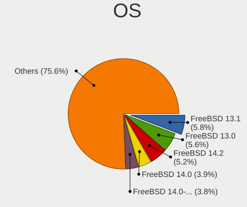

| Name                 | Notebooks | Percent |
|----------------------|-----------|---------|
| FreeBSD 13.1         | 115       | 5.8%    |
| FreeBSD 13.0         | 112       | 5.65%   |
| FreeBSD 14.2         | 104       | 5.24%   |
| FreeBSD 14.0         | 77        | 3.88%   |
| FreeBSD 14.0-CURRENT | 75        | 3.78%   |
| FreeBSD 13.2         | 75        | 3.78%   |
| FreeBSD 14.1         | 62        | 3.13%   |
| FreeBSD 12.2         | 59        | 2.98%   |
| FreeBSD 15.0-CURRENT | 51        | 2.57%   |
| FreeBSD 14.3         | 50        | 2.52%   |
| FreeBSD 13.1-p5      | 41        | 2.07%   |
| FreeBSD 13.0-p4      | 35        | 1.77%   |
| FreeBSD 12.2-p2      | 34        | 1.71%   |
| FreeBSD 13.0-CURRENT | 31        | 1.56%   |
| FreeBSD 14.0-p6      | 30        | 1.51%   |
| FreeBSD 14.1-p5      | 28        | 1.41%   |
| FreeBSD 13.0-STABLE  | 28        | 1.41%   |
| FreeBSD 12.1         | 28        | 1.41%   |
| FreeBSD 14.2-p2      | 27        | 1.36%   |
| FreeBSD 12.1-p8      | 26        | 1.31%   |
| FreeBSD 13.0-p5      | 25        | 1.26%   |
| FreeBSD 13.0-p3      | 23        | 1.16%   |
| FreeBSD 12.2-p4      | 23        | 1.16%   |
| FreeBSD 12.1-p10     | 23        | 1.16%   |
| FreeBSD 13.1-p7      | 22        | 1.11%   |
| FreeBSD 14.0-p4      | 21        | 1.06%   |
| FreeBSD 13.1-p2      | 21        | 1.06%   |
| FreeBSD 15.0         | 20        | 1.01%   |
| FreeBSD 14.0-p5      | 20        | 1.01%   |
| FreeBSD 12.1-p5      | 20        | 1.01%   |
| FreeBSD 14.2-p3      | 19        | 0.96%   |
| FreeBSD 13.0-p7      | 19        | 0.96%   |
| FreeBSD 12.2-p3      | 18        | 0.91%   |
| FreeBSD 14.1-p6      | 17        | 0.86%   |
| FreeBSD 14.1-p2      | 17        | 0.86%   |
| FreeBSD 13.0-p2      | 17        | 0.86%   |
| FreeBSD 14.3-p2      | 16        | 0.81%   |
| FreeBSD 13.1-STABLE  | 15        | 0.76%   |
| FreeBSD 12.1-STABLE  | 15        | 0.76%   |
| FreeBSD 12.1-p7      | 15        | 0.76%   |

OS Family
---------

OS without a version

| Name    | Notebooks | Percent |
|---------|-----------|---------|
| FreeBSD | 1632      | 100%    |

Arch
----

OS architecture (x86_64, i586, etc.)

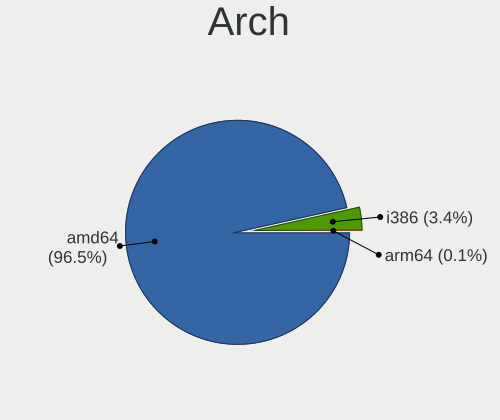

| Name  | Notebooks | Percent |
|-------|-----------|---------|
| amd64 | 1579      | 96.52%  |
| i386  | 56        | 3.42%   |
| arm64 | 1         | 0.06%   |

DE
--

Desktop Environment

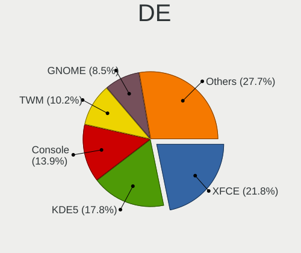

| Name            | Notebooks | Percent |
|-----------------|-----------|---------|
| XFCE            | 383       | 21.8%   |
| KDE5            | 313       | 17.81%  |
| Console         | 244       | 13.89%  |
| TWM             | 180       | 10.24%  |
| GNOME           | 150       | 8.54%   |
| i3              | 108       | 6.15%   |
| MATE            | 102       | 5.81%   |
| Openbox         | 43        | 2.45%   |
| LXQt            | 32        | 1.82%   |
| Cinnamon        | 24        | 1.37%   |
| KDE6            | 21        | 1.2%    |
| KDE             | 21        | 1.2%    |
| AwesomeWM       | 21        | 1.2%    |
| Fluxbox         | 14        | 0.8%    |
| Enlightenment   | 12        | 0.68%   |
| LXDE            | 11        | 0.63%   |
| Picom           | 7         | 0.4%    |
| Hyprland        | 7         | 0.4%    |
| dwm             | 7         | 0.4%    |
| Lumina          | 6         | 0.34%   |
| IceWM           | 5         | 0.28%   |
| wlroots         | 4         | 0.23%   |
| GNUstep         | 4         | 0.23%   |
| Budgie          | 4         | 0.23%   |
| X-Cinnamon      | 3         | 0.17%   |
| Window Maker    | 3         | 0.17%   |
| spectrwm        | 3         | 0.17%   |
| WindowMaker     | 2         | 0.11%   |
| wayfire         | 2         | 0.11%   |
| sway            | 2         | 0.11%   |
| StumpWM         | 2         | 0.11%   |
| Compton         | 2         | 0.11%   |
| CDE             | 2         | 0.11%   |
| Xfwm4           | 1         | 0.06%   |
| Wayfire:wlroots | 1         | 0.06%   |
| sway:wlroots    | 1         | 0.06%   |
| Potato          | 1         | 0.06%   |
| mango           | 1         | 0.06%   |
| labwc:wlroots   | 1         | 0.06%   |
| KDE4            | 1         | 0.06%   |

Display Server
--------------

X11 or Wayland

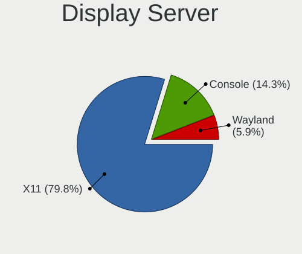

| Name    | Notebooks | Percent |
|---------|-----------|---------|
| X11     | 1336      | 79.76%  |
| Console | 240       | 14.33%  |
| Wayland | 99        | 5.91%   |

Display Manager
---------------

SDDM, LightDM, etc.

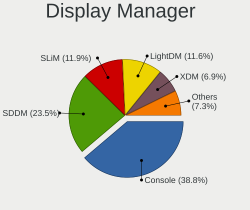

| Name    | Notebooks | Percent |
|---------|-----------|---------|
| Console | 669       | 38.81%  |
| SDDM    | 406       | 23.55%  |
| SLiM    | 205       | 11.89%  |
| LightDM | 200       | 11.6%   |
| XDM     | 119       | 6.9%    |
| GDM     | 84        | 4.87%   |
| Ly      | 36        | 2.09%   |
| WDM     | 3         | 0.17%   |
| PCDM    | 2         | 0.12%   |

OS Lang
-------

Language

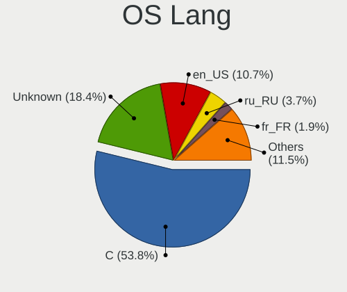

| Lang             | Notebooks | Percent |
|------------------|-----------|---------|
| C                | 919       | 53.81%  |
| Unknown          | 315       | 18.44%  |
| en_US            | 182       | 10.66%  |
| ru_RU            | 63        | 3.69%   |
| fr_FR            | 33        | 1.93%   |
| de_DE            | 31        | 1.81%   |
| en_GB            | 26        | 1.52%   |
| zh_CN            | 18        | 1.05%   |
| es_ES            | 10        | 0.59%   |
| en_CA            | 9         | 0.53%   |
| en_AU            | 8         | 0.47%   |
| pt_BR            | 7         | 0.41%   |
| pl_PL            | 7         | 0.41%   |
| cs_CZ            | 5         | 0.29%   |
| nb_NO            | 4         | 0.23%   |
| es_AR            | 4         | 0.23%   |
| en_US.ISO8859-1  | 4         | 0.23%   |
| en_NZ            | 4         | 0.23%   |
| uk_UA            | 3         | 0.18%   |
| ja_JP            | 3         | 0.18%   |
| it_IT            | 3         | 0.18%   |
| en_US.US-ASCII   | 3         | 0.18%   |
| de_DE.ISO8859-1  | 3         | 0.18%   |
| de_CH            | 3         | 0.18%   |
| ko_KR            | 2         | 0.12%   |
| fi_FI            | 2         | 0.12%   |
| es_MX            | 2         | 0.12%   |
| en_SG            | 2         | 0.12%   |
| en_IE            | 2         | 0.12%   |
| de_DE.ISO8859-15 | 2         | 0.12%   |
| de               | 2         | 0.12%   |
| zh_TW            | 1         | 0.06%   |
| zh_CN.GB2312     | 1         | 0.06%   |
| tr_TR            | 1         | 0.06%   |
| sl_SI            | 1         | 0.06%   |
| ru               | 1         | 0.06%   |
| pt_PT            | 1         | 0.06%   |
| POSIX            | 1         | 0.06%   |
| nl_NL            | 1         | 0.06%   |
| it_IT.ISO8859-15 | 1         | 0.06%   |

Boot Mode
---------

EFI or BIOS

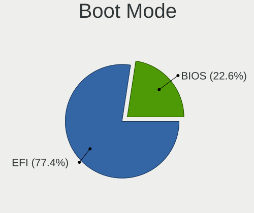

| Mode | Notebooks | Percent |
|------|-----------|---------|
| EFI  | 1272      | 77.42%  |
| BIOS | 371       | 22.58%  |

Filesystem
----------

Type of filesystem

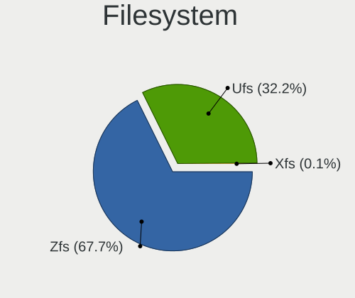

| Type | Notebooks | Percent |
|------|-----------|---------|
| Zfs  | 1125      | 67.69%  |
| Ufs  | 535       | 32.19%  |
| Xfs  | 1         | 0.06%   |
| Nfs  | 1         | 0.06%   |

Part. scheme
------------

Scheme of partitioning

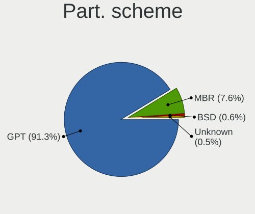

| Type    | Notebooks | Percent |
|---------|-----------|---------|
| GPT     | 1499      | 91.29%  |
| MBR     | 124       | 7.55%   |
| BSD     | 10        | 0.61%   |
| Unknown | 9         | 0.55%   |

Board
-----

Vendor
------

Motherboard manufacturer

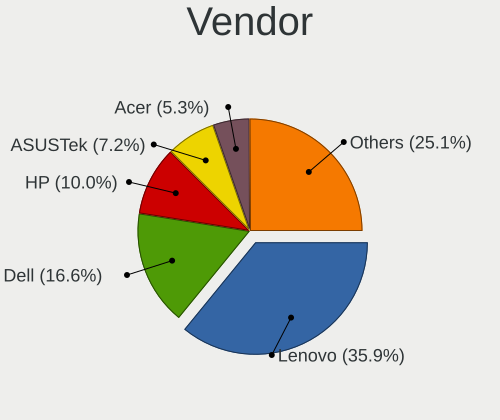

| Name                   | Notebooks | Percent |
|------------------------|-----------|---------|
| Lenovo                 | 586       | 35.91%  |
| Dell                   | 271       | 16.61%  |
| Hewlett-Packard        | 163       | 9.99%   |
| ASUSTek Computer       | 117       | 7.17%   |
| Acer                   | 86        | 5.27%   |
| Apple                  | 61        | 3.74%   |
| Toshiba                | 28        | 1.72%   |
| MSI                    | 25        | 1.53%   |
| Samsung Electronics    | 23        | 1.41%   |
| Google                 | 21        | 1.29%   |
| Framework              | 20        | 1.23%   |
| HUAWEI                 | 18        | 1.1%    |
| Sony                   | 17        | 1.04%   |
| System76               | 16        | 0.98%   |
| Unknown                | 13        | 0.8%    |
| TUXEDO                 | 11        | 0.67%   |
| Fujitsu                | 11        | 0.67%   |
| Panasonic              | 9         | 0.55%   |
| Alienware              | 9         | 0.55%   |
| Notebook               | 8         | 0.49%   |
| Gigabyte Technology    | 8         | 0.49%   |
| LG Electronics         | 6         | 0.37%   |
| IBM                    | 6         | 0.37%   |
| Timi                   | 5         | 0.31%   |
| Razer                  | 4         | 0.25%   |
| Intel                  | 4         | 0.25%   |
| GPD                    | 4         | 0.25%   |
| Gateway                | 4         | 0.25%   |
| Deciso                 | 4         | 0.25%   |
| Valve                  | 3         | 0.18%   |
| Schenker               | 3         | 0.18%   |
| Medion                 | 3         | 0.18%   |
| F-Plus Mobile          | 3         | 0.18%   |
| Clevo                  | 3         | 0.18%   |
| Avell High Performance | 3         | 0.18%   |
| SLIMBOOK               | 2         | 0.12%   |
| PC Specialist          | 2         | 0.12%   |
| IP3 Technology         | 2         | 0.12%   |
| Infinix                | 2         | 0.12%   |
| ICL                    | 2         | 0.12%   |

Model
-----

Motherboard model

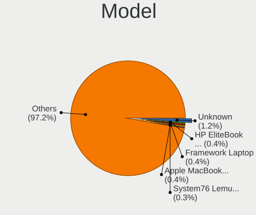

| Name                                     | Notebooks | Percent |
|------------------------------------------|-----------|---------|
| Unknown                                  | 20        | 1.23%   |
| HP EliteBook 840 G3                      | 7         | 0.43%   |
| Framework Laptop                         | 7         | 0.43%   |
| Apple MacBookAir6,2                      | 6         | 0.37%   |
| System76 Lemur Pro                       | 5         | 0.31%   |
| Framework Laptop (13th Gen Intel Core)   | 5         | 0.31%   |
| Dell XPS 13 9360                         | 5         | 0.31%   |
| Dell Latitude E7240                      | 5         | 0.31%   |
| Dell Latitude E6430                      | 5         | 0.31%   |
| Apple MacBookPro6,2                      | 5         | 0.31%   |
| Apple MacBookPro11,1                     | 5         | 0.31%   |
| HP Laptop 15-bs0xx                       | 4         | 0.25%   |
| HP EliteBook 8570p                       | 4         | 0.25%   |
| Dell XPS 13 9343                         | 4         | 0.25%   |
| Dell Precision M4800                     | 4         | 0.25%   |
| Dell Precision 5510                      | 4         | 0.25%   |
| Dell Latitude E7450                      | 4         | 0.25%   |
| Dell Latitude E6420                      | 4         | 0.25%   |
| Dell Latitude E6400                      | 4         | 0.25%   |
| Dell Inspiron 3542                       | 4         | 0.25%   |
| Dell Inspiron 3521                       | 4         | 0.25%   |
| Dell Inspiron 15 7000 Gaming             | 4         | 0.25%   |
| Apple MacBookPro11,4                     | 4         | 0.25%   |
| Valve Jupiter                            | 3         | 0.18%   |
| TUXEDO Pulse 15 Gen1                     | 3         | 0.18%   |
| Lenovo ThinkPad X1 Carbon 6th 20KHCTO1WW | 3         | 0.18%   |
| Lenovo ThinkPad T490 20N2CTO1WW          | 3         | 0.18%   |
| Lenovo ThinkPad P14s Gen 1 20Y1CTO1WW    | 3         | 0.18%   |
| Lenovo ThinkPad E490 20N8CTO1WW          | 3         | 0.18%   |
| Lenovo Legion Y540-15IRH-PG0 81SY        | 3         | 0.18%   |
| Lenovo IdeaPad 330-15ARR 81D2            | 3         | 0.18%   |
| HUAWEI MRGFG-XX                          | 3         | 0.18%   |
| HUAWEI MACH-WX9                          | 3         | 0.18%   |
| HP ProBook 430 G2                        | 3         | 0.18%   |
| HP EliteBook 840 G7 Notebook PC          | 3         | 0.18%   |
| HP EliteBook 840 G6                      | 3         | 0.18%   |
| Google Peppy                             | 3         | 0.18%   |
| F-Plus Mobile FLAPTOP r                  | 3         | 0.18%   |
| Dell Vostro 3550                         | 3         | 0.18%   |
| Dell Precision 7560                      | 3         | 0.18%   |

Model Family
------------

Motherboard model prefix

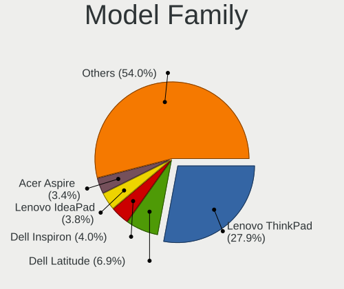

| Name               | Notebooks | Percent |
|--------------------|-----------|---------|
| Lenovo ThinkPad    | 456       | 27.94%  |
| Dell Latitude      | 113       | 6.92%   |
| Dell Inspiron      | 65        | 3.98%   |
| Lenovo IdeaPad     | 62        | 3.8%    |
| Acer Aspire        | 55        | 3.37%   |
| HP EliteBook       | 38        | 2.33%   |
| Dell Precision     | 36        | 2.21%   |
| HP ProBook         | 32        | 1.96%   |
| HP Laptop          | 29        | 1.78%   |
| Dell XPS           | 24        | 1.47%   |
| Toshiba Satellite  | 21        | 1.29%   |
| Framework Laptop   | 20        | 1.23%   |
| Unknown            | 20        | 1.23%   |
| ASUS VivoBook      | 19        | 1.16%   |
| Lenovo Legion      | 18        | 1.1%    |
| Dell Vostro        | 17        | 1.04%   |
| Lenovo ThinkBook   | 16        | 0.98%   |
| HP Pavilion        | 16        | 0.98%   |
| ASUS ASUS          | 13        | 0.8%    |
| HP Compaq          | 10        | 0.61%   |
| Apple MacBookPro11 | 10        | 0.61%   |
| Fujitsu LIFEBOOK   | 9         | 0.55%   |
| ASUS ZenBook       | 9         | 0.55%   |
| Acer TravelMate    | 9         | 0.55%   |
| Apple MacBookPro8  | 8         | 0.49%   |
| HP ZBook           | 7         | 0.43%   |
| Apple MacBookAir6  | 7         | 0.43%   |
| TUXEDO Pulse       | 6         | 0.37%   |
| MSI Modern         | 6         | 0.37%   |
| IBM ThinkPad       | 6         | 0.37%   |
| HP ENVY            | 6         | 0.37%   |
| Acer Swift         | 6         | 0.37%   |
| System76 Lemur     | 5         | 0.31%   |
| Dell Studio        | 5         | 0.31%   |
| ASUS ROG           | 5         | 0.31%   |
| Apple MacBookPro6  | 5         | 0.31%   |
| Acer Nitro         | 5         | 0.31%   |
| Razer Blade        | 4         | 0.25%   |
| Lenovo Yoga        | 4         | 0.25%   |
| HP Stream          | 4         | 0.25%   |

MFG Year
--------

Motherboard manufacture year

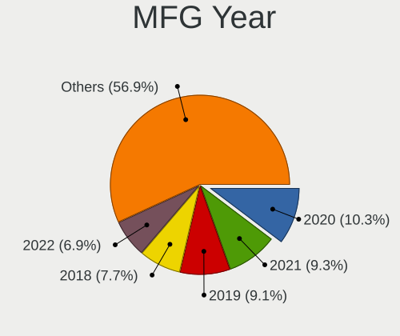

| Year | Notebooks | Percent |
|------|-----------|---------|
| 2020 | 168       | 10.29%  |
| 2021 | 151       | 9.25%   |
| 2019 | 148       | 9.07%   |
| 2018 | 125       | 7.66%   |
| 2022 | 112       | 6.86%   |
| 2011 | 108       | 6.62%   |
| 2023 | 92        | 5.64%   |
| 2012 | 91        | 5.58%   |
| 2017 | 85        | 5.21%   |
| 2016 | 85        | 5.21%   |
| 2015 | 85        | 5.21%   |
| 2013 | 83        | 5.09%   |
| 2024 | 62        | 3.8%    |
| 2010 | 56        | 3.43%   |
| 2014 | 54        | 3.31%   |
| 2009 | 36        | 2.21%   |
| 2008 | 36        | 2.21%   |
| 2007 | 19        | 1.16%   |
| 2025 | 14        | 0.86%   |
| 2006 | 11        | 0.67%   |
| 2005 | 4         | 0.25%   |
| 2003 | 3         | 0.18%   |
| 2004 | 2         | 0.12%   |
| 2002 | 2         | 0.12%   |

Form Factor
-----------

Physical design of the computer

| Name     | Notebooks | Percent |
|----------|-----------|---------|
| Notebook | 1632      | 100%    |

Coreboot
--------

Have coreboot on board

| Used | Notebooks | Percent |
|------|-----------|---------|
| No   | 1597      | 97.86%  |
| Yes  | 35        | 2.14%   |

RAM Size
--------

Total RAM memory

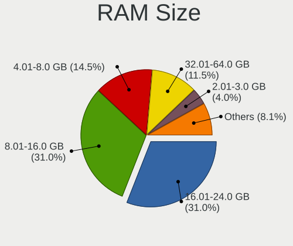

| Size in GB  | Notebooks | Percent |
|-------------|-----------|---------|
| 16.01-24.0  | 514       | 30.96%  |
| 8.01-16.0   | 514       | 30.96%  |
| 4.01-8.0    | 240       | 14.46%  |
| 32.01-64.0  | 191       | 11.51%  |
| 2.01-3.0    | 67        | 4.04%   |
| 64.01-256.0 | 51        | 3.07%   |
| 24.01-32.0  | 33        | 1.99%   |
| 3.01-4.0    | 23        | 1.39%   |
| 0.51-1.0    | 14        | 0.84%   |
| 1.01-2.0    | 9         | 0.54%   |
| 0.01-0.5    | 4         | 0.24%   |

RAM Used
--------

Used RAM memory

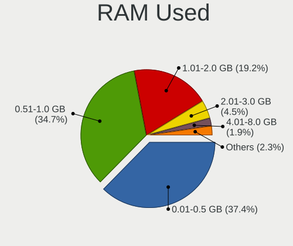

| Used GB    | Notebooks | Percent |
|------------|-----------|---------|
| 0.01-0.5   | 623       | 37.35%  |
| 0.51-1.0   | 578       | 34.65%  |
| 1.01-2.0   | 321       | 19.24%  |
| 2.01-3.0   | 75        | 4.5%    |
| 4.01-8.0   | 32        | 1.92%   |
| 8.01-16.0  | 14        | 0.84%   |
| 3.01-4.0   | 13        | 0.78%   |
| 16.01-24.0 | 4         | 0.24%   |
| 24.01-32.0 | 3         | 0.18%   |
| 0          | 3         | 0.18%   |
| 32.01-64.0 | 2         | 0.12%   |

Total Drives
------------

Number of drives on board

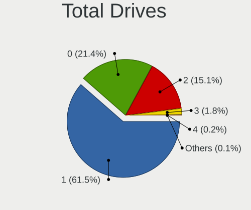

| Drives | Notebooks | Percent |
|--------|-----------|---------|
| 1      | 1037      | 61.47%  |
| 0      | 361       | 21.4%   |
| 2      | 254       | 15.06%  |
| 3      | 31        | 1.84%   |
| 4      | 3         | 0.18%   |
| 58     | 1         | 0.06%   |

Has CD-ROM
----------

Has CD-ROM on board

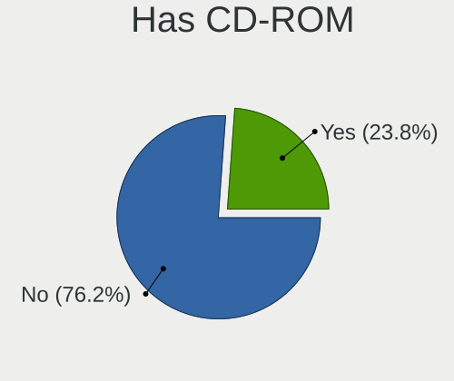

| Presented | Notebooks | Percent |
|-----------|-----------|---------|
| No        | 1252      | 76.16%  |
| Yes       | 392       | 23.84%  |

Has Ethernet
------------

Has Ethernet on board

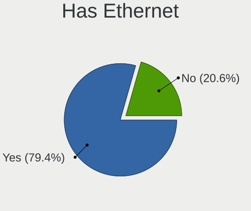

| Presented | Notebooks | Percent |
|-----------|-----------|---------|
| Yes       | 1296      | 79.41%  |
| No        | 336       | 20.59%  |

Has WiFi
--------

Has WiFi module

| Presented | Notebooks | Percent |
|-----------|-----------|---------|
| Yes       | 1600      | 97.74%  |
| No        | 37        | 2.26%   |

Has Bluetooth
-------------

Has Bluetooth module

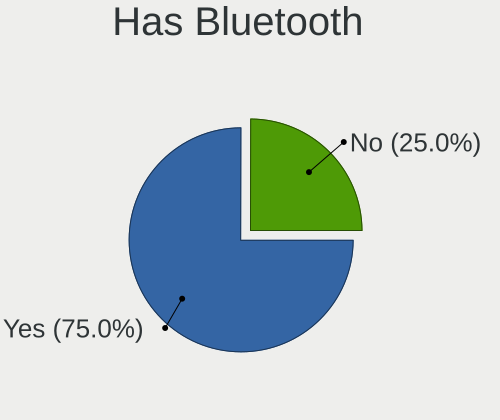

| Presented | Notebooks | Percent |
|-----------|-----------|---------|
| Yes       | 1241      | 75.03%  |
| No        | 413       | 24.97%  |

Location
--------

Country
-------

Geographic location (country)

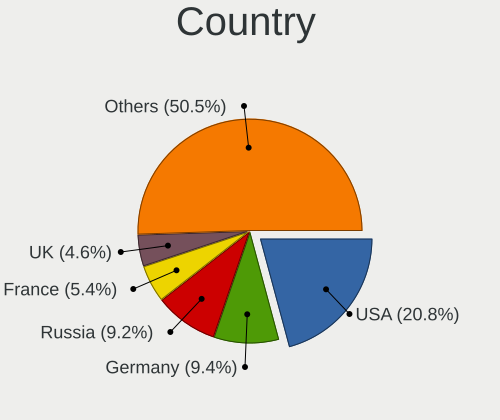

| Country     | Notebooks | Percent |
|-------------|-----------|---------|
| USA         | 345       | 20.82%  |
| Germany     | 156       | 9.41%   |
| Russia      | 153       | 9.23%   |
| France      | 90        | 5.43%   |
| UK          | 76        | 4.59%   |
| China       | 52        | 3.14%   |
| Canada      | 51        | 3.08%   |
| Brazil      | 43        | 2.6%    |
| Poland      | 41        | 2.47%   |
| Australia   | 40        | 2.41%   |
| Spain       | 39        | 2.35%   |
| Netherlands | 32        | 1.93%   |
| India       | 32        | 1.93%   |
| Switzerland | 28        | 1.69%   |
| Ukraine     | 23        | 1.39%   |
| Sweden      | 23        | 1.39%   |
| Italy       | 23        | 1.39%   |
| Austria     | 23        | 1.39%   |
| Indonesia   | 20        | 1.21%   |
| Czechia     | 20        | 1.21%   |
| Argentina   | 20        | 1.21%   |
| Mexico      | 19        | 1.15%   |
| Romania     | 15        | 0.91%   |
| Japan       | 15        | 0.91%   |
| Finland     | 13        | 0.78%   |
| Turkey      | 12        | 0.72%   |
| Hungary     | 11        | 0.66%   |
| Bulgaria    | 11        | 0.66%   |
| Vietnam     | 10        | 0.6%    |
| Portugal    | 10        | 0.6%    |
| Denmark     | 10        | 0.6%    |
| New Zealand | 9         | 0.54%   |
| Belgium     | 9         | 0.54%   |
| Algeria     | 9         | 0.54%   |
| Thailand    | 8         | 0.48%   |
| Ireland     | 8         | 0.48%   |
| Iran        | 8         | 0.48%   |
| Philippines | 7         | 0.42%   |
| Greece      | 7         | 0.42%   |
| Croatia     | 7         | 0.42%   |

City
----

Geographic location (city)

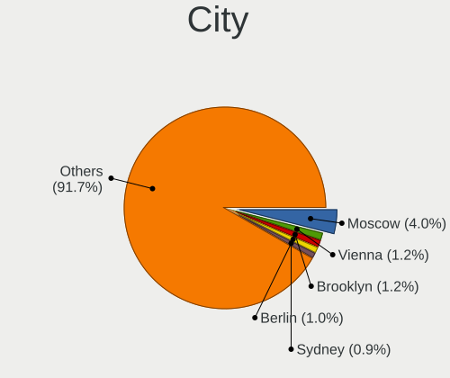

| City          | Notebooks | Percent |
|---------------|-----------|---------|
| Moscow        | 71        | 3.97%   |
| Vienna        | 22        | 1.23%   |
| Brooklyn      | 21        | 1.17%   |
| Berlin        | 18        | 1.01%   |
| Sydney        | 16        | 0.89%   |
| St Petersburg | 14        | 0.78%   |
| Paris         | 13        | 0.73%   |
| Zurich        | 12        | 0.67%   |
| Seattle       | 12        | 0.67%   |
| Amsterdam     | 11        | 0.61%   |
| Kyiv          | 10        | 0.56%   |
| Warsaw        | 9         | 0.5%    |
| Brighton      | 9         | 0.5%    |
| London        | 8         | 0.45%   |
| Jakarta       | 8         | 0.45%   |
| Stockholm     | 7         | 0.39%   |
| Shanghai      | 7         | 0.39%   |
| Portland      | 7         | 0.39%   |
| Munich        | 7         | 0.39%   |
| Montreal      | 7         | 0.39%   |
| Melbourne     | 7         | 0.39%   |
| Dublin        | 7         | 0.39%   |
| Colombes      | 7         | 0.39%   |
| Bucharest     | 7         | 0.39%   |
| Sao Paulo     | 6         | 0.34%   |
| Perth         | 6         | 0.34%   |
| Nuremberg     | 6         | 0.34%   |
| New York      | 6         | 0.34%   |
| Mumbai        | 6         | 0.34%   |
| Milan         | 6         | 0.34%   |
| Istanbul      | 6         | 0.34%   |
| Helsinki      | 6         | 0.34%   |
| Concord       | 6         | 0.34%   |
| Chicago       | 6         | 0.34%   |
| Barcelona     | 6         | 0.34%   |
| Zagreb        | 5         | 0.28%   |
| Yekaterinburg | 5         | 0.28%   |
| Tehran        | 5         | 0.28%   |
| Sofia         | 5         | 0.28%   |
| San José     | 5         | 0.28%   |

Drives
------

Drive Vendor
------------

Hard drive vendors

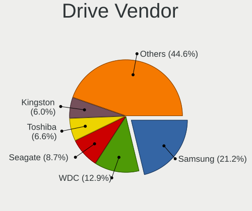

| Vendor              | Notebooks | Drives | Percent |
|---------------------|-----------|--------|---------|
| Samsung Electronics | 336       | 462    | 21.24%  |
| WDC                 | 204       | 270    | 12.9%   |
| Seagate             | 137       | 177    | 8.66%   |
| Toshiba             | 104       | 157    | 6.57%   |
| Kingston            | 95        | 131    | 6.01%   |
| Crucial             | 90        | 130    | 5.69%   |
| SanDisk             | 69        | 91     | 4.36%   |
| Intel               | 55        | 70     | 3.48%   |
| Hitachi             | 53        | 69     | 3.35%   |
| SK hynix            | 44        | 50     | 2.78%   |
| HGST                | 35        | 112    | 2.21%   |
| Transcend           | 30        | 36     | 1.9%    |
| Micron Technology   | 29        | 36     | 1.83%   |
| Apple               | 28        | 30     | 1.77%   |
| A-DATA Technology   | 26        | 32     | 1.64%   |
| KIOXIA              | 16        | 16     | 1.01%   |
| Fujitsu             | 14        | 20     | 0.88%   |
| SPCC                | 12        | 15     | 0.76%   |
| Gigabyte Technology | 12        | 16     | 0.76%   |
| PNY                 | 11        | 13     | 0.7%    |
| LITEON              | 11        | 17     | 0.7%    |
| Phison              | 10        | 16     | 0.63%   |
| KingSpec            | 9         | 12     | 0.57%   |
| Hewlett-Packard     | 8         | 9      | 0.51%   |
| SSSTC               | 7         | 9      | 0.44%   |
| OWC                 | 7         | 8      | 0.44%   |
| Silicon Motion      | 6         | 7      | 0.38%   |
| Lenovo              | 6         | 7      | 0.38%   |
| China               | 6         | 7      | 0.38%   |
| Apacer              | 6         | 7      | 0.38%   |
| UMIS                | 5         | 5      | 0.32%   |
| Intenso             | 5         | 6      | 0.32%   |
| BIWIN               | 5         | 6      | 0.32%   |
| OCZ                 | 4         | 5      | 0.25%   |
| Mushkin             | 4         | 4      | 0.25%   |
| Hikvision           | 4         | 5      | 0.25%   |
| FORESEE             | 4         | 4      | 0.25%   |
| Corsair             | 4         | 6      | 0.25%   |
| V-GeN               | 3         | 6      | 0.19%   |
| Union Memory        | 3         | 3      | 0.19%   |

Drive Model
-----------

Hard drive models

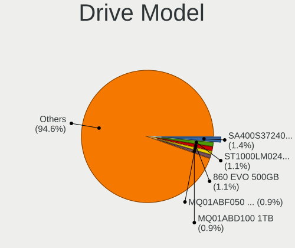

| Model                                | Notebooks | Percent |
|--------------------------------------|-----------|---------|
| Kingston SA400S37240G 240GB          | 23        | 1.4%    |
| Seagate ST1000LM024 HN-M101MBB 1TB   | 18        | 1.09%   |
| Samsung SSD 860 EVO 500GB            | 18        | 1.09%   |
| Toshiba MQ01ABF050 500GB             | 15        | 0.91%   |
| Toshiba MQ01ABD100 1TB               | 15        | 0.91%   |
| Seagate ST1000LM035-1RK172 1TB       | 15        | 0.91%   |
| HGST HTS721010A9E630 1TB             | 15        | 0.91%   |
| Crucial CT500MX500SSD1 500GB         | 15        | 0.91%   |
| Seagate ST500LT012-1DG142 500GB      | 12        | 0.73%   |
| Samsung SSD 850 EVO 500GB            | 12        | 0.73%   |
| Samsung SSD 850 EVO 250GB            | 10        | 0.61%   |
| Crucial CT1000MX500SSD1 1TB          | 10        | 0.61%   |
| Samsung SSD 970 EVO 500GB            | 9         | 0.55%   |
| Samsung SSD 870 EVO 1TB              | 9         | 0.55%   |
| Samsung SSD 860 EVO 250GB            | 9         | 0.55%   |
| HGST HTS725050A7E630 500GB           | 9         | 0.55%   |
| Toshiba MQ04ABF100 1TB               | 8         | 0.49%   |
| Samsung SSD 970 EVO Plus 1TB         | 8         | 0.49%   |
| Hitachi HTS547550A9E384 500GB        | 8         | 0.49%   |
| Crucial CT240BX500SSD1 240GB         | 8         | 0.49%   |
| WDC PC SN730 SDBQNTY-1T00-1001 1TB   | 7         | 0.43%   |
| Seagate ST500LM021-1KJ152 500GB      | 7         | 0.43%   |
| SanDisk SSD PLUS 240GB               | 7         | 0.43%   |
| Samsung SSD 980 1TB                  | 7         | 0.43%   |
| WDC PC SN730 SDBQNTY-256G-1001 256GB | 6         | 0.36%   |
| Seagate ST9500325AS 500GB            | 6         | 0.36%   |
| Seagate ST2000LM003 HN-M201RAD 2TB   | 6         | 0.36%   |
| Samsung SSD 850 PRO 256GB            | 6         | 0.36%   |
| Samsung MZVLW256HEHP-000L7 256GB     | 6         | 0.36%   |
| Samsung MZVLB512HAJQ-000L7 512GB     | 6         | 0.36%   |
| Samsung MZVLB1T0HBLR-000L2 1TB       | 6         | 0.36%   |
| Kingston SA400S37120G 120GB          | 6         | 0.36%   |
| Intel SSDPEKKF512G8L 512GB           | 6         | 0.36%   |
| Intel SSDPEKKF256G8L 256GB           | 6         | 0.36%   |
| Crucial CT2000MX500SSD1 2TB          | 6         | 0.36%   |
| Apple SSD SD0128F 121GB              | 6         | 0.36%   |
| WDC WDS500G3X0C-00SJG0 500GB         | 5         | 0.3%    |
| WDC WDS500G2B0A-00SM50 500GB         | 5         | 0.3%    |
| WDC WDS240G2G0A-00JH30 240GB         | 5         | 0.3%    |
| WDC WD1600BEVT-22ZCT0 160GB          | 5         | 0.3%    |

HDD Vendor
----------

Hard disk drive vendors

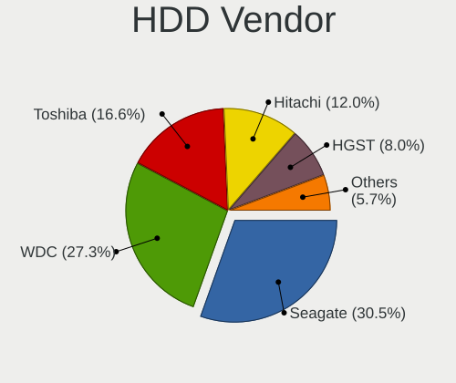

| Vendor              | Notebooks | Drives | Percent |
|---------------------|-----------|--------|---------|
| Seagate             | 134       | 174    | 30.45%  |
| WDC                 | 120       | 145    | 27.27%  |
| Toshiba             | 73        | 107    | 16.59%  |
| Hitachi             | 53        | 69     | 12.05%  |
| HGST                | 35        | 112    | 7.95%   |
| Fujitsu             | 14        | 20     | 3.18%   |
| Samsung Electronics | 8         | 8      | 1.82%   |
| IBM/Hitachi         | 1         | 1      | 0.23%   |
| HPE                 | 1         | 5      | 0.23%   |
| Apple               | 1         | 1      | 0.23%   |

SSD Vendor
----------

Solid state drive vendors

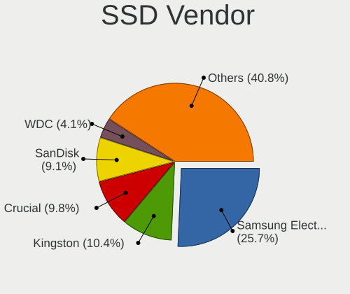

| Vendor              | Notebooks | Drives | Percent |
|---------------------|-----------|--------|---------|
| Samsung Electronics | 192       | 262    | 25.7%   |
| Kingston            | 78        | 111    | 10.44%  |
| Crucial             | 73        | 104    | 9.77%   |
| SanDisk             | 68        | 90     | 9.1%    |
| WDC                 | 31        | 53     | 4.15%   |
| Intel               | 31        | 43     | 4.15%   |
| Transcend           | 27        | 32     | 3.61%   |
| Apple               | 27        | 29     | 3.61%   |
| SK hynix            | 19        | 20     | 2.54%   |
| A-DATA Technology   | 16        | 20     | 2.14%   |
| Micron Technology   | 15        | 19     | 2.01%   |
| Toshiba             | 12        | 15     | 1.61%   |
| SPCC                | 10        | 12     | 1.34%   |
| LITEON              | 10        | 16     | 1.34%   |
| PNY                 | 9         | 11     | 1.2%    |
| KingSpec            | 9         | 12     | 1.2%    |
| Gigabyte Technology | 9         | 11     | 1.2%    |
| OWC                 | 7         | 8      | 0.94%   |
| Hewlett-Packard     | 7         | 8      | 0.94%   |
| China               | 6         | 7      | 0.8%    |
| Apacer              | 6         | 7      | 0.8%    |
| Intenso             | 5         | 6      | 0.67%   |
| OCZ                 | 4         | 5      | 0.54%   |
| Lenovo              | 4         | 5      | 0.54%   |
| Corsair             | 4         | 6      | 0.54%   |
| BIWIN               | 4         | 5      | 0.54%   |
| Team                | 3         | 4      | 0.4%    |
| Seagate             | 3         | 3      | 0.4%    |
| Patriot             | 3         | 4      | 0.4%    |
| Netac               | 3         | 3      | 0.4%    |
| Mushkin             | 3         | 3      | 0.4%    |
| Lexar               | 3         | 10     | 0.4%    |
| Fanxiang            | 3         | 4      | 0.4%    |
| Zheino              | 2         | 3      | 0.27%   |
| Verbatim            | 2         | 2      | 0.27%   |
| V-GeN               | 2         | 5      | 0.27%   |
| MidasForce          | 2         | 2      | 0.27%   |
| LITEONIT            | 2         | 2      | 0.27%   |
| Integral            | 2         | 2      | 0.27%   |
| Hikvision           | 2         | 3      | 0.27%   |

Drive Kind
----------

HDD or SSD

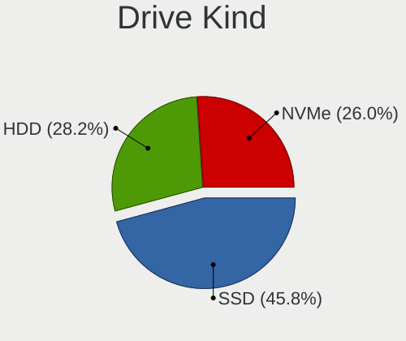

| Kind | Notebooks | Drives | Percent |
|------|-----------|--------|---------|
| SSD  | 668       | 998    | 45.78%  |
| HDD  | 411       | 642    | 28.17%  |
| NVMe | 380       | 524    | 26.05%  |

Drive Connector
---------------

SATA, SAS, NVMe, etc.

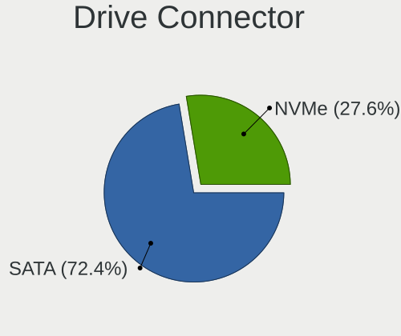

| Type | Notebooks | Drives | Percent |
|------|-----------|--------|---------|
| SATA | 997       | 1640   | 72.4%   |
| NVMe | 380       | 524    | 27.6%   |

Drive Size
----------

Size of hard drive

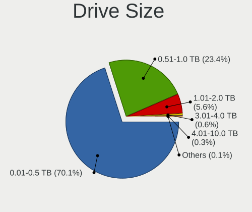

| Size in TB | Notebooks | Drives | Percent |
|------------|-----------|--------|---------|
| 0.01-0.5   | 763       | 1107   | 70.06%  |
| 0.51-1.0   | 255       | 395    | 23.42%  |
| 1.01-2.0   | 61        | 79     | 5.6%    |
| 3.01-4.0   | 6         | 54     | 0.55%   |
| 4.01-10.0  | 3         | 3      | 0.28%   |
| 2.01-3.0   | 1         | 2      | 0.09%   |

Space Total
-----------

Amount of disk space available on the file system

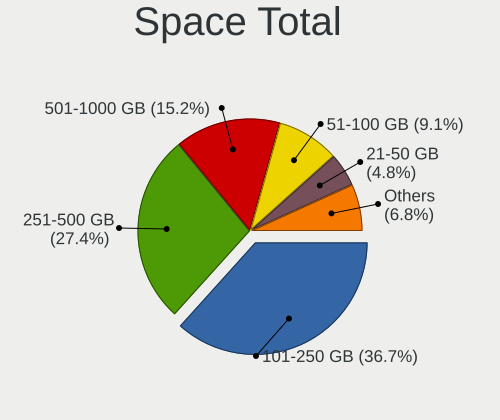

| Size in GB     | Notebooks | Percent |
|----------------|-----------|---------|
| 101-250        | 628       | 36.68%  |
| 251-500        | 469       | 27.39%  |
| 501-1000       | 261       | 15.25%  |
| 51-100         | 155       | 9.05%   |
| 21-50          | 83        | 4.85%   |
| 1001-2000      | 62        | 3.62%   |
| 1-20           | 38        | 2.22%   |
| More than 3000 | 6         | 0.35%   |
| 2001-3000      | 5         | 0.29%   |
| Unknown        | 5         | 0.29%   |

Space Used
----------

Amount of used disk space

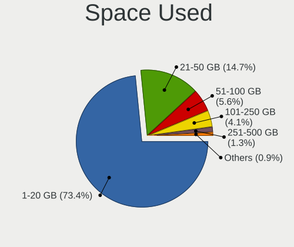

| Used GB        | Notebooks | Percent |
|----------------|-----------|---------|
| 1-20           | 1263      | 73.43%  |
| 21-50          | 253       | 14.71%  |
| 51-100         | 96        | 5.58%   |
| 101-250        | 70        | 4.07%   |
| 251-500        | 22        | 1.28%   |
| 501-1000       | 9         | 0.52%   |
| Unknown        | 5         | 0.29%   |
| More than 3000 | 1         | 0.06%   |
| 1001-2000      | 1         | 0.06%   |

Malfunc. Drives
---------------

Drive models with a malfunction

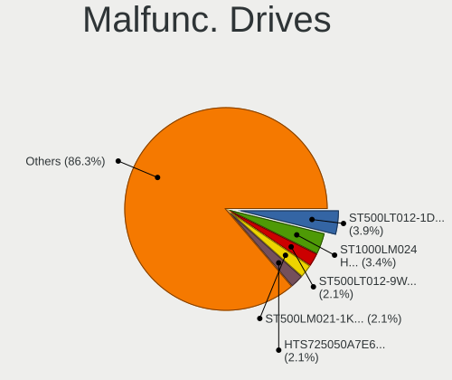

| Model                               | Notebooks | Drives | Percent |
|-------------------------------------|-----------|--------|---------|
| Seagate ST500LT012-1DG142 500GB     | 9         | 10     | 3.86%   |
| Seagate ST1000LM024 HN-M101MBB 1TB  | 8         | 9      | 3.43%   |
| Seagate ST500LT012-9WS142 500GB     | 5         | 8      | 2.15%   |
| Seagate ST500LM021-1KJ152 500GB     | 5         | 7      | 2.15%   |
| HGST HTS725050A7E630 500GB          | 5         | 9      | 2.15%   |
| Toshiba MQ01ABF050 500GB            | 4         | 4      | 1.72%   |
| Toshiba MQ01ABD100 1TB              | 4         | 4      | 1.72%   |
| Seagate ST9250315AS 250GB           | 4         | 5      | 1.72%   |
| Seagate ST320LT007-9ZV142 320GB     | 4         | 4      | 1.72%   |
| Hitachi HTS547550A9E384 500GB       | 4         | 5      | 1.72%   |
| HGST HTS721010A9E630 1TB            | 4         | 27     | 1.72%   |
| Seagate ST9500420AS 500GB           | 3         | 5      | 1.29%   |
| Seagate ST9500325AS 500GB           | 3         | 6      | 1.29%   |
| Seagate ST2000LM003 HN-M201RAD 2TB  | 3         | 3      | 1.29%   |
| Micron Technology 1100 SATA 256GB   | 3         | 3      | 1.29%   |
| Kingston SV300S37A120G 120GB        | 3         | 5      | 1.29%   |
| Intel SSDSCKKF256G8H 256GB          | 3         | 6      | 1.29%   |
| WDC WD5000LPCX-60VHAT0 500GB        | 2         | 2      | 0.86%   |
| WDC WD3200BPVT-80JJ5T0 320GB        | 2         | 2      | 0.86%   |
| WDC WD3200BPVT-75JJ5T0 320GB        | 2         | 2      | 0.86%   |
| Toshiba MK2546GSX 250GB             | 2         | 2      | 0.86%   |
| Seagate ST9320325AS 320GB           | 2         | 2      | 0.86%   |
| Seagate ST1000LM035-1RK172 1TB      | 2         | 2      | 0.86%   |
| Seagate ST1000LM014-1EJ164 1TB      | 2         | 2      | 0.86%   |
| SanDisk SSD PLUS 480GB              | 2         | 2      | 0.86%   |
| Samsung Electronics SSD 870 EVO 1TB | 2         | 2      | 0.86%   |
| Kingston SNS4151S316GD 16GB         | 2         | 2      | 0.86%   |
| Hitachi HTS545032B9A300 320GB       | 2         | 3      | 0.86%   |
| Hitachi HTS541612J9SA00 120GB       | 2         | 2      | 0.86%   |
| Fujitsu MHZ2160BH G2 160GB          | 2         | 2      | 0.86%   |
| XrayDisk SSD 256GB                  | 1         | 1      | 0.43%   |
| WDC WDS240G2G0B-00EPW0 240GB        | 1         | 1      | 0.43%   |
| WDC WDS240G2G0A-00JH30 240GB        | 1         | 1      | 0.43%   |
| WDC WDS120G2G0B-00EPW0 120GB        | 1         | 1      | 0.43%   |
| WDC WD7500BPVT-80HXZT3 752GB        | 1         | 1      | 0.43%   |
| WDC WD7500BPKX-60HPJT0 752GB        | 1         | 1      | 0.43%   |
| WDC WD7500BPKT-75PK4T0 752GB        | 1         | 1      | 0.43%   |
| WDC WD6400BEVT-22A0RT0 640GB        | 1         | 1      | 0.43%   |
| WDC WD5000LPLX-60ZNTT1 500GB        | 1         | 1      | 0.43%   |
| WDC WD5000BEVT-75A0RT0 500GB        | 1         | 1      | 0.43%   |

Malfunc. Drive Vendor
---------------------

Vendors of faulty drives

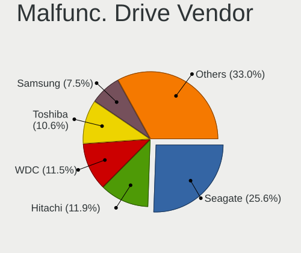

| Vendor              | Notebooks | Drives | Percent |
|---------------------|-----------|--------|---------|
| Seagate             | 58        | 77     | 25.55%  |
| Hitachi             | 27        | 38     | 11.89%  |
| WDC                 | 26        | 28     | 11.45%  |
| Toshiba             | 24        | 32     | 10.57%  |
| Samsung Electronics | 17        | 18     | 7.49%   |
| Kingston            | 14        | 18     | 6.17%   |
| Intel               | 10        | 14     | 4.41%   |
| HGST                | 10        | 40     | 4.41%   |
| Micron Technology   | 6         | 6      | 2.64%   |
| SanDisk             | 5         | 5      | 2.2%    |
| Fujitsu             | 5         | 9      | 2.2%    |
| Apple               | 4         | 4      | 1.76%   |
| SK hynix            | 3         | 3      | 1.32%   |
| Crucial             | 3         | 3      | 1.32%   |
| A-DATA Technology   | 2         | 3      | 0.88%   |
| XrayDisk            | 1         | 1      | 0.44%   |
| Transcend           | 1         | 1      | 0.44%   |
| SSSTC               | 1         | 1      | 0.44%   |
| SMI                 | 1         | 1      | 0.44%   |
| OCZ                 | 1         | 1      | 0.44%   |
| Netac               | 1         | 1      | 0.44%   |
| LITEONIT            | 1         | 1      | 0.44%   |
| LITEON              | 1         | 1      | 0.44%   |
| Lenovo              | 1         | 1      | 0.44%   |
| IBM/Hitachi         | 1         | 1      | 0.44%   |
| Hewlett-Packard     | 1         | 1      | 0.44%   |
| Fanxiang            | 1         | 1      | 0.44%   |
| Eluktro             | 1         | 2      | 0.44%   |

Malfunc. HDD Vendor
-------------------

Vendors of faulty HDD drives

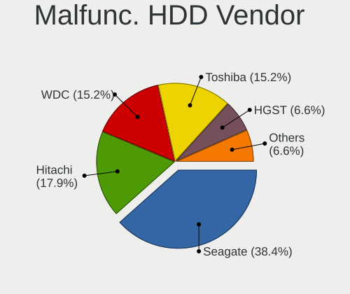

| Vendor              | Notebooks | Drives | Percent |
|---------------------|-----------|--------|---------|
| Seagate             | 58        | 77     | 38.41%  |
| Hitachi             | 27        | 38     | 17.88%  |
| WDC                 | 23        | 25     | 15.23%  |
| Toshiba             | 23        | 31     | 15.23%  |
| HGST                | 10        | 40     | 6.62%   |
| Fujitsu             | 5         | 9      | 3.31%   |
| Samsung Electronics | 3         | 3      | 1.99%   |
| IBM/Hitachi         | 1         | 1      | 0.66%   |
| Apple               | 1         | 1      | 0.66%   |

Malfunc. Drive Kind
-------------------

Kinds of faulty drives

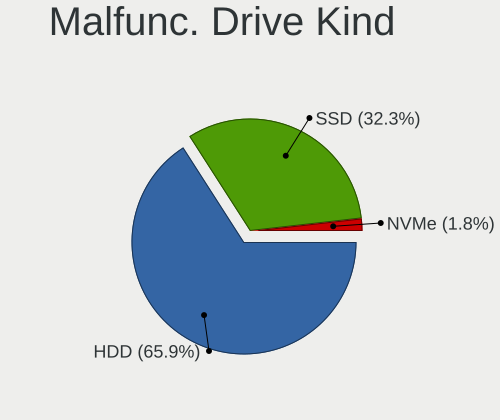

| Kind | Notebooks | Drives | Percent |
|------|-----------|--------|---------|
| HDD  | 147       | 225    | 65.92%  |
| SSD  | 72        | 83     | 32.29%  |
| NVMe | 4         | 4      | 1.79%   |

Failed Drives
-------------

Failed drive models

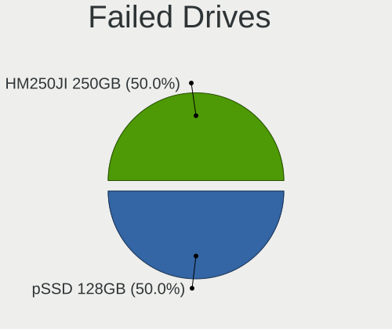

| Model                             | Notebooks | Drives | Percent |
|-----------------------------------|-----------|--------|---------|
| SanDisk pSSD 32GB                 | 1         | 1      | 50%     |
| Samsung Electronics HM250JI 250GB | 1         | 1      | 50%     |

Failed Drive Vendor
-------------------

Failed drive vendors

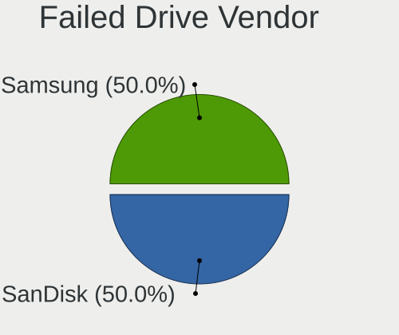

| Vendor              | Notebooks | Drives | Percent |
|---------------------|-----------|--------|---------|
| SanDisk             | 1         | 1      | 50%     |
| Samsung Electronics | 1         | 1      | 50%     |

Drive Status
------------

Number of failed and malfunc. drives

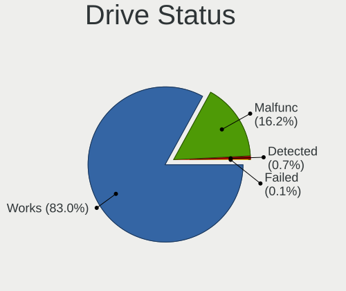

| Status   | Notebooks | Drives | Percent |
|----------|-----------|--------|---------|
| Works    | 1138      | 1840   | 83.01%  |
| Malfunc  | 222       | 312    | 16.19%  |
| Detected | 9         | 10     | 0.66%   |
| Failed   | 2         | 2      | 0.15%   |

Storage controller
------------------

Storage Vendor
--------------

Storage controller vendors

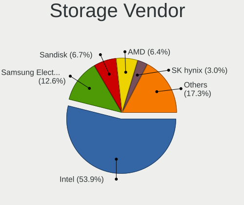

| Vendor                                  | Notebooks | Percent |
|-----------------------------------------|-----------|---------|
| Intel                                   | 1044      | 53.9%   |
| Samsung Electronics                     | 245       | 12.65%  |
| Sandisk                                 | 130       | 6.71%   |
| AMD                                     | 124       | 6.4%    |
| SK hynix                                | 58        | 2.99%   |
| Kingston Technology Company             | 36        | 1.86%   |
| Micron Technology                       | 35        | 1.81%   |
| Toshiba                                 | 34        | 1.76%   |
| Phison Electronics                      | 33        | 1.7%    |
| Micron/Crucial Technology               | 29        | 1.5%    |
| KIOXIA                                  | 28        | 1.45%   |
| Silicon Motion                          | 24        | 1.24%   |
| MAXIO Technology (Hangzhou)             | 15        | 0.77%   |
| ADATA Technology                        | 14        | 0.72%   |
| Solid State Storage Technology          | 11        | 0.57%   |
| Shenzhen Longsys Electronics            | 10        | 0.52%   |
| Nvidia                                  | 9         | 0.46%   |
| Marvell Technology Group                | 9         | 0.46%   |
| Realtek Semiconductor                   | 7         | 0.36%   |
| Union Memory (Shenzhen)                 | 6         | 0.31%   |
| Shenzhen Unionmemory Information System | 6         | 0.31%   |
| Transcend                               | 4         | 0.21%   |
| Silicon Integrated Systems [SiS]        | 3         | 0.15%   |
| Seagate Technology                      | 3         | 0.15%   |
| Lenovo                                  | 3         | 0.15%   |
| Yangtze Memory Technologies             | 2         | 0.1%    |
| JMicron Technology                      | 2         | 0.1%    |
| INNOGRIT                                | 2         | 0.1%    |
| Apple                                   | 2         | 0.1%    |
| ULi Electronics                         | 1         | 0.05%   |
| Solidigm                                | 1         | 0.05%   |
| Shenzhen Techwinsemi Technology         | 1         | 0.05%   |
| Netac Technology                        | 1         | 0.05%   |
| Lite-On Technology                      | 1         | 0.05%   |
| Hosin Global Electronics                | 1         | 0.05%   |
| Broadcom / LSI                          | 1         | 0.05%   |
| Biwin Storage Technology                | 1         | 0.05%   |
| Unknown                                 | 1         | 0.05%   |

Storage Model
-------------

Storage controller models

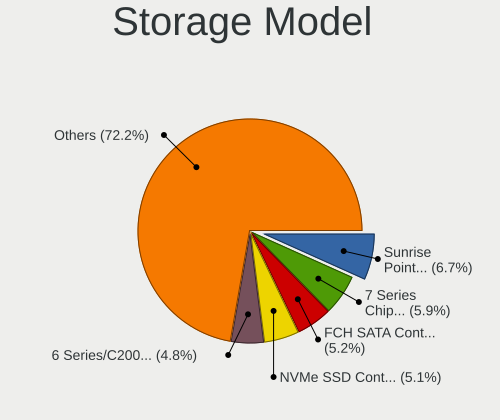

| Model                                                                          | Notebooks | Percent |
|--------------------------------------------------------------------------------|-----------|---------|
| Intel Sunrise Point-LP SATA Controller [AHCI mode]                             | 138       | 6.72%   |
| Intel 7 Series Chipset Family 6-port SATA Controller [AHCI mode]               | 122       | 5.94%   |
| AMD FCH SATA Controller [AHCI mode]                                            | 107       | 5.21%   |
| Samsung NVMe SSD Controller SM981/PM981/PM983                                  | 105       | 5.11%   |
| Intel 6 Series/C200 Series Chipset Family 6 port Mobile SATA AHCI Controller   | 98        | 4.77%   |
| Intel Wildcat Point-LP SATA Controller [AHCI Mode]                             | 70        | 3.41%   |
| Intel 82801 Mobile SATA Controller [RAID mode]                                 | 55        | 2.68%   |
| Samsung NVMe SSD Controller 980 (DRAM-less)                                    | 50        | 2.44%   |
| Intel 8 Series SATA Controller 1 [AHCI mode]                                   | 49        | 2.39%   |
| SanDisk Extreme Pro / WD Black SN750 / PC SN730 / Red SN700 NVMe SSD           | 42        | 2.05%   |
| Intel 82801IBM/IEM (ICH9M/ICH9M-E) 4 port SATA Controller [AHCI mode]          | 38        | 1.85%   |
| Samsung NVMe SSD Controller PM9A1/PM9A3/980PRO                                 | 37        | 1.8%    |
| Intel 8 Series/C220 Series Chipset Family 6-port SATA Controller 1 [AHCI mode] | 35        | 1.7%    |
| Intel Cannon Lake Mobile PCH SATA AHCI Controller                              | 33        | 1.61%   |
| Intel 82801HM/HEM (ICH8M/ICH8M-E) SATA Controller [AHCI mode]                  | 33        | 1.61%   |
| Intel 82801HM/HEM (ICH8M/ICH8M-E) IDE Controller                               | 33        | 1.61%   |
| Intel Volume Management Device NVMe RAID Controller                            | 31        | 1.51%   |
| Intel Comet Lake SATA AHCI Controller                                          | 26        | 1.27%   |
| Intel 5 Series/3400 Series Chipset 6 port SATA AHCI Controller                 | 26        | 1.27%   |
| Samsung NVMe SSD Controller SM961/PM961/SM963                                  | 25        | 1.22%   |
| SK hynix Gold P31/BC711/PC711 NVMe Solid State Drive                           | 23        | 1.12%   |
| Intel 5 Series/3400 Series Chipset 4 port SATA AHCI Controller                 | 23        | 1.12%   |
| Intel Q170/Q150/B150/H170/H110/Z170/CM236 Chipset SATA Controller [AHCI Mode]  | 21        | 1.02%   |
| Intel 82801GBM/GHM (ICH7-M Family) SATA Controller [IDE mode]                  | 21        | 1.02%   |
| Intel HM170/QM170 Chipset SATA Controller [AHCI Mode]                          | 20        | 0.97%   |
| KIOXIA NVMe SSD Controller BG4 (DRAM-less)                                     | 18        | 0.88%   |
| Intel SSD DC P4101/Pro 7600p/760p/E 6100p Series                               | 18        | 0.88%   |
| Intel NM10/ICH7 Family SATA Controller [AHCI mode]                             | 18        | 0.88%   |
| Intel Tiger Lake-LP SATA Controller                                            | 16        | 0.78%   |
| Intel Cannon Point-LP SATA Controller [AHCI Mode]                              | 16        | 0.78%   |
| Silicon Motion SM2263EN/SM2263XT (DRAM-less) NVMe SSD Controllers              | 15        | 0.73%   |
| SanDisk Ultra 3D / WD PC SN530, IX SN530, Blue SN550 NVMe SSD (DRAM-less)      | 15        | 0.73%   |
| Intel Atom Processor E3800 Series SATA AHCI Controller                         | 15        | 0.73%   |
| MAXIO (Hangzhou) NVMe SSD Controller MAP1202 (DRAM-less)                       | 14        | 0.68%   |
| Intel Celeron/Pentium Silver Processor SATA Controller                         | 14        | 0.68%   |
| Toshiba XG6 NVMe SSD Controller                                                | 13        | 0.63%   |
| Sandisk WD SN560/SN740/SN770/SN5000 NVMe SSD                                   | 13        | 0.63%   |
| Phison E12 NVMe Controller                                                     | 13        | 0.63%   |
| Micron/Crucial P2 [Nick P2] / P3 / P3 Plus NVMe PCIe SSD (DRAM-less)           | 13        | 0.63%   |
| Intel SSD 670p Series [Keystone Harbor]                                        | 13        | 0.63%   |

Storage Kind
------------

Kind of storage controller (IDE, SATA, NVMe, SAS, ...)

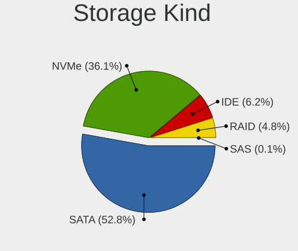

| Kind | Notebooks | Percent |
|------|-----------|---------|
| SATA | 1024      | 52.81%  |
| NVMe | 700       | 36.1%   |
| IDE  | 120       | 6.19%   |
| RAID | 94        | 4.85%   |
| SAS  | 1         | 0.05%   |

Processor
---------

CPU Vendor
----------

Processor vendors

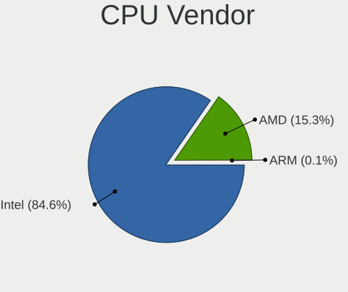

| Vendor | Notebooks | Percent |
|--------|-----------|---------|
| Intel  | 1384      | 84.65%  |
| AMD    | 250       | 15.29%  |
| ARM    | 1         | 0.06%   |

CPU Model
---------

Processor models

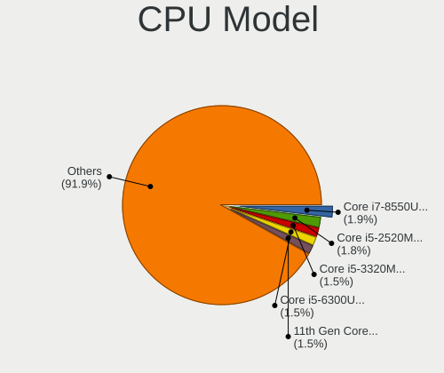

| Model                                   | Notebooks | Percent |
|-----------------------------------------|-----------|---------|
| Intel Core i7-8550U CPU @ 1.80GHz       | 31        | 1.89%   |
| Intel Core i5-2520M CPU @ 2.50GHz       | 29        | 1.77%   |
| Intel Core i5-3320M CPU @ 2.60GHz       | 25        | 1.52%   |
| Intel Core i5-6300U CPU @ 2.40GHz       | 24        | 1.46%   |
| Intel 11th Gen Core i5-1135G7 @ 2.40GHz | 24        | 1.46%   |
| Intel Core i5-7200U CPU @ 2.50GHz       | 23        | 1.4%    |
| Intel 11th Gen Core i7-1165G7 @ 2.80GHz | 23        | 1.4%    |
| Intel CPU Version                       | 22        | 1.34%   |
| Intel Core i5-10210U CPU @ 1.60GHz      | 22        | 1.34%   |
| Intel Core i5-6200U CPU @ 2.30GHz       | 21        | 1.28%   |
| Intel Core i5-5300U CPU @ 2.30GHz       | 21        | 1.28%   |
| Intel Core i5-8350U CPU @ 1.70GHz       | 20        | 1.22%   |
| Intel Core i5-8250U CPU @ 1.60GHz       | 19        | 1.16%   |
| Intel Core i5-5200U CPU @ 2.20GHz       | 19        | 1.16%   |
| Intel Core i7-8565U CPU @ 1.80GHz       | 18        | 1.1%    |
| Intel Core i5-8265U CPU @ 1.60GHz       | 18        | 1.1%    |
| Intel Core i5-7300U CPU @ 2.60GHz       | 17        | 1.03%   |
| Intel Core i7-9750H CPU @ 2.60GHz       | 15        | 0.91%   |
| Intel Core i7-10510U CPU @ 1.80GHz      | 15        | 0.91%   |
| Intel Core i7-7500U CPU @ 2.70GHz       | 14        | 0.85%   |
| Intel Core i7-5600U CPU @ 2.60GHz       | 14        | 0.85%   |
| Intel Core 2 Duo                        | 14        | 0.85%   |
| AMD Ryzen 7 4800H with Radeon Graphics  | 14        | 0.85%   |
| Intel Core i5-3210M CPU @ 2.50GHz       | 13        | 0.79%   |
| AMD Ryzen 7 5700U with Radeon Graphics  | 13        | 0.79%   |
| Intel Core i7-8650U CPU @ 1.90GHz       | 12        | 0.73%   |
| Intel Core i7-7700HQ CPU @ 2.80GHz      | 12        | 0.73%   |
| Intel Core i7-3520M CPU @ 2.90GHz       | 12        | 0.73%   |
| AMD Ryzen 5 5500U with Radeon Graphics  | 12        | 0.73%   |
| Intel Core i7-8750H CPU @ 2.20GHz       | 11        | 0.67%   |
| Intel Core i7-8665U CPU @ 1.90GHz       | 11        | 0.67%   |
| Intel Core i7-6600U CPU @ 2.60GHz       | 11        | 0.67%   |
| Intel Core i3-6006U CPU @ 2.00GHz       | 11        | 0.67%   |
| Intel Core i7-10750H CPU @ 2.60GHz      | 10        | 0.61%   |
| Intel Core i5 CPU M 520 @ 2.40GHz       | 10        | 0.61%   |
| Intel Core i7-6500U CPU @ 2.50GHz       | 9         | 0.55%   |
| Intel Core i5-8365U CPU @ 1.60GHz       | 9         | 0.55%   |
| Intel Core i5-4300U CPU @ 1.90GHz       | 9         | 0.55%   |
| Intel Core i5-4210U CPU @ 1.70GHz       | 9         | 0.55%   |
| Intel Core i5-3230M CPU @ 2.60GHz       | 9         | 0.55%   |

CPU Model Family
----------------

Processor model prefix

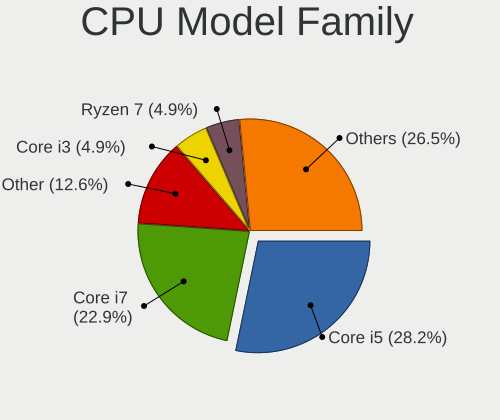

| Model                   | Notebooks | Percent |
|-------------------------|-----------|---------|
| Intel Core i5           | 463       | 28.23%  |
| Intel Core i7           | 375       | 22.87%  |
| Other                   | 206       | 12.56%  |
| Intel Core i3           | 81        | 4.94%   |
| AMD Ryzen 7             | 80        | 4.88%   |
| Intel Celeron           | 69        | 4.21%   |
| Intel Core 2 Duo        | 62        | 3.78%   |
| AMD Ryzen 5             | 55        | 3.35%   |
| Intel Atom              | 26        | 1.59%   |
| Intel Pentium           | 25        | 1.52%   |
| AMD Ryzen 7 PRO         | 17        | 1.04%   |
| AMD Ryzen 9             | 15        | 0.91%   |
| Intel Pentium M         | 14        | 0.85%   |
| AMD Ryzen 3             | 14        | 0.85%   |
| AMD Ryzen 5 PRO         | 12        | 0.73%   |
| Intel Genuine           | 10        | 0.61%   |
| Intel Core              | 10        | 0.61%   |
| Intel Xeon              | 9         | 0.55%   |
| Intel Core i9           | 8         | 0.49%   |
| Intel Pentium Dual      | 7         | 0.43%   |
| Intel Core 2            | 7         | 0.43%   |
| AMD E                   | 7         | 0.43%   |
| Intel Pentium Silver    | 6         | 0.37%   |
| AMD Athlon              | 6         | 0.37%   |
| AMD A8                  | 6         | 0.37%   |
| AMD E2                  | 5         | 0.3%    |
| AMD A6                  | 5         | 0.3%    |
| Intel Pentium 4         | 4         | 0.24%   |
| Intel Core m3           | 4         | 0.24%   |
| AMD A4                  | 4         | 0.24%   |
| AMD EPYC                | 3         | 0.18%   |
| AMD C-50                | 3         | 0.18%   |
| Intel Pentium Dual-Core | 2         | 0.12%   |
| Intel Celeron M         | 2         | 0.12%   |
| AMD E1                  | 2         | 0.12%   |
| AMD A10                 | 2         | 0.12%   |
| Intel Mobile Pentium 4  | 1         | 0.06%   |
| Intel Core Solo         | 1         | 0.06%   |
| Intel Core m7           | 1         | 0.06%   |
| Intel Core M            | 1         | 0.06%   |

CPU Cores
---------

Number of processor cores

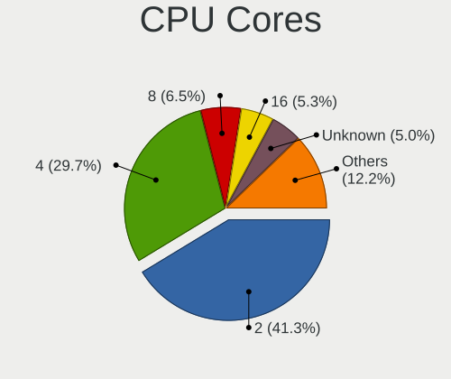

| Number  | Notebooks | Percent |
|---------|-----------|---------|
| 2       | 683       | 41.32%  |
| 4       | 491       | 29.7%   |
| 8       | 107       | 6.47%   |
| 16      | 88        | 5.32%   |
| Unknown | 82        | 4.96%   |
| 6       | 80        | 4.84%   |
| 12      | 42        | 2.54%   |
| 1       | 39        | 2.36%   |
| 10      | 17        | 1.03%   |
| 20      | 8         | 0.48%   |
| 32      | 5         | 0.3%    |
| 24      | 2         | 0.12%   |
| 22      | 2         | 0.12%   |
| 14      | 2         | 0.12%   |
| 11      | 2         | 0.12%   |
| 7       | 2         | 0.12%   |
| 5       | 1         | 0.06%   |

CPU Sockets
-----------

Number of sockets

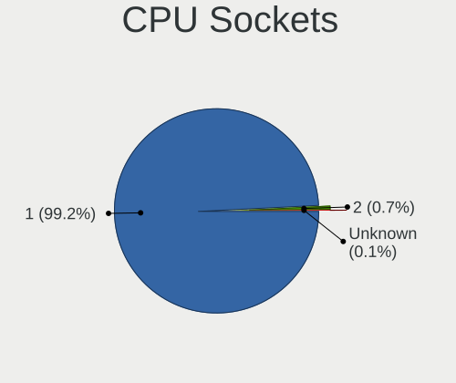

| Number  | Notebooks | Percent |
|---------|-----------|---------|
| 1       | 1620      | 99.2%   |
| 2       | 11        | 0.67%   |
| Unknown | 2         | 0.12%   |

CPU Threads
-----------

Threads per core (Hyper-Threading)

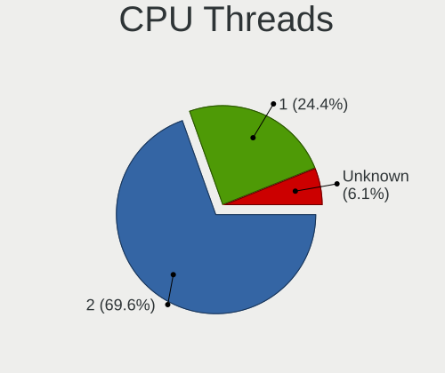

| Number  | Notebooks | Percent |
|---------|-----------|---------|
| 2       | 1148      | 69.58%  |
| 1       | 402       | 24.36%  |
| Unknown | 100       | 6.06%   |

CPU Microarch
-------------

Microarchitecture

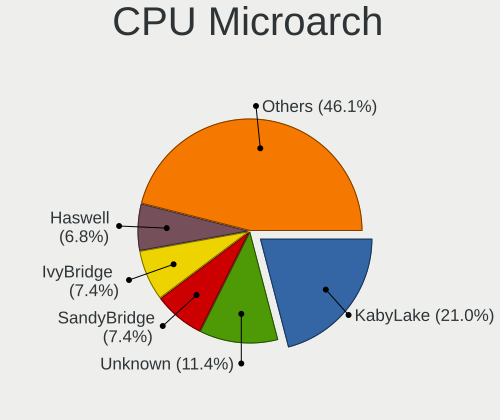

| Name            | Notebooks | Percent |
|-----------------|-----------|---------|
| KabyLake        | 343       | 20.95%  |
| Unknown         | 187       | 11.42%  |
| SandyBridge     | 121       | 7.39%   |
| IvyBridge       | 121       | 7.39%   |
| Haswell         | 111       | 6.78%   |
| Skylake         | 105       | 6.41%   |
| TigerLake       | 80        | 4.89%   |
| Broadwell       | 78        | 4.76%   |
| Penryn          | 56        | 3.42%   |
| Westmere        | 46        | 2.81%   |
| Zen 2           | 44        | 2.69%   |
| Core            | 42        | 2.57%   |
| Zen 3           | 39        | 2.38%   |
| Bonnell         | 38        | 2.32%   |
| Silvermont      | 36        | 2.2%    |
| Zen+            | 35        | 2.14%   |
| CometLake       | 27        | 1.65%   |
| P6              | 21        | 1.28%   |
| Zen             | 20        | 1.22%   |
| Goldmont plus   | 18        | 1.1%    |
| IceLake         | 13        | 0.79%   |
| Bobcat          | 12        | 0.73%   |
| Puma            | 9         | 0.55%   |
| Excavator       | 9         | 0.55%   |
| Goldmont        | 5         | 0.31%   |
| NetBurst        | 4         | 0.24%   |
| Nehalem         | 4         | 0.24%   |
| Piledriver      | 3         | 0.18%   |
| K8 Hammer       | 2         | 0.12%   |
| K8 & K10 hybrid | 2         | 0.12%   |
| K10 Llano       | 2         | 0.12%   |
| K10             | 2         | 0.12%   |
| Steamroller     | 1         | 0.06%   |
| Jaguar          | 1         | 0.06%   |

Graphics
--------

GPU Vendor
----------

Vendors of graphics cards

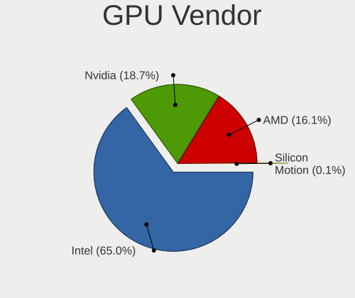

| Vendor                           | Notebooks | Percent |
|----------------------------------|-----------|---------|
| Intel                            | 1273      | 65.05%  |
| Nvidia                           | 366       | 18.7%   |
| AMD                              | 315       | 16.1%   |
| Silicon Integrated Systems [SiS] | 2         | 0.1%    |
| Silicon Motion                   | 1         | 0.05%   |

GPU Model
---------

Graphics card models

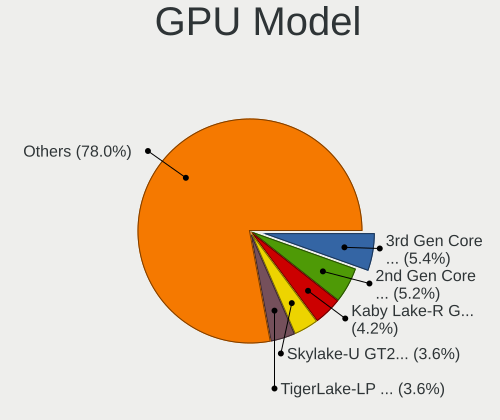

| Model                                                                                    | Notebooks | Percent |
|------------------------------------------------------------------------------------------|-----------|---------|
| Intel 3rd Gen Core processor Graphics Controller                                         | 111       | 5.45%   |
| Intel 2nd Generation Core Processor Family Integrated Graphics Controller                | 106       | 5.2%    |
| Intel Kaby Lake-R GT2 [UHD Graphics 620]                                                 | 85        | 4.17%   |
| Intel Skylake-U GT2 [HD Graphics 520]                                                    | 74        | 3.63%   |
| Intel TigerLake-LP GT2 [Iris Xe Graphics]                                                | 73        | 3.58%   |
| Intel Broadwell-U GT2 [HD Graphics 5500]                                                 | 69        | 3.39%   |
| Intel Haswell-ULT Integrated Graphics Controller                                         | 67        | 3.29%   |
| Intel Kaby Lake-U GT2 [HD Graphics 620]                                                  | 64        | 3.14%   |
| Intel WhiskeyLake-U GT2 [UHD Graphics 620]                                               | 57        | 2.8%    |
| Intel CometLake-U GT2 [UHD Graphics]                                                     | 49        | 2.41%   |
| AMD Renoir [Radeon Vega Series / Radeon Vega Mobile Series]                              | 43        | 2.11%   |
| Intel CoffeeLake-H GT2 [UHD Graphics 630]                                                | 40        | 1.96%   |
| Intel Core Processor Integrated Graphics Controller                                      | 37        | 1.82%   |
| Intel 4th Gen Core Processor Integrated Graphics Controller                              | 36        | 1.77%   |
| AMD Picasso/Raven 2 [Radeon Vega Series / Radeon Vega Mobile Series]                     | 36        | 1.77%   |
| Intel Mobile 4 Series Chipset Integrated Graphics Controller                             | 35        | 1.72%   |
| Nvidia TU117M [GeForce GTX 1650 Mobile / Max-Q]                                          | 29        | 1.42%   |
| Intel Mobile 945GM/GMS/GME, 943/940GML Express Integrated Graphics Controller            | 29        | 1.42%   |
| Intel Raptor Lake-P [Iris Xe Graphics]                                                   | 28        | 1.37%   |
| AMD Lucienne                                                                             | 28        | 1.37%   |
| Intel Mobile GM965/GL960 Integrated Graphics Controller (secondary)                      | 26        | 1.28%   |
| Intel Mobile GM965/GL960 Integrated Graphics Controller (primary)                        | 26        | 1.28%   |
| Intel Kaby Lake-H GT2 [HD Graphics 630]                                                  | 20        | 0.98%   |
| AMD Cezanne [Radeon Vega Series / Radeon Vega Mobile Series]                             | 20        | 0.98%   |
| Intel CometLake-H GT2 [UHD Graphics]                                                     | 19        | 0.93%   |
| Intel Atom/Celeron/Pentium Processor x5-E8000/J3xxx/N3xxx Integrated Graphics Controller | 19        | 0.93%   |
| Intel Alder Lake-P GT2 [Iris Xe Graphics]                                                | 19        | 0.93%   |
| Intel Skylake-H GT2 [HD Graphics 530]                                                    | 18        | 0.88%   |
| Intel Atom Processor D4xx/D5xx/N4xx/N5xx Integrated Graphics Controller                  | 18        | 0.88%   |
| AMD Rembrandt [Radeon 680M]                                                              | 18        | 0.88%   |
| Intel Atom Processor Z36xxx/Z37xxx Series Graphics & Display                             | 17        | 0.83%   |
| Intel Mobile 945GSE Express Integrated Graphics Controller                               | 16        | 0.79%   |
| AMD Barcelo                                                                              | 16        | 0.79%   |
| Intel GeminiLake [UHD Graphics 600]                                                      | 14        | 0.69%   |
| AMD Phoenix1                                                                             | 14        | 0.69%   |
| Intel Mobile 945GM/GMS, 943/940GML Express Integrated Graphics Controller                | 13        | 0.64%   |
| AMD Raven Ridge [Radeon Vega Series / Radeon Vega Mobile Series]                         | 13        | 0.64%   |
| Nvidia GP108M [GeForce MX150]                                                            | 12        | 0.59%   |
| Nvidia GP107M [GeForce GTX 1050 Mobile]                                                  | 12        | 0.59%   |
| Nvidia GF117M [GeForce 610M/710M/810M/820M / GT 620M/625M/630M/720M]                     | 10        | 0.49%   |

GPU Combo
---------

Combinations of graphics cards

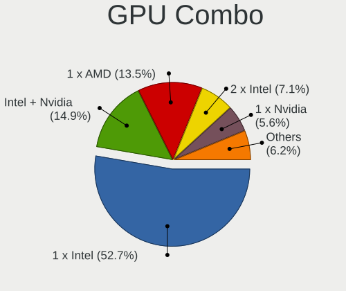

| Name                     | Notebooks | Percent |
|--------------------------|-----------|---------|
| 1 x Intel                | 868       | 52.7%   |
| Intel + Nvidia           | 246       | 14.94%  |
| 1 x AMD                  | 222       | 13.48%  |
| 2 x Intel                | 117       | 7.1%    |
| 1 x Nvidia               | 92        | 5.59%   |
| Intel + AMD              | 41        | 2.49%   |
| AMD + Nvidia             | 32        | 1.94%   |
| 2 x AMD                  | 19        | 1.15%   |
| Other                    | 4         | 0.24%   |
| 2 x Nvidia               | 2         | 0.12%   |
| 1 x SiS                  | 2         | 0.12%   |
| 1 x Silicon Motion       | 1         | 0.06%   |
| Intel + AMD + 1 x Nvidia | 1         | 0.06%   |

GPU Driver
----------

Free vs proprietary

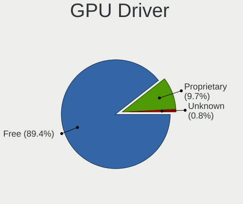

| Driver      | Notebooks | Percent |
|-------------|-----------|---------|
| Free        | 1478      | 89.41%  |
| Proprietary | 161       | 9.74%   |
| Unknown     | 14        | 0.85%   |

GPU Memory
----------

Total video memory

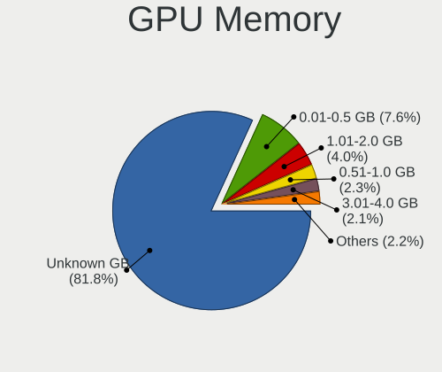

| Size in GB | Notebooks | Percent |
|------------|-----------|---------|
| Unknown    | 1360      | 81.83%  |
| 0.01-0.5   | 126       | 7.58%   |
| 1.01-2.0   | 66        | 3.97%   |
| 0.51-1.0   | 39        | 2.35%   |
| 3.01-4.0   | 35        | 2.11%   |
| 7.01-8.0   | 16        | 0.96%   |
| 5.01-6.0   | 13        | 0.78%   |
| 8.01-16.0  | 4         | 0.24%   |
| 2.01-3.0   | 3         | 0.18%   |

Monitor
-------

Monitor Vendor
--------------

Monitor vendors

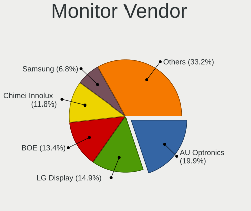

| Vendor                  | Notebooks | Percent |
|-------------------------|-----------|---------|
| AU Optronics            | 262       | 19.89%  |
| LG Display              | 196       | 14.88%  |
| BOE                     | 177       | 13.44%  |
| Chimei Innolux          | 156       | 11.85%  |
| Samsung Electronics     | 89        | 6.76%   |
| Lenovo                  | 56        | 4.25%   |
| Apple                   | 40        | 3.04%   |
| Sharp                   | 36        | 2.73%   |
| Dell                    | 31        | 2.35%   |
| Goldstar                | 20        | 1.52%   |
| Hewlett-Packard         | 19        | 1.44%   |
| Chi Mei Optoelectronics | 18        | 1.37%   |
| InfoVision              | 15        | 1.14%   |
| AOC                     | 15        | 1.14%   |
| LG Philips              | 12        | 0.91%   |
| CSO                     | 12        | 0.91%   |
| Philips                 | 10        | 0.76%   |
| PANDA                   | 10        | 0.76%   |
| BenQ                    | 9         | 0.68%   |
| Acer                    | 9         | 0.68%   |
| LGD                     | 8         | 0.61%   |
| ViewSonic               | 7         | 0.53%   |
| Iiyama                  | 6         | 0.46%   |
| HKC                     | 6         | 0.46%   |
| Ancor Communications    | 6         | 0.46%   |
| JDI                     | 5         | 0.38%   |
| HannStar                | 5         | 0.38%   |
| CPT                     | 5         | 0.38%   |
| BOE Technology Group    | 5         | 0.38%   |
| ASUSTek Computer        | 5         | 0.38%   |
| Unknown                 | 5         | 0.38%   |
| Toshiba                 | 4         | 0.3%    |
| Sceptre Tech            | 4         | 0.3%    |
| Panasonic               | 4         | 0.3%    |
| Unknown                 | 3         | 0.23%   |
| TMX                     | 3         | 0.23%   |
| Lenovo Group Limited    | 3         | 0.23%   |
| HPN                     | 3         | 0.23%   |
| CTO                     | 3         | 0.23%   |
| Vizio                   | 2         | 0.15%   |

Monitor Model
-------------

Monitor models

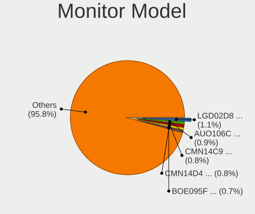

| Model                                                                | Notebooks | Percent |
|----------------------------------------------------------------------|-----------|---------|
| LG Display LCD Monitor LGD02D8 1366x768 280x160mm 12.7-inch          | 14        | 1.05%   |
| AU Optronics LCD Monitor AUO106C 1366x768 280x160mm 12.7-inch        | 12        | 0.9%    |
| Chimei Innolux LCD Monitor CMN14C9 1920x1080 310x170mm 13.9-inch     | 11        | 0.83%   |
| Chimei Innolux LCD Monitor CMN14D4 1920x1080 310x170mm 13.9-inch     | 10        | 0.75%   |
| BOE LCD Monitor BOE095F 2256x1504 280x190mm 13.3-inch                | 9         | 0.68%   |
| Lenovo LCD Monitor LEN40B1 1600x900 340x190mm 15.3-inch              | 8         | 0.6%    |
| AU Optronics LCD Monitor AUO243D 1920x1080 310x170mm 13.9-inch       | 8         | 0.6%    |
| LG Display LCD Monitor LGD0521 1920x1080 310x170mm 13.9-inch         | 7         | 0.53%   |
| Chimei Innolux LCD Monitor CMN1132 1366x768 260x140mm 11.6-inch      | 7         | 0.53%   |
| Chimei Innolux LCD Monitor CMN15F5 1920x1080 340x190mm 15.3-inch     | 6         | 0.45%   |
| AU Optronics LCD Monitor AUO403D 1920x1080 310x170mm 13.9-inch       | 6         | 0.45%   |
| AU Optronics LCD Monitor AUO226D 1920x1080 280x160mm 12.7-inch       | 6         | 0.45%   |
| AU Optronics LCD Monitor AUO133D 1920x1080 310x170mm 13.9-inch       | 6         | 0.45%   |
| AU Optronics LCD Monitor AUO123D 1920x1080 310x170mm 13.9-inch       | 6         | 0.45%   |
| AU Optronics LCD Monitor AUO103D 1920x1080 310x170mm 13.9-inch       | 6         | 0.45%   |
| Samsung Electronics LCD Monitor SEC5441 1366x768 340x190mm 15.3-inch | 5         | 0.38%   |
| Samsung Electronics LCD Monitor SEC324C 1600x900 310x170mm 13.9-inch | 5         | 0.38%   |
| LG Display LCD Monitor LGD046F 1920x1080 340x190mm 15.3-inch         | 5         | 0.38%   |
| LG Display LCD Monitor LGD03ED 1366x768 280x160mm 12.7-inch          | 5         | 0.38%   |
| LG Display LCD Monitor LGD02D3 1366x768 280x160mm 12.7-inch          | 5         | 0.38%   |
| Lenovo LCD Monitor LEN40B2 1920x1080 340x190mm 15.3-inch             | 5         | 0.38%   |
| Chimei Innolux LCD Monitor CMN14D6 1366x768 310x170mm 13.9-inch      | 5         | 0.38%   |
| Chimei Innolux LCD Monitor CMN14D5 1920x1080 310x170mm 13.9-inch     | 5         | 0.38%   |
| BOE Technology Group LCD Monitor 1920x1080                           | 5         | 0.38%   |
| AU Optronics LCD Monitor AUO80ED 1920x1080 340x190mm 15.3-inch       | 5         | 0.38%   |
| AU Optronics LCD Monitor AUO71EC 1366x768 340x190mm 15.3-inch        | 5         | 0.38%   |
| AU Optronics LCD Monitor AUO313C 1366x768 310x170mm 13.9-inch        | 5         | 0.38%   |
| AU Optronics LCD Monitor AUO2E3C 1366x768 310x170mm 13.9-inch        | 5         | 0.38%   |
| Apple Color LCD APP9CF0 1440x900 290x180mm 13.4-inch                 | 5         | 0.38%   |
| Unknown                                                              | 5         | 0.38%   |
| Sharp LCD Monitor SHP1449 1920x1080 290x170mm 13.2-inch              | 4         | 0.3%    |
| Sharp LCD Monitor SHP143E 3840x2160 350x190mm 15.7-inch              | 4         | 0.3%    |
| Samsung Electronics LCD Monitor SEC3047 1366x768 280x160mm 12.7-inch | 4         | 0.3%    |
| Philips 271P4 PHL08C3 1920x1080 600x340mm 27.2-inch                  | 4         | 0.3%    |
| LG Display LCD Monitor LGD05FA 1920x1080 310x170mm 13.9-inch         | 4         | 0.3%    |
| LG Display LCD Monitor LGD0456 1366x768 340x190mm 15.3-inch          | 4         | 0.3%    |
| LG Display LCD Monitor LGD0437 1920x1080 280x160mm 12.7-inch         | 4         | 0.3%    |
| LG Display LCD Monitor LGD0258 1600x900 350x190mm 15.7-inch          | 4         | 0.3%    |
| Lenovo LCD Monitor LEN40BA 1920x1080 340x190mm 15.3-inch             | 4         | 0.3%    |
| Lenovo LCD Monitor LEN4036 1440x900 300x190mm 14.0-inch              | 4         | 0.3%    |

Monitor Resolution
------------------

Monitor screen resolution

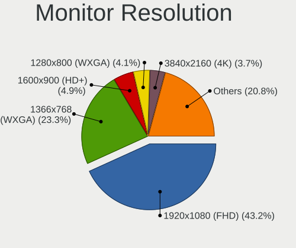

| Resolution         | Notebooks | Percent |
|--------------------|-----------|---------|
| 1920x1080 (FHD)    | 544       | 43.21%  |
| 1366x768 (WXGA)    | 293       | 23.27%  |
| 1600x900 (HD+)     | 62        | 4.92%   |
| 1280x800 (WXGA)    | 51        | 4.05%   |
| 3840x2160 (4K)     | 47        | 3.73%   |
| 2560x1440 (QHD)    | 45        | 3.57%   |
| 1920x1200 (WUXGA)  | 41        | 3.26%   |
| 2560x1600          | 30        | 2.38%   |
| 1440x900 (WXGA+)   | 24        | 1.91%   |
| 1024x600           | 18        | 1.43%   |
| 2256x1504          | 13        | 1.03%   |
| 2880x1800          | 12        | 0.95%   |
| 2560x1080          | 10        | 0.79%   |
| 3200x1800 (QHD+)   | 6         | 0.48%   |
| 1680x1050 (WSXGA+) | 6         | 0.48%   |
| Unknown            | 6         | 0.48%   |
| 3440x1440          | 5         | 0.4%    |
| 1280x1024 (SXGA)   | 5         | 0.4%    |
| 2160x1440          | 4         | 0.32%   |
| 1024x768 (XGA)     | 4         | 0.32%   |
| 3840x2400          | 3         | 0.24%   |
| 3120x2080          | 3         | 0.24%   |
| 3000x2000          | 3         | 0.24%   |
| 1360x768           | 3         | 0.24%   |
| 3840x1080          | 2         | 0.16%   |
| 2240x1400          | 2         | 0.16%   |
| 1920x540           | 2         | 0.16%   |
| 1400x1050          | 2         | 0.16%   |
| 5760x2160          | 1         | 0.08%   |
| 5760x1080          | 1         | 0.08%   |
| 5440x1080          | 1         | 0.08%   |
| 4480x1080          | 1         | 0.08%   |
| 3840x1600          | 1         | 0.08%   |
| 3840x1200          | 1         | 0.08%   |
| 3520x1080          | 1         | 0.08%   |
| 2880x1920          | 1         | 0.08%   |
| 2520x1680          | 1         | 0.08%   |
| 2160x1350          | 1         | 0.08%   |
| 1920x1280          | 1         | 0.08%   |
| 1280x720 (HD)      | 1         | 0.08%   |

Monitor Diagonal
----------------

Diagonal size in inches

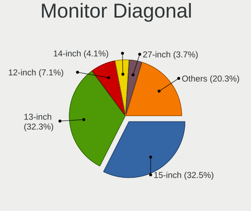

| Inches  | Notebooks | Percent |
|---------|-----------|---------|
| 15      | 423       | 32.49%  |
| 13      | 421       | 32.33%  |
| 12      | 93        | 7.14%   |
| 14      | 53        | 4.07%   |
| 27      | 48        | 3.69%   |
| 24      | 46        | 3.53%   |
| 17      | 40        | 3.07%   |
| Unknown | 40        | 3.07%   |
| 11      | 26        | 2%      |
| 23      | 20        | 1.54%   |
| 10      | 15        | 1.15%   |
| 21      | 12        | 0.92%   |
| 34      | 10        | 0.77%   |
| 19      | 8         | 0.61%   |
| 31      | 7         | 0.54%   |
| 18      | 6         | 0.46%   |
| 16      | 5         | 0.38%   |
| 48      | 3         | 0.23%   |
| 29      | 3         | 0.23%   |
| 9       | 3         | 0.23%   |
| 64      | 2         | 0.15%   |
| 32      | 2         | 0.15%   |
| 22      | 2         | 0.15%   |
| 49      | 1         | 0.08%   |
| 46      | 1         | 0.08%   |
| 43      | 1         | 0.08%   |
| 42      | 1         | 0.08%   |
| 40      | 1         | 0.08%   |
| 39      | 1         | 0.08%   |
| 37      | 1         | 0.08%   |
| 35      | 1         | 0.08%   |
| 33      | 1         | 0.08%   |
| 28      | 1         | 0.08%   |
| 26      | 1         | 0.08%   |
| 20      | 1         | 0.08%   |
| 8       | 1         | 0.08%   |
| 5       | 1         | 0.08%   |

Monitor Width
-------------

Physical width

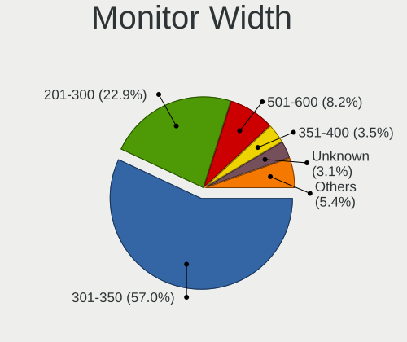

| Width in mm | Notebooks | Percent |
|-------------|-----------|---------|
| 301-350     | 739       | 56.98%  |
| 201-300     | 297       | 22.9%   |
| 501-600     | 106       | 8.17%   |
| 351-400     | 45        | 3.47%   |
| Unknown     | 40        | 3.08%   |
| 401-500     | 25        | 1.93%   |
| 601-700     | 16        | 1.23%   |
| 701-800     | 13        | 1%      |
| 1001-1500   | 8         | 0.62%   |
| 801-900     | 4         | 0.31%   |
| 101-200     | 2         | 0.15%   |
| 901-1000    | 1         | 0.08%   |
| 1-100       | 1         | 0.08%   |

Aspect Ratio
------------

Proportional relationship between the width and the height

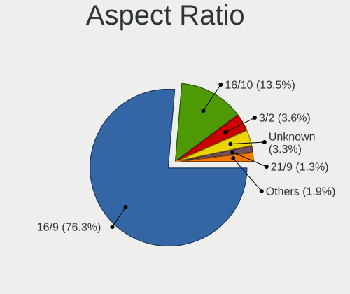

| Ratio   | Notebooks | Percent |
|---------|-----------|---------|
| 16/9    | 906       | 76.33%  |
| 16/10   | 160       | 13.48%  |
| 3/2     | 43        | 3.62%   |
| Unknown | 39        | 3.29%   |
| 21/9    | 16        | 1.35%   |
| 4/3     | 11        | 0.93%   |
| 5/4     | 5         | 0.42%   |
| 1.96    | 2         | 0.17%   |
| 6/5     | 1         | 0.08%   |
| 32/9    | 1         | 0.08%   |
| 3.18    | 1         | 0.08%   |
| 11/10   | 1         | 0.08%   |
| 0.46    | 1         | 0.08%   |

Monitor Area
------------

Area in inch²

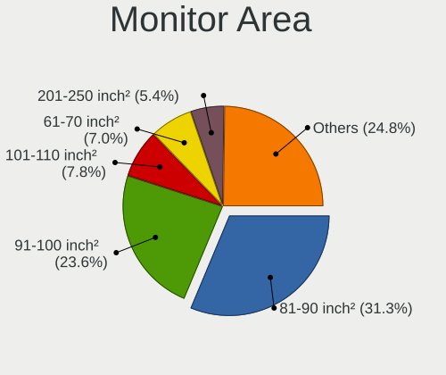

| Area in inch² | Notebooks | Percent |
|----------------|-----------|---------|
| 81-90          | 408       | 31.31%  |
| 91-100         | 308       | 23.64%  |
| 101-110        | 102       | 7.83%   |
| 61-70          | 91        | 6.98%   |
| 201-250        | 71        | 5.45%   |
| 71-80          | 54        | 4.14%   |
| 301-350        | 51        | 3.91%   |
| Unknown        | 40        | 3.07%   |
| 121-130        | 35        | 2.69%   |
| 111-120        | 30        | 2.3%    |
| 51-60          | 26        | 2%      |
| 351-500        | 21        | 1.61%   |
| 41-50          | 17        | 1.3%    |
| 251-300        | 11        | 0.84%   |
| 151-200        | 10        | 0.77%   |
| 501-1000       | 9         | 0.69%   |
| 141-150        | 7         | 0.54%   |
| 131-140        | 6         | 0.46%   |
| More than 1000 | 3         | 0.23%   |
| 1-40           | 3         | 0.23%   |

Pixel Density
-------------

Pixels per inch

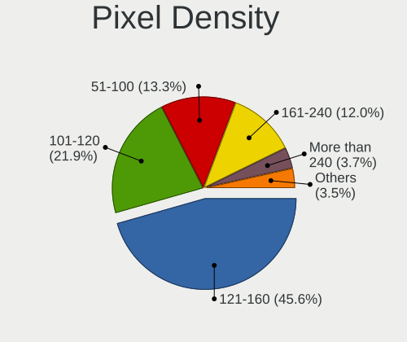

| Density       | Notebooks | Percent |
|---------------|-----------|---------|
| 121-160       | 584       | 45.59%  |
| 101-120       | 280       | 21.86%  |
| 51-100        | 170       | 13.27%  |
| 161-240       | 154       | 12.02%  |
| More than 240 | 48        | 3.75%   |
| Unknown       | 40        | 3.12%   |
| 1-50          | 5         | 0.39%   |

Multiple Monitors
-----------------

Total monitors connected

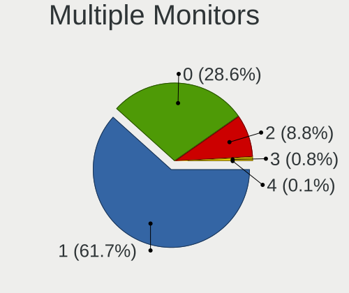

| Total | Notebooks | Percent |
|-------|-----------|---------|
| 1     | 1046      | 61.67%  |
| 0     | 485       | 28.6%   |
| 2     | 150       | 8.84%   |
| 3     | 14        | 0.83%   |
| 4     | 1         | 0.06%   |

Network
-------

Net Controller Vendor
---------------------

Controller vendors

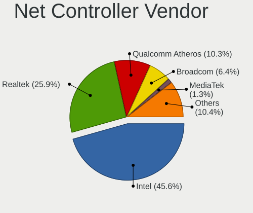

| Vendor                                 | Notebooks | Percent |
|----------------------------------------|-----------|---------|
| Intel                                  | 1140      | 45.62%  |
| Realtek Semiconductor                  | 648       | 25.93%  |
| Qualcomm Atheros                       | 257       | 10.28%  |
| Broadcom                               | 161       | 6.44%   |
| MediaTek                               | 32        | 1.28%   |
| TP-Link                                | 27        | 1.08%   |
| Marvell Technology Group               | 23        | 0.92%   |
| Ralink Technology                      | 20        | 0.8%    |
| Sierra Wireless                        | 19        | 0.76%   |
| Edimax Technology                      | 16        | 0.64%   |
| Ralink                                 | 13        | 0.52%   |
| Ericsson Business Mobile Networks      | 12        | 0.48%   |
| Samsung Electronics                    | 11        | 0.44%   |
| Xiaomi                                 | 9         | 0.36%   |
| Hewlett-Packard                        | 9         | 0.36%   |
| Google                                 | 9         | 0.36%   |
| Dell                                   | 8         | 0.32%   |
| Lenovo                                 | 6         | 0.24%   |
| D-Link System                          | 6         | 0.24%   |
| Qualcomm Technologies                  | 5         | 0.2%    |
| Qualcomm                               | 5         | 0.2%    |
| Nvidia                                 | 5         | 0.2%    |
| Huawei Technologies                    | 5         | 0.2%    |
| Fibocom                                | 5         | 0.2%    |
| D-Link                                 | 4         | 0.16%   |
| AMD                                    | 4         | 0.16%   |
| Silicon Integrated Systems [SiS]       | 3         | 0.12%   |
| NetGear                                | 3         | 0.12%   |
| Motorola PCS                           | 3         | 0.12%   |
| JMicron Technology                     | 3         | 0.12%   |
| ZTE WCDMA Technologies MSM             | 2         | 0.08%   |
| U-Blox                                 | 2         | 0.08%   |
| OPPO Electronics                       | 2         | 0.08%   |
| Arduino SA                             | 2         | 0.08%   |
| ZyXEL Communications                   | 1         | 0.04%   |
| Van Ooijen Technische Informatica      | 1         | 0.04%   |
| ULi Electronics                        | 1         | 0.04%   |
| Sony Ericsson Mobile Communications AB | 1         | 0.04%   |
| Shenzhen Goodix Technology             | 1         | 0.04%   |
| Sagem                                  | 1         | 0.04%   |

Net Controller Model
--------------------

Controller models

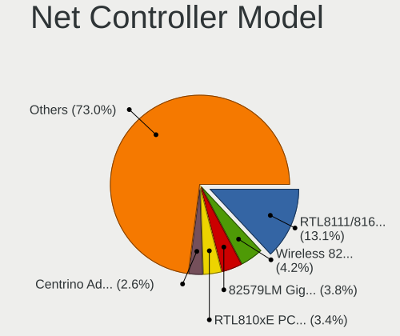

| Model                                                                  | Notebooks | Percent |
|------------------------------------------------------------------------|-----------|---------|
| Realtek RTL8111/8168/8211/8411 PCI Express Gigabit Ethernet Controller | 419       | 13.06%  |
| Intel Wireless 8265 / 8275                                             | 136       | 4.24%   |
| Intel 82579LM Gigabit Network Connection (Lewisville)                  | 121       | 3.77%   |
| Realtek RTL810xE PCI Express Fast Ethernet controller                  | 109       | 3.4%    |
| Intel Centrino Advanced-N 6205 [Taylor Peak]                           | 83        | 2.59%   |
| Intel Wireless 8260                                                    | 72        | 2.24%   |
| Intel Wi-Fi 6 AX200                                                    | 72        | 2.24%   |
| Intel Wireless 7265                                                    | 68        | 2.12%   |
| Intel Wi-Fi 6 AX201                                                    | 65        | 2.03%   |
| Intel Wireless 7260                                                    | 59        | 1.84%   |
| Intel Wi-Fi 6E(802.11ax) AX210/AX1675* 2x2 [Typhoon Peak]              | 59        | 1.84%   |
| Intel Ethernet Connection (4) I219-LM                                  | 59        | 1.84%   |
| Qualcomm Atheros QCA9565 / AR9565 Wireless Network Adapter             | 44        | 1.37%   |
| Qualcomm Atheros AR9285 Wireless Network Adapter (PCI-Express)         | 43        | 1.34%   |
| Intel Comet Lake PCH-LP CNVi WiFi                                      | 43        | 1.34%   |
| Realtek RTL8188EUS 802.11n Wireless Network Adapter                    | 42        | 1.31%   |
| Intel Cannon Point-LP CNVi [Wireless-AC]                               | 40        | 1.25%   |
| Intel Wi-Fi 5(802.11ac) Wireless-AC 9x6x [Thunder Peak]                | 39        | 1.22%   |
| Intel Ethernet Connection I219-LM                                      | 39        | 1.22%   |
| Intel Ethernet Connection (4) I219-V                                   | 35        | 1.09%   |
| Qualcomm Atheros QCA9377 802.11ac Wireless Network Adapter             | 33        | 1.03%   |
| Intel Ethernet Connection (3) I218-LM                                  | 33        | 1.03%   |
| Realtek RTL8821CE 802.11ac PCIe Wireless Network Adapter               | 30        | 0.93%   |
| Qualcomm Atheros AR9485 Wireless Network Adapter                       | 28        | 0.87%   |
| Intel Raptor Lake PCH CNVi WiFi                                        | 27        | 0.84%   |
| Realtek RTL8822CE 802.11ac PCIe Wireless Network Adapter               | 26        | 0.81%   |
| Intel Ethernet Connection I217-LM                                      | 26        | 0.81%   |
| Intel Centrino Ultimate-N 6300                                         | 26        | 0.81%   |
| Intel Alder Lake-P PCH CNVi WiFi                                       | 24        | 0.75%   |
| Qualcomm Atheros QCA6174 802.11ac Wireless Network Adapter             | 22        | 0.69%   |
| Qualcomm Atheros AR9462 Wireless Network Adapter                       | 21        | 0.65%   |
| Intel Comet Lake PCH CNVi WiFi                                         | 21        | 0.65%   |
| Intel Cannon Lake PCH CNVi WiFi                                        | 21        | 0.65%   |
| Intel Ethernet Connection I218-LM                                      | 20        | 0.62%   |
| Intel 82577LM Gigabit Network Connection                               | 19        | 0.59%   |
| Intel Wireless 3165                                                    | 18        | 0.56%   |
| Intel PRO/Wireless 3945ABG [Golan] Network Connection                  | 18        | 0.56%   |
| Intel Ethernet Connection (6) I219-LM                                  | 18        | 0.56%   |
| Intel 82567LM Gigabit Network Connection                               | 18        | 0.56%   |
| Broadcom BCM4313 802.11bgn Wireless Network Adapter                    | 18        | 0.56%   |

Wireless Vendor
---------------

Wireless vendors

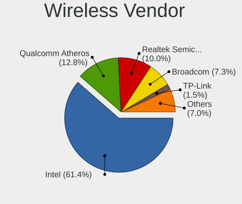

| Vendor                                | Notebooks | Percent |
|---------------------------------------|-----------|---------|
| Intel                                 | 1086      | 61.39%  |
| Qualcomm Atheros                      | 227       | 12.83%  |
| Realtek Semiconductor                 | 177       | 10.01%  |
| Broadcom                              | 129       | 7.29%   |
| TP-Link                               | 27        | 1.53%   |
| MediaTek                              | 27        | 1.53%   |
| Ralink Technology                     | 20        | 1.13%   |
| Edimax Technology                     | 16        | 0.9%    |
| Sierra Wireless                       | 15        | 0.85%   |
| Ralink                                | 13        | 0.73%   |
| Dell                                  | 6         | 0.34%   |
| D-Link System                         | 6         | 0.34%   |
| Qualcomm Technologies                 | 5         | 0.28%   |
| D-Link                                | 4         | 0.23%   |
| NetGear                               | 3         | 0.17%   |
| ZyXEL Communications                  | 1         | 0.06%   |
| Sagem                                 | 1         | 0.06%   |
| Qualcomm Atheros Communications       | 1         | 0.06%   |
| Micro Star International              | 1         | 0.06%   |
| BUFFALO                               | 1         | 0.06%   |
| Belkin Components                     | 1         | 0.06%   |
| Atheros                               | 1         | 0.06%   |
| 802.11g Adapter [Linksys WUSB54GC v3] | 1         | 0.06%   |

Wireless Model
--------------

Wireless models

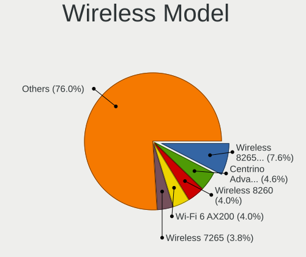

| Model                                                                | Notebooks | Percent |
|----------------------------------------------------------------------|-----------|---------|
| Intel Wireless 8265 / 8275                                           | 136       | 7.58%   |
| Intel Centrino Advanced-N 6205 [Taylor Peak]                         | 83        | 4.63%   |
| Intel Wireless 8260                                                  | 72        | 4.01%   |
| Intel Wi-Fi 6 AX200                                                  | 72        | 4.01%   |
| Intel Wireless 7265                                                  | 68        | 3.79%   |
| Intel Wi-Fi 6 AX201                                                  | 65        | 3.62%   |
| Intel Wireless 7260                                                  | 59        | 3.29%   |
| Intel Wi-Fi 6E(802.11ax) AX210/AX1675* 2x2 [Typhoon Peak]            | 59        | 3.29%   |
| Qualcomm Atheros QCA9565 / AR9565 Wireless Network Adapter           | 44        | 2.45%   |
| Qualcomm Atheros AR9285 Wireless Network Adapter (PCI-Express)       | 43        | 2.4%    |
| Intel Comet Lake PCH-LP CNVi WiFi                                    | 43        | 2.4%    |
| Realtek RTL8188EUS 802.11n Wireless Network Adapter                  | 42        | 2.34%   |
| Intel Cannon Point-LP CNVi [Wireless-AC]                             | 40        | 2.23%   |
| Intel Wi-Fi 5(802.11ac) Wireless-AC 9x6x [Thunder Peak]              | 39        | 2.17%   |
| Qualcomm Atheros QCA9377 802.11ac Wireless Network Adapter           | 33        | 1.84%   |
| Realtek RTL8821CE 802.11ac PCIe Wireless Network Adapter             | 30        | 1.67%   |
| Qualcomm Atheros AR9485 Wireless Network Adapter                     | 28        | 1.56%   |
| Intel Raptor Lake PCH CNVi WiFi                                      | 27        | 1.51%   |
| Realtek RTL8822CE 802.11ac PCIe Wireless Network Adapter             | 26        | 1.45%   |
| Intel Centrino Ultimate-N 6300                                       | 25        | 1.39%   |
| Intel Alder Lake-P PCH CNVi WiFi                                     | 24        | 1.34%   |
| Qualcomm Atheros QCA6174 802.11ac Wireless Network Adapter           | 22        | 1.23%   |
| Qualcomm Atheros AR9462 Wireless Network Adapter                     | 21        | 1.17%   |
| Intel Comet Lake PCH CNVi WiFi                                       | 21        | 1.17%   |
| Intel Cannon Lake PCH CNVi WiFi                                      | 21        | 1.17%   |
| Intel Wireless 3165                                                  | 18        | 1%      |
| Intel PRO/Wireless 3945ABG [Golan] Network Connection                | 18        | 1%      |
| Broadcom BCM4313 802.11bgn Wireless Network Adapter                  | 18        | 1%      |
| TP-Link AC600 wireless Realtek RTL8811AU [Archer T2U Nano]           | 17        | 0.95%   |
| Intel Wireless 3160                                                  | 17        | 0.95%   |
| Intel Dual Band Wireless-AC 3168NGW [Stone Peak]                     | 17        | 0.95%   |
| Intel Dual Band Wireless-AC 3165 Plus Bluetooth                      | 17        | 0.95%   |
| Broadcom BCM4360 802.11ac Dual Band Wireless Network Adapter         | 17        | 0.95%   |
| MediaTek MT7921 802.11ax PCIe Wireless Network Adapter [Filogic 330] | 15        | 0.84%   |
| Intel Centrino Advanced-N 6200                                       | 14        | 0.78%   |
| Broadcom BCM43224 802.11a/b/g/n                                      | 14        | 0.78%   |
| Intel WiFi Link 5100                                                 | 13        | 0.72%   |
| Broadcom BCM4331 802.11a/b/g/n                                       | 13        | 0.72%   |
| Broadcom BCM4312 802.11b/g LP-PHY                                    | 13        | 0.72%   |
| Realtek RTL8723BE PCIe Wireless Network Adapter                      | 12        | 0.67%   |

Ethernet Vendor
---------------

Ethernet vendors

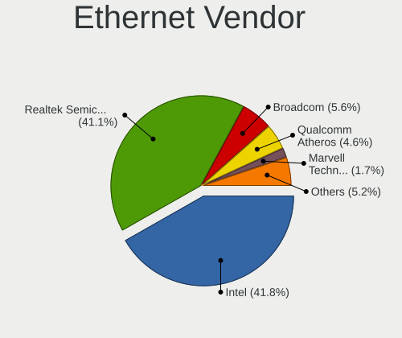

| Vendor                                 | Notebooks | Percent |
|----------------------------------------|-----------|---------|
| Intel                                  | 559       | 41.78%  |
| Realtek Semiconductor                  | 550       | 41.11%  |
| Broadcom                               | 75        | 5.61%   |
| Qualcomm Atheros                       | 62        | 4.63%   |
| Marvell Technology Group               | 23        | 1.72%   |
| Samsung Electronics                    | 11        | 0.82%   |
| Xiaomi                                 | 9         | 0.67%   |
| Lenovo                                 | 6         | 0.45%   |
| Qualcomm                               | 5         | 0.37%   |
| Nvidia                                 | 5         | 0.37%   |
| Google                                 | 5         | 0.37%   |
| MediaTek                               | 4         | 0.3%    |
| AMD                                    | 4         | 0.3%    |
| Motorola PCS                           | 3         | 0.22%   |
| JMicron Technology                     | 3         | 0.22%   |
| Silicon Integrated Systems [SiS]       | 2         | 0.15%   |
| OPPO Electronics                       | 2         | 0.15%   |
| Huawei Technologies                    | 2         | 0.15%   |
| ZTE WCDMA Technologies MSM             | 1         | 0.07%   |
| Sony Ericsson Mobile Communications AB | 1         | 0.07%   |
| Realtek                                | 1         | 0.07%   |
| National Semiconductor                 | 1         | 0.07%   |
| Microchip Technology                   | 1         | 0.07%   |
| HMD Global                             | 1         | 0.07%   |
| Aquantia                               | 1         | 0.07%   |
| Apple                                  | 1         | 0.07%   |

Ethernet Model
--------------

Ethernet models

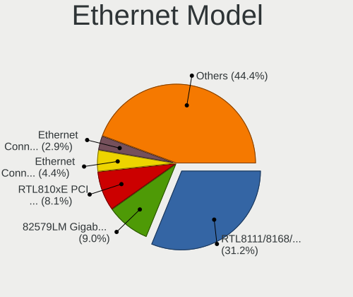

| Model                                                                  | Notebooks | Percent |
|------------------------------------------------------------------------|-----------|---------|
| Realtek RTL8111/8168/8211/8411 PCI Express Gigabit Ethernet Controller | 419       | 31.2%   |
| Intel 82579LM Gigabit Network Connection (Lewisville)                  | 121       | 9.01%   |
| Realtek RTL810xE PCI Express Fast Ethernet controller                  | 109       | 8.12%   |
| Intel Ethernet Connection (4) I219-LM                                  | 59        | 4.39%   |
| Intel Ethernet Connection I219-LM                                      | 39        | 2.9%    |
| Intel Ethernet Connection (4) I219-V                                   | 35        | 2.61%   |
| Intel Ethernet Connection (3) I218-LM                                  | 33        | 2.46%   |
| Intel Ethernet Connection I217-LM                                      | 26        | 1.94%   |
| Intel Ethernet Connection I218-LM                                      | 20        | 1.49%   |
| Intel 82577LM Gigabit Network Connection                               | 19        | 1.41%   |
| Intel Ethernet Connection (6) I219-LM                                  | 18        | 1.34%   |
| Intel 82567LM Gigabit Network Connection                               | 18        | 1.34%   |
| Intel Ethernet Connection (2) I219-LM                                  | 14        | 1.04%   |
| Broadcom NetXtreme BCM5764M Gigabit Ethernet PCIe                      | 13        | 0.97%   |
| Intel Ethernet Connection I219-V                                       | 12        | 0.89%   |
| Intel Ethernet Connection (7) I219-LM                                  | 12        | 0.89%   |
| Intel Ethernet Connection (6) I219-V                                   | 12        | 0.89%   |
| Broadcom NetXtreme BCM57765 Gigabit Ethernet PCIe                      | 11        | 0.82%   |
| Qualcomm Atheros AR8151 v2.0 Gigabit Ethernet                          | 10        | 0.74%   |
| Qualcomm Atheros AR8132 Fast Ethernet                                  | 10        | 0.74%   |
| Intel Ethernet Connection (10) I219-V                                  | 10        | 0.74%   |
| Marvell Group 88E8040 PCI-E Fast Ethernet Controller                   | 9         | 0.67%   |
| Intel Ethernet Connection (23) I219-V                                  | 9         | 0.67%   |
| Intel Ethernet Connection (3) I218-V                                   | 8         | 0.6%    |
| Intel Ethernet Connection (16) I219-LM                                 | 8         | 0.6%    |
| Samsung Galaxy series, misc. (tethering mode)                          | 7         | 0.52%   |
| Realtek USB 2.5GbE Controller                                          | 7         | 0.52%   |
| Qualcomm Atheros Killer E2500 Gigabit Ethernet Controller              | 7         | 0.52%   |
| Qualcomm Atheros AR8152 v2.0 Fast Ethernet                             | 7         | 0.52%   |
| Intel Ethernet Connection (7) I219-V                                   | 7         | 0.52%   |
| Realtek RTL-8100/8101L/8139 PCI Fast Ethernet Adapter                  | 6         | 0.45%   |
| Qualcomm Atheros AR8162 Fast Ethernet                                  | 6         | 0.45%   |
| Intel I210 Gigabit Network Connection                                  | 6         | 0.45%   |
| Intel Ethernet Connection (16) I219-V                                  | 6         | 0.45%   |
| Intel 82566MM Gigabit Network Connection                               | 6         | 0.45%   |
| Broadcom BCM4401-B0 100Base-TX                                         | 6         | 0.45%   |
| Xiaomi Mi/Redmi series (RNDIS)                                         | 5         | 0.37%   |
| Nvidia MCP79 Ethernet                                                  | 5         | 0.37%   |
| Lenovo USB-C Dock Ethernet                                             | 5         | 0.37%   |
| Intel Ethernet Connection (18) I219-LM                                 | 5         | 0.37%   |

Net Controller Kind
-------------------

Ethernet, WiFi or modem

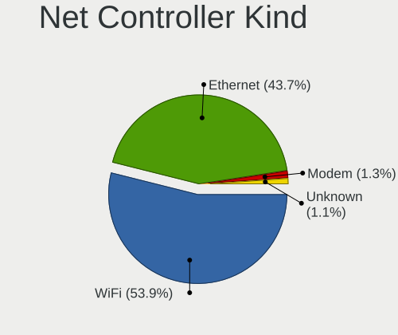

| Kind     | Notebooks | Percent |
|----------|-----------|---------|
| WiFi     | 1603      | 53.9%   |
| Ethernet | 1299      | 43.68%  |
| Modem    | 39        | 1.31%   |
| Unknown  | 33        | 1.11%   |

Used Controller
---------------

Currently used network controller

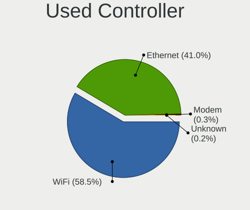

| Kind     | Notebooks | Percent |
|----------|-----------|---------|
| WiFi     | 1118      | 58.53%  |
| Ethernet | 784       | 41.05%  |
| Modem    | 5         | 0.26%   |
| Unknown  | 3         | 0.16%   |

NICs
----

Total network controllers on board

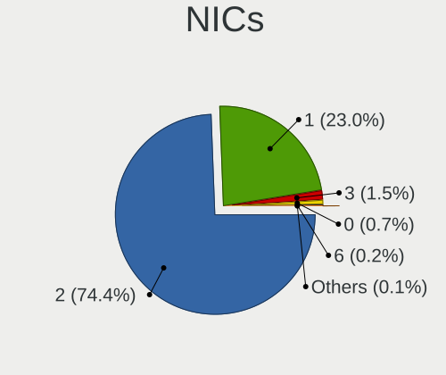

| Total | Notebooks | Percent |
|-------|-----------|---------|
| 2     | 1218      | 74.4%   |
| 1     | 377       | 23.03%  |
| 3     | 25        | 1.53%   |
| 0     | 12        | 0.73%   |
| 6     | 3         | 0.18%   |
| 5     | 1         | 0.06%   |
| 4     | 1         | 0.06%   |

IPv6
----

IPv6 vs IPv4

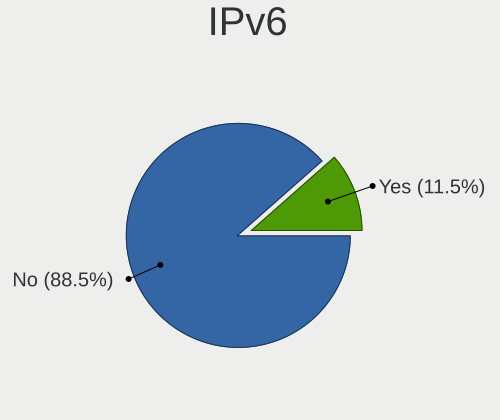

| Used | Notebooks | Percent |
|------|-----------|---------|
| No   | 1469      | 88.49%  |
| Yes  | 191       | 11.51%  |

Bluetooth
---------

Bluetooth Vendor
----------------

Controller vendors

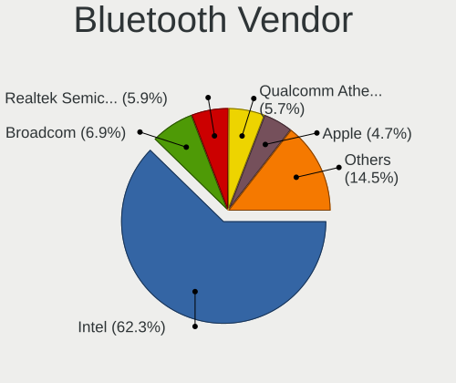

| Vendor                          | Notebooks | Percent |
|---------------------------------|-----------|---------|
| Intel                           | 783       | 62.29%  |
| Broadcom                        | 87        | 6.92%   |
| Realtek Semiconductor           | 74        | 5.89%   |
| Qualcomm Atheros Communications | 72        | 5.73%   |
| Apple                           | 59        | 4.69%   |
| Foxconn / Hon Hai               | 35        | 2.78%   |
| IMC Networks                    | 33        | 2.63%   |
| Lite-On Technology              | 29        | 2.31%   |
| Dell                            | 19        | 1.51%   |
| Hewlett-Packard                 | 16        | 1.27%   |
| MediaTek                        | 8         | 0.64%   |
| Skylight Digital                | 6         | 0.48%   |
| Cambridge Silicon Radio         | 6         | 0.48%   |
| ASUSTek Computer                | 6         | 0.48%   |
| TP-Link                         | 4         | 0.32%   |
| Ralink                          | 4         | 0.32%   |
| Alps Electric                   | 4         | 0.32%   |
| USI                             | 3         | 0.24%   |
| Shenzhen Goodix Technology      | 2         | 0.16%   |
| Toshiba                         | 1         | 0.08%   |
| Ralink Technology               | 1         | 0.08%   |
| Opticis                         | 1         | 0.08%   |
| Fujitsu                         | 1         | 0.08%   |
| Esel International              | 1         | 0.08%   |
| Creative Technology             | 1         | 0.08%   |
| Askey Computer                  | 1         | 0.08%   |

Bluetooth Model
---------------

Controller models

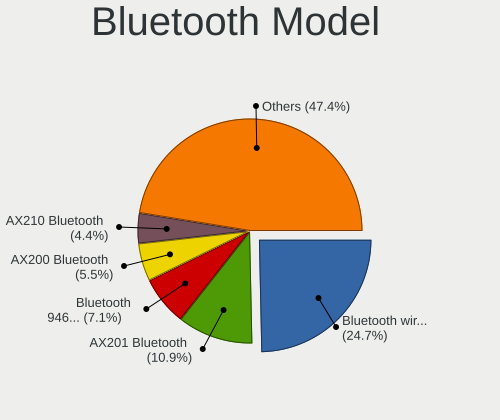

| Model                                                       | Notebooks | Percent |
|-------------------------------------------------------------|-----------|---------|
| Intel Bluetooth wireless interface                          | 311       | 24.66%  |
| Intel AX201 Bluetooth                                       | 138       | 10.94%  |
| Intel Bluetooth 9460/9560 Jefferson Peak (JfP)              | 90        | 7.14%   |
| Intel AX200 Bluetooth                                       | 69        | 5.47%   |
| Intel AX210 Bluetooth                                       | 55        | 4.36%   |
| Intel AX211 Bluetooth                                       | 49        | 3.89%   |
| Apple Bluetooth Host Controller                             | 38        | 3.01%   |
| Realtek Bluetooth Adapter                                   | 33        | 2.62%   |
| Broadcom BCM20702 Bluetooth 4.0 [ThinkPad]                  | 32        | 2.54%   |
| Intel Wireless-AC 9260 Bluetooth Adapter                    | 31        | 2.46%   |
| Broadcom BCM2045B (BDC-2.1)                                 | 28        | 2.22%   |
| Intel Wireless-AC 3168 Bluetooth                            | 17        | 1.35%   |
| Intel Centrino Bluetooth Wireless Transceiver               | 15        | 1.19%   |
| Foxconn / Hon Hai Bluetooth USB Module                      | 15        | 1.19%   |
| Qualcomm Atheros QCA9377 Bluetooth 4.1                      | 14        | 1.11%   |
| Realtek  Bluetooth 4.2 Adapter                              | 12        | 0.95%   |
| Apple Broadcom Built-in Bluetooth                           | 12        | 0.95%   |
| Qualcomm Atheros AR9462 Bluetooth                           | 11        | 0.87%   |
| Qualcomm Atheros AR3012 Bluetooth 4.0                       | 11        | 0.87%   |
| Qualcomm Atheros QCA61x4 Bluetooth 4.0                      | 10        | 0.79%   |
| IMC Networks Realtek Bluetooth Adapter                      | 10        | 0.79%   |
| Intel Centrino Advanced-N 6230 Bluetooth adapter            | 9         | 0.71%   |
| Foxconn / Hon Hai MediaTek Bluetooth Adapter                | 9         | 0.71%   |
| Dell DW375 Bluetooth Module                                 | 9         | 0.71%   |
| Realtek Bluetooth 4.2 Adapter                               | 8         | 0.63%   |
| Realtek Bluetooth 4.0 Adapter                               | 8         | 0.63%   |
| Qualcomm Atheros Dell Wireless 1707 Bluetooth 4.0 LE Device | 7         | 0.56%   |
| Lite-On Bluetooth USB Module                                | 7         | 0.56%   |
| Lite-On Atheros AR3012 Bluetooth                            | 7         | 0.56%   |
| Skylight Digital Realtek Bluetooth Adapter                  | 6         | 0.48%   |
| Lite-On Qualcomm Atheros QCA9377 Bluetooth                  | 6         | 0.48%   |
| HP Broadcom 2070 Bluetooth Combo                            | 6         | 0.48%   |
| HP Bluetooth 2.0 Interface [Broadcom BCM2045]               | 6         | 0.48%   |
| Cambridge Silicon Radio Bluetooth Dongle (HCI mode)         | 6         | 0.48%   |
| Broadcom BCM2045B (BDC-2) [Bluetooth Controller]            | 6         | 0.48%   |
| MediaTek Wireless_Device                                    | 5         | 0.4%    |
| IMC Networks MediaTek Bluetooth Adapter                     | 5         | 0.4%    |
| Apple Built-in Bluetooth 2.0+EDR HCI                        | 5         | 0.4%    |
| TP-Link Bluetooth 5.0 USB Adapter                           | 4         | 0.32%   |
| Realtek Wireless Bluetooth Adapter                          | 4         | 0.32%   |

Sound
-----

Sound Vendor
------------

Sound card vendors

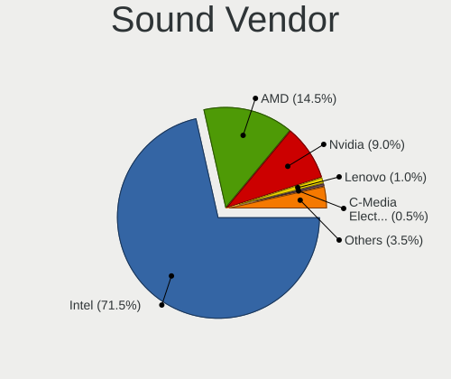

| Vendor                               | Notebooks | Percent |
|--------------------------------------|-----------|---------|
| Intel                                | 1367      | 71.5%   |
| AMD                                  | 278       | 14.54%  |
| Nvidia                               | 172       | 9%      |
| Lenovo                               | 19        | 0.99%   |
| C-Media Electronics                  | 9         | 0.47%   |
| Texas Instruments                    | 8         | 0.42%   |
| Logitech                             | 8         | 0.42%   |
| Realtek Semiconductor                | 7         | 0.37%   |
| GN Netcom                            | 7         | 0.37%   |
| Plantronics                          | 5         | 0.26%   |
| ASUSTek Computer                     | 4         | 0.21%   |
| SteelSeries ApS                      | 3         | 0.16%   |
| Silicon Integrated Systems [SiS]     | 3         | 0.16%   |
| JMTek                                | 3         | 0.16%   |
| Kingston Technology                  | 2         | 0.1%    |
| Generalplus Technology               | 2         | 0.1%    |
| CMX Systems                          | 2         | 0.1%    |
| ULi Electronics                      | 1         | 0.05%   |
| Thesycon Systemsoftware & Consulting | 1         | 0.05%   |
| Sony                                 | 1         | 0.05%   |
| RODE Microphones                     | 1         | 0.05%   |
| PS Audio                             | 1         | 0.05%   |
| Microsoft                            | 1         | 0.05%   |
| M-Audio                              | 1         | 0.05%   |
| Hewlett-Packard                      | 1         | 0.05%   |
| ESS Technology                       | 1         | 0.05%   |
| DSEA A/S                             | 1         | 0.05%   |
| Creative Technology                  | 1         | 0.05%   |
| Cambridge Silicon Radio              | 1         | 0.05%   |
| -- KTMicro --                        | 1         | 0.05%   |

Sound Model
-----------

Sound card models

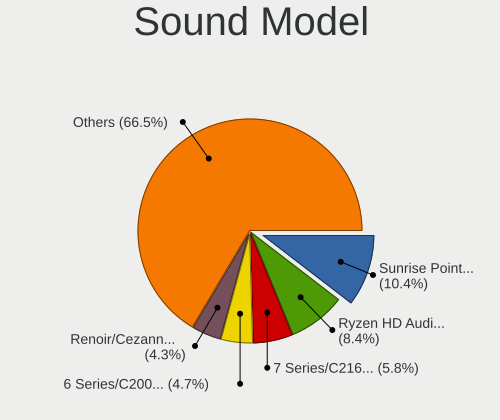

| Model                                                                                             | Notebooks | Percent |
|---------------------------------------------------------------------------------------------------|-----------|---------|
| Intel Sunrise Point-LP HD Audio                                                                   | 242       | 10.43%  |
| AMD Ryzen HD Audio Controller                                                                     | 194       | 8.36%   |
| Intel 7 Series/C216 Chipset Family High Definition Audio Controller                               | 134       | 5.78%   |
| Intel 6 Series/C200 Series Chipset Family High Definition Audio Controller                        | 108       | 4.66%   |
| AMD Renoir/Cezanne HDMI/DP Audio Controller                                                       | 100       | 4.31%   |
| Intel Tiger Lake-LP Smart Sound Technology Audio Controller                                       | 80        | 3.45%   |
| Intel Broadwell-U Audio Controller                                                                | 78        | 3.36%   |
| Intel Wildcat Point-LP High Definition Audio Controller                                           | 74        | 3.19%   |
| Intel Haswell-ULT HD Audio Controller                                                             | 67        | 2.89%   |
| Intel 8 Series HD Audio Controller                                                                | 67        | 2.89%   |
| Intel Cannon Point-LP High Definition Audio Controller                                            | 58        | 2.5%    |
| Intel NM10/ICH7 Family High Definition Audio Controller                                           | 54        | 2.33%   |
| Intel Comet Lake PCH-LP cAVS                                                                      | 52        | 2.24%   |
| Intel 5 Series/3400 Series Chipset High Definition Audio                                          | 52        | 2.24%   |
| Intel Cannon Lake PCH cAVS                                                                        | 51        | 2.2%    |
| AMD Raven/Raven2/Fenghuang HDMI/DP Audio Controller                                               | 47        | 2.03%   |
| Intel 82801I (ICH9 Family) HD Audio Controller                                                    | 45        | 1.94%   |
| Intel 8 Series/C220 Series Chipset High Definition Audio Controller                               | 45        | 1.94%   |
| AMD Radeon High Definition Audio Controller                                                       | 38        | 1.64%   |
| Nvidia TU107 GeForce GTX 1650 High Definition Audio Controller                                    | 36        | 1.55%   |
| Intel Xeon E3-1200 v3/4th Gen Core Processor HD Audio Controller                                  | 34        | 1.47%   |
| Intel 82801H (ICH8 Family) HD Audio Controller                                                    | 34        | 1.47%   |
| Intel Raptor Lake-P/U/H cAVS                                                                      | 33        | 1.42%   |
| Intel Alder Lake PCH-P High Definition Audio Controller                                           | 33        | 1.42%   |
| Intel Comet Lake PCH cAVS                                                                         | 24        | 1.03%   |
| Intel CM238 HD Audio Controller                                                                   | 24        | 1.03%   |
| Intel 100 Series/C230 Series Chipset Family HD Audio Controller                                   | 23        | 0.99%   |
| AMD FCH Azalia Controller                                                                         | 19        | 0.82%   |
| Intel Celeron/Pentium Silver Processor High Definition Audio                                      | 18        | 0.78%   |
| Intel Atom/Celeron/Pentium Processor x5-E8000/J3xxx/N3xxx Series High Definition Audio Controller | 17        | 0.73%   |
| Intel Atom Processor Z36xxx/Z37xxx Series High Definition Audio Controller                        | 17        | 0.73%   |
| Nvidia AD107 High Definition Audio Controller                                                     | 15        | 0.65%   |
| AMD SBx00 Azalia (Intel HDA)                                                                      | 15        | 0.65%   |
| Intel Ice Lake-LP Smart Sound Technology Audio Controller                                         | 13        | 0.56%   |
| Nvidia GA107 High Definition Audio Controller                                                     | 12        | 0.52%   |
| Intel Tiger Lake-H HD Audio Controller                                                            | 12        | 0.52%   |
| Intel Raptor Lake High Definition Audio Controller                                                | 12        | 0.52%   |
| AMD Kabini HDMI/DP Audio                                                                          | 12        | 0.52%   |
| Nvidia GT216 HDMI Audio Controller                                                                | 10        | 0.43%   |
| Nvidia GA104 High Definition Audio Controller                                                     | 10        | 0.43%   |

Memory
------

Memory Vendor
-------------

Memory module vendors

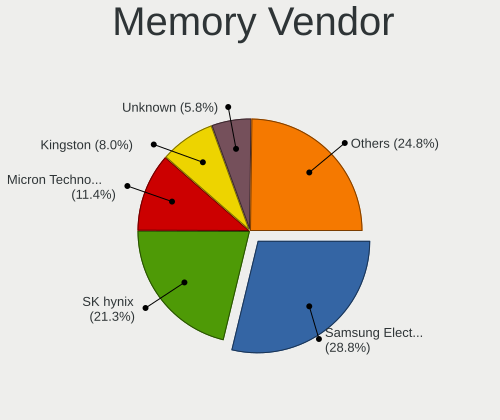

| Vendor              | Notebooks | Percent |
|---------------------|-----------|---------|
| Samsung Electronics | 564       | 28.78%  |
| SK hynix            | 417       | 21.28%  |
| Micron Technology   | 223       | 11.38%  |
| Kingston            | 157       | 8.01%   |
| Unknown             | 113       | 5.77%   |
| Crucial             | 110       | 5.61%   |
| Unknown             | 57        | 2.91%   |
| Ramaxel Technology  | 51        | 2.6%    |
| A-DATA Technology   | 37        | 1.89%   |
| Elpida              | 36        | 1.84%   |
| Corsair             | 25        | 1.28%   |
| Nanya Technology    | 19        | 0.97%   |
| Team                | 16        | 0.82%   |
| G.Skill             | 15        | 0.77%   |
| Transcend           | 12        | 0.61%   |
| Smart               | 11        | 0.56%   |
| Unknown (ABCD)      | 8         | 0.41%   |
| PNY                 | 6         | 0.31%   |
| Avant               | 6         | 0.31%   |
| Neo Forza           | 5         | 0.26%   |
| Goldkey             | 5         | 0.26%   |
| 48spaces            | 5         | 0.26%   |
| Patriot             | 4         | 0.2%    |
| GOODRAM             | 4         | 0.2%    |
| Apacer              | 4         | 0.2%    |
| Timetec             | 3         | 0.15%   |
| Magnum Tech         | 3         | 0.15%   |
| CSX                 | 3         | 0.15%   |
| AMD                 | 3         | 0.15%   |
| V-GeN               | 2         | 0.1%    |
| Teikon              | 2         | 0.1%    |
| Super Talent        | 2         | 0.1%    |
| PUSKILL             | 2         | 0.1%    |
| KomputerBay         | 2         | 0.1%    |
| fef5                | 2         | 0.1%    |
| ChangXin Memory     | 2         | 0.1%    |
| Wodposit            | 1         | 0.05%   |
| Wilk                | 1         | 0.05%   |
| V-Color             | 1         | 0.05%   |
| Unknown (F301)      | 1         | 0.05%   |

Memory Model
------------

Memory module models

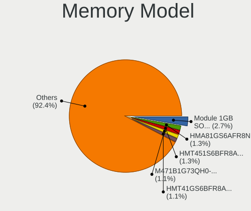

| Model                                                            | Notebooks | Percent |
|------------------------------------------------------------------|-----------|---------|
| Unknown                                                          | 57        | 2.72%   |
| SK hynix RAM HMA81GS6AFR8N-UH 8GB SODIMM DDR4 2400MT/s           | 28        | 1.34%   |
| SK hynix RAM HMT451S6BFR8A-PB 4GB SODIMM DDR3 1600MT/s           | 27        | 1.29%   |
| SK hynix RAM HMT41GS6BFR8A-PB 8GB SODIMM DDR3 1600MT/s           | 24        | 1.15%   |
| Samsung RAM M471B1G73QH0-YK0 8GB SODIMM DDR3 1867MT/s            | 24        | 1.15%   |
| Samsung RAM M471B5273DH0-CH9 4GB SODIMM DDR3 1334MT/s            | 23        | 1.1%    |
| SK hynix RAM HMT351S6CFR8C-PB 4GB SODIMM DDR3 1600MT/s           | 21        | 1%      |
| Samsung RAM M471B5173QH0-YK0 4GB SODIMM DDR3 1600MT/s            | 21        | 1%      |
| Samsung RAM M471B1G73EB0-YK0 8GB SODIMM DDR3 1600MT/s            | 20        | 0.95%   |
| Samsung RAM M471B5173DB0-YK0 4GB SODIMM DDR3 1600MT/s            | 19        | 0.91%   |
| Samsung RAM M471A1K43BB1-CRC 8GB SODIMM DDR4 2400MT/s            | 18        | 0.86%   |
| SK hynix RAM HMA81GS6CJR8N-VK 8GB SODIMM DDR4 2667MT/s           | 16        | 0.76%   |
| Samsung RAM M471A1K43CB1-CRC 8GB SODIMM DDR4 2667MT/s            | 16        | 0.76%   |
| Samsung RAM M471A1G44BB0-CWE 8GB SODIMM DDR4 3200MT/s            | 16        | 0.76%   |
| Samsung RAM M471B5273CH0-CH9 4GB SODIMM DDR3 1334MT/s            | 15        | 0.72%   |
| Samsung RAM M471B5273DH0-CK0 8GB SODIMM DDR3 1600MT/s            | 14        | 0.67%   |
| SK hynix RAM HMAA1GS6CJR6N-XN 8GB SODIMM DDR4 3200MT/s           | 13        | 0.62%   |
| Samsung RAM M471A5244CB0-CRC 4GB SODIMM DDR4 2400MT/s            | 13        | 0.62%   |
| Samsung RAM M471A1G44AB0-CWE 8GB SODIMM DDR4 3200MT/s            | 13        | 0.62%   |
| SK hynix RAM HMA82GS6CJR8N-VK 16GB SODIMM DDR4 2667MT/s          | 12        | 0.57%   |
| Samsung RAM M471A1K43DB1-CTD 8GB SODIMM DDR4 2667MT/s            | 12        | 0.57%   |
| Samsung RAM M471A1K43CB1-CTD 8GB SODIMM DDR4 3200MT/s            | 12        | 0.57%   |
| Samsung RAM M471A5244CB0-CWE 4GB SODIMM DDR4 3200MT/s            | 11        | 0.52%   |
| Samsung RAM M471A2K43CB1-CTD 16GB SODIMM DDR4 2667MT/s           | 11        | 0.52%   |
| Samsung RAM M471A2G44AM0-CWE 16GiB SODIMM DDR4 3200MT/s          | 11        | 0.52%   |
| Ramaxel RAM RMSA3260ME78HAF-2666 8GB SODIMM DDR4 2667MT/s        | 11        | 0.52%   |
| Micron RAM 4ATF1G64HZ-3G2E1 8GB SODIMM DDR4 3200MT/s             | 11        | 0.52%   |
| Unknown RAM Module 2GB SODIMM DDR2 667MT/s                       | 10        | 0.48%   |
| SK hynix RAM Module 4GB SODIMM DDR3 1600MT/s                     | 10        | 0.48%   |
| SK hynix RAM HYMP125S64CP8-S6 2GB SODIMM DDR2 975MT/s            | 10        | 0.48%   |
| Samsung RAM M471A2K43CB1-CRC 16GB SODIMM DDR4 2400MT/s           | 10        | 0.48%   |
| SK hynix RAM HMA851S6AFR6N-UH 4GB SODIMM DDR4 2400MT/s           | 9         | 0.43%   |
| SK hynix RAM HMA82GS6AFR8N-UH 16GB SODIMM DDR4 2400MT/s          | 9         | 0.43%   |
| Samsung RAM M471B5773CHS-CH9 2GB SODIMM DDR3 1333MT/s            | 9         | 0.43%   |
| Samsung RAM M471B5173EB0-YK0 4GB SODIMM DDR3 1600MT/s            | 9         | 0.43%   |
| Samsung RAM M471A5244CB0-CTD 4GB SODIMM DDR4 3200MT/s            | 9         | 0.43%   |
| Samsung RAM M471A1K43DB1-CWE 8GB SODIMM DDR4 3200MT/s            | 9         | 0.43%   |
| Micron RAM 4ATS1G64HZ-2G6E1 8GB SODIMM DDR4 2667MT/s             | 9         | 0.43%   |
| Unknown RAM Module 2GB SODIMM DDR2                               | 8         | 0.38%   |
| Unknown (ABCD) RAM 123456789012345678 1GB SODIMM LPDDR4 2400MT/s | 8         | 0.38%   |

Memory Kind
-----------

Memory module kinds

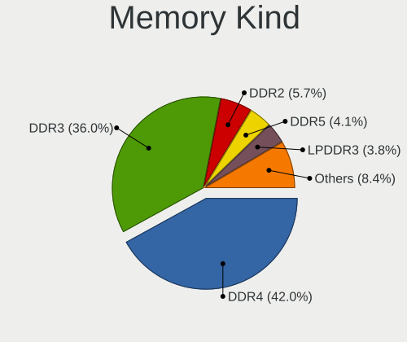

| Kind    | Notebooks | Percent |
|---------|-----------|---------|
| DDR4    | 691       | 42.01%  |
| DDR3    | 593       | 36.05%  |
| DDR2    | 93        | 5.65%   |
| DDR5    | 67        | 4.07%   |
| LPDDR3  | 62        | 3.77%   |
| LPDDR4  | 53        | 3.22%   |
| LPDDR5  | 34        | 2.07%   |
| DDR     | 23        | 1.4%    |
| Unknown | 13        | 0.79%   |
| SDRAM   | 12        | 0.73%   |
| DRAM    | 2         | 0.12%   |
| SRAM    | 1         | 0.06%   |
| RAM     | 1         | 0.06%   |

Memory Form Factor
------------------

Physical design of the memory module

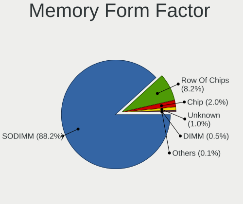

| Name            | Notebooks | Percent |
|-----------------|-----------|---------|
| SODIMM          | 1463      | 88.24%  |
| Row Of Chips    | 136       | 8.2%    |
| Chip            | 33        | 1.99%   |
| Unknown         | 16        | 0.97%   |
| DIMM            | 9         | 0.54%   |
| Proprietary Car | 1         | 0.06%   |

Memory Size
-----------

Memory module size

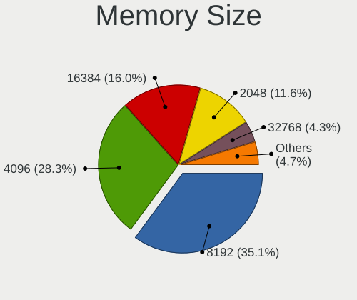

| Size  | Notebooks | Percent |
|-------|-----------|---------|
| 8192  | 640       | 35.13%  |
| 4096  | 515       | 28.27%  |
| 16384 | 292       | 16.03%  |
| 2048  | 211       | 11.58%  |
| 32768 | 78        | 4.28%   |
| 1024  | 65        | 3.57%   |
| 512   | 13        | 0.71%   |
| 256   | 4         | 0.22%   |
| 65536 | 1         | 0.05%   |
| 12288 | 1         | 0.05%   |
| 6144  | 1         | 0.05%   |
| 2560  | 1         | 0.05%   |

Memory Speed
------------

Memory module speed

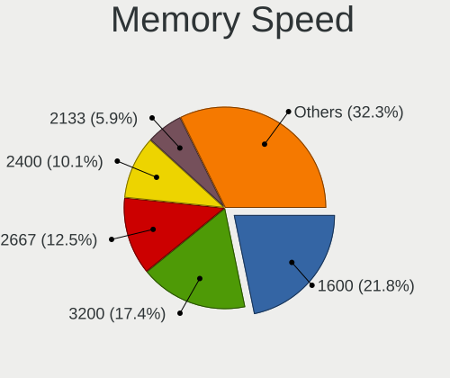

| Speed   | Notebooks | Percent |
|---------|-----------|---------|
| 1600    | 389       | 21.78%  |
| 3200    | 310       | 17.36%  |
| 2667    | 223       | 12.49%  |
| 2400    | 181       | 10.13%  |
| 2133    | 106       | 5.94%   |
| 1333    | 103       | 5.77%   |
| 1334    | 68        | 3.81%   |
| 1867    | 51        | 2.86%   |
| 667     | 47        | 2.63%   |
| Unknown | 46        | 2.58%   |
| 5600    | 39        | 2.18%   |
| 800     | 32        | 1.79%   |
| 4800    | 28        | 1.57%   |
| 4267    | 28        | 1.57%   |
| 6400    | 27        | 1.51%   |
| 1067    | 25        | 1.4%    |
| 533     | 19        | 1.06%   |
| 1066    | 14        | 0.78%   |
| 975     | 12        | 0.67%   |
| 4266    | 9         | 0.5%    |
| 3733    | 6         | 0.34%   |
| 2933    | 3         | 0.17%   |
| 2048    | 3         | 0.17%   |
| 1866    | 3         | 0.17%   |
| 8533    | 2         | 0.11%   |
| 7500    | 2         | 0.11%   |
| 5200    | 1         | 0.06%   |
| 1639    | 1         | 0.06%   |
| 1596    | 1         | 0.06%   |
| 1200    | 1         | 0.06%   |
| 666     | 1         | 0.06%   |
| 333     | 1         | 0.06%   |
| 266     | 1         | 0.06%   |
| 200     | 1         | 0.06%   |
| 166     | 1         | 0.06%   |
| 100     | 1         | 0.06%   |

Printers & scanners
-------------------

Printer Vendor
--------------

Printer device vendors

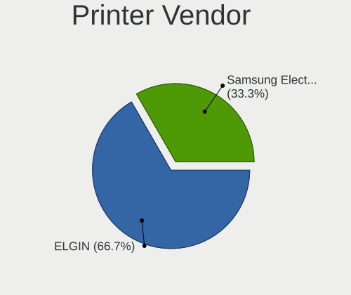

| Vendor              | Notebooks | Percent |
|---------------------|-----------|---------|
| ELGIN               | 2         | 50%     |
| Samsung Electronics | 1         | 25%     |
| Prolific Technology | 1         | 25%     |

Printer Model
-------------

Printer device models

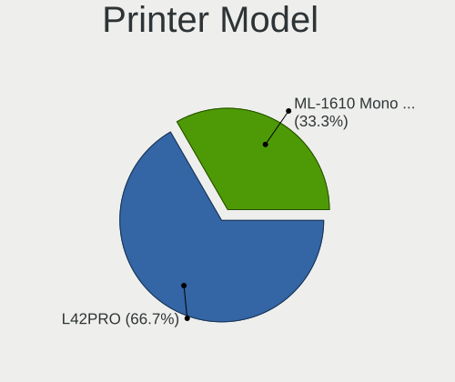

| Model                              | Notebooks | Percent |
|------------------------------------|-----------|---------|
| ELGIN L42PRO                       | 2         | 50%     |
| Samsung ML-1610 Mono Laser Printer | 1         | 25%     |
| Prolific PL2305 Parallel Port      | 1         | 25%     |

Scanner Vendor
--------------

Scanner device vendors

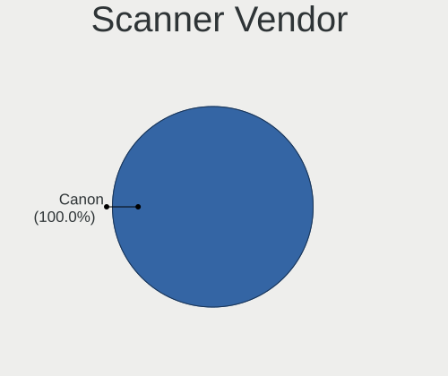

| Vendor | Notebooks | Percent |
|--------|-----------|---------|
| Canon  | 1         | 100%    |

Scanner Model
-------------

Scanner device models

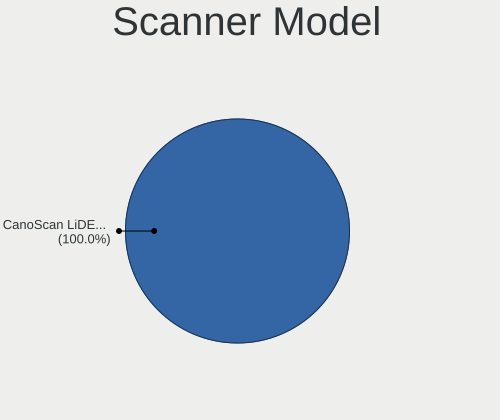

| Model                   | Notebooks | Percent |
|-------------------------|-----------|---------|
| Canon CanoScan LiDE 120 | 1         | 100%    |

Camera
------

Camera Vendor
-------------

Camera device vendors

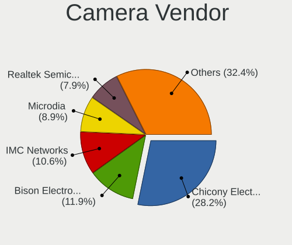

| Vendor                                 | Notebooks | Percent |
|----------------------------------------|-----------|---------|
| Chicony Electronics                    | 363       | 28.21%  |
| Bison Electronics                      | 153       | 11.89%  |
| IMC Networks                           | 137       | 10.64%  |
| Microdia                               | 115       | 8.94%   |
| Realtek Semiconductor                  | 102       | 7.93%   |
| Sunplus Innovation Technology          | 83        | 6.45%   |
| Lite-On Technology                     | 40        | 3.11%   |
| Luxvisions Innotech Limited            | 36        | 2.8%    |
| Quanta                                 | 35        | 2.72%   |
| Syntek                                 | 30        | 2.33%   |
| Suyin                                  | 29        | 2.25%   |
| Cheng Uei Precision Industry (Foxlink) | 29        | 2.25%   |
| Apple                                  | 18        | 1.4%    |
| Silicon Motion                         | 12        | 0.93%   |
| Shenzhen Kingcome Optoelectronic       | 10        | 0.78%   |
| Ricoh                                  | 10        | 0.78%   |
| Lenovo                                 | 10        | 0.78%   |
| Supreme Electronics                    | 7         | 0.54%   |
| Logitech                               | 7         | 0.54%   |
| Alcor Micro                            | 7         | 0.54%   |
| Z-Star Microelectronics                | 6         | 0.47%   |
| Importek                               | 6         | 0.47%   |
| ALi                                    | 6         | 0.47%   |
| Jiangxi Shinetech Optical              | 5         | 0.39%   |
| Framework                              | 5         | 0.39%   |
| Unknown (3730304233343731345430)       | 4         | 0.31%   |
| Primax Electronics                     | 2         | 0.16%   |
| Pixart Imaging                         | 2         | 0.16%   |
| OmniVision Technologies                | 2         | 0.16%   |
| Intel                                  | 2         | 0.16%   |
| DX-240124-XH                           | 2         | 0.16%   |
| DigiTech                               | 2         | 0.16%   |
| Dell                                   | 2         | 0.16%   |
| Y Media                                | 1         | 0.08%   |
| USB Camera                             | 1         | 0.08%   |
| Unknown                                | 1         | 0.08%   |
| Goodong Industry                       | 1         | 0.08%   |
| Genesys Logic                          | 1         | 0.08%   |
| Foxconn / Hon Hai                      | 1         | 0.08%   |
| Cybex Computer Products                | 1         | 0.08%   |

Camera Model
------------

Camera device models

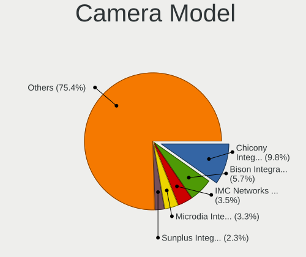

| Model                                         | Notebooks | Percent |
|-----------------------------------------------|-----------|---------|
| Chicony Integrated Camera                     | 127       | 9.76%   |
| Bison Integrated Camera                       | 74        | 5.69%   |
| IMC Networks Integrated Camera                | 46        | 3.54%   |
| Microdia Integrated_Webcam_HD                 | 43        | 3.31%   |
| Sunplus Integrated_Webcam_HD                  | 30        | 2.31%   |
| Chicony HD Webcam                             | 30        | 2.31%   |
| Bison SunplusIT Integrated Camera             | 26        | 2%      |
| Chicony Integrated Camera (1280x720@30)       | 23        | 1.77%   |
| Realtek Integrated_Webcam_HD                  | 22        | 1.69%   |
| Microdia Integrated Webcam                    | 22        | 1.69%   |
| Lite-On Integrated Camera                     | 22        | 1.69%   |
| Luxvisions Innotech Limited Integrated Camera | 20        | 1.54%   |
| IMC Networks Realtek PC Camera                | 20        | 1.54%   |
| Chicony Lenovo Integrated Camera (0.3MP)      | 20        | 1.54%   |
| IMC Networks EasyCamera                       | 19        | 1.46%   |
| Syntek Integrated Camera                      | 18        | 1.38%   |
| Realtek USB 2.0 PC Camera                     | 15        | 1.15%   |
| Chicony Chicony USB2.0 Camera                 | 14        | 1.08%   |
| Realtek Laptop Camera                         | 10        | 0.77%   |
| Chicony ThinkPad T490 Webcam                  | 10        | 0.77%   |
| Chicony Integrated IR Camera                  | 10        | 0.77%   |
| Bison ThinkPad Integrated Camera              | 10        | 0.77%   |
| Bison Lenovo EasyCamera                       | 10        | 0.77%   |
| Apple FaceTime HD Camera                      | 10        | 0.77%   |
| Sunplus Laptop_Integrated_Webcam_FHD          | 9         | 0.69%   |
| Quanta HP TrueVision HD Camera                | 9         | 0.69%   |
| Chicony Integrated Camera [ThinkPad]          | 9         | 0.69%   |
| Bison ThinkPad P50 Integrated Camera          | 9         | 0.69%   |
| Microdia Integrated Webcam HD                 | 8         | 0.61%   |
| IMC Networks UVC VGA Webcam                   | 8         | 0.61%   |
| Chicony Realtek DMFT RGB                      | 8         | 0.61%   |
| Bison HD Webcam                               | 8         | 0.61%   |
| Syntek EasyCamera                             | 7         | 0.54%   |
| Sunplus Laptop Integrated Webcam HD           | 7         | 0.54%   |
| Sunplus HD WebCam                             | 7         | 0.54%   |
| Lite-On HP HD Camera                          | 7         | 0.54%   |
| Lenovo Integrated Webcam [R5U877]             | 7         | 0.54%   |
| IMC Networks USB2.0 HD UVC WebCam             | 7         | 0.54%   |
| Chicony USB2.0 VGA UVC WebCam                 | 7         | 0.54%   |
| Chicony HP Universal Camera                   | 7         | 0.54%   |

Security
--------

Fingerprint Vendor
------------------

Fingerprint sensor vendors

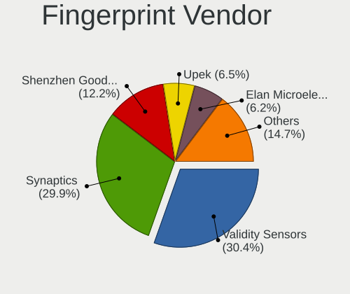

| Vendor                     | Notebooks | Percent |
|----------------------------|-----------|---------|
| Validity Sensors           | 122       | 30.42%  |
| Synaptics                  | 120       | 29.93%  |
| Shenzhen Goodix Technology | 49        | 12.22%  |
| Upek                       | 26        | 6.48%   |
| Elan Microelectronics      | 25        | 6.23%   |
| AuthenTec                  | 16        | 3.99%   |
| STMicroelectronics         | 11        | 2.74%   |
| LighTuning Technology      | 9         | 2.24%   |
| Broadcom                   | 9         | 2.24%   |
| FocalTech Systems          | 8         | 2%      |
| Fingerprint Cards          | 4         | 1%      |
| Samsung Electronics        | 2         | 0.5%    |

Fingerprint Model
-----------------

Fingerprint sensor models

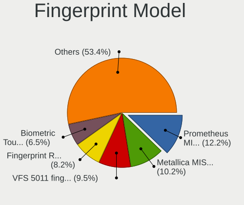

| Model                                                                        | Notebooks | Percent |
|------------------------------------------------------------------------------|-----------|---------|
| Synaptics Prometheus MIS Touch Fingerprint Reader                            | 49        | 12.22%  |
| Synaptics Metallica MIS Touch Fingerprint Reader                             | 41        | 10.22%  |
| Validity Sensors VFS 5011 fingerprint sensor                                 | 38        | 9.48%   |
| Shenzhen Goodix Fingerprint Reader                                           | 33        | 8.23%   |
| Upek Biometric Touchchip/Touchstrip Fingerprint Sensor                       | 26        | 6.48%   |
| Elan Fingerprint Sensor                                                      | 23        | 5.74%   |
| Validity Sensors Synaptics WBDI                                              | 22        | 5.49%   |
| Validity Sensors VFS7500 Touch Fingerprint Sensor                            | 15        | 3.74%   |
| Validity Sensors VFS495 Fingerprint Reader                                   | 14        | 3.49%   |
| Validity Sensors VFS5011 Fingerprint Reader                                  | 13        | 3.24%   |
| STMicroelectronics Fingerprint Reader                                        | 11        | 2.74%   |
| Synaptics Metallica MOH Touch Fingerprint Reader                             | 10        | 2.49%   |
| Shenzhen Goodix  Fingerprint Device                                          | 10        | 2.49%   |
| Synaptics FS7604 Touch Fingerprint Sensor with PurePrint                     | 9         | 2.24%   |
| Broadcom BCM5880 Secure Applications Processor with fingerprint swipe sensor | 9         | 2.24%   |
| AuthenTec AES2810                                                            | 7         | 1.75%   |
| Shenzhen Goodix Fingerprint Reader SGX                                       | 6         | 1.5%    |
| FocalTech Systems Fingerprint Reader                                         | 6         | 1.5%    |
| LighTuning EgisTec Touch Fingerprint Sensor                                  | 5         | 1.25%   |
| LighTuning ES603 Swipe Fingerprint Sensor                                    | 4         | 1%      |
| Fingerprint Cards FPC Fingerprint Reader                                     | 4         | 1%      |
| AuthenTec AES1660                                                            | 4         | 1%      |
| Validity Sensors VFS491                                                      | 3         | 0.75%   |
| Validity Sensors VFS451 Fingerprint Reader                                   | 3         | 0.75%   |
| Validity Sensors Swipe Fingerprint Sensor                                    | 3         | 0.75%   |
| Synaptics WBDI Fingerprint Reader USB 086                                    | 3         | 0.75%   |
| Synaptics Fingerprint reader [HP G6]                                         | 3         | 0.75%   |
| AuthenTec AES2501 Fingerprint Sensor                                         | 3         | 0.75%   |
| Validity Sensors VFS471 Fingerprint Reader                                   | 2         | 0.5%    |
| Validity Sensors VFS Fingerprint sensor                                      | 2         | 0.5%    |
| Validity Sensors Synaptics VFS7552 Touch Fingerprint Sensor with PurePrint   | 2         | 0.5%    |
| Validity Sensors Fingerprint scanner                                         | 2         | 0.5%    |
| Synaptics UWP WBDI Device                                                    | 2         | 0.5%    |
| Samsung CanvasBio Fingerprint Reader                                         | 2         | 0.5%    |
| Elan WBF Fingerprint Sensor                                                  | 2         | 0.5%    |
| Validity Sensors VFS7552 Touch Fingerprint Sensor                            | 1         | 0.25%   |
| Validity Sensors VFS101 Fingerprint Reader                                   | 1         | 0.25%   |
| Validity Sensors Synaptics VFS7552 Touch Fingerprint Sensor                  | 1         | 0.25%   |
| Synaptics UWP WBDI                                                           | 1         | 0.25%   |
| Synaptics TouchPad                                                           | 1         | 0.25%   |

Chipcard Vendor
---------------

Chipcard module vendors

Zero info for selected period =(

Chipcard Model
--------------

Chipcard module models

Zero info for selected period =(

Unsupported
-----------

Unsupported Devices
-------------------

Total unsupported devices on board

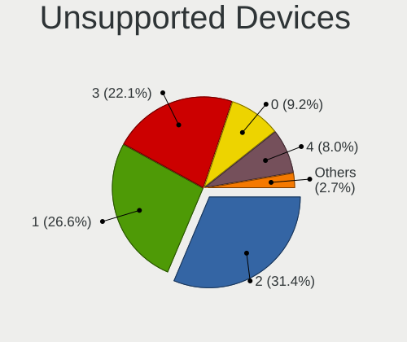

| Total | Notebooks | Percent |
|-------|-----------|---------|
| 2     | 536       | 31.36%  |
| 1     | 455       | 26.62%  |
| 3     | 378       | 22.12%  |
| 0     | 158       | 9.25%   |
| 4     | 136       | 7.96%   |
| 5     | 31        | 1.81%   |
| 6     | 12        | 0.7%    |
| 7     | 2         | 0.12%   |
| 9     | 1         | 0.06%   |

Unsupported Device Types
------------------------

Types of unsupported devices

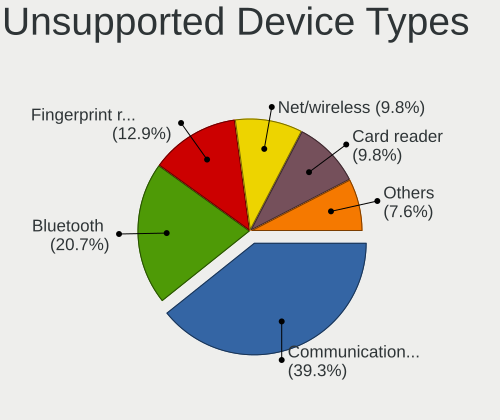

| Type                     | Notebooks | Percent |
|--------------------------|-----------|---------|
| Communication controller | 1187      | 39.27%  |
| Bluetooth                | 625       | 20.67%  |
| Fingerprint reader       | 390       | 12.9%   |
| Net/wireless             | 296       | 9.79%   |
| Card reader              | 296       | 9.79%   |
| Firewire controller      | 125       | 4.13%   |
| Storage                  | 26        | 0.86%   |
| Sound                    | 24        | 0.79%   |
| Network                  | 23        | 0.76%   |
| Modem                    | 15        | 0.5%    |
| Net/ethernet             | 14        | 0.46%   |
| Storage/nvme             | 1         | 0.03%   |
| Graphics card            | 1         | 0.03%   |

