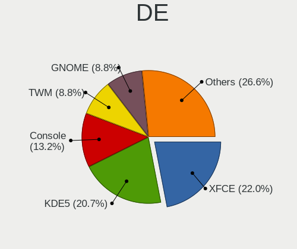
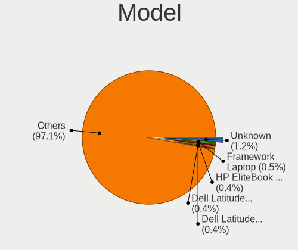
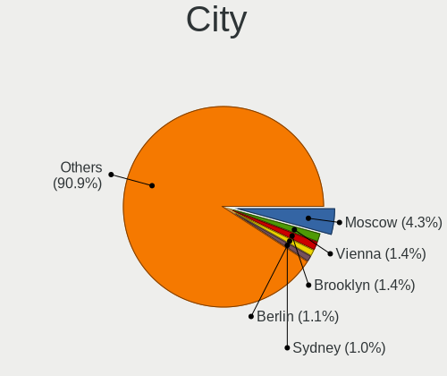
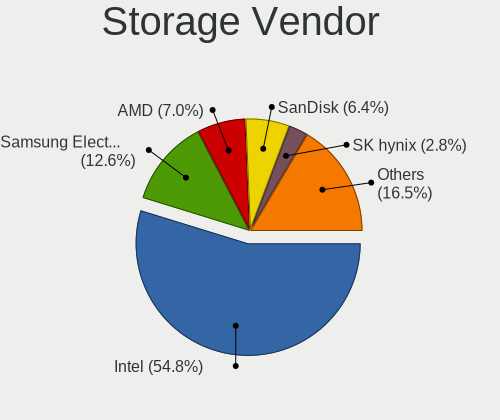
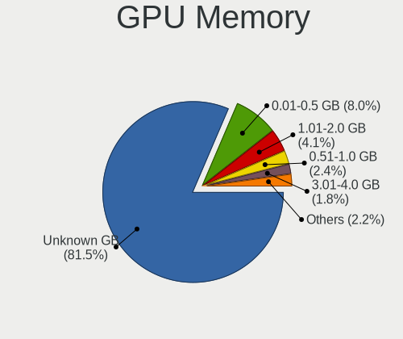
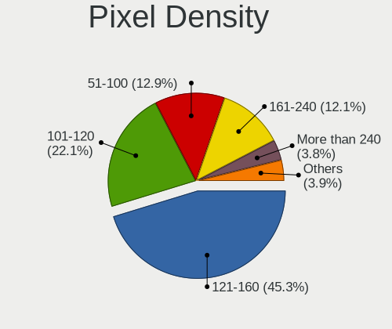
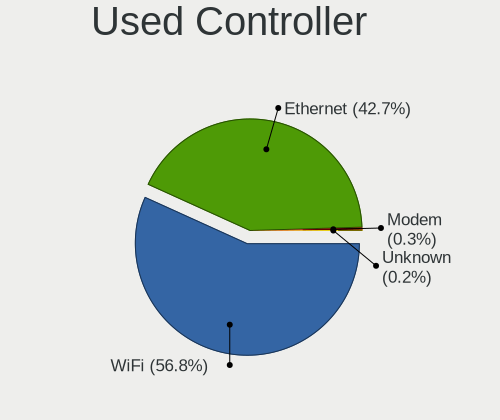
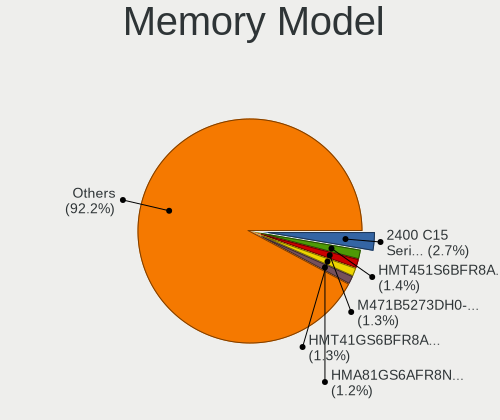

FreeBSD - Tested Hardware & Statistics (Notebooks)
--------------------------------------------------

A project to collect tested hardware configurations for FreeBSD.

Anyone can contribute to this report by the [hw-probe](https://github.com/linuxhw/hw-probe/blob/master/INSTALL.BSD.md) tool:

    hw-probe -all -upload

Please contribute! Especially if your hardware is rare.

Contents
--------

* [ Test Cases ](#test-cases)

* [ System ](#system)
  - [ OS                       ](#os)
  - [ OS Family                ](#os-family)
  - [ Arch                     ](#arch)
  - [ DE                       ](#de)
  - [ Display Server           ](#display-server)
  - [ Display Manager          ](#display-manager)
  - [ OS Lang                  ](#os-lang)
  - [ Boot Mode                ](#boot-mode)
  - [ Filesystem               ](#filesystem)
  - [ Part. scheme             ](#part-scheme)

* [ Board ](#board)
  - [ Vendor                   ](#vendor)
  - [ Model                    ](#model)
  - [ Model Family             ](#model-family)
  - [ MFG Year                 ](#mfg-year)
  - [ Form Factor              ](#form-factor)
  - [ Coreboot                 ](#coreboot)
  - [ RAM Size                 ](#ram-size)
  - [ RAM Used                 ](#ram-used)
  - [ Total Drives             ](#total-drives)
  - [ Has CD-ROM               ](#has-cd-rom)
  - [ Has Ethernet             ](#has-ethernet)
  - [ Has WiFi                 ](#has-wifi)
  - [ Has Bluetooth            ](#has-bluetooth)

* [ Location ](#location)
  - [ Country                  ](#country)
  - [ City                     ](#city)

* [ Drives ](#drives)
  - [ Drive Vendor             ](#drive-vendor)
  - [ Drive Model              ](#drive-model)
  - [ HDD Vendor               ](#hdd-vendor)
  - [ SSD Vendor               ](#ssd-vendor)
  - [ Drive Kind               ](#drive-kind)
  - [ Drive Connector          ](#drive-connector)
  - [ Drive Size               ](#drive-size)
  - [ Space Total              ](#space-total)
  - [ Space Used               ](#space-used)
  - [ Malfunc. Drives          ](#malfunc-drives)
  - [ Malfunc. Drive Vendor    ](#malfunc-drive-vendor)
  - [ Malfunc. HDD Vendor      ](#malfunc-hdd-vendor)
  - [ Malfunc. Drive Kind      ](#malfunc-drive-kind)
  - [ Failed Drives            ](#failed-drives)
  - [ Failed Drive Vendor      ](#failed-drive-vendor)
  - [ Drive Status             ](#drive-status)

* [ Storage controller ](#storage-controller)
  - [ Storage Vendor           ](#storage-vendor)
  - [ Storage Model            ](#storage-model)
  - [ Storage Kind             ](#storage-kind)

* [ Processor ](#processor)
  - [ CPU Vendor               ](#cpu-vendor)
  - [ CPU Model                ](#cpu-model)
  - [ CPU Model Family         ](#cpu-model-family)
  - [ CPU Cores                ](#cpu-cores)
  - [ CPU Sockets              ](#cpu-sockets)
  - [ CPU Threads              ](#cpu-threads)
  - [ CPU Microarch            ](#cpu-microarch)

* [ Graphics ](#graphics)
  - [ GPU Vendor               ](#gpu-vendor)
  - [ GPU Model                ](#gpu-model)
  - [ GPU Combo                ](#gpu-combo)
  - [ GPU Driver               ](#gpu-driver)
  - [ GPU Memory               ](#gpu-memory)

* [ Monitor ](#monitor)
  - [ Monitor Vendor           ](#monitor-vendor)
  - [ Monitor Model            ](#monitor-model)
  - [ Monitor Resolution       ](#monitor-resolution)
  - [ Monitor Diagonal         ](#monitor-diagonal)
  - [ Monitor Width            ](#monitor-width)
  - [ Aspect Ratio             ](#aspect-ratio)
  - [ Monitor Area             ](#monitor-area)
  - [ Pixel Density            ](#pixel-density)
  - [ Multiple Monitors        ](#multiple-monitors)

* [ Network ](#network)
  - [ Net Controller Vendor    ](#net-controller-vendor)
  - [ Net Controller Model     ](#net-controller-model)
  - [ Wireless Vendor          ](#wireless-vendor)
  - [ Wireless Model           ](#wireless-model)
  - [ Ethernet Vendor          ](#ethernet-vendor)
  - [ Ethernet Model           ](#ethernet-model)
  - [ Net Controller Kind      ](#net-controller-kind)
  - [ Used Controller          ](#used-controller)
  - [ NICs                     ](#nics)
  - [ IPv6                     ](#ipv6)

* [ Bluetooth ](#bluetooth)
  - [ Bluetooth Vendor         ](#bluetooth-vendor)
  - [ Bluetooth Model          ](#bluetooth-model)

* [ Sound ](#sound)
  - [ Sound Vendor             ](#sound-vendor)
  - [ Sound Model              ](#sound-model)

* [ Memory ](#memory)
  - [ Memory Vendor            ](#memory-vendor)
  - [ Memory Model             ](#memory-model)
  - [ Memory Kind              ](#memory-kind)
  - [ Memory Form Factor       ](#memory-form-factor)
  - [ Memory Size              ](#memory-size)
  - [ Memory Speed             ](#memory-speed)

* [ Printers & scanners ](#printers--scanners)
  - [ Printer Vendor           ](#printer-vendor)
  - [ Printer Model            ](#printer-model)
  - [ Scanner Vendor           ](#scanner-vendor)
  - [ Scanner Model            ](#scanner-model)

* [ Camera ](#camera)
  - [ Camera Vendor            ](#camera-vendor)
  - [ Camera Model             ](#camera-model)

* [ Security ](#security)
  - [ Fingerprint Vendor       ](#fingerprint-vendor)
  - [ Fingerprint Model        ](#fingerprint-model)
  - [ Chipcard Vendor          ](#chipcard-vendor)
  - [ Chipcard Model           ](#chipcard-model)

* [ Unsupported ](#unsupported)
  - [ Unsupported Devices      ](#unsupported-devices)
  - [ Unsupported Device Types ](#unsupported-device-types)

Test Cases
----------

Total: 1430

| Vendor        | Model                       | Probe                                                     | Date         |
|---------------|-----------------------------|-----------------------------------------------------------|--------------|
| Lenovo        | B40-30 80F10002BR           | [769c678314](https://bsd-hardware.info/?probe=769c678314) | Jun 10, 2023 |
| Lenovo        | ThinkPad T430 2347GR2       | [439e6a5034](https://bsd-hardware.info/?probe=439e6a5034) | Jun 10, 2023 |
| Lenovo        | ThinkBook 14 G4+ ARA 21D... | [27ba75252a](https://bsd-hardware.info/?probe=27ba75252a) | Jun 09, 2023 |
| Lenovo        | ThinkPad T480 20L6S5VP4C    | [b891388109](https://bsd-hardware.info/?probe=b891388109) | Jun 07, 2023 |
| Lenovo        | ThinkPad T500 2082BNU       | [dedd066084](https://bsd-hardware.info/?probe=dedd066084) | Jun 06, 2023 |
| Lenovo        | IdeaPad Slim 9 14ITL5 82... | [03e1e6d302](https://bsd-hardware.info/?probe=03e1e6d302) | Jun 05, 2023 |
| Toshiba       | Satellite C70-B             | [cf9ed85e65](https://bsd-hardware.info/?probe=cf9ed85e65) | Jun 05, 2023 |
| Toshiba       | Satellite C70-B             | [fc66ebba25](https://bsd-hardware.info/?probe=fc66ebba25) | Jun 05, 2023 |
| Lenovo        | B590 20208                  | [dc65d735c8](https://bsd-hardware.info/?probe=dc65d735c8) | Jun 04, 2023 |
| Dell          | G5 5505                     | [5a3c1f19a0](https://bsd-hardware.info/?probe=5a3c1f19a0) | Jun 03, 2023 |
| Dell          | G5 5505                     | [1b10aecc38](https://bsd-hardware.info/?probe=1b10aecc38) | Jun 02, 2023 |
| HP            | EliteBook 8570p             | [22572f1df6](https://bsd-hardware.info/?probe=22572f1df6) | Jun 01, 2023 |
| Lenovo        | ThinkPad T15p Gen 3 21DA... | [8cc6299ba9](https://bsd-hardware.info/?probe=8cc6299ba9) | May 31, 2023 |
| Lenovo        | ThinkPad X270 20HMCTO1WW    | [b5f507c034](https://bsd-hardware.info/?probe=b5f507c034) | May 31, 2023 |
| Lenovo        | ThinkPad X13 Gen 1 20UGS... | [6701dce30e](https://bsd-hardware.info/?probe=6701dce30e) | May 28, 2023 |
| Lenovo        | ThinkPad P14s Gen 1 20S4... | [3944241750](https://bsd-hardware.info/?probe=3944241750) | May 27, 2023 |
| HP            | EliteBook 8570p             | [65376d6b42](https://bsd-hardware.info/?probe=65376d6b42) | May 27, 2023 |
| Acer          | Nitro AN515-42              | [adc687fcfe](https://bsd-hardware.info/?probe=adc687fcfe) | May 26, 2023 |
| Lenovo        | ThinkPad T430 2347CTO       | [68937b1686](https://bsd-hardware.info/?probe=68937b1686) | May 24, 2023 |
| HP            | EliteBook 8570p             | [a1a68c0f7d](https://bsd-hardware.info/?probe=a1a68c0f7d) | May 24, 2023 |
| Acer          | Aspire E5-573               | [7bcb7c96be](https://bsd-hardware.info/?probe=7bcb7c96be) | May 23, 2023 |
| Dell          | Inspiron 5559               | [9a2c066dfa](https://bsd-hardware.info/?probe=9a2c066dfa) | May 23, 2023 |
| HP            | EliteBook 8570p             | [b5f17b6bf8](https://bsd-hardware.info/?probe=b5f17b6bf8) | May 23, 2023 |
| Acer          | Aspire A514-54              | [7aed9d938a](https://bsd-hardware.info/?probe=7aed9d938a) | May 21, 2023 |
| Dell          | Inspiron 5559               | [a87acae699](https://bsd-hardware.info/?probe=a87acae699) | May 21, 2023 |
| HP            | EliteBook 8570p             | [70d54595c2](https://bsd-hardware.info/?probe=70d54595c2) | May 19, 2023 |
| Valve         | Jupiter                     | [7be0869603](https://bsd-hardware.info/?probe=7be0869603) | May 19, 2023 |
| Valve         | Jupiter                     | [ef56a2bd17](https://bsd-hardware.info/?probe=ef56a2bd17) | May 19, 2023 |
| Lenovo        | ThinkPad T560 20FJS03Q00    | [a2110471aa](https://bsd-hardware.info/?probe=a2110471aa) | May 18, 2023 |
| Panasonic     | CF-30KAPAXAM                | [62910ad9d9](https://bsd-hardware.info/?probe=62910ad9d9) | May 17, 2023 |
| Dell          | Inspiron 3581               | [25c403ca33](https://bsd-hardware.info/?probe=25c403ca33) | May 15, 2023 |
| HP            | EliteBook 8570p             | [e252dc5ff2](https://bsd-hardware.info/?probe=e252dc5ff2) | May 15, 2023 |
| Dell          | Inspiron 3581               | [8d445a3fb3](https://bsd-hardware.info/?probe=8d445a3fb3) | May 14, 2023 |
| Lenovo        | ThinkPad T14s Gen 1 20UH... | [526906c806](https://bsd-hardware.info/?probe=526906c806) | May 14, 2023 |
| Alienware     | 17 R4                       | [df734c8e64](https://bsd-hardware.info/?probe=df734c8e64) | May 14, 2023 |
| Lenovo        | ThinkPad T14 Gen 1 20S1S... | [8aede62ca8](https://bsd-hardware.info/?probe=8aede62ca8) | May 14, 2023 |
| Medion        | Major X10                   | [99228fd9da](https://bsd-hardware.info/?probe=99228fd9da) | May 10, 2023 |
| Notebook      | N7x0WU                      | [7a646e185a](https://bsd-hardware.info/?probe=7a646e185a) | May 09, 2023 |
| Panasonic     | CF-30KAPAXAM                | [1c918b79b0](https://bsd-hardware.info/?probe=1c918b79b0) | May 06, 2023 |
| Samsung       | NC110P/NC108P/NC111P        | [ea55a6fecf](https://bsd-hardware.info/?probe=ea55a6fecf) | May 02, 2023 |
| Lenovo        | ThinkPad X270 W10DG 20K5... | [b09acffe7b](https://bsd-hardware.info/?probe=b09acffe7b) | May 01, 2023 |
| HP            | OMEN by Laptop 15-dc1xxx    | [fc81710889](https://bsd-hardware.info/?probe=fc81710889) | Apr 27, 2023 |
| Lenovo        | ThinkPad T470s W10DG 20J... | [692df89c1f](https://bsd-hardware.info/?probe=692df89c1f) | Apr 26, 2023 |
| Fujitsu Si... | AMILO Li3710                | [214b0c30e0](https://bsd-hardware.info/?probe=214b0c30e0) | Apr 23, 2023 |
| HP            | Unknown                     | [e2aa3620b4](https://bsd-hardware.info/?probe=e2aa3620b4) | Apr 23, 2023 |
| Intel Clie... | LAPBC510                    | [68b1300903](https://bsd-hardware.info/?probe=68b1300903) | Apr 22, 2023 |
| Lenovo        | ThinkPad W520 4270CTO       | [51f0a87f01](https://bsd-hardware.info/?probe=51f0a87f01) | Apr 21, 2023 |
| HP            | OMEN by Laptop 15-dc1xxx    | [e17bcecec8](https://bsd-hardware.info/?probe=e17bcecec8) | Apr 21, 2023 |
| Dell          | Latitude 7280               | [254acb5df8](https://bsd-hardware.info/?probe=254acb5df8) | Apr 20, 2023 |
| HP            | EliteBook 8570p             | [6e82f69c4c](https://bsd-hardware.info/?probe=6e82f69c4c) | Apr 20, 2023 |
| Lenovo        | Legion 5 15ARH05 82B5       | [541f3e7f7e](https://bsd-hardware.info/?probe=541f3e7f7e) | Apr 20, 2023 |
| Dell          | Precision 5510              | [7028fde527](https://bsd-hardware.info/?probe=7028fde527) | Apr 20, 2023 |
| Lenovo        | ThinkPad X201 3626WNP       | [d642970071](https://bsd-hardware.info/?probe=d642970071) | Apr 19, 2023 |
| HP            | Unknown                     | [941c021569](https://bsd-hardware.info/?probe=941c021569) | Apr 18, 2023 |
| HP            | Laptop 14-dk1xxx            | [464059d8b1](https://bsd-hardware.info/?probe=464059d8b1) | Apr 18, 2023 |
| Lenovo        | IdeaPad 3 14ITL05 81X7      | [b8d2c0d81d](https://bsd-hardware.info/?probe=b8d2c0d81d) | Apr 16, 2023 |
| Dell          | Inspiron 3542               | [4dfa2f0148](https://bsd-hardware.info/?probe=4dfa2f0148) | Apr 15, 2023 |
| Lenovo        | IdeaPad Gaming 3 15IHU6 ... | [b189b0988c](https://bsd-hardware.info/?probe=b189b0988c) | Apr 14, 2023 |
| Lenovo        | ThinkPad R61 89208RU        | [e892cdffee](https://bsd-hardware.info/?probe=e892cdffee) | Apr 13, 2023 |
| F-Plus Mob... | FLAPTOP r                   | [3d7bf4205b](https://bsd-hardware.info/?probe=3d7bf4205b) | Apr 13, 2023 |
| HMT           | W041-TF-A-45                | [298d106fd1](https://bsd-hardware.info/?probe=298d106fd1) | Apr 13, 2023 |
| TUXEDO        | Pulse 15 Gen1               | [bee20c6a4c](https://bsd-hardware.info/?probe=bee20c6a4c) | Apr 12, 2023 |
| Lenovo        | ThinkPad X1 Carbon Gen 9... | [add8280600](https://bsd-hardware.info/?probe=add8280600) | Apr 11, 2023 |
| Fujitsu Si... | AMILO Li3710                | [6dabd5d84a](https://bsd-hardware.info/?probe=6dabd5d84a) | Apr 08, 2023 |
| Dell          | Inspiron 5567               | [a305360215](https://bsd-hardware.info/?probe=a305360215) | Apr 05, 2023 |
| Lenovo        | G50-30 80G0                 | [911a1723a2](https://bsd-hardware.info/?probe=911a1723a2) | Apr 02, 2023 |
| Lenovo        | ThinkPad T590 20N4001PUS    | [0b93ef8199](https://bsd-hardware.info/?probe=0b93ef8199) | Apr 02, 2023 |
| ASUSTek       | ASUS TUF Gaming A15 FA50... | [9bac0139f1](https://bsd-hardware.info/?probe=9bac0139f1) | Apr 01, 2023 |
| Chuwi         | Unknown                     | [5e687fcc83](https://bsd-hardware.info/?probe=5e687fcc83) | Apr 01, 2023 |
| HMT           | W041-TF-A-45                | [666df5a7e0](https://bsd-hardware.info/?probe=666df5a7e0) | Mar 31, 2023 |
| Google        | Stout                       | [d8346bb5da](https://bsd-hardware.info/?probe=d8346bb5da) | Mar 29, 2023 |
| Lenovo        | ThinkPad X1 Extreme 20MF... | [b4805cd318](https://bsd-hardware.info/?probe=b4805cd318) | Mar 27, 2023 |
| Dell          | Inspiron 5559               | [7652c9891e](https://bsd-hardware.info/?probe=7652c9891e) | Mar 26, 2023 |
| ASUSTek       | ASUS TUF Gaming A15 FA50... | [a46f77ccdc](https://bsd-hardware.info/?probe=a46f77ccdc) | Mar 25, 2023 |
| ASUSTek       | ASUS TUF Gaming A15 FA50... | [b64571464f](https://bsd-hardware.info/?probe=b64571464f) | Mar 25, 2023 |
| eMachines     | eM350                       | [bb900ace2d](https://bsd-hardware.info/?probe=bb900ace2d) | Mar 25, 2023 |
| Alienware     | 14                          | [742d648570](https://bsd-hardware.info/?probe=742d648570) | Mar 25, 2023 |
| Acer          | AOD270                      | [73877008e9](https://bsd-hardware.info/?probe=73877008e9) | Mar 25, 2023 |
| Acer          | Nitro AN515-53              | [a46e065fac](https://bsd-hardware.info/?probe=a46e065fac) | Mar 23, 2023 |
| Dell          | Inspiron 5559               | [f294f7ae04](https://bsd-hardware.info/?probe=f294f7ae04) | Mar 23, 2023 |
| Intel         | SandyBridge Platform        | [954a21f7de](https://bsd-hardware.info/?probe=954a21f7de) | Mar 23, 2023 |
| HUAWEI        | HVY-WXX9                    | [e1b5d66244](https://bsd-hardware.info/?probe=e1b5d66244) | Mar 20, 2023 |
| HP            | ProBook 450 G8 Notebook ... | [c83b0dda87](https://bsd-hardware.info/?probe=c83b0dda87) | Mar 18, 2023 |
| HP            | ProBook 450 G8 Notebook ... | [9ac4738956](https://bsd-hardware.info/?probe=9ac4738956) | Mar 18, 2023 |
| IP3 Techno... | ACN1S                       | [d0761f4192](https://bsd-hardware.info/?probe=d0761f4192) | Mar 18, 2023 |
| Lenovo        | ThinkPad X1 Carbon 6th 2... | [6d9c564a33](https://bsd-hardware.info/?probe=6d9c564a33) | Mar 17, 2023 |
| ASUSTek       | 1001P                       | [76eae56ba3](https://bsd-hardware.info/?probe=76eae56ba3) | Mar 15, 2023 |
| OEGStone      | W54_55SU1,SUW               | [64316408f0](https://bsd-hardware.info/?probe=64316408f0) | Mar 15, 2023 |
| Acer          | Aspire V3-112P              | [104c10f9b0](https://bsd-hardware.info/?probe=104c10f9b0) | Mar 14, 2023 |
| Dell          | Inspiron 5567               | [b878473783](https://bsd-hardware.info/?probe=b878473783) | Mar 13, 2023 |
| Lenovo        | ThinkPad E495 20NEA00QUS    | [8b112aa100](https://bsd-hardware.info/?probe=8b112aa100) | Mar 13, 2023 |
| Dell          | Inspiron 5567               | [b2ef9ff3dc](https://bsd-hardware.info/?probe=b2ef9ff3dc) | Mar 12, 2023 |
| Google        | Kohaku                      | [88491d298e](https://bsd-hardware.info/?probe=88491d298e) | Mar 12, 2023 |
| Lenovo        | ThinkPad P52s 20LBS0FH00    | [80dd48bca9](https://bsd-hardware.info/?probe=80dd48bca9) | Mar 12, 2023 |
| Dell          | Precision 7720              | [01f5f21b76](https://bsd-hardware.info/?probe=01f5f21b76) | Mar 12, 2023 |
| Lenovo        | ThinkPad P52s 20LBS0FH00    | [a4366e53ba](https://bsd-hardware.info/?probe=a4366e53ba) | Mar 10, 2023 |
| Intel         | Jasper Lake Client Platf... | [88de48013c](https://bsd-hardware.info/?probe=88de48013c) | Mar 10, 2023 |
| Lenovo        | ThinkPad T495 20NKS0HN1N    | [af190c38e9](https://bsd-hardware.info/?probe=af190c38e9) | Mar 10, 2023 |
| Fujitsu       | CELSIUS H730                | [223879138d](https://bsd-hardware.info/?probe=223879138d) | Mar 10, 2023 |
| Lenovo        | ThinkPad X220 4286CTO       | [e5a43dd311](https://bsd-hardware.info/?probe=e5a43dd311) | Mar 10, 2023 |
| Lenovo        | ThinkPad P52s 20LBS0FH00    | [44a8bf8fbc](https://bsd-hardware.info/?probe=44a8bf8fbc) | Mar 10, 2023 |
| Lenovo        | ThinkPad E14 Gen 3 20Y70... | [278a2a11cd](https://bsd-hardware.info/?probe=278a2a11cd) | Mar 09, 2023 |
| Lenovo        | ThinkPad E14 Gen 3 20Y70... | [ef85735453](https://bsd-hardware.info/?probe=ef85735453) | Mar 09, 2023 |
| Dell          | Latitude D620               | [8b3ad4e8b9](https://bsd-hardware.info/?probe=8b3ad4e8b9) | Mar 09, 2023 |
| Dell          | Latitude D620               | [d42a8ee079](https://bsd-hardware.info/?probe=d42a8ee079) | Mar 09, 2023 |
| Samsung       | 750XEE                      | [47d2204f58](https://bsd-hardware.info/?probe=47d2204f58) | Mar 08, 2023 |
| Lenovo        | ThinkPad X230 2324A14       | [124b3bdb95](https://bsd-hardware.info/?probe=124b3bdb95) | Mar 08, 2023 |
| Lenovo        | IdeaPad 5 15ALC05 82LN      | [9466e6d4f4](https://bsd-hardware.info/?probe=9466e6d4f4) | Mar 07, 2023 |
| Lenovo        | ThinkPad T16 Gen 1 21BVC... | [1a2543f92f](https://bsd-hardware.info/?probe=1a2543f92f) | Mar 06, 2023 |
| Lenovo        | ThinkPad T480 20L6S29E0T    | [6d7b30d2c4](https://bsd-hardware.info/?probe=6d7b30d2c4) | Mar 03, 2023 |
| ASUSTek       | ASUS TUF Gaming F15 FX50... | [f9db95d778](https://bsd-hardware.info/?probe=f9db95d778) | Mar 03, 2023 |
| Lenovo        | ThinkPad T480s 20L7002CU... | [0e051e7291](https://bsd-hardware.info/?probe=0e051e7291) | Feb 27, 2023 |
| ASUSTek       | X541SA                      | [9d406d735e](https://bsd-hardware.info/?probe=9d406d735e) | Feb 26, 2023 |
| HP            | EliteBook 8570p             | [1a4897cb53](https://bsd-hardware.info/?probe=1a4897cb53) | Feb 26, 2023 |
| Lenovo        | ThinkPad L14 Gen 3 21C5C... | [2ab690000c](https://bsd-hardware.info/?probe=2ab690000c) | Feb 25, 2023 |
| Lenovo        | ThinkPad L14 Gen 3 21C5C... | [ae0dc68ba6](https://bsd-hardware.info/?probe=ae0dc68ba6) | Feb 25, 2023 |
| Lenovo        | ThinkPad T530 24297XG       | [97d9b10c8a](https://bsd-hardware.info/?probe=97d9b10c8a) | Feb 24, 2023 |
| HP            | EliteBook 8570p             | [1e548fa114](https://bsd-hardware.info/?probe=1e548fa114) | Feb 24, 2023 |
| Lenovo        | ThinkPad X280 20KFCTO1WW    | [3dae7e3ebb](https://bsd-hardware.info/?probe=3dae7e3ebb) | Feb 23, 2023 |
| Lenovo        | ThinkPad L14 Gen 3 21C5C... | [6669622646](https://bsd-hardware.info/?probe=6669622646) | Feb 23, 2023 |
| HP            | Victus by Laptop 16-e0xx... | [b2ed608da5](https://bsd-hardware.info/?probe=b2ed608da5) | Feb 21, 2023 |
| Lenovo        | ThinkPad X1 Carbon Gen 9... | [63b73012e6](https://bsd-hardware.info/?probe=63b73012e6) | Feb 18, 2023 |
| HP            | EliteBook 8570p             | [1ba2a827d9](https://bsd-hardware.info/?probe=1ba2a827d9) | Feb 18, 2023 |
| Lenovo        | ThinkPad R60e 0658W2M       | [dba66ebfb5](https://bsd-hardware.info/?probe=dba66ebfb5) | Feb 17, 2023 |
| TUXEDO        | InfinityBook Pro 14 Gen6    | [0f4dd9a9bc](https://bsd-hardware.info/?probe=0f4dd9a9bc) | Feb 15, 2023 |
| Lenovo        | ThinkPad T430 2347FV6       | [cf016ce514](https://bsd-hardware.info/?probe=cf016ce514) | Feb 14, 2023 |
| ASUSTek       | ASUS TUF Gaming A15 FA50... | [c176577762](https://bsd-hardware.info/?probe=c176577762) | Feb 14, 2023 |
| Acer          | Aspire one V1.05            | [eec371a28f](https://bsd-hardware.info/?probe=eec371a28f) | Feb 13, 2023 |
| Dell          | Inspiron 5567               | [df5f01d72e](https://bsd-hardware.info/?probe=df5f01d72e) | Feb 13, 2023 |
| Panasonic     | CF-30KAPAXAM                | [f686e3756c](https://bsd-hardware.info/?probe=f686e3756c) | Feb 13, 2023 |
| Alienware     | m15                         | [3ab3e4b671](https://bsd-hardware.info/?probe=3ab3e4b671) | Feb 12, 2023 |
| HP            | ProBook 450 G2              | [acff807555](https://bsd-hardware.info/?probe=acff807555) | Feb 12, 2023 |
| Lenovo        | ThinkPad X1 Carbon 7th 2... | [8d49d50738](https://bsd-hardware.info/?probe=8d49d50738) | Feb 11, 2023 |
| Acer          | Aspire A315-58              | [81827ccbca](https://bsd-hardware.info/?probe=81827ccbca) | Feb 10, 2023 |
| Lenovo        | IdeaPad Y700-15ISK 80NV     | [0c9cf4e002](https://bsd-hardware.info/?probe=0c9cf4e002) | Feb 09, 2023 |
| Lenovo        | IdeaPad Y700-15ISK 80NV     | [ca1e51a042](https://bsd-hardware.info/?probe=ca1e51a042) | Feb 09, 2023 |
| HP            | Pavilion dv6                | [d6c8ad1034](https://bsd-hardware.info/?probe=d6c8ad1034) | Feb 08, 2023 |
| ASUSTek       | ASUS TUF Gaming F15 FX50... | [f3b0d5ac82](https://bsd-hardware.info/?probe=f3b0d5ac82) | Feb 08, 2023 |
| Lenovo        | IdeaPad 5 14ITL05 82FE      | [4fc5363829](https://bsd-hardware.info/?probe=4fc5363829) | Feb 07, 2023 |
| Lenovo        | IdeaPad Gaming 3 15IHU6 ... | [ef722fc37b](https://bsd-hardware.info/?probe=ef722fc37b) | Feb 06, 2023 |
| HP            | Pavilion Laptop 14-bf0xx    | [a98d28355d](https://bsd-hardware.info/?probe=a98d28355d) | Feb 05, 2023 |
| Samsung       | 700T1C                      | [91d5c568d1](https://bsd-hardware.info/?probe=91d5c568d1) | Feb 05, 2023 |
| Toshiba       | PORTEGE Z930                | [5462140da0](https://bsd-hardware.info/?probe=5462140da0) | Feb 05, 2023 |
| Lenovo        | IdeaPad Gaming 3 15IHU6 ... | [0232c45faa](https://bsd-hardware.info/?probe=0232c45faa) | Feb 04, 2023 |
| Lenovo        | ThinkPad P14s Gen 3 21AK... | [b7a491a010](https://bsd-hardware.info/?probe=b7a491a010) | Feb 03, 2023 |
| ASUSTek       | ASUS TUF Gaming F15 FX50... | [d36789c493](https://bsd-hardware.info/?probe=d36789c493) | Feb 02, 2023 |
| Lenovo        | ThinkPad T460 20FMS04200    | [3178015cd3](https://bsd-hardware.info/?probe=3178015cd3) | Feb 02, 2023 |
| ASUSTek       | ASUS TUF Gaming F15 FX50... | [a54516414a](https://bsd-hardware.info/?probe=a54516414a) | Feb 01, 2023 |
| Lenovo        | ThinkPad T460p 20FW0018A... | [932e722b2d](https://bsd-hardware.info/?probe=932e722b2d) | Feb 01, 2023 |
| Lenovo        | ThinkPad X1 Carbon 3rd 2... | [341bae363a](https://bsd-hardware.info/?probe=341bae363a) | Jan 31, 2023 |
| Lenovo        | ThinkPad X1 Carbon 5th 2... | [0b48f96d1e](https://bsd-hardware.info/?probe=0b48f96d1e) | Jan 31, 2023 |
| F-Plus Mob... | FLAPTOP r                   | [c2f84d2103](https://bsd-hardware.info/?probe=c2f84d2103) | Jan 31, 2023 |
| F-Plus Mob... | FLAPTOP r                   | [165d435f30](https://bsd-hardware.info/?probe=165d435f30) | Jan 31, 2023 |
| ASUSTek       | ASUS TUF Gaming F15 FX50... | [39ae8fb9c8](https://bsd-hardware.info/?probe=39ae8fb9c8) | Jan 30, 2023 |
| HP            | Pavilion Notebook           | [75b9ef6ee6](https://bsd-hardware.info/?probe=75b9ef6ee6) | Jan 30, 2023 |
| Lenovo        | Legion 5 15ARH05 82B5       | [21398109dc](https://bsd-hardware.info/?probe=21398109dc) | Jan 29, 2023 |
| Lenovo        | Legion 5 15ARH05 82B5       | [2098b8808d](https://bsd-hardware.info/?probe=2098b8808d) | Jan 29, 2023 |
| Acer          | Aspire one V1.05            | [1cbfce4d7e](https://bsd-hardware.info/?probe=1cbfce4d7e) | Jan 28, 2023 |
| Lenovo        | ThinkPad T14 Gen 2a 20XK... | [d5f06d91db](https://bsd-hardware.info/?probe=d5f06d91db) | Jan 28, 2023 |
| HP            | Laptop 14s-fq1xxx           | [1603f38c4c](https://bsd-hardware.info/?probe=1603f38c4c) | Jan 28, 2023 |
| F-Plus Mob... | FLAPTOP r                   | [448f9265f2](https://bsd-hardware.info/?probe=448f9265f2) | Jan 27, 2023 |
| F-Plus Mob... | FLAPTOP r                   | [512bf8f61d](https://bsd-hardware.info/?probe=512bf8f61d) | Jan 27, 2023 |
| HP            | EliteBook 840 G3            | [92c676e033](https://bsd-hardware.info/?probe=92c676e033) | Jan 26, 2023 |
| Lenovo        | IdeaPad Y700-15ISK 80NV     | [4eb4e63a2c](https://bsd-hardware.info/?probe=4eb4e63a2c) | Jan 25, 2023 |
| Lenovo        | ThinkBook 14-IIL 20SL       | [afeb216c1e](https://bsd-hardware.info/?probe=afeb216c1e) | Jan 25, 2023 |
| Lenovo        | ThinkPad X220 4291WF5       | [24544f4a94](https://bsd-hardware.info/?probe=24544f4a94) | Jan 24, 2023 |
| Lenovo        | ThinkPad T430 2342AG4       | [b5e972d19a](https://bsd-hardware.info/?probe=b5e972d19a) | Jan 24, 2023 |
| Dell          | XPS 13 9310                 | [7319560506](https://bsd-hardware.info/?probe=7319560506) | Jan 24, 2023 |
| Medion        | S14409                      | [9a44efb64c](https://bsd-hardware.info/?probe=9a44efb64c) | Jan 23, 2023 |
| Dell          | Latitude E6400              | [dcc804a61f](https://bsd-hardware.info/?probe=dcc804a61f) | Jan 22, 2023 |
| Dell          | Latitude E6400              | [9dd8d0184f](https://bsd-hardware.info/?probe=9dd8d0184f) | Jan 22, 2023 |
| Acer          | TravelMate B311-31          | [dc3f072645](https://bsd-hardware.info/?probe=dc3f072645) | Jan 19, 2023 |
| Dell          | Precision 5540              | [683769b797](https://bsd-hardware.info/?probe=683769b797) | Jan 19, 2023 |
| Lenovo        | IdeaPad 5 14ALC05 82LM      | [78327c664e](https://bsd-hardware.info/?probe=78327c664e) | Jan 16, 2023 |
| Lenovo        | ThinkPad A485 20MVS0LG00    | [247370372d](https://bsd-hardware.info/?probe=247370372d) | Jan 15, 2023 |
| Lenovo        | B590 20208                  | [e4c2272546](https://bsd-hardware.info/?probe=e4c2272546) | Jan 15, 2023 |
| Lenovo        | Legion S7 15ACH6 82K8       | [ad094a458b](https://bsd-hardware.info/?probe=ad094a458b) | Jan 14, 2023 |
| Dell          | Latitude E6420              | [cb7b02c421](https://bsd-hardware.info/?probe=cb7b02c421) | Jan 11, 2023 |
| Lenovo        | ThinkPad X220 4291LF6       | [25cddb26c3](https://bsd-hardware.info/?probe=25cddb26c3) | Jan 11, 2023 |
| Lenovo        | Legion S7 15ACH6 82K8       | [9bda43254c](https://bsd-hardware.info/?probe=9bda43254c) | Jan 10, 2023 |
| Acer          | Aspire A514-54              | [470fa4f28a](https://bsd-hardware.info/?probe=470fa4f28a) | Jan 09, 2023 |
| Dell          | Inspiron 5558               | [97b65880b0](https://bsd-hardware.info/?probe=97b65880b0) | Jan 09, 2023 |
| Dell          | XPS 13 9310                 | [e56cfbdedc](https://bsd-hardware.info/?probe=e56cfbdedc) | Jan 08, 2023 |
| Dell          | XPS 13 9310                 | [db483e3d46](https://bsd-hardware.info/?probe=db483e3d46) | Jan 08, 2023 |
| HP            | EliteBook 8570p             | [17f5e2e3d2](https://bsd-hardware.info/?probe=17f5e2e3d2) | Jan 04, 2023 |
| Lenovo        | ThinkPad T430 23446FP       | [a1517b13f6](https://bsd-hardware.info/?probe=a1517b13f6) | Jan 04, 2023 |
| Alienware     | m15 R4                      | [1438237430](https://bsd-hardware.info/?probe=1438237430) | Jan 02, 2023 |
| Lenovo        | ThinkPad X280 20KFCTO1WW    | [a9b3805c0b](https://bsd-hardware.info/?probe=a9b3805c0b) | Jan 01, 2023 |
| Lenovo        | IdeaPad L340-17IWL 81M0     | [22c4a06468](https://bsd-hardware.info/?probe=22c4a06468) | Dec 31, 2022 |
| Lenovo        | IdeaPad 330-15IKB 81DE      | [956499202e](https://bsd-hardware.info/?probe=956499202e) | Dec 30, 2022 |
| Timi          | Redmi Book Pro 14 2022      | [ce5e882952](https://bsd-hardware.info/?probe=ce5e882952) | Dec 28, 2022 |
| Google        | Peppy                       | [e063619f03](https://bsd-hardware.info/?probe=e063619f03) | Dec 27, 2022 |
| Lenovo        | IdeaPad 330-15IKB 81DE      | [883dbf15e4](https://bsd-hardware.info/?probe=883dbf15e4) | Dec 25, 2022 |
| Alienware     | m15 R4                      | [deaef8f0ef](https://bsd-hardware.info/?probe=deaef8f0ef) | Dec 24, 2022 |
| Dell          | Vostro 1400                 | [087a3d269f](https://bsd-hardware.info/?probe=087a3d269f) | Dec 23, 2022 |
| Lenovo        | Legion Y530-15ICH 81FV      | [527bf6bbe4](https://bsd-hardware.info/?probe=527bf6bbe4) | Dec 22, 2022 |
| Lenovo        | ThinkPad T530 2392AQU       | [9a3cbe1893](https://bsd-hardware.info/?probe=9a3cbe1893) | Dec 19, 2022 |
| HUAWEI        | CREM-WXX9                   | [ced12f0b41](https://bsd-hardware.info/?probe=ced12f0b41) | Dec 19, 2022 |
| Lenovo        | ThinkPad A485 20MVS0LG00    | [683591700f](https://bsd-hardware.info/?probe=683591700f) | Dec 19, 2022 |
| Dell          | Precision M4800             | [b7a834c4d0](https://bsd-hardware.info/?probe=b7a834c4d0) | Dec 18, 2022 |
| Dell          | Latitude E6430              | [b8f950de05](https://bsd-hardware.info/?probe=b8f950de05) | Dec 17, 2022 |
| HP            | EliteBook 8570p             | [7cf06451fd](https://bsd-hardware.info/?probe=7cf06451fd) | Dec 17, 2022 |
| Dell          | Latitude E6430              | [8d92a4e37e](https://bsd-hardware.info/?probe=8d92a4e37e) | Dec 17, 2022 |
| Lenovo        | B50-80 80EW                 | [e6778fa5fd](https://bsd-hardware.info/?probe=e6778fa5fd) | Dec 15, 2022 |
| ASUSTek       | K50IN                       | [b8bfdec836](https://bsd-hardware.info/?probe=b8bfdec836) | Dec 15, 2022 |
| Dell          | Latitude 5400               | [639993a130](https://bsd-hardware.info/?probe=639993a130) | Dec 15, 2022 |
| Dell          | Latitude 5400               | [5b9eb16e5e](https://bsd-hardware.info/?probe=5b9eb16e5e) | Dec 15, 2022 |
| HUAWEI        | KLVL-WXXW                   | [55f876d83f](https://bsd-hardware.info/?probe=55f876d83f) | Dec 15, 2022 |
| Dell          | Vostro 15-3568              | [6fc0671dc6](https://bsd-hardware.info/?probe=6fc0671dc6) | Dec 14, 2022 |
| HP            | ProBook 440 G8 Notebook ... | [babe4bb620](https://bsd-hardware.info/?probe=babe4bb620) | Dec 13, 2022 |
| Lenovo        | ThinkPad T440p 20AWS0Y40... | [ce2b20b3a9](https://bsd-hardware.info/?probe=ce2b20b3a9) | Dec 13, 2022 |
| Lenovo        | ThinkPad T440p 20AWS0Y40... | [7463e05c88](https://bsd-hardware.info/?probe=7463e05c88) | Dec 12, 2022 |
| HP            | EliteBook 8570p             | [64c92d49d9](https://bsd-hardware.info/?probe=64c92d49d9) | Dec 12, 2022 |
| Lenovo        | ThinkPad X1 Carbon Gen 1... | [809da57d90](https://bsd-hardware.info/?probe=809da57d90) | Dec 11, 2022 |
| Acer          | Swift SF114-34              | [0be43b76d1](https://bsd-hardware.info/?probe=0be43b76d1) | Dec 11, 2022 |
| HP            | EliteBook 8570p             | [6d10b2a0b4](https://bsd-hardware.info/?probe=6d10b2a0b4) | Dec 11, 2022 |
| ASUSTek       | ZenBook UX325UA_UM325UA     | [2048ff5f71](https://bsd-hardware.info/?probe=2048ff5f71) | Dec 09, 2022 |
| Acer          | Swift SF114-34              | [2c560bad00](https://bsd-hardware.info/?probe=2c560bad00) | Dec 05, 2022 |
| Google        | Lick                        | [8099b2df21](https://bsd-hardware.info/?probe=8099b2df21) | Dec 04, 2022 |
| Google        | Lick                        | [9eb2abcdcc](https://bsd-hardware.info/?probe=9eb2abcdcc) | Dec 03, 2022 |
| Google        | Lars                        | [4130b19cfa](https://bsd-hardware.info/?probe=4130b19cfa) | Dec 03, 2022 |
| Lenovo        | ThinkPad X250 20CLS5BU00    | [10619ac217](https://bsd-hardware.info/?probe=10619ac217) | Dec 03, 2022 |
| Panasonic     | CF-31-5                     | [7047afaaf4](https://bsd-hardware.info/?probe=7047afaaf4) | Nov 30, 2022 |
| Apple         | MacBookPro8,1               | [3dd9e3557c](https://bsd-hardware.info/?probe=3dd9e3557c) | Nov 30, 2022 |
| Lenovo        | ThinkPad T430 2347G7G       | [640540cd67](https://bsd-hardware.info/?probe=640540cd67) | Nov 29, 2022 |
| Acer          | TravelMate B115-M           | [13e318fec2](https://bsd-hardware.info/?probe=13e318fec2) | Nov 29, 2022 |
| HP            | EliteBook 8570p             | [3ad7cec298](https://bsd-hardware.info/?probe=3ad7cec298) | Nov 26, 2022 |
| Lenovo        | ThinkPad T430 23446FP       | [6c2ef140be](https://bsd-hardware.info/?probe=6c2ef140be) | Nov 25, 2022 |
| Sony          | SVP1321V9RB                 | [932facd689](https://bsd-hardware.info/?probe=932facd689) | Nov 25, 2022 |
| Dell          | XPS 13 9343                 | [8ec61db3f0](https://bsd-hardware.info/?probe=8ec61db3f0) | Nov 22, 2022 |
| ASUSTek       | ZenBook UX434FL_UX434FL     | [56bc3b04fd](https://bsd-hardware.info/?probe=56bc3b04fd) | Nov 21, 2022 |
| HP            | ProBook 4540s               | [6dce896f40](https://bsd-hardware.info/?probe=6dce896f40) | Nov 20, 2022 |
| Lenovo        | ThinkPad X270 W10DG 20K5... | [8257d11669](https://bsd-hardware.info/?probe=8257d11669) | Nov 20, 2022 |
| Lenovo        | Legion Y530-15ICH 81FV      | [eaf4ec693e](https://bsd-hardware.info/?probe=eaf4ec693e) | Nov 19, 2022 |
| Samsung       | 3570R/370R/470R/450R/510... | [7691355396](https://bsd-hardware.info/?probe=7691355396) | Nov 18, 2022 |
| HP            | EliteBook 8570p             | [436a2d30f6](https://bsd-hardware.info/?probe=436a2d30f6) | Nov 16, 2022 |
| Dell          | Vostro 3550                 | [2aeadb4dfc](https://bsd-hardware.info/?probe=2aeadb4dfc) | Nov 14, 2022 |
| Lenovo        | Yoga Slim 7 Pro 14ACH5 O... | [4c83122cc0](https://bsd-hardware.info/?probe=4c83122cc0) | Nov 14, 2022 |
| Medion        | E15415                      | [e467080570](https://bsd-hardware.info/?probe=e467080570) | Nov 13, 2022 |
| Dell          | Latitude E7240              | [ea99621380](https://bsd-hardware.info/?probe=ea99621380) | Nov 12, 2022 |
| Google        | Akemi                       | [2d8e99f0c2](https://bsd-hardware.info/?probe=2d8e99f0c2) | Nov 12, 2022 |
| Lenovo        | ThinkPad X270 20HMCTO1WW    | [9f15cb8acc](https://bsd-hardware.info/?probe=9f15cb8acc) | Nov 08, 2022 |
| HP            | EliteBook 840 G3            | [5807159f51](https://bsd-hardware.info/?probe=5807159f51) | Nov 08, 2022 |
| HP            | ProBook 4540s               | [9c4be9deab](https://bsd-hardware.info/?probe=9c4be9deab) | Nov 07, 2022 |
| Lenovo        | IdeaPad 110-15ACL 80TJ      | [c4fd2595e6](https://bsd-hardware.info/?probe=c4fd2595e6) | Nov 06, 2022 |
| Lenovo        | ThinkPad T430 23446FP       | [1373bd7f3e](https://bsd-hardware.info/?probe=1373bd7f3e) | Nov 05, 2022 |
| HP            | ProBook 4540s               | [7596b602c6](https://bsd-hardware.info/?probe=7596b602c6) | Nov 05, 2022 |
| Samsung       | 750TDA                      | [a880b1f616](https://bsd-hardware.info/?probe=a880b1f616) | Nov 02, 2022 |
| Lenovo        | ThinkPad T470p 20J7S0BR0... | [2776d8c350](https://bsd-hardware.info/?probe=2776d8c350) | Oct 30, 2022 |
| Lenovo        | ThinkPad T460 20FMS10N00    | [04ce25bd7f](https://bsd-hardware.info/?probe=04ce25bd7f) | Oct 29, 2022 |
| Dell          | Inspiron 7720               | [6911e08b7e](https://bsd-hardware.info/?probe=6911e08b7e) | Oct 28, 2022 |
| Lenovo        | ThinkPad X1 Carbon Gen 1... | [caad4323ba](https://bsd-hardware.info/?probe=caad4323ba) | Oct 23, 2022 |
| Dell          | Precision M4500             | [66ded228ea](https://bsd-hardware.info/?probe=66ded228ea) | Oct 20, 2022 |
| HP            | ENVY Laptop 13-aq0xxx       | [bc229efed9](https://bsd-hardware.info/?probe=bc229efed9) | Oct 18, 2022 |
| HP            | ENVY Laptop 13-aq0xxx       | [0a8b1f727f](https://bsd-hardware.info/?probe=0a8b1f727f) | Oct 17, 2022 |
| Acer          | Aspire A514-54              | [e057b613a0](https://bsd-hardware.info/?probe=e057b613a0) | Oct 17, 2022 |
| Lenovo        | XiaoXinPro-13API 2019 81... | [dfa08657fd](https://bsd-hardware.info/?probe=dfa08657fd) | Oct 16, 2022 |
| Dell          | Inspiron 15 5510            | [22881028bc](https://bsd-hardware.info/?probe=22881028bc) | Oct 16, 2022 |
| Lenovo        | ThinkPad T430 23446FP       | [6b15856d20](https://bsd-hardware.info/?probe=6b15856d20) | Oct 15, 2022 |
| Lenovo        | ThinkPad T440s 20AR003SM... | [df62882c3b](https://bsd-hardware.info/?probe=df62882c3b) | Oct 12, 2022 |
| Lenovo        | ThinkPad T590 20N4CTO1WW    | [442a743538](https://bsd-hardware.info/?probe=442a743538) | Oct 08, 2022 |
| Lenovo        | ThinkPad E14 Gen 2 20T6S... | [601029d3fc](https://bsd-hardware.info/?probe=601029d3fc) | Oct 06, 2022 |
| Lenovo        | IdeaPad 3 15ALC6 82KU       | [ce9cfa77aa](https://bsd-hardware.info/?probe=ce9cfa77aa) | Oct 05, 2022 |
| HP            | Compaq 6735s                | [f61208cfea](https://bsd-hardware.info/?probe=f61208cfea) | Oct 05, 2022 |
| HP            | Compaq 6735s                | [718126149c](https://bsd-hardware.info/?probe=718126149c) | Oct 05, 2022 |
| Acer          | TravelMate B115-M           | [86289a60aa](https://bsd-hardware.info/?probe=86289a60aa) | Oct 05, 2022 |
| Acer          | TravelMate B115-M           | [9f4642f6a5](https://bsd-hardware.info/?probe=9f4642f6a5) | Oct 05, 2022 |
| Dell          | Precision 5510              | [f69c9fb0ea](https://bsd-hardware.info/?probe=f69c9fb0ea) | Oct 04, 2022 |
| Lenovo        | Legion 5 15IMH05 82AU       | [d89559e5c2](https://bsd-hardware.info/?probe=d89559e5c2) | Oct 03, 2022 |
| Toshiba       | NB300                       | [c18ae50101](https://bsd-hardware.info/?probe=c18ae50101) | Oct 03, 2022 |
| TUXEDO        | Aura 15 Gen1                | [e83d522905](https://bsd-hardware.info/?probe=e83d522905) | Oct 03, 2022 |
| Dell          | Precision M4500             | [6b987b43b1](https://bsd-hardware.info/?probe=6b987b43b1) | Oct 03, 2022 |
| Dell          | Precision M4800             | [0fcbdeeeb7](https://bsd-hardware.info/?probe=0fcbdeeeb7) | Oct 02, 2022 |
| HP            | 255 G8 Notebook PC          | [f9851a3257](https://bsd-hardware.info/?probe=f9851a3257) | Oct 01, 2022 |
| IBM           | ThinkPad T43 18714AG        | [5fd9a63834](https://bsd-hardware.info/?probe=5fd9a63834) | Sep 30, 2022 |
| Acer          | Swift SF313-52              | [83516dabac](https://bsd-hardware.info/?probe=83516dabac) | Sep 28, 2022 |
| Lenovo        | ThinkPad P53 20QNCTO1WW     | [b2024820d1](https://bsd-hardware.info/?probe=b2024820d1) | Sep 26, 2022 |
| Acer          | Swift SF313-52              | [6339e6b468](https://bsd-hardware.info/?probe=6339e6b468) | Sep 25, 2022 |
| Gigabyte      | GB-BSi5A-6200               | [c947635b8f](https://bsd-hardware.info/?probe=c947635b8f) | Sep 25, 2022 |
| Gigabyte      | GB-BSi5A-6200               | [533c7f35f1](https://bsd-hardware.info/?probe=533c7f35f1) | Sep 25, 2022 |
| IBM           | ThinkPad T40 23737CG        | [dfc9b64da2](https://bsd-hardware.info/?probe=dfc9b64da2) | Sep 25, 2022 |
| System76      | Gazelle                     | [d087321049](https://bsd-hardware.info/?probe=d087321049) | Sep 24, 2022 |
| Dell          | System Vostro 3750          | [166fbacd73](https://bsd-hardware.info/?probe=166fbacd73) | Sep 24, 2022 |
| System76      | Gazelle                     | [6d5d4f5021](https://bsd-hardware.info/?probe=6d5d4f5021) | Sep 24, 2022 |
| Acer          | Aspire E5-771               | [0a58077c49](https://bsd-hardware.info/?probe=0a58077c49) | Sep 20, 2022 |
| Toshiba       | PORTEGE R700                | [10b85eccae](https://bsd-hardware.info/?probe=10b85eccae) | Sep 19, 2022 |
| HP            | EliteBook 840 G3            | [322c8947b6](https://bsd-hardware.info/?probe=322c8947b6) | Sep 19, 2022 |
| HP            | EliteBook 840 G3            | [0307c109b5](https://bsd-hardware.info/?probe=0307c109b5) | Sep 19, 2022 |
| Lenovo        | ThinkPad X250 20CL001GUS    | [2f1f82558e](https://bsd-hardware.info/?probe=2f1f82558e) | Sep 18, 2022 |
| Fujitsu       | LIFEBOOK A532               | [91e0f723ea](https://bsd-hardware.info/?probe=91e0f723ea) | Sep 18, 2022 |
| ASUSTek       | X455LJ                      | [431ad10ab2](https://bsd-hardware.info/?probe=431ad10ab2) | Sep 17, 2022 |
| Lenovo        | ThinkPad L420 7829WDY       | [a697be2aa9](https://bsd-hardware.info/?probe=a697be2aa9) | Sep 16, 2022 |
| IBM           | ThinkPad T43 18714AG        | [15a7e37cbf](https://bsd-hardware.info/?probe=15a7e37cbf) | Sep 15, 2022 |
| Google        | Peppy                       | [80ffa77224](https://bsd-hardware.info/?probe=80ffa77224) | Sep 15, 2022 |
| Dell          | Inspiron 15 3511            | [5abbba28de](https://bsd-hardware.info/?probe=5abbba28de) | Sep 11, 2022 |
| Toshiba       | Satellite A200              | [860aea3ce4](https://bsd-hardware.info/?probe=860aea3ce4) | Sep 08, 2022 |
| Dell          | Precision 7540              | [f39c0f4d92](https://bsd-hardware.info/?probe=f39c0f4d92) | Sep 08, 2022 |
| Dell          | Latitude 5310               | [6edf4d34fe](https://bsd-hardware.info/?probe=6edf4d34fe) | Sep 07, 2022 |
| Dell          | Latitude E5470              | [9e798cbfc8](https://bsd-hardware.info/?probe=9e798cbfc8) | Sep 07, 2022 |
| HP            | EliteBook 8570p             | [7c6751649b](https://bsd-hardware.info/?probe=7c6751649b) | Sep 07, 2022 |
| Dell          | Vostro 5415                 | [ef6d4ee660](https://bsd-hardware.info/?probe=ef6d4ee660) | Sep 06, 2022 |
| ASUSTek       | VivoBook_ASUSLaptop X515... | [cffed92600](https://bsd-hardware.info/?probe=cffed92600) | Sep 06, 2022 |
| Dell          | Precision 7550              | [d2bf200529](https://bsd-hardware.info/?probe=d2bf200529) | Sep 06, 2022 |
| Dell          | XPS 13 9343                 | [ec74af083f](https://bsd-hardware.info/?probe=ec74af083f) | Sep 04, 2022 |
| Lenovo        | ThinkPad X1 Extreme Gen ... | [72757feb65](https://bsd-hardware.info/?probe=72757feb65) | Sep 03, 2022 |
| Lenovo        | ThinkPad X1 Extreme Gen ... | [5d575c85d0](https://bsd-hardware.info/?probe=5d575c85d0) | Sep 03, 2022 |
| Valve         | Jupiter                     | [4e58d828cc](https://bsd-hardware.info/?probe=4e58d828cc) | Sep 01, 2022 |
| Toshiba       | Satellite A300              | [ac185c104b](https://bsd-hardware.info/?probe=ac185c104b) | Aug 31, 2022 |
| Dell          | Latitude 7390               | [bc5eb8e237](https://bsd-hardware.info/?probe=bc5eb8e237) | Aug 29, 2022 |
| Dell          | Precision 7550              | [71f615178f](https://bsd-hardware.info/?probe=71f615178f) | Aug 27, 2022 |
| ASUSTek       | VivoBook_ASUSLaptop X570... | [0466d87f04](https://bsd-hardware.info/?probe=0466d87f04) | Aug 25, 2022 |
| HP            | ENVY Notebook               | [7e33273132](https://bsd-hardware.info/?probe=7e33273132) | Aug 25, 2022 |
| Lenovo        | Yoga Slim 7 Pro 14ACH5 8... | [fcfa6205d8](https://bsd-hardware.info/?probe=fcfa6205d8) | Aug 23, 2022 |
| Lenovo        | IdeaPad 5 14ITL05 82FE      | [cc2a81fc1b](https://bsd-hardware.info/?probe=cc2a81fc1b) | Aug 21, 2022 |
| Lenovo        | IdeaPad Gaming 3 15ACH6 ... | [6184507a45](https://bsd-hardware.info/?probe=6184507a45) | Aug 21, 2022 |
| HP            | Pavilion g6                 | [c146b538e1](https://bsd-hardware.info/?probe=c146b538e1) | Aug 20, 2022 |
| Lenovo        | IdeaPad 530S-14ARR 81H1     | [560213a2d6](https://bsd-hardware.info/?probe=560213a2d6) | Aug 19, 2022 |
| ASUSTek       | ZenBook 14 UX410UFR         | [2bf0f0ef08](https://bsd-hardware.info/?probe=2bf0f0ef08) | Aug 19, 2022 |
| Google        | Peppy                       | [e2e0a1953d](https://bsd-hardware.info/?probe=e2e0a1953d) | Aug 18, 2022 |
| Acer          | Aspire 4552G                | [a8f8e41c91](https://bsd-hardware.info/?probe=a8f8e41c91) | Aug 14, 2022 |
| Sony          | VGN-UX1XRN                  | [312df080a7](https://bsd-hardware.info/?probe=312df080a7) | Aug 14, 2022 |
| MSI           | GF63 Thin 9SC               | [dacea7c6be](https://bsd-hardware.info/?probe=dacea7c6be) | Aug 14, 2022 |
| Lenovo        | ThinkPad X1 Carbon 7th 2... | [2da32e59b0](https://bsd-hardware.info/?probe=2da32e59b0) | Aug 14, 2022 |
| Lenovo        | ThinkPad R60e 0658W2M       | [45e44ad953](https://bsd-hardware.info/?probe=45e44ad953) | Aug 10, 2022 |
| Dell          | Inspiron 3581               | [f31cc32515](https://bsd-hardware.info/?probe=f31cc32515) | Aug 04, 2022 |
| Lenovo        | IdeaPad Gaming 3 15ARH05... | [d5e9213bb5](https://bsd-hardware.info/?probe=d5e9213bb5) | Aug 01, 2022 |
| HP            | EliteBook 850 G7 Noteboo... | [f603e648c7](https://bsd-hardware.info/?probe=f603e648c7) | Aug 01, 2022 |
| Lenovo        | ThinkPad T480 20L6S29E0T    | [546fa8380b](https://bsd-hardware.info/?probe=546fa8380b) | Aug 01, 2022 |
| Dell          | Inspiron 5559               | [13baedb59b](https://bsd-hardware.info/?probe=13baedb59b) | Jul 31, 2022 |
| Lenovo        | IdeaPad 330-15ARR 81D2      | [7b130fb168](https://bsd-hardware.info/?probe=7b130fb168) | Jul 27, 2022 |
| Dell          | Precision 5560              | [3dc82c6d91](https://bsd-hardware.info/?probe=3dc82c6d91) | Jul 23, 2022 |
| Lenovo        | G40-45 80E1                 | [6e31b5f45b](https://bsd-hardware.info/?probe=6e31b5f45b) | Jul 23, 2022 |
| Dell          | Studio XPS 1340             | [642da98e96](https://bsd-hardware.info/?probe=642da98e96) | Jul 21, 2022 |
| ASUSTek       | ZenBook UX325UA_UM325UA     | [9af051c79f](https://bsd-hardware.info/?probe=9af051c79f) | Jul 17, 2022 |
| Lenovo        | ThinkPad T480 20L6SB2N00    | [6c5c9eefc0](https://bsd-hardware.info/?probe=6c5c9eefc0) | Jul 17, 2022 |
| Sony          | VGN-NS21M_S                 | [c78caf8215](https://bsd-hardware.info/?probe=c78caf8215) | Jul 16, 2022 |
| HP            | EliteBook 8570p             | [978f01c546](https://bsd-hardware.info/?probe=978f01c546) | Jul 16, 2022 |
| Lenovo        | ThinkPad T420 4236C92       | [4067ce2036](https://bsd-hardware.info/?probe=4067ce2036) | Jul 16, 2022 |
| HP            | Laptop 15-bs1xx             | [fe84e9fda5](https://bsd-hardware.info/?probe=fe84e9fda5) | Jul 15, 2022 |
| Lenovo        | ThinkPad X260 20F6S0KA00    | [117014d55f](https://bsd-hardware.info/?probe=117014d55f) | Jul 14, 2022 |
| Lenovo        | ThinkPad T495 20NJ0010PB    | [078888676a](https://bsd-hardware.info/?probe=078888676a) | Jul 13, 2022 |
| Apple         | MacBookAir5,2               | [894b6f82cf](https://bsd-hardware.info/?probe=894b6f82cf) | Jul 13, 2022 |
| Toshiba       | Satellite L305D             | [b0311b8175](https://bsd-hardware.info/?probe=b0311b8175) | Jul 12, 2022 |
| ASUSTek       | VivoBook_ASUSLaptop E210... | [7081ddd59c](https://bsd-hardware.info/?probe=7081ddd59c) | Jul 11, 2022 |
| Toshiba       | Satellite L305D             | [ed950787b0](https://bsd-hardware.info/?probe=ed950787b0) | Jul 10, 2022 |
| Samsung       | 340XAA/350XAA/550XAA        | [ba96a05e5c](https://bsd-hardware.info/?probe=ba96a05e5c) | Jul 08, 2022 |
| Lenovo        | IdeaPad 5 Pro 16ACH6 82L... | [66543e9280](https://bsd-hardware.info/?probe=66543e9280) | Jul 07, 2022 |
| Dell          | Latitude E6420              | [c41c8ff4f4](https://bsd-hardware.info/?probe=c41c8ff4f4) | Jul 07, 2022 |
| Fujitsu       | LIFEBOOK A555               | [d9fd7e54cf](https://bsd-hardware.info/?probe=d9fd7e54cf) | Jul 06, 2022 |
| Unknown       | Unknown                     | [584ecf8423](https://bsd-hardware.info/?probe=584ecf8423) | Jul 05, 2022 |
| HP            | Laptop 15-bs1xx             | [b697848727](https://bsd-hardware.info/?probe=b697848727) | Jul 05, 2022 |
| LG Electro... | 17Z990-R.AAC9U1             | [5777cb6dc6](https://bsd-hardware.info/?probe=5777cb6dc6) | Jul 01, 2022 |
| HP            | EliteBook 850 G7 Noteboo... | [f573327012](https://bsd-hardware.info/?probe=f573327012) | Jun 29, 2022 |
| Acer          | Aspire A114-33              | [d3659c85e9](https://bsd-hardware.info/?probe=d3659c85e9) | Jun 28, 2022 |
| Samsung       | R530/R730/R540              | [a4cd230718](https://bsd-hardware.info/?probe=a4cd230718) | Jun 27, 2022 |
| Lenovo        | ThinkPad X270 20HN001HUS    | [139e4817d7](https://bsd-hardware.info/?probe=139e4817d7) | Jun 21, 2022 |
| Lenovo        | ThinkPad R60e 0658W2M       | [8ad937beaa](https://bsd-hardware.info/?probe=8ad937beaa) | Jun 21, 2022 |
| Dell          | Latitude 5521               | [2c9d24a69e](https://bsd-hardware.info/?probe=2c9d24a69e) | Jun 19, 2022 |
| Fujitsu Si... | AMILO Li3710                | [6d4bc39638](https://bsd-hardware.info/?probe=6d4bc39638) | Jun 18, 2022 |
| Toshiba       | Satellite A300              | [e057898546](https://bsd-hardware.info/?probe=e057898546) | Jun 18, 2022 |
| Sony          | VGN-NS21M_S                 | [c9701a7ff5](https://bsd-hardware.info/?probe=c9701a7ff5) | Jun 18, 2022 |
| Dell          | Latitude E5420              | [524ab094e1](https://bsd-hardware.info/?probe=524ab094e1) | Jun 13, 2022 |
| ASUSTek       | ZenBook UX391FA_UX391FA     | [8825a49f37](https://bsd-hardware.info/?probe=8825a49f37) | Jun 13, 2022 |
| Dell          | Latitude 7390               | [2b888ed291](https://bsd-hardware.info/?probe=2b888ed291) | Jun 12, 2022 |
| HP            | Laptop 15s-fq1xxx           | [380218b2c1](https://bsd-hardware.info/?probe=380218b2c1) | Jun 12, 2022 |
| Fujitsu Si... | AMILO Li3710                | [387bf3d18f](https://bsd-hardware.info/?probe=387bf3d18f) | Jun 12, 2022 |
| Fujitsu Si... | AMILO Li3710                | [edebcb2719](https://bsd-hardware.info/?probe=edebcb2719) | Jun 12, 2022 |
| Fujitsu       | LIFEBOOK A555               | [23d96bc669](https://bsd-hardware.info/?probe=23d96bc669) | Jun 11, 2022 |
| Dell          | Latitude E5420              | [aca711c5ec](https://bsd-hardware.info/?probe=aca711c5ec) | Jun 09, 2022 |
| Lenovo        | IdeaPad 130-15AST 81H5      | [9f33082ffa](https://bsd-hardware.info/?probe=9f33082ffa) | Jun 08, 2022 |
| Dell          | Precision M4800             | [4d77bb0082](https://bsd-hardware.info/?probe=4d77bb0082) | Jun 08, 2022 |
| Dell          | Latitude E5420              | [a3a9820968](https://bsd-hardware.info/?probe=a3a9820968) | Jun 07, 2022 |
| Lenovo        | ThinkPad T14 Gen 1 20S0C... | [56111732fd](https://bsd-hardware.info/?probe=56111732fd) | Jun 07, 2022 |
| Lenovo        | ThinkPad T14 Gen 1 20S0C... | [aeec87e07f](https://bsd-hardware.info/?probe=aeec87e07f) | Jun 06, 2022 |
| Dell          | Latitude 5410               | [3334ff3727](https://bsd-hardware.info/?probe=3334ff3727) | Jun 06, 2022 |
| Lenovo        | ThinkPad X220 4286CTO       | [cb98f3014e](https://bsd-hardware.info/?probe=cb98f3014e) | Jun 05, 2022 |
| Dell          | Latitude 7490               | [18215740d1](https://bsd-hardware.info/?probe=18215740d1) | Jun 05, 2022 |
| Lenovo        | ThinkPad T590 20N4CTO1WW    | [f3ad761457](https://bsd-hardware.info/?probe=f3ad761457) | Jun 04, 2022 |
| Dell          | Latitude E5500              | [b1cb5de914](https://bsd-hardware.info/?probe=b1cb5de914) | Jun 03, 2022 |
| ASUSTek       | X441UV                      | [c8906b438b](https://bsd-hardware.info/?probe=c8906b438b) | Jun 03, 2022 |
| HP            | EliteBook 8570p             | [1067f6ab27](https://bsd-hardware.info/?probe=1067f6ab27) | Jun 03, 2022 |
| Apple         | MacBookPro11,4              | [29f1ef0cdc](https://bsd-hardware.info/?probe=29f1ef0cdc) | Jun 02, 2022 |
| Lenovo        | ThinkPad W520 4282AD4       | [40198abaa2](https://bsd-hardware.info/?probe=40198abaa2) | Jun 02, 2022 |
| Acer          | Nitro AN515-55              | [0cf6981a98](https://bsd-hardware.info/?probe=0cf6981a98) | Jun 02, 2022 |
| GPD           | MicroPC                     | [a448570ff9](https://bsd-hardware.info/?probe=a448570ff9) | May 31, 2022 |
| Dell          | Inspiron 5559               | [283a074737](https://bsd-hardware.info/?probe=283a074737) | May 31, 2022 |
| Acer          | Aspire E5-576               | [138e9fdeb4](https://bsd-hardware.info/?probe=138e9fdeb4) | May 31, 2022 |
| GPD           | MicroPC                     | [0046ab7c9b](https://bsd-hardware.info/?probe=0046ab7c9b) | May 31, 2022 |
| HP            | Pavilion g6                 | [32854b73a5](https://bsd-hardware.info/?probe=32854b73a5) | May 30, 2022 |
| System76      | Galago Pro                  | [126ebc1522](https://bsd-hardware.info/?probe=126ebc1522) | May 29, 2022 |
| Dell          | G5 5590                     | [86bac52410](https://bsd-hardware.info/?probe=86bac52410) | May 29, 2022 |
| Dell          | Latitude E6430              | [d7ced37bac](https://bsd-hardware.info/?probe=d7ced37bac) | May 29, 2022 |
| Lenovo        | ThinkPad X250 20CMS0FA00    | [5afeac632d](https://bsd-hardware.info/?probe=5afeac632d) | May 28, 2022 |
| Unknown       | Unknown                     | [3ff577e111](https://bsd-hardware.info/?probe=3ff577e111) | May 26, 2022 |
| Unknown       | Unknown                     | [9e2f16664a](https://bsd-hardware.info/?probe=9e2f16664a) | May 26, 2022 |
| Dell          | Inspiron 3505               | [cddd786b51](https://bsd-hardware.info/?probe=cddd786b51) | May 26, 2022 |
| Notebook      | N7x0WU                      | [37242aa9a3](https://bsd-hardware.info/?probe=37242aa9a3) | May 25, 2022 |
| Lenovo        | IdeaPad Y700-15ISK 80NV     | [1cc5f44e4a](https://bsd-hardware.info/?probe=1cc5f44e4a) | May 25, 2022 |
| Lenovo        | IdeaPad S510p 20298         | [c41aea0ea7](https://bsd-hardware.info/?probe=c41aea0ea7) | May 24, 2022 |
| TUXEDO        | Aura 15 Gen1                | [727f9708b4](https://bsd-hardware.info/?probe=727f9708b4) | May 24, 2022 |
| Dell          | Latitude E6540              | [70871cf070](https://bsd-hardware.info/?probe=70871cf070) | May 24, 2022 |
| Dell          | Precision M4800             | [6a703b66f8](https://bsd-hardware.info/?probe=6a703b66f8) | May 22, 2022 |
| Dell          | Latitude E7240              | [970234b430](https://bsd-hardware.info/?probe=970234b430) | May 22, 2022 |
| Lenovo        | IdeaPad Y700-15ISK 80NV     | [ddaca5356c](https://bsd-hardware.info/?probe=ddaca5356c) | May 21, 2022 |
| Lenovo        | ThinkPad X13 Gen 1 20UF0... | [cf5f498572](https://bsd-hardware.info/?probe=cf5f498572) | May 21, 2022 |
| Dell          | Latitude 5520               | [cbc2c03fa1](https://bsd-hardware.info/?probe=cbc2c03fa1) | May 20, 2022 |
| Dell          | XPS 13 9343                 | [44abecc1ef](https://bsd-hardware.info/?probe=44abecc1ef) | May 20, 2022 |
| ASUSTek       | 1001P                       | [6ffa9529a3](https://bsd-hardware.info/?probe=6ffa9529a3) | May 20, 2022 |
| ASUSTek       | 1001P                       | [2820584223](https://bsd-hardware.info/?probe=2820584223) | May 20, 2022 |
| HP            | ProBook 455 G7              | [c6944afe69](https://bsd-hardware.info/?probe=c6944afe69) | May 19, 2022 |
| TUXEDO        | Aura 15 Gen1                | [1c84f0f722](https://bsd-hardware.info/?probe=1c84f0f722) | May 19, 2022 |
| Acer          | Aspire 5742                 | [b0ea5e7a5e](https://bsd-hardware.info/?probe=b0ea5e7a5e) | May 19, 2022 |
| Lenovo        | ThinkPad L420 7854CTO       | [56cf502c2f](https://bsd-hardware.info/?probe=56cf502c2f) | May 18, 2022 |
| Lenovo        | ThinkPad T420s 41732AU      | [9d9ddcc409](https://bsd-hardware.info/?probe=9d9ddcc409) | May 18, 2022 |
| Lenovo        | ThinkPad X270 20HMCTO1WW    | [2d3de77101](https://bsd-hardware.info/?probe=2d3de77101) | May 18, 2022 |
| Lenovo        | ThinkPad E490 20N8CTO1WW    | [86866ce217](https://bsd-hardware.info/?probe=86866ce217) | May 17, 2022 |
| TUXEDO        | InfinityBook13V3            | [fd081a3636](https://bsd-hardware.info/?probe=fd081a3636) | May 17, 2022 |
| Dell          | Precision M4800             | [6dc325b553](https://bsd-hardware.info/?probe=6dc325b553) | May 15, 2022 |
| Acer          | Aspire A715-42G             | [991f67362f](https://bsd-hardware.info/?probe=991f67362f) | May 12, 2022 |
| Lenovo        | ThinkPad T495s 20QKS1812... | [89db84f7ec](https://bsd-hardware.info/?probe=89db84f7ec) | May 10, 2022 |
| Dell          | Latitude 2100               | [40406069ee](https://bsd-hardware.info/?probe=40406069ee) | May 09, 2022 |
| Lenovo        | ThinkPad E490 20N8CTO1WW    | [5259bc1933](https://bsd-hardware.info/?probe=5259bc1933) | May 08, 2022 |
| Lenovo        | ThinkPad X250 20CLS02V00    | [7e2771b8f6](https://bsd-hardware.info/?probe=7e2771b8f6) | May 08, 2022 |
| Lenovo        | ThinkPad E490 20N8CTO1WW    | [a69f0fefca](https://bsd-hardware.info/?probe=a69f0fefca) | May 07, 2022 |
| Dell          | Inspiron 15-7568            | [850df51257](https://bsd-hardware.info/?probe=850df51257) | May 06, 2022 |
| Lenovo        | ThinkPad X1 Carbon 3rd 2... | [015bf0fea4](https://bsd-hardware.info/?probe=015bf0fea4) | May 06, 2022 |
| Lenovo        | ThinkPad X220 42872WU       | [e99738632d](https://bsd-hardware.info/?probe=e99738632d) | May 06, 2022 |
| Dell          | Vostro 5590                 | [1f23973fb4](https://bsd-hardware.info/?probe=1f23973fb4) | May 04, 2022 |
| Acer          | Aspire ES1-132              | [18426698ad](https://bsd-hardware.info/?probe=18426698ad) | May 02, 2022 |
| Dell          | Latitude E5570              | [c214ce4ab0](https://bsd-hardware.info/?probe=c214ce4ab0) | May 01, 2022 |
| Toshiba       | Satellite P25               | [6a920e9c8a](https://bsd-hardware.info/?probe=6a920e9c8a) | May 01, 2022 |
| Lenovo        | B50-30 20382                | [5701dac149](https://bsd-hardware.info/?probe=5701dac149) | Apr 30, 2022 |
| HP            | Laptop 15-dw1xxx            | [7a212b5833](https://bsd-hardware.info/?probe=7a212b5833) | Apr 29, 2022 |
| Lenovo        | ThinkPad T470 20HES0ES1F    | [f1f0676663](https://bsd-hardware.info/?probe=f1f0676663) | Apr 28, 2022 |
| Lenovo        | ThinkPad E490 20N8CTO1WW    | [30e267dd51](https://bsd-hardware.info/?probe=30e267dd51) | Apr 27, 2022 |
| Notebook      | N7x0WU                      | [b7c06932a3](https://bsd-hardware.info/?probe=b7c06932a3) | Apr 27, 2022 |
| Framework     | Laptop                      | [5d6cb039ea](https://bsd-hardware.info/?probe=5d6cb039ea) | Apr 25, 2022 |
| Apple         | MacBookPro8,3               | [e588c93d54](https://bsd-hardware.info/?probe=e588c93d54) | Apr 24, 2022 |
| Dell          | Latitude E6520              | [c4ae703add](https://bsd-hardware.info/?probe=c4ae703add) | Apr 23, 2022 |
| Lenovo        | B570 1068FQG                | [a0d1f01226](https://bsd-hardware.info/?probe=a0d1f01226) | Apr 22, 2022 |
| System76      | Lemur Pro                   | [bbeb7d48fa](https://bsd-hardware.info/?probe=bbeb7d48fa) | Apr 17, 2022 |
| HUAWEI        | NBLL-WXX9                   | [d259128717](https://bsd-hardware.info/?probe=d259128717) | Apr 16, 2022 |
| Lenovo        | ThinkPad X1 Carbon 3rd 2... | [eda0880c67](https://bsd-hardware.info/?probe=eda0880c67) | Apr 15, 2022 |
| Dell          | Latitude E6440              | [eea29a3895](https://bsd-hardware.info/?probe=eea29a3895) | Apr 12, 2022 |
| Lenovo        | ThinkPad X201 3680MG1       | [a2b9975fe2](https://bsd-hardware.info/?probe=a2b9975fe2) | Apr 11, 2022 |
| Lenovo        | ThinkPad T460p 20FXS09D1... | [edbde611c3](https://bsd-hardware.info/?probe=edbde611c3) | Apr 11, 2022 |
| Toshiba       | Satellite Pro T130          | [62dd51afcf](https://bsd-hardware.info/?probe=62dd51afcf) | Apr 11, 2022 |
| Lenovo        | ThinkPad X220 42872WU       | [3b7da460a2](https://bsd-hardware.info/?probe=3b7da460a2) | Apr 10, 2022 |
| Lenovo        | ThinkPad T495 20NJ0000US    | [c626b32508](https://bsd-hardware.info/?probe=c626b32508) | Apr 09, 2022 |
| Acer          | Swift SF114-32              | [7bc748ce7c](https://bsd-hardware.info/?probe=7bc748ce7c) | Apr 08, 2022 |
| Dell          | Vostro 1400                 | [7e0964d31d](https://bsd-hardware.info/?probe=7e0964d31d) | Apr 08, 2022 |
| Deciso        | Netboard A20                | [0829d5a85d](https://bsd-hardware.info/?probe=0829d5a85d) | Apr 06, 2022 |
| Dell          | Precision M4800             | [7a7968204a](https://bsd-hardware.info/?probe=7a7968204a) | Apr 06, 2022 |
| Timi          | TM1612                      | [0389c8d487](https://bsd-hardware.info/?probe=0389c8d487) | Apr 05, 2022 |
| ASUSTek       | UX305UA                     | [3fb1786193](https://bsd-hardware.info/?probe=3fb1786193) | Apr 04, 2022 |
| HP            | EliteBook 8570p             | [0c73871c49](https://bsd-hardware.info/?probe=0c73871c49) | Apr 04, 2022 |
| VIT           | M2420                       | [108b4d79a6](https://bsd-hardware.info/?probe=108b4d79a6) | Apr 03, 2022 |
| MSI           | Bravo 15 A4DDR              | [1868573e9a](https://bsd-hardware.info/?probe=1868573e9a) | Apr 02, 2022 |
| Deciso        | OPNsense Appliance          | [cdd056df79](https://bsd-hardware.info/?probe=cdd056df79) | Mar 31, 2022 |
| Lenovo        | ThinkPad X260 20F5A28AUK    | [f53c625efd](https://bsd-hardware.info/?probe=f53c625efd) | Mar 30, 2022 |
| HUAWEI        | CREM-WXX9                   | [e750905413](https://bsd-hardware.info/?probe=e750905413) | Mar 29, 2022 |
| Fujitsu       | LIFEBOOK A544               | [e363c95c1c](https://bsd-hardware.info/?probe=e363c95c1c) | Mar 29, 2022 |
| Deciso        | Netboard A20                | [835d6c060f](https://bsd-hardware.info/?probe=835d6c060f) | Mar 25, 2022 |
| Deciso        | Netboard A20                | [5a6b66aa01](https://bsd-hardware.info/?probe=5a6b66aa01) | Mar 24, 2022 |
| Lenovo        | ThinkPad R60e 0658W2M       | [315573b63e](https://bsd-hardware.info/?probe=315573b63e) | Mar 24, 2022 |
| Lenovo        | XiaoXinPro-13ARE 2020 82... | [859a429ad0](https://bsd-hardware.info/?probe=859a429ad0) | Mar 24, 2022 |
| Lenovo        | ThinkPad X230 2325BV9       | [d2a16f6102](https://bsd-hardware.info/?probe=d2a16f6102) | Mar 23, 2022 |
| Lenovo        | ThinkPad X13 Gen 1 20UF0... | [693d365311](https://bsd-hardware.info/?probe=693d365311) | Mar 23, 2022 |
| Gateway       | NV55C                       | [a63381d681](https://bsd-hardware.info/?probe=a63381d681) | Mar 22, 2022 |
| Lenovo        | ThinkPad T14s Gen 2i 20W... | [6858ad2b12](https://bsd-hardware.info/?probe=6858ad2b12) | Mar 22, 2022 |
| HP            | EliteBook 8570p             | [7e1e137c8f](https://bsd-hardware.info/?probe=7e1e137c8f) | Mar 20, 2022 |
| Acer          | Swift SF314-42              | [6a579dca44](https://bsd-hardware.info/?probe=6a579dca44) | Mar 20, 2022 |
| Lenovo        | ThinkPad E490 20N8CTO1WW    | [0dbac1ca61](https://bsd-hardware.info/?probe=0dbac1ca61) | Mar 19, 2022 |
| Dell          | Latitude E7440              | [a776ebf7f4](https://bsd-hardware.info/?probe=a776ebf7f4) | Mar 19, 2022 |
| Toshiba       | Satellite Pro L40           | [5ff92a5bb3](https://bsd-hardware.info/?probe=5ff92a5bb3) | Mar 19, 2022 |
| Toshiba       | Satellite Pro L40           | [71a7b43ec6](https://bsd-hardware.info/?probe=71a7b43ec6) | Mar 19, 2022 |
| Lenovo        | ThinkPad T460s 20FAS4KH0... | [dbb0e378d5](https://bsd-hardware.info/?probe=dbb0e378d5) | Mar 17, 2022 |
| Acer          | Aspire 4820T                | [1617262a28](https://bsd-hardware.info/?probe=1617262a28) | Mar 16, 2022 |
| Acer          | Aspire A315-23              | [7fb743c654](https://bsd-hardware.info/?probe=7fb743c654) | Mar 15, 2022 |
| ASUSTek       | N50Vc                       | [883ded6cb1](https://bsd-hardware.info/?probe=883ded6cb1) | Mar 15, 2022 |
| Lenovo        | IdeaPad Y700-15ISK 80NV     | [dd57366224](https://bsd-hardware.info/?probe=dd57366224) | Mar 15, 2022 |
| Acer          | Aspire A114-33              | [6e7384f4cc](https://bsd-hardware.info/?probe=6e7384f4cc) | Mar 15, 2022 |
| Lenovo        | ThinkPad T420 4236MBU       | [8bd2318fb6](https://bsd-hardware.info/?probe=8bd2318fb6) | Mar 15, 2022 |
| Gateway       | LT27                        | [6d1c6f8215](https://bsd-hardware.info/?probe=6d1c6f8215) | Mar 14, 2022 |
| Dell          | Inspiron 5502               | [9e440b5500](https://bsd-hardware.info/?probe=9e440b5500) | Mar 13, 2022 |
| Apple         | MacBookPro12,1              | [e04a1b354c](https://bsd-hardware.info/?probe=e04a1b354c) | Mar 11, 2022 |
| Apple         | MacBookPro12,1              | [ac59621182](https://bsd-hardware.info/?probe=ac59621182) | Mar 10, 2022 |
| Lenovo        | ThinkPad E580 20KSCTO1WW    | [be311b6a34](https://bsd-hardware.info/?probe=be311b6a34) | Mar 10, 2022 |
| Dell          | G5 5590                     | [0871c1269b](https://bsd-hardware.info/?probe=0871c1269b) | Mar 07, 2022 |
| ASUSTek       | ROG Zephyrus G14 GA402RJ... | [20cdc9d999](https://bsd-hardware.info/?probe=20cdc9d999) | Mar 06, 2022 |
| Framework     | Laptop                      | [1f58e0594f](https://bsd-hardware.info/?probe=1f58e0594f) | Mar 01, 2022 |
| Lenovo        | ThinkPad T440p 20AWS1JN0... | [cba9255f4a](https://bsd-hardware.info/?probe=cba9255f4a) | Feb 27, 2022 |
| Dell          | Latitude E5440              | [b0314f9200](https://bsd-hardware.info/?probe=b0314f9200) | Feb 26, 2022 |
| Dell          | Inspiron 5559               | [c34e21ffd5](https://bsd-hardware.info/?probe=c34e21ffd5) | Feb 26, 2022 |
| Dell          | Latitude E6430              | [fdde41404d](https://bsd-hardware.info/?probe=fdde41404d) | Feb 24, 2022 |
| Dell          | Latitude 7480               | [f0e8e4a30a](https://bsd-hardware.info/?probe=f0e8e4a30a) | Feb 21, 2022 |
| Acer          | Aspire A114-33              | [da786acd84](https://bsd-hardware.info/?probe=da786acd84) | Feb 20, 2022 |
| Apple         | MacBookPro10,1              | [64ccf1e6a0](https://bsd-hardware.info/?probe=64ccf1e6a0) | Feb 18, 2022 |
| Lenovo        | V145-15AST 81MT             | [bc5296ee7d](https://bsd-hardware.info/?probe=bc5296ee7d) | Feb 16, 2022 |
| Acer          | Aspire A114-33              | [06887b10fd](https://bsd-hardware.info/?probe=06887b10fd) | Feb 15, 2022 |
| Dell          | Latitude 3420               | [f1796d75ed](https://bsd-hardware.info/?probe=f1796d75ed) | Feb 14, 2022 |
| WOOKING       | X5                          | [1099e6c574](https://bsd-hardware.info/?probe=1099e6c574) | Feb 14, 2022 |
| Apple         | MacBookPro8,1               | [aa484c30a8](https://bsd-hardware.info/?probe=aa484c30a8) | Feb 12, 2022 |
| Lenovo        | ThinkPad P51 20HHCTO1WW     | [e4f43cfcad](https://bsd-hardware.info/?probe=e4f43cfcad) | Feb 10, 2022 |
| ASUSTek       | 1215B                       | [1ccf85f60d](https://bsd-hardware.info/?probe=1ccf85f60d) | Feb 10, 2022 |
| ASUSTek       | A9T                         | [2962e2b02f](https://bsd-hardware.info/?probe=2962e2b02f) | Feb 09, 2022 |
| Notebook      | N7x0WU                      | [5063e8f546](https://bsd-hardware.info/?probe=5063e8f546) | Feb 08, 2022 |
| HP            | ProBook 445 G7              | [494195b923](https://bsd-hardware.info/?probe=494195b923) | Feb 08, 2022 |
| Lenovo        | ThinkPad X250 20CMCTO1WW    | [4ba527dc9b](https://bsd-hardware.info/?probe=4ba527dc9b) | Feb 06, 2022 |
| System76      | Lemur Pro                   | [713b33351f](https://bsd-hardware.info/?probe=713b33351f) | Feb 06, 2022 |
| Notebook      | NS50_70MU                   | [3b3ff8b95d](https://bsd-hardware.info/?probe=3b3ff8b95d) | Feb 05, 2022 |
| Lenovo        | Yoga S730-13IWL 81J0        | [f333ed9201](https://bsd-hardware.info/?probe=f333ed9201) | Feb 05, 2022 |
| Lenovo        | IdeaPad Gaming 3 15ARH05... | [e660899158](https://bsd-hardware.info/?probe=e660899158) | Feb 03, 2022 |
| Dell          | Latitude E7450              | [8a3867f171](https://bsd-hardware.info/?probe=8a3867f171) | Feb 03, 2022 |
| HUAWEI        | MACHD-WXX9                  | [3debf6433b](https://bsd-hardware.info/?probe=3debf6433b) | Feb 02, 2022 |
| Lenovo        | Yoga S730-13IWL 81J0        | [c03bfe6a21](https://bsd-hardware.info/?probe=c03bfe6a21) | Feb 01, 2022 |
| Dell          | Vostro 3550                 | [97ef0862c2](https://bsd-hardware.info/?probe=97ef0862c2) | Feb 01, 2022 |
| Lenovo        | IdeaPad Gaming 3 15ARH05... | [cb0ebb96d5](https://bsd-hardware.info/?probe=cb0ebb96d5) | Feb 01, 2022 |
| Dell          | G3 3500                     | [536a7a1b38](https://bsd-hardware.info/?probe=536a7a1b38) | Jan 31, 2022 |
| Lenovo        | ThinkPad T480s 20L8S1GX0... | [556fcb7e5e](https://bsd-hardware.info/?probe=556fcb7e5e) | Jan 31, 2022 |
| MSI           | Summit E13FlipEvo A11MT     | [61e3f35ee8](https://bsd-hardware.info/?probe=61e3f35ee8) | Jan 31, 2022 |
| ASUSTek       | 1015PEM                     | [efea0efb2b](https://bsd-hardware.info/?probe=efea0efb2b) | Jan 31, 2022 |
| GPD           | G1621-02                    | [1970f517fd](https://bsd-hardware.info/?probe=1970f517fd) | Jan 30, 2022 |
| HP            | Notebook                    | [b0e0bc12c8](https://bsd-hardware.info/?probe=b0e0bc12c8) | Jan 30, 2022 |
| HP            | EliteBook 8570p             | [f47789d894](https://bsd-hardware.info/?probe=f47789d894) | Jan 29, 2022 |
| MSI           | GE76 Raider 10UG            | [b48b628936](https://bsd-hardware.info/?probe=b48b628936) | Jan 27, 2022 |
| Dell          | Inspiron 15 7000 Gaming     | [652e2e284f](https://bsd-hardware.info/?probe=652e2e284f) | Jan 26, 2022 |
| Dell          | Inspiron 5555               | [e54be582a7](https://bsd-hardware.info/?probe=e54be582a7) | Jan 25, 2022 |
| MSI           | GT75VR 7RF                  | [db276eaa53](https://bsd-hardware.info/?probe=db276eaa53) | Jan 25, 2022 |
| Fujitsu Si... | AMILO Li 2727               | [268e1621eb](https://bsd-hardware.info/?probe=268e1621eb) | Jan 18, 2022 |
| HP            | EliteBook 8570p             | [61406080a7](https://bsd-hardware.info/?probe=61406080a7) | Jan 18, 2022 |
| HP            | Pavilion Gaming Laptop 1... | [1763a44db9](https://bsd-hardware.info/?probe=1763a44db9) | Jan 18, 2022 |
| Lenovo        | ThinkPad L570 W10DG 20JR... | [2aea9384ac](https://bsd-hardware.info/?probe=2aea9384ac) | Jan 17, 2022 |
| ASUSTek       | N50Vc                       | [468a2d7ab8](https://bsd-hardware.info/?probe=468a2d7ab8) | Jan 17, 2022 |
| Acer          | TravelMate 8481TG           | [fae71f7e35](https://bsd-hardware.info/?probe=fae71f7e35) | Jan 15, 2022 |
| Lenovo        | ThinkPad T460p 20FXS09D1... | [3ef1595af6](https://bsd-hardware.info/?probe=3ef1595af6) | Jan 13, 2022 |
| Lenovo        | ThinkPad E480 20KN0048IA    | [1a2f28f5cc](https://bsd-hardware.info/?probe=1a2f28f5cc) | Jan 11, 2022 |
| Lenovo        | ThinkPad X250 20CL001GUS    | [4ae2360503](https://bsd-hardware.info/?probe=4ae2360503) | Jan 11, 2022 |
| Lenovo        | ThinkPad T470s W10DG 20J... | [6c895cb96f](https://bsd-hardware.info/?probe=6c895cb96f) | Jan 10, 2022 |
| Dell          | Latitude E6430              | [e18a4bc564](https://bsd-hardware.info/?probe=e18a4bc564) | Jan 10, 2022 |
| Dell          | Latitude E5430 non-vPro     | [877bb1b29f](https://bsd-hardware.info/?probe=877bb1b29f) | Jan 10, 2022 |
| Lenovo        | ThinkPad X13 Gen 1 20T20... | [6836fc60f6](https://bsd-hardware.info/?probe=6836fc60f6) | Jan 09, 2022 |
| MSI           | GT75VR 7RF                  | [cca6cc3c0b](https://bsd-hardware.info/?probe=cca6cc3c0b) | Jan 07, 2022 |
| Dell          | Precision 7530              | [498bfe852c](https://bsd-hardware.info/?probe=498bfe852c) | Jan 07, 2022 |
| TUXEDO        | N14xWU                      | [4ac0707c49](https://bsd-hardware.info/?probe=4ac0707c49) | Jan 06, 2022 |
| Lenovo        | ThinkPad E14 Gen 3 20Y70... | [6c208c85a5](https://bsd-hardware.info/?probe=6c208c85a5) | Jan 06, 2022 |
| Apple         | MacBook5,1                  | [f0aeeb7f3c](https://bsd-hardware.info/?probe=f0aeeb7f3c) | Jan 05, 2022 |
| Dell          | XPS 15 9575                 | [e7925aa387](https://bsd-hardware.info/?probe=e7925aa387) | Jan 05, 2022 |
| Dell          | Latitude E5450              | [a05fbe1c26](https://bsd-hardware.info/?probe=a05fbe1c26) | Jan 05, 2022 |
| HP            | EliteBook 8570p             | [1bbb37d4c6](https://bsd-hardware.info/?probe=1bbb37d4c6) | Jan 03, 2022 |
| Toshiba       | TECRA Z40-B                 | [d498fcd3f8](https://bsd-hardware.info/?probe=d498fcd3f8) | Jan 02, 2022 |
| ASUSTek       | U31SD                       | [a07366611d](https://bsd-hardware.info/?probe=a07366611d) | Jan 02, 2022 |
| Dell          | Inspiron 5558               | [3a239ea97a](https://bsd-hardware.info/?probe=3a239ea97a) | Jan 02, 2022 |
| Framework     | Laptop                      | [9c201bb573](https://bsd-hardware.info/?probe=9c201bb573) | Jan 01, 2022 |
| Lenovo        | IdeaPad 330-15IGM 81D1      | [87c8ee9b4c](https://bsd-hardware.info/?probe=87c8ee9b4c) | Dec 31, 2021 |
| Lenovo        | ThinkBook 14 G3 ACL 21A2    | [42b4bcbcc2](https://bsd-hardware.info/?probe=42b4bcbcc2) | Dec 27, 2021 |
| Lenovo        | ThinkBook 14 G3 ACL 21A2    | [695d7201d4](https://bsd-hardware.info/?probe=695d7201d4) | Dec 27, 2021 |
| Lenovo        | ThinkPad X270 20HMCTO1WW    | [efccc9b019](https://bsd-hardware.info/?probe=efccc9b019) | Dec 21, 2021 |
| Lenovo        | ThinkPad X280 20KF001UUS    | [5b9001009e](https://bsd-hardware.info/?probe=5b9001009e) | Dec 20, 2021 |
| TOXIC by B... | 15CL872 1050TI              | [0a1683170a](https://bsd-hardware.info/?probe=0a1683170a) | Dec 20, 2021 |
| Lenovo        | IdeaPad 320S-13IKB 81AK     | [66b8fc8279](https://bsd-hardware.info/?probe=66b8fc8279) | Dec 18, 2021 |
| HP            | EliteBook Folio 9470m       | [b872e9b044](https://bsd-hardware.info/?probe=b872e9b044) | Dec 18, 2021 |
| Lenovo        | ThinkPad T590 20N4CTO1WW    | [4147a5824d](https://bsd-hardware.info/?probe=4147a5824d) | Dec 16, 2021 |
| HP            | ProBook 650 G5              | [d4ffc24c6f](https://bsd-hardware.info/?probe=d4ffc24c6f) | Dec 15, 2021 |
| Lenovo        | ThinkPad L470 20J40013US    | [32080a81c5](https://bsd-hardware.info/?probe=32080a81c5) | Dec 15, 2021 |
| Lenovo        | ThinkPad L470 20J40013US    | [e517ae0a82](https://bsd-hardware.info/?probe=e517ae0a82) | Dec 15, 2021 |
| ASUSTek       | 1005P                       | [4c43bd561f](https://bsd-hardware.info/?probe=4c43bd561f) | Dec 14, 2021 |
| HP            | ProBook 440 G6              | [7a8a66430a](https://bsd-hardware.info/?probe=7a8a66430a) | Dec 13, 2021 |
| Lenovo        | ThinkPad A285 20MW000JMH    | [ff53f0763c](https://bsd-hardware.info/?probe=ff53f0763c) | Dec 12, 2021 |
| HP            | ProBook 440 G6              | [f3c014b120](https://bsd-hardware.info/?probe=f3c014b120) | Dec 12, 2021 |
| Lenovo        | ThinkPad Edge E430 3254A... | [990e05c219](https://bsd-hardware.info/?probe=990e05c219) | Dec 11, 2021 |
| HUAWEI        | KLVL-WXX9                   | [b7841e03f5](https://bsd-hardware.info/?probe=b7841e03f5) | Dec 11, 2021 |
| Lenovo        | ThinkPad T590 20N4CTO1WW    | [eb69e83fbf](https://bsd-hardware.info/?probe=eb69e83fbf) | Dec 09, 2021 |
| Framework     | Laptop                      | [46dec0c088](https://bsd-hardware.info/?probe=46dec0c088) | Dec 08, 2021 |
| Framework     | Laptop                      | [a8cd4dc680](https://bsd-hardware.info/?probe=a8cd4dc680) | Dec 08, 2021 |
| Lenovo        | ThinkPad X220 42915CG       | [088facef28](https://bsd-hardware.info/?probe=088facef28) | Dec 08, 2021 |
| Toshiba       | Satellite P755              | [44818070a2](https://bsd-hardware.info/?probe=44818070a2) | Dec 08, 2021 |
| Lenovo        | ThinkPad T470s 20HGS18V0... | [a7b9f4a7f8](https://bsd-hardware.info/?probe=a7b9f4a7f8) | Dec 06, 2021 |
| TOXIC by B... | 15CL872 1050TI              | [4fbb430947](https://bsd-hardware.info/?probe=4fbb430947) | Dec 05, 2021 |
| ASUSTek       | 1215B                       | [6dbcac684f](https://bsd-hardware.info/?probe=6dbcac684f) | Dec 04, 2021 |
| Samsung       | 530XBB                      | [8387645312](https://bsd-hardware.info/?probe=8387645312) | Dec 03, 2021 |
| Samsung       | 530XBB                      | [e1983c2353](https://bsd-hardware.info/?probe=e1983c2353) | Dec 03, 2021 |
| Lenovo        | ThinkPad X1 Carbon Gen 9... | [8f9e9ddde5](https://bsd-hardware.info/?probe=8f9e9ddde5) | Dec 02, 2021 |
| Samsung       | 530XBB                      | [b344605891](https://bsd-hardware.info/?probe=b344605891) | Dec 02, 2021 |
| ASUSTek       | 1015BX                      | [9e57263095](https://bsd-hardware.info/?probe=9e57263095) | Nov 29, 2021 |
| Lenovo        | ThinkPad R60e 0658W2M       | [91d67ba784](https://bsd-hardware.info/?probe=91d67ba784) | Nov 27, 2021 |
| Lenovo        | ThinkPad W530 2447AV9       | [4e7fc367bc](https://bsd-hardware.info/?probe=4e7fc367bc) | Nov 27, 2021 |
| Lenovo        | IdeaPad 330-15ARR 81D2      | [ade9f77281](https://bsd-hardware.info/?probe=ade9f77281) | Nov 25, 2021 |
| Acer          | Aspire E5-521G              | [5306253276](https://bsd-hardware.info/?probe=5306253276) | Nov 23, 2021 |
| Lenovo        | ThinkPad T430 2347G7G       | [66c64c1af9](https://bsd-hardware.info/?probe=66c64c1af9) | Nov 23, 2021 |
| Acer          | Aspire 5560                 | [e117631726](https://bsd-hardware.info/?probe=e117631726) | Nov 22, 2021 |
| Acer          | Aspire A315-21              | [44c1f82bee](https://bsd-hardware.info/?probe=44c1f82bee) | Nov 20, 2021 |
| Lenovo        | IdeaPad S130-14IGM 81J2     | [7330a6f958](https://bsd-hardware.info/?probe=7330a6f958) | Nov 20, 2021 |
| Lenovo        | ThinkPad X220 42915CG       | [d8628f80c0](https://bsd-hardware.info/?probe=d8628f80c0) | Nov 19, 2021 |
| HP            | Laptop 15s-du1xxx           | [8ebeac18ca](https://bsd-hardware.info/?probe=8ebeac18ca) | Nov 19, 2021 |
| Lenovo        | ThinkPad X1 Carbon Gen 9... | [ddfd14ef31](https://bsd-hardware.info/?probe=ddfd14ef31) | Nov 17, 2021 |
| Lenovo        | ThinkPad X1 Carbon Gen 9... | [ad4f0d967d](https://bsd-hardware.info/?probe=ad4f0d967d) | Nov 17, 2021 |
| HP            | EliteBook 8570p             | [822a2481bb](https://bsd-hardware.info/?probe=822a2481bb) | Nov 17, 2021 |
| Lenovo        | ThinkPad R60e 0658W2M       | [73774ed18e](https://bsd-hardware.info/?probe=73774ed18e) | Nov 16, 2021 |
| Dell          | Vostro 14-5480              | [0ba4cab539](https://bsd-hardware.info/?probe=0ba4cab539) | Nov 14, 2021 |
| Dell          | G15 5510                    | [e9d432bc06](https://bsd-hardware.info/?probe=e9d432bc06) | Nov 12, 2021 |
| Dell          | G15 5510                    | [91750755e4](https://bsd-hardware.info/?probe=91750755e4) | Nov 12, 2021 |
| Dell          | Vostro 1400                 | [1c594c9ded](https://bsd-hardware.info/?probe=1c594c9ded) | Nov 12, 2021 |
| Apple         | MacBook3,1                  | [61f1f0aef0](https://bsd-hardware.info/?probe=61f1f0aef0) | Nov 10, 2021 |
| HP            | Compaq 6720s                | [6b0d316afc](https://bsd-hardware.info/?probe=6b0d316afc) | Nov 10, 2021 |
| ASUSTek       | 1001P                       | [648081d75b](https://bsd-hardware.info/?probe=648081d75b) | Nov 09, 2021 |
| HP            | Compaq 6720s                | [06e31b2e77](https://bsd-hardware.info/?probe=06e31b2e77) | Nov 09, 2021 |
| HP            | Mini 110-1000               | [ef66d7a110](https://bsd-hardware.info/?probe=ef66d7a110) | Nov 09, 2021 |
| Dell          | Latitude E6430              | [46f2ef2432](https://bsd-hardware.info/?probe=46f2ef2432) | Nov 08, 2021 |
| IBM           | ThinkPad R52 185869G        | [6fd6fd89c5](https://bsd-hardware.info/?probe=6fd6fd89c5) | Nov 08, 2021 |
| Dell          | Inspiron N5050              | [2fbf2a9b2b](https://bsd-hardware.info/?probe=2fbf2a9b2b) | Nov 06, 2021 |
| Dell          | XPS 13 9350                 | [4cc0fd57a5](https://bsd-hardware.info/?probe=4cc0fd57a5) | Nov 04, 2021 |
| Lenovo        | IdeaPad S510p 20298         | [d3cfb73823](https://bsd-hardware.info/?probe=d3cfb73823) | Nov 04, 2021 |
| Lenovo        | ThinkPad X270 20HMCTO1WW    | [c469695daf](https://bsd-hardware.info/?probe=c469695daf) | Nov 04, 2021 |
| Dell          | XPS 13 9343                 | [227c2380d0](https://bsd-hardware.info/?probe=227c2380d0) | Nov 04, 2021 |
| TUXEDO        | Pulse 15 Gen1               | [6f779d5170](https://bsd-hardware.info/?probe=6f779d5170) | Nov 03, 2021 |
| Toshiba       | Satellite Pro L510          | [52ce915b05](https://bsd-hardware.info/?probe=52ce915b05) | Nov 03, 2021 |
| TUXEDO        | Pulse 15 Gen1               | [72f0937505](https://bsd-hardware.info/?probe=72f0937505) | Nov 02, 2021 |
| Lenovo        | ThinkPad X1 Extreme Gen ... | [e54d79065e](https://bsd-hardware.info/?probe=e54d79065e) | Nov 02, 2021 |
| Lenovo        | ThinkPad X1 Extreme Gen ... | [a71d3392eb](https://bsd-hardware.info/?probe=a71d3392eb) | Nov 02, 2021 |
| Acer          | Aspire E5-575               | [6ea93bc344](https://bsd-hardware.info/?probe=6ea93bc344) | Oct 31, 2021 |
| MSI           | GS65 Stealth Thin 8RF       | [eb5c495379](https://bsd-hardware.info/?probe=eb5c495379) | Oct 30, 2021 |
| Lenovo        | ThinkPad T430s 23532QG      | [db2a9e5e6f](https://bsd-hardware.info/?probe=db2a9e5e6f) | Oct 29, 2021 |
| Toshiba       | Dakar10FW8                  | [06598a2ed3](https://bsd-hardware.info/?probe=06598a2ed3) | Oct 29, 2021 |
| Acer          | Aspire E5-573G              | [e390271460](https://bsd-hardware.info/?probe=e390271460) | Oct 29, 2021 |
| Lenovo        | IdeaPad Y700-15ISK 80NV     | [0fa0f325e9](https://bsd-hardware.info/?probe=0fa0f325e9) | Oct 28, 2021 |
| Lenovo        | ThinkPad T470p 20J7S0PM0... | [7a61d90a55](https://bsd-hardware.info/?probe=7a61d90a55) | Oct 28, 2021 |
| Lenovo        | ThinkPad X1 Extreme Gen ... | [8ad7b068f4](https://bsd-hardware.info/?probe=8ad7b068f4) | Oct 26, 2021 |
| Lenovo        | ThinkPad X1 Extreme Gen ... | [c520513abd](https://bsd-hardware.info/?probe=c520513abd) | Oct 26, 2021 |
| GPD           | MicroPC                     | [8d0ac5e551](https://bsd-hardware.info/?probe=8d0ac5e551) | Oct 25, 2021 |
| Lenovo        | ThinkPad P14s Gen 1 20Y1... | [d910c79d75](https://bsd-hardware.info/?probe=d910c79d75) | Oct 24, 2021 |
| Dell          | XPS 13 9350                 | [a1ab44830c](https://bsd-hardware.info/?probe=a1ab44830c) | Oct 24, 2021 |
| Lenovo        | ThinkPad Mini10 3507A31     | [ced0819a8e](https://bsd-hardware.info/?probe=ced0819a8e) | Oct 24, 2021 |
| Dell          | XPS 13 9343                 | [4b8421b910](https://bsd-hardware.info/?probe=4b8421b910) | Oct 21, 2021 |
| Lenovo        | G580 26897SJ                | [da14095fb7](https://bsd-hardware.info/?probe=da14095fb7) | Oct 20, 2021 |
| Lenovo        | ThinkPad T490 20N2CTO1WW    | [087d40ba7c](https://bsd-hardware.info/?probe=087d40ba7c) | Oct 19, 2021 |
| Lenovo        | ThinkPad E14 Gen 3 20Y7C... | [d8a6d0daf3](https://bsd-hardware.info/?probe=d8a6d0daf3) | Oct 18, 2021 |
| HP            | EliteBook 8570p             | [86613b04d3](https://bsd-hardware.info/?probe=86613b04d3) | Oct 17, 2021 |
| Dell          | Inspiron 3493               | [ed41c18cfc](https://bsd-hardware.info/?probe=ed41c18cfc) | Oct 16, 2021 |
| Dell          | Latitude E6430              | [d31f35bb29](https://bsd-hardware.info/?probe=d31f35bb29) | Oct 15, 2021 |
| Dell          | XPS 13 9343                 | [7dd8f42ab1](https://bsd-hardware.info/?probe=7dd8f42ab1) | Oct 15, 2021 |
| Lenovo        | IdeaPad 320-15ABR 80XS      | [d6c59472e5](https://bsd-hardware.info/?probe=d6c59472e5) | Oct 15, 2021 |
| Dell          | Inspiron 7460               | [3dbc09a4df](https://bsd-hardware.info/?probe=3dbc09a4df) | Oct 13, 2021 |
| ASUSTek       | TUF Gaming FX505DT_FX505... | [be42957ecd](https://bsd-hardware.info/?probe=be42957ecd) | Oct 10, 2021 |
| Acer          | Acadia V1.45                | [29fe65832b](https://bsd-hardware.info/?probe=29fe65832b) | Oct 10, 2021 |
| Google        | Terra                       | [9ba239a4a3](https://bsd-hardware.info/?probe=9ba239a4a3) | Oct 10, 2021 |
| ASUSTek       | K53E                        | [4572d8b5e7](https://bsd-hardware.info/?probe=4572d8b5e7) | Oct 08, 2021 |
| Framework     | Laptop                      | [1e67a5d922](https://bsd-hardware.info/?probe=1e67a5d922) | Oct 08, 2021 |
| ASUSTek       | F83VD                       | [5f2df13f5b](https://bsd-hardware.info/?probe=5f2df13f5b) | Oct 06, 2021 |
| Lenovo        | ThinkPad P53 20QNCTO1WW     | [5b08c1de3d](https://bsd-hardware.info/?probe=5b08c1de3d) | Oct 06, 2021 |
| ASUSTek       | A9T                         | [83106a58ef](https://bsd-hardware.info/?probe=83106a58ef) | Oct 03, 2021 |
| Valve         | Jupiter                     | [e5aca4b7d0](https://bsd-hardware.info/?probe=e5aca4b7d0) | Oct 02, 2021 |
| Lenovo        | IdeaPad 320-15AST 80XV      | [1c4cf7c21c](https://bsd-hardware.info/?probe=1c4cf7c21c) | Sep 30, 2021 |
| HP            | Stream Notebook PC 11       | [c8ea8a4c4f](https://bsd-hardware.info/?probe=c8ea8a4c4f) | Sep 30, 2021 |
| Apple         | MacBookPro13,2              | [0bf74dea55](https://bsd-hardware.info/?probe=0bf74dea55) | Sep 30, 2021 |
| Dell          | Latitude 5490               | [f0f4370a9c](https://bsd-hardware.info/?probe=f0f4370a9c) | Sep 27, 2021 |
| System76      | Darter Pro                  | [f99c9f56b7](https://bsd-hardware.info/?probe=f99c9f56b7) | Sep 25, 2021 |
| Toshiba       | Dakar10FW8                  | [6a4298baaa](https://bsd-hardware.info/?probe=6a4298baaa) | Sep 24, 2021 |
| Dell          | Precision 7710              | [f0bebc2b21](https://bsd-hardware.info/?probe=f0bebc2b21) | Sep 23, 2021 |
| System76      | Galago Pro                  | [ebe0575f31](https://bsd-hardware.info/?probe=ebe0575f31) | Sep 23, 2021 |
| Dell          | Precision 7710              | [46e9438bf9](https://bsd-hardware.info/?probe=46e9438bf9) | Sep 22, 2021 |
| Dell          | Latitude 5491               | [006dc5a9f4](https://bsd-hardware.info/?probe=006dc5a9f4) | Sep 22, 2021 |
| Dell          | Latitude E7450              | [4f1e40ad63](https://bsd-hardware.info/?probe=4f1e40ad63) | Sep 21, 2021 |
| ASUSTek       | ASUS TUF Gaming A17 FA70... | [22c1aefeab](https://bsd-hardware.info/?probe=22c1aefeab) | Sep 19, 2021 |
| Lenovo        | G40-70 20369                | [ef8eafa662](https://bsd-hardware.info/?probe=ef8eafa662) | Sep 18, 2021 |
| MSI           | P65 Creator 8RE             | [2684b5021c](https://bsd-hardware.info/?probe=2684b5021c) | Sep 18, 2021 |
| ASUSTek       | G551JW                      | [5624c69d4b](https://bsd-hardware.info/?probe=5624c69d4b) | Sep 16, 2021 |
| System76      | Galago Pro                  | [41cd62c0fe](https://bsd-hardware.info/?probe=41cd62c0fe) | Sep 16, 2021 |
| ASUSTek       | VivoBook_ASUSLaptop X512... | [0b73df29bf](https://bsd-hardware.info/?probe=0b73df29bf) | Sep 15, 2021 |
| IBM           | ThinkPad X41 2525FAG        | [63a34dc807](https://bsd-hardware.info/?probe=63a34dc807) | Sep 14, 2021 |
| Lenovo        | ThinkPad E14 Gen 3 20Y7C... | [8611fbfd97](https://bsd-hardware.info/?probe=8611fbfd97) | Sep 14, 2021 |
| Lenovo        | ThinkPad X395 20NL000GPG    | [d7812a2905](https://bsd-hardware.info/?probe=d7812a2905) | Sep 10, 2021 |
| Lenovo        | ThinkPad X395 20NL000GPG    | [cdde22fb04](https://bsd-hardware.info/?probe=cdde22fb04) | Sep 10, 2021 |
| ASUSTek       | TP300LD                     | [e9d8f7de51](https://bsd-hardware.info/?probe=e9d8f7de51) | Sep 09, 2021 |
| ASUSTek       | VX7SX                       | [6ca36a455d](https://bsd-hardware.info/?probe=6ca36a455d) | Sep 09, 2021 |
| Dell          | XPS 13 9343                 | [1f9857aa23](https://bsd-hardware.info/?probe=1f9857aa23) | Sep 08, 2021 |
| Lenovo        | ThinkPad T440s 20AR003SM... | [ff88b24116](https://bsd-hardware.info/?probe=ff88b24116) | Sep 08, 2021 |
| Lenovo        | ThinkPad T490 20N2CTO1WW    | [bf9b083102](https://bsd-hardware.info/?probe=bf9b083102) | Sep 08, 2021 |
| Dell          | XPS 15 9500                 | [30424125f5](https://bsd-hardware.info/?probe=30424125f5) | Sep 08, 2021 |
| Dell          | XPS 15 9500                 | [76da651584](https://bsd-hardware.info/?probe=76da651584) | Sep 08, 2021 |
| Dell          | XPS 15 9570                 | [ee8980fec1](https://bsd-hardware.info/?probe=ee8980fec1) | Sep 07, 2021 |
| ASUSTek       | G551JW                      | [309b5d559f](https://bsd-hardware.info/?probe=309b5d559f) | Sep 07, 2021 |
| System76      | Galago Pro                  | [203560e1f5](https://bsd-hardware.info/?probe=203560e1f5) | Sep 07, 2021 |
| System76      | Galago Pro                  | [d3b33c7681](https://bsd-hardware.info/?probe=d3b33c7681) | Sep 07, 2021 |
| HP            | Pavilion Gaming Laptop 1... | [b8408cb369](https://bsd-hardware.info/?probe=b8408cb369) | Sep 06, 2021 |
| Panasonic     | CF-F9KWHZZQ2                | [d160186cfb](https://bsd-hardware.info/?probe=d160186cfb) | Sep 05, 2021 |
| Panasonic     | CF-F9KWHZZQ2                | [05e94c09f6](https://bsd-hardware.info/?probe=05e94c09f6) | Sep 05, 2021 |
| Lenovo        | ThinkPad T61 6459CTO        | [713b72cfff](https://bsd-hardware.info/?probe=713b72cfff) | Sep 05, 2021 |
| Lenovo        | ThinkPad E15 Gen 3 20YG0... | [5147f5734d](https://bsd-hardware.info/?probe=5147f5734d) | Sep 04, 2021 |
| Lenovo        | ThinkPad E15 Gen 3 20YG0... | [2e8b641cc4](https://bsd-hardware.info/?probe=2e8b641cc4) | Sep 04, 2021 |
| Apple         | MacBookPro5,1               | [2cba98f24b](https://bsd-hardware.info/?probe=2cba98f24b) | Sep 04, 2021 |
| Dell          | Latitude E6530              | [8dbff835d2](https://bsd-hardware.info/?probe=8dbff835d2) | Sep 02, 2021 |
| HP            | 2000                        | [4e83c9da3f](https://bsd-hardware.info/?probe=4e83c9da3f) | Sep 02, 2021 |
| HP            | 2000                        | [7a48e639e6](https://bsd-hardware.info/?probe=7a48e639e6) | Sep 02, 2021 |
| Lenovo        | ThinkPad P14s Gen 1 20Y1... | [d028fc63d4](https://bsd-hardware.info/?probe=d028fc63d4) | Aug 29, 2021 |
| ASUSTek       | TUF Gaming FX505DT_FX505... | [67fd361be0](https://bsd-hardware.info/?probe=67fd361be0) | Aug 28, 2021 |
| HP            | EliteBook 8570p             | [fae9e84f60](https://bsd-hardware.info/?probe=fae9e84f60) | Aug 27, 2021 |
| Notebook      | N7x0WU                      | [7681a46a5b](https://bsd-hardware.info/?probe=7681a46a5b) | Aug 27, 2021 |
| Lenovo        | ThinkPad P14s Gen 1 20Y1... | [76f004bd26](https://bsd-hardware.info/?probe=76f004bd26) | Aug 26, 2021 |
| Apple         | MacBookPro8,3               | [455af20b0d](https://bsd-hardware.info/?probe=455af20b0d) | Aug 26, 2021 |
| BANGHO        | MAX G5                      | [d2560f69f7](https://bsd-hardware.info/?probe=d2560f69f7) | Aug 24, 2021 |
| Avell High... | A60 MUV                     | [85f5c972a5](https://bsd-hardware.info/?probe=85f5c972a5) | Aug 21, 2021 |
| Lenovo        | ZhaoYang K4e-IML 81VQ       | [cd3ac84240](https://bsd-hardware.info/?probe=cd3ac84240) | Aug 21, 2021 |
| Dell          | Inspiron N7010              | [0db8536c63](https://bsd-hardware.info/?probe=0db8536c63) | Aug 21, 2021 |
| Toshiba       | Satellite L50-C             | [250db17f57](https://bsd-hardware.info/?probe=250db17f57) | Aug 20, 2021 |
| Toshiba       | Satellite L50-C             | [a2e1cbd3d8](https://bsd-hardware.info/?probe=a2e1cbd3d8) | Aug 20, 2021 |
| Dell          | Latitude E6540              | [7d7cc24971](https://bsd-hardware.info/?probe=7d7cc24971) | Aug 19, 2021 |
| HP            | EliteBook 8570p             | [71092e78e2](https://bsd-hardware.info/?probe=71092e78e2) | Aug 17, 2021 |
| Lenovo        | IdeaPad Y700-15ISK 80NV     | [1498417edf](https://bsd-hardware.info/?probe=1498417edf) | Aug 15, 2021 |
| Lenovo        | ThinkPad T61 6459CTO        | [b5018b8651](https://bsd-hardware.info/?probe=b5018b8651) | Aug 14, 2021 |
| HP            | EliteBook 8570p             | [6e97c9a59e](https://bsd-hardware.info/?probe=6e97c9a59e) | Aug 14, 2021 |
| Dell          | Latitude E7240              | [762d8366d0](https://bsd-hardware.info/?probe=762d8366d0) | Aug 12, 2021 |
| Lenovo        | Unknown                     | [e16ce5e864](https://bsd-hardware.info/?probe=e16ce5e864) | Aug 08, 2021 |
| HP            | ZBook 17 G2                 | [f2d911563a](https://bsd-hardware.info/?probe=f2d911563a) | Aug 07, 2021 |
| Lenovo        | ThinkPad X1 Extreme 20MF... | [6d5e1a13d0](https://bsd-hardware.info/?probe=6d5e1a13d0) | Aug 07, 2021 |
| Lenovo        | XiaoXinPro-13ARE 2020 82... | [bf56b2a81a](https://bsd-hardware.info/?probe=bf56b2a81a) | Aug 05, 2021 |
| Samsung       | 300E5M/300E5L               | [ae874102c3](https://bsd-hardware.info/?probe=ae874102c3) | Aug 04, 2021 |
| Lenovo        | G505 20240                  | [16e6ec4054](https://bsd-hardware.info/?probe=16e6ec4054) | Aug 02, 2021 |
| Dell          | Inspiron 3442               | [6283cb4190](https://bsd-hardware.info/?probe=6283cb4190) | Aug 01, 2021 |
| Apple         | MacBookPro8,1               | [1d941ee61d](https://bsd-hardware.info/?probe=1d941ee61d) | Jul 31, 2021 |
| HP            | ZBook 17 G2                 | [2faf8af7be](https://bsd-hardware.info/?probe=2faf8af7be) | Jul 30, 2021 |
| HP            | ZBook 17 G2                 | [c7fb9e9dee](https://bsd-hardware.info/?probe=c7fb9e9dee) | Jul 27, 2021 |
| HP            | ZBook 17 G2                 | [50c349b7b5](https://bsd-hardware.info/?probe=50c349b7b5) | Jul 27, 2021 |
| Lenovo        | ThinkPad T410 2516DCU       | [c3aa245b5d](https://bsd-hardware.info/?probe=c3aa245b5d) | Jul 27, 2021 |
| Lenovo        | ThinkPad E590 20NB0012RT    | [98072b8db6](https://bsd-hardware.info/?probe=98072b8db6) | Jul 26, 2021 |
| Intel         | Skylake Platform            | [a9144c7e47](https://bsd-hardware.info/?probe=a9144c7e47) | Jul 25, 2021 |
| Lenovo        | ThinkPad S1 Yoga 12 20DK... | [38910aa754](https://bsd-hardware.info/?probe=38910aa754) | Jul 25, 2021 |
| HP            | ZBook 17 G2                 | [6149ab50a8](https://bsd-hardware.info/?probe=6149ab50a8) | Jul 24, 2021 |
| Lenovo        | IdeaPad 100S-14IBR 80R9     | [3fb09d0402](https://bsd-hardware.info/?probe=3fb09d0402) | Jul 24, 2021 |
| Lenovo        | IdeaPad 100S-14IBR 80R9     | [bef816fe74](https://bsd-hardware.info/?probe=bef816fe74) | Jul 24, 2021 |
| Dell          | G5 5505                     | [9933a09c4f](https://bsd-hardware.info/?probe=9933a09c4f) | Jul 24, 2021 |
| HP            | ZBook 17 G2                 | [1ef99f31dd](https://bsd-hardware.info/?probe=1ef99f31dd) | Jul 23, 2021 |
| Dell          | Inspiron N4030              | [d6feef8717](https://bsd-hardware.info/?probe=d6feef8717) | Jul 23, 2021 |
| Acer          | Aspire A715-75G             | [f613cb0452](https://bsd-hardware.info/?probe=f613cb0452) | Jul 23, 2021 |
| Dell          | Inspiron N4030              | [9a3c3705d0](https://bsd-hardware.info/?probe=9a3c3705d0) | Jul 23, 2021 |
| Lenovo        | ThinkPad W520 42763KU       | [e16321d2fb](https://bsd-hardware.info/?probe=e16321d2fb) | Jul 21, 2021 |
| IBM           | ThinkPad T43 26686CU        | [122a5774ab](https://bsd-hardware.info/?probe=122a5774ab) | Jul 21, 2021 |
| IBM           | ThinkPad T43 26686CU        | [fdb4ebcf10](https://bsd-hardware.info/?probe=fdb4ebcf10) | Jul 21, 2021 |
| Avell High... | A62 LIV                     | [5983302b1d](https://bsd-hardware.info/?probe=5983302b1d) | Jul 21, 2021 |
| Samsung       | 340XAA/350XAA/550XAA        | [daa7e68a1f](https://bsd-hardware.info/?probe=daa7e68a1f) | Jul 21, 2021 |
| Apple         | MacBookPro8,1               | [89a9db74f9](https://bsd-hardware.info/?probe=89a9db74f9) | Jul 21, 2021 |
| Lenovo        | ThinkPad T410 2516DCU       | [04b19bd02a](https://bsd-hardware.info/?probe=04b19bd02a) | Jul 21, 2021 |
| Dell          | Inspiron 5758               | [7542ae751d](https://bsd-hardware.info/?probe=7542ae751d) | Jul 20, 2021 |
| Dell          | Inspiron 3521               | [1fed4e841b](https://bsd-hardware.info/?probe=1fed4e841b) | Jul 19, 2021 |
| Dell          | Inspiron 5559               | [e38b3f1f93](https://bsd-hardware.info/?probe=e38b3f1f93) | Jul 19, 2021 |
| Lenovo        | XiaoXinPro-13ARE 2020 82... | [b0da42c20d](https://bsd-hardware.info/?probe=b0da42c20d) | Jul 18, 2021 |
| ASUSTek       | VivoBook_ASUSLaptop X512... | [9c9d4cc782](https://bsd-hardware.info/?probe=9c9d4cc782) | Jul 18, 2021 |
| ASUSTek       | VivoBook_ASUSLaptop X512... | [3d5e512e18](https://bsd-hardware.info/?probe=3d5e512e18) | Jul 18, 2021 |
| HP            | ProBook 440 G7              | [63dc88528c](https://bsd-hardware.info/?probe=63dc88528c) | Jul 17, 2021 |
| HP            | ProBook 440 G7              | [7138e2a9e7](https://bsd-hardware.info/?probe=7138e2a9e7) | Jul 17, 2021 |
| Dell          | Inspiron 3442               | [8f8cc52f23](https://bsd-hardware.info/?probe=8f8cc52f23) | Jul 17, 2021 |
| HP            | ProBook 440 G7              | [b73eb50747](https://bsd-hardware.info/?probe=b73eb50747) | Jul 16, 2021 |
| HP            | EliteBook 8570p             | [462fc329a9](https://bsd-hardware.info/?probe=462fc329a9) | Jul 16, 2021 |
| HP            | ProBook 440 G7              | [d2866f01b5](https://bsd-hardware.info/?probe=d2866f01b5) | Jul 16, 2021 |
| Framework     | Laptop                      | [8a7b477512](https://bsd-hardware.info/?probe=8a7b477512) | Jul 15, 2021 |
| Framework     | Laptop                      | [647138144b](https://bsd-hardware.info/?probe=647138144b) | Jul 14, 2021 |
| Lenovo        | ThinkPad X1 Carbon Gen 8... | [85e94a1288](https://bsd-hardware.info/?probe=85e94a1288) | Jul 13, 2021 |
| Lenovo        | ThinkPad T420 42368A3       | [0a3b5c9c27](https://bsd-hardware.info/?probe=0a3b5c9c27) | Jul 12, 2021 |
| ASUSTek       | G74Sx                       | [96bee8d702](https://bsd-hardware.info/?probe=96bee8d702) | Jul 12, 2021 |
| Lenovo        | ThinkPad X230 2325A95       | [94d66a0677](https://bsd-hardware.info/?probe=94d66a0677) | Jul 10, 2021 |
| Lenovo        | ThinkPad T470p 20J6A012C... | [ba0270c8f8](https://bsd-hardware.info/?probe=ba0270c8f8) | Jul 09, 2021 |
| Dell          | Inspiron N5110              | [08641f83e8](https://bsd-hardware.info/?probe=08641f83e8) | Jul 07, 2021 |
| Acer          | Aspire A515-54G             | [08cafd05b1](https://bsd-hardware.info/?probe=08cafd05b1) | Jul 06, 2021 |
| HP            | 250 G4 Notebook PC          | [7c3643f8b1](https://bsd-hardware.info/?probe=7c3643f8b1) | Jul 06, 2021 |
| Samsung       | 340XAA/350XAA/550XAA        | [128c08e60f](https://bsd-hardware.info/?probe=128c08e60f) | Jul 04, 2021 |
| Lenovo        | Rescuer-15ISK 80RQ          | [46d0d10dd8](https://bsd-hardware.info/?probe=46d0d10dd8) | Jul 03, 2021 |
| Gigabyte      | MMLP3AP-00                  | [168e674b55](https://bsd-hardware.info/?probe=168e674b55) | Jul 03, 2021 |
| Dell          | XPS 13 9343                 | [323044ccaf](https://bsd-hardware.info/?probe=323044ccaf) | Jul 03, 2021 |
| Notebook      | W510LU                      | [3d6de69bda](https://bsd-hardware.info/?probe=3d6de69bda) | Jul 02, 2021 |
| Acer          | Aspire E5-521               | [f8300de583](https://bsd-hardware.info/?probe=f8300de583) | Jul 01, 2021 |
| Samsung       | NC10                        | [d33644912a](https://bsd-hardware.info/?probe=d33644912a) | Jun 28, 2021 |
| Toshiba       | Satellite C655D             | [10bdf263b3](https://bsd-hardware.info/?probe=10bdf263b3) | Jun 27, 2021 |
| Dell          | Vostro 5481                 | [bb318fbc50](https://bsd-hardware.info/?probe=bb318fbc50) | Jun 26, 2021 |
| ASUSTek       | X556UAK                     | [795f6e5a42](https://bsd-hardware.info/?probe=795f6e5a42) | Jun 26, 2021 |
| Lenovo        | ThinkPad W520 42763KU       | [591cbc0879](https://bsd-hardware.info/?probe=591cbc0879) | Jun 24, 2021 |
| Dell          | Inspiron 5567               | [0b90603ace](https://bsd-hardware.info/?probe=0b90603ace) | Jun 23, 2021 |
| Lenovo        | Yoga 500-14IBD 80N4         | [9fda78d739](https://bsd-hardware.info/?probe=9fda78d739) | Jun 23, 2021 |
| ASUSTek       | G74Sx                       | [8b444409f4](https://bsd-hardware.info/?probe=8b444409f4) | Jun 22, 2021 |
| Lenovo        | ThinkPad X270 20HMS0MA18    | [117b790a84](https://bsd-hardware.info/?probe=117b790a84) | Jun 22, 2021 |
| Lenovo        | ThinkPad T450s 20BWS0L60... | [6ea6f6ffe7](https://bsd-hardware.info/?probe=6ea6f6ffe7) | Jun 20, 2021 |
| Dell          | Studio 1558                 | [c2ba752ab5](https://bsd-hardware.info/?probe=c2ba752ab5) | Jun 20, 2021 |
| Lenovo        | ThinkPad T420 4236NHG       | [ea00bc1f1f](https://bsd-hardware.info/?probe=ea00bc1f1f) | Jun 20, 2021 |
| HP            | ENVY x2 Detachable PC 13    | [8c78180ff9](https://bsd-hardware.info/?probe=8c78180ff9) | Jun 20, 2021 |
| HP            | ENVY x2 Detachable PC 13    | [2e7a8b5be3](https://bsd-hardware.info/?probe=2e7a8b5be3) | Jun 20, 2021 |
| HP            | EliteBook 8570p             | [cc24e867fc](https://bsd-hardware.info/?probe=cc24e867fc) | Jun 19, 2021 |
| IBM           | ThinkPad T42 2374K46        | [acf931a3e0](https://bsd-hardware.info/?probe=acf931a3e0) | Jun 19, 2021 |
| Lenovo        | ThinkPad T60 20076PU        | [7138c789e3](https://bsd-hardware.info/?probe=7138c789e3) | Jun 19, 2021 |
| Dell          | Inspiron 15-7579            | [4b8b5f7918](https://bsd-hardware.info/?probe=4b8b5f7918) | Jun 19, 2021 |
| Lenovo        | ThinkPad T60 20076PU        | [7d36d27958](https://bsd-hardware.info/?probe=7d36d27958) | Jun 19, 2021 |
| Lenovo        | ThinkPad T430 2349GCU       | [2b05811c5f](https://bsd-hardware.info/?probe=2b05811c5f) | Jun 18, 2021 |
| LG Electro... | E500-GP01A9                 | [7db1345e97](https://bsd-hardware.info/?probe=7db1345e97) | Jun 17, 2021 |
| LG Electro... | E500-GP01A9                 | [cbade775b6](https://bsd-hardware.info/?probe=cbade775b6) | Jun 17, 2021 |
| Acer          | Aspire V3-571G              | [a9fe2f5aad](https://bsd-hardware.info/?probe=a9fe2f5aad) | Jun 16, 2021 |
| LG Electro... | E500-GP01A9                 | [80052d6cdc](https://bsd-hardware.info/?probe=80052d6cdc) | Jun 15, 2021 |
| Lenovo        | ThinkPad E490 20N8CTO1WW    | [901005edd3](https://bsd-hardware.info/?probe=901005edd3) | Jun 15, 2021 |
| Dell          | Latitude E6440              | [8fa2c1f5c4](https://bsd-hardware.info/?probe=8fa2c1f5c4) | Jun 13, 2021 |
| Lenovo        | ThinkPad E14 20RBCTO1WW     | [3d50ba4d85](https://bsd-hardware.info/?probe=3d50ba4d85) | Jun 13, 2021 |
| Dell          | G5 5505                     | [97319295ee](https://bsd-hardware.info/?probe=97319295ee) | Jun 13, 2021 |
| Dell          | Latitude E6440              | [77f259babe](https://bsd-hardware.info/?probe=77f259babe) | Jun 12, 2021 |
| Dell          | Vostro 5490                 | [cf3508718c](https://bsd-hardware.info/?probe=cf3508718c) | Jun 11, 2021 |
| SLIMBOOK      | Unknown                     | [80a9ba918e](https://bsd-hardware.info/?probe=80a9ba918e) | Jun 11, 2021 |
| Dell          | Latitude E4300              | [1150e00893](https://bsd-hardware.info/?probe=1150e00893) | Jun 10, 2021 |
| Lenovo        | ThinkPad X1 Carbon Gen 8... | [1138d47591](https://bsd-hardware.info/?probe=1138d47591) | Jun 10, 2021 |
| Lenovo        | IdeaPad 330-15ARR 81D2      | [4ac6c9b3eb](https://bsd-hardware.info/?probe=4ac6c9b3eb) | Jun 08, 2021 |
| Acer          | Aspire ES1-132              | [62c87cf194](https://bsd-hardware.info/?probe=62c87cf194) | Jun 07, 2021 |
| Lenovo        | ThinkPad T410 2518A37       | [c887ff2917](https://bsd-hardware.info/?probe=c887ff2917) | Jun 07, 2021 |
| Lenovo        | IdeaPad 330-15ARR 81D2      | [8fc867cfae](https://bsd-hardware.info/?probe=8fc867cfae) | Jun 06, 2021 |
| Acer          | Aspire ES1-132              | [bf605b741b](https://bsd-hardware.info/?probe=bf605b741b) | Jun 04, 2021 |
| Lenovo        | ThinkPad X220 4291ON5       | [66743a51cc](https://bsd-hardware.info/?probe=66743a51cc) | Jun 04, 2021 |
| Acer          | Aspire A515-51G             | [53a69aa8c1](https://bsd-hardware.info/?probe=53a69aa8c1) | Jun 04, 2021 |
| Lenovo        | IdeaPad 330-15ARR 81D2      | [84e93d02e1](https://bsd-hardware.info/?probe=84e93d02e1) | Jun 03, 2021 |
| Lenovo        | IdeaPad 330-15ARR 81D2      | [1bb850edca](https://bsd-hardware.info/?probe=1bb850edca) | Jun 03, 2021 |
| HP            | EliteBook 8570p             | [52ba4e835f](https://bsd-hardware.info/?probe=52ba4e835f) | Jun 03, 2021 |
| Lenovo        | ThinkPad T420 4237A12       | [dc29d714d9](https://bsd-hardware.info/?probe=dc29d714d9) | Jun 02, 2021 |
| Acer          | Aspire E5-573G              | [52de90ff3d](https://bsd-hardware.info/?probe=52de90ff3d) | Jun 02, 2021 |
| Apple         | MacBookPro9,1               | [afc70d9c77](https://bsd-hardware.info/?probe=afc70d9c77) | Jun 01, 2021 |
| Notebook      | N7x0WU                      | [ba4260c181](https://bsd-hardware.info/?probe=ba4260c181) | Jun 01, 2021 |
| Sony          | SVF1421DSGW                 | [64f3f02018](https://bsd-hardware.info/?probe=64f3f02018) | Jun 01, 2021 |
| Lenovo        | ThinkPad T490 20N3X50500    | [6311d603ff](https://bsd-hardware.info/?probe=6311d603ff) | May 31, 2021 |
| ASUSTek       | UX31A                       | [67a6df2b68](https://bsd-hardware.info/?probe=67a6df2b68) | May 30, 2021 |
| System76      | Gazelle                     | [f9c37f2c8d](https://bsd-hardware.info/?probe=f9c37f2c8d) | May 30, 2021 |
| HP            | Pavilion Laptop 15-cc0xx    | [9dd5a9eeef](https://bsd-hardware.info/?probe=9dd5a9eeef) | May 30, 2021 |
| Dell          | Vostro 5568                 | [84a1925fc9](https://bsd-hardware.info/?probe=84a1925fc9) | May 29, 2021 |
| Dell          | Inspiron N5050              | [9b06ff01bb](https://bsd-hardware.info/?probe=9b06ff01bb) | May 29, 2021 |
| Lenovo        | ThinkPad T450s 20BWS0L60... | [ac567bd12d](https://bsd-hardware.info/?probe=ac567bd12d) | May 28, 2021 |
| Lenovo        | ThinkPad A485 20MVS0FD00    | [2f1ba02130](https://bsd-hardware.info/?probe=2f1ba02130) | May 28, 2021 |
| Acer          | Nitro AN515-54              | [337a8b5a3d](https://bsd-hardware.info/?probe=337a8b5a3d) | May 28, 2021 |
| Lenovo        | ThinkPad X220 4291PU5       | [c6d626c350](https://bsd-hardware.info/?probe=c6d626c350) | May 24, 2021 |
| Acer          | Aspire E5-571P              | [7c8c842fa7](https://bsd-hardware.info/?probe=7c8c842fa7) | May 24, 2021 |
| ASUSTek       | 1015PX                      | [c6e717c1e9](https://bsd-hardware.info/?probe=c6e717c1e9) | May 24, 2021 |
| Lenovo        | ThinkPad X270 20HM004JBR    | [88c27e65d7](https://bsd-hardware.info/?probe=88c27e65d7) | May 23, 2021 |
| Dell          | Latitude D620               | [1bd280a155](https://bsd-hardware.info/?probe=1bd280a155) | May 23, 2021 |
| Notebook      | N7x0WU                      | [70760365d0](https://bsd-hardware.info/?probe=70760365d0) | May 20, 2021 |
| Dell          | Latitude E6410              | [c0115917d2](https://bsd-hardware.info/?probe=c0115917d2) | May 19, 2021 |
| Lenovo        | Z51-70 80K6                 | [89ca4554ca](https://bsd-hardware.info/?probe=89ca4554ca) | May 18, 2021 |
| Packard Be... | AOA110                      | [4d9eb84daa](https://bsd-hardware.info/?probe=4d9eb84daa) | May 16, 2021 |
| MSI           | GL65 Leopard 10SFSK         | [a40e426983](https://bsd-hardware.info/?probe=a40e426983) | May 15, 2021 |
| Dell          | Latitude E5550              | [dca8ba9d37](https://bsd-hardware.info/?probe=dca8ba9d37) | May 13, 2021 |
| ASUSTek       | G750JM                      | [37be4ea27a](https://bsd-hardware.info/?probe=37be4ea27a) | May 13, 2021 |
| Apple         | MacBookPro6,2               | [0ab44e95df](https://bsd-hardware.info/?probe=0ab44e95df) | May 12, 2021 |
| Notebook      | NL5xRU                      | [792fb07dd9](https://bsd-hardware.info/?probe=792fb07dd9) | May 10, 2021 |
| Dell          | G5 5505                     | [ba74d8eee0](https://bsd-hardware.info/?probe=ba74d8eee0) | May 08, 2021 |
| Acer          | Predator PH517-61           | [9e03a76684](https://bsd-hardware.info/?probe=9e03a76684) | May 08, 2021 |
| Dell          | Latitude 5500               | [2538b038ed](https://bsd-hardware.info/?probe=2538b038ed) | May 08, 2021 |
| Toshiba       | TECRA M11                   | [6357d0d51f](https://bsd-hardware.info/?probe=6357d0d51f) | May 08, 2021 |
| Dell          | G5 5505                     | [23ae99e489](https://bsd-hardware.info/?probe=23ae99e489) | May 08, 2021 |
| HP            | Laptop 17-by0xxx            | [10af242f8b](https://bsd-hardware.info/?probe=10af242f8b) | May 07, 2021 |
| Lenovo        | ThinkPad X220 4290NE3       | [9d15dab449](https://bsd-hardware.info/?probe=9d15dab449) | May 07, 2021 |
| HP            | Laptop 17-by0xxx            | [b0b4ca9f27](https://bsd-hardware.info/?probe=b0b4ca9f27) | May 07, 2021 |
| Lenovo        | ThinkPad P73 20QRCTO1WW     | [d5adf152a7](https://bsd-hardware.info/?probe=d5adf152a7) | May 05, 2021 |
| Pegatron      | T12Ah                       | [ce8d45af17](https://bsd-hardware.info/?probe=ce8d45af17) | May 03, 2021 |
| Lenovo        | Legion 5P 15IMH05H 82AW     | [2be8cf963c](https://bsd-hardware.info/?probe=2be8cf963c) | May 02, 2021 |
| Lenovo        | ThinkPad T440p 20AW0049L... | [7660f9b6db](https://bsd-hardware.info/?probe=7660f9b6db) | May 02, 2021 |
| Acer          | Aspire V5-531               | [edbf1ff1c6](https://bsd-hardware.info/?probe=edbf1ff1c6) | May 01, 2021 |
| Acer          | Aspire V5-531               | [8282b3e5fb](https://bsd-hardware.info/?probe=8282b3e5fb) | May 01, 2021 |
| HP            | Laptop 17-by0xxx            | [47221a4d1d](https://bsd-hardware.info/?probe=47221a4d1d) | Apr 30, 2021 |
| Lenovo        | ThinkPad T590 20N4CTO1WW    | [7c642e5e7d](https://bsd-hardware.info/?probe=7c642e5e7d) | Apr 30, 2021 |
| Lenovo        | ThinkPad T590 20N4CTO1WW    | [2e2e69cb9e](https://bsd-hardware.info/?probe=2e2e69cb9e) | Apr 29, 2021 |
| Toshiba       | Satellite C655D             | [6398601e16](https://bsd-hardware.info/?probe=6398601e16) | Apr 29, 2021 |
| Dell          | Inspiron 3793               | [c2d56fc369](https://bsd-hardware.info/?probe=c2d56fc369) | Apr 29, 2021 |
| Dell          | Latitude E5420              | [32f03aa888](https://bsd-hardware.info/?probe=32f03aa888) | Apr 27, 2021 |
| Dell          | Latitude E5420              | [4b4cd45ac7](https://bsd-hardware.info/?probe=4b4cd45ac7) | Apr 26, 2021 |
| Dell          | Latitude E5420              | [6457b99e73](https://bsd-hardware.info/?probe=6457b99e73) | Apr 26, 2021 |
| Dell          | Precision 5510              | [063d746a48](https://bsd-hardware.info/?probe=063d746a48) | Apr 25, 2021 |
| Dell          | Precision 5510              | [6bb3b7aa11](https://bsd-hardware.info/?probe=6bb3b7aa11) | Apr 25, 2021 |
| HP            | Compaq Presario CQ71        | [258ef16ace](https://bsd-hardware.info/?probe=258ef16ace) | Apr 25, 2021 |
| Lenovo        | ThinkPad X1 Carbon 5th 2... | [4993ad0feb](https://bsd-hardware.info/?probe=4993ad0feb) | Apr 25, 2021 |
| Dell          | Inspiron 3793               | [c784e7b290](https://bsd-hardware.info/?probe=c784e7b290) | Apr 25, 2021 |
| Dell          | Inspiron N5050              | [2939c4cb17](https://bsd-hardware.info/?probe=2939c4cb17) | Apr 24, 2021 |
| HP            | ProBook 4530s               | [4fb8582dc1](https://bsd-hardware.info/?probe=4fb8582dc1) | Apr 24, 2021 |
| Lenovo        | ThinkPad E14 20RAS0F600     | [94d082c57c](https://bsd-hardware.info/?probe=94d082c57c) | Apr 24, 2021 |
| HP            | Laptop 17-by0xxx            | [4f4a6b1ab0](https://bsd-hardware.info/?probe=4f4a6b1ab0) | Apr 24, 2021 |
| Toshiba       | Satellite L50-C             | [9cf9861053](https://bsd-hardware.info/?probe=9cf9861053) | Apr 23, 2021 |
| Pegatron      | T12Ah                       | [5de4060089](https://bsd-hardware.info/?probe=5de4060089) | Apr 23, 2021 |
| Dell          | Precision 5520              | [7d5f7b5033](https://bsd-hardware.info/?probe=7d5f7b5033) | Apr 23, 2021 |
| Toshiba       | Satellite L50-C             | [94b2e5d5ff](https://bsd-hardware.info/?probe=94b2e5d5ff) | Apr 23, 2021 |
| Alienware     | M15x                        | [0b60c1cb25](https://bsd-hardware.info/?probe=0b60c1cb25) | Apr 22, 2021 |
| Lenovo        | ThinkPad E490 20N9001SBR    | [852a900303](https://bsd-hardware.info/?probe=852a900303) | Apr 22, 2021 |
| Lenovo        | ThinkPad Edge E320 1298R... | [6a96e2c5b1](https://bsd-hardware.info/?probe=6a96e2c5b1) | Apr 22, 2021 |
| Lenovo        | ThinkPad X270 20HMCTO1WW    | [7c7573eb45](https://bsd-hardware.info/?probe=7c7573eb45) | Apr 22, 2021 |
| Lenovo        | ThinkPad X270 20HMS0NS00    | [72fb01f474](https://bsd-hardware.info/?probe=72fb01f474) | Apr 22, 2021 |
| HP            | EliteBook 840 G3            | [2b97986de1](https://bsd-hardware.info/?probe=2b97986de1) | Apr 21, 2021 |
| Dell          | Latitude 5580               | [f967516613](https://bsd-hardware.info/?probe=f967516613) | Apr 20, 2021 |
| Dell          | Latitude E6440              | [3a656ded12](https://bsd-hardware.info/?probe=3a656ded12) | Apr 19, 2021 |
| Dell          | Latitude E6440              | [68f57531cb](https://bsd-hardware.info/?probe=68f57531cb) | Apr 19, 2021 |
| System76      | Lemur Pro                   | [0bd96ef663](https://bsd-hardware.info/?probe=0bd96ef663) | Apr 19, 2021 |
| ASUSTek       | Q500A                       | [c52b593262](https://bsd-hardware.info/?probe=c52b593262) | Apr 17, 2021 |
| Samsung       | NC10                        | [3307e80418](https://bsd-hardware.info/?probe=3307e80418) | Apr 17, 2021 |
| Clevo         | W55xEU                      | [229587fbd5](https://bsd-hardware.info/?probe=229587fbd5) | Apr 16, 2021 |
| HP            | EliteBook Folio 9470m       | [e1837571df](https://bsd-hardware.info/?probe=e1837571df) | Apr 15, 2021 |
| Lenovo        | ThinkPad E490 20N8CTO1WW    | [270bd22b8d](https://bsd-hardware.info/?probe=270bd22b8d) | Apr 14, 2021 |
| Dell          | XPS 13 9360                 | [f8bfc70f13](https://bsd-hardware.info/?probe=f8bfc70f13) | Apr 13, 2021 |
| Samsung       | NC10                        | [dd4310d56f](https://bsd-hardware.info/?probe=dd4310d56f) | Apr 13, 2021 |
| Dell          | Latitude E5470              | [af72876fd2](https://bsd-hardware.info/?probe=af72876fd2) | Apr 12, 2021 |
| Dell          | Latitude D610               | [d2cbb1f229](https://bsd-hardware.info/?probe=d2cbb1f229) | Apr 12, 2021 |
| Dell          | Inspiron 3521               | [9050866fb2](https://bsd-hardware.info/?probe=9050866fb2) | Apr 12, 2021 |
| Dell          | Latitude E5570              | [da926f1065](https://bsd-hardware.info/?probe=da926f1065) | Apr 11, 2021 |
| Acer          | Extensa 2540                | [e7d6ece4ba](https://bsd-hardware.info/?probe=e7d6ece4ba) | Apr 11, 2021 |
| HUAWEI        | HN-WX9X                     | [d776625073](https://bsd-hardware.info/?probe=d776625073) | Apr 11, 2021 |
| Lenovo        | ThinkPad P14s Gen 1 20Y1... | [bd88655975](https://bsd-hardware.info/?probe=bd88655975) | Apr 10, 2021 |
| Lenovo        | ThinkPad T430 23495P8       | [2c985c22ef](https://bsd-hardware.info/?probe=2c985c22ef) | Apr 10, 2021 |
| Lenovo        | ThinkPad T420 4236NUG       | [4ff3fa22ff](https://bsd-hardware.info/?probe=4ff3fa22ff) | Apr 07, 2021 |
| Lenovo        | ThinkPad A485 20MUS07E00    | [812939c17f](https://bsd-hardware.info/?probe=812939c17f) | Apr 05, 2021 |
| Lenovo        | ThinkPad A485 20MUS07E00    | [22b35a127a](https://bsd-hardware.info/?probe=22b35a127a) | Apr 05, 2021 |
| Dell          | G5 5590                     | [18863bc535](https://bsd-hardware.info/?probe=18863bc535) | Apr 05, 2021 |
| Lenovo        | ThinkPad P52 20M9CTO1WW     | [676f16ac86](https://bsd-hardware.info/?probe=676f16ac86) | Apr 05, 2021 |
| Lenovo        | ThinkPad L15 Gen 1 20U3C... | [2de4bc8337](https://bsd-hardware.info/?probe=2de4bc8337) | Apr 04, 2021 |
| Dell          | Latitude E7440              | [6ec8fd788a](https://bsd-hardware.info/?probe=6ec8fd788a) | Apr 04, 2021 |
| Dell          | Latitude E5420              | [be14a1d28e](https://bsd-hardware.info/?probe=be14a1d28e) | Apr 04, 2021 |
| Lenovo        | ThinkPad E490 20N8CTO1WW    | [2376cf30b2](https://bsd-hardware.info/?probe=2376cf30b2) | Apr 03, 2021 |
| Toshiba       | Satellite L50-C             | [ff59142f85](https://bsd-hardware.info/?probe=ff59142f85) | Apr 03, 2021 |
| Lenovo        | ThinkPad X220 4290NE3       | [f466982179](https://bsd-hardware.info/?probe=f466982179) | Apr 01, 2021 |
| Sony          | VGN-FW290J                  | [4a6ca78bc0](https://bsd-hardware.info/?probe=4a6ca78bc0) | Apr 01, 2021 |
| ASUSTek       | 1225B                       | [3eff93bfb5](https://bsd-hardware.info/?probe=3eff93bfb5) | Mar 31, 2021 |
| Toshiba       | Satellite L50-C             | [32f33a7a8b](https://bsd-hardware.info/?probe=32f33a7a8b) | Mar 31, 2021 |
| Samsung       | N145P/N250P/N260P           | [a38a620353](https://bsd-hardware.info/?probe=a38a620353) | Mar 29, 2021 |
| Lenovo        | ThinkPad X1 Carbon 7th 2... | [4376accb5e](https://bsd-hardware.info/?probe=4376accb5e) | Mar 29, 2021 |
| Lenovo        | ThinkPad X220 4290EE8       | [f46976d85d](https://bsd-hardware.info/?probe=f46976d85d) | Mar 29, 2021 |
| Lenovo        | ThinkPad P15 Gen 1 20ST0... | [342e914968](https://bsd-hardware.info/?probe=342e914968) | Mar 29, 2021 |
| Lenovo        | ThinkPad T490 20N20009FR    | [e1f691ac78](https://bsd-hardware.info/?probe=e1f691ac78) | Mar 29, 2021 |
| HP            | EliteBook Folio 9470m       | [57de8a523c](https://bsd-hardware.info/?probe=57de8a523c) | Mar 29, 2021 |
| Packard Be... | AOA110                      | [fbdf068328](https://bsd-hardware.info/?probe=fbdf068328) | Mar 28, 2021 |
| Packard Be... | AOA110                      | [8da75861b4](https://bsd-hardware.info/?probe=8da75861b4) | Mar 28, 2021 |
| HP            | EliteBook 8570p             | [ed80dc9019](https://bsd-hardware.info/?probe=ed80dc9019) | Mar 27, 2021 |
| HP            | ProBook 455 G7              | [dd877e6c6c](https://bsd-hardware.info/?probe=dd877e6c6c) | Mar 27, 2021 |
| Lenovo        | ThinkPad T590 20N4CTO1WW    | [dec8aa97f5](https://bsd-hardware.info/?probe=dec8aa97f5) | Mar 26, 2021 |
| Lenovo        | ThinkPad T590 20N4CTO1WW    | [83ed58b4d0](https://bsd-hardware.info/?probe=83ed58b4d0) | Mar 26, 2021 |
| HP            | Pavilion Gaming Laptop 1... | [3cb0e979f8](https://bsd-hardware.info/?probe=3cb0e979f8) | Mar 26, 2021 |
| Dell          | Precision M4600             | [04fb75b4ea](https://bsd-hardware.info/?probe=04fb75b4ea) | Mar 26, 2021 |
| Lenovo        | IdeaPad Y700-15ISK 80NV     | [beacf76b6a](https://bsd-hardware.info/?probe=beacf76b6a) | Mar 26, 2021 |
| HUAWEI        | MACH-WX9                    | [f7e09652d9](https://bsd-hardware.info/?probe=f7e09652d9) | Mar 25, 2021 |
| HUAWEI        | MACH-WX9                    | [f9fdc75b45](https://bsd-hardware.info/?probe=f9fdc75b45) | Mar 25, 2021 |
| Lenovo        | ThinkPad L530 24812TG       | [520982317e](https://bsd-hardware.info/?probe=520982317e) | Mar 25, 2021 |
| Dell          | Latitude 7390               | [2ad87768af](https://bsd-hardware.info/?probe=2ad87768af) | Mar 25, 2021 |
| Lenovo        | ThinkPad X220 4291IR6       | [3e9aab9818](https://bsd-hardware.info/?probe=3e9aab9818) | Mar 25, 2021 |
| Lenovo        | ThinkPad L590 20Q7000YSP    | [038fbabfe8](https://bsd-hardware.info/?probe=038fbabfe8) | Mar 24, 2021 |
| MSI           | GE75 Raider 10SGS           | [fea3cdb5d1](https://bsd-hardware.info/?probe=fea3cdb5d1) | Mar 24, 2021 |
| Lenovo        | ThinkPad R61 77331CU        | [d223a9b1fb](https://bsd-hardware.info/?probe=d223a9b1fb) | Mar 23, 2021 |
| ASUSTek       | 900A                        | [e920222f0e](https://bsd-hardware.info/?probe=e920222f0e) | Mar 23, 2021 |
| Toshiba       | Satellite L50-C             | [70cf274538](https://bsd-hardware.info/?probe=70cf274538) | Mar 23, 2021 |
| Lenovo        | ThinkPad E490 20N8CTO1WW    | [dc40b42864](https://bsd-hardware.info/?probe=dc40b42864) | Mar 22, 2021 |
| Avell High... | A62                         | [df77dd6562](https://bsd-hardware.info/?probe=df77dd6562) | Mar 22, 2021 |
| Notebook      | N85_N87HCHNHZ               | [e84b5b6e5f](https://bsd-hardware.info/?probe=e84b5b6e5f) | Mar 22, 2021 |
| ASUSTek       | 900A                        | [a76303a060](https://bsd-hardware.info/?probe=a76303a060) | Mar 21, 2021 |
| Apple         | MacBookPro6,2               | [d0b3b5da10](https://bsd-hardware.info/?probe=d0b3b5da10) | Mar 21, 2021 |
| Dell          | Latitude 5580               | [175191ccff](https://bsd-hardware.info/?probe=175191ccff) | Mar 18, 2021 |
| Dell          | Latitude 5580               | [f6225cf8d8](https://bsd-hardware.info/?probe=f6225cf8d8) | Mar 18, 2021 |
| Samsung       | 950XCJ/951XCJ/950XCR        | [bec05a34de](https://bsd-hardware.info/?probe=bec05a34de) | Mar 18, 2021 |
| Dell          | Inspiron 7566               | [183ac9b791](https://bsd-hardware.info/?probe=183ac9b791) | Mar 17, 2021 |
| Dell          | Inspiron 7566               | [b4a35aa7b0](https://bsd-hardware.info/?probe=b4a35aa7b0) | Mar 17, 2021 |
| Lenovo        | ThinkPad X395 20NL001SMX    | [cd016e96ee](https://bsd-hardware.info/?probe=cd016e96ee) | Mar 17, 2021 |
| Lenovo        | ThinkPad T470 20HES5PK00    | [6b2abd4df5](https://bsd-hardware.info/?probe=6b2abd4df5) | Mar 17, 2021 |
| Lenovo        | ThinkPad T480s 20L7001HR... | [ebd44c21d9](https://bsd-hardware.info/?probe=ebd44c21d9) | Mar 17, 2021 |
| Gateway       | Solo 450                    | [41e40c653e](https://bsd-hardware.info/?probe=41e40c653e) | Mar 16, 2021 |
| Lenovo        | ThinkPad X270 W10DG 20K5... | [b9eeb28ada](https://bsd-hardware.info/?probe=b9eeb28ada) | Mar 16, 2021 |
| Dell          | Latitude E6440              | [a332efd9d9](https://bsd-hardware.info/?probe=a332efd9d9) | Mar 15, 2021 |
| Apple         | MacBook3,1                  | [ed3684513f](https://bsd-hardware.info/?probe=ed3684513f) | Mar 15, 2021 |
| Samsung       | N150P                       | [68483fab9d](https://bsd-hardware.info/?probe=68483fab9d) | Mar 14, 2021 |
| HP            | EliteBook 820 G1            | [565343b334](https://bsd-hardware.info/?probe=565343b334) | Mar 13, 2021 |
| Lenovo        | ThinkPad E460 20ETA00DCD    | [0a6985f078](https://bsd-hardware.info/?probe=0a6985f078) | Mar 13, 2021 |
| Lenovo        | IdeaPad Y700-15ISK 80NV     | [acbc65fd42](https://bsd-hardware.info/?probe=acbc65fd42) | Mar 10, 2021 |
| Dell          | Latitude 3410               | [80d7bf959a](https://bsd-hardware.info/?probe=80d7bf959a) | Mar 10, 2021 |
| Lenovo        | Legion 5 15IMH05 82AU       | [9fed35d792](https://bsd-hardware.info/?probe=9fed35d792) | Mar 10, 2021 |
| Lenovo        | ThinkPad X200s 7470W1V      | [926fe13d8f](https://bsd-hardware.info/?probe=926fe13d8f) | Mar 09, 2021 |
| HP            | 255 G3                      | [861bdc647d](https://bsd-hardware.info/?probe=861bdc647d) | Mar 09, 2021 |
| HP            | ProBook 455 G7              | [1fcde7c0e1](https://bsd-hardware.info/?probe=1fcde7c0e1) | Mar 09, 2021 |
| Gateway       | Solo 450                    | [5dcb6e0ef6](https://bsd-hardware.info/?probe=5dcb6e0ef6) | Mar 09, 2021 |
| Clevo         | W55xEU                      | [e51ee3b14c](https://bsd-hardware.info/?probe=e51ee3b14c) | Mar 08, 2021 |
| HP            | 255 G3                      | [bd82ed65e9](https://bsd-hardware.info/?probe=bd82ed65e9) | Mar 07, 2021 |
| Clevo         | W55xEU                      | [d874753fe2](https://bsd-hardware.info/?probe=d874753fe2) | Mar 07, 2021 |
| ASUSTek       | 1015BX                      | [5834a52924](https://bsd-hardware.info/?probe=5834a52924) | Mar 06, 2021 |
| Alienware     | 14                          | [0e0cdf952a](https://bsd-hardware.info/?probe=0e0cdf952a) | Mar 06, 2021 |
| Lenovo        | ThinkPad T60 20076PU        | [5375f351a5](https://bsd-hardware.info/?probe=5375f351a5) | Mar 05, 2021 |
| Clevo         | W240EU/W250EUQ/W270EUQ      | [17ed006376](https://bsd-hardware.info/?probe=17ed006376) | Mar 05, 2021 |
| Dell          | Precision 3541              | [d07a4dc2c7](https://bsd-hardware.info/?probe=d07a4dc2c7) | Mar 04, 2021 |
| Lenovo        | ThinkPad X1 Carbon 3rd 2... | [b60382da32](https://bsd-hardware.info/?probe=b60382da32) | Mar 03, 2021 |
| Acer          | Extensa 5630                | [6a1b523efb](https://bsd-hardware.info/?probe=6a1b523efb) | Mar 03, 2021 |
| Lenovo        | ThinkPad X1 Carbon 3rd 2... | [6a4b5b90b7](https://bsd-hardware.info/?probe=6a4b5b90b7) | Mar 02, 2021 |
| Lenovo        | ThinkPad T490 20N3X50500    | [5f4ec887b6](https://bsd-hardware.info/?probe=5f4ec887b6) | Mar 02, 2021 |
| Lenovo        | ThinkPad T530 2429J74       | [8573903191](https://bsd-hardware.info/?probe=8573903191) | Feb 28, 2021 |
| Dell          | Latitude 5580               | [ab4ea78367](https://bsd-hardware.info/?probe=ab4ea78367) | Feb 28, 2021 |
| HP            | Compaq 6820s                | [f63d65b78c](https://bsd-hardware.info/?probe=f63d65b78c) | Feb 26, 2021 |
| Toshiba       | Satellite L50-C             | [3af26c7a29](https://bsd-hardware.info/?probe=3af26c7a29) | Feb 25, 2021 |
| Lenovo        | ThinkPad X280 20KFCTO1WW    | [9bdf9ecec8](https://bsd-hardware.info/?probe=9bdf9ecec8) | Feb 25, 2021 |
| Acer          | Aspire V5-531               | [fc868b6179](https://bsd-hardware.info/?probe=fc868b6179) | Feb 25, 2021 |
| Lenovo        | ThinkPad E14 20RBCTO1WW     | [aacafb6ace](https://bsd-hardware.info/?probe=aacafb6ace) | Feb 24, 2021 |
| Unknown       | Unknown                     | [d11ec93413](https://bsd-hardware.info/?probe=d11ec93413) | Feb 23, 2021 |
| Dell          | Studio 1537                 | [a4c1d361eb](https://bsd-hardware.info/?probe=a4c1d361eb) | Feb 23, 2021 |
| Lenovo        | ThinkPad T450 20BUS08800    | [d783b3b4dd](https://bsd-hardware.info/?probe=d783b3b4dd) | Feb 22, 2021 |
| Lenovo        | ThinkPad X61s 766734A       | [3eb96dce87](https://bsd-hardware.info/?probe=3eb96dce87) | Feb 22, 2021 |
| Dell          | Inspiron 910                | [047950e61b](https://bsd-hardware.info/?probe=047950e61b) | Feb 22, 2021 |
| Lenovo        | ThinkPad E490 20N8CTO1WW    | [7f8c483af1](https://bsd-hardware.info/?probe=7f8c483af1) | Feb 21, 2021 |
| Lenovo        | ThinkPad X1 Carbon 4th 4... | [f8f9140d92](https://bsd-hardware.info/?probe=f8f9140d92) | Feb 21, 2021 |
| Gigabyte      | P15FR7                      | [c65b4d297a](https://bsd-hardware.info/?probe=c65b4d297a) | Feb 21, 2021 |
| Dell          | Latitude E6430              | [a7fd669be4](https://bsd-hardware.info/?probe=a7fd669be4) | Feb 20, 2021 |
| Fujitsu       | FMVNF70YJ                   | [ac880c0076](https://bsd-hardware.info/?probe=ac880c0076) | Feb 20, 2021 |
| Dell          | Latitude E7450              | [0a8e2a2e29](https://bsd-hardware.info/?probe=0a8e2a2e29) | Feb 19, 2021 |
| Lenovo        | ThinkPad E490 20N8CTO1WW    | [a9604cfdb8](https://bsd-hardware.info/?probe=a9604cfdb8) | Feb 19, 2021 |
| Lenovo        | V130-15IKB 81HN             | [893c17f73a](https://bsd-hardware.info/?probe=893c17f73a) | Feb 19, 2021 |
| Lenovo        | V130-15IKB 81HN             | [d0f504fad2](https://bsd-hardware.info/?probe=d0f504fad2) | Feb 19, 2021 |
| ASUSTek       | G73Jh                       | [ba7fb8e83c](https://bsd-hardware.info/?probe=ba7fb8e83c) | Feb 19, 2021 |

...

See full list of test cases in the file [Test_Cases.md](</Dist/FreeBSD/Notebook/Test_Cases.md>).

System
------

OS
--

Installed operating systems

| Name                 | Notebooks | Percent |
|----------------------|-----------|---------|
| FreeBSD 13.1         | 113       | 10.31%  |
| FreeBSD 13.0         | 111       | 10.13%  |
| FreeBSD 14.0-CURRENT | 72        | 6.57%   |
| FreeBSD 12.2         | 59        | 5.38%   |
| FreeBSD 13.1-p5      | 41        | 3.74%   |
| FreeBSD 13.0-p4      | 35        | 3.19%   |
| FreeBSD 13.2         | 34        | 3.1%    |
| FreeBSD 12.2-p2      | 34        | 3.1%    |
| FreeBSD 13.0-CURRENT | 31        | 2.83%   |
| FreeBSD 13.0-STABLE  | 28        | 2.55%   |
| FreeBSD 12.1         | 28        | 2.55%   |
| FreeBSD 12.1-p8      | 26        | 2.37%   |
| FreeBSD 13.0-p5      | 25        | 2.28%   |
| FreeBSD 13.0-p3      | 23        | 2.1%    |
| FreeBSD 12.2-p4      | 23        | 2.1%    |
| FreeBSD 12.1-p10     | 23        | 2.1%    |
| FreeBSD 13.1-p7      | 22        | 2.01%   |
| FreeBSD 13.1-p2      | 21        | 1.92%   |
| FreeBSD 12.1-p5      | 20        | 1.82%   |
| FreeBSD 13.0-p7      | 19        | 1.73%   |
| FreeBSD 12.2-p3      | 18        | 1.64%   |
| FreeBSD 13.0-p2      | 17        | 1.55%   |
| FreeBSD 13.1-STABLE  | 15        | 1.37%   |
| FreeBSD 12.1-STABLE  | 15        | 1.37%   |
| FreeBSD 12.1-p7      | 15        | 1.37%   |
| FreeBSD 13.0-p6      | 13        | 1.19%   |
| FreeBSD 12.2-p6      | 12        | 1.09%   |
| FreeBSD 12.2-STABLE  | 10        | 0.91%   |
| FreeBSD 13.1-p4      | 9         | 0.82%   |
| FreeBSD 13.1-p1      | 9         | 0.82%   |
| FreeBSD 13.0-p11     | 9         | 0.82%   |
| FreeBSD 12.1-p9      | 7         | 0.64%   |
| FreeBSD 12.1-p6      | 7         | 0.64%   |
| FreeBSD 12.1-p4      | 7         | 0.64%   |
| FreeBSD 13.1-p3      | 6         | 0.55%   |
| FreeBSD 13.0-p1      | 6         | 0.55%   |
| FreeBSD 13.0-RC5     | 5         | 0.46%   |
| FreeBSD 13.0-RC1     | 5         | 0.46%   |
| FreeBSD 13.0-p10     | 5         | 0.46%   |
| FreeBSD 13.0-BETA1   | 5         | 0.46%   |

OS Family
---------

OS without a version

| Name    | Notebooks | Percent |
|---------|-----------|---------|
| FreeBSD | 915       | 100%    |

Arch
----

OS architecture (x86_64, i586, etc.)

| Name  | Notebooks | Percent |
|-------|-----------|---------|
| amd64 | 871       | 95.09%  |
| i386  | 44        | 4.8%    |
| arm64 | 1         | 0.11%   |

DE
--

Desktop Environment

| Name          | Notebooks | Percent |
|---------------|-----------|---------|
| XFCE          | 225       | 23.41%  |
| KDE5          | 191       | 19.88%  |
| Console       | 114       | 11.86%  |
| GNOME         | 86        | 8.95%   |
| TWM           | 85        | 8.84%   |
| i3            | 71        | 7.39%   |
| MATE          | 63        | 6.56%   |
| Openbox       | 27        | 2.81%   |
| Cinnamon      | 16        | 1.66%   |
| AwesomeWM     | 15        | 1.56%   |
| LXQt          | 13        | 1.35%   |
| Fluxbox       | 9         | 0.94%   |
| Enlightenment | 9         | 0.94%   |
| LXDE          | 8         | 0.83%   |
| Lumina        | 5         | 0.52%   |
| dwm           | 4         | 0.42%   |
| IceWM         | 3         | 0.31%   |
| GNUstep       | 3         | 0.31%   |
| spectrwm      | 2         | 0.21%   |
| Picom         | 2         | 0.21%   |
| Xfwm4         | 1         | 0.1%    |
| X-Cinnamon    | 1         | 0.1%    |
| sway          | 1         | 0.1%    |
| StumpWM       | 1         | 0.1%    |
| helloDesktop  | 1         | 0.1%    |
| ctwm          | 1         | 0.1%    |
| Compton       | 1         | 0.1%    |
| CDE           | 1         | 0.1%    |
| Budgie        | 1         | 0.1%    |
| awesome       | 1         | 0.1%    |

Display Server
--------------

X11 or Wayland

| Name    | Notebooks | Percent |
|---------|-----------|---------|
| X11     | 782       | 83.73%  |
| Console | 125       | 13.38%  |
| Wayland | 27        | 2.89%   |

Display Manager
---------------

SDDM, LightDM, etc.

| Name    | Notebooks | Percent |
|---------|-----------|---------|
| Console | 370       | 38.62%  |
| SDDM    | 199       | 20.77%  |
| SLiM    | 161       | 16.81%  |
| XDM     | 82        | 8.56%   |
| LightDM | 76        | 7.93%   |
| GDM     | 54        | 5.64%   |
| Ly      | 13        | 1.36%   |
| PCDM    | 2         | 0.21%   |
| WDM     | 1         | 0.1%    |

OS Lang
-------

Language

| Lang             | Notebooks | Percent |
|------------------|-----------|---------|
| C                | 424       | 43.89%  |
| Unknown          | 226       | 23.4%   |
| en_US            | 128       | 13.25%  |
| ru_RU            | 39        | 4.04%   |
| fr_FR            | 25        | 2.59%   |
| en_GB            | 17        | 1.76%   |
| de_DE            | 16        | 1.66%   |
| zh_CN            | 11        | 1.14%   |
| pl_PL            | 6         | 0.62%   |
| en_CA            | 6         | 0.62%   |
| pt_BR            | 4         | 0.41%   |
| nb_NO            | 4         | 0.41%   |
| es_ES            | 4         | 0.41%   |
| en_NZ            | 4         | 0.41%   |
| cs_CZ            | 4         | 0.41%   |
| uk_UA            | 3         | 0.31%   |
| en_US.US-ASCII   | 3         | 0.31%   |
| en_US.ISO8859-1  | 3         | 0.31%   |
| en_AU            | 3         | 0.31%   |
| ja_JP            | 2         | 0.21%   |
| en_SG            | 2         | 0.21%   |
| en_IE            | 2         | 0.21%   |
| de_DE.ISO8859-1  | 2         | 0.21%   |
| de_CH            | 2         | 0.21%   |
| zh_TW            | 1         | 0.1%    |
| zh_CN.GB2312     | 1         | 0.1%    |
| sl_SI            | 1         | 0.1%    |
| pt_PT            | 1         | 0.1%    |
| POSIX            | 1         | 0.1%    |
| nl_NL            | 1         | 0.1%    |
| ko_KR            | 1         | 0.1%    |
| it_IT.ISO8859-15 | 1         | 0.1%    |
| it_IT.ISO8859-1  | 1         | 0.1%    |
| it_IT            | 1         | 0.1%    |
| it_CH            | 1         | 0.1%    |
| hu_HU.US-ASCII   | 1         | 0.1%    |
| fi_FI            | 1         | 0.1%    |
| es_AR            | 1         | 0.1%    |
| en_PH            | 1         | 0.1%    |
| en_NZ.US-ASCII   | 1         | 0.1%    |

Boot Mode
---------

EFI or BIOS

| Mode | Notebooks | Percent |
|------|-----------|---------|
| EFI  | 660       | 71.82%  |
| BIOS | 259       | 28.18%  |

Filesystem
----------

Type of filesystem

| Type | Notebooks | Percent |
|------|-----------|---------|
| Zfs  | 595       | 64.39%  |
| Ufs  | 327       | 35.39%  |
| Xfs  | 1         | 0.11%   |
| Nfs  | 1         | 0.11%   |

Part. scheme
------------

Scheme of partitioning

| Type    | Notebooks | Percent |
|---------|-----------|---------|
| GPT     | 819       | 88.93%  |
| MBR     | 96        | 10.42%  |
| BSD     | 5         | 0.54%   |
| Unknown | 1         | 0.11%   |

Board
-----

Vendor
------

Motherboard manufacturer

| Name                   | Notebooks | Percent |
|------------------------|-----------|---------|
| Lenovo                 | 333       | 36.39%  |
| Dell                   | 172       | 18.8%   |
| Hewlett-Packard        | 80        | 8.74%   |
| ASUSTek Computer       | 62        | 6.78%   |
| Acer                   | 53        | 5.79%   |
| Toshiba                | 21        | 2.3%    |
| Apple                  | 21        | 2.3%    |
| Samsung Electronics    | 17        | 1.86%   |
| System76               | 13        | 1.42%   |
| MSI                    | 11        | 1.2%    |
| HUAWEI                 | 11        | 1.2%    |
| Google                 | 10        | 1.09%   |
| Sony                   | 9         | 0.98%   |
| TUXEDO                 | 8         | 0.87%   |
| IBM                    | 6         | 0.66%   |
| Fujitsu                | 6         | 0.66%   |
| Notebook               | 5         | 0.55%   |
| Framework              | 5         | 0.55%   |
| Alienware              | 5         | 0.55%   |
| Panasonic              | 4         | 0.44%   |
| Intel                  | 4         | 0.44%   |
| Gigabyte Technology    | 4         | 0.44%   |
| Unknown                | 4         | 0.44%   |
| Timi                   | 3         | 0.33%   |
| Medion                 | 3         | 0.33%   |
| Gateway                | 3         | 0.33%   |
| F-Plus Mobile          | 3         | 0.33%   |
| Deciso                 | 3         | 0.33%   |
| Avell High Performance | 3         | 0.33%   |
| Valve                  | 2         | 0.22%   |
| Schenker               | 2         | 0.22%   |
| LG Electronics         | 2         | 0.22%   |
| HMT                    | 2         | 0.22%   |
| GPD                    | 2         | 0.22%   |
| Fujitsu Siemens        | 2         | 0.22%   |
| Clevo                  | 2         | 0.22%   |
| BANGHO                 | 2         | 0.22%   |
| WOOKING                | 1         | 0.11%   |
| VIT                    | 1         | 0.11%   |
| TOXIC by BTO           | 1         | 0.11%   |

Model
-----

Motherboard model

| Name                                     | Notebooks | Percent |
|------------------------------------------|-----------|---------|
| Unknown                                  | 8         | 0.87%   |
| HP EliteBook 840 G3                      | 5         | 0.55%   |
| Framework Laptop                         | 5         | 0.55%   |
| Dell Latitude E7240                      | 5         | 0.55%   |
| System76 Lemur Pro                       | 4         | 0.44%   |
| HP EliteBook 8570p                       | 4         | 0.44%   |
| Dell Latitude E6430                      | 4         | 0.44%   |
| Lenovo ThinkPad T490 20N2CTO1WW          | 3         | 0.33%   |
| HUAWEI MACH-WX9                          | 3         | 0.33%   |
| Google Peppy                             | 3         | 0.33%   |
| F-Plus Mobile FLAPTOP r                  | 3         | 0.33%   |
| Dell XPS 13 9360                         | 3         | 0.33%   |
| Dell XPS 13 9343                         | 3         | 0.33%   |
| Dell Precision M4800                     | 3         | 0.33%   |
| Dell Latitude E7450                      | 3         | 0.33%   |
| Dell Latitude E7440                      | 3         | 0.33%   |
| Dell Latitude E6420                      | 3         | 0.33%   |
| Dell Latitude E5470                      | 3         | 0.33%   |
| Dell Latitude E5420                      | 3         | 0.33%   |
| Dell Latitude 7390                       | 3         | 0.33%   |
| Dell Latitude 2100                       | 3         | 0.33%   |
| Dell Inspiron 3542                       | 3         | 0.33%   |
| Dell Inspiron 3521                       | 3         | 0.33%   |
| Dell Inspiron 15 7000 Gaming             | 3         | 0.33%   |
| Valve Jupiter                            | 2         | 0.22%   |
| TUXEDO Pulse 15 Gen1                     | 2         | 0.22%   |
| Toshiba Satellite A300                   | 2         | 0.22%   |
| System76 Gazelle                         | 2         | 0.22%   |
| System76 Galago Pro                      | 2         | 0.22%   |
| System76 Bonobo Extreme                  | 2         | 0.22%   |
| Samsung NC10                             | 2         | 0.22%   |
| Samsung 340XAA/350XAA/550XAA             | 2         | 0.22%   |
| Lenovo ThinkPad X220 42915CG             | 2         | 0.22%   |
| Lenovo ThinkPad X220 42872WU             | 2         | 0.22%   |
| Lenovo ThinkPad X220 4286CTO             | 2         | 0.22%   |
| Lenovo ThinkPad X1 Carbon 6th 20KHCTO1WW | 2         | 0.22%   |
| Lenovo ThinkPad T60 20076PU              | 2         | 0.22%   |
| Lenovo ThinkPad T410s 291245G            | 2         | 0.22%   |
| Lenovo ThinkPad E490 20N8CTO1WW          | 2         | 0.22%   |
| Lenovo ThinkPad E14 Gen 3 20Y7CTO1WW     | 2         | 0.22%   |

Model Family
------------

Motherboard model prefix

| Name                  | Notebooks | Percent |
|-----------------------|-----------|---------|
| Lenovo ThinkPad       | 262       | 28.63%  |
| Dell Latitude         | 73        | 7.98%   |
| Dell Inspiron         | 45        | 4.92%   |
| Lenovo IdeaPad        | 33        | 3.61%   |
| Acer Aspire           | 31        | 3.39%   |
| Dell Precision        | 18        | 1.97%   |
| HP ProBook            | 16        | 1.75%   |
| HP EliteBook          | 16        | 1.75%   |
| Dell XPS              | 15        | 1.64%   |
| Toshiba Satellite     | 14        | 1.53%   |
| Dell Vostro           | 13        | 1.42%   |
| HP Pavilion           | 9         | 0.98%   |
| HP Laptop             | 9         | 0.98%   |
| HP Compaq             | 8         | 0.87%   |
| Unknown               | 8         | 0.87%   |
| Lenovo Legion         | 7         | 0.77%   |
| ASUS ZenBook          | 7         | 0.77%   |
| IBM ThinkPad          | 6         | 0.66%   |
| ASUS ASUS             | 6         | 0.66%   |
| Fujitsu LIFEBOOK      | 5         | 0.55%   |
| Framework Laptop      | 5         | 0.55%   |
| ASUS VivoBook         | 5         | 0.55%   |
| Acer Swift            | 5         | 0.55%   |
| System76 Lemur        | 4         | 0.44%   |
| Lenovo Yoga           | 4         | 0.44%   |
| HP ZBook              | 4         | 0.44%   |
| HP ENVY               | 4         | 0.44%   |
| Apple MacBookPro8     | 4         | 0.44%   |
| Acer TravelMate       | 4         | 0.44%   |
| Acer Nitro            | 4         | 0.44%   |
| TUXEDO Pulse          | 3         | 0.33%   |
| Lenovo ThinkBook      | 3         | 0.33%   |
| HUAWEI MACH-WX9       | 3         | 0.33%   |
| Google Peppy          | 3         | 0.33%   |
| F-Plus Mobile FLAPTOP | 3         | 0.33%   |
| Dell Studio           | 3         | 0.33%   |
| Acer Extensa          | 3         | 0.33%   |
| Valve Jupiter         | 2         | 0.22%   |
| Toshiba TECRA         | 2         | 0.22%   |
| Toshiba PORTEGE       | 2         | 0.22%   |

MFG Year
--------

Motherboard manufacture year

| Year | Notebooks | Percent |
|------|-----------|---------|
| 2020 | 117       | 12.79%  |
| 2019 | 97        | 10.6%   |
| 2021 | 84        | 9.18%   |
| 2011 | 77        | 8.42%   |
| 2018 | 74        | 8.09%   |
| 2022 | 58        | 6.34%   |
| 2015 | 58        | 6.34%   |
| 2016 | 56        | 6.12%   |
| 2012 | 49        | 5.36%   |
| 2013 | 46        | 5.03%   |
| 2017 | 43        | 4.7%    |
| 2010 | 41        | 4.48%   |
| 2014 | 33        | 3.61%   |
| 2008 | 25        | 2.73%   |
| 2009 | 21        | 2.3%    |
| 2007 | 14        | 1.53%   |
| 2006 | 10        | 1.09%   |
| 2023 | 3         | 0.33%   |
| 2003 | 3         | 0.33%   |
| 2005 | 2         | 0.22%   |
| 2004 | 2         | 0.22%   |
| 2002 | 2         | 0.22%   |

Form Factor
-----------

Physical design of the computer

| Name     | Notebooks | Percent |
|----------|-----------|---------|
| Notebook | 915       | 100%    |

Coreboot
--------

Have coreboot on board

| Used | Notebooks | Percent |
|------|-----------|---------|
| No   | 894       | 97.7%   |
| Yes  | 21        | 2.3%    |

RAM Size
--------

Total RAM memory

| Size in GB  | Notebooks | Percent |
|-------------|-----------|---------|
| 8.01-16.0   | 296       | 31.83%  |
| 16.01-24.0  | 285       | 30.65%  |
| 4.01-8.0    | 153       | 16.45%  |
| 32.01-64.0  | 79        | 8.49%   |
| 2.01-3.0    | 48        | 5.16%   |
| 24.01-32.0  | 17        | 1.83%   |
| 3.01-4.0    | 15        | 1.61%   |
| 64.01-256.0 | 14        | 1.51%   |
| 0.51-1.0    | 11        | 1.18%   |
| 1.01-2.0    | 8         | 0.86%   |
| 0.01-0.5    | 4         | 0.43%   |

RAM Used
--------

Used RAM memory

| Used GB    | Notebooks | Percent |
|------------|-----------|---------|
| 0.01-0.5   | 383       | 41.05%  |
| 0.51-1.0   | 317       | 33.98%  |
| 1.01-2.0   | 149       | 15.97%  |
| 2.01-3.0   | 36        | 3.86%   |
| 4.01-8.0   | 18        | 1.93%   |
| 8.01-16.0  | 14        | 1.5%    |
| 3.01-4.0   | 5         | 0.54%   |
| 16.01-24.0 | 4         | 0.43%   |
| 24.01-32.0 | 3         | 0.32%   |
| 32.01-64.0 | 2         | 0.21%   |
| 0          | 2         | 0.21%   |

Total Drives
------------

Number of drives on board

| Drives | Notebooks | Percent |
|--------|-----------|---------|
| 1      | 688       | 73.74%  |
| 2      | 186       | 19.94%  |
| 0      | 29        | 3.11%   |
| 3      | 27        | 2.89%   |
| 4      | 2         | 0.21%   |
| 58     | 1         | 0.11%   |

Has CD-ROM
----------

Has CD-ROM on board

| Presented | Notebooks | Percent |
|-----------|-----------|---------|
| No        | 672       | 72.81%  |
| Yes       | 251       | 27.19%  |

Has Ethernet
------------

Has Ethernet on board

| Presented | Notebooks | Percent |
|-----------|-----------|---------|
| Yes       | 757       | 82.73%  |
| No        | 158       | 17.27%  |

Has WiFi
--------

Has WiFi module

| Presented | Notebooks | Percent |
|-----------|-----------|---------|
| Yes       | 895       | 97.49%  |
| No        | 23        | 2.51%   |

Has Bluetooth
-------------

Has Bluetooth module

| Presented | Notebooks | Percent |
|-----------|-----------|---------|
| Yes       | 644       | 69.55%  |
| No        | 282       | 30.45%  |

Location
--------

Country
-------

Geographic location (country)

| Country     | Notebooks | Percent |
|-------------|-----------|---------|
| USA         | 206       | 22.25%  |
| Germany     | 88        | 9.5%    |
| Russia      | 82        | 8.86%   |
| France      | 57        | 6.16%   |
| UK          | 33        | 3.56%   |
| China       | 33        | 3.56%   |
| Canada      | 28        | 3.02%   |
| Poland      | 27        | 2.92%   |
| Brazil      | 25        | 2.7%    |
| Ukraine     | 23        | 2.48%   |
| Austria     | 20        | 2.16%   |
| Switzerland | 17        | 1.84%   |
| Netherlands | 17        | 1.84%   |
| Spain       | 16        | 1.73%   |
| India       | 16        | 1.73%   |
| Australia   | 16        | 1.73%   |
| Czechia     | 15        | 1.62%   |
| Indonesia   | 12        | 1.3%    |
| Japan       | 10        | 1.08%   |
| Italy       | 10        | 1.08%   |
| Sweden      | 9         | 0.97%   |
| Romania     | 9         | 0.97%   |
| Thailand    | 8         | 0.86%   |
| Portugal    | 7         | 0.76%   |
| Argentina   | 7         | 0.76%   |
| Norway      | 6         | 0.65%   |
| New Zealand | 6         | 0.65%   |
| Ireland     | 6         | 0.65%   |
| Greece      | 6         | 0.65%   |
| Finland     | 6         | 0.65%   |
| Denmark     | 6         | 0.65%   |
| Mexico      | 5         | 0.54%   |
| Vietnam     | 4         | 0.43%   |
| Slovenia    | 4         | 0.43%   |
| Philippines | 4         | 0.43%   |
| Iran        | 4         | 0.43%   |
| Hungary     | 4         | 0.43%   |
| Bulgaria    | 4         | 0.43%   |
| Belgium     | 4         | 0.43%   |
| Turkey      | 3         | 0.32%   |

City
----

Geographic location (city)

| City            | Notebooks | Percent |
|-----------------|-----------|---------|
| Moscow          | 35        | 3.49%   |
| Brooklyn        | 20        | 2%      |
| Vienna          | 19        | 1.9%    |
| Berlin          | 11        | 1.1%    |
| Paris           | 10        | 1%      |
| Kyiv            | 10        | 1%      |
| Warsaw          | 9         | 0.9%    |
| St Petersburg   | 9         | 0.9%    |
| Zurich          | 8         | 0.8%    |
| Brighton        | 7         | 0.7%    |
| Sydney          | 6         | 0.6%    |
| Shanghai        | 6         | 0.6%    |
| Seattle         | 6         | 0.6%    |
| Jakarta         | 6         | 0.6%    |
| Dublin          | 6         | 0.6%    |
| Amsterdam       | 6         | 0.6%    |
| Montreal        | 5         | 0.5%    |
| London          | 5         | 0.5%    |
| Chicago         | 5         | 0.5%    |
| Barcelona       | 5         | 0.5%    |
| Portland        | 4         | 0.4%    |
| New York        | 4         | 0.4%    |
| Munich          | 4         | 0.4%    |
| Christchurch    | 4         | 0.4%    |
| Bucharest       | 4         | 0.4%    |
| Brno            | 4         | 0.4%    |
| Wernigerode     | 3         | 0.3%    |
| Vancouver       | 3         | 0.3%    |
| Ulyanovsk       | 3         | 0.3%    |
| Tuklaty         | 3         | 0.3%    |
| Tehran          | 3         | 0.3%    |
| Stockholm       | 3         | 0.3%    |
| Singapore       | 3         | 0.3%    |
| Shoreham-by-Sea | 3         | 0.3%    |
| Shenzhen        | 3         | 0.3%    |
| Perth           | 3         | 0.3%    |
| Ottawa          | 3         | 0.3%    |
| Ostrava         | 3         | 0.3%    |
| Novosibirsk     | 3         | 0.3%    |
| Midvale         | 3         | 0.3%    |

Drives
------

Drive Vendor
------------

Hard drive vendors

| Vendor              | Notebooks | Drives | Percent |
|---------------------|-----------|--------|---------|
| Samsung Electronics | 235       | 324    | 21.32%  |
| WDC                 | 157       | 208    | 14.25%  |
| Seagate             | 84        | 104    | 7.62%   |
| Toshiba             | 79        | 124    | 7.17%   |
| Crucial             | 67        | 96     | 6.08%   |
| Kingston            | 60        | 85     | 5.44%   |
| SanDisk             | 45        | 58     | 4.08%   |
| Intel               | 39        | 53     | 3.54%   |
| Hitachi             | 38        | 46     | 3.45%   |
| SK hynix            | 33        | 37     | 2.99%   |
| HGST                | 27        | 85     | 2.45%   |
| Transcend           | 23        | 27     | 2.09%   |
| Micron Technology   | 22        | 26     | 2%      |
| A-DATA Technology   | 20        | 25     | 1.81%   |
| KIOXIA              | 15        | 15     | 1.36%   |
| Phison              | 10        | 15     | 0.91%   |
| Fujitsu             | 10        | 15     | 0.91%   |
| Gigabyte Technology | 8         | 11     | 0.73%   |
| OWC                 | 7         | 8      | 0.64%   |
| LITEON              | 7         | 12     | 0.64%   |
| KingSpec            | 7         | 9      | 0.64%   |
| Apple               | 7         | 7      | 0.64%   |
| SPCC                | 6         | 8      | 0.54%   |
| PNY                 | 6         | 7      | 0.54%   |
| Hewlett-Packard     | 5         | 5      | 0.45%   |
| China               | 5         | 6      | 0.45%   |
| UMIS                | 4         | 4      | 0.36%   |
| SSSTC               | 4         | 4      | 0.36%   |
| Silicon Motion      | 4         | 4      | 0.36%   |
| OCZ                 | 4         | 5      | 0.36%   |
| Mushkin             | 4         | 4      | 0.36%   |
| Hikvision           | 4         | 5      | 0.36%   |
| FORESEE             | 4         | 4      | 0.36%   |
| Corsair             | 4         | 4      | 0.36%   |
| Union Memory        | 3         | 3      | 0.27%   |
| Lenovo              | 3         | 3      | 0.27%   |
| BIWIN               | 3         | 4      | 0.27%   |
| Apacer              | 3         | 3      | 0.27%   |
| Zheino              | 2         | 3      | 0.18%   |
| Team                | 2         | 3      | 0.18%   |

Drive Model
-----------

Hard drive models

| Model                                | Notebooks | Percent |
|--------------------------------------|-----------|---------|
| Kingston SA400S37240G 240GB          | 17        | 1.48%   |
| Seagate ST1000LM035-1RK172 1TB       | 13        | 1.14%   |
| Samsung SSD 860 EVO 500GB            | 13        | 1.14%   |
| Toshiba MQ01ABD100 1TB               | 12        | 1.05%   |
| Seagate ST1000LM024 HN-M101MBB 1TB   | 12        | 1.05%   |
| HGST HTS721010A9E630 1TB             | 11        | 0.96%   |
| Crucial CT500MX500SSD1 500GB         | 11        | 0.96%   |
| Toshiba MQ01ABF050 500GB             | 10        | 0.87%   |
| Seagate ST500LT012-1DG142 500GB      | 8         | 0.7%    |
| Samsung SSD 970 EVO Plus 1TB         | 8         | 0.7%    |
| Samsung SSD 850 EVO 500GB            | 8         | 0.7%    |
| HGST HTS725050A7E630 500GB           | 8         | 0.7%    |
| WDC PC SN730 SDBQNTY-1T00-1001 1TB   | 7         | 0.61%   |
| Samsung SSD 970 EVO 500GB            | 7         | 0.61%   |
| Crucial CT1000MX500SSD1 1TB          | 7         | 0.61%   |
| Toshiba MQ04ABF100 1TB               | 6         | 0.52%   |
| SanDisk SSD PLUS 240GB               | 6         | 0.52%   |
| Samsung SSD 850 EVO 250GB            | 6         | 0.52%   |
| Intel SSDPEKKF512G8L 512GB           | 6         | 0.52%   |
| WDC WDS500G3X0C-00SJG0 500GB         | 5         | 0.44%   |
| WDC WD1600BEVT-22ZCT0 160GB          | 5         | 0.44%   |
| WDC PC SN730 SDBQNTY-256G-1001 256GB | 5         | 0.44%   |
| Seagate ST1000LM048-2E7172 1TB       | 5         | 0.44%   |
| Samsung MZVLW256HEHP-000L7 256GB     | 5         | 0.44%   |
| Samsung MZVLB512HBJQ-000L7 512GB     | 5         | 0.44%   |
| Samsung MZVLB512HAJQ-000L7 512GB     | 5         | 0.44%   |
| Samsung MZVLB1T0HBLR-000L2 1TB       | 5         | 0.44%   |
| KIOXIA KBG40ZNS512G NVMe 512GB       | 5         | 0.44%   |
| Crucial CT2000MX500SSD1 2TB          | 5         | 0.44%   |
| Crucial CT1000P1SSD8 1TB             | 5         | 0.44%   |
| WDC WD10JPVX-22JC3T0 1TB             | 4         | 0.35%   |
| Seagate ST9500420AS 500GB            | 4         | 0.35%   |
| Seagate ST9500325AS 500GB            | 4         | 0.35%   |
| Seagate ST500LT012-9WS142 500GB      | 4         | 0.35%   |
| Seagate ST1000LM049-2GH172 1TB       | 4         | 0.35%   |
| Samsung SSD 970 EVO Plus 500GB       | 4         | 0.35%   |
| Samsung SSD 970 EVO Plus 2TB         | 4         | 0.35%   |
| Samsung SSD 870 EVO 1TB              | 4         | 0.35%   |
| Samsung SSD 860 EVO 1TB              | 4         | 0.35%   |
| Samsung SSD 850 EVO 1TB              | 4         | 0.35%   |

HDD Vendor
----------

Hard disk drive vendors

| Vendor              | Notebooks | Drives | Percent |
|---------------------|-----------|--------|---------|
| WDC                 | 85        | 105    | 27.87%  |
| Seagate             | 83        | 103    | 27.21%  |
| Toshiba             | 53        | 84     | 17.38%  |
| Hitachi             | 38        | 46     | 12.46%  |
| HGST                | 27        | 85     | 8.85%   |
| Fujitsu             | 10        | 15     | 3.28%   |
| Samsung Electronics | 7         | 7      | 2.3%    |
| IBM/Hitachi         | 1         | 1      | 0.33%   |
| HPE                 | 1         | 5      | 0.33%   |

SSD Vendor
----------

Solid state drive vendors

| Vendor              | Notebooks | Drives | Percent |
|---------------------|-----------|--------|---------|
| Samsung Electronics | 115       | 162    | 25.11%  |
| Crucial             | 52        | 72     | 11.35%  |
| Kingston            | 49        | 71     | 10.7%   |
| SanDisk             | 44        | 57     | 9.61%   |
| WDC                 | 22        | 37     | 4.8%    |
| Transcend           | 20        | 23     | 4.37%   |
| Intel               | 19        | 30     | 4.15%   |
| A-DATA Technology   | 11        | 14     | 2.4%    |
| Toshiba             | 10        | 10     | 2.18%   |
| SK hynix            | 10        | 11     | 2.18%   |
| Micron Technology   | 9         | 10     | 1.97%   |
| OWC                 | 7         | 8      | 1.53%   |
| KingSpec            | 7         | 9      | 1.53%   |
| Apple               | 7         | 7      | 1.53%   |
| LITEON              | 6         | 11     | 1.31%   |
| Hewlett-Packard     | 5         | 5      | 1.09%   |
| Gigabyte Technology | 5         | 6      | 1.09%   |
| China               | 5         | 6      | 1.09%   |
| SPCC                | 4         | 5      | 0.87%   |
| PNY                 | 4         | 5      | 0.87%   |
| OCZ                 | 4         | 5      | 0.87%   |
| Corsair             | 4         | 4      | 0.87%   |
| Mushkin             | 3         | 3      | 0.66%   |
| Apacer              | 3         | 3      | 0.66%   |
| Zheino              | 2         | 3      | 0.44%   |
| Team                | 2         | 3      | 0.44%   |
| Patriot             | 2         | 2      | 0.44%   |
| Lexar               | 2         | 8      | 0.44%   |
| Lenovo              | 2         | 2      | 0.44%   |
| Hikvision           | 2         | 3      | 0.44%   |
| BIWIN               | 2         | 3      | 0.44%   |
| ZTC                 | 1         | 1      | 0.22%   |
| Verbatim            | 1         | 1      | 0.22%   |
| TCSUNBOW            | 1         | 1      | 0.22%   |
| SSSTC               | 1         | 1      | 0.22%   |
| SMI                 | 1         | 1      | 0.22%   |
| Seagate             | 1         | 1      | 0.22%   |
| Phison              | 1         | 1      | 0.22%   |
| ORICO               | 1         | 1      | 0.22%   |
| Netac               | 1         | 1      | 0.22%   |

Drive Kind
----------

HDD or SSD

| Kind | Notebooks | Drives | Percent |
|------|-----------|--------|---------|
| SSD  | 410       | 619    | 40.39%  |
| NVMe | 323       | 443    | 31.82%  |
| HDD  | 282       | 451    | 27.78%  |

Drive Connector
---------------

SATA, SAS, NVMe, etc.

| Type | Notebooks | Drives | Percent |
|------|-----------|--------|---------|
| SATA | 636       | 1070   | 66.32%  |
| NVMe | 323       | 443    | 33.68%  |

Drive Size
----------

Size of hard drive

| Size in TB | Notebooks | Drives | Percent |
|------------|-----------|--------|---------|
| 0.01-0.5   | 484       | 725    | 69.54%  |
| 0.51-1.0   | 170       | 242    | 24.43%  |
| 1.01-2.0   | 37        | 49     | 5.32%   |
| 3.01-4.0   | 3         | 51     | 0.43%   |
| 2.01-3.0   | 1         | 2      | 0.14%   |
| 4.01-10.0  | 1         | 1      | 0.14%   |

Space Total
-----------

Amount of disk space available on the file system

| Size in GB     | Notebooks | Percent |
|----------------|-----------|---------|
| 101-250        | 340       | 35.6%   |
| 251-500        | 267       | 27.96%  |
| 501-1000       | 140       | 14.66%  |
| 51-100         | 91        | 9.53%   |
| 21-50          | 57        | 5.97%   |
| 1001-2000      | 28        | 2.93%   |
| 1-20           | 25        | 2.62%   |
| 2001-3000      | 3         | 0.31%   |
| Unknown        | 3         | 0.31%   |
| More than 3000 | 1         | 0.1%    |

Space Used
----------

Amount of used disk space

| Used GB        | Notebooks | Percent |
|----------------|-----------|---------|
| 1-20           | 698       | 72.78%  |
| 21-50          | 145       | 15.12%  |
| 51-100         | 48        | 5.01%   |
| 101-250        | 44        | 4.59%   |
| 251-500        | 12        | 1.25%   |
| 501-1000       | 8         | 0.83%   |
| Unknown        | 3         | 0.31%   |
| More than 3000 | 1         | 0.1%    |

Malfunc. Drives
---------------

Drive models with a malfunction

| Model                              | Notebooks | Drives | Percent |
|------------------------------------|-----------|--------|---------|
| Seagate ST500LT012-1DG142 500GB    | 6         | 6      | 4.05%   |
| HGST HTS725050A7E630 500GB         | 5         | 9      | 3.38%   |
| Seagate ST500LT012-9WS142 500GB    | 4         | 7      | 2.7%    |
| Seagate ST1000LM024 HN-M101MBB 1TB | 4         | 5      | 2.7%    |
| Toshiba MQ01ABF050 500GB           | 3         | 3      | 2.03%   |
| Toshiba MQ01ABD100 1TB             | 3         | 3      | 2.03%   |
| Seagate ST9500420AS 500GB          | 3         | 4      | 2.03%   |
| WDC WD3200BPVT-80JJ5T0 320GB       | 2         | 2      | 1.35%   |
| Toshiba MK2546GSX 250GB            | 2         | 2      | 1.35%   |
| Seagate ST320LT007-9ZV142 320GB    | 2         | 2      | 1.35%   |
| Seagate ST1000LM035-1RK172 1TB     | 2         | 2      | 1.35%   |
| Micron Technology 1100 SATA 256GB  | 2         | 2      | 1.35%   |
| Kingston SNS4151S316GD 16GB        | 2         | 2      | 1.35%   |
| Intel SSDSCKKF256G8H 256GB         | 2         | 5      | 1.35%   |
| Hitachi HTS547550A9E384 500GB      | 2         | 2      | 1.35%   |
| Hitachi HTS545032B9A300 320GB      | 2         | 3      | 1.35%   |
| Hitachi HTS541612J9SA00 120GB      | 2         | 2      | 1.35%   |
| HGST HTS721010A9E630 1TB           | 2         | 17     | 1.35%   |
| WDC WD7500BPVT-80HXZT3 752GB       | 1         | 1      | 0.68%   |
| WDC WD7500BPKT-75PK4T0 752GB       | 1         | 1      | 0.68%   |
| WDC WD6400BEVT-22A0RT0 640GB       | 1         | 1      | 0.68%   |
| WDC WD5000BEVT-75A0RT0 500GB       | 1         | 1      | 0.68%   |
| WDC WD5000B 500GB                  | 1         | 1      | 0.68%   |
| WDC WD3200BPVT-75ZEST0 320GB       | 1         | 1      | 0.68%   |
| WDC WD3200BPVT-75JJ5T0 320GB       | 1         | 1      | 0.68%   |
| WDC WD3200BEKT-60PVMT0 320GB       | 1         | 1      | 0.68%   |
| WDC WD3200BEKT-22PVMT0 320GB       | 1         | 1      | 0.68%   |
| WDC WD2500BEVT-24A23T0 250GB       | 1         | 1      | 0.68%   |
| WDC WD2000JB-00GVC0 200GB          | 1         | 1      | 0.68%   |
| WDC WD15EARS-00Z5B1 1.5TB          | 1         | 1      | 0.68%   |
| WDC WD10SPZX-60Z10T0 1TB           | 1         | 1      | 0.68%   |
| WDC WD10JPVX-60JC3T1 1TB           | 1         | 1      | 0.68%   |
| WDC WD10JPVX-60JC3T0 1TB           | 1         | 1      | 0.68%   |
| Transcend TS256GSSD320 256GB       | 1         | 1      | 0.68%   |
| Toshiba MQ04ABF100 1TB             | 1         | 1      | 0.68%   |
| Toshiba MQ01ABF032 320GB           | 1         | 2      | 0.68%   |
| Toshiba MQ01ABD075 752GB           | 1         | 1      | 0.68%   |
| Toshiba MQ01ABD032 320GB           | 1         | 2      | 0.68%   |
| Toshiba MK6475GSX 640GB            | 1         | 1      | 0.68%   |
| Toshiba MK3265GSXN 320GB           | 1         | 5      | 0.68%   |

Malfunc. Drive Vendor
---------------------

Vendors of faulty drives

| Vendor              | Notebooks | Drives | Percent |
|---------------------|-----------|--------|---------|
| Seagate             | 32        | 43     | 22.38%  |
| Hitachi             | 19        | 22     | 13.29%  |
| Toshiba             | 18        | 26     | 12.59%  |
| WDC                 | 16        | 17     | 11.19%  |
| Samsung Electronics | 12        | 13     | 8.39%   |
| Kingston            | 10        | 12     | 6.99%   |
| HGST                | 7         | 27     | 4.9%    |
| Intel               | 6         | 9      | 4.2%    |
| SanDisk             | 3         | 3      | 2.1%    |
| Micron Technology   | 3         | 3      | 2.1%    |
| Crucial             | 3         | 3      | 2.1%    |
| SK hynix            | 2         | 2      | 1.4%    |
| Fujitsu             | 2         | 5      | 1.4%    |
| A-DATA Technology   | 2         | 3      | 1.4%    |
| Transcend           | 1         | 1      | 0.7%    |
| SSSTC               | 1         | 1      | 0.7%    |
| SMI                 | 1         | 1      | 0.7%    |
| OCZ                 | 1         | 1      | 0.7%    |
| IBM/Hitachi         | 1         | 1      | 0.7%    |
| Hewlett-Packard     | 1         | 1      | 0.7%    |
| Fanxiang            | 1         | 1      | 0.7%    |
| Apple               | 1         | 1      | 0.7%    |

Malfunc. HDD Vendor
-------------------

Vendors of faulty HDD drives

| Vendor              | Notebooks | Drives | Percent |
|---------------------|-----------|--------|---------|
| Seagate             | 32        | 43     | 32.65%  |
| Hitachi             | 19        | 22     | 19.39%  |
| Toshiba             | 18        | 26     | 18.37%  |
| WDC                 | 16        | 17     | 16.33%  |
| HGST                | 7         | 27     | 7.14%   |
| Samsung Electronics | 3         | 3      | 3.06%   |
| Fujitsu             | 2         | 5      | 2.04%   |
| IBM/Hitachi         | 1         | 1      | 1.02%   |

Malfunc. Drive Kind
-------------------

Kinds of faulty drives

| Kind | Notebooks | Drives | Percent |
|------|-----------|--------|---------|
| HDD  | 94        | 144    | 67.63%  |
| SSD  | 42        | 49     | 30.22%  |
| NVMe | 3         | 3      | 2.16%   |

Failed Drives
-------------

Failed drive models

| Model                             | Notebooks | Drives | Percent |
|-----------------------------------|-----------|--------|---------|
| SanDisk pSSD 128GB                | 1         | 1      | 50%     |
| Samsung Electronics HM250JI 250GB | 1         | 1      | 50%     |

Failed Drive Vendor
-------------------

Failed drive vendors

| Vendor              | Notebooks | Drives | Percent |
|---------------------|-----------|--------|---------|
| SanDisk             | 1         | 1      | 50%     |
| Samsung Electronics | 1         | 1      | 50%     |

Drive Status
------------

Number of failed and malfunc. drives

| Status   | Notebooks | Drives | Percent |
|----------|-----------|--------|---------|
| Works    | 790       | 1306   | 84.13%  |
| Malfunc  | 139       | 196    | 14.8%   |
| Detected | 8         | 9      | 0.85%   |
| Failed   | 2         | 2      | 0.21%   |

Storage controller
------------------

Storage Vendor
--------------

Storage controller vendors

| Vendor                                  | Notebooks | Percent |
|-----------------------------------------|-----------|---------|
| Intel                                   | 643       | 60.26%  |
| Samsung Electronics                     | 125       | 11.72%  |
| AMD                                     | 81        | 7.59%   |
| SanDisk                                 | 53        | 4.97%   |
| SK hynix                                | 23        | 2.16%   |
| Toshiba                                 | 20        | 1.87%   |
| Phison Electronics                      | 16        | 1.5%    |
| Micron/Crucial Technology               | 13        | 1.22%   |
| Micron Technology                       | 13        | 1.22%   |
| Silicon Motion                          | 12        | 1.12%   |
| KIOXIA                                  | 12        | 1.12%   |
| Kingston Technology Company             | 10        | 0.94%   |
| ADATA Technology                        | 7         | 0.66%   |
| Union Memory (Shenzhen)                 | 5         | 0.47%   |
| Shenzhen Longsys Electronics            | 5         | 0.47%   |
| Nvidia                                  | 5         | 0.47%   |
| Solid State Storage Technology          | 4         | 0.37%   |
| Silicon Integrated Systems [SiS]        | 3         | 0.28%   |
| Realtek Semiconductor                   | 3         | 0.28%   |
| Transcend                               | 2         | 0.19%   |
| Shenzhen Unionmemory Information System | 2         | 0.19%   |
| MAXIO Technology (Hangzhou)             | 2         | 0.19%   |
| JMicron Technology                      | 2         | 0.19%   |
| ULi Electronics                         | 1         | 0.09%   |
| Lite-On Technology                      | 1         | 0.09%   |
| Lenovo                                  | 1         | 0.09%   |
| INNOGRIT                                | 1         | 0.09%   |
| Broadcom / LSI                          | 1         | 0.09%   |
| Apple                                   | 1         | 0.09%   |

Storage Model
-------------

Storage controller models

| Model                                                                          | Notebooks | Percent |
|--------------------------------------------------------------------------------|-----------|---------|
| Intel Sunrise Point-LP SATA Controller [AHCI mode]                             | 81        | 7.14%   |
| Intel 7 Series Chipset Family 6-port SATA Controller [AHCI mode]               | 74        | 6.52%   |
| Intel 6 Series/C200 Series Chipset Family 6 port Mobile SATA AHCI Controller   | 72        | 6.34%   |
| Samsung NVMe SSD Controller SM981/PM981/PM983                                  | 68        | 5.99%   |
| AMD FCH SATA Controller [AHCI mode]                                            | 67        | 5.9%    |
| Intel Wildcat Point-LP SATA Controller [AHCI Mode]                             | 45        | 3.96%   |
| Intel 82801 Mobile SATA Controller [RAID mode]                                 | 34        | 3%      |
| Intel 8 Series SATA Controller 1 [AHCI mode]                                   | 31        | 2.73%   |
| SanDisk WD Black SN750 / PC SN730 NVMe SSD                                     | 30        | 2.64%   |
| Intel 82801IBM/IEM (ICH9M/ICH9M-E) 4 port SATA Controller [AHCI mode]          | 24        | 2.11%   |
| Intel 82801HM/HEM (ICH8M/ICH8M-E) SATA Controller [AHCI mode]                  | 24        | 2.11%   |
| Intel 82801HM/HEM (ICH8M/ICH8M-E) IDE Controller                               | 24        | 2.11%   |
| Unknown                                                                        | 24        | 2.11%   |
| Samsung NVMe SSD Controller 980                                                | 22        | 1.94%   |
| Intel Cannon Lake Mobile PCH SATA AHCI Controller                              | 22        | 1.94%   |
| Intel 8 Series/C220 Series Chipset Family 6-port SATA Controller 1 [AHCI mode] | 21        | 1.85%   |
| Intel Comet Lake SATA AHCI Controller                                          | 18        | 1.59%   |
| Intel 5 Series/3400 Series Chipset 6 port SATA AHCI Controller                 | 17        | 1.5%    |
| Samsung NVMe SSD Controller SM961/PM961/SM963                                  | 16        | 1.41%   |
| Intel HM170/QM170 Chipset SATA Controller [AHCI Mode]                          | 15        | 1.32%   |
| Intel 82801GBM/GHM (ICH7-M Family) SATA Controller [IDE mode]                  | 15        | 1.32%   |
| Intel 5 Series/3400 Series Chipset 4 port SATA AHCI Controller                 | 14        | 1.23%   |
| Micron NVMe Storage Controller                                                 | 13        | 1.15%   |
| Intel NM10/ICH7 Family SATA Controller [AHCI mode]                             | 13        | 1.15%   |
| Samsung NVMe SSD Controller PM9A1/PM9A3/980PRO                                 | 12        | 1.06%   |
| Intel Q170/Q150/B150/H170/H110/Z170/CM236 Chipset SATA Controller [AHCI Mode]  | 12        | 1.06%   |
| KIOXIA NVMe SSD Controller BG4                                                 | 11        | 0.97%   |
| Intel SSD Pro 7600p/760p/E 6100p Series                                        | 11        | 0.97%   |
| Intel Cannon Point-LP SATA Controller [AHCI Mode]                              | 11        | 0.97%   |
| Intel 82801GBM/GHM (ICH7-M Family) SATA Controller [AHCI mode]                 | 11        | 0.97%   |
| Intel 82801G (ICH7 Family) IDE Controller                                      | 11        | 0.97%   |
| SanDisk WD Blue SN550 NVMe SSD                                                 | 10        | 0.88%   |
| AMD SB7x0/SB8x0/SB9x0 SATA Controller [AHCI mode]                              | 10        | 0.88%   |
| Phison E12 NVMe Controller                                                     | 9         | 0.79%   |
| SK hynix BC511                                                                 | 8         | 0.7%    |
| Silicon Motion SM2263EN/SM2263XT SSD Controller                                | 8         | 0.7%    |
| Intel 400 Series Chipset Family SATA AHCI Controller                           | 8         | 0.7%    |
| Toshiba XG6 NVMe SSD Controller                                                | 7         | 0.62%   |
| SK hynix Gold P31/PC711 NVMe Solid State Drive                                 | 7         | 0.62%   |
| Micron/Crucial P2 NVMe PCIe SSD                                                | 7         | 0.62%   |

Storage Kind
------------

Kind of storage controller (IDE, SATA, NVMe, SAS, ...)

| Kind | Notebooks | Percent |
|------|-----------|---------|
| SATA | 638       | 58.59%  |
| NVMe | 323       | 29.66%  |
| IDE  | 86        | 7.9%    |
| RAID | 41        | 3.76%   |
| SAS  | 1         | 0.09%   |

Processor
---------

CPU Vendor
----------

Processor vendors

| Vendor | Notebooks | Percent |
|--------|-----------|---------|
| Intel  | 784       | 85.5%   |
| AMD    | 132       | 14.39%  |
| ARM    | 1         | 0.11%   |

CPU Model
---------

Processor models

| Model                                   | Notebooks | Percent |
|-----------------------------------------|-----------|---------|
| Intel Core i5-2520M CPU @ 2.50GHz       | 23        | 2.5%    |
| Intel Core i7-8550U CPU @ 1.80GHz       | 17        | 1.85%   |
| Intel Core i5-5300U CPU @ 2.30GHz       | 17        | 1.85%   |
| Intel Core i5-10210U CPU @ 1.60GHz      | 17        | 1.85%   |
| Intel CPU Version                       | 16        | 1.74%   |
| Intel Core i5-3320M CPU @ 2.60GHz       | 16        | 1.74%   |
| Intel Core i7-8565U CPU @ 1.80GHz       | 14        | 1.52%   |
| Intel Core i5-7200U CPU @ 2.50GHz       | 13        | 1.41%   |
| Intel Core i5-6200U CPU @ 2.30GHz       | 13        | 1.41%   |
| Intel 11th Gen Core i7-1165G7 @ 2.80GHz | 13        | 1.41%   |
| Intel Core i5-6300U CPU @ 2.40GHz       | 12        | 1.3%    |
| Intel Core i5-5200U CPU @ 2.20GHz       | 12        | 1.3%    |
| Intel Core i7-9750H CPU @ 2.60GHz       | 11        | 1.19%   |
| Intel Core i7-7500U CPU @ 2.70GHz       | 11        | 1.19%   |
| Intel Core i5-8250U CPU @ 1.60GHz       | 11        | 1.19%   |
| Intel 11th Gen Core i5-1135G7 @ 2.40GHz | 10        | 1.09%   |
| AMD Ryzen 7 4800H with Radeon Graphics  | 10        | 1.09%   |
| Intel Core i7-8750H CPU @ 2.20GHz       | 9         | 0.98%   |
| Intel Core i5-8350U CPU @ 1.70GHz       | 9         | 0.98%   |
| Intel Core i5-8265U CPU @ 1.60GHz       | 9         | 0.98%   |
| Intel Core i7-6600U CPU @ 2.60GHz       | 8         | 0.87%   |
| Intel Core i7-5600U CPU @ 2.60GHz       | 8         | 0.87%   |
| Intel Core i7-3520M CPU @ 2.90GHz       | 8         | 0.87%   |
| Intel Core i7-10750H CPU @ 2.60GHz      | 8         | 0.87%   |
| Intel Core i7-10510U CPU @ 1.80GHz      | 8         | 0.87%   |
| Intel Core i7-7700HQ CPU @ 2.80GHz      | 7         | 0.76%   |
| Intel Core i7-6500U CPU @ 2.50GHz       | 7         | 0.76%   |
| Intel Core i5-7300U CPU @ 2.60GHz       | 7         | 0.76%   |
| Intel Core i5-3210M CPU @ 2.50GHz       | 7         | 0.76%   |
| Intel Core i5-2540M CPU @ 2.60GHz       | 7         | 0.76%   |
| Intel Core i5 CPU M 520 @ 2.40GHz       | 7         | 0.76%   |
| Intel Core 2 Duo                        | 7         | 0.76%   |
| AMD Ryzen 5 5500U with Radeon Graphics  | 7         | 0.76%   |
| Intel Pentium M processor               | 6         | 0.65%   |
| Intel Core i7-8665U CPU @ 1.90GHz       | 6         | 0.65%   |
| Intel Core i7-1065G7 CPU @ 1.30GHz      | 6         | 0.65%   |
| Intel Core i3-6006U CPU @ 2.00GHz       | 6         | 0.65%   |
| Intel Atom CPU N270 @ 1.60GHz           | 6         | 0.65%   |
| AMD Ryzen 7 5800H with Radeon Graphics  | 6         | 0.65%   |
| AMD Ryzen 7 5700U with Radeon Graphics  | 6         | 0.65%   |

CPU Model Family
----------------

Processor model prefix

| Model                   | Notebooks | Percent |
|-------------------------|-----------|---------|
| Intel Core i5           | 279       | 30.36%  |
| Intel Core i7           | 238       | 25.9%   |
| Other                   | 76        | 8.27%   |
| Intel Core i3           | 43        | 4.68%   |
| Intel Core 2 Duo        | 40        | 4.35%   |
| AMD Ryzen 7             | 40        | 4.35%   |
| Intel Celeron           | 33        | 3.59%   |
| AMD Ryzen 5             | 28        | 3.05%   |
| Intel Atom              | 18        | 1.96%   |
| Intel Pentium M         | 12        | 1.31%   |
| Intel Pentium           | 12        | 1.31%   |
| AMD Ryzen 7 PRO         | 11        | 1.2%    |
| AMD Ryzen 5 PRO         | 8         | 0.87%   |
| Intel Core 2            | 6         | 0.65%   |
| AMD Ryzen 3             | 6         | 0.65%   |
| AMD E                   | 6         | 0.65%   |
| Intel Pentium Silver    | 5         | 0.54%   |
| Intel Pentium Dual      | 5         | 0.54%   |
| Intel Genuine           | 4         | 0.44%   |
| AMD A8                  | 4         | 0.44%   |
| AMD A6                  | 4         | 0.44%   |
| Intel Xeon              | 3         | 0.33%   |
| Intel Pentium 4         | 3         | 0.33%   |
| Intel Core i9           | 3         | 0.33%   |
| AMD E2                  | 3         | 0.33%   |
| Intel Core m3           | 2         | 0.22%   |
| Intel Celeron M         | 2         | 0.22%   |
| AMD Ryzen 9             | 2         | 0.22%   |
| AMD EPYC                | 2         | 0.22%   |
| AMD C-50                | 2         | 0.22%   |
| AMD A4                  | 2         | 0.22%   |
| Intel Pentium Dual-Core | 1         | 0.11%   |
| Intel Mobile Pentium 4  | 1         | 0.11%   |
| Intel Core Solo         | 1         | 0.11%   |
| Intel Core m7           | 1         | 0.11%   |
| Intel Core M            | 1         | 0.11%   |
| Intel Core Duo          | 1         | 0.11%   |
| Intel Core 2 Extreme    | 1         | 0.11%   |
| Intel Celeron Dual-Core | 1         | 0.11%   |
| ARM Cortex              | 1         | 0.11%   |

CPU Cores
---------

Number of processor cores

| Number  | Notebooks | Percent |
|---------|-----------|---------|
| 2       | 401       | 43.63%  |
| 4       | 279       | 30.36%  |
| Unknown | 57        | 6.2%    |
| 8       | 46        | 5.01%   |
| 16      | 41        | 4.46%   |
| 6       | 37        | 4.03%   |
| 1       | 34        | 3.7%    |
| 12      | 17        | 1.85%   |
| 10      | 4         | 0.44%   |
| 20      | 2         | 0.22%   |
| 24      | 1         | 0.11%   |

CPU Sockets
-----------

Number of sockets

| Number  | Notebooks | Percent |
|---------|-----------|---------|
| 1       | 909       | 99.24%  |
| 2       | 6         | 0.66%   |
| Unknown | 1         | 0.11%   |

CPU Threads
-----------

Threads per core (Hyper-Threading)

| Number  | Notebooks | Percent |
|---------|-----------|---------|
| 2       | 627       | 68.3%   |
| 1       | 218       | 23.75%  |
| Unknown | 73        | 7.95%   |

CPU Microarch
-------------

Microarchitecture

| Name            | Notebooks | Percent |
|-----------------|-----------|---------|
| KabyLake        | 198       | 21.59%  |
| SandyBridge     | 83        | 9.05%   |
| IvyBridge       | 77        | 8.4%    |
| Skylake         | 64        | 6.98%   |
| Haswell         | 61        | 6.65%   |
| Broadwell       | 48        | 5.23%   |
| Unknown         | 39        | 4.25%   |
| TigerLake       | 35        | 3.82%   |
| Penryn          | 32        | 3.49%   |
| Core            | 32        | 3.49%   |
| Bonnell         | 30        | 3.27%   |
| Zen 2           | 29        | 3.16%   |
| Westmere        | 29        | 3.16%   |
| Zen+            | 23        | 2.51%   |
| Zen 3           | 18        | 1.96%   |
| Silvermont      | 18        | 1.96%   |
| CometLake       | 18        | 1.96%   |
| P6              | 15        | 1.64%   |
| Zen             | 12        | 1.31%   |
| Goldmont plus   | 9         | 0.98%   |
| Puma            | 8         | 0.87%   |
| IceLake         | 8         | 0.87%   |
| Bobcat          | 8         | 0.87%   |
| Excavator       | 6         | 0.65%   |
| NetBurst        | 4         | 0.44%   |
| Goldmont        | 3         | 0.33%   |
| Nehalem         | 2         | 0.22%   |
| K8 Hammer       | 2         | 0.22%   |
| K8 & K10 hybrid | 2         | 0.22%   |
| Piledriver      | 1         | 0.11%   |
| K10 Llano       | 1         | 0.11%   |
| K10             | 1         | 0.11%   |
| Jaguar          | 1         | 0.11%   |

Graphics
--------

GPU Vendor
----------

Vendors of graphics cards

| Vendor                           | Notebooks | Percent |
|----------------------------------|-----------|---------|
| Intel                            | 712       | 64.96%  |
| Nvidia                           | 202       | 18.43%  |
| AMD                              | 179       | 16.33%  |
| Silicon Integrated Systems [SiS] | 2         | 0.18%   |
| Silicon Motion                   | 1         | 0.09%   |

GPU Model
---------

Graphics card models

| Model                                                                                    | Notebooks | Percent |
|------------------------------------------------------------------------------------------|-----------|---------|
| Intel 2nd Generation Core Processor Family Integrated Graphics Controller                | 72        | 6.27%   |
| Intel 3rd Gen Core processor Graphics Controller                                         | 70        | 6.1%    |
| Intel Skylake GT2 [HD Graphics 520]                                                      | 45        | 3.92%   |
| Intel HD Graphics 5500                                                                   | 44        | 3.83%   |
| Intel UHD Graphics 620                                                                   | 42        | 3.66%   |
| Intel HD Graphics 620                                                                    | 40        | 3.48%   |
| Intel Haswell-ULT Integrated Graphics Controller                                         | 35        | 3.05%   |
| Intel TigerLake-LP GT2 [Iris Xe Graphics]                                                | 34        | 2.96%   |
| Intel WhiskeyLake-U GT2 [UHD Graphics 620]                                               | 33        | 2.87%   |
| Intel CometLake-U GT2 [UHD Graphics]                                                     | 31        | 2.7%    |
| AMD Renoir                                                                               | 28        | 2.44%   |
| Intel CoffeeLake-H GT2 [UHD Graphics 630]                                                | 27        | 2.35%   |
| Intel Core Processor Integrated Graphics Controller                                      | 24        | 2.09%   |
| Intel Mobile 945GM/GMS/GME, 943/940GML Express Integrated Graphics Controller            | 23        | 2%      |
| Intel 4th Gen Core Processor Integrated Graphics Controller                              | 21        | 1.83%   |
| AMD Picasso/Raven 2 [Radeon Vega Series / Radeon Vega Mobile Series]                     | 21        | 1.83%   |
| Intel Mobile 4 Series Chipset Integrated Graphics Controller                             | 20        | 1.74%   |
| Intel Mobile GM965/GL960 Integrated Graphics Controller (secondary)                      | 17        | 1.48%   |
| Intel Mobile GM965/GL960 Integrated Graphics Controller (primary)                        | 17        | 1.48%   |
| Intel Mobile 945GSE Express Integrated Graphics Controller                               | 15        | 1.31%   |
| AMD Lucienne                                                                             | 15        | 1.31%   |
| Intel HD Graphics 630                                                                    | 14        | 1.22%   |
| Intel HD Graphics 530                                                                    | 14        | 1.22%   |
| Intel CometLake-H GT2 [UHD Graphics]                                                     | 14        | 1.22%   |
| AMD Cezanne [Radeon Vega Series / Radeon Vega Mobile Series]                             | 14        | 1.22%   |
| Intel Atom Processor D4xx/D5xx/N4xx/N5xx Integrated Graphics Controller                  | 13        | 1.13%   |
| Nvidia TU117M [GeForce GTX 1650 Mobile / Max-Q]                                          | 10        | 0.87%   |
| Nvidia TU117M                                                                            | 10        | 0.87%   |
| Intel Atom/Celeron/Pentium Processor x5-E8000/J3xxx/N3xxx Integrated Graphics Controller | 10        | 0.87%   |
| AMD Raven Ridge [Radeon Vega Series / Radeon Vega Mobile Series]                         | 9         | 0.78%   |
| Intel Mobile 945GM/GMS, 943/940GML Express Integrated Graphics Controller                | 8         | 0.7%    |
| Intel Atom Processor Z36xxx/Z37xxx Series Graphics & Display                             | 8         | 0.7%    |
| Intel Alder Lake-P Integrated Graphics Controller                                        | 8         | 0.7%    |
| Nvidia GP108M [GeForce MX150]                                                            | 7         | 0.61%   |
| Nvidia GP107M [GeForce GTX 1050 Ti Mobile]                                               | 7         | 0.61%   |
| Nvidia GM108M [GeForce 940MX]                                                            | 7         | 0.61%   |
| Nvidia TU117M [GeForce GTX 1650 Ti Mobile]                                               | 6         | 0.52%   |
| Nvidia TU116M [GeForce GTX 1660 Ti Mobile]                                               | 6         | 0.52%   |
| Nvidia GP107M [GeForce GTX 1050 Mobile]                                                  | 6         | 0.52%   |
| Nvidia GA107M [GeForce RTX 3050 Ti Mobile]                                               | 6         | 0.52%   |

GPU Combo
---------

Combinations of graphics cards

| Name                     | Notebooks | Percent |
|--------------------------|-----------|---------|
| 1 x Intel                | 469       | 50.81%  |
| Intel + Nvidia           | 138       | 14.95%  |
| 1 x AMD                  | 132       | 14.3%   |
| 2 x Intel                | 80        | 8.67%   |
| 1 x Nvidia               | 49        | 5.31%   |
| Intel + AMD              | 23        | 2.49%   |
| AMD + Nvidia             | 15        | 1.63%   |
| 2 x AMD                  | 8         | 0.87%   |
| Other                    | 3         | 0.33%   |
| 2 x Nvidia               | 2         | 0.22%   |
| 1 x SiS                  | 2         | 0.22%   |
| 1 x Silicon Motion       | 1         | 0.11%   |
| Intel + AMD + 1 x Nvidia | 1         | 0.11%   |

GPU Driver
----------

Free vs proprietary

| Driver      | Notebooks | Percent |
|-------------|-----------|---------|
| Free        | 820       | 88.46%  |
| Proprietary | 98        | 10.57%  |
| Unknown     | 9         | 0.97%   |

GPU Memory
----------

Total video memory

| Size in GB | Notebooks | Percent |
|------------|-----------|---------|
| Unknown    | 761       | 81.74%  |
| 0.01-0.5   | 69        | 7.41%   |
| 1.01-2.0   | 39        | 4.19%   |
| 0.51-1.0   | 27        | 2.9%    |
| 3.01-4.0   | 18        | 1.93%   |
| 7.01-8.0   | 9         | 0.97%   |
| 5.01-6.0   | 4         | 0.43%   |
| 2.01-3.0   | 3         | 0.32%   |
| 8.01-16.0  | 1         | 0.11%   |

Monitor
-------

Monitor Vendor
--------------

Monitor vendors

| Vendor                  | Notebooks | Percent |
|-------------------------|-----------|---------|
| AU Optronics            | 152       | 20.24%  |
| LG Display              | 132       | 17.58%  |
| BOE                     | 79        | 10.52%  |
| Chimei Innolux          | 77        | 10.25%  |
| Samsung Electronics     | 57        | 7.59%   |
| Lenovo                  | 38        | 5.06%   |
| Sharp                   | 24        | 3.2%    |
| Dell                    | 17        | 2.26%   |
| Hewlett-Packard         | 14        | 1.86%   |
| Apple                   | 12        | 1.6%    |
| Chi Mei Optoelectronics | 11        | 1.46%   |
| AOC                     | 10        | 1.33%   |
| InfoVision              | 9         | 1.2%    |
| LGD                     | 8         | 1.07%   |
| Goldstar                | 8         | 1.07%   |
| Acer                    | 8         | 1.07%   |
| Philips                 | 7         | 0.93%   |
| PANDA                   | 6         | 0.8%    |
| LG Philips              | 5         | 0.67%   |
| JDI                     | 5         | 0.67%   |
| BenQ                    | 5         | 0.67%   |
| ViewSonic               | 4         | 0.53%   |
| Toshiba                 | 4         | 0.53%   |
| Sceptre Tech            | 4         | 0.53%   |
| Iiyama                  | 4         | 0.53%   |
| CSO                     | 4         | 0.53%   |
| CPT                     | 4         | 0.53%   |
| Ancor Communications    | 4         | 0.53%   |
| HannStar                | 3         | 0.4%    |
| ASUSTek Computer        | 3         | 0.4%    |
| Vizio                   | 2         | 0.27%   |
| Unknown                 | 2         | 0.27%   |
| Panasonic               | 2         | 0.27%   |
| Lenovo Group Limited    | 2         | 0.27%   |
| HKC                     | 2         | 0.27%   |
| Eizo                    | 2         | 0.27%   |
| Unknown                 | 2         | 0.27%   |
| YTH                     | 1         | 0.13%   |
| USR                     | 1         | 0.13%   |
| Unknown (XXX)           | 1         | 0.13%   |

Monitor Model
-------------

Monitor models

| Model                                                                | Notebooks | Percent |
|----------------------------------------------------------------------|-----------|---------|
| AU Optronics LCD Monitor AUO106C 1366x768 280x160mm 12.7-inch        | 10        | 1.32%   |
| LG Display LCD Monitor LGD02D8 1366x768 280x160mm 12.7-inch          | 6         | 0.79%   |
| Chimei Innolux LCD Monitor CMN14D4 1920x1080 310x170mm 13.9-inch     | 6         | 0.79%   |
| Chimei Innolux LCD Monitor CMN14C9 1920x1080 310x170mm 13.9-inch     | 5         | 0.66%   |
| BOE LCD Monitor BOE095F 2256x1504 280x190mm 13.3-inch                | 5         | 0.66%   |
| AU Optronics LCD Monitor AUO71EC 1366x768 340x190mm 15.3-inch        | 5         | 0.66%   |
| AU Optronics LCD Monitor AUO313C 1366x768 310x170mm 13.9-inch        | 5         | 0.66%   |
| Samsung Electronics LCD Monitor SEC3047 1366x768 280x160mm 12.7-inch | 4         | 0.53%   |
| LG Display LCD Monitor LGD0521 1920x1080 310x170mm 13.9-inch         | 4         | 0.53%   |
| LG Display LCD Monitor LGD0437 1920x1080 280x160mm 12.7-inch         | 4         | 0.53%   |
| LG Display LCD Monitor LGD03ED 1366x768 280x160mm 12.7-inch          | 4         | 0.53%   |
| Lenovo LCD Monitor LEN40B2 1920x1080 340x190mm 15.3-inch             | 4         | 0.53%   |
| Lenovo LCD Monitor LEN40B1 1600x900 340x190mm 15.3-inch              | 4         | 0.53%   |
| Lenovo LCD Monitor LEN4036 1440x900 300x190mm 14.0-inch              | 4         | 0.53%   |
| Lenovo LCD Monitor LEN4000 1024x768 250x180mm 12.1-inch              | 4         | 0.53%   |
| Chimei Innolux LCD Monitor CMN14D5 1920x1080 310x170mm 13.9-inch     | 4         | 0.53%   |
| Chimei Innolux LCD Monitor CMN1239 1920x1080 280x160mm 12.7-inch     | 4         | 0.53%   |
| Chimei Innolux LCD Monitor CMN1132 1366x768 260x140mm 11.6-inch      | 4         | 0.53%   |
| AU Optronics LCD Monitor AUO80ED 1920x1080 340x190mm 15.3-inch       | 4         | 0.53%   |
| AU Optronics LCD Monitor AUO243D 1920x1080 310x170mm 13.9-inch       | 4         | 0.53%   |
| AU Optronics LCD Monitor AUO226D 1920x1080 280x160mm 12.7-inch       | 4         | 0.53%   |
| AU Optronics LCD Monitor AUO133D 1920x1080 310x170mm 13.9-inch       | 4         | 0.53%   |
| Sharp LCD Monitor SHP1449 1920x1080 290x170mm 13.2-inch              | 3         | 0.4%    |
| Sceptre Tech Sceptre P30 SPT0BCC 2560x1080 690x290mm 29.5-inch       | 3         | 0.4%    |
| Philips 271P4 PHL08C3 1920x1080 600x340mm 27.2-inch                  | 3         | 0.4%    |
| LGD LCD Monitor 1920x1080                                            | 3         | 0.4%    |
| LG Display LCD Monitor LGD05FA 1920x1080 310x170mm 13.9-inch         | 3         | 0.4%    |
| LG Display LCD Monitor LGD0456 1366x768 340x190mm 15.3-inch          | 3         | 0.4%    |
| LG Display LCD Monitor LGD03AB 1366x768 340x190mm 15.3-inch          | 3         | 0.4%    |
| LG Display LCD Monitor LGD0362 1600x900 310x170mm 13.9-inch          | 3         | 0.4%    |
| LG Display LCD Monitor LGD0353 1366x768 350x190mm 15.7-inch          | 3         | 0.4%    |
| LG Display LCD Monitor LGD02EB 1366x768 310x170mm 13.9-inch          | 3         | 0.4%    |
| LG Display LCD Monitor LGD02DC 1366x768 340x190mm 15.3-inch          | 3         | 0.4%    |
| LG Display LCD Monitor LGD02D3 1366x768 280x160mm 12.7-inch          | 3         | 0.4%    |
| LG Display LCD Monitor LGD0258 1600x900 350x190mm 15.7-inch          | 3         | 0.4%    |
| Lenovo LCD Monitor LEN40A3 1920x1080 310x170mm 13.9-inch             | 3         | 0.4%    |
| Lenovo LCD Monitor LEN4011 1280x800 260x160mm 12.0-inch              | 3         | 0.4%    |
| JDI LCD Monitor JDI422A 3000x2000 290x200mm 13.9-inch                | 3         | 0.4%    |
| InfoVision LCD Monitor IVO057D 1920x1080 310x170mm 13.9-inch         | 3         | 0.4%    |
| Goldstar LG HDR WFHD GSM7714 2560x1080 800x340mm 34.2-inch           | 3         | 0.4%    |

Monitor Resolution
------------------

Monitor screen resolution

| Resolution         | Notebooks | Percent |
|--------------------|-----------|---------|
| 1920x1080 (FHD)    | 306       | 42.21%  |
| 1366x768 (WXGA)    | 177       | 24.41%  |
| 1600x900 (HD+)     | 45        | 6.21%   |
| 1280x800 (WXGA)    | 33        | 4.55%   |
| 3840x2160 (4K)     | 31        | 4.28%   |
| 2560x1440 (QHD)    | 26        | 3.59%   |
| 1920x1200 (WUXGA)  | 15        | 2.07%   |
| 1024x600           | 15        | 2.07%   |
| 1440x900 (WXGA+)   | 11        | 1.52%   |
| 2560x1080          | 7         | 0.97%   |
| 2256x1504          | 6         | 0.83%   |
| 2560x1600          | 5         | 0.69%   |
| Unknown            | 5         | 0.69%   |
| 3440x1440          | 4         | 0.55%   |
| 3200x1800 (QHD+)   | 4         | 0.55%   |
| 1680x1050 (WSXGA+) | 4         | 0.55%   |
| 1280x1024 (SXGA)   | 4         | 0.55%   |
| 3000x2000          | 3         | 0.41%   |
| 2160x1440          | 3         | 0.41%   |
| 1024x768 (XGA)     | 3         | 0.41%   |
| 2880x1800          | 2         | 0.28%   |
| 2880x1620          | 2         | 0.28%   |
| 1920x540           | 2         | 0.28%   |
| 1400x1050          | 2         | 0.28%   |
| 5760x1080          | 1         | 0.14%   |
| 4480x1080          | 1         | 0.14%   |
| 3840x1200          | 1         | 0.14%   |
| 3840x1080          | 1         | 0.14%   |
| 3520x1080          | 1         | 0.14%   |
| 2520x1680          | 1         | 0.14%   |
| 2240x1400          | 1         | 0.14%   |
| 1360x768           | 1         | 0.14%   |
| 1280x720 (HD)      | 1         | 0.14%   |
| 1080x2160          | 1         | 0.14%   |

Monitor Diagonal
----------------

Diagonal size in inches

| Inches  | Notebooks | Percent |
|---------|-----------|---------|
| 13      | 239       | 32.17%  |
| 15      | 219       | 29.48%  |
| 12      | 61        | 8.21%   |
| 17      | 28        | 3.77%   |
| Unknown | 28        | 3.77%   |
| 24      | 27        | 3.63%   |
| 27      | 25        | 3.36%   |
| 14      | 24        | 3.23%   |
| 23      | 15        | 2.02%   |
| 11      | 13        | 1.75%   |
| 10      | 12        | 1.62%   |
| 34      | 7         | 0.94%   |
| 21      | 7         | 0.94%   |
| 19      | 6         | 0.81%   |
| 31      | 5         | 0.67%   |
| 29      | 3         | 0.4%    |
| 18      | 3         | 0.4%    |
| 9       | 3         | 0.4%    |
| 64      | 2         | 0.27%   |
| 22      | 2         | 0.27%   |
| 49      | 1         | 0.13%   |
| 48      | 1         | 0.13%   |
| 46      | 1         | 0.13%   |
| 43      | 1         | 0.13%   |
| 42      | 1         | 0.13%   |
| 39      | 1         | 0.13%   |
| 35      | 1         | 0.13%   |
| 33      | 1         | 0.13%   |
| 32      | 1         | 0.13%   |
| 26      | 1         | 0.13%   |
| 20      | 1         | 0.13%   |
| 16      | 1         | 0.13%   |
| 8       | 1         | 0.13%   |
| 5       | 1         | 0.13%   |

Monitor Width
-------------

Physical width

| Width in mm | Notebooks | Percent |
|-------------|-----------|---------|
| 301-350     | 399       | 53.92%  |
| 201-300     | 173       | 23.38%  |
| 501-600     | 60        | 8.11%   |
| 351-400     | 30        | 4.05%   |
| Unknown     | 28        | 3.78%   |
| 401-500     | 16        | 2.16%   |
| 601-700     | 13        | 1.76%   |
| 701-800     | 9         | 1.22%   |
| 1001-1500   | 6         | 0.81%   |
| 801-900     | 2         | 0.27%   |
| 101-200     | 2         | 0.27%   |
| 901-1000    | 1         | 0.14%   |
| 1-100       | 1         | 0.14%   |

Aspect Ratio
------------

Proportional relationship between the width and the height

| Ratio   | Notebooks | Percent |
|---------|-----------|---------|
| 16/9    | 537       | 79.67%  |
| 16/10   | 70        | 10.39%  |
| Unknown | 26        | 3.86%   |
| 3/2     | 12        | 1.78%   |
| 21/9    | 11        | 1.63%   |
| 4/3     | 9         | 1.34%   |
| 5/4     | 4         | 0.59%   |
| 6/5     | 1         | 0.15%   |
| 3.18    | 1         | 0.15%   |
| 11/10   | 1         | 0.15%   |
| 1.96    | 1         | 0.15%   |
| 0.46    | 1         | 0.15%   |

Monitor Area
------------

Area in inch

| Area in inch | Notebooks | Percent |
|----------------|-----------|---------|
| 81-90          | 217       | 29.13%  |
| 91-100         | 173       | 23.22%  |
| 61-70          | 61        | 8.19%   |
| 101-110        | 52        | 6.98%   |
| 201-250        | 44        | 5.91%   |
| 71-80          | 38        | 5.1%    |
| 301-350        | 28        | 3.76%   |
| Unknown        | 28        | 3.76%   |
| 121-130        | 26        | 3.49%   |
| 351-500        | 15        | 2.01%   |
| 41-50          | 14        | 1.88%   |
| 51-60          | 13        | 1.74%   |
| 251-300        | 9         | 1.21%   |
| 151-200        | 7         | 0.94%   |
| 501-1000       | 5         | 0.67%   |
| 141-150        | 4         | 0.54%   |
| More than 1000 | 3         | 0.4%    |
| 1-40           | 3         | 0.4%    |
| 131-140        | 3         | 0.4%    |
| 111-120        | 2         | 0.27%   |

Pixel Density
-------------

Pixels per inch

| Density       | Notebooks | Percent |
|---------------|-----------|---------|
| 121-160       | 314       | 42.84%  |
| 101-120       | 179       | 24.42%  |
| 51-100        | 104       | 14.19%  |
| 161-240       | 80        | 10.91%  |
| Unknown       | 28        | 3.82%   |
| More than 240 | 25        | 3.41%   |
| 1-50          | 3         | 0.41%   |

Multiple Monitors
-----------------

Total monitors connected

| Total | Notebooks | Percent |
|-------|-----------|---------|
| 1     | 612       | 64.76%  |
| 0     | 232       | 24.55%  |
| 2     | 94        | 9.95%   |
| 3     | 6         | 0.63%   |
| 4     | 1         | 0.11%   |

Network
-------

Net Controller Vendor
---------------------

Controller vendors

| Vendor                            | Notebooks | Percent |
|-----------------------------------|-----------|---------|
| Intel                             | 644       | 45%     |
| Realtek Semiconductor             | 365       | 25.51%  |
| Qualcomm Atheros                  | 172       | 12.02%  |
| Broadcom                          | 86        | 6.01%   |
| TP-Link                           | 17        | 1.19%   |
| Ralink Technology                 | 16        | 1.12%   |
| Marvell Technology Group          | 16        | 1.12%   |
| Edimax Technology                 | 12        | 0.84%   |
| Sierra Wireless                   | 8         | 0.56%   |
| MediaTek                          | 8         | 0.56%   |
| Ericsson Business Mobile Networks | 8         | 0.56%   |
| Xiaomi                            | 6         | 0.42%   |
| Samsung Electronics               | 6         | 0.42%   |
| Hewlett-Packard                   | 6         | 0.42%   |
| Ralink                            | 5         | 0.35%   |
| Google                            | 5         | 0.35%   |
| Dell                              | 5         | 0.35%   |
| Nvidia                            | 4         | 0.28%   |
| Huawei Technologies               | 4         | 0.28%   |
| D-Link System                     | 4         | 0.28%   |
| Silicon Integrated Systems [SiS]  | 3         | 0.21%   |
| NetGear                           | 3         | 0.21%   |
| D-Link                            | 3         | 0.21%   |
| AMD                               | 3         | 0.21%   |
| Qualcomm                          | 2         | 0.14%   |
| Lenovo                            | 2         | 0.14%   |
| JMicron Technology                | 2         | 0.14%   |
| Arduino SA                        | 2         | 0.14%   |
| Van Ooijen Technische Informatica | 1         | 0.07%   |
| ULi Electronics                   | 1         | 0.07%   |
| Shenzhen Goodix Technology        | 1         | 0.07%   |
| Sagem                             | 1         | 0.07%   |
| Realtek                           | 1         | 0.07%   |
| OPPO Electronics                  | 1         | 0.07%   |
| OpenMoko                          | 1         | 0.07%   |
| National Semiconductor            | 1         | 0.07%   |
| HMD Global                        | 1         | 0.07%   |
| Fibocom                           | 1         | 0.07%   |
| dog hunter                        | 1         | 0.07%   |
| BUFFALO                           | 1         | 0.07%   |

Net Controller Model
--------------------

Controller models

| Model                                                                   | Notebooks | Percent |
|-------------------------------------------------------------------------|-----------|---------|
| Realtek RTL8111/8168/8411 PCI Express Gigabit Ethernet Controller       | 234       | 12.79%  |
| Intel 82579LM Gigabit Network Connection (Lewisville)                   | 88        | 4.81%   |
| Realtek RTL810xE PCI Express Fast Ethernet controller                   | 75        | 4.1%    |
| Intel Wireless 8265 / 8275                                              | 71        | 3.88%   |
| Intel Centrino Advanced-N 6205 [Taylor Peak]                            | 61        | 3.34%   |
| Intel Wireless 8260                                                     | 45        | 2.46%   |
| Intel Wireless 7265                                                     | 38        | 2.08%   |
| Intel Wi-Fi 6 AX200                                                     | 37        | 2.02%   |
| Intel Wireless 7260                                                     | 34        | 1.86%   |
| Qualcomm Atheros AR9285 Wireless Network Adapter (PCI-Express)          | 33        | 1.8%    |
| Qualcomm Atheros QCA9565 / AR9565 Wireless Network Adapter              | 29        | 1.59%   |
| Intel Comet Lake PCH-LP CNVi WiFi                                       | 28        | 1.53%   |
| Intel Wireless-AC 9260                                                  | 27        | 1.48%   |
| Intel Wi-Fi 6 AX201                                                     | 26        | 1.42%   |
| Intel Ethernet Connection I219-LM                                       | 24        | 1.31%   |
| Intel Ethernet Connection (4) I219-LM                                   | 24        | 1.31%   |
| Qualcomm Atheros QCA9377 802.11ac Wireless Network Adapter              | 22        | 1.2%    |
| Intel Ethernet Connection (3) I218-LM                                   | 22        | 1.2%    |
| Intel Cannon Point-LP CNVi [Wireless-AC]                                | 22        | 1.2%    |
| Realtek RTL8188EUS 802.11n Wireless Network Adapter                     | 21        | 1.15%   |
| Intel Centrino Ultimate-N 6300                                          | 20        | 1.09%   |
| Intel Ethernet Connection (4) I219-V                                    | 17        | 0.93%   |
| Realtek RTL8821CE 802.11ac PCIe Wireless Network Adapter                | 16        | 0.87%   |
| Intel Wireless 3165                                                     | 16        | 0.87%   |
| Intel Ethernet Connection I217-LM                                       | 16        | 0.87%   |
| Intel Cannon Lake PCH CNVi WiFi                                         | 16        | 0.87%   |
| Intel PRO/Wireless 3945ABG [Golan] Network Connection                   | 15        | 0.82%   |
| Intel Comet Lake PCH CNVi WiFi                                          | 15        | 0.82%   |
| Realtek RTL8822CE 802.11ac PCIe Wireless Network Adapter                | 14        | 0.77%   |
| Qualcomm Atheros AR9485 Wireless Network Adapter                        | 14        | 0.77%   |
| Qualcomm Atheros AR9462 Wireless Network Adapter                        | 13        | 0.71%   |
| Intel Wi-Fi 6 AX210/AX211/AX411 160MHz                                  | 13        | 0.71%   |
| Intel Ethernet Connection I218-LM                                       | 13        | 0.71%   |
| Intel Dual Band Wireless-AC 3168NGW [Stone Peak]                        | 13        | 0.71%   |
| Intel 82577LM Gigabit Network Connection                                | 13        | 0.71%   |
| Intel Wireless 3160                                                     | 12        | 0.66%   |
| TP-Link AC600 wireless Realtek RTL8811AU [Archer T2U Nano]              | 11        | 0.6%    |
| Qualcomm Atheros QCA6174 802.11ac Wireless Network Adapter              | 11        | 0.6%    |
| Qualcomm Atheros AR242x / AR542x Wireless Network Adapter (PCI-Express) | 11        | 0.6%    |
| Intel Dual Band Wireless-AC 3165 Plus Bluetooth                         | 11        | 0.6%    |

Wireless Vendor
---------------

Wireless vendors

| Vendor                | Notebooks | Percent |
|-----------------------|-----------|---------|
| Intel                 | 606       | 60.97%  |
| Qualcomm Atheros      | 151       | 15.19%  |
| Realtek Semiconductor | 93        | 9.36%   |
| Broadcom              | 64        | 6.44%   |
| TP-Link               | 17        | 1.71%   |
| Ralink Technology     | 16        | 1.61%   |
| Edimax Technology     | 12        | 1.21%   |
| MediaTek              | 8         | 0.8%    |
| Sierra Wireless       | 6         | 0.6%    |
| Ralink                | 5         | 0.5%    |
| D-Link System         | 4         | 0.4%    |
| NetGear               | 3         | 0.3%    |
| Dell                  | 3         | 0.3%    |
| D-Link                | 3         | 0.3%    |
| Sagem                 | 1         | 0.1%    |
| BUFFALO               | 1         | 0.1%    |
| Atheros               | 1         | 0.1%    |

Wireless Model
--------------

Wireless models

| Model                                                                   | Notebooks | Percent |
|-------------------------------------------------------------------------|-----------|---------|
| Intel Wireless 8265 / 8275                                              | 71        | 7.1%    |
| Intel Centrino Advanced-N 6205 [Taylor Peak]                            | 61        | 6.1%    |
| Intel Wireless 8260                                                     | 45        | 4.5%    |
| Intel Wireless 7265                                                     | 38        | 3.8%    |
| Intel Wi-Fi 6 AX200                                                     | 37        | 3.7%    |
| Intel Wireless 7260                                                     | 34        | 3.4%    |
| Qualcomm Atheros AR9285 Wireless Network Adapter (PCI-Express)          | 33        | 3.3%    |
| Qualcomm Atheros QCA9565 / AR9565 Wireless Network Adapter              | 29        | 2.9%    |
| Intel Comet Lake PCH-LP CNVi WiFi                                       | 28        | 2.8%    |
| Intel Wireless-AC 9260                                                  | 27        | 2.7%    |
| Intel Wi-Fi 6 AX201                                                     | 26        | 2.6%    |
| Qualcomm Atheros QCA9377 802.11ac Wireless Network Adapter              | 22        | 2.2%    |
| Intel Cannon Point-LP CNVi [Wireless-AC]                                | 22        | 2.2%    |
| Realtek RTL8188EUS 802.11n Wireless Network Adapter                     | 21        | 2.1%    |
| Intel Centrino Ultimate-N 6300                                          | 19        | 1.9%    |
| Realtek RTL8821CE 802.11ac PCIe Wireless Network Adapter                | 16        | 1.6%    |
| Intel Wireless 3165                                                     | 16        | 1.6%    |
| Intel Cannon Lake PCH CNVi WiFi                                         | 16        | 1.6%    |
| Intel PRO/Wireless 3945ABG [Golan] Network Connection                   | 15        | 1.5%    |
| Intel Comet Lake PCH CNVi WiFi                                          | 15        | 1.5%    |
| Realtek RTL8822CE 802.11ac PCIe Wireless Network Adapter                | 14        | 1.4%    |
| Qualcomm Atheros AR9485 Wireless Network Adapter                        | 14        | 1.4%    |
| Qualcomm Atheros AR9462 Wireless Network Adapter                        | 13        | 1.3%    |
| Intel Wi-Fi 6 AX210/AX211/AX411 160MHz                                  | 13        | 1.3%    |
| Intel Dual Band Wireless-AC 3168NGW [Stone Peak]                        | 13        | 1.3%    |
| Intel Wireless 3160                                                     | 12        | 1.2%    |
| TP-Link AC600 wireless Realtek RTL8811AU [Archer T2U Nano]              | 11        | 1.1%    |
| Qualcomm Atheros QCA6174 802.11ac Wireless Network Adapter              | 11        | 1.1%    |
| Qualcomm Atheros AR242x / AR542x Wireless Network Adapter (PCI-Express) | 11        | 1.1%    |
| Intel Dual Band Wireless-AC 3165 Plus Bluetooth                         | 11        | 1.1%    |
| Intel Centrino Advanced-N 6235                                          | 10        | 1%      |
| Edimax EW-7811Un 802.11n Wireless Adapter [Realtek RTL8188CUS]          | 10        | 1%      |
| Broadcom BCM4313 802.11bgn Wireless Network Adapter                     | 10        | 1%      |
| Realtek RTL8188CE 802.11b/g/n WiFi Adapter                              | 9         | 0.9%    |
| Broadcom BCM43224 802.11a/b/g/n                                         | 9         | 0.9%    |
| Ralink RT5370 Wireless Adapter                                          | 8         | 0.8%    |
| Intel WiFi Link 5100                                                    | 8         | 0.8%    |
| Intel PRO/Wireless 4965 AG or AGN [Kedron] Network Connection           | 8         | 0.8%    |
| Intel Alder Lake-P PCH CNVi WiFi                                        | 8         | 0.8%    |
| Realtek RTL8723BE PCIe Wireless Network Adapter                         | 7         | 0.7%    |

Ethernet Vendor
---------------

Ethernet vendors

| Vendor                           | Notebooks | Percent |
|----------------------------------|-----------|---------|
| Intel                            | 326       | 41.69%  |
| Realtek Semiconductor            | 317       | 40.54%  |
| Qualcomm Atheros                 | 45        | 5.75%   |
| Broadcom                         | 41        | 5.24%   |
| Marvell Technology Group         | 16        | 2.05%   |
| Xiaomi                           | 6         | 0.77%   |
| Samsung Electronics              | 6         | 0.77%   |
| Nvidia                           | 4         | 0.51%   |
| Google                           | 4         | 0.51%   |
| AMD                              | 3         | 0.38%   |
| Silicon Integrated Systems [SiS] | 2         | 0.26%   |
| Qualcomm                         | 2         | 0.26%   |
| Lenovo                           | 2         | 0.26%   |
| JMicron Technology               | 2         | 0.26%   |
| Realtek                          | 1         | 0.13%   |
| OPPO Electronics                 | 1         | 0.13%   |
| National Semiconductor           | 1         | 0.13%   |
| Huawei Technologies              | 1         | 0.13%   |
| HMD Global                       | 1         | 0.13%   |
| Aquantia                         | 1         | 0.13%   |

Ethernet Model
--------------

Ethernet models

| Model                                                             | Notebooks | Percent |
|-------------------------------------------------------------------|-----------|---------|
| Realtek RTL8111/8168/8411 PCI Express Gigabit Ethernet Controller | 234       | 29.89%  |
| Intel 82579LM Gigabit Network Connection (Lewisville)             | 88        | 11.24%  |
| Realtek RTL810xE PCI Express Fast Ethernet controller             | 75        | 9.58%   |
| Intel Ethernet Connection I219-LM                                 | 24        | 3.07%   |
| Intel Ethernet Connection (4) I219-LM                             | 24        | 3.07%   |
| Intel Ethernet Connection (3) I218-LM                             | 22        | 2.81%   |
| Intel Ethernet Connection (4) I219-V                              | 17        | 2.17%   |
| Intel Ethernet Connection I217-LM                                 | 16        | 2.04%   |
| Intel Ethernet Connection I218-LM                                 | 13        | 1.66%   |
| Intel 82577LM Gigabit Network Connection                          | 13        | 1.66%   |
| Qualcomm Atheros AR8132 Fast Ethernet                             | 9         | 1.15%   |
| Intel Ethernet Connection I219-V                                  | 9         | 1.15%   |
| Intel Ethernet Connection (2) I219-LM                             | 9         | 1.15%   |
| Intel 82567LM Gigabit Network Connection                          | 9         | 1.15%   |
| Intel Ethernet Connection (6) I219-LM                             | 8         | 1.02%   |
| Intel Ethernet Connection (6) I219-V                              | 7         | 0.89%   |
| Qualcomm Atheros Killer E2500 Gigabit Ethernet Controller         | 6         | 0.77%   |
| Qualcomm Atheros AR8152 v2.0 Fast Ethernet                        | 6         | 0.77%   |
| Qualcomm Atheros AR8151 v2.0 Gigabit Ethernet                     | 6         | 0.77%   |
| Marvell Group 88E8040 PCI-E Fast Ethernet Controller              | 6         | 0.77%   |
| Intel Ethernet Connection (7) I219-V                              | 6         | 0.77%   |
| Intel Ethernet Connection (10) I219-V                             | 6         | 0.77%   |
| Broadcom NetXtreme BCM5764M Gigabit Ethernet PCIe                 | 6         | 0.77%   |
| Samsung Galaxy series, misc. (tethering mode)                     | 5         | 0.64%   |
| Intel Ethernet Connection (7) I219-LM                             | 5         | 0.64%   |
| Intel 82566MM Gigabit Network Connection                          | 5         | 0.64%   |
| Broadcom NetXtreme BCM57765 Gigabit Ethernet PCIe                 | 5         | 0.64%   |
| Broadcom NetXtreme BCM5751M Gigabit Ethernet PCI Express          | 5         | 0.64%   |
| Xiaomi Mi/Redmi series (RNDIS + ADB)                              | 4         | 0.51%   |
| Realtek RTL-8100/8101L/8139 PCI Fast Ethernet Adapter             | 4         | 0.51%   |
| Qualcomm Atheros AR8162 Fast Ethernet                             | 4         | 0.51%   |
| Nvidia MCP79 Ethernet                                             | 4         | 0.51%   |
| Marvell Group 88E8055 PCI-E Gigabit Ethernet Controller           | 4         | 0.51%   |
| Intel I210 Gigabit Network Connection                             | 4         | 0.51%   |
| Intel 82573L Gigabit Ethernet Controller                          | 4         | 0.51%   |
| Marvell Group 88E8058 PCI-E Gigabit Ethernet Controller           | 3         | 0.38%   |
| Intel Ethernet Connection (5) I219-V                              | 3         | 0.38%   |
| Intel Ethernet Connection (3) I218-V                              | 3         | 0.38%   |
| Intel Ethernet Connection (16) I219-V                             | 3         | 0.38%   |
| Intel Ethernet Connection (16) I219-LM                            | 3         | 0.38%   |

Net Controller Kind
-------------------

Ethernet, WiFi or modem

| Kind     | Notebooks | Percent |
|----------|-----------|---------|
| WiFi     | 897       | 52.7%   |
| Ethernet | 759       | 44.59%  |
| Modem    | 31        | 1.82%   |
| Unknown  | 15        | 0.88%   |

Used Controller
---------------

Currently used network controller

| Kind     | Notebooks | Percent |
|----------|-----------|---------|
| WiFi     | 666       | 52.73%  |
| Ethernet | 589       | 46.63%  |
| Modem    | 5         | 0.4%    |
| Unknown  | 3         | 0.24%   |

NICs
----

Total network controllers on board

| Total | Notebooks | Percent |
|-------|-----------|---------|
| 2     | 718       | 78.3%   |
| 1     | 178       | 19.41%  |
| 3     | 13        | 1.42%   |
| 0     | 5         | 0.55%   |
| 6     | 2         | 0.22%   |
| 5     | 1         | 0.11%   |

IPv6
----

IPv6 vs IPv4

| Used | Notebooks | Percent |
|------|-----------|---------|
| No   | 850       | 91.3%   |
| Yes  | 81        | 8.7%    |

Bluetooth
---------

Bluetooth Vendor
----------------

Controller vendors

| Vendor                          | Notebooks | Percent |
|---------------------------------|-----------|---------|
| Intel                           | 393       | 60.46%  |
| Broadcom                        | 58        | 8.92%   |
| Qualcomm Atheros Communications | 48        | 7.38%   |
| Realtek Semiconductor           | 33        | 5.08%   |
| Apple                           | 21        | 3.23%   |
| Foxconn / Hon Hai               | 20        | 3.08%   |
| IMC Networks                    | 16        | 2.46%   |
| Lite-On Technology              | 14        | 2.15%   |
| Dell                            | 14        | 2.15%   |
| Hewlett-Packard                 | 10        | 1.54%   |
| Skylight Digital                | 5         | 0.77%   |
| ASUSTek Computer                | 5         | 0.77%   |
| Alps Electric                   | 4         | 0.62%   |
| Cambridge Silicon Radio         | 3         | 0.46%   |
| TP-Link                         | 1         | 0.15%   |
| Toshiba                         | 1         | 0.15%   |
| Ralink                          | 1         | 0.15%   |
| Opticis                         | 1         | 0.15%   |
| Esel International              | 1         | 0.15%   |
| Creative Technology             | 1         | 0.15%   |

Bluetooth Model
---------------

Controller models

| Model                                                       | Notebooks | Percent |
|-------------------------------------------------------------|-----------|---------|
| Intel Bluetooth wireless interface                          | 166       | 25.54%  |
| Intel AX201 Bluetooth                                       | 64        | 9.85%   |
| Intel Bluetooth 9460/9560 Jefferson Peak (JfP)              | 55        | 8.46%   |
| Intel AX200 Bluetooth                                       | 36        | 5.54%   |
| Intel Wireless-AC 9260 Bluetooth Adapter                    | 22        | 3.38%   |
| Broadcom BCM20702 Bluetooth 4.0 [ThinkPad]                  | 21        | 3.23%   |
| Broadcom BCM2045B (BDC-2.1)                                 | 21        | 3.23%   |
| Realtek Bluetooth Adapter                                   | 14        | 2.15%   |
| Apple Bluetooth Host Controller                             | 14        | 2.15%   |
| Intel Wireless-AC 3168 Bluetooth                            | 13        | 2%      |
| Intel Centrino Bluetooth Wireless Transceiver               | 12        | 1.85%   |
| Intel AX210 Bluetooth                                       | 12        | 1.85%   |
| Foxconn / Hon Hai Bluetooth USB Module                      | 12        | 1.85%   |
| Qualcomm Atheros QCA9377 Bluetooth 4.1                      | 10        | 1.54%   |
| Qualcomm Atheros AR3012 Bluetooth 4.0                       | 8         | 1.23%   |
| Intel Centrino Advanced-N 6230 Bluetooth adapter            | 8         | 1.23%   |
| Qualcomm Atheros AR9462 Bluetooth                           | 7         | 1.08%   |
| Dell DW375 Bluetooth Module                                 | 7         | 1.08%   |
| Skylight Digital Realtek Bluetooth Adapter                  | 5         | 0.77%   |
| Realtek  Bluetooth 4.2 Adapter                              | 5         | 0.77%   |
| Qualcomm Atheros QCA61x4 Bluetooth 4.0                      | 5         | 0.77%   |
| Qualcomm Atheros Dell Wireless 1707 Bluetooth 4.0 LE Device | 5         | 0.77%   |
| Intel Wireless Bluetooth                                    | 5         | 0.77%   |
| IMC Networks Realtek Bluetooth Adapter                      | 5         | 0.77%   |
| Broadcom BCM2045B (BDC-2) [Bluetooth Controller]            | 5         | 0.77%   |
| Realtek Bluetooth 4.0 Adapter                               | 4         | 0.62%   |
| Lite-On Qualcomm Atheros QCA9377 Bluetooth                  | 4         | 0.62%   |
| HP Bluetooth 2.0 Interface [Broadcom BCM2045]               | 4         | 0.62%   |
| Foxconn / Hon Hai MediaTek Bluetooth Adapter                | 4         | 0.62%   |
| Realtek RTL8822BE Bluetooth 4.2 Adapter                     | 3         | 0.46%   |
| Qualcomm Atheros Dell Wireless 1820 Bluetooth 4.1LE         | 3         | 0.46%   |
| Lite-On Atheros AR3012 Bluetooth                            | 3         | 0.46%   |
| IMC Networks Bluetooth module                               | 3         | 0.46%   |
| HP Broadcom 2070 Bluetooth Combo                            | 3         | 0.46%   |
| HP Atheros AR9285 Malbec Bluetooth Adapter                  | 3         | 0.46%   |
| Dell Dell Wireless 380 Bluetooth 4.0 Module                 | 3         | 0.46%   |
| Cambridge Silicon Radio Bluetooth Dongle (HCI mode)         | 3         | 0.46%   |
| ASUS BT-253 Bluetooth Adapter                               | 3         | 0.46%   |
| Apple Built-in iSight (no firmware loaded)                  | 3         | 0.46%   |
| Apple Built-in Bluetooth 2.0+EDR HCI                        | 3         | 0.46%   |

Sound
-----

Sound Vendor
------------

Sound card vendors

| Vendor                               | Notebooks | Percent |
|--------------------------------------|-----------|---------|
| Intel                                | 771       | 72.19%  |
| AMD                                  | 151       | 14.14%  |
| Nvidia                               | 88        | 8.24%   |
| Lenovo                               | 12        | 1.12%   |
| Realtek Semiconductor                | 5         | 0.47%   |
| Texas Instruments                    | 4         | 0.37%   |
| Logitech                             | 4         | 0.37%   |
| GN Netcom                            | 4         | 0.37%   |
| C-Media Electronics                  | 4         | 0.37%   |
| Silicon Integrated Systems [SiS]     | 3         | 0.28%   |
| Plantronics                          | 3         | 0.28%   |
| SteelSeries ApS                      | 2         | 0.19%   |
| Kingston Technology                  | 2         | 0.19%   |
| JMTek                                | 2         | 0.19%   |
| CMX Systems                          | 2         | 0.19%   |
| ASUSTek Computer                     | 2         | 0.19%   |
| ULi Electronics                      | 1         | 0.09%   |
| Thesycon Systemsoftware & Consulting | 1         | 0.09%   |
| Sony                                 | 1         | 0.09%   |
| Microsoft                            | 1         | 0.09%   |
| M-Audio                              | 1         | 0.09%   |
| Hewlett-Packard                      | 1         | 0.09%   |
| Generalplus Technology               | 1         | 0.09%   |
| ESS Technology                       | 1         | 0.09%   |
| Creative Technology                  | 1         | 0.09%   |

Sound Model
-----------

Sound card models

| Model                                                                                             | Notebooks | Percent |
|---------------------------------------------------------------------------------------------------|-----------|---------|
| Intel Sunrise Point-LP HD Audio                                                                   | 134       | 10.44%  |
| AMD Family 17h/19h HD Audio Controller                                                            | 93        | 7.25%   |
| Intel 7 Series/C216 Chipset Family High Definition Audio Controller                               | 82        | 6.39%   |
| Intel 6 Series/C200 Series Chipset Family High Definition Audio Controller                        | 78        | 6.08%   |
| AMD Renoir Radeon High Definition Audio Controller                                                | 54        | 4.21%   |
| Intel Broadwell-U Audio Controller                                                                | 48        | 3.74%   |
| Intel Wildcat Point-LP High Definition Audio Controller                                           | 45        | 3.51%   |
| Intel NM10/ICH7 Family High Definition Audio Controller                                           | 42        | 3.27%   |
| Intel Tiger Lake-LP Smart Sound Technology Audio Controller                                       | 35        | 2.73%   |
| Intel Haswell-ULT HD Audio Controller                                                             | 35        | 2.73%   |
| Intel 8 Series HD Audio Controller                                                                | 35        | 2.73%   |
| Intel Cannon Point-LP High Definition Audio Controller                                            | 33        | 2.57%   |
| Intel Cannon Lake PCH cAVS                                                                        | 33        | 2.57%   |
| Intel 5 Series/3400 Series Chipset High Definition Audio                                          | 33        | 2.57%   |
| Intel Comet Lake PCH-LP cAVS                                                                      | 30        | 2.34%   |
| AMD Raven/Raven2/Fenghuang HDMI/DP Audio Controller                                               | 28        | 2.18%   |
| Intel 82801I (ICH9 Family) HD Audio Controller                                                    | 26        | 2.03%   |
| Intel 8 Series/C220 Series Chipset High Definition Audio Controller                               | 26        | 2.03%   |
| Nvidia TU107 GeForce GTX 1650 High Definition Audio Controller                                    | 25        | 1.95%   |
| Intel 82801H (ICH8 Family) HD Audio Controller                                                    | 24        | 1.87%   |
| Intel Xeon E3-1200 v3/4th Gen Core Processor HD Audio Controller                                  | 19        | 1.48%   |
| Intel Comet Lake PCH cAVS                                                                         | 18        | 1.4%    |
| Intel CM238 HD Audio Controller                                                                   | 17        | 1.33%   |
| Intel 100 Series/C230 Series Chipset Family HD Audio Controller                                   | 14        | 1.09%   |
| AMD SBx00 Azalia (Intel HDA)                                                                      | 12        | 0.94%   |
| AMD FCH Azalia Controller                                                                         | 12        | 0.94%   |
| AMD Kabini HDMI/DP Audio                                                                          | 11        | 0.86%   |
| Intel Celeron/Pentium Silver Processor High Definition Audio                                      | 9         | 0.7%    |
| Intel Alder Lake PCH-P High Definition Audio Controller                                           | 9         | 0.7%    |
| Intel Ice Lake-LP Smart Sound Technology Audio Controller                                         | 8         | 0.62%   |
| Intel Atom/Celeron/Pentium Processor x5-E8000/J3xxx/N3xxx Series High Definition Audio Controller | 8         | 0.62%   |
| Intel Atom Processor Z36xxx/Z37xxx Series High Definition Audio Controller                        | 8         | 0.62%   |
| Nvidia GF108 High Definition Audio Controller                                                     | 7         | 0.55%   |
| Lenovo Realtek USB Audio                                                                          | 7         | 0.55%   |
| Nvidia TU116 High Definition Audio Controller                                                     | 6         | 0.47%   |
| Nvidia GP107GL High Definition Audio Controller                                                   | 6         | 0.47%   |
| AMD Wrestler HDMI Audio                                                                           | 6         | 0.47%   |
| AMD Turks HDMI Audio [Radeon HD 6500/6600 / 6700M Series]                                         | 6         | 0.47%   |
| AMD Family 15h (Models 60h-6fh) Audio Controller                                                  | 6         | 0.47%   |
| Unknown                                                                                           | 6         | 0.47%   |

Memory
------

Memory Vendor
-------------

Memory module vendors

| Vendor                | Notebooks | Percent |
|-----------------------|-----------|---------|
| Samsung Electronics   | 316       | 28.96%  |
| SK hynix              | 238       | 21.81%  |
| Micron Technology     | 114       | 10.45%  |
| Kingston              | 94        | 8.62%   |
| Unknown               | 81        | 7.42%   |
| Crucial               | 52        | 4.77%   |
| Unknown               | 29        | 2.66%   |
| Ramaxel Technology    | 27        | 2.47%   |
| Elpida                | 18        | 1.65%   |
| Corsair               | 18        | 1.65%   |
| A-DATA Technology     | 14        | 1.28%   |
| Nanya Technology      | 11        | 1.01%   |
| Team                  | 8         | 0.73%   |
| G.Skill               | 8         | 0.73%   |
| Transcend             | 7         | 0.64%   |
| Smart                 | 5         | 0.46%   |
| Neo Forza             | 5         | 0.46%   |
| PNY                   | 4         | 0.37%   |
| GOODRAM               | 4         | 0.37%   |
| Avant                 | 4         | 0.37%   |
| 48spaces              | 4         | 0.37%   |
| Unknown (ABCD)        | 3         | 0.27%   |
| Goldkey               | 3         | 0.27%   |
| Super Talent          | 2         | 0.18%   |
| PUSKILL               | 2         | 0.18%   |
| Patriot               | 2         | 0.18%   |
| KomputerBay           | 2         | 0.18%   |
| V-GeN                 | 1         | 0.09%   |
| V-Color               | 1         | 0.09%   |
| Teikon                | 1         | 0.09%   |
| Qimonda               | 1         | 0.09%   |
| Magnum Tech           | 1         | 0.09%   |
| Kllisre               | 1         | 0.09%   |
| KingTiger             | 1         | 0.09%   |
| Kingmax Semiconductor | 1         | 0.09%   |
| Golden Empire         | 1         | 0.09%   |
| Gold Key              | 1         | 0.09%   |
| CSX                   | 1         | 0.09%   |
| Apacer                | 1         | 0.09%   |
| AMD                   | 1         | 0.09%   |

Memory Model
------------

Memory module models

| Model                                                       | Notebooks | Percent |
|-------------------------------------------------------------|-----------|---------|
| Unknown                                                     | 29        | 2.47%   |
| Samsung RAM M471B5273DH0-CH9 4GB SODIMM DDR3 1334MT/s       | 19        | 1.62%   |
| SK hynix RAM HMT451S6BFR8A-PB 4GB SODIMM DDR3 1600MT/s      | 18        | 1.53%   |
| SK hynix RAM HMT41GS6BFR8A-PB 8GB SODIMM DDR3 1600MT/s      | 17        | 1.45%   |
| Samsung RAM M471B1G73QH0-YK0 8GB SODIMM DDR3 1867MT/s       | 17        | 1.45%   |
| SK hynix RAM HMA81GS6AFR8N-UH 8GB SODIMM DDR4 2400MT/s      | 15        | 1.28%   |
| Samsung RAM M471B5173QH0-YK0 4GB SODIMM DDR3 1600MT/s       | 15        | 1.28%   |
| SK hynix RAM HMT351S6CFR8C-PB 4GB SODIMM DDR3 1600MT/s      | 14        | 1.19%   |
| Samsung RAM M471B1G73EB0-YK0 8GB SODIMM DDR3 1600MT/s       | 12        | 1.02%   |
| Samsung RAM M471B5273CH0-CH9 4GB SODIMM DDR3 1334MT/s       | 11        | 0.94%   |
| Samsung RAM M471A1K43CB1-CRC 8GB SODIMM DDR4 2400MT/s       | 11        | 0.94%   |
| SK hynix RAM HMA82GS6CJR8N-VK 16GB SODIMM DDR4 2667MT/s     | 10        | 0.85%   |
| SK hynix RAM HMAA1GS6CJR6N-XN 8GB SODIMM DDR4 3200MT/s      | 9         | 0.77%   |
| Samsung RAM M471B5173DB0-YK0 4GB SODIMM DDR3 1600MT/s       | 9         | 0.77%   |
| Samsung RAM M471A1K43CB1-CTD 8GB SODIMM DDR4 2667MT/s       | 9         | 0.77%   |
| Samsung RAM M471A1G44AB0-CWE 8GB SODIMM DDR4 3200MT/s       | 9         | 0.77%   |
| Unknown RAM Module 2GB SODIMM DDR2 667MT/s                  | 8         | 0.68%   |
| Samsung RAM M471B5273DH0-CK0 8GB SODIMM DDR3 1600MT/s       | 8         | 0.68%   |
| Samsung RAM M471A1K43BB1-CRC 8GB SODIMM DDR4 2400MT/s       | 8         | 0.68%   |
| Unknown RAM Module 2GB SODIMM DDR2                          | 7         | 0.6%    |
| SK hynix RAM HMT451S6AFR8A-PB 4GB SODIMM DDR3 1600MT/s      | 7         | 0.6%    |
| Samsung RAM M471A2K43CB1-CTD 16GB SODIMM DDR4 2667MT/s      | 7         | 0.6%    |
| SK hynix RAM HMA81GS6DJR8N-XN 8GB SODIMM DDR4 3200MT/s      | 6         | 0.51%   |
| Samsung RAM M471B5773CHS-CH9 2GB SODIMM 1333MT/s            | 6         | 0.51%   |
| Samsung RAM M471B5674-M0-YK0 4GB Chip DDR3 1600MT/s         | 6         | 0.51%   |
| Samsung RAM M471A5244CB0-CWE 4GB SODIMM DDR4 3200MT/s       | 6         | 0.51%   |
| Samsung RAM M471A5244CB0-CTD 4GB SODIMM DDR4 2667MT/s       | 6         | 0.51%   |
| Samsung RAM M471A5244CB0-CRC 4GB SODIMM DDR4 2400MT/s       | 6         | 0.51%   |
| Samsung RAM M471A1K43DB1-CWE 8GB SODIMM DDR4 3200MT/s       | 6         | 0.51%   |
| Samsung RAM M471A1G44AB0-CWE 8GB Row Of Chips DDR4 3200MT/s | 6         | 0.51%   |
| Ramaxel RAM RMSA3260ME78HAF-2666 8GB SODIMM DDR4 2667MT/s   | 6         | 0.51%   |
| Micron RAM 8KTF51264HZ-1G6E1 4GB SODIMM DDR3 1600MT/s       | 6         | 0.51%   |
| Micron RAM 4ATS1G64HZ-2G6E1 8GB SODIMM DDR4 2667MT/s        | 6         | 0.51%   |
| Micron RAM 16KTF1G64HZ-1G6E1 8GB SODIMM DDR3 1600MT/s       | 6         | 0.51%   |
| Unknown RAM Module 512MB SODIMM DDR                         | 5         | 0.43%   |
| Unknown RAM Module 1GB SODIMM DDR                           | 5         | 0.43%   |
| SK hynix RAM HYMP125S64CP8-S6 2GB SODIMM DDR2 975MT/s       | 5         | 0.43%   |
| SK hynix RAM HMT425S6AFR6A-PB 2GB SODIMM DDR3 1600MT/s      | 5         | 0.43%   |
| SK hynix RAM HMT351S6CFR8C-H9 4GB SODIMM DDR3 1333MT/s      | 5         | 0.43%   |
| SK hynix RAM HMT351S6BFR8C-H9 4GB SODIMM DDR3 1334MT/s      | 5         | 0.43%   |

Memory Kind
-----------

Memory module kinds

| Kind    | Notebooks | Percent |
|---------|-----------|---------|
| DDR4    | 371       | 40.33%  |
| DDR3    | 366       | 39.78%  |
| DDR2    | 69        | 7.5%    |
| LPDDR3  | 38        | 4.13%   |
| LPDDR4  | 27        | 2.93%   |
| DDR     | 17        | 1.85%   |
| SDRAM   | 9         | 0.98%   |
| Unknown | 8         | 0.87%   |
| LPDDR5  | 6         | 0.65%   |
| DDR5    | 5         | 0.54%   |
| DRAM    | 2         | 0.22%   |
| SRAM    | 1         | 0.11%   |
| RAM     | 1         | 0.11%   |

Memory Form Factor
------------------

Physical design of the memory module

| Name         | Notebooks | Percent |
|--------------|-----------|---------|
| SODIMM       | 824       | 88.7%   |
| Row Of Chips | 71        | 7.64%   |
| Chip         | 24        | 2.58%   |
| Unknown      | 7         | 0.75%   |
| DIMM         | 3         | 0.32%   |

Memory Size
-----------

Memory module size

| Size  | Notebooks | Percent |
|-------|-----------|---------|
| 8192  | 363       | 35.8%   |
| 4096  | 294       | 28.99%  |
| 2048  | 141       | 13.91%  |
| 16384 | 136       | 13.41%  |
| 1024  | 44        | 4.34%   |
| 32768 | 21        | 2.07%   |
| 512   | 10        | 0.99%   |
| 256   | 4         | 0.39%   |
| 2560  | 1         | 0.1%    |

Memory Speed
------------

Memory module speed

| Speed   | Notebooks | Percent |
|---------|-----------|---------|
| 1600    | 226       | 22.92%  |
| 2667    | 135       | 13.69%  |
| 3200    | 119       | 12.07%  |
| 2400    | 102       | 10.34%  |
| 2133    | 73        | 7.4%    |
| 1333    | 71        | 7.2%    |
| 1334    | 48        | 4.87%   |
| 667     | 36        | 3.65%   |
| 1867    | 33        | 3.35%   |
| Unknown | 33        | 3.35%   |
| 4267    | 18        | 1.83%   |
| 800     | 18        | 1.83%   |
| 533     | 16        | 1.62%   |
| 1067    | 15        | 1.52%   |
| 1066    | 9         | 0.91%   |
| 975     | 6         | 0.61%   |
| 4800    | 5         | 0.51%   |
| 4266    | 5         | 0.51%   |
| 6400    | 4         | 0.41%   |
| 2933    | 2         | 0.2%    |
| 2048    | 2         | 0.2%    |
| 1866    | 2         | 0.2%    |
| 1596    | 1         | 0.1%    |
| 1200    | 1         | 0.1%    |
| 666     | 1         | 0.1%    |
| 333     | 1         | 0.1%    |
| 266     | 1         | 0.1%    |
| 200     | 1         | 0.1%    |
| 166     | 1         | 0.1%    |
| 100     | 1         | 0.1%    |

Printers & scanners
-------------------

Printer Vendor
--------------

Printer device vendors

| Vendor              | Notebooks | Percent |
|---------------------|-----------|---------|
| ELGIN               | 2         | 66.67%  |
| Samsung Electronics | 1         | 33.33%  |

Printer Model
-------------

Printer device models

| Model                              | Notebooks | Percent |
|------------------------------------|-----------|---------|
| ELGIN L42PRO                       | 2         | 66.67%  |
| Samsung ML-1610 Mono Laser Printer | 1         | 33.33%  |

Scanner Vendor
--------------

Scanner device vendors

Zero info for selected period =(

Scanner Model
-------------

Scanner device models

Zero info for selected period =(

Camera
------

Camera Vendor
-------------

Camera device vendors

| Vendor                                 | Notebooks | Percent |
|----------------------------------------|-----------|---------|
| Chicony Electronics                    | 215       | 30.45%  |
| IMC Networks                           | 85        | 12.04%  |
| Microdia                               | 69        | 9.77%   |
| Bison Electronics                      | 68        | 9.63%   |
| Realtek Semiconductor                  | 57        | 8.07%   |
| Sunplus Innovation Technology          | 45        | 6.37%   |
| Lite-On Technology                     | 22        | 3.12%   |
| Suyin                                  | 21        | 2.97%   |
| Cheng Uei Precision Industry (Foxlink) | 16        | 2.27%   |
| Syntek                                 | 15        | 2.12%   |
| Quanta                                 | 12        | 1.7%    |
| Silicon Motion                         | 9         | 1.27%   |
| Luxvisions Innotech Limited            | 9         | 1.27%   |
| Apple                                  | 9         | 1.27%   |
| Lenovo                                 | 7         | 0.99%   |
| Logitech                               | 6         | 0.85%   |
| ALi                                    | 5         | 0.71%   |
| Z-Star Microelectronics                | 4         | 0.57%   |
| Importek                               | 4         | 0.57%   |
| Alcor Micro                            | 4         | 0.57%   |
| Supreme Electronics                    | 3         | 0.42%   |
| Shenzhen Kingcome Optoelectronic       | 3         | 0.42%   |
| Ricoh                                  | 3         | 0.42%   |
| Primax Electronics                     | 2         | 0.28%   |
| Pixart Imaging                         | 2         | 0.28%   |
| Jiangxi Shinetech Optical              | 2         | 0.28%   |
| Intel                                  | 2         | 0.28%   |
| USB Camera                             | 1         | 0.14%   |
| Unknown                                | 1         | 0.14%   |
| OmniVision Technologies                | 1         | 0.14%   |
| Goodong Industry                       | 1         | 0.14%   |
| Genesys Logic                          | 1         | 0.14%   |
| DigiTech                               | 1         | 0.14%   |
| Cubeternet                             | 1         | 0.14%   |

Camera Model
------------

Camera device models

| Model                                         | Notebooks | Percent |
|-----------------------------------------------|-----------|---------|
| Chicony Integrated Camera                     | 68        | 9.51%   |
| Bison Integrated Camera                       | 36        | 5.03%   |
| IMC Networks Integrated Camera                | 32        | 4.48%   |
| Microdia Integrated_Webcam_HD                 | 19        | 2.66%   |
| Realtek Integrated_Webcam_HD                  | 18        | 2.52%   |
| Microdia Integrated Webcam                    | 18        | 2.52%   |
| Chicony HD WebCam                             | 17        | 2.38%   |
| Chicony Lenovo Integrated Camera (0.3MP)      | 16        | 2.24%   |
| Sunplus Integrated_Webcam_HD                  | 13        | 1.82%   |
| Lite-On Integrated Camera                     | 13        | 1.82%   |
| Chicony Integrated Camera (1280x720@30)       | 13        | 1.82%   |
| Realtek USB 2.0 PC Camera                     | 11        | 1.54%   |
| IMC Networks Realtek PC Camera                | 10        | 1.4%    |
| IMC Networks EasyCamera                       | 10        | 1.4%    |
| Chicony Chicony USB2.0 Camera                 | 8         | 1.12%   |
| Syntek Integrated Camera                      | 7         | 0.98%   |
| Sunplus Laptop_Integrated_Webcam_FHD          | 7         | 0.98%   |
| Sunplus HD WebCam                             | 7         | 0.98%   |
| Chicony ThinkPad T490 Webcam                  | 7         | 0.98%   |
| Chicony Integrated IR Camera                  | 7         | 0.98%   |
| Bison SunplusIT Integrated Camera             | 7         | 0.98%   |
| Bison Lenovo EasyCamera                       | 7         | 0.98%   |
| Quanta HD Webcam                              | 6         | 0.84%   |
| Microdia Integrated Webcam HD                 | 6         | 0.84%   |
| IMC Networks Integrated Webcam                | 6         | 0.84%   |
| Chicony Realtek DMFT RGB                      | 6         | 0.84%   |
| Syntek EasyCamera                             | 5         | 0.7%    |
| Sunplus Laptop Integrated WebCam HD           | 5         | 0.7%    |
| Luxvisions Innotech Limited Integrated Camera | 5         | 0.7%    |
| Lenovo Integrated Webcam [R5U877]             | 5         | 0.7%    |
| IMC Networks UVC VGA Webcam                   | 5         | 0.7%    |
| Chicony Integrated HP HD Webcam               | 5         | 0.7%    |
| Chicony Integrated Camera [ThinkPad]          | 5         | 0.7%    |
| Bison ThinkPad Integrated Camera              | 5         | 0.7%    |
| Apple FaceTime HD Camera                      | 5         | 0.7%    |
| Realtek Integrated Webcam                     | 4         | 0.56%   |
| Microdia Dell Laptop Integrated Webcam HD     | 4         | 0.56%   |
| Lite-On HP HD Camera                          | 4         | 0.56%   |
| IMC Networks USB2.0 HD UVC WebCam             | 4         | 0.56%   |
| Chicony USB2.0 VGA UVC WebCam                 | 4         | 0.56%   |

Security
--------

Fingerprint Vendor
------------------

Fingerprint sensor vendors

| Vendor                     | Notebooks | Percent |
|----------------------------|-----------|---------|
| Validity Sensors           | 67        | 31.16%  |
| Synaptics                  | 56        | 26.05%  |
| Shenzhen Goodix Technology | 28        | 13.02%  |
| Upek                       | 20        | 9.3%    |
| AuthenTec                  | 11        | 5.12%   |
| STMicroelectronics         | 10        | 4.65%   |
| Broadcom                   | 8         | 3.72%   |
| LighTuning Technology      | 6         | 2.79%   |
| FocalTech Systems          | 4         | 1.86%   |
| Elan Microelectronics      | 4         | 1.86%   |
| Samsung Electronics        | 1         | 0.47%   |

Fingerprint Model
-----------------

Fingerprint sensor models

| Model                                                                        | Notebooks | Percent |
|------------------------------------------------------------------------------|-----------|---------|
| Synaptics Prometheus MIS Touch Fingerprint Reader                            | 28        | 13.02%  |
| Shenzhen Goodix Fingerprint Reader                                           | 21        | 9.77%   |
| Validity Sensors VFS 5011 fingerprint sensor                                 | 20        | 9.3%    |
| Upek Biometric Touchchip/Touchstrip Fingerprint Sensor                       | 20        | 9.3%    |
| Synaptics Metallica MIS Touch Fingerprint Reader                             | 19        | 8.84%   |
| Validity Sensors Synaptics WBDI                                              | 15        | 6.98%   |
| STMicroelectronics Fingerprint Reader                                        | 10        | 4.65%   |
| Validity Sensors VFS7500 Touch Fingerprint Sensor                            | 8         | 3.72%   |
| Broadcom BCM5880 Secure Applications Processor with fingerprint swipe sensor | 8         | 3.72%   |
| Validity Sensors VFS5011 Fingerprint Reader                                  | 7         | 3.26%   |
| Validity Sensors VFS495 Fingerprint Reader                                   | 6         | 2.79%   |
| Shenzhen Goodix  Fingerprint Device                                          | 5         | 2.33%   |
| LighTuning EgisTec Touch Fingerprint Sensor                                  | 5         | 2.33%   |
| Synaptics FS7604 Touch Fingerprint Sensor with PurePrint                     | 4         | 1.86%   |
| Elan Fingerprint Sensor                                                      | 4         | 1.86%   |
| AuthenTec AES1660                                                            | 4         | 1.86%   |
| Synaptics Metallica MOH Touch Fingerprint Reader                             | 3         | 1.4%    |
| FocalTech Systems Fingerprint Reader                                         | 3         | 1.4%    |
| AuthenTec AES2810                                                            | 3         | 1.4%    |
| AuthenTec AES2501 Fingerprint Sensor                                         | 3         | 1.4%    |
| Validity Sensors VFS491                                                      | 2         | 0.93%   |
| Validity Sensors VFS471 Fingerprint Reader                                   | 2         | 0.93%   |
| Validity Sensors VFS Fingerprint sensor                                      | 2         | 0.93%   |
| Validity Sensors Synaptics VFS7552 Touch Fingerprint Sensor with PurePrint   | 2         | 0.93%   |
| Synaptics UWP WBDI                                                           | 2         | 0.93%   |
| Shenzhen Goodix Fingerprint Reader SGX                                       | 2         | 0.93%   |
| Validity Sensors VFS451 Fingerprint Reader                                   | 1         | 0.47%   |
| Validity Sensors Synaptics VFS7552 Touch Fingerprint Sensor                  | 1         | 0.47%   |
| Validity Sensors Fingerprint scanner                                         | 1         | 0.47%   |
| Samsung CanvasBio Fingerprint Reader                                         | 1         | 0.47%   |
| LighTuning ES603 Swipe Fingerprint Sensor                                    | 1         | 0.47%   |
| FocalTech Systems FocalTech Fingerprint Device                               | 1         | 0.47%   |
| AuthenTec AES2660                                                            | 1         | 0.47%   |

Chipcard Vendor
---------------

Chipcard module vendors

Zero info for selected period =(

Chipcard Model
--------------

Chipcard module models

Zero info for selected period =(

Unsupported
-----------

Unsupported Devices
-------------------

Total unsupported devices on board

| Total | Notebooks | Percent |
|-------|-----------|---------|
| 2     | 283       | 29.39%  |
| 1     | 283       | 29.39%  |
| 3     | 197       | 20.46%  |
| 0     | 90        | 9.35%   |
| 4     | 83        | 8.62%   |
| 5     | 17        | 1.77%   |
| 6     | 8         | 0.83%   |
| 9     | 1         | 0.1%    |
| 7     | 1         | 0.1%    |

Unsupported Device Types
------------------------

Types of unsupported devices

| Type                     | Notebooks | Percent |
|--------------------------|-----------|---------|
| Communication controller | 653       | 38.59%  |
| Bluetooth                | 279       | 16.49%  |
| Card reader              | 210       | 12.41%  |
| Fingerprint reader       | 209       | 12.35%  |
| Net/wireless             | 192       | 11.35%  |
| Firewire controller      | 82        | 4.85%   |
| Storage                  | 20        | 1.18%   |
| Modem                    | 14        | 0.83%   |
| Network                  | 13        | 0.77%   |
| Sound                    | 11        | 0.65%   |
| Net/ethernet             | 7         | 0.41%   |
| Storage/nvme             | 1         | 0.06%   |
| Graphics card            | 1         | 0.06%   |

