FreeBSD - Tested Hardware & Statistics (Notebooks)
--------------------------------------------------

A project to collect tested hardware configurations for FreeBSD.

Anyone can contribute to this report by the [hw-probe](https://github.com/linuxhw/hw-probe/blob/master/INSTALL.BSD.md) tool:

    hw-probe -all -upload

Please contribute! Especially if your hardware is rare.

Contents
--------

* [ Test Cases ](#test-cases)

* [ System ](#system)
  - [ OS                       ](#os)
  - [ OS Family                ](#os-family)
  - [ Arch                     ](#arch)
  - [ DE                       ](#de)
  - [ Display Server           ](#display-server)
  - [ Display Manager          ](#display-manager)
  - [ OS Lang                  ](#os-lang)
  - [ Boot Mode                ](#boot-mode)
  - [ Filesystem               ](#filesystem)
  - [ Part. scheme             ](#part-scheme)

* [ Board ](#board)
  - [ Vendor                   ](#vendor)
  - [ Model                    ](#model)
  - [ Model Family             ](#model-family)
  - [ MFG Year                 ](#mfg-year)
  - [ Form Factor              ](#form-factor)
  - [ Coreboot                 ](#coreboot)
  - [ RAM Size                 ](#ram-size)
  - [ RAM Used                 ](#ram-used)
  - [ Total Drives             ](#total-drives)
  - [ Has CD-ROM               ](#has-cd-rom)
  - [ Has Ethernet             ](#has-ethernet)
  - [ Has WiFi                 ](#has-wifi)
  - [ Has Bluetooth            ](#has-bluetooth)

* [ Location ](#location)
  - [ Country                  ](#country)
  - [ City                     ](#city)

* [ Drives ](#drives)
  - [ Drive Vendor             ](#drive-vendor)
  - [ Drive Model              ](#drive-model)
  - [ HDD Vendor               ](#hdd-vendor)
  - [ SSD Vendor               ](#ssd-vendor)
  - [ Drive Kind               ](#drive-kind)
  - [ Drive Connector          ](#drive-connector)
  - [ Drive Size               ](#drive-size)
  - [ Space Total              ](#space-total)
  - [ Space Used               ](#space-used)
  - [ Malfunc. Drives          ](#malfunc-drives)
  - [ Malfunc. Drive Vendor    ](#malfunc-drive-vendor)
  - [ Malfunc. HDD Vendor      ](#malfunc-hdd-vendor)
  - [ Malfunc. Drive Kind      ](#malfunc-drive-kind)
  - [ Failed Drives            ](#failed-drives)
  - [ Failed Drive Vendor      ](#failed-drive-vendor)
  - [ Drive Status             ](#drive-status)

* [ Storage controller ](#storage-controller)
  - [ Storage Vendor           ](#storage-vendor)
  - [ Storage Model            ](#storage-model)
  - [ Storage Kind             ](#storage-kind)

* [ Processor ](#processor)
  - [ CPU Vendor               ](#cpu-vendor)
  - [ CPU Model                ](#cpu-model)
  - [ CPU Model Family         ](#cpu-model-family)
  - [ CPU Cores                ](#cpu-cores)
  - [ CPU Sockets              ](#cpu-sockets)
  - [ CPU Threads              ](#cpu-threads)
  - [ CPU Microarch            ](#cpu-microarch)

* [ Graphics ](#graphics)
  - [ GPU Vendor               ](#gpu-vendor)
  - [ GPU Model                ](#gpu-model)
  - [ GPU Combo                ](#gpu-combo)
  - [ GPU Driver               ](#gpu-driver)
  - [ GPU Memory               ](#gpu-memory)

* [ Monitor ](#monitor)
  - [ Monitor Vendor           ](#monitor-vendor)
  - [ Monitor Model            ](#monitor-model)
  - [ Monitor Resolution       ](#monitor-resolution)
  - [ Monitor Diagonal         ](#monitor-diagonal)
  - [ Monitor Width            ](#monitor-width)
  - [ Aspect Ratio             ](#aspect-ratio)
  - [ Monitor Area             ](#monitor-area)
  - [ Pixel Density            ](#pixel-density)
  - [ Multiple Monitors        ](#multiple-monitors)

* [ Network ](#network)
  - [ Net Controller Vendor    ](#net-controller-vendor)
  - [ Net Controller Model     ](#net-controller-model)
  - [ Wireless Vendor          ](#wireless-vendor)
  - [ Wireless Model           ](#wireless-model)
  - [ Ethernet Vendor          ](#ethernet-vendor)
  - [ Ethernet Model           ](#ethernet-model)
  - [ Net Controller Kind      ](#net-controller-kind)
  - [ Used Controller          ](#used-controller)
  - [ NICs                     ](#nics)
  - [ IPv6                     ](#ipv6)

* [ Bluetooth ](#bluetooth)
  - [ Bluetooth Vendor         ](#bluetooth-vendor)
  - [ Bluetooth Model          ](#bluetooth-model)

* [ Sound ](#sound)
  - [ Sound Vendor             ](#sound-vendor)
  - [ Sound Model              ](#sound-model)

* [ Memory ](#memory)
  - [ Memory Vendor            ](#memory-vendor)
  - [ Memory Model             ](#memory-model)
  - [ Memory Kind              ](#memory-kind)
  - [ Memory Form Factor       ](#memory-form-factor)
  - [ Memory Size              ](#memory-size)
  - [ Memory Speed             ](#memory-speed)

* [ Printers & scanners ](#printers--scanners)
  - [ Printer Vendor           ](#printer-vendor)
  - [ Printer Model            ](#printer-model)
  - [ Scanner Vendor           ](#scanner-vendor)
  - [ Scanner Model            ](#scanner-model)

* [ Camera ](#camera)
  - [ Camera Vendor            ](#camera-vendor)
  - [ Camera Model             ](#camera-model)

* [ Security ](#security)
  - [ Fingerprint Vendor       ](#fingerprint-vendor)
  - [ Fingerprint Model        ](#fingerprint-model)
  - [ Chipcard Vendor          ](#chipcard-vendor)
  - [ Chipcard Model           ](#chipcard-model)

* [ Unsupported ](#unsupported)
  - [ Unsupported Devices      ](#unsupported-devices)
  - [ Unsupported Device Types ](#unsupported-device-types)

Test Cases
----------

Total: 2120

| Vendor        | Model                       | Probe                                                     | Date         |
|---------------|-----------------------------|-----------------------------------------------------------|--------------|
| Lenovo        | ThinkPad T480s 20L8S7T30... | [3ae6ff393d](https://bsd-hardware.info/?probe=3ae6ff393d) | Jan 05, 2025 |
| Lenovo        | ThinkPad T480s 20L8S7T30... | [1a06e00ecf](https://bsd-hardware.info/?probe=1a06e00ecf) | Jan 05, 2025 |
| Infinix       | YL51A5                      | [de145e7ce4](https://bsd-hardware.info/?probe=de145e7ce4) | Jan 05, 2025 |
| HP            | OMEN by Transcend Gaming... | [4cc5cf0eab](https://bsd-hardware.info/?probe=4cc5cf0eab) | Jan 04, 2025 |
| HP            | Unknown                     | [babd844cfb](https://bsd-hardware.info/?probe=babd844cfb) | Jan 04, 2025 |
| Acer          | Aspire A514-54              | [adaff2786e](https://bsd-hardware.info/?probe=adaff2786e) | Jan 04, 2025 |
| HP            | Unknown                     | [54cd46759e](https://bsd-hardware.info/?probe=54cd46759e) | Jan 03, 2025 |
| ASUSTek       | K53BY                       | [4b6604e875](https://bsd-hardware.info/?probe=4b6604e875) | Jan 03, 2025 |
| ASUSTek       | K53BY                       | [dac2953ae0](https://bsd-hardware.info/?probe=dac2953ae0) | Jan 03, 2025 |
| Apple         | MacBookPro11,4              | [f990a4641f](https://bsd-hardware.info/?probe=f990a4641f) | Jan 03, 2025 |
| youyeetoo     | X1 SBC                      | [645ba05e41](https://bsd-hardware.info/?probe=645ba05e41) | Jan 02, 2025 |
| Framework     | Laptop 16 (AMD Ryzen 704... | [587525ebab](https://bsd-hardware.info/?probe=587525ebab) | Jan 02, 2025 |
| Lenovo        | ThinkPad X220 Tablet 429... | [5270850f20](https://bsd-hardware.info/?probe=5270850f20) | Jan 02, 2025 |
| Lenovo        | ThinkPad T420s 417153U      | [f3220cb60d](https://bsd-hardware.info/?probe=f3220cb60d) | Jan 02, 2025 |
| Dell          | Precision 7540              | [481eeb3296](https://bsd-hardware.info/?probe=481eeb3296) | Jan 02, 2025 |
| Sony          | VGN-NS21M_S                 | [ab610fe8e7](https://bsd-hardware.info/?probe=ab610fe8e7) | Jan 01, 2025 |
| Sony          | VGN-NS21M_S                 | [b848c2ce3e](https://bsd-hardware.info/?probe=b848c2ce3e) | Jan 01, 2025 |
| ASUSTek       | K53BY                       | [7e68090b10](https://bsd-hardware.info/?probe=7e68090b10) | Dec 31, 2024 |
| Dell          | Latitude 7390               | [12d707eac2](https://bsd-hardware.info/?probe=12d707eac2) | Dec 31, 2024 |
| Lenovo        | IdeaPad 320-15IKB Touch ... | [ed15ca801e](https://bsd-hardware.info/?probe=ed15ca801e) | Dec 30, 2024 |
| Lenovo        | ThinkBook 14 G6 IRL 21KG    | [221e1f01f4](https://bsd-hardware.info/?probe=221e1f01f4) | Dec 29, 2024 |
| HUAWEI        | MRGFG-XX                    | [e23afd3be3](https://bsd-hardware.info/?probe=e23afd3be3) | Dec 29, 2024 |
| HUAWEI        | MRGFG-XX                    | [6095e2193f](https://bsd-hardware.info/?probe=6095e2193f) | Dec 29, 2024 |
| Lenovo        | IdeaPad 320-14IKB 80YF      | [81977dc6c5](https://bsd-hardware.info/?probe=81977dc6c5) | Dec 28, 2024 |
| Lenovo        | ThinkPad T480 20L6S29D1V    | [c074abf948](https://bsd-hardware.info/?probe=c074abf948) | Dec 25, 2024 |
| Lenovo        | ThinkPad T430 2344BPU       | [1432f4e11c](https://bsd-hardware.info/?probe=1432f4e11c) | Dec 25, 2024 |
| Gateway       | LT40                        | [7546fc1fd0](https://bsd-hardware.info/?probe=7546fc1fd0) | Dec 25, 2024 |
| Dell          | Precision 5510              | [ebf00fc632](https://bsd-hardware.info/?probe=ebf00fc632) | Dec 24, 2024 |
| Lenovo        | ThinkPad P14s Gen 1 20Y1... | [6eebafd5ad](https://bsd-hardware.info/?probe=6eebafd5ad) | Dec 24, 2024 |
| Apple         | MacBookPro8,3               | [af06d6afc4](https://bsd-hardware.info/?probe=af06d6afc4) | Dec 24, 2024 |
| Dell          | Latitude 5420               | [89370a8376](https://bsd-hardware.info/?probe=89370a8376) | Dec 21, 2024 |
| HP            | Pavilion 15                 | [9d1a480f9d](https://bsd-hardware.info/?probe=9d1a480f9d) | Dec 19, 2024 |
| Lenovo        | ThinkBook 14 G2 ARE 20VF    | [1aec80e256](https://bsd-hardware.info/?probe=1aec80e256) | Dec 18, 2024 |
| Razer         | Blade 16 - RZ09-0510        | [be6f32ce1d](https://bsd-hardware.info/?probe=be6f32ce1d) | Dec 17, 2024 |
| Lenovo        | ThinkPad T490 20N3S61A13    | [150320a6b1](https://bsd-hardware.info/?probe=150320a6b1) | Dec 15, 2024 |
| HP            | Laptop 14-dq2xxx            | [fc481181a6](https://bsd-hardware.info/?probe=fc481181a6) | Dec 14, 2024 |
| Lenovo        | ThinkPad X1 Carbon Gen 9... | [1f7a60f418](https://bsd-hardware.info/?probe=1f7a60f418) | Dec 13, 2024 |
| Lenovo        | ThinkPad X250 20CLS14400    | [d3a7de0e4b](https://bsd-hardware.info/?probe=d3a7de0e4b) | Dec 12, 2024 |
| Framework     | Laptop 16 (AMD Ryzen 704... | [9f9235fcd6](https://bsd-hardware.info/?probe=9f9235fcd6) | Dec 10, 2024 |
| Alienware     | m15 R6                      | [9060b1741b](https://bsd-hardware.info/?probe=9060b1741b) | Dec 08, 2024 |
| Acer          | Extensa 215-33              | [79a63f2804](https://bsd-hardware.info/?probe=79a63f2804) | Dec 07, 2024 |
| Acer          | Extensa 215-33              | [3d830ad581](https://bsd-hardware.info/?probe=3d830ad581) | Dec 07, 2024 |
| Timi          | TM1703                      | [6af452297e](https://bsd-hardware.info/?probe=6af452297e) | Dec 07, 2024 |
| Apple         | MacBookAir6,2               | [bf94f894cb](https://bsd-hardware.info/?probe=bf94f894cb) | Dec 07, 2024 |
| Apple         | MacBookAir6,2               | [831f538244](https://bsd-hardware.info/?probe=831f538244) | Dec 06, 2024 |
| Dell          | Inspiron 5737               | [d63af5805c](https://bsd-hardware.info/?probe=d63af5805c) | Dec 05, 2024 |
| Notebook      | N7x0WU                      | [d9312fac72](https://bsd-hardware.info/?probe=d9312fac72) | Dec 05, 2024 |
| Sony          | SVE11115ELW                 | [6a33a5005f](https://bsd-hardware.info/?probe=6a33a5005f) | Dec 05, 2024 |
| Dell          | Precision 5510              | [928a571c76](https://bsd-hardware.info/?probe=928a571c76) | Dec 03, 2024 |
| TUXEDO        | Pulse 14 Gen3               | [56a08b7475](https://bsd-hardware.info/?probe=56a08b7475) | Dec 03, 2024 |
| Dell          | Latitude E6540              | [7e1c664559](https://bsd-hardware.info/?probe=7e1c664559) | Dec 03, 2024 |
| Alienware     | m15 R6                      | [477e29857e](https://bsd-hardware.info/?probe=477e29857e) | Dec 03, 2024 |
| Lenovo        | ThinkPad X1 Carbon 7th 2... | [b659f5f797](https://bsd-hardware.info/?probe=b659f5f797) | Dec 03, 2024 |
| Fujitsu       | LIFEBOOK U727               | [804be89553](https://bsd-hardware.info/?probe=804be89553) | Dec 02, 2024 |
| Alienware     | m15 R6                      | [b19c3ccd89](https://bsd-hardware.info/?probe=b19c3ccd89) | Dec 02, 2024 |
| HP            | ENVY 15                     | [c83ef9f375](https://bsd-hardware.info/?probe=c83ef9f375) | Nov 30, 2024 |
| Dell          | Precision 7730              | [57ea84435b](https://bsd-hardware.info/?probe=57ea84435b) | Nov 29, 2024 |
| Framework     | Laptop 13 (Intel Core Ul... | [41ab1da986](https://bsd-hardware.info/?probe=41ab1da986) | Nov 29, 2024 |
| Lenovo        | ThinkPad X1 Carbon Gen 9... | [b6aaae01ed](https://bsd-hardware.info/?probe=b6aaae01ed) | Nov 29, 2024 |
| Dell          | Latitude 5320               | [aeca583292](https://bsd-hardware.info/?probe=aeca583292) | Nov 27, 2024 |
| Lenovo        | Legion Slim 5 16IRH8 83D... | [208feb98b3](https://bsd-hardware.info/?probe=208feb98b3) | Nov 26, 2024 |
| Lenovo        | Legion Slim 5 16IRH8 83D... | [1f1948481c](https://bsd-hardware.info/?probe=1f1948481c) | Nov 26, 2024 |
| HP            | ZBook 17 G2                 | [c8d95da1f8](https://bsd-hardware.info/?probe=c8d95da1f8) | Nov 26, 2024 |
| GPD           | MicroPC                     | [dac20acac9](https://bsd-hardware.info/?probe=dac20acac9) | Nov 22, 2024 |
| Lenovo        | ThinkPad T430 2344DUC       | [63d0cde972](https://bsd-hardware.info/?probe=63d0cde972) | Nov 19, 2024 |
| HP            | ProBook 440 G7              | [fc3020f308](https://bsd-hardware.info/?probe=fc3020f308) | Nov 18, 2024 |
| Lenovo        | Legion Pro 5 16IRX9 83DF    | [3fa8964010](https://bsd-hardware.info/?probe=3fa8964010) | Nov 18, 2024 |
| Lenovo        | ThinkPad E595 20NFCTO1WW    | [b16a33c476](https://bsd-hardware.info/?probe=b16a33c476) | Nov 17, 2024 |
| Standard      | Unknown                     | [a56385a000](https://bsd-hardware.info/?probe=a56385a000) | Nov 14, 2024 |
| Notebook      | V3xxENx                     | [bb5a62f653](https://bsd-hardware.info/?probe=bb5a62f653) | Nov 14, 2024 |
| HP            | Laptop 15t-dy200            | [bb0b650de5](https://bsd-hardware.info/?probe=bb0b650de5) | Nov 11, 2024 |
| ICL           | S1411 G2R                   | [988f54b681](https://bsd-hardware.info/?probe=988f54b681) | Nov 11, 2024 |
| Dell          | Inspiron 5559               | [4044711f14](https://bsd-hardware.info/?probe=4044711f14) | Nov 10, 2024 |
| Apple         | MacBookPro8,3               | [f3bbee2559](https://bsd-hardware.info/?probe=f3bbee2559) | Nov 10, 2024 |
| Lenovo        | ThinkPad E14 Gen 4 21E30... | [58bb75f0db](https://bsd-hardware.info/?probe=58bb75f0db) | Nov 10, 2024 |
| HP            | OMEN by Transcend Gaming... | [213d36f877](https://bsd-hardware.info/?probe=213d36f877) | Nov 10, 2024 |
| Unknown       | Unknown                     | [5bd09820d9](https://bsd-hardware.info/?probe=5bd09820d9) | Nov 07, 2024 |
| ASUSTek       | G75VW                       | [2ede0a1468](https://bsd-hardware.info/?probe=2ede0a1468) | Nov 06, 2024 |
| Lenovo        | ThinkPad T14 Gen 3 21CF0... | [7aa93cd8ba](https://bsd-hardware.info/?probe=7aa93cd8ba) | Nov 03, 2024 |
| Lenovo        | ThinkPad E14 Gen 2 20TA0... | [b4adfdddc6](https://bsd-hardware.info/?probe=b4adfdddc6) | Nov 03, 2024 |
| HP            | Pavilion 15                 | [c9e7f09cd1](https://bsd-hardware.info/?probe=c9e7f09cd1) | Nov 02, 2024 |
| ASUSTek       | VivoBook_ASUSLaptop X140... | [90c3811006](https://bsd-hardware.info/?probe=90c3811006) | Nov 01, 2024 |
| ASUSTek       | VivoBook_ASUSLaptop X140... | [a137d76671](https://bsd-hardware.info/?probe=a137d76671) | Nov 01, 2024 |
| Google        | Morphius                    | [192655d2b9](https://bsd-hardware.info/?probe=192655d2b9) | Oct 31, 2024 |
| Schenker      | SLIM15 SSL15L19             | [e2f93ce841](https://bsd-hardware.info/?probe=e2f93ce841) | Oct 28, 2024 |
| Dell          | Latitude 5490               | [aa1887b2e7](https://bsd-hardware.info/?probe=aa1887b2e7) | Oct 28, 2024 |
| Acer          | Aspire ES1-512              | [7027c4efd5](https://bsd-hardware.info/?probe=7027c4efd5) | Oct 28, 2024 |
| MSI           | Modern 15 A5M               | [c26a915201](https://bsd-hardware.info/?probe=c26a915201) | Oct 27, 2024 |
| LG Electro... | 14Z90Q-G.AH75A2             | [8cfb5020e9](https://bsd-hardware.info/?probe=8cfb5020e9) | Oct 27, 2024 |
| Gigabyte      | AERO 15WV8                  | [8b197de6cf](https://bsd-hardware.info/?probe=8b197de6cf) | Oct 26, 2024 |
| Lenovo        | ThinkPad X200 745496U       | [324b718161](https://bsd-hardware.info/?probe=324b718161) | Oct 26, 2024 |
| HP            | Laptop 15s-eq2xxx           | [cd3af9a100](https://bsd-hardware.info/?probe=cd3af9a100) | Oct 25, 2024 |
| HP            | ProBook 455 15.6 inch G9... | [e76040ded0](https://bsd-hardware.info/?probe=e76040ded0) | Oct 25, 2024 |
| HUAWEI        | HVY-WXX9                    | [b8a1806d8a](https://bsd-hardware.info/?probe=b8a1806d8a) | Oct 25, 2024 |
| Lenovo        | ThinkPad T420 4236MA3       | [1fe30aef50](https://bsd-hardware.info/?probe=1fe30aef50) | Oct 24, 2024 |
| Dell          | XPS 13 7390                 | [ac396bece7](https://bsd-hardware.info/?probe=ac396bece7) | Oct 23, 2024 |
| Dell          | Latitude 5290 2-in-1        | [ddd11037f6](https://bsd-hardware.info/?probe=ddd11037f6) | Oct 20, 2024 |
| Lenovo        | ThinkPad L470 W10DG 20JV... | [a56783d219](https://bsd-hardware.info/?probe=a56783d219) | Oct 18, 2024 |
| Apple         | MacBookAir4,1               | [fc2968d698](https://bsd-hardware.info/?probe=fc2968d698) | Oct 18, 2024 |
| Acer          | Aspire V5-531               | [31a71a6cb4](https://bsd-hardware.info/?probe=31a71a6cb4) | Oct 15, 2024 |
| Lenovo        | ThinkPad T490 20N2S0QE00    | [4ea2230818](https://bsd-hardware.info/?probe=4ea2230818) | Oct 15, 2024 |
| Lenovo        | ThinkPad X280 20KF001UUS    | [b63d757906](https://bsd-hardware.info/?probe=b63d757906) | Oct 14, 2024 |
| Lenovo        | ThinkPad X250 20CLA455CD    | [875eeb5304](https://bsd-hardware.info/?probe=875eeb5304) | Oct 14, 2024 |
| Lenovo        | ThinkPad E490 20N9S48S00    | [6df8b611a2](https://bsd-hardware.info/?probe=6df8b611a2) | Oct 14, 2024 |
| Lenovo        | ThinkPad T490 20N2S0QE00    | [b7f189a238](https://bsd-hardware.info/?probe=b7f189a238) | Oct 14, 2024 |
| Lenovo        | IdeaPad 310-15ISK 80SM      | [d8ae2f1df2](https://bsd-hardware.info/?probe=d8ae2f1df2) | Oct 13, 2024 |
| GPD           | P2 MAX                      | [884f11539a](https://bsd-hardware.info/?probe=884f11539a) | Oct 12, 2024 |
| ASUSTek       | ASUS TUF Gaming A16 FA60... | [c926ec5baf](https://bsd-hardware.info/?probe=c926ec5baf) | Oct 11, 2024 |
| ASUSTek       | X510UNR                     | [33388f232b](https://bsd-hardware.info/?probe=33388f232b) | Oct 08, 2024 |
| Gigabyte      | AORUS 16X ASG               | [0a05bfa1e3](https://bsd-hardware.info/?probe=0a05bfa1e3) | Oct 08, 2024 |
| System76      | Pangolin                    | [956c014a4d](https://bsd-hardware.info/?probe=956c014a4d) | Oct 04, 2024 |
| Lenovo        | ThinkPad P73 20QRCTO1WW     | [7ca711991e](https://bsd-hardware.info/?probe=7ca711991e) | Oct 03, 2024 |
| Lenovo        | ThinkPad X1 Carbon 6th 2... | [bbc44a72cc](https://bsd-hardware.info/?probe=bbc44a72cc) | Oct 03, 2024 |
| HP            | EliteBook 840 G3            | [b4f6d6a1f9](https://bsd-hardware.info/?probe=b4f6d6a1f9) | Oct 03, 2024 |
| HP            | EliteBook 840 G3            | [56d22f4ec1](https://bsd-hardware.info/?probe=56d22f4ec1) | Oct 03, 2024 |
| Acer          | Aspire A515-45              | [3e03a4540a](https://bsd-hardware.info/?probe=3e03a4540a) | Oct 02, 2024 |
| ASUSTek       | VivoBook 15_ASUS Laptop ... | [5d35565dad](https://bsd-hardware.info/?probe=5d35565dad) | Oct 02, 2024 |
| Dell          | Latitude 5440               | [8add6da490](https://bsd-hardware.info/?probe=8add6da490) | Oct 01, 2024 |
| Framework     | Laptop (13th Gen Intel C... | [a103b74d47](https://bsd-hardware.info/?probe=a103b74d47) | Sep 30, 2024 |
| Framework     | Laptop (13th Gen Intel C... | [538ac0af8c](https://bsd-hardware.info/?probe=538ac0af8c) | Sep 30, 2024 |
| Framework     | Laptop (13th Gen Intel C... | [dcfdda02ff](https://bsd-hardware.info/?probe=dcfdda02ff) | Sep 30, 2024 |
| Dell          | Latitude E6220              | [caad1e11d1](https://bsd-hardware.info/?probe=caad1e11d1) | Sep 30, 2024 |
| Apple         | MacBookPro11,1              | [b9eba86e8e](https://bsd-hardware.info/?probe=b9eba86e8e) | Sep 29, 2024 |
| Acer          | Aspire VN7-571G             | [e67b6464df](https://bsd-hardware.info/?probe=e67b6464df) | Sep 29, 2024 |
| Apple         | MacBookPro8,3               | [15c24e17a2](https://bsd-hardware.info/?probe=15c24e17a2) | Sep 28, 2024 |
| Lenovo        | ThinkPad P14s Gen 1 20Y1... | [833762523c](https://bsd-hardware.info/?probe=833762523c) | Sep 28, 2024 |
| ASUSTek       | ASUS TUF Gaming A15 FA50... | [127d44b4fc](https://bsd-hardware.info/?probe=127d44b4fc) | Sep 28, 2024 |
| Dell          | Precision M4600             | [b64ebca386](https://bsd-hardware.info/?probe=b64ebca386) | Sep 27, 2024 |
| HP            | ZBook 17 G2                 | [24de39a693](https://bsd-hardware.info/?probe=24de39a693) | Sep 26, 2024 |
| MSI           | PS63 Modern 8M              | [fc39fcb987](https://bsd-hardware.info/?probe=fc39fcb987) | Sep 26, 2024 |
| Lenovo        | ThinkPad T480s 20L8SAG00... | [f6d1411def](https://bsd-hardware.info/?probe=f6d1411def) | Sep 25, 2024 |
| Apple         | MacBookPro11,4              | [df7c99c150](https://bsd-hardware.info/?probe=df7c99c150) | Sep 25, 2024 |
| Dell          | Inspiron 5559               | [cebd0ef1e3](https://bsd-hardware.info/?probe=cebd0ef1e3) | Sep 25, 2024 |
| Apple         | MacBookPro11,4              | [5138a61509](https://bsd-hardware.info/?probe=5138a61509) | Sep 24, 2024 |
| Google        | Dragonair                   | [47b39b3760](https://bsd-hardware.info/?probe=47b39b3760) | Sep 23, 2024 |
| Dell          | Precision M4800             | [e44c7842b3](https://bsd-hardware.info/?probe=e44c7842b3) | Sep 22, 2024 |
| MSI           | GF63 Thin 10SC              | [b10913dd8e](https://bsd-hardware.info/?probe=b10913dd8e) | Sep 20, 2024 |
| Lenovo        | ThinkPad T450s 20BWS2FQ0... | [8a1f8b7ead](https://bsd-hardware.info/?probe=8a1f8b7ead) | Sep 20, 2024 |
| Google        | Dragonair                   | [ec1f3c073b](https://bsd-hardware.info/?probe=ec1f3c073b) | Sep 20, 2024 |
| HP            | ZBook 17 G2                 | [fbfc038a2d](https://bsd-hardware.info/?probe=fbfc038a2d) | Sep 18, 2024 |
| Lenovo        | IdeaPad Gaming 3 15IMH05... | [9aea4f42bc](https://bsd-hardware.info/?probe=9aea4f42bc) | Sep 18, 2024 |
| ASUSTek       | F3E                         | [cbed34c50d](https://bsd-hardware.info/?probe=cbed34c50d) | Sep 17, 2024 |
| Apple         | MacBookPro8,1               | [a809727aca](https://bsd-hardware.info/?probe=a809727aca) | Sep 17, 2024 |
| Lenovo        | ThinkPad E480 20KN0048IA    | [d8315913b0](https://bsd-hardware.info/?probe=d8315913b0) | Sep 16, 2024 |
| Dell          | Inspiron 15 3525            | [ab6af4bbcd](https://bsd-hardware.info/?probe=ab6af4bbcd) | Sep 15, 2024 |
| Acer          | Aspire VX5-591G             | [82e530d2c7](https://bsd-hardware.info/?probe=82e530d2c7) | Sep 14, 2024 |
| Dell          | Latitude 5591               | [99f8e55057](https://bsd-hardware.info/?probe=99f8e55057) | Sep 14, 2024 |
| Dell          | Latitude 5591               | [618f474b5c](https://bsd-hardware.info/?probe=618f474b5c) | Sep 14, 2024 |
| Framework     | Laptop                      | [c374e02dcb](https://bsd-hardware.info/?probe=c374e02dcb) | Sep 11, 2024 |
| Framework     | Laptop 13 (AMD Ryzen 704... | [854819dc14](https://bsd-hardware.info/?probe=854819dc14) | Sep 10, 2024 |
| Lenovo        | ThinkPad T470 W10DG 20JN... | [99f8df70a7](https://bsd-hardware.info/?probe=99f8df70a7) | Sep 08, 2024 |
| Framework     | Laptop (13th Gen Intel C... | [8f49a75dc6](https://bsd-hardware.info/?probe=8f49a75dc6) | Sep 07, 2024 |
| HP            | ZBook 17 G2                 | [a0946e4145](https://bsd-hardware.info/?probe=a0946e4145) | Sep 07, 2024 |
| Google        | Dragonair                   | [d49059cd45](https://bsd-hardware.info/?probe=d49059cd45) | Sep 06, 2024 |
| Lenovo        | ThinkPad T480 20L6SCEE0G    | [19a5aed9cd](https://bsd-hardware.info/?probe=19a5aed9cd) | Sep 02, 2024 |
| Lenovo        | ThinkPad A285 20MXS01R00    | [0c27cded03](https://bsd-hardware.info/?probe=0c27cded03) | Sep 01, 2024 |
| Lenovo        | ThinkPad T580 20L90024GE    | [5fcf7e4608](https://bsd-hardware.info/?probe=5fcf7e4608) | Sep 01, 2024 |
| Apple         | MacBookPro8,2               | [c0d6563b06](https://bsd-hardware.info/?probe=c0d6563b06) | Sep 01, 2024 |
| ASUSTek       | VivoBook_ASUSLaptop X150... | [bca7dbbacf](https://bsd-hardware.info/?probe=bca7dbbacf) | Aug 30, 2024 |
| Dell          | Inspiron 15 3525            | [b95aee85a8](https://bsd-hardware.info/?probe=b95aee85a8) | Aug 29, 2024 |
| Acer          | Aspire 5551                 | [07da5932a6](https://bsd-hardware.info/?probe=07da5932a6) | Aug 27, 2024 |
| Framework     | Laptop (13th Gen Intel C... | [beffed77d6](https://bsd-hardware.info/?probe=beffed77d6) | Aug 26, 2024 |
| Panasonic     | CFSV7-3                     | [e4b6778e3d](https://bsd-hardware.info/?probe=e4b6778e3d) | Aug 26, 2024 |
| Notebook      | NV4xPZ                      | [329e26918b](https://bsd-hardware.info/?probe=329e26918b) | Aug 26, 2024 |
| Dell          | Studio 1537                 | [552e42fd5f](https://bsd-hardware.info/?probe=552e42fd5f) | Aug 25, 2024 |
| HP            | Laptop 15s-eq2xxx           | [0253c7a9c5](https://bsd-hardware.info/?probe=0253c7a9c5) | Aug 25, 2024 |
| Lenovo        | ThinkPad X250 20CMCTO1WW    | [403fdba0ec](https://bsd-hardware.info/?probe=403fdba0ec) | Aug 25, 2024 |
| HP            | EliteBook 2570p             | [facf720e84](https://bsd-hardware.info/?probe=facf720e84) | Aug 24, 2024 |
| Dell          | Latitude 3520               | [2b4c8140e2](https://bsd-hardware.info/?probe=2b4c8140e2) | Aug 24, 2024 |
| Lenovo        | ThinkPad X1 Carbon 4th 2... | [91106574a4](https://bsd-hardware.info/?probe=91106574a4) | Aug 24, 2024 |
| Dell          | Latitude 5414               | [0f9d0c49d2](https://bsd-hardware.info/?probe=0f9d0c49d2) | Aug 22, 2024 |
| Lenovo        | ThinkPad X230 23255RG       | [b79ae8b113](https://bsd-hardware.info/?probe=b79ae8b113) | Aug 18, 2024 |
| Lenovo        | ThinkPad T580 20LAS5DA00    | [501ea0cf32](https://bsd-hardware.info/?probe=501ea0cf32) | Aug 17, 2024 |
| Acer          | TravelMate P653-MG          | [dc474eaaca](https://bsd-hardware.info/?probe=dc474eaaca) | Aug 16, 2024 |
| Lenovo        | ThinkPad T580 20LAS5DA00    | [eb06fa3657](https://bsd-hardware.info/?probe=eb06fa3657) | Aug 14, 2024 |
| Apple         | MacBookAir7,2               | [a7587990e0](https://bsd-hardware.info/?probe=a7587990e0) | Aug 11, 2024 |
| Lenovo        | ThinkPad T580 20LAS5DA00    | [fb7569f1d6](https://bsd-hardware.info/?probe=fb7569f1d6) | Aug 10, 2024 |
| Lenovo        | ThinkBook 14 G6 IRL 21KG    | [be844f9c6e](https://bsd-hardware.info/?probe=be844f9c6e) | Aug 09, 2024 |
| Lenovo        | ThinkPad X230 Tablet 343... | [482cba9f2f](https://bsd-hardware.info/?probe=482cba9f2f) | Aug 05, 2024 |
| Lenovo        | ThinkPad T490 20N3S51700    | [7c1dc95eda](https://bsd-hardware.info/?probe=7c1dc95eda) | Aug 04, 2024 |
| PC Special... | L140CU                      | [41e8ed9ff2](https://bsd-hardware.info/?probe=41e8ed9ff2) | Aug 04, 2024 |
| Dell          | Inspiron 5559               | [55e351abed](https://bsd-hardware.info/?probe=55e351abed) | Aug 03, 2024 |
| Dell          | Studio 1535                 | [def6732820](https://bsd-hardware.info/?probe=def6732820) | Aug 03, 2024 |
| ASUSTek       | VivoBook_ASUSLaptop X512... | [578dc2d4a6](https://bsd-hardware.info/?probe=578dc2d4a6) | Aug 03, 2024 |
| Lenovo        | ThinkPad T480 20L6SDA400    | [2cc969595a](https://bsd-hardware.info/?probe=2cc969595a) | Aug 02, 2024 |
| HP            | ProBook 430 G2              | [af3d093448](https://bsd-hardware.info/?probe=af3d093448) | Jul 31, 2024 |
| Lenovo        | ThinkPad X61 Tablet 7762... | [74d35cb262](https://bsd-hardware.info/?probe=74d35cb262) | Jul 30, 2024 |
| Apple         | MacBookPro14,1              | [e7cfb93b94](https://bsd-hardware.info/?probe=e7cfb93b94) | Jul 29, 2024 |
| Lenovo        | ThinkPad X230 23066CC       | [fad7a780db](https://bsd-hardware.info/?probe=fad7a780db) | Jul 29, 2024 |
| Lenovo        | IdeaPad 320-15AST 80XV      | [14634a95c5](https://bsd-hardware.info/?probe=14634a95c5) | Jul 29, 2024 |
| Lenovo        | ThinkPad T580 20LAS1KA00    | [7809ec60bf](https://bsd-hardware.info/?probe=7809ec60bf) | Jul 28, 2024 |
| Apple         | MacBookPro14,1              | [8ab282bab2](https://bsd-hardware.info/?probe=8ab282bab2) | Jul 28, 2024 |
| Dell          | XPS 13 9343                 | [f7837f7b55](https://bsd-hardware.info/?probe=f7837f7b55) | Jul 28, 2024 |
| Dell          | XPS 13 9343                 | [9053a69af6](https://bsd-hardware.info/?probe=9053a69af6) | Jul 28, 2024 |
| Lenovo        | ThinkPad T480s 20L8S6JH0... | [1ab89ce2c3](https://bsd-hardware.info/?probe=1ab89ce2c3) | Jul 28, 2024 |
| Acer          | E5-572G-57VZ                | [f4c2bf9852](https://bsd-hardware.info/?probe=f4c2bf9852) | Jul 27, 2024 |
| Apple         | MacBookPro11,4              | [6bade1eaf8](https://bsd-hardware.info/?probe=6bade1eaf8) | Jul 26, 2024 |
| Dell          | XPS 13 9343                 | [c979e064f1](https://bsd-hardware.info/?probe=c979e064f1) | Jul 25, 2024 |
| Fujitsu       | LIFEBOOK U727               | [9987b28027](https://bsd-hardware.info/?probe=9987b28027) | Jul 24, 2024 |
| Aquarius      | NE356                       | [9692d33611](https://bsd-hardware.info/?probe=9692d33611) | Jul 24, 2024 |
| Lenovo        | V580c 20160                 | [1dd14bc1d9](https://bsd-hardware.info/?probe=1dd14bc1d9) | Jul 24, 2024 |
| Framework     | Laptop (12th Gen Intel C... | [cc3b04bc73](https://bsd-hardware.info/?probe=cc3b04bc73) | Jul 23, 2024 |
| Google        | Akemi                       | [039591ce70](https://bsd-hardware.info/?probe=039591ce70) | Jul 23, 2024 |
| Lenovo        | ThinkPad P1 Gen 6 21FWS2... | [bf0783a496](https://bsd-hardware.info/?probe=bf0783a496) | Jul 20, 2024 |
| Lenovo        | ThinkPad E14 Gen 5 21JK0... | [3183ea3c76](https://bsd-hardware.info/?probe=3183ea3c76) | Jul 20, 2024 |
| HP            | ProBook 440 G7              | [4c1681ce44](https://bsd-hardware.info/?probe=4c1681ce44) | Jul 19, 2024 |
| HP            | ProBook 440 G7              | [672a6d3ada](https://bsd-hardware.info/?probe=672a6d3ada) | Jul 19, 2024 |
| HP            | Laptop 15-bs0xx             | [1b5a45541a](https://bsd-hardware.info/?probe=1b5a45541a) | Jul 19, 2024 |
| Lenovo        | ThinkPad X1 Carbon 6th 2... | [2d169fbf2d](https://bsd-hardware.info/?probe=2d169fbf2d) | Jul 18, 2024 |
| Lenovo        | ThinkPad X1 Carbon 6th 2... | [898dbbc136](https://bsd-hardware.info/?probe=898dbbc136) | Jul 18, 2024 |
| Toshiba       | Satellite S50D-A            | [42d990a580](https://bsd-hardware.info/?probe=42d990a580) | Jul 16, 2024 |
| ASUSTek       | X550CC                      | [edd7342aa3](https://bsd-hardware.info/?probe=edd7342aa3) | Jul 16, 2024 |
| Lenovo        | ThinkPad X230 Tablet 343... | [a41f95a475](https://bsd-hardware.info/?probe=a41f95a475) | Jul 14, 2024 |
| Valve         | Jupiter                     | [e236d32d37](https://bsd-hardware.info/?probe=e236d32d37) | Jul 14, 2024 |
| TUXEDO        | Pulse 14 Gen3               | [3400ac8782](https://bsd-hardware.info/?probe=3400ac8782) | Jul 13, 2024 |
| Lenovo        | ThinkBook 14-IIL 20SL       | [0232a3609d](https://bsd-hardware.info/?probe=0232a3609d) | Jul 12, 2024 |
| Lenovo        | ThinkBook 14-IIL 20SL       | [3f63a359bd](https://bsd-hardware.info/?probe=3f63a359bd) | Jul 12, 2024 |
| ASUSTek       | X551MA                      | [30209d394a](https://bsd-hardware.info/?probe=30209d394a) | Jul 11, 2024 |
| Dell          | Precision 3561              | [8e7a5bcecd](https://bsd-hardware.info/?probe=8e7a5bcecd) | Jul 11, 2024 |
| Dell          | Latitude 7280               | [f6f77a8b31](https://bsd-hardware.info/?probe=f6f77a8b31) | Jul 10, 2024 |
| Lenovo        | ThinkPad E16 Gen 1 21JNC... | [3ecc86438d](https://bsd-hardware.info/?probe=3ecc86438d) | Jul 08, 2024 |
| Dell          | Inspiron 15-3567            | [7a5e3b5861](https://bsd-hardware.info/?probe=7a5e3b5861) | Jul 07, 2024 |
| Lenovo        | ThinkPad T14 Gen 1 20UES... | [ca7824f89c](https://bsd-hardware.info/?probe=ca7824f89c) | Jul 04, 2024 |
| Dell          | Latitude 7280               | [ad0933e8bd](https://bsd-hardware.info/?probe=ad0933e8bd) | Jul 04, 2024 |
| Dell          | Latitude 7280               | [28a70adb15](https://bsd-hardware.info/?probe=28a70adb15) | Jul 02, 2024 |
| Dell          | Latitude D630               | [aab009eec7](https://bsd-hardware.info/?probe=aab009eec7) | Jul 01, 2024 |
| Apple         | MacBookPro14,1              | [41adaa07be](https://bsd-hardware.info/?probe=41adaa07be) | Jun 30, 2024 |
| Lenovo        | IdeaPad 1 14ADA05 82GW      | [e58b83e10d](https://bsd-hardware.info/?probe=e58b83e10d) | Jun 30, 2024 |
| Dell          | Inspiron 3501               | [058d42521c](https://bsd-hardware.info/?probe=058d42521c) | Jun 29, 2024 |
| Framework     | Laptop 16 (AMD Ryzen 704... | [e27538e64c](https://bsd-hardware.info/?probe=e27538e64c) | Jun 28, 2024 |
| Lenovo        | ThinkPad X220 429137G       | [f8dbb73971](https://bsd-hardware.info/?probe=f8dbb73971) | Jun 27, 2024 |
| Dell          | Inspiron 3542               | [8ca5137564](https://bsd-hardware.info/?probe=8ca5137564) | Jun 27, 2024 |
| Dell          | Inspiron 3542               | [2b8c7918dc](https://bsd-hardware.info/?probe=2b8c7918dc) | Jun 27, 2024 |
| Dell          | Inspiron 3584               | [d68624f694](https://bsd-hardware.info/?probe=d68624f694) | Jun 27, 2024 |
| HP            | Laptop 15s-fq4xxx           | [da144e0424](https://bsd-hardware.info/?probe=da144e0424) | Jun 27, 2024 |
| Lenovo        | ThinkBook 16 G6 IRL 21KH    | [ddb6ff92c1](https://bsd-hardware.info/?probe=ddb6ff92c1) | Jun 26, 2024 |
| Lenovo        | ThinkPad X230 Tablet 343... | [0a40ae675f](https://bsd-hardware.info/?probe=0a40ae675f) | Jun 24, 2024 |
| Acer          | Aspire V3-372               | [aa282936fa](https://bsd-hardware.info/?probe=aa282936fa) | Jun 22, 2024 |
| Dell          | XPS 15 9560                 | [f3b5f883fb](https://bsd-hardware.info/?probe=f3b5f883fb) | Jun 21, 2024 |
| Acer          | TravelMate B311-31          | [5b03e6f7ec](https://bsd-hardware.info/?probe=5b03e6f7ec) | Jun 20, 2024 |
| Lenovo        | IdeaPad 1 14ADA05 82GW      | [68ba6aaac3](https://bsd-hardware.info/?probe=68ba6aaac3) | Jun 18, 2024 |
| ASUSTek       | 1001P                       | [757aec0ac5](https://bsd-hardware.info/?probe=757aec0ac5) | Jun 17, 2024 |
| ASUSTek       | X540LA                      | [0e87e95b25](https://bsd-hardware.info/?probe=0e87e95b25) | Jun 17, 2024 |
| Lenovo        | ThinkPad X260 20F5A28AUK    | [e41fe01667](https://bsd-hardware.info/?probe=e41fe01667) | Jun 16, 2024 |
| Acer          | TravelMate B311-31          | [5a2eaacf36](https://bsd-hardware.info/?probe=5a2eaacf36) | Jun 16, 2024 |
| Lenovo        | ThinkPad T14 Gen 3 21CF0... | [67cec80204](https://bsd-hardware.info/?probe=67cec80204) | Jun 15, 2024 |
| HP            | EliteBook 8540p             | [cad0e50ea5](https://bsd-hardware.info/?probe=cad0e50ea5) | Jun 14, 2024 |
| Lenovo        | ThinkPad X250 20CMCTO1WW    | [bbc7b223f1](https://bsd-hardware.info/?probe=bbc7b223f1) | Jun 14, 2024 |
| Fujitsu       | LIFEBOOK LH532              | [096152e5dc](https://bsd-hardware.info/?probe=096152e5dc) | Jun 13, 2024 |
| Fujitsu       | LIFEBOOK LH532              | [763cd9a9e3](https://bsd-hardware.info/?probe=763cd9a9e3) | Jun 13, 2024 |
| ASUSTek       | X551MA                      | [4cfbb83bb6](https://bsd-hardware.info/?probe=4cfbb83bb6) | Jun 12, 2024 |
| TUXEDO        | Pulse 15 Gen1               | [77a2048193](https://bsd-hardware.info/?probe=77a2048193) | Jun 12, 2024 |
| Apple         | MacBookPro11,4              | [3988badee2](https://bsd-hardware.info/?probe=3988badee2) | Jun 11, 2024 |
| ASUSTek       | K53E                        | [33bac1bf13](https://bsd-hardware.info/?probe=33bac1bf13) | Jun 10, 2024 |
| Lenovo        | ThinkPad T530 2429GL9       | [acc2537d8d](https://bsd-hardware.info/?probe=acc2537d8d) | Jun 08, 2024 |
| Lenovo        | IdeaPad 5 14ALC05 82LM      | [b8dc419264](https://bsd-hardware.info/?probe=b8dc419264) | Jun 08, 2024 |
| Lenovo        | ThinkBook 16 G6 IRL 21KH    | [8f7f98fc18](https://bsd-hardware.info/?probe=8f7f98fc18) | Jun 07, 2024 |
| ASUSTek       | VivoBook_ASUSLaptop M140... | [290910cd2c](https://bsd-hardware.info/?probe=290910cd2c) | Jun 07, 2024 |
| Aquarius      | NE355                       | [3dce660a88](https://bsd-hardware.info/?probe=3dce660a88) | Jun 07, 2024 |
| Lenovo        | ThinkPad X250 20CLA455CD    | [8efeb91994](https://bsd-hardware.info/?probe=8efeb91994) | Jun 07, 2024 |
| Notebook      | N7x0WU                      | [61e6b811dd](https://bsd-hardware.info/?probe=61e6b811dd) | Jun 06, 2024 |
| Aquarius      | NE355                       | [61ecb77716](https://bsd-hardware.info/?probe=61ecb77716) | Jun 06, 2024 |
| Maibenben     | MaiBook M                   | [6be90cf12e](https://bsd-hardware.info/?probe=6be90cf12e) | Jun 05, 2024 |
| ASUSTek       | X455LD                      | [2ed45b3a24](https://bsd-hardware.info/?probe=2ed45b3a24) | Jun 05, 2024 |
| Google        | Astronaut                   | [7d888b2dd9](https://bsd-hardware.info/?probe=7d888b2dd9) | Jun 05, 2024 |
| Lenovo        | ThinkPad E14 Gen 5 21JK0... | [f07fafed9c](https://bsd-hardware.info/?probe=f07fafed9c) | Jun 04, 2024 |
| Lenovo        | ThinkPad T470 20HD000EMX    | [40ab3ce43b](https://bsd-hardware.info/?probe=40ab3ce43b) | Jun 03, 2024 |
| Fujitsu       | LIFEBOOK U747               | [a1086cd874](https://bsd-hardware.info/?probe=a1086cd874) | Jun 03, 2024 |
| HP            | ProBook 6550b               | [8c0329672d](https://bsd-hardware.info/?probe=8c0329672d) | Jun 03, 2024 |
| Lenovo        | ThinkPad E495 20NECTO1WW    | [b11a20d476](https://bsd-hardware.info/?probe=b11a20d476) | Jun 02, 2024 |
| Dell          | Latitude 7440               | [5f2fdfaf4f](https://bsd-hardware.info/?probe=5f2fdfaf4f) | Jun 02, 2024 |
| HP            | Laptop 15-gw0xxx            | [03970270a7](https://bsd-hardware.info/?probe=03970270a7) | Jun 01, 2024 |
| TUXEDO        | Pulse 15 Gen1               | [76cd424940](https://bsd-hardware.info/?probe=76cd424940) | May 31, 2024 |
| Lenovo        | ThinkBook 14 G2 ARE 20VF    | [f5d17502cb](https://bsd-hardware.info/?probe=f5d17502cb) | May 29, 2024 |
| Lenovo        | ThinkPad E495 20NECTO1WW    | [e8b73c0891](https://bsd-hardware.info/?probe=e8b73c0891) | May 29, 2024 |
| ICL           | S1523 G1R                   | [3217562505](https://bsd-hardware.info/?probe=3217562505) | May 28, 2024 |
| Samsung       | 300E4C/300E5C/300E7C        | [1a92f5398f](https://bsd-hardware.info/?probe=1a92f5398f) | May 26, 2024 |
| ASUSTek       | VivoBook_ASUSLaptop X412... | [7738e5ded1](https://bsd-hardware.info/?probe=7738e5ded1) | May 25, 2024 |
| Lenovo        | ThinkPad T460 20FMA09CGE    | [0ce512e3ba](https://bsd-hardware.info/?probe=0ce512e3ba) | May 25, 2024 |
| HP            | Pavilion dv6                | [0ed63d3ed2](https://bsd-hardware.info/?probe=0ed63d3ed2) | May 24, 2024 |
| Apple         | MacBookPro11,1              | [9ee71f878e](https://bsd-hardware.info/?probe=9ee71f878e) | May 23, 2024 |
| Apple         | MacBookPro11,1              | [1a6b006807](https://bsd-hardware.info/?probe=1a6b006807) | May 23, 2024 |
| Samsung       | R530/R730/R540              | [255bd5e2ff](https://bsd-hardware.info/?probe=255bd5e2ff) | May 23, 2024 |
| HP            | ZBook 17 G2                 | [6c9cc5620b](https://bsd-hardware.info/?probe=6c9cc5620b) | May 22, 2024 |
| Unknown       | Unknown                     | [7e05c3ee4b](https://bsd-hardware.info/?probe=7e05c3ee4b) | May 21, 2024 |
| Alienware     | m16 R1                      | [4f607db6c3](https://bsd-hardware.info/?probe=4f607db6c3) | May 18, 2024 |
| ASUSTek       | X555LAB                     | [e39c22cfc5](https://bsd-hardware.info/?probe=e39c22cfc5) | May 18, 2024 |
| HP            | ProBook 440 G7              | [00e8ab26a3](https://bsd-hardware.info/?probe=00e8ab26a3) | May 18, 2024 |
| Sony          | VPCSB3Q9E                   | [103114e640](https://bsd-hardware.info/?probe=103114e640) | May 14, 2024 |
| Acer          | TravelMate B118-M           | [c8e5ce4e55](https://bsd-hardware.info/?probe=c8e5ce4e55) | May 14, 2024 |
| Sony          | VPCSB3Q9E                   | [081979c837](https://bsd-hardware.info/?probe=081979c837) | May 13, 2024 |
| Lenovo        | ThinkPad T440 20B7S0W900    | [e3b9c9632c](https://bsd-hardware.info/?probe=e3b9c9632c) | May 10, 2024 |
| Lenovo        | ThinkPad T480 20L6SDG900    | [5d8a5c86b1](https://bsd-hardware.info/?probe=5d8a5c86b1) | May 09, 2024 |
| Lenovo        | ThinkPad T480 20L6SDG900    | [f8b7f38969](https://bsd-hardware.info/?probe=f8b7f38969) | May 09, 2024 |
| Acer          | TravelMate B118-M           | [216637ad84](https://bsd-hardware.info/?probe=216637ad84) | May 08, 2024 |
| Lenovo        | ThinkPad X1 Nano Gen 1 2... | [b97dcbade6](https://bsd-hardware.info/?probe=b97dcbade6) | May 07, 2024 |
| Lenovo        | ThinkPad W520 4284GZ1       | [0990e7253e](https://bsd-hardware.info/?probe=0990e7253e) | May 07, 2024 |
| Dell          | Precision 7560              | [62956576cd](https://bsd-hardware.info/?probe=62956576cd) | May 06, 2024 |
| Lenovo        | ThinkPad P1 Gen 4i 20Y4S... | [f67c0c6b18](https://bsd-hardware.info/?probe=f67c0c6b18) | May 05, 2024 |
| Lenovo        | Legion 5 Pro 16ACH6H 82J... | [89a61aca01](https://bsd-hardware.info/?probe=89a61aca01) | May 04, 2024 |
| HP            | ZBook 17 G2                 | [8558fc6b60](https://bsd-hardware.info/?probe=8558fc6b60) | May 04, 2024 |
| Chuwi         | GemiBook Pro                | [2656d00123](https://bsd-hardware.info/?probe=2656d00123) | May 03, 2024 |
| Dell          | Precision 3571              | [d8015bf7e8](https://bsd-hardware.info/?probe=d8015bf7e8) | May 03, 2024 |
| Lenovo        | B40-30 80F1                 | [98be66c2e6](https://bsd-hardware.info/?probe=98be66c2e6) | May 03, 2024 |
| Dell          | Inspiron 15-3552            | [0a47152038](https://bsd-hardware.info/?probe=0a47152038) | May 02, 2024 |
| Dell          | Precision 7560              | [2f6e45641d](https://bsd-hardware.info/?probe=2f6e45641d) | May 02, 2024 |
| Apple         | MacBookAir6,2               | [a9ec0cba48](https://bsd-hardware.info/?probe=a9ec0cba48) | May 02, 2024 |
| Dell          | Latitude 7490               | [e55889ef1e](https://bsd-hardware.info/?probe=e55889ef1e) | May 02, 2024 |
| Lenovo        | ThinkPad E490 20N9S48S00    | [f70fb4bd81](https://bsd-hardware.info/?probe=f70fb4bd81) | May 01, 2024 |
| Acer          | Aspire 5551                 | [ee15a7d2b5](https://bsd-hardware.info/?probe=ee15a7d2b5) | Apr 29, 2024 |
| Apple         | MacBookAir6,2               | [26a2dbed23](https://bsd-hardware.info/?probe=26a2dbed23) | Apr 28, 2024 |
| Apple         | MacBookAir6,2               | [126d9918f3](https://bsd-hardware.info/?probe=126d9918f3) | Apr 28, 2024 |
| Apple         | MacBookAir6,2               | [5bb2644b89](https://bsd-hardware.info/?probe=5bb2644b89) | Apr 28, 2024 |
| HP            | ZBook 15 G6                 | [95aadf59d9](https://bsd-hardware.info/?probe=95aadf59d9) | Apr 27, 2024 |
| ASUSTek       | K43E                        | [19049c7899](https://bsd-hardware.info/?probe=19049c7899) | Apr 27, 2024 |
| Lenovo        | Legion Pro 5 16ARX8 82WM    | [1c5398a208](https://bsd-hardware.info/?probe=1c5398a208) | Apr 26, 2024 |
| Apple         | MacBookAir6,2               | [2b066c44b9](https://bsd-hardware.info/?probe=2b066c44b9) | Apr 26, 2024 |
| Apple         | MacBookAir6,2               | [a206641c60](https://bsd-hardware.info/?probe=a206641c60) | Apr 26, 2024 |
| System76      | Pangolin                    | [d47c9a5d44](https://bsd-hardware.info/?probe=d47c9a5d44) | Apr 26, 2024 |
| Apple         | MacBookPro10,1              | [ae0802fcda](https://bsd-hardware.info/?probe=ae0802fcda) | Apr 25, 2024 |
| HP            | ProBook 440 G2              | [459837155f](https://bsd-hardware.info/?probe=459837155f) | Apr 24, 2024 |
| Lenovo        | ThinkPad X280 20KFCTO1WW    | [d76cb40918](https://bsd-hardware.info/?probe=d76cb40918) | Apr 23, 2024 |
| Lenovo        | ThinkPad X1 Extreme 2nd ... | [7ae4c9320c](https://bsd-hardware.info/?probe=7ae4c9320c) | Apr 23, 2024 |
| ASUSTek       | K43E                        | [cf2e60227c](https://bsd-hardware.info/?probe=cf2e60227c) | Apr 22, 2024 |
| Lenovo        | ThinkBook 16 G5+ APH 21K... | [428f8cd2c7](https://bsd-hardware.info/?probe=428f8cd2c7) | Apr 22, 2024 |
| Lenovo        | ThinkPad X1 Carbon 6th 2... | [4f57a0fe86](https://bsd-hardware.info/?probe=4f57a0fe86) | Apr 22, 2024 |
| Lenovo        | ThinkPad T440 20B7S01V00    | [3008b64c82](https://bsd-hardware.info/?probe=3008b64c82) | Apr 22, 2024 |
| Dell          | Precision 7680              | [4987815b22](https://bsd-hardware.info/?probe=4987815b22) | Apr 21, 2024 |
| Lenovo        | ThinkPad T400 6474E18       | [fcd3339ec5](https://bsd-hardware.info/?probe=fcd3339ec5) | Apr 21, 2024 |
| Lenovo        | ThinkPad T530 23942U1       | [a3b075c680](https://bsd-hardware.info/?probe=a3b075c680) | Apr 21, 2024 |
| Lenovo        | ThinkPad X230 Tablet 343... | [2400099ef5](https://bsd-hardware.info/?probe=2400099ef5) | Apr 19, 2024 |
| Lenovo        | ThinkPad X230 Tablet 343... | [0a6e2a3b33](https://bsd-hardware.info/?probe=0a6e2a3b33) | Apr 18, 2024 |
| SLIMBOOK      | PROX14-AMD                  | [b874667e73](https://bsd-hardware.info/?probe=b874667e73) | Apr 17, 2024 |
| ASUSTek       | VivoBook_ASUSLaptop X740... | [20d7b596db](https://bsd-hardware.info/?probe=20d7b596db) | Apr 17, 2024 |
| Lenovo        | IdeaPad 500S-14ISK 80Q3     | [ec41825788](https://bsd-hardware.info/?probe=ec41825788) | Apr 17, 2024 |
| Lenovo        | ThinkPad T460 20FMA09CGE    | [c7219eb82e](https://bsd-hardware.info/?probe=c7219eb82e) | Apr 15, 2024 |
| Lenovo        | ThinkPad E550 20DF005VRT    | [5c50bf1b60](https://bsd-hardware.info/?probe=5c50bf1b60) | Apr 14, 2024 |
| HUAWEI        | MRGFG-XX                    | [94b19fd1c0](https://bsd-hardware.info/?probe=94b19fd1c0) | Apr 13, 2024 |
| Lenovo        | ThinkPad E490 20N9S48S00    | [a755c9e288](https://bsd-hardware.info/?probe=a755c9e288) | Apr 13, 2024 |
| Lenovo        | ThinkBook 16 G6+ IMH 21L... | [7ae1277ce9](https://bsd-hardware.info/?probe=7ae1277ce9) | Apr 12, 2024 |
| Sony          | VGN-FZ4000E                 | [f3d6322ab6](https://bsd-hardware.info/?probe=f3d6322ab6) | Apr 12, 2024 |
| Lenovo        | ThinkPad T400 6475FA4       | [4318a318e5](https://bsd-hardware.info/?probe=4318a318e5) | Apr 11, 2024 |
| System76      | Pangolin                    | [faa2fc0480](https://bsd-hardware.info/?probe=faa2fc0480) | Apr 09, 2024 |
| System76      | Pangolin                    | [e6feb0adcc](https://bsd-hardware.info/?probe=e6feb0adcc) | Apr 09, 2024 |
| Lenovo        | ThinkPad S5-S531 20B0000... | [cf65a95f23](https://bsd-hardware.info/?probe=cf65a95f23) | Apr 08, 2024 |
| Lenovo        | ThinkPad S5-S531 20B0000... | [bea4d85189](https://bsd-hardware.info/?probe=bea4d85189) | Apr 08, 2024 |
| Unknown       | AHP958                      | [69cf299159](https://bsd-hardware.info/?probe=69cf299159) | Apr 04, 2024 |
| Dell          | XPS 15 7590                 | [1458ea15f4](https://bsd-hardware.info/?probe=1458ea15f4) | Apr 04, 2024 |
| ASUSTek       | K43E                        | [f35f5d82f5](https://bsd-hardware.info/?probe=f35f5d82f5) | Mar 31, 2024 |
| Dell          | Latitude 5480               | [ba2a2a829e](https://bsd-hardware.info/?probe=ba2a2a829e) | Mar 31, 2024 |
| Apple         | MacBookAir7,2               | [a596a6f2fc](https://bsd-hardware.info/?probe=a596a6f2fc) | Mar 30, 2024 |
| Acer          | Aspire 4730Z                | [18c48b4f53](https://bsd-hardware.info/?probe=18c48b4f53) | Mar 28, 2024 |
| Toshiba       | Satellite C645              | [a5d1838130](https://bsd-hardware.info/?probe=a5d1838130) | Mar 28, 2024 |
| Acer          | Aspire 7730Z                | [7ee3036a24](https://bsd-hardware.info/?probe=7ee3036a24) | Mar 27, 2024 |
| Fujitsu       | LIFEBOOK U727               | [76e6dff995](https://bsd-hardware.info/?probe=76e6dff995) | Mar 27, 2024 |
| Lenovo        | ThinkPad T14s Gen 1 20T0... | [6891d04d9b](https://bsd-hardware.info/?probe=6891d04d9b) | Mar 26, 2024 |
| Dell          | Latitude 5580               | [b1969a4408](https://bsd-hardware.info/?probe=b1969a4408) | Mar 25, 2024 |
| MSI           | MS-N014                     | [372cc157f0](https://bsd-hardware.info/?probe=372cc157f0) | Mar 24, 2024 |
| HP            | ZBook 17 G2                 | [8a5397997e](https://bsd-hardware.info/?probe=8a5397997e) | Mar 18, 2024 |
| Dell          | Latitude D830               | [832440d0c3](https://bsd-hardware.info/?probe=832440d0c3) | Mar 17, 2024 |
| Acer          | Aspire 4730Z                | [c2025d1b60](https://bsd-hardware.info/?probe=c2025d1b60) | Mar 15, 2024 |
| Lenovo        | IdeaPad 500-14ISK 80NS      | [34ab895e86](https://bsd-hardware.info/?probe=34ab895e86) | Mar 15, 2024 |
| Maibenben     | MaiBook M                   | [48e337257c](https://bsd-hardware.info/?probe=48e337257c) | Mar 14, 2024 |
| Apple         | MacBookAir7,2               | [58cc0f695b](https://bsd-hardware.info/?probe=58cc0f695b) | Mar 14, 2024 |
| ASUSTek       | K43E                        | [1bcbc3c82b](https://bsd-hardware.info/?probe=1bcbc3c82b) | Mar 14, 2024 |
| Dell          | Inspiron 15 3511            | [7ac9f4bd85](https://bsd-hardware.info/?probe=7ac9f4bd85) | Mar 14, 2024 |
| Lenovo        | IdeaPad 3 15ITL6 82MD       | [e97bd00aad](https://bsd-hardware.info/?probe=e97bd00aad) | Mar 13, 2024 |
| TULPAR        | A5 V20.3                    | [476d91b2cf](https://bsd-hardware.info/?probe=476d91b2cf) | Mar 13, 2024 |
| Lenovo        | Legion Pro 5 16ARX8 82WM    | [4b52e91e24](https://bsd-hardware.info/?probe=4b52e91e24) | Mar 13, 2024 |
| Acer          | Aspire V5-573G              | [59445c5f19](https://bsd-hardware.info/?probe=59445c5f19) | Mar 12, 2024 |
| Framework     | Laptop                      | [2c49c1b561](https://bsd-hardware.info/?probe=2c49c1b561) | Mar 12, 2024 |
| Acer          | Nitro AN16-41               | [6ffc9c7b00](https://bsd-hardware.info/?probe=6ffc9c7b00) | Mar 11, 2024 |
| Lenovo        | Legion 5 Pro 16ARH7H 82R... | [6b569c8620](https://bsd-hardware.info/?probe=6b569c8620) | Mar 11, 2024 |
| ASUSTek       | ROG Zephyrus G14 GA401QM... | [93771fbea1](https://bsd-hardware.info/?probe=93771fbea1) | Mar 11, 2024 |
| ASUSTek       | ASUS TUF Gaming A15 FA50... | [322c6ac646](https://bsd-hardware.info/?probe=322c6ac646) | Mar 11, 2024 |
| MSI           | Bravo 15 C7VFKP             | [4efb48cb1c](https://bsd-hardware.info/?probe=4efb48cb1c) | Mar 11, 2024 |
| Acer          | Aspire A514-54              | [926fbd1fcf](https://bsd-hardware.info/?probe=926fbd1fcf) | Mar 11, 2024 |
| Lenovo        | ThinkPad T470s W10DG 20J... | [0ceb5cfbf8](https://bsd-hardware.info/?probe=0ceb5cfbf8) | Mar 10, 2024 |
| HP            | Compaq Presario C700        | [ae4a5bc366](https://bsd-hardware.info/?probe=ae4a5bc366) | Mar 09, 2024 |
| Lenovo        | ThinkPad T14 Gen 2a 20XK... | [7158ba18d1](https://bsd-hardware.info/?probe=7158ba18d1) | Mar 07, 2024 |
| HUAWEI        | CREFG-XX                    | [b16b7180ee](https://bsd-hardware.info/?probe=b16b7180ee) | Mar 05, 2024 |
| ASUSTek       | VivoBook_ASUSLaptop S560... | [fa7a3ad31d](https://bsd-hardware.info/?probe=fa7a3ad31d) | Mar 05, 2024 |
| Dell          | Inspiron 5559               | [2010f287bf](https://bsd-hardware.info/?probe=2010f287bf) | Mar 03, 2024 |
| Toshiba       | Satellite P300              | [3ecfa61763](https://bsd-hardware.info/?probe=3ecfa61763) | Mar 03, 2024 |
| Lenovo        | ThinkPad X230 23254S6       | [cae99ac427](https://bsd-hardware.info/?probe=cae99ac427) | Mar 03, 2024 |
| Apple         | MacBookPro8,3               | [89647876db](https://bsd-hardware.info/?probe=89647876db) | Mar 02, 2024 |
| Lenovo        | ThinkPad T495 20NJ0000US    | [052c7d6fdf](https://bsd-hardware.info/?probe=052c7d6fdf) | Mar 01, 2024 |
| Lenovo        | B40-30 80F1                 | [9e435212e2](https://bsd-hardware.info/?probe=9e435212e2) | Feb 27, 2024 |
| Lenovo        | ThinkBook 15 G4 IAP 21DJ    | [4d63500465](https://bsd-hardware.info/?probe=4d63500465) | Feb 26, 2024 |
| IP3 Techno... | ARN39E                      | [e6405ae506](https://bsd-hardware.info/?probe=e6405ae506) | Feb 26, 2024 |
| Dell          | Precision M4800             | [2fb6088a6c](https://bsd-hardware.info/?probe=2fb6088a6c) | Feb 25, 2024 |
| Dell          | Precision M4800             | [8b92089beb](https://bsd-hardware.info/?probe=8b92089beb) | Feb 25, 2024 |
| Acer          | Aspire A315-22              | [809d582231](https://bsd-hardware.info/?probe=809d582231) | Feb 24, 2024 |
| Lenovo        | G50-80 80E5                 | [518698bce2](https://bsd-hardware.info/?probe=518698bce2) | Feb 24, 2024 |
| HP            | ProBook 450 G3              | [8e96322919](https://bsd-hardware.info/?probe=8e96322919) | Feb 22, 2024 |
| HP            | ProBook 430 G4              | [9d55da54e7](https://bsd-hardware.info/?probe=9d55da54e7) | Feb 22, 2024 |
| Dell          | Latitude E7250              | [ffc8dcf395](https://bsd-hardware.info/?probe=ffc8dcf395) | Feb 22, 2024 |
| HP            | Laptop 15-bs0xx             | [d64816723d](https://bsd-hardware.info/?probe=d64816723d) | Feb 20, 2024 |
| Infinix       | INBook X1                   | [dd3185320b](https://bsd-hardware.info/?probe=dd3185320b) | Feb 20, 2024 |
| Lenovo        | IdeaPad S145-15AST 81N3     | [3cd6bbf6be](https://bsd-hardware.info/?probe=3cd6bbf6be) | Feb 19, 2024 |
| Dell          | Latitude E6430              | [1f9f417c2f](https://bsd-hardware.info/?probe=1f9f417c2f) | Feb 18, 2024 |
| ASUSTek       | VivoBook_ASUSLaptop X350... | [a7aada8678](https://bsd-hardware.info/?probe=a7aada8678) | Feb 17, 2024 |
| ASUSTek       | VivoBook_ASUS Laptop E21... | [fb1f5f8545](https://bsd-hardware.info/?probe=fb1f5f8545) | Feb 16, 2024 |
| Dell          | Vostro 15-3568              | [cc65de13e8](https://bsd-hardware.info/?probe=cc65de13e8) | Feb 16, 2024 |
| Dell          | Latitude E7470              | [3a08bc08be](https://bsd-hardware.info/?probe=3a08bc08be) | Feb 15, 2024 |
| Google        | Ultima                      | [732adeb5e4](https://bsd-hardware.info/?probe=732adeb5e4) | Feb 15, 2024 |
| Dell          | Inspiron 3558               | [e0e665c1b5](https://bsd-hardware.info/?probe=e0e665c1b5) | Feb 13, 2024 |
| Lenovo        | ThinkPad T410 2522WAR       | [caccf07908](https://bsd-hardware.info/?probe=caccf07908) | Feb 12, 2024 |
| HP            | ProBook 440 G8 Notebook ... | [977c74f4c0](https://bsd-hardware.info/?probe=977c74f4c0) | Feb 08, 2024 |
| Lenovo        | ThinkPad T14s Gen 4 21F8... | [2a4911715a](https://bsd-hardware.info/?probe=2a4911715a) | Feb 07, 2024 |
| Panasonic     | CF-52VDA131M                | [1ebdac9598](https://bsd-hardware.info/?probe=1ebdac9598) | Feb 07, 2024 |
| Lenovo        | IdeaPad 110-15ACL 80TJ      | [e7c9d50432](https://bsd-hardware.info/?probe=e7c9d50432) | Feb 05, 2024 |
| Apple         | MacBookPro11,1              | [c77173c2f3](https://bsd-hardware.info/?probe=c77173c2f3) | Feb 04, 2024 |
| Lenovo        | ThinkPad X1 Carbon 4th 2... | [6a78256797](https://bsd-hardware.info/?probe=6a78256797) | Feb 04, 2024 |
| Apple         | MacBookPro8,2               | [95f19036db](https://bsd-hardware.info/?probe=95f19036db) | Feb 03, 2024 |
| Acer          | Aspire A315-22              | [0bd7a59dfe](https://bsd-hardware.info/?probe=0bd7a59dfe) | Feb 02, 2024 |
| Apple         | MacBookPro14,1              | [c8d68d0eec](https://bsd-hardware.info/?probe=c8d68d0eec) | Feb 01, 2024 |
| Acer          | TravelMate P645-SG          | [5765a3732f](https://bsd-hardware.info/?probe=5765a3732f) | Jan 31, 2024 |
| Acer          | TravelMate P645-SG          | [32dc9a4b1b](https://bsd-hardware.info/?probe=32dc9a4b1b) | Jan 31, 2024 |
| Lenovo        | ThinkBook 14 G6 IRL 21KG    | [a1fc491614](https://bsd-hardware.info/?probe=a1fc491614) | Jan 31, 2024 |
| Razer         | Blade 14 (2022) - RZ09-0... | [a2d3483ef9](https://bsd-hardware.info/?probe=a2d3483ef9) | Jan 30, 2024 |
| HP            | ZBook 17 G2                 | [db2c57b081](https://bsd-hardware.info/?probe=db2c57b081) | Jan 24, 2024 |
| Lenovo        | Legion Y9000X 2020 81TH     | [3711b11e8a](https://bsd-hardware.info/?probe=3711b11e8a) | Jan 23, 2024 |
| HP            | ProBook 650 G1              | [50888a6e05](https://bsd-hardware.info/?probe=50888a6e05) | Jan 22, 2024 |
| Dell          | Latitude E7450              | [f2216c5d0f](https://bsd-hardware.info/?probe=f2216c5d0f) | Jan 21, 2024 |
| Lenovo        | ThinkPad W520 4284GZ1       | [32bc5e823d](https://bsd-hardware.info/?probe=32bc5e823d) | Jan 17, 2024 |
| Lenovo        | ThinkPad X220 42912Z1       | [1abc94b4b1](https://bsd-hardware.info/?probe=1abc94b4b1) | Jan 17, 2024 |
| Lenovo        | G50-80 80E5                 | [2330f23f1a](https://bsd-hardware.info/?probe=2330f23f1a) | Jan 16, 2024 |
| Dell          | Precision 7510              | [b5d52d8750](https://bsd-hardware.info/?probe=b5d52d8750) | Jan 16, 2024 |
| Razer         | Blade 16 - RZ09-0483        | [d81973c8bc](https://bsd-hardware.info/?probe=d81973c8bc) | Jan 16, 2024 |
| Framework     | Laptop 16 (AMD Ryzen 704... | [0b08d5b203](https://bsd-hardware.info/?probe=0b08d5b203) | Jan 16, 2024 |
| Dell          | Latitude 7490               | [e2c44b78da](https://bsd-hardware.info/?probe=e2c44b78da) | Jan 14, 2024 |
| Dell          | Latitude 7490               | [ed2a38e9f5](https://bsd-hardware.info/?probe=ed2a38e9f5) | Jan 13, 2024 |
| Dell          | Latitude E5420              | [eabdd44efe](https://bsd-hardware.info/?probe=eabdd44efe) | Jan 13, 2024 |
| Lenovo        | ThinkPad T14s Gen 4 21F6... | [79707e220e](https://bsd-hardware.info/?probe=79707e220e) | Jan 11, 2024 |
| ASUSTek       | X441UV                      | [6cdd70da49](https://bsd-hardware.info/?probe=6cdd70da49) | Jan 11, 2024 |
| Dell          | Inspiron 1525               | [e6c13bf584](https://bsd-hardware.info/?probe=e6c13bf584) | Jan 11, 2024 |
| HP            | 255 G7 Notebook PC          | [2c7e743906](https://bsd-hardware.info/?probe=2c7e743906) | Jan 10, 2024 |
| HP            | 255 G7 Notebook PC          | [ef0d0a61f8](https://bsd-hardware.info/?probe=ef0d0a61f8) | Jan 10, 2024 |
| Dell          | Inspiron 1525               | [fa7b4f0216](https://bsd-hardware.info/?probe=fa7b4f0216) | Jan 10, 2024 |
| Rembrandt     | ARB928                      | [47621d7796](https://bsd-hardware.info/?probe=47621d7796) | Jan 10, 2024 |
| Lenovo        | ThinkPad E14 Gen 3 20Y70... | [0f475f8e5d](https://bsd-hardware.info/?probe=0f475f8e5d) | Jan 10, 2024 |
| Lenovo        | ThinkPad E14 Gen 3 20Y70... | [6b21d0ae92](https://bsd-hardware.info/?probe=6b21d0ae92) | Jan 09, 2024 |
| Dell          | Inspiron 5555               | [1449593b79](https://bsd-hardware.info/?probe=1449593b79) | Jan 07, 2024 |
| HP            | Pavilion g6                 | [77f3d49b2e](https://bsd-hardware.info/?probe=77f3d49b2e) | Jan 06, 2024 |
| ASUSTek       | X551MA                      | [63dc88d57d](https://bsd-hardware.info/?probe=63dc88d57d) | Jan 06, 2024 |
| Lenovo        | ThinkPad 11e 20D90020US     | [7d7f564886](https://bsd-hardware.info/?probe=7d7f564886) | Jan 05, 2024 |
| Apple         | MacBook5,1                  | [90346c6fe3](https://bsd-hardware.info/?probe=90346c6fe3) | Jan 04, 2024 |
| Lenovo        | G50-80 80E5                 | [a678ec59e8](https://bsd-hardware.info/?probe=a678ec59e8) | Jan 04, 2024 |
| ASUSTek       | TUF Gaming FX505DY_FX505... | [5c583e5a9d](https://bsd-hardware.info/?probe=5c583e5a9d) | Jan 04, 2024 |
| ASUSTek       | X441UV                      | [29b63ed6a8](https://bsd-hardware.info/?probe=29b63ed6a8) | Jan 04, 2024 |
| Dell          | XPS 15 7590                 | [67a65520e6](https://bsd-hardware.info/?probe=67a65520e6) | Jan 03, 2024 |
| ASUSTek       | TUF Gaming FX505DY_FX505... | [7ac885382c](https://bsd-hardware.info/?probe=7ac885382c) | Jan 03, 2024 |
| HP            | Laptop 15t-dy100            | [61130d2b74](https://bsd-hardware.info/?probe=61130d2b74) | Jan 03, 2024 |
| Lenovo        | ThinkPad T490s 20NX000MU... | [1271688c43](https://bsd-hardware.info/?probe=1271688c43) | Jan 02, 2024 |
| Dell          | Vostro 5470                 | [56472e8f51](https://bsd-hardware.info/?probe=56472e8f51) | Dec 30, 2023 |
| Lenovo        | IdeaPad 5 15ALC05 82LN      | [f34b5d84dd](https://bsd-hardware.info/?probe=f34b5d84dd) | Dec 28, 2023 |
| Toshiba       | Satellite P300              | [4ddf360812](https://bsd-hardware.info/?probe=4ddf360812) | Dec 27, 2023 |
| Lenovo        | ThinkPad T14 Gen 3 21CF0... | [0a2c02f944](https://bsd-hardware.info/?probe=0a2c02f944) | Dec 27, 2023 |
| Rembrandt     | ARB928                      | [c9a9bfd4aa](https://bsd-hardware.info/?probe=c9a9bfd4aa) | Dec 27, 2023 |
| Lenovo        | ThinkPad T14 Gen 3 21CF0... | [4b1250f831](https://bsd-hardware.info/?probe=4b1250f831) | Dec 26, 2023 |
| Lenovo        | ThinkPad W520 4284GZ1       | [533a831b97](https://bsd-hardware.info/?probe=533a831b97) | Dec 26, 2023 |
| Lenovo        | Legion 7 16ACHg6 82N6       | [a740494857](https://bsd-hardware.info/?probe=a740494857) | Dec 24, 2023 |
| ASUSTek       | ASUS TUF Gaming A16 FA61... | [278ab700ae](https://bsd-hardware.info/?probe=278ab700ae) | Dec 24, 2023 |
| Dell          | Inspiron MM061              | [7e4cee9689](https://bsd-hardware.info/?probe=7e4cee9689) | Dec 24, 2023 |
| Dell          | Precision 5510              | [4bad5ad995](https://bsd-hardware.info/?probe=4bad5ad995) | Dec 23, 2023 |
| Dell          | Precision 7720              | [a30d05e373](https://bsd-hardware.info/?probe=a30d05e373) | Dec 23, 2023 |
| TULPAR        | A5 V20.3                    | [89b65e7036](https://bsd-hardware.info/?probe=89b65e7036) | Dec 23, 2023 |
| Lenovo        | ThinkPad X1 Carbon 2nd 2... | [85ec93f4cd](https://bsd-hardware.info/?probe=85ec93f4cd) | Dec 22, 2023 |
| Lenovo        | ThinkPad X1 Carbon 2nd 2... | [34f3eb8059](https://bsd-hardware.info/?probe=34f3eb8059) | Dec 22, 2023 |
| Clevo         | W240BU                      | [19bb603cab](https://bsd-hardware.info/?probe=19bb603cab) | Dec 20, 2023 |
| Lenovo        | ThinkPad T490s 20NYS4HL1... | [97fb2e025e](https://bsd-hardware.info/?probe=97fb2e025e) | Dec 20, 2023 |
| Lenovo        | ThinkPad T480 20L6S29E0T    | [4bc98299dd](https://bsd-hardware.info/?probe=4bc98299dd) | Dec 18, 2023 |
| Lenovo        | ThinkPad P17 Gen 2i 20YV... | [10fb96c00d](https://bsd-hardware.info/?probe=10fb96c00d) | Dec 18, 2023 |
| HP            | Stream Notebook PC 11       | [1eb8cc9d76](https://bsd-hardware.info/?probe=1eb8cc9d76) | Dec 17, 2023 |
| Apple         | MacBookAir5,2               | [2c652aa0a1](https://bsd-hardware.info/?probe=2c652aa0a1) | Dec 16, 2023 |
| CSL-Comput... | C15 v3                      | [dd93594896](https://bsd-hardware.info/?probe=dd93594896) | Dec 16, 2023 |
| Lenovo        | ThinkPad P1 20MD002MUS      | [c0dcfec41d](https://bsd-hardware.info/?probe=c0dcfec41d) | Dec 16, 2023 |
| Lenovo        | ThinkPad X1 Carbon 7th 2... | [7a5e6024cd](https://bsd-hardware.info/?probe=7a5e6024cd) | Dec 15, 2023 |
| Dell          | XPS 13 9370                 | [b6845a3e54](https://bsd-hardware.info/?probe=b6845a3e54) | Dec 15, 2023 |
| Apple         | MacBookPro10,2              | [e1867819f3](https://bsd-hardware.info/?probe=e1867819f3) | Dec 15, 2023 |
| Dell          | Latitude E6220              | [372070b2f2](https://bsd-hardware.info/?probe=372070b2f2) | Dec 15, 2023 |
| Google        | Kohaku                      | [0b945d8f38](https://bsd-hardware.info/?probe=0b945d8f38) | Dec 15, 2023 |
| Lenovo        | IdeaPad 330-15ARR 81D2      | [c197b26909](https://bsd-hardware.info/?probe=c197b26909) | Dec 14, 2023 |
| Dell          | Latitude 3420               | [3767d653b9](https://bsd-hardware.info/?probe=3767d653b9) | Dec 14, 2023 |
| Dell          | Latitude E6540              | [77a9b10ab9](https://bsd-hardware.info/?probe=77a9b10ab9) | Dec 13, 2023 |
| Google        | Lindar rev3                 | [2e748fc42c](https://bsd-hardware.info/?probe=2e748fc42c) | Dec 13, 2023 |
| Lenovo        | ThinkPad T14s Gen 4 21F6... | [a7fcca51be](https://bsd-hardware.info/?probe=a7fcca51be) | Dec 13, 2023 |
| Dell          | Latitude E6510              | [86c4864c0a](https://bsd-hardware.info/?probe=86c4864c0a) | Dec 11, 2023 |
| Dell          | Latitude E6510              | [dc2d54a168](https://bsd-hardware.info/?probe=dc2d54a168) | Dec 11, 2023 |
| Dell          | Inspiron 5423               | [9368c19a35](https://bsd-hardware.info/?probe=9368c19a35) | Dec 11, 2023 |
| Google        | Parrot                      | [c10a95cbcc](https://bsd-hardware.info/?probe=c10a95cbcc) | Dec 10, 2023 |
| Google        | Parrot                      | [3a69ea2682](https://bsd-hardware.info/?probe=3a69ea2682) | Dec 10, 2023 |
| Dell          | Latitude 7414               | [2d57c22982](https://bsd-hardware.info/?probe=2d57c22982) | Dec 08, 2023 |
| Dell          | Precision 7560              | [13f7324bd9](https://bsd-hardware.info/?probe=13f7324bd9) | Dec 07, 2023 |
| Dell          | Precision 7560              | [5d3e6e3bd4](https://bsd-hardware.info/?probe=5d3e6e3bd4) | Dec 07, 2023 |
| HP            | ZBook 17 G2                 | [406d7a0572](https://bsd-hardware.info/?probe=406d7a0572) | Dec 07, 2023 |
| HP            | EliteBook 840 G6            | [7476cc6440](https://bsd-hardware.info/?probe=7476cc6440) | Dec 06, 2023 |
| Lenovo        | ThinkPad W520 4270CTO       | [e63bc464f2](https://bsd-hardware.info/?probe=e63bc464f2) | Dec 05, 2023 |
| HP            | ZBook 17 G2                 | [cc4538374c](https://bsd-hardware.info/?probe=cc4538374c) | Dec 05, 2023 |
| Wortmann      | TERRA_MOBILE_1541           | [63f1a71855](https://bsd-hardware.info/?probe=63f1a71855) | Dec 04, 2023 |
| Lenovo        | ThinkPad T430s 23532QG      | [b456c01e0f](https://bsd-hardware.info/?probe=b456c01e0f) | Dec 04, 2023 |
| ASUSTek       | X555LB                      | [0df52370a2](https://bsd-hardware.info/?probe=0df52370a2) | Dec 04, 2023 |
| Acidanther... | MacBookPro16,3              | [322ea11f6c](https://bsd-hardware.info/?probe=322ea11f6c) | Dec 03, 2023 |
| Toshiba       | Satellite C50-B             | [34db2bdd7d](https://bsd-hardware.info/?probe=34db2bdd7d) | Dec 03, 2023 |
| Lenovo        | ThinkPad X280 20KES5M300    | [28d67ab74a](https://bsd-hardware.info/?probe=28d67ab74a) | Dec 02, 2023 |
| ASUSTek       | X555LB                      | [e96bb84b37](https://bsd-hardware.info/?probe=e96bb84b37) | Dec 02, 2023 |
| Lenovo        | ThinkPad T450 20BV000BUS    | [ae4c6d7097](https://bsd-hardware.info/?probe=ae4c6d7097) | Nov 29, 2023 |
| Dell          | Precision 5510              | [3a7b2ae214](https://bsd-hardware.info/?probe=3a7b2ae214) | Nov 28, 2023 |
| Dell          | Inspiron N5010              | [b32ded6bb9](https://bsd-hardware.info/?probe=b32ded6bb9) | Nov 27, 2023 |
| Unknown       | Unknown                     | [55339dbfab](https://bsd-hardware.info/?probe=55339dbfab) | Nov 26, 2023 |
| Lenovo        | IdeaPad 320-15IKB Touch ... | [3517ce2745](https://bsd-hardware.info/?probe=3517ce2745) | Nov 26, 2023 |
| Lenovo        | IdeaPad 320-15IKB Touch ... | [5f336b9d93](https://bsd-hardware.info/?probe=5f336b9d93) | Nov 26, 2023 |
| HP            | Laptop 15s-eq3xxx           | [f2aa7b3ebf](https://bsd-hardware.info/?probe=f2aa7b3ebf) | Nov 25, 2023 |
| Dell          | Latitude 5480               | [639ffb1573](https://bsd-hardware.info/?probe=639ffb1573) | Nov 25, 2023 |
| Lenovo        | G50-80 80E5                 | [e0d8200dfa](https://bsd-hardware.info/?probe=e0d8200dfa) | Nov 24, 2023 |
| Google        | Dragonair                   | [713cf1bc38](https://bsd-hardware.info/?probe=713cf1bc38) | Nov 24, 2023 |
| HP            | Notebook                    | [aff6430eb2](https://bsd-hardware.info/?probe=aff6430eb2) | Nov 24, 2023 |
| Acer          | JM11-MS                     | [0490895189](https://bsd-hardware.info/?probe=0490895189) | Nov 23, 2023 |
| Acidanther... | MacBookPro16,3              | [5f89fa2cd2](https://bsd-hardware.info/?probe=5f89fa2cd2) | Nov 22, 2023 |
| Lenovo        | ThinkPad T470 20HES0EV0A    | [96562d6513](https://bsd-hardware.info/?probe=96562d6513) | Nov 20, 2023 |
| Lenovo        | ThinkPad T450 20BV000BUS    | [fdb7c00df7](https://bsd-hardware.info/?probe=fdb7c00df7) | Nov 20, 2023 |
| Lenovo        | ThinkPad T470 20HES0EV0A    | [5caaad73bd](https://bsd-hardware.info/?probe=5caaad73bd) | Nov 19, 2023 |
| Lenovo        | ThinkPad W530 24411M9       | [0272396725](https://bsd-hardware.info/?probe=0272396725) | Nov 19, 2023 |
| Lenovo        | ThinkPad X1 Carbon 4th 2... | [2c33e6e9e7](https://bsd-hardware.info/?probe=2c33e6e9e7) | Nov 19, 2023 |
| Dell          | Latitude 5440               | [9daa44aacf](https://bsd-hardware.info/?probe=9daa44aacf) | Nov 18, 2023 |
| Panasonic     | CF-31-5                     | [8771ab6139](https://bsd-hardware.info/?probe=8771ab6139) | Nov 18, 2023 |
| TUXEDO        | Pulse 15 Gen2               | [9061ad4228](https://bsd-hardware.info/?probe=9061ad4228) | Nov 17, 2023 |
| Toshiba       | Satellite P300              | [ece5171a1d](https://bsd-hardware.info/?probe=ece5171a1d) | Nov 17, 2023 |
| HP            | Notebook                    | [5d2df329aa](https://bsd-hardware.info/?probe=5d2df329aa) | Nov 17, 2023 |
| Lenovo        | ThinkPad X1 Carbon 4th 2... | [918706e110](https://bsd-hardware.info/?probe=918706e110) | Nov 15, 2023 |
| HP            | Pavilion Gaming Laptop 1... | [0e4ea9ccbf](https://bsd-hardware.info/?probe=0e4ea9ccbf) | Nov 15, 2023 |
| Dell          | G5 5505                     | [088aea32c0](https://bsd-hardware.info/?probe=088aea32c0) | Nov 15, 2023 |
| OnLogic       | HX401                       | [b000c6d264](https://bsd-hardware.info/?probe=b000c6d264) | Nov 12, 2023 |
| ASUSTek       | K56CB                       | [8d4f2c439a](https://bsd-hardware.info/?probe=8d4f2c439a) | Nov 11, 2023 |
| Lenovo        | ThinkPad X270 20HN006CUS    | [dc8d596ea1](https://bsd-hardware.info/?probe=dc8d596ea1) | Nov 11, 2023 |
| Lenovo        | ThinkPad X260 20F6006XUK    | [823bdd1b43](https://bsd-hardware.info/?probe=823bdd1b43) | Nov 10, 2023 |
| Lenovo        | ThinkPad T480 20L6S5VP00    | [5eb914094b](https://bsd-hardware.info/?probe=5eb914094b) | Nov 09, 2023 |
| Dell          | Precision 7560              | [a0e5297849](https://bsd-hardware.info/?probe=a0e5297849) | Nov 09, 2023 |
| Toshiba       | Satellite P300              | [9d4170e2d2](https://bsd-hardware.info/?probe=9d4170e2d2) | Nov 08, 2023 |
| Unknown       | Unknown                     | [61c7e94f23](https://bsd-hardware.info/?probe=61c7e94f23) | Nov 06, 2023 |
| Unknown       | Unknown                     | [316be7bb33](https://bsd-hardware.info/?probe=316be7bb33) | Nov 06, 2023 |
| Dell          | Latitude E6540              | [a26912fd0d](https://bsd-hardware.info/?probe=a26912fd0d) | Nov 06, 2023 |
| ASUSTek       | K56CB                       | [7d6d03a42b](https://bsd-hardware.info/?probe=7d6d03a42b) | Nov 05, 2023 |
| Dell          | XPS 13 9360                 | [c7d016caa9](https://bsd-hardware.info/?probe=c7d016caa9) | Nov 04, 2023 |
| LG Electro... | 16UD70R-G.AX59B             | [a7df4f645f](https://bsd-hardware.info/?probe=a7df4f645f) | Nov 04, 2023 |
| Dell          | Inspiron 1525               | [538444f1d2](https://bsd-hardware.info/?probe=538444f1d2) | Nov 02, 2023 |
| Apple         | MacBookPro7,1               | [91d07ef080](https://bsd-hardware.info/?probe=91d07ef080) | Nov 01, 2023 |
| Lenovo        | ThinkPad T480 20L5000WUS    | [4dcf84c76c](https://bsd-hardware.info/?probe=4dcf84c76c) | Oct 31, 2023 |
| Toshiba       | Satellite P300              | [49d23c8fda](https://bsd-hardware.info/?probe=49d23c8fda) | Oct 28, 2023 |
| Toshiba       | Satellite P300              | [a133633304](https://bsd-hardware.info/?probe=a133633304) | Oct 28, 2023 |
| HP            | EliteBook 840 G7 Noteboo... | [09cf753c7a](https://bsd-hardware.info/?probe=09cf753c7a) | Oct 26, 2023 |
| Lenovo        | G50-30 80G0                 | [e2dad0b43a](https://bsd-hardware.info/?probe=e2dad0b43a) | Oct 24, 2023 |
| Lenovo        | ThinkPad T490 20N3X50500    | [364c7828be](https://bsd-hardware.info/?probe=364c7828be) | Oct 24, 2023 |
| ASUSTek       | ZenBook UX325UA_UM325UA     | [1f76a6c28c](https://bsd-hardware.info/?probe=1f76a6c28c) | Oct 22, 2023 |
| ASUSTek       | ZenBook UX325UA_UM325UA     | [6569410f91](https://bsd-hardware.info/?probe=6569410f91) | Oct 22, 2023 |
| HP            | EliteBook 840 G7 Noteboo... | [7a57e0a112](https://bsd-hardware.info/?probe=7a57e0a112) | Oct 21, 2023 |
| HP            | Laptop 15s-eq3xxx           | [5a7e4222f1](https://bsd-hardware.info/?probe=5a7e4222f1) | Oct 21, 2023 |
| Dell          | G16 7630                    | [deb5f3bd32](https://bsd-hardware.info/?probe=deb5f3bd32) | Oct 21, 2023 |
| Lenovo        | IdeaPad 3 15ADA05 81W1      | [b08dc9fc91](https://bsd-hardware.info/?probe=b08dc9fc91) | Oct 16, 2023 |
| Lenovo        | ThinkPad X1 Carbon 3rd 2... | [0f3cd5aa25](https://bsd-hardware.info/?probe=0f3cd5aa25) | Oct 13, 2023 |
| Lenovo        | G550 2958                   | [6dfadd1ff2](https://bsd-hardware.info/?probe=6dfadd1ff2) | Oct 11, 2023 |
| Dell          | Precision 7550              | [a21e06c16c](https://bsd-hardware.info/?probe=a21e06c16c) | Oct 11, 2023 |
| Unknown       | Unknown                     | [9c6c7f9d6b](https://bsd-hardware.info/?probe=9c6c7f9d6b) | Oct 10, 2023 |
| Dell          | Inspiron 13 5320            | [43c1b405d0](https://bsd-hardware.info/?probe=43c1b405d0) | Oct 09, 2023 |
| Lenovo        | ThinkPad E580 20KS001JUK    | [0aac5f52c9](https://bsd-hardware.info/?probe=0aac5f52c9) | Oct 08, 2023 |
| Timi          | A34R                        | [3cd3f35eaa](https://bsd-hardware.info/?probe=3cd3f35eaa) | Oct 07, 2023 |
| Timi          | A34R                        | [03f00603f7](https://bsd-hardware.info/?probe=03f00603f7) | Oct 07, 2023 |
| Apple         | MacBookPro6,2               | [85e94bd511](https://bsd-hardware.info/?probe=85e94bd511) | Oct 06, 2023 |
| Lenovo        | ThinkPad P73 20QRCTO1WW     | [88e8c64b6f](https://bsd-hardware.info/?probe=88e8c64b6f) | Oct 04, 2023 |
| ASUSTek       | ZenBook UX325UA_UM325UA     | [aecfeaa518](https://bsd-hardware.info/?probe=aecfeaa518) | Oct 04, 2023 |
| Lenovo        | ThinkPad X230 2325J67       | [bfbc6beca8](https://bsd-hardware.info/?probe=bfbc6beca8) | Oct 04, 2023 |
| Lenovo        | ThinkPad X260 20F6006XUK    | [25fecdaad5](https://bsd-hardware.info/?probe=25fecdaad5) | Oct 03, 2023 |
| HP            | ZBook 17 G2                 | [4e12d36770](https://bsd-hardware.info/?probe=4e12d36770) | Oct 03, 2023 |
| Lenovo        | B40-30 80F1                 | [00c5e6adda](https://bsd-hardware.info/?probe=00c5e6adda) | Oct 03, 2023 |
| Platform      | ARB938                      | [141d043221](https://bsd-hardware.info/?probe=141d043221) | Oct 02, 2023 |
| Google        | Auron_Paine                 | [d202b4dd6f](https://bsd-hardware.info/?probe=d202b4dd6f) | Oct 02, 2023 |
| Google        | Auron_Paine                 | [1c44cf70e8](https://bsd-hardware.info/?probe=1c44cf70e8) | Oct 02, 2023 |
| Google        | Auron_Paine                 | [021624028a](https://bsd-hardware.info/?probe=021624028a) | Oct 01, 2023 |
| Dell          | Inspiron 5559               | [7a6b97e997](https://bsd-hardware.info/?probe=7a6b97e997) | Oct 01, 2023 |
| Lenovo        | ThinkPad X220 Tablet 429... | [0c56aeb6b5](https://bsd-hardware.info/?probe=0c56aeb6b5) | Sep 27, 2023 |
| Lenovo        | ThinkPad P16 Gen 1 21D60... | [231aedbf9e](https://bsd-hardware.info/?probe=231aedbf9e) | Sep 25, 2023 |
| Dell          | Latitude 3410               | [1bd71b0bf0](https://bsd-hardware.info/?probe=1bd71b0bf0) | Sep 24, 2023 |
| Lenovo        | ThinkBook 13s G2 ITL 20V... | [de1bdf0601](https://bsd-hardware.info/?probe=de1bdf0601) | Sep 21, 2023 |
| Dell          | G16 7630                    | [4e39a5ebdf](https://bsd-hardware.info/?probe=4e39a5ebdf) | Sep 21, 2023 |
| HP            | ZBook 17 G2                 | [f29233649e](https://bsd-hardware.info/?probe=f29233649e) | Sep 20, 2023 |
| Lenovo        | ThinkPad L390 20NRS00Q00    | [b9885ea126](https://bsd-hardware.info/?probe=b9885ea126) | Sep 17, 2023 |
| Lenovo        | ThinkPad T480s 20L7S24F0... | [bb7eb8b380](https://bsd-hardware.info/?probe=bb7eb8b380) | Sep 15, 2023 |
| Platform      | ARB938                      | [17b7c850c4](https://bsd-hardware.info/?probe=17b7c850c4) | Sep 14, 2023 |
| Alienware     | m15                         | [609d2ce1ce](https://bsd-hardware.info/?probe=609d2ce1ce) | Sep 14, 2023 |
| HP            | Pavilion dv5                | [b7dad77d0d](https://bsd-hardware.info/?probe=b7dad77d0d) | Sep 14, 2023 |
| GPU Compan... | GWTC116-2                   | [03a8809fe4](https://bsd-hardware.info/?probe=03a8809fe4) | Sep 13, 2023 |
| ASUSTek       | N751JK                      | [67d1f42d7c](https://bsd-hardware.info/?probe=67d1f42d7c) | Sep 13, 2023 |
| GPU Compan... | GWTC116-2                   | [7ba189ff8a](https://bsd-hardware.info/?probe=7ba189ff8a) | Sep 13, 2023 |
| HP            | ProBook 4530s               | [0b47c15c42](https://bsd-hardware.info/?probe=0b47c15c42) | Sep 12, 2023 |
| HP            | ProBook 4530s               | [4b6daa1f1c](https://bsd-hardware.info/?probe=4b6daa1f1c) | Sep 12, 2023 |
| HP            | Mini 110-3100               | [14f75b6704](https://bsd-hardware.info/?probe=14f75b6704) | Sep 11, 2023 |
| HP            | ZBook 17 G2                 | [e2d694053a](https://bsd-hardware.info/?probe=e2d694053a) | Sep 10, 2023 |
| Lenovo        | ThinkPad T480s 20L8S3LR0... | [cbac96a24f](https://bsd-hardware.info/?probe=cbac96a24f) | Sep 09, 2023 |
| ASUSTek       | ZenBook UX333FA_UX333FA     | [d331bd9a11](https://bsd-hardware.info/?probe=d331bd9a11) | Sep 08, 2023 |
| Lenovo        | IdeaPad 1 11ADA05 82GV      | [d9d6fc45f8](https://bsd-hardware.info/?probe=d9d6fc45f8) | Sep 08, 2023 |
| ASUSTek       | ASUS TUF Dash F15 FX517Z... | [cbde759aa2](https://bsd-hardware.info/?probe=cbde759aa2) | Sep 07, 2023 |
| ASUSTek       | ASUS TUF Dash F15 FX517Z... | [22ec8197cc](https://bsd-hardware.info/?probe=22ec8197cc) | Sep 07, 2023 |
| Apple         | MacBookPro9,2               | [e011df1d78](https://bsd-hardware.info/?probe=e011df1d78) | Sep 07, 2023 |
| Unknown       | Unknown                     | [516b89740b](https://bsd-hardware.info/?probe=516b89740b) | Sep 06, 2023 |
| Dell          | Inspiron 15 7000 Gaming     | [67e9eafa7e](https://bsd-hardware.info/?probe=67e9eafa7e) | Sep 05, 2023 |
| HP            | EliteBook 8570p             | [cfecf51114](https://bsd-hardware.info/?probe=cfecf51114) | Sep 04, 2023 |
| Lenovo        | ThinkPad X260 20F6006XUK    | [e4f0ac6bb9](https://bsd-hardware.info/?probe=e4f0ac6bb9) | Sep 03, 2023 |
| Lenovo        | ThinkPad X260 20F6006XUK    | [4bce25bd89](https://bsd-hardware.info/?probe=4bce25bd89) | Sep 03, 2023 |
| HP            | EliteBook 8570p             | [d240fba8b7](https://bsd-hardware.info/?probe=d240fba8b7) | Sep 03, 2023 |
| Lenovo        | ThinkPad T14 Gen 2i 20W1... | [1bfe26df6e](https://bsd-hardware.info/?probe=1bfe26df6e) | Sep 02, 2023 |
| Lenovo        | ThinkPad X1 Carbon Gen 9... | [0ebdda5146](https://bsd-hardware.info/?probe=0ebdda5146) | Aug 31, 2023 |
| HP            | EliteBook 8570p             | [0dda7a609c](https://bsd-hardware.info/?probe=0dda7a609c) | Aug 29, 2023 |
| Lenovo        | ThinkPad T450 20BV000BUS    | [f0fb53394d](https://bsd-hardware.info/?probe=f0fb53394d) | Aug 28, 2023 |
| Lenovo        | ThinkPad T430 2347GR2       | [dc8ad6c7c5](https://bsd-hardware.info/?probe=dc8ad6c7c5) | Aug 28, 2023 |
| Lenovo        | ThinkPad T430 2347GR2       | [c8c17a9db2](https://bsd-hardware.info/?probe=c8c17a9db2) | Aug 28, 2023 |
| Dell          | G5 5590                     | [2e496efada](https://bsd-hardware.info/?probe=2e496efada) | Aug 26, 2023 |
| Dell          | G5 5590                     | [fd4f457391](https://bsd-hardware.info/?probe=fd4f457391) | Aug 26, 2023 |
| Lenovo        | ThinkPad X1 Carbon Gen 9... | [f1a43ebe23](https://bsd-hardware.info/?probe=f1a43ebe23) | Aug 24, 2023 |
| ASUSTek       | N751JK                      | [3ac93594a2](https://bsd-hardware.info/?probe=3ac93594a2) | Aug 20, 2023 |
| Lenovo        | ThinkPad T480s 20L8S0UD0... | [3c3610a93f](https://bsd-hardware.info/?probe=3c3610a93f) | Aug 19, 2023 |
| Lenovo        | ThinkPad T495s 20QKS1812... | [0238ea2cab](https://bsd-hardware.info/?probe=0238ea2cab) | Aug 19, 2023 |
| Acer          | Aspire A515-56              | [301a7c7b63](https://bsd-hardware.info/?probe=301a7c7b63) | Aug 19, 2023 |
| ASUSTek       | N751JK                      | [3b430afdad](https://bsd-hardware.info/?probe=3b430afdad) | Aug 18, 2023 |
| ASUSTek       | N751JK                      | [66449212d1](https://bsd-hardware.info/?probe=66449212d1) | Aug 18, 2023 |
| HP            | EliteBook 8570p             | [434ec73823](https://bsd-hardware.info/?probe=434ec73823) | Aug 18, 2023 |
| Dell          | Latitude 3420               | [0e171f3f87](https://bsd-hardware.info/?probe=0e171f3f87) | Aug 18, 2023 |
| Acer          | Aspire A315-59              | [9a8ad54cd3](https://bsd-hardware.info/?probe=9a8ad54cd3) | Aug 16, 2023 |
| Lenovo        | IdeaPad Slim 9 14ITL5 82... | [be7bd4b126](https://bsd-hardware.info/?probe=be7bd4b126) | Aug 15, 2023 |
| Lenovo        | ThinkPad T460p 20FXS06A1... | [378d093019](https://bsd-hardware.info/?probe=378d093019) | Aug 15, 2023 |
| ASUSTek       | N751JK                      | [664ee85747](https://bsd-hardware.info/?probe=664ee85747) | Aug 15, 2023 |
| MSI           | Modern 14 B11SBL            | [1e02b41824](https://bsd-hardware.info/?probe=1e02b41824) | Aug 12, 2023 |
| ASUSTek       | N751JK                      | [46a6b88b33](https://bsd-hardware.info/?probe=46a6b88b33) | Aug 11, 2023 |
| ASUSTek       | 1001P                       | [ac53dba211](https://bsd-hardware.info/?probe=ac53dba211) | Aug 11, 2023 |
| ASUSTek       | 1001P                       | [2424d8acdc](https://bsd-hardware.info/?probe=2424d8acdc) | Aug 11, 2023 |
| Notebook      | N7x0WU                      | [418b98798e](https://bsd-hardware.info/?probe=418b98798e) | Aug 09, 2023 |
| Notebook      | N7x0WU                      | [60d49b408a](https://bsd-hardware.info/?probe=60d49b408a) | Aug 09, 2023 |
| MSI           | Modern 14 B11SBL            | [ba3ab230dc](https://bsd-hardware.info/?probe=ba3ab230dc) | Aug 08, 2023 |
| MSI           | Modern 14 B11SBL            | [48483213f9](https://bsd-hardware.info/?probe=48483213f9) | Aug 06, 2023 |
| Dell          | Inspiron 14-3467            | [5db7e9b7a1](https://bsd-hardware.info/?probe=5db7e9b7a1) | Aug 05, 2023 |
| ASUSTek       | ROG Strix G513QC_G513QC     | [b90e62e27d](https://bsd-hardware.info/?probe=b90e62e27d) | Aug 04, 2023 |
| Apple         | MacBookPro11,1              | [4a2c98005b](https://bsd-hardware.info/?probe=4a2c98005b) | Aug 04, 2023 |
| Acer          | Aspire E5-511               | [93faaaff91](https://bsd-hardware.info/?probe=93faaaff91) | Jul 30, 2023 |
| HP            | EliteBook 8570p             | [2619fadb11](https://bsd-hardware.info/?probe=2619fadb11) | Jul 29, 2023 |
| Lenovo        | ThinkPad E15 Gen 2 20TDS... | [56fc67d3eb](https://bsd-hardware.info/?probe=56fc67d3eb) | Jul 22, 2023 |
| NOBLEX        | SF20BA                      | [a6a17eb5ca](https://bsd-hardware.info/?probe=a6a17eb5ca) | Jul 21, 2023 |
| HP            | EliteBook 8570p             | [9f4f71236e](https://bsd-hardware.info/?probe=9f4f71236e) | Jul 21, 2023 |
| Lenovo        | ThinkPad T440s 20ARS1BK0... | [01f4886e09](https://bsd-hardware.info/?probe=01f4886e09) | Jul 21, 2023 |
| Dell          | Precision 5550              | [4c9dd227a7](https://bsd-hardware.info/?probe=4c9dd227a7) | Jul 20, 2023 |
| Samsung       | 100NZB                      | [5515e88fc1](https://bsd-hardware.info/?probe=5515e88fc1) | Jul 17, 2023 |
| HP            | Laptop 15s-eq3xxx           | [ff4dbbacdf](https://bsd-hardware.info/?probe=ff4dbbacdf) | Jul 15, 2023 |
| HP            | EliteBook 6930p             | [12124d8753](https://bsd-hardware.info/?probe=12124d8753) | Jul 15, 2023 |
| Lenovo        | ThinkPad T470s 20HGS3AX0... | [785b9af1f4](https://bsd-hardware.info/?probe=785b9af1f4) | Jul 13, 2023 |
| HP            | Laptop 14-cf2xxx            | [91965a9c00](https://bsd-hardware.info/?probe=91965a9c00) | Jul 13, 2023 |
| Lenovo        | G550 2958                   | [bc36695565](https://bsd-hardware.info/?probe=bc36695565) | Jul 13, 2023 |
| HONOR         | NMH-WCX9                    | [f573d1d5c4](https://bsd-hardware.info/?probe=f573d1d5c4) | Jul 11, 2023 |
| Getac         | F110G2                      | [b7b9efc38d](https://bsd-hardware.info/?probe=b7b9efc38d) | Jul 09, 2023 |
| Lenovo        | ThinkPad X250 20CLS13Q06    | [c318ab3cc7](https://bsd-hardware.info/?probe=c318ab3cc7) | Jul 09, 2023 |
| Lenovo        | ThinkPad T480s 20L8S45W0... | [80ac9dddda](https://bsd-hardware.info/?probe=80ac9dddda) | Jul 08, 2023 |
| Lenovo        | ThinkPad X1C 5th W10DG 2... | [4274ca291e](https://bsd-hardware.info/?probe=4274ca291e) | Jul 08, 2023 |
| Lenovo        | ThinkPad W520 4284GZ1       | [7119cd7ae3](https://bsd-hardware.info/?probe=7119cd7ae3) | Jul 08, 2023 |
| HP            | EliteBook 8570p             | [44b85aad5e](https://bsd-hardware.info/?probe=44b85aad5e) | Jul 07, 2023 |
| Lenovo        | ThinkPad T590 20N4001PUS    | [9e3b26b01b](https://bsd-hardware.info/?probe=9e3b26b01b) | Jul 06, 2023 |
| Lenovo        | ThinkPad L15 Gen 1 20U8S... | [2519fb81d6](https://bsd-hardware.info/?probe=2519fb81d6) | Jul 05, 2023 |
| Lenovo        | ThinkPad T440p 20AWS1HL0... | [f7b57506f0](https://bsd-hardware.info/?probe=f7b57506f0) | Jul 04, 2023 |
| Lenovo        | ThinkPad W520 4284GZ1       | [f74b33bc25](https://bsd-hardware.info/?probe=f74b33bc25) | Jul 03, 2023 |
| Lenovo        | ThinkPad W520 4284GZ1       | [f9f815c60e](https://bsd-hardware.info/?probe=f9f815c60e) | Jul 02, 2023 |
| Lenovo        | ThinkPad W520 4284GZ1       | [39e46fd477](https://bsd-hardware.info/?probe=39e46fd477) | Jul 02, 2023 |
| Lenovo        | ThinkPad X1 Extreme 2nd ... | [1aff07438c](https://bsd-hardware.info/?probe=1aff07438c) | Jun 28, 2023 |
| HP            | EliteBook 8570p             | [03c29939fc](https://bsd-hardware.info/?probe=03c29939fc) | Jun 28, 2023 |
| HP            | EliteBook 8570p             | [748ae83ba1](https://bsd-hardware.info/?probe=748ae83ba1) | Jun 27, 2023 |
| HP            | EliteBook 850 G5            | [4bae8cd192](https://bsd-hardware.info/?probe=4bae8cd192) | Jun 27, 2023 |
| Dell          | Latitude 3420               | [057f065baa](https://bsd-hardware.info/?probe=057f065baa) | Jun 26, 2023 |
| Lenovo        | ThinkPad T440p 20AW000BU... | [9a7628d17b](https://bsd-hardware.info/?probe=9a7628d17b) | Jun 26, 2023 |
| HP            | EliteBook 8570p             | [e7dfbf94d0](https://bsd-hardware.info/?probe=e7dfbf94d0) | Jun 25, 2023 |
| HP            | Pavilion g4                 | [ef66b5588a](https://bsd-hardware.info/?probe=ef66b5588a) | Jun 23, 2023 |
| HP            | 1000                        | [21faecd7a6](https://bsd-hardware.info/?probe=21faecd7a6) | Jun 23, 2023 |
| Lenovo        | ThinkPad W520 4284GZ1       | [d194e8bc0d](https://bsd-hardware.info/?probe=d194e8bc0d) | Jun 22, 2023 |
| Apple         | MacBook2,1                  | [9e864bfe3b](https://bsd-hardware.info/?probe=9e864bfe3b) | Jun 18, 2023 |
| Dell          | Latitude E6520              | [98868960d5](https://bsd-hardware.info/?probe=98868960d5) | Jun 18, 2023 |
| Dell          | Inspiron 5559               | [b0659ff5bf](https://bsd-hardware.info/?probe=b0659ff5bf) | Jun 18, 2023 |
| HP            | EliteBook 8570p             | [53bbc07cc8](https://bsd-hardware.info/?probe=53bbc07cc8) | Jun 17, 2023 |
| Notebook      | NL5xRU                      | [04ca736537](https://bsd-hardware.info/?probe=04ca736537) | Jun 15, 2023 |
| Lenovo        | ThinkPad T480 20L6S2S800    | [722403df31](https://bsd-hardware.info/?probe=722403df31) | Jun 15, 2023 |
| Lenovo        | ThinkPad T430 2347GR2       | [834f9f8748](https://bsd-hardware.info/?probe=834f9f8748) | Jun 15, 2023 |
| Lenovo        | ThinkPad T450 20BV000BUS    | [7e1aa76e45](https://bsd-hardware.info/?probe=7e1aa76e45) | Jun 15, 2023 |
| Lenovo        | ThinkPad X1 Carbon 6th 2... | [4841a6b1d2](https://bsd-hardware.info/?probe=4841a6b1d2) | Jun 14, 2023 |
| Fujitsu Si... | AMILO Li3710                | [f6540a4d85](https://bsd-hardware.info/?probe=f6540a4d85) | Jun 13, 2023 |
| HP            | EliteBook 840 G6            | [1d3675e09e](https://bsd-hardware.info/?probe=1d3675e09e) | Jun 11, 2023 |
| Acer          | Aspire E5-571G              | [9279b8ab4e](https://bsd-hardware.info/?probe=9279b8ab4e) | Jun 11, 2023 |
| Lenovo        | B40-30 80F1                 | [769c678314](https://bsd-hardware.info/?probe=769c678314) | Jun 10, 2023 |
| Lenovo        | ThinkPad T430 2347GR2       | [439e6a5034](https://bsd-hardware.info/?probe=439e6a5034) | Jun 10, 2023 |
| Lenovo        | ThinkBook 14 G4+ ARA 21D... | [27ba75252a](https://bsd-hardware.info/?probe=27ba75252a) | Jun 09, 2023 |
| Lenovo        | ThinkPad T480 20L6S5VP4C    | [b891388109](https://bsd-hardware.info/?probe=b891388109) | Jun 07, 2023 |
| Lenovo        | ThinkPad T500 2082BNU       | [dedd066084](https://bsd-hardware.info/?probe=dedd066084) | Jun 06, 2023 |
| Lenovo        | IdeaPad Slim 9 14ITL5 82... | [03e1e6d302](https://bsd-hardware.info/?probe=03e1e6d302) | Jun 05, 2023 |
| Toshiba       | Satellite C70-B             | [cf9ed85e65](https://bsd-hardware.info/?probe=cf9ed85e65) | Jun 05, 2023 |
| Toshiba       | Satellite C70-B             | [fc66ebba25](https://bsd-hardware.info/?probe=fc66ebba25) | Jun 05, 2023 |
| Lenovo        | B590 20208                  | [dc65d735c8](https://bsd-hardware.info/?probe=dc65d735c8) | Jun 04, 2023 |
| Dell          | G5 5505                     | [5a3c1f19a0](https://bsd-hardware.info/?probe=5a3c1f19a0) | Jun 03, 2023 |
| Dell          | G5 5505                     | [1b10aecc38](https://bsd-hardware.info/?probe=1b10aecc38) | Jun 02, 2023 |
| HP            | EliteBook 8570p             | [22572f1df6](https://bsd-hardware.info/?probe=22572f1df6) | Jun 01, 2023 |
| Lenovo        | ThinkPad T15p Gen 3 21DA... | [8cc6299ba9](https://bsd-hardware.info/?probe=8cc6299ba9) | May 31, 2023 |
| Lenovo        | ThinkPad X270 20HMCTO1WW    | [b5f507c034](https://bsd-hardware.info/?probe=b5f507c034) | May 31, 2023 |
| Lenovo        | ThinkPad X13 Gen 1 20UGS... | [6701dce30e](https://bsd-hardware.info/?probe=6701dce30e) | May 28, 2023 |
| Lenovo        | ThinkPad P14s Gen 1 20S4... | [3944241750](https://bsd-hardware.info/?probe=3944241750) | May 27, 2023 |
| HP            | EliteBook 8570p             | [65376d6b42](https://bsd-hardware.info/?probe=65376d6b42) | May 27, 2023 |
| Acer          | Nitro AN515-42              | [adc687fcfe](https://bsd-hardware.info/?probe=adc687fcfe) | May 26, 2023 |
| Lenovo        | ThinkPad T430 2347CTO       | [68937b1686](https://bsd-hardware.info/?probe=68937b1686) | May 24, 2023 |
| HP            | EliteBook 8570p             | [a1a68c0f7d](https://bsd-hardware.info/?probe=a1a68c0f7d) | May 24, 2023 |
| Acer          | Aspire E5-573               | [7bcb7c96be](https://bsd-hardware.info/?probe=7bcb7c96be) | May 23, 2023 |
| Dell          | Inspiron 5559               | [9a2c066dfa](https://bsd-hardware.info/?probe=9a2c066dfa) | May 23, 2023 |
| HP            | EliteBook 8570p             | [b5f17b6bf8](https://bsd-hardware.info/?probe=b5f17b6bf8) | May 23, 2023 |
| Acer          | Aspire A514-54              | [7aed9d938a](https://bsd-hardware.info/?probe=7aed9d938a) | May 21, 2023 |
| Dell          | Inspiron 5559               | [a87acae699](https://bsd-hardware.info/?probe=a87acae699) | May 21, 2023 |
| HP            | EliteBook 8570p             | [70d54595c2](https://bsd-hardware.info/?probe=70d54595c2) | May 19, 2023 |
| Valve         | Jupiter                     | [7be0869603](https://bsd-hardware.info/?probe=7be0869603) | May 19, 2023 |
| Valve         | Jupiter                     | [ef56a2bd17](https://bsd-hardware.info/?probe=ef56a2bd17) | May 19, 2023 |
| Lenovo        | ThinkPad T560 20FJS03Q00    | [a2110471aa](https://bsd-hardware.info/?probe=a2110471aa) | May 18, 2023 |
| Panasonic     | CF-30KAPAXAM                | [62910ad9d9](https://bsd-hardware.info/?probe=62910ad9d9) | May 17, 2023 |
| Dell          | Inspiron 3581               | [25c403ca33](https://bsd-hardware.info/?probe=25c403ca33) | May 15, 2023 |
| HP            | EliteBook 8570p             | [e252dc5ff2](https://bsd-hardware.info/?probe=e252dc5ff2) | May 15, 2023 |
| Dell          | Inspiron 3581               | [8d445a3fb3](https://bsd-hardware.info/?probe=8d445a3fb3) | May 14, 2023 |
| Lenovo        | ThinkPad T14s Gen 1 20UH... | [526906c806](https://bsd-hardware.info/?probe=526906c806) | May 14, 2023 |
| Alienware     | 17 R4                       | [df734c8e64](https://bsd-hardware.info/?probe=df734c8e64) | May 14, 2023 |
| Lenovo        | ThinkPad T14 Gen 1 20S1S... | [8aede62ca8](https://bsd-hardware.info/?probe=8aede62ca8) | May 14, 2023 |
| Medion        | Major X10                   | [99228fd9da](https://bsd-hardware.info/?probe=99228fd9da) | May 10, 2023 |
| Notebook      | N7x0WU                      | [7a646e185a](https://bsd-hardware.info/?probe=7a646e185a) | May 09, 2023 |
| Panasonic     | CF-30KAPAXAM                | [1c918b79b0](https://bsd-hardware.info/?probe=1c918b79b0) | May 06, 2023 |
| Samsung       | NC110P/NC108P/NC111P        | [ea55a6fecf](https://bsd-hardware.info/?probe=ea55a6fecf) | May 02, 2023 |
| Lenovo        | ThinkPad X270 W10DG 20K5... | [b09acffe7b](https://bsd-hardware.info/?probe=b09acffe7b) | May 01, 2023 |
| HP            | OMEN by Laptop 15-dc1xxx    | [fc81710889](https://bsd-hardware.info/?probe=fc81710889) | Apr 27, 2023 |
| Lenovo        | ThinkPad T470s W10DG 20J... | [692df89c1f](https://bsd-hardware.info/?probe=692df89c1f) | Apr 26, 2023 |
| Fujitsu Si... | AMILO Li3710                | [214b0c30e0](https://bsd-hardware.info/?probe=214b0c30e0) | Apr 23, 2023 |
| HP            | Unknown                     | [e2aa3620b4](https://bsd-hardware.info/?probe=e2aa3620b4) | Apr 23, 2023 |
| Intel Clie... | LAPBC510                    | [68b1300903](https://bsd-hardware.info/?probe=68b1300903) | Apr 22, 2023 |
| Lenovo        | ThinkPad W520 4270CTO       | [51f0a87f01](https://bsd-hardware.info/?probe=51f0a87f01) | Apr 21, 2023 |
| HP            | OMEN by Laptop 15-dc1xxx    | [e17bcecec8](https://bsd-hardware.info/?probe=e17bcecec8) | Apr 21, 2023 |
| Dell          | Latitude 7280               | [254acb5df8](https://bsd-hardware.info/?probe=254acb5df8) | Apr 20, 2023 |
| HP            | EliteBook 8570p             | [6e82f69c4c](https://bsd-hardware.info/?probe=6e82f69c4c) | Apr 20, 2023 |
| Lenovo        | Legion 5 15ARH05 82B5       | [541f3e7f7e](https://bsd-hardware.info/?probe=541f3e7f7e) | Apr 20, 2023 |
| Dell          | Precision 5510              | [7028fde527](https://bsd-hardware.info/?probe=7028fde527) | Apr 20, 2023 |
| Lenovo        | ThinkPad X201 3626WNP       | [d642970071](https://bsd-hardware.info/?probe=d642970071) | Apr 19, 2023 |
| HP            | Unknown                     | [941c021569](https://bsd-hardware.info/?probe=941c021569) | Apr 18, 2023 |
| HP            | Laptop 14-dk1xxx            | [464059d8b1](https://bsd-hardware.info/?probe=464059d8b1) | Apr 18, 2023 |
| Lenovo        | IdeaPad 3 14ITL05 81X7      | [b8d2c0d81d](https://bsd-hardware.info/?probe=b8d2c0d81d) | Apr 16, 2023 |
| Dell          | Inspiron 3542               | [4dfa2f0148](https://bsd-hardware.info/?probe=4dfa2f0148) | Apr 15, 2023 |
| Lenovo        | IdeaPad Gaming 3 15IHU6 ... | [b189b0988c](https://bsd-hardware.info/?probe=b189b0988c) | Apr 14, 2023 |
| Lenovo        | ThinkPad R61 89208RU        | [e892cdffee](https://bsd-hardware.info/?probe=e892cdffee) | Apr 13, 2023 |
| F-Plus Mob... | FLAPTOP r                   | [3d7bf4205b](https://bsd-hardware.info/?probe=3d7bf4205b) | Apr 13, 2023 |
| HMT           | W041-TF-A-45                | [298d106fd1](https://bsd-hardware.info/?probe=298d106fd1) | Apr 13, 2023 |
| TUXEDO        | Pulse 15 Gen1               | [bee20c6a4c](https://bsd-hardware.info/?probe=bee20c6a4c) | Apr 12, 2023 |
| Lenovo        | ThinkPad X1 Carbon Gen 9... | [add8280600](https://bsd-hardware.info/?probe=add8280600) | Apr 11, 2023 |
| Fujitsu Si... | AMILO Li3710                | [6dabd5d84a](https://bsd-hardware.info/?probe=6dabd5d84a) | Apr 08, 2023 |
| Dell          | Inspiron 5567               | [a305360215](https://bsd-hardware.info/?probe=a305360215) | Apr 05, 2023 |
| Lenovo        | G50-30 80G0                 | [911a1723a2](https://bsd-hardware.info/?probe=911a1723a2) | Apr 02, 2023 |
| Lenovo        | ThinkPad T590 20N4001PUS    | [0b93ef8199](https://bsd-hardware.info/?probe=0b93ef8199) | Apr 02, 2023 |
| ASUSTek       | ASUS TUF Gaming A15 FA50... | [9bac0139f1](https://bsd-hardware.info/?probe=9bac0139f1) | Apr 01, 2023 |
| Chuwi         | Unknown                     | [5e687fcc83](https://bsd-hardware.info/?probe=5e687fcc83) | Apr 01, 2023 |
| HMT           | W041-TF-A-45                | [666df5a7e0](https://bsd-hardware.info/?probe=666df5a7e0) | Mar 31, 2023 |
| Google        | Stout                       | [d8346bb5da](https://bsd-hardware.info/?probe=d8346bb5da) | Mar 29, 2023 |
| Lenovo        | ThinkPad X1 Extreme 20MF... | [b4805cd318](https://bsd-hardware.info/?probe=b4805cd318) | Mar 27, 2023 |
| Dell          | Inspiron 5559               | [7652c9891e](https://bsd-hardware.info/?probe=7652c9891e) | Mar 26, 2023 |
| ASUSTek       | ASUS TUF Gaming A15 FA50... | [a46f77ccdc](https://bsd-hardware.info/?probe=a46f77ccdc) | Mar 25, 2023 |
| ASUSTek       | ASUS TUF Gaming A15 FA50... | [b64571464f](https://bsd-hardware.info/?probe=b64571464f) | Mar 25, 2023 |
| eMachines     | eM350                       | [bb900ace2d](https://bsd-hardware.info/?probe=bb900ace2d) | Mar 25, 2023 |
| Alienware     | 14                          | [742d648570](https://bsd-hardware.info/?probe=742d648570) | Mar 25, 2023 |
| Acer          | AOD270                      | [73877008e9](https://bsd-hardware.info/?probe=73877008e9) | Mar 25, 2023 |
| Acer          | Nitro AN515-53              | [a46e065fac](https://bsd-hardware.info/?probe=a46e065fac) | Mar 23, 2023 |
| Dell          | Inspiron 5559               | [f294f7ae04](https://bsd-hardware.info/?probe=f294f7ae04) | Mar 23, 2023 |
| Intel         | SandyBridge Platform        | [954a21f7de](https://bsd-hardware.info/?probe=954a21f7de) | Mar 23, 2023 |
| HUAWEI        | HVY-WXX9                    | [e1b5d66244](https://bsd-hardware.info/?probe=e1b5d66244) | Mar 20, 2023 |
| HP            | ProBook 450 G8 Notebook ... | [c83b0dda87](https://bsd-hardware.info/?probe=c83b0dda87) | Mar 18, 2023 |
| HP            | ProBook 450 G8 Notebook ... | [9ac4738956](https://bsd-hardware.info/?probe=9ac4738956) | Mar 18, 2023 |
| IP3 Techno... | ACN1S                       | [d0761f4192](https://bsd-hardware.info/?probe=d0761f4192) | Mar 18, 2023 |
| Lenovo        | ThinkPad X1 Carbon 6th 2... | [6d9c564a33](https://bsd-hardware.info/?probe=6d9c564a33) | Mar 17, 2023 |
| ASUSTek       | 1001P                       | [76eae56ba3](https://bsd-hardware.info/?probe=76eae56ba3) | Mar 15, 2023 |
| OEGStone      | W54_55SU1,SUW               | [64316408f0](https://bsd-hardware.info/?probe=64316408f0) | Mar 15, 2023 |
| Acer          | Aspire V3-112P              | [104c10f9b0](https://bsd-hardware.info/?probe=104c10f9b0) | Mar 14, 2023 |
| Dell          | Inspiron 5567               | [b878473783](https://bsd-hardware.info/?probe=b878473783) | Mar 13, 2023 |
| Lenovo        | ThinkPad E495 20NEA00QUS    | [8b112aa100](https://bsd-hardware.info/?probe=8b112aa100) | Mar 13, 2023 |
| Dell          | Inspiron 5567               | [b2ef9ff3dc](https://bsd-hardware.info/?probe=b2ef9ff3dc) | Mar 12, 2023 |
| Google        | Kohaku                      | [88491d298e](https://bsd-hardware.info/?probe=88491d298e) | Mar 12, 2023 |
| Lenovo        | ThinkPad P52s 20LBS0FH00    | [80dd48bca9](https://bsd-hardware.info/?probe=80dd48bca9) | Mar 12, 2023 |
| Dell          | Precision 7720              | [01f5f21b76](https://bsd-hardware.info/?probe=01f5f21b76) | Mar 12, 2023 |
| Lenovo        | ThinkPad P52s 20LBS0FH00    | [a4366e53ba](https://bsd-hardware.info/?probe=a4366e53ba) | Mar 10, 2023 |
| Intel         | Jasper Lake Client Platf... | [88de48013c](https://bsd-hardware.info/?probe=88de48013c) | Mar 10, 2023 |
| Lenovo        | ThinkPad T495 20NKS0HN1N    | [af190c38e9](https://bsd-hardware.info/?probe=af190c38e9) | Mar 10, 2023 |
| Fujitsu       | CELSIUS H730                | [223879138d](https://bsd-hardware.info/?probe=223879138d) | Mar 10, 2023 |
| Lenovo        | ThinkPad X220 4286CTO       | [e5a43dd311](https://bsd-hardware.info/?probe=e5a43dd311) | Mar 10, 2023 |
| Lenovo        | ThinkPad P52s 20LBS0FH00    | [44a8bf8fbc](https://bsd-hardware.info/?probe=44a8bf8fbc) | Mar 10, 2023 |
| Lenovo        | ThinkPad E14 Gen 3 20Y70... | [278a2a11cd](https://bsd-hardware.info/?probe=278a2a11cd) | Mar 09, 2023 |
| Lenovo        | ThinkPad E14 Gen 3 20Y70... | [ef85735453](https://bsd-hardware.info/?probe=ef85735453) | Mar 09, 2023 |
| Dell          | Latitude D620               | [8b3ad4e8b9](https://bsd-hardware.info/?probe=8b3ad4e8b9) | Mar 09, 2023 |
| Dell          | Latitude D620               | [d42a8ee079](https://bsd-hardware.info/?probe=d42a8ee079) | Mar 09, 2023 |
| Samsung       | 750XEE                      | [47d2204f58](https://bsd-hardware.info/?probe=47d2204f58) | Mar 08, 2023 |
| Lenovo        | ThinkPad X230 2324A14       | [124b3bdb95](https://bsd-hardware.info/?probe=124b3bdb95) | Mar 08, 2023 |
| Lenovo        | IdeaPad 5 15ALC05 82LN      | [9466e6d4f4](https://bsd-hardware.info/?probe=9466e6d4f4) | Mar 07, 2023 |
| Lenovo        | ThinkPad T16 Gen 1 21BVC... | [1a2543f92f](https://bsd-hardware.info/?probe=1a2543f92f) | Mar 06, 2023 |
| Lenovo        | ThinkPad T480 20L6S29E0T    | [6d7b30d2c4](https://bsd-hardware.info/?probe=6d7b30d2c4) | Mar 03, 2023 |
| ASUSTek       | ASUS TUF Gaming F15 FX50... | [f9db95d778](https://bsd-hardware.info/?probe=f9db95d778) | Mar 03, 2023 |
| Lenovo        | ThinkPad T480s 20L7002CU... | [0e051e7291](https://bsd-hardware.info/?probe=0e051e7291) | Feb 27, 2023 |
| ASUSTek       | X541SA                      | [9d406d735e](https://bsd-hardware.info/?probe=9d406d735e) | Feb 26, 2023 |
| HP            | EliteBook 8570p             | [1a4897cb53](https://bsd-hardware.info/?probe=1a4897cb53) | Feb 26, 2023 |
| Lenovo        | ThinkPad L14 Gen 3 21C5C... | [2ab690000c](https://bsd-hardware.info/?probe=2ab690000c) | Feb 25, 2023 |
| Lenovo        | ThinkPad L14 Gen 3 21C5C... | [ae0dc68ba6](https://bsd-hardware.info/?probe=ae0dc68ba6) | Feb 25, 2023 |
| Lenovo        | ThinkPad T530 24297XG       | [97d9b10c8a](https://bsd-hardware.info/?probe=97d9b10c8a) | Feb 24, 2023 |
| HP            | EliteBook 8570p             | [1e548fa114](https://bsd-hardware.info/?probe=1e548fa114) | Feb 24, 2023 |
| Lenovo        | ThinkPad X280 20KFCTO1WW    | [3dae7e3ebb](https://bsd-hardware.info/?probe=3dae7e3ebb) | Feb 23, 2023 |
| Lenovo        | ThinkPad L14 Gen 3 21C5C... | [6669622646](https://bsd-hardware.info/?probe=6669622646) | Feb 23, 2023 |
| HP            | Victus by Laptop 16-e0xx... | [b2ed608da5](https://bsd-hardware.info/?probe=b2ed608da5) | Feb 21, 2023 |
| Lenovo        | ThinkPad X1 Carbon Gen 9... | [63b73012e6](https://bsd-hardware.info/?probe=63b73012e6) | Feb 18, 2023 |
| HP            | EliteBook 8570p             | [1ba2a827d9](https://bsd-hardware.info/?probe=1ba2a827d9) | Feb 18, 2023 |
| Lenovo        | ThinkPad R60e 0658W2M       | [dba66ebfb5](https://bsd-hardware.info/?probe=dba66ebfb5) | Feb 17, 2023 |
| TUXEDO        | InfinityBook Pro 14 Gen6    | [0f4dd9a9bc](https://bsd-hardware.info/?probe=0f4dd9a9bc) | Feb 15, 2023 |
| Lenovo        | ThinkPad T430 2347FV6       | [cf016ce514](https://bsd-hardware.info/?probe=cf016ce514) | Feb 14, 2023 |
| ASUSTek       | ASUS TUF Gaming A15 FA50... | [c176577762](https://bsd-hardware.info/?probe=c176577762) | Feb 14, 2023 |
| Acer          | Aspire one V1.05            | [eec371a28f](https://bsd-hardware.info/?probe=eec371a28f) | Feb 13, 2023 |
| Dell          | Inspiron 5567               | [df5f01d72e](https://bsd-hardware.info/?probe=df5f01d72e) | Feb 13, 2023 |
| Panasonic     | CF-30KAPAXAM                | [f686e3756c](https://bsd-hardware.info/?probe=f686e3756c) | Feb 13, 2023 |
| Alienware     | m15                         | [3ab3e4b671](https://bsd-hardware.info/?probe=3ab3e4b671) | Feb 12, 2023 |
| HP            | ProBook 450 G2              | [acff807555](https://bsd-hardware.info/?probe=acff807555) | Feb 12, 2023 |
| Lenovo        | ThinkPad X1 Carbon 7th 2... | [8d49d50738](https://bsd-hardware.info/?probe=8d49d50738) | Feb 11, 2023 |
| Acer          | Aspire A315-58              | [81827ccbca](https://bsd-hardware.info/?probe=81827ccbca) | Feb 10, 2023 |
| Lenovo        | IdeaPad Y700-15ISK 80NV     | [0c9cf4e002](https://bsd-hardware.info/?probe=0c9cf4e002) | Feb 09, 2023 |
| Lenovo        | IdeaPad Y700-15ISK 80NV     | [ca1e51a042](https://bsd-hardware.info/?probe=ca1e51a042) | Feb 09, 2023 |
| HP            | Pavilion dv6                | [d6c8ad1034](https://bsd-hardware.info/?probe=d6c8ad1034) | Feb 08, 2023 |
| ASUSTek       | ASUS TUF Gaming F15 FX50... | [f3b0d5ac82](https://bsd-hardware.info/?probe=f3b0d5ac82) | Feb 08, 2023 |
| Lenovo        | IdeaPad 5 14ITL05 82FE      | [4fc5363829](https://bsd-hardware.info/?probe=4fc5363829) | Feb 07, 2023 |
| Lenovo        | IdeaPad Gaming 3 15IHU6 ... | [ef722fc37b](https://bsd-hardware.info/?probe=ef722fc37b) | Feb 06, 2023 |
| HP            | Pavilion Laptop 14-bf0xx    | [a98d28355d](https://bsd-hardware.info/?probe=a98d28355d) | Feb 05, 2023 |
| Samsung       | 700T1C                      | [91d5c568d1](https://bsd-hardware.info/?probe=91d5c568d1) | Feb 05, 2023 |
| Toshiba       | PORTEGE Z930                | [5462140da0](https://bsd-hardware.info/?probe=5462140da0) | Feb 05, 2023 |
| Lenovo        | IdeaPad Gaming 3 15IHU6 ... | [0232c45faa](https://bsd-hardware.info/?probe=0232c45faa) | Feb 04, 2023 |
| Lenovo        | ThinkPad P14s Gen 3 21AK... | [b7a491a010](https://bsd-hardware.info/?probe=b7a491a010) | Feb 03, 2023 |
| ASUSTek       | ASUS TUF Gaming F15 FX50... | [d36789c493](https://bsd-hardware.info/?probe=d36789c493) | Feb 02, 2023 |
| Lenovo        | ThinkPad T460 20FMS04200    | [3178015cd3](https://bsd-hardware.info/?probe=3178015cd3) | Feb 02, 2023 |
| ASUSTek       | ASUS TUF Gaming F15 FX50... | [a54516414a](https://bsd-hardware.info/?probe=a54516414a) | Feb 01, 2023 |
| Lenovo        | ThinkPad T460p 20FW0018A... | [932e722b2d](https://bsd-hardware.info/?probe=932e722b2d) | Feb 01, 2023 |
| Lenovo        | ThinkPad X1 Carbon 3rd 2... | [341bae363a](https://bsd-hardware.info/?probe=341bae363a) | Jan 31, 2023 |
| Lenovo        | ThinkPad X1 Carbon 5th 2... | [0b48f96d1e](https://bsd-hardware.info/?probe=0b48f96d1e) | Jan 31, 2023 |
| F-Plus Mob... | FLAPTOP r                   | [c2f84d2103](https://bsd-hardware.info/?probe=c2f84d2103) | Jan 31, 2023 |
| F-Plus Mob... | FLAPTOP r                   | [165d435f30](https://bsd-hardware.info/?probe=165d435f30) | Jan 31, 2023 |
| ASUSTek       | ASUS TUF Gaming F15 FX50... | [39ae8fb9c8](https://bsd-hardware.info/?probe=39ae8fb9c8) | Jan 30, 2023 |
| HP            | Pavilion Notebook           | [75b9ef6ee6](https://bsd-hardware.info/?probe=75b9ef6ee6) | Jan 30, 2023 |
| Lenovo        | Legion 5 15ARH05 82B5       | [21398109dc](https://bsd-hardware.info/?probe=21398109dc) | Jan 29, 2023 |
| Lenovo        | Legion 5 15ARH05 82B5       | [2098b8808d](https://bsd-hardware.info/?probe=2098b8808d) | Jan 29, 2023 |
| Acer          | Aspire one V1.05            | [1cbfce4d7e](https://bsd-hardware.info/?probe=1cbfce4d7e) | Jan 28, 2023 |
| Lenovo        | ThinkPad T14 Gen 2a 20XK... | [d5f06d91db](https://bsd-hardware.info/?probe=d5f06d91db) | Jan 28, 2023 |
| HP            | Laptop 14s-fq1xxx           | [1603f38c4c](https://bsd-hardware.info/?probe=1603f38c4c) | Jan 28, 2023 |
| F-Plus Mob... | FLAPTOP r                   | [448f9265f2](https://bsd-hardware.info/?probe=448f9265f2) | Jan 27, 2023 |
| F-Plus Mob... | FLAPTOP r                   | [512bf8f61d](https://bsd-hardware.info/?probe=512bf8f61d) | Jan 27, 2023 |
| HP            | EliteBook 840 G3            | [92c676e033](https://bsd-hardware.info/?probe=92c676e033) | Jan 26, 2023 |
| Lenovo        | IdeaPad Y700-15ISK 80NV     | [4eb4e63a2c](https://bsd-hardware.info/?probe=4eb4e63a2c) | Jan 25, 2023 |
| Lenovo        | ThinkBook 14-IIL 20SL       | [afeb216c1e](https://bsd-hardware.info/?probe=afeb216c1e) | Jan 25, 2023 |
| Lenovo        | ThinkPad X220 4291WF5       | [24544f4a94](https://bsd-hardware.info/?probe=24544f4a94) | Jan 24, 2023 |
| Lenovo        | ThinkPad T430 2342AG4       | [b5e972d19a](https://bsd-hardware.info/?probe=b5e972d19a) | Jan 24, 2023 |
| Dell          | XPS 13 9310                 | [7319560506](https://bsd-hardware.info/?probe=7319560506) | Jan 24, 2023 |
| Medion        | S14409                      | [9a44efb64c](https://bsd-hardware.info/?probe=9a44efb64c) | Jan 23, 2023 |
| Dell          | Latitude E6400              | [dcc804a61f](https://bsd-hardware.info/?probe=dcc804a61f) | Jan 22, 2023 |
| Dell          | Latitude E6400              | [9dd8d0184f](https://bsd-hardware.info/?probe=9dd8d0184f) | Jan 22, 2023 |
| Acer          | TravelMate B311-31          | [dc3f072645](https://bsd-hardware.info/?probe=dc3f072645) | Jan 19, 2023 |
| Dell          | Precision 5540              | [683769b797](https://bsd-hardware.info/?probe=683769b797) | Jan 19, 2023 |
| Lenovo        | IdeaPad 5 14ALC05 82LM      | [78327c664e](https://bsd-hardware.info/?probe=78327c664e) | Jan 16, 2023 |
| Lenovo        | ThinkPad A485 20MVS0LG00    | [247370372d](https://bsd-hardware.info/?probe=247370372d) | Jan 15, 2023 |
| Lenovo        | B590 20208                  | [e4c2272546](https://bsd-hardware.info/?probe=e4c2272546) | Jan 15, 2023 |
| Lenovo        | Legion S7 15ACH6 82K8       | [ad094a458b](https://bsd-hardware.info/?probe=ad094a458b) | Jan 14, 2023 |
| Dell          | Latitude E6420              | [cb7b02c421](https://bsd-hardware.info/?probe=cb7b02c421) | Jan 11, 2023 |
| Lenovo        | ThinkPad X220 4291LF6       | [25cddb26c3](https://bsd-hardware.info/?probe=25cddb26c3) | Jan 11, 2023 |
| Lenovo        | Legion S7 15ACH6 82K8       | [9bda43254c](https://bsd-hardware.info/?probe=9bda43254c) | Jan 10, 2023 |
| Acer          | Aspire A514-54              | [470fa4f28a](https://bsd-hardware.info/?probe=470fa4f28a) | Jan 09, 2023 |
| Dell          | Inspiron 5558               | [97b65880b0](https://bsd-hardware.info/?probe=97b65880b0) | Jan 09, 2023 |
| Dell          | XPS 13 9310                 | [e56cfbdedc](https://bsd-hardware.info/?probe=e56cfbdedc) | Jan 08, 2023 |
| Dell          | XPS 13 9310                 | [db483e3d46](https://bsd-hardware.info/?probe=db483e3d46) | Jan 08, 2023 |
| HP            | EliteBook 8570p             | [17f5e2e3d2](https://bsd-hardware.info/?probe=17f5e2e3d2) | Jan 04, 2023 |
| Lenovo        | ThinkPad T430 23446FP       | [a1517b13f6](https://bsd-hardware.info/?probe=a1517b13f6) | Jan 04, 2023 |
| Alienware     | m15 R4                      | [1438237430](https://bsd-hardware.info/?probe=1438237430) | Jan 02, 2023 |
| Lenovo        | ThinkPad X280 20KFCTO1WW    | [a9b3805c0b](https://bsd-hardware.info/?probe=a9b3805c0b) | Jan 01, 2023 |
| Lenovo        | IdeaPad L340-17IWL 81M0     | [22c4a06468](https://bsd-hardware.info/?probe=22c4a06468) | Dec 31, 2022 |
| Lenovo        | IdeaPad 330-15IKB 81DE      | [956499202e](https://bsd-hardware.info/?probe=956499202e) | Dec 30, 2022 |
| Timi          | Redmi Book Pro 14 2022      | [ce5e882952](https://bsd-hardware.info/?probe=ce5e882952) | Dec 28, 2022 |
| Google        | Peppy                       | [e063619f03](https://bsd-hardware.info/?probe=e063619f03) | Dec 27, 2022 |
| Lenovo        | IdeaPad 330-15IKB 81DE      | [883dbf15e4](https://bsd-hardware.info/?probe=883dbf15e4) | Dec 25, 2022 |
| Alienware     | m15 R4                      | [deaef8f0ef](https://bsd-hardware.info/?probe=deaef8f0ef) | Dec 24, 2022 |
| Dell          | Vostro 1400                 | [087a3d269f](https://bsd-hardware.info/?probe=087a3d269f) | Dec 23, 2022 |
| Lenovo        | Legion Y530-15ICH 81FV      | [527bf6bbe4](https://bsd-hardware.info/?probe=527bf6bbe4) | Dec 22, 2022 |
| Lenovo        | ThinkPad T530 2392AQU       | [9a3cbe1893](https://bsd-hardware.info/?probe=9a3cbe1893) | Dec 19, 2022 |
| HUAWEI        | CREM-WXX9                   | [ced12f0b41](https://bsd-hardware.info/?probe=ced12f0b41) | Dec 19, 2022 |
| Lenovo        | ThinkPad A485 20MVS0LG00    | [683591700f](https://bsd-hardware.info/?probe=683591700f) | Dec 19, 2022 |
| Dell          | Precision M4800             | [b7a834c4d0](https://bsd-hardware.info/?probe=b7a834c4d0) | Dec 18, 2022 |
| Dell          | Latitude E6430              | [b8f950de05](https://bsd-hardware.info/?probe=b8f950de05) | Dec 17, 2022 |
| HP            | EliteBook 8570p             | [7cf06451fd](https://bsd-hardware.info/?probe=7cf06451fd) | Dec 17, 2022 |
| Dell          | Latitude E6430              | [8d92a4e37e](https://bsd-hardware.info/?probe=8d92a4e37e) | Dec 17, 2022 |
| Lenovo        | B50-80 80EW                 | [e6778fa5fd](https://bsd-hardware.info/?probe=e6778fa5fd) | Dec 15, 2022 |
| ASUSTek       | K50IN                       | [b8bfdec836](https://bsd-hardware.info/?probe=b8bfdec836) | Dec 15, 2022 |
| Dell          | Latitude 5400               | [639993a130](https://bsd-hardware.info/?probe=639993a130) | Dec 15, 2022 |
| Dell          | Latitude 5400               | [5b9eb16e5e](https://bsd-hardware.info/?probe=5b9eb16e5e) | Dec 15, 2022 |
| HUAWEI        | KLVL-WXXW                   | [55f876d83f](https://bsd-hardware.info/?probe=55f876d83f) | Dec 15, 2022 |
| Dell          | Vostro 15-3568              | [6fc0671dc6](https://bsd-hardware.info/?probe=6fc0671dc6) | Dec 14, 2022 |
| HP            | ProBook 440 G8 Notebook ... | [babe4bb620](https://bsd-hardware.info/?probe=babe4bb620) | Dec 13, 2022 |
| Lenovo        | ThinkPad T440p 20AWS0Y40... | [ce2b20b3a9](https://bsd-hardware.info/?probe=ce2b20b3a9) | Dec 13, 2022 |
| Lenovo        | ThinkPad T440p 20AWS0Y40... | [7463e05c88](https://bsd-hardware.info/?probe=7463e05c88) | Dec 12, 2022 |
| HP            | EliteBook 8570p             | [64c92d49d9](https://bsd-hardware.info/?probe=64c92d49d9) | Dec 12, 2022 |
| Lenovo        | ThinkPad X1 Carbon Gen 1... | [809da57d90](https://bsd-hardware.info/?probe=809da57d90) | Dec 11, 2022 |
| Acer          | Swift SF114-34              | [0be43b76d1](https://bsd-hardware.info/?probe=0be43b76d1) | Dec 11, 2022 |
| HP            | EliteBook 8570p             | [6d10b2a0b4](https://bsd-hardware.info/?probe=6d10b2a0b4) | Dec 11, 2022 |
| ASUSTek       | ZenBook UX325UA_UM325UA     | [2048ff5f71](https://bsd-hardware.info/?probe=2048ff5f71) | Dec 09, 2022 |
| Acer          | Swift SF114-34              | [2c560bad00](https://bsd-hardware.info/?probe=2c560bad00) | Dec 05, 2022 |
| Google        | Lick                        | [8099b2df21](https://bsd-hardware.info/?probe=8099b2df21) | Dec 04, 2022 |
| Google        | Lick                        | [9eb2abcdcc](https://bsd-hardware.info/?probe=9eb2abcdcc) | Dec 03, 2022 |
| Google        | Lars                        | [4130b19cfa](https://bsd-hardware.info/?probe=4130b19cfa) | Dec 03, 2022 |
| Lenovo        | ThinkPad X250 20CLS5BU00    | [10619ac217](https://bsd-hardware.info/?probe=10619ac217) | Dec 03, 2022 |
| Panasonic     | CF-31-5                     | [7047afaaf4](https://bsd-hardware.info/?probe=7047afaaf4) | Nov 30, 2022 |
| Apple         | MacBookPro8,1               | [3dd9e3557c](https://bsd-hardware.info/?probe=3dd9e3557c) | Nov 30, 2022 |
| Lenovo        | ThinkPad T430 2347G7G       | [640540cd67](https://bsd-hardware.info/?probe=640540cd67) | Nov 29, 2022 |
| Acer          | TravelMate B115-M           | [13e318fec2](https://bsd-hardware.info/?probe=13e318fec2) | Nov 29, 2022 |
| HP            | EliteBook 8570p             | [3ad7cec298](https://bsd-hardware.info/?probe=3ad7cec298) | Nov 26, 2022 |
| Lenovo        | ThinkPad T430 23446FP       | [6c2ef140be](https://bsd-hardware.info/?probe=6c2ef140be) | Nov 25, 2022 |
| Sony          | SVP1321V9RB                 | [932facd689](https://bsd-hardware.info/?probe=932facd689) | Nov 25, 2022 |
| Dell          | XPS 13 9343                 | [8ec61db3f0](https://bsd-hardware.info/?probe=8ec61db3f0) | Nov 22, 2022 |
| ASUSTek       | ZenBook UX434FL_UX434FL     | [56bc3b04fd](https://bsd-hardware.info/?probe=56bc3b04fd) | Nov 21, 2022 |
| HP            | ProBook 4540s               | [6dce896f40](https://bsd-hardware.info/?probe=6dce896f40) | Nov 20, 2022 |
| Lenovo        | ThinkPad X270 W10DG 20K5... | [8257d11669](https://bsd-hardware.info/?probe=8257d11669) | Nov 20, 2022 |
| Lenovo        | Legion Y530-15ICH 81FV      | [eaf4ec693e](https://bsd-hardware.info/?probe=eaf4ec693e) | Nov 19, 2022 |
| Samsung       | 3570R/370R/470R/450R/510... | [7691355396](https://bsd-hardware.info/?probe=7691355396) | Nov 18, 2022 |
| HP            | EliteBook 8570p             | [436a2d30f6](https://bsd-hardware.info/?probe=436a2d30f6) | Nov 16, 2022 |
| Dell          | Vostro 3550                 | [2aeadb4dfc](https://bsd-hardware.info/?probe=2aeadb4dfc) | Nov 14, 2022 |
| Lenovo        | Yoga Slim 7 Pro 14ACH5 O... | [4c83122cc0](https://bsd-hardware.info/?probe=4c83122cc0) | Nov 14, 2022 |
| Medion        | E15415                      | [e467080570](https://bsd-hardware.info/?probe=e467080570) | Nov 13, 2022 |
| Dell          | Latitude E7240              | [ea99621380](https://bsd-hardware.info/?probe=ea99621380) | Nov 12, 2022 |
| Google        | Akemi                       | [2d8e99f0c2](https://bsd-hardware.info/?probe=2d8e99f0c2) | Nov 12, 2022 |
| Lenovo        | ThinkPad X270 20HMCTO1WW    | [9f15cb8acc](https://bsd-hardware.info/?probe=9f15cb8acc) | Nov 08, 2022 |
| HP            | EliteBook 840 G3            | [5807159f51](https://bsd-hardware.info/?probe=5807159f51) | Nov 08, 2022 |
| HP            | ProBook 4540s               | [9c4be9deab](https://bsd-hardware.info/?probe=9c4be9deab) | Nov 07, 2022 |
| Lenovo        | IdeaPad 110-15ACL 80TJ      | [c4fd2595e6](https://bsd-hardware.info/?probe=c4fd2595e6) | Nov 06, 2022 |
| Lenovo        | ThinkPad T430 23446FP       | [1373bd7f3e](https://bsd-hardware.info/?probe=1373bd7f3e) | Nov 05, 2022 |
| HP            | ProBook 4540s               | [7596b602c6](https://bsd-hardware.info/?probe=7596b602c6) | Nov 05, 2022 |
| Samsung       | 750TDA                      | [a880b1f616](https://bsd-hardware.info/?probe=a880b1f616) | Nov 02, 2022 |
| Lenovo        | ThinkPad T470p 20J7S0BR0... | [2776d8c350](https://bsd-hardware.info/?probe=2776d8c350) | Oct 30, 2022 |
| Lenovo        | ThinkPad T460 20FMS10N00    | [04ce25bd7f](https://bsd-hardware.info/?probe=04ce25bd7f) | Oct 29, 2022 |
| Dell          | Inspiron 7720               | [6911e08b7e](https://bsd-hardware.info/?probe=6911e08b7e) | Oct 28, 2022 |
| Lenovo        | ThinkPad X1 Carbon Gen 1... | [caad4323ba](https://bsd-hardware.info/?probe=caad4323ba) | Oct 23, 2022 |
| Dell          | Precision M4500             | [66ded228ea](https://bsd-hardware.info/?probe=66ded228ea) | Oct 20, 2022 |
| HP            | ENVY Laptop 13-aq0xxx       | [bc229efed9](https://bsd-hardware.info/?probe=bc229efed9) | Oct 18, 2022 |
| HP            | ENVY Laptop 13-aq0xxx       | [0a8b1f727f](https://bsd-hardware.info/?probe=0a8b1f727f) | Oct 17, 2022 |
| Acer          | Aspire A514-54              | [e057b613a0](https://bsd-hardware.info/?probe=e057b613a0) | Oct 17, 2022 |
| Lenovo        | XiaoXinPro-13API 2019 81... | [dfa08657fd](https://bsd-hardware.info/?probe=dfa08657fd) | Oct 16, 2022 |
| Dell          | Inspiron 15 5510            | [22881028bc](https://bsd-hardware.info/?probe=22881028bc) | Oct 16, 2022 |
| Lenovo        | ThinkPad T430 23446FP       | [6b15856d20](https://bsd-hardware.info/?probe=6b15856d20) | Oct 15, 2022 |
| Lenovo        | ThinkPad T440s 20AR003SM... | [df62882c3b](https://bsd-hardware.info/?probe=df62882c3b) | Oct 12, 2022 |
| Lenovo        | ThinkPad T590 20N4CTO1WW    | [442a743538](https://bsd-hardware.info/?probe=442a743538) | Oct 08, 2022 |
| Lenovo        | ThinkPad E14 Gen 2 20T6S... | [601029d3fc](https://bsd-hardware.info/?probe=601029d3fc) | Oct 06, 2022 |
| Lenovo        | IdeaPad 3 15ALC6 82KU       | [ce9cfa77aa](https://bsd-hardware.info/?probe=ce9cfa77aa) | Oct 05, 2022 |
| HP            | Compaq 6735s                | [f61208cfea](https://bsd-hardware.info/?probe=f61208cfea) | Oct 05, 2022 |
| HP            | Compaq 6735s                | [718126149c](https://bsd-hardware.info/?probe=718126149c) | Oct 05, 2022 |
| Acer          | TravelMate B115-M           | [86289a60aa](https://bsd-hardware.info/?probe=86289a60aa) | Oct 05, 2022 |
| Acer          | TravelMate B115-M           | [9f4642f6a5](https://bsd-hardware.info/?probe=9f4642f6a5) | Oct 05, 2022 |
| Dell          | Precision 5510              | [f69c9fb0ea](https://bsd-hardware.info/?probe=f69c9fb0ea) | Oct 04, 2022 |
| Lenovo        | Legion 5 15IMH05 82AU       | [d89559e5c2](https://bsd-hardware.info/?probe=d89559e5c2) | Oct 03, 2022 |
| Toshiba       | NB300                       | [c18ae50101](https://bsd-hardware.info/?probe=c18ae50101) | Oct 03, 2022 |
| TUXEDO        | Aura 15 Gen1                | [e83d522905](https://bsd-hardware.info/?probe=e83d522905) | Oct 03, 2022 |
| Dell          | Precision M4500             | [6b987b43b1](https://bsd-hardware.info/?probe=6b987b43b1) | Oct 03, 2022 |
| Dell          | Precision M4800             | [0fcbdeeeb7](https://bsd-hardware.info/?probe=0fcbdeeeb7) | Oct 02, 2022 |
| HP            | 255 G8 Notebook PC          | [f9851a3257](https://bsd-hardware.info/?probe=f9851a3257) | Oct 01, 2022 |
| IBM           | ThinkPad T43 18714AG        | [5fd9a63834](https://bsd-hardware.info/?probe=5fd9a63834) | Sep 30, 2022 |
| Acer          | Swift SF313-52              | [83516dabac](https://bsd-hardware.info/?probe=83516dabac) | Sep 28, 2022 |
| Lenovo        | ThinkPad P53 20QNCTO1WW     | [b2024820d1](https://bsd-hardware.info/?probe=b2024820d1) | Sep 26, 2022 |
| Acer          | Swift SF313-52              | [6339e6b468](https://bsd-hardware.info/?probe=6339e6b468) | Sep 25, 2022 |
| Gigabyte      | GB-BSi5A-6200               | [c947635b8f](https://bsd-hardware.info/?probe=c947635b8f) | Sep 25, 2022 |
| Gigabyte      | GB-BSi5A-6200               | [533c7f35f1](https://bsd-hardware.info/?probe=533c7f35f1) | Sep 25, 2022 |
| IBM           | ThinkPad T40 23737CG        | [dfc9b64da2](https://bsd-hardware.info/?probe=dfc9b64da2) | Sep 25, 2022 |
| System76      | Gazelle                     | [d087321049](https://bsd-hardware.info/?probe=d087321049) | Sep 24, 2022 |
| Dell          | System Vostro 3750          | [166fbacd73](https://bsd-hardware.info/?probe=166fbacd73) | Sep 24, 2022 |
| System76      | Gazelle                     | [6d5d4f5021](https://bsd-hardware.info/?probe=6d5d4f5021) | Sep 24, 2022 |
| Acer          | Aspire E5-771               | [0a58077c49](https://bsd-hardware.info/?probe=0a58077c49) | Sep 20, 2022 |
| Toshiba       | PORTEGE R700                | [10b85eccae](https://bsd-hardware.info/?probe=10b85eccae) | Sep 19, 2022 |
| HP            | EliteBook 840 G3            | [322c8947b6](https://bsd-hardware.info/?probe=322c8947b6) | Sep 19, 2022 |
| HP            | EliteBook 840 G3            | [0307c109b5](https://bsd-hardware.info/?probe=0307c109b5) | Sep 19, 2022 |
| Lenovo        | ThinkPad X250 20CL001GUS    | [2f1f82558e](https://bsd-hardware.info/?probe=2f1f82558e) | Sep 18, 2022 |
| Fujitsu       | LIFEBOOK A532               | [91e0f723ea](https://bsd-hardware.info/?probe=91e0f723ea) | Sep 18, 2022 |
| ASUSTek       | X455LJ                      | [431ad10ab2](https://bsd-hardware.info/?probe=431ad10ab2) | Sep 17, 2022 |
| Lenovo        | ThinkPad L420 7829WDY       | [a697be2aa9](https://bsd-hardware.info/?probe=a697be2aa9) | Sep 16, 2022 |
| IBM           | ThinkPad T43 18714AG        | [15a7e37cbf](https://bsd-hardware.info/?probe=15a7e37cbf) | Sep 15, 2022 |
| Google        | Peppy                       | [80ffa77224](https://bsd-hardware.info/?probe=80ffa77224) | Sep 15, 2022 |
| Dell          | Inspiron 15 3511            | [5abbba28de](https://bsd-hardware.info/?probe=5abbba28de) | Sep 11, 2022 |
| Toshiba       | Satellite A200              | [860aea3ce4](https://bsd-hardware.info/?probe=860aea3ce4) | Sep 08, 2022 |
| Dell          | Precision 7540              | [f39c0f4d92](https://bsd-hardware.info/?probe=f39c0f4d92) | Sep 08, 2022 |
| Dell          | Latitude 5310               | [6edf4d34fe](https://bsd-hardware.info/?probe=6edf4d34fe) | Sep 07, 2022 |
| Dell          | Latitude E5470              | [9e798cbfc8](https://bsd-hardware.info/?probe=9e798cbfc8) | Sep 07, 2022 |
| HP            | EliteBook 8570p             | [7c6751649b](https://bsd-hardware.info/?probe=7c6751649b) | Sep 07, 2022 |
| Dell          | Vostro 5415                 | [ef6d4ee660](https://bsd-hardware.info/?probe=ef6d4ee660) | Sep 06, 2022 |
| ASUSTek       | VivoBook_ASUSLaptop X515... | [cffed92600](https://bsd-hardware.info/?probe=cffed92600) | Sep 06, 2022 |
| Dell          | Precision 7550              | [d2bf200529](https://bsd-hardware.info/?probe=d2bf200529) | Sep 06, 2022 |
| Dell          | XPS 13 9343                 | [ec74af083f](https://bsd-hardware.info/?probe=ec74af083f) | Sep 04, 2022 |
| Lenovo        | ThinkPad X1 Extreme Gen ... | [72757feb65](https://bsd-hardware.info/?probe=72757feb65) | Sep 03, 2022 |
| Lenovo        | ThinkPad X1 Extreme Gen ... | [5d575c85d0](https://bsd-hardware.info/?probe=5d575c85d0) | Sep 03, 2022 |
| Valve         | Jupiter                     | [4e58d828cc](https://bsd-hardware.info/?probe=4e58d828cc) | Sep 01, 2022 |
| Toshiba       | Satellite A300              | [ac185c104b](https://bsd-hardware.info/?probe=ac185c104b) | Aug 31, 2022 |
| Dell          | Latitude 7390               | [bc5eb8e237](https://bsd-hardware.info/?probe=bc5eb8e237) | Aug 29, 2022 |
| Dell          | Precision 7550              | [71f615178f](https://bsd-hardware.info/?probe=71f615178f) | Aug 27, 2022 |
| ASUSTek       | VivoBook_ASUSLaptop X570... | [0466d87f04](https://bsd-hardware.info/?probe=0466d87f04) | Aug 25, 2022 |

...

See full list of test cases in the file [Test_Cases.md](</Dist/FreeBSD/Notebook/Test_Cases.md>).

System
------

OS
--

Installed operating systems

| Name                 | Notebooks | Percent |
|----------------------|-----------|---------|
| FreeBSD 13.1         | 115       | 6.97%   |
| FreeBSD 13.0         | 111       | 6.72%   |
| FreeBSD 14.0         | 77        | 4.66%   |
| FreeBSD 14.0-CURRENT | 75        | 4.54%   |
| FreeBSD 13.2         | 75        | 4.54%   |
| FreeBSD 14.1         | 61        | 3.69%   |
| FreeBSD 12.2         | 59        | 3.57%   |
| FreeBSD 13.1-p5      | 41        | 2.48%   |
| FreeBSD 13.0-p4      | 35        | 2.12%   |
| FreeBSD 12.2-p2      | 34        | 2.06%   |
| FreeBSD 14.2         | 33        | 2%      |
| FreeBSD 13.0-CURRENT | 31        | 1.88%   |
| FreeBSD 14.0-p6      | 30        | 1.82%   |
| FreeBSD 14.1-p5      | 28        | 1.7%    |
| FreeBSD 13.0-STABLE  | 28        | 1.7%    |
| FreeBSD 12.1         | 28        | 1.7%    |
| FreeBSD 15.0-CURRENT | 26        | 1.57%   |
| FreeBSD 12.1-p8      | 26        | 1.57%   |
| FreeBSD 13.0-p5      | 25        | 1.51%   |
| FreeBSD 13.0-p3      | 23        | 1.39%   |
| FreeBSD 12.2-p4      | 23        | 1.39%   |
| FreeBSD 12.1-p10     | 23        | 1.39%   |
| FreeBSD 13.1-p7      | 22        | 1.33%   |
| FreeBSD 14.0-p4      | 21        | 1.27%   |
| FreeBSD 13.1-p2      | 21        | 1.27%   |
| FreeBSD 14.0-p5      | 20        | 1.21%   |
| FreeBSD 12.1-p5      | 20        | 1.21%   |
| FreeBSD 13.0-p7      | 19        | 1.15%   |
| FreeBSD 12.2-p3      | 18        | 1.09%   |
| FreeBSD 14.1-p2      | 17        | 1.03%   |
| FreeBSD 13.0-p2      | 17        | 1.03%   |
| FreeBSD 14.1-p6      | 15        | 0.91%   |
| FreeBSD 13.1-STABLE  | 15        | 0.91%   |
| FreeBSD 12.1-STABLE  | 15        | 0.91%   |
| FreeBSD 12.1-p7      | 15        | 0.91%   |
| FreeBSD 13.2-p2      | 14        | 0.85%   |
| FreeBSD 14.1-p3      | 13        | 0.79%   |
| FreeBSD 13.0-p6      | 13        | 0.79%   |
| FreeBSD 12.2-p6      | 12        | 0.73%   |
| FreeBSD 13.2-p3      | 10        | 0.61%   |

OS Family
---------

OS without a version

| Name    | Notebooks | Percent |
|---------|-----------|---------|
| FreeBSD | 1367      | 100%    |

Arch
----

OS architecture (x86_64, i586, etc.)

| Name  | Notebooks | Percent |
|-------|-----------|---------|
| amd64 | 1321      | 96.42%  |
| i386  | 48        | 3.5%    |
| arm64 | 1         | 0.07%   |

DE
--

Desktop Environment

| Name          | Notebooks | Percent |
|---------------|-----------|---------|
| XFCE          | 319       | 21.97%  |
| KDE5          | 300       | 20.66%  |
| Console       | 191       | 13.15%  |
| TWM           | 128       | 8.82%   |
| GNOME         | 128       | 8.82%   |
| i3            | 94        | 6.47%   |
| MATE          | 89        | 6.13%   |
| Openbox       | 38        | 2.62%   |
| LXQt          | 24        | 1.65%   |
| Cinnamon      | 24        | 1.65%   |
| AwesomeWM     | 19        | 1.31%   |
| Fluxbox       | 12        | 0.83%   |
| Enlightenment | 11        | 0.76%   |
| LXDE          | 9         | 0.62%   |
| DWM           | 6         | 0.41%   |
| Picom         | 5         | 0.34%   |
| Lumina        | 5         | 0.34%   |
| IceWM         | 5         | 0.34%   |
| wlroots       | 4         | 0.28%   |
| KDE           | 4         | 0.28%   |
| Hyprland      | 4         | 0.28%   |
| GNUstep       | 4         | 0.28%   |
| Budgie        | 4         | 0.28%   |
| X-Cinnamon    | 3         | 0.21%   |
| spectrwm      | 3         | 0.21%   |
| wayfire       | 2         | 0.14%   |
| sway          | 2         | 0.14%   |
| StumpWM       | 2         | 0.14%   |
| KDE6          | 2         | 0.14%   |
| Compton       | 2         | 0.14%   |
| Xfwm4         | 1         | 0.07%   |
| WindowMaker   | 1         | 0.07%   |
| Window Maker  | 1         | 0.07%   |
| Potato        | 1         | 0.07%   |
| helloDesktop  | 1         | 0.07%   |
| EXWM          | 1         | 0.07%   |
| ctwm          | 1         | 0.07%   |
| CDE           | 1         | 0.07%   |
| awesome       | 1         | 0.07%   |

Display Server
--------------

X11 or Wayland

| Name    | Notebooks | Percent |
|---------|-----------|---------|
| X11     | 1137      | 81.45%  |
| Console | 191       | 13.68%  |
| Wayland | 68        | 4.87%   |

Display Manager
---------------

SDDM, LightDM, etc.

| Name    | Notebooks | Percent |
|---------|-----------|---------|
| Console | 554       | 38.58%  |
| SDDM    | 328       | 22.84%  |
| SLiM    | 189       | 13.16%  |
| LightDM | 156       | 10.86%  |
| XDM     | 108       | 7.52%   |
| GDM     | 75        | 5.22%   |
| Ly      | 23        | 1.6%    |
| PCDM    | 2         | 0.14%   |
| WDM     | 1         | 0.07%   |

OS Lang
-------

Language

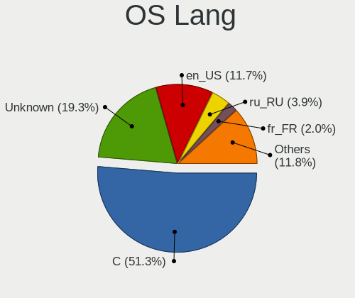

| Lang             | Notebooks | Percent |
|------------------|-----------|---------|
| C                | 735       | 51.33%  |
| Unknown          | 276       | 19.27%  |
| en_US            | 167       | 11.66%  |
| ru_RU            | 56        | 3.91%   |
| fr_FR            | 29        | 2.03%   |
| de_DE            | 29        | 2.03%   |
| en_GB            | 22        | 1.54%   |
| zh_CN            | 16        | 1.12%   |
| en_CA            | 8         | 0.56%   |
| es_ES            | 7         | 0.49%   |
| pt_BR            | 6         | 0.42%   |
| pl_PL            | 6         | 0.42%   |
| cs_CZ            | 5         | 0.35%   |
| nb_NO            | 4         | 0.28%   |
| en_US.ISO8859-1  | 4         | 0.28%   |
| en_NZ            | 4         | 0.28%   |
| en_AU            | 4         | 0.28%   |
| uk_UA            | 3         | 0.21%   |
| ja_JP            | 3         | 0.21%   |
| es_AR            | 3         | 0.21%   |
| en_US.US-ASCII   | 3         | 0.21%   |
| de_CH            | 3         | 0.21%   |
| it_IT            | 2         | 0.14%   |
| en_SG            | 2         | 0.14%   |
| en_IE            | 2         | 0.14%   |
| de_DE.ISO8859-1  | 2         | 0.14%   |
| de               | 2         | 0.14%   |
| zh_TW            | 1         | 0.07%   |
| zh_CN.GB2312     | 1         | 0.07%   |
| tr_TR            | 1         | 0.07%   |
| sl_SI            | 1         | 0.07%   |
| ru               | 1         | 0.07%   |
| pt_PT            | 1         | 0.07%   |
| POSIX            | 1         | 0.07%   |
| nl_NL            | 1         | 0.07%   |
| ko_KR            | 1         | 0.07%   |
| it_IT.ISO8859-15 | 1         | 0.07%   |
| it_IT.ISO8859-1  | 1         | 0.07%   |
| it_CH            | 1         | 0.07%   |
| hu_HU.US-ASCII   | 1         | 0.07%   |

Boot Mode
---------

EFI or BIOS

| Mode | Notebooks | Percent |
|------|-----------|---------|
| EFI  | 1051      | 76.38%  |
| BIOS | 325       | 23.62%  |

Filesystem
----------

Type of filesystem

| Type | Notebooks | Percent |
|------|-----------|---------|
| Zfs  | 934       | 67.1%   |
| Ufs  | 456       | 32.76%  |
| Xfs  | 1         | 0.07%   |
| Nfs  | 1         | 0.07%   |

Part. scheme
------------

Scheme of partitioning

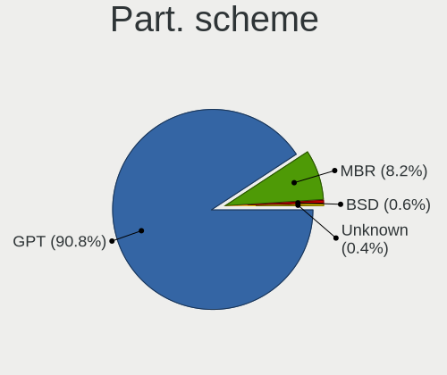

| Type    | Notebooks | Percent |
|---------|-----------|---------|
| GPT     | 1248      | 90.76%  |
| MBR     | 113       | 8.22%   |
| BSD     | 8         | 0.58%   |
| Unknown | 6         | 0.44%   |

Board
-----

Vendor
------

Motherboard manufacturer

| Name                   | Notebooks | Percent |
|------------------------|-----------|---------|
| Lenovo                 | 484       | 35.41%  |
| Dell                   | 242       | 17.7%   |
| Hewlett-Packard        | 125       | 9.14%   |
| ASUSTek Computer       | 99        | 7.24%   |
| Acer                   | 76        | 5.56%   |
| Apple                  | 49        | 3.58%   |
| Toshiba                | 25        | 1.83%   |
| Samsung Electronics    | 20        | 1.46%   |
| MSI                    | 17        | 1.24%   |
| Google                 | 17        | 1.24%   |
| System76               | 15        | 1.1%    |
| HUAWEI                 | 15        | 1.1%    |
| Framework              | 15        | 1.1%    |
| Sony                   | 12        | 0.88%   |
| TUXEDO                 | 11        | 0.8%    |
| Unknown                | 10        | 0.73%   |
| Fujitsu                | 9         | 0.66%   |
| Notebook               | 8         | 0.59%   |
| Alienware              | 8         | 0.59%   |
| Panasonic              | 6         | 0.44%   |
| IBM                    | 6         | 0.44%   |
| Gigabyte Technology    | 6         | 0.44%   |
| Timi                   | 5         | 0.37%   |
| Razer                  | 4         | 0.29%   |
| LG Electronics         | 4         | 0.29%   |
| Intel                  | 4         | 0.29%   |
| GPD                    | 4         | 0.29%   |
| Gateway                | 4         | 0.29%   |
| Valve                  | 3         | 0.22%   |
| Schenker               | 3         | 0.22%   |
| Medion                 | 3         | 0.22%   |
| F-Plus Mobile          | 3         | 0.22%   |
| Deciso                 | 3         | 0.22%   |
| Clevo                  | 3         | 0.22%   |
| Avell High Performance | 3         | 0.22%   |
| SLIMBOOK               | 2         | 0.15%   |
| PC Specialist          | 2         | 0.15%   |
| IP3 Technology         | 2         | 0.15%   |
| Infinix                | 2         | 0.15%   |
| ICL                    | 2         | 0.15%   |

Model
-----

Motherboard model

| Name                                   | Notebooks | Percent |
|----------------------------------------|-----------|---------|
| Unknown                                | 16        | 1.17%   |
| Framework Laptop                       | 7         | 0.51%   |
| HP EliteBook 840 G3                    | 6         | 0.44%   |
| Dell Latitude E7240                    | 5         | 0.37%   |
| Dell Latitude E6430                    | 5         | 0.37%   |
| Apple MacBookAir6,2                    | 5         | 0.37%   |
| System76 Lemur Pro                     | 4         | 0.29%   |
| HP EliteBook 8570p                     | 4         | 0.29%   |
| Framework Laptop (13th Gen Intel Core) | 4         | 0.29%   |
| Dell XPS 13 9360                       | 4         | 0.29%   |
| Dell XPS 13 9343                       | 4         | 0.29%   |
| Dell Precision M4800                   | 4         | 0.29%   |
| Dell Precision 5510                    | 4         | 0.29%   |
| Dell Latitude E7450                    | 4         | 0.29%   |
| Dell Inspiron 3542                     | 4         | 0.29%   |
| Dell Inspiron 15 7000 Gaming           | 4         | 0.29%   |
| Apple MacBookPro11,4                   | 4         | 0.29%   |
| Apple MacBookPro11,1                   | 4         | 0.29%   |
| Valve Jupiter                          | 3         | 0.22%   |
| TUXEDO Pulse 15 Gen1                   | 3         | 0.22%   |
| Lenovo ThinkPad T490 20N2CTO1WW        | 3         | 0.22%   |
| Lenovo ThinkPad P14s Gen 1 20Y1CTO1WW  | 3         | 0.22%   |
| Lenovo IdeaPad 330-15ARR 81D2          | 3         | 0.22%   |
| HUAWEI MACH-WX9                        | 3         | 0.22%   |
| HP ProBook 430 G2                      | 3         | 0.22%   |
| HP Laptop 15-bs0xx                     | 3         | 0.22%   |
| Google Peppy                           | 3         | 0.22%   |
| F-Plus Mobile FLAPTOP r                | 3         | 0.22%   |
| Dell Precision 7560                    | 3         | 0.22%   |
| Dell Latitude E7440                    | 3         | 0.22%   |
| Dell Latitude E6420                    | 3         | 0.22%   |
| Dell Latitude E5470                    | 3         | 0.22%   |
| Dell Latitude E5420                    | 3         | 0.22%   |
| Dell Latitude 7490                     | 3         | 0.22%   |
| Dell Latitude 7390                     | 3         | 0.22%   |
| Dell Latitude 2100                     | 3         | 0.22%   |
| Dell Inspiron 3521                     | 3         | 0.22%   |
| ASUS K43E                              | 3         | 0.22%   |
| Apple MacBookPro8,3                    | 3         | 0.22%   |
| Apple MacBookPro8,1                    | 3         | 0.22%   |

Model Family
------------

Motherboard model prefix

| Name               | Notebooks | Percent |
|--------------------|-----------|---------|
| Lenovo ThinkPad    | 376       | 27.51%  |
| Dell Latitude      | 99        | 7.24%   |
| Dell Inspiron      | 61        | 4.46%   |
| Lenovo IdeaPad     | 50        | 3.66%   |
| Acer Aspire        | 47        | 3.44%   |
| Dell Precision     | 33        | 2.41%   |
| HP ProBook         | 26        | 1.9%    |
| HP EliteBook       | 24        | 1.76%   |
| Dell XPS           | 22        | 1.61%   |
| HP Laptop          | 19        | 1.39%   |
| Toshiba Satellite  | 18        | 1.32%   |
| Unknown            | 16        | 1.17%   |
| Lenovo Legion      | 15        | 1.1%    |
| HP Pavilion        | 15        | 1.1%    |
| Framework Laptop   | 15        | 1.1%    |
| Dell Vostro        | 15        | 1.1%    |
| ASUS VivoBook      | 15        | 1.1%    |
| Lenovo ThinkBook   | 12        | 0.88%   |
| ASUS ASUS          | 11        | 0.8%    |
| HP Compaq          | 9         | 0.66%   |
| Fujitsu LIFEBOOK   | 8         | 0.59%   |
| ASUS ZenBook       | 8         | 0.59%   |
| Apple MacBookPro8  | 8         | 0.59%   |
| Apple MacBookPro11 | 8         | 0.59%   |
| Acer TravelMate    | 8         | 0.59%   |
| TUXEDO Pulse       | 6         | 0.44%   |
| IBM ThinkPad       | 6         | 0.44%   |
| HP ZBook           | 5         | 0.37%   |
| HP ENVY            | 5         | 0.37%   |
| Dell Studio        | 5         | 0.37%   |
| Apple MacBookAir6  | 5         | 0.37%   |
| Acer Swift         | 5         | 0.37%   |
| Acer Nitro         | 5         | 0.37%   |
| System76 Lemur     | 4         | 0.29%   |
| Razer Blade        | 4         | 0.29%   |
| Lenovo Yoga        | 4         | 0.29%   |
| Alienware m15      | 4         | 0.29%   |
| Acer Extensa       | 4         | 0.29%   |
| Valve Jupiter      | 3         | 0.22%   |
| HUAWEI MACH-WX9    | 3         | 0.22%   |

MFG Year
--------

Motherboard manufacture year

| Year | Notebooks | Percent |
|------|-----------|---------|
| 2020 | 155       | 11.34%  |
| 2021 | 128       | 9.36%   |
| 2019 | 123       | 9%      |
| 2018 | 107       | 7.83%   |
| 2011 | 95        | 6.95%   |
| 2022 | 92        | 6.73%   |
| 2015 | 78        | 5.71%   |
| 2013 | 75        | 5.49%   |
| 2016 | 74        | 5.41%   |
| 2012 | 74        | 5.41%   |
| 2023 | 69        | 5.05%   |
| 2017 | 67        | 4.9%    |
| 2010 | 50        | 3.66%   |
| 2014 | 46        | 3.37%   |
| 2008 | 35        | 2.56%   |
| 2024 | 34        | 2.49%   |
| 2009 | 29        | 2.12%   |
| 2007 | 17        | 1.24%   |
| 2006 | 10        | 0.73%   |
| 2003 | 3         | 0.22%   |
| 2005 | 2         | 0.15%   |
| 2004 | 2         | 0.15%   |
| 2002 | 2         | 0.15%   |

Form Factor
-----------

Physical design of the computer

| Name     | Notebooks | Percent |
|----------|-----------|---------|
| Notebook | 1367      | 100%    |

Coreboot
--------

Have coreboot on board

| Used | Notebooks | Percent |
|------|-----------|---------|
| No   | 1338      | 97.88%  |
| Yes  | 29        | 2.12%   |

RAM Size
--------

Total RAM memory

| Size in GB  | Notebooks | Percent |
|-------------|-----------|---------|
| 8.01-16.0   | 448       | 32.23%  |
| 16.01-24.0  | 425       | 30.58%  |
| 4.01-8.0    | 209       | 15.04%  |
| 32.01-64.0  | 143       | 10.29%  |
| 2.01-3.0    | 58        | 4.17%   |
| 64.01-256.0 | 41        | 2.95%   |
| 3.01-4.0    | 21        | 1.51%   |
| 24.01-32.0  | 21        | 1.51%   |
| 0.51-1.0    | 12        | 0.86%   |
| 1.01-2.0    | 8         | 0.58%   |
| 0.01-0.5    | 4         | 0.29%   |

RAM Used
--------

Used RAM memory

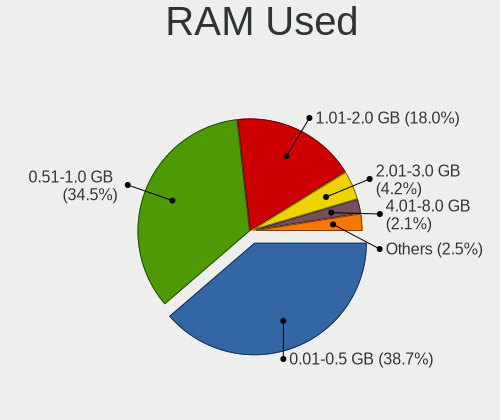

| Used GB    | Notebooks | Percent |
|------------|-----------|---------|
| 0.01-0.5   | 540       | 38.68%  |
| 0.51-1.0   | 482       | 34.53%  |
| 1.01-2.0   | 251       | 17.98%  |
| 2.01-3.0   | 59        | 4.23%   |
| 4.01-8.0   | 29        | 2.08%   |
| 8.01-16.0  | 14        | 1%      |
| 3.01-4.0   | 10        | 0.72%   |
| 16.01-24.0 | 4         | 0.29%   |
| 24.01-32.0 | 3         | 0.21%   |
| 32.01-64.0 | 2         | 0.14%   |
| 0          | 2         | 0.14%   |

Total Drives
------------

Number of drives on board

| Drives | Notebooks | Percent |
|--------|-----------|---------|
| 1      | 917       | 64.99%  |
| 2      | 235       | 16.65%  |
| 0      | 225       | 15.95%  |
| 3      | 30        | 2.13%   |
| 4      | 3         | 0.21%   |
| 58     | 1         | 0.07%   |

Has CD-ROM
----------

Has CD-ROM on board

| Presented | Notebooks | Percent |
|-----------|-----------|---------|
| No        | 1042      | 75.62%  |
| Yes       | 336       | 24.38%  |

Has Ethernet
------------

Has Ethernet on board

| Presented | Notebooks | Percent |
|-----------|-----------|---------|
| Yes       | 1087      | 79.52%  |
| No        | 280       | 20.48%  |

Has WiFi
--------

Has WiFi module

| Presented | Notebooks | Percent |
|-----------|-----------|---------|
| Yes       | 1341      | 97.81%  |
| No        | 30        | 2.19%   |

Has Bluetooth
-------------

Has Bluetooth module

| Presented | Notebooks | Percent |
|-----------|-----------|---------|
| Yes       | 1026      | 74.03%  |
| No        | 360       | 25.97%  |

Location
--------

Country
-------

Geographic location (country)

| Country     | Notebooks | Percent |
|-------------|-----------|---------|
| USA         | 279       | 20.12%  |
| Germany     | 134       | 9.66%   |
| Russia      | 130       | 9.37%   |
| France      | 83        | 5.98%   |
| UK          | 59        | 4.25%   |
| China       | 46        | 3.32%   |
| Canada      | 41        | 2.96%   |
| Brazil      | 38        | 2.74%   |
| Poland      | 36        | 2.6%    |
| Spain       | 34        | 2.45%   |
| Australia   | 33        | 2.38%   |
| Switzerland | 28        | 2.02%   |
| India       | 25        | 1.8%    |
| Ukraine     | 23        | 1.66%   |
| Netherlands | 23        | 1.66%   |
| Austria     | 22        | 1.59%   |
| Czechia     | 19        | 1.37%   |
| Indonesia   | 18        | 1.3%    |
| Sweden      | 16        | 1.15%   |
| Italy       | 16        | 1.15%   |
| Japan       | 15        | 1.08%   |
| Argentina   | 15        | 1.08%   |
| Mexico      | 13        | 0.94%   |
| Romania     | 11        | 0.79%   |
| Vietnam     | 10        | 0.72%   |
| Hungary     | 10        | 0.72%   |
| Portugal    | 9         | 0.65%   |
| Algeria     | 9         | 0.65%   |
| Turkey      | 8         | 0.58%   |
| Thailand    | 8         | 0.58%   |
| New Zealand | 8         | 0.58%   |
| Finland     | 8         | 0.58%   |
| Denmark     | 8         | 0.58%   |
| Ireland     | 7         | 0.5%    |
| Iran        | 7         | 0.5%    |
| Bulgaria    | 7         | 0.5%    |
| Norway      | 6         | 0.43%   |
| Greece      | 6         | 0.43%   |
| Croatia     | 6         | 0.43%   |
| Belgium     | 6         | 0.43%   |

City
----

Geographic location (city)

| City          | Notebooks | Percent |
|---------------|-----------|---------|
| Moscow        | 64        | 4.27%   |
| Vienna        | 21        | 1.4%    |
| Brooklyn      | 21        | 1.4%    |
| Berlin        | 16        | 1.07%   |
| Sydney        | 15        | 1%      |
| Paris         | 13        | 0.87%   |
| Zurich        | 12        | 0.8%    |
| St Petersburg | 10        | 0.67%   |
| Kyiv          | 10        | 0.67%   |
| Warsaw        | 9         | 0.6%    |
| Jakarta       | 8         | 0.53%   |
| Shanghai      | 7         | 0.47%   |
| Seattle       | 7         | 0.47%   |
| Portland      | 7         | 0.47%   |
| Dublin        | 7         | 0.47%   |
| Brighton      | 7         | 0.47%   |
| Amsterdam     | 7         | 0.47%   |
| Stockholm     | 6         | 0.4%    |
| Nuremberg     | 6         | 0.4%    |
| New York      | 6         | 0.4%    |
| Munich        | 6         | 0.4%    |
| London        | 6         | 0.4%    |
| Colombes      | 6         | 0.4%    |
| Chicago       | 6         | 0.4%    |
| Barcelona     | 6         | 0.4%    |
| Tehran        | 5         | 0.33%   |
| Sao Paulo     | 5         | 0.33%   |
| Montreal      | 5         | 0.33%   |
| Milan         | 5         | 0.33%   |
| Melbourne     | 5         | 0.33%   |
| Madrid        | 5         | 0.33%   |
| Christchurch  | 5         | 0.33%   |
| Brno          | 5         | 0.33%   |
| Zagreb        | 4         | 0.27%   |
| Yekaterinburg | 4         | 0.27%   |
| Xi'an         | 4         | 0.27%   |
| Vancouver     | 4         | 0.27%   |
| Stuttgart     | 4         | 0.27%   |
| Singapore     | 4         | 0.27%   |
| San Jose      | 4         | 0.27%   |

Drives
------

Drive Vendor
------------

Hard drive vendors

| Vendor              | Notebooks | Drives | Percent |
|---------------------|-----------|--------|---------|
| Samsung Electronics | 307       | 423    | 21.5%   |
| WDC                 | 187       | 248    | 13.1%   |
| Seagate             | 117       | 152    | 8.19%   |
| Toshiba             | 98        | 149    | 6.86%   |
| Kingston            | 89        | 123    | 6.23%   |
| Crucial             | 79        | 116    | 5.53%   |
| SanDisk             | 58        | 75     | 4.06%   |
| Intel               | 51        | 66     | 3.57%   |
| Hitachi             | 48        | 60     | 3.36%   |
| SK hynix            | 41        | 46     | 2.87%   |
| HGST                | 31        | 105    | 2.17%   |
| Micron Technology   | 28        | 34     | 1.96%   |
| Transcend           | 27        | 33     | 1.89%   |
| A-DATA Technology   | 25        | 31     | 1.75%   |
| Apple               | 24        | 26     | 1.68%   |
| KIOXIA              | 16        | 16     | 1.12%   |
| Gigabyte Technology | 12        | 16     | 0.84%   |
| Fujitsu             | 12        | 17     | 0.84%   |
| LITEON              | 11        | 16     | 0.77%   |
| SPCC                | 10        | 13     | 0.7%    |
| Phison              | 10        | 16     | 0.7%    |
| KingSpec            | 9         | 12     | 0.63%   |
| PNY                 | 8         | 9      | 0.56%   |
| SSSTC               | 7         | 9      | 0.49%   |
| OWC                 | 7         | 8      | 0.49%   |
| Hewlett-Packard     | 7         | 7      | 0.49%   |
| Silicon Motion      | 6         | 7      | 0.42%   |
| Lenovo              | 6         | 7      | 0.42%   |
| UMIS                | 5         | 5      | 0.35%   |
| China               | 5         | 6      | 0.35%   |
| BIWIN               | 5         | 6      | 0.35%   |
| Apacer              | 5         | 5      | 0.35%   |
| OCZ                 | 4         | 5      | 0.28%   |
| Mushkin             | 4         | 4      | 0.28%   |
| Hikvision           | 4         | 5      | 0.28%   |
| FORESEE             | 4         | 4      | 0.28%   |
| Corsair             | 4         | 6      | 0.28%   |
| Union Memory        | 3         | 3      | 0.21%   |
| Team                | 3         | 4      | 0.21%   |
| Lexar               | 3         | 10     | 0.21%   |

Drive Model
-----------

Hard drive models

| Model                                | Notebooks | Percent |
|--------------------------------------|-----------|---------|
| Kingston SA400S37240G 240GB          | 23        | 1.54%   |
| Seagate ST1000LM024 HN-M101MBB 1TB   | 16        | 1.07%   |
| Samsung SSD 860 EVO 500GB            | 16        | 1.07%   |
| Toshiba MQ01ABF050 500GB             | 14        | 0.94%   |
| Toshiba MQ01ABD100 1TB               | 14        | 0.94%   |
| Seagate ST1000LM035-1RK172 1TB       | 14        | 0.94%   |
| HGST HTS721010A9E630 1TB             | 13        | 0.87%   |
| Crucial CT500MX500SSD1 500GB         | 12        | 0.8%    |
| Seagate ST500LT012-1DG142 500GB      | 11        | 0.74%   |
| Samsung SSD 850 EVO 250GB            | 10        | 0.67%   |
| Samsung SSD 970 EVO 500GB            | 9         | 0.6%    |
| Samsung SSD 850 EVO 500GB            | 9         | 0.6%    |
| HGST HTS725050A7E630 500GB           | 9         | 0.6%    |
| Crucial CT1000MX500SSD1 1TB          | 9         | 0.6%    |
| Toshiba MQ04ABF100 1TB               | 8         | 0.54%   |
| Samsung SSD 970 EVO Plus 1TB         | 8         | 0.54%   |
| Samsung SSD 870 EVO 1TB              | 8         | 0.54%   |
| Samsung SSD 860 EVO 250GB            | 8         | 0.54%   |
| WDC PC SN730 SDBQNTY-1T00-1001 1TB   | 7         | 0.47%   |
| SanDisk SSD PLUS 240GB               | 7         | 0.47%   |
| Samsung SSD 980 1TB                  | 7         | 0.47%   |
| Hitachi HTS547550A9E384 500GB        | 7         | 0.47%   |
| WDC PC SN730 SDBQNTY-256G-1001 256GB | 6         | 0.4%    |
| Seagate ST9500325AS 500GB            | 6         | 0.4%    |
| Samsung MZVLW256HEHP-000L7 256GB     | 6         | 0.4%    |
| Samsung MZVLB512HAJQ-000L7 512GB     | 6         | 0.4%    |
| Samsung MZVLB1T0HBLR-000L2 1TB       | 6         | 0.4%    |
| Intel SSDPEKKF512G8L 512GB           | 6         | 0.4%    |
| Intel SSDPEKKF256G8L 256GB           | 6         | 0.4%    |
| Crucial CT2000MX500SSD1 2TB          | 6         | 0.4%    |
| WDC WDS500G3X0C-00SJG0 500GB         | 5         | 0.34%   |
| WDC WDS500G2B0A-00SM50 500GB         | 5         | 0.34%   |
| WDC WD1600BEVT-22ZCT0 160GB          | 5         | 0.34%   |
| Seagate ST2000LM015-2E8174 2TB       | 5         | 0.34%   |
| Seagate ST2000LM003 HN-M201RAD 2TB   | 5         | 0.34%   |
| Seagate ST1000LM048-2E7172 1TB       | 5         | 0.34%   |
| Samsung SSD 970 EVO Plus 2TB         | 5         | 0.34%   |
| Samsung SSD 850 EVO 1TB              | 5         | 0.34%   |
| Samsung MZVLB512HBJQ-000L7 512GB     | 5         | 0.34%   |
| KIOXIA KBG40ZNS512G NVMe 512GB       | 5         | 0.34%   |

HDD Vendor
----------

Hard disk drive vendors

| Vendor              | Notebooks | Drives | Percent |
|---------------------|-----------|--------|---------|
| Seagate             | 115       | 150    | 29.26%  |
| WDC                 | 108       | 131    | 27.48%  |
| Toshiba             | 69        | 102    | 17.56%  |
| Hitachi             | 48        | 60     | 12.21%  |
| HGST                | 31        | 105    | 7.89%   |
| Fujitsu             | 12        | 17     | 3.05%   |
| Samsung Electronics | 7         | 7      | 1.78%   |
| IBM/Hitachi         | 1         | 1      | 0.25%   |
| HPE                 | 1         | 5      | 0.25%   |
| Apple               | 1         | 1      | 0.25%   |

SSD Vendor
----------

Solid state drive vendors

| Vendor              | Notebooks | Drives | Percent |
|---------------------|-----------|--------|---------|
| Samsung Electronics | 164       | 224    | 25.51%  |
| Kingston            | 72        | 103    | 11.2%   |
| Crucial             | 62        | 90     | 9.64%   |
| SanDisk             | 57        | 74     | 8.86%   |
| WDC                 | 27        | 47     | 4.2%    |
| Intel               | 27        | 39     | 4.2%    |
| Transcend           | 24        | 29     | 3.73%   |
| Apple               | 23        | 25     | 3.58%   |
| SK hynix            | 17        | 18     | 2.64%   |
| A-DATA Technology   | 15        | 19     | 2.33%   |
| Micron Technology   | 14        | 17     | 2.18%   |
| Toshiba             | 10        | 12     | 1.56%   |
| LITEON              | 10        | 15     | 1.56%   |
| KingSpec            | 9         | 12     | 1.4%    |
| Gigabyte Technology | 9         | 11     | 1.4%    |
| SPCC                | 8         | 10     | 1.24%   |
| OWC                 | 7         | 8      | 1.09%   |
| PNY                 | 6         | 7      | 0.93%   |
| Hewlett-Packard     | 6         | 6      | 0.93%   |
| China               | 5         | 6      | 0.78%   |
| Apacer              | 5         | 5      | 0.78%   |
| OCZ                 | 4         | 5      | 0.62%   |
| Lenovo              | 4         | 5      | 0.62%   |
| Corsair             | 4         | 6      | 0.62%   |
| BIWIN               | 4         | 5      | 0.62%   |
| Team                | 3         | 4      | 0.47%   |
| Mushkin             | 3         | 3      | 0.47%   |
| Lexar               | 3         | 10     | 0.47%   |
| Intenso             | 3         | 3      | 0.47%   |
| Zheino              | 2         | 3      | 0.31%   |
| Seagate             | 2         | 2      | 0.31%   |
| Patriot             | 2         | 3      | 0.31%   |
| Netac               | 2         | 2      | 0.31%   |
| MidasForce          | 2         | 2      | 0.31%   |
| Hikvision           | 2         | 3      | 0.31%   |
| Fanxiang            | 2         | 3      | 0.31%   |
| Dogfish             | 2         | 2      | 0.31%   |
| Dahua               | 2         | 2      | 0.31%   |
| ZTC                 | 1         | 1      | 0.16%   |
| Verbatim            | 1         | 1      | 0.16%   |

Drive Kind
----------

HDD or SSD

| Kind | Notebooks | Drives | Percent |
|------|-----------|--------|---------|
| SSD  | 575       | 864    | 43.69%  |
| NVMe | 376       | 519    | 28.57%  |
| HDD  | 365       | 579    | 27.74%  |

Drive Connector
---------------

SATA, SAS, NVMe, etc.

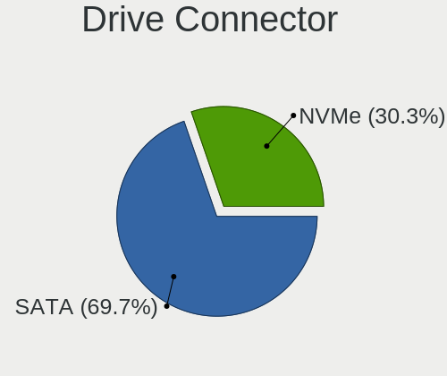

| Type | Notebooks | Drives | Percent |
|------|-----------|--------|---------|
| SATA | 866       | 1443   | 69.73%  |
| NVMe | 376       | 519    | 30.27%  |

Drive Size
----------

Size of hard drive

| Size in TB | Notebooks | Drives | Percent |
|------------|-----------|--------|---------|
| 0.01-0.5   | 667       | 980    | 70.43%  |
| 0.51-1.0   | 220       | 337    | 23.23%  |
| 1.01-2.0   | 51        | 68     | 5.39%   |
| 3.01-4.0   | 5         | 53     | 0.53%   |
| 4.01-10.0  | 3         | 3      | 0.32%   |
| 2.01-3.0   | 1         | 2      | 0.11%   |

Space Total
-----------

Amount of disk space available on the file system

| Size in GB     | Notebooks | Percent |
|----------------|-----------|---------|
| 101-250        | 525       | 36.61%  |
| 251-500        | 390       | 27.2%   |
| 501-1000       | 215       | 14.99%  |
| 51-100         | 134       | 9.34%   |
| 21-50          | 72        | 5.02%   |
| 1001-2000      | 50        | 3.49%   |
| 1-20           | 33        | 2.3%    |
| More than 3000 | 6         | 0.42%   |
| 2001-3000      | 5         | 0.35%   |
| Unknown        | 4         | 0.28%   |

Space Used
----------

Amount of used disk space

| Used GB        | Notebooks | Percent |
|----------------|-----------|---------|
| 1-20           | 1048      | 73.13%  |
| 21-50          | 210       | 14.65%  |
| 51-100         | 81        | 5.65%   |
| 101-250        | 61        | 4.26%   |
| 251-500        | 19        | 1.33%   |
| 501-1000       | 8         | 0.56%   |
| Unknown        | 4         | 0.28%   |
| More than 3000 | 1         | 0.07%   |
| 1001-2000      | 1         | 0.07%   |

Malfunc. Drives
---------------

Drive models with a malfunction

| Model                               | Notebooks | Drives | Percent |
|-------------------------------------|-----------|--------|---------|
| Seagate ST500LT012-1DG142 500GB     | 9         | 10     | 4.43%   |
| Seagate ST1000LM024 HN-M101MBB 1TB  | 6         | 7      | 2.96%   |
| HGST HTS725050A7E630 500GB          | 5         | 9      | 2.46%   |
| Toshiba MQ01ABF050 500GB            | 4         | 4      | 1.97%   |
| Seagate ST500LT012-9WS142 500GB     | 4         | 7      | 1.97%   |
| Hitachi HTS547550A9E384 500GB       | 4         | 5      | 1.97%   |
| HGST HTS721010A9E630 1TB            | 4         | 25     | 1.97%   |
| Toshiba MQ01ABD100 1TB              | 3         | 3      | 1.48%   |
| Seagate ST9500420AS 500GB           | 3         | 4      | 1.48%   |
| Seagate ST9500325AS 500GB           | 3         | 6      | 1.48%   |
| Seagate ST9250315AS 250GB           | 3         | 4      | 1.48%   |
| Seagate ST500LM021-1KJ152 500GB     | 3         | 5      | 1.48%   |
| Seagate ST320LT007-9ZV142 320GB     | 3         | 3      | 1.48%   |
| Kingston SV300S37A120G 120GB        | 3         | 4      | 1.48%   |
| WDC WD3200BPVT-80JJ5T0 320GB        | 2         | 2      | 0.99%   |
| Toshiba MK2546GSX 250GB             | 2         | 2      | 0.99%   |
| Seagate ST9320325AS 320GB           | 2         | 2      | 0.99%   |
| Seagate ST2000LM003 HN-M201RAD 2TB  | 2         | 2      | 0.99%   |
| Seagate ST1000LM035-1RK172 1TB      | 2         | 2      | 0.99%   |
| SanDisk SSD PLUS 480GB              | 2         | 2      | 0.99%   |
| Samsung Electronics SSD 870 EVO 1TB | 2         | 2      | 0.99%   |
| Micron Technology 1100 SATA 256GB   | 2         | 2      | 0.99%   |
| Kingston SNS4151S316GD 16GB         | 2         | 2      | 0.99%   |
| Intel SSDSCKKF256G8H 256GB          | 2         | 5      | 0.99%   |
| Hitachi HTS545032B9A300 320GB       | 2         | 3      | 0.99%   |
| Hitachi HTS541612J9SA00 120GB       | 2         | 2      | 0.99%   |
| Fujitsu MHZ2160BH G2 160GB          | 2         | 2      | 0.99%   |
| WDC WD7500BPVT-80HXZT3 752GB        | 1         | 1      | 0.49%   |
| WDC WD7500BPKX-60HPJT0 752GB        | 1         | 1      | 0.49%   |
| WDC WD7500BPKT-75PK4T0 752GB        | 1         | 1      | 0.49%   |
| WDC WD6400BEVT-22A0RT0 640GB        | 1         | 1      | 0.49%   |
| WDC WD5000LPLX-60ZNTT1 500GB        | 1         | 1      | 0.49%   |
| WDC WD5000BEVT-75A0RT0 500GB        | 1         | 1      | 0.49%   |
| WDC WD5000B 500GB                   | 1         | 1      | 0.49%   |
| WDC WD3200BPVT-75ZEST0 320GB        | 1         | 1      | 0.49%   |
| WDC WD3200BPVT-75JJ5T0 320GB        | 1         | 1      | 0.49%   |
| WDC WD3200BEKT-60PVMT0 320GB        | 1         | 1      | 0.49%   |
| WDC WD3200BEKT-22PVMT0 320GB        | 1         | 1      | 0.49%   |
| WDC WD2500BEVT-24A23T0 250GB        | 1         | 1      | 0.49%   |
| WDC WD2000JB-00GVC0 200GB           | 1         | 1      | 0.49%   |

Malfunc. Drive Vendor
---------------------

Vendors of faulty drives

| Vendor              | Notebooks | Drives | Percent |
|---------------------|-----------|--------|---------|
| Seagate             | 48        | 66     | 24.37%  |
| Hitachi             | 24        | 31     | 12.18%  |
| Toshiba             | 22        | 30     | 11.17%  |
| WDC                 | 19        | 20     | 9.64%   |
| Samsung Electronics | 17        | 18     | 8.63%   |
| Kingston            | 14        | 17     | 7.11%   |
| HGST                | 10        | 38     | 5.08%   |
| Intel               | 9         | 13     | 4.57%   |
| Micron Technology   | 5         | 5      | 2.54%   |
| SanDisk             | 4         | 4      | 2.03%   |
| Fujitsu             | 4         | 7      | 2.03%   |
| SK hynix            | 3         | 3      | 1.52%   |
| Crucial             | 3         | 3      | 1.52%   |
| Apple               | 3         | 3      | 1.52%   |
| A-DATA Technology   | 2         | 3      | 1.02%   |
| Transcend           | 1         | 1      | 0.51%   |
| SSSTC               | 1         | 1      | 0.51%   |
| SMI                 | 1         | 1      | 0.51%   |
| OCZ                 | 1         | 1      | 0.51%   |
| Netac               | 1         | 1      | 0.51%   |
| LITEON              | 1         | 1      | 0.51%   |
| Lenovo              | 1         | 1      | 0.51%   |
| IBM/Hitachi         | 1         | 1      | 0.51%   |
| Hewlett-Packard     | 1         | 1      | 0.51%   |
| Fanxiang            | 1         | 1      | 0.51%   |

Malfunc. HDD Vendor
-------------------

Vendors of faulty HDD drives

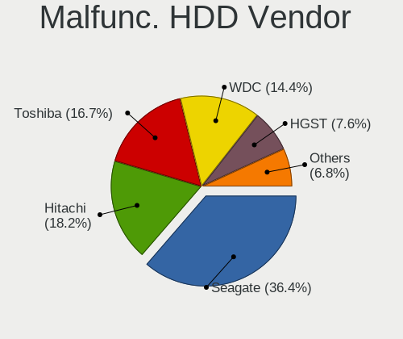

| Vendor              | Notebooks | Drives | Percent |
|---------------------|-----------|--------|---------|
| Seagate             | 48        | 66     | 36.36%  |
| Hitachi             | 24        | 31     | 18.18%  |
| Toshiba             | 22        | 30     | 16.67%  |
| WDC                 | 19        | 20     | 14.39%  |
| HGST                | 10        | 38     | 7.58%   |
| Fujitsu             | 4         | 7      | 3.03%   |
| Samsung Electronics | 3         | 3      | 2.27%   |
| IBM/Hitachi         | 1         | 1      | 0.76%   |
| Apple               | 1         | 1      | 0.76%   |

Malfunc. Drive Kind
-------------------

Kinds of faulty drives

| Kind | Notebooks | Drives | Percent |
|------|-----------|--------|---------|
| HDD  | 128       | 197    | 66.32%  |
| SSD  | 61        | 70     | 31.61%  |
| NVMe | 4         | 4      | 2.07%   |

Failed Drives
-------------

Failed drive models

| Model                             | Notebooks | Drives | Percent |
|-----------------------------------|-----------|--------|---------|
| SanDisk pSSD 16GB                 | 1         | 1      | 50%     |
| Samsung Electronics HM250JI 250GB | 1         | 1      | 50%     |

Failed Drive Vendor
-------------------

Failed drive vendors

| Vendor              | Notebooks | Drives | Percent |
|---------------------|-----------|--------|---------|
| SanDisk             | 1         | 1      | 50%     |
| Samsung Electronics | 1         | 1      | 50%     |

Drive Status
------------

Number of failed and malfunc. drives

| Status   | Notebooks | Drives | Percent |
|----------|-----------|--------|---------|
| Works    | 1026      | 1679   | 83.48%  |
| Malfunc  | 192       | 271    | 15.62%  |
| Detected | 9         | 10     | 0.73%   |
| Failed   | 2         | 2      | 0.16%   |

Storage controller
------------------

Storage Vendor
--------------

Storage controller vendors

| Vendor                                  | Notebooks | Percent |
|-----------------------------------------|-----------|---------|
| Intel                                   | 886       | 54.76%  |
| Samsung Electronics                     | 204       | 12.61%  |
| AMD                                     | 113       | 6.98%   |
| SanDisk                                 | 103       | 6.37%   |
| SK hynix                                | 45        | 2.78%   |
| Toshiba                                 | 28        | 1.73%   |
| Kingston Technology Company             | 26        | 1.61%   |
| Phison Electronics                      | 25        | 1.55%   |
| Micron Technology                       | 25        | 1.55%   |
| Micron/Crucial Technology               | 23        | 1.42%   |
| KIOXIA                                  | 23        | 1.42%   |
| Silicon Motion                          | 21        | 1.3%    |
| ADATA Technology                        | 14        | 0.87%   |
| Shenzhen Longsys Electronics            | 10        | 0.62%   |
| MAXIO Technology (Hangzhou)             | 9         | 0.56%   |
| Solid State Storage Technology          | 8         | 0.49%   |
| Realtek Semiconductor                   | 7         | 0.43%   |
| Nvidia                                  | 7         | 0.43%   |
| Union Memory (Shenzhen)                 | 6         | 0.37%   |
| Marvell Technology Group                | 6         | 0.37%   |
| Shenzhen Unionmemory Information System | 5         | 0.31%   |
| Transcend                               | 4         | 0.25%   |
| Silicon Integrated Systems [SiS]        | 3         | 0.19%   |
| Seagate Technology                      | 3         | 0.19%   |
| Lenovo                                  | 3         | 0.19%   |
| JMicron Technology                      | 2         | 0.12%   |
| INNOGRIT                                | 2         | 0.12%   |
| ULi Electronics                         | 1         | 0.06%   |
| Netac Technology                        | 1         | 0.06%   |
| Lite-On Technology                      | 1         | 0.06%   |
| Broadcom / LSI                          | 1         | 0.06%   |
| Biwin Storage Technology                | 1         | 0.06%   |
| Apple                                   | 1         | 0.06%   |
| Unknown                                 | 1         | 0.06%   |

Storage Model
-------------

Storage controller models

| Model                                                                          | Notebooks | Percent |
|--------------------------------------------------------------------------------|-----------|---------|
| Intel Sunrise Point-LP SATA Controller [AHCI mode]                             | 116       | 6.74%   |
| Intel 7 Series Chipset Family 6-port SATA Controller [AHCI mode]               | 105       | 6.1%    |
| AMD FCH SATA Controller [AHCI mode]                                            | 96        | 5.57%   |
| Samsung NVMe SSD Controller SM981/PM981/PM983                                  | 94        | 5.46%   |
| Intel 6 Series/C200 Series Chipset Family 6 port Mobile SATA AHCI Controller   | 91        | 5.28%   |
| Intel Wildcat Point-LP SATA Controller [AHCI Mode]                             | 63        | 3.66%   |
| Intel 82801 Mobile SATA Controller [RAID mode]                                 | 48        | 2.79%   |
| Intel 8 Series SATA Controller 1 [AHCI mode]                                   | 43        | 2.5%    |
| Samsung NVMe SSD Controller 980 (DRAM-less)                                    | 42        | 2.44%   |
| SanDisk Extreme Pro / WD Black SN750 / PC SN730 / Red SN700 NVMe SSD           | 37        | 2.15%   |
| Intel 82801IBM/IEM (ICH9M/ICH9M-E) 4 port SATA Controller [AHCI mode]          | 34        | 1.97%   |
| Intel 82801HM/HEM (ICH8M/ICH8M-E) SATA Controller [AHCI mode]                  | 31        | 1.8%    |
| Intel 82801HM/HEM (ICH8M/ICH8M-E) IDE Controller                               | 31        | 1.8%    |
| Samsung NVMe SSD Controller PM9A1/PM9A3/980PRO                                 | 30        | 1.74%   |
| Intel Cannon Lake Mobile PCH SATA AHCI Controller                              | 29        | 1.68%   |
| Intel 8 Series/C220 Series Chipset Family 6-port SATA Controller 1 [AHCI mode] | 29        | 1.68%   |
| Intel Comet Lake SATA AHCI Controller                                          | 24        | 1.39%   |
| Intel Volume Management Device NVMe RAID Controller                            | 23        | 1.34%   |
| Samsung NVMe SSD Controller SM961/PM961/SM963                                  | 22        | 1.28%   |
| Intel 5 Series/3400 Series Chipset 6 port SATA AHCI Controller                 | 21        | 1.22%   |
| Intel HM170/QM170 Chipset SATA Controller [AHCI Mode]                          | 19        | 1.1%    |
| SK hynix Gold P31/BC711/PC711 NVMe Solid State Drive                           | 17        | 0.99%   |
| Intel 82801GBM/GHM (ICH7-M Family) SATA Controller [IDE mode]                  | 17        | 0.99%   |
| Intel 5 Series/3400 Series Chipset 4 port SATA AHCI Controller                 | 17        | 0.99%   |
| Intel NM10/ICH7 Family SATA Controller [AHCI mode]                             | 16        | 0.93%   |
| SanDisk Ultra 3D / WD PC SN530, IX SN530, Blue SN550 NVMe SSD (DRAM-less)      | 15        | 0.87%   |
| Intel Q170/Q150/B150/H170/H110/Z170/CM236 Chipset SATA Controller [AHCI Mode]  | 15        | 0.87%   |
| Silicon Motion SM2263EN/SM2263XT (DRAM-less) NVMe SSD Controllers              | 14        | 0.81%   |
| KIOXIA NVMe SSD Controller BG4 (DRAM-less)                                     | 14        | 0.81%   |
| Intel SSD DC P4101/Pro 7600p/760p/E 6100p Series                               | 14        | 0.81%   |
| Intel Cannon Point-LP SATA Controller [AHCI Mode]                              | 13        | 0.75%   |
| Intel Atom Processor E3800 Series SATA AHCI Controller                         | 13        | 0.75%   |
| AMD SB7x0/SB8x0/SB9x0 SATA Controller [AHCI mode]                              | 13        | 0.75%   |
| Intel Tiger Lake-LP SATA Controller                                            | 12        | 0.7%    |
| Intel Celeron/Pentium Silver Processor SATA Controller                         | 12        | 0.7%    |
| Intel 82801G (ICH7 Family) IDE Controller                                      | 12        | 0.7%    |
| Phison E12 NVMe Controller                                                     | 11        | 0.64%   |
| Intel 82801GBM/GHM (ICH7-M Family) SATA Controller [AHCI mode]                 | 11        | 0.64%   |
| Micron/Crucial P2 [Nick P2] / P3 / P3 Plus NVMe PCIe SSD (DRAM-less)           | 10        | 0.58%   |
| Intel 400 Series Chipset Family SATA AHCI Controller                           | 10        | 0.58%   |

Storage Kind
------------

Kind of storage controller (IDE, SATA, NVMe, SAS, ...)

| Kind | Notebooks | Percent |
|------|-----------|---------|
| SATA | 888       | 54.48%  |
| NVMe | 563       | 34.54%  |
| IDE  | 104       | 6.38%   |
| RAID | 74        | 4.54%   |
| SAS  | 1         | 0.06%   |

Processor
---------

CPU Vendor
----------

Processor vendors

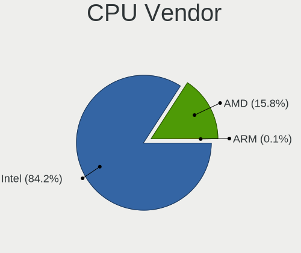

| Vendor | Notebooks | Percent |
|--------|-----------|---------|
| Intel  | 1153      | 84.16%  |
| AMD    | 216       | 15.77%  |
| ARM    | 1         | 0.07%   |

CPU Model
---------

Processor models

| Model                                   | Notebooks | Percent |
|-----------------------------------------|-----------|---------|
| Intel Core i5-2520M CPU @ 2.50GHz       | 28        | 2.03%   |
| Intel Core i7-8550U CPU @ 1.80GHz       | 25        | 1.82%   |
| Intel Core i5-3320M CPU @ 2.60GHz       | 22        | 1.6%    |
| Intel Core i5-6200U CPU @ 2.30GHz       | 21        | 1.53%   |
| Intel Core i5-5300U CPU @ 2.30GHz       | 21        | 1.53%   |
| Intel CPU Version                       | 20        | 1.45%   |
| Intel Core i5-6300U CPU @ 2.40GHz       | 20        | 1.45%   |
| Intel 11th Gen Core i7-1165G7 @ 2.80GHz | 20        | 1.45%   |
| Intel 11th Gen Core i5-1135G7 @ 2.40GHz | 19        | 1.38%   |
| Intel Core i5-7200U CPU @ 2.50GHz       | 18        | 1.31%   |
| Intel Core i5-5200U CPU @ 2.20GHz       | 18        | 1.31%   |
| Intel Core i5-10210U CPU @ 1.60GHz      | 18        | 1.31%   |
| Intel Core i7-8565U CPU @ 1.80GHz       | 17        | 1.23%   |
| Intel Core i5-8250U CPU @ 1.60GHz       | 17        | 1.23%   |
| Intel Core i5-8350U CPU @ 1.70GHz       | 16        | 1.16%   |
| Intel Core i7-9750H CPU @ 2.60GHz       | 15        | 1.09%   |
| Intel Core i7-10510U CPU @ 1.80GHz      | 14        | 1.02%   |
| Intel Core i5-7300U CPU @ 2.60GHz       | 14        | 1.02%   |
| AMD Ryzen 7 4800H with Radeon Graphics  | 14        | 1.02%   |
| Intel Core i7-7500U CPU @ 2.70GHz       | 12        | 0.87%   |
| Intel Core i5-8265U CPU @ 1.60GHz       | 12        | 0.87%   |
| AMD Ryzen 7 5700U with Radeon Graphics  | 12        | 0.87%   |
| Intel Core i7-3520M CPU @ 2.90GHz       | 11        | 0.8%    |
| Intel Core i5-3210M CPU @ 2.50GHz       | 11        | 0.8%    |
| AMD Ryzen 5 5500U with Radeon Graphics  | 11        | 0.8%    |
| Intel Core i7-8750H CPU @ 2.20GHz       | 10        | 0.73%   |
| Intel Core i7-8650U CPU @ 1.90GHz       | 10        | 0.73%   |
| Intel Core i7-6600U CPU @ 2.60GHz       | 10        | 0.73%   |
| Intel Core i7-5600U CPU @ 2.60GHz       | 10        | 0.73%   |
| Intel Core i3-6006U CPU @ 2.00GHz       | 10        | 0.73%   |
| Intel Core 2 Duo                        | 10        | 0.73%   |
| Intel Core i7-7700HQ CPU @ 2.80GHz      | 9         | 0.65%   |
| Intel Core i7-10750H CPU @ 2.60GHz      | 9         | 0.65%   |
| Intel Core i5-4300U CPU @ 1.90GHz       | 9         | 0.65%   |
| Intel Celeron CPU N2840 @ 2.16GHz       | 9         | 0.65%   |
| Intel Core i7-6500U CPU @ 2.50GHz       | 8         | 0.58%   |
| Intel Core i5-2540M CPU @ 2.60GHz       | 8         | 0.58%   |
| Intel Core i5 CPU M 520 @ 2.40GHz       | 8         | 0.58%   |
| Intel Core i7-8665U CPU @ 1.90GHz       | 7         | 0.51%   |
| Intel Core i7-6820HQ CPU @ 2.70GHz      | 7         | 0.51%   |

CPU Model Family
----------------

Processor model prefix

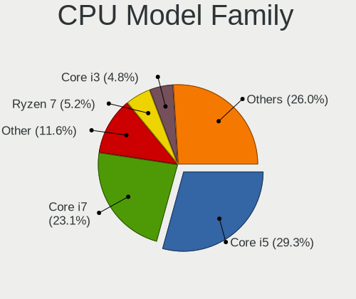

| Model                   | Notebooks | Percent |
|-------------------------|-----------|---------|
| Intel Core i5           | 402       | 29.26%  |
| Intel Core i7           | 318       | 23.14%  |
| Other                   | 160       | 11.64%  |
| AMD Ryzen 7             | 71        | 5.17%   |
| Intel Core i3           | 66        | 4.8%    |
| Intel Celeron           | 55        | 4%      |
| Intel Core 2 Duo        | 53        | 3.86%   |
| AMD Ryzen 5             | 44        | 3.2%    |
| Intel Atom              | 22        | 1.6%    |
| Intel Pentium           | 18        | 1.31%   |
| AMD Ryzen 7 PRO         | 16        | 1.16%   |
| Intel Pentium M         | 13        | 0.95%   |
| AMD Ryzen 9             | 13        | 0.95%   |
| AMD Ryzen 3             | 11        | 0.8%    |
| AMD Ryzen 5 PRO         | 10        | 0.73%   |
| Intel Xeon              | 7         | 0.51%   |
| Intel Pentium Dual      | 7         | 0.51%   |
| Intel Core i9           | 7         | 0.51%   |
| Intel Core 2            | 7         | 0.51%   |
| AMD E                   | 7         | 0.51%   |
| Intel Pentium Silver    | 6         | 0.44%   |
| Intel Genuine           | 6         | 0.44%   |
| AMD A8                  | 5         | 0.36%   |
| AMD A6                  | 5         | 0.36%   |
| AMD E2                  | 4         | 0.29%   |
| AMD Athlon              | 4         | 0.29%   |
| AMD A4                  | 4         | 0.29%   |
| Intel Pentium 4         | 3         | 0.22%   |
| Intel Core m3           | 3         | 0.22%   |
| AMD C-50                | 3         | 0.22%   |
| Intel Celeron M         | 2         | 0.15%   |
| AMD EPYC                | 2         | 0.15%   |
| AMD E1                  | 2         | 0.15%   |
| AMD A10                 | 2         | 0.15%   |
| Intel Pentium Dual-Core | 1         | 0.07%   |
| Intel Mobile Pentium 4  | 1         | 0.07%   |
| Intel Core Solo         | 1         | 0.07%   |
| Intel Core m7           | 1         | 0.07%   |
| Intel Core M            | 1         | 0.07%   |
| Intel Core Duo          | 1         | 0.07%   |

CPU Cores
---------

Number of processor cores

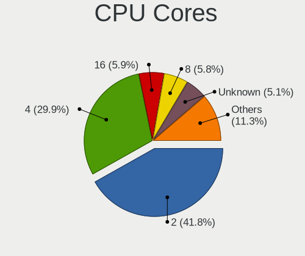

| Number  | Notebooks | Percent |
|---------|-----------|---------|
| 2       | 577       | 41.84%  |
| 4       | 413       | 29.95%  |
| 16      | 82        | 5.95%   |
| 8       | 80        | 5.8%    |
| Unknown | 71        | 5.15%   |
| 6       | 59        | 4.28%   |
| 12      | 36        | 2.61%   |
| 1       | 36        | 2.61%   |
| 10      | 12        | 0.87%   |
| 20      | 5         | 0.36%   |
| 32      | 4         | 0.29%   |
| 24      | 2         | 0.15%   |
| 22      | 1         | 0.07%   |
| 5       | 1         | 0.07%   |

CPU Sockets
-----------

Number of sockets

| Number  | Notebooks | Percent |
|---------|-----------|---------|
| 1       | 1358      | 99.27%  |
| 2       | 9         | 0.66%   |
| Unknown | 1         | 0.07%   |

CPU Threads
-----------

Threads per core (Hyper-Threading)

| Number  | Notebooks | Percent |
|---------|-----------|---------|
| 2       | 939       | 68.24%  |
| 1       | 350       | 25.44%  |
| Unknown | 87        | 6.32%   |

CPU Microarch
-------------

Microarchitecture

| Name            | Notebooks | Percent |
|-----------------|-----------|---------|
| KabyLake        | 283       | 20.63%  |
| Unknown         | 135       | 9.84%   |
| SandyBridge     | 110       | 8.02%   |
| IvyBridge       | 105       | 7.65%   |
| Haswell         | 93        | 6.78%   |
| Skylake         | 92        | 6.71%   |
| Broadwell       | 70        | 5.1%    |
| TigerLake       | 65        | 4.74%   |
| Penryn          | 46        | 3.35%   |
| Zen 2           | 41        | 2.99%   |
| Core            | 40        | 2.92%   |
| Westmere        | 37        | 2.7%    |
| Bonnell         | 34        | 2.48%   |
| Zen+            | 30        | 2.19%   |
| Zen 3           | 29        | 2.11%   |
| Silvermont      | 29        | 2.11%   |
| CometLake       | 21        | 1.53%   |
| Zen             | 17        | 1.24%   |
| P6              | 16        | 1.17%   |
| Goldmont plus   | 16        | 1.17%   |
| IceLake         | 12        | 0.87%   |
| Bobcat          | 11        | 0.8%    |
| Puma            | 9         | 0.66%   |
| Excavator       | 9         | 0.66%   |
| NetBurst        | 4         | 0.29%   |
| Goldmont        | 4         | 0.29%   |
| Piledriver      | 3         | 0.22%   |
| Nehalem         | 2         | 0.15%   |
| K8 Hammer       | 2         | 0.15%   |
| K8 & K10 hybrid | 2         | 0.15%   |
| K10 Llano       | 2         | 0.15%   |
| K10             | 2         | 0.15%   |
| Jaguar          | 1         | 0.07%   |

Graphics
--------

GPU Vendor
----------

Vendors of graphics cards

| Vendor                           | Notebooks | Percent |
|----------------------------------|-----------|---------|
| Intel                            | 1058      | 64.55%  |
| Nvidia                           | 306       | 18.67%  |
| AMD                              | 272       | 16.6%   |
| Silicon Integrated Systems [SiS] | 2         | 0.12%   |
| Silicon Motion                   | 1         | 0.06%   |

GPU Model
---------

Graphics card models

| Model                                                                                    | Notebooks | Percent |
|------------------------------------------------------------------------------------------|-----------|---------|
| Intel 2nd Generation Core Processor Family Integrated Graphics Controller                | 98        | 5.73%   |
| Intel 3rd Gen Core processor Graphics Controller                                         | 95        | 5.55%   |
| Intel UHD Graphics 620                                                                   | 71        | 4.15%   |
| Intel Skylake GT2 [HD Graphics 520]                                                      | 67        | 3.92%   |
| Intel HD Graphics 5500                                                                   | 62        | 3.62%   |
| Intel TigerLake-LP GT2 [Iris Xe Graphics]                                                | 60        | 3.51%   |
| Intel Haswell-ULT Integrated Graphics Controller                                         | 57        | 3.33%   |
| Intel HD Graphics 620                                                                    | 55        | 3.21%   |
| Intel WhiskeyLake-U GT2 [UHD Graphics 620]                                               | 44        | 2.57%   |
| Intel CometLake-U GT2 [UHD Graphics]                                                     | 41        | 2.4%    |
| AMD Renoir [Radeon Vega Series / Radeon Vega Mobile Series]                              | 40        | 2.34%   |
| Intel CoffeeLake-H GT2 [UHD Graphics 630]                                                | 37        | 2.16%   |
| AMD Picasso/Raven 2 [Radeon Vega Series / Radeon Vega Mobile Series]                     | 30        | 1.75%   |
| Intel Mobile 4 Series Chipset Integrated Graphics Controller                             | 29        | 1.69%   |
| Intel Core Processor Integrated Graphics Controller                                      | 29        | 1.69%   |
| Intel 4th Gen Core Processor Integrated Graphics Controller                              | 29        | 1.69%   |
| Nvidia TU117M [GeForce GTX 1650 Mobile / Max-Q]                                          | 25        | 1.46%   |
| Intel Mobile 945GM/GMS/GME, 943/940GML Express Integrated Graphics Controller            | 25        | 1.46%   |
| AMD Lucienne                                                                             | 25        | 1.46%   |
| Intel Mobile GM965/GL960 Integrated Graphics Controller (secondary)                      | 24        | 1.4%    |
| Intel Mobile GM965/GL960 Integrated Graphics Controller (primary)                        | 24        | 1.4%    |
| Intel HD Graphics 630                                                                    | 17        | 0.99%   |
| Intel HD Graphics 530                                                                    | 17        | 0.99%   |
| Intel CometLake-H GT2 [UHD Graphics]                                                     | 17        | 0.99%   |
| Intel Raptor Lake-P [Iris Xe Graphics]                                                   | 16        | 0.94%   |
| AMD Cezanne [Radeon Vega Series / Radeon Vega Mobile Series]                             | 16        | 0.94%   |
| Intel Mobile 945GSE Express Integrated Graphics Controller                               | 15        | 0.88%   |
| Intel Atom Processor Z36xxx/Z37xxx Series Graphics & Display                             | 15        | 0.88%   |
| Intel Atom Processor D4xx/D5xx/N4xx/N5xx Integrated Graphics Controller                  | 15        | 0.88%   |
| Intel Atom/Celeron/Pentium Processor x5-E8000/J3xxx/N3xxx Integrated Graphics Controller | 14        | 0.82%   |
| Intel Alder Lake-P GT2 [Iris Xe Graphics]                                                | 14        | 0.82%   |
| AMD Rembrandt [Radeon 680M]                                                              | 14        | 0.82%   |
| Intel GeminiLake [UHD Graphics 600]                                                      | 12        | 0.7%    |
| AMD Raven Ridge [Radeon Vega Series / Radeon Vega Mobile Series]                         | 12        | 0.7%    |
| Nvidia GP108M [GeForce MX150]                                                            | 11        | 0.64%   |
| AMD Phoenix1                                                                             | 11        | 0.64%   |
| Nvidia GP107M [GeForce GTX 1050 Mobile]                                                  | 10        | 0.58%   |
| Intel Mobile 945GM/GMS, 943/940GML Express Integrated Graphics Controller                | 10        | 0.58%   |
| AMD Barcelo                                                                              | 10        | 0.58%   |
| Nvidia TU116M [GeForce GTX 1660 Ti Mobile]                                               | 8         | 0.47%   |

GPU Combo
---------

Combinations of graphics cards

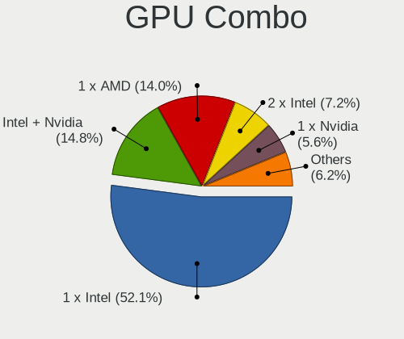

| Name                     | Notebooks | Percent |
|--------------------------|-----------|---------|
| 1 x Intel                | 719       | 52.06%  |
| Intel + Nvidia           | 205       | 14.84%  |
| 1 x AMD                  | 194       | 14.05%  |
| 2 x Intel                | 100       | 7.24%   |
| 1 x Nvidia               | 77        | 5.58%   |
| Intel + AMD              | 33        | 2.39%   |
| AMD + Nvidia             | 27        | 1.96%   |
| 2 x AMD                  | 17        | 1.23%   |
| Other                    | 3         | 0.22%   |
| 2 x Nvidia               | 2         | 0.14%   |
| 1 x SiS                  | 2         | 0.14%   |
| 1 x Silicon Motion       | 1         | 0.07%   |
| Intel + AMD + 1 x Nvidia | 1         | 0.07%   |

GPU Driver
----------

Free vs proprietary

| Driver      | Notebooks | Percent |
|-------------|-----------|---------|
| Free        | 1229      | 88.8%   |
| Proprietary | 145       | 10.48%  |
| Unknown     | 10        | 0.72%   |

GPU Memory
----------

Total video memory

| Size in GB | Notebooks | Percent |
|------------|-----------|---------|
| Unknown    | 1133      | 81.45%  |
| 0.01-0.5   | 111       | 7.98%   |
| 1.01-2.0   | 57        | 4.1%    |
| 0.51-1.0   | 34        | 2.44%   |
| 3.01-4.0   | 25        | 1.8%    |
| 7.01-8.0   | 13        | 0.93%   |
| 5.01-6.0   | 12        | 0.86%   |
| 2.01-3.0   | 3         | 0.22%   |
| 8.01-16.0  | 3         | 0.22%   |

Monitor
-------

Monitor Vendor
--------------

Monitor vendors

| Vendor                  | Notebooks | Percent |
|-------------------------|-----------|---------|
| AU Optronics            | 216       | 19.29%  |
| LG Display              | 171       | 15.27%  |
| BOE                     | 152       | 13.57%  |
| Chimei Innolux          | 127       | 11.34%  |
| Samsung Electronics     | 76        | 6.79%   |
| Lenovo                  | 50        | 4.46%   |
| Sharp                   | 34        | 3.04%   |
| Apple                   | 32        | 2.86%   |
| Dell                    | 27        | 2.41%   |
| Goldstar                | 17        | 1.52%   |
| Hewlett-Packard         | 16        | 1.43%   |
| Chi Mei Optoelectronics | 15        | 1.34%   |
| InfoVision              | 14        | 1.25%   |
| CSO                     | 12        | 1.07%   |
| AOC                     | 12        | 1.07%   |
| LG Philips              | 10        | 0.89%   |
| PANDA                   | 9         | 0.8%    |
| Acer                    | 9         | 0.8%    |
| LGD                     | 8         | 0.71%   |
| Philips                 | 7         | 0.63%   |
| BenQ                    | 7         | 0.63%   |
| ViewSonic               | 6         | 0.54%   |
| Ancor Communications    | 6         | 0.54%   |
| JDI                     | 5         | 0.45%   |
| Iiyama                  | 5         | 0.45%   |
| CPT                     | 5         | 0.45%   |
| BOE Technology Group    | 5         | 0.45%   |
| Unknown                 | 5         | 0.45%   |
| Toshiba                 | 4         | 0.36%   |
| Sceptre Tech            | 4         | 0.36%   |
| Unknown                 | 3         | 0.27%   |
| TMX                     | 3         | 0.27%   |
| Lenovo Group Limited    | 3         | 0.27%   |
| HKC                     | 3         | 0.27%   |
| HannStar                | 3         | 0.27%   |
| CTO                     | 3         | 0.27%   |
| ASUSTek Computer        | 3         | 0.27%   |
| Vizio                   | 2         | 0.18%   |
| Panasonic               | 2         | 0.18%   |
| HUAWEI                  | 2         | 0.18%   |

Monitor Model
-------------

Monitor models

| Model                                                                | Notebooks | Percent |
|----------------------------------------------------------------------|-----------|---------|
| LG Display LCD Monitor LGD02D8 1366x768 280x160mm 12.7-inch          | 13        | 1.15%   |
| AU Optronics LCD Monitor AUO106C 1366x768 280x160mm 12.7-inch        | 12        | 1.06%   |
| Chimei Innolux LCD Monitor CMN14C9 1920x1080 310x170mm 13.9-inch     | 9         | 0.8%    |
| Chimei Innolux LCD Monitor CMN14D4 1920x1080 310x170mm 13.9-inch     | 8         | 0.71%   |
| BOE LCD Monitor BOE095F 2256x1504 280x190mm 13.3-inch                | 8         | 0.71%   |
| AU Optronics LCD Monitor AUO243D 1920x1080 310x170mm 13.9-inch       | 7         | 0.62%   |
| Lenovo LCD Monitor LEN40B1 1600x900 350x190mm 15.7-inch              | 6         | 0.53%   |
| Chimei Innolux LCD Monitor CMN1132 1366x768 260x140mm 11.6-inch      | 6         | 0.53%   |
| LG Display LCD Monitor LGD0521 1920x1080 310x170mm 13.9-inch         | 5         | 0.44%   |
| LG Display LCD Monitor LGD03ED 1366x768 280x160mm 12.7-inch          | 5         | 0.44%   |
| LG Display LCD Monitor LGD02D3 1366x768 280x160mm 12.7-inch          | 5         | 0.44%   |
| Lenovo LCD Monitor LEN40B2 1920x1080 340x190mm 15.3-inch             | 5         | 0.44%   |
| Chimei Innolux LCD Monitor CMN15F5 1920x1080 340x190mm 15.3-inch     | 5         | 0.44%   |
| Chimei Innolux LCD Monitor CMN14D5 1920x1080 310x170mm 13.9-inch     | 5         | 0.44%   |
| BOE Technology Group LCD Monitor 1920x1080                           | 5         | 0.44%   |
| AU Optronics LCD Monitor AUO80ED 1920x1080 340x190mm 15.3-inch       | 5         | 0.44%   |
| AU Optronics LCD Monitor AUO71EC 1366x768 340x190mm 15.3-inch        | 5         | 0.44%   |
| AU Optronics LCD Monitor AUO313C 1366x768 310x170mm 13.9-inch        | 5         | 0.44%   |
| AU Optronics LCD Monitor AUO2E3C 1366x768 310x170mm 13.9-inch        | 5         | 0.44%   |
| AU Optronics LCD Monitor AUO226D 1920x1080 280x160mm 12.7-inch       | 5         | 0.44%   |
| AU Optronics LCD Monitor AUO133D 1920x1080 310x170mm 13.9-inch       | 5         | 0.44%   |
| AU Optronics LCD Monitor AUO123D 1920x1080 310x170mm 13.9-inch       | 5         | 0.44%   |
| AU Optronics LCD Monitor AUO103D 1920x1080 310x170mm 13.9-inch       | 5         | 0.44%   |
| Unknown                                                              | 5         | 0.44%   |
| Sharp LCD Monitor SHP1449 1920x1080 290x170mm 13.2-inch              | 4         | 0.35%   |
| Sharp LCD Monitor SHP143E 3840x2160 350x190mm 15.7-inch              | 4         | 0.35%   |
| Samsung Electronics LCD Monitor SEC324C 1600x900 310x170mm 13.9-inch | 4         | 0.35%   |
| Samsung Electronics LCD Monitor SEC3047 1366x768 280x160mm 12.7-inch | 4         | 0.35%   |
| LG Display LCD Monitor LGD05FA 1920x1080 310x170mm 13.9-inch         | 4         | 0.35%   |
| LG Display LCD Monitor LGD0456 1366x768 340x190mm 15.3-inch          | 4         | 0.35%   |
| LG Display LCD Monitor LGD0437 1920x1080 280x160mm 12.7-inch         | 4         | 0.35%   |
| LG Display LCD Monitor LGD0258 1600x900 350x190mm 15.7-inch          | 4         | 0.35%   |
| Lenovo LCD Monitor LEN40BA 1920x1080 340x190mm 15.3-inch             | 4         | 0.35%   |
| Lenovo LCD Monitor LEN4036 1440x900 300x190mm 14.0-inch              | 4         | 0.35%   |
| Lenovo LCD Monitor LEN4000 1024x768 250x180mm 12.1-inch              | 4         | 0.35%   |
| InfoVision LCD Monitor IVO057D 1920x1080 310x170mm 13.9-inch         | 4         | 0.35%   |
| Chimei Innolux LCD Monitor CMN15DB 1366x768 340x190mm 15.3-inch      | 4         | 0.35%   |
| Chimei Innolux LCD Monitor CMN14F2 1920x1080 310x170mm 13.9-inch     | 4         | 0.35%   |
| Chimei Innolux LCD Monitor CMN140A 1920x1080 310x170mm 13.9-inch     | 4         | 0.35%   |
| Chimei Innolux LCD Monitor CMN1239 1920x1080 280x160mm 12.7-inch     | 4         | 0.35%   |

Monitor Resolution
------------------

Monitor screen resolution

| Resolution         | Notebooks | Percent |
|--------------------|-----------|---------|
| 1920x1080 (FHD)    | 455       | 42.4%   |
| 1366x768 (WXGA)    | 257       | 23.95%  |
| 1600x900 (HD+)     | 56        | 5.22%   |
| 3840x2160 (4K)     | 41        | 3.82%   |
| 1280x800 (WXGA)    | 41        | 3.82%   |
| 2560x1440 (QHD)    | 40        | 3.73%   |
| 1920x1200 (WUXGA)  | 32        | 2.98%   |
| 2560x1600          | 26        | 2.42%   |
| 1440x900 (WXGA+)   | 21        | 1.96%   |
| 1024x600           | 16        | 1.49%   |
| 2256x1504          | 12        | 1.12%   |
| 2560x1080          | 10        | 0.93%   |
| 2880x1800          | 8         | 0.75%   |
| 3200x1800 (QHD+)   | 5         | 0.47%   |
| 1680x1050 (WSXGA+) | 5         | 0.47%   |
| 1280x1024 (SXGA)   | 5         | 0.47%   |
| Unknown            | 5         | 0.47%   |
| 3440x1440          | 4         | 0.37%   |
| 2160x1440          | 4         | 0.37%   |
| 3000x2000          | 3         | 0.28%   |
| 1024x768 (XGA)     | 3         | 0.28%   |
| 3840x2400          | 2         | 0.19%   |
| 3120x2080          | 2         | 0.19%   |
| 1920x540           | 2         | 0.19%   |
| 1400x1050          | 2         | 0.19%   |
| 1360x768           | 2         | 0.19%   |
| 5760x2160          | 1         | 0.09%   |
| 5760x1080          | 1         | 0.09%   |
| 5440x1080          | 1         | 0.09%   |
| 4480x1080          | 1         | 0.09%   |
| 3840x1200          | 1         | 0.09%   |
| 3840x1080          | 1         | 0.09%   |
| 3520x1080          | 1         | 0.09%   |
| 2880x1920          | 1         | 0.09%   |
| 2520x1680          | 1         | 0.09%   |
| 2240x1400          | 1         | 0.09%   |
| 2160x1350          | 1         | 0.09%   |
| 1920x1280          | 1         | 0.09%   |
| 1280x720 (HD)      | 1         | 0.09%   |
| 1080x2160          | 1         | 0.09%   |

Monitor Diagonal
----------------

Diagonal size in inches

| Inches  | Notebooks | Percent |
|---------|-----------|---------|
| 13      | 360       | 32.58%  |
| 15      | 349       | 31.58%  |
| 12      | 85        | 7.69%   |
| 14      | 44        | 3.98%   |
| 24      | 38        | 3.44%   |
| Unknown | 38        | 3.44%   |
| 27      | 37        | 3.35%   |
| 17      | 35        | 3.17%   |
| 11      | 23        | 2.08%   |
| 23      | 18        | 1.63%   |
| 10      | 13        | 1.18%   |
| 34      | 9         | 0.81%   |
| 21      | 9         | 0.81%   |
| 19      | 8         | 0.72%   |
| 31      | 5         | 0.45%   |
| 18      | 5         | 0.45%   |
| 16      | 4         | 0.36%   |
| 29      | 3         | 0.27%   |
| 9       | 3         | 0.27%   |
| 64      | 2         | 0.18%   |
| 22      | 2         | 0.18%   |
| 49      | 1         | 0.09%   |
| 48      | 1         | 0.09%   |
| 46      | 1         | 0.09%   |
| 43      | 1         | 0.09%   |
| 42      | 1         | 0.09%   |
| 40      | 1         | 0.09%   |
| 39      | 1         | 0.09%   |
| 35      | 1         | 0.09%   |
| 33      | 1         | 0.09%   |
| 32      | 1         | 0.09%   |
| 28      | 1         | 0.09%   |
| 26      | 1         | 0.09%   |
| 20      | 1         | 0.09%   |
| 8       | 1         | 0.09%   |
| 5       | 1         | 0.09%   |

Monitor Width
-------------

Physical width

| Width in mm | Notebooks | Percent |
|-------------|-----------|---------|
| 301-350     | 617       | 56.04%  |
| 201-300     | 261       | 23.71%  |
| 501-600     | 86        | 7.81%   |
| 351-400     | 40        | 3.63%   |
| Unknown     | 38        | 3.45%   |
| 401-500     | 21        | 1.91%   |
| 601-700     | 14        | 1.27%   |
| 701-800     | 11        | 1%      |
| 1001-1500   | 6         | 0.54%   |
| 801-900     | 3         | 0.27%   |
| 101-200     | 2         | 0.18%   |
| 901-1000    | 1         | 0.09%   |
| 1-100       | 1         | 0.09%   |

Aspect Ratio
------------

Proportional relationship between the width and the height

| Ratio   | Notebooks | Percent |
|---------|-----------|---------|
| 16/9    | 775       | 76.66%  |
| 16/10   | 131       | 12.96%  |
| Unknown | 37        | 3.66%   |
| 3/2     | 34        | 3.36%   |
| 21/9    | 14        | 1.38%   |
| 4/3     | 10        | 0.99%   |
| 5/4     | 5         | 0.49%   |
| 6/5     | 1         | 0.1%    |
| 3.18    | 1         | 0.1%    |
| 11/10   | 1         | 0.1%    |
| 1.96    | 1         | 0.1%    |
| 0.46    | 1         | 0.1%    |

Monitor Area
------------

Area in inch

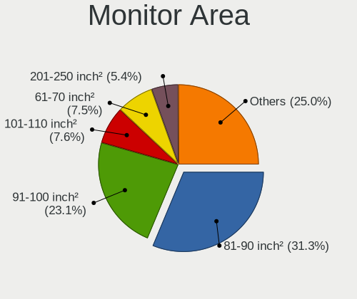

| Area in inch | Notebooks | Percent |
|----------------|-----------|---------|
| 81-90          | 346       | 31.28%  |
| 91-100         | 256       | 23.15%  |
| 101-110        | 84        | 7.59%   |
| 61-70          | 83        | 7.5%    |
| 201-250        | 60        | 5.42%   |
| 71-80          | 48        | 4.34%   |
| 301-350        | 40        | 3.62%   |
| Unknown        | 38        | 3.44%   |
| 121-130        | 32        | 2.89%   |
| 51-60          | 23        | 2.08%   |
| 111-120        | 23        | 2.08%   |
| 351-500        | 17        | 1.54%   |
| 41-50          | 15        | 1.36%   |
| 251-300        | 10        | 0.9%    |
| 151-200        | 9         | 0.81%   |
| 141-150        | 6         | 0.54%   |
| 501-1000       | 6         | 0.54%   |
| 131-140        | 4         | 0.36%   |
| More than 1000 | 3         | 0.27%   |
| 1-40           | 3         | 0.27%   |

Pixel Density
-------------

Pixels per inch

| Density       | Notebooks | Percent |
|---------------|-----------|---------|
| 121-160       | 493       | 45.27%  |
| 101-120       | 241       | 22.13%  |
| 51-100        | 140       | 12.86%  |
| 161-240       | 132       | 12.12%  |
| More than 240 | 41        | 3.76%   |
| Unknown       | 38        | 3.49%   |
| 1-50          | 4         | 0.37%   |

Multiple Monitors
-----------------

Total monitors connected

| Total | Notebooks | Percent |
|-------|-----------|---------|
| 1     | 906       | 64.03%  |
| 0     | 373       | 26.36%  |
| 2     | 125       | 8.83%   |
| 3     | 10        | 0.71%   |
| 4     | 1         | 0.07%   |

Network
-------

Net Controller Vendor
---------------------

Controller vendors

| Vendor                                 | Notebooks | Percent |
|----------------------------------------|-----------|---------|
| Intel                                  | 959       | 45.47%  |
| Realtek Semiconductor                  | 547       | 25.94%  |
| Qualcomm Atheros                       | 225       | 10.67%  |
| Broadcom                               | 134       | 6.35%   |
| TP-Link                                | 25        | 1.19%   |
| MediaTek                               | 23        | 1.09%   |
| Marvell Technology Group               | 21        | 1%      |
| Ralink Technology                      | 20        | 0.95%   |
| Sierra Wireless                        | 14        | 0.66%   |
| Edimax Technology                      | 14        | 0.66%   |
| Ralink                                 | 11        | 0.52%   |
| Ericsson Business Mobile Networks      | 10        | 0.47%   |
| Hewlett-Packard                        | 9         | 0.43%   |
| Xiaomi                                 | 8         | 0.38%   |
| Samsung Electronics                    | 8         | 0.38%   |
| Google                                 | 8         | 0.38%   |
| Dell                                   | 8         | 0.38%   |
| D-Link System                          | 6         | 0.28%   |
| Qualcomm Technologies                  | 5         | 0.24%   |
| Nvidia                                 | 5         | 0.24%   |
| Lenovo                                 | 4         | 0.19%   |
| Huawei Technologies                    | 4         | 0.19%   |
| Silicon Integrated Systems [SiS]       | 3         | 0.14%   |
| Qualcomm                               | 3         | 0.14%   |
| NetGear                                | 3         | 0.14%   |
| JMicron Technology                     | 3         | 0.14%   |
| D-Link                                 | 3         | 0.14%   |
| AMD                                    | 3         | 0.14%   |
| ZTE WCDMA Technologies MSM             | 2         | 0.09%   |
| Fibocom                                | 2         | 0.09%   |
| Arduino SA                             | 2         | 0.09%   |
| ZyXEL Communications                   | 1         | 0.05%   |
| Van Ooijen Technische Informatica      | 1         | 0.05%   |
| ULi Electronics                        | 1         | 0.05%   |
| Sony Ericsson Mobile Communications AB | 1         | 0.05%   |
| Shenzhen Goodix Technology             | 1         | 0.05%   |
| Sagem                                  | 1         | 0.05%   |
| Realtek                                | 1         | 0.05%   |
| Qualcomm Atheros Communications        | 1         | 0.05%   |
| OPPO Electronics                       | 1         | 0.05%   |

Net Controller Model
--------------------

Controller models

| Model                                                                  | Notebooks | Percent |
|------------------------------------------------------------------------|-----------|---------|
| Realtek RTL8111/8168/8211/8411 PCI Express Gigabit Ethernet Controller | 354       | 13.15%  |
| Intel Wireless 8265 / 8275                                             | 114       | 4.23%   |
| Intel 82579LM Gigabit Network Connection (Lewisville)                  | 113       | 4.2%    |
| Realtek RTL810xE PCI Express Fast Ethernet controller                  | 98        | 3.64%   |
| Intel Centrino Advanced-N 6205 [Taylor Peak]                           | 77        | 2.86%   |
| Intel Wireless 8260                                                    | 63        | 2.34%   |
| Intel Wi-Fi 6 AX200                                                    | 63        | 2.34%   |
| Intel Wireless 7265                                                    | 55        | 2.04%   |
| Intel Wi-Fi 6 AX201                                                    | 51        | 1.89%   |
| Intel Wireless 7260                                                    | 48        | 1.78%   |
| Intel Wi-Fi 6E(802.11ax) AX210/AX1675* 2x2 [Typhoon Peak]              | 47        | 1.75%   |
| Intel Ethernet Connection (4) I219-LM                                  | 46        | 1.71%   |
| Qualcomm Atheros QCA9565 / AR9565 Wireless Network Adapter             | 41        | 1.52%   |
| Qualcomm Atheros AR9285 Wireless Network Adapter (PCI-Express)         | 39        | 1.45%   |
| Realtek RTL8188EUS 802.11n Wireless Network Adapter                    | 35        | 1.3%    |
| Intel Comet Lake PCH-LP CNVi WiFi                                      | 35        | 1.3%    |
| Intel Ethernet Connection I219-LM                                      | 34        | 1.26%   |
| Intel Wi-Fi 5(802.11ac) Wireless-AC 9x6x [Thunder Peak]                | 32        | 1.19%   |
| Intel Cannon Point-LP CNVi [Wireless-AC]                               | 32        | 1.19%   |
| Qualcomm Atheros QCA9377 802.11ac Wireless Network Adapter             | 29        | 1.08%   |
| Intel Ethernet Connection (3) I218-LM                                  | 29        | 1.08%   |
| Intel Ethernet Connection (4) I219-V                                   | 28        | 1.04%   |
| Intel Centrino Ultimate-N 6300                                         | 24        | 0.89%   |
| Realtek RTL8821CE 802.11ac PCIe Wireless Network Adapter               | 23        | 0.85%   |
| Qualcomm Atheros AR9485 Wireless Network Adapter                       | 23        | 0.85%   |
| Realtek RTL8822CE 802.11ac PCIe Wireless Network Adapter               | 22        | 0.82%   |
| Intel Ethernet Connection I217-LM                                      | 20        | 0.74%   |
| Intel Cannon Lake PCH CNVi WiFi                                        | 20        | 0.74%   |
| Qualcomm Atheros QCA6174 802.11ac Wireless Network Adapter             | 18        | 0.67%   |
| Qualcomm Atheros AR9462 Wireless Network Adapter                       | 18        | 0.67%   |
| Intel Wireless 3165                                                    | 18        | 0.67%   |
| Intel Comet Lake PCH CNVi WiFi                                         | 18        | 0.67%   |
| Intel PRO/Wireless 3945ABG [Golan] Network Connection                  | 17        | 0.63%   |
| Intel Ethernet Connection I218-LM                                      | 17        | 0.63%   |
| TP-Link AC600 wireless Realtek RTL8811AU [Archer T2U Nano]             | 16        | 0.59%   |
| Intel Wireless 3160                                                    | 16        | 0.59%   |
| Intel Raptor Lake PCH CNVi WiFi                                        | 16        | 0.59%   |
| Intel Dual Band Wireless-AC 3165 Plus Bluetooth                        | 16        | 0.59%   |
| Intel 82577LM Gigabit Network Connection                               | 16        | 0.59%   |
| Intel Dual Band Wireless-AC 3168NGW [Stone Peak]                       | 15        | 0.56%   |

Wireless Vendor
---------------

Wireless vendors

| Vendor                          | Notebooks | Percent |
|---------------------------------|-----------|---------|
| Intel                           | 911       | 61.22%  |
| Qualcomm Atheros                | 200       | 13.44%  |
| Realtek Semiconductor           | 141       | 9.48%   |
| Broadcom                        | 106       | 7.12%   |
| TP-Link                         | 25        | 1.68%   |
| MediaTek                        | 22        | 1.48%   |
| Ralink Technology               | 20        | 1.34%   |
| Edimax Technology               | 14        | 0.94%   |
| Ralink                          | 11        | 0.74%   |
| Sierra Wireless                 | 10        | 0.67%   |
| Dell                            | 6         | 0.4%    |
| D-Link System                   | 6         | 0.4%    |
| Qualcomm Technologies           | 5         | 0.34%   |
| NetGear                         | 3         | 0.2%    |
| D-Link                          | 3         | 0.2%    |
| ZyXEL Communications            | 1         | 0.07%   |
| Sagem                           | 1         | 0.07%   |
| Qualcomm Atheros Communications | 1         | 0.07%   |
| BUFFALO                         | 1         | 0.07%   |
| Atheros                         | 1         | 0.07%   |

Wireless Model
--------------

Wireless models

| Model                                                                   | Notebooks | Percent |
|-------------------------------------------------------------------------|-----------|---------|
| Intel Wireless 8265 / 8275                                              | 114       | 7.56%   |
| Intel Centrino Advanced-N 6205 [Taylor Peak]                            | 77        | 5.11%   |
| Intel Wireless 8260                                                     | 63        | 4.18%   |
| Intel Wi-Fi 6 AX200                                                     | 63        | 4.18%   |
| Intel Wireless 7265                                                     | 55        | 3.65%   |
| Intel Wi-Fi 6 AX201                                                     | 51        | 3.38%   |
| Intel Wireless 7260                                                     | 48        | 3.18%   |
| Intel Wi-Fi 6E(802.11ax) AX210/AX1675* 2x2 [Typhoon Peak]               | 47        | 3.12%   |
| Qualcomm Atheros QCA9565 / AR9565 Wireless Network Adapter              | 41        | 2.72%   |
| Qualcomm Atheros AR9285 Wireless Network Adapter (PCI-Express)          | 39        | 2.59%   |
| Realtek RTL8188EUS 802.11n Wireless Network Adapter                     | 35        | 2.32%   |
| Intel Comet Lake PCH-LP CNVi WiFi                                       | 35        | 2.32%   |
| Intel Wi-Fi 5(802.11ac) Wireless-AC 9x6x [Thunder Peak]                 | 32        | 2.12%   |
| Intel Cannon Point-LP CNVi [Wireless-AC]                                | 32        | 2.12%   |
| Qualcomm Atheros QCA9377 802.11ac Wireless Network Adapter              | 29        | 1.92%   |
| Realtek RTL8821CE 802.11ac PCIe Wireless Network Adapter                | 23        | 1.53%   |
| Qualcomm Atheros AR9485 Wireless Network Adapter                        | 23        | 1.53%   |
| Intel Centrino Ultimate-N 6300                                          | 23        | 1.53%   |
| Realtek RTL8822CE 802.11ac PCIe Wireless Network Adapter                | 22        | 1.46%   |
| Intel Cannon Lake PCH CNVi WiFi                                         | 20        | 1.33%   |
| Qualcomm Atheros QCA6174 802.11ac Wireless Network Adapter              | 18        | 1.19%   |
| Qualcomm Atheros AR9462 Wireless Network Adapter                        | 18        | 1.19%   |
| Intel Wireless 3165                                                     | 18        | 1.19%   |
| Intel Comet Lake PCH CNVi WiFi                                          | 18        | 1.19%   |
| Intel PRO/Wireless 3945ABG [Golan] Network Connection                   | 17        | 1.13%   |
| TP-Link AC600 wireless Realtek RTL8811AU [Archer T2U Nano]              | 16        | 1.06%   |
| Intel Wireless 3160                                                     | 16        | 1.06%   |
| Intel Raptor Lake PCH CNVi WiFi                                         | 16        | 1.06%   |
| Intel Dual Band Wireless-AC 3165 Plus Bluetooth                         | 16        | 1.06%   |
| Intel Dual Band Wireless-AC 3168NGW [Stone Peak]                        | 15        | 0.99%   |
| Intel Alder Lake-P PCH CNVi WiFi                                        | 15        | 0.99%   |
| Broadcom BCM4360 802.11ac Dual Band Wireless Network Adapter            | 13        | 0.86%   |
| Broadcom BCM4313 802.11bgn Wireless Network Adapter                     | 13        | 0.86%   |
| Intel WiFi Link 5100                                                    | 12        | 0.8%    |
| Intel PRO/Wireless 4965 AG or AGN [Kedron] Network Connection           | 12        | 0.8%    |
| Broadcom BCM4331 802.11a/b/g/n                                          | 12        | 0.8%    |
| Broadcom BCM43224 802.11a/b/g/n                                         | 12        | 0.8%    |
| Qualcomm Atheros AR242x / AR542x Wireless Network Adapter (PCI-Express) | 11        | 0.73%   |
| MediaTek MT7921 802.11ax PCI Express Wireless Network Adapter           | 11        | 0.73%   |
| Intel Centrino Advanced-N 6235                                          | 11        | 0.73%   |

Ethernet Vendor
---------------

Ethernet vendors

| Vendor                                 | Notebooks | Percent |
|----------------------------------------|-----------|---------|
| Realtek Semiconductor                  | 467       | 41.7%   |
| Intel                                  | 465       | 41.52%  |
| Broadcom                               | 63        | 5.63%   |
| Qualcomm Atheros                       | 53        | 4.73%   |
| Marvell Technology Group               | 21        | 1.88%   |
| Xiaomi                                 | 8         | 0.71%   |
| Samsung Electronics                    | 8         | 0.71%   |
| Nvidia                                 | 5         | 0.45%   |
| Google                                 | 5         | 0.45%   |
| Lenovo                                 | 4         | 0.36%   |
| Qualcomm                               | 3         | 0.27%   |
| JMicron Technology                     | 3         | 0.27%   |
| AMD                                    | 3         | 0.27%   |
| Silicon Integrated Systems [SiS]       | 2         | 0.18%   |
| ZTE WCDMA Technologies MSM             | 1         | 0.09%   |
| Sony Ericsson Mobile Communications AB | 1         | 0.09%   |
| Realtek                                | 1         | 0.09%   |
| OPPO Electronics                       | 1         | 0.09%   |
| National Semiconductor                 | 1         | 0.09%   |
| Motorola PCS                           | 1         | 0.09%   |
| MediaTek                               | 1         | 0.09%   |
| Huawei Technologies                    | 1         | 0.09%   |
| HMD Global                             | 1         | 0.09%   |
| Aquantia                               | 1         | 0.09%   |

Ethernet Model
--------------

Ethernet models

| Model                                                                  | Notebooks | Percent |
|------------------------------------------------------------------------|-----------|---------|
| Realtek RTL8111/8168/8211/8411 PCI Express Gigabit Ethernet Controller | 354       | 31.47%  |
| Intel 82579LM Gigabit Network Connection (Lewisville)                  | 113       | 10.04%  |
| Realtek RTL810xE PCI Express Fast Ethernet controller                  | 98        | 8.71%   |
| Intel Ethernet Connection (4) I219-LM                                  | 46        | 4.09%   |
| Intel Ethernet Connection I219-LM                                      | 34        | 3.02%   |
| Intel Ethernet Connection (3) I218-LM                                  | 29        | 2.58%   |
| Intel Ethernet Connection (4) I219-V                                   | 28        | 2.49%   |
| Intel Ethernet Connection I217-LM                                      | 20        | 1.78%   |
| Intel Ethernet Connection I218-LM                                      | 17        | 1.51%   |
| Intel 82577LM Gigabit Network Connection                               | 16        | 1.42%   |
| Intel Ethernet Connection I219-V                                       | 12        | 1.07%   |
| Intel Ethernet Connection (6) I219-LM                                  | 12        | 1.07%   |
| Intel 82567LM Gigabit Network Connection                               | 12        | 1.07%   |
| Intel Ethernet Connection (2) I219-LM                                  | 11        | 0.98%   |
| Intel Ethernet Connection (7) I219-LM                                  | 10        | 0.89%   |
| Intel Ethernet Connection (6) I219-V                                   | 10        | 0.89%   |
| Broadcom NetXtreme BCM57765 Gigabit Ethernet PCIe                      | 10        | 0.89%   |
| Qualcomm Atheros AR8151 v2.0 Gigabit Ethernet                          | 9         | 0.8%    |
| Qualcomm Atheros AR8132 Fast Ethernet                                  | 9         | 0.8%    |
| Broadcom NetXtreme BCM5764M Gigabit Ethernet PCIe                      | 9         | 0.8%    |
| Marvell Group 88E8040 PCI-E Fast Ethernet Controller                   | 8         | 0.71%   |
| Intel Ethernet Connection (10) I219-V                                  | 8         | 0.71%   |
| Intel Ethernet Connection (7) I219-V                                   | 7         | 0.62%   |
| Samsung Galaxy series, misc. (tethering mode)                          | 6         | 0.53%   |
| Qualcomm Atheros Killer E2500 Gigabit Ethernet Controller              | 6         | 0.53%   |
| Qualcomm Atheros AR8152 v2.0 Fast Ethernet                             | 6         | 0.53%   |
| Intel Ethernet Connection (23) I219-V                                  | 6         | 0.53%   |
| Intel Ethernet Connection (16) I219-LM                                 | 6         | 0.53%   |
| Intel 82566MM Gigabit Network Connection                               | 6         | 0.53%   |
| Realtek RTL-8100/8101L/8139 PCI Fast Ethernet Adapter                  | 5         | 0.44%   |
| Qualcomm Atheros AR8162 Fast Ethernet                                  | 5         | 0.44%   |
| Nvidia MCP79 Ethernet                                                  | 5         | 0.44%   |
| Intel I210 Gigabit Network Connection                                  | 5         | 0.44%   |
| Intel Ethernet Connection (3) I218-V                                   | 5         | 0.44%   |
| Intel Ethernet Connection (16) I219-V                                  | 5         | 0.44%   |
| Intel Ethernet Connection (14) I219-LM                                 | 5         | 0.44%   |
| Broadcom NetXtreme BCM57762 Gigabit Ethernet PCIe                      | 5         | 0.44%   |
| Broadcom NetXtreme BCM5751M Gigabit Ethernet PCI Express               | 5         | 0.44%   |
| Xiaomi Mi/Redmi series (RNDIS)                                         | 4         | 0.36%   |
| Xiaomi Mi/Redmi series (RNDIS + ADB)                                   | 4         | 0.36%   |

Net Controller Kind
-------------------

Ethernet, WiFi or modem

| Kind     | Notebooks | Percent |
|----------|-----------|---------|
| WiFi     | 1344      | 53.91%  |
| Ethernet | 1089      | 43.68%  |
| Modem    | 35        | 1.4%    |
| Unknown  | 25        | 1%      |

Used Controller
---------------

Currently used network controller

| Kind     | Notebooks | Percent |
|----------|-----------|---------|
| WiFi     | 947       | 56.77%  |
| Ethernet | 713       | 42.75%  |
| Modem    | 5         | 0.3%    |
| Unknown  | 3         | 0.18%   |

NICs
----

Total network controllers on board

| Total | Notebooks | Percent |
|-------|-----------|---------|
| 2     | 1031      | 75.2%   |
| 1     | 307       | 22.39%  |
| 3     | 20        | 1.46%   |
| 0     | 9         | 0.66%   |
| 6     | 2         | 0.15%   |
| 5     | 1         | 0.07%   |
| 4     | 1         | 0.07%   |

IPv6
----

IPv6 vs IPv4

| Used | Notebooks | Percent |
|------|-----------|---------|
| No   | 1246      | 89.7%   |
| Yes  | 143       | 10.3%   |

Bluetooth
---------

Bluetooth Vendor
----------------

Controller vendors

| Vendor                          | Notebooks | Percent |
|---------------------------------|-----------|---------|
| Intel                           | 634       | 60.96%  |
| Broadcom                        | 77        | 7.4%    |
| Qualcomm Atheros Communications | 62        | 5.96%   |
| Realtek Semiconductor           | 56        | 5.38%   |
| Apple                           | 49        | 4.71%   |
| IMC Networks                    | 29        | 2.79%   |
| Foxconn / Hon Hai               | 28        | 2.69%   |
| Lite-On Technology              | 27        | 2.6%    |
| Dell                            | 19        | 1.83%   |
| Hewlett-Packard                 | 14        | 1.35%   |
| Skylight Digital                | 6         | 0.58%   |
| MediaTek                        | 6         | 0.58%   |
| Cambridge Silicon Radio         | 6         | 0.58%   |
| ASUSTek Computer                | 6         | 0.58%   |
| Ralink                          | 4         | 0.38%   |
| Alps Electric                   | 4         | 0.38%   |
| USI                             | 3         | 0.29%   |
| TP-Link                         | 3         | 0.29%   |
| Toshiba                         | 1         | 0.1%    |
| Shenzhen Goodix Technology      | 1         | 0.1%    |
| Ralink Technology               | 1         | 0.1%    |
| Opticis                         | 1         | 0.1%    |
| Fujitsu                         | 1         | 0.1%    |
| Esel International              | 1         | 0.1%    |
| Creative Technology             | 1         | 0.1%    |

Bluetooth Model
---------------

Controller models

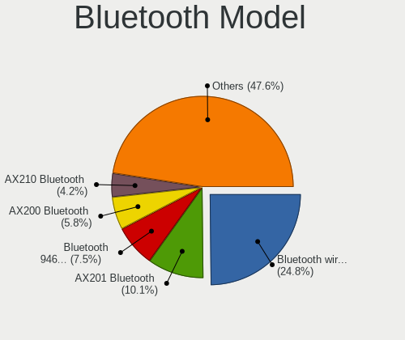

| Model                                                       | Notebooks | Percent |
|-------------------------------------------------------------|-----------|---------|
| Intel Bluetooth wireless interface                          | 259       | 24.83%  |
| Intel AX201 Bluetooth                                       | 105       | 10.07%  |
| Intel Bluetooth 9460/9560 Jefferson Peak (JfP)              | 78        | 7.48%   |
| Intel AX200 Bluetooth                                       | 61        | 5.85%   |
| Intel AX210 Bluetooth                                       | 44        | 4.22%   |
| Apple Bluetooth Host Controller                             | 31        | 2.97%   |
| Broadcom BCM20702 Bluetooth 4.0 [ThinkPad]                  | 30        | 2.88%   |
| Intel AX211 Bluetooth                                       | 27        | 2.59%   |
| Realtek Bluetooth Adapter                                   | 26        | 2.49%   |
| Intel Wireless-AC 9260 Bluetooth Adapter                    | 25        | 2.4%    |
| Broadcom BCM2045B (BDC-2.1)                                 | 25        | 2.4%    |
| Intel Wireless-AC 3168 Bluetooth                            | 15        | 1.44%   |
| Foxconn / Hon Hai Bluetooth USB Module                      | 15        | 1.44%   |
| Intel Centrino Bluetooth Wireless Transceiver               | 14        | 1.34%   |
| Qualcomm Atheros QCA9377 Bluetooth 4.1                      | 13        | 1.25%   |
| Qualcomm Atheros AR3012 Bluetooth 4.0                       | 10        | 0.96%   |
| Qualcomm Atheros AR9462 Bluetooth                           | 9         | 0.86%   |
| IMC Networks Realtek Bluetooth Adapter                      | 9         | 0.86%   |
| Dell DW375 Bluetooth Module                                 | 9         | 0.86%   |
| Apple Broadcom Built-in Bluetooth                           | 9         | 0.86%   |
| Qualcomm Atheros QCA61x4 Bluetooth 4.0                      | 8         | 0.77%   |
| Intel Centrino Advanced-N 6230 Bluetooth adapter            | 8         | 0.77%   |
| Realtek  Bluetooth 4.2 Adapter                              | 7         | 0.67%   |
| Qualcomm Atheros Dell Wireless 1707 Bluetooth 4.0 LE Device | 7         | 0.67%   |
| Lite-On Atheros AR3012 Bluetooth                            | 7         | 0.67%   |
| Skylight Digital Realtek Bluetooth Adapter                  | 6         | 0.58%   |
| Realtek Bluetooth 4.0 Adapter                               | 6         | 0.58%   |
| Lite-On Bluetooth USB Module                                | 6         | 0.58%   |
| Cambridge Silicon Radio Bluetooth Dongle (HCI mode)         | 6         | 0.58%   |
| Broadcom BCM2045B (BDC-2) [Bluetooth Controller]            | 6         | 0.58%   |
| Realtek Bluetooth 4.2 Adapter                               | 5         | 0.48%   |
| Lite-On Qualcomm Atheros QCA9377 Bluetooth                  | 5         | 0.48%   |
| IMC Networks MediaTek Bluetooth Adapter                     | 5         | 0.48%   |
| HP Broadcom 2070 Bluetooth Combo                            | 5         | 0.48%   |
| HP Bluetooth 2.0 Interface [Broadcom BCM2045]               | 5         | 0.48%   |
| Foxconn / Hon Hai MediaTek Bluetooth Adapter                | 5         | 0.48%   |
| Apple Built-in Bluetooth 2.0+EDR HCI                        | 5         | 0.48%   |
| Realtek Wireless Bluetooth Adapter                          | 4         | 0.38%   |
| Realtek RTL8822BE Bluetooth 4.2 Adapter                     | 4         | 0.38%   |
| Ralink RT3290 Bluetooth                                     | 4         | 0.38%   |

Sound
-----

Sound Vendor
------------

Sound card vendors

| Vendor                               | Notebooks | Percent |
|--------------------------------------|-----------|---------|
| Intel                                | 1139      | 71.14%  |
| AMD                                  | 241       | 15.05%  |
| Nvidia                               | 142       | 8.87%   |
| Lenovo                               | 16        | 1%      |
| Realtek Semiconductor                | 7         | 0.44%   |
| Logitech                             | 7         | 0.44%   |
| Texas Instruments                    | 6         | 0.37%   |
| C-Media Electronics                  | 6         | 0.37%   |
| Plantronics                          | 5         | 0.31%   |
| GN Netcom                            | 4         | 0.25%   |
| SteelSeries ApS                      | 3         | 0.19%   |
| Silicon Integrated Systems [SiS]     | 3         | 0.19%   |
| JMTek                                | 3         | 0.19%   |
| ASUSTek Computer                     | 3         | 0.19%   |
| Kingston Technology                  | 2         | 0.12%   |
| Generalplus Technology               | 2         | 0.12%   |
| CMX Systems                          | 2         | 0.12%   |
| ULi Electronics                      | 1         | 0.06%   |
| Thesycon Systemsoftware & Consulting | 1         | 0.06%   |
| Sony                                 | 1         | 0.06%   |
| PS Audio                             | 1         | 0.06%   |
| Microsoft                            | 1         | 0.06%   |
| M-Audio                              | 1         | 0.06%   |
| Hewlett-Packard                      | 1         | 0.06%   |
| ESS Technology                       | 1         | 0.06%   |
| Creative Technology                  | 1         | 0.06%   |
| Cambridge Silicon Radio              | 1         | 0.06%   |

Sound Model
-----------

Sound card models

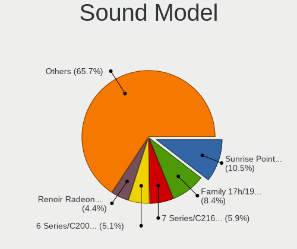

| Model                                                                                             | Notebooks | Percent |
|---------------------------------------------------------------------------------------------------|-----------|---------|
| Intel Sunrise Point-LP HD Audio                                                                   | 205       | 10.5%   |
| AMD Family 17h/19h/1ah HD Audio Controller                                                        | 164       | 8.4%    |
| Intel 7 Series/C216 Chipset Family High Definition Audio Controller                               | 115       | 5.89%   |
| Intel 6 Series/C200 Series Chipset Family High Definition Audio Controller                        | 100       | 5.12%   |
| AMD Renoir Radeon High Definition Audio Controller                                                | 85        | 4.35%   |
| Intel Broadwell-U Audio Controller                                                                | 70        | 3.59%   |
| Intel Wildcat Point-LP High Definition Audio Controller                                           | 66        | 3.38%   |
| Intel Tiger Lake-LP Smart Sound Technology Audio Controller                                       | 65        | 3.33%   |
| Intel Haswell-ULT HD Audio Controller                                                             | 57        | 2.92%   |
| Intel 8 Series HD Audio Controller                                                                | 57        | 2.92%   |
| Intel NM10/ICH7 Family High Definition Audio Controller                                           | 48        | 2.46%   |
| Intel Cannon Lake PCH cAVS                                                                        | 46        | 2.36%   |
| Intel Cannon Point-LP High Definition Audio Controller                                            | 44        | 2.25%   |
| Intel 5 Series/3400 Series Chipset High Definition Audio                                          | 41        | 2.1%    |
| Intel Comet Lake PCH-LP cAVS                                                                      | 40        | 2.05%   |
| AMD Raven/Raven2/Fenghuang HDMI/DP Audio Controller                                               | 40        | 2.05%   |
| Intel 82801I (ICH9 Family) HD Audio Controller                                                    | 37        | 1.9%    |
| Intel 8 Series/C220 Series Chipset High Definition Audio Controller                               | 37        | 1.9%    |
| Intel 82801H (ICH8 Family) HD Audio Controller                                                    | 32        | 1.64%   |
| AMD Rembrandt Radeon High Definition Audio Controller                                             | 31        | 1.59%   |
| Nvidia TU107 GeForce GTX 1650 High Definition Audio Controller                                    | 29        | 1.49%   |
| Intel Xeon E3-1200 v3/4th Gen Core Processor HD Audio Controller                                  | 27        | 1.38%   |
| Intel Alder Lake PCH-P High Definition Audio Controller                                           | 22        | 1.13%   |
| Intel Raptor Lake-P/U/H cAVS                                                                      | 21        | 1.08%   |
| Intel Comet Lake PCH cAVS                                                                         | 21        | 1.08%   |
| Intel CM238 HD Audio Controller                                                                   | 21        | 1.08%   |
| Intel 100 Series/C230 Series Chipset Family HD Audio Controller                                   | 18        | 0.92%   |
| AMD FCH Azalia Controller                                                                         | 17        | 0.87%   |
| Intel Celeron/Pentium Silver Processor High Definition Audio                                      | 16        | 0.82%   |
| Intel Atom Processor Z36xxx/Z37xxx Series High Definition Audio Controller                        | 15        | 0.77%   |
| AMD SBx00 Azalia (Intel HDA)                                                                      | 15        | 0.77%   |
| Intel Ice Lake-LP Smart Sound Technology Audio Controller                                         | 12        | 0.61%   |
| Intel Atom/Celeron/Pentium Processor x5-E8000/J3xxx/N3xxx Series High Definition Audio Controller | 12        | 0.61%   |
| AMD Kabini HDMI/DP Audio                                                                          | 12        | 0.61%   |
| Nvidia GA107 High Definition Audio Controller                                                     | 11        | 0.56%   |
| Intel Tiger Lake-H HD Audio Controller                                                            | 11        | 0.56%   |
| Nvidia GF108 High Definition Audio Controller                                                     | 9         | 0.46%   |
| Lenovo Realtek USB Audio                                                                          | 9         | 0.46%   |
| Intel Raptor Lake High Definition Audio Controller                                                | 9         | 0.46%   |
| AMD Wrestler HDMI Audio                                                                           | 9         | 0.46%   |

Memory
------

Memory Vendor
-------------

Memory module vendors

| Vendor              | Notebooks | Percent |
|---------------------|-----------|---------|
| Samsung Electronics | 476       | 29.11%  |
| SK hynix            | 352       | 21.53%  |
| Micron Technology   | 190       | 11.62%  |
| Kingston            | 134       | 8.2%    |
| Unknown             | 99        | 6.06%   |
| Crucial             | 85        | 5.2%    |
| Unknown             | 47        | 2.87%   |
| Ramaxel Technology  | 40        | 2.45%   |
| Elpida              | 31        | 1.9%    |
| A-DATA Technology   | 27        | 1.65%   |
| Nanya Technology    | 18        | 1.1%    |
| Corsair             | 18        | 1.1%    |
| Team                | 12        | 0.73%   |
| Transcend           | 11        | 0.67%   |
| G.Skill             | 11        | 0.67%   |
| Smart               | 10        | 0.61%   |
| Unknown (ABCD)      | 6         | 0.37%   |
| PNY                 | 6         | 0.37%   |
| Avant               | 6         | 0.37%   |
| Neo Forza           | 5         | 0.31%   |
| Goldkey             | 5         | 0.31%   |
| GOODRAM             | 4         | 0.24%   |
| 48spaces            | 4         | 0.24%   |
| Apacer              | 3         | 0.18%   |
| Teikon              | 2         | 0.12%   |
| Super Talent        | 2         | 0.12%   |
| PUSKILL             | 2         | 0.12%   |
| Patriot             | 2         | 0.12%   |
| Magnum Tech         | 2         | 0.12%   |
| KomputerBay         | 2         | 0.12%   |
| CSX                 | 2         | 0.12%   |
| AMD                 | 2         | 0.12%   |
| Wodposit            | 1         | 0.06%   |
| V-GeN               | 1         | 0.06%   |
| V-Color             | 1         | 0.06%   |
| Unknown (F301)      | 1         | 0.06%   |
| Rayson              | 1         | 0.06%   |
| Qimonda             | 1         | 0.06%   |
| Kllisre             | 1         | 0.06%   |
| KingTiger           | 1         | 0.06%   |

Memory Model
------------

Memory module models

| Model                                                       | Notebooks | Percent |
|-------------------------------------------------------------|-----------|---------|
| Unknown                                                     | 47        | 2.68%   |
| SK hynix RAM HMT451S6BFR8A-PB 4GB SODIMM DDR3 1600MT/s      | 24        | 1.37%   |
| Samsung RAM M471B5273DH0-CH9 4GB SODIMM DDR3 1334MT/s       | 23        | 1.31%   |
| SK hynix RAM HMT41GS6BFR8A-PB 8GB SODIMM DDR3 1600MT/s      | 22        | 1.25%   |
| SK hynix RAM HMA81GS6AFR8N-UH 8GB SODIMM DDR4 2400MT/s      | 21        | 1.2%    |
| Samsung RAM M471B5173QH0-YK0 4GB SODIMM DDR3 1600MT/s       | 20        | 1.14%   |
| Samsung RAM M471B1G73QH0-YK0 8GB SODIMM DDR3 1867MT/s       | 19        | 1.08%   |
| SK hynix RAM HMT351S6CFR8C-PB 4GB SODIMM DDR3 1600MT/s      | 18        | 1.03%   |
| Samsung RAM M471B1G73EB0-YK0 8GB SODIMM DDR3 1600MT/s       | 17        | 0.97%   |
| Samsung RAM M471B5173DB0-YK0 4GB SODIMM DDR3 1600MT/s       | 16        | 0.91%   |
| Samsung RAM M471A1K43BB1-CRC 8GB SODIMM DDR4 2400MT/s       | 15        | 0.85%   |
| Samsung RAM M471B5273CH0-CH9 4GB SODIMM DDR3 1334MT/s       | 14        | 0.8%    |
| Samsung RAM M471B5273DH0-CK0 8GB SODIMM DDR3 1600MT/s       | 13        | 0.74%   |
| SK hynix RAM HMA81GS6CJR8N-VK 8GB SODIMM DDR4 2667MT/s      | 12        | 0.68%   |
| Samsung RAM M471A5244CB0-CRC 4GB SODIMM DDR4 2400MT/s       | 12        | 0.68%   |
| Samsung RAM M471A1K43CB1-CTD 8GB SODIMM DDR4 2667MT/s       | 12        | 0.68%   |
| Samsung RAM M471A1K43CB1-CRC 8GB SODIMM DDR4 2667MT/s       | 12        | 0.68%   |
| Samsung RAM M471A1G44AB0-CWE 8GB SODIMM DDR4 3200MT/s       | 12        | 0.68%   |
| SK hynix RAM HMAA1GS6CJR6N-XN 8GB SODIMM DDR4 3200MT/s      | 11        | 0.63%   |
| SK hynix RAM HMA82GS6CJR8N-VK 16GB SODIMM DDR4 2667MT/s     | 11        | 0.63%   |
| Samsung RAM M471A1G44BB0-CWE 8GB SODIMM DDR4 3200MT/s       | 11        | 0.63%   |
| Unknown RAM Module 2GB SODIMM DDR2 667MT/s                  | 10        | 0.57%   |
| Samsung RAM M471A5244CB0-CWE 4GB SODIMM DDR4 3200MT/s       | 10        | 0.57%   |
| SK hynix RAM HMA851S6AFR6N-UH 4GB SODIMM DDR4 2400MT/s      | 9         | 0.51%   |
| Samsung RAM M471A5244CB0-CTD 4GB SODIMM DDR4 2667MT/s       | 9         | 0.51%   |
| Samsung RAM M471A2K43CB1-CRC 16GB SODIMM DDR4 2400MT/s      | 9         | 0.51%   |
| Samsung RAM M471A1K43DB1-CTD 8GB SODIMM DDR4 2667MT/s       | 9         | 0.51%   |
| Ramaxel RAM RMSA3260ME78HAF-2666 8GB SODIMM DDR4 2667MT/s   | 9         | 0.51%   |
| Micron RAM 4ATF1G64HZ-3G2E1 8GB SODIMM DDR4 3200MT/s        | 9         | 0.51%   |
| Unknown RAM Module 2GB SODIMM DDR2                          | 8         | 0.46%   |
| SK hynix RAM HMT351S6CFR8C-H9 4GB SODIMM DDR3 1333MT/s      | 8         | 0.46%   |
| Samsung RAM M471B5773CHS-CH9 2GB SODIMM DDR3 1333MT/s       | 8         | 0.46%   |
| Samsung RAM M471A2K43CB1-CTD 16GB SODIMM DDR4 2667MT/s      | 8         | 0.46%   |
| Samsung RAM M471A1K43DB1-CWE 8GB SODIMM DDR4 3200MT/s       | 8         | 0.46%   |
| Samsung RAM M471A1G44AB0-CWE 8GB Row Of Chips DDR4 3200MT/s | 8         | 0.46%   |
| SK hynix RAM Module 4GB SODIMM DDR3 1600MT/s                | 7         | 0.4%    |
| SK hynix RAM HYMP125S64CP8-S6 2GB SODIMM DDR2 975MT/s       | 7         | 0.4%    |
| SK hynix RAM HMT451S6AFR8A-PB 4GB SODIMM DDR3 1600MT/s      | 7         | 0.4%    |
| SK hynix RAM HMT41GS6AFR8A-PB 8GB SODIMM DDR3 1600MT/s      | 7         | 0.4%    |
| SK hynix RAM HMA82GS6AFR8N-UH 16GB SODIMM DDR4 2400MT/s     | 7         | 0.4%    |

Memory Kind
-----------

Memory module kinds

| Kind    | Notebooks | Percent |
|---------|-----------|---------|
| DDR4    | 568       | 41.1%   |
| DDR3    | 516       | 37.34%  |
| DDR2    | 85        | 6.15%   |
| LPDDR3  | 55        | 3.98%   |
| LPDDR4  | 44        | 3.18%   |
| DDR5    | 43        | 3.11%   |
| LPDDR5  | 26        | 1.88%   |
| DDR     | 19        | 1.37%   |
| SDRAM   | 11        | 0.8%    |
| Unknown | 11        | 0.8%    |
| DRAM    | 2         | 0.14%   |
| SRAM    | 1         | 0.07%   |
| RAM     | 1         | 0.07%   |

Memory Form Factor
------------------

Physical design of the memory module

| Name            | Notebooks | Percent |
|-----------------|-----------|---------|
| SODIMM          | 1225      | 88.07%  |
| Row Of Chips    | 114       | 8.2%    |
| Chip            | 31        | 2.23%   |
| Unknown         | 12        | 0.86%   |
| DIMM            | 8         | 0.58%   |
| Proprietary Car | 1         | 0.07%   |

Memory Size
-----------

Memory module size

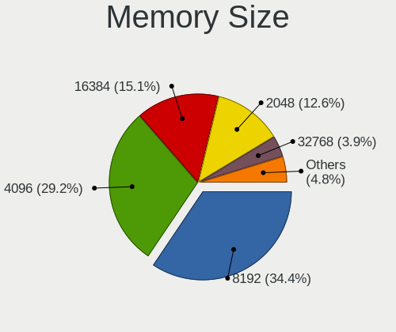

| Size  | Notebooks | Percent |
|-------|-----------|---------|
| 8192  | 525       | 34.43%  |
| 4096  | 445       | 29.18%  |
| 16384 | 231       | 15.15%  |
| 2048  | 192       | 12.59%  |
| 32768 | 59        | 3.87%   |
| 1024  | 56        | 3.67%   |
| 512   | 11        | 0.72%   |
| 256   | 4         | 0.26%   |
| 65536 | 1         | 0.07%   |
| 2560  | 1         | 0.07%   |

Memory Speed
------------

Memory module speed

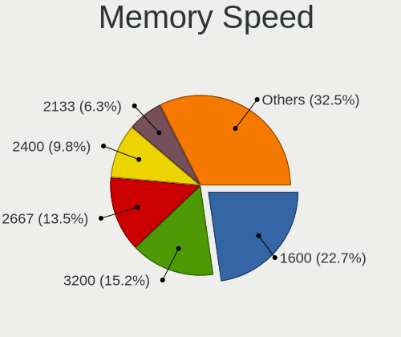

| Speed   | Notebooks | Percent |
|---------|-----------|---------|
| 1600    | 338       | 22.72%  |
| 3200    | 226       | 15.19%  |
| 2667    | 201       | 13.51%  |
| 2400    | 146       | 9.81%   |
| 2133    | 94        | 6.32%   |
| 1333    | 92        | 6.18%   |
| 1334    | 65        | 4.37%   |
| 667     | 43        | 2.89%   |
| 1867    | 40        | 2.69%   |
| Unknown | 37        | 2.49%   |
| 800     | 29        | 1.95%   |
| 4267    | 25        | 1.68%   |
| 5600    | 23        | 1.55%   |
| 6400    | 21        | 1.41%   |
| 4800    | 21        | 1.41%   |
| 1067    | 19        | 1.28%   |
| 533     | 18        | 1.21%   |
| 1066    | 11        | 0.74%   |
| 975     | 9         | 0.6%    |
| 4266    | 8         | 0.54%   |
| 3733    | 3         | 0.2%    |
| 2048    | 3         | 0.2%    |
| 1866    | 3         | 0.2%    |
| 7500    | 2         | 0.13%   |
| 2933    | 2         | 0.13%   |
| 1639    | 1         | 0.07%   |
| 1596    | 1         | 0.07%   |
| 1200    | 1         | 0.07%   |
| 666     | 1         | 0.07%   |
| 333     | 1         | 0.07%   |
| 266     | 1         | 0.07%   |
| 200     | 1         | 0.07%   |
| 166     | 1         | 0.07%   |
| 100     | 1         | 0.07%   |

Printers & scanners
-------------------

Printer Vendor
--------------

Printer device vendors

| Vendor              | Notebooks | Percent |
|---------------------|-----------|---------|
| ELGIN               | 2         | 50%     |
| Samsung Electronics | 1         | 25%     |
| Prolific Technology | 1         | 25%     |

Printer Model
-------------

Printer device models

| Model                              | Notebooks | Percent |
|------------------------------------|-----------|---------|
| ELGIN L42PRO                       | 2         | 50%     |
| Samsung ML-1610 Mono Laser Printer | 1         | 25%     |
| Prolific PL2305 Parallel Port      | 1         | 25%     |

Scanner Vendor
--------------

Scanner device vendors

| Vendor | Notebooks | Percent |
|--------|-----------|---------|
| Canon  | 1         | 100%    |

Scanner Model
-------------

Scanner device models

| Model                   | Notebooks | Percent |
|-------------------------|-----------|---------|
| Canon CanoScan LiDE 120 | 1         | 100%    |

Camera
------

Camera Vendor
-------------

Camera device vendors

| Vendor                                 | Notebooks | Percent |
|----------------------------------------|-----------|---------|
| Chicony Electronics                    | 311       | 29.12%  |
| IMC Networks                           | 119       | 11.14%  |
| Bison Electronics                      | 110       | 10.3%   |
| Microdia                               | 101       | 9.46%   |
| Realtek Semiconductor                  | 89        | 8.33%   |
| Sunplus Innovation Technology          | 75        | 7.02%   |
| Lite-On Technology                     | 32        | 3%      |
| Syntek                                 | 25        | 2.34%   |
| Suyin                                  | 25        | 2.34%   |
| Cheng Uei Precision Industry (Foxlink) | 25        | 2.34%   |
| Quanta                                 | 23        | 2.15%   |
| Luxvisions Innotech Limited            | 23        | 2.15%   |
| Apple                                  | 17        | 1.59%   |
| Silicon Motion                         | 11        | 1.03%   |
| Lenovo                                 | 9         | 0.84%   |
| Shenzhen Kingcome Optoelectronic       | 8         | 0.75%   |
| Ricoh                                  | 7         | 0.66%   |
| Logitech                               | 6         | 0.56%   |
| ALi                                    | 6         | 0.56%   |
| Alcor Micro                            | 6         | 0.56%   |
| Z-Star Microelectronics                | 5         | 0.47%   |
| Importek                               | 5         | 0.47%   |
| Supreme Electronics                    | 4         | 0.37%   |
| Jiangxi Shinetech Optical              | 4         | 0.37%   |
| Unknown (3730304233343731345430)       | 3         | 0.28%   |
| Primax Electronics                     | 2         | 0.19%   |
| Pixart Imaging                         | 2         | 0.19%   |
| OmniVision Technologies                | 2         | 0.19%   |
| Intel                                  | 2         | 0.19%   |
| Framework                              | 2         | 0.19%   |
| DX-240124-XH                           | 2         | 0.19%   |
| DigiTech                               | 2         | 0.19%   |
| USB Camera                             | 1         | 0.09%   |
| Unknown                                | 1         | 0.09%   |
| Goodong Industry                       | 1         | 0.09%   |
| Genesys Logic                          | 1         | 0.09%   |
| Cubeternet                             | 1         | 0.09%   |

Camera Model
------------

Camera device models

| Model                                         | Notebooks | Percent |
|-----------------------------------------------|-----------|---------|
| Chicony integrated camera                     | 105       | 9.71%   |
| Bison Integrated Camera                       | 59        | 5.46%   |
| IMC Networks Integrated Camera                | 41        | 3.79%   |
| Microdia Integrated_Webcam_HD                 | 37        | 3.42%   |
| Sunplus Integrated_Webcam_HD                  | 28        | 2.59%   |
| Chicony HD WebCam                             | 28        | 2.59%   |
| Realtek Integrated_Webcam_HD                  | 21        | 1.94%   |
| Microdia Integrated Webcam                    | 21        | 1.94%   |
| Chicony Lenovo Integrated Camera (0.3MP)      | 20        | 1.85%   |
| Chicony Integrated Camera (1280x720@30)       | 19        | 1.76%   |
| Lite-On Integrated Camera                     | 18        | 1.67%   |
| IMC Networks Realtek PC Camera                | 18        | 1.67%   |
| Bison SunplusIT Integrated Camera             | 16        | 1.48%   |
| Realtek USB 2.0 PC Camera                     | 15        | 1.39%   |
| IMC Networks EasyCamera                       | 15        | 1.39%   |
| Syntek Integrated Camera                      | 14        | 1.3%    |
| Luxvisions Innotech Limited Integrated Camera | 12        | 1.11%   |
| Chicony Integrated IR Camera                  | 10        | 0.93%   |
| Chicony Chicony USB2.0 Camera                 | 10        | 0.93%   |
| Sunplus Laptop_Integrated_Webcam_FHD          | 9         | 0.83%   |
| Chicony Integrated Camera [ThinkPad]          | 9         | 0.83%   |
| Bison Lenovo EasyCamera                       | 9         | 0.83%   |
| Apple FaceTime HD Camera                      | 9         | 0.83%   |
| Realtek Laptop Camera                         | 8         | 0.74%   |
| Chicony ThinkPad T490 Webcam                  | 8         | 0.74%   |
| Bison ThinkPad Integrated Camera              | 8         | 0.74%   |
| Sunplus Laptop Integrated Webcam HD           | 7         | 0.65%   |
| Sunplus HD WebCam                             | 7         | 0.65%   |
| Microdia Integrated Webcam HD                 | 7         | 0.65%   |
| Chicony EasyCamera                            | 7         | 0.65%   |
| Syntek EasyCamera                             | 6         | 0.56%   |
| Realtek Integrated Webcam                     | 6         | 0.56%   |
| Quanta HP TrueVision HD Camera                | 6         | 0.56%   |
| Quanta HD Webcam                              | 6         | 0.56%   |
| Lenovo Integrated Webcam [R5U877]             | 6         | 0.56%   |
| IMC Networks UVC VGA Webcam                   | 6         | 0.56%   |
| IMC Networks Integrated Webcam                | 6         | 0.56%   |
| Chicony Realtek DMFT RGB                      | 6         | 0.56%   |
| Chicony Integrated HP HD Webcam               | 6         | 0.56%   |
| Chicony HP Universal Camera                   | 6         | 0.56%   |

Security
--------

Fingerprint Vendor
------------------

Fingerprint sensor vendors

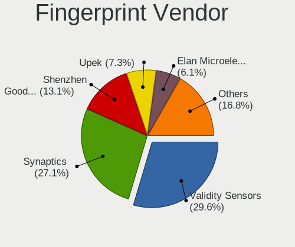

| Vendor                     | Notebooks | Percent |
|----------------------------|-----------|---------|
| Validity Sensors           | 97        | 29.57%  |
| Synaptics                  | 89        | 27.13%  |
| Shenzhen Goodix Technology | 43        | 13.11%  |
| Upek                       | 24        | 7.32%   |
| Elan Microelectronics      | 20        | 6.1%    |
| AuthenTec                  | 15        | 4.57%   |
| STMicroelectronics         | 11        | 3.35%   |
| LighTuning Technology      | 9         | 2.74%   |
| Broadcom                   | 9         | 2.74%   |
| FocalTech Systems          | 8         | 2.44%   |
| Fingerprint Cards          | 2         | 0.61%   |
| Samsung Electronics        | 1         | 0.3%    |

Fingerprint Model
-----------------

Fingerprint sensor models

| Model                                                                        | Notebooks | Percent |
|------------------------------------------------------------------------------|-----------|---------|
| Synaptics Prometheus MIS Touch Fingerprint Reader                            | 36        | 10.98%  |
| Synaptics Metallica MIS Touch Fingerprint Reader                             | 34        | 10.37%  |
| Validity Sensors VFS 5011 fingerprint sensor                                 | 30        | 9.15%   |
| Shenzhen Goodix Fingerprint Reader                                           | 29        | 8.84%   |
| Upek Biometric Touchchip/Touchstrip Fingerprint Sensor                       | 24        | 7.32%   |
| Validity Sensors Synaptics WBDI                                              | 21        | 6.4%    |
| Elan Fingerprint Sensor                                                      | 18        | 5.49%   |
| Validity Sensors VFS7500 Touch Fingerprint Sensor                            | 11        | 3.35%   |
| STMicroelectronics Fingerprint Reader                                        | 11        | 3.35%   |
| Broadcom BCM5880 Secure Applications Processor with fingerprint swipe sensor | 9         | 2.74%   |
| Validity Sensors VFS5011 Fingerprint Reader                                  | 8         | 2.44%   |
| Validity Sensors VFS495 Fingerprint Reader                                   | 8         | 2.44%   |
| Shenzhen Goodix  Fingerprint Device                                          | 8         | 2.44%   |
| Synaptics Metallica MOH Touch Fingerprint Reader                             | 7         | 2.13%   |
| Shenzhen Goodix Fingerprint Reader SGX                                       | 6         | 1.83%   |
| FocalTech Systems Fingerprint Reader                                         | 6         | 1.83%   |
| AuthenTec AES2810                                                            | 6         | 1.83%   |
| Synaptics FS7604 Touch Fingerprint Sensor with PurePrint                     | 5         | 1.52%   |
| LighTuning EgisTec Touch Fingerprint Sensor                                  | 5         | 1.52%   |
| LighTuning ES603 Swipe Fingerprint Sensor                                    | 4         | 1.22%   |
| AuthenTec AES1660                                                            | 4         | 1.22%   |
| Validity Sensors VFS491                                                      | 3         | 0.91%   |
| Validity Sensors VFS451 Fingerprint Reader                                   | 3         | 0.91%   |
| AuthenTec AES2501 Fingerprint Sensor                                         | 3         | 0.91%   |
| Validity Sensors VFS471 Fingerprint Reader                                   | 2         | 0.61%   |
| Validity Sensors VFS Fingerprint sensor                                      | 2         | 0.61%   |
| Validity Sensors Synaptics VFS7552 Touch Fingerprint Sensor with PurePrint   | 2         | 0.61%   |
| Validity Sensors Swipe Fingerprint Sensor                                    | 2         | 0.61%   |
| Validity Sensors Fingerprint scanner                                         | 2         | 0.61%   |
| Synaptics Fingerprint reader [HP G6]                                         | 2         | 0.61%   |
| Fingerprint Cards FPC Fingerprint Reader                                     | 2         | 0.61%   |
| Elan WBF Fingerprint Sensor                                                  | 2         | 0.61%   |
| Validity Sensors VFS7552 Touch Fingerprint Sensor                            | 1         | 0.3%    |
| Validity Sensors VFS101 Fingerprint Reader                                   | 1         | 0.3%    |
| Validity Sensors Synaptics VFS7552 Touch Fingerprint Sensor                  | 1         | 0.3%    |
| Synaptics WBDI Fingerprint Reader USB 086                                    | 1         | 0.3%    |
| Synaptics UWP WBDI Device                                                    | 1         | 0.3%    |
| Synaptics UWP WBDI                                                           | 1         | 0.3%    |
| Synaptics TouchPad                                                           | 1         | 0.3%    |
| Samsung CanvasBio Fingerprint Reader                                         | 1         | 0.3%    |

Chipcard Vendor
---------------

Chipcard module vendors

Zero info for selected period =(

Chipcard Model
--------------

Chipcard module models

Zero info for selected period =(

Unsupported
-----------

Unsupported Devices
-------------------

Total unsupported devices on board

| Total | Notebooks | Percent |
|-------|-----------|---------|
| 2     | 445       | 31.08%  |
| 1     | 391       | 27.3%   |
| 3     | 310       | 21.65%  |
| 0     | 133       | 9.29%   |
| 4     | 112       | 7.82%   |
| 5     | 27        | 1.89%   |
| 6     | 11        | 0.77%   |
| 7     | 2         | 0.14%   |
| 9     | 1         | 0.07%   |

Unsupported Device Types
------------------------

Types of unsupported devices

| Type                     | Notebooks | Percent |
|--------------------------|-----------|---------|
| Communication controller | 985       | 38.92%  |
| Bluetooth                | 486       | 19.2%   |
| Fingerprint reader       | 318       | 12.56%  |
| Card reader              | 270       | 10.67%  |
| Net/wireless             | 266       | 10.51%  |
| Firewire controller      | 112       | 4.43%   |
| Storage                  | 25        | 0.99%   |
| Sound                    | 23        | 0.91%   |
| Network                  | 17        | 0.67%   |
| Modem                    | 14        | 0.55%   |
| Net/ethernet             | 13        | 0.51%   |
| Storage/nvme             | 1         | 0.04%   |
| Graphics card            | 1         | 0.04%   |

