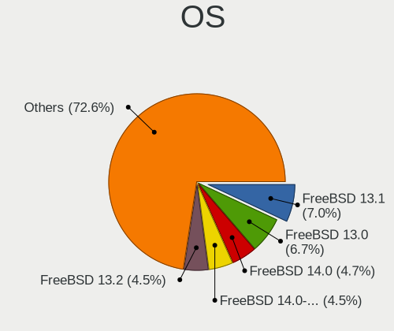
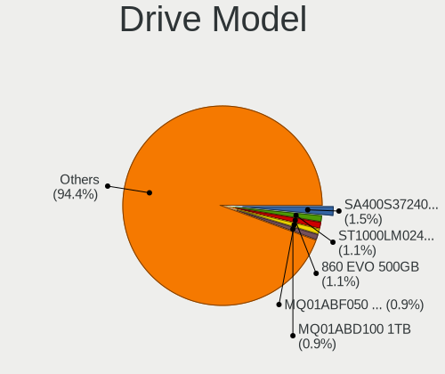
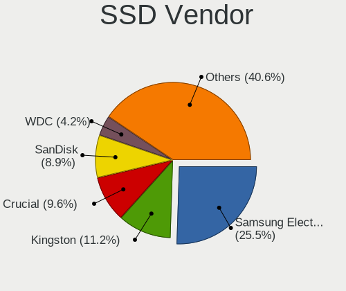
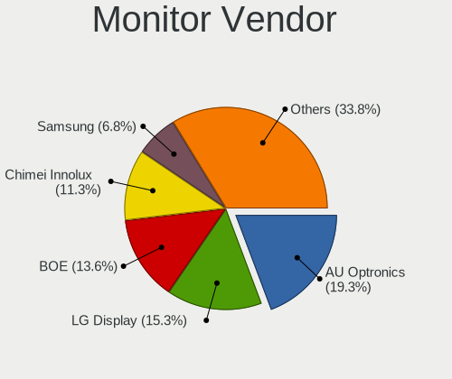
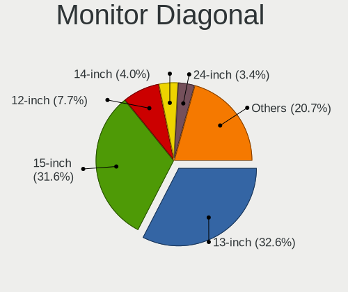
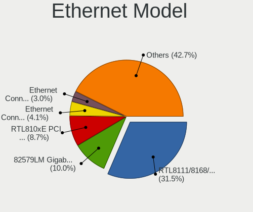
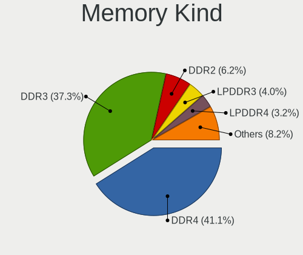
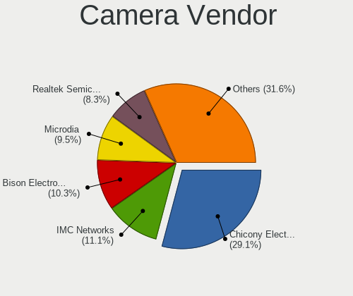
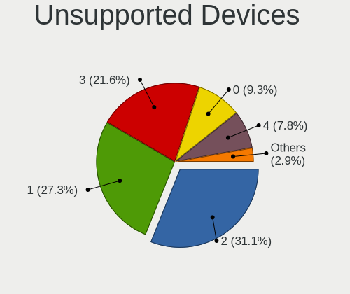

FreeBSD - Tested Hardware & Statistics (Notebooks)
--------------------------------------------------

A project to collect tested hardware configurations for FreeBSD.

Anyone can contribute to this report by the [hw-probe](https://github.com/linuxhw/hw-probe/blob/master/INSTALL.BSD.md) tool:

    hw-probe -all -upload

Please contribute! Especially if your hardware is rare.

Contents
--------

* [ Test Cases ](#test-cases)

* [ System ](#system)
  - [ OS                       ](#os)
  - [ OS Family                ](#os-family)
  - [ Arch                     ](#arch)
  - [ DE                       ](#de)
  - [ Display Server           ](#display-server)
  - [ Display Manager          ](#display-manager)
  - [ OS Lang                  ](#os-lang)
  - [ Boot Mode                ](#boot-mode)
  - [ Filesystem               ](#filesystem)
  - [ Part. scheme             ](#part-scheme)

* [ Board ](#board)
  - [ Vendor                   ](#vendor)
  - [ Model                    ](#model)
  - [ Model Family             ](#model-family)
  - [ MFG Year                 ](#mfg-year)
  - [ Form Factor              ](#form-factor)
  - [ Coreboot                 ](#coreboot)
  - [ RAM Size                 ](#ram-size)
  - [ RAM Used                 ](#ram-used)
  - [ Total Drives             ](#total-drives)
  - [ Has CD-ROM               ](#has-cd-rom)
  - [ Has Ethernet             ](#has-ethernet)
  - [ Has WiFi                 ](#has-wifi)
  - [ Has Bluetooth            ](#has-bluetooth)

* [ Location ](#location)
  - [ Country                  ](#country)
  - [ City                     ](#city)

* [ Drives ](#drives)
  - [ Drive Vendor             ](#drive-vendor)
  - [ Drive Model              ](#drive-model)
  - [ HDD Vendor               ](#hdd-vendor)
  - [ SSD Vendor               ](#ssd-vendor)
  - [ Drive Kind               ](#drive-kind)
  - [ Drive Connector          ](#drive-connector)
  - [ Drive Size               ](#drive-size)
  - [ Space Total              ](#space-total)
  - [ Space Used               ](#space-used)
  - [ Malfunc. Drives          ](#malfunc-drives)
  - [ Malfunc. Drive Vendor    ](#malfunc-drive-vendor)
  - [ Malfunc. HDD Vendor      ](#malfunc-hdd-vendor)
  - [ Malfunc. Drive Kind      ](#malfunc-drive-kind)
  - [ Failed Drives            ](#failed-drives)
  - [ Failed Drive Vendor      ](#failed-drive-vendor)
  - [ Drive Status             ](#drive-status)

* [ Storage controller ](#storage-controller)
  - [ Storage Vendor           ](#storage-vendor)
  - [ Storage Model            ](#storage-model)
  - [ Storage Kind             ](#storage-kind)

* [ Processor ](#processor)
  - [ CPU Vendor               ](#cpu-vendor)
  - [ CPU Model                ](#cpu-model)
  - [ CPU Model Family         ](#cpu-model-family)
  - [ CPU Cores                ](#cpu-cores)
  - [ CPU Sockets              ](#cpu-sockets)
  - [ CPU Threads              ](#cpu-threads)
  - [ CPU Microarch            ](#cpu-microarch)

* [ Graphics ](#graphics)
  - [ GPU Vendor               ](#gpu-vendor)
  - [ GPU Model                ](#gpu-model)
  - [ GPU Combo                ](#gpu-combo)
  - [ GPU Driver               ](#gpu-driver)
  - [ GPU Memory               ](#gpu-memory)

* [ Monitor ](#monitor)
  - [ Monitor Vendor           ](#monitor-vendor)
  - [ Monitor Model            ](#monitor-model)
  - [ Monitor Resolution       ](#monitor-resolution)
  - [ Monitor Diagonal         ](#monitor-diagonal)
  - [ Monitor Width            ](#monitor-width)
  - [ Aspect Ratio             ](#aspect-ratio)
  - [ Monitor Area             ](#monitor-area)
  - [ Pixel Density            ](#pixel-density)
  - [ Multiple Monitors        ](#multiple-monitors)

* [ Network ](#network)
  - [ Net Controller Vendor    ](#net-controller-vendor)
  - [ Net Controller Model     ](#net-controller-model)
  - [ Wireless Vendor          ](#wireless-vendor)
  - [ Wireless Model           ](#wireless-model)
  - [ Ethernet Vendor          ](#ethernet-vendor)
  - [ Ethernet Model           ](#ethernet-model)
  - [ Net Controller Kind      ](#net-controller-kind)
  - [ Used Controller          ](#used-controller)
  - [ NICs                     ](#nics)
  - [ IPv6                     ](#ipv6)

* [ Bluetooth ](#bluetooth)
  - [ Bluetooth Vendor         ](#bluetooth-vendor)
  - [ Bluetooth Model          ](#bluetooth-model)

* [ Sound ](#sound)
  - [ Sound Vendor             ](#sound-vendor)
  - [ Sound Model              ](#sound-model)

* [ Memory ](#memory)
  - [ Memory Vendor            ](#memory-vendor)
  - [ Memory Model             ](#memory-model)
  - [ Memory Kind              ](#memory-kind)
  - [ Memory Form Factor       ](#memory-form-factor)
  - [ Memory Size              ](#memory-size)
  - [ Memory Speed             ](#memory-speed)

* [ Printers & scanners ](#printers--scanners)
  - [ Printer Vendor           ](#printer-vendor)
  - [ Printer Model            ](#printer-model)
  - [ Scanner Vendor           ](#scanner-vendor)
  - [ Scanner Model            ](#scanner-model)

* [ Camera ](#camera)
  - [ Camera Vendor            ](#camera-vendor)
  - [ Camera Model             ](#camera-model)

* [ Security ](#security)
  - [ Fingerprint Vendor       ](#fingerprint-vendor)
  - [ Fingerprint Model        ](#fingerprint-model)
  - [ Chipcard Vendor          ](#chipcard-vendor)
  - [ Chipcard Model           ](#chipcard-model)

* [ Unsupported ](#unsupported)
  - [ Unsupported Devices      ](#unsupported-devices)
  - [ Unsupported Device Types ](#unsupported-device-types)

Test Cases
----------

Total: 1066

| Vendor        | Model                       | Probe                                                     | Date         |
|---------------|-----------------------------|-----------------------------------------------------------|--------------|
| Lenovo        | B50-30 20382                | [5701dac149](https://bsd-hardware.info/?probe=5701dac149) | Apr 30, 2022 |
| HP            | Laptop 15-dw1xxx            | [7a212b5833](https://bsd-hardware.info/?probe=7a212b5833) | Apr 29, 2022 |
| Lenovo        | ThinkPad T470 20HES0ES1F    | [f1f0676663](https://bsd-hardware.info/?probe=f1f0676663) | Apr 28, 2022 |
| Lenovo        | ThinkPad E490 20N8CTO1WW    | [30e267dd51](https://bsd-hardware.info/?probe=30e267dd51) | Apr 27, 2022 |
| Notebook      | N7x0WU                      | [b7c06932a3](https://bsd-hardware.info/?probe=b7c06932a3) | Apr 27, 2022 |
| Framework     | Laptop                      | [5d6cb039ea](https://bsd-hardware.info/?probe=5d6cb039ea) | Apr 25, 2022 |
| Apple         | MacBookPro8,3               | [e588c93d54](https://bsd-hardware.info/?probe=e588c93d54) | Apr 24, 2022 |
| Dell          | Latitude E6520              | [c4ae703add](https://bsd-hardware.info/?probe=c4ae703add) | Apr 23, 2022 |
| Lenovo        | B570 1068FQG                | [a0d1f01226](https://bsd-hardware.info/?probe=a0d1f01226) | Apr 22, 2022 |
| HP            | EliteBook 8570p             | [c4dee3f070](https://bsd-hardware.info/?probe=c4dee3f070) | Apr 21, 2022 |
| HP            | EliteBook 8570p             | [d9acb17caf](https://bsd-hardware.info/?probe=d9acb17caf) | Apr 20, 2022 |
| System76      | Lemur Pro                   | [bbeb7d48fa](https://bsd-hardware.info/?probe=bbeb7d48fa) | Apr 17, 2022 |
| HUAWEI        | NBLL-WXX9                   | [d259128717](https://bsd-hardware.info/?probe=d259128717) | Apr 16, 2022 |
| Lenovo        | ThinkPad X1 Carbon 3rd 2... | [eda0880c67](https://bsd-hardware.info/?probe=eda0880c67) | Apr 15, 2022 |
| Dell          | Latitude E6440              | [eea29a3895](https://bsd-hardware.info/?probe=eea29a3895) | Apr 12, 2022 |
| Lenovo        | ThinkPad X201 3680MG1       | [a2b9975fe2](https://bsd-hardware.info/?probe=a2b9975fe2) | Apr 11, 2022 |
| Lenovo        | ThinkPad T460p 20FXS09D1... | [edbde611c3](https://bsd-hardware.info/?probe=edbde611c3) | Apr 11, 2022 |
| Toshiba       | Satellite Pro T130          | [62dd51afcf](https://bsd-hardware.info/?probe=62dd51afcf) | Apr 11, 2022 |
| Lenovo        | ThinkPad X220 42872WU       | [3b7da460a2](https://bsd-hardware.info/?probe=3b7da460a2) | Apr 10, 2022 |
| Lenovo        | ThinkPad T495 20NJ0000US    | [c626b32508](https://bsd-hardware.info/?probe=c626b32508) | Apr 09, 2022 |
| Acer          | Swift SF114-32              | [7bc748ce7c](https://bsd-hardware.info/?probe=7bc748ce7c) | Apr 08, 2022 |
| Dell          | Vostro 1400                 | [7e0964d31d](https://bsd-hardware.info/?probe=7e0964d31d) | Apr 08, 2022 |
| Deciso        | Netboard A20                | [0829d5a85d](https://bsd-hardware.info/?probe=0829d5a85d) | Apr 06, 2022 |
| Dell          | Precision M4800             | [7a7968204a](https://bsd-hardware.info/?probe=7a7968204a) | Apr 06, 2022 |
| Timi          | TM1612                      | [0389c8d487](https://bsd-hardware.info/?probe=0389c8d487) | Apr 05, 2022 |
| ASUSTek       | UX305UA                     | [3fb1786193](https://bsd-hardware.info/?probe=3fb1786193) | Apr 04, 2022 |
| HP            | EliteBook 8570p             | [0c73871c49](https://bsd-hardware.info/?probe=0c73871c49) | Apr 04, 2022 |
| VIT           | M2420                       | [108b4d79a6](https://bsd-hardware.info/?probe=108b4d79a6) | Apr 03, 2022 |
| MSI           | Bravo 15 A4DDR              | [1868573e9a](https://bsd-hardware.info/?probe=1868573e9a) | Apr 02, 2022 |
| Deciso        | OPNsense Appliance          | [cdd056df79](https://bsd-hardware.info/?probe=cdd056df79) | Mar 31, 2022 |
| Lenovo        | ThinkPad X260 20F5A28AUK    | [f53c625efd](https://bsd-hardware.info/?probe=f53c625efd) | Mar 30, 2022 |
| HUAWEI        | CREM-WXX9                   | [e750905413](https://bsd-hardware.info/?probe=e750905413) | Mar 29, 2022 |
| Fujitsu       | LIFEBOOK A544               | [e363c95c1c](https://bsd-hardware.info/?probe=e363c95c1c) | Mar 29, 2022 |
| Deciso        | Netboard A20                | [835d6c060f](https://bsd-hardware.info/?probe=835d6c060f) | Mar 25, 2022 |
| Deciso        | Netboard A20                | [5a6b66aa01](https://bsd-hardware.info/?probe=5a6b66aa01) | Mar 24, 2022 |
| Lenovo        | ThinkPad R60e 0658W2M       | [315573b63e](https://bsd-hardware.info/?probe=315573b63e) | Mar 24, 2022 |
| Lenovo        | XiaoXinPro-13ARE 2020 82... | [859a429ad0](https://bsd-hardware.info/?probe=859a429ad0) | Mar 24, 2022 |
| HP            | EliteBook 8570p             | [e9f59e748e](https://bsd-hardware.info/?probe=e9f59e748e) | Mar 24, 2022 |
| Lenovo        | ThinkPad X230 2325BV9       | [d2a16f6102](https://bsd-hardware.info/?probe=d2a16f6102) | Mar 23, 2022 |
| Lenovo        | ThinkPad X13 Gen 1 20UF0... | [693d365311](https://bsd-hardware.info/?probe=693d365311) | Mar 23, 2022 |
| Gateway       | NV55C                       | [a63381d681](https://bsd-hardware.info/?probe=a63381d681) | Mar 22, 2022 |
| Lenovo        | ThinkPad T14s Gen 2i 20W... | [6858ad2b12](https://bsd-hardware.info/?probe=6858ad2b12) | Mar 22, 2022 |
| HP            | EliteBook 8570p             | [7e1e137c8f](https://bsd-hardware.info/?probe=7e1e137c8f) | Mar 20, 2022 |
| Acer          | Swift SF314-42              | [6a579dca44](https://bsd-hardware.info/?probe=6a579dca44) | Mar 20, 2022 |
| HP            | EliteBook 8570p             | [dafb1bbb92](https://bsd-hardware.info/?probe=dafb1bbb92) | Mar 20, 2022 |
| Lenovo        | ThinkPad E490 20N8CTO1WW    | [0dbac1ca61](https://bsd-hardware.info/?probe=0dbac1ca61) | Mar 19, 2022 |
| Dell          | Latitude E7440              | [a776ebf7f4](https://bsd-hardware.info/?probe=a776ebf7f4) | Mar 19, 2022 |
| Toshiba       | Satellite Pro L40           | [5ff92a5bb3](https://bsd-hardware.info/?probe=5ff92a5bb3) | Mar 19, 2022 |
| Toshiba       | Satellite Pro L40           | [71a7b43ec6](https://bsd-hardware.info/?probe=71a7b43ec6) | Mar 19, 2022 |
| Lenovo        | ThinkPad T460s 20FAS4KH0... | [dbb0e378d5](https://bsd-hardware.info/?probe=dbb0e378d5) | Mar 17, 2022 |
| Acer          | Aspire 4820T                | [1617262a28](https://bsd-hardware.info/?probe=1617262a28) | Mar 16, 2022 |
| Acer          | Aspire A315-23              | [7fb743c654](https://bsd-hardware.info/?probe=7fb743c654) | Mar 15, 2022 |
| ASUSTek       | N50Vc                       | [883ded6cb1](https://bsd-hardware.info/?probe=883ded6cb1) | Mar 15, 2022 |
| Lenovo        | IdeaPad Y700-15ISK 80NV     | [dd57366224](https://bsd-hardware.info/?probe=dd57366224) | Mar 15, 2022 |
| Lenovo        | ThinkPad T420 4236MBU       | [8bd2318fb6](https://bsd-hardware.info/?probe=8bd2318fb6) | Mar 15, 2022 |
| Gateway       | LT27                        | [6d1c6f8215](https://bsd-hardware.info/?probe=6d1c6f8215) | Mar 14, 2022 |
| Dell          | Inspiron 5502               | [9e440b5500](https://bsd-hardware.info/?probe=9e440b5500) | Mar 13, 2022 |
| Apple         | MacBookPro12,1              | [e04a1b354c](https://bsd-hardware.info/?probe=e04a1b354c) | Mar 11, 2022 |
| Apple         | MacBookPro12,1              | [ac59621182](https://bsd-hardware.info/?probe=ac59621182) | Mar 10, 2022 |
| Lenovo        | ThinkPad E580 20KSCTO1WW    | [be311b6a34](https://bsd-hardware.info/?probe=be311b6a34) | Mar 10, 2022 |
| Dell          | G5 5590                     | [0871c1269b](https://bsd-hardware.info/?probe=0871c1269b) | Mar 07, 2022 |
| ASUSTek       | ROG Zephyrus G14 GA402RJ... | [20cdc9d999](https://bsd-hardware.info/?probe=20cdc9d999) | Mar 06, 2022 |
| Framework     | Laptop                      | [1f58e0594f](https://bsd-hardware.info/?probe=1f58e0594f) | Mar 01, 2022 |
| Lenovo        | ThinkPad T440p 20AWS1JN0... | [cba9255f4a](https://bsd-hardware.info/?probe=cba9255f4a) | Feb 27, 2022 |
| Dell          | Latitude E5440              | [b0314f9200](https://bsd-hardware.info/?probe=b0314f9200) | Feb 26, 2022 |
| Dell          | Inspiron 5559               | [c34e21ffd5](https://bsd-hardware.info/?probe=c34e21ffd5) | Feb 26, 2022 |
| Dell          | Latitude E6430              | [fdde41404d](https://bsd-hardware.info/?probe=fdde41404d) | Feb 24, 2022 |
| Dell          | Latitude 7480               | [f0e8e4a30a](https://bsd-hardware.info/?probe=f0e8e4a30a) | Feb 21, 2022 |
| Apple         | MacBookPro10,1              | [64ccf1e6a0](https://bsd-hardware.info/?probe=64ccf1e6a0) | Feb 18, 2022 |
| Lenovo        | V145-15AST 81MT             | [bc5296ee7d](https://bsd-hardware.info/?probe=bc5296ee7d) | Feb 16, 2022 |
| Dell          | Latitude 3420               | [f1796d75ed](https://bsd-hardware.info/?probe=f1796d75ed) | Feb 14, 2022 |
| WOOKING       | X5                          | [1099e6c574](https://bsd-hardware.info/?probe=1099e6c574) | Feb 14, 2022 |
| Apple         | MacBookPro8,1               | [aa484c30a8](https://bsd-hardware.info/?probe=aa484c30a8) | Feb 12, 2022 |
| Lenovo        | ThinkPad P51 20HHCTO1WW     | [e4f43cfcad](https://bsd-hardware.info/?probe=e4f43cfcad) | Feb 10, 2022 |
| ASUSTek       | 1215B                       | [1ccf85f60d](https://bsd-hardware.info/?probe=1ccf85f60d) | Feb 10, 2022 |
| ASUSTek       | A9T                         | [2962e2b02f](https://bsd-hardware.info/?probe=2962e2b02f) | Feb 09, 2022 |
| Notebook      | N7x0WU                      | [5063e8f546](https://bsd-hardware.info/?probe=5063e8f546) | Feb 08, 2022 |
| HP            | ProBook 445 G7              | [494195b923](https://bsd-hardware.info/?probe=494195b923) | Feb 08, 2022 |
| Lenovo        | ThinkPad X250 20CMCTO1WW    | [4ba527dc9b](https://bsd-hardware.info/?probe=4ba527dc9b) | Feb 06, 2022 |
| System76      | Lemur Pro                   | [713b33351f](https://bsd-hardware.info/?probe=713b33351f) | Feb 06, 2022 |
| Notebook      | NS50_70MU                   | [3b3ff8b95d](https://bsd-hardware.info/?probe=3b3ff8b95d) | Feb 05, 2022 |
| Lenovo        | Yoga S730-13IWL 81J0        | [f333ed9201](https://bsd-hardware.info/?probe=f333ed9201) | Feb 05, 2022 |
| Lenovo        | IdeaPad Gaming 3 15ARH05... | [e660899158](https://bsd-hardware.info/?probe=e660899158) | Feb 03, 2022 |
| Dell          | Latitude E7450              | [8a3867f171](https://bsd-hardware.info/?probe=8a3867f171) | Feb 03, 2022 |
| HUAWEI        | MACHD-WXX9                  | [3debf6433b](https://bsd-hardware.info/?probe=3debf6433b) | Feb 02, 2022 |
| Lenovo        | Yoga S730-13IWL 81J0        | [c03bfe6a21](https://bsd-hardware.info/?probe=c03bfe6a21) | Feb 01, 2022 |
| Dell          | Vostro 3550                 | [97ef0862c2](https://bsd-hardware.info/?probe=97ef0862c2) | Feb 01, 2022 |
| Lenovo        | IdeaPad Gaming 3 15ARH05... | [cb0ebb96d5](https://bsd-hardware.info/?probe=cb0ebb96d5) | Feb 01, 2022 |
| Dell          | G3 3500                     | [536a7a1b38](https://bsd-hardware.info/?probe=536a7a1b38) | Jan 31, 2022 |
| Lenovo        | ThinkPad T480s 20L8S1GX0... | [556fcb7e5e](https://bsd-hardware.info/?probe=556fcb7e5e) | Jan 31, 2022 |
| MSI           | Summit E13FlipEvo A11MT     | [61e3f35ee8](https://bsd-hardware.info/?probe=61e3f35ee8) | Jan 31, 2022 |
| ASUSTek       | 1015PEM                     | [efea0efb2b](https://bsd-hardware.info/?probe=efea0efb2b) | Jan 31, 2022 |
| GPD           | G1621-02                    | [1970f517fd](https://bsd-hardware.info/?probe=1970f517fd) | Jan 30, 2022 |
| HP            | Notebook                    | [b0e0bc12c8](https://bsd-hardware.info/?probe=b0e0bc12c8) | Jan 30, 2022 |
| HP            | EliteBook 8570p             | [f47789d894](https://bsd-hardware.info/?probe=f47789d894) | Jan 29, 2022 |
| MSI           | GE76 Raider 10UG            | [b48b628936](https://bsd-hardware.info/?probe=b48b628936) | Jan 27, 2022 |
| Dell          | Inspiron 15 7000 Gaming     | [652e2e284f](https://bsd-hardware.info/?probe=652e2e284f) | Jan 26, 2022 |
| Dell          | Inspiron 5555               | [e54be582a7](https://bsd-hardware.info/?probe=e54be582a7) | Jan 25, 2022 |
| MSI           | GT75VR 7RF                  | [db276eaa53](https://bsd-hardware.info/?probe=db276eaa53) | Jan 25, 2022 |
| Fujitsu Si... | AMILO Li 2727               | [268e1621eb](https://bsd-hardware.info/?probe=268e1621eb) | Jan 18, 2022 |
| HP            | EliteBook 8570p             | [61406080a7](https://bsd-hardware.info/?probe=61406080a7) | Jan 18, 2022 |
| HP            | Pavilion Gaming Laptop 1... | [1763a44db9](https://bsd-hardware.info/?probe=1763a44db9) | Jan 18, 2022 |
| HP            | EliteBook 8570p             | [1520fece28](https://bsd-hardware.info/?probe=1520fece28) | Jan 17, 2022 |
| Lenovo        | ThinkPad L570 W10DG 20JR... | [2aea9384ac](https://bsd-hardware.info/?probe=2aea9384ac) | Jan 17, 2022 |
| ASUSTek       | N50Vc                       | [468a2d7ab8](https://bsd-hardware.info/?probe=468a2d7ab8) | Jan 17, 2022 |
| Acer          | TravelMate 8481TG           | [fae71f7e35](https://bsd-hardware.info/?probe=fae71f7e35) | Jan 15, 2022 |
| HP            | EliteBook 8570p             | [5f106ee686](https://bsd-hardware.info/?probe=5f106ee686) | Jan 15, 2022 |
| Lenovo        | ThinkPad T460p 20FXS09D1... | [3ef1595af6](https://bsd-hardware.info/?probe=3ef1595af6) | Jan 13, 2022 |
| Lenovo        | ThinkPad E480 20KN0048IA    | [1a2f28f5cc](https://bsd-hardware.info/?probe=1a2f28f5cc) | Jan 11, 2022 |
| Lenovo        | ThinkPad X250 20CL001GUS    | [4ae2360503](https://bsd-hardware.info/?probe=4ae2360503) | Jan 11, 2022 |
| Lenovo        | ThinkPad T470s W10DG 20J... | [6c895cb96f](https://bsd-hardware.info/?probe=6c895cb96f) | Jan 10, 2022 |
| Dell          | Latitude E6430              | [e18a4bc564](https://bsd-hardware.info/?probe=e18a4bc564) | Jan 10, 2022 |
| Dell          | Latitude E5430 non-vPro     | [877bb1b29f](https://bsd-hardware.info/?probe=877bb1b29f) | Jan 10, 2022 |
| Lenovo        | ThinkPad X13 Gen 1 20T20... | [6836fc60f6](https://bsd-hardware.info/?probe=6836fc60f6) | Jan 09, 2022 |
| MSI           | GT75VR 7RF                  | [cca6cc3c0b](https://bsd-hardware.info/?probe=cca6cc3c0b) | Jan 07, 2022 |
| Dell          | Precision 7530              | [498bfe852c](https://bsd-hardware.info/?probe=498bfe852c) | Jan 07, 2022 |
| TUXEDO        | N14xWU                      | [4ac0707c49](https://bsd-hardware.info/?probe=4ac0707c49) | Jan 06, 2022 |
| Lenovo        | ThinkPad E14 Gen 3 20Y70... | [6c208c85a5](https://bsd-hardware.info/?probe=6c208c85a5) | Jan 06, 2022 |
| Apple         | MacBook5,1                  | [f0aeeb7f3c](https://bsd-hardware.info/?probe=f0aeeb7f3c) | Jan 05, 2022 |
| Dell          | XPS 15 9575                 | [e7925aa387](https://bsd-hardware.info/?probe=e7925aa387) | Jan 05, 2022 |
| Dell          | Latitude E5450              | [a05fbe1c26](https://bsd-hardware.info/?probe=a05fbe1c26) | Jan 05, 2022 |
| HP            | EliteBook 8570p             | [1bbb37d4c6](https://bsd-hardware.info/?probe=1bbb37d4c6) | Jan 03, 2022 |
| HP            | EliteBook 8570p             | [0a180d834c](https://bsd-hardware.info/?probe=0a180d834c) | Jan 03, 2022 |
| Toshiba       | TECRA Z40-B                 | [d498fcd3f8](https://bsd-hardware.info/?probe=d498fcd3f8) | Jan 02, 2022 |
| ASUSTek       | U31SD                       | [a07366611d](https://bsd-hardware.info/?probe=a07366611d) | Jan 02, 2022 |
| Dell          | Inspiron 5558               | [3a239ea97a](https://bsd-hardware.info/?probe=3a239ea97a) | Jan 02, 2022 |
| Framework     | Laptop                      | [9c201bb573](https://bsd-hardware.info/?probe=9c201bb573) | Jan 01, 2022 |
| Lenovo        | IdeaPad 330-15IGM 81D1      | [87c8ee9b4c](https://bsd-hardware.info/?probe=87c8ee9b4c) | Dec 31, 2021 |
| HP            | EliteBook 8570p             | [b956c2a933](https://bsd-hardware.info/?probe=b956c2a933) | Dec 28, 2021 |
| Lenovo        | ThinkBook 14 G3 ACL 21A2    | [42b4bcbcc2](https://bsd-hardware.info/?probe=42b4bcbcc2) | Dec 27, 2021 |
| Lenovo        | ThinkBook 14 G3 ACL 21A2    | [695d7201d4](https://bsd-hardware.info/?probe=695d7201d4) | Dec 27, 2021 |
| Lenovo        | ThinkPad X270 20HMCTO1WW    | [efccc9b019](https://bsd-hardware.info/?probe=efccc9b019) | Dec 21, 2021 |
| Lenovo        | ThinkPad X280 20KF001UUS    | [5b9001009e](https://bsd-hardware.info/?probe=5b9001009e) | Dec 20, 2021 |
| TOXIC by B... | 15CL872 1050TI              | [0a1683170a](https://bsd-hardware.info/?probe=0a1683170a) | Dec 20, 2021 |
| HP            | EliteBook 8570p             | [44d3e7366c](https://bsd-hardware.info/?probe=44d3e7366c) | Dec 20, 2021 |
| Lenovo        | IdeaPad 320S-13IKB 81AK     | [66b8fc8279](https://bsd-hardware.info/?probe=66b8fc8279) | Dec 18, 2021 |
| HP            | EliteBook Folio 9470m       | [b872e9b044](https://bsd-hardware.info/?probe=b872e9b044) | Dec 18, 2021 |
| Lenovo        | ThinkPad T590 20N4CTO1WW    | [4147a5824d](https://bsd-hardware.info/?probe=4147a5824d) | Dec 16, 2021 |
| HP            | ProBook 650 G5              | [d4ffc24c6f](https://bsd-hardware.info/?probe=d4ffc24c6f) | Dec 15, 2021 |
| Lenovo        | ThinkPad L470 20J40013US    | [32080a81c5](https://bsd-hardware.info/?probe=32080a81c5) | Dec 15, 2021 |
| Lenovo        | ThinkPad L470 20J40013US    | [e517ae0a82](https://bsd-hardware.info/?probe=e517ae0a82) | Dec 15, 2021 |
| ASUSTek       | 1005P                       | [4c43bd561f](https://bsd-hardware.info/?probe=4c43bd561f) | Dec 14, 2021 |
| HP            | ProBook 440 G6              | [7a8a66430a](https://bsd-hardware.info/?probe=7a8a66430a) | Dec 13, 2021 |
| Lenovo        | ThinkPad A285 20MW000JMH    | [ff53f0763c](https://bsd-hardware.info/?probe=ff53f0763c) | Dec 12, 2021 |
| HP            | ProBook 440 G6              | [f3c014b120](https://bsd-hardware.info/?probe=f3c014b120) | Dec 12, 2021 |
| HP            | EliteBook 8570p             | [045ffeb9b3](https://bsd-hardware.info/?probe=045ffeb9b3) | Dec 12, 2021 |
| Lenovo        | ThinkPad Edge E430 3254A... | [990e05c219](https://bsd-hardware.info/?probe=990e05c219) | Dec 11, 2021 |
| HUAWEI        | KLVL-WXX9                   | [b7841e03f5](https://bsd-hardware.info/?probe=b7841e03f5) | Dec 11, 2021 |
| Lenovo        | ThinkPad T590 20N4CTO1WW    | [eb69e83fbf](https://bsd-hardware.info/?probe=eb69e83fbf) | Dec 09, 2021 |
| Framework     | Laptop                      | [46dec0c088](https://bsd-hardware.info/?probe=46dec0c088) | Dec 08, 2021 |
| Framework     | Laptop                      | [a8cd4dc680](https://bsd-hardware.info/?probe=a8cd4dc680) | Dec 08, 2021 |
| Lenovo        | ThinkPad X220 42915CG       | [088facef28](https://bsd-hardware.info/?probe=088facef28) | Dec 08, 2021 |
| Toshiba       | Satellite P755              | [44818070a2](https://bsd-hardware.info/?probe=44818070a2) | Dec 08, 2021 |
| Lenovo        | ThinkPad T470s 20HGS18V0... | [a7b9f4a7f8](https://bsd-hardware.info/?probe=a7b9f4a7f8) | Dec 06, 2021 |
| TOXIC by B... | 15CL872 1050TI              | [4fbb430947](https://bsd-hardware.info/?probe=4fbb430947) | Dec 05, 2021 |
| ASUSTek       | 1215B                       | [6dbcac684f](https://bsd-hardware.info/?probe=6dbcac684f) | Dec 04, 2021 |
| Samsung       | 530XBB                      | [8387645312](https://bsd-hardware.info/?probe=8387645312) | Dec 03, 2021 |
| Samsung       | 530XBB                      | [e1983c2353](https://bsd-hardware.info/?probe=e1983c2353) | Dec 03, 2021 |
| Lenovo        | ThinkPad X1 Carbon Gen 9... | [8f9e9ddde5](https://bsd-hardware.info/?probe=8f9e9ddde5) | Dec 02, 2021 |
| Samsung       | 530XBB                      | [b344605891](https://bsd-hardware.info/?probe=b344605891) | Dec 02, 2021 |
| ASUSTek       | 1015BX                      | [9e57263095](https://bsd-hardware.info/?probe=9e57263095) | Nov 29, 2021 |
| Lenovo        | ThinkPad R60e 0658W2M       | [91d67ba784](https://bsd-hardware.info/?probe=91d67ba784) | Nov 27, 2021 |
| Lenovo        | ThinkPad W530 2447AV9       | [4e7fc367bc](https://bsd-hardware.info/?probe=4e7fc367bc) | Nov 27, 2021 |
| HP            | EliteBook 8570p             | [92fc69392b](https://bsd-hardware.info/?probe=92fc69392b) | Nov 27, 2021 |
| Lenovo        | IdeaPad 330-15ARR 81D2      | [ade9f77281](https://bsd-hardware.info/?probe=ade9f77281) | Nov 25, 2021 |
| Acer          | Aspire E5-521G              | [5306253276](https://bsd-hardware.info/?probe=5306253276) | Nov 23, 2021 |
| Lenovo        | ThinkPad T430 2347G7G       | [66c64c1af9](https://bsd-hardware.info/?probe=66c64c1af9) | Nov 23, 2021 |
| Lenovo        | ThinkPad R60e 0658W2M       | [1827cc60df](https://bsd-hardware.info/?probe=1827cc60df) | Nov 23, 2021 |
| Acer          | Aspire 5560                 | [e117631726](https://bsd-hardware.info/?probe=e117631726) | Nov 22, 2021 |
| HP            | EliteBook 8570p             | [d3888a4c7d](https://bsd-hardware.info/?probe=d3888a4c7d) | Nov 21, 2021 |
| Acer          | Aspire A315-21              | [44c1f82bee](https://bsd-hardware.info/?probe=44c1f82bee) | Nov 20, 2021 |
| Lenovo        | IdeaPad S130-14IGM 81J2     | [7330a6f958](https://bsd-hardware.info/?probe=7330a6f958) | Nov 20, 2021 |
| Lenovo        | ThinkPad X220 42915CG       | [d8628f80c0](https://bsd-hardware.info/?probe=d8628f80c0) | Nov 19, 2021 |
| HP            | Laptop 15s-du1xxx           | [8ebeac18ca](https://bsd-hardware.info/?probe=8ebeac18ca) | Nov 19, 2021 |
| Lenovo        | ThinkPad X1 Carbon Gen 9... | [ddfd14ef31](https://bsd-hardware.info/?probe=ddfd14ef31) | Nov 17, 2021 |
| Lenovo        | ThinkPad X1 Carbon Gen 9... | [ad4f0d967d](https://bsd-hardware.info/?probe=ad4f0d967d) | Nov 17, 2021 |
| HP            | EliteBook 8570p             | [822a2481bb](https://bsd-hardware.info/?probe=822a2481bb) | Nov 17, 2021 |
| Lenovo        | ThinkPad R60e 0658W2M       | [73774ed18e](https://bsd-hardware.info/?probe=73774ed18e) | Nov 16, 2021 |
| Dell          | Vostro 14-5480              | [0ba4cab539](https://bsd-hardware.info/?probe=0ba4cab539) | Nov 14, 2021 |
| HP            | EliteBook 8570p             | [ea51e03be6](https://bsd-hardware.info/?probe=ea51e03be6) | Nov 13, 2021 |
| Dell          | G15 5510                    | [e9d432bc06](https://bsd-hardware.info/?probe=e9d432bc06) | Nov 12, 2021 |
| Dell          | G15 5510                    | [91750755e4](https://bsd-hardware.info/?probe=91750755e4) | Nov 12, 2021 |
| Dell          | Vostro 1400                 | [1c594c9ded](https://bsd-hardware.info/?probe=1c594c9ded) | Nov 12, 2021 |
| Apple         | MacBook3,1                  | [61f1f0aef0](https://bsd-hardware.info/?probe=61f1f0aef0) | Nov 10, 2021 |
| HP            | Compaq 6720s                | [6b0d316afc](https://bsd-hardware.info/?probe=6b0d316afc) | Nov 10, 2021 |
| ASUSTek       | 1001P                       | [648081d75b](https://bsd-hardware.info/?probe=648081d75b) | Nov 09, 2021 |
| HP            | Compaq 6720s                | [06e31b2e77](https://bsd-hardware.info/?probe=06e31b2e77) | Nov 09, 2021 |
| HP            | EliteBook 8570p             | [28a264a128](https://bsd-hardware.info/?probe=28a264a128) | Nov 09, 2021 |
| HP            | Mini 110-1000               | [ef66d7a110](https://bsd-hardware.info/?probe=ef66d7a110) | Nov 09, 2021 |
| Dell          | Latitude E6430              | [46f2ef2432](https://bsd-hardware.info/?probe=46f2ef2432) | Nov 08, 2021 |
| HP            | EliteBook 8570p             | [d0b487888a](https://bsd-hardware.info/?probe=d0b487888a) | Nov 08, 2021 |
| IBM           | ThinkPad R52 185869G        | [6fd6fd89c5](https://bsd-hardware.info/?probe=6fd6fd89c5) | Nov 08, 2021 |
| Dell          | Inspiron N5050              | [2fbf2a9b2b](https://bsd-hardware.info/?probe=2fbf2a9b2b) | Nov 06, 2021 |
| Dell          | XPS 13 9350                 | [4cc0fd57a5](https://bsd-hardware.info/?probe=4cc0fd57a5) | Nov 04, 2021 |
| Lenovo        | IdeaPad S510p 20298         | [d3cfb73823](https://bsd-hardware.info/?probe=d3cfb73823) | Nov 04, 2021 |
| Lenovo        | ThinkPad X270 20HMCTO1WW    | [c469695daf](https://bsd-hardware.info/?probe=c469695daf) | Nov 04, 2021 |
| Dell          | XPS 13 9343                 | [227c2380d0](https://bsd-hardware.info/?probe=227c2380d0) | Nov 04, 2021 |
| TUXEDO        | Pulse 15 Gen1               | [6f779d5170](https://bsd-hardware.info/?probe=6f779d5170) | Nov 03, 2021 |
| Toshiba       | Satellite Pro L510          | [52ce915b05](https://bsd-hardware.info/?probe=52ce915b05) | Nov 03, 2021 |
| TUXEDO        | Pulse 15 Gen1               | [72f0937505](https://bsd-hardware.info/?probe=72f0937505) | Nov 02, 2021 |
| Lenovo        | ThinkPad X1 Extreme Gen ... | [e54d79065e](https://bsd-hardware.info/?probe=e54d79065e) | Nov 02, 2021 |
| Lenovo        | ThinkPad X1 Extreme Gen ... | [a71d3392eb](https://bsd-hardware.info/?probe=a71d3392eb) | Nov 02, 2021 |
| Acer          | Aspire E5-575               | [6ea93bc344](https://bsd-hardware.info/?probe=6ea93bc344) | Oct 31, 2021 |
| MSI           | GS65 Stealth Thin 8RF       | [eb5c495379](https://bsd-hardware.info/?probe=eb5c495379) | Oct 30, 2021 |
| Lenovo        | ThinkPad T430s 23532QG      | [db2a9e5e6f](https://bsd-hardware.info/?probe=db2a9e5e6f) | Oct 29, 2021 |
| Toshiba       | Dakar10FW8                  | [06598a2ed3](https://bsd-hardware.info/?probe=06598a2ed3) | Oct 29, 2021 |
| Acer          | Aspire E5-573G              | [e390271460](https://bsd-hardware.info/?probe=e390271460) | Oct 29, 2021 |
| Lenovo        | IdeaPad Y700-15ISK 80NV     | [0fa0f325e9](https://bsd-hardware.info/?probe=0fa0f325e9) | Oct 28, 2021 |
| Lenovo        | IdeaPad Y700-15ISK 80NV     | [7f77c09ea1](https://bsd-hardware.info/?probe=7f77c09ea1) | Oct 28, 2021 |
| Lenovo        | ThinkPad T470p 20J7S0PM0... | [7a61d90a55](https://bsd-hardware.info/?probe=7a61d90a55) | Oct 28, 2021 |
| Lenovo        | ThinkPad X1 Extreme Gen ... | [8ad7b068f4](https://bsd-hardware.info/?probe=8ad7b068f4) | Oct 26, 2021 |
| Lenovo        | ThinkPad X1 Extreme Gen ... | [c520513abd](https://bsd-hardware.info/?probe=c520513abd) | Oct 26, 2021 |
| GPD           | MicroPC                     | [8d0ac5e551](https://bsd-hardware.info/?probe=8d0ac5e551) | Oct 25, 2021 |
| Lenovo        | ThinkPad P14s Gen 1 20Y1... | [d910c79d75](https://bsd-hardware.info/?probe=d910c79d75) | Oct 24, 2021 |
| Dell          | XPS 13 9350                 | [a1ab44830c](https://bsd-hardware.info/?probe=a1ab44830c) | Oct 24, 2021 |
| Lenovo        | ThinkPad Mini10 3507A31     | [ced0819a8e](https://bsd-hardware.info/?probe=ced0819a8e) | Oct 24, 2021 |
| Dell          | XPS 13 9343                 | [4b8421b910](https://bsd-hardware.info/?probe=4b8421b910) | Oct 21, 2021 |
| Lenovo        | G580 26897SJ                | [da14095fb7](https://bsd-hardware.info/?probe=da14095fb7) | Oct 20, 2021 |
| Lenovo        | ThinkPad T490 20N2CTO1WW    | [087d40ba7c](https://bsd-hardware.info/?probe=087d40ba7c) | Oct 19, 2021 |
| Lenovo        | ThinkPad E14 Gen 3 20Y7C... | [d8a6d0daf3](https://bsd-hardware.info/?probe=d8a6d0daf3) | Oct 18, 2021 |
| HP            | EliteBook 8570p             | [86613b04d3](https://bsd-hardware.info/?probe=86613b04d3) | Oct 17, 2021 |
| Dell          | Inspiron 3493               | [ed41c18cfc](https://bsd-hardware.info/?probe=ed41c18cfc) | Oct 16, 2021 |
| Dell          | Latitude E6430              | [d31f35bb29](https://bsd-hardware.info/?probe=d31f35bb29) | Oct 15, 2021 |
| Dell          | XPS 13 9343                 | [7dd8f42ab1](https://bsd-hardware.info/?probe=7dd8f42ab1) | Oct 15, 2021 |
| Lenovo        | IdeaPad 320-15ABR 80XS      | [d6c59472e5](https://bsd-hardware.info/?probe=d6c59472e5) | Oct 15, 2021 |
| Dell          | Inspiron 7460               | [3dbc09a4df](https://bsd-hardware.info/?probe=3dbc09a4df) | Oct 13, 2021 |
| Dell          | XPS 13 9343                 | [3bd1b15cee](https://bsd-hardware.info/?probe=3bd1b15cee) | Oct 11, 2021 |
| ASUSTek       | TUF Gaming FX505DT_FX505... | [be42957ecd](https://bsd-hardware.info/?probe=be42957ecd) | Oct 10, 2021 |
| ASUSTek       | TUF Gaming FX505DT_FX505... | [ca2dd5f540](https://bsd-hardware.info/?probe=ca2dd5f540) | Oct 10, 2021 |
| Acer          | Acadia V1.45                | [29fe65832b](https://bsd-hardware.info/?probe=29fe65832b) | Oct 10, 2021 |
| Google        | Terra                       | [9ba239a4a3](https://bsd-hardware.info/?probe=9ba239a4a3) | Oct 10, 2021 |
| HP            | EliteBook 8570p             | [1b48acadd5](https://bsd-hardware.info/?probe=1b48acadd5) | Oct 10, 2021 |
| ASUSTek       | K53E                        | [4572d8b5e7](https://bsd-hardware.info/?probe=4572d8b5e7) | Oct 08, 2021 |
| Framework     | Laptop                      | [1e67a5d922](https://bsd-hardware.info/?probe=1e67a5d922) | Oct 08, 2021 |
| ASUSTek       | F83VD                       | [5f2df13f5b](https://bsd-hardware.info/?probe=5f2df13f5b) | Oct 06, 2021 |
| Lenovo        | ThinkPad P53 20QNCTO1WW     | [5b08c1de3d](https://bsd-hardware.info/?probe=5b08c1de3d) | Oct 06, 2021 |
| Dell          | XPS 13 9343                 | [f271d0163d](https://bsd-hardware.info/?probe=f271d0163d) | Oct 03, 2021 |
| ASUSTek       | A9T                         | [83106a58ef](https://bsd-hardware.info/?probe=83106a58ef) | Oct 03, 2021 |
| Framework     | Laptop                      | [e5aca4b7d0](https://bsd-hardware.info/?probe=e5aca4b7d0) | Oct 02, 2021 |
| Lenovo        | IdeaPad 320-15AST 80XV      | [1c4cf7c21c](https://bsd-hardware.info/?probe=1c4cf7c21c) | Sep 30, 2021 |
| HP            | Stream Notebook PC 11       | [c8ea8a4c4f](https://bsd-hardware.info/?probe=c8ea8a4c4f) | Sep 30, 2021 |
| Apple         | MacBookPro13,2              | [0bf74dea55](https://bsd-hardware.info/?probe=0bf74dea55) | Sep 30, 2021 |
| Lenovo        | IdeaPad Y700-15ISK 80NV     | [cec09523c6](https://bsd-hardware.info/?probe=cec09523c6) | Sep 29, 2021 |
| Dell          | Latitude 5490               | [f0f4370a9c](https://bsd-hardware.info/?probe=f0f4370a9c) | Sep 27, 2021 |
| System76      | Darter Pro                  | [f99c9f56b7](https://bsd-hardware.info/?probe=f99c9f56b7) | Sep 25, 2021 |
| Toshiba       | Dakar10FW8                  | [6a4298baaa](https://bsd-hardware.info/?probe=6a4298baaa) | Sep 24, 2021 |
| Dell          | Precision 7710              | [f0bebc2b21](https://bsd-hardware.info/?probe=f0bebc2b21) | Sep 23, 2021 |
| System76      | Galago Pro                  | [ebe0575f31](https://bsd-hardware.info/?probe=ebe0575f31) | Sep 23, 2021 |
| System76      | Galago Pro                  | [2769c09619](https://bsd-hardware.info/?probe=2769c09619) | Sep 23, 2021 |
| Dell          | Precision 7710              | [46e9438bf9](https://bsd-hardware.info/?probe=46e9438bf9) | Sep 22, 2021 |
| Dell          | Latitude 5491               | [006dc5a9f4](https://bsd-hardware.info/?probe=006dc5a9f4) | Sep 22, 2021 |
| Dell          | Latitude E7450              | [4f1e40ad63](https://bsd-hardware.info/?probe=4f1e40ad63) | Sep 21, 2021 |
| ASUSTek       | ASUS TUF Gaming A17 FA70... | [22c1aefeab](https://bsd-hardware.info/?probe=22c1aefeab) | Sep 19, 2021 |
| HP            | EliteBook 8570p             | [646148fc25](https://bsd-hardware.info/?probe=646148fc25) | Sep 18, 2021 |
| Lenovo        | G40-70 20369                | [ef8eafa662](https://bsd-hardware.info/?probe=ef8eafa662) | Sep 18, 2021 |
| MSI           | P65 Creator 8RE             | [2684b5021c](https://bsd-hardware.info/?probe=2684b5021c) | Sep 18, 2021 |
| ASUSTek       | G551JW                      | [5624c69d4b](https://bsd-hardware.info/?probe=5624c69d4b) | Sep 16, 2021 |
| System76      | Galago Pro                  | [41cd62c0fe](https://bsd-hardware.info/?probe=41cd62c0fe) | Sep 16, 2021 |
| ASUSTek       | VivoBook_ASUSLaptop X512... | [0b73df29bf](https://bsd-hardware.info/?probe=0b73df29bf) | Sep 15, 2021 |
| IBM           | ThinkPad X41 2525FAG        | [63a34dc807](https://bsd-hardware.info/?probe=63a34dc807) | Sep 14, 2021 |
| Lenovo        | ThinkPad E14 Gen 3 20Y7C... | [8611fbfd97](https://bsd-hardware.info/?probe=8611fbfd97) | Sep 14, 2021 |
| HP            | EliteBook 8570p             | [5a4e53da56](https://bsd-hardware.info/?probe=5a4e53da56) | Sep 12, 2021 |
| Lenovo        | ThinkPad X395 20NL000GPG    | [d7812a2905](https://bsd-hardware.info/?probe=d7812a2905) | Sep 10, 2021 |
| Lenovo        | ThinkPad X395 20NL000GPG    | [cdde22fb04](https://bsd-hardware.info/?probe=cdde22fb04) | Sep 10, 2021 |
| ASUSTek       | TP300LD                     | [e9d8f7de51](https://bsd-hardware.info/?probe=e9d8f7de51) | Sep 09, 2021 |
| ASUSTek       | VX7SX                       | [6ca36a455d](https://bsd-hardware.info/?probe=6ca36a455d) | Sep 09, 2021 |
| Dell          | XPS 13 9343                 | [1f9857aa23](https://bsd-hardware.info/?probe=1f9857aa23) | Sep 08, 2021 |
| Lenovo        | ThinkPad T440s 20AR003SM... | [ff88b24116](https://bsd-hardware.info/?probe=ff88b24116) | Sep 08, 2021 |
| Lenovo        | ThinkPad T490 20N2CTO1WW    | [bf9b083102](https://bsd-hardware.info/?probe=bf9b083102) | Sep 08, 2021 |
| Dell          | XPS 15 9500                 | [30424125f5](https://bsd-hardware.info/?probe=30424125f5) | Sep 08, 2021 |
| Dell          | XPS 15 9500                 | [76da651584](https://bsd-hardware.info/?probe=76da651584) | Sep 08, 2021 |
| Dell          | XPS 15 9570                 | [ee8980fec1](https://bsd-hardware.info/?probe=ee8980fec1) | Sep 07, 2021 |
| ASUSTek       | G551JW                      | [309b5d559f](https://bsd-hardware.info/?probe=309b5d559f) | Sep 07, 2021 |
| System76      | Galago Pro                  | [203560e1f5](https://bsd-hardware.info/?probe=203560e1f5) | Sep 07, 2021 |
| System76      | Galago Pro                  | [d3b33c7681](https://bsd-hardware.info/?probe=d3b33c7681) | Sep 07, 2021 |
| HP            | Pavilion Gaming Laptop 1... | [b8408cb369](https://bsd-hardware.info/?probe=b8408cb369) | Sep 06, 2021 |
| HP            | EliteBook 8570p             | [7a289e8d1b](https://bsd-hardware.info/?probe=7a289e8d1b) | Sep 06, 2021 |
| Panasonic     | CF-F9KWHZZQ2                | [d160186cfb](https://bsd-hardware.info/?probe=d160186cfb) | Sep 05, 2021 |
| Panasonic     | CF-F9KWHZZQ2                | [05e94c09f6](https://bsd-hardware.info/?probe=05e94c09f6) | Sep 05, 2021 |
| Lenovo        | ThinkPad T61 6459CTO        | [713b72cfff](https://bsd-hardware.info/?probe=713b72cfff) | Sep 05, 2021 |
| Lenovo        | ThinkPad E15 Gen 3 20YG0... | [5147f5734d](https://bsd-hardware.info/?probe=5147f5734d) | Sep 04, 2021 |
| Lenovo        | ThinkPad E15 Gen 3 20YG0... | [2e8b641cc4](https://bsd-hardware.info/?probe=2e8b641cc4) | Sep 04, 2021 |
| Apple         | MacBookPro5,1               | [2cba98f24b](https://bsd-hardware.info/?probe=2cba98f24b) | Sep 04, 2021 |
| Dell          | Latitude E6530              | [8dbff835d2](https://bsd-hardware.info/?probe=8dbff835d2) | Sep 02, 2021 |
| HP            | 2000                        | [4e83c9da3f](https://bsd-hardware.info/?probe=4e83c9da3f) | Sep 02, 2021 |
| HP            | 2000                        | [7a48e639e6](https://bsd-hardware.info/?probe=7a48e639e6) | Sep 02, 2021 |
| Lenovo        | ThinkPad P14s Gen 1 20Y1... | [d028fc63d4](https://bsd-hardware.info/?probe=d028fc63d4) | Aug 29, 2021 |
| ASUSTek       | TUF Gaming FX505DT_FX505... | [67fd361be0](https://bsd-hardware.info/?probe=67fd361be0) | Aug 28, 2021 |
| HP            | EliteBook 8570p             | [fae9e84f60](https://bsd-hardware.info/?probe=fae9e84f60) | Aug 27, 2021 |
| Notebook      | N7x0WU                      | [7681a46a5b](https://bsd-hardware.info/?probe=7681a46a5b) | Aug 27, 2021 |
| Lenovo        | ThinkPad P14s Gen 1 20Y1... | [76f004bd26](https://bsd-hardware.info/?probe=76f004bd26) | Aug 26, 2021 |
| Apple         | MacBookPro8,3               | [455af20b0d](https://bsd-hardware.info/?probe=455af20b0d) | Aug 26, 2021 |
| BANGHO        | MAX G5                      | [d2560f69f7](https://bsd-hardware.info/?probe=d2560f69f7) | Aug 24, 2021 |
| HP            | EliteBook 8570p             | [a98c6adb40](https://bsd-hardware.info/?probe=a98c6adb40) | Aug 22, 2021 |
| Avell High... | A60 MUV                     | [85f5c972a5](https://bsd-hardware.info/?probe=85f5c972a5) | Aug 21, 2021 |
| Lenovo        | ZhaoYang K4e-IML 81VQ       | [cd3ac84240](https://bsd-hardware.info/?probe=cd3ac84240) | Aug 21, 2021 |
| Dell          | Inspiron N7010              | [0db8536c63](https://bsd-hardware.info/?probe=0db8536c63) | Aug 21, 2021 |
| Toshiba       | Satellite L50-C             | [250db17f57](https://bsd-hardware.info/?probe=250db17f57) | Aug 20, 2021 |
| Toshiba       | Satellite L50-C             | [a2e1cbd3d8](https://bsd-hardware.info/?probe=a2e1cbd3d8) | Aug 20, 2021 |
| Dell          | Latitude E6540              | [7d7cc24971](https://bsd-hardware.info/?probe=7d7cc24971) | Aug 19, 2021 |
| HP            | EliteBook 8570p             | [71092e78e2](https://bsd-hardware.info/?probe=71092e78e2) | Aug 17, 2021 |
| Lenovo        | IdeaPad Y700-15ISK 80NV     | [1498417edf](https://bsd-hardware.info/?probe=1498417edf) | Aug 15, 2021 |
| Lenovo        | IdeaPad Y700-15ISK 80NV     | [c40cb92b67](https://bsd-hardware.info/?probe=c40cb92b67) | Aug 15, 2021 |
| Lenovo        | ThinkPad T61 6459CTO        | [b5018b8651](https://bsd-hardware.info/?probe=b5018b8651) | Aug 14, 2021 |
| HP            | EliteBook 8570p             | [6e97c9a59e](https://bsd-hardware.info/?probe=6e97c9a59e) | Aug 14, 2021 |
| Dell          | Latitude E7240              | [762d8366d0](https://bsd-hardware.info/?probe=762d8366d0) | Aug 12, 2021 |
| Lenovo        | Unknown                     | [e16ce5e864](https://bsd-hardware.info/?probe=e16ce5e864) | Aug 08, 2021 |
| HP            | ZBook 17 G2                 | [f2d911563a](https://bsd-hardware.info/?probe=f2d911563a) | Aug 07, 2021 |
| Lenovo        | ThinkPad X1 Extreme 20MF... | [6d5e1a13d0](https://bsd-hardware.info/?probe=6d5e1a13d0) | Aug 07, 2021 |
| Lenovo        | XiaoXinPro-13ARE 2020 82... | [bf56b2a81a](https://bsd-hardware.info/?probe=bf56b2a81a) | Aug 05, 2021 |
| Samsung       | 300E5M/300E5L               | [ae874102c3](https://bsd-hardware.info/?probe=ae874102c3) | Aug 04, 2021 |
| Lenovo        | G505 20240                  | [16e6ec4054](https://bsd-hardware.info/?probe=16e6ec4054) | Aug 02, 2021 |
| Dell          | Inspiron 3442               | [6283cb4190](https://bsd-hardware.info/?probe=6283cb4190) | Aug 01, 2021 |
| Apple         | MacBookPro8,1               | [1d941ee61d](https://bsd-hardware.info/?probe=1d941ee61d) | Jul 31, 2021 |
| HP            | ZBook 17 G2                 | [2faf8af7be](https://bsd-hardware.info/?probe=2faf8af7be) | Jul 30, 2021 |
| HP            | ZBook 17 G2                 | [c7fb9e9dee](https://bsd-hardware.info/?probe=c7fb9e9dee) | Jul 27, 2021 |
| HP            | ZBook 17 G2                 | [50c349b7b5](https://bsd-hardware.info/?probe=50c349b7b5) | Jul 27, 2021 |
| Lenovo        | ThinkPad T410 2516DCU       | [c3aa245b5d](https://bsd-hardware.info/?probe=c3aa245b5d) | Jul 27, 2021 |
| Lenovo        | ThinkPad E590 20NB0012RT    | [98072b8db6](https://bsd-hardware.info/?probe=98072b8db6) | Jul 26, 2021 |
| Intel         | Skylake Platform            | [a9144c7e47](https://bsd-hardware.info/?probe=a9144c7e47) | Jul 25, 2021 |
| Lenovo        | ThinkPad S1 Yoga 12 20DK... | [38910aa754](https://bsd-hardware.info/?probe=38910aa754) | Jul 25, 2021 |
| HP            | ZBook 17 G2                 | [6149ab50a8](https://bsd-hardware.info/?probe=6149ab50a8) | Jul 24, 2021 |
| Lenovo        | IdeaPad 100S-14IBR 80R9     | [3fb09d0402](https://bsd-hardware.info/?probe=3fb09d0402) | Jul 24, 2021 |
| Lenovo        | IdeaPad 100S-14IBR 80R9     | [bef816fe74](https://bsd-hardware.info/?probe=bef816fe74) | Jul 24, 2021 |
| Dell          | G5 5505                     | [9933a09c4f](https://bsd-hardware.info/?probe=9933a09c4f) | Jul 24, 2021 |
| HP            | ZBook 17 G2                 | [1ef99f31dd](https://bsd-hardware.info/?probe=1ef99f31dd) | Jul 23, 2021 |
| Dell          | Inspiron N4030              | [d6feef8717](https://bsd-hardware.info/?probe=d6feef8717) | Jul 23, 2021 |
| Acer          | Aspire A715-75G             | [f613cb0452](https://bsd-hardware.info/?probe=f613cb0452) | Jul 23, 2021 |
| Dell          | Inspiron N4030              | [9a3c3705d0](https://bsd-hardware.info/?probe=9a3c3705d0) | Jul 23, 2021 |
| Lenovo        | ThinkPad W520 42763KU       | [e16321d2fb](https://bsd-hardware.info/?probe=e16321d2fb) | Jul 21, 2021 |
| IBM           | ThinkPad T43 26686CU        | [122a5774ab](https://bsd-hardware.info/?probe=122a5774ab) | Jul 21, 2021 |
| IBM           | ThinkPad T43 26686CU        | [fdb4ebcf10](https://bsd-hardware.info/?probe=fdb4ebcf10) | Jul 21, 2021 |
| Avell High... | A62 LIV                     | [5983302b1d](https://bsd-hardware.info/?probe=5983302b1d) | Jul 21, 2021 |
| Samsung       | 340XAA/350XAA/550XAA        | [daa7e68a1f](https://bsd-hardware.info/?probe=daa7e68a1f) | Jul 21, 2021 |
| Apple         | MacBookPro8,1               | [89a9db74f9](https://bsd-hardware.info/?probe=89a9db74f9) | Jul 21, 2021 |
| Lenovo        | ThinkPad T410 2516DCU       | [04b19bd02a](https://bsd-hardware.info/?probe=04b19bd02a) | Jul 21, 2021 |
| Dell          | Inspiron 5758               | [7542ae751d](https://bsd-hardware.info/?probe=7542ae751d) | Jul 20, 2021 |
| Dell          | Inspiron 3521               | [1fed4e841b](https://bsd-hardware.info/?probe=1fed4e841b) | Jul 19, 2021 |
| Lenovo        | XiaoXinPro-13ARE 2020 82... | [e0e6f62814](https://bsd-hardware.info/?probe=e0e6f62814) | Jul 19, 2021 |
| Dell          | Inspiron 5559               | [e38b3f1f93](https://bsd-hardware.info/?probe=e38b3f1f93) | Jul 19, 2021 |
| Lenovo        | XiaoXinPro-13ARE 2020 82... | [b0da42c20d](https://bsd-hardware.info/?probe=b0da42c20d) | Jul 18, 2021 |
| ASUSTek       | VivoBook_ASUSLaptop X512... | [9c9d4cc782](https://bsd-hardware.info/?probe=9c9d4cc782) | Jul 18, 2021 |
| ASUSTek       | VivoBook_ASUSLaptop X512... | [3d5e512e18](https://bsd-hardware.info/?probe=3d5e512e18) | Jul 18, 2021 |
| HP            | ProBook 440 G7              | [63dc88528c](https://bsd-hardware.info/?probe=63dc88528c) | Jul 17, 2021 |
| HP            | ProBook 440 G7              | [7138e2a9e7](https://bsd-hardware.info/?probe=7138e2a9e7) | Jul 17, 2021 |
| Dell          | Inspiron 3442               | [8f8cc52f23](https://bsd-hardware.info/?probe=8f8cc52f23) | Jul 17, 2021 |
| HP            | ProBook 440 G7              | [b73eb50747](https://bsd-hardware.info/?probe=b73eb50747) | Jul 16, 2021 |
| HP            | EliteBook 8570p             | [462fc329a9](https://bsd-hardware.info/?probe=462fc329a9) | Jul 16, 2021 |
| HP            | ProBook 440 G7              | [d2866f01b5](https://bsd-hardware.info/?probe=d2866f01b5) | Jul 16, 2021 |
| Framework     | Laptop                      | [8a7b477512](https://bsd-hardware.info/?probe=8a7b477512) | Jul 15, 2021 |
| Framework     | Laptop                      | [647138144b](https://bsd-hardware.info/?probe=647138144b) | Jul 14, 2021 |
| Lenovo        | ThinkPad X1 Carbon Gen 8... | [85e94a1288](https://bsd-hardware.info/?probe=85e94a1288) | Jul 13, 2021 |
| Lenovo        | ThinkPad T420 42368A3       | [0a3b5c9c27](https://bsd-hardware.info/?probe=0a3b5c9c27) | Jul 12, 2021 |
| ASUSTek       | G74Sx                       | [96bee8d702](https://bsd-hardware.info/?probe=96bee8d702) | Jul 12, 2021 |
| Lenovo        | ThinkPad X230 2325A95       | [94d66a0677](https://bsd-hardware.info/?probe=94d66a0677) | Jul 10, 2021 |
| Lenovo        | ThinkPad T470p 20J6A012C... | [ba0270c8f8](https://bsd-hardware.info/?probe=ba0270c8f8) | Jul 09, 2021 |
| Dell          | Inspiron N5110              | [08641f83e8](https://bsd-hardware.info/?probe=08641f83e8) | Jul 07, 2021 |
| Acer          | Aspire A515-54G             | [08cafd05b1](https://bsd-hardware.info/?probe=08cafd05b1) | Jul 06, 2021 |
| HP            | 250 G4 Notebook PC          | [7c3643f8b1](https://bsd-hardware.info/?probe=7c3643f8b1) | Jul 06, 2021 |
| Samsung       | 340XAA/350XAA/550XAA        | [128c08e60f](https://bsd-hardware.info/?probe=128c08e60f) | Jul 04, 2021 |
| Lenovo        | Rescuer-15ISK 80RQ          | [46d0d10dd8](https://bsd-hardware.info/?probe=46d0d10dd8) | Jul 03, 2021 |
| Gigabyte      | MMLP3AP-00                  | [168e674b55](https://bsd-hardware.info/?probe=168e674b55) | Jul 03, 2021 |
| Dell          | XPS 13 9343                 | [323044ccaf](https://bsd-hardware.info/?probe=323044ccaf) | Jul 03, 2021 |
| Notebook      | W510LU                      | [3d6de69bda](https://bsd-hardware.info/?probe=3d6de69bda) | Jul 02, 2021 |
| Acer          | Aspire E5-521               | [f8300de583](https://bsd-hardware.info/?probe=f8300de583) | Jul 01, 2021 |
| Samsung       | NC10                        | [d33644912a](https://bsd-hardware.info/?probe=d33644912a) | Jun 28, 2021 |
| Toshiba       | Satellite C655D             | [10bdf263b3](https://bsd-hardware.info/?probe=10bdf263b3) | Jun 27, 2021 |
| Dell          | Vostro 5481                 | [bb318fbc50](https://bsd-hardware.info/?probe=bb318fbc50) | Jun 26, 2021 |
| ASUSTek       | X556UAK                     | [795f6e5a42](https://bsd-hardware.info/?probe=795f6e5a42) | Jun 26, 2021 |
| Lenovo        | ThinkPad W520 42763KU       | [591cbc0879](https://bsd-hardware.info/?probe=591cbc0879) | Jun 24, 2021 |
| Dell          | Inspiron 5567               | [0b90603ace](https://bsd-hardware.info/?probe=0b90603ace) | Jun 23, 2021 |
| Lenovo        | Yoga 500-14IBD 80N4         | [9fda78d739](https://bsd-hardware.info/?probe=9fda78d739) | Jun 23, 2021 |
| Lenovo        | IdeaPad Y700-15ISK 80NV     | [ae63f87748](https://bsd-hardware.info/?probe=ae63f87748) | Jun 22, 2021 |
| ASUSTek       | G74Sx                       | [8b444409f4](https://bsd-hardware.info/?probe=8b444409f4) | Jun 22, 2021 |
| Lenovo        | ThinkPad X270 20HMS0MA18    | [117b790a84](https://bsd-hardware.info/?probe=117b790a84) | Jun 22, 2021 |
| Lenovo        | ThinkPad T450s 20BWS0L60... | [6ea6f6ffe7](https://bsd-hardware.info/?probe=6ea6f6ffe7) | Jun 20, 2021 |
| Dell          | Studio 1558                 | [c2ba752ab5](https://bsd-hardware.info/?probe=c2ba752ab5) | Jun 20, 2021 |
| Lenovo        | ThinkPad T420 4236NHG       | [ea00bc1f1f](https://bsd-hardware.info/?probe=ea00bc1f1f) | Jun 20, 2021 |
| HP            | ENVY x2 Detachable PC 13    | [8c78180ff9](https://bsd-hardware.info/?probe=8c78180ff9) | Jun 20, 2021 |
| HP            | ENVY x2 Detachable PC 13    | [2e7a8b5be3](https://bsd-hardware.info/?probe=2e7a8b5be3) | Jun 20, 2021 |
| HP            | EliteBook 8570p             | [cc24e867fc](https://bsd-hardware.info/?probe=cc24e867fc) | Jun 19, 2021 |
| IBM           | ThinkPad T42 2374K46        | [acf931a3e0](https://bsd-hardware.info/?probe=acf931a3e0) | Jun 19, 2021 |
| Lenovo        | ThinkPad T60 20076PU        | [7138c789e3](https://bsd-hardware.info/?probe=7138c789e3) | Jun 19, 2021 |
| Dell          | Inspiron 15-7579            | [4b8b5f7918](https://bsd-hardware.info/?probe=4b8b5f7918) | Jun 19, 2021 |
| Lenovo        | ThinkPad T60 20076PU        | [7d36d27958](https://bsd-hardware.info/?probe=7d36d27958) | Jun 19, 2021 |
| Lenovo        | ThinkPad T430 2349GCU       | [2b05811c5f](https://bsd-hardware.info/?probe=2b05811c5f) | Jun 18, 2021 |
| LG Electro... | E500-GP01A9                 | [7db1345e97](https://bsd-hardware.info/?probe=7db1345e97) | Jun 17, 2021 |
| LG Electro... | E500-GP01A9                 | [cbade775b6](https://bsd-hardware.info/?probe=cbade775b6) | Jun 17, 2021 |
| Acer          | Aspire V3-571G              | [a9fe2f5aad](https://bsd-hardware.info/?probe=a9fe2f5aad) | Jun 16, 2021 |
| LG Electro... | E500-GP01A9                 | [80052d6cdc](https://bsd-hardware.info/?probe=80052d6cdc) | Jun 15, 2021 |
| Lenovo        | ThinkPad E490 20N8CTO1WW    | [901005edd3](https://bsd-hardware.info/?probe=901005edd3) | Jun 15, 2021 |
| Dell          | Latitude E6440              | [8fa2c1f5c4](https://bsd-hardware.info/?probe=8fa2c1f5c4) | Jun 13, 2021 |
| Lenovo        | ThinkPad E14 20RBCTO1WW     | [3d50ba4d85](https://bsd-hardware.info/?probe=3d50ba4d85) | Jun 13, 2021 |
| Dell          | G5 5505                     | [97319295ee](https://bsd-hardware.info/?probe=97319295ee) | Jun 13, 2021 |
| Dell          | Latitude E6440              | [77f259babe](https://bsd-hardware.info/?probe=77f259babe) | Jun 12, 2021 |
| Dell          | Vostro 5490                 | [cf3508718c](https://bsd-hardware.info/?probe=cf3508718c) | Jun 11, 2021 |
| SLIMBOOK      | Unknown                     | [80a9ba918e](https://bsd-hardware.info/?probe=80a9ba918e) | Jun 11, 2021 |
| Dell          | Latitude E4300              | [1150e00893](https://bsd-hardware.info/?probe=1150e00893) | Jun 10, 2021 |
| Lenovo        | ThinkPad X1 Carbon Gen 8... | [1138d47591](https://bsd-hardware.info/?probe=1138d47591) | Jun 10, 2021 |
| Lenovo        | IdeaPad 330-15ARR 81D2      | [4ac6c9b3eb](https://bsd-hardware.info/?probe=4ac6c9b3eb) | Jun 08, 2021 |
| Acer          | Aspire ES1-132              | [62c87cf194](https://bsd-hardware.info/?probe=62c87cf194) | Jun 07, 2021 |
| Lenovo        | ThinkPad T410 2518A37       | [c887ff2917](https://bsd-hardware.info/?probe=c887ff2917) | Jun 07, 2021 |
| Acer          | Aspire ES1-132              | [bf95bf607d](https://bsd-hardware.info/?probe=bf95bf607d) | Jun 06, 2021 |
| Lenovo        | IdeaPad 330-15ARR 81D2      | [8fc867cfae](https://bsd-hardware.info/?probe=8fc867cfae) | Jun 06, 2021 |
| Acer          | Aspire ES1-132              | [bf605b741b](https://bsd-hardware.info/?probe=bf605b741b) | Jun 04, 2021 |
| Lenovo        | ThinkPad X220 4291ON5       | [66743a51cc](https://bsd-hardware.info/?probe=66743a51cc) | Jun 04, 2021 |
| Acer          | Aspire A515-51G             | [53a69aa8c1](https://bsd-hardware.info/?probe=53a69aa8c1) | Jun 04, 2021 |
| Lenovo        | IdeaPad 330-15ARR 81D2      | [84e93d02e1](https://bsd-hardware.info/?probe=84e93d02e1) | Jun 03, 2021 |
| Lenovo        | IdeaPad 330-15ARR 81D2      | [1bb850edca](https://bsd-hardware.info/?probe=1bb850edca) | Jun 03, 2021 |
| HP            | EliteBook 8570p             | [52ba4e835f](https://bsd-hardware.info/?probe=52ba4e835f) | Jun 03, 2021 |
| Lenovo        | ThinkPad T420 4237A12       | [dc29d714d9](https://bsd-hardware.info/?probe=dc29d714d9) | Jun 02, 2021 |
| Acer          | Aspire E5-573G              | [52de90ff3d](https://bsd-hardware.info/?probe=52de90ff3d) | Jun 02, 2021 |
| Apple         | MacBookPro9,1               | [afc70d9c77](https://bsd-hardware.info/?probe=afc70d9c77) | Jun 01, 2021 |
| Notebook      | N7x0WU                      | [ba4260c181](https://bsd-hardware.info/?probe=ba4260c181) | Jun 01, 2021 |
| Sony          | SVF1421DSGW                 | [64f3f02018](https://bsd-hardware.info/?probe=64f3f02018) | Jun 01, 2021 |
| Lenovo        | ThinkPad T490 20N3X50500    | [6311d603ff](https://bsd-hardware.info/?probe=6311d603ff) | May 31, 2021 |
| ASUSTek       | UX31A                       | [67a6df2b68](https://bsd-hardware.info/?probe=67a6df2b68) | May 30, 2021 |
| System76      | Gazelle                     | [f9c37f2c8d](https://bsd-hardware.info/?probe=f9c37f2c8d) | May 30, 2021 |
| HP            | Pavilion Laptop 15-cc0xx    | [9dd5a9eeef](https://bsd-hardware.info/?probe=9dd5a9eeef) | May 30, 2021 |
| Dell          | Vostro 5568                 | [84a1925fc9](https://bsd-hardware.info/?probe=84a1925fc9) | May 29, 2021 |
| Dell          | Inspiron N5050              | [9b06ff01bb](https://bsd-hardware.info/?probe=9b06ff01bb) | May 29, 2021 |
| Lenovo        | ThinkPad T450s 20BWS0L60... | [ac567bd12d](https://bsd-hardware.info/?probe=ac567bd12d) | May 28, 2021 |
| Lenovo        | ThinkPad A485 20MVS0FD00    | [2f1ba02130](https://bsd-hardware.info/?probe=2f1ba02130) | May 28, 2021 |
| Acer          | Nitro AN515-54              | [337a8b5a3d](https://bsd-hardware.info/?probe=337a8b5a3d) | May 28, 2021 |
| Lenovo        | IdeaPad Y700-15ISK 80NV     | [1cdbad9dfe](https://bsd-hardware.info/?probe=1cdbad9dfe) | May 27, 2021 |
| Lenovo        | ThinkPad X220 4291PU5       | [c6d626c350](https://bsd-hardware.info/?probe=c6d626c350) | May 24, 2021 |
| Acer          | Aspire E5-571P              | [7c8c842fa7](https://bsd-hardware.info/?probe=7c8c842fa7) | May 24, 2021 |
| ASUSTek       | 1015PX                      | [c6e717c1e9](https://bsd-hardware.info/?probe=c6e717c1e9) | May 24, 2021 |
| Lenovo        | ThinkPad X270 20HM004JBR    | [88c27e65d7](https://bsd-hardware.info/?probe=88c27e65d7) | May 23, 2021 |
| Dell          | Latitude D620               | [1bd280a155](https://bsd-hardware.info/?probe=1bd280a155) | May 23, 2021 |
| Notebook      | N7x0WU                      | [70760365d0](https://bsd-hardware.info/?probe=70760365d0) | May 20, 2021 |
| Dell          | Latitude E6410              | [c0115917d2](https://bsd-hardware.info/?probe=c0115917d2) | May 19, 2021 |
| Lenovo        | Z51-70 80K6                 | [89ca4554ca](https://bsd-hardware.info/?probe=89ca4554ca) | May 18, 2021 |
| Packard Be... | AOA110                      | [4d9eb84daa](https://bsd-hardware.info/?probe=4d9eb84daa) | May 16, 2021 |
| MSI           | GL65 Leopard 10SFSK         | [a40e426983](https://bsd-hardware.info/?probe=a40e426983) | May 15, 2021 |
| Dell          | Latitude E5550              | [dca8ba9d37](https://bsd-hardware.info/?probe=dca8ba9d37) | May 13, 2021 |
| ASUSTek       | G750JM                      | [37be4ea27a](https://bsd-hardware.info/?probe=37be4ea27a) | May 13, 2021 |
| Apple         | MacBookPro6,2               | [0ab44e95df](https://bsd-hardware.info/?probe=0ab44e95df) | May 12, 2021 |
| Notebook      | NL5xRU                      | [792fb07dd9](https://bsd-hardware.info/?probe=792fb07dd9) | May 10, 2021 |
| HP            | EliteBook 8570p             | [062fe5ec40](https://bsd-hardware.info/?probe=062fe5ec40) | May 09, 2021 |
| Dell          | G5 5505                     | [ba74d8eee0](https://bsd-hardware.info/?probe=ba74d8eee0) | May 08, 2021 |
| Acer          | Predator PH517-61           | [9e03a76684](https://bsd-hardware.info/?probe=9e03a76684) | May 08, 2021 |
| Dell          | Latitude 5500               | [2538b038ed](https://bsd-hardware.info/?probe=2538b038ed) | May 08, 2021 |
| Toshiba       | TECRA M11                   | [6357d0d51f](https://bsd-hardware.info/?probe=6357d0d51f) | May 08, 2021 |
| Dell          | G5 5505                     | [23ae99e489](https://bsd-hardware.info/?probe=23ae99e489) | May 08, 2021 |
| HP            | Laptop 17-by0xxx            | [10af242f8b](https://bsd-hardware.info/?probe=10af242f8b) | May 07, 2021 |
| Lenovo        | ThinkPad X220 4290NE3       | [9d15dab449](https://bsd-hardware.info/?probe=9d15dab449) | May 07, 2021 |
| HP            | Laptop 17-by0xxx            | [b0b4ca9f27](https://bsd-hardware.info/?probe=b0b4ca9f27) | May 07, 2021 |
| Lenovo        | ThinkPad P73 20QRCTO1WW     | [d5adf152a7](https://bsd-hardware.info/?probe=d5adf152a7) | May 05, 2021 |
| Pegatron      | T12Ah                       | [ce8d45af17](https://bsd-hardware.info/?probe=ce8d45af17) | May 03, 2021 |
| Lenovo        | Legion 5P 15IMH05H 82AW     | [2be8cf963c](https://bsd-hardware.info/?probe=2be8cf963c) | May 02, 2021 |
| Lenovo        | ThinkPad T440p 20AW0049L... | [7660f9b6db](https://bsd-hardware.info/?probe=7660f9b6db) | May 02, 2021 |
| Lenovo        | IdeaPad Y700-15ISK 80NV     | [5020fdee8a](https://bsd-hardware.info/?probe=5020fdee8a) | May 01, 2021 |
| Acer          | Aspire V5-531               | [edbf1ff1c6](https://bsd-hardware.info/?probe=edbf1ff1c6) | May 01, 2021 |
| Acer          | Aspire V5-531               | [8282b3e5fb](https://bsd-hardware.info/?probe=8282b3e5fb) | May 01, 2021 |
| HP            | Laptop 17-by0xxx            | [47221a4d1d](https://bsd-hardware.info/?probe=47221a4d1d) | Apr 30, 2021 |
| Lenovo        | ThinkPad T590 20N4CTO1WW    | [7c642e5e7d](https://bsd-hardware.info/?probe=7c642e5e7d) | Apr 30, 2021 |
| Lenovo        | ThinkPad T590 20N4CTO1WW    | [2e2e69cb9e](https://bsd-hardware.info/?probe=2e2e69cb9e) | Apr 29, 2021 |
| Toshiba       | Satellite C655D             | [6398601e16](https://bsd-hardware.info/?probe=6398601e16) | Apr 29, 2021 |
| Dell          | Inspiron 3793               | [c2d56fc369](https://bsd-hardware.info/?probe=c2d56fc369) | Apr 29, 2021 |
| HP            | Laptop 17-by0xxx            | [14cf64712f](https://bsd-hardware.info/?probe=14cf64712f) | Apr 29, 2021 |
| Dell          | Latitude E5420              | [32f03aa888](https://bsd-hardware.info/?probe=32f03aa888) | Apr 27, 2021 |
| Dell          | Latitude E5420              | [4b4cd45ac7](https://bsd-hardware.info/?probe=4b4cd45ac7) | Apr 26, 2021 |
| Dell          | Latitude E5420              | [6457b99e73](https://bsd-hardware.info/?probe=6457b99e73) | Apr 26, 2021 |
| HP            | EliteBook 8570p             | [e90abb54c9](https://bsd-hardware.info/?probe=e90abb54c9) | Apr 25, 2021 |
| Dell          | Precision 5510              | [063d746a48](https://bsd-hardware.info/?probe=063d746a48) | Apr 25, 2021 |
| Dell          | Precision 5510              | [6bb3b7aa11](https://bsd-hardware.info/?probe=6bb3b7aa11) | Apr 25, 2021 |
| HP            | Compaq Presario CQ71        | [258ef16ace](https://bsd-hardware.info/?probe=258ef16ace) | Apr 25, 2021 |
| Lenovo        | ThinkPad X1 Carbon 5th 2... | [4993ad0feb](https://bsd-hardware.info/?probe=4993ad0feb) | Apr 25, 2021 |
| Dell          | Inspiron 3793               | [c784e7b290](https://bsd-hardware.info/?probe=c784e7b290) | Apr 25, 2021 |
| Dell          | Inspiron N5050              | [2939c4cb17](https://bsd-hardware.info/?probe=2939c4cb17) | Apr 24, 2021 |
| HP            | ProBook 4530s               | [4fb8582dc1](https://bsd-hardware.info/?probe=4fb8582dc1) | Apr 24, 2021 |
| Lenovo        | ThinkPad E14 20RAS0F600     | [94d082c57c](https://bsd-hardware.info/?probe=94d082c57c) | Apr 24, 2021 |
| HP            | Laptop 17-by0xxx            | [4f4a6b1ab0](https://bsd-hardware.info/?probe=4f4a6b1ab0) | Apr 24, 2021 |
| Toshiba       | Satellite L50-C             | [9cf9861053](https://bsd-hardware.info/?probe=9cf9861053) | Apr 23, 2021 |
| Pegatron      | T12Ah                       | [5de4060089](https://bsd-hardware.info/?probe=5de4060089) | Apr 23, 2021 |
| Dell          | Precision 5520              | [7d5f7b5033](https://bsd-hardware.info/?probe=7d5f7b5033) | Apr 23, 2021 |
| Toshiba       | Satellite L50-C             | [94b2e5d5ff](https://bsd-hardware.info/?probe=94b2e5d5ff) | Apr 23, 2021 |
| Alienware     | M15x                        | [0b60c1cb25](https://bsd-hardware.info/?probe=0b60c1cb25) | Apr 22, 2021 |
| Lenovo        | ThinkPad E490 20N9001SBR    | [852a900303](https://bsd-hardware.info/?probe=852a900303) | Apr 22, 2021 |
| Lenovo        | ThinkPad Edge E320 1298R... | [6a96e2c5b1](https://bsd-hardware.info/?probe=6a96e2c5b1) | Apr 22, 2021 |
| Lenovo        | ThinkPad X270 20HMCTO1WW    | [7c7573eb45](https://bsd-hardware.info/?probe=7c7573eb45) | Apr 22, 2021 |
| Lenovo        | ThinkPad X270 20HMS0NS00    | [72fb01f474](https://bsd-hardware.info/?probe=72fb01f474) | Apr 22, 2021 |
| HP            | EliteBook 840 G3            | [2b97986de1](https://bsd-hardware.info/?probe=2b97986de1) | Apr 21, 2021 |
| Dell          | Latitude 5580               | [f967516613](https://bsd-hardware.info/?probe=f967516613) | Apr 20, 2021 |
| Dell          | Latitude E6440              | [3a656ded12](https://bsd-hardware.info/?probe=3a656ded12) | Apr 19, 2021 |
| Dell          | Latitude E6440              | [68f57531cb](https://bsd-hardware.info/?probe=68f57531cb) | Apr 19, 2021 |
| System76      | Lemur Pro                   | [0bd96ef663](https://bsd-hardware.info/?probe=0bd96ef663) | Apr 19, 2021 |
| ASUSTek       | Q500A                       | [c52b593262](https://bsd-hardware.info/?probe=c52b593262) | Apr 17, 2021 |
| Samsung       | NC10                        | [3307e80418](https://bsd-hardware.info/?probe=3307e80418) | Apr 17, 2021 |
| Clevo         | W55xEU                      | [229587fbd5](https://bsd-hardware.info/?probe=229587fbd5) | Apr 16, 2021 |
| HP            | EliteBook Folio 9470m       | [e1837571df](https://bsd-hardware.info/?probe=e1837571df) | Apr 15, 2021 |
| Lenovo        | ThinkPad E490 20N8CTO1WW    | [270bd22b8d](https://bsd-hardware.info/?probe=270bd22b8d) | Apr 14, 2021 |
| Dell          | XPS 13 9360                 | [f8bfc70f13](https://bsd-hardware.info/?probe=f8bfc70f13) | Apr 13, 2021 |
| Samsung       | NC10                        | [dd4310d56f](https://bsd-hardware.info/?probe=dd4310d56f) | Apr 13, 2021 |
| Dell          | Latitude E5470              | [af72876fd2](https://bsd-hardware.info/?probe=af72876fd2) | Apr 12, 2021 |
| Dell          | Latitude D610               | [d2cbb1f229](https://bsd-hardware.info/?probe=d2cbb1f229) | Apr 12, 2021 |
| Dell          | Inspiron 3521               | [9050866fb2](https://bsd-hardware.info/?probe=9050866fb2) | Apr 12, 2021 |
| Lenovo        | IdeaPad Y700-15ISK 80NV     | [6f935f23d5](https://bsd-hardware.info/?probe=6f935f23d5) | Apr 11, 2021 |
| Dell          | Latitude E5570              | [da926f1065](https://bsd-hardware.info/?probe=da926f1065) | Apr 11, 2021 |
| Acer          | Extensa 2540                | [e7d6ece4ba](https://bsd-hardware.info/?probe=e7d6ece4ba) | Apr 11, 2021 |
| HUAWEI        | HN-WX9X                     | [d776625073](https://bsd-hardware.info/?probe=d776625073) | Apr 11, 2021 |
| Lenovo        | ThinkPad P14s Gen 1 20Y1... | [bd88655975](https://bsd-hardware.info/?probe=bd88655975) | Apr 10, 2021 |
| Lenovo        | ThinkPad T430 23495P8       | [2c985c22ef](https://bsd-hardware.info/?probe=2c985c22ef) | Apr 10, 2021 |
| Lenovo        | ThinkPad T420 4236NUG       | [4ff3fa22ff](https://bsd-hardware.info/?probe=4ff3fa22ff) | Apr 07, 2021 |
| HP            | EliteBook 8570p             | [d9ec051372](https://bsd-hardware.info/?probe=d9ec051372) | Apr 06, 2021 |
| Lenovo        | ThinkPad A485 20MUS07E00    | [812939c17f](https://bsd-hardware.info/?probe=812939c17f) | Apr 05, 2021 |
| Lenovo        | ThinkPad A485 20MUS07E00    | [22b35a127a](https://bsd-hardware.info/?probe=22b35a127a) | Apr 05, 2021 |
| Dell          | G5 5590                     | [18863bc535](https://bsd-hardware.info/?probe=18863bc535) | Apr 05, 2021 |
| Lenovo        | ThinkPad P52 20M9CTO1WW     | [676f16ac86](https://bsd-hardware.info/?probe=676f16ac86) | Apr 05, 2021 |
| Lenovo        | ThinkPad L15 Gen 1 20U3C... | [2de4bc8337](https://bsd-hardware.info/?probe=2de4bc8337) | Apr 04, 2021 |
| Dell          | Latitude E7440              | [6ec8fd788a](https://bsd-hardware.info/?probe=6ec8fd788a) | Apr 04, 2021 |
| Dell          | Latitude E5420              | [be14a1d28e](https://bsd-hardware.info/?probe=be14a1d28e) | Apr 04, 2021 |
| Lenovo        | ThinkPad E490 20N8CTO1WW    | [2376cf30b2](https://bsd-hardware.info/?probe=2376cf30b2) | Apr 03, 2021 |
| Toshiba       | Satellite L50-C             | [ff59142f85](https://bsd-hardware.info/?probe=ff59142f85) | Apr 03, 2021 |
| HP            | EliteBook 8570p             | [cdeafa0952](https://bsd-hardware.info/?probe=cdeafa0952) | Apr 02, 2021 |
| Lenovo        | ThinkPad X220 4290NE3       | [f466982179](https://bsd-hardware.info/?probe=f466982179) | Apr 01, 2021 |
| Sony          | VGN-FW290J                  | [4a6ca78bc0](https://bsd-hardware.info/?probe=4a6ca78bc0) | Apr 01, 2021 |
| ASUSTek       | 1225B                       | [3eff93bfb5](https://bsd-hardware.info/?probe=3eff93bfb5) | Mar 31, 2021 |
| Toshiba       | Satellite L50-C             | [32f33a7a8b](https://bsd-hardware.info/?probe=32f33a7a8b) | Mar 31, 2021 |
| Samsung       | N145P/N250P/N260P           | [a38a620353](https://bsd-hardware.info/?probe=a38a620353) | Mar 29, 2021 |
| Lenovo        | ThinkPad X1 Carbon 7th 2... | [4376accb5e](https://bsd-hardware.info/?probe=4376accb5e) | Mar 29, 2021 |
| Lenovo        | ThinkPad X220 4290EE8       | [f46976d85d](https://bsd-hardware.info/?probe=f46976d85d) | Mar 29, 2021 |
| Lenovo        | ThinkPad P15 Gen 1 20ST0... | [342e914968](https://bsd-hardware.info/?probe=342e914968) | Mar 29, 2021 |
| Lenovo        | ThinkPad T490 20N20009FR    | [e1f691ac78](https://bsd-hardware.info/?probe=e1f691ac78) | Mar 29, 2021 |
| HP            | EliteBook Folio 9470m       | [57de8a523c](https://bsd-hardware.info/?probe=57de8a523c) | Mar 29, 2021 |
| Packard Be... | AOA110                      | [fbdf068328](https://bsd-hardware.info/?probe=fbdf068328) | Mar 28, 2021 |
| Packard Be... | AOA110                      | [8da75861b4](https://bsd-hardware.info/?probe=8da75861b4) | Mar 28, 2021 |
| HP            | EliteBook 8570p             | [ed80dc9019](https://bsd-hardware.info/?probe=ed80dc9019) | Mar 27, 2021 |
| HP            | ProBook 455 G7              | [dd877e6c6c](https://bsd-hardware.info/?probe=dd877e6c6c) | Mar 27, 2021 |
| Lenovo        | ThinkPad T590 20N4CTO1WW    | [dec8aa97f5](https://bsd-hardware.info/?probe=dec8aa97f5) | Mar 26, 2021 |
| Lenovo        | ThinkPad T590 20N4CTO1WW    | [83ed58b4d0](https://bsd-hardware.info/?probe=83ed58b4d0) | Mar 26, 2021 |
| HP            | Pavilion Gaming Laptop 1... | [3cb0e979f8](https://bsd-hardware.info/?probe=3cb0e979f8) | Mar 26, 2021 |
| Dell          | Precision M4600             | [04fb75b4ea](https://bsd-hardware.info/?probe=04fb75b4ea) | Mar 26, 2021 |
| Lenovo        | IdeaPad Y700-15ISK 80NV     | [beacf76b6a](https://bsd-hardware.info/?probe=beacf76b6a) | Mar 26, 2021 |
| HUAWEI        | MACH-WX9                    | [f7e09652d9](https://bsd-hardware.info/?probe=f7e09652d9) | Mar 25, 2021 |
| HUAWEI        | MACH-WX9                    | [f9fdc75b45](https://bsd-hardware.info/?probe=f9fdc75b45) | Mar 25, 2021 |
| Lenovo        | ThinkPad L530 24812TG       | [520982317e](https://bsd-hardware.info/?probe=520982317e) | Mar 25, 2021 |
| Dell          | Latitude 7390               | [2ad87768af](https://bsd-hardware.info/?probe=2ad87768af) | Mar 25, 2021 |
| Lenovo        | ThinkPad X220 4291IR6       | [3e9aab9818](https://bsd-hardware.info/?probe=3e9aab9818) | Mar 25, 2021 |
| Lenovo        | ThinkPad L590 20Q7000YSP    | [038fbabfe8](https://bsd-hardware.info/?probe=038fbabfe8) | Mar 24, 2021 |
| MSI           | GE75 Raider 10SGS           | [fea3cdb5d1](https://bsd-hardware.info/?probe=fea3cdb5d1) | Mar 24, 2021 |
| Lenovo        | ThinkPad R61 77331CU        | [d223a9b1fb](https://bsd-hardware.info/?probe=d223a9b1fb) | Mar 23, 2021 |
| ASUSTek       | 900A                        | [e920222f0e](https://bsd-hardware.info/?probe=e920222f0e) | Mar 23, 2021 |
| Toshiba       | Satellite L50-C             | [70cf274538](https://bsd-hardware.info/?probe=70cf274538) | Mar 23, 2021 |
| Lenovo        | ThinkPad E490 20N8CTO1WW    | [dc40b42864](https://bsd-hardware.info/?probe=dc40b42864) | Mar 22, 2021 |
| Avell High... | A62                         | [df77dd6562](https://bsd-hardware.info/?probe=df77dd6562) | Mar 22, 2021 |
| Notebook      | N85_N87HCHNHZ               | [e84b5b6e5f](https://bsd-hardware.info/?probe=e84b5b6e5f) | Mar 22, 2021 |
| ASUSTek       | 900A                        | [a76303a060](https://bsd-hardware.info/?probe=a76303a060) | Mar 21, 2021 |
| Apple         | MacBookPro6,2               | [d0b3b5da10](https://bsd-hardware.info/?probe=d0b3b5da10) | Mar 21, 2021 |
| Dell          | Latitude 5580               | [175191ccff](https://bsd-hardware.info/?probe=175191ccff) | Mar 18, 2021 |
| Dell          | Latitude 5580               | [f6225cf8d8](https://bsd-hardware.info/?probe=f6225cf8d8) | Mar 18, 2021 |
| Samsung       | 950XCJ/951XCJ/950XCR        | [bec05a34de](https://bsd-hardware.info/?probe=bec05a34de) | Mar 18, 2021 |
| Dell          | Inspiron 7566               | [183ac9b791](https://bsd-hardware.info/?probe=183ac9b791) | Mar 17, 2021 |
| Dell          | Inspiron 7566               | [b4a35aa7b0](https://bsd-hardware.info/?probe=b4a35aa7b0) | Mar 17, 2021 |
| Lenovo        | ThinkPad X395 20NL001SMX    | [cd016e96ee](https://bsd-hardware.info/?probe=cd016e96ee) | Mar 17, 2021 |
| Lenovo        | ThinkPad T470 20HES5PK00    | [6b2abd4df5](https://bsd-hardware.info/?probe=6b2abd4df5) | Mar 17, 2021 |
| Lenovo        | ThinkPad T480s 20L7001HR... | [ebd44c21d9](https://bsd-hardware.info/?probe=ebd44c21d9) | Mar 17, 2021 |
| Gateway       | Solo 450                    | [41e40c653e](https://bsd-hardware.info/?probe=41e40c653e) | Mar 16, 2021 |
| Lenovo        | ThinkPad X270 W10DG 20K5... | [b9eeb28ada](https://bsd-hardware.info/?probe=b9eeb28ada) | Mar 16, 2021 |
| Dell          | Latitude E6440              | [a332efd9d9](https://bsd-hardware.info/?probe=a332efd9d9) | Mar 15, 2021 |
| Apple         | MacBook3,1                  | [ed3684513f](https://bsd-hardware.info/?probe=ed3684513f) | Mar 15, 2021 |
| Samsung       | N150P                       | [68483fab9d](https://bsd-hardware.info/?probe=68483fab9d) | Mar 14, 2021 |
| HP            | EliteBook 820 G1            | [565343b334](https://bsd-hardware.info/?probe=565343b334) | Mar 13, 2021 |
| Lenovo        | ThinkPad E460 20ETA00DCD    | [0a6985f078](https://bsd-hardware.info/?probe=0a6985f078) | Mar 13, 2021 |
| Lenovo        | IdeaPad Y700-15ISK 80NV     | [acbc65fd42](https://bsd-hardware.info/?probe=acbc65fd42) | Mar 10, 2021 |
| Dell          | Latitude 3410               | [80d7bf959a](https://bsd-hardware.info/?probe=80d7bf959a) | Mar 10, 2021 |
| Lenovo        | Legion 5 15IMH05 82AU       | [9fed35d792](https://bsd-hardware.info/?probe=9fed35d792) | Mar 10, 2021 |
| Lenovo        | ThinkPad X200s 7470W1V      | [926fe13d8f](https://bsd-hardware.info/?probe=926fe13d8f) | Mar 09, 2021 |
| HP            | 255 G3                      | [861bdc647d](https://bsd-hardware.info/?probe=861bdc647d) | Mar 09, 2021 |
| HP            | ProBook 455 G7              | [1fcde7c0e1](https://bsd-hardware.info/?probe=1fcde7c0e1) | Mar 09, 2021 |
| Gateway       | Solo 450                    | [5dcb6e0ef6](https://bsd-hardware.info/?probe=5dcb6e0ef6) | Mar 09, 2021 |
| Clevo         | W55xEU                      | [e51ee3b14c](https://bsd-hardware.info/?probe=e51ee3b14c) | Mar 08, 2021 |
| HP            | 255 G3                      | [bd82ed65e9](https://bsd-hardware.info/?probe=bd82ed65e9) | Mar 07, 2021 |
| Clevo         | W55xEU                      | [d874753fe2](https://bsd-hardware.info/?probe=d874753fe2) | Mar 07, 2021 |
| ASUSTek       | 1015BX                      | [5834a52924](https://bsd-hardware.info/?probe=5834a52924) | Mar 06, 2021 |
| Alienware     | 14                          | [0e0cdf952a](https://bsd-hardware.info/?probe=0e0cdf952a) | Mar 06, 2021 |
| Lenovo        | ThinkPad T60 20076PU        | [5375f351a5](https://bsd-hardware.info/?probe=5375f351a5) | Mar 05, 2021 |
| Clevo         | W240EU/W250EUQ/W270EUQ      | [17ed006376](https://bsd-hardware.info/?probe=17ed006376) | Mar 05, 2021 |
| Dell          | Precision 3541              | [d07a4dc2c7](https://bsd-hardware.info/?probe=d07a4dc2c7) | Mar 04, 2021 |
| Lenovo        | ThinkPad X1 Carbon 3rd 2... | [b60382da32](https://bsd-hardware.info/?probe=b60382da32) | Mar 03, 2021 |
| Acer          | Extensa 5630                | [6a1b523efb](https://bsd-hardware.info/?probe=6a1b523efb) | Mar 03, 2021 |
| Lenovo        | ThinkPad X1 Carbon 3rd 2... | [6a4b5b90b7](https://bsd-hardware.info/?probe=6a4b5b90b7) | Mar 02, 2021 |
| Lenovo        | ThinkPad T490 20N3X50500    | [5f4ec887b6](https://bsd-hardware.info/?probe=5f4ec887b6) | Mar 02, 2021 |
| Lenovo        | ThinkPad T530 2429J74       | [8573903191](https://bsd-hardware.info/?probe=8573903191) | Feb 28, 2021 |
| Dell          | Latitude 5580               | [ab4ea78367](https://bsd-hardware.info/?probe=ab4ea78367) | Feb 28, 2021 |
| Lenovo        | ThinkPad E14 20RBCTO1WW     | [f2c2e5345a](https://bsd-hardware.info/?probe=f2c2e5345a) | Feb 27, 2021 |
| HP            | Compaq 6820s                | [f63d65b78c](https://bsd-hardware.info/?probe=f63d65b78c) | Feb 26, 2021 |
| Toshiba       | Satellite L50-C             | [3af26c7a29](https://bsd-hardware.info/?probe=3af26c7a29) | Feb 25, 2021 |
| Lenovo        | ThinkPad X280 20KFCTO1WW    | [9bdf9ecec8](https://bsd-hardware.info/?probe=9bdf9ecec8) | Feb 25, 2021 |
| Acer          | Aspire V5-531               | [fc868b6179](https://bsd-hardware.info/?probe=fc868b6179) | Feb 25, 2021 |
| Lenovo        | ThinkPad E14 20RBCTO1WW     | [aacafb6ace](https://bsd-hardware.info/?probe=aacafb6ace) | Feb 24, 2021 |
| Unknown       | Unknown                     | [d11ec93413](https://bsd-hardware.info/?probe=d11ec93413) | Feb 23, 2021 |
| Dell          | Studio 1537                 | [a4c1d361eb](https://bsd-hardware.info/?probe=a4c1d361eb) | Feb 23, 2021 |
| Lenovo        | ThinkPad T450 20BUS08800    | [d783b3b4dd](https://bsd-hardware.info/?probe=d783b3b4dd) | Feb 22, 2021 |
| Lenovo        | ThinkPad X61s 766734A       | [3eb96dce87](https://bsd-hardware.info/?probe=3eb96dce87) | Feb 22, 2021 |
| Dell          | Inspiron 910                | [047950e61b](https://bsd-hardware.info/?probe=047950e61b) | Feb 22, 2021 |
| Lenovo        | ThinkPad E490 20N8CTO1WW    | [7f8c483af1](https://bsd-hardware.info/?probe=7f8c483af1) | Feb 21, 2021 |
| Lenovo        | ThinkPad X1 Carbon 4th 4... | [f8f9140d92](https://bsd-hardware.info/?probe=f8f9140d92) | Feb 21, 2021 |
| Gigabyte      | P15FR7                      | [c65b4d297a](https://bsd-hardware.info/?probe=c65b4d297a) | Feb 21, 2021 |
| Dell          | Latitude E6430              | [a7fd669be4](https://bsd-hardware.info/?probe=a7fd669be4) | Feb 20, 2021 |
| Fujitsu       | FMVNF70YJ                   | [ac880c0076](https://bsd-hardware.info/?probe=ac880c0076) | Feb 20, 2021 |
| Dell          | Latitude E7450              | [0a8e2a2e29](https://bsd-hardware.info/?probe=0a8e2a2e29) | Feb 19, 2021 |
| Lenovo        | ThinkPad E490 20N8CTO1WW    | [a9604cfdb8](https://bsd-hardware.info/?probe=a9604cfdb8) | Feb 19, 2021 |
| Lenovo        | V130-15IKB 81HN             | [893c17f73a](https://bsd-hardware.info/?probe=893c17f73a) | Feb 19, 2021 |
| Lenovo        | V130-15IKB 81HN             | [d0f504fad2](https://bsd-hardware.info/?probe=d0f504fad2) | Feb 19, 2021 |
| ASUSTek       | G73Jh                       | [ba7fb8e83c](https://bsd-hardware.info/?probe=ba7fb8e83c) | Feb 19, 2021 |
| Lenovo        | ThinkPad X220 4290NE3       | [a6a1824172](https://bsd-hardware.info/?probe=a6a1824172) | Feb 19, 2021 |
| Lenovo        | ThinkPad X13 Gen 1 20UF0... | [ed75b3d15b](https://bsd-hardware.info/?probe=ed75b3d15b) | Feb 18, 2021 |
| Lenovo        | ThinkPad X13 Gen 1 20UF0... | [5e4643fe26](https://bsd-hardware.info/?probe=5e4643fe26) | Feb 18, 2021 |
| ASUSTek       | G73Jh                       | [e730b4215a](https://bsd-hardware.info/?probe=e730b4215a) | Feb 17, 2021 |
| ASUSTek       | G73Jh                       | [35164ad41b](https://bsd-hardware.info/?probe=35164ad41b) | Feb 17, 2021 |
| Acer          | Aspire V5-531               | [ad4634140e](https://bsd-hardware.info/?probe=ad4634140e) | Feb 16, 2021 |
| Lenovo        | ThinkPad X13 Gen 1 20UF0... | [3df4abb2e9](https://bsd-hardware.info/?probe=3df4abb2e9) | Feb 16, 2021 |
| Acer          | Spin SP111-32N              | [dd7644026b](https://bsd-hardware.info/?probe=dd7644026b) | Feb 16, 2021 |
| Lenovo        | ThinkPad Edge 03282UA       | [0735d22638](https://bsd-hardware.info/?probe=0735d22638) | Feb 16, 2021 |
| Lenovo        | G505s 20255                 | [8bfcff9039](https://bsd-hardware.info/?probe=8bfcff9039) | Feb 16, 2021 |
| MOTILE        | M142                        | [5ec101bb3e](https://bsd-hardware.info/?probe=5ec101bb3e) | Feb 15, 2021 |
| A-DATA Tec... | XENIA159GENI72060           | [be88e8f865](https://bsd-hardware.info/?probe=be88e8f865) | Feb 15, 2021 |
| HP            | EliteBook 8460p             | [ada1119026](https://bsd-hardware.info/?probe=ada1119026) | Feb 14, 2021 |
| HP            | ENVY dv7                    | [4637a9eeff](https://bsd-hardware.info/?probe=4637a9eeff) | Feb 14, 2021 |
| ASUSTek       | X553MA                      | [cfc7d86b5a](https://bsd-hardware.info/?probe=cfc7d86b5a) | Feb 14, 2021 |
| Dell          | G7 7500                     | [a1c2eaee5f](https://bsd-hardware.info/?probe=a1c2eaee5f) | Feb 14, 2021 |
| Lenovo        | ThinkPad T495s 20QKS1812... | [0e5e228d18](https://bsd-hardware.info/?probe=0e5e228d18) | Feb 13, 2021 |
| Lenovo        | ThinkPad T495s 20QKS1812... | [2d93a6bebc](https://bsd-hardware.info/?probe=2d93a6bebc) | Feb 13, 2021 |
| ASUSTek       | E200HA                      | [5781a8b561](https://bsd-hardware.info/?probe=5781a8b561) | Feb 12, 2021 |
| Lenovo        | ThinkPad T61 6459CTO        | [c2c9931f74](https://bsd-hardware.info/?probe=c2c9931f74) | Feb 12, 2021 |
| Lenovo        | ThinkPad T61 6459CTO        | [c9e6341e78](https://bsd-hardware.info/?probe=c9e6341e78) | Feb 12, 2021 |
| Lenovo        | ThinkPad Edge 03282UA       | [f215fd8377](https://bsd-hardware.info/?probe=f215fd8377) | Feb 11, 2021 |
| Matsushita... | CF-T2BW1AXR                 | [f6ec2858a5](https://bsd-hardware.info/?probe=f6ec2858a5) | Feb 10, 2021 |
| Dell          | Latitude E6230              | [696e95fc08](https://bsd-hardware.info/?probe=696e95fc08) | Feb 10, 2021 |
| Lenovo        | ThinkPad Edge 03282UA       | [d48a95ffc2](https://bsd-hardware.info/?probe=d48a95ffc2) | Feb 09, 2021 |
| HP            | EliteBook 8570p             | [72137c63f8](https://bsd-hardware.info/?probe=72137c63f8) | Feb 09, 2021 |
| Lenovo        | 20QD0000US                  | [8d1c80c2cb](https://bsd-hardware.info/?probe=8d1c80c2cb) | Feb 09, 2021 |
| Dell          | Latitude 7370               | [8ec8d28024](https://bsd-hardware.info/?probe=8ec8d28024) | Feb 08, 2021 |
| Lenovo        | ThinkPad X1 Carbon 4th 2... | [a2833c6695](https://bsd-hardware.info/?probe=a2833c6695) | Feb 08, 2021 |
| Lenovo        | ThinkPad X230 Tablet 343... | [55debb2f24](https://bsd-hardware.info/?probe=55debb2f24) | Feb 08, 2021 |
| Lenovo        | ThinkPad E420 1141CTO       | [a201c5f713](https://bsd-hardware.info/?probe=a201c5f713) | Feb 08, 2021 |
| Lenovo        | 20QD0000US                  | [77e80759a0](https://bsd-hardware.info/?probe=77e80759a0) | Feb 08, 2021 |
| System76      | Lemur Pro                   | [3071c04a4b](https://bsd-hardware.info/?probe=3071c04a4b) | Feb 08, 2021 |
| System76      | Galago Pro                  | [8f39c38e2e](https://bsd-hardware.info/?probe=8f39c38e2e) | Feb 08, 2021 |
| Lenovo        | ThinkPad E420 1141CTO       | [d0a5d1cb86](https://bsd-hardware.info/?probe=d0a5d1cb86) | Feb 08, 2021 |
| Lenovo        | ThinkPad T420 42368A3       | [5d7840d28e](https://bsd-hardware.info/?probe=5d7840d28e) | Feb 07, 2021 |
| Toshiba       | Satellite L50-C             | [7a5a694be1](https://bsd-hardware.info/?probe=7a5a694be1) | Feb 06, 2021 |
| Lenovo        | ThinkPad X220 42915CG       | [0bc3ba767e](https://bsd-hardware.info/?probe=0bc3ba767e) | Feb 06, 2021 |
| Lenovo        | ThinkPad X1 Extreme 20MF... | [045a80d8bc](https://bsd-hardware.info/?probe=045a80d8bc) | Feb 06, 2021 |
| Lenovo        | ThinkPad X1 Extreme 20MF... | [3754dfb89c](https://bsd-hardware.info/?probe=3754dfb89c) | Feb 06, 2021 |
| Dell          | Latitude E5430 vPro         | [bee421a110](https://bsd-hardware.info/?probe=bee421a110) | Feb 06, 2021 |
| Dell          | Latitude E5430 vPro         | [e8157ac6a3](https://bsd-hardware.info/?probe=e8157ac6a3) | Feb 06, 2021 |
| Lenovo        | ThinkPad E420 1141CTO       | [a51cf81e58](https://bsd-hardware.info/?probe=a51cf81e58) | Feb 06, 2021 |
| Acer          | Extensa 5220                | [5d6a8a51d0](https://bsd-hardware.info/?probe=5d6a8a51d0) | Feb 06, 2021 |
| Acer          | Extensa 5220                | [c443decee1](https://bsd-hardware.info/?probe=c443decee1) | Feb 06, 2021 |
| Dell          | Vostro 3750                 | [87b8a38ef9](https://bsd-hardware.info/?probe=87b8a38ef9) | Feb 05, 2021 |
| Lenovo        | ThinkPad T430 2349H2G       | [229db16a93](https://bsd-hardware.info/?probe=229db16a93) | Feb 05, 2021 |
| Acer          | Aspire E5-576               | [95e841a292](https://bsd-hardware.info/?probe=95e841a292) | Feb 04, 2021 |
| Lenovo        | IdeaPad 510-15IKB 80SV      | [92879d0781](https://bsd-hardware.info/?probe=92879d0781) | Feb 03, 2021 |
| Lenovo        | IdeaPad 510-15IKB 80SV      | [3ebe1fd064](https://bsd-hardware.info/?probe=3ebe1fd064) | Feb 03, 2021 |
| System76      | Lemur Pro                   | [e1cc11993d](https://bsd-hardware.info/?probe=e1cc11993d) | Feb 02, 2021 |
| HP            | EliteBook 8570p             | [46c938b853](https://bsd-hardware.info/?probe=46c938b853) | Feb 01, 2021 |
| Apple         | MacBookPro6,2               | [6174748602](https://bsd-hardware.info/?probe=6174748602) | Feb 01, 2021 |
| Lenovo        | ThinkPad SL510 2847Q9G      | [12e9632d4b](https://bsd-hardware.info/?probe=12e9632d4b) | Jan 31, 2021 |
| Dell          | Vostro V131                 | [897616d9c8](https://bsd-hardware.info/?probe=897616d9c8) | Jan 31, 2021 |
| Acer          | Aspire V5-531               | [0c4e2f8a07](https://bsd-hardware.info/?probe=0c4e2f8a07) | Jan 30, 2021 |
| Lenovo        | ThinkPad X230 Tablet 343... | [dbc05e2913](https://bsd-hardware.info/?probe=dbc05e2913) | Jan 30, 2021 |
| Acer          | Aspire V5-531               | [b917d2b6ad](https://bsd-hardware.info/?probe=b917d2b6ad) | Jan 30, 2021 |
| Toshiba       | Satellite L50-C             | [98af88dfe6](https://bsd-hardware.info/?probe=98af88dfe6) | Jan 30, 2021 |
| Clevo         | W55xEU                      | [ecacada83f](https://bsd-hardware.info/?probe=ecacada83f) | Jan 29, 2021 |
| Toshiba       | Satellite L50-C             | [f76ea8946b](https://bsd-hardware.info/?probe=f76ea8946b) | Jan 28, 2021 |
| Lenovo        | ThinkPad T570 20HAS0DP00    | [f73844a707](https://bsd-hardware.info/?probe=f73844a707) | Jan 26, 2021 |
| Dell          | Vostro V131                 | [630822a6a1](https://bsd-hardware.info/?probe=630822a6a1) | Jan 25, 2021 |
| Matsushita... | CF-T2BW1AXR                 | [c16cd20c42](https://bsd-hardware.info/?probe=c16cd20c42) | Jan 25, 2021 |
| Acer          | Aspire 5515                 | [d9ef473a7a](https://bsd-hardware.info/?probe=d9ef473a7a) | Jan 25, 2021 |
| Fujitsu       | LIFEBOOK E753               | [9a615ebaf8](https://bsd-hardware.info/?probe=9a615ebaf8) | Jan 24, 2021 |
| HP            | Laptop 17-ca1xxx            | [ecf07ad5fe](https://bsd-hardware.info/?probe=ecf07ad5fe) | Jan 24, 2021 |
| Acer          | Aspire V5-531               | [41caa6acaa](https://bsd-hardware.info/?probe=41caa6acaa) | Jan 24, 2021 |
| HP            | EliteBook 8570p             | [c2e361eeff](https://bsd-hardware.info/?probe=c2e361eeff) | Jan 23, 2021 |
| HP            | EliteBook 8570p             | [86e5ba4c5b](https://bsd-hardware.info/?probe=86e5ba4c5b) | Jan 22, 2021 |
| Apple         | MacBookPro11,4              | [dad5d994a0](https://bsd-hardware.info/?probe=dad5d994a0) | Jan 20, 2021 |
| System76      | Bonobo Extreme              | [8e91df5bb8](https://bsd-hardware.info/?probe=8e91df5bb8) | Jan 20, 2021 |
| Apple         | MacBook4,1                  | [539b95f535](https://bsd-hardware.info/?probe=539b95f535) | Jan 20, 2021 |
| Lenovo        | ThinkPad P50 20EQS0U60C     | [d8cf9e878e](https://bsd-hardware.info/?probe=d8cf9e878e) | Jan 19, 2021 |
| Dell          | Latitude E7240              | [b79278a4ad](https://bsd-hardware.info/?probe=b79278a4ad) | Jan 19, 2021 |
| Matsushita... | CF-T2BW1AXR                 | [7f12336d2f](https://bsd-hardware.info/?probe=7f12336d2f) | Jan 19, 2021 |
| Lenovo        | ThinkPad T490 20N2CTO1WW    | [9458fbeb87](https://bsd-hardware.info/?probe=9458fbeb87) | Jan 19, 2021 |
| HP            | EliteBook 8570p             | [fcedf7a28d](https://bsd-hardware.info/?probe=fcedf7a28d) | Jan 19, 2021 |
| Matsushita... | CF-T2BW1AXR                 | [393d233391](https://bsd-hardware.info/?probe=393d233391) | Jan 19, 2021 |
| TUXEDO        | Pulse 14 Gen1               | [5359b4dee9](https://bsd-hardware.info/?probe=5359b4dee9) | Jan 18, 2021 |
| Toshiba       | KIRA                        | [1ee77fde0b](https://bsd-hardware.info/?probe=1ee77fde0b) | Jan 18, 2021 |
| Dell          | Vostro 1510                 | [ef1c0e0f2e](https://bsd-hardware.info/?probe=ef1c0e0f2e) | Jan 17, 2021 |
| Matsushita... | CF-T2BW1AXR                 | [4426ed4494](https://bsd-hardware.info/?probe=4426ed4494) | Jan 15, 2021 |
| Dell          | Inspiron 5521               | [b663df318c](https://bsd-hardware.info/?probe=b663df318c) | Jan 14, 2021 |
| Lenovo        | ThinkPad E590 20NB005MUS    | [f32bbdaff3](https://bsd-hardware.info/?probe=f32bbdaff3) | Jan 13, 2021 |
| Acer          | Aspire E5-521               | [079f83a360](https://bsd-hardware.info/?probe=079f83a360) | Jan 13, 2021 |
| Lenovo        | ThinkPad X201 3626HMG       | [a0b1fd0ca5](https://bsd-hardware.info/?probe=a0b1fd0ca5) | Jan 12, 2021 |
| Lenovo        | ThinkPad X201 3626HMG       | [f384858fd6](https://bsd-hardware.info/?probe=f384858fd6) | Jan 12, 2021 |
| HP            | EliteBook 2530p             | [1fd927e2cd](https://bsd-hardware.info/?probe=1fd927e2cd) | Jan 11, 2021 |
| Lenovo        | ThinkPad X270 20HMCTO1WW    | [6598d39f06](https://bsd-hardware.info/?probe=6598d39f06) | Jan 11, 2021 |
| Sony          | VGN-FW290J                  | [6683d77c92](https://bsd-hardware.info/?probe=6683d77c92) | Jan 11, 2021 |
| HP            | EliteBook 8570p             | [bb4f8afc82](https://bsd-hardware.info/?probe=bb4f8afc82) | Jan 09, 2021 |
| BANGHO        | MAX G5 i1                   | [c184b13749](https://bsd-hardware.info/?probe=c184b13749) | Jan 09, 2021 |
| Alienware     | 14                          | [dd2cc000a7](https://bsd-hardware.info/?probe=dd2cc000a7) | Jan 07, 2021 |
| Alienware     | 14                          | [48f61623f2](https://bsd-hardware.info/?probe=48f61623f2) | Jan 07, 2021 |
| Lenovo        | 41875PG                     | [0de11a4114](https://bsd-hardware.info/?probe=0de11a4114) | Jan 07, 2021 |
| Dell          | Latitude 7480               | [9c8bd9c479](https://bsd-hardware.info/?probe=9c8bd9c479) | Jan 04, 2021 |
| Dell          | Latitude 7480               | [78d3823932](https://bsd-hardware.info/?probe=78d3823932) | Jan 04, 2021 |
| Lenovo        | ThinkPad T520 4239CTO       | [b2669e195e](https://bsd-hardware.info/?probe=b2669e195e) | Jan 03, 2021 |
| Lenovo        | ThinkPad T520 4239CTO       | [a502198932](https://bsd-hardware.info/?probe=a502198932) | Jan 03, 2021 |
| Lenovo        | ThinkPad X220 4286CTO       | [c5e7d3037f](https://bsd-hardware.info/?probe=c5e7d3037f) | Jan 03, 2021 |
| Lenovo        | ThinkPad E490 20N8CTO1WW    | [1ffaf5420c](https://bsd-hardware.info/?probe=1ffaf5420c) | Jan 03, 2021 |
| HP            | EliteBook 840 G3            | [11011ecee1](https://bsd-hardware.info/?probe=11011ecee1) | Jan 02, 2021 |
| HP            | ZBook 17 G4                 | [40ad0612de](https://bsd-hardware.info/?probe=40ad0612de) | Jan 02, 2021 |
| Toshiba       | Satellite L50-C             | [de391d20e5](https://bsd-hardware.info/?probe=de391d20e5) | Jan 01, 2021 |
| Lenovo        | ThinkPad E590 20NB005MUS    | [bb0846a279](https://bsd-hardware.info/?probe=bb0846a279) | Dec 30, 2020 |
| Lenovo        | ThinkPad E590 20NB005MUS    | [59a72ffcad](https://bsd-hardware.info/?probe=59a72ffcad) | Dec 29, 2020 |
| Lenovo        | ThinkPad E590 20NB005MUS    | [41c388c760](https://bsd-hardware.info/?probe=41c388c760) | Dec 29, 2020 |
| Lenovo        | ThinkPad E590 20NB005MUS    | [6491c362f0](https://bsd-hardware.info/?probe=6491c362f0) | Dec 29, 2020 |
| Notebook      | N7x0WU                      | [a478d3904a](https://bsd-hardware.info/?probe=a478d3904a) | Dec 28, 2020 |
| Pegatron      | T12Ah                       | [427bb18c90](https://bsd-hardware.info/?probe=427bb18c90) | Dec 27, 2020 |
| HP            | 655                         | [ae2de01d19](https://bsd-hardware.info/?probe=ae2de01d19) | Dec 26, 2020 |
| Lenovo        | ThinkPad P53 20QQS3R100     | [50ba4dea40](https://bsd-hardware.info/?probe=50ba4dea40) | Dec 25, 2020 |
| MSI           | MS-16GH                     | [35ad1fb80b](https://bsd-hardware.info/?probe=35ad1fb80b) | Dec 24, 2020 |
| Dell          | Inspiron 5758               | [c61b54598c](https://bsd-hardware.info/?probe=c61b54598c) | Dec 23, 2020 |
| Toshiba       | Satellite L50-C             | [8195760dd6](https://bsd-hardware.info/?probe=8195760dd6) | Dec 23, 2020 |
| Lenovo        | IdeaPad S340-15IWL 81N8     | [b6ae43880d](https://bsd-hardware.info/?probe=b6ae43880d) | Dec 22, 2020 |
| Lenovo        | ThinkPad T460 20FMS2J000    | [a069a19a1b](https://bsd-hardware.info/?probe=a069a19a1b) | Dec 22, 2020 |
| Samsung       | N140                        | [cab912c576](https://bsd-hardware.info/?probe=cab912c576) | Dec 21, 2020 |
| Lenovo        | ThinkPad X200s 7470A98      | [41f36aa8b6](https://bsd-hardware.info/?probe=41f36aa8b6) | Dec 19, 2020 |
| Lenovo        | ThinkPad W500 4063HK6       | [7330a399ba](https://bsd-hardware.info/?probe=7330a399ba) | Dec 19, 2020 |
| Lenovo        | Y50-70 20378                | [b65cd3d698](https://bsd-hardware.info/?probe=b65cd3d698) | Dec 18, 2020 |
| Dell          | Latitude E7440              | [af765f08b5](https://bsd-hardware.info/?probe=af765f08b5) | Dec 18, 2020 |
| Lenovo        | ThinkPad X1 Carbon 4th 2... | [de7d8622aa](https://bsd-hardware.info/?probe=de7d8622aa) | Dec 18, 2020 |
| Lenovo        | ThinkPad X1 Carbon 4th 2... | [7f6ebffad8](https://bsd-hardware.info/?probe=7f6ebffad8) | Dec 18, 2020 |
| HP            | 2000                        | [f83c769501](https://bsd-hardware.info/?probe=f83c769501) | Dec 18, 2020 |
| Lenovo        | ThinkPad T460p 20FXCTO1W... | [ddc907ccf4](https://bsd-hardware.info/?probe=ddc907ccf4) | Dec 17, 2020 |
| Lenovo        | ThinkPad X1 Carbon 4th 2... | [1414d7ae80](https://bsd-hardware.info/?probe=1414d7ae80) | Dec 16, 2020 |
| Lenovo        | ThinkPad T490 20N3X50500    | [c4d6dd6438](https://bsd-hardware.info/?probe=c4d6dd6438) | Dec 16, 2020 |
| HP            | OMEN Laptop 15-en0xxx       | [7b7c8bf457](https://bsd-hardware.info/?probe=7b7c8bf457) | Dec 16, 2020 |
| Lenovo        | IdeaPad 320-15ISK 80XH      | [0309e4ac24](https://bsd-hardware.info/?probe=0309e4ac24) | Dec 16, 2020 |
| Lenovo        | ThinkPad X230 23244A9       | [d2e3890c19](https://bsd-hardware.info/?probe=d2e3890c19) | Dec 16, 2020 |
| Lenovo        | ThinkPad X230 23244A9       | [7aaf6835e2](https://bsd-hardware.info/?probe=7aaf6835e2) | Dec 16, 2020 |
| Toshiba       | Satellite C655D             | [23ca402ed6](https://bsd-hardware.info/?probe=23ca402ed6) | Dec 16, 2020 |
| Lenovo        | IdeaPad Slim 7 14IIL05 8... | [3278083ba9](https://bsd-hardware.info/?probe=3278083ba9) | Dec 16, 2020 |
| Dell          | XPS 15 9570                 | [91c4a075a1](https://bsd-hardware.info/?probe=91c4a075a1) | Dec 16, 2020 |
| Lenovo        | G50-80 80E5                 | [61c248a1e6](https://bsd-hardware.info/?probe=61c248a1e6) | Dec 16, 2020 |
| Lenovo        | ThinkPad T420s 417153U      | [7af178dcda](https://bsd-hardware.info/?probe=7af178dcda) | Dec 15, 2020 |
| Acer          | Aspire E5-471               | [a2a6e419ed](https://bsd-hardware.info/?probe=a2a6e419ed) | Dec 15, 2020 |
| Acer          | Aspire E5-471               | [6bfc5ec3b9](https://bsd-hardware.info/?probe=6bfc5ec3b9) | Dec 15, 2020 |
| ASUSTek       | TUF Gaming FX505DT_FX505... | [1952513db8](https://bsd-hardware.info/?probe=1952513db8) | Dec 15, 2020 |
| Lenovo        | ThinkPad X250 20CLS8S900    | [b67a427b6c](https://bsd-hardware.info/?probe=b67a427b6c) | Dec 12, 2020 |
| Lenovo        | ThinkPad T420 4180AJ3       | [683eca8c23](https://bsd-hardware.info/?probe=683eca8c23) | Dec 11, 2020 |
| Eluktronic... | THINN-15                    | [b898297110](https://bsd-hardware.info/?probe=b898297110) | Dec 10, 2020 |
| Eluktronic... | THINN-15                    | [6e254f47fd](https://bsd-hardware.info/?probe=6e254f47fd) | Dec 10, 2020 |
| Eluktronic... | THINN-15                    | [78bab7cda9](https://bsd-hardware.info/?probe=78bab7cda9) | Dec 10, 2020 |
| Lenovo        | ThinkPad X250 20CLS02000    | [cbd9f8a13c](https://bsd-hardware.info/?probe=cbd9f8a13c) | Dec 09, 2020 |
| Dell          | Latitude 2100               | [899ce6ffe4](https://bsd-hardware.info/?probe=899ce6ffe4) | Dec 08, 2020 |
| ASUSTek       | K72F                        | [321cd9d139](https://bsd-hardware.info/?probe=321cd9d139) | Dec 08, 2020 |
| ASUSTek       | K72F                        | [b36ff0b052](https://bsd-hardware.info/?probe=b36ff0b052) | Dec 08, 2020 |
| Toshiba       | Satellite L50-C             | [2b478c0d01](https://bsd-hardware.info/?probe=2b478c0d01) | Dec 08, 2020 |
| Acer          | Peppy                       | [d15caaca04](https://bsd-hardware.info/?probe=d15caaca04) | Dec 08, 2020 |
| Lenovo        | ThinkPad X1 Carbon 6th 2... | [16206c4970](https://bsd-hardware.info/?probe=16206c4970) | Dec 07, 2020 |
| Lenovo        | ThinkPad T400 6475K43       | [e5b985be88](https://bsd-hardware.info/?probe=e5b985be88) | Dec 07, 2020 |
| Dell          | XPS 13 9300                 | [7c1efa11b9](https://bsd-hardware.info/?probe=7c1efa11b9) | Dec 07, 2020 |
| Lenovo        | ThinkPad T450s 20BWS05G0... | [bc2855974c](https://bsd-hardware.info/?probe=bc2855974c) | Dec 06, 2020 |
| Lenovo        | ThinkPad X1 Extreme 20MF... | [e0f096eb0d](https://bsd-hardware.info/?probe=e0f096eb0d) | Dec 06, 2020 |
| Lenovo        | ThinkPad X1 Extreme 20MF... | [3d7c8e695c](https://bsd-hardware.info/?probe=3d7c8e695c) | Dec 06, 2020 |
| PC Special... | Recoil II                   | [343eec31b5](https://bsd-hardware.info/?probe=343eec31b5) | Dec 06, 2020 |
| Panasonic     | CFMX4-1                     | [761d21f21a](https://bsd-hardware.info/?probe=761d21f21a) | Dec 06, 2020 |
| Samsung       | N145P/N250P/N260P           | [b4cb55c681](https://bsd-hardware.info/?probe=b4cb55c681) | Dec 05, 2020 |
| Lenovo        | ThinkPad R400 7439X13       | [0d85bf3f3a](https://bsd-hardware.info/?probe=0d85bf3f3a) | Dec 03, 2020 |
| Acer          | Aspire V5-531               | [f62cab95dd](https://bsd-hardware.info/?probe=f62cab95dd) | Dec 03, 2020 |
| Sony          | SVP1321V9RB                 | [9cddee6a0a](https://bsd-hardware.info/?probe=9cddee6a0a) | Dec 01, 2020 |
| Sony          | SVP1321V9RB                 | [d4250ef269](https://bsd-hardware.info/?probe=d4250ef269) | Dec 01, 2020 |
| MSI           | X460/X460DX                 | [099fbcbec8](https://bsd-hardware.info/?probe=099fbcbec8) | Dec 01, 2020 |
| Lenovo        | ThinkPad T460 20FMS78014    | [c811e29e6c](https://bsd-hardware.info/?probe=c811e29e6c) | Nov 30, 2020 |
| HP            | ProBook 640 G1              | [8f36943974](https://bsd-hardware.info/?probe=8f36943974) | Nov 29, 2020 |
| Dell          | XPS 13 9300                 | [bf5b8bac58](https://bsd-hardware.info/?probe=bf5b8bac58) | Nov 27, 2020 |
| Dell          | Latitude E6440              | [f9278127a1](https://bsd-hardware.info/?probe=f9278127a1) | Nov 27, 2020 |
| Dell          | Inspiron 3542               | [063a26aec7](https://bsd-hardware.info/?probe=063a26aec7) | Nov 26, 2020 |
| ASUSTek       | X55A                        | [4591e37fa0](https://bsd-hardware.info/?probe=4591e37fa0) | Nov 25, 2020 |
| Lenovo        | ThinkPad T420 4236N2G       | [1565d5d570](https://bsd-hardware.info/?probe=1565d5d570) | Nov 24, 2020 |
| Lenovo        | ThinkPad E490 20N8CTO1WW    | [0738824c51](https://bsd-hardware.info/?probe=0738824c51) | Nov 22, 2020 |
| HP            | EliteBook 8570p             | [1f3fa432dc](https://bsd-hardware.info/?probe=1f3fa432dc) | Nov 21, 2020 |
| Dell          | Latitude 5280               | [d1be72cc7e](https://bsd-hardware.info/?probe=d1be72cc7e) | Nov 21, 2020 |
| Dell          | Latitude 5280               | [fd4e8756b4](https://bsd-hardware.info/?probe=fd4e8756b4) | Nov 21, 2020 |
| HP            | ProBook 430 G2              | [da49561a8f](https://bsd-hardware.info/?probe=da49561a8f) | Nov 20, 2020 |
| Samsung       | NC210/NC110                 | [3ce5c260a2](https://bsd-hardware.info/?probe=3ce5c260a2) | Nov 20, 2020 |
| Lenovo        | Y50-70 20378                | [4b3200a110](https://bsd-hardware.info/?probe=4b3200a110) | Nov 19, 2020 |
| Lenovo        | ThinkPad T490 20N3X50500    | [ab385a348d](https://bsd-hardware.info/?probe=ab385a348d) | Nov 18, 2020 |
| Lenovo        | ThinkPad T440 20B7S0A800    | [d3474f1ca3](https://bsd-hardware.info/?probe=d3474f1ca3) | Nov 18, 2020 |
| Lenovo        | Legion Y540-15IRH-PG0 81... | [dce3ba8c99](https://bsd-hardware.info/?probe=dce3ba8c99) | Nov 18, 2020 |
| Lenovo        | ThinkPad X1 Extreme 20MF... | [e7db61fd34](https://bsd-hardware.info/?probe=e7db61fd34) | Nov 17, 2020 |
| Matsushita... | CF-T2BW1AXR                 | [1cb38b186d](https://bsd-hardware.info/?probe=1cb38b186d) | Nov 13, 2020 |
| HP            | EliteBook 840 G3            | [e44b010bc9](https://bsd-hardware.info/?probe=e44b010bc9) | Nov 11, 2020 |
| HP            | EliteBook 840 G3            | [2fb1bc911f](https://bsd-hardware.info/?probe=2fb1bc911f) | Nov 11, 2020 |
| Sony          | VGN-S150(UC)                | [f2f3923ea6](https://bsd-hardware.info/?probe=f2f3923ea6) | Nov 10, 2020 |
| Lenovo        | ThinkPad T580 20L9000ECD    | [771d8ead80](https://bsd-hardware.info/?probe=771d8ead80) | Nov 10, 2020 |
| HP            | ProBook 650 G2              | [b6c63ea3f8](https://bsd-hardware.info/?probe=b6c63ea3f8) | Nov 09, 2020 |
| HP            | ProBook 650 G2              | [0d5f2584b7](https://bsd-hardware.info/?probe=0d5f2584b7) | Nov 09, 2020 |
| System76      | Serval WS                   | [0ac6aed43b](https://bsd-hardware.info/?probe=0ac6aed43b) | Nov 09, 2020 |
| System76      | Bonobo Extreme              | [de33b2c793](https://bsd-hardware.info/?probe=de33b2c793) | Nov 09, 2020 |
| System76      | Serval WS                   | [b23f15f795](https://bsd-hardware.info/?probe=b23f15f795) | Nov 09, 2020 |
| Lenovo        | Legion Y540-15IRH-PG0 81... | [698d36e0c7](https://bsd-hardware.info/?probe=698d36e0c7) | Nov 05, 2020 |
| System76      | Lemur Pro                   | [0b36cb0679](https://bsd-hardware.info/?probe=0b36cb0679) | Nov 05, 2020 |
| Lenovo        | V130-15IKB 81HN             | [d20a8be7d4](https://bsd-hardware.info/?probe=d20a8be7d4) | Nov 03, 2020 |
| Apple         | MacBookPro6,2               | [81e299fd14](https://bsd-hardware.info/?probe=81e299fd14) | Nov 03, 2020 |
| Fujitsu       | LIFEBOOK AH531              | [4ab524eadb](https://bsd-hardware.info/?probe=4ab524eadb) | Nov 02, 2020 |
| Lenovo        | ThinkPad T520 4243FS9       | [242cd8a6e7](https://bsd-hardware.info/?probe=242cd8a6e7) | Nov 02, 2020 |
| HP            | Compaq nx7400 (RU430ET#A... | [c9c7bae008](https://bsd-hardware.info/?probe=c9c7bae008) | Nov 01, 2020 |
| Lenovo        | ThinkPad X13 Gen 1 20UFC... | [ed34c1310f](https://bsd-hardware.info/?probe=ed34c1310f) | Nov 01, 2020 |
| Lenovo        | ThinkPad T430s 23564Q4      | [661877d8c9](https://bsd-hardware.info/?probe=661877d8c9) | Nov 01, 2020 |
| Toshiba       | Satellite M100              | [e6e0a1294c](https://bsd-hardware.info/?probe=e6e0a1294c) | Nov 01, 2020 |
| Lenovo        | ThinkPad T495 20NJS0KP00    | [7a706e46de](https://bsd-hardware.info/?probe=7a706e46de) | Oct 31, 2020 |
| Lenovo        | ThinkPad T430 23501B3       | [53233cc736](https://bsd-hardware.info/?probe=53233cc736) | Oct 31, 2020 |
| Toshiba       | Satellite L50-C             | [e5c99b958d](https://bsd-hardware.info/?probe=e5c99b958d) | Oct 31, 2020 |
| Acer          | Aspire V5-531               | [f9a374a310](https://bsd-hardware.info/?probe=f9a374a310) | Oct 30, 2020 |
| Lenovo        | ThinkPad T490 20N3X50500    | [d5b0402c0e](https://bsd-hardware.info/?probe=d5b0402c0e) | Oct 29, 2020 |
| Lenovo        | ThinkPad X1 Carbon 5th 2... | [7c8972f650](https://bsd-hardware.info/?probe=7c8972f650) | Oct 29, 2020 |
| Lenovo        | ThinkPad X61 7675A29        | [c7a5a867ab](https://bsd-hardware.info/?probe=c7a5a867ab) | Oct 29, 2020 |
| Fujitsu       | LIFEBOOK AH531              | [9a8a4a3322](https://bsd-hardware.info/?probe=9a8a4a3322) | Oct 29, 2020 |
| Lenovo        | ThinkPad T410 2537AT1       | [4e693bfcb2](https://bsd-hardware.info/?probe=4e693bfcb2) | Oct 29, 2020 |
| Dell          | Precision M4800             | [8afb8e7443](https://bsd-hardware.info/?probe=8afb8e7443) | Oct 29, 2020 |
| Dell          | Vostro 3550                 | [ecddd9d212](https://bsd-hardware.info/?probe=ecddd9d212) | Oct 29, 2020 |
| Schenker      | N13xWU                      | [c23a22a72d](https://bsd-hardware.info/?probe=c23a22a72d) | Oct 29, 2020 |
| Fujitsu       | LIFEBOOK AH531              | [0c8f5b5cb4](https://bsd-hardware.info/?probe=0c8f5b5cb4) | Oct 29, 2020 |
| Lenovo        | ThinkPad W520 4284W5L       | [2664153a6e](https://bsd-hardware.info/?probe=2664153a6e) | Oct 29, 2020 |
| Lenovo        | ThinkPad X230 2320JXM       | [cdbf62a168](https://bsd-hardware.info/?probe=cdbf62a168) | Oct 29, 2020 |
| HUAWEI        | MACH-WX9                    | [2a1b806f39](https://bsd-hardware.info/?probe=2a1b806f39) | Oct 29, 2020 |
| Lenovo        | IdeaPad S540-15IWL GTX 8... | [cd2ad2800e](https://bsd-hardware.info/?probe=cd2ad2800e) | Oct 29, 2020 |
| Lenovo        | IdeaPad S540-15IWL GTX 8... | [8387b08f3f](https://bsd-hardware.info/?probe=8387b08f3f) | Oct 29, 2020 |
| Dell          | Inspiron 3542               | [aa90ef6e4b](https://bsd-hardware.info/?probe=aa90ef6e4b) | Oct 29, 2020 |
| Lenovo        | ThinkPad T490 20N3X50500    | [393a8ce89a](https://bsd-hardware.info/?probe=393a8ce89a) | Oct 28, 2020 |
| Lenovo        | ThinkPad E490 20N8CTO1WW    | [26c750117f](https://bsd-hardware.info/?probe=26c750117f) | Oct 28, 2020 |
| Lenovo        | ThinkPad T490 20N3X50500    | [0a6ee35d3a](https://bsd-hardware.info/?probe=0a6ee35d3a) | Oct 28, 2020 |
| Lenovo        | IdeaPad S540-15IWL GTX 8... | [f8fa32353f](https://bsd-hardware.info/?probe=f8fa32353f) | Oct 28, 2020 |
| System76      | Lemur Pro                   | [d775f6dac4](https://bsd-hardware.info/?probe=d775f6dac4) | Oct 26, 2020 |
| Toshiba       | Satellite C655D             | [4492d307fc](https://bsd-hardware.info/?probe=4492d307fc) | Oct 25, 2020 |
| Lenovo        | ThinkPad X230 23254S6       | [f4ac5ddaa4](https://bsd-hardware.info/?probe=f4ac5ddaa4) | Oct 25, 2020 |
| Sony          | SVP1321V9RB                 | [3f414895be](https://bsd-hardware.info/?probe=3f414895be) | Oct 24, 2020 |
| HP            | 635                         | [3b21406e87](https://bsd-hardware.info/?probe=3b21406e87) | Oct 23, 2020 |
| Dell          | Latitude E7240              | [0e736e5e31](https://bsd-hardware.info/?probe=0e736e5e31) | Oct 20, 2020 |
| Lenovo        | ThinkPad T495s 20QKS1812... | [a3bc7a0c88](https://bsd-hardware.info/?probe=a3bc7a0c88) | Oct 19, 2020 |
| Lenovo        | ThinkPad X230 23257Y1       | [7d49ddfd8c](https://bsd-hardware.info/?probe=7d49ddfd8c) | Oct 19, 2020 |
| ASUSTek       | TUF Gaming FX505DT_FX505... | [de9499f9fb](https://bsd-hardware.info/?probe=de9499f9fb) | Oct 15, 2020 |
| Acer          | Aspire one                  | [8514ff3ee8](https://bsd-hardware.info/?probe=8514ff3ee8) | Oct 14, 2020 |
| Lenovo        | ThinkPad T480 20L5S1S000    | [ec1fa2e60c](https://bsd-hardware.info/?probe=ec1fa2e60c) | Oct 13, 2020 |
| Lenovo        | ThinkPad E495 20NE0001US    | [a1fc75a9b7](https://bsd-hardware.info/?probe=a1fc75a9b7) | Oct 09, 2020 |
| HP            | ProBook 6550b               | [c1f086e90c](https://bsd-hardware.info/?probe=c1f086e90c) | Oct 08, 2020 |
| System76      | Lemur Pro                   | [30b32ece8f](https://bsd-hardware.info/?probe=30b32ece8f) | Oct 07, 2020 |
| Lenovo        | ThinkPad X220 4291OQ6       | [ed0340e006](https://bsd-hardware.info/?probe=ed0340e006) | Oct 04, 2020 |
| Lenovo        | ThinkPad T480 20L5S1S000    | [655613c78b](https://bsd-hardware.info/?probe=655613c78b) | Oct 04, 2020 |
| Lenovo        | Y50-70 20378                | [51cffbc74d](https://bsd-hardware.info/?probe=51cffbc74d) | Oct 03, 2020 |
| Lenovo        | ThinkPad W520 4284W5L       | [01d2c090de](https://bsd-hardware.info/?probe=01d2c090de) | Oct 03, 2020 |
| Dell          | Inspiron MM061              | [7f814a7e8d](https://bsd-hardware.info/?probe=7f814a7e8d) | Oct 02, 2020 |
| Acer          | Peppy                       | [d68bd5cbb5](https://bsd-hardware.info/?probe=d68bd5cbb5) | Oct 02, 2020 |
| Acer          | Peppy                       | [26058cddbf](https://bsd-hardware.info/?probe=26058cddbf) | Oct 02, 2020 |
| Dell          | Precision 5510              | [a167382d6e](https://bsd-hardware.info/?probe=a167382d6e) | Sep 26, 2020 |
| Dell          | Precision 5510              | [621d3ea7a0](https://bsd-hardware.info/?probe=621d3ea7a0) | Sep 26, 2020 |
| Dell          | Precision 5510              | [80d5930e7d](https://bsd-hardware.info/?probe=80d5930e7d) | Sep 26, 2020 |
| Dell          | Precision 5510              | [e6fb884d8f](https://bsd-hardware.info/?probe=e6fb884d8f) | Sep 26, 2020 |
| Dell          | Precision 5510              | [837ffdd649](https://bsd-hardware.info/?probe=837ffdd649) | Sep 26, 2020 |
| ASUSTek       | UX305FA                     | [4ecb1e9cd3](https://bsd-hardware.info/?probe=4ecb1e9cd3) | Sep 25, 2020 |
| Apple         | MacBookAir5,1               | [6cced6fcf0](https://bsd-hardware.info/?probe=6cced6fcf0) | Sep 23, 2020 |
| ASUSTek       | N56VJ                       | [9fb23e0394](https://bsd-hardware.info/?probe=9fb23e0394) | Sep 22, 2020 |
| Dell          | Latitude 3490               | [b28cc12aeb](https://bsd-hardware.info/?probe=b28cc12aeb) | Sep 20, 2020 |
| Lenovo        | ThinkPad X250 20CL001DGE    | [9057cb0832](https://bsd-hardware.info/?probe=9057cb0832) | Sep 18, 2020 |
| Notebook      | N7x0WU                      | [e444068605](https://bsd-hardware.info/?probe=e444068605) | Sep 17, 2020 |
| Lenovo        | ThinkPad T460 20FMS78014    | [53e545fcb9](https://bsd-hardware.info/?probe=53e545fcb9) | Sep 17, 2020 |
| Acer          | TravelMate 270              | [56a5581907](https://bsd-hardware.info/?probe=56a5581907) | Sep 17, 2020 |
| HP            | nx9010 (DN775T)             | [b7c0cb252f](https://bsd-hardware.info/?probe=b7c0cb252f) | Sep 16, 2020 |
| Lenovo        | ThinkPad X61 7673AG4        | [650e00a14a](https://bsd-hardware.info/?probe=650e00a14a) | Sep 14, 2020 |
| ASUSTek       | ZenBook S UX391UA           | [d7d299f9fc](https://bsd-hardware.info/?probe=d7d299f9fc) | Sep 14, 2020 |
| ASUSTek       | ZenBook S UX391UA           | [ec434bfdcd](https://bsd-hardware.info/?probe=ec434bfdcd) | Sep 14, 2020 |
| ASUSTek       | ZenBook S UX391UA           | [628b379afb](https://bsd-hardware.info/?probe=628b379afb) | Sep 14, 2020 |
| ASUSTek       | ZenBook S UX391UA           | [decfd42a65](https://bsd-hardware.info/?probe=decfd42a65) | Sep 13, 2020 |
| Dell          | Inspiron 5559               | [295bd02c59](https://bsd-hardware.info/?probe=295bd02c59) | Sep 13, 2020 |
| Dell          | Inspiron 5559               | [4da402fda8](https://bsd-hardware.info/?probe=4da402fda8) | Sep 12, 2020 |
| Toshiba       | Satellite C75D-B            | [9fb68e38d8](https://bsd-hardware.info/?probe=9fb68e38d8) | Sep 10, 2020 |
| ASUSTek       | X202E                       | [f69506db3b](https://bsd-hardware.info/?probe=f69506db3b) | Sep 05, 2020 |
| Lenovo        | ThinkPad W540 20BG001KUK    | [986575086d](https://bsd-hardware.info/?probe=986575086d) | Sep 05, 2020 |
| Lenovo        | ThinkPad W540 20BG001KUK    | [152377b2ea](https://bsd-hardware.info/?probe=152377b2ea) | Sep 05, 2020 |
| Dell          | Precision M4800             | [ce29daf5ad](https://bsd-hardware.info/?probe=ce29daf5ad) | Sep 05, 2020 |
| Acer          | Aspire E5-576               | [3caaff83b7](https://bsd-hardware.info/?probe=3caaff83b7) | Sep 04, 2020 |
| Dell          | Precision M4800             | [1565096482](https://bsd-hardware.info/?probe=1565096482) | Sep 04, 2020 |
| Dell          | Precision M4800             | [ec0e767276](https://bsd-hardware.info/?probe=ec0e767276) | Sep 04, 2020 |
| HP            | Pavilion dv6500             | [316ffb0740](https://bsd-hardware.info/?probe=316ffb0740) | Sep 04, 2020 |
| Lenovo        | ThinkPad W540 20BG001KUK    | [f95de56bcd](https://bsd-hardware.info/?probe=f95de56bcd) | Sep 03, 2020 |
| Lenovo        | ThinkPad T420 4180MNU       | [4ea892826e](https://bsd-hardware.info/?probe=4ea892826e) | Sep 02, 2020 |
| Lenovo        | ThinkPad T495 20NJ0002US    | [0f7fdfb5f8](https://bsd-hardware.info/?probe=0f7fdfb5f8) | Sep 01, 2020 |
| Lenovo        | ThinkPad X1 Carbon 6th 2... | [4025af2f18](https://bsd-hardware.info/?probe=4025af2f18) | Sep 01, 2020 |
| Lenovo        | ThinkPad T470s W10DG 20J... | [309d82d225](https://bsd-hardware.info/?probe=309d82d225) | Aug 29, 2020 |
| Lenovo        | ThinkPad T590 20N40016CD    | [0eea690916](https://bsd-hardware.info/?probe=0eea690916) | Aug 29, 2020 |
| Lenovo        | ThinkPad T60 20076PU        | [522182f3c4](https://bsd-hardware.info/?probe=522182f3c4) | Aug 29, 2020 |
| IBM           | ThinkPad T42 2374K46        | [bdd45acd8d](https://bsd-hardware.info/?probe=bdd45acd8d) | Aug 29, 2020 |
| Dell          | Inspiron 15 7000 Gaming     | [0e99e72ec9](https://bsd-hardware.info/?probe=0e99e72ec9) | Aug 26, 2020 |
| Dell          | Inspiron 15 7000 Gaming     | [b9477154b9](https://bsd-hardware.info/?probe=b9477154b9) | Aug 26, 2020 |
| Lenovo        | ThinkPad T420 42364F2       | [37b49273af](https://bsd-hardware.info/?probe=37b49273af) | Aug 25, 2020 |
| HKC           | NT11T                       | [1988c603c9](https://bsd-hardware.info/?probe=1988c603c9) | Aug 22, 2020 |
| Google        | Link                        | [ad371b5358](https://bsd-hardware.info/?probe=ad371b5358) | Aug 22, 2020 |
| Dell          | Latitude 2100               | [13dd55a097](https://bsd-hardware.info/?probe=13dd55a097) | Aug 20, 2020 |
| Acer          | AOD270                      | [41d2974f13](https://bsd-hardware.info/?probe=41d2974f13) | Aug 20, 2020 |
| HP            | Compaq Mini 110c-1100       | [515042ff2d](https://bsd-hardware.info/?probe=515042ff2d) | Aug 20, 2020 |
| Lenovo        | ThinkPad X1 Carbon 3rd 2... | [2dd2bb5d60](https://bsd-hardware.info/?probe=2dd2bb5d60) | Aug 20, 2020 |
| Acer          | E1-510                      | [c65d08aa57](https://bsd-hardware.info/?probe=c65d08aa57) | Aug 20, 2020 |
| Dell          | Inspiron 15 7000 Gaming     | [19d1c3d086](https://bsd-hardware.info/?probe=19d1c3d086) | Aug 20, 2020 |
| HP            | Compaq Presario CQ71        | [b34e70d7d4](https://bsd-hardware.info/?probe=b34e70d7d4) | Aug 20, 2020 |
| Dell          | Precision M6600             | [b6c974b8bd](https://bsd-hardware.info/?probe=b6c974b8bd) | Aug 19, 2020 |
| ASUSTek       | E402SA                      | [26aef04e22](https://bsd-hardware.info/?probe=26aef04e22) | Aug 19, 2020 |
| Razer         | Blade Stealth               | [a467ffacf3](https://bsd-hardware.info/?probe=a467ffacf3) | Aug 17, 2020 |
| Razer         | Blade Stealth               | [37b1b5d950](https://bsd-hardware.info/?probe=37b1b5d950) | Aug 17, 2020 |
| Apple         | MacBookPro5,3               | [8e8a2cd80e](https://bsd-hardware.info/?probe=8e8a2cd80e) | Aug 17, 2020 |
| Unknown       | Unknown                     | [2dca4f98fc](https://bsd-hardware.info/?probe=2dca4f98fc) | Aug 17, 2020 |
| ASUSTek       | X202E                       | [2748850530](https://bsd-hardware.info/?probe=2748850530) | Aug 16, 2020 |
| Apple         | MacBookAir4,1               | [b517071f26](https://bsd-hardware.info/?probe=b517071f26) | Aug 15, 2020 |
| Apple         | MacBookPro8,3               | [052524523b](https://bsd-hardware.info/?probe=052524523b) | Aug 15, 2020 |
| Lenovo        | ThinkPad X220 4286CTO       | [90e154cf08](https://bsd-hardware.info/?probe=90e154cf08) | Aug 14, 2020 |
| Lenovo        | ThinkPad X220 4286CTO       | [c98c08b739](https://bsd-hardware.info/?probe=c98c08b739) | Aug 14, 2020 |
| System76      | Kudu                        | [418b97d56f](https://bsd-hardware.info/?probe=418b97d56f) | Aug 14, 2020 |
| Lenovo        | ThinkPad T440p 20AWS3UX0... | [ce9330472e](https://bsd-hardware.info/?probe=ce9330472e) | Aug 13, 2020 |
| Lenovo        | ThinkPad X1 Carbon 6th 2... | [2f119a81b4](https://bsd-hardware.info/?probe=2f119a81b4) | Aug 13, 2020 |
| Lenovo        | ThinkPad T440p 20AWS3UX0... | [a215fde229](https://bsd-hardware.info/?probe=a215fde229) | Aug 13, 2020 |
| Lenovo        | ThinkPad X1 Carbon 4th 2... | [bc97c1c0fa](https://bsd-hardware.info/?probe=bc97c1c0fa) | Aug 13, 2020 |
| Lenovo        | ThinkPad T450 20BUS08800    | [359cd8cf1b](https://bsd-hardware.info/?probe=359cd8cf1b) | Aug 11, 2020 |
| Dell          | Inspiron 1501               | [9ee3e7cbc2](https://bsd-hardware.info/?probe=9ee3e7cbc2) | Aug 11, 2020 |
| Dell          | Inspiron 1501               | [807aae7095](https://bsd-hardware.info/?probe=807aae7095) | Aug 11, 2020 |
| Dell          | Latitude 7290               | [9d900f918c](https://bsd-hardware.info/?probe=9d900f918c) | Aug 10, 2020 |
| Toshiba       | Satellite C655D             | [26c82135bc](https://bsd-hardware.info/?probe=26c82135bc) | Aug 09, 2020 |
| Acer          | Aspire V5-531               | [9168df8552](https://bsd-hardware.info/?probe=9168df8552) | Aug 08, 2020 |
| Dell          | Latitude E7440              | [acd2735dc4](https://bsd-hardware.info/?probe=acd2735dc4) | Aug 07, 2020 |
| Sony          | VGN-AR630E                  | [b417df513f](https://bsd-hardware.info/?probe=b417df513f) | Aug 07, 2020 |
| HP            | EliteBook 840 G3            | [71c35a9cc2](https://bsd-hardware.info/?probe=71c35a9cc2) | Aug 06, 2020 |
| Lenovo        | ThinkPad T490 20N30029BR    | [41dbfb6fdc](https://bsd-hardware.info/?probe=41dbfb6fdc) | Aug 06, 2020 |
| Dell          | Precision M6600             | [da6f06315a](https://bsd-hardware.info/?probe=da6f06315a) | Aug 06, 2020 |
| Lenovo        | ThinkPad W520 4284GN2       | [acb3ad955f](https://bsd-hardware.info/?probe=acb3ad955f) | Aug 06, 2020 |
| Lenovo        | ThinkPad L560 20F10032MS    | [bf2b792b64](https://bsd-hardware.info/?probe=bf2b792b64) | Aug 06, 2020 |
| Lenovo        | ThinkPad L560 20F10032MS    | [0aa6a9a921](https://bsd-hardware.info/?probe=0aa6a9a921) | Aug 06, 2020 |
| Lenovo        | ThinkPad X280 20KFCTO1WW    | [82de136ad3](https://bsd-hardware.info/?probe=82de136ad3) | Aug 06, 2020 |
| Dell          | Inspiron 1525               | [d08ea3542e](https://bsd-hardware.info/?probe=d08ea3542e) | Aug 05, 2020 |
| Dell          | XPS L702X                   | [1bf6e913c2](https://bsd-hardware.info/?probe=1bf6e913c2) | Aug 05, 2020 |
| Toshiba       | Satellite C655D             | [d88981f3c3](https://bsd-hardware.info/?probe=d88981f3c3) | Aug 05, 2020 |
| Dell          | Latitude 7490               | [b1d5e8c619](https://bsd-hardware.info/?probe=b1d5e8c619) | Aug 05, 2020 |
| HP            | ProBook 440 G6              | [0227811abb](https://bsd-hardware.info/?probe=0227811abb) | Aug 05, 2020 |
| HP            | EliteBook 840 G3            | [e568f0f32e](https://bsd-hardware.info/?probe=e568f0f32e) | Aug 04, 2020 |
| Lenovo        | ThinkPad T460p 20FXCTO1W... | [b62876dd94](https://bsd-hardware.info/?probe=b62876dd94) | Aug 04, 2020 |
| Apple         | MacBook3,1                  | [9b8c4dad4e](https://bsd-hardware.info/?probe=9b8c4dad4e) | Aug 02, 2020 |
| Apple         | MacBook3,1                  | [96af1873cb](https://bsd-hardware.info/?probe=96af1873cb) | Aug 02, 2020 |
| Apple         | MacBook3,1                  | [2be2f4929c](https://bsd-hardware.info/?probe=2be2f4929c) | Aug 02, 2020 |
| Apple         | MacBook3,1                  | [2d9f68fe1e](https://bsd-hardware.info/?probe=2d9f68fe1e) | Aug 02, 2020 |
| ASUSTek       | K55A                        | [c3b9488a5d](https://bsd-hardware.info/?probe=c3b9488a5d) | Aug 01, 2020 |
| Apple         | MacBook3,1                  | [0062338f6c](https://bsd-hardware.info/?probe=0062338f6c) | Aug 01, 2020 |
| Toshiba       | Satellite C655D             | [0d7992edcb](https://bsd-hardware.info/?probe=0d7992edcb) | Aug 01, 2020 |
| Lenovo        | ThinkPad T480 20L5000BMD    | [6259248178](https://bsd-hardware.info/?probe=6259248178) | Jul 31, 2020 |
| Lenovo        | ThinkPad T470 W10DG 20JM... | [e4d2dcda5b](https://bsd-hardware.info/?probe=e4d2dcda5b) | Jul 31, 2020 |
| Dell          | Precision M4800             | [adbaced1b1](https://bsd-hardware.info/?probe=adbaced1b1) | Jul 30, 2020 |
| ASUSTek       | X202E                       | [ade2424c6a](https://bsd-hardware.info/?probe=ade2424c6a) | Jul 30, 2020 |
| HP            | Laptop 15-bs0xx             | [4cfc4cff49](https://bsd-hardware.info/?probe=4cfc4cff49) | Jul 28, 2020 |
| Dell          | Inspiron 3521               | [300cbce244](https://bsd-hardware.info/?probe=300cbce244) | Jul 26, 2020 |
| Lenovo        | ThinkPad X230 2324E38       | [6e8caee5d8](https://bsd-hardware.info/?probe=6e8caee5d8) | Jul 25, 2020 |
| Timi          | RedmiBook 14 II             | [a7bf2669ce](https://bsd-hardware.info/?probe=a7bf2669ce) | Jul 24, 2020 |
| Samsung       | 270E5K/270E5Q/271E5K/257... | [1b84bffd9b](https://bsd-hardware.info/?probe=1b84bffd9b) | Jul 24, 2020 |
| ASUSTek       | X202E                       | [5c5222daad](https://bsd-hardware.info/?probe=5c5222daad) | Jul 23, 2020 |
| Lenovo        | ThinkPad E490 20N8CTO1WW    | [2e8c0ef401](https://bsd-hardware.info/?probe=2e8c0ef401) | Jul 21, 2020 |
| Lenovo        | ThinkPad E490 20N8CTO1WW    | [ff2a0edd8a](https://bsd-hardware.info/?probe=ff2a0edd8a) | Jul 21, 2020 |
| Dell          | Precision M4800             | [bbd03815ce](https://bsd-hardware.info/?probe=bbd03815ce) | Jul 20, 2020 |
| HUAWEI        | MACH-WX9                    | [455ba9f0a8](https://bsd-hardware.info/?probe=455ba9f0a8) | Jul 20, 2020 |
| Lenovo        | ThinkPad E490 20N8CTO1WW    | [de1425a34c](https://bsd-hardware.info/?probe=de1425a34c) | Jul 19, 2020 |
| Lenovo        | ThinkPad E490 20N8CTO1WW    | [5b8fe1f4f7](https://bsd-hardware.info/?probe=5b8fe1f4f7) | Jul 19, 2020 |
| Lenovo        | ThinkPad SL410 28747GC      | [3b62dd9788](https://bsd-hardware.info/?probe=3b62dd9788) | Jul 19, 2020 |
| Toshiba       | Satellite C655D             | [191b32d117](https://bsd-hardware.info/?probe=191b32d117) | Jul 17, 2020 |
| Dell          | Latitude XT2                | [19456100cf](https://bsd-hardware.info/?probe=19456100cf) | Jul 16, 2020 |
| Toshiba       | Satellite C655D             | [1a5890839c](https://bsd-hardware.info/?probe=1a5890839c) | Jul 16, 2020 |
| Toshiba       | Satellite C655D             | [ea366ca7f6](https://bsd-hardware.info/?probe=ea366ca7f6) | Jul 16, 2020 |
| Dell          | Latitude XT2                | [160725773f](https://bsd-hardware.info/?probe=160725773f) | Jul 16, 2020 |
| Toshiba       | Satellite C655D             | [9b2cb9f62c](https://bsd-hardware.info/?probe=9b2cb9f62c) | Jul 15, 2020 |
| Toshiba       | Satellite C655D             | [981c74a766](https://bsd-hardware.info/?probe=981c74a766) | Jul 15, 2020 |
| Schenker      | N13xWU                      | [225afaa47f](https://bsd-hardware.info/?probe=225afaa47f) | Jul 15, 2020 |
| Dell          | Latitude E6440              | [a59bcf04fe](https://bsd-hardware.info/?probe=a59bcf04fe) | Jul 13, 2020 |
| Sony          | VPCEG17FB                   | [7d48bd3606](https://bsd-hardware.info/?probe=7d48bd3606) | Jul 13, 2020 |
| Dell          | Inspiron 7773               | [0b335f5918](https://bsd-hardware.info/?probe=0b335f5918) | Jul 12, 2020 |
| Toshiba       | Satellite L50-C             | [cef5a64eb8](https://bsd-hardware.info/?probe=cef5a64eb8) | Jul 11, 2020 |
| Matsushita... | CF-T2BW1AXR                 | [37fdd37fcb](https://bsd-hardware.info/?probe=37fdd37fcb) | Jul 09, 2020 |
| Matsushita... | CF-T2BW1AXR                 | [869b744f40](https://bsd-hardware.info/?probe=869b744f40) | Jul 09, 2020 |
| Lenovo        | ThinkPad X220 429136G       | [d507033da7](https://bsd-hardware.info/?probe=d507033da7) | Jul 08, 2020 |
| Lenovo        | ThinkPad X250 20CLS2A109    | [63fcde3b31](https://bsd-hardware.info/?probe=63fcde3b31) | Jul 08, 2020 |
| Schenker      | SCHENKER_COMPACT15_17_SC... | [95434cbf80](https://bsd-hardware.info/?probe=95434cbf80) | Jul 07, 2020 |
| Lenovo        | ThinkPad X270 20HMCTO1WW    | [91c0e8c69d](https://bsd-hardware.info/?probe=91c0e8c69d) | Jul 05, 2020 |
| Acer          | Aspire V5-531               | [2394ca7e03](https://bsd-hardware.info/?probe=2394ca7e03) | Jul 03, 2020 |
| Toshiba       | Satellite L50-C             | [4f34d107bc](https://bsd-hardware.info/?probe=4f34d107bc) | Jul 03, 2020 |
| Toshiba       | Satellite L50-C             | [067478e4be](https://bsd-hardware.info/?probe=067478e4be) | Jul 03, 2020 |
| HP            | ProBook 430 G2              | [3a33aa0d8c](https://bsd-hardware.info/?probe=3a33aa0d8c) | Jun 30, 2020 |
| HP            | ProBook 430 G2              | [365ebdaf9c](https://bsd-hardware.info/?probe=365ebdaf9c) | Jun 30, 2020 |
| ASUSTek       | K52JK                       | [d5d32f1334](https://bsd-hardware.info/?probe=d5d32f1334) | Jun 29, 2020 |
| Sony          | SVF1521K1EB                 | [fe29d4e002](https://bsd-hardware.info/?probe=fe29d4e002) | Jun 29, 2020 |
| ASUSTek       | X202E                       | [b9058f83db](https://bsd-hardware.info/?probe=b9058f83db) | Jun 21, 2020 |
| Acer          | Peppy                       | [f5bf2c1fc7](https://bsd-hardware.info/?probe=f5bf2c1fc7) | Jun 18, 2020 |
| Lenovo        | ThinkPad T480s 20L7CTO1W... | [2d0dc32ced](https://bsd-hardware.info/?probe=2d0dc32ced) | Jun 16, 2020 |
| Lenovo        | ThinkPad T590 20N4CTO1WW    | [90e2b57f16](https://bsd-hardware.info/?probe=90e2b57f16) | Jun 14, 2020 |
| Lenovo        | ThinkPad T590 20N4CTO1WW    | [5b35ada62a](https://bsd-hardware.info/?probe=5b35ada62a) | Jun 14, 2020 |
| Lenovo        | ThinkPad T590 20N4CTO1WW    | [9ad34ffa59](https://bsd-hardware.info/?probe=9ad34ffa59) | Jun 14, 2020 |
| ASUSTek       | X202E                       | [c70d3c3953](https://bsd-hardware.info/?probe=c70d3c3953) | Jun 14, 2020 |
| Lenovo        | G50-45 80E3                 | [56d1b97dc1](https://bsd-hardware.info/?probe=56d1b97dc1) | Jun 11, 2020 |
| ASUSTek       | X202E                       | [1490331b00](https://bsd-hardware.info/?probe=1490331b00) | Jun 11, 2020 |
| ASUSTek       | X202E                       | [795abfc2ec](https://bsd-hardware.info/?probe=795abfc2ec) | Jun 11, 2020 |
| ASUSTek       | X202E                       | [0a25561487](https://bsd-hardware.info/?probe=0a25561487) | Jun 11, 2020 |
| ASUSTek       | X202E                       | [0f5a72a66f](https://bsd-hardware.info/?probe=0f5a72a66f) | Jun 10, 2020 |
| ASUSTek       | X202E                       | [78a59293ed](https://bsd-hardware.info/?probe=78a59293ed) | Jun 10, 2020 |
| Lenovo        | ThinkPad W520 4284W5L       | [9ba8051e48](https://bsd-hardware.info/?probe=9ba8051e48) | Jun 09, 2020 |
| ASUSTek       | VivoBook 15_ASUS Laptop ... | [7b85836a46](https://bsd-hardware.info/?probe=7b85836a46) | Jun 04, 2020 |
| Dell          | Latitude E6410              | [996540c1dc](https://bsd-hardware.info/?probe=996540c1dc) | Jun 04, 2020 |
| HP            | Compaq nc6320 (RU405EA#A... | [256e0ae719](https://bsd-hardware.info/?probe=256e0ae719) | Jun 03, 2020 |
| Intel         | Intel powered classmate ... | [57fdab151e](https://bsd-hardware.info/?probe=57fdab151e) | Jun 02, 2020 |
| Dell          | Latitude E6320              | [2ebfa76c28](https://bsd-hardware.info/?probe=2ebfa76c28) | Jun 01, 2020 |
| HP            | ZBook 17 G2                 | [d615b5020d](https://bsd-hardware.info/?probe=d615b5020d) | Jun 01, 2020 |
| Dell          | Latitude E5400              | [54854343e4](https://bsd-hardware.info/?probe=54854343e4) | Jun 01, 2020 |
| Intel         | Intel powered classmate ... | [d7caef6258](https://bsd-hardware.info/?probe=d7caef6258) | May 30, 2020 |
| Intel         | Intel powered classmate ... | [3979cda9aa](https://bsd-hardware.info/?probe=3979cda9aa) | May 29, 2020 |
| HP            | EliteBook 840 G3            | [6c7374d0ab](https://bsd-hardware.info/?probe=6c7374d0ab) | May 29, 2020 |
| Dell          | XPS 13 9360                 | [1887b030c4](https://bsd-hardware.info/?probe=1887b030c4) | May 29, 2020 |
| Schenker      | SCHENKER_COMPACT15_17_SC... | [96fcd8fc28](https://bsd-hardware.info/?probe=96fcd8fc28) | May 28, 2020 |
| Lenovo        | ThinkPad X1 Carbon 4th 2... | [68840c222b](https://bsd-hardware.info/?probe=68840c222b) | May 28, 2020 |
| Lenovo        | ThinkPad X240 20AMA52RUK    | [c65cdb97de](https://bsd-hardware.info/?probe=c65cdb97de) | May 28, 2020 |
| Lenovo        | ThinkPad T460p 20FXS0H70... | [dfd9a97efc](https://bsd-hardware.info/?probe=dfd9a97efc) | May 27, 2020 |
| Lenovo        | ThinkPad T460p 20FXS0H70... | [0c4faa7698](https://bsd-hardware.info/?probe=0c4faa7698) | May 27, 2020 |
| Dell          | Latitude E6420              | [7c8a68918a](https://bsd-hardware.info/?probe=7c8a68918a) | May 27, 2020 |
| Acer          | Aspire 4820T                | [239eea83c6](https://bsd-hardware.info/?probe=239eea83c6) | May 26, 2020 |
| ASUSTek       | A9T                         | [1f098ac490](https://bsd-hardware.info/?probe=1f098ac490) | May 26, 2020 |
| ASUSTek       | GL553VE                     | [dc7bb56859](https://bsd-hardware.info/?probe=dc7bb56859) | May 26, 2020 |
| Dell          | Inspiron 3543               | [b38c2a2e8f](https://bsd-hardware.info/?probe=b38c2a2e8f) | May 26, 2020 |
| ASUSTek       | U47A                        | [d14c9c0372](https://bsd-hardware.info/?probe=d14c9c0372) | May 26, 2020 |
| Lenovo        | ThinkPad T410 2537H21       | [0087b62853](https://bsd-hardware.info/?probe=0087b62853) | May 25, 2020 |
| Lenovo        | IdeaPad Z570 HuronRiver ... | [9728d93191](https://bsd-hardware.info/?probe=9728d93191) | May 25, 2020 |
| Lenovo        | ThinkPad T60 2007J3G        | [ee60eb3dc8](https://bsd-hardware.info/?probe=ee60eb3dc8) | May 25, 2020 |
| HP            | EliteBook 8560w             | [c240e3a1ea](https://bsd-hardware.info/?probe=c240e3a1ea) | May 25, 2020 |
| Acer          | Predator PH517-61           | [310bd9e4af](https://bsd-hardware.info/?probe=310bd9e4af) | May 25, 2020 |
| TUXEDO        | N13xWU                      | [9649f2d700](https://bsd-hardware.info/?probe=9649f2d700) | May 25, 2020 |
| TUXEDO        | N13xWU                      | [7230dca5a8](https://bsd-hardware.info/?probe=7230dca5a8) | May 25, 2020 |
| Sony          | VPCM12M1E                   | [1e5d0a4d7a](https://bsd-hardware.info/?probe=1e5d0a4d7a) | May 25, 2020 |
| Lenovo        | ThinkPad X60 1707YF8        | [f08acc6929](https://bsd-hardware.info/?probe=f08acc6929) | May 25, 2020 |
| Lenovo        | ThinkPad T420 4180B39       | [05ed5eb1e4](https://bsd-hardware.info/?probe=05ed5eb1e4) | May 25, 2020 |
| Lenovo        | IdeaPad 320-15ISK 80XH      | [709a3db7de](https://bsd-hardware.info/?probe=709a3db7de) | May 25, 2020 |
| Lenovo        | ThinkPad X1 Carbon 5th 2... | [bb2fcf8d92](https://bsd-hardware.info/?probe=bb2fcf8d92) | May 25, 2020 |
| Lenovo        | ThinkPad T410s 291245G      | [6394ae37a8](https://bsd-hardware.info/?probe=6394ae37a8) | May 25, 2020 |
| Lenovo        | ThinkPad T410s 291245G      | [b453d7ac18](https://bsd-hardware.info/?probe=b453d7ac18) | May 25, 2020 |
| Lenovo        | ThinkPad X220 42902WU       | [e8a2f44b21](https://bsd-hardware.info/?probe=e8a2f44b21) | May 24, 2020 |
| HP            | ZBook 15                    | [3e9076f244](https://bsd-hardware.info/?probe=3e9076f244) | May 23, 2020 |
| HP            | ZBook 15                    | [23ec663f87](https://bsd-hardware.info/?probe=23ec663f87) | May 23, 2020 |
| Lenovo        | ThinkPad X270 20HNCTO1WW    | [7def094afb](https://bsd-hardware.info/?probe=7def094afb) | May 23, 2020 |
| Dell          | XPS 13 9360                 | [152f5cda4c](https://bsd-hardware.info/?probe=152f5cda4c) | May 23, 2020 |
| Dell          | XPS 13 9360                 | [d350b44569](https://bsd-hardware.info/?probe=d350b44569) | May 23, 2020 |
| Dell          | XPS 13 9360                 | [4199e37b56](https://bsd-hardware.info/?probe=4199e37b56) | May 23, 2020 |
| Lenovo        | ThinkPad T430s 23539LU      | [eab6164233](https://bsd-hardware.info/?probe=eab6164233) | May 23, 2020 |
| ASUSTek       | K52JK                       | [6a6b06fc67](https://bsd-hardware.info/?probe=6a6b06fc67) | May 23, 2020 |
| Lenovo        | ThinkPad X230 2325V4M       | [8060b3ffe1](https://bsd-hardware.info/?probe=8060b3ffe1) | May 23, 2020 |
| Lenovo        | ThinkPad X1 Carbon 3460A... | [8ed0fee673](https://bsd-hardware.info/?probe=8ed0fee673) | May 22, 2020 |
| Dell          | Latitude E5470              | [1a7976d306](https://bsd-hardware.info/?probe=1a7976d306) | May 22, 2020 |
| Lenovo        | ThinkPad T440p 20AWS07F0... | [9001a6ea5b](https://bsd-hardware.info/?probe=9001a6ea5b) | May 22, 2020 |
| Lenovo        | ThinkPad T440p 20AWS07F0... | [79ec87b2db](https://bsd-hardware.info/?probe=79ec87b2db) | May 22, 2020 |
| Dell          | Latitude E6530              | [04cd35a77b](https://bsd-hardware.info/?probe=04cd35a77b) | May 21, 2020 |
| Lenovo        | G570 20079                  | [807f3398e3](https://bsd-hardware.info/?probe=807f3398e3) | May 20, 2020 |
| Lenovo        | G570 20079                  | [ab53dfc003](https://bsd-hardware.info/?probe=ab53dfc003) | May 19, 2020 |
| Lenovo        | G570 20079                  | [4a419328b8](https://bsd-hardware.info/?probe=4a419328b8) | May 16, 2020 |
| ASUSTek       | A3L                         | [0d292bca2f](https://bsd-hardware.info/?probe=0d292bca2f) | May 15, 2020 |
| ASUSTek       | X71SL                       | [2fd46cb7c7](https://bsd-hardware.info/?probe=2fd46cb7c7) | May 15, 2020 |
| ASUSTek       | X71SL                       | [8a027d0a73](https://bsd-hardware.info/?probe=8a027d0a73) | May 14, 2020 |
| Dell          | Latitude E6530              | [2c5eec6613](https://bsd-hardware.info/?probe=2c5eec6613) | May 09, 2020 |
| Dell          | Latitude E6530              | [1542f8e5a8](https://bsd-hardware.info/?probe=1542f8e5a8) | May 09, 2020 |
| ASUSTek       | X71SL                       | [b48cb0f2ce](https://bsd-hardware.info/?probe=b48cb0f2ce) | May 05, 2020 |

System
------

OS
--

Installed operating systems

| Name                    | Notebooks | Percent |
|-------------------------|-----------|---------|
| FreeBSD 13.0            | 104       | 13.61%  |
| FreeBSD 12.2            | 59        | 7.72%   |
| FreeBSD 14.0-CURRENT    | 50        | 6.54%   |
| FreeBSD 13.0-p4         | 35        | 4.58%   |
| FreeBSD 12.2-p2         | 34        | 4.45%   |
| FreeBSD 13.0-CURRENT    | 31        | 4.06%   |
| FreeBSD 12.1            | 28        | 3.66%   |
| FreeBSD 13.0-STABLE     | 27        | 3.53%   |
| FreeBSD 12.1-p8         | 26        | 3.4%    |
| FreeBSD 13.0-p5         | 25        | 3.27%   |
| FreeBSD 13.0-p3         | 23        | 3.01%   |
| FreeBSD 12.2-p4         | 23        | 3.01%   |
| FreeBSD 12.1-p10        | 23        | 3.01%   |
| FreeBSD 12.1-p5         | 20        | 2.62%   |
| FreeBSD 13.0-p7         | 19        | 2.49%   |
| FreeBSD 12.2-p3         | 18        | 2.36%   |
| FreeBSD 13.0-p2         | 17        | 2.23%   |
| FreeBSD 12.1-STABLE     | 15        | 1.96%   |
| FreeBSD 12.1-p7         | 15        | 1.96%   |
| FreeBSD 13.0-p6         | 12        | 1.57%   |
| FreeBSD 12.2-p6         | 12        | 1.57%   |
| FreeBSD 12.2-STABLE     | 10        | 1.31%   |
| FreeBSD 13.0-p11        | 7         | 0.92%   |
| FreeBSD 12.1-p9         | 7         | 0.92%   |
| FreeBSD 12.1-p6         | 7         | 0.92%   |
| FreeBSD 12.1-p4         | 7         | 0.92%   |
| FreeBSD 13.0-p1         | 6         | 0.79%   |
| FreeBSD 13.0-RC5        | 5         | 0.65%   |
| FreeBSD 13.0-RC1        | 5         | 0.65%   |
| FreeBSD 13.0-BETA1      | 5         | 0.65%   |
| FreeBSD 12.2-p5         | 5         | 0.65%   |
| FreeBSD 13.0-RC3        | 4         | 0.52%   |
| FreeBSD 13.0-RC2        | 4         | 0.52%   |
| FreeBSD 13.0-p10        | 4         | 0.52%   |
| FreeBSD 13.0-BETA3      | 4         | 0.52%   |
| FreeBSD 13.0-p8         | 3         | 0.39%   |
| FreeBSD 13.0-BETA2      | 3         | 0.39%   |
| FreeBSD 12.2-p10        | 3         | 0.39%   |
| FreeBSD 12.1-p22-HBSD   | 3         | 0.39%   |
| FreeBSD 12.1-p2         | 3         | 0.39%   |
| FreeBSD 13.1-BETA2      | 2         | 0.26%   |
| FreeBSD 13.0-BETA4      | 2         | 0.26%   |
| FreeBSD 12.3            | 2         | 0.26%   |
| FreeBSD 12.2-p9         | 2         | 0.26%   |
| FreeBSD 12.2-p8         | 2         | 0.26%   |
| FreeBSD 12.2-p11        | 2         | 0.26%   |
| FreeBSD 12.2-p1         | 2         | 0.26%   |
| FreeBSD 12.1-p3         | 2         | 0.26%   |
| FreeBSD 12.1-p12        | 2         | 0.26%   |
| FreeBSD 12.0-p13        | 2         | 0.26%   |
| FreeBSD 11.4-p8         | 2         | 0.26%   |
| FreeBSD 11.4-p4         | 2         | 0.26%   |
| FreeBSD 8.4             | 1         | 0.13%   |
| FreeBSD 13.1-RC4        | 1         | 0.13%   |
| FreeBSD 13.1-RC3        | 1         | 0.13%   |
| FreeBSD 13.1-RC2        | 1         | 0.13%   |
| FreeBSD 13.1-RC1        | 1         | 0.13%   |
| FreeBSD 13.1-PRERELEASE | 1         | 0.13%   |
| FreeBSD 13.1-BETA3      | 1         | 0.13%   |
| FreeBSD 13.1-BETA1      | 1         | 0.13%   |

OS Family
---------

OS without a version

| Name    | Notebooks | Percent |
|---------|-----------|---------|
| FreeBSD | 644       | 100%    |

Arch
----

OS architecture (x86_64, i586, etc.)

| Name  | Notebooks | Percent |
|-------|-----------|---------|
| amd64 | 611       | 94.73%  |
| i386  | 33        | 5.12%   |
| arm64 | 1         | 0.16%   |

DE
--

Desktop Environment

| Name          | Notebooks | Percent |
|---------------|-----------|---------|
| XFCE          | 151       | 22.5%   |
| KDE5          | 123       | 18.33%  |
| Console       | 75        | 11.18%  |
| TWM           | 67        | 9.99%   |
| GNOME         | 59        | 8.79%   |
| i3            | 55        | 8.2%    |
| MATE          | 42        | 6.26%   |
| Openbox       | 20        | 2.98%   |
| AwesomeWM     | 14        | 2.09%   |
| Cinnamon      | 12        | 1.79%   |
| LXQt          | 10        | 1.49%   |
| Fluxbox       | 7         | 1.04%   |
| LXDE          | 6         | 0.89%   |
| Enlightenment | 6         | 0.89%   |
| Lumina        | 4         | 0.6%    |
| GNUstep       | 3         | 0.45%   |
| DWM           | 3         | 0.45%   |
| spectrwm      | 2         | 0.3%    |
| Picom         | 2         | 0.3%    |
| IceWM         | 2         | 0.3%    |
| Xfwm4         | 1         | 0.15%   |
| StumpWM       | 1         | 0.15%   |
| helloDesktop  | 1         | 0.15%   |
| ctwm          | 1         | 0.15%   |
| Compton       | 1         | 0.15%   |
| CDE           | 1         | 0.15%   |
| awesome       | 1         | 0.15%   |
| akonadi_newm  | 1         | 0.15%   |

Display Server
--------------

X11 or Wayland

| Name    | Notebooks | Percent |
|---------|-----------|---------|
| X11     | 557       | 84.91%  |
| Console | 86        | 13.11%  |
| Wayland | 13        | 1.98%   |

Display Manager
---------------

SDDM, LightDM, etc.

| Name    | Notebooks | Percent |
|---------|-----------|---------|
| Console | 271       | 40.57%  |
| SDDM    | 125       | 18.71%  |
| SLiM    | 114       | 17.07%  |
| XDM     | 61        | 9.13%   |
| LightDM | 51        | 7.63%   |
| GDM     | 36        | 5.39%   |
| Ly      | 7         | 1.05%   |
| PCDM    | 2         | 0.3%    |
| WDM     | 1         | 0.15%   |

OS Lang
-------

Language

| Lang             | Notebooks | Percent |
|------------------|-----------|---------|
| C                | 240       | 35.29%  |
| Unknown          | 200       | 29.41%  |
| en_US            | 98        | 14.41%  |
| ru_RU            | 27        | 3.97%   |
| fr_FR            | 17        | 2.5%    |
| en_GB            | 17        | 2.5%    |
| de_DE            | 12        | 1.76%   |
| zh_CN            | 6         | 0.88%   |
| pl_PL            | 5         | 0.74%   |
| nb_NO            | 4         | 0.59%   |
| en_NZ            | 4         | 0.59%   |
| en_CA            | 4         | 0.59%   |
| uk_UA            | 3         | 0.44%   |
| pt_BR            | 3         | 0.44%   |
| en_US.US-ASCII   | 3         | 0.44%   |
| en_US.ISO8859-1  | 3         | 0.44%   |
| ja_JP            | 2         | 0.29%   |
| en_SG            | 2         | 0.29%   |
| en_IE            | 2         | 0.29%   |
| de_DE.ISO8859-1  | 2         | 0.29%   |
| de_CH            | 2         | 0.29%   |
| zh_TW            | 1         | 0.15%   |
| zh_CN.GB2312     | 1         | 0.15%   |
| sl_SI            | 1         | 0.15%   |
| pt_PT            | 1         | 0.15%   |
| POSIX            | 1         | 0.15%   |
| nl_NL            | 1         | 0.15%   |
| it_IT.ISO8859-15 | 1         | 0.15%   |
| it_IT.ISO8859-1  | 1         | 0.15%   |
| it_IT            | 1         | 0.15%   |
| it_CH            | 1         | 0.15%   |
| hu_HU.US-ASCII   | 1         | 0.15%   |
| fi_FI            | 1         | 0.15%   |
| es_ES            | 1         | 0.15%   |
| en_PH            | 1         | 0.15%   |
| en_NZ.US-ASCII   | 1         | 0.15%   |
| en_NL            | 1         | 0.15%   |
| en_GB.US-ASCII   | 1         | 0.15%   |
| en_GB.ISO8859-1  | 1         | 0.15%   |
| en_AU.US-ASCII   | 1         | 0.15%   |
| en_AU.ISO8859-1  | 1         | 0.15%   |
| en_AU            | 1         | 0.15%   |
| de_DE.ISO8859-15 | 1         | 0.15%   |
| de_AT            | 1         | 0.15%   |
| cs_CZ            | 1         | 0.15%   |

Boot Mode
---------

EFI or BIOS

| Mode | Notebooks | Percent |
|------|-----------|---------|
| EFI  | 446       | 68.93%  |
| BIOS | 201       | 31.07%  |

Filesystem
----------

Type of filesystem

| Type | Notebooks | Percent |
|------|-----------|---------|
| Zfs  | 396       | 61.02%  |
| Ufs  | 252       | 38.83%  |
| Xfs  | 1         | 0.15%   |

Part. scheme
------------

Scheme of partitioning

| Type | Notebooks | Percent |
|------|-----------|---------|
| GPT  | 566       | 87.35%  |
| MBR  | 78        | 12.04%  |
| BSD  | 4         | 0.62%   |

Board
-----

Vendor
------

Motherboard manufacturer

| Name                           | Notebooks | Percent |
|--------------------------------|-----------|---------|
| Lenovo                         | 238       | 36.96%  |
| Dell                           | 123       | 19.1%   |
| Hewlett-Packard                | 56        | 8.7%    |
| ASUSTek Computer               | 45        | 6.99%   |
| Acer                           | 35        | 5.43%   |
| Apple                          | 19        | 2.95%   |
| Toshiba                        | 12        | 1.86%   |
| System76                       | 12        | 1.86%   |
| Samsung Electronics            | 10        | 1.55%   |
| MSI                            | 10        | 1.55%   |
| HUAWEI                         | 8         | 1.24%   |
| Sony                           | 7         | 1.09%   |
| Framework                      | 6         | 0.93%   |
| Notebook                       | 5         | 0.78%   |
| TUXEDO                         | 4         | 0.62%   |
| IBM                            | 4         | 0.62%   |
| Fujitsu                        | 4         | 0.62%   |
| Gateway                        | 3         | 0.47%   |
| Deciso                         | 3         | 0.47%   |
| Avell High Performance         | 3         | 0.47%   |
| Timi                           | 2         | 0.31%   |
| Schenker                       | 2         | 0.31%   |
| Panasonic                      | 2         | 0.31%   |
| Intel                          | 2         | 0.31%   |
| GPD                            | 2         | 0.31%   |
| Google                         | 2         | 0.31%   |
| Gigabyte Technology            | 2         | 0.31%   |
| Clevo                          | 2         | 0.31%   |
| BANGHO                         | 2         | 0.31%   |
| Alienware                      | 2         | 0.31%   |
| Unknown                        | 2         | 0.31%   |
| WOOKING                        | 1         | 0.16%   |
| VIT                            | 1         | 0.16%   |
| TOXIC by BTO                   | 1         | 0.16%   |
| SLIMBOOK                       | 1         | 0.16%   |
| Razer                          | 1         | 0.16%   |
| Pegatron                       | 1         | 0.16%   |
| PC Specialist                  | 1         | 0.16%   |
| Packard Bell                   | 1         | 0.16%   |
| MOTILE                         | 1         | 0.16%   |
| Matsushita Electric Industrial | 1         | 0.16%   |
| LG Electronics                 | 1         | 0.16%   |
| HKC                            | 1         | 0.16%   |
| Fujitsu Siemens                | 1         | 0.16%   |
| Eluktronics                    | 1         | 0.16%   |
| A-DATA Technology              | 1         | 0.16%   |

Model
-----

Motherboard model

| Name                                 | Notebooks | Percent |
|--------------------------------------|-----------|---------|
| Framework Laptop                     | 6         | 0.93%   |
| System76 Lemur Pro                   | 4         | 0.62%   |
| Unknown                              | 4         | 0.62%   |
| Lenovo ThinkPad T490 20N2CTO1WW      | 3         | 0.47%   |
| HUAWEI MACH-WX9                      | 3         | 0.47%   |
| HP EliteBook 8570p                   | 3         | 0.47%   |
| HP EliteBook 840 G3                  | 3         | 0.47%   |
| Dell XPS 13 9360                     | 3         | 0.47%   |
| Dell Precision M4800                 | 3         | 0.47%   |
| Dell Latitude E7450                  | 3         | 0.47%   |
| Dell Latitude E7440                  | 3         | 0.47%   |
| Dell Latitude E7240                  | 3         | 0.47%   |
| Dell Inspiron 3521                   | 3         | 0.47%   |
| Dell Inspiron 15 7000 Gaming         | 3         | 0.47%   |
| System76 Galago Pro                  | 2         | 0.31%   |
| System76 Bonobo Extreme              | 2         | 0.31%   |
| Samsung NC10                         | 2         | 0.31%   |
| Lenovo ThinkPad X220 42915CG         | 2         | 0.31%   |
| Lenovo ThinkPad T60 20076PU          | 2         | 0.31%   |
| Lenovo ThinkPad T410s 291245G        | 2         | 0.31%   |
| Lenovo ThinkPad E490 20N8CTO1WW      | 2         | 0.31%   |
| Lenovo ThinkPad E14 Gen 3 20Y7CTO1WW | 2         | 0.31%   |
| Lenovo Legion Y540-15IRH-PG0 81SY    | 2         | 0.31%   |
| Lenovo IdeaPad 330-15ARR 81D2        | 2         | 0.31%   |
| HP ZBook 17 G2                       | 2         | 0.31%   |
| HP ProBook 440 G6                    | 2         | 0.31%   |
| HP ProBook 430 G2                    | 2         | 0.31%   |
| HP Compaq 6720s                      | 2         | 0.31%   |
| HP 2000                              | 2         | 0.31%   |
| Dell XPS 15 9570                     | 2         | 0.31%   |
| Dell XPS 13 9343                     | 2         | 0.31%   |
| Dell Latitude E6530                  | 2         | 0.31%   |
| Dell Latitude E6440                  | 2         | 0.31%   |
| Dell Latitude E6430                  | 2         | 0.31%   |
| Dell Latitude E6410                  | 2         | 0.31%   |
| Dell Latitude E5470                  | 2         | 0.31%   |
| Dell Latitude E5420                  | 2         | 0.31%   |
| Dell Latitude 2100                   | 2         | 0.31%   |
| Dell Inspiron 5758                   | 2         | 0.31%   |
| Dell Inspiron 5559                   | 2         | 0.31%   |
| Dell Inspiron 3793                   | 2         | 0.31%   |
| Dell Inspiron 3542                   | 2         | 0.31%   |
| Dell Inspiron 3442                   | 2         | 0.31%   |
| Deciso Netboard A20                  | 2         | 0.31%   |
| ASUS ZenBook S UX391UA               | 2         | 0.31%   |
| ASUS TUF Gaming FX505DT_FX505DT      | 2         | 0.31%   |
| ASUS 1215B                           | 2         | 0.31%   |
| Apple MacBookPro8,3                  | 2         | 0.31%   |
| Apple MacBookPro8,1                  | 2         | 0.31%   |
| Apple MacBookPro6,2                  | 2         | 0.31%   |
| Apple MacBook3,1                     | 2         | 0.31%   |
| Acer Predator PH517-61               | 2         | 0.31%   |
| Acer Peppy                           | 2         | 0.31%   |
| Acer Aspire 4820T                    | 2         | 0.31%   |
| WOOKING X5                           | 1         | 0.16%   |
| VIT M2420                            | 1         | 0.16%   |
| TUXEDO Pulse 15 Gen1                 | 1         | 0.16%   |
| TUXEDO Pulse 14 Gen1                 | 1         | 0.16%   |
| TUXEDO N14xWU                        | 1         | 0.16%   |
| TUXEDO N13xWU                        | 1         | 0.16%   |

Model Family
------------

Motherboard model prefix

| Name                       | Notebooks | Percent |
|----------------------------|-----------|---------|
| Lenovo ThinkPad            | 196       | 30.43%  |
| Dell Latitude              | 51        | 7.92%   |
| Dell Inspiron              | 35        | 5.43%   |
| Acer Aspire                | 21        | 3.26%   |
| Lenovo IdeaPad             | 17        | 2.64%   |
| HP ProBook                 | 12        | 1.86%   |
| Dell XPS                   | 12        | 1.86%   |
| HP EliteBook               | 11        | 1.71%   |
| Dell Precision             | 10        | 1.55%   |
| Dell Vostro                | 9         | 1.4%    |
| Toshiba Satellite          | 8         | 1.24%   |
| HP Compaq                  | 7         | 1.09%   |
| Framework Laptop           | 6         | 0.93%   |
| HP Pavilion                | 5         | 0.78%   |
| HP Laptop                  | 5         | 0.78%   |
| System76 Lemur             | 4         | 0.62%   |
| Lenovo Legion              | 4         | 0.62%   |
| IBM ThinkPad               | 4         | 0.62%   |
| HP ZBook                   | 4         | 0.62%   |
| Apple MacBookPro8          | 4         | 0.62%   |
| Unknown                    | 4         | 0.62%   |
| HUAWEI MACH-WX9            | 3         | 0.47%   |
| Fujitsu LIFEBOOK           | 3         | 0.47%   |
| Acer Extensa               | 3         | 0.47%   |
| TUXEDO Pulse               | 2         | 0.31%   |
| Toshiba TECRA              | 2         | 0.31%   |
| System76 Galago            | 2         | 0.31%   |
| System76 Bonobo            | 2         | 0.31%   |
| Samsung NC10               | 2         | 0.31%   |
| Lenovo Yoga                | 2         | 0.31%   |
| HP ENVY                    | 2         | 0.31%   |
| HP 2000                    | 2         | 0.31%   |
| Dell Studio                | 2         | 0.31%   |
| Dell G5                    | 2         | 0.31%   |
| Deciso Netboard            | 2         | 0.31%   |
| BANGHO MAX                 | 2         | 0.31%   |
| Avell High Performance A62 | 2         | 0.31%   |
| ASUS ZenBook               | 2         | 0.31%   |
| ASUS VivoBook              | 2         | 0.31%   |
| ASUS TUF                   | 2         | 0.31%   |
| ASUS 1215B                 | 2         | 0.31%   |
| Apple MacBookPro6          | 2         | 0.31%   |
| Apple MacBookPro5          | 2         | 0.31%   |
| Apple MacBook3             | 2         | 0.31%   |
| Acer TravelMate            | 2         | 0.31%   |
| Acer Swift                 | 2         | 0.31%   |
| Acer Predator              | 2         | 0.31%   |
| Acer Peppy                 | 2         | 0.31%   |
| WOOKING X5                 | 1         | 0.16%   |
| VIT M2420                  | 1         | 0.16%   |
| TUXEDO N14xWU              | 1         | 0.16%   |
| TUXEDO N13xWU              | 1         | 0.16%   |
| TOXIC by BTO 15CL872       | 1         | 0.16%   |
| Toshiba KIRA               | 1         | 0.16%   |
| Toshiba Dakar10FW8         | 1         | 0.16%   |
| Timi TM1612                | 1         | 0.16%   |
| Timi RedmiBook             | 1         | 0.16%   |
| System76 Serval            | 1         | 0.16%   |
| System76 Kudu              | 1         | 0.16%   |
| System76 Gazelle           | 1         | 0.16%   |

MFG Year
--------

Motherboard manufacture year

| Year | Notebooks | Percent |
|------|-----------|---------|
| 2020 | 91        | 14.13%  |
| 2019 | 87        | 13.51%  |
| 2011 | 63        | 9.78%   |
| 2018 | 59        | 9.16%   |
| 2015 | 44        | 6.83%   |
| 2021 | 42        | 6.52%   |
| 2012 | 36        | 5.59%   |
| 2017 | 34        | 5.28%   |
| 2016 | 33        | 5.12%   |
| 2010 | 33        | 5.12%   |
| 2013 | 32        | 4.97%   |
| 2014 | 24        | 3.73%   |
| 2008 | 19        | 2.95%   |
| 2009 | 16        | 2.48%   |
| 2007 | 11        | 1.71%   |
| 2006 | 9         | 1.4%    |
| 2022 | 4         | 0.62%   |
| 2005 | 2         | 0.31%   |
| 2003 | 2         | 0.31%   |
| 2002 | 2         | 0.31%   |
| 2004 | 1         | 0.16%   |

Form Factor
-----------

Physical design of the computer

| Name     | Notebooks | Percent |
|----------|-----------|---------|
| Notebook | 644       | 100%    |

Coreboot
--------

Have coreboot on board

| Used | Notebooks | Percent |
|------|-----------|---------|
| No   | 632       | 98.14%  |
| Yes  | 12        | 1.86%   |

RAM Size
--------

Total RAM memory

| Size in GB  | Notebooks | Percent |
|-------------|-----------|---------|
| 8.01-16.0   | 216       | 33.08%  |
| 16.01-24.0  | 182       | 27.87%  |
| 4.01-8.0    | 112       | 17.15%  |
| 32.01-64.0  | 52        | 7.96%   |
| 2.01-3.0    | 39        | 5.97%   |
| 3.01-4.0    | 13        | 1.99%   |
| 24.01-32.0  | 11        | 1.68%   |
| 64.01-256.0 | 10        | 1.53%   |
| 1.01-2.0    | 8         | 1.23%   |
| 0.51-1.0    | 7         | 1.07%   |
| 0.01-0.5    | 3         | 0.46%   |

RAM Used
--------

Used RAM memory

| Used GB    | Notebooks | Percent |
|------------|-----------|---------|
| 0.01-0.5   | 285       | 43.31%  |
| 0.51-1.0   | 219       | 33.28%  |
| 1.01-2.0   | 91        | 13.83%  |
| 2.01-3.0   | 22        | 3.34%   |
| 4.01-8.0   | 16        | 2.43%   |
| 8.01-16.0  | 12        | 1.82%   |
| 3.01-4.0   | 4         | 0.61%   |
| 16.01-24.0 | 4         | 0.61%   |
| 32.01-64.0 | 2         | 0.3%    |
| 24.01-32.0 | 2         | 0.3%    |
| 0          | 1         | 0.15%   |

Total Drives
------------

Number of drives on board

| Drives | Notebooks | Percent |
|--------|-----------|---------|
| 1      | 481       | 73.1%   |
| 2      | 137       | 20.82%  |
| 3      | 21        | 3.19%   |
| 0      | 17        | 2.58%   |
| 4      | 2         | 0.3%    |

Has CD-ROM
----------

Has CD-ROM on board

| Presented | Notebooks | Percent |
|-----------|-----------|---------|
| No        | 459       | 70.62%  |
| Yes       | 191       | 29.38%  |

Has Ethernet
------------

Has Ethernet on board

| Presented | Notebooks | Percent |
|-----------|-----------|---------|
| Yes       | 560       | 86.96%  |
| No        | 84        | 13.04%  |

Has WiFi
--------

Has WiFi module

| Presented | Notebooks | Percent |
|-----------|-----------|---------|
| Yes       | 626       | 96.75%  |
| No        | 21        | 3.25%   |

Has Bluetooth
-------------

Has Bluetooth module

| Presented | Notebooks | Percent |
|-----------|-----------|---------|
| Yes       | 439       | 67.23%  |
| No        | 214       | 32.77%  |

Location
--------

Country
-------

Geographic location (country)

| Country      | Notebooks | Percent |
|--------------|-----------|---------|
| USA          | 149       | 23.07%  |
| Germany      | 65        | 10.06%  |
| Russia       | 49        | 7.59%   |
| France       | 36        | 5.57%   |
| UK           | 25        | 3.87%   |
| Ukraine      | 22        | 3.41%   |
| Brazil       | 22        | 3.41%   |
| China        | 19        | 2.94%   |
| Poland       | 18        | 2.79%   |
| Canada       | 18        | 2.79%   |
| Switzerland  | 16        | 2.48%   |
| Australia    | 15        | 2.32%   |
| Netherlands  | 13        | 2.01%   |
| Austria      | 13        | 2.01%   |
| Indonesia    | 11        | 1.7%    |
| India        | 10        | 1.55%   |
| Japan        | 8         | 1.24%   |
| Italy        | 8         | 1.24%   |
| Czechia      | 8         | 1.24%   |
| Portugal     | 7         | 1.08%   |
| Sweden       | 6         | 0.93%   |
| Spain        | 6         | 0.93%   |
| New Zealand  | 6         | 0.93%   |
| Denmark      | 6         | 0.93%   |
| Thailand     | 5         | 0.77%   |
| Norway       | 5         | 0.77%   |
| Ireland      | 5         | 0.77%   |
| Finland      | 5         | 0.77%   |
| Argentina    | 5         | 0.77%   |
| Vietnam      | 3         | 0.46%   |
| Singapore    | 3         | 0.46%   |
| Romania      | 3         | 0.46%   |
| Mexico       | 3         | 0.46%   |
| Iran         | 3         | 0.46%   |
| Hungary      | 3         | 0.46%   |
| Greece       | 3         | 0.46%   |
| Croatia      | 3         | 0.46%   |
| Bulgaria     | 3         | 0.46%   |
| Taiwan       | 2         | 0.31%   |
| Slovenia     | 2         | 0.31%   |
| Serbia       | 2         | 0.31%   |
| Philippines  | 2         | 0.31%   |
| Nepal        | 2         | 0.31%   |
| Namibia      | 2         | 0.31%   |
| Latvia       | 2         | 0.31%   |
| Colombia     | 2         | 0.31%   |
| Belgium      | 2         | 0.31%   |
| Armenia      | 2         | 0.31%   |
| Turkey       | 1         | 0.15%   |
| Tanzania     | 1         | 0.15%   |
| South Korea  | 1         | 0.15%   |
| South Africa | 1         | 0.15%   |
| Qatar        | 1         | 0.15%   |
| Peru         | 1         | 0.15%   |
| Malaysia     | 1         | 0.15%   |
| Lithuania    | 1         | 0.15%   |
| Kazakhstan   | 1         | 0.15%   |
| Israel       | 1         | 0.15%   |
| Honduras     | 1         | 0.15%   |
| Guadeloupe   | 1         | 0.15%   |

City
----

Geographic location (city)

| City           | Notebooks | Percent |
|----------------|-----------|---------|
| Brooklyn       | 18        | 2.61%   |
| Moscow         | 16        | 2.32%   |
| Vienna         | 11        | 1.59%   |
| Kyiv           | 10        | 1.45%   |
| Berlin         | 9         | 1.3%    |
| Zurich         | 6         | 0.87%   |
| Warsaw         | 6         | 0.87%   |
| Jakarta        | 6         | 0.87%   |
| Brighton       | 6         | 0.87%   |
| Sydney         | 5         | 0.72%   |
| St Petersburg  | 5         | 0.72%   |
| Dublin         | 5         | 0.72%   |
| Chicago        | 5         | 0.72%   |
| Amsterdam      | 5         | 0.72%   |
| Shanghai       | 4         | 0.58%   |
| Seattle        | 4         | 0.58%   |
| Paris          | 4         | 0.58%   |
| London         | 4         | 0.58%   |
| Christchurch   | 4         | 0.58%   |
| Worthing       | 3         | 0.43%   |
| Wernigerode    | 3         | 0.43%   |
| Vancouver      | 3         | 0.43%   |
| Ulyanovsk      | 3         | 0.43%   |
| Tuklaty        | 3         | 0.43%   |
| Tehran         | 3         | 0.43%   |
| Singapore      | 3         | 0.43%   |
| Shenzhen       | 3         | 0.43%   |
| Portland       | 3         | 0.43%   |
| Perth          | 3         | 0.43%   |
| Midvale        | 3         | 0.43%   |
| Manaus         | 3         | 0.43%   |
| Glasgow        | 3         | 0.43%   |
| Eugene         | 3         | 0.43%   |
| Bucharest      | 3         | 0.43%   |
| Apex           | 3         | 0.43%   |
| Zagreb         | 2         | 0.29%   |
| Yerevan        | 2         | 0.29%   |
| Yekaterinburg  | 2         | 0.29%   |
| Wissen         | 2         | 0.29%   |
| Washington     | 2         | 0.29%   |
| Therwil        | 2         | 0.29%   |
| So Paulo   | 2         | 0.29%   |
| Stuttgart      | 2         | 0.29%   |
| Stockholm      | 2         | 0.29%   |
| Sofia          | 2         | 0.29%   |
| Shibuya        | 2         | 0.29%   |
| Sainte-Julie   | 2         | 0.29%   |
| Rio de Janeiro | 2         | 0.29%   |
| Riga           | 2         | 0.29%   |
| Regensburg     | 2         | 0.29%   |
| Prague         | 2         | 0.29%   |
| Phoenix        | 2         | 0.29%   |
| Ottawa         | 2         | 0.29%   |
| Novosibirsk    | 2         | 0.29%   |
| New York       | 2         | 0.29%   |
| New Plymouth   | 2         | 0.29%   |
| Neuss          | 2         | 0.29%   |
| Munchenstein   | 2         | 0.29%   |
| Montreal       | 2         | 0.29%   |
| Monterotondo   | 2         | 0.29%   |

Drives
------

Drive Vendor
------------

Hard drive vendors

| Vendor              | Notebooks | Drives | Percent |
|---------------------|-----------|--------|---------|
| Samsung Electronics | 164       | 226    | 20.92%  |
| WDC                 | 116       | 146    | 14.8%   |
| Seagate             | 65        | 81     | 8.29%   |
| Toshiba             | 61        | 91     | 7.78%   |
| Crucial             | 46        | 61     | 5.87%   |
| SanDisk             | 39        | 45     | 4.97%   |
| Kingston            | 38        | 54     | 4.85%   |
| Hitachi             | 29        | 36     | 3.7%    |
| Intel               | 28        | 33     | 3.57%   |
| SK Hynix            | 24        | 27     | 3.06%   |
| HGST                | 22        | 40     | 2.81%   |
| Transcend           | 19        | 23     | 2.42%   |
| Micron Technology   | 15        | 18     | 1.91%   |
| A-DATA Technology   | 13        | 14     | 1.66%   |
| Fujitsu             | 10        | 15     | 1.28%   |
| OWC                 | 7         | 8      | 0.89%   |
| SPCC                | 6         | 8      | 0.77%   |
| LITEON              | 6         | 13     | 0.77%   |
| PNY                 | 5         | 5      | 0.64%   |
| Phison              | 5         | 11     | 0.64%   |
| KingSpec            | 5         | 5      | 0.64%   |
| Apple               | 5         | 5      | 0.64%   |
| KIOXIA              | 4         | 4      | 0.51%   |
| Hewlett-Packard     | 4         | 4      | 0.51%   |
| Gigabyte Technology | 4         | 5      | 0.51%   |
| China               | 4         | 5      | 0.51%   |
| Union Memory        | 3         | 3      | 0.38%   |
| Mushkin             | 3         | 3      | 0.38%   |
| Corsair             | 3         | 3      | 0.38%   |
| BIWIN               | 3         | 3      | 0.38%   |
| Zheino              | 2         | 3      | 0.26%   |
| Team                | 2         | 3      | 0.26%   |
| Silicon Motion      | 2         | 2      | 0.26%   |
| OCZ                 | 2         | 3      | 0.26%   |
| Lexar               | 2         | 3      | 0.26%   |
| Hikvision           | 2         | 2      | 0.26%   |
| Apacer              | 2         | 2      | 0.26%   |
| ZTC                 | 1         | 1      | 0.13%   |
| Verbatim            | 1         | 1      | 0.13%   |
| V-GeN               | 1         | 1      | 0.13%   |
| TCSUNBOW            | 1         | 1      | 0.13%   |
| SSSTC               | 1         | 1      | 0.13%   |
| Solid State Storage | 1         | 1      | 0.13%   |
| SMI                 | 1         | 1      | 0.13%   |
| Pioneer             | 1         | 1      | 0.13%   |
| Patriot             | 1         | 1      | 0.13%   |
| MicroDream          | 1         | 1      | 0.13%   |
| LITEONIT            | 1         | 1      | 0.13%   |
| Lenovo              | 1         | 1      | 0.13%   |
| KLLISRE             | 1         | 1      | 0.13%   |
| EMTEC               | 1         | 1      | 0.13%   |

Drive Model
-----------

Hard drive models

| Model                                | Notebooks | Percent |
|--------------------------------------|-----------|---------|
| Kingston SA400S37240G 240GB          | 11        | 1.35%   |
| Toshiba MQ01ABD100 1TB               | 10        | 1.23%   |
| Seagate ST1000LM035-1RK172 1TB       | 10        | 1.23%   |
| Samsung SSD 860 EVO 500GB            | 10        | 1.23%   |
| Toshiba MQ01ABF050 500GB             | 9         | 1.1%    |
| Seagate ST1000LM024 HN-M101MBB 1TB   | 9         | 1.1%    |
| HGST HTS721010A9E630 1TB             | 9         | 1.1%    |
| Samsung SSD 850 EVO 500GB            | 8         | 0.98%   |
| Crucial CT500MX500SSD1 500GB         | 8         | 0.98%   |
| Samsung SSD 970 EVO 500GB            | 7         | 0.86%   |
| WDC PC SN730 SDBQNTY-1T00-1001 1TB   | 6         | 0.74%   |
| Samsung SSD 850 EVO 250GB            | 6         | 0.74%   |
| HGST HTS725050A7E630 500GB           | 6         | 0.74%   |
| Seagate ST500LT012-1DG142 500GB      | 5         | 0.61%   |
| Seagate ST1000LM048-2E7172 1TB       | 5         | 0.61%   |
| SanDisk SSD PLUS 240GB               | 5         | 0.61%   |
| Samsung SSD 970 EVO Plus 1TB         | 5         | 0.61%   |
| Samsung MZVLB512HAJQ-000L7 512GB     | 5         | 0.61%   |
| Intel SSDPEKKF512G8L 512GB           | 5         | 0.61%   |
| Crucial CT1000P1SSD8 1TB             | 5         | 0.61%   |
| Toshiba MQ04ABF100 1TB               | 4         | 0.49%   |
| Seagate ST9500420AS 500GB            | 4         | 0.49%   |
| Seagate ST9500325AS 500GB            | 4         | 0.49%   |
| Samsung MZVLB512HBJQ-000L7 512GB     | 4         | 0.49%   |
| Samsung MZALQ512HBLU-00BL1 512GB     | 4         | 0.49%   |
| Samsung MZ7TY256HDHP-000L7 256GB     | 4         | 0.49%   |
| Crucial CT250MX500SSD1 250GB         | 4         | 0.49%   |
| Crucial CT2000MX500SSD1 2TB          | 4         | 0.49%   |
| Crucial CT1000MX500SSD1 1TB          | 4         | 0.49%   |
| WDC WDS500G3X0C-00SJG0 500GB         | 3         | 0.37%   |
| WDC WDS500G2B0C-00PXH0 500GB         | 3         | 0.37%   |
| WDC WD1600BEVT-22ZCT0 160GB          | 3         | 0.37%   |
| WDC WD10SPZX-24Z10 1TB               | 3         | 0.37%   |
| WDC WD10JPVX-22JC3T0 1TB             | 3         | 0.37%   |
| WDC PC SN730 SDBQNTY-512G-1001 512GB | 3         | 0.37%   |
| Transcend TS240GMTS420S 240GB        | 3         | 0.37%   |
| Seagate ST500LT012-9WS142 500GB      | 3         | 0.37%   |
| Seagate ST320LT007-9ZV142 320GB      | 3         | 0.37%   |
| Seagate ST2000LM003 HN-M201RAD 2TB   | 3         | 0.37%   |
| Samsung SSD 970 EVO Plus 500GB       | 3         | 0.37%   |
| Samsung SSD 970 EVO Plus 2TB         | 3         | 0.37%   |
| Samsung SSD 860 EVO 250GB            | 3         | 0.37%   |
| Samsung SSD 860 EVO 1TB              | 3         | 0.37%   |
| Samsung SSD 850 PRO 512GB            | 3         | 0.37%   |
| Samsung SSD 850 EVO M.2 250GB        | 3         | 0.37%   |
| Samsung SSD 850 EVO 1TB              | 3         | 0.37%   |
| Samsung MZVLW256HEHP-000L7 256GB     | 3         | 0.37%   |
| Samsung HM251JX 250GB                | 3         | 0.37%   |
| Phison PCIe SSD 512GB                | 3         | 0.37%   |
| Micron 1100 SATA 256GB               | 3         | 0.37%   |
| Kingston SA400S37480G 480GB          | 3         | 0.37%   |
| KingSpec NT-256 256GB                | 3         | 0.37%   |
| Intel SSDPEKKF256G8L 256GB           | 3         | 0.37%   |
| Hitachi HTS723232A7A364 320GB        | 3         | 0.37%   |
| Hitachi HTS547550A9E384 500GB        | 3         | 0.37%   |
| HGST HTS541010A9E680 1TB             | 3         | 0.37%   |
| Crucial CT525MX300SSD1 528GB         | 3         | 0.37%   |
| WDC WDS240G2G0A-00JH30 240GB         | 2         | 0.25%   |
| WDC WDS100T3X0C-00SJG0 1TB           | 2         | 0.25%   |
| WDC WD5000LPVX-60V0TT0 500GB         | 2         | 0.25%   |

HDD Vendor
----------

Hard disk drive vendors

| Vendor              | Notebooks | Drives | Percent |
|---------------------|-----------|--------|---------|
| WDC                 | 65        | 75     | 27.31%  |
| Seagate             | 65        | 81     | 27.31%  |
| Toshiba             | 40        | 60     | 16.81%  |
| Hitachi             | 29        | 36     | 12.18%  |
| HGST                | 22        | 40     | 9.24%   |
| Fujitsu             | 10        | 15     | 4.2%    |
| Samsung Electronics | 7         | 7      | 2.94%   |

SSD Vendor
----------

Solid state drive vendors

| Vendor              | Notebooks | Drives | Percent |
|---------------------|-----------|--------|---------|
| Samsung Electronics | 88        | 128    | 25.51%  |
| SanDisk             | 39        | 45     | 11.3%   |
| Crucial             | 39        | 51     | 11.3%   |
| Kingston            | 31        | 46     | 8.99%   |
| WDC                 | 17        | 28     | 4.93%   |
| Transcend           | 17        | 20     | 4.93%   |
| Intel               | 15        | 17     | 4.35%   |
| SK Hynix            | 9         | 10     | 2.61%   |
| Micron Technology   | 9         | 10     | 2.61%   |
| Toshiba             | 8         | 8      | 2.32%   |
| OWC                 | 7         | 8      | 2.03%   |
| LITEON              | 5         | 12     | 1.45%   |
| KingSpec            | 5         | 5      | 1.45%   |
| Apple               | 5         | 5      | 1.45%   |
| A-DATA Technology   | 5         | 5      | 1.45%   |
| SPCC                | 4         | 5      | 1.16%   |
| Hewlett-Packard     | 4         | 4      | 1.16%   |
| China               | 4         | 5      | 1.16%   |
| PNY                 | 3         | 3      | 0.87%   |
| Gigabyte Technology | 3         | 4      | 0.87%   |
| Corsair             | 3         | 3      | 0.87%   |
| Zheino              | 2         | 3      | 0.58%   |
| Team                | 2         | 3      | 0.58%   |
| OCZ                 | 2         | 3      | 0.58%   |
| Mushkin             | 2         | 2      | 0.58%   |
| Lexar               | 2         | 3      | 0.58%   |
| BIWIN               | 2         | 2      | 0.58%   |
| Apacer              | 2         | 2      | 0.58%   |
| ZTC                 | 1         | 1      | 0.29%   |
| Verbatim            | 1         | 1      | 0.29%   |
| TCSUNBOW            | 1         | 1      | 0.29%   |
| SSSTC               | 1         | 1      | 0.29%   |
| SMI                 | 1         | 1      | 0.29%   |
| Phison              | 1         | 1      | 0.29%   |
| Patriot             | 1         | 1      | 0.29%   |
| MicroDream          | 1         | 1      | 0.29%   |
| LITEONIT            | 1         | 1      | 0.29%   |
| KLLISRE             | 1         | 1      | 0.29%   |
| EMTEC               | 1         | 1      | 0.29%   |

Drive Kind
----------

HDD or SSD

| Kind | Notebooks | Drives | Percent |
|------|-----------|--------|---------|
| SSD  | 311       | 451    | 43.02%  |
| HDD  | 221       | 314    | 30.57%  |
| NVMe | 191       | 262    | 26.42%  |

Drive Connector
---------------

SATA, SAS, NVMe, etc.

| Type | Notebooks | Drives | Percent |
|------|-----------|--------|---------|
| SATA | 488       | 765    | 71.87%  |
| NVMe | 191       | 262    | 28.13%  |

Drive Size
----------

Size of hard drive

| Size in TB | Notebooks | Drives | Percent |
|------------|-----------|--------|---------|
| 0.01-0.5   | 379       | 553    | 70.97%  |
| 0.51-1.0   | 125       | 172    | 23.41%  |
| 1.01-2.0   | 27        | 35     | 5.06%   |
| 3.01-4.0   | 1         | 2      | 0.19%   |
| 2.01-3.0   | 1         | 2      | 0.19%   |
| 4.01-10.0  | 1         | 1      | 0.19%   |

Space Total
-----------

Amount of disk space available on the file system

| Size in GB     | Notebooks | Percent |
|----------------|-----------|---------|
| 101-250        | 240       | 35.82%  |
| 251-500        | 189       | 28.21%  |
| 501-1000       | 94        | 14.03%  |
| 51-100         | 67        | 10%     |
| 21-50          | 41        | 6.12%   |
| 1-20           | 19        | 2.84%   |
| 1001-2000      | 15        | 2.24%   |
| Unknown        | 3         | 0.45%   |
| More than 3000 | 1         | 0.15%   |
| 2001-3000      | 1         | 0.15%   |

Space Used
----------

Amount of used disk space

| Used GB        | Notebooks | Percent |
|----------------|-----------|---------|
| 1-20           | 474       | 70.75%  |
| 21-50          | 105       | 15.67%  |
| 51-100         | 41        | 6.12%   |
| 101-250        | 32        | 4.78%   |
| 251-500        | 9         | 1.34%   |
| 501-1000       | 5         | 0.75%   |
| Unknown        | 3         | 0.45%   |
| More than 3000 | 1         | 0.15%   |

Malfunc. Drives
---------------

Drive models with a malfunction

| Model                                              | Notebooks | Drives | Percent |
|----------------------------------------------------|-----------|--------|---------|
| Seagate ST500LT012-1DG142 500GB                    | 5         | 5      | 4.63%   |
| HGST HTS725050A7E630 500GB                         | 4         | 10     | 3.7%    |
| Seagate ST9500420AS 500GB                          | 3         | 4      | 2.78%   |
| Seagate ST500LT012-9WS142 500GB                    | 3         | 6      | 2.78%   |
| Toshiba MQ01ABF050 500GB                           | 2         | 2      | 1.85%   |
| Toshiba MQ01ABD100 1TB                             | 2         | 2      | 1.85%   |
| Seagate ST320LT007-9ZV142 320GB                    | 2         | 2      | 1.85%   |
| Seagate ST1000LM035-1RK172 1TB                     | 2         | 2      | 1.85%   |
| Seagate ST1000LM024 HN-M101MBB 1TB                 | 2         | 2      | 1.85%   |
| Micron Technology 1100 SATA 256GB                  | 2         | 2      | 1.85%   |
| Intel SSDSCKKF256G8H 256GB                         | 2         | 4      | 1.85%   |
| Hitachi HTS547550A9E384 500GB                      | 2         | 2      | 1.85%   |
| Hitachi HTS545032B9A300 320GB                      | 2         | 3      | 1.85%   |
| Hitachi HTS541612J9SA00 120GB                      | 2         | 2      | 1.85%   |
| WDC WD7500BPVT-80HXZT3 752GB                       | 1         | 1      | 0.93%   |
| WDC WD7500BPKT-75PK4T0 752GB                       | 1         | 1      | 0.93%   |
| WDC WD6400BEVT-22A0RT0 640GB                       | 1         | 1      | 0.93%   |
| WDC WD5000BEVT-75A0RT0 500GB                       | 1         | 1      | 0.93%   |
| WDC WD5000B 500GB                                  | 1         | 1      | 0.93%   |
| WDC WD3200BPVT-75ZEST0 320GB                       | 1         | 1      | 0.93%   |
| WDC WD3200BPVT-75JJ5T0 320GB                       | 1         | 1      | 0.93%   |
| WDC WD2000JB-00GVC0 200GB                          | 1         | 1      | 0.93%   |
| WDC WD15EARS-00Z5B1 1.5TB                          | 1         | 1      | 0.93%   |
| WDC WD10SPZX-60Z10T0 1TB                           | 1         | 1      | 0.93%   |
| WDC WD10JPVX-60JC3T0 1TB                           | 1         | 1      | 0.93%   |
| Transcend TS256GSSD320 256GB                       | 1         | 1      | 0.93%   |
| Toshiba MQ04ABF100 1TB                             | 1         | 1      | 0.93%   |
| Toshiba MQ01ABD075 752GB                           | 1         | 1      | 0.93%   |
| Toshiba MQ01ABD032 320GB                           | 1         | 2      | 0.93%   |
| Toshiba MK6475GSX 640GB                            | 1         | 1      | 0.93%   |
| Toshiba MK3265GSXN 320GB                           | 1         | 6      | 0.93%   |
| Toshiba MK3261GSYN 320GB                           | 1         | 1      | 0.93%   |
| Toshiba MK2546GSX 250GB                            | 1         | 1      | 0.93%   |
| Toshiba MK2018GAP 20GB                             | 1         | 1      | 0.93%   |
| Toshiba MK1637GSX 160GB                            | 1         | 2      | 0.93%   |
| SSSTC CVB-8D128-HP 128GB                           | 1         | 1      | 0.93%   |
| SMI SSD DISK 506GB                                 | 1         | 1      | 0.93%   |
| SK Hynix SC210 mSATA 256GB                         | 1         | 1      | 0.93%   |
| SK Hynix HFS128G39TND-N210A 128GB                  | 1         | 1      | 0.93%   |
| Seagate ST9500325AS 500GB                          | 1         | 1      | 0.93%   |
| Seagate ST9320325ASG 320GB                         | 1         | 1      | 0.93%   |
| Seagate ST9320325AS 320GB                          | 1         | 1      | 0.93%   |
| Seagate ST9250320AS 250GB                          | 1         | 1      | 0.93%   |
| Seagate ST9250315AS 250GB                          | 1         | 1      | 0.93%   |
| Seagate ST9120822AS 120GB                          | 1         | 1      | 0.93%   |
| Seagate ST500LM021-1KJ152 500GB                    | 1         | 1      | 0.93%   |
| Seagate ST2000LX001-1RG174 2TB                     | 1         | 4      | 0.93%   |
| Seagate ST2000LM003 HN-M201RAD 2TB                 | 1         | 1      | 0.93%   |
| Seagate ST2000DM001-1CH164 2TB                     | 1         | 1      | 0.93%   |
| Seagate ST1000LM014-1EJ164 1TB                     | 1         | 1      | 0.93%   |
| SanDisk SSD PLUS 480GB                             | 1         | 1      | 0.93%   |
| SanDisk SSD PLUS 240GB                             | 1         | 1      | 0.93%   |
| SanDisk SSD P4 64GB                                | 1         | 1      | 0.93%   |
| Samsung Electronics SSD UM410 Series 2.5-inch 16GB | 1         | 1      | 0.93%   |
| Samsung Electronics SSD PM841 2.5-inch 7mm 256GB   | 1         | 1      | 0.93%   |
| Samsung Electronics SSD 960 EVO 1TB                | 1         | 1      | 0.93%   |
| Samsung Electronics SSD 840 EVO 500GB              | 1         | 2      | 0.93%   |
| Samsung Electronics MZVLB512HAJQ-000L7 512GB       | 1         | 1      | 0.93%   |
| Samsung Electronics MZ5PA064HMCD-01000 64GB        | 1         | 1      | 0.93%   |
| Samsung Electronics HM251JX 250GB                  | 1         | 1      | 0.93%   |

Malfunc. Drive Vendor
---------------------

Vendors of faulty drives

| Vendor              | Notebooks | Drives | Percent |
|---------------------|-----------|--------|---------|
| Seagate             | 26        | 35     | 24.76%  |
| Hitachi             | 14        | 17     | 13.33%  |
| Toshiba             | 13        | 20     | 12.38%  |
| WDC                 | 11        | 11     | 10.48%  |
| Samsung Electronics | 9         | 10     | 8.57%   |
| Intel               | 5         | 7      | 4.76%   |
| HGST                | 5         | 18     | 4.76%   |
| Kingston            | 4         | 4      | 3.81%   |
| SanDisk             | 3         | 3      | 2.86%   |
| Micron Technology   | 3         | 3      | 2.86%   |
| Crucial             | 3         | 3      | 2.86%   |
| SK Hynix            | 2         | 2      | 1.9%    |
| Fujitsu             | 2         | 5      | 1.9%    |
| Transcend           | 1         | 1      | 0.95%   |
| SSSTC               | 1         | 1      | 0.95%   |
| SMI                 | 1         | 1      | 0.95%   |
| Hewlett-Packard     | 1         | 1      | 0.95%   |
| Apple               | 1         | 1      | 0.95%   |

Malfunc. HDD Vendor
-------------------

Vendors of faulty HDD drives

| Vendor              | Notebooks | Drives | Percent |
|---------------------|-----------|--------|---------|
| Seagate             | 26        | 35     | 35.14%  |
| Hitachi             | 14        | 17     | 18.92%  |
| Toshiba             | 13        | 20     | 17.57%  |
| WDC                 | 11        | 11     | 14.86%  |
| HGST                | 5         | 18     | 6.76%   |
| Samsung Electronics | 3         | 3      | 4.05%   |
| Fujitsu             | 2         | 5      | 2.7%    |

Malfunc. Drive Kind
-------------------

Kinds of faulty drives

| Kind | Notebooks | Drives | Percent |
|------|-----------|--------|---------|
| HDD  | 71        | 109    | 69.61%  |
| SSD  | 28        | 31     | 27.45%  |
| NVMe | 3         | 3      | 2.94%   |

Failed Drives
-------------

Failed drive models

| Model                             | Notebooks | Drives | Percent |
|-----------------------------------|-----------|--------|---------|
| SanDisk pSSD 256GB                | 1         | 1      | 50%     |
| Samsung Electronics HM250JI 250GB | 1         | 1      | 50%     |

Failed Drive Vendor
-------------------

Failed drive vendors

| Vendor              | Notebooks | Drives | Percent |
|---------------------|-----------|--------|---------|
| SanDisk             | 1         | 1      | 50%     |
| Samsung Electronics | 1         | 1      | 50%     |

Drive Status
------------

Number of failed and malfunc. drives

| Status   | Notebooks | Drives | Percent |
|----------|-----------|--------|---------|
| Works    | 555       | 876    | 83.46%  |
| Malfunc  | 102       | 143    | 15.34%  |
| Detected | 6         | 6      | 0.9%    |
| Failed   | 2         | 2      | 0.3%    |

Storage controller
------------------

Storage Vendor
--------------

Storage controller vendors

| Vendor                           | Notebooks | Percent |
|----------------------------------|-----------|---------|
| Intel                            | 482       | 65.05%  |
| Samsung Electronics              | 79        | 10.66%  |
| AMD                              | 56        | 7.56%   |
| Sandisk                          | 31        | 4.18%   |
| SK Hynix                         | 15        | 2.02%   |
| Toshiba                          | 14        | 1.89%   |
| Phison Electronics               | 8         | 1.08%   |
| Silicon Motion                   | 7         | 0.94%   |
| Micron Technology                | 7         | 0.94%   |
| Kingston Technology Company      | 6         | 0.81%   |
| ADATA Technology                 | 6         | 0.81%   |
| Micron/Crucial Technology        | 5         | 0.67%   |
| KIOXIA                           | 4         | 0.54%   |
| Union Memory (Shenzhen)          | 3         | 0.4%    |
| Silicon Integrated Systems [SiS] | 3         | 0.4%    |
| Nvidia                           | 3         | 0.4%    |
| MAXIO Technology (Hangzhou)      | 2         | 0.27%   |
| JMicron Technology               | 2         | 0.27%   |
| ULi Electronics                  | 1         | 0.13%   |
| Solid State Storage Technology   | 1         | 0.13%   |
| Shenzhen Longsys Electronics     | 1         | 0.13%   |
| Realtek Semiconductor            | 1         | 0.13%   |
| Lite-On Technology               | 1         | 0.13%   |
| Lenovo                           | 1         | 0.13%   |
| Apple                            | 1         | 0.13%   |
| Unknown                          | 1         | 0.13%   |

Storage Model
-------------

Storage controller models

| Model                                                                                  | Notebooks | Percent |
|----------------------------------------------------------------------------------------|-----------|---------|
| Intel Sunrise Point-LP SATA Controller [AHCI mode]                                     | 60        | 7.57%   |
| Intel 6 Series/C200 Series Chipset Family 6 port Mobile SATA AHCI Controller           | 58        | 7.31%   |
| Intel 7 Series Chipset Family 6-port SATA Controller [AHCI mode]                       | 54        | 6.81%   |
| Samsung NVMe SSD Controller SM981/PM981/PM983                                          | 50        | 6.31%   |
| AMD FCH SATA Controller [AHCI mode]                                                    | 45        | 5.67%   |
| Intel Wildcat Point-LP SATA Controller [AHCI Mode]                                     | 33        | 4.16%   |
| Intel 82801 Mobile SATA Controller [RAID mode]                                         | 24        | 3.03%   |
| Intel 8 Series SATA Controller 1 [AHCI mode]                                           | 23        | 2.9%    |
| Intel 82801HM/HEM (ICH8M/ICH8M-E) SATA Controller [AHCI mode]                          | 22        | 2.77%   |
| Intel 82801HM/HEM (ICH8M/ICH8M-E) IDE Controller                                       | 22        | 2.77%   |
| Sandisk WD Black SN750 / PC SN730 NVMe SSD                                             | 21        | 2.65%   |
| Intel 8 Series/C220 Series Chipset Family 6-port SATA Controller 1 [AHCI mode]         | 20        | 2.52%   |
| Unknown                                                                                | 20        | 2.52%   |
| Intel Cannon Lake Mobile PCH SATA AHCI Controller                                      | 17        | 2.14%   |
| Intel 82801IBM/IEM (ICH9M/ICH9M-E) 4 port SATA Controller [AHCI mode]                  | 17        | 2.14%   |
| Intel Comet Lake SATA AHCI Controller                                                  | 13        | 1.64%   |
| Intel 82801GBM/GHM (ICH7-M Family) SATA Controller [IDE mode]                          | 13        | 1.64%   |
| Intel 5 Series/3400 Series Chipset 6 port SATA AHCI Controller                         | 13        | 1.64%   |
| Samsung NVMe SSD Controller SM961/PM961/SM963                                          | 12        | 1.51%   |
| Intel HM170/QM170 Chipset SATA Controller [AHCI Mode]                                  | 12        | 1.51%   |
| Intel NM10/ICH7 Family SATA Controller [AHCI mode]                                     | 11        | 1.39%   |
| Intel 5 Series/3400 Series Chipset 4 port SATA AHCI Controller                         | 11        | 1.39%   |
| Samsung NVMe SSD Controller 980                                                        | 9         | 1.13%   |
| Intel SSD Pro 7600p/760p/E 6100p Series                                                | 9         | 1.13%   |
| Intel Cannon Point-LP SATA Controller [AHCI Mode]                                      | 9         | 1.13%   |
| Intel 82801GBM/GHM (ICH7-M Family) SATA Controller [AHCI mode]                         | 9         | 1.13%   |
| Intel 82801G (ICH7 Family) IDE Controller                                              | 9         | 1.13%   |
| Intel Q170/Q150/B150/H170/H110/Z170/CM236 Chipset SATA Controller [AHCI Mode]          | 8         | 1.01%   |
| Phison E12 NVMe Controller                                                             | 7         | 0.88%   |
| AMD SB7x0/SB8x0/SB9x0 SATA Controller [AHCI mode]                                      | 7         | 0.88%   |
| Intel Atom/Celeron/Pentium Processor x5-E8000/J3xxx/N3xxx Series SATA Controller       | 6         | 0.76%   |
| Intel 400 Series Chipset Family SATA AHCI Controller                                   | 6         | 0.76%   |
| SK Hynix BC511                                                                         | 5         | 0.63%   |
| Intel Celeron/Pentium Silver Processor SATA Controller                                 | 5         | 0.63%   |
| Intel 7 Series Chipset Family 4-port SATA Controller [IDE mode]                        | 5         | 0.63%   |
| Intel 7 Series Chipset Family 2-port SATA Controller [IDE mode]                        | 5         | 0.63%   |
| Toshiba unknown                                                                        | 4         | 0.5%    |
| SK Hynix BC501 NVMe Solid State Drive                                                  | 4         | 0.5%    |
| Silicon Motion SM2262/SM2262EN SSD Controller                                          | 4         | 0.5%    |
| Sandisk WD Blue SN550 NVMe SSD                                                         | 4         | 0.5%    |
| Micron/Crucial P1 NVMe PCIe SSD                                                        | 4         | 0.5%    |
| KIOXIA unknown                                                                         | 4         | 0.5%    |
| Intel 82801FBM (ICH6M) SATA Controller                                                 | 4         | 0.5%    |
| Intel 82801DBM (ICH4-M) IDE Controller                                                 | 4         | 0.5%    |
| Toshiba XG6 NVMe SSD Controller                                                        | 3         | 0.38%   |
| Toshiba XG4 NVMe SSD Controller                                                        | 3         | 0.38%   |
| Toshiba BG3 NVMe SSD Controller                                                        | 3         | 0.38%   |
| Silicon Motion SM2263EN/SM2263XT SSD Controller                                        | 3         | 0.38%   |
| Silicon Integrated Systems [SiS] 5513 IDE Controller                                   | 3         | 0.38%   |
| Samsung SM951 AHCI                                                                     | 3         | 0.38%   |
| Samsung NVMe SSD Controller PM9A1/PM9A3/980PRO                                         | 3         | 0.38%   |
| Nvidia MCP79 AHCI Controller                                                           | 3         | 0.38%   |
| Kingston Company U-SNS8154P3 NVMe SSD                                                  | 3         | 0.38%   |
| Intel SSD 660P Series                                                                  | 3         | 0.38%   |
| Intel Atom Processor E3800 Series SATA AHCI Controller                                 | 3         | 0.38%   |
| Intel 6 Series/C200 Series Chipset Family Mobile SATA Controller (IDE mode, ports 0-3) | 3         | 0.38%   |
| AMD 400 Series Chipset SATA Controller                                                 | 3         | 0.38%   |
| ADATA XPG SX8200 Pro PCIe Gen3x4 M.2 2280 Solid State Drive                            | 3         | 0.38%   |
| SK Hynix hynix unknown                                                                 | 2         | 0.25%   |
| SK Hynix Gold P31 SSD                                                                  | 2         | 0.25%   |

Storage Kind
------------

Kind of storage controller (IDE, SATA, NVMe, SAS, ...)

| Kind | Notebooks | Percent |
|------|-----------|---------|
| SATA | 474       | 62.29%  |
| NVMe | 190       | 24.97%  |
| IDE  | 73        | 9.59%   |
| RAID | 24        | 3.15%   |

Processor
---------

CPU Vendor
----------

Processor vendors

| Vendor | Notebooks | Percent |
|--------|-----------|---------|
| Intel  | 566       | 87.75%  |
| AMD    | 78        | 12.09%  |
| ARM    | 1         | 0.16%   |

CPU Model
---------

Processor models

| Model                                           | Notebooks | Percent |
|-------------------------------------------------|-----------|---------|
| Intel Core i5-2520M CPU @ 2.50GHz               | 17        | 2.62%   |
| Intel Core i7-8550U CPU @ 1.80GHz               | 16        | 2.47%   |
| Intel CPU Version                               | 15        | 2.31%   |
| Intel Core i5-5300U CPU @ 2.30GHz               | 14        | 2.16%   |
| Intel Core i5-7200U CPU @ 2.50GHz               | 13        | 2%      |
| Intel Core i5-10210U CPU @ 1.60GHz              | 12        | 1.85%   |
| Intel Core i5-3320M CPU @ 2.60GHz               | 11        | 1.69%   |
| Intel Core i7-8565U CPU @ 1.80GHz               | 10        | 1.54%   |
| Intel Core i7-9750H CPU @ 2.60GHz               | 9         | 1.39%   |
| Intel Core i5-8250U CPU @ 1.60GHz               | 9         | 1.39%   |
| Intel Core i5-6200U CPU @ 2.30GHz               | 9         | 1.39%   |
| Intel Core i7-7500U CPU @ 2.70GHz               | 8         | 1.23%   |
| Intel Core i7-3520M CPU @ 2.90GHz               | 8         | 1.23%   |
| Intel Core i7-8750H CPU @ 2.20GHz               | 7         | 1.08%   |
| Intel Core i7-10750H CPU @ 2.60GHz              | 7         | 1.08%   |
| Intel Core i5-8265U CPU @ 1.60GHz               | 7         | 1.08%   |
| Intel Core i5-6300U CPU @ 2.40GHz               | 7         | 1.08%   |
| Intel Core i5-5200U CPU @ 2.20GHz               | 7         | 1.08%   |
| Intel 11th Gen Core i7-1165G7 @ 2.80GHz         | 7         | 1.08%   |
| AMD Ryzen 7 4800H with Radeon Graphics          | 7         | 1.08%   |
| Intel Core i7-7700HQ CPU @ 2.80GHz              | 6         | 0.92%   |
| Intel Core i7-6600U CPU @ 2.60GHz               | 6         | 0.92%   |
| Intel Core i7-10510U CPU @ 1.80GHz              | 6         | 0.92%   |
| Intel Core i5-3210M CPU @ 2.50GHz               | 6         | 0.92%   |
| Intel Core i5 CPU M 520 @ 2.40GHz               | 6         | 0.92%   |
| Intel Atom CPU N270 @ 1.60GHz                   | 6         | 0.92%   |
| Intel Core i7-7600U CPU @ 2.80GHz               | 5         | 0.77%   |
| Intel Core i7-5600U CPU @ 2.60GHz               | 5         | 0.77%   |
| Intel Core i7-1065G7 CPU @ 1.30GHz              | 5         | 0.77%   |
| Intel Core i5-7300U CPU @ 2.60GHz               | 5         | 0.77%   |
| Intel Core i5-7300HQ CPU @ 2.50GHz              | 5         | 0.77%   |
| Intel Core i5-4300U CPU @ 1.90GHz               | 5         | 0.77%   |
| Intel Core i5-2540M CPU @ 2.60GHz               | 5         | 0.77%   |
| Intel Core 2 Duo                                | 5         | 0.77%   |
| AMD Ryzen 7 PRO 4750U with Radeon Graphics      | 5         | 0.77%   |
| Intel Pentium M processor                       | 4         | 0.62%   |
| Intel Core i7-8665U CPU @ 1.90GHz               | 4         | 0.62%   |
| Intel Core i7-6820HQ CPU @ 2.70GHz              | 4         | 0.62%   |
| Intel Core i7-5500U CPU @ 2.40GHz               | 4         | 0.62%   |
| Intel Core i7-2760QM CPU @ 2.40GHz              | 4         | 0.62%   |
| Intel Core i5 CPU M 560 @ 2.67GHz               | 4         | 0.62%   |
| Intel Core i3-6006U CPU @ 2.00GHz               | 4         | 0.62%   |
| Intel Core i3-4005U CPU @ 1.70GHz               | 4         | 0.62%   |
| Intel Core i3-3227U CPU @ 1.90GHz               | 4         | 0.62%   |
| Intel Core 2 Duo CPU T7250 @ 2.00GHz            | 4         | 0.62%   |
| Intel Core 2 CPU                                | 4         | 0.62%   |
| Intel C1                                        | 4         | 0.62%   |
| Intel 11th Gen Core i5-1135G7 @ 2.40GHz         | 4         | 0.62%   |
| AMD Ryzen 7 4700U with Radeon Graphics          | 4         | 0.62%   |
| AMD Ryzen 5 PRO 3500U w/ Radeon Vega Mobile Gfx | 4         | 0.62%   |
| AMD Ryzen 5 3500U with Radeon Vega Mobile Gfx   | 4         | 0.62%   |
| Intel Pentium Silver N5000 CPU @ 1.10GHz        | 3         | 0.46%   |
| Intel Pentium M                                 | 3         | 0.46%   |
| Intel Core i7-6500U CPU @ 2.50GHz               | 3         | 0.46%   |
| Intel Core i7-3720QM CPU @ 2.60GHz              | 3         | 0.46%   |
| Intel Core i5-9300H CPU @ 2.40GHz               | 3         | 0.46%   |
| Intel Core i5-6440HQ CPU @ 2.60GHz              | 3         | 0.46%   |
| Intel Core i5-4310U CPU @ 2.00GHz               | 3         | 0.46%   |
| Intel Core i5-4300M CPU @ 2.60GHz               | 3         | 0.46%   |
| Intel Core i5-2450M CPU @ 2.50GHz               | 3         | 0.46%   |

CPU Model Family
----------------

Processor model prefix

| Model                   | Notebooks | Percent |
|-------------------------|-----------|---------|
| Intel Core i5           | 199       | 30.71%  |
| Intel Core i7           | 186       | 28.7%   |
| Other                   | 40        | 6.17%   |
| Intel Core i3           | 35        | 5.4%    |
| Intel Core 2 Duo        | 32        | 4.94%   |
| AMD Ryzen 7             | 21        | 3.24%   |
| Intel Celeron           | 16        | 2.47%   |
| Intel Atom              | 15        | 2.31%   |
| AMD Ryzen 5             | 12        | 1.85%   |
| Intel Pentium           | 10        | 1.54%   |
| Intel Pentium M         | 9         | 1.39%   |
| AMD Ryzen 7 PRO         | 9         | 1.39%   |
| Intel Core 2            | 6         | 0.93%   |
| AMD E                   | 6         | 0.93%   |
| AMD Ryzen 5 PRO         | 5         | 0.77%   |
| Intel Pentium Dual      | 4         | 0.62%   |
| Intel Pentium Silver    | 3         | 0.46%   |
| Intel Genuine           | 3         | 0.46%   |
| AMD Ryzen 3             | 3         | 0.46%   |
| AMD A6                  | 3         | 0.46%   |
| Intel Xeon              | 2         | 0.31%   |
| Intel Pentium 4         | 2         | 0.31%   |
| Intel Core m3           | 2         | 0.31%   |
| Intel Celeron M         | 2         | 0.31%   |
| AMD Ryzen 9             | 2         | 0.31%   |
| AMD EPYC                | 2         | 0.31%   |
| AMD E2                  | 2         | 0.31%   |
| AMD C-50                | 2         | 0.31%   |
| AMD A8                  | 2         | 0.31%   |
| AMD A4                  | 2         | 0.31%   |
| Intel Mobile Pentium 4  | 1         | 0.15%   |
| Intel Core m7           | 1         | 0.15%   |
| Intel Core M            | 1         | 0.15%   |
| Intel Core i9           | 1         | 0.15%   |
| Intel Core 2 Extreme    | 1         | 0.15%   |
| Intel Celeron Dual-Core | 1         | 0.15%   |
| ARM Cortex              | 1         | 0.15%   |
| AMD Ryzen Embedded      | 1         | 0.15%   |
| AMD E1                  | 1         | 0.15%   |
| AMD A12                 | 1         | 0.15%   |
| AMD A10                 | 1         | 0.15%   |

CPU Cores
---------

Number of processor cores

| Number  | Notebooks | Percent |
|---------|-----------|---------|
| 2       | 296       | 45.75%  |
| 4       | 195       | 30.14%  |
| Unknown | 48        | 7.42%   |
| 6       | 29        | 4.48%   |
| 1       | 27        | 4.17%   |
| 8       | 25        | 3.86%   |
| 16      | 21        | 3.25%   |
| 12      | 5         | 0.77%   |
| 24      | 1         | 0.15%   |

CPU Sockets
-----------

Number of sockets

| Number  | Notebooks | Percent |
|---------|-----------|---------|
| 1       | 638       | 98.91%  |
| 2       | 6         | 0.93%   |
| Unknown | 1         | 0.16%   |

CPU Threads
-----------

Threads per core (Hyper-Threading)

| Number  | Notebooks | Percent |
|---------|-----------|---------|
| 2       | 456       | 70.59%  |
| 1       | 129       | 19.97%  |
| Unknown | 61        | 9.44%   |

CPU Microarch
-------------

Microarchitecture

| Name          | Notebooks | Percent |
|---------------|-----------|---------|
| KabyLake      | 147       | 22.79%  |
| SandyBridge   | 67        | 10.39%  |
| IvyBridge     | 55        | 8.53%   |
| Haswell       | 50        | 7.75%   |
| Skylake       | 42        | 6.51%   |
| Broadwell     | 36        | 5.58%   |
| Core          | 27        | 4.19%   |
| Penryn        | 26        | 4.03%   |
| Bonnell       | 25        | 3.88%   |
| Zen 2         | 22        | 3.41%   |
| Westmere      | 22        | 3.41%   |
| Zen+          | 16        | 2.48%   |
| TigerLake     | 15        | 2.33%   |
| Silvermont    | 13        | 2.02%   |
| CometLake     | 12        | 1.86%   |
| P6            | 10        | 1.55%   |
| Unknown       | 9         | 1.4%    |
| Zen           | 8         | 1.24%   |
| Bobcat        | 8         | 1.24%   |
| Puma          | 5         | 0.78%   |
| IceLake       | 5         | 0.78%   |
| Goldmont plus | 5         | 0.78%   |
| Excavator     | 5         | 0.78%   |
| Zen 3         | 3         | 0.47%   |
| NetBurst      | 3         | 0.47%   |
| Nehalem       | 2         | 0.31%   |
| K8 Hammer     | 2         | 0.31%   |
| Goldmont      | 2         | 0.31%   |
| Piledriver    | 1         | 0.16%   |
| K10 Llano     | 1         | 0.16%   |
| Jaguar        | 1         | 0.16%   |

Graphics
--------

GPU Vendor
----------

Vendors of graphics cards

| Vendor                           | Notebooks | Percent |
|----------------------------------|-----------|---------|
| Intel                            | 509       | 66.19%  |
| Nvidia                           | 144       | 18.73%  |
| AMD                              | 114       | 14.82%  |
| Silicon Integrated Systems [SiS] | 2         | 0.26%   |

GPU Model
---------

Graphics card models

| Model                                                                                    | Notebooks | Percent |
|------------------------------------------------------------------------------------------|-----------|---------|
| Intel 2nd Generation Core Processor Family Integrated Graphics Controller                | 58        | 7.16%   |
| Intel 3rd Gen Core processor Graphics Controller                                         | 51        | 6.3%    |
| Intel HD Graphics 620                                                                    | 32        | 3.95%   |
| Intel HD Graphics 5500                                                                   | 32        | 3.95%   |
| Intel UHD Graphics 620                                                                   | 31        | 3.83%   |
| Intel Skylake GT2 [HD Graphics 520]                                                      | 28        | 3.46%   |
| Intel Haswell-ULT Integrated Graphics Controller                                         | 26        | 3.21%   |
| Intel WhiskeyLake-U GT2 [UHD Graphics 620]                                               | 24        | 2.96%   |
| AMD Renoir                                                                               | 21        | 2.59%   |
| Intel CometLake-U GT2 [UHD Graphics]                                                     | 20        | 2.47%   |
| Intel CoffeeLake-H GT2 [UHD Graphics 630]                                                | 20        | 2.47%   |
| Intel 4th Gen Core Processor Integrated Graphics Controller                              | 20        | 2.47%   |
| Intel Core Processor Integrated Graphics Controller                                      | 19        | 2.35%   |
| Intel Mobile 945GM/GMS/GME, 943/940GML Express Integrated Graphics Controller            | 18        | 2.22%   |
| Intel Mobile GM965/GL960 Integrated Graphics Controller (secondary)                      | 16        | 1.98%   |
| Intel Mobile GM965/GL960 Integrated Graphics Controller (primary)                        | 16        | 1.98%   |
| Intel TigerLake-LP GT2 [Iris Xe Graphics]                                                | 15        | 1.85%   |
| Intel Mobile 4 Series Chipset Integrated Graphics Controller                             | 14        | 1.73%   |
| AMD Picasso/Raven 2 [Radeon Vega Series / Radeon Vega Mobile Series]                     | 14        | 1.73%   |
| Intel Mobile 945GSE Express Integrated Graphics Controller                               | 13        | 1.6%    |
| Intel HD Graphics 630                                                                    | 11        | 1.36%   |
| Intel Atom Processor D4xx/D5xx/N4xx/N5xx Integrated Graphics Controller                  | 11        | 1.36%   |
| Intel HD Graphics 530                                                                    | 10        | 1.23%   |
| Intel CometLake-H GT2 [UHD Graphics]                                                     | 9         | 1.11%   |
| Intel Atom/Celeron/Pentium Processor x5-E8000/J3xxx/N3xxx Integrated Graphics Controller | 9         | 1.11%   |
| Nvidia TU117M [GeForce GTX 1650 Mobile / Max-Q]                                          | 7         | 0.86%   |
| Nvidia TU117M                                                                            | 7         | 0.86%   |
| Nvidia GP108M [GeForce MX150]                                                            | 7         | 0.86%   |
| Nvidia GM108M [GeForce 940MX]                                                            | 6         | 0.74%   |
| Nvidia TU116M [GeForce GTX 1660 Ti Mobile]                                               | 5         | 0.62%   |
| Nvidia GP107M [GeForce GTX 1050 Ti Mobile]                                               | 5         | 0.62%   |
| Intel Mobile 945GM/GMS, 943/940GML Express Integrated Graphics Controller                | 5         | 0.62%   |
| Intel Iris Plus Graphics G7                                                              | 5         | 0.62%   |
| AMD Raven Ridge [Radeon Vega Series / Radeon Vega Mobile Series]                         | 5         | 0.62%   |
| AMD Lucienne                                                                             | 5         | 0.62%   |
| Nvidia TU117M [GeForce GTX 1650 Ti Mobile]                                               | 4         | 0.49%   |
| Nvidia GP107M [GeForce GTX 1050 Mobile]                                                  | 4         | 0.49%   |
| Nvidia GM108M [GeForce MX130]                                                            | 4         | 0.49%   |
| Nvidia GK208BM [GeForce 920M]                                                            | 4         | 0.49%   |
| Nvidia GF117M [GeForce 610M/710M/810M/820M / GT 620M/625M/630M/720M]                     | 4         | 0.49%   |
| Intel Atom Processor Z36xxx/Z37xxx Series Graphics & Display                             | 4         | 0.49%   |
| AMD Sun XT [Radeon HD 8670A/8670M/8690M / R5 M330 / M430 / Radeon 520 Mobile]            | 4         | 0.49%   |
| AMD RV515/M54 [Mobility Radeon X1400]                                                    | 4         | 0.49%   |
| AMD Lexa PRO [Radeon 540/540X/550/550X / RX 540X/550/550X]                               | 4         | 0.49%   |
| Nvidia GP108M [GeForce MX250]                                                            | 3         | 0.37%   |
| Nvidia GP108M [GeForce MX230]                                                            | 3         | 0.37%   |
| Nvidia GM107M [GeForce GTX 960M]                                                         | 3         | 0.37%   |
| Nvidia GM107M [GeForce GTX 860M]                                                         | 3         | 0.37%   |
| Nvidia GF108GLM [NVS 5200M]                                                              | 3         | 0.37%   |
| Nvidia C79 [GeForce 9400M]                                                               | 3         | 0.37%   |
| Intel GeminiLake [UHD Graphics 605]                                                      | 3         | 0.37%   |
| AMD Wrestler [Radeon HD 6320]                                                            | 3         | 0.37%   |
| AMD Whistler [Radeon HD 6630M/6650M/6750M/7670M/7690M]                                   | 3         | 0.37%   |
| AMD Thames [Radeon HD 7550M/7570M/7650M]                                                 | 3         | 0.37%   |
| AMD Stoney [Radeon R2/R3/R4/R5 Graphics]                                                 | 3         | 0.37%   |
| AMD Mullins [Radeon R4/R5 Graphics]                                                      | 3         | 0.37%   |
| Nvidia TU117GLM [Quadro T1000 Mobile]                                                    | 2         | 0.25%   |
| Nvidia TU106M [GeForce RTX 2070 Mobile / Max-Q Refresh]                                  | 2         | 0.25%   |
| Nvidia GT216M [GeForce GT 330M]                                                          | 2         | 0.25%   |
| Nvidia GP106M [GeForce GTX 1060 Mobile]                                                  | 2         | 0.25%   |

GPU Combo
---------

Combinations of graphics cards

| Name           | Notebooks | Percent |
|----------------|-----------|---------|
| 1 x Intel      | 327       | 50.46%  |
| Intel + Nvidia | 101       | 15.59%  |
| 1 x AMD        | 85        | 13.12%  |
| 2 x Intel      | 63        | 9.72%   |
| 1 x Nvidia     | 37        | 5.71%   |
| Intel + AMD    | 17        | 2.62%   |
| 2 x AMD        | 6         | 0.93%   |
| AMD + Nvidia   | 6         | 0.93%   |
| Other          | 3         | 0.46%   |
| 1 x SiS        | 2         | 0.31%   |
| 2 x Nvidia     | 1         | 0.15%   |

GPU Driver
----------

Free vs proprietary

| Driver      | Notebooks | Percent |
|-------------|-----------|---------|
| Free        | 576       | 88.62%  |
| Proprietary | 66        | 10.15%  |
| Unknown     | 8         | 1.23%   |

GPU Memory
----------

Total video memory

| Size in GB | Notebooks | Percent |
|------------|-----------|---------|
| Unknown    | 543       | 83.03%  |
| 0.01-0.5   | 42        | 6.42%   |
| 1.01-2.0   | 33        | 5.05%   |
| 0.51-1.0   | 14        | 2.14%   |
| 3.01-4.0   | 12        | 1.83%   |
| 7.01-8.0   | 5         | 0.76%   |
| 2.01-3.0   | 3         | 0.46%   |
| 5.01-6.0   | 2         | 0.31%   |

Monitor
-------

Monitor Vendor
--------------

Monitor vendors

| Vendor                  | Notebooks | Percent |
|-------------------------|-----------|---------|
| AU Optronics            | 112       | 19.93%  |
| LG Display              | 106       | 18.86%  |
| Chimei Innolux          | 55        | 9.79%   |
| BOE                     | 50        | 8.9%    |
| Samsung Electronics     | 43        | 7.65%   |
| Lenovo                  | 33        | 5.87%   |
| Sharp                   | 20        | 3.56%   |
| Dell                    | 15        | 2.67%   |
| Apple                   | 11        | 1.96%   |
| Chi Mei Optoelectronics | 10        | 1.78%   |
| Hewlett-Packard         | 9         | 1.6%    |
| InfoVision              | 8         | 1.42%   |
| Goldstar                | 8         | 1.42%   |
| AOC                     | 8         | 1.42%   |
| Philips                 | 6         | 1.07%   |
| PANDA                   | 6         | 1.07%   |
| Sceptre Tech            | 4         | 0.71%   |
| LGD                     | 4         | 0.71%   |
| LG Philips              | 4         | 0.71%   |
| JDI                     | 4         | 0.71%   |
| Acer                    | 4         | 0.71%   |
| Iiyama                  | 3         | 0.53%   |
| HannStar                | 3         | 0.53%   |
| CPT                     | 3         | 0.53%   |
| Ancor Communications    | 3         | 0.53%   |
| ViewSonic               | 2         | 0.36%   |
| Unknown                 | 2         | 0.36%   |
| Toshiba                 | 2         | 0.36%   |
| Panasonic               | 2         | 0.36%   |
| Eizo                    | 2         | 0.36%   |
| CSO                     | 2         | 0.36%   |
| BenQ                    | 2         | 0.36%   |
| ASUSTek Computer        | 2         | 0.36%   |
| YTH                     | 1         | 0.18%   |
| Vizio                   | 1         | 0.18%   |
| SDC                     | 1         | 0.18%   |
| Nvidia                  | 1         | 0.18%   |
| NEC Computers           | 1         | 0.18%   |
| LG Electronics          | 1         | 0.18%   |
| Lenovo Group Limited    | 1         | 0.18%   |
| InnoLux Display         | 1         | 0.18%   |
| IBM                     | 1         | 0.18%   |
| HJW                     | 1         | 0.18%   |
| Hitachi                 | 1         | 0.18%   |
| Fujitsu Siemens         | 1         | 0.18%   |
| CTO                     | 1         | 0.18%   |
| AGO                     | 1         | 0.18%   |

Monitor Model
-------------

Monitor models

| Model                                                                 | Notebooks | Percent |
|-----------------------------------------------------------------------|-----------|---------|
| AU Optronics LCD Monitor AUO106C 1366x768 280x160mm 12.7-inch         | 9         | 1.59%   |
| LG Display LCD Monitor LGD02D8 1366x768 280x160mm 12.7-inch           | 6         | 1.06%   |
| Chimei Innolux LCD Monitor CMN14D4 1920x1080 310x170mm 13.9-inch      | 5         | 0.88%   |
| BOE LCD Monitor BOE095F 2256x1504 280x190mm 13.3-inch                 | 5         | 0.88%   |
| Samsung Electronics LCD Monitor SEC3047 1366x768 280x160mm 12.7-inch  | 4         | 0.71%   |
| LG Display LCD Monitor LGD0521 1920x1080 310x170mm 13.9-inch          | 4         | 0.71%   |
| LG Display LCD Monitor LGD0437 1920x1080 280x160mm 12.7-inch          | 4         | 0.71%   |
| Lenovo LCD Monitor LEN4036 1440x900 300x190mm 14.0-inch               | 4         | 0.71%   |
| Lenovo LCD Monitor LEN4000 1024x768 250x180mm 12.1-inch               | 4         | 0.71%   |
| Chimei Innolux LCD Monitor CMN14D5 1920x1080 310x170mm 13.9-inch      | 4         | 0.71%   |
| Chimei Innolux LCD Monitor CMN14C9 1920x1080 310x170mm 13.9-inch      | 4         | 0.71%   |
| AU Optronics LCD Monitor AUO71EC 1366x768 340x190mm 15.3-inch         | 4         | 0.71%   |
| Sharp LCD Monitor SHP1449 1920x1080 290x170mm 13.2-inch               | 3         | 0.53%   |
| Sceptre Tech Sceptre P30 SPT0BCC 2560x1080 690x290mm 29.5-inch        | 3         | 0.53%   |
| Philips LCD Monitor PHL08C3 1920x1080 600x340mm 27.2-inch             | 3         | 0.53%   |
| LGD LCD Monitor 1920x1080                                             | 3         | 0.53%   |
| LG Display LCD Monitor LGD05FA 1920x1080 310x170mm 13.9-inch          | 3         | 0.53%   |
| LG Display LCD Monitor LGD03ED 1366x768 280x160mm 12.7-inch           | 3         | 0.53%   |
| LG Display LCD Monitor LGD03AB 1366x768 340x190mm 15.3-inch           | 3         | 0.53%   |
| LG Display LCD Monitor LGD0362 1600x900 310x170mm 13.9-inch           | 3         | 0.53%   |
| LG Display LCD Monitor LGD02DC 1366x768 340x190mm 15.3-inch           | 3         | 0.53%   |
| LG Display LCD Monitor LGD0258 1600x900 350x190mm 15.7-inch           | 3         | 0.53%   |
| Lenovo LCD Monitor LEN40B2 1920x1080 340x190mm 15.3-inch              | 3         | 0.53%   |
| Lenovo LCD Monitor LEN40B1 1600x900 340x190mm 15.3-inch               | 3         | 0.53%   |
| Lenovo LCD Monitor LEN4011 1280x800 260x160mm 12.0-inch               | 3         | 0.53%   |
| JDI LCD Monitor JDI422A 3000x2000 290x200mm 13.9-inch                 | 3         | 0.53%   |
| InfoVision LCD Monitor IVO057D 1920x1080 310x170mm 13.9-inch          | 3         | 0.53%   |
| Goldstar LG HDR WFHD GSM7714 2560x1080 800x340mm 34.2-inch            | 3         | 0.53%   |
| Dell U2414H DELA0A2 1920x1080 530x300mm 24.0-inch                     | 3         | 0.53%   |
| Chimei Innolux LCD Monitor CMN1239 1920x1080 280x160mm 12.7-inch      | 3         | 0.53%   |
| BOE LCD Monitor BOE0742 1920x1080 310x170mm 13.9-inch                 | 3         | 0.53%   |
| AU Optronics LCD Monitor AUO80ED 1920x1080 340x190mm 15.3-inch        | 3         | 0.53%   |
| AU Optronics LCD Monitor AUO313C 1366x768 310x170mm 13.9-inch         | 3         | 0.53%   |
| AU Optronics LCD Monitor AUO243D 1920x1080 310x170mm 13.9-inch        | 3         | 0.53%   |
| AU Optronics LCD Monitor AUO2336 2560x1440 310x170mm 13.9-inch        | 3         | 0.53%   |
| AU Optronics LCD Monitor AUO213E 1600x900 310x170mm 13.9-inch         | 3         | 0.53%   |
| AU Optronics LCD Monitor AUO133D 1920x1080 310x170mm 13.9-inch        | 3         | 0.53%   |
| Unknown LCD Monitor Sharp 3840x2160                                   | 2         | 0.35%   |
| Samsung Electronics LCD Monitor SEC324C 1600x900 310x170mm 13.9-inch  | 2         | 0.35%   |
| Samsung Electronics LCD Monitor SEC3030 1024x600 220x130mm 10.1-inch  | 2         | 0.35%   |
| Samsung Electronics LCD Monitor SDC8B4F 1920x1080 340x190mm 15.3-inch | 2         | 0.35%   |
| Samsung Electronics LCD Monitor SDC5441 1366x768 310x170mm 13.9-inch  | 2         | 0.35%   |
| Samsung Electronics LCD Monitor SDC364D 1920x1080 310x170mm 13.9-inch | 2         | 0.35%   |
| Samsung Electronics C34J79x SAM0F1E 3440x1440 800x330mm 34.1-inch     | 2         | 0.35%   |
| PANDA LCD Monitor NCP002D 1920x1080 340x190mm 15.3-inch               | 2         | 0.35%   |
| Panasonic VVX13F009G00 MEI96A2 1920x1080 290x170mm 13.2-inch          | 2         | 0.35%   |
| LG Display LCD Monitor LGD060A 1920x1080 290x170mm 13.2-inch          | 2         | 0.35%   |
| LG Display LCD Monitor LGD05E5 1920x1080 340x190mm 15.3-inch          | 2         | 0.35%   |
| LG Display LCD Monitor LGD04B1 1366x768 310x170mm 13.9-inch           | 2         | 0.35%   |
| LG Display LCD Monitor LGD046F 1920x1080 340x190mm 15.3-inch          | 2         | 0.35%   |
| LG Display LCD Monitor LGD046D 1920x1080 310x170mm 13.9-inch          | 2         | 0.35%   |
| LG Display LCD Monitor LGD0456 1366x768 340x190mm 15.3-inch           | 2         | 0.35%   |
| LG Display LCD Monitor LGD03CD 1366x768 280x160mm 12.7-inch           | 2         | 0.35%   |
| LG Display LCD Monitor LGD033A 1366x768 340x190mm 15.3-inch           | 2         | 0.35%   |
| LG Display LCD Monitor LGD02F1 1366x768 340x190mm 15.3-inch           | 2         | 0.35%   |
| LG Display LCD Monitor LGD02D3 1366x768 280x160mm 12.7-inch           | 2         | 0.35%   |
| Lenovo LCD Monitor LEN40BA 1920x1080 340x190mm 15.3-inch              | 2         | 0.35%   |
| Lenovo LCD Monitor LEN40A3 1920x1080 310x170mm 13.9-inch              | 2         | 0.35%   |
| Lenovo LCD Monitor LEN4035 1280x800 300x190mm 14.0-inch               | 2         | 0.35%   |
| Iiyama PL2474H IVM6146 1920x1080 520x290mm 23.4-inch                  | 2         | 0.35%   |

Monitor Resolution
------------------

Monitor screen resolution

| Resolution         | Notebooks | Percent |
|--------------------|-----------|---------|
| 1920x1080 (FHD)    | 221       | 40.77%  |
| 1366x768 (WXGA)    | 137       | 25.28%  |
| 1600x900 (HD+)     | 36        | 6.64%   |
| 1280x800 (WXGA)    | 29        | 5.35%   |
| 3840x2160 (4K)     | 21        | 3.87%   |
| 2560x1440 (QHD)    | 18        | 3.32%   |
| 1024x600           | 13        | 2.4%    |
| 1920x1200 (WUXGA)  | 10        | 1.85%   |
| 1440x900 (WXGA+)   | 9         | 1.66%   |
| 2560x1080          | 7         | 1.29%   |
| 2256x1504          | 5         | 0.92%   |
| 3440x1440          | 4         | 0.74%   |
| 1280x1024 (SXGA)   | 4         | 0.74%   |
| 3200x1800 (QHD+)   | 3         | 0.55%   |
| 3000x2000          | 3         | 0.55%   |
| 1680x1050 (WSXGA+) | 3         | 0.55%   |
| 2880x1620          | 2         | 0.37%   |
| 2560x1600          | 2         | 0.37%   |
| 2160x1440          | 2         | 0.37%   |
| 1920x540           | 2         | 0.37%   |
| 1400x1050          | 2         | 0.37%   |
| 1024x768 (XGA)     | 2         | 0.37%   |
| Unknown            | 2         | 0.37%   |
| 4480x1080          | 1         | 0.18%   |
| 3840x1200          | 1         | 0.18%   |
| 3520x1080          | 1         | 0.18%   |
| 2880x1800          | 1         | 0.18%   |
| 1280x720 (HD)      | 1         | 0.18%   |

Monitor Diagonal
----------------

Diagonal size in inches

| Inches  | Notebooks | Percent |
|---------|-----------|---------|
| 13      | 181       | 32.44%  |
| 15      | 160       | 28.67%  |
| 12      | 51        | 9.14%   |
| 17      | 22        | 3.94%   |
| 14      | 20        | 3.58%   |
| 24      | 19        | 3.41%   |
| 27      | 17        | 3.05%   |
| Unknown | 16        | 2.87%   |
| 23      | 11        | 1.97%   |
| 10      | 10        | 1.79%   |
| 11      | 9         | 1.61%   |
| 34      | 7         | 1.25%   |
| 21      | 6         | 1.08%   |
| 19      | 5         | 0.9%    |
| 31      | 3         | 0.54%   |
| 29      | 3         | 0.54%   |
| 18      | 3         | 0.54%   |
| 9       | 3         | 0.54%   |
| 22      | 2         | 0.36%   |
| 64      | 1         | 0.18%   |
| 54      | 1         | 0.18%   |
| 49      | 1         | 0.18%   |
| 48      | 1         | 0.18%   |
| 43      | 1         | 0.18%   |
| 35      | 1         | 0.18%   |
| 33      | 1         | 0.18%   |
| 32      | 1         | 0.18%   |
| 20      | 1         | 0.18%   |
| 8       | 1         | 0.18%   |

Monitor Width
-------------

Physical width

| Width in mm | Notebooks | Percent |
|-------------|-----------|---------|
| 301-350     | 294       | 52.88%  |
| 201-300     | 139       | 25%     |
| 501-600     | 43        | 7.73%   |
| 351-400     | 24        | 4.32%   |
| Unknown     | 16        | 2.88%   |
| 401-500     | 14        | 2.52%   |
| 701-800     | 9         | 1.62%   |
| 601-700     | 9         | 1.62%   |
| 1001-1500   | 5         | 0.9%    |
| 101-200     | 2         | 0.36%   |
| 801-900     | 1         | 0.18%   |

Aspect Ratio
------------

Proportional relationship between the width and the height

| Ratio   | Notebooks | Percent |
|---------|-----------|---------|
| 16/9    | 406       | 79.76%  |
| 16/10   | 56        | 11%     |
| Unknown | 15        | 2.95%   |
| 21/9    | 11        | 2.16%   |
| 4/3     | 8         | 1.57%   |
| 3/2     | 6         | 1.18%   |
| 5/4     | 4         | 0.79%   |
| 3.18    | 1         | 0.2%    |
| 11/10   | 1         | 0.2%    |
| 1.96    | 1         | 0.2%    |

Monitor Area
------------

Area in inch

| Area in inch | Notebooks | Percent |
|----------------|-----------|---------|
| 81-90          | 167       | 29.87%  |
| 91-100         | 126       | 22.54%  |
| 61-70          | 51        | 9.12%   |
| 101-110        | 39        | 6.98%   |
| 201-250        | 34        | 6.08%   |
| 71-80          | 28        | 5.01%   |
| 301-350        | 20        | 3.58%   |
| 121-130        | 19        | 3.4%    |
| Unknown        | 16        | 2.86%   |
| 351-500        | 13        | 2.33%   |
| 41-50          | 12        | 2.15%   |
| 51-60          | 9         | 1.61%   |
| 151-200        | 6         | 1.07%   |
| 251-300        | 5         | 0.89%   |
| 141-150        | 4         | 0.72%   |
| More than 1000 | 3         | 0.54%   |
| 1-40           | 2         | 0.36%   |
| 131-140        | 2         | 0.36%   |
| 501-1000       | 2         | 0.36%   |
| 111-120        | 1         | 0.18%   |

Pixel Density
-------------

Pixels per inch

| Density       | Notebooks | Percent |
|---------------|-----------|---------|
| 121-160       | 243       | 44.1%   |
| 101-120       | 137       | 24.86%  |
| 51-100        | 79        | 14.34%  |
| 161-240       | 57        | 10.34%  |
| More than 240 | 17        | 3.09%   |
| Unknown       | 16        | 2.9%    |
| 1-50          | 2         | 0.36%   |

Multiple Monitors
-----------------

Total monitors connected

| Total | Notebooks | Percent |
|-------|-----------|---------|
| 1     | 426       | 64.74%  |
| 0     | 157       | 23.86%  |
| 2     | 71        | 10.79%  |
| 3     | 4         | 0.61%   |

Network
-------

Net Controller Vendor
---------------------

Controller vendors

| Vendor                            | Notebooks | Percent |
|-----------------------------------|-----------|---------|
| Intel                             | 457       | 44.89%  |
| Realtek Semiconductor             | 255       | 25.05%  |
| Qualcomm Atheros                  | 126       | 12.38%  |
| Broadcom                          | 67        | 6.58%   |
| Ralink Technology                 | 14        | 1.38%   |
| TP-Link                           | 11        | 1.08%   |
| Marvell Technology Group          | 11        | 1.08%   |
| Edimax Technology                 | 11        | 1.08%   |
| Hewlett-Packard                   | 6         | 0.59%   |
| Ericsson Business Mobile Networks | 6         | 0.59%   |
| Sierra Wireless                   | 4         | 0.39%   |
| Ralink                            | 4         | 0.39%   |
| Silicon Integrated Systems [SiS]  | 3         | 0.29%   |
| Samsung Electronics               | 3         | 0.29%   |
| Nvidia                            | 3         | 0.29%   |
| MediaTek                          | 3         | 0.29%   |
| Dell                              | 3         | 0.29%   |
| D-Link System                     | 3         | 0.29%   |
| AMD                               | 3         | 0.29%   |
| Xiaomi                            | 2         | 0.2%    |
| NetGear                           | 2         | 0.2%    |
| Lenovo                            | 2         | 0.2%    |
| JMicron Technology                | 2         | 0.2%    |
| Google                            | 2         | 0.2%    |
| D-Link                            | 2         | 0.2%    |
| Van Ooijen Technische Informatica | 1         | 0.1%    |
| ULi Electronics                   | 1         | 0.1%    |
| Realtek                           | 1         | 0.1%    |
| Qualcomm                          | 1         | 0.1%    |
| OPPO Electronics                  | 1         | 0.1%    |
| OpenMoko                          | 1         | 0.1%    |
| National Semiconductor            | 1         | 0.1%    |
| Huawei Technologies               | 1         | 0.1%    |
| Fibocom                           | 1         | 0.1%    |
| dog hunter                        | 1         | 0.1%    |
| BUFFALO                           | 1         | 0.1%    |
| Atheros                           | 1         | 0.1%    |
| Aquantia                          | 1         | 0.1%    |

Net Controller Model
--------------------

Controller models

| Model                                                                   | Notebooks | Percent |
|-------------------------------------------------------------------------|-----------|---------|
| Realtek RTL8111/8168/8411 PCI Express Gigabit Ethernet Controller       | 167       | 12.74%  |
| Intel 82579LM Gigabit Network Connection (Lewisville)                   | 65        | 4.96%   |
| Intel Wireless 8265 / 8275                                              | 54        | 4.12%   |
| Realtek RTL810xE PCI Express Fast Ethernet controller                   | 53        | 4.04%   |
| Intel Centrino Advanced-N 6205 [Taylor Peak]                            | 48        | 3.66%   |
| Intel Wireless 8260                                                     | 31        | 2.36%   |
| Intel Wireless 7260                                                     | 29        | 2.21%   |
| Qualcomm Atheros AR9285 Wireless Network Adapter (PCI-Express)          | 27        | 2.06%   |
| Intel Wireless 7265                                                     | 27        | 2.06%   |
| Intel Wi-Fi 6 AX200                                                     | 25        | 1.91%   |
| Qualcomm Atheros QCA9565 / AR9565 Wireless Network Adapter              | 20        | 1.53%   |
| Intel Wireless-AC 9260                                                  | 20        | 1.53%   |
| Realtek RTL8188EUS 802.11n Wireless Network Adapter                     | 19        | 1.45%   |
| Intel Comet Lake PCH-LP CNVi WiFi                                       | 17        | 1.3%    |
| Intel Ethernet Connection (3) I218-LM                                   | 16        | 1.22%   |
| Intel Ethernet Connection I217-LM                                       | 15        | 1.14%   |
| Intel Ethernet Connection (4) I219-V                                    | 15        | 1.14%   |
| Intel Ethernet Connection (4) I219-LM                                   | 15        | 1.14%   |
| Intel Centrino Ultimate-N 6300                                          | 15        | 1.14%   |
| Intel Ethernet Connection I219-LM                                       | 14        | 1.07%   |
| Intel Cannon Point-LP CNVi [Wireless-AC]                                | 14        | 1.07%   |
| Intel Cannon Lake PCH CNVi WiFi                                         | 13        | 0.99%   |
| Qualcomm Atheros QCA9377 802.11ac Wireless Network Adapter              | 12        | 0.92%   |
| Qualcomm Atheros AR9485 Wireless Network Adapter                        | 12        | 0.92%   |
| Intel Wireless 3165                                                     | 11        | 0.84%   |
| Intel Ethernet Connection I218-LM                                       | 11        | 0.84%   |
| Intel Comet Lake PCH CNVi WiFi                                          | 11        | 0.84%   |
| Intel 82577LM Gigabit Network Connection                                | 11        | 0.84%   |
| Intel Wireless 3160                                                     | 10        | 0.76%   |
| Intel PRO/Wireless 3945ABG [Golan] Network Connection                   | 10        | 0.76%   |
| Intel Dual Band Wireless-AC 3168NGW [Stone Peak]                        | 10        | 0.76%   |
| Intel Dual Band Wireless-AC 3165 Plus Bluetooth                         | 10        | 0.76%   |
| Qualcomm Atheros AR9462 Wireless Network Adapter                        | 9         | 0.69%   |
| Qualcomm Atheros AR242x / AR542x Wireless Network Adapter (PCI-Express) | 9         | 0.69%   |
| Edimax EW-7811Un 802.11n Wireless Adapter [Realtek RTL8188CUS]          | 9         | 0.69%   |
| TP-Link AC600 wireless Realtek RTL8811AU [Archer T2U Nano]              | 8         | 0.61%   |
| Realtek RTL8822CE 802.11ac PCIe Wireless Network Adapter                | 8         | 0.61%   |
| Realtek RTL8821CE 802.11ac PCIe Wireless Network Adapter                | 8         | 0.61%   |
| Qualcomm Atheros AR8132 Fast Ethernet                                   | 8         | 0.61%   |
| Intel Wi-Fi 6 AX210/AX211/AX411 160MHz                                  | 8         | 0.61%   |
| Intel Wi-Fi 6 AX201                                                     | 8         | 0.61%   |
| Intel Centrino Advanced-N 6235                                          | 8         | 0.61%   |
| Broadcom BCM4313 802.11bgn Wireless Network Adapter                     | 8         | 0.61%   |
| Realtek RTL8188CE 802.11b/g/n WiFi Adapter                              | 7         | 0.53%   |
| Ralink RT5370 Wireless Adapter                                          | 7         | 0.53%   |
| Qualcomm Atheros QCA6174 802.11ac Wireless Network Adapter              | 7         | 0.53%   |
| Intel PRO/Wireless 4965 AG or AGN [Kedron] Network Connection           | 7         | 0.53%   |
| Intel Ethernet Connection (2) I219-LM                                   | 7         | 0.53%   |
| Intel 82567LM Gigabit Network Connection                                | 7         | 0.53%   |
| Realtek RTL8723BE PCIe Wireless Network Adapter                         | 6         | 0.46%   |
| Qualcomm Atheros AR8152 v2.0 Fast Ethernet                              | 6         | 0.46%   |
| Qualcomm Atheros AR8151 v2.0 Gigabit Ethernet                           | 6         | 0.46%   |
| Intel Ethernet Connection I219-V                                        | 6         | 0.46%   |
| Intel Ethernet Connection (7) I219-V                                    | 6         | 0.46%   |
| Intel Ethernet Connection (6) I219-V                                    | 6         | 0.46%   |
| Broadcom BCM4331 802.11a/b/g/n                                          | 6         | 0.46%   |
| Broadcom BCM43224 802.11a/b/g/n                                         | 6         | 0.46%   |
| Broadcom BCM4312 802.11b/g LP-PHY                                       | 6         | 0.46%   |
| Marvell Group 88E8040 PCI-E Fast Ethernet Controller                    | 5         | 0.38%   |
| Intel WiFi Link 5100                                                    | 5         | 0.38%   |

Wireless Vendor
---------------

Wireless vendors

| Vendor                | Notebooks | Percent |
|-----------------------|-----------|---------|
| Intel                 | 425       | 60.71%  |
| Qualcomm Atheros      | 107       | 15.29%  |
| Realtek Semiconductor | 62        | 8.86%   |
| Broadcom              | 50        | 7.14%   |
| Ralink Technology     | 14        | 2%      |
| TP-Link               | 11        | 1.57%   |
| Edimax Technology     | 11        | 1.57%   |
| Ralink                | 4         | 0.57%   |
| Sierra Wireless       | 3         | 0.43%   |
| Dell                  | 3         | 0.43%   |
| D-Link System         | 3         | 0.43%   |
| NetGear               | 2         | 0.29%   |
| D-Link                | 2         | 0.29%   |
| MediaTek              | 1         | 0.14%   |
| BUFFALO               | 1         | 0.14%   |
| Atheros               | 1         | 0.14%   |

Wireless Model
--------------

Wireless models

| Model                                                                   | Notebooks | Percent |
|-------------------------------------------------------------------------|-----------|---------|
| Intel Wireless 8265 / 8275                                              | 54        | 7.67%   |
| Intel Centrino Advanced-N 6205 [Taylor Peak]                            | 48        | 6.82%   |
| Intel Wireless 8260                                                     | 31        | 4.4%    |
| Intel Wireless 7260                                                     | 29        | 4.12%   |
| Qualcomm Atheros AR9285 Wireless Network Adapter (PCI-Express)          | 27        | 3.84%   |
| Intel Wireless 7265                                                     | 27        | 3.84%   |
| Intel Wi-Fi 6 AX200                                                     | 25        | 3.55%   |
| Qualcomm Atheros QCA9565 / AR9565 Wireless Network Adapter              | 20        | 2.84%   |
| Intel Wireless-AC 9260                                                  | 20        | 2.84%   |
| Realtek RTL8188EUS 802.11n Wireless Network Adapter                     | 19        | 2.7%    |
| Intel Comet Lake PCH-LP CNVi WiFi                                       | 17        | 2.41%   |
| Intel Centrino Ultimate-N 6300                                          | 14        | 1.99%   |
| Intel Cannon Point-LP CNVi [Wireless-AC]                                | 14        | 1.99%   |
| Intel Cannon Lake PCH CNVi WiFi                                         | 13        | 1.85%   |
| Qualcomm Atheros QCA9377 802.11ac Wireless Network Adapter              | 12        | 1.7%    |
| Qualcomm Atheros AR9485 Wireless Network Adapter                        | 12        | 1.7%    |
| Intel Wireless 3165                                                     | 11        | 1.56%   |
| Intel Comet Lake PCH CNVi WiFi                                          | 11        | 1.56%   |
| Intel Wireless 3160                                                     | 10        | 1.42%   |
| Intel PRO/Wireless 3945ABG [Golan] Network Connection                   | 10        | 1.42%   |
| Intel Dual Band Wireless-AC 3168NGW [Stone Peak]                        | 10        | 1.42%   |
| Intel Dual Band Wireless-AC 3165 Plus Bluetooth                         | 10        | 1.42%   |
| Qualcomm Atheros AR9462 Wireless Network Adapter                        | 9         | 1.28%   |
| Qualcomm Atheros AR242x / AR542x Wireless Network Adapter (PCI-Express) | 9         | 1.28%   |
| Edimax EW-7811Un 802.11n Wireless Adapter [Realtek RTL8188CUS]          | 9         | 1.28%   |
| TP-Link AC600 wireless Realtek RTL8811AU [Archer T2U Nano]              | 8         | 1.14%   |
| Realtek RTL8822CE 802.11ac PCIe Wireless Network Adapter                | 8         | 1.14%   |
| Realtek RTL8821CE 802.11ac PCIe Wireless Network Adapter                | 8         | 1.14%   |
| Intel Wi-Fi 6 AX210/AX211/AX411 160MHz                                  | 8         | 1.14%   |
| Intel Wi-Fi 6 AX201                                                     | 8         | 1.14%   |
| Intel Centrino Advanced-N 6235                                          | 8         | 1.14%   |
| Broadcom BCM4313 802.11bgn Wireless Network Adapter                     | 8         | 1.14%   |
| Realtek RTL8188CE 802.11b/g/n WiFi Adapter                              | 7         | 0.99%   |
| Ralink RT5370 Wireless Adapter                                          | 7         | 0.99%   |
| Qualcomm Atheros QCA6174 802.11ac Wireless Network Adapter              | 7         | 0.99%   |
| Intel PRO/Wireless 4965 AG or AGN [Kedron] Network Connection           | 7         | 0.99%   |
| Realtek RTL8723BE PCIe Wireless Network Adapter                         | 6         | 0.85%   |
| Broadcom BCM4331 802.11a/b/g/n                                          | 6         | 0.85%   |
| Broadcom BCM43224 802.11a/b/g/n                                         | 6         | 0.85%   |
| Broadcom BCM4312 802.11b/g LP-PHY                                       | 6         | 0.85%   |
| Intel WiFi Link 5100                                                    | 5         | 0.71%   |
| Intel Centrino Wireless-N 1030 [Rainbow Peak]                           | 5         | 0.71%   |
| Ralink MT7601U Wireless Adapter                                         | 4         | 0.57%   |
| Qualcomm Atheros AR928X Wireless Network Adapter (PCI-Express)          | 4         | 0.57%   |
| Qualcomm Atheros AR5212 802.11abg NIC                                   | 4         | 0.57%   |
| Intel PRO/Wireless 5100 AGN [Shiloh] Network Connection                 | 4         | 0.57%   |
| Intel Centrino Wireless-N 2230                                          | 4         | 0.57%   |
| Intel Centrino Wireless-N 1000 [Condor Peak]                            | 4         | 0.57%   |
| Intel Centrino Advanced-N 6200                                          | 4         | 0.57%   |
| Broadcom BCM4322 802.11a/b/g/n Wireless LAN Controller                  | 4         | 0.57%   |
| Realtek RTL8822BE 802.11a/b/g/n/ac WiFi adapter                         | 3         | 0.43%   |
| Ralink RT2870/RT3070 Wireless Adapter                                   | 3         | 0.43%   |
| Intel PRO/Wireless 2915ABG [Calexico2] Network Connection               | 3         | 0.43%   |
| Broadcom BCM43602 802.11ac Wireless LAN SoC                             | 3         | 0.43%   |
| Broadcom BCM4352 802.11ac Wireless Network Adapter                      | 3         | 0.43%   |
| Broadcom BCM4321 802.11a/b/g/n                                          | 3         | 0.43%   |
| Broadcom BCM43142 802.11b/g/n                                           | 3         | 0.43%   |
| Sierra Wireless EM7455                                                  | 2         | 0.28%   |
| Realtek RTL8852AE 802.11ax PCIe Wireless Network Adapter                | 2         | 0.28%   |
| Realtek RTL8811AU 802.11a/b/g/n/ac WLAN Adapter                         | 2         | 0.28%   |

Ethernet Vendor
---------------

Ethernet vendors

| Vendor                           | Notebooks | Percent |
|----------------------------------|-----------|---------|
| Intel                            | 238       | 41.46%  |
| Realtek Semiconductor            | 226       | 39.37%  |
| Qualcomm Atheros                 | 41        | 7.14%   |
| Broadcom                         | 34        | 5.92%   |
| Marvell Technology Group         | 11        | 1.92%   |
| Samsung Electronics              | 3         | 0.52%   |
| Nvidia                           | 3         | 0.52%   |
| AMD                              | 3         | 0.52%   |
| Xiaomi                           | 2         | 0.35%   |
| Silicon Integrated Systems [SiS] | 2         | 0.35%   |
| Lenovo                           | 2         | 0.35%   |
| JMicron Technology               | 2         | 0.35%   |
| Google                           | 2         | 0.35%   |
| Realtek                          | 1         | 0.17%   |
| Qualcomm                         | 1         | 0.17%   |
| OPPO Electronics                 | 1         | 0.17%   |
| National Semiconductor           | 1         | 0.17%   |
| Aquantia                         | 1         | 0.17%   |

Ethernet Model
--------------

Ethernet models

| Model                                                             | Notebooks | Percent |
|-------------------------------------------------------------------|-----------|---------|
| Realtek RTL8111/8168/8411 PCI Express Gigabit Ethernet Controller | 167       | 29.09%  |
| Intel 82579LM Gigabit Network Connection (Lewisville)             | 65        | 11.32%  |
| Realtek RTL810xE PCI Express Fast Ethernet controller             | 53        | 9.23%   |
| Intel Ethernet Connection (3) I218-LM                             | 16        | 2.79%   |
| Intel Ethernet Connection I217-LM                                 | 15        | 2.61%   |
| Intel Ethernet Connection (4) I219-V                              | 15        | 2.61%   |
| Intel Ethernet Connection (4) I219-LM                             | 15        | 2.61%   |
| Intel Ethernet Connection I219-LM                                 | 14        | 2.44%   |
| Intel Ethernet Connection I218-LM                                 | 11        | 1.92%   |
| Intel 82577LM Gigabit Network Connection                          | 11        | 1.92%   |
| Qualcomm Atheros AR8132 Fast Ethernet                             | 8         | 1.39%   |
| Intel Ethernet Connection (2) I219-LM                             | 7         | 1.22%   |
| Intel 82567LM Gigabit Network Connection                          | 7         | 1.22%   |
| Qualcomm Atheros AR8152 v2.0 Fast Ethernet                        | 6         | 1.05%   |
| Qualcomm Atheros AR8151 v2.0 Gigabit Ethernet                     | 6         | 1.05%   |
| Intel Ethernet Connection I219-V                                  | 6         | 1.05%   |
| Intel Ethernet Connection (7) I219-V                              | 6         | 1.05%   |
| Intel Ethernet Connection (6) I219-V                              | 6         | 1.05%   |
| Marvell Group 88E8040 PCI-E Fast Ethernet Controller              | 5         | 0.87%   |
| Intel Ethernet Connection (6) I219-LM                             | 5         | 0.87%   |
| Intel 82566MM Gigabit Network Connection                          | 5         | 0.87%   |
| Broadcom NetXtreme BCM57765 Gigabit Ethernet PCIe                 | 5         | 0.87%   |
| Broadcom NetXtreme BCM5764M Gigabit Ethernet PCIe                 | 5         | 0.87%   |
| Qualcomm Atheros Killer E2500 Gigabit Ethernet Controller         | 4         | 0.7%    |
| Qualcomm Atheros AR8162 Fast Ethernet                             | 4         | 0.7%    |
| Intel I210 Gigabit Network Connection                             | 4         | 0.7%    |
| Intel 82573L Gigabit Ethernet Controller                          | 4         | 0.7%    |
| Broadcom NetXtreme BCM5751M Gigabit Ethernet PCI Express          | 4         | 0.7%    |
| Realtek RTL-8100/8101L/8139 PCI Fast Ethernet Adapter             | 3         | 0.52%   |
| Nvidia MCP79 Ethernet                                             | 3         | 0.52%   |
| Marvell Group 88E8058 PCI-E Gigabit Ethernet Controller           | 3         | 0.52%   |
| Marvell Group 88E8055 PCI-E Gigabit Ethernet Controller           | 3         | 0.52%   |
| Intel Ethernet Connection (7) I219-LM                             | 3         | 0.52%   |
| Intel Ethernet Connection (3) I218-V                              | 3         | 0.52%   |
| Intel Ethernet Connection (10) I219-V                             | 3         | 0.52%   |
| Intel 82577LC Gigabit Network Connection                          | 3         | 0.52%   |
| Intel 82562GT 10/100 Network Connection                           | 3         | 0.52%   |
| Broadcom NetLink BCM5906M Fast Ethernet PCI Express               | 3         | 0.52%   |
| Broadcom BCM4401-B0 100Base-TX                                    | 3         | 0.52%   |
| AMD Family 17h Processor 10 Gb Ethernet Controller Port 0         | 3         | 0.52%   |
| Samsung Galaxy series, misc. (tethering mode)                     | 2         | 0.35%   |
| Realtek Killer E2500 Gigabit Ethernet Controller                  | 2         | 0.35%   |
| Qualcomm Atheros QCA8172 Fast Ethernet                            | 2         | 0.35%   |
| Qualcomm Atheros Killer E220x Gigabit Ethernet Controller         | 2         | 0.35%   |
| Qualcomm Atheros AR8152 v1.1 Fast Ethernet                        | 2         | 0.35%   |
| Qualcomm Atheros AR8151 v1.0 Gigabit Ethernet                     | 2         | 0.35%   |
| Qualcomm Atheros AR8131 Gigabit Ethernet                          | 2         | 0.35%   |
| Intel Ethernet Connection (5) I219-V                              | 2         | 0.35%   |
| Broadcom NetXtreme BCM5761 Gigabit Ethernet PCIe                  | 2         | 0.35%   |
| Broadcom NetLink BCM57785 Gigabit Ethernet PCIe                   | 2         | 0.35%   |
| Xiaomi Mi/Redmi series (RNDIS)                                    | 1         | 0.17%   |
| Xiaomi Mi/Redmi series (RNDIS + ADB)                              | 1         | 0.17%   |
| Silicon Integrated Systems [SiS] SiS900 PCI Fast Ethernet         | 1         | 0.17%   |
| Silicon Integrated Systems [SiS] 191 Gigabit Ethernet Adapter     | 1         | 0.17%   |
| Samsung GT-I9070 (network tethering, USB debugging enabled)       | 1         | 0.17%   |
| Realtek RTL8125 2.5GbE Controller                                 | 1         | 0.17%   |
| Realtek RTL-8100/8101L/8139 PCI Fast Ethernet Adapter             | 1         | 0.17%   |
| Qualcomm Atheros QCA8171 Gigabit Ethernet                         | 1         | 0.17%   |
| Qualcomm Atheros AR8161 Gigabit Ethernet                          | 1         | 0.17%   |
| Qualcomm Atheros AR8121/AR8113/AR8114 Gigabit or Fast Ethernet    | 1         | 0.17%   |

Net Controller Kind
-------------------

Ethernet, WiFi or modem

| Kind     | Notebooks | Percent |
|----------|-----------|---------|
| WiFi     | 628       | 51.35%  |
| Ethernet | 562       | 45.95%  |
| Modem    | 23        | 1.88%   |
| Unknown  | 10        | 0.82%   |

Used Controller
---------------

Currently used network controller

| Kind     | Notebooks | Percent |
|----------|-----------|---------|
| Ethernet | 503       | 49.65%  |
| WiFi     | 502       | 49.56%  |
| Modem    | 5         | 0.49%   |
| Unknown  | 3         | 0.3%    |

NICs
----

Total network controllers on board

| Total | Notebooks | Percent |
|-------|-----------|---------|
| 2     | 531       | 82.2%   |
| 1     | 100       | 15.48%  |
| 3     | 8         | 1.24%   |
| 0     | 4         | 0.62%   |
| 6     | 2         | 0.31%   |
| 5     | 1         | 0.15%   |

IPv6
----

IPv6 vs IPv4

| Used | Notebooks | Percent |
|------|-----------|---------|
| No   | 603       | 92.2%   |
| Yes  | 51        | 7.8%    |

Bluetooth
---------

Bluetooth Vendor
----------------

Controller vendors

| Vendor                          | Notebooks | Percent |
|---------------------------------|-----------|---------|
| Intel                           | 259       | 59%     |
| Broadcom                        | 45        | 10.25%  |
| Qualcomm Atheros Communications | 32        | 7.29%   |
| Realtek Semiconductor           | 19        | 4.33%   |
| Apple                           | 19        | 4.33%   |
| Foxconn / Hon Hai               | 11        | 2.51%   |
| Dell                            | 11        | 2.51%   |
| IMC Networks                    | 10        | 2.28%   |
| Hewlett-Packard                 | 10        | 2.28%   |
| Lite-On Technology              | 9         | 2.05%   |
| ASUSTek Computer                | 5         | 1.14%   |
| Realtek                         | 4         | 0.91%   |
| Cambridge Silicon Radio         | 2         | 0.46%   |
| Alps Electric                   | 2         | 0.46%   |
| Toshiba                         | 1         | 0.23%   |

Bluetooth Model
---------------

Controller models

| Model                                                       | Notebooks | Percent |
|-------------------------------------------------------------|-----------|---------|
| Intel Bluetooth wireless interface                          | 122       | 27.79%  |
| Intel Bluetooth 9460/9560 Jefferson Peak (JfP)              | 38        | 8.66%   |
| Intel AX201 Bluetooth                                       | 26        | 5.92%   |
| Intel AX200 Bluetooth                                       | 24        | 5.47%   |
| Broadcom BCM2045B (BDC-2.1)                                 | 17        | 3.87%   |
| Broadcom BCM20702 Bluetooth 4.0 [ThinkPad]                  | 16        | 3.64%   |
| Intel Wireless-AC 9260 Bluetooth Adapter                    | 15        | 3.42%   |
| Apple Bluetooth Host Controller                             | 12        | 2.73%   |
| Intel Wireless-AC 3168 Bluetooth                            | 10        | 2.28%   |
| Intel Centrino Bluetooth Wireless Transceiver               | 10        | 2.28%   |
| Intel AX210 Bluetooth                                       | 8         | 1.82%   |
| Foxconn / Hon Hai Bluetooth USB Module                      | 8         | 1.82%   |
| Qualcomm Atheros  QCA9377 Bluetooth 4.1                     | 6         | 1.37%   |
| Intel Centrino Advanced-N 6230 Bluetooth adapter            | 6         | 1.37%   |
| Realtek  Bluetooth 4.2 Adapter                              | 5         | 1.14%   |
| Qualcomm Atheros AR9462 Bluetooth                           | 5         | 1.14%   |
| Qualcomm Atheros AR3012 Bluetooth 4.0                       | 5         | 1.14%   |
| Dell DW375 Bluetooth Module                                 | 5         | 1.14%   |
| Realtek  Bluetooth Adapter                                  | 4         | 0.91%   |
| Realtek  Bluetooth 4.0 Adapter                              | 4         | 0.91%   |
| Realtek Bluetooth Radio                                     | 4         | 0.91%   |
| HP Bluetooth 2.0 Interface [Broadcom BCM2045]               | 4         | 0.91%   |
| Broadcom BCM2045B (BDC-2) [Bluetooth Controller]            | 4         | 0.91%   |
| Qualcomm Atheros QCA61x4 Bluetooth 4.0                      | 3         | 0.68%   |
| Qualcomm Atheros Dell Wireless 1707 Bluetooth 4.0 LE Device | 3         | 0.68%   |
| Lite-On Qualcomm Atheros QCA9377 Bluetooth                  | 3         | 0.68%   |
| Lite-On Atheros AR3012 Bluetooth                            | 3         | 0.68%   |
| IMC Networks Bluetooth module                               | 3         | 0.68%   |
| HP Broadcom 2070 Bluetooth Combo                            | 3         | 0.68%   |
| HP Atheros AR9285 Malbec Bluetooth Adapter                  | 3         | 0.68%   |
| ASUS BT-253 Bluetooth Adapter                               | 3         | 0.68%   |
| Apple Built-in iSight (no firmware loaded)                  | 3         | 0.68%   |
| Realtek RTL8822BE Bluetooth 4.2 Adapter                     | 2         | 0.46%   |
| Realtek Bluetooth Radio                                     | 2         | 0.46%   |
| Qualcomm Atheros Dell Wireless 1820 Bluetooth 4.1LE         | 2         | 0.46%   |
| Qualcomm Atheros Atheros AR9462 Bluetooth 3.0 + HS Adapter  | 2         | 0.46%   |
| IMC Networks Realtek Bluetooth Adapter                      | 2         | 0.46%   |
| Dell Wireless 355 Bluetooth                                 | 2         | 0.46%   |
| Dell Dell Wireless 380 Bluetooth 4.0 Module                 | 2         | 0.46%   |
| Cambridge Silicon Radio Bluetooth Dongle (HCI mode)         | 2         | 0.46%   |
| Broadcom BCM20702A0 Bluetooth 4.0                           | 2         | 0.46%   |
| Broadcom BCM2045 Bluetooth                                  | 2         | 0.46%   |
| Apple Built-in Bluetooth 2.0+EDR HCI                        | 2         | 0.46%   |
| Apple Apple Broadcom Built-in Bluetooth                     | 2         | 0.46%   |
| Toshiba ASKEY Bluetooth Controller BTU1030                  | 1         | 0.23%   |
| Realtek RTL8723B Bluetooth                                  | 1         | 0.23%   |
| Realtek  Bluetooth 4.0 + High Speed Chip                    | 1         | 0.23%   |
| Qualcomm Atheros  QCA9565 Bluetooth 4.0 + HS Adapter        | 1         | 0.23%   |
| Qualcomm Atheros  QCA61x4 Bluetooth 4.1                     | 1         | 0.23%   |
| Qualcomm Atheros Dell Wireless 1802 Bluetooth 4.0 LE        | 1         | 0.23%   |
| Qualcomm Atheros Dell Wireless 1703 Bluetooth               | 1         | 0.23%   |
| Qualcomm Atheros Bluetooth                                  | 1         | 0.23%   |
| Qualcomm Atheros AR3011 Bluetooth                           | 1         | 0.23%   |
| Lite-On Qualcomm Atheros Bluetooth 4.0 + HS                 | 1         | 0.23%   |
| Lite-On Qualcomm Atheros Bluetooth 4.0                      | 1         | 0.23%   |
| Lite-On Atheros Bluetooth                                   | 1         | 0.23%   |
| IMC Networks Wireless_Device                                | 1         | 0.23%   |
| IMC Networks Qualcomm Atheros Bluetooth 4.1                 | 1         | 0.23%   |
| IMC Networks Bluetooth                                      | 1         | 0.23%   |
| IMC Networks Atheros AR3012 Bluetooth 4.0 Adapter           | 1         | 0.23%   |

Sound
-----

Sound Vendor
------------

Sound card vendors

| Vendor                               | Notebooks | Percent |
|--------------------------------------|-----------|---------|
| Intel                                | 557       | 74.07%  |
| AMD                                  | 93        | 12.37%  |
| Nvidia                               | 63        | 8.38%   |
| Lenovo                               | 9         | 1.2%    |
| Realtek Semiconductor                | 5         | 0.66%   |
| Silicon Integrated Systems [SiS]     | 3         | 0.4%    |
| Logitech                             | 3         | 0.4%    |
| C-Media Electronics                  | 3         | 0.4%    |
| Texas Instruments                    | 2         | 0.27%   |
| JMTek                                | 2         | 0.27%   |
| ULi Electronics                      | 1         | 0.13%   |
| Thesycon Systemsoftware & Consulting | 1         | 0.13%   |
| SteelSeries ApS                      | 1         | 0.13%   |
| Sony                                 | 1         | 0.13%   |
| Plantronics                          | 1         | 0.13%   |
| Microsoft                            | 1         | 0.13%   |
| M-Audio                              | 1         | 0.13%   |
| GN Netcom                            | 1         | 0.13%   |
| Generalplus Technology               | 1         | 0.13%   |
| ESS Technology                       | 1         | 0.13%   |
| Creative Technology                  | 1         | 0.13%   |
| CMX Systems                          | 1         | 0.13%   |

Sound Model
-----------

Sound card models

| Model                                                                                             | Notebooks | Percent |
|---------------------------------------------------------------------------------------------------|-----------|---------|
| Intel Sunrise Point-LP HD Audio                                                                   | 96        | 10.7%   |
| Intel 6 Series/C200 Series Chipset Family High Definition Audio Controller                        | 63        | 7.02%   |
| Intel 7 Series/C216 Chipset Family High Definition Audio Controller                               | 60        | 6.69%   |
| AMD Family 17h/19h HD Audio Controller                                                            | 49        | 5.46%   |
| Intel Broadwell-U Audio Controller                                                                | 36        | 4.01%   |
| Intel Wildcat Point-LP High Definition Audio Controller                                           | 34        | 3.79%   |
| Intel NM10/ICH7 Family High Definition Audio Controller                                           | 34        | 3.79%   |
| Intel Haswell-ULT HD Audio Controller                                                             | 26        | 2.9%    |
| Intel 8 Series HD Audio Controller                                                                | 26        | 2.9%    |
| Intel 5 Series/3400 Series Chipset High Definition Audio                                          | 26        | 2.9%    |
| Intel Cannon Lake PCH cAVS                                                                        | 25        | 2.79%   |
| Intel Cannon Point-LP High Definition Audio Controller                                            | 24        | 2.68%   |
| Intel 8 Series/C220 Series Chipset High Definition Audio Controller                               | 24        | 2.68%   |
| AMD Renoir Radeon High Definition Audio Controller                                                | 24        | 2.68%   |
| Intel 82801H (ICH8 Family) HD Audio Controller                                                    | 22        | 2.45%   |
| Nvidia TU107 GeForce GTX 1650 High Definition Audio Controller                                    | 20        | 2.23%   |
| Intel Comet Lake PCH-LP cAVS                                                                      | 20        | 2.23%   |
| Intel 82801I (ICH9 Family) HD Audio Controller                                                    | 19        | 2.12%   |
| Intel Xeon E3-1200 v3/4th Gen Core Processor HD Audio Controller                                  | 18        | 2.01%   |
| AMD Raven/Raven2/Fenghuang HDMI/DP Audio Controller                                               | 17        | 1.9%    |
| Intel Tiger Lake-LP Smart Sound Technology Audio Controller                                       | 15        | 1.67%   |
| Intel CM238 HD Audio Controller                                                                   | 14        | 1.56%   |
| Intel Comet Lake PCH cAVS                                                                         | 12        | 1.34%   |
| Intel 100 Series/C230 Series Chipset Family HD Audio Controller                                   | 10        | 1.11%   |
| AMD SBx00 Azalia (Intel HDA)                                                                      | 9         | 1%      |
| AMD FCH Azalia Controller                                                                         | 9         | 1%      |
| AMD Kabini HDMI/DP Audio                                                                          | 8         | 0.89%   |
| Intel Atom/Celeron/Pentium Processor x5-E8000/J3xxx/N3xxx Series High Definition Audio Controller | 7         | 0.78%   |
| AMD Wrestler HDMI Audio                                                                           | 6         | 0.67%   |
| Nvidia TU116 High Definition Audio Controller                                                     | 5         | 0.56%   |
| Intel Ice Lake-LP Smart Sound Technology Audio Controller                                         | 5         | 0.56%   |
| Intel Celeron/Pentium Silver Processor High Definition Audio                                      | 5         | 0.56%   |
| AMD Turks HDMI Audio [Radeon HD 6500/6600 / 6700M Series]                                         | 5         | 0.56%   |
| AMD Family 15h (Models 60h-6fh) Audio Controller                                                  | 5         | 0.56%   |
| Nvidia GP107GL High Definition Audio Controller                                                   | 4         | 0.45%   |
| Nvidia GF108 High Definition Audio Controller                                                     | 4         | 0.45%   |
| Lenovo Realtek USB Audio                                                                          | 4         | 0.45%   |
| Intel Atom Processor Z36xxx/Z37xxx Series High Definition Audio Controller                        | 4         | 0.45%   |
| Intel 82801FB/FBM/FR/FW/FRW (ICH6 Family) AC'97 Audio Controller                                  | 4         | 0.45%   |
| Intel 82801DB/DBL/DBM (ICH4/ICH4-L/ICH4-M) AC'97 Audio Controller                                 | 4         | 0.45%   |
| AMD Family 17h (Models 00h-0fh) HD Audio Controller                                               | 4         | 0.45%   |
| Realtek Semiconductor Realtek USB Audio                                                           | 3         | 0.33%   |
| Nvidia TU106 High Definition Audio Controller                                                     | 3         | 0.33%   |
| Nvidia TU104 HD Audio Controller                                                                  | 3         | 0.33%   |
| Nvidia MCP79 High Definition Audio                                                                | 3         | 0.33%   |
| Nvidia GT216 HDMI Audio Controller                                                                | 3         | 0.33%   |
| Nvidia GK107 HDMI Audio Controller                                                                | 3         | 0.33%   |
| Nvidia GK104 HDMI Audio Controller                                                                | 3         | 0.33%   |
| Nvidia GF119 HDMI Audio Controller                                                                | 3         | 0.33%   |
| AMD High Definition Audio Controller                                                              | 3         | 0.33%   |
| Silicon Integrated Systems [SiS] SiS7012 AC'97 Sound Controller                                   | 2         | 0.22%   |
| Nvidia GF116 High Definition Audio Controller                                                     | 2         | 0.22%   |
| Nvidia GF106 High Definition Audio Controller                                                     | 2         | 0.22%   |
| Nvidia GA104 High Definition Audio Controller                                                     | 2         | 0.22%   |
| Lenovo Lenovo ThinkPad OneLink Pro Dock                                                           | 2         | 0.22%   |
| Intel Celeron N3350/Pentium N4200/Atom E3900 Series Audio Cluster                                 | 2         | 0.22%   |
| AMD Vega 10 HDMI Audio [Radeon Vega 56/64]                                                        | 2         | 0.22%   |
| AMD Starship/Matisse HD Audio Controller                                                          | 2         | 0.22%   |
| AMD RV710/730 HDMI Audio [Radeon HD 4000 series]                                                  | 2         | 0.22%   |
| AMD Oland/Hainan/Cape Verde/Pitcairn HDMI Audio [Radeon HD 7000 Series]                           | 2         | 0.22%   |

Memory
------

Memory Vendor
-------------

Memory module vendors

| Vendor              | Notebooks | Percent |
|---------------------|-----------|---------|
| Samsung Electronics | 222       | 28.65%  |
| SK Hynix            | 161       | 20.77%  |
| Micron Technology   | 75        | 9.68%   |
| Kingston            | 73        | 9.42%   |
| Unknown             | 68        | 8.77%   |
| Crucial             | 41        | 5.29%   |
| Ramaxel Technology  | 20        | 2.58%   |
| Corsair             | 15        | 1.94%   |
| Elpida              | 14        | 1.81%   |
| A-DATA Technology   | 11        | 1.42%   |
| Unknown             | 8         | 1.03%   |
| Transcend           | 7         | 0.9%    |
| Nanya Technology    | 7         | 0.9%    |
| Team                | 6         | 0.77%   |
| G.Skill             | 6         | 0.77%   |
| Smart               | 5         | 0.65%   |
| Neo Forza           | 4         | 0.52%   |
| 48spaces            | 4         | 0.52%   |
| PNY                 | 3         | 0.39%   |
| GOODRAM             | 3         | 0.39%   |
| Goldkey             | 3         | 0.39%   |
| Avant               | 3         | 0.39%   |
| Patriot             | 2         | 0.26%   |
| V-GeN               | 1         | 0.13%   |
| V-Color             | 1         | 0.13%   |
| Unknown (ABCD)      | 1         | 0.13%   |
| Teikon              | 1         | 0.13%   |
| Super Talent        | 1         | 0.13%   |
| Qimonda             | 1         | 0.13%   |
| PUSKILL             | 1         | 0.13%   |
| Magnum Tech         | 1         | 0.13%   |
| KingTiger           | 1         | 0.13%   |
| Golden Empire       | 1         | 0.13%   |
| Gold Key            | 1         | 0.13%   |
| CSX                 | 1         | 0.13%   |
| AMD                 | 1         | 0.13%   |
| A Force             | 1         | 0.13%   |

Memory Model
------------

Memory module models

| Model                                                                     | Notebooks | Percent |
|---------------------------------------------------------------------------|-----------|---------|
| Samsung RAM M471B5273DH0-CH9 4GB SODIMM DDR3 1334MT/s                     | 15        | 1.79%   |
| SK Hynix RAM HMT41GS6BFR8A-PB 8GB SODIMM DDR3 1600MT/s                    | 14        | 1.67%   |
| Samsung RAM M471B1G73QH0-YK0 8GB SODIMM DDR3 1600MT/s                     | 14        | 1.67%   |
| SK Hynix RAM HMT351S6CFR8C-PB 4GB SODIMM DDR3 1600MT/s                    | 11        | 1.31%   |
| Samsung RAM M471B5173QH0-YK0 4GB SODIMM DDR3 1600MT/s                     | 11        | 1.31%   |
| Samsung RAM M471B1G73EB0-YK0 8GB SODIMM DDR3 1600MT/s                     | 11        | 1.31%   |
| Samsung RAM M471A1K43CB1-CRC 8GB SODIMM DDR4 2400MT/s                     | 11        | 1.31%   |
| SK Hynix RAM HMA81GS6AFR8N-UH 8GB SODIMM DDR4 2400MT/s                    | 10        | 1.19%   |
| SK Hynix RAM HMT451S6BFR8A-PB 4GB SODIMM DDR3 1600MT/s                    | 9         | 1.07%   |
| Samsung RAM M471B5273CH0-CH9 4GB SODIMM DDR3 1334MT/s                     | 9         | 1.07%   |
| SK Hynix RAM HMT351S6CFR8C-H9 4GB SODIMM DDR3 1333MT/s                    | 8         | 0.95%   |
| Unknown                                                                   | 8         | 0.95%   |
| SK Hynix RAM HMT451S6AFR8A-PB 4GB SODIMM DDR3 1600MT/s                    | 7         | 0.83%   |
| SK Hynix RAM HMA82GS6CJR8N-VK 16GB SODIMM DDR4 2667MT/s                   | 7         | 0.83%   |
| Samsung RAM M471A1K43CB1-CTD 8GB SODIMM DDR4 2667MT/s                     | 7         | 0.83%   |
| Unknown RAM Module 2GB SODIMM DDR2 667MT/s                                | 6         | 0.72%   |
| SK Hynix RAM HMT425S6AFR6A-PB 2GB SODIMM DDR3 1600MT/s                    | 6         | 0.72%   |
| SK Hynix RAM HMAA1GS6CJR6N-XN 8GB SODIMM DDR4 3200MT/s                    | 6         | 0.72%   |
| Samsung RAM M471B5773CHS-CH9 2GB SODIMM DDR3 1333MT/s                     | 6         | 0.72%   |
| Samsung RAM M471B5273DH0-CK0 4GB SODIMM DDR3 1600MT/s                     | 6         | 0.72%   |
| Samsung RAM M471A2K43CB1-CTD 16GB SODIMM DDR4 2667MT/s                    | 6         | 0.72%   |
| Samsung RAM M471A1K43BB1-CRC 8GB SODIMM DDR4 2400MT/s                     | 6         | 0.72%   |
| Samsung RAM M471A1G44AB0-CWE 8GB SODIMM DDR4 3200MT/s                     | 6         | 0.72%   |
| Unknown RAM Module 2GB SODIMM DDR2                                        | 5         | 0.6%    |
| Samsung RAM M471B5173DB0-YK0 4GB SODIMM DDR3 1600MT/s                     | 5         | 0.6%    |
| Samsung RAM M471A5244CB0-CTD 4GB SODIMM DDR4 2667MT/s                     | 5         | 0.6%    |
| Samsung RAM M471A2K43DB1-CTD 16GB SODIMM DDR4 2667MT/s                    | 5         | 0.6%    |
| Samsung RAM M471A2G44AM0-CTD 16GB SODIMM DDR4 2667MT/s                    | 5         | 0.6%    |
| Samsung RAM K4EBE304EB-EGCG 8GB Row Of Chips LPDDR3 2133MT/s              | 5         | 0.6%    |
| Micron RAM 8KTF51264HZ-1G6E1 4GB SODIMM DDR3 1600MT/s                     | 5         | 0.6%    |
| Unknown RAM Module 1GB SODIMM DDR2                                        | 4         | 0.48%   |
| Unknown RAM Module 1GB SODIMM DDR                                         | 4         | 0.48%   |
| SK Hynix RAM HMT351S6EFR8C-PB 4GB SODIMM DDR3 1600MT/s                    | 4         | 0.48%   |
| SK Hynix RAM HMT351S6BFR8C-H9 4GB SODIMM DDR3 1333MT/s                    | 4         | 0.48%   |
| SK Hynix RAM HMT325S6BFR8C-H9 2GB SODIMM DDR3 1333MT/s                    | 4         | 0.48%   |
| SK Hynix RAM HMA851S6AFR6N-UH 4GB SODIMM DDR4 2400MT/s                    | 4         | 0.48%   |
| SK Hynix RAM HMA81GS6JJR8N-VK 8GB SODIMM DDR4 2667MT/s                    | 4         | 0.48%   |
| Samsung RAM M471B5674-M0-YK0 4GB Chip DDR3 1600MT/s                       | 4         | 0.48%   |
| Samsung RAM M471B1G73DB0-YK0 8GB SODIMM DDR3 1600MT/s                     | 4         | 0.48%   |
| Samsung RAM M471A1K43DB1-CWE 8GB SODIMM DDR4 3200MT/s                     | 4         | 0.48%   |
| Samsung RAM M471A1K43DB1-CTD 8GB SODIMM DDR4 2667MT/s                     | 4         | 0.48%   |
| Samsung RAM K4AAG165WA-BCTD 8GB SODIMM DDR4 2667MT/s                      | 4         | 0.48%   |
| Ramaxel RAM RMT3020EC58E9F1333 4GB SODIMM DDR3 1333MT/s                   | 4         | 0.48%   |
| Neo Forza RAM NMSO480E82-2666E 8GB SODIMM DDR4 2667MT/s                   | 4         | 0.48%   |
| Micron RAM 4ATS1G64HZ-2G6E1 8GB SODIMM DDR4 2667MT/s                      | 4         | 0.48%   |
| Micron RAM 4ATF1G64HZ-3G2E1 8GB SODIMM DDR4 3200MT/s                      | 4         | 0.48%   |
| Crucial RAM CT102464BF160B.C16 8GB SODIMM DDR3 1600MT/s                   | 4         | 0.48%   |
| 48spaces RAM 012345678901234567890123456789012345 2GB SODIMM DDR2 667MT/s | 4         | 0.48%   |
| Unknown RAM Module 512MB SODIMM DDR                                       | 3         | 0.36%   |
| Unknown RAM Module 2048MB SODIMM SDRAM                                    | 3         | 0.36%   |
| Unknown RAM Module 2048MB SODIMM DDR2 667MT/s                             | 3         | 0.36%   |
| Unknown RAM Module 1024MB SODIMM DDR2                                     | 3         | 0.36%   |
| Team RAM TEAMGROUP-SD3-1600 8GB SODIMM DDR3 1600MT/s                      | 3         | 0.36%   |
| SK Hynix RAM HYMP125S64CP8-S6 2GB SODIMM DDR2 975MT/s                     | 3         | 0.36%   |
| SK Hynix RAM HMT351S6EFR8A-PB 4GB SODIMM DDR3 1600MT/s                    | 3         | 0.36%   |
| SK Hynix RAM HMT351S6BFR8C-H9 4GB SODIMM DDR3 1334MT/s                    | 3         | 0.36%   |
| SK Hynix RAM HMA82GS6AFR8N-UH 16GB SODIMM DDR4 2400MT/s                   | 3         | 0.36%   |
| SK Hynix RAM HMA81GS6DJR8N-XN 8GB SODIMM DDR4 3200MT/s                    | 3         | 0.36%   |
| SK Hynix RAM HMA81GS6CJR8N-VK 8GB SODIMM DDR4 2667MT/s                    | 3         | 0.36%   |
| Samsung RAM Module 8GB Row Of Chips LPDDR3 2133MT/s                       | 3         | 0.36%   |

Memory Kind
-----------

Memory module kinds

| Kind    | Notebooks | Percent |
|---------|-----------|---------|
| DDR3    | 284       | 43.96%  |
| DDR4    | 237       | 36.69%  |
| DDR2    | 54        | 8.36%   |
| LPDDR3  | 30        | 4.64%   |
| DDR     | 12        | 1.86%   |
| LPDDR4  | 11        | 1.7%    |
| SDRAM   | 7         | 1.08%   |
| Unknown | 7         | 1.08%   |
| DRAM    | 2         | 0.31%   |
| SRAM    | 1         | 0.15%   |
| RAM     | 1         | 0.15%   |

Memory Form Factor
------------------

Physical design of the memory module

| Name         | Notebooks | Percent |
|--------------|-----------|---------|
| SODIMM       | 594       | 91.1%   |
| Row Of Chips | 34        | 5.21%   |
| Chip         | 18        | 2.76%   |
| Unknown      | 4         | 0.61%   |
| DIMM         | 2         | 0.31%   |

Memory Size
-----------

Memory module size

| Size  | Notebooks | Percent |
|-------|-----------|---------|
| 8192  | 246       | 34.17%  |
| 4096  | 220       | 30.56%  |
| 2048  | 103       | 14.31%  |
| 16384 | 88        | 12.22%  |
| 1024  | 37        | 5.14%   |
| 32768 | 13        | 1.81%   |
| 512   | 8         | 1.11%   |
| 256   | 4         | 0.56%   |
| 2560  | 1         | 0.14%   |

Memory Speed
------------

Memory module speed

| Speed   | Notebooks | Percent |
|---------|-----------|---------|
| 1600    | 184       | 26.51%  |
| 2667    | 100       | 14.41%  |
| 2400    | 71        | 10.23%  |
| 1333    | 66        | 9.51%   |
| 2133    | 52        | 7.49%   |
| 3200    | 49        | 7.06%   |
| 1334    | 35        | 5.04%   |
| 667     | 31        | 4.47%   |
| Unknown | 27        | 3.89%   |
| 800     | 13        | 1.87%   |
| 533     | 13        | 1.87%   |
| 1867    | 12        | 1.73%   |
| 1067    | 10        | 1.44%   |
| 4267    | 8         | 1.15%   |
| 1066    | 8         | 1.15%   |
| 975     | 4         | 0.58%   |
| 2933    | 2         | 0.29%   |
| 4800    | 1         | 0.14%   |
| 4266    | 1         | 0.14%   |
| 1866    | 1         | 0.14%   |
| 1200    | 1         | 0.14%   |
| 666     | 1         | 0.14%   |
| 333     | 1         | 0.14%   |
| 266     | 1         | 0.14%   |
| 200     | 1         | 0.14%   |
| 100     | 1         | 0.14%   |

Printers & scanners
-------------------

Printer Vendor
--------------

Printer device vendors

| Vendor              | Notebooks | Percent |
|---------------------|-----------|---------|
| ELGIN               | 2         | 66.67%  |
| Samsung Electronics | 1         | 33.33%  |

Printer Model
-------------

Printer device models

| Model                              | Notebooks | Percent |
|------------------------------------|-----------|---------|
| ELGIN L42PRO                       | 2         | 66.67%  |
| Samsung ML-1610 Mono Laser Printer | 1         | 33.33%  |

Scanner Vendor
--------------

Scanner device vendors

Zero info for selected period =(

Scanner Model
-------------

Scanner device models

Zero info for selected period =(

Camera
------

Camera Vendor
-------------

Camera device vendors

| Vendor                                 | Notebooks | Percent |
|----------------------------------------|-----------|---------|
| Chicony Electronics                    | 165       | 33.33%  |
| IMC Networks                           | 56        | 11.31%  |
| Microdia                               | 44        | 8.89%   |
| Acer                                   | 44        | 8.89%   |
| Realtek Semiconductor                  | 42        | 8.48%   |
| Sunplus Innovation Technology          | 28        | 5.66%   |
| Suyin                                  | 20        | 4.04%   |
| Lite-On Technology                     | 17        | 3.43%   |
| Cheng Uei Precision Industry (Foxlink) | 13        | 2.63%   |
| Quanta                                 | 8         | 1.62%   |
| Apple                                  | 8         | 1.62%   |
| Lenovo                                 | 7         | 1.41%   |
| Syntek                                 | 5         | 1.01%   |
| Silicon Motion                         | 5         | 1.01%   |
| Logitech                               | 5         | 1.01%   |
| Z-Star Microelectronics                | 4         | 0.81%   |
| Importek                               | 4         | 0.81%   |
| ALi                                    | 3         | 0.61%   |
| Alcor Micro                            | 3         | 0.61%   |
| Unknown                                | 2         | 0.4%    |
| Primax Electronics                     | 2         | 0.4%    |
| Pixart Imaging                         | 2         | 0.4%    |
| Luxvisions Innotech Limited            | 2         | 0.4%    |
| Intel                                  | 2         | 0.4%    |
| ShineTech                              | 1         | 0.2%    |
| Ricoh                                  | 1         | 0.2%    |
| OmniVision Technologies                | 1         | 0.2%    |
| Cubeternet                             | 1         | 0.2%    |

Camera Model
------------

Camera device models

| Model                                               | Notebooks | Percent |
|-----------------------------------------------------|-----------|---------|
| Chicony Integrated Camera                           | 53        | 10.6%   |
| Acer Integrated Camera                              | 21        | 4.2%    |
| IMC Networks Integrated Camera                      | 20        | 4%      |
| Chicony HD WebCam                                   | 15        | 3%      |
| Realtek Integrated_Webcam_HD                        | 13        | 2.6%    |
| Microdia Integrated Webcam                          | 12        | 2.4%    |
| Chicony Lenovo Integrated Camera (0.3MP)            | 12        | 2.4%    |
| Lite-On Integrated Camera                           | 11        | 2.2%    |
| Chicony Chicony USB2.0 Camera                       | 11        | 2.2%    |
| Microdia Integrated_Webcam_HD                       | 10        | 2%      |
| Chicony Integrated Camera (1280x720@30)             | 10        | 2%      |
| Sunplus Integrated_Webcam_HD                        | 9         | 1.8%    |
| Realtek Realtek USB2.0 PC Camera                    | 8         | 1.6%    |
| IMC Networks USB2.0 HD UVC WebCam                   | 8         | 1.6%    |
| IMC Networks Integrated Webcam                      | 6         | 1.2%    |
| IMC Networks EasyCamera                             | 6         | 1.2%    |
| Chicony ThinkPad T490 Webcam                        | 6         | 1.2%    |
| Microdia Integrated Webcam HD                       | 5         | 1%      |
| Lenovo Integrated Webcam [R5U877]                   | 5         | 1%      |
| IMC Networks UVC VGA Webcam                         | 5         | 1%      |
| Apple FaceTime HD Camera                            | 5         | 1%      |
| Acer SunplusIT Integrated Camera                    | 5         | 1%      |
| Sunplus Laptop_Integrated_Webcam_FHD                | 4         | 0.8%    |
| Realtek Integrated Webcam                           | 4         | 0.8%    |
| Quanta HD Webcam                                    | 4         | 0.8%    |
| Microdia Dell Laptop Integrated Webcam HD           | 4         | 0.8%    |
| Lite-On HP HD Camera                                | 4         | 0.8%    |
| Chicony Integrated IR Camera                        | 4         | 0.8%    |
| Chicony Integrated HP HD Webcam                     | 4         | 0.8%    |
| Chicony Integrated Camera [ThinkPad]                | 4         | 0.8%    |
| Chicony HP HD Webcam [Fixed]                        | 4         | 0.8%    |
| Acer Lenovo EasyCamera                              | 4         | 0.8%    |
| Syntek Lenovo EasyCamera                            | 3         | 0.6%    |
| Suyin Integrated_Webcam_HD                          | 3         | 0.6%    |
| Suyin 1.3M HD WebCam                                | 3         | 0.6%    |
| Sunplus Laptop Integrated Webcam HD                 | 3         | 0.6%    |
| Sunplus HD WebCam                                   | 3         | 0.6%    |
| Microdia Dell Integrated HD Webcam                  | 3         | 0.6%    |
| IMC Networks USB2.0 UVC VGA WebCam                  | 3         | 0.6%    |
| IMC Networks USB2.0 UVC HD Webcam                   | 3         | 0.6%    |
| Chicony Webcam                                      | 3         | 0.6%    |
| Chicony Lenovo EasyCamera                           | 3         | 0.6%    |
| Chicony EasyCamera                                  | 3         | 0.6%    |
| Chicony Chicony USB 2.0 Camera                      | 3         | 0.6%    |
| Cheng Uei Precision Industry (Foxlink) HP HD Webcam | 3         | 0.6%    |
| Cheng Uei Precision Industry (Foxlink) HD Camera    | 3         | 0.6%    |
| ALi Gateway Webcam                                  | 3         | 0.6%    |
| Acer ThinkPad Integrated Camera                     | 3         | 0.6%    |
| Acer Lenovo Integrated Webcam                       | 3         | 0.6%    |
| Z-Star Webcam                                       | 2         | 0.4%    |
| Z-Star Namuga 1.3M Webcam                           | 2         | 0.4%    |
| Suyin RGBIR Camera                                  | 2         | 0.4%    |
| Suyin Integrated Webcam                             | 2         | 0.4%    |
| Suyin Asus Integrated Webcam                        | 2         | 0.4%    |
| Suyin Acer Crystal Eye webcam                       | 2         | 0.4%    |
| Sunplus Dell E5570 integrated webcam                | 2         | 0.4%    |
| Sunplus Asus Webcam                                 | 2         | 0.4%    |
| Silicon Motion WebCam SCX Series                    | 2         | 0.4%    |
| Silicon Motion Web Camera                           | 2         | 0.4%    |
| Realtek USB 2 Webcam                                | 2         | 0.4%    |

Security
--------

Fingerprint Vendor
------------------

Fingerprint sensor vendors

| Vendor                     | Notebooks | Percent |
|----------------------------|-----------|---------|
| Validity Sensors           | 56        | 35%     |
| Synaptics                  | 39        | 24.38%  |
| Shenzhen Goodix Technology | 20        | 12.5%   |
| Upek                       | 16        | 10%     |
| STMicroelectronics         | 9         | 5.63%   |
| Broadcom                   | 8         | 5%      |
| AuthenTec                  | 8         | 5%      |
| LighTuning Technology      | 2         | 1.25%   |
| Samsung Electronics        | 1         | 0.63%   |
| Elan Microelectronics      | 1         | 0.63%   |

Fingerprint Model
-----------------

Fingerprint sensor models

| Model                                                                        | Notebooks | Percent |
|------------------------------------------------------------------------------|-----------|---------|
| Synaptics Prometheus MIS Touch Fingerprint Reader                            | 19        | 11.88%  |
| Validity Sensors VFS 5011 fingerprint sensor                                 | 17        | 10.63%  |
| Upek Biometric Touchchip/Touchstrip Fingerprint Sensor                       | 16        | 10%     |
| Synaptics Metallica MIS Touch Fingerprint Reader                             | 14        | 8.75%   |
| Validity Sensors Synaptics WBDI                                              | 12        | 7.5%    |
| Shenzhen Goodix Fingerprint Reader                                           | 12        | 7.5%    |
| STMicroelectronics Fingerprint Reader                                        | 9         | 5.63%   |
| Broadcom BCM5880 Secure Applications Processor with fingerprint swipe sensor | 8         | 5%      |
| Validity Sensors VFS7500 Touch Fingerprint Sensor                            | 7         | 4.38%   |
| Validity Sensors VFS495 Fingerprint Reader                                   | 6         | 3.75%   |
| Shenzhen Goodix  Fingerprint Device                                          | 6         | 3.75%   |
| Validity Sensors VFS5011 Fingerprint Reader                                  | 5         | 3.13%   |
| Synaptics Metallica MOH Touch Fingerprint Reader                             | 3         | 1.88%   |
| AuthenTec AES2501 Fingerprint Sensor                                         | 3         | 1.88%   |
| Validity Sensors VFS471 Fingerprint Reader                                   | 2         | 1.25%   |
| Validity Sensors Synaptics VFS7552 Touch Fingerprint Sensor with PurePrint   | 2         | 1.25%   |
| Synaptics  FS7604 Touch Fingerprint Sensor with PurePrint                    | 2         | 1.25%   |
| Shenzhen Goodix FingerPrint                                                  | 2         | 1.25%   |
| AuthenTec AuthenTec Inc. AES1660                                             | 2         | 1.25%   |
| AuthenTec AES2810                                                            | 2         | 1.25%   |
| Validity Sensors VFS491                                                      | 1         | 0.63%   |
| Validity Sensors VFS451 Fingerprint Reader                                   | 1         | 0.63%   |
| Validity Sensors VFS Fingerprint sensor                                      | 1         | 0.63%   |
| Validity Sensors Synaptics VFS7552 Touch Fingerprint Sensor                  | 1         | 0.63%   |
| Validity Sensors Fingerprint scanner                                         | 1         | 0.63%   |
| Samsung Fingerprint Sensor Device - 730B                                     | 1         | 0.63%   |
| LighTuning ES603 Swipe Fingerprint Sensor                                    | 1         | 0.63%   |
| LighTuning EgisTec Touch Fingerprint Sensor                                  | 1         | 0.63%   |
| Elan ELAN WBF Fingerprint Sensor                                             | 1         | 0.63%   |
| AuthenTec AuthenTec Inc. AES2660                                             | 1         | 0.63%   |
| Unknown                                                                      | 1         | 0.63%   |

Chipcard Vendor
---------------

Chipcard module vendors

Zero info for selected period =(

Chipcard Model
--------------

Chipcard module models

Zero info for selected period =(

Unsupported
-----------

Unsupported Devices
-------------------

Total unsupported devices on board

| Total | Notebooks | Percent |
|-------|-----------|---------|
| 2     | 195       | 29.15%  |
| 1     | 191       | 28.55%  |
| 3     | 130       | 19.43%  |
| 0     | 67        | 10.01%  |
| 4     | 63        | 9.42%   |
| 5     | 13        | 1.94%   |
| 6     | 8         | 1.2%    |
| 9     | 1         | 0.15%   |
| 7     | 1         | 0.15%   |

Unsupported Device Types
------------------------

Types of unsupported devices

| Type                     | Notebooks | Percent |
|--------------------------|-----------|---------|
| Communication controller | 465       | 38.24%  |
| Card reader              | 173       | 14.23%  |
| Bluetooth                | 164       | 13.49%  |
| Fingerprint reader       | 155       | 12.75%  |
| Net/wireless             | 145       | 11.92%  |
| Firewire controller      | 60        | 4.93%   |
| Storage                  | 14        | 1.15%   |
| Sound                    | 12        | 0.99%   |
| Modem                    | 11        | 0.9%    |
| Network                  | 9         | 0.74%   |
| Net/ethernet             | 6         | 0.49%   |
| Storage/nvme             | 1         | 0.08%   |
| Graphics card            | 1         | 0.08%   |

