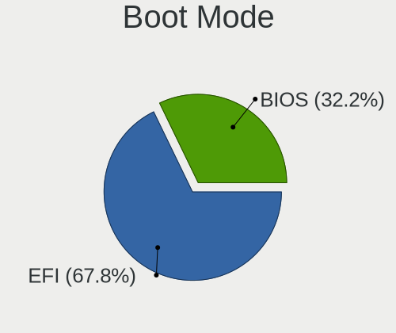
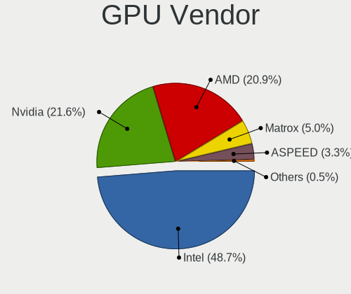
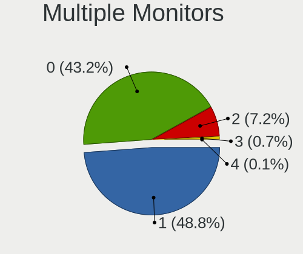
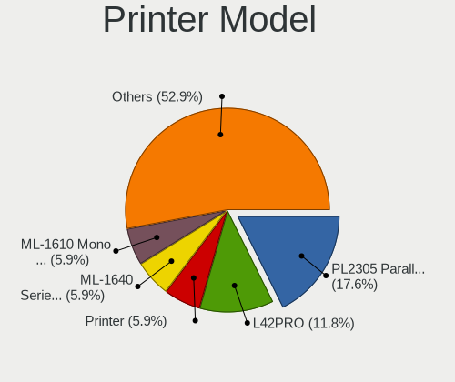
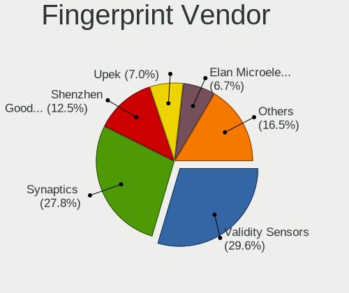
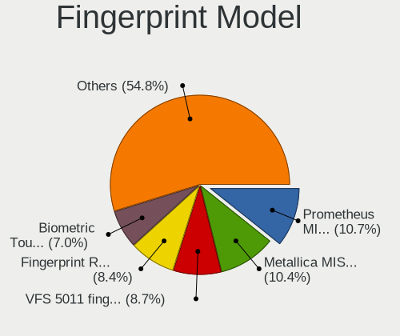

FreeBSD - Tested Hardware & Statistics
--------------------------------------

A project to collect tested hardware configurations for FreeBSD.

Anyone can contribute to this report by the [hw-probe](https://github.com/linuxhw/hw-probe/blob/master/INSTALL.BSD.md) tool:

    hw-probe -all -upload

Please contribute! Especially if your hardware is rare.

This is a report for all computer types. See also reports for [desktops](/Dist/FreeBSD/Desktop/README.md) and [notebooks](/Dist/FreeBSD/Notebook/README.md).

Contents
--------

* [ Test Cases ](#test-cases)

* [ System ](#system)
  - [ OS                       ](#os)
  - [ OS Family                ](#os-family)
  - [ Arch                     ](#arch)
  - [ DE                       ](#de)
  - [ Display Server           ](#display-server)
  - [ Display Manager          ](#display-manager)
  - [ OS Lang                  ](#os-lang)
  - [ Boot Mode                ](#boot-mode)
  - [ Filesystem               ](#filesystem)
  - [ Part. scheme             ](#part-scheme)

* [ Board ](#board)
  - [ Vendor                   ](#vendor)
  - [ Model                    ](#model)
  - [ Model Family             ](#model-family)
  - [ MFG Year                 ](#mfg-year)
  - [ Form Factor              ](#form-factor)
  - [ Coreboot                 ](#coreboot)
  - [ RAM Size                 ](#ram-size)
  - [ RAM Used                 ](#ram-used)
  - [ Total Drives             ](#total-drives)
  - [ Has CD-ROM               ](#has-cd-rom)
  - [ Has Ethernet             ](#has-ethernet)
  - [ Has WiFi                 ](#has-wifi)
  - [ Has Bluetooth            ](#has-bluetooth)

* [ Location ](#location)
  - [ Country                  ](#country)
  - [ City                     ](#city)

* [ Drives ](#drives)
  - [ Drive Vendor             ](#drive-vendor)
  - [ Drive Model              ](#drive-model)
  - [ HDD Vendor               ](#hdd-vendor)
  - [ SSD Vendor               ](#ssd-vendor)
  - [ Drive Kind               ](#drive-kind)
  - [ Drive Connector          ](#drive-connector)
  - [ Drive Size               ](#drive-size)
  - [ Space Total              ](#space-total)
  - [ Space Used               ](#space-used)
  - [ Malfunc. Drives          ](#malfunc-drives)
  - [ Malfunc. Drive Vendor    ](#malfunc-drive-vendor)
  - [ Malfunc. HDD Vendor      ](#malfunc-hdd-vendor)
  - [ Malfunc. Drive Kind      ](#malfunc-drive-kind)
  - [ Failed Drives            ](#failed-drives)
  - [ Failed Drive Vendor      ](#failed-drive-vendor)
  - [ Drive Status             ](#drive-status)

* [ Storage controller ](#storage-controller)
  - [ Storage Vendor           ](#storage-vendor)
  - [ Storage Model            ](#storage-model)
  - [ Storage Kind             ](#storage-kind)

* [ Processor ](#processor)
  - [ CPU Vendor               ](#cpu-vendor)
  - [ CPU Model                ](#cpu-model)
  - [ CPU Model Family         ](#cpu-model-family)
  - [ CPU Cores                ](#cpu-cores)
  - [ CPU Sockets              ](#cpu-sockets)
  - [ CPU Threads              ](#cpu-threads)
  - [ CPU Microarch            ](#cpu-microarch)

* [ Graphics ](#graphics)
  - [ GPU Vendor               ](#gpu-vendor)
  - [ GPU Model                ](#gpu-model)
  - [ GPU Combo                ](#gpu-combo)
  - [ GPU Driver               ](#gpu-driver)
  - [ GPU Memory               ](#gpu-memory)

* [ Monitor ](#monitor)
  - [ Monitor Vendor           ](#monitor-vendor)
  - [ Monitor Model            ](#monitor-model)
  - [ Monitor Resolution       ](#monitor-resolution)
  - [ Monitor Diagonal         ](#monitor-diagonal)
  - [ Monitor Width            ](#monitor-width)
  - [ Aspect Ratio             ](#aspect-ratio)
  - [ Monitor Area             ](#monitor-area)
  - [ Pixel Density            ](#pixel-density)
  - [ Multiple Monitors        ](#multiple-monitors)

* [ Network ](#network)
  - [ Net Controller Vendor    ](#net-controller-vendor)
  - [ Net Controller Model     ](#net-controller-model)
  - [ Wireless Vendor          ](#wireless-vendor)
  - [ Wireless Model           ](#wireless-model)
  - [ Ethernet Vendor          ](#ethernet-vendor)
  - [ Ethernet Model           ](#ethernet-model)
  - [ Net Controller Kind      ](#net-controller-kind)
  - [ Used Controller          ](#used-controller)
  - [ NICs                     ](#nics)
  - [ IPv6                     ](#ipv6)

* [ Bluetooth ](#bluetooth)
  - [ Bluetooth Vendor         ](#bluetooth-vendor)
  - [ Bluetooth Model          ](#bluetooth-model)

* [ Sound ](#sound)
  - [ Sound Vendor             ](#sound-vendor)
  - [ Sound Model              ](#sound-model)

* [ Memory ](#memory)
  - [ Memory Vendor            ](#memory-vendor)
  - [ Memory Model             ](#memory-model)
  - [ Memory Kind              ](#memory-kind)
  - [ Memory Form Factor       ](#memory-form-factor)
  - [ Memory Size              ](#memory-size)
  - [ Memory Speed             ](#memory-speed)

* [ Printers & scanners ](#printers--scanners)
  - [ Printer Vendor           ](#printer-vendor)
  - [ Printer Model            ](#printer-model)
  - [ Scanner Vendor           ](#scanner-vendor)
  - [ Scanner Model            ](#scanner-model)

* [ Camera ](#camera)
  - [ Camera Vendor            ](#camera-vendor)
  - [ Camera Model             ](#camera-model)

* [ Security ](#security)
  - [ Fingerprint Vendor       ](#fingerprint-vendor)
  - [ Fingerprint Model        ](#fingerprint-model)
  - [ Chipcard Vendor          ](#chipcard-vendor)
  - [ Chipcard Model           ](#chipcard-model)

* [ Unsupported ](#unsupported)
  - [ Unsupported Devices      ](#unsupported-devices)
  - [ Unsupported Device Types ](#unsupported-device-types)

Test Cases
----------

Total: 4002

| Vendor        | Model                       | Form-Factor | Probe                                                     | Date         |
|---------------|-----------------------------|-------------|-----------------------------------------------------------|--------------|
| Lenovo        | ThinkPad T490s 20NX000MU... | Notebook    | [1271688c43](https://bsd-hardware.info/?probe=1271688c43) | Jan 02, 2024 |
| ASUSTek       | ROG STRIX B650E-I GAMING... | Desktop     | [a29eec0aa5](https://bsd-hardware.info/?probe=a29eec0aa5) | Jan 02, 2024 |
| Alienware     | 07HV66 A00                  | Desktop     | [ea6a3f3020](https://bsd-hardware.info/?probe=ea6a3f3020) | Jan 01, 2024 |
| ASRockRack    | EPYC3101D4I-2T              | Desktop     | [7e2b858339](https://bsd-hardware.info/?probe=7e2b858339) | Dec 31, 2023 |
| ASRock        | B450 Gaming K4              | Desktop     | [84985aa669](https://bsd-hardware.info/?probe=84985aa669) | Dec 31, 2023 |
| MSI           | H81M-P33                    | Desktop     | [82e08820f2](https://bsd-hardware.info/?probe=82e08820f2) | Dec 31, 2023 |
| ASUSTek       | P5Q-E                       | Desktop     | [da3b88ef85](https://bsd-hardware.info/?probe=da3b88ef85) | Dec 31, 2023 |
| ASUSTek       | ROG CROSSHAIR VIII HERO     | Desktop     | [391f4c0e0b](https://bsd-hardware.info/?probe=391f4c0e0b) | Dec 31, 2023 |
| ASUSTek       | CM6870                      | Desktop     | [1889675f37](https://bsd-hardware.info/?probe=1889675f37) | Dec 30, 2023 |
| Dell          | Vostro 5470                 | Notebook    | [56472e8f51](https://bsd-hardware.info/?probe=56472e8f51) | Dec 30, 2023 |
| HP            | 3397                        | Desktop     | [46b6923bcd](https://bsd-hardware.info/?probe=46b6923bcd) | Dec 30, 2023 |
| Raspberry ... | Raspberry Pi                | Soc         | [fe3a4e49ee](https://bsd-hardware.info/?probe=fe3a4e49ee) | Dec 29, 2023 |
| Dell          | Inspiron 3195               | Convertible | [fb2acd7e84](https://bsd-hardware.info/?probe=fb2acd7e84) | Dec 29, 2023 |
| Unknown       | Unknown                     | Desktop     | [ba78787dff](https://bsd-hardware.info/?probe=ba78787dff) | Dec 29, 2023 |
| Lenovo        | IdeaPad 5 15ALC05 82LN      | Notebook    | [f34b5d84dd](https://bsd-hardware.info/?probe=f34b5d84dd) | Dec 28, 2023 |
| ASUSTek       | ROG STRIX B460-G GAMING     | Desktop     | [6b9d713fe0](https://bsd-hardware.info/?probe=6b9d713fe0) | Dec 28, 2023 |
| Toshiba       | Satellite P300              | Notebook    | [4ddf360812](https://bsd-hardware.info/?probe=4ddf360812) | Dec 27, 2023 |
| Lenovo        | ThinkPad T14 Gen 3 21CF0... | Notebook    | [0a2c02f944](https://bsd-hardware.info/?probe=0a2c02f944) | Dec 27, 2023 |
| Rembrandt     | ARB928                      | Notebook    | [c9a9bfd4aa](https://bsd-hardware.info/?probe=c9a9bfd4aa) | Dec 27, 2023 |
| MSI           | Aspen                       | Desktop     | [ac6dd2b153](https://bsd-hardware.info/?probe=ac6dd2b153) | Dec 27, 2023 |
| Lenovo        | ThinkPad T14 Gen 3 21CF0... | Notebook    | [4b1250f831](https://bsd-hardware.info/?probe=4b1250f831) | Dec 26, 2023 |
| Lenovo        | ThinkPad W520 4284GZ1       | Notebook    | [533a831b97](https://bsd-hardware.info/?probe=533a831b97) | Dec 26, 2023 |
| Lenovo        | 30D9 SDK0J40700 WIN 3258... | Desktop     | [504fb1678f](https://bsd-hardware.info/?probe=504fb1678f) | Dec 24, 2023 |
| Lenovo        | Legion 7 16ACHg6 82N6       | Notebook    | [a740494857](https://bsd-hardware.info/?probe=a740494857) | Dec 24, 2023 |
| ASUSTek       | ASUS TUF Gaming A16 FA61... | Notebook    | [278ab700ae](https://bsd-hardware.info/?probe=278ab700ae) | Dec 24, 2023 |
| Dell          | Inspiron MM061              | Notebook    | [7e4cee9689](https://bsd-hardware.info/?probe=7e4cee9689) | Dec 24, 2023 |
| ASUSTek       | P5Q-E                       | Desktop     | [04675127c2](https://bsd-hardware.info/?probe=04675127c2) | Dec 24, 2023 |
| ASUSTek       | ROG CROSSHAIR VIII HERO     | Desktop     | [1ef7136151](https://bsd-hardware.info/?probe=1ef7136151) | Dec 24, 2023 |
| Acer          | Veriton X490G               | Desktop     | [3f4dbee6d1](https://bsd-hardware.info/?probe=3f4dbee6d1) | Dec 24, 2023 |
| Acer          | Veriton X490G               | Desktop     | [1865afdae1](https://bsd-hardware.info/?probe=1865afdae1) | Dec 24, 2023 |
| Dell          | Precision 5510              | Notebook    | [4bad5ad995](https://bsd-hardware.info/?probe=4bad5ad995) | Dec 23, 2023 |
| Dell          | Precision 7720              | Notebook    | [a30d05e373](https://bsd-hardware.info/?probe=a30d05e373) | Dec 23, 2023 |
| TULPAR        | A5 V20.3                    | Notebook    | [89b65e7036](https://bsd-hardware.info/?probe=89b65e7036) | Dec 23, 2023 |
| Lenovo        | ThinkPad X1 Carbon 2nd 2... | Notebook    | [85ec93f4cd](https://bsd-hardware.info/?probe=85ec93f4cd) | Dec 22, 2023 |
| Lenovo        | ThinkPad X1 Carbon 2nd 2... | Notebook    | [34f3eb8059](https://bsd-hardware.info/?probe=34f3eb8059) | Dec 22, 2023 |
| MSI           | MPG X570 GAMING EDGE WIF... | Desktop     | [06457349dc](https://bsd-hardware.info/?probe=06457349dc) | Dec 22, 2023 |
| Clevo         | W240BU                      | Notebook    | [19bb603cab](https://bsd-hardware.info/?probe=19bb603cab) | Dec 20, 2023 |
| Lenovo        | ThinkPad T490s 20NYS4HL1... | Notebook    | [97fb2e025e](https://bsd-hardware.info/?probe=97fb2e025e) | Dec 20, 2023 |
| Dell          | 0VD5HY A00                  | Desktop     | [03b0e973ca](https://bsd-hardware.info/?probe=03b0e973ca) | Dec 19, 2023 |
| Lenovo        | ThinkPad T480 20L6S29E0T    | Notebook    | [4bc98299dd](https://bsd-hardware.info/?probe=4bc98299dd) | Dec 18, 2023 |
| Lenovo        | ThinkPad P17 Gen 2i 20YV... | Notebook    | [10fb96c00d](https://bsd-hardware.info/?probe=10fb96c00d) | Dec 18, 2023 |
| ASUSTek       | P5Q-E                       | Desktop     | [5a4d01667e](https://bsd-hardware.info/?probe=5a4d01667e) | Dec 17, 2023 |
| ASUSTek       | ROG CROSSHAIR VIII HERO     | Desktop     | [ea79e98108](https://bsd-hardware.info/?probe=ea79e98108) | Dec 17, 2023 |
| HP            | Stream Notebook PC 11       | Notebook    | [1eb8cc9d76](https://bsd-hardware.info/?probe=1eb8cc9d76) | Dec 17, 2023 |
| MSI           | A520M-A PRO                 | Desktop     | [11e5e87b70](https://bsd-hardware.info/?probe=11e5e87b70) | Dec 16, 2023 |
| Apple         | MacBookAir5,2               | Notebook    | [2c652aa0a1](https://bsd-hardware.info/?probe=2c652aa0a1) | Dec 16, 2023 |
| Apple         | Mac-031AEE4D24BFF0B1 Mac... | Mini pc     | [4b134e7787](https://bsd-hardware.info/?probe=4b134e7787) | Dec 16, 2023 |
| CSL-Comput... | C15 v3                      | Notebook    | [dd93594896](https://bsd-hardware.info/?probe=dd93594896) | Dec 16, 2023 |
| Lenovo        | ThinkPad P1 20MD002MUS      | Notebook    | [c0dcfec41d](https://bsd-hardware.info/?probe=c0dcfec41d) | Dec 16, 2023 |
| Lenovo        | ThinkPad X1 Carbon 7th 2... | Notebook    | [7a5e6024cd](https://bsd-hardware.info/?probe=7a5e6024cd) | Dec 15, 2023 |
| ASUSTek       | PRO B460M-C                 | Desktop     | [7a32a123f6](https://bsd-hardware.info/?probe=7a32a123f6) | Dec 15, 2023 |
| Dell          | XPS 13 9370                 | Notebook    | [b6845a3e54](https://bsd-hardware.info/?probe=b6845a3e54) | Dec 15, 2023 |
| Apple         | MacBookPro10,2              | Notebook    | [e1867819f3](https://bsd-hardware.info/?probe=e1867819f3) | Dec 15, 2023 |
| Dell          | Latitude E6220              | Notebook    | [372070b2f2](https://bsd-hardware.info/?probe=372070b2f2) | Dec 15, 2023 |
| Google        | Kohaku                      | Notebook    | [0b945d8f38](https://bsd-hardware.info/?probe=0b945d8f38) | Dec 15, 2023 |
| Lenovo        | IdeaPad 330-15ARR 81D2      | Notebook    | [c197b26909](https://bsd-hardware.info/?probe=c197b26909) | Dec 14, 2023 |
| Dell          | Latitude 3420               | Notebook    | [3767d653b9](https://bsd-hardware.info/?probe=3767d653b9) | Dec 14, 2023 |
| Gigabyte      | H61M-S2PV                   | Desktop     | [88d2ae1175](https://bsd-hardware.info/?probe=88d2ae1175) | Dec 14, 2023 |
| Dell          | 0NK5PH A00                  | Desktop     | [60451d4e43](https://bsd-hardware.info/?probe=60451d4e43) | Dec 14, 2023 |
| Dell          | Latitude E6540              | Notebook    | [77a9b10ab9](https://bsd-hardware.info/?probe=77a9b10ab9) | Dec 13, 2023 |
| AZW           | EQ                          | Desktop     | [d83e11a7dc](https://bsd-hardware.info/?probe=d83e11a7dc) | Dec 13, 2023 |
| ASUSTek       | PRIME X370-PRO              | Desktop     | [bc50d301fa](https://bsd-hardware.info/?probe=bc50d301fa) | Dec 13, 2023 |
| ASRock        | X570 Phantom Gaming 4       | Desktop     | [dced442907](https://bsd-hardware.info/?probe=dced442907) | Dec 13, 2023 |
| Google        | Lindar rev3                 | Notebook    | [2e748fc42c](https://bsd-hardware.info/?probe=2e748fc42c) | Dec 13, 2023 |
| Lenovo        | ThinkPad T14s Gen 4 21F6... | Notebook    | [a7fcca51be](https://bsd-hardware.info/?probe=a7fcca51be) | Dec 13, 2023 |
| Raspberry ... | Raspberry Pi                | Soc         | [357a808604](https://bsd-hardware.info/?probe=357a808604) | Dec 12, 2023 |
| Raspberry ... | Raspberry Pi                | Soc         | [9a842bf3c8](https://bsd-hardware.info/?probe=9a842bf3c8) | Dec 12, 2023 |
| Unknown       | Unknown                     | Desktop     | [123088175c](https://bsd-hardware.info/?probe=123088175c) | Dec 11, 2023 |
| Dell          | 0N051F A04                  | Server      | [38535e6878](https://bsd-hardware.info/?probe=38535e6878) | Dec 11, 2023 |
| Dell          | 0XDN97 A09                  | Server      | [129a73f16f](https://bsd-hardware.info/?probe=129a73f16f) | Dec 11, 2023 |
| EVGA          | X570 DARK.0                 | Desktop     | [1c84a8169b](https://bsd-hardware.info/?probe=1c84a8169b) | Dec 11, 2023 |
| Dell          | 0NC2VH A01                  | Desktop     | [6e876a349f](https://bsd-hardware.info/?probe=6e876a349f) | Dec 11, 2023 |
| Dell          | 084XW4 A05                  | Server      | [951a41f88c](https://bsd-hardware.info/?probe=951a41f88c) | Dec 11, 2023 |
| Dell          | 0NW6H5 A00                  | Desktop     | [2febbeffc2](https://bsd-hardware.info/?probe=2febbeffc2) | Dec 11, 2023 |
| Dell          | 084XW4 A06                  | Server      | [961b6ac6f7](https://bsd-hardware.info/?probe=961b6ac6f7) | Dec 11, 2023 |
| Dell          | Latitude E6510              | Notebook    | [86c4864c0a](https://bsd-hardware.info/?probe=86c4864c0a) | Dec 11, 2023 |
| Dell          | Latitude E6510              | Notebook    | [dc2d54a168](https://bsd-hardware.info/?probe=dc2d54a168) | Dec 11, 2023 |
| Dell          | Inspiron 5423               | Notebook    | [9368c19a35](https://bsd-hardware.info/?probe=9368c19a35) | Dec 11, 2023 |
| AZW           | EQ                          | Desktop     | [0280c1cdb9](https://bsd-hardware.info/?probe=0280c1cdb9) | Dec 10, 2023 |
| ASUSTek       | CM6870                      | Desktop     | [881ad2eacf](https://bsd-hardware.info/?probe=881ad2eacf) | Dec 10, 2023 |
| ASUSTek       | TUF Gaming B560M-PLUS       | Desktop     | [47480f848d](https://bsd-hardware.info/?probe=47480f848d) | Dec 10, 2023 |
| MSI           | H81M-P33                    | Desktop     | [2b1599aacd](https://bsd-hardware.info/?probe=2b1599aacd) | Dec 10, 2023 |
| ASUSTek       | Pro WS X570-ACE             | Desktop     | [89f0463ec6](https://bsd-hardware.info/?probe=89f0463ec6) | Dec 10, 2023 |
| Google        | Parrot                      | Notebook    | [c10a95cbcc](https://bsd-hardware.info/?probe=c10a95cbcc) | Dec 10, 2023 |
| Google        | Parrot                      | Notebook    | [3a69ea2682](https://bsd-hardware.info/?probe=3a69ea2682) | Dec 10, 2023 |
| ASUSTek       | CM6870                      | Desktop     | [78399ba39e](https://bsd-hardware.info/?probe=78399ba39e) | Dec 09, 2023 |
| Gigabyte      | B650 AORUS ELITE AX V2      | Desktop     | [7a6cdb3f06](https://bsd-hardware.info/?probe=7a6cdb3f06) | Dec 09, 2023 |
| ASUSTek       | PRIME X399-A                | Desktop     | [d62ad0d622](https://bsd-hardware.info/?probe=d62ad0d622) | Dec 09, 2023 |
| Lenovo        | ThinkPad X390 Yoga 20NQS... | Convertible | [5b31c551ae](https://bsd-hardware.info/?probe=5b31c551ae) | Dec 09, 2023 |
| Dell          | Latitude 7414               | Notebook    | [2d57c22982](https://bsd-hardware.info/?probe=2d57c22982) | Dec 08, 2023 |
| Dell          | Precision 7560              | Notebook    | [13f7324bd9](https://bsd-hardware.info/?probe=13f7324bd9) | Dec 07, 2023 |
| Dell          | Precision 7560              | Notebook    | [5d3e6e3bd4](https://bsd-hardware.info/?probe=5d3e6e3bd4) | Dec 07, 2023 |
| ASUSTek       | Z10PE-D16 WS                | Desktop     | [7fd4743b86](https://bsd-hardware.info/?probe=7fd4743b86) | Dec 07, 2023 |
| HP            | ZBook 17 G2                 | Notebook    | [406d7a0572](https://bsd-hardware.info/?probe=406d7a0572) | Dec 07, 2023 |
| HP            | EliteBook 840 G6            | Notebook    | [7476cc6440](https://bsd-hardware.info/?probe=7476cc6440) | Dec 06, 2023 |
| Dell          | 0NW6H5 A00                  | Desktop     | [41e61ade9a](https://bsd-hardware.info/?probe=41e61ade9a) | Dec 06, 2023 |
| Lenovo        | ThinkPad W520 4270CTO       | Notebook    | [e63bc464f2](https://bsd-hardware.info/?probe=e63bc464f2) | Dec 05, 2023 |
| MECHREVO      | F7BSC V1.0                  | Mini pc     | [d1104aa676](https://bsd-hardware.info/?probe=d1104aa676) | Dec 05, 2023 |
| ECS           | MCP61M-M3                   | Desktop     | [6d6c04c278](https://bsd-hardware.info/?probe=6d6c04c278) | Dec 05, 2023 |
| HP            | ZBook 17 G2                 | Notebook    | [cc4538374c](https://bsd-hardware.info/?probe=cc4538374c) | Dec 05, 2023 |
| ASUSTek       | TUF Gaming X570-PLUS        | Desktop     | [8c023b9c33](https://bsd-hardware.info/?probe=8c023b9c33) | Dec 05, 2023 |
| Wortmann      | TERRA_MOBILE_1541           | Notebook    | [63f1a71855](https://bsd-hardware.info/?probe=63f1a71855) | Dec 04, 2023 |
| Lenovo        | ThinkPad T430s 23532QG      | Notebook    | [b456c01e0f](https://bsd-hardware.info/?probe=b456c01e0f) | Dec 04, 2023 |
| ASUSTek       | X555LB                      | Notebook    | [0df52370a2](https://bsd-hardware.info/?probe=0df52370a2) | Dec 04, 2023 |
| Intel         | NUC12WSBi3 M36953-303       | Mini pc     | [ea8b5e1c14](https://bsd-hardware.info/?probe=ea8b5e1c14) | Dec 03, 2023 |
| Acidanther... | MacBookPro16,3              | Notebook    | [322ea11f6c](https://bsd-hardware.info/?probe=322ea11f6c) | Dec 03, 2023 |
| Chuwi         | LarkBox X                   | Mini pc     | [a13be946a5](https://bsd-hardware.info/?probe=a13be946a5) | Dec 03, 2023 |
| MSI           | G31TM-P21                   | Desktop     | [4f5b576aff](https://bsd-hardware.info/?probe=4f5b576aff) | Dec 03, 2023 |
| Toshiba       | Satellite C50-B             | Notebook    | [34db2bdd7d](https://bsd-hardware.info/?probe=34db2bdd7d) | Dec 03, 2023 |
| Lenovo        | ThinkPad X280 20KES5M300    | Notebook    | [28d67ab74a](https://bsd-hardware.info/?probe=28d67ab74a) | Dec 02, 2023 |
| ASUSTek       | X555LB                      | Notebook    | [e96bb84b37](https://bsd-hardware.info/?probe=e96bb84b37) | Dec 02, 2023 |
| ASUSTek       | TUF Gaming B550M-PLUS       | Desktop     | [a9b3beae66](https://bsd-hardware.info/?probe=a9b3beae66) | Dec 02, 2023 |
| ASRock        | Z590 Pro4                   | Desktop     | [0457bab107](https://bsd-hardware.info/?probe=0457bab107) | Dec 01, 2023 |
| ASRockRack    | EPYC3101D4I-2T              | Desktop     | [f1cb9a41ba](https://bsd-hardware.info/?probe=f1cb9a41ba) | Nov 30, 2023 |
| Lenovo        | ThinkPad T450 20BV000BUS    | Notebook    | [ae4c6d7097](https://bsd-hardware.info/?probe=ae4c6d7097) | Nov 29, 2023 |
| MSI           | B450M MORTAR                | Desktop     | [4017ce5221](https://bsd-hardware.info/?probe=4017ce5221) | Nov 29, 2023 |
| CNCTION-IA... | Unknown                     | Desktop     | [1b4871792b](https://bsd-hardware.info/?probe=1b4871792b) | Nov 28, 2023 |
| ASUSTek       | PRIME A520M-E               | Desktop     | [8d7c03be2f](https://bsd-hardware.info/?probe=8d7c03be2f) | Nov 28, 2023 |
| Dell          | Precision 5510              | Notebook    | [3a7b2ae214](https://bsd-hardware.info/?probe=3a7b2ae214) | Nov 28, 2023 |
| ASUSTek       | ProArt B550-CREATOR         | Desktop     | [806a29d40a](https://bsd-hardware.info/?probe=806a29d40a) | Nov 28, 2023 |
| Dell          | Inspiron N5010              | Notebook    | [b32ded6bb9](https://bsd-hardware.info/?probe=b32ded6bb9) | Nov 27, 2023 |
| ASRock        | B450 Steel Legend           | Desktop     | [c9f6264329](https://bsd-hardware.info/?probe=c9f6264329) | Nov 27, 2023 |
| ASRock        | B450 Steel Legend           | Desktop     | [1e9f19c4ae](https://bsd-hardware.info/?probe=1e9f19c4ae) | Nov 27, 2023 |
| Lenovo        | 1036 NO DPK                 | Desktop     | [3b18ff26c0](https://bsd-hardware.info/?probe=3b18ff26c0) | Nov 27, 2023 |
| ASUSTek       | PRIME A320M-K               | Desktop     | [42bddda351](https://bsd-hardware.info/?probe=42bddda351) | Nov 26, 2023 |
| Unknown       | Unknown                     | Notebook    | [55339dbfab](https://bsd-hardware.info/?probe=55339dbfab) | Nov 26, 2023 |
| MSI           | H81M-P33                    | Desktop     | [b653e75063](https://bsd-hardware.info/?probe=b653e75063) | Nov 26, 2023 |
| ASUSTek       | P5Q-E                       | Desktop     | [1454187842](https://bsd-hardware.info/?probe=1454187842) | Nov 26, 2023 |
| ASUSTek       | ROG CROSSHAIR VIII HERO     | Desktop     | [28f6ec2a7b](https://bsd-hardware.info/?probe=28f6ec2a7b) | Nov 26, 2023 |
| Lenovo        | IdeaPad 320-15IKB Touch ... | Notebook    | [3517ce2745](https://bsd-hardware.info/?probe=3517ce2745) | Nov 26, 2023 |
| Lenovo        | IdeaPad 320-15IKB Touch ... | Notebook    | [5f336b9d93](https://bsd-hardware.info/?probe=5f336b9d93) | Nov 26, 2023 |
| HP            | Laptop 15s-eq3xxx           | Notebook    | [f2aa7b3ebf](https://bsd-hardware.info/?probe=f2aa7b3ebf) | Nov 25, 2023 |
| Dell          | Latitude 5480               | Notebook    | [639ffb1573](https://bsd-hardware.info/?probe=639ffb1573) | Nov 25, 2023 |
| HP            | ProLiant ML350p Gen8        | Desktop     | [24f4b0ec7e](https://bsd-hardware.info/?probe=24f4b0ec7e) | Nov 24, 2023 |
| Lenovo        | G50-80 80E5                 | Notebook    | [e0d8200dfa](https://bsd-hardware.info/?probe=e0d8200dfa) | Nov 24, 2023 |
| Google        | Dragonair                   | Notebook    | [713cf1bc38](https://bsd-hardware.info/?probe=713cf1bc38) | Nov 24, 2023 |
| HP            | Notebook                    | Notebook    | [aff6430eb2](https://bsd-hardware.info/?probe=aff6430eb2) | Nov 24, 2023 |
| Silicom       | 80300-0214-G16 R310         | Desktop     | [34382c8f4b](https://bsd-hardware.info/?probe=34382c8f4b) | Nov 24, 2023 |
| Acer          | JM11-MS                     | Notebook    | [0490895189](https://bsd-hardware.info/?probe=0490895189) | Nov 23, 2023 |
| Acidanther... | MacBookPro16,3              | Notebook    | [5f89fa2cd2](https://bsd-hardware.info/?probe=5f89fa2cd2) | Nov 22, 2023 |
| Samsung       | DT1234567890 SEC_SW_REVI... | Desktop     | [4c80855e88](https://bsd-hardware.info/?probe=4c80855e88) | Nov 22, 2023 |
| Fujitsu       | D3233-A1 S26361-D3233-A1    | Desktop     | [a37a33268d](https://bsd-hardware.info/?probe=a37a33268d) | Nov 21, 2023 |
| Fujitsu       | D3233-A1 S26361-D3233-A1    | Desktop     | [fb283e956a](https://bsd-hardware.info/?probe=fb283e956a) | Nov 21, 2023 |
| ASRock        | X570 Phantom Gaming 4       | Desktop     | [4b6284d041](https://bsd-hardware.info/?probe=4b6284d041) | Nov 20, 2023 |
| PICO PC       | MNHO-113                    | Desktop     | [c9a12372b4](https://bsd-hardware.info/?probe=c9a12372b4) | Nov 20, 2023 |
| Lenovo        | ThinkPad T470 20HES0EV0A    | Notebook    | [96562d6513](https://bsd-hardware.info/?probe=96562d6513) | Nov 20, 2023 |
| Lenovo        | ThinkPad T450 20BV000BUS    | Notebook    | [fdb7c00df7](https://bsd-hardware.info/?probe=fdb7c00df7) | Nov 20, 2023 |
| Lenovo        | ThinkPad T470 20HES0EV0A    | Notebook    | [5caaad73bd](https://bsd-hardware.info/?probe=5caaad73bd) | Nov 19, 2023 |
| AZW           | SER V2.0                    | Mini pc     | [17d29b1055](https://bsd-hardware.info/?probe=17d29b1055) | Nov 19, 2023 |
| MSI           | H81M-P33                    | Desktop     | [6406980bbf](https://bsd-hardware.info/?probe=6406980bbf) | Nov 19, 2023 |
| ASUSTek       | P5Q-E                       | Desktop     | [e7ccb4156e](https://bsd-hardware.info/?probe=e7ccb4156e) | Nov 19, 2023 |
| ASUSTek       | ROG CROSSHAIR VIII HERO     | Desktop     | [a570c7994c](https://bsd-hardware.info/?probe=a570c7994c) | Nov 19, 2023 |
| Lenovo        | ThinkPad W530 24411M9       | Notebook    | [0272396725](https://bsd-hardware.info/?probe=0272396725) | Nov 19, 2023 |
| MSI           | B560-A PRO                  | Desktop     | [cf9b5a14ce](https://bsd-hardware.info/?probe=cf9b5a14ce) | Nov 19, 2023 |
| Lenovo        | ThinkPad X1 Carbon 4th 2... | Notebook    | [2c33e6e9e7](https://bsd-hardware.info/?probe=2c33e6e9e7) | Nov 19, 2023 |
| Dell          | Latitude 5440               | Notebook    | [9daa44aacf](https://bsd-hardware.info/?probe=9daa44aacf) | Nov 18, 2023 |
| Panasonic     | CF-31-5                     | Notebook    | [8771ab6139](https://bsd-hardware.info/?probe=8771ab6139) | Nov 18, 2023 |
| ASUSTek       | P7P55D                      | Desktop     | [9eab94b4f7](https://bsd-hardware.info/?probe=9eab94b4f7) | Nov 18, 2023 |
| ASUSTek       | TUF Gaming B560M-PLUS WI... | Desktop     | [cfbda53125](https://bsd-hardware.info/?probe=cfbda53125) | Nov 18, 2023 |
| TUXEDO        | Pulse 15 Gen2               | Notebook    | [9061ad4228](https://bsd-hardware.info/?probe=9061ad4228) | Nov 17, 2023 |
| Toshiba       | Satellite P300              | Notebook    | [ece5171a1d](https://bsd-hardware.info/?probe=ece5171a1d) | Nov 17, 2023 |
| HP            | Notebook                    | Notebook    | [5d2df329aa](https://bsd-hardware.info/?probe=5d2df329aa) | Nov 17, 2023 |
| Lenovo        | ThinkPad X1 Carbon 4th 2... | Notebook    | [918706e110](https://bsd-hardware.info/?probe=918706e110) | Nov 15, 2023 |
| Supermicro    | H8DGU                       | Server      | [aa3a09d113](https://bsd-hardware.info/?probe=aa3a09d113) | Nov 15, 2023 |
| Supermicro    | H8DGU                       | Server      | [5ca736990f](https://bsd-hardware.info/?probe=5ca736990f) | Nov 15, 2023 |
| HP            | Pavilion Gaming Laptop 1... | Notebook    | [0e4ea9ccbf](https://bsd-hardware.info/?probe=0e4ea9ccbf) | Nov 15, 2023 |
| Dell          | G5 5505                     | Notebook    | [088aea32c0](https://bsd-hardware.info/?probe=088aea32c0) | Nov 15, 2023 |
| HP            | 18E7                        | Desktop     | [3cbe1117fa](https://bsd-hardware.info/?probe=3cbe1117fa) | Nov 14, 2023 |
| ASUSTek       | P7P55D                      | Desktop     | [2487233a5d](https://bsd-hardware.info/?probe=2487233a5d) | Nov 13, 2023 |
| ASUSTek       | Pro WS X570-ACE             | Desktop     | [ee4c8ddddc](https://bsd-hardware.info/?probe=ee4c8ddddc) | Nov 13, 2023 |
| ASUSTek       | PRIME X370-PRO              | Desktop     | [771c13f8ea](https://bsd-hardware.info/?probe=771c13f8ea) | Nov 13, 2023 |
| ASRock        | X570 Phantom Gaming 4       | Desktop     | [35ae423f7a](https://bsd-hardware.info/?probe=35ae423f7a) | Nov 13, 2023 |
| MSI           | H81M-P33                    | Desktop     | [a062354358](https://bsd-hardware.info/?probe=a062354358) | Nov 12, 2023 |
| ASUSTek       | P5Q-E                       | Desktop     | [0869172a54](https://bsd-hardware.info/?probe=0869172a54) | Nov 12, 2023 |
| ASUSTek       | ROG CROSSHAIR VIII HERO     | Desktop     | [b1e348523f](https://bsd-hardware.info/?probe=b1e348523f) | Nov 12, 2023 |
| ASRockRack    | X470D4U2-2T                 | Desktop     | [f32f8bdf95](https://bsd-hardware.info/?probe=f32f8bdf95) | Nov 12, 2023 |
| OnLogic       | HX401                       | Notebook    | [b000c6d264](https://bsd-hardware.info/?probe=b000c6d264) | Nov 12, 2023 |
| ASUSTek       | K56CB                       | Notebook    | [8d4f2c439a](https://bsd-hardware.info/?probe=8d4f2c439a) | Nov 11, 2023 |
| ASUSTek       | Z97-A                       | Desktop     | [3ce8e78453](https://bsd-hardware.info/?probe=3ce8e78453) | Nov 11, 2023 |
| Lenovo        | ThinkPad X270 20HN006CUS    | Notebook    | [dc8d596ea1](https://bsd-hardware.info/?probe=dc8d596ea1) | Nov 11, 2023 |
| Lenovo        | ThinkPad X260 20F6006XUK    | Notebook    | [823bdd1b43](https://bsd-hardware.info/?probe=823bdd1b43) | Nov 10, 2023 |
| Unknown       | Unknown                     | Desktop     | [c535fae89f](https://bsd-hardware.info/?probe=c535fae89f) | Nov 10, 2023 |
| Intel         | NUC7JYB J67969-404          | Mini pc     | [81e93afe2e](https://bsd-hardware.info/?probe=81e93afe2e) | Nov 10, 2023 |
| ASRock        | B460M Steel Legend          | Desktop     | [13bdfc626b](https://bsd-hardware.info/?probe=13bdfc626b) | Nov 09, 2023 |
| ASUSTek       | CROSSHAIR VI HERO           | Desktop     | [3c3b2abb3d](https://bsd-hardware.info/?probe=3c3b2abb3d) | Nov 09, 2023 |
| Lenovo        | ThinkPad T480 20L6S5VP00    | Notebook    | [5eb914094b](https://bsd-hardware.info/?probe=5eb914094b) | Nov 09, 2023 |
| Dell          | Precision 7560              | Notebook    | [a0e5297849](https://bsd-hardware.info/?probe=a0e5297849) | Nov 09, 2023 |
| ASRockRack    | X470D4U2-2T                 | Desktop     | [b7b9df03f3](https://bsd-hardware.info/?probe=b7b9df03f3) | Nov 09, 2023 |
| Toshiba       | Satellite P300              | Notebook    | [9d4170e2d2](https://bsd-hardware.info/?probe=9d4170e2d2) | Nov 08, 2023 |
| Samsung       | 740U5M                      | Convertible | [1a996f2f48](https://bsd-hardware.info/?probe=1a996f2f48) | Nov 08, 2023 |
| ASUSTek       | Pro WS X570-ACE             | Desktop     | [6588258570](https://bsd-hardware.info/?probe=6588258570) | Nov 07, 2023 |
| Unknown       | Unknown                     | Notebook    | [61c7e94f23](https://bsd-hardware.info/?probe=61c7e94f23) | Nov 06, 2023 |
| Intel         | NUC12WSBi3 M36953-303       | Mini pc     | [36a87f24f7](https://bsd-hardware.info/?probe=36a87f24f7) | Nov 06, 2023 |
| Unknown       | Unknown                     | Notebook    | [316be7bb33](https://bsd-hardware.info/?probe=316be7bb33) | Nov 06, 2023 |
| Dell          | Latitude E6540              | Notebook    | [a26912fd0d](https://bsd-hardware.info/?probe=a26912fd0d) | Nov 06, 2023 |
| ASUSTek       | ROG STRIX B550-F GAMING     | Desktop     | [e8c7d22b1f](https://bsd-hardware.info/?probe=e8c7d22b1f) | Nov 05, 2023 |
| ZOTAC         | ZBOX-CI320NANO series Re... | Mini pc     | [9de790eac0](https://bsd-hardware.info/?probe=9de790eac0) | Nov 05, 2023 |
| ASUSTek       | K56CB                       | Notebook    | [7d6d03a42b](https://bsd-hardware.info/?probe=7d6d03a42b) | Nov 05, 2023 |
| Dell          | 0MD99X A12                  | Server      | [c137d2d6da](https://bsd-hardware.info/?probe=c137d2d6da) | Nov 05, 2023 |
| MSI           | H81M-P33                    | Desktop     | [d44c30f985](https://bsd-hardware.info/?probe=d44c30f985) | Nov 05, 2023 |
| ASUSTek       | P5Q-E                       | Desktop     | [dac3ca2eca](https://bsd-hardware.info/?probe=dac3ca2eca) | Nov 05, 2023 |
| ASUSTek       | ROG CROSSHAIR VIII HERO     | Desktop     | [e744712416](https://bsd-hardware.info/?probe=e744712416) | Nov 05, 2023 |
| ASUSTek       | Z97-A                       | Desktop     | [a8aad4a386](https://bsd-hardware.info/?probe=a8aad4a386) | Nov 04, 2023 |
| Dell          | XPS 13 9360                 | Notebook    | [c7d016caa9](https://bsd-hardware.info/?probe=c7d016caa9) | Nov 04, 2023 |
| LG Electro... | 16UD70R-G.AX59B             | Notebook    | [a7df4f645f](https://bsd-hardware.info/?probe=a7df4f645f) | Nov 04, 2023 |
| Dell          | 0Y2V0C A03                  | Desktop     | [5c7de92bb3](https://bsd-hardware.info/?probe=5c7de92bb3) | Nov 03, 2023 |
| Dell          | Inspiron 1525               | Notebook    | [538444f1d2](https://bsd-hardware.info/?probe=538444f1d2) | Nov 02, 2023 |
| ASUSTek       | ProArt B550-CREATOR         | Desktop     | [2fab5b5adf](https://bsd-hardware.info/?probe=2fab5b5adf) | Nov 01, 2023 |
| ASRock        | Z590 Pro4                   | Desktop     | [03fa12a885](https://bsd-hardware.info/?probe=03fa12a885) | Nov 01, 2023 |
| MSI           | 970 GAMING                  | Desktop     | [f93d5865b8](https://bsd-hardware.info/?probe=f93d5865b8) | Nov 01, 2023 |
| Apple         | MacBookPro7,1               | Notebook    | [91d07ef080](https://bsd-hardware.info/?probe=91d07ef080) | Nov 01, 2023 |
| Unknown       | Unknown                     | Desktop     | [1a63df656e](https://bsd-hardware.info/?probe=1a63df656e) | Oct 31, 2023 |
| ASRockRack    | EPYC3101D4I-2T              | Desktop     | [87e3260963](https://bsd-hardware.info/?probe=87e3260963) | Oct 31, 2023 |
| ASUSTek       | PRIME A520M-K               | Desktop     | [c60aeb219e](https://bsd-hardware.info/?probe=c60aeb219e) | Oct 31, 2023 |
| Lenovo        | ThinkPad T480 20L5000WUS    | Notebook    | [4dcf84c76c](https://bsd-hardware.info/?probe=4dcf84c76c) | Oct 31, 2023 |
| ASRock        | X570 Phantom Gaming 4       | Desktop     | [c163891517](https://bsd-hardware.info/?probe=c163891517) | Oct 31, 2023 |
| HP            | ProLiant DL380p Gen8        | Server      | [ebdc124789](https://bsd-hardware.info/?probe=ebdc124789) | Oct 30, 2023 |
| Intel         | NUC11PABi7 K90104-302       | Mini pc     | [c7e5f79b34](https://bsd-hardware.info/?probe=c7e5f79b34) | Oct 30, 2023 |
| Intel         | DCP847SKE                   | Desktop     | [ba44d23972](https://bsd-hardware.info/?probe=ba44d23972) | Oct 29, 2023 |
| Raspberry ... | Raspberry Pi                | Soc         | [1f6542c47d](https://bsd-hardware.info/?probe=1f6542c47d) | Oct 29, 2023 |
| Toshiba       | Satellite P300              | Notebook    | [49d23c8fda](https://bsd-hardware.info/?probe=49d23c8fda) | Oct 28, 2023 |
| Toshiba       | Satellite P300              | Notebook    | [a133633304](https://bsd-hardware.info/?probe=a133633304) | Oct 28, 2023 |
| HP            | EliteBook 840 G7 Noteboo... | Notebook    | [09cf753c7a](https://bsd-hardware.info/?probe=09cf753c7a) | Oct 26, 2023 |
| Dell          | 02YYK5 A01                  | Desktop     | [1b42e4a912](https://bsd-hardware.info/?probe=1b42e4a912) | Oct 26, 2023 |
| Unknown       | Unknown                     | Desktop     | [6b3f2cf24c](https://bsd-hardware.info/?probe=6b3f2cf24c) | Oct 25, 2023 |
| Unknown       | Unknown                     | Desktop     | [8e245ccb85](https://bsd-hardware.info/?probe=8e245ccb85) | Oct 25, 2023 |
| Unknown       | Unknown                     | Desktop     | [db96ffb93a](https://bsd-hardware.info/?probe=db96ffb93a) | Oct 25, 2023 |
| Unknown       | Unknown                     | Desktop     | [06f91445cb](https://bsd-hardware.info/?probe=06f91445cb) | Oct 24, 2023 |
| Lenovo        | G50-30 80G0                 | Notebook    | [e2dad0b43a](https://bsd-hardware.info/?probe=e2dad0b43a) | Oct 24, 2023 |
| Lenovo        | ThinkPad T490 20N3X50500    | Notebook    | [364c7828be](https://bsd-hardware.info/?probe=364c7828be) | Oct 24, 2023 |
| Shuttle       | FZ270                       | Desktop     | [1aa4ad0971](https://bsd-hardware.info/?probe=1aa4ad0971) | Oct 23, 2023 |
| Dell          | 02YYK5 A01                  | Desktop     | [ab44e043d2](https://bsd-hardware.info/?probe=ab44e043d2) | Oct 23, 2023 |
| Intel         | NUC11PABi7 K90104-302       | Mini pc     | [8f62c35aa0](https://bsd-hardware.info/?probe=8f62c35aa0) | Oct 23, 2023 |
| ASUSTek       | ZenBook UX325UA_UM325UA     | Notebook    | [1f76a6c28c](https://bsd-hardware.info/?probe=1f76a6c28c) | Oct 22, 2023 |
| MSI           | H81M-P33                    | Desktop     | [dd9ff802a9](https://bsd-hardware.info/?probe=dd9ff802a9) | Oct 22, 2023 |
| ASUSTek       | P5Q-E                       | Desktop     | [1b94fd9385](https://bsd-hardware.info/?probe=1b94fd9385) | Oct 22, 2023 |
| ASUSTek       | ROG CROSSHAIR VIII HERO     | Desktop     | [cc7fb797f5](https://bsd-hardware.info/?probe=cc7fb797f5) | Oct 22, 2023 |
| ASUSTek       | ZenBook UX325UA_UM325UA     | Notebook    | [6569410f91](https://bsd-hardware.info/?probe=6569410f91) | Oct 22, 2023 |
| HP            | EliteBook 840 G7 Noteboo... | Notebook    | [7a57e0a112](https://bsd-hardware.info/?probe=7a57e0a112) | Oct 21, 2023 |
| HP            | Laptop 15s-eq3xxx           | Notebook    | [5a7e4222f1](https://bsd-hardware.info/?probe=5a7e4222f1) | Oct 21, 2023 |
| Intel         | NUC7JYB J67969-404          | Mini pc     | [7148ec01b2](https://bsd-hardware.info/?probe=7148ec01b2) | Oct 21, 2023 |
| Unknown       | Unknown                     | Desktop     | [629eefe0c2](https://bsd-hardware.info/?probe=629eefe0c2) | Oct 21, 2023 |
| Dell          | G16 7630                    | Notebook    | [deb5f3bd32](https://bsd-hardware.info/?probe=deb5f3bd32) | Oct 21, 2023 |
| ASUSTek       | PRIME H470M-PLUS            | Desktop     | [88cdd6135f](https://bsd-hardware.info/?probe=88cdd6135f) | Oct 20, 2023 |
| Dell          | 02YYK5 A01                  | Desktop     | [a8727c3ee3](https://bsd-hardware.info/?probe=a8727c3ee3) | Oct 19, 2023 |
| MSI           | PRO H610M-B DDR4            | Desktop     | [1cc822b8c1](https://bsd-hardware.info/?probe=1cc822b8c1) | Oct 19, 2023 |
| Dell          | 0NW6H5 A00                  | Desktop     | [606ed441ae](https://bsd-hardware.info/?probe=606ed441ae) | Oct 19, 2023 |
| ASUSTek       | X99-A/USB                   | Desktop     | [0f914c6351](https://bsd-hardware.info/?probe=0f914c6351) | Oct 17, 2023 |
| Lenovo        | IdeaPad 3 15ADA05 81W1      | Notebook    | [b08dc9fc91](https://bsd-hardware.info/?probe=b08dc9fc91) | Oct 16, 2023 |
| MSI           | H81M-P33                    | Desktop     | [6902d492db](https://bsd-hardware.info/?probe=6902d492db) | Oct 15, 2023 |
| ASUSTek       | P5Q-E                       | Desktop     | [094b766a05](https://bsd-hardware.info/?probe=094b766a05) | Oct 15, 2023 |
| ASUSTek       | ROG CROSSHAIR VIII HERO     | Desktop     | [b502116394](https://bsd-hardware.info/?probe=b502116394) | Oct 15, 2023 |
| Lenovo        | ThinkPad X1 Carbon 3rd 2... | Notebook    | [0f3cd5aa25](https://bsd-hardware.info/?probe=0f3cd5aa25) | Oct 13, 2023 |
| ASUSTek       | PRIME X370-PRO              | Desktop     | [697f24cf01](https://bsd-hardware.info/?probe=697f24cf01) | Oct 13, 2023 |
| ASRock        | X570 Phantom Gaming 4       | Desktop     | [d14ff47394](https://bsd-hardware.info/?probe=d14ff47394) | Oct 13, 2023 |
| Unknown       | Unknown                     | Desktop     | [0fd1a7196f](https://bsd-hardware.info/?probe=0fd1a7196f) | Oct 13, 2023 |
| ASUSTek       | Pro WS X570-ACE             | Desktop     | [a7307b8de1](https://bsd-hardware.info/?probe=a7307b8de1) | Oct 12, 2023 |
| Lenovo        | G550 2958                   | Notebook    | [6dfadd1ff2](https://bsd-hardware.info/?probe=6dfadd1ff2) | Oct 11, 2023 |
| Dell          | Precision 7550              | Notebook    | [a21e06c16c](https://bsd-hardware.info/?probe=a21e06c16c) | Oct 11, 2023 |
| ANGXUN        | X79-VG2 V1.3                | Desktop     | [c823cbad48](https://bsd-hardware.info/?probe=c823cbad48) | Oct 10, 2023 |
| Unknown       | Unknown                     | Notebook    | [9c6c7f9d6b](https://bsd-hardware.info/?probe=9c6c7f9d6b) | Oct 10, 2023 |
| Dell          | Inspiron 13 5320            | Notebook    | [43c1b405d0](https://bsd-hardware.info/?probe=43c1b405d0) | Oct 09, 2023 |
| ASUSTek       | ProArt X670E-CREATOR WIF... | Desktop     | [f55c557bcf](https://bsd-hardware.info/?probe=f55c557bcf) | Oct 09, 2023 |
| EVGA          | X299 MICRO                  | Desktop     | [2907f2166d](https://bsd-hardware.info/?probe=2907f2166d) | Oct 09, 2023 |
| MSI           | H81M-P33                    | Desktop     | [a9729ebc38](https://bsd-hardware.info/?probe=a9729ebc38) | Oct 08, 2023 |
| ASUSTek       | P5Q-E                       | Desktop     | [06a76899d6](https://bsd-hardware.info/?probe=06a76899d6) | Oct 08, 2023 |
| ASUSTek       | ROG CROSSHAIR VIII HERO     | Desktop     | [cacbb83f98](https://bsd-hardware.info/?probe=cacbb83f98) | Oct 08, 2023 |
| Lenovo        | ThinkPad E580 20KS001JUK    | Notebook    | [0aac5f52c9](https://bsd-hardware.info/?probe=0aac5f52c9) | Oct 08, 2023 |
| MSI           | Aspen                       | Desktop     | [7bb665508f](https://bsd-hardware.info/?probe=7bb665508f) | Oct 07, 2023 |
| GVC           | DR 738                      | Desktop     | [1aa25f04a8](https://bsd-hardware.info/?probe=1aa25f04a8) | Oct 07, 2023 |
| Timi          | A34R                        | Notebook    | [3cd3f35eaa](https://bsd-hardware.info/?probe=3cd3f35eaa) | Oct 07, 2023 |
| Timi          | A34R                        | Notebook    | [03f00603f7](https://bsd-hardware.info/?probe=03f00603f7) | Oct 07, 2023 |
| ASRock        | X570 Phantom Gaming 4       | Desktop     | [b3580a1e53](https://bsd-hardware.info/?probe=b3580a1e53) | Oct 07, 2023 |
| Unknown       | Unknown                     | Desktop     | [9d236eb8bb](https://bsd-hardware.info/?probe=9d236eb8bb) | Oct 06, 2023 |
| Apple         | MacBookPro6,2               | Notebook    | [85e94bd511](https://bsd-hardware.info/?probe=85e94bd511) | Oct 06, 2023 |
| Raspberry ... | Raspberry Pi                | Soc         | [3f63740c0e](https://bsd-hardware.info/?probe=3f63740c0e) | Oct 05, 2023 |
| Lenovo        | ThinkPad P73 20QRCTO1WW     | Notebook    | [88e8c64b6f](https://bsd-hardware.info/?probe=88e8c64b6f) | Oct 04, 2023 |
| ASUSTek       | ZenBook UX325UA_UM325UA     | Notebook    | [aecfeaa518](https://bsd-hardware.info/?probe=aecfeaa518) | Oct 04, 2023 |
| Unknown       | Unknown                     | Desktop     | [9ad768a37a](https://bsd-hardware.info/?probe=9ad768a37a) | Oct 04, 2023 |
| Lenovo        | ThinkPad X230 2325J67       | Notebook    | [bfbc6beca8](https://bsd-hardware.info/?probe=bfbc6beca8) | Oct 04, 2023 |
| ASUSTek       | Pro WS W680-ACE IPMI        | Desktop     | [6a98aea3f9](https://bsd-hardware.info/?probe=6a98aea3f9) | Oct 03, 2023 |
| Lenovo        | ThinkPad X260 20F6006XUK    | Notebook    | [25fecdaad5](https://bsd-hardware.info/?probe=25fecdaad5) | Oct 03, 2023 |
| HP            | ZBook 17 G2                 | Notebook    | [4e12d36770](https://bsd-hardware.info/?probe=4e12d36770) | Oct 03, 2023 |
| Lenovo        | B40-30 80F1                 | Notebook    | [00c5e6adda](https://bsd-hardware.info/?probe=00c5e6adda) | Oct 03, 2023 |
| Platform      | ARB938                      | Notebook    | [141d043221](https://bsd-hardware.info/?probe=141d043221) | Oct 02, 2023 |
| Google        | Auron_Paine                 | Notebook    | [d202b4dd6f](https://bsd-hardware.info/?probe=d202b4dd6f) | Oct 02, 2023 |
| Google        | Auron_Paine                 | Notebook    | [1c44cf70e8](https://bsd-hardware.info/?probe=1c44cf70e8) | Oct 02, 2023 |
| Intel         | NUC8BEB J72692-307          | Mini pc     | [e43673f564](https://bsd-hardware.info/?probe=e43673f564) | Oct 01, 2023 |
| Google        | Auron_Paine                 | Notebook    | [021624028a](https://bsd-hardware.info/?probe=021624028a) | Oct 01, 2023 |
| Dell          | Inspiron 5559               | Notebook    | [7a6b97e997](https://bsd-hardware.info/?probe=7a6b97e997) | Oct 01, 2023 |
| MSI           | H81M-P33                    | Desktop     | [da12fe3c05](https://bsd-hardware.info/?probe=da12fe3c05) | Oct 01, 2023 |
| ASUSTek       | P5Q-E                       | Desktop     | [6975204e47](https://bsd-hardware.info/?probe=6975204e47) | Oct 01, 2023 |
| ASRockRack    | EPYC3101D4I-2T              | Desktop     | [c6903de57a](https://bsd-hardware.info/?probe=c6903de57a) | Sep 30, 2023 |
| Gigabyte      | B450M S2H V2                | Desktop     | [31da8655d1](https://bsd-hardware.info/?probe=31da8655d1) | Sep 28, 2023 |
| Dell          | 0J555H A00                  | Server      | [3c395551d4](https://bsd-hardware.info/?probe=3c395551d4) | Sep 28, 2023 |
| Supermicro    | M11SDV-8C+-LN4F             | Server      | [c35034519a](https://bsd-hardware.info/?probe=c35034519a) | Sep 28, 2023 |
| Biostar       | A55MLC2                     | Desktop     | [fac0f247d0](https://bsd-hardware.info/?probe=fac0f247d0) | Sep 28, 2023 |
| Lenovo        | ThinkPad X220 Tablet 429... | Notebook    | [0c56aeb6b5](https://bsd-hardware.info/?probe=0c56aeb6b5) | Sep 27, 2023 |
| ASUSTek       | P9D-MV Series               | Server      | [0a035e25a9](https://bsd-hardware.info/?probe=0a035e25a9) | Sep 26, 2023 |
| Dell          | 07T4MC A09                  | Desktop     | [bde8cc45df](https://bsd-hardware.info/?probe=bde8cc45df) | Sep 26, 2023 |
| Dell          | 07T4MC A09                  | Desktop     | [0ce8f84155](https://bsd-hardware.info/?probe=0ce8f84155) | Sep 26, 2023 |
| Lenovo        | ThinkPad P16 Gen 1 21D60... | Notebook    | [231aedbf9e](https://bsd-hardware.info/?probe=231aedbf9e) | Sep 25, 2023 |
| Unknown       | Unknown                     | Desktop     | [1ba135fef1](https://bsd-hardware.info/?probe=1ba135fef1) | Sep 24, 2023 |
| Unknown       | Unknown                     | Desktop     | [9c8516c8a8](https://bsd-hardware.info/?probe=9c8516c8a8) | Sep 24, 2023 |
| Dell          | Latitude 3410               | Notebook    | [1bd71b0bf0](https://bsd-hardware.info/?probe=1bd71b0bf0) | Sep 24, 2023 |
| MSI           | H81M-P33                    | Desktop     | [971f3fdba1](https://bsd-hardware.info/?probe=971f3fdba1) | Sep 24, 2023 |
| ASUSTek       | P5Q-E                       | Desktop     | [6538212bd6](https://bsd-hardware.info/?probe=6538212bd6) | Sep 24, 2023 |
| ASUSTek       | ROG CROSSHAIR VIII HERO     | Desktop     | [f7aee1db53](https://bsd-hardware.info/?probe=f7aee1db53) | Sep 24, 2023 |
| AZW           | SEi V1.0                    | Desktop     | [1d0307b36d](https://bsd-hardware.info/?probe=1d0307b36d) | Sep 23, 2023 |
| Lenovo        | ThinkBook 13s G2 ITL 20V... | Notebook    | [de1bdf0601](https://bsd-hardware.info/?probe=de1bdf0601) | Sep 21, 2023 |
| Dell          | G16 7630                    | Notebook    | [4e39a5ebdf](https://bsd-hardware.info/?probe=4e39a5ebdf) | Sep 21, 2023 |
| HP            | ZBook 17 G2                 | Notebook    | [f29233649e](https://bsd-hardware.info/?probe=f29233649e) | Sep 20, 2023 |
| Lenovo        | ThinkPad L390 20NRS00Q00    | Notebook    | [b9885ea126](https://bsd-hardware.info/?probe=b9885ea126) | Sep 17, 2023 |
| ASUSTek       | PRIME B550M-A               | Desktop     | [ab77dcfd74](https://bsd-hardware.info/?probe=ab77dcfd74) | Sep 15, 2023 |
| Gigabyte      | X470 AORUS ULTRA GAMING-... | Desktop     | [6fc18e3db7](https://bsd-hardware.info/?probe=6fc18e3db7) | Sep 15, 2023 |
| Lenovo        | ThinkPad T480s 20L7S24F0... | Notebook    | [bb7eb8b380](https://bsd-hardware.info/?probe=bb7eb8b380) | Sep 15, 2023 |
| Platform      | ARB938                      | Notebook    | [17b7c850c4](https://bsd-hardware.info/?probe=17b7c850c4) | Sep 14, 2023 |
| Alienware     | m15                         | Notebook    | [609d2ce1ce](https://bsd-hardware.info/?probe=609d2ce1ce) | Sep 14, 2023 |
| HP            | Pavilion dv5                | Notebook    | [b7dad77d0d](https://bsd-hardware.info/?probe=b7dad77d0d) | Sep 14, 2023 |
| GPU Compan... | GWTC116-2                   | Notebook    | [03a8809fe4](https://bsd-hardware.info/?probe=03a8809fe4) | Sep 13, 2023 |
| ASUSTek       | N751JK                      | Notebook    | [67d1f42d7c](https://bsd-hardware.info/?probe=67d1f42d7c) | Sep 13, 2023 |
| GPU Compan... | GWTC116-2                   | Notebook    | [7ba189ff8a](https://bsd-hardware.info/?probe=7ba189ff8a) | Sep 13, 2023 |
| ASUSTek       | PRIME X370-PRO              | Desktop     | [5dee3a945f](https://bsd-hardware.info/?probe=5dee3a945f) | Sep 13, 2023 |
| ASRock        | X570 Phantom Gaming 4       | Desktop     | [9fee6e83fc](https://bsd-hardware.info/?probe=9fee6e83fc) | Sep 13, 2023 |
| HP            | 212B                        | Desktop     | [3370718b29](https://bsd-hardware.info/?probe=3370718b29) | Sep 13, 2023 |
| HP            | ProBook 4530s               | Notebook    | [0b47c15c42](https://bsd-hardware.info/?probe=0b47c15c42) | Sep 12, 2023 |
| HP            | ProBook 4530s               | Notebook    | [4b6daa1f1c](https://bsd-hardware.info/?probe=4b6daa1f1c) | Sep 12, 2023 |
| ASUSTek       | PRIME B550M-A               | Desktop     | [78bc36f5a9](https://bsd-hardware.info/?probe=78bc36f5a9) | Sep 11, 2023 |
| Dell          | BlackfordESB2               | Server      | [36b37267be](https://bsd-hardware.info/?probe=36b37267be) | Sep 11, 2023 |
| HP            | Mini 110-3100               | Notebook    | [14f75b6704](https://bsd-hardware.info/?probe=14f75b6704) | Sep 11, 2023 |
| Gigabyte      | GA-870A-UD3                 | Desktop     | [095b8aa8fb](https://bsd-hardware.info/?probe=095b8aa8fb) | Sep 11, 2023 |
| HP            | ZBook 17 G2                 | Notebook    | [e2d694053a](https://bsd-hardware.info/?probe=e2d694053a) | Sep 10, 2023 |
| MSI           | H81M-P33                    | Desktop     | [57a847859f](https://bsd-hardware.info/?probe=57a847859f) | Sep 10, 2023 |
| ASUSTek       | P5Q-E                       | Desktop     | [b7e0d87f47](https://bsd-hardware.info/?probe=b7e0d87f47) | Sep 10, 2023 |
| ASUSTek       | ROG CROSSHAIR VIII HERO     | Desktop     | [c2378b3e83](https://bsd-hardware.info/?probe=c2378b3e83) | Sep 10, 2023 |
| Lenovo        | ThinkPad T480s 20L8S3LR0... | Notebook    | [cbac96a24f](https://bsd-hardware.info/?probe=cbac96a24f) | Sep 09, 2023 |
| Intel         | NUC7JYB J67969-404          | Mini pc     | [6be22d7887](https://bsd-hardware.info/?probe=6be22d7887) | Sep 09, 2023 |
| MSI           | PRESTIGE X570 CREATION      | Desktop     | [7947ecdca3](https://bsd-hardware.info/?probe=7947ecdca3) | Sep 08, 2023 |
| ASUSTek       | ZenBook UX333FA_UX333FA     | Notebook    | [d331bd9a11](https://bsd-hardware.info/?probe=d331bd9a11) | Sep 08, 2023 |
| Lenovo        | IdeaPad 1 11ADA05 82GV      | Notebook    | [d9d6fc45f8](https://bsd-hardware.info/?probe=d9d6fc45f8) | Sep 08, 2023 |
| ASUSTek       | Pro WS WRX80E-SAGE SE WI... | Desktop     | [24e745026c](https://bsd-hardware.info/?probe=24e745026c) | Sep 08, 2023 |
| Unknown       | Unknown                     | Desktop     | [29578638c1](https://bsd-hardware.info/?probe=29578638c1) | Sep 08, 2023 |
| HP            | 8158 A01                    | Mini pc     | [ae22c1bea5](https://bsd-hardware.info/?probe=ae22c1bea5) | Sep 08, 2023 |
| ASUSTek       | ASUS TUF Dash F15 FX517Z... | Notebook    | [cbde759aa2](https://bsd-hardware.info/?probe=cbde759aa2) | Sep 07, 2023 |
| ASUSTek       | ASUS TUF Dash F15 FX517Z... | Notebook    | [22ec8197cc](https://bsd-hardware.info/?probe=22ec8197cc) | Sep 07, 2023 |
| Apple         | MacBookPro9,2               | Notebook    | [e011df1d78](https://bsd-hardware.info/?probe=e011df1d78) | Sep 07, 2023 |
| Unknown       | Unknown                     | Notebook    | [516b89740b](https://bsd-hardware.info/?probe=516b89740b) | Sep 06, 2023 |
| Raspberry ... | Raspberry Pi                | Soc         | [40b4e58c88](https://bsd-hardware.info/?probe=40b4e58c88) | Sep 06, 2023 |
| ASUSTek       | SABERTOOTH 990FX R2.0       | Desktop     | [0b7d85b124](https://bsd-hardware.info/?probe=0b7d85b124) | Sep 06, 2023 |
| Dell          | Inspiron 15 7000 Gaming     | Notebook    | [67e9eafa7e](https://bsd-hardware.info/?probe=67e9eafa7e) | Sep 05, 2023 |
| Unknown       | Unknown                     | Desktop     | [50f509c032](https://bsd-hardware.info/?probe=50f509c032) | Sep 05, 2023 |
| HP            | EliteBook 8570p             | Notebook    | [cfecf51114](https://bsd-hardware.info/?probe=cfecf51114) | Sep 04, 2023 |
| Lenovo        | SHARKBAY SDK0E50510 WIN     | Desktop     | [1bde5a65b6](https://bsd-hardware.info/?probe=1bde5a65b6) | Sep 03, 2023 |
| Lenovo        | ThinkPad X260 20F6006XUK    | Notebook    | [e4f0ac6bb9](https://bsd-hardware.info/?probe=e4f0ac6bb9) | Sep 03, 2023 |
| Lenovo        | ThinkPad X260 20F6006XUK    | Notebook    | [4bce25bd89](https://bsd-hardware.info/?probe=4bce25bd89) | Sep 03, 2023 |
| HP            | EliteBook 8570p             | Notebook    | [d240fba8b7](https://bsd-hardware.info/?probe=d240fba8b7) | Sep 03, 2023 |
| MSI           | H81M-P33                    | Desktop     | [b47290007a](https://bsd-hardware.info/?probe=b47290007a) | Sep 03, 2023 |
| ASUSTek       | P5Q-E                       | Desktop     | [ef4604a40f](https://bsd-hardware.info/?probe=ef4604a40f) | Sep 03, 2023 |
| ASUSTek       | ROG CROSSHAIR VIII HERO     | Desktop     | [8d37c44440](https://bsd-hardware.info/?probe=8d37c44440) | Sep 03, 2023 |
| AAEON         | FWS-2363 V1.0               | Desktop     | [098bc5466b](https://bsd-hardware.info/?probe=098bc5466b) | Sep 03, 2023 |
| Shuttle       | DS20U                       | Desktop     | [d034a8e5b8](https://bsd-hardware.info/?probe=d034a8e5b8) | Sep 02, 2023 |
| Intel         | HM570                       | Desktop     | [de018603ae](https://bsd-hardware.info/?probe=de018603ae) | Sep 02, 2023 |
| Lenovo        | ThinkPad T14 Gen 2i 20W1... | Notebook    | [1bfe26df6e](https://bsd-hardware.info/?probe=1bfe26df6e) | Sep 02, 2023 |
| ASRockRack    | EPYC3101D4I-2T              | Desktop     | [82ac08abc0](https://bsd-hardware.info/?probe=82ac08abc0) | Aug 31, 2023 |
| Lenovo        | ThinkPad X1 Carbon Gen 9... | Notebook    | [0ebdda5146](https://bsd-hardware.info/?probe=0ebdda5146) | Aug 31, 2023 |
| HP            | 802F                        | Desktop     | [1f64f7e11f](https://bsd-hardware.info/?probe=1f64f7e11f) | Aug 30, 2023 |
| SolidRun      | CEX7 Platform               | Desktop     | [b83ebfd33b](https://bsd-hardware.info/?probe=b83ebfd33b) | Aug 29, 2023 |
| HP            | EliteBook 8570p             | Notebook    | [0dda7a609c](https://bsd-hardware.info/?probe=0dda7a609c) | Aug 29, 2023 |
| Nvidia        | MCP79                       | Desktop     | [0897b3a117](https://bsd-hardware.info/?probe=0897b3a117) | Aug 29, 2023 |
| Supermicro    | X9DRD-iF                    | Desktop     | [be36f2fe2b](https://bsd-hardware.info/?probe=be36f2fe2b) | Aug 28, 2023 |
| Lenovo        | ThinkPad T450 20BV000BUS    | Notebook    | [f0fb53394d](https://bsd-hardware.info/?probe=f0fb53394d) | Aug 28, 2023 |
| Lenovo        | ThinkPad T430 2347GR2       | Notebook    | [dc8ad6c7c5](https://bsd-hardware.info/?probe=dc8ad6c7c5) | Aug 28, 2023 |
| Lenovo        | ThinkPad T430 2347GR2       | Notebook    | [c8c17a9db2](https://bsd-hardware.info/?probe=c8c17a9db2) | Aug 28, 2023 |
| MSI           | PRESTIGE X570 CREATION      | Desktop     | [df915d5ab9](https://bsd-hardware.info/?probe=df915d5ab9) | Aug 27, 2023 |
| MSI           | H81M-P33                    | Desktop     | [2e9a066a01](https://bsd-hardware.info/?probe=2e9a066a01) | Aug 27, 2023 |
| ASUSTek       | P5Q-E                       | Desktop     | [9898ae1ead](https://bsd-hardware.info/?probe=9898ae1ead) | Aug 27, 2023 |
| ASUSTek       | ROG CROSSHAIR VIII HERO     | Desktop     | [0bb56ff672](https://bsd-hardware.info/?probe=0bb56ff672) | Aug 27, 2023 |
| Dell          | G5 5590                     | Notebook    | [2e496efada](https://bsd-hardware.info/?probe=2e496efada) | Aug 26, 2023 |
| Dell          | G5 5590                     | Notebook    | [fd4f457391](https://bsd-hardware.info/?probe=fd4f457391) | Aug 26, 2023 |
| SolidRun      | CEX7 Platform               | Desktop     | [4d51e18ce4](https://bsd-hardware.info/?probe=4d51e18ce4) | Aug 25, 2023 |
| Supermicro    | X10DRi-LN4+                 | Server      | [4978b62b97](https://bsd-hardware.info/?probe=4978b62b97) | Aug 24, 2023 |
| Lenovo        | ThinkPad X1 Carbon Gen 9... | Notebook    | [f1a43ebe23](https://bsd-hardware.info/?probe=f1a43ebe23) | Aug 24, 2023 |
| MSI           | G31M3-L V2                  | Desktop     | [7335b3dea2](https://bsd-hardware.info/?probe=7335b3dea2) | Aug 22, 2023 |
| Dell          | 068CDY A01                  | Server      | [c3e69db640](https://bsd-hardware.info/?probe=c3e69db640) | Aug 22, 2023 |
| MSI           | MEG X570 ACE                | Desktop     | [0d69491bdd](https://bsd-hardware.info/?probe=0d69491bdd) | Aug 21, 2023 |
| MSI           | MEG X570 ACE                | Desktop     | [913cc77381](https://bsd-hardware.info/?probe=913cc77381) | Aug 21, 2023 |
| ASUSTek       | N751JK                      | Notebook    | [3ac93594a2](https://bsd-hardware.info/?probe=3ac93594a2) | Aug 20, 2023 |
| Lenovo        | ThinkCentre M90p 3853RN9    | Desktop     | [818c1b5f31](https://bsd-hardware.info/?probe=818c1b5f31) | Aug 20, 2023 |
| Shuttle       | DS20U                       | Desktop     | [5c511e0613](https://bsd-hardware.info/?probe=5c511e0613) | Aug 20, 2023 |
| AZW           | SER                         | Mini pc     | [db297e2cda](https://bsd-hardware.info/?probe=db297e2cda) | Aug 20, 2023 |
| Lenovo        | ThinkPad T480s 20L8S0UD0... | Notebook    | [3c3610a93f](https://bsd-hardware.info/?probe=3c3610a93f) | Aug 19, 2023 |
| Lenovo        | ThinkPad T495s 20QKS1812... | Notebook    | [0238ea2cab](https://bsd-hardware.info/?probe=0238ea2cab) | Aug 19, 2023 |
| Acer          | Aspire A515-56              | Notebook    | [301a7c7b63](https://bsd-hardware.info/?probe=301a7c7b63) | Aug 19, 2023 |
| ASUSTek       | N751JK                      | Notebook    | [3b430afdad](https://bsd-hardware.info/?probe=3b430afdad) | Aug 18, 2023 |
| ASUSTek       | N751JK                      | Notebook    | [66449212d1](https://bsd-hardware.info/?probe=66449212d1) | Aug 18, 2023 |
| HP            | EliteBook 8570p             | Notebook    | [434ec73823](https://bsd-hardware.info/?probe=434ec73823) | Aug 18, 2023 |
| Dell          | Latitude 3420               | Notebook    | [0e171f3f87](https://bsd-hardware.info/?probe=0e171f3f87) | Aug 18, 2023 |
| Lenovo        | 30C7 SDK0J40700 WIN 3258... | Desktop     | [9e92903663](https://bsd-hardware.info/?probe=9e92903663) | Aug 18, 2023 |
| MSI           | MS-7721                     | Desktop     | [678c81c8c1](https://bsd-hardware.info/?probe=678c81c8c1) | Aug 18, 2023 |
| Dell          | 05FT2M A04                  | Server      | [73afce6eeb](https://bsd-hardware.info/?probe=73afce6eeb) | Aug 17, 2023 |
| Intel         | NUC7JYB J67969-404          | Mini pc     | [7aa7ba9ea9](https://bsd-hardware.info/?probe=7aa7ba9ea9) | Aug 17, 2023 |
| Supermicro    | M12SWA-TF                   | Desktop     | [2e38f0b91a](https://bsd-hardware.info/?probe=2e38f0b91a) | Aug 16, 2023 |
| Acer          | Aspire A315-59              | Notebook    | [9a8ad54cd3](https://bsd-hardware.info/?probe=9a8ad54cd3) | Aug 16, 2023 |
| Gigabyte      | Z390 AORUS PRO WIFI-CF      | Desktop     | [fc152ce8d4](https://bsd-hardware.info/?probe=fc152ce8d4) | Aug 16, 2023 |
| Lenovo        | IdeaPad Slim 9 14ITL5 82... | Notebook    | [be7bd4b126](https://bsd-hardware.info/?probe=be7bd4b126) | Aug 15, 2023 |
| MSI           | A520M-A PRO                 | Desktop     | [cc946b2a89](https://bsd-hardware.info/?probe=cc946b2a89) | Aug 15, 2023 |
| Lenovo        | ThinkPad T460p 20FXS06A1... | Notebook    | [378d093019](https://bsd-hardware.info/?probe=378d093019) | Aug 15, 2023 |
| ASUSTek       | N751JK                      | Notebook    | [664ee85747](https://bsd-hardware.info/?probe=664ee85747) | Aug 15, 2023 |
| ASUSTek       | PRIME X370-PRO              | Desktop     | [2529ce32a7](https://bsd-hardware.info/?probe=2529ce32a7) | Aug 13, 2023 |
| ASRock        | X570 Phantom Gaming 4       | Desktop     | [80fbf43a6c](https://bsd-hardware.info/?probe=80fbf43a6c) | Aug 13, 2023 |
| ASUSTek       | P5Q-E                       | Desktop     | [fbb75a1ace](https://bsd-hardware.info/?probe=fbb75a1ace) | Aug 13, 2023 |
| MSI           | H81M-P33                    | Desktop     | [c7b0e4ca6c](https://bsd-hardware.info/?probe=c7b0e4ca6c) | Aug 13, 2023 |
| ASUSTek       | ROG CROSSHAIR VIII HERO     | Desktop     | [245d908d1a](https://bsd-hardware.info/?probe=245d908d1a) | Aug 13, 2023 |
| MSI           | Modern 14 B11SBL            | Notebook    | [1e02b41824](https://bsd-hardware.info/?probe=1e02b41824) | Aug 12, 2023 |
| ASUSTek       | N751JK                      | Notebook    | [46a6b88b33](https://bsd-hardware.info/?probe=46a6b88b33) | Aug 11, 2023 |
| ASUSTek       | 1001P                       | Notebook    | [ac53dba211](https://bsd-hardware.info/?probe=ac53dba211) | Aug 11, 2023 |
| PC Engines    | APU2                        | Desktop     | [2e9106fc92](https://bsd-hardware.info/?probe=2e9106fc92) | Aug 11, 2023 |
| Gigabyte      | AX370M-DS3H-CF              | Desktop     | [7b00ddd0a1](https://bsd-hardware.info/?probe=7b00ddd0a1) | Aug 11, 2023 |
| PC Engines    | apu1                        | Desktop     | [0b3594d9a3](https://bsd-hardware.info/?probe=0b3594d9a3) | Aug 11, 2023 |
| ASUSTek       | 1001P                       | Notebook    | [2424d8acdc](https://bsd-hardware.info/?probe=2424d8acdc) | Aug 11, 2023 |
| MSI           | PRESTIGE X570 CREATION      | Desktop     | [65092dde79](https://bsd-hardware.info/?probe=65092dde79) | Aug 09, 2023 |
| Notebook      | N7x0WU                      | Notebook    | [418b98798e](https://bsd-hardware.info/?probe=418b98798e) | Aug 09, 2023 |
| Notebook      | N7x0WU                      | Notebook    | [60d49b408a](https://bsd-hardware.info/?probe=60d49b408a) | Aug 09, 2023 |
| MSI           | MPG X570 GAMING EDGE WIF... | Desktop     | [2f6574d368](https://bsd-hardware.info/?probe=2f6574d368) | Aug 08, 2023 |
| MSI           | Modern 14 B11SBL            | Notebook    | [ba3ab230dc](https://bsd-hardware.info/?probe=ba3ab230dc) | Aug 08, 2023 |
| MSI           | Modern 14 B11SBL            | Notebook    | [48483213f9](https://bsd-hardware.info/?probe=48483213f9) | Aug 06, 2023 |
| Supermicro    | X10DRI-TB                   | Server      | [d4e7a4dde7](https://bsd-hardware.info/?probe=d4e7a4dde7) | Aug 06, 2023 |
| MSI           | H81M-P33                    | Desktop     | [1f7493ada9](https://bsd-hardware.info/?probe=1f7493ada9) | Aug 06, 2023 |
| ASUSTek       | P5Q-E                       | Desktop     | [46b9ec2e56](https://bsd-hardware.info/?probe=46b9ec2e56) | Aug 06, 2023 |
| ASUSTek       | ROG CROSSHAIR VIII HERO     | Desktop     | [5bd8b552e6](https://bsd-hardware.info/?probe=5bd8b552e6) | Aug 06, 2023 |
| Dell          | Inspiron 14-3467            | Notebook    | [5db7e9b7a1](https://bsd-hardware.info/?probe=5db7e9b7a1) | Aug 05, 2023 |
| ASUSTek       | ROG Strix G513QC_G513QC     | Notebook    | [b90e62e27d](https://bsd-hardware.info/?probe=b90e62e27d) | Aug 04, 2023 |
| Apple         | MacBookPro11,1              | Notebook    | [4a2c98005b](https://bsd-hardware.info/?probe=4a2c98005b) | Aug 04, 2023 |
| Intel         | NUC12WSBi3 M36953-303       | Mini pc     | [f809d834df](https://bsd-hardware.info/?probe=f809d834df) | Aug 03, 2023 |
| ASRock        | B550 PG Velocita            | Desktop     | [3ff5fcfbc0](https://bsd-hardware.info/?probe=3ff5fcfbc0) | Aug 02, 2023 |
| HP            | 8298                        | Desktop     | [961bfad69a](https://bsd-hardware.info/?probe=961bfad69a) | Aug 01, 2023 |
| ASRockRack    | EPYC3101D4I-2T              | Desktop     | [be9b9caa66](https://bsd-hardware.info/?probe=be9b9caa66) | Jul 31, 2023 |
| AZW           | SER                         | Mini pc     | [287fdf7e70](https://bsd-hardware.info/?probe=287fdf7e70) | Jul 30, 2023 |
| ASUSTek       | PRIME A320I-K               | Desktop     | [09f173d4b6](https://bsd-hardware.info/?probe=09f173d4b6) | Jul 30, 2023 |
| MSI           | H81M-P33                    | Desktop     | [9c27c27611](https://bsd-hardware.info/?probe=9c27c27611) | Jul 30, 2023 |
| ASUSTek       | P5Q-E                       | Desktop     | [a2dbe84ed3](https://bsd-hardware.info/?probe=a2dbe84ed3) | Jul 30, 2023 |
| ASUSTek       | ROG CROSSHAIR VIII HERO     | Desktop     | [591f8397a9](https://bsd-hardware.info/?probe=591f8397a9) | Jul 30, 2023 |
| Acer          | Aspire E5-511               | Notebook    | [93faaaff91](https://bsd-hardware.info/?probe=93faaaff91) | Jul 30, 2023 |
| HP            | EliteBook 8570p             | Notebook    | [2619fadb11](https://bsd-hardware.info/?probe=2619fadb11) | Jul 29, 2023 |
| ASUSTek       | P8P67                       | Desktop     | [0e10359af8](https://bsd-hardware.info/?probe=0e10359af8) | Jul 29, 2023 |
| Fujitsu       | D3230-A1 S26361-D3230-A1    | Desktop     | [64137e0eec](https://bsd-hardware.info/?probe=64137e0eec) | Jul 29, 2023 |
| AZW           | SER V2.0                    | Mini pc     | [14d1fdc0b1](https://bsd-hardware.info/?probe=14d1fdc0b1) | Jul 24, 2023 |
| Dell          | 0PTTT9 A01                  | Desktop     | [a3624fdcfc](https://bsd-hardware.info/?probe=a3624fdcfc) | Jul 24, 2023 |
| Raspberry ... | Raspberry Pi                | Soc         | [f54cfd9d27](https://bsd-hardware.info/?probe=f54cfd9d27) | Jul 23, 2023 |
| MSI           | H81M-P33                    | Desktop     | [14b1509851](https://bsd-hardware.info/?probe=14b1509851) | Jul 23, 2023 |
| ASUSTek       | P5Q-E                       | Desktop     | [7b725a65c4](https://bsd-hardware.info/?probe=7b725a65c4) | Jul 23, 2023 |
| ASUSTek       | ROG CROSSHAIR VIII HERO     | Desktop     | [877ddd1995](https://bsd-hardware.info/?probe=877ddd1995) | Jul 23, 2023 |
| Chuwi         | LarkBox X                   | Mini pc     | [f77e9a46c3](https://bsd-hardware.info/?probe=f77e9a46c3) | Jul 22, 2023 |
| HP            | ProBook x360 11 G7 Educa... | Convertible | [22e1b9f0d5](https://bsd-hardware.info/?probe=22e1b9f0d5) | Jul 22, 2023 |
| Lenovo        | ThinkPad E15 Gen 2 20TDS... | Notebook    | [56fc67d3eb](https://bsd-hardware.info/?probe=56fc67d3eb) | Jul 22, 2023 |
| NOBLEX        | SF20BA                      | Notebook    | [a6a17eb5ca](https://bsd-hardware.info/?probe=a6a17eb5ca) | Jul 21, 2023 |
| HP            | EliteBook 8570p             | Notebook    | [9f4f71236e](https://bsd-hardware.info/?probe=9f4f71236e) | Jul 21, 2023 |
| Lenovo        | ThinkPad T440s 20ARS1BK0... | Notebook    | [01f4886e09](https://bsd-hardware.info/?probe=01f4886e09) | Jul 21, 2023 |
| HPE           | ProLiant DL360 Gen10        | Server      | [115edf7c58](https://bsd-hardware.info/?probe=115edf7c58) | Jul 20, 2023 |
| Dell          | Precision 5550              | Notebook    | [4c9dd227a7](https://bsd-hardware.info/?probe=4c9dd227a7) | Jul 20, 2023 |
| MSI           | B450 GAMING PRO CARBON A... | Desktop     | [ce0f05e871](https://bsd-hardware.info/?probe=ce0f05e871) | Jul 18, 2023 |
| Samsung       | 100NZB                      | Notebook    | [5515e88fc1](https://bsd-hardware.info/?probe=5515e88fc1) | Jul 17, 2023 |
| Unknown       | Unknown                     | Desktop     | [4a82a6a375](https://bsd-hardware.info/?probe=4a82a6a375) | Jul 17, 2023 |
| HP            | Laptop 15s-eq3xxx           | Notebook    | [ff4dbbacdf](https://bsd-hardware.info/?probe=ff4dbbacdf) | Jul 15, 2023 |
| Intel         | HM570                       | Desktop     | [a9abbf1e12](https://bsd-hardware.info/?probe=a9abbf1e12) | Jul 15, 2023 |
| HP            | EliteBook 6930p             | Notebook    | [12124d8753](https://bsd-hardware.info/?probe=12124d8753) | Jul 15, 2023 |
| Lenovo        | ThinkPad T470s 20HGS3AX0... | Notebook    | [785b9af1f4](https://bsd-hardware.info/?probe=785b9af1f4) | Jul 13, 2023 |
| Unknown       | Unknown                     | Desktop     | [a322b1ee22](https://bsd-hardware.info/?probe=a322b1ee22) | Jul 13, 2023 |
| ASUSTek       | PRIME X370-PRO              | Desktop     | [88fae8d98c](https://bsd-hardware.info/?probe=88fae8d98c) | Jul 13, 2023 |
| ASRock        | X570 Phantom Gaming 4       | Desktop     | [1516e2960a](https://bsd-hardware.info/?probe=1516e2960a) | Jul 13, 2023 |
| HP            | Laptop 14-cf2xxx            | Notebook    | [91965a9c00](https://bsd-hardware.info/?probe=91965a9c00) | Jul 13, 2023 |
| Lenovo        | G550 2958                   | Notebook    | [bc36695565](https://bsd-hardware.info/?probe=bc36695565) | Jul 13, 2023 |
| Radxa         | rock-pi-n10a                | Desktop     | [a9767501e2](https://bsd-hardware.info/?probe=a9767501e2) | Jul 12, 2023 |
| Gigabyte      | X470 AORUS ULTRA GAMING-... | Desktop     | [08b0409497](https://bsd-hardware.info/?probe=08b0409497) | Jul 12, 2023 |
| HONOR         | NMH-WCX9                    | Notebook    | [f573d1d5c4](https://bsd-hardware.info/?probe=f573d1d5c4) | Jul 11, 2023 |
| ASUSTek       | PRIME Z690-P D4             | Desktop     | [d0f09cc8c4](https://bsd-hardware.info/?probe=d0f09cc8c4) | Jul 11, 2023 |
| ASRock        | Z690 PG Riptide             | Desktop     | [813e46e924](https://bsd-hardware.info/?probe=813e46e924) | Jul 10, 2023 |
| MSI           | H81M-P33                    | Desktop     | [f0de15f4e2](https://bsd-hardware.info/?probe=f0de15f4e2) | Jul 09, 2023 |
| ASUSTek       | P5Q-E                       | Desktop     | [3bb3ebc39d](https://bsd-hardware.info/?probe=3bb3ebc39d) | Jul 09, 2023 |
| ASUSTek       | ROG CROSSHAIR VIII HERO     | Desktop     | [87bb7727a2](https://bsd-hardware.info/?probe=87bb7727a2) | Jul 09, 2023 |
| Getac         | F110G2                      | Notebook    | [b7b9efc38d](https://bsd-hardware.info/?probe=b7b9efc38d) | Jul 09, 2023 |
| Lenovo        | ThinkPad X250 20CLS13Q06    | Notebook    | [c318ab3cc7](https://bsd-hardware.info/?probe=c318ab3cc7) | Jul 09, 2023 |
| Lenovo        | ThinkPad T480s 20L8S45W0... | Notebook    | [80ac9dddda](https://bsd-hardware.info/?probe=80ac9dddda) | Jul 08, 2023 |
| Lenovo        | ThinkPad X1C 5th W10DG 2... | Notebook    | [4274ca291e](https://bsd-hardware.info/?probe=4274ca291e) | Jul 08, 2023 |
| HP            | 3397                        | Desktop     | [3d32ba4cd9](https://bsd-hardware.info/?probe=3d32ba4cd9) | Jul 08, 2023 |
| Dell          | 0PTTT9 A01                  | Desktop     | [0f55bad1af](https://bsd-hardware.info/?probe=0f55bad1af) | Jul 08, 2023 |
| Lenovo        | ThinkPad W520 4284GZ1       | Notebook    | [7119cd7ae3](https://bsd-hardware.info/?probe=7119cd7ae3) | Jul 08, 2023 |
| MSI           | MAG B560 TORPEDO            | Desktop     | [e0d3f841c7](https://bsd-hardware.info/?probe=e0d3f841c7) | Jul 07, 2023 |
| HP            | EliteBook 8570p             | Notebook    | [44b85aad5e](https://bsd-hardware.info/?probe=44b85aad5e) | Jul 07, 2023 |
| MSI           | H510I PRO WIFI              | Desktop     | [743d249ba5](https://bsd-hardware.info/?probe=743d249ba5) | Jul 07, 2023 |
| Intel         | DQ67SW AAG12527-310         | Desktop     | [e36e748937](https://bsd-hardware.info/?probe=e36e748937) | Jul 06, 2023 |
| ASRock        | Z690 PG Riptide             | Desktop     | [364cf5800b](https://bsd-hardware.info/?probe=364cf5800b) | Jul 06, 2023 |
| Lenovo        | ThinkPad T590 20N4001PUS    | Notebook    | [9e3b26b01b](https://bsd-hardware.info/?probe=9e3b26b01b) | Jul 06, 2023 |
| Lenovo        | ThinkPad L15 Gen 1 20U8S... | Notebook    | [2519fb81d6](https://bsd-hardware.info/?probe=2519fb81d6) | Jul 05, 2023 |
| HP            | 82F2 A01                    | Desktop     | [a77d73b637](https://bsd-hardware.info/?probe=a77d73b637) | Jul 04, 2023 |
| Lenovo        | ThinkPad T440p 20AWS1HL0... | Notebook    | [f7b57506f0](https://bsd-hardware.info/?probe=f7b57506f0) | Jul 04, 2023 |
| Lenovo        | ThinkPad W520 4284GZ1       | Notebook    | [f74b33bc25](https://bsd-hardware.info/?probe=f74b33bc25) | Jul 03, 2023 |
| ASUSTek       | PRIME H510M-A               | Desktop     | [fd5fa70fb7](https://bsd-hardware.info/?probe=fd5fa70fb7) | Jul 03, 2023 |
| Gigabyte      | B360N WIFI-CF               | Desktop     | [e569621be2](https://bsd-hardware.info/?probe=e569621be2) | Jul 03, 2023 |
| Gigabyte      | H270N-WIFI-CF               | Desktop     | [553cd9ecae](https://bsd-hardware.info/?probe=553cd9ecae) | Jul 03, 2023 |
| ASRock        | J3455B-ITX                  | Desktop     | [3c80c960d3](https://bsd-hardware.info/?probe=3c80c960d3) | Jul 03, 2023 |
| ASRock        | J3455B-ITX                  | Desktop     | [051ddf6f8d](https://bsd-hardware.info/?probe=051ddf6f8d) | Jul 03, 2023 |
| Gigabyte      | H270N-WIFI-CF               | Desktop     | [dfdb0bd650](https://bsd-hardware.info/?probe=dfdb0bd650) | Jul 03, 2023 |
| Gigabyte      | B360N WIFI-CF               | Desktop     | [e68bb73773](https://bsd-hardware.info/?probe=e68bb73773) | Jul 03, 2023 |
| Gigabyte      | B360N WIFI-CF               | Desktop     | [3b4a248520](https://bsd-hardware.info/?probe=3b4a248520) | Jul 03, 2023 |
| Gigabyte      | B360N WIFI-CF               | Desktop     | [0a2a221aae](https://bsd-hardware.info/?probe=0a2a221aae) | Jul 03, 2023 |
| Gigabyte      | B360N WIFI-CF               | Desktop     | [7e5ee8de12](https://bsd-hardware.info/?probe=7e5ee8de12) | Jul 03, 2023 |
| Gigabyte      | B360N WIFI-CF               | Desktop     | [3b50a90ebc](https://bsd-hardware.info/?probe=3b50a90ebc) | Jul 03, 2023 |
| Gigabyte      | M85M-US2H                   | Desktop     | [e0a38ef6ad](https://bsd-hardware.info/?probe=e0a38ef6ad) | Jul 03, 2023 |
| Lenovo        | ThinkPad W520 4284GZ1       | Notebook    | [f9f815c60e](https://bsd-hardware.info/?probe=f9f815c60e) | Jul 02, 2023 |
| Lenovo        | ThinkPad W520 4284GZ1       | Notebook    | [39e46fd477](https://bsd-hardware.info/?probe=39e46fd477) | Jul 02, 2023 |
| MSI           | H81M-P33                    | Desktop     | [71edaf952e](https://bsd-hardware.info/?probe=71edaf952e) | Jul 02, 2023 |
| ASUSTek       | P5Q-E                       | Desktop     | [98254451c1](https://bsd-hardware.info/?probe=98254451c1) | Jul 02, 2023 |
| ASUSTek       | ROG CROSSHAIR VIII HERO     | Desktop     | [977d44457e](https://bsd-hardware.info/?probe=977d44457e) | Jul 02, 2023 |
| Dell          | 03KWTV A00                  | Desktop     | [d8f6429e70](https://bsd-hardware.info/?probe=d8f6429e70) | Jul 02, 2023 |
| Gigabyte      | H77M-D3H                    | Desktop     | [9f6d45e43e](https://bsd-hardware.info/?probe=9f6d45e43e) | Jul 02, 2023 |
| Gigabyte      | H77M-D3H                    | Desktop     | [3eb03fa8a7](https://bsd-hardware.info/?probe=3eb03fa8a7) | Jul 02, 2023 |
| Gigabyte      | B360M D2V                   | Desktop     | [bf5f6fd6dd](https://bsd-hardware.info/?probe=bf5f6fd6dd) | Jun 30, 2023 |
| ASRockRack    | EPYC3101D4I-2T              | Desktop     | [6479d60da2](https://bsd-hardware.info/?probe=6479d60da2) | Jun 30, 2023 |
| ASUSTek       | ROG STRIX X570-F GAMING     | Desktop     | [b6cfa09740](https://bsd-hardware.info/?probe=b6cfa09740) | Jun 30, 2023 |
| Unknown       | Unknown                     | Desktop     | [c07f4ffa1e](https://bsd-hardware.info/?probe=c07f4ffa1e) | Jun 29, 2023 |
| Lenovo        | ThinkPad X1 Extreme 2nd ... | Notebook    | [1aff07438c](https://bsd-hardware.info/?probe=1aff07438c) | Jun 28, 2023 |
| HP            | EliteBook 8570p             | Notebook    | [03c29939fc](https://bsd-hardware.info/?probe=03c29939fc) | Jun 28, 2023 |
| HP            | EliteBook 8570p             | Notebook    | [748ae83ba1](https://bsd-hardware.info/?probe=748ae83ba1) | Jun 27, 2023 |
| HP            | EliteBook 850 G5            | Notebook    | [4bae8cd192](https://bsd-hardware.info/?probe=4bae8cd192) | Jun 27, 2023 |
| Intel         | NUC12WSBi3 M36953-303       | Mini pc     | [6823b41760](https://bsd-hardware.info/?probe=6823b41760) | Jun 27, 2023 |
| Dell          | Latitude 3420               | Notebook    | [057f065baa](https://bsd-hardware.info/?probe=057f065baa) | Jun 26, 2023 |
| Lenovo        | ThinkPad T440p 20AW000BU... | Notebook    | [9a7628d17b](https://bsd-hardware.info/?probe=9a7628d17b) | Jun 26, 2023 |
| MSI           | H81M-P33                    | Desktop     | [80bd24461a](https://bsd-hardware.info/?probe=80bd24461a) | Jun 25, 2023 |
| ASUSTek       | P5Q-E                       | Desktop     | [e368d55893](https://bsd-hardware.info/?probe=e368d55893) | Jun 25, 2023 |
| ASUSTek       | ROG CROSSHAIR VIII HERO     | Desktop     | [483865aca5](https://bsd-hardware.info/?probe=483865aca5) | Jun 25, 2023 |
| HP            | EliteBook 8570p             | Notebook    | [e7dfbf94d0](https://bsd-hardware.info/?probe=e7dfbf94d0) | Jun 25, 2023 |
| HP            | Pavilion g4                 | Notebook    | [ef66b5588a](https://bsd-hardware.info/?probe=ef66b5588a) | Jun 23, 2023 |
| HP            | 1000                        | Notebook    | [21faecd7a6](https://bsd-hardware.info/?probe=21faecd7a6) | Jun 23, 2023 |
| Lenovo        | ThinkPad W520 4284GZ1       | Notebook    | [d194e8bc0d](https://bsd-hardware.info/?probe=d194e8bc0d) | Jun 22, 2023 |
| ASUSTek       | TUF Gaming B450-PLUS II     | Desktop     | [6172c8b66f](https://bsd-hardware.info/?probe=6172c8b66f) | Jun 22, 2023 |
| ASUSTek       | P5K PRO                     | Desktop     | [f0b283fdaf](https://bsd-hardware.info/?probe=f0b283fdaf) | Jun 19, 2023 |
| Apple         | MacBook2,1                  | Notebook    | [9e864bfe3b](https://bsd-hardware.info/?probe=9e864bfe3b) | Jun 18, 2023 |
| Dell          | Latitude E6520              | Notebook    | [98868960d5](https://bsd-hardware.info/?probe=98868960d5) | Jun 18, 2023 |
| Dell          | Inspiron 5559               | Notebook    | [b0659ff5bf](https://bsd-hardware.info/?probe=b0659ff5bf) | Jun 18, 2023 |
| HP            | EliteBook 8570p             | Notebook    | [53bbc07cc8](https://bsd-hardware.info/?probe=53bbc07cc8) | Jun 17, 2023 |
| ASRock        | X570 Phantom Gaming 4       | Desktop     | [705c750691](https://bsd-hardware.info/?probe=705c750691) | Jun 17, 2023 |
| AZW           | SER                         | Mini pc     | [278b419d40](https://bsd-hardware.info/?probe=278b419d40) | Jun 17, 2023 |
| Lenovo        | ThinkCentre A70 7099A5P     | Desktop     | [4e827b2cbf](https://bsd-hardware.info/?probe=4e827b2cbf) | Jun 16, 2023 |
| Lenovo        | ThinkCentre A70 7099A5P     | Desktop     | [3d71827388](https://bsd-hardware.info/?probe=3d71827388) | Jun 16, 2023 |
| IBM           | 69Y5698                     | Server      | [9f5eb975e0](https://bsd-hardware.info/?probe=9f5eb975e0) | Jun 16, 2023 |
| Dell          | 053CWD A00                  | Desktop     | [7a5418ac7e](https://bsd-hardware.info/?probe=7a5418ac7e) | Jun 16, 2023 |
| Unknown       | Unknown                     | Desktop     | [6b4f214b72](https://bsd-hardware.info/?probe=6b4f214b72) | Jun 15, 2023 |
| Notebook      | NL5xRU                      | Notebook    | [04ca736537](https://bsd-hardware.info/?probe=04ca736537) | Jun 15, 2023 |
| Unknown       | Unknown                     | Desktop     | [615e7cbf52](https://bsd-hardware.info/?probe=615e7cbf52) | Jun 15, 2023 |
| Lenovo        | ThinkPad T480 20L6S2S800    | Notebook    | [722403df31](https://bsd-hardware.info/?probe=722403df31) | Jun 15, 2023 |
| Unknown       | Unknown                     | Desktop     | [8357f0f72e](https://bsd-hardware.info/?probe=8357f0f72e) | Jun 15, 2023 |
| Lenovo        | ThinkPad T430 2347GR2       | Notebook    | [834f9f8748](https://bsd-hardware.info/?probe=834f9f8748) | Jun 15, 2023 |
| Lenovo        | ThinkPad T450 20BV000BUS    | Notebook    | [7e1aa76e45](https://bsd-hardware.info/?probe=7e1aa76e45) | Jun 15, 2023 |
| Unknown       | Unknown                     | Desktop     | [f41e1f2b83](https://bsd-hardware.info/?probe=f41e1f2b83) | Jun 14, 2023 |
| Lenovo        | ThinkPad X1 Carbon 6th 2... | Notebook    | [4841a6b1d2](https://bsd-hardware.info/?probe=4841a6b1d2) | Jun 14, 2023 |
| ASUSTek       | PRIME X370-PRO              | Desktop     | [6e8e70ddc2](https://bsd-hardware.info/?probe=6e8e70ddc2) | Jun 13, 2023 |
| ASRock        | X570 Phantom Gaming 4       | Desktop     | [c19a29f083](https://bsd-hardware.info/?probe=c19a29f083) | Jun 13, 2023 |
| Fujitsu Si... | AMILO Li3710                | Notebook    | [f6540a4d85](https://bsd-hardware.info/?probe=f6540a4d85) | Jun 13, 2023 |
| Raspberry ... | Raspberry Pi                | Soc         | [5a21ed950e](https://bsd-hardware.info/?probe=5a21ed950e) | Jun 13, 2023 |
| HP            | EliteBook 840 G6            | Notebook    | [1d3675e09e](https://bsd-hardware.info/?probe=1d3675e09e) | Jun 11, 2023 |
| Acer          | Aspire E5-571G              | Notebook    | [9279b8ab4e](https://bsd-hardware.info/?probe=9279b8ab4e) | Jun 11, 2023 |
| MSI           | H81M-P33                    | Desktop     | [3d9a05635f](https://bsd-hardware.info/?probe=3d9a05635f) | Jun 11, 2023 |
| ASUSTek       | P5Q-E                       | Desktop     | [b8f3eeed4b](https://bsd-hardware.info/?probe=b8f3eeed4b) | Jun 11, 2023 |
| ASUSTek       | ROG CROSSHAIR VIII HERO     | Desktop     | [9c888141fb](https://bsd-hardware.info/?probe=9c888141fb) | Jun 11, 2023 |
| Lenovo        | B40-30 80F1                 | Notebook    | [769c678314](https://bsd-hardware.info/?probe=769c678314) | Jun 10, 2023 |
| Lenovo        | ThinkPad T430 2347GR2       | Notebook    | [439e6a5034](https://bsd-hardware.info/?probe=439e6a5034) | Jun 10, 2023 |
| MSI           | PRESTIGE X570 CREATION      | Desktop     | [7e0151a93f](https://bsd-hardware.info/?probe=7e0151a93f) | Jun 10, 2023 |
| Lenovo        | ThinkBook 14 G4+ ARA 21D... | Notebook    | [27ba75252a](https://bsd-hardware.info/?probe=27ba75252a) | Jun 09, 2023 |
| Lenovo        | ThinkPad T480 20L6S5VP4C    | Notebook    | [b891388109](https://bsd-hardware.info/?probe=b891388109) | Jun 07, 2023 |
| Lenovo        | ThinkPad T500 2082BNU       | Notebook    | [dedd066084](https://bsd-hardware.info/?probe=dedd066084) | Jun 06, 2023 |
| ASRock        | Z590 Pro4                   | Desktop     | [d04a63aa31](https://bsd-hardware.info/?probe=d04a63aa31) | Jun 06, 2023 |
| Lenovo        | IdeaPad Slim 9 14ITL5 82... | Notebook    | [03e1e6d302](https://bsd-hardware.info/?probe=03e1e6d302) | Jun 05, 2023 |
| HP            | 212B                        | Desktop     | [4db61072c4](https://bsd-hardware.info/?probe=4db61072c4) | Jun 05, 2023 |
| Toshiba       | Satellite C70-B             | Notebook    | [cf9ed85e65](https://bsd-hardware.info/?probe=cf9ed85e65) | Jun 05, 2023 |
| Toshiba       | Satellite C70-B             | Notebook    | [fc66ebba25](https://bsd-hardware.info/?probe=fc66ebba25) | Jun 05, 2023 |
| MSI           | H81M-P33                    | Desktop     | [88598bfbf5](https://bsd-hardware.info/?probe=88598bfbf5) | Jun 04, 2023 |
| ASUSTek       | P5Q-E                       | Desktop     | [fac0ed387e](https://bsd-hardware.info/?probe=fac0ed387e) | Jun 04, 2023 |
| ASUSTek       | ROG CROSSHAIR VIII HERO     | Desktop     | [3c76deca15](https://bsd-hardware.info/?probe=3c76deca15) | Jun 04, 2023 |
| Lenovo        | B590 20208                  | Notebook    | [dc65d735c8](https://bsd-hardware.info/?probe=dc65d735c8) | Jun 04, 2023 |
| ASRock        | Z590 Pro4                   | Desktop     | [314d462dcd](https://bsd-hardware.info/?probe=314d462dcd) | Jun 04, 2023 |
| Dell          | G5 5505                     | Notebook    | [5a3c1f19a0](https://bsd-hardware.info/?probe=5a3c1f19a0) | Jun 03, 2023 |
| Lenovo        | 30D2 SDK0J40697 WIN 3305... | Desktop     | [d4247f35c8](https://bsd-hardware.info/?probe=d4247f35c8) | Jun 02, 2023 |
| Dell          | G5 5505                     | Notebook    | [1b10aecc38](https://bsd-hardware.info/?probe=1b10aecc38) | Jun 02, 2023 |
| HP            | EliteBook 8570p             | Notebook    | [22572f1df6](https://bsd-hardware.info/?probe=22572f1df6) | Jun 01, 2023 |
| Lenovo        | ThinkPad T15p Gen 3 21DA... | Notebook    | [8cc6299ba9](https://bsd-hardware.info/?probe=8cc6299ba9) | May 31, 2023 |
| ASRockRack    | EPYC3101D4I-2T              | Desktop     | [2445651c96](https://bsd-hardware.info/?probe=2445651c96) | May 31, 2023 |
| Lenovo        | ThinkPad X270 20HMCTO1WW    | Notebook    | [b5f507c034](https://bsd-hardware.info/?probe=b5f507c034) | May 31, 2023 |
| ASRock        | Z590 Pro4                   | Desktop     | [a9b9a2e045](https://bsd-hardware.info/?probe=a9b9a2e045) | May 29, 2023 |
| ASRock        | Z590 Pro4                   | Desktop     | [e63f1f4874](https://bsd-hardware.info/?probe=e63f1f4874) | May 29, 2023 |
| ASRock        | Z590 Pro4                   | Desktop     | [382fe30ec1](https://bsd-hardware.info/?probe=382fe30ec1) | May 28, 2023 |
| Gigabyte      | H170-D3HP-CF                | Desktop     | [d5fdf2ff2c](https://bsd-hardware.info/?probe=d5fdf2ff2c) | May 28, 2023 |
| Lenovo        | ThinkPad X13 Gen 1 20UGS... | Notebook    | [6701dce30e](https://bsd-hardware.info/?probe=6701dce30e) | May 28, 2023 |
| ASUSTek       | ROG CROSSHAIR VIII HERO     | Desktop     | [28c84f71fd](https://bsd-hardware.info/?probe=28c84f71fd) | May 28, 2023 |
| ASUSTek       | P5Q-E                       | Desktop     | [cf8b2af78b](https://bsd-hardware.info/?probe=cf8b2af78b) | May 28, 2023 |
| Lenovo        | ThinkPad P14s Gen 1 20S4... | Notebook    | [3944241750](https://bsd-hardware.info/?probe=3944241750) | May 27, 2023 |
| HP            | EliteBook 8570p             | Notebook    | [65376d6b42](https://bsd-hardware.info/?probe=65376d6b42) | May 27, 2023 |
| Lenovo        | 30D0 SDK0J40705 WIN 3425... | Desktop     | [8514299fe4](https://bsd-hardware.info/?probe=8514299fe4) | May 26, 2023 |
| Acer          | Nitro AN515-42              | Notebook    | [adc687fcfe](https://bsd-hardware.info/?probe=adc687fcfe) | May 26, 2023 |
| ASRockRack    | GENOAD8UD-2T/X550           | Desktop     | [c6b62c6b5b](https://bsd-hardware.info/?probe=c6b62c6b5b) | May 26, 2023 |
| ASRock        | X570 Phantom Gaming 4       | Desktop     | [81775d5ca1](https://bsd-hardware.info/?probe=81775d5ca1) | May 26, 2023 |
| Supermicro    | M11SDV-8C-LN4F              | Server      | [3797f9d0a9](https://bsd-hardware.info/?probe=3797f9d0a9) | May 24, 2023 |
| Lenovo        | ThinkPad T430 2347CTO       | Notebook    | [68937b1686](https://bsd-hardware.info/?probe=68937b1686) | May 24, 2023 |
| HP            | EliteBook 8570p             | Notebook    | [a1a68c0f7d](https://bsd-hardware.info/?probe=a1a68c0f7d) | May 24, 2023 |
| Acer          | Aspire E5-573               | Notebook    | [7bcb7c96be](https://bsd-hardware.info/?probe=7bcb7c96be) | May 23, 2023 |
| Dell          | Inspiron 5559               | Notebook    | [9a2c066dfa](https://bsd-hardware.info/?probe=9a2c066dfa) | May 23, 2023 |
| HP            | EliteBook 8570p             | Notebook    | [b5f17b6bf8](https://bsd-hardware.info/?probe=b5f17b6bf8) | May 23, 2023 |
| ASUSTek       | PRIME A520M-A II            | Desktop     | [eba55377e0](https://bsd-hardware.info/?probe=eba55377e0) | May 22, 2023 |
| MSI           | H81M-P33                    | Desktop     | [cadb0f588f](https://bsd-hardware.info/?probe=cadb0f588f) | May 21, 2023 |
| ASUSTek       | P5Q-E                       | Desktop     | [4a55c4a669](https://bsd-hardware.info/?probe=4a55c4a669) | May 21, 2023 |
| ASUSTek       | ROG CROSSHAIR VIII HERO     | Desktop     | [f2fb56c7dc](https://bsd-hardware.info/?probe=f2fb56c7dc) | May 21, 2023 |
| Acer          | Aspire A514-54              | Notebook    | [7aed9d938a](https://bsd-hardware.info/?probe=7aed9d938a) | May 21, 2023 |
| Dell          | Inspiron 5559               | Notebook    | [a87acae699](https://bsd-hardware.info/?probe=a87acae699) | May 21, 2023 |
| HP            | 158B                        | Desktop     | [1ef3762103](https://bsd-hardware.info/?probe=1ef3762103) | May 20, 2023 |
| HP            | 158B                        | Desktop     | [a9c63041a6](https://bsd-hardware.info/?probe=a9c63041a6) | May 20, 2023 |
| Intel         | NUC11PHBi7 M26151-405       | Mini pc     | [186e5d4e15](https://bsd-hardware.info/?probe=186e5d4e15) | May 19, 2023 |
| ASUSTek       | WS-C621E-SAGE Series        | Server      | [47d985333c](https://bsd-hardware.info/?probe=47d985333c) | May 19, 2023 |
| HP            | EliteBook 8570p             | Notebook    | [70d54595c2](https://bsd-hardware.info/?probe=70d54595c2) | May 19, 2023 |
| Valve         | Jupiter                     | Notebook    | [7be0869603](https://bsd-hardware.info/?probe=7be0869603) | May 19, 2023 |
| Valve         | Jupiter                     | Notebook    | [ef56a2bd17](https://bsd-hardware.info/?probe=ef56a2bd17) | May 19, 2023 |
| ASUSTek       | PRO B460M-C                 | Desktop     | [9350bb37db](https://bsd-hardware.info/?probe=9350bb37db) | May 18, 2023 |
| Lenovo        | ThinkPad T560 20FJS03Q00    | Notebook    | [a2110471aa](https://bsd-hardware.info/?probe=a2110471aa) | May 18, 2023 |
| Supermicro    | M11SDV-8C-LN4F              | Server      | [73335cbb47](https://bsd-hardware.info/?probe=73335cbb47) | May 17, 2023 |
| Gigabyte      | H170-D3HP-CF                | Desktop     | [830100249f](https://bsd-hardware.info/?probe=830100249f) | May 17, 2023 |
| Panasonic     | CF-30KAPAXAM                | Notebook    | [62910ad9d9](https://bsd-hardware.info/?probe=62910ad9d9) | May 17, 2023 |
| Supermicro    | M11SDV-8C-LN4F              | Server      | [12b0e44025](https://bsd-hardware.info/?probe=12b0e44025) | May 17, 2023 |
| Lenovo        | 30D0 SDK0J40705 WIN 3425... | Desktop     | [27be69ed61](https://bsd-hardware.info/?probe=27be69ed61) | May 15, 2023 |
| Dell          | Inspiron 3581               | Notebook    | [25c403ca33](https://bsd-hardware.info/?probe=25c403ca33) | May 15, 2023 |
| HP            | EliteBook 8570p             | Notebook    | [e252dc5ff2](https://bsd-hardware.info/?probe=e252dc5ff2) | May 15, 2023 |
| Dell          | Inspiron 3581               | Notebook    | [8d445a3fb3](https://bsd-hardware.info/?probe=8d445a3fb3) | May 14, 2023 |
| ASRock        | Z790M-ITX WiFi              | Desktop     | [3bf2cd6d1e](https://bsd-hardware.info/?probe=3bf2cd6d1e) | May 14, 2023 |
| MSI           | B450M MORTAR                | Desktop     | [7d0fe109f0](https://bsd-hardware.info/?probe=7d0fe109f0) | May 14, 2023 |
| Lenovo        | ThinkPad T14s Gen 1 20UH... | Notebook    | [526906c806](https://bsd-hardware.info/?probe=526906c806) | May 14, 2023 |
| MSI           | B85M-G43                    | Desktop     | [6d2160dcee](https://bsd-hardware.info/?probe=6d2160dcee) | May 14, 2023 |
| Alienware     | 17 R4                       | Notebook    | [df734c8e64](https://bsd-hardware.info/?probe=df734c8e64) | May 14, 2023 |
| Fujitsu       | D2990-A2 S26361-D2990-A2    | Desktop     | [47800f4d42](https://bsd-hardware.info/?probe=47800f4d42) | May 14, 2023 |
| MSI           | H81M-P33                    | Desktop     | [ebf1ee8152](https://bsd-hardware.info/?probe=ebf1ee8152) | May 14, 2023 |
| ASUSTek       | P5Q-E                       | Desktop     | [2bf04b4cf1](https://bsd-hardware.info/?probe=2bf04b4cf1) | May 14, 2023 |
| ASUSTek       | ROG CROSSHAIR VIII HERO     | Desktop     | [ae7796a444](https://bsd-hardware.info/?probe=ae7796a444) | May 14, 2023 |
| HP            | 802F                        | Desktop     | [fdf293f78f](https://bsd-hardware.info/?probe=fdf293f78f) | May 14, 2023 |
| Supermicro    | M11SDV-8C-LN4F              | Server      | [71ad6e7c1c](https://bsd-hardware.info/?probe=71ad6e7c1c) | May 14, 2023 |
| Lenovo        | ThinkPad T14 Gen 1 20S1S... | Notebook    | [8aede62ca8](https://bsd-hardware.info/?probe=8aede62ca8) | May 14, 2023 |
| ASUSTek       | PRIME X370-PRO              | Desktop     | [a477479a00](https://bsd-hardware.info/?probe=a477479a00) | May 13, 2023 |
| ASRock        | X570 Phantom Gaming 4       | Desktop     | [de9fcd9543](https://bsd-hardware.info/?probe=de9fcd9543) | May 13, 2023 |
| Unknown       | Unknown                     | Desktop     | [990b3eb510](https://bsd-hardware.info/?probe=990b3eb510) | May 12, 2023 |
| Supermicro    | X10SLL-F                    | Server      | [d72b0581a4](https://bsd-hardware.info/?probe=d72b0581a4) | May 11, 2023 |
| Microsoft     | Surface Go 3                | Tablet      | [b5ce0177b2](https://bsd-hardware.info/?probe=b5ce0177b2) | May 10, 2023 |
| Medion        | Major X10                   | Notebook    | [99228fd9da](https://bsd-hardware.info/?probe=99228fd9da) | May 10, 2023 |
| Intel         | NUC11PHBi7 M26151-405       | Mini pc     | [89cd98c281](https://bsd-hardware.info/?probe=89cd98c281) | May 10, 2023 |
| Notebook      | N7x0WU                      | Notebook    | [7a646e185a](https://bsd-hardware.info/?probe=7a646e185a) | May 09, 2023 |
| ASUSTek       | ROG STRIX X670E-F GAMING... | Desktop     | [dcea67b6a6](https://bsd-hardware.info/?probe=dcea67b6a6) | May 08, 2023 |
| MSI           | H81M-P33                    | Desktop     | [55cfed4de4](https://bsd-hardware.info/?probe=55cfed4de4) | May 07, 2023 |
| ASUSTek       | P5Q-E                       | Desktop     | [0cb51a327e](https://bsd-hardware.info/?probe=0cb51a327e) | May 07, 2023 |
| ASUSTek       | ROG CROSSHAIR VIII HERO     | Desktop     | [7e41914431](https://bsd-hardware.info/?probe=7e41914431) | May 07, 2023 |
| HP            | 805D                        | Desktop     | [648c680432](https://bsd-hardware.info/?probe=648c680432) | May 07, 2023 |
| Panasonic     | CF-30KAPAXAM                | Notebook    | [1c918b79b0](https://bsd-hardware.info/?probe=1c918b79b0) | May 06, 2023 |
| ASUSTek       | P5K SE/EPU                  | Desktop     | [4cde43ac30](https://bsd-hardware.info/?probe=4cde43ac30) | May 04, 2023 |
| ASUSTek       | WS-C621E-SAGE Series        | Server      | [a80b700f3a](https://bsd-hardware.info/?probe=a80b700f3a) | May 04, 2023 |
| Supermicro    | X10DRi-T                    | Desktop     | [ba54a43cb4](https://bsd-hardware.info/?probe=ba54a43cb4) | May 03, 2023 |
| HP            | 1589                        | Desktop     | [4aee1909c8](https://bsd-hardware.info/?probe=4aee1909c8) | May 03, 2023 |
| Samsung       | NC110P/NC108P/NC111P        | Notebook    | [ea55a6fecf](https://bsd-hardware.info/?probe=ea55a6fecf) | May 02, 2023 |
| Lenovo        | ThinkPad X270 W10DG 20K5... | Notebook    | [b09acffe7b](https://bsd-hardware.info/?probe=b09acffe7b) | May 01, 2023 |
| Unknown       | HX90                        | Desktop     | [b3300c45bc](https://bsd-hardware.info/?probe=b3300c45bc) | May 01, 2023 |
| AZW           | SER                         | Mini pc     | [d3d9ba6f52](https://bsd-hardware.info/?probe=d3d9ba6f52) | Apr 30, 2023 |
| ASRockRack    | EPYC3101D4I-2T              | Desktop     | [9d82570c34](https://bsd-hardware.info/?probe=9d82570c34) | Apr 30, 2023 |
| Dell          | 0FF3FN A00                  | Desktop     | [717b46840a](https://bsd-hardware.info/?probe=717b46840a) | Apr 30, 2023 |
| Dell          | 0H634K A00                  | Desktop     | [5e783a1c2e](https://bsd-hardware.info/?probe=5e783a1c2e) | Apr 30, 2023 |
| GVC           | DR 738                      | Desktop     | [21b338db1b](https://bsd-hardware.info/?probe=21b338db1b) | Apr 30, 2023 |
| MSI           | H81M-P33                    | Desktop     | [e28acf1164](https://bsd-hardware.info/?probe=e28acf1164) | Apr 30, 2023 |
| ASUSTek       | P5Q-E                       | Desktop     | [33d1b6e2d2](https://bsd-hardware.info/?probe=33d1b6e2d2) | Apr 30, 2023 |
| ASUSTek       | ROG CROSSHAIR VIII HERO     | Desktop     | [b0d9eaaceb](https://bsd-hardware.info/?probe=b0d9eaaceb) | Apr 30, 2023 |
| MSI           | H110M PRO-VD                | Desktop     | [ce8453fcce](https://bsd-hardware.info/?probe=ce8453fcce) | Apr 27, 2023 |
| HP            | OMEN by Laptop 15-dc1xxx    | Notebook    | [fc81710889](https://bsd-hardware.info/?probe=fc81710889) | Apr 27, 2023 |
| Lenovo        | ThinkPad T470s W10DG 20J... | Notebook    | [692df89c1f](https://bsd-hardware.info/?probe=692df89c1f) | Apr 26, 2023 |
| Gigabyte      | B360M D2V                   | Desktop     | [d4881f1fb6](https://bsd-hardware.info/?probe=d4881f1fb6) | Apr 25, 2023 |
| ASUSTek       | TUF Gaming X670E-PLUS WI... | Desktop     | [d3373e972b](https://bsd-hardware.info/?probe=d3373e972b) | Apr 24, 2023 |
| Fujitsu Si... | AMILO Li3710                | Notebook    | [214b0c30e0](https://bsd-hardware.info/?probe=214b0c30e0) | Apr 23, 2023 |
| HP            | Unknown                     | Notebook    | [e2aa3620b4](https://bsd-hardware.info/?probe=e2aa3620b4) | Apr 23, 2023 |
| MSI           | H81M-P33                    | Desktop     | [6df7a17ff2](https://bsd-hardware.info/?probe=6df7a17ff2) | Apr 23, 2023 |
| ASUSTek       | P5Q-E                       | Desktop     | [37564b68c3](https://bsd-hardware.info/?probe=37564b68c3) | Apr 23, 2023 |
| ASUSTek       | ROG CROSSHAIR VIII HERO     | Desktop     | [d44a98739c](https://bsd-hardware.info/?probe=d44a98739c) | Apr 23, 2023 |
| Dell          | 0569RT A04                  | Server      | [cff2ebd06b](https://bsd-hardware.info/?probe=cff2ebd06b) | Apr 23, 2023 |
| Intel         | NUC11PHBi7 M26151-402       | Mini pc     | [596ddff446](https://bsd-hardware.info/?probe=596ddff446) | Apr 22, 2023 |
| ASUSTek       | P8H77-V                     | Desktop     | [60f61f7ecb](https://bsd-hardware.info/?probe=60f61f7ecb) | Apr 22, 2023 |
| Intel Clie... | LAPBC510                    | Notebook    | [68b1300903](https://bsd-hardware.info/?probe=68b1300903) | Apr 22, 2023 |
| Lenovo        | ThinkPad W520 4270CTO       | Notebook    | [51f0a87f01](https://bsd-hardware.info/?probe=51f0a87f01) | Apr 21, 2023 |
| HP            | OMEN by Laptop 15-dc1xxx    | Notebook    | [e17bcecec8](https://bsd-hardware.info/?probe=e17bcecec8) | Apr 21, 2023 |
| ASUSTek       | ROG STRIX B550-E GAMING     | Desktop     | [838979f891](https://bsd-hardware.info/?probe=838979f891) | Apr 20, 2023 |
| Dell          | Latitude 7280               | Notebook    | [254acb5df8](https://bsd-hardware.info/?probe=254acb5df8) | Apr 20, 2023 |
| HP            | EliteBook 8570p             | Notebook    | [6e82f69c4c](https://bsd-hardware.info/?probe=6e82f69c4c) | Apr 20, 2023 |
| Lenovo        | Legion 5 15ARH05 82B5       | Notebook    | [541f3e7f7e](https://bsd-hardware.info/?probe=541f3e7f7e) | Apr 20, 2023 |
| Dell          | Precision 5510              | Notebook    | [7028fde527](https://bsd-hardware.info/?probe=7028fde527) | Apr 20, 2023 |
| HP            | 158B                        | Desktop     | [40fe372619](https://bsd-hardware.info/?probe=40fe372619) | Apr 20, 2023 |
| Lenovo        | ThinkPad X201 3626WNP       | Notebook    | [d642970071](https://bsd-hardware.info/?probe=d642970071) | Apr 19, 2023 |
| Raspberry ... | Raspberry Pi                | Soc         | [3852dcb332](https://bsd-hardware.info/?probe=3852dcb332) | Apr 19, 2023 |
| ASUSTek       | Pro B560M-C                 | Desktop     | [b341a9c9c9](https://bsd-hardware.info/?probe=b341a9c9c9) | Apr 19, 2023 |
| HP            | Unknown                     | Notebook    | [941c021569](https://bsd-hardware.info/?probe=941c021569) | Apr 18, 2023 |
| HP            | Laptop 14-dk1xxx            | Notebook    | [464059d8b1](https://bsd-hardware.info/?probe=464059d8b1) | Apr 18, 2023 |
| Lenovo        | YangTianM6880N              | Desktop     | [a567c3062c](https://bsd-hardware.info/?probe=a567c3062c) | Apr 18, 2023 |
| Lenovo        | IdeaPad 3 14ITL05 81X7      | Notebook    | [b8d2c0d81d](https://bsd-hardware.info/?probe=b8d2c0d81d) | Apr 16, 2023 |
| MSI           | H81M-P33                    | Desktop     | [e285cc821f](https://bsd-hardware.info/?probe=e285cc821f) | Apr 16, 2023 |
| ASUSTek       | P5Q-E                       | Desktop     | [b79bdd39da](https://bsd-hardware.info/?probe=b79bdd39da) | Apr 16, 2023 |
| ASUSTek       | ROG CROSSHAIR VIII HERO     | Desktop     | [e6734bf5e3](https://bsd-hardware.info/?probe=e6734bf5e3) | Apr 16, 2023 |
| Lenovo        | Larne CRB 31900002 WIN      | All in one  | [1f18ec4466](https://bsd-hardware.info/?probe=1f18ec4466) | Apr 16, 2023 |
| Dell          | 09KPNV A01                  | Desktop     | [cf533da9bf](https://bsd-hardware.info/?probe=cf533da9bf) | Apr 16, 2023 |
| Dell          | Inspiron 3542               | Notebook    | [4dfa2f0148](https://bsd-hardware.info/?probe=4dfa2f0148) | Apr 15, 2023 |
| ASUSTek       | PRIME X299-A II             | Desktop     | [8c345e7a24](https://bsd-hardware.info/?probe=8c345e7a24) | Apr 14, 2023 |
| Unknown       | Unknown                     | Desktop     | [926ab149ae](https://bsd-hardware.info/?probe=926ab149ae) | Apr 14, 2023 |
| HP            | ProLiant DL180 G6           | Server      | [4ccb132836](https://bsd-hardware.info/?probe=4ccb132836) | Apr 14, 2023 |
| Lenovo        | IdeaPad Gaming 3 15IHU6 ... | Notebook    | [b189b0988c](https://bsd-hardware.info/?probe=b189b0988c) | Apr 14, 2023 |
| Lenovo        | ThinkPad R61 89208RU        | Notebook    | [e892cdffee](https://bsd-hardware.info/?probe=e892cdffee) | Apr 13, 2023 |
| F-Plus Mob... | FLAPTOP r                   | Notebook    | [3d7bf4205b](https://bsd-hardware.info/?probe=3d7bf4205b) | Apr 13, 2023 |
| HMT           | W041-TF-A-45                | Notebook    | [298d106fd1](https://bsd-hardware.info/?probe=298d106fd1) | Apr 13, 2023 |
| ASUSTek       | PRIME X370-PRO              | Desktop     | [e2b6422180](https://bsd-hardware.info/?probe=e2b6422180) | Apr 13, 2023 |
| ASRock        | X570 Phantom Gaming 4       | Desktop     | [f54d0b103e](https://bsd-hardware.info/?probe=f54d0b103e) | Apr 13, 2023 |
| AMI           | Aptio CRB                   | Mini pc     | [4ae38adc2a](https://bsd-hardware.info/?probe=4ae38adc2a) | Apr 13, 2023 |
| Unknown       | Unknown                     | Desktop     | [c960f2dc8b](https://bsd-hardware.info/?probe=c960f2dc8b) | Apr 12, 2023 |
| TUXEDO        | Pulse 15 Gen1               | Notebook    | [bee20c6a4c](https://bsd-hardware.info/?probe=bee20c6a4c) | Apr 12, 2023 |
| HP            | 212B                        | Desktop     | [0fb2a36b23](https://bsd-hardware.info/?probe=0fb2a36b23) | Apr 12, 2023 |
| Supermicro    | M11SDV-8C+-LN4F             | Server      | [f7bcf353a9](https://bsd-hardware.info/?probe=f7bcf353a9) | Apr 11, 2023 |
| Lenovo        | ThinkPad X1 Carbon Gen 9... | Notebook    | [add8280600](https://bsd-hardware.info/?probe=add8280600) | Apr 11, 2023 |
| MSI           | H81M-P33                    | Desktop     | [90ab4216eb](https://bsd-hardware.info/?probe=90ab4216eb) | Apr 09, 2023 |
| ASUSTek       | P5Q-E                       | Desktop     | [62358071bf](https://bsd-hardware.info/?probe=62358071bf) | Apr 09, 2023 |
| ASUSTek       | ROG CROSSHAIR VIII HERO     | Desktop     | [a06682a305](https://bsd-hardware.info/?probe=a06682a305) | Apr 09, 2023 |
| HP            | 212B                        | Desktop     | [6dc537109d](https://bsd-hardware.info/?probe=6dc537109d) | Apr 09, 2023 |
| Fujitsu Si... | AMILO Li3710                | Notebook    | [6dabd5d84a](https://bsd-hardware.info/?probe=6dabd5d84a) | Apr 08, 2023 |
| Unknown       | Unknown                     | Desktop     | [f96c113329](https://bsd-hardware.info/?probe=f96c113329) | Apr 08, 2023 |
| Dell          | Inspiron 5567               | Notebook    | [a305360215](https://bsd-hardware.info/?probe=a305360215) | Apr 05, 2023 |
| Supermicro    | X10SDV-4C-TLN2F             | Server      | [a4957dcdd6](https://bsd-hardware.info/?probe=a4957dcdd6) | Apr 04, 2023 |
| ASUSTek       | PRIME B450M-K II            | Desktop     | [ee2b566f14](https://bsd-hardware.info/?probe=ee2b566f14) | Apr 04, 2023 |
| Unknown       | Unknown                     | Desktop     | [c801b9e5af](https://bsd-hardware.info/?probe=c801b9e5af) | Apr 03, 2023 |
| HP            | 81C6 MVB 0C                 | Server      | [65d2113596](https://bsd-hardware.info/?probe=65d2113596) | Apr 03, 2023 |
| Unknown       | Unknown                     | Desktop     | [9b2420726f](https://bsd-hardware.info/?probe=9b2420726f) | Apr 03, 2023 |
| HP            | 212B                        | Desktop     | [00c0cbbc9a](https://bsd-hardware.info/?probe=00c0cbbc9a) | Apr 03, 2023 |
| Unknown       | Unknown                     | Desktop     | [414cbf5935](https://bsd-hardware.info/?probe=414cbf5935) | Apr 03, 2023 |
| Unknown       | Unknown                     | Desktop     | [6b79c64c73](https://bsd-hardware.info/?probe=6b79c64c73) | Apr 03, 2023 |
| Gigabyte      | GB-BSi3-1115G4              | Desktop     | [2a7e5e0e71](https://bsd-hardware.info/?probe=2a7e5e0e71) | Apr 02, 2023 |
| Lenovo        | G50-30 80G0                 | Notebook    | [911a1723a2](https://bsd-hardware.info/?probe=911a1723a2) | Apr 02, 2023 |
| MSI           | B450M MORTAR MAX            | Desktop     | [01bf5e8678](https://bsd-hardware.info/?probe=01bf5e8678) | Apr 02, 2023 |
| MSI           | H81M-P33                    | Desktop     | [0013b5dfa4](https://bsd-hardware.info/?probe=0013b5dfa4) | Apr 02, 2023 |
| ASUSTek       | P5Q-E                       | Desktop     | [ff7383d618](https://bsd-hardware.info/?probe=ff7383d618) | Apr 02, 2023 |
| ASUSTek       | ROG CROSSHAIR VIII HERO     | Desktop     | [d4cc6cf349](https://bsd-hardware.info/?probe=d4cc6cf349) | Apr 02, 2023 |
| Lenovo        | ThinkPad T590 20N4001PUS    | Notebook    | [0b93ef8199](https://bsd-hardware.info/?probe=0b93ef8199) | Apr 02, 2023 |
| ASUSTek       | ASUS TUF Gaming A15 FA50... | Notebook    | [9bac0139f1](https://bsd-hardware.info/?probe=9bac0139f1) | Apr 01, 2023 |
| Chuwi         | Unknown                     | Notebook    | [5e687fcc83](https://bsd-hardware.info/?probe=5e687fcc83) | Apr 01, 2023 |
| ASRock        | X570S PG Riptide            | Desktop     | [8ccb321056](https://bsd-hardware.info/?probe=8ccb321056) | Apr 01, 2023 |
| MSI           | B450 GAMING PLUS MAX        | Desktop     | [c7944c3ce9](https://bsd-hardware.info/?probe=c7944c3ce9) | Mar 31, 2023 |
| SolidRun      | CEX7 Platform               | Desktop     | [8e2e4d6686](https://bsd-hardware.info/?probe=8e2e4d6686) | Mar 31, 2023 |
| ASRockRack    | EPYC3101D4I-2T              | Desktop     | [3c3a780d95](https://bsd-hardware.info/?probe=3c3a780d95) | Mar 31, 2023 |
| ASRockRack    | EPYCD8-2T                   | Desktop     | [75f414997a](https://bsd-hardware.info/?probe=75f414997a) | Mar 31, 2023 |
| HP            | 339A                        | Desktop     | [ad10416fe3](https://bsd-hardware.info/?probe=ad10416fe3) | Mar 31, 2023 |
| Biostar       | TH67B                       | Desktop     | [234c5e0b83](https://bsd-hardware.info/?probe=234c5e0b83) | Mar 31, 2023 |
| HMT           | W041-TF-A-45                | Notebook    | [666df5a7e0](https://bsd-hardware.info/?probe=666df5a7e0) | Mar 31, 2023 |
| ASRock        | X570M Pro4                  | Desktop     | [1d7c737c38](https://bsd-hardware.info/?probe=1d7c737c38) | Mar 29, 2023 |
| Google        | Stout                       | Notebook    | [d8346bb5da](https://bsd-hardware.info/?probe=d8346bb5da) | Mar 29, 2023 |
| Alienware     | 049PDM A00                  | Desktop     | [139d115cdb](https://bsd-hardware.info/?probe=139d115cdb) | Mar 29, 2023 |
| Shuttle       | FH110                       | Desktop     | [4fa8a9cc08](https://bsd-hardware.info/?probe=4fa8a9cc08) | Mar 28, 2023 |
| Lenovo        | ThinkPad X1 Extreme 20MF... | Notebook    | [b4805cd318](https://bsd-hardware.info/?probe=b4805cd318) | Mar 27, 2023 |
| ASRock        | X570S PG Riptide            | Desktop     | [0d66edbd38](https://bsd-hardware.info/?probe=0d66edbd38) | Mar 27, 2023 |
| Dell          | 0VD5HY A00                  | Desktop     | [1b54a68123](https://bsd-hardware.info/?probe=1b54a68123) | Mar 26, 2023 |
| Dell          | 0C2GT0 A05                  | Server      | [2d32ae23e6](https://bsd-hardware.info/?probe=2d32ae23e6) | Mar 26, 2023 |
| Dell          | Inspiron 5559               | Notebook    | [7652c9891e](https://bsd-hardware.info/?probe=7652c9891e) | Mar 26, 2023 |
| MSI           | H81M-P33                    | Desktop     | [f07e9fd36c](https://bsd-hardware.info/?probe=f07e9fd36c) | Mar 26, 2023 |
| ASUSTek       | P5Q-E                       | Desktop     | [3f21567fdf](https://bsd-hardware.info/?probe=3f21567fdf) | Mar 26, 2023 |
| ASUSTek       | ROG CROSSHAIR VIII HERO     | Desktop     | [38a22651c6](https://bsd-hardware.info/?probe=38a22651c6) | Mar 26, 2023 |
| ASUSTek       | ASUS TUF Gaming A15 FA50... | Notebook    | [a46f77ccdc](https://bsd-hardware.info/?probe=a46f77ccdc) | Mar 25, 2023 |
| ASUSTek       | ASUS TUF Gaming A15 FA50... | Notebook    | [b64571464f](https://bsd-hardware.info/?probe=b64571464f) | Mar 25, 2023 |
| HP            | 1497                        | Desktop     | [08daaf3be1](https://bsd-hardware.info/?probe=08daaf3be1) | Mar 25, 2023 |
| HP            | 21B4 A01                    | Desktop     | [8de4b8231a](https://bsd-hardware.info/?probe=8de4b8231a) | Mar 25, 2023 |
| HP            | 1497                        | Desktop     | [fc6a7ebc91](https://bsd-hardware.info/?probe=fc6a7ebc91) | Mar 25, 2023 |
| eMachines     | eM350                       | Notebook    | [bb900ace2d](https://bsd-hardware.info/?probe=bb900ace2d) | Mar 25, 2023 |
| HP            | 1497                        | Desktop     | [e98b5284d9](https://bsd-hardware.info/?probe=e98b5284d9) | Mar 25, 2023 |
| Alienware     | 14                          | Notebook    | [742d648570](https://bsd-hardware.info/?probe=742d648570) | Mar 25, 2023 |
| Acer          | AOD270                      | Notebook    | [73877008e9](https://bsd-hardware.info/?probe=73877008e9) | Mar 25, 2023 |
| Acer          | Nitro AN515-53              | Notebook    | [a46e065fac](https://bsd-hardware.info/?probe=a46e065fac) | Mar 23, 2023 |
| Dell          | Inspiron 5559               | Notebook    | [f294f7ae04](https://bsd-hardware.info/?probe=f294f7ae04) | Mar 23, 2023 |
| HP            | 3397                        | Desktop     | [a3a77965fc](https://bsd-hardware.info/?probe=a3a77965fc) | Mar 23, 2023 |
| Intel         | SandyBridge Platform        | Notebook    | [954a21f7de](https://bsd-hardware.info/?probe=954a21f7de) | Mar 23, 2023 |
| Dell          | Edge Gateway 5100           | Mini pc     | [7cb4288db0](https://bsd-hardware.info/?probe=7cb4288db0) | Mar 23, 2023 |
| HUAWEI        | HVY-WXX9                    | Notebook    | [e1b5d66244](https://bsd-hardware.info/?probe=e1b5d66244) | Mar 20, 2023 |
| ASRock        | B550M Pro4                  | Desktop     | [4dc54510d2](https://bsd-hardware.info/?probe=4dc54510d2) | Mar 19, 2023 |
| ASUSTek       | PRO B460M-C                 | Desktop     | [cab50cddd5](https://bsd-hardware.info/?probe=cab50cddd5) | Mar 19, 2023 |
| ASUSTek       | PRO B460M-C                 | Desktop     | [ff4dda40eb](https://bsd-hardware.info/?probe=ff4dda40eb) | Mar 19, 2023 |
| MSI           | H81M-P33                    | Desktop     | [17f0f138ee](https://bsd-hardware.info/?probe=17f0f138ee) | Mar 19, 2023 |
| ASUSTek       | P5Q-E                       | Desktop     | [da50d91be4](https://bsd-hardware.info/?probe=da50d91be4) | Mar 19, 2023 |
| ASUSTek       | ROG CROSSHAIR VIII HERO     | Desktop     | [726abe2f1d](https://bsd-hardware.info/?probe=726abe2f1d) | Mar 19, 2023 |
| HP            | 212B                        | Desktop     | [d4d93ad679](https://bsd-hardware.info/?probe=d4d93ad679) | Mar 19, 2023 |
| GVC           | DR 738                      | Desktop     | [88455ed9e7](https://bsd-hardware.info/?probe=88455ed9e7) | Mar 18, 2023 |
| HP            | ProBook 450 G8 Notebook ... | Notebook    | [c83b0dda87](https://bsd-hardware.info/?probe=c83b0dda87) | Mar 18, 2023 |
| HP            | ProBook 450 G8 Notebook ... | Notebook    | [9ac4738956](https://bsd-hardware.info/?probe=9ac4738956) | Mar 18, 2023 |
| IP3 Techno... | ACN1S                       | Notebook    | [d0761f4192](https://bsd-hardware.info/?probe=d0761f4192) | Mar 18, 2023 |
| Lenovo        | ThinkPad X1 Carbon 6th 2... | Notebook    | [6d9c564a33](https://bsd-hardware.info/?probe=6d9c564a33) | Mar 17, 2023 |
| HP            | 3397                        | Desktop     | [2851f91f5f](https://bsd-hardware.info/?probe=2851f91f5f) | Mar 17, 2023 |
| ASUSTek       | 1001P                       | Notebook    | [76eae56ba3](https://bsd-hardware.info/?probe=76eae56ba3) | Mar 15, 2023 |
| OEGStone      | W54_55SU1,SUW               | Notebook    | [64316408f0](https://bsd-hardware.info/?probe=64316408f0) | Mar 15, 2023 |
| Acer          | Aspire V3-112P              | Notebook    | [104c10f9b0](https://bsd-hardware.info/?probe=104c10f9b0) | Mar 14, 2023 |
| Dell          | Inspiron 5567               | Notebook    | [b878473783](https://bsd-hardware.info/?probe=b878473783) | Mar 13, 2023 |
| ASUSTek       | PRIME X370-PRO              | Desktop     | [49764ec5fa](https://bsd-hardware.info/?probe=49764ec5fa) | Mar 13, 2023 |
| ASRock        | X570 Phantom Gaming 4       | Desktop     | [a8a9ed7f9e](https://bsd-hardware.info/?probe=a8a9ed7f9e) | Mar 13, 2023 |
| Lenovo        | ThinkPad E495 20NEA00QUS    | Notebook    | [8b112aa100](https://bsd-hardware.info/?probe=8b112aa100) | Mar 13, 2023 |
| Dell          | Inspiron 5567               | Notebook    | [b2ef9ff3dc](https://bsd-hardware.info/?probe=b2ef9ff3dc) | Mar 12, 2023 |
| HP            | 0AA8h                       | Desktop     | [15ddd97321](https://bsd-hardware.info/?probe=15ddd97321) | Mar 12, 2023 |
| Supermicro    | X7DWE                       | Desktop     | [e40b569ff7](https://bsd-hardware.info/?probe=e40b569ff7) | Mar 12, 2023 |
| MSI           | H81M-P33                    | Desktop     | [12dbc1a2b3](https://bsd-hardware.info/?probe=12dbc1a2b3) | Mar 12, 2023 |
| ASUSTek       | P5Q-E                       | Desktop     | [bcd9058821](https://bsd-hardware.info/?probe=bcd9058821) | Mar 12, 2023 |
| ASUSTek       | ROG CROSSHAIR VIII HERO     | Desktop     | [d93ae717cc](https://bsd-hardware.info/?probe=d93ae717cc) | Mar 12, 2023 |
| Google        | Kohaku                      | Notebook    | [88491d298e](https://bsd-hardware.info/?probe=88491d298e) | Mar 12, 2023 |
| Lenovo        | ThinkPad P52s 20LBS0FH00    | Notebook    | [80dd48bca9](https://bsd-hardware.info/?probe=80dd48bca9) | Mar 12, 2023 |
| Dell          | Precision 7720              | Notebook    | [01f5f21b76](https://bsd-hardware.info/?probe=01f5f21b76) | Mar 12, 2023 |
| ASUSTek       | M5A97 LE R2.0               | Desktop     | [c8abf1f5bf](https://bsd-hardware.info/?probe=c8abf1f5bf) | Mar 11, 2023 |
| ASUSTek       | TUF Gaming B550-PLUS        | Desktop     | [3548f4efa2](https://bsd-hardware.info/?probe=3548f4efa2) | Mar 11, 2023 |
| Lenovo        | ThinkPad P52s 20LBS0FH00    | Notebook    | [a4366e53ba](https://bsd-hardware.info/?probe=a4366e53ba) | Mar 10, 2023 |
| MSI           | PRO H610M-B DDR4            | Desktop     | [654bdb4eb2](https://bsd-hardware.info/?probe=654bdb4eb2) | Mar 10, 2023 |
| Raspberry ... | Raspberry Pi                | Soc         | [62c09245a4](https://bsd-hardware.info/?probe=62c09245a4) | Mar 10, 2023 |
| Gigabyte      | B360M D2V                   | Desktop     | [6ac60b8104](https://bsd-hardware.info/?probe=6ac60b8104) | Mar 10, 2023 |
| Intel         | Jasper Lake Client Platf... | Notebook    | [88de48013c](https://bsd-hardware.info/?probe=88de48013c) | Mar 10, 2023 |
| Lenovo        | ThinkPad T495 20NKS0HN1N    | Notebook    | [af190c38e9](https://bsd-hardware.info/?probe=af190c38e9) | Mar 10, 2023 |
| Fujitsu       | CELSIUS H730                | Notebook    | [223879138d](https://bsd-hardware.info/?probe=223879138d) | Mar 10, 2023 |
| Lenovo        | ThinkPad X220 4286CTO       | Notebook    | [e5a43dd311](https://bsd-hardware.info/?probe=e5a43dd311) | Mar 10, 2023 |
| Lenovo        | ThinkPad P52s 20LBS0FH00    | Notebook    | [44a8bf8fbc](https://bsd-hardware.info/?probe=44a8bf8fbc) | Mar 10, 2023 |
| Apple         | Mac-F2268CC8                | All in one  | [970f35af17](https://bsd-hardware.info/?probe=970f35af17) | Mar 09, 2023 |
| Lenovo        | ThinkPad E14 Gen 3 20Y70... | Notebook    | [278a2a11cd](https://bsd-hardware.info/?probe=278a2a11cd) | Mar 09, 2023 |
| Lenovo        | ThinkPad E14 Gen 3 20Y70... | Notebook    | [ef85735453](https://bsd-hardware.info/?probe=ef85735453) | Mar 09, 2023 |
| Huanan        | X99-QD4 V1.0                | Desktop     | [58090b9dbf](https://bsd-hardware.info/?probe=58090b9dbf) | Mar 09, 2023 |
| Dell          | Latitude D620               | Notebook    | [8b3ad4e8b9](https://bsd-hardware.info/?probe=8b3ad4e8b9) | Mar 09, 2023 |
| Dell          | Latitude D620               | Notebook    | [d42a8ee079](https://bsd-hardware.info/?probe=d42a8ee079) | Mar 09, 2023 |
| ASRock        | H610M-HVS/M.2 R2.0          | Desktop     | [98fe8cc428](https://bsd-hardware.info/?probe=98fe8cc428) | Mar 09, 2023 |
| Samsung       | 750XEE                      | Notebook    | [47d2204f58](https://bsd-hardware.info/?probe=47d2204f58) | Mar 08, 2023 |
| Lenovo        | ThinkPad X230 2324A14       | Notebook    | [124b3bdb95](https://bsd-hardware.info/?probe=124b3bdb95) | Mar 08, 2023 |
| Lenovo        | IdeaPad 5 15ALC05 82LN      | Notebook    | [9466e6d4f4](https://bsd-hardware.info/?probe=9466e6d4f4) | Mar 07, 2023 |
| Lenovo        | ThinkPad T16 Gen 1 21BVC... | Notebook    | [1a2543f92f](https://bsd-hardware.info/?probe=1a2543f92f) | Mar 06, 2023 |
| Apple         | Mac-F2268CC8                | All in one  | [2ba0e18863](https://bsd-hardware.info/?probe=2ba0e18863) | Mar 05, 2023 |
| ASUSTek       | PRO B460M-C                 | Desktop     | [a3f77b82cc](https://bsd-hardware.info/?probe=a3f77b82cc) | Mar 05, 2023 |
| MSI           | H81M-P33                    | Desktop     | [dfa124b6f9](https://bsd-hardware.info/?probe=dfa124b6f9) | Mar 05, 2023 |
| ASUSTek       | P5Q-E                       | Desktop     | [64513c0ff5](https://bsd-hardware.info/?probe=64513c0ff5) | Mar 05, 2023 |
| ASUSTek       | ROG CROSSHAIR VIII HERO     | Desktop     | [ebba69095d](https://bsd-hardware.info/?probe=ebba69095d) | Mar 05, 2023 |
| ASRock        | E350M1                      | Desktop     | [461f8cca23](https://bsd-hardware.info/?probe=461f8cca23) | Mar 04, 2023 |
| Intel         | D510MO AAE76523-403         | Desktop     | [0da634580f](https://bsd-hardware.info/?probe=0da634580f) | Mar 03, 2023 |
| Lenovo        | ThinkPad T480 20L6S29E0T    | Notebook    | [6d7b30d2c4](https://bsd-hardware.info/?probe=6d7b30d2c4) | Mar 03, 2023 |
| ASUSTek       | ASUS TUF Gaming F15 FX50... | Notebook    | [f9db95d778](https://bsd-hardware.info/?probe=f9db95d778) | Mar 03, 2023 |
| Raspberry ... | Raspberry Pi                | Soc         | [3daad10634](https://bsd-hardware.info/?probe=3daad10634) | Mar 02, 2023 |
| ASRock        | H470M-STX                   | Desktop     | [98096adfaa](https://bsd-hardware.info/?probe=98096adfaa) | Mar 01, 2023 |
| ASRockRack    | EPYC3101D4I-2T              | Desktop     | [d675a5bab2](https://bsd-hardware.info/?probe=d675a5bab2) | Feb 28, 2023 |
| Lenovo        | Kabini CRB 31900058 STD     | Desktop     | [735f2f3ece](https://bsd-hardware.info/?probe=735f2f3ece) | Feb 28, 2023 |
| Lenovo        | ThinkPad T480s 20L7002CU... | Notebook    | [0e051e7291](https://bsd-hardware.info/?probe=0e051e7291) | Feb 27, 2023 |
| Dell          | 0HHV7N A00                  | Desktop     | [ffbb7e1a96](https://bsd-hardware.info/?probe=ffbb7e1a96) | Feb 27, 2023 |
| Lenovo        | Kabini CRB 31900058 STD     | Desktop     | [b0fcea0c90](https://bsd-hardware.info/?probe=b0fcea0c90) | Feb 27, 2023 |
| MSI           | PRO H610M-B DDR4            | Desktop     | [e85ed3f609](https://bsd-hardware.info/?probe=e85ed3f609) | Feb 27, 2023 |
| ASUSTek       | X541SA                      | Notebook    | [9d406d735e](https://bsd-hardware.info/?probe=9d406d735e) | Feb 26, 2023 |
| HP            | EliteBook 8570p             | Notebook    | [1a4897cb53](https://bsd-hardware.info/?probe=1a4897cb53) | Feb 26, 2023 |
| MSI           | H81M-P33                    | Desktop     | [806efadc12](https://bsd-hardware.info/?probe=806efadc12) | Feb 26, 2023 |
| ASUSTek       | P5Q-E                       | Desktop     | [efb350b5f2](https://bsd-hardware.info/?probe=efb350b5f2) | Feb 26, 2023 |
| ASUSTek       | ROG CROSSHAIR VIII HERO     | Desktop     | [62567aa5d4](https://bsd-hardware.info/?probe=62567aa5d4) | Feb 26, 2023 |
| Lenovo        | ThinkPad L14 Gen 3 21C5C... | Notebook    | [2ab690000c](https://bsd-hardware.info/?probe=2ab690000c) | Feb 25, 2023 |
| Lenovo        | ThinkPad L14 Gen 3 21C5C... | Notebook    | [ae0dc68ba6](https://bsd-hardware.info/?probe=ae0dc68ba6) | Feb 25, 2023 |
| Lenovo        | ThinkPad T530 24297XG       | Notebook    | [97d9b10c8a](https://bsd-hardware.info/?probe=97d9b10c8a) | Feb 24, 2023 |
| HP            | EliteBook 8570p             | Notebook    | [1e548fa114](https://bsd-hardware.info/?probe=1e548fa114) | Feb 24, 2023 |
| Seeed Stud... | ODYSSEY-X86J4105 SD-BS-C... | Desktop     | [b2681fdfb4](https://bsd-hardware.info/?probe=b2681fdfb4) | Feb 23, 2023 |
| Lenovo        | ThinkPad X280 20KFCTO1WW    | Notebook    | [3dae7e3ebb](https://bsd-hardware.info/?probe=3dae7e3ebb) | Feb 23, 2023 |
| Lenovo        | ThinkPad L14 Gen 3 21C5C... | Notebook    | [6669622646](https://bsd-hardware.info/?probe=6669622646) | Feb 23, 2023 |
| Gigabyte      | Z87X-OC-CF                  | Desktop     | [dca82c50d0](https://bsd-hardware.info/?probe=dca82c50d0) | Feb 23, 2023 |
| Gigabyte      | X670E AORUS MASTER          | Desktop     | [e55635df08](https://bsd-hardware.info/?probe=e55635df08) | Feb 23, 2023 |
| Unknown       | Unknown                     | Desktop     | [9e92cf3575](https://bsd-hardware.info/?probe=9e92cf3575) | Feb 22, 2023 |
| HP            | Victus by Laptop 16-e0xx... | Notebook    | [b2ed608da5](https://bsd-hardware.info/?probe=b2ed608da5) | Feb 21, 2023 |
| ASRock        | X570 Taichi                 | Desktop     | [8eb068a097](https://bsd-hardware.info/?probe=8eb068a097) | Feb 20, 2023 |
| MSI           | H81M-P33                    | Desktop     | [28f48b7936](https://bsd-hardware.info/?probe=28f48b7936) | Feb 19, 2023 |
| ASUSTek       | P5Q-E                       | Desktop     | [b3525afaa7](https://bsd-hardware.info/?probe=b3525afaa7) | Feb 19, 2023 |
| ASUSTek       | ROG CROSSHAIR VIII HERO     | Desktop     | [19c7044a7d](https://bsd-hardware.info/?probe=19c7044a7d) | Feb 19, 2023 |
| Intel         | NUC7JYB J67969-404          | Mini pc     | [c30dd3fbca](https://bsd-hardware.info/?probe=c30dd3fbca) | Feb 19, 2023 |
| Intel         | NUC5PPYB H76558-102         | Mini pc     | [a27331804b](https://bsd-hardware.info/?probe=a27331804b) | Feb 19, 2023 |
| Intel         | DN2820FYK H24582-203        | Desktop     | [dd0d96422f](https://bsd-hardware.info/?probe=dd0d96422f) | Feb 19, 2023 |
| Lenovo        | ThinkPad X1 Carbon Gen 9... | Notebook    | [63b73012e6](https://bsd-hardware.info/?probe=63b73012e6) | Feb 18, 2023 |
| HP            | EliteBook 8570p             | Notebook    | [1ba2a827d9](https://bsd-hardware.info/?probe=1ba2a827d9) | Feb 18, 2023 |
| Lenovo        | ThinkPad R60e 0658W2M       | Notebook    | [dba66ebfb5](https://bsd-hardware.info/?probe=dba66ebfb5) | Feb 17, 2023 |
| ASUSTek       | ROG STRIX Z390-I GAMING     | Desktop     | [b241a8afd7](https://bsd-hardware.info/?probe=b241a8afd7) | Feb 16, 2023 |
| ASRock        | A520M-ITX/ac                | Desktop     | [dd083df1a2](https://bsd-hardware.info/?probe=dd083df1a2) | Feb 16, 2023 |
| TUXEDO        | InfinityBook Pro 14 Gen6    | Notebook    | [0f4dd9a9bc](https://bsd-hardware.info/?probe=0f4dd9a9bc) | Feb 15, 2023 |
| ASUSTek       | STRIX Z270F GAMING          | Desktop     | [6f4b514959](https://bsd-hardware.info/?probe=6f4b514959) | Feb 14, 2023 |
| Lenovo        | ThinkPad T430 2347FV6       | Notebook    | [cf016ce514](https://bsd-hardware.info/?probe=cf016ce514) | Feb 14, 2023 |
| ASUSTek       | ASUS TUF Gaming A15 FA50... | Notebook    | [c176577762](https://bsd-hardware.info/?probe=c176577762) | Feb 14, 2023 |
| Fujitsu       | D3413-A1 S26361-D3413-A1    | Desktop     | [d69aba5432](https://bsd-hardware.info/?probe=d69aba5432) | Feb 14, 2023 |
| ASUSTek       | PRIME X370-PRO              | Desktop     | [b3f41e1cb4](https://bsd-hardware.info/?probe=b3f41e1cb4) | Feb 13, 2023 |
| ASRock        | X570 Phantom Gaming 4       | Desktop     | [b962baf73d](https://bsd-hardware.info/?probe=b962baf73d) | Feb 13, 2023 |
| Acer          | Aspire one V1.05            | Notebook    | [eec371a28f](https://bsd-hardware.info/?probe=eec371a28f) | Feb 13, 2023 |
| Dell          | Inspiron 5567               | Notebook    | [df5f01d72e](https://bsd-hardware.info/?probe=df5f01d72e) | Feb 13, 2023 |
| Panasonic     | CF-30KAPAXAM                | Notebook    | [f686e3756c](https://bsd-hardware.info/?probe=f686e3756c) | Feb 13, 2023 |
| ASUSTek       | P8Z68 DELUXE                | Desktop     | [f65675c771](https://bsd-hardware.info/?probe=f65675c771) | Feb 13, 2023 |
| ASUSTek       | H170I-PRO                   | Desktop     | [63000ada74](https://bsd-hardware.info/?probe=63000ada74) | Feb 12, 2023 |
| HP            | 212B                        | Desktop     | [0e13beb9f6](https://bsd-hardware.info/?probe=0e13beb9f6) | Feb 12, 2023 |
| ASUSTek       | TUF Gaming B450M-PRO S      | Desktop     | [5507e05838](https://bsd-hardware.info/?probe=5507e05838) | Feb 12, 2023 |
| Alienware     | m15                         | Notebook    | [3ab3e4b671](https://bsd-hardware.info/?probe=3ab3e4b671) | Feb 12, 2023 |
| MSI           | H81M-P33                    | Desktop     | [84aff26f99](https://bsd-hardware.info/?probe=84aff26f99) | Feb 12, 2023 |
| ASUSTek       | P5Q-E                       | Desktop     | [4e899d9a1c](https://bsd-hardware.info/?probe=4e899d9a1c) | Feb 12, 2023 |
| ASUSTek       | ROG CROSSHAIR VIII HERO     | Desktop     | [d16e93b7f3](https://bsd-hardware.info/?probe=d16e93b7f3) | Feb 12, 2023 |
| HP            | ProBook 450 G2              | Notebook    | [acff807555](https://bsd-hardware.info/?probe=acff807555) | Feb 12, 2023 |
| ASUSTek       | PRIME H410M-K               | Desktop     | [d2edba8775](https://bsd-hardware.info/?probe=d2edba8775) | Feb 11, 2023 |
| Gigabyte      | Z490 VISION G               | Desktop     | [6f8ad1a8b9](https://bsd-hardware.info/?probe=6f8ad1a8b9) | Feb 11, 2023 |
| Lenovo        | ThinkPad X1 Carbon 7th 2... | Notebook    | [8d49d50738](https://bsd-hardware.info/?probe=8d49d50738) | Feb 11, 2023 |
| Acer          | Aspire A315-58              | Notebook    | [81827ccbca](https://bsd-hardware.info/?probe=81827ccbca) | Feb 10, 2023 |
| Apple         | Mac-F22C86C8                | Mini pc     | [4284c60268](https://bsd-hardware.info/?probe=4284c60268) | Feb 10, 2023 |
| Lenovo        | IdeaPad Y700-15ISK 80NV     | Notebook    | [0c9cf4e002](https://bsd-hardware.info/?probe=0c9cf4e002) | Feb 09, 2023 |
| Lenovo        | IdeaPad Y700-15ISK 80NV     | Notebook    | [ca1e51a042](https://bsd-hardware.info/?probe=ca1e51a042) | Feb 09, 2023 |
| ASUSTek       | P7P55D DELUXE               | Desktop     | [dd9685a909](https://bsd-hardware.info/?probe=dd9685a909) | Feb 09, 2023 |
| HP            | Pavilion dv6                | Notebook    | [d6c8ad1034](https://bsd-hardware.info/?probe=d6c8ad1034) | Feb 08, 2023 |
| Gigabyte      | H61M-S2V-B3                 | Desktop     | [33af90dd93](https://bsd-hardware.info/?probe=33af90dd93) | Feb 08, 2023 |
| ASUSTek       | ASUS TUF Gaming F15 FX50... | Notebook    | [f3b0d5ac82](https://bsd-hardware.info/?probe=f3b0d5ac82) | Feb 08, 2023 |
| Lenovo        | IdeaPad 5 14ITL05 82FE      | Notebook    | [4fc5363829](https://bsd-hardware.info/?probe=4fc5363829) | Feb 07, 2023 |
| Lenovo        | IdeaPad Gaming 3 15IHU6 ... | Notebook    | [ef722fc37b](https://bsd-hardware.info/?probe=ef722fc37b) | Feb 06, 2023 |
| MSI           | B450M MORTAR MAX            | Desktop     | [ec37957aed](https://bsd-hardware.info/?probe=ec37957aed) | Feb 05, 2023 |
| HP            | Pavilion Laptop 14-bf0xx    | Notebook    | [a98d28355d](https://bsd-hardware.info/?probe=a98d28355d) | Feb 05, 2023 |
| MSI           | H81M-P33                    | Desktop     | [6f8f329a5b](https://bsd-hardware.info/?probe=6f8f329a5b) | Feb 05, 2023 |
| ASUSTek       | P5Q-E                       | Desktop     | [bd418783d4](https://bsd-hardware.info/?probe=bd418783d4) | Feb 05, 2023 |
| ASUSTek       | ROG CROSSHAIR VIII HERO     | Desktop     | [ec1ab0bf97](https://bsd-hardware.info/?probe=ec1ab0bf97) | Feb 05, 2023 |
| Samsung       | 700T1C                      | Notebook    | [91d5c568d1](https://bsd-hardware.info/?probe=91d5c568d1) | Feb 05, 2023 |
| Toshiba       | PORTEGE Z930                | Notebook    | [5462140da0](https://bsd-hardware.info/?probe=5462140da0) | Feb 05, 2023 |
| Lenovo        | IdeaPad Gaming 3 15IHU6 ... | Notebook    | [0232c45faa](https://bsd-hardware.info/?probe=0232c45faa) | Feb 04, 2023 |
| Lenovo        | ThinkPad P14s Gen 3 21AK... | Notebook    | [b7a491a010](https://bsd-hardware.info/?probe=b7a491a010) | Feb 03, 2023 |
| ASUSTek       | ASUS TUF Gaming F15 FX50... | Notebook    | [d36789c493](https://bsd-hardware.info/?probe=d36789c493) | Feb 02, 2023 |
| Lenovo        | ThinkPad T460 20FMS04200    | Notebook    | [3178015cd3](https://bsd-hardware.info/?probe=3178015cd3) | Feb 02, 2023 |
| ASUSTek       | ASUS TUF Gaming F15 FX50... | Notebook    | [a54516414a](https://bsd-hardware.info/?probe=a54516414a) | Feb 01, 2023 |
| Lenovo        | ThinkPad T460p 20FW0018A... | Notebook    | [932e722b2d](https://bsd-hardware.info/?probe=932e722b2d) | Feb 01, 2023 |
| ASRockRack    | EPYC3101D4I-2T              | Desktop     | [6d46662662](https://bsd-hardware.info/?probe=6d46662662) | Jan 31, 2023 |
| MSI           | MAG B550 TOMAHAWK           | Desktop     | [82ab576c6c](https://bsd-hardware.info/?probe=82ab576c6c) | Jan 31, 2023 |
| Lenovo        | ThinkPad X1 Carbon 3rd 2... | Notebook    | [341bae363a](https://bsd-hardware.info/?probe=341bae363a) | Jan 31, 2023 |
| Lenovo        | ThinkPad X1 Carbon 5th 2... | Notebook    | [0b48f96d1e](https://bsd-hardware.info/?probe=0b48f96d1e) | Jan 31, 2023 |
| F-Plus Mob... | FLAPTOP r                   | Notebook    | [c2f84d2103](https://bsd-hardware.info/?probe=c2f84d2103) | Jan 31, 2023 |
| F-Plus Mob... | FLAPTOP r                   | Notebook    | [165d435f30](https://bsd-hardware.info/?probe=165d435f30) | Jan 31, 2023 |
| ASRock        | 970 Extreme3                | Desktop     | [5e2fd4b48f](https://bsd-hardware.info/?probe=5e2fd4b48f) | Jan 30, 2023 |
| ASUSTek       | ASUS TUF Gaming F15 FX50... | Notebook    | [39ae8fb9c8](https://bsd-hardware.info/?probe=39ae8fb9c8) | Jan 30, 2023 |
| HP            | Pavilion Notebook           | Notebook    | [75b9ef6ee6](https://bsd-hardware.info/?probe=75b9ef6ee6) | Jan 30, 2023 |
| Lenovo        | Legion 5 15ARH05 82B5       | Notebook    | [21398109dc](https://bsd-hardware.info/?probe=21398109dc) | Jan 29, 2023 |
| MSI           | H81M-P33                    | Desktop     | [e6626da98c](https://bsd-hardware.info/?probe=e6626da98c) | Jan 29, 2023 |
| ASUSTek       | P5Q-E                       | Desktop     | [3d5ea9f313](https://bsd-hardware.info/?probe=3d5ea9f313) | Jan 29, 2023 |
| ASUSTek       | ROG CROSSHAIR VIII HERO     | Desktop     | [9b7532b795](https://bsd-hardware.info/?probe=9b7532b795) | Jan 29, 2023 |
| Lenovo        | Legion 5 15ARH05 82B5       | Notebook    | [2098b8808d](https://bsd-hardware.info/?probe=2098b8808d) | Jan 29, 2023 |
| Dell          | 08NPPY A00                  | Desktop     | [1c4edf62e6](https://bsd-hardware.info/?probe=1c4edf62e6) | Jan 28, 2023 |
| Gigabyte      | B550 AORUS PRO              | Desktop     | [8fd7f80256](https://bsd-hardware.info/?probe=8fd7f80256) | Jan 28, 2023 |
| Acer          | Aspire one V1.05            | Notebook    | [1cbfce4d7e](https://bsd-hardware.info/?probe=1cbfce4d7e) | Jan 28, 2023 |
| Lenovo        | ThinkPad T14 Gen 2a 20XK... | Notebook    | [d5f06d91db](https://bsd-hardware.info/?probe=d5f06d91db) | Jan 28, 2023 |
| HP            | Laptop 14s-fq1xxx           | Notebook    | [1603f38c4c](https://bsd-hardware.info/?probe=1603f38c4c) | Jan 28, 2023 |
| ASUSTek       | WS-C621E-SAGE Series        | Server      | [d32c9457b9](https://bsd-hardware.info/?probe=d32c9457b9) | Jan 28, 2023 |
| F-Plus Mob... | FLAPTOP r                   | Notebook    | [448f9265f2](https://bsd-hardware.info/?probe=448f9265f2) | Jan 27, 2023 |
| F-Plus Mob... | FLAPTOP r                   | Notebook    | [512bf8f61d](https://bsd-hardware.info/?probe=512bf8f61d) | Jan 27, 2023 |
| HP            | EliteBook 840 G3            | Notebook    | [92c676e033](https://bsd-hardware.info/?probe=92c676e033) | Jan 26, 2023 |
| ASUSTek       | ROG STRIX X570-E GAMING     | Desktop     | [87e25e2abd](https://bsd-hardware.info/?probe=87e25e2abd) | Jan 26, 2023 |
| Shuttle       | DS20U                       | Desktop     | [71033e4a64](https://bsd-hardware.info/?probe=71033e4a64) | Jan 26, 2023 |
| IBM           | 9210MML                     | Desktop     | [8b7e2413ee](https://bsd-hardware.info/?probe=8b7e2413ee) | Jan 25, 2023 |
| ADI Engine... | RCC-VE                      | Desktop     | [e2941c00fc](https://bsd-hardware.info/?probe=e2941c00fc) | Jan 25, 2023 |
| Supermicro    | X11SSH-F                    | Server      | [106cf811d8](https://bsd-hardware.info/?probe=106cf811d8) | Jan 25, 2023 |
| Lenovo        | IdeaPad Y700-15ISK 80NV     | Notebook    | [4eb4e63a2c](https://bsd-hardware.info/?probe=4eb4e63a2c) | Jan 25, 2023 |
| Lenovo        | ThinkBook 14-IIL 20SL       | Notebook    | [afeb216c1e](https://bsd-hardware.info/?probe=afeb216c1e) | Jan 25, 2023 |
| ASUSTek       | WS-C621E-SAGE Series        | Server      | [ab59ccf04c](https://bsd-hardware.info/?probe=ab59ccf04c) | Jan 24, 2023 |
| Lenovo        | ThinkPad X220 4291WF5       | Notebook    | [24544f4a94](https://bsd-hardware.info/?probe=24544f4a94) | Jan 24, 2023 |
| Lenovo        | ThinkPad T430 2342AG4       | Notebook    | [b5e972d19a](https://bsd-hardware.info/?probe=b5e972d19a) | Jan 24, 2023 |
| Dell          | XPS 13 9310                 | Notebook    | [7319560506](https://bsd-hardware.info/?probe=7319560506) | Jan 24, 2023 |
| Medion        | S14409                      | Notebook    | [9a44efb64c](https://bsd-hardware.info/?probe=9a44efb64c) | Jan 23, 2023 |
| Dell          | Latitude E6400              | Notebook    | [dcc804a61f](https://bsd-hardware.info/?probe=dcc804a61f) | Jan 22, 2023 |
| Dell          | Latitude E6400              | Notebook    | [9dd8d0184f](https://bsd-hardware.info/?probe=9dd8d0184f) | Jan 22, 2023 |
| ASUSTek       | P5Q-E                       | Desktop     | [26d1d923d6](https://bsd-hardware.info/?probe=26d1d923d6) | Jan 22, 2023 |
| MSI           | H81M-P33                    | Desktop     | [0bbc074f1c](https://bsd-hardware.info/?probe=0bbc074f1c) | Jan 22, 2023 |
| ASUSTek       | ROG CROSSHAIR VIII HERO     | Desktop     | [28d8d82d34](https://bsd-hardware.info/?probe=28d8d82d34) | Jan 22, 2023 |
| Unknown       | AMD-GX3                     | Desktop     | [a38ff8331a](https://bsd-hardware.info/?probe=a38ff8331a) | Jan 20, 2023 |
| Unknown       | Unknown                     | Desktop     | [3afbfc6cea](https://bsd-hardware.info/?probe=3afbfc6cea) | Jan 20, 2023 |
| Unknown       | YL-SKUL6                    | Desktop     | [ef4abfe322](https://bsd-hardware.info/?probe=ef4abfe322) | Jan 20, 2023 |
| Unknown       | Unknown                     | Desktop     | [e13627df1a](https://bsd-hardware.info/?probe=e13627df1a) | Jan 20, 2023 |
| Acer          | TravelMate B311-31          | Notebook    | [dc3f072645](https://bsd-hardware.info/?probe=dc3f072645) | Jan 19, 2023 |
| Unknown       | Unknown                     | Desktop     | [35e269ef1c](https://bsd-hardware.info/?probe=35e269ef1c) | Jan 19, 2023 |
| Dell          | Precision 5540              | Notebook    | [683769b797](https://bsd-hardware.info/?probe=683769b797) | Jan 19, 2023 |
| ASUSTek       | ROG Maximus XI HERO         | Desktop     | [b528c0bbe3](https://bsd-hardware.info/?probe=b528c0bbe3) | Jan 18, 2023 |
| ASUSTek       | TUF Gaming Z690-PLUS WIF... | Desktop     | [c3281eb186](https://bsd-hardware.info/?probe=c3281eb186) | Jan 18, 2023 |
| Fujitsu       | D3031 S26361-D3031-A100-... | Server      | [ed566c9a5c](https://bsd-hardware.info/?probe=ed566c9a5c) | Jan 18, 2023 |
| Fujitsu       | PRIMERGY RX200 S6           | Desktop     | [f7de27b0ca](https://bsd-hardware.info/?probe=f7de27b0ca) | Jan 18, 2023 |
| Fujitsu       | D3031 S26361-D3031-A100-... | Server      | [cfb839082b](https://bsd-hardware.info/?probe=cfb839082b) | Jan 18, 2023 |
| Lenovo        | H30-05 90BJ0085SP           | Desktop     | [d491694079](https://bsd-hardware.info/?probe=d491694079) | Jan 18, 2023 |
| Fujitsu       | PRIMERGY RX200 S6           | Desktop     | [9eee9cc526](https://bsd-hardware.info/?probe=9eee9cc526) | Jan 18, 2023 |
| Intel         | DH67BL AAG10189-206         | Desktop     | [37ae895d75](https://bsd-hardware.info/?probe=37ae895d75) | Jan 17, 2023 |
| Intel         | DQ45CB AAE30148-302         | Desktop     | [349da05405](https://bsd-hardware.info/?probe=349da05405) | Jan 17, 2023 |
| HP            | 1998                        | Desktop     | [6c36e5e82e](https://bsd-hardware.info/?probe=6c36e5e82e) | Jan 17, 2023 |
| Lenovo        | IdeaPad 5 14ALC05 82LM      | Notebook    | [78327c664e](https://bsd-hardware.info/?probe=78327c664e) | Jan 16, 2023 |
| ASRock        | X570 Phantom Gaming 4       | Desktop     | [7ef714a7f1](https://bsd-hardware.info/?probe=7ef714a7f1) | Jan 16, 2023 |
| Lenovo        | ThinkPad A485 20MVS0LG00    | Notebook    | [247370372d](https://bsd-hardware.info/?probe=247370372d) | Jan 15, 2023 |
| AZW           | SEi                         | Mini pc     | [362a33bd50](https://bsd-hardware.info/?probe=362a33bd50) | Jan 15, 2023 |
| MSI           | H81M-P33                    | Desktop     | [800b3bc34b](https://bsd-hardware.info/?probe=800b3bc34b) | Jan 15, 2023 |
| ASUSTek       | P5Q-E                       | Desktop     | [ffbcac312f](https://bsd-hardware.info/?probe=ffbcac312f) | Jan 15, 2023 |
| ASUSTek       | ROG CROSSHAIR VIII HERO     | Desktop     | [48e7397e29](https://bsd-hardware.info/?probe=48e7397e29) | Jan 15, 2023 |
| Lenovo        | B590 20208                  | Notebook    | [e4c2272546](https://bsd-hardware.info/?probe=e4c2272546) | Jan 15, 2023 |
| ASRock        | X570 Phantom Gaming 4       | Desktop     | [05cc17947c](https://bsd-hardware.info/?probe=05cc17947c) | Jan 15, 2023 |
| Lenovo        | Legion S7 15ACH6 82K8       | Notebook    | [ad094a458b](https://bsd-hardware.info/?probe=ad094a458b) | Jan 14, 2023 |
| ASUSTek       | PRIME X370-PRO              | Desktop     | [f682e06d06](https://bsd-hardware.info/?probe=f682e06d06) | Jan 13, 2023 |
| ASUSTek       | TUF Gaming Z690-PLUS WIF... | Desktop     | [917972b6ae](https://bsd-hardware.info/?probe=917972b6ae) | Jan 12, 2023 |
| ASUSTek       | TUF Gaming Z690-PLUS WIF... | Desktop     | [bd60eadfc4](https://bsd-hardware.info/?probe=bd60eadfc4) | Jan 12, 2023 |
| ASUSTek       | Pro WS WRX80E-SAGE SE WI... | Desktop     | [95ebd841b2](https://bsd-hardware.info/?probe=95ebd841b2) | Jan 12, 2023 |
| ASUSTek       | PRIME Z390-P                | Desktop     | [3126dc27f1](https://bsd-hardware.info/?probe=3126dc27f1) | Jan 12, 2023 |
| Dell          | Latitude E6420              | Notebook    | [cb7b02c421](https://bsd-hardware.info/?probe=cb7b02c421) | Jan 11, 2023 |
| Lenovo        | ThinkPad X220 4291LF6       | Notebook    | [25cddb26c3](https://bsd-hardware.info/?probe=25cddb26c3) | Jan 11, 2023 |
| Raspberry ... | Raspberry Pi                | Soc         | [864db5c1f9](https://bsd-hardware.info/?probe=864db5c1f9) | Jan 11, 2023 |
| ASRockRack    | X470D4U2/1N1                | Desktop     | [07f15d0014](https://bsd-hardware.info/?probe=07f15d0014) | Jan 11, 2023 |
| Supermicro    | X10SDV-4C-TLN2F             | Server      | [2428fe6bd3](https://bsd-hardware.info/?probe=2428fe6bd3) | Jan 10, 2023 |
| Lenovo        | Legion S7 15ACH6 82K8       | Notebook    | [9bda43254c](https://bsd-hardware.info/?probe=9bda43254c) | Jan 10, 2023 |
| HP            | ProLiant DL160 Gen9         | Server      | [3a9ec9299c](https://bsd-hardware.info/?probe=3a9ec9299c) | Jan 09, 2023 |
| ASUSTek       | M5A78L-M/USB3               | Desktop     | [8def3dc9b2](https://bsd-hardware.info/?probe=8def3dc9b2) | Jan 09, 2023 |

...

See full list of test cases in the file [Test_Cases.md](</Dist/FreeBSD/All/Test_Cases.md>).

System
------

OS
--

Installed operating systems

| Name                 | Computers | Percent |
|----------------------|-----------|---------|
| FreeBSD 13.1         | 235       | 7.66%   |
| FreeBSD 13.0         | 223       | 7.27%   |
| FreeBSD 14.0-CURRENT | 152       | 4.95%   |
| FreeBSD 13.2         | 147       | 4.79%   |
| FreeBSD 12.2         | 141       | 4.59%   |
| FreeBSD 12.2-p2      | 96        | 3.13%   |
| FreeBSD 13.0-p4      | 85        | 2.77%   |
| FreeBSD 13.1-p5      | 83        | 2.7%    |
| FreeBSD 12.1-p10     | 79        | 2.57%   |
| FreeBSD 13.0-p5      | 76        | 2.48%   |
| FreeBSD 13.0-STABLE  | 72        | 2.35%   |
| FreeBSD 13.1-p2      | 71        | 2.31%   |
| FreeBSD 12.1-p8      | 69        | 2.25%   |
| FreeBSD 13.0-CURRENT | 66        | 2.15%   |
| FreeBSD 12.1         | 58        | 1.89%   |
| FreeBSD 12.1-p5      | 55        | 1.79%   |
| FreeBSD 14.0         | 54        | 1.76%   |
| FreeBSD 13.1-p7      | 53        | 1.73%   |
| FreeBSD 12.2-p3      | 52        | 1.69%   |
| FreeBSD 12.1-STABLE  | 49        | 1.6%    |
| FreeBSD 12.1-p7      | 48        | 1.56%   |
| FreeBSD 13.0-p3      | 47        | 1.53%   |
| FreeBSD 12.2-p4      | 47        | 1.53%   |
| FreeBSD 13.0-p7      | 45        | 1.47%   |
| FreeBSD 13.0-p11     | 37        | 1.21%   |
| FreeBSD 12.2-p6      | 35        | 1.14%   |
| FreeBSD 13.1-STABLE  | 34        | 1.11%   |
| FreeBSD 13.2-p2      | 33        | 1.08%   |
| FreeBSD 13.0-p2      | 33        | 1.08%   |
| FreeBSD 12.2-STABLE  | 32        | 1.04%   |
| FreeBSD 13.1-p1      | 28        | 0.91%   |
| FreeBSD 13.0-p6      | 25        | 0.81%   |
| FreeBSD 13.2-p4      | 23        | 0.75%   |
| FreeBSD 12.3         | 23        | 0.75%   |
| FreeBSD 13.2-p3      | 22        | 0.72%   |
| FreeBSD 13.0-p10     | 22        | 0.72%   |
| FreeBSD 13.2-p1      | 21        | 0.68%   |
| FreeBSD 13.1-p4      | 21        | 0.68%   |
| FreeBSD 12.1-p6      | 21        | 0.68%   |
| FreeBSD 12.2-p10     | 17        | 0.55%   |

OS Family
---------

OS without a version

| Name    | Computers | Percent |
|---------|-----------|---------|
| FreeBSD | 2519      | 100%    |

Arch
----

OS architecture (x86_64, i586, etc.)

| Name    | Computers | Percent |
|---------|-----------|---------|
| amd64   | 2329      | 92.42%  |
| arm64   | 92        | 3.65%   |
| i386    | 79        | 3.13%   |
| arm     | 13        | 0.52%   |
| powerpc | 5         | 0.2%    |
| sparc64 | 1         | 0.04%   |
| riscv   | 1         | 0.04%   |

DE
--

Desktop Environment

| Name          | Computers | Percent |
|---------------|-----------|---------|
| Console       | 859       | 32.74%  |
| KDE5          | 433       | 16.5%   |
| XFCE          | 426       | 16.23%  |
| TWM           | 184       | 7.01%   |
| GNOME         | 183       | 6.97%   |
| MATE          | 141       | 5.37%   |
| i3            | 113       | 4.31%   |
| Openbox       | 67        | 2.55%   |
| LXQt          | 30        | 1.14%   |
| Cinnamon      | 29        | 1.11%   |
| AwesomeWM     | 27        | 1.03%   |
| Fluxbox       | 20        | 0.76%   |
| Enlightenment | 17        | 0.65%   |
| LXDE          | 16        | 0.61%   |
| Lumina        | 11        | 0.42%   |
| DWM           | 9         | 0.34%   |
| GNUstep       | 6         | 0.23%   |
| Picom         | 5         | 0.19%   |
| xfwm          | 4         | 0.15%   |
| X-Cinnamon    | 4         | 0.15%   |
| IceWM         | 4         | 0.15%   |
| CDE           | 4         | 0.15%   |
| Budgie        | 4         | 0.15%   |
| Window Maker  | 3         | 0.11%   |
| spectrwm      | 3         | 0.11%   |
| KDE           | 3         | 0.11%   |
| stumpwm       | 2         | 0.08%   |
| helloDesktop  | 2         | 0.08%   |
| Compton       | 2         | 0.08%   |
| xinitrc       | 1         | 0.04%   |
| Xfwm4         | 1         | 0.04%   |
| sway          | 1         | 0.04%   |
| Potato        | 1         | 0.04%   |
| plasma        | 1         | 0.04%   |
| KWin          | 1         | 0.04%   |
| Hyprland      | 1         | 0.04%   |
| fvwm2         | 1         | 0.04%   |
| ctwm          | 1         | 0.04%   |
| bspwm         | 1         | 0.04%   |
| Blackbox      | 1         | 0.04%   |

Display Server
--------------

X11 or Wayland

| Name    | Computers | Percent |
|---------|-----------|---------|
| X11     | 1574      | 61.46%  |
| Console | 922       | 36%     |
| Wayland | 64        | 2.5%    |
| Tty     | 1         | 0.04%   |

Display Manager
---------------

SDDM, LightDM, etc.

| Name    | Computers | Percent |
|---------|-----------|---------|
| Console | 1423      | 54.6%   |
| SDDM    | 426       | 16.35%  |
| SLiM    | 265       | 10.17%  |
| LightDM | 176       | 6.75%   |
| XDM     | 169       | 6.49%   |
| GDM     | 121       | 4.64%   |
| Ly      | 23        | 0.88%   |
| PCDM    | 2         | 0.08%   |
| WDM     | 1         | 0.04%   |

OS Lang
-------

Language

| Lang             | Computers | Percent |
|------------------|-----------|---------|
| C                | 1132      | 42.86%  |
| Unknown          | 670       | 25.37%  |
| en_US            | 370       | 14.01%  |
| ru_RU            | 134       | 5.07%   |
| de_DE            | 51        | 1.93%   |
| fr_FR            | 45        | 1.7%    |
| en_GB            | 35        | 1.33%   |
| zh_CN            | 16        | 0.61%   |
| en_CA            | 15        | 0.57%   |
| pt_BR            | 13        | 0.49%   |
| pl_PL            | 11        | 0.42%   |
| ja_JP            | 10        | 0.38%   |
| es_ES            | 10        | 0.38%   |
| uk_UA            | 9         | 0.34%   |
| en_AU            | 9         | 0.34%   |
| it_IT            | 8         | 0.3%    |
| en_IE            | 8         | 0.3%    |
| nb_NO            | 7         | 0.27%   |
| es_AR            | 5         | 0.19%   |
| cs_CZ            | 5         | 0.19%   |
| ru_RU.KOI8-R     | 4         | 0.15%   |
| fi_FI            | 4         | 0.15%   |
| en_US.ISO8859-1  | 4         | 0.15%   |
| en_NZ            | 4         | 0.15%   |
| el_GR            | 4         | 0.15%   |
| de_CH            | 4         | 0.15%   |
| en_US.US-ASCII   | 3         | 0.11%   |
| de_DE.ISO8859-1  | 3         | 0.11%   |
| zh_TW            | 2         | 0.08%   |
| sv_SE            | 2         | 0.08%   |
| pt_PT            | 2         | 0.08%   |
| nl_NL            | 2         | 0.08%   |
| ko_KR            | 2         | 0.08%   |
| it_IT.ISO8859-15 | 2         | 0.08%   |
| es_MX            | 2         | 0.08%   |
| en_SG            | 2         | 0.08%   |
| en_GB.US-ASCII   | 2         | 0.08%   |
| en_GB.ISO8859-1  | 2         | 0.08%   |
| zh_CN.GB2312     | 1         | 0.04%   |
| sv_SE.US-ASCII   | 1         | 0.04%   |

Boot Mode
---------

EFI or BIOS

| Mode | Computers | Percent |
|------|-----------|---------|
| EFI  | 1633      | 64.24%  |
| BIOS | 909       | 35.76%  |

Filesystem
----------

Type of filesystem

| Type    | Computers | Percent |
|---------|-----------|---------|
| Zfs     | 1626      | 63.74%  |
| Ufs     | 919       | 36.03%  |
| Nfs     | 2         | 0.08%   |
| Cd9660  | 2         | 0.08%   |
| Xfs     | 1         | 0.04%   |
| Unknown | 1         | 0.04%   |

Part. scheme
------------

Scheme of partitioning

| Type    | Computers | Percent |
|---------|-----------|---------|
| GPT     | 2241      | 88.51%  |
| MBR     | 268       | 10.58%  |
| BSD     | 12        | 0.47%   |
| Unknown | 11        | 0.43%   |

Board
-----

Vendor
------

Motherboard manufacturer

| Name                    | Computers | Percent |
|-------------------------|-----------|---------|
| Lenovo                  | 433       | 17.19%  |
| Dell                    | 356       | 14.13%  |
| ASUSTek Computer        | 320       | 12.7%   |
| Hewlett-Packard         | 220       | 8.73%   |
| Gigabyte Technology     | 142       | 5.64%   |
| ASRock                  | 113       | 4.49%   |
| Unknown                 | 105       | 4.17%   |
| MSI                     | 102       | 4.05%   |
| Supermicro              | 89        | 3.53%   |
| Intel                   | 88        | 3.49%   |
| Acer                    | 71        | 2.82%   |
| Apple                   | 50        | 1.98%   |
| Fujitsu                 | 31        | 1.23%   |
| Raspberry Pi Foundation | 25        | 0.99%   |
| Toshiba                 | 24        | 0.95%   |
| Samsung Electronics     | 20        | 0.79%   |
| IBM                     | 19        | 0.75%   |
| PC Engines              | 16        | 0.64%   |
| Google                  | 16        | 0.64%   |
| ASRockRack              | 16        | 0.64%   |
| System76                | 13        | 0.52%   |
| HUAWEI                  | 12        | 0.48%   |
| TUXEDO                  | 9         | 0.36%   |
| Sony                    | 9         | 0.36%   |
| Shuttle                 | 8         | 0.32%   |
| HPE                     | 8         | 0.32%   |
| AZW                     | 8         | 0.32%   |
| Alienware               | 7         | 0.28%   |
| Sun Microsystems        | 6         | 0.24%   |
| Notebook                | 6         | 0.24%   |
| Biostar                 | 6         | 0.24%   |
| AMI                     | 6         | 0.24%   |
| Panasonic               | 5         | 0.2%    |
| Gateway                 | 5         | 0.2%    |
| Framework               | 5         | 0.2%    |
| Deciso                  | 5         | 0.2%    |
| Cisco Systems           | 5         | 0.2%    |
| Beckhoff Automation     | 5         | 0.2%    |
| Wistron                 | 4         | 0.16%   |
| Timi                    | 4         | 0.16%   |

Model
-----

Motherboard model

| Name                             | Computers | Percent |
|----------------------------------|-----------|---------|
| Unknown                          | 110       | 4.37%   |
| ASUS All Series                  | 29        | 1.15%   |
| Supermicro Super Server          | 24        | 0.95%   |
| RPi Raspberry Pi                 | 24        | 0.95%   |
| Dell OEM-R 720xd                 | 13        | 0.52%   |
| HP ProLiant MicroServer Gen8     | 10        | 0.4%    |
| Intel Nobilis                    | 9         | 0.36%   |
| PC Engines APU2                  | 8         | 0.32%   |
| Dell PowerEdge R710              | 8         | 0.32%   |
| ASUS TUF Gaming X570-PLUS        | 7         | 0.28%   |
| HP ProLiant MicroServer          | 6         | 0.24%   |
| ASRock Z590 Pro4                 | 6         | 0.24%   |
| MSI MS-7C02                      | 5         | 0.2%    |
| MSI MS-7B89                      | 5         | 0.2%    |
| HP Z440 Workstation              | 5         | 0.2%    |
| HP EliteBook 840 G3              | 5         | 0.2%    |
| Gigabyte B360N WIFI              | 5         | 0.2%    |
| Framework Laptop                 | 5         | 0.2%    |
| Dell PowerEdge R720              | 5         | 0.2%    |
| Dell PowerEdge R610              | 5         | 0.2%    |
| Dell OptiPlex 9020               | 5         | 0.2%    |
| Dell Latitude E7240              | 5         | 0.2%    |
| ASRock X570 Phantom Gaming 4     | 5         | 0.2%    |
| System76 Lemur Pro               | 4         | 0.16%   |
| Supermicro X9SCL/X9SCM           | 4         | 0.16%   |
| Supermicro X10SLL-F              | 4         | 0.16%   |
| Sun Microsystems SUN FIRE X4150  | 4         | 0.16%   |
| MSI MS-7693                      | 4         | 0.16%   |
| HPE ProLiant MicroServer Gen10   | 4         | 0.16%   |
| HP Z620 Workstation              | 4         | 0.16%   |
| HP Z420 Workstation              | 4         | 0.16%   |
| HP t620 Quad Core TC             | 4         | 0.16%   |
| HP EliteBook 8570p               | 4         | 0.16%   |
| HP Compaq Elite 8300 SFF         | 4         | 0.16%   |
| Gigabyte X570 I AORUS PRO WIFI   | 4         | 0.16%   |
| Gigabyte B450M DS3H              | 4         | 0.16%   |
| Fujitsu D3401-H2 S26361-D3401-H2 | 4         | 0.16%   |
| Dell XPS 13 9360                 | 4         | 0.16%   |
| Dell PowerEdge T30               | 4         | 0.16%   |
| Dell OptiPlex 7050               | 4         | 0.16%   |

Model Family
------------

Motherboard model prefix

| Name               | Computers | Percent |
|--------------------|-----------|---------|
| Lenovo ThinkPad    | 314       | 12.47%  |
| Unknown            | 110       | 4.37%   |
| Dell Latitude      | 82        | 3.26%   |
| Dell PowerEdge     | 64        | 2.54%   |
| Dell Inspiron      | 56        | 2.22%   |
| ASUS PRIME         | 49        | 1.95%   |
| Dell OptiPlex      | 48        | 1.91%   |
| Acer Aspire        | 41        | 1.63%   |
| Lenovo IdeaPad     | 39        | 1.55%   |
| Dell Precision     | 38        | 1.51%   |
| HP ProLiant        | 37        | 1.47%   |
| ASUS ROG           | 30        | 1.19%   |
| HP Compaq          | 29        | 1.15%   |
| ASUS All           | 29        | 1.15%   |
| ASUS TUF           | 28        | 1.11%   |
| Supermicro Super   | 24        | 0.95%   |
| RPi Raspberry      | 24        | 0.95%   |
| HP EliteBook       | 21        | 0.83%   |
| Dell XPS           | 20        | 0.79%   |
| Lenovo ThinkCentre | 18        | 0.71%   |
| HP ProBook         | 18        | 0.71%   |
| Toshiba Satellite  | 16        | 0.64%   |
| Dell Vostro        | 15        | 0.6%    |
| HP Pavilion        | 14        | 0.56%   |
| Dell OEM-R         | 13        | 0.52%   |
| ASRock X570        | 13        | 0.52%   |
| IBM System         | 12        | 0.48%   |
| HP Laptop          | 11        | 0.44%   |
| Intel Nobilis      | 9         | 0.36%   |
| HP EliteDesk       | 9         | 0.36%   |
| Gigabyte X570      | 9         | 0.36%   |
| ASUS ZenBook       | 9         | 0.36%   |
| ASUS PRO           | 9         | 0.36%   |
| ASUS ASUS          | 9         | 0.36%   |
| PC Engines APU2    | 8         | 0.32%   |
| Lenovo Legion      | 8         | 0.32%   |
| HPE ProLiant       | 8         | 0.32%   |
| HP ENVY            | 8         | 0.32%   |
| Gigabyte B450M     | 8         | 0.32%   |
| ASRock X370        | 8         | 0.32%   |

MFG Year
--------

Motherboard manufacture year

| Year    | Computers | Percent |
|---------|-----------|---------|
| 2020    | 272       | 10.8%   |
| 2019    | 238       | 9.45%   |
| 2021    | 226       | 8.97%   |
| 2018    | 218       | 8.65%   |
| 2011    | 154       | 6.11%   |
| 2013    | 150       | 5.95%   |
| 2014    | 138       | 5.48%   |
| 2022    | 131       | 5.2%    |
| 2015    | 130       | 5.16%   |
| 2017    | 129       | 5.12%   |
| 2012    | 128       | 5.08%   |
| 2016    | 122       | 4.84%   |
| 2010    | 107       | 4.25%   |
| Unknown | 101       | 4.01%   |
| 2009    | 75        | 2.98%   |
| 2008    | 69        | 2.74%   |
| 2023    | 58        | 2.3%    |
| 2007    | 35        | 1.39%   |
| 2006    | 16        | 0.64%   |
| 2005    | 6         | 0.24%   |
| 2004    | 6         | 0.24%   |
| 2003    | 5         | 0.2%    |
| 2002    | 4         | 0.16%   |
| 2001    | 1         | 0.04%   |

Form Factor
-----------

Physical design of the computer

| Name           | Computers | Percent |
|----------------|-----------|---------|
| Desktop        | 1088      | 43.19%  |
| Notebook       | 1055      | 41.88%  |
| Server         | 195       | 7.74%   |
| Mini pc        | 75        | 2.98%   |
| System on chip | 57        | 2.26%   |
| Convertible    | 27        | 1.07%   |
| All in one     | 21        | 0.83%   |
| Tablet         | 1         | 0.04%   |

Coreboot
--------

Have coreboot on board

| Used | Computers | Percent |
|------|-----------|---------|
| No   | 2470      | 98.05%  |
| Yes  | 49        | 1.95%   |

RAM Size
--------

Total RAM memory

| Size in GB      | Computers | Percent |
|-----------------|-----------|---------|
| 16.01-24.0      | 664       | 26.01%  |
| 8.01-16.0       | 643       | 25.19%  |
| 32.01-64.0      | 373       | 14.61%  |
| 4.01-8.0        | 324       | 12.69%  |
| 64.01-256.0     | 240       | 9.4%    |
| 2.01-3.0        | 93        | 3.64%   |
| 3.01-4.0        | 55        | 2.15%   |
| 0.51-1.0        | 53        | 2.08%   |
| 24.01-32.0      | 52        | 2.04%   |
| More than 256.0 | 19        | 0.74%   |
| 1.01-2.0        | 18        | 0.71%   |
| 0.01-0.5        | 18        | 0.71%   |
| Unknown         | 1         | 0.04%   |

RAM Used
--------

Used RAM memory

| Used GB         | Computers | Percent |
|-----------------|-----------|---------|
| 0.01-0.5        | 854       | 32.71%  |
| 0.51-1.0        | 802       | 30.72%  |
| 1.01-2.0        | 476       | 18.23%  |
| 2.01-3.0        | 126       | 4.83%   |
| 4.01-8.0        | 95        | 3.64%   |
| 3.01-4.0        | 77        | 2.95%   |
| 8.01-16.0       | 52        | 1.99%   |
| 0               | 32        | 1.23%   |
| 24.01-32.0      | 31        | 1.19%   |
| 32.01-64.0      | 23        | 0.88%   |
| 16.01-24.0      | 22        | 0.84%   |
| 64.01-256.0     | 19        | 0.73%   |
| More than 256.0 | 1         | 0.04%   |
| Unknown         | 1         | 0.04%   |

Total Drives
------------

Number of drives on board

| Drives | Computers | Percent |
|--------|-----------|---------|
| 1      | 1220      | 46.39%  |
| 2      | 543       | 20.65%  |
| 0      | 231       | 8.78%   |
| 3      | 224       | 8.52%   |
| 4      | 144       | 5.48%   |
| 5      | 86        | 3.27%   |
| 6      | 58        | 2.21%   |
| 7      | 30        | 1.14%   |
| 8      | 20        | 0.76%   |
| 10     | 12        | 0.46%   |
| 12     | 11        | 0.42%   |
| 14     | 9         | 0.34%   |
| 11     | 8         | 0.3%    |
| 9      | 8         | 0.3%    |
| 18     | 3         | 0.11%   |
| 17     | 3         | 0.11%   |
| 58     | 2         | 0.08%   |
| 25     | 2         | 0.08%   |
| 24     | 2         | 0.08%   |
| 23     | 2         | 0.08%   |
| 16     | 2         | 0.08%   |
| 15     | 2         | 0.08%   |
| 13     | 2         | 0.08%   |
| 63     | 1         | 0.04%   |
| 40     | 1         | 0.04%   |
| 30     | 1         | 0.04%   |
| 28     | 1         | 0.04%   |
| 21     | 1         | 0.04%   |
| 19     | 1         | 0.04%   |

Has CD-ROM
----------

Has CD-ROM on board

| Presented | Computers | Percent |
|-----------|-----------|---------|
| No        | 1840      | 72.44%  |
| Yes       | 700       | 27.56%  |

Has Ethernet
------------

Has Ethernet on board

| Presented | Computers | Percent |
|-----------|-----------|---------|
| Yes       | 2213      | 87.82%  |
| No        | 307       | 12.18%  |

Has WiFi
--------

Has WiFi module

| Presented | Computers | Percent |
|-----------|-----------|---------|
| Yes       | 1422      | 56.05%  |
| No        | 1115      | 43.95%  |

Has Bluetooth
-------------

Has Bluetooth module

| Presented | Computers | Percent |
|-----------|-----------|---------|
| No        | 1494      | 58.73%  |
| Yes       | 1050      | 41.27%  |

Location
--------

Country
-------

Geographic location (country)

| Country     | Computers | Percent |
|-------------|-----------|---------|
| USA         | 568       | 22.34%  |
| Russia      | 274       | 10.78%  |
| Germany     | 251       | 9.87%   |
| France      | 133       | 5.23%   |
| UK          | 95        | 3.74%   |
| Canada      | 93        | 3.66%   |
| Poland      | 91        | 3.58%   |
| China       | 58        | 2.28%   |
| Brazil      | 56        | 2.2%    |
| Australia   | 56        | 2.2%    |
| Netherlands | 53        | 2.08%   |
| Czechia     | 52        | 2.05%   |
| Ukraine     | 48        | 1.89%   |
| Switzerland | 43        | 1.69%   |
| Japan       | 40        | 1.57%   |
| Austria     | 38        | 1.49%   |
| Spain       | 37        | 1.46%   |
| Italy       | 37        | 1.46%   |
| Sweden      | 31        | 1.22%   |
| Indonesia   | 29        | 1.14%   |
| Norway      | 26        | 1.02%   |
| India       | 26        | 1.02%   |
| Romania     | 25        | 0.98%   |
| Finland     | 25        | 0.98%   |
| Argentina   | 20        | 0.79%   |
| Ireland     | 19        | 0.75%   |
| Greece      | 17        | 0.67%   |
| Thailand    | 16        | 0.63%   |
| Mexico      | 15        | 0.59%   |
| Portugal    | 14        | 0.55%   |
| New Zealand | 14        | 0.55%   |
| Denmark     | 14        | 0.55%   |
| Bulgaria    | 14        | 0.55%   |
| Belgium     | 13        | 0.51%   |
| Taiwan      | 12        | 0.47%   |
| Hungary     | 12        | 0.47%   |
| Croatia     | 11        | 0.43%   |
| Turkey      | 8         | 0.31%   |
| Slovenia    | 8         | 0.31%   |
| Serbia      | 8         | 0.31%   |

City
----

Geographic location (city)

| City          | Computers | Percent |
|---------------|-----------|---------|
| Moscow        | 101       | 3.71%   |
| Vienna        | 31        | 1.14%   |
| Berlin        | 31        | 1.14%   |
| Sydney        | 27        | 0.99%   |
| St Petersburg | 27        | 0.99%   |
| Brooklyn      | 27        | 0.99%   |
| Kyiv          | 23        | 0.85%   |
| Paris         | 20        | 0.74%   |
| Warsaw        | 18        | 0.66%   |
| Krasnodar     | 18        | 0.66%   |
| Gdynia        | 18        | 0.66%   |
| Amsterdam     | 17        | 0.63%   |
| Ludwigsburg   | 16        | 0.59%   |
| London        | 16        | 0.59%   |
| Grand Rapids  | 16        | 0.59%   |
| Chicago       | 16        | 0.59%   |
| Zurich        | 15        | 0.55%   |
| Prague        | 15        | 0.55%   |
| Montreal      | 15        | 0.55%   |
| Helsinki      | 15        | 0.55%   |
| Portland      | 14        | 0.51%   |
| Yekaterinburg | 13        | 0.48%   |
| Dublin        | 13        | 0.48%   |
| Tuklaty       | 12        | 0.44%   |
| Seattle       | 11        | 0.4%    |
| Jakarta       | 11        | 0.4%    |
| Ozersk        | 10        | 0.37%   |
| Madrid        | 10        | 0.37%   |
| Hamburg       | 10        | 0.37%   |
| Sofia         | 9         | 0.33%   |
| Shenzhen      | 9         | 0.33%   |
| Oslo          | 9         | 0.33%   |
| Novosibirsk   | 9         | 0.33%   |
| New York      | 9         | 0.33%   |
| Munich        | 9         | 0.33%   |
| Lexington     | 9         | 0.33%   |
| Brno          | 9         | 0.33%   |
| Athens        | 9         | 0.33%   |
| Stockholm     | 8         | 0.29%   |
| Shanghai      | 8         | 0.29%   |

Drives
------

Drive Vendor
------------

Hard drive vendors

| Vendor              | Computers | Drives | Percent |
|---------------------|-----------|--------|---------|
| WDC                 | 664       | 2012   | 18.73%  |
| Samsung Electronics | 602       | 1185   | 16.98%  |
| Seagate             | 495       | 1284   | 13.96%  |
| Toshiba             | 227       | 494    | 6.4%    |
| Kingston            | 211       | 275    | 5.95%   |
| Crucial             | 194       | 306    | 5.47%   |
| Intel               | 147       | 283    | 4.15%   |
| Hitachi             | 109       | 283    | 3.07%   |
| SanDisk             | 99        | 138    | 2.79%   |
| HGST                | 95        | 353    | 2.68%   |
| A-DATA Technology   | 60        | 76     | 1.69%   |
| SK hynix            | 54        | 68     | 1.52%   |
| Micron Technology   | 47        | 78     | 1.33%   |
| Transcend           | 45        | 60     | 1.27%   |
| Hewlett-Packard     | 34        | 183    | 0.96%   |
| Phison              | 25        | 36     | 0.71%   |
| SPCC                | 21        | 40     | 0.59%   |
| PNY                 | 21        | 32     | 0.59%   |
| KIOXIA              | 19        | 19     | 0.54%   |
| Corsair             | 19        | 47     | 0.54%   |
| Apple               | 19        | 20     | 0.54%   |
| OCZ                 | 18        | 22     | 0.51%   |
| Gigabyte Technology | 15        | 21     | 0.42%   |
| KingSpec            | 13        | 19     | 0.37%   |
| Silicon Motion      | 12        | 14     | 0.34%   |
| LITEON              | 12        | 17     | 0.34%   |
| Fujitsu             | 12        | 18     | 0.34%   |
| GOODRAM             | 11        | 23     | 0.31%   |
| Patriot             | 10        | 15     | 0.28%   |
| Maxtor              | 10        | 14     | 0.28%   |
| OWC                 | 9         | 15     | 0.25%   |
| China               | 9         | 10     | 0.25%   |
| Lenovo              | 8         | 9      | 0.23%   |
| Intenso             | 8         | 9      | 0.23%   |
| FORESEE             | 8         | 8      | 0.23%   |
| Apacer              | 8         | 8      | 0.23%   |
| Team                | 7         | 10     | 0.2%    |
| SSSTC               | 7         | 9      | 0.2%    |
| Plextor             | 7         | 13     | 0.2%    |
| Mushkin             | 7         | 8      | 0.2%    |

Drive Model
-----------

Hard drive models

| Model                              | Computers | Percent |
|------------------------------------|-----------|---------|
| Kingston SA400S37240G 240GB        | 47        | 1.12%   |
| Samsung SSD 850 EVO 250GB          | 32        | 0.76%   |
| WDC WD40EFRX-68N32N0 4TB           | 24        | 0.57%   |
| WDC WD10EZEX-08WN4A0 1TB           | 24        | 0.57%   |
| Seagate ST1000DM010-2EP102 1TB     | 24        | 0.57%   |
| Samsung SSD 970 EVO Plus 1TB       | 24        | 0.57%   |
| Samsung SSD 850 EVO 500GB          | 24        | 0.57%   |
| Kingston SA400S37120G 120GB        | 24        | 0.57%   |
| Samsung SSD 860 EVO 500GB          | 23        | 0.55%   |
| WDC WD30EFRX-68EUZN0 3TB           | 22        | 0.52%   |
| Seagate ST1000LM024 HN-M101MBB 1TB | 21        | 0.5%    |
| Crucial CT500MX500SSD1 500GB       | 21        | 0.5%    |
| Samsung SSD 870 EVO 1TB            | 20        | 0.47%   |
| Kingston SA400S37480G 480GB        | 20        | 0.47%   |
| Seagate ST2000DM008-2FR102 2TB     | 19        | 0.45%   |
| Toshiba MQ01ABD100 1TB             | 18        | 0.43%   |
| Toshiba DT01ACA100 1TB             | 18        | 0.43%   |
| Samsung SSD 860 EVO 250GB          | 18        | 0.43%   |
| WDC WD800JD-75MSA3 80GB            | 17        | 0.4%    |
| Seagate ST1000LM035-1RK172 1TB     | 17        | 0.4%    |
| Samsung SSD 860 EVO 1TB            | 17        | 0.4%    |
| HGST HTS721010A9E630 1TB           | 17        | 0.4%    |
| Seagate ST4000DM000-1F2168 4TB     | 16        | 0.38%   |
| Samsung SSD 970 EVO Plus 500GB     | 16        | 0.38%   |
| Crucial CT250MX500SSD1 250GB       | 16        | 0.38%   |
| Crucial CT240BX500SSD1 240GB       | 16        | 0.38%   |
| Crucial CT1000MX500SSD1 1TB        | 16        | 0.38%   |
| Toshiba MQ01ABF050 500GB           | 14        | 0.33%   |
| WDC WD20EFRX-68EUZN0 2TB           | 13        | 0.31%   |
| Seagate ST1000DM003-1CH162 1TB     | 13        | 0.31%   |
| Samsung SSD 850 EVO 1TB            | 13        | 0.31%   |
| Kingston SV300S37A120G 120GB       | 13        | 0.31%   |
| Toshiba MQ04ABF100 1TB             | 12        | 0.28%   |
| Seagate ST500DM002-1BD142 500GB    | 12        | 0.28%   |
| Seagate ST4000VN008-2DR166 4TB     | 12        | 0.28%   |
| Samsung SSD 970 EVO 500GB          | 12        | 0.28%   |
| WDC WD40EFRX-68WT0N0 4TB           | 11        | 0.26%   |
| Seagate ST4000DM004-2CV104 4TB     | 11        | 0.26%   |
| Seagate ST2000LM007-1R8174 2TB     | 11        | 0.26%   |
| Seagate ST2000DM001-1CH164 2TB     | 11        | 0.26%   |

HDD Vendor
----------

Hard disk drive vendors

| Vendor               | Computers | Drives | Percent |
|----------------------|-----------|--------|---------|
| WDC                  | 532       | 1738   | 34.73%  |
| Seagate              | 485       | 1267   | 31.66%  |
| Toshiba              | 187       | 433    | 12.21%  |
| Hitachi              | 108       | 279    | 7.05%   |
| HGST                 | 95        | 349    | 6.2%    |
| Samsung Electronics  | 51        | 83     | 3.33%   |
| Hewlett-Packard      | 23        | 169    | 1.5%    |
| Fujitsu              | 12        | 18     | 0.78%   |
| Maxtor               | 10        | 14     | 0.65%   |
| Apple                | 7         | 8      | 0.46%   |
| HPE                  | 4         | 21     | 0.26%   |
| IBM/Hitachi          | 2         | 2      | 0.13%   |
| HPT                  | 2         | 9      | 0.13%   |
| Dell                 | 2         | 5      | 0.13%   |
| Areca                | 2         | 3      | 0.13%   |
| Adaptec              | 2         | 12     | 0.13%   |
| WD MediaMax          | 1         | 3      | 0.07%   |
| SYNOLOGY             | 1         | 1      | 0.07%   |
| QUANTUM              | 1         | 2      | 0.07%   |
| NETAPP               | 1         | 2      | 0.07%   |
| MaxDigital           | 1         | 1      | 0.07%   |
| LSI                  | 1         | 4      | 0.07%   |
| IBM                  | 1         | 1      | 0.07%   |
| ExcelStor Technology | 1         | 4      | 0.07%   |

SSD Vendor
----------

Solid state drive vendors

| Vendor              | Computers | Drives | Percent |
|---------------------|-----------|--------|---------|
| Samsung Electronics | 333       | 708    | 24.08%  |
| Kingston            | 175       | 227    | 12.65%  |
| Crucial             | 155       | 238    | 11.21%  |
| SanDisk             | 98        | 137    | 7.09%   |
| Intel               | 97        | 219    | 7.01%   |
| WDC                 | 79        | 129    | 5.71%   |
| A-DATA Technology   | 42        | 54     | 3.04%   |
| Transcend           | 40        | 53     | 2.89%   |
| Micron Technology   | 28        | 49     | 2.02%   |
| Toshiba             | 20        | 22     | 1.45%   |
| SK hynix            | 20        | 23     | 1.45%   |
| OCZ                 | 18        | 22     | 1.3%    |
| PNY                 | 16        | 26     | 1.16%   |
| SPCC                | 15        | 32     | 1.08%   |
| KingSpec            | 13        | 19     | 0.94%   |
| Corsair             | 13        | 17     | 0.94%   |
| Apple               | 12        | 12     | 0.87%   |
| LITEON              | 11        | 16     | 0.8%    |
| Patriot             | 10        | 15     | 0.72%   |
| Gigabyte Technology | 10        | 14     | 0.72%   |
| OWC                 | 9         | 15     | 0.65%   |
| China               | 9         | 10     | 0.65%   |
| Seagate             | 8         | 10     | 0.58%   |
| Intenso             | 8         | 9      | 0.58%   |
| GOODRAM             | 8         | 19     | 0.58%   |
| Apacer              | 8         | 8      | 0.58%   |
| MidasForce          | 7         | 9      | 0.51%   |
| Hewlett-Packard     | 7         | 7      | 0.51%   |
| Team                | 6         | 9      | 0.43%   |
| Plextor             | 5         | 8      | 0.36%   |
| Mushkin             | 5         | 5      | 0.36%   |
| Verbatim            | 4         | 4      | 0.29%   |
| Phison              | 4         | 5      | 0.29%   |
| LITEONIT            | 4         | 4      | 0.29%   |
| Lenovo              | 4         | 5      | 0.29%   |
| Hoodisk             | 4         | 6      | 0.29%   |
| Hikvision           | 4         | 5      | 0.29%   |
| Zheino              | 3         | 4      | 0.22%   |
| Vaseky              | 3         | 3      | 0.22%   |
| Supermicro          | 3         | 3      | 0.22%   |

Drive Kind
----------

HDD or SSD

| Kind | Computers | Drives | Percent |
|------|-----------|--------|---------|
| HDD  | 1198      | 4428   | 39.2%   |
| SSD  | 1188      | 2283   | 38.87%  |
| NVMe | 670       | 1063   | 21.92%  |

Drive Connector
---------------

SATA, SAS, NVMe, etc.

| Type | Computers | Drives | Percent |
|------|-----------|--------|---------|
| SATA | 1923      | 6711   | 74.16%  |
| NVMe | 670       | 1063   | 25.84%  |

Drive Size
----------

Size of hard drive

| Size in TB | Computers | Drives | Percent |
|------------|-----------|--------|---------|
| 0.01-0.5   | 1393      | 2597   | 51.57%  |
| 0.51-1.0   | 602       | 1269   | 22.29%  |
| 1.01-2.0   | 278       | 726    | 10.29%  |
| 3.01-4.0   | 160       | 746    | 5.92%   |
| 4.01-10.0  | 140       | 836    | 5.18%   |
| 2.01-3.0   | 88        | 321    | 3.26%   |
| 10.01-20.0 | 37        | 210    | 1.37%   |
| 20.01-50.0 | 3         | 6      | 0.11%   |

Space Total
-----------

Amount of disk space available on the file system

| Size in GB     | Computers | Percent |
|----------------|-----------|---------|
| 101-250        | 791       | 30.06%  |
| 251-500        | 609       | 23.15%  |
| 501-1000       | 388       | 14.75%  |
| 51-100         | 272       | 10.34%  |
| 21-50          | 181       | 6.88%   |
| 1-20           | 133       | 5.06%   |
| 1001-2000      | 132       | 5.02%   |
| More than 3000 | 70        | 2.66%   |
| 2001-3000      | 30        | 1.14%   |
| Unknown        | 25        | 0.95%   |

Space Used
----------

Amount of used disk space

| Used GB        | Computers | Percent |
|----------------|-----------|---------|
| 1-20           | 1868      | 71.24%  |
| 21-50          | 350       | 13.35%  |
| 51-100         | 128       | 4.88%   |
| 101-250        | 103       | 3.93%   |
| 251-500        | 55        | 2.1%    |
| 501-1000       | 41        | 1.56%   |
| Unknown        | 25        | 0.95%   |
| More than 3000 | 23        | 0.88%   |
| 1001-2000      | 15        | 0.57%   |
| 2001-3000      | 12        | 0.46%   |
| 0              | 2         | 0.08%   |

Malfunc. Drives
---------------

Drive models with a malfunction

| Model                               | Computers | Drives | Percent |
|-------------------------------------|-----------|--------|---------|
| WDC WD30EFRX-68EUZN0 3TB            | 7         | 24     | 1.32%   |
| Samsung Electronics SSD 870 EVO 1TB | 7         | 9      | 1.32%   |
| HGST HTS725050A7E630 500GB          | 7         | 15     | 1.32%   |
| Seagate ST500LT012-1DG142 500GB     | 6         | 6      | 1.13%   |
| Seagate ST3500413AS 500GB           | 6         | 9      | 1.13%   |
| Seagate ST1000LM024 HN-M101MBB 1TB  | 6         | 7      | 1.13%   |
| WDC WD40EFRX-68WT0N0 4TB            | 5         | 18     | 0.95%   |
| WDC WD20EFRX-68EUZN0 2TB            | 5         | 12     | 0.95%   |
| Toshiba MQ01ABD100 1TB              | 4         | 4      | 0.76%   |
| Seagate ST9500420AS 500GB           | 4         | 6      | 0.76%   |
| Seagate ST9250315AS 250GB           | 4         | 5      | 0.76%   |
| Seagate ST500LT012-9WS142 500GB     | 4         | 7      | 0.76%   |
| Samsung Electronics HD501LJ 500GB   | 4         | 6      | 0.76%   |
| HGST HTS721010A9E630 1TB            | 4         | 22     | 0.76%   |
| WDC WD5000AAKX-60U6AA0 500GB        | 3         | 3      | 0.57%   |
| WDC WD2000FYYZ-01UL1B2 2TB          | 3         | 5      | 0.57%   |
| Toshiba MQ01ABF050 500GB            | 3         | 3      | 0.57%   |
| Seagate ST9500325AS 500GB           | 3         | 5      | 0.57%   |
| Seagate ST500LM021-1KJ152 500GB     | 3         | 3      | 0.57%   |
| Seagate ST380013AS 80GB             | 3         | 4      | 0.57%   |
| Seagate ST3500418AS 500GB           | 3         | 6      | 0.57%   |
| Seagate ST320LT007-9ZV142 320GB     | 3         | 3      | 0.57%   |
| Seagate ST2000DM001-9YN164 2TB      | 3         | 3      | 0.57%   |
| Seagate ST1000DM003-1CH162 1TB      | 3         | 4      | 0.57%   |
| Samsung Electronics HD154UI 1.5TB   | 3         | 4      | 0.57%   |
| Samsung Electronics HD103UJ 1TB     | 3         | 6      | 0.57%   |
| Kingston SV300S37A120G 120GB        | 3         | 3      | 0.57%   |
| Kingston SNS4151S316GD 16GB         | 3         | 3      | 0.57%   |
| Intel SSDSA2M080G2GC 80GB           | 3         | 3      | 0.57%   |
| Hitachi HTS547550A9E384 500GB       | 3         | 3      | 0.57%   |
| Crucial CT525MX300SSD1 528GB        | 3         | 3      | 0.57%   |
| Crucial CT480M500SSD1 480GB         | 3         | 4      | 0.57%   |
| WDC WDS240G2G0A-00JH30 240GB        | 2         | 2      | 0.38%   |
| WDC WD5000LPLX-22ZNTT0 500GB        | 2         | 2      | 0.38%   |
| WDC WD5000LPLX-00ZNTT0 500GB        | 2         | 3      | 0.38%   |
| WDC WD5000AAKX-083CA0 500GB         | 2         | 2      | 0.38%   |
| WDC WD5000AAKX-00ERMA0 500GB        | 2         | 2      | 0.38%   |
| WDC WD40EFRX-68N32N0 4TB            | 2         | 5      | 0.38%   |
| WDC WD3200BPVT-80JJ5T0 320GB        | 2         | 2      | 0.38%   |
| WDC WD20EZRX-00D8PB0 2TB            | 2         | 3      | 0.38%   |

Malfunc. Drive Vendor
---------------------

Vendors of faulty drives

| Vendor               | Computers | Drives | Percent |
|----------------------|-----------|--------|---------|
| Seagate              | 123       | 178    | 24.6%   |
| WDC                  | 112       | 219    | 22.4%   |
| Samsung Electronics  | 47        | 62     | 9.4%    |
| Hitachi              | 41        | 67     | 8.2%    |
| Toshiba              | 37        | 66     | 7.4%    |
| Kingston             | 21        | 23     | 4.2%    |
| Intel                | 21        | 29     | 4.2%    |
| HGST                 | 17        | 46     | 3.4%    |
| Crucial              | 16        | 22     | 3.2%    |
| SanDisk              | 8         | 10     | 1.6%    |
| Micron Technology    | 7         | 13     | 1.4%    |
| Maxtor               | 7         | 11     | 1.4%    |
| A-DATA Technology    | 7         | 9      | 1.4%    |
| SK hynix             | 4         | 6      | 0.8%    |
| Hewlett-Packard      | 4         | 7      | 0.8%    |
| OCZ                  | 3         | 4      | 0.6%    |
| Fujitsu              | 3         | 6      | 0.6%    |
| Apple                | 3         | 3      | 0.6%    |
| Corsair              | 2         | 4      | 0.4%    |
| walram               | 1         | 1      | 0.2%    |
| Transcend            | 1         | 1      | 0.2%    |
| SSSTC                | 1         | 1      | 0.2%    |
| SPCC                 | 1         | 1      | 0.2%    |
| SMI                  | 1         | 1      | 0.2%    |
| Plextor              | 1         | 1      | 0.2%    |
| Phison               | 1         | 1      | 0.2%    |
| LITEON               | 1         | 1      | 0.2%    |
| Lexar                | 1         | 1      | 0.2%    |
| Lenovo               | 1         | 1      | 0.2%    |
| IBM/Hitachi          | 1         | 1      | 0.2%    |
| HPE                  | 1         | 4      | 0.2%    |
| GK                   | 1         | 1      | 0.2%    |
| Fanxiang             | 1         | 1      | 0.2%    |
| ExcelStor Technology | 1         | 2      | 0.2%    |
| Apacer               | 1         | 1      | 0.2%    |
| AMD                  | 1         | 2      | 0.2%    |

Malfunc. HDD Vendor
-------------------

Vendors of faulty HDD drives

| Vendor               | Computers | Drives | Percent |
|----------------------|-----------|--------|---------|
| Seagate              | 122       | 177    | 33.33%  |
| WDC                  | 109       | 216    | 29.78%  |
| Hitachi              | 41        | 67     | 11.2%   |
| Toshiba              | 36        | 65     | 9.84%   |
| Samsung Electronics  | 23        | 31     | 6.28%   |
| HGST                 | 17        | 46     | 4.64%   |
| Maxtor               | 7         | 11     | 1.91%   |
| Hewlett-Packard      | 3         | 6      | 0.82%   |
| Fujitsu              | 3         | 6      | 0.82%   |
| Apple                | 2         | 2      | 0.55%   |
| IBM/Hitachi          | 1         | 1      | 0.27%   |
| HPE                  | 1         | 4      | 0.27%   |
| ExcelStor Technology | 1         | 2      | 0.27%   |

Malfunc. Drive Kind
-------------------

Kinds of faulty drives

| Kind | Computers | Drives | Percent |
|------|-----------|--------|---------|
| HDD  | 341       | 634    | 72.09%  |
| SSD  | 128       | 169    | 27.06%  |
| NVMe | 4         | 4      | 0.85%   |

Failed Drives
-------------

Failed drive models

| Model                             | Computers | Drives | Percent |
|-----------------------------------|-----------|--------|---------|
| WDC WD20EARS-00MVWB0 2TB          | 1         | 1      | 14.29%  |
| Toshiba MG05ACA800E 8TB           | 1         | 1      | 14.29%  |
| SanDisk pSSD 16GB                 | 1         | 1      | 14.29%  |
| Samsung Electronics HM250JI 250GB | 1         | 1      | 14.29%  |
| Maxtor 6E040L0 40GB               | 1         | 1      | 14.29%  |
| Hitachi HUS724040ALE641 4TB       | 1         | 14     | 14.29%  |
| Crucial M4-CT256M4SSD1 256GB      | 1         | 1      | 14.29%  |

Failed Drive Vendor
-------------------

Failed drive vendors

| Vendor              | Computers | Drives | Percent |
|---------------------|-----------|--------|---------|
| WDC                 | 1         | 1      | 14.29%  |
| Toshiba             | 1         | 1      | 14.29%  |
| SanDisk             | 1         | 1      | 14.29%  |
| Samsung Electronics | 1         | 1      | 14.29%  |
| Maxtor              | 1         | 1      | 14.29%  |
| Hitachi             | 1         | 14     | 14.29%  |
| Crucial             | 1         | 1      | 14.29%  |

Drive Status
------------

Number of failed and malfunc. drives

| Status   | Computers | Drives | Percent |
|----------|-----------|--------|---------|
| Works    | 2090      | 6701   | 79.77%  |
| Malfunc  | 455       | 807    | 17.37%  |
| Detected | 68        | 246    | 2.6%    |
| Failed   | 7         | 20     | 0.27%   |

Storage controller
------------------

Storage Vendor
--------------

Storage controller vendors

| Vendor                                  | Computers | Percent |
|-----------------------------------------|-----------|---------|
| Intel                                   | 1636      | 49.43%  |
| AMD                                     | 442       | 13.35%  |
| Samsung Electronics                     | 288       | 8.7%    |
| Broadcom / LSI                          | 169       | 5.11%   |
| SanDisk                                 | 118       | 3.56%   |
| ASMedia Technology                      | 70        | 2.11%   |
| Marvell Technology Group                | 62        | 1.87%   |
| Phison Electronics                      | 47        | 1.42%   |
| Silicon Motion                          | 45        | 1.36%   |
| Kingston Technology Company             | 45        | 1.36%   |
| SK hynix                                | 40        | 1.21%   |
| Micron/Crucial Technology               | 39        | 1.18%   |
| Nvidia                                  | 34        | 1.03%   |
| Toshiba                                 | 28        | 0.85%   |
| JMicron Technology                      | 28        | 0.85%   |
| Micron Technology                       | 25        | 0.76%   |
| KIOXIA                                  | 22        | 0.66%   |
| Adaptec                                 | 22        | 0.66%   |
| Hewlett-Packard                         | 18        | 0.54%   |
| ADATA Technology                        | 16        | 0.48%   |
| Realtek Semiconductor                   | 10        | 0.3%    |
| Silicon Image                           | 9         | 0.27%   |
| VIA Technologies                        | 7         | 0.21%   |
| Union Memory (Shenzhen)                 | 7         | 0.21%   |
| Solid State Storage Technology          | 7         | 0.21%   |
| Shenzhen Longsys Electronics            | 7         | 0.21%   |
| Areca Technology                        | 7         | 0.21%   |
| Silicon Integrated Systems [SiS]        | 6         | 0.18%   |
| Seagate Technology                      | 6         | 0.18%   |
| Chelsio Communications                  | 6         | 0.18%   |
| Lite-On Technology                      | 5         | 0.15%   |
| 3ware                                   | 5         | 0.15%   |
| MAXIO Technology (Hangzhou)             | 4         | 0.12%   |
| Lenovo                                  | 4         | 0.12%   |
| Transcend                               | 3         | 0.09%   |
| Shenzhen Unionmemory Information System | 3         | 0.09%   |
| Integrated Technology Express           | 3         | 0.09%   |
| INNOGRIT                                | 3         | 0.09%   |
| Broadcom                                | 3         | 0.09%   |
| ULi Electronics                         | 2         | 0.06%   |

Storage Model
-------------

Storage controller models

| Model                                                                          | Computers | Percent |
|--------------------------------------------------------------------------------|-----------|---------|
| AMD FCH SATA Controller [AHCI mode]                                            | 286       | 7.49%   |
| Samsung NVMe SSD Controller SM981/PM981/PM983                                  | 157       | 4.11%   |
| Intel Sunrise Point-LP SATA Controller [AHCI mode]                             | 110       | 2.88%   |
| Intel 8 Series/C220 Series Chipset Family 6-port SATA Controller 1 [AHCI mode] | 105       | 2.75%   |
| Intel 7 Series Chipset Family 6-port SATA Controller [AHCI mode]               | 88        | 2.31%   |
| Intel Q170/Q150/B150/H170/H110/Z170/CM236 Chipset SATA Controller [AHCI Mode]  | 81        | 2.12%   |
| Intel 6 Series/C200 Series Chipset Family 6 port Mobile SATA AHCI Controller   | 79        | 2.07%   |
| Intel 6 Series/C200 Series Chipset Family 6 port Desktop SATA AHCI Controller  | 78        | 2.04%   |
| AMD SB7x0/SB8x0/SB9x0 SATA Controller [AHCI mode]                              | 68        | 1.78%   |
| AMD 400 Series Chipset SATA Controller                                         | 66        | 1.73%   |
| ASMedia ASM1062 Serial ATA Controller                                          | 59        | 1.55%   |
| Intel Wildcat Point-LP SATA Controller [AHCI Mode]                             | 58        | 1.52%   |
| Broadcom / LSI SAS2008 PCI-Express Fusion-MPT SAS-2 [Falcon]                   | 53        | 1.39%   |
| Samsung NVMe SSD Controller 980 (DRAM-less)                                    | 47        | 1.23%   |
| Intel Comet Lake SATA AHCI Controller                                          | 45        | 1.18%   |
| SanDisk Extreme Pro / WD Black SN750 / PC SN730 / Red SN700 NVMe SSD           | 43        | 1.13%   |
| Intel 82801 Mobile SATA Controller [RAID mode]                                 | 42        | 1.1%    |
| Intel 8 Series SATA Controller 1 [AHCI mode]                                   | 42        | 1.1%    |
| Samsung NVMe SSD Controller PM9A1/PM9A3/980PRO                                 | 41        | 1.07%   |
| Intel C610/X99 series chipset 6-Port SATA Controller [AHCI mode]               | 41        | 1.07%   |
| Intel 200 Series PCH SATA controller [AHCI mode]                               | 40        | 1.05%   |
| AMD 500 Series Chipset SATA Controller                                         | 40        | 1.05%   |
| Samsung NVMe SSD Controller SM961/PM961/SM963                                  | 39        | 1.02%   |
| AMD SB7x0/SB8x0/SB9x0 IDE Controller                                           | 39        | 1.02%   |
| Silicon Motion SM2263EN/SM2263XT (DRAM-less) NVMe SSD Controllers              | 38        | 1%      |
| Intel Cannon Lake PCH SATA AHCI Controller                                     | 38        | 1%      |
| Intel C610/X99 series chipset sSATA Controller [AHCI mode]                     | 37        | 0.97%   |
| Intel 7 Series/C210 Series Chipset Family 6-port SATA Controller [AHCI mode]   | 36        | 0.94%   |
| Intel 82801G (ICH7 Family) IDE Controller                                      | 35        | 0.92%   |
| Intel 82801JI (ICH10 Family) SATA AHCI Controller                              | 34        | 0.89%   |
| Intel 5 Series/3400 Series Chipset 6 port SATA AHCI Controller                 | 34        | 0.89%   |
| Intel C600/X79 series chipset 6-Port SATA AHCI Controller                      | 33        | 0.86%   |
| Intel Atom Processor E3800 Series SATA AHCI Controller                         | 31        | 0.81%   |
| Intel 500 Series Chipset Family SATA AHCI Controller                           | 31        | 0.81%   |
| Intel 82801IBM/IEM (ICH9M/ICH9M-E) 4 port SATA Controller [AHCI mode]          | 29        | 0.76%   |
| Intel 82801HM/HEM (ICH8M/ICH8M-E) SATA Controller [AHCI mode]                  | 29        | 0.76%   |
| Intel 82801HM/HEM (ICH8M/ICH8M-E) IDE Controller                               | 29        | 0.76%   |
| Phison E12 NVMe Controller                                                     | 26        | 0.68%   |
| Intel SATA Controller [RAID mode]                                              | 26        | 0.68%   |
| Micron/Crucial P2 [Nick P2] / P3 / P3 Plus NVMe PCIe SSD (DRAM-less)           | 25        | 0.66%   |

Storage Kind
------------

Kind of storage controller (IDE, SATA, NVMe, SAS, ...)

| Kind | Computers | Percent |
|------|-----------|---------|
| SATA | 1804      | 54.75%  |
| NVMe | 767       | 23.28%  |
| IDE  | 359       | 10.9%   |
| RAID | 223       | 6.77%   |
| SAS  | 105       | 3.19%   |
| SCSI | 37        | 1.12%   |

Processor
---------

CPU Vendor
----------

Processor vendors

| Vendor             | Computers | Percent |
|--------------------|-----------|---------|
| Intel              | 1874      | 74.19%  |
| AMD                | 534       | 21.14%  |
| ARM                | 93        | 3.68%   |
| Unknown            | 15        | 0.59%   |
| IBM                | 2         | 0.08%   |
| VIA                | 1         | 0.04%   |
| Sun                | 1         | 0.04%   |
| Rockchip           | 1         | 0.04%   |
| Research           | 1         | 0.04%   |
| NXP                | 1         | 0.04%   |
| Motorola           | 1         | 0.04%   |
| i                  | 1         | 0.04%   |
| Baikal Electronics | 1         | 0.04%   |

CPU Model
---------

Processor models

| Model                                   | Computers | Percent |
|-----------------------------------------|-----------|---------|
| ARM Cortex-A72 r0p3                     | 33        | 1.3%    |
| Intel Core i5-2520M CPU @ 2.50GHz       | 24        | 0.94%   |
| Intel Core i7-8550U CPU @ 1.80GHz       | 23        | 0.9%    |
| ARM Cortex-A53 r0p4                     | 22        | 0.87%   |
| Intel Core i5-5300U CPU @ 2.30GHz       | 19        | 0.75%   |
| Intel 11th Gen Core i7-1165G7 @ 2.80GHz | 19        | 0.75%   |
| Intel CPU Version                       | 18        | 0.71%   |
| AMD Ryzen 7 3700X 8-Core Processor      | 18        | 0.71%   |
| Intel Core i5-8250U CPU @ 1.60GHz       | 17        | 0.67%   |
| Intel Core i5-10210U CPU @ 1.60GHz      | 17        | 0.67%   |
| Intel Core i7-8565U CPU @ 1.80GHz       | 16        | 0.63%   |
| Intel Core i5-8350U CPU @ 1.70GHz       | 16        | 0.63%   |
| Intel Core i5-7200U CPU @ 2.50GHz       | 16        | 0.63%   |
| Intel Core i5-3320M CPU @ 2.60GHz       | 16        | 0.63%   |
| Intel 11th Gen Core i5-1135G7 @ 2.40GHz | 16        | 0.63%   |
| Intel Xeon CPU E5-2650 v2 @ 2.60GHz     | 15        | 0.59%   |
| Intel Core i5-6200U CPU @ 2.30GHz       | 15        | 0.59%   |
|                                         | 15        | 0.59%   |
| Intel Core i7-7500U CPU @ 2.70GHz       | 14        | 0.55%   |
| Intel Core i5-6300U CPU @ 2.40GHz       | 14        | 0.55%   |
| ARM Cortex-A55 r2p0                     | 14        | 0.55%   |
| AMD Ryzen 5 5600G with Radeon Graphics  | 14        | 0.55%   |
| Intel Core i7-9750H CPU @ 2.60GHz       | 13        | 0.51%   |
| Intel Core i7-7700 CPU @ 3.60GHz        | 13        | 0.51%   |
| Intel Core i5-5200U CPU @ 2.20GHz       | 13        | 0.51%   |
| Intel Core i7-3770 CPU @ 3.40GHz        | 12        | 0.47%   |
| Intel Core i5-8265U CPU @ 1.60GHz       | 12        | 0.47%   |
| Intel Celeron CPU J1900 @ 1.99GHz       | 12        | 0.47%   |
| AMD GX-412TC SOC                        | 12        | 0.47%   |
| Intel Core i5-7300U CPU @ 2.60GHz       | 11        | 0.43%   |
| Intel Core i5-3470 CPU @ 3.20GHz        | 11        | 0.43%   |
| Intel Core i5-3210M CPU @ 2.50GHz       | 11        | 0.43%   |
| AMD Ryzen 9 5950X 16-Core Processor     | 11        | 0.43%   |
| AMD Ryzen 9 3900X 12-Core Processor     | 11        | 0.43%   |
| AMD Ryzen 7 2700X Eight-Core Processor  | 11        | 0.43%   |
| AMD FX-8350 Eight-Core Processor        | 11        | 0.43%   |
| Intel Xeon                              | 10        | 0.39%   |
| Intel Core i7-8750H CPU @ 2.20GHz       | 10        | 0.39%   |
| Intel Core i7-6600U CPU @ 2.60GHz       | 10        | 0.39%   |
| Intel Core i7-4790K CPU @ 4.00GHz       | 10        | 0.39%   |

CPU Model Family
----------------

Processor model prefix

| Model                  | Computers | Percent |
|------------------------|-----------|---------|
| Intel Core i5          | 497       | 19.63%  |
| Intel Core i7          | 420       | 16.59%  |
| Intel Xeon             | 273       | 10.78%  |
| Other                  | 181       | 7.15%   |
| AMD Ryzen 7            | 128       | 5.06%   |
| Intel Core i3          | 116       | 4.58%   |
| Intel Celeron          | 114       | 4.5%    |
| AMD Ryzen 5            | 94        | 3.71%   |
| ARM Cortex             | 85        | 3.36%   |
| Intel Core 2 Duo       | 79        | 3.12%   |
| Intel Atom             | 58        | 2.29%   |
| Intel Pentium          | 46        | 1.82%   |
| AMD Ryzen 9            | 45        | 1.78%   |
| AMD FX                 | 29        | 1.15%   |
| AMD Ryzen 3            | 28        | 1.11%   |
| AMD GX                 | 24        | 0.95%   |
| AMD Ryzen 7 PRO        | 16        | 0.63%   |
| Intel Xeon Silver      | 15        | 0.59%   |
| Intel Pentium 4        | 15        | 0.59%   |
| Intel Core 2 Quad      | 15        | 0.59%   |
| Intel Core 2           | 14        | 0.55%   |
| Intel Pentium M        | 13        | 0.51%   |
| AMD Ryzen 5 PRO        | 13        | 0.51%   |
| AMD EPYC               | 13        | 0.51%   |
| Intel Core i9          | 12        | 0.47%   |
| AMD Opteron            | 12        | 0.47%   |
| AMD Ryzen Threadripper | 11        | 0.43%   |
| AMD Athlon             | 9         | 0.36%   |
| Intel Pentium Silver   | 8         | 0.32%   |
| AMD Athlon 64 X2       | 8         | 0.32%   |
| AMD Turion II Neo      | 7         | 0.28%   |
| AMD Phenom II X6       | 7         | 0.28%   |
| AMD E                  | 7         | 0.28%   |
| AMD A10                | 7         | 0.28%   |
| Intel Genuine          | 6         | 0.24%   |
| AMD Phenom II X4       | 6         | 0.24%   |
| AMD Phenom             | 6         | 0.24%   |
| AMD A8                 | 6         | 0.24%   |
| AMD A6                 | 6         | 0.24%   |
| Intel Xeon Gold        | 5         | 0.2%    |

CPU Cores
---------

Number of processor cores

| Number  | Computers | Percent |
|---------|-----------|---------|
| 4       | 817       | 32.24%  |
| 2       | 683       | 26.95%  |
| Unknown | 240       | 9.47%   |
| 8       | 187       | 7.38%   |
| 16      | 171       | 6.75%   |
| 6       | 153       | 6.04%   |
| 12      | 107       | 4.22%   |
| 1       | 59        | 2.33%   |
| 24      | 33        | 1.3%    |
| 32      | 31        | 1.22%   |
| 10      | 20        | 0.79%   |
| 20      | 13        | 0.51%   |
| 64      | 5         | 0.2%    |
| 14      | 3         | 0.12%   |
| 48      | 2         | 0.08%   |
| 28      | 2         | 0.08%   |
| 3       | 2         | 0.08%   |
| 128     | 1         | 0.04%   |
| 40      | 1         | 0.04%   |
| 36      | 1         | 0.04%   |
| 22      | 1         | 0.04%   |
| 11      | 1         | 0.04%   |
| 5       | 1         | 0.04%   |

CPU Sockets
-----------

Number of sockets

| Number  | Computers | Percent |
|---------|-----------|---------|
| 1       | 2271      | 89.94%  |
| 2       | 148       | 5.86%   |
| Unknown | 105       | 4.16%   |
| 4       | 1         | 0.04%   |

CPU Threads
-----------

Threads per core (Hyper-Threading)

| Number  | Computers | Percent |
|---------|-----------|---------|
| 2       | 1266      | 50.08%  |
| 1       | 993       | 39.28%  |
| Unknown | 269       | 10.64%  |

CPU Microarch
-------------

Microarchitecture

| Name            | Computers | Percent |
|-----------------|-----------|---------|
| KabyLake        | 370       | 14.62%  |
| Unknown         | 229       | 9.05%   |
| Haswell         | 204       | 8.06%   |
| IvyBridge       | 201       | 7.94%   |
| SandyBridge     | 176       | 6.96%   |
| Skylake         | 157       | 6.21%   |
| Zen 2           | 116       | 4.58%   |
| Penryn          | 93        | 3.68%   |
| Broadwell       | 90        | 3.56%   |
| Westmere        | 80        | 3.16%   |
| Zen 3           | 76        | 3%      |
| Zen+            | 71        | 2.81%   |
| Core            | 68        | 2.69%   |
| CometLake       | 66        | 2.61%   |
| Silvermont      | 62        | 2.45%   |
| Zen             | 57        | 2.25%   |
| TigerLake       | 55        | 2.17%   |
| Bonnell         | 53        | 2.09%   |
| K10             | 40        | 1.58%   |
| Piledriver      | 35        | 1.38%   |
| Nehalem         | 34        | 1.34%   |
| Puma            | 27        | 1.07%   |
| NetBurst        | 24        | 0.95%   |
| Goldmont plus   | 24        | 0.95%   |
| P6              | 19        | 0.75%   |
| Goldmont        | 19        | 0.75%   |
| Excavator       | 17        | 0.67%   |
| Bobcat          | 17        | 0.67%   |
| K8 Hammer       | 15        | 0.59%   |
| Jaguar          | 13        | 0.51%   |
| IceLake         | 9         | 0.36%   |
| Bulldozer       | 4         | 0.16%   |
| Steamroller     | 3         | 0.12%   |
| K8 & K10 hybrid | 2         | 0.08%   |
| K10 Llano       | 2         | 0.08%   |
| Geode           | 2         | 0.08%   |

Graphics
--------

GPU Vendor
----------

Vendors of graphics cards

| Vendor                                       | Computers | Percent |
|----------------------------------------------|-----------|---------|
| Intel                                        | 1290      | 48.33%  |
| Nvidia                                       | 601       | 22.52%  |
| AMD                                          | 532       | 19.93%  |
| Matrox Electronics Systems                   | 149       | 5.58%   |
| ASPEED Technology                            | 85        | 3.18%   |
| Silicon Integrated Systems [SiS]             | 3         | 0.11%   |
| XGI Technology (eXtreme Graphics Innovation) | 2         | 0.07%   |
| VIA Technologies                             | 2         | 0.07%   |
| S3 Graphics                                  | 2         | 0.07%   |
| Silicon Motion                               | 1         | 0.04%   |
| NVidia / SGS Thomson (Joint Venture)         | 1         | 0.04%   |
| Huawei Technologies                          | 1         | 0.04%   |

GPU Model
---------

Graphics card models

| Model                                                                                    | Computers | Percent |
|------------------------------------------------------------------------------------------|-----------|---------|
| Intel 2nd Generation Core Processor Family Integrated Graphics Controller                | 107       | 3.88%   |
| ASPEED Technology ASPEED Graphics Family                                                 | 85        | 3.09%   |
| Intel 3rd Gen Core processor Graphics Controller                                         | 83        | 3.01%   |
| Intel UHD Graphics 620                                                                   | 64        | 2.32%   |
| Intel Skylake GT2 [HD Graphics 520]                                                      | 53        | 1.92%   |
| Intel TigerLake-LP GT2 [Iris Xe Graphics]                                                | 52        | 1.89%   |
| Intel HD Graphics 620                                                                    | 52        | 1.89%   |
| Intel HD Graphics 5500                                                                   | 52        | 1.89%   |
| Intel Xeon E3-1200 v3/4th Gen Core Processor Integrated Graphics Controller              | 48        | 1.74%   |
| Intel Haswell-ULT Integrated Graphics Controller                                         | 46        | 1.67%   |
| Matrox Electronics Systems MGA G200eW WPCM450                                            | 45        | 1.63%   |
| Intel HD Graphics 530                                                                    | 45        | 1.63%   |
| AMD Renoir [Radeon RX Vega 6 (Ryzen 4000/5000 Mobile Series)]                            | 44        | 1.6%    |
| Intel WhiskeyLake-U GT2 [UHD Graphics 620]                                               | 41        | 1.49%   |
| Intel HD Graphics 630                                                                    | 40        | 1.45%   |
| AMD Ellesmere [Radeon RX 470/480/570/570X/580/580X/590]                                  | 39        | 1.42%   |
| Intel CometLake-U GT2 [UHD Graphics]                                                     | 37        | 1.34%   |
| Nvidia GK208B [GeForce GT 710]                                                           | 36        | 1.31%   |
| AMD Cezanne [Radeon Vega Series / Radeon Vega Mobile Series]                             | 35        | 1.27%   |
| Intel Atom Processor Z36xxx/Z37xxx Series Graphics & Display                             | 34        | 1.23%   |
| AMD Picasso/Raven 2 [Radeon Vega Series / Radeon Vega Mobile Series]                     | 34        | 1.23%   |
| Matrox Electronics Systems G200eR2                                                       | 32        | 1.16%   |
| Intel CoffeeLake-H GT2 [UHD Graphics 630]                                                | 31        | 1.13%   |
| Intel Core Processor Integrated Graphics Controller                                      | 30        | 1.09%   |
| Intel CometLake-S GT2 [UHD Graphics 630]                                                 | 30        | 1.09%   |
| Intel CoffeeLake-S GT2 [UHD Graphics 630]                                                | 30        | 1.09%   |
| Intel Mobile 945GM/GMS/GME, 943/940GML Express Integrated Graphics Controller            | 28        | 1.02%   |
| Matrox Electronics Systems MGA G200e [Pilot] ServerEngines (SEP1)                        | 26        | 0.94%   |
| Intel Xeon E3-1200 v2/3rd Gen Core processor Graphics Controller                         | 26        | 0.94%   |
| Intel 4th Gen Core Processor Integrated Graphics Controller                              | 25        | 0.91%   |
| Nvidia GP108 [GeForce GT 1030]                                                           | 24        | 0.87%   |
| Intel Mobile 4 Series Chipset Integrated Graphics Controller                             | 23        | 0.83%   |
| AMD Raven Ridge [Radeon Vega Series / Radeon Vega Mobile Series]                         | 23        | 0.83%   |
| Intel Atom/Celeron/Pentium Processor x5-E8000/J3xxx/N3xxx Integrated Graphics Controller | 22        | 0.8%    |
| AMD Lucienne                                                                             | 22        | 0.8%    |
| Nvidia TU117M [GeForce GTX 1650 Mobile / Max-Q]                                          | 21        | 0.76%   |
| Matrox Electronics Systems MGA G200EH                                                    | 21        | 0.76%   |
| AMD ES1000                                                                               | 21        | 0.76%   |
| Intel GeminiLake [UHD Graphics 600]                                                      | 19        | 0.69%   |
| Intel Mobile GM965/GL960 Integrated Graphics Controller (secondary)                      | 18        | 0.65%   |

GPU Combo
---------

Combinations of graphics cards

| Name                                     | Computers | Percent |
|------------------------------------------|-----------|---------|
| 1 x Intel                                | 957       | 37.72%  |
| 1 x AMD                                  | 443       | 17.46%  |
| 1 x Nvidia                               | 373       | 14.7%   |
| Intel + Nvidia                           | 192       | 7.57%   |
| 1 x Matrox                               | 148       | 5.83%   |
| Other                                    | 137       | 5.4%    |
| 2 x Intel                                | 98        | 3.86%   |
| 1 x ASPEED                               | 73        | 2.88%   |
| Intel + AMD                              | 39        | 1.54%   |
| 2 x AMD                                  | 25        | 0.99%   |
| AMD + Nvidia                             | 20        | 0.79%   |
| Nvidia + ASPEED                          | 10        | 0.39%   |
| 2 x Nvidia                               | 5         | 0.2%    |
| 1 x SiS                                  | 3         | 0.12%   |
| 1 x XGI                                  | 2         | 0.08%   |
| 1 x VIA                                  | 2         | 0.08%   |
| 1 x S3 Graphics                          | 2         | 0.08%   |
| AMD + ASPEED                             | 2         | 0.08%   |
| 1 x Silicon Motion                       | 1         | 0.04%   |
| 1 x NVidia / SGS Thomson (Joint Venture) | 1         | 0.04%   |
| Nvidia + Huawei Technologies             | 1         | 0.04%   |
| Intel + Matrox                           | 1         | 0.04%   |
| Intel + ASPEED                           | 1         | 0.04%   |
| Intel + AMD + 1 x Nvidia                 | 1         | 0.04%   |

GPU Driver
----------

Free vs proprietary

| Driver      | Computers | Percent |
|-------------|-----------|---------|
| Free        | 1996      | 78.52%  |
| Proprietary | 395       | 15.54%  |
| Unknown     | 151       | 5.94%   |

GPU Memory
----------

Total video memory

| Size in GB | Computers | Percent |
|------------|-----------|---------|
| Unknown    | 1929      | 75.18%  |
| 1.01-2.0   | 155       | 6.04%   |
| 0.01-0.5   | 137       | 5.34%   |
| 0.51-1.0   | 95        | 3.7%    |
| 3.01-4.0   | 93        | 3.62%   |
| 7.01-8.0   | 82        | 3.2%    |
| 5.01-6.0   | 39        | 1.52%   |
| 8.01-16.0  | 20        | 0.78%   |
| 2.01-3.0   | 15        | 0.58%   |
| 4.01-5.0   | 1         | 0.04%   |

Monitor
-------

Monitor Vendor
--------------

Monitor vendors

| Vendor                  | Computers | Percent |
|-------------------------|-----------|---------|
| AU Optronics            | 182       | 11.86%  |
| Samsung Electronics     | 161       | 10.49%  |
| LG Display              | 148       | 9.64%   |
| Dell                    | 126       | 8.21%   |
| BOE                     | 101       | 6.58%   |
| Chimei Innolux          | 100       | 6.51%   |
| Goldstar                | 73        | 4.76%   |
| Lenovo                  | 58        | 3.78%   |
| Hewlett-Packard         | 51        | 3.32%   |
| Acer                    | 51        | 3.32%   |
| AOC                     | 41        | 2.67%   |
| Philips                 | 31        | 2.02%   |
| BenQ                    | 31        | 2.02%   |
| Sharp                   | 29        | 1.89%   |
| Apple                   | 29        | 1.89%   |
| Ancor Communications    | 28        | 1.82%   |
| Iiyama                  | 26        | 1.69%   |
| LG Electronics          | 21        | 1.37%   |
| ViewSonic               | 20        | 1.3%    |
| Sony                    | 13        | 0.85%   |
| InfoVision              | 12        | 0.78%   |
| Chi Mei Optoelectronics | 12        | 0.78%   |
| Eizo                    | 10        | 0.65%   |
| Unknown                 | 9         | 0.59%   |
| NEC Computers           | 9         | 0.59%   |
| ASUSTek Computer        | 9         | 0.59%   |
| LGD                     | 8         | 0.52%   |
| Idek Iiyama             | 8         | 0.52%   |
| Sceptre Tech            | 7         | 0.46%   |
| PANDA                   | 7         | 0.46%   |
| LG Philips              | 7         | 0.46%   |
| Unknown                 | 7         | 0.46%   |
| Toshiba                 | 6         | 0.39%   |
| MSI                     | 6         | 0.39%   |
| CSO                     | 6         | 0.39%   |
| Panasonic               | 5         | 0.33%   |
| JDI                     | 5         | 0.33%   |
| BOE Technology Group    | 5         | 0.33%   |
| Lenovo Group Limited    | 4         | 0.26%   |
| HKC                     | 4         | 0.26%   |

Monitor Model
-------------

Monitor models

| Model                                                                | Computers | Percent |
|----------------------------------------------------------------------|-----------|---------|
| AU Optronics LCD Monitor AUO106C 1366x768 280x160mm 12.7-inch        | 11        | 0.68%   |
| LG Display LCD Monitor LGD02D8 1366x768 280x160mm 12.7-inch          | 7         | 0.44%   |
| Unknown                                                              | 7         | 0.44%   |
| MSI G241 MSI3BA4 1920x1080 530x300mm 24.0-inch                       | 6         | 0.37%   |
| Iiyama PL2775HD IVM6604 1920x1080 600x340mm 27.2-inch                | 6         | 0.37%   |
| Chimei Innolux LCD Monitor CMN14D4 1920x1080 310x170mm 13.9-inch     | 6         | 0.37%   |
| Chimei Innolux LCD Monitor CMN14C9 1920x1080 310x170mm 13.9-inch     | 6         | 0.37%   |
| Chimei Innolux LCD Monitor CMN1132 1366x768 260x140mm 11.6-inch      | 6         | 0.37%   |
| Lenovo LCD Monitor LEN40B2 1920x1080 340x190mm 15.3-inch             | 5         | 0.31%   |
| Lenovo LCD Monitor LEN40B1 1600x900 340x190mm 15.3-inch              | 5         | 0.31%   |
| Goldstar LG Ultra HD GSM5B09 3840x2160 600x340mm 27.2-inch           | 5         | 0.31%   |
| Goldstar LG Ultra HD GSM5B08 3840x2160 600x340mm 27.2-inch           | 5         | 0.31%   |
| Goldstar LG HDR WFHD GSM7714 2560x1080 800x340mm 34.2-inch           | 5         | 0.31%   |
| Dell U2412M DELA07A 1920x1200 520x320mm 24.0-inch                    | 5         | 0.31%   |
| BOE Technology Group LCD Monitor 1920x1080                           | 5         | 0.31%   |
| BOE LCD Monitor BOE095F 2256x1504 280x190mm 13.3-inch                | 5         | 0.31%   |
| AU Optronics LCD Monitor AUO80ED 1920x1080 340x190mm 15.3-inch       | 5         | 0.31%   |
| AU Optronics LCD Monitor AUO71EC 1366x768 340x190mm 15.3-inch        | 5         | 0.31%   |
| AU Optronics LCD Monitor AUO313C 1366x768 310x170mm 13.9-inch        | 5         | 0.31%   |
| AU Optronics LCD Monitor AUO243D 1920x1080 310x170mm 13.9-inch       | 5         | 0.31%   |
| AU Optronics LCD Monitor AUO226D 1920x1080 280x160mm 12.7-inch       | 5         | 0.31%   |
| AU Optronics LCD Monitor AUO133D 1920x1080 310x170mm 13.9-inch       | 5         | 0.31%   |
| Sharp LCD Monitor SHP1449 1920x1080 290x170mm 13.2-inch              | 4         | 0.25%   |
| Sceptre Tech Sceptre P30 SPT0BCC 2560x1080 690x290mm 29.5-inch       | 4         | 0.25%   |
| Samsung Electronics LCD Monitor SEC3047 1366x768 280x160mm 12.7-inch | 4         | 0.25%   |
| LG Display LCD Monitor LGD0521 1920x1080 310x170mm 13.9-inch         | 4         | 0.25%   |
| LG Display LCD Monitor LGD0437 1920x1080 280x160mm 12.7-inch         | 4         | 0.25%   |
| LG Display LCD Monitor LGD03ED 1366x768 280x160mm 12.7-inch          | 4         | 0.25%   |
| Lenovo LEN X24A LEN60CF 1920x1080 530x300mm 24.0-inch                | 4         | 0.25%   |
| Lenovo LCD Monitor LEN40BA 1920x1080 340x190mm 15.3-inch             | 4         | 0.25%   |
| Lenovo LCD Monitor LEN4036 1440x900 300x190mm 14.0-inch              | 4         | 0.25%   |
| Lenovo LCD Monitor LEN4000 1024x768 250x180mm 12.1-inch              | 4         | 0.25%   |
| Goldstar LG FULL HD GSM5B55 1920x1080 480x270mm 21.7-inch            | 4         | 0.25%   |
| Dell U2414H DELA0A2 1920x1080 530x300mm 24.0-inch                    | 4         | 0.25%   |
| Dell U2412M DELA07B 1920x1200 520x320mm 24.0-inch                    | 4         | 0.25%   |
| Chimei Innolux LCD Monitor CMN14D5 1920x1080 310x170mm 13.9-inch     | 4         | 0.25%   |
| Chimei Innolux LCD Monitor CMN14A8 1920x1080 310x170mm 13.9-inch     | 4         | 0.25%   |
| Chimei Innolux LCD Monitor CMN1239 1920x1080 280x160mm 12.7-inch     | 4         | 0.25%   |
| AU Optronics LCD Monitor AUO123D 1920x1080 310x170mm 13.9-inch       | 4         | 0.25%   |
| AU Optronics LCD Monitor AUO103D 1920x1080 310x170mm 13.9-inch       | 4         | 0.25%   |

Monitor Resolution
------------------

Monitor screen resolution

| Resolution         | Computers | Percent |
|--------------------|-----------|---------|
| 1920x1080 (FHD)    | 652       | 43.24%  |
| 1366x768 (WXGA)    | 222       | 14.72%  |
| 3840x2160 (4K)     | 102       | 6.76%   |
| 2560x1440 (QHD)    | 90        | 5.97%   |
| 1920x1200 (WUXGA)  | 69        | 4.58%   |
| 1600x900 (HD+)     | 61        | 4.05%   |
| 1280x1024 (SXGA)   | 47        | 3.12%   |
| 1280x800 (WXGA)    | 35        | 2.32%   |
| Unknown            | 29        | 1.92%   |
| 1680x1050 (WSXGA+) | 26        | 1.72%   |
| 1440x900 (WXGA+)   | 25        | 1.66%   |
| 2560x1080          | 18        | 1.19%   |
| 3440x1440          | 17        | 1.13%   |
| 1024x600           | 17        | 1.13%   |
| 2560x1600          | 12        | 0.8%    |
| 1024x768 (XGA)     | 9         | 0.6%    |
| 3840x1080          | 7         | 0.46%   |
| 2256x1504          | 6         | 0.4%    |
| 1600x1200          | 6         | 0.4%    |
| 3200x1800 (QHD+)   | 5         | 0.33%   |
| 1920x540           | 4         | 0.27%   |
| 3840x1200          | 3         | 0.2%    |
| 3000x2000          | 3         | 0.2%    |
| 2160x1440          | 3         | 0.2%    |
| 1360x768           | 3         | 0.2%    |
| 5760x1080          | 2         | 0.13%   |
| 3840x1600          | 2         | 0.13%   |
| 2880x1800          | 2         | 0.13%   |
| 1400x1050          | 2         | 0.13%   |
| 1280x720 (HD)      | 2         | 0.13%   |
| 8960x1440          | 1         | 0.07%   |
| 7860x2400          | 1         | 0.07%   |
| 7680x2160          | 1         | 0.07%   |
| 5760x2160          | 1         | 0.07%   |
| 5760x1256          | 1         | 0.07%   |
| 5760x1200          | 1         | 0.07%   |
| 5440x1080          | 1         | 0.07%   |
| 4480x1440          | 1         | 0.07%   |
| 4480x1080          | 1         | 0.07%   |
| 3640x1920          | 1         | 0.07%   |

Monitor Diagonal
----------------

Diagonal size in inches

| Inches  | Computers | Percent |
|---------|-----------|---------|
| 13      | 294       | 19.25%  |
| 15      | 261       | 17.09%  |
| Unknown | 156       | 10.22%  |
| 24      | 133       | 8.71%   |
| 27      | 128       | 8.38%   |
| 21      | 78        | 5.11%   |
| 23      | 73        | 4.78%   |
| 12      | 69        | 4.52%   |
| 17      | 51        | 3.34%   |
| 19      | 43        | 2.82%   |
| 14      | 32        | 2.1%    |
| 31      | 31        | 2.03%   |
| 11      | 25        | 1.64%   |
| 34      | 20        | 1.31%   |
| 22      | 18        | 1.18%   |
| 18      | 18        | 1.18%   |
| 10      | 14        | 0.92%   |
| 20      | 11        | 0.72%   |
| 29      | 7         | 0.46%   |
| 26      | 5         | 0.33%   |
| 25      | 5         | 0.33%   |
| 64      | 4         | 0.26%   |
| 46      | 4         | 0.26%   |
| 42      | 4         | 0.26%   |
| 32      | 4         | 0.26%   |
| 9       | 4         | 0.26%   |
| 52      | 3         | 0.2%    |
| 43      | 3         | 0.2%    |
| 40      | 3         | 0.2%    |
| 16      | 3         | 0.2%    |
| 54      | 2         | 0.13%   |
| 49      | 2         | 0.13%   |
| 48      | 2         | 0.13%   |
| 41      | 2         | 0.13%   |
| 39      | 2         | 0.13%   |
| 35      | 2         | 0.13%   |
| 33      | 2         | 0.13%   |
| 28      | 2         | 0.13%   |
| 74      | 1         | 0.07%   |
| 57      | 1         | 0.07%   |

Monitor Width
-------------

Physical width

| Width in mm | Computers | Percent |
|-------------|-----------|---------|
| 301-350     | 501       | 33.27%  |
| 501-600     | 317       | 21.05%  |
| 201-300     | 217       | 14.41%  |
| Unknown     | 156       | 10.36%  |
| 401-500     | 142       | 9.43%   |
| 351-400     | 54        | 3.59%   |
| 601-700     | 51        | 3.39%   |
| 701-800     | 26        | 1.73%   |
| 1001-1500   | 20        | 1.33%   |
| 901-1000    | 10        | 0.66%   |
| 801-900     | 7         | 0.46%   |
| 101-200     | 3         | 0.2%    |
| 1501-2000   | 1         | 0.07%   |
| 1-100       | 1         | 0.07%   |

Aspect Ratio
------------

Proportional relationship between the width and the height

| Ratio   | Computers | Percent |
|---------|-----------|---------|
| 16/9    | 996       | 70.44%  |
| 16/10   | 147       | 10.4%   |
| Unknown | 146       | 10.33%  |
| 5/4     | 37        | 2.62%   |
| 21/9    | 30        | 2.12%   |
| 3/2     | 25        | 1.77%   |
| 4/3     | 23        | 1.63%   |
| 6/5     | 3         | 0.21%   |
| 32/9    | 2         | 0.14%   |
| 3.18    | 1         | 0.07%   |
| 11/10   | 1         | 0.07%   |
| 1.96    | 1         | 0.07%   |
| 1.00    | 1         | 0.07%   |
| 0.46    | 1         | 0.07%   |

Monitor Area
------------

Area in inch

| Area in inch | Computers | Percent |
|----------------|-----------|---------|
| 81-90          | 265       | 17.48%  |
| 201-250        | 244       | 16.09%  |
| 91-100         | 196       | 12.93%  |
| Unknown        | 156       | 10.29%  |
| 301-350        | 135       | 8.91%   |
| 61-70          | 69        | 4.55%   |
| 101-110        | 68        | 4.49%   |
| 351-500        | 63        | 4.16%   |
| 151-200        | 60        | 3.96%   |
| 251-300        | 53        | 3.5%    |
| 71-80          | 47        | 3.1%    |
| 121-130        | 34        | 2.24%   |
| 141-150        | 33        | 2.18%   |
| 51-60          | 25        | 1.65%   |
| 501-1000       | 22        | 1.45%   |
| 41-50          | 15        | 0.99%   |
| More than 1000 | 14        | 0.92%   |
| 111-120        | 10        | 0.66%   |
| 1-40           | 4         | 0.26%   |
| 131-140        | 3         | 0.2%    |

Pixel Density
-------------

Pixels per inch

| Density       | Computers | Percent |
|---------------|-----------|---------|
| 51-100        | 437       | 29.41%  |
| 121-160       | 408       | 27.46%  |
| 101-120       | 318       | 21.4%   |
| Unknown       | 156       | 10.5%   |
| 161-240       | 120       | 8.08%   |
| More than 240 | 36        | 2.42%   |
| 1-50          | 11        | 0.74%   |

Multiple Monitors
-----------------

Total monitors connected

| Total | Computers | Percent |
|-------|-----------|---------|
| 1     | 1248      | 48.43%  |
| 0     | 1124      | 43.62%  |
| 2     | 187       | 7.26%   |
| 3     | 16        | 0.62%   |
| 4     | 2         | 0.08%   |

Network
-------

Net Controller Vendor
---------------------

Controller vendors

| Vendor                            | Computers | Percent |
|-----------------------------------|-----------|---------|
| Intel                             | 1523      | 44.06%  |
| Realtek Semiconductor             | 960       | 27.77%  |
| Qualcomm Atheros                  | 279       | 8.07%   |
| Broadcom                          | 272       | 7.87%   |
| Marvell Technology Group          | 38        | 1.1%    |
| TP-Link                           | 35        | 1.01%   |
| Ralink Technology                 | 32        | 0.93%   |
| Mellanox Technologies             | 19        | 0.55%   |
| MediaTek                          | 19        | 0.55%   |
| Ralink                            | 18        | 0.52%   |
| Nvidia                            | 14        | 0.4%    |
| Edimax Technology                 | 14        | 0.4%    |
| Samsung Electronics               | 13        | 0.38%   |
| Xiaomi                            | 12        | 0.35%   |
| Sierra Wireless                   | 12        | 0.35%   |
| D-Link System                     | 11        | 0.32%   |
| Aquantia                          | 10        | 0.29%   |
| VIA Technologies                  | 9         | 0.26%   |
| Hewlett-Packard                   | 9         | 0.26%   |
| Ericsson Business Mobile Networks | 9         | 0.26%   |
| Dell                              | 9         | 0.26%   |
| American Megatrends               | 8         | 0.23%   |
| IBM                               | 6         | 0.17%   |
| Huawei Technologies               | 6         | 0.17%   |
| Google                            | 6         | 0.17%   |
| Chelsio Communications            | 6         | 0.17%   |
| Apple                             | 6         | 0.17%   |
| D-Link                            | 5         | 0.14%   |
| Arduino SA                        | 5         | 0.14%   |
| Silicon Integrated Systems [SiS]  | 4         | 0.12%   |
| Qualcomm                          | 4         | 0.12%   |
| NetGear                           | 4         | 0.12%   |
| Emulex                            | 4         | 0.12%   |
| 3Com                              | 4         | 0.12%   |
| JMicron Technology                | 3         | 0.09%   |
| IMC Networks                      | 3         | 0.09%   |
| Dresden Elektronik                | 3         | 0.09%   |
| Cisco Systems                     | 3         | 0.09%   |
| ASUSTek Computer                  | 3         | 0.09%   |
| AMD                               | 3         | 0.09%   |

Net Controller Model
--------------------

Controller models

| Model                                                             | Computers | Percent |
|-------------------------------------------------------------------|-----------|---------|
| Realtek RTL8111/8168/8411 PCI Express Gigabit Ethernet Controller | 700       | 16.39%  |
| Intel 82579LM Gigabit Network Connection (Lewisville)             | 143       | 3.35%   |
| Intel I211 Gigabit Network Connection                             | 109       | 2.55%   |
| Intel Wireless 8265 / 8275                                        | 104       | 2.43%   |
| Realtek RTL810xE PCI Express Fast Ethernet controller             | 96        | 2.25%   |
| Intel Wi-Fi 6 AX200                                               | 93        | 2.18%   |
| Intel I210 Gigabit Network Connection                             | 81        | 1.9%    |
| Intel 82574L Gigabit Network Connection                           | 66        | 1.54%   |
| Intel Centrino Advanced-N 6205 [Taylor Peak]                      | 65        | 1.52%   |
| Intel Wireless 8260                                               | 63        | 1.47%   |
| Broadcom NetXtreme BCM5720 Gigabit Ethernet PCIe                  | 60        | 1.4%    |
| Realtek RTL8125 2.5GbE Controller                                 | 59        | 1.38%   |
| Intel Wireless 7265                                               | 58        | 1.36%   |
| Intel I350 Gigabit Network Connection                             | 53        | 1.24%   |
| Intel Ethernet Connection I217-LM                                 | 51        | 1.19%   |
| Intel Wi-Fi 6 AX201                                               | 45        | 1.05%   |
| Intel Wireless 7260                                               | 44        | 1.03%   |
| Qualcomm Atheros AR9285 Wireless Network Adapter (PCI-Express)    | 39        | 0.91%   |
| Intel Wireless-AC 9260                                            | 39        | 0.91%   |
| Intel Ethernet Connection (2) I219-LM                             | 38        | 0.89%   |
| Qualcomm Atheros QCA9565 / AR9565 Wireless Network Adapter        | 35        | 0.82%   |
| Intel Ethernet Controller I225-V                                  | 35        | 0.82%   |
| Intel Ethernet Connection (4) I219-LM                             | 35        | 0.82%   |
| Intel Comet Lake PCH-LP CNVi WiFi                                 | 35        | 0.82%   |
| Realtek RTL8188EUS 802.11n Wireless Network Adapter               | 34        | 0.8%    |
| Intel Cannon Point-LP CNVi [Wireless-AC]                          | 32        | 0.75%   |
| Intel Cannon Lake PCH CNVi WiFi                                   | 32        | 0.75%   |
| Intel Ethernet Connection (4) I219-V                              | 30        | 0.7%    |
| Intel Ethernet Connection I219-LM                                 | 29        | 0.68%   |
| Intel 82579V Gigabit Network Connection                           | 28        | 0.66%   |
| Qualcomm Atheros QCA9377 802.11ac Wireless Network Adapter        | 26        | 0.61%   |
| Qualcomm Atheros AR9462 Wireless Network Adapter                  | 26        | 0.61%   |
| Intel Wi-Fi 6 AX210/AX211/AX411 160MHz                            | 26        | 0.61%   |
| Intel Ethernet Connection (2) I219-V                              | 26        | 0.61%   |
| Intel Dual Band Wireless-AC 3168NGW [Stone Peak]                  | 26        | 0.61%   |
| Intel Ethernet Connection (7) I219-V                              | 25        | 0.59%   |
| Realtek RTL8821CE 802.11ac PCIe Wireless Network Adapter          | 24        | 0.56%   |
| Qualcomm Atheros AR9485 Wireless Network Adapter                  | 24        | 0.56%   |
| Intel Ethernet Connection (3) I218-LM                             | 24        | 0.56%   |
| Realtek RTL8822CE 802.11ac PCIe Wireless Network Adapter          | 23        | 0.54%   |

Wireless Vendor
---------------

Wireless vendors

| Vendor                                | Computers | Percent |
|---------------------------------------|-----------|---------|
| Intel                                 | 901       | 57.61%  |
| Qualcomm Atheros                      | 228       | 14.58%  |
| Realtek Semiconductor                 | 171       | 10.93%  |
| Broadcom                              | 100       | 6.39%   |
| TP-Link                               | 35        | 2.24%   |
| Ralink Technology                     | 32        | 2.05%   |
| Ralink                                | 18        | 1.15%   |
| MediaTek                              | 18        | 1.15%   |
| Edimax Technology                     | 14        | 0.9%    |
| Sierra Wireless                       | 9         | 0.58%   |
| D-Link System                         | 5         | 0.32%   |
| D-Link                                | 5         | 0.32%   |
| NetGear                               | 4         | 0.26%   |
| Dell                                  | 4         | 0.26%   |
| IMC Networks                          | 3         | 0.19%   |
| ASUSTek Computer                      | 3         | 0.19%   |
| Qualcomm Technologies                 | 2         | 0.13%   |
| Qualcomm Atheros Communications       | 2         | 0.13%   |
| Atheros                               | 2         | 0.13%   |
| AboCom Systems                        | 2         | 0.13%   |
| ZyXEL Communications                  | 1         | 0.06%   |
| Sagem                                 | 1         | 0.06%   |
| Marvell Technology Group              | 1         | 0.06%   |
| Linksys                               | 1         | 0.06%   |
| BUFFALO                               | 1         | 0.06%   |
| 802.11g Adapter [Linksys WUSB54GC v3] | 1         | 0.06%   |

Wireless Model
--------------

Wireless models

| Model                                                                   | Computers | Percent |
|-------------------------------------------------------------------------|-----------|---------|
| Intel Wireless 8265 / 8275                                              | 104       | 6.59%   |
| Intel Wi-Fi 6 AX200                                                     | 93        | 5.89%   |
| Intel Centrino Advanced-N 6205 [Taylor Peak]                            | 65        | 4.12%   |
| Intel Wireless 8260                                                     | 63        | 3.99%   |
| Intel Wireless 7265                                                     | 58        | 3.67%   |
| Intel Wi-Fi 6 AX201                                                     | 45        | 2.85%   |
| Intel Wireless 7260                                                     | 44        | 2.79%   |
| Qualcomm Atheros AR9285 Wireless Network Adapter (PCI-Express)          | 39        | 2.47%   |
| Intel Wireless-AC 9260                                                  | 39        | 2.47%   |
| Qualcomm Atheros QCA9565 / AR9565 Wireless Network Adapter              | 35        | 2.22%   |
| Intel Comet Lake PCH-LP CNVi WiFi                                       | 35        | 2.22%   |
| Realtek RTL8188EUS 802.11n Wireless Network Adapter                     | 34        | 2.15%   |
| Intel Cannon Point-LP CNVi [Wireless-AC]                                | 32        | 2.03%   |
| Intel Cannon Lake PCH CNVi WiFi                                         | 32        | 2.03%   |
| Qualcomm Atheros QCA9377 802.11ac Wireless Network Adapter              | 26        | 1.65%   |
| Qualcomm Atheros AR9462 Wireless Network Adapter                        | 26        | 1.65%   |
| Intel Wi-Fi 6 AX210/AX211/AX411 160MHz                                  | 26        | 1.65%   |
| Intel Dual Band Wireless-AC 3168NGW [Stone Peak]                        | 26        | 1.65%   |
| Realtek RTL8821CE 802.11ac PCIe Wireless Network Adapter                | 24        | 1.52%   |
| Qualcomm Atheros AR9485 Wireless Network Adapter                        | 24        | 1.52%   |
| Realtek RTL8822CE 802.11ac PCIe Wireless Network Adapter                | 23        | 1.46%   |
| Intel Wireless 3165                                                     | 22        | 1.39%   |
| Intel Centrino Ultimate-N 6300                                          | 21        | 1.33%   |
| Intel Comet Lake PCH CNVi WiFi                                          | 20        | 1.27%   |
| Intel Wireless 3160                                                     | 17        | 1.08%   |
| Qualcomm Atheros QCA6174 802.11ac Wireless Network Adapter              | 16        | 1.01%   |
| Qualcomm Atheros AR928X Wireless Network Adapter (PCI-Express)          | 16        | 1.01%   |
| Intel PRO/Wireless 3945ABG [Golan] Network Connection                   | 16        | 1.01%   |
| TP-Link AC600 wireless Realtek RTL8811AU [Archer T2U Nano]              | 15        | 0.95%   |
| Ralink RT5370 Wireless Adapter                                          | 15        | 0.95%   |
| Intel Dual Band Wireless-AC 3165 Plus Bluetooth                         | 14        | 0.89%   |
| Intel Alder Lake-P PCH CNVi WiFi                                        | 13        | 0.82%   |
| Qualcomm Atheros AR242x / AR542x Wireless Network Adapter (PCI-Express) | 12        | 0.76%   |
| Intel Centrino Advanced-N 6235                                          | 12        | 0.76%   |
| Edimax EW-7811Un 802.11n Wireless Adapter [Realtek RTL8188CUS]          | 12        | 0.76%   |
| Broadcom BCM4331 802.11a/b/g/n                                          | 12        | 0.76%   |
| Broadcom BCM43224 802.11a/b/g/n                                         | 12        | 0.76%   |
| Qualcomm Atheros AR93xx Wireless Network Adapter                        | 11        | 0.7%    |
| Intel WiFi Link 5100                                                    | 11        | 0.7%    |
| Broadcom BCM4321 802.11a/b/g/n                                          | 11        | 0.7%    |

Ethernet Vendor
---------------

Ethernet vendors

| Vendor                                 | Computers | Percent |
|----------------------------------------|-----------|---------|
| Intel                                  | 1081      | 44.84%  |
| Realtek Semiconductor                  | 871       | 36.13%  |
| Broadcom                               | 203       | 8.42%   |
| Qualcomm Atheros                       | 79        | 3.28%   |
| Marvell Technology Group               | 37        | 1.53%   |
| Nvidia                                 | 14        | 0.58%   |
| Samsung Electronics                    | 13        | 0.54%   |
| Xiaomi                                 | 12        | 0.5%    |
| Aquantia                               | 10        | 0.41%   |
| VIA Technologies                       | 9         | 0.37%   |
| American Megatrends                    | 8         | 0.33%   |
| D-Link System                          | 6         | 0.25%   |
| Chelsio Communications                 | 6         | 0.25%   |
| Google                                 | 5         | 0.21%   |
| Apple                                  | 5         | 0.21%   |
| Qualcomm                               | 4         | 0.17%   |
| Emulex                                 | 4         | 0.17%   |
| 3Com                                   | 4         | 0.17%   |
| Silicon Integrated Systems [SiS]       | 3         | 0.12%   |
| JMicron Technology                     | 3         | 0.12%   |
| Cisco Systems                          | 3         | 0.12%   |
| AMD                                    | 3         | 0.12%   |
| Sundance Technology Inc / IC Plus      | 2         | 0.08%   |
| Solarflare Communications              | 2         | 0.08%   |
| QLogic                                 | 2         | 0.08%   |
| OPPO Electronics                       | 2         | 0.08%   |
| MYRICOM                                | 2         | 0.08%   |
| Lenovo                                 | 2         | 0.08%   |
| Huawei Technologies                    | 2         | 0.08%   |
| ADMtek                                 | 2         | 0.08%   |
| U.S. Robotics                          | 1         | 0.04%   |
| Tehuti Networks                        | 1         | 0.04%   |
| Sony Ericsson Mobile Communications AB | 1         | 0.04%   |
| Realtek                                | 1         | 0.04%   |
| OnePlus Technology (Shenzhen)          | 1         | 0.04%   |
| National Semiconductor                 | 1         | 0.04%   |
| MediaTek                               | 1         | 0.04%   |
| Insyde Software                        | 1         | 0.04%   |
| HMD Global                             | 1         | 0.04%   |
| Davicom Semiconductor                  | 1         | 0.04%   |

Ethernet Model
--------------

Ethernet models

| Model                                                                         | Computers | Percent |
|-------------------------------------------------------------------------------|-----------|---------|
| Realtek RTL8111/8168/8411 PCI Express Gigabit Ethernet Controller             | 700       | 27.08%  |
| Intel 82579LM Gigabit Network Connection (Lewisville)                         | 143       | 5.53%   |
| Intel I211 Gigabit Network Connection                                         | 109       | 4.22%   |
| Realtek RTL810xE PCI Express Fast Ethernet controller                         | 96        | 3.71%   |
| Intel I210 Gigabit Network Connection                                         | 81        | 3.13%   |
| Intel 82574L Gigabit Network Connection                                       | 66        | 2.55%   |
| Broadcom NetXtreme BCM5720 Gigabit Ethernet PCIe                              | 60        | 2.32%   |
| Realtek RTL8125 2.5GbE Controller                                             | 54        | 2.09%   |
| Intel I350 Gigabit Network Connection                                         | 53        | 2.05%   |
| Intel Ethernet Connection I217-LM                                             | 51        | 1.97%   |
| Intel Ethernet Connection (2) I219-LM                                         | 38        | 1.47%   |
| Intel Ethernet Controller I225-V                                              | 35        | 1.35%   |
| Intel Ethernet Connection (4) I219-LM                                         | 35        | 1.35%   |
| Intel Ethernet Connection (4) I219-V                                          | 30        | 1.16%   |
| Intel Ethernet Connection I219-LM                                             | 29        | 1.12%   |
| Intel 82579V Gigabit Network Connection                                       | 28        | 1.08%   |
| Intel Ethernet Connection (2) I219-V                                          | 26        | 1.01%   |
| Intel Ethernet Connection (7) I219-V                                          | 25        | 0.97%   |
| Intel Ethernet Connection (3) I218-LM                                         | 24        | 0.93%   |
| Intel 82571EB/82571GB Gigabit Ethernet Controller D0/D1 (copper applications) | 23        | 0.89%   |
| Broadcom NetXtreme II BCM5709 Gigabit Ethernet                                | 23        | 0.89%   |
| Intel 82576 Gigabit Network Connection                                        | 20        | 0.77%   |
| Intel Ethernet Connection (7) I219-LM                                         | 18        | 0.7%    |
| Intel 82599ES 10-Gigabit SFI/SFP+ Network Connection                          | 16        | 0.62%   |
| Intel Ethernet Connection I218-LM                                             | 15        | 0.58%   |
| Realtek RTL-8100/8101L/8139 PCI Fast Ethernet Adapter                         | 14        | 0.54%   |
| Intel Ethernet Connection (2) I218-V                                          | 14        | 0.54%   |
| Intel 82577LM Gigabit Network Connection                                      | 14        | 0.54%   |
| Intel Ethernet Controller X550                                                | 13        | 0.5%    |
| Intel Ethernet Connection I219-V                                              | 13        | 0.5%    |
| Intel Ethernet Connection (6) I219-V                                          | 13        | 0.5%    |
| Broadcom NetXtreme BCM5764M Gigabit Ethernet PCIe                             | 13        | 0.5%    |
| Nvidia MCP79 Ethernet                                                         | 12        | 0.46%   |
| Intel 82572EI Gigabit Ethernet Controller (Copper)                            | 12        | 0.46%   |
| Samsung Galaxy series, misc. (tethering mode)                                 | 11        | 0.43%   |
| Qualcomm Atheros AR8151 v2.0 Gigabit Ethernet                                 | 11        | 0.43%   |
| Intel Ethernet Controller 10-Gigabit X540-AT2                                 | 11        | 0.43%   |
| Intel Ethernet Connection (5) I219-LM                                         | 11        | 0.43%   |
| Qualcomm Atheros Killer E220x Gigabit Ethernet Controller                     | 10        | 0.39%   |
| Intel Ethernet Connection (6) I219-LM                                         | 10        | 0.39%   |

Net Controller Kind
-------------------

Ethernet, WiFi or modem

| Kind     | Computers | Percent |
|----------|-----------|---------|
| Ethernet | 2215      | 59.11%  |
| WiFi     | 1424      | 38%     |
| Unknown  | 57        | 1.52%   |
| Modem    | 51        | 1.36%   |

Used Controller
---------------

Currently used network controller

| Kind     | Computers | Percent |
|----------|-----------|---------|
| Ethernet | 1916      | 67.66%  |
| WiFi     | 901       | 31.81%  |
| Unknown  | 10        | 0.35%   |
| Modem    | 5         | 0.18%   |

NICs
----

Total network controllers on board

| Total | Computers | Percent |
|-------|-----------|---------|
| 2     | 1312      | 51.69%  |
| 1     | 792       | 31.21%  |
| 3     | 146       | 5.75%   |
| 4     | 121       | 4.77%   |
| 0     | 101       | 3.98%   |
| 6     | 28        | 1.1%    |
| 5     | 22        | 0.87%   |
| 8     | 7         | 0.28%   |
| 7     | 5         | 0.2%    |
| 10    | 3         | 0.12%   |
| 9     | 1         | 0.04%   |

IPv6
----

IPv6 vs IPv4

| Used | Computers | Percent |
|------|-----------|---------|
| No   | 2292      | 89.29%  |
| Yes  | 275       | 10.71%  |

Bluetooth
---------

Bluetooth Vendor
----------------

Controller vendors

| Vendor                          | Computers | Percent |
|---------------------------------|-----------|---------|
| Intel                           | 644       | 60.41%  |
| Broadcom                        | 68        | 6.38%   |
| Qualcomm Atheros Communications | 62        | 5.82%   |
| Realtek Semiconductor           | 59        | 5.53%   |
| Apple                           | 49        | 4.6%    |
| Cambridge Silicon Radio         | 38        | 3.56%   |
| IMC Networks                    | 27        | 2.53%   |
| Foxconn / Hon Hai               | 26        | 2.44%   |
| Lite-On Technology              | 20        | 1.88%   |
| ASUSTek Computer                | 19        | 1.78%   |
| Dell                            | 15        | 1.41%   |
| Hewlett-Packard                 | 12        | 1.13%   |
| Skylight Digital                | 5         | 0.47%   |
| MediaTek                        | 4         | 0.38%   |
| Alps Electric                   | 4         | 0.38%   |
| TP-Link                         | 2         | 0.19%   |
| Ralink                          | 2         | 0.19%   |
| USI                             | 1         | 0.09%   |
| Toshiba                         | 1         | 0.09%   |
| Ralink Technology               | 1         | 0.09%   |
| Opticis                         | 1         | 0.09%   |
| Micro Star International        | 1         | 0.09%   |
| Fujitsu                         | 1         | 0.09%   |
| Esel International              | 1         | 0.09%   |
| Creative Technology             | 1         | 0.09%   |
| Corsair                         | 1         | 0.09%   |
| Unknown                         | 1         | 0.09%   |

Bluetooth Model
---------------

Controller models

| Model                                                       | Computers | Percent |
|-------------------------------------------------------------|-----------|---------|
| Intel Bluetooth wireless interface                          | 241       | 22.54%  |
| Intel AX201 Bluetooth                                       | 106       | 9.92%   |
| Intel Bluetooth 9460/9560 Jefferson Peak (JfP)              | 91        | 8.51%   |
| Intel AX200 Bluetooth                                       | 91        | 8.51%   |
| Cambridge Silicon Radio Bluetooth Dongle (HCI mode)         | 38        | 3.55%   |
| Intel Wireless-AC 9260 Bluetooth Adapter                    | 35        | 3.27%   |
| Realtek Bluetooth Adapter                                   | 27        | 2.53%   |
| Intel Wireless-AC 3168 Bluetooth                            | 25        | 2.34%   |
| Apple Bluetooth Host Controller                             | 25        | 2.34%   |
| Intel AX210 Bluetooth                                       | 24        | 2.25%   |
| Broadcom BCM2045B (BDC-2.1)                                 | 24        | 2.25%   |
| Broadcom BCM20702 Bluetooth 4.0 [ThinkPad]                  | 22        | 2.06%   |
| Intel Centrino Bluetooth Wireless Transceiver               | 14        | 1.31%   |
| Foxconn / Hon Hai Bluetooth USB Module                      | 14        | 1.31%   |
| Realtek  Bluetooth 4.2 Adapter                              | 12        | 1.12%   |
| Intel AX211 Bluetooth                                       | 12        | 1.12%   |
| Qualcomm Atheros QCA9377 Bluetooth 4.1                      | 11        | 1.03%   |
| Apple Built-in Bluetooth 2.0+EDR HCI                        | 11        | 1.03%   |
| Qualcomm Atheros AR3012 Bluetooth 4.0                       | 9         | 0.84%   |
| IMC Networks Realtek Bluetooth Adapter                      | 9         | 0.84%   |
| Qualcomm Atheros AR9462 Bluetooth                           | 8         | 0.75%   |
| Intel Centrino Advanced-N 6230 Bluetooth adapter            | 8         | 0.75%   |
| Dell DW375 Bluetooth Module                                 | 8         | 0.75%   |
| Qualcomm Atheros QCA61x4 Bluetooth 4.0                      | 7         | 0.65%   |
| Qualcomm Atheros Dell Wireless 1707 Bluetooth 4.0 LE Device | 7         | 0.65%   |
| Lite-On Atheros AR3012 Bluetooth                            | 7         | 0.65%   |
| Broadcom BCM20702A0 Bluetooth 4.0                           | 7         | 0.65%   |
| ASUS Broadcom BCM20702A0 Bluetooth                          | 6         | 0.56%   |
| Apple Built-in iSight (no firmware loaded)                  | 6         | 0.56%   |
| Skylight Digital Realtek Bluetooth Adapter                  | 5         | 0.47%   |
| Realtek Bluetooth 4.2 Adapter                               | 5         | 0.47%   |
| Realtek Bluetooth 4.0 Adapter                               | 5         | 0.47%   |
| HP Bluetooth 2.0 Interface [Broadcom BCM2045]               | 5         | 0.47%   |
| Foxconn / Hon Hai MediaTek Bluetooth Adapter                | 5         | 0.47%   |
| Broadcom BCM2045B (BDC-2) [Bluetooth Controller]            | 5         | 0.47%   |
| Lite-On Qualcomm Atheros QCA9377 Bluetooth                  | 4         | 0.37%   |
| HP Atheros AR9285 Malbec Bluetooth Adapter                  | 4         | 0.37%   |
| Apple Broadcom Built-in Bluetooth                           | 4         | 0.37%   |
| Realtek Wireless Bluetooth Adapter                          | 3         | 0.28%   |
| Realtek RTL8822BE Bluetooth 4.2 Adapter                     | 3         | 0.28%   |

Sound
-----

Sound Vendor
------------

Sound card vendors

| Vendor                                       | Computers | Percent |
|----------------------------------------------|-----------|---------|
| Intel                                        | 1505      | 54.87%  |
| AMD                                          | 560       | 20.42%  |
| Nvidia                                       | 439       | 16%     |
| C-Media Electronics                          | 28        | 1.02%   |
| Logitech                                     | 23        | 0.84%   |
| Creative Labs                                | 16        | 0.58%   |
| Texas Instruments                            | 13        | 0.47%   |
| Lenovo                                       | 13        | 0.47%   |
| Realtek Semiconductor                        | 11        | 0.4%    |
| ASUSTek Computer                             | 8         | 0.29%   |
| GN Netcom                                    | 7         | 0.26%   |
| Generalplus Technology                       | 7         | 0.26%   |
| SteelSeries ApS                              | 6         | 0.22%   |
| Silicon Integrated Systems [SiS]             | 6         | 0.22%   |
| Plantronics                                  | 6         | 0.22%   |
| Kingston Technology                          | 6         | 0.22%   |
| JMTek                                        | 6         | 0.22%   |
| Focusrite-Novation                           | 5         | 0.18%   |
| BEHRINGER International                      | 5         | 0.18%   |
| Sony                                         | 4         | 0.15%   |
| Creative Technology                          | 4         | 0.15%   |
| Blue Microphones                             | 4         | 0.15%   |
| Thesycon Systemsoftware & Consulting         | 3         | 0.11%   |
| Tenx Technology                              | 3         | 0.11%   |
| M-Audio                                      | 3         | 0.11%   |
| Yamaha                                       | 2         | 0.07%   |
| VIA Technologies                             | 2         | 0.07%   |
| Trust                                        | 2         | 0.07%   |
| Samsung Electronics                          | 2         | 0.07%   |
| Microsoft                                    | 2         | 0.07%   |
| Micro Star International                     | 2         | 0.07%   |
| FiiO Electronics Technology                  | 2         | 0.07%   |
| Corsair                                      | 2         | 0.07%   |
| CMX Systems                                  | 2         | 0.07%   |
| Cambridge Silicon Radio                      | 2         | 0.07%   |
| Apple                                        | 2         | 0.07%   |
| Zoran Co. Personal Media Division (Nogatech) | 1         | 0.04%   |
| XMOS                                         | 1         | 0.04%   |
| Xilinx                                       | 1         | 0.04%   |
| Universal Audio                              | 1         | 0.04%   |

Sound Model
-----------

Sound card models

| Model                                                                      | Computers | Percent |
|----------------------------------------------------------------------------|-----------|---------|
| Intel Sunrise Point-LP HD Audio                                            | 184       | 5.66%   |
| AMD Family 17h/19h HD Audio Controller                                     | 181       | 5.57%   |
| Intel 6 Series/C200 Series Chipset Family High Definition Audio Controller | 142       | 4.37%   |
| Intel 7 Series/C216 Chipset Family High Definition Audio Controller        | 138       | 4.24%   |
| AMD Renoir Radeon High Definition Audio Controller                         | 103       | 3.17%   |
| AMD Starship/Matisse HD Audio Controller                                   | 94        | 2.89%   |
| Intel 8 Series/C220 Series Chipset High Definition Audio Controller        | 86        | 2.64%   |
| Intel NM10/ICH7 Family High Definition Audio Controller                    | 75        | 2.31%   |
| Intel Cannon Lake PCH cAVS                                                 | 73        | 2.24%   |
| Intel Xeon E3-1200 v3/4th Gen Core Processor HD Audio Controller           | 70        | 2.15%   |
| AMD SBx00 Azalia (Intel HDA)                                               | 65        | 2%      |
| Intel Broadwell-U Audio Controller                                         | 62        | 1.91%   |
| Intel Wildcat Point-LP High Definition Audio Controller                    | 57        | 1.75%   |
| Intel 100 Series/C230 Series Chipset Family HD Audio Controller            | 57        | 1.75%   |
| AMD Raven/Raven2/Fenghuang HDMI/DP Audio Controller                        | 55        | 1.69%   |
| AMD Family 17h (Models 00h-0fh) HD Audio Controller                        | 55        | 1.69%   |
| Intel Tiger Lake-LP Smart Sound Technology Audio Controller                | 54        | 1.66%   |
| Intel 5 Series/3400 Series Chipset High Definition Audio                   | 50        | 1.54%   |
| Intel Haswell-ULT HD Audio Controller                                      | 47        | 1.45%   |
| Intel 8 Series HD Audio Controller                                         | 47        | 1.45%   |
| Nvidia GK208 HDMI/DP Audio Controller                                      | 46        | 1.41%   |
| Intel Cannon Point-LP High Definition Audio Controller                     | 44        | 1.35%   |
| Intel Comet Lake PCH-LP cAVS                                               | 41        | 1.26%   |
| AMD Ellesmere HDMI Audio [Radeon RX 470/480 / 570/580/590]                 | 41        | 1.26%   |
| Intel 82801I (ICH9 Family) HD Audio Controller                             | 40        | 1.23%   |
| Intel 200 Series PCH HD Audio                                              | 39        | 1.2%    |
| Nvidia TU107 GeForce GTX 1650 High Definition Audio Controller             | 38        | 1.17%   |
| Intel Comet Lake PCH cAVS                                                  | 36        | 1.11%   |
| Intel 82801H (ICH8 Family) HD Audio Controller                             | 34        | 1.05%   |
| AMD FCH Azalia Controller                                                  | 34        | 1.05%   |
| Nvidia GP107GL High Definition Audio Controller                            | 33        | 1.01%   |
| AMD Kabini HDMI/DP Audio                                                   | 29        | 0.89%   |
| Nvidia TU116 High Definition Audio Controller                              | 28        | 0.86%   |
| Intel Atom Processor Z36xxx/Z37xxx Series High Definition Audio Controller | 27        | 0.83%   |
| AMD Baffin HDMI/DP Audio [Radeon RX 550 640SP / RX 560/560X]               | 27        | 0.83%   |
| Intel 82801JI (ICH10 Family) HD Audio Controller                           | 25        | 0.77%   |
| Nvidia GP108 High Definition Audio Controller                              | 24        | 0.74%   |
| Intel Celeron/Pentium Silver Processor High Definition Audio               | 23        | 0.71%   |
| Nvidia High Definition Audio Controller                                    | 22        | 0.68%   |
| Intel CM238 HD Audio Controller                                            | 21        | 0.65%   |

Memory
------

Memory Vendor
-------------

Memory module vendors

| Vendor                       | Computers | Percent |
|------------------------------|-----------|---------|
| Samsung Electronics          | 580       | 20.99%  |
| SK hynix                     | 460       | 16.65%  |
| Kingston                     | 339       | 12.27%  |
| Unknown                      | 280       | 10.13%  |
| Micron Technology            | 262       | 9.48%   |
| Crucial                      | 172       | 6.23%   |
| Corsair                      | 163       | 5.9%    |
| G.Skill                      | 84        | 3.04%   |
| Unknown                      | 57        | 2.06%   |
| Ramaxel Technology           | 43        | 1.56%   |
| A-DATA Technology            | 40        | 1.45%   |
| Nanya Technology             | 26        | 0.94%   |
| Elpida                       | 26        | 0.94%   |
| Transcend                    | 21        | 0.76%   |
| Team                         | 20        | 0.72%   |
| GOODRAM                      | 16        | 0.58%   |
| Patriot                      | 15        | 0.54%   |
| Hewlett-Packard              | 15        | 0.54%   |
| Unknown (ABCD)               | 10        | 0.36%   |
| Avant                        | 9         | 0.33%   |
| Smart                        | 7         | 0.25%   |
| Patriot Memory (PDP Systems) | 7         | 0.25%   |
| Super Talent                 | 6         | 0.22%   |
| PNY                          | 6         | 0.22%   |
| Goldkey                      | 6         | 0.22%   |
| Neo Forza                    | 5         | 0.18%   |
| Apacer                       | 5         | 0.18%   |
| AMD                          | 5         | 0.18%   |
| Qimonda                      | 4         | 0.14%   |
| HPE                          | 4         | 0.14%   |
| 48spaces                     | 4         | 0.14%   |
| Golden Empire                | 3         | 0.11%   |
| ASint Technology             | 3         | 0.11%   |
| V-GeN                        | 2         | 0.07%   |
| V-Color                      | 2         | 0.07%   |
| Toshiba                      | 2         | 0.07%   |
| Tigo                         | 2         | 0.07%   |
| Silicon Power                | 2         | 0.07%   |
| PUSKILL                      | 2         | 0.07%   |
| Magnum Tech                  | 2         | 0.07%   |

Memory Model
------------

Memory module models

| Model                                                   | Computers | Percent |
|---------------------------------------------------------|-----------|---------|
| Unknown                                                 | 57        | 1.89%   |
| SK hynix RAM HMT451S6BFR8A-PB 4GB SODIMM DDR3 1600MT/s  | 22        | 0.73%   |
| Samsung RAM M471B5273DH0-CH9 4GB SODIMM DDR3 1334MT/s   | 21        | 0.7%    |
| SK hynix RAM HMT41GS6BFR8A-PB 8GB SODIMM DDR3 1600MT/s  | 19        | 0.63%   |
| SK hynix RAM HMT351S6CFR8C-PB 4GB SODIMM DDR3 1600MT/s  | 18        | 0.6%    |
| SK hynix RAM HMA81GS6AFR8N-UH 8GB SODIMM DDR4 2400MT/s  | 18        | 0.6%    |
| Samsung RAM M471B5173QH0-YK0 4GB SODIMM DDR3 1600MT/s   | 18        | 0.6%    |
| Samsung RAM M471B1G73QH0-YK0 8GB SODIMM DDR3 1867MT/s   | 18        | 0.6%    |
| Samsung RAM M393B1G70QH0-YK0 8192MB DIMM DDR3 1600MT/s  | 15        | 0.5%    |
| Samsung RAM M471A1K43CB1-CRC 8GB SODIMM DDR4 2667MT/s   | 14        | 0.46%   |
| Corsair RAM CMK16GX4M2B3200C16 8GB DIMM DDR4 3200MT/s   | 14        | 0.46%   |
| Unknown RAM Module 4GB DIMM 1333MT/s                    | 13        | 0.43%   |
| Samsung RAM M471B5173DB0-YK0 4GB SODIMM DDR3 1600MT/s   | 13        | 0.43%   |
| Samsung RAM M471B1G73EB0-YK0 8GB SODIMM DDR3 1600MT/s   | 13        | 0.43%   |
| Samsung RAM M471A1K43BB1-CRC 8GB SODIMM DDR4 2400MT/s   | 13        | 0.43%   |
| Samsung RAM M471B5273CH0-CH9 4GB SODIMM DDR3 1334MT/s   | 12        | 0.4%    |
| SK hynix RAM HMA82GS6CJR8N-VK 16GB SODIMM DDR4 2667MT/s | 11        | 0.36%   |
| SK hynix RAM HMA81GS6CJR8N-VK 8GB SODIMM DDR4 2667MT/s  | 11        | 0.36%   |
| Samsung RAM M471A1K43CB1-CTD 8GB SODIMM DDR4 2667MT/s   | 11        | 0.36%   |
| Unknown RAM Module 2GB SODIMM DDR2 667MT/s              | 10        | 0.33%   |
| Unknown RAM Module 2GB DIMM DDR2 800MT/s                | 10        | 0.33%   |
| SK hynix RAM HMAA1GS6CJR6N-XN 8GB SODIMM DDR4 3200MT/s  | 10        | 0.33%   |
| Samsung RAM M471B5273DH0-CK0 4GB SODIMM DDR3 1600MT/s   | 10        | 0.33%   |
| Samsung RAM M471A5244CB0-CRC 4GB SODIMM DDR4 2400MT/s   | 10        | 0.33%   |
| Samsung RAM M471A1G44AB0-CWE 8GB SODIMM DDR4 3200MT/s   | 10        | 0.33%   |
| Unknown RAM Module 8GB DIMM DDR3 1600MT/s               | 8         | 0.27%   |
| SK hynix RAM HMT451S6AFR8A-PB 4GB SODIMM DDR3 1600MT/s  | 8         | 0.27%   |
| Samsung RAM M471B5773CHS-CH9 2GB SODIMM DDR3 1333MT/s   | 8         | 0.27%   |
| Samsung RAM M471A5244CB0-CWE 4GB SODIMM DDR4 3200MT/s   | 8         | 0.27%   |
| Samsung RAM M471A5244CB0-CTD 4GB SODIMM DDR4 2667MT/s   | 8         | 0.27%   |
| Samsung RAM M471A2K43DB1-CWE 16GB SODIMM DDR4 3200MT/s  | 8         | 0.27%   |
| Samsung RAM M471A2K43CB1-CTD 16GB SODIMM DDR4 2667MT/s  | 8         | 0.27%   |
| Samsung RAM M471A1K43DB1-CWE 8GB SODIMM DDR4 3200MT/s   | 8         | 0.27%   |
| Crucial RAM CT102464BA160B.C16 8GB DIMM DDR3 1600MT/s   | 8         | 0.27%   |
| Corsair RAM CMK16GX4M2E3200C16 8GB DIMM DDR4 3200MT/s   | 8         | 0.27%   |
| Unknown RAM Module 2GB SODIMM DDR2                      | 7         | 0.23%   |
| SK hynix RAM HMT41GS6AFR8A-PB 8GB SODIMM DDR3 1600MT/s  | 7         | 0.23%   |
| SK hynix RAM HMT31GR7BFR4C-H9 8GB DIMM DDR3 1333MT/s    | 7         | 0.23%   |
| SK hynix RAM HMA81GS6DJR8N-XN 8GB SODIMM DDR4 3200MT/s  | 7         | 0.23%   |
| Samsung RAM M471B5674-M0-YK0 4GB Chip DDR3 1600MT/s     | 7         | 0.23%   |

Memory Kind
-----------

Memory module kinds

| Kind         | Computers | Percent |
|--------------|-----------|---------|
| DDR4         | 1033      | 43.06%  |
| DDR3         | 915       | 38.14%  |
| DDR2         | 150       | 6.25%   |
| Unknown      | 72        | 3%      |
| LPDDR3       | 56        | 2.33%   |
| LPDDR4       | 47        | 1.96%   |
| SDRAM        | 42        | 1.75%   |
| DDR          | 36        | 1.5%    |
| DDR5         | 25        | 1.04%   |
| LPDDR5       | 13        | 0.54%   |
| DRAM         | 7         | 0.29%   |
| SRAM         | 1         | 0.04%   |
| RAM          | 1         | 0.04%   |
| DDR2 FB-DIMM | 1         | 0.04%   |

Memory Form Factor
------------------

Physical design of the memory module

| Name         | Computers | Percent |
|--------------|-----------|---------|
| SODIMM       | 1131      | 47.11%  |
| DIMM         | 1108      | 46.15%  |
| Row Of Chips | 104       | 4.33%   |
| Chip         | 34        | 1.42%   |
| Unknown      | 10        | 0.42%   |
| RIMM         | 7         | 0.29%   |
| FB-DIMM      | 7         | 0.29%   |

Memory Size
-----------

Memory module size

| Size   | Computers | Percent |
|--------|-----------|---------|
| 8192   | 923       | 35.15%  |
| 4096   | 659       | 25.1%   |
| 16384  | 435       | 16.57%  |
| 2048   | 334       | 12.72%  |
| 32768  | 136       | 5.18%   |
| 1024   | 98        | 3.73%   |
| 512    | 24        | 0.91%   |
| 256    | 5         | 0.19%   |
| 65536  | 3         | 0.11%   |
| 3072   | 2         | 0.08%   |
| 128    | 2         | 0.08%   |
| 131072 | 1         | 0.04%   |
| 2560   | 1         | 0.04%   |
| 64     | 1         | 0.04%   |
| 32     | 1         | 0.04%   |
| 8      | 1         | 0.04%   |

Memory Speed
------------

Memory module speed

| Speed   | Computers | Percent |
|---------|-----------|---------|
| 1600    | 550       | 21.53%  |
| 3200    | 322       | 12.6%   |
| 1333    | 284       | 11.12%  |
| 2400    | 256       | 10.02%  |
| 2667    | 254       | 9.94%   |
| 2133    | 200       | 7.83%   |
| 800     | 84        | 3.29%   |
| 667     | 83        | 3.25%   |
| Unknown | 61        | 2.39%   |
| 1334    | 55        | 2.15%   |
| 1867    | 53        | 2.07%   |
| 2666    | 44        | 1.72%   |
| 1067    | 38        | 1.49%   |
| 2933    | 28        | 1.1%    |
| 1066    | 28        | 1.1%    |
| 4267    | 26        | 1.02%   |
| 533     | 26        | 1.02%   |
| 3000    | 23        | 0.9%    |
| 4800    | 21        | 0.82%   |
| 3600    | 21        | 0.82%   |
| 1866    | 17        | 0.67%   |
| 6400    | 12        | 0.47%   |
| 400     | 8         | 0.31%   |
| 4266    | 6         | 0.23%   |
| 975     | 6         | 0.23%   |
| 266     | 6         | 0.23%   |
| 2048    | 5         | 0.2%    |
| 3400    | 4         | 0.16%   |
| 4000    | 3         | 0.12%   |
| 1639    | 3         | 0.12%   |
| 333     | 3         | 0.12%   |
| 5600    | 2         | 0.08%   |
| 5200    | 2         | 0.08%   |
| 3733    | 2         | 0.08%   |
| 3534    | 2         | 0.08%   |
| 1332    | 2         | 0.08%   |
| 65535   | 1         | 0.04%   |
| 4133    | 1         | 0.04%   |
| 3500    | 1         | 0.04%   |
| 3066    | 1         | 0.04%   |

Printers & scanners
-------------------

Printer Vendor
--------------

Printer device vendors

| Vendor              | Computers | Percent |
|---------------------|-----------|---------|
| Brother Industries  | 4         | 25%     |
| Prolific Technology | 3         | 18.75%  |
| Hewlett-Packard     | 2         | 12.5%   |
| ELGIN               | 2         | 12.5%   |
| Seiko Epson         | 1         | 6.25%   |
| Samsung Electronics | 1         | 6.25%   |
| QinHeng Electronics | 1         | 6.25%   |
| Dymo-CoStar         | 1         | 6.25%   |
| Canon               | 1         | 6.25%   |

Printer Model
-------------

Printer device models

| Model                                                                                      | Computers | Percent |
|--------------------------------------------------------------------------------------------|-----------|---------|
| Prolific PL2305 Parallel Port                                                              | 3         | 18.75%  |
| ELGIN L42PRO                                                                               | 2         | 12.5%   |
| Seiko Epson Printer                                                                        | 1         | 6.25%   |
| Samsung ML-1610 Mono Laser Printer                                                         | 1         | 6.25%   |
| QinHeng CH340S                                                                             | 1         | 6.25%   |
| HP LaserJet 1012                                                                           | 1         | 6.25%   |
| HP HP LaserJet M14-M17 Printer HP LEDM IPP Printer HP LEDM IPP Printer HP LEDM IPP Printer | 1         | 6.25%   |
| Dymo-CoStar LabelWriter 450                                                                | 1         | 6.25%   |
| Canon LBP2900                                                                              | 1         | 6.25%   |
| Brother MFC-7360N                                                                          | 1         | 6.25%   |
| Brother HL-L5200DW series                                                                  | 1         | 6.25%   |
| Brother HL-2030 Laser Printer                                                              | 1         | 6.25%   |
| Brother HL-1430 Laser Printer                                                              | 1         | 6.25%   |

Scanner Vendor
--------------

Scanner device vendors

| Vendor          | Computers | Percent |
|-----------------|-----------|---------|
| Canon           | 5         | 62.5%   |
| Seiko Epson     | 2         | 25%     |
| Hewlett-Packard | 1         | 12.5%   |

Scanner Model
-------------

Scanner device models

| Model                                                                               | Computers | Percent |
|-------------------------------------------------------------------------------------|-----------|---------|
| Seiko Epson WF-2850 Series EPSON Scanner USB2.0 Printer EPSON Utility USB2.0 Faxout | 2         | 25%     |
| Canon CanoScan LiDE 110                                                             | 2         | 25%     |
| HP ScanJet 5300c/5370c                                                              | 1         | 12.5%   |
| Canon CanoScan LIDE 25                                                              | 1         | 12.5%   |
| Canon CanoScan LiDE 220                                                             | 1         | 12.5%   |
| Canon CanoScan LiDE 120                                                             | 1         | 12.5%   |

Camera
------

Camera Vendor
-------------

Camera device vendors

| Vendor                                 | Computers | Percent |
|----------------------------------------|-----------|---------|
| Chicony Electronics                    | 266       | 28.63%  |
| IMC Networks                           | 97        | 10.44%  |
| Microdia                               | 89        | 9.58%   |
| Bison Electronics                      | 87        | 9.36%   |
| Realtek Semiconductor                  | 70        | 7.53%   |
| Sunplus Innovation Technology          | 56        | 6.03%   |
| Logitech                               | 47        | 5.06%   |
| Lite-On Technology                     | 28        | 3.01%   |
| Suyin                                  | 24        | 2.58%   |
| Cheng Uei Precision Industry (Foxlink) | 18        | 1.94%   |
| Syntek                                 | 16        | 1.72%   |
| Quanta                                 | 15        | 1.61%   |
| Apple                                  | 15        | 1.61%   |
| Luxvisions Innotech Limited            | 12        | 1.29%   |
| Silicon Motion                         | 10        | 1.08%   |
| Lenovo                                 | 8         | 0.86%   |
| Z-Star Microelectronics                | 7         | 0.75%   |
| Shenzhen Kingcome Optoelectronic       | 7         | 0.75%   |
| ALi                                    | 5         | 0.54%   |
| Ricoh                                  | 4         | 0.43%   |
| Importek                               | 4         | 0.43%   |
| Alcor Micro                            | 4         | 0.43%   |
| Supreme Electronics                    | 3         | 0.32%   |
| OmniVision Technologies                | 3         | 0.32%   |
| ARC International                      | 3         | 0.32%   |
| WCM_USB                                | 2         | 0.22%   |
| Unknown                                | 2         | 0.22%   |
| Trust                                  | 2         | 0.22%   |
| SHENZHEN EMEET TECHNOLOGY              | 2         | 0.22%   |
| Primax Electronics                     | 2         | 0.22%   |
| Pixart Imaging                         | 2         | 0.22%   |
| Jiangxi Shinetech Optical              | 2         | 0.22%   |
| Intel                                  | 2         | 0.22%   |
| Cubeternet                             | 2         | 0.22%   |
| YGTek                                  | 1         | 0.11%   |
| Valve Software                         | 1         | 0.11%   |
| USB Camera                             | 1         | 0.11%   |
| Sonix Technology                       | 1         | 0.11%   |
| Qtech                                  | 1         | 0.11%   |
| Nam Tai E&E Products                   | 1         | 0.11%   |

Camera Model
------------

Camera device models

| Model                                         | Computers | Percent |
|-----------------------------------------------|-----------|---------|
| Chicony Integrated Camera                     | 87        | 9.25%   |
| Bison Integrated Camera                       | 47        | 4.99%   |
| IMC Networks Integrated Camera                | 37        | 3.93%   |
| Microdia Integrated_Webcam_HD                 | 24        | 2.55%   |
| Chicony Lenovo Integrated Camera (0.3MP)      | 19        | 2.02%   |
| Chicony HD WebCam                             | 19        | 2.02%   |
| Sunplus Integrated_Webcam_HD                  | 18        | 1.91%   |
| Realtek Integrated_Webcam_HD                  | 18        | 1.91%   |
| Microdia Integrated Webcam                    | 18        | 1.91%   |
| Chicony Integrated Camera (1280x720@30)       | 18        | 1.91%   |
| Lite-On Integrated Camera                     | 16        | 1.7%    |
| Logitech Webcam C270                          | 14        | 1.49%   |
| Realtek USB 2.0 PC Camera                     | 13        | 1.38%   |
| IMC Networks Realtek PC Camera                | 11        | 1.17%   |
| Bison SunplusIT Integrated Camera             | 11        | 1.17%   |
| IMC Networks EasyCamera                       | 10        | 1.06%   |
| Chicony Realtek DMFT RGB                      | 9         | 0.96%   |
| Chicony Integrated IR Camera                  | 9         | 0.96%   |
| Bison Lenovo EasyCamera                       | 9         | 0.96%   |
| Syntek Integrated Camera                      | 8         | 0.85%   |
| Sunplus Laptop_Integrated_Webcam_FHD          | 8         | 0.85%   |
| Logitech HD Pro Webcam C920                   | 8         | 0.85%   |
| Chicony Chicony USB2.0 Camera                 | 8         | 0.85%   |
| Microdia Integrated Webcam HD                 | 7         | 0.74%   |
| Chicony ThinkPad T490 Webcam                  | 7         | 0.74%   |
| Chicony Integrated Camera [ThinkPad]          | 7         | 0.74%   |
| Apple FaceTime HD Camera (Built-in)           | 7         | 0.74%   |
| Apple FaceTime HD Camera                      | 7         | 0.74%   |
| Quanta HD Webcam                              | 6         | 0.64%   |
| Luxvisions Innotech Limited Integrated Camera | 6         | 0.64%   |
| IMC Networks Integrated Webcam                | 6         | 0.64%   |
| Chicony Integrated HP HD Webcam               | 6         | 0.64%   |
| Chicony EasyCamera                            | 6         | 0.64%   |
| Syntek EasyCamera                             | 5         | 0.53%   |
| Sunplus Laptop Integrated WebCam HD           | 5         | 0.53%   |
| Sunplus HD WebCam                             | 5         | 0.53%   |
| Realtek Integrated Webcam                     | 5         | 0.53%   |
| Lenovo Integrated Webcam [R5U877]             | 5         | 0.53%   |
| IMC Networks UVC VGA Webcam                   | 5         | 0.53%   |
| Chicony USB 2.0 Camera                        | 5         | 0.53%   |

Security
--------

Fingerprint Vendor
------------------

Fingerprint sensor vendors

| Vendor                     | Computers | Percent |
|----------------------------|-----------|---------|
| Validity Sensors           | 85        | 32.32%  |
| Synaptics                  | 73        | 27.76%  |
| Shenzhen Goodix Technology | 32        | 12.17%  |
| Upek                       | 22        | 8.37%   |
| AuthenTec                  | 12        | 4.56%   |
| STMicroelectronics         | 10        | 3.8%    |
| Broadcom                   | 8         | 3.04%   |
| LighTuning Technology      | 7         | 2.66%   |
| FocalTech Systems          | 6         | 2.28%   |
| Elan Microelectronics      | 6         | 2.28%   |
| Samsung Electronics        | 1         | 0.38%   |
| DigitalPersona             | 1         | 0.38%   |

Fingerprint Model
-----------------

Fingerprint sensor models

| Model                                                                        | Computers | Percent |
|------------------------------------------------------------------------------|-----------|---------|
| Synaptics Prometheus MIS Touch Fingerprint Reader                            | 31        | 11.79%  |
| Synaptics Metallica MIS Touch Fingerprint Reader                             | 26        | 9.89%   |
| Validity Sensors VFS 5011 fingerprint sensor                                 | 25        | 9.51%   |
| Upek Biometric Touchchip/Touchstrip Fingerprint Sensor                       | 22        | 8.37%   |
| Shenzhen Goodix Fingerprint Reader                                           | 22        | 8.37%   |
| Validity Sensors Synaptics WBDI                                              | 20        | 7.6%    |
| Validity Sensors VFS7500 Touch Fingerprint Sensor                            | 13        | 4.94%   |
| STMicroelectronics Fingerprint Reader                                        | 10        | 3.8%    |
| Validity Sensors VFS5011 Fingerprint Reader                                  | 8         | 3.04%   |
| Broadcom BCM5880 Secure Applications Processor with fingerprint swipe sensor | 8         | 3.04%   |
| Shenzhen Goodix  Fingerprint Device                                          | 7         | 2.66%   |
| Validity Sensors VFS495 Fingerprint Reader                                   | 6         | 2.28%   |
| Elan Fingerprint Sensor                                                      | 6         | 2.28%   |
| Synaptics Metallica MOH Touch Fingerprint Reader                             | 5         | 1.9%    |
| LighTuning EgisTec Touch Fingerprint Sensor                                  | 5         | 1.9%    |
| FocalTech Systems Fingerprint Reader                                         | 5         | 1.9%    |
| Synaptics FS7604 Touch Fingerprint Sensor with PurePrint                     | 4         | 1.52%   |
| AuthenTec AES2810                                                            | 4         | 1.52%   |
| AuthenTec AES1660                                                            | 4         | 1.52%   |
| Shenzhen Goodix Fingerprint Reader SGX                                       | 3         | 1.14%   |
| AuthenTec AES2501 Fingerprint Sensor                                         | 3         | 1.14%   |
| Validity Sensors VFS491                                                      | 2         | 0.76%   |
| Validity Sensors VFS471 Fingerprint Reader                                   | 2         | 0.76%   |
| Validity Sensors VFS Fingerprint sensor                                      | 2         | 0.76%   |
| Validity Sensors Synaptics VFS7552 Touch Fingerprint Sensor with PurePrint   | 2         | 0.76%   |
| Synaptics WBDI                                                               | 2         | 0.76%   |
| Synaptics UWP WBDI                                                           | 2         | 0.76%   |
| LighTuning ES603 Swipe Fingerprint Sensor                                    | 2         | 0.76%   |
| Validity Sensors VFS7552 Touch Fingerprint Sensor                            | 1         | 0.38%   |
| Validity Sensors VFS451 Fingerprint Reader                                   | 1         | 0.38%   |
| Validity Sensors VFS101 Fingerprint Reader                                   | 1         | 0.38%   |
| Validity Sensors Synaptics VFS7552 Touch Fingerprint Sensor                  | 1         | 0.38%   |
| Validity Sensors Fingerprint scanner                                         | 1         | 0.38%   |
| Synaptics WBDI Fingerprint Reader USB 102                                    | 1         | 0.38%   |
| Synaptics TouchPad                                                           | 1         | 0.38%   |
| Synaptics Fingerprint reader [HP G6]                                         | 1         | 0.38%   |
| Samsung CanvasBio Fingerprint Reader                                         | 1         | 0.38%   |
| FocalTech Systems FocalTech Fingerprint Device                               | 1         | 0.38%   |
| DigitalPersona Fingerprint Reader                                            | 1         | 0.38%   |
| AuthenTec AES2660                                                            | 1         | 0.38%   |

Chipcard Vendor
---------------

Chipcard module vendors

Zero info for selected period =(

Chipcard Model
--------------

Chipcard module models

Zero info for selected period =(

Unsupported
-----------

Unsupported Devices
-------------------

Total unsupported devices on board

| Total | Computers | Percent |
|-------|-----------|---------|
| 1     | 816       | 31.2%   |
| 0     | 729       | 27.88%  |
| 2     | 604       | 23.1%   |
| 3     | 311       | 11.89%  |
| 4     | 118       | 4.51%   |
| 5     | 23        | 0.88%   |
| 6     | 11        | 0.42%   |
| 7     | 2         | 0.08%   |
| 9     | 1         | 0.04%   |

Unsupported Device Types
------------------------

Types of unsupported devices

| Type                     | Computers | Percent |
|--------------------------|-----------|---------|
| Communication controller | 1434      | 46.04%  |
| Bluetooth                | 471       | 15.12%  |
| Net/wireless             | 338       | 10.85%  |
| Card reader              | 263       | 8.44%   |
| Fingerprint reader       | 256       | 8.22%   |
| Firewire controller      | 178       | 5.71%   |
| Net/ethernet             | 49        | 1.57%   |
| Sound                    | 42        | 1.35%   |
| Network                  | 35        | 1.12%   |
| Storage                  | 23        | 0.74%   |
| Modem                    | 14        | 0.45%   |
| Dvb card                 | 6         | 0.19%   |
| Storage/raid             | 2         | 0.06%   |
| Storage/ide              | 2         | 0.06%   |
| Storage/nvme             | 1         | 0.03%   |
| Graphics card            | 1         | 0.03%   |

