FreeBSD 13.0 - Tested Hardware & Statistics (Desktops)
------------------------------------------------------

A project to collect tested hardware configurations for FreeBSD 13.0.

Anyone can contribute to this report by the [hw-probe](https://github.com/linuxhw/hw-probe/blob/master/INSTALL.BSD.md) tool:

    hw-probe -all -upload

Please contribute! Especially if your hardware is rare.

Contents
--------

* [ Test Cases ](#test-cases)

* [ System ](#system)
  - [ Arch                     ](#arch)
  - [ DE                       ](#de)
  - [ Display Server           ](#display-server)
  - [ Display Manager          ](#display-manager)
  - [ OS Lang                  ](#os-lang)
  - [ Boot Mode                ](#boot-mode)
  - [ Filesystem               ](#filesystem)
  - [ Part. scheme             ](#part-scheme)

* [ Board ](#board)
  - [ Vendor                   ](#vendor)
  - [ Model                    ](#model)
  - [ Model Family             ](#model-family)
  - [ MFG Year                 ](#mfg-year)
  - [ Form Factor              ](#form-factor)
  - [ Coreboot                 ](#coreboot)
  - [ RAM Size                 ](#ram-size)
  - [ RAM Used                 ](#ram-used)
  - [ Total Drives             ](#total-drives)
  - [ Has CD-ROM               ](#has-cd-rom)
  - [ Has Ethernet             ](#has-ethernet)
  - [ Has WiFi                 ](#has-wifi)
  - [ Has Bluetooth            ](#has-bluetooth)

* [ Location ](#location)
  - [ Country                  ](#country)
  - [ City                     ](#city)

* [ Drives ](#drives)
  - [ Drive Vendor             ](#drive-vendor)
  - [ Drive Model              ](#drive-model)
  - [ HDD Vendor               ](#hdd-vendor)
  - [ SSD Vendor               ](#ssd-vendor)
  - [ Drive Kind               ](#drive-kind)
  - [ Drive Connector          ](#drive-connector)
  - [ Drive Size               ](#drive-size)
  - [ Space Total              ](#space-total)
  - [ Space Used               ](#space-used)
  - [ Malfunc. Drives          ](#malfunc-drives)
  - [ Malfunc. Drive Vendor    ](#malfunc-drive-vendor)
  - [ Malfunc. HDD Vendor      ](#malfunc-hdd-vendor)
  - [ Malfunc. Drive Kind      ](#malfunc-drive-kind)
  - [ Failed Drives            ](#failed-drives)
  - [ Failed Drive Vendor      ](#failed-drive-vendor)
  - [ Drive Status             ](#drive-status)

* [ Storage controller ](#storage-controller)
  - [ Storage Vendor           ](#storage-vendor)
  - [ Storage Model            ](#storage-model)
  - [ Storage Kind             ](#storage-kind)

* [ Processor ](#processor)
  - [ CPU Vendor               ](#cpu-vendor)
  - [ CPU Model                ](#cpu-model)
  - [ CPU Model Family         ](#cpu-model-family)
  - [ CPU Cores                ](#cpu-cores)
  - [ CPU Sockets              ](#cpu-sockets)
  - [ CPU Threads              ](#cpu-threads)
  - [ CPU Microarch            ](#cpu-microarch)

* [ Graphics ](#graphics)
  - [ GPU Vendor               ](#gpu-vendor)
  - [ GPU Model                ](#gpu-model)
  - [ GPU Combo                ](#gpu-combo)
  - [ GPU Driver               ](#gpu-driver)
  - [ GPU Memory               ](#gpu-memory)

* [ Monitor ](#monitor)
  - [ Monitor Vendor           ](#monitor-vendor)
  - [ Monitor Model            ](#monitor-model)
  - [ Monitor Resolution       ](#monitor-resolution)
  - [ Monitor Diagonal         ](#monitor-diagonal)
  - [ Monitor Width            ](#monitor-width)
  - [ Aspect Ratio             ](#aspect-ratio)
  - [ Monitor Area             ](#monitor-area)
  - [ Pixel Density            ](#pixel-density)
  - [ Multiple Monitors        ](#multiple-monitors)

* [ Network ](#network)
  - [ Net Controller Vendor    ](#net-controller-vendor)
  - [ Net Controller Model     ](#net-controller-model)
  - [ Wireless Vendor          ](#wireless-vendor)
  - [ Wireless Model           ](#wireless-model)
  - [ Ethernet Vendor          ](#ethernet-vendor)
  - [ Ethernet Model           ](#ethernet-model)
  - [ Net Controller Kind      ](#net-controller-kind)
  - [ Used Controller          ](#used-controller)
  - [ NICs                     ](#nics)
  - [ IPv6                     ](#ipv6)

* [ Bluetooth ](#bluetooth)
  - [ Bluetooth Vendor         ](#bluetooth-vendor)
  - [ Bluetooth Model          ](#bluetooth-model)

* [ Sound ](#sound)
  - [ Sound Vendor             ](#sound-vendor)
  - [ Sound Model              ](#sound-model)

* [ Memory ](#memory)
  - [ Memory Vendor            ](#memory-vendor)
  - [ Memory Model             ](#memory-model)
  - [ Memory Kind              ](#memory-kind)
  - [ Memory Form Factor       ](#memory-form-factor)
  - [ Memory Size              ](#memory-size)
  - [ Memory Speed             ](#memory-speed)

* [ Printers & scanners ](#printers--scanners)
  - [ Printer Vendor           ](#printer-vendor)
  - [ Printer Model            ](#printer-model)
  - [ Scanner Vendor           ](#scanner-vendor)
  - [ Scanner Model            ](#scanner-model)

* [ Camera ](#camera)
  - [ Camera Vendor            ](#camera-vendor)
  - [ Camera Model             ](#camera-model)

* [ Security ](#security)
  - [ Fingerprint Vendor       ](#fingerprint-vendor)
  - [ Fingerprint Model        ](#fingerprint-model)
  - [ Chipcard Vendor          ](#chipcard-vendor)
  - [ Chipcard Model           ](#chipcard-model)

* [ Unsupported ](#unsupported)
  - [ Unsupported Devices      ](#unsupported-devices)
  - [ Unsupported Device Types ](#unsupported-device-types)

Test Cases
----------

Total: 110

| Vendor        | Model                       | Probe                                                     | Date         |
|---------------|-----------------------------|-----------------------------------------------------------|--------------|
| Shuttle       | DS20U                       | [d034a8e5b8](https://bsd-hardware.info/?probe=d034a8e5b8) | Sep 02, 2023 |
| Shuttle       | DS20U                       | [5c511e0613](https://bsd-hardware.info/?probe=5c511e0613) | Aug 20, 2023 |
| ASRock        | B75 Pro3                    | [7f4fa7f74d](https://bsd-hardware.info/?probe=7f4fa7f74d) | Jul 10, 2022 |
| HP            | 2820h                       | [d888b8b775](https://bsd-hardware.info/?probe=d888b8b775) | Apr 22, 2022 |
| Dell          | 0WR7PY A03                  | [641d1574ce](https://bsd-hardware.info/?probe=641d1574ce) | Apr 11, 2022 |
| ASUSTek       | D700SA                      | [e0d66ad9cf](https://bsd-hardware.info/?probe=e0d66ad9cf) | Mar 28, 2022 |
| ASUSTek       | P5KPL-CM                    | [d9e74758f3](https://bsd-hardware.info/?probe=d9e74758f3) | Mar 24, 2022 |
| ASRock        | H61M-VG3                    | [543bcf2d09](https://bsd-hardware.info/?probe=543bcf2d09) | Mar 22, 2022 |
| ASUSTek       | PRIME B550M-A               | [545e5ebfc9](https://bsd-hardware.info/?probe=545e5ebfc9) | Mar 18, 2022 |
| Huanan        | X99-F8D V2.4                | [4ef193841e](https://bsd-hardware.info/?probe=4ef193841e) | Mar 13, 2022 |
| ASUSTek       | P5K PRO                     | [fbde5657e8](https://bsd-hardware.info/?probe=fbde5657e8) | Mar 11, 2022 |
| MSI           | B365M PRO-VDH               | [d45ca02f84](https://bsd-hardware.info/?probe=d45ca02f84) | Feb 24, 2022 |
| Biostar       | X470GTA                     | [b7fc5ef684](https://bsd-hardware.info/?probe=b7fc5ef684) | Feb 12, 2022 |
| ASUSTek       | PRIME B450M-GAMING/BR       | [d57de875a6](https://bsd-hardware.info/?probe=d57de875a6) | Feb 07, 2022 |
| HP            | ProLiant MicroServer        | [0da2a93271](https://bsd-hardware.info/?probe=0da2a93271) | Jan 11, 2022 |
| HP            | ProLiant MicroServer        | [e95a3dd5ec](https://bsd-hardware.info/?probe=e95a3dd5ec) | Jan 10, 2022 |
| ASRock        | FM2A85X Extreme6            | [c87969f2d8](https://bsd-hardware.info/?probe=c87969f2d8) | Jan 09, 2022 |
| ASRock        | Z170M Extreme4              | [c518ded272](https://bsd-hardware.info/?probe=c518ded272) | Jan 09, 2022 |
| Gigabyte      | B550M AORUS PRO-P           | [dd62d57a45](https://bsd-hardware.info/?probe=dd62d57a45) | Dec 29, 2021 |
| Gigabyte      | P67A-D3-B3                  | [62f424cac5](https://bsd-hardware.info/?probe=62f424cac5) | Dec 26, 2021 |
| ASUSTek       | ROG Maximus X FORMULA       | [8a9387c5da](https://bsd-hardware.info/?probe=8a9387c5da) | Dec 11, 2021 |
| ASUSTek       | ROG Maximus X FORMULA       | [9762ebd7c7](https://bsd-hardware.info/?probe=9762ebd7c7) | Dec 10, 2021 |
| MSI           | H81M-P33                    | [237b84b5fc](https://bsd-hardware.info/?probe=237b84b5fc) | Dec 09, 2021 |
| Cisco Syst... | UCSC-C240-M3L 74-10443-0... | [3956ad0525](https://bsd-hardware.info/?probe=3956ad0525) | Dec 09, 2021 |
| ASUSTek       | P5B                         | [93b542ab79](https://bsd-hardware.info/?probe=93b542ab79) | Dec 06, 2021 |
| Gigabyte      | GA-8S661FXM-775             | [3a64909558](https://bsd-hardware.info/?probe=3a64909558) | Dec 06, 2021 |
| ASUSTek       | P7P55D                      | [540d2ef68c](https://bsd-hardware.info/?probe=540d2ef68c) | Nov 29, 2021 |
| Supermicro    | X7SPA-HF                    | [0ed5f516f4](https://bsd-hardware.info/?probe=0ed5f516f4) | Nov 21, 2021 |
| Firefly       | roc-rk3399-pc-plus          | [39c78ac754](https://bsd-hardware.info/?probe=39c78ac754) | Oct 19, 2021 |
| Firefly       | roc-rk3399-pc-plus          | [5173ffc13b](https://bsd-hardware.info/?probe=5173ffc13b) | Oct 17, 2021 |
| ASUSTek       | P5Q-E                       | [da31eaf836](https://bsd-hardware.info/?probe=da31eaf836) | Oct 17, 2021 |
| Dell          | 0Y7WYT A00                  | [1de7ed2a67](https://bsd-hardware.info/?probe=1de7ed2a67) | Oct 16, 2021 |
| ASUSTek       | ROG STRIX X470-F GAMING     | [6ceda5d7b4](https://bsd-hardware.info/?probe=6ceda5d7b4) | Oct 15, 2021 |
| ASUSTek       | H81M-E                      | [0cc0d2dcb1](https://bsd-hardware.info/?probe=0cc0d2dcb1) | Oct 01, 2021 |
| ASUSTek       | H81M-E                      | [dec23f7ff8](https://bsd-hardware.info/?probe=dec23f7ff8) | Sep 23, 2021 |
| Firefly       | roc-rk3399-pc-plus          | [198c4264f9](https://bsd-hardware.info/?probe=198c4264f9) | Sep 16, 2021 |
| Firefly       | roc-rk3399-pc-plus          | [062602e8db](https://bsd-hardware.info/?probe=062602e8db) | Sep 15, 2021 |
| Medion        | MS-7616                     | [98f0e21e6c](https://bsd-hardware.info/?probe=98f0e21e6c) | Aug 26, 2021 |
| Medion        | MS-7616                     | [663b50102d](https://bsd-hardware.info/?probe=663b50102d) | Aug 26, 2021 |
| ASRock        | B450M Pro4                  | [70dc185964](https://bsd-hardware.info/?probe=70dc185964) | Aug 25, 2021 |
| Gigabyte      | X570 I AORUS PRO WIFI       | [3e088c942b](https://bsd-hardware.info/?probe=3e088c942b) | Aug 22, 2021 |
| Cisco Syst... | UCSC-C240-M3L 74-10443-0... | [adf41eedab](https://bsd-hardware.info/?probe=adf41eedab) | Aug 13, 2021 |
| Cisco Syst... | UCSC-C240-M3L 74-10443-0... | [1c835c20cb](https://bsd-hardware.info/?probe=1c835c20cb) | Aug 09, 2021 |
| ASRock        | X570 Phantom Gaming 4       | [586c14dd63](https://bsd-hardware.info/?probe=586c14dd63) | Jul 23, 2021 |
| ASUSTek       | PRIME X370-PRO              | [389bf7ae4b](https://bsd-hardware.info/?probe=389bf7ae4b) | Jul 23, 2021 |
| Dell          | 0HD5W2 A00                  | [8315a3b948](https://bsd-hardware.info/?probe=8315a3b948) | Jul 17, 2021 |
| Dell          | 0HD5W2 A00                  | [8780a9eb26](https://bsd-hardware.info/?probe=8780a9eb26) | Jul 17, 2021 |
| Cisco Syst... | UCSC-C240-M3L 74-10443-0... | [fb1c3af983](https://bsd-hardware.info/?probe=fb1c3af983) | Jul 16, 2021 |
| Cisco Syst... | UCSC-C240-M3L 74-10443-0... | [9d729e0508](https://bsd-hardware.info/?probe=9d729e0508) | Jul 13, 2021 |
| ASUSTek       | PRIME X370-PRO              | [5038f75992](https://bsd-hardware.info/?probe=5038f75992) | Jul 13, 2021 |
| Pegatron      | IPPCR-SS                    | [86b2e85d24](https://bsd-hardware.info/?probe=86b2e85d24) | Jul 05, 2021 |
| Dell          | 0HD5W2 A00                  | [9fe5dd4b75](https://bsd-hardware.info/?probe=9fe5dd4b75) | Jul 04, 2021 |
| Dell          | 0HD5W2 A00                  | [e85afd7989](https://bsd-hardware.info/?probe=e85afd7989) | Jul 04, 2021 |
| Gigabyte      | X570 AORUS ULTRA            | [7360fb3199](https://bsd-hardware.info/?probe=7360fb3199) | Jul 03, 2021 |
| Gigabyte      | A320M-S2H-CF                | [c1a27ca913](https://bsd-hardware.info/?probe=c1a27ca913) | Jun 27, 2021 |
| Wistron       | ProLiant ML110 G6           | [8f336c0fa3](https://bsd-hardware.info/?probe=8f336c0fa3) | Jun 19, 2021 |
| Wistron       | ProLiant ML110 G6           | [dc619f203f](https://bsd-hardware.info/?probe=dc619f203f) | Jun 19, 2021 |
| ASUSTek       | PRIME X370-PRO              | [c066194e27](https://bsd-hardware.info/?probe=c066194e27) | Jun 13, 2021 |
| ASUSTek       | P5K SE/EPU                  | [60d9b24b69](https://bsd-hardware.info/?probe=60d9b24b69) | Jun 13, 2021 |
| ASRock        | B450M Pro4                  | [9a7adb8860](https://bsd-hardware.info/?probe=9a7adb8860) | Jun 06, 2021 |
| MSI           | MAG Z490 TOMAHAWK           | [0b3c9a332d](https://bsd-hardware.info/?probe=0b3c9a332d) | May 31, 2021 |
| MSI           | B450 TOMAHAWK MAX II        | [a87473149b](https://bsd-hardware.info/?probe=a87473149b) | May 31, 2021 |
| MSI           | B450 TOMAHAWK MAX II        | [82d464f2a8](https://bsd-hardware.info/?probe=82d464f2a8) | May 31, 2021 |
| Gigabyte      | B85-HD3                     | [331da3091c](https://bsd-hardware.info/?probe=331da3091c) | May 28, 2021 |
| MSI           | X399 GAMING PRO CARBON A... | [20052b0d55](https://bsd-hardware.info/?probe=20052b0d55) | May 27, 2021 |
| ASUSTek       | P7H55-M/USB3                | [87068a97be](https://bsd-hardware.info/?probe=87068a97be) | May 26, 2021 |
| ASRock        | X570 Phantom Gaming-ITX/... | [2247c7130f](https://bsd-hardware.info/?probe=2247c7130f) | May 26, 2021 |
| HP            | 1790                        | [59e472fb01](https://bsd-hardware.info/?probe=59e472fb01) | May 24, 2021 |
| HP            | 1790                        | [3a4e33eb4d](https://bsd-hardware.info/?probe=3a4e33eb4d) | May 24, 2021 |
| Gigabyte      | X470 AORUS GAMING 5 WIFI... | [f035aab141](https://bsd-hardware.info/?probe=f035aab141) | May 24, 2021 |
| ASRock        | X570 Phantom Gaming-ITX/... | [4d15a3ffe3](https://bsd-hardware.info/?probe=4d15a3ffe3) | May 23, 2021 |
| MSI           | H61I-E35/W8                 | [d07ad10827](https://bsd-hardware.info/?probe=d07ad10827) | May 22, 2021 |
| HP            | ProLiant MicroServer Gen... | [80cf566074](https://bsd-hardware.info/?probe=80cf566074) | May 21, 2021 |
| ASRock        | J3455-ITX                   | [c9218ee21d](https://bsd-hardware.info/?probe=c9218ee21d) | May 17, 2021 |
| EVGA          | X299 FTW K                  | [c4862c598a](https://bsd-hardware.info/?probe=c4862c598a) | May 11, 2021 |
| Gigabyte      | X470 AORUS GAMING 5 WIFI... | [a9a897258e](https://bsd-hardware.info/?probe=a9a897258e) | May 11, 2021 |
| ASUSTek       | ROG STRIX X570-E GAMING     | [8d78068ca7](https://bsd-hardware.info/?probe=8d78068ca7) | May 09, 2021 |
| Shuttle       | FH87                        | [bf5457ff02](https://bsd-hardware.info/?probe=bf5457ff02) | May 09, 2021 |
| ASUSTek       | P8H77-M PRO                 | [87e5651fd1](https://bsd-hardware.info/?probe=87e5651fd1) | May 06, 2021 |
| Gigabyte      | X58A-UD5                    | [24502c7f7b](https://bsd-hardware.info/?probe=24502c7f7b) | May 04, 2021 |
| ASRock        | Z170M Extreme4              | [e2d2bb7f28](https://bsd-hardware.info/?probe=e2d2bb7f28) | May 04, 2021 |
| ASUSTek       | TUF GAMING X570-PRO         | [4d7013aeab](https://bsd-hardware.info/?probe=4d7013aeab) | May 04, 2021 |
| ASUSTek       | TUF GAMING X570-PLUS        | [cbbf4f86cd](https://bsd-hardware.info/?probe=cbbf4f86cd) | May 03, 2021 |
| ASUSTek       | TUF GAMING X570-PLUS        | [7fc73d2db3](https://bsd-hardware.info/?probe=7fc73d2db3) | May 03, 2021 |
| ASUSTek       | Z97-K                       | [d8ecc7077a](https://bsd-hardware.info/?probe=d8ecc7077a) | May 02, 2021 |
| GVC           | DR 738                      | [9ff0fb7df4](https://bsd-hardware.info/?probe=9ff0fb7df4) | May 01, 2021 |
| Gigabyte      | H81M-S2PV                   | [2713d38658](https://bsd-hardware.info/?probe=2713d38658) | May 01, 2021 |
| Beckhoff A... | CB3056 G4                   | [120665d4d3](https://bsd-hardware.info/?probe=120665d4d3) | Apr 30, 2021 |
| Dell          | 0FJ030                      | [91418a4965](https://bsd-hardware.info/?probe=91418a4965) | Apr 30, 2021 |
| Dell          | 0FJ030                      | [7bee24ee8a](https://bsd-hardware.info/?probe=7bee24ee8a) | Apr 30, 2021 |
| ASUSTek       | SABERTOOTH Z97 MARK 2       | [8055ed41df](https://bsd-hardware.info/?probe=8055ed41df) | Apr 25, 2021 |
| Gigabyte      | F2A75M-HD2                  | [18a74377ac](https://bsd-hardware.info/?probe=18a74377ac) | Apr 25, 2021 |
| Fujitsu       | D3417-B2 S26361-D3417-B2    | [9a0602d408](https://bsd-hardware.info/?probe=9a0602d408) | Apr 25, 2021 |
| ASUSTek       | SABERTOOTH 990FX R2.0       | [ab8235808d](https://bsd-hardware.info/?probe=ab8235808d) | Apr 23, 2021 |
| ASUSTek       | PRIME X370-PRO              | [6251043541](https://bsd-hardware.info/?probe=6251043541) | Apr 22, 2021 |
| ASUSTek       | TUF GAMING X570-PLUS        | [a932c6d687](https://bsd-hardware.info/?probe=a932c6d687) | Apr 21, 2021 |
| Dell          | 0MWYPT A02                  | [92d895d2d4](https://bsd-hardware.info/?probe=92d895d2d4) | Apr 21, 2021 |
| ASRock        | J4105-ITX                   | [66eee76b50](https://bsd-hardware.info/?probe=66eee76b50) | Apr 21, 2021 |
| ASRock        | H110M-STX                   | [c98cb0e438](https://bsd-hardware.info/?probe=c98cb0e438) | Apr 19, 2021 |
| Supermicro    | X7SPA-HF                    | [418cc1382c](https://bsd-hardware.info/?probe=418cc1382c) | Apr 18, 2021 |
| ASUSTek       | P5Q-E                       | [be1821da8a](https://bsd-hardware.info/?probe=be1821da8a) | Apr 18, 2021 |
| MSI           | H81M-P33                    | [3a81fe2ee4](https://bsd-hardware.info/?probe=3a81fe2ee4) | Apr 18, 2021 |
| Unknown       | Unknown                     | [48090193c1](https://bsd-hardware.info/?probe=48090193c1) | Apr 17, 2021 |
| Unknown       | Unknown                     | [1c4a81b9a5](https://bsd-hardware.info/?probe=1c4a81b9a5) | Apr 17, 2021 |
| Unknown       | Unknown                     | [7b295345e6](https://bsd-hardware.info/?probe=7b295345e6) | Apr 17, 2021 |
| Unknown       | Unknown                     | [0c708350cd](https://bsd-hardware.info/?probe=0c708350cd) | Apr 17, 2021 |
| ASRock        | AM1H-ITX                    | [917ee44fe9](https://bsd-hardware.info/?probe=917ee44fe9) | Apr 15, 2021 |
| Beckhoff A... | CB3163 G5                   | [25df932cdf](https://bsd-hardware.info/?probe=25df932cdf) | Apr 14, 2021 |
| Beckhoff A... | CX51x0 G2                   | [ab8247d8b5](https://bsd-hardware.info/?probe=ab8247d8b5) | Apr 14, 2021 |
| Gigabyte      | B450M DS3H-CF               | [431eaac648](https://bsd-hardware.info/?probe=431eaac648) | Apr 14, 2021 |

System
------

Arch
----

OS architecture (x86_64, i586, etc.)

| Name  | Desktops | Percent |
|-------|----------|---------|
| amd64 | 75       | 96.15%  |
| i386  | 2        | 2.56%   |
| arm64 | 1        | 1.28%   |

DE
--

Desktop Environment

| Name      | Desktops | Percent |
|-----------|----------|---------|
| Console   | 32       | 40.51%  |
| KDE5      | 14       | 17.72%  |
| XFCE      | 11       | 13.92%  |
| GNOME     | 6        | 7.59%   |
| TWM       | 5        | 6.33%   |
| MATE      | 4        | 5.06%   |
| Openbox   | 3        | 3.8%    |
| LXQt      | 1        | 1.27%   |
| Fluxbox   | 1        | 1.27%   |
| Cinnamon  | 1        | 1.27%   |
| AwesomeWM | 1        | 1.27%   |

Display Server
--------------

X11 or Wayland

| Name    | Desktops | Percent |
|---------|----------|---------|
| X11     | 45       | 56.96%  |
| Console | 33       | 41.77%  |
| Wayland | 1        | 1.27%   |

Display Manager
---------------

SDDM, LightDM, etc.

| Name    | Desktops | Percent |
|---------|----------|---------|
| Console | 50       | 63.29%  |
| SDDM    | 11       | 13.92%  |
| SLiM    | 5        | 6.33%   |
| LightDM | 5        | 6.33%   |
| GDM     | 5        | 6.33%   |
| XDM     | 3        | 3.8%    |

OS Lang
-------

Language

| Lang    | Desktops | Percent |
|---------|----------|---------|
| C       | 55       | 70.51%  |
| en_US   | 6        | 7.69%   |
| ru_RU   | 4        | 5.13%   |
| fr_FR   | 3        | 3.85%   |
| de_DE   | 3        | 3.85%   |
| Unknown | 3        | 3.85%   |
| zh_TW   | 1        | 1.28%   |
| nb_NO   | 1        | 1.28%   |
| es_ES   | 1        | 1.28%   |
| en_GB   | 1        | 1.28%   |

Boot Mode
---------

EFI or BIOS

| Mode | Desktops | Percent |
|------|----------|---------|
| EFI  | 50       | 62.5%   |
| BIOS | 30       | 37.5%   |

Filesystem
----------

Type of filesystem

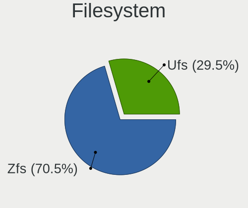

| Type | Desktops | Percent |
|------|----------|---------|
| Zfs  | 55       | 70.51%  |
| Ufs  | 23       | 29.49%  |

Part. scheme
------------

Scheme of partitioning

| Type | Desktops | Percent |
|------|----------|---------|
| GPT  | 75       | 96.15%  |
| MBR  | 3        | 3.85%   |

Board
-----

Vendor
------

Motherboard manufacturer

| Name                | Desktops | Percent |
|---------------------|----------|---------|
| ASUSTek Computer    | 21       | 26.92%  |
| Gigabyte Technology | 12       | 15.38%  |
| ASRock              | 12       | 15.38%  |
| MSI                 | 6        | 7.69%   |
| Dell                | 5        | 6.41%   |
| Hewlett-Packard     | 4        | 5.13%   |
| Beckhoff Automation | 3        | 3.85%   |
| Shuttle             | 2        | 2.56%   |
| Unknown             | 2        | 2.56%   |
| Wistron             | 1        | 1.28%   |
| Supermicro          | 1        | 1.28%   |
| Pegatron            | 1        | 1.28%   |
| Medion              | 1        | 1.28%   |
| Huanan              | 1        | 1.28%   |
| GVC                 | 1        | 1.28%   |
| Fujitsu             | 1        | 1.28%   |
| Firefly             | 1        | 1.28%   |
| EVGA                | 1        | 1.28%   |
| Cisco Systems       | 1        | 1.28%   |
| Biostar             | 1        | 1.28%   |

Model
-----

Motherboard model

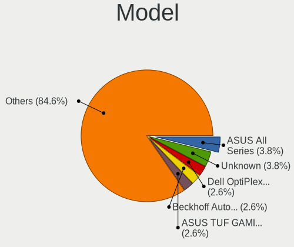

| Name                               | Desktops | Percent |
|------------------------------------|----------|---------|
| ASUS All Series                    | 3        | 3.85%   |
| Dell OptiPlex 7040                 | 2        | 2.56%   |
| Beckhoff Automation Industrial PC  | 2        | 2.56%   |
| ASUS TUF GAMING X570-PLUS          | 2        | 2.56%   |
| ASRock B450M Pro4                  | 2        | 2.56%   |
| Unknown                            | 2        | 2.56%   |
| Wistron ProLiant ML110 G6          | 1        | 1.28%   |
| Supermicro X7SPA-HF                | 1        | 1.28%   |
| Shuttle SH87R                      | 1        | 1.28%   |
| Shuttle DS20U                      | 1        | 1.28%   |
| Pegatron SAISHIAT2                 | 1        | 1.28%   |
| MSI MS-7C80                        | 1        | 1.28%   |
| MSI MS-7C39                        | 1        | 1.28%   |
| MSI MS-7C02                        | 1        | 1.28%   |
| MSI MS-7B09                        | 1        | 1.28%   |
| MSI MS-7817                        | 1        | 1.28%   |
| MSI MS-7677                        | 1        | 1.28%   |
| Medion MS-7616                     | 1        | 1.28%   |
| Huanan X99-F8D V2.4                | 1        | 1.28%   |
| HP Z220 CMT Workstation            | 1        | 1.28%   |
| HP ProLiant MicroServer Gen8       | 1        | 1.28%   |
| HP ProLiant MicroServer            | 1        | 1.28%   |
| HP Compaq dc5800 Small Form Factor | 1        | 1.28%   |
| GVC EQUIUM 3200M                   | 1        | 1.28%   |
| Gigabyte X58A-UD5                  | 1        | 1.28%   |
| Gigabyte X570 I AORUS PRO WIFI     | 1        | 1.28%   |
| Gigabyte X570 AORUS ULTRA          | 1        | 1.28%   |
| Gigabyte X470 AORUS GAMING 5 WIFI  | 1        | 1.28%   |
| Gigabyte OFFICEPRO 7000            | 1        | 1.28%   |
| Gigabyte H81M-S2PV                 | 1        | 1.28%   |
| Gigabyte GA-8S661FXM-775           | 1        | 1.28%   |
| Gigabyte F2A75M-HD2                | 1        | 1.28%   |
| Gigabyte B85-HD3                   | 1        | 1.28%   |
| Gigabyte B550M AORUS PRO-P         | 1        | 1.28%   |
| Gigabyte B450M DS3H                | 1        | 1.28%   |
| Gigabyte A320M-S2H                 | 1        | 1.28%   |
| Fujitsu D3417-B2 S26361-D3417-B2   | 1        | 1.28%   |
| Firefly roc-rk3399-pc-plus         | 1        | 1.28%   |
| EVGA X299 FTW K                    | 1        | 1.28%   |
| Dell Precision Tower 3620          | 1        | 1.28%   |

Model Family
------------

Motherboard model prefix

| Name                           | Desktops | Percent |
|--------------------------------|----------|---------|
| Dell OptiPlex                  | 3        | 3.85%   |
| ASUS TUF                       | 3        | 3.85%   |
| ASUS ROG                       | 3        | 3.85%   |
| ASUS All                       | 3        | 3.85%   |
| HP ProLiant                    | 2        | 2.56%   |
| Gigabyte X570                  | 2        | 2.56%   |
| Beckhoff Automation Industrial | 2        | 2.56%   |
| ASUS PRIME                     | 2        | 2.56%   |
| ASUS P5K                       | 2        | 2.56%   |
| ASRock X570                    | 2        | 2.56%   |
| ASRock B450M                   | 2        | 2.56%   |
| Unknown                        | 2        | 2.56%   |
| Wistron ProLiant               | 1        | 1.28%   |
| Supermicro X7SPA-HF            | 1        | 1.28%   |
| Shuttle SH87R                  | 1        | 1.28%   |
| Shuttle DS20U                  | 1        | 1.28%   |
| Pegatron SAISHIAT2             | 1        | 1.28%   |
| MSI MS-7C80                    | 1        | 1.28%   |
| MSI MS-7C39                    | 1        | 1.28%   |
| MSI MS-7C02                    | 1        | 1.28%   |
| MSI MS-7B09                    | 1        | 1.28%   |
| MSI MS-7817                    | 1        | 1.28%   |
| MSI MS-7677                    | 1        | 1.28%   |
| Medion MS-7616                 | 1        | 1.28%   |
| Huanan X99-F8D                 | 1        | 1.28%   |
| HP Z220                        | 1        | 1.28%   |
| HP Compaq                      | 1        | 1.28%   |
| GVC EQUIUM                     | 1        | 1.28%   |
| Gigabyte X58A-UD5              | 1        | 1.28%   |
| Gigabyte X470                  | 1        | 1.28%   |
| Gigabyte OFFICEPRO             | 1        | 1.28%   |
| Gigabyte H81M-S2PV             | 1        | 1.28%   |
| Gigabyte GA-8S661FXM-775       | 1        | 1.28%   |
| Gigabyte F2A75M-HD2            | 1        | 1.28%   |
| Gigabyte B85-HD3               | 1        | 1.28%   |
| Gigabyte B550M                 | 1        | 1.28%   |
| Gigabyte B450M                 | 1        | 1.28%   |
| Gigabyte A320M-S2H             | 1        | 1.28%   |
| Fujitsu D3417-B2               | 1        | 1.28%   |
| Firefly roc-rk3399-pc-plus     | 1        | 1.28%   |

MFG Year
--------

Motherboard manufacture year

| Year    | Desktops | Percent |
|---------|----------|---------|
| 2018    | 10       | 12.82%  |
| 2019    | 9        | 11.54%  |
| 2020    | 8        | 10.26%  |
| 2021    | 7        | 8.97%   |
| 2015    | 5        | 6.41%   |
| 2013    | 5        | 6.41%   |
| 2012    | 5        | 6.41%   |
| 2011    | 5        | 6.41%   |
| 2008    | 5        | 6.41%   |
| 2017    | 4        | 5.13%   |
| 2016    | 4        | 5.13%   |
| 2014    | 3        | 3.85%   |
| 2010    | 2        | 2.56%   |
| 2009    | 2        | 2.56%   |
| 2006    | 2        | 2.56%   |
| 2005    | 1        | 1.28%   |
| Unknown | 1        | 1.28%   |

Form Factor
-----------

Physical design of the computer

| Name    | Desktops | Percent |
|---------|----------|---------|
| Desktop | 78       | 100%    |

Coreboot
--------

Have coreboot on board

| Used | Desktops | Percent |
|------|----------|---------|
| No   | 78       | 100%    |

RAM Size
--------

Total RAM memory

| Size in GB  | Desktops | Percent |
|-------------|----------|---------|
| 32.01-64.0  | 17       | 21.79%  |
| 64.01-256.0 | 14       | 17.95%  |
| 16.01-24.0  | 14       | 17.95%  |
| 4.01-8.0    | 13       | 16.67%  |
| 8.01-16.0   | 13       | 16.67%  |
| 2.01-3.0    | 4        | 5.13%   |
| 24.01-32.0  | 2        | 2.56%   |
| 0.01-0.5    | 1        | 1.28%   |

RAM Used
--------

Used RAM memory

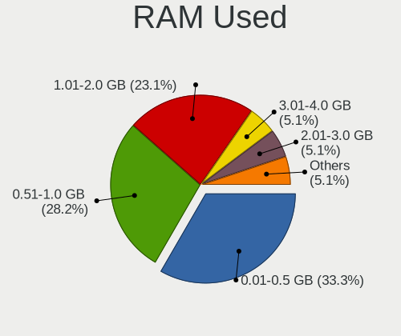

| Used GB    | Desktops | Percent |
|------------|----------|---------|
| 0.01-0.5   | 26       | 33.33%  |
| 0.51-1.0   | 22       | 28.21%  |
| 1.01-2.0   | 18       | 23.08%  |
| 3.01-4.0   | 4        | 5.13%   |
| 2.01-3.0   | 4        | 5.13%   |
| 4.01-8.0   | 1        | 1.28%   |
| 24.01-32.0 | 1        | 1.28%   |
| 16.01-24.0 | 1        | 1.28%   |
| 0          | 1        | 1.28%   |

Total Drives
------------

Number of drives on board

| Drives | Desktops | Percent |
|--------|----------|---------|
| 1      | 20       | 24.69%  |
| 2      | 19       | 23.46%  |
| 3      | 13       | 16.05%  |
| 4      | 8        | 9.88%   |
| 5      | 6        | 7.41%   |
| 7      | 4        | 4.94%   |
| 6      | 4        | 4.94%   |
| 0      | 3        | 3.7%    |
| 13     | 1        | 1.23%   |
| 12     | 1        | 1.23%   |
| 9      | 1        | 1.23%   |
| 8      | 1        | 1.23%   |

Has CD-ROM
----------

Has CD-ROM on board

| Presented | Desktops | Percent |
|-----------|----------|---------|
| No        | 53       | 67.09%  |
| Yes       | 26       | 32.91%  |

Has Ethernet
------------

Has Ethernet on board

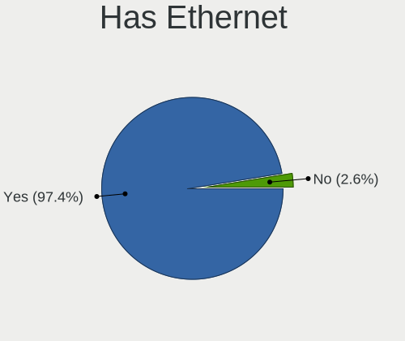

| Presented | Desktops | Percent |
|-----------|----------|---------|
| Yes       | 76       | 97.44%  |
| No        | 2        | 2.56%   |

Has WiFi
--------

Has WiFi module

| Presented | Desktops | Percent |
|-----------|----------|---------|
| No        | 51       | 65.38%  |
| Yes       | 27       | 34.62%  |

Has Bluetooth
-------------

Has Bluetooth module

| Presented | Desktops | Percent |
|-----------|----------|---------|
| No        | 60       | 76.92%  |
| Yes       | 18       | 23.08%  |

Location
--------

Country
-------

Geographic location (country)

| Country     | Desktops | Percent |
|-------------|----------|---------|
| USA         | 22       | 28.21%  |
| Russia      | 15       | 19.23%  |
| Germany     | 9        | 11.54%  |
| Netherlands | 5        | 6.41%   |
| UK          | 3        | 3.85%   |
| France      | 3        | 3.85%   |
| Canada      | 3        | 3.85%   |
| Spain       | 2        | 2.56%   |
| Brazil      | 2        | 2.56%   |
| Ukraine     | 1        | 1.28%   |
| Thailand    | 1        | 1.28%   |
| Taiwan      | 1        | 1.28%   |
| Poland      | 1        | 1.28%   |
| Norway      | 1        | 1.28%   |
| New Zealand | 1        | 1.28%   |
| Ireland     | 1        | 1.28%   |
| Hungary     | 1        | 1.28%   |
| Guatemala   | 1        | 1.28%   |
| Guadeloupe  | 1        | 1.28%   |
| Finland     | 1        | 1.28%   |
| Czechia     | 1        | 1.28%   |
| Colombia    | 1        | 1.28%   |
| Bulgaria    | 1        | 1.28%   |

City
----

Geographic location (city)

| City                | Desktops | Percent |
|---------------------|----------|---------|
| Moscow              | 5        | 6.33%   |
| Menlo Park          | 3        | 3.8%    |
| Salem               | 2        | 2.53%   |
| Redmond             | 2        | 2.53%   |
| LГјbeck           | 2        | 2.53%   |
| Irkutsk             | 2        | 2.53%   |
| Berlin              | 2        | 2.53%   |
| Yekaterinburg       | 1        | 1.27%   |
| Wenatchee           | 1        | 1.27%   |
| Vostochnoe Degunino | 1        | 1.27%   |
| Vancouver           | 1        | 1.27%   |
| Valladolid          | 1        | 1.27%   |
| Ufa                 | 1        | 1.27%   |
| Tuddal              | 1        | 1.27%   |
| Trang               | 1        | 1.27%   |
| Teteghem            | 1        | 1.27%   |
| Taipei              | 1        | 1.27%   |
| St. Catharines      | 1        | 1.27%   |
| Sofia               | 1        | 1.27%   |
| Seattle             | 1        | 1.27%   |
| Scottsdale          | 1        | 1.27%   |
| Sao Vicente         | 1        | 1.27%   |
| Sao Paulo           | 1        | 1.27%   |
| Québec             | 1        | 1.27%   |
| Palo Alto           | 1        | 1.27%   |
| Ozersk              | 1        | 1.27%   |
| Otley               | 1        | 1.27%   |
| Ostrzeszow          | 1        | 1.27%   |
| Ostrava             | 1        | 1.27%   |
| OrlГ©ans          | 1        | 1.27%   |
| Omsk                | 1        | 1.27%   |
| Omaha               | 1        | 1.27%   |
| Oklahoma City       | 1        | 1.27%   |
| Novosibirsk         | 1        | 1.27%   |
| New York            | 1        | 1.27%   |
| Munich              | 1        | 1.27%   |
| MonterГ­a         | 1        | 1.27%   |
| Minneapolis         | 1        | 1.27%   |
| Mead                | 1        | 1.27%   |
| Majadahonda         | 1        | 1.27%   |

Drives
------

Drive Vendor
------------

Hard drive vendors

| Vendor              | Desktops | Drives | Percent |
|---------------------|----------|--------|---------|
| Seagate             | 33       | 91     | 22.6%   |
| Samsung Electronics | 26       | 46     | 17.81%  |
| WDC                 | 18       | 61     | 12.33%  |
| Toshiba             | 13       | 25     | 8.9%    |
| Crucial             | 9        | 10     | 6.16%   |
| Kingston            | 8        | 9      | 5.48%   |
| A-DATA Technology   | 6        | 6      | 4.11%   |
| Intel               | 5        | 6      | 3.42%   |
| HGST                | 5        | 7      | 3.42%   |
| Hitachi             | 3        | 8      | 2.05%   |
| Plextor             | 2        | 3      | 1.37%   |
| Phison              | 2        | 2      | 1.37%   |
| Micron Technology   | 2        | 3      | 1.37%   |
| Corsair             | 2        | 2      | 1.37%   |
| Verbatim            | 1        | 1      | 0.68%   |
| Smartbuy            | 1        | 1      | 0.68%   |
| SK hynix            | 1        | 1      | 0.68%   |
| Silicon Motion      | 1        | 1      | 0.68%   |
| SanDisk             | 1        | 1      | 0.68%   |
| PNY                 | 1        | 1      | 0.68%   |
| Patriot             | 1        | 1      | 0.68%   |
| Maxtor              | 1        | 1      | 0.68%   |
| LITEONIT            | 1        | 1      | 0.68%   |
| KingDian            | 1        | 1      | 0.68%   |
| Intenso             | 1        | 1      | 0.68%   |
| Goodram             | 1        | 1      | 0.68%   |

Drive Model
-----------

Hard drive models

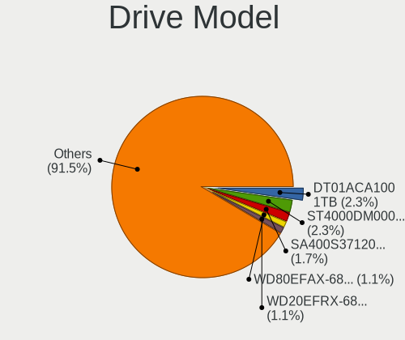

| Model                             | Desktops | Percent |
|-----------------------------------|----------|---------|
| Toshiba DT01ACA100 1TB            | 4        | 2.26%   |
| Seagate ST4000DM000-1F2168 4TB    | 4        | 2.26%   |
| Kingston SA400S37120G 120GB       | 3        | 1.69%   |
| WDC WD80EFAX-68LHPN0 8TB          | 2        | 1.13%   |
| WDC WD20EFRX-68EUZN0 2TB          | 2        | 1.13%   |
| Seagate ST8000VN004-2M2101 8TB    | 2        | 1.13%   |
| Seagate ST4000VN000-1H4168 4TB    | 2        | 1.13%   |
| Seagate ST4000DM004-2CV104 4TB    | 2        | 1.13%   |
| Seagate ST16000NM001G-2KK103 16TB | 2        | 1.13%   |
| Seagate ST1000LM048-2E7172 1TB    | 2        | 1.13%   |
| Seagate ST1000DM010-2EP102 1TB    | 2        | 1.13%   |
| Samsung SSD 970 EVO Plus 250GB    | 2        | 1.13%   |
| Samsung SSD 970 EVO Plus 1TB      | 2        | 1.13%   |
| Samsung SSD 870 EVO 1TB           | 2        | 1.13%   |
| Samsung SSD 860 EVO 500GB         | 2        | 1.13%   |
| Samsung SSD 860 EVO 1TB           | 2        | 1.13%   |
| Crucial CT120BX500SSD1 120GB      | 2        | 1.13%   |
| WDC WDS500G2B0C-00PXH0 500GB      | 1        | 0.56%   |
| WDC WDS500G2B0B-00YS70 500GB      | 1        | 0.56%   |
| WDC WDS250G2B0A 250GB             | 1        | 0.56%   |
| WDC WD80EMAZ-00WJTA0 8TB          | 1        | 0.56%   |
| WDC WD80EFZX-68UW8N0 8TB          | 1        | 0.56%   |
| WDC WD6003FZBX-00K5WB0 6TB        | 1        | 0.56%   |
| WDC WD5000AAKX-083CA0 500GB       | 1        | 0.56%   |
| WDC WD40EZRZ-22GXCB0 4TB          | 1        | 0.56%   |
| WDC WD40EZAZ-00SF3B0 4TB          | 1        | 0.56%   |
| WDC WD40EFRX-68N32N0 4TB          | 1        | 0.56%   |
| WDC WD30EZRX-00AZ6B0 3TB          | 1        | 0.56%   |
| WDC WD30EFRX-68EUZN0 3TB          | 1        | 0.56%   |
| WDC WD20EARX-00PASB0 2TB          | 1        | 0.56%   |
| WDC WD120EMFZ-11A6JA0 12TB        | 1        | 0.56%   |
| WDC WD120EMAZ-11BLFA0 12TB        | 1        | 0.56%   |
| WDC WD10EZEX-08WN4A0 1TB          | 1        | 0.56%   |
| WDC WD10EZEX-00BBHA0 1TB          | 1        | 0.56%   |
| WDC WD10EADS-00P8B0 1TB           | 1        | 0.56%   |
| WDC WD102KRYZ-01A5AB0 10TB        | 1        | 0.56%   |
| WDC WD100EZAZ-11TDBA0 10TB        | 1        | 0.56%   |
| WDC WD1001FALS-00J7B0 1TB         | 1        | 0.56%   |
| Verbatim Vi550 S3 SSD 256GB       | 1        | 0.56%   |
| Toshiba MQ02ABD100H 1TB           | 1        | 0.56%   |

HDD Vendor
----------

Hard disk drive vendors

| Vendor              | Desktops | Drives | Percent |
|---------------------|----------|--------|---------|
| Seagate             | 32       | 90     | 43.24%  |
| WDC                 | 16       | 57     | 21.62%  |
| Toshiba             | 13       | 25     | 17.57%  |
| HGST                | 5        | 7      | 6.76%   |
| Samsung Electronics | 4        | 5      | 5.41%   |
| Hitachi             | 3        | 8      | 4.05%   |
| Maxtor              | 1        | 1      | 1.35%   |

SSD Vendor
----------

Solid state drive vendors

| Vendor              | Desktops | Drives | Percent |
|---------------------|----------|--------|---------|
| Samsung Electronics | 17       | 26     | 30.36%  |
| Crucial             | 9        | 10     | 16.07%  |
| Kingston            | 7        | 7      | 12.5%   |
| Intel               | 4        | 5      | 7.14%   |
| A-DATA Technology   | 4        | 4      | 7.14%   |
| WDC                 | 2        | 3      | 3.57%   |
| Micron Technology   | 2        | 3      | 3.57%   |
| Verbatim            | 1        | 1      | 1.79%   |
| Smartbuy            | 1        | 1      | 1.79%   |
| SK hynix            | 1        | 1      | 1.79%   |
| SanDisk             | 1        | 1      | 1.79%   |
| PNY                 | 1        | 1      | 1.79%   |
| Plextor             | 1        | 1      | 1.79%   |
| Patriot             | 1        | 1      | 1.79%   |
| LITEONIT            | 1        | 1      | 1.79%   |
| KingDian            | 1        | 1      | 1.79%   |
| Intenso             | 1        | 1      | 1.79%   |
| Corsair             | 1        | 1      | 1.79%   |

Drive Kind
----------

HDD or SSD

| Kind | Desktops | Drives | Percent |
|------|----------|--------|---------|
| HDD  | 58       | 193    | 47.54%  |
| SSD  | 43       | 69     | 35.25%  |
| NVMe | 21       | 29     | 17.21%  |

Drive Connector
---------------

SATA, SAS, NVMe, etc.

| Type | Desktops | Drives | Percent |
|------|----------|--------|---------|
| SATA | 71       | 262    | 77.17%  |
| NVMe | 21       | 29     | 22.83%  |

Drive Size
----------

Size of hard drive

| Size in TB | Desktops | Drives | Percent |
|------------|----------|--------|---------|
| 0.01-0.5   | 48       | 81     | 40.68%  |
| 0.51-1.0   | 28       | 43     | 23.73%  |
| 3.01-4.0   | 12       | 29     | 10.17%  |
| 1.01-2.0   | 11       | 23     | 9.32%   |
| 4.01-10.0  | 10       | 49     | 8.47%   |
| 2.01-3.0   | 5        | 18     | 4.24%   |
| 10.01-20.0 | 4        | 19     | 3.39%   |

Space Total
-----------

Amount of disk space available on the file system

| Size in GB     | Desktops | Percent |
|----------------|----------|---------|
| 101-250        | 16       | 20.51%  |
| 251-500        | 13       | 16.67%  |
| 51-100         | 12       | 15.38%  |
| 501-1000       | 11       | 14.1%   |
| 21-50          | 7        | 8.97%   |
| 1001-2000      | 7        | 8.97%   |
| 1-20           | 6        | 7.69%   |
| More than 3000 | 3        | 3.85%   |
| 2001-3000      | 2        | 2.56%   |
| Unknown        | 1        | 1.28%   |

Space Used
----------

Amount of used disk space

| Used GB        | Desktops | Percent |
|----------------|----------|---------|
| 1-20           | 64       | 82.05%  |
| 21-50          | 5        | 6.41%   |
| More than 3000 | 2        | 2.56%   |
| 251-500        | 2        | 2.56%   |
| 51-100         | 2        | 2.56%   |
| 1001-2000      | 1        | 1.28%   |
| 501-1000       | 1        | 1.28%   |
| Unknown        | 1        | 1.28%   |

Malfunc. Drives
---------------

Drive models with a malfunction

| Model                                 | Desktops | Drives | Percent |
|---------------------------------------|----------|--------|---------|
| WDC WD5000AAKX-083CA0 500GB           | 1        | 1      | 5.56%   |
| WDC WD20EARX-00PASB0 2TB              | 1        | 1      | 5.56%   |
| WDC WD10EADS-00P8B0 1TB               | 1        | 1      | 5.56%   |
| Toshiba MQ02ABD100H 1TB               | 1        | 1      | 5.56%   |
| Toshiba MK3261GSYN 320GB              | 1        | 1      | 5.56%   |
| Seagate ST96812AS 64GB                | 1        | 4      | 5.56%   |
| Seagate ST9250827AS 250GB             | 1        | 1      | 5.56%   |
| Seagate ST500DM002-1BC142 500GB       | 1        | 1      | 5.56%   |
| Seagate ST380013AS 80GB               | 1        | 2      | 5.56%   |
| Seagate ST3250620AS 250GB             | 1        | 1      | 5.56%   |
| Seagate ST31000524AS 1TB              | 1        | 1      | 5.56%   |
| Samsung Electronics SSD 840 EVO 120GB | 1        | 1      | 5.56%   |
| Plextor PX-128M5S 128GB               | 1        | 1      | 5.56%   |
| Maxtor STM3160815AS 160GB             | 1        | 1      | 5.56%   |
| Hitachi HDS721010CLA332 1TB           | 1        | 1      | 5.56%   |
| HGST HDN726060ALE614 6TB              | 1        | 2      | 5.56%   |
| Crucial CT250MX200SSD1 250GB          | 1        | 1      | 5.56%   |
| Corsair Force 3 SSD 180GB             | 1        | 1      | 5.56%   |

Malfunc. Drive Vendor
---------------------

Vendors of faulty drives

| Vendor              | Desktops | Drives | Percent |
|---------------------|----------|--------|---------|
| Seagate             | 5        | 10     | 31.25%  |
| WDC                 | 2        | 3      | 12.5%   |
| Toshiba             | 2        | 2      | 12.5%   |
| Samsung Electronics | 1        | 1      | 6.25%   |
| Plextor             | 1        | 1      | 6.25%   |
| Maxtor              | 1        | 1      | 6.25%   |
| Hitachi             | 1        | 1      | 6.25%   |
| HGST                | 1        | 2      | 6.25%   |
| Crucial             | 1        | 1      | 6.25%   |
| Corsair             | 1        | 1      | 6.25%   |

Malfunc. HDD Vendor
-------------------

Vendors of faulty HDD drives

| Vendor  | Desktops | Drives | Percent |
|---------|----------|--------|---------|
| Seagate | 5        | 10     | 41.67%  |
| WDC     | 2        | 3      | 16.67%  |
| Toshiba | 2        | 2      | 16.67%  |
| Maxtor  | 1        | 1      | 8.33%   |
| Hitachi | 1        | 1      | 8.33%   |
| HGST    | 1        | 2      | 8.33%   |

Malfunc. Drive Kind
-------------------

Kinds of faulty drives

| Kind | Desktops | Drives | Percent |
|------|----------|--------|---------|
| HDD  | 10       | 19     | 71.43%  |
| SSD  | 4        | 4      | 28.57%  |

Failed Drives
-------------

Failed drive models

Zero info for selected period =(

Failed Drive Vendor
-------------------

Failed drive vendors

Zero info for selected period =(

Drive Status
------------

Number of failed and malfunc. drives

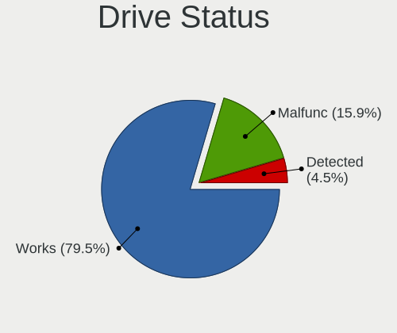

| Status   | Desktops | Drives | Percent |
|----------|----------|--------|---------|
| Works    | 70       | 254    | 79.55%  |
| Malfunc  | 14       | 23     | 15.91%  |
| Detected | 4        | 14     | 4.55%   |

Storage controller
------------------

Storage Vendor
--------------

Storage controller vendors

| Vendor                           | Desktops | Percent |
|----------------------------------|----------|---------|
| Intel                            | 51       | 43.59%  |
| AMD                              | 25       | 21.37%  |
| Samsung Electronics              | 10       | 8.55%   |
| ASMedia Technology               | 8        | 6.84%   |
| Marvell Technology Group         | 5        | 4.27%   |
| Phison Electronics               | 3        | 2.56%   |
| Broadcom / LSI                   | 3        | 2.56%   |
| Silicon Motion                   | 2        | 1.71%   |
| JMicron Technology               | 2        | 1.71%   |
| ADATA Technology                 | 2        | 1.71%   |
| Silicon Integrated Systems [SiS] | 1        | 0.85%   |
| Seagate Technology               | 1        | 0.85%   |
| SanDisk                          | 1        | 0.85%   |
| Lite-On Technology               | 1        | 0.85%   |
| Kingston Technology Company      | 1        | 0.85%   |
| Adaptec                          | 1        | 0.85%   |

Storage Model
-------------

Storage controller models

| Model                                                                          | Desktops | Percent |
|--------------------------------------------------------------------------------|----------|---------|
| AMD FCH SATA Controller [AHCI mode]                                            | 20       | 14.39%  |
| AMD 400 Series Chipset SATA Controller                                         | 8        | 5.76%   |
| Intel Q170/Q150/B150/H170/H110/Z170/CM236 Chipset SATA Controller [AHCI Mode]  | 6        | 4.32%   |
| ASMedia ASM1062 Serial ATA Controller                                          | 6        | 4.32%   |
| Samsung NVMe SSD Controller SM981/PM981/PM983                                  | 5        | 3.6%    |
| Intel 8 Series/C220 Series Chipset Family 6-port SATA Controller 1 [AHCI mode] | 5        | 3.6%    |
| Intel 6 Series/C200 Series Chipset Family 6 port Desktop SATA AHCI Controller  | 4        | 2.88%   |
| Intel 5 Series/3400 Series Chipset 6 port SATA AHCI Controller                 | 4        | 2.88%   |
| Intel 200 Series PCH SATA controller [AHCI mode]                               | 3        | 2.16%   |
| Silicon Motion SM2263EN/SM2263XT (DRAM-less) NVMe SSD Controllers              | 2        | 1.44%   |
| Samsung NVMe SSD Controller SM961/PM961/SM963                                  | 2        | 1.44%   |
| Phison E16 PCIe4 NVMe Controller                                               | 2        | 1.44%   |
| Marvell Group 88SE6111/6121 SATA II / PATA Controller                          | 2        | 1.44%   |
| JMicron JMB363 SATA/IDE Controller                                             | 2        | 1.44%   |
| Intel Sunrise Point-LP SATA Controller [AHCI mode]                             | 2        | 1.44%   |
| Intel SATA Controller [RAID mode]                                              | 2        | 1.44%   |
| Intel Comet Lake SATA AHCI Controller                                          | 2        | 1.44%   |
| Intel Atom Processor E3800 Series SATA AHCI Controller                         | 2        | 1.44%   |
| Intel 9 Series Chipset Family SATA Controller [AHCI Mode]                      | 2        | 1.44%   |
| Intel 82801IR/IO/IH (ICH9R/DO/DH) 6 port SATA Controller [AHCI mode]           | 2        | 1.44%   |
| Intel 82801G (ICH7 Family) IDE Controller                                      | 2        | 1.44%   |
| Intel 7 Series/C210 Series Chipset Family 6-port SATA Controller [AHCI mode]   | 2        | 1.44%   |
| Broadcom / LSI SAS2008 PCI-Express Fusion-MPT SAS-2 [Falcon]                   | 2        | 1.44%   |
| ASMedia 1064 SATA Controller                                                   | 2        | 1.44%   |
| AMD SB7x0/SB8x0/SB9x0 SATA Controller [AHCI mode]                              | 2        | 1.44%   |
| AMD FCH IDE Controller                                                         | 2        | 1.44%   |
| ADATA XPG SX8200 Pro PCIe Gen3x4 M.2 2280 Solid State Drive                    | 2        | 1.44%   |
| Silicon Integrated Systems [SiS] RAID bus controller 180 SATA/PATA  [SiS]      | 1        | 0.72%   |
| Silicon Integrated Systems [SiS] 5513 IDE Controller                           | 1        | 0.72%   |
| Seagate FireCuda 530 SSD                                                       | 1        | 0.72%   |
| SanDisk Ultra 3D / WD Blue SN550 NVMe SSD                                      | 1        | 0.72%   |
| Samsung NVMe SSD Controller SM951/PM951                                        | 1        | 0.72%   |
| Samsung NVMe SSD Controller PM9A1/PM9A3/980PRO                                 | 1        | 0.72%   |
| Samsung NVMe SSD Controller 980 (DRAM-less)                                    | 1        | 0.72%   |
| Phison E18 PCIe4 NVMe Controller                                               | 1        | 0.72%   |
| Marvell Group 88SE9172 SATA 6Gb/s Controller                                   | 1        | 0.72%   |
| Marvell Group 88SE9123 PCIe SATA 6.0 Gb/s controller                           | 1        | 0.72%   |
| Marvell Group 88SE6101/6102 single-port PATA133 interface                      | 1        | 0.72%   |
| Lite-On M8Pe Series NVMe SSD                                                   | 1        | 0.72%   |
| Kingston Company DC1000B NVMe SSD E12DC                                        | 1        | 0.72%   |

Storage Kind
------------

Kind of storage controller (IDE, SATA, NVMe, SAS, ...)

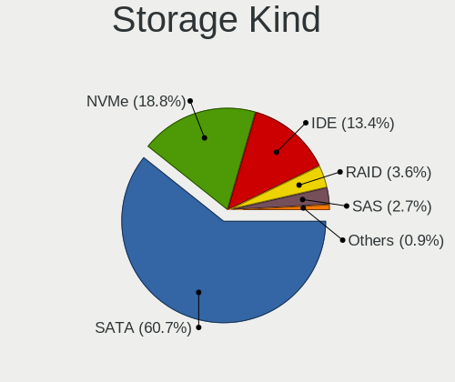

| Kind | Desktops | Percent |
|------|----------|---------|
| SATA | 68       | 60.71%  |
| NVMe | 21       | 18.75%  |
| IDE  | 15       | 13.39%  |
| RAID | 4        | 3.57%   |
| SAS  | 3        | 2.68%   |
| SCSI | 1        | 0.89%   |

Processor
---------

CPU Vendor
----------

Processor vendors

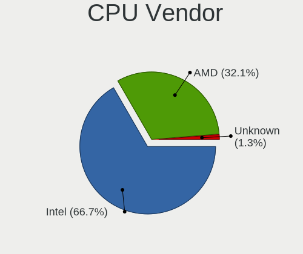

| Vendor  | Desktops | Percent |
|---------|----------|---------|
| Intel   | 52       | 66.67%  |
| AMD     | 25       | 32.05%  |
| Unknown | 1        | 1.28%   |

CPU Model
---------

Processor models

| Model                                       | Desktops | Percent |
|---------------------------------------------|----------|---------|
| Intel Core i7-6700 CPU @ 3.40GHz            | 3        | 3.85%   |
| AMD Ryzen 7 2700 Eight-Core Processor       | 3        | 3.85%   |
| Intel Core i5-8350U CPU @ 1.70GHz           | 2        | 2.56%   |
| Intel Core 2 Quad CPU Q6600 @ 2.40GHz       | 2        | 2.56%   |
| AMD Ryzen 9 5950X 16-Core Processor         | 2        | 2.56%   |
| AMD Ryzen 9 5900X 12-Core Processor         | 2        | 2.56%   |
| AMD Ryzen 9 3900X 12-Core Processor         | 2        | 2.56%   |
| AMD Ryzen 3 3200G with Radeon Vega Graphics | 2        | 2.56%   |
| Intel Xeon CPU X3440 @ 2.53GHz              | 1        | 1.28%   |
| Intel Xeon CPU E5-2680 v4 @ 2.40GHz         | 1        | 1.28%   |
| Intel Xeon CPU E5-2620 v2 @ 2.10GHz         | 1        | 1.28%   |
| Intel Xeon CPU E3-1275 v5 @ 3.60GHz         | 1        | 1.28%   |
| Intel Xeon CPU E3-1230 V2 @ 3.30GHz         | 1        | 1.28%   |
| Intel Pentium II                            | 1        | 1.28%   |
| Intel Pentium CPU G630T @ 2.30GHz           | 1        | 1.28%   |
| Intel Pentium CPU G3420 @ 3.20GHz           | 1        | 1.28%   |
| Intel Pentium CPU G3220 @ 3.00GHz           | 1        | 1.28%   |
| Intel Pentium CPU G2030 @ 3.00GHz           | 1        | 1.28%   |
| Intel Pentium CPU G2020 @ 2.90GHz           | 1        | 1.28%   |
| Intel Pentium 4 CPU 3.40GHz                 | 1        | 1.28%   |
| Intel Pentium 4 CPU                         | 1        | 1.28%   |
| Intel Pentium 4                             | 1        | 1.28%   |
| Intel Core i9-9900X CPU @ 3.50GHz           | 1        | 1.28%   |
| Intel Core i7-8700K CPU @ 3.70GHz           | 1        | 1.28%   |
| Intel Core i7-6700K CPU @ 4.00GHz           | 1        | 1.28%   |
| Intel Core i7-4790S CPU @ 3.20GHz           | 1        | 1.28%   |
| Intel Core i7-4770T CPU @ 2.50GHz           | 1        | 1.28%   |
| Intel Core i7-3770 CPU @ 3.40GHz            | 1        | 1.28%   |
| Intel Core i7-3610QE CPU @ 2.30GHz          | 1        | 1.28%   |
| Intel Core i7-2600 CPU                      | 1        | 1.28%   |
| Intel Core i7-10700K CPU @ 3.80GHz          | 1        | 1.28%   |
| Intel Core i7 CPU                           | 1        | 1.28%   |
| Intel Core i5-9600K CPU @ 3.70GHz           | 1        | 1.28%   |
| Intel Core i5-6500 CPU @ 3.20GHz            | 1        | 1.28%   |
| Intel Core i5-4690 CPU @ 3.50GHz            | 1        | 1.28%   |
| Intel Core i5-4460 CPU @ 3.20GHz            | 1        | 1.28%   |
| Intel Core i5-4440 CPU @ 3.10GHz            | 1        | 1.28%   |
| Intel Core i5-3570 CPU @ 3.40GHz            | 1        | 1.28%   |
| Intel Core i5 CPU 650 @ 3.20GHz             | 1        | 1.28%   |
| Intel Core i3-10100 CPU @ 3.60GHz           | 1        | 1.28%   |

CPU Model Family
----------------

Processor model prefix

| Model                  | Desktops | Percent |
|------------------------|----------|---------|
| Intel Core i7          | 12       | 15.38%  |
| Intel Core i5          | 9        | 11.54%  |
| AMD Ryzen 9            | 7        | 8.97%   |
| AMD Ryzen 7            | 7        | 8.97%   |
| Intel Pentium          | 6        | 7.69%   |
| Intel Celeron          | 6        | 7.69%   |
| Intel Xeon             | 5        | 6.41%   |
| Intel Pentium 4        | 3        | 3.85%   |
| Intel Atom             | 3        | 3.85%   |
| AMD Ryzen 5            | 3        | 3.85%   |
| Intel Core i3          | 2        | 2.56%   |
| Intel Core 2 Quad      | 2        | 2.56%   |
| Intel Core 2 Duo       | 2        | 2.56%   |
| AMD Ryzen 3            | 2        | 2.56%   |
| Other                  | 1        | 1.28%   |
| Intel Core i9          | 1        | 1.28%   |
| Intel Core 2           | 1        | 1.28%   |
| AMD Turion II Neo      | 1        | 1.28%   |
| AMD Ryzen Threadripper | 1        | 1.28%   |
| AMD FX                 | 1        | 1.28%   |
| AMD Athlon X4          | 1        | 1.28%   |
| AMD Athlon             | 1        | 1.28%   |
| AMD A10                | 1        | 1.28%   |

CPU Cores
---------

Number of processor cores

| Number  | Desktops | Percent |
|---------|----------|---------|
| 4       | 30       | 38.46%  |
| 2       | 14       | 17.95%  |
| 16      | 8        | 10.26%  |
| Unknown | 6        | 7.69%   |
| 24      | 4        | 5.13%   |
| 32      | 3        | 3.85%   |
| 12      | 3        | 3.85%   |
| 8       | 3        | 3.85%   |
| 6       | 3        | 3.85%   |
| 1       | 2        | 2.56%   |
| 28      | 1        | 1.28%   |
| 10      | 1        | 1.28%   |

CPU Sockets
-----------

Number of sockets

| Number | Desktops | Percent |
|--------|----------|---------|
| 1      | 75       | 96.15%  |
| 2      | 3        | 3.85%   |

CPU Threads
-----------

Threads per core (Hyper-Threading)

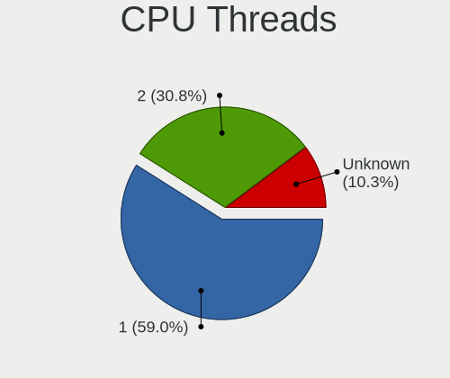

| Number  | Desktops | Percent |
|---------|----------|---------|
| 1       | 46       | 58.97%  |
| 2       | 24       | 30.77%  |
| Unknown | 8        | 10.26%  |

CPU Microarch
-------------

Microarchitecture

| Name          | Desktops | Percent |
|---------------|----------|---------|
| IvyBridge     | 8        | 10.26%  |
| Zen+          | 7        | 8.97%   |
| Skylake       | 7        | 8.97%   |
| Haswell       | 7        | 8.97%   |
| Zen 3         | 5        | 6.41%   |
| KabyLake      | 5        | 6.41%   |
| Zen 2         | 4        | 5.13%   |
| Zen           | 4        | 5.13%   |
| Westmere      | 4        | 5.13%   |
| Core          | 4        | 5.13%   |
| SandyBridge   | 3        | 3.85%   |
| Piledriver    | 3        | 3.85%   |
| NetBurst      | 3        | 3.85%   |
| Silvermont    | 2        | 2.56%   |
| CometLake     | 2        | 2.56%   |
| Penryn        | 1        | 1.28%   |
| P6            | 1        | 1.28%   |
| Nehalem       | 1        | 1.28%   |
| K10           | 1        | 1.28%   |
| Jaguar        | 1        | 1.28%   |
| Goldmont plus | 1        | 1.28%   |
| Goldmont      | 1        | 1.28%   |
| Broadwell     | 1        | 1.28%   |
| Bonnell       | 1        | 1.28%   |
| Unknown       | 1        | 1.28%   |

Graphics
--------

GPU Vendor
----------

Vendors of graphics cards

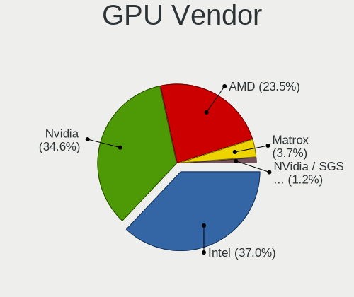

| Vendor                               | Desktops | Percent |
|--------------------------------------|----------|---------|
| Intel                                | 30       | 37.04%  |
| Nvidia                               | 28       | 34.57%  |
| AMD                                  | 19       | 23.46%  |
| Matrox Electronics Systems           | 3        | 3.7%    |
| NVidia / SGS Thomson (Joint Venture) | 1        | 1.23%   |

GPU Model
---------

Graphics card models

| Model                                                                       | Desktops | Percent |
|-----------------------------------------------------------------------------|----------|---------|
| AMD Ellesmere [Radeon RX 470/480/570/570X/580/580X/590]                     | 7        | 8.54%   |
| Intel Xeon E3-1200 v3/4th Gen Core Processor Integrated Graphics Controller | 5        | 6.1%    |
| Intel HD Graphics 530                                                       | 5        | 6.1%    |
| Nvidia GP108 [GeForce GT 1030]                                              | 3        | 3.66%   |
| Intel Xeon E3-1200 v2/3rd Gen Core processor Graphics Controller            | 3        | 3.66%   |
| Nvidia GT218 [GeForce 210]                                                  | 2        | 2.44%   |
| Nvidia GK208B [GeForce GT 710]                                              | 2        | 2.44%   |
| Nvidia GF119 [GeForce GT 610]                                               | 2        | 2.44%   |
| Matrox Electronics Systems MGA G200e [Pilot] ServerEngines (SEP1)           | 2        | 2.44%   |
| Intel UHD Graphics 620                                                      | 2        | 2.44%   |
| Intel CoffeeLake-S GT2 [UHD Graphics 630]                                   | 2        | 2.44%   |
| Intel Atom Processor Z36xxx/Z37xxx Series Graphics & Display                | 2        | 2.44%   |
| AMD Baffin [Radeon RX 550 640SP / RX 560/560X]                              | 2        | 2.44%   |
| Nvidia TU116 [GeForce GTX 1660 SUPER]                                       | 1        | 1.22%   |
| Nvidia TU104 [GeForce RTX 2070 SUPER]                                       | 1        | 1.22%   |
| Nvidia GT218 [NVS 300]                                                      | 1        | 1.22%   |
| Nvidia GP107GL [Quadro P600]                                                | 1        | 1.22%   |
| Nvidia GP106 [GeForce GTX 1060 6GB]                                         | 1        | 1.22%   |
| Nvidia GP106 [GeForce GTX 1060 3GB]                                         | 1        | 1.22%   |
| Nvidia GF119 [GeForce GT 520]                                               | 1        | 1.22%   |
| Nvidia GF110 [GeForce GTX 580]                                              | 1        | 1.22%   |
| Nvidia GF108 [GeForce GT 430]                                               | 1        | 1.22%   |
| Nvidia GF100GL [Quadro 4000]                                                | 1        | 1.22%   |
| Nvidia GA104 [GeForce RTX 3070]                                             | 1        | 1.22%   |
| Nvidia GA102 [GeForce RTX 3080]                                             | 1        | 1.22%   |
| Nvidia G98 [GeForce 8400 GS Rev. 2]                                         | 1        | 1.22%   |
| Nvidia G96C [GeForce 9400 GT]                                               | 1        | 1.22%   |
| Nvidia G92 [GeForce GT 330]                                                 | 1        | 1.22%   |
| Nvidia G86 [GeForce 8500 GT]                                                | 1        | 1.22%   |
| Nvidia G84GL [Quadro FX 1700]                                               | 1        | 1.22%   |
| Nvidia G72 [GeForce 7300 LE]                                                | 1        | 1.22%   |
| Nvidia G72 [GeForce 7200 GS / 7300 SE]                                      | 1        | 1.22%   |
| NVidia / SGS Thomson (Joint Venture) Riva128                                | 1        | 1.22%   |
| Matrox Electronics Systems MGA G200EH                                       | 1        | 1.22%   |
| Intel IvyBridge GT2 [HD Graphics 4000]                                      | 1        | 1.22%   |
| Intel HD Graphics P530                                                      | 1        | 1.22%   |
| Intel HD Graphics 500                                                       | 1        | 1.22%   |
| Intel GeminiLake [UHD Graphics 600]                                         | 1        | 1.22%   |
| Intel CometLake-S GT2 [UHD Graphics 630]                                    | 1        | 1.22%   |
| Intel Comet Lake-U GT2 [UHD Graphics 620]                                   | 1        | 1.22%   |

GPU Combo
---------

Combinations of graphics cards

| Name                                     | Desktops | Percent |
|------------------------------------------|----------|---------|
| 1 x Nvidia                               | 25       | 32.05%  |
| 1 x Intel                                | 25       | 32.05%  |
| 1 x AMD                                  | 16       | 20.51%  |
| 1 x Matrox                               | 3        | 3.85%   |
| Other                                    | 2        | 2.56%   |
| Intel + Nvidia                           | 2        | 2.56%   |
| Intel + AMD                              | 2        | 2.56%   |
| 2 x Intel                                | 1        | 1.28%   |
| 2 x AMD                                  | 1        | 1.28%   |
| 1 x NVidia / SGS Thomson (Joint Venture) | 1        | 1.28%   |

GPU Driver
----------

Free vs proprietary

| Driver      | Desktops | Percent |
|-------------|----------|---------|
| Free        | 59       | 75.64%  |
| Proprietary | 17       | 21.79%  |
| Unknown     | 2        | 2.56%   |

GPU Memory
----------

Total video memory

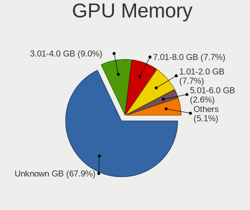

| Size in GB | Desktops | Percent |
|------------|----------|---------|
| Unknown    | 53       | 67.95%  |
| 3.01-4.0   | 7        | 8.97%   |
| 7.01-8.0   | 6        | 7.69%   |
| 1.01-2.0   | 6        | 7.69%   |
| 5.01-6.0   | 2        | 2.56%   |
| 0.51-1.0   | 2        | 2.56%   |
| 8.01-16.0  | 1        | 1.28%   |
| 0.01-0.5   | 1        | 1.28%   |

Monitor
-------

Monitor Vendor
--------------

Monitor vendors

| Vendor               | Desktops | Percent |
|----------------------|----------|---------|
| Dell                 | 11       | 22%     |
| Goldstar             | 8        | 16%     |
| Samsung Electronics  | 6        | 12%     |
| Ancor Communications | 5        | 10%     |
| Philips              | 3        | 6%      |
| Acer                 | 3        | 6%      |
| Iiyama               | 2        | 4%      |
| BenQ                 | 2        | 4%      |
| AOC                  | 2        | 4%      |
| Sceptre Tech         | 1        | 2%      |
| Panasonic            | 1        | 2%      |
| LG Electronics       | 1        | 2%      |
| Lenovo               | 1        | 2%      |
| Hewlett-Packard      | 1        | 2%      |
| Eizo                 | 1        | 2%      |
| CKL                  | 1        | 2%      |
| ASUSTek Computer     | 1        | 2%      |

Monitor Model
-------------

Monitor models

| Model                                                                 | Desktops | Percent |
|-----------------------------------------------------------------------|----------|---------|
| Dell U2412M DELA07B 1920x1200 520x320mm 24.0-inch                     | 2        | 3.85%   |
| Sceptre Tech Sceptre E20 SPT080D 1600x900 410x280mm 19.5-inch         | 1        | 1.92%   |
| Samsung Electronics SyncMaster SAM060B 1920x1080 510x290mm 23.1-inch  | 1        | 1.92%   |
| Samsung Electronics SyncMaster SAM027D 1680x1050 430x270mm 20.0-inch  | 1        | 1.92%   |
| Samsung Electronics SyncMaster SAM0236 2560x1600 640x400mm 29.7-inch  | 1        | 1.92%   |
| Samsung Electronics SyncMaster SAM01BB 1280x1024 380x300mm 19.1-inch  | 1        | 1.92%   |
| Samsung Electronics S24E510C SAM0C61 1920x1080 520x300mm 23.6-inch    | 1        | 1.92%   |
| Samsung Electronics LCD Monitor SAM0D4F 1920x1080 890x500mm 40.2-inch | 1        | 1.92%   |
| Philips PHL 233V5 PHLC0D0 1920x1080 510x290mm 23.1-inch               | 1        | 1.92%   |
| Philips LCD Monitor PHLC050 1366x768 410x230mm 18.5-inch              | 1        | 1.92%   |
| Philips 215i PHLC05A 1920x1080 470x260mm 21.1-inch                    | 1        | 1.92%   |
| Philips 190S PHL083F 1280x1024 380x300mm 19.1-inch                    | 1        | 1.92%   |
| Panasonic TV MEIC136 1280x720 698x392mm 31.5-inch                     | 1        | 1.92%   |
| LG Electronics LCD Monitor LG Ultra HD 3840x2160                      | 1        | 1.92%   |
| Lenovo LEN S24e-10 LEN61CA 1920x1080 530x300mm 24.0-inch              | 1        | 1.92%   |
| Iiyama PLX2483H IVM6114 1920x1080 530x300mm 24.0-inch                 | 1        | 1.92%   |
| Iiyama PL2209HD IVM560B 1920x1080 480x270mm 21.7-inch                 | 1        | 1.92%   |
| Hewlett-Packard Z24nf HWP3209 1920x1080 530x300mm 24.0-inch           | 1        | 1.92%   |
| Goldstar W2246 GSM5784 1920x1080 480x270mm 21.7-inch                  | 1        | 1.92%   |
| Goldstar W2052 GSM4E88 1680x1050 470x300mm 22.0-inch                  | 1        | 1.92%   |
| Goldstar LG Ultra HD GSM5B09 3840x2160 600x340mm 27.2-inch            | 1        | 1.92%   |
| Goldstar LG Ultra HD GSM5B08 3840x2160 600x340mm 27.2-inch            | 1        | 1.92%   |
| Goldstar LG TV GSMC0A0 3840x2160                                      | 1        | 1.92%   |
| Goldstar LG FULL HD GSM5B54 1920x1080 480x270mm 21.7-inch             | 1        | 1.92%   |
| Goldstar 27GL850 GSM5B7F 2560x1440 600x340mm 27.2-inch                | 1        | 1.92%   |
| Goldstar 22EA53 GSM59A4 1920x1080 480x270mm 21.7-inch                 | 1        | 1.92%   |
| Eizo CS2420 ENC2741 1920x1200 520x330mm 24.2-inch                     | 1        | 1.92%   |
| Dell U3011 DEL4064 1920x1200 640x400mm 29.7-inch                      | 1        | 1.92%   |
| Dell SE2717H/HX DELD0A1 1920x1080 600x340mm 27.2-inch                 | 1        | 1.92%   |
| Dell S2340M DELD05A 1920x1080 510x290mm 23.1-inch                     | 1        | 1.92%   |
| Dell P2715Q DEL40BD 3840x2160 600x340mm 27.2-inch                     | 1        | 1.92%   |
| Dell P2415Q DELA0BE 3840x2160 530x300mm 24.0-inch                     | 1        | 1.92%   |
| Dell LCD Monitor U3011 2560x1600                                      | 1        | 1.92%   |
| Dell LCD Monitor DELD110 2560x1440 700x400mm 31.7-inch                | 1        | 1.92%   |
| Dell E2417H DELA0E1 1920x1080 530x300mm 24.0-inch                     | 1        | 1.92%   |
| Dell E197FP DELA024 1280x1024 380x300mm 19.1-inch                     | 1        | 1.92%   |
| Dell E1916H DELF065 1366x768 410x230mm 18.5-inch                      | 1        | 1.92%   |
| CKL LCD Monitor CKL0001 1920x1200 1150x650mm 52.0-inch                | 1        | 1.92%   |
| BenQ GW2270 BNQ78DB 1920x1080 480x270mm 21.7-inch                     | 1        | 1.92%   |
| BenQ BL2411 BNQ8011 1920x1200 520x320mm 24.0-inch                     | 1        | 1.92%   |

Monitor Resolution
------------------

Monitor screen resolution

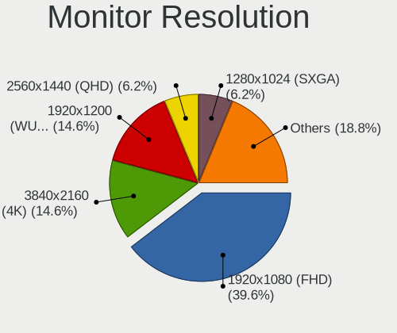

| Resolution         | Desktops | Percent |
|--------------------|----------|---------|
| 1920x1080 (FHD)    | 19       | 39.58%  |
| 3840x2160 (4K)     | 7        | 14.58%  |
| 1920x1200 (WUXGA)  | 7        | 14.58%  |
| 2560x1440 (QHD)    | 3        | 6.25%   |
| 1280x1024 (SXGA)   | 3        | 6.25%   |
| 2560x1600          | 2        | 4.17%   |
| 1680x1050 (WSXGA+) | 2        | 4.17%   |
| 1600x900 (HD+)     | 2        | 4.17%   |
| 1366x768 (WXGA)    | 2        | 4.17%   |
| 1280x720 (HD)      | 1        | 2.08%   |

Monitor Diagonal
----------------

Diagonal size in inches

| Inches  | Desktops | Percent |
|---------|----------|---------|
| 24      | 11       | 22.45%  |
| 23      | 6        | 12.24%  |
| 21      | 6        | 12.24%  |
| 27      | 5        | 10.2%   |
| 19      | 5        | 10.2%   |
| Unknown | 4        | 8.16%   |
| 31      | 3        | 6.12%   |
| 29      | 2        | 4.08%   |
| 18      | 2        | 4.08%   |
| 52      | 1        | 2.04%   |
| 46      | 1        | 2.04%   |
| 32      | 1        | 2.04%   |
| 22      | 1        | 2.04%   |
| 20      | 1        | 2.04%   |

Monitor Width
-------------

Physical width

| Width in mm | Desktops | Percent |
|-------------|----------|---------|
| 501-600     | 20       | 42.55%  |
| 401-500     | 12       | 25.53%  |
| 601-700     | 5        | 10.64%  |
| Unknown     | 4        | 8.51%   |
| 351-400     | 3        | 6.38%   |
| 1001-1500   | 2        | 4.26%   |
| 701-800     | 1        | 2.13%   |

Aspect Ratio
------------

Proportional relationship between the width and the height

| Ratio   | Desktops | Percent |
|---------|----------|---------|
| 16/9    | 31       | 68.89%  |
| 16/10   | 7        | 15.56%  |
| 5/4     | 3        | 6.67%   |
| Unknown | 3        | 6.67%   |
| 3/2     | 1        | 2.22%   |

Monitor Area
------------

Area in inch²

| Area in inch² | Desktops | Percent |
|----------------|----------|---------|
| 201-250        | 18       | 36.73%  |
| 151-200        | 7        | 14.29%  |
| 351-500        | 6        | 12.24%  |
| 301-350        | 5        | 10.2%   |
| 251-300        | 5        | 10.2%   |
| Unknown        | 4        | 8.16%   |
| 141-150        | 2        | 4.08%   |
| More than 1000 | 1        | 2.04%   |
| 501-1000       | 1        | 2.04%   |

Pixel Density
-------------

Pixels per inch

| Density | Desktops | Percent |
|---------|----------|---------|
| 51-100  | 28       | 59.57%  |
| 101-120 | 8        | 17.02%  |
| 161-240 | 4        | 8.51%   |
| Unknown | 4        | 8.51%   |
| 1-50    | 3        | 6.38%   |

Multiple Monitors
-----------------

Total monitors connected

| Total | Desktops | Percent |
|-------|----------|---------|
| 0     | 37       | 46.84%  |
| 1     | 32       | 40.51%  |
| 2     | 9        | 11.39%  |
| 3     | 1        | 1.27%   |

Network
-------

Net Controller Vendor
---------------------

Controller vendors

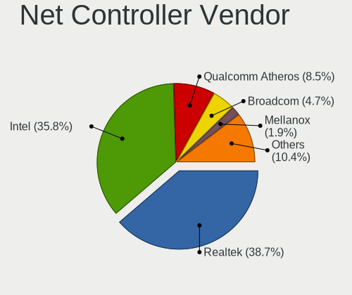

| Vendor                            | Desktops | Percent |
|-----------------------------------|----------|---------|
| Realtek Semiconductor             | 41       | 38.68%  |
| Intel                             | 38       | 35.85%  |
| Qualcomm Atheros                  | 9        | 8.49%   |
| Broadcom                          | 5        | 4.72%   |
| Mellanox Technologies             | 2        | 1.89%   |
| Marvell Technology Group          | 2        | 1.89%   |
| Sundance Technology Inc / IC Plus | 1        | 0.94%   |
| Silicon Integrated Systems [SiS]  | 1        | 0.94%   |
| Samsung Electronics               | 1        | 0.94%   |
| Ralink Technology                 | 1        | 0.94%   |
| Ralink                            | 1        | 0.94%   |
| Qualcomm                          | 1        | 0.94%   |
| IMC Networks                      | 1        | 0.94%   |
| Edimax Technology                 | 1        | 0.94%   |
| ADMtek                            | 1        | 0.94%   |

Net Controller Model
--------------------

Controller models

| Model                                                                         | Desktops | Percent |
|-------------------------------------------------------------------------------|----------|---------|
| Realtek RTL8111/8168/8411 PCI Express Gigabit Ethernet Controller             | 36       | 29.27%  |
| Intel I211 Gigabit Network Connection                                         | 10       | 8.13%   |
| Intel Wi-Fi 6 AX200                                                           | 6        | 4.88%   |
| Intel Ethernet Connection (2) I219-V                                          | 4        | 3.25%   |
| Intel Ethernet Connection (2) I219-LM                                         | 4        | 3.25%   |
| Intel 82574L Gigabit Network Connection                                       | 4        | 3.25%   |
| Realtek RTL8125 2.5GbE Controller                                             | 3        | 2.44%   |
| Intel Wireless-AC 9260                                                        | 3        | 2.44%   |
| Intel 82579LM Gigabit Network Connection (Lewisville)                         | 3        | 2.44%   |
| Qualcomm Atheros AR93xx Wireless Network Adapter                              | 2        | 1.63%   |
| Mellanox MT27500 Family [ConnectX-3]                                          | 2        | 1.63%   |
| Marvell Group 88E8056 PCI-E Gigabit Ethernet Controller                       | 2        | 1.63%   |
| Intel I210 Gigabit Network Connection                                         | 2        | 1.63%   |
| Intel 82571EB/82571GB Gigabit Ethernet Controller D0/D1 (copper applications) | 2        | 1.63%   |
| Broadcom NetXtreme BCM5723 Gigabit Ethernet PCIe                              | 2        | 1.63%   |
| Sundance Inc / IC Plus IC Plus IP100A Integrated 10/100 Ethernet MAC + PHY    | 1        | 0.81%   |
| Silicon Integrated Systems [SiS] SiS900 PCI Fast Ethernet                     | 1        | 0.81%   |
| Samsung GT-I9070 (network tethering, USB debugging enabled)                   | 1        | 0.81%   |
| Realtek RTL8812AE 802.11ac PCIe Wireless Network Adapter                      | 1        | 0.81%   |
| Realtek RTL8192EE PCIe Wireless Network Adapter                               | 1        | 0.81%   |
| Realtek RTL8188CE 802.11b/g/n WiFi Adapter                                    | 1        | 0.81%   |
| Realtek RTL-8100/8101L/8139 PCI Fast Ethernet Adapter                         | 1        | 0.81%   |
| Realtek Bluetooth Adapter                                                     | 1        | 0.81%   |
| Realtek 8811CU Wireless LAN 802.11ac USB NIC                                  | 1        | 0.81%   |
| Ralink RT5370 Wireless Adapter                                                | 1        | 0.81%   |
| Ralink RT2500 Wireless 802.11bg                                               | 1        | 0.81%   |
| Qualcomm FP3                                                                  | 1        | 0.81%   |
| Qualcomm Atheros Killer E2500 Gigabit Ethernet Controller                     | 1        | 0.81%   |
| Qualcomm Atheros Attansic L1 Gigabit Ethernet                                 | 1        | 0.81%   |
| Qualcomm Atheros AR9462 Wireless Network Adapter                              | 1        | 0.81%   |
| Qualcomm Atheros AR9287 Wireless Network Adapter (PCI-Express)                | 1        | 0.81%   |
| Qualcomm Atheros AR9285 Wireless Network Adapter (PCI-Express)                | 1        | 0.81%   |
| Qualcomm Atheros AR9227 Wireless Network Adapter                              | 1        | 0.81%   |
| Qualcomm Atheros AR8121/AR8113/AR8114 Gigabit or Fast Ethernet                | 1        | 0.81%   |
| Marvell Group 88E8001 Gigabit Ethernet Controller                             | 1        | 0.81%   |
| Intel Wireless 7265                                                           | 1        | 0.81%   |
| Intel Wireless 3160                                                           | 1        | 0.81%   |
| Intel I350 Gigabit Network Connection                                         | 1        | 0.81%   |
| Intel Gemini Lake PCH CNVi WiFi                                               | 1        | 0.81%   |
| Intel Ethernet Controller I225-V                                              | 1        | 0.81%   |

Wireless Vendor
---------------

Wireless vendors

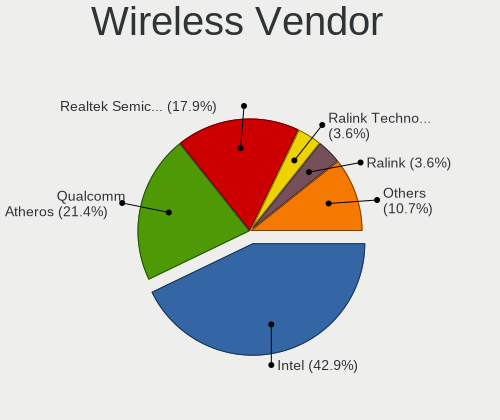

| Vendor                | Desktops | Percent |
|-----------------------|----------|---------|
| Intel                 | 12       | 42.86%  |
| Qualcomm Atheros      | 6        | 21.43%  |
| Realtek Semiconductor | 5        | 17.86%  |
| Ralink Technology     | 1        | 3.57%   |
| Ralink                | 1        | 3.57%   |
| IMC Networks          | 1        | 3.57%   |
| Edimax Technology     | 1        | 3.57%   |
| Broadcom              | 1        | 3.57%   |

Wireless Model
--------------

Wireless models

| Model                                                          | Desktops | Percent |
|----------------------------------------------------------------|----------|---------|
| Intel Wi-Fi 6 AX200                                            | 6        | 21.43%  |
| Intel Wireless-AC 9260                                         | 3        | 10.71%  |
| Qualcomm Atheros AR93xx Wireless Network Adapter               | 2        | 7.14%   |
| Realtek RTL8812AE 802.11ac PCIe Wireless Network Adapter       | 1        | 3.57%   |
| Realtek RTL8192EE PCIe Wireless Network Adapter                | 1        | 3.57%   |
| Realtek RTL8188CE 802.11b/g/n WiFi Adapter                     | 1        | 3.57%   |
| Realtek Bluetooth Adapter                                      | 1        | 3.57%   |
| Realtek 8811CU Wireless LAN 802.11ac USB NIC                   | 1        | 3.57%   |
| Ralink RT5370 Wireless Adapter                                 | 1        | 3.57%   |
| Ralink RT2500 Wireless 802.11bg                                | 1        | 3.57%   |
| Qualcomm Atheros AR9462 Wireless Network Adapter               | 1        | 3.57%   |
| Qualcomm Atheros AR9287 Wireless Network Adapter (PCI-Express) | 1        | 3.57%   |
| Qualcomm Atheros AR9285 Wireless Network Adapter (PCI-Express) | 1        | 3.57%   |
| Qualcomm Atheros AR9227 Wireless Network Adapter               | 1        | 3.57%   |
| Intel Wireless 7265                                            | 1        | 3.57%   |
| Intel Wireless 3160                                            | 1        | 3.57%   |
| Intel Gemini Lake PCH CNVi WiFi                                | 1        | 3.57%   |
| IMC Networks Mediao 802.11n WLAN [Realtek RTL8191SU]           | 1        | 3.57%   |
| Edimax EW-7811Un 802.11n Wireless Adapter [Realtek RTL8188CUS] | 1        | 3.57%   |
| Broadcom BCM43602 802.11ac Wireless LAN SoC                    | 1        | 3.57%   |

Ethernet Vendor
---------------

Ethernet vendors

| Vendor                            | Desktops | Percent |
|-----------------------------------|----------|---------|
| Realtek Semiconductor             | 39       | 44.83%  |
| Intel                             | 34       | 39.08%  |
| Broadcom                          | 4        | 4.6%    |
| Qualcomm Atheros                  | 3        | 3.45%   |
| Marvell Technology Group          | 2        | 2.3%    |
| Sundance Technology Inc / IC Plus | 1        | 1.15%   |
| Silicon Integrated Systems [SiS]  | 1        | 1.15%   |
| Samsung Electronics               | 1        | 1.15%   |
| Qualcomm                          | 1        | 1.15%   |
| ADMtek                            | 1        | 1.15%   |

Ethernet Model
--------------

Ethernet models

| Model                                                                         | Desktops | Percent |
|-------------------------------------------------------------------------------|----------|---------|
| Realtek RTL8111/8168/8411 PCI Express Gigabit Ethernet Controller             | 36       | 39.13%  |
| Intel I211 Gigabit Network Connection                                         | 10       | 10.87%  |
| Intel Ethernet Connection (2) I219-V                                          | 4        | 4.35%   |
| Intel Ethernet Connection (2) I219-LM                                         | 4        | 4.35%   |
| Intel 82574L Gigabit Network Connection                                       | 4        | 4.35%   |
| Intel 82579LM Gigabit Network Connection (Lewisville)                         | 3        | 3.26%   |
| Realtek RTL8125 2.5GbE Controller                                             | 2        | 2.17%   |
| Marvell Group 88E8056 PCI-E Gigabit Ethernet Controller                       | 2        | 2.17%   |
| Intel I210 Gigabit Network Connection                                         | 2        | 2.17%   |
| Intel 82571EB/82571GB Gigabit Ethernet Controller D0/D1 (copper applications) | 2        | 2.17%   |
| Broadcom NetXtreme BCM5723 Gigabit Ethernet PCIe                              | 2        | 2.17%   |
| Sundance Inc / IC Plus IC Plus IP100A Integrated 10/100 Ethernet MAC + PHY    | 1        | 1.09%   |
| Silicon Integrated Systems [SiS] SiS900 PCI Fast Ethernet                     | 1        | 1.09%   |
| Samsung GT-I9070 (network tethering, USB debugging enabled)                   | 1        | 1.09%   |
| Realtek RTL-8100/8101L/8139 PCI Fast Ethernet Adapter                         | 1        | 1.09%   |
| Qualcomm FP3                                                                  | 1        | 1.09%   |
| Qualcomm Atheros Killer E2500 Gigabit Ethernet Controller                     | 1        | 1.09%   |
| Qualcomm Atheros Attansic L1 Gigabit Ethernet                                 | 1        | 1.09%   |
| Qualcomm Atheros AR8121/AR8113/AR8114 Gigabit or Fast Ethernet                | 1        | 1.09%   |
| Marvell Group 88E8001 Gigabit Ethernet Controller                             | 1        | 1.09%   |
| Intel I350 Gigabit Network Connection                                         | 1        | 1.09%   |
| Intel Ethernet Controller I225-V                                              | 1        | 1.09%   |
| Intel Ethernet Connection (7) I219-V                                          | 1        | 1.09%   |
| Intel Ethernet Connection (2) I218-V                                          | 1        | 1.09%   |
| Intel Ethernet Connection (12) I219-V                                         | 1        | 1.09%   |
| Intel Ethernet Connection (10) I219-LM                                        | 1        | 1.09%   |
| Intel 82573L Gigabit Ethernet Controller                                      | 1        | 1.09%   |
| Intel 82572EI Gigabit Ethernet Controller (Copper)                            | 1        | 1.09%   |
| Intel 82566DM-2 Gigabit Network Connection                                    | 1        | 1.09%   |
| Broadcom NetXtreme BCM5751 Gigabit Ethernet PCI Express                       | 1        | 1.09%   |
| Broadcom NetXtreme BCM5720 Gigabit Ethernet PCIe                              | 1        | 1.09%   |
| ADMtek NC100 Network Everywhere Fast Ethernet 10/100                          | 1        | 1.09%   |

Net Controller Kind
-------------------

Ethernet, WiFi or modem

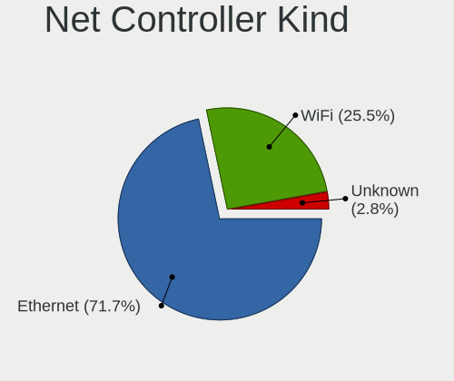

| Kind     | Desktops | Percent |
|----------|----------|---------|
| Ethernet | 76       | 71.7%   |
| WiFi     | 27       | 25.47%  |
| Unknown  | 3        | 2.83%   |

Used Controller
---------------

Currently used network controller

| Kind     | Desktops | Percent |
|----------|----------|---------|
| Ethernet | 71       | 84.52%  |
| WiFi     | 13       | 15.48%  |

NICs
----

Total network controllers on board

| Total | Desktops | Percent |
|-------|----------|---------|
| 1     | 37       | 47.44%  |
| 2     | 29       | 37.18%  |
| 3     | 7        | 8.97%   |
| 4     | 4        | 5.13%   |
| 0     | 1        | 1.28%   |

IPv6
----

IPv6 vs IPv4

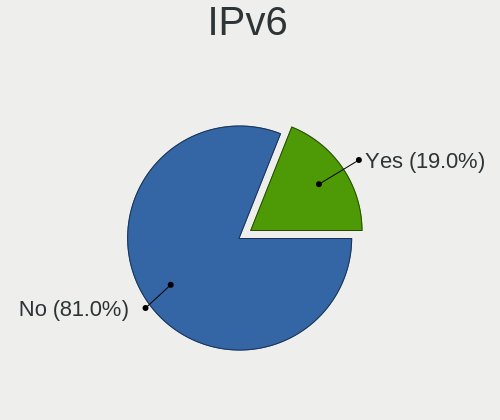

| Used | Desktops | Percent |
|------|----------|---------|
| No   | 64       | 81.01%  |
| Yes  | 15       | 18.99%  |

Bluetooth
---------

Bluetooth Vendor
----------------

Controller vendors

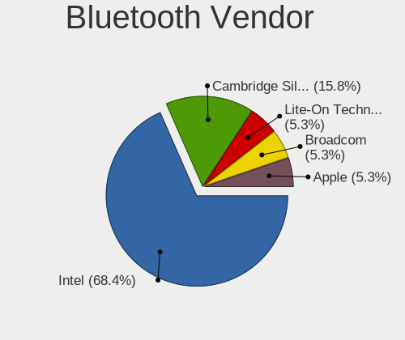

| Vendor                  | Desktops | Percent |
|-------------------------|----------|---------|
| Intel                   | 13       | 68.42%  |
| Cambridge Silicon Radio | 3        | 15.79%  |
| Lite-On Technology      | 1        | 5.26%   |
| Broadcom                | 1        | 5.26%   |
| Apple                   | 1        | 5.26%   |

Bluetooth Model
---------------

Controller models

| Model                                               | Desktops | Percent |
|-----------------------------------------------------|----------|---------|
| Intel AX200 Bluetooth                               | 6        | 31.58%  |
| Intel Wireless-AC 9260 Bluetooth Adapter            | 4        | 21.05%  |
| Cambridge Silicon Radio Bluetooth Dongle (HCI mode) | 3        | 15.79%  |
| Intel Bluetooth wireless interface                  | 2        | 10.53%  |
| Lite-On Atheros AR3012 Bluetooth                    | 1        | 5.26%   |
| Intel Bluetooth 9460/9560 Jefferson Peak (JfP)      | 1        | 5.26%   |
| Broadcom BCM20702A0 Bluetooth 4.0                   | 1        | 5.26%   |
| Apple Bluetooth Host Controller                     | 1        | 5.26%   |

Sound
-----

Sound Vendor
------------

Sound card vendors

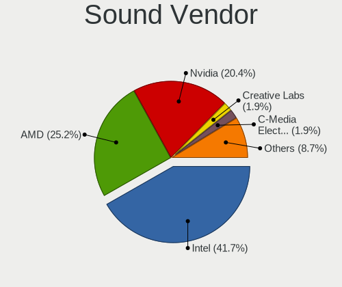

| Vendor                                          | Desktops | Percent |
|-------------------------------------------------|----------|---------|
| Intel                                           | 43       | 41.75%  |
| AMD                                             | 26       | 25.24%  |
| Nvidia                                          | 21       | 20.39%  |
| Creative Labs                                   | 2        | 1.94%   |
| C-Media Electronics                             | 2        | 1.94%   |
| Thesycon Systemsoftware & Consulting            | 1        | 0.97%   |
| Texas Instruments                               | 1        | 0.97%   |
| SteelSeries ApS                                 | 1        | 0.97%   |
| Silicon Integrated Systems [SiS]                | 1        | 0.97%   |
| Logitech                                        | 1        | 0.97%   |
| Licensed by Sony Computer Entertainment America | 1        | 0.97%   |
| Ensoniq                                         | 1        | 0.97%   |
| Corsair                                         | 1        | 0.97%   |
| BEHRINGER International                         | 1        | 0.97%   |

Sound Model
-----------

Sound card models

| Model                                                                                                     | Desktops | Percent |
|-----------------------------------------------------------------------------------------------------------|----------|---------|
| AMD Family 17h (Models 00h-0fh) HD Audio Controller                                                       | 8        | 6.72%   |
| AMD Starship/Matisse HD Audio Controller                                                                  | 7        | 5.88%   |
| AMD Ellesmere HDMI Audio [Radeon RX 470/480 / 570/580/590]                                                | 7        | 5.88%   |
| Intel 8 Series/C220 Series Chipset High Definition Audio Controller                                       | 5        | 4.2%    |
| Intel 7 Series/C216 Chipset Family High Definition Audio Controller                                       | 5        | 4.2%    |
| Intel 100 Series/C230 Series Chipset Family HD Audio Controller                                           | 5        | 4.2%    |
| AMD Family 17h/19h HD Audio Controller                                                                    | 4        | 3.36%   |
| Nvidia High Definition Audio Controller                                                                   | 3        | 2.52%   |
| Nvidia GP108 High Definition Audio Controller                                                             | 3        | 2.52%   |
| Nvidia GF119 HDMI Audio Controller                                                                        | 3        | 2.52%   |
| Intel Xeon E3-1200 v3/4th Gen Core Processor HD Audio Controller                                          | 3        | 2.52%   |
| Intel 82801I (ICH9 Family) HD Audio Controller                                                            | 3        | 2.52%   |
| Intel 6 Series/C200 Series Chipset Family High Definition Audio Controller                                | 3        | 2.52%   |
| Intel 5 Series/3400 Series Chipset High Definition Audio                                                  | 3        | 2.52%   |
| AMD FCH Azalia Controller                                                                                 | 3        | 2.52%   |
| AMD Baffin HDMI/DP Audio [Radeon RX 550 640SP / RX 560/560X]                                              | 3        | 2.52%   |
| Nvidia GP106 High Definition Audio Controller                                                             | 2        | 1.68%   |
| Nvidia GK208 HDMI/DP Audio Controller                                                                     | 2        | 1.68%   |
| Intel Sunrise Point-LP HD Audio                                                                           | 2        | 1.68%   |
| Intel NM10/ICH7 Family High Definition Audio Controller                                                   | 2        | 1.68%   |
| Intel Atom Processor Z36xxx/Z37xxx Series High Definition Audio Controller                                | 2        | 1.68%   |
| Intel 9 Series Chipset Family HD Audio Controller                                                         | 2        | 1.68%   |
| Intel 82801JI (ICH10 Family) HD Audio Controller                                                          | 2        | 1.68%   |
| Intel 200 Series PCH HD Audio                                                                             | 2        | 1.68%   |
| AMD Navi 21/23 HDMI/DP Audio Controller                                                                   | 2        | 1.68%   |
| Thesycon Systemsoftware & Consulting Topping DX3 Pro Audio Control                                        | 1        | 0.84%   |
| Texas Instruments PCM2704 16-bit stereo audio DAC                                                         | 1        | 0.84%   |
| SteelSeries ApS Arctis Pro Wireless Arctis Pro Wireless Chat Arctis Pro Wireless Game Arctis Pro Wireless | 1        | 0.84%   |
| Silicon Integrated Systems [SiS] SiS7012 AC'97 Sound Controller                                           | 1        | 0.84%   |
| Nvidia TU116 High Definition Audio Controller                                                             | 1        | 0.84%   |
| Nvidia TU104 HD Audio Controller                                                                          | 1        | 0.84%   |
| Nvidia GP107GL High Definition Audio Controller                                                           | 1        | 0.84%   |
| Nvidia GF110 High Definition Audio Controller                                                             | 1        | 0.84%   |
| Nvidia GF108 High Definition Audio Controller                                                             | 1        | 0.84%   |
| Nvidia GF100 High Definition Audio Controller                                                             | 1        | 0.84%   |
| Nvidia GA104 High Definition Audio Controller                                                             | 1        | 0.84%   |
| Nvidia GA102 High Definition Audio Controller                                                             | 1        | 0.84%   |
| Logitech H600 [Wireless Headset]                                                                          | 1        | 0.84%   |
| Licensed by Sony Computer Entertainment America Wireless Stereo Headset                                   | 1        | 0.84%   |
| Intel Comet Lake PCH-V cAVS                                                                               | 1        | 0.84%   |

Memory
------

Memory Vendor
-------------

Memory module vendors

| Vendor              | Desktops | Percent |
|---------------------|----------|---------|
| Unknown             | 19       | 25%     |
| Kingston            | 11       | 14.47%  |
| Corsair             | 10       | 13.16%  |
| Crucial             | 9        | 11.84%  |
| Samsung Electronics | 5        | 6.58%   |
| Micron Technology   | 5        | 6.58%   |
| G.Skill             | 4        | 5.26%   |
| SK hynix            | 3        | 3.95%   |
| Team                | 2        | 2.63%   |
| A-DATA Technology   | 2        | 2.63%   |
| Silicon Power       | 1        | 1.32%   |
| Kreton              | 1        | 1.32%   |
| GOODRAM             | 1        | 1.32%   |
| GeIL                | 1        | 1.32%   |
| AMD                 | 1        | 1.32%   |
| Unknown             | 1        | 1.32%   |

Memory Model
------------

Memory module models

| Model                                                   | Desktops | Percent |
|---------------------------------------------------------|----------|---------|
| Unknown RAM Module 2GB DIMM DDR2 800MT/s                | 3        | 3.66%   |
| Unknown RAM Module 8GB DIMM DDR3 1600MT/s               | 2        | 2.44%   |
| Unknown RAM Module 8GB DIMM 1333MT/s                    | 2        | 2.44%   |
| Unknown RAM Module 1GB DIMM DDR2 800MT/s                | 2        | 2.44%   |
| Crucial RAM CT8G4SFS824A.C8BD1 8GB SODIMM DDR4 2400MT/s | 2        | 2.44%   |
| Corsair RAM CMK16GX4M2B3200C16 8GB DIMM DDR4 3200MT/s   | 2        | 2.44%   |
| Unknown RAM Module 4GB DIMM DDR3 1600MT/s               | 1        | 1.22%   |
| Unknown RAM Module 4GB DIMM DDR 1333MT/s                | 1        | 1.22%   |
| Unknown RAM Module 4GB DIMM 400MT/s                     | 1        | 1.22%   |
| Unknown RAM Module 4GB DIMM 1333MT/s                    | 1        | 1.22%   |
| Unknown RAM Module 2GB SODIMM DDR2 667MT/s              | 1        | 1.22%   |
| Unknown RAM Module 2GB DIMM SDRAM                       | 1        | 1.22%   |
| Unknown RAM Module 2GB DIMM DDR3 1332MT/s               | 1        | 1.22%   |
| Unknown RAM Module 2GB DIMM DDR 800MT/s                 | 1        | 1.22%   |
| Unknown RAM Module 2GB DIMM DDR 1333MT/s                | 1        | 1.22%   |
| Unknown RAM Module 1GB DIMM 400MT/s                     | 1        | 1.22%   |
| Unknown RAM Module 16GB DIMM DDR4 2133MT/s              | 1        | 1.22%   |
| Unknown RAM 2G-08-10-12-1333 2GB DIMM DDR3 1333MT/s     | 1        | 1.22%   |
| Team RAM TEAMGROUP-UD4-3200 8GB DIMM DDR4 3200MT/s      | 1        | 1.22%   |
| Team RAM TEAMGROUP-UD4-3200 16GB DIMM DDR4 3200MT/s     | 1        | 1.22%   |
| SK hynix RAM HMT451U6AFR8C-PB 4GB DIMM DDR3 1600MT/s    | 1        | 1.22%   |
| SK hynix RAM HMT351S6EFR8C-PB 4GB SODIMM DDR3 1600MT/s  | 1        | 1.22%   |
| SK hynix RAM HMA82GU6AFR8N-UH 16GB DIMM DDR4 2400MT/s   | 1        | 1.22%   |
| Silicon Power RAM DCLT4GN128O 4GB DIMM DDR3 1333MT/s    | 1        | 1.22%   |
| Samsung RAM Module 16GB DIMM DDR3 1600MT/s              | 1        | 1.22%   |
| Samsung RAM M393A2G40EB1-CPB 16GB DIMM DDR4 2133MT/s    | 1        | 1.22%   |
| Samsung RAM M391A4G43MB1-CTD 32GB DIMM DDR4 3200MT/s    | 1        | 1.22%   |
| Samsung RAM M378B5273DH0-CH9 4GB DIMM DDR3 1333MT/s     | 1        | 1.22%   |
| Samsung RAM M378B5273CH0-CH9 4GB DIMM DDR3 1333MT/s     | 1        | 1.22%   |
| Samsung RAM M378A1K43BB1-CPB 8GB DIMM DDR4 3000MT/s     | 1        | 1.22%   |
| Micron RAM 8ATF51264AZ-2G1A2 4GB DIMM DDR4 2133MT/s     | 1        | 1.22%   |
| Micron RAM 8ATF1G64AZ-3G2J1 8GB DIMM DDR4 3200MT/s      | 1        | 1.22%   |
| Micron RAM 18ASF2G72AZ-2G3B1 16GB DIMM DDR4 2400MT/s    | 1        | 1.22%   |
| Micron RAM 16JTF1G64AZ-1G6D1 8GB DIMM DDR3 1600MT/s     | 1        | 1.22%   |
| Micron RAM 16HTF12864AY-53ED4 1GB DIMM DDR 533MT/s      | 1        | 1.22%   |
| Kreton RAM 51624xxxx68x45xxxx 2GB DIMM DDR2 800MT/s     | 1        | 1.22%   |
| Kingston RAM KHX3600C17D4/16GX 16GB DIMM DDR4 2400MT/s  | 1        | 1.22%   |
| Kingston RAM KHX2666C16/8G 8GB DIMM DDR4 2667MT/s       | 1        | 1.22%   |
| Kingston RAM KHX2400C15/16G 16GB DIMM DDR4 2400MT/s     | 1        | 1.22%   |
| Kingston RAM KHX16LC9/8GX 8GB DIMM DDR3 1600MT/s        | 1        | 1.22%   |

Memory Kind
-----------

Memory module kinds

| Kind    | Desktops | Percent |
|---------|----------|---------|
| DDR4    | 34       | 45.95%  |
| DDR3    | 25       | 33.78%  |
| DDR2    | 5        | 6.76%   |
| DDR     | 4        | 5.41%   |
| Unknown | 4        | 5.41%   |
| SDRAM   | 2        | 2.7%    |

Memory Form Factor
------------------

Physical design of the memory module

| Name   | Desktops | Percent |
|--------|----------|---------|
| DIMM   | 66       | 89.19%  |
| SODIMM | 8        | 10.81%  |

Memory Size
-----------

Memory module size

| Size  | Desktops | Percent |
|-------|----------|---------|
| 8192  | 29       | 37.18%  |
| 16384 | 15       | 19.23%  |
| 4096  | 11       | 14.1%   |
| 2048  | 11       | 14.1%   |
| 32768 | 7        | 8.97%   |
| 1024  | 5        | 6.41%   |

Memory Speed
------------

Memory module speed

| Speed   | Desktops | Percent |
|---------|----------|---------|
| 1600    | 18       | 23.68%  |
| 3200    | 11       | 14.47%  |
| 1333    | 8        | 10.53%  |
| 2400    | 7        | 9.21%   |
| 800     | 7        | 9.21%   |
| 2133    | 6        | 7.89%   |
| 3000    | 5        | 6.58%   |
| 2667    | 4        | 5.26%   |
| 400     | 2        | 2.63%   |
| 3600    | 1        | 1.32%   |
| 2933    | 1        | 1.32%   |
| 2666    | 1        | 1.32%   |
| 1332    | 1        | 1.32%   |
| 1067    | 1        | 1.32%   |
| 667     | 1        | 1.32%   |
| 533     | 1        | 1.32%   |
| Unknown | 1        | 1.32%   |

Printers & scanners
-------------------

Printer Vendor
--------------

Printer device vendors

| Vendor          | Desktops | Percent |
|-----------------|----------|---------|
| Seiko Epson     | 1        | 33.33%  |
| Hewlett-Packard | 1        | 33.33%  |
| Canon           | 1        | 33.33%  |

Printer Model
-------------

Printer device models

| Model                                                                                      | Desktops | Percent |
|--------------------------------------------------------------------------------------------|----------|---------|
| Seiko Epson Printer                                                                        | 1        | 33.33%  |
| HP HP LaserJet M14-M17 Printer HP LEDM IPP Printer HP LEDM IPP Printer HP LEDM IPP Printer | 1        | 33.33%  |
| Canon LBP2900                                                                              | 1        | 33.33%  |

Scanner Vendor
--------------

Scanner device vendors

| Vendor | Desktops | Percent |
|--------|----------|---------|
| Canon  | 1        | 100%    |

Scanner Model
-------------

Scanner device models

| Model                   | Desktops | Percent |
|-------------------------|----------|---------|
| Canon CanoScan LiDE 110 | 1        | 100%    |

Camera
------

Camera Vendor
-------------

Camera device vendors

| Vendor         | Desktops | Percent |
|----------------|----------|---------|
| Logitech       | 3        | 75%     |
| Valve Software | 1        | 25%     |

Camera Model
------------

Camera device models

| Model                       | Desktops | Percent |
|-----------------------------|----------|---------|
| Valve Software 3D Camera    | 1        | 25%     |
| Logitech Webcam C270        | 1        | 25%     |
| Logitech HD Webcam C615     | 1        | 25%     |
| Logitech HD Pro Webcam C920 | 1        | 25%     |

Security
--------

Fingerprint Vendor
------------------

Fingerprint sensor vendors

Zero info for selected period =(

Fingerprint Model
-----------------

Fingerprint sensor models

Zero info for selected period =(

Chipcard Vendor
---------------

Chipcard module vendors

Zero info for selected period =(

Chipcard Model
--------------

Chipcard module models

Zero info for selected period =(

Unsupported
-----------

Unsupported Devices
-------------------

Total unsupported devices on board

| Total | Desktops | Percent |
|-------|----------|---------|
| 1     | 34       | 43.59%  |
| 0     | 30       | 38.46%  |
| 2     | 13       | 16.67%  |
| 3     | 1        | 1.28%   |

Unsupported Device Types
------------------------

Types of unsupported devices

| Type                     | Desktops | Percent |
|--------------------------|----------|---------|
| Communication controller | 33       | 55%     |
| Net/wireless             | 10       | 16.67%  |
| Firewire controller      | 6        | 10%     |
| Bluetooth                | 5        | 8.33%   |
| Sound                    | 2        | 3.33%   |
| Network                  | 2        | 3.33%   |
| Net/ethernet             | 1        | 1.67%   |
| Card reader              | 1        | 1.67%   |

