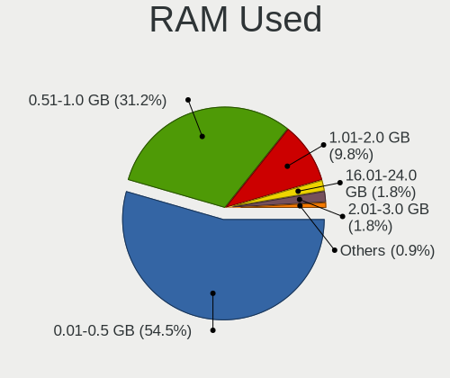
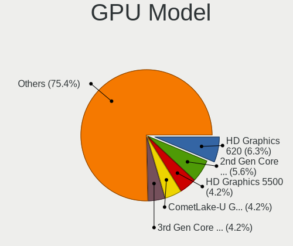
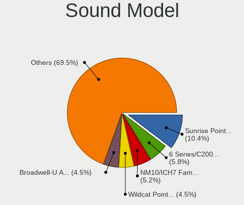
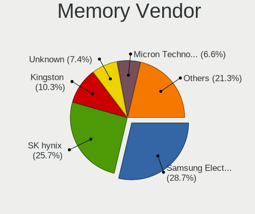
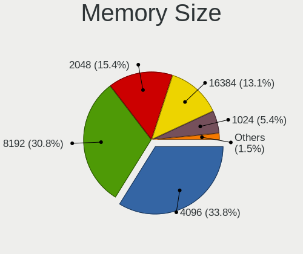
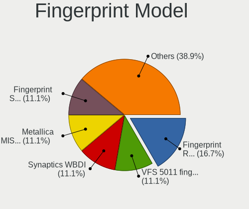
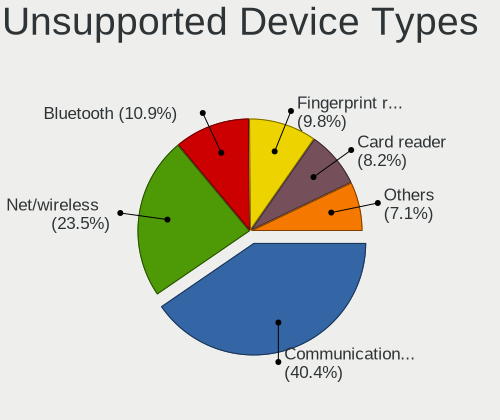

FreeBSD 13.0 - Tested Hardware & Statistics (Notebooks)
-------------------------------------------------------

A project to collect tested hardware configurations for FreeBSD 13.0.

Anyone can contribute to this report by the [hw-probe](https://github.com/linuxhw/hw-probe/blob/master/INSTALL.BSD.md) tool:

    hw-probe -all -upload

Please contribute! Especially if your hardware is rare.

Contents
--------

* [ Test Cases ](#test-cases)

* [ System ](#system)
  - [ Arch                     ](#arch)
  - [ DE                       ](#de)
  - [ Display Server           ](#display-server)
  - [ Display Manager          ](#display-manager)
  - [ OS Lang                  ](#os-lang)
  - [ Boot Mode                ](#boot-mode)
  - [ Filesystem               ](#filesystem)
  - [ Part. scheme             ](#part-scheme)

* [ Board ](#board)
  - [ Vendor                   ](#vendor)
  - [ Model                    ](#model)
  - [ Model Family             ](#model-family)
  - [ MFG Year                 ](#mfg-year)
  - [ Form Factor              ](#form-factor)
  - [ Coreboot                 ](#coreboot)
  - [ RAM Size                 ](#ram-size)
  - [ RAM Used                 ](#ram-used)
  - [ Total Drives             ](#total-drives)
  - [ Has CD-ROM               ](#has-cd-rom)
  - [ Has Ethernet             ](#has-ethernet)
  - [ Has WiFi                 ](#has-wifi)
  - [ Has Bluetooth            ](#has-bluetooth)

* [ Location ](#location)
  - [ Country                  ](#country)
  - [ City                     ](#city)

* [ Drives ](#drives)
  - [ Drive Vendor             ](#drive-vendor)
  - [ Drive Model              ](#drive-model)
  - [ HDD Vendor               ](#hdd-vendor)
  - [ SSD Vendor               ](#ssd-vendor)
  - [ Drive Kind               ](#drive-kind)
  - [ Drive Connector          ](#drive-connector)
  - [ Drive Size               ](#drive-size)
  - [ Space Total              ](#space-total)
  - [ Space Used               ](#space-used)
  - [ Malfunc. Drives          ](#malfunc-drives)
  - [ Malfunc. Drive Vendor    ](#malfunc-drive-vendor)
  - [ Malfunc. HDD Vendor      ](#malfunc-hdd-vendor)
  - [ Malfunc. Drive Kind      ](#malfunc-drive-kind)
  - [ Failed Drives            ](#failed-drives)
  - [ Failed Drive Vendor      ](#failed-drive-vendor)
  - [ Drive Status             ](#drive-status)

* [ Storage controller ](#storage-controller)
  - [ Storage Vendor           ](#storage-vendor)
  - [ Storage Model            ](#storage-model)
  - [ Storage Kind             ](#storage-kind)

* [ Processor ](#processor)
  - [ CPU Vendor               ](#cpu-vendor)
  - [ CPU Model                ](#cpu-model)
  - [ CPU Model Family         ](#cpu-model-family)
  - [ CPU Cores                ](#cpu-cores)
  - [ CPU Sockets              ](#cpu-sockets)
  - [ CPU Threads              ](#cpu-threads)
  - [ CPU Microarch            ](#cpu-microarch)

* [ Graphics ](#graphics)
  - [ GPU Vendor               ](#gpu-vendor)
  - [ GPU Model                ](#gpu-model)
  - [ GPU Combo                ](#gpu-combo)
  - [ GPU Driver               ](#gpu-driver)
  - [ GPU Memory               ](#gpu-memory)

* [ Monitor ](#monitor)
  - [ Monitor Vendor           ](#monitor-vendor)
  - [ Monitor Model            ](#monitor-model)
  - [ Monitor Resolution       ](#monitor-resolution)
  - [ Monitor Diagonal         ](#monitor-diagonal)
  - [ Monitor Width            ](#monitor-width)
  - [ Aspect Ratio             ](#aspect-ratio)
  - [ Monitor Area             ](#monitor-area)
  - [ Pixel Density            ](#pixel-density)
  - [ Multiple Monitors        ](#multiple-monitors)

* [ Network ](#network)
  - [ Net Controller Vendor    ](#net-controller-vendor)
  - [ Net Controller Model     ](#net-controller-model)
  - [ Wireless Vendor          ](#wireless-vendor)
  - [ Wireless Model           ](#wireless-model)
  - [ Ethernet Vendor          ](#ethernet-vendor)
  - [ Ethernet Model           ](#ethernet-model)
  - [ Net Controller Kind      ](#net-controller-kind)
  - [ Used Controller          ](#used-controller)
  - [ NICs                     ](#nics)
  - [ IPv6                     ](#ipv6)

* [ Bluetooth ](#bluetooth)
  - [ Bluetooth Vendor         ](#bluetooth-vendor)
  - [ Bluetooth Model          ](#bluetooth-model)

* [ Sound ](#sound)
  - [ Sound Vendor             ](#sound-vendor)
  - [ Sound Model              ](#sound-model)

* [ Memory ](#memory)
  - [ Memory Vendor            ](#memory-vendor)
  - [ Memory Model             ](#memory-model)
  - [ Memory Kind              ](#memory-kind)
  - [ Memory Form Factor       ](#memory-form-factor)
  - [ Memory Size              ](#memory-size)
  - [ Memory Speed             ](#memory-speed)

* [ Printers & scanners ](#printers--scanners)
  - [ Printer Vendor           ](#printer-vendor)
  - [ Printer Model            ](#printer-model)
  - [ Scanner Vendor           ](#scanner-vendor)
  - [ Scanner Model            ](#scanner-model)

* [ Camera ](#camera)
  - [ Camera Vendor            ](#camera-vendor)
  - [ Camera Model             ](#camera-model)

* [ Security ](#security)
  - [ Fingerprint Vendor       ](#fingerprint-vendor)
  - [ Fingerprint Model        ](#fingerprint-model)
  - [ Chipcard Vendor          ](#chipcard-vendor)
  - [ Chipcard Model           ](#chipcard-model)

* [ Unsupported ](#unsupported)
  - [ Unsupported Devices      ](#unsupported-devices)
  - [ Unsupported Device Types ](#unsupported-device-types)

Test Cases
----------

Total: 134

| Vendor        | Model                       | Probe                                                     | Date         |
|---------------|-----------------------------|-----------------------------------------------------------|--------------|
| Dell          | Latitude 2100               | [40406069ee](https://bsd-hardware.info/?probe=40406069ee) | May 09, 2022 |
| Dell          | Vostro 5590                 | [1f23973fb4](https://bsd-hardware.info/?probe=1f23973fb4) | May 04, 2022 |
| Acer          | Aspire ES1-132              | [18426698ad](https://bsd-hardware.info/?probe=18426698ad) | May 02, 2022 |
| HP            | Laptop 15-dw1xxx            | [7a212b5833](https://bsd-hardware.info/?probe=7a212b5833) | Apr 29, 2022 |
| Lenovo        | ThinkPad T470 20HES0ES1F    | [f1f0676663](https://bsd-hardware.info/?probe=f1f0676663) | Apr 28, 2022 |
| Toshiba       | Satellite Pro T130          | [62dd51afcf](https://bsd-hardware.info/?probe=62dd51afcf) | Apr 11, 2022 |
| Acer          | Swift SF114-32              | [7bc748ce7c](https://bsd-hardware.info/?probe=7bc748ce7c) | Apr 08, 2022 |
| Lenovo        | ThinkPad R60e 0658W2M       | [315573b63e](https://bsd-hardware.info/?probe=315573b63e) | Mar 24, 2022 |
| Gateway       | NV55C                       | [a63381d681](https://bsd-hardware.info/?probe=a63381d681) | Mar 22, 2022 |
| Dell          | Latitude E7440              | [a776ebf7f4](https://bsd-hardware.info/?probe=a776ebf7f4) | Mar 19, 2022 |
| Acer          | Aspire A315-23              | [7fb743c654](https://bsd-hardware.info/?probe=7fb743c654) | Mar 15, 2022 |
| Gateway       | LT27                        | [6d1c6f8215](https://bsd-hardware.info/?probe=6d1c6f8215) | Mar 14, 2022 |
| ASUSTek       | ROG Zephyrus G14 GA402RJ... | [20cdc9d999](https://bsd-hardware.info/?probe=20cdc9d999) | Mar 06, 2022 |
| Lenovo        | ThinkPad T440p 20AWS1JN0... | [cba9255f4a](https://bsd-hardware.info/?probe=cba9255f4a) | Feb 27, 2022 |
| Lenovo        | V145-15AST 81MT             | [bc5296ee7d](https://bsd-hardware.info/?probe=bc5296ee7d) | Feb 16, 2022 |
| ASUSTek       | 1215B                       | [1ccf85f60d](https://bsd-hardware.info/?probe=1ccf85f60d) | Feb 10, 2022 |
| Lenovo        | IdeaPad Gaming 3 15ARH05... | [cb0ebb96d5](https://bsd-hardware.info/?probe=cb0ebb96d5) | Feb 01, 2022 |
| Lenovo        | ThinkPad T480s 20L8S1GX0... | [556fcb7e5e](https://bsd-hardware.info/?probe=556fcb7e5e) | Jan 31, 2022 |
| MSI           | Summit E13FlipEvo A11MT     | [61e3f35ee8](https://bsd-hardware.info/?probe=61e3f35ee8) | Jan 31, 2022 |
| HP            | Notebook                    | [b0e0bc12c8](https://bsd-hardware.info/?probe=b0e0bc12c8) | Jan 30, 2022 |
| Dell          | Latitude E5430 non-vPro     | [877bb1b29f](https://bsd-hardware.info/?probe=877bb1b29f) | Jan 10, 2022 |
| Dell          | Latitude E5450              | [a05fbe1c26](https://bsd-hardware.info/?probe=a05fbe1c26) | Jan 05, 2022 |
| Lenovo        | IdeaPad 330-15IGM 81D1      | [87c8ee9b4c](https://bsd-hardware.info/?probe=87c8ee9b4c) | Dec 31, 2021 |
| Lenovo        | ThinkPad Edge E430 3254A... | [990e05c219](https://bsd-hardware.info/?probe=990e05c219) | Dec 11, 2021 |
| Samsung       | 530XBB                      | [b344605891](https://bsd-hardware.info/?probe=b344605891) | Dec 02, 2021 |
| Lenovo        | ThinkPad R60e 0658W2M       | [91d67ba784](https://bsd-hardware.info/?probe=91d67ba784) | Nov 27, 2021 |
| Lenovo        | IdeaPad 330-15ARR 81D2      | [ade9f77281](https://bsd-hardware.info/?probe=ade9f77281) | Nov 25, 2021 |
| Lenovo        | ThinkPad R60e 0658W2M       | [1827cc60df](https://bsd-hardware.info/?probe=1827cc60df) | Nov 23, 2021 |
| Acer          | Aspire 5560                 | [e117631726](https://bsd-hardware.info/?probe=e117631726) | Nov 22, 2021 |
| HP            | Laptop 15s-du1xxx           | [8ebeac18ca](https://bsd-hardware.info/?probe=8ebeac18ca) | Nov 19, 2021 |
| Lenovo        | ThinkPad R60e 0658W2M       | [73774ed18e](https://bsd-hardware.info/?probe=73774ed18e) | Nov 16, 2021 |
| Dell          | G15 5510                    | [e9d432bc06](https://bsd-hardware.info/?probe=e9d432bc06) | Nov 12, 2021 |
| Dell          | G15 5510                    | [91750755e4](https://bsd-hardware.info/?probe=91750755e4) | Nov 12, 2021 |
| HP            | Compaq 6720s                | [06e31b2e77](https://bsd-hardware.info/?probe=06e31b2e77) | Nov 09, 2021 |
| HP            | Mini 110-1000               | [ef66d7a110](https://bsd-hardware.info/?probe=ef66d7a110) | Nov 09, 2021 |
| MSI           | GS65 Stealth Thin 8RF       | [eb5c495379](https://bsd-hardware.info/?probe=eb5c495379) | Oct 30, 2021 |
| Lenovo        | ThinkPad Mini10 3507A31     | [ced0819a8e](https://bsd-hardware.info/?probe=ced0819a8e) | Oct 24, 2021 |
| Lenovo        | G580 26897SJ                | [da14095fb7](https://bsd-hardware.info/?probe=da14095fb7) | Oct 20, 2021 |
| Lenovo        | IdeaPad 320-15ABR 80XS      | [d6c59472e5](https://bsd-hardware.info/?probe=d6c59472e5) | Oct 15, 2021 |
| Dell          | Inspiron 7460               | [3dbc09a4df](https://bsd-hardware.info/?probe=3dbc09a4df) | Oct 13, 2021 |
| Google        | Terra                       | [9ba239a4a3](https://bsd-hardware.info/?probe=9ba239a4a3) | Oct 10, 2021 |
| Framework     | Laptop                      | [1e67a5d922](https://bsd-hardware.info/?probe=1e67a5d922) | Oct 08, 2021 |
| Lenovo        | IdeaPad 320-15AST 80XV      | [1c4cf7c21c](https://bsd-hardware.info/?probe=1c4cf7c21c) | Sep 30, 2021 |
| Apple         | MacBookPro13,2              | [0bf74dea55](https://bsd-hardware.info/?probe=0bf74dea55) | Sep 30, 2021 |
| Dell          | Latitude E7450              | [4f1e40ad63](https://bsd-hardware.info/?probe=4f1e40ad63) | Sep 21, 2021 |
| ASUSTek       | ASUS TUF Gaming A17 FA70... | [22c1aefeab](https://bsd-hardware.info/?probe=22c1aefeab) | Sep 19, 2021 |
| Lenovo        | G40-70 20369                | [ef8eafa662](https://bsd-hardware.info/?probe=ef8eafa662) | Sep 18, 2021 |
| ASUSTek       | TP300LD                     | [e9d8f7de51](https://bsd-hardware.info/?probe=e9d8f7de51) | Sep 09, 2021 |
| ASUSTek       | VX7SX                       | [6ca36a455d](https://bsd-hardware.info/?probe=6ca36a455d) | Sep 09, 2021 |
| Dell          | XPS 15 9500                 | [30424125f5](https://bsd-hardware.info/?probe=30424125f5) | Sep 08, 2021 |
| Dell          | XPS 15 9500                 | [76da651584](https://bsd-hardware.info/?probe=76da651584) | Sep 08, 2021 |
| Lenovo        | ThinkPad E15 Gen 3 20YG0... | [5147f5734d](https://bsd-hardware.info/?probe=5147f5734d) | Sep 04, 2021 |
| Lenovo        | ThinkPad E15 Gen 3 20YG0... | [2e8b641cc4](https://bsd-hardware.info/?probe=2e8b641cc4) | Sep 04, 2021 |
| Apple         | MacBookPro5,1               | [2cba98f24b](https://bsd-hardware.info/?probe=2cba98f24b) | Sep 04, 2021 |
| Dell          | Latitude E6530              | [8dbff835d2](https://bsd-hardware.info/?probe=8dbff835d2) | Sep 02, 2021 |
| Samsung       | 300E5M/300E5L               | [ae874102c3](https://bsd-hardware.info/?probe=ae874102c3) | Aug 04, 2021 |
| Lenovo        | G505 20240                  | [16e6ec4054](https://bsd-hardware.info/?probe=16e6ec4054) | Aug 02, 2021 |
| Lenovo        | ThinkPad T410 2516DCU       | [c3aa245b5d](https://bsd-hardware.info/?probe=c3aa245b5d) | Jul 27, 2021 |
| Lenovo        | ThinkPad S1 Yoga 12 20DK... | [38910aa754](https://bsd-hardware.info/?probe=38910aa754) | Jul 25, 2021 |
| Dell          | Inspiron N4030              | [d6feef8717](https://bsd-hardware.info/?probe=d6feef8717) | Jul 23, 2021 |
| Dell          | Inspiron N4030              | [9a3c3705d0](https://bsd-hardware.info/?probe=9a3c3705d0) | Jul 23, 2021 |
| Apple         | MacBookPro8,1               | [89a9db74f9](https://bsd-hardware.info/?probe=89a9db74f9) | Jul 21, 2021 |
| Lenovo        | ThinkPad T410 2516DCU       | [04b19bd02a](https://bsd-hardware.info/?probe=04b19bd02a) | Jul 21, 2021 |
| Dell          | Inspiron 5758               | [7542ae751d](https://bsd-hardware.info/?probe=7542ae751d) | Jul 20, 2021 |
| Dell          | Inspiron 3442               | [8f8cc52f23](https://bsd-hardware.info/?probe=8f8cc52f23) | Jul 17, 2021 |
| Lenovo        | ThinkPad X1 Carbon Gen 8... | [85e94a1288](https://bsd-hardware.info/?probe=85e94a1288) | Jul 13, 2021 |
| Lenovo        | ThinkPad X230 2325A95       | [94d66a0677](https://bsd-hardware.info/?probe=94d66a0677) | Jul 10, 2021 |
| Dell          | Inspiron N5110              | [08641f83e8](https://bsd-hardware.info/?probe=08641f83e8) | Jul 07, 2021 |
| Acer          | Aspire A515-54G             | [08cafd05b1](https://bsd-hardware.info/?probe=08cafd05b1) | Jul 06, 2021 |
| Lenovo        | Rescuer-15ISK 80RQ          | [46d0d10dd8](https://bsd-hardware.info/?probe=46d0d10dd8) | Jul 03, 2021 |
| Samsung       | NC10                        | [d33644912a](https://bsd-hardware.info/?probe=d33644912a) | Jun 28, 2021 |
| Dell          | Vostro 5481                 | [bb318fbc50](https://bsd-hardware.info/?probe=bb318fbc50) | Jun 26, 2021 |
| Lenovo        | ThinkPad T420 4236NHG       | [ea00bc1f1f](https://bsd-hardware.info/?probe=ea00bc1f1f) | Jun 20, 2021 |
| HP            | ENVY x2 Detachable PC 13    | [8c78180ff9](https://bsd-hardware.info/?probe=8c78180ff9) | Jun 20, 2021 |
| HP            | ENVY x2 Detachable PC 13    | [2e7a8b5be3](https://bsd-hardware.info/?probe=2e7a8b5be3) | Jun 20, 2021 |
| Dell          | Inspiron 15-7579            | [4b8b5f7918](https://bsd-hardware.info/?probe=4b8b5f7918) | Jun 19, 2021 |
| LG Electro... | E500-GP01A9                 | [80052d6cdc](https://bsd-hardware.info/?probe=80052d6cdc) | Jun 15, 2021 |
| Dell          | Latitude E4300              | [1150e00893](https://bsd-hardware.info/?probe=1150e00893) | Jun 10, 2021 |
| Lenovo        | ThinkPad X220 4291ON5       | [66743a51cc](https://bsd-hardware.info/?probe=66743a51cc) | Jun 04, 2021 |
| Lenovo        | ThinkPad T420 4237A12       | [dc29d714d9](https://bsd-hardware.info/?probe=dc29d714d9) | Jun 02, 2021 |
| Sony          | SVF1421DSGW                 | [64f3f02018](https://bsd-hardware.info/?probe=64f3f02018) | Jun 01, 2021 |
| System76      | Gazelle                     | [f9c37f2c8d](https://bsd-hardware.info/?probe=f9c37f2c8d) | May 30, 2021 |
| HP            | Pavilion Laptop 15-cc0xx    | [9dd5a9eeef](https://bsd-hardware.info/?probe=9dd5a9eeef) | May 30, 2021 |
| Dell          | Vostro 5568                 | [84a1925fc9](https://bsd-hardware.info/?probe=84a1925fc9) | May 29, 2021 |
| Acer          | Nitro AN515-54              | [337a8b5a3d](https://bsd-hardware.info/?probe=337a8b5a3d) | May 28, 2021 |
| Lenovo        | ThinkPad X220 4291PU5       | [c6d626c350](https://bsd-hardware.info/?probe=c6d626c350) | May 24, 2021 |
| Acer          | Aspire E5-571P              | [7c8c842fa7](https://bsd-hardware.info/?probe=7c8c842fa7) | May 24, 2021 |
| ASUSTek       | 1015PX                      | [c6e717c1e9](https://bsd-hardware.info/?probe=c6e717c1e9) | May 24, 2021 |
| Dell          | Latitude D620               | [1bd280a155](https://bsd-hardware.info/?probe=1bd280a155) | May 23, 2021 |
| Notebook      | N7x0WU                      | [70760365d0](https://bsd-hardware.info/?probe=70760365d0) | May 20, 2021 |
| Dell          | Latitude E6410              | [c0115917d2](https://bsd-hardware.info/?probe=c0115917d2) | May 19, 2021 |
| Lenovo        | Z51-70 80K6                 | [89ca4554ca](https://bsd-hardware.info/?probe=89ca4554ca) | May 18, 2021 |
| MSI           | GL65 Leopard 10SFSK         | [a40e426983](https://bsd-hardware.info/?probe=a40e426983) | May 15, 2021 |
| Dell          | Latitude E5550              | [dca8ba9d37](https://bsd-hardware.info/?probe=dca8ba9d37) | May 13, 2021 |
| ASUSTek       | G750JM                      | [37be4ea27a](https://bsd-hardware.info/?probe=37be4ea27a) | May 13, 2021 |
| Apple         | MacBookPro6,2               | [0ab44e95df](https://bsd-hardware.info/?probe=0ab44e95df) | May 12, 2021 |
| Notebook      | NL5xRU                      | [792fb07dd9](https://bsd-hardware.info/?probe=792fb07dd9) | May 10, 2021 |
| Acer          | Predator PH517-61           | [9e03a76684](https://bsd-hardware.info/?probe=9e03a76684) | May 08, 2021 |
| Dell          | Latitude 5500               | [2538b038ed](https://bsd-hardware.info/?probe=2538b038ed) | May 08, 2021 |
| Toshiba       | TECRA M11                   | [6357d0d51f](https://bsd-hardware.info/?probe=6357d0d51f) | May 08, 2021 |
| HP            | Laptop 17-by0xxx            | [10af242f8b](https://bsd-hardware.info/?probe=10af242f8b) | May 07, 2021 |
| HP            | Laptop 17-by0xxx            | [b0b4ca9f27](https://bsd-hardware.info/?probe=b0b4ca9f27) | May 07, 2021 |
| Lenovo        | ThinkPad P73 20QRCTO1WW     | [d5adf152a7](https://bsd-hardware.info/?probe=d5adf152a7) | May 05, 2021 |
| Pegatron      | T12Ah                       | [ce8d45af17](https://bsd-hardware.info/?probe=ce8d45af17) | May 03, 2021 |
| Lenovo        | ThinkPad T440p 20AW0049L... | [7660f9b6db](https://bsd-hardware.info/?probe=7660f9b6db) | May 02, 2021 |
| HP            | Laptop 17-by0xxx            | [47221a4d1d](https://bsd-hardware.info/?probe=47221a4d1d) | Apr 30, 2021 |
| HP            | Laptop 17-by0xxx            | [14cf64712f](https://bsd-hardware.info/?probe=14cf64712f) | Apr 29, 2021 |
| Dell          | Latitude E5420              | [32f03aa888](https://bsd-hardware.info/?probe=32f03aa888) | Apr 27, 2021 |
| Dell          | Latitude E5420              | [4b4cd45ac7](https://bsd-hardware.info/?probe=4b4cd45ac7) | Apr 26, 2021 |
| Dell          | Latitude E5420              | [6457b99e73](https://bsd-hardware.info/?probe=6457b99e73) | Apr 26, 2021 |
| Dell          | Precision 5510              | [063d746a48](https://bsd-hardware.info/?probe=063d746a48) | Apr 25, 2021 |
| Dell          | Precision 5510              | [6bb3b7aa11](https://bsd-hardware.info/?probe=6bb3b7aa11) | Apr 25, 2021 |
| HP            | Compaq Presario CQ71        | [258ef16ace](https://bsd-hardware.info/?probe=258ef16ace) | Apr 25, 2021 |
| Dell          | Inspiron 3793               | [c784e7b290](https://bsd-hardware.info/?probe=c784e7b290) | Apr 25, 2021 |
| Dell          | Inspiron N5050              | [2939c4cb17](https://bsd-hardware.info/?probe=2939c4cb17) | Apr 24, 2021 |
| Lenovo        | ThinkPad E14 20RAS0F600     | [94d082c57c](https://bsd-hardware.info/?probe=94d082c57c) | Apr 24, 2021 |
| HP            | Laptop 17-by0xxx            | [4f4a6b1ab0](https://bsd-hardware.info/?probe=4f4a6b1ab0) | Apr 24, 2021 |
| Toshiba       | Satellite L50-C             | [9cf9861053](https://bsd-hardware.info/?probe=9cf9861053) | Apr 23, 2021 |
| Pegatron      | T12Ah                       | [5de4060089](https://bsd-hardware.info/?probe=5de4060089) | Apr 23, 2021 |
| Dell          | Precision 5520              | [7d5f7b5033](https://bsd-hardware.info/?probe=7d5f7b5033) | Apr 23, 2021 |
| Toshiba       | Satellite L50-C             | [94b2e5d5ff](https://bsd-hardware.info/?probe=94b2e5d5ff) | Apr 23, 2021 |
| Alienware     | M15x                        | [0b60c1cb25](https://bsd-hardware.info/?probe=0b60c1cb25) | Apr 22, 2021 |
| Lenovo        | ThinkPad E490 20N9001SBR    | [852a900303](https://bsd-hardware.info/?probe=852a900303) | Apr 22, 2021 |
| Lenovo        | ThinkPad Edge E320 1298R... | [6a96e2c5b1](https://bsd-hardware.info/?probe=6a96e2c5b1) | Apr 22, 2021 |
| Lenovo        | ThinkPad X270 20HMCTO1WW    | [7c7573eb45](https://bsd-hardware.info/?probe=7c7573eb45) | Apr 22, 2021 |
| Lenovo        | ThinkPad X270 20HMS0NS00    | [72fb01f474](https://bsd-hardware.info/?probe=72fb01f474) | Apr 22, 2021 |
| HP            | EliteBook 840 G3            | [2b97986de1](https://bsd-hardware.info/?probe=2b97986de1) | Apr 21, 2021 |
| Dell          | Latitude 5580               | [f967516613](https://bsd-hardware.info/?probe=f967516613) | Apr 20, 2021 |
| Dell          | Latitude E6440              | [3a656ded12](https://bsd-hardware.info/?probe=3a656ded12) | Apr 19, 2021 |
| Dell          | Latitude E6440              | [68f57531cb](https://bsd-hardware.info/?probe=68f57531cb) | Apr 19, 2021 |
| System76      | Lemur Pro                   | [0bd96ef663](https://bsd-hardware.info/?probe=0bd96ef663) | Apr 19, 2021 |
| ASUSTek       | Q500A                       | [c52b593262](https://bsd-hardware.info/?probe=c52b593262) | Apr 17, 2021 |
| Lenovo        | ThinkPad E490 20N8CTO1WW    | [270bd22b8d](https://bsd-hardware.info/?probe=270bd22b8d) | Apr 14, 2021 |
| Dell          | Inspiron 3521               | [9050866fb2](https://bsd-hardware.info/?probe=9050866fb2) | Apr 12, 2021 |

System
------

Arch
----

OS architecture (x86_64, i586, etc.)

| Name  | Notebooks | Percent |
|-------|-----------|---------|
| amd64 | 102       | 95.33%  |
| i386  | 5         | 4.67%   |

DE
--

Desktop Environment

| Name          | Notebooks | Percent |
|---------------|-----------|---------|
| XFCE          | 28        | 26.17%  |
| KDE5          | 16        | 14.95%  |
| Console       | 15        | 14.02%  |
| TWM           | 12        | 11.21%  |
| i3            | 10        | 9.35%   |
| GNOME         | 9         | 8.41%   |
| MATE          | 7         | 6.54%   |
| Enlightenment | 3         | 2.8%    |
| Openbox       | 2         | 1.87%   |
| LXQt          | 1         | 0.93%   |
| GNUstep       | 1         | 0.93%   |
| Compton       | 1         | 0.93%   |
| Cinnamon      | 1         | 0.93%   |
| AwesomeWM     | 1         | 0.93%   |

Display Server
--------------

X11 or Wayland

| Name    | Notebooks | Percent |
|---------|-----------|---------|
| X11     | 91        | 85.05%  |
| Console | 15        | 14.02%  |
| Wayland | 1         | 0.93%   |

Display Manager
---------------

SDDM, LightDM, etc.

| Name    | Notebooks | Percent |
|---------|-----------|---------|
| Console | 50        | 46.73%  |
| SDDM    | 20        | 18.69%  |
| SLiM    | 10        | 9.35%   |
| LightDM | 10        | 9.35%   |
| GDM     | 9         | 8.41%   |
| XDM     | 6         | 5.61%   |
| WDM     | 1         | 0.93%   |
| Ly      | 1         | 0.93%   |

OS Lang
-------

Language

| Lang            | Notebooks | Percent |
|-----------------|-----------|---------|
| C               | 75        | 70.09%  |
| Unknown         | 11        | 10.28%  |
| en_US           | 10        | 9.35%   |
| fr_FR           | 3         | 2.8%    |
| nb_NO           | 2         | 1.87%   |
| uk_UA           | 1         | 0.93%   |
| ru_RU           | 1         | 0.93%   |
| pl_PL           | 1         | 0.93%   |
| ja_JP           | 1         | 0.93%   |
| it_IT.ISO8859-1 | 1         | 0.93%   |
| en_GB           | 1         | 0.93%   |

Boot Mode
---------

EFI or BIOS

| Mode | Notebooks | Percent |
|------|-----------|---------|
| EFI  | 78        | 72.22%  |
| BIOS | 30        | 27.78%  |

Filesystem
----------

Type of filesystem

| Type | Notebooks | Percent |
|------|-----------|---------|
| Zfs  | 70        | 64.81%  |
| Ufs  | 38        | 35.19%  |

Part. scheme
------------

Scheme of partitioning

| Type | Notebooks | Percent |
|------|-----------|---------|
| GPT  | 98        | 90.74%  |
| MBR  | 10        | 9.26%   |

Board
-----

Vendor
------

Motherboard manufacturer

| Name                | Notebooks | Percent |
|---------------------|-----------|---------|
| Lenovo              | 32        | 29.91%  |
| Dell                | 28        | 26.17%  |
| Hewlett-Packard     | 10        | 9.35%   |
| ASUSTek Computer    | 8         | 7.48%   |
| Acer                | 8         | 7.48%   |
| Toshiba             | 3         | 2.8%    |
| MSI                 | 3         | 2.8%    |
| Apple               | 3         | 2.8%    |
| System76            | 2         | 1.87%   |
| Samsung Electronics | 2         | 1.87%   |
| Notebook            | 2         | 1.87%   |
| Gateway             | 2         | 1.87%   |
| Pegatron            | 1         | 0.93%   |
| Google              | 1         | 0.93%   |
| Framework           | 1         | 0.93%   |
| Alienware           | 1         | 0.93%   |

Model
-----

Motherboard model

| Name                                       | Notebooks | Percent |
|--------------------------------------------|-----------|---------|
| Toshiba TECRA M11                          | 1         | 0.93%   |
| Toshiba Satellite Pro T130                 | 1         | 0.93%   |
| Toshiba Satellite L50-C                    | 1         | 0.93%   |
| System76 Lemur Pro                         | 1         | 0.93%   |
| System76 Gazelle                           | 1         | 0.93%   |
| Samsung NC10                               | 1         | 0.93%   |
| Samsung 300E5M/300E5L                      | 1         | 0.93%   |
| Pegatron T12Ah                             | 1         | 0.93%   |
| Notebook NL5xRU                            | 1         | 0.93%   |
| Notebook N7x0WU                            | 1         | 0.93%   |
| MSI Summit E13FlipEvo A11MT                | 1         | 0.93%   |
| MSI GS65 Stealth Thin 8RF                  | 1         | 0.93%   |
| MSI GL65 Leopard 10SFSK                    | 1         | 0.93%   |
| Lenovo Z51-70 80K6                         | 1         | 0.93%   |
| Lenovo V145-15AST 81MT                     | 1         | 0.93%   |
| Lenovo ThinkPad X270 20HMS0NS00            | 1         | 0.93%   |
| Lenovo ThinkPad X270 20HMCTO1WW            | 1         | 0.93%   |
| Lenovo ThinkPad X230 2325A95               | 1         | 0.93%   |
| Lenovo ThinkPad X220 4291PU5               | 1         | 0.93%   |
| Lenovo ThinkPad X220 4291ON5               | 1         | 0.93%   |
| Lenovo ThinkPad X1 Carbon Gen 8 20U9CTO1WW | 1         | 0.93%   |
| Lenovo ThinkPad T480s 20L8S1GX00           | 1         | 0.93%   |
| Lenovo ThinkPad T470 20HES0ES1F            | 1         | 0.93%   |
| Lenovo ThinkPad T440p 20AWS1JN00           | 1         | 0.93%   |
| Lenovo ThinkPad T440p 20AW0049LL           | 1         | 0.93%   |
| Lenovo ThinkPad T420 4237A12               | 1         | 0.93%   |
| Lenovo ThinkPad T420 4236NHG               | 1         | 0.93%   |
| Lenovo ThinkPad T410 2516DCU               | 1         | 0.93%   |
| Lenovo ThinkPad S1 Yoga 12 20DKS0AA00      | 1         | 0.93%   |
| Lenovo ThinkPad R60e 0658W2M               | 1         | 0.93%   |
| Lenovo ThinkPad P73 20QRCTO1WW             | 1         | 0.93%   |
| Lenovo ThinkPad Mini10 3507A31             | 1         | 0.93%   |
| Lenovo ThinkPad Edge E320 1298RJ1          | 1         | 0.93%   |
| Lenovo ThinkPad E490 20N9001SBR            | 1         | 0.93%   |
| Lenovo ThinkPad E490 20N8CTO1WW            | 1         | 0.93%   |
| Lenovo ThinkPad E15 Gen 3 20YG006GGE       | 1         | 0.93%   |
| Lenovo ThinkPad E14 20RAS0F600             | 1         | 0.93%   |
| Lenovo Rescuer-15ISK 80RQ                  | 1         | 0.93%   |
| Lenovo IdeaPad 330-15IGM 81D1              | 1         | 0.93%   |
| Lenovo IdeaPad 330-15ARR 81D2              | 1         | 0.93%   |
| Lenovo IdeaPad 320-15AST 80XV              | 1         | 0.93%   |
| Lenovo IdeaPad 320-15ABR 80XS              | 1         | 0.93%   |
| Lenovo G580 26897SJ                        | 1         | 0.93%   |
| Lenovo G505 20240                          | 1         | 0.93%   |
| Lenovo G40-70 20369                        | 1         | 0.93%   |
| HP Pavilion Laptop 15-cc0xx                | 1         | 0.93%   |
| HP Notebook                                | 1         | 0.93%   |
| HP Mini 110-1000                           | 1         | 0.93%   |
| HP Laptop 17-by0xxx                        | 1         | 0.93%   |
| HP Laptop 15s-du1xxx                       | 1         | 0.93%   |
| HP Laptop 15-dw1xxx                        | 1         | 0.93%   |
| HP ENVY x2 Detachable PC 13                | 1         | 0.93%   |
| HP EliteBook 840 G3                        | 1         | 0.93%   |
| HP Compaq Presario CQ71                    | 1         | 0.93%   |
| HP Compaq 6720s                            | 1         | 0.93%   |
| Google Terra                               | 1         | 0.93%   |
| Gateway NV55C                              | 1         | 0.93%   |
| Gateway LT27                               | 1         | 0.93%   |
| Framework Laptop                           | 1         | 0.93%   |
| Dell XPS 15 9500                           | 1         | 0.93%   |

Model Family
------------

Motherboard model prefix

| Name                 | Notebooks | Percent |
|----------------------|-----------|---------|
| Lenovo ThinkPad      | 22        | 20.56%  |
| Dell Latitude        | 13        | 12.15%  |
| Dell Inspiron        | 9         | 8.41%   |
| Acer Aspire          | 5         | 4.67%   |
| Lenovo IdeaPad       | 4         | 3.74%   |
| HP Laptop            | 3         | 2.8%    |
| Dell Vostro          | 3         | 2.8%    |
| Toshiba Satellite    | 2         | 1.87%   |
| HP Compaq            | 2         | 1.87%   |
| Dell Precision       | 2         | 1.87%   |
| Toshiba TECRA        | 1         | 0.93%   |
| System76 Lemur       | 1         | 0.93%   |
| System76 Gazelle     | 1         | 0.93%   |
| Samsung NC10         | 1         | 0.93%   |
| Samsung 300E5M       | 1         | 0.93%   |
| Pegatron T12Ah       | 1         | 0.93%   |
| Notebook NL5xRU      | 1         | 0.93%   |
| Notebook N7x0WU      | 1         | 0.93%   |
| MSI Summit           | 1         | 0.93%   |
| MSI GS65             | 1         | 0.93%   |
| MSI GL65             | 1         | 0.93%   |
| Lenovo Z51-70        | 1         | 0.93%   |
| Lenovo V145-15AST    | 1         | 0.93%   |
| Lenovo Rescuer-15ISK | 1         | 0.93%   |
| Lenovo G580          | 1         | 0.93%   |
| Lenovo G505          | 1         | 0.93%   |
| Lenovo G40-70        | 1         | 0.93%   |
| HP Pavilion          | 1         | 0.93%   |
| HP Notebook          | 1         | 0.93%   |
| HP Mini              | 1         | 0.93%   |
| HP ENVY              | 1         | 0.93%   |
| HP EliteBook         | 1         | 0.93%   |
| Google Terra         | 1         | 0.93%   |
| Gateway NV55C        | 1         | 0.93%   |
| Gateway LT27         | 1         | 0.93%   |
| Framework Laptop     | 1         | 0.93%   |
| Dell XPS             | 1         | 0.93%   |
| ASUS VX7SX           | 1         | 0.93%   |
| ASUS TP300LD         | 1         | 0.93%   |
| ASUS ROG             | 1         | 0.93%   |
| ASUS Q500A           | 1         | 0.93%   |
| ASUS G750JM          | 1         | 0.93%   |
| ASUS ASUS            | 1         | 0.93%   |
| ASUS 1215B           | 1         | 0.93%   |
| ASUS 1015PX          | 1         | 0.93%   |
| Apple MacBookPro6    | 1         | 0.93%   |
| Apple MacBookPro5    | 1         | 0.93%   |
| Apple MacBookPro13   | 1         | 0.93%   |
| Alienware M15x       | 1         | 0.93%   |
| Acer Swift           | 1         | 0.93%   |
| Acer Predator        | 1         | 0.93%   |
| Acer Nitro           | 1         | 0.93%   |

MFG Year
--------

Motherboard manufacture year

| Year | Notebooks | Percent |
|------|-----------|---------|
| 2020 | 15        | 14.02%  |
| 2019 | 15        | 14.02%  |
| 2011 | 12        | 11.21%  |
| 2018 | 11        | 10.28%  |
| 2010 | 9         | 8.41%   |
| 2021 | 8         | 7.48%   |
| 2015 | 8         | 7.48%   |
| 2017 | 6         | 5.61%   |
| 2012 | 6         | 5.61%   |
| 2014 | 4         | 3.74%   |
| 2008 | 4         | 3.74%   |
| 2016 | 3         | 2.8%    |
| 2013 | 2         | 1.87%   |
| 2009 | 2         | 1.87%   |
| 2022 | 1         | 0.93%   |
| 2006 | 1         | 0.93%   |

Form Factor
-----------

Physical design of the computer

| Name     | Notebooks | Percent |
|----------|-----------|---------|
| Notebook | 107       | 100%    |

Coreboot
--------

Have coreboot on board

| Used | Notebooks | Percent |
|------|-----------|---------|
| No   | 105       | 98.13%  |
| Yes  | 2         | 1.87%   |

RAM Size
--------

Total RAM memory

| Size in GB  | Notebooks | Percent |
|-------------|-----------|---------|
| 8.01-16.0   | 40        | 37.04%  |
| 16.01-24.0  | 26        | 24.07%  |
| 4.01-8.0    | 19        | 17.59%  |
| 2.01-3.0    | 7         | 6.48%   |
| 32.01-64.0  | 5         | 4.63%   |
| 24.01-32.0  | 4         | 3.7%    |
| 3.01-4.0    | 3         | 2.78%   |
| 64.01-256.0 | 2         | 1.85%   |
| 0.51-1.0    | 2         | 1.85%   |

RAM Used
--------

Used RAM memory

| Used GB    | Notebooks | Percent |
|------------|-----------|---------|
| 0.01-0.5   | 57        | 52.78%  |
| 0.51-1.0   | 35        | 32.41%  |
| 1.01-2.0   | 11        | 10.19%  |
| 2.01-3.0   | 2         | 1.85%   |
| 16.01-24.0 | 2         | 1.85%   |
| 4.01-8.0   | 1         | 0.93%   |

Total Drives
------------

Number of drives on board

| Drives | Notebooks | Percent |
|--------|-----------|---------|
| 1      | 83        | 77.57%  |
| 2      | 18        | 16.82%  |
| 3      | 4         | 3.74%   |
| 0      | 2         | 1.87%   |

Has CD-ROM
----------

Has CD-ROM on board

| Presented | Notebooks | Percent |
|-----------|-----------|---------|
| No        | 70        | 65.42%  |
| Yes       | 37        | 34.58%  |

Has Ethernet
------------

Has Ethernet on board

| Presented | Notebooks | Percent |
|-----------|-----------|---------|
| Yes       | 91        | 85.05%  |
| No        | 16        | 14.95%  |

Has WiFi
--------

Has WiFi module

| Presented | Notebooks | Percent |
|-----------|-----------|---------|
| Yes       | 106       | 99.07%  |
| No        | 1         | 0.93%   |

Has Bluetooth
-------------

Has Bluetooth module

| Presented | Notebooks | Percent |
|-----------|-----------|---------|
| Yes       | 76        | 71.03%  |
| No        | 31        | 28.97%  |

Location
--------

Country
-------

Geographic location (country)

| Country     | Notebooks | Percent |
|-------------|-----------|---------|
| USA         | 28        | 26.17%  |
| UK          | 8         | 7.48%   |
| Russia      | 6         | 5.61%   |
| Germany     | 5         | 4.67%   |
| Brazil      | 5         | 4.67%   |
| India       | 4         | 3.74%   |
| France      | 4         | 3.74%   |
| Australia   | 4         | 3.74%   |
| Switzerland | 3         | 2.8%    |
| Mexico      | 3         | 2.8%    |
| Japan       | 3         | 2.8%    |
| Czechia     | 3         | 2.8%    |
| Ukraine     | 2         | 1.87%   |
| Iran        | 2         | 1.87%   |
| Canada      | 2         | 1.87%   |
| Vietnam     | 1         | 0.93%   |
| Thailand    | 1         | 0.93%   |
| Sweden      | 1         | 0.93%   |
| Spain       | 1         | 0.93%   |
| Qatar       | 1         | 0.93%   |
| Poland      | 1         | 0.93%   |
| Norway      | 1         | 0.93%   |
| New Zealand | 1         | 0.93%   |
| Netherlands | 1         | 0.93%   |
| Nepal       | 1         | 0.93%   |
| Namibia     | 1         | 0.93%   |
| Malaysia    | 1         | 0.93%   |
| Italy       | 1         | 0.93%   |
| Indonesia   | 1         | 0.93%   |
| Hungary     | 1         | 0.93%   |
| Guadeloupe  | 1         | 0.93%   |
| Finland     | 1         | 0.93%   |
| Colombia    | 1         | 0.93%   |
| China       | 1         | 0.93%   |
| Chile       | 1         | 0.93%   |
| Bulgaria    | 1         | 0.93%   |
| Austria     | 1         | 0.93%   |
| Armenia     | 1         | 0.93%   |
| Argentina   | 1         | 0.93%   |
| Albania     | 1         | 0.93%   |

City
----

Geographic location (city)

| City                      | Notebooks | Percent |
|---------------------------|-----------|---------|
| Tehran                    | 2         | 1.85%   |
| Zurich                    | 1         | 0.93%   |
| Yerevan                   | 1         | 0.93%   |
| Yekaterinburg             | 1         | 0.93%   |
| Weimar                    | 1         | 0.93%   |
| Wausau                    | 1         | 0.93%   |
| Vratsa                    | 1         | 0.93%   |
| Vadodara                  | 1         | 0.93%   |
| Vacaville                 | 1         | 0.93%   |
| Tyumen                    | 1         | 0.93%   |
| Tuklaty                   | 1         | 0.93%   |
| Tatabánya              | 1         | 0.93%   |
| SГЈo Paulo              | 1         | 0.93%   |
| SГЈo JosГ© dos Campos | 1         | 0.93%   |
| Sydney                    | 1         | 0.93%   |
| Swindon                   | 1         | 0.93%   |
| Sundebru                  | 1         | 0.93%   |
| Suginami-ku               | 1         | 0.93%   |
| St Petersburg             | 1         | 0.93%   |
| South Yarra               | 1         | 0.93%   |
| Sofia                     | 1         | 0.93%   |
| SarandГ«                | 1         | 0.93%   |
| San Vicent del Raspeig    | 1         | 0.93%   |
| San Diego                 | 1         | 0.93%   |
| San Benito                | 1         | 0.93%   |
| San Antonio               | 1         | 0.93%   |
| Rugby                     | 1         | 0.93%   |
| Rochester                 | 1         | 0.93%   |
| Rionegro                  | 1         | 0.93%   |
| Rennes                    | 1         | 0.93%   |
| Québec                   | 1         | 0.93%   |
| Prague                    | 1         | 0.93%   |
| Porto UniГЈo            | 1         | 0.93%   |
| Phoenix                   | 1         | 0.93%   |
| Otjiwarongo               | 1         | 0.93%   |
| Nunoa                     | 1         | 0.93%   |
| Nizhniy Novgorod          | 1         | 0.93%   |
| Niagara Falls             | 1         | 0.93%   |
| New Delhi                 | 1         | 0.93%   |
| Moscow                    | 1         | 0.93%   |
| Montserrat                | 1         | 0.93%   |
| Monterrey                 | 1         | 0.93%   |
| Minot                     | 1         | 0.93%   |
| Milwaukee                 | 1         | 0.93%   |
| Midvale                   | 1         | 0.93%   |
| Melbourne                 | 1         | 0.93%   |
| LГјbeck                 | 1         | 0.93%   |
| Lyon                      | 1         | 0.93%   |
| Linz                      | 1         | 0.93%   |
| Lexington                 | 1         | 0.93%   |
| Leicester                 | 1         | 0.93%   |
| Le Gosier                 | 1         | 0.93%   |
| Kyiv                      | 1         | 0.93%   |
| Kozhikode                 | 1         | 0.93%   |
| Kolkata                   | 1         | 0.93%   |
| Klobuck                   | 1         | 0.93%   |
| Kathmandu                 | 1         | 0.93%   |
| Kaiserslautern            | 1         | 0.93%   |
| Juiz de Fora              | 1         | 0.93%   |
| Jilin City                | 1         | 0.93%   |

Drives
------

Drive Vendor
------------

Hard drive vendors

| Vendor              | Notebooks | Drives | Percent |
|---------------------|-----------|--------|---------|
| Samsung Electronics | 21        | 25     | 16.67%  |
| WDC                 | 20        | 21     | 15.87%  |
| Toshiba             | 12        | 12     | 9.52%   |
| Seagate             | 12        | 12     | 9.52%   |
| Kingston            | 11        | 12     | 8.73%   |
| Crucial             | 11        | 12     | 8.73%   |
| Hitachi             | 7         | 7      | 5.56%   |
| SanDisk             | 5         | 6      | 3.97%   |
| SK Hynix            | 3         | 3      | 2.38%   |
| Intel               | 3         | 3      | 2.38%   |
| Fujitsu             | 3         | 4      | 2.38%   |
| Phison              | 2         | 2      | 1.59%   |
| Micron Technology   | 2         | 2      | 1.59%   |
| HGST                | 2         | 2      | 1.59%   |
| Corsair             | 2         | 2      | 1.59%   |
| Transcend           | 1         | 1      | 0.79%   |
| TCSUNBOW            | 1         | 1      | 0.79%   |
| SSSTC               | 1         | 1      | 0.79%   |
| SPCC                | 1         | 1      | 0.79%   |
| PNY                 | 1         | 1      | 0.79%   |
| OWC                 | 1         | 1      | 0.79%   |
| KingSpec            | 1         | 1      | 0.79%   |
| Gigabyte Technology | 1         | 1      | 0.79%   |
| Apple               | 1         | 1      | 0.79%   |
| Apacer              | 1         | 1      | 0.79%   |

Drive Model
-----------

Hard drive models

| Model                                | Notebooks | Percent |
|--------------------------------------|-----------|---------|
| Crucial CT500MX500SSD1 500GB         | 6         | 4.58%   |
| Toshiba MQ01ABD100 1TB               | 3         | 2.29%   |
| Seagate ST1000LM024 HN-M101MBB 1TB   | 3         | 2.29%   |
| Samsung SSD 970 EVO 500GB            | 3         | 2.29%   |
| Kingston SA400S37240G 240GB          | 3         | 2.29%   |
| Seagate ST1000LM035-1RK172 1TB       | 2         | 1.53%   |
| Kingston SA400S37120G 120GB          | 2         | 1.53%   |
| WDC WDS500G3X0C-00SJG0 500GB         | 1         | 0.76%   |
| WDC WDS500G2B0C-00PXH0 500GB         | 1         | 0.76%   |
| WDC WDS240G2G0A-00JH30 240GB         | 1         | 0.76%   |
| WDC WDS120G2G0B-00EPW0 120GB         | 1         | 0.76%   |
| WDC WDS100T2B0B-00YS70 1TB           | 1         | 0.76%   |
| WDC WD7500BPVT-80HXZT3 752GB         | 1         | 0.76%   |
| WDC WD5000LPVX-75V0TT0 500GB         | 1         | 0.76%   |
| WDC WD5000BEVT-75A0RT0 500GB         | 1         | 0.76%   |
| WDC WD3200BPVT-75ZEST0 320GB         | 1         | 0.76%   |
| WDC WD2500BEVS-08VAT2 250GB          | 1         | 0.76%   |
| WDC WD20SPZX-22UA7T0 2TB             | 1         | 0.76%   |
| WDC WD1600BEVT-11ZCT0 160GB          | 1         | 0.76%   |
| WDC WD10SPZX-75Z10T1 1TB             | 1         | 0.76%   |
| WDC WD10SPZX-08Z10 1TB               | 1         | 0.76%   |
| WDC WD10SDRW-34A0XS0 1TB             | 1         | 0.76%   |
| WDC WD10JPVX-75JC3T0 1TB             | 1         | 0.76%   |
| WDC WD10JPVX-60JC3T0 1TB             | 1         | 0.76%   |
| WDC WD10JPVX-22JC3T0 1TB             | 1         | 0.76%   |
| WDC WD10JPLX-00MBPT1 1TB             | 1         | 0.76%   |
| WDC PC SN530 NVMe 512GB              | 1         | 0.76%   |
| WDC PC SN520 NVMe 256GB              | 1         | 0.76%   |
| Transcend TS240GMTS420S 240GB        | 1         | 0.76%   |
| Toshiba THNSNJ128GMCU 128GB          | 1         | 0.76%   |
| Toshiba THNSF5256GPUK 256GB          | 1         | 0.76%   |
| Toshiba MQ04ABF100 1TB               | 1         | 0.76%   |
| Toshiba MQ01ABF050 500GB             | 1         | 0.76%   |
| Toshiba MQ01ABD100V 1TB              | 1         | 0.76%   |
| Toshiba MK5061GSY 500GB              | 1         | 0.76%   |
| Toshiba MK2546GSX 250GB              | 1         | 0.76%   |
| Toshiba KXG50ZNV256G NVMe 256GB      | 1         | 0.76%   |
| Toshiba KBG30ZMT512G 512GB           | 1         | 0.76%   |
| TCSUNBOW X3 480GB                    | 1         | 0.76%   |
| SSSTC CVB-8D128-HP 128GB             | 1         | 0.76%   |
| SPCC SPCCSolidStateDisk 256GB        | 1         | 0.76%   |
| SK Hynix SC308 SATA 256GB            | 1         | 0.76%   |
| SK Hynix HFS128G32TNF-N3A0A 128GB    | 1         | 0.76%   |
| SK Hynix HFM256GDJTNG-8310A 256GB    | 1         | 0.76%   |
| Seagate ST9500420AS 500GB            | 1         | 0.76%   |
| Seagate ST500LX003-1AC15G 500GB      | 1         | 0.76%   |
| Seagate ST500LT012-9WS142 500GB      | 1         | 0.76%   |
| Seagate ST250DM000-1BD141 250GB      | 1         | 0.76%   |
| Seagate ST1000LM049-2GH172 1TB       | 1         | 0.76%   |
| Seagate ST1000LM048-2E7172 1TB       | 1         | 0.76%   |
| Seagate ST1000LM014-1EJ164 1TB       | 1         | 0.76%   |
| SanDisk SSD PLUS 120GB               | 1         | 0.76%   |
| SanDisk SDSSDP256G 256GB             | 1         | 0.76%   |
| SanDisk SDSSDH3 1T02 1TB             | 1         | 0.76%   |
| SanDisk SDSSDA120G 120GB             | 1         | 0.76%   |
| SanDisk SD9SN8W512G 512GB            | 1         | 0.76%   |
| Samsung SSD PM841 2.5-inch 7mm 256GB | 1         | 0.76%   |
| Samsung SSD 970 PRO 1TB              | 1         | 0.76%   |
| Samsung SSD 970 EVO Plus 250GB       | 1         | 0.76%   |
| Samsung SSD 970 EVO Plus 1TB         | 1         | 0.76%   |

HDD Vendor
----------

Hard disk drive vendors

| Vendor              | Notebooks | Drives | Percent |
|---------------------|-----------|--------|---------|
| WDC                 | 13        | 14     | 28.26%  |
| Seagate             | 12        | 12     | 26.09%  |
| Toshiba             | 8         | 8      | 17.39%  |
| Hitachi             | 7         | 7      | 15.22%  |
| Fujitsu             | 3         | 4      | 6.52%   |
| HGST                | 2         | 2      | 4.35%   |
| Samsung Electronics | 1         | 1      | 2.17%   |

SSD Vendor
----------

Solid state drive vendors

| Vendor              | Notebooks | Drives | Percent |
|---------------------|-----------|--------|---------|
| Crucial             | 11        | 12     | 20.37%  |
| Samsung Electronics | 9         | 9      | 16.67%  |
| Kingston            | 8         | 9      | 14.81%  |
| SanDisk             | 5         | 6      | 9.26%   |
| WDC                 | 3         | 3      | 5.56%   |
| Intel               | 3         | 3      | 5.56%   |
| SK Hynix            | 2         | 2      | 3.7%    |
| Corsair             | 2         | 2      | 3.7%    |
| Transcend           | 1         | 1      | 1.85%   |
| Toshiba             | 1         | 1      | 1.85%   |
| TCSUNBOW            | 1         | 1      | 1.85%   |
| SSSTC               | 1         | 1      | 1.85%   |
| SPCC                | 1         | 1      | 1.85%   |
| Phison              | 1         | 1      | 1.85%   |
| OWC                 | 1         | 1      | 1.85%   |
| KingSpec            | 1         | 1      | 1.85%   |
| Gigabyte Technology | 1         | 1      | 1.85%   |
| Apple               | 1         | 1      | 1.85%   |
| Apacer              | 1         | 1      | 1.85%   |

Drive Kind
----------

HDD or SSD

| Kind | Notebooks | Drives | Percent |
|------|-----------|--------|---------|
| SSD  | 52        | 57     | 42.28%  |
| HDD  | 45        | 48     | 36.59%  |
| NVMe | 26        | 30     | 21.14%  |

Drive Connector
---------------

SATA, SAS, NVMe, etc.

| Type | Notebooks | Drives | Percent |
|------|-----------|--------|---------|
| SATA | 89        | 105    | 77.39%  |
| NVMe | 26        | 30     | 22.61%  |

Drive Size
----------

Size of hard drive

| Size in TB | Notebooks | Drives | Percent |
|------------|-----------|--------|---------|
| 0.01-0.5   | 64        | 73     | 68.82%  |
| 0.51-1.0   | 27        | 30     | 29.03%  |
| 1.01-2.0   | 2         | 2      | 2.15%   |

Space Total
-----------

Amount of disk space available on the file system

| Size in GB | Notebooks | Percent |
|------------|-----------|---------|
| 101-250    | 47        | 43.52%  |
| 251-500    | 29        | 26.85%  |
| 501-1000   | 17        | 15.74%  |
| 51-100     | 8         | 7.41%   |
| 1-20       | 3         | 2.78%   |
| 21-50      | 2         | 1.85%   |
| 1001-2000  | 2         | 1.85%   |

Space Used
----------

Amount of used disk space

| Used GB | Notebooks | Percent |
|---------|-----------|---------|
| 1-20    | 93        | 86.92%  |
| 21-50   | 7         | 6.54%   |
| 101-250 | 4         | 3.74%   |
| 51-100  | 3         | 2.8%    |

Malfunc. Drives
---------------

Drive models with a malfunction

| Model                                            | Notebooks | Drives | Percent |
|--------------------------------------------------|-----------|--------|---------|
| WDC WD7500BPVT-80HXZT3 752GB                     | 1         | 1      | 7.14%   |
| WDC WD5000BEVT-75A0RT0 500GB                     | 1         | 1      | 7.14%   |
| WDC WD3200BPVT-75ZEST0 320GB                     | 1         | 1      | 7.14%   |
| WDC WD10JPVX-60JC3T0 1TB                         | 1         | 1      | 7.14%   |
| SSSTC CVB-8D128-HP 128GB                         | 1         | 1      | 7.14%   |
| Seagate ST500LT012-9WS142 500GB                  | 1         | 1      | 7.14%   |
| Seagate ST1000LM035-1RK172 1TB                   | 1         | 1      | 7.14%   |
| Seagate ST1000LM014-1EJ164 1TB                   | 1         | 1      | 7.14%   |
| Samsung Electronics SSD PM841 2.5-inch 7mm 256GB | 1         | 1      | 7.14%   |
| Samsung Electronics HM160HI 160GB                | 1         | 1      | 7.14%   |
| Intel SSDSCKKF256G8H 256GB                       | 1         | 1      | 7.14%   |
| Hitachi HTS545032B9A300 320GB                    | 1         | 1      | 7.14%   |
| Hitachi HTS543225A7A384 250GB                    | 1         | 1      | 7.14%   |
| Hitachi HTS541612J9SA00 120GB                    | 1         | 1      | 7.14%   |

Malfunc. Drive Vendor
---------------------

Vendors of faulty drives

| Vendor              | Notebooks | Drives | Percent |
|---------------------|-----------|--------|---------|
| WDC                 | 4         | 4      | 28.57%  |
| Seagate             | 3         | 3      | 21.43%  |
| Hitachi             | 3         | 3      | 21.43%  |
| Samsung Electronics | 2         | 2      | 14.29%  |
| SSSTC               | 1         | 1      | 7.14%   |
| Intel               | 1         | 1      | 7.14%   |

Malfunc. HDD Vendor
-------------------

Vendors of faulty HDD drives

| Vendor              | Notebooks | Drives | Percent |
|---------------------|-----------|--------|---------|
| WDC                 | 4         | 4      | 36.36%  |
| Seagate             | 3         | 3      | 27.27%  |
| Hitachi             | 3         | 3      | 27.27%  |
| Samsung Electronics | 1         | 1      | 9.09%   |

Malfunc. Drive Kind
-------------------

Kinds of faulty drives

| Kind | Notebooks | Drives | Percent |
|------|-----------|--------|---------|
| HDD  | 11        | 11     | 78.57%  |
| SSD  | 3         | 3      | 21.43%  |

Failed Drives
-------------

Failed drive models

Zero info for selected period =(

Failed Drive Vendor
-------------------

Failed drive vendors

Zero info for selected period =(

Drive Status
------------

Number of failed and malfunc. drives

| Status  | Notebooks | Drives | Percent |
|---------|-----------|--------|---------|
| Works   | 93        | 121    | 86.92%  |
| Malfunc | 14        | 14     | 13.08%  |

Storage controller
------------------

Storage Vendor
--------------

Storage controller vendors

| Vendor                      | Notebooks | Percent |
|-----------------------------|-----------|---------|
| Intel                       | 84        | 68.85%  |
| Samsung Electronics         | 12        | 9.84%   |
| AMD                         | 11        | 9.02%   |
| Toshiba                     | 3         | 2.46%   |
| Sandisk                     | 3         | 2.46%   |
| Phison Electronics          | 2         | 1.64%   |
| Micron Technology           | 2         | 1.64%   |
| Kingston Technology Company | 2         | 1.64%   |
| SK Hynix                    | 1         | 0.82%   |
| Nvidia                      | 1         | 0.82%   |
| Apple                       | 1         | 0.82%   |

Storage Model
-------------

Storage controller models

| Model                                                                            | Notebooks | Percent |
|----------------------------------------------------------------------------------|-----------|---------|
| Intel Sunrise Point-LP SATA Controller [AHCI mode]                               | 11        | 8.73%   |
| Intel 6 Series/C200 Series Chipset Family 6 port Mobile SATA AHCI Controller     | 9         | 7.14%   |
| AMD FCH SATA Controller [AHCI mode]                                              | 9         | 7.14%   |
| Samsung NVMe SSD Controller SM981/PM981/PM983                                    | 8         | 6.35%   |
| Intel 82801 Mobile SATA Controller [RAID mode]                                   | 7         | 5.56%   |
| Intel Wildcat Point-LP SATA Controller [AHCI Mode]                               | 6         | 4.76%   |
| Intel 7 Series Chipset Family 6-port SATA Controller [AHCI mode]                 | 5         | 3.97%   |
| Intel Cannon Lake Mobile PCH SATA AHCI Controller                                | 4         | 3.17%   |
| Intel 82801GBM/GHM (ICH7-M Family) SATA Controller [IDE mode]                    | 4         | 3.17%   |
| Intel 8 Series/C220 Series Chipset Family 6-port SATA Controller 1 [AHCI mode]   | 4         | 3.17%   |
| Intel 8 Series SATA Controller 1 [AHCI mode]                                     | 4         | 3.17%   |
| Samsung NVMe SSD Controller 980                                                  | 3         | 2.38%   |
| Intel NM10/ICH7 Family SATA Controller [AHCI mode]                               | 3         | 2.38%   |
| Intel Comet Lake SATA AHCI Controller                                            | 3         | 2.38%   |
| Intel Celeron/Pentium Silver Processor SATA Controller                           | 3         | 2.38%   |
| Intel 82801IBM/IEM (ICH9M/ICH9M-E) 4 port SATA Controller [AHCI mode]            | 3         | 2.38%   |
| Intel 5 Series/3400 Series Chipset 6 port SATA AHCI Controller                   | 3         | 2.38%   |
| Intel 5 Series/3400 Series Chipset 4 port SATA AHCI Controller                   | 3         | 2.38%   |
| Unknown                                                                          | 3         | 2.38%   |
| Phison E12 NVMe Controller                                                       | 2         | 1.59%   |
| Intel Q170/Q150/B150/H170/H110/Z170/CM236 Chipset SATA Controller [AHCI Mode]    | 2         | 1.59%   |
| Intel Cannon Point-LP SATA Controller [AHCI Mode]                                | 2         | 1.59%   |
| Toshiba XG4 NVMe SSD Controller                                                  | 1         | 0.79%   |
| Toshiba unknown                                                                  | 1         | 0.79%   |
| Toshiba BG3 NVMe SSD Controller                                                  | 1         | 0.79%   |
| SK Hynix BC501 NVMe Solid State Drive                                            | 1         | 0.79%   |
| Sandisk WD Blue SN550 NVMe SSD                                                   | 1         | 0.79%   |
| Sandisk WD Black SN750 / PC SN730 NVMe SSD                                       | 1         | 0.79%   |
| Sandisk PC SN520 NVMe SSD                                                        | 1         | 0.79%   |
| Samsung NVMe SSD Controller SM961/PM961/SM963                                    | 1         | 0.79%   |
| Nvidia MCP79 AHCI Controller                                                     | 1         | 0.79%   |
| Kingston Company U-SNS8154P3 NVMe SSD                                            | 1         | 0.79%   |
| Intel HM170/QM170 Chipset SATA Controller [AHCI Mode]                            | 1         | 0.79%   |
| Intel Celeron N3350/Pentium N4200/Atom E3900 Series SATA AHCI Controller         | 1         | 0.79%   |
| Intel Atom/Celeron/Pentium Processor x5-E8000/J3xxx/N3xxx Series SATA Controller | 1         | 0.79%   |
| Intel 82801IBM/IEM (ICH9M/ICH9M-E) 2 port SATA Controller [IDE mode]             | 1         | 0.79%   |
| Intel 82801HM/HEM (ICH8M/ICH8M-E) SATA Controller [AHCI mode]                    | 1         | 0.79%   |
| Intel 82801HM/HEM (ICH8M/ICH8M-E) IDE Controller                                 | 1         | 0.79%   |
| Intel 82801GBM/GHM (ICH7-M Family) SATA Controller [AHCI mode]                   | 1         | 0.79%   |
| Intel 7 Series Chipset Family 4-port SATA Controller [IDE mode]                  | 1         | 0.79%   |
| Intel 7 Series Chipset Family 2-port SATA Controller [IDE mode]                  | 1         | 0.79%   |
| Intel 5 Series/3400 Series Chipset 4 port SATA IDE Controller                    | 1         | 0.79%   |
| Intel 5 Series/3400 Series Chipset 2 port SATA IDE Controller                    | 1         | 0.79%   |
| Apple S3X NVMe Controller                                                        | 1         | 0.79%   |
| AMD SB7x0/SB8x0/SB9x0 SATA Controller [AHCI mode]                                | 1         | 0.79%   |
| AMD FCH SATA Controller [IDE mode]                                               | 1         | 0.79%   |
| AMD 400 Series Chipset SATA Controller                                           | 1         | 0.79%   |

Storage Kind
------------

Kind of storage controller (IDE, SATA, NVMe, SAS, ...)

| Kind | Notebooks | Percent |
|------|-----------|---------|
| SATA | 81        | 66.39%  |
| NVMe | 25        | 20.49%  |
| IDE  | 9         | 7.38%   |
| RAID | 7         | 5.74%   |

Processor
---------

CPU Vendor
----------

Processor vendors

| Vendor | Notebooks | Percent |
|--------|-----------|---------|
| Intel  | 94        | 87.85%  |
| AMD    | 13        | 12.15%  |

CPU Model
---------

Processor models

| Model                                    | Notebooks | Percent |
|------------------------------------------|-----------|---------|
| Intel Core i5-7200U CPU @ 2.50GHz        | 5         | 4.67%   |
| Intel Core i5-5300U CPU @ 2.30GHz        | 4         | 3.74%   |
| Intel CPU Version                        | 3         | 2.8%    |
| Intel Core i7-10510U CPU @ 1.80GHz       | 3         | 2.8%    |
| Intel Core i5-4300M CPU @ 2.60GHz        | 3         | 2.8%    |
| Intel Core i5-2520M CPU @ 2.50GHz        | 3         | 2.8%    |
| Intel Pentium Silver N5000 CPU @ 1.10GHz | 2         | 1.87%   |
| Intel Core i7-9750H CPU @ 2.60GHz        | 2         | 1.87%   |
| Intel Core i7-8565U CPU @ 1.80GHz        | 2         | 1.87%   |
| Intel Core i7-7500U CPU @ 2.70GHz        | 2         | 1.87%   |
| Intel Core i7-4510U CPU @ 2.00GHz        | 2         | 1.87%   |
| Intel Core i7-10750H CPU @ 2.60GHz       | 2         | 1.87%   |
| Intel Core i5-7300U CPU @ 2.60GHz        | 2         | 1.87%   |
| Intel Core i5-10210U CPU @ 1.60GHz       | 2         | 1.87%   |
| Intel Core i3-4005U CPU @ 1.70GHz        | 2         | 1.87%   |
| Intel Processor 5Y70 CPU @ 1.10GHz       | 1         | 0.93%   |
| Intel Pentium M                          | 1         | 0.93%   |
| Intel Pentium Dual CPU T2390 @ 1.86GHz   | 1         | 0.93%   |
| Intel Pentium CPU P6100 @ 2.00GHz        | 1         | 0.93%   |
| Intel Pentium CPU N4200 @ 1.10GHz        | 1         | 0.93%   |
| Intel Pentium CPU N3700 @ 1.60GHz        | 1         | 0.93%   |
| Intel Pentium 4                          | 1         | 0.93%   |
| Intel Genuine CPU                        | 1         | 0.93%   |
| Intel Core i7-8750H CPU @ 2.20GHz        | 1         | 0.93%   |
| Intel Core i7-7820HQ CPU @ 2.90GHz       | 1         | 0.93%   |
| Intel Core i7-6600U CPU @ 2.60GHz        | 1         | 0.93%   |
| Intel Core i7-4700HQ CPU @ 2.40GHz       | 1         | 0.93%   |
| Intel Core i7-3632QM CPU @ 2.20GHz       | 1         | 0.93%   |
| Intel Core i7-3630QM CPU @ 2.40GHz       | 1         | 0.93%   |
| Intel Core i7-2670QM CPU @ 2.20GHz       | 1         | 0.93%   |
| Intel Core i7-1065G7 CPU @ 1.30GHz       | 1         | 0.93%   |
| Intel Core i7 CPU M 620 @ 2.67GHz        | 1         | 0.93%   |
| Intel Core i5-9300H CPU @ 2.40GHz        | 1         | 0.93%   |
| Intel Core i5-8365U CPU @ 1.60GHz        | 1         | 0.93%   |
| Intel Core i5-8350U CPU @ 1.70GHz        | 1         | 0.93%   |
| Intel Core i5-8265U CPU @ 1.60GHz        | 1         | 0.93%   |
| Intel Core i5-8250U CPU @ 1.60GHz        | 1         | 0.93%   |
| Intel Core i5-6440HQ CPU @ 2.60GHz       | 1         | 0.93%   |
| Intel Core i5-6300HQ CPU @ 2.30GHz       | 1         | 0.93%   |
| Intel Core i5-6287U CPU @ 3.10GHz        | 1         | 0.93%   |
| Intel Core i5-5200U CPU @ 2.20GHz        | 1         | 0.93%   |
| Intel Core i5-4300U CPU @ 1.90GHz        | 1         | 0.93%   |
| Intel Core i5-3320M CPU @ 2.60GHz        | 1         | 0.93%   |
| Intel Core i5-3210M CPU @ 2.50GHz        | 1         | 0.93%   |
| Intel Core i5-2540M CPU @ 2.60GHz        | 1         | 0.93%   |
| Intel Core i5-2450M CPU @ 2.50GHz        | 1         | 0.93%   |
| Intel Core i5-2430M CPU @ 2.40GH         | 1         | 0.93%   |
| Intel Core i5-2410M CPU @ 2.30GHz        | 1         | 0.93%   |
| Intel Core i5-10310U CPU @ 1.70GHz       | 1         | 0.93%   |
| Intel Core i5 CPU M 560 @ 2.67GHz        | 1         | 0.93%   |
| Intel Core i5 CPU M 560 @ 2.67GH         | 1         | 0.93%   |
| Intel Core i3-8130U CPU @ 2.20GHz        | 1         | 0.93%   |
| Intel Core i3-6006U CPU @ 2.00GHz        | 1         | 0.93%   |
| Intel Core i3-5005U CPU @ 2.00GHz        | 1         | 0.93%   |
| Intel Core i3-3227U CPU @ 1.90GHz        | 1         | 0.93%   |
| Intel Core i3-2330M CPU @ 2.20GHz        | 1         | 0.93%   |
| Intel Core i3 CPU M 380 @ 2.53GH         | 1         | 0.93%   |
| Intel Core i3 CPU M 330 @ 2.13GHz        | 1         | 0.93%   |
| Intel Core 2 Duo CPU T6600 @ 2.20GHz     | 1         | 0.93%   |
| Intel Core 2 Duo CPU P8700 @ 2.53GHz     | 1         | 0.93%   |

CPU Model Family
----------------

Processor model prefix

| Model                | Notebooks | Percent |
|----------------------|-----------|---------|
| Intel Core i5        | 38        | 35.51%  |
| Intel Core i7        | 22        | 20.56%  |
| Intel Core i3        | 9         | 8.41%   |
| Other                | 7         | 6.54%   |
| Intel Core 2 Duo     | 4         | 3.74%   |
| AMD Ryzen 7          | 4         | 3.74%   |
| Intel Pentium        | 3         | 2.8%    |
| Intel Atom           | 3         | 2.8%    |
| Intel Pentium Silver | 2         | 1.87%   |
| Intel Celeron        | 2         | 1.87%   |
| AMD A4               | 2         | 1.87%   |
| Intel Pentium M      | 1         | 0.93%   |
| Intel Pentium Dual   | 1         | 0.93%   |
| Intel Pentium 4      | 1         | 0.93%   |
| Intel Genuine        | 1         | 0.93%   |
| Intel Celeron M      | 1         | 0.93%   |
| AMD Ryzen 9          | 1         | 0.93%   |
| AMD Ryzen 5          | 1         | 0.93%   |
| AMD Ryzen 3          | 1         | 0.93%   |
| AMD E                | 1         | 0.93%   |
| AMD A6               | 1         | 0.93%   |
| AMD A12              | 1         | 0.93%   |

CPU Cores
---------

Number of processor cores

| Number  | Notebooks | Percent |
|---------|-----------|---------|
| 2       | 54        | 50.47%  |
| 4       | 33        | 30.84%  |
| 6       | 5         | 4.67%   |
| Unknown | 5         | 4.67%   |
| 1       | 4         | 3.74%   |
| 16      | 3         | 2.8%    |
| 8       | 2         | 1.87%   |
| 12      | 1         | 0.93%   |

CPU Sockets
-----------

Number of sockets

| Number | Notebooks | Percent |
|--------|-----------|---------|
| 1      | 106       | 99.07%  |
| 2      | 1         | 0.93%   |

CPU Threads
-----------

Threads per core (Hyper-Threading)

| Number  | Notebooks | Percent |
|---------|-----------|---------|
| 2       | 76        | 71.03%  |
| 1       | 25        | 23.36%  |
| Unknown | 6         | 5.61%   |

CPU Microarch
-------------

Microarchitecture

| Name          | Notebooks | Percent |
|---------------|-----------|---------|
| KabyLake      | 27        | 25.23%  |
| SandyBridge   | 9         | 8.41%   |
| Haswell       | 9         | 8.41%   |
| Broadwell     | 7         | 6.54%   |
| Westmere      | 6         | 5.61%   |
| Bonnell       | 6         | 5.61%   |
| Skylake       | 5         | 4.67%   |
| Penryn        | 5         | 4.67%   |
| IvyBridge     | 5         | 4.67%   |
| Goldmont plus | 3         | 2.8%    |
| Excavator     | 3         | 2.8%    |
| Zen+          | 2         | 1.87%   |
| Zen 2         | 2         | 1.87%   |
| TigerLake     | 2         | 1.87%   |
| Silvermont    | 2         | 1.87%   |
| Core          | 2         | 1.87%   |
| CometLake     | 2         | 1.87%   |
| Unknown       | 2         | 1.87%   |
| Zen           | 1         | 0.93%   |
| P6            | 1         | 0.93%   |
| Nehalem       | 1         | 0.93%   |
| K10 Llano     | 1         | 0.93%   |
| Jaguar        | 1         | 0.93%   |
| IceLake       | 1         | 0.93%   |
| Goldmont      | 1         | 0.93%   |
| Bobcat        | 1         | 0.93%   |

Graphics
--------

GPU Vendor
----------

Vendors of graphics cards

| Vendor | Notebooks | Percent |
|--------|-----------|---------|
| Intel  | 89        | 68.46%  |
| Nvidia | 24        | 18.46%  |
| AMD    | 17        | 13.08%  |

GPU Model
---------

Graphics card models

| Model                                                                                    | Notebooks | Percent |
|------------------------------------------------------------------------------------------|-----------|---------|
| Intel HD Graphics 620                                                                    | 9         | 6.52%   |
| Intel 2nd Generation Core Processor Family Integrated Graphics Controller                | 8         | 5.8%    |
| Intel HD Graphics 5500                                                                   | 6         | 4.35%   |
| Intel CometLake-U GT2 [UHD Graphics]                                                     | 6         | 4.35%   |
| Intel 3rd Gen Core processor Graphics Controller                                         | 6         | 4.35%   |
| Intel Mobile 945GM/GMS/GME, 943/940GML Express Integrated Graphics Controller            | 5         | 3.62%   |
| Intel Haswell-ULT Integrated Graphics Controller                                         | 5         | 3.62%   |
| Intel Core Processor Integrated Graphics Controller                                      | 5         | 3.62%   |
| Intel WhiskeyLake-U GT2 [UHD Graphics 620]                                               | 4         | 2.9%    |
| Intel 4th Gen Core Processor Integrated Graphics Controller                              | 4         | 2.9%    |
| Nvidia GP108M [GeForce MX250]                                                            | 3         | 2.17%   |
| Intel UHD Graphics 620                                                                   | 3         | 2.17%   |
| Intel Mobile 945GSE Express Integrated Graphics Controller                               | 3         | 2.17%   |
| Intel Mobile 4 Series Chipset Integrated Graphics Controller                             | 3         | 2.17%   |
| Intel CoffeeLake-H GT2 [UHD Graphics 630]                                                | 3         | 2.17%   |
| Intel Atom Processor D4xx/D5xx/N4xx/N5xx Integrated Graphics Controller                  | 3         | 2.17%   |
| Nvidia TU117M [GeForce GTX 1650 Ti Mobile]                                               | 2         | 1.45%   |
| Intel TigerLake-LP GT2 [Iris Xe Graphics]                                                | 2         | 1.45%   |
| Intel Skylake GT2 [HD Graphics 520]                                                      | 2         | 1.45%   |
| Intel Mobile 945GM/GMS, 943/940GML Express Integrated Graphics Controller                | 2         | 1.45%   |
| Intel HD Graphics 530                                                                    | 2         | 1.45%   |
| Intel GeminiLake [UHD Graphics 605]                                                      | 2         | 1.45%   |
| Intel CometLake-H GT2 [UHD Graphics]                                                     | 2         | 1.45%   |
| Intel Atom/Celeron/Pentium Processor x5-E8000/J3xxx/N3xxx Integrated Graphics Controller | 2         | 1.45%   |
| AMD Stoney [Radeon R2/R3/R4/R5 Graphics]                                                 | 2         | 1.45%   |
| AMD Renoir                                                                               | 2         | 1.45%   |
| Nvidia TU117M [GeForce GTX 1650 Mobile / Max-Q]                                          | 1         | 0.72%   |
| Nvidia TU117GLM [Quadro T2000 Mobile / Max-Q]                                            | 1         | 0.72%   |
| Nvidia TU116M [GeForce GTX 1660 Ti Mobile]                                               | 1         | 0.72%   |
| Nvidia TU104M [GeForce RTX 2070 SUPER Mobile / Max-Q]                                    | 1         | 0.72%   |
| Nvidia GT216M [GeForce GT 330M]                                                          | 1         | 0.72%   |
| Nvidia GT216M [GeForce GT 240M]                                                          | 1         | 0.72%   |
| Nvidia GP108M [GeForce MX230]                                                            | 1         | 0.72%   |
| Nvidia GP104M [GeForce GTX 1070 Mobile]                                                  | 1         | 0.72%   |
| Nvidia GM108M [GeForce 940MX]                                                            | 1         | 0.72%   |
| Nvidia GM107M [GeForce GTX 960M]                                                         | 1         | 0.72%   |
| Nvidia GM107M [GeForce GTX 860M]                                                         | 1         | 0.72%   |
| Nvidia GM107GLM [Quadro M1200 Mobile]                                                    | 1         | 0.72%   |
| Nvidia GK208BM [GeForce 920M]                                                            | 1         | 0.72%   |
| Nvidia GF117M [GeForce 610M/710M/810M/820M / GT 620M/625M/630M/720M]                     | 1         | 0.72%   |
| Nvidia GF116M [GeForce GT 560M]                                                          | 1         | 0.72%   |
| Nvidia GF108M [GeForce GT 525M]                                                          | 1         | 0.72%   |
| Nvidia GF108GLM [NVS 5200M]                                                              | 1         | 0.72%   |
| Nvidia G98M [GeForce G 103M]                                                             | 1         | 0.72%   |
| Nvidia G96CM [GeForce 9600M GT]                                                          | 1         | 0.72%   |
| Nvidia C79 [GeForce 9400M]                                                               | 1         | 0.72%   |
| Intel Mobile GME965/GLE960 Integrated Graphics Controller                                | 1         | 0.72%   |
| Intel Iris Plus Graphics G7                                                              | 1         | 0.72%   |
| Intel Iris Graphics 550                                                                  | 1         | 0.72%   |
| Intel HD Graphics 630                                                                    | 1         | 0.72%   |
| Intel HD Graphics 5300                                                                   | 1         | 0.72%   |
| Intel GeminiLake [UHD Graphics 600]                                                      | 1         | 0.72%   |
| Intel Celeron N3350/Pentium N4200/Atom E3900 Series Integrated Graphics Controller       | 1         | 0.72%   |
| AMD Wrestler [Radeon HD 6310]                                                            | 1         | 0.72%   |
| AMD Wani [Radeon R5/R6/R7 Graphics]                                                      | 1         | 0.72%   |
| AMD Venus XTX [Radeon HD 8890M / R9 M275X/M375X]                                         | 1         | 0.72%   |
| AMD Vega 10 XL/XT [Radeon RX Vega 56/64]                                                 | 1         | 0.72%   |
| AMD SuperSumo [Radeon HD 6480G]                                                          | 1         | 0.72%   |
| AMD Sun XT [Radeon HD 8670A/8670M/8690M / R5 M330 / M430 / Radeon 520 Mobile]            | 1         | 0.72%   |
| AMD Sun PRO [Radeon HD 8570A/8570M]                                                      | 1         | 0.72%   |

GPU Combo
---------

Combinations of graphics cards

| Name           | Notebooks | Percent |
|----------------|-----------|---------|
| 1 x Intel      | 55        | 51.4%   |
| Intel + Nvidia | 18        | 16.82%  |
| 2 x Intel      | 12        | 11.21%  |
| 1 x AMD        | 11        | 10.28%  |
| 1 x Nvidia     | 4         | 3.74%   |
| Intel + AMD    | 3         | 2.8%    |
| 2 x AMD        | 2         | 1.87%   |
| 2 x Nvidia     | 1         | 0.93%   |
| AMD + Nvidia   | 1         | 0.93%   |

GPU Driver
----------

Free vs proprietary

| Driver      | Notebooks | Percent |
|-------------|-----------|---------|
| Free        | 95        | 88.79%  |
| Proprietary | 11        | 10.28%  |
| Unknown     | 1         | 0.93%   |

GPU Memory
----------

Total video memory

| Size in GB | Notebooks | Percent |
|------------|-----------|---------|
| Unknown    | 96        | 89.72%  |
| 0.01-0.5   | 6         | 5.61%   |
| 5.01-6.0   | 1         | 0.93%   |
| 3.01-4.0   | 1         | 0.93%   |
| 2.01-3.0   | 1         | 0.93%   |
| 1.01-2.0   | 1         | 0.93%   |
| 0.51-1.0   | 1         | 0.93%   |

Monitor
-------

Monitor Vendor
--------------

Monitor vendors

| Vendor               | Notebooks | Percent |
|----------------------|-----------|---------|
| AU Optronics         | 23        | 26.14%  |
| BOE                  | 14        | 15.91%  |
| LG Display           | 13        | 14.77%  |
| Chimei Innolux       | 9         | 10.23%  |
| Sharp                | 5         | 5.68%   |
| Samsung Electronics  | 5         | 5.68%   |
| Lenovo               | 3         | 3.41%   |
| Toshiba              | 2         | 2.27%   |
| InfoVision           | 2         | 2.27%   |
| Hewlett-Packard      | 2         | 2.27%   |
| AOC                  | 2         | 2.27%   |
| Sceptre Tech         | 1         | 1.14%   |
| Iiyama               | 1         | 1.14%   |
| HannStar             | 1         | 1.14%   |
| Goldstar             | 1         | 1.14%   |
| CPT                  | 1         | 1.14%   |
| ASUSTek Computer     | 1         | 1.14%   |
| Ancor Communications | 1         | 1.14%   |
| AGO                  | 1         | 1.14%   |

Monitor Model
-------------

Monitor models

| Model                                                                  | Notebooks | Percent |
|------------------------------------------------------------------------|-----------|---------|
| LG Display LCD Monitor LGD02DC 1366x768 340x190mm 15.3-inch            | 2         | 2.27%   |
| AU Optronics LCD Monitor AUO80ED 1920x1080 340x190mm 15.3-inch         | 2         | 2.27%   |
| AU Optronics LCD Monitor AUO71EC 1366x768 340x190mm 15.3-inch          | 2         | 2.27%   |
| Toshiba TV TSB0108 1360x768 700x390mm 31.5-inch                        | 1         | 1.14%   |
| Toshiba LCD Monitor LCD0905 1366x768 290x170mm 13.2-inch               | 1         | 1.14%   |
| Sharp LQ134N1JW53 SHP1521 1920x1200 290x180mm 13.4-inch                | 1         | 1.14%   |
| Sharp LCD Monitor SHP14D1 1920x1200 340x210mm 15.7-inch                | 1         | 1.14%   |
| Sharp LCD Monitor SHP1476 3840x2160 350x190mm 15.7-inch                | 1         | 1.14%   |
| Sharp LCD Monitor SHP143E 3840x2160 350x190mm 15.7-inch                | 1         | 1.14%   |
| Sharp HDMI SHP1177 1920x1080 1100x620mm 49.7-inch                      | 1         | 1.14%   |
| Sceptre Tech Sceptre P30 SPT0BCC 2560x1080 690x290mm 29.5-inch         | 1         | 1.14%   |
| Samsung Electronics LCD Monitor SEC3849 1366x768 310x170mm 13.9-inch   | 1         | 1.14%   |
| Samsung Electronics LCD Monitor SEC314C 1920x1080 340x190mm 15.3-inch  | 1         | 1.14%   |
| Samsung Electronics LCD Monitor SEC3047 1366x768 280x160mm 12.7-inch   | 1         | 1.14%   |
| Samsung Electronics LCD Monitor SDC4141 1366x768 340x190mm 15.3-inch   | 1         | 1.14%   |
| Samsung Electronics LCD Monitor SAM7016 3840x2160 1420x800mm 64.2-inch | 1         | 1.14%   |
| LG Display LCD Monitor LGD05E5 1920x1080 340x190mm 15.3-inch           | 1         | 1.14%   |
| LG Display LCD Monitor LGD053C 1920x1080 310x170mm 13.9-inch           | 1         | 1.14%   |
| LG Display LCD Monitor LGD0437 1920x1080 280x160mm 12.7-inch           | 1         | 1.14%   |
| LG Display LCD Monitor LGD03D3 1600x900 310x170mm 13.9-inch            | 1         | 1.14%   |
| LG Display LCD Monitor LGD03AB 1366x768 340x190mm 15.3-inch            | 1         | 1.14%   |
| LG Display LCD Monitor LGD033A 1366x768 340x190mm 15.3-inch            | 1         | 1.14%   |
| LG Display LCD Monitor LGD032C 1920x1080 340x190mm 15.3-inch           | 1         | 1.14%   |
| LG Display LCD Monitor LGD0314 1366x768 290x160mm 13.0-inch            | 1         | 1.14%   |
| LG Display LCD Monitor LGD02D9 1920x1080 340x190mm 15.3-inch           | 1         | 1.14%   |
| LG Display LCD Monitor LGD0250 1366x768 350x190mm 15.7-inch            | 1         | 1.14%   |
| LG Display LCD Monitor LGD0214 1600x900 350x190mm 15.7-inch            | 1         | 1.14%   |
| Lenovo LCD Monitor LEN40C1 1280x720 220x130mm 10.1-inch                | 1         | 1.14%   |
| Lenovo LCD Monitor LEN4040 1024x768 300x230mm 14.9-inch                | 1         | 1.14%   |
| Lenovo LCD Monitor LEN4035 1280x800 300x190mm 14.0-inch                | 1         | 1.14%   |
| InfoVision LCD Monitor IVO0533 1366x768 290x160mm 13.0-inch            | 1         | 1.14%   |
| InfoVision LCD Monitor IVO04E5 1366x768 280x160mm 12.7-inch            | 1         | 1.14%   |
| Iiyama PL2474H IVM6146 1920x1080 520x290mm 23.4-inch                   | 1         | 1.14%   |
| Hewlett-Packard 24xw HWP3256 1920x1080 530x300mm 24.0-inch             | 1         | 1.14%   |
| Hewlett-Packard 24ea HPN3393 1920x1080 530x300mm 24.0-inch             | 1         | 1.14%   |
| HannStar LCD Monitor HSD03E9 1024x600 220x130mm 10.1-inch              | 1         | 1.14%   |
| Goldstar LG ULTRAWIDE GSM5AFB 2560x1080 800x340mm 34.2-inch            | 1         | 1.14%   |
| CPT LCD Monitor CPT04C4 1024x600 230x140mm 10.6-inch                   | 1         | 1.14%   |
| Chimei Innolux LCD Monitor CMN15DB 1366x768 340x190mm 15.3-inch        | 1         | 1.14%   |
| Chimei Innolux LCD Monitor CMN15C4 1920x1080 340x190mm 15.3-inch       | 1         | 1.14%   |
| Chimei Innolux LCD Monitor CMN1542 1366x768 340x190mm 15.3-inch        | 1         | 1.14%   |
| Chimei Innolux LCD Monitor CMN1509 1920x1080 340x190mm 15.3-inch       | 1         | 1.14%   |
| Chimei Innolux LCD Monitor CMN14D5 1920x1080 310x170mm 13.9-inch       | 1         | 1.14%   |
| Chimei Innolux LCD Monitor CMN14C3 1366x768 310x170mm 13.9-inch        | 1         | 1.14%   |
| Chimei Innolux LCD Monitor CMN1482 1600x900 310x170mm 13.9-inch        | 1         | 1.14%   |
| Chimei Innolux LCD Monitor CMN1372 1920x1080 290x170mm 13.2-inch       | 1         | 1.14%   |
| Chimei Innolux LCD Monitor CMN1239 1920x1080 280x160mm 12.7-inch       | 1         | 1.14%   |
| BOE LCD Monitor BOE0806 1920x1080 310x170mm 13.9-inch                  | 1         | 1.14%   |
| BOE LCD Monitor BOE07BD 1920x1080 310x170mm 13.9-inch                  | 1         | 1.14%   |
| BOE LCD Monitor BOE07A3 1920x1080 340x190mm 15.3-inch                  | 1         | 1.14%   |
| BOE LCD Monitor BOE0791 1920x1080 310x170mm 13.9-inch                  | 1         | 1.14%   |
| BOE LCD Monitor BOE0742 1920x1080 310x170mm 13.9-inch                  | 1         | 1.14%   |
| BOE LCD Monitor BOE0729 1920x1080 340x190mm 15.3-inch                  | 1         | 1.14%   |
| BOE LCD Monitor BOE06E2 1920x1080 310x170mm 13.9-inch                  | 1         | 1.14%   |
| BOE LCD Monitor BOE06CB 1920x1080 340x190mm 15.3-inch                  | 1         | 1.14%   |
| BOE LCD Monitor BOE06A4 1366x768 340x190mm 15.3-inch                   | 1         | 1.14%   |
| BOE LCD Monitor BOE069B 1600x900 380x210mm 17.1-inch                   | 1         | 1.14%   |
| BOE LCD Monitor BOE0690 1920x1080 340x190mm 15.3-inch                  | 1         | 1.14%   |
| BOE LCD Monitor BOE0620 1366x768 340x190mm 15.3-inch                   | 1         | 1.14%   |
| BOE LCD Monitor BOE05F0 1366x768 310x170mm 13.9-inch                   | 1         | 1.14%   |

Monitor Resolution
------------------

Monitor screen resolution

| Resolution        | Notebooks | Percent |
|-------------------|-----------|---------|
| 1920x1080 (FHD)   | 35        | 41.67%  |
| 1366x768 (WXGA)   | 26        | 30.95%  |
| 1600x900 (HD+)    | 5         | 5.95%   |
| 3840x2160 (4K)    | 4         | 4.76%   |
| 1280x800 (WXGA)   | 4         | 4.76%   |
| 1024x600          | 3         | 3.57%   |
| 2560x1080         | 2         | 2.38%   |
| 1920x1200 (WUXGA) | 2         | 2.38%   |
| 1920x540          | 1         | 1.19%   |
| 1280x720 (HD)     | 1         | 1.19%   |
| 1024x768 (XGA)    | 1         | 1.19%   |

Monitor Diagonal
----------------

Diagonal size in inches

| Inches  | Notebooks | Percent |
|---------|-----------|---------|
| 15      | 35        | 40.23%  |
| 13      | 24        | 27.59%  |
| 12      | 5         | 5.75%   |
| 14      | 4         | 4.6%    |
| 10      | 4         | 4.6%    |
| 24      | 3         | 3.45%   |
| 17      | 3         | 3.45%   |
| 27      | 2         | 2.3%    |
| 64      | 1         | 1.15%   |
| 49      | 1         | 1.15%   |
| 34      | 1         | 1.15%   |
| 31      | 1         | 1.15%   |
| 29      | 1         | 1.15%   |
| 23      | 1         | 1.15%   |
| Unknown | 1         | 1.15%   |

Monitor Width
-------------

Physical width

| Width in mm | Notebooks | Percent |
|-------------|-----------|---------|
| 301-350     | 53        | 60.92%  |
| 201-300     | 19        | 21.84%  |
| 501-600     | 6         | 6.9%    |
| 351-400     | 3         | 3.45%   |
| 601-700     | 2         | 2.3%    |
| 1001-1500   | 2         | 2.3%    |
| 701-800     | 1         | 1.15%   |
| Unknown     | 1         | 1.15%   |

Aspect Ratio
------------

Proportional relationship between the width and the height

| Ratio   | Notebooks | Percent |
|---------|-----------|---------|
| 16/9    | 66        | 84.62%  |
| 16/10   | 7         | 8.97%   |
| 4/3     | 2         | 2.56%   |
| 21/9    | 2         | 2.56%   |
| Unknown | 1         | 1.28%   |

Monitor Area
------------

Area in inch²

| Area in inch² | Notebooks | Percent |
|----------------|-----------|---------|
| 91-100         | 29        | 33.33%  |
| 81-90          | 22        | 25.29%  |
| 101-110        | 7         | 8.05%   |
| 61-70          | 5         | 5.75%   |
| 71-80          | 4         | 4.6%    |
| 41-50          | 4         | 4.6%    |
| 201-250        | 4         | 4.6%    |
| 301-350        | 3         | 3.45%   |
| 121-130        | 3         | 3.45%   |
| More than 1000 | 2         | 2.3%    |
| 351-500        | 2         | 2.3%    |
| 111-120        | 1         | 1.15%   |
| Unknown        | 1         | 1.15%   |

Pixel Density
-------------

Pixels per inch

| Density       | Notebooks | Percent |
|---------------|-----------|---------|
| 121-160       | 36        | 41.38%  |
| 101-120       | 29        | 33.33%  |
| 51-100        | 13        | 14.94%  |
| 161-240       | 4         | 4.6%    |
| More than 240 | 3         | 3.45%   |
| 1-50          | 1         | 1.15%   |
| Unknown       | 1         | 1.15%   |

Multiple Monitors
-----------------

Total monitors connected

| Total | Notebooks | Percent |
|-------|-----------|---------|
| 1     | 67        | 62.62%  |
| 0     | 29        | 27.1%   |
| 2     | 10        | 9.35%   |
| 3     | 1         | 0.93%   |

Network
-------

Net Controller Vendor
---------------------

Controller vendors

| Vendor                   | Notebooks | Percent |
|--------------------------|-----------|---------|
| Intel                    | 63        | 36.84%  |
| Realtek Semiconductor    | 49        | 28.65%  |
| Qualcomm Atheros         | 28        | 16.37%  |
| Broadcom                 | 18        | 10.53%  |
| Samsung Electronics      | 2         | 1.17%   |
| Ralink Technology        | 2         | 1.17%   |
| Edimax Technology        | 2         | 1.17%   |
| Xiaomi                   | 1         | 0.58%   |
| TP-Link                  | 1         | 0.58%   |
| Nvidia                   | 1         | 0.58%   |
| NetGear                  | 1         | 0.58%   |
| MEDIATEK                 | 1         | 0.58%   |
| Marvell Technology Group | 1         | 0.58%   |
| dog hunter               | 1         | 0.58%   |

Net Controller Model
--------------------

Controller models

| Model                                                                   | Notebooks | Percent |
|-------------------------------------------------------------------------|-----------|---------|
| Realtek RTL8111/8168/8411 PCI Express Gigabit Ethernet Controller       | 33        | 15.28%  |
| Realtek RTL810xE PCI Express Fast Ethernet controller                   | 11        | 5.09%   |
| Qualcomm Atheros QCA9377 802.11ac Wireless Network Adapter              | 6         | 2.78%   |
| Qualcomm Atheros AR9285 Wireless Network Adapter (PCI-Express)          | 6         | 2.78%   |
| Intel Wireless 8265 / 8275                                              | 6         | 2.78%   |
| Intel Wireless 7265                                                     | 6         | 2.78%   |
| Realtek RTL8821CE 802.11ac PCIe Wireless Network Adapter                | 5         | 2.31%   |
| Intel Centrino Advanced-N 6205 [Taylor Peak]                            | 5         | 2.31%   |
| Intel 82579LM Gigabit Network Connection (Lewisville)                   | 5         | 2.31%   |
| Realtek RTL8188EUS 802.11n Wireless Network Adapter                     | 4         | 1.85%   |
| Intel Wireless 7260                                                     | 4         | 1.85%   |
| Intel Dual Band Wireless-AC 3168NGW [Stone Peak]                        | 4         | 1.85%   |
| Intel Comet Lake PCH-LP CNVi WiFi                                       | 4         | 1.85%   |
| Broadcom BCM4313 802.11bgn Wireless Network Adapter                     | 4         | 1.85%   |
| Qualcomm Atheros QCA9565 / AR9565 Wireless Network Adapter              | 3         | 1.39%   |
| Qualcomm Atheros AR8152 v2.0 Fast Ethernet                              | 3         | 1.39%   |
| Intel Wireless-AC 9260                                                  | 3         | 1.39%   |
| Intel Wireless 8260                                                     | 3         | 1.39%   |
| Intel Ethernet Connection I217-LM                                       | 3         | 1.39%   |
| Intel Ethernet Connection (4) I219-LM                                   | 3         | 1.39%   |
| Intel Ethernet Connection (3) I218-LM                                   | 3         | 1.39%   |
| Realtek RTL8822CE 802.11ac PCIe Wireless Network Adapter                | 2         | 0.93%   |
| Realtek RTL8822BE 802.11a/b/g/n/ac WiFi adapter                         | 2         | 0.93%   |
| Qualcomm Atheros Killer E2500 Gigabit Ethernet Controller               | 2         | 0.93%   |
| Qualcomm Atheros AR9485 Wireless Network Adapter                        | 2         | 0.93%   |
| Qualcomm Atheros AR8132 Fast Ethernet                                   | 2         | 0.93%   |
| Intel Wireless 3165                                                     | 2         | 0.93%   |
| Intel Wireless 3160                                                     | 2         | 0.93%   |
| Intel Wi-Fi 6 AX210/AX211/AX411 160MHz                                  | 2         | 0.93%   |
| Intel Wi-Fi 6 AX200                                                     | 2         | 0.93%   |
| Intel Ethernet Connection (4) I219-V                                    | 2         | 0.93%   |
| Intel Comet Lake PCH CNVi WiFi                                          | 2         | 0.93%   |
| Intel Centrino Ultimate-N 6300                                          | 2         | 0.93%   |
| Intel Cannon Point-LP CNVi [Wireless-AC]                                | 2         | 0.93%   |
| Intel 82577LM Gigabit Network Connection                                | 2         | 0.93%   |
| Intel 82577LC Gigabit Network Connection                                | 2         | 0.93%   |
| Edimax EW-7811Un 802.11n Wireless Adapter [Realtek RTL8188CUS]          | 2         | 0.93%   |
| Broadcom NetXtreme BCM5764M Gigabit Ethernet PCIe                       | 2         | 0.93%   |
| Broadcom BCM43224 802.11a/b/g/n                                         | 2         | 0.93%   |
| Broadcom BCM4322 802.11a/b/g/n Wireless LAN Controller                  | 2         | 0.93%   |
| Broadcom BCM43142 802.11b/g/n                                           | 2         | 0.93%   |
| Xiaomi Mi/Redmi series (RNDIS + ADB)                                    | 1         | 0.46%   |
| TP-Link AC600 wireless Realtek RTL8811AU [Archer T2U Nano]              | 1         | 0.46%   |
| Samsung GT-I9070 (network tethering, USB debugging enabled)             | 1         | 0.46%   |
| Samsung Galaxy series, misc. (tethering mode)                           | 1         | 0.46%   |
| Realtek RTL8723BE PCIe Wireless Network Adapter                         | 1         | 0.46%   |
| Realtek RTL8191SEvB Wireless LAN Controller                             | 1         | 0.46%   |
| Realtek RTL8188CE 802.11b/g/n WiFi Adapter                              | 1         | 0.46%   |
| Ralink RT5370 Wireless Adapter                                          | 1         | 0.46%   |
| Ralink RT2870/RT3070 Wireless Adapter                                   | 1         | 0.46%   |
| Qualcomm Atheros QCA8172 Fast Ethernet                                  | 1         | 0.46%   |
| Qualcomm Atheros QCA8171 Gigabit Ethernet                               | 1         | 0.46%   |
| Qualcomm Atheros QCA6174 802.11ac Wireless Network Adapter              | 1         | 0.46%   |
| Qualcomm Atheros AR8162 Fast Ethernet                                   | 1         | 0.46%   |
| Qualcomm Atheros AR8152 v1.1 Fast Ethernet                              | 1         | 0.46%   |
| Qualcomm Atheros AR8151 v2.0 Gigabit Ethernet                           | 1         | 0.46%   |
| Qualcomm Atheros AR5212 802.11abg NIC                                   | 1         | 0.46%   |
| Qualcomm Atheros AR242x / AR542x Wireless Network Adapter (PCI-Express) | 1         | 0.46%   |
| Nvidia MCP79 Ethernet                                                   | 1         | 0.46%   |
| NetGear A6100 AC600 DB Wireless Adapter [Realtek RTL8811AU]             | 1         | 0.46%   |

Wireless Vendor
---------------

Wireless vendors

| Vendor                | Notebooks | Percent |
|-----------------------|-----------|---------|
| Intel                 | 60        | 51.28%  |
| Qualcomm Atheros      | 20        | 17.09%  |
| Broadcom              | 16        | 13.68%  |
| Realtek Semiconductor | 15        | 12.82%  |
| Ralink Technology     | 2         | 1.71%   |
| Edimax Technology     | 2         | 1.71%   |
| TP-Link               | 1         | 0.85%   |
| NetGear               | 1         | 0.85%   |

Wireless Model
--------------

Wireless models

| Model                                                                   | Notebooks | Percent |
|-------------------------------------------------------------------------|-----------|---------|
| Qualcomm Atheros QCA9377 802.11ac Wireless Network Adapter              | 6         | 5.08%   |
| Qualcomm Atheros AR9285 Wireless Network Adapter (PCI-Express)          | 6         | 5.08%   |
| Intel Wireless 8265 / 8275                                              | 6         | 5.08%   |
| Intel Wireless 7265                                                     | 6         | 5.08%   |
| Realtek RTL8821CE 802.11ac PCIe Wireless Network Adapter                | 5         | 4.24%   |
| Intel Centrino Advanced-N 6205 [Taylor Peak]                            | 5         | 4.24%   |
| Realtek RTL8188EUS 802.11n Wireless Network Adapter                     | 4         | 3.39%   |
| Intel Wireless 7260                                                     | 4         | 3.39%   |
| Intel Dual Band Wireless-AC 3168NGW [Stone Peak]                        | 4         | 3.39%   |
| Intel Comet Lake PCH-LP CNVi WiFi                                       | 4         | 3.39%   |
| Broadcom BCM4313 802.11bgn Wireless Network Adapter                     | 4         | 3.39%   |
| Qualcomm Atheros QCA9565 / AR9565 Wireless Network Adapter              | 3         | 2.54%   |
| Intel Wireless-AC 9260                                                  | 3         | 2.54%   |
| Intel Wireless 8260                                                     | 3         | 2.54%   |
| Realtek RTL8822CE 802.11ac PCIe Wireless Network Adapter                | 2         | 1.69%   |
| Realtek RTL8822BE 802.11a/b/g/n/ac WiFi adapter                         | 2         | 1.69%   |
| Qualcomm Atheros AR9485 Wireless Network Adapter                        | 2         | 1.69%   |
| Intel Wireless 3165                                                     | 2         | 1.69%   |
| Intel Wireless 3160                                                     | 2         | 1.69%   |
| Intel Wi-Fi 6 AX210/AX211/AX411 160MHz                                  | 2         | 1.69%   |
| Intel Wi-Fi 6 AX200                                                     | 2         | 1.69%   |
| Intel Comet Lake PCH CNVi WiFi                                          | 2         | 1.69%   |
| Intel Centrino Ultimate-N 6300                                          | 2         | 1.69%   |
| Intel Cannon Point-LP CNVi [Wireless-AC]                                | 2         | 1.69%   |
| Edimax EW-7811Un 802.11n Wireless Adapter [Realtek RTL8188CUS]          | 2         | 1.69%   |
| Broadcom BCM43224 802.11a/b/g/n                                         | 2         | 1.69%   |
| Broadcom BCM4322 802.11a/b/g/n Wireless LAN Controller                  | 2         | 1.69%   |
| Broadcom BCM43142 802.11b/g/n                                           | 2         | 1.69%   |
| TP-Link AC600 wireless Realtek RTL8811AU [Archer T2U Nano]              | 1         | 0.85%   |
| Realtek RTL8723BE PCIe Wireless Network Adapter                         | 1         | 0.85%   |
| Realtek RTL8191SEvB Wireless LAN Controller                             | 1         | 0.85%   |
| Realtek RTL8188CE 802.11b/g/n WiFi Adapter                              | 1         | 0.85%   |
| Ralink RT5370 Wireless Adapter                                          | 1         | 0.85%   |
| Ralink RT2870/RT3070 Wireless Adapter                                   | 1         | 0.85%   |
| Qualcomm Atheros QCA6174 802.11ac Wireless Network Adapter              | 1         | 0.85%   |
| Qualcomm Atheros AR5212 802.11abg NIC                                   | 1         | 0.85%   |
| Qualcomm Atheros AR242x / AR542x Wireless Network Adapter (PCI-Express) | 1         | 0.85%   |
| NetGear A6100 AC600 DB Wireless Adapter [Realtek RTL8811AU]             | 1         | 0.85%   |
| Intel WiFi Link 5100                                                    | 1         | 0.85%   |
| Intel Ultimate N WiFi Link 5300                                         | 1         | 0.85%   |
| Intel PRO/Wireless 5100 AGN [Shiloh] Network Connection                 | 1         | 0.85%   |
| Intel PRO/Wireless 3945ABG [Golan] Network Connection                   | 1         | 0.85%   |
| Intel Gemini Lake PCH CNVi WiFi                                         | 1         | 0.85%   |
| Intel Dual Band Wireless-AC 3165 Plus Bluetooth                         | 1         | 0.85%   |
| Intel Centrino Wireless-N 2230                                          | 1         | 0.85%   |
| Intel Centrino Advanced-N 6235                                          | 1         | 0.85%   |
| Intel Centrino Advanced-N 6200                                          | 1         | 0.85%   |
| Intel Centrino Advanced-N + WiMAX 6250 [Kilmer Peak]                    | 1         | 0.85%   |
| Intel Cannon Lake PCH CNVi WiFi                                         | 1         | 0.85%   |
| Broadcom BCM43602 802.11ac Wireless LAN SoC                             | 1         | 0.85%   |
| Broadcom BCM4352 802.11ac Wireless Network Adapter                      | 1         | 0.85%   |
| Broadcom BCM43227 802.11b/g/n                                           | 1         | 0.85%   |
| Broadcom BCM43225 802.11b/g/n                                           | 1         | 0.85%   |
| Broadcom BCM4312 802.11b/g LP-PHY                                       | 1         | 0.85%   |
| Broadcom BCM4311 802.11a/b/g                                            | 1         | 0.85%   |

Ethernet Vendor
---------------

Ethernet vendors

| Vendor                   | Notebooks | Percent |
|--------------------------|-----------|---------|
| Realtek Semiconductor    | 44        | 46.32%  |
| Intel                    | 27        | 28.42%  |
| Qualcomm Atheros         | 12        | 12.63%  |
| Broadcom                 | 7         | 7.37%   |
| Samsung Electronics      | 2         | 2.11%   |
| Xiaomi                   | 1         | 1.05%   |
| Nvidia                   | 1         | 1.05%   |
| Marvell Technology Group | 1         | 1.05%   |

Ethernet Model
--------------

Ethernet models

| Model                                                             | Notebooks | Percent |
|-------------------------------------------------------------------|-----------|---------|
| Realtek RTL8111/8168/8411 PCI Express Gigabit Ethernet Controller | 33        | 34.74%  |
| Realtek RTL810xE PCI Express Fast Ethernet controller             | 11        | 11.58%  |
| Intel 82579LM Gigabit Network Connection (Lewisville)             | 5         | 5.26%   |
| Qualcomm Atheros AR8152 v2.0 Fast Ethernet                        | 3         | 3.16%   |
| Intel Ethernet Connection I217-LM                                 | 3         | 3.16%   |
| Intel Ethernet Connection (4) I219-LM                             | 3         | 3.16%   |
| Intel Ethernet Connection (3) I218-LM                             | 3         | 3.16%   |
| Qualcomm Atheros Killer E2500 Gigabit Ethernet Controller         | 2         | 2.11%   |
| Qualcomm Atheros AR8132 Fast Ethernet                             | 2         | 2.11%   |
| Intel Ethernet Connection (4) I219-V                              | 2         | 2.11%   |
| Intel 82577LM Gigabit Network Connection                          | 2         | 2.11%   |
| Intel 82577LC Gigabit Network Connection                          | 2         | 2.11%   |
| Broadcom NetXtreme BCM5764M Gigabit Ethernet PCIe                 | 2         | 2.11%   |
| Xiaomi Mi/Redmi series (RNDIS + ADB)                              | 1         | 1.05%   |
| Samsung GT-I9070 (network tethering, USB debugging enabled)       | 1         | 1.05%   |
| Samsung Galaxy series, misc. (tethering mode)                     | 1         | 1.05%   |
| Qualcomm Atheros QCA8172 Fast Ethernet                            | 1         | 1.05%   |
| Qualcomm Atheros QCA8171 Gigabit Ethernet                         | 1         | 1.05%   |
| Qualcomm Atheros AR8162 Fast Ethernet                             | 1         | 1.05%   |
| Qualcomm Atheros AR8152 v1.1 Fast Ethernet                        | 1         | 1.05%   |
| Qualcomm Atheros AR8151 v2.0 Gigabit Ethernet                     | 1         | 1.05%   |
| Nvidia MCP79 Ethernet                                             | 1         | 1.05%   |
| Marvell Group 88E8040 PCI-E Fast Ethernet Controller              | 1         | 1.05%   |
| Intel Ethernet Connection I219-LM                                 | 1         | 1.05%   |
| Intel Ethernet Connection I218-LM                                 | 1         | 1.05%   |
| Intel Ethernet Connection (7) I219-V                              | 1         | 1.05%   |
| Intel Ethernet Connection (6) I219-LM                             | 1         | 1.05%   |
| Intel Ethernet Connection (10) I219-LM                            | 1         | 1.05%   |
| Intel 82567LM Gigabit Network Connection                          | 1         | 1.05%   |
| Intel 82562GT 10/100 Network Connection                           | 1         | 1.05%   |
| Broadcom NetXtreme BCM5761 Gigabit Ethernet PCIe                  | 1         | 1.05%   |
| Broadcom NetXtreme BCM5752 Gigabit Ethernet PCI Express           | 1         | 1.05%   |
| Broadcom NetXtreme BCM5751M Gigabit Ethernet PCI Express          | 1         | 1.05%   |
| Broadcom NetLink BCM57785 Gigabit Ethernet PCIe                   | 1         | 1.05%   |
| Broadcom NetLink BCM57780 Gigabit Ethernet PCIe                   | 1         | 1.05%   |

Net Controller Kind
-------------------

Ethernet, WiFi or modem

| Kind     | Notebooks | Percent |
|----------|-----------|---------|
| WiFi     | 107       | 52.97%  |
| Ethernet | 92        | 45.54%  |
| Unknown  | 2         | 0.99%   |
| Modem    | 1         | 0.5%    |

Used Controller
---------------

Currently used network controller

| Kind     | Notebooks | Percent |
|----------|-----------|---------|
| Ethernet | 78        | 51.66%  |
| WiFi     | 73        | 48.34%  |

NICs
----

Total network controllers on board

| Total | Notebooks | Percent |
|-------|-----------|---------|
| 2     | 90        | 84.11%  |
| 1     | 17        | 15.89%  |

IPv6
----

IPv6 vs IPv4

| Used | Notebooks | Percent |
|------|-----------|---------|
| No   | 96        | 89.72%  |
| Yes  | 11        | 10.28%  |

Bluetooth
---------

Bluetooth Vendor
----------------

Controller vendors

| Vendor                          | Notebooks | Percent |
|---------------------------------|-----------|---------|
| Intel                           | 39        | 52.7%   |
| Qualcomm Atheros Communications | 10        | 13.51%  |
| Realtek Semiconductor           | 8         | 10.81%  |
| IMC Networks                    | 4         | 5.41%   |
| Broadcom                        | 4         | 5.41%   |
| ASUSTek Computer                | 2         | 2.7%    |
| Apple                           | 2         | 2.7%    |
| Toshiba                         | 1         | 1.35%   |
| Lite-On Technology              | 1         | 1.35%   |
| Hewlett-Packard                 | 1         | 1.35%   |
| Foxconn / Hon Hai               | 1         | 1.35%   |
| Dell                            | 1         | 1.35%   |

Bluetooth Model
---------------

Controller models

| Model                                                       | Notebooks | Percent |
|-------------------------------------------------------------|-----------|---------|
| Intel Bluetooth wireless interface                          | 17        | 22.97%  |
| Intel Bluetooth 9460/9560 Jefferson Peak (JfP)              | 6         | 8.11%   |
| Qualcomm Atheros  QCA9377 Bluetooth 4.1                     | 4         | 5.41%   |
| Intel Wireless-AC 3168 Bluetooth                            | 4         | 5.41%   |
| Intel AX201 Bluetooth                                       | 4         | 5.41%   |
| Realtek  Bluetooth Adapter                                  | 3         | 4.05%   |
| Realtek  Bluetooth 4.2 Adapter                              | 3         | 4.05%   |
| Intel Wireless-AC 9260 Bluetooth Adapter                    | 2         | 2.7%    |
| Intel Centrino Bluetooth Wireless Transceiver               | 2         | 2.7%    |
| Intel AX210 Bluetooth                                       | 2         | 2.7%    |
| Intel AX200 Bluetooth                                       | 2         | 2.7%    |
| IMC Networks Bluetooth module                               | 2         | 2.7%    |
| Apple Bluetooth Host Controller                             | 2         | 2.7%    |
| Toshiba ASKEY Bluetooth Controller BTU1030                  | 1         | 1.35%   |
| Realtek RTL8822BE Bluetooth 4.2 Adapter                     | 1         | 1.35%   |
| Realtek  Bluetooth 4.0 Adapter                              | 1         | 1.35%   |
| Qualcomm Atheros Dell Wireless 1820 Bluetooth 4.1LE         | 1         | 1.35%   |
| Qualcomm Atheros Dell Wireless 1707 Bluetooth 4.0 LE Device | 1         | 1.35%   |
| Qualcomm Atheros Dell Wireless 1703 Bluetooth               | 1         | 1.35%   |
| Qualcomm Atheros AR9462 Bluetooth                           | 1         | 1.35%   |
| Qualcomm Atheros AR3012 Bluetooth 4.0                       | 1         | 1.35%   |
| Qualcomm Atheros AR3011 Bluetooth                           | 1         | 1.35%   |
| Lite-On Qualcomm Atheros QCA9377 Bluetooth                  | 1         | 1.35%   |
| IMC Networks Wireless_Device                                | 1         | 1.35%   |
| IMC Networks Realtek Bluetooth Adapter                      | 1         | 1.35%   |
| HP Bluetooth 2.0 Interface [Broadcom BCM2045]               | 1         | 1.35%   |
| Foxconn / Hon Hai Bluetooth USB Module                      | 1         | 1.35%   |
| Dell DW375 Bluetooth Module                                 | 1         | 1.35%   |
| Broadcom BCM43142 Bluetooth 4.0                             | 1         | 1.35%   |
| Broadcom BCM20702 Bluetooth 4.0 [ThinkPad]                  | 1         | 1.35%   |
| Broadcom BCM2045B (BDC-2.1)                                 | 1         | 1.35%   |
| Broadcom BCM2045 Bluetooth                                  | 1         | 1.35%   |
| ASUS BT-270 Bluetooth Adapter                               | 1         | 1.35%   |
| ASUS BT-253 Bluetooth Adapter                               | 1         | 1.35%   |

Sound
-----

Sound Vendor
------------

Sound card vendors

| Vendor                | Notebooks | Percent |
|-----------------------|-----------|---------|
| Intel                 | 92        | 77.31%  |
| AMD                   | 14        | 11.76%  |
| Nvidia                | 11        | 9.24%   |
| Realtek Semiconductor | 1         | 0.84%   |
| Lenovo                | 1         | 0.84%   |

Sound Model
-----------

Sound card models

| Model                                                                                             | Notebooks | Percent |
|---------------------------------------------------------------------------------------------------|-----------|---------|
| Intel Sunrise Point-LP HD Audio                                                                   | 15        | 10.07%  |
| Intel 6 Series/C200 Series Chipset Family High Definition Audio Controller                        | 9         | 6.04%   |
| Intel Wildcat Point-LP High Definition Audio Controller                                           | 7         | 4.7%    |
| Intel NM10/ICH7 Family High Definition Audio Controller                                           | 7         | 4.7%    |
| Intel Broadwell-U Audio Controller                                                                | 7         | 4.7%    |
| Intel 5 Series/3400 Series Chipset High Definition Audio                                          | 7         | 4.7%    |
| Intel 7 Series/C216 Chipset Family High Definition Audio Controller                               | 6         | 4.03%   |
| AMD Family 17h/19h HD Audio Controller                                                            | 6         | 4.03%   |
| Intel Haswell-ULT HD Audio Controller                                                             | 5         | 3.36%   |
| Intel Comet Lake PCH-LP cAVS                                                                      | 5         | 3.36%   |
| Intel 8 Series HD Audio Controller                                                                | 5         | 3.36%   |
| Intel Xeon E3-1200 v3/4th Gen Core Processor HD Audio Controller                                  | 4         | 2.68%   |
| Intel Cannon Point-LP High Definition Audio Controller                                            | 4         | 2.68%   |
| Intel Cannon Lake PCH cAVS                                                                        | 4         | 2.68%   |
| Intel 82801I (ICH9 Family) HD Audio Controller                                                    | 4         | 2.68%   |
| Intel 8 Series/C220 Series Chipset High Definition Audio Controller                               | 4         | 2.68%   |
| Nvidia TU107 GeForce GTX 1650 High Definition Audio Controller                                    | 3         | 2.01%   |
| Intel Celeron/Pentium Silver Processor High Definition Audio                                      | 3         | 2.01%   |
| AMD Renoir Radeon High Definition Audio Controller                                                | 3         | 2.01%   |
| AMD Family 15h (Models 60h-6fh) Audio Controller                                                  | 3         | 2.01%   |
| Nvidia GT216 HDMI Audio Controller                                                                | 2         | 1.34%   |
| Intel Tiger Lake-LP Smart Sound Technology Audio Controller                                       | 2         | 1.34%   |
| Intel Comet Lake PCH cAVS                                                                         | 2         | 1.34%   |
| Intel Atom/Celeron/Pentium Processor x5-E8000/J3xxx/N3xxx Series High Definition Audio Controller | 2         | 1.34%   |
| Intel 100 Series/C230 Series Chipset Family HD Audio Controller                                   | 2         | 1.34%   |
| AMD Raven/Raven2/Fenghuang HDMI/DP Audio Controller                                               | 2         | 1.34%   |
| AMD Kabini HDMI/DP Audio                                                                          | 2         | 1.34%   |
| AMD High Definition Audio Controller                                                              | 2         | 1.34%   |
| AMD FCH Azalia Controller                                                                         | 2         | 1.34%   |
| Realtek Semiconductor TX-384Khz Hifi Type-C Audio                                                 | 1         | 0.67%   |
| Nvidia TU116 High Definition Audio Controller                                                     | 1         | 0.67%   |
| Nvidia TU104 HD Audio Controller                                                                  | 1         | 0.67%   |
| Nvidia MCP79 High Definition Audio                                                                | 1         | 0.67%   |
| Nvidia GF116 High Definition Audio Controller                                                     | 1         | 0.67%   |
| Nvidia GF108 High Definition Audio Controller                                                     | 1         | 0.67%   |
| Lenovo Lenovo ThinkPad OneLink Pro Dock                                                           | 1         | 0.67%   |
| Intel Ice Lake-LP Smart Sound Technology Audio Controller                                         | 1         | 0.67%   |
| Intel CM238 HD Audio Controller                                                                   | 1         | 0.67%   |
| Intel Celeron N3350/Pentium N4200/Atom E3900 Series Audio Cluster                                 | 1         | 0.67%   |
| Intel 82801H (ICH8 Family) HD Audio Controller                                                    | 1         | 0.67%   |
| AMD Wrestler HDMI Audio                                                                           | 1         | 0.67%   |
| AMD Vega 10 HDMI Audio [Radeon Vega 56/64]                                                        | 1         | 0.67%   |
| AMD SBx00 Azalia (Intel HDA)                                                                      | 1         | 0.67%   |
| AMD Rembrandt Radeon High Definition Audio Controller                                             | 1         | 0.67%   |
| AMD Navi 21/23 HDMI/DP Audio Controller                                                           | 1         | 0.67%   |
| AMD Family 17h (Models 00h-0fh) HD Audio Controller                                               | 1         | 0.67%   |
| AMD Cedar HDMI Audio [Radeon HD 5400/6300/7300 Series]                                            | 1         | 0.67%   |
| AMD BeaverCreek HDMI Audio [Radeon HD 6500D and 6400G-6600G series]                               | 1         | 0.67%   |
| Unknown                                                                                           | 1         | 0.67%   |

Memory
------

Memory Vendor
-------------

Memory module vendors

| Vendor              | Notebooks | Percent |
|---------------------|-----------|---------|
| Samsung Electronics | 38        | 28.79%  |
| SK Hynix            | 34        | 25.76%  |
| Kingston            | 14        | 10.61%  |
| Micron Technology   | 9         | 6.82%   |
| Crucial             | 9         | 6.82%   |
| Unknown             | 8         | 6.06%   |
| Ramaxel Technology  | 5         | 3.79%   |
| Unknown             | 3         | 2.27%   |
| Smart               | 2         | 1.52%   |
| A-DATA Technology   | 2         | 1.52%   |
| Transcend           | 1         | 0.76%   |
| Teikon              | 1         | 0.76%   |
| Qimonda             | 1         | 0.76%   |
| PUSKILL             | 1         | 0.76%   |
| Neo Forza           | 1         | 0.76%   |
| Nanya Technology    | 1         | 0.76%   |
| Elpida              | 1         | 0.76%   |
| Corsair             | 1         | 0.76%   |

Memory Model
------------

Memory module models

| Model                                                          | Notebooks | Percent |
|----------------------------------------------------------------|-----------|---------|
| SK Hynix RAM HMT451S6BFR8A-PB 4GB SODIMM DDR3 1600MT/s         | 4         | 2.78%   |
| SK Hynix RAM HMT41GS6BFR8A-PB 8GB SODIMM DDR3 1600MT/s         | 4         | 2.78%   |
| Samsung RAM M471A1K43CB1-CTD 8GB SODIMM DDR4 2667MT/s          | 4         | 2.78%   |
| SK Hynix RAM HMT451S6AFR8A-PB 4GB SODIMM DDR3 1600MT/s         | 3         | 2.08%   |
| SK Hynix RAM HMT325S6BFR8C-H9 2GB SODIMM DDR3 1333MT/s         | 3         | 2.08%   |
| Samsung RAM M471A1K43BB1-CRC 8GB SODIMM DDR4 2400MT/s          | 3         | 2.08%   |
| Unknown                                                        | 3         | 2.08%   |
| SK Hynix RAM HMT351S6CFR8C-PB 4GB SODIMM DDR3 1600MT/s         | 2         | 1.39%   |
| SK Hynix RAM HMAA1GS6CJR6N-XN 8GB SODIMM DDR4 3200MT/s         | 2         | 1.39%   |
| SK Hynix RAM HMA82GS6CJR8N-VK 16GB SODIMM DDR4 2667MT/s        | 2         | 1.39%   |
| Samsung RAM M471B5273DH0-CH9 4GB SODIMM DDR3 1334MT/s          | 2         | 1.39%   |
| Samsung RAM M471B5173QH0-YK0 4GB SODIMM DDR3 1600MT/s          | 2         | 1.39%   |
| Samsung RAM M471B5173DB0-YK0 4GB SODIMM DDR3 1600MT/s          | 2         | 1.39%   |
| Samsung RAM M471B1G73QH0-YK0 8GB SODIMM DDR3 1867MT/s          | 2         | 1.39%   |
| Samsung RAM M471A1K43DB1-CWE 8GB SODIMM DDR4 3200MT/s          | 2         | 1.39%   |
| Unknown SODIMM 1GB SODIMM DDR2 533MT/s                         | 1         | 0.69%   |
| Unknown RAM PartNum 0 512MB Chip DDR2 533MT/s                  | 1         | 0.69%   |
| Unknown RAM Module 8GB SODIMM DDR4 2133MT/s                    | 1         | 0.69%   |
| Unknown RAM Module 4GB SODIMM DDR4 2667MT/s                    | 1         | 0.69%   |
| Unknown RAM Module 2GB SODIMM DDR3 667MT/s                     | 1         | 0.69%   |
| Unknown RAM Module 2GB SODIMM DDR2 667MT/s                     | 1         | 0.69%   |
| Unknown RAM Module 2GB SODIMM DDR2                             | 1         | 0.69%   |
| Unknown RAM Module 2GB SODIMM 667MT/s                          | 1         | 0.69%   |
| Unknown RAM Module 1GB SODIMM DDR2                             | 1         | 0.69%   |
| Transcend RAM TS2GSH64V1B 16GB SODIMM DDR4 2133MT/s            | 1         | 0.69%   |
| Teikon RAM TMA81GS6AFR8N-UHSC 8GB SODIMM DDR4 2400MT/s         | 1         | 0.69%   |
| Smart RAM SF4641G8CK8IEHLSBG 8GB SODIMM DDR4 2667MT/s          | 1         | 0.69%   |
| Smart RAM SF464128CKHIWDFSEG 4GB SODIMM DDR4 2133MT/s          | 1         | 0.69%   |
| SK Hynix RAM Module 8GB Row Of Chips LPDDR3 2133MT/s           | 1         | 0.69%   |
| SK Hynix RAM Module 4GB SODIMM DDR3 1600MT/s                   | 1         | 0.69%   |
| SK Hynix RAM Module 4GB SODIMM DDR3 1067MT/s                   | 1         | 0.69%   |
| SK Hynix RAM HYMP125S64CP8-S6 2GB SODIMM DDR2 975MT/s          | 1         | 0.69%   |
| SK Hynix RAM HMT451S6AFR8C-PB 4GB SODIMM DDR3 1600MT/s         | 1         | 0.69%   |
| SK Hynix RAM HMT425S6AFR6A-PB 2GB SODIMM DDR3 1600MT/s         | 1         | 0.69%   |
| SK Hynix RAM HMT351S6EFR8C-PB 4GB SODIMM DDR3 1600MT/s         | 1         | 0.69%   |
| SK Hynix RAM HMT351S6BFR8C-H9 4GB SODIMM DDR3 1334MT/s         | 1         | 0.69%   |
| SK Hynix RAM HMT351S6BFR8C-H9 4GB SODIMM DDR3 1333MT/s         | 1         | 0.69%   |
| SK Hynix RAM HMA851S6CJR6N-VK 4GB SODIMM DDR4 2667MT/s         | 1         | 0.69%   |
| SK Hynix RAM HMA851S6CJR6N-VK 4GB SODIMM DDR4 2133MT/s         | 1         | 0.69%   |
| SK Hynix RAM HMA851S6AFR6N-UH 4GB SODIMM DDR4 2400MT/s         | 1         | 0.69%   |
| SK Hynix RAM HMA851S6AFR6N-UH 4GB SODIMM DDR4 2133MT/s         | 1         | 0.69%   |
| SK Hynix RAM HMA82GS6JJR8N-VK 16GB SODIMM DDR4 2667MT/s        | 1         | 0.69%   |
| SK Hynix RAM HMA81GS6JJR8N-VK 8GB SODIMM DDR4 2667MT/s         | 1         | 0.69%   |
| SK Hynix RAM HMA81GS6AFR8N-UH 8GB SODIMM DDR4 2400MT/s         | 1         | 0.69%   |
| SK Hynix RAM HCNNNFAMMLXR-NEE 4GB Row Of Chips LPDDR4 4267MT/s | 1         | 0.69%   |
| Samsung RAM Module 8GB SODIMM DDR4 2133MT/s                    | 1         | 0.69%   |
| Samsung RAM Module 2GB SODIMM 667MT/s                          | 1         | 0.69%   |
| Samsung RAM M473B5273DH0-YK0 4GB SODIMM DDR3 1333MT/s          | 1         | 0.69%   |
| Samsung RAM M471B5773CHS-CH9 2GB SODIMM DDR3 1333MT/s          | 1         | 0.69%   |
| Samsung RAM M471B5673EH1-CF8 2GB SODIMM DDR3 1067MT/s          | 1         | 0.69%   |
| Samsung RAM M471B5673DZ1-CF8 2GB SODIMM DDR3 1066MT/s          | 1         | 0.69%   |
| Samsung RAM M471B5273EB0-CK0 4GB SODIMM DDR3 1600MT/s          | 1         | 0.69%   |
| Samsung RAM M471B5273DH0-CK0 4GB SODIMM DDR3 1600MT/s          | 1         | 0.69%   |
| Samsung RAM M471B5273CM0-CH9 4GB SODIMM DDR3 1333MT/s          | 1         | 0.69%   |
| Samsung RAM M471B5273CH0-CK0 4GB SODIMM DDR3 1600MT/s          | 1         | 0.69%   |
| Samsung RAM M471B5273CH0-CH9 4GB SODIMM DDR3 1334MT/s          | 1         | 0.69%   |
| Samsung RAM M471B1G73EB0-YK0 8GB SODIMM DDR3 1600MT/s          | 1         | 0.69%   |
| Samsung RAM M471A5244CB0-CWE 4GB SODIMM DDR4 3200MT/s          | 1         | 0.69%   |
| Samsung RAM M471A5244CB0-CTD 4GB SODIMM DDR4 2667MT/s          | 1         | 0.69%   |
| Samsung RAM M471A5143SB1-CRC 4GB SODIMM DDR4 1866MT/s          | 1         | 0.69%   |

Memory Kind
-----------

Memory module kinds

| Kind    | Notebooks | Percent |
|---------|-----------|---------|
| DDR4    | 47        | 42.73%  |
| DDR3    | 47        | 42.73%  |
| DDR2    | 7         | 6.36%   |
| LPDDR3  | 3         | 2.73%   |
| Unknown | 3         | 2.73%   |
| SDRAM   | 1         | 0.91%   |
| LPDDR4  | 1         | 0.91%   |
| DDR     | 1         | 0.91%   |

Memory Form Factor
------------------

Physical design of the memory module

| Name         | Notebooks | Percent |
|--------------|-----------|---------|
| SODIMM       | 106       | 96.36%  |
| Row Of Chips | 2         | 1.82%   |
| Chip         | 1         | 0.91%   |
| Unknown      | 1         | 0.91%   |

Memory Size
-----------

Memory module size

| Size  | Notebooks | Percent |
|-------|-----------|---------|
| 8192  | 42        | 34.15%  |
| 4096  | 42        | 34.15%  |
| 2048  | 18        | 14.63%  |
| 16384 | 13        | 10.57%  |
| 1024  | 6         | 4.88%   |
| 32768 | 2         | 1.63%   |

Memory Speed
------------

Memory module speed

| Speed   | Notebooks | Percent |
|---------|-----------|---------|
| 1600    | 31        | 24.6%   |
| 2667    | 21        | 16.67%  |
| 2400    | 15        | 11.9%   |
| 2133    | 12        | 9.52%   |
| 1333    | 9         | 7.14%   |
| 3200    | 8         | 6.35%   |
| 1067    | 6         | 4.76%   |
| 1334    | 5         | 3.97%   |
| 667     | 5         | 3.97%   |
| 1867    | 2         | 1.59%   |
| 975     | 2         | 1.59%   |
| 800     | 2         | 1.59%   |
| 533     | 2         | 1.59%   |
| Unknown | 2         | 1.59%   |
| 4800    | 1         | 0.79%   |
| 4267    | 1         | 0.79%   |
| 1866    | 1         | 0.79%   |
| 1066    | 1         | 0.79%   |

Printers & scanners
-------------------

Printer Vendor
--------------

Printer device vendors

Zero info for selected period =(

Printer Model
-------------

Printer device models

Zero info for selected period =(

Scanner Vendor
--------------

Scanner device vendors

Zero info for selected period =(

Scanner Model
-------------

Scanner device models

Zero info for selected period =(

Camera
------

Camera Vendor
-------------

Camera device vendors

| Vendor                        | Notebooks | Percent |
|-------------------------------|-----------|---------|
| Chicony Electronics           | 22        | 27.16%  |
| Microdia                      | 11        | 13.58%  |
| IMC Networks                  | 11        | 13.58%  |
| Realtek Semiconductor         | 8         | 9.88%   |
| Suyin                         | 7         | 8.64%   |
| Sunplus Innovation Technology | 6         | 7.41%   |
| Acer                          | 5         | 6.17%   |
| Syntek                        | 2         | 2.47%   |
| Quanta                        | 2         | 2.47%   |
| Z-Star Microelectronics       | 1         | 1.23%   |
| Silicon Motion                | 1         | 1.23%   |
| Luxvisions Innotech Limited   | 1         | 1.23%   |
| Lite-On Technology            | 1         | 1.23%   |
| Lenovo                        | 1         | 1.23%   |
| Importek                      | 1         | 1.23%   |
| ALi                           | 1         | 1.23%   |

Camera Model
------------

Camera device models

| Model                                               | Notebooks | Percent |
|-----------------------------------------------------|-----------|---------|
| Chicony Integrated Camera                           | 5         | 6.17%   |
| Microdia Integrated Webcam                          | 4         | 4.94%   |
| IMC Networks USB2.0 HD UVC WebCam                   | 3         | 3.7%    |
| IMC Networks Integrated Camera                      | 3         | 3.7%    |
| Chicony HD WebCam                                   | 3         | 3.7%    |
| Suyin 1.3M HD WebCam                                | 2         | 2.47%   |
| Sunplus Integrated_Webcam_HD                        | 2         | 2.47%   |
| Realtek Integrated_Webcam_HD                        | 2         | 2.47%   |
| Microdia Integrated_Webcam_HD                       | 2         | 2.47%   |
| Chicony Lenovo Integrated Camera (0.3MP)            | 2         | 2.47%   |
| Chicony HP TrueVision HD Camera                     | 2         | 2.47%   |
| Chicony Chicony USB2.0 Camera                       | 2         | 2.47%   |
| Z-Star Namuga 1.3M Webcam                           | 1         | 1.23%   |
| Syntek Lenovo EasyCamera                            | 1         | 1.23%   |
| Syntek EasyCamera                                   | 1         | 1.23%   |
| Suyin Lenovo Integrated Webcam                      | 1         | 1.23%   |
| Suyin Integrated Camera                             | 1         | 1.23%   |
| Suyin HP Webcam-101                                 | 1         | 1.23%   |
| Suyin Asus Integrated Webcam                        | 1         | 1.23%   |
| Suyin Acer Crystal Eye webcam                       | 1         | 1.23%   |
| Sunplus Laptop_Integrated_Webcam_FHD                | 1         | 1.23%   |
| Sunplus Laptop Integrated Webcam HD                 | 1         | 1.23%   |
| Sunplus Integrated Camera                           | 1         | 1.23%   |
| Sunplus Dell HD Webcam                              | 1         | 1.23%   |
| Silicon Motion Web Camera                           | 1         | 1.23%   |
| Realtek USB 2 Webcam                                | 1         | 1.23%   |
| Realtek Realtek PC Camera                           | 1         | 1.23%   |
| Realtek Lenovo EasyCamera                           | 1         | 1.23%   |
| Realtek Integrated Webcam HD                        | 1         | 1.23%   |
| Realtek Integrated Webcam                           | 1         | 1.23%   |
| Realtek Acer 640 x 480 laptop camera                | 1         | 1.23%   |
| Quanta VGA WebCam                                   | 1         | 1.23%   |
| Quanta HD Webcam                                    | 1         | 1.23%   |
| Microdia Laptop_Integrated_Webcam_2M                | 1         | 1.23%   |
| Microdia Laptop_Integrated_Webcam_0.3M              | 1         | 1.23%   |
| Microdia Integrated Webcam HD                       | 1         | 1.23%   |
| Microdia Dell Laptop Integrated Webcam HD           | 1         | 1.23%   |
| Microdia Dell Integrated HD Webcam                  | 1         | 1.23%   |
| Luxvisions Innotech Limited HP TrueVision HD Camera | 1         | 1.23%   |
| Lite-On Integrated Camera                           | 1         | 1.23%   |
| Lenovo Integrated Webcam [R5U877]                   | 1         | 1.23%   |
| Importek Webcam-101                                 | 1         | 1.23%   |
| IMC Networks UVC VGA Webcam                         | 1         | 1.23%   |
| IMC Networks USB2.0 UVC VGA WebCam                  | 1         | 1.23%   |
| IMC Networks USB2.0 UVC HD Webcam                   | 1         | 1.23%   |
| IMC Networks USB2.0 UVC 2M WebCam                   | 1         | 1.23%   |
| IMC Networks EasyCamera                             | 1         | 1.23%   |
| Chicony USB2.0 HD UVC WebCam                        | 1         | 1.23%   |
| Chicony TOSHIBA Web Camera - HD                     | 1         | 1.23%   |
| Chicony Sonix ST50220 USB Video Camera              | 1         | 1.23%   |
| Chicony Lenovo EasyCamera                           | 1         | 1.23%   |
| Chicony HP Wide Vision HD Camera                    | 1         | 1.23%   |
| Chicony HP Universal Camera                         | 1         | 1.23%   |
| Chicony EasyCamera                                  | 1         | 1.23%   |
| Chicony Chicony USB 2.0 Camera                      | 1         | 1.23%   |
| ALi Gateway Webcam                                  | 1         | 1.23%   |
| Acer SunplusIT Integrated Camera                    | 1         | 1.23%   |
| Acer Lenovo Integrated Webcam                       | 1         | 1.23%   |
| Acer Lenovo EasyCamera                              | 1         | 1.23%   |
| Acer Integrated Camera                              | 1         | 1.23%   |

Security
--------

Fingerprint Vendor
------------------

Fingerprint sensor vendors

| Vendor                     | Notebooks | Percent |
|----------------------------|-----------|---------|
| Validity Sensors           | 4         | 25%     |
| Synaptics                  | 4         | 25%     |
| Shenzhen Goodix Technology | 4         | 25%     |
| Upek                       | 1         | 6.25%   |
| LighTuning Technology      | 1         | 6.25%   |
| Broadcom                   | 1         | 6.25%   |
| AuthenTec                  | 1         | 6.25%   |

Fingerprint Model
-----------------

Fingerprint sensor models

| Model                                                                        | Notebooks | Percent |
|------------------------------------------------------------------------------|-----------|---------|
| Validity Sensors VFS 5011 fingerprint sensor                                 | 2         | 12.5%   |
| Validity Sensors Synaptics WBDI                                              | 2         | 12.5%   |
| Synaptics Metallica MIS Touch Fingerprint Reader                             | 2         | 12.5%   |
| Shenzhen Goodix Fingerprint Reader                                           | 2         | 12.5%   |
| Upek Biometric Touchchip/Touchstrip Fingerprint Sensor                       | 1         | 6.25%   |
| Synaptics Prometheus MIS Touch Fingerprint Reader                            | 1         | 6.25%   |
| Synaptics Metallica MOH Touch Fingerprint Reader                             | 1         | 6.25%   |
| Shenzhen Goodix  FingerPrint Device                                          | 1         | 6.25%   |
| Shenzhen Goodix FingerPrint                                                  | 1         | 6.25%   |
| LighTuning EgisTec Touch Fingerprint Sensor                                  | 1         | 6.25%   |
| Broadcom BCM5880 Secure Applications Processor with fingerprint swipe sensor | 1         | 6.25%   |
| AuthenTec AuthenTec Inc. AES1660                                             | 1         | 6.25%   |

Chipcard Vendor
---------------

Chipcard module vendors

Zero info for selected period =(

Chipcard Model
--------------

Chipcard module models

Zero info for selected period =(

Unsupported
-----------

Unsupported Devices
-------------------

Total unsupported devices on board

| Total | Notebooks | Percent |
|-------|-----------|---------|
| 1     | 36        | 33.64%  |
| 2     | 31        | 28.97%  |
| 3     | 18        | 16.82%  |
| 0     | 14        | 13.08%  |
| 4     | 6         | 5.61%   |
| 6     | 1         | 0.93%   |
| 5     | 1         | 0.93%   |

Unsupported Device Types
------------------------

Types of unsupported devices

| Type                     | Notebooks | Percent |
|--------------------------|-----------|---------|
| Communication controller | 73        | 41.01%  |
| Net/wireless             | 41        | 23.03%  |
| Bluetooth                | 20        | 11.24%  |
| Fingerprint reader       | 16        | 8.99%   |
| Card reader              | 15        | 8.43%   |
| Firewire controller      | 9         | 5.06%   |
| Storage/nvme             | 1         | 0.56%   |
| Storage                  | 1         | 0.56%   |
| Network                  | 1         | 0.56%   |
| Net/ethernet             | 1         | 0.56%   |

