FreeBSD 13.0 - Tested Hardware & Statistics (Notebooks)
-------------------------------------------------------

A project to collect tested hardware configurations for FreeBSD 13.0.

Anyone can contribute to this report by the [hw-probe](https://github.com/linuxhw/hw-probe/blob/master/INSTALL.BSD.md) tool:

    hw-probe -all -upload

Please submit a probe of your configuration if it's not presented on the page or is rare.

Full-feature report is available here: https://bsd-hardware.info/?view=trends&rel=freebsd-13.0

Contents
--------

* [ Test Cases ](#test-cases)

* [ System ](#system)
  - [ Arch                     ](#arch)
  - [ DE                       ](#de)
  - [ Display Server           ](#display-server)
  - [ Display Manager          ](#display-manager)
  - [ OS Lang                  ](#os-lang)
  - [ Boot Mode                ](#boot-mode)
  - [ Filesystem               ](#filesystem)
  - [ Part. scheme             ](#part-scheme)

* [ Board ](#board)
  - [ Vendor                   ](#vendor)
  - [ Model                    ](#model)
  - [ Model Family             ](#model-family)
  - [ MFG Year                 ](#mfg-year)
  - [ Form Factor              ](#form-factor)
  - [ Coreboot                 ](#coreboot)
  - [ RAM Size                 ](#ram-size)
  - [ RAM Used                 ](#ram-used)
  - [ Total Drives             ](#total-drives)
  - [ Has CD-ROM               ](#has-cd-rom)
  - [ Has Ethernet             ](#has-ethernet)
  - [ Has WiFi                 ](#has-wifi)
  - [ Has Bluetooth            ](#has-bluetooth)

* [ Location ](#location)
  - [ Country                  ](#country)
  - [ City                     ](#city)

* [ Drives ](#drives)
  - [ Drive Vendor             ](#drive-vendor)
  - [ Drive Model              ](#drive-model)
  - [ HDD Vendor               ](#hdd-vendor)
  - [ SSD Vendor               ](#ssd-vendor)
  - [ Drive Kind               ](#drive-kind)
  - [ Drive Connector          ](#drive-connector)
  - [ Drive Size               ](#drive-size)
  - [ Space Total              ](#space-total)
  - [ Space Used               ](#space-used)
  - [ Malfunc. Drives          ](#malfunc-drives)
  - [ Malfunc. Drive Vendor    ](#malfunc-drive-vendor)
  - [ Malfunc. HDD Vendor      ](#malfunc-hdd-vendor)
  - [ Malfunc. Drive Kind      ](#malfunc-drive-kind)
  - [ Failed Drives            ](#failed-drives)
  - [ Failed Drive Vendor      ](#failed-drive-vendor)
  - [ Drive Status             ](#drive-status)

* [ Storage controller ](#storage-controller)
  - [ Storage Vendor           ](#storage-vendor)
  - [ Storage Model            ](#storage-model)
  - [ Storage Kind             ](#storage-kind)

* [ Processor ](#processor)
  - [ CPU Vendor               ](#cpu-vendor)
  - [ CPU Model                ](#cpu-model)
  - [ CPU Model Family         ](#cpu-model-family)
  - [ CPU Cores                ](#cpu-cores)
  - [ CPU Sockets              ](#cpu-sockets)
  - [ CPU Threads              ](#cpu-threads)
  - [ CPU Microarch            ](#cpu-microarch)

* [ Graphics ](#graphics)
  - [ GPU Vendor               ](#gpu-vendor)
  - [ GPU Model                ](#gpu-model)
  - [ GPU Combo                ](#gpu-combo)
  - [ GPU Driver               ](#gpu-driver)
  - [ GPU Memory               ](#gpu-memory)

* [ Monitor ](#monitor)
  - [ Monitor Vendor           ](#monitor-vendor)
  - [ Monitor Model            ](#monitor-model)
  - [ Monitor Resolution       ](#monitor-resolution)
  - [ Monitor Diagonal         ](#monitor-diagonal)
  - [ Monitor Width            ](#monitor-width)
  - [ Aspect Ratio             ](#aspect-ratio)
  - [ Monitor Area             ](#monitor-area)
  - [ Pixel Density            ](#pixel-density)
  - [ Multiple Monitors        ](#multiple-monitors)

* [ Network ](#network)
  - [ Net Controller Vendor    ](#net-controller-vendor)
  - [ Net Controller Model     ](#net-controller-model)
  - [ Wireless Vendor          ](#wireless-vendor)
  - [ Wireless Model           ](#wireless-model)
  - [ Ethernet Vendor          ](#ethernet-vendor)
  - [ Ethernet Model           ](#ethernet-model)
  - [ Net Controller Kind      ](#net-controller-kind)
  - [ Used Controller          ](#used-controller)
  - [ NICs                     ](#nics)
  - [ IPv6                     ](#ipv6)

* [ Bluetooth ](#bluetooth)
  - [ Bluetooth Vendor         ](#bluetooth-vendor)
  - [ Bluetooth Model          ](#bluetooth-model)

* [ Sound ](#sound)
  - [ Sound Vendor             ](#sound-vendor)
  - [ Sound Model              ](#sound-model)

* [ Memory ](#memory)
  - [ Memory Vendor            ](#memory-vendor)
  - [ Memory Model             ](#memory-model)
  - [ Memory Kind              ](#memory-kind)
  - [ Memory Form Factor       ](#memory-form-factor)
  - [ Memory Size              ](#memory-size)
  - [ Memory Speed             ](#memory-speed)

* [ Printers & scanners ](#printers--scanners)
  - [ Printer Vendor           ](#printer-vendor)
  - [ Printer Model            ](#printer-model)
  - [ Scanner Vendor           ](#scanner-vendor)
  - [ Scanner Model            ](#scanner-model)

* [ Camera ](#camera)
  - [ Camera Vendor            ](#camera-vendor)
  - [ Camera Model             ](#camera-model)

* [ Security ](#security)
  - [ Fingerprint Vendor       ](#fingerprint-vendor)
  - [ Fingerprint Model        ](#fingerprint-model)
  - [ Chipcard Vendor          ](#chipcard-vendor)
  - [ Chipcard Model           ](#chipcard-model)

* [ Unsupported ](#unsupported)
  - [ Unsupported Devices      ](#unsupported-devices)
  - [ Unsupported Device Types ](#unsupported-device-types)

Test Cases
----------

| Vendor        | Model                       | Probe                                                     | Date         |
|---------------|-----------------------------|-----------------------------------------------------------|--------------|
| ASUSTek       | TP300LD                     | [e9d8f7de51](https://bsd-hardware.info/?probe=e9d8f7de51) | Sep 09, 2021 |
| ASUSTek       | VX7SX                       | [6ca36a455d](https://bsd-hardware.info/?probe=6ca36a455d) | Sep 09, 2021 |
| Dell          | XPS 15 9500                 | [30424125f5](https://bsd-hardware.info/?probe=30424125f5) | Sep 08, 2021 |
| Dell          | XPS 15 9500                 | [76da651584](https://bsd-hardware.info/?probe=76da651584) | Sep 08, 2021 |
| Lenovo        | ThinkPad E15 Gen 3 20YG0... | [5147f5734d](https://bsd-hardware.info/?probe=5147f5734d) | Sep 04, 2021 |
| Lenovo        | ThinkPad E15 Gen 3 20YG0... | [2e8b641cc4](https://bsd-hardware.info/?probe=2e8b641cc4) | Sep 04, 2021 |
| Apple         | MacBookPro5,1               | [2cba98f24b](https://bsd-hardware.info/?probe=2cba98f24b) | Sep 04, 2021 |
| Dell          | Latitude E6530              | [8dbff835d2](https://bsd-hardware.info/?probe=8dbff835d2) | Sep 02, 2021 |
| Samsung       | 300E5M/300E5L               | [ae874102c3](https://bsd-hardware.info/?probe=ae874102c3) | Aug 04, 2021 |
| Lenovo        | G505 20240                  | [16e6ec4054](https://bsd-hardware.info/?probe=16e6ec4054) | Aug 02, 2021 |
| Lenovo        | ThinkPad T410 2516DCU       | [c3aa245b5d](https://bsd-hardware.info/?probe=c3aa245b5d) | Jul 27, 2021 |
| Lenovo        | ThinkPad S1 Yoga 12 20DK... | [38910aa754](https://bsd-hardware.info/?probe=38910aa754) | Jul 25, 2021 |
| Dell          | Inspiron N4030              | [d6feef8717](https://bsd-hardware.info/?probe=d6feef8717) | Jul 23, 2021 |
| Dell          | Inspiron N4030              | [9a3c3705d0](https://bsd-hardware.info/?probe=9a3c3705d0) | Jul 23, 2021 |
| Apple         | MacBookPro8,1               | [89a9db74f9](https://bsd-hardware.info/?probe=89a9db74f9) | Jul 21, 2021 |
| Lenovo        | ThinkPad T410 2516DCU       | [04b19bd02a](https://bsd-hardware.info/?probe=04b19bd02a) | Jul 21, 2021 |
| Dell          | Inspiron 5758               | [7542ae751d](https://bsd-hardware.info/?probe=7542ae751d) | Jul 20, 2021 |
| Dell          | Inspiron 3442               | [8f8cc52f23](https://bsd-hardware.info/?probe=8f8cc52f23) | Jul 17, 2021 |
| Lenovo        | ThinkPad X1 Carbon Gen 8... | [85e94a1288](https://bsd-hardware.info/?probe=85e94a1288) | Jul 13, 2021 |
| Lenovo        | ThinkPad X230 2325A95       | [94d66a0677](https://bsd-hardware.info/?probe=94d66a0677) | Jul 10, 2021 |
| Dell          | Inspiron N5110              | [08641f83e8](https://bsd-hardware.info/?probe=08641f83e8) | Jul 07, 2021 |
| Acer          | Aspire A515-54G             | [08cafd05b1](https://bsd-hardware.info/?probe=08cafd05b1) | Jul 06, 2021 |
| Lenovo        | Rescuer-15ISK 80RQ          | [46d0d10dd8](https://bsd-hardware.info/?probe=46d0d10dd8) | Jul 03, 2021 |
| Samsung       | NC10                        | [d33644912a](https://bsd-hardware.info/?probe=d33644912a) | Jun 28, 2021 |
| Dell          | Vostro 5481                 | [bb318fbc50](https://bsd-hardware.info/?probe=bb318fbc50) | Jun 26, 2021 |
| Lenovo        | ThinkPad T420 4236NHG       | [ea00bc1f1f](https://bsd-hardware.info/?probe=ea00bc1f1f) | Jun 20, 2021 |
| HP            | ENVY x2 Detachable PC 13    | [8c78180ff9](https://bsd-hardware.info/?probe=8c78180ff9) | Jun 20, 2021 |
| HP            | ENVY x2 Detachable PC 13    | [2e7a8b5be3](https://bsd-hardware.info/?probe=2e7a8b5be3) | Jun 20, 2021 |
| Dell          | Inspiron 15-7579            | [4b8b5f7918](https://bsd-hardware.info/?probe=4b8b5f7918) | Jun 19, 2021 |
| LG Electro... | E500-GP01A9                 | [80052d6cdc](https://bsd-hardware.info/?probe=80052d6cdc) | Jun 15, 2021 |
| Dell          | Latitude E4300              | [1150e00893](https://bsd-hardware.info/?probe=1150e00893) | Jun 10, 2021 |
| Lenovo        | ThinkPad X220 4291ON5       | [66743a51cc](https://bsd-hardware.info/?probe=66743a51cc) | Jun 04, 2021 |
| Lenovo        | ThinkPad T420 4237A12       | [dc29d714d9](https://bsd-hardware.info/?probe=dc29d714d9) | Jun 02, 2021 |
| Sony          | SVF1421DSGW                 | [64f3f02018](https://bsd-hardware.info/?probe=64f3f02018) | Jun 01, 2021 |
| System76      | Gazelle                     | [f9c37f2c8d](https://bsd-hardware.info/?probe=f9c37f2c8d) | May 30, 2021 |
| HP            | Pavilion Laptop 15-cc0xx    | [9dd5a9eeef](https://bsd-hardware.info/?probe=9dd5a9eeef) | May 30, 2021 |
| Dell          | Vostro 5568                 | [84a1925fc9](https://bsd-hardware.info/?probe=84a1925fc9) | May 29, 2021 |
| Acer          | Nitro AN515-54              | [337a8b5a3d](https://bsd-hardware.info/?probe=337a8b5a3d) | May 28, 2021 |
| Lenovo        | ThinkPad X220 4291PU5       | [c6d626c350](https://bsd-hardware.info/?probe=c6d626c350) | May 24, 2021 |
| Acer          | Aspire E5-571P              | [7c8c842fa7](https://bsd-hardware.info/?probe=7c8c842fa7) | May 24, 2021 |
| ASUSTek       | 1015PX                      | [c6e717c1e9](https://bsd-hardware.info/?probe=c6e717c1e9) | May 24, 2021 |
| Dell          | Latitude D620               | [1bd280a155](https://bsd-hardware.info/?probe=1bd280a155) | May 23, 2021 |
| Notebook      | N7x0WU                      | [70760365d0](https://bsd-hardware.info/?probe=70760365d0) | May 20, 2021 |
| Dell          | Latitude E6410              | [c0115917d2](https://bsd-hardware.info/?probe=c0115917d2) | May 19, 2021 |
| Lenovo        | Z51-70 80K6                 | [89ca4554ca](https://bsd-hardware.info/?probe=89ca4554ca) | May 18, 2021 |
| MSI           | GL65 Leopard 10SFSK         | [a40e426983](https://bsd-hardware.info/?probe=a40e426983) | May 15, 2021 |
| Dell          | Latitude E5550              | [dca8ba9d37](https://bsd-hardware.info/?probe=dca8ba9d37) | May 13, 2021 |
| ASUSTek       | G750JM                      | [37be4ea27a](https://bsd-hardware.info/?probe=37be4ea27a) | May 13, 2021 |
| Apple         | MacBookPro6,2               | [0ab44e95df](https://bsd-hardware.info/?probe=0ab44e95df) | May 12, 2021 |
| Notebook      | NL5xRU                      | [792fb07dd9](https://bsd-hardware.info/?probe=792fb07dd9) | May 10, 2021 |
| Acer          | Predator PH517-61           | [9e03a76684](https://bsd-hardware.info/?probe=9e03a76684) | May 08, 2021 |
| Dell          | Latitude 5500               | [2538b038ed](https://bsd-hardware.info/?probe=2538b038ed) | May 08, 2021 |
| Toshiba       | TECRA M11                   | [6357d0d51f](https://bsd-hardware.info/?probe=6357d0d51f) | May 08, 2021 |
| HP            | Laptop 17-by0xxx            | [10af242f8b](https://bsd-hardware.info/?probe=10af242f8b) | May 07, 2021 |
| HP            | Laptop 17-by0xxx            | [b0b4ca9f27](https://bsd-hardware.info/?probe=b0b4ca9f27) | May 07, 2021 |
| Lenovo        | ThinkPad P73 20QRCTO1WW     | [d5adf152a7](https://bsd-hardware.info/?probe=d5adf152a7) | May 05, 2021 |
| Pegatron      | T12Ah                       | [ce8d45af17](https://bsd-hardware.info/?probe=ce8d45af17) | May 03, 2021 |
| Lenovo        | ThinkPad T440p 20AW0049L... | [7660f9b6db](https://bsd-hardware.info/?probe=7660f9b6db) | May 02, 2021 |
| HP            | Laptop 17-by0xxx            | [47221a4d1d](https://bsd-hardware.info/?probe=47221a4d1d) | Apr 30, 2021 |
| HP            | Laptop 17-by0xxx            | [14cf64712f](https://bsd-hardware.info/?probe=14cf64712f) | Apr 29, 2021 |
| Dell          | Latitude E5420              | [32f03aa888](https://bsd-hardware.info/?probe=32f03aa888) | Apr 27, 2021 |
| Dell          | Latitude E5420              | [4b4cd45ac7](https://bsd-hardware.info/?probe=4b4cd45ac7) | Apr 26, 2021 |
| Dell          | Latitude E5420              | [6457b99e73](https://bsd-hardware.info/?probe=6457b99e73) | Apr 26, 2021 |
| Dell          | Precision 5510              | [063d746a48](https://bsd-hardware.info/?probe=063d746a48) | Apr 25, 2021 |
| Dell          | Precision 5510              | [6bb3b7aa11](https://bsd-hardware.info/?probe=6bb3b7aa11) | Apr 25, 2021 |
| HP            | Compaq Presario CQ71        | [258ef16ace](https://bsd-hardware.info/?probe=258ef16ace) | Apr 25, 2021 |
| Dell          | Inspiron 3793               | [c784e7b290](https://bsd-hardware.info/?probe=c784e7b290) | Apr 25, 2021 |
| Dell          | Inspiron N5050              | [2939c4cb17](https://bsd-hardware.info/?probe=2939c4cb17) | Apr 24, 2021 |
| Lenovo        | ThinkPad E14 20RAS0F600     | [94d082c57c](https://bsd-hardware.info/?probe=94d082c57c) | Apr 24, 2021 |
| HP            | Laptop 17-by0xxx            | [4f4a6b1ab0](https://bsd-hardware.info/?probe=4f4a6b1ab0) | Apr 24, 2021 |
| Toshiba       | Satellite L50-C             | [9cf9861053](https://bsd-hardware.info/?probe=9cf9861053) | Apr 23, 2021 |
| Pegatron      | T12Ah                       | [5de4060089](https://bsd-hardware.info/?probe=5de4060089) | Apr 23, 2021 |
| Dell          | Precision 5520              | [7d5f7b5033](https://bsd-hardware.info/?probe=7d5f7b5033) | Apr 23, 2021 |
| Toshiba       | Satellite L50-C             | [94b2e5d5ff](https://bsd-hardware.info/?probe=94b2e5d5ff) | Apr 23, 2021 |
| Alienware     | M15x                        | [0b60c1cb25](https://bsd-hardware.info/?probe=0b60c1cb25) | Apr 22, 2021 |
| Lenovo        | ThinkPad E490 20N9001SBR    | [852a900303](https://bsd-hardware.info/?probe=852a900303) | Apr 22, 2021 |
| Lenovo        | ThinkPad Edge E320 1298R... | [6a96e2c5b1](https://bsd-hardware.info/?probe=6a96e2c5b1) | Apr 22, 2021 |
| Lenovo        | ThinkPad X270 20HMCTO1WW    | [7c7573eb45](https://bsd-hardware.info/?probe=7c7573eb45) | Apr 22, 2021 |
| Lenovo        | ThinkPad X270 20HMS0NS00    | [72fb01f474](https://bsd-hardware.info/?probe=72fb01f474) | Apr 22, 2021 |
| HP            | EliteBook 840 G3            | [2b97986de1](https://bsd-hardware.info/?probe=2b97986de1) | Apr 21, 2021 |
| Dell          | Latitude 5580               | [f967516613](https://bsd-hardware.info/?probe=f967516613) | Apr 20, 2021 |
| Dell          | Latitude E6440              | [3a656ded12](https://bsd-hardware.info/?probe=3a656ded12) | Apr 19, 2021 |
| Dell          | Latitude E6440              | [68f57531cb](https://bsd-hardware.info/?probe=68f57531cb) | Apr 19, 2021 |
| System76      | Lemur Pro                   | [0bd96ef663](https://bsd-hardware.info/?probe=0bd96ef663) | Apr 19, 2021 |
| ASUSTek       | Q500A                       | [c52b593262](https://bsd-hardware.info/?probe=c52b593262) | Apr 17, 2021 |
| Lenovo        | ThinkPad E490 20N8CTO1WW    | [270bd22b8d](https://bsd-hardware.info/?probe=270bd22b8d) | Apr 14, 2021 |
| Dell          | Inspiron 3521               | [9050866fb2](https://bsd-hardware.info/?probe=9050866fb2) | Apr 12, 2021 |

System
------

Arch
----

OS architecture (x86_64, i586, etc.)

| Name  | Notebooks | Percent |
|-------|-----------|---------|
| amd64 | 67        | 97.1%   |
| i386  | 2         | 2.9%    |

DE
--

Desktop Environment

| Name          | Notebooks | Percent |
|---------------|-----------|---------|
| XFCE          | 15        | 21.74%  |
| KDE5          | 13        | 18.84%  |
| TWM           | 9         | 13.04%  |
| MATE          | 7         | 10.14%  |
| GNOME         | 7         | 10.14%  |
| Console       | 7         | 10.14%  |
| i3            | 4         | 5.8%    |
| Enlightenment | 2         | 2.9%    |
| Openbox       | 1         | 1.45%   |
| LXQt          | 1         | 1.45%   |
| GNUstep       | 1         | 1.45%   |
| Cinnamon      | 1         | 1.45%   |
| AwesomeWM     | 1         | 1.45%   |

Display Server
--------------

X11 or Wayland

| Name    | Notebooks | Percent |
|---------|-----------|---------|
| X11     | 62        | 89.86%  |
| Console | 7         | 10.14%  |

Display Manager
---------------

SDDM, LightDM, etc.

| Name    | Notebooks | Percent |
|---------|-----------|---------|
| Console | 31        | 44.93%  |
| SDDM    | 17        | 24.64%  |
| GDM     | 7         | 10.14%  |
| SLiM    | 6         | 8.7%    |
| LightDM | 5         | 7.25%   |
| XDM     | 2         | 2.9%    |
| Ly      | 1         | 1.45%   |

OS Lang
-------

Language

| Lang            | Notebooks | Percent |
|-----------------|-----------|---------|
| C               | 46        | 66.67%  |
| en_US           | 7         | 10.14%  |
| Unknown         | 7         | 10.14%  |
| nb_NO           | 2         | 2.9%    |
| fr_FR           | 2         | 2.9%    |
| ru_RU           | 1         | 1.45%   |
| pl_PL           | 1         | 1.45%   |
| ja_JP           | 1         | 1.45%   |
| it_IT.ISO8859-1 | 1         | 1.45%   |
| en_GB           | 1         | 1.45%   |

Boot Mode
---------

EFI or BIOS

| Mode | Notebooks | Percent |
|------|-----------|---------|
| EFI  | 52        | 74.29%  |
| BIOS | 18        | 25.71%  |

Filesystem
----------

Type of filesystem

| Type | Notebooks | Percent |
|------|-----------|---------|
| Zfs  | 45        | 65.22%  |
| Ufs  | 24        | 34.78%  |

Part. scheme
------------

Scheme of partitioning

| Type | Notebooks | Percent |
|------|-----------|---------|
| GPT  | 64        | 92.75%  |
| MBR  | 5         | 7.25%   |

Board
-----

Vendor
------

Motherboard manufacturer

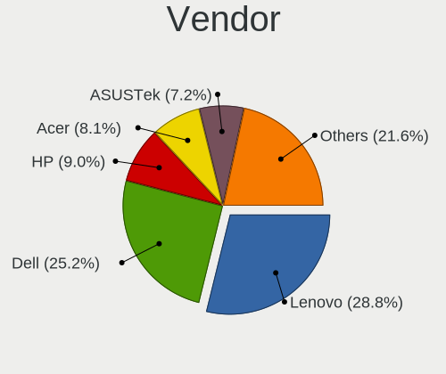

| Name                | Notebooks | Percent |
|---------------------|-----------|---------|
| Dell                | 22        | 31.88%  |
| Lenovo              | 20        | 28.99%  |
| Hewlett-Packard     | 5         | 7.25%   |
| ASUSTek Computer    | 5         | 7.25%   |
| Acer                | 4         | 5.8%    |
| Toshiba             | 2         | 2.9%    |
| System76            | 2         | 2.9%    |
| Samsung Electronics | 2         | 2.9%    |
| Notebook            | 2         | 2.9%    |
| Apple               | 2         | 2.9%    |
| Pegatron            | 1         | 1.45%   |
| MSI                 | 1         | 1.45%   |
| Alienware           | 1         | 1.45%   |

Model
-----

Motherboard model

| Name                                       | Notebooks | Percent |
|--------------------------------------------|-----------|---------|
| Toshiba TECRA M11                          | 1         | 1.45%   |
| Toshiba Satellite L50-C                    | 1         | 1.45%   |
| System76 Lemur Pro                         | 1         | 1.45%   |
| System76 Gazelle                           | 1         | 1.45%   |
| Samsung NC10                               | 1         | 1.45%   |
| Samsung 300E5M/300E5L                      | 1         | 1.45%   |
| Pegatron T12Ah                             | 1         | 1.45%   |
| Notebook NL5xRU                            | 1         | 1.45%   |
| Notebook N7x0WU                            | 1         | 1.45%   |
| MSI GL65 Leopard 10SFSK                    | 1         | 1.45%   |
| Lenovo Z51-70 80K6                         | 1         | 1.45%   |
| Lenovo ThinkPad X270 20HMS0NS00            | 1         | 1.45%   |
| Lenovo ThinkPad X270 20HMCTO1WW            | 1         | 1.45%   |
| Lenovo ThinkPad X230 2325A95               | 1         | 1.45%   |
| Lenovo ThinkPad X220 4291PU5               | 1         | 1.45%   |
| Lenovo ThinkPad X220 4291ON5               | 1         | 1.45%   |
| Lenovo ThinkPad X1 Carbon Gen 8 20U9CTO1WW | 1         | 1.45%   |
| Lenovo ThinkPad T440p 20AW0049LL           | 1         | 1.45%   |
| Lenovo ThinkPad T420 4237A12               | 1         | 1.45%   |
| Lenovo ThinkPad T420 4236NHG               | 1         | 1.45%   |
| Lenovo ThinkPad T410 2516DCU               | 1         | 1.45%   |
| Lenovo ThinkPad S1 Yoga 12 20DKS0AA00      | 1         | 1.45%   |
| Lenovo ThinkPad P73 20QRCTO1WW             | 1         | 1.45%   |
| Lenovo ThinkPad Edge E320 1298RJ1          | 1         | 1.45%   |
| Lenovo ThinkPad E490 20N9001SBR            | 1         | 1.45%   |
| Lenovo ThinkPad E490 20N8CTO1WW            | 1         | 1.45%   |
| Lenovo ThinkPad E15 Gen 3 20YG006GGE       | 1         | 1.45%   |
| Lenovo ThinkPad E14 20RAS0F600             | 1         | 1.45%   |
| Lenovo Rescuer-15ISK 80RQ                  | 1         | 1.45%   |
| Lenovo G505 20240                          | 1         | 1.45%   |
| HP Pavilion Laptop 15-cc0xx                | 1         | 1.45%   |
| HP Laptop 17-by0xxx                        | 1         | 1.45%   |
| HP ENVY x2 Detachable PC 13                | 1         | 1.45%   |
| HP EliteBook 840 G3                        | 1         | 1.45%   |
| HP Compaq Presario CQ71                    | 1         | 1.45%   |
| Dell XPS 15 9500                           | 1         | 1.45%   |
| Dell Vostro 5568                           | 1         | 1.45%   |
| Dell Vostro 5481                           | 1         | 1.45%   |
| Dell Precision 5520                        | 1         | 1.45%   |
| Dell Precision 5510                        | 1         | 1.45%   |
| Dell Latitude E6530                        | 1         | 1.45%   |
| Dell Latitude E6440                        | 1         | 1.45%   |
| Dell Latitude E6410                        | 1         | 1.45%   |
| Dell Latitude E5550                        | 1         | 1.45%   |
| Dell Latitude E5420                        | 1         | 1.45%   |
| Dell Latitude E4300                        | 1         | 1.45%   |
| Dell Latitude D620                         | 1         | 1.45%   |
| Dell Latitude 5580                         | 1         | 1.45%   |
| Dell Latitude 5500                         | 1         | 1.45%   |
| Dell Inspiron N5110                        | 1         | 1.45%   |
| Dell Inspiron N5050                        | 1         | 1.45%   |
| Dell Inspiron N4030                        | 1         | 1.45%   |
| Dell Inspiron 5758                         | 1         | 1.45%   |
| Dell Inspiron 3793                         | 1         | 1.45%   |
| Dell Inspiron 3521                         | 1         | 1.45%   |
| Dell Inspiron 3442                         | 1         | 1.45%   |
| Dell Inspiron 15-7579                      | 1         | 1.45%   |
| ASUS VX7SX                                 | 1         | 1.45%   |
| ASUS TP300LD                               | 1         | 1.45%   |
| ASUS Q500A                                 | 1         | 1.45%   |

Model Family
------------

Motherboard model prefix

| Name                 | Notebooks | Percent |
|----------------------|-----------|---------|
| Lenovo ThinkPad      | 17        | 24.64%  |
| Dell Latitude        | 9         | 13.04%  |
| Dell Inspiron        | 8         | 11.59%  |
| Dell Vostro          | 2         | 2.9%    |
| Dell Precision       | 2         | 2.9%    |
| Acer Aspire          | 2         | 2.9%    |
| Toshiba TECRA        | 1         | 1.45%   |
| Toshiba Satellite    | 1         | 1.45%   |
| System76 Lemur       | 1         | 1.45%   |
| System76 Gazelle     | 1         | 1.45%   |
| Samsung NC10         | 1         | 1.45%   |
| Samsung 300E5M       | 1         | 1.45%   |
| Pegatron T12Ah       | 1         | 1.45%   |
| Notebook NL5xRU      | 1         | 1.45%   |
| Notebook N7x0WU      | 1         | 1.45%   |
| MSI GL65             | 1         | 1.45%   |
| Lenovo Z51-70        | 1         | 1.45%   |
| Lenovo Rescuer-15ISK | 1         | 1.45%   |
| Lenovo G505          | 1         | 1.45%   |
| HP Pavilion          | 1         | 1.45%   |
| HP Laptop            | 1         | 1.45%   |
| HP ENVY              | 1         | 1.45%   |
| HP EliteBook         | 1         | 1.45%   |
| HP Compaq            | 1         | 1.45%   |
| Dell XPS             | 1         | 1.45%   |
| ASUS VX7SX           | 1         | 1.45%   |
| ASUS TP300LD         | 1         | 1.45%   |
| ASUS Q500A           | 1         | 1.45%   |
| ASUS G750JM          | 1         | 1.45%   |
| ASUS 1015PX          | 1         | 1.45%   |
| Apple MacBookPro6    | 1         | 1.45%   |
| Apple MacBookPro5    | 1         | 1.45%   |
| Alienware M15x       | 1         | 1.45%   |
| Acer Predator        | 1         | 1.45%   |
| Acer Nitro           | 1         | 1.45%   |

MFG Year
--------

Motherboard manufacture year

| Year | Notebooks | Percent |
|------|-----------|---------|
| 2020 | 16        | 23.19%  |
| 2019 | 13        | 18.84%  |
| 2018 | 7         | 10.14%  |
| 2012 | 6         | 8.7%    |
| 2015 | 4         | 5.8%    |
| 2013 | 4         | 5.8%    |
| 2011 | 4         | 5.8%    |
| 2021 | 3         | 4.35%   |
| 2017 | 2         | 2.9%    |
| 2016 | 2         | 2.9%    |
| 2014 | 2         | 2.9%    |
| 2010 | 2         | 2.9%    |
| 2009 | 2         | 2.9%    |
| 2008 | 2         | 2.9%    |

Form Factor
-----------

Physical design of the computer

| Name     | Notebooks | Percent |
|----------|-----------|---------|
| Notebook | 69        | 100%    |

Coreboot
--------

Have coreboot on board

| Used | Notebooks | Percent |
|------|-----------|---------|
| No   | 68        | 98.55%  |
| Yes  | 1         | 1.45%   |

RAM Size
--------

Total RAM memory

| Size in GB  | Notebooks | Percent |
|-------------|-----------|---------|
| 8.01-16.0   | 31        | 44.93%  |
| 16.01-24.0  | 15        | 21.74%  |
| 4.01-8.0    | 11        | 15.94%  |
| 32.01-64.0  | 4         | 5.8%    |
| 24.01-32.0  | 2         | 2.9%    |
| 2.01-3.0    | 2         | 2.9%    |
| 64.01-256.0 | 2         | 2.9%    |
| 3.01-4.0    | 1         | 1.45%   |
| 0.51-1.0    | 1         | 1.45%   |

RAM Used
--------

Used RAM memory

| Used GB    | Notebooks | Percent |
|------------|-----------|---------|
| 0.01-0.5   | 38        | 55.07%  |
| 0.51-1.0   | 21        | 30.43%  |
| 1.01-2.0   | 6         | 8.7%    |
| 16.01-24.0 | 2         | 2.9%    |
| 4.01-8.0   | 1         | 1.45%   |
| 2.01-3.0   | 1         | 1.45%   |

Total Drives
------------

Number of drives on board

| Drives | Notebooks | Percent |
|--------|-----------|---------|
| 1      | 53        | 76.81%  |
| 2      | 11        | 15.94%  |
| 3      | 4         | 5.8%    |
| 0      | 1         | 1.45%   |

Has CD-ROM
----------

Has CD-ROM on board

| Presented | Notebooks | Percent |
|-----------|-----------|---------|
| No        | 43        | 62.32%  |
| Yes       | 26        | 37.68%  |

Has Ethernet
------------

Has Ethernet on board

| Presented | Notebooks | Percent |
|-----------|-----------|---------|
| Yes       | 59        | 85.51%  |
| No        | 10        | 14.49%  |

Has WiFi
--------

Has WiFi module

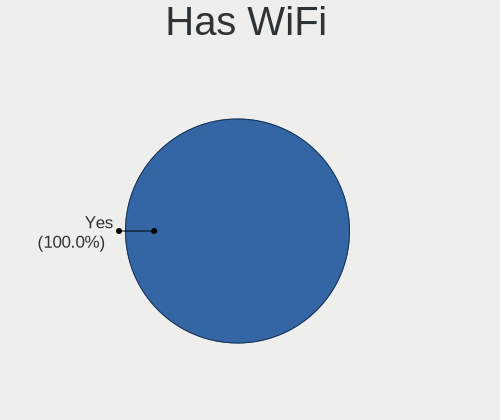

| Presented | Notebooks | Percent |
|-----------|-----------|---------|
| Yes       | 69        | 100%    |

Has Bluetooth
-------------

Has Bluetooth module

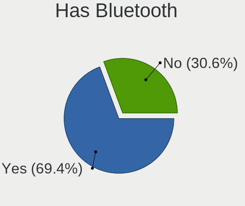

| Presented | Notebooks | Percent |
|-----------|-----------|---------|
| Yes       | 50        | 72.46%  |
| No        | 19        | 27.54%  |

Location
--------

Country
-------

Geographic location (country)

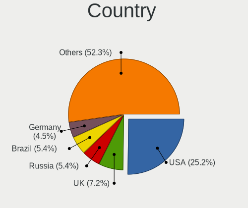

| Country     | Notebooks | Percent |
|-------------|-----------|---------|
| USA         | 16        | 23.19%  |
| UK          | 6         | 8.7%    |
| Germany     | 4         | 5.8%    |
| Brazil      | 4         | 5.8%    |
| Switzerland | 3         | 4.35%   |
| India       | 3         | 4.35%   |
| Russia      | 2         | 2.9%    |
| Mexico      | 2         | 2.9%    |
| Japan       | 2         | 2.9%    |
| Iran        | 2         | 2.9%    |
| France      | 2         | 2.9%    |
| Ukraine     | 1         | 1.45%   |
| Thailand    | 1         | 1.45%   |
| Sweden      | 1         | 1.45%   |
| Spain       | 1         | 1.45%   |
| Qatar       | 1         | 1.45%   |
| Poland      | 1         | 1.45%   |
| Norway      | 1         | 1.45%   |
| New Zealand | 1         | 1.45%   |
| Netherlands | 1         | 1.45%   |
| Nepal       | 1         | 1.45%   |
| Namibia     | 1         | 1.45%   |
| Italy       | 1         | 1.45%   |
| Hungary     | 1         | 1.45%   |
| Guadeloupe  | 1         | 1.45%   |
| Finland     | 1         | 1.45%   |
| Czechia     | 1         | 1.45%   |
| Colombia    | 1         | 1.45%   |
| China       | 1         | 1.45%   |
| Chile       | 1         | 1.45%   |
| Canada      | 1         | 1.45%   |
| Austria     | 1         | 1.45%   |
| Argentina   | 1         | 1.45%   |
| Albania     | 1         | 1.45%   |

City
----

Geographic location (city)

| City                   | Notebooks | Percent |
|------------------------|-----------|---------|
| Tehran                 | 2         | 2.9%    |
| Zurich                 | 1         | 1.45%   |
| Weimar                 | 1         | 1.45%   |
| Wausau                 | 1         | 1.45%   |
| Vadodara               | 1         | 1.45%   |
| Vacaville              | 1         | 1.45%   |
| Tyumen                 | 1         | 1.45%   |
| Tatab??nya             | 1         | 1.45%   |
| São Paulo             | 1         | 1.45%   |
| São José dos Campos  | 1         | 1.45%   |
| Sundebru               | 1         | 1.45%   |
| Suginami-ku            | 1         | 1.45%   |
| Sarandë               | 1         | 1.45%   |
| San Vicent del Raspeig | 1         | 1.45%   |
| San Diego              | 1         | 1.45%   |
| San Antonio            | 1         | 1.45%   |
| Rugby                  | 1         | 1.45%   |
| Rionegro               | 1         | 1.45%   |
| Prague                 | 1         | 1.45%   |
| Porto União           | 1         | 1.45%   |
| Otjiwarongo            | 1         | 1.45%   |
| Nunoa                  | 1         | 1.45%   |
| Niagara Falls          | 1         | 1.45%   |
| New Delhi              | 1         | 1.45%   |
| Montserrat             | 1         | 1.45%   |
| Monterrey              | 1         | 1.45%   |
| Minot                  | 1         | 1.45%   |
| Midvale                | 1         | 1.45%   |
| Lübeck                | 1         | 1.45%   |
| Lyon                   | 1         | 1.45%   |
| Linz                   | 1         | 1.45%   |
| Lexington              | 1         | 1.45%   |
| Leicester              | 1         | 1.45%   |
| Le Gosier              | 1         | 1.45%   |
| Kyiv                   | 1         | 1.45%   |
| Kolkata                | 1         | 1.45%   |
| Klobuck                | 1         | 1.45%   |
| Kathmandu              | 1         | 1.45%   |
| Kaiserslautern         | 1         | 1.45%   |
| Jilin City             | 1         | 1.45%   |
| Hoerby                 | 1         | 1.45%   |
| Helsinki               | 1         | 1.45%   |
| Hat Yai                | 1         | 1.45%   |
| Harrison               | 1         | 1.45%   |
| Guadalajara            | 1         | 1.45%   |
| Gloucester             | 1         | 1.45%   |
| Glasgow                | 1         | 1.45%   |
| Gallatin               | 1         | 1.45%   |
| Gallarate              | 1         | 1.45%   |
| Fruitland              | 1         | 1.45%   |
| Fleury-Merogis         | 1         | 1.45%   |
| Federal Way            | 1         | 1.45%   |
| Doha                   | 1         | 1.45%   |
| Dinhard                | 1         | 1.45%   |
| Corcelles-pres-Payerne | 1         | 1.45%   |
| Coimbra                | 1         | 1.45%   |
| Christchurch           | 1         | 1.45%   |
| Chicago                | 1         | 1.45%   |
| Chelyabinsk            | 1         | 1.45%   |
| Chattanooga            | 1         | 1.45%   |

Drives
------

Drive Vendor
------------

Hard drive vendors

| Vendor              | Notebooks | Drives | Percent |
|---------------------|-----------|--------|---------|
| Samsung Electronics | 16        | 20     | 19.75%  |
| WDC                 | 13        | 14     | 16.05%  |
| Seagate             | 9         | 9      | 11.11%  |
| Toshiba             | 7         | 7      | 8.64%   |
| Kingston            | 7         | 8      | 8.64%   |
| Crucial             | 7         | 8      | 8.64%   |
| Hitachi             | 4         | 4      | 4.94%   |
| SanDisk             | 3         | 3      | 3.7%    |
| SK Hynix            | 2         | 2      | 2.47%   |
| Intel               | 2         | 2      | 2.47%   |
| HGST                | 2         | 2      | 2.47%   |
| TCSUNBOW            | 1         | 1      | 1.23%   |
| SPCC                | 1         | 1      | 1.23%   |
| PNY                 | 1         | 1      | 1.23%   |
| Phison              | 1         | 1      | 1.23%   |
| OWC                 | 1         | 1      | 1.23%   |
| KingSpec            | 1         | 1      | 1.23%   |
| Gigabyte Technology | 1         | 1      | 1.23%   |
| Fujitsu             | 1         | 2      | 1.23%   |
| Apple               | 1         | 1      | 1.23%   |

Drive Model
-----------

Hard drive models

| Model                                | Notebooks | Percent |
|--------------------------------------|-----------|---------|
| Crucial CT500MX500SSD1 500GB         | 4         | 4.65%   |
| Toshiba MQ01ABD100 1TB               | 3         | 3.49%   |
| Seagate ST1000LM024 HN-M101MBB 1TB   | 2         | 2.33%   |
| Samsung SSD 970 EVO 500GB            | 2         | 2.33%   |
| Kingston SA400S37240G 240GB          | 2         | 2.33%   |
| WDC WDS500G2B0C-00PXH0 500GB         | 1         | 1.16%   |
| WDC WDS240G2G0A-00JH30 240GB         | 1         | 1.16%   |
| WDC WDS120G2G0B-00EPW0 120GB         | 1         | 1.16%   |
| WDC WDS100T2B0B-00YS70 1TB           | 1         | 1.16%   |
| WDC WD7500BPVT-80HXZT3 752GB         | 1         | 1.16%   |
| WDC WD5000LPVX-75V0TT0 500GB         | 1         | 1.16%   |
| WDC WD5000BEVT-75A0RT0 500GB         | 1         | 1.16%   |
| WDC WD3200BPVT-75ZEST0 320GB         | 1         | 1.16%   |
| WDC WD1600BEVT-11ZCT0 160GB          | 1         | 1.16%   |
| WDC WD10SPZX-08Z10 1TB               | 1         | 1.16%   |
| WDC WD10SDRW-34A0XS0 1TB             | 1         | 1.16%   |
| WDC WD10JPVX-22JC3T0 1TB             | 1         | 1.16%   |
| WDC WD10JPLX-00MBPT1 1TB             | 1         | 1.16%   |
| WDC PC SN520 NVMe 256GB              | 1         | 1.16%   |
| Toshiba MQ01ABD100V 1TB              | 1         | 1.16%   |
| Toshiba MK5061GSY 500GB              | 1         | 1.16%   |
| Toshiba KXG50ZNV256G NVMe 256GB      | 1         | 1.16%   |
| Toshiba KBG30ZMT512G 512GB           | 1         | 1.16%   |
| TCSUNBOW X3 480GB                    | 1         | 1.16%   |
| SPCC SPCCSolidStateDisk 256GB        | 1         | 1.16%   |
| SK Hynix SC308 SATA 256GB            | 1         | 1.16%   |
| SK Hynix HFM256GDJTNG-8310A 256GB    | 1         | 1.16%   |
| Seagate ST9500420AS 500GB            | 1         | 1.16%   |
| Seagate ST500LX003-1AC15G 500GB      | 1         | 1.16%   |
| Seagate ST500LT012-9WS142 500GB      | 1         | 1.16%   |
| Seagate ST1000LM049-2GH172 1TB       | 1         | 1.16%   |
| Seagate ST1000LM048-2E7172 1TB       | 1         | 1.16%   |
| Seagate ST1000LM035-1RK172 1TB       | 1         | 1.16%   |
| Seagate ST1000LM014-1EJ164 1TB       | 1         | 1.16%   |
| SanDisk SDSSDP256G 256GB             | 1         | 1.16%   |
| SanDisk SDSSDH3 1T02 1TB             | 1         | 1.16%   |
| SanDisk SDSSDA120G 120GB             | 1         | 1.16%   |
| Samsung SSD PM841 2.5-inch 7mm 256GB | 1         | 1.16%   |
| Samsung SSD 970 PRO 1TB              | 1         | 1.16%   |
| Samsung SSD 970 EVO Plus 250GB       | 1         | 1.16%   |
| Samsung SSD 970 EVO Plus 1TB         | 1         | 1.16%   |
| Samsung SSD 860 EVO M.2 1TB          | 1         | 1.16%   |
| Samsung SSD 860 EVO 500GB            | 1         | 1.16%   |
| Samsung SSD 850 EVO 250GB            | 1         | 1.16%   |
| Samsung PM981a NVMe 512GB            | 1         | 1.16%   |
| Samsung MZVLW256HEHP-000L7 256GB     | 1         | 1.16%   |
| Samsung MZVLB256HBHQ-000L7 256GB     | 1         | 1.16%   |
| Samsung MZVLB1T0HBLR-000L7 1TB       | 1         | 1.16%   |
| Samsung MZNTY256HDHP-000L2 256GB     | 1         | 1.16%   |
| Samsung MZNTE256HMHP-000H1 256GB     | 1         | 1.16%   |
| Samsung MZALQ512HBLU-00BL1 512GB     | 1         | 1.16%   |
| Samsung MZALQ128HBHQ-000L1 128GB     | 1         | 1.16%   |
| Samsung MZ7LN256HCHP-000L7 256GB     | 1         | 1.16%   |
| Samsung HM160HI 160GB                | 1         | 1.16%   |
| PNY CS3030 1TB SSD                   | 1         | 1.16%   |
| Phison PCIe SSD 512GB                | 1         | 1.16%   |
| OWC Mercury EXTREME Pro 6G SSD       | 1         | 1.16%   |
| Kingston SMS200S3120G 120GB          | 1         | 1.16%   |
| Kingston SHFS37A120G 120GB           | 1         | 1.16%   |
| Kingston SA400S37480G 480GB          | 1         | 1.16%   |

HDD Vendor
----------

Hard disk drive vendors

| Vendor              | Notebooks | Drives | Percent |
|---------------------|-----------|--------|---------|
| Seagate             | 9         | 9      | 30%     |
| WDC                 | 8         | 9      | 26.67%  |
| Toshiba             | 5         | 5      | 16.67%  |
| Hitachi             | 4         | 4      | 13.33%  |
| HGST                | 2         | 2      | 6.67%   |
| Samsung Electronics | 1         | 1      | 3.33%   |
| Fujitsu             | 1         | 2      | 3.33%   |

SSD Vendor
----------

Solid state drive vendors

| Vendor              | Notebooks | Drives | Percent |
|---------------------|-----------|--------|---------|
| Samsung Electronics | 7         | 7      | 20.59%  |
| Crucial             | 7         | 8      | 20.59%  |
| Kingston            | 5         | 6      | 14.71%  |
| WDC                 | 3         | 3      | 8.82%   |
| SanDisk             | 3         | 3      | 8.82%   |
| Intel               | 2         | 2      | 5.88%   |
| TCSUNBOW            | 1         | 1      | 2.94%   |
| SPCC                | 1         | 1      | 2.94%   |
| SK Hynix            | 1         | 1      | 2.94%   |
| OWC                 | 1         | 1      | 2.94%   |
| KingSpec            | 1         | 1      | 2.94%   |
| Gigabyte Technology | 1         | 1      | 2.94%   |
| Apple               | 1         | 1      | 2.94%   |

Drive Kind
----------

HDD or SSD

| Kind | Notebooks | Drives | Percent |
|------|-----------|--------|---------|
| SSD  | 33        | 36     | 41.77%  |
| HDD  | 29        | 32     | 36.71%  |
| NVMe | 17        | 21     | 21.52%  |

Drive Connector
---------------

SATA, SAS, NVMe, etc.

| Type | Notebooks | Drives | Percent |
|------|-----------|--------|---------|
| SATA | 57        | 68     | 77.03%  |
| NVMe | 17        | 21     | 22.97%  |

Drive Size
----------

Size of hard drive

| Size in TB | Notebooks | Drives | Percent |
|------------|-----------|--------|---------|
| 0.01-0.5   | 41        | 46     | 68.33%  |
| 0.51-1.0   | 18        | 21     | 30%     |
| 1.01-2.0   | 1         | 1      | 1.67%   |

Space Total
-----------

Amount of disk space available on the file system

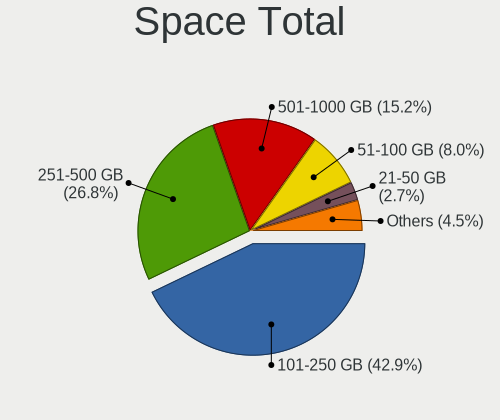

| Size in GB | Notebooks | Percent |
|------------|-----------|---------|
| 101-250    | 29        | 42.03%  |
| 251-500    | 20        | 28.99%  |
| 501-1000   | 10        | 14.49%  |
| 51-100     | 5         | 7.25%   |
| 1001-2000  | 2         | 2.9%    |
| 1-20       | 2         | 2.9%    |
| 21-50      | 1         | 1.45%   |

Space Used
----------

Amount of used disk space

| Used GB | Notebooks | Percent |
|---------|-----------|---------|
| 1-20    | 56        | 81.16%  |
| 21-50   | 6         | 8.7%    |
| 101-250 | 4         | 5.8%    |
| 51-100  | 3         | 4.35%   |

Malfunc. Drives
---------------

Drive models with a malfunction

| Model                                            | Notebooks | Drives | Percent |
|--------------------------------------------------|-----------|--------|---------|
| WDC WD7500BPVT-80HXZT3 752GB                     | 1         | 1      | 9.09%   |
| WDC WD5000BEVT-75A0RT0 500GB                     | 1         | 1      | 9.09%   |
| WDC WD3200BPVT-75ZEST0 320GB                     | 1         | 1      | 9.09%   |
| Seagate ST500LT012-9WS142 500GB                  | 1         | 1      | 9.09%   |
| Seagate ST1000LM014-1EJ164 1TB                   | 1         | 1      | 9.09%   |
| Samsung Electronics SSD PM841 2.5-inch 7mm 256GB | 1         | 1      | 9.09%   |
| Samsung Electronics HM160HI 160GB                | 1         | 1      | 9.09%   |
| Intel SSDSCKKF256G8H 256GB                       | 1         | 1      | 9.09%   |
| Hitachi HTS545032B9A300 320GB                    | 1         | 1      | 9.09%   |
| Hitachi HTS543225A7A384 250GB                    | 1         | 1      | 9.09%   |
| Hitachi HTS541612J9SA00 120GB                    | 1         | 1      | 9.09%   |

Malfunc. Drive Vendor
---------------------

Vendors of faulty drives

| Vendor              | Notebooks | Drives | Percent |
|---------------------|-----------|--------|---------|
| WDC                 | 3         | 3      | 27.27%  |
| Hitachi             | 3         | 3      | 27.27%  |
| Seagate             | 2         | 2      | 18.18%  |
| Samsung Electronics | 2         | 2      | 18.18%  |
| Intel               | 1         | 1      | 9.09%   |

Malfunc. HDD Vendor
-------------------

Vendors of faulty HDD drives

| Vendor              | Notebooks | Drives | Percent |
|---------------------|-----------|--------|---------|
| WDC                 | 3         | 3      | 33.33%  |
| Hitachi             | 3         | 3      | 33.33%  |
| Seagate             | 2         | 2      | 22.22%  |
| Samsung Electronics | 1         | 1      | 11.11%  |

Malfunc. Drive Kind
-------------------

Kinds of faulty drives

| Kind | Notebooks | Drives | Percent |
|------|-----------|--------|---------|
| HDD  | 9         | 9      | 81.82%  |
| SSD  | 2         | 2      | 18.18%  |

Failed Drives
-------------

Failed drive models

Zero info for selected period =(

Failed Drive Vendor
-------------------

Failed drive vendors

Zero info for selected period =(

Drive Status
------------

Number of failed and malfunc. drives

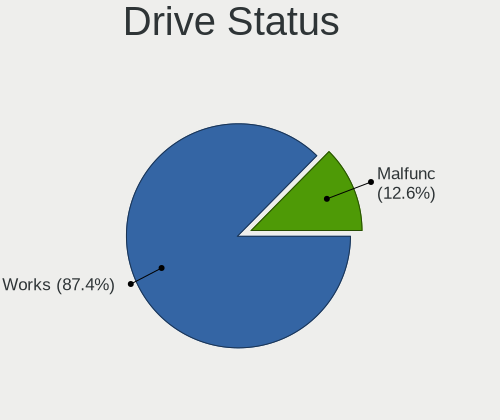

| Status  | Notebooks | Drives | Percent |
|---------|-----------|--------|---------|
| Works   | 58        | 78     | 84.06%  |
| Malfunc | 11        | 11     | 15.94%  |

Storage controller
------------------

Storage Vendor
--------------

Storage controller vendors

| Vendor                      | Notebooks | Percent |
|-----------------------------|-----------|---------|
| Intel                       | 60        | 74.07%  |
| Samsung Electronics         | 9         | 11.11%  |
| AMD                         | 3         | 3.7%    |
| Toshiba                     | 2         | 2.47%   |
| Sandisk                     | 2         | 2.47%   |
| Phison Electronics          | 2         | 2.47%   |
| SK Hynix                    | 1         | 1.23%   |
| Nvidia                      | 1         | 1.23%   |
| Kingston Technology Company | 1         | 1.23%   |

Storage Model
-------------

Storage controller models

| Model                                                                            | Notebooks | Percent |
|----------------------------------------------------------------------------------|-----------|---------|
| Intel 6 Series/C200 Series Chipset Family 6 port Mobile SATA AHCI Controller     | 9         | 10.71%  |
| Intel Sunrise Point-LP SATA Controller [AHCI mode]                               | 8         | 9.52%   |
| Samsung NVMe SSD Controller SM981/PM981/PM983                                    | 6         | 7.14%   |
| Intel Wildcat Point-LP SATA Controller [AHCI Mode]                               | 5         | 5.95%   |
| Intel 82801 Mobile SATA Controller [RAID mode]                                   | 4         | 4.76%   |
| Intel 7 Series Chipset Family 6-port SATA Controller [AHCI mode]                 | 4         | 4.76%   |
| Intel Cannon Lake Mobile PCH SATA AHCI Controller                                | 3         | 3.57%   |
| Intel 8 Series/C220 Series Chipset Family 6-port SATA Controller 1 [AHCI mode]   | 3         | 3.57%   |
| Intel 8 Series SATA Controller 1 [AHCI mode]                                     | 3         | 3.57%   |
| Intel 5 Series/3400 Series Chipset 6 port SATA AHCI Controller                   | 3         | 3.57%   |
| AMD FCH SATA Controller [AHCI mode]                                              | 3         | 3.57%   |
| Samsung NVMe Controller                                                          | 2         | 2.38%   |
| Phison E12 NVMe Controller                                                       | 2         | 2.38%   |
| Intel Q170/Q150/B150/H170/H110/Z170/CM236 Chipset SATA Controller [AHCI Mode]    | 2         | 2.38%   |
| Intel Comet Lake SATA AHCI Controller                                            | 2         | 2.38%   |
| Intel Cannon Point-LP SATA Controller [AHCI Mode]                                | 2         | 2.38%   |
| Intel 82801IBM/IEM (ICH9M/ICH9M-E) 4 port SATA Controller [AHCI mode]            | 2         | 2.38%   |
| Intel 82801GBM/GHM (ICH7-M Family) SATA Controller [IDE mode]                    | 2         | 2.38%   |
| Intel 5 Series/3400 Series Chipset 4 port SATA AHCI Controller                   | 2         | 2.38%   |
| Toshiba unknown                                                                  | 1         | 1.19%   |
| Toshiba BG3 NVMe SSD Controller                                                  | 1         | 1.19%   |
| SK Hynix BC501 NVMe Solid State Drive                                            | 1         | 1.19%   |
| Sandisk WD Blue SN550 NVMe SSD                                                   | 1         | 1.19%   |
| Sandisk PC SN520 NVMe SSD                                                        | 1         | 1.19%   |
| Samsung NVMe SSD Controller SM961/PM961/SM963                                    | 1         | 1.19%   |
| Nvidia MCP79 AHCI Controller                                                     | 1         | 1.19%   |
| Kingston Company U-SNS8154P3 NVMe SSD                                            | 1         | 1.19%   |
| Intel NM10/ICH7 Family SATA Controller [AHCI mode]                               | 1         | 1.19%   |
| Intel HM170/QM170 Chipset SATA Controller [AHCI Mode]                            | 1         | 1.19%   |
| Intel Atom/Celeron/Pentium Processor x5-E8000/J3xxx/N3xxx Series SATA Controller | 1         | 1.19%   |
| Intel 82801IBM/IEM (ICH9M/ICH9M-E) 2 port SATA Controller [IDE mode]             | 1         | 1.19%   |
| Intel 7 Series Chipset Family 4-port SATA Controller [IDE mode]                  | 1         | 1.19%   |
| Intel 7 Series Chipset Family 2-port SATA Controller [IDE mode]                  | 1         | 1.19%   |
| Intel 5 Series/3400 Series Chipset 4 port SATA IDE Controller                    | 1         | 1.19%   |
| Intel 5 Series/3400 Series Chipset 2 port SATA IDE Controller                    | 1         | 1.19%   |
| AMD 400 Series Chipset SATA Controller                                           | 1         | 1.19%   |

Storage Kind
------------

Kind of storage controller (IDE, SATA, NVMe, SAS, ...)

| Kind | Notebooks | Percent |
|------|-----------|---------|
| SATA | 55        | 68.75%  |
| NVMe | 16        | 20%     |
| IDE  | 5         | 6.25%   |
| RAID | 4         | 5%      |

Processor
---------

CPU Vendor
----------

Processor vendors

| Vendor | Notebooks | Percent |
|--------|-----------|---------|
| Intel  | 65        | 94.2%   |
| AMD    | 4         | 5.8%    |

CPU Model
---------

Processor models

| Model                                   | Notebooks | Percent |
|-----------------------------------------|-----------|---------|
| Intel Core i5-7200U CPU @ 2.50GHz       | 4         | 5.8%    |
| Intel Core i5-2520M CPU @ 2.50GHz       | 3         | 4.35%   |
| Intel Core i7-9750H CPU @ 2.60GHz       | 2         | 2.9%    |
| Intel Core i7-8565U CPU @ 1.80GHz       | 2         | 2.9%    |
| Intel Core i7-10750H CPU @ 2.60GHz      | 2         | 2.9%    |
| Intel Core i5-5300U CPU @ 2.30GHz       | 2         | 2.9%    |
| Intel Core i5-4300M CPU @ 2.60GHz       | 2         | 2.9%    |
| Intel Core i5-10210U CPU @ 1.60GHz      | 2         | 2.9%    |
| Intel Core i3-4005U CPU @ 1.70GHz       | 2         | 2.9%    |
| Intel Processor 5Y70 CPU @ 1.10GHz      | 1         | 1.45%   |
| Intel Pentium M                         | 1         | 1.45%   |
| Intel Pentium CPU N3700 @ 1.60GHz       | 1         | 1.45%   |
| Intel Genuine CPU                       | 1         | 1.45%   |
| Intel CPU Version                       | 1         | 1.45%   |
| Intel Core i7-7820HQ CPU @ 2.90GHz      | 1         | 1.45%   |
| Intel Core i7-7500U CPU @ 2.70GHz       | 1         | 1.45%   |
| Intel Core i7-6600U CPU @ 2.60GHz       | 1         | 1.45%   |
| Intel Core i7-4700HQ CPU @ 2.40GHz      | 1         | 1.45%   |
| Intel Core i7-4510U CPU @ 2.00GHz       | 1         | 1.45%   |
| Intel Core i7-3632QM CPU @ 2.20GHz      | 1         | 1.45%   |
| Intel Core i7-3630QM CPU @ 2.40GHz      | 1         | 1.45%   |
| Intel Core i7-2670QM CPU @ 2.20GHz      | 1         | 1.45%   |
| Intel Core i7-1065G7 CPU @ 1.30GHz      | 1         | 1.45%   |
| Intel Core i7-10510U CPU @ 1.80GHz      | 1         | 1.45%   |
| Intel Core i7 CPU M 620 @ 2.67GHz       | 1         | 1.45%   |
| Intel Core i5-9300H CPU @ 2.40GHz       | 1         | 1.45%   |
| Intel Core i5-8365U CPU @ 1.60GHz       | 1         | 1.45%   |
| Intel Core i5-8265U CPU @ 1.60GHz       | 1         | 1.45%   |
| Intel Core i5-8250U CPU @ 1.60GHz       | 1         | 1.45%   |
| Intel Core i5-7300U CPU @ 2.60GHz       | 1         | 1.45%   |
| Intel Core i5-6440HQ CPU @ 2.60GHz      | 1         | 1.45%   |
| Intel Core i5-6300HQ CPU @ 2.30GHz      | 1         | 1.45%   |
| Intel Core i5-5200U CPU @ 2.20GHz       | 1         | 1.45%   |
| Intel Core i5-3320M CPU @ 2.60GHz       | 1         | 1.45%   |
| Intel Core i5-2540M CPU @ 2.60GHz       | 1         | 1.45%   |
| Intel Core i5-2450M CPU @ 2.50GHz       | 1         | 1.45%   |
| Intel Core i5-2430M CPU @ 2.40GH        | 1         | 1.45%   |
| Intel Core i5-2410M CPU @ 2.30GHz       | 1         | 1.45%   |
| Intel Core i5-10310U CPU @ 1.70GHz      | 1         | 1.45%   |
| Intel Core i5 CPU M 560 @ 2.67GHz       | 1         | 1.45%   |
| Intel Core i5 CPU M 560 @ 2.67GH        | 1         | 1.45%   |
| Intel Core i3-8130U CPU @ 2.20GHz       | 1         | 1.45%   |
| Intel Core i3-6006U CPU @ 2.00GHz       | 1         | 1.45%   |
| Intel Core i3-5005U CPU @ 2.00GHz       | 1         | 1.45%   |
| Intel Core i3-3227U CPU @ 1.90GHz       | 1         | 1.45%   |
| Intel Core i3-2330M CPU @ 2.20GHz       | 1         | 1.45%   |
| Intel Core i3 CPU M 380 @ 2.53GH        | 1         | 1.45%   |
| Intel Core i3 CPU M 330 @ 2.13GHz       | 1         | 1.45%   |
| Intel Core 2 Duo CPU T6600 @ 2.20GHz    | 1         | 1.45%   |
| Intel Core 2 Duo CPU P8700 @ 2.53GHz    | 1         | 1.45%   |
| Intel Core 2 Duo CPU P8600 @ 2.40GHz    | 1         | 1.45%   |
| Intel Core 2 Duo                        | 1         | 1.45%   |
| Intel Atom CPU N570 @ 1.66GHz           | 1         | 1.45%   |
| AMD Ryzen 7 4700U with Radeon Graphics  | 1         | 1.45%   |
| AMD Ryzen 7 2700 Eight-Core Processor   | 1         | 1.45%   |
| AMD Ryzen 5 5500U with Radeon Graphics  | 1         | 1.45%   |
| AMD A4-5000 APU with Radeon HD Graphics | 1         | 1.45%   |

CPU Model Family
----------------

Processor model prefix

| Model            | Notebooks | Percent |
|------------------|-----------|---------|
| Intel Core i5    | 29        | 42.03%  |
| Intel Core i7    | 17        | 24.64%  |
| Intel Core i3    | 9         | 13.04%  |
| Intel Core 2 Duo | 4         | 5.8%    |
| Other            | 2         | 2.9%    |
| AMD Ryzen 7      | 2         | 2.9%    |
| Intel Pentium M  | 1         | 1.45%   |
| Intel Pentium    | 1         | 1.45%   |
| Intel Genuine    | 1         | 1.45%   |
| Intel Atom       | 1         | 1.45%   |
| AMD Ryzen 5      | 1         | 1.45%   |
| AMD A4           | 1         | 1.45%   |

CPU Cores
---------

Number of processor cores

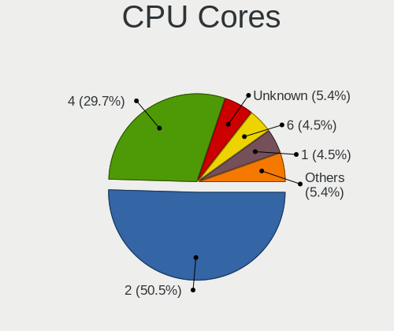

| Number  | Notebooks | Percent |
|---------|-----------|---------|
| 2       | 37        | 53.62%  |
| 4       | 21        | 30.43%  |
| 6       | 4         | 5.8%    |
| Unknown | 3         | 4.35%   |
| 16      | 1         | 1.45%   |
| 12      | 1         | 1.45%   |
| 8       | 1         | 1.45%   |
| 1       | 1         | 1.45%   |

CPU Sockets
-----------

Number of sockets

| Number | Notebooks | Percent |
|--------|-----------|---------|
| 1      | 68        | 98.55%  |
| 2      | 1         | 1.45%   |

CPU Threads
-----------

Threads per core (Hyper-Threading)

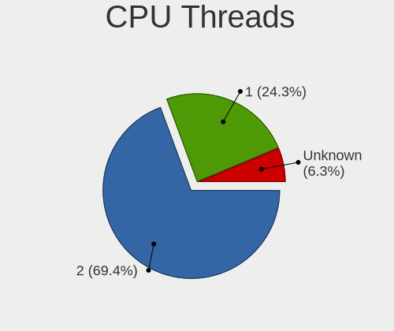

| Number  | Notebooks | Percent |
|---------|-----------|---------|
| 2       | 57        | 82.61%  |
| 1       | 9         | 13.04%  |
| Unknown | 3         | 4.35%   |

CPU Microarch
-------------

Microarchitecture

| Name        | Notebooks | Percent |
|-------------|-----------|---------|
| KabyLake    | 20        | 28.99%  |
| SandyBridge | 9         | 13.04%  |
| Haswell     | 6         | 8.7%    |
| Westmere    | 5         | 7.25%   |
| Broadwell   | 5         | 7.25%   |
| Skylake     | 4         | 5.8%    |
| Penryn      | 4         | 5.8%    |
| IvyBridge   | 4         | 5.8%    |
| CometLake   | 2         | 2.9%    |
| Bonnell     | 2         | 2.9%    |
| Zen+        | 1         | 1.45%   |
| Zen 2       | 1         | 1.45%   |
| Silvermont  | 1         | 1.45%   |
| Nehalem     | 1         | 1.45%   |
| Jaguar      | 1         | 1.45%   |
| IceLake     | 1         | 1.45%   |
| Core        | 1         | 1.45%   |
| Unknown     | 1         | 1.45%   |

Graphics
--------

GPU Vendor
----------

Vendors of graphics cards

| Vendor | Notebooks | Percent |
|--------|-----------|---------|
| Intel  | 60        | 69.77%  |
| Nvidia | 19        | 22.09%  |
| AMD    | 7         | 8.14%   |

GPU Model
---------

Graphics card models

| Model                                                                                    | Notebooks | Percent |
|------------------------------------------------------------------------------------------|-----------|---------|
| Intel 2nd Generation Core Processor Family Integrated Graphics Controller                | 8         | 8.89%   |
| Intel HD Graphics 620                                                                    | 6         | 6.67%   |
| Intel 3rd Gen Core processor Graphics Controller                                         | 5         | 5.56%   |
| Intel WhiskeyLake-U GT2 [UHD Graphics 620]                                               | 4         | 4.44%   |
| Intel HD Graphics 5500                                                                   | 4         | 4.44%   |
| Intel Core Processor Integrated Graphics Controller                                      | 4         | 4.44%   |
| Intel CometLake-U GT2 [UHD Graphics]                                                     | 4         | 4.44%   |
| Intel Haswell-ULT Integrated Graphics Controller                                         | 3         | 3.33%   |
| Intel 4th Gen Core Processor Integrated Graphics Controller                              | 3         | 3.33%   |
| Intel UHD Graphics 620                                                                   | 2         | 2.22%   |
| Intel Skylake GT2 [HD Graphics 520]                                                      | 2         | 2.22%   |
| Intel Mobile 945GM/GMS/GME, 943/940GML Express Integrated Graphics Controller            | 2         | 2.22%   |
| Intel Mobile 4 Series Chipset Integrated Graphics Controller                             | 2         | 2.22%   |
| Intel HD Graphics 530                                                                    | 2         | 2.22%   |
| Intel CometLake-H GT2 [UHD Graphics]                                                     | 2         | 2.22%   |
| Intel CoffeeLake-H GT2 [UHD Graphics 630]                                                | 2         | 2.22%   |
| Nvidia TU117M [GeForce GTX 1650 Ti Mobile]                                               | 1         | 1.11%   |
| Nvidia TU117M [GeForce GTX 1650 Mobile / Max-Q]                                          | 1         | 1.11%   |
| Nvidia TU117GLM [Quadro T2000 Mobile / Max-Q]                                            | 1         | 1.11%   |
| Nvidia TU116M [GeForce GTX 1660 Ti Mobile]                                               | 1         | 1.11%   |
| Nvidia TU104M [GeForce RTX 2070 SUPER Mobile / Max-Q]                                    | 1         | 1.11%   |
| Nvidia GT216M [GeForce GT 330M]                                                          | 1         | 1.11%   |
| Nvidia GT216M [GeForce GT 240M]                                                          | 1         | 1.11%   |
| Nvidia GP108M [GeForce MX250]                                                            | 1         | 1.11%   |
| Nvidia GP108M [GeForce MX230]                                                            | 1         | 1.11%   |
| Nvidia GM107M [GeForce GTX 960M]                                                         | 1         | 1.11%   |
| Nvidia GM107M [GeForce GTX 860M]                                                         | 1         | 1.11%   |
| Nvidia GM107GLM [Quadro M1200 Mobile]                                                    | 1         | 1.11%   |
| Nvidia GK208BM [GeForce 920M]                                                            | 1         | 1.11%   |
| Nvidia GF117M [GeForce 610M/710M/810M/820M / GT 620M/625M/630M/720M]                     | 1         | 1.11%   |
| Nvidia GF116M [GeForce GT 560M]                                                          | 1         | 1.11%   |
| Nvidia GF108M [GeForce GT 525M]                                                          | 1         | 1.11%   |
| Nvidia GF108GLM [NVS 5200M]                                                              | 1         | 1.11%   |
| Nvidia G98M [GeForce G 103M]                                                             | 1         | 1.11%   |
| Nvidia G96CM [GeForce 9600M GT]                                                          | 1         | 1.11%   |
| Nvidia C79 [GeForce 9400M]                                                               | 1         | 1.11%   |
| Intel Mobile 945GSE Express Integrated Graphics Controller                               | 1         | 1.11%   |
| Intel Mobile 945GM/GMS, 943/940GML Express Integrated Graphics Controller                | 1         | 1.11%   |
| Intel Iris Plus Graphics G7                                                              | 1         | 1.11%   |
| Intel HD Graphics 630                                                                    | 1         | 1.11%   |
| Intel HD Graphics 5300                                                                   | 1         | 1.11%   |
| Intel Atom/Celeron/Pentium Processor x5-E8000/J3xxx/N3xxx Integrated Graphics Controller | 1         | 1.11%   |
| Intel Atom Processor D4xx/D5xx/N4xx/N5xx Integrated Graphics Controller                  | 1         | 1.11%   |
| AMD Venus XTX [Radeon HD 8890M / R9 M275X/M375X]                                         | 1         | 1.11%   |
| AMD Vega 10 XL/XT [Radeon RX Vega 56/64]                                                 | 1         | 1.11%   |
| AMD Sun PRO [Radeon HD 8570A/8570M]                                                      | 1         | 1.11%   |
| AMD Renoir                                                                               | 1         | 1.11%   |
| AMD Park [Mobility Radeon HD 5430]                                                       | 1         | 1.11%   |
| AMD Lucienne                                                                             | 1         | 1.11%   |
| AMD Lexa PRO [Radeon 540/540X/550/550X / RX 540X/550/550X]                               | 1         | 1.11%   |
| AMD Kabini [Radeon HD 8330]                                                              | 1         | 1.11%   |

GPU Combo
---------

Combinations of graphics cards

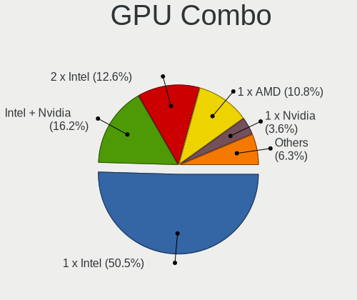

| Name           | Notebooks | Percent |
|----------------|-----------|---------|
| 1 x Intel      | 38        | 55.07%  |
| Intel + Nvidia | 14        | 20.29%  |
| 2 x Intel      | 5         | 7.25%   |
| 1 x Nvidia     | 4         | 5.8%    |
| 1 x AMD        | 4         | 5.8%    |
| Intel + AMD    | 2         | 2.9%    |
| 2 x Nvidia     | 1         | 1.45%   |
| 2 x AMD        | 1         | 1.45%   |

GPU Driver
----------

Free vs proprietary

| Driver      | Notebooks | Percent |
|-------------|-----------|---------|
| Free        | 59        | 85.51%  |
| Proprietary | 9         | 13.04%  |
| Unknown     | 1         | 1.45%   |

GPU Memory
----------

Total video memory

| Size in GB | Notebooks | Percent |
|------------|-----------|---------|
| Unknown    | 63        | 91.3%   |
| 0.01-0.5   | 2         | 2.9%    |
| 5.01-6.0   | 1         | 1.45%   |
| 3.01-4.0   | 1         | 1.45%   |
| 2.01-3.0   | 1         | 1.45%   |
| 0.51-1.0   | 1         | 1.45%   |

Monitor
-------

Monitor Vendor
--------------

Monitor vendors

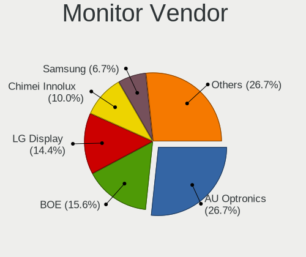

| Vendor               | Notebooks | Percent |
|----------------------|-----------|---------|
| AU Optronics         | 14        | 25%     |
| LG Display           | 10        | 17.86%  |
| BOE                  | 10        | 17.86%  |
| Samsung Electronics  | 5         | 8.93%   |
| Chimei Innolux       | 4         | 7.14%   |
| Sharp                | 3         | 5.36%   |
| InfoVision           | 2         | 3.57%   |
| AOC                  | 2         | 3.57%   |
| Lenovo               | 1         | 1.79%   |
| Hewlett-Packard      | 1         | 1.79%   |
| HannStar             | 1         | 1.79%   |
| Goldstar             | 1         | 1.79%   |
| CPT                  | 1         | 1.79%   |
| Ancor Communications | 1         | 1.79%   |

Monitor Model
-------------

Monitor models

| Model                                                                  | Notebooks | Percent |
|------------------------------------------------------------------------|-----------|---------|
| Sharp LCD Monitor SHP14D1 1920x1200 340x210mm 15.7-inch                | 1         | 1.79%   |
| Sharp LCD Monitor SHP1476 3840x2160 350x190mm 15.7-inch                | 1         | 1.79%   |
| Sharp LCD Monitor SHP143E 3840x2160 350x190mm 15.7-inch                | 1         | 1.79%   |
| Samsung Electronics LCD Monitor SEC3849 1366x768 310x170mm 13.9-inch   | 1         | 1.79%   |
| Samsung Electronics LCD Monitor SEC314C 1920x1080 340x190mm 15.3-inch  | 1         | 1.79%   |
| Samsung Electronics LCD Monitor SEC3047 1366x768 280x160mm 12.7-inch   | 1         | 1.79%   |
| Samsung Electronics LCD Monitor SDC4141 1366x768 340x190mm 15.3-inch   | 1         | 1.79%   |
| Samsung Electronics LCD Monitor SAM7016 3840x2160 1210x680mm 54.6-inch | 1         | 1.79%   |
| LG Display LCD Monitor LGD05E5 1920x1080 340x190mm 15.3-inch           | 1         | 1.79%   |
| LG Display LCD Monitor LGD0437 1920x1080 280x160mm 12.7-inch           | 1         | 1.79%   |
| LG Display LCD Monitor LGD03D3 1600x900 310x170mm 13.9-inch            | 1         | 1.79%   |
| LG Display LCD Monitor LGD03AB 1366x768 340x190mm 15.3-inch            | 1         | 1.79%   |
| LG Display LCD Monitor LGD033A 1366x768 340x190mm 15.3-inch            | 1         | 1.79%   |
| LG Display LCD Monitor LGD032C 1920x1080 340x190mm 15.3-inch           | 1         | 1.79%   |
| LG Display LCD Monitor LGD0314 1366x768 290x160mm 13.0-inch            | 1         | 1.79%   |
| LG Display LCD Monitor LGD02DC 1366x768 340x190mm 15.3-inch            | 1         | 1.79%   |
| LG Display LCD Monitor LGD02D9 1920x1080 340x190mm 15.3-inch           | 1         | 1.79%   |
| LG Display LCD Monitor LGD0214 1600x900 350x190mm 15.7-inch            | 1         | 1.79%   |
| Lenovo LCD Monitor LEN4035 1280x800 300x190mm 14.0-inch                | 1         | 1.79%   |
| InfoVision LCD Monitor IVO0533 1366x768 290x160mm 13.0-inch            | 1         | 1.79%   |
| InfoVision LCD Monitor IVO04E5 1366x768 280x160mm 12.7-inch            | 1         | 1.79%   |
| Hewlett-Packard 24xw HWP3256 1920x1080 530x300mm 24.0-inch             | 1         | 1.79%   |
| HannStar HSD100IFW1 HSD03E9 1024x600 220x130mm 10.1-inch               | 1         | 1.79%   |
| Goldstar LG ULTRAWIDE GSM5AFB 2560x1080 800x340mm 34.2-inch            | 1         | 1.79%   |
| CPT LCD Monitor CPT04C4 1024x600 230x140mm 10.6-inch                   | 1         | 1.79%   |
| Chimei Innolux LCD Monitor CMN15C4 1920x1080 340x190mm 15.3-inch       | 1         | 1.79%   |
| Chimei Innolux LCD Monitor CMN1509 1920x1080 340x190mm 15.3-inch       | 1         | 1.79%   |
| Chimei Innolux LCD Monitor CMN14D5 1920x1080 310x170mm 13.9-inch       | 1         | 1.79%   |
| Chimei Innolux LCD Monitor CMN1239 1920x1080 280x160mm 12.7-inch       | 1         | 1.79%   |
| BOE LCD Monitor BOE0806 1920x1080 310x170mm 13.9-inch                  | 1         | 1.79%   |
| BOE LCD Monitor BOE07BD 1920x1080 310x170mm 13.9-inch                  | 1         | 1.79%   |
| BOE LCD Monitor BOE0742 1920x1080 310x170mm 13.9-inch                  | 1         | 1.79%   |
| BOE LCD Monitor BOE0729 1920x1080 340x190mm 15.3-inch                  | 1         | 1.79%   |
| BOE LCD Monitor BOE06E2 1920x1080 310x170mm 13.9-inch                  | 1         | 1.79%   |
| BOE LCD Monitor BOE06CB 1920x1080 340x190mm 15.3-inch                  | 1         | 1.79%   |
| BOE LCD Monitor BOE06A4 1366x768 340x190mm 15.3-inch                   | 1         | 1.79%   |
| BOE LCD Monitor BOE069B 1600x900 380x210mm 17.1-inch                   | 1         | 1.79%   |
| BOE LCD Monitor BOE0690 1920x1080 340x190mm 15.3-inch                  | 1         | 1.79%   |
| BOE LCD Monitor BOE0620 1366x768 340x190mm 15.3-inch                   | 1         | 1.79%   |
| AU Optronics LCD Monitor AUO8174 1280x800 330x210mm 15.4-inch          | 1         | 1.79%   |
| AU Optronics LCD Monitor AUO80ED 1920x1080 340x190mm 15.3-inch         | 1         | 1.79%   |
| AU Optronics LCD Monitor AUO5544 1280x800 300x190mm 14.0-inch          | 1         | 1.79%   |
| AU Optronics LCD Monitor AUO5024 1280x800 290x180mm 13.4-inch          | 1         | 1.79%   |
| AU Optronics LCD Monitor AUO423D 1920x1080 310x170mm 13.9-inch         | 1         | 1.79%   |
| AU Optronics LCD Monitor AUO38ED 1920x1080 340x190mm 15.3-inch         | 1         | 1.79%   |
| AU Optronics LCD Monitor AUO313C 1366x768 310x170mm 13.9-inch          | 1         | 1.79%   |
| AU Optronics LCD Monitor AUO22EC 1366x768 340x190mm 15.3-inch          | 1         | 1.79%   |
| AU Optronics LCD Monitor AUO219D 1920x1080 380x210mm 17.1-inch         | 1         | 1.79%   |
| AU Optronics LCD Monitor AUO11EC 1366x768 340x190mm 15.3-inch          | 1         | 1.79%   |
| AU Optronics LCD Monitor AUO10ED 1920x1080 340x190mm 15.3-inch         | 1         | 1.79%   |
| AU Optronics LCD Monitor AUO109B 3840x2160 380x210mm 17.1-inch         | 1         | 1.79%   |
| AU Optronics LCD Monitor AUO106C 1366x768 280x160mm 12.7-inch          | 1         | 1.79%   |
| AU Optronics LCD Monitor 1600x900                                      | 1         | 1.79%   |
| AOC 27B1 AOC2701 1920x1080 600x340mm 27.2-inch                         | 1         | 1.79%   |
| AOC 2779 AOC2779 1920x1080 600x340mm 27.2-inch                         | 1         | 1.79%   |
| Ancor Communications ASUS VE278 ACI27F6 1920x1080 600x340mm 27.2-inch  | 1         | 1.79%   |

Monitor Resolution
------------------

Monitor screen resolution

| Resolution        | Notebooks | Percent |
|-------------------|-----------|---------|
| 1920x1080 (FHD)   | 22        | 41.51%  |
| 1366x768 (WXGA)   | 15        | 28.3%   |
| 3840x2160 (4K)    | 4         | 7.55%   |
| 1600x900 (HD+)    | 4         | 7.55%   |
| 1280x800 (WXGA)   | 4         | 7.55%   |
| 1024x600          | 2         | 3.77%   |
| 2560x1080         | 1         | 1.89%   |
| 1920x1200 (WUXGA) | 1         | 1.89%   |

Monitor Diagonal
----------------

Diagonal size in inches

| Inches  | Notebooks | Percent |
|---------|-----------|---------|
| 15      | 25        | 45.45%  |
| 13      | 12        | 21.82%  |
| 12      | 5         | 9.09%   |
| 17      | 3         | 5.45%   |
| 27      | 2         | 3.64%   |
| 14      | 2         | 3.64%   |
| 10      | 2         | 3.64%   |
| 54      | 1         | 1.82%   |
| 34      | 1         | 1.82%   |
| 24      | 1         | 1.82%   |
| Unknown | 1         | 1.82%   |

Monitor Width
-------------

Physical width

| Width in mm | Notebooks | Percent |
|-------------|-----------|---------|
| 301-350     | 34        | 61.82%  |
| 201-300     | 12        | 21.82%  |
| 501-600     | 3         | 5.45%   |
| 351-400     | 3         | 5.45%   |
| 701-800     | 1         | 1.82%   |
| 1001-1500   | 1         | 1.82%   |
| Unknown     | 1         | 1.82%   |

Aspect Ratio
------------

Proportional relationship between the width and the height

| Ratio   | Notebooks | Percent |
|---------|-----------|---------|
| 16/9    | 43        | 84.31%  |
| 16/10   | 6         | 11.76%  |
| 21/9    | 1         | 1.96%   |
| Unknown | 1         | 1.96%   |

Monitor Area
------------

Area in inch²

| Area in inch² | Notebooks | Percent |
|----------------|-----------|---------|
| 91-100         | 20        | 36.36%  |
| 81-90          | 12        | 21.82%  |
| 61-70          | 5         | 9.09%   |
| 101-110        | 4         | 7.27%   |
| 121-130        | 3         | 5.45%   |
| 71-80          | 2         | 3.64%   |
| 41-50          | 2         | 3.64%   |
| 301-350        | 2         | 3.64%   |
| More than 1000 | 1         | 1.82%   |
| 351-500        | 1         | 1.82%   |
| 201-250        | 1         | 1.82%   |
| 111-120        | 1         | 1.82%   |
| Unknown        | 1         | 1.82%   |

Pixel Density
-------------

Pixels per inch

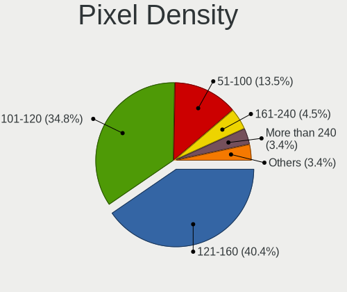

| Density       | Notebooks | Percent |
|---------------|-----------|---------|
| 121-160       | 25        | 45.45%  |
| 101-120       | 18        | 32.73%  |
| 51-100        | 6         | 10.91%  |
| More than 240 | 3         | 5.45%   |
| 161-240       | 2         | 3.64%   |
| Unknown       | 1         | 1.82%   |

Multiple Monitors
-----------------

Total monitors connected

| Total | Notebooks | Percent |
|-------|-----------|---------|
| 1     | 47        | 68.12%  |
| 0     | 17        | 24.64%  |
| 2     | 4         | 5.8%    |
| 3     | 1         | 1.45%   |

Network
-------

Net Controller Vendor
---------------------

Controller vendors

| Vendor                   | Notebooks | Percent |
|--------------------------|-----------|---------|
| Intel                    | 46        | 40.71%  |
| Realtek Semiconductor    | 33        | 29.2%   |
| Qualcomm Atheros         | 17        | 15.04%  |
| Broadcom                 | 10        | 8.85%   |
| Ralink Technology        | 2         | 1.77%   |
| Xiaomi                   | 1         | 0.88%   |
| Nvidia                   | 1         | 0.88%   |
| NetGear                  | 1         | 0.88%   |
| Marvell Technology Group | 1         | 0.88%   |
| Edimax Technology        | 1         | 0.88%   |

Net Controller Model
--------------------

Controller models

| Model                                                                   | Notebooks | Percent |
|-------------------------------------------------------------------------|-----------|---------|
| Realtek RTL8111/8168/8411 PCI Express Gigabit Ethernet Controller       | 21        | 15.11%  |
| Realtek RTL810xE PCI Express Fast Ethernet controller                   | 8         | 5.76%   |
| Intel Wireless 8265 / 8275                                              | 5         | 3.6%    |
| Intel Centrino Advanced-N 6205 [Taylor Peak]                            | 5         | 3.6%    |
| Intel 82579LM Gigabit Network Connection (Lewisville)                   | 5         | 3.6%    |
| Qualcomm Atheros AR9285 Wireless Network Adapter (PCI-Express)          | 4         | 2.88%   |
| Realtek RTL8188EUS 802.11n Wireless Network Adapter                     | 3         | 2.16%   |
| Qualcomm Atheros QCA9565 / AR9565 Wireless Network Adapter              | 3         | 2.16%   |
| Qualcomm Atheros QCA9377 802.11ac Wireless Network Adapter              | 3         | 2.16%   |
| Intel Wireless-AC 9260                                                  | 3         | 2.16%   |
| Intel Wireless 7265                                                     | 3         | 2.16%   |
| Intel Comet Lake PCH-LP CNVi WiFi                                       | 3         | 2.16%   |
| Broadcom BCM4313 802.11bgn Wireless Network Adapter                     | 3         | 2.16%   |
| Qualcomm Atheros AR9485 Wireless Network Adapter                        | 2         | 1.44%   |
| Qualcomm Atheros AR8152 v2.0 Fast Ethernet                              | 2         | 1.44%   |
| Intel Wireless 8260                                                     | 2         | 1.44%   |
| Intel Wireless 7260                                                     | 2         | 1.44%   |
| Intel Wireless 3165                                                     | 2         | 1.44%   |
| Intel Wireless 3160                                                     | 2         | 1.44%   |
| Intel Wi-Fi 6 AX200                                                     | 2         | 1.44%   |
| Intel Ethernet Connection I217-LM                                       | 2         | 1.44%   |
| Intel Ethernet Connection (4) I219-V                                    | 2         | 1.44%   |
| Intel Dual Band Wireless-AC 3168NGW [Stone Peak]                        | 2         | 1.44%   |
| Intel Comet Lake PCH CNVi WiFi                                          | 2         | 1.44%   |
| Intel Centrino Ultimate-N 6300                                          | 2         | 1.44%   |
| Intel Cannon Point-LP CNVi [Wireless-AC]                                | 2         | 1.44%   |
| Intel 82577LM Gigabit Network Connection                                | 2         | 1.44%   |
| Intel 82577LC Gigabit Network Connection                                | 2         | 1.44%   |
| Broadcom BCM43224 802.11a/b/g/n                                         | 2         | 1.44%   |
| Broadcom BCM43142 802.11b/g/n                                           | 2         | 1.44%   |
| Xiaomi Mi/Redmi series (RNDIS + ADB)                                    | 1         | 0.72%   |
| Realtek RTL8822CE 802.11ac PCIe Wireless Network Adapter                | 1         | 0.72%   |
| Realtek RTL8822BE 802.11a/b/g/n/ac WiFi adapter                         | 1         | 0.72%   |
| Realtek RTL8821CE 802.11ac PCIe Wireless Network Adapter                | 1         | 0.72%   |
| Realtek RTL8191SEvB Wireless LAN Controller                             | 1         | 0.72%   |
| Realtek RTL8188CE 802.11b/g/n WiFi Adapter                              | 1         | 0.72%   |
| Ralink RT5370 Wireless Adapter                                          | 1         | 0.72%   |
| Ralink RT2870/RT3070 Wireless Adapter                                   | 1         | 0.72%   |
| Qualcomm Atheros QCA8172 Fast Ethernet                                  | 1         | 0.72%   |
| Qualcomm Atheros QCA8171 Gigabit Ethernet                               | 1         | 0.72%   |
| Qualcomm Atheros Killer E2500 Gigabit Ethernet Controller               | 1         | 0.72%   |
| Qualcomm Atheros AR8151 v2.0 Gigabit Ethernet                           | 1         | 0.72%   |
| Qualcomm Atheros AR242x / AR542x Wireless Network Adapter (PCI-Express) | 1         | 0.72%   |
| Nvidia MCP79 Ethernet                                                   | 1         | 0.72%   |
| NetGear A6100 AC600 DB Wireless Adapter [Realtek RTL8811AU]             | 1         | 0.72%   |
| Marvell Group 88E8040 PCI-E Fast Ethernet Controller                    | 1         | 0.72%   |
| Intel WiFi Link 5100                                                    | 1         | 0.72%   |
| Intel Ultimate N WiFi Link 5300                                         | 1         | 0.72%   |
| Intel PRO/Wireless 3945ABG [Golan] Network Connection                   | 1         | 0.72%   |
| Intel Ethernet Connection I219-LM                                       | 1         | 0.72%   |
| Intel Ethernet Connection (7) I219-V                                    | 1         | 0.72%   |
| Intel Ethernet Connection (6) I219-LM                                   | 1         | 0.72%   |
| Intel Ethernet Connection (4) I219-LM                                   | 1         | 0.72%   |
| Intel Ethernet Connection (3) I218-LM                                   | 1         | 0.72%   |
| Intel Ethernet Connection (10) I219-LM                                  | 1         | 0.72%   |
| Intel Dual Band Wireless-AC 3165 Plus Bluetooth                         | 1         | 0.72%   |
| Intel Centrino Wireless-N 2230                                          | 1         | 0.72%   |
| Intel Centrino Advanced-N 6235                                          | 1         | 0.72%   |
| Intel Centrino Advanced-N 6200                                          | 1         | 0.72%   |
| Intel 82567LM Gigabit Network Connection                                | 1         | 0.72%   |

Wireless Vendor
---------------

Wireless vendors

| Vendor                | Notebooks | Percent |
|-----------------------|-----------|---------|
| Intel                 | 44        | 57.14%  |
| Qualcomm Atheros      | 13        | 16.88%  |
| Broadcom              | 9         | 11.69%  |
| Realtek Semiconductor | 7         | 9.09%   |
| Ralink Technology     | 2         | 2.6%    |
| NetGear               | 1         | 1.3%    |
| Edimax Technology     | 1         | 1.3%    |

Wireless Model
--------------

Wireless models

| Model                                                                   | Notebooks | Percent |
|-------------------------------------------------------------------------|-----------|---------|
| Intel Wireless 8265 / 8275                                              | 5         | 6.41%   |
| Intel Centrino Advanced-N 6205 [Taylor Peak]                            | 5         | 6.41%   |
| Qualcomm Atheros AR9285 Wireless Network Adapter (PCI-Express)          | 4         | 5.13%   |
| Realtek RTL8188EUS 802.11n Wireless Network Adapter                     | 3         | 3.85%   |
| Qualcomm Atheros QCA9565 / AR9565 Wireless Network Adapter              | 3         | 3.85%   |
| Qualcomm Atheros QCA9377 802.11ac Wireless Network Adapter              | 3         | 3.85%   |
| Intel Wireless-AC 9260                                                  | 3         | 3.85%   |
| Intel Wireless 7265                                                     | 3         | 3.85%   |
| Intel Comet Lake PCH-LP CNVi WiFi                                       | 3         | 3.85%   |
| Broadcom BCM4313 802.11bgn Wireless Network Adapter                     | 3         | 3.85%   |
| Qualcomm Atheros AR9485 Wireless Network Adapter                        | 2         | 2.56%   |
| Intel Wireless 8260                                                     | 2         | 2.56%   |
| Intel Wireless 7260                                                     | 2         | 2.56%   |
| Intel Wireless 3165                                                     | 2         | 2.56%   |
| Intel Wireless 3160                                                     | 2         | 2.56%   |
| Intel Wi-Fi 6 AX200                                                     | 2         | 2.56%   |
| Intel Dual Band Wireless-AC 3168NGW [Stone Peak]                        | 2         | 2.56%   |
| Intel Comet Lake PCH CNVi WiFi                                          | 2         | 2.56%   |
| Intel Centrino Ultimate-N 6300                                          | 2         | 2.56%   |
| Intel Cannon Point-LP CNVi [Wireless-AC]                                | 2         | 2.56%   |
| Broadcom BCM43224 802.11a/b/g/n                                         | 2         | 2.56%   |
| Broadcom BCM43142 802.11b/g/n                                           | 2         | 2.56%   |
| Realtek RTL8822CE 802.11ac PCIe Wireless Network Adapter                | 1         | 1.28%   |
| Realtek RTL8822BE 802.11a/b/g/n/ac WiFi adapter                         | 1         | 1.28%   |
| Realtek RTL8821CE 802.11ac PCIe Wireless Network Adapter                | 1         | 1.28%   |
| Realtek RTL8191SEvB Wireless LAN Controller                             | 1         | 1.28%   |
| Realtek RTL8188CE 802.11b/g/n WiFi Adapter                              | 1         | 1.28%   |
| Ralink RT5370 Wireless Adapter                                          | 1         | 1.28%   |
| Ralink RT2870/RT3070 Wireless Adapter                                   | 1         | 1.28%   |
| Qualcomm Atheros AR242x / AR542x Wireless Network Adapter (PCI-Express) | 1         | 1.28%   |
| NetGear A6100 AC600 DB Wireless Adapter [Realtek RTL8811AU]             | 1         | 1.28%   |
| Intel WiFi Link 5100                                                    | 1         | 1.28%   |
| Intel Ultimate N WiFi Link 5300                                         | 1         | 1.28%   |
| Intel PRO/Wireless 3945ABG [Golan] Network Connection                   | 1         | 1.28%   |
| Intel Dual Band Wireless-AC 3165 Plus Bluetooth                         | 1         | 1.28%   |
| Intel Centrino Wireless-N 2230                                          | 1         | 1.28%   |
| Intel Centrino Advanced-N 6235                                          | 1         | 1.28%   |
| Intel Centrino Advanced-N 6200                                          | 1         | 1.28%   |
| Edimax EW-7811Un 802.11n Wireless Adapter [Realtek RTL8188CUS]          | 1         | 1.28%   |
| Broadcom BCM4352 802.11ac Wireless Network Adapter                      | 1         | 1.28%   |
| Broadcom BCM4322 802.11a/b/g/n Wireless LAN Controller                  | 1         | 1.28%   |

Ethernet Vendor
---------------

Ethernet vendors

| Vendor                   | Notebooks | Percent |
|--------------------------|-----------|---------|
| Realtek Semiconductor    | 29        | 47.54%  |
| Intel                    | 20        | 32.79%  |
| Qualcomm Atheros         | 6         | 9.84%   |
| Broadcom                 | 3         | 4.92%   |
| Xiaomi                   | 1         | 1.64%   |
| Nvidia                   | 1         | 1.64%   |
| Marvell Technology Group | 1         | 1.64%   |

Ethernet Model
--------------

Ethernet models

| Model                                                             | Notebooks | Percent |
|-------------------------------------------------------------------|-----------|---------|
| Realtek RTL8111/8168/8411 PCI Express Gigabit Ethernet Controller | 21        | 34.43%  |
| Realtek RTL810xE PCI Express Fast Ethernet controller             | 8         | 13.11%  |
| Intel 82579LM Gigabit Network Connection (Lewisville)             | 5         | 8.2%    |
| Qualcomm Atheros AR8152 v2.0 Fast Ethernet                        | 2         | 3.28%   |
| Intel Ethernet Connection I217-LM                                 | 2         | 3.28%   |
| Intel Ethernet Connection (4) I219-V                              | 2         | 3.28%   |
| Intel 82577LM Gigabit Network Connection                          | 2         | 3.28%   |
| Intel 82577LC Gigabit Network Connection                          | 2         | 3.28%   |
| Xiaomi Mi/Redmi series (RNDIS + ADB)                              | 1         | 1.64%   |
| Qualcomm Atheros QCA8172 Fast Ethernet                            | 1         | 1.64%   |
| Qualcomm Atheros QCA8171 Gigabit Ethernet                         | 1         | 1.64%   |
| Qualcomm Atheros Killer E2500 Gigabit Ethernet Controller         | 1         | 1.64%   |
| Qualcomm Atheros AR8151 v2.0 Gigabit Ethernet                     | 1         | 1.64%   |
| Nvidia MCP79 Ethernet                                             | 1         | 1.64%   |
| Marvell Group 88E8040 PCI-E Fast Ethernet Controller              | 1         | 1.64%   |
| Intel Ethernet Connection I219-LM                                 | 1         | 1.64%   |
| Intel Ethernet Connection (7) I219-V                              | 1         | 1.64%   |
| Intel Ethernet Connection (6) I219-LM                             | 1         | 1.64%   |
| Intel Ethernet Connection (4) I219-LM                             | 1         | 1.64%   |
| Intel Ethernet Connection (3) I218-LM                             | 1         | 1.64%   |
| Intel Ethernet Connection (10) I219-LM                            | 1         | 1.64%   |
| Intel 82567LM Gigabit Network Connection                          | 1         | 1.64%   |
| Broadcom NetXtreme BCM5764M Gigabit Ethernet PCIe                 | 1         | 1.64%   |
| Broadcom NetXtreme BCM5761 Gigabit Ethernet PCIe                  | 1         | 1.64%   |
| Broadcom NetXtreme BCM5752 Gigabit Ethernet PCI Express           | 1         | 1.64%   |

Net Controller Kind
-------------------

Ethernet, WiFi or modem

| Kind     | Notebooks | Percent |
|----------|-----------|---------|
| WiFi     | 70        | 53.85%  |
| Ethernet | 60        | 46.15%  |

Used Controller
---------------

Currently used network controller

| Kind     | Notebooks | Percent |
|----------|-----------|---------|
| WiFi     | 55        | 50.46%  |
| Ethernet | 54        | 49.54%  |

NICs
----

Total network controllers on board

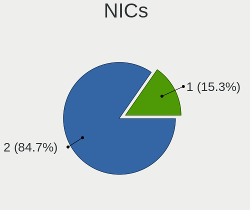

| Total | Notebooks | Percent |
|-------|-----------|---------|
| 2     | 59        | 85.51%  |
| 1     | 10        | 14.49%  |

IPv6
----

IPv6 vs IPv4

| Used | Notebooks | Percent |
|------|-----------|---------|
| No   | 62        | 89.86%  |
| Yes  | 7         | 10.14%  |

Bluetooth
---------

Bluetooth Vendor
----------------

Controller vendors

| Vendor                          | Notebooks | Percent |
|---------------------------------|-----------|---------|
| Intel                           | 29        | 59.18%  |
| Qualcomm Atheros Communications | 6         | 12.24%  |
| Broadcom                        | 4         | 8.16%   |
| Realtek Semiconductor           | 2         | 4.08%   |
| ASUSTek Computer                | 2         | 4.08%   |
| Apple                           | 2         | 4.08%   |
| Lite-On Technology              | 1         | 2.04%   |
| IMC Networks                    | 1         | 2.04%   |
| Foxconn / Hon Hai               | 1         | 2.04%   |
| Dell                            | 1         | 2.04%   |

Bluetooth Model
---------------

Controller models

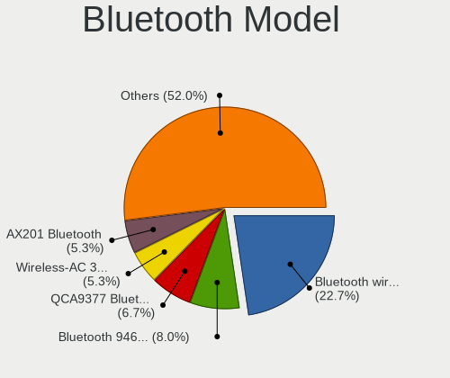

| Model                                                       | Notebooks | Percent |
|-------------------------------------------------------------|-----------|---------|
| Intel Bluetooth wireless interface                          | 14        | 28.57%  |
| Intel AX201 Bluetooth                                       | 4         | 8.16%   |
| Intel Bluetooth 9460/9560 Jefferson Peak (JfP)              | 3         | 6.12%   |
| Intel Wireless-AC 9260 Bluetooth Adapter                    | 2         | 4.08%   |
| Intel Wireless-AC 3168 Bluetooth                            | 2         | 4.08%   |
| Intel Centrino Bluetooth Wireless Transceiver               | 2         | 4.08%   |
| Intel AX200 Bluetooth                                       | 2         | 4.08%   |
| Apple Bluetooth Host Controller                             | 2         | 4.08%   |
| Realtek  Bluetooth Adapter                                  | 1         | 2.04%   |
| Realtek  Bluetooth 4.2 Adapter                              | 1         | 2.04%   |
| Qualcomm Atheros  QCA9377 Bluetooth 4.1                     | 1         | 2.04%   |
| Qualcomm Atheros Dell Wireless 1707 Bluetooth 4.0 LE Device | 1         | 2.04%   |
| Qualcomm Atheros Dell Wireless 1703 Bluetooth               | 1         | 2.04%   |
| Qualcomm Atheros AR9462 Bluetooth                           | 1         | 2.04%   |
| Qualcomm Atheros AR3012 Bluetooth 4.0                       | 1         | 2.04%   |
| Qualcomm Atheros AR3011 Bluetooth                           | 1         | 2.04%   |
| Lite-On Qualcomm Atheros QCA9377 Bluetooth                  | 1         | 2.04%   |
| IMC Networks Bluetooth Module                               | 1         | 2.04%   |
| Foxconn / Hon Hai Bluetooth USB Module                      | 1         | 2.04%   |
| Dell DW375 Bluetooth Module                                 | 1         | 2.04%   |
| Broadcom BCM43142 Bluetooth 4.0                             | 1         | 2.04%   |
| Broadcom BCM20702 Bluetooth 4.0 [ThinkPad]                  | 1         | 2.04%   |
| Broadcom BCM2045B (BDC-2.1)                                 | 1         | 2.04%   |
| Broadcom BCM2045 Bluetooth                                  | 1         | 2.04%   |
| ASUS BT-270 Bluetooth Adapter                               | 1         | 2.04%   |
| ASUS BT-253 Bluetooth Adapter                               | 1         | 2.04%   |

Sound
-----

Sound Vendor
------------

Sound card vendors

| Vendor                | Notebooks | Percent |
|-----------------------|-----------|---------|
| Intel                 | 64        | 80%     |
| Nvidia                | 9         | 11.25%  |
| AMD                   | 5         | 6.25%   |
| Realtek Semiconductor | 1         | 1.25%   |
| Lenovo                | 1         | 1.25%   |

Sound Model
-----------

Sound card models

| Model                                                                                             | Notebooks | Percent |
|---------------------------------------------------------------------------------------------------|-----------|---------|
| Intel Sunrise Point-LP HD Audio                                                                   | 10        | 10.53%  |
| Intel 6 Series/C200 Series Chipset Family High Definition Audio Controller                        | 9         | 9.47%   |
| Intel 5 Series/3400 Series Chipset High Definition Audio                                          | 6         | 6.32%   |
| Intel Wildcat Point-LP High Definition Audio Controller                                           | 5         | 5.26%   |
| Intel Broadwell-U Audio Controller                                                                | 5         | 5.26%   |
| Intel 7 Series/C216 Chipset Family High Definition Audio Controller                               | 5         | 5.26%   |
| Intel Comet Lake PCH-LP cAVS                                                                      | 4         | 4.21%   |
| Intel Cannon Point-LP High Definition Audio Controller                                            | 4         | 4.21%   |
| Intel Xeon E3-1200 v3/4th Gen Core Processor HD Audio Controller                                  | 3         | 3.16%   |
| Intel Haswell-ULT HD Audio Controller                                                             | 3         | 3.16%   |
| Intel Cannon Lake PCH cAVS                                                                        | 3         | 3.16%   |
| Intel 82801I (ICH9 Family) HD Audio Controller                                                    | 3         | 3.16%   |
| Intel 8 Series/C220 Series Chipset High Definition Audio Controller                               | 3         | 3.16%   |
| Intel 8 Series HD Audio Controller                                                                | 3         | 3.16%   |
| Nvidia TU107 GeForce GTX 1650 High Definition Audio Controller                                    | 2         | 2.11%   |
| Nvidia GT216 HDMI Audio Controller                                                                | 2         | 2.11%   |
| Intel NM10/ICH7 Family High Definition Audio Controller                                           | 2         | 2.11%   |
| Intel Comet Lake PCH cAVS                                                                         | 2         | 2.11%   |
| Intel 100 Series/C230 Series Chipset Family HD Audio Controller                                   | 2         | 2.11%   |
| AMD Renoir Radeon High Definition Audio Controller                                                | 2         | 2.11%   |
| AMD Family 17h (Models 10h-1fh) HD Audio Controller                                               | 2         | 2.11%   |
| Realtek Semiconductor TX-384Khz Hifi Type-C Audio                                                 | 1         | 1.05%   |
| Nvidia TU116 High Definition Audio Controller                                                     | 1         | 1.05%   |
| Nvidia TU104 HD Audio Controller                                                                  | 1         | 1.05%   |
| Nvidia MCP79 High Definition Audio                                                                | 1         | 1.05%   |
| Nvidia GF116 High Definition Audio Controller                                                     | 1         | 1.05%   |
| Nvidia GF108 High Definition Audio Controller                                                     | 1         | 1.05%   |
| Lenovo Lenovo ThinkPad OneLink Pro Dock                                                           | 1         | 1.05%   |
| Intel Ice Lake-LP Smart Sound Technology Audio Controller                                         | 1         | 1.05%   |
| Intel CM238 HD Audio Controller                                                                   | 1         | 1.05%   |
| Intel Atom/Celeron/Pentium Processor x5-E8000/J3xxx/N3xxx Series High Definition Audio Controller | 1         | 1.05%   |
| AMD Vega 10 HDMI Audio [Radeon Vega 56/64]                                                        | 1         | 1.05%   |
| AMD Kabini HDMI/DP Audio                                                                          | 1         | 1.05%   |
| AMD FCH Azalia Controller                                                                         | 1         | 1.05%   |
| AMD Family 17h (Models 00h-0fh) HD Audio Controller                                               | 1         | 1.05%   |
| AMD Cedar HDMI Audio [Radeon HD 5400/6300/7300 Series]                                            | 1         | 1.05%   |

Memory
------

Memory Vendor
-------------

Memory module vendors

| Vendor              | Notebooks | Percent |
|---------------------|-----------|---------|
| SK Hynix            | 23        | 27.71%  |
| Samsung Electronics | 22        | 26.51%  |
| Kingston            | 12        | 14.46%  |
| Crucial             | 6         | 7.23%   |
| Unknown             | 4         | 4.82%   |
| Ramaxel Technology  | 4         | 4.82%   |
| Micron Technology   | 4         | 4.82%   |
| Smart               | 2         | 2.41%   |
| Transcend           | 1         | 1.2%    |
| Qimonda             | 1         | 1.2%    |
| PUSKILL             | 1         | 1.2%    |
| Neo Forza           | 1         | 1.2%    |
| Corsair             | 1         | 1.2%    |
| A-DATA Technology   | 1         | 1.2%    |

Memory Model
------------

Memory module models

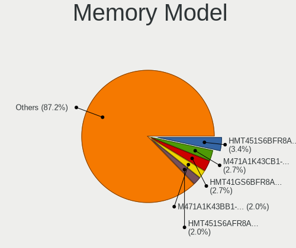

| Model                                                     | Notebooks | Percent |
|-----------------------------------------------------------|-----------|---------|
| SK Hynix RAM HMT325S6BFR8C-H9 2GB SODIMM DDR3 1333MT/s    | 3         | 3.41%   |
| SK Hynix RAM HMT451S6BFR8A-PB 4GB SODIMM DDR3 1600MT/s    | 2         | 2.27%   |
| SK Hynix RAM HMT351S6CFR8C-PB 4GB SODIMM DDR3 1600MT/s    | 2         | 2.27%   |
| SK Hynix RAM HMT351S6BFR8C-H9 4GB SODIMM DDR3 1333MT/s    | 2         | 2.27%   |
| Samsung RAM M471B5273DH0-CH9 4GB SODIMM DDR3 1334MT/s     | 2         | 2.27%   |
| Samsung RAM M471B5173QH0-YK0 4GB SODIMM DDR3 1600MT/s     | 2         | 2.27%   |
| Samsung RAM M471B5173DB0-YK0 4GB SODIMM DDR3 1600MT/s     | 2         | 2.27%   |
| Samsung RAM M471A1K43CB1-CTD 8GB SODIMM DDR4 2667MT/s     | 2         | 2.27%   |
| Unknown SODIMM 1GB SODIMM DDR2 533MT/s                    | 1         | 1.14%   |
| Unknown RAM Module 4GB SODIMM DDR4 2667MT/s               | 1         | 1.14%   |
| Unknown RAM Module 2GB SODIMM DDR2 667MT/s                | 1         | 1.14%   |
| Unknown RAM Module 2GB SODIMM 667MT/s                     | 1         | 1.14%   |
| Transcend RAM TS2GSH64V1B 16GB SODIMM DDR4 2133MT/s       | 1         | 1.14%   |
| Smart RAM SF4641G8CK8IEHLSBG 8GB SODIMM DDR4 2667MT/s     | 1         | 1.14%   |
| Smart RAM SF464128CKHIWDFSEG 4GB SODIMM DDR4 2133MT/s     | 1         | 1.14%   |
| SK Hynix RAM Module 8GB Row Of Chips LPDDR3 2133MT/s      | 1         | 1.14%   |
| SK Hynix RAM Module 4GB SODIMM DDR3 1600MT/s              | 1         | 1.14%   |
| SK Hynix RAM Module 4GB SODIMM DDR3 1067MT/s              | 1         | 1.14%   |
| SK Hynix RAM HYMP125S64CP8-S6 2GB SODIMM DDR 975MT/s      | 1         | 1.14%   |
| SK Hynix RAM HMT451S6AFR8C-PB 4GB SODIMM DDR3 1600MT/s    | 1         | 1.14%   |
| SK Hynix RAM HMT451S6AFR8A-PB 4GB SODIMM DDR3 1600MT/s    | 1         | 1.14%   |
| SK Hynix RAM HMT425S6AFR6A-PB 2GB SODIMM DDR3 1600MT/s    | 1         | 1.14%   |
| SK Hynix RAM HMT41GS6BFR8A-PB 8GB SODIMM DDR3 1600MT/s    | 1         | 1.14%   |
| SK Hynix RAM HMT351S6EFR8C-PB 4GB SODIMM DDR3 1600MT/s    | 1         | 1.14%   |
| SK Hynix RAM HMA851S6CJR6N-VK 4GB SODIMM DDR4 2667MT/s    | 1         | 1.14%   |
| SK Hynix RAM HMA851S6AFR6N-UH 4GB SODIMM DDR4 2400MT/s    | 1         | 1.14%   |
| SK Hynix RAM HMA82GS6JJR8N-VK 16GB SODIMM DDR4 2667MT/s   | 1         | 1.14%   |
| SK Hynix RAM HMA82GS6CJR8N-VK 16GB SODIMM DDR4 2667MT/s   | 1         | 1.14%   |
| SK Hynix RAM HMA81GS6JJR8N-VK 8GB SODIMM DDR4 2667MT/s    | 1         | 1.14%   |
| SK Hynix RAM HMA81GS6AFR8N-UH 8GB SODIMM DDR4 2400MT/s    | 1         | 1.14%   |
| Samsung RAM Module 8GB SODIMM DDR4 2133MT/s               | 1         | 1.14%   |
| Samsung RAM M471B5673EH1-CF8 2GB SODIMM DDR3 1067MT/s     | 1         | 1.14%   |
| Samsung RAM M471B5673DZ1-CF8 2GB SODIMM DDR3 1066MT/s     | 1         | 1.14%   |
| Samsung RAM M471B5273DH0-CK0 4GB SODIMM DDR3 1600MT/s     | 1         | 1.14%   |
| Samsung RAM M471B5273CM0-CH9 4GB SODIMM DDR3 1333MT/s     | 1         | 1.14%   |
| Samsung RAM M471B5273CH0-CK0 4GB SODIMM DDR3 1600MT/s     | 1         | 1.14%   |
| Samsung RAM M471B5273CH0-CH9 4GB SODIMM DDR3 1333MT/s     | 1         | 1.14%   |
| Samsung RAM M471B1G73QH0-YK0 8GB SODIMM DDR3 1600MT/s     | 1         | 1.14%   |
| Samsung RAM M471B1G73EB0-YK0 8GB SODIMM DDR3 1600MT/s     | 1         | 1.14%   |
| Samsung RAM M471A4G43MB1-CTD 32GB SODIMM DDR4 2667MT/s    | 1         | 1.14%   |
| Samsung RAM M471A2K43EB1-CTD 16GB SODIMM DDR4 2667MT/s    | 1         | 1.14%   |
| Samsung RAM M471A1K43DB1-CWE 8GB SODIMM DDR4 3200MT/s     | 1         | 1.14%   |
| Samsung RAM M471A1K43CB1-CRC 8GB SODIMM DDR4 2400MT/s     | 1         | 1.14%   |
| Samsung RAM M471A1K43BB1-CRC 8GB SODIMM DDR4 2400MT/s     | 1         | 1.14%   |
| Samsung RAM M471A1G44AB0-CWE 8GB SODIMM DDR4 3200MT/s     | 1         | 1.14%   |
| Samsung RAM K4E6E304ED 4GB SODIMM DDR3 1600MT/s           | 1         | 1.14%   |
| Samsung RAM K4AAG165WA-BCTD 8GB SODIMM DDR4 2667MT/s      | 1         | 1.14%   |
| Ramaxel RAM RMT3170EB68F9W1600 4GB SODIMM DDR3 800MT/s    | 1         | 1.14%   |
| Ramaxel RAM RMSA3260ME78HAF-2666 8GB SODIMM DDR4 2667MT/s | 1         | 1.14%   |
| Ramaxel RAM RMSA3260MB78HAF2400 8GB SODIMM DDR4 2133MT/s  | 1         | 1.14%   |
| Ramaxel RAM RMN1740EF48D8W-800 2GB SODIMM DDR2 800MT/s    | 1         | 1.14%   |
| Qimonda RAM 64T128021HDL3SB 1GB SODIMM DDR 667MT/s        | 1         | 1.14%   |
| PUSKILL RAM PJ16TFK1GM8 16GB SODIMM DDR4 2133MT/s         | 1         | 1.14%   |
| Neo Forza RAM NMSO480E82-2666E 8GB SODIMM DDR4 2667MT/s   | 1         | 1.14%   |
| Micron RAM 8ATF1G64HZ-3G2J1 8GB SODIMM DDR4 3200MT/s      | 1         | 1.14%   |
| Micron RAM 8ATF1G64HZ-2G6E1 8GB SODIMM DDR4 2667MT/s      | 1         | 1.14%   |
| Micron RAM 4ATF1G64HZ-3G2E1 8GB SODIMM DDR4 3200MT/s      | 1         | 1.14%   |
| Micron RAM 16ATF2G64HZ-2G3E1 16GB SODIMM DDR4 2400MT/s    | 1         | 1.14%   |
| Kingston RAM SNY1600S11-4G-EDEG 4GB SODIMM DDR3 1067MT/s  | 1         | 1.14%   |
| Kingston RAM MSI16D3LS1MNG/8G 8GB SODIMM DDR3 1600MT/s    | 1         | 1.14%   |

Memory Kind
-----------

Memory module kinds

| Kind    | Notebooks | Percent |
|---------|-----------|---------|
| DDR3    | 34        | 48.57%  |
| DDR4    | 29        | 41.43%  |
| DDR2    | 4         | 5.71%   |
| LPDDR3  | 1         | 1.43%   |
| DDR     | 1         | 1.43%   |
| Unknown | 1         | 1.43%   |

Memory Form Factor
------------------

Physical design of the memory module

| Name         | Notebooks | Percent |
|--------------|-----------|---------|
| SODIMM       | 68        | 98.55%  |
| Row Of Chips | 1         | 1.45%   |

Memory Size
-----------

Memory module size

| Size  | Notebooks | Percent |
|-------|-----------|---------|
| 4096  | 29        | 38.16%  |
| 8192  | 25        | 32.89%  |
| 16384 | 9         | 11.84%  |
| 2048  | 9         | 11.84%  |
| 32768 | 2         | 2.63%   |
| 1024  | 2         | 2.63%   |

Memory Speed
------------

Memory module speed

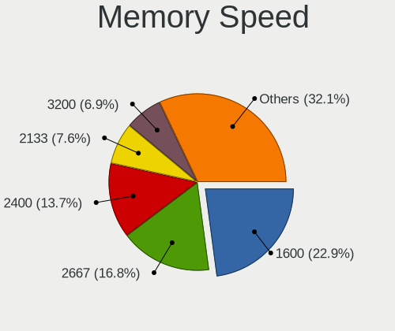

| Speed | Notebooks | Percent |
|-------|-----------|---------|
| 1600  | 21        | 27.27%  |
| 2667  | 15        | 19.48%  |
| 2400  | 9         | 11.69%  |
| 2133  | 7         | 9.09%   |
| 1333  | 7         | 9.09%   |
| 1067  | 5         | 6.49%   |
| 3200  | 3         | 3.9%    |
| 667   | 3         | 3.9%    |
| 1334  | 2         | 2.6%    |
| 800   | 2         | 2.6%    |
| 1066  | 1         | 1.3%    |
| 975   | 1         | 1.3%    |
| 533   | 1         | 1.3%    |

Printers & scanners
-------------------

Printer Vendor
--------------

Printer device vendors

Zero info for selected period =(

Printer Model
-------------

Printer device models

Zero info for selected period =(

Scanner Vendor
--------------

Scanner device vendors

Zero info for selected period =(

Scanner Model
-------------

Scanner device models

Zero info for selected period =(

Camera
------

Camera Vendor
-------------

Camera device vendors

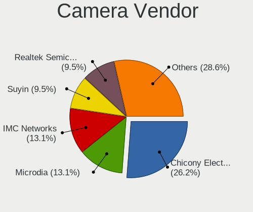

| Vendor                        | Notebooks | Percent |
|-------------------------------|-----------|---------|
| Chicony Electronics           | 17        | 32.69%  |
| Microdia                      | 7         | 13.46%  |
| IMC Networks                  | 7         | 13.46%  |
| Realtek Semiconductor         | 6         | 11.54%  |
| Sunplus Innovation Technology | 5         | 9.62%   |
| Suyin                         | 4         | 7.69%   |
| Z-Star Microelectronics       | 1         | 1.92%   |
| Syntek                        | 1         | 1.92%   |
| Silicon Motion                | 1         | 1.92%   |
| Quanta                        | 1         | 1.92%   |
| Lenovo                        | 1         | 1.92%   |
| Acer                          | 1         | 1.92%   |

Camera Model
------------

Camera device models

| Model                                     | Notebooks | Percent |
|-------------------------------------------|-----------|---------|
| Chicony Integrated Camera                 | 4         | 7.69%   |
| IMC Networks Integrated Camera            | 3         | 5.77%   |
| Realtek Integrated_Webcam_HD              | 2         | 3.85%   |
| Microdia Integrated Webcam                | 2         | 3.85%   |
| Chicony Lenovo Integrated Camera (0.3MP)  | 2         | 3.85%   |
| Chicony HD WebCam                         | 2         | 3.85%   |
| Chicony Chicony USB2.0 Camera             | 2         | 3.85%   |
| Z-Star Namuga 1.3M Webcam                 | 1         | 1.92%   |
| Syntek Lenovo EasyCamera                  | 1         | 1.92%   |
| Suyin Integrated Camera                   | 1         | 1.92%   |
| Suyin HP Webcam-101                       | 1         | 1.92%   |
| Suyin Asus Integrated Webcam              | 1         | 1.92%   |
| Suyin Acer Crystal Eye webcam             | 1         | 1.92%   |
| Sunplus Laptop_Integrated_Webcam_FHD      | 1         | 1.92%   |
| Sunplus Laptop Integrated Webcam HD       | 1         | 1.92%   |
| Sunplus Integrated_Webcam_HD              | 1         | 1.92%   |
| Sunplus Integrated Camera                 | 1         | 1.92%   |
| Sunplus Dell HD Webcam                    | 1         | 1.92%   |
| Silicon Motion Web Camera                 | 1         | 1.92%   |
| Realtek USB 2 Webcam                      | 1         | 1.92%   |
| Realtek Realtek PC Camera                 | 1         | 1.92%   |
| Realtek Lenovo EasyCamera                 | 1         | 1.92%   |
| Realtek Integrated Webcam HD              | 1         | 1.92%   |
| Quanta HD Webcam                          | 1         | 1.92%   |
| Microdia Laptop_Integrated_Webcam_2M      | 1         | 1.92%   |
| Microdia Laptop_Integrated_Webcam_0.3M    | 1         | 1.92%   |
| Microdia Integrated_Webcam_HD             | 1         | 1.92%   |
| Microdia Integrated Webcam HD             | 1         | 1.92%   |
| Microdia Dell Laptop Integrated Webcam HD | 1         | 1.92%   |
| Lenovo Integrated Webcam [R5U877]         | 1         | 1.92%   |
| IMC Networks UVC VGA Webcam               | 1         | 1.92%   |
| IMC Networks USB2.0 UVC HD Webcam         | 1         | 1.92%   |
| IMC Networks USB2.0 UVC 2M WebCam         | 1         | 1.92%   |
| IMC Networks EasyCamera                   | 1         | 1.92%   |
| Chicony USB2.0 HD UVC WebCam              | 1         | 1.92%   |
| Chicony TOSHIBA Web Camera - HD           | 1         | 1.92%   |
| Chicony Lenovo EasyCamera                 | 1         | 1.92%   |
| Chicony HP Wide Vision HD Camera          | 1         | 1.92%   |
| Chicony HP Universal Camera               | 1         | 1.92%   |
| Chicony HP TrueVision HD Camera           | 1         | 1.92%   |
| Chicony Chicony USB 2.0 Camera            | 1         | 1.92%   |
| Acer Integrated Camera                    | 1         | 1.92%   |

Security
--------

Fingerprint Vendor
------------------

Fingerprint sensor vendors

| Vendor                     | Notebooks | Percent |
|----------------------------|-----------|---------|
| Synaptics                  | 3         | 27.27%  |
| Shenzhen Goodix Technology | 3         | 27.27%  |
| Validity Sensors           | 2         | 18.18%  |
| Upek                       | 1         | 9.09%   |
| Broadcom                   | 1         | 9.09%   |
| AuthenTec                  | 1         | 9.09%   |

Fingerprint Model
-----------------

Fingerprint sensor models

| Model                                                                        | Notebooks | Percent |
|------------------------------------------------------------------------------|-----------|---------|
| Validity Sensors VFS 5011 fingerprint sensor                                 | 1         | 9.09%   |
| Validity Sensors Synaptics WBDI                                              | 1         | 9.09%   |
| Upek Biometric Touchchip/Touchstrip Fingerprint Sensor                       | 1         | 9.09%   |
| Synaptics Prometheus MIS Touch Fingerprint Reader                            | 1         | 9.09%   |
| Synaptics Metallica MOH Touch Fingerprint Reader                             | 1         | 9.09%   |
| Synaptics Metallica MIS Touch Fingerprint Reader                             | 1         | 9.09%   |
| Shenzhen Goodix  FingerPrint Device                                          | 1         | 9.09%   |
| Shenzhen Goodix Fingerprint Reader                                           | 1         | 9.09%   |
| Shenzhen Goodix FingerPrint                                                  | 1         | 9.09%   |
| Broadcom BCM5880 Secure Applications Processor with fingerprint swipe sensor | 1         | 9.09%   |
| AuthenTec AuthenTec Inc. AES1660                                             | 1         | 9.09%   |

Chipcard Vendor
---------------

Chipcard module vendors

Zero info for selected period =(

Chipcard Model
--------------

Chipcard module models

Zero info for selected period =(

Unsupported
-----------

Unsupported Devices
-------------------

Total unsupported devices on board

| Total | Notebooks | Percent |
|-------|-----------|---------|
| 1     | 23        | 33.33%  |
| 2     | 22        | 31.88%  |
| 3     | 12        | 17.39%  |
| 0     | 6         | 8.7%    |
| 4     | 5         | 7.25%   |
| 6     | 1         | 1.45%   |

Unsupported Device Types
------------------------

Types of unsupported devices

| Type                     | Notebooks | Percent |
|--------------------------|-----------|---------|
| Communication controller | 53        | 43.09%  |
| Net/wireless             | 21        | 17.07%  |
| Bluetooth                | 16        | 13.01%  |
| Fingerprint reader       | 11        | 8.94%   |
| Card reader              | 11        | 8.94%   |
| Firewire controller      | 9         | 7.32%   |
| Storage                  | 1         | 0.81%   |
| Net/ethernet             | 1         | 0.81%   |

