FreeBSD 13.0 - Tested Hardware & Statistics
-------------------------------------------

A project to collect tested hardware configurations for FreeBSD 13.0.

Anyone can contribute to this report by the [hw-probe](https://github.com/linuxhw/hw-probe/blob/master/INSTALL.BSD.md) tool:

    hw-probe -all -upload

Please submit a probe of your configuration if it's not presented on the page or is rare.

This is a report for all computer types. See also reports for [desktops](/Dist/FreeBSD_13.0/Desktop/README.md) and [notebooks](/Dist/FreeBSD_13.0/Notebook/README.md).

Full-feature report is available here: https://bsd-hardware.info/?view=trends&rel=freebsd-13.0

Contents
--------

* [ Test Cases ](#test-cases)

* [ System ](#system)
  - [ Arch                     ](#arch)
  - [ DE                       ](#de)
  - [ Display Server           ](#display-server)
  - [ Display Manager          ](#display-manager)
  - [ OS Lang                  ](#os-lang)
  - [ Boot Mode                ](#boot-mode)
  - [ Filesystem               ](#filesystem)
  - [ Part. scheme             ](#part-scheme)

* [ Board ](#board)
  - [ Vendor                   ](#vendor)
  - [ Model                    ](#model)
  - [ Model Family             ](#model-family)
  - [ MFG Year                 ](#mfg-year)
  - [ Form Factor              ](#form-factor)
  - [ Coreboot                 ](#coreboot)
  - [ RAM Size                 ](#ram-size)
  - [ RAM Used                 ](#ram-used)
  - [ Total Drives             ](#total-drives)
  - [ Has CD-ROM               ](#has-cd-rom)
  - [ Has Ethernet             ](#has-ethernet)
  - [ Has WiFi                 ](#has-wifi)
  - [ Has Bluetooth            ](#has-bluetooth)

* [ Location ](#location)
  - [ Country                  ](#country)
  - [ City                     ](#city)

* [ Drives ](#drives)
  - [ Drive Vendor             ](#drive-vendor)
  - [ Drive Model              ](#drive-model)
  - [ HDD Vendor               ](#hdd-vendor)
  - [ SSD Vendor               ](#ssd-vendor)
  - [ Drive Kind               ](#drive-kind)
  - [ Drive Connector          ](#drive-connector)
  - [ Drive Size               ](#drive-size)
  - [ Space Total              ](#space-total)
  - [ Space Used               ](#space-used)
  - [ Malfunc. Drives          ](#malfunc-drives)
  - [ Malfunc. Drive Vendor    ](#malfunc-drive-vendor)
  - [ Malfunc. HDD Vendor      ](#malfunc-hdd-vendor)
  - [ Malfunc. Drive Kind      ](#malfunc-drive-kind)
  - [ Failed Drives            ](#failed-drives)
  - [ Failed Drive Vendor      ](#failed-drive-vendor)
  - [ Drive Status             ](#drive-status)

* [ Storage controller ](#storage-controller)
  - [ Storage Vendor           ](#storage-vendor)
  - [ Storage Model            ](#storage-model)
  - [ Storage Kind             ](#storage-kind)

* [ Processor ](#processor)
  - [ CPU Vendor               ](#cpu-vendor)
  - [ CPU Model                ](#cpu-model)
  - [ CPU Model Family         ](#cpu-model-family)
  - [ CPU Cores                ](#cpu-cores)
  - [ CPU Sockets              ](#cpu-sockets)
  - [ CPU Threads              ](#cpu-threads)
  - [ CPU Microarch            ](#cpu-microarch)

* [ Graphics ](#graphics)
  - [ GPU Vendor               ](#gpu-vendor)
  - [ GPU Model                ](#gpu-model)
  - [ GPU Combo                ](#gpu-combo)
  - [ GPU Driver               ](#gpu-driver)
  - [ GPU Memory               ](#gpu-memory)

* [ Monitor ](#monitor)
  - [ Monitor Vendor           ](#monitor-vendor)
  - [ Monitor Model            ](#monitor-model)
  - [ Monitor Resolution       ](#monitor-resolution)
  - [ Monitor Diagonal         ](#monitor-diagonal)
  - [ Monitor Width            ](#monitor-width)
  - [ Aspect Ratio             ](#aspect-ratio)
  - [ Monitor Area             ](#monitor-area)
  - [ Pixel Density            ](#pixel-density)
  - [ Multiple Monitors        ](#multiple-monitors)

* [ Network ](#network)
  - [ Net Controller Vendor    ](#net-controller-vendor)
  - [ Net Controller Model     ](#net-controller-model)
  - [ Wireless Vendor          ](#wireless-vendor)
  - [ Wireless Model           ](#wireless-model)
  - [ Ethernet Vendor          ](#ethernet-vendor)
  - [ Ethernet Model           ](#ethernet-model)
  - [ Net Controller Kind      ](#net-controller-kind)
  - [ Used Controller          ](#used-controller)
  - [ NICs                     ](#nics)
  - [ IPv6                     ](#ipv6)

* [ Bluetooth ](#bluetooth)
  - [ Bluetooth Vendor         ](#bluetooth-vendor)
  - [ Bluetooth Model          ](#bluetooth-model)

* [ Sound ](#sound)
  - [ Sound Vendor             ](#sound-vendor)
  - [ Sound Model              ](#sound-model)

* [ Memory ](#memory)
  - [ Memory Vendor            ](#memory-vendor)
  - [ Memory Model             ](#memory-model)
  - [ Memory Kind              ](#memory-kind)
  - [ Memory Form Factor       ](#memory-form-factor)
  - [ Memory Size              ](#memory-size)
  - [ Memory Speed             ](#memory-speed)

* [ Printers & scanners ](#printers--scanners)
  - [ Printer Vendor           ](#printer-vendor)
  - [ Printer Model            ](#printer-model)
  - [ Scanner Vendor           ](#scanner-vendor)
  - [ Scanner Model            ](#scanner-model)

* [ Camera ](#camera)
  - [ Camera Vendor            ](#camera-vendor)
  - [ Camera Model             ](#camera-model)

* [ Security ](#security)
  - [ Fingerprint Vendor       ](#fingerprint-vendor)
  - [ Fingerprint Model        ](#fingerprint-model)
  - [ Chipcard Vendor          ](#chipcard-vendor)
  - [ Chipcard Model           ](#chipcard-model)

* [ Unsupported ](#unsupported)
  - [ Unsupported Devices      ](#unsupported-devices)
  - [ Unsupported Device Types ](#unsupported-device-types)

Test Cases
----------

| Vendor        | Model                       | Form-Factor | Probe                                                     | Date         |
|---------------|-----------------------------|-------------|-----------------------------------------------------------|--------------|
| Supermicro    | X7SPA-HF                    | Desktop     | [19a0911df6](https://bsd-hardware.info/?probe=19a0911df6) | Oct 31, 2021 |
| MSI           | GS65 Stealth Thin 8RF       | Notebook    | [eb5c495379](https://bsd-hardware.info/?probe=eb5c495379) | Oct 30, 2021 |
| Supermicro    | X7SPA-HF                    | Desktop     | [a33aece313](https://bsd-hardware.info/?probe=a33aece313) | Oct 24, 2021 |
| Lenovo        | ThinkPad Mini10 3507A31     | Notebook    | [ced0819a8e](https://bsd-hardware.info/?probe=ced0819a8e) | Oct 24, 2021 |
| Dell          | 02P9X9 A05                  | Server      | [e26c6a355d](https://bsd-hardware.info/?probe=e26c6a355d) | Oct 24, 2021 |
| Lenovo        | G580 26897SJ                | Notebook    | [da14095fb7](https://bsd-hardware.info/?probe=da14095fb7) | Oct 20, 2021 |
| Unknown       | Unknown                     | Desktop     | [39c78ac754](https://bsd-hardware.info/?probe=39c78ac754) | Oct 19, 2021 |
| Unknown       | Unknown                     | Desktop     | [5173ffc13b](https://bsd-hardware.info/?probe=5173ffc13b) | Oct 17, 2021 |
| Supermicro    | X7SPA-HF                    | Desktop     | [9e9b5166bc](https://bsd-hardware.info/?probe=9e9b5166bc) | Oct 17, 2021 |
| ASUSTek       | P5Q-E                       | Desktop     | [da31eaf836](https://bsd-hardware.info/?probe=da31eaf836) | Oct 17, 2021 |
| MSI           | H81M-P33                    | Desktop     | [2e84516857](https://bsd-hardware.info/?probe=2e84516857) | Oct 17, 2021 |
| Dell          | 0Y7WYT A00                  | Desktop     | [1de7ed2a67](https://bsd-hardware.info/?probe=1de7ed2a67) | Oct 16, 2021 |
| ASUSTek       | ROG STRIX X470-F GAMING     | Desktop     | [6ceda5d7b4](https://bsd-hardware.info/?probe=6ceda5d7b4) | Oct 15, 2021 |
| Lenovo        | IdeaPad 320-15ABR 80XS      | Notebook    | [d6c59472e5](https://bsd-hardware.info/?probe=d6c59472e5) | Oct 15, 2021 |
| Dell          | Inspiron 7460               | Notebook    | [3dbc09a4df](https://bsd-hardware.info/?probe=3dbc09a4df) | Oct 13, 2021 |
| Google        | Terra                       | Notebook    | [9ba239a4a3](https://bsd-hardware.info/?probe=9ba239a4a3) | Oct 10, 2021 |
| Supermicro    | X7SPA-HF                    | Desktop     | [65954adbf3](https://bsd-hardware.info/?probe=65954adbf3) | Oct 10, 2021 |
| MSI           | H81M-P33                    | Desktop     | [592dbd7c17](https://bsd-hardware.info/?probe=592dbd7c17) | Oct 10, 2021 |
| ASUSTek       | P5Q-E                       | Desktop     | [00efddc7e4](https://bsd-hardware.info/?probe=00efddc7e4) | Oct 10, 2021 |
| Framework     | Laptop                      | Notebook    | [1e67a5d922](https://bsd-hardware.info/?probe=1e67a5d922) | Oct 08, 2021 |
| Supermicro    | X7SPA-HF                    | Desktop     | [d65e453ea7](https://bsd-hardware.info/?probe=d65e453ea7) | Oct 03, 2021 |
| MSI           | H81M-P33                    | Desktop     | [fd498893fb](https://bsd-hardware.info/?probe=fd498893fb) | Oct 03, 2021 |
| ASUSTek       | P5Q-E                       | Desktop     | [0bfcd11255](https://bsd-hardware.info/?probe=0bfcd11255) | Oct 03, 2021 |
| ASUSTek       | H81M-E                      | Desktop     | [0cc0d2dcb1](https://bsd-hardware.info/?probe=0cc0d2dcb1) | Oct 01, 2021 |
| ASUSTek       | H81M-E                      | Desktop     | [76866f2db7](https://bsd-hardware.info/?probe=76866f2db7) | Oct 01, 2021 |
| ASUSTek       | H81M-E                      | Desktop     | [319470ebbd](https://bsd-hardware.info/?probe=319470ebbd) | Oct 01, 2021 |
| Lenovo        | IdeaPad 320-15AST 80XV      | Notebook    | [1c4cf7c21c](https://bsd-hardware.info/?probe=1c4cf7c21c) | Sep 30, 2021 |
| Apple         | MacBookPro13,2              | Notebook    | [0bf74dea55](https://bsd-hardware.info/?probe=0bf74dea55) | Sep 30, 2021 |
| Supermicro    | X7SPA-HF                    | Desktop     | [18cd64ae96](https://bsd-hardware.info/?probe=18cd64ae96) | Sep 26, 2021 |
| MSI           | H81M-P33                    | Desktop     | [8a8d67b8b1](https://bsd-hardware.info/?probe=8a8d67b8b1) | Sep 26, 2021 |
| ASUSTek       | P5Q-E                       | Desktop     | [fb056a1840](https://bsd-hardware.info/?probe=fb056a1840) | Sep 26, 2021 |
| ASUSTek       | H81M-E                      | Desktop     | [137654a2f8](https://bsd-hardware.info/?probe=137654a2f8) | Sep 24, 2021 |
| ASUSTek       | H81M-E                      | Desktop     | [dec23f7ff8](https://bsd-hardware.info/?probe=dec23f7ff8) | Sep 23, 2021 |
| Dell          | Latitude E7450              | Notebook    | [4f1e40ad63](https://bsd-hardware.info/?probe=4f1e40ad63) | Sep 21, 2021 |
| Supermicro    | X7SPA-HF                    | Desktop     | [6b68e14399](https://bsd-hardware.info/?probe=6b68e14399) | Sep 19, 2021 |
| MSI           | H81M-P33                    | Desktop     | [60ec488627](https://bsd-hardware.info/?probe=60ec488627) | Sep 19, 2021 |
| ASUSTek       | P5Q-E                       | Desktop     | [c2d07d370e](https://bsd-hardware.info/?probe=c2d07d370e) | Sep 19, 2021 |
| ASUSTek       | ASUS TUF Gaming A17 FA70... | Notebook    | [22c1aefeab](https://bsd-hardware.info/?probe=22c1aefeab) | Sep 19, 2021 |
| Lenovo        | G40-70 20369                | Notebook    | [ef8eafa662](https://bsd-hardware.info/?probe=ef8eafa662) | Sep 18, 2021 |
| Unknown       | Unknown                     | Desktop     | [392cf6ec24](https://bsd-hardware.info/?probe=392cf6ec24) | Sep 17, 2021 |
| Unknown       | Unknown                     | Desktop     | [198c4264f9](https://bsd-hardware.info/?probe=198c4264f9) | Sep 16, 2021 |
| Unknown       | Unknown                     | Desktop     | [d05c3ba858](https://bsd-hardware.info/?probe=d05c3ba858) | Sep 15, 2021 |
| Unknown       | Unknown                     | Desktop     | [062602e8db](https://bsd-hardware.info/?probe=062602e8db) | Sep 15, 2021 |
| Intel         | NUC5CPYB H61145-413         | Mini pc     | [072047d3e5](https://bsd-hardware.info/?probe=072047d3e5) | Sep 12, 2021 |
| Supermicro    | X7SPA-HF                    | Desktop     | [4d1aa99478](https://bsd-hardware.info/?probe=4d1aa99478) | Sep 12, 2021 |
| ASUSTek       | P5Q-E                       | Desktop     | [8055702eac](https://bsd-hardware.info/?probe=8055702eac) | Sep 12, 2021 |
| MSI           | H81M-P33                    | Desktop     | [a8feb1807d](https://bsd-hardware.info/?probe=a8feb1807d) | Sep 12, 2021 |
| ASUSTek       | TP300LD                     | Notebook    | [e9d8f7de51](https://bsd-hardware.info/?probe=e9d8f7de51) | Sep 09, 2021 |
| ASUSTek       | VX7SX                       | Notebook    | [6ca36a455d](https://bsd-hardware.info/?probe=6ca36a455d) | Sep 09, 2021 |
| Unknown       | Unknown                     | Desktop     | [5933c93a5b](https://bsd-hardware.info/?probe=5933c93a5b) | Sep 09, 2021 |
| Dell          | XPS 15 9500                 | Notebook    | [30424125f5](https://bsd-hardware.info/?probe=30424125f5) | Sep 08, 2021 |
| Dell          | XPS 15 9500                 | Notebook    | [76da651584](https://bsd-hardware.info/?probe=76da651584) | Sep 08, 2021 |
| Supermicro    | X7SPA-HF                    | Desktop     | [b1677cb485](https://bsd-hardware.info/?probe=b1677cb485) | Sep 05, 2021 |
| ASUSTek       | P5Q-E                       | Desktop     | [33392e3299](https://bsd-hardware.info/?probe=33392e3299) | Sep 05, 2021 |
| MSI           | H81M-P33                    | Desktop     | [ad52aa4ea5](https://bsd-hardware.info/?probe=ad52aa4ea5) | Sep 05, 2021 |
| Lenovo        | ThinkPad E15 Gen 3 20YG0... | Notebook    | [5147f5734d](https://bsd-hardware.info/?probe=5147f5734d) | Sep 04, 2021 |
| Lenovo        | ThinkPad E15 Gen 3 20YG0... | Notebook    | [2e8b641cc4](https://bsd-hardware.info/?probe=2e8b641cc4) | Sep 04, 2021 |
| Apple         | MacBookPro5,1               | Notebook    | [2cba98f24b](https://bsd-hardware.info/?probe=2cba98f24b) | Sep 04, 2021 |
| Dell          | Latitude E6530              | Notebook    | [8dbff835d2](https://bsd-hardware.info/?probe=8dbff835d2) | Sep 02, 2021 |
| Apple         | Mac-F2268CC8                | All in one  | [28bf815655](https://bsd-hardware.info/?probe=28bf815655) | Aug 30, 2021 |
| Supermicro    | X7SPA-HF                    | Desktop     | [1d408ec8df](https://bsd-hardware.info/?probe=1d408ec8df) | Aug 29, 2021 |
| ASUSTek       | P5Q-E                       | Desktop     | [37fe7a021f](https://bsd-hardware.info/?probe=37fe7a021f) | Aug 29, 2021 |
| MSI           | H81M-P33                    | Desktop     | [90f439a559](https://bsd-hardware.info/?probe=90f439a559) | Aug 29, 2021 |
| Medion        | MS-7616                     | Desktop     | [98f0e21e6c](https://bsd-hardware.info/?probe=98f0e21e6c) | Aug 26, 2021 |
| Medion        | MS-7616                     | Desktop     | [663b50102d](https://bsd-hardware.info/?probe=663b50102d) | Aug 26, 2021 |
| HP            | 18E6                        | All in one  | [20d70ad9ba](https://bsd-hardware.info/?probe=20d70ad9ba) | Aug 26, 2021 |
| ASRock        | B450M Pro4                  | Desktop     | [70dc185964](https://bsd-hardware.info/?probe=70dc185964) | Aug 25, 2021 |
| Unknown       | Raspberry Pi                | Soc         | [0b02720fcc](https://bsd-hardware.info/?probe=0b02720fcc) | Aug 23, 2021 |
| Gigabyte      | X570 I AORUS PRO WIFI       | Desktop     | [3e088c942b](https://bsd-hardware.info/?probe=3e088c942b) | Aug 22, 2021 |
| Supermicro    | X7SPA-HF                    | Desktop     | [0db2178b94](https://bsd-hardware.info/?probe=0db2178b94) | Aug 22, 2021 |
| ASUSTek       | P5Q-E                       | Desktop     | [eee5ea8171](https://bsd-hardware.info/?probe=eee5ea8171) | Aug 22, 2021 |
| MSI           | H81M-P33                    | Desktop     | [ceb4fcb174](https://bsd-hardware.info/?probe=ceb4fcb174) | Aug 22, 2021 |
| Supermicro    | X7SPA-HF                    | Desktop     | [9fa08ee32f](https://bsd-hardware.info/?probe=9fa08ee32f) | Aug 15, 2021 |
| ASUSTek       | P5Q-E                       | Desktop     | [3f15cbe8cc](https://bsd-hardware.info/?probe=3f15cbe8cc) | Aug 15, 2021 |
| MSI           | H81M-P33                    | Desktop     | [8a9a281ee1](https://bsd-hardware.info/?probe=8a9a281ee1) | Aug 15, 2021 |
| Cisco Syst... | UCSC-C240-M3L 74-10443-0... | Desktop     | [adf41eedab](https://bsd-hardware.info/?probe=adf41eedab) | Aug 13, 2021 |
| Cisco Syst... | UCSC-C240-M3L 74-10443-0... | Desktop     | [4dd5f1c0c6](https://bsd-hardware.info/?probe=4dd5f1c0c6) | Aug 12, 2021 |
| Cisco Syst... | UCSC-C240-M3L 74-10443-0... | Desktop     | [1c835c20cb](https://bsd-hardware.info/?probe=1c835c20cb) | Aug 09, 2021 |
| Supermicro    | X7SPA-HF                    | Desktop     | [b972923c8d](https://bsd-hardware.info/?probe=b972923c8d) | Aug 08, 2021 |
| MSI           | H81M-P33                    | Desktop     | [5ae84c8d07](https://bsd-hardware.info/?probe=5ae84c8d07) | Aug 08, 2021 |
| ASUSTek       | P5Q-E                       | Desktop     | [e51135c93a](https://bsd-hardware.info/?probe=e51135c93a) | Aug 08, 2021 |
| Samsung       | 300E5M/300E5L               | Notebook    | [ae874102c3](https://bsd-hardware.info/?probe=ae874102c3) | Aug 04, 2021 |
| Lenovo        | G505 20240                  | Notebook    | [16e6ec4054](https://bsd-hardware.info/?probe=16e6ec4054) | Aug 02, 2021 |
| Supermicro    | X7SPA-HF                    | Desktop     | [048bfd8f45](https://bsd-hardware.info/?probe=048bfd8f45) | Aug 01, 2021 |
| ASUSTek       | P5Q-E                       | Desktop     | [faeca32de9](https://bsd-hardware.info/?probe=faeca32de9) | Aug 01, 2021 |
| MSI           | H81M-P33                    | Desktop     | [062450ca66](https://bsd-hardware.info/?probe=062450ca66) | Aug 01, 2021 |
| Lenovo        | ThinkPad T410 2516DCU       | Notebook    | [c3aa245b5d](https://bsd-hardware.info/?probe=c3aa245b5d) | Jul 27, 2021 |
| Lenovo        | ThinkPad S1 Yoga 12 20DK... | Notebook    | [38910aa754](https://bsd-hardware.info/?probe=38910aa754) | Jul 25, 2021 |
| Supermicro    | X7SPA-HF                    | Desktop     | [692320f986](https://bsd-hardware.info/?probe=692320f986) | Jul 25, 2021 |
| ASUSTek       | P5Q-E                       | Desktop     | [ca4e2c4a94](https://bsd-hardware.info/?probe=ca4e2c4a94) | Jul 25, 2021 |
| Dell          | Inspiron N4030              | Notebook    | [d6feef8717](https://bsd-hardware.info/?probe=d6feef8717) | Jul 23, 2021 |
| Dell          | Inspiron N4030              | Notebook    | [9a3c3705d0](https://bsd-hardware.info/?probe=9a3c3705d0) | Jul 23, 2021 |
| ASRock        | X570 Phantom Gaming 4       | Desktop     | [586c14dd63](https://bsd-hardware.info/?probe=586c14dd63) | Jul 23, 2021 |
| ASUSTek       | PRIME X370-PRO              | Desktop     | [389bf7ae4b](https://bsd-hardware.info/?probe=389bf7ae4b) | Jul 23, 2021 |
| Raspberry ... | Raspberry Pi                | Soc         | [fc6688138c](https://bsd-hardware.info/?probe=fc6688138c) | Jul 23, 2021 |
| Apple         | MacBookPro8,1               | Notebook    | [89a9db74f9](https://bsd-hardware.info/?probe=89a9db74f9) | Jul 21, 2021 |
| Lenovo        | ThinkPad T410 2516DCU       | Notebook    | [04b19bd02a](https://bsd-hardware.info/?probe=04b19bd02a) | Jul 21, 2021 |
| Dell          | Inspiron 5758               | Notebook    | [7542ae751d](https://bsd-hardware.info/?probe=7542ae751d) | Jul 20, 2021 |
| Cisco Syst... | UCSC-C240-M4L 74-12420-0... | Server      | [0d51f6e407](https://bsd-hardware.info/?probe=0d51f6e407) | Jul 19, 2021 |
| Supermicro    | X7SPA-HF                    | Desktop     | [d041bb0182](https://bsd-hardware.info/?probe=d041bb0182) | Jul 18, 2021 |
| ASUSTek       | P5Q-E                       | Desktop     | [9cdc6262f6](https://bsd-hardware.info/?probe=9cdc6262f6) | Jul 18, 2021 |
| Dell          | Inspiron 3442               | Notebook    | [8f8cc52f23](https://bsd-hardware.info/?probe=8f8cc52f23) | Jul 17, 2021 |
| Dell          | 0HD5W2 A00                  | Desktop     | [8315a3b948](https://bsd-hardware.info/?probe=8315a3b948) | Jul 17, 2021 |
| Dell          | 0HD5W2 A00                  | Desktop     | [8780a9eb26](https://bsd-hardware.info/?probe=8780a9eb26) | Jul 17, 2021 |
| Cisco Syst... | UCSC-C240-M3L 74-10443-0... | Desktop     | [fb1c3af983](https://bsd-hardware.info/?probe=fb1c3af983) | Jul 16, 2021 |
| Cisco Syst... | UCSC-C240-M3L 74-10443-0... | Desktop     | [9d729e0508](https://bsd-hardware.info/?probe=9d729e0508) | Jul 13, 2021 |
| Lenovo        | ThinkPad X1 Carbon Gen 8... | Notebook    | [85e94a1288](https://bsd-hardware.info/?probe=85e94a1288) | Jul 13, 2021 |
| ASUSTek       | PRIME X370-PRO              | Desktop     | [5038f75992](https://bsd-hardware.info/?probe=5038f75992) | Jul 13, 2021 |
| Supermicro    | X7SPA-HF                    | Desktop     | [d859525592](https://bsd-hardware.info/?probe=d859525592) | Jul 11, 2021 |
| ASUSTek       | P5Q-E                       | Desktop     | [708d1e2608](https://bsd-hardware.info/?probe=708d1e2608) | Jul 11, 2021 |
| Lenovo        | ThinkPad X230 2325A95       | Notebook    | [94d66a0677](https://bsd-hardware.info/?probe=94d66a0677) | Jul 10, 2021 |
| Dell          | Inspiron N5110              | Notebook    | [08641f83e8](https://bsd-hardware.info/?probe=08641f83e8) | Jul 07, 2021 |
| Acer          | Aspire A515-54G             | Notebook    | [08cafd05b1](https://bsd-hardware.info/?probe=08cafd05b1) | Jul 06, 2021 |
| Pegatron      | IPPCR-SS                    | Desktop     | [86b2e85d24](https://bsd-hardware.info/?probe=86b2e85d24) | Jul 05, 2021 |
| Dell          | 0HD5W2 A00                  | Desktop     | [9fe5dd4b75](https://bsd-hardware.info/?probe=9fe5dd4b75) | Jul 04, 2021 |
| Dell          | 0HD5W2 A00                  | Desktop     | [e85afd7989](https://bsd-hardware.info/?probe=e85afd7989) | Jul 04, 2021 |
| Supermicro    | X7SPA-HF                    | Desktop     | [e24689b692](https://bsd-hardware.info/?probe=e24689b692) | Jul 04, 2021 |
| ASUSTek       | P5Q-E                       | Desktop     | [c62837354b](https://bsd-hardware.info/?probe=c62837354b) | Jul 04, 2021 |
| Lenovo        | Rescuer-15ISK 80RQ          | Notebook    | [46d0d10dd8](https://bsd-hardware.info/?probe=46d0d10dd8) | Jul 03, 2021 |
| Gigabyte      | X570 AORUS ULTRA            | Desktop     | [7360fb3199](https://bsd-hardware.info/?probe=7360fb3199) | Jul 03, 2021 |
| Cisco Syst... | UCSC-C240-M4L 74-12420-0... | Server      | [2c38eae6bc](https://bsd-hardware.info/?probe=2c38eae6bc) | Jul 02, 2021 |
| Cisco Syst... | UCSC-C240-M4L 74-12420-0... | Server      | [c339174f12](https://bsd-hardware.info/?probe=c339174f12) | Jul 02, 2021 |
| Samsung       | NC10                        | Notebook    | [d33644912a](https://bsd-hardware.info/?probe=d33644912a) | Jun 28, 2021 |
| Gigabyte      | A320M-S2H-CF                | Desktop     | [c1a27ca913](https://bsd-hardware.info/?probe=c1a27ca913) | Jun 27, 2021 |
| Supermicro    | X7SPA-HF                    | Desktop     | [1e5ccb0c3c](https://bsd-hardware.info/?probe=1e5ccb0c3c) | Jun 27, 2021 |
| ASUSTek       | P5Q-E                       | Desktop     | [96d46d6f38](https://bsd-hardware.info/?probe=96d46d6f38) | Jun 27, 2021 |
| Dell          | Vostro 5481                 | Notebook    | [bb318fbc50](https://bsd-hardware.info/?probe=bb318fbc50) | Jun 26, 2021 |
| Toshiba       | PORTEGE X20W-D              | Convertible | [1e5dc453f6](https://bsd-hardware.info/?probe=1e5dc453f6) | Jun 25, 2021 |
| Supermicro    | X7SPA-HF                    | Desktop     | [ac70749f81](https://bsd-hardware.info/?probe=ac70749f81) | Jun 20, 2021 |
| ASUSTek       | P5Q-E                       | Desktop     | [d6c3fe4058](https://bsd-hardware.info/?probe=d6c3fe4058) | Jun 20, 2021 |
| MSI           | H81M-P33                    | Desktop     | [2a26234f71](https://bsd-hardware.info/?probe=2a26234f71) | Jun 20, 2021 |
| Lenovo        | ThinkPad T420 4236NHG       | Notebook    | [ea00bc1f1f](https://bsd-hardware.info/?probe=ea00bc1f1f) | Jun 20, 2021 |
| HP            | ENVY x2 Detachable PC 13    | Notebook    | [8c78180ff9](https://bsd-hardware.info/?probe=8c78180ff9) | Jun 20, 2021 |
| HP            | ENVY x2 Detachable PC 13    | Notebook    | [2e7a8b5be3](https://bsd-hardware.info/?probe=2e7a8b5be3) | Jun 20, 2021 |
| Wistron       | ProLiant ML110 G6           | Desktop     | [8f336c0fa3](https://bsd-hardware.info/?probe=8f336c0fa3) | Jun 19, 2021 |
| Wistron       | ProLiant ML110 G6           | Desktop     | [dc619f203f](https://bsd-hardware.info/?probe=dc619f203f) | Jun 19, 2021 |
| Dell          | Inspiron 15-7579            | Notebook    | [4b8b5f7918](https://bsd-hardware.info/?probe=4b8b5f7918) | Jun 19, 2021 |
| LG Electro... | E500-GP01A9                 | Notebook    | [80052d6cdc](https://bsd-hardware.info/?probe=80052d6cdc) | Jun 15, 2021 |
| Dell          | 00NH4P A09                  | Server      | [1098796c5f](https://bsd-hardware.info/?probe=1098796c5f) | Jun 14, 2021 |
| Raspberry ... | rpi                         | Desktop     | [692d412c0c](https://bsd-hardware.info/?probe=692d412c0c) | Jun 14, 2021 |
| ASUSTek       | PRIME X370-PRO              | Desktop     | [c066194e27](https://bsd-hardware.info/?probe=c066194e27) | Jun 13, 2021 |
| ASUSTek       | P5K SE/EPU                  | Desktop     | [60d9b24b69](https://bsd-hardware.info/?probe=60d9b24b69) | Jun 13, 2021 |
| Supermicro    | X7SPA-HF                    | Desktop     | [197b4515ad](https://bsd-hardware.info/?probe=197b4515ad) | Jun 13, 2021 |
| ASUSTek       | P5Q-E                       | Desktop     | [4af3098758](https://bsd-hardware.info/?probe=4af3098758) | Jun 13, 2021 |
| MSI           | H81M-P33                    | Desktop     | [48d5da63d6](https://bsd-hardware.info/?probe=48d5da63d6) | Jun 13, 2021 |
| Unknown       | Unknown                     | Soc         | [ce45b72607](https://bsd-hardware.info/?probe=ce45b72607) | Jun 11, 2021 |
| Dell          | Latitude E4300              | Notebook    | [1150e00893](https://bsd-hardware.info/?probe=1150e00893) | Jun 10, 2021 |
| ASRock        | B450M Pro4                  | Desktop     | [9a7adb8860](https://bsd-hardware.info/?probe=9a7adb8860) | Jun 06, 2021 |
| Supermicro    | X7SPA-HF                    | Desktop     | [84abffd607](https://bsd-hardware.info/?probe=84abffd607) | Jun 06, 2021 |
| ASUSTek       | P5Q-E                       | Desktop     | [65893eaa25](https://bsd-hardware.info/?probe=65893eaa25) | Jun 06, 2021 |
| MSI           | H81M-P33                    | Desktop     | [54636fa78f](https://bsd-hardware.info/?probe=54636fa78f) | Jun 06, 2021 |
| Lenovo        | ThinkPad X220 4291ON5       | Notebook    | [66743a51cc](https://bsd-hardware.info/?probe=66743a51cc) | Jun 04, 2021 |
| Lenovo        | ThinkPad T420 4237A12       | Notebook    | [dc29d714d9](https://bsd-hardware.info/?probe=dc29d714d9) | Jun 02, 2021 |
| Sony          | SVF1421DSGW                 | Notebook    | [64f3f02018](https://bsd-hardware.info/?probe=64f3f02018) | Jun 01, 2021 |
| MSI           | MAG Z490 TOMAHAWK           | Desktop     | [0b3c9a332d](https://bsd-hardware.info/?probe=0b3c9a332d) | May 31, 2021 |
| MSI           | B450 TOMAHAWK MAX II        | Desktop     | [a87473149b](https://bsd-hardware.info/?probe=a87473149b) | May 31, 2021 |
| MSI           | B450 TOMAHAWK MAX II        | Desktop     | [82d464f2a8](https://bsd-hardware.info/?probe=82d464f2a8) | May 31, 2021 |
| System76      | Gazelle                     | Notebook    | [f9c37f2c8d](https://bsd-hardware.info/?probe=f9c37f2c8d) | May 30, 2021 |
| HP            | Pavilion Laptop 15-cc0xx    | Notebook    | [9dd5a9eeef](https://bsd-hardware.info/?probe=9dd5a9eeef) | May 30, 2021 |
| Supermicro    | X7SPA-HF                    | Desktop     | [f8036fdef4](https://bsd-hardware.info/?probe=f8036fdef4) | May 30, 2021 |
| MSI           | H81M-P33                    | Desktop     | [9ff6febdba](https://bsd-hardware.info/?probe=9ff6febdba) | May 30, 2021 |
| ASUSTek       | P5Q-E                       | Desktop     | [aabcf92dd5](https://bsd-hardware.info/?probe=aabcf92dd5) | May 30, 2021 |
| Dell          | Vostro 5568                 | Notebook    | [84a1925fc9](https://bsd-hardware.info/?probe=84a1925fc9) | May 29, 2021 |
| Gigabyte      | B85-HD3                     | Desktop     | [331da3091c](https://bsd-hardware.info/?probe=331da3091c) | May 28, 2021 |
| Acer          | Nitro AN515-54              | Notebook    | [337a8b5a3d](https://bsd-hardware.info/?probe=337a8b5a3d) | May 28, 2021 |
| MSI           | X399 GAMING PRO CARBON A... | Desktop     | [20052b0d55](https://bsd-hardware.info/?probe=20052b0d55) | May 27, 2021 |
| ASUSTek       | P7H55-M/USB3                | Desktop     | [87068a97be](https://bsd-hardware.info/?probe=87068a97be) | May 26, 2021 |
| ASRock        | X570 Phantom Gaming-ITX/... | Desktop     | [2247c7130f](https://bsd-hardware.info/?probe=2247c7130f) | May 26, 2021 |
| HP            | 1790                        | Desktop     | [59e472fb01](https://bsd-hardware.info/?probe=59e472fb01) | May 24, 2021 |
| Lenovo        | ThinkPad X220 4291PU5       | Notebook    | [c6d626c350](https://bsd-hardware.info/?probe=c6d626c350) | May 24, 2021 |
| HP            | 1790                        | Desktop     | [3a4e33eb4d](https://bsd-hardware.info/?probe=3a4e33eb4d) | May 24, 2021 |
| Acer          | Aspire E5-571P              | Notebook    | [7c8c842fa7](https://bsd-hardware.info/?probe=7c8c842fa7) | May 24, 2021 |
| ASUSTek       | 1015PX                      | Notebook    | [c6e717c1e9](https://bsd-hardware.info/?probe=c6e717c1e9) | May 24, 2021 |
| Gigabyte      | X470 AORUS GAMING 5 WIFI... | Desktop     | [f035aab141](https://bsd-hardware.info/?probe=f035aab141) | May 24, 2021 |
| ASRock        | X570 Phantom Gaming-ITX/... | Desktop     | [4d15a3ffe3](https://bsd-hardware.info/?probe=4d15a3ffe3) | May 23, 2021 |
| Dell          | Latitude D620               | Notebook    | [1bd280a155](https://bsd-hardware.info/?probe=1bd280a155) | May 23, 2021 |
| Unknown       | Raspberry Pi                | Soc         | [951c3e534c](https://bsd-hardware.info/?probe=951c3e534c) | May 23, 2021 |
| Supermicro    | X7SPA-HF                    | Desktop     | [d76f0d88b2](https://bsd-hardware.info/?probe=d76f0d88b2) | May 23, 2021 |
| ASUSTek       | P5Q-E                       | Desktop     | [9589f37f30](https://bsd-hardware.info/?probe=9589f37f30) | May 23, 2021 |
| MSI           | H81M-P33                    | Desktop     | [67ce92aee6](https://bsd-hardware.info/?probe=67ce92aee6) | May 23, 2021 |
| MSI           | H61I-E35/W8                 | Desktop     | [d07ad10827](https://bsd-hardware.info/?probe=d07ad10827) | May 22, 2021 |
| HP            | ProLiant MicroServer Gen... | Desktop     | [80cf566074](https://bsd-hardware.info/?probe=80cf566074) | May 21, 2021 |
| Notebook      | N7x0WU                      | Notebook    | [70760365d0](https://bsd-hardware.info/?probe=70760365d0) | May 20, 2021 |
| Dell          | Latitude E6410              | Notebook    | [c0115917d2](https://bsd-hardware.info/?probe=c0115917d2) | May 19, 2021 |
| Lenovo        | Z51-70 80K6                 | Notebook    | [89ca4554ca](https://bsd-hardware.info/?probe=89ca4554ca) | May 18, 2021 |
| ASRock        | J3455-ITX                   | Desktop     | [c9218ee21d](https://bsd-hardware.info/?probe=c9218ee21d) | May 17, 2021 |
| Supermicro    | X7SPA-HF                    | Desktop     | [3d35e6b890](https://bsd-hardware.info/?probe=3d35e6b890) | May 16, 2021 |
| ASUSTek       | P5Q-E                       | Desktop     | [9e4c7bf061](https://bsd-hardware.info/?probe=9e4c7bf061) | May 16, 2021 |
| MSI           | H81M-P33                    | Desktop     | [3f3f826118](https://bsd-hardware.info/?probe=3f3f826118) | May 16, 2021 |
| MSI           | GL65 Leopard 10SFSK         | Notebook    | [a40e426983](https://bsd-hardware.info/?probe=a40e426983) | May 15, 2021 |
| Dell          | Latitude E5550              | Notebook    | [dca8ba9d37](https://bsd-hardware.info/?probe=dca8ba9d37) | May 13, 2021 |
| ASUSTek       | G750JM                      | Notebook    | [37be4ea27a](https://bsd-hardware.info/?probe=37be4ea27a) | May 13, 2021 |
| Lenovo        | 1037 NO DPK                 | Server      | [ffaa30bc08](https://bsd-hardware.info/?probe=ffaa30bc08) | May 12, 2021 |
| Apple         | MacBookPro6,2               | Notebook    | [0ab44e95df](https://bsd-hardware.info/?probe=0ab44e95df) | May 12, 2021 |
| EVGA          | X299 FTW K                  | Desktop     | [c4862c598a](https://bsd-hardware.info/?probe=c4862c598a) | May 11, 2021 |
| HP            | ProLiant BL460c G6          | Server      | [2b539fcf18](https://bsd-hardware.info/?probe=2b539fcf18) | May 11, 2021 |
| Gigabyte      | X470 AORUS GAMING 5 WIFI... | Desktop     | [a9a897258e](https://bsd-hardware.info/?probe=a9a897258e) | May 11, 2021 |
| Notebook      | NL5xRU                      | Notebook    | [792fb07dd9](https://bsd-hardware.info/?probe=792fb07dd9) | May 10, 2021 |
| ASUSTek       | ROG STRIX X570-E GAMING     | Desktop     | [8d78068ca7](https://bsd-hardware.info/?probe=8d78068ca7) | May 09, 2021 |
| Unknown       | Raspberry Pi                | Soc         | [add2c1bcba](https://bsd-hardware.info/?probe=add2c1bcba) | May 09, 2021 |
| Supermicro    | X7SPA-HF                    | Desktop     | [dfb015cf64](https://bsd-hardware.info/?probe=dfb015cf64) | May 09, 2021 |
| ASUSTek       | P5Q-E                       | Desktop     | [cbfba11dfe](https://bsd-hardware.info/?probe=cbfba11dfe) | May 09, 2021 |
| MSI           | H81M-P33                    | Desktop     | [6a9b635e7c](https://bsd-hardware.info/?probe=6a9b635e7c) | May 09, 2021 |
| Shuttle       | FH87                        | Desktop     | [bf5457ff02](https://bsd-hardware.info/?probe=bf5457ff02) | May 09, 2021 |
| Acer          | Predator PH517-61           | Notebook    | [9e03a76684](https://bsd-hardware.info/?probe=9e03a76684) | May 08, 2021 |
| Dell          | Latitude 5500               | Notebook    | [2538b038ed](https://bsd-hardware.info/?probe=2538b038ed) | May 08, 2021 |
| Toshiba       | TECRA M11                   | Notebook    | [6357d0d51f](https://bsd-hardware.info/?probe=6357d0d51f) | May 08, 2021 |
| HP            | Laptop 17-by0xxx            | Notebook    | [10af242f8b](https://bsd-hardware.info/?probe=10af242f8b) | May 07, 2021 |
| HP            | Laptop 17-by0xxx            | Notebook    | [b0b4ca9f27](https://bsd-hardware.info/?probe=b0b4ca9f27) | May 07, 2021 |
| ASUSTek       | P8H77-M PRO                 | Desktop     | [87e5651fd1](https://bsd-hardware.info/?probe=87e5651fd1) | May 06, 2021 |
| Lenovo        | ThinkPad P73 20QRCTO1WW     | Notebook    | [d5adf152a7](https://bsd-hardware.info/?probe=d5adf152a7) | May 05, 2021 |
| Gigabyte      | X58A-UD5                    | Desktop     | [24502c7f7b](https://bsd-hardware.info/?probe=24502c7f7b) | May 04, 2021 |
| ASRock        | Z170M Extreme4              | Desktop     | [e2d2bb7f28](https://bsd-hardware.info/?probe=e2d2bb7f28) | May 04, 2021 |
| ASUSTek       | TUF GAMING X570-PRO         | Desktop     | [4d7013aeab](https://bsd-hardware.info/?probe=4d7013aeab) | May 04, 2021 |
| ASUSTek       | TUF GAMING X570-PLUS        | Desktop     | [cbbf4f86cd](https://bsd-hardware.info/?probe=cbbf4f86cd) | May 03, 2021 |
| ASUSTek       | TUF GAMING X570-PLUS        | Desktop     | [7fc73d2db3](https://bsd-hardware.info/?probe=7fc73d2db3) | May 03, 2021 |
| Unknown       | Raspberry Pi                | Soc         | [87c4175f48](https://bsd-hardware.info/?probe=87c4175f48) | May 03, 2021 |
| Pegatron      | T12Ah                       | Notebook    | [ce8d45af17](https://bsd-hardware.info/?probe=ce8d45af17) | May 03, 2021 |
| Supermicro    | X7SPA-HF                    | Desktop     | [7b8ebcef12](https://bsd-hardware.info/?probe=7b8ebcef12) | May 02, 2021 |
| ASUSTek       | P5Q-E                       | Desktop     | [7033f42e70](https://bsd-hardware.info/?probe=7033f42e70) | May 02, 2021 |
| MSI           | H81M-P33                    | Desktop     | [96111749b8](https://bsd-hardware.info/?probe=96111749b8) | May 02, 2021 |
| Lenovo        | ThinkPad T440p 20AW0049L... | Notebook    | [7660f9b6db](https://bsd-hardware.info/?probe=7660f9b6db) | May 02, 2021 |
| ASUSTek       | Z97-K                       | Desktop     | [d8ecc7077a](https://bsd-hardware.info/?probe=d8ecc7077a) | May 02, 2021 |
| GVC           | DR 738                      | Desktop     | [9ff0fb7df4](https://bsd-hardware.info/?probe=9ff0fb7df4) | May 01, 2021 |
| Gigabyte      | H81M-S2PV                   | Desktop     | [2713d38658](https://bsd-hardware.info/?probe=2713d38658) | May 01, 2021 |
| Beckhoff A... | CB3056 G4                   | Desktop     | [120665d4d3](https://bsd-hardware.info/?probe=120665d4d3) | Apr 30, 2021 |
| HP            | Laptop 17-by0xxx            | Notebook    | [47221a4d1d](https://bsd-hardware.info/?probe=47221a4d1d) | Apr 30, 2021 |
| Dell          | 0FJ030                      | Desktop     | [91418a4965](https://bsd-hardware.info/?probe=91418a4965) | Apr 30, 2021 |
| Dell          | 0FJ030                      | Desktop     | [7bee24ee8a](https://bsd-hardware.info/?probe=7bee24ee8a) | Apr 30, 2021 |
| Intel         | NUC5i3RYB H41000-503        | Mini pc     | [1653ea52ce](https://bsd-hardware.info/?probe=1653ea52ce) | Apr 29, 2021 |
| HP            | Laptop 17-by0xxx            | Notebook    | [14cf64712f](https://bsd-hardware.info/?probe=14cf64712f) | Apr 29, 2021 |
| Lenovo        | ThinkPad X380 Yoga 20LH0... | Convertible | [6ec28a973a](https://bsd-hardware.info/?probe=6ec28a973a) | Apr 28, 2021 |
| Dell          | Latitude E5420              | Notebook    | [32f03aa888](https://bsd-hardware.info/?probe=32f03aa888) | Apr 27, 2021 |
| Dell          | Latitude E5420              | Notebook    | [4b4cd45ac7](https://bsd-hardware.info/?probe=4b4cd45ac7) | Apr 26, 2021 |
| Dell          | Latitude E5420              | Notebook    | [6457b99e73](https://bsd-hardware.info/?probe=6457b99e73) | Apr 26, 2021 |
| Dell          | Precision 5510              | Notebook    | [063d746a48](https://bsd-hardware.info/?probe=063d746a48) | Apr 25, 2021 |
| Dell          | Precision 5510              | Notebook    | [6bb3b7aa11](https://bsd-hardware.info/?probe=6bb3b7aa11) | Apr 25, 2021 |
| HP            | Compaq Presario CQ71        | Notebook    | [258ef16ace](https://bsd-hardware.info/?probe=258ef16ace) | Apr 25, 2021 |
| Supermicro    | X7SPA-HF                    | Desktop     | [39d9a85a18](https://bsd-hardware.info/?probe=39d9a85a18) | Apr 25, 2021 |
| MSI           | H81M-P33                    | Desktop     | [e0660a37f5](https://bsd-hardware.info/?probe=e0660a37f5) | Apr 25, 2021 |
| ASUSTek       | P5Q-E                       | Desktop     | [1ee72db86e](https://bsd-hardware.info/?probe=1ee72db86e) | Apr 25, 2021 |
| ASUSTek       | SABERTOOTH Z97 MARK 2       | Desktop     | [8055ed41df](https://bsd-hardware.info/?probe=8055ed41df) | Apr 25, 2021 |
| Gigabyte      | F2A75M-HD2                  | Desktop     | [18a74377ac](https://bsd-hardware.info/?probe=18a74377ac) | Apr 25, 2021 |
| Dell          | Inspiron 3793               | Notebook    | [c784e7b290](https://bsd-hardware.info/?probe=c784e7b290) | Apr 25, 2021 |
| Fujitsu       | D3417-B2 S26361-D3417-B2    | Desktop     | [9a0602d408](https://bsd-hardware.info/?probe=9a0602d408) | Apr 25, 2021 |
| Dell          | Inspiron N5050              | Notebook    | [2939c4cb17](https://bsd-hardware.info/?probe=2939c4cb17) | Apr 24, 2021 |
| Lenovo        | ThinkPad E14 20RAS0F600     | Notebook    | [94d082c57c](https://bsd-hardware.info/?probe=94d082c57c) | Apr 24, 2021 |
| HP            | Laptop 17-by0xxx            | Notebook    | [4f4a6b1ab0](https://bsd-hardware.info/?probe=4f4a6b1ab0) | Apr 24, 2021 |
| ASUSTek       | SABERTOOTH 990FX R2.0       | Desktop     | [ab8235808d](https://bsd-hardware.info/?probe=ab8235808d) | Apr 23, 2021 |
| Toshiba       | Satellite L50-C             | Notebook    | [9cf9861053](https://bsd-hardware.info/?probe=9cf9861053) | Apr 23, 2021 |
| Pegatron      | T12Ah                       | Notebook    | [5de4060089](https://bsd-hardware.info/?probe=5de4060089) | Apr 23, 2021 |
| Dell          | Precision 5520              | Notebook    | [7d5f7b5033](https://bsd-hardware.info/?probe=7d5f7b5033) | Apr 23, 2021 |
| Toshiba       | Satellite L50-C             | Notebook    | [94b2e5d5ff](https://bsd-hardware.info/?probe=94b2e5d5ff) | Apr 23, 2021 |
| Alienware     | M15x                        | Notebook    | [0b60c1cb25](https://bsd-hardware.info/?probe=0b60c1cb25) | Apr 22, 2021 |
| Lenovo        | ThinkPad E490 20N9001SBR    | Notebook    | [852a900303](https://bsd-hardware.info/?probe=852a900303) | Apr 22, 2021 |
| Lenovo        | ThinkPad Edge E320 1298R... | Notebook    | [6a96e2c5b1](https://bsd-hardware.info/?probe=6a96e2c5b1) | Apr 22, 2021 |
| Lenovo        | ThinkPad X270 20HMCTO1WW    | Notebook    | [7c7573eb45](https://bsd-hardware.info/?probe=7c7573eb45) | Apr 22, 2021 |
| ASUSTek       | PRIME X370-PRO              | Desktop     | [6251043541](https://bsd-hardware.info/?probe=6251043541) | Apr 22, 2021 |
| Lenovo        | ThinkPad X270 20HMS0NS00    | Notebook    | [72fb01f474](https://bsd-hardware.info/?probe=72fb01f474) | Apr 22, 2021 |
| HP            | EliteBook 840 G3            | Notebook    | [2b97986de1](https://bsd-hardware.info/?probe=2b97986de1) | Apr 21, 2021 |
| ASUSTek       | TUF GAMING X570-PLUS        | Desktop     | [a932c6d687](https://bsd-hardware.info/?probe=a932c6d687) | Apr 21, 2021 |
| Dell          | 0MWYPT A02                  | Desktop     | [92d895d2d4](https://bsd-hardware.info/?probe=92d895d2d4) | Apr 21, 2021 |
| ASRock        | J4105-ITX                   | Desktop     | [66eee76b50](https://bsd-hardware.info/?probe=66eee76b50) | Apr 21, 2021 |
| HP            | 8430 1000                   | All in one  | [0d21e083f4](https://bsd-hardware.info/?probe=0d21e083f4) | Apr 20, 2021 |
| Dell          | Latitude 5580               | Notebook    | [f967516613](https://bsd-hardware.info/?probe=f967516613) | Apr 20, 2021 |
| ASRock        | H110M-STX                   | Desktop     | [c98cb0e438](https://bsd-hardware.info/?probe=c98cb0e438) | Apr 19, 2021 |
| Dell          | Latitude E6440              | Notebook    | [3a656ded12](https://bsd-hardware.info/?probe=3a656ded12) | Apr 19, 2021 |
| Dell          | Latitude E6440              | Notebook    | [68f57531cb](https://bsd-hardware.info/?probe=68f57531cb) | Apr 19, 2021 |
| System76      | Lemur Pro                   | Notebook    | [0bd96ef663](https://bsd-hardware.info/?probe=0bd96ef663) | Apr 19, 2021 |
| Supermicro    | X7SPA-HF                    | Desktop     | [418cc1382c](https://bsd-hardware.info/?probe=418cc1382c) | Apr 18, 2021 |
| ASUSTek       | P5Q-E                       | Desktop     | [be1821da8a](https://bsd-hardware.info/?probe=be1821da8a) | Apr 18, 2021 |
| MSI           | H81M-P33                    | Desktop     | [3a81fe2ee4](https://bsd-hardware.info/?probe=3a81fe2ee4) | Apr 18, 2021 |
| Unknown       | Raspberry Pi                | Soc         | [ce7b152e96](https://bsd-hardware.info/?probe=ce7b152e96) | Apr 17, 2021 |
| Unknown       | Unknown                     | Desktop     | [48090193c1](https://bsd-hardware.info/?probe=48090193c1) | Apr 17, 2021 |
| Unknown       | Unknown                     | Desktop     | [1c4a81b9a5](https://bsd-hardware.info/?probe=1c4a81b9a5) | Apr 17, 2021 |
| Unknown       | Unknown                     | Desktop     | [0c708350cd](https://bsd-hardware.info/?probe=0c708350cd) | Apr 17, 2021 |
| Unknown       | Unknown                     | Desktop     | [7b295345e6](https://bsd-hardware.info/?probe=7b295345e6) | Apr 17, 2021 |
| ASUSTek       | Q500A                       | Notebook    | [c52b593262](https://bsd-hardware.info/?probe=c52b593262) | Apr 17, 2021 |
| Unknown       | Raspberry Pi                | Soc         | [9dfe1dae23](https://bsd-hardware.info/?probe=9dfe1dae23) | Apr 16, 2021 |
| ASRock        | AM1H-ITX                    | Desktop     | [917ee44fe9](https://bsd-hardware.info/?probe=917ee44fe9) | Apr 15, 2021 |
| Beckhoff A... | CB3163 G5                   | Desktop     | [25df932cdf](https://bsd-hardware.info/?probe=25df932cdf) | Apr 14, 2021 |
| Beckhoff A... | CX51x0 G2                   | Desktop     | [ab8247d8b5](https://bsd-hardware.info/?probe=ab8247d8b5) | Apr 14, 2021 |
| Lenovo        | ThinkPad E490 20N8CTO1WW    | Notebook    | [270bd22b8d](https://bsd-hardware.info/?probe=270bd22b8d) | Apr 14, 2021 |
| Gigabyte      | B450M DS3H-CF               | Desktop     | [431eaac648](https://bsd-hardware.info/?probe=431eaac648) | Apr 14, 2021 |
| Dell          | Inspiron 3521               | Notebook    | [9050866fb2](https://bsd-hardware.info/?probe=9050866fb2) | Apr 12, 2021 |

System
------

Arch
----

OS architecture (x86_64, i586, etc.)

| Name  | Computers | Percent |
|-------|-----------|---------|
| amd64 | 147       | 90.18%  |
| arm64 | 11        | 6.75%   |
| i386  | 4         | 2.45%   |
| arm   | 1         | 0.61%   |

DE
--

Desktop Environment

| Name          | Computers | Percent |
|---------------|-----------|---------|
| Console       | 47        | 28.83%  |
| XFCE          | 28        | 17.18%  |
| KDE5          | 25        | 15.34%  |
| TWM           | 15        | 9.2%    |
| GNOME         | 14        | 8.59%   |
| MATE          | 10        | 6.13%   |
| Openbox       | 7         | 4.29%   |
| i3            | 7         | 4.29%   |
| LXQt          | 2         | 1.23%   |
| Enlightenment | 2         | 1.23%   |
| Cinnamon      | 2         | 1.23%   |
| AwesomeWM     | 2         | 1.23%   |
| GNUstep       | 1         | 0.61%   |
| Fluxbox       | 1         | 0.61%   |

Display Server
--------------

X11 or Wayland

| Name    | Computers | Percent |
|---------|-----------|---------|
| X11     | 115       | 70.55%  |
| Console | 47        | 28.83%  |
| Wayland | 1         | 0.61%   |

Display Manager
---------------

SDDM, LightDM, etc.

| Name    | Computers | Percent |
|---------|-----------|---------|
| Console | 91        | 55.83%  |
| SDDM    | 27        | 16.56%  |
| SLiM    | 14        | 8.59%   |
| GDM     | 14        | 8.59%   |
| LightDM | 10        | 6.13%   |
| XDM     | 6         | 3.68%   |
| Ly      | 1         | 0.61%   |

OS Lang
-------

Language

| Lang            | Computers | Percent |
|-----------------|-----------|---------|
| C               | 115       | 70.55%  |
| en_US           | 14        | 8.59%   |
| Unknown         | 9         | 5.52%   |
| ru_RU           | 5         | 3.07%   |
| de_DE           | 5         | 3.07%   |
| fr_FR           | 4         | 2.45%   |
| nb_NO           | 3         | 1.84%   |
| en_GB           | 2         | 1.23%   |
| uk_UA           | 1         | 0.61%   |
| pt_PT           | 1         | 0.61%   |
| pl_PL           | 1         | 0.61%   |
| ja_JP           | 1         | 0.61%   |
| it_IT.ISO8859-1 | 1         | 0.61%   |
| es_ES           | 1         | 0.61%   |

Boot Mode
---------

EFI or BIOS

| Mode | Computers | Percent |
|------|-----------|---------|
| EFI  | 113       | 68.07%  |
| BIOS | 53        | 31.93%  |

Filesystem
----------

Type of filesystem

| Type | Computers | Percent |
|------|-----------|---------|
| Zfs  | 108       | 66.26%  |
| Ufs  | 55        | 33.74%  |

Part. scheme
------------

Scheme of partitioning

| Type | Computers | Percent |
|------|-----------|---------|
| GPT  | 146       | 89.57%  |
| MBR  | 17        | 10.43%  |

Board
-----

Vendor
------

Motherboard manufacturer

| Name                    | Computers | Percent |
|-------------------------|-----------|---------|
| Dell                    | 30        | 18.4%   |
| Lenovo                  | 27        | 16.56%  |
| ASUSTek Computer        | 20        | 12.27%  |
| Unknown                 | 12        | 7.36%   |
| Hewlett-Packard         | 10        | 6.13%   |
| Gigabyte Technology     | 9         | 5.52%   |
| ASRock                  | 9         | 5.52%   |
| MSI                     | 7         | 4.29%   |
| Apple                   | 4         | 2.45%   |
| Acer                    | 4         | 2.45%   |
| Toshiba                 | 3         | 1.84%   |
| Cisco Systems           | 3         | 1.84%   |
| Beckhoff Automation     | 3         | 1.84%   |
| System76                | 2         | 1.23%   |
| Samsung Electronics     | 2         | 1.23%   |
| Raspberry Pi Foundation | 2         | 1.23%   |
| Pegatron                | 2         | 1.23%   |
| Notebook                | 2         | 1.23%   |
| Intel                   | 2         | 1.23%   |
| Wistron                 | 1         | 0.61%   |
| Supermicro              | 1         | 0.61%   |
| Shuttle                 | 1         | 0.61%   |
| Medion                  | 1         | 0.61%   |
| GVC                     | 1         | 0.61%   |
| Google                  | 1         | 0.61%   |
| Fujitsu                 | 1         | 0.61%   |
| Framework               | 1         | 0.61%   |
| EVGA                    | 1         | 0.61%   |
| Alienware               | 1         | 0.61%   |

Model
-----

Motherboard model

| Name                                       | Computers | Percent |
|--------------------------------------------|-----------|---------|
| Unknown                                    | 12        | 7.36%   |
| ASUS All Series                            | 3         | 1.84%   |
| Dell OptiPlex 7040                         | 2         | 1.23%   |
| Cisco Systems UCSC-C240-M4L                | 2         | 1.23%   |
| Beckhoff Automation Industrial PC          | 2         | 1.23%   |
| ASUS TUF GAMING X570-PLUS                  | 2         | 1.23%   |
| ASRock B450M Pro4                          | 2         | 1.23%   |
| Wistron ProLiant ML110 G6                  | 1         | 0.61%   |
| Toshiba TECRA M11                          | 1         | 0.61%   |
| Toshiba Satellite L50-C                    | 1         | 0.61%   |
| Toshiba PORTEGE X20W-D                     | 1         | 0.61%   |
| System76 Lemur Pro                         | 1         | 0.61%   |
| System76 Gazelle                           | 1         | 0.61%   |
| Supermicro X7SPA-HF                        | 1         | 0.61%   |
| Shuttle SH87R                              | 1         | 0.61%   |
| Samsung NC10                               | 1         | 0.61%   |
| Samsung 300E5M/300E5L                      | 1         | 0.61%   |
| RPi rpi                                    | 1         | 0.61%   |
| RPi Raspberry Pi                           | 1         | 0.61%   |
| Pegatron T12Ah                             | 1         | 0.61%   |
| Pegatron SAISHIAT2                         | 1         | 0.61%   |
| Notebook NL5xRU                            | 1         | 0.61%   |
| Notebook N7x0WU                            | 1         | 0.61%   |
| MSI MS-7C80                                | 1         | 0.61%   |
| MSI MS-7C02                                | 1         | 0.61%   |
| MSI MS-7B09                                | 1         | 0.61%   |
| MSI MS-7817                                | 1         | 0.61%   |
| MSI MS-7677                                | 1         | 0.61%   |
| MSI GS65 Stealth Thin 8RF                  | 1         | 0.61%   |
| MSI GL65 Leopard 10SFSK                    | 1         | 0.61%   |
| Medion MS-7616                             | 1         | 0.61%   |
| Lenovo Z51-70 80K6                         | 1         | 0.61%   |
| Lenovo ThinkStation P720 30BAS1HX00        | 1         | 0.61%   |
| Lenovo ThinkPad X380 Yoga 20LH000NPG       | 1         | 0.61%   |
| Lenovo ThinkPad X270 20HMS0NS00            | 1         | 0.61%   |
| Lenovo ThinkPad X270 20HMCTO1WW            | 1         | 0.61%   |
| Lenovo ThinkPad X230 2325A95               | 1         | 0.61%   |
| Lenovo ThinkPad X220 4291PU5               | 1         | 0.61%   |
| Lenovo ThinkPad X220 4291ON5               | 1         | 0.61%   |
| Lenovo ThinkPad X1 Carbon Gen 8 20U9CTO1WW | 1         | 0.61%   |
| Lenovo ThinkPad T440p 20AW0049LL           | 1         | 0.61%   |
| Lenovo ThinkPad T420 4237A12               | 1         | 0.61%   |
| Lenovo ThinkPad T420 4236NHG               | 1         | 0.61%   |
| Lenovo ThinkPad T410 2516DCU               | 1         | 0.61%   |
| Lenovo ThinkPad S1 Yoga 12 20DKS0AA00      | 1         | 0.61%   |
| Lenovo ThinkPad P73 20QRCTO1WW             | 1         | 0.61%   |
| Lenovo ThinkPad Mini10 3507A31             | 1         | 0.61%   |
| Lenovo ThinkPad Edge E320 1298RJ1          | 1         | 0.61%   |
| Lenovo ThinkPad E490 20N9001SBR            | 1         | 0.61%   |
| Lenovo ThinkPad E490 20N8CTO1WW            | 1         | 0.61%   |
| Lenovo ThinkPad E15 Gen 3 20YG006GGE       | 1         | 0.61%   |
| Lenovo ThinkPad E14 20RAS0F600             | 1         | 0.61%   |
| Lenovo Rescuer-15ISK 80RQ                  | 1         | 0.61%   |
| Lenovo IdeaPad 320-15AST 80XV              | 1         | 0.61%   |
| Lenovo IdeaPad 320-15ABR 80XS              | 1         | 0.61%   |
| Lenovo G580 26897SJ                        | 1         | 0.61%   |
| Lenovo G505 20240                          | 1         | 0.61%   |
| Lenovo G40-70 20369                        | 1         | 0.61%   |
| Intel NUC5i3RYB H41000-503                 | 1         | 0.61%   |
| Intel NUC5CPYB H61145-413                  | 1         | 0.61%   |

Model Family
------------

Motherboard model prefix

| Name                           | Computers | Percent |
|--------------------------------|-----------|---------|
| Lenovo ThinkPad                | 19        | 11.66%  |
| Unknown                        | 12        | 7.36%   |
| Dell Latitude                  | 10        | 6.13%   |
| Dell Inspiron                  | 9         | 5.52%   |
| Dell Precision                 | 3         | 1.84%   |
| ASUS TUF                       | 3         | 1.84%   |
| ASUS All                       | 3         | 1.84%   |
| Lenovo IdeaPad                 | 2         | 1.23%   |
| HP ProLiant                    | 2         | 1.23%   |
| Gigabyte X570                  | 2         | 1.23%   |
| Dell Vostro                    | 2         | 1.23%   |
| Dell PowerEdge                 | 2         | 1.23%   |
| Dell OptiPlex                  | 2         | 1.23%   |
| Cisco Systems UCSC-C240-M4L    | 2         | 1.23%   |
| Beckhoff Automation Industrial | 2         | 1.23%   |
| ASUS ROG                       | 2         | 1.23%   |
| ASRock X570                    | 2         | 1.23%   |
| ASRock B450M                   | 2         | 1.23%   |
| Acer Aspire                    | 2         | 1.23%   |
| Wistron ProLiant               | 1         | 0.61%   |
| Toshiba TECRA                  | 1         | 0.61%   |
| Toshiba Satellite              | 1         | 0.61%   |
| Toshiba PORTEGE                | 1         | 0.61%   |
| System76 Lemur                 | 1         | 0.61%   |
| System76 Gazelle               | 1         | 0.61%   |
| Supermicro X7SPA-HF            | 1         | 0.61%   |
| Shuttle SH87R                  | 1         | 0.61%   |
| Samsung NC10                   | 1         | 0.61%   |
| Samsung 300E5M                 | 1         | 0.61%   |
| RPi rpi                        | 1         | 0.61%   |
| RPi Raspberry                  | 1         | 0.61%   |
| Pegatron T12Ah                 | 1         | 0.61%   |
| Pegatron SAISHIAT2             | 1         | 0.61%   |
| Notebook NL5xRU                | 1         | 0.61%   |
| Notebook N7x0WU                | 1         | 0.61%   |
| MSI MS-7C80                    | 1         | 0.61%   |
| MSI MS-7C02                    | 1         | 0.61%   |
| MSI MS-7B09                    | 1         | 0.61%   |
| MSI MS-7817                    | 1         | 0.61%   |
| MSI MS-7677                    | 1         | 0.61%   |
| MSI GS65                       | 1         | 0.61%   |
| MSI GL65                       | 1         | 0.61%   |
| Medion MS-7616                 | 1         | 0.61%   |
| Lenovo Z51-70                  | 1         | 0.61%   |
| Lenovo ThinkStation            | 1         | 0.61%   |
| Lenovo Rescuer-15ISK           | 1         | 0.61%   |
| Lenovo G580                    | 1         | 0.61%   |
| Lenovo G505                    | 1         | 0.61%   |
| Lenovo G40-70                  | 1         | 0.61%   |
| Intel NUC5i3RYB                | 1         | 0.61%   |
| Intel NUC5CPYB                 | 1         | 0.61%   |
| HP Z220                        | 1         | 0.61%   |
| HP Pavilion                    | 1         | 0.61%   |
| HP Laptop                      | 1         | 0.61%   |
| HP ENVY                        | 1         | 0.61%   |
| HP EliteOne                    | 1         | 0.61%   |
| HP EliteBook                   | 1         | 0.61%   |
| HP Compaq                      | 1         | 0.61%   |
| HP All-in-One                  | 1         | 0.61%   |
| GVC EQUIUM                     | 1         | 0.61%   |

MFG Year
--------

Motherboard manufacture year

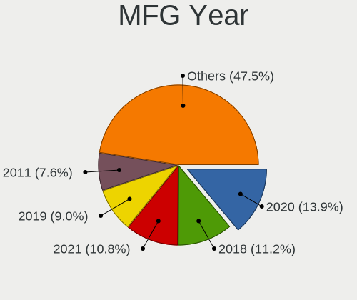

| Year    | Computers | Percent |
|---------|-----------|---------|
| 2020    | 30        | 18.4%   |
| 2019    | 26        | 15.95%  |
| 2018    | 21        | 12.88%  |
| 2021    | 14        | 8.59%   |
| 2012    | 11        | 6.75%   |
| 2015    | 10        | 6.13%   |
| Unknown | 10        | 6.13%   |
| 2013    | 8         | 4.91%   |
| 2011    | 7         | 4.29%   |
| 2016    | 6         | 3.68%   |
| 2017    | 4         | 2.45%   |
| 2014    | 4         | 2.45%   |
| 2010    | 4         | 2.45%   |
| 2008    | 4         | 2.45%   |
| 2009    | 3         | 1.84%   |
| 2007    | 1         | 0.61%   |

Form Factor
-----------

Physical design of the computer

| Name           | Computers | Percent |
|----------------|-----------|---------|
| Notebook       | 81        | 49.69%  |
| Desktop        | 61        | 37.42%  |
| System on chip | 8         | 4.91%   |
| Server         | 6         | 3.68%   |
| All in one     | 3         | 1.84%   |
| Convertible    | 2         | 1.23%   |
| Mini pc        | 2         | 1.23%   |

Coreboot
--------

Have coreboot on board

| Used | Computers | Percent |
|------|-----------|---------|
| No   | 161       | 98.77%  |
| Yes  | 2         | 1.23%   |

RAM Size
--------

Total RAM memory

| Size in GB      | Computers | Percent |
|-----------------|-----------|---------|
| 8.01-16.0       | 52        | 31.9%   |
| 16.01-24.0      | 36        | 22.09%  |
| 4.01-8.0        | 23        | 14.11%  |
| 32.01-64.0      | 19        | 11.66%  |
| 64.01-256.0     | 14        | 8.59%   |
| 2.01-3.0        | 7         | 4.29%   |
| 3.01-4.0        | 3         | 1.84%   |
| 24.01-32.0      | 3         | 1.84%   |
| 0.51-1.0        | 3         | 1.84%   |
| More than 256.0 | 1         | 0.61%   |
| 1.01-2.0        | 1         | 0.61%   |
| 0.01-0.5        | 1         | 0.61%   |

RAM Used
--------

Used RAM memory

| Used GB    | Computers | Percent |
|------------|-----------|---------|
| 0.01-0.5   | 73        | 44.51%  |
| 0.51-1.0   | 47        | 28.66%  |
| 1.01-2.0   | 23        | 14.02%  |
| 3.01-4.0   | 6         | 3.66%   |
| 2.01-3.0   | 4         | 2.44%   |
| 4.01-8.0   | 3         | 1.83%   |
| 16.01-24.0 | 3         | 1.83%   |
| 0          | 3         | 1.83%   |
| 24.01-32.0 | 1         | 0.61%   |
| 8.01-16.0  | 1         | 0.61%   |

Total Drives
------------

Number of drives on board

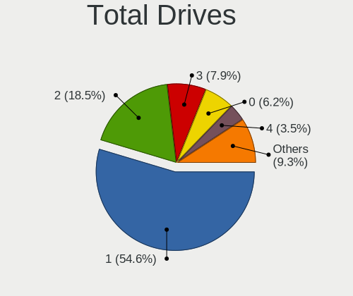

| Drives | Computers | Percent |
|--------|-----------|---------|
| 1      | 87        | 52.73%  |
| 2      | 30        | 18.18%  |
| 3      | 14        | 8.48%   |
| 0      | 12        | 7.27%   |
| 4      | 6         | 3.64%   |
| 5      | 5         | 3.03%   |
| 7      | 3         | 1.82%   |
| 6      | 3         | 1.82%   |
| 12     | 2         | 1.21%   |
| 14     | 1         | 0.61%   |
| 13     | 1         | 0.61%   |
| 9      | 1         | 0.61%   |

Has CD-ROM
----------

Has CD-ROM on board

| Presented | Computers | Percent |
|-----------|-----------|---------|
| No        | 112       | 68.29%  |
| Yes       | 52        | 31.71%  |

Has Ethernet
------------

Has Ethernet on board

| Presented | Computers | Percent |
|-----------|-----------|---------|
| Yes       | 138       | 84.66%  |
| No        | 25        | 15.34%  |

Has WiFi
--------

Has WiFi module

| Presented | Computers | Percent |
|-----------|-----------|---------|
| Yes       | 109       | 66.87%  |
| No        | 54        | 33.13%  |

Has Bluetooth
-------------

Has Bluetooth module

| Presented | Computers | Percent |
|-----------|-----------|---------|
| No        | 87        | 53.37%  |
| Yes       | 76        | 46.63%  |

Location
--------

Country
-------

Geographic location (country)

| Country     | Computers | Percent |
|-------------|-----------|---------|
| USA         | 49        | 30.06%  |
| Russia      | 16        | 9.82%   |
| Germany     | 14        | 8.59%   |
| UK          | 9         | 5.52%   |
| Netherlands | 7         | 4.29%   |
| France      | 6         | 3.68%   |
| Brazil      | 5         | 3.07%   |
| Ukraine     | 3         | 1.84%   |
| Switzerland | 3         | 1.84%   |
| Japan       | 3         | 1.84%   |
| India       | 3         | 1.84%   |
| Canada      | 3         | 1.84%   |
| Thailand    | 2         | 1.23%   |
| Spain       | 2         | 1.23%   |
| Poland      | 2         | 1.23%   |
| Norway      | 2         | 1.23%   |
| Mexico      | 2         | 1.23%   |
| Iran        | 2         | 1.23%   |
| Guadeloupe  | 2         | 1.23%   |
| Finland     | 2         | 1.23%   |
| Colombia    | 2         | 1.23%   |
| Australia   | 2         | 1.23%   |
| Vietnam     | 1         | 0.61%   |
| Turkey      | 1         | 0.61%   |
| Sweden      | 1         | 0.61%   |
| Slovakia    | 1         | 0.61%   |
| Romania     | 1         | 0.61%   |
| Qatar       | 1         | 0.61%   |
| Portugal    | 1         | 0.61%   |
| New Zealand | 1         | 0.61%   |
| Nepal       | 1         | 0.61%   |
| Namibia     | 1         | 0.61%   |
| Malaysia    | 1         | 0.61%   |
| Lithuania   | 1         | 0.61%   |
| Italy       | 1         | 0.61%   |
| Ireland     | 1         | 0.61%   |
| Hungary     | 1         | 0.61%   |
| Guatemala   | 1         | 0.61%   |
| Czechia     | 1         | 0.61%   |
| China       | 1         | 0.61%   |
| Chile       | 1         | 0.61%   |
| Austria     | 1         | 0.61%   |
| Argentina   | 1         | 0.61%   |
| Albania     | 1         | 0.61%   |

City
----

Geographic location (city)

| City                   | Computers | Percent |
|------------------------|-----------|---------|
| Lexington              | 5         | 3.03%   |
| Seattle                | 4         | 2.42%   |
| Moscow                 | 3         | 1.82%   |
| Lbeck                | 3         | 1.82%   |
| Alphen aan den Rijn    | 3         | 1.82%   |
| Tehran                 | 2         | 1.21%   |
| Salem                  | 2         | 1.21%   |
| Redmond                | 2         | 1.21%   |
| Ozersk                 | 2         | 1.21%   |
| Minneapolis            | 2         | 1.21%   |
| Menlo Park             | 2         | 1.21%   |
| Le Gosier              | 2         | 1.21%   |
| Kyiv                   | 2         | 1.21%   |
| Kirkland               | 2         | 1.21%   |
| Irkutsk                | 2         | 1.21%   |
| Helsinki               | 2         | 1.21%   |
| Chelyabinsk            | 2         | 1.21%   |
| Berlin                 | 2         | 1.21%   |
| Zurich                 | 1         | 0.61%   |
| Wenatchee              | 1         | 0.61%   |
| Weimar                 | 1         | 0.61%   |
| Wausau                 | 1         | 0.61%   |
| Warsaw                 | 1         | 0.61%   |
| Vostochnoe Degunino    | 1         | 0.61%   |
| Vilnius                | 1         | 0.61%   |
| Vancouver              | 1         | 0.61%   |
| Valladolid             | 1         | 0.61%   |
| Vadodara               | 1         | 0.61%   |
| Vacaville              | 1         | 0.61%   |
| Tyumen                 | 1         | 0.61%   |
| Tuddal                 | 1         | 0.61%   |
| Trang                  | 1         | 0.61%   |
| The Bronx              | 1         | 0.61%   |
| Teteghem               | 1         | 0.61%   |
| Tatab??nya             | 1         | 0.61%   |
| So Paulo             | 1         | 0.61%   |
| So Jos dos Campos  | 1         | 0.61%   |
| Sydney                 | 1         | 0.61%   |
| Sundebru               | 1         | 0.61%   |
| Suginami-ku            | 1         | 0.61%   |
| Stuttgart              | 1         | 0.61%   |
| St. Catharines         | 1         | 0.61%   |
| South Yarra            | 1         | 0.61%   |
| Scottsdale             | 1         | 0.61%   |
| Sarand               | 1         | 0.61%   |
| San Vicent del Raspeig | 1         | 0.61%   |
| San Diego              | 1         | 0.61%   |
| San Antonio            | 1         | 0.61%   |
| Rugby                  | 1         | 0.61%   |
| Rostov-on-Don          | 1         | 0.61%   |
| Rochester              | 1         | 0.61%   |
| Rionegro               | 1         | 0.61%   |
| Rennes                 | 1         | 0.61%   |
| Prague                 | 1         | 0.61%   |
| Porto Unio           | 1         | 0.61%   |
| Phoenix                | 1         | 0.61%   |
| Otjiwarongo            | 1         | 0.61%   |
| Orlans               | 1         | 0.61%   |
| Omsk                   | 1         | 0.61%   |
| Olin                   | 1         | 0.61%   |

Drives
------

Drive Vendor
------------

Hard drive vendors

| Vendor              | Computers | Drives | Percent |
|---------------------|-----------|--------|---------|
| Samsung Electronics | 38        | 70     | 16.96%  |
| Seagate             | 35        | 99     | 15.63%  |
| WDC                 | 34        | 95     | 15.18%  |
| Toshiba             | 20        | 27     | 8.93%   |
| Kingston            | 18        | 20     | 8.04%   |
| Crucial             | 15        | 16     | 6.7%    |
| Hitachi             | 8         | 17     | 3.57%   |
| Intel               | 7         | 8      | 3.13%   |
| A-DATA Technology   | 6         | 6      | 2.68%   |
| SanDisk             | 5         | 5      | 2.23%   |
| HGST                | 5         | 7      | 2.23%   |
| SK Hynix            | 3         | 3      | 1.34%   |
| Phison              | 3         | 3      | 1.34%   |
| Corsair             | 3         | 3      | 1.34%   |
| PNY                 | 2         | 2      | 0.89%   |
| PLEXTOR             | 2         | 2      | 0.89%   |
| Micron Technology   | 2         | 2      | 0.89%   |
| Fujitsu             | 2         | 3      | 0.89%   |
| VMware              | 1         | 1      | 0.45%   |
| Verbatim            | 1         | 1      | 0.45%   |
| TCSUNBOW            | 1         | 1      | 0.45%   |
| SPCC                | 1         | 1      | 0.45%   |
| Smartbuy            | 1         | 1      | 0.45%   |
| Silicon Motion      | 1         | 1      | 0.45%   |
| OWC                 | 1         | 1      | 0.45%   |
| MAXTOR              | 1         | 1      | 0.45%   |
| LITEONIT            | 1         | 1      | 0.45%   |
| Lenovo              | 1         | 1      | 0.45%   |
| KingSpec            | 1         | 1      | 0.45%   |
| KingDian            | 1         | 1      | 0.45%   |
| Intenso             | 1         | 1      | 0.45%   |
| Hewlett-Packard     | 1         | 2      | 0.45%   |
| Gigabyte Technology | 1         | 1      | 0.45%   |
| Apple               | 1         | 1      | 0.45%   |

Drive Model
-----------

Hard drive models

| Model                              | Computers | Percent |
|------------------------------------|-----------|---------|
| Crucial CT500MX500SSD1 500GB       | 5         | 1.91%   |
| Seagate ST4000DM000-1F2168 4TB     | 4         | 1.53%   |
| Samsung SSD 970 EVO Plus 250GB     | 4         | 1.53%   |
| Kingston SA400S37240G 240GB        | 4         | 1.53%   |
| Toshiba MQ01ABD100 1TB             | 3         | 1.15%   |
| Toshiba DT01ACA100 1TB             | 3         | 1.15%   |
| Seagate ST1000LM024 HN-M101MBB 1TB | 3         | 1.15%   |
| Samsung SSD 970 EVO 500GB          | 3         | 1.15%   |
| Samsung SSD 860 EVO 500GB          | 3         | 1.15%   |
| Samsung MZVLB256HBHQ-000L7 256GB   | 3         | 1.15%   |
| Kingston SA400S37120G 120GB        | 3         | 1.15%   |
| WDC WDS500G2B0C-00PXH0 500GB       | 2         | 0.76%   |
| WDC WD20EFRX-68EUZN0 2TB           | 2         | 0.76%   |
| Toshiba MG04SCA20EN 2TB            | 2         | 0.76%   |
| Seagate ST8000VN004-2M2101 8TB     | 2         | 0.76%   |
| Seagate ST4000DM004-2CV104 4TB     | 2         | 0.76%   |
| Seagate ST2000NM0023 2TB           | 2         | 0.76%   |
| Seagate ST1000NM0023 1TB           | 2         | 0.76%   |
| Seagate ST1000LM048-2E7172 1TB     | 2         | 0.76%   |
| Samsung SSD 970 EVO Plus 1TB       | 2         | 0.76%   |
| Samsung SSD 860 EVO 1TB            | 2         | 0.76%   |
| Samsung SSD 850 EVO 250GB          | 2         | 0.76%   |
| Kingston SVP200S37A60G 64GB        | 2         | 0.76%   |
| Kingston SMS200S3120G 120GB        | 2         | 0.76%   |
| Crucial CT120BX500SSD1 120GB       | 2         | 0.76%   |
| WDC WDS500G3X0C-00SJG0 500GB       | 1         | 0.38%   |
| WDC WDS500G2B0B-00YS70 500GB       | 1         | 0.38%   |
| WDC WDS250G2B0A 250GB              | 1         | 0.38%   |
| WDC WDS240G2G0A-00JH30 240GB       | 1         | 0.38%   |
| WDC WDS120G2G0B-00EPW0 120GB       | 1         | 0.38%   |
| WDC WDS120G2G0A-00JH30 120GB       | 1         | 0.38%   |
| WDC WDS100T2B0B-00YS70 1TB         | 1         | 0.38%   |
| WDC WD80EMAZ-00WJTA0 8TB           | 1         | 0.38%   |
| WDC WD80EFZX-68UW8N0 8TB           | 1         | 0.38%   |
| WDC WD80EFAX-68LHPN0 8TB           | 1         | 0.38%   |
| WDC WD7500BPVT-80HXZT3 752GB       | 1         | 0.38%   |
| WDC WD6003FZBX-00K5WB0 6TB         | 1         | 0.38%   |
| WDC WD5000LPVX-75V0TT0 500GB       | 1         | 0.38%   |
| WDC WD5000BEVT-75A0RT0 500GB       | 1         | 0.38%   |
| WDC WD5000AAKX-083CA0 500GB        | 1         | 0.38%   |
| WDC WD40EZRZ-22GXCB0 4TB           | 1         | 0.38%   |
| WDC WD40EZAZ-00SF3B0 4TB           | 1         | 0.38%   |
| WDC WD40EFRX-68N32N0 4TB           | 1         | 0.38%   |
| WDC WD3200BPVT-75ZEST0 320GB       | 1         | 0.38%   |
| WDC WD30EZRX-00AZ6B0 3TB           | 1         | 0.38%   |
| WDC WD30EFRX-68EUZN0 3TB           | 1         | 0.38%   |
| WDC WD2500BEVT-08A23T1 250GB       | 1         | 0.38%   |
| WDC WD2500BEVS-08VAT2 250GB        | 1         | 0.38%   |
| WDC WD20SPZX-22UA7T0 2TB           | 1         | 0.38%   |
| WDC WD20EARX-00PASB0 2TB           | 1         | 0.38%   |
| WDC WD1600BEVT-11ZCT0 160GB        | 1         | 0.38%   |
| WDC WD120EMFZ-11A6JA0 12TB         | 1         | 0.38%   |
| WDC WD120EMAZ-11BLFA0 12TB         | 1         | 0.38%   |
| WDC WD10SPZX-75Z10T1 1TB           | 1         | 0.38%   |
| WDC WD10SPZX-08Z10 1TB             | 1         | 0.38%   |
| WDC WD10SDRW-34A0XS0 1TB           | 1         | 0.38%   |
| WDC WD10JPVX-22JC3T0 1TB           | 1         | 0.38%   |
| WDC WD10JPLX-00MBPT1 1TB           | 1         | 0.38%   |
| WDC WD10EADS-00P8B0 1TB            | 1         | 0.38%   |
| WDC WD102KRYZ-01A5AB0 10TB         | 1         | 0.38%   |

HDD Vendor
----------

Hard disk drive vendors

| Vendor              | Computers | Drives | Percent |
|---------------------|-----------|--------|---------|
| Seagate             | 35        | 99     | 36.46%  |
| WDC                 | 25        | 84     | 26.04%  |
| Toshiba             | 17        | 24     | 17.71%  |
| Hitachi             | 8         | 17     | 8.33%   |
| HGST                | 5         | 7      | 5.21%   |
| Samsung Electronics | 2         | 3      | 2.08%   |
| Fujitsu             | 2         | 3      | 2.08%   |
| MAXTOR              | 1         | 1      | 1.04%   |
| Hewlett-Packard     | 1         | 2      | 1.04%   |

SSD Vendor
----------

Solid state drive vendors

| Vendor              | Computers | Drives | Percent |
|---------------------|-----------|--------|---------|
| Samsung Electronics | 22        | 38     | 22.92%  |
| Kingston            | 15        | 17     | 15.63%  |
| Crucial             | 15        | 16     | 15.63%  |
| WDC                 | 6         | 7      | 6.25%   |
| Intel               | 6         | 7      | 6.25%   |
| SanDisk             | 5         | 5      | 5.21%   |
| A-DATA Technology   | 5         | 5      | 5.21%   |
| SK Hynix            | 2         | 2      | 2.08%   |
| Micron Technology   | 2         | 2      | 2.08%   |
| Corsair             | 2         | 2      | 2.08%   |
| VMware              | 1         | 1      | 1.04%   |
| Verbatim            | 1         | 1      | 1.04%   |
| Toshiba             | 1         | 1      | 1.04%   |
| TCSUNBOW            | 1         | 1      | 1.04%   |
| SPCC                | 1         | 1      | 1.04%   |
| Smartbuy            | 1         | 1      | 1.04%   |
| PNY                 | 1         | 1      | 1.04%   |
| PLEXTOR             | 1         | 1      | 1.04%   |
| OWC                 | 1         | 1      | 1.04%   |
| LITEONIT            | 1         | 1      | 1.04%   |
| Lenovo              | 1         | 1      | 1.04%   |
| KingSpec            | 1         | 1      | 1.04%   |
| KingDian            | 1         | 1      | 1.04%   |
| Intenso             | 1         | 1      | 1.04%   |
| Gigabyte Technology | 1         | 1      | 1.04%   |
| Apple               | 1         | 1      | 1.04%   |

Drive Kind
----------

HDD or SSD

| Kind | Computers | Drives | Percent |
|------|-----------|--------|---------|
| HDD  | 83        | 240    | 41.09%  |
| SSD  | 82        | 117    | 40.59%  |
| NVMe | 37        | 48     | 18.32%  |

Drive Connector
---------------

SATA, SAS, NVMe, etc.

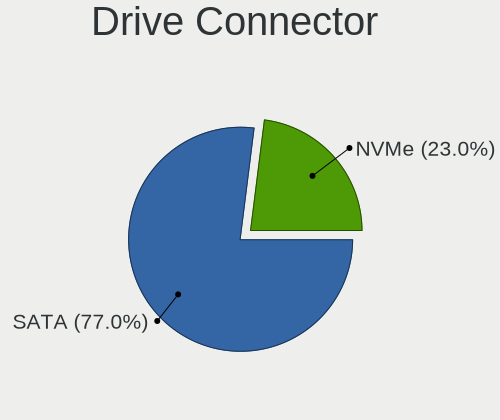

| Type | Computers | Drives | Percent |
|------|-----------|--------|---------|
| SATA | 136       | 357    | 78.61%  |
| NVMe | 37        | 48     | 21.39%  |

Drive Size
----------

Size of hard drive

| Size in TB | Computers | Drives | Percent |
|------------|-----------|--------|---------|
| 0.01-0.5   | 94        | 130    | 52.22%  |
| 0.51-1.0   | 45        | 89     | 25%     |
| 1.01-2.0   | 12        | 27     | 6.67%   |
| 3.01-4.0   | 9         | 30     | 5%      |
| 4.01-10.0  | 9         | 44     | 5%      |
| 2.01-3.0   | 8         | 23     | 4.44%   |
| 10.01-20.0 | 3         | 14     | 1.67%   |

Space Total
-----------

Amount of disk space available on the file system

| Size in GB     | Computers | Percent |
|----------------|-----------|---------|
| 101-250        | 53        | 32.52%  |
| 251-500        | 33        | 20.25%  |
| 501-1000       | 19        | 11.66%  |
| 51-100         | 16        | 9.82%   |
| 21-50          | 14        | 8.59%   |
| 1-20           | 13        | 7.98%   |
| 1001-2000      | 8         | 4.91%   |
| More than 3000 | 3         | 1.84%   |
| 2001-3000      | 3         | 1.84%   |
| Unknown        | 1         | 0.61%   |

Space Used
----------

Amount of used disk space

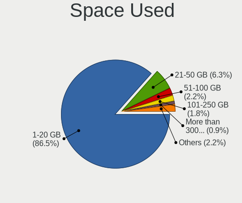

| Used GB        | Computers | Percent |
|----------------|-----------|---------|
| 1-20           | 138       | 84.66%  |
| 21-50          | 10        | 6.13%   |
| 51-100         | 5         | 3.07%   |
| 101-250        | 4         | 2.45%   |
| More than 3000 | 2         | 1.23%   |
| 251-500        | 2         | 1.23%   |
| 1001-2000      | 1         | 0.61%   |
| Unknown        | 1         | 0.61%   |

Malfunc. Drives
---------------

Drive models with a malfunction

| Model                                            | Computers | Drives | Percent |
|--------------------------------------------------|-----------|--------|---------|
| WDC WDS120G2G0A-00JH30 120GB                     | 1         | 1      | 3.13%   |
| WDC WD7500BPVT-80HXZT3 752GB                     | 1         | 1      | 3.13%   |
| WDC WD5000BEVT-75A0RT0 500GB                     | 1         | 1      | 3.13%   |
| WDC WD5000AAKX-083CA0 500GB                      | 1         | 1      | 3.13%   |
| WDC WD3200BPVT-75ZEST0 320GB                     | 1         | 1      | 3.13%   |
| WDC WD2500BEVT-08A23T1 250GB                     | 1         | 1      | 3.13%   |
| WDC WD20EARX-00PASB0 2TB                         | 1         | 1      | 3.13%   |
| WDC WD10EADS-00P8B0 1TB                          | 1         | 1      | 3.13%   |
| Toshiba THNSNK512GVN8 512GB                      | 1         | 1      | 3.13%   |
| Toshiba MQ02ABD100H 1TB                          | 1         | 1      | 3.13%   |
| Seagate ST9640320AS 640GB                        | 1         | 1      | 3.13%   |
| Seagate ST9250827AS 250GB                        | 1         | 1      | 3.13%   |
| Seagate ST500LT012-9WS142 500GB                  | 1         | 1      | 3.13%   |
| Seagate ST380013AS 80GB                          | 1         | 2      | 3.13%   |
| Seagate ST3250620AS 250GB                        | 1         | 1      | 3.13%   |
| Seagate ST31500341AS 1.5TB                       | 1         | 1      | 3.13%   |
| Seagate ST31000524AS 1TB                         | 1         | 1      | 3.13%   |
| Seagate ST1000LM014-1EJ164 1TB                   | 1         | 1      | 3.13%   |
| Samsung Electronics SSD PM841 2.5-inch 7mm 256GB | 1         | 1      | 3.13%   |
| Samsung Electronics SSD 840 EVO 120GB            | 1         | 1      | 3.13%   |
| Samsung Electronics HM160HI 160GB                | 1         | 1      | 3.13%   |
| PLEXTOR PX-128M5S 128GB                          | 1         | 1      | 3.13%   |
| MAXTOR STM3160815AS 160GB                        | 1         | 1      | 3.13%   |
| Intel SSDSCKKF256G8H 256GB                       | 1         | 1      | 3.13%   |
| Intel SSDSC2BB120G6R 120GB                       | 1         | 1      | 3.13%   |
| Hitachi HTS545032B9A300 320GB                    | 1         | 1      | 3.13%   |
| Hitachi HTS543225A7A384 250GB                    | 1         | 1      | 3.13%   |
| Hitachi HTS541612J9SA00 120GB                    | 1         | 1      | 3.13%   |
| Hitachi HDS721010CLA332 1TB                      | 1         | 1      | 3.13%   |
| HGST HDN726060ALE614 6TB                         | 1         | 2      | 3.13%   |
| Crucial CT250MX200SSD1 250GB                     | 1         | 1      | 3.13%   |
| Corsair Force 3 SSD 180GB                        | 1         | 1      | 3.13%   |

Malfunc. Drive Vendor
---------------------

Vendors of faulty drives

| Vendor              | Computers | Drives | Percent |
|---------------------|-----------|--------|---------|
| WDC                 | 7         | 8      | 24.14%  |
| Seagate             | 6         | 9      | 20.69%  |
| Hitachi             | 4         | 4      | 13.79%  |
| Samsung Electronics | 3         | 3      | 10.34%  |
| Toshiba             | 2         | 2      | 6.9%    |
| Intel               | 2         | 2      | 6.9%    |
| PLEXTOR             | 1         | 1      | 3.45%   |
| MAXTOR              | 1         | 1      | 3.45%   |
| HGST                | 1         | 2      | 3.45%   |
| Crucial             | 1         | 1      | 3.45%   |
| Corsair             | 1         | 1      | 3.45%   |

Malfunc. HDD Vendor
-------------------

Vendors of faulty HDD drives

| Vendor              | Computers | Drives | Percent |
|---------------------|-----------|--------|---------|
| WDC                 | 6         | 7      | 30%     |
| Seagate             | 6         | 9      | 30%     |
| Hitachi             | 4         | 4      | 20%     |
| Toshiba             | 1         | 1      | 5%      |
| Samsung Electronics | 1         | 1      | 5%      |
| MAXTOR              | 1         | 1      | 5%      |
| HGST                | 1         | 2      | 5%      |

Malfunc. Drive Kind
-------------------

Kinds of faulty drives

| Kind | Computers | Drives | Percent |
|------|-----------|--------|---------|
| HDD  | 19        | 25     | 67.86%  |
| SSD  | 9         | 9      | 32.14%  |

Failed Drives
-------------

Failed drive models

Zero info for selected period =(

Failed Drive Vendor
-------------------

Failed drive vendors

Zero info for selected period =(

Drive Status
------------

Number of failed and malfunc. drives

| Status   | Computers | Drives | Percent |
|----------|-----------|--------|---------|
| Works    | 133       | 364    | 81.1%   |
| Malfunc  | 27        | 34     | 16.46%  |
| Detected | 4         | 7      | 2.44%   |

Storage controller
------------------

Storage Vendor
--------------

Storage controller vendors

| Vendor                      | Computers | Percent |
|-----------------------------|-----------|---------|
| Intel                       | 112       | 56.57%  |
| AMD                         | 27        | 13.64%  |
| Samsung Electronics         | 20        | 10.1%   |
| Broadcom / LSI              | 6         | 3.03%   |
| ASMedia Technology          | 6         | 3.03%   |
| Phison Electronics          | 5         | 2.53%   |
| Sandisk                     | 4         | 2.02%   |
| Marvell Technology Group    | 4         | 2.02%   |
| VMware                      | 2         | 1.01%   |
| Toshiba                     | 2         | 1.01%   |
| Nvidia                      | 2         | 1.01%   |
| Kingston Technology Company | 2         | 1.01%   |
| SK Hynix                    | 1         | 0.51%   |
| Silicon Motion              | 1         | 0.51%   |
| Lite-On Technology          | 1         | 0.51%   |
| Hewlett-Packard             | 1         | 0.51%   |
| Apple                       | 1         | 0.51%   |
| ADATA Technology            | 1         | 0.51%   |

Storage Model
-------------

Storage controller models

| Model                                                                            | Computers | Percent |
|----------------------------------------------------------------------------------|-----------|---------|
| AMD FCH SATA Controller [AHCI mode]                                              | 26        | 11.71%  |
| Samsung NVMe SSD Controller SM981/PM981/PM983                                    | 13        | 5.86%   |
| Intel Sunrise Point-LP SATA Controller [AHCI mode]                               | 12        | 5.41%   |
| Intel 6 Series/C200 Series Chipset Family 6 port Mobile SATA AHCI Controller     | 10        | 4.5%    |
| Intel 8 Series/C220 Series Chipset Family 6-port SATA Controller 1 [AHCI mode]   | 9         | 4.05%   |
| Intel Q170/Q150/B150/H170/H110/Z170/CM236 Chipset SATA Controller [AHCI Mode]    | 8         | 3.6%    |
| AMD 400 Series Chipset SATA Controller                                           | 7         | 3.15%   |
| Intel Wildcat Point-LP SATA Controller [AHCI Mode]                               | 6         | 2.7%    |
| Intel 7 Series Chipset Family 6-port SATA Controller [AHCI mode]                 | 6         | 2.7%    |
| Intel 5 Series/3400 Series Chipset 6 port SATA AHCI Controller                   | 6         | 2.7%    |
| Intel 82801 Mobile SATA Controller [RAID mode]                                   | 5         | 2.25%   |
| ASMedia ASM1062 Serial ATA Controller                                            | 5         | 2.25%   |
| Intel Cannon Lake Mobile PCH SATA AHCI Controller                                | 4         | 1.8%    |
| Intel 8 Series SATA Controller 1 [AHCI mode]                                     | 4         | 1.8%    |
| Samsung NVMe SSD Controller SM961/PM961/SM963                                    | 3         | 1.35%   |
| Intel Comet Lake SATA AHCI Controller                                            | 3         | 1.35%   |
| Unknown                                                                          | 3         | 1.35%   |
| VMware SATA AHCI controller                                                      | 2         | 0.9%    |
| Sandisk WD Blue SN550 NVMe SSD                                                   | 2         | 0.9%    |
| Samsung NVMe SSD Controller 980                                                  | 2         | 0.9%    |
| Phison E16 PCIe4 NVMe Controller                                                 | 2         | 0.9%    |
| Phison E12 NVMe Controller                                                       | 2         | 0.9%    |
| Nvidia MCP79 AHCI Controller                                                     | 2         | 0.9%    |
| Marvell Group 88SE6111/6121 SATA II / PATA Controller                            | 2         | 0.9%    |
| Intel SATA Controller [RAID mode]                                                | 2         | 0.9%    |
| Intel NM10/ICH7 Family SATA Controller [AHCI mode]                               | 2         | 0.9%    |
| Intel Cannon Point-LP SATA Controller [AHCI Mode]                                | 2         | 0.9%    |
| Intel C610/X99 series chipset 6-Port SATA Controller [AHCI mode]                 | 2         | 0.9%    |
| Intel Atom/Celeron/Pentium Processor x5-E8000/J3xxx/N3xxx Series SATA Controller | 2         | 0.9%    |
| Intel Atom Processor E3800 Series SATA AHCI Controller                           | 2         | 0.9%    |
| Intel 9 Series Chipset Family SATA Controller [AHCI Mode]                        | 2         | 0.9%    |
| Intel 82801IBM/IEM (ICH9M/ICH9M-E) 4 port SATA Controller [AHCI mode]            | 2         | 0.9%    |
| Intel 82801GBM/GHM (ICH7-M Family) SATA Controller [IDE mode]                    | 2         | 0.9%    |
| Intel 6 Series/C200 Series Chipset Family 6 port Desktop SATA AHCI Controller    | 2         | 0.9%    |
| Intel 5 Series/3400 Series Chipset 4 port SATA IDE Controller                    | 2         | 0.9%    |
| Intel 5 Series/3400 Series Chipset 4 port SATA AHCI Controller                   | 2         | 0.9%    |
| Intel 5 Series/3400 Series Chipset 2 port SATA IDE Controller                    | 2         | 0.9%    |
| Broadcom / LSI SAS2008 PCI-Express Fusion-MPT SAS-2 [Falcon]                     | 2         | 0.9%    |
| VMware PVSCSI SCSI Controller                                                    | 1         | 0.45%   |
| Toshiba unknown                                                                  | 1         | 0.45%   |
| Toshiba BG3 NVMe SSD Controller                                                  | 1         | 0.45%   |
| SK Hynix BC501 NVMe Solid State Drive                                            | 1         | 0.45%   |
| Silicon Motion SM2263EN/SM2263XT SSD Controller                                  | 1         | 0.45%   |
| Sandisk WD Black SN750 / PC SN730 NVMe SSD                                       | 1         | 0.45%   |
| Sandisk PC SN520 NVMe SSD                                                        | 1         | 0.45%   |
| Samsung NVMe SSD Controller SM951/PM951                                          | 1         | 0.45%   |
| Samsung NVMe SSD Controller PM9A1/PM9A3/980PRO                                   | 1         | 0.45%   |
| Phison E18 PCIe4 NVMe Controller                                                 | 1         | 0.45%   |
| Marvell Group 88SE9172 SATA 6Gb/s Controller                                     | 1         | 0.45%   |
| Marvell Group 88SE9123 PCIe SATA 6.0 Gb/s controller                             | 1         | 0.45%   |
| Lite-On M8Pe Series NVMe SSD                                                     | 1         | 0.45%   |
| Kingston Company U-SNS8154P3 NVMe SSD                                            | 1         | 0.45%   |
| Intel SSD 660P Series                                                            | 1         | 0.45%   |
| Intel HM170/QM170 Chipset SATA Controller [AHCI Mode]                            | 1         | 0.45%   |
| Intel Celeron/Pentium Silver Processor SATA Controller                           | 1         | 0.45%   |
| Intel Celeron N3350/Pentium N4200/Atom E3900 Series SATA AHCI Controller         | 1         | 0.45%   |
| Intel C620 Series Chipset Family SSATA Controller [AHCI mode]                    | 1         | 0.45%   |
| Intel C620 Series Chipset Family IDE Redirection                                 | 1         | 0.45%   |
| Intel C600/X79 series chipset SATA RAID Controller                               | 1         | 0.45%   |
| Intel 82801JI (ICH10 Family) SATA AHCI Controller                                | 1         | 0.45%   |

Storage Kind
------------

Kind of storage controller (IDE, SATA, NVMe, SAS, ...)

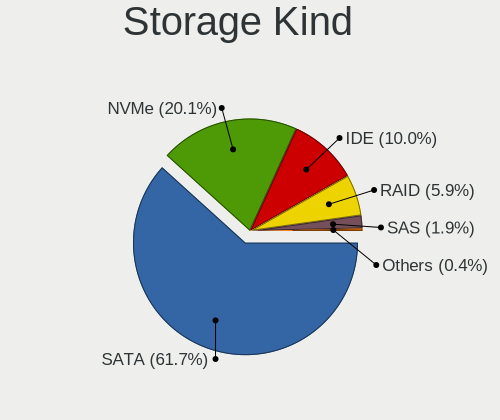

| Kind | Computers | Percent |
|------|-----------|---------|
| SATA | 126       | 64.29%  |
| NVMe | 38        | 19.39%  |
| IDE  | 15        | 7.65%   |
| RAID | 12        | 6.12%   |
| SAS  | 5         | 2.55%   |

Processor
---------

CPU Vendor
----------

Processor vendors

| Vendor  | Computers | Percent |
|---------|-----------|---------|
| Intel   | 123       | 75.46%  |
| AMD     | 28        | 17.18%  |
| ARM     | 8         | 4.91%   |
| Unknown | 3         | 1.84%   |
| Unknown | 1         | 0.61%   |

CPU Model
---------

Processor models

| Model                                 | Computers | Percent |
|---------------------------------------|-----------|---------|
| ARM Cortex-A72 r0p3                   | 6         | 3.68%   |
| Intel Core i5-7200U CPU @ 2.50GHz     | 4         | 2.45%   |
| AMD Ryzen 7 2700 Eight-Core Processor | 4         | 2.45%   |
| Intel Core i7-7500U CPU @ 2.70GHz     | 3         | 1.84%   |
| Intel Core i7-6700 CPU @ 3.40GHz      | 3         | 1.84%   |
| Intel Core i5-5300U CPU @ 2.30GHz     | 3         | 1.84%   |
| Intel Core i5-2520M CPU @ 2.50GHz     | 3         | 1.84%   |
|                                       | 3         | 1.84%   |
| Intel CPU Version                     | 2         | 1.23%   |
| Intel Core i7-9750H CPU @ 2.60GHz     | 2         | 1.23%   |
| Intel Core i7-8565U CPU @ 1.80GHz     | 2         | 1.23%   |
| Intel Core i7-4510U CPU @ 2.00GHz     | 2         | 1.23%   |
| Intel Core i7-10750H CPU @ 2.60GHz    | 2         | 1.23%   |
| Intel Core i5-8350U CPU @ 1.70GHz     | 2         | 1.23%   |
| Intel Core i5-8250U CPU @ 1.60GHz     | 2         | 1.23%   |
| Intel Core i5-4300M CPU @ 2.60GHz     | 2         | 1.23%   |
| Intel Core i5-10210U CPU @ 1.60GHz    | 2         | 1.23%   |
| Intel Core i3-4005U CPU @ 1.70GHz     | 2         | 1.23%   |
| AMD Ryzen 9 5900X 12-Core Processor   | 2         | 1.23%   |
| AMD Ryzen 9 3900X 12-Core Processor   | 2         | 1.23%   |
| Unknown Implementer Processor r0p0    | 1         | 0.61%   |
| Intel Xeon Silver 4214 CPU @ 2.20GHz  | 1         | 0.61%   |
| Intel Xeon CPU X5650 @ 2.67GHz        | 1         | 0.61%   |
| Intel Xeon CPU X3440 @ 2.53GHz        | 1         | 0.61%   |
| Intel Xeon CPU X3430 @ 2.40GHz        | 1         | 0.61%   |
| Intel Xeon CPU E5520 @ 2.27GHz        | 1         | 0.61%   |
| Intel Xeon CPU E5-2650 v3 @ 2.30GHz   | 1         | 0.61%   |
| Intel Xeon CPU E5-2630 v3 @ 2.40GHz   | 1         | 0.61%   |
| Intel Xeon CPU E5-2620 v2 @ 2.10GHz   | 1         | 0.61%   |
| Intel Xeon CPU E3-1275 v5 @ 3.60GHz   | 1         | 0.61%   |
| Intel Processor 5Y70 CPU @ 1.10GHz    | 1         | 0.61%   |
| Intel Pentium M                       | 1         | 0.61%   |
| Intel Pentium II                      | 1         | 0.61%   |
| Intel Pentium CPU N3700 @ 1.60GHz     | 1         | 0.61%   |
| Intel Pentium CPU G630T @ 2.30GHz     | 1         | 0.61%   |
| Intel Pentium CPU G3420 @ 3.20GHz     | 1         | 0.61%   |
| Intel Pentium CPU G3220 @ 3.00GHz     | 1         | 0.61%   |
| Intel Pentium CPU G2020 @ 2.90GHz     | 1         | 0.61%   |
| Intel Pentium 4                       | 1         | 0.61%   |
| Intel Genuine CPU                     | 1         | 0.61%   |
| Intel Core i9-9900X CPU @ 3.50GHz     | 1         | 0.61%   |
| Intel Core i7-8750H CPU @ 2.20GHz     | 1         | 0.61%   |
| Intel Core i7-7820HQ CPU @ 2.90GHz    | 1         | 0.61%   |
| Intel Core i7-6700K CPU @ 4.00GHz     | 1         | 0.61%   |
| Intel Core i7-6600U CPU @ 2.60GHz     | 1         | 0.61%   |
| Intel Core i7-4790S CPU @ 3.20GHz     | 1         | 0.61%   |
| Intel Core i7-4770T CPU @ 2.50GHz     | 1         | 0.61%   |
| Intel Core i7-4700HQ CPU @ 2.40GHz    | 1         | 0.61%   |
| Intel Core i7-3770 CPU @ 3.40GHz      | 1         | 0.61%   |
| Intel Core i7-3632QM CPU @ 2.20GHz    | 1         | 0.61%   |
| Intel Core i7-3630QM CPU @ 2.40GHz    | 1         | 0.61%   |
| Intel Core i7-3610QE CPU @ 2.30GHz    | 1         | 0.61%   |
| Intel Core i7-2670QM CPU @ 2.20GHz    | 1         | 0.61%   |
| Intel Core i7-10700K CPU @ 3.80GHz    | 1         | 0.61%   |
| Intel Core i7-1065G7 CPU @ 1.30GHz    | 1         | 0.61%   |
| Intel Core i7-10510U CPU @ 1.80GHz    | 1         | 0.61%   |
| Intel Core i7 CPU M 620 @ 2.67GHz     | 1         | 0.61%   |
| Intel Core i7 CPU                     | 1         | 0.61%   |
| Intel Core i5-9300H CPU @ 2.40GHz     | 1         | 0.61%   |
| Intel Core i5-8365U CPU @ 1.60GHz     | 1         | 0.61%   |

CPU Model Family
----------------

Processor model prefix

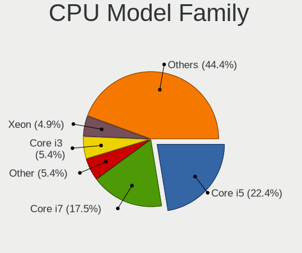

| Model                  | Computers | Percent |
|------------------------|-----------|---------|
| Intel Core i5          | 40        | 24.54%  |
| Intel Core i7          | 31        | 19.02%  |
| Intel Core i3          | 11        | 6.75%   |
| AMD Ryzen 7            | 10        | 6.13%   |
| Other                  | 9         | 5.52%   |
| Intel Xeon             | 8         | 4.91%   |
| ARM Cortex             | 8         | 4.91%   |
| Intel Celeron          | 7         | 4.29%   |
| Intel Pentium          | 6         | 3.68%   |
| Intel Core 2 Duo       | 6         | 3.68%   |
| AMD Ryzen 9            | 6         | 3.68%   |
| Intel Atom             | 4         | 2.45%   |
| AMD Ryzen 5            | 3         | 1.84%   |
| Intel Xeon Silver      | 1         | 0.61%   |
| Intel Pentium M        | 1         | 0.61%   |
| Intel Pentium 4        | 1         | 0.61%   |
| Intel Genuine          | 1         | 0.61%   |
| Intel Core i9          | 1         | 0.61%   |
| Intel Core 2 Quad      | 1         | 0.61%   |
| AMD Ryzen Threadripper | 1         | 0.61%   |
| AMD Ryzen 3            | 1         | 0.61%   |
| AMD FX                 | 1         | 0.61%   |
| AMD Athlon X4          | 1         | 0.61%   |
| AMD Athlon             | 1         | 0.61%   |
| AMD A6                 | 1         | 0.61%   |
| AMD A4                 | 1         | 0.61%   |
| AMD A12                | 1         | 0.61%   |

CPU Cores
---------

Number of processor cores

| Number  | Computers | Percent |
|---------|-----------|---------|
| 2       | 57        | 34.97%  |
| 4       | 50        | 30.67%  |
| Unknown | 18        | 11.04%  |
| 16      | 10        | 6.13%   |
| 6       | 7         | 4.29%   |
| 8       | 6         | 3.68%   |
| 24      | 4         | 2.45%   |
| 12      | 4         | 2.45%   |
| 1       | 3         | 1.84%   |
| 32      | 2         | 1.23%   |
| 20      | 1         | 0.61%   |
| 10      | 1         | 0.61%   |

CPU Sockets
-----------

Number of sockets

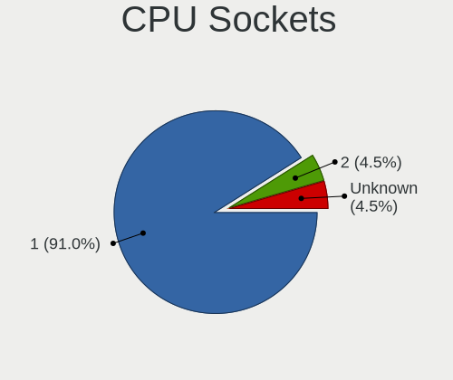

| Number  | Computers | Percent |
|---------|-----------|---------|
| 1       | 149       | 91.41%  |
| Unknown | 9         | 5.52%   |
| 2       | 5         | 3.07%   |

CPU Threads
-----------

Threads per core (Hyper-Threading)

| Number  | Computers | Percent |
|---------|-----------|---------|
| 2       | 91        | 55.83%  |
| 1       | 53        | 32.52%  |
| Unknown | 19        | 11.66%  |

CPU Microarch
-------------

Microarchitecture

| Name          | Computers | Percent |
|---------------|-----------|---------|
| KabyLake      | 26        | 15.95%  |
| Haswell       | 17        | 10.43%  |
| Skylake       | 13        | 7.98%   |
| Unknown       | 13        | 7.98%   |
| SandyBridge   | 11        | 6.75%   |
| IvyBridge     | 10        | 6.13%   |
| Westmere      | 9         | 5.52%   |
| Zen+          | 7         | 4.29%   |
| Broadwell     | 7         | 4.29%   |
| Zen 2         | 6         | 3.68%   |
| Penryn        | 6         | 3.68%   |
| Silvermont    | 5         | 3.07%   |
| Zen           | 4         | 2.45%   |
| Nehalem       | 4         | 2.45%   |
| Bonnell       | 4         | 2.45%   |
| Zen 3         | 3         | 1.84%   |
| Excavator     | 3         | 1.84%   |
| CometLake     | 3         | 1.84%   |
| Piledriver    | 2         | 1.23%   |
| Jaguar        | 2         | 1.23%   |
| Core          | 2         | 1.23%   |
| TigerLake     | 1         | 0.61%   |
| P6            | 1         | 0.61%   |
| NetBurst      | 1         | 0.61%   |
| IceLake       | 1         | 0.61%   |
| Goldmont plus | 1         | 0.61%   |
| Goldmont      | 1         | 0.61%   |

Graphics
--------

GPU Vendor
----------

Vendors of graphics cards

| Vendor                               | Computers | Percent |
|--------------------------------------|-----------|---------|
| Intel                                | 96        | 54.24%  |
| Nvidia                               | 45        | 25.42%  |
| AMD                                  | 26        | 14.69%  |
| Matrox Electronics Systems           | 7         | 3.95%   |
| VMware                               | 2         | 1.13%   |
| NVidia / SGS Thomson (Joint Venture) | 1         | 0.56%   |

GPU Model
---------

Graphics card models

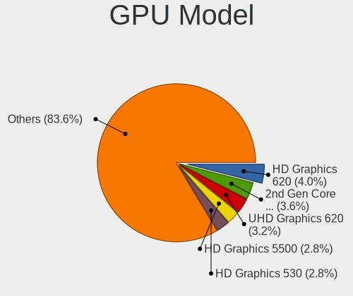

| Model                                                                                    | Computers | Percent |
|------------------------------------------------------------------------------------------|-----------|---------|
| Intel 2nd Generation Core Processor Family Integrated Graphics Controller                | 9         | 4.95%   |
| Intel HD Graphics 620                                                                    | 8         | 4.4%    |
| Intel HD Graphics 530                                                                    | 7         | 3.85%   |
| Intel 3rd Gen Core processor Graphics Controller                                         | 7         | 3.85%   |
| AMD Ellesmere [Radeon RX 470/480/570/570X/580/580X/590]                                  | 7         | 3.85%   |
| Intel Xeon E3-1200 v3/4th Gen Core Processor Integrated Graphics Controller              | 6         | 3.3%    |
| Intel HD Graphics 5500                                                                   | 6         | 3.3%    |
| Intel UHD Graphics 620                                                                   | 5         | 2.75%   |
| Matrox Electronics Systems MGA G200e [Pilot] ServerEngines (SEP1)                        | 4         | 2.2%    |
| Intel WhiskeyLake-U GT2 [UHD Graphics 620]                                               | 4         | 2.2%    |
| Intel Haswell-ULT Integrated Graphics Controller                                         | 4         | 2.2%    |
| Intel Core Processor Integrated Graphics Controller                                      | 4         | 2.2%    |
| Intel CometLake-U GT2 [UHD Graphics]                                                     | 4         | 2.2%    |
| Nvidia GP108 [GeForce GT 1030]                                                           | 3         | 1.65%   |
| Intel CoffeeLake-H GT2 [UHD Graphics 630]                                                | 3         | 1.65%   |
| Intel Atom/Celeron/Pentium Processor x5-E8000/J3xxx/N3xxx Integrated Graphics Controller | 3         | 1.65%   |
| Intel Atom Processor D4xx/D5xx/N4xx/N5xx Integrated Graphics Controller                  | 3         | 1.65%   |
| Intel 4th Gen Core Processor Integrated Graphics Controller                              | 3         | 1.65%   |
| Nvidia TU117M [GeForce GTX 1650 Ti Mobile]                                               | 2         | 1.1%    |
| Nvidia GT218 [GeForce 210]                                                               | 2         | 1.1%    |
| Nvidia GF119 [GeForce GT 610]                                                            | 2         | 1.1%    |
| Matrox Electronics Systems MGA G200eW WPCM450                                            | 2         | 1.1%    |
| Intel Xeon E3-1200 v2/3rd Gen Core processor Graphics Controller                         | 2         | 1.1%    |
| Intel Skylake GT2 [HD Graphics 520]                                                      | 2         | 1.1%    |
| Intel Mobile 945GM/GMS/GME, 943/940GML Express Integrated Graphics Controller            | 2         | 1.1%    |
| Intel Mobile 4 Series Chipset Integrated Graphics Controller                             | 2         | 1.1%    |
| Intel CometLake-H GT2 [UHD Graphics]                                                     | 2         | 1.1%    |
| Intel Atom Processor Z36xxx/Z37xxx Series Graphics & Display                             | 2         | 1.1%    |
| AMD Vega 10 XL/XT [Radeon RX Vega 56/64]                                                 | 2         | 1.1%    |
| AMD Stoney [Radeon R2/R3/R4/R5 Graphics]                                                 | 2         | 1.1%    |
| AMD Renoir                                                                               | 2         | 1.1%    |
| AMD Baffin [Radeon RX 550 640SP / RX 560/560X]                                           | 2         | 1.1%    |
| Unknown                                                                                  | 2         | 1.1%    |
| Nvidia TU117M [GeForce GTX 1650 Mobile / Max-Q]                                          | 1         | 0.55%   |
| Nvidia TU117GLM [Quadro T2000 Mobile / Max-Q]                                            | 1         | 0.55%   |
| Nvidia TU116M [GeForce GTX 1660 Ti Mobile]                                               | 1         | 0.55%   |
| Nvidia TU116 [GeForce GTX 1660 SUPER]                                                    | 1         | 0.55%   |
| Nvidia TU104M [GeForce RTX 2070 SUPER Mobile / Max-Q]                                    | 1         | 0.55%   |
| Nvidia TU104 [GeForce RTX 2070 SUPER]                                                    | 1         | 0.55%   |
| Nvidia MCP7A [GeForce 9400]                                                              | 1         | 0.55%   |
| Nvidia GT218 [NVS 300]                                                                   | 1         | 0.55%   |
| Nvidia GT216M [GeForce GT 330M]                                                          | 1         | 0.55%   |
| Nvidia GT216M [GeForce GT 240M]                                                          | 1         | 0.55%   |
| Nvidia GP108M [GeForce MX250]                                                            | 1         | 0.55%   |
| Nvidia GP108M [GeForce MX230]                                                            | 1         | 0.55%   |
| Nvidia GP107GL [Quadro P600]                                                             | 1         | 0.55%   |
| Nvidia GP106 [GeForce GTX 1060 3GB]                                                      | 1         | 0.55%   |
| Nvidia GP104M [GeForce GTX 1070 Mobile]                                                  | 1         | 0.55%   |
| Nvidia GM108M [GeForce 940MX]                                                            | 1         | 0.55%   |
| Nvidia GM107M [GeForce GTX 960M]                                                         | 1         | 0.55%   |
| Nvidia GM107M [GeForce GTX 860M]                                                         | 1         | 0.55%   |
| Nvidia GM107GLM [Quadro M1200 Mobile]                                                    | 1         | 0.55%   |
| Nvidia GK208BM [GeForce 920M]                                                            | 1         | 0.55%   |
| Nvidia GK208B [GeForce GT 710]                                                           | 1         | 0.55%   |
| Nvidia GF119 [GeForce GT 520]                                                            | 1         | 0.55%   |
| Nvidia GF117M [GeForce 610M/710M/810M/820M / GT 620M/625M/630M/720M]                     | 1         | 0.55%   |
| Nvidia GF116M [GeForce GT 560M]                                                          | 1         | 0.55%   |
| Nvidia GF110 [GeForce GTX 580]                                                           | 1         | 0.55%   |
| Nvidia GF108M [GeForce GT 525M]                                                          | 1         | 0.55%   |
| Nvidia GF108GLM [NVS 5200M]                                                              | 1         | 0.55%   |

GPU Combo
---------

Combinations of graphics cards

| Name                                     | Computers | Percent |
|------------------------------------------|-----------|---------|
| 1 x Intel                                | 66        | 40.49%  |
| 1 x Nvidia                               | 25        | 15.34%  |
| 1 x AMD                                  | 19        | 11.66%  |
| Intel + Nvidia                           | 18        | 11.04%  |
| Other                                    | 10        | 6.13%   |
| 2 x Intel                                | 7         | 4.29%   |
| 1 x Matrox                               | 7         | 4.29%   |
| Intel + AMD                              | 4         | 2.45%   |
| 2 x AMD                                  | 2         | 1.23%   |
| 1 x VMware                               | 2         | 1.23%   |
| 2 x Nvidia                               | 1         | 0.61%   |
| 1 x NVidia / SGS Thomson (Joint Venture) | 1         | 0.61%   |
| AMD + Nvidia                             | 1         | 0.61%   |

GPU Driver
----------

Free vs proprietary

| Driver      | Computers | Percent |
|-------------|-----------|---------|
| Free        | 127       | 77.91%  |
| Proprietary | 25        | 15.34%  |
| Unknown     | 11        | 6.75%   |

GPU Memory
----------

Total video memory

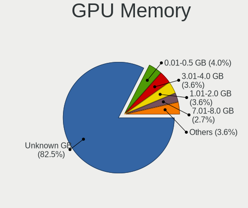

| Size in GB | Computers | Percent |
|------------|-----------|---------|
| Unknown    | 133       | 81.6%   |
| 7.01-8.0   | 6         | 3.68%   |
| 3.01-4.0   | 6         | 3.68%   |
| 1.01-2.0   | 6         | 3.68%   |
| 0.01-0.5   | 5         | 3.07%   |
| 0.51-1.0   | 3         | 1.84%   |
| 5.01-6.0   | 2         | 1.23%   |
| 2.01-3.0   | 1         | 0.61%   |
| 8.01-16.0  | 1         | 0.61%   |

Monitor
-------

Monitor Vendor
--------------

Monitor vendors

| Vendor               | Computers | Percent |
|----------------------|-----------|---------|
| AU Optronics         | 16        | 14.55%  |
| BOE                  | 12        | 10.91%  |
| LG Display           | 11        | 10%     |
| Samsung Electronics  | 10        | 9.09%   |
| Goldstar             | 9         | 8.18%   |
| Dell                 | 7         | 6.36%   |
| Chimei Innolux       | 6         | 5.45%   |
| Sharp                | 5         | 4.55%   |
| Ancor Communications | 5         | 4.55%   |
| Hewlett-Packard      | 4         | 3.64%   |
| AOC                  | 4         | 3.64%   |
| InfoVision           | 3         | 2.73%   |
| Sceptre Tech         | 2         | 1.82%   |
| Lenovo               | 2         | 1.82%   |
| Iiyama               | 2         | 1.82%   |
| BenQ                 | 2         | 1.82%   |
| Acer                 | 2         | 1.82%   |
| LG Electronics       | 1         | 0.91%   |
| HannStar             | 1         | 0.91%   |
| Eizo                 | 1         | 0.91%   |
| CPT                  | 1         | 0.91%   |
| CKL                  | 1         | 0.91%   |
| ASUSTek Computer     | 1         | 0.91%   |
| Apple                | 1         | 0.91%   |
| AGO                  | 1         | 0.91%   |

Monitor Model
-------------

Monitor models

| Model                                                                  | Computers | Percent |
|------------------------------------------------------------------------|-----------|---------|
| Dell U2412M DELA07B 1920x1200 520x320mm 24.0-inch                      | 2         | 1.8%    |
| AU Optronics LCD Monitor AUO80ED 1920x1080 340x190mm 15.3-inch         | 2         | 1.8%    |
| Sharp LCD Monitor SHP14D1 1920x1200 340x210mm 15.7-inch                | 1         | 0.9%    |
| Sharp LCD Monitor SHP1476 3840x2160 350x190mm 15.7-inch                | 1         | 0.9%    |
| Sharp LCD Monitor SHP1451 1920x1080 280x160mm 12.7-inch                | 1         | 0.9%    |
| Sharp LCD Monitor SHP143E 3840x2160 350x190mm 15.7-inch                | 1         | 0.9%    |
| Sharp HDMI SHP1177 1920x1080 1100x620mm 49.7-inch                      | 1         | 0.9%    |
| Sceptre Tech Sceptre P30 SPT0BCC 2560x1080 690x290mm 29.5-inch         | 1         | 0.9%    |
| Sceptre Tech Sceptre E20 SPT080D 1600x900 410x280mm 19.5-inch          | 1         | 0.9%    |
| Samsung Electronics SyncMaster SAM027D 1680x1050 430x270mm 20.0-inch   | 1         | 0.9%    |
| Samsung Electronics SyncMaster SAM0236 2560x1600 640x400mm 29.7-inch   | 1         | 0.9%    |
| Samsung Electronics SyncMaster SAM01BB 1280x1024 380x300mm 19.1-inch   | 1         | 0.9%    |
| Samsung Electronics S24E510C SAM0C61 1920x1080 520x300mm 23.6-inch     | 1         | 0.9%    |
| Samsung Electronics LCD Monitor SEC3849 1366x768 310x170mm 13.9-inch   | 1         | 0.9%    |
| Samsung Electronics LCD Monitor SEC314C 1920x1080 340x190mm 15.3-inch  | 1         | 0.9%    |
| Samsung Electronics LCD Monitor SEC3047 1366x768 280x160mm 12.7-inch   | 1         | 0.9%    |
| Samsung Electronics LCD Monitor SDC4141 1366x768 340x190mm 15.3-inch   | 1         | 0.9%    |
| Samsung Electronics LCD Monitor SAM7016 3840x2160 1210x680mm 54.6-inch | 1         | 0.9%    |
| Samsung Electronics LCD Monitor SAM0D4F 1920x1080 1020x570mm 46.0-inch | 1         | 0.9%    |
| LG Electronics LCD Monitor LG Ultra HD 3840x2160                       | 1         | 0.9%    |
| LG Display LCD Monitor LGD05E5 1920x1080 340x190mm 15.3-inch           | 1         | 0.9%    |
| LG Display LCD Monitor LGD053C 1920x1080 310x170mm 13.9-inch           | 1         | 0.9%    |
| LG Display LCD Monitor LGD0437 1920x1080 280x160mm 12.7-inch           | 1         | 0.9%    |
| LG Display LCD Monitor LGD03D3 1600x900 310x170mm 13.9-inch            | 1         | 0.9%    |
| LG Display LCD Monitor LGD03AB 1366x768 340x190mm 15.3-inch            | 1         | 0.9%    |
| LG Display LCD Monitor LGD033A 1366x768 340x190mm 15.3-inch            | 1         | 0.9%    |
| LG Display LCD Monitor LGD032C 1920x1080 340x190mm 15.3-inch           | 1         | 0.9%    |
| LG Display LCD Monitor LGD0314 1366x768 290x160mm 13.0-inch            | 1         | 0.9%    |
| LG Display LCD Monitor LGD02DC 1366x768 340x190mm 15.3-inch            | 1         | 0.9%    |
| LG Display LCD Monitor LGD02D9 1920x1080 340x190mm 15.3-inch           | 1         | 0.9%    |
| LG Display LCD Monitor LGD0214 1600x900 350x190mm 15.7-inch            | 1         | 0.9%    |
| Lenovo LCD Monitor LEN40C1 1280x720 220x130mm 10.1-inch                | 1         | 0.9%    |
| Lenovo LCD Monitor LEN4035 1280x800 300x190mm 14.0-inch                | 1         | 0.9%    |
| InfoVision LCD Monitor IVO0536 1920x1080 290x170mm 13.2-inch           | 1         | 0.9%    |
| InfoVision LCD Monitor IVO0533 1366x768 290x160mm 13.0-inch            | 1         | 0.9%    |
| InfoVision LCD Monitor IVO04E5 1366x768 280x160mm 12.7-inch            | 1         | 0.9%    |
| Iiyama PLX2483H IVM6114 1920x1080 530x300mm 24.0-inch                  | 1         | 0.9%    |
| Iiyama PL2209HD IVM560B 1920x1080 480x270mm 21.7-inch                  | 1         | 0.9%    |
| Hewlett-Packard Z24nf HWP3209 1920x1080 530x300mm 24.0-inch            | 1         | 0.9%    |
| Hewlett-Packard LCD Monitor HPN401E 1920x1080 480x270mm 21.7-inch      | 1         | 0.9%    |
| Hewlett-Packard HPQ 800 AIO HWP1080 1920x1080 510x290mm 23.1-inch      | 1         | 0.9%    |
| Hewlett-Packard 24xw HWP3256 1920x1080 530x300mm 24.0-inch             | 1         | 0.9%    |
| HannStar HSD100IFW1 HSD03E9 1024x600 220x130mm 10.1-inch               | 1         | 0.9%    |
| Goldstar W2246 GSM5784 1920x1080 480x270mm 21.7-inch                   | 1         | 0.9%    |
| Goldstar W2052 GSM4E88 1680x1050 470x300mm 22.0-inch                   | 1         | 0.9%    |
| Goldstar LG ULTRAWIDE GSM5AFB 2560x1080 800x340mm 34.2-inch            | 1         | 0.9%    |
| Goldstar LG Ultra HD GSM5B09 3840x2160 600x340mm 27.2-inch             | 1         | 0.9%    |
| Goldstar LG Ultra HD GSM5B08 3840x2160 600x340mm 27.2-inch             | 1         | 0.9%    |
| Goldstar LG TV GSMC0A0 3840x2160                                       | 1         | 0.9%    |
| Goldstar LG FULL HD GSM5B54 1920x1080 480x270mm 21.7-inch              | 1         | 0.9%    |
| Goldstar 27GL850 GSM5B7F 2560x1440 600x340mm 27.2-inch                 | 1         | 0.9%    |
| Goldstar 22EA53 GSM59A4 1920x1080 480x270mm 21.7-inch                  | 1         | 0.9%    |
| Eizo CS2420 ENC2741 1920x1200 520x330mm 24.2-inch                      | 1         | 0.9%    |
| Dell SE2717H/HX DELD0A1 1920x1080 600x340mm 27.2-inch                  | 1         | 0.9%    |
| Dell S2340M DELD05A 1920x1080 510x290mm 23.1-inch                      | 1         | 0.9%    |
| Dell P2415Q DELA0BE 3840x2160 530x300mm 24.0-inch                      | 1         | 0.9%    |
| Dell LCD Monitor U3011 2560x1600                                       | 1         | 0.9%    |
| Dell E2417H DELA0E1 1920x1080 530x300mm 24.0-inch                      | 1         | 0.9%    |
| Dell E1916H DELF065 1366x768 410x230mm 18.5-inch                       | 1         | 0.9%    |
| CPT LCD Monitor CPT04C4 1024x600 230x140mm 10.6-inch                   | 1         | 0.9%    |

Monitor Resolution
------------------

Monitor screen resolution

| Resolution         | Computers | Percent |
|--------------------|-----------|---------|
| 1920x1080 (FHD)    | 48        | 45.71%  |
| 1366x768 (WXGA)    | 19        | 18.1%   |
| 3840x2160 (4K)     | 10        | 9.52%   |
| 1920x1200 (WUXGA)  | 7         | 6.67%   |
| 1600x900 (HD+)     | 5         | 4.76%   |
| 1280x800 (WXGA)    | 4         | 3.81%   |
| 2560x1600          | 2         | 1.9%    |
| 2560x1440 (QHD)    | 2         | 1.9%    |
| 2560x1080          | 2         | 1.9%    |
| 1680x1050 (WSXGA+) | 2         | 1.9%    |
| 1024x600           | 2         | 1.9%    |
| 1280x720 (HD)      | 1         | 0.95%   |
| 1280x1024 (SXGA)   | 1         | 0.95%   |

Monitor Diagonal
----------------

Diagonal size in inches

| Inches  | Computers | Percent |
|---------|-----------|---------|
| 15      | 28        | 26.17%  |
| 13      | 17        | 15.89%  |
| 24      | 10        | 9.35%   |
| 27      | 6         | 5.61%   |
| 21      | 6         | 5.61%   |
| 12      | 6         | 5.61%   |
| Unknown | 6         | 5.61%   |
| 23      | 5         | 4.67%   |
| 17      | 3         | 2.8%    |
| 14      | 3         | 2.8%    |
| 10      | 3         | 2.8%    |
| 29      | 2         | 1.87%   |
| 19      | 2         | 1.87%   |
| 54      | 1         | 0.93%   |
| 52      | 1         | 0.93%   |
| 49      | 1         | 0.93%   |
| 46      | 1         | 0.93%   |
| 34      | 1         | 0.93%   |
| 32      | 1         | 0.93%   |
| 31      | 1         | 0.93%   |
| 22      | 1         | 0.93%   |
| 20      | 1         | 0.93%   |
| 18      | 1         | 0.93%   |

Monitor Width
-------------

Physical width

| Width in mm | Computers | Percent |
|-------------|-----------|---------|
| 301-350     | 40        | 38.1%   |
| 501-600     | 19        | 18.1%   |
| 201-300     | 17        | 16.19%  |
| 401-500     | 10        | 9.52%   |
| Unknown     | 6         | 5.71%   |
| 351-400     | 4         | 3.81%   |
| 1001-1500   | 4         | 3.81%   |
| 601-700     | 3         | 2.86%   |
| 701-800     | 2         | 1.9%    |

Aspect Ratio
------------

Proportional relationship between the width and the height

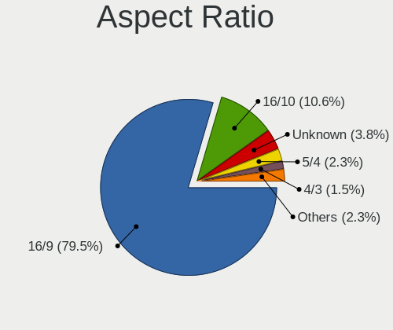

| Ratio   | Computers | Percent |
|---------|-----------|---------|
| 16/9    | 78        | 78%     |
| 16/10   | 12        | 12%     |
| Unknown | 5         | 5%      |
| 21/9    | 2         | 2%      |
| 5/4     | 1         | 1%      |
| 4/3     | 1         | 1%      |
| 3/2     | 1         | 1%      |

Monitor Area
------------

Area in inch

| Area in inch | Computers | Percent |
|----------------|-----------|---------|
| 91-100         | 23        | 21.5%   |
| 201-250        | 17        | 15.89%  |
| 81-90          | 15        | 14.02%  |
| 301-350        | 7         | 6.54%   |
| 61-70          | 6         | 5.61%   |
| Unknown        | 6         | 5.61%   |
| 251-300        | 5         | 4.67%   |
| 101-110        | 5         | 4.67%   |
| 71-80          | 4         | 3.74%   |
| 351-500        | 4         | 3.74%   |
| More than 1000 | 3         | 2.8%    |
| 41-50          | 3         | 2.8%    |
| 151-200        | 3         | 2.8%    |
| 121-130        | 3         | 2.8%    |
| 141-150        | 1         | 0.93%   |
| 111-120        | 1         | 0.93%   |
| 501-1000       | 1         | 0.93%   |

Pixel Density
-------------

Pixels per inch

| Density       | Computers | Percent |
|---------------|-----------|---------|
| 121-160       | 30        | 28.3%   |
| 101-120       | 29        | 27.36%  |
| 51-100        | 27        | 25.47%  |
| 161-240       | 8         | 7.55%   |
| Unknown       | 6         | 5.66%   |
| More than 240 | 3         | 2.83%   |
| 1-50          | 3         | 2.83%   |

Multiple Monitors
-----------------

Total monitors connected

| Total | Computers | Percent |
|-------|-----------|---------|
| 1     | 82        | 50.31%  |
| 0     | 66        | 40.49%  |
| 2     | 13        | 7.98%   |
| 3     | 2         | 1.23%   |

Network
-------

Net Controller Vendor
---------------------

Controller vendors

| Vendor                   | Computers | Percent |
|--------------------------|-----------|---------|
| Intel                    | 93        | 40.97%  |
| Realtek Semiconductor    | 69        | 30.4%   |
| Qualcomm Atheros         | 30        | 13.22%  |
| Broadcom                 | 17        | 7.49%   |
| Edimax Technology        | 3         | 1.32%   |
| Ralink Technology        | 2         | 0.88%   |
| Nvidia                   | 2         | 0.88%   |
| Mellanox Technologies    | 2         | 0.88%   |
| Marvell Technology Group | 2         | 0.88%   |
| Xiaomi                   | 1         | 0.44%   |
| Ralink                   | 1         | 0.44%   |
| Qualcomm                 | 1         | 0.44%   |
| NetGear                  | 1         | 0.44%   |
| IMC Networks             | 1         | 0.44%   |
| dog hunter               | 1         | 0.44%   |
| ADMtek                   | 1         | 0.44%   |

Net Controller Model
--------------------

Controller models

| Model                                                                         | Computers | Percent |
|-------------------------------------------------------------------------------|-----------|---------|
| Realtek RTL8111/8168/8411 PCI Express Gigabit Ethernet Controller             | 53        | 19.27%  |
| Realtek RTL810xE PCI Express Fast Ethernet controller                         | 9         | 3.27%   |
| Intel I211 Gigabit Network Connection                                         | 9         | 3.27%   |
| Intel Wi-Fi 6 AX200                                                           | 8         | 2.91%   |
| Intel Wireless 8265 / 8275                                                    | 7         | 2.55%   |
| Intel Wireless 7265                                                           | 7         | 2.55%   |
| Intel 82579LM Gigabit Network Connection (Lewisville)                         | 7         | 2.55%   |
| Qualcomm Atheros AR9285 Wireless Network Adapter (PCI-Express)                | 6         | 2.18%   |
| Intel Wireless-AC 9260                                                        | 6         | 2.18%   |
| Intel 82574L Gigabit Network Connection                                       | 6         | 2.18%   |
| Qualcomm Atheros QCA9377 802.11ac Wireless Network Adapter                    | 5         | 1.82%   |
| Intel Centrino Advanced-N 6205 [Taylor Peak]                                  | 5         | 1.82%   |
| Intel Ethernet Connection (2) I219-LM                                         | 4         | 1.45%   |
| Realtek RTL8188EUS 802.11n Wireless Network Adapter                           | 3         | 1.09%   |
| Qualcomm Atheros QCA9565 / AR9565 Wireless Network Adapter                    | 3         | 1.09%   |
| Qualcomm Atheros Killer E2500 Gigabit Ethernet Controller                     | 3         | 1.09%   |
| Intel Wireless 3160                                                           | 3         | 1.09%   |
| Intel I350 Gigabit Network Connection                                         | 3         | 1.09%   |
| Intel I210 Gigabit Network Connection                                         | 3         | 1.09%   |
| Intel Ethernet Connection I217-LM                                             | 3         | 1.09%   |
| Intel Ethernet Connection (4) I219-V                                          | 3         | 1.09%   |
| Intel Ethernet Connection (2) I219-V                                          | 3         | 1.09%   |
| Intel Comet Lake PCH-LP CNVi WiFi                                             | 3         | 1.09%   |
| Edimax EW-7811Un 802.11n Wireless Adapter [Realtek RTL8188CUS]                | 3         | 1.09%   |
| Broadcom BCM4313 802.11bgn Wireless Network Adapter                           | 3         | 1.09%   |
| Realtek RTL8822CE 802.11ac PCIe Wireless Network Adapter                      | 2         | 0.73%   |
| Realtek RTL8822BE 802.11a/b/g/n/ac WiFi adapter                               | 2         | 0.73%   |
| Realtek RTL8821CE 802.11ac PCIe Wireless Network Adapter                      | 2         | 0.73%   |
| Realtek RTL8188CE 802.11b/g/n WiFi Adapter                                    | 2         | 0.73%   |
| Realtek RTL8125 2.5GbE Controller                                             | 2         | 0.73%   |
| Qualcomm Atheros AR9485 Wireless Network Adapter                              | 2         | 0.73%   |
| Qualcomm Atheros AR93xx Wireless Network Adapter                              | 2         | 0.73%   |
| Qualcomm Atheros AR8152 v2.0 Fast Ethernet                                    | 2         | 0.73%   |
| Nvidia MCP79 Ethernet                                                         | 2         | 0.73%   |
| Mellanox MT27500 Family [ConnectX-3]                                          | 2         | 0.73%   |
| Intel Wireless 8260                                                           | 2         | 0.73%   |
| Intel Wireless 7260                                                           | 2         | 0.73%   |
| Intel Wireless 3165                                                           | 2         | 0.73%   |
| Intel Ethernet Connection (7) I219-V                                          | 2         | 0.73%   |
| Intel Ethernet Connection (3) I218-LM                                         | 2         | 0.73%   |
| Intel Dual Band Wireless-AC 3168NGW [Stone Peak]                              | 2         | 0.73%   |
| Intel Comet Lake PCH CNVi WiFi                                                | 2         | 0.73%   |
| Intel Centrino Ultimate-N 6300                                                | 2         | 0.73%   |
| Intel Cannon Point-LP CNVi [Wireless-AC]                                      | 2         | 0.73%   |
| Intel 82577LM Gigabit Network Connection                                      | 2         | 0.73%   |
| Intel 82577LC Gigabit Network Connection                                      | 2         | 0.73%   |
| Intel 82571EB/82571GB Gigabit Ethernet Controller D0/D1 (copper applications) | 2         | 0.73%   |
| Broadcom BCM43602 802.11ac Wireless LAN SoC                                   | 2         | 0.73%   |
| Broadcom BCM43224 802.11a/b/g/n                                               | 2         | 0.73%   |
| Broadcom BCM43142 802.11b/g/n                                                 | 2         | 0.73%   |
| Xiaomi Mi/Redmi series (RNDIS + ADB)                                          | 1         | 0.36%   |
| Realtek RTL8192EE PCIe Wireless Network Adapter                               | 1         | 0.36%   |
| Realtek RTL8191SEvB Wireless LAN Controller                                   | 1         | 0.36%   |
| Realtek Realtek Bluetooth Adapter                                             | 1         | 0.36%   |
| Ralink RT5370 Wireless Adapter                                                | 1         | 0.36%   |
| Ralink RT2870/RT3070 Wireless Adapter                                         | 1         | 0.36%   |
| Ralink RT2500 Wireless 802.11bg                                               | 1         | 0.36%   |
| Qualcomm Atheros QCA8172 Fast Ethernet                                        | 1         | 0.36%   |
| Qualcomm Atheros QCA8171 Gigabit Ethernet                                     | 1         | 0.36%   |
| Qualcomm Atheros QCA6174 802.11ac Wireless Network Adapter                    | 1         | 0.36%   |

Wireless Vendor
---------------

Wireless vendors

| Vendor                | Computers | Percent |
|-----------------------|-----------|---------|
| Intel                 | 64        | 53.78%  |
| Qualcomm Atheros      | 23        | 19.33%  |
| Realtek Semiconductor | 13        | 10.92%  |
| Broadcom              | 11        | 9.24%   |
| Edimax Technology     | 3         | 2.52%   |
| Ralink Technology     | 2         | 1.68%   |
| Ralink                | 1         | 0.84%   |
| NetGear               | 1         | 0.84%   |
| IMC Networks          | 1         | 0.84%   |

Wireless Model
--------------

Wireless models

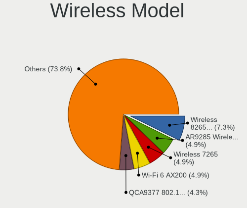

| Model                                                                   | Computers | Percent |
|-------------------------------------------------------------------------|-----------|---------|
| Intel Wi-Fi 6 AX200                                                     | 8         | 6.67%   |
| Intel Wireless 8265 / 8275                                              | 7         | 5.83%   |
| Intel Wireless 7265                                                     | 7         | 5.83%   |
| Qualcomm Atheros AR9285 Wireless Network Adapter (PCI-Express)          | 6         | 5%      |
| Intel Wireless-AC 9260                                                  | 6         | 5%      |
| Qualcomm Atheros QCA9377 802.11ac Wireless Network Adapter              | 5         | 4.17%   |
| Intel Centrino Advanced-N 6205 [Taylor Peak]                            | 5         | 4.17%   |
| Realtek RTL8188EUS 802.11n Wireless Network Adapter                     | 3         | 2.5%    |
| Qualcomm Atheros QCA9565 / AR9565 Wireless Network Adapter              | 3         | 2.5%    |
| Intel Wireless 3160                                                     | 3         | 2.5%    |
| Intel Comet Lake PCH-LP CNVi WiFi                                       | 3         | 2.5%    |
| Edimax EW-7811Un 802.11n Wireless Adapter [Realtek RTL8188CUS]          | 3         | 2.5%    |
| Broadcom BCM4313 802.11bgn Wireless Network Adapter                     | 3         | 2.5%    |
| Realtek RTL8822CE 802.11ac PCIe Wireless Network Adapter                | 2         | 1.67%   |
| Realtek RTL8822BE 802.11a/b/g/n/ac WiFi adapter                         | 2         | 1.67%   |
| Realtek RTL8821CE 802.11ac PCIe Wireless Network Adapter                | 2         | 1.67%   |
| Realtek RTL8188CE 802.11b/g/n WiFi Adapter                              | 2         | 1.67%   |
| Qualcomm Atheros AR9485 Wireless Network Adapter                        | 2         | 1.67%   |
| Qualcomm Atheros AR93xx Wireless Network Adapter                        | 2         | 1.67%   |
| Intel Wireless 8260                                                     | 2         | 1.67%   |
| Intel Wireless 7260                                                     | 2         | 1.67%   |
| Intel Wireless 3165                                                     | 2         | 1.67%   |
| Intel Dual Band Wireless-AC 3168NGW [Stone Peak]                        | 2         | 1.67%   |
| Intel Comet Lake PCH CNVi WiFi                                          | 2         | 1.67%   |
| Intel Centrino Ultimate-N 6300                                          | 2         | 1.67%   |
| Intel Cannon Point-LP CNVi [Wireless-AC]                                | 2         | 1.67%   |
| Broadcom BCM43602 802.11ac Wireless LAN SoC                             | 2         | 1.67%   |
| Broadcom BCM43224 802.11a/b/g/n                                         | 2         | 1.67%   |
| Broadcom BCM43142 802.11b/g/n                                           | 2         | 1.67%   |
| Realtek RTL8192EE PCIe Wireless Network Adapter                         | 1         | 0.83%   |
| Realtek RTL8191SEvB Wireless LAN Controller                             | 1         | 0.83%   |
| Realtek Realtek Bluetooth Adapter                                       | 1         | 0.83%   |
| Ralink RT5370 Wireless Adapter                                          | 1         | 0.83%   |
| Ralink RT2870/RT3070 Wireless Adapter                                   | 1         | 0.83%   |
| Ralink RT2500 Wireless 802.11bg                                         | 1         | 0.83%   |
| Qualcomm Atheros QCA6174 802.11ac Wireless Network Adapter              | 1         | 0.83%   |
| Qualcomm Atheros AR928X Wireless Network Adapter (PCI-Express)          | 1         | 0.83%   |
| Qualcomm Atheros AR9287 Wireless Network Adapter (PCI-Express)          | 1         | 0.83%   |
| Qualcomm Atheros AR9227 Wireless Network Adapter                        | 1         | 0.83%   |
| Qualcomm Atheros AR242x / AR542x Wireless Network Adapter (PCI-Express) | 1         | 0.83%   |
| NetGear A6100 AC600 DB Wireless Adapter [Realtek RTL8811AU]             | 1         | 0.83%   |
| Intel WiFi Link 5100                                                    | 1         | 0.83%   |
| Intel Wi-Fi 6 AX210/AX211/AX411 160MHz                                  | 1         | 0.83%   |
| Intel Ultimate N WiFi Link 5300                                         | 1         | 0.83%   |
| Intel PRO/Wireless 5100 AGN [Shiloh] Network Connection                 | 1         | 0.83%   |
| Intel PRO/Wireless 3945ABG [Golan] Network Connection                   | 1         | 0.83%   |
| Intel Gemini Lake PCH CNVi WiFi                                         | 1         | 0.83%   |
| Intel Dual Band Wireless-AC 3165 Plus Bluetooth                         | 1         | 0.83%   |
| Intel Centrino Wireless-N 2230                                          | 1         | 0.83%   |
| Intel Centrino Advanced-N 6235                                          | 1         | 0.83%   |
| Intel Centrino Advanced-N 6200                                          | 1         | 0.83%   |
| Intel Cannon Lake PCH CNVi WiFi                                         | 1         | 0.83%   |
| IMC Networks Mediao 802.11n WLAN [Realtek RTL8191SU]                    | 1         | 0.83%   |
| Broadcom BCM4352 802.11ac Wireless Network Adapter                      | 1         | 0.83%   |
| Broadcom BCM4322 802.11a/b/g/n Wireless LAN Controller                  | 1         | 0.83%   |

Ethernet Vendor
---------------

Ethernet vendors

| Vendor                   | Computers | Percent |
|--------------------------|-----------|---------|
| Realtek Semiconductor    | 62        | 42.76%  |
| Intel                    | 58        | 40%     |
| Qualcomm Atheros         | 10        | 6.9%    |
| Broadcom                 | 8         | 5.52%   |
| Nvidia                   | 2         | 1.38%   |
| Marvell Technology Group | 2         | 1.38%   |
| Xiaomi                   | 1         | 0.69%   |
| Qualcomm                 | 1         | 0.69%   |
| ADMtek                   | 1         | 0.69%   |

Ethernet Model
--------------

Ethernet models

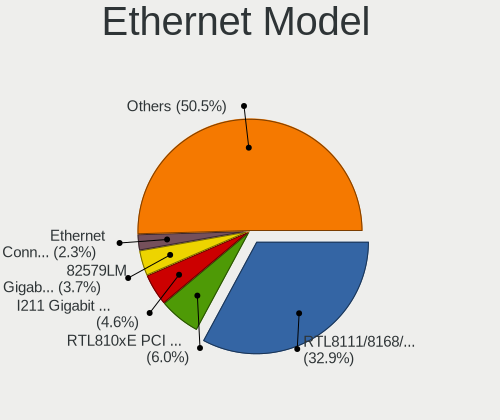

| Model                                                                         | Computers | Percent |
|-------------------------------------------------------------------------------|-----------|---------|
| Realtek RTL8111/8168/8411 PCI Express Gigabit Ethernet Controller             | 53        | 35.33%  |
| Realtek RTL810xE PCI Express Fast Ethernet controller                         | 9         | 6%      |
| Intel I211 Gigabit Network Connection                                         | 9         | 6%      |
| Intel 82579LM Gigabit Network Connection (Lewisville)                         | 7         | 4.67%   |
| Intel 82574L Gigabit Network Connection                                       | 6         | 4%      |
| Intel Ethernet Connection (2) I219-LM                                         | 4         | 2.67%   |
| Qualcomm Atheros Killer E2500 Gigabit Ethernet Controller                     | 3         | 2%      |
| Intel I350 Gigabit Network Connection                                         | 3         | 2%      |
| Intel I210 Gigabit Network Connection                                         | 3         | 2%      |
| Intel Ethernet Connection I217-LM                                             | 3         | 2%      |
| Intel Ethernet Connection (4) I219-V                                          | 3         | 2%      |
| Intel Ethernet Connection (2) I219-V                                          | 3         | 2%      |
| Qualcomm Atheros AR8152 v2.0 Fast Ethernet                                    | 2         | 1.33%   |
| Nvidia MCP79 Ethernet                                                         | 2         | 1.33%   |
| Intel Ethernet Connection (7) I219-V                                          | 2         | 1.33%   |
| Intel Ethernet Connection (3) I218-LM                                         | 2         | 1.33%   |
| Intel 82577LM Gigabit Network Connection                                      | 2         | 1.33%   |
| Intel 82577LC Gigabit Network Connection                                      | 2         | 1.33%   |
| Intel 82571EB/82571GB Gigabit Ethernet Controller D0/D1 (copper applications) | 2         | 1.33%   |
| Xiaomi Mi/Redmi series (RNDIS + ADB)                                          | 1         | 0.67%   |
| Qualcomm Atheros QCA8172 Fast Ethernet                                        | 1         | 0.67%   |
| Qualcomm Atheros QCA8171 Gigabit Ethernet                                     | 1         | 0.67%   |
| Qualcomm Atheros Attansic L1 Gigabit Ethernet                                 | 1         | 0.67%   |
| Qualcomm Atheros AR8162 Fast Ethernet                                         | 1         | 0.67%   |
| Qualcomm Atheros AR8151 v2.0 Gigabit Ethernet                                 | 1         | 0.67%   |
| Qualcomm ALCATEL Composite RNDIS Interface                                    | 1         | 0.67%   |
| Marvell Group 88E8056 PCI-E Gigabit Ethernet Controller                       | 1         | 0.67%   |
| Marvell Group 88E8040 PCI-E Fast Ethernet Controller                          | 1         | 0.67%   |
| Marvell Group 88E8001 Gigabit Ethernet Controller                             | 1         | 0.67%   |
| Intel Ethernet Controller I225-V                                              | 1         | 0.67%   |
| Intel Ethernet Connection I219-LM                                             | 1         | 0.67%   |
| Intel Ethernet Connection (6) I219-LM                                         | 1         | 0.67%   |
| Intel Ethernet Connection (4) I219-LM                                         | 1         | 0.67%   |
| Intel Ethernet Connection (3) I219-LM                                         | 1         | 0.67%   |
| Intel Ethernet Connection (3) I218-V                                          | 1         | 0.67%   |
| Intel Ethernet Connection (2) I218-V                                          | 1         | 0.67%   |
| Intel Ethernet Connection (10) I219-LM                                        | 1         | 0.67%   |
| Intel 82573L Gigabit Ethernet Controller                                      | 1         | 0.67%   |
| Intel 82572EI Gigabit Ethernet Controller (Copper)                            | 1         | 0.67%   |
| Intel 82567LM Gigabit Network Connection                                      | 1         | 0.67%   |
| Broadcom NetXtreme II BCM57711E 10-Gigabit PCIe                               | 1         | 0.67%   |
| Broadcom NetXtreme II BCM5716 Gigabit Ethernet                                | 1         | 0.67%   |
| Broadcom NetXtreme II BCM5709 Gigabit Ethernet                                | 1         | 0.67%   |
| Broadcom NetXtreme BCM5764M Gigabit Ethernet PCIe                             | 1         | 0.67%   |
| Broadcom NetXtreme BCM5761 Gigabit Ethernet PCIe                              | 1         | 0.67%   |
| Broadcom NetXtreme BCM5752 Gigabit Ethernet PCI Express                       | 1         | 0.67%   |
| Broadcom NetXtreme BCM5723 Gigabit Ethernet PCIe                              | 1         | 0.67%   |
| Broadcom NetXtreme BCM5720 Gigabit Ethernet PCIe                              | 1         | 0.67%   |
| ADMtek NC100 Network Everywhere Fast Ethernet 10/100                          | 1         | 0.67%   |

Net Controller Kind
-------------------

Ethernet, WiFi or modem

| Kind     | Computers | Percent |
|----------|-----------|---------|
| Ethernet | 139       | 54.72%  |
| WiFi     | 110       | 43.31%  |
| Unknown  | 4         | 1.57%   |
| Modem    | 1         | 0.39%   |

Used Controller
---------------

Currently used network controller

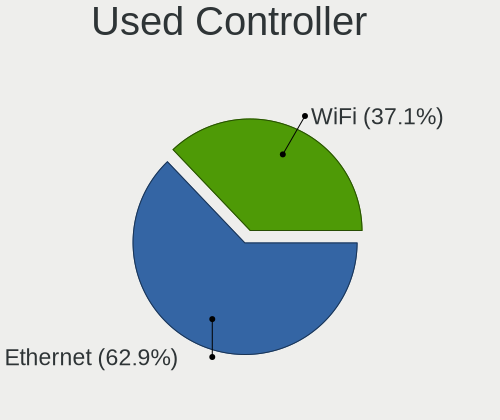

| Kind     | Computers | Percent |
|----------|-----------|---------|
| Ethernet | 128       | 62.44%  |
| WiFi     | 77        | 37.56%  |

NICs
----

Total network controllers on board

| Total | Computers | Percent |
|-------|-----------|---------|
| 2     | 100       | 61.35%  |
| 1     | 43        | 26.38%  |
| 0     | 10        | 6.13%   |
| 4     | 5         | 3.07%   |
| 3     | 5         | 3.07%   |

IPv6
----

IPv6 vs IPv4

| Used | Computers | Percent |
|------|-----------|---------|
| No   | 141       | 85.98%  |
| Yes  | 23        | 14.02%  |

Bluetooth
---------

Bluetooth Vendor
----------------

Controller vendors

| Vendor                          | Computers | Percent |
|---------------------------------|-----------|---------|
| Intel                           | 45        | 59.21%  |
| Qualcomm Atheros Communications | 9         | 11.84%  |
| Broadcom                        | 5         | 6.58%   |
| Realtek Semiconductor           | 4         | 5.26%   |
| Apple                           | 4         | 5.26%   |
| IMC Networks                    | 2         | 2.63%   |
| ASUSTek Computer                | 2         | 2.63%   |
| VMware                          | 1         | 1.32%   |
| Lite-On Technology              | 1         | 1.32%   |
| Foxconn / Hon Hai               | 1         | 1.32%   |
| Dell                            | 1         | 1.32%   |
| Cambridge Silicon Radio         | 1         | 1.32%   |

Bluetooth Model
---------------

Controller models

| Model                                                       | Computers | Percent |
|-------------------------------------------------------------|-----------|---------|
| Intel Bluetooth wireless interface                          | 17        | 22.37%  |
| Intel AX200 Bluetooth                                       | 8         | 10.53%  |
| Intel Wireless-AC 9260 Bluetooth Adapter                    | 6         | 7.89%   |
| Intel Bluetooth 9460/9560 Jefferson Peak (JfP)              | 5         | 6.58%   |
| Intel AX201 Bluetooth                                       | 4         | 5.26%   |
| Qualcomm Atheros  QCA9377 Bluetooth 4.1                     | 3         | 3.95%   |
| Apple Bluetooth Host Controller                             | 3         | 3.95%   |
| Realtek  Bluetooth 4.2 Adapter                              | 2         | 2.63%   |
| Intel Wireless-AC 3168 Bluetooth                            | 2         | 2.63%   |
| Intel Centrino Bluetooth Wireless Transceiver               | 2         | 2.63%   |
| VMware Virtual Bluetooth Adapter                            | 1         | 1.32%   |
| Realtek RTL8822BE Bluetooth 4.2 Adapter                     | 1         | 1.32%   |
| Realtek  Bluetooth Adapter                                  | 1         | 1.32%   |
| Qualcomm Atheros Dell Wireless 1820 Bluetooth 4.1LE         | 1         | 1.32%   |
| Qualcomm Atheros Dell Wireless 1707 Bluetooth 4.0 LE Device | 1         | 1.32%   |
| Qualcomm Atheros Dell Wireless 1703 Bluetooth               | 1         | 1.32%   |
| Qualcomm Atheros AR9462 Bluetooth                           | 1         | 1.32%   |
| Qualcomm Atheros AR3012 Bluetooth 4.0                       | 1         | 1.32%   |
| Qualcomm Atheros AR3011 Bluetooth                           | 1         | 1.32%   |
| Lite-On Qualcomm Atheros QCA9377 Bluetooth                  | 1         | 1.32%   |
| Intel AX210 Bluetooth                                       | 1         | 1.32%   |
| IMC Networks Realtek Bluetooth Adapter                      | 1         | 1.32%   |
| IMC Networks Bluetooth Module                               | 1         | 1.32%   |
| Foxconn / Hon Hai Bluetooth USB Module                      | 1         | 1.32%   |
| Dell DW375 Bluetooth Module                                 | 1         | 1.32%   |
| Cambridge Silicon Radio Bluetooth Dongle (HCI mode)         | 1         | 1.32%   |
| Broadcom BCM43142 Bluetooth 4.0                             | 1         | 1.32%   |
| Broadcom BCM20702A0 Bluetooth 4.0                           | 1         | 1.32%   |
| Broadcom BCM20702 Bluetooth 4.0 [ThinkPad]                  | 1         | 1.32%   |
| Broadcom BCM2045B (BDC-2.1)                                 | 1         | 1.32%   |
| Broadcom BCM2045 Bluetooth                                  | 1         | 1.32%   |
| ASUS BT-270 Bluetooth Adapter                               | 1         | 1.32%   |
| ASUS BT-253 Bluetooth Adapter                               | 1         | 1.32%   |
| Apple Built-in Bluetooth 2.0+EDR HCI                        | 1         | 1.32%   |

Sound
-----

Sound Vendor
------------

Sound card vendors

| Vendor                               | Computers | Percent |
|--------------------------------------|-----------|---------|
| Intel                                | 108       | 60.34%  |
| AMD                                  | 32        | 17.88%  |
| Nvidia                               | 28        | 15.64%  |
| VMware                               | 1         | 0.56%   |
| Thesycon Systemsoftware & Consulting | 1         | 0.56%   |
| Texas Instruments                    | 1         | 0.56%   |
| SteelSeries ApS                      | 1         | 0.56%   |
| Realtek Semiconductor                | 1         | 0.56%   |
| Lenovo                               | 1         | 0.56%   |
| Ensoniq                              | 1         | 0.56%   |
| Creative Labs                        | 1         | 0.56%   |
| Corsair                              | 1         | 0.56%   |
| C-Media Electronics                  | 1         | 0.56%   |
| BEHRINGER International              | 1         | 0.56%   |

Sound Model
-----------

Sound card models

| Model                                                                                                     | Computers | Percent |
|-----------------------------------------------------------------------------------------------------------|-----------|---------|
| Intel Sunrise Point-LP HD Audio                                                                           | 16        | 7.48%   |
| Intel 6 Series/C200 Series Chipset Family High Definition Audio Controller                                | 10        | 4.67%   |
| Intel 8 Series/C220 Series Chipset High Definition Audio Controller                                       | 9         | 4.21%   |
| Intel 7 Series/C216 Chipset Family High Definition Audio Controller                                       | 9         | 4.21%   |
| AMD Family 17h (Models 00h-0fh) HD Audio Controller                                                       | 9         | 4.21%   |
| Intel 5 Series/3400 Series Chipset High Definition Audio                                                  | 8         | 3.74%   |
| Intel Xeon E3-1200 v3/4th Gen Core Processor HD Audio Controller                                          | 7         | 3.27%   |
| Intel Wildcat Point-LP High Definition Audio Controller                                                   | 7         | 3.27%   |
| Intel Broadwell-U Audio Controller                                                                        | 7         | 3.27%   |
| Intel 100 Series/C230 Series Chipset Family HD Audio Controller                                           | 7         | 3.27%   |
| AMD Ellesmere HDMI Audio [Radeon RX 470/480 / 570/580/590]                                                | 7         | 3.27%   |
| AMD Starship/Matisse HD Audio Controller                                                                  | 6         | 2.8%    |
| AMD Family 17h (Models 10h-1fh) HD Audio Controller                                                       | 5         | 2.34%   |
| Intel NM10/ICH7 Family High Definition Audio Controller                                                   | 4         | 1.87%   |
| Intel Haswell-ULT HD Audio Controller                                                                     | 4         | 1.87%   |
| Intel Comet Lake PCH-LP cAVS                                                                              | 4         | 1.87%   |
| Intel Cannon Point-LP High Definition Audio Controller                                                    | 4         | 1.87%   |
| Intel Cannon Lake PCH cAVS                                                                                | 4         | 1.87%   |
| Intel 82801I (ICH9 Family) HD Audio Controller                                                            | 4         | 1.87%   |
| Intel 8 Series HD Audio Controller                                                                        | 4         | 1.87%   |
| Nvidia TU107 GeForce GTX 1650 High Definition Audio Controller                                            | 3         | 1.4%    |
| Nvidia High Definition Audio Controller                                                                   | 3         | 1.4%    |
| Nvidia GP108 High Definition Audio Controller                                                             | 3         | 1.4%    |
| Nvidia GF119 HDMI Audio Controller                                                                        | 3         | 1.4%    |
| Intel Comet Lake PCH cAVS                                                                                 | 3         | 1.4%    |
| AMD Renoir Radeon High Definition Audio Controller                                                        | 3         | 1.4%    |
| AMD FCH Azalia Controller                                                                                 | 3         | 1.4%    |
| AMD Family 15h (Models 60h-6fh) Audio Controller                                                          | 3         | 1.4%    |
| Nvidia TU116 High Definition Audio Controller                                                             | 2         | 0.93%   |
| Nvidia TU104 HD Audio Controller                                                                          | 2         | 0.93%   |
| Nvidia MCP79 High Definition Audio                                                                        | 2         | 0.93%   |
| Nvidia GT216 HDMI Audio Controller                                                                        | 2         | 0.93%   |
| Intel Atom/Celeron/Pentium Processor x5-E8000/J3xxx/N3xxx Series High Definition Audio Controller         | 2         | 0.93%   |
| Intel Atom Processor Z36xxx/Z37xxx Series High Definition Audio Controller                                | 2         | 0.93%   |
| Intel 9 Series Chipset Family HD Audio Controller                                                         | 2         | 0.93%   |
| Intel 82801JI (ICH10 Family) HD Audio Controller                                                          | 2         | 0.93%   |
| AMD Vega 10 HDMI Audio [Radeon Vega 56/64]                                                                | 2         | 0.93%   |
| AMD Oland/Hainan/Cape Verde/Pitcairn HDMI Audio [Radeon HD 7000 Series]                                   | 2         | 0.93%   |
| AMD Kabini HDMI/DP Audio                                                                                  | 2         | 0.93%   |
| AMD High Definition Audio Controller                                                                      | 2         | 0.93%   |
| AMD Baffin HDMI/DP Audio [Radeon RX 550 640SP / RX 560/560X]                                              | 2         | 0.93%   |
| VMware HD Audio Controller                                                                                | 1         | 0.47%   |
| Thesycon Systemsoftware & Consulting Topping DX3 Pro Audio Control                                        | 1         | 0.47%   |
| Texas Instruments PCM2704 16-bit stereo audio DAC                                                         | 1         | 0.47%   |
| SteelSeries ApS Arctis Pro Wireless Arctis Pro Wireless Chat Arctis Pro Wireless Game Arctis Pro Wireless | 1         | 0.47%   |
| Realtek Semiconductor TX-384Khz Hifi Type-C Audio                                                         | 1         | 0.47%   |
| Nvidia GP107GL High Definition Audio Controller                                                           | 1         | 0.47%   |
| Nvidia GP106 High Definition Audio Controller                                                             | 1         | 0.47%   |
| Nvidia GK208 HDMI/DP Audio Controller                                                                     | 1         | 0.47%   |
| Nvidia GF116 High Definition Audio Controller                                                             | 1         | 0.47%   |
| Nvidia GF110 High Definition Audio Controller                                                             | 1         | 0.47%   |
| Nvidia GF108 High Definition Audio Controller                                                             | 1         | 0.47%   |
| Nvidia GA104 High Definition Audio Controller                                                             | 1         | 0.47%   |
| Nvidia GA102 High Definition Audio Controller                                                             | 1         | 0.47%   |
| Lenovo Lenovo ThinkPad OneLink Pro Dock                                                                   | 1         | 0.47%   |
| Intel Tiger Lake-LP Smart Sound Technology Audio Controller                                               | 1         | 0.47%   |
| Intel Lewisburg MROM 0                                                                                    | 1         | 0.47%   |
| Intel Ice Lake-LP Smart Sound Technology Audio Controller                                                 | 1         | 0.47%   |
| Intel CM238 HD Audio Controller                                                                           | 1         | 0.47%   |
| Intel Celeron/Pentium Silver Processor High Definition Audio                                              | 1         | 0.47%   |

Memory
------

Memory Vendor
-------------

Memory module vendors

| Vendor              | Computers | Percent |
|---------------------|-----------|---------|
| Samsung Electronics | 38        | 22.89%  |
| SK Hynix            | 27        | 16.27%  |
| Kingston            | 23        | 13.86%  |
| Unknown             | 17        | 10.24%  |
| Crucial             | 17        | 10.24%  |
| Micron Technology   | 13        | 7.83%   |
| Corsair             | 10        | 6.02%   |
| Ramaxel Technology  | 5         | 3.01%   |
| G.Skill             | 3         | 1.81%   |
| Team                | 2         | 1.2%    |
| Smart               | 2         | 1.2%    |
| Transcend           | 1         | 0.6%    |
| Teikon              | 1         | 0.6%    |
| Silicon Power       | 1         | 0.6%    |
| Qimonda             | 1         | 0.6%    |
| PUSKILL             | 1         | 0.6%    |
| Neo Forza           | 1         | 0.6%    |
| GOODRAM             | 1         | 0.6%    |
| AMD                 | 1         | 0.6%    |
| A-DATA Technology   | 1         | 0.6%    |

Memory Model
------------

Memory module models

| Model                                                   | Computers | Percent |
|---------------------------------------------------------|-----------|---------|
| SK Hynix RAM HMT451S6BFR8A-PB 4GB SODIMM DDR3 1600MT/s  | 3         | 1.7%    |
| SK Hynix RAM HMT325S6BFR8C-H9 2GB SODIMM DDR3 1333MT/s  | 3         | 1.7%    |
| Samsung RAM M471B5173DB0-YK0 4GB SODIMM DDR3 1600MT/s   | 3         | 1.7%    |
| Samsung RAM M471A1K43CB1-CTD 8GB SODIMM DDR4 2667MT/s   | 3         | 1.7%    |
| Unknown RAM Module 2GB SODIMM DDR2 667MT/s              | 2         | 1.14%   |
| SK Hynix RAM HMT41GS6BFR8A-PB 8GB SODIMM DDR3 1600MT/s  | 2         | 1.14%   |
| SK Hynix RAM HMT351S6EFR8C-PB 4GB SODIMM DDR3 1600MT/s  | 2         | 1.14%   |
| SK Hynix RAM HMT351S6CFR8C-PB 4GB SODIMM DDR3 1600MT/s  | 2         | 1.14%   |
| Samsung RAM M471B5273DH0-CH9 4GB SODIMM DDR3 1334MT/s   | 2         | 1.14%   |
| Samsung RAM M471B5173QH0-YK0 4GB SODIMM DDR3 1600MT/s   | 2         | 1.14%   |
| Samsung RAM M471A1K43DB1-CWE 8GB SODIMM DDR4 3200MT/s   | 2         | 1.14%   |
| Kingston RAM 99U5428-018.A00LF 8GB SODIMM DDR3 1600MT/s | 2         | 1.14%   |
| Crucial RAM CT8G4SFS824A.C8BD1 8GB SODIMM DDR4 2400MT/s | 2         | 1.14%   |
| Corsair RAM CMK16GX4M2B3200C16 8GB DIMM DDR4 3200MT/s   | 2         | 1.14%   |
| Unknown SODIMM 1GB SODIMM DDR2 533MT/s                  | 1         | 0.57%   |
| Unknown RAM Module 8GB SODIMM DDR4 2133MT/s             | 1         | 0.57%   |
| Unknown RAM Module 8GB DIMM DDR3 1600MT/s               | 1         | 0.57%   |
| Unknown RAM Module 8GB DIMM DDR3 1067MT/s               | 1         | 0.57%   |
| Unknown RAM Module 4GB SODIMM DDR4 2667MT/s             | 1         | 0.57%   |
| Unknown RAM Module 4GB DIMM DDR3 1600MT/s               | 1         | 0.57%   |
| Unknown RAM Module 4GB DIMM 400MT/s                     | 1         | 0.57%   |
| Unknown RAM Module 2GB SODIMM 667MT/s                   | 1         | 0.57%   |
| Unknown RAM Module 2GB DIMM SDRAM                       | 1         | 0.57%   |
| Unknown RAM Module 2GB DIMM DDR3 1332MT/s               | 1         | 0.57%   |
| Unknown RAM Module 2GB DIMM DDR 800MT/s                 | 1         | 0.57%   |
| Unknown RAM Module 2GB DIMM DDR 1333MT/s                | 1         | 0.57%   |
| Unknown RAM Module 1GB DIMM DDR2 800MT/s                | 1         | 0.57%   |
| Unknown RAM Module 16GB DIMM DDR4 2133MT/s              | 1         | 0.57%   |
| Unknown RAM 2G-08-10-12-1333 2GB DIMM DDR3 1333MT/s     | 1         | 0.57%   |
| Transcend RAM TS2GSH64V1B 16GB SODIMM DDR4 2133MT/s     | 1         | 0.57%   |
| Teikon RAM TMA81GS6AFR8N-UHSC 8GB SODIMM DDR4 2400MT/s  | 1         | 0.57%   |
| Team RAM TEAMGROUP-UD4-3200 32GB DIMM DDR4 3200MT/s     | 1         | 0.57%   |
| Team RAM TEAMGROUP-UD4-3200 16GB DIMM DDR4 3200MT/s     | 1         | 0.57%   |
| Smart RAM SF4641G8CK8IEHLSBG 8GB SODIMM DDR4 2667MT/s   | 1         | 0.57%   |
| Smart RAM SF464128CKHIWDFSEG 4GB SODIMM DDR4 2133MT/s   | 1         | 0.57%   |
| SK Hynix RAM Module 8GB Row Of Chips LPDDR3 2133MT/s    | 1         | 0.57%   |
| SK Hynix RAM Module 4GB SODIMM DDR3 1600MT/s            | 1         | 0.57%   |
| SK Hynix RAM Module 4GB SODIMM DDR3 1067MT/s            | 1         | 0.57%   |
| SK Hynix RAM HYMP125S64CP8-S6 2GB SODIMM DDR 975MT/s    | 1         | 0.57%   |
| SK Hynix RAM HMT451S6AFR8C-PB 4GB SODIMM DDR3 1600MT/s  | 1         | 0.57%   |
| SK Hynix RAM HMT451S6AFR8A-PB 4GB SODIMM DDR3 1600MT/s  | 1         | 0.57%   |
| SK Hynix RAM HMT425S6AFR6A-PB 2GB SODIMM DDR3 1600MT/s  | 1         | 0.57%   |
| SK Hynix RAM HMT351S6BFR8C-H9 4GB SODIMM DDR3 1334MT/s  | 1         | 0.57%   |
| SK Hynix RAM HMT351S6BFR8C-H9 4GB SODIMM DDR3 1333MT/s  | 1         | 0.57%   |
| SK Hynix RAM HMA851S6CJR6N-VK 4GB SODIMM DDR4 2667MT/s  | 1         | 0.57%   |
| SK Hynix RAM HMA851S6AFR6N-UH 4GB SODIMM DDR4 2400MT/s  | 1         | 0.57%   |
| SK Hynix RAM HMA82GU6AFR8N-UH 16GB DIMM DDR4 2400MT/s   | 1         | 0.57%   |
| SK Hynix RAM HMA82GS6JJR8N-VK 16GB SODIMM DDR4 2667MT/s | 1         | 0.57%   |
| SK Hynix RAM HMA82GS6CJR8N-VK 16GB SODIMM DDR4 2667MT/s | 1         | 0.57%   |
| SK Hynix RAM HMA81GS6JJR8N-VK 8GB SODIMM DDR4 2667MT/s  | 1         | 0.57%   |
| SK Hynix RAM HMA81GS6AFR8N-UH 8GB SODIMM DDR4 2400MT/s  | 1         | 0.57%   |
| Silicon Power RAM DCLT4GN128O 4GB DIMM DDR3 1333MT/s    | 1         | 0.57%   |
| Samsung RAM Module 8GB SODIMM DDR4 2133MT/s             | 1         | 0.57%   |
| Samsung RAM Module 2GB SODIMM DDR3 1067MT/s             | 1         | 0.57%   |
| Samsung RAM Module 2GB SODIMM 667MT/s                   | 1         | 0.57%   |
| Samsung RAM Module 16GB DIMM DDR3 1600MT/s              | 1         | 0.57%   |
| Samsung RAM M471B5673EH1-CF8 2GB SODIMM DDR3 1067MT/s   | 1         | 0.57%   |
| Samsung RAM M471B5673DZ1-CF8 2GB SODIMM DDR3 1066MT/s   | 1         | 0.57%   |
| Samsung RAM M471B5273DH0-CK0 4GB SODIMM DDR3 1600MT/s   | 1         | 0.57%   |
| Samsung RAM M471B5273CM0-CH9 4GB SODIMM DDR3 1333MT/s   | 1         | 0.57%   |

Memory Kind
-----------

Memory module kinds

| Kind    | Computers | Percent |
|---------|-----------|---------|
| DDR4    | 66        | 44.3%   |
| DDR3    | 65        | 43.62%  |
| DDR2    | 6         | 4.03%   |
| LPDDR3  | 4         | 2.68%   |
| DDR     | 4         | 2.68%   |
| Unknown | 3         | 2.01%   |
| SDRAM   | 1         | 0.67%   |

Memory Form Factor
------------------

Physical design of the memory module

| Name         | Computers | Percent |
|--------------|-----------|---------|
| SODIMM       | 92        | 62.16%  |
| DIMM         | 53        | 35.81%  |
| Row Of Chips | 2         | 1.35%   |
| Unknown      | 1         | 0.68%   |

Memory Size
-----------

Memory module size

| Size  | Computers | Percent |
|-------|-----------|---------|
| 8192  | 58        | 36.71%  |
| 4096  | 43        | 27.22%  |
| 16384 | 23        | 14.56%  |
| 2048  | 22        | 13.92%  |
| 32768 | 8         | 5.06%   |
| 1024  | 4         | 2.53%   |

Memory Speed
------------

Memory module speed

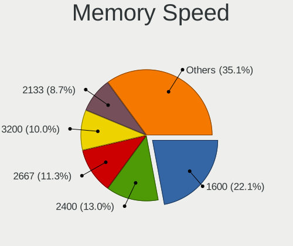

| Speed   | Computers | Percent |
|---------|-----------|---------|
| 1600    | 44        | 28.03%  |
| 2667    | 17        | 10.83%  |
| 2400    | 17        | 10.83%  |
| 2133    | 16        | 10.19%  |
| 1333    | 15        | 9.55%   |
| 3200    | 12        | 7.64%   |
| 1067    | 7         | 4.46%   |
| 667     | 5         | 3.18%   |
| 2933    | 4         | 2.55%   |
| 800     | 4         | 2.55%   |
| 3000    | 3         | 1.91%   |
| 1334    | 3         | 1.91%   |
| 533     | 2         | 1.27%   |
| 3600    | 1         | 0.64%   |
| 2666    | 1         | 0.64%   |
| 1866    | 1         | 0.64%   |
| 1332    | 1         | 0.64%   |
| 1066    | 1         | 0.64%   |
| 975     | 1         | 0.64%   |
| 400     | 1         | 0.64%   |
| Unknown | 1         | 0.64%   |

Printers & scanners
-------------------

Printer Vendor
--------------

Printer device vendors

| Vendor      | Computers | Percent |
|-------------|-----------|---------|
| Seiko Epson | 1         | 50%     |
| Canon       | 1         | 50%     |

Printer Model
-------------

Printer device models

| Model               | Computers | Percent |
|---------------------|-----------|---------|
| Seiko Epson Printer | 1         | 50%     |
| Canon LBP2900       | 1         | 50%     |

Scanner Vendor
--------------

Scanner device vendors

| Vendor | Computers | Percent |
|--------|-----------|---------|
| Canon  | 1         | 100%    |

Scanner Model
-------------

Scanner device models

| Model                   | Computers | Percent |
|-------------------------|-----------|---------|
| Canon CanoScan LiDE 110 | 1         | 100%    |

Camera
------

Camera Vendor
-------------

Camera device vendors

| Vendor                        | Computers | Percent |
|-------------------------------|-----------|---------|
| Chicony Electronics           | 18        | 26.87%  |
| IMC Networks                  | 9         | 13.43%  |
| Realtek Semiconductor         | 8         | 11.94%  |
| Microdia                      | 7         | 10.45%  |
| Sunplus Innovation Technology | 6         | 8.96%   |
| Suyin                         | 5         | 7.46%   |
| Logitech                      | 3         | 4.48%   |
| Acer                          | 3         | 4.48%   |
| Syntek                        | 2         | 2.99%   |
| Z-Star Microelectronics       | 1         | 1.49%   |
| Valve Software                | 1         | 1.49%   |
| Silicon Motion                | 1         | 1.49%   |
| Quanta                        | 1         | 1.49%   |
| Lite-On Technology            | 1         | 1.49%   |
| Lenovo                        | 1         | 1.49%   |

Camera Model
------------

Camera device models

| Model                                     | Computers | Percent |
|-------------------------------------------|-----------|---------|
| Chicony Integrated Camera                 | 4         | 5.97%   |
| IMC Networks Integrated Camera            | 3         | 4.48%   |
| Sunplus Integrated_Webcam_HD              | 2         | 2.99%   |
| Realtek Integrated_Webcam_HD              | 2         | 2.99%   |
| Microdia Integrated Webcam                | 2         | 2.99%   |
| IMC Networks USB2.0 HD UVC WebCam         | 2         | 2.99%   |
| Chicony Lenovo Integrated Camera (0.3MP)  | 2         | 2.99%   |
| Chicony HD WebCam                         | 2         | 2.99%   |
| Chicony Chicony USB2.0 Camera             | 2         | 2.99%   |
| Z-Star Namuga 1.3M Webcam                 | 1         | 1.49%   |
| Valve Software 3D Camera                  | 1         | 1.49%   |
| Syntek Lenovo EasyCamera                  | 1         | 1.49%   |
| Syntek EasyCamera                         | 1         | 1.49%   |
| Suyin Lenovo Integrated Webcam            | 1         | 1.49%   |
| Suyin Integrated Camera                   | 1         | 1.49%   |
| Suyin HP Webcam-101                       | 1         | 1.49%   |
| Suyin Asus Integrated Webcam              | 1         | 1.49%   |
| Suyin Acer Crystal Eye webcam             | 1         | 1.49%   |
| Sunplus Laptop_Integrated_Webcam_FHD      | 1         | 1.49%   |
| Sunplus Laptop Integrated Webcam HD       | 1         | 1.49%   |
| Sunplus Integrated Camera                 | 1         | 1.49%   |
| Sunplus Dell HD Webcam                    | 1         | 1.49%   |
| Silicon Motion Web Camera                 | 1         | 1.49%   |
| Realtek USB 2 Webcam                      | 1         | 1.49%   |
| Realtek Realtek PC Camera                 | 1         | 1.49%   |
| Realtek Lenovo EasyCamera                 | 1         | 1.49%   |
| Realtek Integrated Webcam HD              | 1         | 1.49%   |
| Realtek Integrated Webcam                 | 1         | 1.49%   |
| Realtek HP 2.0MP High Definition Webcam   | 1         | 1.49%   |
| Quanta HD Webcam                          | 1         | 1.49%   |
| Microdia Laptop_Integrated_Webcam_2M      | 1         | 1.49%   |
| Microdia Laptop_Integrated_Webcam_0.3M    | 1         | 1.49%   |
| Microdia Integrated_Webcam_HD             | 1         | 1.49%   |
| Microdia Integrated Webcam HD             | 1         | 1.49%   |
| Microdia Dell Laptop Integrated Webcam HD | 1         | 1.49%   |
| Logitech Webcam C270                      | 1         | 1.49%   |
| Logitech HD Webcam C615                   | 1         | 1.49%   |
| Logitech HD Pro Webcam C920               | 1         | 1.49%   |
| Lite-On HP TrueVision HD Camera           | 1         | 1.49%   |
| Lenovo Integrated Webcam [R5U877]         | 1         | 1.49%   |
| IMC Networks UVC VGA Webcam               | 1         | 1.49%   |
| IMC Networks USB2.0 UVC HD Webcam         | 1         | 1.49%   |
| IMC Networks USB2.0 UVC 2M WebCam         | 1         | 1.49%   |
| IMC Networks EasyCamera                   | 1         | 1.49%   |
| Chicony USB2.0 HD UVC WebCam              | 1         | 1.49%   |
| Chicony TOSHIBA Web Camera - HD           | 1         | 1.49%   |
| Chicony Realtek DMFT - RGB                | 1         | 1.49%   |
| Chicony Lenovo EasyCamera                 | 1         | 1.49%   |
| Chicony HP Wide Vision HD Camera          | 1         | 1.49%   |
| Chicony HP Universal Camera               | 1         | 1.49%   |
| Chicony HP TrueVision HD Camera           | 1         | 1.49%   |
| Chicony Chicony USB 2.0 Camera            | 1         | 1.49%   |
| Acer Lenovo Integrated Webcam             | 1         | 1.49%   |
| Acer Lenovo EasyCamera                    | 1         | 1.49%   |
| Acer Integrated Camera                    | 1         | 1.49%   |

Security
--------

Fingerprint Vendor
------------------

Fingerprint sensor vendors

| Vendor                     | Computers | Percent |
|----------------------------|-----------|---------|
| Validity Sensors           | 3         | 25%     |
| Synaptics                  | 3         | 25%     |
| Shenzhen Goodix Technology | 3         | 25%     |
| Upek                       | 1         | 8.33%   |
| Broadcom                   | 1         | 8.33%   |
| AuthenTec                  | 1         | 8.33%   |

Fingerprint Model
-----------------

Fingerprint sensor models

| Model                                                                        | Computers | Percent |
|------------------------------------------------------------------------------|-----------|---------|
| Validity Sensors Synaptics WBDI                                              | 2         | 16.67%  |
| Validity Sensors VFS 5011 fingerprint sensor                                 | 1         | 8.33%   |
| Upek Biometric Touchchip/Touchstrip Fingerprint Sensor                       | 1         | 8.33%   |
| Synaptics Prometheus MIS Touch Fingerprint Reader                            | 1         | 8.33%   |
| Synaptics Metallica MOH Touch Fingerprint Reader                             | 1         | 8.33%   |
| Synaptics Metallica MIS Touch Fingerprint Reader                             | 1         | 8.33%   |
| Shenzhen Goodix  FingerPrint Device                                          | 1         | 8.33%   |
| Shenzhen Goodix Fingerprint Reader                                           | 1         | 8.33%   |
| Shenzhen Goodix FingerPrint                                                  | 1         | 8.33%   |
| Broadcom BCM5880 Secure Applications Processor with fingerprint swipe sensor | 1         | 8.33%   |
| AuthenTec AuthenTec Inc. AES1660                                             | 1         | 8.33%   |

Chipcard Vendor
---------------

Chipcard module vendors

Zero info for selected period =(

Chipcard Model
--------------

Chipcard module models

Zero info for selected period =(

Unsupported
-----------

Unsupported Devices
-------------------

Total unsupported devices on board

| Total | Computers | Percent |
|-------|-----------|---------|
| 1     | 58        | 35.58%  |
| 0     | 45        | 27.61%  |
| 2     | 35        | 21.47%  |
| 3     | 18        | 11.04%  |
| 4     | 5         | 3.07%   |
| 6     | 1         | 0.61%   |
| 5     | 1         | 0.61%   |

Unsupported Device Types
------------------------

Types of unsupported devices

| Type                     | Computers | Percent |
|--------------------------|-----------|---------|
| Communication controller | 91        | 45.5%   |
| Net/wireless             | 37        | 18.5%   |
| Bluetooth                | 22        | 11%     |
| Card reader              | 15        | 7.5%    |
| Firewire controller      | 13        | 6.5%    |
| Fingerprint reader       | 12        | 6%      |
| Sound                    | 3         | 1.5%    |
| Network                  | 2         | 1%      |
| Net/ethernet             | 2         | 1%      |
| Storage/nvme             | 1         | 0.5%    |
| Storage/ide              | 1         | 0.5%    |
| Storage                  | 1         | 0.5%    |

