FreeBSD 13.1 - Tested Hardware & Statistics
-------------------------------------------

A project to collect tested hardware configurations for FreeBSD 13.1.

Anyone can contribute to this report by the [hw-probe](https://github.com/linuxhw/hw-probe/blob/master/INSTALL.BSD.md) tool:

    hw-probe -all -upload

Please contribute! Especially if your hardware is rare.

This is a report for all computer types. See also reports for [desktops](/Dist/FreeBSD_13.1/Desktop/README.md) and [notebooks](/Dist/FreeBSD_13.1/Notebook/README.md).

Contents
--------

* [ Test Cases ](#test-cases)

* [ System ](#system)
  - [ Arch                     ](#arch)
  - [ DE                       ](#de)
  - [ Display Server           ](#display-server)
  - [ Display Manager          ](#display-manager)
  - [ OS Lang                  ](#os-lang)
  - [ Boot Mode                ](#boot-mode)
  - [ Filesystem               ](#filesystem)
  - [ Part. scheme             ](#part-scheme)

* [ Board ](#board)
  - [ Vendor                   ](#vendor)
  - [ Model                    ](#model)
  - [ Model Family             ](#model-family)
  - [ MFG Year                 ](#mfg-year)
  - [ Form Factor              ](#form-factor)
  - [ Coreboot                 ](#coreboot)
  - [ RAM Size                 ](#ram-size)
  - [ RAM Used                 ](#ram-used)
  - [ Total Drives             ](#total-drives)
  - [ Has CD-ROM               ](#has-cd-rom)
  - [ Has Ethernet             ](#has-ethernet)
  - [ Has WiFi                 ](#has-wifi)
  - [ Has Bluetooth            ](#has-bluetooth)

* [ Location ](#location)
  - [ Country                  ](#country)
  - [ City                     ](#city)

* [ Drives ](#drives)
  - [ Drive Vendor             ](#drive-vendor)
  - [ Drive Model              ](#drive-model)
  - [ HDD Vendor               ](#hdd-vendor)
  - [ SSD Vendor               ](#ssd-vendor)
  - [ Drive Kind               ](#drive-kind)
  - [ Drive Connector          ](#drive-connector)
  - [ Drive Size               ](#drive-size)
  - [ Space Total              ](#space-total)
  - [ Space Used               ](#space-used)
  - [ Malfunc. Drives          ](#malfunc-drives)
  - [ Malfunc. Drive Vendor    ](#malfunc-drive-vendor)
  - [ Malfunc. HDD Vendor      ](#malfunc-hdd-vendor)
  - [ Malfunc. Drive Kind      ](#malfunc-drive-kind)
  - [ Failed Drives            ](#failed-drives)
  - [ Failed Drive Vendor      ](#failed-drive-vendor)
  - [ Drive Status             ](#drive-status)

* [ Storage controller ](#storage-controller)
  - [ Storage Vendor           ](#storage-vendor)
  - [ Storage Model            ](#storage-model)
  - [ Storage Kind             ](#storage-kind)

* [ Processor ](#processor)
  - [ CPU Vendor               ](#cpu-vendor)
  - [ CPU Model                ](#cpu-model)
  - [ CPU Model Family         ](#cpu-model-family)
  - [ CPU Cores                ](#cpu-cores)
  - [ CPU Sockets              ](#cpu-sockets)
  - [ CPU Threads              ](#cpu-threads)
  - [ CPU Microarch            ](#cpu-microarch)

* [ Graphics ](#graphics)
  - [ GPU Vendor               ](#gpu-vendor)
  - [ GPU Model                ](#gpu-model)
  - [ GPU Combo                ](#gpu-combo)
  - [ GPU Driver               ](#gpu-driver)
  - [ GPU Memory               ](#gpu-memory)

* [ Monitor ](#monitor)
  - [ Monitor Vendor           ](#monitor-vendor)
  - [ Monitor Model            ](#monitor-model)
  - [ Monitor Resolution       ](#monitor-resolution)
  - [ Monitor Diagonal         ](#monitor-diagonal)
  - [ Monitor Width            ](#monitor-width)
  - [ Aspect Ratio             ](#aspect-ratio)
  - [ Monitor Area             ](#monitor-area)
  - [ Pixel Density            ](#pixel-density)
  - [ Multiple Monitors        ](#multiple-monitors)

* [ Network ](#network)
  - [ Net Controller Vendor    ](#net-controller-vendor)
  - [ Net Controller Model     ](#net-controller-model)
  - [ Wireless Vendor          ](#wireless-vendor)
  - [ Wireless Model           ](#wireless-model)
  - [ Ethernet Vendor          ](#ethernet-vendor)
  - [ Ethernet Model           ](#ethernet-model)
  - [ Net Controller Kind      ](#net-controller-kind)
  - [ Used Controller          ](#used-controller)
  - [ NICs                     ](#nics)
  - [ IPv6                     ](#ipv6)

* [ Bluetooth ](#bluetooth)
  - [ Bluetooth Vendor         ](#bluetooth-vendor)
  - [ Bluetooth Model          ](#bluetooth-model)

* [ Sound ](#sound)
  - [ Sound Vendor             ](#sound-vendor)
  - [ Sound Model              ](#sound-model)

* [ Memory ](#memory)
  - [ Memory Vendor            ](#memory-vendor)
  - [ Memory Model             ](#memory-model)
  - [ Memory Kind              ](#memory-kind)
  - [ Memory Form Factor       ](#memory-form-factor)
  - [ Memory Size              ](#memory-size)
  - [ Memory Speed             ](#memory-speed)

* [ Printers & scanners ](#printers--scanners)
  - [ Printer Vendor           ](#printer-vendor)
  - [ Printer Model            ](#printer-model)
  - [ Scanner Vendor           ](#scanner-vendor)
  - [ Scanner Model            ](#scanner-model)

* [ Camera ](#camera)
  - [ Camera Vendor            ](#camera-vendor)
  - [ Camera Model             ](#camera-model)

* [ Security ](#security)
  - [ Fingerprint Vendor       ](#fingerprint-vendor)
  - [ Fingerprint Model        ](#fingerprint-model)
  - [ Chipcard Vendor          ](#chipcard-vendor)
  - [ Chipcard Model           ](#chipcard-model)

* [ Unsupported ](#unsupported)
  - [ Unsupported Devices      ](#unsupported-devices)
  - [ Unsupported Device Types ](#unsupported-device-types)

Test Cases
----------

Total: 224

| Vendor        | Model                       | Form-Factor | Probe                                                     | Date         |
|---------------|-----------------------------|-------------|-----------------------------------------------------------|--------------|
| AMI           | MNHO-048                    | Desktop     | [2ec6e55a75](https://bsd-hardware.info/?probe=2ec6e55a75) | Sep 28, 2022 |
| Acer          | Swift SF313-52              | Notebook    | [6339e6b468](https://bsd-hardware.info/?probe=6339e6b468) | Sep 25, 2022 |
| System76      | Gazelle                     | Notebook    | [d087321049](https://bsd-hardware.info/?probe=d087321049) | Sep 24, 2022 |
| NITRINOnet    | M360RUS56                   | Desktop     | [490b9593e0](https://bsd-hardware.info/?probe=490b9593e0) | Sep 23, 2022 |
| HP            | 21D0                        | Desktop     | [43fa46655e](https://bsd-hardware.info/?probe=43fa46655e) | Sep 21, 2022 |
| HP            | 21D0                        | Desktop     | [463e2563d7](https://bsd-hardware.info/?probe=463e2563d7) | Sep 19, 2022 |
| ASUSTek       | X455LJ                      | Notebook    | [431ad10ab2](https://bsd-hardware.info/?probe=431ad10ab2) | Sep 17, 2022 |
| Unknown       | Unknown                     | Desktop     | [83e48aa232](https://bsd-hardware.info/?probe=83e48aa232) | Sep 16, 2022 |
| Lenovo        | ThinkPad L420 7829WDY       | Notebook    | [a697be2aa9](https://bsd-hardware.info/?probe=a697be2aa9) | Sep 16, 2022 |
| Google        | Peppy                       | Notebook    | [80ffa77224](https://bsd-hardware.info/?probe=80ffa77224) | Sep 15, 2022 |
| Dell          | Latitude 5310               | Notebook    | [6edf4d34fe](https://bsd-hardware.info/?probe=6edf4d34fe) | Sep 07, 2022 |
| Dell          | Vostro 5415                 | Notebook    | [ef6d4ee660](https://bsd-hardware.info/?probe=ef6d4ee660) | Sep 06, 2022 |
| ASUSTek       | VivoBook_ASUSLaptop X515... | Notebook    | [cffed92600](https://bsd-hardware.info/?probe=cffed92600) | Sep 06, 2022 |
| Lenovo        | ThinkPad X1 Extreme Gen ... | Notebook    | [72757feb65](https://bsd-hardware.info/?probe=72757feb65) | Sep 03, 2022 |
| Lenovo        | ThinkPad X1 Extreme Gen ... | Notebook    | [5d575c85d0](https://bsd-hardware.info/?probe=5d575c85d0) | Sep 03, 2022 |
| Toshiba       | Satellite A300              | Notebook    | [ac185c104b](https://bsd-hardware.info/?probe=ac185c104b) | Aug 31, 2022 |
| Intel         | X79 V2.72A                  | Desktop     | [435901d8c9](https://bsd-hardware.info/?probe=435901d8c9) | Aug 29, 2022 |
| ASUSTek       | VivoBook_ASUSLaptop X570... | Notebook    | [0466d87f04](https://bsd-hardware.info/?probe=0466d87f04) | Aug 25, 2022 |
| ASRock        | AD2550-ITX                  | Desktop     | [43d0101ac4](https://bsd-hardware.info/?probe=43d0101ac4) | Aug 24, 2022 |
| HP            | Pavilion g6                 | Notebook    | [c146b538e1](https://bsd-hardware.info/?probe=c146b538e1) | Aug 20, 2022 |
| ASUSTek       | ZenBook 14 UX410UFR         | Notebook    | [2bf0f0ef08](https://bsd-hardware.info/?probe=2bf0f0ef08) | Aug 19, 2022 |
| Google        | Peppy                       | Notebook    | [e2e0a1953d](https://bsd-hardware.info/?probe=e2e0a1953d) | Aug 18, 2022 |
| Fujitsu       | D3373-B1 S26361-D3373-B1... | Server      | [676fd4e9b4](https://bsd-hardware.info/?probe=676fd4e9b4) | Aug 17, 2022 |
| Dell          | 042P49 A00                  | Desktop     | [7130975fe3](https://bsd-hardware.info/?probe=7130975fe3) | Aug 17, 2022 |
| MSI           | GF63 Thin 9SC               | Notebook    | [dacea7c6be](https://bsd-hardware.info/?probe=dacea7c6be) | Aug 14, 2022 |
| MSI           | H81M-P33                    | Desktop     | [3d0836d403](https://bsd-hardware.info/?probe=3d0836d403) | Aug 14, 2022 |
| ASUSTek       | P5Q-E                       | Desktop     | [c50be0ecae](https://bsd-hardware.info/?probe=c50be0ecae) | Aug 14, 2022 |
| ASUSTek       | ROG CROSSHAIR VIII HERO     | Desktop     | [4b6ad32189](https://bsd-hardware.info/?probe=4b6ad32189) | Aug 14, 2022 |
| ASRock        | H110M-DGS R3.0              | Desktop     | [0c654b6c34](https://bsd-hardware.info/?probe=0c654b6c34) | Aug 11, 2022 |
| Dell          | 042P49 A00                  | Desktop     | [a38375fa97](https://bsd-hardware.info/?probe=a38375fa97) | Aug 08, 2022 |
| Dell          | 042P49 A00                  | Desktop     | [81a5e313cd](https://bsd-hardware.info/?probe=81a5e313cd) | Aug 08, 2022 |
| MSI           | H81M-P33                    | Desktop     | [099e1c8b15](https://bsd-hardware.info/?probe=099e1c8b15) | Aug 07, 2022 |
| ASUSTek       | P5Q-E                       | Desktop     | [b96612a45b](https://bsd-hardware.info/?probe=b96612a45b) | Aug 07, 2022 |
| ASUSTek       | ROG CROSSHAIR VIII HERO     | Desktop     | [29b392331d](https://bsd-hardware.info/?probe=29b392331d) | Aug 07, 2022 |
| GVC           | DR 738                      | Desktop     | [ea08102a81](https://bsd-hardware.info/?probe=ea08102a81) | Aug 06, 2022 |
| Gigabyte      | H97M-HD3                    | Desktop     | [4a7705414f](https://bsd-hardware.info/?probe=4a7705414f) | Aug 06, 2022 |
| Gigabyte      | H81M-DS2                    | Desktop     | [5b88dea745](https://bsd-hardware.info/?probe=5b88dea745) | Aug 06, 2022 |
| Dell          | Inspiron 3581               | Notebook    | [f31cc32515](https://bsd-hardware.info/?probe=f31cc32515) | Aug 04, 2022 |
| Gigabyte      | P85-D3                      | Desktop     | [7f077abed9](https://bsd-hardware.info/?probe=7f077abed9) | Aug 02, 2022 |
| ASUSTek       | B85-PRO GAMER               | Desktop     | [b29e940a75](https://bsd-hardware.info/?probe=b29e940a75) | Aug 02, 2022 |
| HP            | EliteBook 850 G7 Noteboo... | Notebook    | [f603e648c7](https://bsd-hardware.info/?probe=f603e648c7) | Aug 01, 2022 |
| Lenovo        | ThinkPad T480 20L6S29E0T    | Notebook    | [546fa8380b](https://bsd-hardware.info/?probe=546fa8380b) | Aug 01, 2022 |
| MSI           | H81M-P33                    | Desktop     | [10fc9a4368](https://bsd-hardware.info/?probe=10fc9a4368) | Jul 31, 2022 |
| ASUSTek       | P5Q-E                       | Desktop     | [10139014e1](https://bsd-hardware.info/?probe=10139014e1) | Jul 31, 2022 |
| ASUSTek       | ROG CROSSHAIR VIII HERO     | Desktop     | [1129960acb](https://bsd-hardware.info/?probe=1129960acb) | Jul 31, 2022 |
| Dell          | Inspiron 5559               | Notebook    | [13baedb59b](https://bsd-hardware.info/?probe=13baedb59b) | Jul 31, 2022 |
| Gigabyte      | GB-BSi3-1115G4              | Desktop     | [4cd0769d75](https://bsd-hardware.info/?probe=4cd0769d75) | Jul 30, 2022 |
| Dell          | 0T7D40 A01                  | Desktop     | [bd2f6f8596](https://bsd-hardware.info/?probe=bd2f6f8596) | Jul 29, 2022 |
| Dell          | 040DDP A01                  | Desktop     | [5d4d3d7553](https://bsd-hardware.info/?probe=5d4d3d7553) | Jul 29, 2022 |
| Lenovo        | IdeaPad 330-15ARR 81D2      | Notebook    | [7b130fb168](https://bsd-hardware.info/?probe=7b130fb168) | Jul 27, 2022 |
| HP            | 1825                        | Desktop     | [8c96329681](https://bsd-hardware.info/?probe=8c96329681) | Jul 24, 2022 |
| MSI           | H81M-P33                    | Desktop     | [2f7e57d927](https://bsd-hardware.info/?probe=2f7e57d927) | Jul 24, 2022 |
| ASUSTek       | P5Q-E                       | Desktop     | [6fd0d31624](https://bsd-hardware.info/?probe=6fd0d31624) | Jul 24, 2022 |
| Dell          | Precision 5560              | Notebook    | [3dc82c6d91](https://bsd-hardware.info/?probe=3dc82c6d91) | Jul 23, 2022 |
| Lenovo        | G40-45 80E1                 | Notebook    | [6e31b5f45b](https://bsd-hardware.info/?probe=6e31b5f45b) | Jul 23, 2022 |
| HP            | ProLiant ML310e Gen8 v2     | Desktop     | [6cdc79a36f](https://bsd-hardware.info/?probe=6cdc79a36f) | Jul 22, 2022 |
| ASUSTek       | Maximus VIII HERO           | Desktop     | [051f604f9a](https://bsd-hardware.info/?probe=051f604f9a) | Jul 21, 2022 |
| Dell          | Studio XPS 1340             | Notebook    | [642da98e96](https://bsd-hardware.info/?probe=642da98e96) | Jul 21, 2022 |
| Dell          | Inspiron 5559               | Notebook    | [321d3333dd](https://bsd-hardware.info/?probe=321d3333dd) | Jul 19, 2022 |
| Dell          | 0WR7PY A03                  | Desktop     | [46a6f4e8f3](https://bsd-hardware.info/?probe=46a6f4e8f3) | Jul 19, 2022 |
| Dell          | Inspiron 5559               | Notebook    | [6308d8da4f](https://bsd-hardware.info/?probe=6308d8da4f) | Jul 19, 2022 |
| Dell          | 08HPGT A02                  | Desktop     | [ae260e17eb](https://bsd-hardware.info/?probe=ae260e17eb) | Jul 19, 2022 |
| ASUSTek       | ZenBook UX325UA_UM325UA     | Notebook    | [9af051c79f](https://bsd-hardware.info/?probe=9af051c79f) | Jul 17, 2022 |
| MSI           | H81M-P33                    | Desktop     | [c9d1bc6685](https://bsd-hardware.info/?probe=c9d1bc6685) | Jul 17, 2022 |
| ASUSTek       | P5Q-E                       | Desktop     | [7c02a92f29](https://bsd-hardware.info/?probe=7c02a92f29) | Jul 17, 2022 |
| ASUSTek       | ROG CROSSHAIR VIII HERO     | Desktop     | [3bf44f4bb5](https://bsd-hardware.info/?probe=3bf44f4bb5) | Jul 17, 2022 |
| Lenovo        | ThinkPad T480 20L6SB2N00    | Notebook    | [6c5c9eefc0](https://bsd-hardware.info/?probe=6c5c9eefc0) | Jul 17, 2022 |
| Lenovo        | ThinkPad T420 4236C92       | Notebook    | [4067ce2036](https://bsd-hardware.info/?probe=4067ce2036) | Jul 16, 2022 |
| Acer          | Veriton X490G               | Desktop     | [2912c74632](https://bsd-hardware.info/?probe=2912c74632) | Jul 15, 2022 |
| Lenovo        | ThinkPad X260 20F6S0KA00    | Notebook    | [117014d55f](https://bsd-hardware.info/?probe=117014d55f) | Jul 14, 2022 |
| Intel         | Q3XXG4-P V1.0               | Desktop     | [607a66e533](https://bsd-hardware.info/?probe=607a66e533) | Jul 14, 2022 |
| MouseCompu... | B360M                       | Desktop     | [3c22f3e91b](https://bsd-hardware.info/?probe=3c22f3e91b) | Jul 13, 2022 |
| Toshiba       | Satellite L305D             | Notebook    | [b0311b8175](https://bsd-hardware.info/?probe=b0311b8175) | Jul 12, 2022 |
| ASUSTek       | VivoBook_ASUSLaptop E210... | Notebook    | [7081ddd59c](https://bsd-hardware.info/?probe=7081ddd59c) | Jul 11, 2022 |
| Acer          | Veriton X490G               | Desktop     | [cbae2b155b](https://bsd-hardware.info/?probe=cbae2b155b) | Jul 11, 2022 |
| Acer          | Veriton X490G               | Desktop     | [3cd79878cd](https://bsd-hardware.info/?probe=3cd79878cd) | Jul 11, 2022 |
| MSI           | H81M-P33                    | Desktop     | [698249149d](https://bsd-hardware.info/?probe=698249149d) | Jul 10, 2022 |
| ASUSTek       | ROG CROSSHAIR VIII HERO     | Desktop     | [c2a2cdcbbb](https://bsd-hardware.info/?probe=c2a2cdcbbb) | Jul 10, 2022 |
| ASUSTek       | P5Q-E                       | Desktop     | [0c830d88dc](https://bsd-hardware.info/?probe=0c830d88dc) | Jul 10, 2022 |
| Unknown       | Unknown                     | Desktop     | [947d413e10](https://bsd-hardware.info/?probe=947d413e10) | Jul 09, 2022 |
| Intel         | DN2820FYK H24582-203        | Desktop     | [8a9a8cdbd0](https://bsd-hardware.info/?probe=8a9a8cdbd0) | Jul 08, 2022 |
| Intel         | NUC5PPYB                    | Mini pc     | [2d521e085b](https://bsd-hardware.info/?probe=2d521e085b) | Jul 08, 2022 |
| ASUSTek       | PRIME A520M-A II            | Desktop     | [0819ecdcf9](https://bsd-hardware.info/?probe=0819ecdcf9) | Jul 07, 2022 |
| ASUSTek       | PRIME A520M-A II            | Desktop     | [d459d3431a](https://bsd-hardware.info/?probe=d459d3431a) | Jul 07, 2022 |
| Dell          | Inspiron 5559               | Notebook    | [7bad2fce01](https://bsd-hardware.info/?probe=7bad2fce01) | Jul 07, 2022 |
| Lenovo        | IdeaPad 5 Pro 16ACH6 82L... | Notebook    | [66543e9280](https://bsd-hardware.info/?probe=66543e9280) | Jul 07, 2022 |
| Dell          | Latitude E6420              | Notebook    | [c41c8ff4f4](https://bsd-hardware.info/?probe=c41c8ff4f4) | Jul 07, 2022 |
| Fujitsu       | LIFEBOOK A555               | Notebook    | [d9fd7e54cf](https://bsd-hardware.info/?probe=d9fd7e54cf) | Jul 06, 2022 |
| BESSTAR Te... | GB1B                        | Mini pc     | [dbbe9124a2](https://bsd-hardware.info/?probe=dbbe9124a2) | Jul 05, 2022 |
| Acer          | Aspire XC-895 V:1.0         | Desktop     | [d67aa61a6b](https://bsd-hardware.info/?probe=d67aa61a6b) | Jul 05, 2022 |
| Acer          | Revo RN86                   | Desktop     | [2dc98202aa](https://bsd-hardware.info/?probe=2dc98202aa) | Jul 05, 2022 |
| Unknown       | Unknown                     | Notebook    | [584ecf8423](https://bsd-hardware.info/?probe=584ecf8423) | Jul 05, 2022 |
| HP            | Laptop 15-bs1xx             | Notebook    | [b697848727](https://bsd-hardware.info/?probe=b697848727) | Jul 05, 2022 |
| Intel         | NUC7i3BNB J22859-303        | Mini pc     | [886522d5e6](https://bsd-hardware.info/?probe=886522d5e6) | Jul 04, 2022 |
| Intel         | NUC11PABi5 K90634-305       | Mini pc     | [81e9f8506f](https://bsd-hardware.info/?probe=81e9f8506f) | Jul 04, 2022 |
| Intel         | NUC11PABi5 K90634-305       | Mini pc     | [d82547b583](https://bsd-hardware.info/?probe=d82547b583) | Jul 04, 2022 |
| Intel         | NUC7i3BNB J22859-303        | Mini pc     | [a3cba2571b](https://bsd-hardware.info/?probe=a3cba2571b) | Jul 04, 2022 |
| ASRock        | Z490M Pro4                  | Desktop     | [b57457834e](https://bsd-hardware.info/?probe=b57457834e) | Jul 04, 2022 |
| Gigabyte      | Z370M D3H-CF                | Desktop     | [1d3db5e35a](https://bsd-hardware.info/?probe=1d3db5e35a) | Jul 04, 2022 |
| MSI           | H81M-P33                    | Desktop     | [e482fbe2d2](https://bsd-hardware.info/?probe=e482fbe2d2) | Jul 03, 2022 |
| ASUSTek       | ROG CROSSHAIR VIII HERO     | Desktop     | [d5dd169581](https://bsd-hardware.info/?probe=d5dd169581) | Jul 03, 2022 |
| ASUSTek       | P5Q-E                       | Desktop     | [7a998b2fa4](https://bsd-hardware.info/?probe=7a998b2fa4) | Jul 03, 2022 |
| Dell          | Inspiron 5559               | Notebook    | [452aabec42](https://bsd-hardware.info/?probe=452aabec42) | Jul 02, 2022 |
| LG Electro... | 17Z990-R.AAC9U1             | Notebook    | [5777cb6dc6](https://bsd-hardware.info/?probe=5777cb6dc6) | Jul 01, 2022 |
| ASRock        | X300M-STX                   | Desktop     | [a76b64487b](https://bsd-hardware.info/?probe=a76b64487b) | Jul 01, 2022 |
| HP            | EliteBook 850 G7 Noteboo... | Notebook    | [f573327012](https://bsd-hardware.info/?probe=f573327012) | Jun 29, 2022 |
| ASRock        | P67 Professional            | Desktop     | [3372d35113](https://bsd-hardware.info/?probe=3372d35113) | Jun 28, 2022 |
| Gigabyte      | H61MA-D3V                   | Desktop     | [898da0bcec](https://bsd-hardware.info/?probe=898da0bcec) | Jun 28, 2022 |
| Acer          | Aspire A114-33              | Notebook    | [d3659c85e9](https://bsd-hardware.info/?probe=d3659c85e9) | Jun 28, 2022 |
| Samsung       | R530/R730/R540              | Notebook    | [a4cd230718](https://bsd-hardware.info/?probe=a4cd230718) | Jun 27, 2022 |
| Dell          | Inspiron 5559               | Notebook    | [e0c49be06e](https://bsd-hardware.info/?probe=e0c49be06e) | Jun 27, 2022 |
| MSI           | H81M-P33                    | Desktop     | [079fcf320f](https://bsd-hardware.info/?probe=079fcf320f) | Jun 26, 2022 |
| ASUSTek       | P5Q-E                       | Desktop     | [bbc59d9815](https://bsd-hardware.info/?probe=bbc59d9815) | Jun 26, 2022 |
| ASUSTek       | ROG CROSSHAIR VIII HERO     | Desktop     | [6eb02df970](https://bsd-hardware.info/?probe=6eb02df970) | Jun 26, 2022 |
| MSI           | MS-B120                     | Mini pc     | [aa27c1dfd0](https://bsd-hardware.info/?probe=aa27c1dfd0) | Jun 25, 2022 |
| ASUSTek       | PRIME Z590-P                | Desktop     | [70aea59a1b](https://bsd-hardware.info/?probe=70aea59a1b) | Jun 25, 2022 |
| ASUSTek       | PRIME Z590-P                | Desktop     | [c285cb7899](https://bsd-hardware.info/?probe=c285cb7899) | Jun 23, 2022 |
| ASUSTek       | ROG STRIX X570-F GAMING     | Desktop     | [7d054ce34f](https://bsd-hardware.info/?probe=7d054ce34f) | Jun 23, 2022 |
| MSI           | B85M-E45                    | Desktop     | [d9cc6cee6b](https://bsd-hardware.info/?probe=d9cc6cee6b) | Jun 21, 2022 |
| Apple         | Mac-8ED6AF5B48C039E1 Mac... | Mini pc     | [ee4d6d5761](https://bsd-hardware.info/?probe=ee4d6d5761) | Jun 21, 2022 |
| Intel         | D945GCLF2 AAE46416-104      | Desktop     | [84f2afeff4](https://bsd-hardware.info/?probe=84f2afeff4) | Jun 21, 2022 |
| ASUSTek       | Z87M-PLUS                   | Desktop     | [5e51d228ec](https://bsd-hardware.info/?probe=5e51d228ec) | Jun 21, 2022 |
| HP            | 3031h                       | Desktop     | [96ecd77f94](https://bsd-hardware.info/?probe=96ecd77f94) | Jun 19, 2022 |
| HP            | 3031h                       | Desktop     | [4da4d936b8](https://bsd-hardware.info/?probe=4da4d936b8) | Jun 19, 2022 |
| Dell          | Inspiron 5559               | Notebook    | [5b7a6bf8f8](https://bsd-hardware.info/?probe=5b7a6bf8f8) | Jun 19, 2022 |
| Fujitsu Si... | AMILO Li3710                | Notebook    | [6d4bc39638](https://bsd-hardware.info/?probe=6d4bc39638) | Jun 18, 2022 |
| Sony          | VGN-NS21M_S                 | Notebook    | [c9701a7ff5](https://bsd-hardware.info/?probe=c9701a7ff5) | Jun 18, 2022 |
| Intel         | NUC7i5BNB J31144-306        | Mini pc     | [66f9b621be](https://bsd-hardware.info/?probe=66f9b621be) | Jun 17, 2022 |
| HP            | 86E9 A                      | Desktop     | [1d1ac2dd90](https://bsd-hardware.info/?probe=1d1ac2dd90) | Jun 16, 2022 |
| Dell          | Inspiron 5559               | Notebook    | [3344e5152d](https://bsd-hardware.info/?probe=3344e5152d) | Jun 16, 2022 |
| Dell          | Inspiron 5559               | Notebook    | [9f630c894a](https://bsd-hardware.info/?probe=9f630c894a) | Jun 16, 2022 |
| Dell          | 07KY25 A00                  | Desktop     | [9981217b1b](https://bsd-hardware.info/?probe=9981217b1b) | Jun 16, 2022 |
| ASUSTek       | ZenBook UX461FA_UX461FA     | Convertible | [3079ca74a6](https://bsd-hardware.info/?probe=3079ca74a6) | Jun 16, 2022 |
| Raspberry ... | Raspberry Pi                | Soc         | [b699c2a617](https://bsd-hardware.info/?probe=b699c2a617) | Jun 15, 2022 |
| Raspberry ... | Raspberry Pi                | Soc         | [45083c3a78](https://bsd-hardware.info/?probe=45083c3a78) | Jun 15, 2022 |
| Dell          | Latitude E5420              | Notebook    | [524ab094e1](https://bsd-hardware.info/?probe=524ab094e1) | Jun 13, 2022 |
| ASUSTek       | ZenBook UX391FA_UX391FA     | Notebook    | [8825a49f37](https://bsd-hardware.info/?probe=8825a49f37) | Jun 13, 2022 |
| Dell          | 0HMF7C A01                  | Desktop     | [ad0f6d4b31](https://bsd-hardware.info/?probe=ad0f6d4b31) | Jun 13, 2022 |
| Gigabyte      | B550M AORUS PRO-P           | Desktop     | [1febab0774](https://bsd-hardware.info/?probe=1febab0774) | Jun 12, 2022 |
| HP            | Laptop 15s-fq1xxx           | Notebook    | [380218b2c1](https://bsd-hardware.info/?probe=380218b2c1) | Jun 12, 2022 |
| Fujitsu Si... | AMILO Li3710                | Notebook    | [387bf3d18f](https://bsd-hardware.info/?probe=387bf3d18f) | Jun 12, 2022 |
| MSI           | H81M-P33                    | Desktop     | [87a66430db](https://bsd-hardware.info/?probe=87a66430db) | Jun 12, 2022 |
| ASUSTek       | P5Q-E                       | Desktop     | [9b34d14850](https://bsd-hardware.info/?probe=9b34d14850) | Jun 12, 2022 |
| ASUSTek       | ROG CROSSHAIR VIII HERO     | Desktop     | [c281c439e8](https://bsd-hardware.info/?probe=c281c439e8) | Jun 12, 2022 |
| Dell          | Inspiron 5559               | Notebook    | [e7017b0ea5](https://bsd-hardware.info/?probe=e7017b0ea5) | Jun 12, 2022 |
| Supermicro    | X9DR3-F                     | Desktop     | [d81151c0e8](https://bsd-hardware.info/?probe=d81151c0e8) | Jun 12, 2022 |
| ASUSTek       | Maximus VII FORMULA         | Desktop     | [5215d1ebb8](https://bsd-hardware.info/?probe=5215d1ebb8) | Jun 12, 2022 |
| Lenovo        | IdeaPadFlex 5 14ITL05 82... | Convertible | [af923daeda](https://bsd-hardware.info/?probe=af923daeda) | Jun 12, 2022 |
| Fujitsu Si... | AMILO Li3710                | Notebook    | [edebcb2719](https://bsd-hardware.info/?probe=edebcb2719) | Jun 12, 2022 |
| Fujitsu       | LIFEBOOK A555               | Notebook    | [23d96bc669](https://bsd-hardware.info/?probe=23d96bc669) | Jun 11, 2022 |
| Dell          | Latitude E5420              | Notebook    | [aca711c5ec](https://bsd-hardware.info/?probe=aca711c5ec) | Jun 09, 2022 |
| Lenovo        | IdeaPad 130-15AST 81H5      | Notebook    | [9f33082ffa](https://bsd-hardware.info/?probe=9f33082ffa) | Jun 08, 2022 |
| Dell          | Precision M4800             | Notebook    | [4d77bb0082](https://bsd-hardware.info/?probe=4d77bb0082) | Jun 08, 2022 |
| Dell          | Precision M4800             | Notebook    | [b9169c863c](https://bsd-hardware.info/?probe=b9169c863c) | Jun 08, 2022 |
| Dell          | Inspiron 5559               | Notebook    | [1a9b85f6c5](https://bsd-hardware.info/?probe=1a9b85f6c5) | Jun 07, 2022 |
| Dell          | Latitude E5420              | Notebook    | [a3a9820968](https://bsd-hardware.info/?probe=a3a9820968) | Jun 07, 2022 |
| Lenovo        | ThinkPad T14 Gen 1 20S0C... | Notebook    | [56111732fd](https://bsd-hardware.info/?probe=56111732fd) | Jun 07, 2022 |
| Lenovo        | ThinkPad T14 Gen 1 20S0C... | Notebook    | [aeec87e07f](https://bsd-hardware.info/?probe=aeec87e07f) | Jun 06, 2022 |
| MSI           | Z590 PRO WIFI               | Desktop     | [29b410eeb6](https://bsd-hardware.info/?probe=29b410eeb6) | Jun 06, 2022 |
| Gigabyte      | F2A75M-D3H                  | Desktop     | [ae3436167b](https://bsd-hardware.info/?probe=ae3436167b) | Jun 05, 2022 |
| Lenovo        | ThinkPad X220 4286CTO       | Notebook    | [cb98f3014e](https://bsd-hardware.info/?probe=cb98f3014e) | Jun 05, 2022 |
| ASRock        | B550 Phantom Gaming-ITX/... | Desktop     | [ff3865e01f](https://bsd-hardware.info/?probe=ff3865e01f) | Jun 05, 2022 |
| MSI           | H81M-P33                    | Desktop     | [49ab973713](https://bsd-hardware.info/?probe=49ab973713) | Jun 05, 2022 |
| ASUSTek       | ROG CROSSHAIR VIII HERO     | Desktop     | [7f11ab4091](https://bsd-hardware.info/?probe=7f11ab4091) | Jun 05, 2022 |
| ASUSTek       | P5Q-E                       | Desktop     | [10381fadd6](https://bsd-hardware.info/?probe=10381fadd6) | Jun 05, 2022 |
| Dell          | Latitude 7490               | Notebook    | [18215740d1](https://bsd-hardware.info/?probe=18215740d1) | Jun 05, 2022 |
| Lenovo        | Aptio CRB SDK0E50515 STD    | Mini pc     | [260ae5b2fe](https://bsd-hardware.info/?probe=260ae5b2fe) | Jun 04, 2022 |
| Dell          | Inspiron 5559               | Notebook    | [0f0c2bcf67](https://bsd-hardware.info/?probe=0f0c2bcf67) | Jun 04, 2022 |
| Dell          | Latitude E5500              | Notebook    | [b1cb5de914](https://bsd-hardware.info/?probe=b1cb5de914) | Jun 03, 2022 |
| ASUSTek       | X441UV                      | Notebook    | [c8906b438b](https://bsd-hardware.info/?probe=c8906b438b) | Jun 03, 2022 |
| Apple         | MacBookPro11,4              | Notebook    | [29f1ef0cdc](https://bsd-hardware.info/?probe=29f1ef0cdc) | Jun 02, 2022 |
| Lenovo        | ThinkPad W520 4282AD4       | Notebook    | [40198abaa2](https://bsd-hardware.info/?probe=40198abaa2) | Jun 02, 2022 |
| Acer          | Nitro AN515-55              | Notebook    | [0cf6981a98](https://bsd-hardware.info/?probe=0cf6981a98) | Jun 02, 2022 |
| GPD           | MicroPC                     | Notebook    | [a448570ff9](https://bsd-hardware.info/?probe=a448570ff9) | May 31, 2022 |
| Dell          | Inspiron 5559               | Notebook    | [ca9f2125af](https://bsd-hardware.info/?probe=ca9f2125af) | May 31, 2022 |
| Dell          | Inspiron 5559               | Notebook    | [283a074737](https://bsd-hardware.info/?probe=283a074737) | May 31, 2022 |
| GPD           | MicroPC                     | Notebook    | [0046ab7c9b](https://bsd-hardware.info/?probe=0046ab7c9b) | May 31, 2022 |
| NF-M2S        | ABIT                        | Desktop     | [bef9700756](https://bsd-hardware.info/?probe=bef9700756) | May 31, 2022 |
| HP            | Pavilion g6                 | Notebook    | [32854b73a5](https://bsd-hardware.info/?probe=32854b73a5) | May 30, 2022 |
| ASUSTek       | PRIME B350-PLUS             | Desktop     | [f39611345a](https://bsd-hardware.info/?probe=f39611345a) | May 30, 2022 |
| System76      | Galago Pro                  | Notebook    | [126ebc1522](https://bsd-hardware.info/?probe=126ebc1522) | May 29, 2022 |
| Unknown       | Unknown                     | Desktop     | [90b27f0ac1](https://bsd-hardware.info/?probe=90b27f0ac1) | May 29, 2022 |
| ASUSTek       | P5Q-E                       | Desktop     | [cf67e4079f](https://bsd-hardware.info/?probe=cf67e4079f) | May 29, 2022 |
| ASUSTek       | ROG CROSSHAIR VIII HERO     | Desktop     | [8ebd281f5f](https://bsd-hardware.info/?probe=8ebd281f5f) | May 29, 2022 |
| MSI           | H81M-P33                    | Desktop     | [ab2181e1b4](https://bsd-hardware.info/?probe=ab2181e1b4) | May 29, 2022 |
| Dell          | G5 5590                     | Notebook    | [86bac52410](https://bsd-hardware.info/?probe=86bac52410) | May 29, 2022 |
| Dell          | Latitude E6430              | Notebook    | [d7ced37bac](https://bsd-hardware.info/?probe=d7ced37bac) | May 29, 2022 |
| PC Engines    | APU3                        | Desktop     | [fca5a642c2](https://bsd-hardware.info/?probe=fca5a642c2) | May 28, 2022 |
| Lenovo        | ThinkPad X250 20CMS0FA00    | Notebook    | [5afeac632d](https://bsd-hardware.info/?probe=5afeac632d) | May 28, 2022 |
| Unknown       | Unknown                     | Desktop     | [4e15ce78c8](https://bsd-hardware.info/?probe=4e15ce78c8) | May 26, 2022 |
| Unknown       | Unknown                     | Notebook    | [3ff577e111](https://bsd-hardware.info/?probe=3ff577e111) | May 26, 2022 |
| Unknown       | Unknown                     | Notebook    | [9e2f16664a](https://bsd-hardware.info/?probe=9e2f16664a) | May 26, 2022 |
| Dell          | Inspiron 3505               | Notebook    | [cddd786b51](https://bsd-hardware.info/?probe=cddd786b51) | May 26, 2022 |
| HP            | 158A                        | Desktop     | [883958cd36](https://bsd-hardware.info/?probe=883958cd36) | May 25, 2022 |
| Unknown       | Unknown                     | Desktop     | [78d1ad4565](https://bsd-hardware.info/?probe=78d1ad4565) | May 25, 2022 |
| Notebook      | N7x0WU                      | Notebook    | [37242aa9a3](https://bsd-hardware.info/?probe=37242aa9a3) | May 25, 2022 |
| ASRockRack    | E3C242D4U2-2T               | Desktop     | [d35f1fb7e0](https://bsd-hardware.info/?probe=d35f1fb7e0) | May 25, 2022 |
| TUXEDO        | Aura 15 Gen1                | Notebook    | [727f9708b4](https://bsd-hardware.info/?probe=727f9708b4) | May 24, 2022 |
| Dell          | 055H3G A01                  | Desktop     | [cc1c76afc0](https://bsd-hardware.info/?probe=cc1c76afc0) | May 24, 2022 |
| Dell          | Latitude E6540              | Notebook    | [70871cf070](https://bsd-hardware.info/?probe=70871cf070) | May 24, 2022 |
| ASUSTek       | ROG STRIX B550-F GAMING     | Desktop     | [a74913bffa](https://bsd-hardware.info/?probe=a74913bffa) | May 23, 2022 |
| Dell          | Precision M4800             | Notebook    | [6a703b66f8](https://bsd-hardware.info/?probe=6a703b66f8) | May 22, 2022 |
| Dell          | Latitude E7240              | Notebook    | [970234b430](https://bsd-hardware.info/?probe=970234b430) | May 22, 2022 |
| Intel         | NUC9i7QNB K49245-402        | Mini pc     | [92881489e1](https://bsd-hardware.info/?probe=92881489e1) | May 22, 2022 |
| Lenovo        | ThinkPad X13 Gen 1 20UF0... | Notebook    | [cf5f498572](https://bsd-hardware.info/?probe=cf5f498572) | May 21, 2022 |
| GVC           | DR 738                      | Desktop     | [938866fb80](https://bsd-hardware.info/?probe=938866fb80) | May 21, 2022 |
| Dell          | Latitude 5520               | Notebook    | [cbc2c03fa1](https://bsd-hardware.info/?probe=cbc2c03fa1) | May 20, 2022 |
| Dell          | XPS 13 9343                 | Notebook    | [44abecc1ef](https://bsd-hardware.info/?probe=44abecc1ef) | May 20, 2022 |
| ASUSTek       | 1001P                       | Notebook    | [6ffa9529a3](https://bsd-hardware.info/?probe=6ffa9529a3) | May 20, 2022 |
| TUXEDO        | Aura 15 Gen1                | Notebook    | [a4b6a40758](https://bsd-hardware.info/?probe=a4b6a40758) | May 19, 2022 |
| Lenovo        | MAHOBAY 31900004 STD        | All in one  | [a9189728e3](https://bsd-hardware.info/?probe=a9189728e3) | May 19, 2022 |
| TUXEDO        | Aura 15 Gen1                | Notebook    | [1c84f0f722](https://bsd-hardware.info/?probe=1c84f0f722) | May 19, 2022 |
| Gigabyte      | H61MA-D3V                   | Desktop     | [f369e09063](https://bsd-hardware.info/?probe=f369e09063) | May 19, 2022 |
| Gigabyte      | X470 AORUS GAMING 7 WIFI... | Desktop     | [9c459aae41](https://bsd-hardware.info/?probe=9c459aae41) | May 19, 2022 |
| Dell          | 0DXJD9 A01                  | Desktop     | [be13c9069c](https://bsd-hardware.info/?probe=be13c9069c) | May 18, 2022 |
| Gigabyte      | B450M DS3H-CF               | Desktop     | [edcd612c83](https://bsd-hardware.info/?probe=edcd612c83) | May 18, 2022 |
| Lenovo        | ThinkPad L420 7854CTO       | Notebook    | [56cf502c2f](https://bsd-hardware.info/?probe=56cf502c2f) | May 18, 2022 |
| Lenovo        | ThinkPad T420s 41732AU      | Notebook    | [9d9ddcc409](https://bsd-hardware.info/?probe=9d9ddcc409) | May 18, 2022 |
| Lenovo        | ThinkPad X270 20HMCTO1WW    | Notebook    | [2d3de77101](https://bsd-hardware.info/?probe=2d3de77101) | May 18, 2022 |
| Lenovo        | ThinkPad E490 20N8CTO1WW    | Notebook    | [86866ce217](https://bsd-hardware.info/?probe=86866ce217) | May 17, 2022 |
| Lenovo        | 7X06CTO1WW                  | Server      | [311c32e56e](https://bsd-hardware.info/?probe=311c32e56e) | May 17, 2022 |
| Intel         | NUC10i3FNB M38070-307       | Mini pc     | [7189b48418](https://bsd-hardware.info/?probe=7189b48418) | May 17, 2022 |
| TUXEDO        | InfinityBook13V3            | Notebook    | [fd081a3636](https://bsd-hardware.info/?probe=fd081a3636) | May 17, 2022 |
| Fujitsu       | D3401-H2 S26361-D3401-H2    | Desktop     | [b87692aeb4](https://bsd-hardware.info/?probe=b87692aeb4) | May 15, 2022 |

System
------

Arch
----

OS architecture (x86_64, i586, etc.)

| Name  | Computers | Percent |
|-------|-----------|---------|
| amd64 | 144       | 95.36%  |
| arm64 | 4         | 2.65%   |
| arm   | 2         | 1.32%   |
| i386  | 1         | 0.66%   |

DE
--

Desktop Environment

| Name       | Computers | Percent |
|------------|-----------|---------|
| Console    | 50        | 33.11%  |
| KDE5       | 27        | 17.88%  |
| XFCE       | 24        | 15.89%  |
| GNOME      | 14        | 9.27%   |
| TWM        | 7         | 4.64%   |
| Openbox    | 6         | 3.97%   |
| MATE       | 5         | 3.31%   |
| i3         | 5         | 3.31%   |
| Cinnamon   | 3         | 1.99%   |
| LXQt       | 2         | 1.32%   |
| LXDE       | 2         | 1.32%   |
| xfwm       | 1         | 0.66%   |
| X-Cinnamon | 1         | 0.66%   |
| plasma     | 1         | 0.66%   |
| IceWM      | 1         | 0.66%   |
| dwm        | 1         | 0.66%   |
| Compton    | 1         | 0.66%   |

Display Server
--------------

X11 or Wayland

| Name    | Computers | Percent |
|---------|-----------|---------|
| X11     | 94        | 62.25%  |
| Console | 53        | 35.1%   |
| Wayland | 4         | 2.65%   |

Display Manager
---------------

SDDM, LightDM, etc.

| Name    | Computers | Percent |
|---------|-----------|---------|
| Console | 82        | 54.3%   |
| SDDM    | 27        | 17.88%  |
| SLiM    | 17        | 11.26%  |
| XDM     | 9         | 5.96%   |
| GDM     | 8         | 5.3%    |
| LightDM | 7         | 4.64%   |
| PCDM    | 1         | 0.66%   |

OS Lang
-------

Language

| Lang            | Computers | Percent |
|-----------------|-----------|---------|
| C               | 103       | 67.76%  |
| en_US           | 19        | 12.5%   |
| ru_RU           | 10        | 6.58%   |
| Unknown         | 7         | 4.61%   |
| zh_CN           | 4         | 2.63%   |
| fr_FR           | 4         | 2.63%   |
| ja_JP           | 1         | 0.66%   |
| en_US.ISO8859-1 | 1         | 0.66%   |
| en_GB           | 1         | 0.66%   |
| en_AU           | 1         | 0.66%   |
| de_DE           | 1         | 0.66%   |

Boot Mode
---------

EFI or BIOS

| Mode | Computers | Percent |
|------|-----------|---------|
| EFI  | 112       | 73.68%  |
| BIOS | 40        | 26.32%  |

Filesystem
----------

Type of filesystem

| Type | Computers | Percent |
|------|-----------|---------|
| Zfs  | 101       | 66.45%  |
| Ufs  | 51        | 33.55%  |

Part. scheme
------------

Scheme of partitioning

| Type    | Computers | Percent |
|---------|-----------|---------|
| GPT     | 137       | 90.73%  |
| MBR     | 12        | 7.95%   |
| BSD     | 1         | 0.66%   |
| Unknown | 1         | 0.66%   |

Board
-----

Vendor
------

Motherboard manufacturer

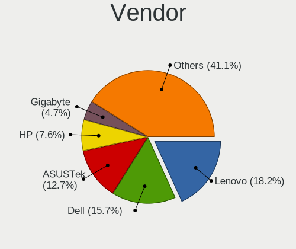

| Name                    | Computers | Percent |
|-------------------------|-----------|---------|
| Dell                    | 27        | 17.88%  |
| Lenovo                  | 23        | 15.23%  |
| ASUSTek Computer        | 21        | 13.91%  |
| Hewlett-Packard         | 10        | 6.62%   |
| Intel                   | 9         | 5.96%   |
| Gigabyte Technology     | 9         | 5.96%   |
| Unknown                 | 7         | 4.64%   |
| ASRock                  | 6         | 3.97%   |
| MSI                     | 5         | 3.31%   |
| Acer                    | 5         | 3.31%   |
| Fujitsu                 | 3         | 1.99%   |
| TUXEDO                  | 2         | 1.32%   |
| Toshiba                 | 2         | 1.32%   |
| System76                | 2         | 1.32%   |
| Google                  | 2         | 1.32%   |
| Apple                   | 2         | 1.32%   |
| Supermicro              | 1         | 0.66%   |
| Sony                    | 1         | 0.66%   |
| Samsung Electronics     | 1         | 0.66%   |
| Raspberry Pi Foundation | 1         | 0.66%   |
| PC Engines              | 1         | 0.66%   |
| Notebook                | 1         | 0.66%   |
| NITRINOnet              | 1         | 0.66%   |
| NF-M2S                  | 1         | 0.66%   |
| MouseComputer           | 1         | 0.66%   |
| LG Electronics          | 1         | 0.66%   |
| GVC                     | 1         | 0.66%   |
| GPD                     | 1         | 0.66%   |
| Fujitsu Siemens         | 1         | 0.66%   |
| BESSTAR Tech            | 1         | 0.66%   |
| ASRockRack              | 1         | 0.66%   |
| AMI                     | 1         | 0.66%   |

Model
-----

Motherboard model

| Name                                        | Computers | Percent |
|---------------------------------------------|-----------|---------|
| Unknown                                     | 7         | 4.64%   |
| ASUS All Series                             | 3         | 1.99%   |
| MSI MS-7817                                 | 2         | 1.32%   |
| HP EliteBook 850 G7 Notebook PC             | 2         | 1.32%   |
| Google Peppy                                | 2         | 1.32%   |
| TUXEDO InfinityBook13V3                     | 1         | 0.66%   |
| TUXEDO Aura 15 Gen1                         | 1         | 0.66%   |
| Toshiba Satellite L305D                     | 1         | 0.66%   |
| Toshiba Satellite A300                      | 1         | 0.66%   |
| System76 Gazelle                            | 1         | 0.66%   |
| System76 Galago Pro                         | 1         | 0.66%   |
| Supermicro Icebreaker 4824                  | 1         | 0.66%   |
| Sony VGN-NS21M_S                            | 1         | 0.66%   |
| Samsung R530/R730/R540                      | 1         | 0.66%   |
| RPi Raspberry Pi                            | 1         | 0.66%   |
| PC Engines APU3                             | 1         | 0.66%   |
| Notebook N7x0WU                             | 1         | 0.66%   |
| NITRINOnet M360RUS56                        | 1         | 0.66%   |
| NF-M2S ABIT                                 | 1         | 0.66%   |
| MSI MS-B120                                 | 1         | 0.66%   |
| MSI MS-7D09                                 | 1         | 0.66%   |
| MSI GF63 Thin 9SC                           | 1         | 0.66%   |
| MouseComputer B360M                         | 1         | 0.66%   |
| LG 17Z990-R.AAC9U1                          | 1         | 0.66%   |
| Lenovo ThinkSystem SR650 -[7X06CTO1WW]-     | 1         | 0.66%   |
| Lenovo ThinkPad X270 20HMCTO1WW             | 1         | 0.66%   |
| Lenovo ThinkPad X260 20F6S0KA00             | 1         | 0.66%   |
| Lenovo ThinkPad X250 20CMS0FA00             | 1         | 0.66%   |
| Lenovo ThinkPad X220 4286CTO                | 1         | 0.66%   |
| Lenovo ThinkPad X13 Gen 1 20UF000QRT        | 1         | 0.66%   |
| Lenovo ThinkPad X1 Extreme Gen 3 20TKS0QB00 | 1         | 0.66%   |
| Lenovo ThinkPad W520 4282AD4                | 1         | 0.66%   |
| Lenovo ThinkPad T480 20L6SB2N00             | 1         | 0.66%   |
| Lenovo ThinkPad T480 20L6S29E0T             | 1         | 0.66%   |
| Lenovo ThinkPad T420s 41732AU               | 1         | 0.66%   |
| Lenovo ThinkPad T420 4236C92                | 1         | 0.66%   |
| Lenovo ThinkPad T14 Gen 1 20S0CTO1WW        | 1         | 0.66%   |
| Lenovo ThinkPad L420 7854CTO                | 1         | 0.66%   |
| Lenovo ThinkPad L420 7829WDY                | 1         | 0.66%   |
| Lenovo ThinkPad E490 20N8CTO1WW             | 1         | 0.66%   |

Model Family
------------

Motherboard model prefix

| Name                    | Computers | Percent |
|-------------------------|-----------|---------|
| Lenovo ThinkPad         | 15        | 9.93%   |
| Dell Latitude           | 9         | 5.96%   |
| Unknown                 | 7         | 4.64%   |
| Dell OptiPlex           | 6         | 3.97%   |
| Dell Inspiron           | 4         | 2.65%   |
| ASUS ZenBook            | 4         | 2.65%   |
| Lenovo IdeaPad          | 3         | 1.99%   |
| Dell Precision          | 3         | 1.99%   |
| ASUS VivoBook           | 3         | 1.99%   |
| ASUS ROG                | 3         | 1.99%   |
| ASUS PRIME              | 3         | 1.99%   |
| ASUS All                | 3         | 1.99%   |
| Toshiba Satellite       | 2         | 1.32%   |
| MSI MS-7817             | 2         | 1.32%   |
| HP EliteBook            | 2         | 1.32%   |
| Google Peppy            | 2         | 1.32%   |
| Dell G5                 | 2         | 1.32%   |
| Acer Aspire             | 2         | 1.32%   |
| TUXEDO InfinityBook13V3 | 1         | 0.66%   |
| TUXEDO Aura             | 1         | 0.66%   |
| System76 Gazelle        | 1         | 0.66%   |
| System76 Galago         | 1         | 0.66%   |
| Supermicro Icebreaker   | 1         | 0.66%   |
| Sony VGN-NS21M          | 1         | 0.66%   |
| Samsung R530            | 1         | 0.66%   |
| RPi Raspberry           | 1         | 0.66%   |
| PC Engines APU3         | 1         | 0.66%   |
| Notebook N7x0WU         | 1         | 0.66%   |
| NITRINOnet M360RUS56    | 1         | 0.66%   |
| NF-M2S ABIT             | 1         | 0.66%   |
| MSI MS-B120             | 1         | 0.66%   |
| MSI MS-7D09             | 1         | 0.66%   |
| MSI GF63                | 1         | 0.66%   |
| MouseComputer B360M     | 1         | 0.66%   |
| LG 17Z990-R.AAC9U1      | 1         | 0.66%   |
| Lenovo ThinkSystem      | 1         | 0.66%   |
| Lenovo ThinkCentre      | 1         | 0.66%   |
| Lenovo IdeaPadFlex      | 1         | 0.66%   |
| Lenovo G40-45           | 1         | 0.66%   |
| Lenovo C440             | 1         | 0.66%   |

MFG Year
--------

Motherboard manufacture year

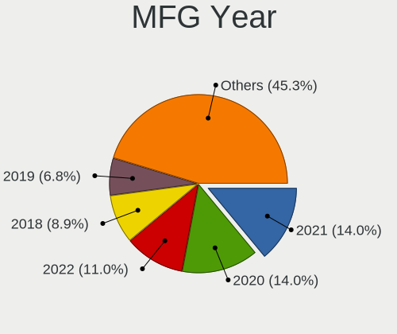

| Year    | Computers | Percent |
|---------|-----------|---------|
| 2021    | 24        | 15.89%  |
| 2020    | 21        | 13.91%  |
| 2018    | 14        | 9.27%   |
| 2022    | 13        | 8.61%   |
| 2019    | 13        | 8.61%   |
| 2014    | 10        | 6.62%   |
| 2016    | 8         | 5.3%    |
| 2011    | 8         | 5.3%    |
| 2013    | 7         | 4.64%   |
| 2012    | 6         | 3.97%   |
| Unknown | 6         | 3.97%   |
| 2017    | 5         | 3.31%   |
| 2015    | 5         | 3.31%   |
| 2008    | 5         | 3.31%   |
| 2010    | 3         | 1.99%   |
| 2009    | 3         | 1.99%   |

Form Factor
-----------

Physical design of the computer

| Name           | Computers | Percent |
|----------------|-----------|---------|
| Notebook       | 71        | 47.02%  |
| Desktop        | 65        | 43.05%  |
| Mini pc        | 9         | 5.96%   |
| Convertible    | 2         | 1.32%   |
| Server         | 2         | 1.32%   |
| System on chip | 1         | 0.66%   |
| All in one     | 1         | 0.66%   |

Coreboot
--------

Have coreboot on board

| Used | Computers | Percent |
|------|-----------|---------|
| No   | 147       | 97.35%  |
| Yes  | 4         | 2.65%   |

RAM Size
--------

Total RAM memory

| Size in GB  | Computers | Percent |
|-------------|-----------|---------|
| 8.01-16.0   | 46        | 30.26%  |
| 16.01-24.0  | 44        | 28.95%  |
| 4.01-8.0    | 19        | 12.5%   |
| 32.01-64.0  | 14        | 9.21%   |
| 64.01-256.0 | 13        | 8.55%   |
| 2.01-3.0    | 6         | 3.95%   |
| 24.01-32.0  | 4         | 2.63%   |
| 0.01-0.5    | 3         | 1.97%   |
| 3.01-4.0    | 2         | 1.32%   |
| 0.51-1.0    | 1         | 0.66%   |

RAM Used
--------

Used RAM memory

| Used GB   | Computers | Percent |
|-----------|-----------|---------|
| 0.01-0.5  | 60        | 39.47%  |
| 0.51-1.0  | 45        | 29.61%  |
| 1.01-2.0  | 27        | 17.76%  |
| 2.01-3.0  | 12        | 7.89%   |
| 0         | 4         | 2.63%   |
| 3.01-4.0  | 2         | 1.32%   |
| 4.01-8.0  | 1         | 0.66%   |
| 8.01-16.0 | 1         | 0.66%   |

Total Drives
------------

Number of drives on board

| Drives | Computers | Percent |
|--------|-----------|---------|
| 1      | 77        | 50.66%  |
| 2      | 33        | 21.71%  |
| 3      | 12        | 7.89%   |
| 0      | 11        | 7.24%   |
| 4      | 8         | 5.26%   |
| 8      | 3         | 1.97%   |
| 6      | 2         | 1.32%   |
| 18     | 1         | 0.66%   |
| 16     | 1         | 0.66%   |
| 15     | 1         | 0.66%   |
| 11     | 1         | 0.66%   |
| 10     | 1         | 0.66%   |
| 5      | 1         | 0.66%   |

Has CD-ROM
----------

Has CD-ROM on board

| Presented | Computers | Percent |
|-----------|-----------|---------|
| No        | 110       | 72.85%  |
| Yes       | 41        | 27.15%  |

Has Ethernet
------------

Has Ethernet on board

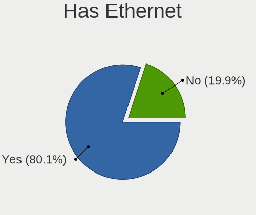

| Presented | Computers | Percent |
|-----------|-----------|---------|
| Yes       | 124       | 82.12%  |
| No        | 27        | 17.88%  |

Has WiFi
--------

Has WiFi module

| Presented | Computers | Percent |
|-----------|-----------|---------|
| Yes       | 96        | 63.58%  |
| No        | 55        | 36.42%  |

Has Bluetooth
-------------

Has Bluetooth module

| Presented | Computers | Percent |
|-----------|-----------|---------|
| No        | 85        | 56.29%  |
| Yes       | 66        | 43.71%  |

Location
--------

Country
-------

Geographic location (country)

| Country     | Computers | Percent |
|-------------|-----------|---------|
| USA         | 38        | 25%     |
| Russia      | 18        | 11.84%  |
| Germany     | 14        | 9.21%   |
| France      | 8         | 5.26%   |
| Spain       | 6         | 3.95%   |
| China       | 5         | 3.29%   |
| Austria     | 5         | 3.29%   |
| Netherlands | 4         | 2.63%   |
| Japan       | 4         | 2.63%   |
| India       | 4         | 2.63%   |
| Czechia     | 4         | 2.63%   |
| Canada      | 4         | 2.63%   |
| Australia   | 4         | 2.63%   |
| UK          | 3         | 1.97%   |
| Thailand    | 3         | 1.97%   |
| Italy       | 3         | 1.97%   |
| Turkey      | 2         | 1.32%   |
| Philippines | 2         | 1.32%   |
| New Zealand | 2         | 1.32%   |
| Hong Kong   | 2         | 1.32%   |
| Uruguay     | 1         | 0.66%   |
| Taiwan      | 1         | 0.66%   |
| South Korea | 1         | 0.66%   |
| Slovenia    | 1         | 0.66%   |
| Norway      | 1         | 0.66%   |
| Malaysia    | 1         | 0.66%   |
| Latvia      | 1         | 0.66%   |
| Kenya       | 1         | 0.66%   |
| Israel      | 1         | 0.66%   |
| Ireland     | 1         | 0.66%   |
| Hungary     | 1         | 0.66%   |
| Guadeloupe  | 1         | 0.66%   |
| Greece      | 1         | 0.66%   |
| Croatia     | 1         | 0.66%   |
| Bulgaria    | 1         | 0.66%   |
| Brazil      | 1         | 0.66%   |
| Belgium     | 1         | 0.66%   |

City
----

Geographic location (city)

| City              | Computers | Percent |
|-------------------|-----------|---------|
| Moscow            | 8         | 5.23%   |
| Vienna            | 4         | 2.61%   |
| Ozersk            | 4         | 2.61%   |
| Frisco            | 4         | 2.61%   |
| Brno              | 4         | 2.61%   |
| Tamm              | 3         | 1.96%   |
| Paris             | 3         | 1.96%   |
| Omaha             | 3         | 1.96%   |
| Madrid            | 3         | 1.96%   |
| Wellington        | 2         | 1.31%   |
| St Petersburg     | 2         | 1.31%   |
| Redmond           | 2         | 1.31%   |
| Nashville         | 2         | 1.31%   |
| Charlotte         | 2         | 1.31%   |
| Central           | 2         | 1.31%   |
| Zhumadian         | 1         | 0.65%   |
| Zagreb            | 1         | 0.65%   |
| Yashio            | 1         | 0.65%   |
| Yangcheon-gu      | 1         | 0.65%   |
| Xiamen            | 1         | 0.65%   |
| Xi'an             | 1         | 0.65%   |
| Woerdense Verlaat | 1         | 0.65%   |
| Wheatland         | 1         | 0.65%   |
| Wenatchee         | 1         | 0.65%   |
| Waldbrunn         | 1         | 0.65%   |
| Vaulx-en-Velin    | 1         | 0.65%   |
| Valladolid        | 1         | 0.65%   |
| Trivandrum        | 1         | 0.65%   |
| Toronto           | 1         | 0.65%   |
| Tiel              | 1         | 0.65%   |
| Thousand Oaks     | 1         | 0.65%   |
| Thessaloniki      | 1         | 0.65%   |
| Tel Aviv          | 1         | 0.65%   |
| Taito             | 1         | 0.65%   |
| Taipei            | 1         | 0.65%   |
| Sydney            | 1         | 0.65%   |
| Stratford         | 1         | 0.65%   |
| St. Albert        | 1         | 0.65%   |
| Sofia             | 1         | 0.65%   |
| Shinjuku          | 1         | 0.65%   |

Drives
------

Drive Vendor
------------

Hard drive vendors

| Vendor              | Computers | Drives | Percent |
|---------------------|-----------|--------|---------|
| WDC                 | 51        | 93     | 24.29%  |
| Samsung Electronics | 38        | 62     | 18.1%   |
| Seagate             | 27        | 75     | 12.86%  |
| Crucial             | 14        | 21     | 6.67%   |
| Toshiba             | 12        | 19     | 5.71%   |
| Kingston            | 11        | 11     | 5.24%   |
| Intel               | 6         | 15     | 2.86%   |
| SK hynix            | 5         | 5      | 2.38%   |
| Transcend           | 4         | 4      | 1.9%    |
| Hitachi             | 4         | 4      | 1.9%    |
| A-DATA Technology   | 4         | 7      | 1.9%    |
| SanDisk             | 3         | 3      | 1.43%   |
| Hewlett-Packard     | 3         | 3      | 1.43%   |
| Gigabyte Technology | 3         | 3      | 1.43%   |
| Silicon Motion      | 2         | 2      | 0.95%   |
| Micron Technology   | 2         | 3      | 0.95%   |
| KIOXIA              | 2         | 2      | 0.95%   |
| Hikvision           | 2         | 2      | 0.95%   |
| Apple               | 2         | 2      | 0.95%   |
| Verbatim            | 1         | 1      | 0.48%   |
| SPCC                | 1         | 1      | 0.48%   |
| PNY                 | 1         | 2      | 0.48%   |
| ORICO               | 1         | 1      | 0.48%   |
| OCZ                 | 1         | 1      | 0.48%   |
| Netac               | 1         | 1      | 0.48%   |
| LITEONIT            | 1         | 1      | 0.48%   |
| Lexar               | 1         | 2      | 0.48%   |
| Lenovo              | 1         | 1      | 0.48%   |
| HGST                | 1         | 1      | 0.48%   |
| EAGET               | 1         | 1      | 0.48%   |
| China               | 1         | 1      | 0.48%   |
| CFD                 | 1         | 1      | 0.48%   |
| BR                  | 1         | 1      | 0.48%   |
| BIWIN               | 1         | 1      | 0.48%   |

Drive Model
-----------

Hard drive models

| Model                                   | Computers | Percent |
|-----------------------------------------|-----------|---------|
| WDC WD10EZEX-08WN4A0 1TB                | 4         | 1.63%   |
| Samsung SSD 850 EVO 500GB               | 4         | 1.63%   |
| WDC WD5000LPLX-00ZNTT0 500GB            | 3         | 1.22%   |
| Seagate ST1000DM010-2EP102 1TB          | 3         | 1.22%   |
| Samsung SSD 970 EVO Plus 2TB            | 3         | 1.22%   |
| Crucial CT240BX500SSD1 240GB            | 3         | 1.22%   |
| A-DATA SU650 240GB                      | 3         | 1.22%   |
| WDC WD30EFRX-68EUZN0 3TB                | 2         | 0.82%   |
| WDC WD10EZEX-60WN4A0 1TB                | 2         | 0.82%   |
| WDC WD100EMAZ-00WJTA0 10TB              | 2         | 0.82%   |
| WDC PC SN530 SDBPNPZ-256G-1014 256GB    | 2         | 0.82%   |
| SK hynix BC511 HFM512GDJTNI-82A0A 512GB | 2         | 0.82%   |
| Seagate ST4000DM000-1F2168 4TB          | 2         | 0.82%   |
| Samsung SSD 970 EVO Plus 1TB            | 2         | 0.82%   |
| Samsung SSD 970 EVO 1TB                 | 2         | 0.82%   |
| Samsung SSD 870 QVO 2TB                 | 2         | 0.82%   |
| Samsung SSD 840 EVO 120GB               | 2         | 0.82%   |
| Kingston SA400S37120G 120GB             | 2         | 0.82%   |
| Intel SSDSC2CT060A3 64GB                | 2         | 0.82%   |
| Crucial CT1000P5SSD8 1TB                | 2         | 0.82%   |
| Crucial CT1000MX500SSD1 1TB             | 2         | 0.82%   |
| WDC WDS500G3X0C-00SJG0 500GB            | 1         | 0.41%   |
| WDC WDS500G2X0C-00L350 500GB            | 1         | 0.41%   |
| WDC WDS500G1B0A-00H9H0 500GB            | 1         | 0.41%   |
| WDC WDS480G2G0A-00JH30 480GB            | 1         | 0.41%   |
| WDC WDS250G2B0C-00PXH0 250GB            | 1         | 0.41%   |
| WDC WDS250G2B0B-00YS70 250GB            | 1         | 0.41%   |
| WDC WDS250G2B0A-00SM50 250GB            | 1         | 0.41%   |
| WDC WDS120G2G0B-00EPW0 120GB            | 1         | 0.41%   |
| WDC WDS100T2B0B-00YS70 1TB              | 1         | 0.41%   |
| WDC WDS100T2B0A-00SM50 1TB              | 1         | 0.41%   |
| WDC WDBA3V5000ANC-WRSN 500GB            | 1         | 0.41%   |
| WDC WD80EZZX-11CSGA0 8TB                | 1         | 0.41%   |
| WDC WD80EZAZ-11TDBA0 8TB                | 1         | 0.41%   |
| WDC WD80EMZZ-00TBGA0 8TB                | 1         | 0.41%   |
| WDC WD80EFBX-68AZZN0 8TB                | 1         | 0.41%   |
| WDC WD8003FFBX-68B9AN0 8TB              | 1         | 0.41%   |
| WDC WD60EFRX-68L0BN1 6TB                | 1         | 0.41%   |
| WDC WD5000LUCT-63Y8HY0 500GB            | 1         | 0.41%   |
| WDC WD5000BEVT-22ZAT0 500GB             | 1         | 0.41%   |

HDD Vendor
----------

Hard disk drive vendors

| Vendor              | Computers | Drives | Percent |
|---------------------|-----------|--------|---------|
| WDC                 | 35        | 75     | 44.87%  |
| Seagate             | 26        | 74     | 33.33%  |
| Toshiba             | 9         | 16     | 11.54%  |
| Hitachi             | 4         | 4      | 5.13%   |
| Samsung Electronics | 1         | 4      | 1.28%   |
| HGST                | 1         | 1      | 1.28%   |
| Hewlett-Packard     | 1         | 1      | 1.28%   |
| Apple               | 1         | 1      | 1.28%   |

SSD Vendor
----------

Solid state drive vendors

| Vendor              | Computers | Drives | Percent |
|---------------------|-----------|--------|---------|
| Samsung Electronics | 21        | 38     | 25.93%  |
| Crucial             | 11        | 13     | 13.58%  |
| WDC                 | 7         | 7      | 8.64%   |
| Kingston            | 6         | 6      | 7.41%   |
| Intel               | 5         | 14     | 6.17%   |
| A-DATA Technology   | 4         | 7      | 4.94%   |
| Transcend           | 3         | 3      | 3.7%    |
| SanDisk             | 3         | 3      | 3.7%    |
| Toshiba             | 2         | 2      | 2.47%   |
| Hikvision           | 2         | 2      | 2.47%   |
| Verbatim            | 1         | 1      | 1.23%   |
| SPCC                | 1         | 1      | 1.23%   |
| SK hynix            | 1         | 1      | 1.23%   |
| PNY                 | 1         | 2      | 1.23%   |
| ORICO               | 1         | 1      | 1.23%   |
| OCZ                 | 1         | 1      | 1.23%   |
| Micron Technology   | 1         | 2      | 1.23%   |
| LITEONIT            | 1         | 1      | 1.23%   |
| Lexar               | 1         | 2      | 1.23%   |
| Lenovo              | 1         | 1      | 1.23%   |
| Hewlett-Packard     | 1         | 1      | 1.23%   |
| Gigabyte Technology | 1         | 1      | 1.23%   |
| China               | 1         | 1      | 1.23%   |
| CFD                 | 1         | 1      | 1.23%   |
| BR                  | 1         | 1      | 1.23%   |
| BIWIN               | 1         | 1      | 1.23%   |
| Apple               | 1         | 1      | 1.23%   |

Drive Kind
----------

HDD or SSD

| Kind | Computers | Drives | Percent |
|------|-----------|--------|---------|
| SSD  | 71        | 115    | 37.97%  |
| HDD  | 65        | 176    | 34.76%  |
| NVMe | 51        | 62     | 27.27%  |

Drive Connector
---------------

SATA, SAS, NVMe, etc.

| Type | Computers | Drives | Percent |
|------|-----------|--------|---------|
| SATA | 113       | 291    | 68.9%   |
| NVMe | 51        | 62     | 31.1%   |

Drive Size
----------

Size of hard drive

| Size in TB | Computers | Drives | Percent |
|------------|-----------|--------|---------|
| 0.01-0.5   | 71        | 98     | 48.63%  |
| 0.51-1.0   | 45        | 69     | 30.82%  |
| 1.01-2.0   | 13        | 33     | 8.9%    |
| 3.01-4.0   | 6         | 16     | 4.11%   |
| 4.01-10.0  | 5         | 39     | 3.42%   |
| 2.01-3.0   | 3         | 16     | 2.05%   |
| 10.01-20.0 | 3         | 20     | 2.05%   |

Space Total
-----------

Amount of disk space available on the file system

| Size in GB     | Computers | Percent |
|----------------|-----------|---------|
| 101-250        | 50        | 32.89%  |
| 251-500        | 33        | 21.71%  |
| 501-1000       | 26        | 17.11%  |
| 51-100         | 14        | 9.21%   |
| 21-50          | 12        | 7.89%   |
| 1001-2000      | 7         | 4.61%   |
| 1-20           | 4         | 2.63%   |
| 2001-3000      | 3         | 1.97%   |
| More than 3000 | 2         | 1.32%   |
| Unknown        | 1         | 0.66%   |

Space Used
----------

Amount of used disk space

| Used GB        | Computers | Percent |
|----------------|-----------|---------|
| 1-20           | 121       | 79.61%  |
| 21-50          | 19        | 12.5%   |
| 51-100         | 4         | 2.63%   |
| 101-250        | 3         | 1.97%   |
| 251-500        | 2         | 1.32%   |
| More than 3000 | 1         | 0.66%   |
| 501-1000       | 1         | 0.66%   |
| Unknown        | 1         | 0.66%   |

Malfunc. Drives
---------------

Drive models with a malfunction

| Model                                        | Computers | Drives | Percent |
|----------------------------------------------|-----------|--------|---------|
| WDC WD5000LPLX-00ZNTT0 500GB                 | 1         | 1      | 4.55%   |
| WDC WD3200BEKT-60PVMT0 320GB                 | 1         | 1      | 4.55%   |
| WDC WD30EFRX-68EUZN0 3TB                     | 1         | 3      | 4.55%   |
| WDC WD2500BEVT-24A23T0 250GB                 | 1         | 1      | 4.55%   |
| WDC WD1600AAJS-60M0A0 160GB                  | 1         | 1      | 4.55%   |
| Toshiba MQ01ABF050 500GB                     | 1         | 1      | 4.55%   |
| Toshiba MQ01ABD100 1TB                       | 1         | 1      | 4.55%   |
| SPCC M.2 SSD 256GB                           | 1         | 1      | 4.55%   |
| SK hynix SC308 SATA 128GB                    | 1         | 1      | 4.55%   |
| Seagate ST9500325AS 500GB                    | 1         | 1      | 4.55%   |
| Seagate ST500LT012-1DG142 500GB              | 1         | 1      | 4.55%   |
| Seagate ST500LM012 HN-M500MBB 500GB          | 1         | 1      | 4.55%   |
| Seagate ST1000LM024 HN-M101MBB 1TB           | 1         | 2      | 4.55%   |
| Samsung Electronics SSD PM810 2.5-inch 128GB | 1         | 1      | 4.55%   |
| Micron Technology 1100_MTFDDAK512TBN 512GB   | 1         | 2      | 4.55%   |
| Kingston SNS4151S316GD 16GB                  | 1         | 1      | 4.55%   |
| Hitachi HTS727575A9E364 752GB                | 1         | 1      | 4.55%   |
| Hitachi HTS721080G9SA00 80GB                 | 1         | 1      | 4.55%   |
| Hitachi HTS543232L9SA00 320GB                | 1         | 1      | 4.55%   |
| HGST HTS725050A7E630 500GB                   | 1         | 1      | 4.55%   |
| Hewlett-Packard MB1000GCWCV 1TB              | 1         | 1      | 4.55%   |
| A-DATA Technology SU630 240GB                | 1         | 2      | 4.55%   |

Malfunc. Drive Vendor
---------------------

Vendors of faulty drives

| Vendor              | Computers | Drives | Percent |
|---------------------|-----------|--------|---------|
| WDC                 | 4         | 7      | 19.05%  |
| Seagate             | 4         | 5      | 19.05%  |
| Hitachi             | 3         | 3      | 14.29%  |
| Toshiba             | 2         | 2      | 9.52%   |
| SPCC                | 1         | 1      | 4.76%   |
| SK hynix            | 1         | 1      | 4.76%   |
| Samsung Electronics | 1         | 1      | 4.76%   |
| Micron Technology   | 1         | 2      | 4.76%   |
| Kingston            | 1         | 1      | 4.76%   |
| HGST                | 1         | 1      | 4.76%   |
| Hewlett-Packard     | 1         | 1      | 4.76%   |
| A-DATA Technology   | 1         | 2      | 4.76%   |

Malfunc. HDD Vendor
-------------------

Vendors of faulty HDD drives

| Vendor          | Computers | Drives | Percent |
|-----------------|-----------|--------|---------|
| WDC             | 4         | 7      | 26.67%  |
| Seagate         | 4         | 5      | 26.67%  |
| Hitachi         | 3         | 3      | 20%     |
| Toshiba         | 2         | 2      | 13.33%  |
| HGST            | 1         | 1      | 6.67%   |
| Hewlett-Packard | 1         | 1      | 6.67%   |

Malfunc. Drive Kind
-------------------

Kinds of faulty drives

| Kind | Computers | Drives | Percent |
|------|-----------|--------|---------|
| HDD  | 14        | 19     | 70%     |
| SSD  | 6         | 8      | 30%     |

Failed Drives
-------------

Failed drive models

Zero info for selected period =(

Failed Drive Vendor
-------------------

Failed drive vendors

Zero info for selected period =(

Drive Status
------------

Number of failed and malfunc. drives

| Status   | Computers | Drives | Percent |
|----------|-----------|--------|---------|
| Works    | 128       | 317    | 85.33%  |
| Malfunc  | 18        | 27     | 12%     |
| Detected | 4         | 9      | 2.67%   |

Storage controller
------------------

Storage Vendor
--------------

Storage controller vendors

| Vendor                      | Computers | Percent |
|-----------------------------|-----------|---------|
| Intel                       | 104       | 54.45%  |
| AMD                         | 20        | 10.47%  |
| Samsung Electronics         | 19        | 9.95%   |
| SanDisk                     | 10        | 5.24%   |
| Silicon Motion              | 5         | 2.62%   |
| Kingston Technology Company | 5         | 2.62%   |
| Broadcom / LSI              | 4         | 2.09%   |
| SK hynix                    | 3         | 1.57%   |
| Micron/Crucial Technology   | 3         | 1.57%   |
| Marvell Technology Group    | 3         | 1.57%   |
| ASMedia Technology          | 3         | 1.57%   |
| Phison Electronics          | 2         | 1.05%   |
| Nvidia                      | 2         | 1.05%   |
| Micron Technology           | 2         | 1.05%   |
| KIOXIA                      | 2         | 1.05%   |
| Toshiba                     | 1         | 0.52%   |
| Silicon Image               | 1         | 0.52%   |
| Seagate Technology          | 1         | 0.52%   |
| Unknown                     | 1         | 0.52%   |

Storage Model
-------------

Storage controller models

| Model                                                                            | Computers | Percent |
|----------------------------------------------------------------------------------|-----------|---------|
| AMD FCH SATA Controller [AHCI mode]                                              | 14        | 6.8%    |
| Samsung NVMe SSD Controller SM981/PM981/PM983                                    | 11        | 5.34%   |
| Intel 8 Series/C220 Series Chipset Family 6-port SATA Controller 1 [AHCI mode]   | 10        | 4.85%   |
| Intel 6 Series/C200 Series Chipset Family 6 port Mobile SATA AHCI Controller     | 9         | 4.37%   |
| Intel Sunrise Point-LP SATA Controller [AHCI mode]                               | 8         | 3.88%   |
| Intel Q170/Q150/B150/H170/H110/Z170/CM236 Chipset SATA Controller [AHCI Mode]    | 6         | 2.91%   |
| Intel 82801 Mobile SATA Controller [RAID mode]                                   | 6         | 2.91%   |
| Unknown                                                                          | 6         | 2.91%   |
| Silicon Motion SM2263EN/SM2263XT SSD Controller                                  | 5         | 2.43%   |
| Intel Wildcat Point-LP SATA Controller [AHCI Mode]                               | 5         | 2.43%   |
| Intel Cannon Lake PCH SATA AHCI Controller                                       | 5         | 2.43%   |
| Samsung NVMe SSD Controller SM961/PM961/SM963                                    | 4         | 1.94%   |
| Intel 82801IBM/IEM (ICH9M/ICH9M-E) 4 port SATA Controller [AHCI mode]            | 4         | 1.94%   |
| Intel 6 Series/C200 Series Chipset Family 6 port Desktop SATA AHCI Controller    | 4         | 1.94%   |
| AMD 500 Series Chipset SATA Controller                                           | 4         | 1.94%   |
| SanDisk WD Blue SN550 NVMe SSD                                                   | 3         | 1.46%   |
| Intel Comet Lake SATA AHCI Controller                                            | 3         | 1.46%   |
| Intel Celeron/Pentium Silver Processor SATA Controller                           | 3         | 1.46%   |
| Intel Cannon Lake Mobile PCH SATA AHCI Controller                                | 3         | 1.46%   |
| Intel C602 chipset 4-Port SATA Storage Control Unit                              | 3         | 1.46%   |
| Intel C600/X79 series chipset 6-Port SATA AHCI Controller                        | 3         | 1.46%   |
| Intel Atom Processor E3800 Series SATA AHCI Controller                           | 3         | 1.46%   |
| Intel 400 Series Chipset Family SATA AHCI Controller                             | 3         | 1.46%   |
| Intel 200 Series PCH SATA controller [AHCI mode]                                 | 3         | 1.46%   |
| Broadcom / LSI SAS2008 PCI-Express Fusion-MPT SAS-2 [Falcon]                     | 3         | 1.46%   |
| SK hynix BC511                                                                   | 2         | 0.97%   |
| SanDisk WD Black SN750 / PC SN730 NVMe SSD                                       | 2         | 0.97%   |
| SanDisk WD Black 2018/SN750 / PC SN720 NVMe SSD                                  | 2         | 0.97%   |
| SanDisk unknown                                                                  | 2         | 0.97%   |
| Samsung NVMe SSD Controller PM9A1/PM9A3/980PRO                                   | 2         | 0.97%   |
| Micron/Crucial P2 NVMe PCIe SSD                                                  | 2         | 0.97%   |
| KIOXIA NVMe SSD Controller BG4                                                   | 2         | 0.97%   |
| Intel NM10/ICH7 Family SATA Controller [IDE mode]                                | 2         | 0.97%   |
| Intel Atom/Celeron/Pentium Processor x5-E8000/J3xxx/N3xxx Series SATA Controller | 2         | 0.97%   |
| Intel 9 Series Chipset Family SATA Controller [AHCI Mode]                        | 2         | 0.97%   |
| Intel 8 Series SATA Controller 1 [AHCI mode]                                     | 2         | 0.97%   |
| Intel 7 Series Chipset Family 6-port SATA Controller [AHCI mode]                 | 2         | 0.97%   |
| Intel 500 Series Chipset Family SATA AHCI Controller                             | 2         | 0.97%   |
| ASMedia ASM1062 Serial ATA Controller                                            | 2         | 0.97%   |
| AMD 400 Series Chipset SATA Controller                                           | 2         | 0.97%   |

Storage Kind
------------

Kind of storage controller (IDE, SATA, NVMe, SAS, ...)

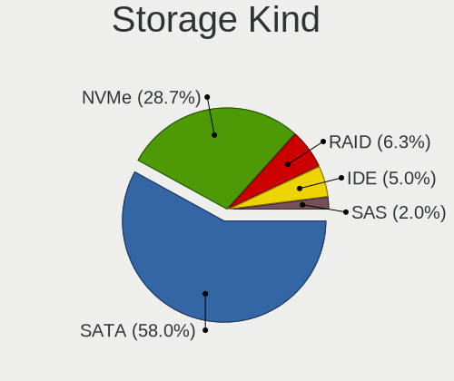

| Kind | Computers | Percent |
|------|-----------|---------|
| SATA | 114       | 60.64%  |
| NVMe | 50        | 26.6%   |
| RAID | 10        | 5.32%   |
| IDE  | 10        | 5.32%   |
| SAS  | 4         | 2.13%   |

Processor
---------

CPU Vendor
----------

Processor vendors

| Vendor | Computers | Percent |
|--------|-----------|---------|
| Intel  | 120       | 79.47%  |
| AMD    | 25        | 16.56%  |
| ARM    | 6         | 3.97%   |

CPU Model
---------

Processor models

| Model                                   | Computers | Percent |
|-----------------------------------------|-----------|---------|
| Intel Core i7-9750H CPU @ 2.60GHz       | 4         | 2.63%   |
| Intel Core i7-8565U CPU @ 1.80GHz       | 3         | 1.97%   |
| Intel Core i7-6500U CPU @ 2.50GHz       | 3         | 1.97%   |
| ARM Cortex-A53 r0p4                     | 3         | 1.97%   |
| AMD Ryzen 5 5600G with Radeon Graphics  | 3         | 1.97%   |
| Intel Core i7-7700 CPU @ 3.60GHz        | 2         | 1.32%   |
| Intel Core i7-10510U CPU @ 1.80GHz      | 2         | 1.32%   |
| Intel Core i5-8400 CPU @ 2.80GHz        | 2         | 1.32%   |
| Intel Core i5-8350U CPU @ 1.70GHz       | 2         | 1.32%   |
| Intel Core i5-5200U CPU @ 2.20GHz       | 2         | 1.32%   |
| Intel Core i5-3470 CPU @ 3.20GHz        | 2         | 1.32%   |
| Intel Core i5-2520M CPU @ 2.50GHz       | 2         | 1.32%   |
| Intel Core i5-10310U CPU @ 1.70GHz      | 2         | 1.32%   |
| Intel Celeron N4020 CPU @ 1.10GHz       | 2         | 1.32%   |
| Intel 11th Gen Core i7-1165G7 @ 2.80GHz | 2         | 1.32%   |
| ARM ARM1176 r0p7 (ECO: 0x00000000)      | 2         | 1.32%   |
| Intel Xeon Gold 6226R CPU @ 2.90GHz     | 1         | 0.66%   |
| Intel Xeon E-2136 CPU @ 3.30GHz         | 1         | 0.66%   |
| Intel Xeon CPU E5-2670 @ 2.60GHz        | 1         | 0.66%   |
| Intel Xeon CPU E5-2650 v2 @ 2.60GHz     | 1         | 0.66%   |
| Intel Xeon CPU E5-2650 0 @ 2.00GH       | 1         | 0.66%   |
| Intel Xeon CPU E5-2620 v2 @ 2.10GHz     | 1         | 0.66%   |
| Intel Xeon CPU E3-1230 v3 @ 3.30GHz     | 1         | 0.66%   |
| Intel Xeon CPU E3-1220 v6 @ 3.00GHz     | 1         | 0.66%   |
| Intel Xeon CPU E3-1220 v3 @ 3.10GHz     | 1         | 0.66%   |
| Intel Pentium Silver N6000 @ 1.10GHz    | 1         | 0.66%   |
| Intel Pentium II                        | 1         | 0.66%   |
| Intel Pentium Gold G5400 CPU @ 3.70GHz  | 1         | 0.66%   |
| Intel Pentium Dual CPU T3400 @ 2.16GHz  | 1         | 0.66%   |
| Intel Pentium CPU G3240T @ 2.70GHz      | 1         | 0.66%   |
| Intel Pentium CPU G3220 @ 3.00GHz       | 1         | 0.66%   |
| Intel Genuine CPU                       | 1         | 0.66%   |
| Intel Core i7-9700K CPU @ 3.60GHz       | 1         | 0.66%   |
| Intel Core i7-8550U CPU @ 1.80GHz       | 1         | 0.66%   |
| Intel Core i7-6700K CPU @ 4.00GHz       | 1         | 0.66%   |
| Intel Core i7-5600U CPU @ 2.60GHz       | 1         | 0.66%   |
| Intel Core i7-4980HQ CPU @ 2.80GHz      | 1         | 0.66%   |
| Intel Core i7-4810MQ CPU @ 2.80GHz      | 1         | 0.66%   |
| Intel Core i7-4790K CPU @ 4.00GHz       | 1         | 0.66%   |
| Intel Core i7-4785T CPU @ 2.20GHz       | 1         | 0.66%   |

CPU Model Family
----------------

Processor model prefix

| Model                | Computers | Percent |
|----------------------|-----------|---------|
| Intel Core i5        | 37        | 24.5%   |
| Intel Core i7        | 32        | 21.19%  |
| Intel Core i3        | 10        | 6.62%   |
| Intel Celeron        | 9         | 5.96%   |
| Other                | 8         | 5.3%    |
| Intel Xeon           | 8         | 5.3%    |
| AMD Ryzen 5          | 6         | 3.97%   |
| Intel Core 2 Duo     | 5         | 3.31%   |
| AMD Ryzen 7          | 5         | 3.31%   |
| Intel Atom           | 4         | 2.65%   |
| ARM Cortex           | 4         | 2.65%   |
| AMD Ryzen 3          | 4         | 2.65%   |
| Intel Pentium        | 3         | 1.99%   |
| AMD Ryzen 9          | 2         | 1.32%   |
| AMD Ryzen 7 PRO      | 2         | 1.32%   |
| Intel Xeon Gold      | 1         | 0.66%   |
| Intel Pentium Silver | 1         | 0.66%   |
| Intel Pentium Gold   | 1         | 0.66%   |
| Intel Pentium Dual   | 1         | 0.66%   |
| Intel Genuine        | 1         | 0.66%   |
| Intel Core 2 Quad    | 1         | 0.66%   |
| AMD GX               | 1         | 0.66%   |
| AMD E2               | 1         | 0.66%   |
| AMD Athlon X2        | 1         | 0.66%   |
| AMD Athlon 64 X2     | 1         | 0.66%   |
| AMD A8               | 1         | 0.66%   |
| AMD A10              | 1         | 0.66%   |

CPU Cores
---------

Number of processor cores

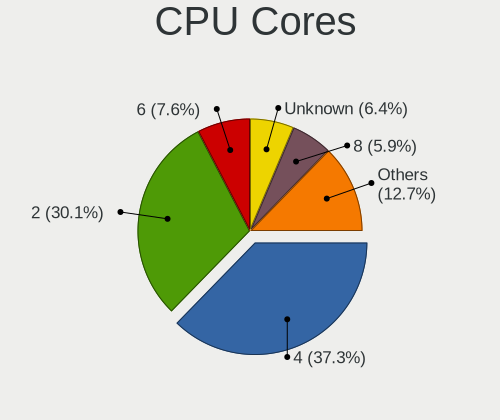

| Number  | Computers | Percent |
|---------|-----------|---------|
| 4       | 51        | 33.77%  |
| 2       | 51        | 33.77%  |
| 6       | 13        | 8.61%   |
| 8       | 11        | 7.28%   |
| Unknown | 9         | 5.96%   |
| 16      | 8         | 5.3%    |
| 12      | 4         | 2.65%   |
| 24      | 2         | 1.32%   |
| 1       | 2         | 1.32%   |

CPU Sockets
-----------

Number of sockets

| Number  | Computers | Percent |
|---------|-----------|---------|
| 1       | 144       | 95.36%  |
| Unknown | 6         | 3.97%   |
| 2       | 1         | 0.66%   |

CPU Threads
-----------

Threads per core (Hyper-Threading)

| Number  | Computers | Percent |
|---------|-----------|---------|
| 2       | 80        | 52.98%  |
| 1       | 61        | 40.4%   |
| Unknown | 10        | 6.62%   |

CPU Microarch
-------------

Microarchitecture

| Name            | Computers | Percent |
|-----------------|-----------|---------|
| KabyLake        | 35        | 23.03%  |
| Haswell         | 17        | 11.18%  |
| SandyBridge     | 13        | 8.55%   |
| Unknown         | 11        | 7.24%   |
| IvyBridge       | 9         | 5.92%   |
| Skylake         | 7         | 4.61%   |
| CometLake       | 6         | 3.95%   |
| Zen 3           | 5         | 3.29%   |
| Zen 2           | 5         | 3.29%   |
| Broadwell       | 5         | 3.29%   |
| Zen+            | 4         | 2.63%   |
| TigerLake       | 4         | 2.63%   |
| Silvermont      | 4         | 2.63%   |
| Core            | 4         | 2.63%   |
| Zen             | 3         | 1.97%   |
| Penryn          | 3         | 1.97%   |
| Goldmont plus   | 3         | 1.97%   |
| Bonnell         | 3         | 1.97%   |
| Westmere        | 2         | 1.32%   |
| Puma            | 2         | 1.32%   |
| Piledriver      | 1         | 0.66%   |
| P6              | 1         | 0.66%   |
| K8 Hammer       | 1         | 0.66%   |
| K8 & K10 hybrid | 1         | 0.66%   |
| IceLake         | 1         | 0.66%   |
| Goldmont        | 1         | 0.66%   |
| Excavator       | 1         | 0.66%   |

Graphics
--------

GPU Vendor
----------

Vendors of graphics cards

| Vendor                               | Computers | Percent |
|--------------------------------------|-----------|---------|
| Intel                                | 95        | 59.01%  |
| Nvidia                               | 33        | 20.5%   |
| AMD                                  | 27        | 16.77%  |
| Matrox Electronics Systems           | 4         | 2.48%   |
| NVidia / SGS Thomson (Joint Venture) | 1         | 0.62%   |
| ASPEED Technology                    | 1         | 0.62%   |

GPU Model
---------

Graphics card models

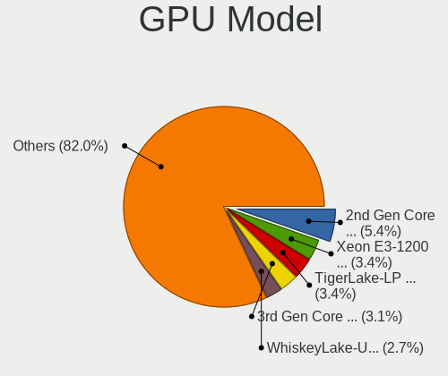

| Model                                                                       | Computers | Percent |
|-----------------------------------------------------------------------------|-----------|---------|
| Intel 2nd Generation Core Processor Family Integrated Graphics Controller   | 10        | 6.06%   |
| Intel Xeon E3-1200 v3/4th Gen Core Processor Integrated Graphics Controller | 8         | 4.85%   |
| Intel CometLake-U GT2 [UHD Graphics]                                        | 6         | 3.64%   |
| Intel WhiskeyLake-U GT2 [UHD Graphics 620]                                  | 4         | 2.42%   |
| Intel UHD Graphics 620                                                      | 4         | 2.42%   |
| Intel Skylake GT2 [HD Graphics 520]                                         | 4         | 2.42%   |
| Intel HD Graphics 5500                                                      | 4         | 2.42%   |
| Intel CoffeeLake-H GT2 [UHD Graphics 630]                                   | 4         | 2.42%   |
| Intel TigerLake-LP GT2 [Iris Xe Graphics]                                   | 3         | 1.82%   |
| Intel Mobile 4 Series Chipset Integrated Graphics Controller                | 3         | 1.82%   |
| Intel HD Graphics 630                                                       | 3         | 1.82%   |
| Intel HD Graphics 620                                                       | 3         | 1.82%   |
| Intel Haswell-ULT Integrated Graphics Controller                            | 3         | 1.82%   |
| Intel GeminiLake [UHD Graphics 600]                                         | 3         | 1.82%   |
| Intel CometLake-S GT2 [UHD Graphics 630]                                    | 3         | 1.82%   |
| Intel CoffeeLake-S GT2 [UHD Graphics 630]                                   | 3         | 1.82%   |
| Intel Atom Processor Z36xxx/Z37xxx Series Graphics & Display                | 3         | 1.82%   |
| AMD Renoir                                                                  | 3         | 1.82%   |
| AMD Cezanne                                                                 | 3         | 1.82%   |
| Nvidia TU117M [GeForce GTX 1650 Mobile / Max-Q]                             | 2         | 1.21%   |
| Nvidia TU117 [GeForce GTX 1650]                                             | 2         | 1.21%   |
| Nvidia TU116M [GeForce GTX 1660 Ti Mobile]                                  | 2         | 1.21%   |
| Nvidia GP108 [GeForce GT 1030]                                              | 2         | 1.21%   |
| Nvidia GP107 [GeForce GTX 1050]                                             | 2         | 1.21%   |
| Nvidia GP106 [GeForce GTX 1060 6GB]                                         | 2         | 1.21%   |
| Nvidia GK208B [GeForce GT 710]                                              | 2         | 1.21%   |
| Matrox Electronics Systems MGA G200e [Pilot] ServerEngines (SEP1)           | 2         | 1.21%   |
| Intel Core Processor Integrated Graphics Controller                         | 2         | 1.21%   |
| Intel CometLake-H GT2 [UHD Graphics]                                        | 2         | 1.21%   |
| Intel 4th Gen Core Processor Integrated Graphics Controller                 | 2         | 1.21%   |
| Intel 3rd Gen Core processor Graphics Controller                            | 2         | 1.21%   |
| AMD Raven Ridge [Radeon Vega Series / Radeon Vega Mobile Series]            | 2         | 1.21%   |
| AMD Picasso/Raven 2 [Radeon Vega Series / Radeon Vega Mobile Series]        | 2         | 1.21%   |
| AMD Lucienne                                                                | 2         | 1.21%   |
| AMD Caicos XTX [Radeon HD 8490 / R5 235X OEM]                               | 2         | 1.21%   |
| Nvidia TU117M [GeForce GTX 1650 Ti Mobile]                                  | 1         | 0.61%   |
| Nvidia TU117M                                                               | 1         | 0.61%   |
| Nvidia GT218 [GeForce 210]                                                  | 1         | 0.61%   |
| Nvidia GP107M [GeForce GTX 1050 Mobile]                                     | 1         | 0.61%   |
| Nvidia GP106 [GeForce GTX 1060 3GB]                                         | 1         | 0.61%   |

GPU Combo
---------

Combinations of graphics cards

| Name                                     | Computers | Percent |
|------------------------------------------|-----------|---------|
| 1 x Intel                                | 76        | 50.33%  |
| 1 x AMD                                  | 20        | 13.25%  |
| 1 x Nvidia                               | 18        | 11.92%  |
| Intel + Nvidia                           | 12        | 7.95%   |
| Other                                    | 7         | 4.64%   |
| 2 x Intel                                | 4         | 2.65%   |
| 1 x Matrox                               | 4         | 2.65%   |
| Intel + AMD                              | 3         | 1.99%   |
| 2 x AMD                                  | 2         | 1.32%   |
| AMD + Nvidia                             | 2         | 1.32%   |
| 2 x Nvidia                               | 1         | 0.66%   |
| 1 x NVidia / SGS Thomson (Joint Venture) | 1         | 0.66%   |
| 1 x ASPEED                               | 1         | 0.66%   |

GPU Driver
----------

Free vs proprietary

| Driver      | Computers | Percent |
|-------------|-----------|---------|
| Free        | 123       | 81.46%  |
| Proprietary | 20        | 13.25%  |
| Unknown     | 8         | 5.3%    |

GPU Memory
----------

Total video memory

| Size in GB | Computers | Percent |
|------------|-----------|---------|
| Unknown    | 121       | 80.13%  |
| 1.01-2.0   | 8         | 5.3%    |
| 0.51-1.0   | 7         | 4.64%   |
| 0.01-0.5   | 6         | 3.97%   |
| 5.01-6.0   | 3         | 1.99%   |
| 3.01-4.0   | 3         | 1.99%   |
| 7.01-8.0   | 2         | 1.32%   |
| 2.01-3.0   | 1         | 0.66%   |

Monitor
-------

Monitor Vendor
--------------

Monitor vendors

| Vendor              | Computers | Percent |
|---------------------|-----------|---------|
| Samsung Electronics | 17        | 16.04%  |
| LG Display          | 13        | 12.26%  |
| BOE                 | 12        | 11.32%  |
| AU Optronics        | 9         | 8.49%   |
| Chimei Innolux      | 8         | 7.55%   |
| Acer                | 6         | 5.66%   |
| Lenovo              | 4         | 3.77%   |
| Dell                | 4         | 3.77%   |
| Philips             | 3         | 2.83%   |
| Goldstar            | 3         | 2.83%   |
| BenQ                | 3         | 2.83%   |
| ViewSonic           | 2         | 1.89%   |
| Sceptre Tech        | 2         | 1.89%   |
| AOC                 | 2         | 1.89%   |
| YTH                 | 1         | 0.94%   |
| Vestel Elektronik   | 1         | 0.94%   |
| USR                 | 1         | 0.94%   |
| Unknown (XXX)       | 1         | 0.94%   |
| Toshiba             | 1         | 0.94%   |
| Sharp               | 1         | 0.94%   |
| Panasonic           | 1         | 0.94%   |
| LG Philips          | 1         | 0.94%   |
| LG Electronics      | 1         | 0.94%   |
| JDI                 | 1         | 0.94%   |
| IOD                 | 1         | 0.94%   |
| Iiyama              | 1         | 0.94%   |
| Idek Iiyama         | 1         | 0.94%   |
| HannStar            | 1         | 0.94%   |
| CSO                 | 1         | 0.94%   |
| Compal              | 1         | 0.94%   |
| ASUSTek Computer    | 1         | 0.94%   |
| Apple               | 1         | 0.94%   |

Monitor Model
-------------

Monitor models

| Model                                                                  | Computers | Percent |
|------------------------------------------------------------------------|-----------|---------|
| ViewSonic LCD Monitor VSCD22B 1920x1080 520x290mm 23.4-inch            | 2         | 1.87%   |
| Sceptre Tech Sceptre P30 SPT0BCC 2560x1080 690x290mm 29.5-inch         | 2         | 1.87%   |
| Samsung Electronics SyncMaster SAM021E 1680x1050 430x270mm 20.0-inch   | 2         | 1.87%   |
| LG Display LCD Monitor LGD064C 1920x1080 340x190mm 15.3-inch           | 2         | 1.87%   |
| BenQ BL2480 BNQ802C 1920x1080 530x300mm 24.0-inch                      | 2         | 1.87%   |
| YTH HS133PC YTH1330 1920x1080 250x220mm 13.1-inch                      | 1         | 0.93%   |
| Vestel Elektronik 32W_LCD_TV VES3700 1920x1080 710x400mm 32.1-inch     | 1         | 0.93%   |
| USR LCD Monitor USR0100 1920x1080 510x290mm 23.1-inch                  | 1         | 0.93%   |
| Unknown (XXX) SMART TV XXX2851 3840x2160                               | 1         | 0.93%   |
| Toshiba TV TSB0200 1360x768 530x300mm 24.0-inch                        | 1         | 0.93%   |
| Sharp LCD Monitor SHP1421 3200x1800 290x170mm 13.2-inch                | 1         | 0.93%   |
| Samsung Electronics U28E590 SAM0C4E 3840x2160 610x350mm 27.7-inch      | 1         | 0.93%   |
| Samsung Electronics SME1920NR SAM06A4 1280x1024 380x300mm 19.1-inch    | 1         | 0.93%   |
| Samsung Electronics S22B300 SAM08AC 1920x1080 480x270mm 21.7-inch      | 1         | 0.93%   |
| Samsung Electronics LS24A40xU SAM71D1 1920x1080 530x300mm 24.0-inch    | 1         | 0.93%   |
| Samsung Electronics LCD Monitor T27C370 1920x1080                      | 1         | 0.93%   |
| Samsung Electronics LCD Monitor SyncMaster 1920x1200                   | 1         | 0.93%   |
| Samsung Electronics LCD Monitor SyncMaster 1280x1024                   | 1         | 0.93%   |
| Samsung Electronics LCD Monitor SEC5441 1280x800 330x210mm 15.4-inch   | 1         | 0.93%   |
| Samsung Electronics LCD Monitor SEC3741 1280x800 330x210mm 15.4-inch   | 1         | 0.93%   |
| Samsung Electronics LCD Monitor SEC3245 1366x768 340x190mm 15.3-inch   | 1         | 0.93%   |
| Samsung Electronics LCD Monitor SDC8B4F 1920x1080 340x190mm 15.3-inch  | 1         | 0.93%   |
| Samsung Electronics LCD Monitor SDC4158 1920x1080 290x170mm 13.2-inch  | 1         | 0.93%   |
| Samsung Electronics LCD Monitor SAM7004 3840x2160 1210x680mm 54.6-inch | 1         | 0.93%   |
| Samsung Electronics LCD Monitor SAM0F13 3840x2160 1420x800mm 64.2-inch | 1         | 0.93%   |
| Samsung Electronics LCD Monitor S24R35x 1920x1080                      | 1         | 0.93%   |
| Philips PHL 276E7 PHLC108 1920x1080 600x340mm 27.2-inch                | 1         | 0.93%   |
| Philips PHL 240V5 PHLC10A 1920x1080 530x300mm 24.0-inch                | 1         | 0.93%   |
| Philips PHL 223V5 PHLC0CF 1920x1080 480x270mm 21.7-inch                | 1         | 0.93%   |
| Panasonic TV MEIA296 1920x1080 1280x720mm 57.8-inch                    | 1         | 0.93%   |
| LG Philips LCD Monitor LPL0120 1280x800 330x210mm 15.4-inch            | 1         | 0.93%   |
| LG Electronics LCD Monitor LG HDR QHD 2560x1440                        | 1         | 0.93%   |
| LG Display LCD Monitor LGD6E01 1366x768 340x190mm 15.3-inch            | 1         | 0.93%   |
| LG Display LCD Monitor LGD060A 1920x1080 290x170mm 13.2-inch           | 1         | 0.93%   |
| LG Display LCD Monitor LGD05F8 2560x1600 370x230mm 17.2-inch           | 1         | 0.93%   |
| LG Display LCD Monitor LGD05E5 1920x1080 340x190mm 15.3-inch           | 1         | 0.93%   |
| LG Display LCD Monitor LGD046F 1920x1080 340x190mm 15.3-inch           | 1         | 0.93%   |
| LG Display LCD Monitor LGD0408 1920x1080 280x160mm 12.7-inch           | 1         | 0.93%   |
| LG Display LCD Monitor LGD03DD 1366x768 340x190mm 15.3-inch            | 1         | 0.93%   |
| LG Display LCD Monitor LGD0353 1366x768 350x190mm 15.7-inch            | 1         | 0.93%   |

Monitor Resolution
------------------

Monitor screen resolution

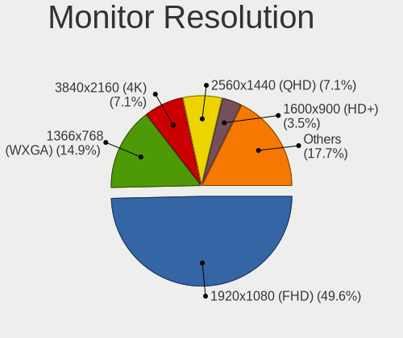

| Resolution         | Computers | Percent |
|--------------------|-----------|---------|
| 1920x1080 (FHD)    | 51        | 49.51%  |
| 1366x768 (WXGA)    | 14        | 13.59%  |
| 3840x2160 (4K)     | 7         | 6.8%    |
| 2560x1440 (QHD)    | 6         | 5.83%   |
| 1920x1200 (WUXGA)  | 3         | 2.91%   |
| 1600x900 (HD+)     | 3         | 2.91%   |
| 1280x1024 (SXGA)   | 3         | 2.91%   |
| 2560x1080          | 2         | 1.94%   |
| 1680x1050 (WSXGA+) | 2         | 1.94%   |
| 1280x800 (WXGA)    | 2         | 1.94%   |
| 3200x1800 (QHD+)   | 1         | 0.97%   |
| 2880x1800          | 1         | 0.97%   |
| 2560x1600          | 1         | 0.97%   |
| 2048x1152          | 1         | 0.97%   |
| 1920x540           | 1         | 0.97%   |
| 1440x900 (WXGA+)   | 1         | 0.97%   |
| 1360x768           | 1         | 0.97%   |
| 1024x768 (XGA)     | 1         | 0.97%   |
| 1024x600           | 1         | 0.97%   |
| Unknown            | 1         | 0.97%   |

Monitor Diagonal
----------------

Diagonal size in inches

| Inches  | Computers | Percent |
|---------|-----------|---------|
| 15      | 25        | 23.81%  |
| 13      | 22        | 20.95%  |
| 24      | 11        | 10.48%  |
| Unknown | 9         | 8.57%   |
| 27      | 8         | 7.62%   |
| 21      | 5         | 4.76%   |
| 12      | 5         | 4.76%   |
| 23      | 3         | 2.86%   |
| 29      | 2         | 1.9%    |
| 20      | 2         | 1.9%    |
| 19      | 2         | 1.9%    |
| 64      | 1         | 0.95%   |
| 57      | 1         | 0.95%   |
| 54      | 1         | 0.95%   |
| 42      | 1         | 0.95%   |
| 31      | 1         | 0.95%   |
| 22      | 1         | 0.95%   |
| 18      | 1         | 0.95%   |
| 17      | 1         | 0.95%   |
| 14      | 1         | 0.95%   |
| 11      | 1         | 0.95%   |
| 10      | 1         | 0.95%   |

Monitor Width
-------------

Physical width

| Width in mm | Computers | Percent |
|-------------|-----------|---------|
| 301-350     | 41        | 39.42%  |
| 501-600     | 20        | 19.23%  |
| 201-300     | 13        | 12.5%   |
| Unknown     | 9         | 8.65%   |
| 401-500     | 8         | 7.69%   |
| 601-700     | 5         | 4.81%   |
| 351-400     | 4         | 3.85%   |
| 1001-1500   | 3         | 2.88%   |
| 901-1000    | 1         | 0.96%   |

Aspect Ratio
------------

Proportional relationship between the width and the height

| Ratio   | Computers | Percent |
|---------|-----------|---------|
| 16/9    | 72        | 75.79%  |
| 16/10   | 9         | 9.47%   |
| Unknown | 8         | 8.42%   |
| 21/9    | 2         | 2.11%   |
| 6/5     | 1         | 1.05%   |
| 5/4     | 1         | 1.05%   |
| 4/3     | 1         | 1.05%   |
| 11/10   | 1         | 1.05%   |

Monitor Area
------------

Area in inch

| Area in inch | Computers | Percent |
|----------------|-----------|---------|
| 201-250        | 19        | 18.1%   |
| 91-100         | 19        | 18.1%   |
| 81-90          | 17        | 16.19%  |
| 301-350        | 10        | 9.52%   |
| Unknown        | 9         | 8.57%   |
| 101-110        | 7         | 6.67%   |
| 71-80          | 5         | 4.76%   |
| 61-70          | 5         | 4.76%   |
| 151-200        | 5         | 4.76%   |
| More than 1000 | 3         | 2.86%   |
| 51-60          | 1         | 0.95%   |
| 351-500        | 1         | 0.95%   |
| 41-50          | 1         | 0.95%   |
| 251-300        | 1         | 0.95%   |
| 131-140        | 1         | 0.95%   |
| 501-1000       | 1         | 0.95%   |

Pixel Density
-------------

Pixels per inch

| Density       | Computers | Percent |
|---------------|-----------|---------|
| 51-100        | 32        | 31.37%  |
| 121-160       | 28        | 27.45%  |
| 101-120       | 20        | 19.61%  |
| 161-240       | 9         | 8.82%   |
| Unknown       | 9         | 8.82%   |
| More than 240 | 3         | 2.94%   |
| 1-50          | 1         | 0.98%   |

Multiple Monitors
-----------------

Total monitors connected

| Total | Computers | Percent |
|-------|-----------|---------|
| 1     | 82        | 54.3%   |
| 0     | 56        | 37.09%  |
| 2     | 12        | 7.95%   |
| 3     | 1         | 0.66%   |

Network
-------

Net Controller Vendor
---------------------

Controller vendors

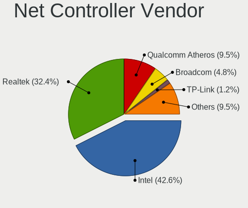

| Vendor                   | Computers | Percent |
|--------------------------|-----------|---------|
| Intel                    | 86        | 40.57%  |
| Realtek Semiconductor    | 72        | 33.96%  |
| Qualcomm Atheros         | 22        | 10.38%  |
| Broadcom                 | 10        | 4.72%   |
| Xiaomi                   | 3         | 1.42%   |
| Ralink Technology        | 3         | 1.42%   |
| Marvell Technology Group | 3         | 1.42%   |
| Samsung Electronics      | 2         | 0.94%   |
| TP-Link                  | 1         | 0.47%   |
| Qualcomm                 | 1         | 0.47%   |
| Nvidia                   | 1         | 0.47%   |
| MediaTek                 | 1         | 0.47%   |
| LG Electronics           | 1         | 0.47%   |
| IMC Networks             | 1         | 0.47%   |
| Huawei Technologies      | 1         | 0.47%   |
| HMD Global               | 1         | 0.47%   |
| Google                   | 1         | 0.47%   |
| D-Link System            | 1         | 0.47%   |
| Arduino SA               | 1         | 0.47%   |

Net Controller Model
--------------------

Controller models

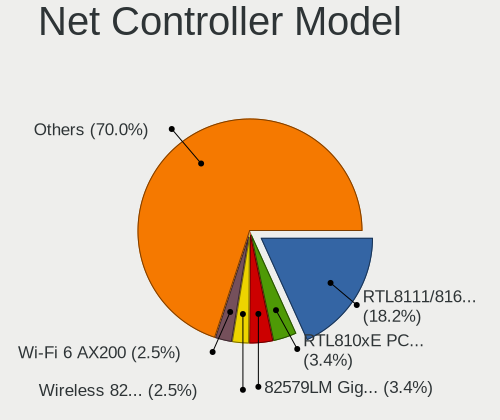

| Model                                                             | Computers | Percent |
|-------------------------------------------------------------------|-----------|---------|
| Realtek RTL8111/8168/8411 PCI Express Gigabit Ethernet Controller | 47        | 18.29%  |
| Realtek RTL810xE PCI Express Fast Ethernet controller             | 10        | 3.89%   |
| Intel 82579LM Gigabit Network Connection (Lewisville)             | 9         | 3.5%    |
| Intel Wireless 8265 / 8275                                        | 8         | 3.11%   |
| Intel Wi-Fi 6 AX200                                               | 6         | 2.33%   |
| Intel I211 Gigabit Network Connection                             | 6         | 2.33%   |
| Intel Comet Lake PCH-LP CNVi WiFi                                 | 6         | 2.33%   |
| Qualcomm Atheros QCA9565 / AR9565 Wireless Network Adapter        | 5         | 1.95%   |
| Intel Ethernet Controller I225-V                                  | 5         | 1.95%   |
| Intel 82574L Gigabit Network Connection                           | 5         | 1.95%   |
| Realtek RTL8821CE 802.11ac PCIe Wireless Network Adapter          | 4         | 1.56%   |
| Intel Ethernet Connection I217-LM                                 | 4         | 1.56%   |
| Intel Centrino Advanced-N 6205 [Taylor Peak]                      | 4         | 1.56%   |
| Realtek RTL8125 2.5GbE Controller                                 | 3         | 1.17%   |
| Qualcomm Atheros QCA9377 802.11ac Wireless Network Adapter        | 3         | 1.17%   |
| Qualcomm Atheros AR9485 Wireless Network Adapter                  | 3         | 1.17%   |
| Qualcomm Atheros AR928X Wireless Network Adapter (PCI-Express)    | 3         | 1.17%   |
| Intel Wireless-AC 9260                                            | 3         | 1.17%   |
| Intel Wireless 7265                                               | 3         | 1.17%   |
| Intel Wi-Fi 6 AX201                                               | 3         | 1.17%   |
| Intel Ethernet Connection (4) I219-V                              | 3         | 1.17%   |
| Intel Ethernet Connection (2) I219-V                              | 3         | 1.17%   |
| Intel Cannon Lake PCH CNVi WiFi                                   | 3         | 1.17%   |
| Xiaomi Mi/Redmi series (RNDIS)                                    | 2         | 0.78%   |
| Samsung Galaxy series, misc. (tethering mode)                     | 2         | 0.78%   |
| Realtek RTL8188EUS 802.11n Wireless Network Adapter               | 2         | 0.78%   |
| Realtek RTL8188EE Wireless Network Adapter                        | 2         | 0.78%   |
| Realtek Realtek Bluetooth Adapter                                 | 2         | 0.78%   |
| Realtek Killer E2500 Gigabit Ethernet Controller                  | 2         | 0.78%   |
| Qualcomm Atheros AR9462 Wireless Network Adapter                  | 2         | 0.78%   |
| Intel Wireless 8260                                               | 2         | 0.78%   |
| Intel Wireless 7260                                               | 2         | 0.78%   |
| Intel I350 Gigabit Network Connection                             | 2         | 0.78%   |
| Intel I210 Gigabit Network Connection                             | 2         | 0.78%   |
| Intel Ethernet Connection (4) I219-LM                             | 2         | 0.78%   |
| Intel Ethernet Connection (13) I219-V                             | 2         | 0.78%   |
| Intel Ethernet Connection (10) I219-V                             | 2         | 0.78%   |
| Intel Comet Lake PCH CNVi WiFi                                    | 2         | 0.78%   |
| Intel Cannon Point-LP CNVi [Wireless-AC]                          | 2         | 0.78%   |
| Broadcom BCM4352 802.11ac Wireless Network Adapter                | 2         | 0.78%   |

Wireless Vendor
---------------

Wireless vendors

| Vendor                | Computers | Percent |
|-----------------------|-----------|---------|
| Intel                 | 53        | 50%     |
| Qualcomm Atheros      | 22        | 20.75%  |
| Realtek Semiconductor | 17        | 16.04%  |
| Broadcom              | 8         | 7.55%   |
| Ralink Technology     | 3         | 2.83%   |
| TP-Link               | 1         | 0.94%   |
| MediaTek              | 1         | 0.94%   |
| IMC Networks          | 1         | 0.94%   |

Wireless Model
--------------

Wireless models

| Model                                                                   | Computers | Percent |
|-------------------------------------------------------------------------|-----------|---------|
| Intel Wireless 8265 / 8275                                              | 8         | 7.55%   |
| Intel Wi-Fi 6 AX200                                                     | 6         | 5.66%   |
| Intel Comet Lake PCH-LP CNVi WiFi                                       | 6         | 5.66%   |
| Qualcomm Atheros QCA9565 / AR9565 Wireless Network Adapter              | 5         | 4.72%   |
| Realtek RTL8821CE 802.11ac PCIe Wireless Network Adapter                | 4         | 3.77%   |
| Intel Centrino Advanced-N 6205 [Taylor Peak]                            | 4         | 3.77%   |
| Qualcomm Atheros QCA9377 802.11ac Wireless Network Adapter              | 3         | 2.83%   |
| Qualcomm Atheros AR9485 Wireless Network Adapter                        | 3         | 2.83%   |
| Qualcomm Atheros AR928X Wireless Network Adapter (PCI-Express)          | 3         | 2.83%   |
| Intel Wireless-AC 9260                                                  | 3         | 2.83%   |
| Intel Wireless 7265                                                     | 3         | 2.83%   |
| Intel Wi-Fi 6 AX201                                                     | 3         | 2.83%   |
| Intel Cannon Lake PCH CNVi WiFi                                         | 3         | 2.83%   |
| Realtek RTL8188EUS 802.11n Wireless Network Adapter                     | 2         | 1.89%   |
| Realtek RTL8188EE Wireless Network Adapter                              | 2         | 1.89%   |
| Realtek Realtek Bluetooth Adapter                                       | 2         | 1.89%   |
| Qualcomm Atheros AR9462 Wireless Network Adapter                        | 2         | 1.89%   |
| Intel Wireless 8260                                                     | 2         | 1.89%   |
| Intel Wireless 7260                                                     | 2         | 1.89%   |
| Intel Comet Lake PCH CNVi WiFi                                          | 2         | 1.89%   |
| Intel Cannon Point-LP CNVi [Wireless-AC]                                | 2         | 1.89%   |
| Broadcom BCM4352 802.11ac Wireless Network Adapter                      | 2         | 1.89%   |
| Broadcom BCM43228 802.11a/b/g/n                                         | 2         | 1.89%   |
| TP-Link AC600 wireless Realtek RTL8811AU [Archer T2U Nano]              | 1         | 0.94%   |
| Realtek RTL8822CE 802.11ac PCIe Wireless Network Adapter                | 1         | 0.94%   |
| Realtek RTL8812AE 802.11ac PCIe Wireless Network Adapter                | 1         | 0.94%   |
| Realtek RTL8192CU 802.11n WLAN Adapter                                  | 1         | 0.94%   |
| Realtek RTL8191SU 802.11n WLAN Adapter                                  | 1         | 0.94%   |
| Realtek RTL8188CE 802.11b/g/n WiFi Adapter                              | 1         | 0.94%   |
| Realtek Realtek 8811CU Wireless LAN 802.11ac USB NIC                    | 1         | 0.94%   |
| Realtek 802.11n WLAN Adapter                                            | 1         | 0.94%   |
| Ralink RT5572 Wireless Adapter                                          | 1         | 0.94%   |
| Ralink RT5370 Wireless Adapter                                          | 1         | 0.94%   |
| Ralink MT7601U Wireless Adapter                                         | 1         | 0.94%   |
| Qualcomm Atheros QCA6174 802.11ac Wireless Network Adapter              | 1         | 0.94%   |
| Qualcomm Atheros AR93xx Wireless Network Adapter                        | 1         | 0.94%   |
| Qualcomm Atheros AR9285 Wireless Network Adapter (PCI-Express)          | 1         | 0.94%   |
| Qualcomm Atheros AR9227 Wireless Network Adapter                        | 1         | 0.94%   |
| Qualcomm Atheros AR242x / AR542x Wireless Network Adapter (PCI-Express) | 1         | 0.94%   |
| Qualcomm Atheros AR2427 802.11bg Wireless Network Adapter (PCI-Express) | 1         | 0.94%   |

Ethernet Vendor
---------------

Ethernet vendors

| Vendor                   | Computers | Percent |
|--------------------------|-----------|---------|
| Realtek Semiconductor    | 63        | 45.65%  |
| Intel                    | 57        | 41.3%   |
| Broadcom                 | 4         | 2.9%    |
| Xiaomi                   | 3         | 2.17%   |
| Marvell Technology Group | 3         | 2.17%   |
| Samsung Electronics      | 2         | 1.45%   |
| Qualcomm Atheros         | 1         | 0.72%   |
| Qualcomm                 | 1         | 0.72%   |
| Nvidia                   | 1         | 0.72%   |
| HMD Global               | 1         | 0.72%   |
| Google                   | 1         | 0.72%   |
| D-Link System            | 1         | 0.72%   |

Ethernet Model
--------------

Ethernet models

| Model                                                             | Computers | Percent |
|-------------------------------------------------------------------|-----------|---------|
| Realtek RTL8111/8168/8411 PCI Express Gigabit Ethernet Controller | 47        | 31.76%  |
| Realtek RTL810xE PCI Express Fast Ethernet controller             | 10        | 6.76%   |
| Intel 82579LM Gigabit Network Connection (Lewisville)             | 9         | 6.08%   |
| Intel I211 Gigabit Network Connection                             | 6         | 4.05%   |
| Intel Ethernet Controller I225-V                                  | 5         | 3.38%   |
| Intel 82574L Gigabit Network Connection                           | 5         | 3.38%   |
| Intel Ethernet Connection I217-LM                                 | 4         | 2.7%    |
| Realtek RTL8125 2.5GbE Controller                                 | 3         | 2.03%   |
| Intel Ethernet Connection (4) I219-V                              | 3         | 2.03%   |
| Intel Ethernet Connection (2) I219-V                              | 3         | 2.03%   |
| Xiaomi Mi/Redmi series (RNDIS)                                    | 2         | 1.35%   |
| Samsung Galaxy series, misc. (tethering mode)                     | 2         | 1.35%   |
| Realtek Killer E2500 Gigabit Ethernet Controller                  | 2         | 1.35%   |
| Intel I350 Gigabit Network Connection                             | 2         | 1.35%   |
| Intel I210 Gigabit Network Connection                             | 2         | 1.35%   |
| Intel Ethernet Connection (4) I219-LM                             | 2         | 1.35%   |
| Intel Ethernet Connection (13) I219-V                             | 2         | 1.35%   |
| Intel Ethernet Connection (10) I219-V                             | 2         | 1.35%   |
| Xiaomi Mi/Redmi series (RNDIS + ADB)                              | 1         | 0.68%   |
| Realtek Killer E2600 Gigabit Ethernet Controller                  | 1         | 0.68%   |
| Qualcomm Atheros AR8132 Fast Ethernet                             | 1         | 0.68%   |
| Qualcomm ALCATEL Composite RNDIS Interface                        | 1         | 0.68%   |
| Nvidia MCP79 Ethernet                                             | 1         | 0.68%   |
| Marvell Group 88E8056 PCI-E Gigabit Ethernet Controller           | 1         | 0.68%   |
| Marvell Group 88E8055 PCI-E Gigabit Ethernet Controller           | 1         | 0.68%   |
| Marvell Group 88E8040 PCI-E Fast Ethernet Controller              | 1         | 0.68%   |
| Marvell Group 88E8001 Gigabit Ethernet Controller                 | 1         | 0.68%   |
| Intel Ethernet Controller X550                                    | 1         | 0.68%   |
| Intel Ethernet Connection X722 for 10GBASE-T                      | 1         | 0.68%   |
| Intel Ethernet Connection I219-V                                  | 1         | 0.68%   |
| Intel Ethernet Connection I219-LM                                 | 1         | 0.68%   |
| Intel Ethernet Connection I218-LM                                 | 1         | 0.68%   |
| Intel Ethernet Connection I217-V                                  | 1         | 0.68%   |
| Intel Ethernet Connection (7) I219-V                              | 1         | 0.68%   |
| Intel Ethernet Connection (7) I219-LM                             | 1         | 0.68%   |
| Intel Ethernet Connection (5) I219-LM                             | 1         | 0.68%   |
| Intel Ethernet Connection (3) I218-LM                             | 1         | 0.68%   |
| Intel Ethernet Connection (2) I219-LM                             | 1         | 0.68%   |
| Intel Ethernet Connection (2) I218-V                              | 1         | 0.68%   |
| Intel Ethernet Connection (11) I219-V                             | 1         | 0.68%   |

Net Controller Kind
-------------------

Ethernet, WiFi or modem

| Kind     | Computers | Percent |
|----------|-----------|---------|
| Ethernet | 125       | 55.56%  |
| WiFi     | 97        | 43.11%  |
| Modem    | 3         | 1.33%   |

Used Controller
---------------

Currently used network controller

| Kind     | Computers | Percent |
|----------|-----------|---------|
| Ethernet | 92        | 67.65%  |
| WiFi     | 44        | 32.35%  |

NICs
----

Total network controllers on board

| Total | Computers | Percent |
|-------|-----------|---------|
| 2     | 76        | 50.33%  |
| 1     | 54        | 35.76%  |
| 0     | 8         | 5.3%    |
| 3     | 7         | 4.64%   |
| 5     | 2         | 1.32%   |
| 4     | 2         | 1.32%   |
| 7     | 1         | 0.66%   |
| 6     | 1         | 0.66%   |

IPv6
----

IPv6 vs IPv4

| Used | Computers | Percent |
|------|-----------|---------|
| No   | 126       | 82.89%  |
| Yes  | 26        | 17.11%  |

Bluetooth
---------

Bluetooth Vendor
----------------

Controller vendors

| Vendor                          | Computers | Percent |
|---------------------------------|-----------|---------|
| Intel                           | 38        | 56.72%  |
| Realtek Semiconductor           | 5         | 7.46%   |
| Qualcomm Atheros Communications | 5         | 7.46%   |
| IMC Networks                    | 4         | 5.97%   |
| Dell                            | 4         | 5.97%   |
| Foxconn / Hon Hai               | 3         | 4.48%   |
| Cambridge Silicon Radio         | 2         | 2.99%   |
| Broadcom                        | 2         | 2.99%   |
| Apple                           | 2         | 2.99%   |
| Lite-On Technology              | 1         | 1.49%   |
| ASUSTek Computer                | 1         | 1.49%   |

Bluetooth Model
---------------

Controller models

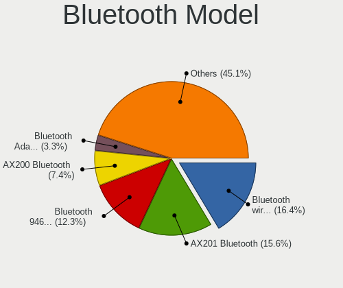

| Model                                                       | Computers | Percent |
|-------------------------------------------------------------|-----------|---------|
| Intel Bluetooth wireless interface                          | 12        | 17.91%  |
| Intel AX201 Bluetooth                                       | 10        | 14.93%  |
| Intel Bluetooth 9460/9560 Jefferson Peak (JfP)              | 8         | 11.94%  |
| Intel AX200 Bluetooth                                       | 5         | 7.46%   |
| Realtek  Bluetooth Adapter                                  | 3         | 4.48%   |
| Qualcomm Atheros Dell Wireless 1707 Bluetooth 4.0 LE Device | 2         | 2.99%   |
| Intel Wireless-AC 9260 Bluetooth Adapter                    | 2         | 2.99%   |
| Foxconn / Hon Hai Bluetooth USB Module                      | 2         | 2.99%   |
| Dell DW375 Bluetooth Module                                 | 2         | 2.99%   |
| Cambridge Silicon Radio Bluetooth Dongle (HCI mode)         | 2         | 2.99%   |
| Broadcom BCM2045B (BDC-2.1)                                 | 2         | 2.99%   |
| Apple Bluetooth Host Controller                             | 2         | 2.99%   |
| Realtek RTL8723B Bluetooth                                  | 1         | 1.49%   |
| Realtek  Bluetooth 4.2 Adapter                              | 1         | 1.49%   |
| Qualcomm Atheros Dell Wireless 1820 Bluetooth 4.1LE         | 1         | 1.49%   |
| Qualcomm Atheros Dell Wireless 1703 Bluetooth               | 1         | 1.49%   |
| Qualcomm Atheros AR9462 Bluetooth                           | 1         | 1.49%   |
| Lite-On BCM43142A0 Bluetooth Module                         | 1         | 1.49%   |
| Intel Wireless-AC 3168 Bluetooth                            | 1         | 1.49%   |
| IMC Networks Realtek Bluetooth Adapter                      | 1         | 1.49%   |
| IMC Networks Qualcomm Atheros Bluetooth 4.1                 | 1         | 1.49%   |
| IMC Networks Qualcomm Atheros Bluetooth 4.0 + HS            | 1         | 1.49%   |
| IMC Networks Bluetooth Radio                                | 1         | 1.49%   |
| Foxconn / Hon Hai Wireless_Device                           | 1         | 1.49%   |
| Dell Dell Wireless 380 Bluetooth 4.0 Module                 | 1         | 1.49%   |
| Dell Broadcom BCM20702A0 Bluetooth                          | 1         | 1.49%   |
| ASUS Bluetooth USB module                                   | 1         | 1.49%   |

Sound
-----

Sound Vendor
------------

Sound card vendors

| Vendor                      | Computers | Percent |
|-----------------------------|-----------|---------|
| Intel                       | 103       | 59.88%  |
| AMD                         | 30        | 17.44%  |
| Nvidia                      | 26        | 15.12%  |
| Plantronics                 | 2         | 1.16%   |
| FiiO Electronics Technology | 2         | 1.16%   |
| XMOS                        | 1         | 0.58%   |
| SteelSeries ApS             | 1         | 0.58%   |
| Sony                        | 1         | 0.58%   |
| Realtek Semiconductor       | 1         | 0.58%   |
| Razer USA                   | 1         | 0.58%   |
| Lenovo                      | 1         | 0.58%   |
| Kingston Technology         | 1         | 0.58%   |
| Ensoniq                     | 1         | 0.58%   |
| Cambridge Silicon Radio     | 1         | 0.58%   |

Sound Model
-----------

Sound card models

| Model                                                                      | Computers | Percent |
|----------------------------------------------------------------------------|-----------|---------|
| AMD Family 17h/19h HD Audio Controller                                     | 13        | 6.31%   |
| Intel Sunrise Point-LP HD Audio                                            | 12        | 5.83%   |
| Intel 6 Series/C200 Series Chipset Family High Definition Audio Controller | 11        | 5.34%   |
| Intel 8 Series/C220 Series Chipset High Definition Audio Controller        | 10        | 4.85%   |
| Intel Xeon E3-1200 v3/4th Gen Core Processor HD Audio Controller           | 9         | 4.37%   |
| AMD Renoir Radeon High Definition Audio Controller                         | 9         | 4.37%   |
| Intel Cannon Lake PCH cAVS                                                 | 7         | 3.4%    |
| Intel Comet Lake PCH-LP cAVS                                               | 6         | 2.91%   |
| Intel Broadwell-U Audio Controller                                         | 5         | 2.43%   |
| Nvidia TU107 GeForce GTX 1650 High Definition Audio Controller             | 4         | 1.94%   |
| Nvidia GF108 High Definition Audio Controller                              | 4         | 1.94%   |
| Intel Wildcat Point-LP High Definition Audio Controller                    | 4         | 1.94%   |
| Intel Cannon Point-LP High Definition Audio Controller                     | 4         | 1.94%   |
| Intel 82801I (ICH9 Family) HD Audio Controller                             | 4         | 1.94%   |
| Intel 7 Series/C216 Chipset Family High Definition Audio Controller        | 4         | 1.94%   |
| Intel 100 Series/C230 Series Chipset Family HD Audio Controller            | 4         | 1.94%   |
| AMD Raven/Raven2/Fenghuang HDMI/DP Audio Controller                        | 4         | 1.94%   |
| Nvidia GP106 High Definition Audio Controller                              | 3         | 1.46%   |
| Nvidia GK208 HDMI/DP Audio Controller                                      | 3         | 1.46%   |
| Intel Tiger Lake-LP Smart Sound Technology Audio Controller                | 3         | 1.46%   |
| Intel NM10/ICH7 Family High Definition Audio Controller                    | 3         | 1.46%   |
| Intel Haswell-ULT HD Audio Controller                                      | 3         | 1.46%   |
| Intel Comet Lake PCH cAVS                                                  | 3         | 1.46%   |
| Intel Celeron/Pentium Silver Processor High Definition Audio               | 3         | 1.46%   |
| Intel C600/X79 series chipset High Definition Audio Controller             | 3         | 1.46%   |
| Intel 8 Series HD Audio Controller                                         | 3         | 1.46%   |
| AMD Starship/Matisse HD Audio Controller                                   | 3         | 1.46%   |
| AMD Family 17h (Models 00h-0fh) HD Audio Controller                        | 3         | 1.46%   |
| Plantronics Plantronics Blackwire 315.1                                    | 2         | 0.97%   |
| Nvidia TU116 High Definition Audio Controller                              | 2         | 0.97%   |
| Nvidia GP108 High Definition Audio Controller                              | 2         | 0.97%   |
| Nvidia GP107GL High Definition Audio Controller                            | 2         | 0.97%   |
| Nvidia GP104 High Definition Audio Controller                              | 2         | 0.97%   |
| Nvidia GM107 High Definition Audio Controller [GeForce 940MX]              | 2         | 0.97%   |
| Intel Tiger Lake-H HD Audio Controller                                     | 2         | 0.97%   |
| Intel Comet Lake PCH-V cAVS                                                | 2         | 0.97%   |
| Intel Atom Processor Z36xxx/Z37xxx Series High Definition Audio Controller | 2         | 0.97%   |
| Intel 9 Series Chipset Family HD Audio Controller                          | 2         | 0.97%   |
| Intel 5 Series/3400 Series Chipset High Definition Audio                   | 2         | 0.97%   |
| Intel 200 Series PCH HD Audio                                              | 2         | 0.97%   |

Memory
------

Memory Vendor
-------------

Memory module vendors

| Vendor                       | Computers | Percent |
|------------------------------|-----------|---------|
| SK hynix                     | 37        | 22.02%  |
| Samsung Electronics          | 32        | 19.05%  |
| Crucial                      | 16        | 9.52%   |
| Micron Technology            | 15        | 8.93%   |
| Kingston                     | 14        | 8.33%   |
| Corsair                      | 11        | 6.55%   |
| Unknown                      | 6         | 3.57%   |
| G.Skill                      | 6         | 3.57%   |
| Unknown                      | 6         | 3.57%   |
| Unknown (ABCD)               | 3         | 1.79%   |
| Elpida                       | 3         | 1.79%   |
| A-DATA Technology            | 3         | 1.79%   |
| Transcend                    | 2         | 1.19%   |
| Ramaxel Technology           | 2         | 1.19%   |
| KomputerBay                  | 2         | 1.19%   |
| Qimonda                      | 1         | 0.6%    |
| PNY                          | 1         | 0.6%    |
| Patriot Memory (PDP Systems) | 1         | 0.6%    |
| Patriot                      | 1         | 0.6%    |
| Nanya Technology             | 1         | 0.6%    |
| Kingmax Semiconductor        | 1         | 0.6%    |
| Kingmax                      | 1         | 0.6%    |
| Hewlett-Packard              | 1         | 0.6%    |
| Apacer                       | 1         | 0.6%    |
| AMD                          | 1         | 0.6%    |

Memory Model
------------

Memory module models

| Model                                                             | Computers | Percent |
|-------------------------------------------------------------------|-----------|---------|
| Unknown                                                           | 6         | 3.35%   |
| SK hynix RAM HMT451S6BFR8A-PB 4GB SODIMM DDR3 1600MT/s            | 4         | 2.23%   |
| Unknown RAM Module 2GB SODIMM DDR2 667MT/s                        | 2         | 1.12%   |
| Unknown (ABCD) RAM 123456789012345678 2GB SODIMM LPDDR4 2133MT/s  | 2         | 1.12%   |
| SK hynix RAM Module 16GB SODIMM DDR4 3200MT/s                     | 2         | 1.12%   |
| SK hynix RAM HYMP125S64CP8-S6 2GB SODIMM DDR2 975MT/s             | 2         | 1.12%   |
| SK hynix RAM HMT425S6AFR6A-PB 2GB SODIMM DDR3 3200MT/s            | 2         | 1.12%   |
| SK hynix RAM HMAA1GS6CJR6N-XN 8GB SODIMM DDR4 3200MT/s            | 2         | 1.12%   |
| SK hynix RAM HMA81GS6DJR8N-XN 8GB SODIMM DDR4 3200MT/s            | 2         | 1.12%   |
| SK hynix RAM HMA81GS6AFR8N-UH 8GB SODIMM DDR4 2400MT/s            | 2         | 1.12%   |
| Samsung RAM M471B5273DH0-CH9 4GB SODIMM DDR3 1334MT/s             | 2         | 1.12%   |
| Samsung RAM M471A4G43MB1-CTD 32GB SODIMM DDR4 2667MT/s            | 2         | 1.12%   |
| Samsung RAM M471A4G43AB1-CWE 32GB SODIMM DDR4 3200MT/s            | 2         | 1.12%   |
| Samsung RAM M471A2K43DB1-CWE 16GB SODIMM DDR4 3200MT/s            | 2         | 1.12%   |
| KomputerBay RAM KB_8G_D3_1333_C9 8GB SODIMM DDR3 1334MT/s         | 2         | 1.12%   |
| Unknown RAM Module 4GB DIMM 1333MT/s                              | 1         | 0.56%   |
| Unknown RAM Module 2GB SODIMM DDR2                                | 1         | 0.56%   |
| Unknown RAM Module 2GB DIMM DDR 800MT/s                           | 1         | 0.56%   |
| Unknown RAM Module 2GB DIMM 1333MT/s                              | 1         | 0.56%   |
| Unknown RAM Module 2GB DIMM                                       | 1         | 0.56%   |
| Unknown (ABCD) RAM 123456789012345678 1536MB DIMM LPDDR3 2400MT/s | 1         | 0.56%   |
| Transcend RAM TS2GSH64V1B 16GB SODIMM DDR4 2133MT/s               | 1         | 0.56%   |
| Transcend RAM JM1333KSN-2G 2GB SODIMM DDR3 1066MT/s               | 1         | 0.56%   |
| SK hynix RAM Module 8GB SODIMM DDR3 1600MT/s                      | 1         | 0.56%   |
| SK hynix RAM HMT451U6DFR8A-PB 4GB DIMM DDR3 1600MT/s              | 1         | 0.56%   |
| SK hynix RAM HMT451U6AFR8C-PB 4GB DIMM DDR3 1600MT/s              | 1         | 0.56%   |
| SK hynix RAM HMT451S6MFR8C-PB 4GB SODIMM DDR3 1600MT/s            | 1         | 0.56%   |
| SK hynix RAM HMT451S6BFR8A-PB 4GB DIMM DDR3 1600MT/s              | 1         | 0.56%   |
| SK hynix RAM HMT451S6AFR8A-PB 4GB SODIMM DDR3 1600MT/s            | 1         | 0.56%   |
| SK hynix RAM HMT42GR7CMR4A-G7 16GB DIMM DDR3 1067MT/s             | 1         | 0.56%   |
| SK hynix RAM HMT41GS6BFR8A-PB 8GB SODIMM DDR3 1600MT/s            | 1         | 0.56%   |
| SK hynix RAM HMT41GS6AFR8A-PB 8GB SODIMM DDR3 1600MT/s            | 1         | 0.56%   |
| SK hynix RAM HMT31GR7BFR4C-H9 8GB DIMM DDR3 1333MT/s              | 1         | 0.56%   |
| SK hynix RAM HMT31GR7AFR4C-H9 8GB DIMM DDR3 1333MT/s              | 1         | 0.56%   |
| SK hynix RAM HMA851S6AFR6N-UH 4GB SODIMM DDR4 2400MT/s            | 1         | 0.56%   |
| SK hynix RAM HMA84GR7DJR4N-XN 32GB DIMM DDR4 3200MT/s             | 1         | 0.56%   |
| SK hynix RAM HMA82GS6MFR8N-TF 16GB SODIMM DDR4 2133MT/s           | 1         | 0.56%   |
| SK hynix RAM HMA82GS6JJR8N-VK 16GB SODIMM DDR4 2667MT/s           | 1         | 0.56%   |
| SK hynix RAM HMA82GS6CJR8N-VK 16GB SODIMM DDR4 2667MT/s           | 1         | 0.56%   |
| SK hynix RAM HMA81GU6JJR8N-VK 8GB DIMM DDR4 2666MT/s              | 1         | 0.56%   |

Memory Kind
-----------

Memory module kinds

| Kind    | Computers | Percent |
|---------|-----------|---------|
| DDR4    | 71        | 48.97%  |
| DDR3    | 56        | 38.62%  |
| DDR2    | 8         | 5.52%   |
| LPDDR4  | 4         | 2.76%   |
| Unknown | 3         | 2.07%   |
| LPDDR3  | 2         | 1.38%   |
| DDR     | 1         | 0.69%   |

Memory Form Factor
------------------

Physical design of the memory module

| Name         | Computers | Percent |
|--------------|-----------|---------|
| SODIMM       | 85        | 59.03%  |
| DIMM         | 55        | 38.19%  |
| Row Of Chips | 3         | 2.08%   |
| Chip         | 1         | 0.69%   |

Memory Size
-----------

Memory module size

| Size  | Computers | Percent |
|-------|-----------|---------|
| 8192  | 65        | 41.67%  |
| 4096  | 40        | 25.64%  |
| 16384 | 22        | 14.1%   |
| 2048  | 18        | 11.54%  |
| 32768 | 9         | 5.77%   |
| 1024  | 2         | 1.28%   |

Memory Speed
------------

Memory module speed

| Speed   | Computers | Percent |
|---------|-----------|---------|
| 1600    | 34        | 22.22%  |
| 3200    | 28        | 18.3%   |
| 2400    | 19        | 12.42%  |
| 2133    | 15        | 9.8%    |
| 2667    | 13        | 8.5%    |
| 1333    | 11        | 7.19%   |
| 1334    | 6         | 3.92%   |
| 2666    | 4         | 2.61%   |
| 800     | 4         | 2.61%   |
| 667     | 3         | 1.96%   |
| 3600    | 2         | 1.31%   |
| 1067    | 2         | 1.31%   |
| 1066    | 2         | 1.31%   |
| 975     | 2         | 1.31%   |
| Unknown | 2         | 1.31%   |
| 4266    | 1         | 0.65%   |
| 3400    | 1         | 0.65%   |
| 2933    | 1         | 0.65%   |
| 1866    | 1         | 0.65%   |
| 933     | 1         | 0.65%   |
| 533     | 1         | 0.65%   |

Printers & scanners
-------------------

Printer Vendor
--------------

Printer device vendors

| Vendor          | Computers | Percent |
|-----------------|-----------|---------|
| Hewlett-Packard | 1         | 100%    |

Printer Model
-------------

Printer device models

| Model            | Computers | Percent |
|------------------|-----------|---------|
| HP LaserJet 1012 | 1         | 100%    |

Scanner Vendor
--------------

Scanner device vendors

| Vendor | Computers | Percent |
|--------|-----------|---------|
| Canon  | 2         | 100%    |

Scanner Model
-------------

Scanner device models

| Model                   | Computers | Percent |
|-------------------------|-----------|---------|
| Canon CanoScan LiDE 220 | 1         | 50%     |
| Canon CanoScan LiDE 110 | 1         | 50%     |

Camera
------

Camera Vendor
-------------

Camera device vendors

| Vendor                        | Computers | Percent |
|-------------------------------|-----------|---------|
| Chicony Electronics           | 16        | 27.59%  |
| IMC Networks                  | 9         | 15.52%  |
| Microdia                      | 7         | 12.07%  |
| Acer                          | 6         | 10.34%  |
| Sunplus Innovation Technology | 5         | 8.62%   |
| Realtek Semiconductor         | 3         | 5.17%   |
| Logitech                      | 2         | 3.45%   |
| Z-Star Microelectronics       | 1         | 1.72%   |
| Sonix Technology              | 1         | 1.72%   |
| SHENZHEN EMEET TECHNOLOGY     | 1         | 1.72%   |
| Ricoh                         | 1         | 1.72%   |
| Quanta                        | 1         | 1.72%   |
| OmniVision Technologies       | 1         | 1.72%   |
| Intel                         | 1         | 1.72%   |
| Genesys Logic                 | 1         | 1.72%   |
| DigiTech                      | 1         | 1.72%   |
| Alcor Micro                   | 1         | 1.72%   |

Camera Model
------------

Camera device models

| Model                                          | Computers | Percent |
|------------------------------------------------|-----------|---------|
| Acer Integrated Camera                         | 5         | 8.47%   |
| Microdia Integrated_Webcam_HD                  | 4         | 6.78%   |
| Chicony Integrated Camera                      | 4         | 6.78%   |
| IMC Networks EasyCamera                        | 3         | 5.08%   |
| Sunplus Laptop_Integrated_Webcam_FHD           | 2         | 3.39%   |
| Realtek Integrated_Webcam_HD                   | 2         | 3.39%   |
| Microdia Integrated Webcam                     | 2         | 3.39%   |
| IMC Networks USB2.0 VGA UVC WebCam             | 2         | 3.39%   |
| IMC Networks USB2.0 HD UVC WebCam              | 2         | 3.39%   |
| Chicony USB2.0 VGA UVC WebCam                  | 2         | 3.39%   |
| Chicony Lenovo Integrated Camera (0.3MP)       | 2         | 3.39%   |
| Chicony HP HD Camera                           | 2         | 3.39%   |
| Z-Star Lenovo USB2.0 UVC Camera                | 1         | 1.69%   |
| Sunplus Laptop Integrated Webcam HD            | 1         | 1.69%   |
| Sunplus Integrated_Webcam_HD                   | 1         | 1.69%   |
| Sunplus HD WebCam                              | 1         | 1.69%   |
| Sonix USB2.0 HD UVC WebCam                     | 1         | 1.69%   |
| SHENZHEN EMEET TECHNOLOGY HD Webcam eMeet C960 | 1         | 1.69%   |
| Ricoh Integrated Webcam                        | 1         | 1.69%   |
| Realtek Integrated Webcam HD                   | 1         | 1.69%   |
| Quanta VGA WebCam                              | 1         | 1.69%   |
| OmniVision Monitor Webcam                      | 1         | 1.69%   |
| Microdia JOYACCESS JA-Webcam                   | 1         | 1.69%   |
| Logitech Webcam C270                           | 1         | 1.69%   |
| Logitech HD Pro Webcam C920                    | 1         | 1.69%   |
| Intel RealSense 3D Camera (Front F200)         | 1         | 1.69%   |
| IMC Networks Integrated Webcam                 | 1         | 1.69%   |
| IMC Networks HP TrueVision HD Camera           | 1         | 1.69%   |
| Genesys Logic Camera                           | 1         | 1.69%   |
| DigiTech WebCam SCB-0350M                      | 1         | 1.69%   |
| Chicony USB2.0 HD UVC WebCam                   | 1         | 1.69%   |
| Chicony USB 2.0 Camera                         | 1         | 1.69%   |
| Chicony LG Camera                              | 1         | 1.69%   |
| Chicony HD WebCam                              | 1         | 1.69%   |
| Chicony Chicony USB2.0 Camera                  | 1         | 1.69%   |
| Chicony Camera                                 | 1         | 1.69%   |
| Alcor Micro USB 2.0 Camera                     | 1         | 1.69%   |
| Acer ThinkPad P50 Integrated Camera            | 1         | 1.69%   |
| Acer SunplusIT Integrated Camera               | 1         | 1.69%   |

Security
--------

Fingerprint Vendor
------------------

Fingerprint sensor vendors

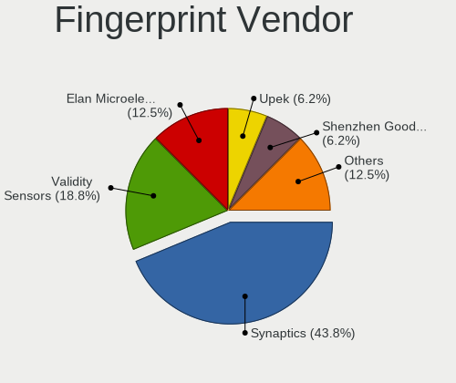

| Vendor                     | Computers | Percent |
|----------------------------|-----------|---------|
| Synaptics                  | 5         | 62.5%   |
| Validity Sensors           | 2         | 25%     |
| Shenzhen Goodix Technology | 1         | 12.5%   |

Fingerprint Model
-----------------

Fingerprint sensor models

| Model                                                     | Computers | Percent |
|-----------------------------------------------------------|-----------|---------|
| Synaptics  FS7604 Touch Fingerprint Sensor with PurePrint | 2         | 25%     |
| Synaptics Prometheus MIS Touch Fingerprint Reader         | 2         | 25%     |
| Validity Sensors VFS 5011 fingerprint sensor              | 1         | 12.5%   |
| Validity Sensors Synaptics WBDI                           | 1         | 12.5%   |
| Synaptics product 0x00be                                  | 1         | 12.5%   |
| Shenzhen Goodix Fingerprint Reader                        | 1         | 12.5%   |

Chipcard Vendor
---------------

Chipcard module vendors

Zero info for selected period =(

Chipcard Model
--------------

Chipcard module models

Zero info for selected period =(

Unsupported
-----------

Unsupported Devices
-------------------

Total unsupported devices on board

| Total | Computers | Percent |
|-------|-----------|---------|
| 1     | 60        | 39.74%  |
| 2     | 37        | 24.5%   |
| 0     | 29        | 19.21%  |
| 3     | 19        | 12.58%  |
| 4     | 5         | 3.31%   |
| 5     | 1         | 0.66%   |

Unsupported Device Types
------------------------

Types of unsupported devices

| Type                     | Computers | Percent |
|--------------------------|-----------|---------|
| Communication controller | 103       | 53.65%  |
| Bluetooth                | 33        | 17.19%  |
| Net/wireless             | 19        | 9.9%    |
| Firewire controller      | 11        | 5.73%   |
| Card reader              | 11        | 5.73%   |
| Fingerprint reader       | 7         | 3.65%   |
| Net/ethernet             | 4         | 2.08%   |
| Storage                  | 2         | 1.04%   |
| Sound                    | 1         | 0.52%   |
| Network                  | 1         | 0.52%   |

