FreeBSD 13.1 - Tested Hardware & Statistics (Desktops)
------------------------------------------------------

A project to collect tested hardware configurations for FreeBSD 13.1.

Anyone can contribute to this report by the [hw-probe](https://github.com/linuxhw/hw-probe/blob/master/INSTALL.BSD.md) tool:

    hw-probe -all -upload

Please contribute! Especially if your hardware is rare.

Contents
--------

* [ Test Cases ](#test-cases)

* [ System ](#system)
  - [ Arch                     ](#arch)
  - [ DE                       ](#de)
  - [ Display Server           ](#display-server)
  - [ Display Manager          ](#display-manager)
  - [ OS Lang                  ](#os-lang)
  - [ Boot Mode                ](#boot-mode)
  - [ Filesystem               ](#filesystem)
  - [ Part. scheme             ](#part-scheme)

* [ Board ](#board)
  - [ Vendor                   ](#vendor)
  - [ Model                    ](#model)
  - [ Model Family             ](#model-family)
  - [ MFG Year                 ](#mfg-year)
  - [ Form Factor              ](#form-factor)
  - [ Coreboot                 ](#coreboot)
  - [ RAM Size                 ](#ram-size)
  - [ RAM Used                 ](#ram-used)
  - [ Total Drives             ](#total-drives)
  - [ Has CD-ROM               ](#has-cd-rom)
  - [ Has Ethernet             ](#has-ethernet)
  - [ Has WiFi                 ](#has-wifi)
  - [ Has Bluetooth            ](#has-bluetooth)

* [ Location ](#location)
  - [ Country                  ](#country)
  - [ City                     ](#city)

* [ Drives ](#drives)
  - [ Drive Vendor             ](#drive-vendor)
  - [ Drive Model              ](#drive-model)
  - [ HDD Vendor               ](#hdd-vendor)
  - [ SSD Vendor               ](#ssd-vendor)
  - [ Drive Kind               ](#drive-kind)
  - [ Drive Connector          ](#drive-connector)
  - [ Drive Size               ](#drive-size)
  - [ Space Total              ](#space-total)
  - [ Space Used               ](#space-used)
  - [ Malfunc. Drives          ](#malfunc-drives)
  - [ Malfunc. Drive Vendor    ](#malfunc-drive-vendor)
  - [ Malfunc. HDD Vendor      ](#malfunc-hdd-vendor)
  - [ Malfunc. Drive Kind      ](#malfunc-drive-kind)
  - [ Failed Drives            ](#failed-drives)
  - [ Failed Drive Vendor      ](#failed-drive-vendor)
  - [ Drive Status             ](#drive-status)

* [ Storage controller ](#storage-controller)
  - [ Storage Vendor           ](#storage-vendor)
  - [ Storage Model            ](#storage-model)
  - [ Storage Kind             ](#storage-kind)

* [ Processor ](#processor)
  - [ CPU Vendor               ](#cpu-vendor)
  - [ CPU Model                ](#cpu-model)
  - [ CPU Model Family         ](#cpu-model-family)
  - [ CPU Cores                ](#cpu-cores)
  - [ CPU Sockets              ](#cpu-sockets)
  - [ CPU Threads              ](#cpu-threads)
  - [ CPU Microarch            ](#cpu-microarch)

* [ Graphics ](#graphics)
  - [ GPU Vendor               ](#gpu-vendor)
  - [ GPU Model                ](#gpu-model)
  - [ GPU Combo                ](#gpu-combo)
  - [ GPU Driver               ](#gpu-driver)
  - [ GPU Memory               ](#gpu-memory)

* [ Monitor ](#monitor)
  - [ Monitor Vendor           ](#monitor-vendor)
  - [ Monitor Model            ](#monitor-model)
  - [ Monitor Resolution       ](#monitor-resolution)
  - [ Monitor Diagonal         ](#monitor-diagonal)
  - [ Monitor Width            ](#monitor-width)
  - [ Aspect Ratio             ](#aspect-ratio)
  - [ Monitor Area             ](#monitor-area)
  - [ Pixel Density            ](#pixel-density)
  - [ Multiple Monitors        ](#multiple-monitors)

* [ Network ](#network)
  - [ Net Controller Vendor    ](#net-controller-vendor)
  - [ Net Controller Model     ](#net-controller-model)
  - [ Wireless Vendor          ](#wireless-vendor)
  - [ Wireless Model           ](#wireless-model)
  - [ Ethernet Vendor          ](#ethernet-vendor)
  - [ Ethernet Model           ](#ethernet-model)
  - [ Net Controller Kind      ](#net-controller-kind)
  - [ Used Controller          ](#used-controller)
  - [ NICs                     ](#nics)
  - [ IPv6                     ](#ipv6)

* [ Bluetooth ](#bluetooth)
  - [ Bluetooth Vendor         ](#bluetooth-vendor)
  - [ Bluetooth Model          ](#bluetooth-model)

* [ Sound ](#sound)
  - [ Sound Vendor             ](#sound-vendor)
  - [ Sound Model              ](#sound-model)

* [ Memory ](#memory)
  - [ Memory Vendor            ](#memory-vendor)
  - [ Memory Model             ](#memory-model)
  - [ Memory Kind              ](#memory-kind)
  - [ Memory Form Factor       ](#memory-form-factor)
  - [ Memory Size              ](#memory-size)
  - [ Memory Speed             ](#memory-speed)

* [ Printers & scanners ](#printers--scanners)
  - [ Printer Vendor           ](#printer-vendor)
  - [ Printer Model            ](#printer-model)
  - [ Scanner Vendor           ](#scanner-vendor)
  - [ Scanner Model            ](#scanner-model)

* [ Camera ](#camera)
  - [ Camera Vendor            ](#camera-vendor)
  - [ Camera Model             ](#camera-model)

* [ Security ](#security)
  - [ Fingerprint Vendor       ](#fingerprint-vendor)
  - [ Fingerprint Model        ](#fingerprint-model)
  - [ Chipcard Vendor          ](#chipcard-vendor)
  - [ Chipcard Model           ](#chipcard-model)

* [ Unsupported ](#unsupported)
  - [ Unsupported Devices      ](#unsupported-devices)
  - [ Unsupported Device Types ](#unsupported-device-types)

Test Cases
----------

Total: 98

| Vendor        | Model                       | Probe                                                     | Date         |
|---------------|-----------------------------|-----------------------------------------------------------|--------------|
| ASUSTek       | Pro WS WRX80E-SAGE SE WI... | [95ebd841b2](https://bsd-hardware.info/?probe=95ebd841b2) | Jan 12, 2023 |
| ASUSTek       | M5A78L-M/USB3               | [8def3dc9b2](https://bsd-hardware.info/?probe=8def3dc9b2) | Jan 09, 2023 |
| Acer          | Veriton M680G               | [cb44a9e848](https://bsd-hardware.info/?probe=cb44a9e848) | Dec 19, 2022 |
| Acer          | Veriton M680G               | [f7184d9158](https://bsd-hardware.info/?probe=f7184d9158) | Dec 19, 2022 |
| ASRock        | B660M-ITX/ac                | [f6c8eb4e18](https://bsd-hardware.info/?probe=f6c8eb4e18) | Dec 18, 2022 |
| Huanan        | X99-F8D V2.4                | [3d06b605c5](https://bsd-hardware.info/?probe=3d06b605c5) | Dec 13, 2022 |
| Huanan        | X99-F8D V2.4                | [f6685811a3](https://bsd-hardware.info/?probe=f6685811a3) | Dec 05, 2022 |
| Dell          | 0PTTT9 A01                  | [74575d6dfe](https://bsd-hardware.info/?probe=74575d6dfe) | Nov 25, 2022 |
| Huanan        | X99-F8D V2.4                | [9faf79b3f3](https://bsd-hardware.info/?probe=9faf79b3f3) | Nov 18, 2022 |
| Foxconn       | 2AB1                        | [f732942dd9](https://bsd-hardware.info/?probe=f732942dd9) | Nov 18, 2022 |
| ASUSTek       | Rampage V EDITION 10        | [443891740b](https://bsd-hardware.info/?probe=443891740b) | Nov 13, 2022 |
| Huanan        | X99-F8D V2.4                | [22ec05d988](https://bsd-hardware.info/?probe=22ec05d988) | Nov 12, 2022 |
| Google        | Zako                        | [5d4b53e2d4](https://bsd-hardware.info/?probe=5d4b53e2d4) | Nov 08, 2022 |
| ASUSTek       | ROG STRIX B550-F GAMING     | [d27fd3b1a7](https://bsd-hardware.info/?probe=d27fd3b1a7) | Nov 04, 2022 |
| Unknown       | Unknown                     | [58c2f4b4f7](https://bsd-hardware.info/?probe=58c2f4b4f7) | Nov 04, 2022 |
| HP            | 18E4                        | [d66ffbbf6d](https://bsd-hardware.info/?probe=d66ffbbf6d) | Oct 21, 2022 |
| MSI           | MAG Z590 TOMAHAWK WIFI      | [3e2f5956c1](https://bsd-hardware.info/?probe=3e2f5956c1) | Oct 19, 2022 |
| ASUSTek       | P8B75-M                     | [2620fd3511](https://bsd-hardware.info/?probe=2620fd3511) | Oct 04, 2022 |
| AMI           | MNHO-048                    | [2ec6e55a75](https://bsd-hardware.info/?probe=2ec6e55a75) | Sep 28, 2022 |
| NITRINOnet    | M360RUS56                   | [490b9593e0](https://bsd-hardware.info/?probe=490b9593e0) | Sep 23, 2022 |
| HP            | 21D0                        | [43fa46655e](https://bsd-hardware.info/?probe=43fa46655e) | Sep 21, 2022 |
| HP            | 21D0                        | [463e2563d7](https://bsd-hardware.info/?probe=463e2563d7) | Sep 19, 2022 |
| Unknown       | Unknown                     | [83e48aa232](https://bsd-hardware.info/?probe=83e48aa232) | Sep 16, 2022 |
| Intel         | X79 V2.72A                  | [435901d8c9](https://bsd-hardware.info/?probe=435901d8c9) | Aug 29, 2022 |
| ASRock        | AD2550-ITX                  | [43d0101ac4](https://bsd-hardware.info/?probe=43d0101ac4) | Aug 24, 2022 |
| Dell          | 042P49 A00                  | [7130975fe3](https://bsd-hardware.info/?probe=7130975fe3) | Aug 17, 2022 |
| MSI           | H81M-P33                    | [3d0836d403](https://bsd-hardware.info/?probe=3d0836d403) | Aug 14, 2022 |
| ASUSTek       | P5Q-E                       | [c50be0ecae](https://bsd-hardware.info/?probe=c50be0ecae) | Aug 14, 2022 |
| ASUSTek       | ROG CROSSHAIR VIII HERO     | [4b6ad32189](https://bsd-hardware.info/?probe=4b6ad32189) | Aug 14, 2022 |
| ASRock        | H110M-DGS R3.0              | [0c654b6c34](https://bsd-hardware.info/?probe=0c654b6c34) | Aug 11, 2022 |
| Dell          | 042P49 A00                  | [a38375fa97](https://bsd-hardware.info/?probe=a38375fa97) | Aug 08, 2022 |
| Dell          | 042P49 A00                  | [81a5e313cd](https://bsd-hardware.info/?probe=81a5e313cd) | Aug 08, 2022 |
| GVC           | DR 738                      | [ea08102a81](https://bsd-hardware.info/?probe=ea08102a81) | Aug 06, 2022 |
| Gigabyte      | H97M-HD3                    | [4a7705414f](https://bsd-hardware.info/?probe=4a7705414f) | Aug 06, 2022 |
| Gigabyte      | H81M-DS2                    | [5b88dea745](https://bsd-hardware.info/?probe=5b88dea745) | Aug 06, 2022 |
| Gigabyte      | P85-D3                      | [7f077abed9](https://bsd-hardware.info/?probe=7f077abed9) | Aug 02, 2022 |
| ASUSTek       | B85-PRO GAMER               | [b29e940a75](https://bsd-hardware.info/?probe=b29e940a75) | Aug 02, 2022 |
| Gigabyte      | GB-BSi3-1115G4              | [4cd0769d75](https://bsd-hardware.info/?probe=4cd0769d75) | Jul 30, 2022 |
| Dell          | 0T7D40 A01                  | [bd2f6f8596](https://bsd-hardware.info/?probe=bd2f6f8596) | Jul 29, 2022 |
| Dell          | 040DDP A01                  | [5d4d3d7553](https://bsd-hardware.info/?probe=5d4d3d7553) | Jul 29, 2022 |
| HP            | 1825                        | [8c96329681](https://bsd-hardware.info/?probe=8c96329681) | Jul 24, 2022 |
| HP            | ProLiant ML310e Gen8 v2     | [6cdc79a36f](https://bsd-hardware.info/?probe=6cdc79a36f) | Jul 22, 2022 |
| ASUSTek       | Maximus VIII HERO           | [051f604f9a](https://bsd-hardware.info/?probe=051f604f9a) | Jul 21, 2022 |
| Dell          | 0WR7PY A03                  | [46a6f4e8f3](https://bsd-hardware.info/?probe=46a6f4e8f3) | Jul 19, 2022 |
| Dell          | 08HPGT A02                  | [ae260e17eb](https://bsd-hardware.info/?probe=ae260e17eb) | Jul 19, 2022 |
| ASUSTek       | ROG CROSSHAIR VIII HERO     | [3bf44f4bb5](https://bsd-hardware.info/?probe=3bf44f4bb5) | Jul 17, 2022 |
| Acer          | Veriton X490G               | [2912c74632](https://bsd-hardware.info/?probe=2912c74632) | Jul 15, 2022 |
| Intel         | Q3XXG4-P V1.0               | [607a66e533](https://bsd-hardware.info/?probe=607a66e533) | Jul 14, 2022 |
| MouseCompu... | B360M                       | [3c22f3e91b](https://bsd-hardware.info/?probe=3c22f3e91b) | Jul 13, 2022 |
| Acer          | Veriton X490G               | [cbae2b155b](https://bsd-hardware.info/?probe=cbae2b155b) | Jul 11, 2022 |
| Acer          | Veriton X490G               | [3cd79878cd](https://bsd-hardware.info/?probe=3cd79878cd) | Jul 11, 2022 |
| Unknown       | Unknown                     | [947d413e10](https://bsd-hardware.info/?probe=947d413e10) | Jul 09, 2022 |
| Intel         | DN2820FYK H24582-203        | [8a9a8cdbd0](https://bsd-hardware.info/?probe=8a9a8cdbd0) | Jul 08, 2022 |
| ASUSTek       | PRIME A520M-A II            | [0819ecdcf9](https://bsd-hardware.info/?probe=0819ecdcf9) | Jul 07, 2022 |
| ASUSTek       | PRIME A520M-A II            | [d459d3431a](https://bsd-hardware.info/?probe=d459d3431a) | Jul 07, 2022 |
| Acer          | Aspire XC-895 V:1.0         | [d67aa61a6b](https://bsd-hardware.info/?probe=d67aa61a6b) | Jul 05, 2022 |
| Acer          | Revo RN86                   | [2dc98202aa](https://bsd-hardware.info/?probe=2dc98202aa) | Jul 05, 2022 |
| ASRock        | Z490M Pro4                  | [b57457834e](https://bsd-hardware.info/?probe=b57457834e) | Jul 04, 2022 |
| Gigabyte      | Z370M D3H-CF                | [1d3db5e35a](https://bsd-hardware.info/?probe=1d3db5e35a) | Jul 04, 2022 |
| ASRock        | X300M-STX                   | [a76b64487b](https://bsd-hardware.info/?probe=a76b64487b) | Jul 01, 2022 |
| ASRock        | P67 Professional            | [3372d35113](https://bsd-hardware.info/?probe=3372d35113) | Jun 28, 2022 |
| Gigabyte      | H61MA-D3V                   | [898da0bcec](https://bsd-hardware.info/?probe=898da0bcec) | Jun 28, 2022 |
| ASUSTek       | PRIME Z590-P                | [70aea59a1b](https://bsd-hardware.info/?probe=70aea59a1b) | Jun 25, 2022 |
| ASUSTek       | PRIME Z590-P                | [c285cb7899](https://bsd-hardware.info/?probe=c285cb7899) | Jun 23, 2022 |
| ASUSTek       | ROG STRIX X570-F GAMING     | [7d054ce34f](https://bsd-hardware.info/?probe=7d054ce34f) | Jun 23, 2022 |
| MSI           | B85M-E45                    | [d9cc6cee6b](https://bsd-hardware.info/?probe=d9cc6cee6b) | Jun 21, 2022 |
| Intel         | D945GCLF2 AAE46416-104      | [84f2afeff4](https://bsd-hardware.info/?probe=84f2afeff4) | Jun 21, 2022 |
| ASUSTek       | Z87M-PLUS                   | [5e51d228ec](https://bsd-hardware.info/?probe=5e51d228ec) | Jun 21, 2022 |
| HP            | 3031h                       | [96ecd77f94](https://bsd-hardware.info/?probe=96ecd77f94) | Jun 19, 2022 |
| HP            | 3031h                       | [4da4d936b8](https://bsd-hardware.info/?probe=4da4d936b8) | Jun 19, 2022 |
| HP            | 86E9 A                      | [1d1ac2dd90](https://bsd-hardware.info/?probe=1d1ac2dd90) | Jun 16, 2022 |
| Dell          | 07KY25 A00                  | [9981217b1b](https://bsd-hardware.info/?probe=9981217b1b) | Jun 16, 2022 |
| Dell          | 0HMF7C A01                  | [ad0f6d4b31](https://bsd-hardware.info/?probe=ad0f6d4b31) | Jun 13, 2022 |
| Gigabyte      | B550M AORUS PRO-P           | [1febab0774](https://bsd-hardware.info/?probe=1febab0774) | Jun 12, 2022 |
| Supermicro    | X9DR3-F                     | [d81151c0e8](https://bsd-hardware.info/?probe=d81151c0e8) | Jun 12, 2022 |
| ASUSTek       | Maximus VII FORMULA         | [5215d1ebb8](https://bsd-hardware.info/?probe=5215d1ebb8) | Jun 12, 2022 |
| MSI           | Z590 PRO WIFI               | [29b410eeb6](https://bsd-hardware.info/?probe=29b410eeb6) | Jun 06, 2022 |
| Gigabyte      | F2A75M-D3H                  | [ae3436167b](https://bsd-hardware.info/?probe=ae3436167b) | Jun 05, 2022 |
| ASRock        | B550 Phantom Gaming-ITX/... | [ff3865e01f](https://bsd-hardware.info/?probe=ff3865e01f) | Jun 05, 2022 |
| NF-M2S        | ABIT                        | [bef9700756](https://bsd-hardware.info/?probe=bef9700756) | May 31, 2022 |
| ASUSTek       | PRIME B350-PLUS             | [f39611345a](https://bsd-hardware.info/?probe=f39611345a) | May 30, 2022 |
| Unknown       | Unknown                     | [90b27f0ac1](https://bsd-hardware.info/?probe=90b27f0ac1) | May 29, 2022 |
| ASUSTek       | P5Q-E                       | [cf67e4079f](https://bsd-hardware.info/?probe=cf67e4079f) | May 29, 2022 |
| ASUSTek       | ROG CROSSHAIR VIII HERO     | [8ebd281f5f](https://bsd-hardware.info/?probe=8ebd281f5f) | May 29, 2022 |
| MSI           | H81M-P33                    | [ab2181e1b4](https://bsd-hardware.info/?probe=ab2181e1b4) | May 29, 2022 |
| PC Engines    | APU3                        | [fca5a642c2](https://bsd-hardware.info/?probe=fca5a642c2) | May 28, 2022 |
| Unknown       | Unknown                     | [4e15ce78c8](https://bsd-hardware.info/?probe=4e15ce78c8) | May 26, 2022 |
| HP            | 158A                        | [883958cd36](https://bsd-hardware.info/?probe=883958cd36) | May 25, 2022 |
| Unknown       | Unknown                     | [78d1ad4565](https://bsd-hardware.info/?probe=78d1ad4565) | May 25, 2022 |
| ASRockRack    | E3C242D4U2-2T               | [d35f1fb7e0](https://bsd-hardware.info/?probe=d35f1fb7e0) | May 25, 2022 |
| Dell          | 055H3G A01                  | [cc1c76afc0](https://bsd-hardware.info/?probe=cc1c76afc0) | May 24, 2022 |
| ASUSTek       | ROG STRIX B550-F GAMING     | [a74913bffa](https://bsd-hardware.info/?probe=a74913bffa) | May 23, 2022 |
| GVC           | DR 738                      | [938866fb80](https://bsd-hardware.info/?probe=938866fb80) | May 21, 2022 |
| Gigabyte      | H61MA-D3V                   | [f369e09063](https://bsd-hardware.info/?probe=f369e09063) | May 19, 2022 |
| Gigabyte      | X470 AORUS GAMING 7 WIFI... | [9c459aae41](https://bsd-hardware.info/?probe=9c459aae41) | May 19, 2022 |
| Dell          | 0DXJD9 A01                  | [be13c9069c](https://bsd-hardware.info/?probe=be13c9069c) | May 18, 2022 |
| Gigabyte      | B450M DS3H-CF               | [edcd612c83](https://bsd-hardware.info/?probe=edcd612c83) | May 18, 2022 |
| Fujitsu       | D3401-H2 S26361-D3401-H2    | [b87692aeb4](https://bsd-hardware.info/?probe=b87692aeb4) | May 15, 2022 |

System
------

Arch
----

OS architecture (x86_64, i586, etc.)

| Name  | Desktops | Percent |
|-------|----------|---------|
| amd64 | 71       | 91.03%  |
| arm64 | 3        | 3.85%   |
| arm   | 3        | 3.85%   |
| i386  | 1        | 1.28%   |

DE
--

Desktop Environment

| Name     | Desktops | Percent |
|----------|----------|---------|
| Console  | 36       | 46.15%  |
| XFCE     | 11       | 14.1%   |
| KDE5     | 11       | 14.1%   |
| TWM      | 4        | 5.13%   |
| MATE     | 4        | 5.13%   |
| Openbox  | 2        | 2.56%   |
| i3       | 2        | 2.56%   |
| GNOME    | 2        | 2.56%   |
| plasma   | 1        | 1.28%   |
| LXQt     | 1        | 1.28%   |
| LXDE     | 1        | 1.28%   |
| Compton  | 1        | 1.28%   |
| Cinnamon | 1        | 1.28%   |
| bspwm    | 1        | 1.28%   |

Display Server
--------------

X11 or Wayland

| Name    | Desktops | Percent |
|---------|----------|---------|
| X11     | 41       | 52.56%  |
| Console | 37       | 47.44%  |

Display Manager
---------------

SDDM, LightDM, etc.

| Name    | Desktops | Percent |
|---------|----------|---------|
| Console | 52       | 66.67%  |
| SDDM    | 10       | 12.82%  |
| SLiM    | 6        | 7.69%   |
| XDM     | 5        | 6.41%   |
| LightDM | 5        | 6.41%   |

OS Lang
-------

Language

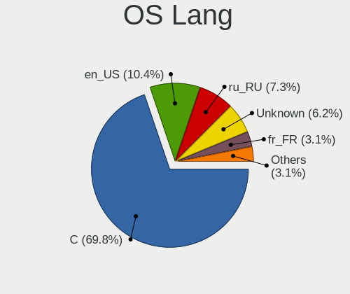

| Lang    | Desktops | Percent |
|---------|----------|---------|
| C       | 53       | 67.95%  |
| en_US   | 8        | 10.26%  |
| ru_RU   | 7        | 8.97%   |
| Unknown | 4        | 5.13%   |
| fr_FR   | 3        | 3.85%   |
| ja_JP   | 1        | 1.28%   |
| en_GB   | 1        | 1.28%   |
| de_DE   | 1        | 1.28%   |

Boot Mode
---------

EFI or BIOS

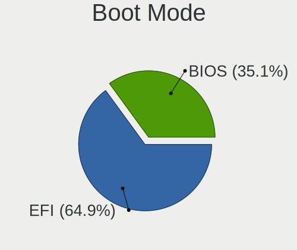

| Mode | Desktops | Percent |
|------|----------|---------|
| EFI  | 49       | 62.03%  |
| BIOS | 30       | 37.97%  |

Filesystem
----------

Type of filesystem

| Type | Desktops | Percent |
|------|----------|---------|
| Zfs  | 50       | 64.1%   |
| Ufs  | 28       | 35.9%   |

Part. scheme
------------

Scheme of partitioning

| Type | Desktops | Percent |
|------|----------|---------|
| GPT  | 71       | 91.03%  |
| MBR  | 7        | 8.97%   |

Board
-----

Vendor
------

Motherboard manufacturer

| Name                | Desktops | Percent |
|---------------------|----------|---------|
| ASUSTek Computer    | 15       | 19.23%  |
| Dell                | 10       | 12.82%  |
| Gigabyte Technology | 9        | 11.54%  |
| Hewlett-Packard     | 7        | 8.97%   |
| ASRock              | 7        | 8.97%   |
| Unknown             | 6        | 7.69%   |
| MSI                 | 4        | 5.13%   |
| Intel               | 4        | 5.13%   |
| Acer                | 4        | 5.13%   |
| Supermicro          | 1        | 1.28%   |
| PC Engines          | 1        | 1.28%   |
| NITRINOnet          | 1        | 1.28%   |
| NF-M2S              | 1        | 1.28%   |
| MouseComputer       | 1        | 1.28%   |
| Huanan              | 1        | 1.28%   |
| GVC                 | 1        | 1.28%   |
| Google              | 1        | 1.28%   |
| Fujitsu             | 1        | 1.28%   |
| Foxconn             | 1        | 1.28%   |
| ASRockRack          | 1        | 1.28%   |
| AMI                 | 1        | 1.28%   |

Model
-----

Motherboard model

| Name                               | Desktops | Percent |
|------------------------------------|----------|---------|
| Unknown                            | 6        | 7.69%   |
| ASUS All Series                    | 4        | 5.13%   |
| MSI MS-7817                        | 2        | 2.56%   |
| Dell Precision T3600               | 2        | 2.56%   |
| Supermicro Icebreaker 4824         | 1        | 1.28%   |
| PC Engines APU3                    | 1        | 1.28%   |
| NITRINOnet M360RUS56               | 1        | 1.28%   |
| NF-M2S ABIT                        | 1        | 1.28%   |
| MSI MS-7D09                        | 1        | 1.28%   |
| MSI MS-7D08                        | 1        | 1.28%   |
| MouseComputer B360M                | 1        | 1.28%   |
| Intel X79 V2.72A                   | 1        | 1.28%   |
| Intel Q3XXG4-P V1.0                | 1        | 1.28%   |
| Intel DN2820FYK H24582-203         | 1        | 1.28%   |
| Intel D945GCLF2 AAE46416-104       | 1        | 1.28%   |
| Huanan X99-F8D V2.4                | 1        | 1.28%   |
| HP Z620 Workstation                | 1        | 1.28%   |
| HP ProLiant ML310e Gen8 v2         | 1        | 1.28%   |
| HP ProDesk 600 G1 DM               | 1        | 1.28%   |
| HP EliteDesk 800 G1 TWR            | 1        | 1.28%   |
| HP EliteDesk 800 G1 DM             | 1        | 1.28%   |
| HP Desktop M01-F0xxx               | 1        | 1.28%   |
| HP Compaq dc7900 Small Form Factor | 1        | 1.28%   |
| GVC EQUIUM 3200M                   | 1        | 1.28%   |
| Google Zako                        | 1        | 1.28%   |
| Gigabyte Z370M D3H                 | 1        | 1.28%   |
| Gigabyte X470 AORUS GAMING 7 WIFI  | 1        | 1.28%   |
| Gigabyte P85-D3                    | 1        | 1.28%   |
| Gigabyte H97M-HD3                  | 1        | 1.28%   |
| Gigabyte H61MA-D3V                 | 1        | 1.28%   |
| Gigabyte GB-BSi3-1115G4            | 1        | 1.28%   |
| Gigabyte F2A75M-D3H                | 1        | 1.28%   |
| Gigabyte B550M AORUS PRO-P         | 1        | 1.28%   |
| Gigabyte B450M DS3H                | 1        | 1.28%   |
| Fujitsu D3401-H2 S26361-D3401-H2   | 1        | 1.28%   |
| Foxconn p6823w                     | 1        | 1.28%   |
| Dell OptiPlex 7050                 | 1        | 1.28%   |
| Dell OptiPlex 7010                 | 1        | 1.28%   |
| Dell OptiPlex 5040                 | 1        | 1.28%   |
| Dell OptiPlex 3080                 | 1        | 1.28%   |

Model Family
------------

Motherboard model prefix

| Name                    | Desktops | Percent |
|-------------------------|----------|---------|
| Dell OptiPlex           | 6        | 7.69%   |
| Unknown                 | 6        | 7.69%   |
| ASUS All                | 4        | 5.13%   |
| ASUS ROG                | 3        | 3.85%   |
| ASUS PRIME              | 3        | 3.85%   |
| MSI MS-7817             | 2        | 2.56%   |
| HP EliteDesk            | 2        | 2.56%   |
| Dell Precision          | 2        | 2.56%   |
| Acer Veriton            | 2        | 2.56%   |
| Supermicro Icebreaker   | 1        | 1.28%   |
| PC Engines APU3         | 1        | 1.28%   |
| NITRINOnet M360RUS56    | 1        | 1.28%   |
| NF-M2S ABIT             | 1        | 1.28%   |
| MSI MS-7D09             | 1        | 1.28%   |
| MSI MS-7D08             | 1        | 1.28%   |
| MouseComputer B360M     | 1        | 1.28%   |
| Intel X79               | 1        | 1.28%   |
| Intel Q3XXG4-P          | 1        | 1.28%   |
| Intel DN2820FYK         | 1        | 1.28%   |
| Intel D945GCLF2         | 1        | 1.28%   |
| Huanan X99-F8D          | 1        | 1.28%   |
| HP Z620                 | 1        | 1.28%   |
| HP ProLiant             | 1        | 1.28%   |
| HP ProDesk              | 1        | 1.28%   |
| HP Desktop              | 1        | 1.28%   |
| HP Compaq               | 1        | 1.28%   |
| GVC EQUIUM              | 1        | 1.28%   |
| Google Zako             | 1        | 1.28%   |
| Gigabyte Z370M          | 1        | 1.28%   |
| Gigabyte X470           | 1        | 1.28%   |
| Gigabyte P85-D3         | 1        | 1.28%   |
| Gigabyte H97M-HD3       | 1        | 1.28%   |
| Gigabyte H61MA-D3V      | 1        | 1.28%   |
| Gigabyte GB-BSi3-1115G4 | 1        | 1.28%   |
| Gigabyte F2A75M-D3H     | 1        | 1.28%   |
| Gigabyte B550M          | 1        | 1.28%   |
| Gigabyte B450M          | 1        | 1.28%   |
| Fujitsu D3401-H2        | 1        | 1.28%   |
| Foxconn p6823w          | 1        | 1.28%   |
| Dell Inspiron           | 1        | 1.28%   |

MFG Year
--------

Motherboard manufacture year

| Year    | Desktops | Percent |
|---------|----------|---------|
| 2020    | 11       | 14.1%   |
| 2021    | 9        | 11.54%  |
| 2014    | 9        | 11.54%  |
| 2019    | 7        | 8.97%   |
| Unknown | 7        | 8.97%   |
| 2013    | 6        | 7.69%   |
| 2022    | 5        | 6.41%   |
| 2018    | 5        | 6.41%   |
| 2016    | 4        | 5.13%   |
| 2017    | 3        | 3.85%   |
| 2012    | 3        | 3.85%   |
| 2008    | 3        | 3.85%   |
| 2011    | 2        | 2.56%   |
| 2010    | 2        | 2.56%   |
| 2015    | 1        | 1.28%   |
| 2009    | 1        | 1.28%   |

Form Factor
-----------

Physical design of the computer

| Name    | Desktops | Percent |
|---------|----------|---------|
| Desktop | 78       | 100%    |

Coreboot
--------

Have coreboot on board

| Used | Desktops | Percent |
|------|----------|---------|
| No   | 76       | 97.44%  |
| Yes  | 2        | 2.56%   |

RAM Size
--------

Total RAM memory

| Size in GB  | Desktops | Percent |
|-------------|----------|---------|
| 16.01-24.0  | 20       | 25.32%  |
| 8.01-16.0   | 20       | 25.32%  |
| 64.01-256.0 | 11       | 13.92%  |
| 32.01-64.0  | 9        | 11.39%  |
| 4.01-8.0    | 7        | 8.86%   |
| 2.01-3.0    | 4        | 5.06%   |
| 0.01-0.5    | 3        | 3.8%    |
| 3.01-4.0    | 2        | 2.53%   |
| 24.01-32.0  | 2        | 2.53%   |
| 0.51-1.0    | 1        | 1.27%   |

RAM Used
--------

Used RAM memory

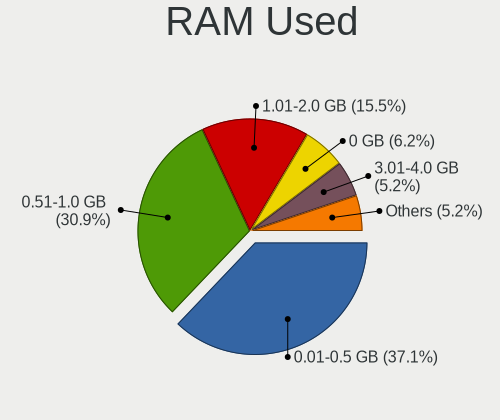

| Used GB  | Desktops | Percent |
|----------|----------|---------|
| 0.01-0.5 | 30       | 37.97%  |
| 0.51-1.0 | 23       | 29.11%  |
| 1.01-2.0 | 12       | 15.19%  |
| 3.01-4.0 | 5        | 6.33%   |
| 2.01-3.0 | 5        | 6.33%   |
| 0        | 4        | 5.06%   |

Total Drives
------------

Number of drives on board

| Drives | Desktops | Percent |
|--------|----------|---------|
| 1      | 22       | 27.85%  |
| 2      | 18       | 22.78%  |
| 3      | 13       | 16.46%  |
| 4      | 10       | 12.66%  |
| 0      | 8        | 10.13%  |
| 8      | 2        | 2.53%   |
| 6      | 2        | 2.53%   |
| 18     | 1        | 1.27%   |
| 15     | 1        | 1.27%   |
| 10     | 1        | 1.27%   |
| 5      | 1        | 1.27%   |

Has CD-ROM
----------

Has CD-ROM on board

| Presented | Desktops | Percent |
|-----------|----------|---------|
| No        | 54       | 69.23%  |
| Yes       | 24       | 30.77%  |

Has Ethernet
------------

Has Ethernet on board

| Presented | Desktops | Percent |
|-----------|----------|---------|
| Yes       | 71       | 91.03%  |
| No        | 7        | 8.97%   |

Has WiFi
--------

Has WiFi module

| Presented | Desktops | Percent |
|-----------|----------|---------|
| No        | 55       | 70.51%  |
| Yes       | 23       | 29.49%  |

Has Bluetooth
-------------

Has Bluetooth module

| Presented | Desktops | Percent |
|-----------|----------|---------|
| No        | 62       | 79.49%  |
| Yes       | 16       | 20.51%  |

Location
--------

Country
-------

Geographic location (country)

| Country     | Desktops | Percent |
|-------------|----------|---------|
| USA         | 20       | 25.64%  |
| Russia      | 11       | 14.1%   |
| Germany     | 10       | 12.82%  |
| Spain       | 5        | 6.41%   |
| France      | 5        | 6.41%   |
| Canada      | 5        | 6.41%   |
| New Zealand | 2        | 2.56%   |
| Netherlands | 2        | 2.56%   |
| Czechia     | 2        | 2.56%   |
| Belgium     | 2        | 2.56%   |
| Austria     | 2        | 2.56%   |
| Australia   | 2        | 2.56%   |
| Venezuela   | 1        | 1.28%   |
| Thailand    | 1        | 1.28%   |
| Taiwan      | 1        | 1.28%   |
| Mexico      | 1        | 1.28%   |
| Japan       | 1        | 1.28%   |
| Italy       | 1        | 1.28%   |
| Ireland     | 1        | 1.28%   |
| India       | 1        | 1.28%   |
| Hungary     | 1        | 1.28%   |
| Croatia     | 1        | 1.28%   |

City
----

Geographic location (city)

| City                    | Desktops | Percent |
|-------------------------|----------|---------|
| Moscow                  | 5        | 6.33%   |
| Frisco                  | 4        | 5.06%   |
| Ozersk                  | 3        | 3.8%    |
| Wellington              | 2        | 2.53%   |
| Tamm                    | 2        | 2.53%   |
| Redmond                 | 2        | 2.53%   |
| Omaha                   | 2        | 2.53%   |
| Madrid                  | 2        | 2.53%   |
| Brno                    | 2        | 2.53%   |
| Zagreb                  | 1        | 1.27%   |
| Yashio                  | 1        | 1.27%   |
| Wenatchee               | 1        | 1.27%   |
| Waldbrunn               | 1        | 1.27%   |
| Vienna                  | 1        | 1.27%   |
| Vaulx-en-Velin          | 1        | 1.27%   |
| Vancouver               | 1        | 1.27%   |
| Valladolid              | 1        | 1.27%   |
| Toronto                 | 1        | 1.27%   |
| Tiel                    | 1        | 1.27%   |
| Taipei                  | 1        | 1.27%   |
| Sydney                  | 1        | 1.27%   |
| St. Albert              | 1        | 1.27%   |
| St Petersburg           | 1        | 1.27%   |
| Springfield             | 1        | 1.27%   |
| Sherbrooke              | 1        | 1.27%   |
| Sarasota                | 1        | 1.27%   |
| Sant Cugat del Vallès  | 1        | 1.27%   |
| San Vincenzo La Costa   | 1        | 1.27%   |
| Saarbrücken            | 1        | 1.27%   |
| Poperinge               | 1        | 1.27%   |
| Pluvigner               | 1        | 1.27%   |
| Paris                   | 1        | 1.27%   |
| Neustadt am Ruebenberge | 1        | 1.27%   |
| Navi Mumbai             | 1        | 1.27%   |
| Nakhodka                | 1        | 1.27%   |
| Münster                | 1        | 1.27%   |
| Mossingen               | 1        | 1.27%   |
| Montreal                | 1        | 1.27%   |
| Methuen                 | 1        | 1.27%   |
| Medford                 | 1        | 1.27%   |

Drives
------

Drive Vendor
------------

Hard drive vendors

| Vendor              | Desktops | Drives | Percent |
|---------------------|----------|--------|---------|
| WDC                 | 34       | 64     | 26.77%  |
| Seagate             | 22       | 55     | 17.32%  |
| Samsung Electronics | 22       | 37     | 17.32%  |
| Crucial             | 9        | 15     | 7.09%   |
| Toshiba             | 7        | 14     | 5.51%   |
| Kingston            | 6        | 6      | 4.72%   |
| Intel               | 5        | 7      | 3.94%   |
| SanDisk             | 2        | 2      | 1.57%   |
| PNY                 | 2        | 3      | 1.57%   |
| Hitachi             | 2        | 2      | 1.57%   |
| Hewlett-Packard     | 2        | 2      | 1.57%   |
| A-DATA Technology   | 2        | 2      | 1.57%   |
| Verbatim            | 1        | 1      | 0.79%   |
| SPCC                | 1        | 1      | 0.79%   |
| SK hynix            | 1        | 1      | 0.79%   |
| ORICO               | 1        | 1      | 0.79%   |
| OCZ                 | 1        | 1      | 0.79%   |
| Micron Technology   | 1        | 2      | 0.79%   |
| LITEONIT            | 1        | 1      | 0.79%   |
| LITEON              | 1        | 1      | 0.79%   |
| Hikvision           | 1        | 1      | 0.79%   |
| HGST                | 1        | 1      | 0.79%   |
| Gigabyte Technology | 1        | 1      | 0.79%   |
| China               | 1        | 1      | 0.79%   |

Drive Model
-----------

Hard drive models

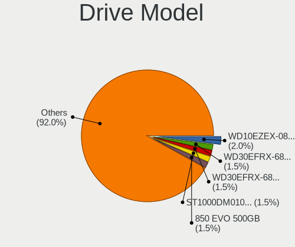

| Model                          | Desktops | Percent |
|--------------------------------|----------|---------|
| WDC WD10EZEX-08WN4A0 1TB       | 4        | 2.5%    |
| WDC WD30EFRX-68EUZN0 3TB       | 3        | 1.88%   |
| WDC WD30EFRX-68AX9N0 3TB       | 3        | 1.88%   |
| Seagate ST1000DM010-2EP102 1TB | 3        | 1.88%   |
| Samsung SSD 850 EVO 500GB      | 3        | 1.88%   |
| WDC WD5000LPLX-00ZNTT0 500GB   | 2        | 1.25%   |
| Seagate ST4000DM000-1F2168 4TB | 2        | 1.25%   |
| Seagate ST2000DM008-2FR102 2TB | 2        | 1.25%   |
| Samsung SSD 970 EVO 1TB        | 2        | 1.25%   |
| Samsung SSD 870 QVO 2TB        | 2        | 1.25%   |
| Samsung SSD 850 EVO 250GB      | 2        | 1.25%   |
| Samsung SSD 840 EVO 120GB      | 2        | 1.25%   |
| Kingston SA400S37120G 120GB    | 2        | 1.25%   |
| Intel SSDSC2CT060A3 64GB       | 2        | 1.25%   |
| Crucial CT240BX500SSD1 240GB   | 2        | 1.25%   |
| A-DATA SU650 240GB             | 2        | 1.25%   |
| WDC WDS500G1B0A-00H9H0 500GB   | 1        | 0.63%   |
| WDC WDS100T2B0A-00SM50 1TB     | 1        | 0.63%   |
| WDC WDBA3V5000ANC-WRSN 500GB   | 1        | 0.63%   |
| WDC WD80EZZX-11CSGA0 8TB       | 1        | 0.63%   |
| WDC WD80EZAZ-11TDBA0 8TB       | 1        | 0.63%   |
| WDC WD80EMZZ-00TBGA0 8TB       | 1        | 0.63%   |
| WDC WD80EFBX-68AZZN0 8TB       | 1        | 0.63%   |
| WDC WD800AAJS-00PSA0 80GB      | 1        | 0.63%   |
| WDC WD8003FFBX-68B9AN0 8TB     | 1        | 0.63%   |
| WDC WD6400AAKS-22A7B2 640GB    | 1        | 0.63%   |
| WDC WD60EFRX-68L0BN1 6TB       | 1        | 0.63%   |
| WDC WD5000LUCT-63Y8HY0 500GB   | 1        | 0.63%   |
| WDC WD5000BEVT-22ZAT0 500GB    | 1        | 0.63%   |
| WDC WD40EZRZ-22GXCB0 4TB       | 1        | 0.63%   |
| WDC WD4003FRYZ-01F0DB0 4TB     | 1        | 0.63%   |
| WDC WD30EFRX-68N32N0 3TB       | 1        | 0.63%   |
| WDC WD20NMVW-11EDZS2 2TB       | 1        | 0.63%   |
| WDC WD20NMVW-11AV3S2 2TB       | 1        | 0.63%   |
| WDC WD20EARX-00PASB0 2TB       | 1        | 0.63%   |
| WDC WD2003FYYS-18W0B0 2TB      | 1        | 0.63%   |
| WDC WD1600AAJS-60M0A0 160GB    | 1        | 0.63%   |
| WDC WD15EADS-00P8B0 1.5TB      | 1        | 0.63%   |
| WDC WD140EFGX-68B0GN0 14TB     | 1        | 0.63%   |
| WDC WD10EZEX-60WN4A0 1TB       | 1        | 0.63%   |

HDD Vendor
----------

Hard disk drive vendors

| Vendor              | Desktops | Drives | Percent |
|---------------------|----------|--------|---------|
| WDC                 | 28       | 57     | 46.67%  |
| Seagate             | 21       | 54     | 35%     |
| Toshiba             | 6        | 13     | 10%     |
| Hitachi             | 2        | 2      | 3.33%   |
| Samsung Electronics | 1        | 4      | 1.67%   |
| HGST                | 1        | 1      | 1.67%   |
| Hewlett-Packard     | 1        | 1      | 1.67%   |

SSD Vendor
----------

Solid state drive vendors

| Vendor              | Desktops | Drives | Percent |
|---------------------|----------|--------|---------|
| Samsung Electronics | 16       | 24     | 31.37%  |
| Crucial             | 8        | 11     | 15.69%  |
| Kingston            | 4        | 4      | 7.84%   |
| Intel               | 4        | 6      | 7.84%   |
| WDC                 | 2        | 2      | 3.92%   |
| SanDisk             | 2        | 2      | 3.92%   |
| PNY                 | 2        | 3      | 3.92%   |
| A-DATA Technology   | 2        | 2      | 3.92%   |
| Verbatim            | 1        | 1      | 1.96%   |
| Toshiba             | 1        | 1      | 1.96%   |
| SPCC                | 1        | 1      | 1.96%   |
| SK hynix            | 1        | 1      | 1.96%   |
| ORICO               | 1        | 1      | 1.96%   |
| OCZ                 | 1        | 1      | 1.96%   |
| Micron Technology   | 1        | 2      | 1.96%   |
| LITEONIT            | 1        | 1      | 1.96%   |
| LITEON              | 1        | 1      | 1.96%   |
| Hikvision           | 1        | 1      | 1.96%   |
| China               | 1        | 1      | 1.96%   |

Drive Kind
----------

HDD or SSD

| Kind | Desktops | Drives | Percent |
|------|----------|--------|---------|
| HDD  | 46       | 132    | 42.99%  |
| SSD  | 44       | 66     | 41.12%  |
| NVMe | 17       | 24     | 15.89%  |

Drive Connector
---------------

SATA, SAS, NVMe, etc.

| Type | Desktops | Drives | Percent |
|------|----------|--------|---------|
| SATA | 67       | 198    | 79.76%  |
| NVMe | 17       | 24     | 20.24%  |

Drive Size
----------

Size of hard drive

| Size in TB | Desktops | Drives | Percent |
|------------|----------|--------|---------|
| 0.01-0.5   | 42       | 63     | 41.18%  |
| 0.51-1.0   | 33       | 44     | 32.35%  |
| 1.01-2.0   | 10       | 27     | 9.8%    |
| 3.01-4.0   | 6        | 10     | 5.88%   |
| 2.01-3.0   | 5        | 20     | 4.9%    |
| 4.01-10.0  | 4        | 29     | 3.92%   |
| 10.01-20.0 | 2        | 5      | 1.96%   |

Space Total
-----------

Amount of disk space available on the file system

| Size in GB     | Desktops | Percent |
|----------------|----------|---------|
| 101-250        | 22       | 27.85%  |
| 251-500        | 15       | 18.99%  |
| 501-1000       | 15       | 18.99%  |
| 21-50          | 9        | 11.39%  |
| 51-100         | 6        | 7.59%   |
| 1-20           | 4        | 5.06%   |
| 2001-3000      | 3        | 3.8%    |
| 1001-2000      | 3        | 3.8%    |
| More than 3000 | 1        | 1.27%   |
| Unknown        | 1        | 1.27%   |

Space Used
----------

Amount of used disk space

| Used GB        | Desktops | Percent |
|----------------|----------|---------|
| 1-20           | 65       | 83.33%  |
| 21-50          | 6        | 7.69%   |
| 251-500        | 2        | 2.56%   |
| 51-100         | 2        | 2.56%   |
| More than 3000 | 1        | 1.28%   |
| 501-1000       | 1        | 1.28%   |
| Unknown        | 1        | 1.28%   |

Malfunc. Drives
---------------

Drive models with a malfunction

| Model                                      | Desktops | Drives | Percent |
|--------------------------------------------|----------|--------|---------|
| WDC WD6400AAKS-22A7B2 640GB                | 1        | 1      | 6.25%   |
| WDC WD5000LPLX-00ZNTT0 500GB               | 1        | 1      | 6.25%   |
| WDC WD30EFRX-68EUZN0 3TB                   | 1        | 3      | 6.25%   |
| WDC WD1600AAJS-60M0A0 160GB                | 1        | 1      | 6.25%   |
| SPCC M.2 SSD 256GB                         | 1        | 1      | 6.25%   |
| SK hynix SC308 SATA 128GB                  | 1        | 1      | 6.25%   |
| Seagate ST9500325AS 500GB                  | 1        | 1      | 6.25%   |
| Seagate ST500DM002-1ER14C 500GB            | 1        | 1      | 6.25%   |
| Seagate ST1000DM003-1CH162 1TB             | 1        | 1      | 6.25%   |
| Micron Technology 1100_MTFDDAK512TBN 512GB | 1        | 2      | 6.25%   |
| LITEON IT LST-16S9G-HP 16GB                | 1        | 1      | 6.25%   |
| Kingston SV300S37A120G 120GB               | 1        | 1      | 6.25%   |
| Hitachi HTS727575A9E364 752GB              | 1        | 1      | 6.25%   |
| Hitachi HDS721010CLA332 1TB                | 1        | 1      | 6.25%   |
| HGST HTS725050A7E630 500GB                 | 1        | 1      | 6.25%   |
| Hewlett-Packard MB1000GCWCV 1TB            | 1        | 1      | 6.25%   |

Malfunc. Drive Vendor
---------------------

Vendors of faulty drives

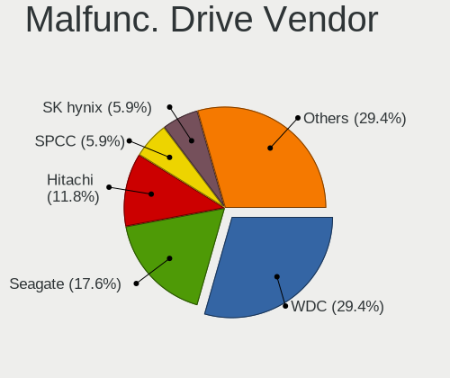

| Vendor            | Desktops | Drives | Percent |
|-------------------|----------|--------|---------|
| WDC               | 4        | 6      | 25%     |
| Seagate           | 3        | 3      | 18.75%  |
| Hitachi           | 2        | 2      | 12.5%   |
| SPCC              | 1        | 1      | 6.25%   |
| SK hynix          | 1        | 1      | 6.25%   |
| Micron Technology | 1        | 2      | 6.25%   |
| LITEON            | 1        | 1      | 6.25%   |
| Kingston          | 1        | 1      | 6.25%   |
| HGST              | 1        | 1      | 6.25%   |
| Hewlett-Packard   | 1        | 1      | 6.25%   |

Malfunc. HDD Vendor
-------------------

Vendors of faulty HDD drives

| Vendor          | Desktops | Drives | Percent |
|-----------------|----------|--------|---------|
| WDC             | 4        | 6      | 36.36%  |
| Seagate         | 3        | 3      | 27.27%  |
| Hitachi         | 2        | 2      | 18.18%  |
| HGST            | 1        | 1      | 9.09%   |
| Hewlett-Packard | 1        | 1      | 9.09%   |

Malfunc. Drive Kind
-------------------

Kinds of faulty drives

| Kind | Desktops | Drives | Percent |
|------|----------|--------|---------|
| HDD  | 11       | 13     | 68.75%  |
| SSD  | 5        | 6      | 31.25%  |

Failed Drives
-------------

Failed drive models

Zero info for selected period =(

Failed Drive Vendor
-------------------

Failed drive vendors

Zero info for selected period =(

Drive Status
------------

Number of failed and malfunc. drives

| Status   | Desktops | Drives | Percent |
|----------|----------|--------|---------|
| Works    | 65       | 196    | 79.27%  |
| Malfunc  | 14       | 19     | 17.07%  |
| Detected | 3        | 7      | 3.66%   |

Storage controller
------------------

Storage Vendor
--------------

Storage controller vendors

| Vendor                      | Desktops | Percent |
|-----------------------------|----------|---------|
| Intel                       | 56       | 54.9%   |
| AMD                         | 13       | 12.75%  |
| Samsung Electronics         | 8        | 7.84%   |
| SanDisk                     | 6        | 5.88%   |
| ASMedia Technology          | 4        | 3.92%   |
| Marvell Technology Group    | 3        | 2.94%   |
| Broadcom / LSI              | 3        | 2.94%   |
| Micron/Crucial Technology   | 2        | 1.96%   |
| Kingston Technology Company | 2        | 1.96%   |
| Silicon Motion              | 1        | 0.98%   |
| Silicon Image               | 1        | 0.98%   |
| Seagate Technology          | 1        | 0.98%   |
| Phison Electronics          | 1        | 0.98%   |
| Nvidia                      | 1        | 0.98%   |

Storage Model
-------------

Storage controller models

| Model                                                                          | Desktops | Percent |
|--------------------------------------------------------------------------------|----------|---------|
| Intel 8 Series/C220 Series Chipset Family 6-port SATA Controller 1 [AHCI mode] | 10       | 8.55%   |
| AMD FCH SATA Controller [AHCI mode]                                            | 6        | 5.13%   |
| Intel Q170/Q150/B150/H170/H110/Z170/CM236 Chipset SATA Controller [AHCI Mode]  | 5        | 4.27%   |
| Intel Cannon Lake PCH SATA AHCI Controller                                     | 5        | 4.27%   |
| Samsung NVMe SSD Controller SM981/PM981/PM983                                  | 4        | 3.42%   |
| Intel C600/X79 series chipset 6-Port SATA AHCI Controller                      | 4        | 3.42%   |
| AMD 500 Series Chipset SATA Controller                                         | 4        | 3.42%   |
| Samsung NVMe SSD Controller PM9A1/PM9A3/980PRO                                 | 3        | 2.56%   |
| Intel C602 chipset 4-Port SATA Storage Control Unit                            | 3        | 2.56%   |
| Intel 6 Series/C200 Series Chipset Family 6 port Desktop SATA AHCI Controller  | 3        | 2.56%   |
| Intel 500 Series Chipset Family SATA AHCI Controller                           | 3        | 2.56%   |
| Intel 200 Series PCH SATA controller [AHCI mode]                               | 3        | 2.56%   |
| Broadcom / LSI SAS2008 PCI-Express Fusion-MPT SAS-2 [Falcon]                   | 3        | 2.56%   |
| ASMedia ASM1062 Serial ATA Controller                                          | 3        | 2.56%   |
| SanDisk WD Blue SN550 NVMe SSD                                                 | 2        | 1.71%   |
| Micron/Crucial P2 NVMe PCIe SSD                                                | 2        | 1.71%   |
| Intel NM10/ICH7 Family SATA Controller [IDE mode]                              | 2        | 1.71%   |
| Intel C610/X99 series chipset sSATA Controller [AHCI mode]                     | 2        | 1.71%   |
| Intel Atom Processor E3800 Series SATA AHCI Controller                         | 2        | 1.71%   |
| Intel 9 Series Chipset Family SATA Controller [AHCI Mode]                      | 2        | 1.71%   |
| Intel 5 Series/3400 Series Chipset PT IDER Controller                          | 2        | 1.71%   |
| Intel 5 Series/3400 Series Chipset 6 port SATA AHCI Controller                 | 2        | 1.71%   |
| Intel 400 Series Chipset Family SATA AHCI Controller                           | 2        | 1.71%   |
| AMD 400 Series Chipset SATA Controller                                         | 2        | 1.71%   |
| Silicon Motion SM2263EN/SM2263XT SSD Controller                                | 1        | 0.85%   |
| Silicon Image SiI 3124 PCI-X Serial ATA Controller                             | 1        | 0.85%   |
| SanDisk WD Blue SN570 NVMe SSD                                                 | 1        | 0.85%   |
| SanDisk WD Black 2018/SN750 / PC SN720 NVMe SSD                                | 1        | 0.85%   |
| Sandisk unknown                                                                | 1        | 0.85%   |
| SanDisk PC SN520 NVMe SSD                                                      | 1        | 0.85%   |
| Samsung NVMe SSD Controller SM961/PM961/SM963                                  | 1        | 0.85%   |
| Samsung NVMe SSD Controller 980                                                | 1        | 0.85%   |
| Phison NVMe Storage Controller                                                 | 1        | 0.85%   |
| Nvidia MCP61 SATA Controller                                                   | 1        | 0.85%   |
| Nvidia MCP61 IDE                                                               | 1        | 0.85%   |
| Marvell Group 88SE9172 SATA 6Gb/s Controller                                   | 1        | 0.85%   |
| Marvell Group 88SE9120 SATA 6Gb/s Controller                                   | 1        | 0.85%   |
| Marvell Group 88SE6111/6121 SATA II / PATA Controller                          | 1        | 0.85%   |
| Kingston Company KC2000 NVMe SSD                                               | 1        | 0.85%   |
| Kingston Company A2000 NVMe SSD                                                | 1        | 0.85%   |

Storage Kind
------------

Kind of storage controller (IDE, SATA, NVMe, SAS, ...)

| Kind | Desktops | Percent |
|------|----------|---------|
| SATA | 63       | 63%     |
| NVMe | 19       | 19%     |
| IDE  | 11       | 11%     |
| SAS  | 4        | 4%      |
| RAID | 3        | 3%      |

Processor
---------

CPU Vendor
----------

Processor vendors

| Vendor | Desktops | Percent |
|--------|----------|---------|
| Intel  | 56       | 71.79%  |
| AMD    | 16       | 20.51%  |
| ARM    | 6        | 7.69%   |

CPU Model
---------

Processor models

| Model                                  | Desktops | Percent |
|----------------------------------------|----------|---------|
| Intel Core i5-3470 CPU @ 3.20GHz       | 3        | 3.8%    |
| ARM Cortex-A53 r0p4                    | 3        | 3.8%    |
| AMD Ryzen 5 5600G with Radeon Graphics | 3        | 3.8%    |
| Intel Core i7-7700 CPU @ 3.60GHz       | 2        | 2.53%   |
| Intel Core i5-8400 CPU @ 2.80GHz       | 2        | 2.53%   |
| ARM ARM1176 r0p7 (ECO: 0x00000000)     | 2        | 2.53%   |
| Intel Xeon E-2136 CPU @ 3.30GHz        | 1        | 1.27%   |
| Intel Xeon CPU E5-2680 v4 @ 2.40GHz    | 1        | 1.27%   |
| Intel Xeon CPU E5-2670 @ 2.60GHz       | 1        | 1.27%   |
| Intel Xeon CPU E5-2650 v2 @ 2.60GHz    | 1        | 1.27%   |
| Intel Xeon CPU E5-2650 0 @ 2.00GH      | 1        | 1.27%   |
| Intel Xeon CPU E5-2620 v2 @ 2.10GHz    | 1        | 1.27%   |
| Intel Xeon CPU E5-1620 0 @ 3.60GH      | 1        | 1.27%   |
| Intel Xeon CPU E3-1230 v3 @ 3.30GHz    | 1        | 1.27%   |
| Intel Xeon CPU E3-1220 v3 @ 3.10GHz    | 1        | 1.27%   |
| Intel Pentium II                       | 1        | 1.27%   |
| Intel Pentium Gold G5400 CPU @ 3.70GHz | 1        | 1.27%   |
| Intel Pentium CPU G3240T @ 2.70GHz     | 1        | 1.27%   |
| Intel Pentium CPU G3220 @ 3.00GHz      | 1        | 1.27%   |
| Intel Core i7-9700K CPU @ 3.60GHz      | 1        | 1.27%   |
| Intel Core i7-6900K CPU @ 3.20GHz      | 1        | 1.27%   |
| Intel Core i7-6700K CPU @ 4.00GHz      | 1        | 1.27%   |
| Intel Core i7-4790K CPU @ 4.00GHz      | 1        | 1.27%   |
| Intel Core i7-4785T CPU @ 2.20GHz      | 1        | 1.27%   |
| Intel Core i7-2600K CPU @ 3.40GHz      | 1        | 1.27%   |
| Intel Core i7-10700K CPU @ 3.80GHz     | 1        | 1.27%   |
| Intel Core i5-9400T CPU @ 1.80GHz      | 1        | 1.27%   |
| Intel Core i5-9400 CPU @ 2.90GHz       | 1        | 1.27%   |
| Intel Core i5-7500 CPU @ 3.40GHz       | 1        | 1.27%   |
| Intel Core i5-6500 CPU @ 3.20GHz       | 1        | 1.27%   |
| Intel Core i5-5250U CPU @ 1.60GHz      | 1        | 1.27%   |
| Intel Core i5-4690 CPU @ 3.50GHz       | 1        | 1.27%   |
| Intel Core i5-4670K CPU @ 3.40GHz      | 1        | 1.27%   |
| Intel Core i5-4670 CPU @ 3.40GHz       | 1        | 1.27%   |
| Intel Core i5-4590T CPU @ 2.00GHz      | 1        | 1.27%   |
| Intel Core i5-4570 CPU @ 3.20GHz       | 1        | 1.27%   |
| Intel Core i5-4440 CPU @ 3.10GHz       | 1        | 1.27%   |
| Intel Core i5-3570 CPU @ 3.40GHz       | 1        | 1.27%   |
| Intel Core i5-2400 CPU                 | 1        | 1.27%   |
| Intel Core i5-10600K CPU @ 4.10GHz     | 1        | 1.27%   |

CPU Model Family
----------------

Processor model prefix

| Model                  | Desktops | Percent |
|------------------------|----------|---------|
| Intel Core i5          | 20       | 25.64%  |
| Intel Xeon             | 9        | 11.54%  |
| Intel Core i7          | 9        | 11.54%  |
| Other                  | 6        | 7.69%   |
| ARM Cortex             | 4        | 5.13%   |
| AMD Ryzen 5            | 4        | 5.13%   |
| Intel Pentium          | 3        | 3.85%   |
| Intel Core i3          | 3        | 3.85%   |
| Intel Atom             | 3        | 3.85%   |
| Intel Celeron          | 2        | 2.56%   |
| AMD Ryzen 9            | 2        | 2.56%   |
| AMD Ryzen 7            | 2        | 2.56%   |
| Intel Pentium Gold     | 1        | 1.28%   |
| Intel Core 2 Quad      | 1        | 1.28%   |
| Intel Core 2 Duo       | 1        | 1.28%   |
| AMD Ryzen Threadripper | 1        | 1.28%   |
| AMD Ryzen 7 PRO        | 1        | 1.28%   |
| AMD Ryzen 3            | 1        | 1.28%   |
| AMD Phenom II X2       | 1        | 1.28%   |
| AMD GX                 | 1        | 1.28%   |
| AMD FX                 | 1        | 1.28%   |
| AMD Athlon 64 X2       | 1        | 1.28%   |
| AMD A10                | 1        | 1.28%   |

CPU Cores
---------

Number of processor cores

| Number  | Desktops | Percent |
|---------|----------|---------|
| 4       | 27       | 34.62%  |
| 2       | 14       | 17.95%  |
| 6       | 10       | 12.82%  |
| 8       | 7        | 8.97%   |
| Unknown | 7        | 8.97%   |
| 16      | 4        | 5.13%   |
| 12      | 4        | 5.13%   |
| 24      | 2        | 2.56%   |
| 64      | 1        | 1.28%   |
| 28      | 1        | 1.28%   |
| 1       | 1        | 1.28%   |

CPU Sockets
-----------

Number of sockets

| Number  | Desktops | Percent |
|---------|----------|---------|
| 1       | 70       | 89.74%  |
| Unknown | 6        | 7.69%   |
| 2       | 2        | 2.56%   |

CPU Threads
-----------

Threads per core (Hyper-Threading)

| Number  | Desktops | Percent |
|---------|----------|---------|
| 1       | 42       | 53.85%  |
| 2       | 28       | 35.9%   |
| Unknown | 8        | 10.26%  |

CPU Microarch
-------------

Microarchitecture

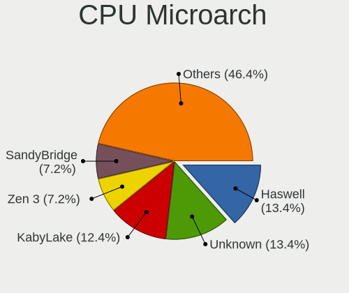

| Name        | Desktops | Percent |
|-------------|----------|---------|
| Haswell     | 13       | 16.46%  |
| KabyLake    | 11       | 13.92%  |
| Unknown     | 10       | 12.66%  |
| IvyBridge   | 6        | 7.59%   |
| SandyBridge | 5        | 6.33%   |
| Zen 3       | 4        | 5.06%   |
| CometLake   | 4        | 5.06%   |
| Zen 2       | 3        | 3.8%    |
| Broadwell   | 3        | 3.8%    |
| Zen+        | 2        | 2.53%   |
| Westmere    | 2        | 2.53%   |
| Skylake     | 2        | 2.53%   |
| Silvermont  | 2        | 2.53%   |
| Piledriver  | 2        | 2.53%   |
| Bonnell     | 2        | 2.53%   |
| Zen         | 1        | 1.27%   |
| TigerLake   | 1        | 1.27%   |
| Puma        | 1        | 1.27%   |
| Penryn      | 1        | 1.27%   |
| P6          | 1        | 1.27%   |
| K8 Hammer   | 1        | 1.27%   |
| K10         | 1        | 1.27%   |
| Core        | 1        | 1.27%   |

Graphics
--------

GPU Vendor
----------

Vendors of graphics cards

| Vendor                               | Desktops | Percent |
|--------------------------------------|----------|---------|
| Intel                                | 33       | 44.59%  |
| Nvidia                               | 21       | 28.38%  |
| AMD                                  | 16       | 21.62%  |
| Matrox Electronics Systems           | 2        | 2.7%    |
| NVidia / SGS Thomson (Joint Venture) | 1        | 1.35%   |
| ASPEED Technology                    | 1        | 1.35%   |

GPU Model
---------

Graphics card models

| Model                                                                       | Desktops | Percent |
|-----------------------------------------------------------------------------|----------|---------|
| Intel Xeon E3-1200 v3/4th Gen Core Processor Integrated Graphics Controller | 9        | 11.69%  |
| Nvidia GK208B [GeForce GT 710]                                              | 3        | 3.9%    |
| Intel HD Graphics 630                                                       | 3        | 3.9%    |
| Intel CometLake-S GT2 [UHD Graphics 630]                                    | 3        | 3.9%    |
| Intel CoffeeLake-S GT2 [UHD Graphics 630]                                   | 3        | 3.9%    |
| Nvidia GP108 [GeForce GT 1030]                                              | 2        | 2.6%    |
| Nvidia GP107 [GeForce GTX 1050]                                             | 2        | 2.6%    |
| Nvidia GP106 [GeForce GTX 1060 6GB]                                         | 2        | 2.6%    |
| Nvidia GF108 [GeForce GT 430]                                               | 2        | 2.6%    |
| Intel Xeon E3-1200 v2/3rd Gen Core processor Graphics Controller            | 2        | 2.6%    |
| Intel RocketLake-S GT1 [UHD Graphics 750]                                   | 2        | 2.6%    |
| Intel Atom Processor Z36xxx/Z37xxx Series Graphics & Display                | 2        | 2.6%    |
| AMD Turks [Radeon HD 7600 Series]                                           | 2        | 2.6%    |
| AMD Cezanne [Radeon Vega Series / Radeon Vega Mobile Series]                | 2        | 2.6%    |
| AMD Caicos XTX [Radeon HD 8490 / R5 235X OEM]                               | 2        | 2.6%    |
| Nvidia TU117 [GeForce GTX 1650]                                             | 1        | 1.3%    |
| Nvidia GT218 [GeForce 210]                                                  | 1        | 1.3%    |
| Nvidia GP106 [GeForce GTX 1060 3GB]                                         | 1        | 1.3%    |
| Nvidia GP104 [GeForce GTX 1080]                                             | 1        | 1.3%    |
| Nvidia GP104 [GeForce GTX 1070]                                             | 1        | 1.3%    |
| Nvidia GM107GL [Quadro K2200]                                               | 1        | 1.3%    |
| Nvidia GM107 [GeForce GTX 750 Ti]                                           | 1        | 1.3%    |
| Nvidia GK208B [GeForce GT 730]                                              | 1        | 1.3%    |
| Nvidia GK106 [GeForce GTX 660]                                              | 1        | 1.3%    |
| Nvidia GF108GL [Quadro 600]                                                 | 1        | 1.3%    |
| Nvidia GA106 [GeForce RTX 3060 Lite Hash Rate]                              | 1        | 1.3%    |
| NVidia / SGS Thomson (Joint Venture) Riva128                                | 1        | 1.3%    |
| Matrox Electronics Systems MGA G200eW WPCM450                               | 1        | 1.3%    |
| Matrox Electronics Systems MGA G200EH                                       | 1        | 1.3%    |
| Intel Tiger Lake-LP GT2 [UHD Graphics G4]                                   | 1        | 1.3%    |
| Intel HD Graphics 6000                                                      | 1        | 1.3%    |
| Intel HD Graphics 530                                                       | 1        | 1.3%    |
| Intel Haswell-ULT Integrated Graphics Controller                            | 1        | 1.3%    |
| Intel Core Processor Integrated Graphics Controller                         | 1        | 1.3%    |
| Intel CoffeeLake-S GT1 [UHD Graphics 610]                                   | 1        | 1.3%    |
| Intel Atom Processor D2xxx/N2xxx Integrated Graphics Controller             | 1        | 1.3%    |
| Intel Alder Lake-S GT1 [UHD Graphics 730]                                   | 1        | 1.3%    |
| Intel 82945G/GZ Integrated Graphics Controller                              | 1        | 1.3%    |
| Intel 2nd Generation Core Processor Family Integrated Graphics Controller   | 1        | 1.3%    |
| ASPEED Technology ASPEED Graphics Family                                    | 1        | 1.3%    |

GPU Combo
---------

Combinations of graphics cards

| Name                                     | Desktops | Percent |
|------------------------------------------|----------|---------|
| 1 x Intel                                | 30       | 38.46%  |
| 1 x Nvidia                               | 17       | 21.79%  |
| 1 x AMD                                  | 15       | 19.23%  |
| Other                                    | 8        | 10.26%  |
| Intel + Nvidia                           | 3        | 3.85%   |
| 1 x Matrox                               | 2        | 2.56%   |
| 2 x AMD                                  | 1        | 1.28%   |
| 1 x NVidia / SGS Thomson (Joint Venture) | 1        | 1.28%   |
| 1 x ASPEED                               | 1        | 1.28%   |

GPU Driver
----------

Free vs proprietary

| Driver      | Desktops | Percent |
|-------------|----------|---------|
| Free        | 54       | 68.35%  |
| Proprietary | 16       | 20.25%  |
| Unknown     | 9        | 11.39%  |

GPU Memory
----------

Total video memory

| Size in GB | Desktops | Percent |
|------------|----------|---------|
| Unknown    | 55       | 70.51%  |
| 1.01-2.0   | 7        | 8.97%   |
| 0.51-1.0   | 7        | 8.97%   |
| 3.01-4.0   | 3        | 3.85%   |
| 7.01-8.0   | 2        | 2.56%   |
| 5.01-6.0   | 2        | 2.56%   |
| 2.01-3.0   | 1        | 1.28%   |
| 0.01-0.5   | 1        | 1.28%   |

Monitor
-------

Monitor Vendor
--------------

Monitor vendors

| Vendor               | Desktops | Percent |
|----------------------|----------|---------|
| Samsung Electronics  | 9        | 20.45%  |
| Dell                 | 5        | 11.36%  |
| Goldstar             | 4        | 9.09%   |
| Acer                 | 4        | 9.09%   |
| Philips              | 2        | 4.55%   |
| Lenovo               | 2        | 4.55%   |
| BenQ                 | 2        | 4.55%   |
| AOC                  | 2        | 4.55%   |
| ViewSonic            | 1        | 2.27%   |
| Vestel Elektronik    | 1        | 2.27%   |
| Toshiba              | 1        | 2.27%   |
| Sceptre Tech         | 1        | 2.27%   |
| Panasonic            | 1        | 2.27%   |
| Mi                   | 1        | 2.27%   |
| LG Electronics       | 1        | 2.27%   |
| IOD                  | 1        | 2.27%   |
| Iiyama               | 1        | 2.27%   |
| Idek Iiyama          | 1        | 2.27%   |
| Compal               | 1        | 2.27%   |
| Chimei Innolux       | 1        | 2.27%   |
| ASUSTek Computer     | 1        | 2.27%   |
| Ancor Communications | 1        | 2.27%   |

Monitor Model
-------------

Monitor models

| Model                                                                  | Desktops | Percent |
|------------------------------------------------------------------------|----------|---------|
| Samsung Electronics SyncMaster SAM021E 1680x1050 430x270mm 20.0-inch   | 2        | 4.35%   |
| ViewSonic LCD Monitor VSCD22B 1920x1080 520x290mm 23.4-inch            | 1        | 2.17%   |
| Vestel Elektronik 32W_LCD_TV VES3700 1920x1080 710x400mm 32.1-inch     | 1        | 2.17%   |
| Toshiba TV TSB0200 1920x1080 530x300mm 24.0-inch                       | 1        | 2.17%   |
| Sceptre Tech Sceptre P30 SPT0BCC 2560x1080 690x290mm 29.5-inch         | 1        | 2.17%   |
| Samsung Electronics SME1920NR SAM06A4 1280x1024 380x300mm 19.1-inch    | 1        | 2.17%   |
| Samsung Electronics S22B300 SAM08AC 1920x1080 480x270mm 21.7-inch      | 1        | 2.17%   |
| Samsung Electronics LCD Monitor T27C370 1920x1080                      | 1        | 2.17%   |
| Samsung Electronics LCD Monitor SyncMaster 1920x1200                   | 1        | 2.17%   |
| Samsung Electronics LCD Monitor SyncMaster 1280x1024                   | 1        | 2.17%   |
| Samsung Electronics LCD Monitor SAM7004 3840x2160 1210x680mm 54.6-inch | 1        | 2.17%   |
| Samsung Electronics LCD Monitor S24R35x 1920x1080                      | 1        | 2.17%   |
| Philips PHL 240V5 PHLC10A 1920x1080 530x300mm 24.0-inch                | 1        | 2.17%   |
| Philips PHL 223V5 PHLC0CF 1920x1080 480x270mm 21.7-inch                | 1        | 2.17%   |
| Panasonic TV MEIA296 1920x1080 1280x720mm 57.8-inch                    | 1        | 2.17%   |
| Mi 27 NFGL XMIB004 1920x1080 600x330mm 27.0-inch                       | 1        | 2.17%   |
| LG Electronics LCD Monitor LG HDR QHD 2560x1440                        | 1        | 2.17%   |
| Lenovo LEN T24i-10 LEN61CE 1920x1080 530x300mm 24.0-inch               | 1        | 2.17%   |
| Lenovo LEN S24e-10 LEN61CA 1920x1080 530x300mm 24.0-inch               | 1        | 2.17%   |
| IOD KH270V IOD1B3B 1920x1080 600x340mm 27.2-inch                       | 1        | 2.17%   |
| Iiyama PL2483H IVM6138 1920x1080 530x300mm 24.0-inch                   | 1        | 2.17%   |
| Idek Iiyama LCD Monitor PL2730Q 2560x1440                              | 1        | 2.17%   |
| Goldstar MP59G GSM5B35 1920x1080 600x340mm 27.2-inch                   | 1        | 2.17%   |
| Goldstar MP59G GSM5B34 1920x1080 480x270mm 21.7-inch                   | 1        | 2.17%   |
| Goldstar LG ULTRAGEAR GSM776E 2560x1440 700x390mm 31.5-inch            | 1        | 2.17%   |
| Goldstar LCD Monitor GSM5AB8 1920x1080 480x270mm 21.7-inch             | 1        | 2.17%   |
| Goldstar 22MP55 GSM5A26 1920x1080 480x270mm 21.7-inch                  | 1        | 2.17%   |
| Dell UP2716D DEL40DD 2560x1440 600x340mm 27.2-inch                     | 1        | 2.17%   |
| Dell U3417W DELA0E0 3440x1440 800x330mm 34.1-inch                      | 1        | 2.17%   |
| Dell LCD Monitor SP2309W 2048x1152                                     | 1        | 2.17%   |
| Dell IN2020M DELF030 1600x900 440x250mm 19.9-inch                      | 1        | 2.17%   |
| Dell E151FPp DEL7006 1024x768 300x230mm 14.9-inch                      | 1        | 2.17%   |
| Compal LCD Monitor WOR2760 2560x1440 600x340mm 27.2-inch               | 1        | 2.17%   |
| Chimei Innolux LCD Monitor CMN14A8 1920x1080 310x170mm 13.9-inch       | 1        | 2.17%   |
| BenQ LCD Monitor PD3200Q                                               | 1        | 2.17%   |
| BenQ LCD Monitor GW2765                                                | 1        | 2.17%   |
| BenQ G900HD BNQ7816 1366x768 410x230mm 18.5-inch                       | 1        | 2.17%   |
| ASUSTek Computer PA248QV AUS2487 1920x1200 520x320mm 24.0-inch         | 1        | 2.17%   |
| AOC U28P2G6B AOC2802 3840x2160 620x340mm 27.8-inch                     | 1        | 2.17%   |
| AOC 24G1WG4 AOC2401 1920x1080 520x290mm 23.4-inch                      | 1        | 2.17%   |

Monitor Resolution
------------------

Monitor screen resolution

| Resolution         | Desktops | Percent |
|--------------------|----------|---------|
| 1920x1080 (FHD)    | 20       | 46.51%  |
| 2560x1440 (QHD)    | 5        | 11.63%  |
| 1920x1200 (WUXGA)  | 3        | 6.98%   |
| 1280x1024 (SXGA)   | 3        | 6.98%   |
| 3840x2160 (4K)     | 2        | 4.65%   |
| 1680x1050 (WSXGA+) | 2        | 4.65%   |
| 3440x1440          | 1        | 2.33%   |
| 2560x1080          | 1        | 2.33%   |
| 2048x1152          | 1        | 2.33%   |
| 1920x540           | 1        | 2.33%   |
| 1600x900 (HD+)     | 1        | 2.33%   |
| 1366x768 (WXGA)    | 1        | 2.33%   |
| 1024x768 (XGA)     | 1        | 2.33%   |
| Unknown            | 1        | 2.33%   |

Monitor Diagonal
----------------

Diagonal size in inches

| Inches  | Desktops | Percent |
|---------|----------|---------|
| 27      | 8        | 18.18%  |
| Unknown | 8        | 18.18%  |
| 24      | 7        | 15.91%  |
| 21      | 6        | 13.64%  |
| 20      | 2        | 4.55%   |
| 19      | 2        | 4.55%   |
| 57      | 1        | 2.27%   |
| 54      | 1        | 2.27%   |
| 42      | 1        | 2.27%   |
| 34      | 1        | 2.27%   |
| 31      | 1        | 2.27%   |
| 29      | 1        | 2.27%   |
| 23      | 1        | 2.27%   |
| 22      | 1        | 2.27%   |
| 18      | 1        | 2.27%   |
| 14      | 1        | 2.27%   |
| 13      | 1        | 2.27%   |

Monitor Width
-------------

Physical width

| Width in mm | Desktops | Percent |
|-------------|----------|---------|
| 501-600     | 15       | 34.09%  |
| 401-500     | 10       | 22.73%  |
| Unknown     | 8        | 18.18%  |
| 601-700     | 3        | 6.82%   |
| 351-400     | 2        | 4.55%   |
| 1001-1500   | 2        | 4.55%   |
| 701-800     | 1        | 2.27%   |
| 301-350     | 1        | 2.27%   |
| 201-300     | 1        | 2.27%   |
| 901-1000    | 1        | 2.27%   |

Aspect Ratio
------------

Proportional relationship between the width and the height

| Ratio   | Desktops | Percent |
|---------|----------|---------|
| 16/9    | 25       | 60.98%  |
| Unknown | 8        | 19.51%  |
| 16/10   | 3        | 7.32%   |
| 21/9    | 2        | 4.88%   |
| 6/5     | 1        | 2.44%   |
| 5/4     | 1        | 2.44%   |
| 4/3     | 1        | 2.44%   |

Monitor Area
------------

Area in inch²

| Area in inch² | Desktops | Percent |
|----------------|----------|---------|
| 201-250        | 14       | 31.82%  |
| 301-350        | 9        | 20.45%  |
| Unknown        | 8        | 18.18%  |
| 151-200        | 4        | 9.09%   |
| More than 1000 | 2        | 4.55%   |
| 351-500        | 2        | 4.55%   |
| 81-90          | 1        | 2.27%   |
| 251-300        | 1        | 2.27%   |
| 141-150        | 1        | 2.27%   |
| 101-110        | 1        | 2.27%   |
| 501-1000       | 1        | 2.27%   |

Pixel Density
-------------

Pixels per inch

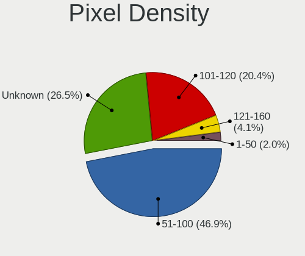

| Density | Desktops | Percent |
|---------|----------|---------|
| 51-100  | 22       | 51.16%  |
| 101-120 | 10       | 23.26%  |
| Unknown | 8        | 18.6%   |
| 121-160 | 2        | 4.65%   |
| 1-50    | 1        | 2.33%   |

Multiple Monitors
-----------------

Total monitors connected

| Total | Desktops | Percent |
|-------|----------|---------|
| 0     | 37       | 47.44%  |
| 1     | 36       | 46.15%  |
| 2     | 4        | 5.13%   |
| 3     | 1        | 1.28%   |

Network
-------

Net Controller Vendor
---------------------

Controller vendors

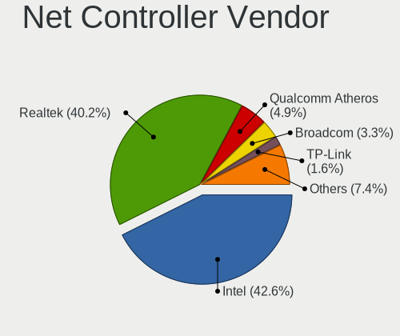

| Vendor                   | Desktops | Percent |
|--------------------------|----------|---------|
| Intel                    | 41       | 43.62%  |
| Realtek Semiconductor    | 39       | 41.49%  |
| Qualcomm Atheros         | 4        | 4.26%   |
| Broadcom                 | 4        | 4.26%   |
| Xiaomi                   | 1        | 1.06%   |
| Ralink Technology        | 1        | 1.06%   |
| Marvell Technology Group | 1        | 1.06%   |
| LG Electronics           | 1        | 1.06%   |
| IMC Networks             | 1        | 1.06%   |
| D-Link System            | 1        | 1.06%   |

Net Controller Model
--------------------

Controller models

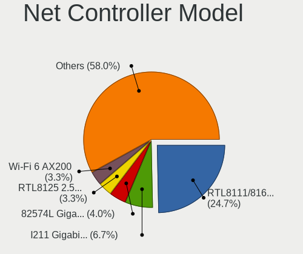

| Model                                                             | Desktops | Percent |
|-------------------------------------------------------------------|----------|---------|
| Realtek RTL8111/8168/8411 PCI Express Gigabit Ethernet Controller | 30       | 25.86%  |
| Intel I211 Gigabit Network Connection                             | 7        | 6.03%   |
| Intel 82574L Gigabit Network Connection                           | 6        | 5.17%   |
| Intel Ethernet Controller I225-V                                  | 5        | 4.31%   |
| Intel Wi-Fi 6 AX200                                               | 4        | 3.45%   |
| Intel 82579LM Gigabit Network Connection (Lewisville)             | 4        | 3.45%   |
| Realtek RTL8125 2.5GbE Controller                                 | 3        | 2.59%   |
| Intel Ethernet Connection I217-LM                                 | 3        | 2.59%   |
| Intel Ethernet Connection (2) I219-V                              | 3        | 2.59%   |
| Realtek RTL8188EUS 802.11n Wireless Network Adapter               | 2        | 1.72%   |
| Intel Wi-Fi 6 AX210/AX211/AX411 160MHz                            | 2        | 1.72%   |
| Intel Ethernet Controller X550                                    | 2        | 1.72%   |
| Intel Ethernet Connection (2) I218-V                              | 2        | 1.72%   |
| Broadcom BCM4360 802.11ac Wireless Network Adapter                | 2        | 1.72%   |
| Xiaomi Mi/Redmi series (RNDIS)                                    | 1        | 0.86%   |
| Realtek RTL8821CE 802.11ac PCIe Wireless Network Adapter          | 1        | 0.86%   |
| Realtek RTL8812AE 802.11ac PCIe Wireless Network Adapter          | 1        | 0.86%   |
| Realtek RTL8191SU 802.11n WLAN Adapter                            | 1        | 0.86%   |
| Realtek RTL810xE PCI Express Fast Ethernet controller             | 1        | 0.86%   |
| Realtek Realtek Bluetooth Adapter                                 | 1        | 0.86%   |
| Realtek Realtek 8811CU Wireless LAN 802.11ac USB NIC              | 1        | 0.86%   |
| Realtek Killer E2500 Gigabit Ethernet Controller                  | 1        | 0.86%   |
| Ralink RT5572 Wireless Adapter                                    | 1        | 0.86%   |
| Qualcomm Atheros QCA9565 / AR9565 Wireless Network Adapter        | 1        | 0.86%   |
| Qualcomm Atheros AR9462 Wireless Network Adapter                  | 1        | 0.86%   |
| Qualcomm Atheros AR93xx Wireless Network Adapter                  | 1        | 0.86%   |
| Qualcomm Atheros AR9227 Wireless Network Adapter                  | 1        | 0.86%   |
| Marvell Group 88E8056 PCI-E Gigabit Ethernet Controller           | 1        | 0.86%   |
| Marvell Group 88E8001 Gigabit Ethernet Controller                 | 1        | 0.86%   |
| LG Optimus Android Phone [USB tethering mode]                     | 1        | 0.86%   |
| Intel Wireless-AC 9260                                            | 1        | 0.86%   |
| Intel Wireless 7260                                               | 1        | 0.86%   |
| Intel Wi-Fi 6 AX201                                               | 1        | 0.86%   |
| Intel I350 Gigabit Network Connection                             | 1        | 0.86%   |
| Intel Ethernet Connection I217-V                                  | 1        | 0.86%   |
| Intel Ethernet Connection (7) I219-V                              | 1        | 0.86%   |
| Intel Ethernet Connection (5) I219-LM                             | 1        | 0.86%   |
| Intel Ethernet Connection (2) I219-LM                             | 1        | 0.86%   |
| Intel Ethernet Connection (17) I219-V                             | 1        | 0.86%   |
| Intel Ethernet Connection (13) I219-V                             | 1        | 0.86%   |

Wireless Vendor
---------------

Wireless vendors

| Vendor                | Desktops | Percent |
|-----------------------|----------|---------|
| Intel                 | 11       | 40.74%  |
| Realtek Semiconductor | 7        | 25.93%  |
| Qualcomm Atheros      | 4        | 14.81%  |
| Broadcom              | 3        | 11.11%  |
| Ralink Technology     | 1        | 3.7%    |
| IMC Networks          | 1        | 3.7%    |

Wireless Model
--------------

Wireless models

| Model                                                      | Desktops | Percent |
|------------------------------------------------------------|----------|---------|
| Intel Wi-Fi 6 AX200                                        | 4        | 14.81%  |
| Realtek RTL8188EUS 802.11n Wireless Network Adapter        | 2        | 7.41%   |
| Intel Wi-Fi 6 AX210/AX211/AX411 160MHz                     | 2        | 7.41%   |
| Broadcom BCM4360 802.11ac Wireless Network Adapter         | 2        | 7.41%   |
| Realtek RTL8821CE 802.11ac PCIe Wireless Network Adapter   | 1        | 3.7%    |
| Realtek RTL8812AE 802.11ac PCIe Wireless Network Adapter   | 1        | 3.7%    |
| Realtek RTL8191SU 802.11n WLAN Adapter                     | 1        | 3.7%    |
| Realtek Realtek Bluetooth Adapter                          | 1        | 3.7%    |
| Realtek Realtek 8811CU Wireless LAN 802.11ac USB NIC       | 1        | 3.7%    |
| Ralink RT5572 Wireless Adapter                             | 1        | 3.7%    |
| Qualcomm Atheros QCA9565 / AR9565 Wireless Network Adapter | 1        | 3.7%    |
| Qualcomm Atheros AR9462 Wireless Network Adapter           | 1        | 3.7%    |
| Qualcomm Atheros AR93xx Wireless Network Adapter           | 1        | 3.7%    |
| Qualcomm Atheros AR9227 Wireless Network Adapter           | 1        | 3.7%    |
| Intel Wireless-AC 9260                                     | 1        | 3.7%    |
| Intel Wireless 7260                                        | 1        | 3.7%    |
| Intel Wi-Fi 6 AX201                                        | 1        | 3.7%    |
| Intel Cannon Lake PCH CNVi WiFi                            | 1        | 3.7%    |
| Intel Alder Lake-S PCH CNVi WiFi                           | 1        | 3.7%    |
| IMC Networks 802.11 n/g/b Wireless LAN USB Mini-Card       | 1        | 3.7%    |
| Broadcom BCM4352 802.11ac Wireless Network Adapter         | 1        | 3.7%    |

Ethernet Vendor
---------------

Ethernet vendors

| Vendor                   | Desktops | Percent |
|--------------------------|----------|---------|
| Intel                    | 40       | 50.63%  |
| Realtek Semiconductor    | 35       | 44.3%   |
| Xiaomi                   | 1        | 1.27%   |
| Marvell Technology Group | 1        | 1.27%   |
| D-Link System            | 1        | 1.27%   |
| Broadcom                 | 1        | 1.27%   |

Ethernet Model
--------------

Ethernet models

| Model                                                             | Desktops | Percent |
|-------------------------------------------------------------------|----------|---------|
| Realtek RTL8111/8168/8411 PCI Express Gigabit Ethernet Controller | 30       | 34.09%  |
| Intel I211 Gigabit Network Connection                             | 7        | 7.95%   |
| Intel 82574L Gigabit Network Connection                           | 6        | 6.82%   |
| Intel Ethernet Controller I225-V                                  | 5        | 5.68%   |
| Intel 82579LM Gigabit Network Connection (Lewisville)             | 4        | 4.55%   |
| Realtek RTL8125 2.5GbE Controller                                 | 3        | 3.41%   |
| Intel Ethernet Connection I217-LM                                 | 3        | 3.41%   |
| Intel Ethernet Connection (2) I219-V                              | 3        | 3.41%   |
| Intel Ethernet Controller X550                                    | 2        | 2.27%   |
| Intel Ethernet Connection (2) I218-V                              | 2        | 2.27%   |
| Xiaomi Mi/Redmi series (RNDIS)                                    | 1        | 1.14%   |
| Realtek RTL810xE PCI Express Fast Ethernet controller             | 1        | 1.14%   |
| Realtek Killer E2500 Gigabit Ethernet Controller                  | 1        | 1.14%   |
| Marvell Group 88E8056 PCI-E Gigabit Ethernet Controller           | 1        | 1.14%   |
| Marvell Group 88E8001 Gigabit Ethernet Controller                 | 1        | 1.14%   |
| Intel I350 Gigabit Network Connection                             | 1        | 1.14%   |
| Intel Ethernet Connection I217-V                                  | 1        | 1.14%   |
| Intel Ethernet Connection (7) I219-V                              | 1        | 1.14%   |
| Intel Ethernet Connection (5) I219-LM                             | 1        | 1.14%   |
| Intel Ethernet Connection (2) I219-LM                             | 1        | 1.14%   |
| Intel Ethernet Connection (17) I219-V                             | 1        | 1.14%   |
| Intel Ethernet Connection (13) I219-V                             | 1        | 1.14%   |
| Intel Ethernet Connection (11) I219-V                             | 1        | 1.14%   |
| Intel 82599ES 10-Gigabit SFI/SFP+ Network Connection              | 1        | 1.14%   |
| Intel 82599 Ethernet Controller Virtual Function                  | 1        | 1.14%   |
| Intel 82578DM Gigabit Network Connection                          | 1        | 1.14%   |
| Intel 82578DC Gigabit Network Connection                          | 1        | 1.14%   |
| Intel 82575GB Gigabit Network Connection                          | 1        | 1.14%   |
| Intel 82575EB Gigabit Network Connection                          | 1        | 1.14%   |
| Intel 82571EB/82571GB Gigabit Ethernet Controller (Copper)        | 1        | 1.14%   |
| Intel 82567LM-3 Gigabit Network Connection                        | 1        | 1.14%   |
| D-Link System DGE-528T Gigabit Ethernet Adapter                   | 1        | 1.14%   |
| Broadcom NetXtreme BCM5720 Gigabit Ethernet PCIe                  | 1        | 1.14%   |

Net Controller Kind
-------------------

Ethernet, WiFi or modem

| Kind     | Desktops | Percent |
|----------|----------|---------|
| Ethernet | 72       | 74.23%  |
| WiFi     | 24       | 24.74%  |
| Modem    | 1        | 1.03%   |

Used Controller
---------------

Currently used network controller

| Kind     | Desktops | Percent |
|----------|----------|---------|
| Ethernet | 69       | 94.52%  |
| WiFi     | 4        | 5.48%   |

NICs
----

Total network controllers on board

| Total | Desktops | Percent |
|-------|----------|---------|
| 1     | 37       | 47.44%  |
| 2     | 22       | 28.21%  |
| 3     | 8        | 10.26%  |
| 0     | 6        | 7.69%   |
| 5     | 2        | 2.56%   |
| 4     | 2        | 2.56%   |
| 7     | 1        | 1.28%   |

IPv6
----

IPv6 vs IPv4

| Used | Desktops | Percent |
|------|----------|---------|
| No   | 65       | 83.33%  |
| Yes  | 13       | 16.67%  |

Bluetooth
---------

Bluetooth Vendor
----------------

Controller vendors

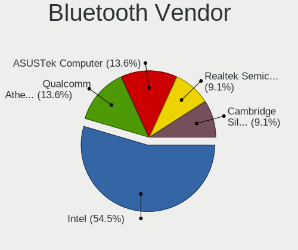

| Vendor                          | Desktops | Percent |
|---------------------------------|----------|---------|
| Intel                           | 9        | 56.25%  |
| Realtek Semiconductor           | 2        | 12.5%   |
| Qualcomm Atheros Communications | 2        | 12.5%   |
| ASUSTek Computer                | 2        | 12.5%   |
| Cambridge Silicon Radio         | 1        | 6.25%   |

Bluetooth Model
---------------

Controller models

| Model                                                       | Desktops | Percent |
|-------------------------------------------------------------|----------|---------|
| Intel AX200 Bluetooth                                       | 3        | 18.75%  |
| Intel Bluetooth 9460/9560 Jefferson Peak (JfP)              | 2        | 12.5%   |
| Realtek  Bluetooth Adapter                                  | 1        | 6.25%   |
| Realtek  Bluetooth 4.2 Adapter                              | 1        | 6.25%   |
| Qualcomm Atheros Dell Wireless 1707 Bluetooth 4.0 LE Device | 1        | 6.25%   |
| Qualcomm Atheros Atheros AR9462 Bluetooth 3.0 + HS Adapter  | 1        | 6.25%   |
| Intel Wireless-AC 9260 Bluetooth Adapter                    | 1        | 6.25%   |
| Intel Bluetooth wireless interface                          | 1        | 6.25%   |
| Intel AX210 Bluetooth                                       | 1        | 6.25%   |
| Intel AX201 Bluetooth                                       | 1        | 6.25%   |
| Cambridge Silicon Radio Bluetooth Dongle (HCI mode)         | 1        | 6.25%   |
| ASUS Broadcom BCM20702 Single-Chip Bluetooth 4.0 + LE       | 1        | 6.25%   |
| ASUS Bluetooth USB module                                   | 1        | 6.25%   |

Sound
-----

Sound Vendor
------------

Sound card vendors

| Vendor                      | Desktops | Percent |
|-----------------------------|----------|---------|
| Intel                       | 45       | 45.92%  |
| AMD                         | 22       | 22.45%  |
| Nvidia                      | 21       | 21.43%  |
| XMOS                        | 1        | 1.02%   |
| Realtek Semiconductor       | 1        | 1.02%   |
| Razer USA                   | 1        | 1.02%   |
| Micro Star International    | 1        | 1.02%   |
| Kingston Technology         | 1        | 1.02%   |
| FiiO Electronics Technology | 1        | 1.02%   |
| Ensoniq                     | 1        | 1.02%   |
| Creative Labs               | 1        | 1.02%   |
| Cambridge Silicon Radio     | 1        | 1.02%   |
| ASUSTek Computer            | 1        | 1.02%   |

Sound Model
-----------

Sound card models

| Model                                                                             | Desktops | Percent |
|-----------------------------------------------------------------------------------|----------|---------|
| Intel Xeon E3-1200 v3/4th Gen Core Processor HD Audio Controller                  | 8        | 6.84%   |
| Intel 8 Series/C220 Series Chipset High Definition Audio Controller               | 8        | 6.84%   |
| Nvidia GK208 HDMI/DP Audio Controller                                             | 4        | 3.42%   |
| Intel C600/X79 series chipset High Definition Audio Controller                    | 4        | 3.42%   |
| Intel 100 Series/C230 Series Chipset Family HD Audio Controller                   | 4        | 3.42%   |
| AMD Turks HDMI Audio [Radeon HD 6500/6600 / 6700M Series]                         | 4        | 3.42%   |
| AMD Starship/Matisse HD Audio Controller                                          | 4        | 3.42%   |
| AMD Renoir Radeon High Definition Audio Controller                                | 4        | 3.42%   |
| AMD Family 17h/19h HD Audio Controller                                            | 4        | 3.42%   |
| Nvidia GP106 High Definition Audio Controller                                     | 3        | 2.56%   |
| Nvidia GF108 High Definition Audio Controller                                     | 3        | 2.56%   |
| Intel Cannon Lake PCH cAVS                                                        | 3        | 2.56%   |
| AMD Family 17h (Models 00h-0fh) HD Audio Controller                               | 3        | 2.56%   |
| Nvidia GP108 High Definition Audio Controller                                     | 2        | 1.71%   |
| Nvidia GP107GL High Definition Audio Controller                                   | 2        | 1.71%   |
| Nvidia GP104 High Definition Audio Controller                                     | 2        | 1.71%   |
| Nvidia GM107 High Definition Audio Controller [GeForce 940MX]                     | 2        | 1.71%   |
| Intel NM10/ICH7 Family High Definition Audio Controller                           | 2        | 1.71%   |
| Intel Comet Lake PCH-V cAVS                                                       | 2        | 1.71%   |
| Intel C610/X99 series chipset HD Audio Controller                                 | 2        | 1.71%   |
| Intel Atom Processor Z36xxx/Z37xxx Series High Definition Audio Controller        | 2        | 1.71%   |
| Intel 9 Series Chipset Family HD Audio Controller                                 | 2        | 1.71%   |
| Intel 7 Series/C216 Chipset Family High Definition Audio Controller               | 2        | 1.71%   |
| Intel 5 Series/3400 Series Chipset High Definition Audio                          | 2        | 1.71%   |
| Intel 200 Series PCH HD Audio                                                     | 2        | 1.71%   |
| AMD SBx00 Azalia (Intel HDA)                                                      | 2        | 1.71%   |
| AMD Caicos HDMI Audio [Radeon HD 6450 / 7450/8450/8490 OEM / R5 230/235/235X OEM] | 2        | 1.71%   |
| Unknown                                                                           | 2        | 1.71%   |
| XMOS XMOS XS1-U8 MFA (ST)                                                         | 1        | 0.85%   |
| Realtek Semiconductor Realtek USB Audio                                           | 1        | 0.85%   |
| Razer USA Razer BlackShark V2 Pro Razer BlackShark V2 Pro                         | 1        | 0.85%   |
| Nvidia TU107 GeForce GTX 1650 High Definition Audio Controller                    | 1        | 0.85%   |
| Nvidia MCP61 High Definition Audio                                                | 1        | 0.85%   |
| Nvidia High Definition Audio Controller                                           | 1        | 0.85%   |
| Nvidia GK106 HDMI Audio Controller                                                | 1        | 0.85%   |
| Nvidia GA106 High Definition Audio Controller                                     | 1        | 0.85%   |
| Micro Star International USB Audio                                                | 1        | 0.85%   |
| Kingston Technology HyperX 7.1 Audio                                              | 1        | 0.85%   |
| Intel Wildcat Point-LP High Definition Audio Controller                           | 1        | 0.85%   |
| Intel Tiger Lake-LP Smart Sound Technology Audio Controller                       | 1        | 0.85%   |

Memory
------

Memory Vendor
-------------

Memory module vendors

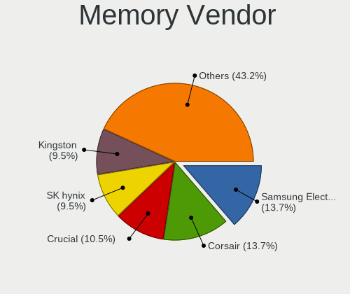

| Vendor                       | Desktops | Percent |
|------------------------------|----------|---------|
| Corsair                      | 13       | 16.67%  |
| Samsung Electronics          | 12       | 15.38%  |
| G.Skill                      | 8        | 10.26%  |
| Crucial                      | 8        | 10.26%  |
| SK hynix                     | 7        | 8.97%   |
| Micron Technology            | 7        | 8.97%   |
| Kingston                     | 7        | 8.97%   |
| Unknown                      | 5        | 6.41%   |
| A-DATA Technology            | 2        | 2.56%   |
| Transcend                    | 1        | 1.28%   |
| Qimonda                      | 1        | 1.28%   |
| Patriot Memory (PDP Systems) | 1        | 1.28%   |
| Patriot                      | 1        | 1.28%   |
| Nanya Technology             | 1        | 1.28%   |
| Kingmax                      | 1        | 1.28%   |
| Hewlett-Packard              | 1        | 1.28%   |
| AMD                          | 1        | 1.28%   |
| Unknown                      | 1        | 1.28%   |

Memory Model
------------

Memory module models

| Model                                                                   | Desktops | Percent |
|-------------------------------------------------------------------------|----------|---------|
| Unknown RAM Module 4GB SODIMM DDR3 1600MT/s                             | 1        | 1.2%    |
| Unknown RAM Module 4GB DIMM 1600MT/s                                    | 1        | 1.2%    |
| Unknown RAM Module 4GB DIMM 1333MT/s                                    | 1        | 1.2%    |
| Unknown RAM Module 2GB DIMM DDR 800MT/s                                 | 1        | 1.2%    |
| Unknown RAM Module 2GB DIMM 1333MT/s                                    | 1        | 1.2%    |
| Unknown RAM Module 2GB DIMM                                             | 1        | 1.2%    |
| Transcend RAM JM1333KSN-2G 2GB SODIMM DDR3 1066MT/s                     | 1        | 1.2%    |
| SK hynix RAM HMT451U6DFR8A-PB 4GB DIMM DDR3 1600MT/s                    | 1        | 1.2%    |
| SK hynix RAM HMT451U6AFR8C-PB 4GB DIMM DDR3 1600MT/s                    | 1        | 1.2%    |
| SK hynix RAM HMT451S6BFR8A-PB 4GB SODIMM DDR3 1600MT/s                  | 1        | 1.2%    |
| SK hynix RAM HMT42GR7CMR4A-G7 16GB DIMM DDR3 1067MT/s                   | 1        | 1.2%    |
| SK hynix RAM HMT31GR7BFR4C-H9 8GB DIMM DDR3 1333MT/s                    | 1        | 1.2%    |
| SK hynix RAM HMT31GR7AFR4C-H9 8GB DIMM DDR3 1333MT/s                    | 1        | 1.2%    |
| SK hynix RAM HMA81GU6JJR8N-VK 8GB DIMM DDR4 2667MT/s                    | 1        | 1.2%    |
| SK hynix RAM HMA81GU6AFR8N-UH 8GB DIMM DDR4 2400MT/s                    | 1        | 1.2%    |
| Samsung RAM Module 8GB DIMM DDR4 2667MT/s                               | 1        | 1.2%    |
| Samsung RAM Module 2GB DIMM DDR3 1334MT/s                               | 1        | 1.2%    |
| Samsung RAM M393B5273DH0-CK0 4GB DIMM DDR3 1600MT/s                     | 1        | 1.2%    |
| Samsung RAM M393B5170GB0 4GB DIMM DDR3 1333MT/s                         | 1        | 1.2%    |
| Samsung RAM M393B2G70DB0 16GB DIMM DDR3 1333MT/s                        | 1        | 1.2%    |
| Samsung RAM M393A2G40EB1-CPB 16GB DIMM DDR4 2133MT/s                    | 1        | 1.2%    |
| Samsung RAM M391B5273DH0-YH9 4GB DIMM DDR3 1333MT/s                     | 1        | 1.2%    |
| Samsung RAM M391A2K43BB1-CTD 16GB DIMM DDR4 3200MT/s                    | 1        | 1.2%    |
| Samsung RAM M378B5273DH0-CK0 4GB DIMM DDR3 1600MT/s                     | 1        | 1.2%    |
| Samsung RAM M378B5273DH0-CH9 4GB DIMM DDR3 1333MT/s                     | 1        | 1.2%    |
| Samsung RAM M378A1K43CB2-CTD 8GB DIMM DDR4 2666MT/s                     | 1        | 1.2%    |
| Samsung RAM M3 78T5663EH3-CF7 2GB DIMM DDR2 800MT/s                     | 1        | 1.2%    |
| Qimonda RAM 64T128000EU2.5C2 1GB DIMM DDR2 800MT/s                      | 1        | 1.2%    |
| Patriot RAM PSD38G16002 8GB DIMM DDR3 1600MT/s                          | 1        | 1.2%    |
| Patriot RAM PSD34G160081 4GB DIMM DDR3 1333MT/s                         | 1        | 1.2%    |
| Patriot Memory (PDP Systems) RAM 3733 C17 Series 8GB DIMM DDR4 2133MT/s | 1        | 1.2%    |
| Nanya RAM Module 2GB DIMM DDR3 1334MT/s                                 | 1        | 1.2%    |
| Micron RAM Module 8GB DIMM DDR4 3200MT/s                                | 1        | 1.2%    |
| Micron RAM 8JTF51264AZ-1G6E1 4GB DIMM DDR3 1600MT/s                     | 1        | 1.2%    |
| Micron RAM 8ATF1G64HZ-2G3E1 8GB SODIMM DDR4 2400MT/s                    | 1        | 1.2%    |
| Micron RAM 4ATF51264AZ-2G3B1 4GB DIMM DDR4 2400MT/s                     | 1        | 1.2%    |
| Micron RAM 36KSF1G72PZ-1 8GB DIMM DDR3 1333MT/s                         | 1        | 1.2%    |
| Micron RAM 16KTF1G64HZ-1G6N1 8GB DIMM DDR3 1600MT/s                     | 1        | 1.2%    |
| Micron RAM 16JTF51264AZ-1G4D1 4GB DIMM DDR3 1333MT/s                    | 1        | 1.2%    |
| Micron RAM 16JTF1G64AZ-1G6E1 8GB DIMM DDR3 1600MT/s                     | 1        | 1.2%    |

Memory Kind
-----------

Memory module kinds

| Kind    | Desktops | Percent |
|---------|----------|---------|
| DDR4    | 33       | 46.48%  |
| DDR3    | 32       | 45.07%  |
| Unknown | 3        | 4.23%   |
| DDR2    | 2        | 2.82%   |
| DDR     | 1        | 1.41%   |

Memory Form Factor
------------------

Physical design of the memory module

| Name   | Desktops | Percent |
|--------|----------|---------|
| DIMM   | 61       | 87.14%  |
| SODIMM | 9        | 12.86%  |

Memory Size
-----------

Memory module size

| Size  | Desktops | Percent |
|-------|----------|---------|
| 8192  | 36       | 45.57%  |
| 4096  | 21       | 26.58%  |
| 16384 | 10       | 12.66%  |
| 2048  | 8        | 10.13%  |
| 32768 | 3        | 3.8%    |
| 1024  | 1        | 1.27%   |

Memory Speed
------------

Memory module speed

| Speed   | Desktops | Percent |
|---------|----------|---------|
| 1600    | 20       | 27.78%  |
| 3200    | 10       | 13.89%  |
| 1333    | 10       | 13.89%  |
| 2133    | 7        | 9.72%   |
| 2400    | 6        | 8.33%   |
| 2667    | 3        | 4.17%   |
| 3600    | 2        | 2.78%   |
| 3000    | 2        | 2.78%   |
| 2666    | 2        | 2.78%   |
| 1334    | 2        | 2.78%   |
| 800     | 2        | 2.78%   |
| 3400    | 1        | 1.39%   |
| 1067    | 1        | 1.39%   |
| 1066    | 1        | 1.39%   |
| 933     | 1        | 1.39%   |
| 533     | 1        | 1.39%   |
| Unknown | 1        | 1.39%   |

Printers & scanners
-------------------

Printer Vendor
--------------

Printer device vendors

| Vendor          | Desktops | Percent |
|-----------------|----------|---------|
| Hewlett-Packard | 1        | 100%    |

Printer Model
-------------

Printer device models

| Model            | Desktops | Percent |
|------------------|----------|---------|
| HP LaserJet 1012 | 1        | 100%    |

Scanner Vendor
--------------

Scanner device vendors

| Vendor | Desktops | Percent |
|--------|----------|---------|
| Canon  | 1        | 100%    |

Scanner Model
-------------

Scanner device models

| Model                   | Desktops | Percent |
|-------------------------|----------|---------|
| Canon CanoScan LiDE 220 | 1        | 100%    |

Camera
------

Camera Vendor
-------------

Camera device vendors

| Vendor                    | Desktops | Percent |
|---------------------------|----------|---------|
| SHENZHEN EMEET TECHNOLOGY | 1        | 25%     |
| OmniVision Technologies   | 1        | 25%     |
| Microdia                  | 1        | 25%     |
| Logitech                  | 1        | 25%     |

Camera Model
------------

Camera device models

| Model                                          | Desktops | Percent |
|------------------------------------------------|----------|---------|
| SHENZHEN EMEET TECHNOLOGY HD Webcam eMeet C960 | 1        | 25%     |
| OmniVision Monitor Webcam                      | 1        | 25%     |
| Microdia JOYACCESS JA-Webcam                   | 1        | 25%     |
| Logitech Webcam C270                           | 1        | 25%     |

Security
--------

Fingerprint Vendor
------------------

Fingerprint sensor vendors

| Vendor         | Desktops | Percent |
|----------------|----------|---------|
| DigitalPersona | 1        | 100%    |

Fingerprint Model
-----------------

Fingerprint sensor models

| Model                             | Desktops | Percent |
|-----------------------------------|----------|---------|
| DigitalPersona Fingerprint Reader | 1        | 100%    |

Chipcard Vendor
---------------

Chipcard module vendors

Zero info for selected period =(

Chipcard Model
--------------

Chipcard module models

Zero info for selected period =(

Unsupported
-----------

Unsupported Devices
-------------------

Total unsupported devices on board

| Total | Desktops | Percent |
|-------|----------|---------|
| 1     | 35       | 44.87%  |
| 0     | 26       | 33.33%  |
| 2     | 13       | 16.67%  |
| 3     | 3        | 3.85%   |
| 6     | 1        | 1.28%   |

Unsupported Device Types
------------------------

Types of unsupported devices

| Type                     | Desktops | Percent |
|--------------------------|----------|---------|
| Communication controller | 47       | 68.12%  |
| Bluetooth                | 9        | 13.04%  |
| Net/wireless             | 6        | 8.7%    |
| Firewire controller      | 3        | 4.35%   |
| Net/ethernet             | 2        | 2.9%    |
| Fingerprint reader       | 1        | 1.45%   |
| Card reader              | 1        | 1.45%   |

