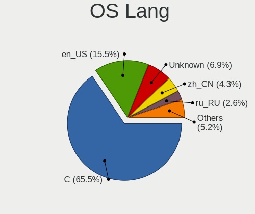
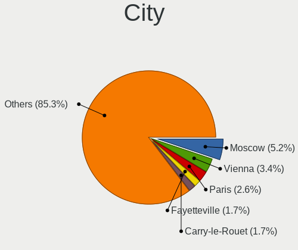
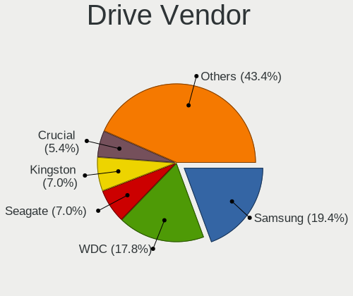
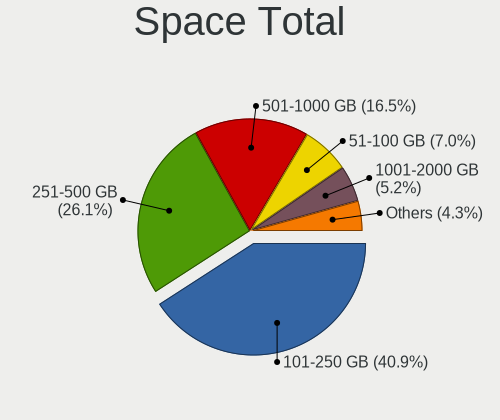
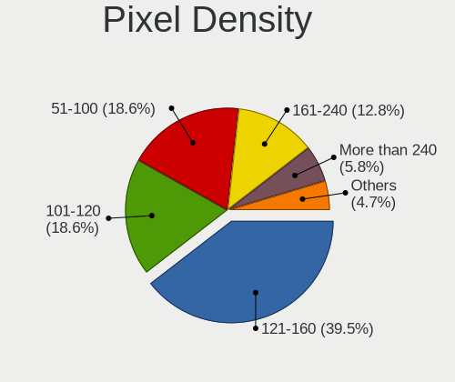
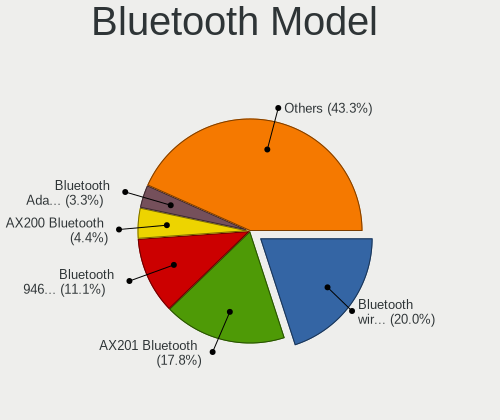

FreeBSD 13.1 - Tested Hardware & Statistics (Notebooks)
-------------------------------------------------------

A project to collect tested hardware configurations for FreeBSD 13.1.

Anyone can contribute to this report by the [hw-probe](https://github.com/linuxhw/hw-probe/blob/master/INSTALL.BSD.md) tool:

    hw-probe -all -upload

Please contribute! Especially if your hardware is rare.

Contents
--------

* [ Test Cases ](#test-cases)

* [ System ](#system)
  - [ Arch                     ](#arch)
  - [ DE                       ](#de)
  - [ Display Server           ](#display-server)
  - [ Display Manager          ](#display-manager)
  - [ OS Lang                  ](#os-lang)
  - [ Boot Mode                ](#boot-mode)
  - [ Filesystem               ](#filesystem)
  - [ Part. scheme             ](#part-scheme)

* [ Board ](#board)
  - [ Vendor                   ](#vendor)
  - [ Model                    ](#model)
  - [ Model Family             ](#model-family)
  - [ MFG Year                 ](#mfg-year)
  - [ Form Factor              ](#form-factor)
  - [ Coreboot                 ](#coreboot)
  - [ RAM Size                 ](#ram-size)
  - [ RAM Used                 ](#ram-used)
  - [ Total Drives             ](#total-drives)
  - [ Has CD-ROM               ](#has-cd-rom)
  - [ Has Ethernet             ](#has-ethernet)
  - [ Has WiFi                 ](#has-wifi)
  - [ Has Bluetooth            ](#has-bluetooth)

* [ Location ](#location)
  - [ Country                  ](#country)
  - [ City                     ](#city)

* [ Drives ](#drives)
  - [ Drive Vendor             ](#drive-vendor)
  - [ Drive Model              ](#drive-model)
  - [ HDD Vendor               ](#hdd-vendor)
  - [ SSD Vendor               ](#ssd-vendor)
  - [ Drive Kind               ](#drive-kind)
  - [ Drive Connector          ](#drive-connector)
  - [ Drive Size               ](#drive-size)
  - [ Space Total              ](#space-total)
  - [ Space Used               ](#space-used)
  - [ Malfunc. Drives          ](#malfunc-drives)
  - [ Malfunc. Drive Vendor    ](#malfunc-drive-vendor)
  - [ Malfunc. HDD Vendor      ](#malfunc-hdd-vendor)
  - [ Malfunc. Drive Kind      ](#malfunc-drive-kind)
  - [ Failed Drives            ](#failed-drives)
  - [ Failed Drive Vendor      ](#failed-drive-vendor)
  - [ Drive Status             ](#drive-status)

* [ Storage controller ](#storage-controller)
  - [ Storage Vendor           ](#storage-vendor)
  - [ Storage Model            ](#storage-model)
  - [ Storage Kind             ](#storage-kind)

* [ Processor ](#processor)
  - [ CPU Vendor               ](#cpu-vendor)
  - [ CPU Model                ](#cpu-model)
  - [ CPU Model Family         ](#cpu-model-family)
  - [ CPU Cores                ](#cpu-cores)
  - [ CPU Sockets              ](#cpu-sockets)
  - [ CPU Threads              ](#cpu-threads)
  - [ CPU Microarch            ](#cpu-microarch)

* [ Graphics ](#graphics)
  - [ GPU Vendor               ](#gpu-vendor)
  - [ GPU Model                ](#gpu-model)
  - [ GPU Combo                ](#gpu-combo)
  - [ GPU Driver               ](#gpu-driver)
  - [ GPU Memory               ](#gpu-memory)

* [ Monitor ](#monitor)
  - [ Monitor Vendor           ](#monitor-vendor)
  - [ Monitor Model            ](#monitor-model)
  - [ Monitor Resolution       ](#monitor-resolution)
  - [ Monitor Diagonal         ](#monitor-diagonal)
  - [ Monitor Width            ](#monitor-width)
  - [ Aspect Ratio             ](#aspect-ratio)
  - [ Monitor Area             ](#monitor-area)
  - [ Pixel Density            ](#pixel-density)
  - [ Multiple Monitors        ](#multiple-monitors)

* [ Network ](#network)
  - [ Net Controller Vendor    ](#net-controller-vendor)
  - [ Net Controller Model     ](#net-controller-model)
  - [ Wireless Vendor          ](#wireless-vendor)
  - [ Wireless Model           ](#wireless-model)
  - [ Ethernet Vendor          ](#ethernet-vendor)
  - [ Ethernet Model           ](#ethernet-model)
  - [ Net Controller Kind      ](#net-controller-kind)
  - [ Used Controller          ](#used-controller)
  - [ NICs                     ](#nics)
  - [ IPv6                     ](#ipv6)

* [ Bluetooth ](#bluetooth)
  - [ Bluetooth Vendor         ](#bluetooth-vendor)
  - [ Bluetooth Model          ](#bluetooth-model)

* [ Sound ](#sound)
  - [ Sound Vendor             ](#sound-vendor)
  - [ Sound Model              ](#sound-model)

* [ Memory ](#memory)
  - [ Memory Vendor            ](#memory-vendor)
  - [ Memory Model             ](#memory-model)
  - [ Memory Kind              ](#memory-kind)
  - [ Memory Form Factor       ](#memory-form-factor)
  - [ Memory Size              ](#memory-size)
  - [ Memory Speed             ](#memory-speed)

* [ Printers & scanners ](#printers--scanners)
  - [ Printer Vendor           ](#printer-vendor)
  - [ Printer Model            ](#printer-model)
  - [ Scanner Vendor           ](#scanner-vendor)
  - [ Scanner Model            ](#scanner-model)

* [ Camera ](#camera)
  - [ Camera Vendor            ](#camera-vendor)
  - [ Camera Model             ](#camera-model)

* [ Security ](#security)
  - [ Fingerprint Vendor       ](#fingerprint-vendor)
  - [ Fingerprint Model        ](#fingerprint-model)
  - [ Chipcard Vendor          ](#chipcard-vendor)
  - [ Chipcard Model           ](#chipcard-model)

* [ Unsupported ](#unsupported)
  - [ Unsupported Devices      ](#unsupported-devices)
  - [ Unsupported Device Types ](#unsupported-device-types)

Test Cases
----------

Total: 90

| Vendor        | Model                       | Probe                                                     | Date         |
|---------------|-----------------------------|-----------------------------------------------------------|--------------|
| Toshiba       | Satellite A300              | [ac185c104b](https://bsd-hardware.info/?probe=ac185c104b) | Aug 31, 2022 |
| ASUSTek       | VivoBook_ASUSLaptop X570... | [0466d87f04](https://bsd-hardware.info/?probe=0466d87f04) | Aug 25, 2022 |
| HP            | Pavilion g6                 | [c146b538e1](https://bsd-hardware.info/?probe=c146b538e1) | Aug 20, 2022 |
| ASUSTek       | ZenBook 14 UX410UFR         | [2bf0f0ef08](https://bsd-hardware.info/?probe=2bf0f0ef08) | Aug 19, 2022 |
| Google        | Peppy                       | [e2e0a1953d](https://bsd-hardware.info/?probe=e2e0a1953d) | Aug 18, 2022 |
| MSI           | GF63 Thin 9SC               | [dacea7c6be](https://bsd-hardware.info/?probe=dacea7c6be) | Aug 14, 2022 |
| Dell          | Inspiron 3581               | [f31cc32515](https://bsd-hardware.info/?probe=f31cc32515) | Aug 04, 2022 |
| HP            | EliteBook 850 G7 Noteboo... | [f603e648c7](https://bsd-hardware.info/?probe=f603e648c7) | Aug 01, 2022 |
| Lenovo        | ThinkPad T480 20L6S29E0T    | [546fa8380b](https://bsd-hardware.info/?probe=546fa8380b) | Aug 01, 2022 |
| Dell          | Inspiron 5559               | [13baedb59b](https://bsd-hardware.info/?probe=13baedb59b) | Jul 31, 2022 |
| Lenovo        | IdeaPad 330-15ARR 81D2      | [7b130fb168](https://bsd-hardware.info/?probe=7b130fb168) | Jul 27, 2022 |
| Dell          | Precision 5560              | [3dc82c6d91](https://bsd-hardware.info/?probe=3dc82c6d91) | Jul 23, 2022 |
| Lenovo        | G40-45 80E1                 | [6e31b5f45b](https://bsd-hardware.info/?probe=6e31b5f45b) | Jul 23, 2022 |
| Dell          | Studio XPS 1340             | [642da98e96](https://bsd-hardware.info/?probe=642da98e96) | Jul 21, 2022 |
| Dell          | Inspiron 5559               | [321d3333dd](https://bsd-hardware.info/?probe=321d3333dd) | Jul 19, 2022 |
| Dell          | Inspiron 5559               | [6308d8da4f](https://bsd-hardware.info/?probe=6308d8da4f) | Jul 19, 2022 |
| ASUSTek       | ZenBook UX325UA_UM325UA     | [9af051c79f](https://bsd-hardware.info/?probe=9af051c79f) | Jul 17, 2022 |
| Lenovo        | ThinkPad T480 20L6SB2N00    | [6c5c9eefc0](https://bsd-hardware.info/?probe=6c5c9eefc0) | Jul 17, 2022 |
| Lenovo        | ThinkPad T420 4236C92       | [4067ce2036](https://bsd-hardware.info/?probe=4067ce2036) | Jul 16, 2022 |
| Lenovo        | ThinkPad X260 20F6S0KA00    | [117014d55f](https://bsd-hardware.info/?probe=117014d55f) | Jul 14, 2022 |
| Toshiba       | Satellite L305D             | [b0311b8175](https://bsd-hardware.info/?probe=b0311b8175) | Jul 12, 2022 |
| ASUSTek       | VivoBook_ASUSLaptop E210... | [7081ddd59c](https://bsd-hardware.info/?probe=7081ddd59c) | Jul 11, 2022 |
| Dell          | Inspiron 5559               | [7bad2fce01](https://bsd-hardware.info/?probe=7bad2fce01) | Jul 07, 2022 |
| Lenovo        | IdeaPad 5 Pro 16ACH6 82L... | [66543e9280](https://bsd-hardware.info/?probe=66543e9280) | Jul 07, 2022 |
| Dell          | Latitude E6420              | [c41c8ff4f4](https://bsd-hardware.info/?probe=c41c8ff4f4) | Jul 07, 2022 |
| Fujitsu       | LIFEBOOK A555               | [d9fd7e54cf](https://bsd-hardware.info/?probe=d9fd7e54cf) | Jul 06, 2022 |
| Unknown       | Unknown                     | [584ecf8423](https://bsd-hardware.info/?probe=584ecf8423) | Jul 05, 2022 |
| HP            | Laptop 15-bs1xx             | [b697848727](https://bsd-hardware.info/?probe=b697848727) | Jul 05, 2022 |
| Dell          | Inspiron 5559               | [452aabec42](https://bsd-hardware.info/?probe=452aabec42) | Jul 02, 2022 |
| LG Electro... | 17Z990-R.AAC9U1             | [5777cb6dc6](https://bsd-hardware.info/?probe=5777cb6dc6) | Jul 01, 2022 |
| HP            | EliteBook 850 G7 Noteboo... | [f573327012](https://bsd-hardware.info/?probe=f573327012) | Jun 29, 2022 |
| Acer          | Aspire A114-33              | [d3659c85e9](https://bsd-hardware.info/?probe=d3659c85e9) | Jun 28, 2022 |
| Samsung       | R530/R730/R540              | [a4cd230718](https://bsd-hardware.info/?probe=a4cd230718) | Jun 27, 2022 |
| Dell          | Inspiron 5559               | [e0c49be06e](https://bsd-hardware.info/?probe=e0c49be06e) | Jun 27, 2022 |
| Dell          | Inspiron 5559               | [5b7a6bf8f8](https://bsd-hardware.info/?probe=5b7a6bf8f8) | Jun 19, 2022 |
| Fujitsu Si... | AMILO Li3710                | [6d4bc39638](https://bsd-hardware.info/?probe=6d4bc39638) | Jun 18, 2022 |
| Sony          | VGN-NS21M_S                 | [c9701a7ff5](https://bsd-hardware.info/?probe=c9701a7ff5) | Jun 18, 2022 |
| Dell          | Inspiron 5559               | [3344e5152d](https://bsd-hardware.info/?probe=3344e5152d) | Jun 16, 2022 |
| Dell          | Inspiron 5559               | [9f630c894a](https://bsd-hardware.info/?probe=9f630c894a) | Jun 16, 2022 |
| Dell          | Latitude E5420              | [524ab094e1](https://bsd-hardware.info/?probe=524ab094e1) | Jun 13, 2022 |
| ASUSTek       | ZenBook UX391FA_UX391FA     | [8825a49f37](https://bsd-hardware.info/?probe=8825a49f37) | Jun 13, 2022 |
| HP            | Laptop 15s-fq1xxx           | [380218b2c1](https://bsd-hardware.info/?probe=380218b2c1) | Jun 12, 2022 |
| Fujitsu Si... | AMILO Li3710                | [387bf3d18f](https://bsd-hardware.info/?probe=387bf3d18f) | Jun 12, 2022 |
| Dell          | Inspiron 5559               | [e7017b0ea5](https://bsd-hardware.info/?probe=e7017b0ea5) | Jun 12, 2022 |
| Fujitsu Si... | AMILO Li3710                | [edebcb2719](https://bsd-hardware.info/?probe=edebcb2719) | Jun 12, 2022 |
| Fujitsu       | LIFEBOOK A555               | [23d96bc669](https://bsd-hardware.info/?probe=23d96bc669) | Jun 11, 2022 |
| Dell          | Latitude E5420              | [aca711c5ec](https://bsd-hardware.info/?probe=aca711c5ec) | Jun 09, 2022 |
| Lenovo        | IdeaPad 130-15AST 81H5      | [9f33082ffa](https://bsd-hardware.info/?probe=9f33082ffa) | Jun 08, 2022 |
| Dell          | Precision M4800             | [4d77bb0082](https://bsd-hardware.info/?probe=4d77bb0082) | Jun 08, 2022 |
| Dell          | Precision M4800             | [b9169c863c](https://bsd-hardware.info/?probe=b9169c863c) | Jun 08, 2022 |
| Dell          | Inspiron 5559               | [1a9b85f6c5](https://bsd-hardware.info/?probe=1a9b85f6c5) | Jun 07, 2022 |
| Dell          | Latitude E5420              | [a3a9820968](https://bsd-hardware.info/?probe=a3a9820968) | Jun 07, 2022 |
| Lenovo        | ThinkPad T14 Gen 1 20S0C... | [56111732fd](https://bsd-hardware.info/?probe=56111732fd) | Jun 07, 2022 |
| Lenovo        | ThinkPad T14 Gen 1 20S0C... | [aeec87e07f](https://bsd-hardware.info/?probe=aeec87e07f) | Jun 06, 2022 |
| Lenovo        | ThinkPad X220 4286CTO       | [cb98f3014e](https://bsd-hardware.info/?probe=cb98f3014e) | Jun 05, 2022 |
| Dell          | Latitude 7490               | [18215740d1](https://bsd-hardware.info/?probe=18215740d1) | Jun 05, 2022 |
| Dell          | Inspiron 5559               | [0f0c2bcf67](https://bsd-hardware.info/?probe=0f0c2bcf67) | Jun 04, 2022 |
| Dell          | Latitude E5500              | [b1cb5de914](https://bsd-hardware.info/?probe=b1cb5de914) | Jun 03, 2022 |
| ASUSTek       | X441UV                      | [c8906b438b](https://bsd-hardware.info/?probe=c8906b438b) | Jun 03, 2022 |
| Apple         | MacBookPro11,4              | [29f1ef0cdc](https://bsd-hardware.info/?probe=29f1ef0cdc) | Jun 02, 2022 |
| Lenovo        | ThinkPad W520 4282AD4       | [40198abaa2](https://bsd-hardware.info/?probe=40198abaa2) | Jun 02, 2022 |
| Acer          | Nitro AN515-55              | [0cf6981a98](https://bsd-hardware.info/?probe=0cf6981a98) | Jun 02, 2022 |
| GPD           | MicroPC                     | [a448570ff9](https://bsd-hardware.info/?probe=a448570ff9) | May 31, 2022 |
| Dell          | Inspiron 5559               | [ca9f2125af](https://bsd-hardware.info/?probe=ca9f2125af) | May 31, 2022 |
| Dell          | Inspiron 5559               | [283a074737](https://bsd-hardware.info/?probe=283a074737) | May 31, 2022 |
| GPD           | MicroPC                     | [0046ab7c9b](https://bsd-hardware.info/?probe=0046ab7c9b) | May 31, 2022 |
| HP            | Pavilion g6                 | [32854b73a5](https://bsd-hardware.info/?probe=32854b73a5) | May 30, 2022 |
| System76      | Galago Pro                  | [126ebc1522](https://bsd-hardware.info/?probe=126ebc1522) | May 29, 2022 |
| Dell          | G5 5590                     | [86bac52410](https://bsd-hardware.info/?probe=86bac52410) | May 29, 2022 |
| Dell          | Latitude E6430              | [d7ced37bac](https://bsd-hardware.info/?probe=d7ced37bac) | May 29, 2022 |
| Lenovo        | ThinkPad X250 20CMS0FA00    | [5afeac632d](https://bsd-hardware.info/?probe=5afeac632d) | May 28, 2022 |
| Unknown       | Unknown                     | [3ff577e111](https://bsd-hardware.info/?probe=3ff577e111) | May 26, 2022 |
| Unknown       | Unknown                     | [9e2f16664a](https://bsd-hardware.info/?probe=9e2f16664a) | May 26, 2022 |
| Dell          | Inspiron 3505               | [cddd786b51](https://bsd-hardware.info/?probe=cddd786b51) | May 26, 2022 |
| Notebook      | N7x0WU                      | [37242aa9a3](https://bsd-hardware.info/?probe=37242aa9a3) | May 25, 2022 |
| TUXEDO        | Aura 15 Gen1                | [727f9708b4](https://bsd-hardware.info/?probe=727f9708b4) | May 24, 2022 |
| Dell          | Latitude E6540              | [70871cf070](https://bsd-hardware.info/?probe=70871cf070) | May 24, 2022 |
| Dell          | Precision M4800             | [6a703b66f8](https://bsd-hardware.info/?probe=6a703b66f8) | May 22, 2022 |
| Dell          | Latitude E7240              | [970234b430](https://bsd-hardware.info/?probe=970234b430) | May 22, 2022 |
| Lenovo        | ThinkPad X13 Gen 1 20UF0... | [cf5f498572](https://bsd-hardware.info/?probe=cf5f498572) | May 21, 2022 |
| Dell          | Latitude 5520               | [cbc2c03fa1](https://bsd-hardware.info/?probe=cbc2c03fa1) | May 20, 2022 |
| Dell          | XPS 13 9343                 | [44abecc1ef](https://bsd-hardware.info/?probe=44abecc1ef) | May 20, 2022 |
| ASUSTek       | 1001P                       | [6ffa9529a3](https://bsd-hardware.info/?probe=6ffa9529a3) | May 20, 2022 |
| TUXEDO        | Aura 15 Gen1                | [a4b6a40758](https://bsd-hardware.info/?probe=a4b6a40758) | May 19, 2022 |
| TUXEDO        | Aura 15 Gen1                | [1c84f0f722](https://bsd-hardware.info/?probe=1c84f0f722) | May 19, 2022 |
| Lenovo        | ThinkPad L420 7854CTO       | [56cf502c2f](https://bsd-hardware.info/?probe=56cf502c2f) | May 18, 2022 |
| Lenovo        | ThinkPad T420s 41732AU      | [9d9ddcc409](https://bsd-hardware.info/?probe=9d9ddcc409) | May 18, 2022 |
| Lenovo        | ThinkPad X270 20HMCTO1WW    | [2d3de77101](https://bsd-hardware.info/?probe=2d3de77101) | May 18, 2022 |
| Lenovo        | ThinkPad E490 20N8CTO1WW    | [86866ce217](https://bsd-hardware.info/?probe=86866ce217) | May 17, 2022 |
| TUXEDO        | InfinityBook13V3            | [fd081a3636](https://bsd-hardware.info/?probe=fd081a3636) | May 17, 2022 |

System
------

Arch
----

OS architecture (x86_64, i586, etc.)

| Name  | Notebooks | Percent |
|-------|-----------|---------|
| amd64 | 63        | 100%    |

DE
--

Desktop Environment

| Name       | Notebooks | Percent |
|------------|-----------|---------|
| KDE5       | 14        | 22.22%  |
| XFCE       | 11        | 17.46%  |
| GNOME      | 9         | 14.29%  |
| Console    | 8         | 12.7%   |
| TWM        | 4         | 6.35%   |
| i3         | 4         | 6.35%   |
| Openbox    | 3         | 4.76%   |
| MATE       | 3         | 4.76%   |
| Cinnamon   | 2         | 3.17%   |
| X-Cinnamon | 1         | 1.59%   |
| LXQt       | 1         | 1.59%   |
| LXDE       | 1         | 1.59%   |
| IceWM      | 1         | 1.59%   |
| dwm        | 1         | 1.59%   |

Display Server
--------------

X11 or Wayland

| Name    | Notebooks | Percent |
|---------|-----------|---------|
| X11     | 52        | 82.54%  |
| Console | 9         | 14.29%  |
| Wayland | 2         | 3.17%   |

Display Manager
---------------

SDDM, LightDM, etc.

| Name    | Notebooks | Percent |
|---------|-----------|---------|
| Console | 22        | 34.92%  |
| SDDM    | 14        | 22.22%  |
| SLiM    | 12        | 19.05%  |
| GDM     | 6         | 9.52%   |
| XDM     | 4         | 6.35%   |
| LightDM | 4         | 6.35%   |
| PCDM    | 1         | 1.59%   |

OS Lang
-------

Language

| Lang            | Notebooks | Percent |
|-----------------|-----------|---------|
| C               | 43        | 67.19%  |
| en_US           | 9         | 14.06%  |
| zh_CN           | 3         | 4.69%   |
| ru_RU           | 3         | 4.69%   |
| Unknown         | 3         | 4.69%   |
| fr_FR           | 1         | 1.56%   |
| en_US.ISO8859-1 | 1         | 1.56%   |
| en_AU           | 1         | 1.56%   |

Boot Mode
---------

EFI or BIOS

| Mode | Notebooks | Percent |
|------|-----------|---------|
| EFI  | 52        | 82.54%  |
| BIOS | 11        | 17.46%  |

Filesystem
----------

Type of filesystem

| Type | Notebooks | Percent |
|------|-----------|---------|
| Zfs  | 44        | 68.75%  |
| Ufs  | 20        | 31.25%  |

Part. scheme
------------

Scheme of partitioning

| Type | Notebooks | Percent |
|------|-----------|---------|
| GPT  | 57        | 90.48%  |
| MBR  | 5         | 7.94%   |
| BSD  | 1         | 1.59%   |

Board
-----

Vendor
------

Motherboard manufacturer

| Name                | Notebooks | Percent |
|---------------------|-----------|---------|
| Lenovo              | 17        | 26.98%  |
| Dell                | 16        | 25.4%   |
| ASUSTek Computer    | 7         | 11.11%  |
| Hewlett-Packard     | 4         | 6.35%   |
| TUXEDO              | 2         | 3.17%   |
| Toshiba             | 2         | 3.17%   |
| Acer                | 2         | 3.17%   |
| Unknown             | 2         | 3.17%   |
| System76            | 1         | 1.59%   |
| Sony                | 1         | 1.59%   |
| Samsung Electronics | 1         | 1.59%   |
| Notebook            | 1         | 1.59%   |
| MSI                 | 1         | 1.59%   |
| LG Electronics      | 1         | 1.59%   |
| GPD                 | 1         | 1.59%   |
| Google              | 1         | 1.59%   |
| Fujitsu Siemens     | 1         | 1.59%   |
| Fujitsu             | 1         | 1.59%   |
| Apple               | 1         | 1.59%   |

Model
-----

Motherboard model

| Name                                    | Notebooks | Percent |
|-----------------------------------------|-----------|---------|
| HP EliteBook 850 G7 Notebook PC         | 2         | 3.17%   |
| Unknown                                 | 2         | 3.17%   |
| TUXEDO InfinityBook13V3                 | 1         | 1.59%   |
| TUXEDO Aura 15 Gen1                     | 1         | 1.59%   |
| Toshiba Satellite L305D                 | 1         | 1.59%   |
| Toshiba Satellite A300                  | 1         | 1.59%   |
| System76 Galago Pro                     | 1         | 1.59%   |
| Sony VGN-NS21M_S                        | 1         | 1.59%   |
| Samsung R530/R730/R540                  | 1         | 1.59%   |
| Notebook N7x0WU                         | 1         | 1.59%   |
| MSI GF63 Thin 9SC                       | 1         | 1.59%   |
| LG 17Z990-R.AAC9U1                      | 1         | 1.59%   |
| Lenovo ThinkPad X270 20HMCTO1WW         | 1         | 1.59%   |
| Lenovo ThinkPad X260 20F6S0KA00         | 1         | 1.59%   |
| Lenovo ThinkPad X250 20CMS0FA00         | 1         | 1.59%   |
| Lenovo ThinkPad X220 4286CTO            | 1         | 1.59%   |
| Lenovo ThinkPad X13 Gen 1 20UF000QRT    | 1         | 1.59%   |
| Lenovo ThinkPad W520 4282AD4            | 1         | 1.59%   |
| Lenovo ThinkPad T480 20L6SB2N00         | 1         | 1.59%   |
| Lenovo ThinkPad T480 20L6S29E0T         | 1         | 1.59%   |
| Lenovo ThinkPad T420s 41732AU           | 1         | 1.59%   |
| Lenovo ThinkPad T420 4236C92            | 1         | 1.59%   |
| Lenovo ThinkPad T14 Gen 1 20S0CTO1WW    | 1         | 1.59%   |
| Lenovo ThinkPad L420 7854CTO            | 1         | 1.59%   |
| Lenovo ThinkPad E490 20N8CTO1WW         | 1         | 1.59%   |
| Lenovo IdeaPad 5 Pro 16ACH6 82L5        | 1         | 1.59%   |
| Lenovo IdeaPad 330-15ARR 81D2           | 1         | 1.59%   |
| Lenovo IdeaPad 130-15AST 81H5           | 1         | 1.59%   |
| Lenovo G40-45 80E1                      | 1         | 1.59%   |
| HP Pavilion g6                          | 1         | 1.59%   |
| HP Laptop 15s-fq1xxx                    | 1         | 1.59%   |
| GPD MicroPC                             | 1         | 1.59%   |
| Google Peppy                            | 1         | 1.59%   |
| Fujitsu Siemens AMILO Li3710            | 1         | 1.59%   |
| Fujitsu LIFEBOOK A555                   | 1         | 1.59%   |
| Dell XPS 13 9343                        | 1         | 1.59%   |
| Dell Studio XPS 1340                    | 1         | 1.59%   |
| Dell Precision M4800                    | 1         | 1.59%   |
| Dell Precision 5560                     | 1         | 1.59%   |
| Dell Latitude E7240                     | 1         | 1.59%   |
| Dell Latitude E6540                     | 1         | 1.59%   |
| Dell Latitude E6430                     | 1         | 1.59%   |
| Dell Latitude E6420                     | 1         | 1.59%   |
| Dell Latitude E5500                     | 1         | 1.59%   |
| Dell Latitude E5420                     | 1         | 1.59%   |
| Dell Latitude 7490                      | 1         | 1.59%   |
| Dell Latitude 5520                      | 1         | 1.59%   |
| Dell Inspiron 5559                      | 1         | 1.59%   |
| Dell Inspiron 3581                      | 1         | 1.59%   |
| Dell Inspiron 3505                      | 1         | 1.59%   |
| Dell G5 5590                            | 1         | 1.59%   |
| ASUS ZenBook UX391FA_UX391FA            | 1         | 1.59%   |
| ASUS ZenBook UX325UA_UM325UA            | 1         | 1.59%   |
| ASUS ZenBook 14 UX410UFR                | 1         | 1.59%   |
| ASUS X441UV                             | 1         | 1.59%   |
| ASUS VivoBook_ASUSLaptop X570ZD_F570ZD  | 1         | 1.59%   |
| ASUS VivoBook_ASUSLaptop E210MAB_E210MA | 1         | 1.59%   |
| ASUS 1001P                              | 1         | 1.59%   |
| Apple MacBookPro11,4                    | 1         | 1.59%   |
| Acer Nitro AN515-55                     | 1         | 1.59%   |

Model Family
------------

Motherboard model prefix

| Name                    | Notebooks | Percent |
|-------------------------|-----------|---------|
| Lenovo ThinkPad         | 13        | 20.63%  |
| Dell Latitude           | 8         | 12.7%   |
| Lenovo IdeaPad          | 3         | 4.76%   |
| Dell Inspiron           | 3         | 4.76%   |
| ASUS ZenBook            | 3         | 4.76%   |
| Toshiba Satellite       | 2         | 3.17%   |
| HP EliteBook            | 2         | 3.17%   |
| Dell Precision          | 2         | 3.17%   |
| ASUS VivoBook           | 2         | 3.17%   |
| Unknown                 | 2         | 3.17%   |
| TUXEDO InfinityBook13V3 | 1         | 1.59%   |
| TUXEDO Aura             | 1         | 1.59%   |
| System76 Galago         | 1         | 1.59%   |
| Sony VGN-NS21M          | 1         | 1.59%   |
| Samsung R530            | 1         | 1.59%   |
| Notebook N7x0WU         | 1         | 1.59%   |
| MSI GF63                | 1         | 1.59%   |
| LG 17Z990-R.AAC9U1      | 1         | 1.59%   |
| Lenovo G40-45           | 1         | 1.59%   |
| HP Pavilion             | 1         | 1.59%   |
| HP Laptop               | 1         | 1.59%   |
| GPD MicroPC             | 1         | 1.59%   |
| Google Peppy            | 1         | 1.59%   |
| Fujitsu Siemens AMILO   | 1         | 1.59%   |
| Fujitsu LIFEBOOK        | 1         | 1.59%   |
| Dell XPS                | 1         | 1.59%   |
| Dell Studio             | 1         | 1.59%   |
| Dell G5                 | 1         | 1.59%   |
| ASUS X441UV             | 1         | 1.59%   |
| ASUS 1001P              | 1         | 1.59%   |
| Apple MacBookPro11      | 1         | 1.59%   |
| Acer Nitro              | 1         | 1.59%   |
| Acer Aspire             | 1         | 1.59%   |

MFG Year
--------

Motherboard manufacture year

| Year | Notebooks | Percent |
|------|-----------|---------|
| 2020 | 10        | 15.87%  |
| 2018 | 8         | 12.7%   |
| 2021 | 7         | 11.11%  |
| 2022 | 6         | 9.52%   |
| 2011 | 6         | 9.52%   |
| 2019 | 5         | 7.94%   |
| 2016 | 5         | 7.94%   |
| 2012 | 3         | 4.76%   |
| 2017 | 2         | 3.17%   |
| 2015 | 2         | 3.17%   |
| 2013 | 2         | 3.17%   |
| 2010 | 2         | 3.17%   |
| 2009 | 2         | 3.17%   |
| 2008 | 2         | 3.17%   |
| 2014 | 1         | 1.59%   |

Form Factor
-----------

Physical design of the computer

| Name     | Notebooks | Percent |
|----------|-----------|---------|
| Notebook | 63        | 100%    |

Coreboot
--------

Have coreboot on board

| Used | Notebooks | Percent |
|------|-----------|---------|
| No   | 61        | 96.83%  |
| Yes  | 2         | 3.17%   |

RAM Size
--------

Total RAM memory

| Size in GB  | Notebooks | Percent |
|-------------|-----------|---------|
| 16.01-24.0  | 26        | 41.27%  |
| 8.01-16.0   | 19        | 30.16%  |
| 4.01-8.0    | 10        | 15.87%  |
| 32.01-64.0  | 3         | 4.76%   |
| 2.01-3.0    | 2         | 3.17%   |
| 64.01-256.0 | 2         | 3.17%   |
| 24.01-32.0  | 1         | 1.59%   |

RAM Used
--------

Used RAM memory

| Used GB   | Notebooks | Percent |
|-----------|-----------|---------|
| 0.01-0.5  | 25        | 39.68%  |
| 0.51-1.0  | 21        | 33.33%  |
| 1.01-2.0  | 12        | 19.05%  |
| 2.01-3.0  | 4         | 6.35%   |
| 8.01-16.0 | 1         | 1.59%   |

Total Drives
------------

Number of drives on board

| Drives | Notebooks | Percent |
|--------|-----------|---------|
| 1      | 44        | 69.84%  |
| 2      | 16        | 25.4%   |
| 0      | 3         | 4.76%   |

Has CD-ROM
----------

Has CD-ROM on board

| Presented | Notebooks | Percent |
|-----------|-----------|---------|
| No        | 46        | 73.02%  |
| Yes       | 17        | 26.98%  |

Has Ethernet
------------

Has Ethernet on board

| Presented | Notebooks | Percent |
|-----------|-----------|---------|
| Yes       | 48        | 76.19%  |
| No        | 15        | 23.81%  |

Has WiFi
--------

Has WiFi module

| Presented | Notebooks | Percent |
|-----------|-----------|---------|
| Yes       | 62        | 98.41%  |
| No        | 1         | 1.59%   |

Has Bluetooth
-------------

Has Bluetooth module

| Presented | Notebooks | Percent |
|-----------|-----------|---------|
| Yes       | 41        | 65.08%  |
| No        | 22        | 34.92%  |

Location
--------

Country
-------

Geographic location (country)

| Country     | Notebooks | Percent |
|-------------|-----------|---------|
| USA         | 16        | 25%     |
| Russia      | 6         | 9.38%   |
| India       | 4         | 6.25%   |
| UK          | 3         | 4.69%   |
| Japan       | 3         | 4.69%   |
| France      | 3         | 4.69%   |
| China       | 3         | 4.69%   |
| Austria     | 3         | 4.69%   |
| Thailand    | 2         | 3.13%   |
| Spain       | 2         | 3.13%   |
| Philippines | 2         | 3.13%   |
| Netherlands | 2         | 3.13%   |
| Germany     | 2         | 3.13%   |
| Czechia     | 2         | 3.13%   |
| Uruguay     | 1         | 1.56%   |
| Turkey      | 1         | 1.56%   |
| Slovenia    | 1         | 1.56%   |
| Norway      | 1         | 1.56%   |
| Malaysia    | 1         | 1.56%   |
| Italy       | 1         | 1.56%   |
| Israel      | 1         | 1.56%   |
| Hong Kong   | 1         | 1.56%   |
| Guadeloupe  | 1         | 1.56%   |
| Greece      | 1         | 1.56%   |
| Australia   | 1         | 1.56%   |

City
----

Geographic location (city)

| City               | Notebooks | Percent |
|--------------------|-----------|---------|
| Vienna             | 3         | 4.69%   |
| Moscow             | 3         | 4.69%   |
| Paris              | 2         | 3.13%   |
| Brno               | 2         | 3.13%   |
| Zhumadian          | 1         | 1.56%   |
| Xi'an              | 1         | 1.56%   |
| Woerdense Verlaat  | 1         | 1.56%   |
| Wheatland          | 1         | 1.56%   |
| Trivandrum         | 1         | 1.56%   |
| Thousand Oaks      | 1         | 1.56%   |
| Thessaloniki       | 1         | 1.56%   |
| Tel Aviv           | 1         | 1.56%   |
| Taito              | 1         | 1.56%   |
| Shinjuku           | 1         | 1.56%   |
| Shah Alam          | 1         | 1.56%   |
| Sandefjord         | 1         | 1.56%   |
| San Pablo City     | 1         | 1.56%   |
| Riverside          | 1         | 1.56%   |
| Ozersk             | 1         | 1.56%   |
| Oswego             | 1         | 1.56%   |
| Omaha              | 1         | 1.56%   |
| Newbury Park       | 1         | 1.56%   |
| New York           | 1         | 1.56%   |
| Nakano             | 1         | 1.56%   |
| Munich             | 1         | 1.56%   |
| Mumbai             | 1         | 1.56%   |
| Montevideo         | 1         | 1.56%   |
| Manassas           | 1         | 1.56%   |
| Madrid             | 1         | 1.56%   |
| Lübeck            | 1         | 1.56%   |
| London             | 1         | 1.56%   |
| Legazpi            | 1         | 1.56%   |
| Le Gosier          | 1         | 1.56%   |
| Krasnodar          | 1         | 1.56%   |
| Kolkata            | 1         | 1.56%   |
| Khabarovsk         | 1         | 1.56%   |
| Kensington         | 1         | 1.56%   |
| Istanbul           | 1         | 1.56%   |
| Indore             | 1         | 1.56%   |
| Harrisburg         | 1         | 1.56%   |
| Galliera Veneta    | 1         | 1.56%   |
| East Lansing       | 1         | 1.56%   |
| Durham             | 1         | 1.56%   |
| Dronten            | 1         | 1.56%   |
| Detroit            | 1         | 1.56%   |
| Chiang Mai         | 1         | 1.56%   |
| Charlotte          | 1         | 1.56%   |
| Chachoengsao       | 1         | 1.56%   |
| Central            | 1         | 1.56%   |
| Bucka              | 1         | 1.56%   |
| Brooklyn           | 1         | 1.56%   |
| Brighton           | 1         | 1.56%   |
| Bellaire           | 1         | 1.56%   |
| Beijing            | 1         | 1.56%   |
| Barcelona          | 1         | 1.56%   |
| Asnieres-sur-Seine | 1         | 1.56%   |
| Ashburn            | 1         | 1.56%   |
| Adelaide           | 1         | 1.56%   |

Drives
------

Drive Vendor
------------

Hard drive vendors

| Vendor              | Notebooks | Drives | Percent |
|---------------------|-----------|--------|---------|
| Samsung Electronics | 15        | 15     | 20.27%  |
| WDC                 | 14        | 16     | 18.92%  |
| Crucial             | 7         | 9      | 9.46%   |
| Seagate             | 6         | 7      | 8.11%   |
| Toshiba             | 5         | 5      | 6.76%   |
| SK hynix            | 4         | 4      | 5.41%   |
| Kingston            | 3         | 3      | 4.05%   |
| Hitachi             | 3         | 3      | 4.05%   |
| Transcend           | 2         | 2      | 2.7%    |
| Gigabyte Technology | 2         | 2      | 2.7%    |
| Silicon Motion      | 1         | 1      | 1.35%   |
| SanDisk             | 1         | 1      | 1.35%   |
| Micron Technology   | 1         | 1      | 1.35%   |
| Lexar               | 1         | 2      | 1.35%   |
| Lenovo              | 1         | 1      | 1.35%   |
| KIOXIA              | 1         | 1      | 1.35%   |
| Hewlett-Packard     | 1         | 1      | 1.35%   |
| EAGET               | 1         | 1      | 1.35%   |
| CFD                 | 1         | 1      | 1.35%   |
| BR                  | 1         | 1      | 1.35%   |
| BIWIN               | 1         | 1      | 1.35%   |
| Apple               | 1         | 1      | 1.35%   |
| A-DATA Technology   | 1         | 4      | 1.35%   |

Drive Model
-----------

Hard drive models

| Model                                   | Notebooks | Percent |
|-----------------------------------------|-----------|---------|
| SK hynix BC511 HFM512GDJTNI-82A0A 512GB | 2         | 2.6%    |
| Samsung SSD 970 EVO Plus 2TB            | 2         | 2.6%    |
| Crucial CT1000MX500SSD1 1TB             | 2         | 2.6%    |
| WDC WDS500G3X0C-00SJG0 500GB            | 1         | 1.3%    |
| WDC WDS250G2B0B-00YS70 250GB            | 1         | 1.3%    |
| WDC WDS120G2G0B-00EPW0 120GB            | 1         | 1.3%    |
| WDC WD3200BPVT-22JJ5T0 320GB            | 1         | 1.3%    |
| WDC WD3200BEKT-60PVMT0 320GB            | 1         | 1.3%    |
| WDC WD2500BEVT-24A23T0 250GB            | 1         | 1.3%    |
| WDC WD20SPZX-00UA7T0 2TB                | 1         | 1.3%    |
| WDC WD1600BEVT-80A23T0 160GB            | 1         | 1.3%    |
| WDC WD1600BEVT-75ZCT2 160GB             | 1         | 1.3%    |
| WDC WD1600BEVT-22ZCT0 160GB             | 1         | 1.3%    |
| WDC WD10SPZX-75Z10T3 1TB                | 1         | 1.3%    |
| WDC WD10SPZX-17Z10T1 1TB                | 1         | 1.3%    |
| WDC WD10JPVX-22JC3T0 1TB                | 1         | 1.3%    |
| WDC WD10EZEX-60WN4A0 1TB                | 1         | 1.3%    |
| WDC PC SN530 SDBPNPZ-256G-1014 256GB    | 1         | 1.3%    |
| WDC PC SN530 NVMe 256GB                 | 1         | 1.3%    |
| Transcend TS1TMTE110S 1TB               | 1         | 1.3%    |
| Transcend TS128GMTS430S 128GB           | 1         | 1.3%    |
| Toshiba MQ04ABF100 1TB                  | 1         | 1.3%    |
| Toshiba MQ01ABF050 500GB                | 1         | 1.3%    |
| Toshiba MQ01ABD100 1TB                  | 1         | 1.3%    |
| Toshiba KSG60ZMV256G M.2 2280 256GB     | 1         | 1.3%    |
| Toshiba KBG30ZMT512G 512GB              | 1         | 1.3%    |
| SK hynix HFM512GD3JX013N 512GB          | 1         | 1.3%    |
| SK hynix BC501 NVMe 512GB               | 1         | 1.3%    |
| Silicon Motion 512GB MEGA S3 512GB      | 1         | 1.3%    |
| Seagate ST500LT012-1DG142 500GB         | 1         | 1.3%    |
| Seagate ST500LM012 HN-M500MBB 500GB     | 1         | 1.3%    |
| Seagate ST2000LM007-1R8174 2TB          | 1         | 1.3%    |
| Seagate ST1000LM049-2GH172 1TB          | 1         | 1.3%    |
| Seagate ST1000LM035-1RK172 1TB          | 1         | 1.3%    |
| Seagate ST1000LM024 HN-M101MBB 1TB      | 1         | 1.3%    |
| SanDisk SSD PLUS 240GB                  | 1         | 1.3%    |
| Samsung SSD PM851 mSATA 512GB           | 1         | 1.3%    |
| Samsung SSD PM851 M.2 2280 256GB        | 1         | 1.3%    |
| Samsung SSD PM810 2.5-inch 128GB        | 1         | 1.3%    |
| Samsung SSD 950 PRO 512GB               | 1         | 1.3%    |
| Samsung SSD 870 EVO 1TB                 | 1         | 1.3%    |
| Samsung SSD 840 PRO Series 128GB        | 1         | 1.3%    |
| Samsung MZVLW512HMJP-000L7 512GB        | 1         | 1.3%    |
| Samsung MZVLW256HEHP-000L7 256GB        | 1         | 1.3%    |
| Samsung MZVLB512HAJQ-00000 512GB        | 1         | 1.3%    |
| Samsung MZVLB1T0HBLR-000L7 1TB          | 1         | 1.3%    |
| Samsung MZVLB1T0HBLR-000L2 1TB          | 1         | 1.3%    |
| Samsung MZVKW512HMJP-000H1 512GB        | 1         | 1.3%    |
| Samsung MZ7LN512HMJP-000L7 512GB        | 1         | 1.3%    |
| Micron 2300 NVMe 512GB                  | 1         | 1.3%    |
| Lexar 256GB SSD                         | 1         | 1.3%    |
| Lenovo SSD SL700 240G                   | 1         | 1.3%    |
| KIOXIA KBG40ZNS512G NVMe 512GB          | 1         | 1.3%    |
| Kingston SNVSE500G 500GB                | 1         | 1.3%    |
| Kingston SMS200S3120G 120GB             | 1         | 1.3%    |
| Kingston SA400S37240G 240GB             | 1         | 1.3%    |
| Hitachi HTS722020K9SA00 200GB           | 1         | 1.3%    |
| Hitachi HTS721080G9SA00 80GB            | 1         | 1.3%    |
| Hitachi HTS543232L9SA00 320GB           | 1         | 1.3%    |
| HP SSD S700 250GB                       | 1         | 1.3%    |

HDD Vendor
----------

Hard disk drive vendors

| Vendor  | Notebooks | Drives | Percent |
|---------|-----------|--------|---------|
| WDC     | 10        | 11     | 45.45%  |
| Seagate | 6         | 7      | 27.27%  |
| Toshiba | 3         | 3      | 13.64%  |
| Hitachi | 3         | 3      | 13.64%  |

SSD Vendor
----------

Solid state drive vendors

| Vendor              | Notebooks | Drives | Percent |
|---------------------|-----------|--------|---------|
| Samsung Electronics | 6         | 6      | 21.43%  |
| Crucial             | 6         | 8      | 21.43%  |
| WDC                 | 2         | 2      | 7.14%   |
| Kingston            | 2         | 2      | 7.14%   |
| Transcend           | 1         | 1      | 3.57%   |
| Toshiba             | 1         | 1      | 3.57%   |
| SanDisk             | 1         | 1      | 3.57%   |
| Lexar               | 1         | 2      | 3.57%   |
| Lenovo              | 1         | 1      | 3.57%   |
| Hewlett-Packard     | 1         | 1      | 3.57%   |
| Gigabyte Technology | 1         | 1      | 3.57%   |
| CFD                 | 1         | 1      | 3.57%   |
| BR                  | 1         | 1      | 3.57%   |
| BIWIN               | 1         | 1      | 3.57%   |
| Apple               | 1         | 1      | 3.57%   |
| A-DATA Technology   | 1         | 4      | 3.57%   |

Drive Kind
----------

HDD or SSD

| Kind | Notebooks | Drives | Percent |
|------|-----------|--------|---------|
| SSD  | 25        | 34     | 35.71%  |
| NVMe | 24        | 25     | 34.29%  |
| HDD  | 21        | 24     | 30%     |

Drive Connector
---------------

SATA, SAS, NVMe, etc.

| Type | Notebooks | Drives | Percent |
|------|-----------|--------|---------|
| SATA | 43        | 58     | 64.18%  |
| NVMe | 24        | 25     | 35.82%  |

Drive Size
----------

Size of hard drive

| Size in TB | Notebooks | Drives | Percent |
|------------|-----------|--------|---------|
| 0.01-0.5   | 28        | 36     | 60.87%  |
| 0.51-1.0   | 15        | 19     | 32.61%  |
| 1.01-2.0   | 3         | 3      | 6.52%   |

Space Total
-----------

Amount of disk space available on the file system

| Size in GB | Notebooks | Percent |
|------------|-----------|---------|
| 101-250    | 20        | 31.75%  |
| 251-500    | 17        | 26.98%  |
| 501-1000   | 12        | 19.05%  |
| 51-100     | 6         | 9.52%   |
| 1001-2000  | 4         | 6.35%   |
| 21-50      | 3         | 4.76%   |
| 1-20       | 1         | 1.59%   |

Space Used
----------

Amount of used disk space

| Used GB | Notebooks | Percent |
|---------|-----------|---------|
| 1-20    | 49        | 76.56%  |
| 21-50   | 10        | 15.63%  |
| 101-250 | 2         | 3.13%   |
| 51-100  | 2         | 3.13%   |
| 251-500 | 1         | 1.56%   |

Malfunc. Drives
---------------

Drive models with a malfunction

| Model                                        | Notebooks | Drives | Percent |
|----------------------------------------------|-----------|--------|---------|
| WDC WD3200BEKT-60PVMT0 320GB                 | 1         | 1      | 9.09%   |
| WDC WD2500BEVT-24A23T0 250GB                 | 1         | 1      | 9.09%   |
| Toshiba MQ01ABF050 500GB                     | 1         | 1      | 9.09%   |
| Toshiba MQ01ABD100 1TB                       | 1         | 1      | 9.09%   |
| Seagate ST500LT012-1DG142 500GB              | 1         | 1      | 9.09%   |
| Seagate ST500LM012 HN-M500MBB 500GB          | 1         | 1      | 9.09%   |
| Seagate ST1000LM024 HN-M101MBB 1TB           | 1         | 2      | 9.09%   |
| Samsung Electronics SSD PM810 2.5-inch 128GB | 1         | 1      | 9.09%   |
| Hitachi HTS721080G9SA00 80GB                 | 1         | 1      | 9.09%   |
| Hitachi HTS543232L9SA00 320GB                | 1         | 1      | 9.09%   |
| A-DATA Technology SU630 240GB                | 1         | 2      | 9.09%   |

Malfunc. Drive Vendor
---------------------

Vendors of faulty drives

| Vendor              | Notebooks | Drives | Percent |
|---------------------|-----------|--------|---------|
| Seagate             | 3         | 4      | 30%     |
| Toshiba             | 2         | 2      | 20%     |
| Hitachi             | 2         | 2      | 20%     |
| WDC                 | 1         | 2      | 10%     |
| Samsung Electronics | 1         | 1      | 10%     |
| A-DATA Technology   | 1         | 2      | 10%     |

Malfunc. HDD Vendor
-------------------

Vendors of faulty HDD drives

| Vendor  | Notebooks | Drives | Percent |
|---------|-----------|--------|---------|
| Seagate | 3         | 4      | 37.5%   |
| Toshiba | 2         | 2      | 25%     |
| Hitachi | 2         | 2      | 25%     |
| WDC     | 1         | 2      | 12.5%   |

Malfunc. Drive Kind
-------------------

Kinds of faulty drives

| Kind | Notebooks | Drives | Percent |
|------|-----------|--------|---------|
| HDD  | 7         | 10     | 77.78%  |
| SSD  | 2         | 3      | 22.22%  |

Failed Drives
-------------

Failed drive models

Zero info for selected period =(

Failed Drive Vendor
-------------------

Failed drive vendors

Zero info for selected period =(

Drive Status
------------

Number of failed and malfunc. drives

| Status   | Notebooks | Drives | Percent |
|----------|-----------|--------|---------|
| Works    | 50        | 67     | 81.97%  |
| Malfunc  | 9         | 13     | 14.75%  |
| Detected | 2         | 3      | 3.28%   |

Storage controller
------------------

Storage Vendor
--------------

Storage controller vendors

| Vendor                      | Notebooks | Percent |
|-----------------------------|-----------|---------|
| Intel                       | 40        | 54.79%  |
| Samsung Electronics         | 10        | 13.7%   |
| AMD                         | 7         | 9.59%   |
| SK hynix                    | 3         | 4.11%   |
| SanDisk                     | 3         | 4.11%   |
| Silicon Motion              | 2         | 2.74%   |
| Toshiba                     | 1         | 1.37%   |
| Phison Electronics          | 1         | 1.37%   |
| Nvidia                      | 1         | 1.37%   |
| Micron/Crucial Technology   | 1         | 1.37%   |
| Micron Technology           | 1         | 1.37%   |
| KIOXIA                      | 1         | 1.37%   |
| Kingston Technology Company | 1         | 1.37%   |
| Unknown                     | 1         | 1.37%   |

Storage Model
-------------

Storage controller models

| Model                                                                          | Notebooks | Percent |
|--------------------------------------------------------------------------------|-----------|---------|
| Intel 6 Series/C200 Series Chipset Family 6 port Mobile SATA AHCI Controller   | 7         | 9.33%   |
| Intel Sunrise Point-LP SATA Controller [AHCI mode]                             | 6         | 8%      |
| Intel 82801 Mobile SATA Controller [RAID mode]                                 | 6         | 8%      |
| AMD FCH SATA Controller [AHCI mode]                                            | 6         | 8%      |
| Samsung NVMe SSD Controller SM981/PM981/PM983                                  | 5         | 6.67%   |
| Intel 82801IBM/IEM (ICH9M/ICH9M-E) 4 port SATA Controller [AHCI mode]          | 4         | 5.33%   |
| Samsung NVMe SSD Controller SM961/PM961/SM963                                  | 3         | 4%      |
| Intel Wildcat Point-LP SATA Controller [AHCI Mode]                             | 3         | 4%      |
| Unknown                                                                        | 3         | 4%      |
| SK hynix BC511                                                                 | 2         | 2.67%   |
| Silicon Motion SM2263EN/SM2263XT SSD Controller                                | 2         | 2.67%   |
| Intel Celeron/Pentium Silver Processor SATA Controller                         | 2         | 2.67%   |
| Intel 7 Series Chipset Family 6-port SATA Controller [AHCI mode]               | 2         | 2.67%   |
| Toshiba BG3 NVMe SSD Controller                                                | 1         | 1.33%   |
| SK hynix Gold P31 SSD                                                          | 1         | 1.33%   |
| SanDisk WD Blue SN550 NVMe SSD                                                 | 1         | 1.33%   |
| SanDisk WD Black SN750 / PC SN730 NVMe SSD                                     | 1         | 1.33%   |
| SanDisk unknown                                                                | 1         | 1.33%   |
| Samsung SM951 AHCI                                                             | 1         | 1.33%   |
| Samsung NVMe SSD Controller SM951/PM951                                        | 1         | 1.33%   |
| Phison E16 PCIe4 NVMe Controller                                               | 1         | 1.33%   |
| Nvidia MCP79 AHCI Controller                                                   | 1         | 1.33%   |
| KIOXIA NVMe SSD Controller BG4                                                 | 1         | 1.33%   |
| Kingston Company SNVS2000G [NV1 NVMe PCIe SSD 2TB]                             | 1         | 1.33%   |
| Intel NM10/ICH7 Family SATA Controller [AHCI mode]                             | 1         | 1.33%   |
| Intel Jasper Lake SATA AHCI Controller                                         | 1         | 1.33%   |
| Intel Comet Lake SATA AHCI Controller                                          | 1         | 1.33%   |
| Intel Celeron N3350/Pentium N4200/Atom E3900 Series SATA AHCI Controller       | 1         | 1.33%   |
| Intel Cannon Lake Mobile PCH SATA AHCI Controller                              | 1         | 1.33%   |
| Intel 8 Series/C220 Series Chipset Family 6-port SATA Controller 1 [AHCI mode] | 1         | 1.33%   |
| Intel 8 Series SATA Controller 1 [AHCI mode]                                   | 1         | 1.33%   |
| Intel 7 Series Chipset Family 4-port SATA Controller [IDE mode]                | 1         | 1.33%   |
| Intel 7 Series Chipset Family 2-port SATA Controller [IDE mode]                | 1         | 1.33%   |
| Intel 5 Series/3400 Series Chipset 4 port SATA AHCI Controller                 | 1         | 1.33%   |
| Intel 400 Series Chipset Family SATA AHCI Controller                           | 1         | 1.33%   |
| AMD SB7x0/SB8x0/SB9x0 SATA Controller [AHCI mode]                              | 1         | 1.33%   |
| AMD SB7x0/SB8x0/SB9x0 IDE Controller                                           | 1         | 1.33%   |

Storage Kind
------------

Kind of storage controller (IDE, SATA, NVMe, SAS, ...)

| Kind | Notebooks | Percent |
|------|-----------|---------|
| SATA | 42        | 57.53%  |
| NVMe | 23        | 31.51%  |
| RAID | 6         | 8.22%   |
| IDE  | 2         | 2.74%   |

Processor
---------

CPU Vendor
----------

Processor vendors

| Vendor | Notebooks | Percent |
|--------|-----------|---------|
| Intel  | 53        | 84.13%  |
| AMD    | 10        | 15.87%  |

CPU Model
---------

Processor models

| Model                                         | Notebooks | Percent |
|-----------------------------------------------|-----------|---------|
| Intel Core i7-8565U CPU @ 1.80GHz             | 3         | 4.76%   |
| Intel Core i7-6500U CPU @ 2.50GHz             | 3         | 4.76%   |
| Intel Core i7-9750H CPU @ 2.60GHz             | 2         | 3.17%   |
| Intel Core i7-10510U CPU @ 1.80GHz            | 2         | 3.17%   |
| Intel Core i5-8350U CPU @ 1.70GHz             | 2         | 3.17%   |
| Intel Core i5-2520M CPU @ 2.50GHz             | 2         | 3.17%   |
| Intel Core i5-10310U CPU @ 1.70GHz            | 2         | 3.17%   |
| Intel Pentium Silver N6000 @ 1.10GHz          | 1         | 1.59%   |
| Intel Pentium Dual CPU T3400 @ 2.16GHz        | 1         | 1.59%   |
| Intel Genuine CPU                             | 1         | 1.59%   |
| Intel Core i7-8550U CPU @ 1.80GHz             | 1         | 1.59%   |
| Intel Core i7-5600U CPU @ 2.60GHz             | 1         | 1.59%   |
| Intel Core i7-4980HQ CPU @ 2.80GHz            | 1         | 1.59%   |
| Intel Core i7-4810MQ CPU @ 2.80GHz            | 1         | 1.59%   |
| Intel Core i7-4610M CPU @ 3.00GHz             | 1         | 1.59%   |
| Intel Core i7-4600U CPU @ 2.10GHz             | 1         | 1.59%   |
| Intel Core i7-3537U CPU @ 2.00GHz             | 1         | 1.59%   |
| Intel Core i7-2760QM CPU @ 2.40GHz            | 1         | 1.59%   |
| Intel Core i7-2640M CPU @ 2.80GHz             | 1         | 1.59%   |
| Intel Core i7-2620M CPU @ 2.70GHz             | 1         | 1.59%   |
| Intel Core i5-7300U CPU @ 2.60GHz             | 1         | 1.59%   |
| Intel Core i5-7200U CPU @ 2.50GHz             | 1         | 1.59%   |
| Intel Core i5-5200U CPU @ 2.20GHz             | 1         | 1.59%   |
| Intel Core i5-3320M CPU @ 2.60GHz             | 1         | 1.59%   |
| Intel Core i5-3230M CPU @ 2.60GHz             | 1         | 1.59%   |
| Intel Core i5-2540M CPU @ 2.60GH              | 1         | 1.59%   |
| Intel Core i5-2520M CPU @ 2.50GH              | 1         | 1.59%   |
| Intel Core i5-1035G1 CPU @ 1.00GHz            | 1         | 1.59%   |
| Intel Core i5-10300H CPU @ 2.50GHz            | 1         | 1.59%   |
| Intel Core i3-8130U CPU @ 2.20GHz             | 1         | 1.59%   |
| Intel Core i3-7020U CPU @ 2.30GHz             | 1         | 1.59%   |
| Intel Core i3-6006U CPU @ 2.00GHz             | 1         | 1.59%   |
| Intel Core i3-5005U CPU @ 2.00GHz             | 1         | 1.59%   |
| Intel Core 2 Duo CPU T6400 @ 2.00GHz          | 1         | 1.59%   |
| Intel Core 2 Duo CPU T5800 @ 2.00GHz          | 1         | 1.59%   |
| Intel Core 2 Duo CPU P9500 @ 2.53GHz          | 1         | 1.59%   |
| Intel Core 2 Duo                              | 1         | 1.59%   |
| Intel Celeron N4120 CPU @ 1.10GHz             | 1         | 1.59%   |
| Intel Celeron N4020 CPU @ 1.10GHz             | 1         | 1.59%   |
| Intel Celeron CPU N3450 @ 1.10GHz             | 1         | 1.59%   |
| Intel Celeron 2955U @ 1.40GHz                 | 1         | 1.59%   |
| Intel Atom CPU N450 @ 1.66GHz                 | 1         | 1.59%   |
| Intel 11th Gen Core i7-11850H @ 2.50GHz       | 1         | 1.59%   |
| Intel 11th Gen Core i7-1165G7 @ 2.80GHz       | 1         | 1.59%   |
| AMD Ryzen 7 PRO 4750U with Radeon Graphics    | 1         | 1.59%   |
| AMD Ryzen 7 5800H with Radeon Graphics        | 1         | 1.59%   |
| AMD Ryzen 7 5700U with Radeon Graphics        | 1         | 1.59%   |
| AMD Ryzen 7 4700U with Radeon Graphics        | 1         | 1.59%   |
| AMD Ryzen 5 3450U with Radeon Vega Mobile Gfx | 1         | 1.59%   |
| AMD Ryzen 5 2500U with Radeon Vega Mobile Gfx | 1         | 1.59%   |
| AMD Ryzen 3 2200U with Radeon Vega Mobile Gfx | 1         | 1.59%   |
| AMD E2-9000 RADEON R2, 4 COMPUTE CORES 2C+2G  | 1         | 1.59%   |
| AMD Athlon X2 Dual-Core QL-62                 | 1         | 1.59%   |
| AMD A8-6410 APU with AMD Radeon R5 Graphics   | 1         | 1.59%   |

CPU Model Family
----------------

Processor model prefix

| Model                | Notebooks | Percent |
|----------------------|-----------|---------|
| Intel Core i7        | 20        | 31.75%  |
| Intel Core i5        | 15        | 23.81%  |
| Intel Core i3        | 4         | 6.35%   |
| Intel Core 2 Duo     | 4         | 6.35%   |
| Intel Celeron        | 4         | 6.35%   |
| AMD Ryzen 7          | 3         | 4.76%   |
| Other                | 2         | 3.17%   |
| AMD Ryzen 5          | 2         | 3.17%   |
| Intel Pentium Silver | 1         | 1.59%   |
| Intel Pentium Dual   | 1         | 1.59%   |
| Intel Genuine        | 1         | 1.59%   |
| Intel Atom           | 1         | 1.59%   |
| AMD Ryzen 7 PRO      | 1         | 1.59%   |
| AMD Ryzen 3          | 1         | 1.59%   |
| AMD E2               | 1         | 1.59%   |
| AMD Athlon X2        | 1         | 1.59%   |
| AMD A8               | 1         | 1.59%   |

CPU Cores
---------

Number of processor cores

| Number  | Notebooks | Percent |
|---------|-----------|---------|
| 2       | 30        | 47.62%  |
| 4       | 21        | 33.33%  |
| 8       | 4         | 6.35%   |
| 16      | 3         | 4.76%   |
| 6       | 2         | 3.17%   |
| Unknown | 2         | 3.17%   |
| 1       | 1         | 1.59%   |

CPU Sockets
-----------

Number of sockets

| Number | Notebooks | Percent |
|--------|-----------|---------|
| 1      | 63        | 100%    |

CPU Threads
-----------

Threads per core (Hyper-Threading)

| Number  | Notebooks | Percent |
|---------|-----------|---------|
| 2       | 43        | 68.25%  |
| 1       | 18        | 28.57%  |
| Unknown | 2         | 3.17%   |

CPU Microarch
-------------

Microarchitecture

| Name            | Notebooks | Percent |
|-----------------|-----------|---------|
| KabyLake        | 16        | 25.4%   |
| SandyBridge     | 7         | 11.11%  |
| Haswell         | 5         | 7.94%   |
| Skylake         | 4         | 6.35%   |
| IvyBridge       | 3         | 4.76%   |
| Core            | 3         | 4.76%   |
| Broadwell       | 3         | 4.76%   |
| Unknown         | 3         | 4.76%   |
| Zen 2           | 2         | 3.17%   |
| Zen             | 2         | 3.17%   |
| Penryn          | 2         | 3.17%   |
| Goldmont plus   | 2         | 3.17%   |
| Zen+            | 1         | 1.59%   |
| Zen 3           | 1         | 1.59%   |
| Westmere        | 1         | 1.59%   |
| TigerLake       | 1         | 1.59%   |
| Puma            | 1         | 1.59%   |
| K8 & K10 hybrid | 1         | 1.59%   |
| IceLake         | 1         | 1.59%   |
| Goldmont        | 1         | 1.59%   |
| Excavator       | 1         | 1.59%   |
| CometLake       | 1         | 1.59%   |
| Bonnell         | 1         | 1.59%   |

Graphics
--------

GPU Vendor
----------

Vendors of graphics cards

| Vendor | Notebooks | Percent |
|--------|-----------|---------|
| Intel  | 50        | 67.57%  |
| AMD    | 14        | 18.92%  |
| Nvidia | 10        | 13.51%  |

GPU Model
---------

Graphics card models

| Model                                                                         | Notebooks | Percent |
|-------------------------------------------------------------------------------|-----------|---------|
| Intel 2nd Generation Core Processor Family Integrated Graphics Controller     | 7         | 9.21%   |
| Intel UHD Graphics 620                                                        | 4         | 5.26%   |
| Intel Skylake GT2 [HD Graphics 520]                                           | 4         | 5.26%   |
| Intel CometLake-U GT2 [UHD Graphics]                                          | 4         | 5.26%   |
| Intel WhiskeyLake-U GT2 [UHD Graphics 620]                                    | 3         | 3.95%   |
| Intel Mobile 4 Series Chipset Integrated Graphics Controller                  | 3         | 3.95%   |
| Intel HD Graphics 5500                                                        | 3         | 3.95%   |
| Nvidia TU117M [GeForce GTX 1650 Mobile / Max-Q]                               | 2         | 2.63%   |
| Intel HD Graphics 620                                                         | 2         | 2.63%   |
| Intel Haswell-ULT Integrated Graphics Controller                              | 2         | 2.63%   |
| Intel GeminiLake [UHD Graphics 600]                                           | 2         | 2.63%   |
| Intel CoffeeLake-H GT2 [UHD Graphics 630]                                     | 2         | 2.63%   |
| Intel 4th Gen Core Processor Integrated Graphics Controller                   | 2         | 2.63%   |
| Intel 3rd Gen Core processor Graphics Controller                              | 2         | 2.63%   |
| AMD Renoir                                                                    | 2         | 2.63%   |
| AMD Raven Ridge [Radeon Vega Series / Radeon Vega Mobile Series]              | 2         | 2.63%   |
| Nvidia TU117M                                                                 | 1         | 1.32%   |
| Nvidia TU116M [GeForce GTX 1660 Ti Mobile]                                    | 1         | 1.32%   |
| Nvidia GP107M [GeForce GTX 1050 Mobile]                                       | 1         | 1.32%   |
| Nvidia GM108M [GeForce MX130]                                                 | 1         | 1.32%   |
| Nvidia GM108M [GeForce 920MX]                                                 | 1         | 1.32%   |
| Nvidia GF108GLM [NVS 5200M]                                                   | 1         | 1.32%   |
| Nvidia GA107GLM [RTX A2000 Mobile]                                            | 1         | 1.32%   |
| Nvidia G98M [GeForce 9200M GS]                                                | 1         | 1.32%   |
| Nvidia C79 [GeForce 9400M G]                                                  | 1         | 1.32%   |
| Intel TigerLake-LP GT2 [Iris Xe Graphics]                                     | 1         | 1.32%   |
| Intel TigerLake-H GT1 [UHD Graphics]                                          | 1         | 1.32%   |
| Intel Kaby Lake-U GT2f HD 620 Graphics Controller                             | 1         | 1.32%   |
| Intel JasperLake [UHD Graphics]                                               | 1         | 1.32%   |
| Intel Iris Plus Graphics G1 (Ice Lake)                                        | 1         | 1.32%   |
| Intel HD Graphics 500                                                         | 1         | 1.32%   |
| Intel Crystal Well Integrated Graphics Controller                             | 1         | 1.32%   |
| Intel Core Processor Integrated Graphics Controller                           | 1         | 1.32%   |
| Intel CometLake-H GT2 [UHD Graphics]                                          | 1         | 1.32%   |
| Intel Atom Processor D4xx/D5xx/N4xx/N5xx Integrated Graphics Controller       | 1         | 1.32%   |
| AMD Venus XT [Radeon HD 8870M / R9 M270X/M370X]                               | 1         | 1.32%   |
| AMD Thames [Radeon HD 7500M/7600M Series]                                     | 1         | 1.32%   |
| AMD Sun XT [Radeon HD 8670A/8670M/8690M / R5 M330 / M430 / Radeon 520 Mobile] | 1         | 1.32%   |
| AMD Sun LE [Radeon HD 8550M / R5 M230]                                        | 1         | 1.32%   |
| AMD Stoney [Radeon R2/R3/R4/R5 Graphics]                                      | 1         | 1.32%   |
| AMD RV620/M82 [Mobility Radeon HD 3450/3470]                                  | 1         | 1.32%   |
| AMD RS780MC [Mobility Radeon HD 3100]                                         | 1         | 1.32%   |
| AMD Picasso/Raven 2 [Radeon Vega Series / Radeon Vega Mobile Series]          | 1         | 1.32%   |
| AMD Mullins [Radeon R4/R5 Graphics]                                           | 1         | 1.32%   |
| AMD Lucienne                                                                  | 1         | 1.32%   |
| AMD Cezanne                                                                   | 1         | 1.32%   |

GPU Combo
---------

Combinations of graphics cards

| Name           | Notebooks | Percent |
|----------------|-----------|---------|
| 1 x Intel      | 37        | 58.73%  |
| 1 x AMD        | 8         | 12.7%   |
| Intel + Nvidia | 6         | 9.52%   |
| 2 x Intel      | 4         | 6.35%   |
| Intel + AMD    | 3         | 4.76%   |
| AMD + Nvidia   | 2         | 3.17%   |
| 2 x Nvidia     | 1         | 1.59%   |
| 2 x AMD        | 1         | 1.59%   |
| 1 x Nvidia     | 1         | 1.59%   |

GPU Driver
----------

Free vs proprietary

| Driver      | Notebooks | Percent |
|-------------|-----------|---------|
| Free        | 61        | 96.83%  |
| Proprietary | 2         | 3.17%   |

GPU Memory
----------

Total video memory

| Size in GB | Notebooks | Percent |
|------------|-----------|---------|
| Unknown    | 55        | 87.3%   |
| 0.01-0.5   | 5         | 7.94%   |
| 3.01-4.0   | 1         | 1.59%   |
| 1.01-2.0   | 1         | 1.59%   |
| 0.51-1.0   | 1         | 1.59%   |

Monitor
-------

Monitor Vendor
--------------

Monitor vendors

| Vendor              | Notebooks | Percent |
|---------------------|-----------|---------|
| LG Display          | 12        | 21.05%  |
| BOE                 | 10        | 17.54%  |
| Samsung Electronics | 7         | 12.28%  |
| Chimei Innolux      | 7         | 12.28%  |
| AU Optronics        | 6         | 10.53%  |
| BenQ                | 2         | 3.51%   |
| YTH                 | 1         | 1.75%   |
| ViewSonic           | 1         | 1.75%   |
| USR                 | 1         | 1.75%   |
| Unknown (XXX)       | 1         | 1.75%   |
| Sharp               | 1         | 1.75%   |
| Sceptre Tech        | 1         | 1.75%   |
| LG Philips          | 1         | 1.75%   |
| Lenovo              | 1         | 1.75%   |
| JDI                 | 1         | 1.75%   |
| HannStar            | 1         | 1.75%   |
| CSO                 | 1         | 1.75%   |
| Apple               | 1         | 1.75%   |
| Acer                | 1         | 1.75%   |

Monitor Model
-------------

Monitor models

| Model                                                                 | Notebooks | Percent |
|-----------------------------------------------------------------------|-----------|---------|
| LG Display LCD Monitor LGD064C 1920x1080 340x190mm 15.3-inch          | 2         | 3.51%   |
| BenQ BL2480 BNQ802C 1920x1080 530x300mm 24.0-inch                     | 2         | 3.51%   |
| YTH HS133PC YTH1330 1920x1080 250x220mm 13.1-inch                     | 1         | 1.75%   |
| ViewSonic LCD Monitor VSCD22B 1920x1080 520x290mm 23.4-inch           | 1         | 1.75%   |
| USR LCD Monitor USR0100 1920x1080 510x290mm 23.1-inch                 | 1         | 1.75%   |
| Unknown (XXX) SMART TV XXX2851 3840x2160                              | 1         | 1.75%   |
| Sharp LCD Monitor SHP1421 3200x1800 290x170mm 13.2-inch               | 1         | 1.75%   |
| Sceptre Tech Sceptre P30 SPT0BCC 2560x1080 690x290mm 29.5-inch        | 1         | 1.75%   |
| Samsung Electronics U28E590 SAM0C4E 3840x2160 610x350mm 27.7-inch     | 1         | 1.75%   |
| Samsung Electronics LS24A40xU SAM71D1 1920x1080 530x300mm 24.0-inch   | 1         | 1.75%   |
| Samsung Electronics LCD Monitor SEC5441 1280x800 330x210mm 15.4-inch  | 1         | 1.75%   |
| Samsung Electronics LCD Monitor SEC3741 1280x800 330x210mm 15.4-inch  | 1         | 1.75%   |
| Samsung Electronics LCD Monitor SEC3245 1366x768 340x190mm 15.3-inch  | 1         | 1.75%   |
| Samsung Electronics LCD Monitor SDC8B4F 1920x1080 340x190mm 15.3-inch | 1         | 1.75%   |
| Samsung Electronics LCD Monitor SDC4158 1920x1080 290x170mm 13.2-inch | 1         | 1.75%   |
| LG Philips LCD Monitor LPL0120 1280x800 330x210mm 15.4-inch           | 1         | 1.75%   |
| LG Display LCD Monitor LGD6E01 1366x768 340x190mm 15.3-inch           | 1         | 1.75%   |
| LG Display LCD Monitor LGD060A 1920x1080 290x170mm 13.2-inch          | 1         | 1.75%   |
| LG Display LCD Monitor LGD05F8 2560x1600 370x230mm 17.2-inch          | 1         | 1.75%   |
| LG Display LCD Monitor LGD046F 1920x1080 340x190mm 15.3-inch          | 1         | 1.75%   |
| LG Display LCD Monitor LGD0408 1920x1080 280x160mm 12.7-inch          | 1         | 1.75%   |
| LG Display LCD Monitor LGD03DD 1366x768 340x190mm 15.3-inch           | 1         | 1.75%   |
| LG Display LCD Monitor LGD0353 1366x768 350x190mm 15.7-inch           | 1         | 1.75%   |
| LG Display LCD Monitor LGD02EB 1366x768 310x170mm 13.9-inch           | 1         | 1.75%   |
| LG Display LCD Monitor LGD02E2 1600x900 310x170mm 13.9-inch           | 1         | 1.75%   |
| LG Display LCD Monitor LGD02D3 1366x768 280x160mm 12.7-inch           | 1         | 1.75%   |
| Lenovo LCD Monitor LEN40B2 1920x1080 340x190mm 15.3-inch              | 1         | 1.75%   |
| JDI LCD Monitor JDI385A 3840x2160 290x170mm 13.2-inch                 | 1         | 1.75%   |
| HannStar LCD Monitor HSD03E9 1024x600 220x130mm 10.1-inch             | 1         | 1.75%   |
| CSO LCD Monitor CSO1400 3840x2160 310x170mm 13.9-inch                 | 1         | 1.75%   |
| Chimei Innolux LCD Monitor CMN15D5 1920x1080 340x190mm 15.3-inch      | 1         | 1.75%   |
| Chimei Innolux LCD Monitor CMN14D4 1920x1080 310x170mm 13.9-inch      | 1         | 1.75%   |
| Chimei Innolux LCD Monitor CMN14D2 1920x1080 310x170mm 13.9-inch      | 1         | 1.75%   |
| Chimei Innolux LCD Monitor CMN14C9 1920x1080 310x170mm 13.9-inch      | 1         | 1.75%   |
| Chimei Innolux LCD Monitor CMN1493 1366x768 310x170mm 13.9-inch       | 1         | 1.75%   |
| Chimei Innolux LCD Monitor CMN1343 1920x1080 280x160mm 12.7-inch      | 1         | 1.75%   |
| Chimei Innolux LCD Monitor CMN1239 1920x1080 280x160mm 12.7-inch      | 1         | 1.75%   |
| BOE LCD Monitor BOE0928 1920x1080 340x190mm 15.3-inch                 | 1         | 1.75%   |
| BOE LCD Monitor BOE0802 1920x1080 340x190mm 15.3-inch                 | 1         | 1.75%   |
| BOE LCD Monitor BOE075A 1366x768 310x170mm 13.9-inch                  | 1         | 1.75%   |
| BOE LCD Monitor BOE074F 1920x1080 310x170mm 13.9-inch                 | 1         | 1.75%   |
| BOE LCD Monitor BOE0742 1920x1080 310x170mm 13.9-inch                 | 1         | 1.75%   |
| BOE LCD Monitor BOE0729 1920x1080 340x190mm 15.3-inch                 | 1         | 1.75%   |
| BOE LCD Monitor BOE06EE 1920x1080 310x170mm 13.9-inch                 | 1         | 1.75%   |
| BOE LCD Monitor BOE0690 1920x1080 340x190mm 15.3-inch                 | 1         | 1.75%   |
| BOE LCD Monitor BOE0675 1366x768 340x190mm 15.3-inch                  | 1         | 1.75%   |
| BOE LCD Monitor BOE05B0 1366x768 310x170mm 13.9-inch                  | 1         | 1.75%   |
| AU Optronics LCD Monitor AUOD0ED 1920x1080 340x190mm 15.3-inch        | 1         | 1.75%   |
| AU Optronics LCD Monitor AUO61ED 1920x1080 340x190mm 15.3-inch        | 1         | 1.75%   |
| AU Optronics LCD Monitor AUO313E 1600x900 310x170mm 13.9-inch         | 1         | 1.75%   |
| AU Optronics LCD Monitor AUO23ED 1920x1080 340x190mm 15.3-inch        | 1         | 1.75%   |
| AU Optronics LCD Monitor AUO226D 1920x1080 280x160mm 12.7-inch        | 1         | 1.75%   |
| AU Optronics LCD Monitor AUO193C 1366x768 310x170mm 13.9-inch         | 1         | 1.75%   |
| Apple Color LCD APPA02E 2880x1800 330x210mm 15.4-inch                 | 1         | 1.75%   |
| Acer K272HUL ACR0524 2560x1440 600x340mm 27.2-inch                    | 1         | 1.75%   |

Monitor Resolution
------------------

Monitor screen resolution

| Resolution       | Notebooks | Percent |
|------------------|-----------|---------|
| 1920x1080 (FHD)  | 29        | 52.73%  |
| 1366x768 (WXGA)  | 12        | 21.82%  |
| 3840x2160 (4K)   | 4         | 7.27%   |
| 1600x900 (HD+)   | 2         | 3.64%   |
| 1280x800 (WXGA)  | 2         | 3.64%   |
| 3200x1800 (QHD+) | 1         | 1.82%   |
| 2880x1800        | 1         | 1.82%   |
| 2560x1600        | 1         | 1.82%   |
| 2560x1440 (QHD)  | 1         | 1.82%   |
| 2560x1080        | 1         | 1.82%   |
| 1024x600         | 1         | 1.82%   |

Monitor Diagonal
----------------

Diagonal size in inches

| Inches  | Notebooks | Percent |
|---------|-----------|---------|
| 15      | 22        | 38.6%   |
| 13      | 19        | 33.33%  |
| 12      | 5         | 8.77%   |
| 24      | 3         | 5.26%   |
| 27      | 2         | 3.51%   |
| 23      | 2         | 3.51%   |
| 29      | 1         | 1.75%   |
| 17      | 1         | 1.75%   |
| 10      | 1         | 1.75%   |
| Unknown | 1         | 1.75%   |

Monitor Width
-------------

Physical width

| Width in mm | Notebooks | Percent |
|-------------|-----------|---------|
| 301-350     | 36        | 64.29%  |
| 201-300     | 10        | 17.86%  |
| 501-600     | 6         | 10.71%  |
| 601-700     | 2         | 3.57%   |
| 351-400     | 1         | 1.79%   |
| Unknown     | 1         | 1.79%   |

Aspect Ratio
------------

Proportional relationship between the width and the height

| Ratio | Notebooks | Percent |
|-------|-----------|---------|
| 16/9  | 43        | 86%     |
| 16/10 | 5         | 10%     |
| 21/9  | 1         | 2%      |
| 11/10 | 1         | 2%      |

Monitor Area
------------

Area in inch²

| Area in inch² | Notebooks | Percent |
|----------------|-----------|---------|
| 91-100         | 16        | 28.07%  |
| 81-90          | 15        | 26.32%  |
| 101-110        | 6         | 10.53%  |
| 61-70          | 5         | 8.77%   |
| 201-250        | 5         | 8.77%   |
| 71-80          | 4         | 7.02%   |
| 301-350        | 3         | 5.26%   |
| 41-50          | 1         | 1.75%   |
| 131-140        | 1         | 1.75%   |
| Unknown        | 1         | 1.75%   |

Pixel Density
-------------

Pixels per inch

| Density       | Notebooks | Percent |
|---------------|-----------|---------|
| 121-160       | 22        | 40%     |
| 101-120       | 11        | 20%     |
| 51-100        | 10        | 18.18%  |
| 161-240       | 8         | 14.55%  |
| More than 240 | 3         | 5.45%   |
| Unknown       | 1         | 1.82%   |

Multiple Monitors
-----------------

Total monitors connected

| Total | Notebooks | Percent |
|-------|-----------|---------|
| 1     | 42        | 66.67%  |
| 0     | 13        | 20.63%  |
| 2     | 8         | 12.7%   |

Network
-------

Net Controller Vendor
---------------------

Controller vendors

| Vendor                   | Notebooks | Percent |
|--------------------------|-----------|---------|
| Intel                    | 41        | 38.68%  |
| Realtek Semiconductor    | 29        | 27.36%  |
| Qualcomm Atheros         | 15        | 14.15%  |
| Broadcom                 | 5         | 4.72%   |
| Xiaomi                   | 2         | 1.89%   |
| Samsung Electronics      | 2         | 1.89%   |
| Ralink Technology        | 2         | 1.89%   |
| Marvell Technology Group | 2         | 1.89%   |
| TP-Link                  | 1         | 0.94%   |
| Qualcomm                 | 1         | 0.94%   |
| Nvidia                   | 1         | 0.94%   |
| MediaTek                 | 1         | 0.94%   |
| Huawei Technologies      | 1         | 0.94%   |
| HMD Global               | 1         | 0.94%   |
| Google                   | 1         | 0.94%   |
| Arduino SA               | 1         | 0.94%   |

Net Controller Model
--------------------

Controller models

| Model                                                                   | Notebooks | Percent |
|-------------------------------------------------------------------------|-----------|---------|
| Realtek RTL8111/8168/8411 PCI Express Gigabit Ethernet Controller       | 13        | 10.48%  |
| Realtek RTL810xE PCI Express Fast Ethernet controller                   | 10        | 8.06%   |
| Intel Wireless 8265 / 8275                                              | 7         | 5.65%   |
| Intel 82579LM Gigabit Network Connection (Lewisville)                   | 6         | 4.84%   |
| Qualcomm Atheros QCA9565 / AR9565 Wireless Network Adapter              | 4         | 3.23%   |
| Intel Comet Lake PCH-LP CNVi WiFi                                       | 4         | 3.23%   |
| Intel Centrino Advanced-N 6205 [Taylor Peak]                            | 4         | 3.23%   |
| Realtek RTL8821CE 802.11ac PCIe Wireless Network Adapter                | 3         | 2.42%   |
| Qualcomm Atheros AR928X Wireless Network Adapter (PCI-Express)          | 3         | 2.42%   |
| Intel Wireless 7265                                                     | 3         | 2.42%   |
| Samsung Galaxy series, misc. (tethering mode)                           | 2         | 1.61%   |
| Qualcomm Atheros QCA9377 802.11ac Wireless Network Adapter              | 2         | 1.61%   |
| Qualcomm Atheros AR9485 Wireless Network Adapter                        | 2         | 1.61%   |
| Intel Wireless 8260                                                     | 2         | 1.61%   |
| Intel Wi-Fi 6 AX200                                                     | 2         | 1.61%   |
| Intel Ethernet Connection I217-LM                                       | 2         | 1.61%   |
| Intel Ethernet Connection (4) I219-LM                                   | 2         | 1.61%   |
| Intel Cannon Point-LP CNVi [Wireless-AC]                                | 2         | 1.61%   |
| Intel Cannon Lake PCH CNVi WiFi                                         | 2         | 1.61%   |
| Broadcom BCM43228 802.11a/b/g/n                                         | 2         | 1.61%   |
| Xiaomi Mi/Redmi series (RNDIS)                                          | 1         | 0.81%   |
| Xiaomi Mi/Redmi series (RNDIS + ADB)                                    | 1         | 0.81%   |
| TP-Link AC600 wireless Realtek RTL8811AU [Archer T2U Nano]              | 1         | 0.81%   |
| Realtek RTL8188EE Wireless Network Adapter                              | 1         | 0.81%   |
| Realtek RTL8188CE 802.11b/g/n WiFi Adapter                              | 1         | 0.81%   |
| Realtek Realtek Bluetooth Adapter                                       | 1         | 0.81%   |
| Realtek Killer E2600 Gigabit Ethernet Controller                        | 1         | 0.81%   |
| Realtek Killer E2500 Gigabit Ethernet Controller                        | 1         | 0.81%   |
| Realtek 802.11n WLAN Adapter                                            | 1         | 0.81%   |
| Ralink RT5370 Wireless Adapter                                          | 1         | 0.81%   |
| Ralink MT7601U Wireless Adapter                                         | 1         | 0.81%   |
| Qualcomm Atheros AR9462 Wireless Network Adapter                        | 1         | 0.81%   |
| Qualcomm Atheros AR9285 Wireless Network Adapter (PCI-Express)          | 1         | 0.81%   |
| Qualcomm Atheros AR8132 Fast Ethernet                                   | 1         | 0.81%   |
| Qualcomm Atheros AR242x / AR542x Wireless Network Adapter (PCI-Express) | 1         | 0.81%   |
| Qualcomm Atheros AR2427 802.11bg Wireless Network Adapter (PCI-Express) | 1         | 0.81%   |
| Qualcomm ALCATEL Composite RNDIS Interface                              | 1         | 0.81%   |
| Nvidia MCP79 Ethernet                                                   | 1         | 0.81%   |
| MediaTek MT7921 802.11ax PCI Express Wireless Network Adapter           | 1         | 0.81%   |
| Marvell Group 88E8055 PCI-E Gigabit Ethernet Controller                 | 1         | 0.81%   |
| Marvell Group 88E8040 PCI-E Fast Ethernet Controller                    | 1         | 0.81%   |
| Intel Wireless-AC 9260                                                  | 1         | 0.81%   |
| Intel Wireless 7260                                                     | 1         | 0.81%   |
| Intel Wireless 3160                                                     | 1         | 0.81%   |
| Intel WiFi Link 5100                                                    | 1         | 0.81%   |
| Intel Wi-Fi 6 AX201 160MHz                                              | 1         | 0.81%   |
| Intel Wi-Fi 6 AX201                                                     | 1         | 0.81%   |
| Intel Tiger Lake PCH CNVi WiFi                                          | 1         | 0.81%   |
| Intel Ice Lake-LP PCH CNVi WiFi                                         | 1         | 0.81%   |
| Intel Ethernet Connection I219-V                                        | 1         | 0.81%   |
| Intel Ethernet Connection I219-LM                                       | 1         | 0.81%   |
| Intel Ethernet Connection I218-LM                                       | 1         | 0.81%   |
| Intel Ethernet Connection (4) I219-V                                    | 1         | 0.81%   |
| Intel Ethernet Connection (3) I218-LM                                   | 1         | 0.81%   |
| Intel Ethernet Connection (13) I219-V                                   | 1         | 0.81%   |
| Intel Ethernet Connection (10) I219-V                                   | 1         | 0.81%   |
| Intel Dual Band Wireless-AC 3168NGW [Stone Peak]                        | 1         | 0.81%   |
| Intel Comet Lake PCH CNVi WiFi                                          | 1         | 0.81%   |
| Intel Centrino Ultimate-N 6300                                          | 1         | 0.81%   |
| Huawei ME936 LTE/HSDPA+ 4G modem                                        | 1         | 0.81%   |

Wireless Vendor
---------------

Wireless vendors

| Vendor                | Notebooks | Percent |
|-----------------------|-----------|---------|
| Intel                 | 37        | 55.22%  |
| Qualcomm Atheros      | 15        | 22.39%  |
| Realtek Semiconductor | 7         | 10.45%  |
| Broadcom              | 4         | 5.97%   |
| Ralink Technology     | 2         | 2.99%   |
| TP-Link               | 1         | 1.49%   |
| MediaTek              | 1         | 1.49%   |

Wireless Model
--------------

Wireless models

| Model                                                                   | Notebooks | Percent |
|-------------------------------------------------------------------------|-----------|---------|
| Intel Wireless 8265 / 8275                                              | 7         | 10.45%  |
| Qualcomm Atheros QCA9565 / AR9565 Wireless Network Adapter              | 4         | 5.97%   |
| Intel Comet Lake PCH-LP CNVi WiFi                                       | 4         | 5.97%   |
| Intel Centrino Advanced-N 6205 [Taylor Peak]                            | 4         | 5.97%   |
| Realtek RTL8821CE 802.11ac PCIe Wireless Network Adapter                | 3         | 4.48%   |
| Qualcomm Atheros AR928X Wireless Network Adapter (PCI-Express)          | 3         | 4.48%   |
| Intel Wireless 7265                                                     | 3         | 4.48%   |
| Qualcomm Atheros QCA9377 802.11ac Wireless Network Adapter              | 2         | 2.99%   |
| Qualcomm Atheros AR9485 Wireless Network Adapter                        | 2         | 2.99%   |
| Intel Wireless 8260                                                     | 2         | 2.99%   |
| Intel Wi-Fi 6 AX200                                                     | 2         | 2.99%   |
| Intel Cannon Point-LP CNVi [Wireless-AC]                                | 2         | 2.99%   |
| Intel Cannon Lake PCH CNVi WiFi                                         | 2         | 2.99%   |
| Broadcom BCM43228 802.11a/b/g/n                                         | 2         | 2.99%   |
| TP-Link AC600 wireless Realtek RTL8811AU [Archer T2U Nano]              | 1         | 1.49%   |
| Realtek RTL8188EE Wireless Network Adapter                              | 1         | 1.49%   |
| Realtek RTL8188CE 802.11b/g/n WiFi Adapter                              | 1         | 1.49%   |
| Realtek Realtek Bluetooth Adapter                                       | 1         | 1.49%   |
| Realtek 802.11n WLAN Adapter                                            | 1         | 1.49%   |
| Ralink RT5370 Wireless Adapter                                          | 1         | 1.49%   |
| Ralink MT7601U Wireless Adapter                                         | 1         | 1.49%   |
| Qualcomm Atheros AR9462 Wireless Network Adapter                        | 1         | 1.49%   |
| Qualcomm Atheros AR9285 Wireless Network Adapter (PCI-Express)          | 1         | 1.49%   |
| Qualcomm Atheros AR242x / AR542x Wireless Network Adapter (PCI-Express) | 1         | 1.49%   |
| Qualcomm Atheros AR2427 802.11bg Wireless Network Adapter (PCI-Express) | 1         | 1.49%   |
| MediaTek MT7921 802.11ax PCI Express Wireless Network Adapter           | 1         | 1.49%   |
| Intel Wireless-AC 9260                                                  | 1         | 1.49%   |
| Intel Wireless 7260                                                     | 1         | 1.49%   |
| Intel Wireless 3160                                                     | 1         | 1.49%   |
| Intel WiFi Link 5100                                                    | 1         | 1.49%   |
| Intel Wi-Fi 6 AX201 160MHz                                              | 1         | 1.49%   |
| Intel Wi-Fi 6 AX201                                                     | 1         | 1.49%   |
| Intel Tiger Lake PCH CNVi WiFi                                          | 1         | 1.49%   |
| Intel Ice Lake-LP PCH CNVi WiFi                                         | 1         | 1.49%   |
| Intel Dual Band Wireless-AC 3168NGW [Stone Peak]                        | 1         | 1.49%   |
| Intel Comet Lake PCH CNVi WiFi                                          | 1         | 1.49%   |
| Intel Centrino Ultimate-N 6300                                          | 1         | 1.49%   |
| Broadcom BCM43602 802.11ac Wireless LAN SoC                             | 1         | 1.49%   |
| Broadcom BCM4352 802.11ac Wireless Network Adapter                      | 1         | 1.49%   |

Ethernet Vendor
---------------

Ethernet vendors

| Vendor                   | Notebooks | Percent |
|--------------------------|-----------|---------|
| Realtek Semiconductor    | 25        | 45.45%  |
| Intel                    | 17        | 30.91%  |
| Xiaomi                   | 2         | 3.64%   |
| Samsung Electronics      | 2         | 3.64%   |
| Marvell Technology Group | 2         | 3.64%   |
| Broadcom                 | 2         | 3.64%   |
| Qualcomm Atheros         | 1         | 1.82%   |
| Qualcomm                 | 1         | 1.82%   |
| Nvidia                   | 1         | 1.82%   |
| HMD Global               | 1         | 1.82%   |
| Google                   | 1         | 1.82%   |

Ethernet Model
--------------

Ethernet models

| Model                                                             | Notebooks | Percent |
|-------------------------------------------------------------------|-----------|---------|
| Realtek RTL8111/8168/8411 PCI Express Gigabit Ethernet Controller | 13        | 23.64%  |
| Realtek RTL810xE PCI Express Fast Ethernet controller             | 10        | 18.18%  |
| Intel 82579LM Gigabit Network Connection (Lewisville)             | 6         | 10.91%  |
| Samsung Galaxy series, misc. (tethering mode)                     | 2         | 3.64%   |
| Intel Ethernet Connection I217-LM                                 | 2         | 3.64%   |
| Intel Ethernet Connection (4) I219-LM                             | 2         | 3.64%   |
| Xiaomi Mi/Redmi series (RNDIS)                                    | 1         | 1.82%   |
| Xiaomi Mi/Redmi series (RNDIS + ADB)                              | 1         | 1.82%   |
| Realtek Killer E2600 Gigabit Ethernet Controller                  | 1         | 1.82%   |
| Realtek Killer E2500 Gigabit Ethernet Controller                  | 1         | 1.82%   |
| Qualcomm Atheros AR8132 Fast Ethernet                             | 1         | 1.82%   |
| Qualcomm ALCATEL Composite RNDIS Interface                        | 1         | 1.82%   |
| Nvidia MCP79 Ethernet                                             | 1         | 1.82%   |
| Marvell Group 88E8055 PCI-E Gigabit Ethernet Controller           | 1         | 1.82%   |
| Marvell Group 88E8040 PCI-E Fast Ethernet Controller              | 1         | 1.82%   |
| Intel Ethernet Connection I219-V                                  | 1         | 1.82%   |
| Intel Ethernet Connection I219-LM                                 | 1         | 1.82%   |
| Intel Ethernet Connection I218-LM                                 | 1         | 1.82%   |
| Intel Ethernet Connection (4) I219-V                              | 1         | 1.82%   |
| Intel Ethernet Connection (3) I218-LM                             | 1         | 1.82%   |
| Intel Ethernet Connection (13) I219-V                             | 1         | 1.82%   |
| Intel Ethernet Connection (10) I219-V                             | 1         | 1.82%   |
| HMD Global Nokia 5.3 RNDIS Control RNDIS Ethernet Data            | 1         | 1.82%   |
| Google Nexus/Pixel Device (tether+ debug)                         | 1         | 1.82%   |
| Broadcom NetXtreme BCM5761e Gigabit Ethernet PCIe                 | 1         | 1.82%   |
| Broadcom NetXtreme BCM5761 Gigabit Ethernet PCIe                  | 1         | 1.82%   |

Net Controller Kind
-------------------

Ethernet, WiFi or modem

| Kind     | Notebooks | Percent |
|----------|-----------|---------|
| WiFi     | 62        | 55.36%  |
| Ethernet | 48        | 42.86%  |
| Modem    | 2         | 1.79%   |

Used Controller
---------------

Currently used network controller

| Kind     | Notebooks | Percent |
|----------|-----------|---------|
| WiFi     | 36        | 64.29%  |
| Ethernet | 20        | 35.71%  |

NICs
----

Total network controllers on board

| Total | Notebooks | Percent |
|-------|-----------|---------|
| 2     | 47        | 74.6%   |
| 1     | 15        | 23.81%  |
| 0     | 1         | 1.59%   |

IPv6
----

IPv6 vs IPv4

| Used | Notebooks | Percent |
|------|-----------|---------|
| No   | 53        | 82.81%  |
| Yes  | 11        | 17.19%  |

Bluetooth
---------

Bluetooth Vendor
----------------

Controller vendors

| Vendor                          | Notebooks | Percent |
|---------------------------------|-----------|---------|
| Intel                           | 26        | 61.9%   |
| Dell                            | 4         | 9.52%   |
| Qualcomm Atheros Communications | 3         | 7.14%   |
| Realtek Semiconductor           | 2         | 4.76%   |
| IMC Networks                    | 2         | 4.76%   |
| Foxconn / Hon Hai               | 2         | 4.76%   |
| Cambridge Silicon Radio         | 1         | 2.38%   |
| Broadcom                        | 1         | 2.38%   |
| Apple                           | 1         | 2.38%   |

Bluetooth Model
---------------

Controller models

| Model                                                       | Notebooks | Percent |
|-------------------------------------------------------------|-----------|---------|
| Intel Bluetooth wireless interface                          | 10        | 23.81%  |
| Intel AX201 Bluetooth                                       | 7         | 16.67%  |
| Intel Bluetooth 9460/9560 Jefferson Peak (JfP)              | 6         | 14.29%  |
| Realtek  Bluetooth Adapter                                  | 2         | 4.76%   |
| Intel AX200 Bluetooth                                       | 2         | 4.76%   |
| Dell DW375 Bluetooth Module                                 | 2         | 4.76%   |
| Qualcomm Atheros Dell Wireless 1707 Bluetooth 4.0 LE Device | 1         | 2.38%   |
| Qualcomm Atheros Dell Wireless 1703 Bluetooth               | 1         | 2.38%   |
| Qualcomm Atheros AR9462 Bluetooth                           | 1         | 2.38%   |
| Intel Wireless-AC 3168 Bluetooth                            | 1         | 2.38%   |
| IMC Networks Realtek Bluetooth Adapter                      | 1         | 2.38%   |
| IMC Networks Qualcomm Atheros Bluetooth 4.0 + HS            | 1         | 2.38%   |
| Foxconn / Hon Hai Wireless_Device                           | 1         | 2.38%   |
| Foxconn / Hon Hai Bluetooth USB Module                      | 1         | 2.38%   |
| Dell Dell Wireless 380 Bluetooth 4.0 Module                 | 1         | 2.38%   |
| Dell Broadcom BCM20702A0 Bluetooth                          | 1         | 2.38%   |
| Cambridge Silicon Radio Bluetooth Dongle (HCI mode)         | 1         | 2.38%   |
| Broadcom BCM2045B (BDC-2.1)                                 | 1         | 2.38%   |
| Apple Bluetooth Host Controller                             | 1         | 2.38%   |

Sound
-----

Sound Vendor
------------

Sound card vendors

| Vendor          | Notebooks | Percent |
|-----------------|-----------|---------|
| Intel           | 52        | 71.23%  |
| AMD             | 12        | 16.44%  |
| Nvidia          | 4         | 5.48%   |
| Plantronics     | 2         | 2.74%   |
| SteelSeries ApS | 1         | 1.37%   |
| Sony            | 1         | 1.37%   |
| Lenovo          | 1         | 1.37%   |

Sound Model
-----------

Sound card models

| Model                                                                      | Notebooks | Percent |
|----------------------------------------------------------------------------|-----------|---------|
| Intel Sunrise Point-LP HD Audio                                            | 11        | 12.36%  |
| Intel 6 Series/C200 Series Chipset Family High Definition Audio Controller | 7         | 7.87%   |
| AMD Family 17h/19h HD Audio Controller                                     | 7         | 7.87%   |
| Intel Comet Lake PCH-LP cAVS                                               | 4         | 4.49%   |
| Intel 82801I (ICH9 Family) HD Audio Controller                             | 4         | 4.49%   |
| AMD Renoir Radeon High Definition Audio Controller                         | 4         | 4.49%   |
| Intel Cannon Point-LP High Definition Audio Controller                     | 3         | 3.37%   |
| Intel Broadwell-U Audio Controller                                         | 3         | 3.37%   |
| Intel 8 Series/C220 Series Chipset High Definition Audio Controller        | 3         | 3.37%   |
| Intel 7 Series/C216 Chipset Family High Definition Audio Controller        | 3         | 3.37%   |
| AMD Raven/Raven2/Fenghuang HDMI/DP Audio Controller                        | 3         | 3.37%   |
| Plantronics Plantronics Blackwire 315.1                                    | 2         | 2.25%   |
| Intel Xeon E3-1200 v3/4th Gen Core Processor HD Audio Controller           | 2         | 2.25%   |
| Intel Wildcat Point-LP High Definition Audio Controller                    | 2         | 2.25%   |
| Intel Haswell-ULT HD Audio Controller                                      | 2         | 2.25%   |
| Intel Celeron/Pentium Silver Processor High Definition Audio               | 2         | 2.25%   |
| Intel Cannon Lake PCH cAVS                                                 | 2         | 2.25%   |
| Intel 8 Series HD Audio Controller                                         | 2         | 2.25%   |
| SteelSeries ApS SteelSeries Siberia 350                                    | 1         | 1.12%   |
| Sony UAB-80                                                                | 1         | 1.12%   |
| Nvidia TU116 High Definition Audio Controller                              | 1         | 1.12%   |
| Nvidia TU107 GeForce GTX 1650 High Definition Audio Controller             | 1         | 1.12%   |
| Nvidia MCP79 High Definition Audio                                         | 1         | 1.12%   |
| Nvidia GF108 High Definition Audio Controller                              | 1         | 1.12%   |
| Lenovo Realtek USB Audio                                                   | 1         | 1.12%   |
| Intel Tiger Lake-LP Smart Sound Technology Audio Controller                | 1         | 1.12%   |
| Intel Tiger Lake-H HD Audio Controller                                     | 1         | 1.12%   |
| Intel NM10/ICH7 Family High Definition Audio Controller                    | 1         | 1.12%   |
| Intel Jasper Lake HD Audio                                                 | 1         | 1.12%   |
| Intel Ice Lake-LP Smart Sound Technology Audio Controller                  | 1         | 1.12%   |
| Intel Crystal Well HD Audio Controller                                     | 1         | 1.12%   |
| Intel Comet Lake PCH cAVS                                                  | 1         | 1.12%   |
| Intel Celeron N3350/Pentium N4200/Atom E3900 Series Audio Cluster          | 1         | 1.12%   |
| Intel 5 Series/3400 Series Chipset High Definition Audio                   | 1         | 1.12%   |
| AMD SBx00 Azalia (Intel HDA)                                               | 1         | 1.12%   |
| AMD RV620 HDMI Audio [Radeon HD 3450/3470/3550/3570]                       | 1         | 1.12%   |
| AMD Oland/Hainan/Cape Verde/Pitcairn HDMI Audio [Radeon HD 7000 Series]    | 1         | 1.12%   |
| AMD Kabini HDMI/DP Audio                                                   | 1         | 1.12%   |
| AMD High Definition Audio Controller                                       | 1         | 1.12%   |
| AMD FCH Azalia Controller                                                  | 1         | 1.12%   |
| AMD Family 15h (Models 60h-6fh) Audio Controller                           | 1         | 1.12%   |

Memory
------

Memory Vendor
-------------

Memory module vendors

| Vendor                | Notebooks | Percent |
|-----------------------|-----------|---------|
| SK hynix              | 25        | 32.89%  |
| Samsung Electronics   | 15        | 19.74%  |
| Kingston              | 5         | 6.58%   |
| Crucial               | 5         | 6.58%   |
| Micron Technology     | 4         | 5.26%   |
| Unknown               | 4         | 5.26%   |
| Unknown               | 3         | 3.95%   |
| Elpida                | 3         | 3.95%   |
| Unknown (ABCD)        | 2         | 2.63%   |
| KomputerBay           | 2         | 2.63%   |
| Transcend             | 1         | 1.32%   |
| Ramaxel Technology    | 1         | 1.32%   |
| PNY                   | 1         | 1.32%   |
| Nanya Technology      | 1         | 1.32%   |
| Kingmax Semiconductor | 1         | 1.32%   |
| Corsair               | 1         | 1.32%   |
| Apacer                | 1         | 1.32%   |
| A-DATA Technology     | 1         | 1.32%   |

Memory Model
------------

Memory module models

| Model                                                                     | Notebooks | Percent |
|---------------------------------------------------------------------------|-----------|---------|
| Unknown                                                                   | 4         | 5%      |
| Unknown RAM Module 2GB SODIMM DDR2 667MT/s                                | 2         | 2.5%    |
| Unknown (ABCD) RAM 123456789012345678 2GB SODIMM LPDDR4 2133MT/s          | 2         | 2.5%    |
| SK hynix RAM Module 16GB SODIMM DDR4 3200MT/s                             | 2         | 2.5%    |
| SK hynix RAM HYMP125S64CP8-S6 2GB SODIMM DDR2 975MT/s                     | 2         | 2.5%    |
| SK hynix RAM HMT451S6BFR8A-PB 4GB SODIMM DDR3 1600MT/s                    | 2         | 2.5%    |
| SK hynix RAM HMA81GS6DJR8N-XN 8GB SODIMM DDR4 3200MT/s                    | 2         | 2.5%    |
| SK hynix RAM HMA81GS6AFR8N-UH 8GB SODIMM DDR4 2400MT/s                    | 2         | 2.5%    |
| Samsung RAM M471B5273DH0-CH9 4GB SODIMM DDR3 1334MT/s                     | 2         | 2.5%    |
| KomputerBay RAM KB_8G_D3_1333_C9 8GB SODIMM DDR3 1334MT/s                 | 2         | 2.5%    |
| Unknown RAM Module 2GB SODIMM DDR2                                        | 1         | 1.25%   |
| Transcend RAM TS2GSH64V1B 16GB SODIMM DDR4 2133MT/s                       | 1         | 1.25%   |
| SK hynix RAM Module 8GB SODIMM DDR3 1600MT/s                              | 1         | 1.25%   |
| SK hynix RAM HMT451S6MFR8C-PB 4GB SODIMM DDR3 1600MT/s                    | 1         | 1.25%   |
| SK hynix RAM HMT451S6AFR8A-PB 4GB SODIMM DDR3 1600MT/s                    | 1         | 1.25%   |
| SK hynix RAM HMT425S6AFR6A-PB 2GB SODIMM DDR3 3200MT/s                    | 1         | 1.25%   |
| SK hynix RAM HMT41GS6BFR8A-PB 8GB SODIMM DDR3 1600MT/s                    | 1         | 1.25%   |
| SK hynix RAM HMT41GS6AFR8A-PB 8GB SODIMM DDR3 1600MT/s                    | 1         | 1.25%   |
| SK hynix RAM HMAA1GS6CJR6N-XN 8GB SODIMM DDR4 3200MT/s                    | 1         | 1.25%   |
| SK hynix RAM HMA851S6AFR6N-UH 4GB SODIMM DDR4 2400MT/s                    | 1         | 1.25%   |
| SK hynix RAM HMA82GS6MFR8N-TF 16GB SODIMM DDR4 2133MT/s                   | 1         | 1.25%   |
| SK hynix RAM HMA82GS6JJR8N-VK 16GB SODIMM DDR4 2667MT/s                   | 1         | 1.25%   |
| SK hynix RAM HMA82GS6CJR8N-VK 16GB SODIMM DDR4 2667MT/s                   | 1         | 1.25%   |
| SK hynix RAM HMA81GS6JJR8N-VK 8GB SODIMM DDR4 2667MT/s                    | 1         | 1.25%   |
| SK hynix RAM HMA451S6AFR8N-TF 4GB SODIMM DDR4 2133MT/s                    | 1         | 1.25%   |
| SK hynix RAM H9HCNNNCPMMLXR-NEE 8GB SODIMM LPDDR4 4266MT/s                | 1         | 1.25%   |
| SK hynix RAM 161616161616161616161616161616161616 2GB SODIMM DDR2 800MT/s | 1         | 1.25%   |
| SK hynix RAM 080808080808080808080808080808080808 2GB SODIMM DDR2 800MT/s | 1         | 1.25%   |
| Samsung RAM M471B5773DH0-CH9 2GB SODIMM DDR3 1334MT/s                     | 1         | 1.25%   |
| Samsung RAM M471B5273EB0-CK0 4GB SODIMM DDR3 1600MT/s                     | 1         | 1.25%   |
| Samsung RAM M471B5273CH0-YK0 4GB SODIMM DDR3 1600MT/s                     | 1         | 1.25%   |
| Samsung RAM M471A5244BB0-CWE 4GB SODIMM DDR4 3200MT/s                     | 1         | 1.25%   |
| Samsung RAM M471A4G43MB1-CTD 0kB SODIMM DDR4 2667MT/s                     | 1         | 1.25%   |
| Samsung RAM M471A4G43AB1-CWE 32GB SODIMM DDR4 3200MT/s                    | 1         | 1.25%   |
| Samsung RAM M471A2K43DB1-CWE 16GB SODIMM DDR4 3200MT/s                    | 1         | 1.25%   |
| Samsung RAM M471A2K43BB1-CRC 16GB SODIMM DDR4 2400MT/s                    | 1         | 1.25%   |
| Samsung RAM M471A2G44AM0-CWE 16GB SODIMM DDR4 3200MT/s                    | 1         | 1.25%   |
| Samsung RAM M471A2G43AB2-CWE 16GB SODIMM DDR4 3200MT/s                    | 1         | 1.25%   |
| Samsung RAM M471A1K43BB0-CPB 8GB SODIMM DDR4 2133MT/s                     | 1         | 1.25%   |
| Samsung RAM M471A1G44AB0-CWE 8GB SODIMM DDR4 3200MT/s                     | 1         | 1.25%   |
| Samsung RAM M471A1G44AB0-CWE 8GB Row Of Chips DDR4 3200MT/s               | 1         | 1.25%   |
| Samsung RAM M4 70T5663QZ3-CF7 2GB SODIMM DDR2 667MT/s                     | 1         | 1.25%   |
| Samsung RAM M08GD04P1600C1 8GB SODIMM DDR3 1333MT/s                       | 1         | 1.25%   |
| Ramaxel RAM RMSA3260ME78HAF-2666 8GB SODIMM DDR4 2667MT/s                 | 1         | 1.25%   |
| PNY RAM 64C0JKHNJ 4GB SODIMM DDR3 1600MT/s                                | 1         | 1.25%   |
| Nanya RAM NT2GC64B88G0NS-CG 2GB SODIMM DDR3 1333MT/s                      | 1         | 1.25%   |
| Micron RAM MT52L1G32D4PG-093 8GB Row Of Chips LPDDR3 2133MT/s             | 1         | 1.25%   |
| Micron RAM Module 8GB SODIMM DDR4 2133MT/s                                | 1         | 1.25%   |
| Micron RAM 8ATF1G64HZ-2G6H1 8GB SODIMM DDR4 2667MT/s                      | 1         | 1.25%   |
| Micron RAM 16KTF51264HZ-1G6M1 4GB SODIMM DDR3 1600MT/s                    | 1         | 1.25%   |
| Kingston RAM KHX2400C14S4/4G 4GB SODIMM DDR4 2400MT/s                     | 1         | 1.25%   |
| Kingston RAM KFYHV1-HYC 4GB SODIMM DDR3 1600MT/s                          | 1         | 1.25%   |
| Kingston RAM KF3200C20S4/16GX 16GB SODIMM DDR4 3200MT/s                   | 1         | 1.25%   |
| Kingston RAM 99U5663-007.A00G 16GB SODIMM DDR4 2667MT/s                   | 1         | 1.25%   |
| Kingston RAM 9905625-029.A00G 8GB SODIMM DDR4 2400MT/s                    | 1         | 1.25%   |
| Kingmax RAM GSLG42F-18--------- 8GB SODIMM DDR4 1866MT/s                  | 1         | 1.25%   |
| Elpida RAM EBJ81UG8EFU0-GN-F 8GB SODIMM DDR3 1600MT/s                     | 1         | 1.25%   |
| Elpida RAM EBJ81UG8BBU0-GN-F 8GB SODIMM DDR3 1600MT/s                     | 1         | 1.25%   |
| Elpida RAM EBJ40UG8EFU0-GN-F 4GB SODIMM DDR3 1600MT/s                     | 1         | 1.25%   |
| Elpida RAM 8KTS51264HDZ-1G6E1 4GB Chip DDR3 1600MT/s                      | 1         | 1.25%   |

Memory Kind
-----------

Memory module kinds

| Kind    | Notebooks | Percent |
|---------|-----------|---------|
| DDR4    | 30        | 47.62%  |
| DDR3    | 22        | 34.92%  |
| DDR2    | 6         | 9.52%   |
| LPDDR4  | 3         | 4.76%   |
| LPDDR3  | 1         | 1.59%   |
| Unknown | 1         | 1.59%   |

Memory Form Factor
------------------

Physical design of the memory module

| Name         | Notebooks | Percent |
|--------------|-----------|---------|
| SODIMM       | 60        | 95.24%  |
| Row Of Chips | 2         | 3.17%   |
| Chip         | 1         | 1.59%   |

Memory Size
-----------

Memory module size

| Size  | Notebooks | Percent |
|-------|-----------|---------|
| 8192  | 27        | 41.54%  |
| 4096  | 16        | 24.62%  |
| 16384 | 11        | 16.92%  |
| 2048  | 9         | 13.85%  |
| 32768 | 2         | 3.08%   |

Memory Speed
------------

Memory module speed

| Speed   | Notebooks | Percent |
|---------|-----------|---------|
| 1600    | 13        | 19.12%  |
| 3200    | 12        | 17.65%  |
| 2400    | 10        | 14.71%  |
| 2667    | 7         | 10.29%  |
| 2133    | 7         | 10.29%  |
| 1334    | 5         | 7.35%   |
| 667     | 3         | 4.41%   |
| 1333    | 2         | 2.94%   |
| 975     | 2         | 2.94%   |
| 800     | 2         | 2.94%   |
| 4266    | 1         | 1.47%   |
| 2666    | 1         | 1.47%   |
| 1866    | 1         | 1.47%   |
| 1066    | 1         | 1.47%   |
| Unknown | 1         | 1.47%   |

Printers & scanners
-------------------

Printer Vendor
--------------

Printer device vendors

Zero info for selected period =(

Printer Model
-------------

Printer device models

Zero info for selected period =(

Scanner Vendor
--------------

Scanner device vendors

Zero info for selected period =(

Scanner Model
-------------

Scanner device models

Zero info for selected period =(

Camera
------

Camera Vendor
-------------

Camera device vendors

| Vendor                        | Notebooks | Percent |
|-------------------------------|-----------|---------|
| Chicony Electronics           | 14        | 30.43%  |
| IMC Networks                  | 9         | 19.57%  |
| Sunplus Innovation Technology | 5         | 10.87%  |
| Microdia                      | 5         | 10.87%  |
| Acer                          | 4         | 8.7%    |
| Realtek Semiconductor         | 2         | 4.35%   |
| Ricoh                         | 1         | 2.17%   |
| Quanta                        | 1         | 2.17%   |
| Logitech                      | 1         | 2.17%   |
| Intel                         | 1         | 2.17%   |
| Genesys Logic                 | 1         | 2.17%   |
| DigiTech                      | 1         | 2.17%   |
| Alcor Micro                   | 1         | 2.17%   |

Camera Model
------------

Camera device models

| Model                                    | Notebooks | Percent |
|------------------------------------------|-----------|---------|
| Chicony Integrated Camera                | 4         | 8.51%   |
| Microdia Integrated_Webcam_HD            | 3         | 6.38%   |
| IMC Networks EasyCamera                  | 3         | 6.38%   |
| Acer Integrated Camera                   | 3         | 6.38%   |
| Sunplus Laptop_Integrated_Webcam_FHD     | 2         | 4.26%   |
| Microdia Integrated Webcam               | 2         | 4.26%   |
| IMC Networks USB2.0 VGA UVC WebCam       | 2         | 4.26%   |
| IMC Networks USB2.0 HD UVC WebCam        | 2         | 4.26%   |
| Chicony Lenovo Integrated Camera (0.3MP) | 2         | 4.26%   |
| Chicony HP HD Camera                     | 2         | 4.26%   |
| Sunplus Laptop Integrated Webcam HD      | 1         | 2.13%   |
| Sunplus Integrated_Webcam_HD             | 1         | 2.13%   |
| Sunplus HD WebCam                        | 1         | 2.13%   |
| Ricoh Integrated Webcam                  | 1         | 2.13%   |
| Realtek Integrated_Webcam_HD             | 1         | 2.13%   |
| Realtek Integrated Webcam HD             | 1         | 2.13%   |
| Quanta VGA WebCam                        | 1         | 2.13%   |
| Logitech HD Pro Webcam C920              | 1         | 2.13%   |
| Intel RealSense 3D Camera (Front F200)   | 1         | 2.13%   |
| IMC Networks Integrated Webcam           | 1         | 2.13%   |
| IMC Networks HP TrueVision HD Camera     | 1         | 2.13%   |
| Genesys Logic Camera                     | 1         | 2.13%   |
| DigiTech WebCam SCB-0350M                | 1         | 2.13%   |
| Chicony USB2.0 VGA UVC WebCam            | 1         | 2.13%   |
| Chicony USB2.0 HD UVC WebCam             | 1         | 2.13%   |
| Chicony USB 2.0 Camera                   | 1         | 2.13%   |
| Chicony LG Camera                        | 1         | 2.13%   |
| Chicony Chicony USB2.0 Camera            | 1         | 2.13%   |
| Chicony Camera                           | 1         | 2.13%   |
| Alcor Micro USB 2.0 Camera               | 1         | 2.13%   |
| Acer ThinkPad P50 Integrated Camera      | 1         | 2.13%   |
| Acer SunplusIT Integrated Camera         | 1         | 2.13%   |

Security
--------

Fingerprint Vendor
------------------

Fingerprint sensor vendors

| Vendor                     | Notebooks | Percent |
|----------------------------|-----------|---------|
| Synaptics                  | 3         | 50%     |
| Validity Sensors           | 2         | 33.33%  |
| Shenzhen Goodix Technology | 1         | 16.67%  |

Fingerprint Model
-----------------

Fingerprint sensor models

| Model                                                     | Notebooks | Percent |
|-----------------------------------------------------------|-----------|---------|
| Synaptics  FS7604 Touch Fingerprint Sensor with PurePrint | 2         | 33.33%  |
| Validity Sensors VFS 5011 fingerprint sensor              | 1         | 16.67%  |
| Validity Sensors Synaptics WBDI                           | 1         | 16.67%  |
| Synaptics Prometheus MIS Touch Fingerprint Reader         | 1         | 16.67%  |
| Shenzhen Goodix Fingerprint Reader                        | 1         | 16.67%  |

Chipcard Vendor
---------------

Chipcard module vendors

Zero info for selected period =(

Chipcard Model
--------------

Chipcard module models

Zero info for selected period =(

Unsupported
-----------

Unsupported Devices
-------------------

Total unsupported devices on board

| Total | Notebooks | Percent |
|-------|-----------|---------|
| 2     | 22        | 34.92%  |
| 1     | 22        | 34.92%  |
| 3     | 10        | 15.87%  |
| 4     | 4         | 6.35%   |
| 0     | 4         | 6.35%   |
| 5     | 1         | 1.59%   |

Unsupported Device Types
------------------------

Types of unsupported devices

| Type                     | Notebooks | Percent |
|--------------------------|-----------|---------|
| Communication controller | 46        | 43.81%  |
| Bluetooth                | 22        | 20.95%  |
| Net/wireless             | 10        | 9.52%   |
| Card reader              | 9         | 8.57%   |
| Firewire controller      | 7         | 6.67%   |
| Fingerprint reader       | 5         | 4.76%   |
| Storage                  | 2         | 1.9%    |
| Net/ethernet             | 2         | 1.9%    |
| Sound                    | 1         | 0.95%   |
| Network                  | 1         | 0.95%   |

