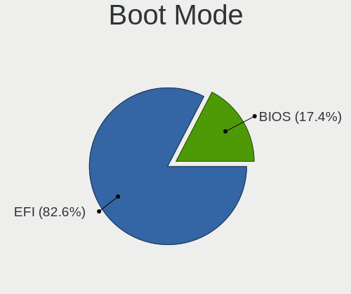
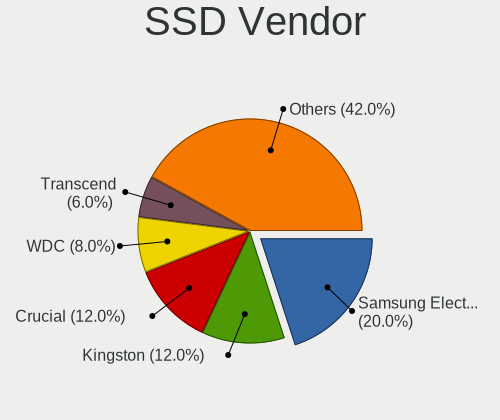
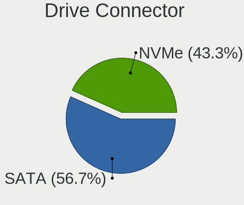
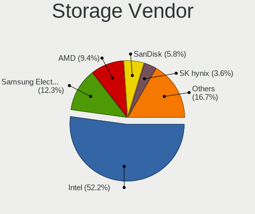
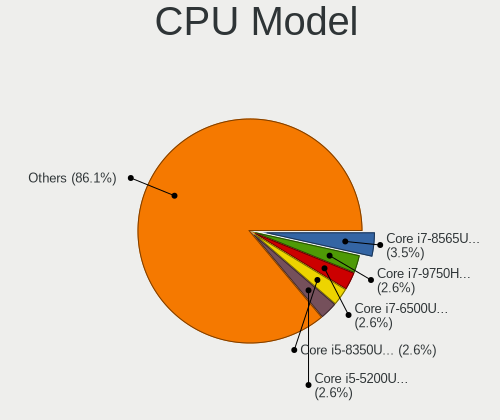
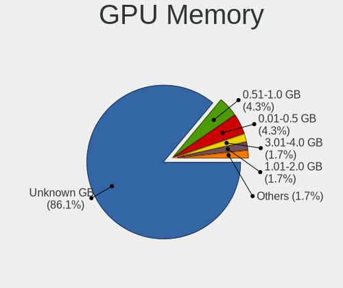
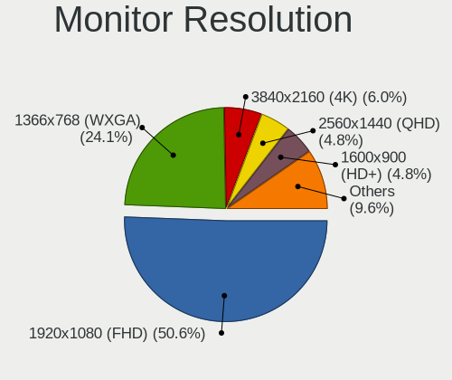
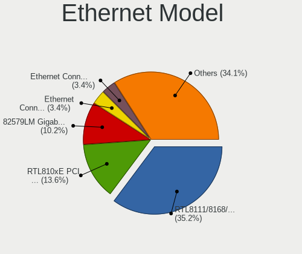

FreeBSD 13.1 - Tested Hardware & Statistics (Notebooks)
-------------------------------------------------------

A project to collect tested hardware configurations for FreeBSD 13.1.

Anyone can contribute to this report by the [hw-probe](https://github.com/linuxhw/hw-probe/blob/master/INSTALL.BSD.md) tool:

    hw-probe -all -upload

Please contribute! Especially if your hardware is rare.

Contents
--------

* [ Test Cases ](#test-cases)

* [ System ](#system)
  - [ Arch                     ](#arch)
  - [ DE                       ](#de)
  - [ Display Server           ](#display-server)
  - [ Display Manager          ](#display-manager)
  - [ OS Lang                  ](#os-lang)
  - [ Boot Mode                ](#boot-mode)
  - [ Filesystem               ](#filesystem)
  - [ Part. scheme             ](#part-scheme)

* [ Board ](#board)
  - [ Vendor                   ](#vendor)
  - [ Model                    ](#model)
  - [ Model Family             ](#model-family)
  - [ MFG Year                 ](#mfg-year)
  - [ Form Factor              ](#form-factor)
  - [ Coreboot                 ](#coreboot)
  - [ RAM Size                 ](#ram-size)
  - [ RAM Used                 ](#ram-used)
  - [ Total Drives             ](#total-drives)
  - [ Has CD-ROM               ](#has-cd-rom)
  - [ Has Ethernet             ](#has-ethernet)
  - [ Has WiFi                 ](#has-wifi)
  - [ Has Bluetooth            ](#has-bluetooth)

* [ Location ](#location)
  - [ Country                  ](#country)
  - [ City                     ](#city)

* [ Drives ](#drives)
  - [ Drive Vendor             ](#drive-vendor)
  - [ Drive Model              ](#drive-model)
  - [ HDD Vendor               ](#hdd-vendor)
  - [ SSD Vendor               ](#ssd-vendor)
  - [ Drive Kind               ](#drive-kind)
  - [ Drive Connector          ](#drive-connector)
  - [ Drive Size               ](#drive-size)
  - [ Space Total              ](#space-total)
  - [ Space Used               ](#space-used)
  - [ Malfunc. Drives          ](#malfunc-drives)
  - [ Malfunc. Drive Vendor    ](#malfunc-drive-vendor)
  - [ Malfunc. HDD Vendor      ](#malfunc-hdd-vendor)
  - [ Malfunc. Drive Kind      ](#malfunc-drive-kind)
  - [ Failed Drives            ](#failed-drives)
  - [ Failed Drive Vendor      ](#failed-drive-vendor)
  - [ Drive Status             ](#drive-status)

* [ Storage controller ](#storage-controller)
  - [ Storage Vendor           ](#storage-vendor)
  - [ Storage Model            ](#storage-model)
  - [ Storage Kind             ](#storage-kind)

* [ Processor ](#processor)
  - [ CPU Vendor               ](#cpu-vendor)
  - [ CPU Model                ](#cpu-model)
  - [ CPU Model Family         ](#cpu-model-family)
  - [ CPU Cores                ](#cpu-cores)
  - [ CPU Sockets              ](#cpu-sockets)
  - [ CPU Threads              ](#cpu-threads)
  - [ CPU Microarch            ](#cpu-microarch)

* [ Graphics ](#graphics)
  - [ GPU Vendor               ](#gpu-vendor)
  - [ GPU Model                ](#gpu-model)
  - [ GPU Combo                ](#gpu-combo)
  - [ GPU Driver               ](#gpu-driver)
  - [ GPU Memory               ](#gpu-memory)

* [ Monitor ](#monitor)
  - [ Monitor Vendor           ](#monitor-vendor)
  - [ Monitor Model            ](#monitor-model)
  - [ Monitor Resolution       ](#monitor-resolution)
  - [ Monitor Diagonal         ](#monitor-diagonal)
  - [ Monitor Width            ](#monitor-width)
  - [ Aspect Ratio             ](#aspect-ratio)
  - [ Monitor Area             ](#monitor-area)
  - [ Pixel Density            ](#pixel-density)
  - [ Multiple Monitors        ](#multiple-monitors)

* [ Network ](#network)
  - [ Net Controller Vendor    ](#net-controller-vendor)
  - [ Net Controller Model     ](#net-controller-model)
  - [ Wireless Vendor          ](#wireless-vendor)
  - [ Wireless Model           ](#wireless-model)
  - [ Ethernet Vendor          ](#ethernet-vendor)
  - [ Ethernet Model           ](#ethernet-model)
  - [ Net Controller Kind      ](#net-controller-kind)
  - [ Used Controller          ](#used-controller)
  - [ NICs                     ](#nics)
  - [ IPv6                     ](#ipv6)

* [ Bluetooth ](#bluetooth)
  - [ Bluetooth Vendor         ](#bluetooth-vendor)
  - [ Bluetooth Model          ](#bluetooth-model)

* [ Sound ](#sound)
  - [ Sound Vendor             ](#sound-vendor)
  - [ Sound Model              ](#sound-model)

* [ Memory ](#memory)
  - [ Memory Vendor            ](#memory-vendor)
  - [ Memory Model             ](#memory-model)
  - [ Memory Kind              ](#memory-kind)
  - [ Memory Form Factor       ](#memory-form-factor)
  - [ Memory Size              ](#memory-size)
  - [ Memory Speed             ](#memory-speed)

* [ Printers & scanners ](#printers--scanners)
  - [ Printer Vendor           ](#printer-vendor)
  - [ Printer Model            ](#printer-model)
  - [ Scanner Vendor           ](#scanner-vendor)
  - [ Scanner Model            ](#scanner-model)

* [ Camera ](#camera)
  - [ Camera Vendor            ](#camera-vendor)
  - [ Camera Model             ](#camera-model)

* [ Security ](#security)
  - [ Fingerprint Vendor       ](#fingerprint-vendor)
  - [ Fingerprint Model        ](#fingerprint-model)
  - [ Chipcard Vendor          ](#chipcard-vendor)
  - [ Chipcard Model           ](#chipcard-model)

* [ Unsupported ](#unsupported)
  - [ Unsupported Devices      ](#unsupported-devices)
  - [ Unsupported Device Types ](#unsupported-device-types)

Test Cases
----------

Total: 99

| Vendor        | Model                       | Probe                                                     | Date         |
|---------------|-----------------------------|-----------------------------------------------------------|--------------|
| Samsung       | 750TDA                      | [a880b1f616](https://bsd-hardware.info/?probe=a880b1f616) | Nov 02, 2022 |
| Dell          | Inspiron 7720               | [6911e08b7e](https://bsd-hardware.info/?probe=6911e08b7e) | Oct 28, 2022 |
| Lenovo        | ThinkPad X1 Carbon Gen 1... | [caad4323ba](https://bsd-hardware.info/?probe=caad4323ba) | Oct 23, 2022 |
| Dell          | Precision M4500             | [66ded228ea](https://bsd-hardware.info/?probe=66ded228ea) | Oct 20, 2022 |
| HP            | ENVY Laptop 13-aq0xxx       | [bc229efed9](https://bsd-hardware.info/?probe=bc229efed9) | Oct 18, 2022 |
| HP            | ENVY Laptop 13-aq0xxx       | [0a8b1f727f](https://bsd-hardware.info/?probe=0a8b1f727f) | Oct 17, 2022 |
| Acer          | Aspire A514-54              | [e057b613a0](https://bsd-hardware.info/?probe=e057b613a0) | Oct 17, 2022 |
| Lenovo        | XiaoXinPro-13API 2019 81... | [dfa08657fd](https://bsd-hardware.info/?probe=dfa08657fd) | Oct 16, 2022 |
| Dell          | Inspiron 15 5510            | [22881028bc](https://bsd-hardware.info/?probe=22881028bc) | Oct 16, 2022 |
| Lenovo        | ThinkPad E14 Gen 2 20T6S... | [601029d3fc](https://bsd-hardware.info/?probe=601029d3fc) | Oct 06, 2022 |
| Lenovo        | IdeaPad 3 15ALC6 82KU       | [ce9cfa77aa](https://bsd-hardware.info/?probe=ce9cfa77aa) | Oct 05, 2022 |
| Dell          | Precision 5510              | [f69c9fb0ea](https://bsd-hardware.info/?probe=f69c9fb0ea) | Oct 04, 2022 |
| Dell          | Precision M4500             | [6b987b43b1](https://bsd-hardware.info/?probe=6b987b43b1) | Oct 03, 2022 |
| Acer          | Swift SF313-52              | [6339e6b468](https://bsd-hardware.info/?probe=6339e6b468) | Sep 25, 2022 |
| System76      | Gazelle                     | [d087321049](https://bsd-hardware.info/?probe=d087321049) | Sep 24, 2022 |
| ASUSTek       | X455LJ                      | [431ad10ab2](https://bsd-hardware.info/?probe=431ad10ab2) | Sep 17, 2022 |
| Lenovo        | ThinkPad L420 7829WDY       | [a697be2aa9](https://bsd-hardware.info/?probe=a697be2aa9) | Sep 16, 2022 |
| Google        | Peppy                       | [80ffa77224](https://bsd-hardware.info/?probe=80ffa77224) | Sep 15, 2022 |
| Dell          | Latitude 5310               | [6edf4d34fe](https://bsd-hardware.info/?probe=6edf4d34fe) | Sep 07, 2022 |
| Dell          | Vostro 5415                 | [ef6d4ee660](https://bsd-hardware.info/?probe=ef6d4ee660) | Sep 06, 2022 |
| ASUSTek       | VivoBook_ASUSLaptop X515... | [cffed92600](https://bsd-hardware.info/?probe=cffed92600) | Sep 06, 2022 |
| Lenovo        | ThinkPad X1 Extreme Gen ... | [72757feb65](https://bsd-hardware.info/?probe=72757feb65) | Sep 03, 2022 |
| Lenovo        | ThinkPad X1 Extreme Gen ... | [5d575c85d0](https://bsd-hardware.info/?probe=5d575c85d0) | Sep 03, 2022 |
| Toshiba       | Satellite A300              | [ac185c104b](https://bsd-hardware.info/?probe=ac185c104b) | Aug 31, 2022 |
| ASUSTek       | VivoBook_ASUSLaptop X570... | [0466d87f04](https://bsd-hardware.info/?probe=0466d87f04) | Aug 25, 2022 |
| HP            | Pavilion g6                 | [c146b538e1](https://bsd-hardware.info/?probe=c146b538e1) | Aug 20, 2022 |
| ASUSTek       | ZenBook 14 UX410UFR         | [2bf0f0ef08](https://bsd-hardware.info/?probe=2bf0f0ef08) | Aug 19, 2022 |
| Google        | Peppy                       | [e2e0a1953d](https://bsd-hardware.info/?probe=e2e0a1953d) | Aug 18, 2022 |
| MSI           | GF63 Thin 9SC               | [dacea7c6be](https://bsd-hardware.info/?probe=dacea7c6be) | Aug 14, 2022 |
| Dell          | Inspiron 3581               | [f31cc32515](https://bsd-hardware.info/?probe=f31cc32515) | Aug 04, 2022 |
| HP            | EliteBook 850 G7 Noteboo... | [f603e648c7](https://bsd-hardware.info/?probe=f603e648c7) | Aug 01, 2022 |
| Lenovo        | ThinkPad T480 20L6S29E0T    | [546fa8380b](https://bsd-hardware.info/?probe=546fa8380b) | Aug 01, 2022 |
| Dell          | Inspiron 5559               | [13baedb59b](https://bsd-hardware.info/?probe=13baedb59b) | Jul 31, 2022 |
| Lenovo        | IdeaPad 330-15ARR 81D2      | [7b130fb168](https://bsd-hardware.info/?probe=7b130fb168) | Jul 27, 2022 |
| Dell          | Precision 5560              | [3dc82c6d91](https://bsd-hardware.info/?probe=3dc82c6d91) | Jul 23, 2022 |
| Lenovo        | G40-45 80E1                 | [6e31b5f45b](https://bsd-hardware.info/?probe=6e31b5f45b) | Jul 23, 2022 |
| Dell          | Studio XPS 1340             | [642da98e96](https://bsd-hardware.info/?probe=642da98e96) | Jul 21, 2022 |
| ASUSTek       | ZenBook UX325UA_UM325UA     | [9af051c79f](https://bsd-hardware.info/?probe=9af051c79f) | Jul 17, 2022 |
| Lenovo        | ThinkPad T480 20L6SB2N00    | [6c5c9eefc0](https://bsd-hardware.info/?probe=6c5c9eefc0) | Jul 17, 2022 |
| Lenovo        | ThinkPad T420 4236C92       | [4067ce2036](https://bsd-hardware.info/?probe=4067ce2036) | Jul 16, 2022 |
| Lenovo        | ThinkPad X260 20F6S0KA00    | [117014d55f](https://bsd-hardware.info/?probe=117014d55f) | Jul 14, 2022 |
| Toshiba       | Satellite L305D             | [b0311b8175](https://bsd-hardware.info/?probe=b0311b8175) | Jul 12, 2022 |
| ASUSTek       | VivoBook_ASUSLaptop E210... | [7081ddd59c](https://bsd-hardware.info/?probe=7081ddd59c) | Jul 11, 2022 |
| Lenovo        | IdeaPad 5 Pro 16ACH6 82L... | [66543e9280](https://bsd-hardware.info/?probe=66543e9280) | Jul 07, 2022 |
| Dell          | Latitude E6420              | [c41c8ff4f4](https://bsd-hardware.info/?probe=c41c8ff4f4) | Jul 07, 2022 |
| Fujitsu       | LIFEBOOK A555               | [d9fd7e54cf](https://bsd-hardware.info/?probe=d9fd7e54cf) | Jul 06, 2022 |
| Unknown       | Unknown                     | [584ecf8423](https://bsd-hardware.info/?probe=584ecf8423) | Jul 05, 2022 |
| HP            | Laptop 15-bs1xx             | [b697848727](https://bsd-hardware.info/?probe=b697848727) | Jul 05, 2022 |
| LG Electro... | 17Z990-R.AAC9U1             | [5777cb6dc6](https://bsd-hardware.info/?probe=5777cb6dc6) | Jul 01, 2022 |
| HP            | EliteBook 850 G7 Noteboo... | [f573327012](https://bsd-hardware.info/?probe=f573327012) | Jun 29, 2022 |
| Acer          | Aspire A114-33              | [d3659c85e9](https://bsd-hardware.info/?probe=d3659c85e9) | Jun 28, 2022 |
| Samsung       | R530/R730/R540              | [a4cd230718](https://bsd-hardware.info/?probe=a4cd230718) | Jun 27, 2022 |
| Fujitsu Si... | AMILO Li3710                | [6d4bc39638](https://bsd-hardware.info/?probe=6d4bc39638) | Jun 18, 2022 |
| Sony          | VGN-NS21M_S                 | [c9701a7ff5](https://bsd-hardware.info/?probe=c9701a7ff5) | Jun 18, 2022 |
| Dell          | Latitude E5420              | [524ab094e1](https://bsd-hardware.info/?probe=524ab094e1) | Jun 13, 2022 |
| ASUSTek       | ZenBook UX391FA_UX391FA     | [8825a49f37](https://bsd-hardware.info/?probe=8825a49f37) | Jun 13, 2022 |
| HP            | Laptop 15s-fq1xxx           | [380218b2c1](https://bsd-hardware.info/?probe=380218b2c1) | Jun 12, 2022 |
| Fujitsu Si... | AMILO Li3710                | [387bf3d18f](https://bsd-hardware.info/?probe=387bf3d18f) | Jun 12, 2022 |
| Fujitsu Si... | AMILO Li3710                | [edebcb2719](https://bsd-hardware.info/?probe=edebcb2719) | Jun 12, 2022 |
| Fujitsu       | LIFEBOOK A555               | [23d96bc669](https://bsd-hardware.info/?probe=23d96bc669) | Jun 11, 2022 |
| Dell          | Latitude E5420              | [aca711c5ec](https://bsd-hardware.info/?probe=aca711c5ec) | Jun 09, 2022 |
| Lenovo        | IdeaPad 130-15AST 81H5      | [9f33082ffa](https://bsd-hardware.info/?probe=9f33082ffa) | Jun 08, 2022 |
| Dell          | Precision M4800             | [4d77bb0082](https://bsd-hardware.info/?probe=4d77bb0082) | Jun 08, 2022 |
| Dell          | Latitude E5420              | [a3a9820968](https://bsd-hardware.info/?probe=a3a9820968) | Jun 07, 2022 |
| Lenovo        | ThinkPad T14 Gen 1 20S0C... | [56111732fd](https://bsd-hardware.info/?probe=56111732fd) | Jun 07, 2022 |
| Lenovo        | ThinkPad T14 Gen 1 20S0C... | [aeec87e07f](https://bsd-hardware.info/?probe=aeec87e07f) | Jun 06, 2022 |
| Lenovo        | ThinkPad X220 4286CTO       | [cb98f3014e](https://bsd-hardware.info/?probe=cb98f3014e) | Jun 05, 2022 |
| Dell          | Latitude 7490               | [18215740d1](https://bsd-hardware.info/?probe=18215740d1) | Jun 05, 2022 |
| Dell          | Latitude E5500              | [b1cb5de914](https://bsd-hardware.info/?probe=b1cb5de914) | Jun 03, 2022 |
| ASUSTek       | X441UV                      | [c8906b438b](https://bsd-hardware.info/?probe=c8906b438b) | Jun 03, 2022 |
| Apple         | MacBookPro11,4              | [29f1ef0cdc](https://bsd-hardware.info/?probe=29f1ef0cdc) | Jun 02, 2022 |
| Lenovo        | ThinkPad W520 4282AD4       | [40198abaa2](https://bsd-hardware.info/?probe=40198abaa2) | Jun 02, 2022 |
| Acer          | Nitro AN515-55              | [0cf6981a98](https://bsd-hardware.info/?probe=0cf6981a98) | Jun 02, 2022 |
| GPD           | MicroPC                     | [a448570ff9](https://bsd-hardware.info/?probe=a448570ff9) | May 31, 2022 |
| Dell          | Inspiron 5559               | [283a074737](https://bsd-hardware.info/?probe=283a074737) | May 31, 2022 |
| GPD           | MicroPC                     | [0046ab7c9b](https://bsd-hardware.info/?probe=0046ab7c9b) | May 31, 2022 |
| HP            | Pavilion g6                 | [32854b73a5](https://bsd-hardware.info/?probe=32854b73a5) | May 30, 2022 |
| System76      | Galago Pro                  | [126ebc1522](https://bsd-hardware.info/?probe=126ebc1522) | May 29, 2022 |
| Dell          | G5 5590                     | [86bac52410](https://bsd-hardware.info/?probe=86bac52410) | May 29, 2022 |
| Dell          | Latitude E6430              | [d7ced37bac](https://bsd-hardware.info/?probe=d7ced37bac) | May 29, 2022 |
| Lenovo        | ThinkPad X250 20CMS0FA00    | [5afeac632d](https://bsd-hardware.info/?probe=5afeac632d) | May 28, 2022 |
| Unknown       | Unknown                     | [3ff577e111](https://bsd-hardware.info/?probe=3ff577e111) | May 26, 2022 |
| Unknown       | Unknown                     | [9e2f16664a](https://bsd-hardware.info/?probe=9e2f16664a) | May 26, 2022 |
| Dell          | Inspiron 3505               | [cddd786b51](https://bsd-hardware.info/?probe=cddd786b51) | May 26, 2022 |
| Notebook      | N7x0WU                      | [37242aa9a3](https://bsd-hardware.info/?probe=37242aa9a3) | May 25, 2022 |
| TUXEDO        | Aura 15 Gen1                | [727f9708b4](https://bsd-hardware.info/?probe=727f9708b4) | May 24, 2022 |
| Dell          | Latitude E6540              | [70871cf070](https://bsd-hardware.info/?probe=70871cf070) | May 24, 2022 |
| Dell          | Precision M4800             | [6a703b66f8](https://bsd-hardware.info/?probe=6a703b66f8) | May 22, 2022 |
| Dell          | Latitude E7240              | [970234b430](https://bsd-hardware.info/?probe=970234b430) | May 22, 2022 |
| Lenovo        | ThinkPad X13 Gen 1 20UF0... | [cf5f498572](https://bsd-hardware.info/?probe=cf5f498572) | May 21, 2022 |
| Dell          | Latitude 5520               | [cbc2c03fa1](https://bsd-hardware.info/?probe=cbc2c03fa1) | May 20, 2022 |
| Dell          | XPS 13 9343                 | [44abecc1ef](https://bsd-hardware.info/?probe=44abecc1ef) | May 20, 2022 |
| ASUSTek       | 1001P                       | [6ffa9529a3](https://bsd-hardware.info/?probe=6ffa9529a3) | May 20, 2022 |
| TUXEDO        | Aura 15 Gen1                | [1c84f0f722](https://bsd-hardware.info/?probe=1c84f0f722) | May 19, 2022 |
| Lenovo        | ThinkPad L420 7854CTO       | [56cf502c2f](https://bsd-hardware.info/?probe=56cf502c2f) | May 18, 2022 |
| Lenovo        | ThinkPad T420s 41732AU      | [9d9ddcc409](https://bsd-hardware.info/?probe=9d9ddcc409) | May 18, 2022 |
| Lenovo        | ThinkPad X270 20HMCTO1WW    | [2d3de77101](https://bsd-hardware.info/?probe=2d3de77101) | May 18, 2022 |
| Lenovo        | ThinkPad E490 20N8CTO1WW    | [86866ce217](https://bsd-hardware.info/?probe=86866ce217) | May 17, 2022 |
| TUXEDO        | InfinityBook13V3            | [fd081a3636](https://bsd-hardware.info/?probe=fd081a3636) | May 17, 2022 |

System
------

Arch
----

OS architecture (x86_64, i586, etc.)

| Name  | Notebooks | Percent |
|-------|-----------|---------|
| amd64 | 82        | 100%    |

DE
--

Desktop Environment

| Name       | Notebooks | Percent |
|------------|-----------|---------|
| KDE5       | 19        | 23.17%  |
| XFCE       | 14        | 17.07%  |
| GNOME      | 12        | 14.63%  |
| Console    | 11        | 13.41%  |
| TWM        | 8         | 9.76%   |
| Openbox    | 4         | 4.88%   |
| i3         | 4         | 4.88%   |
| MATE       | 3         | 3.66%   |
| Cinnamon   | 2         | 2.44%   |
| X-Cinnamon | 1         | 1.22%   |
| LXQt       | 1         | 1.22%   |
| LXDE       | 1         | 1.22%   |
| IceWM      | 1         | 1.22%   |
| dwm        | 1         | 1.22%   |

Display Server
--------------

X11 or Wayland

| Name    | Notebooks | Percent |
|---------|-----------|---------|
| X11     | 66        | 80.49%  |
| Console | 12        | 14.63%  |
| Wayland | 4         | 4.88%   |

Display Manager
---------------

SDDM, LightDM, etc.

| Name    | Notebooks | Percent |
|---------|-----------|---------|
| Console | 31        | 37.8%   |
| SDDM    | 21        | 25.61%  |
| SLiM    | 12        | 14.63%  |
| GDM     | 8         | 9.76%   |
| XDM     | 5         | 6.1%    |
| LightDM | 4         | 4.88%   |
| PCDM    | 1         | 1.22%   |

OS Lang
-------

Language

| Lang            | Notebooks | Percent |
|-----------------|-----------|---------|
| C               | 58        | 69.88%  |
| en_US           | 12        | 14.46%  |
| zh_CN           | 4         | 4.82%   |
| ru_RU           | 3         | 3.61%   |
| Unknown         | 3         | 3.61%   |
| fr_FR           | 1         | 1.2%    |
| en_US.ISO8859-1 | 1         | 1.2%    |
| en_AU           | 1         | 1.2%    |

Boot Mode
---------

EFI or BIOS

| Mode | Notebooks | Percent |
|------|-----------|---------|
| EFI  | 67        | 81.71%  |
| BIOS | 15        | 18.29%  |

Filesystem
----------

Type of filesystem

| Type | Notebooks | Percent |
|------|-----------|---------|
| Zfs  | 59        | 71.08%  |
| Ufs  | 24        | 28.92%  |

Part. scheme
------------

Scheme of partitioning

| Type    | Notebooks | Percent |
|---------|-----------|---------|
| GPT     | 75        | 91.46%  |
| MBR     | 5         | 6.1%    |
| BSD     | 1         | 1.22%   |
| Unknown | 1         | 1.22%   |

Board
-----

Vendor
------

Motherboard manufacturer

| Name                | Notebooks | Percent |
|---------------------|-----------|---------|
| Dell                | 23        | 28.05%  |
| Lenovo              | 22        | 26.83%  |
| ASUSTek Computer    | 9         | 10.98%  |
| Hewlett-Packard     | 5         | 6.1%    |
| Acer                | 3         | 3.66%   |
| TUXEDO              | 2         | 2.44%   |
| Toshiba             | 2         | 2.44%   |
| System76            | 2         | 2.44%   |
| Samsung Electronics | 2         | 2.44%   |
| Google              | 2         | 2.44%   |
| Unknown             | 2         | 2.44%   |
| Sony                | 1         | 1.22%   |
| Notebook            | 1         | 1.22%   |
| MSI                 | 1         | 1.22%   |
| LG Electronics      | 1         | 1.22%   |
| GPD                 | 1         | 1.22%   |
| Fujitsu Siemens     | 1         | 1.22%   |
| Fujitsu             | 1         | 1.22%   |
| Apple               | 1         | 1.22%   |

Model
-----

Motherboard model

| Name                                        | Notebooks | Percent |
|---------------------------------------------|-----------|---------|
| HP EliteBook 850 G7 Notebook PC             | 2         | 2.44%   |
| Google Peppy                                | 2         | 2.44%   |
| Dell Precision M4500                        | 2         | 2.44%   |
| Unknown                                     | 2         | 2.44%   |
| TUXEDO InfinityBook13V3                     | 1         | 1.22%   |
| TUXEDO Aura 15 Gen1                         | 1         | 1.22%   |
| Toshiba Satellite L305D                     | 1         | 1.22%   |
| Toshiba Satellite A300                      | 1         | 1.22%   |
| System76 Gazelle                            | 1         | 1.22%   |
| System76 Galago Pro                         | 1         | 1.22%   |
| Sony VGN-NS21M_S                            | 1         | 1.22%   |
| Samsung R530/R730/R540                      | 1         | 1.22%   |
| Samsung 750TDA                              | 1         | 1.22%   |
| Notebook N7x0WU                             | 1         | 1.22%   |
| MSI GF63 Thin 9SC                           | 1         | 1.22%   |
| LG 17Z990-R.AAC9U1                          | 1         | 1.22%   |
| Lenovo XiaoXinPro-13API 2019 81XD           | 1         | 1.22%   |
| Lenovo ThinkPad X270 20HMCTO1WW             | 1         | 1.22%   |
| Lenovo ThinkPad X260 20F6S0KA00             | 1         | 1.22%   |
| Lenovo ThinkPad X250 20CMS0FA00             | 1         | 1.22%   |
| Lenovo ThinkPad X220 4286CTO                | 1         | 1.22%   |
| Lenovo ThinkPad X13 Gen 1 20UF000QRT        | 1         | 1.22%   |
| Lenovo ThinkPad X1 Extreme Gen 3 20TKS0QB00 | 1         | 1.22%   |
| Lenovo ThinkPad X1 Carbon Gen 10 21CBCTO1WW | 1         | 1.22%   |
| Lenovo ThinkPad W520 4282AD4                | 1         | 1.22%   |
| Lenovo ThinkPad T480 20L6SB2N00             | 1         | 1.22%   |
| Lenovo ThinkPad T480 20L6S29E0T             | 1         | 1.22%   |
| Lenovo ThinkPad T420s 41732AU               | 1         | 1.22%   |
| Lenovo ThinkPad T420 4236C92                | 1         | 1.22%   |
| Lenovo ThinkPad T14 Gen 1 20S0CTO1WW        | 1         | 1.22%   |
| Lenovo ThinkPad L420 7854CTO                | 1         | 1.22%   |
| Lenovo ThinkPad L420 7829WDY                | 1         | 1.22%   |
| Lenovo ThinkPad E490 20N8CTO1WW             | 1         | 1.22%   |
| Lenovo IdeaPad 5 Pro 16ACH6 82L5            | 1         | 1.22%   |
| Lenovo IdeaPad 330-15ARR 81D2               | 1         | 1.22%   |
| Lenovo IdeaPad 3 15ALC6 82KU                | 1         | 1.22%   |
| Lenovo IdeaPad 130-15AST 81H5               | 1         | 1.22%   |
| Lenovo G40-45 80E1                          | 1         | 1.22%   |
| HP Pavilion g6                              | 1         | 1.22%   |
| HP Laptop 15s-fq1xxx                        | 1         | 1.22%   |

Model Family
------------

Motherboard model prefix

| Name                    | Notebooks | Percent |
|-------------------------|-----------|---------|
| Lenovo ThinkPad         | 16        | 19.51%  |
| Dell Latitude           | 9         | 10.98%  |
| Dell Precision          | 5         | 6.1%    |
| Dell Inspiron           | 5         | 6.1%    |
| Lenovo IdeaPad          | 4         | 4.88%   |
| ASUS ZenBook            | 3         | 3.66%   |
| ASUS VivoBook           | 3         | 3.66%   |
| Toshiba Satellite       | 2         | 2.44%   |
| HP EliteBook            | 2         | 2.44%   |
| Google Peppy            | 2         | 2.44%   |
| Acer Aspire             | 2         | 2.44%   |
| Unknown                 | 2         | 2.44%   |
| TUXEDO InfinityBook13V3 | 1         | 1.22%   |
| TUXEDO Aura             | 1         | 1.22%   |
| System76 Gazelle        | 1         | 1.22%   |
| System76 Galago         | 1         | 1.22%   |
| Sony VGN-NS21M          | 1         | 1.22%   |
| Samsung R530            | 1         | 1.22%   |
| Samsung 750TDA          | 1         | 1.22%   |
| Notebook N7x0WU         | 1         | 1.22%   |
| MSI GF63                | 1         | 1.22%   |
| LG 17Z990-R.AAC9U1      | 1         | 1.22%   |
| Lenovo XiaoXinPro-13API | 1         | 1.22%   |
| Lenovo G40-45           | 1         | 1.22%   |
| HP Pavilion             | 1         | 1.22%   |
| HP Laptop               | 1         | 1.22%   |
| HP ENVY                 | 1         | 1.22%   |
| GPD MicroPC             | 1         | 1.22%   |
| Fujitsu Siemens AMILO   | 1         | 1.22%   |
| Fujitsu LIFEBOOK        | 1         | 1.22%   |
| Dell XPS                | 1         | 1.22%   |
| Dell Vostro             | 1         | 1.22%   |
| Dell Studio             | 1         | 1.22%   |
| Dell G5                 | 1         | 1.22%   |
| ASUS X455LJ             | 1         | 1.22%   |
| ASUS X441UV             | 1         | 1.22%   |
| ASUS 1001P              | 1         | 1.22%   |
| Apple MacBookPro11      | 1         | 1.22%   |
| Acer Nitro              | 1         | 1.22%   |

MFG Year
--------

Motherboard manufacture year

| Year | Notebooks | Percent |
|------|-----------|---------|
| 2022 | 12        | 14.63%  |
| 2021 | 11        | 13.41%  |
| 2020 | 11        | 13.41%  |
| 2019 | 8         | 9.76%   |
| 2018 | 8         | 9.76%   |
| 2011 | 6         | 7.32%   |
| 2016 | 5         | 6.1%    |
| 2015 | 4         | 4.88%   |
| 2012 | 4         | 4.88%   |
| 2010 | 4         | 4.88%   |
| 2017 | 2         | 2.44%   |
| 2013 | 2         | 2.44%   |
| 2009 | 2         | 2.44%   |
| 2008 | 2         | 2.44%   |
| 2014 | 1         | 1.22%   |

Form Factor
-----------

Physical design of the computer

| Name     | Notebooks | Percent |
|----------|-----------|---------|
| Notebook | 82        | 100%    |

Coreboot
--------

Have coreboot on board

| Used | Notebooks | Percent |
|------|-----------|---------|
| No   | 79        | 96.34%  |
| Yes  | 3         | 3.66%   |

RAM Size
--------

Total RAM memory

| Size in GB  | Notebooks | Percent |
|-------------|-----------|---------|
| 8.01-16.0   | 29        | 35.37%  |
| 16.01-24.0  | 28        | 34.15%  |
| 4.01-8.0    | 12        | 14.63%  |
| 32.01-64.0  | 6         | 7.32%   |
| 64.01-256.0 | 3         | 3.66%   |
| 24.01-32.0  | 2         | 2.44%   |
| 2.01-3.0    | 2         | 2.44%   |

RAM Used
--------

Used RAM memory

| Used GB   | Notebooks | Percent |
|-----------|-----------|---------|
| 0.01-0.5  | 31        | 37.8%   |
| 0.51-1.0  | 26        | 31.71%  |
| 1.01-2.0  | 17        | 20.73%  |
| 2.01-3.0  | 7         | 8.54%   |
| 8.01-16.0 | 1         | 1.22%   |

Total Drives
------------

Number of drives on board

| Drives | Notebooks | Percent |
|--------|-----------|---------|
| 1      | 59        | 71.95%  |
| 2      | 19        | 23.17%  |
| 0      | 3         | 3.66%   |
| 3      | 1         | 1.22%   |

Has CD-ROM
----------

Has CD-ROM on board

| Presented | Notebooks | Percent |
|-----------|-----------|---------|
| No        | 60        | 73.17%  |
| Yes       | 22        | 26.83%  |

Has Ethernet
------------

Has Ethernet on board

| Presented | Notebooks | Percent |
|-----------|-----------|---------|
| Yes       | 56        | 68.29%  |
| No        | 26        | 31.71%  |

Has WiFi
--------

Has WiFi module

| Presented | Notebooks | Percent |
|-----------|-----------|---------|
| Yes       | 81        | 98.78%  |
| No        | 1         | 1.22%   |

Has Bluetooth
-------------

Has Bluetooth module

| Presented | Notebooks | Percent |
|-----------|-----------|---------|
| Yes       | 58        | 70.73%  |
| No        | 24        | 29.27%  |

Location
--------

Country
-------

Geographic location (country)

| Country     | Notebooks | Percent |
|-------------|-----------|---------|
| USA         | 19        | 22.89%  |
| Russia      | 8         | 9.64%   |
| China       | 6         | 7.23%   |
| France      | 5         | 6.02%   |
| UK          | 4         | 4.82%   |
| India       | 4         | 4.82%   |
| Japan       | 3         | 3.61%   |
| Austria     | 3         | 3.61%   |
| Turkey      | 2         | 2.41%   |
| Thailand    | 2         | 2.41%   |
| Spain       | 2         | 2.41%   |
| Philippines | 2         | 2.41%   |
| Netherlands | 2         | 2.41%   |
| Germany     | 2         | 2.41%   |
| Czechia     | 2         | 2.41%   |
| Venezuela   | 1         | 1.2%    |
| Uruguay     | 1         | 1.2%    |
| South Korea | 1         | 1.2%    |
| Slovenia    | 1         | 1.2%    |
| Norway      | 1         | 1.2%    |
| Malaysia    | 1         | 1.2%    |
| Lithuania   | 1         | 1.2%    |
| Italy       | 1         | 1.2%    |
| Israel      | 1         | 1.2%    |
| Hong Kong   | 1         | 1.2%    |
| Guadeloupe  | 1         | 1.2%    |
| Greece      | 1         | 1.2%    |
| Finland     | 1         | 1.2%    |
| Canada      | 1         | 1.2%    |
| Belarus     | 1         | 1.2%    |
| Australia   | 1         | 1.2%    |
| Argentina   | 1         | 1.2%    |

City
----

Geographic location (city)

| City              | Notebooks | Percent |
|-------------------|-----------|---------|
| Moscow            | 4         | 4.82%   |
| Vienna            | 3         | 3.61%   |
| Paris             | 2         | 2.41%   |
| Carry-le-Rouet    | 2         | 2.41%   |
| Brno              | 2         | 2.41%   |
| Zhumadian         | 1         | 1.2%    |
| Yangcheon-gu      | 1         | 1.2%    |
| Xiamen            | 1         | 1.2%    |
| Xi'an             | 1         | 1.2%    |
| Woerdense Verlaat | 1         | 1.2%    |
| Wheatland         | 1         | 1.2%    |
| Vilnius           | 1         | 1.2%    |
| Turku             | 1         | 1.2%    |
| Trivandrum        | 1         | 1.2%    |
| Thousand Oaks     | 1         | 1.2%    |
| Thessaloniki      | 1         | 1.2%    |
| Tel Aviv          | 1         | 1.2%    |
| Taito             | 1         | 1.2%    |
| Stratford         | 1         | 1.2%    |
| St Petersburg     | 1         | 1.2%    |
| Shinjuku          | 1         | 1.2%    |
| Shah Alam         | 1         | 1.2%    |
| Sandefjord        | 1         | 1.2%    |
| San Pablo City    | 1         | 1.2%    |
| San Antonio       | 1         | 1.2%    |
| Riverside         | 1         | 1.2%    |
| Queens            | 1         | 1.2%    |
| Qinnan            | 1         | 1.2%    |
| Ozersk            | 1         | 1.2%    |
| Oswego            | 1         | 1.2%    |
| Omaha             | 1         | 1.2%    |
| Newbury Park      | 1         | 1.2%    |
| New York          | 1         | 1.2%    |
| Nakano            | 1         | 1.2%    |
| Munich            | 1         | 1.2%    |
| Mumbai            | 1         | 1.2%    |
| Montevideo        | 1         | 1.2%    |
| Minsk             | 1         | 1.2%    |
| Maracaibo         | 1         | 1.2%    |
| Manassas          | 1         | 1.2%    |

Drives
------

Drive Vendor
------------

Hard drive vendors

| Vendor              | Notebooks | Drives | Percent |
|---------------------|-----------|--------|---------|
| WDC                 | 20        | 22     | 20.83%  |
| Samsung Electronics | 18        | 19     | 18.75%  |
| Kingston            | 7         | 8      | 7.29%   |
| Crucial             | 7         | 8      | 7.29%   |
| Seagate             | 6         | 7      | 6.25%   |
| Toshiba             | 5         | 5      | 5.21%   |
| SK hynix            | 5         | 5      | 5.21%   |
| KIOXIA              | 3         | 3      | 3.13%   |
| Hitachi             | 3         | 3      | 3.13%   |
| Transcend           | 2         | 2      | 2.08%   |
| Silicon Motion      | 2         | 2      | 2.08%   |
| SanDisk             | 2         | 2      | 2.08%   |
| Gigabyte Technology | 2         | 2      | 2.08%   |
| A-DATA Technology   | 2         | 5      | 2.08%   |
| UMIS                | 1         | 1      | 1.04%   |
| Micron Technology   | 1         | 1      | 1.04%   |
| Lexar               | 1         | 2      | 1.04%   |
| Lenovo              | 1         | 1      | 1.04%   |
| Intel               | 1         | 1      | 1.04%   |
| Hikvision           | 1         | 1      | 1.04%   |
| Hewlett-Packard     | 1         | 1      | 1.04%   |
| EAGET               | 1         | 1      | 1.04%   |
| CFD                 | 1         | 1      | 1.04%   |
| BR                  | 1         | 1      | 1.04%   |
| BIWIN               | 1         | 1      | 1.04%   |
| Apple               | 1         | 1      | 1.04%   |

Drive Model
-----------

Hard drive models

| Model                                           | Notebooks | Percent |
|-------------------------------------------------|-----------|---------|
| WDC WD3200BPVT-80JJ5T0 320GB                    | 2         | 1.98%   |
| SK hynix BC511 HFM512GDJTNI-82A0A 512GB         | 2         | 1.98%   |
| Samsung SSD 970 EVO Plus 2TB                    | 2         | 1.98%   |
| KIOXIA KBG40ZNS512G NVMe 512GB                  | 2         | 1.98%   |
| Crucial CT1000MX500SSD1 1TB                     | 2         | 1.98%   |
| WDC WDS500G3X0C-00SJG0 500GB                    | 1         | 0.99%   |
| WDC WDS480G2G0A-00JH30 480GB                    | 1         | 0.99%   |
| WDC WDS250G2B0B-00YS70 250GB                    | 1         | 0.99%   |
| WDC WDS240G2G0A-00JH30 240GB                    | 1         | 0.99%   |
| WDC WDS120G2G0B-00EPW0 120GB                    | 1         | 0.99%   |
| WDC WDS100T2B0C-00PXH0 1TB                      | 1         | 0.99%   |
| WDC WD3200BPVT-22JJ5T0 320GB                    | 1         | 0.99%   |
| WDC WD3200BEKT-60PVMT0 320GB                    | 1         | 0.99%   |
| WDC WD2500BEVT-24A23T0 250GB                    | 1         | 0.99%   |
| WDC WD20SPZX-00UA7T0 2TB                        | 1         | 0.99%   |
| WDC WD1600BEVT-80A23T0 160GB                    | 1         | 0.99%   |
| WDC WD1600BEVT-75ZCT2 160GB                     | 1         | 0.99%   |
| WDC WD1600BEVT-22ZCT0 160GB                     | 1         | 0.99%   |
| WDC WD10SPZX-75Z10T3 1TB                        | 1         | 0.99%   |
| WDC WD10SPZX-17Z10T1 1TB                        | 1         | 0.99%   |
| WDC WD10JPVX-22JC3T0 1TB                        | 1         | 0.99%   |
| WDC WD10EZEX-60WN4A0 1TB                        | 1         | 0.99%   |
| WDC PC SN730 SDBQNTY-1T00-1001 1TB              | 1         | 0.99%   |
| WDC PC SN530 SDBPNPZ-256G-1014 256GB            | 1         | 0.99%   |
| WDC PC SN530 NVMe 256GB                         | 1         | 0.99%   |
| UMIS RPJTJ256MEE1OWX 256GB                      | 1         | 0.99%   |
| Transcend TS1TMTE110S 1TB                       | 1         | 0.99%   |
| Transcend TS128GMTS430S 128GB                   | 1         | 0.99%   |
| Toshiba MQ04ABF100 1TB                          | 1         | 0.99%   |
| Toshiba MQ01ABF050 500GB                        | 1         | 0.99%   |
| Toshiba MQ01ABD100 1TB                          | 1         | 0.99%   |
| Toshiba KSG60ZMV256G M.2 2280 256GB             | 1         | 0.99%   |
| Toshiba KBG30ZMT512G 512GB                      | 1         | 0.99%   |
| SK hynix SKHynix_HFS256GDE9X081N 256GB          | 1         | 0.99%   |
| SK hynix HFM512GD3JX013N 512GB                  | 1         | 0.99%   |
| SK hynix BC501 NVMe 512GB                       | 1         | 0.99%   |
| Silicon Motion Asgard AN2+ 256NVMe-M.2-80 256GB | 1         | 0.99%   |
| Silicon Motion 512GB MEGA S3 512GB              | 1         | 0.99%   |
| Seagate ST500LT012-1DG142 500GB                 | 1         | 0.99%   |
| Seagate ST500LM012 HN-M500MBB 500GB             | 1         | 0.99%   |

HDD Vendor
----------

Hard disk drive vendors

| Vendor  | Notebooks | Drives | Percent |
|---------|-----------|--------|---------|
| WDC     | 12        | 13     | 50%     |
| Seagate | 6         | 7      | 25%     |
| Toshiba | 3         | 3      | 12.5%   |
| Hitachi | 3         | 3      | 12.5%   |

SSD Vendor
----------

Solid state drive vendors

| Vendor              | Notebooks | Drives | Percent |
|---------------------|-----------|--------|---------|
| Samsung Electronics | 6         | 6      | 17.14%  |
| Crucial             | 6         | 7      | 17.14%  |
| WDC                 | 4         | 4      | 11.43%  |
| Kingston            | 4         | 5      | 11.43%  |
| SanDisk             | 2         | 2      | 5.71%   |
| A-DATA Technology   | 2         | 5      | 5.71%   |
| Transcend           | 1         | 1      | 2.86%   |
| Toshiba             | 1         | 1      | 2.86%   |
| Lexar               | 1         | 2      | 2.86%   |
| Lenovo              | 1         | 1      | 2.86%   |
| Hikvision           | 1         | 1      | 2.86%   |
| Hewlett-Packard     | 1         | 1      | 2.86%   |
| Gigabyte Technology | 1         | 1      | 2.86%   |
| CFD                 | 1         | 1      | 2.86%   |
| BR                  | 1         | 1      | 2.86%   |
| BIWIN               | 1         | 1      | 2.86%   |
| Apple               | 1         | 1      | 2.86%   |

Drive Kind
----------

HDD or SSD

| Kind | Notebooks | Drives | Percent |
|------|-----------|--------|---------|
| NVMe | 37        | 39     | 40.66%  |
| SSD  | 31        | 41     | 34.07%  |
| HDD  | 23        | 26     | 25.27%  |

Drive Connector
---------------

SATA, SAS, NVMe, etc.

| Type | Notebooks | Drives | Percent |
|------|-----------|--------|---------|
| SATA | 51        | 67     | 57.95%  |
| NVMe | 37        | 39     | 42.05%  |

Drive Size
----------

Size of hard drive

| Size in TB | Notebooks | Drives | Percent |
|------------|-----------|--------|---------|
| 0.01-0.5   | 35        | 45     | 64.81%  |
| 0.51-1.0   | 15        | 18     | 27.78%  |
| 1.01-2.0   | 4         | 4      | 7.41%   |

Space Total
-----------

Amount of disk space available on the file system

| Size in GB | Notebooks | Percent |
|------------|-----------|---------|
| 101-250    | 31        | 37.8%   |
| 251-500    | 23        | 28.05%  |
| 501-1000   | 14        | 17.07%  |
| 51-100     | 6         | 7.32%   |
| 1001-2000  | 4         | 4.88%   |
| 21-50      | 3         | 3.66%   |
| 1-20       | 1         | 1.22%   |

Space Used
----------

Amount of used disk space

| Used GB | Notebooks | Percent |
|---------|-----------|---------|
| 1-20    | 63        | 75.9%   |
| 21-50   | 13        | 15.66%  |
| 101-250 | 4         | 4.82%   |
| 51-100  | 2         | 2.41%   |
| 251-500 | 1         | 1.2%    |

Malfunc. Drives
---------------

Drive models with a malfunction

| Model                                        | Notebooks | Drives | Percent |
|----------------------------------------------|-----------|--------|---------|
| WDC WD3200BPVT-80JJ5T0 320GB                 | 2         | 2      | 12.5%   |
| WDC WD3200BEKT-60PVMT0 320GB                 | 1         | 1      | 6.25%   |
| WDC WD2500BEVT-24A23T0 250GB                 | 1         | 1      | 6.25%   |
| Toshiba MQ01ABF050 500GB                     | 1         | 1      | 6.25%   |
| Toshiba MQ01ABD100 1TB                       | 1         | 1      | 6.25%   |
| Seagate ST500LT012-1DG142 500GB              | 1         | 1      | 6.25%   |
| Seagate ST500LM012 HN-M500MBB 500GB          | 1         | 1      | 6.25%   |
| Seagate ST1000LM024 HN-M101MBB 1TB           | 1         | 2      | 6.25%   |
| Samsung Electronics SSD PM810 2.5-inch 128GB | 1         | 1      | 6.25%   |
| Kingston SVP200S37A120G 120GB                | 1         | 1      | 6.25%   |
| Kingston SNS4151S316GD 16GB                  | 1         | 1      | 6.25%   |
| Kingston SH103S3240G 240GB                   | 1         | 1      | 6.25%   |
| Hitachi HTS721080G9SA00 80GB                 | 1         | 1      | 6.25%   |
| Hitachi HTS543232L9SA00 320GB                | 1         | 1      | 6.25%   |
| A-DATA Technology SU630 240GB                | 1         | 2      | 6.25%   |

Malfunc. Drive Vendor
---------------------

Vendors of faulty drives

| Vendor              | Notebooks | Drives | Percent |
|---------------------|-----------|--------|---------|
| WDC                 | 3         | 4      | 21.43%  |
| Seagate             | 3         | 4      | 21.43%  |
| Toshiba             | 2         | 2      | 14.29%  |
| Kingston            | 2         | 3      | 14.29%  |
| Hitachi             | 2         | 2      | 14.29%  |
| Samsung Electronics | 1         | 1      | 7.14%   |
| A-DATA Technology   | 1         | 2      | 7.14%   |

Malfunc. HDD Vendor
-------------------

Vendors of faulty HDD drives

| Vendor  | Notebooks | Drives | Percent |
|---------|-----------|--------|---------|
| WDC     | 3         | 4      | 30%     |
| Seagate | 3         | 4      | 30%     |
| Toshiba | 2         | 2      | 20%     |
| Hitachi | 2         | 2      | 20%     |

Malfunc. Drive Kind
-------------------

Kinds of faulty drives

| Kind | Notebooks | Drives | Percent |
|------|-----------|--------|---------|
| HDD  | 9         | 12     | 69.23%  |
| SSD  | 4         | 6      | 30.77%  |

Failed Drives
-------------

Failed drive models

Zero info for selected period =(

Failed Drive Vendor
-------------------

Failed drive vendors

Zero info for selected period =(

Drive Status
------------

Number of failed and malfunc. drives

| Status   | Notebooks | Drives | Percent |
|----------|-----------|--------|---------|
| Works    | 66        | 85     | 81.48%  |
| Malfunc  | 13        | 18     | 16.05%  |
| Detected | 2         | 3      | 2.47%   |

Storage controller
------------------

Storage Vendor
--------------

Storage controller vendors

| Vendor                      | Notebooks | Percent |
|-----------------------------|-----------|---------|
| Intel                       | 50        | 50.51%  |
| Samsung Electronics         | 13        | 13.13%  |
| AMD                         | 10        | 10.1%   |
| SanDisk                     | 6         | 6.06%   |
| SK hynix                    | 4         | 4.04%   |
| Silicon Motion              | 3         | 3.03%   |
| KIOXIA                      | 3         | 3.03%   |
| Kingston Technology Company | 3         | 3.03%   |
| Union Memory (Shenzhen)     | 1         | 1.01%   |
| Toshiba                     | 1         | 1.01%   |
| Phison Electronics          | 1         | 1.01%   |
| Nvidia                      | 1         | 1.01%   |
| Micron/Crucial Technology   | 1         | 1.01%   |
| Micron Technology           | 1         | 1.01%   |
| Unknown                     | 1         | 1.01%   |

Storage Model
-------------

Storage controller models

| Model                                                                          | Notebooks | Percent |
|--------------------------------------------------------------------------------|-----------|---------|
| AMD FCH SATA Controller [AHCI mode]                                            | 9         | 8.74%   |
| Intel 6 Series/C200 Series Chipset Family 6 port Mobile SATA AHCI Controller   | 8         | 7.77%   |
| Samsung NVMe SSD Controller SM981/PM981/PM983                                  | 7         | 6.8%    |
| Intel 82801 Mobile SATA Controller [RAID mode]                                 | 7         | 6.8%    |
| Intel Sunrise Point-LP SATA Controller [AHCI mode]                             | 6         | 5.83%   |
| Unknown                                                                        | 5         | 4.85%   |
| Intel Wildcat Point-LP SATA Controller [AHCI Mode]                             | 4         | 3.88%   |
| Intel 82801IBM/IEM (ICH9M/ICH9M-E) 4 port SATA Controller [AHCI mode]          | 4         | 3.88%   |
| Silicon Motion SM2263EN/SM2263XT SSD Controller                                | 3         | 2.91%   |
| Samsung NVMe SSD Controller SM961/PM961/SM963                                  | 3         | 2.91%   |
| KIOXIA NVMe SSD Controller BG4                                                 | 3         | 2.91%   |
| Intel 7 Series Chipset Family 6-port SATA Controller [AHCI mode]               | 3         | 2.91%   |
| SK hynix Gold P31 SSD                                                          | 2         | 1.94%   |
| SK hynix BC511                                                                 | 2         | 1.94%   |
| SanDisk WD Blue SN550 NVMe SSD                                                 | 2         | 1.94%   |
| SanDisk WD Black SN750 / PC SN730 NVMe SSD                                     | 2         | 1.94%   |
| Intel Celeron/Pentium Silver Processor SATA Controller                         | 2         | 1.94%   |
| Intel Cannon Lake Mobile PCH SATA AHCI Controller                              | 2         | 1.94%   |
| Intel 8 Series SATA Controller 1 [AHCI mode]                                   | 2         | 1.94%   |
| Intel 5 Series/3400 Series Chipset 6 port SATA AHCI Controller                 | 2         | 1.94%   |
| Toshiba BG3 NVMe SSD Controller                                                | 1         | 0.97%   |
| SanDisk WD Blue SN570 NVMe SSD                                                 | 1         | 0.97%   |
| SanDisk unknown                                                                | 1         | 0.97%   |
| Samsung SM951 AHCI                                                             | 1         | 0.97%   |
| Samsung NVMe SSD Controller SM951/PM951                                        | 1         | 0.97%   |
| Samsung NVMe SSD Controller 980                                                | 1         | 0.97%   |
| Phison E16 PCIe4 NVMe Controller                                               | 1         | 0.97%   |
| Nvidia MCP79 AHCI Controller                                                   | 1         | 0.97%   |
| Kingston Company SNVS2000G [NV1 NVMe PCIe SSD 2TB]                             | 1         | 0.97%   |
| Kingston Company OM3PDP3 NVMe SSD                                              | 1         | 0.97%   |
| Intel Volume Management Device NVMe RAID Controller                            | 1         | 0.97%   |
| Intel Tiger Lake-LP SATA Controller                                            | 1         | 0.97%   |
| Intel SSD 660P Series                                                          | 1         | 0.97%   |
| Intel Q170/Q150/B150/H170/H110/Z170/CM236 Chipset SATA Controller [AHCI Mode]  | 1         | 0.97%   |
| Intel NM10/ICH7 Family SATA Controller [AHCI mode]                             | 1         | 0.97%   |
| Intel Jasper Lake SATA AHCI Controller                                         | 1         | 0.97%   |
| Intel Comet Lake SATA AHCI Controller                                          | 1         | 0.97%   |
| Intel Celeron N3350/Pentium N4200/Atom E3900 Series SATA AHCI Controller       | 1         | 0.97%   |
| Intel 8 Series/C220 Series Chipset Family 6-port SATA Controller 1 [AHCI mode] | 1         | 0.97%   |
| Intel 7 Series Chipset Family 4-port SATA Controller [IDE mode]                | 1         | 0.97%   |

Storage Kind
------------

Kind of storage controller (IDE, SATA, NVMe, SAS, ...)

| Kind | Notebooks | Percent |
|------|-----------|---------|
| SATA | 54        | 54%     |
| NVMe | 36        | 36%     |
| RAID | 8         | 8%      |
| IDE  | 2         | 2%      |

Processor
---------

CPU Vendor
----------

Processor vendors

| Vendor | Notebooks | Percent |
|--------|-----------|---------|
| Intel  | 68        | 82.93%  |
| AMD    | 14        | 17.07%  |

CPU Model
---------

Processor models

| Model                                   | Notebooks | Percent |
|-----------------------------------------|-----------|---------|
| Intel Core i7-8565U CPU @ 1.80GHz       | 4         | 4.88%   |
| Intel Core i7-9750H CPU @ 2.60GHz       | 3         | 3.66%   |
| Intel Core i7-6500U CPU @ 2.50GHz       | 3         | 3.66%   |
| Intel Core i7-10510U CPU @ 1.80GHz      | 2         | 2.44%   |
| Intel Core i5-8350U CPU @ 1.70GHz       | 2         | 2.44%   |
| Intel Core i5-5200U CPU @ 2.20GHz       | 2         | 2.44%   |
| Intel Core i5-2520M CPU @ 2.50GHz       | 2         | 2.44%   |
| Intel Core i5-10310U CPU @ 1.70GHz      | 2         | 2.44%   |
| Intel Core i5 CPU M 560 @ 2.67GH        | 2         | 2.44%   |
| Intel 11th Gen Core i5-1135G7 @ 2.40GHz | 2         | 2.44%   |
| AMD Ryzen 3 5300U with Radeon Graphics  | 2         | 2.44%   |
| Intel Pentium Silver N6000 @ 1.10GHz    | 1         | 1.22%   |
| Intel Pentium Dual CPU T3400 @ 2.16GHz  | 1         | 1.22%   |
| Intel Genuine CPU                       | 1         | 1.22%   |
| Intel Core i7-8550U CPU @ 1.80GHz       | 1         | 1.22%   |
| Intel Core i7-5600U CPU @ 2.60GHz       | 1         | 1.22%   |
| Intel Core i7-4980HQ CPU @ 2.80GHz      | 1         | 1.22%   |
| Intel Core i7-4810MQ CPU @ 2.80GHz      | 1         | 1.22%   |
| Intel Core i7-4610M CPU @ 3.00GHz       | 1         | 1.22%   |
| Intel Core i7-4600U CPU @ 2.10GHz       | 1         | 1.22%   |
| Intel Core i7-3630QM CPU @ 2.40GHz      | 1         | 1.22%   |
| Intel Core i7-3537U CPU @ 2.00GHz       | 1         | 1.22%   |
| Intel Core i7-2760QM CPU @ 2.40GHz      | 1         | 1.22%   |
| Intel Core i7-2640M CPU @ 2.80GHz       | 1         | 1.22%   |
| Intel Core i7-2620M CPU @ 2.70GHz       | 1         | 1.22%   |
| Intel Core i7-10750H CPU @ 2.60GHz      | 1         | 1.22%   |
| Intel Core i7-10610U CPU @ 1.80GHz      | 1         | 1.22%   |
| Intel Core i5-7300U CPU @ 2.60GHz       | 1         | 1.22%   |
| Intel Core i5-7200U CPU @ 2.50GHz       | 1         | 1.22%   |
| Intel Core i5-6300HQ CPU @ 2.30GHz      | 1         | 1.22%   |
| Intel Core i5-3320M CPU @ 2.60GHz       | 1         | 1.22%   |
| Intel Core i5-3230M CPU @ 2.60GHz       | 1         | 1.22%   |
| Intel Core i5-2540M CPU @ 2.60GHz       | 1         | 1.22%   |
| Intel Core i5-2540M CPU @ 2.60GH        | 1         | 1.22%   |
| Intel Core i5-2520M CPU @ 2.50GH        | 1         | 1.22%   |
| Intel Core i5-1035G1 CPU @ 1.00GHz      | 1         | 1.22%   |
| Intel Core i5-10300H CPU @ 2.50GHz      | 1         | 1.22%   |
| Intel Core i3-8130U CPU @ 2.20GHz       | 1         | 1.22%   |
| Intel Core i3-7020U CPU @ 2.30GHz       | 1         | 1.22%   |
| Intel Core i3-6006U CPU @ 2.00GHz       | 1         | 1.22%   |

CPU Model Family
----------------

Processor model prefix

| Model                | Notebooks | Percent |
|----------------------|-----------|---------|
| Intel Core i7        | 25        | 30.49%  |
| Intel Core i5        | 20        | 24.39%  |
| Other                | 6         | 7.32%   |
| Intel Celeron        | 5         | 6.1%    |
| Intel Core i3        | 4         | 4.88%   |
| Intel Core 2 Duo     | 4         | 4.88%   |
| AMD Ryzen 3          | 4         | 4.88%   |
| AMD Ryzen 7          | 3         | 3.66%   |
| AMD Ryzen 5          | 3         | 3.66%   |
| Intel Pentium Silver | 1         | 1.22%   |
| Intel Pentium Dual   | 1         | 1.22%   |
| Intel Genuine        | 1         | 1.22%   |
| Intel Atom           | 1         | 1.22%   |
| AMD Ryzen 7 PRO      | 1         | 1.22%   |
| AMD E2               | 1         | 1.22%   |
| AMD Athlon X2        | 1         | 1.22%   |
| AMD A8               | 1         | 1.22%   |

CPU Cores
---------

Number of processor cores

| Number  | Notebooks | Percent |
|---------|-----------|---------|
| 2       | 35        | 42.68%  |
| 4       | 29        | 35.37%  |
| 8       | 7         | 8.54%   |
| 6       | 4         | 4.88%   |
| 16      | 3         | 3.66%   |
| Unknown | 2         | 2.44%   |
| 20      | 1         | 1.22%   |
| 1       | 1         | 1.22%   |

CPU Sockets
-----------

Number of sockets

| Number | Notebooks | Percent |
|--------|-----------|---------|
| 1      | 82        | 100%    |

CPU Threads
-----------

Threads per core (Hyper-Threading)

| Number  | Notebooks | Percent |
|---------|-----------|---------|
| 2       | 55        | 67.07%  |
| 1       | 25        | 30.49%  |
| Unknown | 2         | 2.44%   |

CPU Microarch
-------------

Microarchitecture

| Name            | Notebooks | Percent |
|-----------------|-----------|---------|
| KabyLake        | 19        | 23.17%  |
| SandyBridge     | 8         | 9.76%   |
| Haswell         | 6         | 7.32%   |
| Unknown         | 6         | 7.32%   |
| Skylake         | 5         | 6.1%    |
| TigerLake       | 4         | 4.88%   |
| IvyBridge       | 4         | 4.88%   |
| Broadwell       | 4         | 4.88%   |
| Zen+            | 3         | 3.66%   |
| Westmere        | 3         | 3.66%   |
| Core            | 3         | 3.66%   |
| Zen 2           | 2         | 2.44%   |
| Zen             | 2         | 2.44%   |
| Penryn          | 2         | 2.44%   |
| Goldmont plus   | 2         | 2.44%   |
| CometLake       | 2         | 2.44%   |
| Zen 3           | 1         | 1.22%   |
| Puma            | 1         | 1.22%   |
| K8 & K10 hybrid | 1         | 1.22%   |
| IceLake         | 1         | 1.22%   |
| Goldmont        | 1         | 1.22%   |
| Excavator       | 1         | 1.22%   |
| Bonnell         | 1         | 1.22%   |

Graphics
--------

GPU Vendor
----------

Vendors of graphics cards

| Vendor | Notebooks | Percent |
|--------|-----------|---------|
| Intel  | 63        | 63.64%  |
| Nvidia | 18        | 18.18%  |
| AMD    | 18        | 18.18%  |

GPU Model
---------

Graphics card models

| Model                                                                     | Notebooks | Percent |
|---------------------------------------------------------------------------|-----------|---------|
| Intel 2nd Generation Core Processor Family Integrated Graphics Controller | 8         | 7.84%   |
| Intel CometLake-U GT2 [UHD Graphics]                                      | 5         | 4.9%    |
| Intel WhiskeyLake-U GT2 [UHD Graphics 620]                                | 4         | 3.92%   |
| Intel UHD Graphics 620                                                    | 4         | 3.92%   |
| Intel TigerLake-LP GT2 [Iris Xe Graphics]                                 | 4         | 3.92%   |
| Intel Skylake GT2 [HD Graphics 520]                                       | 4         | 3.92%   |
| Intel HD Graphics 5500                                                    | 4         | 3.92%   |
| Intel Mobile 4 Series Chipset Integrated Graphics Controller              | 3         | 2.94%   |
| Intel Haswell-ULT Integrated Graphics Controller                          | 3         | 2.94%   |
| Intel CoffeeLake-H GT2 [UHD Graphics 630]                                 | 3         | 2.94%   |
| Intel 3rd Gen Core processor Graphics Controller                          | 3         | 2.94%   |
| AMD Picasso/Raven 2 [Radeon Vega Series / Radeon Vega Mobile Series]      | 3         | 2.94%   |
| AMD Lucienne                                                              | 3         | 2.94%   |
| Nvidia TU117M [GeForce GTX 1650 Mobile / Max-Q]                           | 2         | 1.96%   |
| Nvidia TU116M [GeForce GTX 1660 Ti Mobile]                                | 2         | 1.96%   |
| Nvidia GT216GLM [Quadro FX 880M]                                          | 2         | 1.96%   |
| Intel HD Graphics 620                                                     | 2         | 1.96%   |
| Intel GeminiLake [UHD Graphics 600]                                       | 2         | 1.96%   |
| Intel CometLake-H GT2 [UHD Graphics]                                      | 2         | 1.96%   |
| Intel 4th Gen Core Processor Integrated Graphics Controller               | 2         | 1.96%   |
| AMD Renoir                                                                | 2         | 1.96%   |
| AMD Raven Ridge [Radeon Vega Series / Radeon Vega Mobile Series]          | 2         | 1.96%   |
| Nvidia TU117M [GeForce GTX 1650 Ti Mobile]                                | 1         | 0.98%   |
| Nvidia TU117M                                                             | 1         | 0.98%   |
| Nvidia GP108BM [GeForce MX250]                                            | 1         | 0.98%   |
| Nvidia GP107M [GeForce GTX 1050 Mobile]                                   | 1         | 0.98%   |
| Nvidia GM108M [GeForce MX130]                                             | 1         | 0.98%   |
| Nvidia GM108M [GeForce 920MX]                                             | 1         | 0.98%   |
| Nvidia GM107GLM [Quadro M1000M]                                           | 1         | 0.98%   |
| Nvidia GK208BM [GeForce 920M]                                             | 1         | 0.98%   |
| Nvidia GK107M [GeForce GT 650M]                                           | 1         | 0.98%   |
| Nvidia GF108GLM [NVS 5200M]                                               | 1         | 0.98%   |
| Nvidia GA107GLM [RTX A2000 Mobile]                                        | 1         | 0.98%   |
| Nvidia G98M [GeForce 9200M GS]                                            | 1         | 0.98%   |
| Nvidia C79 [GeForce 9400M G]                                              | 1         | 0.98%   |
| Intel TigerLake-H GT1 [UHD Graphics]                                      | 1         | 0.98%   |
| Intel Kaby Lake-U GT2f HD 620 Graphics Controller                         | 1         | 0.98%   |
| Intel JasperLake [UHD Graphics]                                           | 1         | 0.98%   |
| Intel Iris Plus Graphics G1 (Ice Lake)                                    | 1         | 0.98%   |
| Intel HD Graphics 530                                                     | 1         | 0.98%   |

GPU Combo
---------

Combinations of graphics cards

| Name           | Notebooks | Percent |
|----------------|-----------|---------|
| 1 x Intel      | 43        | 52.44%  |
| Intel + Nvidia | 12        | 14.63%  |
| 1 x AMD        | 12        | 14.63%  |
| 2 x Intel      | 5         | 6.1%    |
| 1 x Nvidia     | 3         | 3.66%   |
| Intel + AMD    | 3         | 3.66%   |
| AMD + Nvidia   | 2         | 2.44%   |
| 2 x Nvidia     | 1         | 1.22%   |
| 2 x AMD        | 1         | 1.22%   |

GPU Driver
----------

Free vs proprietary

| Driver      | Notebooks | Percent |
|-------------|-----------|---------|
| Free        | 75        | 91.46%  |
| Proprietary | 7         | 8.54%   |

GPU Memory
----------

Total video memory

| Size in GB | Notebooks | Percent |
|------------|-----------|---------|
| Unknown    | 69        | 84.15%  |
| 0.01-0.5   | 5         | 6.1%    |
| 0.51-1.0   | 4         | 4.88%   |
| 1.01-2.0   | 2         | 2.44%   |
| 5.01-6.0   | 1         | 1.22%   |
| 3.01-4.0   | 1         | 1.22%   |

Monitor
-------

Monitor Vendor
--------------

Monitor vendors

| Vendor              | Notebooks | Percent |
|---------------------|-----------|---------|
| LG Display          | 14        | 18.67%  |
| BOE                 | 13        | 17.33%  |
| AU Optronics        | 10        | 13.33%  |
| Chimei Innolux      | 9         | 12%     |
| Samsung Electronics | 7         | 9.33%   |
| Sharp               | 2         | 2.67%   |
| LGD                 | 2         | 2.67%   |
| Lenovo              | 2         | 2.67%   |
| CSO                 | 2         | 2.67%   |
| BenQ                | 2         | 2.67%   |
| YTH                 | 1         | 1.33%   |
| ViewSonic           | 1         | 1.33%   |
| USR                 | 1         | 1.33%   |
| Unknown (XXX)       | 1         | 1.33%   |
| Toshiba             | 1         | 1.33%   |
| Sceptre Tech        | 1         | 1.33%   |
| LG Philips          | 1         | 1.33%   |
| JDI                 | 1         | 1.33%   |
| HannStar            | 1         | 1.33%   |
| Apple               | 1         | 1.33%   |
| AOC                 | 1         | 1.33%   |
| Acer                | 1         | 1.33%   |

Monitor Model
-------------

Monitor models

| Model                                                                 | Notebooks | Percent |
|-----------------------------------------------------------------------|-----------|---------|
| LGD LCD Monitor 1600x900                                              | 2         | 2.67%   |
| LG Display LCD Monitor LGD064C 1920x1080 340x190mm 15.3-inch          | 2         | 2.67%   |
| BenQ BL2480 BNQ802C 1920x1080 530x300mm 24.0-inch                     | 2         | 2.67%   |
| YTH HS133PC YTH1330 1920x1080 250x220mm 13.1-inch                     | 1         | 1.33%   |
| ViewSonic LCD Monitor VSCD22B 1920x1080 520x290mm 23.4-inch           | 1         | 1.33%   |
| USR LCD Monitor USR0100 1920x1080 510x290mm 23.1-inch                 | 1         | 1.33%   |
| Unknown (XXX) SMART TV XXX2851 3840x2160                              | 1         | 1.33%   |
| Toshiba TV TSB0200 1920x1080 530x300mm 24.0-inch                      | 1         | 1.33%   |
| Sharp LCD Monitor SHP143E 3840x2160 350x190mm 15.7-inch               | 1         | 1.33%   |
| Sharp LCD Monitor SHP1421 3200x1800 290x170mm 13.2-inch               | 1         | 1.33%   |
| Sceptre Tech Sceptre P30 SPT0BCC 2560x1080 690x290mm 29.5-inch        | 1         | 1.33%   |
| Samsung Electronics U28E590 SAM0C4E 3840x2160 610x350mm 27.7-inch     | 1         | 1.33%   |
| Samsung Electronics LS24A40xU SAM71D1 1920x1080 530x300mm 24.0-inch   | 1         | 1.33%   |
| Samsung Electronics LCD Monitor SEC5441 1366x768 300x170mm 13.6-inch  | 1         | 1.33%   |
| Samsung Electronics LCD Monitor SEC3741 1280x800 330x210mm 15.4-inch  | 1         | 1.33%   |
| Samsung Electronics LCD Monitor SEC3245 1366x768 340x190mm 15.3-inch  | 1         | 1.33%   |
| Samsung Electronics LCD Monitor SDC8B4F 1920x1080 340x190mm 15.3-inch | 1         | 1.33%   |
| Samsung Electronics LCD Monitor SDC4158 1920x1080 290x170mm 13.2-inch | 1         | 1.33%   |
| LG Philips LCD Monitor LPL0120 1280x800 330x210mm 15.4-inch           | 1         | 1.33%   |
| LG Display LCD Monitor LGD6E01 1366x768 340x190mm 15.3-inch           | 1         | 1.33%   |
| LG Display LCD Monitor LGD060A 1920x1080 290x170mm 13.2-inch          | 1         | 1.33%   |
| LG Display LCD Monitor LGD05F8 2560x1600 370x230mm 17.2-inch          | 1         | 1.33%   |
| LG Display LCD Monitor LGD05E5 1920x1080 340x190mm 15.3-inch          | 1         | 1.33%   |
| LG Display LCD Monitor LGD046F 1920x1080 340x190mm 15.3-inch          | 1         | 1.33%   |
| LG Display LCD Monitor LGD0408 1920x1080 280x160mm 12.7-inch          | 1         | 1.33%   |
| LG Display LCD Monitor LGD03DD 1366x768 340x190mm 15.3-inch           | 1         | 1.33%   |
| LG Display LCD Monitor LGD0353 1366x768 350x190mm 15.7-inch           | 1         | 1.33%   |
| LG Display LCD Monitor LGD02EB 1366x768 310x170mm 13.9-inch           | 1         | 1.33%   |
| LG Display LCD Monitor LGD02E2 1600x900 310x170mm 13.9-inch           | 1         | 1.33%   |
| LG Display LCD Monitor LGD02DA 1920x1080 380x210mm 17.1-inch          | 1         | 1.33%   |
| LG Display LCD Monitor LGD02D3 1366x768 280x160mm 12.7-inch           | 1         | 1.33%   |
| Lenovo LEN T32h-20 LEN61F1 2560x1440 700x390mm 31.5-inch              | 1         | 1.33%   |
| Lenovo LCD Monitor LEN40B2 1920x1080 340x190mm 15.3-inch              | 1         | 1.33%   |
| JDI LCD Monitor JDI385A 3840x2160 290x170mm 13.2-inch                 | 1         | 1.33%   |
| HannStar LCD Monitor HSD03E9 1024x600 220x130mm 10.1-inch             | 1         | 1.33%   |
| CSO LCD Monitor CSO1400 3840x2160 310x170mm 13.9-inch                 | 1         | 1.33%   |
| CSO LCD Monitor CSO076D 2560x1600 290x180mm 13.4-inch                 | 1         | 1.33%   |
| Chimei Innolux LCD Monitor CMN15D5 1920x1080 340x190mm 15.3-inch      | 1         | 1.33%   |
| Chimei Innolux LCD Monitor CMN152E 1920x1080 340x190mm 15.3-inch      | 1         | 1.33%   |
| Chimei Innolux LCD Monitor CMN14D4 1920x1080 310x170mm 13.9-inch      | 1         | 1.33%   |

Monitor Resolution
------------------

Monitor screen resolution

| Resolution       | Notebooks | Percent |
|------------------|-----------|---------|
| 1920x1080 (FHD)  | 38        | 53.52%  |
| 1366x768 (WXGA)  | 14        | 19.72%  |
| 3840x2160 (4K)   | 5         | 7.04%   |
| 1600x900 (HD+)   | 4         | 5.63%   |
| 2560x1600        | 2         | 2.82%   |
| 2560x1440 (QHD)  | 2         | 2.82%   |
| 1280x800 (WXGA)  | 2         | 2.82%   |
| 3200x1800 (QHD+) | 1         | 1.41%   |
| 2880x1800        | 1         | 1.41%   |
| 2560x1080        | 1         | 1.41%   |
| 1024x600         | 1         | 1.41%   |

Monitor Diagonal
----------------

Diagonal size in inches

| Inches  | Notebooks | Percent |
|---------|-----------|---------|
| 15      | 28        | 37.33%  |
| 13      | 24        | 32%     |
| 12      | 5         | 6.67%   |
| 24      | 4         | 5.33%   |
| 23      | 3         | 4%      |
| Unknown | 3         | 4%      |
| 27      | 2         | 2.67%   |
| 17      | 2         | 2.67%   |
| 31      | 1         | 1.33%   |
| 29      | 1         | 1.33%   |
| 11      | 1         | 1.33%   |
| 10      | 1         | 1.33%   |

Monitor Width
-------------

Physical width

| Width in mm | Notebooks | Percent |
|-------------|-----------|---------|
| 301-350     | 44        | 59.46%  |
| 201-300     | 14        | 18.92%  |
| 501-600     | 8         | 10.81%  |
| 601-700     | 3         | 4.05%   |
| Unknown     | 3         | 4.05%   |
| 351-400     | 2         | 2.7%    |

Aspect Ratio
------------

Proportional relationship between the width and the height

| Ratio   | Notebooks | Percent |
|---------|-----------|---------|
| 16/9    | 56        | 84.85%  |
| 16/10   | 6         | 9.09%   |
| Unknown | 2         | 3.03%   |
| 21/9    | 1         | 1.52%   |
| 11/10   | 1         | 1.52%   |

Monitor Area
------------

Area in inch

| Area in inch | Notebooks | Percent |
|----------------|-----------|---------|
| 91-100         | 21        | 28%     |
| 81-90          | 18        | 24%     |
| 201-250        | 7         | 9.33%   |
| 101-110        | 7         | 9.33%   |
| 71-80          | 6         | 8%      |
| 61-70          | 5         | 6.67%   |
| 301-350        | 3         | 4%      |
| Unknown        | 3         | 4%      |
| 51-60          | 1         | 1.33%   |
| 351-500        | 1         | 1.33%   |
| 41-50          | 1         | 1.33%   |
| 131-140        | 1         | 1.33%   |
| 121-130        | 1         | 1.33%   |

Pixel Density
-------------

Pixels per inch

| Density       | Notebooks | Percent |
|---------------|-----------|---------|
| 121-160       | 30        | 41.1%   |
| 51-100        | 13        | 17.81%  |
| 101-120       | 12        | 16.44%  |
| 161-240       | 11        | 15.07%  |
| More than 240 | 4         | 5.48%   |
| Unknown       | 3         | 4.11%   |

Multiple Monitors
-----------------

Total monitors connected

| Total | Notebooks | Percent |
|-------|-----------|---------|
| 1     | 55        | 67.07%  |
| 0     | 17        | 20.73%  |
| 2     | 10        | 12.2%   |

Network
-------

Net Controller Vendor
---------------------

Controller vendors

| Vendor                   | Notebooks | Percent |
|--------------------------|-----------|---------|
| Intel                    | 52        | 38.24%  |
| Realtek Semiconductor    | 37        | 27.21%  |
| Qualcomm Atheros         | 19        | 13.97%  |
| Broadcom                 | 8         | 5.88%   |
| Xiaomi                   | 2         | 1.47%   |
| TP-Link                  | 2         | 1.47%   |
| Samsung Electronics      | 2         | 1.47%   |
| Ralink Technology        | 2         | 1.47%   |
| MediaTek                 | 2         | 1.47%   |
| Marvell Technology Group | 2         | 1.47%   |
| Google                   | 2         | 1.47%   |
| Sagem                    | 1         | 0.74%   |
| Qualcomm                 | 1         | 0.74%   |
| Nvidia                   | 1         | 0.74%   |
| Huawei Technologies      | 1         | 0.74%   |
| HMD Global               | 1         | 0.74%   |
| Arduino SA               | 1         | 0.74%   |

Net Controller Model
--------------------

Controller models

| Model                                                             | Notebooks | Percent |
|-------------------------------------------------------------------|-----------|---------|
| Realtek RTL8111/8168/8411 PCI Express Gigabit Ethernet Controller | 18        | 11.61%  |
| Realtek RTL810xE PCI Express Fast Ethernet controller             | 11        | 7.1%    |
| Intel Wireless 8265 / 8275                                        | 7         | 4.52%   |
| Intel 82579LM Gigabit Network Connection (Lewisville)             | 6         | 3.87%   |
| Intel Comet Lake PCH-LP CNVi WiFi                                 | 5         | 3.23%   |
| Qualcomm Atheros QCA9565 / AR9565 Wireless Network Adapter        | 4         | 2.58%   |
| Intel Centrino Advanced-N 6205 [Taylor Peak]                      | 4         | 2.58%   |
| Realtek RTL8821CE 802.11ac PCIe Wireless Network Adapter          | 3         | 1.94%   |
| Qualcomm Atheros QCA9377 802.11ac Wireless Network Adapter        | 3         | 1.94%   |
| Qualcomm Atheros AR928X Wireless Network Adapter (PCI-Express)    | 3         | 1.94%   |
| Intel Wireless 8260                                               | 3         | 1.94%   |
| Intel Wireless 7265                                               | 3         | 1.94%   |
| Intel Wi-Fi 6 AX201                                               | 3         | 1.94%   |
| Intel Wi-Fi 6 AX200                                               | 3         | 1.94%   |
| Intel Cannon Point-LP CNVi [Wireless-AC]                          | 3         | 1.94%   |
| Samsung Galaxy series, misc. (tethering mode)                     | 2         | 1.29%   |
| Qualcomm Atheros QCA6174 802.11ac Wireless Network Adapter        | 2         | 1.29%   |
| Qualcomm Atheros AR9485 Wireless Network Adapter                  | 2         | 1.29%   |
| Qualcomm Atheros AR9462 Wireless Network Adapter                  | 2         | 1.29%   |
| MediaTek MT7921 802.11ax PCI Express Wireless Network Adapter     | 2         | 1.29%   |
| Intel Wireless-AC 9260                                            | 2         | 1.29%   |
| Intel Ethernet Connection I217-LM                                 | 2         | 1.29%   |
| Intel Ethernet Connection (4) I219-LM                             | 2         | 1.29%   |
| Intel Comet Lake PCH CNVi WiFi                                    | 2         | 1.29%   |
| Intel Cannon Lake PCH CNVi WiFi                                   | 2         | 1.29%   |
| Broadcom BCM43228 802.11a/b/g/n                                   | 2         | 1.29%   |
| Broadcom BCM43224 802.11a/b/g/n                                   | 2         | 1.29%   |
| Xiaomi Mi/Redmi series (RNDIS)                                    | 1         | 0.65%   |
| Xiaomi Mi/Redmi series (RNDIS + ADB)                              | 1         | 0.65%   |
| TP-Link TL-WN722N v2/v3 [Realtek RTL8188EUS]                      | 1         | 0.65%   |
| TP-Link AC600 wireless Realtek RTL8811AU [Archer T2U Nano]        | 1         | 0.65%   |
| Sagem XG-76NA 802.11bg                                            | 1         | 0.65%   |
| Realtek RTL8192CU 802.11n WLAN Adapter                            | 1         | 0.65%   |
| Realtek RTL8188EE Wireless Network Adapter                        | 1         | 0.65%   |
| Realtek RTL8188CUS 802.11n WLAN Adapter                           | 1         | 0.65%   |
| Realtek RTL8188CE 802.11b/g/n WiFi Adapter                        | 1         | 0.65%   |
| Realtek Realtek Bluetooth Adapter                                 | 1         | 0.65%   |
| Realtek Killer E2600 Gigabit Ethernet Controller                  | 1         | 0.65%   |
| Realtek Killer E2500 Gigabit Ethernet Controller                  | 1         | 0.65%   |
| Realtek 802.11n WLAN Adapter                                      | 1         | 0.65%   |

Wireless Vendor
---------------

Wireless vendors

| Vendor                | Notebooks | Percent |
|-----------------------|-----------|---------|
| Intel                 | 48        | 53.33%  |
| Qualcomm Atheros      | 19        | 21.11%  |
| Realtek Semiconductor | 9         | 10%     |
| Broadcom              | 7         | 7.78%   |
| TP-Link               | 2         | 2.22%   |
| Ralink Technology     | 2         | 2.22%   |
| MediaTek              | 2         | 2.22%   |
| Sagem                 | 1         | 1.11%   |

Wireless Model
--------------

Wireless models

| Model                                                                   | Notebooks | Percent |
|-------------------------------------------------------------------------|-----------|---------|
| Intel Wireless 8265 / 8275                                              | 7         | 7.78%   |
| Intel Comet Lake PCH-LP CNVi WiFi                                       | 5         | 5.56%   |
| Qualcomm Atheros QCA9565 / AR9565 Wireless Network Adapter              | 4         | 4.44%   |
| Intel Centrino Advanced-N 6205 [Taylor Peak]                            | 4         | 4.44%   |
| Realtek RTL8821CE 802.11ac PCIe Wireless Network Adapter                | 3         | 3.33%   |
| Qualcomm Atheros QCA9377 802.11ac Wireless Network Adapter              | 3         | 3.33%   |
| Qualcomm Atheros AR928X Wireless Network Adapter (PCI-Express)          | 3         | 3.33%   |
| Intel Wireless 8260                                                     | 3         | 3.33%   |
| Intel Wireless 7265                                                     | 3         | 3.33%   |
| Intel Wi-Fi 6 AX201                                                     | 3         | 3.33%   |
| Intel Wi-Fi 6 AX200                                                     | 3         | 3.33%   |
| Intel Cannon Point-LP CNVi [Wireless-AC]                                | 3         | 3.33%   |
| Qualcomm Atheros QCA6174 802.11ac Wireless Network Adapter              | 2         | 2.22%   |
| Qualcomm Atheros AR9485 Wireless Network Adapter                        | 2         | 2.22%   |
| Qualcomm Atheros AR9462 Wireless Network Adapter                        | 2         | 2.22%   |
| MediaTek MT7921 802.11ax PCI Express Wireless Network Adapter           | 2         | 2.22%   |
| Intel Wireless-AC 9260                                                  | 2         | 2.22%   |
| Intel Comet Lake PCH CNVi WiFi                                          | 2         | 2.22%   |
| Intel Cannon Lake PCH CNVi WiFi                                         | 2         | 2.22%   |
| Broadcom BCM43228 802.11a/b/g/n                                         | 2         | 2.22%   |
| Broadcom BCM43224 802.11a/b/g/n                                         | 2         | 2.22%   |
| TP-Link TL-WN722N v2/v3 [Realtek RTL8188EUS]                            | 1         | 1.11%   |
| TP-Link AC600 wireless Realtek RTL8811AU [Archer T2U Nano]              | 1         | 1.11%   |
| Sagem XG-76NA 802.11bg                                                  | 1         | 1.11%   |
| Realtek RTL8192CU 802.11n WLAN Adapter                                  | 1         | 1.11%   |
| Realtek RTL8188EE Wireless Network Adapter                              | 1         | 1.11%   |
| Realtek RTL8188CUS 802.11n WLAN Adapter                                 | 1         | 1.11%   |
| Realtek RTL8188CE 802.11b/g/n WiFi Adapter                              | 1         | 1.11%   |
| Realtek Realtek Bluetooth Adapter                                       | 1         | 1.11%   |
| Realtek 802.11n WLAN Adapter                                            | 1         | 1.11%   |
| Ralink RT5370 Wireless Adapter                                          | 1         | 1.11%   |
| Ralink MT7601U Wireless Adapter                                         | 1         | 1.11%   |
| Qualcomm Atheros AR9285 Wireless Network Adapter (PCI-Express)          | 1         | 1.11%   |
| Qualcomm Atheros AR242x / AR542x Wireless Network Adapter (PCI-Express) | 1         | 1.11%   |
| Qualcomm Atheros AR2427 802.11bg Wireless Network Adapter (PCI-Express) | 1         | 1.11%   |
| Intel Wireless 7260                                                     | 1         | 1.11%   |
| Intel Wireless 3160                                                     | 1         | 1.11%   |
| Intel WiFi Link 5100                                                    | 1         | 1.11%   |
| Intel Wi-Fi 6 AX201 160MHz                                              | 1         | 1.11%   |
| Intel Tiger Lake PCH CNVi WiFi                                          | 1         | 1.11%   |

Ethernet Vendor
---------------

Ethernet vendors

| Vendor                   | Notebooks | Percent |
|--------------------------|-----------|---------|
| Realtek Semiconductor    | 31        | 49.21%  |
| Intel                    | 18        | 28.57%  |
| Xiaomi                   | 2         | 3.17%   |
| Samsung Electronics      | 2         | 3.17%   |
| Marvell Technology Group | 2         | 3.17%   |
| Google                   | 2         | 3.17%   |
| Broadcom                 | 2         | 3.17%   |
| Qualcomm Atheros         | 1         | 1.59%   |
| Qualcomm                 | 1         | 1.59%   |
| Nvidia                   | 1         | 1.59%   |
| HMD Global               | 1         | 1.59%   |

Ethernet Model
--------------

Ethernet models

| Model                                                             | Notebooks | Percent |
|-------------------------------------------------------------------|-----------|---------|
| Realtek RTL8111/8168/8411 PCI Express Gigabit Ethernet Controller | 18        | 28.57%  |
| Realtek RTL810xE PCI Express Fast Ethernet controller             | 11        | 17.46%  |
| Intel 82579LM Gigabit Network Connection (Lewisville)             | 6         | 9.52%   |
| Samsung Galaxy series, misc. (tethering mode)                     | 2         | 3.17%   |
| Intel Ethernet Connection I217-LM                                 | 2         | 3.17%   |
| Intel Ethernet Connection (4) I219-LM                             | 2         | 3.17%   |
| Xiaomi Mi/Redmi series (RNDIS)                                    | 1         | 1.59%   |
| Xiaomi Mi/Redmi series (RNDIS + ADB)                              | 1         | 1.59%   |
| Realtek Killer E2600 Gigabit Ethernet Controller                  | 1         | 1.59%   |
| Realtek Killer E2500 Gigabit Ethernet Controller                  | 1         | 1.59%   |
| Qualcomm Atheros AR8132 Fast Ethernet                             | 1         | 1.59%   |
| Qualcomm ALCATEL Composite RNDIS Interface                        | 1         | 1.59%   |
| Nvidia MCP79 Ethernet                                             | 1         | 1.59%   |
| Marvell Group 88E8055 PCI-E Gigabit Ethernet Controller           | 1         | 1.59%   |
| Marvell Group 88E8040 PCI-E Fast Ethernet Controller              | 1         | 1.59%   |
| Intel Ethernet Connection I219-V                                  | 1         | 1.59%   |
| Intel Ethernet Connection I219-LM                                 | 1         | 1.59%   |
| Intel Ethernet Connection I218-LM                                 | 1         | 1.59%   |
| Intel Ethernet Connection (4) I219-V                              | 1         | 1.59%   |
| Intel Ethernet Connection (3) I218-LM                             | 1         | 1.59%   |
| Intel Ethernet Connection (13) I219-V                             | 1         | 1.59%   |
| Intel Ethernet Connection (10) I219-V                             | 1         | 1.59%   |
| Intel Ethernet Connection (10) I219-LM                            | 1         | 1.59%   |
| HMD Global Nokia 5.3 RNDIS Control RNDIS Ethernet Data            | 1         | 1.59%   |
| Google Nexus/Pixel Device (tether+ debug)                         | 1         | 1.59%   |
| Google Nexus/Pixel Device (tether)                                | 1         | 1.59%   |
| Broadcom NetXtreme BCM5761e Gigabit Ethernet PCIe                 | 1         | 1.59%   |
| Broadcom NetXtreme BCM5761 Gigabit Ethernet PCIe                  | 1         | 1.59%   |

Net Controller Kind
-------------------

Ethernet, WiFi or modem

| Kind     | Notebooks | Percent |
|----------|-----------|---------|
| WiFi     | 81        | 58.27%  |
| Ethernet | 56        | 40.29%  |
| Modem    | 2         | 1.44%   |

Used Controller
---------------

Currently used network controller

| Kind     | Notebooks | Percent |
|----------|-----------|---------|
| WiFi     | 46        | 63.89%  |
| Ethernet | 26        | 36.11%  |

NICs
----

Total network controllers on board

| Total | Notebooks | Percent |
|-------|-----------|---------|
| 2     | 54        | 65.85%  |
| 1     | 27        | 32.93%  |
| 0     | 1         | 1.22%   |

IPv6
----

IPv6 vs IPv4

| Used | Notebooks | Percent |
|------|-----------|---------|
| No   | 70        | 84.34%  |
| Yes  | 13        | 15.66%  |

Bluetooth
---------

Bluetooth Vendor
----------------

Controller vendors

| Vendor                          | Notebooks | Percent |
|---------------------------------|-----------|---------|
| Intel                           | 36        | 61.02%  |
| Qualcomm Atheros Communications | 5         | 8.47%   |
| Dell                            | 4         | 6.78%   |
| IMC Networks                    | 3         | 5.08%   |
| Foxconn / Hon Hai               | 3         | 5.08%   |
| Realtek Semiconductor           | 2         | 3.39%   |
| Lite-On Technology              | 2         | 3.39%   |
| Broadcom                        | 2         | 3.39%   |
| Cambridge Silicon Radio         | 1         | 1.69%   |
| Apple                           | 1         | 1.69%   |

Bluetooth Model
---------------

Controller models

| Model                                                       | Notebooks | Percent |
|-------------------------------------------------------------|-----------|---------|
| Intel Bluetooth wireless interface                          | 11        | 18.64%  |
| Intel AX201 Bluetooth                                       | 11        | 18.64%  |
| Intel Bluetooth 9460/9560 Jefferson Peak (JfP)              | 7         | 11.86%  |
| Intel AX200 Bluetooth                                       | 3         | 5.08%   |
| Realtek  Bluetooth Adapter                                  | 2         | 3.39%   |
| Foxconn / Hon Hai Bluetooth USB Module                      | 2         | 3.39%   |
| Dell DW375 Bluetooth Module                                 | 2         | 3.39%   |
| Broadcom BCM2045B (BDC-2.1)                                 | 2         | 3.39%   |
| Qualcomm Atheros QCA61x4 Bluetooth 4.0                      | 1         | 1.69%   |
| Qualcomm Atheros Dell Wireless 1820 Bluetooth 4.1LE         | 1         | 1.69%   |
| Qualcomm Atheros Dell Wireless 1707 Bluetooth 4.0 LE Device | 1         | 1.69%   |
| Qualcomm Atheros Dell Wireless 1703 Bluetooth               | 1         | 1.69%   |
| Qualcomm Atheros AR9462 Bluetooth                           | 1         | 1.69%   |
| Lite-On Wireless_Device                                     | 1         | 1.69%   |
| Lite-On BCM43142A0 Bluetooth Module                         | 1         | 1.69%   |
| Intel Wireless-AC 9260 Bluetooth Adapter                    | 1         | 1.69%   |
| Intel Wireless-AC 3168 Bluetooth                            | 1         | 1.69%   |
| Intel Intel Wireless Bluetooth                              | 1         | 1.69%   |
| Intel Centrino Bluetooth Wireless Transceiver               | 1         | 1.69%   |
| IMC Networks Realtek Bluetooth Adapter                      | 1         | 1.69%   |
| IMC Networks Qualcomm Atheros Bluetooth 4.1                 | 1         | 1.69%   |
| IMC Networks Qualcomm Atheros Bluetooth 4.0 + HS            | 1         | 1.69%   |
| Foxconn / Hon Hai Wireless_Device                           | 1         | 1.69%   |
| Dell Dell Wireless 380 Bluetooth 4.0 Module                 | 1         | 1.69%   |
| Dell Broadcom BCM20702A0 Bluetooth                          | 1         | 1.69%   |
| Cambridge Silicon Radio Bluetooth Dongle (HCI mode)         | 1         | 1.69%   |
| Apple Bluetooth Host Controller                             | 1         | 1.69%   |

Sound
-----

Sound Vendor
------------

Sound card vendors

| Vendor          | Notebooks | Percent |
|-----------------|-----------|---------|
| Intel           | 67        | 69.07%  |
| AMD             | 16        | 16.49%  |
| Nvidia          | 8         | 8.25%   |
| Plantronics     | 2         | 2.06%   |
| SteelSeries ApS | 1         | 1.03%   |
| Sony            | 1         | 1.03%   |
| Lenovo          | 1         | 1.03%   |
| GN Netcom       | 1         | 1.03%   |

Sound Model
-----------

Sound card models

| Model                                                                      | Notebooks | Percent |
|----------------------------------------------------------------------------|-----------|---------|
| Intel Sunrise Point-LP HD Audio                                            | 11        | 9.24%   |
| AMD Family 17h/19h HD Audio Controller                                     | 11        | 9.24%   |
| Intel 6 Series/C200 Series Chipset Family High Definition Audio Controller | 8         | 6.72%   |
| AMD Renoir Radeon High Definition Audio Controller                         | 6         | 5.04%   |
| Intel Comet Lake PCH-LP cAVS                                               | 5         | 4.2%    |
| AMD Raven/Raven2/Fenghuang HDMI/DP Audio Controller                        | 5         | 4.2%    |
| Intel Tiger Lake-LP Smart Sound Technology Audio Controller                | 4         | 3.36%   |
| Intel Cannon Point-LP High Definition Audio Controller                     | 4         | 3.36%   |
| Intel Broadwell-U Audio Controller                                         | 4         | 3.36%   |
| Intel 82801I (ICH9 Family) HD Audio Controller                             | 4         | 3.36%   |
| Intel 7 Series/C216 Chipset Family High Definition Audio Controller        | 4         | 3.36%   |
| Intel Wildcat Point-LP High Definition Audio Controller                    | 3         | 2.52%   |
| Intel Haswell-ULT HD Audio Controller                                      | 3         | 2.52%   |
| Intel Cannon Lake PCH cAVS                                                 | 3         | 2.52%   |
| Intel 8 Series/C220 Series Chipset High Definition Audio Controller        | 3         | 2.52%   |
| Intel 8 Series HD Audio Controller                                         | 3         | 2.52%   |
| Intel 5 Series/3400 Series Chipset High Definition Audio                   | 3         | 2.52%   |
| Plantronics Plantronics Blackwire 315.1                                    | 2         | 1.68%   |
| Nvidia TU116 High Definition Audio Controller                              | 2         | 1.68%   |
| Nvidia TU107 GeForce GTX 1650 High Definition Audio Controller             | 2         | 1.68%   |
| Nvidia GT216 HDMI Audio Controller                                         | 2         | 1.68%   |
| Intel Xeon E3-1200 v3/4th Gen Core Processor HD Audio Controller           | 2         | 1.68%   |
| Intel Comet Lake PCH cAVS                                                  | 2         | 1.68%   |
| Intel Celeron/Pentium Silver Processor High Definition Audio               | 2         | 1.68%   |
| SteelSeries ApS SteelSeries Siberia 350                                    | 1         | 0.84%   |
| Sony UAB-80                                                                | 1         | 0.84%   |
| Nvidia MCP79 High Definition Audio                                         | 1         | 0.84%   |
| Nvidia GF108 High Definition Audio Controller                              | 1         | 0.84%   |
| Lenovo Realtek USB Audio                                                   | 1         | 0.84%   |
| Intel Tiger Lake-H HD Audio Controller                                     | 1         | 0.84%   |
| Intel NM10/ICH7 Family High Definition Audio Controller                    | 1         | 0.84%   |
| Intel Jasper Lake HD Audio                                                 | 1         | 0.84%   |
| Intel Ice Lake-LP Smart Sound Technology Audio Controller                  | 1         | 0.84%   |
| Intel Crystal Well HD Audio Controller                                     | 1         | 0.84%   |
| Intel Celeron N3350/Pentium N4200/Atom E3900 Series Audio Cluster          | 1         | 0.84%   |
| Intel Alder Lake PCH-P High Definition Audio Controller                    | 1         | 0.84%   |
| Intel 100 Series/C230 Series Chipset Family HD Audio Controller            | 1         | 0.84%   |
| GN Netcom Jabra SPEAK 510 USB                                              | 1         | 0.84%   |
| AMD SBx00 Azalia (Intel HDA)                                               | 1         | 0.84%   |
| AMD RV620 HDMI Audio [Radeon HD 3450/3470/3550/3570]                       | 1         | 0.84%   |

Memory
------

Memory Vendor
-------------

Memory module vendors

| Vendor                | Notebooks | Percent |
|-----------------------|-----------|---------|
| SK hynix              | 33        | 34.02%  |
| Samsung Electronics   | 23        | 23.71%  |
| Kingston              | 7         | 7.22%   |
| Micron Technology     | 6         | 6.19%   |
| Crucial               | 5         | 5.15%   |
| Unknown               | 5         | 5.15%   |
| Unknown               | 3         | 3.09%   |
| Elpida                | 3         | 3.09%   |
| Unknown (ABCD)        | 2         | 2.06%   |
| KomputerBay           | 2         | 2.06%   |
| Transcend             | 1         | 1.03%   |
| Ramaxel Technology    | 1         | 1.03%   |
| PNY                   | 1         | 1.03%   |
| Nanya Technology      | 1         | 1.03%   |
| Kingmax Semiconductor | 1         | 1.03%   |
| Corsair               | 1         | 1.03%   |
| Apacer                | 1         | 1.03%   |
| A-DATA Technology     | 1         | 1.03%   |

Memory Model
------------

Memory module models

| Model                                                                     | Notebooks | Percent |
|---------------------------------------------------------------------------|-----------|---------|
| Unknown                                                                   | 5         | 4.81%   |
| SK hynix RAM HMT451S6BFR8A-PB 4GB SODIMM DDR3 1600MT/s                    | 3         | 2.88%   |
| SK hynix RAM HMAA1GS6CJR6N-XN 8GB SODIMM DDR4 3200MT/s                    | 3         | 2.88%   |
| Unknown RAM Module 2GB SODIMM DDR2 667MT/s                                | 2         | 1.92%   |
| Unknown (ABCD) RAM 123456789012345678 2GB SODIMM LPDDR4 2133MT/s          | 2         | 1.92%   |
| SK hynix RAM Module 16GB SODIMM DDR4 3200MT/s                             | 2         | 1.92%   |
| SK hynix RAM HYMP125S64CP8-S6 2GB SODIMM DDR2 975MT/s                     | 2         | 1.92%   |
| SK hynix RAM HMT425S6AFR6A-PB 2GB SODIMM DDR3 3200MT/s                    | 2         | 1.92%   |
| SK hynix RAM HMT351S6BFR8C-H9 4GB SODIMM DDR3 1334MT/s                    | 2         | 1.92%   |
| SK hynix RAM HMA81GS6DJR8N-XN 8GB SODIMM DDR4 3200MT/s                    | 2         | 1.92%   |
| SK hynix RAM HMA81GS6AFR8N-UH 8GB SODIMM DDR4 2400MT/s                    | 2         | 1.92%   |
| Samsung RAM M471B5273EB0-CK0 4GB SODIMM DDR3 1600MT/s                     | 2         | 1.92%   |
| Samsung RAM M471B5273DH0-CH9 4GB SODIMM DDR3 1334MT/s                     | 2         | 1.92%   |
| Samsung RAM M471A4G43MB1-CTD 32GB SODIMM DDR4 2667MT/s                    | 2         | 1.92%   |
| Samsung RAM M471A4G43AB1-CWE 32GB SODIMM DDR4 3200MT/s                    | 2         | 1.92%   |
| Samsung RAM M471A2K43DB1-CWE 16GB SODIMM DDR4 3200MT/s                    | 2         | 1.92%   |
| KomputerBay RAM KB_8G_D3_1333_C9 8GB SODIMM DDR3 1334MT/s                 | 2         | 1.92%   |
| Unknown RAM Module 2GB SODIMM DDR2                                        | 1         | 0.96%   |
| Transcend RAM TS2GSH64V1B 16GB SODIMM DDR4 2133MT/s                       | 1         | 0.96%   |
| SK hynix RAM Module 8GB SODIMM DDR3 1600MT/s                              | 1         | 0.96%   |
| SK hynix RAM HMT451S6MFR8C-PB 4GB SODIMM DDR3 1600MT/s                    | 1         | 0.96%   |
| SK hynix RAM HMT451S6AFR8A-PB 4GB SODIMM DDR3 1600MT/s                    | 1         | 0.96%   |
| SK hynix RAM HMT41GS6BFR8A-PB 8GB SODIMM DDR3 1600MT/s                    | 1         | 0.96%   |
| SK hynix RAM HMT41GS6AFR8A-PB 8GB SODIMM DDR3 1600MT/s                    | 1         | 0.96%   |
| SK hynix RAM HMAA1GS6CMR6N-VK 8GB Row Of Chips DDR4 2667MT/s              | 1         | 0.96%   |
| SK hynix RAM HMA851S6DJR6N-XN 4GB SODIMM DDR4 3200MT/s                    | 1         | 0.96%   |
| SK hynix RAM HMA851S6DJR6N-XN 4GB Row Of Chips DDR4 3200MT/s              | 1         | 0.96%   |
| SK hynix RAM HMA851S6AFR6N-UH 4GB SODIMM DDR4 2400MT/s                    | 1         | 0.96%   |
| SK hynix RAM HMA82GS6MFR8N-TF 16GB SODIMM DDR4 2133MT/s                   | 1         | 0.96%   |
| SK hynix RAM HMA82GS6JJR8N-VK 16GB SODIMM DDR4 2667MT/s                   | 1         | 0.96%   |
| SK hynix RAM HMA82GS6CJR8N-VK 16GB SODIMM DDR4 2667MT/s                   | 1         | 0.96%   |
| SK hynix RAM HMA81GS6JJR8N-VK 8GB SODIMM DDR4 2667MT/s                    | 1         | 0.96%   |
| SK hynix RAM HMA451S6AFR8N-TF 4GB SODIMM DDR4 2133MT/s                    | 1         | 0.96%   |
| SK hynix RAM H9HCNNNCPMMLXR-NEE 8GB SODIMM LPDDR4 4266MT/s                | 1         | 0.96%   |
| SK hynix RAM 161616161616161616161616161616161616 2GB SODIMM DDR2 800MT/s | 1         | 0.96%   |
| SK hynix RAM 080808080808080808080808080808080808 2GB SODIMM DDR2 800MT/s | 1         | 0.96%   |
| Samsung RAM U6E3S4AA-MGCR 1GB Row Of Chips LPDDR4 4267MT/s                | 1         | 0.96%   |
| Samsung RAM M471B5773DH0-CH9 2GB SODIMM DDR3 1334MT/s                     | 1         | 0.96%   |
| Samsung RAM M471B5673FH0-CF8 2GB SODIMM DDR3 1067MT/s                     | 1         | 0.96%   |
| Samsung RAM M471B5673EH1-CF8 2GB SODIMM DDR3 1067MT/s                     | 1         | 0.96%   |

Memory Kind
-----------

Memory module kinds

| Kind    | Notebooks | Percent |
|---------|-----------|---------|
| DDR4    | 41        | 50%     |
| DDR3    | 28        | 34.15%  |
| DDR2    | 6         | 7.32%   |
| LPDDR4  | 4         | 4.88%   |
| LPDDR5  | 1         | 1.22%   |
| LPDDR3  | 1         | 1.22%   |
| Unknown | 1         | 1.22%   |

Memory Form Factor
------------------

Physical design of the memory module

| Name         | Notebooks | Percent |
|--------------|-----------|---------|
| SODIMM       | 76        | 91.57%  |
| Row Of Chips | 6         | 7.23%   |
| Chip         | 1         | 1.2%    |

Memory Size
-----------

Memory module size

| Size  | Notebooks | Percent |
|-------|-----------|---------|
| 8192  | 32        | 37.65%  |
| 4096  | 24        | 28.24%  |
| 16384 | 13        | 15.29%  |
| 2048  | 11        | 12.94%  |
| 32768 | 4         | 4.71%   |
| 1024  | 1         | 1.18%   |

Memory Speed
------------

Memory module speed

| Speed   | Notebooks | Percent |
|---------|-----------|---------|
| 3200    | 20        | 22.73%  |
| 1600    | 15        | 17.05%  |
| 2400    | 12        | 13.64%  |
| 2667    | 10        | 11.36%  |
| 2133    | 7         | 7.95%   |
| 1334    | 7         | 7.95%   |
| 667     | 3         | 3.41%   |
| 1333    | 2         | 2.27%   |
| 975     | 2         | 2.27%   |
| 800     | 2         | 2.27%   |
| 6400    | 1         | 1.14%   |
| 4267    | 1         | 1.14%   |
| 4266    | 1         | 1.14%   |
| 2666    | 1         | 1.14%   |
| 1866    | 1         | 1.14%   |
| 1067    | 1         | 1.14%   |
| 1066    | 1         | 1.14%   |
| Unknown | 1         | 1.14%   |

Printers & scanners
-------------------

Printer Vendor
--------------

Printer device vendors

Zero info for selected period =(

Printer Model
-------------

Printer device models

Zero info for selected period =(

Scanner Vendor
--------------

Scanner device vendors

Zero info for selected period =(

Scanner Model
-------------

Scanner device models

Zero info for selected period =(

Camera
------

Camera Vendor
-------------

Camera device vendors

| Vendor                        | Notebooks | Percent |
|-------------------------------|-----------|---------|
| Chicony Electronics           | 17        | 28.33%  |
| IMC Networks                  | 10        | 16.67%  |
| Microdia                      | 7         | 11.67%  |
| Sunplus Innovation Technology | 6         | 10%     |
| Acer                          | 5         | 8.33%   |
| Realtek Semiconductor         | 4         | 6.67%   |
| Syntek                        | 1         | 1.67%   |
| Sonix Technology              | 1         | 1.67%   |
| Ricoh                         | 1         | 1.67%   |
| Quanta                        | 1         | 1.67%   |
| Luxvisions Innotech Limited   | 1         | 1.67%   |
| Logitech                      | 1         | 1.67%   |
| Lite-On Technology            | 1         | 1.67%   |
| Intel                         | 1         | 1.67%   |
| Genesys Logic                 | 1         | 1.67%   |
| DigiTech                      | 1         | 1.67%   |
| Alcor Micro                   | 1         | 1.67%   |

Camera Model
------------

Camera device models

| Model                                         | Notebooks | Percent |
|-----------------------------------------------|-----------|---------|
| Chicony Integrated Camera                     | 5         | 8.2%    |
| Microdia Integrated_Webcam_HD                 | 4         | 6.56%   |
| Acer Integrated Camera                        | 4         | 6.56%   |
| Realtek Integrated_Webcam_HD                  | 3         | 4.92%   |
| IMC Networks EasyCamera                       | 3         | 4.92%   |
| Sunplus Laptop_Integrated_Webcam_FHD          | 2         | 3.28%   |
| Sunplus Integrated_Webcam_HD                  | 2         | 3.28%   |
| Microdia Integrated Webcam                    | 2         | 3.28%   |
| IMC Networks USB2.0 VGA UVC WebCam            | 2         | 3.28%   |
| IMC Networks USB2.0 HD UVC WebCam             | 2         | 3.28%   |
| Chicony USB2.0 VGA UVC WebCam                 | 2         | 3.28%   |
| Chicony Lenovo Integrated Camera (0.3MP)      | 2         | 3.28%   |
| Chicony HP HD Camera                          | 2         | 3.28%   |
| Syntek Integrated Camera                      | 1         | 1.64%   |
| Sunplus Laptop Integrated Webcam HD           | 1         | 1.64%   |
| Sunplus HD WebCam                             | 1         | 1.64%   |
| Sonix USB2.0 HD UVC WebCam                    | 1         | 1.64%   |
| Ricoh Integrated Webcam                       | 1         | 1.64%   |
| Realtek Integrated Webcam HD                  | 1         | 1.64%   |
| Quanta VGA WebCam                             | 1         | 1.64%   |
| Microdia Laptop_Integrated_Webcam_HD          | 1         | 1.64%   |
| Luxvisions Innotech Limited Integrated Camera | 1         | 1.64%   |
| Logitech HD Pro Webcam C920                   | 1         | 1.64%   |
| Lite-On HP Wide Vision HD Camera              | 1         | 1.64%   |
| Intel RealSense 3D Camera (Front F200)        | 1         | 1.64%   |
| IMC Networks Integrated Webcam                | 1         | 1.64%   |
| IMC Networks HP TrueVision HD Camera          | 1         | 1.64%   |
| IMC Networks HD Camera                        | 1         | 1.64%   |
| Genesys Logic Camera                          | 1         | 1.64%   |
| DigiTech WebCam SCB-0350M                     | 1         | 1.64%   |
| Chicony USB2.0 HD UVC WebCam                  | 1         | 1.64%   |
| Chicony USB 2.0 Camera                        | 1         | 1.64%   |
| Chicony LG Camera                             | 1         | 1.64%   |
| Chicony HD WebCam                             | 1         | 1.64%   |
| Chicony Chicony USB2.0 Camera                 | 1         | 1.64%   |
| Chicony Camera                                | 1         | 1.64%   |
| Alcor Micro USB 2.0 Camera                    | 1         | 1.64%   |
| Acer ThinkPad P50 Integrated Camera           | 1         | 1.64%   |
| Acer SunplusIT Integrated Camera              | 1         | 1.64%   |

Security
--------

Fingerprint Vendor
------------------

Fingerprint sensor vendors

| Vendor                     | Notebooks | Percent |
|----------------------------|-----------|---------|
| Synaptics                  | 5         | 62.5%   |
| Validity Sensors           | 2         | 25%     |
| Shenzhen Goodix Technology | 1         | 12.5%   |

Fingerprint Model
-----------------

Fingerprint sensor models

| Model                                                     | Notebooks | Percent |
|-----------------------------------------------------------|-----------|---------|
| Synaptics  FS7604 Touch Fingerprint Sensor with PurePrint | 2         | 25%     |
| Synaptics Prometheus MIS Touch Fingerprint Reader         | 2         | 25%     |
| Validity Sensors VFS 5011 fingerprint sensor              | 1         | 12.5%   |
| Validity Sensors Synaptics WBDI                           | 1         | 12.5%   |
| Shenzhen Goodix Fingerprint Reader                        | 1         | 12.5%   |
| Unknown                                                   | 1         | 12.5%   |

Chipcard Vendor
---------------

Chipcard module vendors

Zero info for selected period =(

Chipcard Model
--------------

Chipcard module models

Zero info for selected period =(

Unsupported
-----------

Unsupported Devices
-------------------

Total unsupported devices on board

| Total | Notebooks | Percent |
|-------|-----------|---------|
| 1     | 30        | 36.14%  |
| 2     | 29        | 34.94%  |
| 3     | 14        | 16.87%  |
| 0     | 5         | 6.02%   |
| 4     | 4         | 4.82%   |
| 5     | 1         | 1.2%    |

Unsupported Device Types
------------------------

Types of unsupported devices

| Type                     | Notebooks | Percent |
|--------------------------|-----------|---------|
| Communication controller | 59        | 43.7%   |
| Bluetooth                | 29        | 21.48%  |
| Net/wireless             | 15        | 11.11%  |
| Card reader              | 10        | 7.41%   |
| Firewire controller      | 9         | 6.67%   |
| Fingerprint reader       | 7         | 5.19%   |
| Storage                  | 2         | 1.48%   |
| Net/ethernet             | 2         | 1.48%   |
| Sound                    | 1         | 0.74%   |
| Network                  | 1         | 0.74%   |

