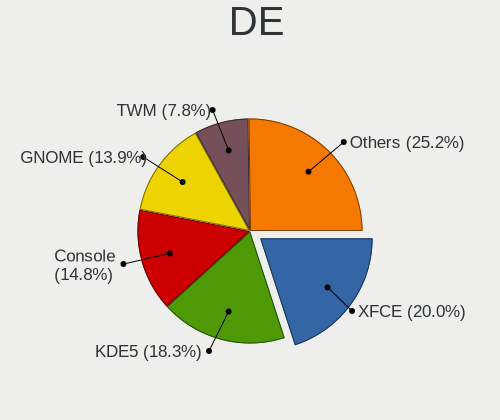
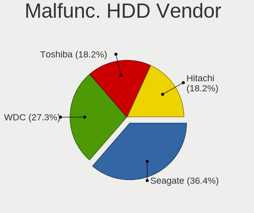
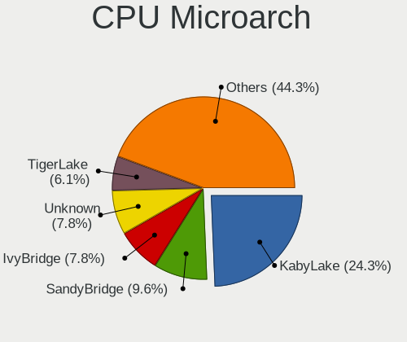
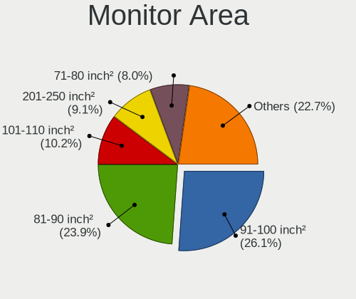
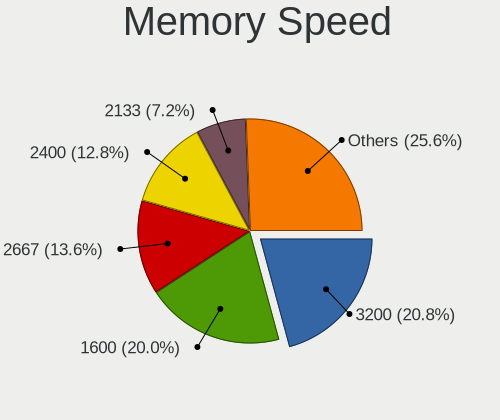
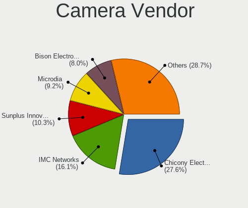

FreeBSD 13.1 - Tested Hardware & Statistics (Notebooks)
-------------------------------------------------------

A project to collect tested hardware configurations for FreeBSD 13.1.

Anyone can contribute to this report by the [hw-probe](https://github.com/linuxhw/hw-probe/blob/master/INSTALL.BSD.md) tool:

    hw-probe -all -upload

Please contribute! Especially if your hardware is rare.

Contents
--------

* [ Test Cases ](#test-cases)

* [ System ](#system)
  - [ Arch                     ](#arch)
  - [ DE                       ](#de)
  - [ Display Server           ](#display-server)
  - [ Display Manager          ](#display-manager)
  - [ OS Lang                  ](#os-lang)
  - [ Boot Mode                ](#boot-mode)
  - [ Filesystem               ](#filesystem)
  - [ Part. scheme             ](#part-scheme)

* [ Board ](#board)
  - [ Vendor                   ](#vendor)
  - [ Model                    ](#model)
  - [ Model Family             ](#model-family)
  - [ MFG Year                 ](#mfg-year)
  - [ Form Factor              ](#form-factor)
  - [ Coreboot                 ](#coreboot)
  - [ RAM Size                 ](#ram-size)
  - [ RAM Used                 ](#ram-used)
  - [ Total Drives             ](#total-drives)
  - [ Has CD-ROM               ](#has-cd-rom)
  - [ Has Ethernet             ](#has-ethernet)
  - [ Has WiFi                 ](#has-wifi)
  - [ Has Bluetooth            ](#has-bluetooth)

* [ Location ](#location)
  - [ Country                  ](#country)
  - [ City                     ](#city)

* [ Drives ](#drives)
  - [ Drive Vendor             ](#drive-vendor)
  - [ Drive Model              ](#drive-model)
  - [ HDD Vendor               ](#hdd-vendor)
  - [ SSD Vendor               ](#ssd-vendor)
  - [ Drive Kind               ](#drive-kind)
  - [ Drive Connector          ](#drive-connector)
  - [ Drive Size               ](#drive-size)
  - [ Space Total              ](#space-total)
  - [ Space Used               ](#space-used)
  - [ Malfunc. Drives          ](#malfunc-drives)
  - [ Malfunc. Drive Vendor    ](#malfunc-drive-vendor)
  - [ Malfunc. HDD Vendor      ](#malfunc-hdd-vendor)
  - [ Malfunc. Drive Kind      ](#malfunc-drive-kind)
  - [ Failed Drives            ](#failed-drives)
  - [ Failed Drive Vendor      ](#failed-drive-vendor)
  - [ Drive Status             ](#drive-status)

* [ Storage controller ](#storage-controller)
  - [ Storage Vendor           ](#storage-vendor)
  - [ Storage Model            ](#storage-model)
  - [ Storage Kind             ](#storage-kind)

* [ Processor ](#processor)
  - [ CPU Vendor               ](#cpu-vendor)
  - [ CPU Model                ](#cpu-model)
  - [ CPU Model Family         ](#cpu-model-family)
  - [ CPU Cores                ](#cpu-cores)
  - [ CPU Sockets              ](#cpu-sockets)
  - [ CPU Threads              ](#cpu-threads)
  - [ CPU Microarch            ](#cpu-microarch)

* [ Graphics ](#graphics)
  - [ GPU Vendor               ](#gpu-vendor)
  - [ GPU Model                ](#gpu-model)
  - [ GPU Combo                ](#gpu-combo)
  - [ GPU Driver               ](#gpu-driver)
  - [ GPU Memory               ](#gpu-memory)

* [ Monitor ](#monitor)
  - [ Monitor Vendor           ](#monitor-vendor)
  - [ Monitor Model            ](#monitor-model)
  - [ Monitor Resolution       ](#monitor-resolution)
  - [ Monitor Diagonal         ](#monitor-diagonal)
  - [ Monitor Width            ](#monitor-width)
  - [ Aspect Ratio             ](#aspect-ratio)
  - [ Monitor Area             ](#monitor-area)
  - [ Pixel Density            ](#pixel-density)
  - [ Multiple Monitors        ](#multiple-monitors)

* [ Network ](#network)
  - [ Net Controller Vendor    ](#net-controller-vendor)
  - [ Net Controller Model     ](#net-controller-model)
  - [ Wireless Vendor          ](#wireless-vendor)
  - [ Wireless Model           ](#wireless-model)
  - [ Ethernet Vendor          ](#ethernet-vendor)
  - [ Ethernet Model           ](#ethernet-model)
  - [ Net Controller Kind      ](#net-controller-kind)
  - [ Used Controller          ](#used-controller)
  - [ NICs                     ](#nics)
  - [ IPv6                     ](#ipv6)

* [ Bluetooth ](#bluetooth)
  - [ Bluetooth Vendor         ](#bluetooth-vendor)
  - [ Bluetooth Model          ](#bluetooth-model)

* [ Sound ](#sound)
  - [ Sound Vendor             ](#sound-vendor)
  - [ Sound Model              ](#sound-model)

* [ Memory ](#memory)
  - [ Memory Vendor            ](#memory-vendor)
  - [ Memory Model             ](#memory-model)
  - [ Memory Kind              ](#memory-kind)
  - [ Memory Form Factor       ](#memory-form-factor)
  - [ Memory Size              ](#memory-size)
  - [ Memory Speed             ](#memory-speed)

* [ Printers & scanners ](#printers--scanners)
  - [ Printer Vendor           ](#printer-vendor)
  - [ Printer Model            ](#printer-model)
  - [ Scanner Vendor           ](#scanner-vendor)
  - [ Scanner Model            ](#scanner-model)

* [ Camera ](#camera)
  - [ Camera Vendor            ](#camera-vendor)
  - [ Camera Model             ](#camera-model)

* [ Security ](#security)
  - [ Fingerprint Vendor       ](#fingerprint-vendor)
  - [ Fingerprint Model        ](#fingerprint-model)
  - [ Chipcard Vendor          ](#chipcard-vendor)
  - [ Chipcard Model           ](#chipcard-model)

* [ Unsupported ](#unsupported)
  - [ Unsupported Devices      ](#unsupported-devices)
  - [ Unsupported Device Types ](#unsupported-device-types)

Test Cases
----------

Total: 136

| Vendor        | Model                       | Probe                                                     | Date         |
|---------------|-----------------------------|-----------------------------------------------------------|--------------|
| Google        | Stout                       | [d8346bb5da](https://bsd-hardware.info/?probe=d8346bb5da) | Mar 29, 2023 |
| Acer          | Nitro AN515-53              | [a46e065fac](https://bsd-hardware.info/?probe=a46e065fac) | Mar 23, 2023 |
| OEGStone      | W54_55SU1,SUW               | [64316408f0](https://bsd-hardware.info/?probe=64316408f0) | Mar 15, 2023 |
| Google        | Kohaku                      | [88491d298e](https://bsd-hardware.info/?probe=88491d298e) | Mar 12, 2023 |
| Lenovo        | ThinkPad X230 2324A14       | [124b3bdb95](https://bsd-hardware.info/?probe=124b3bdb95) | Mar 08, 2023 |
| Lenovo        | IdeaPad 5 15ALC05 82LN      | [9466e6d4f4](https://bsd-hardware.info/?probe=9466e6d4f4) | Mar 07, 2023 |
| Lenovo        | ThinkPad T480s 20L7002CU... | [0e051e7291](https://bsd-hardware.info/?probe=0e051e7291) | Feb 27, 2023 |
| TUXEDO        | InfinityBook Pro 14 Gen6    | [0f4dd9a9bc](https://bsd-hardware.info/?probe=0f4dd9a9bc) | Feb 15, 2023 |
| Panasonic     | CF-30KAPAXAM                | [f686e3756c](https://bsd-hardware.info/?probe=f686e3756c) | Feb 13, 2023 |
| Alienware     | m15                         | [3ab3e4b671](https://bsd-hardware.info/?probe=3ab3e4b671) | Feb 12, 2023 |
| HP            | ProBook 450 G2              | [acff807555](https://bsd-hardware.info/?probe=acff807555) | Feb 12, 2023 |
| Lenovo        | ThinkPad X1 Carbon 7th 2... | [8d49d50738](https://bsd-hardware.info/?probe=8d49d50738) | Feb 11, 2023 |
| Acer          | Aspire A315-58              | [81827ccbca](https://bsd-hardware.info/?probe=81827ccbca) | Feb 10, 2023 |
| Samsung       | 700T1C                      | [91d5c568d1](https://bsd-hardware.info/?probe=91d5c568d1) | Feb 05, 2023 |
| Lenovo        | ThinkPad P14s Gen 3 21AK... | [b7a491a010](https://bsd-hardware.info/?probe=b7a491a010) | Feb 03, 2023 |
| Lenovo        | ThinkPad X1 Carbon 5th 2... | [0b48f96d1e](https://bsd-hardware.info/?probe=0b48f96d1e) | Jan 31, 2023 |
| Lenovo        | Legion 5 15ARH05 82B5       | [21398109dc](https://bsd-hardware.info/?probe=21398109dc) | Jan 29, 2023 |
| Lenovo        | Legion 5 15ARH05 82B5       | [2098b8808d](https://bsd-hardware.info/?probe=2098b8808d) | Jan 29, 2023 |
| Lenovo        | ThinkBook 14-IIL 20SL       | [afeb216c1e](https://bsd-hardware.info/?probe=afeb216c1e) | Jan 25, 2023 |
| Lenovo        | B590 20208                  | [e4c2272546](https://bsd-hardware.info/?probe=e4c2272546) | Jan 15, 2023 |
| Dell          | Latitude E6420              | [cb7b02c421](https://bsd-hardware.info/?probe=cb7b02c421) | Jan 11, 2023 |
| Lenovo        | ThinkPad X220 4291LF6       | [25cddb26c3](https://bsd-hardware.info/?probe=25cddb26c3) | Jan 11, 2023 |
| Lenovo        | IdeaPad 330-15IKB 81DE      | [956499202e](https://bsd-hardware.info/?probe=956499202e) | Dec 30, 2022 |
| Lenovo        | IdeaPad 330-15IKB 81DE      | [883dbf15e4](https://bsd-hardware.info/?probe=883dbf15e4) | Dec 25, 2022 |
| Lenovo        | Legion Y530-15ICH 81FV      | [527bf6bbe4](https://bsd-hardware.info/?probe=527bf6bbe4) | Dec 22, 2022 |
| HP            | ProBook 440 G8 Notebook ... | [babe4bb620](https://bsd-hardware.info/?probe=babe4bb620) | Dec 13, 2022 |
| Lenovo        | ThinkPad T440p 20AWS0Y40... | [ce2b20b3a9](https://bsd-hardware.info/?probe=ce2b20b3a9) | Dec 13, 2022 |
| Lenovo        | ThinkPad T440p 20AWS0Y40... | [7463e05c88](https://bsd-hardware.info/?probe=7463e05c88) | Dec 12, 2022 |
| Acer          | Swift SF114-34              | [2c560bad00](https://bsd-hardware.info/?probe=2c560bad00) | Dec 05, 2022 |
| Google        | Lick                        | [9eb2abcdcc](https://bsd-hardware.info/?probe=9eb2abcdcc) | Dec 03, 2022 |
| Google        | Lars                        | [4130b19cfa](https://bsd-hardware.info/?probe=4130b19cfa) | Dec 03, 2022 |
| ASUSTek       | ZenBook UX434FL_UX434FL     | [56bc3b04fd](https://bsd-hardware.info/?probe=56bc3b04fd) | Nov 21, 2022 |
| HP            | ProBook 4540s               | [6dce896f40](https://bsd-hardware.info/?probe=6dce896f40) | Nov 20, 2022 |
| Dell          | Vostro 3550                 | [2aeadb4dfc](https://bsd-hardware.info/?probe=2aeadb4dfc) | Nov 14, 2022 |
| HP            | ProBook 4540s               | [9c4be9deab](https://bsd-hardware.info/?probe=9c4be9deab) | Nov 07, 2022 |
| Lenovo        | IdeaPad 110-15ACL 80TJ      | [c4fd2595e6](https://bsd-hardware.info/?probe=c4fd2595e6) | Nov 06, 2022 |
| HP            | ProBook 4540s               | [7596b602c6](https://bsd-hardware.info/?probe=7596b602c6) | Nov 05, 2022 |
| Samsung       | 750TDA                      | [a880b1f616](https://bsd-hardware.info/?probe=a880b1f616) | Nov 02, 2022 |
| Dell          | Inspiron 7720               | [6911e08b7e](https://bsd-hardware.info/?probe=6911e08b7e) | Oct 28, 2022 |
| Lenovo        | ThinkPad X1 Carbon Gen 1... | [caad4323ba](https://bsd-hardware.info/?probe=caad4323ba) | Oct 23, 2022 |
| Dell          | Precision M4500             | [66ded228ea](https://bsd-hardware.info/?probe=66ded228ea) | Oct 20, 2022 |
| HP            | ENVY Laptop 13-aq0xxx       | [bc229efed9](https://bsd-hardware.info/?probe=bc229efed9) | Oct 18, 2022 |
| HP            | ENVY Laptop 13-aq0xxx       | [0a8b1f727f](https://bsd-hardware.info/?probe=0a8b1f727f) | Oct 17, 2022 |
| Acer          | Aspire A514-54              | [e057b613a0](https://bsd-hardware.info/?probe=e057b613a0) | Oct 17, 2022 |
| Lenovo        | XiaoXinPro-13API 2019 81... | [dfa08657fd](https://bsd-hardware.info/?probe=dfa08657fd) | Oct 16, 2022 |
| Dell          | Inspiron 15 5510            | [22881028bc](https://bsd-hardware.info/?probe=22881028bc) | Oct 16, 2022 |
| Lenovo        | ThinkPad E14 Gen 2 20T6S... | [601029d3fc](https://bsd-hardware.info/?probe=601029d3fc) | Oct 06, 2022 |
| Lenovo        | IdeaPad 3 15ALC6 82KU       | [ce9cfa77aa](https://bsd-hardware.info/?probe=ce9cfa77aa) | Oct 05, 2022 |
| Dell          | Precision 5510              | [f69c9fb0ea](https://bsd-hardware.info/?probe=f69c9fb0ea) | Oct 04, 2022 |
| Dell          | Precision M4500             | [6b987b43b1](https://bsd-hardware.info/?probe=6b987b43b1) | Oct 03, 2022 |
| Acer          | Swift SF313-52              | [6339e6b468](https://bsd-hardware.info/?probe=6339e6b468) | Sep 25, 2022 |
| System76      | Gazelle                     | [d087321049](https://bsd-hardware.info/?probe=d087321049) | Sep 24, 2022 |
| ASUSTek       | X455LJ                      | [431ad10ab2](https://bsd-hardware.info/?probe=431ad10ab2) | Sep 17, 2022 |
| Lenovo        | ThinkPad L420 7829WDY       | [a697be2aa9](https://bsd-hardware.info/?probe=a697be2aa9) | Sep 16, 2022 |
| Google        | Peppy                       | [80ffa77224](https://bsd-hardware.info/?probe=80ffa77224) | Sep 15, 2022 |
| Dell          | Latitude 5310               | [6edf4d34fe](https://bsd-hardware.info/?probe=6edf4d34fe) | Sep 07, 2022 |
| Dell          | Vostro 5415                 | [ef6d4ee660](https://bsd-hardware.info/?probe=ef6d4ee660) | Sep 06, 2022 |
| ASUSTek       | VivoBook_ASUSLaptop X515... | [cffed92600](https://bsd-hardware.info/?probe=cffed92600) | Sep 06, 2022 |
| Lenovo        | ThinkPad X1 Extreme Gen ... | [72757feb65](https://bsd-hardware.info/?probe=72757feb65) | Sep 03, 2022 |
| Lenovo        | ThinkPad X1 Extreme Gen ... | [5d575c85d0](https://bsd-hardware.info/?probe=5d575c85d0) | Sep 03, 2022 |
| Toshiba       | Satellite A300              | [ac185c104b](https://bsd-hardware.info/?probe=ac185c104b) | Aug 31, 2022 |
| ASUSTek       | VivoBook_ASUSLaptop X570... | [0466d87f04](https://bsd-hardware.info/?probe=0466d87f04) | Aug 25, 2022 |
| HP            | Pavilion g6                 | [c146b538e1](https://bsd-hardware.info/?probe=c146b538e1) | Aug 20, 2022 |
| ASUSTek       | ZenBook 14 UX410UFR         | [2bf0f0ef08](https://bsd-hardware.info/?probe=2bf0f0ef08) | Aug 19, 2022 |
| Google        | Peppy                       | [e2e0a1953d](https://bsd-hardware.info/?probe=e2e0a1953d) | Aug 18, 2022 |
| MSI           | GF63 Thin 9SC               | [dacea7c6be](https://bsd-hardware.info/?probe=dacea7c6be) | Aug 14, 2022 |
| Dell          | Inspiron 3581               | [f31cc32515](https://bsd-hardware.info/?probe=f31cc32515) | Aug 04, 2022 |
| HP            | EliteBook 850 G7 Noteboo... | [f603e648c7](https://bsd-hardware.info/?probe=f603e648c7) | Aug 01, 2022 |
| Lenovo        | ThinkPad T480 20L6S29E0T    | [546fa8380b](https://bsd-hardware.info/?probe=546fa8380b) | Aug 01, 2022 |
| Dell          | Inspiron 5559               | [13baedb59b](https://bsd-hardware.info/?probe=13baedb59b) | Jul 31, 2022 |
| Lenovo        | IdeaPad 330-15ARR 81D2      | [7b130fb168](https://bsd-hardware.info/?probe=7b130fb168) | Jul 27, 2022 |
| Dell          | Precision 5560              | [3dc82c6d91](https://bsd-hardware.info/?probe=3dc82c6d91) | Jul 23, 2022 |
| Lenovo        | G40-45 80E1                 | [6e31b5f45b](https://bsd-hardware.info/?probe=6e31b5f45b) | Jul 23, 2022 |
| Dell          | Studio XPS 1340             | [642da98e96](https://bsd-hardware.info/?probe=642da98e96) | Jul 21, 2022 |
| ASUSTek       | ZenBook UX325UA_UM325UA     | [9af051c79f](https://bsd-hardware.info/?probe=9af051c79f) | Jul 17, 2022 |
| Lenovo        | ThinkPad T480 20L6SB2N00    | [6c5c9eefc0](https://bsd-hardware.info/?probe=6c5c9eefc0) | Jul 17, 2022 |
| Lenovo        | ThinkPad T420 4236C92       | [4067ce2036](https://bsd-hardware.info/?probe=4067ce2036) | Jul 16, 2022 |
| Lenovo        | ThinkPad X260 20F6S0KA00    | [117014d55f](https://bsd-hardware.info/?probe=117014d55f) | Jul 14, 2022 |
| Toshiba       | Satellite L305D             | [b0311b8175](https://bsd-hardware.info/?probe=b0311b8175) | Jul 12, 2022 |
| ASUSTek       | VivoBook_ASUSLaptop E210... | [7081ddd59c](https://bsd-hardware.info/?probe=7081ddd59c) | Jul 11, 2022 |
| Lenovo        | IdeaPad 5 Pro 16ACH6 82L... | [66543e9280](https://bsd-hardware.info/?probe=66543e9280) | Jul 07, 2022 |
| Dell          | Latitude E6420              | [c41c8ff4f4](https://bsd-hardware.info/?probe=c41c8ff4f4) | Jul 07, 2022 |
| Fujitsu       | LIFEBOOK A555               | [d9fd7e54cf](https://bsd-hardware.info/?probe=d9fd7e54cf) | Jul 06, 2022 |
| Unknown       | Unknown                     | [584ecf8423](https://bsd-hardware.info/?probe=584ecf8423) | Jul 05, 2022 |
| HP            | Laptop 15-bs1xx             | [b697848727](https://bsd-hardware.info/?probe=b697848727) | Jul 05, 2022 |
| LG Electro... | 17Z990-R.AAC9U1             | [5777cb6dc6](https://bsd-hardware.info/?probe=5777cb6dc6) | Jul 01, 2022 |
| HP            | EliteBook 850 G7 Noteboo... | [f573327012](https://bsd-hardware.info/?probe=f573327012) | Jun 29, 2022 |
| Acer          | Aspire A114-33              | [d3659c85e9](https://bsd-hardware.info/?probe=d3659c85e9) | Jun 28, 2022 |
| Samsung       | R530/R730/R540              | [a4cd230718](https://bsd-hardware.info/?probe=a4cd230718) | Jun 27, 2022 |
| Fujitsu Si... | AMILO Li3710                | [6d4bc39638](https://bsd-hardware.info/?probe=6d4bc39638) | Jun 18, 2022 |
| Sony          | VGN-NS21M_S                 | [c9701a7ff5](https://bsd-hardware.info/?probe=c9701a7ff5) | Jun 18, 2022 |
| Dell          | Latitude E5420              | [524ab094e1](https://bsd-hardware.info/?probe=524ab094e1) | Jun 13, 2022 |
| ASUSTek       | ZenBook UX391FA_UX391FA     | [8825a49f37](https://bsd-hardware.info/?probe=8825a49f37) | Jun 13, 2022 |
| HP            | Laptop 15s-fq1xxx           | [380218b2c1](https://bsd-hardware.info/?probe=380218b2c1) | Jun 12, 2022 |
| Fujitsu Si... | AMILO Li3710                | [387bf3d18f](https://bsd-hardware.info/?probe=387bf3d18f) | Jun 12, 2022 |
| Fujitsu Si... | AMILO Li3710                | [edebcb2719](https://bsd-hardware.info/?probe=edebcb2719) | Jun 12, 2022 |
| Fujitsu       | LIFEBOOK A555               | [23d96bc669](https://bsd-hardware.info/?probe=23d96bc669) | Jun 11, 2022 |
| Dell          | Latitude E5420              | [aca711c5ec](https://bsd-hardware.info/?probe=aca711c5ec) | Jun 09, 2022 |
| Lenovo        | IdeaPad 130-15AST 81H5      | [9f33082ffa](https://bsd-hardware.info/?probe=9f33082ffa) | Jun 08, 2022 |
| Dell          | Precision M4800             | [4d77bb0082](https://bsd-hardware.info/?probe=4d77bb0082) | Jun 08, 2022 |
| Dell          | Latitude E5420              | [a3a9820968](https://bsd-hardware.info/?probe=a3a9820968) | Jun 07, 2022 |
| Lenovo        | ThinkPad T14 Gen 1 20S0C... | [56111732fd](https://bsd-hardware.info/?probe=56111732fd) | Jun 07, 2022 |
| Lenovo        | ThinkPad T14 Gen 1 20S0C... | [aeec87e07f](https://bsd-hardware.info/?probe=aeec87e07f) | Jun 06, 2022 |
| Lenovo        | ThinkPad X220 4286CTO       | [cb98f3014e](https://bsd-hardware.info/?probe=cb98f3014e) | Jun 05, 2022 |
| Dell          | Latitude 7490               | [18215740d1](https://bsd-hardware.info/?probe=18215740d1) | Jun 05, 2022 |
| Dell          | Latitude E5500              | [b1cb5de914](https://bsd-hardware.info/?probe=b1cb5de914) | Jun 03, 2022 |
| ASUSTek       | X441UV                      | [c8906b438b](https://bsd-hardware.info/?probe=c8906b438b) | Jun 03, 2022 |
| Apple         | MacBookPro11,4              | [29f1ef0cdc](https://bsd-hardware.info/?probe=29f1ef0cdc) | Jun 02, 2022 |
| Lenovo        | ThinkPad W520 4282AD4       | [40198abaa2](https://bsd-hardware.info/?probe=40198abaa2) | Jun 02, 2022 |
| Acer          | Nitro AN515-55              | [0cf6981a98](https://bsd-hardware.info/?probe=0cf6981a98) | Jun 02, 2022 |
| GPD           | MicroPC                     | [a448570ff9](https://bsd-hardware.info/?probe=a448570ff9) | May 31, 2022 |
| Dell          | Inspiron 5559               | [283a074737](https://bsd-hardware.info/?probe=283a074737) | May 31, 2022 |
| GPD           | MicroPC                     | [0046ab7c9b](https://bsd-hardware.info/?probe=0046ab7c9b) | May 31, 2022 |
| HP            | Pavilion g6                 | [32854b73a5](https://bsd-hardware.info/?probe=32854b73a5) | May 30, 2022 |
| System76      | Galago Pro                  | [126ebc1522](https://bsd-hardware.info/?probe=126ebc1522) | May 29, 2022 |
| Dell          | G5 5590                     | [86bac52410](https://bsd-hardware.info/?probe=86bac52410) | May 29, 2022 |
| Dell          | Latitude E6430              | [d7ced37bac](https://bsd-hardware.info/?probe=d7ced37bac) | May 29, 2022 |
| Lenovo        | ThinkPad X250 20CMS0FA00    | [5afeac632d](https://bsd-hardware.info/?probe=5afeac632d) | May 28, 2022 |
| Unknown       | Unknown                     | [3ff577e111](https://bsd-hardware.info/?probe=3ff577e111) | May 26, 2022 |
| Unknown       | Unknown                     | [9e2f16664a](https://bsd-hardware.info/?probe=9e2f16664a) | May 26, 2022 |
| Dell          | Inspiron 3505               | [cddd786b51](https://bsd-hardware.info/?probe=cddd786b51) | May 26, 2022 |
| Notebook      | N7x0WU                      | [37242aa9a3](https://bsd-hardware.info/?probe=37242aa9a3) | May 25, 2022 |
| TUXEDO        | Aura 15 Gen1                | [727f9708b4](https://bsd-hardware.info/?probe=727f9708b4) | May 24, 2022 |
| Dell          | Latitude E6540              | [70871cf070](https://bsd-hardware.info/?probe=70871cf070) | May 24, 2022 |
| Dell          | Precision M4800             | [6a703b66f8](https://bsd-hardware.info/?probe=6a703b66f8) | May 22, 2022 |
| Dell          | Latitude E7240              | [970234b430](https://bsd-hardware.info/?probe=970234b430) | May 22, 2022 |
| Lenovo        | ThinkPad X13 Gen 1 20UF0... | [cf5f498572](https://bsd-hardware.info/?probe=cf5f498572) | May 21, 2022 |
| Dell          | Latitude 5520               | [cbc2c03fa1](https://bsd-hardware.info/?probe=cbc2c03fa1) | May 20, 2022 |
| Dell          | XPS 13 9343                 | [44abecc1ef](https://bsd-hardware.info/?probe=44abecc1ef) | May 20, 2022 |
| ASUSTek       | 1001P                       | [6ffa9529a3](https://bsd-hardware.info/?probe=6ffa9529a3) | May 20, 2022 |
| TUXEDO        | Aura 15 Gen1                | [1c84f0f722](https://bsd-hardware.info/?probe=1c84f0f722) | May 19, 2022 |
| Lenovo        | ThinkPad L420 7854CTO       | [56cf502c2f](https://bsd-hardware.info/?probe=56cf502c2f) | May 18, 2022 |
| Lenovo        | ThinkPad T420s 41732AU      | [9d9ddcc409](https://bsd-hardware.info/?probe=9d9ddcc409) | May 18, 2022 |
| Lenovo        | ThinkPad X270 20HMCTO1WW    | [2d3de77101](https://bsd-hardware.info/?probe=2d3de77101) | May 18, 2022 |
| Lenovo        | ThinkPad E490 20N8CTO1WW    | [86866ce217](https://bsd-hardware.info/?probe=86866ce217) | May 17, 2022 |
| TUXEDO        | InfinityBook13V3            | [fd081a3636](https://bsd-hardware.info/?probe=fd081a3636) | May 17, 2022 |

System
------

Arch
----

OS architecture (x86_64, i586, etc.)

| Name  | Notebooks | Percent |
|-------|-----------|---------|
| amd64 | 112       | 100%    |

DE
--

Desktop Environment

| Name          | Notebooks | Percent |
|---------------|-----------|---------|
| XFCE          | 23        | 20.54%  |
| KDE5          | 20        | 17.86%  |
| Console       | 17        | 15.18%  |
| GNOME         | 16        | 14.29%  |
| TWM           | 9         | 8.04%   |
| MATE          | 8         | 7.14%   |
| i3            | 5         | 4.46%   |
| Openbox       | 4         | 3.57%   |
| Cinnamon      | 2         | 1.79%   |
| X-Cinnamon    | 1         | 0.89%   |
| LXQt          | 1         | 0.89%   |
| LXDE          | 1         | 0.89%   |
| Lumina        | 1         | 0.89%   |
| IceWM         | 1         | 0.89%   |
| Enlightenment | 1         | 0.89%   |
| dwm           | 1         | 0.89%   |
| AwesomeWM     | 1         | 0.89%   |

Display Server
--------------

X11 or Wayland

| Name    | Notebooks | Percent |
|---------|-----------|---------|
| X11     | 89        | 79.46%  |
| Console | 15        | 13.39%  |
| Wayland | 8         | 7.14%   |

Display Manager
---------------

SDDM, LightDM, etc.

| Name    | Notebooks | Percent |
|---------|-----------|---------|
| Console | 39        | 34.82%  |
| SDDM    | 24        | 21.43%  |
| SLiM    | 15        | 13.39%  |
| GDM     | 12        | 10.71%  |
| LightDM | 11        | 9.82%   |
| XDM     | 8         | 7.14%   |
| Ly      | 2         | 1.79%   |
| PCDM    | 1         | 0.89%   |

OS Lang
-------

Language

| Lang            | Notebooks | Percent |
|-----------------|-----------|---------|
| C               | 76        | 67.26%  |
| en_US           | 18        | 15.93%  |
| Unknown         | 6         | 5.31%   |
| zh_CN           | 5         | 4.42%   |
| ru_RU           | 3         | 2.65%   |
| ko_KR           | 1         | 0.88%   |
| fr_FR           | 1         | 0.88%   |
| es_ES           | 1         | 0.88%   |
| en_US.ISO8859-1 | 1         | 0.88%   |
| en_AU           | 1         | 0.88%   |

Boot Mode
---------

EFI or BIOS

| Mode | Notebooks | Percent |
|------|-----------|---------|
| EFI  | 92        | 82.14%  |
| BIOS | 20        | 17.86%  |

Filesystem
----------

Type of filesystem

| Type | Notebooks | Percent |
|------|-----------|---------|
| Zfs  | 79        | 69.91%  |
| Ufs  | 34        | 30.09%  |

Part. scheme
------------

Scheme of partitioning

| Type    | Notebooks | Percent |
|---------|-----------|---------|
| GPT     | 103       | 91.96%  |
| MBR     | 7         | 6.25%   |
| BSD     | 1         | 0.89%   |
| Unknown | 1         | 0.89%   |

Board
-----

Vendor
------

Motherboard manufacturer

| Name                | Notebooks | Percent |
|---------------------|-----------|---------|
| Lenovo              | 36        | 32.14%  |
| Dell                | 25        | 22.32%  |
| ASUSTek Computer    | 10        | 8.93%   |
| Hewlett-Packard     | 8         | 7.14%   |
| Acer                | 6         | 5.36%   |
| Google              | 5         | 4.46%   |
| TUXEDO              | 3         | 2.68%   |
| Samsung Electronics | 3         | 2.68%   |
| Toshiba             | 2         | 1.79%   |
| System76            | 2         | 1.79%   |
| Unknown             | 2         | 1.79%   |
| Sony                | 1         | 0.89%   |
| Panasonic           | 1         | 0.89%   |
| Notebook            | 1         | 0.89%   |
| MSI                 | 1         | 0.89%   |
| LG Electronics      | 1         | 0.89%   |
| GPD                 | 1         | 0.89%   |
| Fujitsu Siemens     | 1         | 0.89%   |
| Fujitsu             | 1         | 0.89%   |
| Apple               | 1         | 0.89%   |
| Alienware           | 1         | 0.89%   |

Model
-----

Motherboard model

| Name                                        | Notebooks | Percent |
|---------------------------------------------|-----------|---------|
| HP EliteBook 850 G7 Notebook PC             | 2         | 1.79%   |
| Google Peppy                                | 2         | 1.79%   |
| Dell Precision M4500                        | 2         | 1.79%   |
| Dell Latitude E6420                         | 2         | 1.79%   |
| Unknown                                     | 2         | 1.79%   |
| TUXEDO InfinityBook13V3                     | 1         | 0.89%   |
| TUXEDO InfinityBook Pro 14 Gen6             | 1         | 0.89%   |
| TUXEDO Aura 15 Gen1                         | 1         | 0.89%   |
| Toshiba Satellite L305D                     | 1         | 0.89%   |
| Toshiba Satellite A300                      | 1         | 0.89%   |
| System76 Gazelle                            | 1         | 0.89%   |
| System76 Galago Pro                         | 1         | 0.89%   |
| Sony VGN-NS21M_S                            | 1         | 0.89%   |
| Samsung R530/R730/R540                      | 1         | 0.89%   |
| Samsung 750TDA                              | 1         | 0.89%   |
| Samsung 700T1C                              | 1         | 0.89%   |
| Panasonic CF-30KAPAXAM                      | 1         | 0.89%   |
| Notebook N7x0WU                             | 1         | 0.89%   |
| MSI GF63 Thin 9SC                           | 1         | 0.89%   |
| LG 17Z990-R.AAC9U1                          | 1         | 0.89%   |
| Lenovo XiaoXinPro-13API 2019 81XD           | 1         | 0.89%   |
| Lenovo ThinkPad X270 20HMCTO1WW             | 1         | 0.89%   |
| Lenovo ThinkPad X260 20F6S0KA00             | 1         | 0.89%   |
| Lenovo ThinkPad X250 20CMS0FA00             | 1         | 0.89%   |
| Lenovo ThinkPad X230 2324A14                | 1         | 0.89%   |
| Lenovo ThinkPad X220 4291LF6                | 1         | 0.89%   |
| Lenovo ThinkPad X220 4286CTO                | 1         | 0.89%   |
| Lenovo ThinkPad X13 Gen 1 20UF000QRT        | 1         | 0.89%   |
| Lenovo ThinkPad X1 Extreme Gen 3 20TKS0QB00 | 1         | 0.89%   |
| Lenovo ThinkPad X1 Carbon Gen 10 21CBCTO1WW | 1         | 0.89%   |
| Lenovo ThinkPad X1 Carbon 7th 20QES53R00    | 1         | 0.89%   |
| Lenovo ThinkPad X1 Carbon 5th 20HR002MAT    | 1         | 0.89%   |
| Lenovo ThinkPad W520 4282AD4                | 1         | 0.89%   |
| Lenovo ThinkPad T480s 20L7002CUS            | 1         | 0.89%   |
| Lenovo ThinkPad T480 20L6SB2N00             | 1         | 0.89%   |
| Lenovo ThinkPad T480 20L6S29E0T             | 1         | 0.89%   |
| Lenovo ThinkPad T440p 20AWS0Y40T            | 1         | 0.89%   |
| Lenovo ThinkPad T420s 41732AU               | 1         | 0.89%   |
| Lenovo ThinkPad T420 4236C92                | 1         | 0.89%   |
| Lenovo ThinkPad T14 Gen 1 20S0CTO1WW        | 1         | 0.89%   |

Model Family
------------

Motherboard model prefix

| Name                    | Notebooks | Percent |
|-------------------------|-----------|---------|
| Lenovo ThinkPad         | 23        | 20.54%  |
| Dell Latitude           | 10        | 8.93%   |
| Lenovo IdeaPad          | 7         | 6.25%   |
| Dell Precision          | 5         | 4.46%   |
| Dell Inspiron           | 5         | 4.46%   |
| ASUS ZenBook            | 4         | 3.57%   |
| HP ProBook              | 3         | 2.68%   |
| ASUS VivoBook           | 3         | 2.68%   |
| Acer Aspire             | 3         | 2.68%   |
| Toshiba Satellite       | 2         | 1.79%   |
| Lenovo Legion           | 2         | 1.79%   |
| HP EliteBook            | 2         | 1.79%   |
| Google Peppy            | 2         | 1.79%   |
| Dell Vostro             | 2         | 1.79%   |
| Acer Nitro              | 2         | 1.79%   |
| Unknown                 | 2         | 1.79%   |
| TUXEDO InfinityBook13V3 | 1         | 0.89%   |
| TUXEDO InfinityBook     | 1         | 0.89%   |
| TUXEDO Aura             | 1         | 0.89%   |
| System76 Gazelle        | 1         | 0.89%   |
| System76 Galago         | 1         | 0.89%   |
| Sony VGN-NS21M          | 1         | 0.89%   |
| Samsung R530            | 1         | 0.89%   |
| Samsung 750TDA          | 1         | 0.89%   |
| Samsung 700T1C          | 1         | 0.89%   |
| Panasonic CF-30KAPAXAM  | 1         | 0.89%   |
| Notebook N7x0WU         | 1         | 0.89%   |
| MSI GF63                | 1         | 0.89%   |
| LG 17Z990-R.AAC9U1      | 1         | 0.89%   |
| Lenovo XiaoXinPro-13API | 1         | 0.89%   |
| Lenovo ThinkBook        | 1         | 0.89%   |
| Lenovo G40-45           | 1         | 0.89%   |
| Lenovo B590             | 1         | 0.89%   |
| HP Pavilion             | 1         | 0.89%   |
| HP Laptop               | 1         | 0.89%   |
| HP ENVY                 | 1         | 0.89%   |
| GPD MicroPC             | 1         | 0.89%   |
| Google Stout            | 1         | 0.89%   |
| Google Lars             | 1         | 0.89%   |
| Google Kohaku           | 1         | 0.89%   |

MFG Year
--------

Motherboard manufacture year

| Year | Notebooks | Percent |
|------|-----------|---------|
| 2022 | 20        | 17.86%  |
| 2020 | 15        | 13.39%  |
| 2021 | 12        | 10.71%  |
| 2018 | 12        | 10.71%  |
| 2019 | 8         | 7.14%   |
| 2011 | 8         | 7.14%   |
| 2012 | 7         | 6.25%   |
| 2016 | 6         | 5.36%   |
| 2015 | 5         | 4.46%   |
| 2017 | 4         | 3.57%   |
| 2010 | 4         | 3.57%   |
| 2013 | 3         | 2.68%   |
| 2009 | 3         | 2.68%   |
| 2014 | 2         | 1.79%   |
| 2008 | 2         | 1.79%   |
| 2023 | 1         | 0.89%   |

Form Factor
-----------

Physical design of the computer

| Name     | Notebooks | Percent |
|----------|-----------|---------|
| Notebook | 112       | 100%    |

Coreboot
--------

Have coreboot on board

| Used | Notebooks | Percent |
|------|-----------|---------|
| No   | 106       | 94.64%  |
| Yes  | 6         | 5.36%   |

RAM Size
--------

Total RAM memory

| Size in GB  | Notebooks | Percent |
|-------------|-----------|---------|
| 8.01-16.0   | 41        | 36.61%  |
| 16.01-24.0  | 36        | 32.14%  |
| 4.01-8.0    | 18        | 16.07%  |
| 32.01-64.0  | 9         | 8.04%   |
| 24.01-32.0  | 3         | 2.68%   |
| 64.01-256.0 | 3         | 2.68%   |
| 2.01-3.0    | 2         | 1.79%   |

RAM Used
--------

Used RAM memory

| Used GB   | Notebooks | Percent |
|-----------|-----------|---------|
| 0.01-0.5  | 44        | 39.29%  |
| 0.51-1.0  | 37        | 33.04%  |
| 1.01-2.0  | 23        | 20.54%  |
| 2.01-3.0  | 7         | 6.25%   |
| 8.01-16.0 | 1         | 0.89%   |

Total Drives
------------

Number of drives on board

| Drives | Notebooks | Percent |
|--------|-----------|---------|
| 1      | 82        | 73.21%  |
| 2      | 24        | 21.43%  |
| 0      | 5         | 4.46%   |
| 3      | 1         | 0.89%   |

Has CD-ROM
----------

Has CD-ROM on board

| Presented | Notebooks | Percent |
|-----------|-----------|---------|
| No        | 85        | 75.89%  |
| Yes       | 27        | 24.11%  |

Has Ethernet
------------

Has Ethernet on board

| Presented | Notebooks | Percent |
|-----------|-----------|---------|
| Yes       | 79        | 70.54%  |
| No        | 33        | 29.46%  |

Has WiFi
--------

Has WiFi module

| Presented | Notebooks | Percent |
|-----------|-----------|---------|
| Yes       | 111       | 99.11%  |
| No        | 1         | 0.89%   |

Has Bluetooth
-------------

Has Bluetooth module

| Presented | Notebooks | Percent |
|-----------|-----------|---------|
| Yes       | 84        | 75%     |
| No        | 28        | 25%     |

Location
--------

Country
-------

Geographic location (country)

| Country     | Notebooks | Percent |
|-------------|-----------|---------|
| USA         | 25        | 22.12%  |
| Russia      | 10        | 8.85%   |
| China       | 9         | 7.96%   |
| UK          | 6         | 5.31%   |
| France      | 6         | 5.31%   |
| India       | 5         | 4.42%   |
| Spain       | 4         | 3.54%   |
| Czechia     | 4         | 3.54%   |
| Austria     | 4         | 3.54%   |
| Japan       | 3         | 2.65%   |
| Germany     | 3         | 2.65%   |
| Turkey      | 2         | 1.77%   |
| Thailand    | 2         | 1.77%   |
| South Korea | 2         | 1.77%   |
| Philippines | 2         | 1.77%   |
| Netherlands | 2         | 1.77%   |
| Italy       | 2         | 1.77%   |
| Canada      | 2         | 1.77%   |
| Venezuela   | 1         | 0.88%   |
| Uruguay     | 1         | 0.88%   |
| Slovenia    | 1         | 0.88%   |
| Poland      | 1         | 0.88%   |
| Norway      | 1         | 0.88%   |
| Mexico      | 1         | 0.88%   |
| Malaysia    | 1         | 0.88%   |
| Lithuania   | 1         | 0.88%   |
| Israel      | 1         | 0.88%   |
| Iraq        | 1         | 0.88%   |
| Hungary     | 1         | 0.88%   |
| Hong Kong   | 1         | 0.88%   |
| Guadeloupe  | 1         | 0.88%   |
| Greece      | 1         | 0.88%   |
| Finland     | 1         | 0.88%   |
| Chile       | 1         | 0.88%   |
| Bulgaria    | 1         | 0.88%   |
| Belarus     | 1         | 0.88%   |
| Australia   | 1         | 0.88%   |
| Argentina   | 1         | 0.88%   |

City
----

Geographic location (city)

| City              | Notebooks | Percent |
|-------------------|-----------|---------|
| Moscow            | 6         | 5.31%   |
| Vienna            | 4         | 3.54%   |
| Paris             | 2         | 1.77%   |
| Fayetteville      | 2         | 1.77%   |
| Carry-le-Rouet    | 2         | 1.77%   |
| Brno              | 2         | 1.77%   |
| Barcelona         | 2         | 1.77%   |
| Zhumadian         | 1         | 0.88%   |
| Yangcheon-gu      | 1         | 0.88%   |
| Xiamen            | 1         | 0.88%   |
| Xi'an             | 1         | 0.88%   |
| Woerdense Verlaat | 1         | 0.88%   |
| Wheatland         | 1         | 0.88%   |
| Vilnius           | 1         | 0.88%   |
| Villapresente     | 1         | 0.88%   |
| Uiwang-si         | 1         | 0.88%   |
| Turku             | 1         | 0.88%   |
| Trivandrum        | 1         | 0.88%   |
| Tlalnepantla      | 1         | 0.88%   |
| Thousand Oaks     | 1         | 0.88%   |
| Thessaloniki      | 1         | 0.88%   |
| Tel Aviv          | 1         | 0.88%   |
| Taito             | 1         | 0.88%   |
| Stratford         | 1         | 0.88%   |
| St Petersburg     | 1         | 0.88%   |
| Shinjuku          | 1         | 0.88%   |
| Shanghai          | 1         | 0.88%   |
| Shah Alam         | 1         | 0.88%   |
| Santiago          | 1         | 0.88%   |
| Sandefjord        | 1         | 0.88%   |
| San Pablo City    | 1         | 0.88%   |
| San Antonio       | 1         | 0.88%   |
| Samokov           | 1         | 0.88%   |
| Ruislip           | 1         | 0.88%   |
| Riverside         | 1         | 0.88%   |
| Queens            | 1         | 0.88%   |
| Qiqihar           | 1         | 0.88%   |
| Qinnan            | 1         | 0.88%   |
| Ozersk            | 1         | 0.88%   |
| Oswego            | 1         | 0.88%   |

Drives
------

Drive Vendor
------------

Hard drive vendors

| Vendor              | Notebooks | Drives | Percent |
|---------------------|-----------|--------|---------|
| Samsung Electronics | 24        | 25     | 18.9%   |
| WDC                 | 23        | 25     | 18.11%  |
| Seagate             | 9         | 10     | 7.09%   |
| Kingston            | 9         | 10     | 7.09%   |
| Crucial             | 7         | 8      | 5.51%   |
| Toshiba             | 6         | 7      | 4.72%   |
| SK hynix            | 6         | 6      | 4.72%   |
| Transcend           | 4         | 4      | 3.15%   |
| Intel               | 4         | 4      | 3.15%   |
| A-DATA Technology   | 4         | 7      | 3.15%   |
| KIOXIA              | 3         | 3      | 2.36%   |
| Hitachi             | 3         | 3      | 2.36%   |
| Gigabyte Technology | 3         | 3      | 2.36%   |
| UMIS                | 2         | 2      | 1.57%   |
| SSSTC               | 2         | 2      | 1.57%   |
| Silicon Motion      | 2         | 2      | 1.57%   |
| SanDisk             | 2         | 2      | 1.57%   |
| XPG                 | 1         | 1      | 0.79%   |
| PNY                 | 1         | 1      | 0.79%   |
| Micron Technology   | 1         | 1      | 0.79%   |
| Lexar               | 1         | 2      | 0.79%   |
| Lenovo              | 1         | 1      | 0.79%   |
| KIOXIA-EXCERIA      | 1         | 1      | 0.79%   |
| Hikvision           | 1         | 1      | 0.79%   |
| Hewlett-Packard     | 1         | 1      | 0.79%   |
| Fanxiang            | 1         | 2      | 0.79%   |
| EAGET               | 1         | 1      | 0.79%   |
| CFD                 | 1         | 1      | 0.79%   |
| BR                  | 1         | 1      | 0.79%   |
| BIWIN               | 1         | 1      | 0.79%   |
| Apple               | 1         | 1      | 0.79%   |

Drive Model
-----------

Hard drive models

| Model                                   | Notebooks | Percent |
|-----------------------------------------|-----------|---------|
| Kingston SA400S37240G 240GB             | 3         | 2.26%   |
| WDC WDS100T2B0C-00PXH0 1TB              | 2         | 1.5%    |
| WDC WD3200BPVT-80JJ5T0 320GB            | 2         | 1.5%    |
| WDC PC SN530 SDBPNPZ-256G-1014 256GB    | 2         | 1.5%    |
| SK hynix BC511 HFM512GDJTNI-82A0A 512GB | 2         | 1.5%    |
| Samsung SSD 970 EVO Plus 2TB            | 2         | 1.5%    |
| KIOXIA KBG40ZNS512G NVMe 512GB          | 2         | 1.5%    |
| Crucial CT1000MX500SSD1 1TB             | 2         | 1.5%    |
| XPG GAMMIX S5 1TB                       | 1         | 0.75%   |
| WDC WDS500G3X0C-00SJG0 500GB            | 1         | 0.75%   |
| WDC WDS480G2G0A-00JH30 480GB            | 1         | 0.75%   |
| WDC WDS250G2B0B-00YS70 250GB            | 1         | 0.75%   |
| WDC WDS240G2G0A-00JH30 240GB            | 1         | 0.75%   |
| WDC WDS120G2G0B-00EPW0 120GB            | 1         | 0.75%   |
| WDC WD3200BPVT-22JJ5T0 320GB            | 1         | 0.75%   |
| WDC WD3200BEKT-60PVMT0 320GB            | 1         | 0.75%   |
| WDC WD2500BEVT-24A23T0 250GB            | 1         | 0.75%   |
| WDC WD20SPZX-00UA7T0 2TB                | 1         | 0.75%   |
| WDC WD1600BEVT-80A23T0 160GB            | 1         | 0.75%   |
| WDC WD1600BEVT-75ZCT2 160GB             | 1         | 0.75%   |
| WDC WD1600BEVT-22ZCT0 160GB             | 1         | 0.75%   |
| WDC WD10SPZX-75Z10T3 1TB                | 1         | 0.75%   |
| WDC WD10SPZX-17Z10T1 1TB                | 1         | 0.75%   |
| WDC WD10JPVX-22JC3T0 1TB                | 1         | 0.75%   |
| WDC WD10JPCX-24UE4T0 1TB                | 1         | 0.75%   |
| WDC WD10EZEX-60WN4A0 1TB                | 1         | 0.75%   |
| WDC PC SN730 SDBQNTY-1T00-1001 1TB      | 1         | 0.75%   |
| WDC PC SN530 NVMe 256GB                 | 1         | 0.75%   |
| UMIS RPJTJ512MEE1OWX 512GB              | 1         | 0.75%   |
| UMIS RPJTJ256MEE1OWX 256GB              | 1         | 0.75%   |
| Transcend TS512GSSD230S 512GB           | 1         | 0.75%   |
| Transcend TS256GMTS430S 256GB           | 1         | 0.75%   |
| Transcend TS1TMTE110S 1TB               | 1         | 0.75%   |
| Transcend TS128GMTS430S 128GB           | 1         | 0.75%   |
| Toshiba MQ04ABF100 1TB                  | 1         | 0.75%   |
| Toshiba MQ01ABF050 500GB                | 1         | 0.75%   |
| Toshiba MQ01ABD100 1TB                  | 1         | 0.75%   |
| Toshiba KXG50ZNV1T02 NVMe 1024GB        | 1         | 0.75%   |
| Toshiba KSG60ZMV256G M.2 2280 256GB     | 1         | 0.75%   |
| Toshiba KBG30ZMT512G 512GB              | 1         | 0.75%   |

HDD Vendor
----------

Hard disk drive vendors

| Vendor  | Notebooks | Drives | Percent |
|---------|-----------|--------|---------|
| WDC     | 13        | 14     | 48.15%  |
| Seagate | 8         | 9      | 29.63%  |
| Toshiba | 3         | 3      | 11.11%  |
| Hitachi | 3         | 3      | 11.11%  |

SSD Vendor
----------

Solid state drive vendors

| Vendor              | Notebooks | Drives | Percent |
|---------------------|-----------|--------|---------|
| Samsung Electronics | 9         | 9      | 18.75%  |
| Kingston            | 6         | 7      | 12.5%   |
| Crucial             | 6         | 7      | 12.5%   |
| WDC                 | 4         | 4      | 8.33%   |
| Transcend           | 3         | 3      | 6.25%   |
| A-DATA Technology   | 3         | 6      | 6.25%   |
| SanDisk             | 2         | 2      | 4.17%   |
| Toshiba             | 1         | 1      | 2.08%   |
| Seagate             | 1         | 1      | 2.08%   |
| PNY                 | 1         | 1      | 2.08%   |
| Lexar               | 1         | 2      | 2.08%   |
| Lenovo              | 1         | 1      | 2.08%   |
| KIOXIA-EXCERIA      | 1         | 1      | 2.08%   |
| Intel               | 1         | 1      | 2.08%   |
| Hikvision           | 1         | 1      | 2.08%   |
| Hewlett-Packard     | 1         | 1      | 2.08%   |
| Gigabyte Technology | 1         | 1      | 2.08%   |
| Fanxiang            | 1         | 2      | 2.08%   |
| CFD                 | 1         | 1      | 2.08%   |
| BR                  | 1         | 1      | 2.08%   |
| BIWIN               | 1         | 1      | 2.08%   |
| Apple               | 1         | 1      | 2.08%   |

Drive Kind
----------

HDD or SSD

| Kind | Notebooks | Drives | Percent |
|------|-----------|--------|---------|
| NVMe | 51        | 55     | 42.5%   |
| SSD  | 43        | 55     | 35.83%  |
| HDD  | 26        | 29     | 21.67%  |

Drive Connector
---------------

SATA, SAS, NVMe, etc.

| Type | Notebooks | Drives | Percent |
|------|-----------|--------|---------|
| SATA | 66        | 84     | 56.41%  |
| NVMe | 51        | 55     | 43.59%  |

Drive Size
----------

Size of hard drive

| Size in TB | Notebooks | Drives | Percent |
|------------|-----------|--------|---------|
| 0.01-0.5   | 44        | 55     | 62.86%  |
| 0.51-1.0   | 20        | 23     | 28.57%  |
| 1.01-2.0   | 6         | 6      | 8.57%   |

Space Total
-----------

Amount of disk space available on the file system

| Size in GB | Notebooks | Percent |
|------------|-----------|---------|
| 101-250    | 45        | 40.18%  |
| 251-500    | 30        | 26.79%  |
| 501-1000   | 18        | 16.07%  |
| 51-100     | 8         | 7.14%   |
| 1001-2000  | 6         | 5.36%   |
| 21-50      | 4         | 3.57%   |
| 1-20       | 1         | 0.89%   |

Space Used
----------

Amount of used disk space

| Used GB | Notebooks | Percent |
|---------|-----------|---------|
| 1-20    | 89        | 78.76%  |
| 21-50   | 15        | 13.27%  |
| 101-250 | 4         | 3.54%   |
| 51-100  | 4         | 3.54%   |
| 251-500 | 1         | 0.88%   |

Malfunc. Drives
---------------

Drive models with a malfunction

| Model                                        | Notebooks | Drives | Percent |
|----------------------------------------------|-----------|--------|---------|
| WDC WD3200BPVT-80JJ5T0 320GB                 | 2         | 2      | 10%     |
| WDC WD3200BEKT-60PVMT0 320GB                 | 1         | 1      | 5%      |
| WDC WD2500BEVT-24A23T0 250GB                 | 1         | 1      | 5%      |
| Toshiba MQ01ABF050 500GB                     | 1         | 1      | 5%      |
| Toshiba MQ01ABD100 1TB                       | 1         | 1      | 5%      |
| Seagate ST9750420AS 752GB                    | 1         | 1      | 5%      |
| Seagate ST500LT012-1DG142 500GB              | 1         | 1      | 5%      |
| Seagate ST500LM012 HN-M500MBB 500GB          | 1         | 1      | 5%      |
| Seagate ST1000LM024 HN-M101MBB 1TB           | 1         | 2      | 5%      |
| Samsung Electronics SSD PM810 2.5-inch 128GB | 1         | 1      | 5%      |
| Kingston SVP200S37A120G 120GB                | 1         | 1      | 5%      |
| Kingston SNS4151S316GD 16GB                  | 1         | 1      | 5%      |
| Kingston SH103S3240G 240GB                   | 1         | 1      | 5%      |
| Intel SSDSA2M160G2LE 160GB                   | 1         | 1      | 5%      |
| Hitachi HTS721080G9SA00 80GB                 | 1         | 1      | 5%      |
| Hitachi HTS543232L9SA00 320GB                | 1         | 1      | 5%      |
| Fanxiang S101-240GB                          | 1         | 1      | 5%      |
| A-DATA Technology SU650 120GB                | 1         | 1      | 5%      |
| A-DATA Technology SU630 240GB                | 1         | 2      | 5%      |

Malfunc. Drive Vendor
---------------------

Vendors of faulty drives

| Vendor              | Notebooks | Drives | Percent |
|---------------------|-----------|--------|---------|
| Seagate             | 4         | 5      | 22.22%  |
| WDC                 | 3         | 4      | 16.67%  |
| Toshiba             | 2         | 2      | 11.11%  |
| Kingston            | 2         | 3      | 11.11%  |
| Hitachi             | 2         | 2      | 11.11%  |
| A-DATA Technology   | 2         | 3      | 11.11%  |
| Samsung Electronics | 1         | 1      | 5.56%   |
| Intel               | 1         | 1      | 5.56%   |
| Fanxiang            | 1         | 1      | 5.56%   |

Malfunc. HDD Vendor
-------------------

Vendors of faulty HDD drives

| Vendor  | Notebooks | Drives | Percent |
|---------|-----------|--------|---------|
| Seagate | 4         | 5      | 36.36%  |
| WDC     | 3         | 4      | 27.27%  |
| Toshiba | 2         | 2      | 18.18%  |
| Hitachi | 2         | 2      | 18.18%  |

Malfunc. Drive Kind
-------------------

Kinds of faulty drives

| Kind | Notebooks | Drives | Percent |
|------|-----------|--------|---------|
| HDD  | 10        | 13     | 58.82%  |
| SSD  | 7         | 9      | 41.18%  |

Failed Drives
-------------

Failed drive models

Zero info for selected period =(

Failed Drive Vendor
-------------------

Failed drive vendors

Zero info for selected period =(

Drive Status
------------

Number of failed and malfunc. drives

| Status   | Notebooks | Drives | Percent |
|----------|-----------|--------|---------|
| Works    | 92        | 114    | 82.88%  |
| Malfunc  | 17        | 22     | 15.32%  |
| Detected | 2         | 3      | 1.8%    |

Storage controller
------------------

Storage Vendor
--------------

Storage controller vendors

| Vendor                                  | Notebooks | Percent |
|-----------------------------------------|-----------|---------|
| Intel                                   | 70        | 51.85%  |
| Samsung Electronics                     | 16        | 11.85%  |
| AMD                                     | 13        | 9.63%   |
| SanDisk                                 | 8         | 5.93%   |
| SK hynix                                | 5         | 3.7%    |
| Silicon Motion                          | 3         | 2.22%   |
| KIOXIA                                  | 3         | 2.22%   |
| Kingston Technology Company             | 3         | 2.22%   |
| Toshiba                                 | 2         | 1.48%   |
| Solid State Storage Technology          | 2         | 1.48%   |
| Phison Electronics                      | 2         | 1.48%   |
| Union Memory (Shenzhen)                 | 1         | 0.74%   |
| Transcend                               | 1         | 0.74%   |
| Shenzhen Unionmemory Information System | 1         | 0.74%   |
| Realtek Semiconductor                   | 1         | 0.74%   |
| Nvidia                                  | 1         | 0.74%   |
| Micron/Crucial Technology               | 1         | 0.74%   |
| Micron Technology                       | 1         | 0.74%   |
| ADATA Technology                        | 1         | 0.74%   |

Storage Model
-------------

Storage controller models

| Model                                                                          | Notebooks | Percent |
|--------------------------------------------------------------------------------|-----------|---------|
| AMD FCH SATA Controller [AHCI mode]                                            | 12        | 8.51%   |
| Intel 6 Series/C200 Series Chipset Family 6 port Mobile SATA AHCI Controller   | 10        | 7.09%   |
| Intel 82801 Mobile SATA Controller [RAID mode]                                 | 9         | 6.38%   |
| Intel 7 Series Chipset Family 6-port SATA Controller [AHCI mode]               | 8         | 5.67%   |
| Samsung NVMe SSD Controller SM981/PM981/PM983                                  | 7         | 4.96%   |
| Intel Sunrise Point-LP SATA Controller [AHCI mode]                             | 7         | 4.96%   |
| Unknown                                                                        | 7         | 4.96%   |
| Intel Wildcat Point-LP SATA Controller [AHCI Mode]                             | 5         | 3.55%   |
| Intel 82801IBM/IEM (ICH9M/ICH9M-E) 4 port SATA Controller [AHCI mode]          | 5         | 3.55%   |
| Samsung NVMe SSD Controller 980                                                | 4         | 2.84%   |
| Intel Cannon Lake Mobile PCH SATA AHCI Controller                              | 4         | 2.84%   |
| SK hynix Gold P31/PC711 NVMe Solid State Drive                                 | 3         | 2.13%   |
| Silicon Motion SM2263EN/SM2263XT SSD Controller                                | 3         | 2.13%   |
| SanDisk WD Blue SN550 NVMe SSD                                                 | 3         | 2.13%   |
| Samsung NVMe SSD Controller SM961/PM961/SM963                                  | 3         | 2.13%   |
| KIOXIA NVMe SSD Controller BG4                                                 | 3         | 2.13%   |
| Intel Volume Management Device NVMe RAID Controller                            | 3         | 2.13%   |
| SK hynix BC511                                                                 | 2         | 1.42%   |
| SanDisk WD Black SN750 / PC SN730 NVMe SSD                                     | 2         | 1.42%   |
| SanDisk unknown                                                                | 2         | 1.42%   |
| Intel Tiger Lake-LP SATA Controller                                            | 2         | 1.42%   |
| Intel Comet Lake SATA AHCI Controller                                          | 2         | 1.42%   |
| Intel Celeron/Pentium Silver Processor SATA Controller                         | 2         | 1.42%   |
| Intel 8 Series/C220 Series Chipset Family 6-port SATA Controller 1 [AHCI mode] | 2         | 1.42%   |
| Intel 8 Series SATA Controller 1 [AHCI mode]                                   | 2         | 1.42%   |
| Intel 5 Series/3400 Series Chipset 6 port SATA AHCI Controller                 | 2         | 1.42%   |
| Toshiba XG5 NVMe SSD Controller                                                | 1         | 0.71%   |
| Toshiba BG3 NVMe SSD Controller                                                | 1         | 0.71%   |
| SanDisk WD Blue SN570 NVMe SSD 1TB                                             | 1         | 0.71%   |
| Samsung SM951 AHCI                                                             | 1         | 0.71%   |
| Samsung NVMe SSD Controller SM951/PM951                                        | 1         | 0.71%   |
| Realtek NVMe Controller                                                        | 1         | 0.71%   |
| Phison PS5013 E13 NVMe Controller                                              | 1         | 0.71%   |
| Phison E16 PCIe4 NVMe Controller                                               | 1         | 0.71%   |
| Nvidia MCP79 AHCI Controller                                                   | 1         | 0.71%   |
| Micron/Crucial NVMe Storage Controller                                         | 1         | 0.71%   |
| Micron NVMe Storage Controller                                                 | 1         | 0.71%   |
| Kingston Company SNVS2000G [NV1 NVMe PCIe SSD 2TB]                             | 1         | 0.71%   |
| Kingston Company OM3PDP3 NVMe SSD                                              | 1         | 0.71%   |
| Intel SSD Pro 7600p/760p/E 6100p Series                                        | 1         | 0.71%   |

Storage Kind
------------

Kind of storage controller (IDE, SATA, NVMe, SAS, ...)

| Kind | Notebooks | Percent |
|------|-----------|---------|
| SATA | 73        | 53.28%  |
| NVMe | 50        | 36.5%   |
| RAID | 12        | 8.76%   |
| IDE  | 2         | 1.46%   |

Processor
---------

CPU Vendor
----------

Processor vendors

| Vendor | Notebooks | Percent |
|--------|-----------|---------|
| Intel  | 95        | 84.82%  |
| AMD    | 17        | 15.18%  |

CPU Model
---------

Processor models

| Model                                   | Notebooks | Percent |
|-----------------------------------------|-----------|---------|
| Intel Core i7-8565U CPU @ 1.80GHz       | 4         | 3.57%   |
| Intel Core i7-9750H CPU @ 2.60GHz       | 3         | 2.68%   |
| Intel Core i7-6500U CPU @ 2.50GHz       | 3         | 2.68%   |
| Intel Core i5-8350U CPU @ 1.70GHz       | 3         | 2.68%   |
| Intel Core i5-5200U CPU @ 2.20GHz       | 3         | 2.68%   |
| Intel Core i5-2520M CPU @ 2.50GHz       | 3         | 2.68%   |
| Intel 11th Gen Core i5-1135G7 @ 2.40GHz | 3         | 2.68%   |
| Intel Core i7-8750H CPU @ 2.20GHz       | 2         | 1.79%   |
| Intel Core i7-10510U CPU @ 1.80GHz      | 2         | 1.79%   |
| Intel Core i5-3320M CPU @ 2.60GHz       | 2         | 1.79%   |
| Intel Core i5-2540M CPU @ 2.60GHz       | 2         | 1.79%   |
| Intel Core i5-1035G1 CPU @ 1.00GHz      | 2         | 1.79%   |
| Intel Core i5-10310U CPU @ 1.70GHz      | 2         | 1.79%   |
| Intel Core i5 CPU M 560 @ 2.67GH        | 2         | 1.79%   |
| Intel 11th Gen Core i7-1165G7 @ 2.80GHz | 2         | 1.79%   |
| Intel 11th Gen Core i7-11370H @ 3.30GHz | 2         | 1.79%   |
| AMD Ryzen 7 5700U with Radeon Graphics  | 2         | 1.79%   |
| AMD Ryzen 3 5300U with Radeon Graphics  | 2         | 1.79%   |
| Intel Pentium Silver N6000 @ 1.10GHz    | 1         | 0.89%   |
| Intel Pentium Dual CPU T3400 @ 2.16GHz  | 1         | 0.89%   |
| Intel Genuine CPU                       | 1         | 0.89%   |
| Intel Core i7-8550U CPU @ 1.80GHz       | 1         | 0.89%   |
| Intel Core i7-7500U CPU @ 2.70GHz       | 1         | 0.89%   |
| Intel Core i7-5600U CPU @ 2.60GHz       | 1         | 0.89%   |
| Intel Core i7-4980HQ CPU @ 2.80GHz      | 1         | 0.89%   |
| Intel Core i7-4810MQ CPU @ 2.80GHz      | 1         | 0.89%   |
| Intel Core i7-4712MQ CPU @ 2.30GHz      | 1         | 0.89%   |
| Intel Core i7-4610M CPU @ 3.00GHz       | 1         | 0.89%   |
| Intel Core i7-4600U CPU @ 2.10GHz       | 1         | 0.89%   |
| Intel Core i7-3632QM CPU @ 2.20GHz      | 1         | 0.89%   |
| Intel Core i7-3630QM CPU @ 2.40GHz      | 1         | 0.89%   |
| Intel Core i7-3537U CPU @ 2.00GHz       | 1         | 0.89%   |
| Intel Core i7-2760QM CPU @ 2.40GHz      | 1         | 0.89%   |
| Intel Core i7-2640M CPU @ 2.80GHz       | 1         | 0.89%   |
| Intel Core i7-2620M CPU @ 2.70GHz       | 1         | 0.89%   |
| Intel Core i7-10750H CPU @ 2.60GHz      | 1         | 0.89%   |
| Intel Core i7-10610U CPU @ 1.80GHz      | 1         | 0.89%   |
| Intel Core i5-8365U CPU @ 1.60GHz       | 1         | 0.89%   |
| Intel Core i5-8300H CPU @ 2.30GHz       | 1         | 0.89%   |
| Intel Core i5-8265U CPU @ 1.60GHz       | 1         | 0.89%   |

CPU Model Family
----------------

Processor model prefix

| Model                | Notebooks | Percent |
|----------------------|-----------|---------|
| Intel Core i5        | 33        | 29.46%  |
| Intel Core i7        | 30        | 26.79%  |
| Other                | 10        | 8.93%   |
| Intel Celeron        | 8         | 7.14%   |
| Intel Core i3        | 5         | 4.46%   |
| Intel Core 2 Duo     | 5         | 4.46%   |
| AMD Ryzen 7          | 5         | 4.46%   |
| AMD Ryzen 3          | 4         | 3.57%   |
| AMD Ryzen 5          | 3         | 2.68%   |
| AMD A8               | 2         | 1.79%   |
| Intel Pentium Silver | 1         | 0.89%   |
| Intel Pentium Dual   | 1         | 0.89%   |
| Intel Genuine        | 1         | 0.89%   |
| Intel Atom           | 1         | 0.89%   |
| AMD Ryzen 7 PRO      | 1         | 0.89%   |
| AMD E2               | 1         | 0.89%   |
| AMD Athlon X2        | 1         | 0.89%   |

CPU Cores
---------

Number of processor cores

| Number  | Notebooks | Percent |
|---------|-----------|---------|
| 2       | 46        | 41.07%  |
| 4       | 42        | 37.5%   |
| 8       | 7         | 6.25%   |
| 16      | 6         | 5.36%   |
| 6       | 6         | 5.36%   |
| Unknown | 3         | 2.68%   |
| 20      | 1         | 0.89%   |
| 1       | 1         | 0.89%   |

CPU Sockets
-----------

Number of sockets

| Number | Notebooks | Percent |
|--------|-----------|---------|
| 1      | 112       | 100%    |

CPU Threads
-----------

Threads per core (Hyper-Threading)

| Number  | Notebooks | Percent |
|---------|-----------|---------|
| 2       | 77        | 68.75%  |
| 1       | 32        | 28.57%  |
| Unknown | 3         | 2.68%   |

CPU Microarch
-------------

Microarchitecture

| Name            | Notebooks | Percent |
|-----------------|-----------|---------|
| KabyLake        | 28        | 25%     |
| SandyBridge     | 11        | 9.82%   |
| IvyBridge       | 9         | 8.04%   |
| Unknown         | 9         | 8.04%   |
| TigerLake       | 7         | 6.25%   |
| Haswell         | 7         | 6.25%   |
| Skylake         | 6         | 5.36%   |
| Broadwell       | 5         | 4.46%   |
| Zen+            | 3         | 2.68%   |
| Zen 2           | 3         | 2.68%   |
| Westmere        | 3         | 2.68%   |
| Penryn          | 3         | 2.68%   |
| Core            | 3         | 2.68%   |
| Zen             | 2         | 1.79%   |
| Puma            | 2         | 1.79%   |
| IceLake         | 2         | 1.79%   |
| Goldmont plus   | 2         | 1.79%   |
| CometLake       | 2         | 1.79%   |
| Zen 3           | 1         | 0.89%   |
| K8 & K10 hybrid | 1         | 0.89%   |
| Goldmont        | 1         | 0.89%   |
| Excavator       | 1         | 0.89%   |
| Bonnell         | 1         | 0.89%   |

Graphics
--------

GPU Vendor
----------

Vendors of graphics cards

| Vendor | Notebooks | Percent |
|--------|-----------|---------|
| Intel  | 90        | 65.69%  |
| Nvidia | 24        | 17.52%  |
| AMD    | 23        | 16.79%  |

GPU Model
---------

Graphics card models

| Model                                                                     | Notebooks | Percent |
|---------------------------------------------------------------------------|-----------|---------|
| Intel 2nd Generation Core Processor Family Integrated Graphics Controller | 11        | 7.86%   |
| Intel 3rd Gen Core processor Graphics Controller                          | 8         | 5.71%   |
| Intel TigerLake-LP GT2 [Iris Xe Graphics]                                 | 7         | 5%      |
| Intel WhiskeyLake-U GT2 [UHD Graphics 620]                                | 6         | 4.29%   |
| Intel UHD Graphics 620                                                    | 6         | 4.29%   |
| Intel CometLake-U GT2 [UHD Graphics]                                      | 6         | 4.29%   |
| Intel CoffeeLake-H GT2 [UHD Graphics 630]                                 | 6         | 4.29%   |
| Intel HD Graphics 5500                                                    | 5         | 3.57%   |
| Intel Skylake GT2 [HD Graphics 520]                                       | 4         | 2.86%   |
| Intel Mobile 4 Series Chipset Integrated Graphics Controller              | 4         | 2.86%   |
| Intel HD Graphics 620                                                     | 4         | 2.86%   |
| AMD Lucienne                                                              | 4         | 2.86%   |
| Intel Haswell-ULT Integrated Graphics Controller                          | 3         | 2.14%   |
| Intel 4th Gen Core Processor Integrated Graphics Controller               | 3         | 2.14%   |
| AMD Renoir                                                                | 3         | 2.14%   |
| AMD Picasso/Raven 2 [Radeon Vega Series / Radeon Vega Mobile Series]      | 3         | 2.14%   |
| Nvidia TU117M [GeForce GTX 1650 Mobile / Max-Q]                           | 2         | 1.43%   |
| Nvidia TU117M                                                             | 2         | 1.43%   |
| Nvidia TU116M [GeForce GTX 1660 Ti Mobile]                                | 2         | 1.43%   |
| Nvidia GT216GLM [Quadro FX 880M]                                          | 2         | 1.43%   |
| Nvidia GP108BM [GeForce MX250]                                            | 2         | 1.43%   |
| Nvidia GP107M [GeForce GTX 1050 Mobile]                                   | 2         | 1.43%   |
| Intel JasperLake [UHD Graphics]                                           | 2         | 1.43%   |
| Intel Iris Plus Graphics G1 (Ice Lake)                                    | 2         | 1.43%   |
| Intel GeminiLake [UHD Graphics 600]                                       | 2         | 1.43%   |
| Intel CometLake-H GT2 [UHD Graphics]                                      | 2         | 1.43%   |
| Intel Alder Lake-P Integrated Graphics Controller                         | 2         | 1.43%   |
| AMD Raven Ridge [Radeon Vega Series / Radeon Vega Mobile Series]          | 2         | 1.43%   |
| AMD Mullins [Radeon R4/R5 Graphics]                                       | 2         | 1.43%   |
| Nvidia TU117M [GeForce GTX 1650 Ti Mobile]                                | 1         | 0.71%   |
| Nvidia TU117GLM [T550 Laptop GPU]                                         | 1         | 0.71%   |
| Nvidia GP107M [GeForce GTX 1050 Ti Mobile]                                | 1         | 0.71%   |
| Nvidia GP104M [GeForce GTX 1070 Mobile]                                   | 1         | 0.71%   |
| Nvidia GM108M [GeForce MX130]                                             | 1         | 0.71%   |
| Nvidia GM108M [GeForce 920MX]                                             | 1         | 0.71%   |
| Nvidia GM107GLM [Quadro M1000M]                                           | 1         | 0.71%   |
| Nvidia GK208BM [GeForce 920M]                                             | 1         | 0.71%   |
| Nvidia GK107M [GeForce GT 650M]                                           | 1         | 0.71%   |
| Nvidia GF108GLM [NVS 5200M]                                               | 1         | 0.71%   |
| Nvidia GA107GLM [RTX A2000 Mobile]                                        | 1         | 0.71%   |

GPU Combo
---------

Combinations of graphics cards

| Name           | Notebooks | Percent |
|----------------|-----------|---------|
| 1 x Intel      | 62        | 55.36%  |
| Intel + Nvidia | 17        | 15.18%  |
| 1 x AMD        | 14        | 12.5%   |
| 2 x Intel      | 6         | 5.36%   |
| Intel + AMD    | 5         | 4.46%   |
| 1 x Nvidia     | 3         | 2.68%   |
| AMD + Nvidia   | 3         | 2.68%   |
| 2 x Nvidia     | 1         | 0.89%   |
| 2 x AMD        | 1         | 0.89%   |

GPU Driver
----------

Free vs proprietary

| Driver      | Notebooks | Percent |
|-------------|-----------|---------|
| Free        | 103       | 91.96%  |
| Proprietary | 9         | 8.04%   |

GPU Memory
----------

Total video memory

| Size in GB | Notebooks | Percent |
|------------|-----------|---------|
| Unknown    | 97        | 86.61%  |
| 0.51-1.0   | 5         | 4.46%   |
| 0.01-0.5   | 5         | 4.46%   |
| 1.01-2.0   | 2         | 1.79%   |
| 7.01-8.0   | 1         | 0.89%   |
| 5.01-6.0   | 1         | 0.89%   |
| 3.01-4.0   | 1         | 0.89%   |

Monitor
-------

Monitor Vendor
--------------

Monitor vendors

| Vendor                  | Notebooks | Percent |
|-------------------------|-----------|---------|
| LG Display              | 16        | 18.82%  |
| BOE                     | 13        | 15.29%  |
| Chimei Innolux          | 11        | 12.94%  |
| AU Optronics            | 11        | 12.94%  |
| Samsung Electronics     | 7         | 8.24%   |
| Toshiba                 | 2         | 2.35%   |
| Sharp                   | 2         | 2.35%   |
| LGD                     | 2         | 2.35%   |
| Lenovo                  | 2         | 2.35%   |
| CSO                     | 2         | 2.35%   |
| BenQ                    | 2         | 2.35%   |
| AOC                     | 2         | 2.35%   |
| YTH                     | 1         | 1.18%   |
| ViewSonic               | 1         | 1.18%   |
| USR                     | 1         | 1.18%   |
| Unknown (XXX)           | 1         | 1.18%   |
| Sceptre Tech            | 1         | 1.18%   |
| Mi                      | 1         | 1.18%   |
| LG Philips              | 1         | 1.18%   |
| JDI                     | 1         | 1.18%   |
| HannStar                | 1         | 1.18%   |
| Chi Mei Optoelectronics | 1         | 1.18%   |
| ASUSTek Computer        | 1         | 1.18%   |
| Apple                   | 1         | 1.18%   |
| Acer                    | 1         | 1.18%   |

Monitor Model
-------------

Monitor models

| Model                                                                 | Notebooks | Percent |
|-----------------------------------------------------------------------|-----------|---------|
| LGD LCD Monitor 1600x900                                              | 2         | 2.35%   |
| LG Display LCD Monitor LGD064C 1920x1080 340x190mm 15.3-inch          | 2         | 2.35%   |
| LG Display LCD Monitor LGD02EB 1366x768 310x170mm 13.9-inch           | 2         | 2.35%   |
| Chimei Innolux LCD Monitor CMN14D4 1920x1080 310x170mm 13.9-inch      | 2         | 2.35%   |
| BenQ BL2480 BNQ802C 1920x1080 530x300mm 24.0-inch                     | 2         | 2.35%   |
| YTH HS133PC YTH1330 1920x1080 250x220mm 13.1-inch                     | 1         | 1.18%   |
| ViewSonic LCD Monitor VSCD22B 1920x1080 520x290mm 23.4-inch           | 1         | 1.18%   |
| USR LCD Monitor USR0100 1920x1080 510x290mm 23.1-inch                 | 1         | 1.18%   |
| Unknown (XXX) SMART TV XXX2851 3840x2160                              | 1         | 1.18%   |
| Toshiba TV TSB0200 1920x1080 530x300mm 24.0-inch                      | 1         | 1.18%   |
| Toshiba ScreenXpert- TSB8888 1080x2160 60x130mm 5.6-inch              | 1         | 1.18%   |
| Sharp LCD Monitor SHP143E 3840x2160 350x190mm 15.7-inch               | 1         | 1.18%   |
| Sharp LCD Monitor SHP1421 3200x1800 290x170mm 13.2-inch               | 1         | 1.18%   |
| Sceptre Tech Sceptre P30 SPT0BCC 2560x1080 690x290mm 29.5-inch        | 1         | 1.18%   |
| Samsung Electronics U28E590 SAM0C4E 3840x2160 610x350mm 27.7-inch     | 1         | 1.18%   |
| Samsung Electronics LS24A40xU SAM71D1 1920x1080 530x300mm 24.0-inch   | 1         | 1.18%   |
| Samsung Electronics LCD Monitor SEC5441 1366x768 340x190mm 15.3-inch  | 1         | 1.18%   |
| Samsung Electronics LCD Monitor SEC3741 1280x800 330x210mm 15.4-inch  | 1         | 1.18%   |
| Samsung Electronics LCD Monitor SEC3245 1366x768 340x190mm 15.3-inch  | 1         | 1.18%   |
| Samsung Electronics LCD Monitor SDC8B4F 1920x1080 340x190mm 15.3-inch | 1         | 1.18%   |
| Samsung Electronics LCD Monitor SDC4158 1920x1080 290x170mm 13.2-inch | 1         | 1.18%   |
| Mi 27 NFGL XMIB004 1920x1080 600x330mm 27.0-inch                      | 1         | 1.18%   |
| LG Philips LCD Monitor LPL0120 1280x800 330x210mm 15.4-inch           | 1         | 1.18%   |
| LG Display LCD Monitor LGD6E01 1366x768 340x190mm 15.3-inch           | 1         | 1.18%   |
| LG Display LCD Monitor LGD060A 1920x1080 290x170mm 13.2-inch          | 1         | 1.18%   |
| LG Display LCD Monitor LGD05F8 2560x1600 370x230mm 17.2-inch          | 1         | 1.18%   |
| LG Display LCD Monitor LGD05E5 1920x1080 340x190mm 15.3-inch          | 1         | 1.18%   |
| LG Display LCD Monitor LGD046F 1920x1080 340x190mm 15.3-inch          | 1         | 1.18%   |
| LG Display LCD Monitor LGD0408 1920x1080 280x160mm 12.7-inch          | 1         | 1.18%   |
| LG Display LCD Monitor LGD03DD 1366x768 340x190mm 15.3-inch           | 1         | 1.18%   |
| LG Display LCD Monitor LGD0395 1366x768 340x190mm 15.3-inch           | 1         | 1.18%   |
| LG Display LCD Monitor LGD0353 1366x768 350x190mm 15.7-inch           | 1         | 1.18%   |
| LG Display LCD Monitor LGD02E2 1600x900 310x170mm 13.9-inch           | 1         | 1.18%   |
| LG Display LCD Monitor LGD02DA 1920x1080 380x210mm 17.1-inch          | 1         | 1.18%   |
| LG Display LCD Monitor LGD02D3 1366x768 280x160mm 12.7-inch           | 1         | 1.18%   |
| Lenovo LEN T32h-20 LEN61F1 2560x1440 700x390mm 31.5-inch              | 1         | 1.18%   |
| Lenovo LCD Monitor LEN40B2 1920x1080 340x190mm 15.3-inch              | 1         | 1.18%   |
| JDI LCD Monitor JDI385A 3840x2160 290x170mm 13.2-inch                 | 1         | 1.18%   |
| HannStar LCD Monitor HSD03E9 1024x600 220x130mm 10.1-inch             | 1         | 1.18%   |
| CSO LCD Monitor CSO1400 3840x2160 310x170mm 13.9-inch                 | 1         | 1.18%   |

Monitor Resolution
------------------

Monitor screen resolution

| Resolution       | Notebooks | Percent |
|------------------|-----------|---------|
| 1920x1080 (FHD)  | 41        | 50.62%  |
| 1366x768 (WXGA)  | 18        | 22.22%  |
| 3840x2160 (4K)   | 5         | 6.17%   |
| 2560x1440 (QHD)  | 4         | 4.94%   |
| 1600x900 (HD+)   | 4         | 4.94%   |
| 2560x1600        | 2         | 2.47%   |
| 1280x800 (WXGA)  | 2         | 2.47%   |
| 3200x1800 (QHD+) | 1         | 1.23%   |
| 2880x1800        | 1         | 1.23%   |
| 2560x1080        | 1         | 1.23%   |
| 1080x2160        | 1         | 1.23%   |
| 1024x600         | 1         | 1.23%   |

Monitor Diagonal
----------------

Diagonal size in inches

| Inches  | Notebooks | Percent |
|---------|-----------|---------|
| 15      | 31        | 36.47%  |
| 13      | 27        | 31.76%  |
| 12      | 5         | 5.88%   |
| 27      | 4         | 4.71%   |
| 24      | 4         | 4.71%   |
| Unknown | 4         | 4.71%   |
| 23      | 3         | 3.53%   |
| 17      | 2         | 2.35%   |
| 31      | 1         | 1.18%   |
| 29      | 1         | 1.18%   |
| 11      | 1         | 1.18%   |
| 10      | 1         | 1.18%   |
| 5       | 1         | 1.18%   |

Monitor Width
-------------

Physical width

| Width in mm | Notebooks | Percent |
|-------------|-----------|---------|
| 301-350     | 50        | 59.52%  |
| 201-300     | 14        | 16.67%  |
| 501-600     | 10        | 11.9%   |
| Unknown     | 4         | 4.76%   |
| 601-700     | 3         | 3.57%   |
| 351-400     | 2         | 2.38%   |
| 1-100       | 1         | 1.19%   |

Aspect Ratio
------------

Proportional relationship between the width and the height

| Ratio   | Notebooks | Percent |
|---------|-----------|---------|
| 16/9    | 62        | 83.78%  |
| 16/10   | 6         | 8.11%   |
| Unknown | 3         | 4.05%   |
| 21/9    | 1         | 1.35%   |
| 11/10   | 1         | 1.35%   |
| 0.46    | 1         | 1.35%   |

Monitor Area
------------

Area in inch

| Area in inch | Notebooks | Percent |
|----------------|-----------|---------|
| 91-100         | 23        | 27.06%  |
| 81-90          | 21        | 24.71%  |
| 101-110        | 8         | 9.41%   |
| 201-250        | 7         | 8.24%   |
| 71-80          | 6         | 7.06%   |
| 61-70          | 5         | 5.88%   |
| 301-350        | 5         | 5.88%   |
| Unknown        | 4         | 4.71%   |
| 51-60          | 1         | 1.18%   |
| 351-500        | 1         | 1.18%   |
| 41-50          | 1         | 1.18%   |
| 1-40           | 1         | 1.18%   |
| 131-140        | 1         | 1.18%   |
| 121-130        | 1         | 1.18%   |

Pixel Density
-------------

Pixels per inch

| Density       | Notebooks | Percent |
|---------------|-----------|---------|
| 121-160       | 32        | 38.55%  |
| 101-120       | 16        | 19.28%  |
| 51-100        | 15        | 18.07%  |
| 161-240       | 11        | 13.25%  |
| More than 240 | 5         | 6.02%   |
| Unknown       | 4         | 4.82%   |

Multiple Monitors
-----------------

Total monitors connected

| Total | Notebooks | Percent |
|-------|-----------|---------|
| 1     | 68        | 60.71%  |
| 0     | 31        | 27.68%  |
| 2     | 13        | 11.61%  |

Network
-------

Net Controller Vendor
---------------------

Controller vendors

| Vendor                   | Notebooks | Percent |
|--------------------------|-----------|---------|
| Intel                    | 74        | 40.66%  |
| Realtek Semiconductor    | 51        | 28.02%  |
| Qualcomm Atheros         | 25        | 13.74%  |
| Broadcom                 | 9         | 4.95%   |
| Ralink Technology        | 3         | 1.65%   |
| Xiaomi                   | 2         | 1.1%    |
| TP-Link                  | 2         | 1.1%    |
| Samsung Electronics      | 2         | 1.1%    |
| MediaTek                 | 2         | 1.1%    |
| Marvell Technology Group | 2         | 1.1%    |
| Google                   | 2         | 1.1%    |
| Sierra Wireless          | 1         | 0.55%   |
| Sagem                    | 1         | 0.55%   |
| Ralink                   | 1         | 0.55%   |
| Qualcomm                 | 1         | 0.55%   |
| Nvidia                   | 1         | 0.55%   |
| Huawei Technologies      | 1         | 0.55%   |
| HMD Global               | 1         | 0.55%   |
| Arduino SA               | 1         | 0.55%   |

Net Controller Model
--------------------

Controller models

| Model                                                             | Notebooks | Percent |
|-------------------------------------------------------------------|-----------|---------|
| Realtek RTL8111/8168/8411 PCI Express Gigabit Ethernet Controller | 30        | 14.15%  |
| Realtek RTL810xE PCI Express Fast Ethernet controller             | 12        | 5.66%   |
| Intel Wireless 8265 / 8275                                        | 9         | 4.25%   |
| Intel 82579LM Gigabit Network Connection (Lewisville)             | 9         | 4.25%   |
| Intel Wi-Fi 6 AX201                                               | 6         | 2.83%   |
| Intel Comet Lake PCH-LP CNVi WiFi                                 | 6         | 2.83%   |
| Intel Centrino Advanced-N 6205 [Taylor Peak]                      | 6         | 2.83%   |
| Qualcomm Atheros QCA9565 / AR9565 Wireless Network Adapter        | 5         | 2.36%   |
| Qualcomm Atheros QCA9377 802.11ac Wireless Network Adapter        | 5         | 2.36%   |
| Intel Cannon Point-LP CNVi [Wireless-AC]                          | 5         | 2.36%   |
| Intel Wireless 7265                                               | 4         | 1.89%   |
| Intel Wi-Fi 6 AX200                                               | 4         | 1.89%   |
| Realtek RTL8821CE 802.11ac PCIe Wireless Network Adapter          | 3         | 1.42%   |
| Qualcomm Atheros AR9462 Wireless Network Adapter                  | 3         | 1.42%   |
| Qualcomm Atheros AR928X Wireless Network Adapter (PCI-Express)    | 3         | 1.42%   |
| Intel Wireless-AC 9260                                            | 3         | 1.42%   |
| Intel Wireless 8260                                               | 3         | 1.42%   |
| Intel Wireless 7260                                               | 3         | 1.42%   |
| Intel Ethernet Connection I217-LM                                 | 3         | 1.42%   |
| Intel Ethernet Connection (4) I219-LM                             | 3         | 1.42%   |
| Intel Cannon Lake PCH CNVi WiFi                                   | 3         | 1.42%   |
| Samsung Galaxy series, misc. (tethering mode)                     | 2         | 0.94%   |
| Ralink RT5370 Wireless Adapter                                    | 2         | 0.94%   |
| Qualcomm Atheros QCA6174 802.11ac Wireless Network Adapter        | 2         | 0.94%   |
| Qualcomm Atheros AR9485 Wireless Network Adapter                  | 2         | 0.94%   |
| Qualcomm Atheros AR9285 Wireless Network Adapter (PCI-Express)    | 2         | 0.94%   |
| MediaTek MT7921 802.11ax PCI Express Wireless Network Adapter     | 2         | 0.94%   |
| Intel WiFi Link 5100                                              | 2         | 0.94%   |
| Intel Wi-Fi 6 AX201 160MHz                                        | 2         | 0.94%   |
| Intel Ice Lake-LP PCH CNVi WiFi                                   | 2         | 0.94%   |
| Intel Ethernet Connection (4) I219-V                              | 2         | 0.94%   |
| Intel Comet Lake PCH CNVi WiFi                                    | 2         | 0.94%   |
| Intel Centrino Ultimate-N 6300                                    | 2         | 0.94%   |
| Intel Alder Lake-P PCH CNVi WiFi                                  | 2         | 0.94%   |
| Broadcom BCM43228 802.11a/b/g/n                                   | 2         | 0.94%   |
| Broadcom BCM43224 802.11a/b/g/n                                   | 2         | 0.94%   |
| Xiaomi Mi/Redmi series (RNDIS)                                    | 1         | 0.47%   |
| Xiaomi Mi/Redmi series (RNDIS + ADB)                              | 1         | 0.47%   |
| TP-Link TL-WN722N v2/v3 [Realtek RTL8188EUS]                      | 1         | 0.47%   |
| TP-Link AC600 wireless Realtek RTL8811AU [Archer T2U Nano]        | 1         | 0.47%   |

Wireless Vendor
---------------

Wireless vendors

| Vendor                | Notebooks | Percent |
|-----------------------|-----------|---------|
| Intel                 | 70        | 56.45%  |
| Qualcomm Atheros      | 24        | 19.35%  |
| Realtek Semiconductor | 12        | 9.68%   |
| Broadcom              | 8         | 6.45%   |
| Ralink Technology     | 3         | 2.42%   |
| TP-Link               | 2         | 1.61%   |
| MediaTek              | 2         | 1.61%   |
| Sierra Wireless       | 1         | 0.81%   |
| Sagem                 | 1         | 0.81%   |
| Ralink                | 1         | 0.81%   |

Wireless Model
--------------

Wireless models

| Model                                                          | Notebooks | Percent |
|----------------------------------------------------------------|-----------|---------|
| Intel Wireless 8265 / 8275                                     | 9         | 7.26%   |
| Intel Wi-Fi 6 AX201                                            | 6         | 4.84%   |
| Intel Comet Lake PCH-LP CNVi WiFi                              | 6         | 4.84%   |
| Intel Centrino Advanced-N 6205 [Taylor Peak]                   | 6         | 4.84%   |
| Qualcomm Atheros QCA9565 / AR9565 Wireless Network Adapter     | 5         | 4.03%   |
| Qualcomm Atheros QCA9377 802.11ac Wireless Network Adapter     | 5         | 4.03%   |
| Intel Cannon Point-LP CNVi [Wireless-AC]                       | 5         | 4.03%   |
| Intel Wireless 7265                                            | 4         | 3.23%   |
| Intel Wi-Fi 6 AX200                                            | 4         | 3.23%   |
| Realtek RTL8821CE 802.11ac PCIe Wireless Network Adapter       | 3         | 2.42%   |
| Qualcomm Atheros AR9462 Wireless Network Adapter               | 3         | 2.42%   |
| Qualcomm Atheros AR928X Wireless Network Adapter (PCI-Express) | 3         | 2.42%   |
| Intel Wireless-AC 9260                                         | 3         | 2.42%   |
| Intel Wireless 8260                                            | 3         | 2.42%   |
| Intel Wireless 7260                                            | 3         | 2.42%   |
| Intel Cannon Lake PCH CNVi WiFi                                | 3         | 2.42%   |
| Ralink RT5370 Wireless Adapter                                 | 2         | 1.61%   |
| Qualcomm Atheros QCA6174 802.11ac Wireless Network Adapter     | 2         | 1.61%   |
| Qualcomm Atheros AR9485 Wireless Network Adapter               | 2         | 1.61%   |
| Qualcomm Atheros AR9285 Wireless Network Adapter (PCI-Express) | 2         | 1.61%   |
| MediaTek MT7921 802.11ax PCI Express Wireless Network Adapter  | 2         | 1.61%   |
| Intel WiFi Link 5100                                           | 2         | 1.61%   |
| Intel Wi-Fi 6 AX201 160MHz                                     | 2         | 1.61%   |
| Intel Ice Lake-LP PCH CNVi WiFi                                | 2         | 1.61%   |
| Intel Comet Lake PCH CNVi WiFi                                 | 2         | 1.61%   |
| Intel Centrino Ultimate-N 6300                                 | 2         | 1.61%   |
| Intel Alder Lake-P PCH CNVi WiFi                               | 2         | 1.61%   |
| Broadcom BCM43228 802.11a/b/g/n                                | 2         | 1.61%   |
| Broadcom BCM43224 802.11a/b/g/n                                | 2         | 1.61%   |
| TP-Link TL-WN722N v2/v3 [Realtek RTL8188EUS]                   | 1         | 0.81%   |
| TP-Link AC600 wireless Realtek RTL8811AU [Archer T2U Nano]     | 1         | 0.81%   |
| Sierra Wireless EM7455                                         | 1         | 0.81%   |
| Sagem XG-76NA 802.11bg                                         | 1         | 0.81%   |
| Realtek RTL8822CE 802.11ac PCIe Wireless Network Adapter       | 1         | 0.81%   |
| Realtek RTL8822BE 802.11a/b/g/n/ac WiFi adapter                | 1         | 0.81%   |
| Realtek RTL8192CU 802.11n WLAN Adapter                         | 1         | 0.81%   |
| Realtek RTL8188EUS 802.11n Wireless Network Adapter            | 1         | 0.81%   |
| Realtek RTL8188EE Wireless Network Adapter                     | 1         | 0.81%   |
| Realtek RTL8188CUS 802.11n WLAN Adapter                        | 1         | 0.81%   |
| Realtek RTL8188CE 802.11b/g/n WiFi Adapter                     | 1         | 0.81%   |

Ethernet Vendor
---------------

Ethernet vendors

| Vendor                   | Notebooks | Percent |
|--------------------------|-----------|---------|
| Realtek Semiconductor    | 44        | 51.16%  |
| Intel                    | 27        | 31.4%   |
| Xiaomi                   | 2         | 2.33%   |
| Samsung Electronics      | 2         | 2.33%   |
| Qualcomm Atheros         | 2         | 2.33%   |
| Marvell Technology Group | 2         | 2.33%   |
| Google                   | 2         | 2.33%   |
| Broadcom                 | 2         | 2.33%   |
| Qualcomm                 | 1         | 1.16%   |
| Nvidia                   | 1         | 1.16%   |
| HMD Global               | 1         | 1.16%   |

Ethernet Model
--------------

Ethernet models

| Model                                                             | Notebooks | Percent |
|-------------------------------------------------------------------|-----------|---------|
| Realtek RTL8111/8168/8411 PCI Express Gigabit Ethernet Controller | 30        | 34.88%  |
| Realtek RTL810xE PCI Express Fast Ethernet controller             | 12        | 13.95%  |
| Intel 82579LM Gigabit Network Connection (Lewisville)             | 9         | 10.47%  |
| Intel Ethernet Connection I217-LM                                 | 3         | 3.49%   |
| Intel Ethernet Connection (4) I219-LM                             | 3         | 3.49%   |
| Samsung Galaxy series, misc. (tethering mode)                     | 2         | 2.33%   |
| Intel Ethernet Connection (4) I219-V                              | 2         | 2.33%   |
| Xiaomi Mi/Redmi series (RNDIS)                                    | 1         | 1.16%   |
| Xiaomi Mi/Redmi series (RNDIS + ADB)                              | 1         | 1.16%   |
| Realtek Killer E2600 Gigabit Ethernet Controller                  | 1         | 1.16%   |
| Realtek Killer E2500 Gigabit Ethernet Controller                  | 1         | 1.16%   |
| Qualcomm Atheros Killer E2500 Gigabit Ethernet Controller         | 1         | 1.16%   |
| Qualcomm Atheros AR8132 Fast Ethernet                             | 1         | 1.16%   |
| Qualcomm ALCATEL RNDIS Interface                                  | 1         | 1.16%   |
| Nvidia MCP79 Ethernet                                             | 1         | 1.16%   |
| Marvell Group 88E8055 PCI-E Gigabit Ethernet Controller           | 1         | 1.16%   |
| Marvell Group 88E8040 PCI-E Fast Ethernet Controller              | 1         | 1.16%   |
| Intel Ethernet Connection I219-V                                  | 1         | 1.16%   |
| Intel Ethernet Connection I219-LM                                 | 1         | 1.16%   |
| Intel Ethernet Connection I218-LM                                 | 1         | 1.16%   |
| Intel Ethernet Connection (6) I219-LM                             | 1         | 1.16%   |
| Intel Ethernet Connection (3) I218-LM                             | 1         | 1.16%   |
| Intel Ethernet Connection (16) I219-V                             | 1         | 1.16%   |
| Intel Ethernet Connection (13) I219-V                             | 1         | 1.16%   |
| Intel Ethernet Connection (10) I219-V                             | 1         | 1.16%   |
| Intel Ethernet Connection (10) I219-LM                            | 1         | 1.16%   |
| Intel 82567LM Gigabit Network Connection                          | 1         | 1.16%   |
| HMD Global Nokia 5.3 RNDIS Control RNDIS Ethernet Data            | 1         | 1.16%   |
| Google Nexus/Pixel Device (tether+ debug)                         | 1         | 1.16%   |
| Google Nexus/Pixel Device (tether)                                | 1         | 1.16%   |
| Broadcom NetXtreme BCM5761e Gigabit Ethernet PCIe                 | 1         | 1.16%   |
| Broadcom NetXtreme BCM5761 Gigabit Ethernet PCIe                  | 1         | 1.16%   |

Net Controller Kind
-------------------

Ethernet, WiFi or modem

| Kind     | Notebooks | Percent |
|----------|-----------|---------|
| WiFi     | 111       | 57.81%  |
| Ethernet | 79        | 41.15%  |
| Modem    | 2         | 1.04%   |

Used Controller
---------------

Currently used network controller

| Kind     | Notebooks | Percent |
|----------|-----------|---------|
| WiFi     | 66        | 65.35%  |
| Ethernet | 35        | 34.65%  |

NICs
----

Total network controllers on board

| Total | Notebooks | Percent |
|-------|-----------|---------|
| 2     | 77        | 68.75%  |
| 1     | 34        | 30.36%  |
| 0     | 1         | 0.89%   |

IPv6
----

IPv6 vs IPv4

| Used | Notebooks | Percent |
|------|-----------|---------|
| No   | 95        | 84.07%  |
| Yes  | 18        | 15.93%  |

Bluetooth
---------

Bluetooth Vendor
----------------

Controller vendors

| Vendor                          | Notebooks | Percent |
|---------------------------------|-----------|---------|
| Intel                           | 52        | 59.77%  |
| Qualcomm Atheros Communications | 9         | 10.34%  |
| Realtek Semiconductor           | 4         | 4.6%    |
| IMC Networks                    | 4         | 4.6%    |
| Dell                            | 4         | 4.6%    |
| Broadcom                        | 4         | 4.6%    |
| Foxconn / Hon Hai               | 3         | 3.45%   |
| Lite-On Technology              | 2         | 2.3%    |
| Ralink                          | 1         | 1.15%   |
| Creative Technology             | 1         | 1.15%   |
| Cambridge Silicon Radio         | 1         | 1.15%   |
| Apple                           | 1         | 1.15%   |
| Alps Electric                   | 1         | 1.15%   |

Bluetooth Model
---------------

Controller models

| Model                                                       | Notebooks | Percent |
|-------------------------------------------------------------|-----------|---------|
| Intel AX201 Bluetooth                                       | 16        | 18.39%  |
| Intel Bluetooth wireless interface                          | 15        | 17.24%  |
| Intel Bluetooth 9460/9560 Jefferson Peak (JfP)              | 10        | 11.49%  |
| Intel AX200 Bluetooth                                       | 4         | 4.6%    |
| Realtek Bluetooth Adapter                                   | 3         | 3.45%   |
| Broadcom BCM2045B (BDC-2.1)                                 | 3         | 3.45%   |
| Qualcomm Atheros QCA9377 Bluetooth 4.1                      | 2         | 2.3%    |
| Intel Wireless-AC 9260 Bluetooth Adapter                    | 2         | 2.3%    |
| Intel Wireless Bluetooth                                    | 2         | 2.3%    |
| Intel Centrino Bluetooth Wireless Transceiver               | 2         | 2.3%    |
| IMC Networks Qualcomm Atheros Bluetooth 4.0 + HS            | 2         | 2.3%    |
| Foxconn / Hon Hai Bluetooth USB Module                      | 2         | 2.3%    |
| Dell DW375 Bluetooth Module                                 | 2         | 2.3%    |
| Realtek RTL8822BE Bluetooth 4.2 Adapter                     | 1         | 1.15%   |
| Ralink RT3290 Bluetooth                                     | 1         | 1.15%   |
| Qualcomm Atheros QCA61x4 Bluetooth 4.0                      | 1         | 1.15%   |
| Qualcomm Atheros Dell Wireless 1820 Bluetooth 4.1LE         | 1         | 1.15%   |
| Qualcomm Atheros Dell Wireless 1707 Bluetooth 4.0 LE Device | 1         | 1.15%   |
| Qualcomm Atheros Dell Wireless 1703 Bluetooth               | 1         | 1.15%   |
| Qualcomm Atheros AR9462 Bluetooth                           | 1         | 1.15%   |
| Qualcomm Atheros AR3012 Bluetooth 4.0                       | 1         | 1.15%   |
| Qualcomm Atheros AR3011 Bluetooth                           | 1         | 1.15%   |
| Lite-On MediaTek Bluetooth MT7921                           | 1         | 1.15%   |
| Lite-On BCM43142A0 Bluetooth Module                         | 1         | 1.15%   |
| Intel Wireless-AC 3168 Bluetooth                            | 1         | 1.15%   |
| IMC Networks Realtek Bluetooth Adapter                      | 1         | 1.15%   |
| IMC Networks Qualcomm Atheros Bluetooth 4.1                 | 1         | 1.15%   |
| Foxconn / Hon Hai MediaTek Bluetooth Adapter                | 1         | 1.15%   |
| Dell Dell Wireless 380 Bluetooth 4.0 Module                 | 1         | 1.15%   |
| Dell Broadcom BCM20702A0 Bluetooth                          | 1         | 1.15%   |
| Creative Creative Bluetooth Audio W2                        | 1         | 1.15%   |
| Cambridge Silicon Radio Bluetooth Dongle (HCI mode)         | 1         | 1.15%   |
| Broadcom BCM20702 Bluetooth 4.0 [ThinkPad]                  | 1         | 1.15%   |
| Apple Bluetooth Host Controller                             | 1         | 1.15%   |
| Alps Electric UGTZ4 Bluetooth                               | 1         | 1.15%   |

Sound
-----

Sound Vendor
------------

Sound card vendors

| Vendor          | Notebooks | Percent |
|-----------------|-----------|---------|
| Intel           | 94        | 72.87%  |
| AMD             | 19        | 14.73%  |
| Nvidia          | 10        | 7.75%   |
| Plantronics     | 2         | 1.55%   |
| SteelSeries ApS | 1         | 0.78%   |
| Sony            | 1         | 0.78%   |
| Lenovo          | 1         | 0.78%   |
| GN Netcom       | 1         | 0.78%   |

Sound Model
-----------

Sound card models

| Model                                                                      | Notebooks | Percent |
|----------------------------------------------------------------------------|-----------|---------|
| Intel Sunrise Point-LP HD Audio                                            | 15        | 9.68%   |
| AMD Family 17h/19h HD Audio Controller                                     | 13        | 8.39%   |
| Intel 6 Series/C200 Series Chipset Family High Definition Audio Controller | 11        | 7.1%    |
| Intel 7 Series/C216 Chipset Family High Definition Audio Controller        | 9         | 5.81%   |
| Intel Tiger Lake-LP Smart Sound Technology Audio Controller                | 7         | 4.52%   |
| AMD Renoir Radeon High Definition Audio Controller                         | 7         | 4.52%   |
| Intel Comet Lake PCH-LP cAVS                                               | 6         | 3.87%   |
| Intel Cannon Point-LP High Definition Audio Controller                     | 6         | 3.87%   |
| Intel Cannon Lake PCH cAVS                                                 | 6         | 3.87%   |
| Intel Broadwell-U Audio Controller                                         | 5         | 3.23%   |
| Intel 82801I (ICH9 Family) HD Audio Controller                             | 5         | 3.23%   |
| AMD Raven/Raven2/Fenghuang HDMI/DP Audio Controller                        | 5         | 3.23%   |
| Intel Wildcat Point-LP High Definition Audio Controller                    | 4         | 2.58%   |
| Intel 8 Series/C220 Series Chipset High Definition Audio Controller        | 4         | 2.58%   |
| Nvidia TU107 GeForce GTX 1650 High Definition Audio Controller             | 3         | 1.94%   |
| Intel Xeon E3-1200 v3/4th Gen Core Processor HD Audio Controller           | 3         | 1.94%   |
| Intel Haswell-ULT HD Audio Controller                                      | 3         | 1.94%   |
| Intel 8 Series HD Audio Controller                                         | 3         | 1.94%   |
| Intel 5 Series/3400 Series Chipset High Definition Audio                   | 3         | 1.94%   |
| Plantronics Plantronics Blackwire 315.1                                    | 2         | 1.29%   |
| Nvidia TU116 High Definition Audio Controller                              | 2         | 1.29%   |
| Nvidia GT216 HDMI Audio Controller                                         | 2         | 1.29%   |
| Intel Jasper Lake HD Audio                                                 | 2         | 1.29%   |
| Intel Ice Lake-LP Smart Sound Technology Audio Controller                  | 2         | 1.29%   |
| Intel Comet Lake PCH cAVS                                                  | 2         | 1.29%   |
| Intel Celeron/Pentium Silver Processor High Definition Audio               | 2         | 1.29%   |
| Intel Alder Lake PCH-P High Definition Audio Controller                    | 2         | 1.29%   |
| AMD Kabini HDMI/DP Audio                                                   | 2         | 1.29%   |
| AMD FCH Azalia Controller                                                  | 2         | 1.29%   |
| SteelSeries ApS SteelSeries Siberia 350                                    | 1         | 0.65%   |
| Sony UAB-80                                                                | 1         | 0.65%   |
| Nvidia MCP79 High Definition Audio                                         | 1         | 0.65%   |
| Nvidia GP107GL High Definition Audio Controller                            | 1         | 0.65%   |
| Nvidia GF108 High Definition Audio Controller                              | 1         | 0.65%   |
| Lenovo Realtek USB Audio                                                   | 1         | 0.65%   |
| Intel Tiger Lake-H HD Audio Controller                                     | 1         | 0.65%   |
| Intel NM10/ICH7 Family High Definition Audio Controller                    | 1         | 0.65%   |
| Intel Crystal Well HD Audio Controller                                     | 1         | 0.65%   |
| Intel Celeron N3350/Pentium N4200/Atom E3900 Series Audio Cluster          | 1         | 0.65%   |
| Intel 100 Series/C230 Series Chipset Family HD Audio Controller            | 1         | 0.65%   |

Memory
------

Memory Vendor
-------------

Memory module vendors

| Vendor                | Notebooks | Percent |
|-----------------------|-----------|---------|
| SK hynix              | 39        | 29.55%  |
| Samsung Electronics   | 37        | 28.03%  |
| Micron Technology     | 12        | 9.09%   |
| Kingston              | 8         | 6.06%   |
| Crucial               | 6         | 4.55%   |
| Unknown               | 6         | 4.55%   |
| Unknown               | 5         | 3.79%   |
| Elpida                | 3         | 2.27%   |
| Unknown (ABCD)        | 2         | 1.52%   |
| Ramaxel Technology    | 2         | 1.52%   |
| KomputerBay           | 2         | 1.52%   |
| A-DATA Technology     | 2         | 1.52%   |
| Transcend             | 1         | 0.76%   |
| PUSKILL               | 1         | 0.76%   |
| PNY                   | 1         | 0.76%   |
| Nanya Technology      | 1         | 0.76%   |
| Kingmax Semiconductor | 1         | 0.76%   |
| G.Skill               | 1         | 0.76%   |
| Corsair               | 1         | 0.76%   |
| Apacer                | 1         | 0.76%   |

Memory Model
------------

Memory module models

| Model                                                            | Notebooks | Percent |
|------------------------------------------------------------------|-----------|---------|
| Unknown                                                          | 6         | 4.26%   |
| SK hynix RAM HMT451S6BFR8A-PB 4GB SODIMM DDR3 1600MT/s           | 4         | 2.84%   |
| SK hynix RAM HMAA1GS6CJR6N-XN 8GB SODIMM DDR4 3200MT/s           | 3         | 2.13%   |
| Unknown RAM Module 2GB SODIMM DDR2 667MT/s                       | 2         | 1.42%   |
| Unknown RAM Module 2GB SODIMM DDR2                               | 2         | 1.42%   |
| Unknown (ABCD) RAM 123456789012345678 4GB SODIMM LPDDR4 2133MT/s | 2         | 1.42%   |
| SK hynix RAM Module 16GB SODIMM DDR4 3200MT/s                    | 2         | 1.42%   |
| SK hynix RAM HYMP125S64CP8-S6 2GB SODIMM DDR2 975MT/s            | 2         | 1.42%   |
| SK hynix RAM HMT425S6AFR6A-PB 2GB SODIMM DDR3 3200MT/s           | 2         | 1.42%   |
| SK hynix RAM HMT351S6BFR8C-H9 4GB SODIMM DDR3 1334MT/s           | 2         | 1.42%   |
| SK hynix RAM HMA81GS6DJR8N-XN 8GB SODIMM DDR4 3200MT/s           | 2         | 1.42%   |
| SK hynix RAM HMA81GS6AFR8N-UH 8GB SODIMM DDR4 2400MT/s           | 2         | 1.42%   |
| Samsung RAM M471B5273EB0-CK0 4GB SODIMM DDR3 1600MT/s            | 2         | 1.42%   |
| Samsung RAM M471B5273DH0-CH9 4GB SODIMM DDR3 1334MT/s            | 2         | 1.42%   |
| Samsung RAM M471A4G43MB1-CTD 32GB SODIMM DDR4 2667MT/s           | 2         | 1.42%   |
| Samsung RAM M471A4G43AB1-CWE 32GB SODIMM DDR4 3200MT/s           | 2         | 1.42%   |
| Samsung RAM M471A2K43DB1-CWE 16GB SODIMM DDR4 3200MT/s           | 2         | 1.42%   |
| Samsung RAM M471A1K43BB1-CRC 8GB SODIMM DDR4 2400MT/s            | 2         | 1.42%   |
| Micron RAM 16JSF51264HZ-1G4D1 4GB SODIMM DDR3 1333MT/s           | 2         | 1.42%   |
| KomputerBay RAM KB_8G_D3_1333_C9 8GB SODIMM DDR3 1334MT/s        | 2         | 1.42%   |
| Kingston RAM 99U5469-045.A00LF 4GB SODIMM DDR3 1600MT/s          | 2         | 1.42%   |
| Unknown RAM Module 8GB SODIMM DDR3 1333MT/s                      | 1         | 0.71%   |
| Transcend RAM TS2GSH64V1B 16GB SODIMM DDR4 2133MT/s              | 1         | 0.71%   |
| SK hynix RAM Module 8GB SODIMM DDR3 1600MT/s                     | 1         | 0.71%   |
| SK hynix RAM Module 8GB Row Of Chips LPDDR3 2133MT/s             | 1         | 0.71%   |
| SK hynix RAM HMT451S6MFR8C-PB 4GB SODIMM DDR3 1600MT/s           | 1         | 0.71%   |
| SK hynix RAM HMT451S6AFR8A-PB 4GB SODIMM DDR3 1600MT/s           | 1         | 0.71%   |
| SK hynix RAM HMT41GS6BFR8A-PB 8GB SODIMM DDR3 1600MT/s           | 1         | 0.71%   |
| SK hynix RAM HMT41GS6AFR8A-PB 8GB SODIMM DDR3 1600MT/s           | 1         | 0.71%   |
| SK hynix RAM HMT351S6CFR8C-PB 4GB SODIMM DDR3 1600MT/s           | 1         | 0.71%   |
| SK hynix RAM HMT325S6BFR8C-H9 2GB SODIMM DDR3 1333MT/s           | 1         | 0.71%   |
| SK hynix RAM HMAA1GS6CMR6N-VK 8GB Row Of Chips DDR4 2667MT/s     | 1         | 0.71%   |
| SK hynix RAM HMA851S6DJR6N-XN 4GB SODIMM DDR4 3200MT/s           | 1         | 0.71%   |
| SK hynix RAM HMA851S6DJR6N-XN 4GB Row Of Chips DDR4 3200MT/s     | 1         | 0.71%   |
| SK hynix RAM HMA851S6AFR6N-UH 4GB SODIMM DDR4 2400MT/s           | 1         | 0.71%   |
| SK hynix RAM HMA82GS6MFR8N-TF 16GB SODIMM DDR4 2133MT/s          | 1         | 0.71%   |
| SK hynix RAM HMA82GS6JJR8N-VK 16GB SODIMM DDR4 2667MT/s          | 1         | 0.71%   |
| SK hynix RAM HMA82GS6CJR8N-VK 16GB SODIMM DDR4 2667MT/s          | 1         | 0.71%   |
| SK hynix RAM HMA81GS6JJR8N-VK 8GB SODIMM DDR4 2667MT/s           | 1         | 0.71%   |
| SK hynix RAM HMA451S6AFR8N-TF 4GB SODIMM DDR4 2133MT/s           | 1         | 0.71%   |

Memory Kind
-----------

Memory module kinds

| Kind    | Notebooks | Percent |
|---------|-----------|---------|
| DDR4    | 53        | 46.49%  |
| DDR3    | 40        | 35.09%  |
| DDR2    | 7         | 6.14%   |
| LPDDR3  | 6         | 5.26%   |
| LPDDR4  | 5         | 4.39%   |
| SDRAM   | 1         | 0.88%   |
| LPDDR5  | 1         | 0.88%   |
| Unknown | 1         | 0.88%   |

Memory Form Factor
------------------

Physical design of the memory module

| Name         | Notebooks | Percent |
|--------------|-----------|---------|
| SODIMM       | 100       | 87.72%  |
| Row Of Chips | 12        | 10.53%  |
| Chip         | 1         | 0.88%   |
| Unknown      | 1         | 0.88%   |

Memory Size
-----------

Memory module size

| Size  | Notebooks | Percent |
|-------|-----------|---------|
| 8192  | 45        | 38.14%  |
| 4096  | 36        | 30.51%  |
| 16384 | 19        | 16.1%   |
| 2048  | 14        | 11.86%  |
| 32768 | 4         | 3.39%   |

Memory Speed
------------

Memory module speed

| Speed   | Notebooks | Percent |
|---------|-----------|---------|
| 3200    | 26        | 21.49%  |
| 1600    | 24        | 19.83%  |
| 2667    | 16        | 13.22%  |
| 2400    | 14        | 11.57%  |
| 2133    | 10        | 8.26%   |
| 1334    | 7         | 5.79%   |
| 1333    | 4         | 3.31%   |
| 4267    | 2         | 1.65%   |
| 1867    | 2         | 1.65%   |
| 975     | 2         | 1.65%   |
| 800     | 2         | 1.65%   |
| 667     | 2         | 1.65%   |
| Unknown | 2         | 1.65%   |
| 6400    | 1         | 0.83%   |
| 4266    | 1         | 0.83%   |
| 2666    | 1         | 0.83%   |
| 2048    | 1         | 0.83%   |
| 1866    | 1         | 0.83%   |
| 1596    | 1         | 0.83%   |
| 1067    | 1         | 0.83%   |
| 1066    | 1         | 0.83%   |

Printers & scanners
-------------------

Printer Vendor
--------------

Printer device vendors

Zero info for selected period =(

Printer Model
-------------

Printer device models

Zero info for selected period =(

Scanner Vendor
--------------

Scanner device vendors

Zero info for selected period =(

Scanner Model
-------------

Scanner device models

Zero info for selected period =(

Camera
------

Camera Vendor
-------------

Camera device vendors

| Vendor                        | Notebooks | Percent |
|-------------------------------|-----------|---------|
| Chicony Electronics           | 23        | 27.38%  |
| IMC Networks                  | 14        | 16.67%  |
| Sunplus Innovation Technology | 9         | 10.71%  |
| Microdia                      | 7         | 8.33%   |
| Bison Electronics             | 7         | 8.33%   |
| Syntek                        | 5         | 5.95%   |
| Realtek Semiconductor         | 4         | 4.76%   |
| Luxvisions Innotech Limited   | 3         | 3.57%   |
| Quanta                        | 2         | 2.38%   |
| Lite-On Technology            | 2         | 2.38%   |
| Supreme Electronics           | 1         | 1.19%   |
| Silicon Motion                | 1         | 1.19%   |
| Ricoh                         | 1         | 1.19%   |
| Logitech                      | 1         | 1.19%   |
| Intel                         | 1         | 1.19%   |
| Genesys Logic                 | 1         | 1.19%   |
| DigiTech                      | 1         | 1.19%   |
| Alcor Micro                   | 1         | 1.19%   |

Camera Model
------------

Camera device models

| Model                                           | Notebooks | Percent |
|-------------------------------------------------|-----------|---------|
| Chicony Integrated Camera                       | 5         | 5.75%   |
| Microdia Integrated_Webcam_HD                   | 4         | 4.6%    |
| IMC Networks EasyCamera                         | 4         | 4.6%    |
| Bison Integrated Camera                         | 4         | 4.6%    |
| Syntek Integrated Camera                        | 3         | 3.45%   |
| Sunplus Laptop_Integrated_Webcam_FHD            | 3         | 3.45%   |
| Realtek Integrated_Webcam_HD                    | 3         | 3.45%   |
| Chicony Lenovo Integrated Camera (0.3MP)        | 3         | 3.45%   |
| Syntek EasyCamera                               | 2         | 2.3%    |
| Sunplus Integrated_Webcam_HD                    | 2         | 2.3%    |
| Microdia Integrated Webcam                      | 2         | 2.3%    |
| Luxvisions Innotech Limited Integrated Camera   | 2         | 2.3%    |
| IMC Networks Realtek PC Camera                  | 2         | 2.3%    |
| IMC Networks Realtek DMFT RGB                   | 2         | 2.3%    |
| Chicony USB2.0 VGA UVC WebCam                   | 2         | 2.3%    |
| Chicony HP HD Camera                            | 2         | 2.3%    |
| Chicony HD WebCam                               | 2         | 2.3%    |
| Supreme Integrated Camera                       | 1         | 1.15%   |
| Sunplus Laptop Integrated Webcam HD             | 1         | 1.15%   |
| Sunplus Integrated_Webcam_FHD                   | 1         | 1.15%   |
| Sunplus HP HD Webcam [Fixed]                    | 1         | 1.15%   |
| Sunplus HD WebCam                               | 1         | 1.15%   |
| Silicon Motion WebCam SC-50AFL11C54N            | 1         | 1.15%   |
| Silicon Motion Realtek USB 2.0 PC Camera        | 1         | 1.15%   |
| Ricoh Integrated Webcam                         | 1         | 1.15%   |
| Realtek Integrated Webcam HD                    | 1         | 1.15%   |
| Quanta VGA WebCam                               | 1         | 1.15%   |
| Quanta HD Webcam                                | 1         | 1.15%   |
| Microdia Laptop_Integrated_Webcam_HD            | 1         | 1.15%   |
| Luxvisions Innotech Limited HP Universal Camera | 1         | 1.15%   |
| Logitech HD Pro Webcam C920                     | 1         | 1.15%   |
| Lite-On Integrated Camera                       | 1         | 1.15%   |
| Lite-On HP Wide Vision HD Camera                | 1         | 1.15%   |
| Intel RealSense 3D Camera (Front F200)          | 1         | 1.15%   |
| IMC Networks USB2.0 HD UVC WebCam               | 1         | 1.15%   |
| IMC Networks SunplusIT Integrated Camera        | 1         | 1.15%   |
| IMC Networks Integrated Webcam                  | 1         | 1.15%   |
| IMC Networks Integrated Camera                  | 1         | 1.15%   |
| IMC Networks HP TrueVision HD Camera            | 1         | 1.15%   |
| IMC Networks HD Camera                          | 1         | 1.15%   |

Security
--------

Fingerprint Vendor
------------------

Fingerprint sensor vendors

| Vendor                     | Notebooks | Percent |
|----------------------------|-----------|---------|
| Synaptics                  | 6         | 50%     |
| Validity Sensors           | 3         | 25%     |
| Upek                       | 1         | 8.33%   |
| Shenzhen Goodix Technology | 1         | 8.33%   |
| LighTuning Technology      | 1         | 8.33%   |

Fingerprint Model
-----------------

Fingerprint sensor models

| Model                                                    | Notebooks | Percent |
|----------------------------------------------------------|-----------|---------|
| Synaptics Prometheus MIS Touch Fingerprint Reader        | 2         | 16.67%  |
| Synaptics FS7604 Touch Fingerprint Sensor with PurePrint | 2         | 16.67%  |
| Validity Sensors VFS5011 Fingerprint Reader              | 1         | 8.33%   |
| Validity Sensors VFS 5011 fingerprint sensor             | 1         | 8.33%   |
| Validity Sensors Synaptics WBDI                          | 1         | 8.33%   |
| Upek Biometric Touchchip/Touchstrip Fingerprint Sensor   | 1         | 8.33%   |
| Synaptics UWP WBDI                                       | 1         | 8.33%   |
| Synaptics Metallica MIS Touch Fingerprint Reader         | 1         | 8.33%   |
| Shenzhen Goodix Fingerprint Reader                       | 1         | 8.33%   |
| LighTuning EgisTec Touch Fingerprint Sensor              | 1         | 8.33%   |

Chipcard Vendor
---------------

Chipcard module vendors

Zero info for selected period =(

Chipcard Model
--------------

Chipcard module models

Zero info for selected period =(

Unsupported
-----------

Unsupported Devices
-------------------

Total unsupported devices on board

| Total | Notebooks | Percent |
|-------|-----------|---------|
| 2     | 39        | 34.51%  |
| 1     | 37        | 32.74%  |
| 3     | 23        | 20.35%  |
| 4     | 7         | 6.19%   |
| 0     | 6         | 5.31%   |
| 5     | 1         | 0.88%   |

Unsupported Device Types
------------------------

Types of unsupported devices

| Type                     | Notebooks | Percent |
|--------------------------|-----------|---------|
| Communication controller | 83        | 43.01%  |
| Bluetooth                | 46        | 23.83%  |
| Net/wireless             | 21        | 10.88%  |
| Card reader              | 14        | 7.25%   |
| Fingerprint reader       | 11        | 5.7%    |
| Firewire controller      | 10        | 5.18%   |
| Storage                  | 3         | 1.55%   |
| Network                  | 2         | 1.04%   |
| Net/ethernet             | 2         | 1.04%   |
| Sound                    | 1         | 0.52%   |

