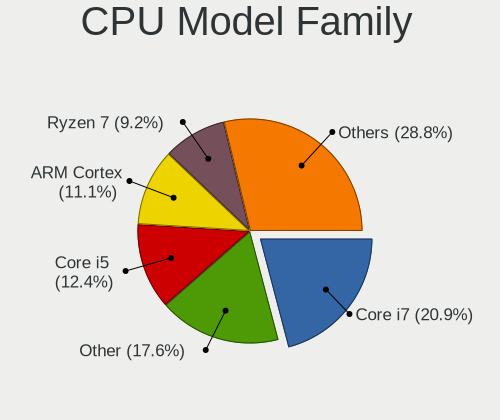
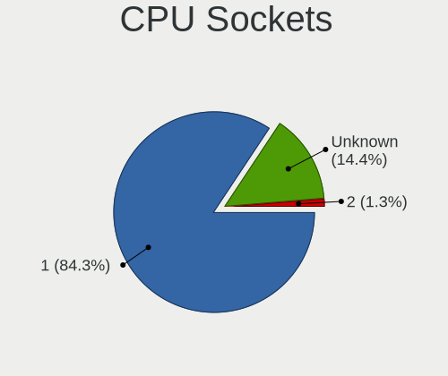
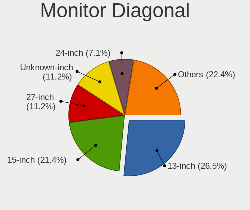

FreeBSD 14.0-CURRENT - Tested Hardware & Statistics
---------------------------------------------------

A project to collect tested hardware configurations for FreeBSD 14.0-CURRENT.

Anyone can contribute to this report by the [hw-probe](https://github.com/linuxhw/hw-probe/blob/master/INSTALL.BSD.md) tool:

    hw-probe -all -upload

Please submit a probe of your configuration if it's not presented on the page or is rare.

This is a report for all computer types. See also reports for [desktops](/Dist/FreeBSD_14.0-CURRENT/Desktop/README.md) and [notebooks](/Dist/FreeBSD_14.0-CURRENT/Notebook/README.md).

Full-feature report is available here: https://bsd-hardware.info/?view=trends

Contents
--------

* [ Test Cases ](#test-cases)

* [ System ](#system)
  - [ Arch                     ](#arch)
  - [ DE                       ](#de)
  - [ Display Server           ](#display-server)
  - [ Display Manager          ](#display-manager)
  - [ OS Lang                  ](#os-lang)
  - [ Boot Mode                ](#boot-mode)
  - [ Filesystem               ](#filesystem)
  - [ Part. scheme             ](#part-scheme)

* [ Board ](#board)
  - [ Vendor                   ](#vendor)
  - [ Model                    ](#model)
  - [ Model Family             ](#model-family)
  - [ MFG Year                 ](#mfg-year)
  - [ Form Factor              ](#form-factor)
  - [ Coreboot                 ](#coreboot)
  - [ RAM Size                 ](#ram-size)
  - [ RAM Used                 ](#ram-used)
  - [ Total Drives             ](#total-drives)
  - [ Has CD-ROM               ](#has-cd-rom)
  - [ Has Ethernet             ](#has-ethernet)
  - [ Has WiFi                 ](#has-wifi)
  - [ Has Bluetooth            ](#has-bluetooth)

* [ Location ](#location)
  - [ Country                  ](#country)
  - [ City                     ](#city)

* [ Drives ](#drives)
  - [ Drive Vendor             ](#drive-vendor)
  - [ Drive Model              ](#drive-model)
  - [ HDD Vendor               ](#hdd-vendor)
  - [ SSD Vendor               ](#ssd-vendor)
  - [ Drive Kind               ](#drive-kind)
  - [ Drive Connector          ](#drive-connector)
  - [ Drive Size               ](#drive-size)
  - [ Space Total              ](#space-total)
  - [ Space Used               ](#space-used)
  - [ Malfunc. Drives          ](#malfunc-drives)
  - [ Malfunc. Drive Vendor    ](#malfunc-drive-vendor)
  - [ Malfunc. HDD Vendor      ](#malfunc-hdd-vendor)
  - [ Malfunc. Drive Kind      ](#malfunc-drive-kind)
  - [ Failed Drives            ](#failed-drives)
  - [ Failed Drive Vendor      ](#failed-drive-vendor)
  - [ Drive Status             ](#drive-status)

* [ Storage controller ](#storage-controller)
  - [ Storage Vendor           ](#storage-vendor)
  - [ Storage Model            ](#storage-model)
  - [ Storage Kind             ](#storage-kind)

* [ Processor ](#processor)
  - [ CPU Vendor               ](#cpu-vendor)
  - [ CPU Model                ](#cpu-model)
  - [ CPU Model Family         ](#cpu-model-family)
  - [ CPU Cores                ](#cpu-cores)
  - [ CPU Sockets              ](#cpu-sockets)
  - [ CPU Threads              ](#cpu-threads)
  - [ CPU Microarch            ](#cpu-microarch)

* [ Graphics ](#graphics)
  - [ GPU Vendor               ](#gpu-vendor)
  - [ GPU Model                ](#gpu-model)
  - [ GPU Combo                ](#gpu-combo)
  - [ GPU Driver               ](#gpu-driver)
  - [ GPU Memory               ](#gpu-memory)

* [ Monitor ](#monitor)
  - [ Monitor Vendor           ](#monitor-vendor)
  - [ Monitor Model            ](#monitor-model)
  - [ Monitor Resolution       ](#monitor-resolution)
  - [ Monitor Diagonal         ](#monitor-diagonal)
  - [ Monitor Width            ](#monitor-width)
  - [ Aspect Ratio             ](#aspect-ratio)
  - [ Monitor Area             ](#monitor-area)
  - [ Pixel Density            ](#pixel-density)
  - [ Multiple Monitors        ](#multiple-monitors)

* [ Network ](#network)
  - [ Net Controller Vendor    ](#net-controller-vendor)
  - [ Net Controller Model     ](#net-controller-model)
  - [ Wireless Vendor          ](#wireless-vendor)
  - [ Wireless Model           ](#wireless-model)
  - [ Ethernet Vendor          ](#ethernet-vendor)
  - [ Ethernet Model           ](#ethernet-model)
  - [ Net Controller Kind      ](#net-controller-kind)
  - [ Used Controller          ](#used-controller)
  - [ NICs                     ](#nics)
  - [ IPv6                     ](#ipv6)

* [ Bluetooth ](#bluetooth)
  - [ Bluetooth Vendor         ](#bluetooth-vendor)
  - [ Bluetooth Model          ](#bluetooth-model)

* [ Sound ](#sound)
  - [ Sound Vendor             ](#sound-vendor)
  - [ Sound Model              ](#sound-model)

* [ Memory ](#memory)
  - [ Memory Vendor            ](#memory-vendor)
  - [ Memory Model             ](#memory-model)
  - [ Memory Kind              ](#memory-kind)
  - [ Memory Form Factor       ](#memory-form-factor)
  - [ Memory Size              ](#memory-size)
  - [ Memory Speed             ](#memory-speed)

* [ Printers & scanners ](#printers--scanners)
  - [ Printer Vendor           ](#printer-vendor)
  - [ Printer Model            ](#printer-model)
  - [ Scanner Vendor           ](#scanner-vendor)
  - [ Scanner Model            ](#scanner-model)

* [ Camera ](#camera)
  - [ Camera Vendor            ](#camera-vendor)
  - [ Camera Model             ](#camera-model)

* [ Security ](#security)
  - [ Fingerprint Vendor       ](#fingerprint-vendor)
  - [ Fingerprint Model        ](#fingerprint-model)
  - [ Chipcard Vendor          ](#chipcard-vendor)
  - [ Chipcard Model           ](#chipcard-model)

* [ Unsupported ](#unsupported)
  - [ Unsupported Devices      ](#unsupported-devices)
  - [ Unsupported Device Types ](#unsupported-device-types)

Test Cases
----------

| Vendor        | Model                       | Form-Factor | Probe                                                     | Date         |
|---------------|-----------------------------|-------------|-----------------------------------------------------------|--------------|
| Apple         | MacBookPro10,1              | Notebook    | [64ccf1e6a0](https://bsd-hardware.info/?probe=64ccf1e6a0) | Feb 18, 2022 |
| HP            | 83E1                        | Desktop     | [d8e995126f](https://bsd-hardware.info/?probe=d8e995126f) | Feb 10, 2022 |
| Notebook      | NS50_70MU                   | Notebook    | [3b3ff8b95d](https://bsd-hardware.info/?probe=3b3ff8b95d) | Feb 05, 2022 |
| Raspberry ... | Raspberry Pi                | Soc         | [840c7f2142](https://bsd-hardware.info/?probe=840c7f2142) | Feb 05, 2022 |
| Lenovo        | IdeaPad Gaming 3 15ARH05... | Notebook    | [e660899158](https://bsd-hardware.info/?probe=e660899158) | Feb 03, 2022 |
| Dell          | G3 3500                     | Notebook    | [536a7a1b38](https://bsd-hardware.info/?probe=536a7a1b38) | Jan 31, 2022 |
| HP            | EliteBook 8570p             | Notebook    | [f47789d894](https://bsd-hardware.info/?probe=f47789d894) | Jan 29, 2022 |
| MSI           | GE76 Raider 10UG            | Notebook    | [b48b628936](https://bsd-hardware.info/?probe=b48b628936) | Jan 27, 2022 |
| HP            | EliteBook 8570p             | Notebook    | [61406080a7](https://bsd-hardware.info/?probe=61406080a7) | Jan 18, 2022 |
| HP            | EliteBook 8570p             | Notebook    | [1520fece28](https://bsd-hardware.info/?probe=1520fece28) | Jan 17, 2022 |
| HP            | EliteBook 8570p             | Notebook    | [5f106ee686](https://bsd-hardware.info/?probe=5f106ee686) | Jan 15, 2022 |
| Gigabyte      | B450M DS3H-CF               | Desktop     | [825d20fcf7](https://bsd-hardware.info/?probe=825d20fcf7) | Jan 14, 2022 |
| Gigabyte      | B450M DS3H-CF               | Desktop     | [b953d9d2e6](https://bsd-hardware.info/?probe=b953d9d2e6) | Jan 13, 2022 |
| Lenovo        | ThinkPad X13 Gen 1 20T20... | Notebook    | [6836fc60f6](https://bsd-hardware.info/?probe=6836fc60f6) | Jan 09, 2022 |
| ASUSTek       | ROG STRIX B550-I GAMING     | Desktop     | [2cc4698cbc](https://bsd-hardware.info/?probe=2cc4698cbc) | Jan 09, 2022 |
| ASUSTek       | ROG STRIX B550-I GAMING     | Desktop     | [2481037b2a](https://bsd-hardware.info/?probe=2481037b2a) | Jan 09, 2022 |
| Lenovo        | ThinkPad E14 Gen 3 20Y70... | Notebook    | [6c208c85a5](https://bsd-hardware.info/?probe=6c208c85a5) | Jan 06, 2022 |
| ASUSTek       | PN50                        | Mini pc     | [7ea8daae8d](https://bsd-hardware.info/?probe=7ea8daae8d) | Jan 05, 2022 |
| ASUSTek       | TUF GAMING B550-PLUS        | Desktop     | [ea4719600a](https://bsd-hardware.info/?probe=ea4719600a) | Jan 05, 2022 |
| HP            | EliteBook 8570p             | Notebook    | [1bbb37d4c6](https://bsd-hardware.info/?probe=1bbb37d4c6) | Jan 03, 2022 |
| HP            | EliteBook 8570p             | Notebook    | [0a180d834c](https://bsd-hardware.info/?probe=0a180d834c) | Jan 03, 2022 |
| ASRock        | B450 Steel Legend           | Desktop     | [e67007df20](https://bsd-hardware.info/?probe=e67007df20) | Jan 01, 2022 |
| HP            | EliteBook 8570p             | Notebook    | [b956c2a933](https://bsd-hardware.info/?probe=b956c2a933) | Dec 28, 2021 |
| friendlyel... | nanopi-m4                   | Desktop     | [bb29e50061](https://bsd-hardware.info/?probe=bb29e50061) | Dec 27, 2021 |
| Lenovo        | ThinkBook 14 G3 ACL 21A2    | Notebook    | [42b4bcbcc2](https://bsd-hardware.info/?probe=42b4bcbcc2) | Dec 27, 2021 |
| Lenovo        | ThinkBook 14 G3 ACL 21A2    | Notebook    | [695d7201d4](https://bsd-hardware.info/?probe=695d7201d4) | Dec 27, 2021 |
| khadas        | edge-v                      | Desktop     | [42c428aac0](https://bsd-hardware.info/?probe=42c428aac0) | Dec 26, 2021 |
| HP            | EliteBook 8570p             | Notebook    | [44d3e7366c](https://bsd-hardware.info/?probe=44d3e7366c) | Dec 20, 2021 |
| HP            | EliteBook Folio 9470m       | Notebook    | [b872e9b044](https://bsd-hardware.info/?probe=b872e9b044) | Dec 18, 2021 |
| HP            | ProBook 440 G6              | Notebook    | [7a8a66430a](https://bsd-hardware.info/?probe=7a8a66430a) | Dec 13, 2021 |
| HP            | ProBook 440 G6              | Notebook    | [f3c014b120](https://bsd-hardware.info/?probe=f3c014b120) | Dec 12, 2021 |
| HP            | EliteBook 8570p             | Notebook    | [045ffeb9b3](https://bsd-hardware.info/?probe=045ffeb9b3) | Dec 12, 2021 |
| Unknown       | Unknown                     | Desktop     | [b726a1b3e3](https://bsd-hardware.info/?probe=b726a1b3e3) | Dec 11, 2021 |
| ASUSTek       | PRIME X570-PRO              | Desktop     | [9a8d19aa04](https://bsd-hardware.info/?probe=9a8d19aa04) | Dec 11, 2021 |
| Unknown       | Unknown                     | Desktop     | [7633cb9296](https://bsd-hardware.info/?probe=7633cb9296) | Dec 11, 2021 |
| ASUSTek       | 1215B                       | Notebook    | [6dbcac684f](https://bsd-hardware.info/?probe=6dbcac684f) | Dec 04, 2021 |
| HP            | EliteBook 8570p             | Notebook    | [92fc69392b](https://bsd-hardware.info/?probe=92fc69392b) | Nov 27, 2021 |
| Unknown       | Unknown                     | Desktop     | [d05fb15725](https://bsd-hardware.info/?probe=d05fb15725) | Nov 22, 2021 |
| HP            | EliteBook 8570p             | Notebook    | [d3888a4c7d](https://bsd-hardware.info/?probe=d3888a4c7d) | Nov 21, 2021 |
| HP            | EliteBook 8570p             | Notebook    | [822a2481bb](https://bsd-hardware.info/?probe=822a2481bb) | Nov 17, 2021 |
| HP            | EliteBook 8570p             | Notebook    | [ea51e03be6](https://bsd-hardware.info/?probe=ea51e03be6) | Nov 13, 2021 |
| HP            | EliteBook 8570p             | Notebook    | [28a264a128](https://bsd-hardware.info/?probe=28a264a128) | Nov 09, 2021 |
| HP            | EliteBook 8570p             | Notebook    | [d0b487888a](https://bsd-hardware.info/?probe=d0b487888a) | Nov 08, 2021 |
| Raspberry ... | Raspberry Pi                | Soc         | [83480615f6](https://bsd-hardware.info/?probe=83480615f6) | Nov 04, 2021 |
| Lenovo        | ThinkPad X1 Extreme Gen ... | Notebook    | [e54d79065e](https://bsd-hardware.info/?probe=e54d79065e) | Nov 02, 2021 |
| Lenovo        | ThinkPad X1 Extreme Gen ... | Notebook    | [a71d3392eb](https://bsd-hardware.info/?probe=a71d3392eb) | Nov 02, 2021 |
| Lenovo        | ThinkPad T470p 20J7S0PM0... | Notebook    | [7a61d90a55](https://bsd-hardware.info/?probe=7a61d90a55) | Oct 28, 2021 |
| Raspberry ... | Raspberry Pi                | Soc         | [70422b437f](https://bsd-hardware.info/?probe=70422b437f) | Oct 27, 2021 |
| Beckhoff A... | CX51x0 G3                   | Desktop     | [6db720018b](https://bsd-hardware.info/?probe=6db720018b) | Oct 25, 2021 |
| Beckhoff A... | CX20x3 G1                   | Desktop     | [a49fbd5ce3](https://bsd-hardware.info/?probe=a49fbd5ce3) | Oct 25, 2021 |
| Lenovo        | ThinkPad P14s Gen 1 20Y1... | Notebook    | [d910c79d75](https://bsd-hardware.info/?probe=d910c79d75) | Oct 24, 2021 |
| Unknown       | Raspberry Pi                | Soc         | [9f66ee1b41](https://bsd-hardware.info/?probe=9f66ee1b41) | Oct 18, 2021 |
| HP            | EliteBook 8570p             | Notebook    | [86613b04d3](https://bsd-hardware.info/?probe=86613b04d3) | Oct 17, 2021 |
| HP            | EliteBook 8570p             | Notebook    | [1b48acadd5](https://bsd-hardware.info/?probe=1b48acadd5) | Oct 10, 2021 |
| Framework     | Laptop                      | Notebook    | [e5aca4b7d0](https://bsd-hardware.info/?probe=e5aca4b7d0) | Oct 02, 2021 |
| ASUSTek       | PRIME Z590-A                | Desktop     | [1aa5ced5a0](https://bsd-hardware.info/?probe=1aa5ced5a0) | Sep 23, 2021 |
| HP            | EliteBook 8570p             | Notebook    | [646148fc25](https://bsd-hardware.info/?probe=646148fc25) | Sep 18, 2021 |
| ASUSTek       | VivoBook_ASUSLaptop X512... | Notebook    | [0b73df29bf](https://bsd-hardware.info/?probe=0b73df29bf) | Sep 15, 2021 |
| HP            | EliteBook 8570p             | Notebook    | [5a4e53da56](https://bsd-hardware.info/?probe=5a4e53da56) | Sep 12, 2021 |
| Lenovo        | ThinkPad X395 20NL000GPG    | Notebook    | [d7812a2905](https://bsd-hardware.info/?probe=d7812a2905) | Sep 10, 2021 |
| Lenovo        | ThinkPad X395 20NL000GPG    | Notebook    | [cdde22fb04](https://bsd-hardware.info/?probe=cdde22fb04) | Sep 10, 2021 |
| HP            | EliteBook 8570p             | Notebook    | [7a289e8d1b](https://bsd-hardware.info/?probe=7a289e8d1b) | Sep 06, 2021 |
| Gigabyte      | X399 DESIGNARE EX-CF        | Desktop     | [a78cc6a11b](https://bsd-hardware.info/?probe=a78cc6a11b) | Sep 04, 2021 |
| HP            | EliteBook 8570p             | Notebook    | [fae9e84f60](https://bsd-hardware.info/?probe=fae9e84f60) | Aug 27, 2021 |
| Lenovo        | ThinkPad P14s Gen 1 20Y1... | Notebook    | [76f004bd26](https://bsd-hardware.info/?probe=76f004bd26) | Aug 26, 2021 |
| HP            | EliteBook 8570p             | Notebook    | [a98c6adb40](https://bsd-hardware.info/?probe=a98c6adb40) | Aug 22, 2021 |
| HP            | EliteBook 8570p             | Notebook    | [71092e78e2](https://bsd-hardware.info/?probe=71092e78e2) | Aug 17, 2021 |
| HP            | EliteBook 8570p             | Notebook    | [6e97c9a59e](https://bsd-hardware.info/?probe=6e97c9a59e) | Aug 14, 2021 |
| Lenovo        | Unknown                     | Notebook    | [e16ce5e864](https://bsd-hardware.info/?probe=e16ce5e864) | Aug 08, 2021 |
| HP            | ZBook 17 G2                 | Notebook    | [f2d911563a](https://bsd-hardware.info/?probe=f2d911563a) | Aug 07, 2021 |
| Lenovo        | ThinkPad X1 Extreme 20MF... | Notebook    | [6d5e1a13d0](https://bsd-hardware.info/?probe=6d5e1a13d0) | Aug 07, 2021 |
| Lenovo        | XiaoXinPro-13ARE 2020 82... | Notebook    | [bf56b2a81a](https://bsd-hardware.info/?probe=bf56b2a81a) | Aug 05, 2021 |
| HP            | ZBook 17 G2                 | Notebook    | [2faf8af7be](https://bsd-hardware.info/?probe=2faf8af7be) | Jul 30, 2021 |
| HP            | ZBook 17 G2                 | Notebook    | [c7fb9e9dee](https://bsd-hardware.info/?probe=c7fb9e9dee) | Jul 27, 2021 |
| HP            | ZBook 17 G2                 | Notebook    | [50c349b7b5](https://bsd-hardware.info/?probe=50c349b7b5) | Jul 27, 2021 |
| HP            | ZBook 17 G2                 | Notebook    | [6149ab50a8](https://bsd-hardware.info/?probe=6149ab50a8) | Jul 24, 2021 |
| Dell          | G5 5505                     | Notebook    | [9933a09c4f](https://bsd-hardware.info/?probe=9933a09c4f) | Jul 24, 2021 |
| HP            | ZBook 17 G2                 | Notebook    | [1ef99f31dd](https://bsd-hardware.info/?probe=1ef99f31dd) | Jul 23, 2021 |
| Avell High... | A62 LIV                     | Notebook    | [5983302b1d](https://bsd-hardware.info/?probe=5983302b1d) | Jul 21, 2021 |
| Lenovo        | XiaoXinPro-13ARE 2020 82... | Notebook    | [e0e6f62814](https://bsd-hardware.info/?probe=e0e6f62814) | Jul 19, 2021 |
| Lenovo        | XiaoXinPro-13ARE 2020 82... | Notebook    | [b0da42c20d](https://bsd-hardware.info/?probe=b0da42c20d) | Jul 18, 2021 |
| ASUSTek       | VivoBook_ASUSLaptop X512... | Notebook    | [9c9d4cc782](https://bsd-hardware.info/?probe=9c9d4cc782) | Jul 18, 2021 |
| ASUSTek       | VivoBook_ASUSLaptop X512... | Notebook    | [3d5e512e18](https://bsd-hardware.info/?probe=3d5e512e18) | Jul 18, 2021 |
| HP            | ProBook 440 G7              | Notebook    | [63dc88528c](https://bsd-hardware.info/?probe=63dc88528c) | Jul 17, 2021 |
| HP            | ProBook 440 G7              | Notebook    | [7138e2a9e7](https://bsd-hardware.info/?probe=7138e2a9e7) | Jul 17, 2021 |
| HP            | ProBook 440 G7              | Notebook    | [b73eb50747](https://bsd-hardware.info/?probe=b73eb50747) | Jul 16, 2021 |
| HP            | EliteBook 8570p             | Notebook    | [462fc329a9](https://bsd-hardware.info/?probe=462fc329a9) | Jul 16, 2021 |
| HP            | ProBook 440 G7              | Notebook    | [d2866f01b5](https://bsd-hardware.info/?probe=d2866f01b5) | Jul 16, 2021 |
| Unknown       | Unknown                     | Desktop     | [4a3836de00](https://bsd-hardware.info/?probe=4a3836de00) | Jul 08, 2021 |
| HP            | EliteBook 8570p             | Notebook    | [cc24e867fc](https://bsd-hardware.info/?probe=cc24e867fc) | Jun 19, 2021 |
| Lenovo        | ThinkPad E14 20RBCTO1WW     | Notebook    | [3d50ba4d85](https://bsd-hardware.info/?probe=3d50ba4d85) | Jun 13, 2021 |
| Dell          | G5 5505                     | Notebook    | [97319295ee](https://bsd-hardware.info/?probe=97319295ee) | Jun 13, 2021 |
| Dell          | Vostro 5490                 | Notebook    | [cf3508718c](https://bsd-hardware.info/?probe=cf3508718c) | Jun 11, 2021 |
| Lenovo        | IdeaPad 330-15ARR 81D2      | Notebook    | [4ac6c9b3eb](https://bsd-hardware.info/?probe=4ac6c9b3eb) | Jun 08, 2021 |
| Lenovo        | IdeaPad 330-15ARR 81D2      | Notebook    | [8fc867cfae](https://bsd-hardware.info/?probe=8fc867cfae) | Jun 06, 2021 |
| ASUSTek       | PRIME B450M-GAMING/BR       | Desktop     | [edebe87739](https://bsd-hardware.info/?probe=edebe87739) | Jun 04, 2021 |
| Intel         | S2600WTTR G92187-372        | Server      | [289d61b1b2](https://bsd-hardware.info/?probe=289d61b1b2) | Jun 04, 2021 |
| HP            | EliteBook 8570p             | Notebook    | [52ba4e835f](https://bsd-hardware.info/?probe=52ba4e835f) | Jun 03, 2021 |
| Unknown       | Raspberry Pi                | Soc         | [4e4f164625](https://bsd-hardware.info/?probe=4e4f164625) | May 29, 2021 |
| Unknown       | Unknown                     | Soc         | [d96ade87e5](https://bsd-hardware.info/?probe=d96ade87e5) | May 29, 2021 |
| Lenovo        | ThinkPad X270 20HM004JBR    | Notebook    | [88c27e65d7](https://bsd-hardware.info/?probe=88c27e65d7) | May 23, 2021 |
| Gigabyte      | B550I AORUS PRO AX          | Desktop     | [62b9ea2794](https://bsd-hardware.info/?probe=62b9ea2794) | May 14, 2021 |
| ASUSTek       | P8H77-M PRO                 | Desktop     | [b3acafeb1a](https://bsd-hardware.info/?probe=b3acafeb1a) | May 09, 2021 |
| ASUSTek       | P8H77-M PRO                 | Desktop     | [86cec3b874](https://bsd-hardware.info/?probe=86cec3b874) | May 09, 2021 |
| HP            | EliteBook 8570p             | Notebook    | [062fe5ec40](https://bsd-hardware.info/?probe=062fe5ec40) | May 09, 2021 |
| Dell          | G5 5505                     | Notebook    | [ba74d8eee0](https://bsd-hardware.info/?probe=ba74d8eee0) | May 08, 2021 |
| Dell          | G5 5505                     | Notebook    | [23ae99e489](https://bsd-hardware.info/?probe=23ae99e489) | May 08, 2021 |
| Lenovo        | Legion 5P 15IMH05H 82AW     | Notebook    | [2be8cf963c](https://bsd-hardware.info/?probe=2be8cf963c) | May 02, 2021 |
| Dell          | Inspiron 3793               | Notebook    | [c2d56fc369](https://bsd-hardware.info/?probe=c2d56fc369) | Apr 29, 2021 |
| HP            | EliteBook 8570p             | Notebook    | [e90abb54c9](https://bsd-hardware.info/?probe=e90abb54c9) | Apr 25, 2021 |
| pine64        | pinebook-pro-rk3399         | Desktop     | [79713a2668](https://bsd-hardware.info/?probe=79713a2668) | Apr 25, 2021 |
| Lenovo        | ThinkPad X1 Carbon 5th 2... | Notebook    | [4993ad0feb](https://bsd-hardware.info/?probe=4993ad0feb) | Apr 25, 2021 |
| pine64        | pinebook-pro-rk3399         | Desktop     | [0f04e5f048](https://bsd-hardware.info/?probe=0f04e5f048) | Apr 11, 2021 |
| HUAWEI        | HN-WX9X                     | Notebook    | [d776625073](https://bsd-hardware.info/?probe=d776625073) | Apr 11, 2021 |
| HP            | EliteBook 8570p             | Notebook    | [d9ec051372](https://bsd-hardware.info/?probe=d9ec051372) | Apr 06, 2021 |
| Gigabyte      | X570 AORUS ELITE            | Desktop     | [325186171a](https://bsd-hardware.info/?probe=325186171a) | Apr 02, 2021 |
| HP            | EliteBook 8570p             | Notebook    | [cdeafa0952](https://bsd-hardware.info/?probe=cdeafa0952) | Apr 02, 2021 |
| Lenovo        | ThinkPad P15 Gen 1 20ST0... | Notebook    | [342e914968](https://bsd-hardware.info/?probe=342e914968) | Mar 29, 2021 |
| pine64        | pinebook-pro-rk3399         | Desktop     | [ea524ab4c4](https://bsd-hardware.info/?probe=ea524ab4c4) | Mar 28, 2021 |
| HP            | EliteBook 8570p             | Notebook    | [ed80dc9019](https://bsd-hardware.info/?probe=ed80dc9019) | Mar 27, 2021 |
| HP            | ProBook 455 G7              | Notebook    | [dd877e6c6c](https://bsd-hardware.info/?probe=dd877e6c6c) | Mar 27, 2021 |
| pine64        | pinebook-pro-rk3399         | Desktop     | [835da13d39](https://bsd-hardware.info/?probe=835da13d39) | Mar 18, 2021 |
| Gigabyte      | 970A-UD3P                   | Desktop     | [cc3151bc6f](https://bsd-hardware.info/?probe=cc3151bc6f) | Mar 17, 2021 |
| Unknown       | Raspberry Pi                | Soc         | [e3f20f8770](https://bsd-hardware.info/?probe=e3f20f8770) | Mar 17, 2021 |
| Lenovo        | ThinkPad X395 20NL001SMX    | Notebook    | [cd016e96ee](https://bsd-hardware.info/?probe=cd016e96ee) | Mar 17, 2021 |
| MSI           | B450 GAMING PLUS            | Desktop     | [547fd655f0](https://bsd-hardware.info/?probe=547fd655f0) | Mar 13, 2021 |
| Lenovo        | Legion 5 15IMH05 82AU       | Notebook    | [9fed35d792](https://bsd-hardware.info/?probe=9fed35d792) | Mar 10, 2021 |
| HP            | ProBook 455 G7              | Notebook    | [1fcde7c0e1](https://bsd-hardware.info/?probe=1fcde7c0e1) | Mar 09, 2021 |
| pine64        | pinebook-pro-rk3399         | Desktop     | [c00bcdcc87](https://bsd-hardware.info/?probe=c00bcdcc87) | Mar 06, 2021 |
| Lenovo        | ThinkPad E14 20RBCTO1WW     | Notebook    | [f2c2e5345a](https://bsd-hardware.info/?probe=f2c2e5345a) | Feb 27, 2021 |
| pine64        | pinebook-pro-rk3399         | Desktop     | [3abcd73d48](https://bsd-hardware.info/?probe=3abcd73d48) | Feb 26, 2021 |
| Gigabyte      | X570 AORUS MASTER           | Desktop     | [29936dd1c0](https://bsd-hardware.info/?probe=29936dd1c0) | Feb 25, 2021 |
| Lenovo        | ThinkPad E14 20RBCTO1WW     | Notebook    | [aacafb6ace](https://bsd-hardware.info/?probe=aacafb6ace) | Feb 24, 2021 |
| Unknown       | Unknown                     | Desktop     | [74b11992d7](https://bsd-hardware.info/?probe=74b11992d7) | Feb 20, 2021 |
| Raspberry ... | rpi                         | Desktop     | [92ee9b3619](https://bsd-hardware.info/?probe=92ee9b3619) | Feb 18, 2021 |
| pine64        | pinebook-pro-rk3399         | Desktop     | [b750f83194](https://bsd-hardware.info/?probe=b750f83194) | Feb 17, 2021 |
| Unknown       | Raspberry Pi                | Soc         | [a601b10377](https://bsd-hardware.info/?probe=a601b10377) | Feb 16, 2021 |
| A-DATA Tec... | XENIA159GENI72060           | Notebook    | [be88e8f865](https://bsd-hardware.info/?probe=be88e8f865) | Feb 15, 2021 |
| Lenovo        | ThinkPad T495s 20QKS1812... | Notebook    | [0e5e228d18](https://bsd-hardware.info/?probe=0e5e228d18) | Feb 13, 2021 |
| Lenovo        | ThinkPad T495s 20QKS1812... | Notebook    | [2d93a6bebc](https://bsd-hardware.info/?probe=2d93a6bebc) | Feb 13, 2021 |
| ASUSTek       | PRIME B450M-A               | Desktop     | [ba7f82b343](https://bsd-hardware.info/?probe=ba7f82b343) | Feb 12, 2021 |
| Matsushita... | CF-T2BW1AXR                 | Notebook    | [f6ec2858a5](https://bsd-hardware.info/?probe=f6ec2858a5) | Feb 10, 2021 |
| pine64        | pinebook-pro-rk3399         | Desktop     | [2befc5e754](https://bsd-hardware.info/?probe=2befc5e754) | Feb 10, 2021 |
| pine64        | pinebook-pro-rk3399         | Desktop     | [5a55b22f44](https://bsd-hardware.info/?probe=5a55b22f44) | Feb 09, 2021 |
| Dell          | 0D9JG3 A00                  | Desktop     | [65dd4083c5](https://bsd-hardware.info/?probe=65dd4083c5) | Feb 09, 2021 |
| HP            | EliteBook 8570p             | Notebook    | [72137c63f8](https://bsd-hardware.info/?probe=72137c63f8) | Feb 09, 2021 |
| pine64        | pinebook-pro-rk3399         | Desktop     | [97e72f0066](https://bsd-hardware.info/?probe=97e72f0066) | Feb 06, 2021 |
| Dell          | Latitude E5430 vPro         | Notebook    | [bee421a110](https://bsd-hardware.info/?probe=bee421a110) | Feb 06, 2021 |
| Dell          | Latitude E5430 vPro         | Notebook    | [e8157ac6a3](https://bsd-hardware.info/?probe=e8157ac6a3) | Feb 06, 2021 |
| Lenovo        | ThinkPad T430 2349H2G       | Notebook    | [229db16a93](https://bsd-hardware.info/?probe=229db16a93) | Feb 05, 2021 |
| HP            | EliteBook 8570p             | Notebook    | [46c938b853](https://bsd-hardware.info/?probe=46c938b853) | Feb 01, 2021 |
| pine64        | pinebook-pro-rk3399         | Desktop     | [1720175648](https://bsd-hardware.info/?probe=1720175648) | Jan 27, 2021 |
| Matsushita... | CF-T2BW1AXR                 | Notebook    | [c16cd20c42](https://bsd-hardware.info/?probe=c16cd20c42) | Jan 25, 2021 |
| pine64        | pinebook-pro-rk3399         | Desktop     | [2338de9efc](https://bsd-hardware.info/?probe=2338de9efc) | Jan 24, 2021 |

System
------

Arch
----

OS architecture (x86_64, i586, etc.)

| Name  | Computers | Percent |
|-------|-----------|---------|
| amd64 | 65        | 80.25%  |
| arm64 | 13        | 16.05%  |
| riscv | 1         | 1.23%   |
| i386  | 1         | 1.23%   |
| arm   | 1         | 1.23%   |

DE
--

Desktop Environment

| Name          | Computers | Percent |
|---------------|-----------|---------|
| KDE5          | 22        | 25.88%  |
| Console       | 19        | 22.35%  |
| XFCE          | 9         | 10.59%  |
| MATE          | 8         | 9.41%   |
| GNOME         | 5         | 5.88%   |
| TWM           | 4         | 4.71%   |
| i3            | 4         | 4.71%   |
| Cinnamon      | 3         | 3.53%   |
| Openbox       | 2         | 2.35%   |
| Lumina        | 2         | 2.35%   |
| Xfwm4         | 1         | 1.18%   |
| Picom         | 1         | 1.18%   |
| LXQt          | 1         | 1.18%   |
| LXDE          | 1         | 1.18%   |
| GNUstep       | 1         | 1.18%   |
| Fluxbox       | 1         | 1.18%   |
| Enlightenment | 1         | 1.18%   |

Display Server
--------------

X11 or Wayland

| Name    | Computers | Percent |
|---------|-----------|---------|
| X11     | 59        | 70.24%  |
| Console | 24        | 28.57%  |
| Wayland | 1         | 1.19%   |

Display Manager
---------------

SDDM, LightDM, etc.

| Name    | Computers | Percent |
|---------|-----------|---------|
| Console | 37        | 44.58%  |
| SDDM    | 20        | 24.1%   |
| SLiM    | 9         | 10.84%  |
| GDM     | 9         | 10.84%  |
| XDM     | 6         | 7.23%   |
| LightDM | 2         | 2.41%   |

OS Lang
-------

Language

| Lang             | Computers | Percent |
|------------------|-----------|---------|
| C                | 51        | 61.45%  |
| en_US            | 10        | 12.05%  |
| Unknown          | 5         | 6.02%   |
| uk_UA            | 3         | 3.61%   |
| de_DE            | 3         | 3.61%   |
| zh_CN            | 2         | 2.41%   |
| en_GB            | 2         | 2.41%   |
| sv_SE            | 1         | 1.2%    |
| ru_RU            | 1         | 1.2%    |
| pt_PT            | 1         | 1.2%    |
| pl_PL            | 1         | 1.2%    |
| it_IT.ISO8859-15 | 1         | 1.2%    |
| fr_FR            | 1         | 1.2%    |
| de_CH            | 1         | 1.2%    |

Boot Mode
---------

EFI or BIOS

| Mode | Computers | Percent |
|------|-----------|---------|
| EFI  | 72        | 88.89%  |
| BIOS | 9         | 11.11%  |

Filesystem
----------

Type of filesystem

| Type | Computers | Percent |
|------|-----------|---------|
| Zfs  | 59        | 72.84%  |
| Ufs  | 22        | 27.16%  |

Part. scheme
------------

Scheme of partitioning

| Type | Computers | Percent |
|------|-----------|---------|
| GPT  | 73        | 90.12%  |
| MBR  | 8         | 9.88%   |

Board
-----

Vendor
------

Motherboard manufacturer

| Name                           | Computers | Percent |
|--------------------------------|-----------|---------|
| Lenovo                         | 21        | 25.93%  |
| ASUSTek Computer               | 10        | 12.35%  |
| Hewlett-Packard                | 9         | 11.11%  |
| Unknown                        | 9         | 11.11%  |
| Gigabyte Technology            | 6         | 7.41%   |
| Dell                           | 6         | 7.41%   |
| Raspberry Pi Foundation        | 4         | 4.94%   |
| MSI                            | 2         | 2.47%   |
| Beckhoff Automation            | 2         | 2.47%   |
| pine64                         | 1         | 1.23%   |
| Notebook                       | 1         | 1.23%   |
| Matsushita Electric Industrial | 1         | 1.23%   |
| khadas                         | 1         | 1.23%   |
| Intel                          | 1         | 1.23%   |
| HUAWEI                         | 1         | 1.23%   |
| friendlyelec                   | 1         | 1.23%   |
| Framework                      | 1         | 1.23%   |
| Avell High Performance         | 1         | 1.23%   |
| ASRock                         | 1         | 1.23%   |
| Apple                          | 1         | 1.23%   |
| A-DATA Technology              | 1         | 1.23%   |

Model
-----

Motherboard model

| Name                                        | Computers | Percent |
|---------------------------------------------|-----------|---------|
| Unknown                                     | 10        | 12.35%  |
| RPi Raspberry Pi                            | 3         | 3.7%    |
| HP EliteBook 8570p                          | 3         | 3.7%    |
| RPi rpi                                     | 1         | 1.23%   |
| pine64 pinebook-pro-rk3399                  | 1         | 1.23%   |
| Notebook NS50_70MU                          | 1         | 1.23%   |
| MSI MS-7B86                                 | 1         | 1.23%   |
| MSI GE76 Raider 10UG                        | 1         | 1.23%   |
| Matsushita Electric Industrial CF-T2BW1AXR  | 1         | 1.23%   |
| Lenovo XiaoXinPro-13ARE 2020 82DM           | 1         | 1.23%   |
| Lenovo ThinkPad X395 20NL001SMX             | 1         | 1.23%   |
| Lenovo ThinkPad X395 20NL000GPG             | 1         | 1.23%   |
| Lenovo ThinkPad X270 20HM004JBR             | 1         | 1.23%   |
| Lenovo ThinkPad X13 Gen 1 20T2003PRT        | 1         | 1.23%   |
| Lenovo ThinkPad X1 Extreme Gen 3 20TLA055CD | 1         | 1.23%   |
| Lenovo ThinkPad X1 Extreme 20MF000BUS       | 1         | 1.23%   |
| Lenovo ThinkPad X1 Carbon 5th 20HQS1QC00    | 1         | 1.23%   |
| Lenovo ThinkPad T495s 20QKS1812F            | 1         | 1.23%   |
| Lenovo ThinkPad T470p 20J7S0PM00            | 1         | 1.23%   |
| Lenovo ThinkPad T430 2349H2G                | 1         | 1.23%   |
| Lenovo ThinkPad P15 Gen 1 20ST005VRT        | 1         | 1.23%   |
| Lenovo ThinkPad P14s Gen 1 20Y1CTO1WW       | 1         | 1.23%   |
| Lenovo ThinkPad E14 Gen 3 20Y7003SGE        | 1         | 1.23%   |
| Lenovo ThinkPad E14 20RBCTO1WW              | 1         | 1.23%   |
| Lenovo ThinkBook 14 G3 ACL 21A2             | 1         | 1.23%   |
| Lenovo Legion 5P 15IMH05H 82AW              | 1         | 1.23%   |
| Lenovo Legion 5 15IMH05 82AU                | 1         | 1.23%   |
| Lenovo IdeaPad Gaming 3 15ARH05 82EY        | 1         | 1.23%   |
| Lenovo IdeaPad 330-15ARR 81D2               | 1         | 1.23%   |
| khadas edge-v                               | 1         | 1.23%   |
| Intel S2600WTTR                             | 1         | 1.23%   |
| HUAWEI HN-WX9X                              | 1         | 1.23%   |
| HP ZBook 17 G2                              | 1         | 1.23%   |
| HP ProBook 455 G7                           | 1         | 1.23%   |
| HP ProBook 440 G7                           | 1         | 1.23%   |
| HP ProBook 440 G6                           | 1         | 1.23%   |
| HP EliteDesk 800 G4 SFF                     | 1         | 1.23%   |
| HP EliteBook Folio 9470m                    | 1         | 1.23%   |
| Gigabyte X570 AORUS MASTER                  | 1         | 1.23%   |
| Gigabyte X570 AORUS ELITE                   | 1         | 1.23%   |
| Gigabyte X399 DESIGNARE EX                  | 1         | 1.23%   |
| Gigabyte B550I AORUS PRO AX                 | 1         | 1.23%   |
| Gigabyte B450M DS3H                         | 1         | 1.23%   |
| Gigabyte 970A-UD3P                          | 1         | 1.23%   |
| friendlyelec nanopi-m4                      | 1         | 1.23%   |
| Framework Laptop                            | 1         | 1.23%   |
| Dell Vostro 5490                            | 1         | 1.23%   |
| Dell OptiPlex 5080                          | 1         | 1.23%   |
| Dell Latitude E5430 vPro                    | 1         | 1.23%   |
| Dell Inspiron 3793                          | 1         | 1.23%   |
| Dell G5 5505                                | 1         | 1.23%   |
| Dell G3 3500                                | 1         | 1.23%   |
| Beckhoff Automation CX2033-0185             | 1         | 1.23%   |
| Beckhoff Automation CBxx63                  | 1         | 1.23%   |
| Avell High Performance A62 LIV              | 1         | 1.23%   |
| ASUS VivoBook_ASUSLaptop X512DA_F512DA      | 1         | 1.23%   |
| ASUS TUF GAMING B550-PLUS                   | 1         | 1.23%   |
| ASUS ROG STRIX B550-I GAMING                | 1         | 1.23%   |
| ASUS PRIME Z590-A                           | 1         | 1.23%   |
| ASUS PRIME X570-PRO                         | 1         | 1.23%   |

Model Family
------------

Motherboard model prefix

| Name                                       | Computers | Percent |
|--------------------------------------------|-----------|---------|
| Lenovo ThinkPad                            | 14        | 17.28%  |
| Unknown                                    | 10        | 12.35%  |
| HP EliteBook                               | 4         | 4.94%   |
| ASUS PRIME                                 | 4         | 4.94%   |
| RPi Raspberry                              | 3         | 3.7%    |
| HP ProBook                                 | 3         | 3.7%    |
| Lenovo Legion                              | 2         | 2.47%   |
| Lenovo IdeaPad                             | 2         | 2.47%   |
| Gigabyte X570                              | 2         | 2.47%   |
| RPi rpi                                    | 1         | 1.23%   |
| pine64 pinebook-pro-rk3399                 | 1         | 1.23%   |
| Notebook NS50                              | 1         | 1.23%   |
| MSI MS-7B86                                | 1         | 1.23%   |
| MSI GE76                                   | 1         | 1.23%   |
| Matsushita Electric Industrial CF-T2BW1AXR | 1         | 1.23%   |
| Lenovo XiaoXinPro-13ARE                    | 1         | 1.23%   |
| Lenovo ThinkBook                           | 1         | 1.23%   |
| khadas edge-v                              | 1         | 1.23%   |
| Intel S2600WTTR                            | 1         | 1.23%   |
| HUAWEI HN-WX9X                             | 1         | 1.23%   |
| HP ZBook                                   | 1         | 1.23%   |
| HP EliteDesk                               | 1         | 1.23%   |
| Gigabyte X399                              | 1         | 1.23%   |
| Gigabyte B550I                             | 1         | 1.23%   |
| Gigabyte B450M                             | 1         | 1.23%   |
| Gigabyte 970A-UD3P                         | 1         | 1.23%   |
| friendlyelec nanopi-m4                     | 1         | 1.23%   |
| Framework Laptop                           | 1         | 1.23%   |
| Dell Vostro                                | 1         | 1.23%   |
| Dell OptiPlex                              | 1         | 1.23%   |
| Dell Latitude                              | 1         | 1.23%   |
| Dell Inspiron                              | 1         | 1.23%   |
| Dell G5                                    | 1         | 1.23%   |
| Dell G3                                    | 1         | 1.23%   |
| Beckhoff Automation CX2033-0185            | 1         | 1.23%   |
| Beckhoff Automation CBxx63                 | 1         | 1.23%   |
| Avell High Performance A62                 | 1         | 1.23%   |
| ASUS VivoBook                              | 1         | 1.23%   |
| ASUS TUF                                   | 1         | 1.23%   |
| ASUS ROG                                   | 1         | 1.23%   |
| ASUS P8H77-M                               | 1         | 1.23%   |
| ASUS MINIPC                                | 1         | 1.23%   |
| ASUS 1215B                                 | 1         | 1.23%   |
| ASRock B450                                | 1         | 1.23%   |
| Apple MacBookPro10                         | 1         | 1.23%   |
| A-DATA XENIA159GENI72060                   | 1         | 1.23%   |

MFG Year
--------

Motherboard manufacture year

| Year    | Computers | Percent |
|---------|-----------|---------|
| 2021    | 21        | 25.93%  |
| 2020    | 21        | 25.93%  |
| 2019    | 11        | 13.58%  |
| Unknown | 9         | 11.11%  |
| 2018    | 6         | 7.41%   |
| 2017    | 4         | 4.94%   |
| 2013    | 4         | 4.94%   |
| 2016    | 1         | 1.23%   |
| 2015    | 1         | 1.23%   |
| 2012    | 1         | 1.23%   |
| 2011    | 1         | 1.23%   |
| 2003    | 1         | 1.23%   |

Form Factor
-----------

Physical design of the computer

| Name           | Computers | Percent |
|----------------|-----------|---------|
| Notebook       | 44        | 54.32%  |
| Desktop        | 28        | 34.57%  |
| System on chip | 7         | 8.64%   |
| Mini pc        | 1         | 1.23%   |
| Server         | 1         | 1.23%   |

Coreboot
--------

Have coreboot on board

| Used | Computers | Percent |
|------|-----------|---------|
| No   | 81        | 100%    |

RAM Size
--------

Total RAM memory

| Size in GB      | Computers | Percent |
|-----------------|-----------|---------|
| 16.01-24.0      | 33        | 40.24%  |
| 8.01-16.0       | 15        | 18.29%  |
| 32.01-64.0      | 11        | 13.41%  |
| 64.01-256.0     | 9         | 10.98%  |
| 4.01-8.0        | 7         | 8.54%   |
| 0.51-1.0        | 2         | 2.44%   |
| More than 256.0 | 1         | 1.22%   |
| 3.01-4.0        | 1         | 1.22%   |
| 24.01-32.0      | 1         | 1.22%   |
| 2.01-3.0        | 1         | 1.22%   |
| 1.01-2.0        | 1         | 1.22%   |

RAM Used
--------

Used RAM memory

| Used GB     | Computers | Percent |
|-------------|-----------|---------|
| 0.51-1.0    | 29        | 35.8%   |
| 1.01-2.0    | 21        | 25.93%  |
| 0.01-0.5    | 15        | 18.52%  |
| 2.01-3.0    | 6         | 7.41%   |
| 3.01-4.0    | 3         | 3.7%    |
| 4.01-8.0    | 1         | 1.23%   |
| 32.01-64.0  | 1         | 1.23%   |
| 24.01-32.0  | 1         | 1.23%   |
| 64.01-256.0 | 1         | 1.23%   |
| 16.01-24.0  | 1         | 1.23%   |
| 8.01-16.0   | 1         | 1.23%   |
| 0           | 1         | 1.23%   |

Total Drives
------------

Number of drives on board

| Drives | Computers | Percent |
|--------|-----------|---------|
| 1      | 39        | 46.43%  |
| 2      | 22        | 26.19%  |
| 0      | 11        | 13.1%   |
| 3      | 5         | 5.95%   |
| 6      | 4         | 4.76%   |
| 4      | 2         | 2.38%   |
| 5      | 1         | 1.19%   |

Has CD-ROM
----------

Has CD-ROM on board

| Presented | Computers | Percent |
|-----------|-----------|---------|
| No        | 68        | 82.93%  |
| Yes       | 14        | 17.07%  |

Has Ethernet
------------

Has Ethernet on board

| Presented | Computers | Percent |
|-----------|-----------|---------|
| Yes       | 64        | 79.01%  |
| No        | 17        | 20.99%  |

Has WiFi
--------

Has WiFi module

| Presented | Computers | Percent |
|-----------|-----------|---------|
| Yes       | 55        | 67.9%   |
| No        | 26        | 32.1%   |

Has Bluetooth
-------------

Has Bluetooth module

| Presented | Computers | Percent |
|-----------|-----------|---------|
| Yes       | 42        | 51.22%  |
| No        | 40        | 48.78%  |

Location
--------

Country
-------

Geographic location (country)

| Country      | Computers | Percent |
|--------------|-----------|---------|
| USA          | 12        | 14.81%  |
| UK           | 11        | 13.58%  |
| Russia       | 8         | 9.88%   |
| Germany      | 8         | 9.88%   |
| Brazil       | 6         | 7.41%   |
| Ukraine      | 4         | 4.94%   |
| China        | 4         | 4.94%   |
| Austria      | 4         | 4.94%   |
| Japan        | 3         | 3.7%    |
| Switzerland  | 2         | 2.47%   |
| Sweden       | 2         | 2.47%   |
| Portugal     | 2         | 2.47%   |
| Poland       | 2         | 2.47%   |
| Turkey       | 1         | 1.23%   |
| Spain        | 1         | 1.23%   |
| Singapore    | 1         | 1.23%   |
| Saudi Arabia | 1         | 1.23%   |
| Peru         | 1         | 1.23%   |
| Netherlands  | 1         | 1.23%   |
| Jamaica      | 1         | 1.23%   |
| Italy        | 1         | 1.23%   |
| India        | 1         | 1.23%   |
| France       | 1         | 1.23%   |
| Croatia      | 1         | 1.23%   |
| Belarus      | 1         | 1.23%   |
| Bangladesh   | 1         | 1.23%   |

City
----

Geographic location (city)

| City                    | Computers | Percent |
|-------------------------|-----------|---------|
| Moscow                  | 5         | 5.56%   |
| Brighton                | 5         | 5.56%   |
| ЕЊta-ku               | 3         | 3.33%   |
| London                  | 3         | 3.33%   |
| Kyiv                    | 3         | 3.33%   |
| Zurich                  | 2         | 2.22%   |
| Vienna                  | 2         | 2.22%   |
| Seattle                 | 2         | 2.22%   |
| Rio de Janeiro          | 2         | 2.22%   |
| Rietberg                | 2         | 2.22%   |
| Graz                    | 2         | 2.22%   |
| Fuchu                   | 2         | 2.22%   |
| Egham                   | 2         | 2.22%   |
| Berlin                  | 2         | 2.22%   |
| Zaporizhzhya            | 1         | 1.11%   |
| Wuhan                   | 1         | 1.11%   |
| Worthing                | 1         | 1.11%   |
| Woodburn                | 1         | 1.11%   |
| Wieliczka               | 1         | 1.11%   |
| Washington              | 1         | 1.11%   |
| Vancouver               | 1         | 1.11%   |
| Trosa                   | 1         | 1.11%   |
| Thrissur                | 1         | 1.11%   |
| Teaneck                 | 1         | 1.11%   |
| Stuttgart               | 1         | 1.11%   |
| St Petersburg           | 1         | 1.11%   |
| Sollentuna              | 1         | 1.11%   |
| Slavonski Brod          | 1         | 1.11%   |
| Singapore               | 1         | 1.11%   |
| Santa Monica            | 1         | 1.11%   |
| San Francisco           | 1         | 1.11%   |
| Ruthin                  | 1         | 1.11%   |
| Rostov-on-Don           | 1         | 1.11%   |
| Riyadh                  | 1         | 1.11%   |
| Resana                  | 1         | 1.11%   |
| Poulsbo                 | 1         | 1.11%   |
| Pobiedziska             | 1         | 1.11%   |
| Northeim                | 1         | 1.11%   |
| New York                | 1         | 1.11%   |
| Montclair               | 1         | 1.11%   |
| Minsk                   | 1         | 1.11%   |
| Milan                   | 1         | 1.11%   |
| Maia                    | 1         | 1.11%   |
| Madrid                  | 1         | 1.11%   |
| Lima                    | 1         | 1.11%   |
| Lake Forest             | 1         | 1.11%   |
| Kunitachi               | 1         | 1.11%   |
| Kingston                | 1         | 1.11%   |
| Khabarovsk              | 1         | 1.11%   |
| JoГЈo Pessoa          | 1         | 1.11%   |
| Jaboatao dos Guararapes | 1         | 1.11%   |
| Istanbul                | 1         | 1.11%   |
| Ilhavo                  | 1         | 1.11%   |
| Hoogeveen               | 1         | 1.11%   |
| Hangzhou                | 1         | 1.11%   |
| Guangzhou Shi           | 1         | 1.11%   |
| Farnham                 | 1         | 1.11%   |
| Eilenburg               | 1         | 1.11%   |
| Dhaka                   | 1         | 1.11%   |
| Cologne                 | 1         | 1.11%   |

Drives
------

Drive Vendor
------------

Hard drive vendors

| Vendor              | Computers | Drives | Percent |
|---------------------|-----------|--------|---------|
| WDC                 | 22        | 34     | 21.57%  |
| Samsung Electronics | 22        | 31     | 21.57%  |
| Toshiba             | 11        | 19     | 10.78%  |
| HGST                | 7         | 19     | 6.86%   |
| Seagate             | 6         | 10     | 5.88%   |
| Crucial             | 6         | 13     | 5.88%   |
| Kingston            | 5         | 8      | 4.9%    |
| SK Hynix            | 4         | 4      | 3.92%   |
| A-DATA Technology   | 4         | 4      | 3.92%   |
| Intel               | 3         | 4      | 2.94%   |
| Micron Technology   | 2         | 3      | 1.96%   |
| Solid State Storage | 1         | 1      | 0.98%   |
| Silicon Motion      | 1         | 1      | 0.98%   |
| SanDisk             | 1         | 1      | 0.98%   |
| PNY                 | 1         | 1      | 0.98%   |
| LITEON              | 1         | 1      | 0.98%   |
| KIOXIA              | 1         | 1      | 0.98%   |
| GOODRAM             | 1         | 1      | 0.98%   |
| Fujitsu             | 1         | 2      | 0.98%   |
| Apple               | 1         | 1      | 0.98%   |
| Apacer              | 1         | 1      | 0.98%   |

Drive Model
-----------

Hard drive models

| Model                                              | Computers | Percent |
|----------------------------------------------------|-----------|---------|
| Toshiba MQ01ABF050 500GB                           | 5         | 4.39%   |
| HGST HTS725050A7E630 500GB                         | 4         | 3.51%   |
| WDC PC SN730 SDBQNTY-256G-1001 256GB               | 3         | 2.63%   |
| Toshiba MQ04ABF100 1TB                             | 3         | 2.63%   |
| Samsung HM251JX 250GB                              | 3         | 2.63%   |
| HGST HTS721010A9E630 1TB                           | 3         | 2.63%   |
| WDC WDS100T3X0C-00SJG0 1TB                         | 2         | 1.75%   |
| WDC PC SN730 NVMe 1024GB                           | 2         | 1.75%   |
| Samsung SSD 850 EVO 250GB                          | 2         | 1.75%   |
| Samsung MZVLB512HBJQ-000L7 512GB                   | 2         | 1.75%   |
| WDC WDS250G2B0C-00PXH0 250GB                       | 1         | 0.88%   |
| WDC WDS100T2B0A-00SM50 1TB                         | 1         | 0.88%   |
| WDC WD60EFRX-68TGBN1 6TB                           | 1         | 0.88%   |
| WDC WD5002ABYS-18B1B0 500GB                        | 1         | 0.88%   |
| WDC WD40EZRZ-75GXCB0 4TB                           | 1         | 0.88%   |
| WDC WD30EFRX-68EUZN0 3TB                           | 1         | 0.88%   |
| WDC WD20EFRX-68AX9N0 2TB                           | 1         | 0.88%   |
| WDC WD120EFAX-68UNTN0 12TB                         | 1         | 0.88%   |
| WDC WD10SPZX-60Z10T0 1TB                           | 1         | 0.88%   |
| WDC WD10SPZX-21Z10T0 1TB                           | 1         | 0.88%   |
| WDC WD10JPVX-00JC3T0 1TB                           | 1         | 0.88%   |
| WDC WD10JMVW-11AJGS3 1TB                           | 1         | 0.88%   |
| WDC WD10EZEX-60WN4A0 1TB                           | 1         | 0.88%   |
| WDC WD10EZEX-00RKKA0 1TB                           | 1         | 0.88%   |
| WDC WD10EARX-00N0YB0 1TB                           | 1         | 0.88%   |
| WDC PC SN730 SDBQNTY-512G-1001 512GB               | 1         | 0.88%   |
| WDC PC SN730 SDBQNTY-1T00-1001 1TB                 | 1         | 0.88%   |
| WDC PC SN730 SDBPNTY-512G-1101 512GB               | 1         | 0.88%   |
| WDC PC SN720 SDAQNTW-512G-1001 512GB               | 1         | 0.88%   |
| WDC PC SN530 SDBPMPZ-512G-1101 512GB               | 1         | 0.88%   |
| Toshiba MQ01ABD100 1TB                             | 1         | 0.88%   |
| Toshiba MG09ACA18TE 18TB                           | 1         | 0.88%   |
| Toshiba KXG6APNV2T04 2TB                           | 1         | 0.88%   |
| Solid State Storage CL1-3D128-Q11 NVMe SSSTC 128GB | 1         | 0.88%   |
| SK Hynix PC300 HFS512GD9MND-5510A 512GB            | 1         | 0.88%   |
| SK Hynix HFS128G39TND-N210A 128GB                  | 1         | 0.88%   |
| SK Hynix BC511 NVMe 256GB                          | 1         | 0.88%   |
| SK Hynix BC511 HFM256GDJTNI-82A0A 256GB            | 1         | 0.88%   |
| Silicon Motion NE-256 256GB                        | 1         | 0.88%   |
| Seagate ST5000LM000-2AN170 5TB                     | 1         | 0.88%   |
| Seagate ST4000DM000-1F2168 4TB                     | 1         | 0.88%   |
| Seagate ST3750640AS 752GB                          | 1         | 0.88%   |
| Seagate ST32000641AS 2TB                           | 1         | 0.88%   |
| Seagate ST3000DM007-1WY10G 3TB                     | 1         | 0.88%   |
| Seagate ST3000DM001-1ER166 3TB                     | 1         | 0.88%   |
| Seagate ST1000LM035-1RK172 1TB                     | 1         | 0.88%   |
| SanDisk SDSSDH3500G 500GB                          | 1         | 0.88%   |
| Samsung SSD 970 EVO Plus 1TB                       | 1         | 0.88%   |
| Samsung SSD 970 EVO 1TB                            | 1         | 0.88%   |
| Samsung SSD 870 QVO 1TB                            | 1         | 0.88%   |
| Samsung SSD 860 EVO M.2 250GB                      | 1         | 0.88%   |
| Samsung SSD 860 EVO 500GB                          | 1         | 0.88%   |
| Samsung SSD 860 EVO 4TB                            | 1         | 0.88%   |
| Samsung SSD 860 EVO 250GB                          | 1         | 0.88%   |
| Samsung SSD 850 EVO 500GB                          | 1         | 0.88%   |
| Samsung SSD 840 PRO Series 128GB                   | 1         | 0.88%   |
| Samsung MZVLW256HEHP-000L7 256GB                   | 1         | 0.88%   |
| Samsung MZVLB512HBJQ-000L2 512GB                   | 1         | 0.88%   |
| Samsung MZVLB2T0HMLB-00000 2TB                     | 1         | 0.88%   |
| Samsung MZVLB256HBHQ-000L7 256GB                   | 1         | 0.88%   |

HDD Vendor
----------

Hard disk drive vendors

| Vendor              | Computers | Drives | Percent |
|---------------------|-----------|--------|---------|
| Toshiba             | 10        | 18     | 27.03%  |
| WDC                 | 9         | 15     | 24.32%  |
| HGST                | 7         | 19     | 18.92%  |
| Seagate             | 6         | 10     | 16.22%  |
| Samsung Electronics | 4         | 7      | 10.81%  |
| Fujitsu             | 1         | 2      | 2.7%    |

SSD Vendor
----------

Solid state drive vendors

| Vendor              | Computers | Drives | Percent |
|---------------------|-----------|--------|---------|
| Samsung Electronics | 7         | 10     | 30.43%  |
| Crucial             | 3         | 8      | 13.04%  |
| Kingston            | 2         | 4      | 8.7%    |
| A-DATA Technology   | 2         | 2      | 8.7%    |
| WDC                 | 1         | 2      | 4.35%   |
| SK Hynix            | 1         | 1      | 4.35%   |
| SanDisk             | 1         | 1      | 4.35%   |
| Micron Technology   | 1         | 1      | 4.35%   |
| LITEON              | 1         | 1      | 4.35%   |
| Intel               | 1         | 2      | 4.35%   |
| GOODRAM             | 1         | 1      | 4.35%   |
| Apple               | 1         | 1      | 4.35%   |
| Apacer              | 1         | 1      | 4.35%   |

Drive Kind
----------

HDD or SSD

| Kind | Computers | Drives | Percent |
|------|-----------|--------|---------|
| NVMe | 41        | 54     | 45.56%  |
| HDD  | 26        | 71     | 28.89%  |
| SSD  | 23        | 35     | 25.56%  |

Drive Connector
---------------

SATA, SAS, NVMe, etc.

| Type | Computers | Drives | Percent |
|------|-----------|--------|---------|
| NVMe | 41        | 54     | 50%     |
| SATA | 41        | 106    | 50%     |

Drive Size
----------

Size of hard drive

| Size in TB | Computers | Drives | Percent |
|------------|-----------|--------|---------|
| 0.01-0.5   | 27        | 60     | 49.09%  |
| 0.51-1.0   | 16        | 26     | 29.09%  |
| 3.01-4.0   | 3         | 4      | 5.45%   |
| 1.01-2.0   | 3         | 3      | 5.45%   |
| 2.01-3.0   | 2         | 3      | 3.64%   |
| 10.01-20.0 | 2         | 3      | 3.64%   |
| 4.01-10.0  | 2         | 7      | 3.64%   |

Space Total
-----------

Amount of disk space available on the file system

| Size in GB     | Computers | Percent |
|----------------|-----------|---------|
| 101-250        | 21        | 25.3%   |
| 251-500        | 20        | 24.1%   |
| 501-1000       | 13        | 15.66%  |
| 1-20           | 10        | 12.05%  |
| 21-50          | 6         | 7.23%   |
| 51-100         | 6         | 7.23%   |
| 1001-2000      | 3         | 3.61%   |
| More than 3000 | 2         | 2.41%   |
| 2001-3000      | 2         | 2.41%   |

Space Used
----------

Amount of used disk space

| Used GB   | Computers | Percent |
|-----------|-----------|---------|
| 1-20      | 52        | 62.65%  |
| 21-50     | 22        | 26.51%  |
| 101-250   | 5         | 6.02%   |
| 251-500   | 1         | 1.2%    |
| 1001-2000 | 1         | 1.2%    |
| 501-1000  | 1         | 1.2%    |
| 0         | 1         | 1.2%    |

Malfunc. Drives
---------------

Drive models with a malfunction

| Model                             | Computers | Drives | Percent |
|-----------------------------------|-----------|--------|---------|
| HGST HTS725050A7E630 500GB        | 4         | 9      | 40%     |
| WDC WD60EFRX-68TGBN1 6TB          | 1         | 3      | 10%     |
| WDC WD5002ABYS-18B1B0 500GB       | 1         | 1      | 10%     |
| WDC WD10SPZX-60Z10T0 1TB          | 1         | 1      | 10%     |
| Samsung Electronics HM251JX 250GB | 1         | 1      | 10%     |
| HGST HTS721010A9E630 1TB          | 1         | 5      | 10%     |
| Fujitsu MHS2040AT D 40GB          | 1         | 2      | 10%     |

Malfunc. Drive Vendor
---------------------

Vendors of faulty drives

| Vendor              | Computers | Drives | Percent |
|---------------------|-----------|--------|---------|
| HGST                | 4         | 14     | 44.44%  |
| WDC                 | 3         | 5      | 33.33%  |
| Samsung Electronics | 1         | 1      | 11.11%  |
| Fujitsu             | 1         | 2      | 11.11%  |

Malfunc. HDD Vendor
-------------------

Vendors of faulty HDD drives

| Vendor              | Computers | Drives | Percent |
|---------------------|-----------|--------|---------|
| HGST                | 4         | 14     | 44.44%  |
| WDC                 | 3         | 5      | 33.33%  |
| Samsung Electronics | 1         | 1      | 11.11%  |
| Fujitsu             | 1         | 2      | 11.11%  |

Malfunc. Drive Kind
-------------------

Kinds of faulty drives

| Kind | Computers | Drives | Percent |
|------|-----------|--------|---------|
| HDD  | 8         | 22     | 100%    |

Failed Drives
-------------

Failed drive models

Zero info for selected period =(

Failed Drive Vendor
-------------------

Failed drive vendors

Zero info for selected period =(

Drive Status
------------

Number of failed and malfunc. drives

| Status   | Computers | Drives | Percent |
|----------|-----------|--------|---------|
| Works    | 69        | 136    | 87.34%  |
| Malfunc  | 8         | 22     | 10.13%  |
| Detected | 2         | 2      | 2.53%   |

Storage controller
------------------

Storage Vendor
--------------

Storage controller vendors

| Vendor                         | Computers | Percent |
|--------------------------------|-----------|---------|
| Intel                          | 31        | 30.1%   |
| AMD                            | 22        | 21.36%  |
| Sandisk                        | 14        | 13.59%  |
| Samsung Electronics            | 14        | 13.59%  |
| SK Hynix                       | 3         | 2.91%   |
| Silicon Motion                 | 3         | 2.91%   |
| Kingston Technology Company    | 3         | 2.91%   |
| Micron/Crucial Technology      | 2         | 1.94%   |
| Micron Technology              | 2         | 1.94%   |
| ADATA Technology               | 2         | 1.94%   |
| VMware                         | 1         | 0.97%   |
| Toshiba                        | 1         | 0.97%   |
| Solid State Storage Technology | 1         | 0.97%   |
| Phison Electronics             | 1         | 0.97%   |
| Marvell Technology Group       | 1         | 0.97%   |
| KIOXIA                         | 1         | 0.97%   |
| ASMedia Technology             | 1         | 0.97%   |

Storage Model
-------------

Storage controller models

| Model                                                                          | Computers | Percent |
|--------------------------------------------------------------------------------|-----------|---------|
| AMD FCH SATA Controller [AHCI mode]                                            | 17        | 14.91%  |
| Sandisk WD Black SN750 / PC SN730 NVMe SSD                                     | 10        | 8.77%   |
| Samsung NVMe SSD Controller SM981/PM981/PM983                                  | 10        | 8.77%   |
| Intel 7 Series Chipset Family 6-port SATA Controller [AHCI mode]               | 6         | 5.26%   |
| Unknown                                                                        | 6         | 5.26%   |
| AMD 400 Series Chipset SATA Controller                                         | 5         | 4.39%   |
| Intel Comet Lake SATA AHCI Controller                                          | 4         | 3.51%   |
| Intel 400 Series Chipset Family SATA AHCI Controller                           | 4         | 3.51%   |
| Silicon Motion SM2263EN/SM2263XT SSD Controller                                | 3         | 2.63%   |
| AMD Starship/Matisse Chipset SATA Controller [AHCI mode]                       | 3         | 2.63%   |
| SK Hynix BC511                                                                 | 2         | 1.75%   |
| Sandisk WD Blue SN550 NVMe SSD                                                 | 2         | 1.75%   |
| Samsung NVMe SSD Controller SM961/PM961/SM963                                  | 2         | 1.75%   |
| Samsung NVMe SSD Controller 980                                                | 2         | 1.75%   |
| Intel 8 Series/C220 Series Chipset Family 6-port SATA Controller 1 [AHCI mode] | 2         | 1.75%   |
| Intel 7 Series Chipset Family 4-port SATA Controller [IDE mode]                | 2         | 1.75%   |
| Intel 7 Series Chipset Family 2-port SATA Controller [IDE mode]                | 2         | 1.75%   |
| AMD SB7x0/SB8x0/SB9x0 SATA Controller [AHCI mode]                              | 2         | 1.75%   |
| VMware SATA AHCI controller                                                    | 1         | 0.88%   |
| Toshiba XG6 NVMe SSD Controller                                                | 1         | 0.88%   |
| SK Hynix PC300 NVMe Solid State Drive 512GB                                    | 1         | 0.88%   |
| Sandisk WD Black 2018/SN750 / PC SN720 NVMe SSD                                | 1         | 0.88%   |
| Phison E12 NVMe Controller                                                     | 1         | 0.88%   |
| Micron/Crucial P2 NVMe PCIe SSD                                                | 1         | 0.88%   |
| Micron/Crucial P1 NVMe PCIe SSD                                                | 1         | 0.88%   |
| Marvell Group 88SE9172 SATA III 6Gb/s RAID Controller                          | 1         | 0.88%   |
| KIOXIA unknown                                                                 | 1         | 0.88%   |
| Kingston Company U-SNS8154P3 NVMe SSD                                          | 1         | 0.88%   |
| Kingston Company A2000 NVMe SSD                                                | 1         | 0.88%   |
| Intel Sunrise Point-LP SATA Controller [AHCI mode]                             | 1         | 0.88%   |
| Intel SSD Pro 7600p/760p/E 6100p Series                                        | 1         | 0.88%   |
| Intel SSD 660P Series                                                          | 1         | 0.88%   |
| Intel NVMe Optane Memory Series                                                | 1         | 0.88%   |
| Intel Ice Lake-LP SATA Controller [AHCI mode]                                  | 1         | 0.88%   |
| Intel Cannon Point-LP SATA Controller [AHCI Mode]                              | 1         | 0.88%   |
| Intel Cannon Lake PCH SATA AHCI Controller                                     | 1         | 0.88%   |
| Intel Cannon Lake Mobile PCH SATA AHCI Controller                              | 1         | 0.88%   |
| Intel C610/X99 series chipset sSATA Controller [AHCI mode]                     | 1         | 0.88%   |
| Intel C610/X99 series chipset 6-Port SATA Controller [AHCI mode]               | 1         | 0.88%   |
| Intel Atom Processor E3800 Series SATA AHCI Controller                         | 1         | 0.88%   |
| Intel 82801DBM (ICH4-M) IDE Controller                                         | 1         | 0.88%   |
| Intel 82801 Mobile SATA Controller [RAID mode]                                 | 1         | 0.88%   |
| Intel 7 Series/C210 Series Chipset Family 4-port SATA Controller [IDE mode]    | 1         | 0.88%   |
| Intel 7 Series/C210 Series Chipset Family 2-port SATA Controller [IDE mode]    | 1         | 0.88%   |
| Intel 500 Series Chipset Family SATA AHCI Controller                           | 1         | 0.88%   |
| ASMedia ASM1062 Serial ATA Controller                                          | 1         | 0.88%   |
| AMD X399 Series Chipset SATA Controller                                        | 1         | 0.88%   |
| ADATA XPG SX8200 Pro PCIe Gen3x4 M.2 2280 Solid State Drive                    | 1         | 0.88%   |

Storage Kind
------------

Kind of storage controller (IDE, SATA, NVMe, SAS, ...)

| Kind | Computers | Percent |
|------|-----------|---------|
| NVMe | 49        | 48.51%  |
| SATA | 47        | 46.53%  |
| IDE  | 4         | 3.96%   |
| RAID | 1         | 0.99%   |

Processor
---------

CPU Vendor
----------

Processor vendors

| Vendor  | Computers | Percent |
|---------|-----------|---------|
| Intel   | 37        | 45.12%  |
| AMD     | 29        | 35.37%  |
| Unknown | 9         | 10.98%  |
| ARM     | 7         | 8.54%   |

CPU Model
---------

Processor models

| Model                                           | Computers | Percent |
|-------------------------------------------------|-----------|---------|
|                                                 | 9         | 10.98%  |
| Intel Core i7-3520M CPU @ 2.90GHz               | 4         | 4.88%   |
| ARM Cortex-A72 r0p3                             | 4         | 4.88%   |
| Intel Core i7-10750H CPU @ 2.60GHz              | 3         | 3.66%   |
| Intel Core i5-10210U CPU @ 1.60GHz              | 3         | 3.66%   |
| AMD Ryzen 5 5600G with Radeon Graphics          | 3         | 3.66%   |
| Intel Core i7-8750H CPU @ 2.20GHz               | 2         | 2.44%   |
| Intel Core i7-7600U CPU @ 2.80GHz               | 2         | 2.44%   |
| Intel Core i5-10300H CPU @ 2.50GHz              | 2         | 2.44%   |
| Intel 11th Gen Core i7-1165G7 @ 2.80GHz         | 2         | 2.44%   |
| ARM Cortex-A72 r0p2                             | 2         | 2.44%   |
| AMD Ryzen 7 4700U with Radeon Graphics          | 2         | 2.44%   |
| AMD Ryzen 5 PRO 3500U w/ Radeon Vega Mobile Gfx | 2         | 2.44%   |
| AMD Ryzen 5 3500U with Radeon Vega Mobile Gfx   | 2         | 2.44%   |
| Intel Xeon W-10885M CPU @ 2.40GHz               | 1         | 1.22%   |
| Intel Xeon CPU E5-2620 v4 @ 2.10GHz             | 1         | 1.22%   |
| Intel Pentium M processor 1000MHz               | 1         | 1.22%   |
| Intel Core i7-9750H CPU @ 2.60GHz               | 1         | 1.22%   |
| Intel Core i7-8700 CPU @ 3.20GHz                | 1         | 1.22%   |
| Intel Core i7-8565U CPU @ 1.80GHz               | 1         | 1.22%   |
| Intel Core i7-7700HQ CPU @ 2.80GHz              | 1         | 1.22%   |
| Intel Core i7-4710MQ CPU @ 2.50GHz              | 1         | 1.22%   |
| Intel Core i7-4710HQ CPU @ 2.50GHz              | 1         | 1.22%   |
| Intel Core i7-3770 CPU @ 3.40GHz                | 1         | 1.22%   |
| Intel Core i7-3687U CPU @ 2.10GHz               | 1         | 1.22%   |
| Intel Core i7-3615QM CPU @ 2.30GHz              | 1         | 1.22%   |
| Intel Core i7-10870H CPU @ 2.20GHz              | 1         | 1.22%   |
| Intel Core i7-10700 CPU @ 2.90GHz               | 1         | 1.22%   |
| Intel Core i7-1065G7 CPU @ 1.30GHz              | 1         | 1.22%   |
| Intel Core i7-10510U CPU @ 1.80GHz              | 1         | 1.22%   |
| Intel Core i5-3320M CPU @ 2.60GHz               | 1         | 1.22%   |
| Intel Core i5-10500T CPU @ 2.30GHz              | 1         | 1.22%   |
| Intel Atom CPU E3827 @ 1.74GHz                  | 1         | 1.22%   |
| ARM Cortex-A53 r0p4                             | 1         | 1.22%   |
| AMD Ryzen Threadripper 1950X 16-Core Processor  | 1         | 1.22%   |
| AMD Ryzen Embedded V1202B with Radeon Vega Gfx  | 1         | 1.22%   |
| AMD Ryzen 9 5950X 16-Core Processor             | 1         | 1.22%   |
| AMD Ryzen 9 5900X 12-Core Processor             | 1         | 1.22%   |
| AMD Ryzen 9 3950X 16-Core Processor             | 1         | 1.22%   |
| AMD Ryzen 9 3900X 12-Core Processor             | 1         | 1.22%   |
| AMD Ryzen 7 PRO 4750U with Radeon Graphics      | 1         | 1.22%   |
| AMD Ryzen 7 PRO 3700U w/ Radeon Vega Mobile Gfx | 1         | 1.22%   |
| AMD Ryzen 7 5800X 8-Core Processor              | 1         | 1.22%   |
| AMD Ryzen 7 5700U with Radeon Graphics          | 1         | 1.22%   |
| AMD Ryzen 7 4800U with Radeon Graphics          | 1         | 1.22%   |
| AMD Ryzen 7 4800H with Radeon Graphics          | 1         | 1.22%   |
| AMD Ryzen 7 2700X Eight-Core Processor          | 1         | 1.22%   |
| AMD Ryzen 5 5500U with Radeon Graphics          | 1         | 1.22%   |
| AMD Ryzen 5 4600H with Radeon Graphics          | 1         | 1.22%   |
| AMD Ryzen 5 2600X Six-Core Processor            | 1         | 1.22%   |
| AMD Ryzen 5 2600 Six-Core Processor             | 1         | 1.22%   |
| AMD Ryzen 3 2200U with Radeon Vega Mobile Gfx   | 1         | 1.22%   |
| AMD FX-8320E Eight-Core Processor               | 1         | 1.22%   |
| AMD E-450 APU with Radeon HD Graphics           | 1         | 1.22%   |

CPU Model Family
----------------

Processor model prefix

| Model                  | Computers | Percent |
|------------------------|-----------|---------|
| Intel Core i7          | 24        | 29.27%  |
| Other                  | 11        | 13.41%  |
| AMD Ryzen 5            | 9         | 10.98%  |
| Intel Core i5          | 7         | 8.54%   |
| ARM Cortex             | 7         | 8.54%   |
| AMD Ryzen 7            | 7         | 8.54%   |
| AMD Ryzen 9            | 4         | 4.88%   |
| Intel Xeon             | 2         | 2.44%   |
| AMD Ryzen 7 PRO        | 2         | 2.44%   |
| AMD Ryzen 5 PRO        | 2         | 2.44%   |
| Intel Pentium M        | 1         | 1.22%   |
| Intel Atom             | 1         | 1.22%   |
| AMD Ryzen Threadripper | 1         | 1.22%   |
| AMD Ryzen Embedded     | 1         | 1.22%   |
| AMD Ryzen 3            | 1         | 1.22%   |
| AMD FX                 | 1         | 1.22%   |
| AMD E                  | 1         | 1.22%   |

CPU Cores
---------

Number of processor cores

| Number  | Computers | Percent |
|---------|-----------|---------|
| 4       | 16        | 19.75%  |
| Unknown | 15        | 18.52%  |
| 8       | 11        | 13.58%  |
| 2       | 11        | 13.58%  |
| 6       | 8         | 9.88%   |
| 16      | 7         | 8.64%   |
| 12      | 7         | 8.64%   |
| 32      | 3         | 3.7%    |
| 24      | 2         | 2.47%   |
| 1       | 1         | 1.23%   |

CPU Sockets
-----------

Number of sockets

| Number  | Computers | Percent |
|---------|-----------|---------|
| 1       | 70        | 85.37%  |
| Unknown | 11        | 13.41%  |
| 2       | 1         | 1.22%   |

CPU Threads
-----------

Threads per core (Hyper-Threading)

| Number  | Computers | Percent |
|---------|-----------|---------|
| 2       | 35        | 43.21%  |
| 1       | 30        | 37.04%  |
| Unknown | 16        | 19.75%  |

CPU Microarch
-------------

Microarchitecture

| Name       | Computers | Percent |
|------------|-----------|---------|
| Unknown    | 17        | 20.99%  |
| KabyLake   | 12        | 14.81%  |
| CometLake  | 9         | 11.11%  |
| Zen+       | 8         | 9.88%   |
| Zen 2      | 8         | 9.88%   |
| IvyBridge  | 8         | 9.88%   |
| Zen 3      | 6         | 7.41%   |
| Zen        | 3         | 3.7%    |
| TigerLake  | 2         | 2.47%   |
| Haswell    | 2         | 2.47%   |
| Silvermont | 1         | 1.23%   |
| Piledriver | 1         | 1.23%   |
| P6         | 1         | 1.23%   |
| IceLake    | 1         | 1.23%   |
| Broadwell  | 1         | 1.23%   |
| Bobcat     | 1         | 1.23%   |

Graphics
--------

GPU Vendor
----------

Vendors of graphics cards

| Vendor                     | Computers | Percent |
|----------------------------|-----------|---------|
| Intel                      | 30        | 34.88%  |
| AMD                        | 27        | 31.4%   |
| Nvidia                     | 26        | 30.23%  |
| VMware                     | 1         | 1.16%   |
| Matrox Electronics Systems | 1         | 1.16%   |
| ASPEED Technology          | 1         | 1.16%   |

GPU Model
---------

Graphics card models

| Model                                                                 | Computers | Percent |
|-----------------------------------------------------------------------|-----------|---------|
| AMD Renoir                                                            | 6         | 6.9%    |
| AMD Picasso/Raven 2 [Radeon Vega Series / Radeon Vega Mobile Series]  | 5         | 5.75%   |
| Intel CometLake-U GT2 [UHD Graphics]                                  | 4         | 4.6%    |
| Intel CometLake-H GT2 [UHD Graphics]                                  | 4         | 4.6%    |
| Intel 3rd Gen Core processor Graphics Controller                      | 4         | 4.6%    |
| Nvidia TU117M                                                         | 3         | 3.45%   |
| Intel CoffeeLake-H GT2 [UHD Graphics 630]                             | 3         | 3.45%   |
| AMD Thames [Radeon HD 7550M/7570M/7650M]                              | 3         | 3.45%   |
| AMD Cezanne                                                           | 3         | 3.45%   |
| Nvidia TU117M [GeForce GTX 1650 Ti Mobile]                            | 2         | 2.3%    |
| Nvidia TU116M [GeForce GTX 1660 Ti Mobile]                            | 2         | 2.3%    |
| Nvidia GP108M [GeForce MX230]                                         | 2         | 2.3%    |
| Nvidia GK208B [GeForce GT 710]                                        | 2         | 2.3%    |
| Intel TigerLake-LP GT2 [Iris Xe Graphics]                             | 2         | 2.3%    |
| Intel HD Graphics 620                                                 | 2         | 2.3%    |
| Intel 4th Gen Core Processor Integrated Graphics Controller           | 2         | 2.3%    |
| AMD Raven Ridge [Radeon Vega Series / Radeon Vega Mobile Series]      | 2         | 2.3%    |
| AMD Lucienne                                                          | 2         | 2.3%    |
| Nvidia TU104GLM [Quadro RTX 5000 Mobile / Max-Q]                      | 1         | 1.15%   |
| Nvidia GT218 [GeForce 210]                                            | 1         | 1.15%   |
| Nvidia GP107M [GeForce GTX 1050 Ti Mobile]                            | 1         | 1.15%   |
| Nvidia GP107M [GeForce GTX 1050 Mobile]                               | 1         | 1.15%   |
| Nvidia GP107GL [Quadro P620]                                          | 1         | 1.15%   |
| Nvidia GP107 [GeForce GTX 1050 Ti]                                    | 1         | 1.15%   |
| Nvidia GP106 [GeForce GTX 1060 3GB]                                   | 1         | 1.15%   |
| Nvidia GM206 [GeForce GTX 960]                                        | 1         | 1.15%   |
| Nvidia GM108M [GeForce MX130]                                         | 1         | 1.15%   |
| Nvidia GM108M [GeForce 940MX]                                         | 1         | 1.15%   |
| Nvidia GM107M [GeForce GTX 860M]                                      | 1         | 1.15%   |
| Nvidia GM107 [GeForce GTX 750 Ti]                                     | 1         | 1.15%   |
| Nvidia GK107M [GeForce GT 650M Mac Edition]                           | 1         | 1.15%   |
| Nvidia GK107GLM [Quadro K1100M]                                       | 1         | 1.15%   |
| Nvidia GA104M [GeForce RTX 3070 Mobile / Max-Q]                       | 1         | 1.15%   |
| Matrox Electronics Systems MGA G200e [Pilot] ServerEngines (SEP1)     | 1         | 1.15%   |
| Intel WhiskeyLake-U GT2 [UHD Graphics 620]                            | 1         | 1.15%   |
| Intel IvyBridge GT2 [HD Graphics 4000]                                | 1         | 1.15%   |
| Intel Iris Plus Graphics G7                                           | 1         | 1.15%   |
| Intel HD Graphics 630                                                 | 1         | 1.15%   |
| Intel CometLake-S GT2 [UHD Graphics 630]                              | 1         | 1.15%   |
| Intel Comet Lake-H WS GT2 Integrated UHD Graphics Controller          | 1         | 1.15%   |
| Intel CoffeeLake-S GT2 [UHD Graphics 630]                             | 1         | 1.15%   |
| Intel Atom Processor Z36xxx/Z37xxx Series Graphics & Display          | 1         | 1.15%   |
| Intel 82852/855GM Integrated Graphics Device                          | 1         | 1.15%   |
| ASPEED Technology ASPEED Graphics Family                              | 1         | 1.15%   |
| AMD Wrestler [Radeon HD 6320]                                         | 1         | 1.15%   |
| AMD RV630 XT [Radeon HD 2600 XT]                                      | 1         | 1.15%   |
| AMD Oland [Radeon HD 8570 / R5 430 OEM / R7 240/340 / Radeon 520 OEM] | 1         | 1.15%   |
| AMD Navi 10 [Radeon RX 5600 OEM/5600 XT / 5700/5700 XT]               | 1         | 1.15%   |
| AMD Ellesmere [Radeon RX 470/480/570/570X/580/580X/590]               | 1         | 1.15%   |
| AMD Cape Verde PRO [Radeon HD 7750/8740 / R7 250E]                    | 1         | 1.15%   |
| AMD Baffin [Radeon RX 460/560D / Pro 450/455/460/555/555X/560/560X]   | 1         | 1.15%   |
| Unknown                                                               | 1         | 1.15%   |

GPU Combo
---------

Combinations of graphics cards

| Name           | Computers | Percent |
|----------------|-----------|---------|
| 1 x AMD        | 23        | 28.05%  |
| Intel + Nvidia | 15        | 18.29%  |
| 1 x Intel      | 14        | 17.07%  |
| Other          | 13        | 15.85%  |
| 1 x Nvidia     | 11        | 13.41%  |
| 2 x AMD        | 1         | 1.22%   |
| 1 x VMware     | 1         | 1.22%   |
| 1 x Matrox     | 1         | 1.22%   |
| Intel + AMD    | 1         | 1.22%   |
| 1 x ASPEED     | 1         | 1.22%   |
| AMD + Nvidia   | 1         | 1.22%   |

GPU Driver
----------

Free vs proprietary

| Driver      | Computers | Percent |
|-------------|-----------|---------|
| Free        | 51        | 62.96%  |
| Proprietary | 17        | 20.99%  |
| Unknown     | 13        | 16.05%  |

GPU Memory
----------

Total video memory

| Size in GB | Computers | Percent |
|------------|-----------|---------|
| Unknown    | 59        | 71.08%  |
| 1.01-2.0   | 7         | 8.43%   |
| 0.51-1.0   | 6         | 7.23%   |
| 0.01-0.5   | 5         | 6.02%   |
| 3.01-4.0   | 4         | 4.82%   |
| 7.01-8.0   | 1         | 1.2%    |
| 2.01-3.0   | 1         | 1.2%    |

Monitor
-------

Monitor Vendor
--------------

Monitor vendors

| Vendor              | Computers | Percent |
|---------------------|-----------|---------|
| LG Display          | 9         | 14.75%  |
| AU Optronics        | 7         | 11.48%  |
| BOE                 | 6         | 9.84%   |
| Philips             | 4         | 6.56%   |
| Hewlett-Packard     | 4         | 6.56%   |
| Goldstar            | 4         | 6.56%   |
| Chimei Innolux      | 4         | 6.56%   |
| Samsung Electronics | 2         | 3.28%   |
| RTK                 | 2         | 3.28%   |
| LG Electronics      | 2         | 3.28%   |
| Lenovo              | 2         | 3.28%   |
| Dell                | 2         | 3.28%   |
| Sony                | 1         | 1.64%   |
| Sharp               | 1         | 1.64%   |
| SDC                 | 1         | 1.64%   |
| PANDA               | 1         | 1.64%   |
| LGD                 | 1         | 1.64%   |
| InfoVision          | 1         | 1.64%   |
| Iiyama              | 1         | 1.64%   |
| HJW                 | 1         | 1.64%   |
| Eizo                | 1         | 1.64%   |
| CSO                 | 1         | 1.64%   |
| BenQ                | 1         | 1.64%   |
| Apple               | 1         | 1.64%   |
| AOC                 | 1         | 1.64%   |

Monitor Model
-------------

Monitor models

| Model                                                                | Computers | Percent |
|----------------------------------------------------------------------|-----------|---------|
| LG Display LCD Monitor LGD0258 1600x900 350x190mm 15.7-inch          | 3         | 4.76%   |
| RTK WCS Display RTK1A1B 1920x1080 344x195mm 15.6-inch                | 2         | 3.17%   |
| Philips LCD Monitor PHL08C3 1920x1080 600x340mm 27.2-inch            | 2         | 3.17%   |
| Sony TV SNY4B03 1920x1080 930x520mm 41.9-inch                        | 1         | 1.59%   |
| Sharp LQ173M1JW05 SHP14EC 1920x1080 380x210mm 17.1-inch              | 1         | 1.59%   |
| SDC LCD Monitor 3520x1080                                            | 1         | 1.59%   |
| Samsung Electronics SyncMaster SAM05FC 1920x1080                     | 1         | 1.59%   |
| Samsung Electronics LCD Monitor SDC3754 1600x900 380x210mm 17.1-inch | 1         | 1.59%   |
| Philips PHL 273V7 PHLC156 1920x1080 600x340mm 27.2-inch              | 1         | 1.59%   |
| Philips LCD Monitor 271P4 3520x1080                                  | 1         | 1.59%   |
| Philips LCD Monitor 271P4                                            | 1         | 1.59%   |
| PANDA LCD Monitor NCP004F 1920x1080 310x170mm 13.9-inch              | 1         | 1.59%   |
| LGD LCD Monitor 1920x1080                                            | 1         | 1.59%   |
| LG Electronics LCD Monitor LX20D 1600x1200                           | 1         | 1.59%   |
| LG Electronics LCD Monitor LG Ultra HD 11520x2160                    | 1         | 1.59%   |
| LG Electronics LCD Monitor LG Ultra HD                               | 1         | 1.59%   |
| LG Display LCD Monitor LGD062E 1920x1080 340x190mm 15.3-inch         | 1         | 1.59%   |
| LG Display LCD Monitor LGD060A 1920x1080 290x170mm 13.2-inch         | 1         | 1.59%   |
| LG Display LCD Monitor LGD05FA 1920x1080 310x170mm 13.9-inch         | 1         | 1.59%   |
| LG Display LCD Monitor LGD05F1 1920x1080 310x170mm 13.9-inch         | 1         | 1.59%   |
| LG Display LCD Monitor LGD0437 1920x1080 280x160mm 12.7-inch         | 1         | 1.59%   |
| LG Display LCD Monitor LGD033E 1366x768 310x170mm 13.9-inch          | 1         | 1.59%   |
| Lenovo LEN X24A LEN60CF 1920x1080 530x300mm 24.0-inch                | 1         | 1.59%   |
| Lenovo LEN P44w-10 LEN61D5 3840x1200 1050x330mm 43.3-inch            | 1         | 1.59%   |
| InfoVision LCD Monitor IVO057D 1920x1080 310x170mm 13.9-inch         | 1         | 1.59%   |
| Iiyama PL2474H IVM6146 1920x1080 520x290mm 23.4-inch                 | 1         | 1.59%   |
| HJW HDMI TO USB HJW0001 1920x1080 700x390mm 31.5-inch                | 1         | 1.59%   |
| Hewlett-Packard LCD Monitor LA2306 3520x1080                         | 1         | 1.59%   |
| Hewlett-Packard LA2306 HWP2949 1920x1080 510x290mm 23.1-inch         | 1         | 1.59%   |
| Hewlett-Packard E242 HWP326E 1920x1200 520x320mm 24.0-inch           | 1         | 1.59%   |
| Hewlett-Packard E233 HPN345F 1920x1080 510x290mm 23.1-inch           | 1         | 1.59%   |
| Goldstar LG Ultra HD GSM5B09 3840x2160 600x340mm 27.2-inch           | 1         | 1.59%   |
| Goldstar LG Ultra HD GSM5B08 3840x2160 600x340mm 27.2-inch           | 1         | 1.59%   |
| Goldstar 27GK750F GSM770F 1920x1080 600x340mm 27.2-inch              | 1         | 1.59%   |
| Goldstar 23EA53 GSM59A8 1920x1080 510x290mm 23.1-inch                | 1         | 1.59%   |
| Eizo FX2431 ENC2036 1920x1200 520x330mm 24.2-inch                    | 1         | 1.59%   |
| Dell U2718Q DELA0EC 3840x2160 610x350mm 27.7-inch                    | 1         | 1.59%   |
| Dell U2518D DEL413C 2560x1440 550x310mm 24.9-inch                    | 1         | 1.59%   |
| CSO LCD Monitor CSO1500 3840x2160 340x190mm 15.3-inch                | 1         | 1.59%   |
| Chimei Innolux P130ZFA-BA1 CMN8201 2160x1440 280x180mm 13.1-inch     | 1         | 1.59%   |
| Chimei Innolux LCD Monitor CMN15D5 1920x1080 340x190mm 15.3-inch     | 1         | 1.59%   |
| Chimei Innolux LCD Monitor CMN1484 1600x900 310x170mm 13.9-inch      | 1         | 1.59%   |
| Chimei Innolux LCD Monitor CMN13A2 1920x1080 290x170mm 13.2-inch     | 1         | 1.59%   |
| BOE LCD Monitor BOE095F 2256x1504 280x190mm 13.3-inch                | 1         | 1.59%   |
| BOE LCD Monitor BOE08D7 1920x1080 310x170mm 13.9-inch                | 1         | 1.59%   |
| BOE LCD Monitor BOE084D 1920x1080 340x190mm 15.3-inch                | 1         | 1.59%   |
| BOE LCD Monitor BOE07F1 1920x1080 340x190mm 15.3-inch                | 1         | 1.59%   |
| BOE LCD Monitor BOE0792 1920x1080 340x190mm 15.3-inch                | 1         | 1.59%   |
| BOE LCD Monitor BOE0747 1920x1080 340x190mm 15.3-inch                | 1         | 1.59%   |
| BenQ GW2280 BNQ78E8 1920x1080 480x270mm 21.7-inch                    | 1         | 1.59%   |
| AU Optronics LCD Monitor AUOD1ED 1920x1080 340x190mm 15.3-inch       | 1         | 1.59%   |
| AU Optronics LCD Monitor AUO5A2D 1920x1080 290x170mm 13.2-inch       | 1         | 1.59%   |
| AU Optronics LCD Monitor AUO5699 1920x1080 340x190mm 15.3-inch       | 1         | 1.59%   |
| AU Optronics LCD Monitor AUO243D 1920x1080 310x170mm 13.9-inch       | 1         | 1.59%   |
| AU Optronics LCD Monitor AUO213E 1600x900 310x170mm 13.9-inch        | 1         | 1.59%   |
| AU Optronics LCD Monitor AUO2026 2560x1600 290x180mm 13.4-inch       | 1         | 1.59%   |
| AU Optronics LCD Monitor AUO139D 1920x1080 380x210mm 17.1-inch       | 1         | 1.59%   |
| Apple Cinema HD APP9223 1920x1200 490x310mm 22.8-inch                | 1         | 1.59%   |
| AOC Q3277 AOC3277 2560x1440 710x400mm 32.1-inch                      | 1         | 1.59%   |

Monitor Resolution
------------------

Monitor screen resolution

| Resolution        | Computers | Percent |
|-------------------|-----------|---------|
| 1920x1080 (FHD)   | 35        | 58.33%  |
| 1600x900 (HD+)    | 6         | 10%     |
| 3840x2160 (4K)    | 5         | 8.33%   |
| 1920x1200 (WUXGA) | 3         | 5%      |
| Unknown           | 2         | 3.33%   |
| 3840x1200         | 1         | 1.67%   |
| 3520x1080         | 1         | 1.67%   |
| 2560x1600         | 1         | 1.67%   |
| 2560x1440 (QHD)   | 1         | 1.67%   |
| 2256x1504         | 1         | 1.67%   |
| 2160x1440         | 1         | 1.67%   |
| 1600x1200         | 1         | 1.67%   |
| 1366x768 (WXGA)   | 1         | 1.67%   |
| 11520x2160        | 1         | 1.67%   |

Monitor Diagonal
----------------

Diagonal size in inches

| Inches  | Computers | Percent |
|---------|-----------|---------|
| 13      | 15        | 25.42%  |
| 15      | 14        | 23.73%  |
| 27      | 7         | 11.86%  |
| Unknown | 5         | 8.47%   |
| 24      | 4         | 6.78%   |
| 23      | 4         | 6.78%   |
| 17      | 3         | 5.08%   |
| 43      | 1         | 1.69%   |
| 41      | 1         | 1.69%   |
| 32      | 1         | 1.69%   |
| 31      | 1         | 1.69%   |
| 22      | 1         | 1.69%   |
| 21      | 1         | 1.69%   |
| 12      | 1         | 1.69%   |

Monitor Width
-------------

Physical width

| Width in mm | Computers | Percent |
|-------------|-----------|---------|
| 301-350     | 23        | 39.66%  |
| 501-600     | 13        | 22.41%  |
| 201-300     | 7         | 12.07%  |
| Unknown     | 5         | 8.62%   |
| 351-400     | 3         | 5.17%   |
| 601-700     | 2         | 3.45%   |
| 401-500     | 2         | 3.45%   |
| 701-800     | 1         | 1.72%   |
| 1001-1500   | 1         | 1.72%   |
| 901-1000    | 1         | 1.72%   |

Aspect Ratio
------------

Proportional relationship between the width and the height

| Ratio   | Computers | Percent |
|---------|-----------|---------|
| 16/9    | 42        | 79.25%  |
| 16/10   | 5         | 9.43%   |
| Unknown | 4         | 7.55%   |
| 3/2     | 1         | 1.89%   |
| 3.18    | 1         | 1.89%   |

Monitor Area
------------

Area in inch²

| Area in inch² | Computers | Percent |
|----------------|-----------|---------|
| 81-90          | 11        | 18.64%  |
| 91-100         | 9         | 15.25%  |
| 301-350        | 7         | 11.86%  |
| 201-250        | 7         | 11.86%  |
| 101-110        | 5         | 8.47%   |
| Unknown        | 5         | 8.47%   |
| 71-80          | 4         | 6.78%   |
| 251-300        | 3         | 5.08%   |
| 121-130        | 3         | 5.08%   |
| 351-500        | 2         | 3.39%   |
| 501-1000       | 2         | 3.39%   |
| 61-70          | 1         | 1.69%   |

Pixel Density
-------------

Pixels per inch

| Density       | Computers | Percent |
|---------------|-----------|---------|
| 121-160       | 21        | 36.84%  |
| 51-100        | 15        | 26.32%  |
| 161-240       | 9         | 15.79%  |
| 101-120       | 6         | 10.53%  |
| Unknown       | 5         | 8.77%   |
| More than 240 | 1         | 1.75%   |

Multiple Monitors
-----------------

Total monitors connected

| Total | Computers | Percent |
|-------|-----------|---------|
| 1     | 39        | 47.56%  |
| 0     | 33        | 40.24%  |
| 2     | 9         | 10.98%  |
| 3     | 1         | 1.22%   |

Network
-------

Net Controller Vendor
---------------------

Controller vendors

| Vendor                | Computers | Percent |
|-----------------------|-----------|---------|
| Intel                 | 53        | 43.8%   |
| Realtek Semiconductor | 39        | 32.23%  |
| TP-Link               | 5         | 4.13%   |
| Ralink Technology     | 4         | 3.31%   |
| Hewlett-Packard       | 4         | 3.31%   |
| Qualcomm Atheros      | 3         | 2.48%   |
| Broadcom              | 3         | 2.48%   |
| D-Link System         | 2         | 1.65%   |
| Mellanox Technologies | 1         | 0.83%   |
| Lenovo                | 1         | 0.83%   |
| Google                | 1         | 0.83%   |
| Emulex                | 1         | 0.83%   |
| Edimax Technology     | 1         | 0.83%   |
| BUFFALO               | 1         | 0.83%   |
| ASUSTek Computer      | 1         | 0.83%   |
| Arduino SA            | 1         | 0.83%   |

Net Controller Model
--------------------

Controller models

| Model                                                                      | Computers | Percent |
|----------------------------------------------------------------------------|-----------|---------|
| Realtek RTL8111/8168/8411 PCI Express Gigabit Ethernet Controller          | 32        | 21.62%  |
| Intel Wi-Fi 6 AX200                                                        | 8         | 5.41%   |
| Intel Comet Lake PCH CNVi WiFi                                             | 6         | 4.05%   |
| Intel 82579LM Gigabit Network Connection (Lewisville)                      | 6         | 4.05%   |
| Intel Wireless-AC 9260                                                     | 5         | 3.38%   |
| Intel Wireless 8265 / 8275                                                 | 5         | 3.38%   |
| Intel Centrino Advanced-N 6205 [Taylor Peak]                               | 5         | 3.38%   |
| Intel I211 Gigabit Network Connection                                      | 4         | 2.7%    |
| Intel I210 Gigabit Network Connection                                      | 4         | 2.7%    |
| Intel Comet Lake PCH-LP CNVi WiFi                                          | 4         | 2.7%    |
| HP hs2350 HSPA+ Mobile Broadband Module Network Adapter                    | 4         | 2.7%    |
| TP-Link AC600 wireless Realtek RTL8811AU [Archer T2U Nano]                 | 3         | 2.03%   |
| Realtek RTL8188EUS 802.11n Wireless Network Adapter                        | 3         | 2.03%   |
| Realtek RTL8125 2.5GbE Controller                                          | 3         | 2.03%   |
| Intel 82574L Gigabit Network Connection                                    | 3         | 2.03%   |
| Ralink MT7601U Wireless Adapter                                            | 2         | 1.35%   |
| Intel Wireless 7260                                                        | 2         | 1.35%   |
| Intel Wi-Fi 6 AX201                                                        | 2         | 1.35%   |
| Intel Ethernet Controller I225-V                                           | 2         | 1.35%   |
| Intel Ethernet Connection (4) I219-LM                                      | 2         | 1.35%   |
| Intel Ethernet Connection (11) I219-LM                                     | 2         | 1.35%   |
| Intel Cannon Lake PCH CNVi WiFi                                            | 2         | 1.35%   |
| D-Link System AirPlus G DWL-G122 Wireless Adapter(rev.C1) [Ralink RT2571W] | 2         | 1.35%   |
| TP-Link Archer T3U [Realtek RTL8812BU]                                     | 1         | 0.68%   |
| TP-Link Archer T1U 802.11a/n/ac Wireless Adapter [MediaTek MT7610U]        | 1         | 0.68%   |
| Realtek RTL8852AE 802.11ax PCIe Wireless Network Adapter                   | 1         | 0.68%   |
| Realtek RTL8822CE 802.11ac PCIe Wireless Network Adapter                   | 1         | 0.68%   |
| Realtek RTL8821CE 802.11ac PCIe Wireless Network Adapter                   | 1         | 0.68%   |
| Realtek RTL8188SU 802.11n WLAN Adapter                                     | 1         | 0.68%   |
| Realtek RTL810xE PCI Express Fast Ethernet controller                      | 1         | 0.68%   |
| Realtek RTL-8100/8101L/8139 PCI Fast Ethernet Adapter                      | 1         | 0.68%   |
| Ralink RT5370 Wireless Adapter                                             | 1         | 0.68%   |
| Ralink RT2870/RT3070 Wireless Adapter                                      | 1         | 0.68%   |
| Qualcomm Atheros QCA9377 802.11ac Wireless Network Adapter                 | 1         | 0.68%   |
| Qualcomm Atheros QCA6174 802.11ac Wireless Network Adapter                 | 1         | 0.68%   |
| Qualcomm Atheros AR8152 v2.0 Fast Ethernet                                 | 1         | 0.68%   |
| Mellanox MT27710 Family [ConnectX-4 Lx]                                    | 1         | 0.68%   |
| Lenovo ThinkPad Dock Ethernet [Realtek RTL8153B]                           | 1         | 0.68%   |
| Intel Wireless 7265                                                        | 1         | 0.68%   |
| Intel Wi-Fi 6 AX210/AX211/AX411 160MHz                                     | 1         | 0.68%   |
| Intel PRO/Wireless 2915ABG [Calexico2] Network Connection                  | 1         | 0.68%   |
| Intel Ethernet Controller 10-Gigabit X540-AT2                              | 1         | 0.68%   |
| Intel Ethernet Connection I217-LM                                          | 1         | 0.68%   |
| Intel Ethernet Connection (7) I219-V                                       | 1         | 0.68%   |
| Intel Ethernet Connection (7) I219-LM                                      | 1         | 0.68%   |
| Intel Ethernet Connection (5) I219-V                                       | 1         | 0.68%   |
| Intel Ethernet Connection (10) I219-V                                      | 1         | 0.68%   |
| Intel Centrino Advanced-N 6235                                             | 1         | 0.68%   |
| Intel 82801DB/DBL/DBM (ICH4/ICH4-L/ICH4-M) AC'97 Modem Controller          | 1         | 0.68%   |
| Google Nexus/Pixel Device (charging + debug)                               | 1         | 0.68%   |
| Emulex OneConnect 10Gb NIC (be3)                                           | 1         | 0.68%   |
| Edimax EW-7711MAC 802.11ac Wireless Adapter                                | 1         | 0.68%   |
| BUFFALO WLI-UC-GNM2 Wireless LAN Adapter [Ralink RT3070]                   | 1         | 0.68%   |
| Broadcom NetXtreme BCM57786 Gigabit Ethernet PCIe                          | 1         | 0.68%   |
| Broadcom BCM4360 802.11ac Wireless Network Adapter                         | 1         | 0.68%   |
| Broadcom BCM4331 802.11a/b/g/n                                             | 1         | 0.68%   |
| Broadcom BCM4313 802.11bgn Wireless Network Adapter                        | 1         | 0.68%   |
| ASUS Realtek 8188EUS [USB-N10 Nano]                                        | 1         | 0.68%   |
| Arduino SA Uno R3 (CDC ACM)                                                | 1         | 0.68%   |
| Unknown                                                                    | 1         | 0.68%   |

Wireless Vendor
---------------

Wireless vendors

| Vendor                | Computers | Percent |
|-----------------------|-----------|---------|
| Intel                 | 43        | 62.32%  |
| Realtek Semiconductor | 7         | 10.14%  |
| TP-Link               | 5         | 7.25%   |
| Ralink Technology     | 4         | 5.8%    |
| Broadcom              | 3         | 4.35%   |
| Qualcomm Atheros      | 2         | 2.9%    |
| D-Link System         | 2         | 2.9%    |
| Edimax Technology     | 1         | 1.45%   |
| BUFFALO               | 1         | 1.45%   |
| ASUSTek Computer      | 1         | 1.45%   |

Wireless Model
--------------

Wireless models

| Model                                                                      | Computers | Percent |
|----------------------------------------------------------------------------|-----------|---------|
| Intel Wi-Fi 6 AX200                                                        | 8         | 11.59%  |
| Intel Comet Lake PCH CNVi WiFi                                             | 6         | 8.7%    |
| Intel Wireless-AC 9260                                                     | 5         | 7.25%   |
| Intel Wireless 8265 / 8275                                                 | 5         | 7.25%   |
| Intel Centrino Advanced-N 6205 [Taylor Peak]                               | 5         | 7.25%   |
| Intel Comet Lake PCH-LP CNVi WiFi                                          | 4         | 5.8%    |
| TP-Link AC600 wireless Realtek RTL8811AU [Archer T2U Nano]                 | 3         | 4.35%   |
| Realtek RTL8188EUS 802.11n Wireless Network Adapter                        | 3         | 4.35%   |
| Ralink MT7601U Wireless Adapter                                            | 2         | 2.9%    |
| Intel Wireless 7260                                                        | 2         | 2.9%    |
| Intel Wi-Fi 6 AX201                                                        | 2         | 2.9%    |
| Intel Cannon Lake PCH CNVi WiFi                                            | 2         | 2.9%    |
| D-Link System AirPlus G DWL-G122 Wireless Adapter(rev.C1) [Ralink RT2571W] | 2         | 2.9%    |
| TP-Link Archer T3U [Realtek RTL8812BU]                                     | 1         | 1.45%   |
| TP-Link Archer T1U 802.11a/n/ac Wireless Adapter [MediaTek MT7610U]        | 1         | 1.45%   |
| Realtek RTL8852AE 802.11ax PCIe Wireless Network Adapter                   | 1         | 1.45%   |
| Realtek RTL8822CE 802.11ac PCIe Wireless Network Adapter                   | 1         | 1.45%   |
| Realtek RTL8821CE 802.11ac PCIe Wireless Network Adapter                   | 1         | 1.45%   |
| Realtek RTL8188SU 802.11n WLAN Adapter                                     | 1         | 1.45%   |
| Ralink RT5370 Wireless Adapter                                             | 1         | 1.45%   |
| Ralink RT2870/RT3070 Wireless Adapter                                      | 1         | 1.45%   |
| Qualcomm Atheros QCA9377 802.11ac Wireless Network Adapter                 | 1         | 1.45%   |
| Qualcomm Atheros QCA6174 802.11ac Wireless Network Adapter                 | 1         | 1.45%   |
| Intel Wireless 7265                                                        | 1         | 1.45%   |
| Intel Wi-Fi 6 AX210/AX211/AX411 160MHz                                     | 1         | 1.45%   |
| Intel PRO/Wireless 2915ABG [Calexico2] Network Connection                  | 1         | 1.45%   |
| Intel Centrino Advanced-N 6235                                             | 1         | 1.45%   |
| Edimax EW-7711MAC 802.11ac Wireless Adapter                                | 1         | 1.45%   |
| BUFFALO WLI-UC-GNM2 Wireless LAN Adapter [Ralink RT3070]                   | 1         | 1.45%   |
| Broadcom BCM4360 802.11ac Wireless Network Adapter                         | 1         | 1.45%   |
| Broadcom BCM4331 802.11a/b/g/n                                             | 1         | 1.45%   |
| Broadcom BCM4313 802.11bgn Wireless Network Adapter                        | 1         | 1.45%   |
| ASUS Realtek 8188EUS [USB-N10 Nano]                                        | 1         | 1.45%   |

Ethernet Vendor
---------------

Ethernet vendors

| Vendor                | Computers | Percent |
|-----------------------|-----------|---------|
| Realtek Semiconductor | 36        | 51.43%  |
| Intel                 | 29        | 41.43%  |
| Qualcomm Atheros      | 1         | 1.43%   |
| Lenovo                | 1         | 1.43%   |
| Google                | 1         | 1.43%   |
| Emulex                | 1         | 1.43%   |
| Broadcom              | 1         | 1.43%   |

Ethernet Model
--------------

Ethernet models

| Model                                                             | Computers | Percent |
|-------------------------------------------------------------------|-----------|---------|
| Realtek RTL8111/8168/8411 PCI Express Gigabit Ethernet Controller | 32        | 44.44%  |
| Intel 82579LM Gigabit Network Connection (Lewisville)             | 6         | 8.33%   |
| Intel I211 Gigabit Network Connection                             | 4         | 5.56%   |
| Intel I210 Gigabit Network Connection                             | 4         | 5.56%   |
| Realtek RTL8125 2.5GbE Controller                                 | 3         | 4.17%   |
| Intel 82574L Gigabit Network Connection                           | 3         | 4.17%   |
| Intel Ethernet Controller I225-V                                  | 2         | 2.78%   |
| Intel Ethernet Connection (4) I219-LM                             | 2         | 2.78%   |
| Intel Ethernet Connection (11) I219-LM                            | 2         | 2.78%   |
| Realtek RTL810xE PCI Express Fast Ethernet controller             | 1         | 1.39%   |
| Realtek RTL-8100/8101L/8139 PCI Fast Ethernet Adapter             | 1         | 1.39%   |
| Qualcomm Atheros AR8152 v2.0 Fast Ethernet                        | 1         | 1.39%   |
| Lenovo ThinkPad Dock Ethernet [Realtek RTL8153B]                  | 1         | 1.39%   |
| Intel Ethernet Controller 10-Gigabit X540-AT2                     | 1         | 1.39%   |
| Intel Ethernet Connection I217-LM                                 | 1         | 1.39%   |
| Intel Ethernet Connection (7) I219-V                              | 1         | 1.39%   |
| Intel Ethernet Connection (7) I219-LM                             | 1         | 1.39%   |
| Intel Ethernet Connection (5) I219-V                              | 1         | 1.39%   |
| Intel Ethernet Connection (10) I219-V                             | 1         | 1.39%   |
| Google Nexus/Pixel Device (charging + debug)                      | 1         | 1.39%   |
| Emulex OneConnect 10Gb NIC (be3)                                  | 1         | 1.39%   |
| Broadcom NetXtreme BCM57786 Gigabit Ethernet PCIe                 | 1         | 1.39%   |
| Unknown                                                           | 1         | 1.39%   |

Net Controller Kind
-------------------

Ethernet, WiFi or modem

| Kind     | Computers | Percent |
|----------|-----------|---------|
| Ethernet | 64        | 50.79%  |
| WiFi     | 55        | 43.65%  |
| Modem    | 6         | 4.76%   |
| Unknown  | 1         | 0.79%   |

Used Controller
---------------

Currently used network controller

| Kind     | Computers | Percent |
|----------|-----------|---------|
| Ethernet | 59        | 63.44%  |
| WiFi     | 31        | 33.33%  |
| Modem    | 3         | 3.23%   |

NICs
----

Total network controllers on board

| Total | Computers | Percent |
|-------|-----------|---------|
| 2     | 47        | 58.02%  |
| 1     | 16        | 19.75%  |
| 0     | 12        | 14.81%  |
| 3     | 4         | 4.94%   |
| 7     | 1         | 1.23%   |
| 4     | 1         | 1.23%   |

IPv6
----

IPv6 vs IPv4

| Used | Computers | Percent |
|------|-----------|---------|
| No   | 71        | 83.53%  |
| Yes  | 14        | 16.47%  |

Bluetooth
---------

Bluetooth Vendor
----------------

Controller vendors

| Vendor                          | Computers | Percent |
|---------------------------------|-----------|---------|
| Intel                           | 34        | 80.95%  |
| Realtek Semiconductor           | 2         | 4.76%   |
| Apple                           | 2         | 4.76%   |
| Realtek                         | 1         | 2.38%   |
| Qualcomm Atheros Communications | 1         | 2.38%   |
| IMC Networks                    | 1         | 2.38%   |
| Broadcom                        | 1         | 2.38%   |

Bluetooth Model
---------------

Controller models

| Model                                          | Computers | Percent |
|------------------------------------------------|-----------|---------|
| Intel AX201 Bluetooth                          | 10        | 23.81%  |
| Intel Bluetooth wireless interface             | 7         | 16.67%  |
| Intel AX200 Bluetooth                          | 7         | 16.67%  |
| Intel Wireless-AC 9260 Bluetooth Adapter       | 4         | 9.52%   |
| Intel Bluetooth 9460/9560 Jefferson Peak (JfP) | 4         | 9.52%   |
| Realtek  Bluetooth Adapter                     | 1         | 2.38%   |
| Realtek Bluetooth Radio                        | 1         | 2.38%   |
| Realtek Bluetooth Radio                        | 1         | 2.38%   |
| Qualcomm Atheros QCA61x4 Bluetooth 4.0         | 1         | 2.38%   |
| Intel Centrino Bluetooth Wireless Transceiver  | 1         | 2.38%   |
| Intel AX210 Bluetooth                          | 1         | 2.38%   |
| IMC Networks Bluetooth module                  | 1         | 2.38%   |
| Broadcom BCM20702 Bluetooth 4.0 [ThinkPad]     | 1         | 2.38%   |
| Apple Bluetooth Host Controller                | 1         | 2.38%   |
| Apple Apple Broadcom Built-in Bluetooth        | 1         | 2.38%   |

Sound
-----

Sound Vendor
------------

Sound card vendors

| Vendor                  | Computers | Percent |
|-------------------------|-----------|---------|
| Intel                   | 35        | 35%     |
| AMD                     | 33        | 33%     |
| Nvidia                  | 21        | 21%     |
| Lenovo                  | 2         | 2%      |
| Yamaha                  | 1         | 1%      |
| VMware                  | 1         | 1%      |
| SteelSeries ApS         | 1         | 1%      |
| Logitech                | 1         | 1%      |
| GN Netcom               | 1         | 1%      |
| CMX Systems             | 1         | 1%      |
| C-Media Electronics     | 1         | 1%      |
| AudioQuest              | 1         | 1%      |
| AKAI  Professional M.I. | 1         | 1%      |

Sound Model
-----------

Sound card models

| Model                                                                      | Computers | Percent |
|----------------------------------------------------------------------------|-----------|---------|
| AMD Family 17h/19h HD Audio Controller                                     | 18        | 14.52%  |
| AMD Renoir Radeon High Definition Audio Controller                         | 10        | 8.06%   |
| Intel Comet Lake PCH cAVS                                                  | 8         | 6.45%   |
| Intel 7 Series/C216 Chipset Family High Definition Audio Controller        | 8         | 6.45%   |
| AMD Raven/Raven2/Fenghuang HDMI/DP Audio Controller                        | 7         | 5.65%   |
| Nvidia TU107 GeForce GTX 1650 High Definition Audio Controller             | 5         | 4.03%   |
| AMD Starship/Matisse HD Audio Controller                                   | 5         | 4.03%   |
| Nvidia GP107GL High Definition Audio Controller                            | 4         | 3.23%   |
| Intel Comet Lake PCH-LP cAVS                                               | 4         | 3.23%   |
| Intel Cannon Lake PCH cAVS                                                 | 4         | 3.23%   |
| AMD Family 17h (Models 00h-0fh) HD Audio Controller                        | 4         | 3.23%   |
| AMD Turks HDMI Audio [Radeon HD 6500/6600 / 6700M Series]                  | 3         | 2.42%   |
| Nvidia TU116 High Definition Audio Controller                              | 2         | 1.61%   |
| Nvidia GK208 HDMI/DP Audio Controller                                      | 2         | 1.61%   |
| Nvidia GK107 HDMI Audio Controller                                         | 2         | 1.61%   |
| Intel Tiger Lake-LP Smart Sound Technology Audio Controller                | 2         | 1.61%   |
| Intel Sunrise Point-LP HD Audio                                            | 2         | 1.61%   |
| Intel 8 Series/C220 Series Chipset High Definition Audio Controller        | 2         | 1.61%   |
| AMD SBx00 Azalia (Intel HDA)                                               | 2         | 1.61%   |
| AMD Oland/Hainan/Cape Verde/Pitcairn HDMI Audio [Radeon HD 7000 Series]    | 2         | 1.61%   |
| Yamaha Steinberg UR12                                                      | 1         | 0.81%   |
| VMware HD Audio Controller                                                 | 1         | 0.81%   |
| SteelSeries ApS SteelSeries Siberia 350                                    | 1         | 0.81%   |
| Nvidia TU104 HD Audio Controller                                           | 1         | 0.81%   |
| Nvidia High Definition Audio Controller                                    | 1         | 0.81%   |
| Nvidia GP106 High Definition Audio Controller                              | 1         | 0.81%   |
| Nvidia GM206 High Definition Audio Controller                              | 1         | 0.81%   |
| Nvidia GM107 High Definition Audio Controller [GeForce 940MX]              | 1         | 0.81%   |
| Nvidia GA104 High Definition Audio Controller                              | 1         | 0.81%   |
| Logitech H390 headset with microphone                                      | 1         | 0.81%   |
| Lenovo ThinkPad Dock Audio                                                 | 1         | 0.81%   |
| Lenovo Realtek USB Audio                                                   | 1         | 0.81%   |
| Intel Xeon E3-1200 v3/4th Gen Core Processor HD Audio Controller           | 1         | 0.81%   |
| Intel Ice Lake-LP Smart Sound Technology Audio Controller                  | 1         | 0.81%   |
| Intel CM238 HD Audio Controller                                            | 1         | 0.81%   |
| Intel Cannon Point-LP High Definition Audio Controller                     | 1         | 0.81%   |
| Intel Atom Processor Z36xxx/Z37xxx Series High Definition Audio Controller | 1         | 0.81%   |
| Intel 82801DB/DBL/DBM (ICH4/ICH4-L/ICH4-M) AC'97 Audio Controller          | 1         | 0.81%   |
| GN Netcom Jabra SPEAK 410 USB                                              | 1         | 0.81%   |
| CMX Systems USB PnP Audio Device                                           | 1         | 0.81%   |
| C-Media Electronics BIRD UM1                                               | 1         | 0.81%   |
| AudioQuest DragonFly                                                       | 1         | 0.81%   |
| AMD Wrestler HDMI Audio                                                    | 1         | 0.81%   |
| AMD RV630 HDMI Audio [Radeon HD 2600 PRO/XT / HD 3610]                     | 1         | 0.81%   |
| AMD Navi 10 HDMI Audio                                                     | 1         | 0.81%   |
| AMD Ellesmere HDMI Audio [Radeon RX 470/480 / 570/580/590]                 | 1         | 0.81%   |
| AMD Baffin HDMI/DP Audio [Radeon RX 550 640SP / RX 560/560X]               | 1         | 0.81%   |
| AKAI  Professional M.I. LPK25 MIDI Keyboard                                | 1         | 0.81%   |

Memory
------

Memory Vendor
-------------

Memory module vendors

| Vendor              | Computers | Percent |
|---------------------|-----------|---------|
| Samsung Electronics | 17        | 22.97%  |
| SK Hynix            | 12        | 16.22%  |
| Micron Technology   | 12        | 16.22%  |
| Kingston            | 10        | 13.51%  |
| Crucial             | 4         | 5.41%   |
| Corsair             | 4         | 5.41%   |
| Unknown             | 3         | 4.05%   |
| SMART               | 3         | 4.05%   |
| Ramaxel Technology  | 2         | 2.7%    |
| Team                | 1         | 1.35%   |
| PNY                 | 1         | 1.35%   |
| Klevv               | 1         | 1.35%   |
| GOODRAM             | 1         | 1.35%   |
| Gold Key            | 1         | 1.35%   |
| A-DATA Technology   | 1         | 1.35%   |
| Unknown             | 1         | 1.35%   |

Memory Model
------------

Memory module models

| Model                                                        | Computers | Percent |
|--------------------------------------------------------------|-----------|---------|
| Samsung RAM M471B1G73QH0-YK0 8GB SODIMM DDR3 1600MT/s        | 4         | 5.26%   |
| SK Hynix RAM HMT41GS6BFR8A-PB 8GB SODIMM DDR3 1600MT/s       | 2         | 2.63%   |
| SK Hynix RAM HMAA1GS6CJR6N-XN 8GB SODIMM DDR4 3200MT/s       | 2         | 2.63%   |
| SK Hynix RAM HMA851S6AFR6N-UH 4GB SODIMM DDR4 2400MT/s       | 2         | 2.63%   |
| SK Hynix RAM HMA82GS6DJR8N-XN 16GB SODIMM DDR4 3200MT/s      | 2         | 2.63%   |
| Samsung RAM M471A5244CB0-CTD 4GB SODIMM DDR4 2667MT/s        | 2         | 2.63%   |
| Micron RAM 4ATS1G64HZ-2G6E1 8GB SODIMM DDR4 2667MT/s         | 2         | 2.63%   |
| Micron RAM 4ATF1G64HZ-3G2E1 8GB SODIMM DDR4 3200MT/s         | 2         | 2.63%   |
| Crucial RAM BL32G32C16S4B.M16FB1 32GB SODIMM DDR4 2667MT/s   | 2         | 2.63%   |
| Corsair RAM CMK32GX4M2D3200C16 16GB DIMM DDR4 3200MT/s       | 2         | 2.63%   |
| Unknown RAM Module 8GB DIMM DDR3 1600MT/s                    | 1         | 1.32%   |
| Unknown RAM Module 1GB SODIMM DDR                            | 1         | 1.32%   |
| Unknown RAM 2G-08-10-12-1333 2GB DIMM DDR3 1333MT/s          | 1         | 1.32%   |
| Team RAM TEAMGROUP-UD4-4133 8GB DIMM DDR4 4133MT/s           | 1         | 1.32%   |
| Smart RAM SF4641G8CK8IWGKSEG 8GB SODIMM DDR4 2133MT/s        | 1         | 1.32%   |
| Smart RAM SF4641G8CK8IEHLSBG 8GB SODIMM DDR4 2667MT/s        | 1         | 1.32%   |
| SMART RAM Module 8GB DIMM DDR4 2667MT/s                      | 1         | 1.32%   |
| SK Hynix RAM Module 4GB SODIMM DDR3 1600MT/s                 | 1         | 1.32%   |
| SK Hynix RAM HMA82GS6CJR8N-VK 16GB SODIMM DDR4 2667MT/s      | 1         | 1.32%   |
| SK Hynix RAM HMA81GS6JJR8N-VK 8GB SODIMM DDR4 2667MT/s       | 1         | 1.32%   |
| SK Hynix RAM HMA81GS6CJR8N-VK 8GB SODIMM DDR4 2667MT/s       | 1         | 1.32%   |
| Samsung RAM M474A4G43AB1-CVF 32GB SODIMM DDR4 2933MT/s       | 1         | 1.32%   |
| Samsung RAM M471B5773DH0-CH9 2GB SODIMM DDR3 1334MT/s        | 1         | 1.32%   |
| Samsung RAM M471B1G73DB0-YK0 8GB SODIMM DDR3 1600MT/s        | 1         | 1.32%   |
| Samsung RAM M471A5244CB0-CWE 4GB SODIMM DDR4 3200MT/s        | 1         | 1.32%   |
| Samsung RAM M471A2K43DB1-CTD 16GB SODIMM DDR4 2667MT/s       | 1         | 1.32%   |
| Samsung RAM M471A2G43AB2-CWE 16GB SODIMM DDR4 3200MT/s       | 1         | 1.32%   |
| Samsung RAM M471A1K43DB1-CWE 8GB SODIMM DDR4 3200MT/s        | 1         | 1.32%   |
| Samsung RAM M471A1G44AB0-CWE 8GB Row Of Chips DDR4 3200MT/s  | 1         | 1.32%   |
| Samsung RAM M471A1G44AB0-CTD 8GB SODIMM DDR4 2667MT/s        | 1         | 1.32%   |
| Samsung RAM M378A4G43MB1-CTD 32GB DIMM DDR4 2666MT/s         | 1         | 1.32%   |
| Samsung RAM K4EBE304EB-EGCF 8GB Row Of Chips LPDDR3 1867MT/s | 1         | 1.32%   |
| Ramaxel RAM RMSA3320MJ78HAF-3200 8GB SODIMM DDR4 3200MT/s    | 1         | 1.32%   |
| Ramaxel RAM RMSA3300MH78HBF-2666 16GB SODIMM DDR4 2400MT/s   | 1         | 1.32%   |
| PNY RAM 16GU2X16LIII43-12-K 16GB SODIMM DDR4 2667MT/s        | 1         | 1.32%   |
| Micron RAM Module 8GB SODIMM DDR4 3200MT/s                   | 1         | 1.32%   |
| Micron RAM Module 16GB DIMM DDR4 2400MT/s                    | 1         | 1.32%   |
| Micron RAM 4ATS2G64HZ-3G2B1 16GB SODIMM DDR4 3200MT/s        | 1         | 1.32%   |
| Micron RAM 4ATF1G64HZ-3G2E1 8GB Row Of Chips DDR4 3200MT/s   | 1         | 1.32%   |
| Micron RAM 18ASF4G72AZ-3G2B1 32GB DIMM DDR4 3200MT/s         | 1         | 1.32%   |
| Micron RAM 16KTF1G64HZ-1G6N1 8GB SODIMM DDR3 1600MT/s        | 1         | 1.32%   |
| Micron RAM 16ATF2G64HZ-2G6J1 16GB SODIMM DDR4 2667MT/s       | 1         | 1.32%   |
| Micron RAM 16ATF2G64AZ-3G2J1 16GB DIMM DDR4 3200MT/s         | 1         | 1.32%   |
| Klevv RAM KD4AGSA8M-32N220A 16GB SODIMM DDR4 3200MT/s        | 1         | 1.32%   |
| Kingston RAM Module 8GB SODIMM DDR4 2667MT/s                 | 1         | 1.32%   |
| Kingston RAM Module 16GB SODIMM DDR4 2667MT/s                | 1         | 1.32%   |
| Kingston RAM Module 16GB SODIMM DDR4 2400MT/s                | 1         | 1.32%   |
| Kingston RAM LV32D4S2S8HD-8 8GB SODIMM DDR4 2933MT/s         | 1         | 1.32%   |
| Kingston RAM KHX2666C16/16G 16GB DIMM DDR4 2666MT/s          | 1         | 1.32%   |
| Kingston RAM KHX2400C14S4/4G 4GB SODIMM DDR4 2400MT/s        | 1         | 1.32%   |
| Kingston RAM KHX1600C10D3/ 8GB DIMM DDR3 1600MT/s            | 1         | 1.32%   |
| Kingston RAM 99U5428-063.A00LF 8GB SODIMM DDR3 1600MT/s      | 1         | 1.32%   |
| Kingston RAM 9965745-020.A00G 32GB DIMM DDR4 3200MT/s        | 1         | 1.32%   |
| Kingston RAM 9965745-017.A00G 16GB DIMM DDR4 3200MT/s        | 1         | 1.32%   |
| Kingston RAM 9905713-030.A00G 8GB DIMM DDR4 2666MT/s         | 1         | 1.32%   |
| Kingston RAM 9905428-196.A00LF 8GB SODIMM DDR3 1333MT/s      | 1         | 1.32%   |
| GOODRAM RAM GR1600S364L11/8G 8GB SODIMM DDR3 1600MT/s        | 1         | 1.32%   |
| Gold Key RAM NMSO416E82-3200E 16GB SODIMM DDR4 3200MT/s      | 1         | 1.32%   |
| Crucial RAM CT16G4DFD832A.C16FP 16GB DIMM DDR4 3200MT/s      | 1         | 1.32%   |
| Crucial RAM BL16G36C16U4B.M8FB1 16GB DIMM DDR4 3600MT/s      | 1         | 1.32%   |

Memory Kind
-----------

Memory module kinds

| Kind   | Computers | Percent |
|--------|-----------|---------|
| DDR4   | 51        | 77.27%  |
| DDR3   | 13        | 19.7%   |
| LPDDR3 | 1         | 1.52%   |
| DDR    | 1         | 1.52%   |

Memory Form Factor
------------------

Physical design of the memory module

| Name         | Computers | Percent |
|--------------|-----------|---------|
| SODIMM       | 46        | 68.66%  |
| DIMM         | 18        | 26.87%  |
| Row Of Chips | 3         | 4.48%   |

Memory Size
-----------

Memory module size

| Size  | Computers | Percent |
|-------|-----------|---------|
| 8192  | 31        | 45.59%  |
| 16384 | 22        | 32.35%  |
| 32768 | 6         | 8.82%   |
| 4096  | 6         | 8.82%   |
| 2048  | 2         | 2.94%   |
| 1024  | 1         | 1.47%   |

Memory Speed
------------

Memory module speed

| Speed   | Computers | Percent |
|---------|-----------|---------|
| 3200    | 21        | 30.43%  |
| 2667    | 18        | 26.09%  |
| 1600    | 10        | 14.49%  |
| 2400    | 5         | 7.25%   |
| 2933    | 3         | 4.35%   |
| 2666    | 3         | 4.35%   |
| 2133    | 2         | 2.9%    |
| 1333    | 2         | 2.9%    |
| 4133    | 1         | 1.45%   |
| 3600    | 1         | 1.45%   |
| 1867    | 1         | 1.45%   |
| 1334    | 1         | 1.45%   |
| Unknown | 1         | 1.45%   |

Printers & scanners
-------------------

Printer Vendor
--------------

Printer device vendors

Zero info for selected period =(

Printer Model
-------------

Printer device models

Zero info for selected period =(

Scanner Vendor
--------------

Scanner device vendors

Zero info for selected period =(

Scanner Model
-------------

Scanner device models

Zero info for selected period =(

Camera
------

Camera Vendor
-------------

Camera device vendors

| Vendor                                 | Computers | Percent |
|----------------------------------------|-----------|---------|
| Chicony Electronics                    | 13        | 25.49%  |
| IMC Networks                           | 10        | 19.61%  |
| Logitech                               | 6         | 11.76%  |
| Lite-On Technology                     | 4         | 7.84%   |
| Acer                                   | 4         | 7.84%   |
| Realtek Semiconductor                  | 3         | 5.88%   |
| Cheng Uei Precision Industry (Foxlink) | 3         | 5.88%   |
| Sunplus Innovation Technology          | 2         | 3.92%   |
| Microdia                               | 2         | 3.92%   |
| Syntek                                 | 1         | 1.96%   |
| GEMBIRD                                | 1         | 1.96%   |
| Aveo Technology                        | 1         | 1.96%   |
| Apple                                  | 1         | 1.96%   |

Camera Model
------------

Camera device models

| Model                                                                      | Computers | Percent |
|----------------------------------------------------------------------------|-----------|---------|
| IMC Networks Integrated Camera                                             | 7         | 13.46%  |
| Chicony Integrated Camera                                                  | 6         | 11.54%  |
| Logitech Webcam C270                                                       | 3         | 5.77%   |
| Chicony Integrated HP HD Webcam                                            | 3         | 5.77%   |
| Acer Integrated Camera                                                     | 3         | 5.77%   |
| Sunplus Integrated_Webcam_HD                                               | 2         | 3.85%   |
| Lite-On Integrated Camera                                                  | 2         | 3.85%   |
| Lite-On HP HD Camera                                                       | 2         | 3.85%   |
| Syntek Lenovo EasyCamera                                                   | 1         | 1.92%   |
| Realtek USB 2 Webcam                                                       | 1         | 1.92%   |
| Realtek Laptop Camera                                                      | 1         | 1.92%   |
| Realtek Integrated_Webcam_HD                                               | 1         | 1.92%   |
| Microdia HP Integrated Webcam                                              | 1         | 1.92%   |
| Microdia Dell Integrated HD Webcam                                         | 1         | 1.92%   |
| Logitech Webcam C170                                                       | 1         | 1.92%   |
| Logitech HD Pro Webcam C920                                                | 1         | 1.92%   |
| Logitech C920 PRO HD Webcam                                                | 1         | 1.92%   |
| IMC Networks USB2.0 HD UVC WebCam                                          | 1         | 1.92%   |
| IMC Networks HD Camera                                                     | 1         | 1.92%   |
| IMC Networks EasyCamera                                                    | 1         | 1.92%   |
| GEMBIRD Generic UVC 1.00 camera [AppoTech AX2311]                          | 1         | 1.92%   |
| Chicony USB2.0 0.3M UVC WebCam                                             | 1         | 1.92%   |
| Chicony ThinkPad T490 Webcam                                               | 1         | 1.92%   |
| Chicony Integrated IR Camera                                               | 1         | 1.92%   |
| Chicony HD Webcam                                                          | 1         | 1.92%   |
| Chicony Chicony USB2.0 Camera                                              | 1         | 1.92%   |
| Cheng Uei Precision Industry (Foxlink) HP Wide Vision HD Integrated Webcam | 1         | 1.92%   |
| Cheng Uei Precision Industry (Foxlink) HP HD Webcam [Fixed]                | 1         | 1.92%   |
| Cheng Uei Precision Industry (Foxlink) HP EliteBook integrated HD Webcam   | 1         | 1.92%   |
| Aveo USB2.0 Camera                                                         | 1         | 1.92%   |
| Apple FaceTime HD Camera (Built-in)                                        | 1         | 1.92%   |
| Acer HD Webcam                                                             | 1         | 1.92%   |

Security
--------

Fingerprint Vendor
------------------

Fingerprint sensor vendors

| Vendor                     | Computers | Percent |
|----------------------------|-----------|---------|
| Synaptics                  | 8         | 50%     |
| Shenzhen Goodix Technology | 4         | 25%     |
| Validity Sensors           | 3         | 18.75%  |
| AuthenTec                  | 1         | 6.25%   |

Fingerprint Model
-----------------

Fingerprint sensor models

| Model                                                                      | Computers | Percent |
|----------------------------------------------------------------------------|-----------|---------|
| Synaptics Prometheus MIS Touch Fingerprint Reader                          | 5         | 31.25%  |
| Validity Sensors Synaptics WBDI                                            | 2         | 12.5%   |
| Synaptics  FS7604 Touch Fingerprint Sensor with PurePrint                  | 2         | 12.5%   |
| Shenzhen Goodix  FingerPrint Device                                        | 2         | 12.5%   |
| Shenzhen Goodix Fingerprint Reader                                         | 2         | 12.5%   |
| Validity Sensors Synaptics VFS7552 Touch Fingerprint Sensor with PurePrint | 1         | 6.25%   |
| Synaptics Metallica MIS Touch Fingerprint Reader                           | 1         | 6.25%   |
| AuthenTec AES2810                                                          | 1         | 6.25%   |

Chipcard Vendor
---------------

Chipcard module vendors

Zero info for selected period =(

Chipcard Model
--------------

Chipcard module models

Zero info for selected period =(

Unsupported
-----------

Unsupported Devices
-------------------

Total unsupported devices on board

| Total | Computers | Percent |
|-------|-----------|---------|
| 0     | 26        | 31.71%  |
| 2     | 18        | 21.95%  |
| 4     | 15        | 18.29%  |
| 1     | 12        | 14.63%  |
| 3     | 7         | 8.54%   |
| 5     | 3         | 3.66%   |
| 9     | 1         | 1.22%   |

Unsupported Device Types
------------------------

Types of unsupported devices

| Type                     | Computers | Percent |
|--------------------------|-----------|---------|
| Communication controller | 40        | 32%     |
| Net/wireless             | 24        | 19.2%   |
| Bluetooth                | 24        | 19.2%   |
| Fingerprint reader       | 16        | 12.8%   |
| Card reader              | 8         | 6.4%    |
| Sound                    | 6         | 4.8%    |
| Net/ethernet             | 3         | 2.4%    |
| Firewire controller      | 2         | 1.6%    |
| Network                  | 1         | 0.8%    |
| Modem                    | 1         | 0.8%    |

