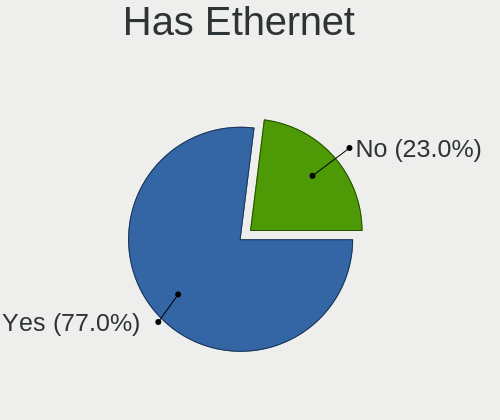
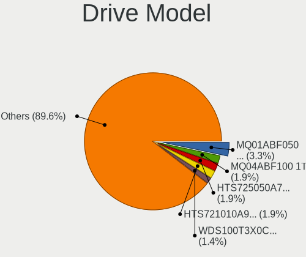
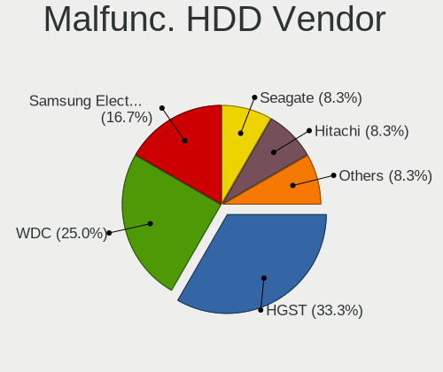
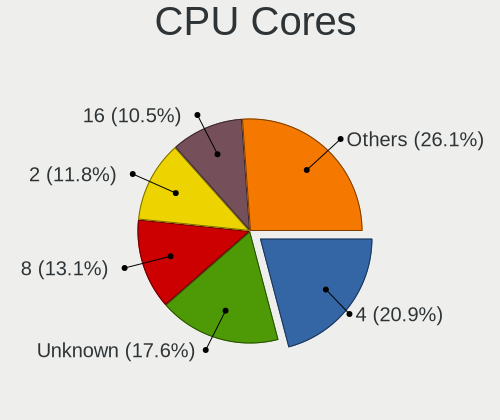
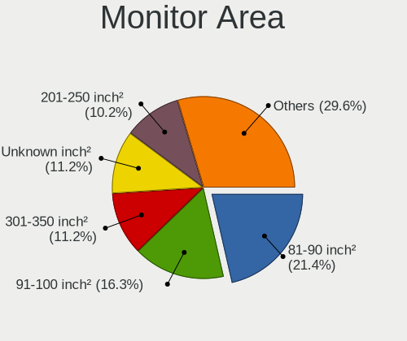
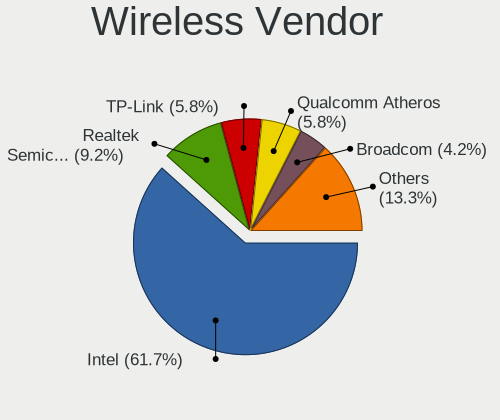

FreeBSD 14.0-CURRENT - Tested Hardware & Statistics
---------------------------------------------------

A project to collect tested hardware configurations for FreeBSD 14.0-CURRENT.

Anyone can contribute to this report by the [hw-probe](https://github.com/linuxhw/hw-probe/blob/master/INSTALL.BSD.md) tool:

    hw-probe -all -upload

Please contribute! Especially if your hardware is rare.

This is a report for all computer types. See also reports for [desktops](/Dist/FreeBSD_14.0-CURRENT/Desktop/README.md) and [notebooks](/Dist/FreeBSD_14.0-CURRENT/Notebook/README.md).

Contents
--------

* [ Test Cases ](#test-cases)

* [ System ](#system)
  - [ Arch                     ](#arch)
  - [ DE                       ](#de)
  - [ Display Server           ](#display-server)
  - [ Display Manager          ](#display-manager)
  - [ OS Lang                  ](#os-lang)
  - [ Boot Mode                ](#boot-mode)
  - [ Filesystem               ](#filesystem)
  - [ Part. scheme             ](#part-scheme)

* [ Board ](#board)
  - [ Vendor                   ](#vendor)
  - [ Model                    ](#model)
  - [ Model Family             ](#model-family)
  - [ MFG Year                 ](#mfg-year)
  - [ Form Factor              ](#form-factor)
  - [ Coreboot                 ](#coreboot)
  - [ RAM Size                 ](#ram-size)
  - [ RAM Used                 ](#ram-used)
  - [ Total Drives             ](#total-drives)
  - [ Has CD-ROM               ](#has-cd-rom)
  - [ Has Ethernet             ](#has-ethernet)
  - [ Has WiFi                 ](#has-wifi)
  - [ Has Bluetooth            ](#has-bluetooth)

* [ Location ](#location)
  - [ Country                  ](#country)
  - [ City                     ](#city)

* [ Drives ](#drives)
  - [ Drive Vendor             ](#drive-vendor)
  - [ Drive Model              ](#drive-model)
  - [ HDD Vendor               ](#hdd-vendor)
  - [ SSD Vendor               ](#ssd-vendor)
  - [ Drive Kind               ](#drive-kind)
  - [ Drive Connector          ](#drive-connector)
  - [ Drive Size               ](#drive-size)
  - [ Space Total              ](#space-total)
  - [ Space Used               ](#space-used)
  - [ Malfunc. Drives          ](#malfunc-drives)
  - [ Malfunc. Drive Vendor    ](#malfunc-drive-vendor)
  - [ Malfunc. HDD Vendor      ](#malfunc-hdd-vendor)
  - [ Malfunc. Drive Kind      ](#malfunc-drive-kind)
  - [ Failed Drives            ](#failed-drives)
  - [ Failed Drive Vendor      ](#failed-drive-vendor)
  - [ Drive Status             ](#drive-status)

* [ Storage controller ](#storage-controller)
  - [ Storage Vendor           ](#storage-vendor)
  - [ Storage Model            ](#storage-model)
  - [ Storage Kind             ](#storage-kind)

* [ Processor ](#processor)
  - [ CPU Vendor               ](#cpu-vendor)
  - [ CPU Model                ](#cpu-model)
  - [ CPU Model Family         ](#cpu-model-family)
  - [ CPU Cores                ](#cpu-cores)
  - [ CPU Sockets              ](#cpu-sockets)
  - [ CPU Threads              ](#cpu-threads)
  - [ CPU Microarch            ](#cpu-microarch)

* [ Graphics ](#graphics)
  - [ GPU Vendor               ](#gpu-vendor)
  - [ GPU Model                ](#gpu-model)
  - [ GPU Combo                ](#gpu-combo)
  - [ GPU Driver               ](#gpu-driver)
  - [ GPU Memory               ](#gpu-memory)

* [ Monitor ](#monitor)
  - [ Monitor Vendor           ](#monitor-vendor)
  - [ Monitor Model            ](#monitor-model)
  - [ Monitor Resolution       ](#monitor-resolution)
  - [ Monitor Diagonal         ](#monitor-diagonal)
  - [ Monitor Width            ](#monitor-width)
  - [ Aspect Ratio             ](#aspect-ratio)
  - [ Monitor Area             ](#monitor-area)
  - [ Pixel Density            ](#pixel-density)
  - [ Multiple Monitors        ](#multiple-monitors)

* [ Network ](#network)
  - [ Net Controller Vendor    ](#net-controller-vendor)
  - [ Net Controller Model     ](#net-controller-model)
  - [ Wireless Vendor          ](#wireless-vendor)
  - [ Wireless Model           ](#wireless-model)
  - [ Ethernet Vendor          ](#ethernet-vendor)
  - [ Ethernet Model           ](#ethernet-model)
  - [ Net Controller Kind      ](#net-controller-kind)
  - [ Used Controller          ](#used-controller)
  - [ NICs                     ](#nics)
  - [ IPv6                     ](#ipv6)

* [ Bluetooth ](#bluetooth)
  - [ Bluetooth Vendor         ](#bluetooth-vendor)
  - [ Bluetooth Model          ](#bluetooth-model)

* [ Sound ](#sound)
  - [ Sound Vendor             ](#sound-vendor)
  - [ Sound Model              ](#sound-model)

* [ Memory ](#memory)
  - [ Memory Vendor            ](#memory-vendor)
  - [ Memory Model             ](#memory-model)
  - [ Memory Kind              ](#memory-kind)
  - [ Memory Form Factor       ](#memory-form-factor)
  - [ Memory Size              ](#memory-size)
  - [ Memory Speed             ](#memory-speed)

* [ Printers & scanners ](#printers--scanners)
  - [ Printer Vendor           ](#printer-vendor)
  - [ Printer Model            ](#printer-model)
  - [ Scanner Vendor           ](#scanner-vendor)
  - [ Scanner Model            ](#scanner-model)

* [ Camera ](#camera)
  - [ Camera Vendor            ](#camera-vendor)
  - [ Camera Model             ](#camera-model)

* [ Security ](#security)
  - [ Fingerprint Vendor       ](#fingerprint-vendor)
  - [ Fingerprint Model        ](#fingerprint-model)
  - [ Chipcard Vendor          ](#chipcard-vendor)
  - [ Chipcard Model           ](#chipcard-model)

* [ Unsupported ](#unsupported)
  - [ Unsupported Devices      ](#unsupported-devices)
  - [ Unsupported Device Types ](#unsupported-device-types)

Test Cases
----------

Total: 185

| Vendor        | Model                       | Form-Factor | Probe                                                     | Date         |
|---------------|-----------------------------|-------------|-----------------------------------------------------------|--------------|
| F-Plus Mob... | FLAPTOP r                   | Notebook    | [165d435f30](https://bsd-hardware.info/?probe=165d435f30) | Jan 31, 2023 |
| F-Plus Mob... | FLAPTOP r                   | Notebook    | [448f9265f2](https://bsd-hardware.info/?probe=448f9265f2) | Jan 27, 2023 |
| ASUSTek       | ROG STRIX X570-E GAMING     | Desktop     | [87e25e2abd](https://bsd-hardware.info/?probe=87e25e2abd) | Jan 26, 2023 |
| Unknown       | Unknown                     | Desktop     | [3afbfc6cea](https://bsd-hardware.info/?probe=3afbfc6cea) | Jan 20, 2023 |
| Unknown       | Unknown                     | Desktop     | [e13627df1a](https://bsd-hardware.info/?probe=e13627df1a) | Jan 20, 2023 |
| Dell          | Precision 5540              | Notebook    | [683769b797](https://bsd-hardware.info/?probe=683769b797) | Jan 19, 2023 |
| ASUSTek       | PRIME Z390-P                | Desktop     | [3126dc27f1](https://bsd-hardware.info/?probe=3126dc27f1) | Jan 12, 2023 |
| HP            | EliteBook 8570p             | Notebook    | [17f5e2e3d2](https://bsd-hardware.info/?probe=17f5e2e3d2) | Jan 04, 2023 |
| Timi          | Redmi Book Pro 14 2022      | Notebook    | [ce5e882952](https://bsd-hardware.info/?probe=ce5e882952) | Dec 28, 2022 |
| Unknown       | Unknown                     | Desktop     | [d702dfcde2](https://bsd-hardware.info/?probe=d702dfcde2) | Dec 23, 2022 |
| ASRock        | 4X4-4000 Series             | Desktop     | [009ef73bd1](https://bsd-hardware.info/?probe=009ef73bd1) | Dec 20, 2022 |
| HP            | EliteBook 8570p             | Notebook    | [7cf06451fd](https://bsd-hardware.info/?probe=7cf06451fd) | Dec 17, 2022 |
| Unknown       | Unknown                     | Desktop     | [7c644cc639](https://bsd-hardware.info/?probe=7c644cc639) | Dec 15, 2022 |
| HP            | EliteBook 8570p             | Notebook    | [64c92d49d9](https://bsd-hardware.info/?probe=64c92d49d9) | Dec 12, 2022 |
| HP            | EliteBook 8570p             | Notebook    | [6d10b2a0b4](https://bsd-hardware.info/?probe=6d10b2a0b4) | Dec 11, 2022 |
| HP            | EliteBook 8570p             | Notebook    | [3ad7cec298](https://bsd-hardware.info/?probe=3ad7cec298) | Nov 26, 2022 |
| HP            | EliteBook 8570p             | Notebook    | [436a2d30f6](https://bsd-hardware.info/?probe=436a2d30f6) | Nov 16, 2022 |
| MSI           | B450M MORTAR MAX            | Desktop     | [15657b37e2](https://bsd-hardware.info/?probe=15657b37e2) | Nov 15, 2022 |
| MSI           | B450M MORTAR MAX            | Desktop     | [f4a8c42773](https://bsd-hardware.info/?probe=f4a8c42773) | Nov 15, 2022 |
| Dell          | Latitude E7240              | Notebook    | [ea99621380](https://bsd-hardware.info/?probe=ea99621380) | Nov 12, 2022 |
| Google        | Akemi                       | Notebook    | [2d8e99f0c2](https://bsd-hardware.info/?probe=2d8e99f0c2) | Nov 12, 2022 |
| Unknown       | Unknown                     | Desktop     | [20ff21d751](https://bsd-hardware.info/?probe=20ff21d751) | Oct 18, 2022 |
| Lenovo        | Legion 5 15IMH05 82AU       | Notebook    | [d89559e5c2](https://bsd-hardware.info/?probe=d89559e5c2) | Oct 03, 2022 |
| MSI           | Z490-A PRO                  | Desktop     | [dbda136daa](https://bsd-hardware.info/?probe=dbda136daa) | Sep 24, 2022 |
| System76      | Gazelle                     | Notebook    | [6d5d4f5021](https://bsd-hardware.info/?probe=6d5d4f5021) | Sep 24, 2022 |
| MSI           | MPG Z490 GAMING EDGE WIF... | Desktop     | [98dff45d54](https://bsd-hardware.info/?probe=98dff45d54) | Sep 09, 2022 |
| HP            | EliteBook 8570p             | Notebook    | [7c6751649b](https://bsd-hardware.info/?probe=7c6751649b) | Sep 07, 2022 |
| Valve         | Jupiter                     | Notebook    | [4e58d828cc](https://bsd-hardware.info/?probe=4e58d828cc) | Sep 01, 2022 |
| Dell          | 0VG93V A00                  | Desktop     | [8de9fa2319](https://bsd-hardware.info/?probe=8de9fa2319) | Aug 18, 2022 |
| Intel         | S2600WTTR G92187-372        | Server      | [ce1988c8ff](https://bsd-hardware.info/?probe=ce1988c8ff) | Aug 18, 2022 |
| Unknown       | Unknown                     | Desktop     | [3208aefb72](https://bsd-hardware.info/?probe=3208aefb72) | Aug 17, 2022 |
| HP            | EliteBook 8570p             | Notebook    | [978f01c546](https://bsd-hardware.info/?probe=978f01c546) | Jul 16, 2022 |
| Lenovo        | ThinkPad T495 20NJ0010PB    | Notebook    | [078888676a](https://bsd-hardware.info/?probe=078888676a) | Jul 13, 2022 |
| Apple         | MacBookAir5,2               | Notebook    | [894b6f82cf](https://bsd-hardware.info/?probe=894b6f82cf) | Jul 13, 2022 |
| Toshiba       | Satellite L305D             | Notebook    | [ed950787b0](https://bsd-hardware.info/?probe=ed950787b0) | Jul 10, 2022 |
| Intel         | NUC11PHBi7 M26151-402       | Mini pc     | [7c34be7c2e](https://bsd-hardware.info/?probe=7c34be7c2e) | Jul 06, 2022 |
| Dell          | Latitude 5521               | Notebook    | [2c9d24a69e](https://bsd-hardware.info/?probe=2c9d24a69e) | Jun 19, 2022 |
| Dell          | Latitude 5410               | Notebook    | [3334ff3727](https://bsd-hardware.info/?probe=3334ff3727) | Jun 06, 2022 |
| HP            | EliteBook 8570p             | Notebook    | [1067f6ab27](https://bsd-hardware.info/?probe=1067f6ab27) | Jun 03, 2022 |
| ASRock        | B550 Phantom Gaming-ITX/... | Desktop     | [3dc5a6f7d2](https://bsd-hardware.info/?probe=3dc5a6f7d2) | May 24, 2022 |
| HP            | ProBook 455 G7              | Notebook    | [c6944afe69](https://bsd-hardware.info/?probe=c6944afe69) | May 19, 2022 |
| Unknown       | Unknown                     | Desktop     | [f3ab857e43](https://bsd-hardware.info/?probe=f3ab857e43) | May 13, 2022 |
| Intel         | NUC11PHBi7 M26151-402       | Mini pc     | [3a3729e497](https://bsd-hardware.info/?probe=3a3729e497) | May 12, 2022 |
| Intel         | NUC11PHBi7 M26151-402       | Mini pc     | [46b11e5051](https://bsd-hardware.info/?probe=46b11e5051) | May 12, 2022 |
| Lenovo        | ThinkPad T495s 20QKS1812... | Notebook    | [89db84f7ec](https://bsd-hardware.info/?probe=89db84f7ec) | May 10, 2022 |
| ASUSTek       | PRIME B550-PLUS             | Desktop     | [224614e9ab](https://bsd-hardware.info/?probe=224614e9ab) | May 10, 2022 |
| ASRock        | X570 Phantom Gaming 4       | Desktop     | [76eef59920](https://bsd-hardware.info/?probe=76eef59920) | May 10, 2022 |
| Lenovo        | ThinkPad X1 Carbon 3rd 2... | Notebook    | [015bf0fea4](https://bsd-hardware.info/?probe=015bf0fea4) | May 06, 2022 |
| Framework     | Laptop                      | Notebook    | [5d6cb039ea](https://bsd-hardware.info/?probe=5d6cb039ea) | Apr 25, 2022 |
| Dell          | 0FKD45 A03                  | Server      | [dde6af4613](https://bsd-hardware.info/?probe=dde6af4613) | Apr 19, 2022 |
| Gigabyte      | B450M S2H                   | Desktop     | [ee73e0cddb](https://bsd-hardware.info/?probe=ee73e0cddb) | Apr 07, 2022 |
| HP            | EliteBook 8570p             | Notebook    | [0c73871c49](https://bsd-hardware.info/?probe=0c73871c49) | Apr 04, 2022 |
| MSI           | Bravo 15 A4DDR              | Notebook    | [1868573e9a](https://bsd-hardware.info/?probe=1868573e9a) | Apr 02, 2022 |
| Lenovo        | ThinkPad X260 20F5A28AUK    | Notebook    | [f53c625efd](https://bsd-hardware.info/?probe=f53c625efd) | Mar 30, 2022 |
| Lenovo        | XiaoXinPro-13ARE 2020 82... | Notebook    | [859a429ad0](https://bsd-hardware.info/?probe=859a429ad0) | Mar 24, 2022 |
| Dell          | 0DNFFW A00                  | All in one  | [30432daccb](https://bsd-hardware.info/?probe=30432daccb) | Mar 23, 2022 |
| Lenovo        | ThinkPad T14s Gen 2i 20W... | Notebook    | [6858ad2b12](https://bsd-hardware.info/?probe=6858ad2b12) | Mar 22, 2022 |
| HP            | EliteBook 8570p             | Notebook    | [7e1e137c8f](https://bsd-hardware.info/?probe=7e1e137c8f) | Mar 20, 2022 |
| Acer          | Aspire A114-33              | Notebook    | [6e7384f4cc](https://bsd-hardware.info/?probe=6e7384f4cc) | Mar 15, 2022 |
| Apple         | MacBookPro12,1              | Notebook    | [e04a1b354c](https://bsd-hardware.info/?probe=e04a1b354c) | Mar 11, 2022 |
| Apple         | MacBookPro12,1              | Notebook    | [ac59621182](https://bsd-hardware.info/?probe=ac59621182) | Mar 10, 2022 |
| Framework     | Laptop                      | Notebook    | [1f58e0594f](https://bsd-hardware.info/?probe=1f58e0594f) | Mar 01, 2022 |
| Apple         | MacBookPro10,1              | Notebook    | [64ccf1e6a0](https://bsd-hardware.info/?probe=64ccf1e6a0) | Feb 18, 2022 |
| HP            | 83E1                        | Desktop     | [d8e995126f](https://bsd-hardware.info/?probe=d8e995126f) | Feb 10, 2022 |
| Notebook      | NS50_70MU                   | Notebook    | [3b3ff8b95d](https://bsd-hardware.info/?probe=3b3ff8b95d) | Feb 05, 2022 |
| Raspberry ... | Raspberry Pi                | Soc         | [840c7f2142](https://bsd-hardware.info/?probe=840c7f2142) | Feb 05, 2022 |
| Lenovo        | IdeaPad Gaming 3 15ARH05... | Notebook    | [e660899158](https://bsd-hardware.info/?probe=e660899158) | Feb 03, 2022 |
| Dell          | G3 3500                     | Notebook    | [536a7a1b38](https://bsd-hardware.info/?probe=536a7a1b38) | Jan 31, 2022 |
| HP            | EliteBook 8570p             | Notebook    | [f47789d894](https://bsd-hardware.info/?probe=f47789d894) | Jan 29, 2022 |
| MSI           | GE76 Raider 10UG            | Notebook    | [b48b628936](https://bsd-hardware.info/?probe=b48b628936) | Jan 27, 2022 |
| HP            | EliteBook 8570p             | Notebook    | [61406080a7](https://bsd-hardware.info/?probe=61406080a7) | Jan 18, 2022 |
| Gigabyte      | B450M DS3H-CF               | Desktop     | [825d20fcf7](https://bsd-hardware.info/?probe=825d20fcf7) | Jan 14, 2022 |
| Gigabyte      | B450M DS3H-CF               | Desktop     | [b953d9d2e6](https://bsd-hardware.info/?probe=b953d9d2e6) | Jan 13, 2022 |
| Lenovo        | ThinkPad X13 Gen 1 20T20... | Notebook    | [6836fc60f6](https://bsd-hardware.info/?probe=6836fc60f6) | Jan 09, 2022 |
| ASUSTek       | ROG STRIX B550-I GAMING     | Desktop     | [2cc4698cbc](https://bsd-hardware.info/?probe=2cc4698cbc) | Jan 09, 2022 |
| ASUSTek       | ROG STRIX B550-I GAMING     | Desktop     | [2481037b2a](https://bsd-hardware.info/?probe=2481037b2a) | Jan 09, 2022 |
| Lenovo        | ThinkPad E14 Gen 3 20Y70... | Notebook    | [6c208c85a5](https://bsd-hardware.info/?probe=6c208c85a5) | Jan 06, 2022 |
| ASUSTek       | PN50                        | Mini pc     | [7ea8daae8d](https://bsd-hardware.info/?probe=7ea8daae8d) | Jan 05, 2022 |
| ASUSTek       | TUF GAMING B550-PLUS        | Desktop     | [ea4719600a](https://bsd-hardware.info/?probe=ea4719600a) | Jan 05, 2022 |
| HP            | EliteBook 8570p             | Notebook    | [1bbb37d4c6](https://bsd-hardware.info/?probe=1bbb37d4c6) | Jan 03, 2022 |
| ASRock        | B450 Steel Legend           | Desktop     | [e67007df20](https://bsd-hardware.info/?probe=e67007df20) | Jan 01, 2022 |
| friendlyel... | nanopi-m4                   | Desktop     | [bb29e50061](https://bsd-hardware.info/?probe=bb29e50061) | Dec 27, 2021 |
| Lenovo        | ThinkBook 14 G3 ACL 21A2    | Notebook    | [42b4bcbcc2](https://bsd-hardware.info/?probe=42b4bcbcc2) | Dec 27, 2021 |
| Lenovo        | ThinkBook 14 G3 ACL 21A2    | Notebook    | [695d7201d4](https://bsd-hardware.info/?probe=695d7201d4) | Dec 27, 2021 |
| khadas        | edge-v                      | Desktop     | [42c428aac0](https://bsd-hardware.info/?probe=42c428aac0) | Dec 26, 2021 |
| HP            | EliteBook Folio 9470m       | Notebook    | [b872e9b044](https://bsd-hardware.info/?probe=b872e9b044) | Dec 18, 2021 |
| HP            | ProBook 440 G6              | Notebook    | [7a8a66430a](https://bsd-hardware.info/?probe=7a8a66430a) | Dec 13, 2021 |
| HP            | ProBook 440 G6              | Notebook    | [f3c014b120](https://bsd-hardware.info/?probe=f3c014b120) | Dec 12, 2021 |
| Unknown       | Unknown                     | Desktop     | [b726a1b3e3](https://bsd-hardware.info/?probe=b726a1b3e3) | Dec 11, 2021 |
| ASUSTek       | PRIME X570-PRO              | Desktop     | [9a8d19aa04](https://bsd-hardware.info/?probe=9a8d19aa04) | Dec 11, 2021 |
| Unknown       | Unknown                     | Desktop     | [7633cb9296](https://bsd-hardware.info/?probe=7633cb9296) | Dec 11, 2021 |
| ASUSTek       | 1215B                       | Notebook    | [6dbcac684f](https://bsd-hardware.info/?probe=6dbcac684f) | Dec 04, 2021 |
| HP            | EliteBook 8570p             | Notebook    | [822a2481bb](https://bsd-hardware.info/?probe=822a2481bb) | Nov 17, 2021 |
| Raspberry ... | Raspberry Pi                | Soc         | [83480615f6](https://bsd-hardware.info/?probe=83480615f6) | Nov 04, 2021 |
| Lenovo        | ThinkPad X1 Extreme Gen ... | Notebook    | [e54d79065e](https://bsd-hardware.info/?probe=e54d79065e) | Nov 02, 2021 |
| Lenovo        | ThinkPad X1 Extreme Gen ... | Notebook    | [a71d3392eb](https://bsd-hardware.info/?probe=a71d3392eb) | Nov 02, 2021 |
| Lenovo        | ThinkPad T470p 20J7S0PM0... | Notebook    | [7a61d90a55](https://bsd-hardware.info/?probe=7a61d90a55) | Oct 28, 2021 |
| Raspberry ... | Raspberry Pi                | Soc         | [70422b437f](https://bsd-hardware.info/?probe=70422b437f) | Oct 27, 2021 |
| Beckhoff A... | CX51x0 G3                   | Desktop     | [6db720018b](https://bsd-hardware.info/?probe=6db720018b) | Oct 25, 2021 |
| Beckhoff A... | CX20x3 G1                   | Desktop     | [a49fbd5ce3](https://bsd-hardware.info/?probe=a49fbd5ce3) | Oct 25, 2021 |
| Lenovo        | ThinkPad P14s Gen 1 20Y1... | Notebook    | [d910c79d75](https://bsd-hardware.info/?probe=d910c79d75) | Oct 24, 2021 |
| Unknown       | Raspberry Pi                | Soc         | [9f66ee1b41](https://bsd-hardware.info/?probe=9f66ee1b41) | Oct 18, 2021 |
| HP            | EliteBook 8570p             | Notebook    | [86613b04d3](https://bsd-hardware.info/?probe=86613b04d3) | Oct 17, 2021 |
| Valve         | Jupiter                     | Notebook    | [e5aca4b7d0](https://bsd-hardware.info/?probe=e5aca4b7d0) | Oct 02, 2021 |
| ASUSTek       | PRIME Z590-A                | Desktop     | [1aa5ced5a0](https://bsd-hardware.info/?probe=1aa5ced5a0) | Sep 23, 2021 |
| ASUSTek       | VivoBook_ASUSLaptop X512... | Notebook    | [0b73df29bf](https://bsd-hardware.info/?probe=0b73df29bf) | Sep 15, 2021 |
| Lenovo        | ThinkPad X395 20NL000GPG    | Notebook    | [d7812a2905](https://bsd-hardware.info/?probe=d7812a2905) | Sep 10, 2021 |
| Lenovo        | ThinkPad X395 20NL000GPG    | Notebook    | [cdde22fb04](https://bsd-hardware.info/?probe=cdde22fb04) | Sep 10, 2021 |
| Gigabyte      | X399 DESIGNARE EX-CF        | Desktop     | [a78cc6a11b](https://bsd-hardware.info/?probe=a78cc6a11b) | Sep 04, 2021 |
| HP            | EliteBook 8570p             | Notebook    | [fae9e84f60](https://bsd-hardware.info/?probe=fae9e84f60) | Aug 27, 2021 |
| Lenovo        | ThinkPad P14s Gen 1 20Y1... | Notebook    | [76f004bd26](https://bsd-hardware.info/?probe=76f004bd26) | Aug 26, 2021 |
| HP            | EliteBook 8570p             | Notebook    | [71092e78e2](https://bsd-hardware.info/?probe=71092e78e2) | Aug 17, 2021 |
| HP            | EliteBook 8570p             | Notebook    | [6e97c9a59e](https://bsd-hardware.info/?probe=6e97c9a59e) | Aug 14, 2021 |
| Lenovo        | Unknown                     | Notebook    | [e16ce5e864](https://bsd-hardware.info/?probe=e16ce5e864) | Aug 08, 2021 |
| HP            | ZBook 17 G2                 | Notebook    | [f2d911563a](https://bsd-hardware.info/?probe=f2d911563a) | Aug 07, 2021 |
| Lenovo        | ThinkPad X1 Extreme 20MF... | Notebook    | [6d5e1a13d0](https://bsd-hardware.info/?probe=6d5e1a13d0) | Aug 07, 2021 |
| Lenovo        | XiaoXinPro-13ARE 2020 82... | Notebook    | [bf56b2a81a](https://bsd-hardware.info/?probe=bf56b2a81a) | Aug 05, 2021 |
| HP            | ZBook 17 G2                 | Notebook    | [2faf8af7be](https://bsd-hardware.info/?probe=2faf8af7be) | Jul 30, 2021 |
| HP            | ZBook 17 G2                 | Notebook    | [c7fb9e9dee](https://bsd-hardware.info/?probe=c7fb9e9dee) | Jul 27, 2021 |
| HP            | ZBook 17 G2                 | Notebook    | [50c349b7b5](https://bsd-hardware.info/?probe=50c349b7b5) | Jul 27, 2021 |
| HP            | ZBook 17 G2                 | Notebook    | [6149ab50a8](https://bsd-hardware.info/?probe=6149ab50a8) | Jul 24, 2021 |
| Dell          | G5 5505                     | Notebook    | [9933a09c4f](https://bsd-hardware.info/?probe=9933a09c4f) | Jul 24, 2021 |
| HP            | ZBook 17 G2                 | Notebook    | [1ef99f31dd](https://bsd-hardware.info/?probe=1ef99f31dd) | Jul 23, 2021 |
| Avell High... | A62 LIV                     | Notebook    | [5983302b1d](https://bsd-hardware.info/?probe=5983302b1d) | Jul 21, 2021 |
| Lenovo        | XiaoXinPro-13ARE 2020 82... | Notebook    | [b0da42c20d](https://bsd-hardware.info/?probe=b0da42c20d) | Jul 18, 2021 |
| ASUSTek       | VivoBook_ASUSLaptop X512... | Notebook    | [9c9d4cc782](https://bsd-hardware.info/?probe=9c9d4cc782) | Jul 18, 2021 |
| ASUSTek       | VivoBook_ASUSLaptop X512... | Notebook    | [3d5e512e18](https://bsd-hardware.info/?probe=3d5e512e18) | Jul 18, 2021 |
| HP            | ProBook 440 G7              | Notebook    | [63dc88528c](https://bsd-hardware.info/?probe=63dc88528c) | Jul 17, 2021 |
| HP            | ProBook 440 G7              | Notebook    | [7138e2a9e7](https://bsd-hardware.info/?probe=7138e2a9e7) | Jul 17, 2021 |
| HP            | ProBook 440 G7              | Notebook    | [b73eb50747](https://bsd-hardware.info/?probe=b73eb50747) | Jul 16, 2021 |
| HP            | EliteBook 8570p             | Notebook    | [462fc329a9](https://bsd-hardware.info/?probe=462fc329a9) | Jul 16, 2021 |
| HP            | ProBook 440 G7              | Notebook    | [d2866f01b5](https://bsd-hardware.info/?probe=d2866f01b5) | Jul 16, 2021 |
| Unknown       | Unknown                     | Desktop     | [4a3836de00](https://bsd-hardware.info/?probe=4a3836de00) | Jul 08, 2021 |
| HP            | EliteBook 8570p             | Notebook    | [cc24e867fc](https://bsd-hardware.info/?probe=cc24e867fc) | Jun 19, 2021 |
| Lenovo        | ThinkPad E14 20RBCTO1WW     | Notebook    | [3d50ba4d85](https://bsd-hardware.info/?probe=3d50ba4d85) | Jun 13, 2021 |
| Dell          | G5 5505                     | Notebook    | [97319295ee](https://bsd-hardware.info/?probe=97319295ee) | Jun 13, 2021 |
| Dell          | Vostro 5490                 | Notebook    | [cf3508718c](https://bsd-hardware.info/?probe=cf3508718c) | Jun 11, 2021 |
| Lenovo        | IdeaPad 330-15ARR 81D2      | Notebook    | [4ac6c9b3eb](https://bsd-hardware.info/?probe=4ac6c9b3eb) | Jun 08, 2021 |
| Lenovo        | IdeaPad 330-15ARR 81D2      | Notebook    | [8fc867cfae](https://bsd-hardware.info/?probe=8fc867cfae) | Jun 06, 2021 |
| ASUSTek       | PRIME B450M-GAMING/BR       | Desktop     | [edebe87739](https://bsd-hardware.info/?probe=edebe87739) | Jun 04, 2021 |
| Intel         | S2600WTTR G92187-372        | Server      | [289d61b1b2](https://bsd-hardware.info/?probe=289d61b1b2) | Jun 04, 2021 |
| HP            | EliteBook 8570p             | Notebook    | [52ba4e835f](https://bsd-hardware.info/?probe=52ba4e835f) | Jun 03, 2021 |
| Unknown       | Raspberry Pi                | Soc         | [4e4f164625](https://bsd-hardware.info/?probe=4e4f164625) | May 29, 2021 |
| Unknown       | Unknown                     | Soc         | [d96ade87e5](https://bsd-hardware.info/?probe=d96ade87e5) | May 29, 2021 |
| Lenovo        | ThinkPad X270 20HM004JBR    | Notebook    | [88c27e65d7](https://bsd-hardware.info/?probe=88c27e65d7) | May 23, 2021 |
| Gigabyte      | B550I AORUS PRO AX          | Desktop     | [62b9ea2794](https://bsd-hardware.info/?probe=62b9ea2794) | May 14, 2021 |
| ASUSTek       | P8H77-M PRO                 | Desktop     | [b3acafeb1a](https://bsd-hardware.info/?probe=b3acafeb1a) | May 09, 2021 |
| ASUSTek       | P8H77-M PRO                 | Desktop     | [86cec3b874](https://bsd-hardware.info/?probe=86cec3b874) | May 09, 2021 |
| Dell          | G5 5505                     | Notebook    | [ba74d8eee0](https://bsd-hardware.info/?probe=ba74d8eee0) | May 08, 2021 |
| Dell          | G5 5505                     | Notebook    | [23ae99e489](https://bsd-hardware.info/?probe=23ae99e489) | May 08, 2021 |
| Lenovo        | Legion 5P 15IMH05H 82AW     | Notebook    | [2be8cf963c](https://bsd-hardware.info/?probe=2be8cf963c) | May 02, 2021 |
| Dell          | Inspiron 3793               | Notebook    | [c2d56fc369](https://bsd-hardware.info/?probe=c2d56fc369) | Apr 29, 2021 |
| pine64        | pinebook-pro-rk3399         | Desktop     | [79713a2668](https://bsd-hardware.info/?probe=79713a2668) | Apr 25, 2021 |
| Lenovo        | ThinkPad X1 Carbon 5th 2... | Notebook    | [4993ad0feb](https://bsd-hardware.info/?probe=4993ad0feb) | Apr 25, 2021 |
| HUAWEI        | HN-WX9X                     | Notebook    | [d776625073](https://bsd-hardware.info/?probe=d776625073) | Apr 11, 2021 |
| Gigabyte      | X570 AORUS ELITE            | Desktop     | [325186171a](https://bsd-hardware.info/?probe=325186171a) | Apr 02, 2021 |
| Lenovo        | ThinkPad P15 Gen 1 20ST0... | Notebook    | [342e914968](https://bsd-hardware.info/?probe=342e914968) | Mar 29, 2021 |
| HP            | EliteBook 8570p             | Notebook    | [ed80dc9019](https://bsd-hardware.info/?probe=ed80dc9019) | Mar 27, 2021 |
| HP            | ProBook 455 G7              | Notebook    | [dd877e6c6c](https://bsd-hardware.info/?probe=dd877e6c6c) | Mar 27, 2021 |
| Gigabyte      | 970A-UD3P                   | Desktop     | [cc3151bc6f](https://bsd-hardware.info/?probe=cc3151bc6f) | Mar 17, 2021 |
| Unknown       | Raspberry Pi                | Soc         | [e3f20f8770](https://bsd-hardware.info/?probe=e3f20f8770) | Mar 17, 2021 |
| Lenovo        | ThinkPad X395 20NL001SMX    | Notebook    | [cd016e96ee](https://bsd-hardware.info/?probe=cd016e96ee) | Mar 17, 2021 |
| MSI           | B450 GAMING PLUS            | Desktop     | [547fd655f0](https://bsd-hardware.info/?probe=547fd655f0) | Mar 13, 2021 |
| Lenovo        | Legion 5 15IMH05 82AU       | Notebook    | [9fed35d792](https://bsd-hardware.info/?probe=9fed35d792) | Mar 10, 2021 |
| HP            | ProBook 455 G7              | Notebook    | [1fcde7c0e1](https://bsd-hardware.info/?probe=1fcde7c0e1) | Mar 09, 2021 |
| Gigabyte      | X570 AORUS MASTER           | Desktop     | [29936dd1c0](https://bsd-hardware.info/?probe=29936dd1c0) | Feb 25, 2021 |
| Lenovo        | ThinkPad E14 20RBCTO1WW     | Notebook    | [aacafb6ace](https://bsd-hardware.info/?probe=aacafb6ace) | Feb 24, 2021 |
| Unknown       | Unknown                     | Desktop     | [74b11992d7](https://bsd-hardware.info/?probe=74b11992d7) | Feb 20, 2021 |
| Raspberry ... | rpi                         | Desktop     | [92ee9b3619](https://bsd-hardware.info/?probe=92ee9b3619) | Feb 18, 2021 |
| Unknown       | Raspberry Pi                | Soc         | [a601b10377](https://bsd-hardware.info/?probe=a601b10377) | Feb 16, 2021 |
| A-DATA Tec... | XENIA159GENI72060           | Notebook    | [be88e8f865](https://bsd-hardware.info/?probe=be88e8f865) | Feb 15, 2021 |
| Lenovo        | ThinkPad T495s 20QKS1812... | Notebook    | [0e5e228d18](https://bsd-hardware.info/?probe=0e5e228d18) | Feb 13, 2021 |
| Lenovo        | ThinkPad T495s 20QKS1812... | Notebook    | [2d93a6bebc](https://bsd-hardware.info/?probe=2d93a6bebc) | Feb 13, 2021 |
| ASUSTek       | PRIME B450M-A               | Desktop     | [ba7f82b343](https://bsd-hardware.info/?probe=ba7f82b343) | Feb 12, 2021 |
| Matsushita... | CF-T2BW1AXR                 | Notebook    | [f6ec2858a5](https://bsd-hardware.info/?probe=f6ec2858a5) | Feb 10, 2021 |
| pine64        | pinebook-pro-rk3399         | Desktop     | [5a55b22f44](https://bsd-hardware.info/?probe=5a55b22f44) | Feb 09, 2021 |
| Dell          | 0D9JG3 A00                  | Desktop     | [65dd4083c5](https://bsd-hardware.info/?probe=65dd4083c5) | Feb 09, 2021 |
| HP            | EliteBook 8570p             | Notebook    | [72137c63f8](https://bsd-hardware.info/?probe=72137c63f8) | Feb 09, 2021 |
| pine64        | pinebook-pro-rk3399         | Desktop     | [97e72f0066](https://bsd-hardware.info/?probe=97e72f0066) | Feb 06, 2021 |
| Dell          | Latitude E5430 vPro         | Notebook    | [bee421a110](https://bsd-hardware.info/?probe=bee421a110) | Feb 06, 2021 |
| Dell          | Latitude E5430 vPro         | Notebook    | [e8157ac6a3](https://bsd-hardware.info/?probe=e8157ac6a3) | Feb 06, 2021 |
| Lenovo        | ThinkPad T430 2349H2G       | Notebook    | [229db16a93](https://bsd-hardware.info/?probe=229db16a93) | Feb 05, 2021 |
| HP            | EliteBook 8570p             | Notebook    | [46c938b853](https://bsd-hardware.info/?probe=46c938b853) | Feb 01, 2021 |
| Matsushita... | CF-T2BW1AXR                 | Notebook    | [c16cd20c42](https://bsd-hardware.info/?probe=c16cd20c42) | Jan 25, 2021 |
| pine64        | pinebook-pro-rk3399         | Desktop     | [2338de9efc](https://bsd-hardware.info/?probe=2338de9efc) | Jan 24, 2021 |

System
------

Arch
----

OS architecture (x86_64, i586, etc.)

| Name  | Computers | Percent |
|-------|-----------|---------|
| amd64 | 97        | 82.91%  |
| arm64 | 16        | 13.68%  |
| arm   | 2         | 1.71%   |
| riscv | 1         | 0.85%   |
| i386  | 1         | 0.85%   |

DE
--

Desktop Environment

| Name          | Computers | Percent |
|---------------|-----------|---------|
| KDE5          | 30        | 24.59%  |
| Console       | 29        | 23.77%  |
| XFCE          | 15        | 12.3%   |
| MATE          | 9         | 7.38%   |
| TWM           | 7         | 5.74%   |
| GNOME         | 7         | 5.74%   |
| i3            | 5         | 4.1%    |
| Openbox       | 3         | 2.46%   |
| Cinnamon      | 3         | 2.46%   |
| LXQt          | 2         | 1.64%   |
| LXDE          | 2         | 1.64%   |
| Lumina        | 2         | 1.64%   |
| Xfwm4         | 1         | 0.82%   |
| sway          | 1         | 0.82%   |
| spectrwm      | 1         | 0.82%   |
| Picom         | 1         | 0.82%   |
| GNUstep       | 1         | 0.82%   |
| Fluxbox       | 1         | 0.82%   |
| Enlightenment | 1         | 0.82%   |
| ctwm          | 1         | 0.82%   |

Display Server
--------------

X11 or Wayland

| Name    | Computers | Percent |
|---------|-----------|---------|
| X11     | 85        | 70.25%  |
| Console | 34        | 28.1%   |
| Wayland | 2         | 1.65%   |

Display Manager
---------------

SDDM, LightDM, etc.

| Name    | Computers | Percent |
|---------|-----------|---------|
| Console | 56        | 46.67%  |
| SDDM    | 27        | 22.5%   |
| SLiM    | 15        | 12.5%   |
| GDM     | 11        | 9.17%   |
| XDM     | 7         | 5.83%   |
| LightDM | 3         | 2.5%    |
| Ly      | 1         | 0.83%   |

OS Lang
-------

Language

| Lang             | Computers | Percent |
|------------------|-----------|---------|
| C                | 78        | 65.55%  |
| en_US            | 15        | 12.61%  |
| de_DE            | 5         | 4.2%    |
| Unknown          | 5         | 4.2%    |
| uk_UA            | 3         | 2.52%   |
| zh_CN            | 2         | 1.68%   |
| ru_RU            | 2         | 1.68%   |
| en_GB            | 2         | 1.68%   |
| sv_SE            | 1         | 0.84%   |
| pt_PT            | 1         | 0.84%   |
| pl_PL            | 1         | 0.84%   |
| it_IT.ISO8859-15 | 1         | 0.84%   |
| fr_FR            | 1         | 0.84%   |
| en_CA            | 1         | 0.84%   |
| de_CH            | 1         | 0.84%   |

Boot Mode
---------

EFI or BIOS

| Mode | Computers | Percent |
|------|-----------|---------|
| EFI  | 105       | 89.74%  |
| BIOS | 12        | 10.26%  |

Filesystem
----------

Type of filesystem

| Type | Computers | Percent |
|------|-----------|---------|
| Zfs  | 85        | 72.65%  |
| Ufs  | 32        | 27.35%  |

Part. scheme
------------

Scheme of partitioning

| Type | Computers | Percent |
|------|-----------|---------|
| GPT  | 108       | 92.31%  |
| MBR  | 9         | 7.69%   |

Board
-----

Vendor
------

Motherboard manufacturer

| Name                           | Computers | Percent |
|--------------------------------|-----------|---------|
| Lenovo                         | 25        | 21.37%  |
| Unknown                        | 14        | 11.97%  |
| Dell                           | 13        | 11.11%  |
| ASUSTek Computer               | 13        | 11.11%  |
| Hewlett-Packard                | 9         | 7.69%   |
| Gigabyte Technology            | 7         | 5.98%   |
| MSI                            | 6         | 5.13%   |
| Raspberry Pi Foundation        | 4         | 3.42%   |
| ASRock                         | 4         | 3.42%   |
| Apple                          | 3         | 2.56%   |
| Intel                          | 2         | 1.71%   |
| Framework                      | 2         | 1.71%   |
| Beckhoff Automation            | 2         | 1.71%   |
| Valve                          | 1         | 0.85%   |
| Timi                           | 1         | 0.85%   |
| System76                       | 1         | 0.85%   |
| pine64                         | 1         | 0.85%   |
| Notebook                       | 1         | 0.85%   |
| Matsushita Electric Industrial | 1         | 0.85%   |
| khadas                         | 1         | 0.85%   |
| HUAWEI                         | 1         | 0.85%   |
| Google                         | 1         | 0.85%   |
| friendlyelec                   | 1         | 0.85%   |
| F-Plus Mobile                  | 1         | 0.85%   |
| Avell High Performance         | 1         | 0.85%   |
| A-DATA Technology              | 1         | 0.85%   |

Model
-----

Motherboard model

| Name                                        | Computers | Percent |
|---------------------------------------------|-----------|---------|
| Unknown                                     | 15        | 12.82%  |
| RPi Raspberry Pi                            | 3         | 2.56%   |
| HP EliteBook 8570p                          | 3         | 2.56%   |
| Framework Laptop                            | 2         | 1.71%   |
| Valve Jupiter                               | 1         | 0.85%   |
| Timi Redmi Book Pro 14 2022                 | 1         | 0.85%   |
| System76 Gazelle                            | 1         | 0.85%   |
| RPi rpi                                     | 1         | 0.85%   |
| pine64 pinebook-pro-rk3399                  | 1         | 0.85%   |
| Notebook NS50_70MU                          | 1         | 0.85%   |
| MSI MS-7C79                                 | 1         | 0.85%   |
| MSI MS-7C75                                 | 1         | 0.85%   |
| MSI MS-7B89                                 | 1         | 0.85%   |
| MSI MS-7B86                                 | 1         | 0.85%   |
| MSI GE76 Raider 10UG                        | 1         | 0.85%   |
| MSI Bravo 15 A4DDR                          | 1         | 0.85%   |
| Matsushita Electric Industrial CF-T2BW1AXR  | 1         | 0.85%   |
| Lenovo XiaoXinPro-13ARE 2020 82DM           | 1         | 0.85%   |
| Lenovo ThinkPad X395 20NL001SMX             | 1         | 0.85%   |
| Lenovo ThinkPad X395 20NL000GPG             | 1         | 0.85%   |
| Lenovo ThinkPad X270 20HM004JBR             | 1         | 0.85%   |
| Lenovo ThinkPad X260 20F5A28AUK             | 1         | 0.85%   |
| Lenovo ThinkPad X13 Gen 1 20T2003PRT        | 1         | 0.85%   |
| Lenovo ThinkPad X1 Extreme Gen 3 20TLA055CD | 1         | 0.85%   |
| Lenovo ThinkPad X1 Extreme 20MF000BUS       | 1         | 0.85%   |
| Lenovo ThinkPad X1 Carbon 5th 20HQS1QC00    | 1         | 0.85%   |
| Lenovo ThinkPad X1 Carbon 3rd 20BTS0BT00    | 1         | 0.85%   |
| Lenovo ThinkPad T495s 20QKS1812F            | 1         | 0.85%   |
| Lenovo ThinkPad T495 20NJ0010PB             | 1         | 0.85%   |
| Lenovo ThinkPad T470p 20J7S0PM00            | 1         | 0.85%   |
| Lenovo ThinkPad T430 2349H2G                | 1         | 0.85%   |
| Lenovo ThinkPad T14s Gen 2i 20WM00B7MX      | 1         | 0.85%   |
| Lenovo ThinkPad P15 Gen 1 20ST005VRT        | 1         | 0.85%   |
| Lenovo ThinkPad P14s Gen 1 20Y1CTO1WW       | 1         | 0.85%   |
| Lenovo ThinkPad E14 Gen 3 20Y7003SGE        | 1         | 0.85%   |
| Lenovo ThinkPad E14 20RBCTO1WW              | 1         | 0.85%   |
| Lenovo ThinkBook 14 G3 ACL 21A2             | 1         | 0.85%   |
| Lenovo Legion 5P 15IMH05H 82AW              | 1         | 0.85%   |
| Lenovo Legion 5 15IMH05 82AU                | 1         | 0.85%   |
| Lenovo IdeaPad Gaming 3 15ARH05 82EY        | 1         | 0.85%   |

Model Family
------------

Motherboard model prefix

| Name                                       | Computers | Percent |
|--------------------------------------------|-----------|---------|
| Lenovo ThinkPad                            | 18        | 15.38%  |
| Unknown                                    | 15        | 12.82%  |
| ASUS PRIME                                 | 6         | 5.13%   |
| HP EliteBook                               | 4         | 3.42%   |
| Dell Latitude                              | 4         | 3.42%   |
| RPi Raspberry                              | 3         | 2.56%   |
| HP ProBook                                 | 3         | 2.56%   |
| Dell OptiPlex                              | 3         | 2.56%   |
| Lenovo Legion                              | 2         | 1.71%   |
| Lenovo IdeaPad                             | 2         | 1.71%   |
| Gigabyte X570                              | 2         | 1.71%   |
| Gigabyte B450M                             | 2         | 1.71%   |
| Framework Laptop                           | 2         | 1.71%   |
| ASUS ROG                                   | 2         | 1.71%   |
| Valve Jupiter                              | 1         | 0.85%   |
| Timi Redmi                                 | 1         | 0.85%   |
| System76 Gazelle                           | 1         | 0.85%   |
| RPi rpi                                    | 1         | 0.85%   |
| pine64 pinebook-pro-rk3399                 | 1         | 0.85%   |
| Notebook NS50                              | 1         | 0.85%   |
| MSI MS-7C79                                | 1         | 0.85%   |
| MSI MS-7C75                                | 1         | 0.85%   |
| MSI MS-7B89                                | 1         | 0.85%   |
| MSI MS-7B86                                | 1         | 0.85%   |
| MSI GE76                                   | 1         | 0.85%   |
| MSI Bravo                                  | 1         | 0.85%   |
| Matsushita Electric Industrial CF-T2BW1AXR | 1         | 0.85%   |
| Lenovo XiaoXinPro-13ARE                    | 1         | 0.85%   |
| Lenovo ThinkBook                           | 1         | 0.85%   |
| khadas edge-v                              | 1         | 0.85%   |
| Intel S2600WTTR                            | 1         | 0.85%   |
| Intel NUC11PHi7                            | 1         | 0.85%   |
| HUAWEI HN-WX9X                             | 1         | 0.85%   |
| HP ZBook                                   | 1         | 0.85%   |
| HP EliteDesk                               | 1         | 0.85%   |
| Google Akemi                               | 1         | 0.85%   |
| Gigabyte X399                              | 1         | 0.85%   |
| Gigabyte B550I                             | 1         | 0.85%   |
| Gigabyte 970A-UD3P                         | 1         | 0.85%   |
| friendlyelec nanopi-m4                     | 1         | 0.85%   |

MFG Year
--------

Motherboard manufacture year

| Year    | Computers | Percent |
|---------|-----------|---------|
| 2021    | 29        | 24.79%  |
| 2020    | 28        | 23.93%  |
| 2019    | 14        | 11.97%  |
| Unknown | 13        | 11.11%  |
| 2022    | 9         | 7.69%   |
| 2018    | 7         | 5.98%   |
| 2017    | 4         | 3.42%   |
| 2013    | 4         | 3.42%   |
| 2015    | 3         | 2.56%   |
| 2016    | 2         | 1.71%   |
| 2014    | 1         | 0.85%   |
| 2012    | 1         | 0.85%   |
| 2011    | 1         | 0.85%   |
| 2003    | 1         | 0.85%   |

Form Factor
-----------

Physical design of the computer

| Name           | Computers | Percent |
|----------------|-----------|---------|
| Notebook       | 61        | 52.14%  |
| Desktop        | 44        | 37.61%  |
| System on chip | 7         | 5.98%   |
| Mini pc        | 2         | 1.71%   |
| Server         | 2         | 1.71%   |
| All in one     | 1         | 0.85%   |

Coreboot
--------

Have coreboot on board

| Used | Computers | Percent |
|------|-----------|---------|
| No   | 115       | 98.29%  |
| Yes  | 2         | 1.71%   |

RAM Size
--------

Total RAM memory

| Size in GB      | Computers | Percent |
|-----------------|-----------|---------|
| 16.01-24.0      | 43        | 36.13%  |
| 8.01-16.0       | 23        | 19.33%  |
| 32.01-64.0      | 18        | 15.13%  |
| 64.01-256.0     | 17        | 14.29%  |
| 4.01-8.0        | 9         | 7.56%   |
| 3.01-4.0        | 3         | 2.52%   |
| 0.51-1.0        | 2         | 1.68%   |
| More than 256.0 | 1         | 0.84%   |
| 24.01-32.0      | 1         | 0.84%   |
| 1.01-2.0        | 1         | 0.84%   |
| 0.01-0.5        | 1         | 0.84%   |

RAM Used
--------

Used RAM memory

| Used GB     | Computers | Percent |
|-------------|-----------|---------|
| 1.01-2.0    | 35        | 29.17%  |
| 0.51-1.0    | 35        | 29.17%  |
| 0.01-0.5    | 23        | 19.17%  |
| 2.01-3.0    | 13        | 10.83%  |
| 3.01-4.0    | 5         | 4.17%   |
| 24.01-32.0  | 2         | 1.67%   |
| 0           | 2         | 1.67%   |
| 4.01-8.0    | 1         | 0.83%   |
| 32.01-64.0  | 1         | 0.83%   |
| 64.01-256.0 | 1         | 0.83%   |
| 16.01-24.0  | 1         | 0.83%   |
| 8.01-16.0   | 1         | 0.83%   |

Total Drives
------------

Number of drives on board

| Drives | Computers | Percent |
|--------|-----------|---------|
| 1      | 59        | 47.58%  |
| 2      | 30        | 24.19%  |
| 0      | 15        | 12.1%   |
| 3      | 9         | 7.26%   |
| 6      | 5         | 4.03%   |
| 4      | 3         | 2.42%   |
| 15     | 1         | 0.81%   |
| 7      | 1         | 0.81%   |
| 5      | 1         | 0.81%   |

Has CD-ROM
----------

Has CD-ROM on board

| Presented | Computers | Percent |
|-----------|-----------|---------|
| No        | 104       | 87.39%  |
| Yes       | 15        | 12.61%  |

Has Ethernet
------------

Has Ethernet on board

| Presented | Computers | Percent |
|-----------|-----------|---------|
| Yes       | 89        | 76.07%  |
| No        | 28        | 23.93%  |

Has WiFi
--------

Has WiFi module

| Presented | Computers | Percent |
|-----------|-----------|---------|
| Yes       | 79        | 67.52%  |
| No        | 38        | 32.48%  |

Has Bluetooth
-------------

Has Bluetooth module

| Presented | Computers | Percent |
|-----------|-----------|---------|
| Yes       | 61        | 51.69%  |
| No        | 57        | 48.31%  |

Location
--------

Country
-------

Geographic location (country)

| Country      | Computers | Percent |
|--------------|-----------|---------|
| USA          | 20        | 17.09%  |
| Russia       | 17        | 14.53%  |
| Germany      | 14        | 11.97%  |
| UK           | 11        | 9.4%    |
| Brazil       | 6         | 5.13%   |
| Poland       | 5         | 4.27%   |
| Ukraine      | 4         | 3.42%   |
| Japan        | 4         | 3.42%   |
| China        | 4         | 3.42%   |
| Austria      | 4         | 3.42%   |
| Portugal     | 3         | 2.56%   |
| Switzerland  | 2         | 1.71%   |
| Sweden       | 2         | 1.71%   |
| Romania      | 2         | 1.71%   |
| Netherlands  | 2         | 1.71%   |
| France       | 2         | 1.71%   |
| Denmark      | 2         | 1.71%   |
| Turkey       | 1         | 0.85%   |
| Spain        | 1         | 0.85%   |
| Singapore    | 1         | 0.85%   |
| Saudi Arabia | 1         | 0.85%   |
| Peru         | 1         | 0.85%   |
| Jamaica      | 1         | 0.85%   |
| Italy        | 1         | 0.85%   |
| India        | 1         | 0.85%   |
| Croatia      | 1         | 0.85%   |
| Colombia     | 1         | 0.85%   |
| Canada       | 1         | 0.85%   |
| Belarus      | 1         | 0.85%   |
| Bangladesh   | 1         | 0.85%   |

City
----

Geographic location (city)

| City                        | Computers | Percent |
|-----------------------------|-----------|---------|
| Moscow                      | 9         | 6.92%   |
| Brighton                    | 5         | 3.85%   |
| St Petersburg               | 3         | 2.31%   |
| Seattle                     | 3         | 2.31%   |
| London                      | 3         | 2.31%   |
| Kyiv                        | 3         | 2.31%   |
| ЕЊta-ku                   | 2         | 1.54%   |
| Zurich                      | 2         | 1.54%   |
| Vienna                      | 2         | 1.54%   |
| Rio de Janeiro              | 2         | 1.54%   |
| Rietberg                    | 2         | 1.54%   |
| Northeim                    | 2         | 1.54%   |
| Krasnodar                   | 2         | 1.54%   |
| Graz                        | 2         | 1.54%   |
| Fuchu                       | 2         | 1.54%   |
| Egham                       | 2         | 1.54%   |
| Chicago                     | 2         | 1.54%   |
| Cambridge                   | 2         | 1.54%   |
| Berlin                      | 2         | 1.54%   |
| Zaporizhzhya                | 1         | 0.77%   |
| Wuhan                       | 1         | 0.77%   |
| Woodburn                    | 1         | 0.77%   |
| Wieliczka                   | 1         | 0.77%   |
| Washington                  | 1         | 0.77%   |
| Warsaw                      | 1         | 0.77%   |
| Vila Real de Santo António | 1         | 0.77%   |
| Vancouver                   | 1         | 0.77%   |
| Tynda                       | 1         | 0.77%   |
| Trosa                       | 1         | 0.77%   |
| Thrissur                    | 1         | 0.77%   |
| Teaneck                     | 1         | 0.77%   |
| Stuttgart                   | 1         | 0.77%   |
| Stolberg                    | 1         | 0.77%   |
| Sollentuna                  | 1         | 0.77%   |
| Slavonski Brod              | 1         | 0.77%   |
| Singapore                   | 1         | 0.77%   |
| Shanghai                    | 1         | 0.77%   |
| Setagaya-ku                 | 1         | 0.77%   |
| Satu Mare                   | 1         | 0.77%   |
| Santa Monica                | 1         | 0.77%   |

Drives
------

Drive Vendor
------------

Hard drive vendors

| Vendor              | Computers | Drives | Percent |
|---------------------|-----------|--------|---------|
| Samsung Electronics | 33        | 51     | 22.3%   |
| WDC                 | 28        | 45     | 18.92%  |
| Toshiba             | 12        | 24     | 8.11%   |
| Seagate             | 11        | 27     | 7.43%   |
| Crucial             | 8         | 17     | 5.41%   |
| Kingston            | 7         | 10     | 4.73%   |
| HGST                | 7         | 24     | 4.73%   |
| A-DATA Technology   | 6         | 6      | 4.05%   |
| SK hynix            | 5         | 5      | 3.38%   |
| KIOXIA              | 5         | 5      | 3.38%   |
| Intel               | 5         | 8      | 3.38%   |
| Micron Technology   | 3         | 4      | 2.03%   |
| Apple               | 3         | 3      | 2.03%   |
| FORESEE             | 2         | 2      | 1.35%   |
| SSSTC               | 1         | 1      | 0.68%   |
| SPCC                | 1         | 1      | 0.68%   |
| Solid State Storage | 1         | 1      | 0.68%   |
| Silicon Motion      | 1         | 1      | 0.68%   |
| SanDisk             | 1         | 2      | 0.68%   |
| PNY                 | 1         | 1      | 0.68%   |
| Mushkin             | 1         | 1      | 0.68%   |
| LSI                 | 1         | 4      | 0.68%   |
| LITEON              | 1         | 1      | 0.68%   |
| Hitachi             | 1         | 2      | 0.68%   |
| Goodram             | 1         | 1      | 0.68%   |
| Fujitsu             | 1         | 2      | 0.68%   |
| Apacer              | 1         | 1      | 0.68%   |

Drive Model
-----------

Hard drive models

| Model                                | Computers | Percent |
|--------------------------------------|-----------|---------|
| Toshiba MQ01ABF050 500GB             | 5         | 2.99%   |
| HGST HTS725050A7E630 500GB           | 4         | 2.4%    |
| WDC WDS100T3X0C-00SJG0 1TB           | 3         | 1.8%    |
| WDC PC SN730 SDBQNTY-256G-1001 256GB | 3         | 1.8%    |
| Toshiba MQ04ABF100 1TB               | 3         | 1.8%    |
| Samsung SSD 980 PRO 1TB              | 3         | 1.8%    |
| Samsung SSD 970 EVO Plus 1TB         | 3         | 1.8%    |
| Samsung SSD 870 EVO 1TB              | 3         | 1.8%    |
| Samsung HM251JX 250GB                | 3         | 1.8%    |
| HGST HTS721010A9E630 1TB             | 3         | 1.8%    |
| WDC WDS100T1X0E-00AFY0 1TB           | 2         | 1.2%    |
| WDC WD30EFRX-68EUZN0 3TB             | 2         | 1.2%    |
| WDC PC SN730 SDBQNTY-1T00-1001 1TB   | 2         | 1.2%    |
| WDC PC SN730 NVMe 1024GB             | 2         | 1.2%    |
| Seagate ST1000LM049-2GH172 1TB       | 2         | 1.2%    |
| Seagate ST1000LM035-1RK172 1TB       | 2         | 1.2%    |
| Samsung SSD 860 EVO 250GB            | 2         | 1.2%    |
| Samsung SSD 850 EVO 250GB            | 2         | 1.2%    |
| Samsung MZVLB512HBJQ-000L7 512GB     | 2         | 1.2%    |
| KIOXIA KBG40ZNS256G NVMe 256GB       | 2         | 1.2%    |
| Kingston SA2000M81000G 1TB           | 2         | 1.2%    |
| Apple SSD SM256E 256GB               | 2         | 1.2%    |
| WDC WDS500G1X0E-00AFY0 500GB         | 1         | 0.6%    |
| WDC WDS250G2B0C-00PXH0 250GB         | 1         | 0.6%    |
| WDC WDS100T2B0A-00SM50 1TB           | 1         | 0.6%    |
| WDC WD60EFRX-68TGBN1 6TB             | 1         | 0.6%    |
| WDC WD5002ABYS-18B1B0 500GB          | 1         | 0.6%    |
| WDC WD40EZRZ-75GXCB0 4TB             | 1         | 0.6%    |
| WDC WD20EZRZ-00Z5HB0 2TB             | 1         | 0.6%    |
| WDC WD20EFRX-68AX9N0 2TB             | 1         | 0.6%    |
| WDC WD120EFAX-68UNTN0 12TB           | 1         | 0.6%    |
| WDC WD10SPZX-60Z10T0 1TB             | 1         | 0.6%    |
| WDC WD10SPZX-21Z10T0 1TB             | 1         | 0.6%    |
| WDC WD10JPVX-00JC3T0 1TB             | 1         | 0.6%    |
| WDC WD10JMVW-11AJGS3 1TB             | 1         | 0.6%    |
| WDC WD10EZEX-60WN4A0 1TB             | 1         | 0.6%    |
| WDC WD10EZEX-00RKKA0 1TB             | 1         | 0.6%    |
| WDC WD10EARX-00N0YB0 1TB             | 1         | 0.6%    |
| WDC PC SN730 SDBQNTY-512G-1001 512GB | 1         | 0.6%    |
| WDC PC SN730 SDBPNTY-512G-1101 512GB | 1         | 0.6%    |

HDD Vendor
----------

Hard disk drive vendors

| Vendor              | Computers | Drives | Percent |
|---------------------|-----------|--------|---------|
| WDC                 | 11        | 17     | 23.4%   |
| Toshiba             | 11        | 23     | 23.4%   |
| Seagate             | 11        | 27     | 23.4%   |
| HGST                | 7         | 24     | 14.89%  |
| Samsung Electronics | 4         | 7      | 8.51%   |
| LSI                 | 1         | 4      | 2.13%   |
| Hitachi             | 1         | 2      | 2.13%   |
| Fujitsu             | 1         | 2      | 2.13%   |

SSD Vendor
----------

Solid state drive vendors

| Vendor              | Computers | Drives | Percent |
|---------------------|-----------|--------|---------|
| Samsung Electronics | 12        | 17     | 32.43%  |
| Crucial             | 5         | 10     | 13.51%  |
| A-DATA Technology   | 4         | 4      | 10.81%  |
| Kingston            | 3         | 5      | 8.11%   |
| Intel               | 3         | 6      | 8.11%   |
| Apple               | 3         | 3      | 8.11%   |
| WDC                 | 1         | 2      | 2.7%    |
| SK hynix            | 1         | 1      | 2.7%    |
| SanDisk             | 1         | 2      | 2.7%    |
| Micron Technology   | 1         | 1      | 2.7%    |
| LITEON              | 1         | 1      | 2.7%    |
| Goodram             | 1         | 1      | 2.7%    |
| Apacer              | 1         | 1      | 2.7%    |

Drive Kind
----------

HDD or SSD

| Kind | Computers | Drives | Percent |
|------|-----------|--------|---------|
| NVMe | 63        | 90     | 47.37%  |
| SSD  | 36        | 54     | 27.07%  |
| HDD  | 34        | 106    | 25.56%  |

Drive Connector
---------------

SATA, SAS, NVMe, etc.

| Type | Computers | Drives | Percent |
|------|-----------|--------|---------|
| NVMe | 63        | 90     | 51.22%  |
| SATA | 60        | 160    | 48.78%  |

Drive Size
----------

Size of hard drive

| Size in TB | Computers | Drives | Percent |
|------------|-----------|--------|---------|
| 0.01-0.5   | 36        | 71     | 45.57%  |
| 0.51-1.0   | 24        | 44     | 30.38%  |
| 1.01-2.0   | 5         | 6      | 6.33%   |
| 4.01-10.0  | 5         | 24     | 6.33%   |
| 3.01-4.0   | 3         | 4      | 3.8%    |
| 2.01-3.0   | 3         | 4      | 3.8%    |
| 10.01-20.0 | 2         | 3      | 2.53%   |
| 20.01-50.0 | 1         | 4      | 1.27%   |

Space Total
-----------

Amount of disk space available on the file system

| Size in GB     | Computers | Percent |
|----------------|-----------|---------|
| 101-250        | 32        | 26.02%  |
| 251-500        | 29        | 23.58%  |
| 501-1000       | 20        | 16.26%  |
| 1-20           | 12        | 9.76%   |
| 51-100         | 10        | 8.13%   |
| 21-50          | 8         | 6.5%    |
| 1001-2000      | 5         | 4.07%   |
| 2001-3000      | 4         | 3.25%   |
| More than 3000 | 3         | 2.44%   |

Space Used
----------

Amount of used disk space

| Used GB        | Computers | Percent |
|----------------|-----------|---------|
| 1-20           | 78        | 62.9%   |
| 21-50          | 29        | 23.39%  |
| 101-250        | 8         | 6.45%   |
| 1001-2000      | 2         | 1.61%   |
| 501-1000       | 2         | 1.61%   |
| 51-100         | 2         | 1.61%   |
| More than 3000 | 1         | 0.81%   |
| 251-500        | 1         | 0.81%   |
| 0              | 1         | 0.81%   |

Malfunc. Drives
---------------

Drive models with a malfunction

| Model                                     | Computers | Drives | Percent |
|-------------------------------------------|-----------|--------|---------|
| HGST HTS725050A7E630 500GB                | 4         | 7      | 25%     |
| Samsung Electronics SSD 870 EVO 1TB       | 3         | 5      | 18.75%  |
| WDC WD60EFRX-68TGBN1 6TB                  | 1         | 3      | 6.25%   |
| WDC WD5002ABYS-18B1B0 500GB               | 1         | 1      | 6.25%   |
| WDC WD10SPZX-60Z10T0 1TB                  | 1         | 1      | 6.25%   |
| Samsung Electronics SSD PM851 mSATA 256GB | 1         | 1      | 6.25%   |
| Samsung Electronics HM251JX 250GB         | 1         | 1      | 6.25%   |
| Kingston SA400S37120G 120GB               | 1         | 1      | 6.25%   |
| Hitachi HUA722020ALA331 2TB               | 1         | 2      | 6.25%   |
| HGST HTS721010A9E630 1TB                  | 1         | 12     | 6.25%   |
| Fujitsu MHS2040AT D 40GB                  | 1         | 2      | 6.25%   |

Malfunc. Drive Vendor
---------------------

Vendors of faulty drives

| Vendor              | Computers | Drives | Percent |
|---------------------|-----------|--------|---------|
| Samsung Electronics | 5         | 7      | 33.33%  |
| HGST                | 4         | 19     | 26.67%  |
| WDC                 | 3         | 5      | 20%     |
| Kingston            | 1         | 1      | 6.67%   |
| Hitachi             | 1         | 2      | 6.67%   |
| Fujitsu             | 1         | 2      | 6.67%   |

Malfunc. HDD Vendor
-------------------

Vendors of faulty HDD drives

| Vendor              | Computers | Drives | Percent |
|---------------------|-----------|--------|---------|
| HGST                | 4         | 19     | 40%     |
| WDC                 | 3         | 5      | 30%     |
| Samsung Electronics | 1         | 1      | 10%     |
| Hitachi             | 1         | 2      | 10%     |
| Fujitsu             | 1         | 2      | 10%     |

Malfunc. Drive Kind
-------------------

Kinds of faulty drives

| Kind | Computers | Drives | Percent |
|------|-----------|--------|---------|
| HDD  | 9         | 29     | 69.23%  |
| SSD  | 4         | 7      | 30.77%  |

Failed Drives
-------------

Failed drive models

Zero info for selected period =(

Failed Drive Vendor
-------------------

Failed drive vendors

Zero info for selected period =(

Drive Status
------------

Number of failed and malfunc. drives

| Status   | Computers | Drives | Percent |
|----------|-----------|--------|---------|
| Works    | 97        | 207    | 85.09%  |
| Malfunc  | 13        | 36     | 11.4%   |
| Detected | 4         | 7      | 3.51%   |

Storage controller
------------------

Storage Vendor
--------------

Storage controller vendors

| Vendor                         | Computers | Percent |
|--------------------------------|-----------|---------|
| Intel                          | 48        | 30.77%  |
| AMD                            | 29        | 18.59%  |
| Samsung Electronics            | 23        | 14.74%  |
| SanDisk                        | 18        | 11.54%  |
| Silicon Motion                 | 6         | 3.85%   |
| Kingston Technology Company    | 5         | 3.21%   |
| SK hynix                       | 4         | 2.56%   |
| KIOXIA                         | 4         | 2.56%   |
| Micron/Crucial Technology      | 3         | 1.92%   |
| Micron Technology              | 3         | 1.92%   |
| Toshiba                        | 2         | 1.28%   |
| Solid State Storage Technology | 2         | 1.28%   |
| Marvell Technology Group       | 2         | 1.28%   |
| ASMedia Technology             | 2         | 1.28%   |
| ADATA Technology               | 2         | 1.28%   |
| Shenzhen Longsys Electronics   | 1         | 0.64%   |
| Phison Electronics             | 1         | 0.64%   |
| Broadcom / LSI                 | 1         | 0.64%   |

Storage Model
-------------

Storage controller models

| Model                                                                          | Computers | Percent |
|--------------------------------------------------------------------------------|-----------|---------|
| AMD FCH SATA Controller [AHCI mode]                                            | 21        | 12.28%  |
| Samsung NVMe SSD Controller SM981/PM981/PM983                                  | 15        | 8.77%   |
| SanDisk WD Black SN750 / PC SN730 NVMe SSD                                     | 11        | 6.43%   |
| Intel Comet Lake SATA AHCI Controller                                          | 9         | 5.26%   |
| Unknown                                                                        | 9         | 5.26%   |
| Intel 7 Series Chipset Family 6-port SATA Controller [AHCI mode]               | 7         | 4.09%   |
| AMD 400 Series Chipset SATA Controller                                         | 7         | 4.09%   |
| Silicon Motion SM2263EN/SM2263XT SSD Controller                                | 6         | 3.51%   |
| Intel 500 Series Chipset Family SATA AHCI Controller                           | 6         | 3.51%   |
| Samsung NVMe SSD Controller PM9A1/PM9A3/980PRO                                 | 4         | 2.34%   |
| Samsung NVMe SSD Controller 980                                                | 4         | 2.34%   |
| Intel 400 Series Chipset Family SATA AHCI Controller                           | 4         | 2.34%   |
| AMD 500 Series Chipset SATA Controller                                         | 4         | 2.34%   |
| SanDisk WD PC SN810 / Black SN850 NVMe SSD                                     | 3         | 1.75%   |
| KIOXIA NVMe SSD Controller BG4                                                 | 3         | 1.75%   |
| Kingston Company A2000 NVMe SSD                                                | 3         | 1.75%   |
| Toshiba XG6 NVMe SSD Controller                                                | 2         | 1.17%   |
| SK hynix BC511                                                                 | 2         | 1.17%   |
| SanDisk WD Blue SN550 NVMe SSD                                                 | 2         | 1.17%   |
| SanDisk WD Black 2018/SN750 / PC SN720 NVMe SSD                                | 2         | 1.17%   |
| Samsung NVMe SSD Controller SM961/PM961/SM963                                  | 2         | 1.17%   |
| Micron/Crucial P2 NVMe PCIe SSD                                                | 2         | 1.17%   |
| Intel Sunrise Point-LP SATA Controller [AHCI mode]                             | 2         | 1.17%   |
| Intel Cannon Lake PCH SATA AHCI Controller                                     | 2         | 1.17%   |
| Intel Cannon Lake Mobile PCH SATA AHCI Controller                              | 2         | 1.17%   |
| Intel 8 Series/C220 Series Chipset Family 6-port SATA Controller 1 [AHCI mode] | 2         | 1.17%   |
| Intel 7 Series Chipset Family 4-port SATA Controller [IDE mode]                | 2         | 1.17%   |
| Intel 7 Series Chipset Family 2-port SATA Controller [IDE mode]                | 2         | 1.17%   |
| AMD SB7x0/SB8x0/SB9x0 SATA Controller [AHCI mode]                              | 2         | 1.17%   |
| SK hynix PC300 NVMe Solid State Drive 512GB                                    | 1         | 0.58%   |
| SanDisk PC SN530                                                               | 1         | 0.58%   |
| Samsung SM951 AHCI                                                             | 1         | 0.58%   |
| Phison E12 NVMe Controller                                                     | 1         | 0.58%   |
| Micron/Crucial P1 NVMe PCIe SSD                                                | 1         | 0.58%   |
| Marvell Group 88SE9172 SATA III 6Gb/s RAID Controller                          | 1         | 0.58%   |
| Marvell Group 88SE9170 PCIe 2.0 x1 2-port SATA 6 Gb/s Controller               | 1         | 0.58%   |
| Kingston Company U-SNS8154P3 NVMe SSD                                          | 1         | 0.58%   |
| Intel Wildcat Point-LP SATA Controller [AHCI Mode]                             | 1         | 0.58%   |
| Intel SSD Pro 7600p/760p/E 6100p Series                                        | 1         | 0.58%   |
| Intel SSD 660P Series                                                          | 1         | 0.58%   |

Storage Kind
------------

Kind of storage controller (IDE, SATA, NVMe, SAS, ...)

| Kind | Computers | Percent |
|------|-----------|---------|
| NVMe | 72        | 48%     |
| SATA | 72        | 48%     |
| IDE  | 4         | 2.67%   |
| RAID | 2         | 1.33%   |

Processor
---------

CPU Vendor
----------

Processor vendors

| Vendor   | Computers | Percent |
|----------|-----------|---------|
| Intel    | 58        | 48.74%  |
| AMD      | 41        | 34.45%  |
| ARM      | 11        | 9.24%   |
| Unknown  | 8         | 6.72%   |
| Research | 1         | 0.84%   |

CPU Model
---------

Processor models

| Model                                           | Computers | Percent |
|-------------------------------------------------|-----------|---------|
|                                                 | 8         | 6.72%   |
| Intel 11th Gen Core i7-1165G7 @ 2.80GHz         | 6         | 5.04%   |
| Intel Core i5-10210U CPU @ 1.60GHz              | 5         | 4.2%    |
| Intel Core i7-3520M CPU @ 2.90GHz               | 4         | 3.36%   |
| ARM Cortex-A72 r0p3                             | 4         | 3.36%   |
| AMD Ryzen 5 5600G with Radeon Graphics          | 4         | 3.36%   |
| Intel Core i7-10750H CPU @ 2.60GHz              | 3         | 2.52%   |
| Intel Core i7-8750H CPU @ 2.20GHz               | 2         | 1.68%   |
| Intel Core i7-7600U CPU @ 2.80GHz               | 2         | 1.68%   |
| Intel Core i5-10500T CPU @ 2.30GHz              | 2         | 1.68%   |
| Intel Core i5-10300H CPU @ 2.50GHz              | 2         | 1.68%   |
| ARM Cortex-A72 r0p2                             | 2         | 1.68%   |
| ARM Cortex-A55 r2p0                             | 2         | 1.68%   |
| ARM Cortex-A53 r0p4                             | 2         | 1.68%   |
| AMD Ryzen 9 5950X 16-Core Processor             | 2         | 1.68%   |
| AMD Ryzen 9 3900X 12-Core Processor             | 2         | 1.68%   |
| AMD Ryzen 7 PRO 3700U w/ Radeon Vega Mobile Gfx | 2         | 1.68%   |
| AMD Ryzen 7 4800U with Radeon Graphics          | 2         | 1.68%   |
| AMD Ryzen 7 4800H with Radeon Graphics          | 2         | 1.68%   |
| AMD Ryzen 7 4700U with Radeon Graphics          | 2         | 1.68%   |
| AMD Ryzen 5 PRO 3500U w/ Radeon Vega Mobile Gfx | 2         | 1.68%   |
| AMD Ryzen 5 3500U with Radeon Vega Mobile Gfx   | 2         | 1.68%   |
| Research Morello SoC r0p0                       | 1         | 0.84%   |
| Intel Xeon W-10885M CPU @ 2.40GHz               | 1         | 0.84%   |
| Intel Xeon E-2334 CPU @ 3.40GHz                 | 1         | 0.84%   |
| Intel Xeon CPU E5-2620 v4 @ 2.10GHz             | 1         | 0.84%   |
| Intel Pentium M processor 1000MHz               | 1         | 0.84%   |
| Intel Core i7-9850H CPU @ 2.60GHz               | 1         | 0.84%   |
| Intel Core i7-9750H CPU @ 2.60GHz               | 1         | 0.84%   |
| Intel Core i7-8700 CPU @ 3.20GHz                | 1         | 0.84%   |
| Intel Core i7-8565U CPU @ 1.80GHz               | 1         | 0.84%   |
| Intel Core i7-7700HQ CPU @ 2.80GHz              | 1         | 0.84%   |
| Intel Core i7-5600U CPU @ 2.60GHz               | 1         | 0.84%   |
| Intel Core i7-4710MQ CPU @ 2.50GHz              | 1         | 0.84%   |
| Intel Core i7-4710HQ CPU @ 2.50GHz              | 1         | 0.84%   |
| Intel Core i7-4600U CPU @ 2.10GHz               | 1         | 0.84%   |
| Intel Core i7-3770 CPU @ 3.40GHz                | 1         | 0.84%   |
| Intel Core i7-3687U CPU @ 2.10GHz               | 1         | 0.84%   |
| Intel Core i7-3615QM CPU @ 2.30GHz              | 1         | 0.84%   |
| Intel Core i7-10870H CPU @ 2.20GHz              | 1         | 0.84%   |

CPU Model Family
----------------

Processor model prefix

| Model                  | Computers | Percent |
|------------------------|-----------|---------|
| Intel Core i7          | 28        | 23.73%  |
| Other                  | 20        | 16.95%  |
| Intel Core i5          | 15        | 12.71%  |
| AMD Ryzen 5            | 12        | 10.17%  |
| AMD Ryzen 7            | 11        | 9.32%   |
| ARM Cortex             | 10        | 8.47%   |
| AMD Ryzen 9            | 6         | 5.08%   |
| Intel Xeon             | 3         | 2.54%   |
| AMD Ryzen 7 PRO        | 3         | 2.54%   |
| AMD Ryzen 5 PRO        | 2         | 1.69%   |
| Intel Pentium M        | 1         | 0.85%   |
| Intel Atom             | 1         | 0.85%   |
| AMD Ryzen Threadripper | 1         | 0.85%   |
| AMD Ryzen Embedded     | 1         | 0.85%   |
| AMD Ryzen 3            | 1         | 0.85%   |
| AMD FX                 | 1         | 0.85%   |
| AMD E                  | 1         | 0.85%   |
| AMD Athlon             | 1         | 0.85%   |

CPU Cores
---------

Number of processor cores

| Number  | Computers | Percent |
|---------|-----------|---------|
| 4       | 24        | 20.34%  |
| Unknown | 19        | 16.1%   |
| 8       | 18        | 15.25%  |
| 2       | 16        | 13.56%  |
| 6       | 13        | 11.02%  |
| 16      | 11        | 9.32%   |
| 12      | 9         | 7.63%   |
| 32      | 4         | 3.39%   |
| 24      | 3         | 2.54%   |
| 1       | 1         | 0.85%   |

CPU Sockets
-----------

Number of sockets

| Number  | Computers | Percent |
|---------|-----------|---------|
| 1       | 102       | 86.44%  |
| Unknown | 15        | 12.71%  |
| 2       | 1         | 0.85%   |

CPU Threads
-----------

Threads per core (Hyper-Threading)

| Number  | Computers | Percent |
|---------|-----------|---------|
| 2       | 55        | 46.61%  |
| 1       | 43        | 36.44%  |
| Unknown | 20        | 16.95%  |

CPU Microarch
-------------

Microarchitecture

| Name       | Computers | Percent |
|------------|-----------|---------|
| Unknown    | 28        | 23.73%  |
| KabyLake   | 16        | 13.56%  |
| CometLake  | 12        | 10.17%  |
| Zen 2      | 11        | 9.32%   |
| Zen+       | 10        | 8.47%   |
| Zen 3      | 10        | 8.47%   |
| IvyBridge  | 9         | 7.63%   |
| TigerLake  | 6         | 5.08%   |
| Zen        | 4         | 3.39%   |
| Haswell    | 3         | 2.54%   |
| Broadwell  | 3         | 2.54%   |
| Skylake    | 1         | 0.85%   |
| Silvermont | 1         | 0.85%   |
| Piledriver | 1         | 0.85%   |
| P6         | 1         | 0.85%   |
| IceLake    | 1         | 0.85%   |
| Bobcat     | 1         | 0.85%   |

Graphics
--------

GPU Vendor
----------

Vendors of graphics cards

| Vendor                     | Computers | Percent |
|----------------------------|-----------|---------|
| Intel                      | 48        | 38.4%   |
| AMD                        | 38        | 30.4%   |
| Nvidia                     | 36        | 28.8%   |
| Matrox Electronics Systems | 2         | 1.6%    |
| ASPEED Technology          | 1         | 0.8%    |

GPU Model
---------

Graphics card models

| Model                                                                | Computers | Percent |
|----------------------------------------------------------------------|-----------|---------|
| AMD Renoir                                                           | 8         | 6.3%    |
| AMD Picasso/Raven 2 [Radeon Vega Series / Radeon Vega Mobile Series] | 7         | 5.51%   |
| Intel TigerLake-LP GT2 [Iris Xe Graphics]                            | 6         | 4.72%   |
| Intel CometLake-U GT2 [UHD Graphics]                                 | 6         | 4.72%   |
| Intel 3rd Gen Core processor Graphics Controller                     | 5         | 3.94%   |
| AMD Cezanne [Radeon Vega Series / Radeon Vega Mobile Series]         | 5         | 3.94%   |
| Intel CometLake-H GT2 [UHD Graphics]                                 | 4         | 3.15%   |
| Intel CoffeeLake-H GT2 [UHD Graphics 630]                            | 4         | 3.15%   |
| Nvidia TU117M                                                        | 3         | 2.36%   |
| Intel CometLake-S GT2 [UHD Graphics 630]                             | 3         | 2.36%   |
| AMD Thames [Radeon HD 7550M/7570M/7650M]                             | 3         | 2.36%   |
| AMD Raven Ridge [Radeon Vega Series / Radeon Vega Mobile Series]     | 3         | 2.36%   |
| Nvidia TU117M [GeForce GTX 1650 Ti Mobile]                           | 2         | 1.57%   |
| Nvidia TU116M [GeForce GTX 1660 Ti Mobile]                           | 2         | 1.57%   |
| Nvidia GP108M [GeForce MX230]                                        | 2         | 1.57%   |
| Nvidia GP108 [GeForce GT 1030]                                       | 2         | 1.57%   |
| Nvidia GK208B [GeForce GT 710]                                       | 2         | 1.57%   |
| Intel TigerLake-H GT1 [UHD Graphics]                                 | 2         | 1.57%   |
| Intel HD Graphics 620                                                | 2         | 1.57%   |
| Intel 4th Gen Core Processor Integrated Graphics Controller          | 2         | 1.57%   |
| AMD Lucienne                                                         | 2         | 1.57%   |
| Nvidia TU117M [GeForce MX450]                                        | 1         | 0.79%   |
| Nvidia TU117GLM [Quadro T1000 Mobile]                                | 1         | 0.79%   |
| Nvidia TU116 [GeForce GTX 1660]                                      | 1         | 0.79%   |
| Nvidia TU106M [GeForce RTX 2060 Mobile]                              | 1         | 0.79%   |
| Nvidia TU104GLM [Quadro RTX 5000 Mobile / Max-Q]                     | 1         | 0.79%   |
| Nvidia GT218 [GeForce 210]                                           | 1         | 0.79%   |
| Nvidia GP107M [GeForce GTX 1050 Ti Mobile]                           | 1         | 0.79%   |
| Nvidia GP107M [GeForce GTX 1050 Mobile]                              | 1         | 0.79%   |
| Nvidia GP107GL [Quadro P620]                                         | 1         | 0.79%   |
| Nvidia GP107 [GeForce GTX 1050]                                      | 1         | 0.79%   |
| Nvidia GP107 [GeForce GTX 1050 Ti]                                   | 1         | 0.79%   |
| Nvidia GP106 [GeForce GTX 1060 3GB]                                  | 1         | 0.79%   |
| Nvidia GM206 [GeForce GTX 960]                                       | 1         | 0.79%   |
| Nvidia GM108M [GeForce MX130]                                        | 1         | 0.79%   |
| Nvidia GM108M [GeForce 940MX]                                        | 1         | 0.79%   |
| Nvidia GM107M [GeForce GTX 860M]                                     | 1         | 0.79%   |
| Nvidia GM107 [GeForce GTX 750 Ti]                                    | 1         | 0.79%   |
| Nvidia GK107M [GeForce GT 650M Mac Edition]                          | 1         | 0.79%   |
| Nvidia GK107GLM [Quadro K1100M]                                      | 1         | 0.79%   |

GPU Combo
---------

Combinations of graphics cards

| Name                     | Computers | Percent |
|--------------------------|-----------|---------|
| 1 x AMD                  | 32        | 26.89%  |
| 1 x Intel                | 26        | 21.85%  |
| Intel + Nvidia           | 19        | 15.97%  |
| Other                    | 18        | 15.13%  |
| 1 x Nvidia               | 16        | 13.45%  |
| 2 x AMD                  | 2         | 1.68%   |
| 1 x Matrox               | 2         | 1.68%   |
| Intel + AMD + 1 x Nvidia | 1         | 0.84%   |
| Intel + AMD              | 1         | 0.84%   |
| 1 x ASPEED               | 1         | 0.84%   |
| AMD + Nvidia             | 1         | 0.84%   |

GPU Driver
----------

Free vs proprietary

| Driver      | Computers | Percent |
|-------------|-----------|---------|
| Free        | 75        | 64.1%   |
| Proprietary | 24        | 20.51%  |
| Unknown     | 18        | 15.38%  |

GPU Memory
----------

Total video memory

| Size in GB | Computers | Percent |
|------------|-----------|---------|
| Unknown    | 84        | 70.59%  |
| 1.01-2.0   | 11        | 9.24%   |
| 0.51-1.0   | 7         | 5.88%   |
| 0.01-0.5   | 6         | 5.04%   |
| 3.01-4.0   | 4         | 3.36%   |
| 7.01-8.0   | 2         | 1.68%   |
| 5.01-6.0   | 2         | 1.68%   |
| 8.01-16.0  | 2         | 1.68%   |
| 2.01-3.0   | 1         | 0.84%   |

Monitor
-------

Monitor Vendor
--------------

Monitor vendors

| Vendor              | Computers | Percent |
|---------------------|-----------|---------|
| BOE                 | 14        | 16.09%  |
| LG Display          | 10        | 11.49%  |
| AU Optronics        | 9         | 10.34%  |
| Dell                | 7         | 8.05%   |
| Goldstar            | 5         | 5.75%   |
| Philips             | 4         | 4.6%    |
| Hewlett-Packard     | 4         | 4.6%    |
| Chimei Innolux      | 4         | 4.6%    |
| Samsung Electronics | 3         | 3.45%   |
| Sony                | 2         | 2.3%    |
| Sharp               | 2         | 2.3%    |
| RTK                 | 2         | 2.3%    |
| LG Electronics      | 2         | 2.3%    |
| Lenovo              | 2         | 2.3%    |
| InfoVision          | 2         | 2.3%    |
| BenQ                | 2         | 2.3%    |
| Apple               | 2         | 2.3%    |
| ViewSonic           | 1         | 1.15%   |
| SDC                 | 1         | 1.15%   |
| PANDA               | 1         | 1.15%   |
| LGD                 | 1         | 1.15%   |
| Iiyama              | 1         | 1.15%   |
| HKC                 | 1         | 1.15%   |
| HJW                 | 1         | 1.15%   |
| Eizo                | 1         | 1.15%   |
| CSO                 | 1         | 1.15%   |
| AOC                 | 1         | 1.15%   |
| Unknown             | 1         | 1.15%   |

Monitor Model
-------------

Monitor models

| Model                                                                  | Computers | Percent |
|------------------------------------------------------------------------|-----------|---------|
| LG Display LCD Monitor LGD0258 1600x900 350x190mm 15.7-inch            | 3         | 3.37%   |
| BOE LCD Monitor BOE095F 2256x1504 280x190mm 13.3-inch                  | 3         | 3.37%   |
| RTK WCS Display RTK1A1B 1920x1080 344x195mm 15.6-inch                  | 2         | 2.25%   |
| Philips LCD Monitor PHL08C3 1920x1080 600x340mm 27.2-inch              | 2         | 2.25%   |
| LG Display LCD Monitor LGD0437 1920x1080 280x160mm 12.7-inch           | 2         | 2.25%   |
| ViewSonic LCD Monitor VSCD22B 1920x1080 520x290mm 23.4-inch            | 1         | 1.12%   |
| Sony TV SNY4B03 1920x1080 930x520mm 41.9-inch                          | 1         | 1.12%   |
| Sony TV  *30 SNY05D1 3840x2160 1660x930mm 74.9-inch                    | 1         | 1.12%   |
| Sharp LQ173M1JW05 SHP14EC 1920x1080 380x210mm 17.1-inch                | 1         | 1.12%   |
| Sharp LCD Monitor SHP14B9 3840x2160 340x190mm 15.3-inch                | 1         | 1.12%   |
| SDC LCD Monitor 3520x1080                                              | 1         | 1.12%   |
| Samsung Electronics SyncMaster SAM05FC 1920x1080                       | 1         | 1.12%   |
| Samsung Electronics LCD Monitor SDC3754 1600x900 380x210mm 17.1-inch   | 1         | 1.12%   |
| Samsung Electronics LCD Monitor SAM0A7D 1920x1080 1020x570mm 46.0-inch | 1         | 1.12%   |
| Philips PHL 273V7 PHLC156 1920x1080 600x340mm 27.2-inch                | 1         | 1.12%   |
| Philips LCD Monitor 271P4 3520x1080                                    | 1         | 1.12%   |
| Philips LCD Monitor 271P4                                              | 1         | 1.12%   |
| PANDA LCD Monitor NCP004F 1920x1080 310x170mm 13.9-inch                | 1         | 1.12%   |
| LGD LCD Monitor 1920x1080                                              | 1         | 1.12%   |
| LG Electronics LCD Monitor LX20D 1600x1200                             | 1         | 1.12%   |
| LG Electronics LCD Monitor LG Ultra HD 11520x2160                      | 1         | 1.12%   |
| LG Electronics LCD Monitor LG Ultra HD                                 | 1         | 1.12%   |
| LG Display LCD Monitor LGD062E 1920x1080 340x190mm 15.3-inch           | 1         | 1.12%   |
| LG Display LCD Monitor LGD060A 1920x1080 290x170mm 13.2-inch           | 1         | 1.12%   |
| LG Display LCD Monitor LGD05FA 1920x1080 310x170mm 13.9-inch           | 1         | 1.12%   |
| LG Display LCD Monitor LGD05F1 1920x1080 310x170mm 13.9-inch           | 1         | 1.12%   |
| LG Display LCD Monitor LGD033E 1366x768 310x170mm 13.9-inch            | 1         | 1.12%   |
| Lenovo LEN X24A LEN60CF 1920x1080 530x300mm 24.0-inch                  | 1         | 1.12%   |
| Lenovo LEN P44w-10 LEN61D5 3840x1200 1050x330mm 43.3-inch              | 1         | 1.12%   |
| InfoVision LCD Monitor IVO8544 1920x1080 290x170mm 13.2-inch           | 1         | 1.12%   |
| InfoVision LCD Monitor IVO057D 1920x1080 310x170mm 13.9-inch           | 1         | 1.12%   |
| Iiyama PL2474H IVM6146 1920x1080 520x290mm 23.4-inch                   | 1         | 1.12%   |
| HKC LCD Monitor HKC3D05 1920x1080 340x190mm 15.3-inch                  | 1         | 1.12%   |
| HJW HDMI TO USB HJW0001 1920x1080 700x390mm 31.5-inch                  | 1         | 1.12%   |
| Hewlett-Packard LCD Monitor LA2306 3520x1080                           | 1         | 1.12%   |
| Hewlett-Packard LA2306 HWP2949 1920x1080 510x290mm 23.1-inch           | 1         | 1.12%   |
| Hewlett-Packard E242 HWP326E 1920x1200 520x320mm 24.0-inch             | 1         | 1.12%   |
| Hewlett-Packard E233 HPN345F 1920x1080 510x290mm 23.1-inch             | 1         | 1.12%   |
| Goldstar LG Ultra HD GSM5B09 3840x2160 600x340mm 27.2-inch             | 1         | 1.12%   |
| Goldstar LG Ultra HD GSM5B08 3840x2160 600x340mm 27.2-inch             | 1         | 1.12%   |

Monitor Resolution
------------------

Monitor screen resolution

| Resolution        | Computers | Percent |
|-------------------|-----------|---------|
| 1920x1080 (FHD)   | 49        | 56.98%  |
| 3840x2160 (4K)    | 8         | 9.3%    |
| 1600x900 (HD+)    | 6         | 6.98%   |
| 2560x1440 (QHD)   | 4         | 4.65%   |
| 1920x1200 (WUXGA) | 4         | 4.65%   |
| 2256x1504         | 3         | 3.49%   |
| 1366x768 (WXGA)   | 3         | 3.49%   |
| 2560x1600         | 2         | 2.33%   |
| Unknown           | 2         | 2.33%   |
| 3840x1200         | 1         | 1.16%   |
| 3520x1080         | 1         | 1.16%   |
| 2160x1440         | 1         | 1.16%   |
| 1600x1200         | 1         | 1.16%   |
| 11520x2160        | 1         | 1.16%   |

Monitor Diagonal
----------------

Diagonal size in inches

| Inches  | Computers | Percent |
|---------|-----------|---------|
| 13      | 24        | 28.24%  |
| 15      | 18        | 21.18%  |
| 27      | 9         | 10.59%  |
| Unknown | 8         | 9.41%   |
| 24      | 6         | 7.06%   |
| 23      | 6         | 7.06%   |
| 17      | 3         | 3.53%   |
| 12      | 3         | 3.53%   |
| 74      | 1         | 1.18%   |
| 46      | 1         | 1.18%   |
| 43      | 1         | 1.18%   |
| 41      | 1         | 1.18%   |
| 32      | 1         | 1.18%   |
| 31      | 1         | 1.18%   |
| 22      | 1         | 1.18%   |
| 21      | 1         | 1.18%   |

Monitor Width
-------------

Physical width

| Width in mm | Computers | Percent |
|-------------|-----------|---------|
| 301-350     | 32        | 38.1%   |
| 501-600     | 19        | 22.62%  |
| 201-300     | 13        | 15.48%  |
| Unknown     | 8         | 9.52%   |
| 351-400     | 3         | 3.57%   |
| 601-700     | 2         | 2.38%   |
| 401-500     | 2         | 2.38%   |
| 1001-1500   | 2         | 2.38%   |
| 701-800     | 1         | 1.19%   |
| 1501-2000   | 1         | 1.19%   |
| 901-1000    | 1         | 1.19%   |

Aspect Ratio
------------

Proportional relationship between the width and the height

| Ratio   | Computers | Percent |
|---------|-----------|---------|
| 16/9    | 60        | 76.92%  |
| 16/10   | 7         | 8.97%   |
| Unknown | 7         | 8.97%   |
| 3/2     | 3         | 3.85%   |
| 3.18    | 1         | 1.28%   |

Monitor Area
------------

Area in inch²

| Area in inch² | Computers | Percent |
|----------------|-----------|---------|
| 81-90          | 19        | 22.35%  |
| 91-100         | 13        | 15.29%  |
| 201-250        | 10        | 11.76%  |
| 301-350        | 9         | 10.59%  |
| Unknown        | 8         | 9.41%   |
| 71-80          | 5         | 5.88%   |
| 101-110        | 5         | 5.88%   |
| 251-300        | 4         | 4.71%   |
| 61-70          | 3         | 3.53%   |
| 121-130        | 3         | 3.53%   |
| 501-1000       | 3         | 3.53%   |
| 351-500        | 2         | 2.35%   |
| More than 1000 | 1         | 1.18%   |

Pixel Density
-------------

Pixels per inch

| Density       | Computers | Percent |
|---------------|-----------|---------|
| 121-160       | 28        | 33.73%  |
| 51-100        | 21        | 25.3%   |
| 161-240       | 14        | 16.87%  |
| 101-120       | 8         | 9.64%   |
| Unknown       | 8         | 9.64%   |
| More than 240 | 3         | 3.61%   |
| 1-50          | 1         | 1.2%    |

Multiple Monitors
-----------------

Total monitors connected

| Total | Computers | Percent |
|-------|-----------|---------|
| 1     | 65        | 54.17%  |
| 0     | 45        | 37.5%   |
| 2     | 9         | 7.5%    |
| 3     | 1         | 0.83%   |

Network
-------

Net Controller Vendor
---------------------

Controller vendors

| Vendor                          | Computers | Percent |
|---------------------------------|-----------|---------|
| Intel                           | 77        | 45.03%  |
| Realtek Semiconductor           | 55        | 32.16%  |
| TP-Link                         | 6         | 3.51%   |
| Broadcom                        | 6         | 3.51%   |
| Ralink Technology               | 4         | 2.34%   |
| Qualcomm Atheros                | 4         | 2.34%   |
| Hewlett-Packard                 | 4         | 2.34%   |
| Mellanox Technologies           | 2         | 1.17%   |
| Edimax Technology               | 2         | 1.17%   |
| D-Link System                   | 2         | 1.17%   |
| Xiaomi                          | 1         | 0.58%   |
| Qualcomm Atheros Communications | 1         | 0.58%   |
| Lenovo                          | 1         | 0.58%   |
| Google                          | 1         | 0.58%   |
| Emulex                          | 1         | 0.58%   |
| BUFFALO                         | 1         | 0.58%   |
| ASUSTek Computer                | 1         | 0.58%   |
| Arduino SA                      | 1         | 0.58%   |
| Aquantia                        | 1         | 0.58%   |

Net Controller Model
--------------------

Controller models

| Model                                                                      | Computers | Percent |
|----------------------------------------------------------------------------|-----------|---------|
| Realtek RTL8111/8168/8411 PCI Express Gigabit Ethernet Controller          | 41        | 19.43%  |
| Intel Wi-Fi 6 AX200                                                        | 12        | 5.69%   |
| Realtek RTL8125 2.5GbE Controller                                          | 8         | 3.79%   |
| Intel Wireless-AC 9260                                                     | 7         | 3.32%   |
| Intel Comet Lake PCH CNVi WiFi                                             | 7         | 3.32%   |
| Intel I211 Gigabit Network Connection                                      | 6         | 2.84%   |
| Intel Comet Lake PCH-LP CNVi WiFi                                          | 6         | 2.84%   |
| Intel Centrino Advanced-N 6205 [Taylor Peak]                               | 6         | 2.84%   |
| Intel 82579LM Gigabit Network Connection (Lewisville)                      | 6         | 2.84%   |
| Intel Wireless 8265 / 8275                                                 | 5         | 2.37%   |
| TP-Link AC600 wireless Realtek RTL8811AU [Archer T2U Nano]                 | 4         | 1.9%    |
| Intel Wi-Fi 6 AX210/AX211/AX411 160MHz                                     | 4         | 1.9%    |
| Intel Wi-Fi 6 AX201                                                        | 4         | 1.9%    |
| Intel I210 Gigabit Network Connection                                      | 4         | 1.9%    |
| Intel 82574L Gigabit Network Connection                                    | 4         | 1.9%    |
| HP hs2350 HSPA+ Mobile Broadband Module Network Adapter                    | 4         | 1.9%    |
| Realtek RTL8822CE 802.11ac PCIe Wireless Network Adapter                   | 3         | 1.42%   |
| Realtek RTL8188EUS 802.11n Wireless Network Adapter                        | 3         | 1.42%   |
| Intel Wireless 7265                                                        | 3         | 1.42%   |
| Intel Ethernet Controller I225-V                                           | 3         | 1.42%   |
| Intel Ethernet Connection (14) I219-LM                                     | 3         | 1.42%   |
| Ralink MT7601U Wireless Adapter                                            | 2         | 0.95%   |
| Intel Wireless 7260                                                        | 2         | 0.95%   |
| Intel Ethernet Connection (4) I219-LM                                      | 2         | 0.95%   |
| Intel Ethernet Connection (11) I219-LM                                     | 2         | 0.95%   |
| Intel Ethernet Connection (10) I219-V                                      | 2         | 0.95%   |
| Intel Cannon Lake PCH CNVi WiFi                                            | 2         | 0.95%   |
| D-Link System AirPlus G DWL-G122 Wireless Adapter(rev.C1) [Ralink RT2571W] | 2         | 0.95%   |
| Unknown                                                                    | 2         | 0.95%   |
| Xiaomi Mi/Redmi series (RNDIS + ADB)                                       | 1         | 0.47%   |
| TP-Link Archer T3U [Realtek RTL8812BU]                                     | 1         | 0.47%   |
| TP-Link Archer T1U 802.11a/n/ac Wireless Adapter [MediaTek MT7610U]        | 1         | 0.47%   |
| Realtek RTL8852AE 802.11ax PCIe Wireless Network Adapter                   | 1         | 0.47%   |
| Realtek RTL8821CE 802.11ac PCIe Wireless Network Adapter                   | 1         | 0.47%   |
| Realtek RTL8188SU 802.11n WLAN Adapter                                     | 1         | 0.47%   |
| Realtek RTL810xE PCI Express Fast Ethernet controller                      | 1         | 0.47%   |
| Realtek RTL-8100/8101L/8139 PCI Fast Ethernet Adapter                      | 1         | 0.47%   |
| Ralink RT5370 Wireless Adapter                                             | 1         | 0.47%   |
| Ralink RT2870/RT3070 Wireless Adapter                                      | 1         | 0.47%   |
| Qualcomm Atheros QCA9377 802.11ac Wireless Network Adapter                 | 1         | 0.47%   |

Wireless Vendor
---------------

Wireless vendors

| Vendor                          | Computers | Percent |
|---------------------------------|-----------|---------|
| Intel                           | 63        | 64.95%  |
| Realtek Semiconductor           | 9         | 9.28%   |
| TP-Link                         | 6         | 6.19%   |
| Broadcom                        | 5         | 5.15%   |
| Ralink Technology               | 4         | 4.12%   |
| Qualcomm Atheros                | 3         | 3.09%   |
| Edimax Technology               | 2         | 2.06%   |
| D-Link System                   | 2         | 2.06%   |
| Qualcomm Atheros Communications | 1         | 1.03%   |
| BUFFALO                         | 1         | 1.03%   |
| ASUSTek Computer                | 1         | 1.03%   |

Wireless Model
--------------

Wireless models

| Model                                                                         | Computers | Percent |
|-------------------------------------------------------------------------------|-----------|---------|
| Intel Wi-Fi 6 AX200                                                           | 12        | 12.37%  |
| Intel Wireless-AC 9260                                                        | 7         | 7.22%   |
| Intel Comet Lake PCH CNVi WiFi                                                | 7         | 7.22%   |
| Intel Comet Lake PCH-LP CNVi WiFi                                             | 6         | 6.19%   |
| Intel Centrino Advanced-N 6205 [Taylor Peak]                                  | 6         | 6.19%   |
| Intel Wireless 8265 / 8275                                                    | 5         | 5.15%   |
| TP-Link AC600 wireless Realtek RTL8811AU [Archer T2U Nano]                    | 4         | 4.12%   |
| Intel Wi-Fi 6 AX210/AX211/AX411 160MHz                                        | 4         | 4.12%   |
| Intel Wi-Fi 6 AX201                                                           | 4         | 4.12%   |
| Realtek RTL8822CE 802.11ac PCIe Wireless Network Adapter                      | 3         | 3.09%   |
| Realtek RTL8188EUS 802.11n Wireless Network Adapter                           | 3         | 3.09%   |
| Intel Wireless 7265                                                           | 3         | 3.09%   |
| Ralink MT7601U Wireless Adapter                                               | 2         | 2.06%   |
| Intel Wireless 7260                                                           | 2         | 2.06%   |
| Intel Cannon Lake PCH CNVi WiFi                                               | 2         | 2.06%   |
| D-Link System AirPlus G DWL-G122 Wireless Adapter(rev.C1) [Ralink RT2571W]    | 2         | 2.06%   |
| TP-Link Archer T3U [Realtek RTL8812BU]                                        | 1         | 1.03%   |
| TP-Link Archer T1U 802.11a/n/ac Wireless Adapter [MediaTek MT7610U]           | 1         | 1.03%   |
| Realtek RTL8852AE 802.11ax PCIe Wireless Network Adapter                      | 1         | 1.03%   |
| Realtek RTL8821CE 802.11ac PCIe Wireless Network Adapter                      | 1         | 1.03%   |
| Realtek RTL8188SU 802.11n WLAN Adapter                                        | 1         | 1.03%   |
| Ralink RT5370 Wireless Adapter                                                | 1         | 1.03%   |
| Ralink RT2870/RT3070 Wireless Adapter                                         | 1         | 1.03%   |
| Qualcomm Atheros QCA9377 802.11ac Wireless Network Adapter                    | 1         | 1.03%   |
| Qualcomm Atheros QCA6174 802.11ac Wireless Network Adapter                    | 1         | 1.03%   |
| Qualcomm Atheros TP-Link TL-WN322G v3 / TL-WN422G v2 802.11g [Atheros AR9271] | 1         | 1.03%   |
| Qualcomm Atheros AR93xx Wireless Network Adapter                              | 1         | 1.03%   |
| Intel Wireless 8260                                                           | 1         | 1.03%   |
| Intel Wi-Fi 6 AX201 160MHz                                                    | 1         | 1.03%   |
| Intel Tiger Lake PCH CNVi WiFi                                                | 1         | 1.03%   |
| Intel PRO/Wireless 2915ABG [Calexico2] Network Connection                     | 1         | 1.03%   |
| Intel Centrino Advanced-N 6235                                                | 1         | 1.03%   |
| Edimax EW-7811Un 802.11n Wireless Adapter [Realtek RTL8188CUS]                | 1         | 1.03%   |
| Edimax EW-7711MAC 802.11ac Wireless Adapter                                   | 1         | 1.03%   |
| BUFFALO WLI-UC-GNM2 Wireless LAN Adapter [Ralink RT3070]                      | 1         | 1.03%   |
| Broadcom BCM43602 802.11ac Wireless LAN SoC                                   | 1         | 1.03%   |
| Broadcom BCM4360 802.11ac Wireless Network Adapter                            | 1         | 1.03%   |
| Broadcom BCM4331 802.11a/b/g/n                                                | 1         | 1.03%   |
| Broadcom BCM43224 802.11a/b/g/n                                               | 1         | 1.03%   |
| Broadcom BCM4313 802.11bgn Wireless Network Adapter                           | 1         | 1.03%   |

Ethernet Vendor
---------------

Ethernet vendors

| Vendor                | Computers | Percent |
|-----------------------|-----------|---------|
| Realtek Semiconductor | 48        | 48.48%  |
| Intel                 | 43        | 43.43%  |
| Broadcom              | 2         | 2.02%   |
| Xiaomi                | 1         | 1.01%   |
| Qualcomm Atheros      | 1         | 1.01%   |
| Lenovo                | 1         | 1.01%   |
| Google                | 1         | 1.01%   |
| Emulex                | 1         | 1.01%   |
| Aquantia              | 1         | 1.01%   |

Ethernet Model
--------------

Ethernet models

| Model                                                                         | Computers | Percent |
|-------------------------------------------------------------------------------|-----------|---------|
| Realtek RTL8111/8168/8411 PCI Express Gigabit Ethernet Controller             | 41        | 39.42%  |
| Realtek RTL8125 2.5GbE Controller                                             | 7         | 6.73%   |
| Intel I211 Gigabit Network Connection                                         | 6         | 5.77%   |
| Intel 82579LM Gigabit Network Connection (Lewisville)                         | 6         | 5.77%   |
| Intel I210 Gigabit Network Connection                                         | 4         | 3.85%   |
| Intel 82574L Gigabit Network Connection                                       | 4         | 3.85%   |
| Intel Ethernet Controller I225-V                                              | 3         | 2.88%   |
| Intel Ethernet Connection (14) I219-LM                                        | 3         | 2.88%   |
| Intel Ethernet Connection (4) I219-LM                                         | 2         | 1.92%   |
| Intel Ethernet Connection (11) I219-LM                                        | 2         | 1.92%   |
| Intel Ethernet Connection (10) I219-V                                         | 2         | 1.92%   |
| Xiaomi Mi/Redmi series (RNDIS + ADB)                                          | 1         | 0.96%   |
| Realtek RTL810xE PCI Express Fast Ethernet controller                         | 1         | 0.96%   |
| Realtek RTL-8100/8101L/8139 PCI Fast Ethernet Adapter                         | 1         | 0.96%   |
| Qualcomm Atheros AR8152 v2.0 Fast Ethernet                                    | 1         | 0.96%   |
| Lenovo ThinkPad Dock Ethernet [Realtek RTL8153B]                              | 1         | 0.96%   |
| Intel I350 Gigabit Network Connection                                         | 1         | 0.96%   |
| Intel Ethernet Controller I225-LM                                             | 1         | 0.96%   |
| Intel Ethernet Controller 10-Gigabit X540-AT2                                 | 1         | 0.96%   |
| Intel Ethernet Connection I219-LM                                             | 1         | 0.96%   |
| Intel Ethernet Connection I218-LM                                             | 1         | 0.96%   |
| Intel Ethernet Connection I217-LM                                             | 1         | 0.96%   |
| Intel Ethernet Connection (7) I219-V                                          | 1         | 0.96%   |
| Intel Ethernet Connection (7) I219-LM                                         | 1         | 0.96%   |
| Intel Ethernet Connection (5) I219-V                                          | 1         | 0.96%   |
| Intel Ethernet Connection (3) I218-LM                                         | 1         | 0.96%   |
| Intel Ethernet Connection (13) I219-V                                         | 1         | 0.96%   |
| Intel Ethernet Connection (11) I219-V                                         | 1         | 0.96%   |
| Intel 82571EB/82571GB Gigabit Ethernet Controller D0/D1 (copper applications) | 1         | 0.96%   |
| Google Nexus/Pixel Device (charging + debug)                                  | 1         | 0.96%   |
| Emulex OneConnect 10Gb NIC (be3)                                              | 1         | 0.96%   |
| Broadcom NetXtreme BCM57786 Gigabit Ethernet PCIe                             | 1         | 0.96%   |
| Broadcom NetXtreme BCM5720 Gigabit Ethernet PCIe                              | 1         | 0.96%   |
| Aquantia AQC107 NBase-T/IEEE 802.3bz Ethernet Controller [AQtion]             | 1         | 0.96%   |
| Unknown                                                                       | 1         | 0.96%   |

Net Controller Kind
-------------------

Ethernet, WiFi or modem

| Kind     | Computers | Percent |
|----------|-----------|---------|
| Ethernet | 90        | 50%     |
| WiFi     | 80        | 44.44%  |
| Modem    | 6         | 3.33%   |
| Unknown  | 4         | 2.22%   |

Used Controller
---------------

Currently used network controller

| Kind     | Computers | Percent |
|----------|-----------|---------|
| Ethernet | 75        | 59.52%  |
| WiFi     | 48        | 38.1%   |
| Modem    | 3         | 2.38%   |

NICs
----

Total network controllers on board

| Total | Computers | Percent |
|-------|-----------|---------|
| 2     | 60        | 51.28%  |
| 1     | 31        | 26.5%   |
| 0     | 14        | 11.97%  |
| 3     | 8         | 6.84%   |
| 4     | 3         | 2.56%   |
| 7     | 1         | 0.85%   |

IPv6
----

IPv6 vs IPv4

| Used | Computers | Percent |
|------|-----------|---------|
| No   | 101       | 82.11%  |
| Yes  | 22        | 17.89%  |

Bluetooth
---------

Bluetooth Vendor
----------------

Controller vendors

| Vendor                          | Computers | Percent |
|---------------------------------|-----------|---------|
| Intel                           | 48        | 77.42%  |
| Apple                           | 4         | 6.45%   |
| IMC Networks                    | 3         | 4.84%   |
| Realtek Semiconductor           | 2         | 3.23%   |
| Realtek                         | 1         | 1.61%   |
| Qualcomm Atheros Communications | 1         | 1.61%   |
| Opticis                         | 1         | 1.61%   |
| Cambridge Silicon Radio         | 1         | 1.61%   |
| Broadcom                        | 1         | 1.61%   |

Bluetooth Model
---------------

Controller models

| Model                                               | Computers | Percent |
|-----------------------------------------------------|-----------|---------|
| Intel AX201 Bluetooth                               | 15        | 24.19%  |
| Intel AX200 Bluetooth                               | 11        | 17.74%  |
| Intel Bluetooth wireless interface                  | 8         | 12.9%   |
| Intel Wireless-AC 9260 Bluetooth Adapter            | 6         | 9.68%   |
| Intel Bluetooth 9460/9560 Jefferson Peak (JfP)      | 4         | 6.45%   |
| Intel AX210 Bluetooth                               | 3         | 4.84%   |
| Apple Bluetooth Host Controller                     | 2         | 3.23%   |
| Realtek  Bluetooth Adapter                          | 1         | 1.61%   |
| Realtek Bluetooth Radio                             | 1         | 1.61%   |
| Realtek Bluetooth Radio                             | 1         | 1.61%   |
| Qualcomm Atheros QCA61x4 Bluetooth 4.0              | 1         | 1.61%   |
| Opticis Bluetooth Radio                             | 1         | 1.61%   |
| Intel Centrino Bluetooth Wireless Transceiver       | 1         | 1.61%   |
| IMC Networks Realtek Bluetooth Adapter              | 1         | 1.61%   |
| IMC Networks Bluetooth Radio                        | 1         | 1.61%   |
| IMC Networks Bluetooth module                       | 1         | 1.61%   |
| Cambridge Silicon Radio Bluetooth Dongle (HCI mode) | 1         | 1.61%   |
| Broadcom BCM20702 Bluetooth 4.0 [ThinkPad]          | 1         | 1.61%   |
| Apple Built-in Bluetooth 2.0+EDR HCI                | 1         | 1.61%   |
| Apple Apple Broadcom Built-in Bluetooth             | 1         | 1.61%   |

Sound
-----

Sound Vendor
------------

Sound card vendors

| Vendor                  | Computers | Percent |
|-------------------------|-----------|---------|
| Intel                   | 56        | 38.62%  |
| AMD                     | 45        | 31.03%  |
| Nvidia                  | 29        | 20%     |
| Lenovo                  | 3         | 2.07%   |
| Yamaha                  | 1         | 0.69%   |
| Texas Instruments       | 1         | 0.69%   |
| SteelSeries ApS         | 1         | 0.69%   |
| Logitech                | 1         | 0.69%   |
| JMTek                   | 1         | 0.69%   |
| GN Netcom               | 1         | 0.69%   |
| Generalplus Technology  | 1         | 0.69%   |
| CMX Systems             | 1         | 0.69%   |
| C-Media Electronics     | 1         | 0.69%   |
| Blue Microphones        | 1         | 0.69%   |
| AudioQuest              | 1         | 0.69%   |
| AKAI  Professional M.I. | 1         | 0.69%   |

Sound Model
-----------

Sound card models

| Model                                                                   | Computers | Percent |
|-------------------------------------------------------------------------|-----------|---------|
| AMD Family 17h/19h HD Audio Controller                                  | 26        | 14.44%  |
| AMD Renoir Radeon High Definition Audio Controller                      | 14        | 7.78%   |
| Intel Comet Lake PCH cAVS                                               | 10        | 5.56%   |
| AMD Raven/Raven2/Fenghuang HDMI/DP Audio Controller                     | 10        | 5.56%   |
| Intel 7 Series/C216 Chipset Family High Definition Audio Controller     | 9         | 5%      |
| Intel Tiger Lake-LP Smart Sound Technology Audio Controller             | 6         | 3.33%   |
| Intel Comet Lake PCH-LP cAVS                                            | 6         | 3.33%   |
| Intel Cannon Lake PCH cAVS                                              | 6         | 3.33%   |
| AMD Starship/Matisse HD Audio Controller                                | 6         | 3.33%   |
| Nvidia TU107 GeForce GTX 1650 High Definition Audio Controller          | 5         | 2.78%   |
| Nvidia GP107GL High Definition Audio Controller                         | 5         | 2.78%   |
| AMD Family 17h (Models 00h-0fh) HD Audio Controller                     | 4         | 2.22%   |
| Nvidia TU116 High Definition Audio Controller                           | 3         | 1.67%   |
| Intel Tiger Lake-H HD Audio Controller                                  | 3         | 1.67%   |
| Intel Sunrise Point-LP HD Audio                                         | 3         | 1.67%   |
| AMD Turks HDMI Audio [Radeon HD 6500/6600 / 6700M Series]               | 3         | 1.67%   |
| Unknown                                                                 | 3         | 1.67%   |
| Nvidia GP108 High Definition Audio Controller                           | 2         | 1.11%   |
| Nvidia GK208 HDMI/DP Audio Controller                                   | 2         | 1.11%   |
| Nvidia GK107 HDMI Audio Controller                                      | 2         | 1.11%   |
| Nvidia GA104 High Definition Audio Controller                           | 2         | 1.11%   |
| Intel Wildcat Point-LP High Definition Audio Controller                 | 2         | 1.11%   |
| Intel Broadwell-U Audio Controller                                      | 2         | 1.11%   |
| Intel 8 Series/C220 Series Chipset High Definition Audio Controller     | 2         | 1.11%   |
| AMD SBx00 Azalia (Intel HDA)                                            | 2         | 1.11%   |
| AMD Rembrandt Radeon High Definition Audio Controller                   | 2         | 1.11%   |
| AMD Oland/Hainan/Cape Verde/Pitcairn HDMI Audio [Radeon HD 7000 Series] | 2         | 1.11%   |
| AMD Navi 10 HDMI Audio                                                  | 2         | 1.11%   |
| Yamaha Steinberg UR12                                                   | 1         | 0.56%   |
| Texas Instruments PCM2706 stereo audio DAC                              | 1         | 0.56%   |
| SteelSeries ApS SteelSeries Siberia 350                                 | 1         | 0.56%   |
| Nvidia TU106 High Definition Audio Controller                           | 1         | 0.56%   |
| Nvidia TU104 HD Audio Controller                                        | 1         | 0.56%   |
| Nvidia High Definition Audio Controller                                 | 1         | 0.56%   |
| Nvidia GP106 High Definition Audio Controller                           | 1         | 0.56%   |
| Nvidia GM206 High Definition Audio Controller                           | 1         | 0.56%   |
| Nvidia GM107 High Definition Audio Controller [GeForce 940MX]           | 1         | 0.56%   |
| Nvidia GA102 High Definition Audio Controller                           | 1         | 0.56%   |
| Logitech H390 headset with microphone                                   | 1         | 0.56%   |
| Lenovo ThinkPad Thunderbolt 3 Dock Audio                                | 1         | 0.56%   |

Memory
------

Memory Vendor
-------------

Memory module vendors

| Vendor                 | Computers | Percent |
|------------------------|-----------|---------|
| Samsung Electronics    | 22        | 19.64%  |
| SK hynix               | 15        | 13.39%  |
| Micron Technology      | 15        | 13.39%  |
| Kingston               | 13        | 11.61%  |
| Crucial                | 10        | 8.93%   |
| Unknown                | 5         | 4.46%   |
| Corsair                | 5         | 4.46%   |
| Unknown                | 4         | 3.57%   |
| Smart                  | 3         | 2.68%   |
| Ramaxel Technology     | 3         | 2.68%   |
| G.Skill                | 3         | 2.68%   |
| Team                   | 2         | 1.79%   |
| Goodram                | 2         | 1.79%   |
| A-DATA Technology      | 2         | 1.79%   |
| Unknown (000000000C01) | 1         | 0.89%   |
| Transcend              | 1         | 0.89%   |
| PNY                    | 1         | 0.89%   |
| Neo Forza              | 1         | 0.89%   |
| KLEVV                  | 1         | 0.89%   |
| Gold Key               | 1         | 0.89%   |
| Elpida                 | 1         | 0.89%   |
| 06F100000C01           | 1         | 0.89%   |

Memory Model
------------

Memory module models

| Model                                                      | Computers | Percent |
|------------------------------------------------------------|-----------|---------|
| Samsung RAM M471B1G73QH0-YK0 8GB SODIMM DDR3 1867MT/s      | 4         | 3.51%   |
| Unknown                                                    | 4         | 3.51%   |
| SK hynix RAM HMT41GS6BFR8A-PB 8GB SODIMM DDR3 1600MT/s     | 2         | 1.75%   |
| SK hynix RAM HMAA1GS6CJR6N-XN 8GB SODIMM DDR4 3200MT/s     | 2         | 1.75%   |
| SK hynix RAM HMA851S6AFR6N-UH 4GB SODIMM DDR4 2400MT/s     | 2         | 1.75%   |
| SK hynix RAM HMA82GS6DJR8N-XN 16GB SODIMM DDR4 3200MT/s    | 2         | 1.75%   |
| Samsung RAM M471A5244CB0-CTD 4GB SODIMM DDR4 2667MT/s      | 2         | 1.75%   |
| Samsung RAM M471A1G44AB0-CTD 8GB SODIMM DDR4 2667MT/s      | 2         | 1.75%   |
| Micron RAM 4ATS1G64HZ-2G6E1 8GB SODIMM DDR4 2667MT/s       | 2         | 1.75%   |
| Micron RAM 4ATF1G64HZ-3G2E1 8GB SODIMM DDR4 3200MT/s       | 2         | 1.75%   |
| Crucial RAM BL32G32C16S4B.M16FB1 32GB SODIMM DDR4 2667MT/s | 2         | 1.75%   |
| Corsair RAM CMK32GX4M2D3200C16 16GB DIMM DDR4 3200MT/s     | 2         | 1.75%   |
| Unknown RAM Module 8GB DIMM DDR3 1600MT/s                  | 1         | 0.88%   |
| Unknown RAM Module 4GB SODIMM DDR4 2667MT/s                | 1         | 0.88%   |
| Unknown RAM Module 1GB SODIMM DDR                          | 1         | 0.88%   |
| Unknown RAM 3000 C16 Series 4096MB DIMM DDR4 2933MT/s      | 1         | 0.88%   |
| Unknown RAM 2G-08-10-12-1333 2GB DIMM DDR3 1333MT/s        | 1         | 0.88%   |
| Unknown (000000000C01) RAM Module 32GB DIMM DDR4 3200MT/s  | 1         | 0.88%   |
| Transcend RAM JM2666HLE-32G 32GB DIMM DDR4 2666MT/s        | 1         | 0.88%   |
| Team RAM TEAMGROUP-UD4-4133 8GB DIMM DDR4 4133MT/s         | 1         | 0.88%   |
| Team RAM TEAMGROUP-SD4-3200 8GB SODIMM DDR4 3200MT/s       | 1         | 0.88%   |
| Smart RAM SF4641G8CK8IWGKSEG 8GB SODIMM DDR4 2133MT/s      | 1         | 0.88%   |
| Smart RAM SF4641G8CK8IEHLSBG 8GB SODIMM DDR4 2667MT/s      | 1         | 0.88%   |
| Smart RAM Module 8GB DIMM DDR4 2667MT/s                    | 1         | 0.88%   |
| SK hynix RAM Module 4GB SODIMM DDR3 1867MT/s               | 1         | 0.88%   |
| SK hynix RAM Module 4GB SODIMM DDR3 1600MT/s               | 1         | 0.88%   |
| SK hynix RAM HMAA4GU6CJR8N-XN 32GB DIMM DDR4 3200MT/s      | 1         | 0.88%   |
| SK hynix RAM HMA82GS6CJR8N-VK 16GB SODIMM DDR4 2667MT/s    | 1         | 0.88%   |
| SK hynix RAM HMA81GS6JJR8N-VK 8GB SODIMM DDR4 2667MT/s     | 1         | 0.88%   |
| SK hynix RAM HMA81GS6DJR8N-XN 8GB SODIMM DDR4 3200MT/s     | 1         | 0.88%   |
| SK hynix RAM HMA81GS6CJR8N-VK 8GB SODIMM DDR4 2667MT/s     | 1         | 0.88%   |
| Samsung RAM M474A4G43AB1-CVF 32GB SODIMM DDR4 2933MT/s     | 1         | 0.88%   |
| Samsung RAM M471B5773DH0-CH9 2GB SODIMM DDR3 1334MT/s      | 1         | 0.88%   |
| Samsung RAM M471B5674-M0-YK0 4GB Chip DDR3 1600MT/s        | 1         | 0.88%   |
| Samsung RAM M471B1G73DB0-YK0 8GB SODIMM DDR3 1600MT/s      | 1         | 0.88%   |
| Samsung RAM M471A5244CB0-CWE 4GB SODIMM DDR4 3200MT/s      | 1         | 0.88%   |
| Samsung RAM M471A5244BB0-CWE 4GB SODIMM DDR4 3200MT/s      | 1         | 0.88%   |
| Samsung RAM M471A4G43AB1-CWE 32GB SODIMM DDR4 3200MT/s     | 1         | 0.88%   |
| Samsung RAM M471A2K43DB1-CTD 16GB SODIMM DDR4 2667MT/s     | 1         | 0.88%   |
| Samsung RAM M471A2G43BB2-CWE 16GB SODIMM DDR4 3200MT/s     | 1         | 0.88%   |

Memory Kind
-----------

Memory module kinds

| Kind   | Computers | Percent |
|--------|-----------|---------|
| DDR4   | 79        | 79%     |
| DDR3   | 16        | 16%     |
| LPDDR5 | 2         | 2%      |
| LPDDR4 | 1         | 1%      |
| LPDDR3 | 1         | 1%      |
| DDR    | 1         | 1%      |

Memory Form Factor
------------------

Physical design of the memory module

| Name         | Computers | Percent |
|--------------|-----------|---------|
| SODIMM       | 65        | 65%     |
| DIMM         | 29        | 29%     |
| Row Of Chips | 5         | 5%      |
| Chip         | 1         | 1%      |

Memory Size
-----------

Memory module size

| Size  | Computers | Percent |
|-------|-----------|---------|
| 8192  | 39        | 37.86%  |
| 16384 | 31        | 30.1%   |
| 32768 | 16        | 15.53%  |
| 4096  | 13        | 12.62%  |
| 2048  | 3         | 2.91%   |
| 1024  | 1         | 0.97%   |

Memory Speed
------------

Memory module speed

| Speed   | Computers | Percent |
|---------|-----------|---------|
| 3200    | 39        | 37.5%   |
| 2667    | 21        | 20.19%  |
| 2400    | 8         | 7.69%   |
| 1600    | 8         | 7.69%   |
| 1867    | 6         | 5.77%   |
| 2666    | 4         | 3.85%   |
| 2933    | 3         | 2.88%   |
| 2133    | 3         | 2.88%   |
| 3600    | 2         | 1.92%   |
| 1333    | 2         | 1.92%   |
| 6400    | 1         | 0.96%   |
| 4267    | 1         | 0.96%   |
| 4266    | 1         | 0.96%   |
| 4133    | 1         | 0.96%   |
| 3000    | 1         | 0.96%   |
| 1866    | 1         | 0.96%   |
| 1334    | 1         | 0.96%   |
| Unknown | 1         | 0.96%   |

Printers & scanners
-------------------

Printer Vendor
--------------

Printer device vendors

Zero info for selected period =(

Printer Model
-------------

Printer device models

Zero info for selected period =(

Scanner Vendor
--------------

Scanner device vendors

Zero info for selected period =(

Scanner Model
-------------

Scanner device models

Zero info for selected period =(

Camera
------

Camera Vendor
-------------

Camera device vendors

| Vendor                                 | Computers | Percent |
|----------------------------------------|-----------|---------|
| Chicony Electronics                    | 15        | 21.13%  |
| IMC Networks                           | 10        | 14.08%  |
| Logitech                               | 9         | 12.68%  |
| Microdia                               | 7         | 9.86%   |
| Realtek Semiconductor                  | 6         | 8.45%   |
| Lite-On Technology                     | 5         | 7.04%   |
| Acer                                   | 5         | 7.04%   |
| Sunplus Innovation Technology          | 4         | 5.63%   |
| Cheng Uei Precision Industry (Foxlink) | 3         | 4.23%   |
| Syntek                                 | 2         | 2.82%   |
| Apple                                  | 2         | 2.82%   |
| SunplusIT                              | 1         | 1.41%   |
| GEMBIRD                                | 1         | 1.41%   |
| Aveo Technology                        | 1         | 1.41%   |

Camera Model
------------

Camera device models

| Model                                                                      | Computers | Percent |
|----------------------------------------------------------------------------|-----------|---------|
| IMC Networks Integrated Camera                                             | 7         | 9.72%   |
| Chicony Integrated Camera                                                  | 7         | 9.72%   |
| Sunplus Integrated_Webcam_HD                                               | 3         | 4.17%   |
| Logitech Webcam C270                                                       | 3         | 4.17%   |
| Lite-On Integrated Camera                                                  | 3         | 4.17%   |
| Chicony Integrated HP HD Webcam                                            | 3         | 4.17%   |
| Acer Integrated Camera                                                     | 3         | 4.17%   |
| Realtek Laptop Camera                                                      | 2         | 2.78%   |
| Realtek Integrated_Webcam_HD                                               | 2         | 2.78%   |
| Microdia Integrated Webcam                                                 | 2         | 2.78%   |
| Microdia HP Integrated Webcam                                              | 2         | 2.78%   |
| Logitech C920 PRO HD Webcam                                                | 2         | 2.78%   |
| Lite-On HP HD Camera                                                       | 2         | 2.78%   |
| Chicony ThinkPad T490 Webcam                                               | 2         | 2.78%   |
| Apple FaceTime HD Camera (Built-in)                                        | 2         | 2.78%   |
| Acer HD Webcam                                                             | 2         | 2.78%   |
| Syntek Lenovo EasyCamera                                                   | 1         | 1.39%   |
| Syntek Integrated Camera                                                   | 1         | 1.39%   |
| SunplusIT XiaoMi USB 2.0 Webcam                                            | 1         | 1.39%   |
| Sunplus Integrated_Webcam_FHD                                              | 1         | 1.39%   |
| Realtek USB 2 Webcam                                                       | 1         | 1.39%   |
| Realtek Realtek USB2.0 PC Camera                                           | 1         | 1.39%   |
| Microdia USB Camera                                                        | 1         | 1.39%   |
| Microdia USB 2.0 Camera                                                    | 1         | 1.39%   |
| Microdia Dell Integrated HD Webcam                                         | 1         | 1.39%   |
| Logitech Webcam C170                                                       | 1         | 1.39%   |
| Logitech HD Pro Webcam C920                                                | 1         | 1.39%   |
| Logitech C505 HD Webcam                                                    | 1         | 1.39%   |
| Logitech BRIO Ultra HD Webcam                                              | 1         | 1.39%   |
| IMC Networks USB2.0 HD UVC WebCam                                          | 1         | 1.39%   |
| IMC Networks HD Camera                                                     | 1         | 1.39%   |
| IMC Networks EasyCamera                                                    | 1         | 1.39%   |
| GEMBIRD Generic UVC 1.00 camera [AppoTech AX2311]                          | 1         | 1.39%   |
| Chicony USB2.0 0.3M UVC WebCam                                             | 1         | 1.39%   |
| Chicony Integrated IR Camera                                               | 1         | 1.39%   |
| Chicony HD Webcam                                                          | 1         | 1.39%   |
| Chicony Chicony USB2.0 Camera                                              | 1         | 1.39%   |
| Cheng Uei Precision Industry (Foxlink) HP Wide Vision HD Integrated Webcam | 1         | 1.39%   |
| Cheng Uei Precision Industry (Foxlink) HP HD Webcam [Fixed]                | 1         | 1.39%   |
| Cheng Uei Precision Industry (Foxlink) HP EliteBook integrated HD Webcam   | 1         | 1.39%   |

Security
--------

Fingerprint Vendor
------------------

Fingerprint sensor vendors

| Vendor                     | Computers | Percent |
|----------------------------|-----------|---------|
| Synaptics                  | 9         | 40.91%  |
| Validity Sensors           | 5         | 22.73%  |
| Shenzhen Goodix Technology | 5         | 22.73%  |
| Focal-systems.Corp         | 2         | 9.09%   |
| AuthenTec                  | 1         | 4.55%   |

Fingerprint Model
-----------------

Fingerprint sensor models

| Model                                                                      | Computers | Percent |
|----------------------------------------------------------------------------|-----------|---------|
| Synaptics Prometheus MIS Touch Fingerprint Reader                          | 6         | 27.27%  |
| Shenzhen Goodix Fingerprint Reader                                         | 3         | 13.64%  |
| Validity Sensors VFS 5011 fingerprint sensor                               | 2         | 9.09%   |
| Validity Sensors Synaptics WBDI                                            | 2         | 9.09%   |
| Synaptics  FS7604 Touch Fingerprint Sensor with PurePrint                  | 2         | 9.09%   |
| Shenzhen Goodix  FingerPrint Device                                        | 2         | 9.09%   |
| Focal-systems.Corp FocalTech Fingerprint reader                            | 2         | 9.09%   |
| Validity Sensors Synaptics VFS7552 Touch Fingerprint Sensor with PurePrint | 1         | 4.55%   |
| Synaptics Metallica MIS Touch Fingerprint Reader                           | 1         | 4.55%   |
| AuthenTec AES2810                                                          | 1         | 4.55%   |

Chipcard Vendor
---------------

Chipcard module vendors

Zero info for selected period =(

Chipcard Model
--------------

Chipcard module models

Zero info for selected period =(

Unsupported
-----------

Unsupported Devices
-------------------

Total unsupported devices on board

| Total | Computers | Percent |
|-------|-----------|---------|
| 0     | 34        | 28.1%   |
| 2     | 33        | 27.27%  |
| 1     | 23        | 19.01%  |
| 4     | 16        | 13.22%  |
| 3     | 10        | 8.26%   |
| 5     | 4         | 3.31%   |
| 9     | 1         | 0.83%   |

Unsupported Device Types
------------------------

Types of unsupported devices

| Type                     | Computers | Percent |
|--------------------------|-----------|---------|
| Communication controller | 64        | 36.99%  |
| Bluetooth                | 36        | 20.81%  |
| Net/wireless             | 27        | 15.61%  |
| Fingerprint reader       | 21        | 12.14%  |
| Card reader              | 9         | 5.2%    |
| Sound                    | 5         | 2.89%   |
| Network                  | 4         | 2.31%   |
| Net/ethernet             | 4         | 2.31%   |
| Firewire controller      | 2         | 1.16%   |
| Modem                    | 1         | 0.58%   |

