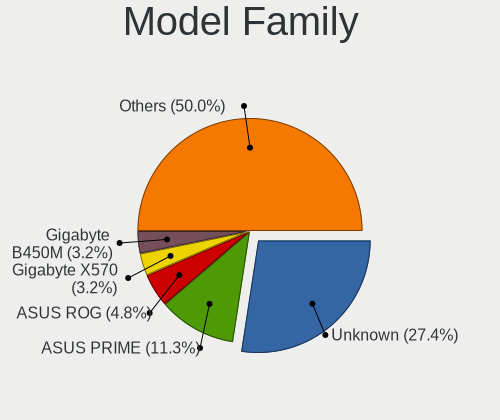
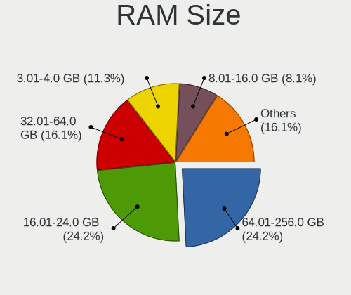
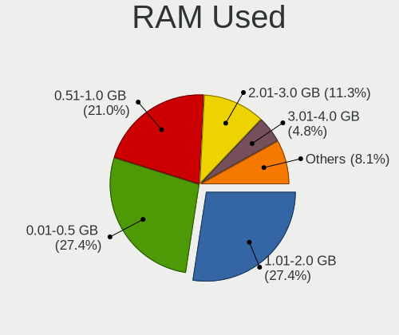
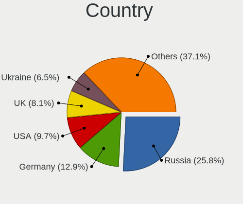
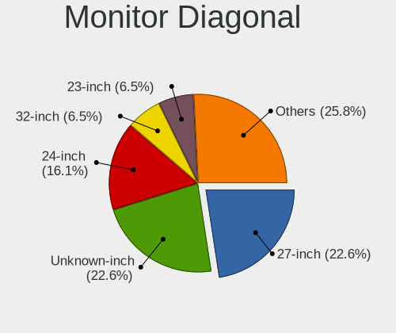
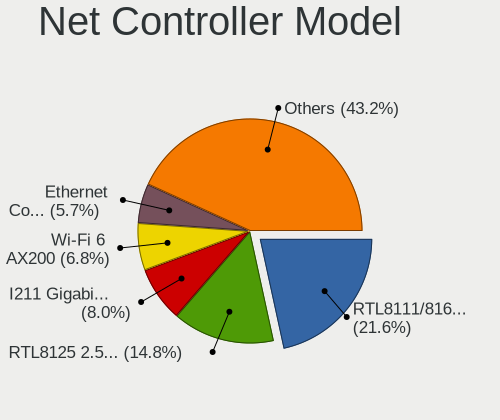
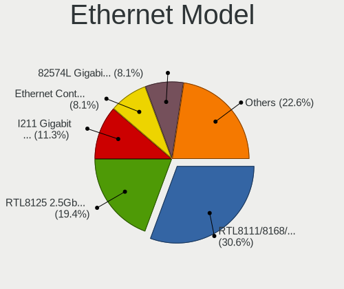
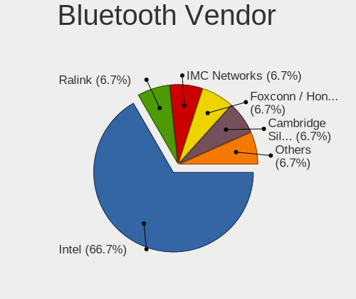

FreeBSD 14.0-CURRENT - Tested Hardware & Statistics (Desktops)
--------------------------------------------------------------

A project to collect tested hardware configurations for FreeBSD 14.0-CURRENT (Beta test).

Anyone can contribute to this report by the [hw-probe](https://github.com/linuxhw/hw-probe/blob/master/INSTALL.BSD.md) tool:

    hw-probe -all -upload

Please submit a probe of your configuration if it's not presented on the page or is rare.

Full-feature report is available here: https://bsd-hardware.info/?view=trends&rel=freebsd-14.0-CURRENT

Contents
--------

* [ Test Cases ](#test-cases)

* [ System ](#system)
  - [ Arch                     ](#arch)
  - [ DE                       ](#de)
  - [ Display Server           ](#display-server)
  - [ Display Manager          ](#display-manager)
  - [ OS Lang                  ](#os-lang)
  - [ Boot Mode                ](#boot-mode)
  - [ Filesystem               ](#filesystem)
  - [ Part. scheme             ](#part-scheme)

* [ Board ](#board)
  - [ Vendor                   ](#vendor)
  - [ Model                    ](#model)
  - [ Model Family             ](#model-family)
  - [ MFG Year                 ](#mfg-year)
  - [ Form Factor              ](#form-factor)
  - [ Coreboot                 ](#coreboot)
  - [ RAM Size                 ](#ram-size)
  - [ RAM Used                 ](#ram-used)
  - [ Total Drives             ](#total-drives)
  - [ Has CD-ROM               ](#has-cd-rom)
  - [ Has Ethernet             ](#has-ethernet)
  - [ Has WiFi                 ](#has-wifi)
  - [ Has Bluetooth            ](#has-bluetooth)

* [ Location ](#location)
  - [ Country                  ](#country)
  - [ City                     ](#city)

* [ Drives ](#drives)
  - [ Drive Vendor             ](#drive-vendor)
  - [ Drive Model              ](#drive-model)
  - [ HDD Vendor               ](#hdd-vendor)
  - [ SSD Vendor               ](#ssd-vendor)
  - [ Drive Kind               ](#drive-kind)
  - [ Drive Connector          ](#drive-connector)
  - [ Drive Size               ](#drive-size)
  - [ Space Total              ](#space-total)
  - [ Space Used               ](#space-used)
  - [ Malfunc. Drives          ](#malfunc-drives)
  - [ Malfunc. Drive Vendor    ](#malfunc-drive-vendor)
  - [ Malfunc. HDD Vendor      ](#malfunc-hdd-vendor)
  - [ Malfunc. Drive Kind      ](#malfunc-drive-kind)
  - [ Failed Drives            ](#failed-drives)
  - [ Failed Drive Vendor      ](#failed-drive-vendor)
  - [ Drive Status             ](#drive-status)

* [ Storage controller ](#storage-controller)
  - [ Storage Vendor           ](#storage-vendor)
  - [ Storage Model            ](#storage-model)
  - [ Storage Kind             ](#storage-kind)

* [ Processor ](#processor)
  - [ CPU Vendor               ](#cpu-vendor)
  - [ CPU Model                ](#cpu-model)
  - [ CPU Model Family         ](#cpu-model-family)
  - [ CPU Cores                ](#cpu-cores)
  - [ CPU Sockets              ](#cpu-sockets)
  - [ CPU Threads              ](#cpu-threads)
  - [ CPU Microarch            ](#cpu-microarch)

* [ Graphics ](#graphics)
  - [ GPU Vendor               ](#gpu-vendor)
  - [ GPU Model                ](#gpu-model)
  - [ GPU Combo                ](#gpu-combo)
  - [ GPU Driver               ](#gpu-driver)
  - [ GPU Memory               ](#gpu-memory)

* [ Monitor ](#monitor)
  - [ Monitor Vendor           ](#monitor-vendor)
  - [ Monitor Model            ](#monitor-model)
  - [ Monitor Resolution       ](#monitor-resolution)
  - [ Monitor Diagonal         ](#monitor-diagonal)
  - [ Monitor Width            ](#monitor-width)
  - [ Aspect Ratio             ](#aspect-ratio)
  - [ Monitor Area             ](#monitor-area)
  - [ Pixel Density            ](#pixel-density)
  - [ Multiple Monitors        ](#multiple-monitors)

* [ Network ](#network)
  - [ Net Controller Vendor    ](#net-controller-vendor)
  - [ Net Controller Model     ](#net-controller-model)
  - [ Wireless Vendor          ](#wireless-vendor)
  - [ Wireless Model           ](#wireless-model)
  - [ Ethernet Vendor          ](#ethernet-vendor)
  - [ Ethernet Model           ](#ethernet-model)
  - [ Net Controller Kind      ](#net-controller-kind)
  - [ Used Controller          ](#used-controller)
  - [ NICs                     ](#nics)
  - [ IPv6                     ](#ipv6)

* [ Bluetooth ](#bluetooth)
  - [ Bluetooth Vendor         ](#bluetooth-vendor)
  - [ Bluetooth Model          ](#bluetooth-model)

* [ Sound ](#sound)
  - [ Sound Vendor             ](#sound-vendor)
  - [ Sound Model              ](#sound-model)

* [ Memory ](#memory)
  - [ Memory Vendor            ](#memory-vendor)
  - [ Memory Model             ](#memory-model)
  - [ Memory Kind              ](#memory-kind)
  - [ Memory Form Factor       ](#memory-form-factor)
  - [ Memory Size              ](#memory-size)
  - [ Memory Speed             ](#memory-speed)

* [ Printers & scanners ](#printers--scanners)
  - [ Printer Vendor           ](#printer-vendor)
  - [ Printer Model            ](#printer-model)
  - [ Scanner Vendor           ](#scanner-vendor)
  - [ Scanner Model            ](#scanner-model)

* [ Camera ](#camera)
  - [ Camera Vendor            ](#camera-vendor)
  - [ Camera Model             ](#camera-model)

* [ Security ](#security)
  - [ Fingerprint Vendor       ](#fingerprint-vendor)
  - [ Fingerprint Model        ](#fingerprint-model)
  - [ Chipcard Vendor          ](#chipcard-vendor)
  - [ Chipcard Model           ](#chipcard-model)

* [ Unsupported ](#unsupported)
  - [ Unsupported Devices      ](#unsupported-devices)
  - [ Unsupported Device Types ](#unsupported-device-types)

Test Cases
----------

| Vendor        | Model                 | Probe                                                     | Date         |
|---------------|-----------------------|-----------------------------------------------------------|--------------|
| Gigabyte      | X399 DESIGNARE EX-CF  | [a78cc6a11b](https://bsd-hardware.info/?probe=a78cc6a11b) | Sep 04, 2021 |
| Unknown       | Unknown               | [4a3836de00](https://bsd-hardware.info/?probe=4a3836de00) | Jul 08, 2021 |
| ASUSTek       | PRIME B450M-GAMING/BR | [edebe87739](https://bsd-hardware.info/?probe=edebe87739) | Jun 04, 2021 |
| Gigabyte      | B550I AORUS PRO AX    | [62b9ea2794](https://bsd-hardware.info/?probe=62b9ea2794) | May 14, 2021 |
| ASUSTek       | P8H77-M PRO           | [b3acafeb1a](https://bsd-hardware.info/?probe=b3acafeb1a) | May 09, 2021 |
| ASUSTek       | P8H77-M PRO           | [86cec3b874](https://bsd-hardware.info/?probe=86cec3b874) | May 09, 2021 |
| pine64        | pinebook-pro-rk3399   | [79713a2668](https://bsd-hardware.info/?probe=79713a2668) | Apr 25, 2021 |
| pine64        | pinebook-pro-rk3399   | [0f04e5f048](https://bsd-hardware.info/?probe=0f04e5f048) | Apr 11, 2021 |
| Gigabyte      | X570 AORUS ELITE      | [325186171a](https://bsd-hardware.info/?probe=325186171a) | Apr 02, 2021 |
| pine64        | pinebook-pro-rk3399   | [ea524ab4c4](https://bsd-hardware.info/?probe=ea524ab4c4) | Mar 28, 2021 |
| pine64        | pinebook-pro-rk3399   | [835da13d39](https://bsd-hardware.info/?probe=835da13d39) | Mar 18, 2021 |
| Gigabyte      | 970A-UD3P             | [cc3151bc6f](https://bsd-hardware.info/?probe=cc3151bc6f) | Mar 17, 2021 |
| MSI           | B450 GAMING PLUS      | [547fd655f0](https://bsd-hardware.info/?probe=547fd655f0) | Mar 13, 2021 |
| pine64        | pinebook-pro-rk3399   | [c00bcdcc87](https://bsd-hardware.info/?probe=c00bcdcc87) | Mar 06, 2021 |
| pine64        | pinebook-pro-rk3399   | [3abcd73d48](https://bsd-hardware.info/?probe=3abcd73d48) | Feb 26, 2021 |
| Gigabyte      | X570 AORUS MASTER     | [29936dd1c0](https://bsd-hardware.info/?probe=29936dd1c0) | Feb 25, 2021 |
| Raspberry ... | rpi                   | [92ee9b3619](https://bsd-hardware.info/?probe=92ee9b3619) | Feb 18, 2021 |
| pine64        | pinebook-pro-rk3399   | [b750f83194](https://bsd-hardware.info/?probe=b750f83194) | Feb 17, 2021 |
| ASUSTek       | PRIME B450M-A         | [ba7f82b343](https://bsd-hardware.info/?probe=ba7f82b343) | Feb 12, 2021 |
| pine64        | pinebook-pro-rk3399   | [2befc5e754](https://bsd-hardware.info/?probe=2befc5e754) | Feb 10, 2021 |
| pine64        | pinebook-pro-rk3399   | [5a55b22f44](https://bsd-hardware.info/?probe=5a55b22f44) | Feb 09, 2021 |
| Dell          | 0D9JG3 A00            | [65dd4083c5](https://bsd-hardware.info/?probe=65dd4083c5) | Feb 09, 2021 |
| pine64        | pinebook-pro-rk3399   | [97e72f0066](https://bsd-hardware.info/?probe=97e72f0066) | Feb 06, 2021 |
| pine64        | pinebook-pro-rk3399   | [1720175648](https://bsd-hardware.info/?probe=1720175648) | Jan 27, 2021 |
| pine64        | pinebook-pro-rk3399   | [2338de9efc](https://bsd-hardware.info/?probe=2338de9efc) | Jan 24, 2021 |

System
------

Arch
----

OS architecture (x86_64, i586, etc.)

| Name  | Desktops | Percent |
|-------|----------|---------|
| amd64 | 10       | 76.92%  |
| arm64 | 2        | 15.38%  |
| riscv | 1        | 7.69%   |

DE
--

Desktop Environment

| Name    | Desktops | Percent |
|---------|----------|---------|
| KDE5    | 8        | 57.14%  |
| Console | 3        | 21.43%  |
| XFCE    | 2        | 14.29%  |
| MATE    | 1        | 7.14%   |

Display Server
--------------

X11 or Wayland

| Name    | Desktops | Percent |
|---------|----------|---------|
| X11     | 11       | 78.57%  |
| Console | 3        | 21.43%  |

Display Manager
---------------

SDDM, LightDM, etc.

| Name    | Desktops | Percent |
|---------|----------|---------|
| SDDM    | 5        | 35.71%  |
| Console | 4        | 28.57%  |
| GDM     | 3        | 21.43%  |
| SLiM    | 2        | 14.29%  |

OS Lang
-------

Language

| Lang    | Desktops | Percent |
|---------|----------|---------|
| C       | 6        | 46.15%  |
| en_US   | 3        | 23.08%  |
| sv_SE   | 1        | 7.69%   |
| de_DE   | 1        | 7.69%   |
| de_CH   | 1        | 7.69%   |
| Unknown | 1        | 7.69%   |

Boot Mode
---------

EFI or BIOS

| Mode | Desktops | Percent |
|------|----------|---------|
| EFI  | 11       | 84.62%  |
| BIOS | 2        | 15.38%  |

Filesystem
----------

Type of filesystem

| Type | Desktops | Percent |
|------|----------|---------|
| Zfs  | 8        | 61.54%  |
| Ufs  | 5        | 38.46%  |

Part. scheme
------------

Scheme of partitioning

| Type | Desktops | Percent |
|------|----------|---------|
| GPT  | 11       | 84.62%  |
| MBR  | 2        | 15.38%  |

Board
-----

Vendor
------

Motherboard manufacturer

| Name                    | Desktops | Percent |
|-------------------------|----------|---------|
| Gigabyte Technology     | 5        | 38.46%  |
| ASUSTek Computer        | 3        | 23.08%  |
| Raspberry Pi Foundation | 1        | 7.69%   |
| pine64                  | 1        | 7.69%   |
| MSI                     | 1        | 7.69%   |
| Dell                    | 1        | 7.69%   |
| Unknown                 | 1        | 7.69%   |

Model
-----

Motherboard model

| Name                        | Desktops | Percent |
|-----------------------------|----------|---------|
| RPi rpi                     | 1        | 7.69%   |
| pine64 pinebook-pro-rk3399  | 1        | 7.69%   |
| MSI MS-7B86                 | 1        | 7.69%   |
| Gigabyte X570 AORUS MASTER  | 1        | 7.69%   |
| Gigabyte X570 AORUS ELITE   | 1        | 7.69%   |
| Gigabyte X399 DESIGNARE EX  | 1        | 7.69%   |
| Gigabyte B550I AORUS PRO AX | 1        | 7.69%   |
| Gigabyte 970A-UD3P          | 1        | 7.69%   |
| Dell OptiPlex 5080          | 1        | 7.69%   |
| ASUS PRIME B450M-GAMING/BR  | 1        | 7.69%   |
| ASUS PRIME B450M-A          | 1        | 7.69%   |
| ASUS P8H77-M PRO            | 1        | 7.69%   |
| Unknown                     | 1        | 7.69%   |

Model Family
------------

Motherboard model prefix

| Name                       | Desktops | Percent |
|----------------------------|----------|---------|
| Gigabyte X570              | 2        | 15.38%  |
| ASUS PRIME                 | 2        | 15.38%  |
| RPi rpi                    | 1        | 7.69%   |
| pine64 pinebook-pro-rk3399 | 1        | 7.69%   |
| MSI MS-7B86                | 1        | 7.69%   |
| Gigabyte X399              | 1        | 7.69%   |
| Gigabyte B550I             | 1        | 7.69%   |
| Gigabyte 970A-UD3P         | 1        | 7.69%   |
| Dell OptiPlex              | 1        | 7.69%   |
| ASUS P8H77-M               | 1        | 7.69%   |
| Unknown                    | 1        | 7.69%   |

MFG Year
--------

Motherboard manufacture year

| Year    | Desktops | Percent |
|---------|----------|---------|
| 2020    | 5        | 38.46%  |
| 2021    | 3        | 23.08%  |
| 2019    | 1        | 7.69%   |
| 2018    | 1        | 7.69%   |
| 2016    | 1        | 7.69%   |
| 2014    | 1        | 7.69%   |
| Unknown | 1        | 7.69%   |

Form Factor
-----------

Physical design of the computer

| Name    | Desktops | Percent |
|---------|----------|---------|
| Desktop | 13       | 100%    |

Coreboot
--------

Have coreboot on board

| Used | Desktops | Percent |
|------|----------|---------|
| No   | 13       | 100%    |

RAM Size
--------

Total RAM memory

| Size in GB  | Desktops | Percent |
|-------------|----------|---------|
| 16.01-24.0  | 5        | 38.46%  |
| 32.01-64.0  | 4        | 30.77%  |
| 64.01-256.0 | 2        | 15.38%  |
| 4.01-8.0    | 1        | 7.69%   |
| 8.01-16.0   | 1        | 7.69%   |

RAM Used
--------

Used RAM memory

| Used GB    | Desktops | Percent |
|------------|----------|---------|
| 0.51-1.0   | 5        | 38.46%  |
| 1.01-2.0   | 4        | 30.77%  |
| 0.01-0.5   | 2        | 15.38%  |
| 3.01-4.0   | 1        | 7.69%   |
| 16.01-24.0 | 1        | 7.69%   |

Total Drives
------------

Number of drives on board

| Drives | Desktops | Percent |
|--------|----------|---------|
| 3      | 4        | 30.77%  |
| 0      | 3        | 23.08%  |
| 6      | 2        | 15.38%  |
| 1      | 2        | 15.38%  |
| 4      | 1        | 7.69%   |
| 2      | 1        | 7.69%   |

Has CD-ROM
----------

Has CD-ROM on board

| Presented | Desktops | Percent |
|-----------|----------|---------|
| No        | 10       | 76.92%  |
| Yes       | 3        | 23.08%  |

Has Ethernet
------------

Has Ethernet on board

| Presented | Desktops | Percent |
|-----------|----------|---------|
| Yes       | 10       | 76.92%  |
| No        | 3        | 23.08%  |

Has WiFi
--------

Has WiFi module

| Presented | Desktops | Percent |
|-----------|----------|---------|
| No        | 8        | 61.54%  |
| Yes       | 5        | 38.46%  |

Has Bluetooth
-------------

Has Bluetooth module

| Presented | Desktops | Percent |
|-----------|----------|---------|
| No        | 10       | 76.92%  |
| Yes       | 3        | 23.08%  |

Location
--------

Country
-------

Geographic location (country)

| Country     | Desktops | Percent |
|-------------|----------|---------|
| Japan       | 2        | 15.38%  |
| Germany     | 2        | 15.38%  |
| Brazil      | 2        | 15.38%  |
| USA         | 1        | 7.69%   |
| Ukraine     | 1        | 7.69%   |
| UK          | 1        | 7.69%   |
| Switzerland | 1        | 7.69%   |
| Sweden      | 1        | 7.69%   |
| France      | 1        | 7.69%   |
| Austria     | 1        | 7.69%   |

City
----

Geographic location (city)

| City                    | Desktops | Percent |
|-------------------------|----------|---------|
| Ōta-ku                 | 2        | 13.33%  |
| Zurich                  | 1        | 6.67%   |
| Zaporizhzhya            | 1        | 6.67%   |
| Sollentuna              | 1        | 6.67%   |
| Santa Monica            | 1        | 6.67%   |
| Rio de Janeiro          | 1        | 6.67%   |
| Northeim                | 1        | 6.67%   |
| Kunitachi               | 1        | 6.67%   |
| Jaboatao dos Guararapes | 1        | 6.67%   |
| Graz                    | 1        | 6.67%   |
| Fuchu                   | 1        | 6.67%   |
| Claix                   | 1        | 6.67%   |
| Cambridge               | 1        | 6.67%   |
| Berlin                  | 1        | 6.67%   |

Drives
------

Drive Vendor
------------

Hard drive vendors

| Vendor              | Desktops | Drives | Percent |
|---------------------|----------|--------|---------|
| WDC                 | 6        | 10     | 31.58%  |
| Seagate             | 3        | 4      | 15.79%  |
| Crucial             | 3        | 8      | 15.79%  |
| Samsung Electronics | 2        | 3      | 10.53%  |
| Kingston            | 2        | 3      | 10.53%  |
| Toshiba             | 1        | 1      | 5.26%   |
| HGST                | 1        | 2      | 5.26%   |
| GOODRAM             | 1        | 1      | 5.26%   |

Drive Model
-----------

Hard drive models

| Model                            | Desktops | Percent |
|----------------------------------|----------|---------|
| WDC WDS250G2B0C-00PXH0 250GB     | 1        | 4.17%   |
| WDC WDS100T2B0A-00SM50 1TB       | 1        | 4.17%   |
| WDC WD5002ABYS-18B1B0 500GB      | 1        | 4.17%   |
| WDC WD40EZRZ-75GXCB0 4TB         | 1        | 4.17%   |
| WDC WD30EFRX-68EUZN0 3TB         | 1        | 4.17%   |
| WDC WD120EFAX-68UNTN0 12TB       | 1        | 4.17%   |
| WDC WD10SPZX-21Z10T0 1TB         | 1        | 4.17%   |
| WDC WD10EZEX-00RKKA0 1TB         | 1        | 4.17%   |
| WDC WD10EARX-00N0YB0 1TB         | 1        | 4.17%   |
| Toshiba MQ04ABF100 1TB           | 1        | 4.17%   |
| Seagate ST4000DM000-1F2168 4TB   | 1        | 4.17%   |
| Seagate ST32000641AS 2TB         | 1        | 4.17%   |
| Seagate ST3000DM007-1WY10G 3TB   | 1        | 4.17%   |
| Seagate ST3000DM001-1ER166 3TB   | 1        | 4.17%   |
| Samsung SSD 860 EVO 4TB          | 1        | 4.17%   |
| Samsung SSD 860 EVO 250GB        | 1        | 4.17%   |
| Samsung SSD 850 EVO 250GB        | 1        | 4.17%   |
| Kingston SA400S37240G 240GB      | 1        | 4.17%   |
| Kingston SA2000M81000G 1TB       | 1        | 4.17%   |
| HGST HTS721010A9E630 1TB         | 1        | 4.17%   |
| GOODRAM SSDPR-CX400-256-G2 256GB | 1        | 4.17%   |
| Crucial CT500P1SSD8 500GB        | 1        | 4.17%   |
| Crucial CT250MX500SSD1 250GB     | 1        | 4.17%   |
| Crucial CT1000MX500SSD4 1TB      | 1        | 4.17%   |

HDD Vendor
----------

Hard disk drive vendors

| Vendor  | Desktops | Drives | Percent |
|---------|----------|--------|---------|
| WDC     | 4        | 7      | 44.44%  |
| Seagate | 3        | 4      | 33.33%  |
| Toshiba | 1        | 1      | 11.11%  |
| HGST    | 1        | 2      | 11.11%  |

SSD Vendor
----------

Solid state drive vendors

| Vendor              | Desktops | Drives | Percent |
|---------------------|----------|--------|---------|
| Samsung Electronics | 2        | 3      | 28.57%  |
| Crucial             | 2        | 7      | 28.57%  |
| WDC                 | 1        | 2      | 14.29%  |
| Kingston            | 1        | 2      | 14.29%  |
| GOODRAM             | 1        | 1      | 14.29%  |

Drive Kind
----------

HDD or SSD

| Kind | Desktops | Drives | Percent |
|------|----------|--------|---------|
| SSD  | 7        | 15     | 43.75%  |
| HDD  | 6        | 14     | 37.5%   |
| NVMe | 3        | 3      | 18.75%  |

Drive Connector
---------------

SATA, SAS, NVMe, etc.

| Type | Desktops | Drives | Percent |
|------|----------|--------|---------|
| SATA | 8        | 29     | 72.73%  |
| NVMe | 3        | 3      | 27.27%  |

Drive Size
----------

Size of hard drive

| Size in TB | Desktops | Drives | Percent |
|------------|----------|--------|---------|
| 0.51-1.0   | 5        | 9      | 31.25%  |
| 0.01-0.5   | 5        | 12     | 31.25%  |
| 3.01-4.0   | 2        | 3      | 12.5%   |
| 2.01-3.0   | 2        | 3      | 12.5%   |
| 10.01-20.0 | 1        | 1      | 6.25%   |
| 1.01-2.0   | 1        | 1      | 6.25%   |

Space Total
-----------

Amount of disk space available on the file system

| Size in GB | Desktops | Percent |
|------------|----------|---------|
| 101-250    | 4        | 30.77%  |
| 501-1000   | 3        | 23.08%  |
| 251-500    | 2        | 15.38%  |
| 2001-3000  | 2        | 15.38%  |
| 1-20       | 1        | 7.69%   |
| 51-100     | 1        | 7.69%   |

Space Used
----------

Amount of used disk space

| Used GB   | Desktops | Percent |
|-----------|----------|---------|
| 21-50     | 6        | 42.86%  |
| 1-20      | 5        | 35.71%  |
| 251-500   | 1        | 7.14%   |
| 1001-2000 | 1        | 7.14%   |
| 501-1000  | 1        | 7.14%   |

Malfunc. Drives
---------------

Drive models with a malfunction

| Model                       | Desktops | Drives | Percent |
|-----------------------------|----------|--------|---------|
| WDC WD5002ABYS-18B1B0 500GB | 1        | 1      | 100%    |

Malfunc. Drive Vendor
---------------------

Vendors of faulty drives

| Vendor | Desktops | Drives | Percent |
|--------|----------|--------|---------|
| WDC    | 1        | 1      | 100%    |

Malfunc. HDD Vendor
-------------------

Vendors of faulty HDD drives

| Vendor | Desktops | Drives | Percent |
|--------|----------|--------|---------|
| WDC    | 1        | 1      | 100%    |

Malfunc. Drive Kind
-------------------

Kinds of faulty drives

| Kind | Desktops | Drives | Percent |
|------|----------|--------|---------|
| HDD  | 1        | 1      | 100%    |

Failed Drives
-------------

Failed drive models

Zero info for selected period =(

Failed Drive Vendor
-------------------

Failed drive vendors

Zero info for selected period =(

Drive Status
------------

Number of failed and malfunc. drives

| Status  | Desktops | Drives | Percent |
|---------|----------|--------|---------|
| Works   | 10       | 31     | 90.91%  |
| Malfunc | 1        | 1      | 9.09%   |

Storage controller
------------------

Storage Vendor
--------------

Storage controller vendors

| Vendor                      | Desktops | Percent |
|-----------------------------|----------|---------|
| AMD                         | 8        | 47.06%  |
| Sandisk                     | 2        | 11.76%  |
| Samsung Electronics         | 2        | 11.76%  |
| Intel                       | 2        | 11.76%  |
| Micron/Crucial Technology   | 1        | 5.88%   |
| Marvell Technology Group    | 1        | 5.88%   |
| Kingston Technology Company | 1        | 5.88%   |

Storage Model
-------------

Storage controller models

| Model                                                                       | Desktops | Percent |
|-----------------------------------------------------------------------------|----------|---------|
| AMD FCH SATA Controller [AHCI mode]                                         | 6        | 27.27%  |
| AMD 400 Series Chipset SATA Controller                                      | 3        | 13.64%  |
| Sandisk WD Blue SN550 NVMe SSD                                              | 2        | 9.09%   |
| Samsung NVMe SSD Controller SM981/PM981/PM983                               | 1        | 4.55%   |
| Samsung NVMe SSD Controller SM961/PM961/SM963                               | 1        | 4.55%   |
| Micron/Crucial P1 NVMe PCIe SSD                                             | 1        | 4.55%   |
| Marvell Group 88SE9172 SATA III 6Gb/s RAID Controller                       | 1        | 4.55%   |
| Kingston Company A2000 NVMe SSD                                             | 1        | 4.55%   |
| Intel Comet Lake SATA AHCI Controller                                       | 1        | 4.55%   |
| Intel 7 Series/C210 Series Chipset Family 4-port SATA Controller [IDE mode] | 1        | 4.55%   |
| Intel 7 Series/C210 Series Chipset Family 2-port SATA Controller [IDE mode] | 1        | 4.55%   |
| AMD X399 Series Chipset SATA Controller                                     | 1        | 4.55%   |
| AMD Starship/Matisse Chipset SATA Controller [AHCI mode]                    | 1        | 4.55%   |
| AMD SB7x0/SB8x0/SB9x0 SATA Controller [AHCI mode]                           | 1        | 4.55%   |

Storage Kind
------------

Kind of storage controller (IDE, SATA, NVMe, SAS, ...)

| Kind | Desktops | Percent |
|------|----------|---------|
| SATA | 9        | 56.25%  |
| NVMe | 6        | 37.5%   |
| IDE  | 1        | 6.25%   |

Processor
---------

CPU Vendor
----------

Processor vendors

| Vendor  | Desktops | Percent |
|---------|----------|---------|
| AMD     | 8        | 57.14%  |
| Unknown | 3        | 21.43%  |
| Intel   | 2        | 14.29%  |
| ARM     | 1        | 7.14%   |

CPU Model
---------

Processor models

| Model                                          | Desktops | Percent |
|------------------------------------------------|----------|---------|
|                                                | 3        | 21.43%  |
| Intel Core i7-3770 CPU @ 3.40GHz               | 1        | 7.14%   |
| Intel Core i5-10500T CPU @ 2.30GHz             | 1        | 7.14%   |
| ARM Cortex-A72 r0p2                            | 1        | 7.14%   |
| AMD Ryzen Threadripper 1950X 16-Core Processor | 1        | 7.14%   |
| AMD Ryzen 9 5900X 12-Core Processor            | 1        | 7.14%   |
| AMD Ryzen 9 3950X 16-Core Processor            | 1        | 7.14%   |
| AMD Ryzen 9 3900X 12-Core Processor            | 1        | 7.14%   |
| AMD Ryzen 7 2700X Eight-Core Processor         | 1        | 7.14%   |
| AMD Ryzen 5 2600X Six-Core Processor           | 1        | 7.14%   |
| AMD Ryzen 5 2600 Six-Core Processor            | 1        | 7.14%   |
| AMD FX-8320E Eight-Core Processor              | 1        | 7.14%   |

CPU Model Family
----------------

Processor model prefix

| Model                  | Desktops | Percent |
|------------------------|----------|---------|
| Other                  | 3        | 21.43%  |
| AMD Ryzen 9            | 3        | 21.43%  |
| AMD Ryzen 5            | 2        | 14.29%  |
| Intel Core i7          | 1        | 7.14%   |
| Intel Core i5          | 1        | 7.14%   |
| ARM Cortex             | 1        | 7.14%   |
| AMD Ryzen Threadripper | 1        | 7.14%   |
| AMD Ryzen 7            | 1        | 7.14%   |
| AMD FX                 | 1        | 7.14%   |

CPU Cores
---------

Number of processor cores

| Number  | Desktops | Percent |
|---------|----------|---------|
| Unknown | 3        | 23.08%  |
| 32      | 2        | 15.38%  |
| 24      | 2        | 15.38%  |
| 12      | 2        | 15.38%  |
| 16      | 1        | 7.69%   |
| 8       | 1        | 7.69%   |
| 6       | 1        | 7.69%   |
| 4       | 1        | 7.69%   |

CPU Sockets
-----------

Number of sockets

| Number  | Desktops | Percent |
|---------|----------|---------|
| 1       | 12       | 85.71%  |
| Unknown | 2        | 14.29%  |

CPU Threads
-----------

Threads per core (Hyper-Threading)

| Number  | Desktops | Percent |
|---------|----------|---------|
| 1       | 8        | 61.54%  |
| Unknown | 3        | 23.08%  |
| 2       | 2        | 15.38%  |

CPU Microarch
-------------

Microarchitecture

| Name       | Desktops | Percent |
|------------|----------|---------|
| Zen+       | 3        | 23.08%  |
| Unknown    | 3        | 23.08%  |
| Zen 2      | 2        | 15.38%  |
| Zen 3      | 1        | 7.69%   |
| Zen        | 1        | 7.69%   |
| Piledriver | 1        | 7.69%   |
| IvyBridge  | 1        | 7.69%   |
| CometLake  | 1        | 7.69%   |

Graphics
--------

GPU Vendor
----------

Vendors of graphics cards

| Vendor | Desktops | Percent |
|--------|----------|---------|
| Nvidia | 6        | 60%     |
| Intel  | 2        | 20%     |
| AMD    | 2        | 20%     |

GPU Model
---------

Graphics card models

| Model                                                               | Desktops | Percent |
|---------------------------------------------------------------------|----------|---------|
| Nvidia GK208B [GeForce GT 710]                                      | 2        | 20%     |
| Nvidia GP107 [GeForce GTX 1050 Ti]                                  | 1        | 10%     |
| Nvidia GP106 [GeForce GTX 1060 3GB]                                 | 1        | 10%     |
| Nvidia GM206 [GeForce GTX 960]                                      | 1        | 10%     |
| Nvidia GM107 [GeForce GTX 750 Ti]                                   | 1        | 10%     |
| Intel Xeon E3-1200 v2/3rd Gen Core processor Graphics Controller    | 1        | 10%     |
| Intel CometLake-S GT2 [UHD Graphics 630]                            | 1        | 10%     |
| AMD Ellesmere [Radeon RX 470/480/570/570X/580/580X/590]             | 1        | 10%     |
| AMD Baffin [Radeon RX 460/560D / Pro 450/455/460/555/555X/560/560X] | 1        | 10%     |

GPU Combo
---------

Combinations of graphics cards

| Name       | Desktops | Percent |
|------------|----------|---------|
| 1 x Nvidia | 6        | 46.15%  |
| Other      | 3        | 23.08%  |
| 1 x Intel  | 2        | 15.38%  |
| 1 x AMD    | 2        | 15.38%  |

GPU Driver
----------

Free vs proprietary

| Driver      | Desktops | Percent |
|-------------|----------|---------|
| Proprietary | 6        | 46.15%  |
| Free        | 4        | 30.77%  |
| Unknown     | 3        | 23.08%  |

GPU Memory
----------

Total video memory

| Size in GB | Desktops | Percent |
|------------|----------|---------|
| Unknown    | 5        | 38.46%  |
| 3.01-4.0   | 3        | 23.08%  |
| 0.51-1.0   | 2        | 15.38%  |
| 7.01-8.0   | 1        | 7.69%   |
| 2.01-3.0   | 1        | 7.69%   |
| 1.01-2.0   | 1        | 7.69%   |

Monitor
-------

Monitor Vendor
--------------

Monitor vendors

| Vendor              | Desktops | Percent |
|---------------------|----------|---------|
| LG Electronics      | 2        | 18.18%  |
| Goldstar            | 2        | 18.18%  |
| Sony                | 1        | 9.09%   |
| Samsung Electronics | 1        | 9.09%   |
| Philips             | 1        | 9.09%   |
| Eizo                | 1        | 9.09%   |
| Dell                | 1        | 9.09%   |
| BenQ                | 1        | 9.09%   |
| AOC                 | 1        | 9.09%   |

Monitor Model
-------------

Monitor models

| Model                                                   | Desktops | Percent |
|---------------------------------------------------------|----------|---------|
| Sony TV SNY4B03 1920x1080 930x520mm 41.9-inch           | 1        | 8.33%   |
| Samsung Electronics SyncMaster SAM05FC 1920x1080        | 1        | 8.33%   |
| Philips PHL 273V7 PHLC156 1920x1080 600x340mm 27.2-inch | 1        | 8.33%   |
| LG Electronics LCD Monitor LX20D 1600x1200              | 1        | 8.33%   |
| LG Electronics LCD Monitor LG Ultra HD 11520x2160       | 1        | 8.33%   |
| LG Electronics LCD Monitor LG Ultra HD                  | 1        | 8.33%   |
| Goldstar 27GK750F GSM770F 1920x1080 600x340mm 27.2-inch | 1        | 8.33%   |
| Goldstar 23EA53 GSM59A8 1920x1080 510x290mm 23.1-inch   | 1        | 8.33%   |
| Eizo FX2431 ENC2036 1920x1200 520x330mm 24.2-inch       | 1        | 8.33%   |
| Dell U2518D DEL413C 2560x1440 550x310mm 24.9-inch       | 1        | 8.33%   |
| BenQ GW2280 BNQ78E8 1920x1080 480x270mm 21.7-inch       | 1        | 8.33%   |
| AOC Q3277 AOC3277 2560x1440 710x400mm 32.1-inch         | 1        | 8.33%   |

Monitor Resolution
------------------

Monitor screen resolution

| Resolution        | Desktops | Percent |
|-------------------|----------|---------|
| 1920x1080 (FHD)   | 6        | 50%     |
| 3840x2160 (4K)    | 1        | 8.33%   |
| 2560x1440 (QHD)   | 1        | 8.33%   |
| 1920x1200 (WUXGA) | 1        | 8.33%   |
| 1600x1200         | 1        | 8.33%   |
| 11520x2160        | 1        | 8.33%   |
| Unknown           | 1        | 8.33%   |

Monitor Diagonal
----------------

Diagonal size in inches

| Inches  | Desktops | Percent |
|---------|----------|---------|
| Unknown | 3        | 27.27%  |
| 27      | 2        | 18.18%  |
| 24      | 2        | 18.18%  |
| 41      | 1        | 9.09%   |
| 32      | 1        | 9.09%   |
| 23      | 1        | 9.09%   |
| 21      | 1        | 9.09%   |

Monitor Width
-------------

Physical width

| Width in mm | Desktops | Percent |
|-------------|----------|---------|
| 501-600     | 5        | 45.45%  |
| Unknown     | 3        | 27.27%  |
| 701-800     | 1        | 9.09%   |
| 401-500     | 1        | 9.09%   |
| 901-1000    | 1        | 9.09%   |

Aspect Ratio
------------

Proportional relationship between the width and the height

| Ratio   | Desktops | Percent |
|---------|----------|---------|
| 16/9    | 7        | 70%     |
| Unknown | 2        | 20%     |
| 16/10   | 1        | 10%     |

Monitor Area
------------

Area in inch²

| Area in inch² | Desktops | Percent |
|----------------|----------|---------|
| Unknown        | 3        | 27.27%  |
| 301-350        | 2        | 18.18%  |
| 251-300        | 2        | 18.18%  |
| 201-250        | 2        | 18.18%  |
| 351-500        | 1        | 9.09%   |
| 501-1000       | 1        | 9.09%   |

Pixel Density
-------------

Pixels per inch

| Density | Desktops | Percent |
|---------|----------|---------|
| 51-100  | 6        | 60%     |
| Unknown | 3        | 30%     |
| 101-120 | 1        | 10%     |

Multiple Monitors
-----------------

Total monitors connected

| Total | Desktops | Percent |
|-------|----------|---------|
| 1     | 8        | 61.54%  |
| 0     | 3        | 23.08%  |
| 2     | 2        | 15.38%  |

Network
-------

Net Controller Vendor
---------------------

Controller vendors

| Vendor                | Desktops | Percent |
|-----------------------|----------|---------|
| Realtek Semiconductor | 8        | 50%     |
| Intel                 | 6        | 37.5%   |
| TP-Link               | 1        | 6.25%   |
| Arduino SA            | 1        | 6.25%   |

Net Controller Model
--------------------

Controller models

| Model                                                             | Desktops | Percent |
|-------------------------------------------------------------------|----------|---------|
| Realtek RTL8111/8168/8411 PCI Express Gigabit Ethernet Controller | 6        | 31.58%  |
| Intel I211 Gigabit Network Connection                             | 3        | 15.79%  |
| Realtek RTL8125 2.5GbE Controller                                 | 2        | 10.53%  |
| Intel Wi-Fi 6 AX200                                               | 2        | 10.53%  |
| TP-Link Archer T3U [Realtek RTL8812BU]                            | 1        | 5.26%   |
| Intel Wireless-AC 9260                                            | 1        | 5.26%   |
| Intel Wireless 8265 / 8275                                        | 1        | 5.26%   |
| Intel Ethernet Connection (11) I219-LM                            | 1        | 5.26%   |
| Intel 82574L Gigabit Network Connection                           | 1        | 5.26%   |
| Arduino SA Uno R3 (CDC ACM)                                       | 1        | 5.26%   |

Wireless Vendor
---------------

Wireless vendors

| Vendor  | Desktops | Percent |
|---------|----------|---------|
| Intel   | 4        | 80%     |
| TP-Link | 1        | 20%     |

Wireless Model
--------------

Wireless models

| Model                                  | Desktops | Percent |
|----------------------------------------|----------|---------|
| Intel Wi-Fi 6 AX200                    | 2        | 40%     |
| TP-Link Archer T3U [Realtek RTL8812BU] | 1        | 20%     |
| Intel Wireless-AC 9260                 | 1        | 20%     |
| Intel Wireless 8265 / 8275             | 1        | 20%     |

Ethernet Vendor
---------------

Ethernet vendors

| Vendor                | Desktops | Percent |
|-----------------------|----------|---------|
| Realtek Semiconductor | 8        | 61.54%  |
| Intel                 | 5        | 38.46%  |

Ethernet Model
--------------

Ethernet models

| Model                                                             | Desktops | Percent |
|-------------------------------------------------------------------|----------|---------|
| Realtek RTL8111/8168/8411 PCI Express Gigabit Ethernet Controller | 6        | 46.15%  |
| Intel I211 Gigabit Network Connection                             | 3        | 23.08%  |
| Realtek RTL8125 2.5GbE Controller                                 | 2        | 15.38%  |
| Intel Ethernet Connection (11) I219-LM                            | 1        | 7.69%   |
| Intel 82574L Gigabit Network Connection                           | 1        | 7.69%   |

Net Controller Kind
-------------------

Ethernet, WiFi or modem

| Kind     | Desktops | Percent |
|----------|----------|---------|
| Ethernet | 10       | 62.5%   |
| WiFi     | 5        | 31.25%  |
| Modem    | 1        | 6.25%   |

Used Controller
---------------

Currently used network controller

| Kind     | Desktops | Percent |
|----------|----------|---------|
| Ethernet | 10       | 90.91%  |
| WiFi     | 1        | 9.09%   |

NICs
----

Total network controllers on board

| Total | Desktops | Percent |
|-------|----------|---------|
| 1     | 5        | 38.46%  |
| 2     | 3        | 23.08%  |
| 0     | 3        | 23.08%  |
| 7     | 1        | 7.69%   |
| 3     | 1        | 7.69%   |

IPv6
----

IPv6 vs IPv4

| Used | Desktops | Percent |
|------|----------|---------|
| No   | 11       | 84.62%  |
| Yes  | 2        | 15.38%  |

Bluetooth
---------

Bluetooth Vendor
----------------

Controller vendors

| Vendor | Desktops | Percent |
|--------|----------|---------|
| Intel  | 3        | 100%    |

Bluetooth Model
---------------

Controller models

| Model                                    | Desktops | Percent |
|------------------------------------------|----------|---------|
| Intel Wireless-AC 9260 Bluetooth Adapter | 1        | 33.33%  |
| Intel Bluetooth wireless interface       | 1        | 33.33%  |
| Intel AX200 Bluetooth                    | 1        | 33.33%  |

Sound
-----

Sound Vendor
------------

Sound card vendors

| Vendor              | Desktops | Percent |
|---------------------|----------|---------|
| AMD                 | 8        | 40%     |
| Nvidia              | 6        | 30%     |
| Intel               | 2        | 10%     |
| Yamaha              | 1        | 5%      |
| GN Netcom           | 1        | 5%      |
| C-Media Electronics | 1        | 5%      |
| AudioQuest          | 1        | 5%      |

Sound Model
-----------

Sound card models

| Model                                                               | Desktops | Percent |
|---------------------------------------------------------------------|----------|---------|
| AMD Family 17h (Models 00h-0fh) HD Audio Controller                 | 4        | 18.18%  |
| AMD Starship/Matisse HD Audio Controller                            | 3        | 13.64%  |
| Nvidia GK208 HDMI/DP Audio Controller                               | 2        | 9.09%   |
| Yamaha Steinberg UR12                                               | 1        | 4.55%   |
| Nvidia GP107GL High Definition Audio Controller                     | 1        | 4.55%   |
| Nvidia GP106 High Definition Audio Controller                       | 1        | 4.55%   |
| Nvidia GM206 High Definition Audio Controller                       | 1        | 4.55%   |
| Nvidia GM107 High Definition Audio Controller [GeForce 940MX]       | 1        | 4.55%   |
| Intel Comet Lake PCH cAVS                                           | 1        | 4.55%   |
| Intel 7 Series/C216 Chipset Family High Definition Audio Controller | 1        | 4.55%   |
| GN Netcom Jabra SPEAK 410 USB                                       | 1        | 4.55%   |
| C-Media Electronics BIRD UM1                                        | 1        | 4.55%   |
| AudioQuest DragonFly                                                | 1        | 4.55%   |
| AMD SBx00 Azalia (Intel HDA)                                        | 1        | 4.55%   |
| AMD Ellesmere HDMI Audio [Radeon RX 470/480 / 570/580/590]          | 1        | 4.55%   |
| AMD Baffin HDMI/DP Audio [Radeon RX 550 640SP / RX 560/560X]        | 1        | 4.55%   |

Memory
------

Memory Vendor
-------------

Memory module vendors

| Vendor              | Desktops | Percent |
|---------------------|----------|---------|
| Kingston            | 3        | 27.27%  |
| Micron Technology   | 2        | 18.18%  |
| Corsair             | 2        | 18.18%  |
| Unknown             | 1        | 9.09%   |
| SK Hynix            | 1        | 9.09%   |
| Samsung Electronics | 1        | 9.09%   |
| Crucial             | 1        | 9.09%   |

Memory Model
------------

Memory module models

| Model                                                   | Desktops | Percent |
|---------------------------------------------------------|----------|---------|
| Unknown RAM Module 8GB DIMM DDR3 1600MT/s               | 1        | 9.09%   |
| SK Hynix RAM HMA82GS6DJR8N-XN 16GB SODIMM DDR4 3200MT/s | 1        | 9.09%   |
| Samsung RAM M378A4G43MB1-CTD 32GB DIMM DDR4 2666MT/s    | 1        | 9.09%   |
| Micron RAM 16ATF2G64HZ-2G6J1 16GB SODIMM DDR4 2667MT/s  | 1        | 9.09%   |
| Micron RAM 16ATF2G64AZ-3G2J1 16GB DIMM DDR4 3200MT/s    | 1        | 9.09%   |
| Kingston RAM KHX2666C16/16G 16GB DIMM DDR4 2666MT/s     | 1        | 9.09%   |
| Kingston RAM KHX1600C10D3/ 8GB DIMM DDR3 1600MT/s       | 1        | 9.09%   |
| Kingston RAM 9905713-030.A00G 8GB DIMM DDR4 2666MT/s    | 1        | 9.09%   |
| Crucial RAM BL16G36C16U4B.M8FB1 16GB DIMM DDR4 3600MT/s | 1        | 9.09%   |
| Corsair RAM CMK16GX4M2B3200C16 8GB DIMM DDR4 3200MT/s   | 1        | 9.09%   |
| Corsair RAM CMD128GX4M8A2400C14 16GB DIMM DDR4 2133MT/s | 1        | 9.09%   |

Memory Kind
-----------

Memory module kinds

| Kind | Desktops | Percent |
|------|----------|---------|
| DDR4 | 8        | 80%     |
| DDR3 | 2        | 20%     |

Memory Form Factor
------------------

Physical design of the memory module

| Name   | Desktops | Percent |
|--------|----------|---------|
| DIMM   | 9        | 90%     |
| SODIMM | 1        | 10%     |

Memory Size
-----------

Memory module size

| Size  | Desktops | Percent |
|-------|----------|---------|
| 16384 | 5        | 50%     |
| 8192  | 4        | 40%     |
| 32768 | 1        | 10%     |

Memory Speed
------------

Memory module speed

| Speed | Desktops | Percent |
|-------|----------|---------|
| 3200  | 3        | 27.27%  |
| 2666  | 3        | 27.27%  |
| 1600  | 2        | 18.18%  |
| 3600  | 1        | 9.09%   |
| 2667  | 1        | 9.09%   |
| 2133  | 1        | 9.09%   |

Printers & scanners
-------------------

Printer Vendor
--------------

Printer device vendors

Zero info for selected period =(

Printer Model
-------------

Printer device models

Zero info for selected period =(

Scanner Vendor
--------------

Scanner device vendors

Zero info for selected period =(

Scanner Model
-------------

Scanner device models

Zero info for selected period =(

Camera
------

Camera Vendor
-------------

Camera device vendors

| Vendor          | Desktops | Percent |
|-----------------|----------|---------|
| Logitech        | 3        | 60%     |
| Microdia        | 1        | 20%     |
| Aveo Technology | 1        | 20%     |

Camera Model
------------

Camera device models

| Model                         | Desktops | Percent |
|-------------------------------|----------|---------|
| Microdia HP Integrated Webcam | 1        | 20%     |
| Logitech Webcam C270          | 1        | 20%     |
| Logitech Webcam C170          | 1        | 20%     |
| Logitech HD Pro Webcam C920   | 1        | 20%     |
| Aveo USB2.0 Camera            | 1        | 20%     |

Security
--------

Fingerprint Vendor
------------------

Fingerprint sensor vendors

Zero info for selected period =(

Fingerprint Model
-----------------

Fingerprint sensor models

Zero info for selected period =(

Chipcard Vendor
---------------

Chipcard module vendors

Zero info for selected period =(

Chipcard Model
--------------

Chipcard module models

Zero info for selected period =(

Unsupported
-----------

Unsupported Devices
-------------------

Total unsupported devices on board

| Total | Desktops | Percent |
|-------|----------|---------|
| 0     | 8        | 61.54%  |
| 2     | 2        | 15.38%  |
| 1     | 2        | 15.38%  |
| 4     | 1        | 7.69%   |

Unsupported Device Types
------------------------

Types of unsupported devices

| Type                     | Desktops | Percent |
|--------------------------|----------|---------|
| Net/wireless             | 3        | 33.33%  |
| Communication controller | 2        | 22.22%  |
| Bluetooth                | 2        | 22.22%  |
| Sound                    | 1        | 11.11%  |
| Network                  | 1        | 11.11%  |

