FreeBSD 14.0-CURRENT - Tested Hardware & Statistics (Desktops)
--------------------------------------------------------------

A project to collect tested hardware configurations for FreeBSD 14.0-CURRENT.

Anyone can contribute to this report by the [hw-probe](https://github.com/linuxhw/hw-probe/blob/master/INSTALL.BSD.md) tool:

    hw-probe -all -upload

Please contribute! Especially if your hardware is rare.

Contents
--------

* [ Test Cases ](#test-cases)

* [ System ](#system)
  - [ Arch                     ](#arch)
  - [ DE                       ](#de)
  - [ Display Server           ](#display-server)
  - [ Display Manager          ](#display-manager)
  - [ OS Lang                  ](#os-lang)
  - [ Boot Mode                ](#boot-mode)
  - [ Filesystem               ](#filesystem)
  - [ Part. scheme             ](#part-scheme)

* [ Board ](#board)
  - [ Vendor                   ](#vendor)
  - [ Model                    ](#model)
  - [ Model Family             ](#model-family)
  - [ MFG Year                 ](#mfg-year)
  - [ Form Factor              ](#form-factor)
  - [ Coreboot                 ](#coreboot)
  - [ RAM Size                 ](#ram-size)
  - [ RAM Used                 ](#ram-used)
  - [ Total Drives             ](#total-drives)
  - [ Has CD-ROM               ](#has-cd-rom)
  - [ Has Ethernet             ](#has-ethernet)
  - [ Has WiFi                 ](#has-wifi)
  - [ Has Bluetooth            ](#has-bluetooth)

* [ Location ](#location)
  - [ Country                  ](#country)
  - [ City                     ](#city)

* [ Drives ](#drives)
  - [ Drive Vendor             ](#drive-vendor)
  - [ Drive Model              ](#drive-model)
  - [ HDD Vendor               ](#hdd-vendor)
  - [ SSD Vendor               ](#ssd-vendor)
  - [ Drive Kind               ](#drive-kind)
  - [ Drive Connector          ](#drive-connector)
  - [ Drive Size               ](#drive-size)
  - [ Space Total              ](#space-total)
  - [ Space Used               ](#space-used)
  - [ Malfunc. Drives          ](#malfunc-drives)
  - [ Malfunc. Drive Vendor    ](#malfunc-drive-vendor)
  - [ Malfunc. HDD Vendor      ](#malfunc-hdd-vendor)
  - [ Malfunc. Drive Kind      ](#malfunc-drive-kind)
  - [ Failed Drives            ](#failed-drives)
  - [ Failed Drive Vendor      ](#failed-drive-vendor)
  - [ Drive Status             ](#drive-status)

* [ Storage controller ](#storage-controller)
  - [ Storage Vendor           ](#storage-vendor)
  - [ Storage Model            ](#storage-model)
  - [ Storage Kind             ](#storage-kind)

* [ Processor ](#processor)
  - [ CPU Vendor               ](#cpu-vendor)
  - [ CPU Model                ](#cpu-model)
  - [ CPU Model Family         ](#cpu-model-family)
  - [ CPU Cores                ](#cpu-cores)
  - [ CPU Sockets              ](#cpu-sockets)
  - [ CPU Threads              ](#cpu-threads)
  - [ CPU Microarch            ](#cpu-microarch)

* [ Graphics ](#graphics)
  - [ GPU Vendor               ](#gpu-vendor)
  - [ GPU Model                ](#gpu-model)
  - [ GPU Combo                ](#gpu-combo)
  - [ GPU Driver               ](#gpu-driver)
  - [ GPU Memory               ](#gpu-memory)

* [ Monitor ](#monitor)
  - [ Monitor Vendor           ](#monitor-vendor)
  - [ Monitor Model            ](#monitor-model)
  - [ Monitor Resolution       ](#monitor-resolution)
  - [ Monitor Diagonal         ](#monitor-diagonal)
  - [ Monitor Width            ](#monitor-width)
  - [ Aspect Ratio             ](#aspect-ratio)
  - [ Monitor Area             ](#monitor-area)
  - [ Pixel Density            ](#pixel-density)
  - [ Multiple Monitors        ](#multiple-monitors)

* [ Network ](#network)
  - [ Net Controller Vendor    ](#net-controller-vendor)
  - [ Net Controller Model     ](#net-controller-model)
  - [ Wireless Vendor          ](#wireless-vendor)
  - [ Wireless Model           ](#wireless-model)
  - [ Ethernet Vendor          ](#ethernet-vendor)
  - [ Ethernet Model           ](#ethernet-model)
  - [ Net Controller Kind      ](#net-controller-kind)
  - [ Used Controller          ](#used-controller)
  - [ NICs                     ](#nics)
  - [ IPv6                     ](#ipv6)

* [ Bluetooth ](#bluetooth)
  - [ Bluetooth Vendor         ](#bluetooth-vendor)
  - [ Bluetooth Model          ](#bluetooth-model)

* [ Sound ](#sound)
  - [ Sound Vendor             ](#sound-vendor)
  - [ Sound Model              ](#sound-model)

* [ Memory ](#memory)
  - [ Memory Vendor            ](#memory-vendor)
  - [ Memory Model             ](#memory-model)
  - [ Memory Kind              ](#memory-kind)
  - [ Memory Form Factor       ](#memory-form-factor)
  - [ Memory Size              ](#memory-size)
  - [ Memory Speed             ](#memory-speed)

* [ Printers & scanners ](#printers--scanners)
  - [ Printer Vendor           ](#printer-vendor)
  - [ Printer Model            ](#printer-model)
  - [ Scanner Vendor           ](#scanner-vendor)
  - [ Scanner Model            ](#scanner-model)

* [ Camera ](#camera)
  - [ Camera Vendor            ](#camera-vendor)
  - [ Camera Model             ](#camera-model)

* [ Security ](#security)
  - [ Fingerprint Vendor       ](#fingerprint-vendor)
  - [ Fingerprint Model        ](#fingerprint-model)
  - [ Chipcard Vendor          ](#chipcard-vendor)
  - [ Chipcard Model           ](#chipcard-model)

* [ Unsupported ](#unsupported)
  - [ Unsupported Devices      ](#unsupported-devices)
  - [ Unsupported Device Types ](#unsupported-device-types)

Test Cases
----------

Total: 52

| Vendor        | Model                       | Probe                                                     | Date         |
|---------------|-----------------------------|-----------------------------------------------------------|--------------|
| ASUSTek       | ROG STRIX X570-E GAMING     | [87e25e2abd](https://bsd-hardware.info/?probe=87e25e2abd) | Jan 26, 2023 |
| Unknown       | Unknown                     | [3afbfc6cea](https://bsd-hardware.info/?probe=3afbfc6cea) | Jan 20, 2023 |
| Unknown       | Unknown                     | [e13627df1a](https://bsd-hardware.info/?probe=e13627df1a) | Jan 20, 2023 |
| ASUSTek       | PRIME Z390-P                | [3126dc27f1](https://bsd-hardware.info/?probe=3126dc27f1) | Jan 12, 2023 |
| Unknown       | Unknown                     | [d702dfcde2](https://bsd-hardware.info/?probe=d702dfcde2) | Dec 23, 2022 |
| ASRock        | 4X4-4000 Series             | [009ef73bd1](https://bsd-hardware.info/?probe=009ef73bd1) | Dec 20, 2022 |
| Unknown       | Unknown                     | [7c644cc639](https://bsd-hardware.info/?probe=7c644cc639) | Dec 15, 2022 |
| MSI           | B450M MORTAR MAX            | [15657b37e2](https://bsd-hardware.info/?probe=15657b37e2) | Nov 15, 2022 |
| MSI           | B450M MORTAR MAX            | [f4a8c42773](https://bsd-hardware.info/?probe=f4a8c42773) | Nov 15, 2022 |
| Unknown       | Unknown                     | [20ff21d751](https://bsd-hardware.info/?probe=20ff21d751) | Oct 18, 2022 |
| MSI           | Z490-A PRO                  | [dbda136daa](https://bsd-hardware.info/?probe=dbda136daa) | Sep 24, 2022 |
| MSI           | MPG Z490 GAMING EDGE WIF... | [98dff45d54](https://bsd-hardware.info/?probe=98dff45d54) | Sep 09, 2022 |
| Dell          | 0VG93V A00                  | [8de9fa2319](https://bsd-hardware.info/?probe=8de9fa2319) | Aug 18, 2022 |
| Unknown       | Unknown                     | [3208aefb72](https://bsd-hardware.info/?probe=3208aefb72) | Aug 17, 2022 |
| ASRock        | B550 Phantom Gaming-ITX/... | [3dc5a6f7d2](https://bsd-hardware.info/?probe=3dc5a6f7d2) | May 24, 2022 |
| Unknown       | Unknown                     | [f3ab857e43](https://bsd-hardware.info/?probe=f3ab857e43) | May 13, 2022 |
| ASUSTek       | PRIME B550-PLUS             | [224614e9ab](https://bsd-hardware.info/?probe=224614e9ab) | May 10, 2022 |
| ASRock        | X570 Phantom Gaming 4       | [76eef59920](https://bsd-hardware.info/?probe=76eef59920) | May 10, 2022 |
| Gigabyte      | B450M S2H                   | [ee73e0cddb](https://bsd-hardware.info/?probe=ee73e0cddb) | Apr 07, 2022 |
| HP            | 83E1                        | [d8e995126f](https://bsd-hardware.info/?probe=d8e995126f) | Feb 10, 2022 |
| Gigabyte      | B450M DS3H-CF               | [825d20fcf7](https://bsd-hardware.info/?probe=825d20fcf7) | Jan 14, 2022 |
| Gigabyte      | B450M DS3H-CF               | [b953d9d2e6](https://bsd-hardware.info/?probe=b953d9d2e6) | Jan 13, 2022 |
| ASUSTek       | ROG STRIX B550-I GAMING     | [2cc4698cbc](https://bsd-hardware.info/?probe=2cc4698cbc) | Jan 09, 2022 |
| ASUSTek       | ROG STRIX B550-I GAMING     | [2481037b2a](https://bsd-hardware.info/?probe=2481037b2a) | Jan 09, 2022 |
| ASUSTek       | TUF GAMING B550-PLUS        | [ea4719600a](https://bsd-hardware.info/?probe=ea4719600a) | Jan 05, 2022 |
| ASRock        | B450 Steel Legend           | [e67007df20](https://bsd-hardware.info/?probe=e67007df20) | Jan 01, 2022 |
| friendlyel... | nanopi-m4                   | [bb29e50061](https://bsd-hardware.info/?probe=bb29e50061) | Dec 27, 2021 |
| khadas        | edge-v                      | [42c428aac0](https://bsd-hardware.info/?probe=42c428aac0) | Dec 26, 2021 |
| Unknown       | Unknown                     | [b726a1b3e3](https://bsd-hardware.info/?probe=b726a1b3e3) | Dec 11, 2021 |
| ASUSTek       | PRIME X570-PRO              | [9a8d19aa04](https://bsd-hardware.info/?probe=9a8d19aa04) | Dec 11, 2021 |
| Unknown       | Unknown                     | [7633cb9296](https://bsd-hardware.info/?probe=7633cb9296) | Dec 11, 2021 |
| Beckhoff A... | CX51x0 G3                   | [6db720018b](https://bsd-hardware.info/?probe=6db720018b) | Oct 25, 2021 |
| Beckhoff A... | CX20x3 G1                   | [a49fbd5ce3](https://bsd-hardware.info/?probe=a49fbd5ce3) | Oct 25, 2021 |
| ASUSTek       | PRIME Z590-A                | [1aa5ced5a0](https://bsd-hardware.info/?probe=1aa5ced5a0) | Sep 23, 2021 |
| Gigabyte      | X399 DESIGNARE EX-CF        | [a78cc6a11b](https://bsd-hardware.info/?probe=a78cc6a11b) | Sep 04, 2021 |
| Unknown       | Unknown                     | [4a3836de00](https://bsd-hardware.info/?probe=4a3836de00) | Jul 08, 2021 |
| ASUSTek       | PRIME B450M-GAMING/BR       | [edebe87739](https://bsd-hardware.info/?probe=edebe87739) | Jun 04, 2021 |
| Gigabyte      | B550I AORUS PRO AX          | [62b9ea2794](https://bsd-hardware.info/?probe=62b9ea2794) | May 14, 2021 |
| ASUSTek       | P8H77-M PRO                 | [b3acafeb1a](https://bsd-hardware.info/?probe=b3acafeb1a) | May 09, 2021 |
| ASUSTek       | P8H77-M PRO                 | [86cec3b874](https://bsd-hardware.info/?probe=86cec3b874) | May 09, 2021 |
| pine64        | pinebook-pro-rk3399         | [79713a2668](https://bsd-hardware.info/?probe=79713a2668) | Apr 25, 2021 |
| Gigabyte      | X570 AORUS ELITE            | [325186171a](https://bsd-hardware.info/?probe=325186171a) | Apr 02, 2021 |
| Gigabyte      | 970A-UD3P                   | [cc3151bc6f](https://bsd-hardware.info/?probe=cc3151bc6f) | Mar 17, 2021 |
| MSI           | B450 GAMING PLUS            | [547fd655f0](https://bsd-hardware.info/?probe=547fd655f0) | Mar 13, 2021 |
| Gigabyte      | X570 AORUS MASTER           | [29936dd1c0](https://bsd-hardware.info/?probe=29936dd1c0) | Feb 25, 2021 |
| Unknown       | Unknown                     | [74b11992d7](https://bsd-hardware.info/?probe=74b11992d7) | Feb 20, 2021 |
| Raspberry ... | rpi                         | [92ee9b3619](https://bsd-hardware.info/?probe=92ee9b3619) | Feb 18, 2021 |
| ASUSTek       | PRIME B450M-A               | [ba7f82b343](https://bsd-hardware.info/?probe=ba7f82b343) | Feb 12, 2021 |
| pine64        | pinebook-pro-rk3399         | [5a55b22f44](https://bsd-hardware.info/?probe=5a55b22f44) | Feb 09, 2021 |
| Dell          | 0D9JG3 A00                  | [65dd4083c5](https://bsd-hardware.info/?probe=65dd4083c5) | Feb 09, 2021 |
| pine64        | pinebook-pro-rk3399         | [97e72f0066](https://bsd-hardware.info/?probe=97e72f0066) | Feb 06, 2021 |
| pine64        | pinebook-pro-rk3399         | [2338de9efc](https://bsd-hardware.info/?probe=2338de9efc) | Jan 24, 2021 |

System
------

Arch
----

OS architecture (x86_64, i586, etc.)

| Name  | Desktops | Percent |
|-------|----------|---------|
| amd64 | 32       | 72.73%  |
| arm64 | 9        | 20.45%  |
| arm   | 2        | 4.55%   |
| riscv | 1        | 2.27%   |

DE
--

Desktop Environment

| Name     | Desktops | Percent |
|----------|----------|---------|
| Console  | 18       | 40%     |
| KDE5     | 14       | 31.11%  |
| XFCE     | 3        | 6.67%   |
| Openbox  | 3        | 6.67%   |
| GNOME    | 2        | 4.44%   |
| TWM      | 1        | 2.22%   |
| spectrwm | 1        | 2.22%   |
| MATE     | 1        | 2.22%   |
| LXQt     | 1        | 2.22%   |
| i3       | 1        | 2.22%   |

Display Server
--------------

X11 or Wayland

| Name    | Desktops | Percent |
|---------|----------|---------|
| X11     | 27       | 60%     |
| Console | 18       | 40%     |

Display Manager
---------------

SDDM, LightDM, etc.

| Name    | Desktops | Percent |
|---------|----------|---------|
| Console | 26       | 57.78%  |
| SDDM    | 9        | 20%     |
| SLiM    | 5        | 11.11%  |
| GDM     | 4        | 8.89%   |
| XDM     | 1        | 2.22%   |

OS Lang
-------

Language

| Lang    | Desktops | Percent |
|---------|----------|---------|
| C       | 23       | 52.27%  |
| en_US   | 7        | 15.91%  |
| de_DE   | 4        | 9.09%   |
| uk_UA   | 3        | 6.82%   |
| Unknown | 3        | 6.82%   |
| sv_SE   | 1        | 2.27%   |
| ru_RU   | 1        | 2.27%   |
| en_CA   | 1        | 2.27%   |
| de_CH   | 1        | 2.27%   |

Boot Mode
---------

EFI or BIOS

| Mode | Desktops | Percent |
|------|----------|---------|
| EFI  | 39       | 88.64%  |
| BIOS | 5        | 11.36%  |

Filesystem
----------

Type of filesystem

| Type | Desktops | Percent |
|------|----------|---------|
| Zfs  | 31       | 70.45%  |
| Ufs  | 13       | 29.55%  |

Part. scheme
------------

Scheme of partitioning

| Type | Desktops | Percent |
|------|----------|---------|
| GPT  | 40       | 90.91%  |
| MBR  | 4        | 9.09%   |

Board
-----

Vendor
------

Motherboard manufacturer

| Name                    | Desktops | Percent |
|-------------------------|----------|---------|
| ASUSTek Computer        | 10       | 22.73%  |
| Unknown                 | 10       | 22.73%  |
| Gigabyte Technology     | 7        | 15.91%  |
| MSI                     | 4        | 9.09%   |
| ASRock                  | 4        | 9.09%   |
| Dell                    | 2        | 4.55%   |
| Beckhoff Automation     | 2        | 4.55%   |
| Raspberry Pi Foundation | 1        | 2.27%   |
| pine64                  | 1        | 2.27%   |
| khadas                  | 1        | 2.27%   |
| Hewlett-Packard         | 1        | 2.27%   |
| friendlyelec            | 1        | 2.27%   |

Model
-----

Motherboard model

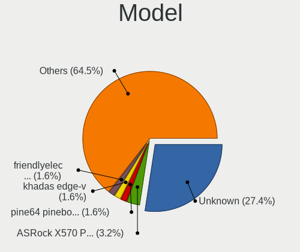

| Name                              | Desktops | Percent |
|-----------------------------------|----------|---------|
| Unknown                           | 10       | 22.73%  |
| RPi rpi                           | 1        | 2.27%   |
| pine64 pinebook-pro-rk3399        | 1        | 2.27%   |
| MSI MS-7C79                       | 1        | 2.27%   |
| MSI MS-7C75                       | 1        | 2.27%   |
| MSI MS-7B89                       | 1        | 2.27%   |
| MSI MS-7B86                       | 1        | 2.27%   |
| khadas edge-v                     | 1        | 2.27%   |
| HP EliteDesk 800 G4 SFF           | 1        | 2.27%   |
| Gigabyte X570 AORUS MASTER        | 1        | 2.27%   |
| Gigabyte X570 AORUS ELITE         | 1        | 2.27%   |
| Gigabyte X399 DESIGNARE EX        | 1        | 2.27%   |
| Gigabyte B550I AORUS PRO AX       | 1        | 2.27%   |
| Gigabyte B450M S2H                | 1        | 2.27%   |
| Gigabyte B450M DS3H               | 1        | 2.27%   |
| Gigabyte 970A-UD3P                | 1        | 2.27%   |
| friendlyelec nanopi-m4            | 1        | 2.27%   |
| Dell OptiPlex 5090                | 1        | 2.27%   |
| Dell OptiPlex 5080                | 1        | 2.27%   |
| Beckhoff Automation CX2033-0185   | 1        | 2.27%   |
| Beckhoff Automation CBxx63        | 1        | 2.27%   |
| ASUS TUF GAMING B550-PLUS         | 1        | 2.27%   |
| ASUS ROG STRIX X570-E GAMING      | 1        | 2.27%   |
| ASUS ROG STRIX B550-I GAMING      | 1        | 2.27%   |
| ASUS PRIME Z590-A                 | 1        | 2.27%   |
| ASUS PRIME Z390-P                 | 1        | 2.27%   |
| ASUS PRIME X570-PRO               | 1        | 2.27%   |
| ASUS PRIME B550-PLUS              | 1        | 2.27%   |
| ASUS PRIME B450M-GAMING/BR        | 1        | 2.27%   |
| ASUS PRIME B450M-A                | 1        | 2.27%   |
| ASUS P8H77-M PRO                  | 1        | 2.27%   |
| ASRock X570 Phantom Gaming 4      | 1        | 2.27%   |
| ASRock B550 Phantom Gaming-ITX/ax | 1        | 2.27%   |
| ASRock B450 Steel Legend          | 1        | 2.27%   |
| ASRock 4X4 BOX                    | 1        | 2.27%   |

Model Family
------------

Motherboard model prefix

| Name                            | Desktops | Percent |
|---------------------------------|----------|---------|
| Unknown                         | 10       | 22.73%  |
| ASUS PRIME                      | 6        | 13.64%  |
| Gigabyte X570                   | 2        | 4.55%   |
| Gigabyte B450M                  | 2        | 4.55%   |
| Dell OptiPlex                   | 2        | 4.55%   |
| ASUS ROG                        | 2        | 4.55%   |
| RPi rpi                         | 1        | 2.27%   |
| pine64 pinebook-pro-rk3399      | 1        | 2.27%   |
| MSI MS-7C79                     | 1        | 2.27%   |
| MSI MS-7C75                     | 1        | 2.27%   |
| MSI MS-7B89                     | 1        | 2.27%   |
| MSI MS-7B86                     | 1        | 2.27%   |
| khadas edge-v                   | 1        | 2.27%   |
| HP EliteDesk                    | 1        | 2.27%   |
| Gigabyte X399                   | 1        | 2.27%   |
| Gigabyte B550I                  | 1        | 2.27%   |
| Gigabyte 970A-UD3P              | 1        | 2.27%   |
| friendlyelec nanopi-m4          | 1        | 2.27%   |
| Beckhoff Automation CX2033-0185 | 1        | 2.27%   |
| Beckhoff Automation CBxx63      | 1        | 2.27%   |
| ASUS TUF                        | 1        | 2.27%   |
| ASUS P8H77-M                    | 1        | 2.27%   |
| ASRock X570                     | 1        | 2.27%   |
| ASRock B550                     | 1        | 2.27%   |
| ASRock B450                     | 1        | 2.27%   |
| ASRock 4X4                      | 1        | 2.27%   |

MFG Year
--------

Motherboard manufacture year

| Year    | Desktops | Percent |
|---------|----------|---------|
| 2021    | 11       | 25%     |
| 2020    | 9        | 20.45%  |
| Unknown | 8        | 18.18%  |
| 2019    | 7        | 15.91%  |
| 2018    | 5        | 11.36%  |
| 2022    | 2        | 4.55%   |
| 2016    | 1        | 2.27%   |
| 2012    | 1        | 2.27%   |

Form Factor
-----------

Physical design of the computer

| Name    | Desktops | Percent |
|---------|----------|---------|
| Desktop | 44       | 100%    |

Coreboot
--------

Have coreboot on board

| Used | Desktops | Percent |
|------|----------|---------|
| No   | 44       | 100%    |

RAM Size
--------

Total RAM memory

| Size in GB  | Desktops | Percent |
|-------------|----------|---------|
| 16.01-24.0  | 13       | 29.55%  |
| 64.01-256.0 | 10       | 22.73%  |
| 32.01-64.0  | 6        | 13.64%  |
| 4.01-8.0    | 5        | 11.36%  |
| 8.01-16.0   | 5        | 11.36%  |
| 3.01-4.0    | 2        | 4.55%   |
| 0.51-1.0    | 2        | 4.55%   |
| 0.01-0.5    | 1        | 2.27%   |

RAM Used
--------

Used RAM memory

| Used GB     | Desktops | Percent |
|-------------|----------|---------|
| 1.01-2.0    | 14       | 31.82%  |
| 0.51-1.0    | 10       | 22.73%  |
| 0.01-0.5    | 10       | 22.73%  |
| 2.01-3.0    | 4        | 9.09%   |
| 3.01-4.0    | 2        | 4.55%   |
| 0           | 2        | 4.55%   |
| 64.01-256.0 | 1        | 2.27%   |
| 16.01-24.0  | 1        | 2.27%   |

Total Drives
------------

Number of drives on board

| Drives | Desktops | Percent |
|--------|----------|---------|
| 0      | 12       | 27.27%  |
| 1      | 11       | 25%     |
| 3      | 7        | 15.91%  |
| 2      | 7        | 15.91%  |
| 6      | 3        | 6.82%   |
| 15     | 1        | 2.27%   |
| 7      | 1        | 2.27%   |
| 5      | 1        | 2.27%   |
| 4      | 1        | 2.27%   |

Has CD-ROM
----------

Has CD-ROM on board

| Presented | Desktops | Percent |
|-----------|----------|---------|
| No        | 37       | 84.09%  |
| Yes       | 7        | 15.91%  |

Has Ethernet
------------

Has Ethernet on board

| Presented | Desktops | Percent |
|-----------|----------|---------|
| Yes       | 34       | 77.27%  |
| No        | 10       | 22.73%  |

Has WiFi
--------

Has WiFi module

| Presented | Desktops | Percent |
|-----------|----------|---------|
| No        | 27       | 61.36%  |
| Yes       | 17       | 38.64%  |

Has Bluetooth
-------------

Has Bluetooth module

| Presented | Desktops | Percent |
|-----------|----------|---------|
| No        | 33       | 75%     |
| Yes       | 11       | 25%     |

Location
--------

Country
-------

Geographic location (country)

| Country      | Desktops | Percent |
|--------------|----------|---------|
| Russia       | 9        | 20.45%  |
| Germany      | 8        | 18.18%  |
| Ukraine      | 4        | 9.09%   |
| UK           | 4        | 9.09%   |
| USA          | 3        | 6.82%   |
| Brazil       | 3        | 6.82%   |
| Romania      | 2        | 4.55%   |
| Japan        | 2        | 4.55%   |
| Switzerland  | 1        | 2.27%   |
| Sweden       | 1        | 2.27%   |
| Saudi Arabia | 1        | 2.27%   |
| Portugal     | 1        | 2.27%   |
| Netherlands  | 1        | 2.27%   |
| France       | 1        | 2.27%   |
| Denmark      | 1        | 2.27%   |
| Canada       | 1        | 2.27%   |
| Austria      | 1        | 2.27%   |

City
----

Geographic location (city)

| City                        | Desktops | Percent |
|-----------------------------|----------|---------|
| Moscow                      | 4        | 8.89%   |
| Kyiv                        | 3        | 6.67%   |
| St Petersburg               | 2        | 4.44%   |
| Rio de Janeiro              | 2        | 4.44%   |
| Rietberg                    | 2        | 4.44%   |
| Krasnodar                   | 2        | 4.44%   |
| Egham                       | 2        | 4.44%   |
| Cambridge                   | 2        | 4.44%   |
| ЕЊta-ku                   | 1        | 2.22%   |
| Zurich                      | 1        | 2.22%   |
| Zaporizhzhya                | 1        | 2.22%   |
| Vila Real de Santo António | 1        | 2.22%   |
| Stolberg                    | 1        | 2.22%   |
| Sollentuna                  | 1        | 2.22%   |
| Satu Mare                   | 1        | 2.22%   |
| Santa Monica                | 1        | 2.22%   |
| Riyadh                      | 1        | 2.22%   |
| Orenburg                    | 1        | 2.22%   |
| Northeim                    | 1        | 2.22%   |
| Ludwigsburg                 | 1        | 2.22%   |
| Lake Forest                 | 1        | 2.22%   |
| Kongens Lyngby              | 1        | 2.22%   |
| Jaboatao dos Guararapes     | 1        | 2.22%   |
| Innisfil                    | 1        | 2.22%   |
| Graz                        | 1        | 2.22%   |
| Göttingen                  | 1        | 2.22%   |
| Fuchu                       | 1        | 2.22%   |
| Cologne                     | 1        | 2.22%   |
| Claix                       | 1        | 2.22%   |
| Chicago                     | 1        | 2.22%   |
| Bunkyo-ku                   | 1        | 2.22%   |
| Berlin                      | 1        | 2.22%   |
| Arad                        | 1        | 2.22%   |
| Amsterdam                   | 1        | 2.22%   |

Drives
------

Drive Vendor
------------

Hard drive vendors

| Vendor              | Desktops | Drives | Percent |
|---------------------|----------|--------|---------|
| WDC                 | 13       | 19     | 24.07%  |
| Samsung Electronics | 9        | 18     | 16.67%  |
| Seagate             | 6        | 18     | 11.11%  |
| Crucial             | 5        | 12     | 9.26%   |
| Toshiba             | 4        | 8      | 7.41%   |
| Kingston            | 4        | 5      | 7.41%   |
| A-DATA Technology   | 3        | 3      | 5.56%   |
| SK hynix            | 2        | 2      | 3.7%    |
| Intel               | 2        | 2      | 3.7%    |
| PNY                 | 1        | 1      | 1.85%   |
| Micron Technology   | 1        | 2      | 1.85%   |
| HGST                | 1        | 2      | 1.85%   |
| Goodram             | 1        | 1      | 1.85%   |
| FORESEE             | 1        | 1      | 1.85%   |
| Apacer              | 1        | 1      | 1.85%   |

Drive Model
-----------

Hard drive models

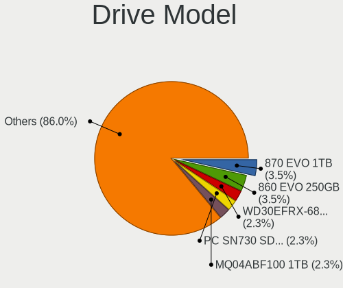

| Model                                | Desktops | Percent |
|--------------------------------------|----------|---------|
| Samsung SSD 870 EVO 1TB              | 3        | 4.62%   |
| WDC WD30EFRX-68EUZN0 3TB             | 2        | 3.08%   |
| WDC PC SN730 SDBQNTY-256G-1001 256GB | 2        | 3.08%   |
| Toshiba MQ04ABF100 1TB               | 2        | 3.08%   |
| Samsung SSD 980 PRO 1TB              | 2        | 3.08%   |
| Samsung SSD 860 EVO 250GB            | 2        | 3.08%   |
| Kingston SA2000M81000G 1TB           | 2        | 3.08%   |
| WDC WDS250G2B0C-00PXH0 250GB         | 1        | 1.54%   |
| WDC WDS100T2B0A-00SM50 1TB           | 1        | 1.54%   |
| WDC WD60EFRX-68TGBN1 6TB             | 1        | 1.54%   |
| WDC WD5002ABYS-18B1B0 500GB          | 1        | 1.54%   |
| WDC WD40EZRZ-75GXCB0 4TB             | 1        | 1.54%   |
| WDC WD20EZRZ-00Z5HB0 2TB             | 1        | 1.54%   |
| WDC WD120EFAX-68UNTN0 12TB           | 1        | 1.54%   |
| WDC WD10SPZX-21Z10T0 1TB             | 1        | 1.54%   |
| WDC WD10JMVW-11AJGS3 1TB             | 1        | 1.54%   |
| WDC WD10EZEX-60WN4A0 1TB             | 1        | 1.54%   |
| WDC WD10EZEX-00RKKA0 1TB             | 1        | 1.54%   |
| WDC WD10EARX-00N0YB0 1TB             | 1        | 1.54%   |
| Toshiba MG09ACA18TE 18TB             | 1        | 1.54%   |
| Toshiba MG06ACA800E 8TB              | 1        | 1.54%   |
| SK hynix PC801 NVMe 2TB              | 1        | 1.54%   |
| SK hynix HFS128G39TND-N210A 128GB    | 1        | 1.54%   |
| Seagate ST8000VN0022-2EL112 8TB      | 1        | 1.54%   |
| Seagate ST5000LM000-2U8170 5TB       | 1        | 1.54%   |
| Seagate ST4000DM000-1F2168 4TB       | 1        | 1.54%   |
| Seagate ST3750640AS 752GB            | 1        | 1.54%   |
| Seagate ST32000641AS 2TB             | 1        | 1.54%   |
| Seagate ST3000DM007-1WY10G 3TB       | 1        | 1.54%   |
| Seagate ST3000DM001-1ER166 3TB       | 1        | 1.54%   |
| Samsung SSD 980 1TB                  | 1        | 1.54%   |
| Samsung SSD 970 EVO Plus 500GB       | 1        | 1.54%   |
| Samsung SSD 970 EVO Plus 1TB         | 1        | 1.54%   |
| Samsung SSD 970 EVO 500GB            | 1        | 1.54%   |
| Samsung SSD 870 QVO 1TB              | 1        | 1.54%   |
| Samsung SSD 860 EVO 4TB              | 1        | 1.54%   |
| Samsung SSD 850 EVO 500GB            | 1        | 1.54%   |
| Samsung SSD 850 EVO 250GB            | 1        | 1.54%   |
| PNY CS3030 1TB SSD                   | 1        | 1.54%   |
| Micron 2300_MTFDHBA512TDV 512GB      | 1        | 1.54%   |

HDD Vendor
----------

Hard disk drive vendors

| Vendor  | Desktops | Drives | Percent |
|---------|----------|--------|---------|
| WDC     | 9        | 14     | 45%     |
| Seagate | 6        | 18     | 30%     |
| Toshiba | 4        | 8      | 20%     |
| HGST    | 1        | 2      | 5%      |

SSD Vendor
----------

Solid state drive vendors

| Vendor              | Desktops | Drives | Percent |
|---------------------|----------|--------|---------|
| Samsung Electronics | 7        | 11     | 33.33%  |
| Crucial             | 4        | 9      | 19.05%  |
| A-DATA Technology   | 3        | 3      | 14.29%  |
| Kingston            | 2        | 3      | 9.52%   |
| WDC                 | 1        | 2      | 4.76%   |
| SK hynix            | 1        | 1      | 4.76%   |
| Intel               | 1        | 1      | 4.76%   |
| Goodram             | 1        | 1      | 4.76%   |
| Apacer              | 1        | 1      | 4.76%   |

Drive Kind
----------

HDD or SSD

| Kind | Desktops | Drives | Percent |
|------|----------|--------|---------|
| SSD  | 20       | 32     | 38.46%  |
| NVMe | 16       | 21     | 30.77%  |
| HDD  | 16       | 42     | 30.77%  |

Drive Connector
---------------

SATA, SAS, NVMe, etc.

| Type | Desktops | Drives | Percent |
|------|----------|--------|---------|
| SATA | 27       | 74     | 62.79%  |
| NVMe | 16       | 21     | 37.21%  |

Drive Size
----------

Size of hard drive

| Size in TB | Desktops | Drives | Percent |
|------------|----------|--------|---------|
| 0.51-1.0   | 14       | 21     | 34.15%  |
| 0.01-0.5   | 13       | 20     | 31.71%  |
| 4.01-10.0  | 4        | 20     | 9.76%   |
| 2.01-3.0   | 3        | 4      | 7.32%   |
| 1.01-2.0   | 3        | 3      | 7.32%   |
| 3.01-4.0   | 2        | 3      | 4.88%   |
| 10.01-20.0 | 2        | 3      | 4.88%   |

Space Total
-----------

Amount of disk space available on the file system

| Size in GB     | Desktops | Percent |
|----------------|----------|---------|
| 101-250        | 12       | 27.27%  |
| 251-500        | 11       | 25%     |
| 1-20           | 8        | 18.18%  |
| 501-1000       | 6        | 13.64%  |
| 2001-3000      | 3        | 6.82%   |
| More than 3000 | 2        | 4.55%   |
| 51-100         | 2        | 4.55%   |

Space Used
----------

Amount of used disk space

| Used GB        | Desktops | Percent |
|----------------|----------|---------|
| 1-20           | 27       | 60%     |
| 21-50          | 9        | 20%     |
| 101-250        | 2        | 4.44%   |
| 1001-2000      | 2        | 4.44%   |
| More than 3000 | 1        | 2.22%   |
| 251-500        | 1        | 2.22%   |
| 501-1000       | 1        | 2.22%   |
| 51-100         | 1        | 2.22%   |
| 0              | 1        | 2.22%   |

Malfunc. Drives
---------------

Drive models with a malfunction

| Model                               | Desktops | Drives | Percent |
|-------------------------------------|----------|--------|---------|
| Samsung Electronics SSD 870 EVO 1TB | 3        | 5      | 50%     |
| WDC WD60EFRX-68TGBN1 6TB            | 1        | 3      | 16.67%  |
| WDC WD5002ABYS-18B1B0 500GB         | 1        | 1      | 16.67%  |
| Kingston SA400S37120G 120GB         | 1        | 1      | 16.67%  |

Malfunc. Drive Vendor
---------------------

Vendors of faulty drives

| Vendor              | Desktops | Drives | Percent |
|---------------------|----------|--------|---------|
| Samsung Electronics | 3        | 5      | 50%     |
| WDC                 | 2        | 4      | 33.33%  |
| Kingston            | 1        | 1      | 16.67%  |

Malfunc. HDD Vendor
-------------------

Vendors of faulty HDD drives

| Vendor | Desktops | Drives | Percent |
|--------|----------|--------|---------|
| WDC    | 2        | 4      | 100%    |

Malfunc. Drive Kind
-------------------

Kinds of faulty drives

| Kind | Desktops | Drives | Percent |
|------|----------|--------|---------|
| SSD  | 3        | 6      | 60%     |
| HDD  | 2        | 4      | 40%     |

Failed Drives
-------------

Failed drive models

Zero info for selected period =(

Failed Drive Vendor
-------------------

Failed drive vendors

Zero info for selected period =(

Drive Status
------------

Number of failed and malfunc. drives

| Status  | Desktops | Drives | Percent |
|---------|----------|--------|---------|
| Works   | 31       | 85     | 86.11%  |
| Malfunc | 5        | 10     | 13.89%  |

Storage controller
------------------

Storage Vendor
--------------

Storage controller vendors

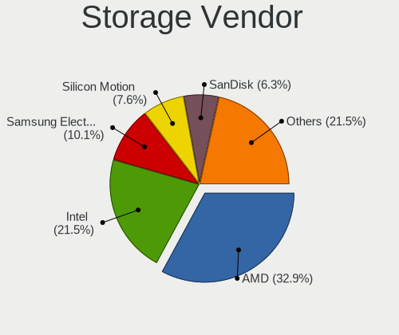

| Vendor                      | Desktops | Percent |
|-----------------------------|----------|---------|
| AMD                         | 20       | 33.9%   |
| Intel                       | 12       | 20.34%  |
| Samsung Electronics         | 7        | 11.86%  |
| Silicon Motion              | 4        | 6.78%   |
| SanDisk                     | 4        | 6.78%   |
| Kingston Technology Company | 3        | 5.08%   |
| Micron/Crucial Technology   | 2        | 3.39%   |
| Marvell Technology Group    | 2        | 3.39%   |
| ASMedia Technology          | 2        | 3.39%   |
| SK hynix                    | 1        | 1.69%   |
| Phison Electronics          | 1        | 1.69%   |
| Micron Technology           | 1        | 1.69%   |

Storage Model
-------------

Storage controller models

| Model                                                                       | Desktops | Percent |
|-----------------------------------------------------------------------------|----------|---------|
| AMD FCH SATA Controller [AHCI mode]                                         | 13       | 19.12%  |
| AMD 400 Series Chipset SATA Controller                                      | 7        | 10.29%  |
| Samsung NVMe SSD Controller SM981/PM981/PM983                               | 5        | 7.35%   |
| Silicon Motion SM2263EN/SM2263XT SSD Controller                             | 4        | 5.88%   |
| Intel Comet Lake SATA AHCI Controller                                       | 4        | 5.88%   |
| AMD 500 Series Chipset SATA Controller                                      | 4        | 5.88%   |
| Kingston Company A2000 NVMe SSD                                             | 3        | 4.41%   |
| SanDisk WD Blue SN550 NVMe SSD                                              | 2        | 2.94%   |
| SanDisk WD Black SN750 / PC SN730 NVMe SSD                                  | 2        | 2.94%   |
| Samsung NVMe SSD Controller PM9A1/PM9A3/980PRO                              | 2        | 2.94%   |
| Intel Cannon Lake PCH SATA AHCI Controller                                  | 2        | 2.94%   |
| Intel 500 Series Chipset Family SATA AHCI Controller                        | 2        | 2.94%   |
| Unknown                                                                     | 2        | 2.94%   |
| Samsung NVMe SSD Controller SM961/PM961/SM963                               | 1        | 1.47%   |
| Samsung NVMe SSD Controller 980                                             | 1        | 1.47%   |
| Phison E12 NVMe Controller                                                  | 1        | 1.47%   |
| Micron/Crucial P2 NVMe PCIe SSD                                             | 1        | 1.47%   |
| Micron/Crucial P1 NVMe PCIe SSD                                             | 1        | 1.47%   |
| Marvell Group 88SE9172 SATA III 6Gb/s RAID Controller                       | 1        | 1.47%   |
| Marvell Group 88SE9170 PCIe 2.0 x1 2-port SATA 6 Gb/s Controller            | 1        | 1.47%   |
| Intel SSD Pro 7600p/760p/E 6100p Series                                     | 1        | 1.47%   |
| Intel Atom Processor E3800 Series SATA AHCI Controller                      | 1        | 1.47%   |
| Intel 82801 Mobile SATA Controller [RAID mode]                              | 1        | 1.47%   |
| Intel 7 Series/C210 Series Chipset Family 4-port SATA Controller [IDE mode] | 1        | 1.47%   |
| Intel 7 Series/C210 Series Chipset Family 2-port SATA Controller [IDE mode] | 1        | 1.47%   |
| ASMedia ASM1166 Serial ATA Controller                                       | 1        | 1.47%   |
| ASMedia ASM1062 Serial ATA Controller                                       | 1        | 1.47%   |
| AMD X399 Series Chipset SATA Controller                                     | 1        | 1.47%   |
| AMD SB7x0/SB8x0/SB9x0 SATA Controller [AHCI mode]                           | 1        | 1.47%   |

Storage Kind
------------

Kind of storage controller (IDE, SATA, NVMe, SAS, ...)

| Kind | Desktops | Percent |
|------|----------|---------|
| SATA | 30       | 53.57%  |
| NVMe | 24       | 42.86%  |
| RAID | 1        | 1.79%   |
| IDE  | 1        | 1.79%   |

Processor
---------

CPU Vendor
----------

Processor vendors

| Vendor   | Desktops | Percent |
|----------|----------|---------|
| AMD      | 21       | 46.67%  |
| Intel    | 11       | 24.44%  |
| ARM      | 6        | 13.33%  |
| Unknown  | 6        | 13.33%  |
| Research | 1        | 2.22%   |

CPU Model
---------

Processor models

| Model                                          | Desktops | Percent |
|------------------------------------------------|----------|---------|
|                                                | 6        | 13.33%  |
| AMD Ryzen 5 5600G with Radeon Graphics         | 4        | 8.89%   |
| ARM Cortex-A55 r2p0                            | 2        | 4.44%   |
| ARM Cortex-A53 r0p4                            | 2        | 4.44%   |
| AMD Ryzen 9 5950X 16-Core Processor            | 2        | 4.44%   |
| AMD Ryzen 9 3900X 12-Core Processor            | 2        | 4.44%   |
| Research Morello SoC r0p0                      | 1        | 2.22%   |
| Intel Core i7-8750H CPU @ 2.20GHz              | 1        | 2.22%   |
| Intel Core i7-8700 CPU @ 3.20GHz               | 1        | 2.22%   |
| Intel Core i7-3770 CPU @ 3.40GHz               | 1        | 2.22%   |
| Intel Core i7-10700K CPU @ 3.80GHz             | 1        | 2.22%   |
| Intel Core i7-10700 CPU @ 2.90GHz              | 1        | 2.22%   |
| Intel Core i5-9600K CPU @ 3.70GHz              | 1        | 2.22%   |
| Intel Core i5-10500T CPU @ 2.30GHz             | 1        | 2.22%   |
| Intel Core i5-10400 CPU @ 2.90GHz              | 1        | 2.22%   |
| Intel Atom CPU E3827 @ 1.74GHz                 | 1        | 2.22%   |
| Intel 11th Gen Core i7-11700 @ 2.50GHz         | 1        | 2.22%   |
| Intel 11th Gen Core i5-11400 @ 2.60GHz         | 1        | 2.22%   |
| ARM Cortex-A72 r0p2                            | 1        | 2.22%   |
| ARM ARM1176 r0p7 (ECO: 0x00000000)             | 1        | 2.22%   |
| AMD Ryzen Threadripper 1950X 16-Core Processor | 1        | 2.22%   |
| AMD Ryzen Embedded V1202B with Radeon Vega Gfx | 1        | 2.22%   |
| AMD Ryzen 9 5900X 12-Core Processor            | 1        | 2.22%   |
| AMD Ryzen 9 3950X 16-Core Processor            | 1        | 2.22%   |
| AMD Ryzen 7 5800X 8-Core Processor             | 1        | 2.22%   |
| AMD Ryzen 7 4800U with Radeon Graphics         | 1        | 2.22%   |
| AMD Ryzen 7 2700X Eight-Core Processor         | 1        | 2.22%   |
| AMD Ryzen 5 5600H with Radeon Graphics         | 1        | 2.22%   |
| AMD Ryzen 5 2600X Six-Core Processor           | 1        | 2.22%   |
| AMD Ryzen 5 2600 Six-Core Processor            | 1        | 2.22%   |
| AMD Ryzen 5 2400GE with Radeon Vega Graphics   | 1        | 2.22%   |
| AMD FX-8320E Eight-Core Processor              | 1        | 2.22%   |
| AMD Athlon 3000G with Radeon Vega Graphics     | 1        | 2.22%   |

CPU Model Family
----------------

Processor model prefix

| Model                  | Desktops | Percent |
|------------------------|----------|---------|
| Other                  | 10       | 22.22%  |
| AMD Ryzen 5            | 8        | 17.78%  |
| AMD Ryzen 9            | 6        | 13.33%  |
| Intel Core i7          | 5        | 11.11%  |
| ARM Cortex             | 5        | 11.11%  |
| Intel Core i5          | 3        | 6.67%   |
| AMD Ryzen 7            | 3        | 6.67%   |
| Intel Atom             | 1        | 2.22%   |
| AMD Ryzen Threadripper | 1        | 2.22%   |
| AMD Ryzen Embedded     | 1        | 2.22%   |
| AMD FX                 | 1        | 2.22%   |
| AMD Athlon             | 1        | 2.22%   |

CPU Cores
---------

Number of processor cores

| Number  | Desktops | Percent |
|---------|----------|---------|
| Unknown | 12       | 27.27%  |
| 12      | 7        | 15.91%  |
| 6       | 6        | 13.64%  |
| 8       | 5        | 11.36%  |
| 32      | 4        | 9.09%   |
| 24      | 3        | 6.82%   |
| 16      | 3        | 6.82%   |
| 4       | 2        | 4.55%   |
| 2       | 2        | 4.55%   |

CPU Sockets
-----------

Number of sockets

| Number  | Desktops | Percent |
|---------|----------|---------|
| 1       | 36       | 80%     |
| Unknown | 9        | 20%     |

CPU Threads
-----------

Threads per core (Hyper-Threading)

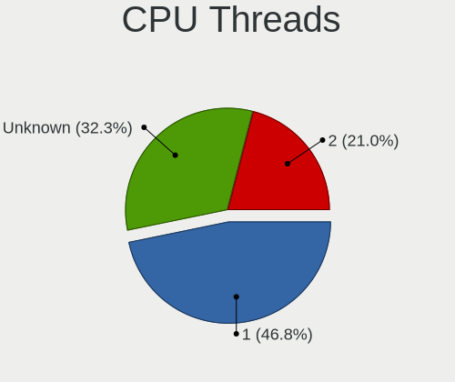

| Number  | Desktops | Percent |
|---------|----------|---------|
| 1       | 23       | 52.27%  |
| Unknown | 12       | 27.27%  |
| 2       | 9        | 20.45%  |

CPU Microarch
-------------

Microarchitecture

| Name       | Desktops | Percent |
|------------|----------|---------|
| Unknown    | 14       | 31.82%  |
| Zen 3      | 9        | 20.45%  |
| Zen+       | 4        | 9.09%   |
| Zen 2      | 4        | 9.09%   |
| CometLake  | 4        | 9.09%   |
| Zen        | 3        | 6.82%   |
| KabyLake   | 3        | 6.82%   |
| Silvermont | 1        | 2.27%   |
| Piledriver | 1        | 2.27%   |
| IvyBridge  | 1        | 2.27%   |

Graphics
--------

GPU Vendor
----------

Vendors of graphics cards

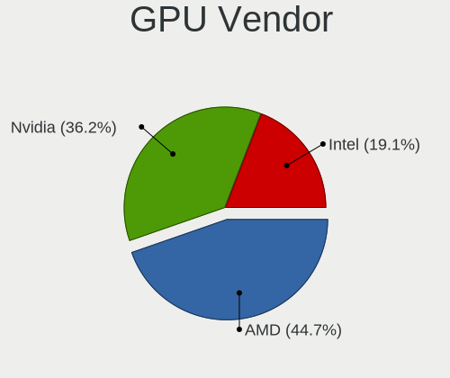

| Vendor | Desktops | Percent |
|--------|----------|---------|
| Nvidia | 15       | 41.67%  |
| AMD    | 14       | 38.89%  |
| Intel  | 7        | 19.44%  |

GPU Model
---------

Graphics card models

| Model                                                                 | Desktops | Percent |
|-----------------------------------------------------------------------|----------|---------|
| AMD Cezanne [Radeon Vega Series / Radeon Vega Mobile Series]          | 5        | 13.89%  |
| Nvidia GP108 [GeForce GT 1030]                                        | 2        | 5.56%   |
| Nvidia GK208B [GeForce GT 710]                                        | 2        | 5.56%   |
| Intel CometLake-S GT2 [UHD Graphics 630]                              | 2        | 5.56%   |
| AMD Raven Ridge [Radeon Vega Series / Radeon Vega Mobile Series]      | 2        | 5.56%   |
| Nvidia TU116 [GeForce GTX 1660]                                       | 1        | 2.78%   |
| Nvidia GT218 [GeForce 210]                                            | 1        | 2.78%   |
| Nvidia GP107M [GeForce GTX 1050 Mobile]                               | 1        | 2.78%   |
| Nvidia GP107GL [Quadro P620]                                          | 1        | 2.78%   |
| Nvidia GP107 [GeForce GTX 1050]                                       | 1        | 2.78%   |
| Nvidia GP107 [GeForce GTX 1050 Ti]                                    | 1        | 2.78%   |
| Nvidia GP106 [GeForce GTX 1060 3GB]                                   | 1        | 2.78%   |
| Nvidia GM206 [GeForce GTX 960]                                        | 1        | 2.78%   |
| Nvidia GM107 [GeForce GTX 750 Ti]                                     | 1        | 2.78%   |
| Nvidia GA104 [GeForce RTX 3060 Ti]                                    | 1        | 2.78%   |
| Nvidia GA102 [GeForce RTX 3080 Ti]                                    | 1        | 2.78%   |
| Intel RocketLake-S GT1 [UHD Graphics 750]                             | 1        | 2.78%   |
| Intel IvyBridge GT2 [HD Graphics 4000]                                | 1        | 2.78%   |
| Intel CoffeeLake-S GT2 [UHD Graphics 630]                             | 1        | 2.78%   |
| Intel CoffeeLake-H GT2 [UHD Graphics 630]                             | 1        | 2.78%   |
| Intel Atom Processor Z36xxx/Z37xxx Series Graphics & Display          | 1        | 2.78%   |
| AMD RV630 XT [Radeon HD 2600 XT]                                      | 1        | 2.78%   |
| AMD Renoir                                                            | 1        | 2.78%   |
| AMD Picasso/Raven 2 [Radeon Vega Series / Radeon Vega Mobile Series]  | 1        | 2.78%   |
| AMD Oland [Radeon HD 8570 / R5 430 OEM / R7 240/340 / Radeon 520 OEM] | 1        | 2.78%   |
| AMD Ellesmere [Radeon RX 470/480/570/570X/580/580X/590]               | 1        | 2.78%   |
| AMD Cape Verde PRO [Radeon HD 7750/8740 / R7 250E]                    | 1        | 2.78%   |
| AMD Baffin [Radeon RX 460/560D / Pro 450/455/460/555/555X/560/560X]   | 1        | 2.78%   |

GPU Combo
---------

Combinations of graphics cards

| Name           | Desktops | Percent |
|----------------|----------|---------|
| 1 x Nvidia     | 13       | 29.55%  |
| Other          | 12       | 27.27%  |
| 1 x AMD        | 12       | 27.27%  |
| 1 x Intel      | 4        | 9.09%   |
| Intel + Nvidia | 2        | 4.55%   |
| Intel + AMD    | 1        | 2.27%   |

GPU Driver
----------

Free vs proprietary

| Driver      | Desktops | Percent |
|-------------|----------|---------|
| Free        | 19       | 43.18%  |
| Proprietary | 13       | 29.55%  |
| Unknown     | 12       | 27.27%  |

GPU Memory
----------

Total video memory

| Size in GB | Desktops | Percent |
|------------|----------|---------|
| Unknown    | 25       | 56.82%  |
| 1.01-2.0   | 7        | 15.91%  |
| 3.01-4.0   | 3        | 6.82%   |
| 0.51-1.0   | 3        | 6.82%   |
| 7.01-8.0   | 2        | 4.55%   |
| 5.01-6.0   | 1        | 2.27%   |
| 2.01-3.0   | 1        | 2.27%   |
| 8.01-16.0  | 1        | 2.27%   |
| 0.01-0.5   | 1        | 2.27%   |

Monitor
-------

Monitor Vendor
--------------

Monitor vendors

| Vendor              | Desktops | Percent |
|---------------------|----------|---------|
| Goldstar            | 5        | 19.23%  |
| Dell                | 5        | 19.23%  |
| Sony                | 2        | 7.69%   |
| Samsung Electronics | 2        | 7.69%   |
| RTK                 | 2        | 7.69%   |
| LG Electronics      | 2        | 7.69%   |
| BenQ                | 2        | 7.69%   |
| Philips             | 1        | 3.85%   |
| Lenovo              | 1        | 3.85%   |
| Hewlett-Packard     | 1        | 3.85%   |
| Eizo                | 1        | 3.85%   |
| BOE                 | 1        | 3.85%   |
| AOC                 | 1        | 3.85%   |

Monitor Model
-------------

Monitor models

| Model                                                                  | Desktops | Percent |
|------------------------------------------------------------------------|----------|---------|
| RTK WCS Display RTK1A1B 1920x1080 344x195mm 15.6-inch                  | 2        | 7.41%   |
| Sony TV SNY4B03 1920x1080 930x520mm 41.9-inch                          | 1        | 3.7%    |
| Sony TV  *30 SNY05D1 3840x2160 1660x930mm 74.9-inch                    | 1        | 3.7%    |
| Samsung Electronics SyncMaster SAM05FC 1920x1080                       | 1        | 3.7%    |
| Samsung Electronics LCD Monitor SAM0A7D 1920x1080 1020x570mm 46.0-inch | 1        | 3.7%    |
| Philips PHL 273V7 PHLC156 1920x1080 600x340mm 27.2-inch                | 1        | 3.7%    |
| LG Electronics LCD Monitor LX20D 1600x1200                             | 1        | 3.7%    |
| LG Electronics LCD Monitor LG Ultra HD 11520x2160                      | 1        | 3.7%    |
| LG Electronics LCD Monitor LG Ultra HD                                 | 1        | 3.7%    |
| Lenovo LEN X24A LEN60CF 1920x1080 530x300mm 24.0-inch                  | 1        | 3.7%    |
| Hewlett-Packard E233 HPN345F 1920x1080 510x290mm 23.1-inch             | 1        | 3.7%    |
| Goldstar LG Ultra HD GSM5B09 3840x2160 600x340mm 27.2-inch             | 1        | 3.7%    |
| Goldstar LG Ultra HD GSM5B08 3840x2160 600x340mm 27.2-inch             | 1        | 3.7%    |
| Goldstar 27GL650F GSM5B71 1920x1080 530x300mm 24.0-inch                | 1        | 3.7%    |
| Goldstar 27GK750F GSM770F 1920x1080 600x340mm 27.2-inch                | 1        | 3.7%    |
| Goldstar 23EA53 GSM59A8 1920x1080 510x290mm 23.1-inch                  | 1        | 3.7%    |
| Eizo FX2431 ENC2036 1920x1200 520x330mm 24.2-inch                      | 1        | 3.7%    |
| Dell U2719DC DEL417C 2560x1440 600x340mm 27.2-inch                     | 1        | 3.7%    |
| Dell U2518D DEL413C 2560x1440 550x310mm 24.9-inch                      | 1        | 3.7%    |
| Dell U2412M DELA07A 1920x1200 520x320mm 24.0-inch                      | 1        | 3.7%    |
| Dell LCD Monitor U2715H 2560x1440                                      | 1        | 3.7%    |
| Dell LCD Monitor S2422HG 1920x1080                                     | 1        | 3.7%    |
| BOE LCD Monitor BOE06E2 1920x1080 310x170mm 13.9-inch                  | 1        | 3.7%    |
| BenQ LCD Monitor BNQ78CA 1920x1080 600x340mm 27.2-inch                 | 1        | 3.7%    |
| BenQ GW2280 BNQ78E8 1920x1080 480x270mm 21.7-inch                      | 1        | 3.7%    |
| AOC U3277WB AOC3277 3840x2160 700x390mm 31.5-inch                      | 1        | 3.7%    |

Monitor Resolution
------------------

Monitor screen resolution

| Resolution        | Desktops | Percent |
|-------------------|----------|---------|
| 1920x1080 (FHD)   | 15       | 55.56%  |
| 3840x2160 (4K)    | 4        | 14.81%  |
| 2560x1440 (QHD)   | 3        | 11.11%  |
| 1920x1200 (WUXGA) | 2        | 7.41%   |
| 1600x1200         | 1        | 3.7%    |
| 11520x2160        | 1        | 3.7%    |
| Unknown           | 1        | 3.7%    |

Monitor Diagonal
----------------

Diagonal size in inches

| Inches  | Desktops | Percent |
|---------|----------|---------|
| 27      | 6        | 23.08%  |
| 24      | 5        | 19.23%  |
| Unknown | 5        | 19.23%  |
| 23      | 2        | 7.69%   |
| 15      | 2        | 7.69%   |
| 74      | 1        | 3.85%   |
| 46      | 1        | 3.85%   |
| 41      | 1        | 3.85%   |
| 32      | 1        | 3.85%   |
| 21      | 1        | 3.85%   |
| 13      | 1        | 3.85%   |

Monitor Width
-------------

Physical width

| Width in mm | Desktops | Percent |
|-------------|----------|---------|
| 501-600     | 13       | 50%     |
| Unknown     | 5        | 19.23%  |
| 301-350     | 3        | 11.54%  |
| 701-800     | 1        | 3.85%   |
| 401-500     | 1        | 3.85%   |
| 1501-2000   | 1        | 3.85%   |
| 1001-1500   | 1        | 3.85%   |
| 901-1000    | 1        | 3.85%   |

Aspect Ratio
------------

Proportional relationship between the width and the height

| Ratio   | Desktops | Percent |
|---------|----------|---------|
| 16/9    | 19       | 76%     |
| Unknown | 4        | 16%     |
| 16/10   | 2        | 8%      |

Monitor Area
------------

Area in inch²

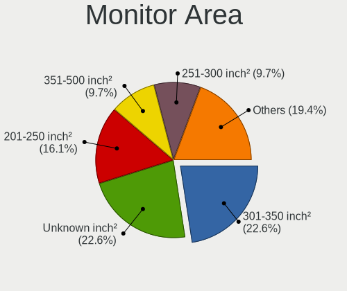

| Area in inch² | Desktops | Percent |
|----------------|----------|---------|
| 301-350        | 6        | 23.08%  |
| 201-250        | 5        | 19.23%  |
| Unknown        | 5        | 19.23%  |
| 251-300        | 3        | 11.54%  |
| 101-110        | 2        | 7.69%   |
| 501-1000       | 2        | 7.69%   |
| More than 1000 | 1        | 3.85%   |
| 81-90          | 1        | 3.85%   |
| 351-500        | 1        | 3.85%   |

Pixel Density
-------------

Pixels per inch

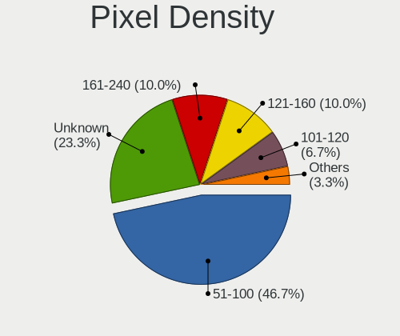

| Density | Desktops | Percent |
|---------|----------|---------|
| 51-100  | 12       | 48%     |
| Unknown | 5        | 20%     |
| 121-160 | 3        | 12%     |
| 161-240 | 2        | 8%      |
| 101-120 | 2        | 8%      |
| 1-50    | 1        | 4%      |

Multiple Monitors
-----------------

Total monitors connected

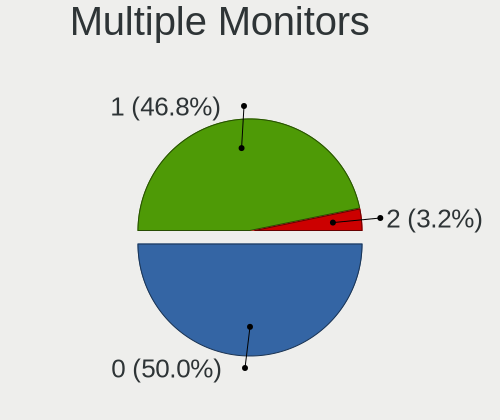

| Total | Desktops | Percent |
|-------|----------|---------|
| 1     | 23       | 52.27%  |
| 0     | 19       | 43.18%  |
| 2     | 2        | 4.55%   |

Network
-------

Net Controller Vendor
---------------------

Controller vendors

| Vendor                          | Desktops | Percent |
|---------------------------------|----------|---------|
| Realtek Semiconductor           | 23       | 43.4%   |
| Intel                           | 22       | 41.51%  |
| Xiaomi                          | 1        | 1.89%   |
| TP-Link                         | 1        | 1.89%   |
| Ralink Technology               | 1        | 1.89%   |
| Qualcomm Atheros Communications | 1        | 1.89%   |
| Qualcomm Atheros                | 1        | 1.89%   |
| Mellanox Technologies           | 1        | 1.89%   |
| ASUSTek Computer                | 1        | 1.89%   |
| Arduino SA                      | 1        | 1.89%   |

Net Controller Model
--------------------

Controller models

| Model                                                                         | Desktops | Percent |
|-------------------------------------------------------------------------------|----------|---------|
| Realtek RTL8111/8168/8411 PCI Express Gigabit Ethernet Controller             | 15       | 22.73%  |
| Realtek RTL8125 2.5GbE Controller                                             | 8        | 12.12%  |
| Intel Wi-Fi 6 AX200                                                           | 6        | 9.09%   |
| Intel I211 Gigabit Network Connection                                         | 6        | 9.09%   |
| Intel 82574L Gigabit Network Connection                                       | 4        | 6.06%   |
| Intel I210 Gigabit Network Connection                                         | 3        | 4.55%   |
| Intel Ethernet Controller I225-V                                              | 3        | 4.55%   |
| Xiaomi Mi/Redmi series (RNDIS + ADB)                                          | 1        | 1.52%   |
| TP-Link Archer T3U [Realtek RTL8812BU]                                        | 1        | 1.52%   |
| Realtek RTL8822CE 802.11ac PCIe Wireless Network Adapter                      | 1        | 1.52%   |
| Realtek RTL8188EUS 802.11n Wireless Network Adapter                           | 1        | 1.52%   |
| Ralink RT2870/RT3070 Wireless Adapter                                         | 1        | 1.52%   |
| Qualcomm Atheros TP-Link TL-WN322G v3 / TL-WN422G v2 802.11g [Atheros AR9271] | 1        | 1.52%   |
| Qualcomm Atheros AR93xx Wireless Network Adapter                              | 1        | 1.52%   |
| Mellanox MT27500 Family [ConnectX-3]                                          | 1        | 1.52%   |
| Intel Wireless-AC 9260                                                        | 1        | 1.52%   |
| Intel Wireless 8265 / 8275                                                    | 1        | 1.52%   |
| Intel Wireless 7265                                                           | 1        | 1.52%   |
| Intel I350 Gigabit Network Connection                                         | 1        | 1.52%   |
| Intel Ethernet Connection (7) I219-LM                                         | 1        | 1.52%   |
| Intel Ethernet Connection (14) I219-LM                                        | 1        | 1.52%   |
| Intel Ethernet Connection (11) I219-V                                         | 1        | 1.52%   |
| Intel Ethernet Connection (11) I219-LM                                        | 1        | 1.52%   |
| Intel Comet Lake PCH CNVi WiFi                                                | 1        | 1.52%   |
| Intel Cannon Lake PCH CNVi WiFi                                               | 1        | 1.52%   |
| Intel 82571EB/82571GB Gigabit Ethernet Controller D0/D1 (copper applications) | 1        | 1.52%   |
| ASUS Realtek 8188EUS [USB-N10 Nano]                                           | 1        | 1.52%   |
| Arduino SA Uno R3 (CDC ACM)                                                   | 1        | 1.52%   |

Wireless Vendor
---------------

Wireless vendors

| Vendor                          | Desktops | Percent |
|---------------------------------|----------|---------|
| Intel                           | 11       | 61.11%  |
| Realtek Semiconductor           | 2        | 11.11%  |
| TP-Link                         | 1        | 5.56%   |
| Ralink Technology               | 1        | 5.56%   |
| Qualcomm Atheros Communications | 1        | 5.56%   |
| Qualcomm Atheros                | 1        | 5.56%   |
| ASUSTek Computer                | 1        | 5.56%   |

Wireless Model
--------------

Wireless models

| Model                                                                         | Desktops | Percent |
|-------------------------------------------------------------------------------|----------|---------|
| Intel Wi-Fi 6 AX200                                                           | 6        | 33.33%  |
| TP-Link Archer T3U [Realtek RTL8812BU]                                        | 1        | 5.56%   |
| Realtek RTL8822CE 802.11ac PCIe Wireless Network Adapter                      | 1        | 5.56%   |
| Realtek RTL8188EUS 802.11n Wireless Network Adapter                           | 1        | 5.56%   |
| Ralink RT2870/RT3070 Wireless Adapter                                         | 1        | 5.56%   |
| Qualcomm Atheros TP-Link TL-WN322G v3 / TL-WN422G v2 802.11g [Atheros AR9271] | 1        | 5.56%   |
| Qualcomm Atheros AR93xx Wireless Network Adapter                              | 1        | 5.56%   |
| Intel Wireless-AC 9260                                                        | 1        | 5.56%   |
| Intel Wireless 8265 / 8275                                                    | 1        | 5.56%   |
| Intel Wireless 7265                                                           | 1        | 5.56%   |
| Intel Comet Lake PCH CNVi WiFi                                                | 1        | 5.56%   |
| Intel Cannon Lake PCH CNVi WiFi                                               | 1        | 5.56%   |
| ASUS Realtek 8188EUS [USB-N10 Nano]                                           | 1        | 5.56%   |

Ethernet Vendor
---------------

Ethernet vendors

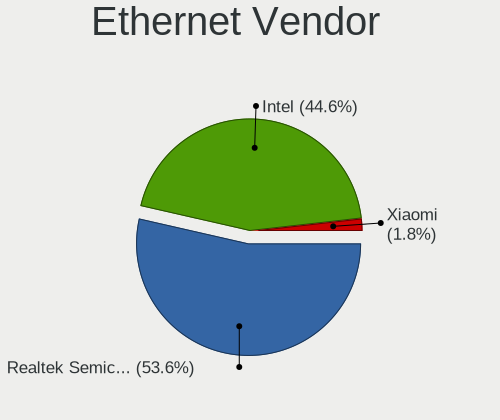

| Vendor                | Desktops | Percent |
|-----------------------|----------|---------|
| Realtek Semiconductor | 20       | 50%     |
| Intel                 | 19       | 47.5%   |
| Xiaomi                | 1        | 2.5%    |

Ethernet Model
--------------

Ethernet models

| Model                                                                         | Desktops | Percent |
|-------------------------------------------------------------------------------|----------|---------|
| Realtek RTL8111/8168/8411 PCI Express Gigabit Ethernet Controller             | 15       | 33.33%  |
| Realtek RTL8125 2.5GbE Controller                                             | 7        | 15.56%  |
| Intel I211 Gigabit Network Connection                                         | 6        | 13.33%  |
| Intel 82574L Gigabit Network Connection                                       | 4        | 8.89%   |
| Intel I210 Gigabit Network Connection                                         | 3        | 6.67%   |
| Intel Ethernet Controller I225-V                                              | 3        | 6.67%   |
| Xiaomi Mi/Redmi series (RNDIS + ADB)                                          | 1        | 2.22%   |
| Intel I350 Gigabit Network Connection                                         | 1        | 2.22%   |
| Intel Ethernet Connection (7) I219-LM                                         | 1        | 2.22%   |
| Intel Ethernet Connection (14) I219-LM                                        | 1        | 2.22%   |
| Intel Ethernet Connection (11) I219-V                                         | 1        | 2.22%   |
| Intel Ethernet Connection (11) I219-LM                                        | 1        | 2.22%   |
| Intel 82571EB/82571GB Gigabit Ethernet Controller D0/D1 (copper applications) | 1        | 2.22%   |

Net Controller Kind
-------------------

Ethernet, WiFi or modem

| Kind     | Desktops | Percent |
|----------|----------|---------|
| Ethernet | 34       | 62.96%  |
| WiFi     | 17       | 31.48%  |
| Unknown  | 2        | 3.7%    |
| Modem    | 1        | 1.85%   |

Used Controller
---------------

Currently used network controller

| Kind     | Desktops | Percent |
|----------|----------|---------|
| Ethernet | 31       | 83.78%  |
| WiFi     | 6        | 16.22%  |

NICs
----

Total network controllers on board

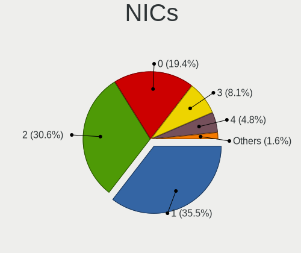

| Total | Desktops | Percent |
|-------|----------|---------|
| 1     | 16       | 36.36%  |
| 2     | 11       | 25%     |
| 0     | 9        | 20.45%  |
| 3     | 4        | 9.09%   |
| 4     | 3        | 6.82%   |
| 7     | 1        | 2.27%   |

IPv6
----

IPv6 vs IPv4

| Used | Desktops | Percent |
|------|----------|---------|
| No   | 39       | 88.64%  |
| Yes  | 5        | 11.36%  |

Bluetooth
---------

Bluetooth Vendor
----------------

Controller vendors

| Vendor                  | Desktops | Percent |
|-------------------------|----------|---------|
| Intel                   | 9        | 81.82%  |
| IMC Networks            | 1        | 9.09%   |
| Cambridge Silicon Radio | 1        | 9.09%   |

Bluetooth Model
---------------

Controller models

| Model                                               | Desktops | Percent |
|-----------------------------------------------------|----------|---------|
| Intel AX200 Bluetooth                               | 4        | 36.36%  |
| Intel Bluetooth wireless interface                  | 2        | 18.18%  |
| Intel Wireless-AC 9260 Bluetooth Adapter            | 1        | 9.09%   |
| Intel Bluetooth 9460/9560 Jefferson Peak (JfP)      | 1        | 9.09%   |
| Intel AX201 Bluetooth                               | 1        | 9.09%   |
| IMC Networks Realtek Bluetooth Adapter              | 1        | 9.09%   |
| Cambridge Silicon Radio Bluetooth Dongle (HCI mode) | 1        | 9.09%   |

Sound
-----

Sound Vendor
------------

Sound card vendors

| Vendor                  | Desktops | Percent |
|-------------------------|----------|---------|
| AMD                     | 21       | 39.62%  |
| Nvidia                  | 15       | 28.3%   |
| Intel                   | 10       | 18.87%  |
| Yamaha                  | 1        | 1.89%   |
| JMTek                   | 1        | 1.89%   |
| GN Netcom               | 1        | 1.89%   |
| C-Media Electronics     | 1        | 1.89%   |
| Blue Microphones        | 1        | 1.89%   |
| AudioQuest              | 1        | 1.89%   |
| AKAI  Professional M.I. | 1        | 1.89%   |

Sound Model
-----------

Sound card models

| Model                                                                      | Desktops | Percent |
|----------------------------------------------------------------------------|----------|---------|
| AMD Family 17h/19h HD Audio Controller                                     | 8        | 12.31%  |
| AMD Starship/Matisse HD Audio Controller                                   | 6        | 9.23%   |
| AMD Renoir Radeon High Definition Audio Controller                         | 6        | 9.23%   |
| Nvidia GP107GL High Definition Audio Controller                            | 4        | 6.15%   |
| AMD Family 17h (Models 00h-0fh) HD Audio Controller                        | 4        | 6.15%   |
| Intel Comet Lake PCH cAVS                                                  | 3        | 4.62%   |
| Intel Cannon Lake PCH cAVS                                                 | 3        | 4.62%   |
| AMD Raven/Raven2/Fenghuang HDMI/DP Audio Controller                        | 3        | 4.62%   |
| Nvidia GP108 High Definition Audio Controller                              | 2        | 3.08%   |
| Nvidia GK208 HDMI/DP Audio Controller                                      | 2        | 3.08%   |
| AMD Oland/Hainan/Cape Verde/Pitcairn HDMI Audio [Radeon HD 7000 Series]    | 2        | 3.08%   |
| Yamaha Steinberg UR12                                                      | 1        | 1.54%   |
| Nvidia TU116 High Definition Audio Controller                              | 1        | 1.54%   |
| Nvidia High Definition Audio Controller                                    | 1        | 1.54%   |
| Nvidia GP106 High Definition Audio Controller                              | 1        | 1.54%   |
| Nvidia GM206 High Definition Audio Controller                              | 1        | 1.54%   |
| Nvidia GM107 High Definition Audio Controller [GeForce 940MX]              | 1        | 1.54%   |
| Nvidia GA104 High Definition Audio Controller                              | 1        | 1.54%   |
| Nvidia GA102 High Definition Audio Controller                              | 1        | 1.54%   |
| JMTek Lioncast USB Gaming Headset                                          | 1        | 1.54%   |
| Intel Tiger Lake-H HD Audio Controller                                     | 1        | 1.54%   |
| Intel Atom Processor Z36xxx/Z37xxx Series High Definition Audio Controller | 1        | 1.54%   |
| Intel 7 Series/C216 Chipset Family High Definition Audio Controller        | 1        | 1.54%   |
| GN Netcom Jabra SPEAK 410 USB                                              | 1        | 1.54%   |
| C-Media Electronics USB PnP Audio Device                                   | 1        | 1.54%   |
| Blue Microphones Yeti Stereo Microphone                                    | 1        | 1.54%   |
| AudioQuest DragonFly                                                       | 1        | 1.54%   |
| AMD SBx00 Azalia (Intel HDA)                                               | 1        | 1.54%   |
| AMD RV630 HDMI Audio [Radeon HD 2600 PRO/XT / HD 3610]                     | 1        | 1.54%   |
| AMD Ellesmere HDMI Audio [Radeon RX 470/480 / 570/580/590]                 | 1        | 1.54%   |
| AMD Baffin HDMI/DP Audio [Radeon RX 550 640SP / RX 560/560X]               | 1        | 1.54%   |
| AKAI  Professional M.I. LPK25 MIDI Keyboard                                | 1        | 1.54%   |
| Unknown                                                                    | 1        | 1.54%   |

Memory
------

Memory Vendor
-------------

Memory module vendors

| Vendor              | Desktops | Percent |
|---------------------|----------|---------|
| Kingston            | 7        | 21.21%  |
| Corsair             | 5        | 15.15%  |
| Unknown             | 3        | 9.09%   |
| SK hynix            | 3        | 9.09%   |
| Micron Technology   | 3        | 9.09%   |
| Crucial             | 3        | 9.09%   |
| Samsung Electronics | 2        | 6.06%   |
| G.Skill             | 2        | 6.06%   |
| Transcend           | 1        | 3.03%   |
| Team                | 1        | 3.03%   |
| Smart               | 1        | 3.03%   |
| A-DATA Technology   | 1        | 3.03%   |
| Unknown             | 1        | 3.03%   |

Memory Model
------------

Memory module models

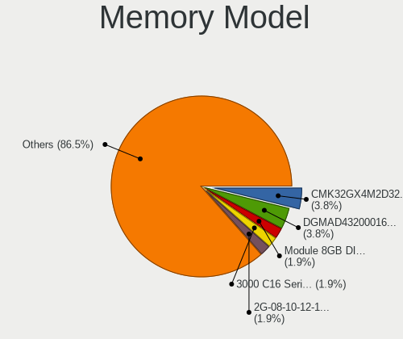

| Model                                                    | Desktops | Percent |
|----------------------------------------------------------|----------|---------|
| Corsair RAM CMK32GX4M2D3200C16 16GB DIMM DDR4 3200MT/s   | 2        | 5.88%   |
| Unknown RAM Module 8GB DIMM DDR3 1600MT/s                | 1        | 2.94%   |
| Unknown RAM 3000 C16 Series 4096MB DIMM DDR4 2933MT/s    | 1        | 2.94%   |
| Unknown RAM 2G-08-10-12-1333 2GB DIMM DDR3 1333MT/s      | 1        | 2.94%   |
| Transcend RAM JM2666HLE-32G 32GB DIMM DDR4 2666MT/s      | 1        | 2.94%   |
| Team RAM TEAMGROUP-UD4-4133 8GB DIMM DDR4 4133MT/s       | 1        | 2.94%   |
| Smart RAM Module 8GB DIMM DDR4 2667MT/s                  | 1        | 2.94%   |
| SK hynix RAM HMAA4GU6CJR8N-XN 32GB DIMM DDR4 3200MT/s    | 1        | 2.94%   |
| SK hynix RAM HMA82GS6DJR8N-XN 16GB SODIMM DDR4 3200MT/s  | 1        | 2.94%   |
| SK hynix RAM HMA81GS6CJR8N-VK 8GB SODIMM DDR4 2667MT/s   | 1        | 2.94%   |
| Samsung RAM M471A4G43AB1-CWE 32GB SODIMM DDR4 3200MT/s   | 1        | 2.94%   |
| Samsung RAM M378A4G43MB1-CTD 32GB DIMM DDR4 2666MT/s     | 1        | 2.94%   |
| Micron RAM 18ASF4G72AZ-3G2B1 32GB DIMM DDR4 3200MT/s     | 1        | 2.94%   |
| Micron RAM 16ATF2G64HZ-2G6J1 16GB SODIMM DDR4 2667MT/s   | 1        | 2.94%   |
| Micron RAM 16ATF2G64AZ-3G2J1 16GB DIMM DDR4 3200MT/s     | 1        | 2.94%   |
| Kingston RAM KHX3200C16D4/32GX 32GB DIMM DDR4 3200MT/s   | 1        | 2.94%   |
| Kingston RAM KHX2933C15D4/8GX 8GB DIMM DDR4 2400MT/s     | 1        | 2.94%   |
| Kingston RAM KHX2666C16/16G 16GB DIMM DDR4 2666MT/s      | 1        | 2.94%   |
| Kingston RAM KHX1600C10D3/ 8GB DIMM DDR3 1866MT/s        | 1        | 2.94%   |
| Kingston RAM 99P5700-016.A00G 16GB SODIMM DDR4 3200MT/s  | 1        | 2.94%   |
| Kingston RAM 9965745-020.A00G 32GB DIMM DDR4 3200MT/s    | 1        | 2.94%   |
| Kingston RAM 9965745-017.A00G 16GB DIMM DDR4 3200MT/s    | 1        | 2.94%   |
| Kingston RAM 9905713-030.A00G 8GB DIMM DDR4 2666MT/s     | 1        | 2.94%   |
| G.Skill RAM F4-3200C16-32GTZN 32GB DIMM DDR4 3200MT/s    | 1        | 2.94%   |
| G.Skill RAM F4-2400C17-8GNT 8GB DIMM DDR4 2400MT/s       | 1        | 2.94%   |
| Crucial RAM CT16G4DFD832A.C16FP 16GB DIMM DDR4 3200MT/s  | 1        | 2.94%   |
| Crucial RAM BL16G36C16U4RL.M16FE 16GB DIMM DDR4 3600MT/s | 1        | 2.94%   |
| Crucial RAM BL16G36C16U4B.M8FB1 16GB DIMM DDR4 3600MT/s  | 1        | 2.94%   |
| Corsair RAM CMK32GX4M2E3200C16 16GB DIMM DDR4 3200MT/s   | 1        | 2.94%   |
| Corsair RAM CMK16GX4M2B3200C16 8GB DIMM DDR4 3200MT/s    | 1        | 2.94%   |
| Corsair RAM CMD128GX4M8A2400C14 16GB DIMM DDR4 2133MT/s  | 1        | 2.94%   |
| A-DATA RAM Module 8GB DIMM DDR4 2667MT/s                 | 1        | 2.94%   |
| Unknown                                                  | 1        | 2.94%   |

Memory Kind
-----------

Memory module kinds

| Kind | Desktops | Percent |
|------|----------|---------|
| DDR4 | 29       | 90.63%  |
| DDR3 | 3        | 9.38%   |

Memory Form Factor
------------------

Physical design of the memory module

| Name   | Desktops | Percent |
|--------|----------|---------|
| DIMM   | 27       | 84.38%  |
| SODIMM | 5        | 15.63%  |

Memory Size
-----------

Memory module size

| Size  | Desktops | Percent |
|-------|----------|---------|
| 16384 | 12       | 36.36%  |
| 8192  | 11       | 33.33%  |
| 32768 | 8        | 24.24%  |
| 4096  | 1        | 3.03%   |
| 2048  | 1        | 3.03%   |

Memory Speed
------------

Memory module speed

| Speed | Desktops | Percent |
|-------|----------|---------|
| 3200  | 14       | 42.42%  |
| 2667  | 4        | 12.12%  |
| 2666  | 4        | 12.12%  |
| 3600  | 2        | 6.06%   |
| 2400  | 2        | 6.06%   |
| 4133  | 1        | 3.03%   |
| 3000  | 1        | 3.03%   |
| 2933  | 1        | 3.03%   |
| 2133  | 1        | 3.03%   |
| 1866  | 1        | 3.03%   |
| 1600  | 1        | 3.03%   |
| 1333  | 1        | 3.03%   |

Printers & scanners
-------------------

Printer Vendor
--------------

Printer device vendors

Zero info for selected period =(

Printer Model
-------------

Printer device models

Zero info for selected period =(

Scanner Vendor
--------------

Scanner device vendors

Zero info for selected period =(

Scanner Model
-------------

Scanner device models

Zero info for selected period =(

Camera
------

Camera Vendor
-------------

Camera device vendors

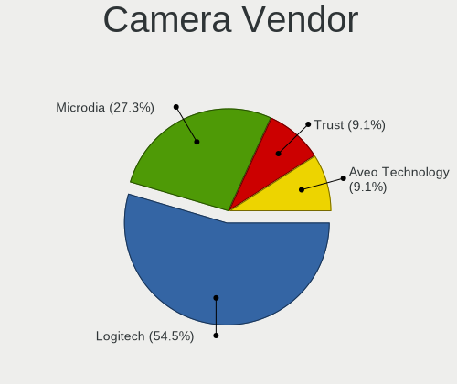

| Vendor          | Desktops | Percent |
|-----------------|----------|---------|
| Logitech        | 6        | 60%     |
| Microdia        | 3        | 30%     |
| Aveo Technology | 1        | 10%     |

Camera Model
------------

Camera device models

| Model                         | Desktops | Percent |
|-------------------------------|----------|---------|
| Microdia HP Integrated Webcam | 2        | 20%     |
| Logitech C920 PRO HD Webcam   | 2        | 20%     |
| Microdia USB 2.0 Camera       | 1        | 10%     |
| Logitech Webcam C270          | 1        | 10%     |
| Logitech Webcam C170          | 1        | 10%     |
| Logitech C505 HD Webcam       | 1        | 10%     |
| Logitech BRIO Ultra HD Webcam | 1        | 10%     |
| Aveo USB2.0 Camera            | 1        | 10%     |

Security
--------

Fingerprint Vendor
------------------

Fingerprint sensor vendors

| Vendor             | Desktops | Percent |
|--------------------|----------|---------|
| Focal-systems.Corp | 1        | 100%    |

Fingerprint Model
-----------------

Fingerprint sensor models

| Model                                           | Desktops | Percent |
|-------------------------------------------------|----------|---------|
| Focal-systems.Corp FocalTech Fingerprint reader | 1        | 100%    |

Chipcard Vendor
---------------

Chipcard module vendors

Zero info for selected period =(

Chipcard Model
--------------

Chipcard module models

Zero info for selected period =(

Unsupported
-----------

Unsupported Devices
-------------------

Total unsupported devices on board

| Total | Desktops | Percent |
|-------|----------|---------|
| 0     | 25       | 56.82%  |
| 1     | 10       | 22.73%  |
| 2     | 5        | 11.36%  |
| 4     | 3        | 6.82%   |
| 3     | 1        | 2.27%   |

Unsupported Device Types
------------------------

Types of unsupported devices

| Type                     | Desktops | Percent |
|--------------------------|----------|---------|
| Communication controller | 11       | 37.93%  |
| Net/wireless             | 5        | 17.24%  |
| Bluetooth                | 4        | 13.79%  |
| Sound                    | 3        | 10.34%  |
| Network                  | 3        | 10.34%  |
| Net/ethernet             | 2        | 6.9%    |
| Fingerprint reader       | 1        | 3.45%   |

