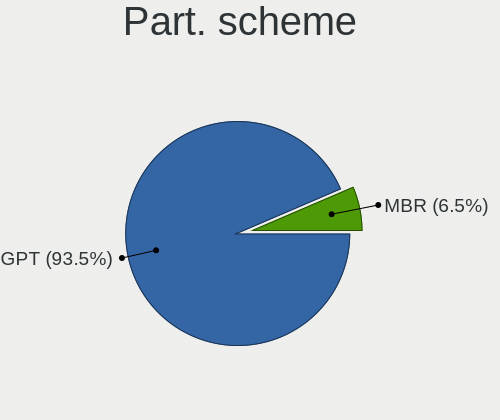
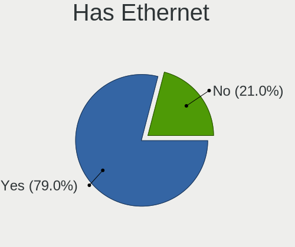
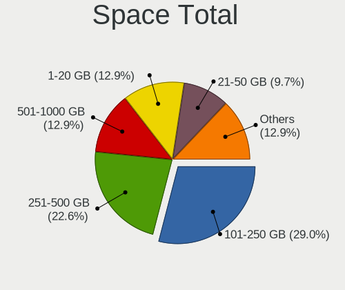
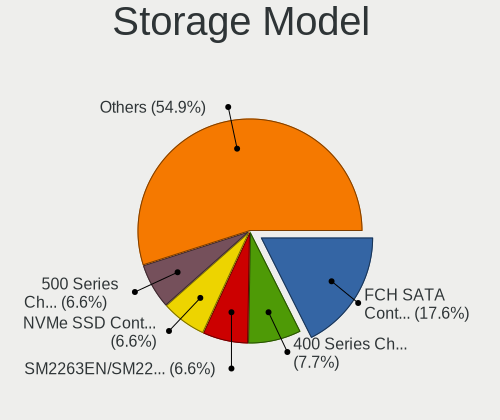
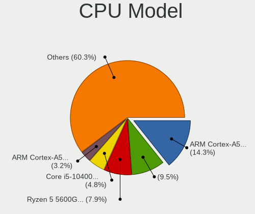
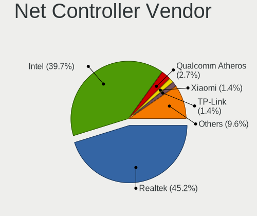
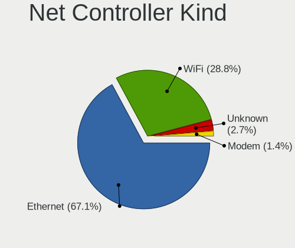
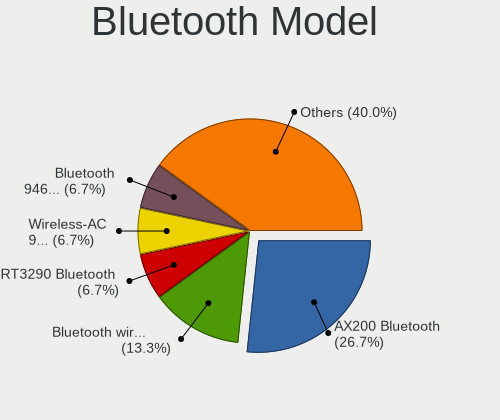

FreeBSD 14.0-CURRENT - Tested Hardware & Statistics (Desktops)
--------------------------------------------------------------

A project to collect tested hardware configurations for FreeBSD 14.0-CURRENT.

Anyone can contribute to this report by the [hw-probe](https://github.com/linuxhw/hw-probe/blob/master/INSTALL.BSD.md) tool:

    hw-probe -all -upload

Please contribute! Especially if your hardware is rare.

Contents
--------

* [ Test Cases ](#test-cases)

* [ System ](#system)
  - [ Arch                     ](#arch)
  - [ DE                       ](#de)
  - [ Display Server           ](#display-server)
  - [ Display Manager          ](#display-manager)
  - [ OS Lang                  ](#os-lang)
  - [ Boot Mode                ](#boot-mode)
  - [ Filesystem               ](#filesystem)
  - [ Part. scheme             ](#part-scheme)

* [ Board ](#board)
  - [ Vendor                   ](#vendor)
  - [ Model                    ](#model)
  - [ Model Family             ](#model-family)
  - [ MFG Year                 ](#mfg-year)
  - [ Form Factor              ](#form-factor)
  - [ Coreboot                 ](#coreboot)
  - [ RAM Size                 ](#ram-size)
  - [ RAM Used                 ](#ram-used)
  - [ Total Drives             ](#total-drives)
  - [ Has CD-ROM               ](#has-cd-rom)
  - [ Has Ethernet             ](#has-ethernet)
  - [ Has WiFi                 ](#has-wifi)
  - [ Has Bluetooth            ](#has-bluetooth)

* [ Location ](#location)
  - [ Country                  ](#country)
  - [ City                     ](#city)

* [ Drives ](#drives)
  - [ Drive Vendor             ](#drive-vendor)
  - [ Drive Model              ](#drive-model)
  - [ HDD Vendor               ](#hdd-vendor)
  - [ SSD Vendor               ](#ssd-vendor)
  - [ Drive Kind               ](#drive-kind)
  - [ Drive Connector          ](#drive-connector)
  - [ Drive Size               ](#drive-size)
  - [ Space Total              ](#space-total)
  - [ Space Used               ](#space-used)
  - [ Malfunc. Drives          ](#malfunc-drives)
  - [ Malfunc. Drive Vendor    ](#malfunc-drive-vendor)
  - [ Malfunc. HDD Vendor      ](#malfunc-hdd-vendor)
  - [ Malfunc. Drive Kind      ](#malfunc-drive-kind)
  - [ Failed Drives            ](#failed-drives)
  - [ Failed Drive Vendor      ](#failed-drive-vendor)
  - [ Drive Status             ](#drive-status)

* [ Storage controller ](#storage-controller)
  - [ Storage Vendor           ](#storage-vendor)
  - [ Storage Model            ](#storage-model)
  - [ Storage Kind             ](#storage-kind)

* [ Processor ](#processor)
  - [ CPU Vendor               ](#cpu-vendor)
  - [ CPU Model                ](#cpu-model)
  - [ CPU Model Family         ](#cpu-model-family)
  - [ CPU Cores                ](#cpu-cores)
  - [ CPU Sockets              ](#cpu-sockets)
  - [ CPU Threads              ](#cpu-threads)
  - [ CPU Microarch            ](#cpu-microarch)

* [ Graphics ](#graphics)
  - [ GPU Vendor               ](#gpu-vendor)
  - [ GPU Model                ](#gpu-model)
  - [ GPU Combo                ](#gpu-combo)
  - [ GPU Driver               ](#gpu-driver)
  - [ GPU Memory               ](#gpu-memory)

* [ Monitor ](#monitor)
  - [ Monitor Vendor           ](#monitor-vendor)
  - [ Monitor Model            ](#monitor-model)
  - [ Monitor Resolution       ](#monitor-resolution)
  - [ Monitor Diagonal         ](#monitor-diagonal)
  - [ Monitor Width            ](#monitor-width)
  - [ Aspect Ratio             ](#aspect-ratio)
  - [ Monitor Area             ](#monitor-area)
  - [ Pixel Density            ](#pixel-density)
  - [ Multiple Monitors        ](#multiple-monitors)

* [ Network ](#network)
  - [ Net Controller Vendor    ](#net-controller-vendor)
  - [ Net Controller Model     ](#net-controller-model)
  - [ Wireless Vendor          ](#wireless-vendor)
  - [ Wireless Model           ](#wireless-model)
  - [ Ethernet Vendor          ](#ethernet-vendor)
  - [ Ethernet Model           ](#ethernet-model)
  - [ Net Controller Kind      ](#net-controller-kind)
  - [ Used Controller          ](#used-controller)
  - [ NICs                     ](#nics)
  - [ IPv6                     ](#ipv6)

* [ Bluetooth ](#bluetooth)
  - [ Bluetooth Vendor         ](#bluetooth-vendor)
  - [ Bluetooth Model          ](#bluetooth-model)

* [ Sound ](#sound)
  - [ Sound Vendor             ](#sound-vendor)
  - [ Sound Model              ](#sound-model)

* [ Memory ](#memory)
  - [ Memory Vendor            ](#memory-vendor)
  - [ Memory Model             ](#memory-model)
  - [ Memory Kind              ](#memory-kind)
  - [ Memory Form Factor       ](#memory-form-factor)
  - [ Memory Size              ](#memory-size)
  - [ Memory Speed             ](#memory-speed)

* [ Printers & scanners ](#printers--scanners)
  - [ Printer Vendor           ](#printer-vendor)
  - [ Printer Model            ](#printer-model)
  - [ Scanner Vendor           ](#scanner-vendor)
  - [ Scanner Model            ](#scanner-model)

* [ Camera ](#camera)
  - [ Camera Vendor            ](#camera-vendor)
  - [ Camera Model             ](#camera-model)

* [ Security ](#security)
  - [ Fingerprint Vendor       ](#fingerprint-vendor)
  - [ Fingerprint Model        ](#fingerprint-model)
  - [ Chipcard Vendor          ](#chipcard-vendor)
  - [ Chipcard Model           ](#chipcard-model)

* [ Unsupported ](#unsupported)
  - [ Unsupported Devices      ](#unsupported-devices)
  - [ Unsupported Device Types ](#unsupported-device-types)

Test Cases
----------

Total: 48

| Vendor        | Model                       | Probe                                                     | Date         |
|---------------|-----------------------------|-----------------------------------------------------------|--------------|
| Dell          | 0VG93V A00                  | [8de9fa2319](https://bsd-hardware.info/?probe=8de9fa2319) | Aug 18, 2022 |
| Unknown       | Unknown                     | [3208aefb72](https://bsd-hardware.info/?probe=3208aefb72) | Aug 17, 2022 |
| ASRock        | B550 Phantom Gaming-ITX/... | [3dc5a6f7d2](https://bsd-hardware.info/?probe=3dc5a6f7d2) | May 24, 2022 |
| Unknown       | Unknown                     | [f3ab857e43](https://bsd-hardware.info/?probe=f3ab857e43) | May 13, 2022 |
| ASUSTek       | PRIME H470M-PLUS            | [224614e9ab](https://bsd-hardware.info/?probe=224614e9ab) | May 10, 2022 |
| ASRock        | X570 Phantom Gaming 4       | [76eef59920](https://bsd-hardware.info/?probe=76eef59920) | May 10, 2022 |
| Gigabyte      | B450M S2H                   | [ee73e0cddb](https://bsd-hardware.info/?probe=ee73e0cddb) | Apr 07, 2022 |
| HP            | 83E1                        | [d8e995126f](https://bsd-hardware.info/?probe=d8e995126f) | Feb 10, 2022 |
| Gigabyte      | B450M DS3H-CF               | [825d20fcf7](https://bsd-hardware.info/?probe=825d20fcf7) | Jan 14, 2022 |
| Gigabyte      | B450M DS3H-CF               | [b953d9d2e6](https://bsd-hardware.info/?probe=b953d9d2e6) | Jan 13, 2022 |
| ASUSTek       | ROG STRIX B550-I GAMING     | [2cc4698cbc](https://bsd-hardware.info/?probe=2cc4698cbc) | Jan 09, 2022 |
| ASUSTek       | ROG STRIX B550-I GAMING     | [2481037b2a](https://bsd-hardware.info/?probe=2481037b2a) | Jan 09, 2022 |
| ASUSTek       | TUF GAMING B550-PLUS        | [ea4719600a](https://bsd-hardware.info/?probe=ea4719600a) | Jan 05, 2022 |
| ASRock        | B450 Steel Legend           | [e67007df20](https://bsd-hardware.info/?probe=e67007df20) | Jan 01, 2022 |
| friendlyel... | nanopi-m4                   | [bb29e50061](https://bsd-hardware.info/?probe=bb29e50061) | Dec 27, 2021 |
| khadas        | edge-v                      | [42c428aac0](https://bsd-hardware.info/?probe=42c428aac0) | Dec 26, 2021 |
| Unknown       | Unknown                     | [b726a1b3e3](https://bsd-hardware.info/?probe=b726a1b3e3) | Dec 11, 2021 |
| ASUSTek       | PRIME X570-PRO              | [9a8d19aa04](https://bsd-hardware.info/?probe=9a8d19aa04) | Dec 11, 2021 |
| Unknown       | Unknown                     | [7633cb9296](https://bsd-hardware.info/?probe=7633cb9296) | Dec 11, 2021 |
| Beckhoff A... | CX51x0 G3                   | [6db720018b](https://bsd-hardware.info/?probe=6db720018b) | Oct 25, 2021 |
| Beckhoff A... | CX20x3 G1                   | [a49fbd5ce3](https://bsd-hardware.info/?probe=a49fbd5ce3) | Oct 25, 2021 |
| ASUSTek       | PRIME Z590-A                | [1aa5ced5a0](https://bsd-hardware.info/?probe=1aa5ced5a0) | Sep 23, 2021 |
| Gigabyte      | X399 DESIGNARE EX-CF        | [a78cc6a11b](https://bsd-hardware.info/?probe=a78cc6a11b) | Sep 04, 2021 |
| Unknown       | Unknown                     | [4a3836de00](https://bsd-hardware.info/?probe=4a3836de00) | Jul 08, 2021 |
| ASUSTek       | PRIME B450M-GAMING/BR       | [edebe87739](https://bsd-hardware.info/?probe=edebe87739) | Jun 04, 2021 |
| Gigabyte      | B550I AORUS PRO AX          | [62b9ea2794](https://bsd-hardware.info/?probe=62b9ea2794) | May 14, 2021 |
| ASUSTek       | P8H77-M PRO                 | [b3acafeb1a](https://bsd-hardware.info/?probe=b3acafeb1a) | May 09, 2021 |
| ASUSTek       | P8H77-M PRO                 | [86cec3b874](https://bsd-hardware.info/?probe=86cec3b874) | May 09, 2021 |
| pine64        | pinebook-pro-rk3399         | [79713a2668](https://bsd-hardware.info/?probe=79713a2668) | Apr 25, 2021 |
| pine64        | pinebook-pro-rk3399         | [0f04e5f048](https://bsd-hardware.info/?probe=0f04e5f048) | Apr 11, 2021 |
| Gigabyte      | X570 AORUS ELITE            | [325186171a](https://bsd-hardware.info/?probe=325186171a) | Apr 02, 2021 |
| pine64        | pinebook-pro-rk3399         | [ea524ab4c4](https://bsd-hardware.info/?probe=ea524ab4c4) | Mar 28, 2021 |
| pine64        | pinebook-pro-rk3399         | [835da13d39](https://bsd-hardware.info/?probe=835da13d39) | Mar 18, 2021 |
| Gigabyte      | 970A-UD3P                   | [cc3151bc6f](https://bsd-hardware.info/?probe=cc3151bc6f) | Mar 17, 2021 |
| MSI           | B450 GAMING PLUS            | [547fd655f0](https://bsd-hardware.info/?probe=547fd655f0) | Mar 13, 2021 |
| pine64        | pinebook-pro-rk3399         | [c00bcdcc87](https://bsd-hardware.info/?probe=c00bcdcc87) | Mar 06, 2021 |
| pine64        | pinebook-pro-rk3399         | [3abcd73d48](https://bsd-hardware.info/?probe=3abcd73d48) | Feb 26, 2021 |
| Gigabyte      | X570 AORUS MASTER           | [29936dd1c0](https://bsd-hardware.info/?probe=29936dd1c0) | Feb 25, 2021 |
| Unknown       | Unknown                     | [74b11992d7](https://bsd-hardware.info/?probe=74b11992d7) | Feb 20, 2021 |
| Raspberry ... | rpi                         | [92ee9b3619](https://bsd-hardware.info/?probe=92ee9b3619) | Feb 18, 2021 |
| pine64        | pinebook-pro-rk3399         | [b750f83194](https://bsd-hardware.info/?probe=b750f83194) | Feb 17, 2021 |
| ASUSTek       | PRIME B450M-A               | [ba7f82b343](https://bsd-hardware.info/?probe=ba7f82b343) | Feb 12, 2021 |
| pine64        | pinebook-pro-rk3399         | [2befc5e754](https://bsd-hardware.info/?probe=2befc5e754) | Feb 10, 2021 |
| pine64        | pinebook-pro-rk3399         | [5a55b22f44](https://bsd-hardware.info/?probe=5a55b22f44) | Feb 09, 2021 |
| Dell          | 0D9JG3 A00                  | [65dd4083c5](https://bsd-hardware.info/?probe=65dd4083c5) | Feb 09, 2021 |
| pine64        | pinebook-pro-rk3399         | [97e72f0066](https://bsd-hardware.info/?probe=97e72f0066) | Feb 06, 2021 |
| pine64        | pinebook-pro-rk3399         | [1720175648](https://bsd-hardware.info/?probe=1720175648) | Jan 27, 2021 |
| pine64        | pinebook-pro-rk3399         | [2338de9efc](https://bsd-hardware.info/?probe=2338de9efc) | Jan 24, 2021 |

System
------

Arch
----

OS architecture (x86_64, i586, etc.)

| Name  | Desktops | Percent |
|-------|----------|---------|
| amd64 | 25       | 73.53%  |
| arm64 | 6        | 17.65%  |
| arm   | 2        | 5.88%   |
| riscv | 1        | 2.94%   |

DE
--

Desktop Environment

| Name    | Desktops | Percent |
|---------|----------|---------|
| Console | 14       | 40%     |
| KDE5    | 12       | 34.29%  |
| Openbox | 3        | 8.57%   |
| XFCE    | 2        | 5.71%   |
| TWM     | 1        | 2.86%   |
| MATE    | 1        | 2.86%   |
| i3      | 1        | 2.86%   |
| GNOME   | 1        | 2.86%   |

Display Server
--------------

X11 or Wayland

| Name    | Desktops | Percent |
|---------|----------|---------|
| X11     | 21       | 60%     |
| Console | 14       | 40%     |

Display Manager
---------------

SDDM, LightDM, etc.

| Name    | Desktops | Percent |
|---------|----------|---------|
| Console | 19       | 54.29%  |
| SDDM    | 7        | 20%     |
| SLiM    | 4        | 11.43%  |
| GDM     | 4        | 11.43%  |
| XDM     | 1        | 2.86%   |

OS Lang
-------

Language

| Lang    | Desktops | Percent |
|---------|----------|---------|
| C       | 17       | 50%     |
| en_US   | 5        | 14.71%  |
| de_DE   | 4        | 11.76%  |
| uk_UA   | 3        | 8.82%   |
| Unknown | 3        | 8.82%   |
| sv_SE   | 1        | 2.94%   |
| de_CH   | 1        | 2.94%   |

Boot Mode
---------

EFI or BIOS

| Mode | Desktops | Percent |
|------|----------|---------|
| EFI  | 29       | 85.29%  |
| BIOS | 5        | 14.71%  |

Filesystem
----------

Type of filesystem

| Type | Desktops | Percent |
|------|----------|---------|
| Zfs  | 23       | 67.65%  |
| Ufs  | 11       | 32.35%  |

Part. scheme
------------

Scheme of partitioning

| Type | Desktops | Percent |
|------|----------|---------|
| GPT  | 30       | 88.24%  |
| MBR  | 4        | 11.76%  |

Board
-----

Vendor
------

Motherboard manufacturer

| Name                    | Desktops | Percent |
|-------------------------|----------|---------|
| ASUSTek Computer        | 8        | 23.53%  |
| Gigabyte Technology     | 7        | 20.59%  |
| Unknown                 | 6        | 17.65%  |
| ASRock                  | 3        | 8.82%   |
| Dell                    | 2        | 5.88%   |
| Beckhoff Automation     | 2        | 5.88%   |
| Raspberry Pi Foundation | 1        | 2.94%   |
| pine64                  | 1        | 2.94%   |
| MSI                     | 1        | 2.94%   |
| khadas                  | 1        | 2.94%   |
| Hewlett-Packard         | 1        | 2.94%   |
| friendlyelec            | 1        | 2.94%   |

Model
-----

Motherboard model

| Name                              | Desktops | Percent |
|-----------------------------------|----------|---------|
| Unknown                           | 6        | 17.65%  |
| RPi rpi                           | 1        | 2.94%   |
| pine64 pinebook-pro-rk3399        | 1        | 2.94%   |
| MSI MS-7B86                       | 1        | 2.94%   |
| khadas edge-v                     | 1        | 2.94%   |
| HP EliteDesk 800 G4 SFF           | 1        | 2.94%   |
| Gigabyte X570 AORUS MASTER        | 1        | 2.94%   |
| Gigabyte X570 AORUS ELITE         | 1        | 2.94%   |
| Gigabyte X399 DESIGNARE EX        | 1        | 2.94%   |
| Gigabyte B550I AORUS PRO AX       | 1        | 2.94%   |
| Gigabyte B450M S2H                | 1        | 2.94%   |
| Gigabyte B450M DS3H               | 1        | 2.94%   |
| Gigabyte 970A-UD3P                | 1        | 2.94%   |
| friendlyelec nanopi-m4            | 1        | 2.94%   |
| Dell OptiPlex 5090                | 1        | 2.94%   |
| Dell OptiPlex 5080                | 1        | 2.94%   |
| Beckhoff Automation CX2033-0185   | 1        | 2.94%   |
| Beckhoff Automation CBxx63        | 1        | 2.94%   |
| ASUS TUF GAMING B550-PLUS         | 1        | 2.94%   |
| ASUS ROG STRIX B550-I GAMING      | 1        | 2.94%   |
| ASUS PRIME Z590-A                 | 1        | 2.94%   |
| ASUS PRIME X570-PRO               | 1        | 2.94%   |
| ASUS PRIME H470M-PLUS             | 1        | 2.94%   |
| ASUS PRIME B450M-GAMING/BR        | 1        | 2.94%   |
| ASUS PRIME B450M-A                | 1        | 2.94%   |
| ASUS P8H77-M PRO                  | 1        | 2.94%   |
| ASRock X570 Phantom Gaming 4      | 1        | 2.94%   |
| ASRock B550 Phantom Gaming-ITX/ax | 1        | 2.94%   |
| ASRock B450 Steel Legend          | 1        | 2.94%   |

Model Family
------------

Motherboard model prefix

| Name                            | Desktops | Percent |
|---------------------------------|----------|---------|
| Unknown                         | 6        | 17.65%  |
| ASUS PRIME                      | 5        | 14.71%  |
| Gigabyte X570                   | 2        | 5.88%   |
| Gigabyte B450M                  | 2        | 5.88%   |
| Dell OptiPlex                   | 2        | 5.88%   |
| RPi rpi                         | 1        | 2.94%   |
| pine64 pinebook-pro-rk3399      | 1        | 2.94%   |
| MSI MS-7B86                     | 1        | 2.94%   |
| khadas edge-v                   | 1        | 2.94%   |
| HP EliteDesk                    | 1        | 2.94%   |
| Gigabyte X399                   | 1        | 2.94%   |
| Gigabyte B550I                  | 1        | 2.94%   |
| Gigabyte 970A-UD3P              | 1        | 2.94%   |
| friendlyelec nanopi-m4          | 1        | 2.94%   |
| Beckhoff Automation CX2033-0185 | 1        | 2.94%   |
| Beckhoff Automation CBxx63      | 1        | 2.94%   |
| ASUS TUF                        | 1        | 2.94%   |
| ASUS ROG                        | 1        | 2.94%   |
| ASUS P8H77-M                    | 1        | 2.94%   |
| ASRock X570                     | 1        | 2.94%   |
| ASRock B550                     | 1        | 2.94%   |
| ASRock B450                     | 1        | 2.94%   |

MFG Year
--------

Motherboard manufacture year

| Year    | Desktops | Percent |
|---------|----------|---------|
| 2021    | 8        | 23.53%  |
| 2020    | 7        | 20.59%  |
| 2019    | 6        | 17.65%  |
| 2018    | 5        | 14.71%  |
| Unknown | 5        | 14.71%  |
| 2022    | 1        | 2.94%   |
| 2016    | 1        | 2.94%   |
| 2012    | 1        | 2.94%   |

Form Factor
-----------

Physical design of the computer

| Name    | Desktops | Percent |
|---------|----------|---------|
| Desktop | 34       | 100%    |

Coreboot
--------

Have coreboot on board

| Used | Desktops | Percent |
|------|----------|---------|
| No   | 34       | 100%    |

RAM Size
--------

Total RAM memory

| Size in GB  | Desktops | Percent |
|-------------|----------|---------|
| 16.01-24.0  | 11       | 32.35%  |
| 64.01-256.0 | 8        | 23.53%  |
| 32.01-64.0  | 5        | 14.71%  |
| 4.01-8.0    | 4        | 11.76%  |
| 8.01-16.0   | 3        | 8.82%   |
| 0.51-1.0    | 2        | 5.88%   |
| 0.01-0.5    | 1        | 2.94%   |

RAM Used
--------

Used RAM memory

| Used GB     | Desktops | Percent |
|-------------|----------|---------|
| 1.01-2.0    | 10       | 29.41%  |
| 0.51-1.0    | 9        | 26.47%  |
| 0.01-0.5    | 6        | 17.65%  |
| 2.01-3.0    | 3        | 8.82%   |
| 3.01-4.0    | 2        | 5.88%   |
| 0           | 2        | 5.88%   |
| 64.01-256.0 | 1        | 2.94%   |
| 16.01-24.0  | 1        | 2.94%   |

Total Drives
------------

Number of drives on board

| Drives | Desktops | Percent |
|--------|----------|---------|
| 0      | 9        | 26.47%  |
| 1      | 8        | 23.53%  |
| 2      | 6        | 17.65%  |
| 3      | 4        | 11.76%  |
| 6      | 3        | 8.82%   |
| 15     | 1        | 2.94%   |
| 7      | 1        | 2.94%   |
| 5      | 1        | 2.94%   |
| 4      | 1        | 2.94%   |

Has CD-ROM
----------

Has CD-ROM on board

| Presented | Desktops | Percent |
|-----------|----------|---------|
| No        | 27       | 79.41%  |
| Yes       | 7        | 20.59%  |

Has Ethernet
------------

Has Ethernet on board

| Presented | Desktops | Percent |
|-----------|----------|---------|
| Yes       | 26       | 76.47%  |
| No        | 8        | 23.53%  |

Has WiFi
--------

Has WiFi module

| Presented | Desktops | Percent |
|-----------|----------|---------|
| No        | 21       | 61.76%  |
| Yes       | 13       | 38.24%  |

Has Bluetooth
-------------

Has Bluetooth module

| Presented | Desktops | Percent |
|-----------|----------|---------|
| No        | 27       | 79.41%  |
| Yes       | 7        | 20.59%  |

Location
--------

Country
-------

Geographic location (country)

| Country      | Desktops | Percent |
|--------------|----------|---------|
| Germany      | 6        | 17.65%  |
| Ukraine      | 4        | 11.76%  |
| UK           | 4        | 11.76%  |
| Russia       | 4        | 11.76%  |
| USA          | 3        | 8.82%   |
| Brazil       | 3        | 8.82%   |
| Japan        | 2        | 5.88%   |
| Switzerland  | 1        | 2.94%   |
| Sweden       | 1        | 2.94%   |
| Saudi Arabia | 1        | 2.94%   |
| Romania      | 1        | 2.94%   |
| Portugal     | 1        | 2.94%   |
| Netherlands  | 1        | 2.94%   |
| France       | 1        | 2.94%   |
| Austria      | 1        | 2.94%   |

City
----

Geographic location (city)

| City                        | Desktops | Percent |
|-----------------------------|----------|---------|
| Kyiv                        | 3        | 8.33%   |
| ЕЊta-ku                   | 2        | 5.56%   |
| St Petersburg               | 2        | 5.56%   |
| Rio de Janeiro              | 2        | 5.56%   |
| Rietberg                    | 2        | 5.56%   |
| Moscow                      | 2        | 5.56%   |
| Egham                       | 2        | 5.56%   |
| Cambridge                   | 2        | 5.56%   |
| Zurich                      | 1        | 2.78%   |
| Zaporizhzhya                | 1        | 2.78%   |
| Vila Real de Santo António | 1        | 2.78%   |
| Sollentuna                  | 1        | 2.78%   |
| Santa Monica                | 1        | 2.78%   |
| Riyadh                      | 1        | 2.78%   |
| Northeim                    | 1        | 2.78%   |
| Lake Forest                 | 1        | 2.78%   |
| Kunitachi                   | 1        | 2.78%   |
| Jaboatao dos Guararapes     | 1        | 2.78%   |
| Graz                        | 1        | 2.78%   |
| Göttingen                  | 1        | 2.78%   |
| Fuchu                       | 1        | 2.78%   |
| Cologne                     | 1        | 2.78%   |
| Claix                       | 1        | 2.78%   |
| Chicago                     | 1        | 2.78%   |
| Berlin                      | 1        | 2.78%   |
| Arad                        | 1        | 2.78%   |
| Amsterdam                   | 1        | 2.78%   |

Drives
------

Drive Vendor
------------

Hard drive vendors

| Vendor              | Desktops | Drives | Percent |
|---------------------|----------|--------|---------|
| WDC                 | 12       | 18     | 26.67%  |
| Seagate             | 5        | 17     | 11.11%  |
| Samsung Electronics | 5        | 9      | 11.11%  |
| Crucial             | 5        | 12     | 11.11%  |
| Toshiba             | 4        | 8      | 8.89%   |
| Kingston            | 4        | 5      | 8.89%   |
| SK hynix            | 2        | 2      | 4.44%   |
| A-DATA Technology   | 2        | 2      | 4.44%   |
| PNY                 | 1        | 1      | 2.22%   |
| Micron Technology   | 1        | 2      | 2.22%   |
| Intel               | 1        | 1      | 2.22%   |
| HGST                | 1        | 2      | 2.22%   |
| Goodram             | 1        | 1      | 2.22%   |
| Apacer              | 1        | 1      | 2.22%   |

Drive Model
-----------

Hard drive models

| Model                                | Desktops | Percent |
|--------------------------------------|----------|---------|
| WDC PC SN730 SDBQNTY-256G-1001 256GB | 2        | 3.85%   |
| Toshiba MQ04ABF100 1TB               | 2        | 3.85%   |
| Samsung SSD 870 EVO 1TB              | 2        | 3.85%   |
| Kingston SA2000M81000G 1TB           | 2        | 3.85%   |
| WDC WDS250G2B0C-00PXH0 250GB         | 1        | 1.92%   |
| WDC WDS100T2B0A-00SM50 1TB           | 1        | 1.92%   |
| WDC WD60EFRX-68TGBN1 6TB             | 1        | 1.92%   |
| WDC WD5002ABYS-18B1B0 500GB          | 1        | 1.92%   |
| WDC WD40EZRZ-75GXCB0 4TB             | 1        | 1.92%   |
| WDC WD30EFRX-68EUZN0 3TB             | 1        | 1.92%   |
| WDC WD20EZRZ-00Z5HB0 2TB             | 1        | 1.92%   |
| WDC WD120EFAX-68UNTN0 12TB           | 1        | 1.92%   |
| WDC WD10SPZX-21Z10T0 1TB             | 1        | 1.92%   |
| WDC WD10JMVW-11AJGS3 1TB             | 1        | 1.92%   |
| WDC WD10EZEX-60WN4A0 1TB             | 1        | 1.92%   |
| WDC WD10EZEX-00RKKA0 1TB             | 1        | 1.92%   |
| WDC WD10EARX-00N0YB0 1TB             | 1        | 1.92%   |
| Toshiba MG09ACA18TE 18TB             | 1        | 1.92%   |
| Toshiba MG06ACA800E 8TB              | 1        | 1.92%   |
| SK hynix PC801 NVMe 2TB              | 1        | 1.92%   |
| SK hynix HFS128G39TND-N210A 128GB    | 1        | 1.92%   |
| Seagate ST5000LM000-2U8170 5TB       | 1        | 1.92%   |
| Seagate ST4000DM000-1F2168 4TB       | 1        | 1.92%   |
| Seagate ST3750640AS 752GB            | 1        | 1.92%   |
| Seagate ST32000641AS 2TB             | 1        | 1.92%   |
| Seagate ST3000DM007-1WY10G 3TB       | 1        | 1.92%   |
| Seagate ST3000DM001-1ER166 3TB       | 1        | 1.92%   |
| Samsung SSD 870 QVO 1TB              | 1        | 1.92%   |
| Samsung SSD 860 EVO 4TB              | 1        | 1.92%   |
| Samsung SSD 860 EVO 250GB            | 1        | 1.92%   |
| Samsung SSD 850 EVO 500GB            | 1        | 1.92%   |
| Samsung SSD 850 EVO 250GB            | 1        | 1.92%   |
| PNY CS3030 1TB SSD                   | 1        | 1.92%   |
| Micron 2300_MTFDHBA512TDV 512GB      | 1        | 1.92%   |
| Kingston SA400S37240G 240GB          | 1        | 1.92%   |
| Kingston SA400S37120G 120GB          | 1        | 1.92%   |
| Intel SSDPEKKW256G8 256GB            | 1        | 1.92%   |
| HGST HTS721010A9E630 1TB             | 1        | 1.92%   |
| Goodram SSDPR-CX400-256-G2 256GB     | 1        | 1.92%   |
| Crucial CT750MX300SSD1 752GB         | 1        | 1.92%   |
| Crucial CT500P2SSD8 500GB            | 1        | 1.92%   |
| Crucial CT500P1SSD8 500GB            | 1        | 1.92%   |
| Crucial CT250MX500SSD1 250GB         | 1        | 1.92%   |
| Crucial CT1000MX500SSD4 1TB          | 1        | 1.92%   |
| Crucial CT1000BX500SSD1 1TB          | 1        | 1.92%   |
| Apacer 16GB SATA Flash Drive         | 1        | 1.92%   |
| A-DATA SU760 1TB                     | 1        | 1.92%   |
| A-DATA ICFS332-016GW 16GB            | 1        | 1.92%   |

HDD Vendor
----------

Hard disk drive vendors

| Vendor  | Desktops | Drives | Percent |
|---------|----------|--------|---------|
| WDC     | 8        | 13     | 44.44%  |
| Seagate | 5        | 17     | 27.78%  |
| Toshiba | 4        | 8      | 22.22%  |
| HGST    | 1        | 2      | 5.56%   |

SSD Vendor
----------

Solid state drive vendors

| Vendor              | Desktops | Drives | Percent |
|---------------------|----------|--------|---------|
| Samsung Electronics | 5        | 9      | 29.41%  |
| Crucial             | 4        | 9      | 23.53%  |
| Kingston            | 2        | 3      | 11.76%  |
| A-DATA Technology   | 2        | 2      | 11.76%  |
| WDC                 | 1        | 2      | 5.88%   |
| SK hynix            | 1        | 1      | 5.88%   |
| Goodram             | 1        | 1      | 5.88%   |
| Apacer              | 1        | 1      | 5.88%   |

Drive Kind
----------

HDD or SSD

| Kind | Desktops | Drives | Percent |
|------|----------|--------|---------|
| SSD  | 16       | 28     | 39.02%  |
| HDD  | 14       | 40     | 34.15%  |
| NVMe | 11       | 13     | 26.83%  |

Drive Connector
---------------

SATA, SAS, NVMe, etc.

| Type | Desktops | Drives | Percent |
|------|----------|--------|---------|
| SATA | 21       | 68     | 65.63%  |
| NVMe | 11       | 13     | 34.38%  |

Drive Size
----------

Size of hard drive

| Size in TB | Desktops | Drives | Percent |
|------------|----------|--------|---------|
| 0.51-1.0   | 13       | 20     | 37.14%  |
| 0.01-0.5   | 10       | 17     | 28.57%  |
| 1.01-2.0   | 3        | 3      | 8.57%   |
| 4.01-10.0  | 3        | 19     | 8.57%   |
| 3.01-4.0   | 2        | 3      | 5.71%   |
| 2.01-3.0   | 2        | 3      | 5.71%   |
| 10.01-20.0 | 2        | 3      | 5.71%   |

Space Total
-----------

Amount of disk space available on the file system

| Size in GB     | Desktops | Percent |
|----------------|----------|---------|
| 251-500        | 8        | 23.53%  |
| 101-250        | 8        | 23.53%  |
| 1-20           | 7        | 20.59%  |
| 501-1000       | 5        | 14.71%  |
| 2001-3000      | 3        | 8.82%   |
| More than 3000 | 2        | 5.88%   |
| 51-100         | 1        | 2.94%   |

Space Used
----------

Amount of used disk space

| Used GB        | Desktops | Percent |
|----------------|----------|---------|
| 1-20           | 18       | 51.43%  |
| 21-50          | 8        | 22.86%  |
| 101-250        | 2        | 5.71%   |
| 1001-2000      | 2        | 5.71%   |
| More than 3000 | 1        | 2.86%   |
| 251-500        | 1        | 2.86%   |
| 501-1000       | 1        | 2.86%   |
| 51-100         | 1        | 2.86%   |
| 0              | 1        | 2.86%   |

Malfunc. Drives
---------------

Drive models with a malfunction

| Model                               | Desktops | Drives | Percent |
|-------------------------------------|----------|--------|---------|
| Samsung Electronics SSD 870 EVO 1TB | 2        | 4      | 40%     |
| WDC WD60EFRX-68TGBN1 6TB            | 1        | 3      | 20%     |
| WDC WD5002ABYS-18B1B0 500GB         | 1        | 1      | 20%     |
| Kingston SA400S37120G 120GB         | 1        | 1      | 20%     |

Malfunc. Drive Vendor
---------------------

Vendors of faulty drives

| Vendor              | Desktops | Drives | Percent |
|---------------------|----------|--------|---------|
| WDC                 | 2        | 4      | 40%     |
| Samsung Electronics | 2        | 4      | 40%     |
| Kingston            | 1        | 1      | 20%     |

Malfunc. HDD Vendor
-------------------

Vendors of faulty HDD drives

| Vendor | Desktops | Drives | Percent |
|--------|----------|--------|---------|
| WDC    | 2        | 4      | 100%    |

Malfunc. Drive Kind
-------------------

Kinds of faulty drives

| Kind | Desktops | Drives | Percent |
|------|----------|--------|---------|
| SSD  | 2        | 5      | 50%     |
| HDD  | 2        | 4      | 50%     |

Failed Drives
-------------

Failed drive models

Zero info for selected period =(

Failed Drive Vendor
-------------------

Failed drive vendors

Zero info for selected period =(

Drive Status
------------

Number of failed and malfunc. drives

| Status  | Desktops | Drives | Percent |
|---------|----------|--------|---------|
| Works   | 24       | 72     | 85.71%  |
| Malfunc | 4        | 9      | 14.29%  |

Storage controller
------------------

Storage Vendor
--------------

Storage controller vendors

| Vendor                      | Desktops | Percent |
|-----------------------------|----------|---------|
| AMD                         | 17       | 36.96%  |
| Intel                       | 9        | 19.57%  |
| SanDisk                     | 4        | 8.7%    |
| Samsung Electronics         | 3        | 6.52%   |
| Silicon Motion              | 2        | 4.35%   |
| Micron/Crucial Technology   | 2        | 4.35%   |
| Marvell Technology Group    | 2        | 4.35%   |
| Kingston Technology Company | 2        | 4.35%   |
| ASMedia Technology          | 2        | 4.35%   |
| SK hynix                    | 1        | 2.17%   |
| Phison Electronics          | 1        | 2.17%   |
| Micron Technology           | 1        | 2.17%   |

Storage Model
-------------

Storage controller models

| Model                                                                       | Desktops | Percent |
|-----------------------------------------------------------------------------|----------|---------|
| AMD FCH SATA Controller [AHCI mode]                                         | 11       | 20.75%  |
| AMD 400 Series Chipset SATA Controller                                      | 6        | 11.32%  |
| AMD 500 Series Chipset SATA Controller                                      | 4        | 7.55%   |
| Silicon Motion SM2263EN/SM2263XT SSD Controller                             | 2        | 3.77%   |
| SanDisk WD Blue SN550 NVMe SSD                                              | 2        | 3.77%   |
| SanDisk WD Black SN750 / PC SN730 NVMe SSD                                  | 2        | 3.77%   |
| Samsung NVMe SSD Controller SM981/PM981/PM983                               | 2        | 3.77%   |
| Kingston Company A2000 NVMe SSD                                             | 2        | 3.77%   |
| Intel Comet Lake SATA AHCI Controller                                       | 2        | 3.77%   |
| Intel 500 Series Chipset Family SATA AHCI Controller                        | 2        | 3.77%   |
| Unknown                                                                     | 2        | 3.77%   |
| Samsung NVMe SSD Controller SM961/PM961/SM963                               | 1        | 1.89%   |
| Phison E12 NVMe Controller                                                  | 1        | 1.89%   |
| Micron/Crucial P2 NVMe PCIe SSD                                             | 1        | 1.89%   |
| Micron/Crucial P1 NVMe PCIe SSD                                             | 1        | 1.89%   |
| Marvell Group 88SE9172 SATA III 6Gb/s RAID Controller                       | 1        | 1.89%   |
| Marvell Group 88SE9170 PCIe 2.0 x1 2-port SATA 6 Gb/s Controller            | 1        | 1.89%   |
| Intel SSD Pro 7600p/760p/E 6100p Series                                     | 1        | 1.89%   |
| Intel Cannon Lake PCH SATA AHCI Controller                                  | 1        | 1.89%   |
| Intel Atom Processor E3800 Series SATA AHCI Controller                      | 1        | 1.89%   |
| Intel 82801 Mobile SATA Controller [RAID mode]                              | 1        | 1.89%   |
| Intel 7 Series/C210 Series Chipset Family 4-port SATA Controller [IDE mode] | 1        | 1.89%   |
| Intel 7 Series/C210 Series Chipset Family 2-port SATA Controller [IDE mode] | 1        | 1.89%   |
| ASMedia ASM1166 Serial ATA Controller                                       | 1        | 1.89%   |
| ASMedia ASM1062 Serial ATA Controller                                       | 1        | 1.89%   |
| AMD X399 Series Chipset SATA Controller                                     | 1        | 1.89%   |
| AMD SB7x0/SB8x0/SB9x0 SATA Controller [AHCI mode]                           | 1        | 1.89%   |

Storage Kind
------------

Kind of storage controller (IDE, SATA, NVMe, SAS, ...)

| Kind | Desktops | Percent |
|------|----------|---------|
| SATA | 24       | 55.81%  |
| NVMe | 17       | 39.53%  |
| RAID | 1        | 2.33%   |
| IDE  | 1        | 2.33%   |

Processor
---------

CPU Vendor
----------

Processor vendors

| Vendor   | Desktops | Percent |
|----------|----------|---------|
| AMD      | 17       | 48.57%  |
| Intel    | 8        | 22.86%  |
| Unknown  | 6        | 17.14%  |
| ARM      | 3        | 8.57%   |
| Research | 1        | 2.86%   |

CPU Model
---------

Processor models

| Model                                          | Desktops | Percent |
|------------------------------------------------|----------|---------|
|                                                | 6        | 17.14%  |
| AMD Ryzen 5 5600G with Radeon Graphics         | 4        | 11.43%  |
| AMD Ryzen 9 3900X 12-Core Processor            | 2        | 5.71%   |
| Research Morello SoC r0p0                      | 1        | 2.86%   |
| Intel Core i7-8750H CPU @ 2.20GHz              | 1        | 2.86%   |
| Intel Core i7-8700 CPU @ 3.20GHz               | 1        | 2.86%   |
| Intel Core i7-3770 CPU @ 3.40GHz               | 1        | 2.86%   |
| Intel Core i7-10700 CPU @ 2.90GHz              | 1        | 2.86%   |
| Intel Core i5-10500T CPU @ 2.30GHz             | 1        | 2.86%   |
| Intel Core i5-10400 CPU @ 2.90GHz              | 1        | 2.86%   |
| Intel Atom CPU E3827 @ 1.74GHz                 | 1        | 2.86%   |
| Intel 11th Gen Core i7-11700 @ 2.50GHz         | 1        | 2.86%   |
| ARM Cortex-A72 r0p2                            | 1        | 2.86%   |
| ARM Cortex-A53 r0p4                            | 1        | 2.86%   |
| ARM ARM1176 r0p7 (ECO: 0x00000000)             | 1        | 2.86%   |
| AMD Ryzen Threadripper 1950X 16-Core Processor | 1        | 2.86%   |
| AMD Ryzen Embedded V1202B with Radeon Vega Gfx | 1        | 2.86%   |
| AMD Ryzen 9 5950X 16-Core Processor            | 1        | 2.86%   |
| AMD Ryzen 9 5900X 12-Core Processor            | 1        | 2.86%   |
| AMD Ryzen 9 3950X 16-Core Processor            | 1        | 2.86%   |
| AMD Ryzen 7 5800X 8-Core Processor             | 1        | 2.86%   |
| AMD Ryzen 7 2700X Eight-Core Processor         | 1        | 2.86%   |
| AMD Ryzen 5 2600X Six-Core Processor           | 1        | 2.86%   |
| AMD Ryzen 5 2600 Six-Core Processor            | 1        | 2.86%   |
| AMD Ryzen 5 2400GE with Radeon Vega Graphics   | 1        | 2.86%   |
| AMD FX-8320E Eight-Core Processor              | 1        | 2.86%   |

CPU Model Family
----------------

Processor model prefix

| Model                  | Desktops | Percent |
|------------------------|----------|---------|
| Other                  | 9        | 25.71%  |
| AMD Ryzen 5            | 7        | 20%     |
| AMD Ryzen 9            | 5        | 14.29%  |
| Intel Core i7          | 4        | 11.43%  |
| Intel Core i5          | 2        | 5.71%   |
| ARM Cortex             | 2        | 5.71%   |
| AMD Ryzen 7            | 2        | 5.71%   |
| Intel Atom             | 1        | 2.86%   |
| AMD Ryzen Threadripper | 1        | 2.86%   |
| AMD Ryzen Embedded     | 1        | 2.86%   |
| AMD FX                 | 1        | 2.86%   |

CPU Cores
---------

Number of processor cores

| Number  | Desktops | Percent |
|---------|----------|---------|
| Unknown | 9        | 26.47%  |
| 12      | 6        | 17.65%  |
| 8       | 4        | 11.76%  |
| 6       | 4        | 11.76%  |
| 32      | 3        | 8.82%   |
| 24      | 3        | 8.82%   |
| 16      | 2        | 5.88%   |
| 2       | 2        | 5.88%   |
| 4       | 1        | 2.94%   |

CPU Sockets
-----------

Number of sockets

| Number  | Desktops | Percent |
|---------|----------|---------|
| 1       | 29       | 82.86%  |
| Unknown | 6        | 17.14%  |

CPU Threads
-----------

Threads per core (Hyper-Threading)

| Number  | Desktops | Percent |
|---------|----------|---------|
| 1       | 18       | 52.94%  |
| Unknown | 9        | 26.47%  |
| 2       | 7        | 20.59%  |

CPU Microarch
-------------

Microarchitecture

| Name       | Desktops | Percent |
|------------|----------|---------|
| Unknown    | 10       | 29.41%  |
| Zen 3      | 7        | 20.59%  |
| Zen+       | 3        | 8.82%   |
| Zen 2      | 3        | 8.82%   |
| Zen        | 3        | 8.82%   |
| CometLake  | 3        | 8.82%   |
| KabyLake   | 2        | 5.88%   |
| Silvermont | 1        | 2.94%   |
| Piledriver | 1        | 2.94%   |
| IvyBridge  | 1        | 2.94%   |

Graphics
--------

GPU Vendor
----------

Vendors of graphics cards

| Vendor | Desktops | Percent |
|--------|----------|---------|
| Nvidia | 11       | 37.93%  |
| AMD    | 11       | 37.93%  |
| Intel  | 7        | 24.14%  |

GPU Model
---------

Graphics card models

| Model                                                                 | Desktops | Percent |
|-----------------------------------------------------------------------|----------|---------|
| AMD Cezanne                                                           | 4        | 13.79%  |
| Nvidia GP108 [GeForce GT 1030]                                        | 2        | 6.9%    |
| Nvidia GK208B [GeForce GT 710]                                        | 2        | 6.9%    |
| Intel CometLake-S GT2 [UHD Graphics 630]                              | 2        | 6.9%    |
| AMD Raven Ridge [Radeon Vega Series / Radeon Vega Mobile Series]      | 2        | 6.9%    |
| Nvidia GT218 [GeForce 210]                                            | 1        | 3.45%   |
| Nvidia GP107M [GeForce GTX 1050 Mobile]                               | 1        | 3.45%   |
| Nvidia GP107GL [Quadro P620]                                          | 1        | 3.45%   |
| Nvidia GP107 [GeForce GTX 1050 Ti]                                    | 1        | 3.45%   |
| Nvidia GP106 [GeForce GTX 1060 3GB]                                   | 1        | 3.45%   |
| Nvidia GM206 [GeForce GTX 960]                                        | 1        | 3.45%   |
| Nvidia GM107 [GeForce GTX 750 Ti]                                     | 1        | 3.45%   |
| Intel RocketLake-S GT1 [UHD Graphics 750]                             | 1        | 3.45%   |
| Intel IvyBridge GT2 [HD Graphics 4000]                                | 1        | 3.45%   |
| Intel CoffeeLake-S GT2 [UHD Graphics 630]                             | 1        | 3.45%   |
| Intel CoffeeLake-H GT2 [UHD Graphics 630]                             | 1        | 3.45%   |
| Intel Atom Processor Z36xxx/Z37xxx Series Graphics & Display          | 1        | 3.45%   |
| AMD RV630 XT [Radeon HD 2600 XT]                                      | 1        | 3.45%   |
| AMD Oland [Radeon HD 8570 / R5 430 OEM / R7 240/340 / Radeon 520 OEM] | 1        | 3.45%   |
| AMD Ellesmere [Radeon RX 470/480/570/570X/580/580X/590]               | 1        | 3.45%   |
| AMD Cape Verde PRO [Radeon HD 7750/8740 / R7 250E]                    | 1        | 3.45%   |
| AMD Baffin [Radeon RX 460/560D / Pro 450/455/460/555/555X/560/560X]   | 1        | 3.45%   |

GPU Combo
---------

Combinations of graphics cards

| Name           | Desktops | Percent |
|----------------|----------|---------|
| Other          | 9        | 26.47%  |
| 1 x Nvidia     | 9        | 26.47%  |
| 1 x AMD        | 9        | 26.47%  |
| 1 x Intel      | 4        | 11.76%  |
| Intel + Nvidia | 2        | 5.88%   |
| Intel + AMD    | 1        | 2.94%   |

GPU Driver
----------

Free vs proprietary

| Driver      | Desktops | Percent |
|-------------|----------|---------|
| Free        | 16       | 47.06%  |
| Proprietary | 9        | 26.47%  |
| Unknown     | 9        | 26.47%  |

GPU Memory
----------

Total video memory

| Size in GB | Desktops | Percent |
|------------|----------|---------|
| Unknown    | 20       | 58.82%  |
| 1.01-2.0   | 6        | 17.65%  |
| 3.01-4.0   | 3        | 8.82%   |
| 0.51-1.0   | 2        | 5.88%   |
| 7.01-8.0   | 1        | 2.94%   |
| 2.01-3.0   | 1        | 2.94%   |
| 0.01-0.5   | 1        | 2.94%   |

Monitor
-------

Monitor Vendor
--------------

Monitor vendors

| Vendor              | Desktops | Percent |
|---------------------|----------|---------|
| Goldstar            | 4        | 20%     |
| Dell                | 3        | 15%     |
| Samsung Electronics | 2        | 10%     |
| RTK                 | 2        | 10%     |
| LG Electronics      | 2        | 10%     |
| Sony                | 1        | 5%      |
| Philips             | 1        | 5%      |
| Lenovo              | 1        | 5%      |
| Hewlett-Packard     | 1        | 5%      |
| Eizo                | 1        | 5%      |
| BenQ                | 1        | 5%      |
| AOC                 | 1        | 5%      |

Monitor Model
-------------

Monitor models

| Model                                                                  | Desktops | Percent |
|------------------------------------------------------------------------|----------|---------|
| RTK WCS Display RTK1A1B 1920x1080 344x195mm 15.6-inch                  | 2        | 9.52%   |
| Sony TV SNY4B03 1920x1080 930x520mm 41.9-inch                          | 1        | 4.76%   |
| Samsung Electronics SyncMaster SAM05FC 1920x1080                       | 1        | 4.76%   |
| Samsung Electronics LCD Monitor SAM0A7D 1920x1080 1020x570mm 46.0-inch | 1        | 4.76%   |
| Philips PHL 273V7 PHLC156 1920x1080 600x340mm 27.2-inch                | 1        | 4.76%   |
| LG Electronics LCD Monitor LX20D 1600x1200                             | 1        | 4.76%   |
| LG Electronics LCD Monitor LG Ultra HD 11520x2160                      | 1        | 4.76%   |
| LG Electronics LCD Monitor LG Ultra HD                                 | 1        | 4.76%   |
| Lenovo LEN X24A LEN60CF 1920x1080 530x300mm 24.0-inch                  | 1        | 4.76%   |
| Hewlett-Packard E233 HPN345F 1920x1080 510x290mm 23.1-inch             | 1        | 4.76%   |
| Goldstar LG Ultra HD GSM5B09 3840x2160 600x340mm 27.2-inch             | 1        | 4.76%   |
| Goldstar LG Ultra HD GSM5B08 3840x2160 600x340mm 27.2-inch             | 1        | 4.76%   |
| Goldstar 27GK750F GSM770F 1920x1080 600x340mm 27.2-inch                | 1        | 4.76%   |
| Goldstar 23EA53 GSM59A8 1920x1080 510x290mm 23.1-inch                  | 1        | 4.76%   |
| Eizo FX2431 ENC2036 1920x1200 520x330mm 24.2-inch                      | 1        | 4.76%   |
| Dell U2518D DEL413C 2560x1440 550x310mm 24.9-inch                      | 1        | 4.76%   |
| Dell U2412M DELA07A 1920x1200 520x320mm 24.0-inch                      | 1        | 4.76%   |
| Dell LCD Monitor U2715H 2560x1440                                      | 1        | 4.76%   |
| BenQ GW2280 BNQ78E8 1920x1080 480x270mm 21.7-inch                      | 1        | 4.76%   |
| AOC Q3277 AOC3277 2560x1440 710x400mm 32.1-inch                        | 1        | 4.76%   |

Monitor Resolution
------------------

Monitor screen resolution

| Resolution        | Desktops | Percent |
|-------------------|----------|---------|
| 1920x1080 (FHD)   | 11       | 52.38%  |
| 3840x2160 (4K)    | 3        | 14.29%  |
| 2560x1440 (QHD)   | 2        | 9.52%   |
| 1920x1200 (WUXGA) | 2        | 9.52%   |
| 1600x1200         | 1        | 4.76%   |
| 11520x2160        | 1        | 4.76%   |
| Unknown           | 1        | 4.76%   |

Monitor Diagonal
----------------

Diagonal size in inches

| Inches  | Desktops | Percent |
|---------|----------|---------|
| 27      | 4        | 20%     |
| 24      | 4        | 20%     |
| Unknown | 4        | 20%     |
| 23      | 2        | 10%     |
| 15      | 2        | 10%     |
| 46      | 1        | 5%      |
| 41      | 1        | 5%      |
| 32      | 1        | 5%      |
| 21      | 1        | 5%      |

Monitor Width
-------------

Physical width

| Width in mm | Desktops | Percent |
|-------------|----------|---------|
| 501-600     | 10       | 50%     |
| Unknown     | 4        | 20%     |
| 301-350     | 2        | 10%     |
| 701-800     | 1        | 5%      |
| 401-500     | 1        | 5%      |
| 1001-1500   | 1        | 5%      |
| 901-1000    | 1        | 5%      |

Aspect Ratio
------------

Proportional relationship between the width and the height

| Ratio   | Desktops | Percent |
|---------|----------|---------|
| 16/9    | 14       | 73.68%  |
| Unknown | 3        | 15.79%  |
| 16/10   | 2        | 10.53%  |

Monitor Area
------------

Area in inch²

| Area in inch² | Desktops | Percent |
|----------------|----------|---------|
| 301-350        | 4        | 20%     |
| 201-250        | 4        | 20%     |
| Unknown        | 4        | 20%     |
| 251-300        | 3        | 15%     |
| 101-110        | 2        | 10%     |
| 501-1000       | 2        | 10%     |
| 351-500        | 1        | 5%      |

Pixel Density
-------------

Pixels per inch

| Density | Desktops | Percent |
|---------|----------|---------|
| 51-100  | 9        | 47.37%  |
| Unknown | 4        | 21.05%  |
| 161-240 | 2        | 10.53%  |
| 121-160 | 2        | 10.53%  |
| 1-50    | 1        | 5.26%   |
| 101-120 | 1        | 5.26%   |

Multiple Monitors
-----------------

Total monitors connected

| Total | Desktops | Percent |
|-------|----------|---------|
| 1     | 17       | 50%     |
| 0     | 15       | 44.12%  |
| 2     | 2        | 5.88%   |

Network
-------

Net Controller Vendor
---------------------

Controller vendors

| Vendor                          | Desktops | Percent |
|---------------------------------|----------|---------|
| Intel                           | 19       | 47.5%   |
| Realtek Semiconductor           | 15       | 37.5%   |
| TP-Link                         | 1        | 2.5%    |
| Ralink Technology               | 1        | 2.5%    |
| Qualcomm Atheros Communications | 1        | 2.5%    |
| Qualcomm Atheros                | 1        | 2.5%    |
| ASUSTek Computer                | 1        | 2.5%    |
| Arduino SA                      | 1        | 2.5%    |

Net Controller Model
--------------------

Controller models

| Model                                                                         | Desktops | Percent |
|-------------------------------------------------------------------------------|----------|---------|
| Realtek RTL8111/8168/8411 PCI Express Gigabit Ethernet Controller             | 12       | 24%     |
| Intel I211 Gigabit Network Connection                                         | 5        | 10%     |
| Intel Wi-Fi 6 AX200                                                           | 4        | 8%      |
| Realtek RTL8125 2.5GbE Controller                                             | 3        | 6%      |
| Intel I210 Gigabit Network Connection                                         | 3        | 6%      |
| Intel Ethernet Controller I225-V                                              | 3        | 6%      |
| Intel 82574L Gigabit Network Connection                                       | 3        | 6%      |
| TP-Link Archer T3U [Realtek RTL8812BU]                                        | 1        | 2%      |
| Realtek RTL8188EUS 802.11n Wireless Network Adapter                           | 1        | 2%      |
| Ralink RT2870/RT3070 Wireless Adapter                                         | 1        | 2%      |
| Qualcomm Atheros TP-Link TL-WN322G v3 / TL-WN422G v2 802.11g [Atheros AR9271] | 1        | 2%      |
| Qualcomm Atheros AR93xx Wireless Network Adapter                              | 1        | 2%      |
| Intel Wireless-AC 9260                                                        | 1        | 2%      |
| Intel Wireless 8265 / 8275                                                    | 1        | 2%      |
| Intel Wireless 7265                                                           | 1        | 2%      |
| Intel I350 Gigabit Network Connection                                         | 1        | 2%      |
| Intel Ethernet Connection (7) I219-LM                                         | 1        | 2%      |
| Intel Ethernet Connection (14) I219-LM                                        | 1        | 2%      |
| Intel Ethernet Connection (11) I219-V                                         | 1        | 2%      |
| Intel Ethernet Connection (11) I219-LM                                        | 1        | 2%      |
| Intel Cannon Lake PCH CNVi WiFi                                               | 1        | 2%      |
| Intel 82571EB/82571GB Gigabit Ethernet Controller D0/D1 (copper applications) | 1        | 2%      |
| ASUS Realtek 8188EUS [USB-N10 Nano]                                           | 1        | 2%      |
| Arduino SA Uno R3 (CDC ACM)                                                   | 1        | 2%      |

Wireless Vendor
---------------

Wireless vendors

| Vendor                          | Desktops | Percent |
|---------------------------------|----------|---------|
| Intel                           | 8        | 57.14%  |
| TP-Link                         | 1        | 7.14%   |
| Realtek Semiconductor           | 1        | 7.14%   |
| Ralink Technology               | 1        | 7.14%   |
| Qualcomm Atheros Communications | 1        | 7.14%   |
| Qualcomm Atheros                | 1        | 7.14%   |
| ASUSTek Computer                | 1        | 7.14%   |

Wireless Model
--------------

Wireless models

| Model                                                                         | Desktops | Percent |
|-------------------------------------------------------------------------------|----------|---------|
| Intel Wi-Fi 6 AX200                                                           | 4        | 28.57%  |
| TP-Link Archer T3U [Realtek RTL8812BU]                                        | 1        | 7.14%   |
| Realtek RTL8188EUS 802.11n Wireless Network Adapter                           | 1        | 7.14%   |
| Ralink RT2870/RT3070 Wireless Adapter                                         | 1        | 7.14%   |
| Qualcomm Atheros TP-Link TL-WN322G v3 / TL-WN422G v2 802.11g [Atheros AR9271] | 1        | 7.14%   |
| Qualcomm Atheros AR93xx Wireless Network Adapter                              | 1        | 7.14%   |
| Intel Wireless-AC 9260                                                        | 1        | 7.14%   |
| Intel Wireless 8265 / 8275                                                    | 1        | 7.14%   |
| Intel Wireless 7265                                                           | 1        | 7.14%   |
| Intel Cannon Lake PCH CNVi WiFi                                               | 1        | 7.14%   |
| ASUS Realtek 8188EUS [USB-N10 Nano]                                           | 1        | 7.14%   |

Ethernet Vendor
---------------

Ethernet vendors

| Vendor                | Desktops | Percent |
|-----------------------|----------|---------|
| Intel                 | 17       | 54.84%  |
| Realtek Semiconductor | 14       | 45.16%  |

Ethernet Model
--------------

Ethernet models

| Model                                                                         | Desktops | Percent |
|-------------------------------------------------------------------------------|----------|---------|
| Realtek RTL8111/8168/8411 PCI Express Gigabit Ethernet Controller             | 12       | 34.29%  |
| Intel I211 Gigabit Network Connection                                         | 5        | 14.29%  |
| Realtek RTL8125 2.5GbE Controller                                             | 3        | 8.57%   |
| Intel I210 Gigabit Network Connection                                         | 3        | 8.57%   |
| Intel Ethernet Controller I225-V                                              | 3        | 8.57%   |
| Intel 82574L Gigabit Network Connection                                       | 3        | 8.57%   |
| Intel I350 Gigabit Network Connection                                         | 1        | 2.86%   |
| Intel Ethernet Connection (7) I219-LM                                         | 1        | 2.86%   |
| Intel Ethernet Connection (14) I219-LM                                        | 1        | 2.86%   |
| Intel Ethernet Connection (11) I219-V                                         | 1        | 2.86%   |
| Intel Ethernet Connection (11) I219-LM                                        | 1        | 2.86%   |
| Intel 82571EB/82571GB Gigabit Ethernet Controller D0/D1 (copper applications) | 1        | 2.86%   |

Net Controller Kind
-------------------

Ethernet, WiFi or modem

| Kind     | Desktops | Percent |
|----------|----------|---------|
| Ethernet | 26       | 65%     |
| WiFi     | 13       | 32.5%   |
| Modem    | 1        | 2.5%    |

Used Controller
---------------

Currently used network controller

| Kind     | Desktops | Percent |
|----------|----------|---------|
| Ethernet | 25       | 83.33%  |
| WiFi     | 5        | 16.67%  |

NICs
----

Total network controllers on board

| Total | Desktops | Percent |
|-------|----------|---------|
| 1     | 11       | 32.35%  |
| 2     | 9        | 26.47%  |
| 0     | 8        | 23.53%  |
| 3     | 3        | 8.82%   |
| 4     | 2        | 5.88%   |
| 7     | 1        | 2.94%   |

IPv6
----

IPv6 vs IPv4

| Used | Desktops | Percent |
|------|----------|---------|
| No   | 29       | 85.29%  |
| Yes  | 5        | 14.71%  |

Bluetooth
---------

Bluetooth Vendor
----------------

Controller vendors

| Vendor                  | Desktops | Percent |
|-------------------------|----------|---------|
| Intel                   | 6        | 85.71%  |
| Cambridge Silicon Radio | 1        | 14.29%  |

Bluetooth Model
---------------

Controller models

| Model                                               | Desktops | Percent |
|-----------------------------------------------------|----------|---------|
| Intel Bluetooth wireless interface                  | 2        | 28.57%  |
| Intel AX200 Bluetooth                               | 2        | 28.57%  |
| Intel Wireless-AC 9260 Bluetooth Adapter            | 1        | 14.29%  |
| Intel Bluetooth 9460/9560 Jefferson Peak (JfP)      | 1        | 14.29%  |
| Cambridge Silicon Radio Bluetooth Dongle (HCI mode) | 1        | 14.29%  |

Sound
-----

Sound Vendor
------------

Sound card vendors

| Vendor                  | Desktops | Percent |
|-------------------------|----------|---------|
| AMD                     | 18       | 43.9%   |
| Nvidia                  | 11       | 26.83%  |
| Intel                   | 7        | 17.07%  |
| Yamaha                  | 1        | 2.44%   |
| GN Netcom               | 1        | 2.44%   |
| C-Media Electronics     | 1        | 2.44%   |
| AudioQuest              | 1        | 2.44%   |
| AKAI  Professional M.I. | 1        | 2.44%   |

Sound Model
-----------

Sound card models

| Model                                                                      | Desktops | Percent |
|----------------------------------------------------------------------------|----------|---------|
| AMD Starship/Matisse HD Audio Controller                                   | 6        | 12%     |
| AMD Family 17h/19h HD Audio Controller                                     | 5        | 10%     |
| AMD Renoir Radeon High Definition Audio Controller                         | 4        | 8%      |
| AMD Family 17h (Models 00h-0fh) HD Audio Controller                        | 4        | 8%      |
| Nvidia GP107GL High Definition Audio Controller                            | 3        | 6%      |
| Nvidia GP108 High Definition Audio Controller                              | 2        | 4%      |
| Nvidia GK208 HDMI/DP Audio Controller                                      | 2        | 4%      |
| Intel Comet Lake PCH cAVS                                                  | 2        | 4%      |
| Intel Cannon Lake PCH cAVS                                                 | 2        | 4%      |
| AMD Raven/Raven2/Fenghuang HDMI/DP Audio Controller                        | 2        | 4%      |
| AMD Oland/Hainan/Cape Verde/Pitcairn HDMI Audio [Radeon HD 7000 Series]    | 2        | 4%      |
| Yamaha Steinberg UR12                                                      | 1        | 2%      |
| Nvidia High Definition Audio Controller                                    | 1        | 2%      |
| Nvidia GP106 High Definition Audio Controller                              | 1        | 2%      |
| Nvidia GM206 High Definition Audio Controller                              | 1        | 2%      |
| Nvidia GM107 High Definition Audio Controller [GeForce 940MX]              | 1        | 2%      |
| Intel Tiger Lake-H HD Audio Controller                                     | 1        | 2%      |
| Intel Atom Processor Z36xxx/Z37xxx Series High Definition Audio Controller | 1        | 2%      |
| Intel 7 Series/C216 Chipset Family High Definition Audio Controller        | 1        | 2%      |
| GN Netcom Jabra SPEAK 410 USB                                              | 1        | 2%      |
| C-Media Electronics Anua Mic CM 900                                        | 1        | 2%      |
| AudioQuest DragonFly                                                       | 1        | 2%      |
| AMD SBx00 Azalia (Intel HDA)                                               | 1        | 2%      |
| AMD RV630 HDMI Audio [Radeon HD 2600 PRO/XT / HD 3610]                     | 1        | 2%      |
| AMD Ellesmere HDMI Audio [Radeon RX 470/480 / 570/580/590]                 | 1        | 2%      |
| AMD Baffin HDMI/DP Audio [Radeon RX 550 640SP / RX 560/560X]               | 1        | 2%      |
| AKAI  Professional M.I. LPK25 MIDI Keyboard                                | 1        | 2%      |

Memory
------

Memory Vendor
-------------

Memory module vendors

| Vendor              | Desktops | Percent |
|---------------------|----------|---------|
| Kingston            | 5        | 19.23%  |
| Corsair             | 5        | 19.23%  |
| Unknown             | 3        | 11.54%  |
| SK hynix            | 3        | 11.54%  |
| Micron Technology   | 3        | 11.54%  |
| Crucial             | 2        | 7.69%   |
| Transcend           | 1        | 3.85%   |
| Team                | 1        | 3.85%   |
| Smart               | 1        | 3.85%   |
| Samsung Electronics | 1        | 3.85%   |
| Unknown             | 1        | 3.85%   |

Memory Model
------------

Memory module models

| Model                                                   | Desktops | Percent |
|---------------------------------------------------------|----------|---------|
| Corsair RAM CMK32GX4M2D3200C16 16GB DIMM DDR4 3200MT/s  | 2        | 7.41%   |
| Unknown RAM Module 8GB DIMM DDR3 1600MT/s               | 1        | 3.7%    |
| Unknown RAM 3000 C16 Series 4096MB DIMM DDR4 2933MT/s   | 1        | 3.7%    |
| Unknown RAM 2G-08-10-12-1333 2GB DIMM DDR3 1333MT/s     | 1        | 3.7%    |
| Transcend RAM JM2666HLE-32G 32GB DIMM DDR4 2666MT/s     | 1        | 3.7%    |
| Team RAM TEAMGROUP-UD4-4133 8GB DIMM DDR4 4133MT/s      | 1        | 3.7%    |
| Smart RAM Module 8GB DIMM DDR4 2667MT/s                 | 1        | 3.7%    |
| SK hynix RAM HMAA4GU6CJR8N-XN 32GB DIMM DDR4 3200MT/s   | 1        | 3.7%    |
| SK hynix RAM HMA82GS6DJR8N-XN 16GB SODIMM DDR4 3200MT/s | 1        | 3.7%    |
| SK hynix RAM HMA81GS6CJR8N-VK 8GB SODIMM DDR4 2667MT/s  | 1        | 3.7%    |
| Samsung RAM M378A4G43MB1-CTD 32GB DIMM DDR4 2666MT/s    | 1        | 3.7%    |
| Micron RAM 18ASF4G72AZ-3G2B1 32GB DIMM DDR4 3200MT/s    | 1        | 3.7%    |
| Micron RAM 16ATF2G64HZ-2G6J1 16GB SODIMM DDR4 2667MT/s  | 1        | 3.7%    |
| Micron RAM 16ATF2G64AZ-3G2J1 16GB DIMM DDR4 3200MT/s    | 1        | 3.7%    |
| Kingston RAM KHX3200C16D4/32GX 32GB DIMM DDR4 3200MT/s  | 1        | 3.7%    |
| Kingston RAM KHX2666C16/16G 16GB DIMM DDR4 2666MT/s     | 1        | 3.7%    |
| Kingston RAM KHX1600C10D3/ 8GB DIMM DDR3 1866MT/s       | 1        | 3.7%    |
| Kingston RAM 9965745-020.A00G 32GB DIMM DDR4 3200MT/s   | 1        | 3.7%    |
| Kingston RAM 9965745-017.A00G 16GB DIMM DDR4 3200MT/s   | 1        | 3.7%    |
| Kingston RAM 9905713-030.A00G 8GB DIMM DDR4 2666MT/s    | 1        | 3.7%    |
| Crucial RAM CT16G4DFD832A.C16FP 16GB DIMM DDR4 3200MT/s | 1        | 3.7%    |
| Crucial RAM BL16G36C16U4B.M8FB1 16GB DIMM DDR4 3600MT/s | 1        | 3.7%    |
| Corsair RAM CMK32GX4M2E3200C16 16GB DIMM DDR4 3200MT/s  | 1        | 3.7%    |
| Corsair RAM CMK16GX4M2B3200C16 8GB DIMM DDR4 3200MT/s   | 1        | 3.7%    |
| Corsair RAM CMD128GX4M8A2400C14 16GB DIMM DDR4 2133MT/s | 1        | 3.7%    |
| Unknown                                                 | 1        | 3.7%    |

Memory Kind
-----------

Memory module kinds

| Kind | Desktops | Percent |
|------|----------|---------|
| DDR4 | 22       | 88%     |
| DDR3 | 3        | 12%     |

Memory Form Factor
------------------

Physical design of the memory module

| Name   | Desktops | Percent |
|--------|----------|---------|
| DIMM   | 22       | 88%     |
| SODIMM | 3        | 12%     |

Memory Size
-----------

Memory module size

| Size  | Desktops | Percent |
|-------|----------|---------|
| 16384 | 10       | 38.46%  |
| 8192  | 8        | 30.77%  |
| 32768 | 6        | 23.08%  |
| 4096  | 1        | 3.85%   |
| 2048  | 1        | 3.85%   |

Memory Speed
------------

Memory module speed

| Speed | Desktops | Percent |
|-------|----------|---------|
| 3200  | 11       | 42.31%  |
| 2666  | 4        | 15.38%  |
| 2667  | 3        | 11.54%  |
| 4133  | 1        | 3.85%   |
| 3600  | 1        | 3.85%   |
| 3000  | 1        | 3.85%   |
| 2933  | 1        | 3.85%   |
| 2133  | 1        | 3.85%   |
| 1866  | 1        | 3.85%   |
| 1600  | 1        | 3.85%   |
| 1333  | 1        | 3.85%   |

Printers & scanners
-------------------

Printer Vendor
--------------

Printer device vendors

Zero info for selected period =(

Printer Model
-------------

Printer device models

Zero info for selected period =(

Scanner Vendor
--------------

Scanner device vendors

Zero info for selected period =(

Scanner Model
-------------

Scanner device models

Zero info for selected period =(

Camera
------

Camera Vendor
-------------

Camera device vendors

| Vendor          | Desktops | Percent |
|-----------------|----------|---------|
| Logitech        | 3        | 60%     |
| Microdia        | 1        | 20%     |
| Aveo Technology | 1        | 20%     |

Camera Model
------------

Camera device models

| Model                         | Desktops | Percent |
|-------------------------------|----------|---------|
| Microdia HP Integrated Webcam | 1        | 20%     |
| Logitech Webcam C270          | 1        | 20%     |
| Logitech Webcam C170          | 1        | 20%     |
| Logitech C920 PRO HD Webcam   | 1        | 20%     |
| Aveo USB2.0 Camera            | 1        | 20%     |

Security
--------

Fingerprint Vendor
------------------

Fingerprint sensor vendors

Zero info for selected period =(

Fingerprint Model
-----------------

Fingerprint sensor models

Zero info for selected period =(

Chipcard Vendor
---------------

Chipcard module vendors

Zero info for selected period =(

Chipcard Model
--------------

Chipcard module models

Zero info for selected period =(

Unsupported
-----------

Unsupported Devices
-------------------

Total unsupported devices on board

| Total | Desktops | Percent |
|-------|----------|---------|
| 0     | 21       | 61.76%  |
| 1     | 6        | 17.65%  |
| 2     | 4        | 11.76%  |
| 4     | 2        | 5.88%   |
| 3     | 1        | 2.94%   |

Unsupported Device Types
------------------------

Types of unsupported devices

| Type                     | Desktops | Percent |
|--------------------------|----------|---------|
| Communication controller | 7        | 35%     |
| Net/wireless             | 5        | 25%     |
| Sound                    | 3        | 15%     |
| Bluetooth                | 3        | 15%     |
| Network                  | 1        | 5%      |
| Net/ethernet             | 1        | 5%      |

