FreeBSD 14.0-CURRENT - Tested Hardware & Statistics (Desktops)
--------------------------------------------------------------

A project to collect tested hardware configurations for FreeBSD 14.0-CURRENT.

Anyone can contribute to this report by the [hw-probe](https://github.com/linuxhw/hw-probe/blob/master/INSTALL.BSD.md) tool:

    hw-probe -all -upload

Please contribute! Especially if your hardware is rare.

Contents
--------

* [ Test Cases ](#test-cases)

* [ System ](#system)
  - [ Arch                     ](#arch)
  - [ DE                       ](#de)
  - [ Display Server           ](#display-server)
  - [ Display Manager          ](#display-manager)
  - [ OS Lang                  ](#os-lang)
  - [ Boot Mode                ](#boot-mode)
  - [ Filesystem               ](#filesystem)
  - [ Part. scheme             ](#part-scheme)

* [ Board ](#board)
  - [ Vendor                   ](#vendor)
  - [ Model                    ](#model)
  - [ Model Family             ](#model-family)
  - [ MFG Year                 ](#mfg-year)
  - [ Form Factor              ](#form-factor)
  - [ Coreboot                 ](#coreboot)
  - [ RAM Size                 ](#ram-size)
  - [ RAM Used                 ](#ram-used)
  - [ Total Drives             ](#total-drives)
  - [ Has CD-ROM               ](#has-cd-rom)
  - [ Has Ethernet             ](#has-ethernet)
  - [ Has WiFi                 ](#has-wifi)
  - [ Has Bluetooth            ](#has-bluetooth)

* [ Location ](#location)
  - [ Country                  ](#country)
  - [ City                     ](#city)

* [ Drives ](#drives)
  - [ Drive Vendor             ](#drive-vendor)
  - [ Drive Model              ](#drive-model)
  - [ HDD Vendor               ](#hdd-vendor)
  - [ SSD Vendor               ](#ssd-vendor)
  - [ Drive Kind               ](#drive-kind)
  - [ Drive Connector          ](#drive-connector)
  - [ Drive Size               ](#drive-size)
  - [ Space Total              ](#space-total)
  - [ Space Used               ](#space-used)
  - [ Malfunc. Drives          ](#malfunc-drives)
  - [ Malfunc. Drive Vendor    ](#malfunc-drive-vendor)
  - [ Malfunc. HDD Vendor      ](#malfunc-hdd-vendor)
  - [ Malfunc. Drive Kind      ](#malfunc-drive-kind)
  - [ Failed Drives            ](#failed-drives)
  - [ Failed Drive Vendor      ](#failed-drive-vendor)
  - [ Drive Status             ](#drive-status)

* [ Storage controller ](#storage-controller)
  - [ Storage Vendor           ](#storage-vendor)
  - [ Storage Model            ](#storage-model)
  - [ Storage Kind             ](#storage-kind)

* [ Processor ](#processor)
  - [ CPU Vendor               ](#cpu-vendor)
  - [ CPU Model                ](#cpu-model)
  - [ CPU Model Family         ](#cpu-model-family)
  - [ CPU Cores                ](#cpu-cores)
  - [ CPU Sockets              ](#cpu-sockets)
  - [ CPU Threads              ](#cpu-threads)
  - [ CPU Microarch            ](#cpu-microarch)

* [ Graphics ](#graphics)
  - [ GPU Vendor               ](#gpu-vendor)
  - [ GPU Model                ](#gpu-model)
  - [ GPU Combo                ](#gpu-combo)
  - [ GPU Driver               ](#gpu-driver)
  - [ GPU Memory               ](#gpu-memory)

* [ Monitor ](#monitor)
  - [ Monitor Vendor           ](#monitor-vendor)
  - [ Monitor Model            ](#monitor-model)
  - [ Monitor Resolution       ](#monitor-resolution)
  - [ Monitor Diagonal         ](#monitor-diagonal)
  - [ Monitor Width            ](#monitor-width)
  - [ Aspect Ratio             ](#aspect-ratio)
  - [ Monitor Area             ](#monitor-area)
  - [ Pixel Density            ](#pixel-density)
  - [ Multiple Monitors        ](#multiple-monitors)

* [ Network ](#network)
  - [ Net Controller Vendor    ](#net-controller-vendor)
  - [ Net Controller Model     ](#net-controller-model)
  - [ Wireless Vendor          ](#wireless-vendor)
  - [ Wireless Model           ](#wireless-model)
  - [ Ethernet Vendor          ](#ethernet-vendor)
  - [ Ethernet Model           ](#ethernet-model)
  - [ Net Controller Kind      ](#net-controller-kind)
  - [ Used Controller          ](#used-controller)
  - [ NICs                     ](#nics)
  - [ IPv6                     ](#ipv6)

* [ Bluetooth ](#bluetooth)
  - [ Bluetooth Vendor         ](#bluetooth-vendor)
  - [ Bluetooth Model          ](#bluetooth-model)

* [ Sound ](#sound)
  - [ Sound Vendor             ](#sound-vendor)
  - [ Sound Model              ](#sound-model)

* [ Memory ](#memory)
  - [ Memory Vendor            ](#memory-vendor)
  - [ Memory Model             ](#memory-model)
  - [ Memory Kind              ](#memory-kind)
  - [ Memory Form Factor       ](#memory-form-factor)
  - [ Memory Size              ](#memory-size)
  - [ Memory Speed             ](#memory-speed)

* [ Printers & scanners ](#printers--scanners)
  - [ Printer Vendor           ](#printer-vendor)
  - [ Printer Model            ](#printer-model)
  - [ Scanner Vendor           ](#scanner-vendor)
  - [ Scanner Model            ](#scanner-model)

* [ Camera ](#camera)
  - [ Camera Vendor            ](#camera-vendor)
  - [ Camera Model             ](#camera-model)

* [ Security ](#security)
  - [ Fingerprint Vendor       ](#fingerprint-vendor)
  - [ Fingerprint Model        ](#fingerprint-model)
  - [ Chipcard Vendor          ](#chipcard-vendor)
  - [ Chipcard Model           ](#chipcard-model)

* [ Unsupported ](#unsupported)
  - [ Unsupported Devices      ](#unsupported-devices)
  - [ Unsupported Device Types ](#unsupported-device-types)

Test Cases
----------

Total: 70

| Vendor        | Model                       | Probe                                                     | Date         |
|---------------|-----------------------------|-----------------------------------------------------------|--------------|
| ASRock        | X570 Phantom Gaming 4       | [705c750691](https://bsd-hardware.info/?probe=705c750691) | Jun 17, 2023 |
| Dell          | 053CWD A00                  | [7a5418ac7e](https://bsd-hardware.info/?probe=7a5418ac7e) | Jun 16, 2023 |
| Unknown       | Unknown                     | [6b4f214b72](https://bsd-hardware.info/?probe=6b4f214b72) | Jun 15, 2023 |
| Unknown       | Unknown                     | [615e7cbf52](https://bsd-hardware.info/?probe=615e7cbf52) | Jun 15, 2023 |
| Unknown       | Unknown                     | [8357f0f72e](https://bsd-hardware.info/?probe=8357f0f72e) | Jun 15, 2023 |
| Unknown       | Unknown                     | [f41e1f2b83](https://bsd-hardware.info/?probe=f41e1f2b83) | Jun 14, 2023 |
| Gigabyte      | H170-D3HP-CF                | [d5fdf2ff2c](https://bsd-hardware.info/?probe=d5fdf2ff2c) | May 28, 2023 |
| Unknown       | Unknown                     | [990b3eb510](https://bsd-hardware.info/?probe=990b3eb510) | May 12, 2023 |
| ASUSTek       | ROG STRIX X670E-F GAMING... | [dcea67b6a6](https://bsd-hardware.info/?probe=dcea67b6a6) | May 08, 2023 |
| Unknown       | Unknown                     | [c801b9e5af](https://bsd-hardware.info/?probe=c801b9e5af) | Apr 03, 2023 |
| Unknown       | Unknown                     | [9b2420726f](https://bsd-hardware.info/?probe=9b2420726f) | Apr 03, 2023 |
| Unknown       | Unknown                     | [414cbf5935](https://bsd-hardware.info/?probe=414cbf5935) | Apr 03, 2023 |
| Unknown       | Unknown                     | [6b79c64c73](https://bsd-hardware.info/?probe=6b79c64c73) | Apr 03, 2023 |
| SolidRun      | CEX7 Platform               | [8e2e4d6686](https://bsd-hardware.info/?probe=8e2e4d6686) | Mar 31, 2023 |
| ASRockRack    | EPYCD8-2T                   | [75f414997a](https://bsd-hardware.info/?probe=75f414997a) | Mar 31, 2023 |
| Gigabyte      | X670E AORUS MASTER          | [e55635df08](https://bsd-hardware.info/?probe=e55635df08) | Feb 23, 2023 |
| ASRock        | A520M-ITX/ac                | [dd083df1a2](https://bsd-hardware.info/?probe=dd083df1a2) | Feb 16, 2023 |
| ASUSTek       | PRIME H410M-K               | [d2edba8775](https://bsd-hardware.info/?probe=d2edba8775) | Feb 11, 2023 |
| ASUSTek       | ROG STRIX X570-E GAMING     | [87e25e2abd](https://bsd-hardware.info/?probe=87e25e2abd) | Jan 26, 2023 |
| Unknown       | Unknown                     | [3afbfc6cea](https://bsd-hardware.info/?probe=3afbfc6cea) | Jan 20, 2023 |
| Unknown       | Unknown                     | [e13627df1a](https://bsd-hardware.info/?probe=e13627df1a) | Jan 20, 2023 |
| ASUSTek       | PRIME Z390-P                | [3126dc27f1](https://bsd-hardware.info/?probe=3126dc27f1) | Jan 12, 2023 |
| Unknown       | Unknown                     | [d702dfcde2](https://bsd-hardware.info/?probe=d702dfcde2) | Dec 23, 2022 |
| ASRock        | 4X4-4000 Series             | [009ef73bd1](https://bsd-hardware.info/?probe=009ef73bd1) | Dec 20, 2022 |
| Unknown       | Unknown                     | [7c644cc639](https://bsd-hardware.info/?probe=7c644cc639) | Dec 15, 2022 |
| MSI           | B450M MORTAR MAX            | [15657b37e2](https://bsd-hardware.info/?probe=15657b37e2) | Nov 15, 2022 |
| MSI           | B450M MORTAR MAX            | [f4a8c42773](https://bsd-hardware.info/?probe=f4a8c42773) | Nov 15, 2022 |
| Unknown       | Unknown                     | [20ff21d751](https://bsd-hardware.info/?probe=20ff21d751) | Oct 18, 2022 |
| MSI           | Z490-A PRO                  | [dbda136daa](https://bsd-hardware.info/?probe=dbda136daa) | Sep 24, 2022 |
| MSI           | MPG Z490 GAMING EDGE WIF... | [98dff45d54](https://bsd-hardware.info/?probe=98dff45d54) | Sep 09, 2022 |
| Dell          | 0VG93V A00                  | [8de9fa2319](https://bsd-hardware.info/?probe=8de9fa2319) | Aug 18, 2022 |
| Unknown       | Unknown                     | [3208aefb72](https://bsd-hardware.info/?probe=3208aefb72) | Aug 17, 2022 |
| ASRock        | B550 Phantom Gaming-ITX/... | [3dc5a6f7d2](https://bsd-hardware.info/?probe=3dc5a6f7d2) | May 24, 2022 |
| Unknown       | Unknown                     | [f3ab857e43](https://bsd-hardware.info/?probe=f3ab857e43) | May 13, 2022 |
| ASUSTek       | PRIME B550-PLUS             | [224614e9ab](https://bsd-hardware.info/?probe=224614e9ab) | May 10, 2022 |
| ASRock        | X570 Phantom Gaming 4       | [76eef59920](https://bsd-hardware.info/?probe=76eef59920) | May 10, 2022 |
| Gigabyte      | B450M S2H                   | [ee73e0cddb](https://bsd-hardware.info/?probe=ee73e0cddb) | Apr 07, 2022 |
| HP            | 83E1                        | [d8e995126f](https://bsd-hardware.info/?probe=d8e995126f) | Feb 10, 2022 |
| Gigabyte      | B450M DS3H-CF               | [825d20fcf7](https://bsd-hardware.info/?probe=825d20fcf7) | Jan 14, 2022 |
| Gigabyte      | B450M DS3H-CF               | [b953d9d2e6](https://bsd-hardware.info/?probe=b953d9d2e6) | Jan 13, 2022 |
| ASUSTek       | ROG STRIX B550-I GAMING     | [2cc4698cbc](https://bsd-hardware.info/?probe=2cc4698cbc) | Jan 09, 2022 |
| ASUSTek       | ROG STRIX B550-I GAMING     | [2481037b2a](https://bsd-hardware.info/?probe=2481037b2a) | Jan 09, 2022 |
| ASUSTek       | TUF GAMING B550-PLUS        | [ea4719600a](https://bsd-hardware.info/?probe=ea4719600a) | Jan 05, 2022 |
| ASRock        | B450 Steel Legend           | [e67007df20](https://bsd-hardware.info/?probe=e67007df20) | Jan 01, 2022 |
| friendlyel... | nanopi-m4                   | [bb29e50061](https://bsd-hardware.info/?probe=bb29e50061) | Dec 27, 2021 |
| khadas        | edge-v                      | [42c428aac0](https://bsd-hardware.info/?probe=42c428aac0) | Dec 26, 2021 |
| Unknown       | Unknown                     | [b726a1b3e3](https://bsd-hardware.info/?probe=b726a1b3e3) | Dec 11, 2021 |
| ASUSTek       | PRIME X570-PRO              | [9a8d19aa04](https://bsd-hardware.info/?probe=9a8d19aa04) | Dec 11, 2021 |
| Unknown       | Unknown                     | [7633cb9296](https://bsd-hardware.info/?probe=7633cb9296) | Dec 11, 2021 |
| Beckhoff A... | CX51x0 G3                   | [6db720018b](https://bsd-hardware.info/?probe=6db720018b) | Oct 25, 2021 |
| Beckhoff A... | CX20x3 G1                   | [a49fbd5ce3](https://bsd-hardware.info/?probe=a49fbd5ce3) | Oct 25, 2021 |
| ASUSTek       | PRIME Z590-A                | [1aa5ced5a0](https://bsd-hardware.info/?probe=1aa5ced5a0) | Sep 23, 2021 |
| Gigabyte      | X399 DESIGNARE EX-CF        | [a78cc6a11b](https://bsd-hardware.info/?probe=a78cc6a11b) | Sep 04, 2021 |
| Unknown       | Unknown                     | [4a3836de00](https://bsd-hardware.info/?probe=4a3836de00) | Jul 08, 2021 |
| ASUSTek       | PRIME B450M-GAMING/BR       | [edebe87739](https://bsd-hardware.info/?probe=edebe87739) | Jun 04, 2021 |
| Gigabyte      | B550I AORUS PRO AX          | [62b9ea2794](https://bsd-hardware.info/?probe=62b9ea2794) | May 14, 2021 |
| ASUSTek       | P8H77-M PRO                 | [b3acafeb1a](https://bsd-hardware.info/?probe=b3acafeb1a) | May 09, 2021 |
| ASUSTek       | P8H77-M PRO                 | [86cec3b874](https://bsd-hardware.info/?probe=86cec3b874) | May 09, 2021 |
| pine64        | pinebook-pro-rk3399         | [79713a2668](https://bsd-hardware.info/?probe=79713a2668) | Apr 25, 2021 |
| Gigabyte      | X570 AORUS ELITE            | [325186171a](https://bsd-hardware.info/?probe=325186171a) | Apr 02, 2021 |
| Gigabyte      | 970A-UD3P                   | [cc3151bc6f](https://bsd-hardware.info/?probe=cc3151bc6f) | Mar 17, 2021 |
| MSI           | B450 GAMING PLUS            | [547fd655f0](https://bsd-hardware.info/?probe=547fd655f0) | Mar 13, 2021 |
| Gigabyte      | X570 AORUS MASTER           | [29936dd1c0](https://bsd-hardware.info/?probe=29936dd1c0) | Feb 25, 2021 |
| Unknown       | Unknown                     | [74b11992d7](https://bsd-hardware.info/?probe=74b11992d7) | Feb 20, 2021 |
| Raspberry ... | rpi                         | [92ee9b3619](https://bsd-hardware.info/?probe=92ee9b3619) | Feb 18, 2021 |
| ASUSTek       | PRIME B450M-A               | [ba7f82b343](https://bsd-hardware.info/?probe=ba7f82b343) | Feb 12, 2021 |
| pine64        | pinebook-pro-rk3399         | [5a55b22f44](https://bsd-hardware.info/?probe=5a55b22f44) | Feb 09, 2021 |
| Dell          | 0D9JG3 A00                  | [65dd4083c5](https://bsd-hardware.info/?probe=65dd4083c5) | Feb 09, 2021 |
| pine64        | pinebook-pro-rk3399         | [97e72f0066](https://bsd-hardware.info/?probe=97e72f0066) | Feb 06, 2021 |
| pine64        | pinebook-pro-rk3399         | [2338de9efc](https://bsd-hardware.info/?probe=2338de9efc) | Jan 24, 2021 |

System
------

Arch
----

OS architecture (x86_64, i586, etc.)

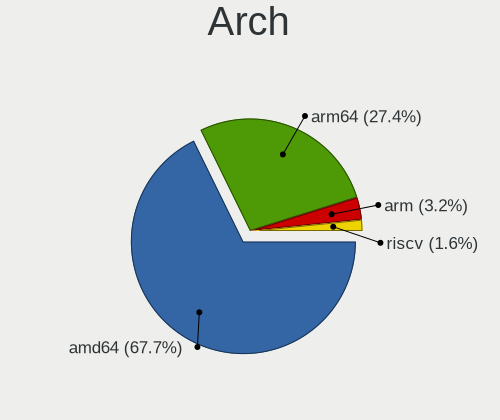

| Name  | Desktops | Percent |
|-------|----------|---------|
| amd64 | 40       | 66.67%  |
| arm64 | 17       | 28.33%  |
| arm   | 2        | 3.33%   |
| riscv | 1        | 1.67%   |

DE
--

Desktop Environment

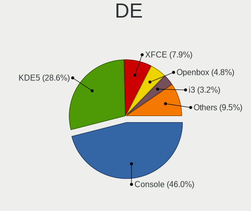

| Name     | Desktops | Percent |
|----------|----------|---------|
| Console  | 28       | 45.9%   |
| KDE5     | 17       | 27.87%  |
| XFCE     | 5        | 8.2%    |
| Openbox  | 3        | 4.92%   |
| i3       | 2        | 3.28%   |
| GNOME    | 2        | 3.28%   |
| TWM      | 1        | 1.64%   |
| spectrwm | 1        | 1.64%   |
| MATE     | 1        | 1.64%   |
| LXQt     | 1        | 1.64%   |

Display Server
--------------

X11 or Wayland

| Name    | Desktops | Percent |
|---------|----------|---------|
| X11     | 34       | 55.74%  |
| Console | 25       | 40.98%  |
| Wayland | 2        | 3.28%   |

Display Manager
---------------

SDDM, LightDM, etc.

| Name    | Desktops | Percent |
|---------|----------|---------|
| Console | 37       | 60.66%  |
| SDDM    | 11       | 18.03%  |
| SLiM    | 5        | 8.2%    |
| GDM     | 4        | 6.56%   |
| XDM     | 2        | 3.28%   |
| Ly      | 1        | 1.64%   |
| LightDM | 1        | 1.64%   |

OS Lang
-------

Language

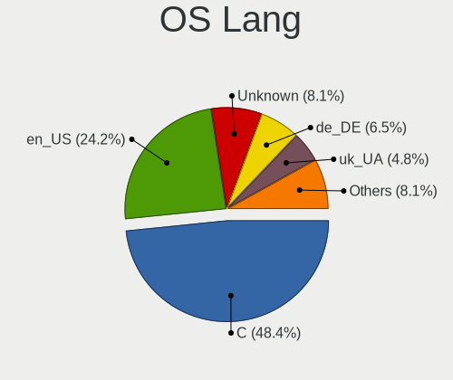

| Lang    | Desktops | Percent |
|---------|----------|---------|
| C       | 29       | 48.33%  |
| en_US   | 14       | 23.33%  |
| Unknown | 5        | 8.33%   |
| de_DE   | 4        | 6.67%   |
| uk_UA   | 3        | 5%      |
| sv_SE   | 1        | 1.67%   |
| ru_RU   | 1        | 1.67%   |
| pl_PL   | 1        | 1.67%   |
| en_CA   | 1        | 1.67%   |
| de_CH   | 1        | 1.67%   |

Boot Mode
---------

EFI or BIOS

| Mode | Desktops | Percent |
|------|----------|---------|
| EFI  | 54       | 90%     |
| BIOS | 6        | 10%     |

Filesystem
----------

Type of filesystem

| Type | Desktops | Percent |
|------|----------|---------|
| Zfs  | 39       | 65%     |
| Ufs  | 21       | 35%     |

Part. scheme
------------

Scheme of partitioning

| Type | Desktops | Percent |
|------|----------|---------|
| GPT  | 56       | 93.33%  |
| MBR  | 4        | 6.67%   |

Board
-----

Vendor
------

Motherboard manufacturer

| Name                    | Desktops | Percent |
|-------------------------|----------|---------|
| Unknown                 | 17       | 28.33%  |
| ASUSTek Computer        | 12       | 20%     |
| Gigabyte Technology     | 9        | 15%     |
| ASRock                  | 6        | 10%     |
| MSI                     | 4        | 6.67%   |
| Dell                    | 3        | 5%      |
| Beckhoff Automation     | 2        | 3.33%   |
| SolidRun                | 1        | 1.67%   |
| Raspberry Pi Foundation | 1        | 1.67%   |
| pine64                  | 1        | 1.67%   |
| khadas                  | 1        | 1.67%   |
| Hewlett-Packard         | 1        | 1.67%   |
| friendlyelec            | 1        | 1.67%   |
| ASRockRack              | 1        | 1.67%   |

Model
-----

Motherboard model

| Name                               | Desktops | Percent |
|------------------------------------|----------|---------|
| Unknown                            | 17       | 28.33%  |
| ASRock X570 Phantom Gaming 4       | 2        | 3.33%   |
| SolidRun CEX7 Platform             | 1        | 1.67%   |
| RPi rpi                            | 1        | 1.67%   |
| pine64 pinebook-pro-rk3399         | 1        | 1.67%   |
| MSI MS-7C79                        | 1        | 1.67%   |
| MSI MS-7C75                        | 1        | 1.67%   |
| MSI MS-7B89                        | 1        | 1.67%   |
| MSI MS-7B86                        | 1        | 1.67%   |
| khadas edge-v                      | 1        | 1.67%   |
| HP EliteDesk 800 G4 SFF            | 1        | 1.67%   |
| Gigabyte X670E AORUS MASTER        | 1        | 1.67%   |
| Gigabyte X570 AORUS MASTER         | 1        | 1.67%   |
| Gigabyte X570 AORUS ELITE          | 1        | 1.67%   |
| Gigabyte X399 DESIGNARE EX         | 1        | 1.67%   |
| Gigabyte H170-D3HP                 | 1        | 1.67%   |
| Gigabyte B550I AORUS PRO AX        | 1        | 1.67%   |
| Gigabyte B450M S2H                 | 1        | 1.67%   |
| Gigabyte B450M DS3H                | 1        | 1.67%   |
| Gigabyte 970A-UD3P                 | 1        | 1.67%   |
| friendlyelec nanopi-m4             | 1        | 1.67%   |
| Dell Vostro 3681                   | 1        | 1.67%   |
| Dell OptiPlex 5090                 | 1        | 1.67%   |
| Dell OptiPlex 5080                 | 1        | 1.67%   |
| Beckhoff Automation CX2033-0185    | 1        | 1.67%   |
| Beckhoff Automation CBxx63         | 1        | 1.67%   |
| ASUS TUF GAMING B550-PLUS          | 1        | 1.67%   |
| ASUS ROG STRIX X670E-F GAMING WIFI | 1        | 1.67%   |
| ASUS ROG STRIX X570-E GAMING       | 1        | 1.67%   |
| ASUS ROG STRIX B550-I GAMING       | 1        | 1.67%   |
| ASUS PRIME Z590-A                  | 1        | 1.67%   |
| ASUS PRIME Z390-P                  | 1        | 1.67%   |
| ASUS PRIME X570-PRO                | 1        | 1.67%   |
| ASUS PRIME H410M-K                 | 1        | 1.67%   |
| ASUS PRIME B550-PLUS               | 1        | 1.67%   |
| ASUS PRIME B450M-GAMING/BR         | 1        | 1.67%   |
| ASUS PRIME B450M-A                 | 1        | 1.67%   |
| ASUS P8H77-M PRO                   | 1        | 1.67%   |
| ASRockRack EPYCD8-2T               | 1        | 1.67%   |
| ASRock B550 Phantom Gaming-ITX/ax  | 1        | 1.67%   |

Model Family
------------

Motherboard model prefix

| Name                            | Desktops | Percent |
|---------------------------------|----------|---------|
| Unknown                         | 17       | 28.33%  |
| ASUS PRIME                      | 7        | 11.67%  |
| ASUS ROG                        | 3        | 5%      |
| Gigabyte X570                   | 2        | 3.33%   |
| Gigabyte B450M                  | 2        | 3.33%   |
| Dell OptiPlex                   | 2        | 3.33%   |
| ASRock X570                     | 2        | 3.33%   |
| SolidRun CEX7                   | 1        | 1.67%   |
| RPi rpi                         | 1        | 1.67%   |
| pine64 pinebook-pro-rk3399      | 1        | 1.67%   |
| MSI MS-7C79                     | 1        | 1.67%   |
| MSI MS-7C75                     | 1        | 1.67%   |
| MSI MS-7B89                     | 1        | 1.67%   |
| MSI MS-7B86                     | 1        | 1.67%   |
| khadas edge-v                   | 1        | 1.67%   |
| HP EliteDesk                    | 1        | 1.67%   |
| Gigabyte X670E                  | 1        | 1.67%   |
| Gigabyte X399                   | 1        | 1.67%   |
| Gigabyte H170-D3HP              | 1        | 1.67%   |
| Gigabyte B550I                  | 1        | 1.67%   |
| Gigabyte 970A-UD3P              | 1        | 1.67%   |
| friendlyelec nanopi-m4          | 1        | 1.67%   |
| Dell Vostro                     | 1        | 1.67%   |
| Beckhoff Automation CX2033-0185 | 1        | 1.67%   |
| Beckhoff Automation CBxx63      | 1        | 1.67%   |
| ASUS TUF                        | 1        | 1.67%   |
| ASUS P8H77-M                    | 1        | 1.67%   |
| ASRockRack EPYCD8-2T            | 1        | 1.67%   |
| ASRock B550                     | 1        | 1.67%   |
| ASRock B450                     | 1        | 1.67%   |
| ASRock A520M-ITX                | 1        | 1.67%   |
| ASRock 4X4                      | 1        | 1.67%   |

MFG Year
--------

Motherboard manufacture year

| Year    | Desktops | Percent |
|---------|----------|---------|
| Unknown | 15       | 25%     |
| 2021    | 12       | 20%     |
| 2020    | 11       | 18.33%  |
| 2019    | 8        | 13.33%  |
| 2018    | 5        | 8.33%   |
| 2023    | 3        | 5%      |
| 2022    | 3        | 5%      |
| 2017    | 1        | 1.67%   |
| 2016    | 1        | 1.67%   |
| 2012    | 1        | 1.67%   |

Form Factor
-----------

Physical design of the computer

| Name    | Desktops | Percent |
|---------|----------|---------|
| Desktop | 60       | 100%    |

Coreboot
--------

Have coreboot on board

| Used | Desktops | Percent |
|------|----------|---------|
| No   | 60       | 100%    |

RAM Size
--------

Total RAM memory

| Size in GB  | Desktops | Percent |
|-------------|----------|---------|
| 64.01-256.0 | 15       | 25%     |
| 16.01-24.0  | 15       | 25%     |
| 32.01-64.0  | 8        | 13.33%  |
| 3.01-4.0    | 7        | 11.67%  |
| 4.01-8.0    | 5        | 8.33%   |
| 8.01-16.0   | 5        | 8.33%   |
| 0.51-1.0    | 4        | 6.67%   |
| 0.01-0.5    | 1        | 1.67%   |

RAM Used
--------

Used RAM memory

| Used GB     | Desktops | Percent |
|-------------|----------|---------|
| 0.01-0.5    | 17       | 28.33%  |
| 1.01-2.0    | 16       | 26.67%  |
| 0.51-1.0    | 13       | 21.67%  |
| 2.01-3.0    | 7        | 11.67%  |
| 3.01-4.0    | 3        | 5%      |
| 0           | 2        | 3.33%   |
| 64.01-256.0 | 1        | 1.67%   |
| 16.01-24.0  | 1        | 1.67%   |

Total Drives
------------

Number of drives on board

| Drives | Desktops | Percent |
|--------|----------|---------|
| 0      | 20       | 33.33%  |
| 1      | 14       | 23.33%  |
| 2      | 9        | 15%     |
| 3      | 7        | 11.67%  |
| 6      | 3        | 5%      |
| 4      | 3        | 5%      |
| 5      | 2        | 3.33%   |
| 15     | 1        | 1.67%   |
| 7      | 1        | 1.67%   |

Has CD-ROM
----------

Has CD-ROM on board

| Presented | Desktops | Percent |
|-----------|----------|---------|
| No        | 49       | 81.67%  |
| Yes       | 11       | 18.33%  |

Has Ethernet
------------

Has Ethernet on board

| Presented | Desktops | Percent |
|-----------|----------|---------|
| Yes       | 47       | 78.33%  |
| No        | 13       | 21.67%  |

Has WiFi
--------

Has WiFi module

| Presented | Desktops | Percent |
|-----------|----------|---------|
| No        | 39       | 65%     |
| Yes       | 21       | 35%     |

Has Bluetooth
-------------

Has Bluetooth module

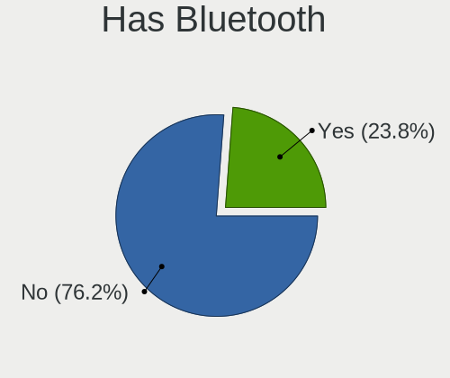

| Presented | Desktops | Percent |
|-----------|----------|---------|
| No        | 46       | 75.41%  |
| Yes       | 15       | 24.59%  |

Location
--------

Country
-------

Geographic location (country)

| Country      | Desktops | Percent |
|--------------|----------|---------|
| Russia       | 14       | 23.33%  |
| Germany      | 8        | 13.33%  |
| USA          | 6        | 10%     |
| UK           | 5        | 8.33%   |
| Ukraine      | 4        | 6.67%   |
| Brazil       | 4        | 6.67%   |
| Poland       | 3        | 5%      |
| Romania      | 2        | 3.33%   |
| Japan        | 2        | 3.33%   |
| Canada       | 2        | 3.33%   |
| Turkey       | 1        | 1.67%   |
| Switzerland  | 1        | 1.67%   |
| Sweden       | 1        | 1.67%   |
| Saudi Arabia | 1        | 1.67%   |
| Portugal     | 1        | 1.67%   |
| Netherlands  | 1        | 1.67%   |
| France       | 1        | 1.67%   |
| Denmark      | 1        | 1.67%   |
| Czechia      | 1        | 1.67%   |
| Austria      | 1        | 1.67%   |

City
----

Geographic location (city)

| City                        | Desktops | Percent |
|-----------------------------|----------|---------|
| Krasnodar                   | 7        | 11.48%  |
| Moscow                      | 4        | 6.56%   |
| Kyiv                        | 3        | 4.92%   |
| St Petersburg               | 2        | 3.28%   |
| Rio de Janeiro              | 2        | 3.28%   |
| Rietberg                    | 2        | 3.28%   |
| Egham                       | 2        | 3.28%   |
| Choroszcz                   | 2        | 3.28%   |
| Cambridge                   | 2        | 3.28%   |
| ЕЊta-ku                   | 1        | 1.64%   |
| Zurich                      | 1        | 1.64%   |
| Zaporizhzhya                | 1        | 1.64%   |
| Vila Real de Santo António | 1        | 1.64%   |
| Stolberg                    | 1        | 1.64%   |
| St. Albert                  | 1        | 1.64%   |
| Sollentuna                  | 1        | 1.64%   |
| Satu Mare                   | 1        | 1.64%   |
| Santa Monica                | 1        | 1.64%   |
| Ruislip                     | 1        | 1.64%   |
| Riyadh                      | 1        | 1.64%   |
| Radzionkow                  | 1        | 1.64%   |
| Orenburg                    | 1        | 1.64%   |
| Northeim                    | 1        | 1.64%   |
| Ludwigsburg                 | 1        | 1.64%   |
| Lake Forest                 | 1        | 1.64%   |
| Kongens Lyngby              | 1        | 1.64%   |
| Jaboatao dos Guararapes     | 1        | 1.64%   |
| Istanbul                    | 1        | 1.64%   |
| Innisfil                    | 1        | 1.64%   |
| Graz                        | 1        | 1.64%   |
| Göttingen                  | 1        | 1.64%   |
| Fuchu                       | 1        | 1.64%   |
| Fremont                     | 1        | 1.64%   |
| Cordeiropolis               | 1        | 1.64%   |
| Cologne                     | 1        | 1.64%   |
| Claix                       | 1        | 1.64%   |
| Chicago                     | 1        | 1.64%   |
| Bunkyo-ku                   | 1        | 1.64%   |
| Brno                        | 1        | 1.64%   |
| Bessemer                    | 1        | 1.64%   |

Drives
------

Drive Vendor
------------

Hard drive vendors

| Vendor              | Desktops | Drives | Percent |
|---------------------|----------|--------|---------|
| WDC                 | 16       | 22     | 22.22%  |
| Samsung Electronics | 12       | 22     | 16.67%  |
| Seagate             | 9        | 21     | 12.5%   |
| Crucial             | 7        | 14     | 9.72%   |
| Kingston            | 6        | 7      | 8.33%   |
| Toshiba             | 5        | 9      | 6.94%   |
| Intel               | 4        | 4      | 5.56%   |
| A-DATA Technology   | 3        | 3      | 4.17%   |
| SK hynix            | 2        | 2      | 2.78%   |
| SPCC                | 1        | 1      | 1.39%   |
| PNY                 | 1        | 1      | 1.39%   |
| Phison              | 1        | 2      | 1.39%   |
| Micron Technology   | 1        | 2      | 1.39%   |
| HGST                | 1        | 2      | 1.39%   |
| GOODRAM             | 1        | 1      | 1.39%   |
| FORESEE             | 1        | 1      | 1.39%   |
| Apacer              | 1        | 1      | 1.39%   |

Drive Model
-----------

Hard drive models

| Model                                 | Desktops | Percent |
|---------------------------------------|----------|---------|
| Samsung SSD 870 EVO 1TB               | 3        | 3.61%   |
| Samsung SSD 860 EVO 250GB             | 3        | 3.61%   |
| WDC WD30EFRX-68EUZN0 3TB              | 2        | 2.41%   |
| WDC PC SN730 SDBQNTY-256G-1001 256GB  | 2        | 2.41%   |
| Toshiba MQ04ABF100 1TB                | 2        | 2.41%   |
| Samsung SSD 980 PRO 1TB               | 2        | 2.41%   |
| Kingston SA2000M81000G 1TB            | 2        | 2.41%   |
| Crucial CT750MX300SSD1 752GB          | 2        | 2.41%   |
| WDC WDS250G2B0C-00PXH0 250GB          | 1        | 1.2%    |
| WDC WDS100T2B0A-00SM50 1TB            | 1        | 1.2%    |
| WDC WD60EFRX-68TGBN1 6TB              | 1        | 1.2%    |
| WDC WD5002ABYS-18B1B0 500GB           | 1        | 1.2%    |
| WDC WD40EZRZ-75GXCB0 4TB              | 1        | 1.2%    |
| WDC WD20EZRZ-00Z5HB0 2TB              | 1        | 1.2%    |
| WDC WD2003FZEX-00SRLA0 2TB            | 1        | 1.2%    |
| WDC WD120EFAX-68UNTN0 12TB            | 1        | 1.2%    |
| WDC WD10SPZX-21Z10T0 1TB              | 1        | 1.2%    |
| WDC WD10JMVW-11AJGS3 1TB              | 1        | 1.2%    |
| WDC WD10EZEX-60WN4A0 1TB              | 1        | 1.2%    |
| WDC WD10EZEX-21WN4A0 1TB              | 1        | 1.2%    |
| WDC WD10EZEX-00RKKA0 1TB              | 1        | 1.2%    |
| WDC WD10EARX-00N0YB0 1TB              | 1        | 1.2%    |
| WDC WD10EALX-759BA1 1TB               | 1        | 1.2%    |
| Toshiba MG09ACA18TE 18TB              | 1        | 1.2%    |
| Toshiba MG06ACA800E 8TB               | 1        | 1.2%    |
| Toshiba DT01ACA200 2TB                | 1        | 1.2%    |
| SPCC Solid State Disk 240GB           | 1        | 1.2%    |
| SK hynix PC801 NVMe 2TB               | 1        | 1.2%    |
| SK hynix HFS128G39TND-N210A 128GB     | 1        | 1.2%    |
| Seagate ST8000VN0022-2EL112 8TB       | 1        | 1.2%    |
| Seagate ST5000LM000-2U8170 5TB        | 1        | 1.2%    |
| Seagate ST4000DM000-1F2168 4TB        | 1        | 1.2%    |
| Seagate ST3750640AS 752GB             | 1        | 1.2%    |
| Seagate ST32000641AS 2TB              | 1        | 1.2%    |
| Seagate ST3000DM007-1WY10G 3TB        | 1        | 1.2%    |
| Seagate ST3000DM001-1ER166 3TB        | 1        | 1.2%    |
| Seagate ST2000VN000-1H3164 2TB        | 1        | 1.2%    |
| Seagate ST2000DM008-2FR102 2TB        | 1        | 1.2%    |
| Seagate ST1000DM003-1CH162 1TB        | 1        | 1.2%    |
| Samsung SSD 980 PRO with Heatsink 2TB | 1        | 1.2%    |

HDD Vendor
----------

Hard disk drive vendors

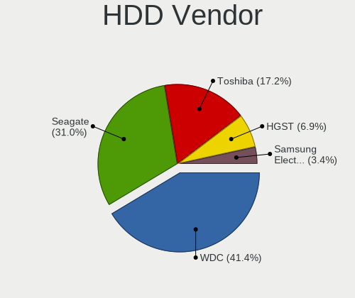

| Vendor              | Desktops | Drives | Percent |
|---------------------|----------|--------|---------|
| WDC                 | 12       | 17     | 42.86%  |
| Seagate             | 9        | 21     | 32.14%  |
| Toshiba             | 5        | 9      | 17.86%  |
| Samsung Electronics | 1        | 2      | 3.57%   |
| HGST                | 1        | 2      | 3.57%   |

SSD Vendor
----------

Solid state drive vendors

| Vendor              | Desktops | Drives | Percent |
|---------------------|----------|--------|---------|
| Samsung Electronics | 8        | 12     | 29.63%  |
| Crucial             | 6        | 11     | 22.22%  |
| Kingston            | 4        | 5      | 14.81%  |
| A-DATA Technology   | 3        | 3      | 11.11%  |
| WDC                 | 1        | 2      | 3.7%    |
| SPCC                | 1        | 1      | 3.7%    |
| SK hynix            | 1        | 1      | 3.7%    |
| Intel               | 1        | 1      | 3.7%    |
| GOODRAM             | 1        | 1      | 3.7%    |
| Apacer              | 1        | 1      | 3.7%    |

Drive Kind
----------

HDD or SSD

| Kind | Desktops | Drives | Percent |
|------|----------|--------|---------|
| SSD  | 26       | 38     | 38.81%  |
| HDD  | 21       | 51     | 31.34%  |
| NVMe | 20       | 26     | 29.85%  |

Drive Connector
---------------

SATA, SAS, NVMe, etc.

| Type | Desktops | Drives | Percent |
|------|----------|--------|---------|
| SATA | 34       | 89     | 62.96%  |
| NVMe | 20       | 26     | 37.04%  |

Drive Size
----------

Size of hard drive

| Size in TB | Desktops | Drives | Percent |
|------------|----------|--------|---------|
| 0.01-0.5   | 18       | 25     | 34.62%  |
| 0.51-1.0   | 17       | 25     | 32.69%  |
| 1.01-2.0   | 6        | 9      | 11.54%  |
| 4.01-10.0  | 4        | 20     | 7.69%   |
| 2.01-3.0   | 3        | 4      | 5.77%   |
| 3.01-4.0   | 2        | 3      | 3.85%   |
| 10.01-20.0 | 2        | 3      | 3.85%   |

Space Total
-----------

Amount of disk space available on the file system

| Size in GB     | Desktops | Percent |
|----------------|----------|---------|
| 101-250        | 18       | 30%     |
| 251-500        | 13       | 21.67%  |
| 1-20           | 8        | 13.33%  |
| 501-1000       | 7        | 11.67%  |
| 21-50          | 6        | 10%     |
| 2001-3000      | 3        | 5%      |
| More than 3000 | 2        | 3.33%   |
| 51-100         | 2        | 3.33%   |
| 1001-2000      | 1        | 1.67%   |

Space Used
----------

Amount of used disk space

| Used GB        | Desktops | Percent |
|----------------|----------|---------|
| 1-20           | 42       | 68.85%  |
| 21-50          | 10       | 16.39%  |
| 101-250        | 2        | 3.28%   |
| 1001-2000      | 2        | 3.28%   |
| More than 3000 | 1        | 1.64%   |
| 251-500        | 1        | 1.64%   |
| 501-1000       | 1        | 1.64%   |
| 51-100         | 1        | 1.64%   |
| 0              | 1        | 1.64%   |

Malfunc. Drives
---------------

Drive models with a malfunction

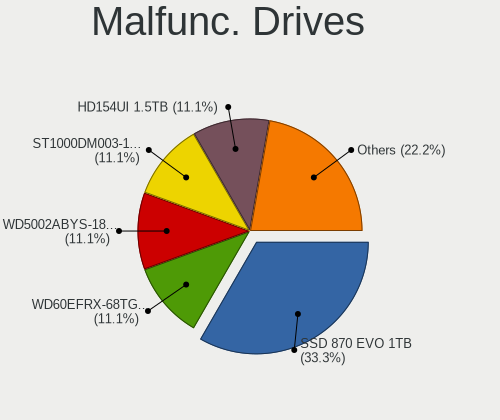

| Model                               | Desktops | Drives | Percent |
|-------------------------------------|----------|--------|---------|
| Samsung Electronics SSD 870 EVO 1TB | 3        | 5      | 33.33%  |
| WDC WD60EFRX-68TGBN1 6TB            | 1        | 3      | 11.11%  |
| WDC WD5002ABYS-18B1B0 500GB         | 1        | 1      | 11.11%  |
| Seagate ST1000DM003-1CH162 1TB      | 1        | 1      | 11.11%  |
| Samsung Electronics HD154UI 1.5TB   | 1        | 2      | 11.11%  |
| Kingston SHPM2280P2H-240G           | 1        | 1      | 11.11%  |
| Kingston SA400S37120G 120GB         | 1        | 1      | 11.11%  |

Malfunc. Drive Vendor
---------------------

Vendors of faulty drives

| Vendor              | Desktops | Drives | Percent |
|---------------------|----------|--------|---------|
| Samsung Electronics | 4        | 7      | 44.44%  |
| WDC                 | 2        | 4      | 22.22%  |
| Kingston            | 2        | 2      | 22.22%  |
| Seagate             | 1        | 1      | 11.11%  |

Malfunc. HDD Vendor
-------------------

Vendors of faulty HDD drives

| Vendor              | Desktops | Drives | Percent |
|---------------------|----------|--------|---------|
| WDC                 | 2        | 4      | 50%     |
| Seagate             | 1        | 1      | 25%     |
| Samsung Electronics | 1        | 2      | 25%     |

Malfunc. Drive Kind
-------------------

Kinds of faulty drives

| Kind | Desktops | Drives | Percent |
|------|----------|--------|---------|
| SSD  | 4        | 7      | 50%     |
| HDD  | 4        | 7      | 50%     |

Failed Drives
-------------

Failed drive models

Zero info for selected period =(

Failed Drive Vendor
-------------------

Failed drive vendors

Zero info for selected period =(

Drive Status
------------

Number of failed and malfunc. drives

| Status   | Desktops | Drives | Percent |
|----------|----------|--------|---------|
| Works    | 39       | 98     | 82.98%  |
| Malfunc  | 7        | 14     | 14.89%  |
| Detected | 1        | 3      | 2.13%   |

Storage controller
------------------

Storage Vendor
--------------

Storage controller vendors

| Vendor                      | Desktops | Percent |
|-----------------------------|----------|---------|
| AMD                         | 25       | 32.89%  |
| Intel                       | 16       | 21.05%  |
| Samsung Electronics         | 8        | 10.53%  |
| Silicon Motion              | 6        | 7.89%   |
| SanDisk                     | 5        | 6.58%   |
| Kingston Technology Company | 4        | 5.26%   |
| SK hynix                    | 2        | 2.63%   |
| Phison Electronics          | 2        | 2.63%   |
| Micron/Crucial Technology   | 2        | 2.63%   |
| Marvell Technology Group    | 2        | 2.63%   |
| ASMedia Technology          | 2        | 2.63%   |
| Micron Technology           | 1        | 1.32%   |
| Broadcom / LSI              | 1        | 1.32%   |

Storage Model
-------------

Storage controller models

| Model                                                                         | Desktops | Percent |
|-------------------------------------------------------------------------------|----------|---------|
| AMD FCH SATA Controller [AHCI mode]                                           | 17       | 19.32%  |
| AMD 400 Series Chipset SATA Controller                                        | 7        | 7.95%   |
| Silicon Motion SM2263EN/SM2263XT SSD Controller                               | 6        | 6.82%   |
| Samsung NVMe SSD Controller SM981/PM981/PM983                                 | 6        | 6.82%   |
| AMD 500 Series Chipset SATA Controller                                        | 5        | 5.68%   |
| Intel Comet Lake SATA AHCI Controller                                         | 4        | 4.55%   |
| Kingston Company A2000 NVMe SSD                                               | 3        | 3.41%   |
| SanDisk WD Blue SN550 NVMe SSD                                                | 2        | 2.27%   |
| SanDisk WD Black SN750 / PC SN730 NVMe SSD                                    | 2        | 2.27%   |
| Samsung NVMe SSD Controller PM9A1/PM9A3/980PRO                                | 2        | 2.27%   |
| Phison E12 NVMe Controller                                                    | 2        | 2.27%   |
| Intel SSD Pro 7600p/760p/E 6100p Series                                       | 2        | 2.27%   |
| Intel Cannon Lake PCH SATA AHCI Controller                                    | 2        | 2.27%   |
| Intel 500 Series Chipset Family SATA AHCI Controller                          | 2        | 2.27%   |
| Intel 400 Series Chipset Family SATA AHCI Controller                          | 2        | 2.27%   |
| SK hynix Platinum P41/PC801 NVMe Solid State Drive                            | 1        | 1.14%   |
| SK hynix BC511 NVMe SSD                                                       | 1        | 1.14%   |
| Samsung NVMe SSD Controller SM961/PM961/SM963                                 | 1        | 1.14%   |
| Samsung NVMe SSD Controller 980                                               | 1        | 1.14%   |
| Micron/Crucial P2 NVMe PCIe SSD                                               | 1        | 1.14%   |
| Micron/Crucial P1 NVMe PCIe SSD                                               | 1        | 1.14%   |
| Micron NVMe Storage Controller                                                | 1        | 1.14%   |
| Marvell Group 88SE9172 SATA III 6Gb/s RAID Controller                         | 1        | 1.14%   |
| Marvell Group 88SE9170 PCIe 2.0 x1 2-port SATA 6 Gb/s Controller              | 1        | 1.14%   |
| Kingston Company HyperX Predator PCIe AHCI SSD                                | 1        | 1.14%   |
| Intel SSD 660P Series                                                         | 1        | 1.14%   |
| Intel Q170/Q150/B150/H170/H110/Z170/CM236 Chipset SATA Controller [AHCI Mode] | 1        | 1.14%   |
| Intel Atom Processor E3800 Series SATA AHCI Controller                        | 1        | 1.14%   |
| Intel 82801 Mobile SATA Controller [RAID mode]                                | 1        | 1.14%   |
| Intel 7 Series/C210 Series Chipset Family 4-port SATA Controller [IDE mode]   | 1        | 1.14%   |
| Intel 7 Series/C210 Series Chipset Family 2-port SATA Controller [IDE mode]   | 1        | 1.14%   |
| Broadcom / LSI SAS3008 PCI-Express Fusion-MPT SAS-3                           | 1        | 1.14%   |
| ASMedia ASM1166 Serial ATA Controller                                         | 1        | 1.14%   |
| ASMedia ASM1062 Serial ATA Controller                                         | 1        | 1.14%   |
| AMD X399 Series Chipset SATA Controller                                       | 1        | 1.14%   |
| AMD SB7x0/SB8x0/SB9x0 SATA Controller [AHCI mode]                             | 1        | 1.14%   |
| AMD FCH SATA Controller [RAID Bottom]                                         | 1        | 1.14%   |
| AMD FCH RAID Controller                                                       | 1        | 1.14%   |
| Unknown                                                                       | 1        | 1.14%   |

Storage Kind
------------

Kind of storage controller (IDE, SATA, NVMe, SAS, ...)

| Kind | Desktops | Percent |
|------|----------|---------|
| SATA | 37       | 50.68%  |
| NVMe | 32       | 43.84%  |
| RAID | 2        | 2.74%   |
| SAS  | 1        | 1.37%   |
| IDE  | 1        | 1.37%   |

Processor
---------

CPU Vendor
----------

Processor vendors

| Vendor   | Desktops | Percent |
|----------|----------|---------|
| AMD      | 26       | 42.62%  |
| Intel    | 14       | 22.95%  |
| ARM      | 13       | 21.31%  |
| Unknown  | 6        | 9.84%   |
| Research | 1        | 1.64%   |
| NXP      | 1        | 1.64%   |

CPU Model
---------

Processor models

| Model                                          | Desktops | Percent |
|------------------------------------------------|----------|---------|
| ARM Cortex-A55 r2p0                            | 9        | 14.75%  |
|                                                | 6        | 9.84%   |
| AMD Ryzen 5 5600G with Radeon Graphics         | 4        | 6.56%   |
| Intel Core i5-10400 CPU @ 2.90GHz              | 3        | 4.92%   |
| ARM Cortex-A53 r0p4                            | 2        | 3.28%   |
| AMD Ryzen 9 7950X 16-Core Processor            | 2        | 3.28%   |
| AMD Ryzen 9 5950X 16-Core Processor            | 2        | 3.28%   |
| AMD Ryzen 9 3900X 12-Core Processor            | 2        | 3.28%   |
| AMD Ryzen 7 2700X Eight-Core Processor         | 2        | 3.28%   |
| Research Morello SoC r0p0                      | 1        | 1.64%   |
| NXP Cortex-A72                                 | 1        | 1.64%   |
| Intel Core i7-8750H CPU @ 2.20GHz              | 1        | 1.64%   |
| Intel Core i7-8700 CPU @ 3.20GHz               | 1        | 1.64%   |
| Intel Core i7-6700 CPU @ 3.40GHz               | 1        | 1.64%   |
| Intel Core i7-3770 CPU @ 3.40GHz               | 1        | 1.64%   |
| Intel Core i7-10700K CPU @ 3.80GHz             | 1        | 1.64%   |
| Intel Core i7-10700 CPU @ 2.90GHz              | 1        | 1.64%   |
| Intel Core i5-9600K CPU @ 3.70GHz              | 1        | 1.64%   |
| Intel Core i5-10500T CPU @ 2.30GHz             | 1        | 1.64%   |
| Intel Atom CPU E3827 @ 1.74GHz                 | 1        | 1.64%   |
| Intel 11th Gen Core i7-11700 @ 2.50GHz         | 1        | 1.64%   |
| Intel 11th Gen Core i5-11400 @ 2.60GHz         | 1        | 1.64%   |
| ARM Cortex-A72 r0p2                            | 1        | 1.64%   |
| ARM ARM1176 r0p7 (ECO: 0x00000000)             | 1        | 1.64%   |
| AMD Ryzen Threadripper 1950X 16-Core Processor | 1        | 1.64%   |
| AMD Ryzen Embedded V1202B with Radeon Vega Gfx | 1        | 1.64%   |
| AMD Ryzen 9 5900X 12-Core Processor            | 1        | 1.64%   |
| AMD Ryzen 9 3950X 16-Core Processor            | 1        | 1.64%   |
| AMD Ryzen 7 5800X 8-Core Processor             | 1        | 1.64%   |
| AMD Ryzen 7 4800U with Radeon Graphics         | 1        | 1.64%   |
| AMD Ryzen 5 5600H with Radeon Graphics         | 1        | 1.64%   |
| AMD Ryzen 5 4600G with Radeon Graphics         | 1        | 1.64%   |
| AMD Ryzen 5 2600X Six-Core Processor           | 1        | 1.64%   |
| AMD Ryzen 5 2600 Six-Core Processor            | 1        | 1.64%   |
| AMD Ryzen 5 2400GE with Radeon Vega Graphics   | 1        | 1.64%   |
| AMD FX-8320E Eight-Core Processor              | 1        | 1.64%   |
| AMD EPYC 7601 32-Core Processor                | 1        | 1.64%   |
| AMD Athlon 3000G with Radeon Vega Graphics     | 1        | 1.64%   |

CPU Model Family
----------------

Processor model prefix

| Model                  | Desktops | Percent |
|------------------------|----------|---------|
| ARM Cortex             | 12       | 19.67%  |
| Other                  | 11       | 18.03%  |
| AMD Ryzen 5            | 9        | 14.75%  |
| AMD Ryzen 9            | 8        | 13.11%  |
| Intel Core i7          | 6        | 9.84%   |
| Intel Core i5          | 5        | 8.2%    |
| AMD Ryzen 7            | 4        | 6.56%   |
| Intel Atom             | 1        | 1.64%   |
| AMD Ryzen Threadripper | 1        | 1.64%   |
| AMD Ryzen Embedded     | 1        | 1.64%   |
| AMD FX                 | 1        | 1.64%   |
| AMD EPYC               | 1        | 1.64%   |
| AMD Athlon             | 1        | 1.64%   |

CPU Cores
---------

Number of processor cores

| Number  | Desktops | Percent |
|---------|----------|---------|
| Unknown | 20       | 33.33%  |
| 12      | 8        | 13.33%  |
| 6       | 8        | 13.33%  |
| 32      | 6        | 10%     |
| 8       | 5        | 8.33%   |
| 16      | 4        | 6.67%   |
| 24      | 3        | 5%      |
| 4       | 3        | 5%      |
| 2       | 2        | 3.33%   |
| 64      | 1        | 1.67%   |

CPU Sockets
-----------

Number of sockets

| Number  | Desktops | Percent |
|---------|----------|---------|
| 1       | 45       | 73.77%  |
| Unknown | 16       | 26.23%  |

CPU Threads
-----------

Threads per core (Hyper-Threading)

| Number  | Desktops | Percent |
|---------|----------|---------|
| 1       | 28       | 46.67%  |
| Unknown | 20       | 33.33%  |
| 2       | 12       | 20%     |

CPU Microarch
-------------

Microarchitecture

| Name       | Desktops | Percent |
|------------|----------|---------|
| Unknown    | 24       | 40%     |
| Zen 3      | 9        | 15%     |
| CometLake  | 6        | 10%     |
| Zen+       | 5        | 8.33%   |
| Zen 2      | 5        | 8.33%   |
| Zen        | 4        | 6.67%   |
| KabyLake   | 3        | 5%      |
| Skylake    | 1        | 1.67%   |
| Silvermont | 1        | 1.67%   |
| Piledriver | 1        | 1.67%   |
| IvyBridge  | 1        | 1.67%   |

Graphics
--------

GPU Vendor
----------

Vendors of graphics cards

| Vendor | Desktops | Percent |
|--------|----------|---------|
| AMD    | 20       | 44.44%  |
| Nvidia | 17       | 37.78%  |
| Intel  | 8        | 17.78%  |

GPU Model
---------

Graphics card models

| Model                                                                 | Desktops | Percent |
|-----------------------------------------------------------------------|----------|---------|
| AMD Cezanne [Radeon Vega Series / Radeon Vega Mobile Series]          | 5        | 10.87%  |
| Intel CometLake-S GT2 [UHD Graphics 630]                              | 3        | 6.52%   |
| Nvidia GP108 [GeForce GT 1030]                                        | 2        | 4.35%   |
| Nvidia GK208B [GeForce GT 710]                                        | 2        | 4.35%   |
| AMD Renoir                                                            | 2        | 4.35%   |
| AMD Raven Ridge [Radeon Vega Series / Radeon Vega Mobile Series]      | 2        | 4.35%   |
| AMD Raphael                                                           | 2        | 4.35%   |
| Nvidia TU117 [GeForce GTX 1650]                                       | 1        | 2.17%   |
| Nvidia TU116 [GeForce GTX 1660]                                       | 1        | 2.17%   |
| Nvidia GT218 [GeForce 210]                                            | 1        | 2.17%   |
| Nvidia GP107M [GeForce GTX 1050 Mobile]                               | 1        | 2.17%   |
| Nvidia GP107GL [Quadro P620]                                          | 1        | 2.17%   |
| Nvidia GP107 [GeForce GTX 1050]                                       | 1        | 2.17%   |
| Nvidia GP107 [GeForce GTX 1050 Ti]                                    | 1        | 2.17%   |
| Nvidia GP106 [GeForce GTX 1060 3GB]                                   | 1        | 2.17%   |
| Nvidia GP104 [GeForce GTX 1080]                                       | 1        | 2.17%   |
| Nvidia GM206 [GeForce GTX 960]                                        | 1        | 2.17%   |
| Nvidia GM107 [GeForce GTX 750 Ti]                                     | 1        | 2.17%   |
| Nvidia GA104 [GeForce RTX 3060 Ti GDDR6X]                             | 1        | 2.17%   |
| Nvidia GA102 [GeForce RTX 3080 Ti]                                    | 1        | 2.17%   |
| Intel RocketLake-S GT1 [UHD Graphics 750]                             | 1        | 2.17%   |
| Intel IvyBridge GT2 [HD Graphics 4000]                                | 1        | 2.17%   |
| Intel CoffeeLake-S GT2 [UHD Graphics 630]                             | 1        | 2.17%   |
| Intel CoffeeLake-H GT2 [UHD Graphics 630]                             | 1        | 2.17%   |
| Intel Atom Processor Z36xxx/Z37xxx Series Graphics & Display          | 1        | 2.17%   |
| AMD RV630 XT [Radeon HD 2600 XT]                                      | 1        | 2.17%   |
| AMD Picasso/Raven 2 [Radeon Vega Series / Radeon Vega Mobile Series]  | 1        | 2.17%   |
| AMD Oland [Radeon HD 8570 / R5 430 OEM / R7 240/340 / Radeon 520 OEM] | 1        | 2.17%   |
| AMD Navi 31 [Radeon RX 7900 XT/7900 XTX]                              | 1        | 2.17%   |
| AMD Navi 23 [Radeon RX 6650 XT / 6700S / 6800S]                       | 1        | 2.17%   |
| AMD Navi 23 [Radeon RX 6600/6600 XT/6600M]                            | 1        | 2.17%   |
| AMD Navi 22 [Radeon RX 6700/6700 XT/6750 XT / 6800M/6850M XT]         | 1        | 2.17%   |
| AMD Ellesmere [Radeon RX 470/480/570/570X/580/580X/590]               | 1        | 2.17%   |
| AMD Cape Verde PRO [Radeon HD 7750/8740 / R7 250E]                    | 1        | 2.17%   |
| AMD Baffin [Radeon RX 460/560D / Pro 450/455/460/555/555X/560/560X]   | 1        | 2.17%   |

GPU Combo
---------

Combinations of graphics cards

| Name           | Desktops | Percent |
|----------------|----------|---------|
| Other          | 20       | 33.33%  |
| 1 x AMD        | 16       | 26.67%  |
| 1 x Nvidia     | 14       | 23.33%  |
| 1 x Intel      | 5        | 8.33%   |
| Intel + Nvidia | 2        | 3.33%   |
| 2 x AMD        | 1        | 1.67%   |
| Intel + AMD    | 1        | 1.67%   |
| AMD + Nvidia   | 1        | 1.67%   |

GPU Driver
----------

Free vs proprietary

| Driver      | Desktops | Percent |
|-------------|----------|---------|
| Free        | 25       | 41.67%  |
| Unknown     | 20       | 33.33%  |
| Proprietary | 15       | 25%     |

GPU Memory
----------

Total video memory

| Size in GB | Desktops | Percent |
|------------|----------|---------|
| Unknown    | 37       | 61.67%  |
| 1.01-2.0   | 7        | 11.67%  |
| 7.01-8.0   | 4        | 6.67%   |
| 3.01-4.0   | 4        | 6.67%   |
| 0.51-1.0   | 3        | 5%      |
| 8.01-16.0  | 2        | 3.33%   |
| 5.01-6.0   | 1        | 1.67%   |
| 2.01-3.0   | 1        | 1.67%   |
| 0.01-0.5   | 1        | 1.67%   |

Monitor
-------

Monitor Vendor
--------------

Monitor vendors

| Vendor              | Desktops | Percent |
|---------------------|----------|---------|
| Goldstar            | 6        | 20%     |
| Dell                | 5        | 16.67%  |
| LG Electronics      | 3        | 10%     |
| BenQ                | 3        | 10%     |
| Sony                | 2        | 6.67%   |
| Samsung Electronics | 2        | 6.67%   |
| RTK                 | 2        | 6.67%   |
| Philips             | 1        | 3.33%   |
| Lenovo              | 1        | 3.33%   |
| Idek Iiyama         | 1        | 3.33%   |
| Hewlett-Packard     | 1        | 3.33%   |
| Eizo                | 1        | 3.33%   |
| BOE                 | 1        | 3.33%   |
| AOC                 | 1        | 3.33%   |

Monitor Model
-------------

Monitor models

| Model                                                                  | Desktops | Percent |
|------------------------------------------------------------------------|----------|---------|
| RTK WCS Display RTK1A1B 1920x1080 344x195mm 15.6-inch                  | 2        | 6.45%   |
| Sony TV SNY4B03 1920x1080 930x520mm 41.9-inch                          | 1        | 3.23%   |
| Sony TV  *30 SNY05D1 3840x2160 1660x930mm 74.9-inch                    | 1        | 3.23%   |
| Samsung Electronics SyncMaster SAM05FC 1920x1080                       | 1        | 3.23%   |
| Samsung Electronics LCD Monitor SAM0A7D 1920x1080 1020x570mm 46.0-inch | 1        | 3.23%   |
| Philips PHL 273V7 PHLC156 1920x1080 600x340mm 27.2-inch                | 1        | 3.23%   |
| LG Electronics LCD Monitor LX20D 1600x1200                             | 1        | 3.23%   |
| LG Electronics LCD Monitor LG Ultra HD 11520x2160                      | 1        | 3.23%   |
| LG Electronics LCD Monitor LG Ultra HD                                 | 1        | 3.23%   |
| LG Electronics LCD Monitor LG FULL HD 1920x1080                        | 1        | 3.23%   |
| Lenovo LEN X24A LEN60CF 1920x1080 530x300mm 24.0-inch                  | 1        | 3.23%   |
| Idek Iiyama LCD Monitor PL2792UH 3840x2160                             | 1        | 3.23%   |
| Hewlett-Packard E233 HPN345F 1920x1080 510x290mm 23.1-inch             | 1        | 3.23%   |
| Goldstar LG Ultra HD GSM5B09 3840x2160 600x340mm 27.2-inch             | 1        | 3.23%   |
| Goldstar LG Ultra HD GSM5B08 3840x2160 600x340mm 27.2-inch             | 1        | 3.23%   |
| Goldstar LG HDR WFHD GSM7714 2560x1080 800x340mm 34.2-inch             | 1        | 3.23%   |
| Goldstar 27GL650F GSM5B71 1920x1080 530x300mm 24.0-inch                | 1        | 3.23%   |
| Goldstar 27GK750F GSM770F 1920x1080 600x340mm 27.2-inch                | 1        | 3.23%   |
| Goldstar 23EA53 GSM59A8 1920x1080 510x290mm 23.1-inch                  | 1        | 3.23%   |
| Eizo FX2431 ENC2036 1920x1200 520x330mm 24.2-inch                      | 1        | 3.23%   |
| Dell U2719DC DEL417C 2560x1440 600x340mm 27.2-inch                     | 1        | 3.23%   |
| Dell U2518D DEL413C 2560x1440 550x310mm 24.9-inch                      | 1        | 3.23%   |
| Dell U2412M DELA07A 1920x1200 520x320mm 24.0-inch                      | 1        | 3.23%   |
| Dell LCD Monitor U2715H 2560x1440                                      | 1        | 3.23%   |
| Dell LCD Monitor S2422HG 1920x1080                                     | 1        | 3.23%   |
| BOE LCD Monitor BOE06E2 1920x1080 310x170mm 13.9-inch                  | 1        | 3.23%   |
| BenQ PD3200Q BNQ8026 2560x1440 710x400mm 32.1-inch                     | 1        | 3.23%   |
| BenQ LCD Monitor BNQ78CA 1920x1080 600x340mm 27.2-inch                 | 1        | 3.23%   |
| BenQ GW2280 BNQ78E8 1920x1080 480x270mm 21.7-inch                      | 1        | 3.23%   |
| AOC U3277WB AOC3277 3840x2160 700x390mm 31.5-inch                      | 1        | 3.23%   |

Monitor Resolution
------------------

Monitor screen resolution

| Resolution        | Desktops | Percent |
|-------------------|----------|---------|
| 1920x1080 (FHD)   | 16       | 51.61%  |
| 3840x2160 (4K)    | 5        | 16.13%  |
| 2560x1440 (QHD)   | 4        | 12.9%   |
| 1920x1200 (WUXGA) | 2        | 6.45%   |
| 2560x1080         | 1        | 3.23%   |
| 1600x1200         | 1        | 3.23%   |
| 11520x2160        | 1        | 3.23%   |
| Unknown           | 1        | 3.23%   |

Monitor Diagonal
----------------

Diagonal size in inches

| Inches  | Desktops | Percent |
|---------|----------|---------|
| Unknown | 7        | 23.33%  |
| 27      | 6        | 20%     |
| 24      | 5        | 16.67%  |
| 32      | 2        | 6.67%   |
| 23      | 2        | 6.67%   |
| 15      | 2        | 6.67%   |
| 74      | 1        | 3.33%   |
| 46      | 1        | 3.33%   |
| 41      | 1        | 3.33%   |
| 34      | 1        | 3.33%   |
| 21      | 1        | 3.33%   |
| 13      | 1        | 3.33%   |

Monitor Width
-------------

Physical width

| Width in mm | Desktops | Percent |
|-------------|----------|---------|
| 501-600     | 13       | 43.33%  |
| Unknown     | 7        | 23.33%  |
| 701-800     | 3        | 10%     |
| 301-350     | 3        | 10%     |
| 401-500     | 1        | 3.33%   |
| 1501-2000   | 1        | 3.33%   |
| 1001-1500   | 1        | 3.33%   |
| 901-1000    | 1        | 3.33%   |

Aspect Ratio
------------

Proportional relationship between the width and the height

| Ratio   | Desktops | Percent |
|---------|----------|---------|
| 16/9    | 20       | 68.97%  |
| Unknown | 6        | 20.69%  |
| 16/10   | 2        | 6.9%    |
| 21/9    | 1        | 3.45%   |

Monitor Area
------------

Area in inch²

| Area in inch² | Desktops | Percent |
|----------------|----------|---------|
| Unknown        | 7        | 23.33%  |
| 301-350        | 6        | 20%     |
| 201-250        | 5        | 16.67%  |
| 351-500        | 3        | 10%     |
| 251-300        | 3        | 10%     |
| 101-110        | 2        | 6.67%   |
| 501-1000       | 2        | 6.67%   |
| More than 1000 | 1        | 3.33%   |
| 81-90          | 1        | 3.33%   |

Pixel Density
-------------

Pixels per inch

| Density | Desktops | Percent |
|---------|----------|---------|
| 51-100  | 14       | 48.28%  |
| Unknown | 7        | 24.14%  |
| 121-160 | 3        | 10.34%  |
| 161-240 | 2        | 6.9%    |
| 101-120 | 2        | 6.9%    |
| 1-50    | 1        | 3.45%   |

Multiple Monitors
-----------------

Total monitors connected

| Total | Desktops | Percent |
|-------|----------|---------|
| 0     | 30       | 50%     |
| 1     | 28       | 46.67%  |
| 2     | 2        | 3.33%   |

Network
-------

Net Controller Vendor
---------------------

Controller vendors

| Vendor                          | Desktops | Percent |
|---------------------------------|----------|---------|
| Realtek Semiconductor           | 31       | 44.29%  |
| Intel                           | 28       | 40%     |
| Qualcomm Atheros                | 2        | 2.86%   |
| Xiaomi                          | 1        | 1.43%   |
| TP-Link                         | 1        | 1.43%   |
| Ralink Technology               | 1        | 1.43%   |
| Ralink                          | 1        | 1.43%   |
| Qualcomm Atheros Communications | 1        | 1.43%   |
| Mellanox Technologies           | 1        | 1.43%   |
| MediaTek                        | 1        | 1.43%   |
| ASUSTek Computer                | 1        | 1.43%   |
| Arduino SA                      | 1        | 1.43%   |

Net Controller Model
--------------------

Controller models

| Model                                                                         | Desktops | Percent |
|-------------------------------------------------------------------------------|----------|---------|
| Realtek RTL8111/8168/8411 PCI Express Gigabit Ethernet Controller             | 18       | 21.43%  |
| Realtek RTL8125 2.5GbE Controller                                             | 13       | 15.48%  |
| Intel I211 Gigabit Network Connection                                         | 7        | 8.33%   |
| Intel Wi-Fi 6 AX200                                                           | 6        | 7.14%   |
| Intel Ethernet Controller I225-V                                              | 5        | 5.95%   |
| Intel 82574L Gigabit Network Connection                                       | 4        | 4.76%   |
| Intel I210 Gigabit Network Connection                                         | 3        | 3.57%   |
| Xiaomi Mi/Redmi series (RNDIS + ADB)                                          | 1        | 1.19%   |
| TP-Link Archer T3U [Realtek RTL8812BU]                                        | 1        | 1.19%   |
| Realtek RTL8822CE 802.11ac PCIe Wireless Network Adapter                      | 1        | 1.19%   |
| Realtek RTL8188EUS 802.11n Wireless Network Adapter                           | 1        | 1.19%   |
| Ralink RT2870/RT3070 Wireless Adapter                                         | 1        | 1.19%   |
| Ralink RT3290 Wireless 802.11n 1T/1R PCIe                                     | 1        | 1.19%   |
| Qualcomm Atheros TP-Link TL-WN322G v3 / TL-WN422G v2 802.11g [Atheros AR9271] | 1        | 1.19%   |
| Qualcomm Atheros AR93xx Wireless Network Adapter                              | 1        | 1.19%   |
| Qualcomm Atheros AR928X Wireless Network Adapter (PCI-Express)                | 1        | 1.19%   |
| Mellanox MT27500 Family [ConnectX-3]                                          | 1        | 1.19%   |
| MediaTek MT7922 802.11ax PCI Express Wireless Network Adapter                 | 1        | 1.19%   |
| Intel Wireless-AC 9260                                                        | 1        | 1.19%   |
| Intel Wireless 8265 / 8275                                                    | 1        | 1.19%   |
| Intel Wireless 7265                                                           | 1        | 1.19%   |
| Intel Wi-Fi 6 AX210/AX211/AX411 160MHz                                        | 1        | 1.19%   |
| Intel I350 Gigabit Network Connection                                         | 1        | 1.19%   |
| Intel Ethernet Controller X550                                                | 1        | 1.19%   |
| Intel Ethernet Connection (7) I219-LM                                         | 1        | 1.19%   |
| Intel Ethernet Connection (2) I219-V                                          | 1        | 1.19%   |
| Intel Ethernet Connection (14) I219-LM                                        | 1        | 1.19%   |
| Intel Ethernet Connection (11) I219-V                                         | 1        | 1.19%   |
| Intel Ethernet Connection (11) I219-LM                                        | 1        | 1.19%   |
| Intel Dual Band Wireless-AC 3168NGW [Stone Peak]                              | 1        | 1.19%   |
| Intel Comet Lake PCH CNVi WiFi                                                | 1        | 1.19%   |
| Intel Cannon Lake PCH CNVi WiFi                                               | 1        | 1.19%   |
| Intel 82571EB/82571GB Gigabit Ethernet Controller D0/D1 (copper applications) | 1        | 1.19%   |
| ASUS Realtek 8188EUS [USB-N10 Nano]                                           | 1        | 1.19%   |
| Arduino SA Uno R3 (CDC ACM)                                                   | 1        | 1.19%   |

Wireless Vendor
---------------

Wireless vendors

| Vendor                          | Desktops | Percent |
|---------------------------------|----------|---------|
| Intel                           | 13       | 56.52%  |
| Realtek Semiconductor           | 2        | 8.7%    |
| Qualcomm Atheros                | 2        | 8.7%    |
| TP-Link                         | 1        | 4.35%   |
| Ralink Technology               | 1        | 4.35%   |
| Ralink                          | 1        | 4.35%   |
| Qualcomm Atheros Communications | 1        | 4.35%   |
| MediaTek                        | 1        | 4.35%   |
| ASUSTek Computer                | 1        | 4.35%   |

Wireless Model
--------------

Wireless models

| Model                                                                         | Desktops | Percent |
|-------------------------------------------------------------------------------|----------|---------|
| Intel Wi-Fi 6 AX200                                                           | 6        | 26.09%  |
| TP-Link Archer T3U [Realtek RTL8812BU]                                        | 1        | 4.35%   |
| Realtek RTL8822CE 802.11ac PCIe Wireless Network Adapter                      | 1        | 4.35%   |
| Realtek RTL8188EUS 802.11n Wireless Network Adapter                           | 1        | 4.35%   |
| Ralink RT2870/RT3070 Wireless Adapter                                         | 1        | 4.35%   |
| Ralink RT3290 Wireless 802.11n 1T/1R PCIe                                     | 1        | 4.35%   |
| Qualcomm Atheros TP-Link TL-WN322G v3 / TL-WN422G v2 802.11g [Atheros AR9271] | 1        | 4.35%   |
| Qualcomm Atheros AR93xx Wireless Network Adapter                              | 1        | 4.35%   |
| Qualcomm Atheros AR928X Wireless Network Adapter (PCI-Express)                | 1        | 4.35%   |
| MediaTek MT7922 802.11ax PCI Express Wireless Network Adapter                 | 1        | 4.35%   |
| Intel Wireless-AC 9260                                                        | 1        | 4.35%   |
| Intel Wireless 8265 / 8275                                                    | 1        | 4.35%   |
| Intel Wireless 7265                                                           | 1        | 4.35%   |
| Intel Wi-Fi 6 AX210/AX211/AX411 160MHz                                        | 1        | 4.35%   |
| Intel Dual Band Wireless-AC 3168NGW [Stone Peak]                              | 1        | 4.35%   |
| Intel Comet Lake PCH CNVi WiFi                                                | 1        | 4.35%   |
| Intel Cannon Lake PCH CNVi WiFi                                               | 1        | 4.35%   |
| ASUS Realtek 8188EUS [USB-N10 Nano]                                           | 1        | 4.35%   |

Ethernet Vendor
---------------

Ethernet vendors

| Vendor                | Desktops | Percent |
|-----------------------|----------|---------|
| Realtek Semiconductor | 28       | 52.83%  |
| Intel                 | 24       | 45.28%  |
| Xiaomi                | 1        | 1.89%   |

Ethernet Model
--------------

Ethernet models

| Model                                                                         | Desktops | Percent |
|-------------------------------------------------------------------------------|----------|---------|
| Realtek RTL8111/8168/8411 PCI Express Gigabit Ethernet Controller             | 18       | 31.03%  |
| Realtek RTL8125 2.5GbE Controller                                             | 12       | 20.69%  |
| Intel I211 Gigabit Network Connection                                         | 7        | 12.07%  |
| Intel Ethernet Controller I225-V                                              | 5        | 8.62%   |
| Intel 82574L Gigabit Network Connection                                       | 4        | 6.9%    |
| Intel I210 Gigabit Network Connection                                         | 3        | 5.17%   |
| Xiaomi Mi/Redmi series (RNDIS + ADB)                                          | 1        | 1.72%   |
| Intel I350 Gigabit Network Connection                                         | 1        | 1.72%   |
| Intel Ethernet Controller X550                                                | 1        | 1.72%   |
| Intel Ethernet Connection (7) I219-LM                                         | 1        | 1.72%   |
| Intel Ethernet Connection (2) I219-V                                          | 1        | 1.72%   |
| Intel Ethernet Connection (14) I219-LM                                        | 1        | 1.72%   |
| Intel Ethernet Connection (11) I219-V                                         | 1        | 1.72%   |
| Intel Ethernet Connection (11) I219-LM                                        | 1        | 1.72%   |
| Intel 82571EB/82571GB Gigabit Ethernet Controller D0/D1 (copper applications) | 1        | 1.72%   |

Net Controller Kind
-------------------

Ethernet, WiFi or modem

| Kind     | Desktops | Percent |
|----------|----------|---------|
| Ethernet | 47       | 66.2%   |
| WiFi     | 21       | 29.58%  |
| Unknown  | 2        | 2.82%   |
| Modem    | 1        | 1.41%   |

Used Controller
---------------

Currently used network controller

| Kind     | Desktops | Percent |
|----------|----------|---------|
| Ethernet | 43       | 87.76%  |
| WiFi     | 6        | 12.24%  |

NICs
----

Total network controllers on board

| Total | Desktops | Percent |
|-------|----------|---------|
| 1     | 21       | 35%     |
| 2     | 18       | 30%     |
| 0     | 12       | 20%     |
| 3     | 5        | 8.33%   |
| 4     | 3        | 5%      |
| 7     | 1        | 1.67%   |

IPv6
----

IPv6 vs IPv4

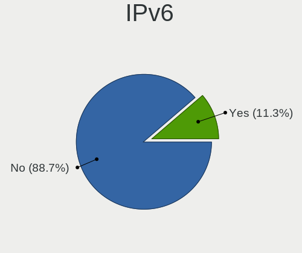

| Used | Desktops | Percent |
|------|----------|---------|
| No   | 53       | 88.33%  |
| Yes  | 7        | 11.67%  |

Bluetooth
---------

Bluetooth Vendor
----------------

Controller vendors

| Vendor                  | Desktops | Percent |
|-------------------------|----------|---------|
| Intel                   | 10       | 66.67%  |
| Ralink                  | 1        | 6.67%   |
| IMC Networks            | 1        | 6.67%   |
| Foxconn / Hon Hai       | 1        | 6.67%   |
| Cambridge Silicon Radio | 1        | 6.67%   |
| Broadcom                | 1        | 6.67%   |

Bluetooth Model
---------------

Controller models

| Model                                               | Desktops | Percent |
|-----------------------------------------------------|----------|---------|
| Intel AX200 Bluetooth                               | 4        | 26.67%  |
| Intel Bluetooth wireless interface                  | 2        | 13.33%  |
| Ralink RT3290 Bluetooth                             | 1        | 6.67%   |
| Intel Wireless-AC 9260 Bluetooth Adapter            | 1        | 6.67%   |
| Intel Bluetooth 9460/9560 Jefferson Peak (JfP)      | 1        | 6.67%   |
| Intel AX210 Bluetooth                               | 1        | 6.67%   |
| Intel AX201 Bluetooth                               | 1        | 6.67%   |
| IMC Networks Realtek Bluetooth Adapter              | 1        | 6.67%   |
| Foxconn / Hon Hai RZ616 Bluetooth Adapter           | 1        | 6.67%   |
| Cambridge Silicon Radio Bluetooth Dongle (HCI mode) | 1        | 6.67%   |
| Broadcom BCM20702A0 Bluetooth 4.0                   | 1        | 6.67%   |

Sound
-----

Sound Vendor
------------

Sound card vendors

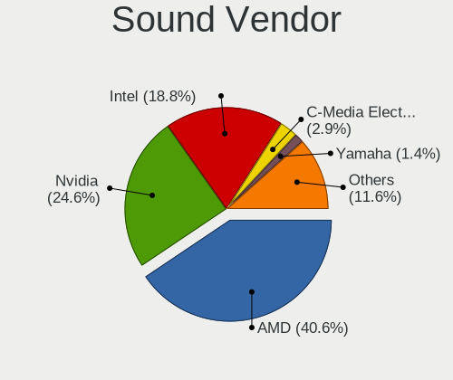

| Vendor                  | Desktops | Percent |
|-------------------------|----------|---------|
| AMD                     | 27       | 40.3%   |
| Nvidia                  | 17       | 25.37%  |
| Intel                   | 12       | 17.91%  |
| C-Media Electronics     | 2        | 2.99%   |
| Yamaha                  | 1        | 1.49%   |
| RODE Microphones        | 1        | 1.49%   |
| JMTek                   | 1        | 1.49%   |
| GN Netcom               | 1        | 1.49%   |
| Creative Labs           | 1        | 1.49%   |
| Blue Microphones        | 1        | 1.49%   |
| AudioQuest              | 1        | 1.49%   |
| ASUSTek Computer        | 1        | 1.49%   |
| AKAI  Professional M.I. | 1        | 1.49%   |

Sound Model
-----------

Sound card models

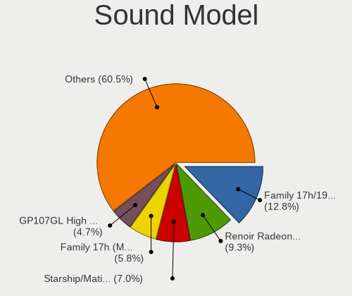

| Model                                                                                           | Desktops | Percent |
|-------------------------------------------------------------------------------------------------|----------|---------|
| AMD Family 17h/19h HD Audio Controller                                                          | 10       | 12.05%  |
| AMD Renoir Radeon High Definition Audio Controller                                              | 7        | 8.43%   |
| AMD Starship/Matisse HD Audio Controller                                                        | 6        | 7.23%   |
| AMD Family 17h (Models 00h-0fh) HD Audio Controller                                             | 5        | 6.02%   |
| Nvidia GP107GL High Definition Audio Controller                                                 | 4        | 4.82%   |
| Intel Comet Lake PCH cAVS                                                                       | 3        | 3.61%   |
| Intel Cannon Lake PCH cAVS                                                                      | 3        | 3.61%   |
| AMD Raven/Raven2/Fenghuang HDMI/DP Audio Controller                                             | 3        | 3.61%   |
| AMD Navi 21/23 HDMI/DP Audio Controller                                                         | 3        | 3.61%   |
| Nvidia GP108 High Definition Audio Controller                                                   | 2        | 2.41%   |
| Nvidia GK208 HDMI/DP Audio Controller                                                           | 2        | 2.41%   |
| Intel Comet Lake PCH-V cAVS                                                                     | 2        | 2.41%   |
| AMD Rembrandt Radeon High Definition Audio Controller                                           | 2        | 2.41%   |
| AMD Oland/Hainan/Cape Verde/Pitcairn HDMI Audio [Radeon HD 7000 Series]                         | 2        | 2.41%   |
| Yamaha Steinberg UR12                                                                           | 1        | 1.2%    |
| RODE Microphones RODE AI-1                                                                      | 1        | 1.2%    |
| Nvidia TU116 High Definition Audio Controller                                                   | 1        | 1.2%    |
| Nvidia TU107 GeForce GTX 1650 High Definition Audio Controller                                  | 1        | 1.2%    |
| Nvidia High Definition Audio Controller                                                         | 1        | 1.2%    |
| Nvidia GP106 High Definition Audio Controller                                                   | 1        | 1.2%    |
| Nvidia GP104 High Definition Audio Controller                                                   | 1        | 1.2%    |
| Nvidia GM206 High Definition Audio Controller                                                   | 1        | 1.2%    |
| Nvidia GM107 High Definition Audio Controller [GeForce 940MX]                                   | 1        | 1.2%    |
| Nvidia GA104 High Definition Audio Controller                                                   | 1        | 1.2%    |
| Nvidia GA102 High Definition Audio Controller                                                   | 1        | 1.2%    |
| JMTek Lioncast USB Gaming Headset                                                               | 1        | 1.2%    |
| Intel Tiger Lake-H HD Audio Controller                                                          | 1        | 1.2%    |
| Intel HD Graphics SGPC                                                                          | 1        | 1.2%    |
| Intel Atom Processor Z36xxx/Z37xxx Series High Definition Audio Controller                      | 1        | 1.2%    |
| Intel 7 Series/C216 Chipset Family High Definition Audio Controller                             | 1        | 1.2%    |
| GN Netcom Jabra SPEAK 410 USB                                                                   | 1        | 1.2%    |
| Creative Labs CA0132 Sound Core3D [Sound Blaster Recon3D / Z-Series / Sound BlasterX AE-5 Plus] | 1        | 1.2%    |
| C-Media Electronics USB PnP Audio Device                                                        | 1        | 1.2%    |
| C-Media Electronics CM108 Audio Controller                                                      | 1        | 1.2%    |
| Blue Microphones Yeti Stereo Microphone                                                         | 1        | 1.2%    |
| AudioQuest DragonFly                                                                            | 1        | 1.2%    |
| ASUSTek Computer Realtek USB Audio                                                              | 1        | 1.2%    |
| AMD SBx00 Azalia (Intel HDA)                                                                    | 1        | 1.2%    |
| AMD RV630 HDMI Audio [Radeon HD 2600 PRO/XT / HD 3610]                                          | 1        | 1.2%    |
| AMD Navi 31 [Radeon RX 7000 HDMI Audio]                                                         | 1        | 1.2%    |

Memory
------

Memory Vendor
-------------

Memory module vendors

| Vendor              | Desktops | Percent |
|---------------------|----------|---------|
| Kingston            | 10       | 22.73%  |
| Corsair             | 6        | 13.64%  |
| SK hynix            | 4        | 9.09%   |
| Samsung Electronics | 4        | 9.09%   |
| Micron Technology   | 4        | 9.09%   |
| Crucial             | 4        | 9.09%   |
| Unknown             | 3        | 6.82%   |
| G.Skill             | 3        | 6.82%   |
| Transcend           | 1        | 2.27%   |
| Team                | 1        | 2.27%   |
| Smart               | 1        | 2.27%   |
| Golden Empire       | 1        | 2.27%   |
| A-DATA Technology   | 1        | 2.27%   |
| Unknown             | 1        | 2.27%   |

Memory Model
------------

Memory module models

| Model                                                   | Desktops | Percent |
|---------------------------------------------------------|----------|---------|
| Corsair RAM CMK32GX4M2D3200C16 16GB DIMM DDR4 3200MT/s  | 2        | 4.08%   |
| Unknown RAM Module 8GB DIMM DDR3 1600MT/s               | 1        | 2.04%   |
| Unknown RAM 3000 C16 Series 4096MB DIMM DDR4 2933MT/s   | 1        | 2.04%   |
| Unknown RAM 2G-08-10-12-1333 2GB DIMM DDR3 1333MT/s     | 1        | 2.04%   |
| Transcend RAM JM2666HLE-32G 32GB DIMM DDR4 2666MT/s     | 1        | 2.04%   |
| Team RAM TEAMGROUP-UD4-4133 8GB DIMM DDR4 4133MT/s      | 1        | 2.04%   |
| Smart RAM Module 8GB DIMM DDR4 2667MT/s                 | 1        | 2.04%   |
| SK hynix RAM HMAA4GU6CJR8N-XN 32GB DIMM DDR4 3200MT/s   | 1        | 2.04%   |
| SK hynix RAM HMA82GS6DJR8N-XN 16GB SODIMM DDR4 3200MT/s | 1        | 2.04%   |
| SK hynix RAM HMA82GR7JJR8N-VK 16GB DIMM DDR4 2667MT/s   | 1        | 2.04%   |
| SK hynix RAM HMA81GS6CJR8N-VK 8GB SODIMM DDR4 2667MT/s  | 1        | 2.04%   |
| Samsung RAM M471A4G43AB1-CWE 32GB SODIMM DDR4 3200MT/s  | 1        | 2.04%   |
| Samsung RAM M393A2K40CB2-CTD 16GB DIMM DDR4 2666MT/s    | 1        | 2.04%   |
| Samsung RAM M393A2K40BB2-CTD 16GB DIMM DDR4 2667MT/s    | 1        | 2.04%   |
| Samsung RAM M378A4G43MB1-CTD 32GB DIMM DDR4 2666MT/s    | 1        | 2.04%   |
| Samsung RAM FRD4AA8Z3Z1ABZZ02 16GB DIMM DDR4 2667MT/s   | 1        | 2.04%   |
| Micron RAM 36ASF2G72PZ-2G6E1 16GB DIMM DDR4 2666MT/s    | 1        | 2.04%   |
| Micron RAM 18ASF4G72AZ-3G2B1 32GB DIMM DDR4 3200MT/s    | 1        | 2.04%   |
| Micron RAM 18ASF2G72PZ-2G6D1 16GB DIMM DDR4 2666MT/s    | 1        | 2.04%   |
| Micron RAM 18ASF2G72PDZ-2G6D1 16GB DIMM DDR4 2666MT/s   | 1        | 2.04%   |
| Micron RAM 16ATF2G64HZ-2G6J1 16GB SODIMM DDR4 2667MT/s  | 1        | 2.04%   |
| Micron RAM 16ATF2G64AZ-3G2J1 16GB DIMM DDR4 3200MT/s    | 1        | 2.04%   |
| Kingston RAM KHX3200C16D4/32GX 32GB DIMM DDR4 3200MT/s  | 1        | 2.04%   |
| Kingston RAM KHX2933C15D4/8GX 8GB DIMM DDR4 2400MT/s    | 1        | 2.04%   |
| Kingston RAM KHX2666C16D4/16GX 16GB DIMM DDR4 2667MT/s  | 1        | 2.04%   |
| Kingston RAM KHX2666C16/16G 16GB DIMM DDR4 2666MT/s     | 1        | 2.04%   |
| Kingston RAM KHX2133C14/16G 16GB DIMM DDR4 2133MT/s     | 1        | 2.04%   |
| Kingston RAM KHX1600C10D3/ 8GB DIMM DDR3 1866MT/s       | 1        | 2.04%   |
| Kingston RAM KF556C40-32 32GB DIMM DDR5 5200MT/s        | 1        | 2.04%   |
| Kingston RAM KF3000C16D4/32GX 32GB DIMM DDR4 2400MT/s   | 1        | 2.04%   |
| Kingston RAM 99P5700-016.A00G 16GB SODIMM DDR4 3200MT/s | 1        | 2.04%   |
| Kingston RAM 9965745-020.A00G 32GB DIMM DDR4 3200MT/s   | 1        | 2.04%   |
| Kingston RAM 9965745-017.A00G 16GB DIMM DDR4 3200MT/s   | 1        | 2.04%   |
| Kingston RAM 9905713-030.A00G 8GB DIMM DDR4 2666MT/s    | 1        | 2.04%   |
| Golden Empire RAM D4U0830160B 8GB DIMM DDR4 2400MT/s    | 1        | 2.04%   |
| G.Skill RAM F4-3200C16-8GVGB 8GB DIMM DDR4 3200MT/s     | 1        | 2.04%   |
| G.Skill RAM F4-3200C16-32GTZN 32GB DIMM DDR4 3200MT/s   | 1        | 2.04%   |
| G.Skill RAM F4-2400C17-8GNT 8GB DIMM DDR4 2400MT/s      | 1        | 2.04%   |
| Crucial RAM CT16G4DFD832A.C16FP 16GB DIMM DDR4 3200MT/s | 1        | 2.04%   |
| Crucial RAM BL8G24C16U4B.8FB 8GB DIMM DDR4 2400MT/s     | 1        | 2.04%   |

Memory Kind
-----------

Memory module kinds

| Kind | Desktops | Percent |
|------|----------|---------|
| DDR4 | 35       | 87.5%   |
| DDR3 | 3        | 7.5%    |
| DDR5 | 2        | 5%      |

Memory Form Factor
------------------

Physical design of the memory module

| Name   | Desktops | Percent |
|--------|----------|---------|
| DIMM   | 35       | 87.5%   |
| SODIMM | 5        | 12.5%   |

Memory Size
-----------

Memory module size

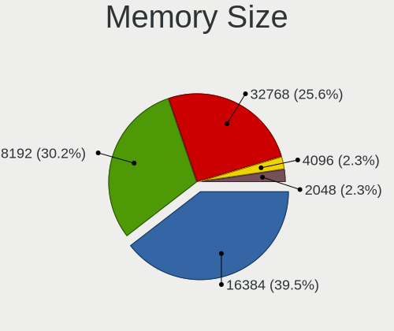

| Size  | Desktops | Percent |
|-------|----------|---------|
| 16384 | 15       | 36.59%  |
| 8192  | 13       | 31.71%  |
| 32768 | 11       | 26.83%  |
| 4096  | 1        | 2.44%   |
| 2048  | 1        | 2.44%   |

Memory Speed
------------

Memory module speed

| Speed | Desktops | Percent |
|-------|----------|---------|
| 3200  | 15       | 34.88%  |
| 2667  | 7        | 16.28%  |
| 2666  | 5        | 11.63%  |
| 2400  | 4        | 9.3%    |
| 3600  | 2        | 4.65%   |
| 2133  | 2        | 4.65%   |
| 5200  | 1        | 2.33%   |
| 4800  | 1        | 2.33%   |
| 4133  | 1        | 2.33%   |
| 3000  | 1        | 2.33%   |
| 2933  | 1        | 2.33%   |
| 1866  | 1        | 2.33%   |
| 1600  | 1        | 2.33%   |
| 1333  | 1        | 2.33%   |

Printers & scanners
-------------------

Printer Vendor
--------------

Printer device vendors

Zero info for selected period =(

Printer Model
-------------

Printer device models

Zero info for selected period =(

Scanner Vendor
--------------

Scanner device vendors

Zero info for selected period =(

Scanner Model
-------------

Scanner device models

Zero info for selected period =(

Camera
------

Camera Vendor
-------------

Camera device vendors

| Vendor          | Desktops | Percent |
|-----------------|----------|---------|
| Logitech        | 6        | 54.55%  |
| Microdia        | 3        | 27.27%  |
| Trust           | 1        | 9.09%   |
| Aveo Technology | 1        | 9.09%   |

Camera Model
------------

Camera device models

| Model                         | Desktops | Percent |
|-------------------------------|----------|---------|
| Microdia HP Integrated Webcam | 2        | 18.18%  |
| Logitech C920 PRO HD Webcam   | 2        | 18.18%  |
| Trust Canyon CNS-CWC6 Webcam  | 1        | 9.09%   |
| Microdia USB 2.0 Camera       | 1        | 9.09%   |
| Logitech Webcam C270          | 1        | 9.09%   |
| Logitech Webcam C170          | 1        | 9.09%   |
| Logitech C505 HD Webcam       | 1        | 9.09%   |
| Logitech BRIO Ultra HD Webcam | 1        | 9.09%   |
| Aveo USB2.0 Camera            | 1        | 9.09%   |

Security
--------

Fingerprint Vendor
------------------

Fingerprint sensor vendors

| Vendor            | Desktops | Percent |
|-------------------|----------|---------|
| FocalTech Systems | 1        | 100%    |

Fingerprint Model
-----------------

Fingerprint sensor models

| Model                                | Desktops | Percent |
|--------------------------------------|----------|---------|
| FocalTech Systems Fingerprint Reader | 1        | 100%    |

Chipcard Vendor
---------------

Chipcard module vendors

Zero info for selected period =(

Chipcard Model
--------------

Chipcard module models

Zero info for selected period =(

Unsupported
-----------

Unsupported Devices
-------------------

Total unsupported devices on board

| Total | Desktops | Percent |
|-------|----------|---------|
| 0     | 34       | 55.74%  |
| 1     | 16       | 26.23%  |
| 2     | 6        | 9.84%   |
| 4     | 3        | 4.92%   |
| 3     | 2        | 3.28%   |

Unsupported Device Types
------------------------

Types of unsupported devices

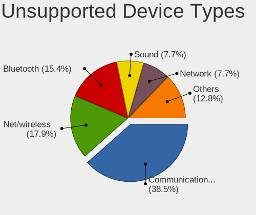

| Type                     | Desktops | Percent |
|--------------------------|----------|---------|
| Communication controller | 14       | 36.84%  |
| Net/wireless             | 7        | 18.42%  |
| Bluetooth                | 6        | 15.79%  |
| Sound                    | 3        | 7.89%   |
| Network                  | 3        | 7.89%   |
| Net/ethernet             | 3        | 7.89%   |
| Storage/raid             | 1        | 2.63%   |
| Fingerprint reader       | 1        | 2.63%   |

