FreeBSD 14.0-CURRENT - Tested Hardware & Statistics (Notebooks)
---------------------------------------------------------------

A project to collect tested hardware configurations for FreeBSD 14.0-CURRENT.

Anyone can contribute to this report by the [hw-probe](https://github.com/linuxhw/hw-probe/blob/master/INSTALL.BSD.md) tool:

    hw-probe -all -upload

Please submit a probe of your configuration if it's not presented on the page or is rare.

Full-feature report is available here: https://bsd-hardware.info/?view=trends&rel=freebsd-14.0-CURRENT

Contents
--------

* [ Test Cases ](#test-cases)

* [ System ](#system)
  - [ Arch                     ](#arch)
  - [ DE                       ](#de)
  - [ Display Server           ](#display-server)
  - [ Display Manager          ](#display-manager)
  - [ OS Lang                  ](#os-lang)
  - [ Boot Mode                ](#boot-mode)
  - [ Filesystem               ](#filesystem)
  - [ Part. scheme             ](#part-scheme)

* [ Board ](#board)
  - [ Vendor                   ](#vendor)
  - [ Model                    ](#model)
  - [ Model Family             ](#model-family)
  - [ MFG Year                 ](#mfg-year)
  - [ Form Factor              ](#form-factor)
  - [ Coreboot                 ](#coreboot)
  - [ RAM Size                 ](#ram-size)
  - [ RAM Used                 ](#ram-used)
  - [ Total Drives             ](#total-drives)
  - [ Has CD-ROM               ](#has-cd-rom)
  - [ Has Ethernet             ](#has-ethernet)
  - [ Has WiFi                 ](#has-wifi)
  - [ Has Bluetooth            ](#has-bluetooth)

* [ Location ](#location)
  - [ Country                  ](#country)
  - [ City                     ](#city)

* [ Drives ](#drives)
  - [ Drive Vendor             ](#drive-vendor)
  - [ Drive Model              ](#drive-model)
  - [ HDD Vendor               ](#hdd-vendor)
  - [ SSD Vendor               ](#ssd-vendor)
  - [ Drive Kind               ](#drive-kind)
  - [ Drive Connector          ](#drive-connector)
  - [ Drive Size               ](#drive-size)
  - [ Space Total              ](#space-total)
  - [ Space Used               ](#space-used)
  - [ Malfunc. Drives          ](#malfunc-drives)
  - [ Malfunc. Drive Vendor    ](#malfunc-drive-vendor)
  - [ Malfunc. HDD Vendor      ](#malfunc-hdd-vendor)
  - [ Malfunc. Drive Kind      ](#malfunc-drive-kind)
  - [ Failed Drives            ](#failed-drives)
  - [ Failed Drive Vendor      ](#failed-drive-vendor)
  - [ Drive Status             ](#drive-status)

* [ Storage controller ](#storage-controller)
  - [ Storage Vendor           ](#storage-vendor)
  - [ Storage Model            ](#storage-model)
  - [ Storage Kind             ](#storage-kind)

* [ Processor ](#processor)
  - [ CPU Vendor               ](#cpu-vendor)
  - [ CPU Model                ](#cpu-model)
  - [ CPU Model Family         ](#cpu-model-family)
  - [ CPU Cores                ](#cpu-cores)
  - [ CPU Sockets              ](#cpu-sockets)
  - [ CPU Threads              ](#cpu-threads)
  - [ CPU Microarch            ](#cpu-microarch)

* [ Graphics ](#graphics)
  - [ GPU Vendor               ](#gpu-vendor)
  - [ GPU Model                ](#gpu-model)
  - [ GPU Combo                ](#gpu-combo)
  - [ GPU Driver               ](#gpu-driver)
  - [ GPU Memory               ](#gpu-memory)

* [ Monitor ](#monitor)
  - [ Monitor Vendor           ](#monitor-vendor)
  - [ Monitor Model            ](#monitor-model)
  - [ Monitor Resolution       ](#monitor-resolution)
  - [ Monitor Diagonal         ](#monitor-diagonal)
  - [ Monitor Width            ](#monitor-width)
  - [ Aspect Ratio             ](#aspect-ratio)
  - [ Monitor Area             ](#monitor-area)
  - [ Pixel Density            ](#pixel-density)
  - [ Multiple Monitors        ](#multiple-monitors)

* [ Network ](#network)
  - [ Net Controller Vendor    ](#net-controller-vendor)
  - [ Net Controller Model     ](#net-controller-model)
  - [ Wireless Vendor          ](#wireless-vendor)
  - [ Wireless Model           ](#wireless-model)
  - [ Ethernet Vendor          ](#ethernet-vendor)
  - [ Ethernet Model           ](#ethernet-model)
  - [ Net Controller Kind      ](#net-controller-kind)
  - [ Used Controller          ](#used-controller)
  - [ NICs                     ](#nics)
  - [ IPv6                     ](#ipv6)

* [ Bluetooth ](#bluetooth)
  - [ Bluetooth Vendor         ](#bluetooth-vendor)
  - [ Bluetooth Model          ](#bluetooth-model)

* [ Sound ](#sound)
  - [ Sound Vendor             ](#sound-vendor)
  - [ Sound Model              ](#sound-model)

* [ Memory ](#memory)
  - [ Memory Vendor            ](#memory-vendor)
  - [ Memory Model             ](#memory-model)
  - [ Memory Kind              ](#memory-kind)
  - [ Memory Form Factor       ](#memory-form-factor)
  - [ Memory Size              ](#memory-size)
  - [ Memory Speed             ](#memory-speed)

* [ Printers & scanners ](#printers--scanners)
  - [ Printer Vendor           ](#printer-vendor)
  - [ Printer Model            ](#printer-model)
  - [ Scanner Vendor           ](#scanner-vendor)
  - [ Scanner Model            ](#scanner-model)

* [ Camera ](#camera)
  - [ Camera Vendor            ](#camera-vendor)
  - [ Camera Model             ](#camera-model)

* [ Security ](#security)
  - [ Fingerprint Vendor       ](#fingerprint-vendor)
  - [ Fingerprint Model        ](#fingerprint-model)
  - [ Chipcard Vendor          ](#chipcard-vendor)
  - [ Chipcard Model           ](#chipcard-model)

* [ Unsupported ](#unsupported)
  - [ Unsupported Devices      ](#unsupported-devices)
  - [ Unsupported Device Types ](#unsupported-device-types)

Test Cases
----------

| Vendor        | Model                       | Probe                                                     | Date         |
|---------------|-----------------------------|-----------------------------------------------------------|--------------|
| Lenovo        | ThinkPad T470p 20J7S0PM0... | [7a61d90a55](https://bsd-hardware.info/?probe=7a61d90a55) | Oct 28, 2021 |
| Lenovo        | ThinkPad P14s Gen 1 20Y1... | [d910c79d75](https://bsd-hardware.info/?probe=d910c79d75) | Oct 24, 2021 |
| HP            | EliteBook 8570p             | [86613b04d3](https://bsd-hardware.info/?probe=86613b04d3) | Oct 17, 2021 |
| HP            | EliteBook 8570p             | [1b48acadd5](https://bsd-hardware.info/?probe=1b48acadd5) | Oct 10, 2021 |
| Framework     | Laptop                      | [e5aca4b7d0](https://bsd-hardware.info/?probe=e5aca4b7d0) | Oct 02, 2021 |
| HP            | EliteBook 8570p             | [646148fc25](https://bsd-hardware.info/?probe=646148fc25) | Sep 18, 2021 |
| ASUSTek       | VivoBook_ASUSLaptop X512... | [0b73df29bf](https://bsd-hardware.info/?probe=0b73df29bf) | Sep 15, 2021 |
| HP            | EliteBook 8570p             | [5a4e53da56](https://bsd-hardware.info/?probe=5a4e53da56) | Sep 12, 2021 |
| Lenovo        | ThinkPad X395 20NL000GPG    | [d7812a2905](https://bsd-hardware.info/?probe=d7812a2905) | Sep 10, 2021 |
| Lenovo        | ThinkPad X395 20NL000GPG    | [cdde22fb04](https://bsd-hardware.info/?probe=cdde22fb04) | Sep 10, 2021 |
| HP            | EliteBook 8570p             | [7a289e8d1b](https://bsd-hardware.info/?probe=7a289e8d1b) | Sep 06, 2021 |
| HP            | EliteBook 8570p             | [fae9e84f60](https://bsd-hardware.info/?probe=fae9e84f60) | Aug 27, 2021 |
| Lenovo        | ThinkPad P14s Gen 1 20Y1... | [76f004bd26](https://bsd-hardware.info/?probe=76f004bd26) | Aug 26, 2021 |
| HP            | EliteBook 8570p             | [a98c6adb40](https://bsd-hardware.info/?probe=a98c6adb40) | Aug 22, 2021 |
| HP            | EliteBook 8570p             | [71092e78e2](https://bsd-hardware.info/?probe=71092e78e2) | Aug 17, 2021 |
| HP            | EliteBook 8570p             | [6e97c9a59e](https://bsd-hardware.info/?probe=6e97c9a59e) | Aug 14, 2021 |
| Lenovo        | Unknown                     | [e16ce5e864](https://bsd-hardware.info/?probe=e16ce5e864) | Aug 08, 2021 |
| HP            | ZBook 17 G2                 | [f2d911563a](https://bsd-hardware.info/?probe=f2d911563a) | Aug 07, 2021 |
| Lenovo        | ThinkPad X1 Extreme 20MF... | [6d5e1a13d0](https://bsd-hardware.info/?probe=6d5e1a13d0) | Aug 07, 2021 |
| Lenovo        | XiaoXinPro-13ARE 2020 82... | [bf56b2a81a](https://bsd-hardware.info/?probe=bf56b2a81a) | Aug 05, 2021 |
| HP            | ZBook 17 G2                 | [2faf8af7be](https://bsd-hardware.info/?probe=2faf8af7be) | Jul 30, 2021 |
| HP            | ZBook 17 G2                 | [c7fb9e9dee](https://bsd-hardware.info/?probe=c7fb9e9dee) | Jul 27, 2021 |
| HP            | ZBook 17 G2                 | [50c349b7b5](https://bsd-hardware.info/?probe=50c349b7b5) | Jul 27, 2021 |
| HP            | ZBook 17 G2                 | [6149ab50a8](https://bsd-hardware.info/?probe=6149ab50a8) | Jul 24, 2021 |
| Dell          | G5 5505                     | [9933a09c4f](https://bsd-hardware.info/?probe=9933a09c4f) | Jul 24, 2021 |
| HP            | ZBook 17 G2                 | [1ef99f31dd](https://bsd-hardware.info/?probe=1ef99f31dd) | Jul 23, 2021 |
| Avell High... | A62 LIV                     | [5983302b1d](https://bsd-hardware.info/?probe=5983302b1d) | Jul 21, 2021 |
| Lenovo        | XiaoXinPro-13ARE 2020 82... | [e0e6f62814](https://bsd-hardware.info/?probe=e0e6f62814) | Jul 19, 2021 |
| Lenovo        | XiaoXinPro-13ARE 2020 82... | [b0da42c20d](https://bsd-hardware.info/?probe=b0da42c20d) | Jul 18, 2021 |
| ASUSTek       | VivoBook_ASUSLaptop X512... | [9c9d4cc782](https://bsd-hardware.info/?probe=9c9d4cc782) | Jul 18, 2021 |
| ASUSTek       | VivoBook_ASUSLaptop X512... | [3d5e512e18](https://bsd-hardware.info/?probe=3d5e512e18) | Jul 18, 2021 |
| HP            | ProBook 440 G7              | [63dc88528c](https://bsd-hardware.info/?probe=63dc88528c) | Jul 17, 2021 |
| HP            | ProBook 440 G7              | [7138e2a9e7](https://bsd-hardware.info/?probe=7138e2a9e7) | Jul 17, 2021 |
| HP            | ProBook 440 G7              | [b73eb50747](https://bsd-hardware.info/?probe=b73eb50747) | Jul 16, 2021 |
| HP            | EliteBook 8570p             | [462fc329a9](https://bsd-hardware.info/?probe=462fc329a9) | Jul 16, 2021 |
| HP            | ProBook 440 G7              | [d2866f01b5](https://bsd-hardware.info/?probe=d2866f01b5) | Jul 16, 2021 |
| HP            | EliteBook 8570p             | [cc24e867fc](https://bsd-hardware.info/?probe=cc24e867fc) | Jun 19, 2021 |
| Lenovo        | ThinkPad E14 20RBCTO1WW     | [3d50ba4d85](https://bsd-hardware.info/?probe=3d50ba4d85) | Jun 13, 2021 |
| Dell          | G5 5505                     | [97319295ee](https://bsd-hardware.info/?probe=97319295ee) | Jun 13, 2021 |
| Dell          | Vostro 5490                 | [cf3508718c](https://bsd-hardware.info/?probe=cf3508718c) | Jun 11, 2021 |
| Lenovo        | IdeaPad 330-15ARR 81D2      | [4ac6c9b3eb](https://bsd-hardware.info/?probe=4ac6c9b3eb) | Jun 08, 2021 |
| Lenovo        | IdeaPad 330-15ARR 81D2      | [8fc867cfae](https://bsd-hardware.info/?probe=8fc867cfae) | Jun 06, 2021 |
| HP            | EliteBook 8570p             | [52ba4e835f](https://bsd-hardware.info/?probe=52ba4e835f) | Jun 03, 2021 |
| Lenovo        | ThinkPad X270 20HM004JBR    | [88c27e65d7](https://bsd-hardware.info/?probe=88c27e65d7) | May 23, 2021 |
| HP            | EliteBook 8570p             | [062fe5ec40](https://bsd-hardware.info/?probe=062fe5ec40) | May 09, 2021 |
| Dell          | G5 5505                     | [ba74d8eee0](https://bsd-hardware.info/?probe=ba74d8eee0) | May 08, 2021 |
| Dell          | G5 5505                     | [23ae99e489](https://bsd-hardware.info/?probe=23ae99e489) | May 08, 2021 |
| Lenovo        | Legion 5P 15IMH05H 82AW     | [2be8cf963c](https://bsd-hardware.info/?probe=2be8cf963c) | May 02, 2021 |
| Dell          | Inspiron 3793               | [c2d56fc369](https://bsd-hardware.info/?probe=c2d56fc369) | Apr 29, 2021 |
| HP            | EliteBook 8570p             | [e90abb54c9](https://bsd-hardware.info/?probe=e90abb54c9) | Apr 25, 2021 |
| Lenovo        | ThinkPad X1 Carbon 5th 2... | [4993ad0feb](https://bsd-hardware.info/?probe=4993ad0feb) | Apr 25, 2021 |
| HUAWEI        | HN-WX9X                     | [d776625073](https://bsd-hardware.info/?probe=d776625073) | Apr 11, 2021 |
| HP            | EliteBook 8570p             | [d9ec051372](https://bsd-hardware.info/?probe=d9ec051372) | Apr 06, 2021 |
| HP            | EliteBook 8570p             | [cdeafa0952](https://bsd-hardware.info/?probe=cdeafa0952) | Apr 02, 2021 |
| Lenovo        | ThinkPad P15 Gen 1 20ST0... | [342e914968](https://bsd-hardware.info/?probe=342e914968) | Mar 29, 2021 |
| HP            | EliteBook 8570p             | [ed80dc9019](https://bsd-hardware.info/?probe=ed80dc9019) | Mar 27, 2021 |
| HP            | ProBook 455 G7              | [dd877e6c6c](https://bsd-hardware.info/?probe=dd877e6c6c) | Mar 27, 2021 |
| Lenovo        | ThinkPad X395 20NL001SMX    | [cd016e96ee](https://bsd-hardware.info/?probe=cd016e96ee) | Mar 17, 2021 |
| Lenovo        | Legion 5 15IMH05 82AU       | [9fed35d792](https://bsd-hardware.info/?probe=9fed35d792) | Mar 10, 2021 |
| HP            | ProBook 455 G7              | [1fcde7c0e1](https://bsd-hardware.info/?probe=1fcde7c0e1) | Mar 09, 2021 |
| Lenovo        | ThinkPad E14 20RBCTO1WW     | [f2c2e5345a](https://bsd-hardware.info/?probe=f2c2e5345a) | Feb 27, 2021 |
| Lenovo        | ThinkPad E14 20RBCTO1WW     | [aacafb6ace](https://bsd-hardware.info/?probe=aacafb6ace) | Feb 24, 2021 |
| A-DATA Tec... | XENIA159GENI72060           | [be88e8f865](https://bsd-hardware.info/?probe=be88e8f865) | Feb 15, 2021 |
| Lenovo        | ThinkPad T495s 20QKS1812... | [0e5e228d18](https://bsd-hardware.info/?probe=0e5e228d18) | Feb 13, 2021 |
| Lenovo        | ThinkPad T495s 20QKS1812... | [2d93a6bebc](https://bsd-hardware.info/?probe=2d93a6bebc) | Feb 13, 2021 |
| Matsushita... | CF-T2BW1AXR                 | [f6ec2858a5](https://bsd-hardware.info/?probe=f6ec2858a5) | Feb 10, 2021 |
| HP            | EliteBook 8570p             | [72137c63f8](https://bsd-hardware.info/?probe=72137c63f8) | Feb 09, 2021 |
| Dell          | Latitude E5430 vPro         | [bee421a110](https://bsd-hardware.info/?probe=bee421a110) | Feb 06, 2021 |
| Dell          | Latitude E5430 vPro         | [e8157ac6a3](https://bsd-hardware.info/?probe=e8157ac6a3) | Feb 06, 2021 |
| Lenovo        | ThinkPad T430 2349H2G       | [229db16a93](https://bsd-hardware.info/?probe=229db16a93) | Feb 05, 2021 |
| HP            | EliteBook 8570p             | [46c938b853](https://bsd-hardware.info/?probe=46c938b853) | Feb 01, 2021 |
| Matsushita... | CF-T2BW1AXR                 | [c16cd20c42](https://bsd-hardware.info/?probe=c16cd20c42) | Jan 25, 2021 |

System
------

Arch
----

OS architecture (x86_64, i586, etc.)

| Name  | Notebooks | Percent |
|-------|-----------|---------|
| amd64 | 31        | 96.88%  |
| i386  | 1         | 3.13%   |

DE
--

Desktop Environment

| Name          | Notebooks | Percent |
|---------------|-----------|---------|
| KDE5          | 8         | 22.86%  |
| XFCE          | 5         | 14.29%  |
| Console       | 4         | 11.43%  |
| MATE          | 3         | 8.57%   |
| GNOME         | 3         | 8.57%   |
| Cinnamon      | 3         | 8.57%   |
| TWM           | 2         | 5.71%   |
| i3            | 2         | 5.71%   |
| LXQt          | 1         | 2.86%   |
| LXDE          | 1         | 2.86%   |
| Lumina        | 1         | 2.86%   |
| Fluxbox       | 1         | 2.86%   |
| Enlightenment | 1         | 2.86%   |

Display Server
--------------

X11 or Wayland

| Name    | Notebooks | Percent |
|---------|-----------|---------|
| X11     | 27        | 79.41%  |
| Console | 7         | 20.59%  |

Display Manager
---------------

SDDM, LightDM, etc.

| Name    | Notebooks | Percent |
|---------|-----------|---------|
| Console | 12        | 36.36%  |
| SDDM    | 8         | 24.24%  |
| XDM     | 4         | 12.12%  |
| SLiM    | 4         | 12.12%  |
| GDM     | 4         | 12.12%  |
| LightDM | 1         | 3.03%   |

OS Lang
-------

Language

| Lang             | Notebooks | Percent |
|------------------|-----------|---------|
| C                | 24        | 70.59%  |
| en_US            | 2         | 5.88%   |
| en_GB            | 2         | 5.88%   |
| zh_CN            | 1         | 2.94%   |
| pt_PT            | 1         | 2.94%   |
| pl_PL            | 1         | 2.94%   |
| it_IT.ISO8859-15 | 1         | 2.94%   |
| fr_FR            | 1         | 2.94%   |
| Unknown          | 1         | 2.94%   |

Boot Mode
---------

EFI or BIOS

| Mode | Notebooks | Percent |
|------|-----------|---------|
| EFI  | 30        | 93.75%  |
| BIOS | 2         | 6.25%   |

Filesystem
----------

Type of filesystem

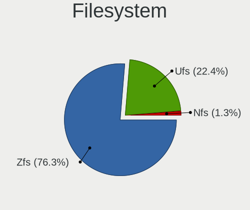

| Type | Notebooks | Percent |
|------|-----------|---------|
| Zfs  | 27        | 84.38%  |
| Ufs  | 5         | 15.63%  |

Part. scheme
------------

Scheme of partitioning

| Type | Notebooks | Percent |
|------|-----------|---------|
| GPT  | 31        | 96.88%  |
| MBR  | 1         | 3.13%   |

Board
-----

Vendor
------

Motherboard manufacturer

| Name                           | Notebooks | Percent |
|--------------------------------|-----------|---------|
| Lenovo                         | 16        | 50%     |
| Hewlett-Packard                | 6         | 18.75%  |
| Dell                           | 4         | 12.5%   |
| Matsushita Electric Industrial | 1         | 3.13%   |
| HUAWEI                         | 1         | 3.13%   |
| Framework                      | 1         | 3.13%   |
| Avell High Performance         | 1         | 3.13%   |
| ASUSTek Computer               | 1         | 3.13%   |
| A-DATA Technology              | 1         | 3.13%   |

Model
-----

Motherboard model

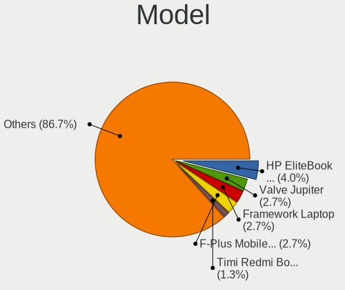

| Name                                       | Notebooks | Percent |
|--------------------------------------------|-----------|---------|
| HP EliteBook 8570p                         | 3         | 9.38%   |
| Matsushita Electric Industrial CF-T2BW1AXR | 1         | 3.13%   |
| Lenovo XiaoXinPro-13ARE 2020 82DM          | 1         | 3.13%   |
| Lenovo ThinkPad X395 20NL001SMX            | 1         | 3.13%   |
| Lenovo ThinkPad X395 20NL000GPG            | 1         | 3.13%   |
| Lenovo ThinkPad X270 20HM004JBR            | 1         | 3.13%   |
| Lenovo ThinkPad X1 Extreme 20MF000BUS      | 1         | 3.13%   |
| Lenovo ThinkPad X1 Carbon 5th 20HQS1QC00   | 1         | 3.13%   |
| Lenovo ThinkPad T495s 20QKS1812F           | 1         | 3.13%   |
| Lenovo ThinkPad T470p 20J7S0PM00           | 1         | 3.13%   |
| Lenovo ThinkPad T430 2349H2G               | 1         | 3.13%   |
| Lenovo ThinkPad P15 Gen 1 20ST005VRT       | 1         | 3.13%   |
| Lenovo ThinkPad P14s Gen 1 20Y1CTO1WW      | 1         | 3.13%   |
| Lenovo ThinkPad E14 20RBCTO1WW             | 1         | 3.13%   |
| Lenovo Legion 5P 15IMH05H 82AW             | 1         | 3.13%   |
| Lenovo Legion 5 15IMH05 82AU               | 1         | 3.13%   |
| Lenovo IdeaPad 330-15ARR 81D2              | 1         | 3.13%   |
| HUAWEI HN-WX9X                             | 1         | 3.13%   |
| HP ZBook 17 G2                             | 1         | 3.13%   |
| HP ProBook 455 G7                          | 1         | 3.13%   |
| HP ProBook 440 G7                          | 1         | 3.13%   |
| Framework Laptop                           | 1         | 3.13%   |
| Dell Vostro 5490                           | 1         | 3.13%   |
| Dell Latitude E5430 vPro                   | 1         | 3.13%   |
| Dell Inspiron 3793                         | 1         | 3.13%   |
| Dell G5 5505                               | 1         | 3.13%   |
| Avell High Performance A62 LIV             | 1         | 3.13%   |
| ASUS VivoBook_ASUSLaptop X512DA_F512DA     | 1         | 3.13%   |
| A-DATA XENIA159GENI72060                   | 1         | 3.13%   |
| Unknown                                    | 1         | 3.13%   |

Model Family
------------

Motherboard model prefix

| Name                                       | Notebooks | Percent |
|--------------------------------------------|-----------|---------|
| Lenovo ThinkPad                            | 11        | 34.38%  |
| HP EliteBook                               | 3         | 9.38%   |
| Lenovo Legion                              | 2         | 6.25%   |
| HP ProBook                                 | 2         | 6.25%   |
| Matsushita Electric Industrial CF-T2BW1AXR | 1         | 3.13%   |
| Lenovo XiaoXinPro-13ARE                    | 1         | 3.13%   |
| Lenovo IdeaPad                             | 1         | 3.13%   |
| HUAWEI HN-WX9X                             | 1         | 3.13%   |
| HP ZBook                                   | 1         | 3.13%   |
| Framework Laptop                           | 1         | 3.13%   |
| Dell Vostro                                | 1         | 3.13%   |
| Dell Latitude                              | 1         | 3.13%   |
| Dell Inspiron                              | 1         | 3.13%   |
| Dell G5                                    | 1         | 3.13%   |
| Avell High Performance A62                 | 1         | 3.13%   |
| ASUS VivoBook                              | 1         | 3.13%   |
| A-DATA XENIA159GENI72060                   | 1         | 3.13%   |
| Unknown                                    | 1         | 3.13%   |

MFG Year
--------

Motherboard manufacture year

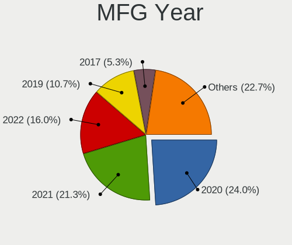

| Year | Notebooks | Percent |
|------|-----------|---------|
| 2020 | 16        | 50%     |
| 2019 | 5         | 15.63%  |
| 2021 | 3         | 9.38%   |
| 2017 | 3         | 9.38%   |
| 2018 | 2         | 6.25%   |
| 2015 | 1         | 3.13%   |
| 2013 | 1         | 3.13%   |
| 2003 | 1         | 3.13%   |

Form Factor
-----------

Physical design of the computer

| Name     | Notebooks | Percent |
|----------|-----------|---------|
| Notebook | 32        | 100%    |

Coreboot
--------

Have coreboot on board

| Used | Notebooks | Percent |
|------|-----------|---------|
| No   | 32        | 100%    |

RAM Size
--------

Total RAM memory

| Size in GB  | Notebooks | Percent |
|-------------|-----------|---------|
| 16.01-24.0  | 17        | 51.52%  |
| 8.01-16.0   | 7         | 21.21%  |
| 32.01-64.0  | 4         | 12.12%  |
| 64.01-256.0 | 3         | 9.09%   |
| 4.01-8.0    | 1         | 3.03%   |
| 1.01-2.0    | 1         | 3.03%   |

RAM Used
--------

Used RAM memory

| Used GB    | Notebooks | Percent |
|------------|-----------|---------|
| 0.51-1.0   | 15        | 46.88%  |
| 2.01-3.0   | 6         | 18.75%  |
| 1.01-2.0   | 5         | 15.63%  |
| 3.01-4.0   | 2         | 6.25%   |
| 0.01-0.5   | 2         | 6.25%   |
| 24.01-32.0 | 1         | 3.13%   |
| 8.01-16.0  | 1         | 3.13%   |

Total Drives
------------

Number of drives on board

| Drives | Notebooks | Percent |
|--------|-----------|---------|
| 1      | 20        | 57.14%  |
| 2      | 14        | 40%     |
| 3      | 1         | 2.86%   |

Has CD-ROM
----------

Has CD-ROM on board

| Presented | Notebooks | Percent |
|-----------|-----------|---------|
| No        | 27        | 81.82%  |
| Yes       | 6         | 18.18%  |

Has Ethernet
------------

Has Ethernet on board

| Presented | Notebooks | Percent |
|-----------|-----------|---------|
| Yes       | 28        | 87.5%   |
| No        | 4         | 12.5%   |

Has WiFi
--------

Has WiFi module

| Presented | Notebooks | Percent |
|-----------|-----------|---------|
| Yes       | 32        | 100%    |

Has Bluetooth
-------------

Has Bluetooth module

| Presented | Notebooks | Percent |
|-----------|-----------|---------|
| Yes       | 24        | 72.73%  |
| No        | 9         | 27.27%  |

Location
--------

Country
-------

Geographic location (country)

| Country     | Notebooks | Percent |
|-------------|-----------|---------|
| UK          | 6         | 18.75%  |
| Russia      | 4         | 12.5%   |
| Brazil      | 3         | 9.38%   |
| USA         | 2         | 6.25%   |
| Portugal    | 2         | 6.25%   |
| Poland      | 2         | 6.25%   |
| Germany     | 2         | 6.25%   |
| China       | 2         | 6.25%   |
| Switzerland | 1         | 3.13%   |
| Sweden      | 1         | 3.13%   |
| Peru        | 1         | 3.13%   |
| Japan       | 1         | 3.13%   |
| Italy       | 1         | 3.13%   |
| India       | 1         | 3.13%   |
| Croatia     | 1         | 3.13%   |
| Belarus     | 1         | 3.13%   |
| Bangladesh  | 1         | 3.13%   |

City
----

Geographic location (city)

| City           | Notebooks | Percent |
|----------------|-----------|---------|
| Brighton       | 5         | 13.16%  |
| Moscow         | 2         | 5.26%   |
| London         | 2         | 5.26%   |
| Ōta-ku        | 1         | 2.63%   |
| Zurich         | 1         | 2.63%   |
| Wuhan          | 1         | 2.63%   |
| Worthing       | 1         | 2.63%   |
| Wieliczka      | 1         | 2.63%   |
| Vancouver      | 1         | 2.63%   |
| Trosa          | 1         | 2.63%   |
| Thrissur       | 1         | 2.63%   |
| Stuttgart      | 1         | 2.63%   |
| St Petersburg  | 1         | 2.63%   |
| Slavonski Brod | 1         | 2.63%   |
| Seattle        | 1         | 2.63%   |
| Resana         | 1         | 2.63%   |
| Poulsbo        | 1         | 2.63%   |
| Pobiedziska    | 1         | 2.63%   |
| Minsk          | 1         | 2.63%   |
| Milan          | 1         | 2.63%   |
| Maia           | 1         | 2.63%   |
| Lima           | 1         | 2.63%   |
| Khabarovsk     | 1         | 2.63%   |
| João Pessoa   | 1         | 2.63%   |
| Ilhavo         | 1         | 2.63%   |
| Fuchu          | 1         | 2.63%   |
| Farnham        | 1         | 2.63%   |
| Eilenburg      | 1         | 2.63%   |
| Dhaka          | 1         | 2.63%   |
| Brasília      | 1         | 2.63%   |
| Beijing        | 1         | 2.63%   |
| Araruama       | 1         | 2.63%   |

Drives
------

Drive Vendor
------------

Hard drive vendors

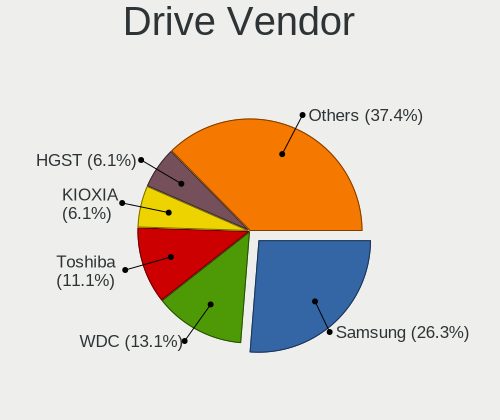

| Vendor              | Notebooks | Drives | Percent |
|---------------------|-----------|--------|---------|
| Samsung Electronics | 11        | 14     | 25.58%  |
| WDC                 | 7         | 11     | 16.28%  |
| Toshiba             | 5         | 9      | 11.63%  |
| HGST                | 5         | 13     | 11.63%  |
| SK Hynix            | 3         | 3      | 6.98%   |
| Crucial             | 2         | 4      | 4.65%   |
| A-DATA Technology   | 2         | 2      | 4.65%   |
| Solid State Storage | 1         | 1      | 2.33%   |
| Silicon Motion      | 1         | 1      | 2.33%   |
| Seagate             | 1         | 1      | 2.33%   |
| SanDisk             | 1         | 1      | 2.33%   |
| LITEON              | 1         | 1      | 2.33%   |
| Kingston            | 1         | 2      | 2.33%   |
| Intel               | 1         | 1      | 2.33%   |
| Fujitsu             | 1         | 2      | 2.33%   |

Drive Model
-----------

Hard drive models

| Model                                              | Notebooks | Percent |
|----------------------------------------------------|-----------|---------|
| Toshiba MQ01ABF050 500GB                           | 5         | 10.87%  |
| HGST HTS725050A7E630 500GB                         | 4         | 8.7%    |
| WDC PC SN730 NVMe 1024GB                           | 2         | 4.35%   |
| Samsung MZVLB512HBJQ-000L7 512GB                   | 2         | 4.35%   |
| Samsung HM251JX 250GB                              | 2         | 4.35%   |
| HGST HTS721010A9E630 1TB                           | 2         | 4.35%   |
| WDC WDS100T3X0C-00SJG0 1TB                         | 1         | 2.17%   |
| WDC PC SN730 SDBQNTY-512G-1001 512GB               | 1         | 2.17%   |
| WDC PC SN730 SDBQNTY-256G-1001 256GB               | 1         | 2.17%   |
| WDC PC SN730 SDBPNTY-512G-1101 512GB               | 1         | 2.17%   |
| WDC PC SN720 SDAQNTW-512G-1001 512GB               | 1         | 2.17%   |
| Solid State Storage CL1-3D128-Q11 NVMe SSSTC 128GB | 1         | 2.17%   |
| SK Hynix PC300 HFS512GD9MND-5510A 512GB            | 1         | 2.17%   |
| SK Hynix BC511 NVMe 256GB                          | 1         | 2.17%   |
| SK Hynix BC511 HFM256GDJTNI-82A0A 256GB            | 1         | 2.17%   |
| Silicon Motion NE-256 256GB                        | 1         | 2.17%   |
| Seagate ST1000LM035-1RK172 1TB                     | 1         | 2.17%   |
| SanDisk SDSSDH3500G 500GB                          | 1         | 2.17%   |
| Samsung SSD 970 EVO 1TB                            | 1         | 2.17%   |
| Samsung SSD 860 EVO 500GB                          | 1         | 2.17%   |
| Samsung SSD 850 EVO 250GB                          | 1         | 2.17%   |
| Samsung MZVLW256HEHP-000L7 256GB                   | 1         | 2.17%   |
| Samsung MZVLB512HBJQ-000L2 512GB                   | 1         | 2.17%   |
| Samsung MZVLB256HBHQ-000L7 256GB                   | 1         | 2.17%   |
| Samsung MZVLB256HAHQ-00000 256GB                   | 1         | 2.17%   |
| Samsung MZVLB1T0HBLR-000L2 1TB                     | 1         | 2.17%   |
| Samsung MZMTD128HAFV-000L1 128GB                   | 1         | 2.17%   |
| LITEON LCH-256V2S 256GB                            | 1         | 2.17%   |
| Kingston RBUSNS8154P3256GJ3 256GB                  | 1         | 2.17%   |
| Intel SSDPEKNW512G8H 512GB                         | 1         | 2.17%   |
| Fujitsu MHS2040AT D 40GB                           | 1         | 2.17%   |
| Crucial CT480BX500SSD1 480GB                       | 1         | 2.17%   |
| Crucial CT2000P5SSD8 2TB                           | 1         | 2.17%   |
| A-DATA SX8200PNP 1TB                               | 1         | 2.17%   |
| A-DATA IM2P33F8BR2-512GB                           | 1         | 2.17%   |

HDD Vendor
----------

Hard disk drive vendors

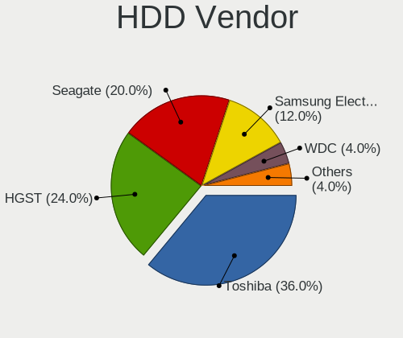

| Vendor              | Notebooks | Drives | Percent |
|---------------------|-----------|--------|---------|
| Toshiba             | 5         | 9      | 35.71%  |
| HGST                | 5         | 13     | 35.71%  |
| Samsung Electronics | 2         | 2      | 14.29%  |
| Seagate             | 1         | 1      | 7.14%   |
| Fujitsu             | 1         | 2      | 7.14%   |

SSD Vendor
----------

Solid state drive vendors

| Vendor              | Notebooks | Drives | Percent |
|---------------------|-----------|--------|---------|
| Samsung Electronics | 2         | 3      | 40%     |
| SanDisk             | 1         | 1      | 20%     |
| LITEON              | 1         | 1      | 20%     |
| Crucial             | 1         | 1      | 20%     |

Drive Kind
----------

HDD or SSD

| Kind | Notebooks | Drives | Percent |
|------|-----------|--------|---------|
| NVMe | 23        | 33     | 62.16%  |
| HDD  | 9         | 27     | 24.32%  |
| SSD  | 5         | 6      | 13.51%  |

Drive Connector
---------------

SATA, SAS, NVMe, etc.

| Type | Notebooks | Drives | Percent |
|------|-----------|--------|---------|
| NVMe | 23        | 33     | 62.16%  |
| SATA | 14        | 33     | 37.84%  |

Drive Size
----------

Size of hard drive

| Size in TB | Notebooks | Drives | Percent |
|------------|-----------|--------|---------|
| 0.01-0.5   | 12        | 28     | 80%     |
| 0.51-1.0   | 3         | 5      | 20%     |

Space Total
-----------

Amount of disk space available on the file system

| Size in GB | Notebooks | Percent |
|------------|-----------|---------|
| 251-500    | 11        | 32.35%  |
| 101-250    | 8         | 23.53%  |
| 501-1000   | 6         | 17.65%  |
| 51-100     | 4         | 11.76%  |
| 21-50      | 2         | 5.88%   |
| 1-20       | 2         | 5.88%   |
| 1001-2000  | 1         | 2.94%   |

Space Used
----------

Amount of used disk space

| Used GB | Notebooks | Percent |
|---------|-----------|---------|
| 1-20    | 17        | 51.52%  |
| 21-50   | 13        | 39.39%  |
| 101-250 | 3         | 9.09%   |

Malfunc. Drives
---------------

Drive models with a malfunction

| Model                      | Notebooks | Drives | Percent |
|----------------------------|-----------|--------|---------|
| HGST HTS725050A7E630 500GB | 4         | 9      | 66.67%  |
| HGST HTS721010A9E630 1TB   | 1         | 2      | 16.67%  |
| Fujitsu MHS2040AT D 40GB   | 1         | 2      | 16.67%  |

Malfunc. Drive Vendor
---------------------

Vendors of faulty drives

| Vendor  | Notebooks | Drives | Percent |
|---------|-----------|--------|---------|
| HGST    | 4         | 11     | 80%     |
| Fujitsu | 1         | 2      | 20%     |

Malfunc. HDD Vendor
-------------------

Vendors of faulty HDD drives

| Vendor  | Notebooks | Drives | Percent |
|---------|-----------|--------|---------|
| HGST    | 4         | 11     | 80%     |
| Fujitsu | 1         | 2      | 20%     |

Malfunc. Drive Kind
-------------------

Kinds of faulty drives

| Kind | Notebooks | Drives | Percent |
|------|-----------|--------|---------|
| HDD  | 5         | 13     | 100%    |

Failed Drives
-------------

Failed drive models

Zero info for selected period =(

Failed Drive Vendor
-------------------

Failed drive vendors

Zero info for selected period =(

Drive Status
------------

Number of failed and malfunc. drives

| Status   | Notebooks | Drives | Percent |
|----------|-----------|--------|---------|
| Works    | 31        | 51     | 81.58%  |
| Malfunc  | 5         | 13     | 13.16%  |
| Detected | 2         | 2      | 5.26%   |

Storage controller
------------------

Storage Vendor
--------------

Storage controller vendors

| Vendor                         | Notebooks | Percent |
|--------------------------------|-----------|---------|
| Intel                          | 18        | 40%     |
| Sandisk                        | 7         | 15.56%  |
| Samsung Electronics            | 7         | 15.56%  |
| AMD                            | 4         | 8.89%   |
| SK Hynix                       | 3         | 6.67%   |
| ADATA Technology               | 2         | 4.44%   |
| Solid State Storage Technology | 1         | 2.22%   |
| Silicon Motion                 | 1         | 2.22%   |
| Micron Technology              | 1         | 2.22%   |
| Kingston Technology Company    | 1         | 2.22%   |

Storage Model
-------------

Storage controller models

| Model                                                                          | Notebooks | Percent |
|--------------------------------------------------------------------------------|-----------|---------|
| Sandisk WD Black SN750 / PC SN730 NVMe SSD                                     | 6         | 13.33%  |
| Samsung NVMe SSD Controller SM981/PM981/PM983                                  | 6         | 13.33%  |
| Intel 7 Series Chipset Family 6-port SATA Controller [AHCI mode]               | 5         | 11.11%  |
| AMD FCH SATA Controller [AHCI mode]                                            | 4         | 8.89%   |
| Intel Comet Lake SATA AHCI Controller                                          | 3         | 6.67%   |
| Intel 400 Series Chipset Family SATA AHCI Controller                           | 3         | 6.67%   |
| Unknown                                                                        | 3         | 6.67%   |
| SK Hynix BC511                                                                 | 2         | 4.44%   |
| Intel 8 Series/C220 Series Chipset Family 6-port SATA Controller 1 [AHCI mode] | 2         | 4.44%   |
| SK Hynix PC300 NVMe Solid State Drive 512GB                                    | 1         | 2.22%   |
| Silicon Motion SM2263EN/SM2263XT SSD Controller                                | 1         | 2.22%   |
| Sandisk WD Black 2018/SN750 / PC SN720 NVMe SSD                                | 1         | 2.22%   |
| Samsung NVMe SSD Controller SM961/PM961/SM963                                  | 1         | 2.22%   |
| Kingston Company U-SNS8154P3 NVMe SSD                                          | 1         | 2.22%   |
| Intel Sunrise Point-LP SATA Controller [AHCI mode]                             | 1         | 2.22%   |
| Intel SSD 660P Series                                                          | 1         | 2.22%   |
| Intel Ice Lake-LP SATA Controller [AHCI mode]                                  | 1         | 2.22%   |
| Intel Cannon Lake Mobile PCH SATA AHCI Controller                              | 1         | 2.22%   |
| Intel 82801DBM (ICH4-M) IDE Controller                                         | 1         | 2.22%   |
| ADATA XPG SX8200 Pro PCIe Gen3x4 M.2 2280 Solid State Drive                    | 1         | 2.22%   |

Storage Kind
------------

Kind of storage controller (IDE, SATA, NVMe, SAS, ...)

| Kind | Notebooks | Percent |
|------|-----------|---------|
| NVMe | 23        | 52.27%  |
| SATA | 20        | 45.45%  |
| IDE  | 1         | 2.27%   |

Processor
---------

CPU Vendor
----------

Processor vendors

| Vendor | Notebooks | Percent |
|--------|-----------|---------|
| Intel  | 22        | 68.75%  |
| AMD    | 10        | 31.25%  |

CPU Model
---------

Processor models

| Model                                           | Notebooks | Percent |
|-------------------------------------------------|-----------|---------|
| Intel Core i7-3520M CPU @ 2.90GHz               | 4         | 12.5%   |
| Intel Core i5-10210U CPU @ 1.60GHz              | 3         | 9.38%   |
| Intel Core i7-7600U CPU @ 2.80GHz               | 2         | 6.25%   |
| Intel Core i7-10750H CPU @ 2.60GHz              | 2         | 6.25%   |
| AMD Ryzen 5 PRO 3500U w/ Radeon Vega Mobile Gfx | 2         | 6.25%   |
| AMD Ryzen 5 3500U with Radeon Vega Mobile Gfx   | 2         | 6.25%   |
| Intel Xeon W-10885M CPU @ 2.40GHz               | 1         | 3.13%   |
| Intel Pentium M processor 1000MHz               | 1         | 3.13%   |
| Intel Core i7-9750H CPU @ 2.60GHz               | 1         | 3.13%   |
| Intel Core i7-8750H CPU @ 2.20GHz               | 1         | 3.13%   |
| Intel Core i7-7700HQ CPU @ 2.80GHz              | 1         | 3.13%   |
| Intel Core i7-4710MQ CPU @ 2.50GHz              | 1         | 3.13%   |
| Intel Core i7-4710HQ CPU @ 2.50GHz              | 1         | 3.13%   |
| Intel Core i7-1065G7 CPU @ 1.30GHz              | 1         | 3.13%   |
| Intel Core i5-3320M CPU @ 2.60GHz               | 1         | 3.13%   |
| Intel Core i5-10300H CPU @ 2.50GHz              | 1         | 3.13%   |
| Intel 11th Gen Core i7-1165G7 @ 2.80GHz         | 1         | 3.13%   |
| AMD Ryzen 7 PRO 4750U with Radeon Graphics      | 1         | 3.13%   |
| AMD Ryzen 7 PRO 3700U w/ Radeon Vega Mobile Gfx | 1         | 3.13%   |
| AMD Ryzen 7 4800U with Radeon Graphics          | 1         | 3.13%   |
| AMD Ryzen 7 4800H with Radeon Graphics          | 1         | 3.13%   |
| AMD Ryzen 7 4700U with Radeon Graphics          | 1         | 3.13%   |
| AMD Ryzen 3 2200U with Radeon Vega Mobile Gfx   | 1         | 3.13%   |

CPU Model Family
----------------

Processor model prefix

| Model           | Notebooks | Percent |
|-----------------|-----------|---------|
| Intel Core i7   | 14        | 43.75%  |
| Intel Core i5   | 5         | 15.63%  |
| AMD Ryzen 7     | 3         | 9.38%   |
| AMD Ryzen 7 PRO | 2         | 6.25%   |
| AMD Ryzen 5 PRO | 2         | 6.25%   |
| AMD Ryzen 5     | 2         | 6.25%   |
| Other           | 1         | 3.13%   |
| Intel Xeon      | 1         | 3.13%   |
| Intel Pentium M | 1         | 3.13%   |
| AMD Ryzen 3     | 1         | 3.13%   |

CPU Cores
---------

Number of processor cores

| Number | Notebooks | Percent |
|--------|-----------|---------|
| 4      | 10        | 31.25%  |
| 8      | 7         | 21.88%  |
| 2      | 7         | 21.88%  |
| 6      | 4         | 12.5%   |
| 16     | 3         | 9.38%   |
| 1      | 1         | 3.13%   |

CPU Sockets
-----------

Number of sockets

| Number | Notebooks | Percent |
|--------|-----------|---------|
| 1      | 32        | 100%    |

CPU Threads
-----------

Threads per core (Hyper-Threading)

| Number  | Notebooks | Percent |
|---------|-----------|---------|
| 2       | 21        | 65.63%  |
| 1       | 10        | 31.25%  |
| Unknown | 1         | 3.13%   |

CPU Microarch
-------------

Microarchitecture

| Name      | Notebooks | Percent |
|-----------|-----------|---------|
| KabyLake  | 8         | 25%     |
| Zen+      | 5         | 15.63%  |
| IvyBridge | 5         | 15.63%  |
| Zen 2     | 4         | 12.5%   |
| CometLake | 4         | 12.5%   |
| Haswell   | 2         | 6.25%   |
| Zen       | 1         | 3.13%   |
| TigerLake | 1         | 3.13%   |
| P6        | 1         | 3.13%   |
| IceLake   | 1         | 3.13%   |

Graphics
--------

GPU Vendor
----------

Vendors of graphics cards

| Vendor | Notebooks | Percent |
|--------|-----------|---------|
| Intel  | 17        | 41.46%  |
| AMD    | 13        | 31.71%  |
| Nvidia | 11        | 26.83%  |

GPU Model
---------

Graphics card models

| Model                                                            | Notebooks | Percent |
|------------------------------------------------------------------|-----------|---------|
| AMD Picasso                                                      | 5         | 11.9%   |
| AMD Renoir                                                       | 4         | 9.52%   |
| Intel CometLake-U GT2 [UHD Graphics]                             | 3         | 7.14%   |
| AMD Thames [Radeon HD 7550M/7570M/7650M]                         | 3         | 7.14%   |
| Nvidia TU117M                                                    | 2         | 4.76%   |
| Nvidia TU116M [GeForce GTX 1660 Ti Mobile]                       | 2         | 4.76%   |
| Nvidia GP108M [GeForce MX230]                                    | 2         | 4.76%   |
| Intel HD Graphics 620                                            | 2         | 4.76%   |
| Intel CoffeeLake-H GT2 [UHD Graphics 630]                        | 2         | 4.76%   |
| Intel 4th Gen Core Processor Integrated Graphics Controller      | 2         | 4.76%   |
| Intel 3rd Gen Core processor Graphics Controller                 | 2         | 4.76%   |
| Nvidia TU104GLM [Quadro RTX 5000 Mobile / Max-Q]                 | 1         | 2.38%   |
| Nvidia GP107M [GeForce GTX 1050 Ti Mobile]                       | 1         | 2.38%   |
| Nvidia GM108M [GeForce 940MX]                                    | 1         | 2.38%   |
| Nvidia GM107M [GeForce GTX 860M]                                 | 1         | 2.38%   |
| Nvidia GK107GLM [Quadro K1100M]                                  | 1         | 2.38%   |
| Intel TigerLake-LP GT2 [Iris Xe Graphics]                        | 1         | 2.38%   |
| Intel Iris Plus Graphics G7                                      | 1         | 2.38%   |
| Intel HD Graphics 630                                            | 1         | 2.38%   |
| Intel CometLake-H GT2 [UHD Graphics]                             | 1         | 2.38%   |
| Intel Comet Lake-H WS GT2 Integrated UHD Graphics Controller     | 1         | 2.38%   |
| Intel 82852/855GM Integrated Graphics Device                     | 1         | 2.38%   |
| AMD Raven Ridge [Radeon Vega Series / Radeon Vega Mobile Series] | 1         | 2.38%   |
| AMD Navi 10 [Radeon RX 5600 OEM/5600 XT / 5700/5700 XT]          | 1         | 2.38%   |

GPU Combo
---------

Combinations of graphics cards

| Name           | Notebooks | Percent |
|----------------|-----------|---------|
| 1 x AMD        | 12        | 36.36%  |
| Intel + Nvidia | 9         | 27.27%  |
| 1 x Intel      | 8         | 24.24%  |
| 1 x Nvidia     | 3         | 9.09%   |
| 2 x AMD        | 1         | 3.03%   |

GPU Driver
----------

Free vs proprietary

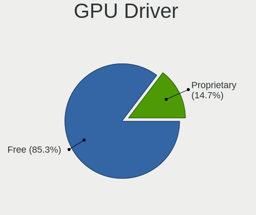

| Driver      | Notebooks | Percent |
|-------------|-----------|---------|
| Free        | 26        | 81.25%  |
| Proprietary | 6         | 18.75%  |

GPU Memory
----------

Total video memory

| Size in GB | Notebooks | Percent |
|------------|-----------|---------|
| Unknown    | 23        | 67.65%  |
| 1.01-2.0   | 4         | 11.76%  |
| 0.51-1.0   | 3         | 8.82%   |
| 0.01-0.5   | 3         | 8.82%   |
| 3.01-4.0   | 1         | 2.94%   |

Monitor
-------

Monitor Vendor
--------------

Monitor vendors

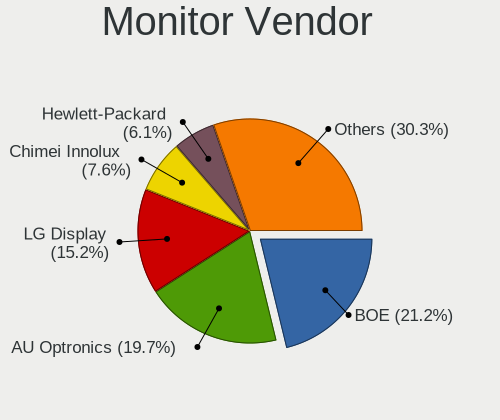

| Vendor              | Notebooks | Percent |
|---------------------|-----------|---------|
| LG Display          | 8         | 21.62%  |
| BOE                 | 5         | 13.51%  |
| AU Optronics        | 4         | 10.81%  |
| Philips             | 3         | 8.11%   |
| Hewlett-Packard     | 3         | 8.11%   |
| Chimei Innolux      | 3         | 8.11%   |
| SDC                 | 1         | 2.7%    |
| Samsung Electronics | 1         | 2.7%    |
| PANDA               | 1         | 2.7%    |
| LGD                 | 1         | 2.7%    |
| Lenovo              | 1         | 2.7%    |
| InfoVision          | 1         | 2.7%    |
| Iiyama              | 1         | 2.7%    |
| HJW                 | 1         | 2.7%    |
| Dell                | 1         | 2.7%    |
| CSO                 | 1         | 2.7%    |
| Apple               | 1         | 2.7%    |

Monitor Model
-------------

Monitor models

| Model                                                                | Notebooks | Percent |
|----------------------------------------------------------------------|-----------|---------|
| LG Display LCD Monitor LGD0258 1600x900 350x190mm 15.7-inch          | 3         | 7.89%   |
| Philips LCD Monitor PHL08C3 1920x1080 600x340mm 27.2-inch            | 2         | 5.26%   |
| SDC LCD Monitor 3520x1080                                            | 1         | 2.63%   |
| Samsung Electronics LCD Monitor SDC3754 1600x900 380x210mm 17.1-inch | 1         | 2.63%   |
| Philips LCD Monitor 271P4 3520x1080                                  | 1         | 2.63%   |
| Philips LCD Monitor 271P4                                            | 1         | 2.63%   |
| PANDA LCD Monitor NCP004F 1920x1080 310x170mm 13.9-inch              | 1         | 2.63%   |
| LGD LCD Monitor 1920x1080                                            | 1         | 2.63%   |
| LG Display LCD Monitor LGD062E 1920x1080 340x190mm 15.3-inch         | 1         | 2.63%   |
| LG Display LCD Monitor LGD060A 1920x1080 290x170mm 13.2-inch         | 1         | 2.63%   |
| LG Display LCD Monitor LGD05FA 1920x1080 310x170mm 13.9-inch         | 1         | 2.63%   |
| LG Display LCD Monitor LGD0437 1920x1080 280x160mm 12.7-inch         | 1         | 2.63%   |
| LG Display LCD Monitor LGD033E 1366x768 310x170mm 13.9-inch          | 1         | 2.63%   |
| Lenovo LEN P44w-10 LEN61D5 3840x1200 1050x330mm 43.3-inch            | 1         | 2.63%   |
| InfoVision LCD Monitor IVO057D 1920x1080 310x170mm 13.9-inch         | 1         | 2.63%   |
| Iiyama PL2474H IVM6146 1920x1080 520x290mm 23.4-inch                 | 1         | 2.63%   |
| HJW HDMI TO USB HJW0001 1920x1080 700x390mm 31.5-inch                | 1         | 2.63%   |
| Hewlett-Packard LCD Monitor LA2306 3520x1080                         | 1         | 2.63%   |
| Hewlett-Packard LA2306 HWP2949 1920x1080 510x290mm 23.1-inch         | 1         | 2.63%   |
| Hewlett-Packard E242 HWP326E 1920x1200 520x320mm 24.0-inch           | 1         | 2.63%   |
| Dell U2718Q DELA0EC 3840x2160 610x350mm 27.7-inch                    | 1         | 2.63%   |
| CSO LCD Monitor CSO1500 3840x2160 340x190mm 15.3-inch                | 1         | 2.63%   |
| Chimei Innolux P130ZFA-BA1 CMN8201 2160x1440 280x180mm 13.1-inch     | 1         | 2.63%   |
| Chimei Innolux LCD Monitor CMN15D5 1920x1080 340x190mm 15.3-inch     | 1         | 2.63%   |
| Chimei Innolux LCD Monitor CMN13A2 1920x1080 290x170mm 13.2-inch     | 1         | 2.63%   |
| BOE LCD Monitor BOE095F 2256x1504 280x190mm 13.3-inch                | 1         | 2.63%   |
| BOE LCD Monitor BOE084D 1920x1080 340x190mm 15.3-inch                | 1         | 2.63%   |
| BOE LCD Monitor BOE07F1 1920x1080 340x190mm 15.3-inch                | 1         | 2.63%   |
| BOE LCD Monitor BOE0792 1920x1080 340x190mm 15.3-inch                | 1         | 2.63%   |
| BOE LCD Monitor BOE0747 1920x1080 340x190mm 15.3-inch                | 1         | 2.63%   |
| AU Optronics LCD Monitor AUO243D 1920x1080 310x170mm 13.9-inch       | 1         | 2.63%   |
| AU Optronics LCD Monitor AUO213E 1600x900 310x170mm 13.9-inch        | 1         | 2.63%   |
| AU Optronics LCD Monitor AUO2026 2560x1600 290x180mm 13.4-inch       | 1         | 2.63%   |
| AU Optronics LCD Monitor AUO139D 1920x1080 380x210mm 17.1-inch       | 1         | 2.63%   |
| Apple Cinema HD APP9223 1920x1200 490x310mm 22.8-inch                | 1         | 2.63%   |

Monitor Resolution
------------------

Monitor screen resolution

| Resolution        | Notebooks | Percent |
|-------------------|-----------|---------|
| 1920x1080 (FHD)   | 19        | 54.29%  |
| 1600x900 (HD+)    | 5         | 14.29%  |
| 3840x2160 (4K)    | 2         | 5.71%   |
| 1920x1200 (WUXGA) | 2         | 5.71%   |
| 3840x1200         | 1         | 2.86%   |
| 3520x1080         | 1         | 2.86%   |
| 2560x1600         | 1         | 2.86%   |
| 2256x1504         | 1         | 2.86%   |
| 2160x1440         | 1         | 2.86%   |
| 1366x768 (WXGA)   | 1         | 2.86%   |
| Unknown           | 1         | 2.86%   |

Monitor Diagonal
----------------

Diagonal size in inches

| Inches  | Notebooks | Percent |
|---------|-----------|---------|
| 13      | 11        | 31.43%  |
| 15      | 10        | 28.57%  |
| 27      | 3         | 8.57%   |
| 23      | 2         | 5.71%   |
| 17      | 2         | 5.71%   |
| Unknown | 2         | 5.71%   |
| 43      | 1         | 2.86%   |
| 31      | 1         | 2.86%   |
| 24      | 1         | 2.86%   |
| 22      | 1         | 2.86%   |
| 12      | 1         | 2.86%   |

Monitor Width
-------------

Physical width

| Width in mm | Notebooks | Percent |
|-------------|-----------|---------|
| 301-350     | 16        | 47.06%  |
| 201-300     | 6         | 17.65%  |
| 501-600     | 4         | 11.76%  |
| 601-700     | 2         | 5.88%   |
| 351-400     | 2         | 5.88%   |
| Unknown     | 2         | 5.88%   |
| 401-500     | 1         | 2.94%   |
| 1001-1500   | 1         | 2.94%   |

Aspect Ratio
------------

Proportional relationship between the width and the height

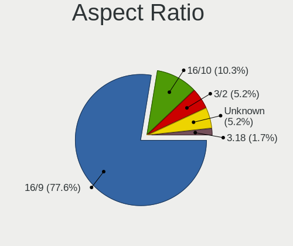

| Ratio   | Notebooks | Percent |
|---------|-----------|---------|
| 16/9    | 22        | 73.33%  |
| 16/10   | 4         | 13.33%  |
| Unknown | 2         | 6.67%   |
| 3/2     | 1         | 3.33%   |
| 3.18    | 1         | 3.33%   |

Monitor Area
------------

Area in inch²

| Area in inch² | Notebooks | Percent |
|----------------|-----------|---------|
| 81-90          | 8         | 22.86%  |
| 91-100         | 7         | 20%     |
| 71-80          | 3         | 8.57%   |
| 301-350        | 3         | 8.57%   |
| 201-250        | 3         | 8.57%   |
| 101-110        | 3         | 8.57%   |
| 121-130        | 2         | 5.71%   |
| Unknown        | 2         | 5.71%   |
| 61-70          | 1         | 2.86%   |
| 351-500        | 1         | 2.86%   |
| 251-300        | 1         | 2.86%   |
| 501-1000       | 1         | 2.86%   |

Pixel Density
-------------

Pixels per inch

| Density       | Notebooks | Percent |
|---------------|-----------|---------|
| 121-160       | 13        | 38.24%  |
| 51-100        | 7         | 20.59%  |
| 161-240       | 6         | 17.65%  |
| 101-120       | 5         | 14.71%  |
| Unknown       | 2         | 5.88%   |
| More than 240 | 1         | 2.94%   |

Multiple Monitors
-----------------

Total monitors connected

| Total | Notebooks | Percent |
|-------|-----------|---------|
| 1     | 18        | 54.55%  |
| 2     | 7         | 21.21%  |
| 0     | 7         | 21.21%  |
| 3     | 1         | 3.03%   |

Network
-------

Net Controller Vendor
---------------------

Controller vendors

| Vendor                | Notebooks | Percent |
|-----------------------|-----------|---------|
| Intel                 | 29        | 49.15%  |
| Realtek Semiconductor | 18        | 30.51%  |
| TP-Link               | 3         | 5.08%   |
| Hewlett-Packard       | 3         | 5.08%   |
| D-Link System         | 2         | 3.39%   |
| Ralink Technology     | 1         | 1.69%   |
| Qualcomm Atheros      | 1         | 1.69%   |
| Lenovo                | 1         | 1.69%   |
| BUFFALO               | 1         | 1.69%   |

Net Controller Model
--------------------

Controller models

| Model                                                                      | Notebooks | Percent |
|----------------------------------------------------------------------------|-----------|---------|
| Realtek RTL8111/8168/8411 PCI Express Gigabit Ethernet Controller          | 15        | 20.27%  |
| Intel Centrino Advanced-N 6205 [Taylor Peak]                               | 5         | 6.76%   |
| Intel 82579LM Gigabit Network Connection (Lewisville)                      | 5         | 6.76%   |
| Intel Wireless-AC 9260                                                     | 4         | 5.41%   |
| Intel Wireless 8265 / 8275                                                 | 4         | 5.41%   |
| Intel Wi-Fi 6 AX200                                                        | 4         | 5.41%   |
| Intel Comet Lake PCH CNVi WiFi                                             | 4         | 5.41%   |
| Intel Comet Lake PCH-LP CNVi WiFi                                          | 3         | 4.05%   |
| HP hs2350 HSPA+ Mobile Broadband Module Network Adapter                    | 3         | 4.05%   |
| TP-Link AC600 wireless Realtek RTL8811AU [Archer T2U Nano]                 | 2         | 2.7%    |
| Intel Wireless 7260                                                        | 2         | 2.7%    |
| Intel Ethernet Connection (4) I219-LM                                      | 2         | 2.7%    |
| D-Link System AirPlus G DWL-G122 Wireless Adapter(rev.C1) [Ralink RT2571W] | 2         | 2.7%    |
| TP-Link Archer T1U 802.11a/n/ac Wireless Adapter [MediaTek MT7610U]        | 1         | 1.35%   |
| Realtek RTL8822CE 802.11ac PCIe Wireless Network Adapter                   | 1         | 1.35%   |
| Realtek RTL8821CE 802.11ac PCIe Wireless Network Adapter                   | 1         | 1.35%   |
| Realtek RTL8188SU 802.11n WLAN Adapter                                     | 1         | 1.35%   |
| Realtek RTL8188EUS 802.11n Wireless Network Adapter                        | 1         | 1.35%   |
| Realtek RTL810xE PCI Express Fast Ethernet controller                      | 1         | 1.35%   |
| Realtek RTL-8100/8101L/8139 PCI Fast Ethernet Adapter                      | 1         | 1.35%   |
| Ralink MT7601U Wireless Adapter                                            | 1         | 1.35%   |
| Qualcomm Atheros QCA9377 802.11ac Wireless Network Adapter                 | 1         | 1.35%   |
| Lenovo ThinkPad Dock Ethernet [Realtek RTL8153B]                           | 1         | 1.35%   |
| Intel Wi-Fi 6 AX201                                                        | 1         | 1.35%   |
| Intel PRO/Wireless 2915ABG [Calexico2] Network Connection                  | 1         | 1.35%   |
| Intel Ethernet Connection I217-LM                                          | 1         | 1.35%   |
| Intel Ethernet Connection (7) I219-V                                       | 1         | 1.35%   |
| Intel Ethernet Connection (5) I219-V                                       | 1         | 1.35%   |
| Intel Ethernet Connection (11) I219-LM                                     | 1         | 1.35%   |
| Intel Cannon Lake PCH CNVi WiFi                                            | 1         | 1.35%   |
| Intel 82801DB/DBL/DBM (ICH4/ICH4-L/ICH4-M) AC'97 Modem Controller          | 1         | 1.35%   |
| BUFFALO WLI-UC-GNM2 Wireless LAN Adapter [Ralink RT3070]                   | 1         | 1.35%   |

Wireless Vendor
---------------

Wireless vendors

| Vendor                | Notebooks | Percent |
|-----------------------|-----------|---------|
| Intel                 | 29        | 70.73%  |
| Realtek Semiconductor | 4         | 9.76%   |
| TP-Link               | 3         | 7.32%   |
| D-Link System         | 2         | 4.88%   |
| Ralink Technology     | 1         | 2.44%   |
| Qualcomm Atheros      | 1         | 2.44%   |
| BUFFALO               | 1         | 2.44%   |

Wireless Model
--------------

Wireless models

| Model                                                                      | Notebooks | Percent |
|----------------------------------------------------------------------------|-----------|---------|
| Intel Centrino Advanced-N 6205 [Taylor Peak]                               | 5         | 12.2%   |
| Intel Wireless-AC 9260                                                     | 4         | 9.76%   |
| Intel Wireless 8265 / 8275                                                 | 4         | 9.76%   |
| Intel Wi-Fi 6 AX200                                                        | 4         | 9.76%   |
| Intel Comet Lake PCH CNVi WiFi                                             | 4         | 9.76%   |
| Intel Comet Lake PCH-LP CNVi WiFi                                          | 3         | 7.32%   |
| TP-Link AC600 wireless Realtek RTL8811AU [Archer T2U Nano]                 | 2         | 4.88%   |
| Intel Wireless 7260                                                        | 2         | 4.88%   |
| D-Link System AirPlus G DWL-G122 Wireless Adapter(rev.C1) [Ralink RT2571W] | 2         | 4.88%   |
| TP-Link Archer T1U 802.11a/n/ac Wireless Adapter [MediaTek MT7610U]        | 1         | 2.44%   |
| Realtek RTL8822CE 802.11ac PCIe Wireless Network Adapter                   | 1         | 2.44%   |
| Realtek RTL8821CE 802.11ac PCIe Wireless Network Adapter                   | 1         | 2.44%   |
| Realtek RTL8188SU 802.11n WLAN Adapter                                     | 1         | 2.44%   |
| Realtek RTL8188EUS 802.11n Wireless Network Adapter                        | 1         | 2.44%   |
| Ralink MT7601U Wireless Adapter                                            | 1         | 2.44%   |
| Qualcomm Atheros QCA9377 802.11ac Wireless Network Adapter                 | 1         | 2.44%   |
| Intel Wi-Fi 6 AX201                                                        | 1         | 2.44%   |
| Intel PRO/Wireless 2915ABG [Calexico2] Network Connection                  | 1         | 2.44%   |
| Intel Cannon Lake PCH CNVi WiFi                                            | 1         | 2.44%   |
| BUFFALO WLI-UC-GNM2 Wireless LAN Adapter [Ralink RT3070]                   | 1         | 2.44%   |

Ethernet Vendor
---------------

Ethernet vendors

| Vendor                | Notebooks | Percent |
|-----------------------|-----------|---------|
| Realtek Semiconductor | 17        | 58.62%  |
| Intel                 | 11        | 37.93%  |
| Lenovo                | 1         | 3.45%   |

Ethernet Model
--------------

Ethernet models

| Model                                                             | Notebooks | Percent |
|-------------------------------------------------------------------|-----------|---------|
| Realtek RTL8111/8168/8411 PCI Express Gigabit Ethernet Controller | 15        | 51.72%  |
| Intel 82579LM Gigabit Network Connection (Lewisville)             | 5         | 17.24%  |
| Intel Ethernet Connection (4) I219-LM                             | 2         | 6.9%    |
| Realtek RTL810xE PCI Express Fast Ethernet controller             | 1         | 3.45%   |
| Realtek RTL-8100/8101L/8139 PCI Fast Ethernet Adapter             | 1         | 3.45%   |
| Lenovo ThinkPad Dock Ethernet [Realtek RTL8153B]                  | 1         | 3.45%   |
| Intel Ethernet Connection I217-LM                                 | 1         | 3.45%   |
| Intel Ethernet Connection (7) I219-V                              | 1         | 3.45%   |
| Intel Ethernet Connection (5) I219-V                              | 1         | 3.45%   |
| Intel Ethernet Connection (11) I219-LM                            | 1         | 3.45%   |

Net Controller Kind
-------------------

Ethernet, WiFi or modem

| Kind     | Notebooks | Percent |
|----------|-----------|---------|
| WiFi     | 32        | 50%     |
| Ethernet | 28        | 43.75%  |
| Modem    | 4         | 6.25%   |

Used Controller
---------------

Currently used network controller

| Kind     | Notebooks | Percent |
|----------|-----------|---------|
| Ethernet | 26        | 55.32%  |
| WiFi     | 19        | 40.43%  |
| Modem    | 2         | 4.26%   |

NICs
----

Total network controllers on board

| Total | Notebooks | Percent |
|-------|-----------|---------|
| 2     | 27        | 84.38%  |
| 1     | 4         | 12.5%   |
| 3     | 1         | 3.13%   |

IPv6
----

IPv6 vs IPv4

| Used | Notebooks | Percent |
|------|-----------|---------|
| No   | 29        | 82.86%  |
| Yes  | 6         | 17.14%  |

Bluetooth
---------

Bluetooth Vendor
----------------

Controller vendors

| Vendor                | Notebooks | Percent |
|-----------------------|-----------|---------|
| Intel                 | 21        | 87.5%   |
| Realtek Semiconductor | 1         | 4.17%   |
| Realtek               | 1         | 4.17%   |
| Broadcom              | 1         | 4.17%   |

Bluetooth Model
---------------

Controller models

| Model                                          | Notebooks | Percent |
|------------------------------------------------|-----------|---------|
| Intel AX201 Bluetooth                          | 6         | 25%     |
| Intel Bluetooth wireless interface             | 5         | 20.83%  |
| Intel AX200 Bluetooth                          | 4         | 16.67%  |
| Intel Wireless-AC 9260 Bluetooth Adapter       | 3         | 12.5%   |
| Intel Bluetooth 9460/9560 Jefferson Peak (JfP) | 3         | 12.5%   |
| Realtek  Bluetooth Adapter                     | 1         | 4.17%   |
| Realtek Bluetooth Radio                        | 1         | 4.17%   |
| Broadcom BCM20702 Bluetooth 4.0 [ThinkPad]     | 1         | 4.17%   |

Sound
-----

Sound Vendor
------------

Sound card vendors

| Vendor      | Notebooks | Percent |
|-------------|-----------|---------|
| Intel       | 22        | 48.89%  |
| AMD         | 13        | 28.89%  |
| Nvidia      | 7         | 15.56%  |
| Lenovo      | 2         | 4.44%   |
| CMX Systems | 1         | 2.22%   |

Sound Model
-----------

Sound card models

| Model                                                               | Notebooks | Percent |
|---------------------------------------------------------------------|-----------|---------|
| AMD Family 17h (Models 10h-1fh) HD Audio Controller                 | 10        | 17.54%  |
| AMD Raven/Raven2/Fenghuang HDMI/DP Audio Controller                 | 6         | 10.53%  |
| Intel 7 Series/C216 Chipset Family High Definition Audio Controller | 5         | 8.77%   |
| Intel Comet Lake PCH cAVS                                           | 4         | 7.02%   |
| AMD Renoir Radeon High Definition Audio Controller                  | 4         | 7.02%   |
| Intel Comet Lake PCH-LP cAVS                                        | 3         | 5.26%   |
| AMD Turks HDMI Audio [Radeon HD 6500/6600 / 6700M Series]           | 3         | 5.26%   |
| Nvidia TU116 High Definition Audio Controller                       | 2         | 3.51%   |
| Nvidia TU107 GeForce GTX 1650 High Definition Audio Controller      | 2         | 3.51%   |
| Intel Sunrise Point-LP HD Audio                                     | 2         | 3.51%   |
| Intel Cannon Lake PCH cAVS                                          | 2         | 3.51%   |
| Intel 8 Series/C220 Series Chipset High Definition Audio Controller | 2         | 3.51%   |
| Nvidia TU104 HD Audio Controller                                    | 1         | 1.75%   |
| Nvidia GP107GL High Definition Audio Controller                     | 1         | 1.75%   |
| Nvidia GK107 HDMI Audio Controller                                  | 1         | 1.75%   |
| Lenovo ThinkPad Dock Audio                                          | 1         | 1.75%   |
| Lenovo Realtek USB Audio                                            | 1         | 1.75%   |
| Intel Xeon E3-1200 v3/4th Gen Core Processor HD Audio Controller    | 1         | 1.75%   |
| Intel Tiger Lake-LP Smart Sound Technology Audio Controller         | 1         | 1.75%   |
| Intel Ice Lake-LP Smart Sound Technology Audio Controller           | 1         | 1.75%   |
| Intel CM238 HD Audio Controller                                     | 1         | 1.75%   |
| Intel 82801DB/DBL/DBM (ICH4/ICH4-L/ICH4-M) AC'97 Audio Controller   | 1         | 1.75%   |
| CMX Systems USB PnP Audio Device                                    | 1         | 1.75%   |
| AMD Navi 10 HDMI Audio                                              | 1         | 1.75%   |

Memory
------

Memory Vendor
-------------

Memory module vendors

| Vendor              | Notebooks | Percent |
|---------------------|-----------|---------|
| Samsung Electronics | 10        | 27.03%  |
| SK Hynix            | 6         | 16.22%  |
| Micron Technology   | 6         | 16.22%  |
| Kingston            | 5         | 13.51%  |
| Smart               | 2         | 5.41%   |
| Ramaxel Technology  | 2         | 5.41%   |
| Crucial             | 2         | 5.41%   |
| Unknown             | 1         | 2.7%    |
| PNY                 | 1         | 2.7%    |
| GOODRAM             | 1         | 2.7%    |
| A-DATA Technology   | 1         | 2.7%    |

Memory Model
------------

Memory module models

| Model                                                        | Notebooks | Percent |
|--------------------------------------------------------------|-----------|---------|
| Samsung RAM M471B1G73QH0-YK0 8GB SODIMM DDR3 1600MT/s        | 4         | 10.81%  |
| SK Hynix RAM HMT41GS6BFR8A-PB 8GB SODIMM DDR3 1600MT/s       | 2         | 5.41%   |
| SK Hynix RAM HMA851S6AFR6N-UH 4GB SODIMM DDR4 2400MT/s       | 2         | 5.41%   |
| Samsung RAM M471A5244CB0-CTD 4GB SODIMM DDR4 2667MT/s        | 2         | 5.41%   |
| Micron RAM 4ATS1G64HZ-2G6E1 8GB SODIMM DDR4 2667MT/s         | 2         | 5.41%   |
| Crucial RAM BL32G32C16S4B.M16FB1 32GB SODIMM DDR4 2667MT/s   | 2         | 5.41%   |
| Unknown RAM Module 1GB SODIMM DDR                            | 1         | 2.7%    |
| Smart RAM SF4641G8CK8IWGKSEG 8GB SODIMM DDR4 2133MT/s        | 1         | 2.7%    |
| Smart RAM SF4641G8CK8IEHLSBG 8GB SODIMM DDR4 2667MT/s        | 1         | 2.7%    |
| SK Hynix RAM HMA82GS6CJR8N-VK 16GB SODIMM DDR4 2667MT/s      | 1         | 2.7%    |
| SK Hynix RAM HMA81GS6JJR8N-VK 8GB SODIMM DDR4 2667MT/s       | 1         | 2.7%    |
| Samsung RAM M474A4G43AB1-CVF 32GB SODIMM DDR4 2933MT/s       | 1         | 2.7%    |
| Samsung RAM M471A2K43DB1-CTD 16GB SODIMM DDR4 2667MT/s       | 1         | 2.7%    |
| Samsung RAM M471A1G44AB0-CTD 8GB SODIMM DDR4 2667MT/s        | 1         | 2.7%    |
| Samsung RAM K4EBE304EB-EGCF 8GB Row Of Chips LPDDR3 1867MT/s | 1         | 2.7%    |
| Ramaxel RAM RMSA3320MJ78HAF-3200 8GB SODIMM DDR4 3200MT/s    | 1         | 2.7%    |
| Ramaxel RAM RMSA3300MH78HBF-2666 16GB SODIMM DDR4 2400MT/s   | 1         | 2.7%    |
| PNY RAM 16GU2X16LIII43-12-K 16GB SODIMM DDR4 2667MT/s        | 1         | 2.7%    |
| Micron RAM Module 8GB SODIMM DDR4 3200MT/s                   | 1         | 2.7%    |
| Micron RAM 4ATS2G64HZ-3G2B1 16GB SODIMM DDR4 3200MT/s        | 1         | 2.7%    |
| Micron RAM 4ATF1G64HZ-3G2E1 8GB Row Of Chips DDR4 3200MT/s   | 1         | 2.7%    |
| Micron RAM 16KTF1G64HZ-1G6N1 8GB SODIMM DDR3 1600MT/s        | 1         | 2.7%    |
| Kingston RAM Module 16GB SODIMM DDR4 2667MT/s                | 1         | 2.7%    |
| Kingston RAM LV32D4S2S8HD-8 8GB SODIMM DDR4 2933MT/s         | 1         | 2.7%    |
| Kingston RAM KHX2400C14S4/4G 4GB SODIMM DDR4 2400MT/s        | 1         | 2.7%    |
| Kingston RAM 99U5428-063.A00LF 8GB SODIMM DDR3 1600MT/s      | 1         | 2.7%    |
| Kingston RAM 9905428-196.A00LF 8GB SODIMM DDR3 1333MT/s      | 1         | 2.7%    |
| GOODRAM RAM GR1600S364L11/8G 8GB SODIMM DDR3 1600MT/s        | 1         | 2.7%    |
| A-DATA RAM DDR4 3200 16GB SODIMM DDR4 2667MT/s               | 1         | 2.7%    |

Memory Kind
-----------

Memory module kinds

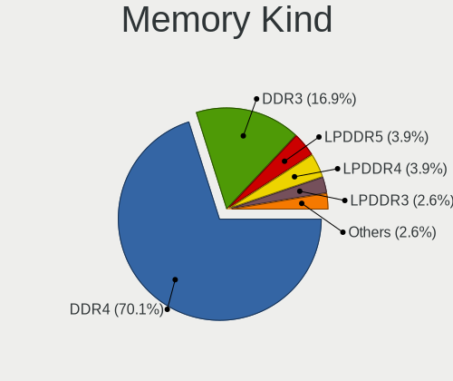

| Kind   | Notebooks | Percent |
|--------|-----------|---------|
| DDR4   | 23        | 71.88%  |
| DDR3   | 7         | 21.88%  |
| LPDDR3 | 1         | 3.13%   |
| DDR    | 1         | 3.13%   |

Memory Form Factor
------------------

Physical design of the memory module

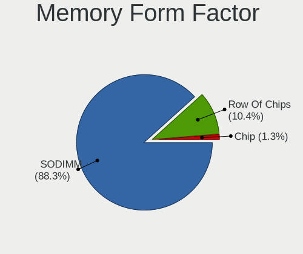

| Name         | Notebooks | Percent |
|--------------|-----------|---------|
| SODIMM       | 30        | 93.75%  |
| Row Of Chips | 2         | 6.25%   |

Memory Size
-----------

Memory module size

| Size  | Notebooks | Percent |
|-------|-----------|---------|
| 8192  | 18        | 56.25%  |
| 16384 | 7         | 21.88%  |
| 32768 | 3         | 9.38%   |
| 4096  | 3         | 9.38%   |
| 1024  | 1         | 3.13%   |

Memory Speed
------------

Memory module speed

| Speed   | Notebooks | Percent |
|---------|-----------|---------|
| 2667    | 14        | 42.42%  |
| 1600    | 6         | 18.18%  |
| 3200    | 4         | 12.12%  |
| 2400    | 3         | 9.09%   |
| 2933    | 2         | 6.06%   |
| 2133    | 1         | 3.03%   |
| 1867    | 1         | 3.03%   |
| 1333    | 1         | 3.03%   |
| Unknown | 1         | 3.03%   |

Printers & scanners
-------------------

Printer Vendor
--------------

Printer device vendors

Zero info for selected period =(

Printer Model
-------------

Printer device models

Zero info for selected period =(

Scanner Vendor
--------------

Scanner device vendors

Zero info for selected period =(

Scanner Model
-------------

Scanner device models

Zero info for selected period =(

Camera
------

Camera Vendor
-------------

Camera device vendors

| Vendor                                 | Notebooks | Percent |
|----------------------------------------|-----------|---------|
| Chicony Electronics                    | 10        | 30.3%   |
| IMC Networks                           | 7         | 21.21%  |
| Lite-On Technology                     | 4         | 12.12%  |
| Realtek Semiconductor                  | 3         | 9.09%   |
| Logitech                               | 3         | 9.09%   |
| Acer                                   | 2         | 6.06%   |
| Syntek                                 | 1         | 3.03%   |
| Sunplus Innovation Technology          | 1         | 3.03%   |
| Microdia                               | 1         | 3.03%   |
| Cheng Uei Precision Industry (Foxlink) | 1         | 3.03%   |

Camera Model
------------

Camera device models

| Model                                                                    | Notebooks | Percent |
|--------------------------------------------------------------------------|-----------|---------|
| Chicony Integrated Camera                                                | 5         | 14.71%  |
| IMC Networks Integrated Camera                                           | 4         | 11.76%  |
| Chicony Integrated HP HD Webcam                                          | 3         | 8.82%   |
| Logitech Webcam C270                                                     | 2         | 5.88%   |
| Lite-On Integrated Camera                                                | 2         | 5.88%   |
| Lite-On HP HD Camera                                                     | 2         | 5.88%   |
| Syntek Lenovo EasyCamera                                                 | 1         | 2.94%   |
| Sunplus Integrated_Webcam_HD                                             | 1         | 2.94%   |
| Realtek USB 2 Webcam                                                     | 1         | 2.94%   |
| Realtek Laptop Camera                                                    | 1         | 2.94%   |
| Realtek Integrated_Webcam_HD                                             | 1         | 2.94%   |
| Microdia Dell Integrated HD Webcam                                       | 1         | 2.94%   |
| Logitech HD Pro Webcam C920                                              | 1         | 2.94%   |
| IMC Networks USB2.0 HD UVC WebCam                                        | 1         | 2.94%   |
| IMC Networks HD Camera                                                   | 1         | 2.94%   |
| IMC Networks EasyCamera                                                  | 1         | 2.94%   |
| Chicony ThinkPad T490 Webcam                                             | 1         | 2.94%   |
| Chicony Integrated IR Camera                                             | 1         | 2.94%   |
| Chicony HD Webcam                                                        | 1         | 2.94%   |
| Cheng Uei Precision Industry (Foxlink) HP EliteBook integrated HD Webcam | 1         | 2.94%   |
| Acer Integrated Camera                                                   | 1         | 2.94%   |
| Acer HD Webcam                                                           | 1         | 2.94%   |

Security
--------

Fingerprint Vendor
------------------

Fingerprint sensor vendors

| Vendor                     | Notebooks | Percent |
|----------------------------|-----------|---------|
| Synaptics                  | 6         | 50%     |
| Shenzhen Goodix Technology | 3         | 25%     |
| Validity Sensors           | 2         | 16.67%  |
| AuthenTec                  | 1         | 8.33%   |

Fingerprint Model
-----------------

Fingerprint sensor models

| Model                                                     | Notebooks | Percent |
|-----------------------------------------------------------|-----------|---------|
| Synaptics Prometheus MIS Touch Fingerprint Reader         | 3         | 25%     |
| Validity Sensors Synaptics WBDI                           | 2         | 16.67%  |
| Synaptics  FS7604 Touch Fingerprint Sensor with PurePrint | 2         | 16.67%  |
| Shenzhen Goodix Fingerprint Reader                        | 2         | 16.67%  |
| Synaptics Metallica MIS Touch Fingerprint Reader          | 1         | 8.33%   |
| Shenzhen Goodix  FingerPrint Device                       | 1         | 8.33%   |
| AuthenTec AES2810                                         | 1         | 8.33%   |

Chipcard Vendor
---------------

Chipcard module vendors

Zero info for selected period =(

Chipcard Model
--------------

Chipcard module models

Zero info for selected period =(

Unsupported
-----------

Unsupported Devices
-------------------

Total unsupported devices on board

| Total | Notebooks | Percent |
|-------|-----------|---------|
| 4     | 9         | 27.27%  |
| 2     | 9         | 27.27%  |
| 3     | 5         | 15.15%  |
| 1     | 5         | 15.15%  |
| 5     | 3         | 9.09%   |
| 9     | 1         | 3.03%   |
| 0     | 1         | 3.03%   |

Unsupported Device Types
------------------------

Types of unsupported devices

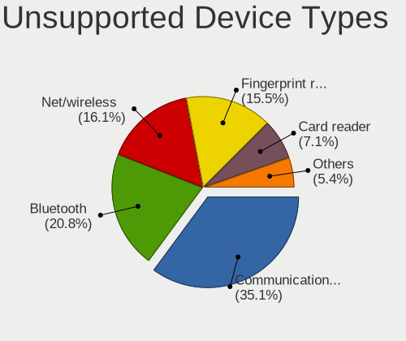

| Type                     | Notebooks | Percent |
|--------------------------|-----------|---------|
| Communication controller | 25        | 31.65%  |
| Net/wireless             | 15        | 18.99%  |
| Bluetooth                | 15        | 18.99%  |
| Fingerprint reader       | 12        | 15.19%  |
| Card reader              | 6         | 7.59%   |
| Sound                    | 2         | 2.53%   |
| Firewire controller      | 2         | 2.53%   |
| Net/ethernet             | 1         | 1.27%   |
| Modem                    | 1         | 1.27%   |

