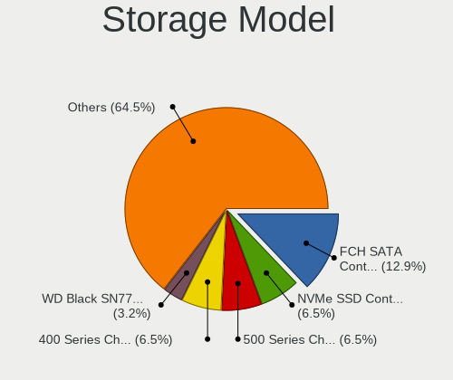
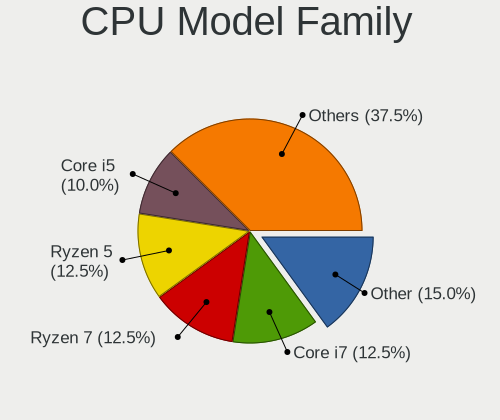

FreeBSD 14.0 - Tested Hardware & Statistics (Desktops)
------------------------------------------------------

A project to collect tested hardware configurations for FreeBSD 14.0.

Anyone can contribute to this report by the [hw-probe](https://github.com/linuxhw/hw-probe/blob/master/INSTALL.BSD.md) tool:

    hw-probe -all -upload

Please contribute! Especially if your hardware is rare.

Contents
--------

* [ Test Cases ](#test-cases)

* [ System ](#system)
  - [ Arch                     ](#arch)
  - [ DE                       ](#de)
  - [ Display Server           ](#display-server)
  - [ Display Manager          ](#display-manager)
  - [ OS Lang                  ](#os-lang)
  - [ Boot Mode                ](#boot-mode)
  - [ Filesystem               ](#filesystem)
  - [ Part. scheme             ](#part-scheme)

* [ Board ](#board)
  - [ Vendor                   ](#vendor)
  - [ Model                    ](#model)
  - [ Model Family             ](#model-family)
  - [ MFG Year                 ](#mfg-year)
  - [ Form Factor              ](#form-factor)
  - [ Coreboot                 ](#coreboot)
  - [ RAM Size                 ](#ram-size)
  - [ RAM Used                 ](#ram-used)
  - [ Total Drives             ](#total-drives)
  - [ Has CD-ROM               ](#has-cd-rom)
  - [ Has Ethernet             ](#has-ethernet)
  - [ Has WiFi                 ](#has-wifi)
  - [ Has Bluetooth            ](#has-bluetooth)

* [ Location ](#location)
  - [ Country                  ](#country)
  - [ City                     ](#city)

* [ Drives ](#drives)
  - [ Drive Vendor             ](#drive-vendor)
  - [ Drive Model              ](#drive-model)
  - [ HDD Vendor               ](#hdd-vendor)
  - [ SSD Vendor               ](#ssd-vendor)
  - [ Drive Kind               ](#drive-kind)
  - [ Drive Connector          ](#drive-connector)
  - [ Drive Size               ](#drive-size)
  - [ Space Total              ](#space-total)
  - [ Space Used               ](#space-used)
  - [ Malfunc. Drives          ](#malfunc-drives)
  - [ Malfunc. Drive Vendor    ](#malfunc-drive-vendor)
  - [ Malfunc. HDD Vendor      ](#malfunc-hdd-vendor)
  - [ Malfunc. Drive Kind      ](#malfunc-drive-kind)
  - [ Failed Drives            ](#failed-drives)
  - [ Failed Drive Vendor      ](#failed-drive-vendor)
  - [ Drive Status             ](#drive-status)

* [ Storage controller ](#storage-controller)
  - [ Storage Vendor           ](#storage-vendor)
  - [ Storage Model            ](#storage-model)
  - [ Storage Kind             ](#storage-kind)

* [ Processor ](#processor)
  - [ CPU Vendor               ](#cpu-vendor)
  - [ CPU Model                ](#cpu-model)
  - [ CPU Model Family         ](#cpu-model-family)
  - [ CPU Cores                ](#cpu-cores)
  - [ CPU Sockets              ](#cpu-sockets)
  - [ CPU Threads              ](#cpu-threads)
  - [ CPU Microarch            ](#cpu-microarch)

* [ Graphics ](#graphics)
  - [ GPU Vendor               ](#gpu-vendor)
  - [ GPU Model                ](#gpu-model)
  - [ GPU Combo                ](#gpu-combo)
  - [ GPU Driver               ](#gpu-driver)
  - [ GPU Memory               ](#gpu-memory)

* [ Monitor ](#monitor)
  - [ Monitor Vendor           ](#monitor-vendor)
  - [ Monitor Model            ](#monitor-model)
  - [ Monitor Resolution       ](#monitor-resolution)
  - [ Monitor Diagonal         ](#monitor-diagonal)
  - [ Monitor Width            ](#monitor-width)
  - [ Aspect Ratio             ](#aspect-ratio)
  - [ Monitor Area             ](#monitor-area)
  - [ Pixel Density            ](#pixel-density)
  - [ Multiple Monitors        ](#multiple-monitors)

* [ Network ](#network)
  - [ Net Controller Vendor    ](#net-controller-vendor)
  - [ Net Controller Model     ](#net-controller-model)
  - [ Wireless Vendor          ](#wireless-vendor)
  - [ Wireless Model           ](#wireless-model)
  - [ Ethernet Vendor          ](#ethernet-vendor)
  - [ Ethernet Model           ](#ethernet-model)
  - [ Net Controller Kind      ](#net-controller-kind)
  - [ Used Controller          ](#used-controller)
  - [ NICs                     ](#nics)
  - [ IPv6                     ](#ipv6)

* [ Bluetooth ](#bluetooth)
  - [ Bluetooth Vendor         ](#bluetooth-vendor)
  - [ Bluetooth Model          ](#bluetooth-model)

* [ Sound ](#sound)
  - [ Sound Vendor             ](#sound-vendor)
  - [ Sound Model              ](#sound-model)

* [ Memory ](#memory)
  - [ Memory Vendor            ](#memory-vendor)
  - [ Memory Model             ](#memory-model)
  - [ Memory Kind              ](#memory-kind)
  - [ Memory Form Factor       ](#memory-form-factor)
  - [ Memory Size              ](#memory-size)
  - [ Memory Speed             ](#memory-speed)

* [ Printers & scanners ](#printers--scanners)
  - [ Printer Vendor           ](#printer-vendor)
  - [ Printer Model            ](#printer-model)
  - [ Scanner Vendor           ](#scanner-vendor)
  - [ Scanner Model            ](#scanner-model)

* [ Camera ](#camera)
  - [ Camera Vendor            ](#camera-vendor)
  - [ Camera Model             ](#camera-model)

* [ Security ](#security)
  - [ Fingerprint Vendor       ](#fingerprint-vendor)
  - [ Fingerprint Model        ](#fingerprint-model)
  - [ Chipcard Vendor          ](#chipcard-vendor)
  - [ Chipcard Model           ](#chipcard-model)

* [ Unsupported ](#unsupported)
  - [ Unsupported Devices      ](#unsupported-devices)
  - [ Unsupported Device Types ](#unsupported-device-types)

Test Cases
----------

Total: 48

| Vendor        | Model                       | Probe                                                     | Date         |
|---------------|-----------------------------|-----------------------------------------------------------|--------------|
| ASUSTek       | P8Z77-V LX                  | [7557aa9e0a](https://bsd-hardware.info/?probe=7557aa9e0a) | Sep 30, 2024 |
| ASUSTek       | P8Z77-V LX                  | [0372d7f73b](https://bsd-hardware.info/?probe=0372d7f73b) | Sep 30, 2024 |
| MSI           | B350M BAZOOKA               | [ea0e584b5e](https://bsd-hardware.info/?probe=ea0e584b5e) | Aug 09, 2024 |
| TYAN Compu... | Intel 440BX/GX Rev. 4       | [84ad498f3e](https://bsd-hardware.info/?probe=84ad498f3e) | Jun 07, 2024 |
| ASUSTek       | H110M-C                     | [fbfee7e505](https://bsd-hardware.info/?probe=fbfee7e505) | May 09, 2024 |
| ASUSTek       | TUF B360-PLUS GAMING        | [c809f82bd6](https://bsd-hardware.info/?probe=c809f82bd6) | May 09, 2024 |
| MSI           | B450I GAMING PLUS MAX WI... | [7ab7294373](https://bsd-hardware.info/?probe=7ab7294373) | Apr 14, 2024 |
| Dell          | 0GM819                      | [6140b5e6ad](https://bsd-hardware.info/?probe=6140b5e6ad) | Apr 12, 2024 |
| Gigabyte      | H97M-D3H                    | [8c0a605e99](https://bsd-hardware.info/?probe=8c0a605e99) | Apr 10, 2024 |
| ASRock        | AMD BC-250                  | [3b38d89497](https://bsd-hardware.info/?probe=3b38d89497) | Apr 09, 2024 |
| Foxconn       | H61MXV/H67MXV               | [53663c4ae5](https://bsd-hardware.info/?probe=53663c4ae5) | Apr 07, 2024 |
| Gigabyte      | X570 I AORUS PRO WIFI       | [0ab49168ee](https://bsd-hardware.info/?probe=0ab49168ee) | Apr 02, 2024 |
| ASRock        | Q1900-ITX                   | [cfceb60c9e](https://bsd-hardware.info/?probe=cfceb60c9e) | Mar 28, 2024 |
| ASRock        | Q1900-ITX                   | [d29def9398](https://bsd-hardware.info/?probe=d29def9398) | Mar 28, 2024 |
| ZOTAC         | Unknown                     | [9217678a4f](https://bsd-hardware.info/?probe=9217678a4f) | Mar 10, 2024 |
| Dell          | 002KVM A01                  | [92ae9e6766](https://bsd-hardware.info/?probe=92ae9e6766) | Mar 07, 2024 |
| ASUSTek       | PRIME B450M-A               | [101b5912bf](https://bsd-hardware.info/?probe=101b5912bf) | Feb 25, 2024 |
| Unknown       | Unknown                     | [a5ae8a1c9d](https://bsd-hardware.info/?probe=a5ae8a1c9d) | Feb 21, 2024 |
| ASRock        | 4X4-5000 Series             | [dc9ef8f030](https://bsd-hardware.info/?probe=dc9ef8f030) | Feb 21, 2024 |
| Fujitsu       | D3401-H2 S26361-D3401-H2    | [057ab23bee](https://bsd-hardware.info/?probe=057ab23bee) | Feb 18, 2024 |
| HP            | 83E9                        | [f5a6f9001d](https://bsd-hardware.info/?probe=f5a6f9001d) | Feb 17, 2024 |
| ASRock        | Z590 Steel Legend           | [e7dfc1ffe5](https://bsd-hardware.info/?probe=e7dfc1ffe5) | Feb 13, 2024 |
| ASRock        | Z590 Steel Legend           | [30702fa4b5](https://bsd-hardware.info/?probe=30702fa4b5) | Feb 13, 2024 |
| MSI           | PRO B550M-P GEN3            | [6a6b1dbe8f](https://bsd-hardware.info/?probe=6a6b1dbe8f) | Feb 06, 2024 |
| ASUSTek       | Pro B560M-C                 | [676019447d](https://bsd-hardware.info/?probe=676019447d) | Feb 03, 2024 |
| Unknown       | Unknown                     | [6564d3ecfe](https://bsd-hardware.info/?probe=6564d3ecfe) | Jan 07, 2024 |
| Dell          | 0D24M8 A01                  | [17862ade20](https://bsd-hardware.info/?probe=17862ade20) | Jan 03, 2024 |
| Gigabyte      | H61M-S2PV                   | [88d2ae1175](https://bsd-hardware.info/?probe=88d2ae1175) | Dec 14, 2023 |
| Unknown       | Unknown                     | [123088175c](https://bsd-hardware.info/?probe=123088175c) | Dec 11, 2023 |
| AZW           | EQ                          | [0280c1cdb9](https://bsd-hardware.info/?probe=0280c1cdb9) | Dec 10, 2023 |
| ASUSTek       | CM6870                      | [881ad2eacf](https://bsd-hardware.info/?probe=881ad2eacf) | Dec 10, 2023 |
| ASUSTek       | CM6870                      | [78399ba39e](https://bsd-hardware.info/?probe=78399ba39e) | Dec 09, 2023 |
| ASUSTek       | TUF Gaming B550M-PLUS       | [a9b3beae66](https://bsd-hardware.info/?probe=a9b3beae66) | Dec 02, 2023 |
| MSI           | B450M MORTAR                | [4017ce5221](https://bsd-hardware.info/?probe=4017ce5221) | Nov 29, 2023 |
| CNCTION-IA... | Unknown                     | [1b4871792b](https://bsd-hardware.info/?probe=1b4871792b) | Nov 28, 2023 |
| ASUSTek       | PRIME A520M-E               | [8d7c03be2f](https://bsd-hardware.info/?probe=8d7c03be2f) | Nov 28, 2023 |
| ASUSTek       | ProArt B550-CREATOR         | [806a29d40a](https://bsd-hardware.info/?probe=806a29d40a) | Nov 28, 2023 |
| ASRock        | B450 Steel Legend           | [c9f6264329](https://bsd-hardware.info/?probe=c9f6264329) | Nov 27, 2023 |
| ASRock        | B450 Steel Legend           | [1e9f19c4ae](https://bsd-hardware.info/?probe=1e9f19c4ae) | Nov 27, 2023 |
| ASUSTek       | PRIME A320M-K               | [42bddda351](https://bsd-hardware.info/?probe=42bddda351) | Nov 26, 2023 |
| Silicom       | 80300-0214-G16 R310         | [34382c8f4b](https://bsd-hardware.info/?probe=34382c8f4b) | Nov 24, 2023 |
| Samsung       | DT1234567890 SEC_SW_REVI... | [4c80855e88](https://bsd-hardware.info/?probe=4c80855e88) | Nov 22, 2023 |
| ASRock        | X570 Phantom Gaming 4       | [4b6284d041](https://bsd-hardware.info/?probe=4b6284d041) | Nov 20, 2023 |
| PICO PC       | MNHO-113                    | [c9a12372b4](https://bsd-hardware.info/?probe=c9a12372b4) | Nov 20, 2023 |
| ASUSTek       | P7P55D                      | [9eab94b4f7](https://bsd-hardware.info/?probe=9eab94b4f7) | Nov 18, 2023 |
| ASUSTek       | TUF Gaming B560M-PLUS WI... | [cfbda53125](https://bsd-hardware.info/?probe=cfbda53125) | Nov 18, 2023 |
| ASUSTek       | Pro WS X570-ACE             | [ee4c8ddddc](https://bsd-hardware.info/?probe=ee4c8ddddc) | Nov 13, 2023 |
| Unknown       | Unknown                     | [c535fae89f](https://bsd-hardware.info/?probe=c535fae89f) | Nov 10, 2023 |

System
------

Arch
----

OS architecture (x86_64, i586, etc.)

| Name    | Desktops | Percent |
|---------|----------|---------|
| amd64   | 36       | 90%     |
| arm64   | 2        | 5%      |
| powerpc | 1        | 2.5%    |
| i386    | 1        | 2.5%    |

DE
--

Desktop Environment

| Name    | Desktops | Percent |
|---------|----------|---------|
| Console | 21       | 52.5%   |
| KDE5    | 8        | 20%     |
| GNOME   | 4        | 10%     |
| XFCE    | 3        | 7.5%    |
| TWM     | 2        | 5%      |
| Picom   | 1        | 2.5%    |
| i3      | 1        | 2.5%    |

Display Server
--------------

X11 or Wayland

| Name    | Desktops | Percent |
|---------|----------|---------|
| Console | 20       | 50%     |
| X11     | 19       | 47.5%   |
| Wayland | 1        | 2.5%    |

Display Manager
---------------

SDDM, LightDM, etc.

| Name    | Desktops | Percent |
|---------|----------|---------|
| Console | 25       | 62.5%   |
| SDDM    | 7        | 17.5%   |
| LightDM | 5        | 12.5%   |
| XDM     | 1        | 2.5%    |
| Ly      | 1        | 2.5%    |
| GDM     | 1        | 2.5%    |

OS Lang
-------

Language

| Lang    | Desktops | Percent |
|---------|----------|---------|
| C       | 27       | 67.5%   |
| Unknown | 7        | 17.5%   |
| en_US   | 4        | 10%     |
| ru_RU   | 1        | 2.5%    |
| pt_BR   | 1        | 2.5%    |

Boot Mode
---------

EFI or BIOS

| Mode | Desktops | Percent |
|------|----------|---------|
| EFI  | 32       | 80%     |
| BIOS | 8        | 20%     |

Filesystem
----------

Type of filesystem

| Type | Desktops | Percent |
|------|----------|---------|
| Zfs  | 31       | 77.5%   |
| Ufs  | 9        | 22.5%   |

Part. scheme
------------

Scheme of partitioning

| Type    | Desktops | Percent |
|---------|----------|---------|
| GPT     | 37       | 92.5%   |
| MBR     | 2        | 5%      |
| Unknown | 1        | 2.5%    |

Board
-----

Vendor
------

Motherboard manufacturer

| Name                | Desktops | Percent |
|---------------------|----------|---------|
| ASUSTek Computer    | 11       | 27.5%   |
| ASRock              | 6        | 15%     |
| MSI                 | 4        | 10%     |
| Unknown             | 4        | 10%     |
| Dell                | 3        | 7.5%    |
| Gigabyte Technology | 2        | 5%      |
| ZOTAC               | 1        | 2.5%    |
| TYAN Computer       | 1        | 2.5%    |
| Silicom             | 1        | 2.5%    |
| Samsung Electronics | 1        | 2.5%    |
| PICO PC             | 1        | 2.5%    |
| Hewlett-Packard     | 1        | 2.5%    |
| Fujitsu             | 1        | 2.5%    |
| Foxconn             | 1        | 2.5%    |
| CNCTION-IAF         | 1        | 2.5%    |
| AZW                 | 1        | 2.5%    |

Model
-----

Motherboard model

| Name                             | Desktops | Percent |
|----------------------------------|----------|---------|
| Unknown                          | 5        | 12.5%   |
| TYAN Intel 440BX/GX Rev. 4       | 1        | 2.5%    |
| Silicom 6200                     | 1        | 2.5%    |
| Samsung DeskTop System           | 1        | 2.5%    |
| PICO PC MNHO-113                 | 1        | 2.5%    |
| MSI MS-7D95                      | 1        | 2.5%    |
| MSI MS-7B89                      | 1        | 2.5%    |
| MSI MS-7A40                      | 1        | 2.5%    |
| MSI MS-7A38                      | 1        | 2.5%    |
| HP EliteDesk 705 G4 DM 35W (TAA) | 1        | 2.5%    |
| Gigabyte H97M-D3H                | 1        | 2.5%    |
| Gigabyte H61M-S2PV               | 1        | 2.5%    |
| Fujitsu D3401-H2 S26361-D3401-H2 | 1        | 2.5%    |
| Foxconn H61MXV/H67MXV            | 1        | 2.5%    |
| Dell Precision 5820 Tower        | 1        | 2.5%    |
| Dell OptiPlex 755                | 1        | 2.5%    |
| Dell OptiPlex 7050               | 1        | 2.5%    |
| CNCTION-IAF CNCTION-IAF          | 1        | 2.5%    |
| AZW EQ                           | 1        | 2.5%    |
| ASUS TUF Gaming B560M-PLUS WIFI  | 1        | 2.5%    |
| ASUS TUF Gaming B550M-PLUS       | 1        | 2.5%    |
| ASUS TUF B360-PLUS GAMING        | 1        | 2.5%    |
| ASUS ProArt B550-CREATOR         | 1        | 2.5%    |
| ASUS Pro WS X570-ACE             | 1        | 2.5%    |
| ASUS PRIME B450M-A               | 1        | 2.5%    |
| ASUS PRIME A520M-E               | 1        | 2.5%    |
| ASUS PRIME A320M-K               | 1        | 2.5%    |
| ASUS P8Z77-V LX                  | 1        | 2.5%    |
| ASUS P7P55D                      | 1        | 2.5%    |
| ASUS H110M-C                     | 1        | 2.5%    |
| ASRock Z590 Steel Legend         | 1        | 2.5%    |
| ASRock X570 Phantom Gaming 4     | 1        | 2.5%    |
| ASRock Q1900-ITX                 | 1        | 2.5%    |
| ASRock B450 Steel Legend         | 1        | 2.5%    |
| ASRock AMD BC-250                | 1        | 2.5%    |
| ASRock 4X4-5000 Series           | 1        | 2.5%    |

Model Family
------------

Motherboard model prefix

| Name                    | Desktops | Percent |
|-------------------------|----------|---------|
| Unknown                 | 5        | 12.5%   |
| ASUS TUF                | 3        | 7.5%    |
| ASUS PRIME              | 3        | 7.5%    |
| Dell OptiPlex           | 2        | 5%      |
| TYAN Intel              | 1        | 2.5%    |
| Silicom 6200            | 1        | 2.5%    |
| Samsung DeskTop         | 1        | 2.5%    |
| PICO PC MNHO-113        | 1        | 2.5%    |
| MSI MS-7D95             | 1        | 2.5%    |
| MSI MS-7B89             | 1        | 2.5%    |
| MSI MS-7A40             | 1        | 2.5%    |
| MSI MS-7A38             | 1        | 2.5%    |
| HP EliteDesk            | 1        | 2.5%    |
| Gigabyte H97M-D3H       | 1        | 2.5%    |
| Gigabyte H61M-S2PV      | 1        | 2.5%    |
| Fujitsu D3401-H2        | 1        | 2.5%    |
| Foxconn H61MXV          | 1        | 2.5%    |
| Dell Precision          | 1        | 2.5%    |
| CNCTION-IAF CNCTION-IAF | 1        | 2.5%    |
| AZW EQ                  | 1        | 2.5%    |
| ASUS ProArt             | 1        | 2.5%    |
| ASUS Pro                | 1        | 2.5%    |
| ASUS P8Z77-V            | 1        | 2.5%    |
| ASUS P7P55D             | 1        | 2.5%    |
| ASUS H110M-C            | 1        | 2.5%    |
| ASRock Z590             | 1        | 2.5%    |
| ASRock X570             | 1        | 2.5%    |
| ASRock Q1900-ITX        | 1        | 2.5%    |
| ASRock B450             | 1        | 2.5%    |
| ASRock AMD              | 1        | 2.5%    |
| ASRock 4X4-5000         | 1        | 2.5%    |

MFG Year
--------

Motherboard manufacture year

| Year    | Desktops | Percent |
|---------|----------|---------|
| 2023    | 8        | 20%     |
| 2022    | 4        | 10%     |
| 2021    | 4        | 10%     |
| Unknown | 4        | 10%     |
| 2019    | 3        | 7.5%    |
| 2018    | 3        | 7.5%    |
| 2020    | 2        | 5%      |
| 2017    | 2        | 5%      |
| 2014    | 2        | 5%      |
| 2012    | 2        | 5%      |
| 2016    | 1        | 2.5%    |
| 2015    | 1        | 2.5%    |
| 2013    | 1        | 2.5%    |
| 2011    | 1        | 2.5%    |
| 2010    | 1        | 2.5%    |
| 2008    | 1        | 2.5%    |

Form Factor
-----------

Physical design of the computer

| Name    | Desktops | Percent |
|---------|----------|---------|
| Desktop | 40       | 100%    |

Coreboot
--------

Have coreboot on board

| Used | Desktops | Percent |
|------|----------|---------|
| No   | 40       | 100%    |

RAM Size
--------

Total RAM memory

| Size in GB  | Desktops | Percent |
|-------------|----------|---------|
| 16.01-24.0  | 15       | 37.5%   |
| 64.01-256.0 | 9        | 22.5%   |
| 8.01-16.0   | 9        | 22.5%   |
| 32.01-64.0  | 3        | 7.5%    |
| 4.01-8.0    | 2        | 5%      |
| 24.01-32.0  | 1        | 2.5%    |
| 0.01-0.5    | 1        | 2.5%    |

RAM Used
--------

Used RAM memory

| Used GB   | Desktops | Percent |
|-----------|----------|---------|
| 0.51-1.0  | 14       | 35%     |
| 0.01-0.5  | 9        | 22.5%   |
| 2.01-3.0  | 8        | 20%     |
| 1.01-2.0  | 6        | 15%     |
| 3.01-4.0  | 1        | 2.5%    |
| 8.01-16.0 | 1        | 2.5%    |
| 0         | 1        | 2.5%    |

Total Drives
------------

Number of drives on board

| Drives | Desktops | Percent |
|--------|----------|---------|
| 2      | 10       | 25%     |
| 1      | 10       | 25%     |
| 0      | 8        | 20%     |
| 4      | 7        | 17.5%   |
| 3      | 3        | 7.5%    |
| 6      | 1        | 2.5%    |
| 5      | 1        | 2.5%    |

Has CD-ROM
----------

Has CD-ROM on board

| Presented | Desktops | Percent |
|-----------|----------|---------|
| No        | 33       | 82.5%   |
| Yes       | 7        | 17.5%   |

Has Ethernet
------------

Has Ethernet on board

| Presented | Desktops | Percent |
|-----------|----------|---------|
| Yes       | 40       | 100%    |

Has WiFi
--------

Has WiFi module

| Presented | Desktops | Percent |
|-----------|----------|---------|
| No        | 26       | 65%     |
| Yes       | 14       | 35%     |

Has Bluetooth
-------------

Has Bluetooth module

| Presented | Desktops | Percent |
|-----------|----------|---------|
| No        | 27       | 67.5%   |
| Yes       | 13       | 32.5%   |

Location
--------

Country
-------

Geographic location (country)

| Country     | Desktops | Percent |
|-------------|----------|---------|
| USA         | 11       | 27.5%   |
| Germany     | 6        | 15%     |
| Russia      | 5        | 12.5%   |
| Vietnam     | 3        | 7.5%    |
| Poland      | 2        | 5%      |
| China       | 2        | 5%      |
| Brazil      | 2        | 5%      |
| Uruguay     | 1        | 2.5%    |
| UK          | 1        | 2.5%    |
| Turkey      | 1        | 2.5%    |
| Slovakia    | 1        | 2.5%    |
| Romania     | 1        | 2.5%    |
| Philippines | 1        | 2.5%    |
| Japan       | 1        | 2.5%    |
| Croatia     | 1        | 2.5%    |
| Chile       | 1        | 2.5%    |

City
----

Geographic location (city)

| City              | Desktops | Percent |
|-------------------|----------|---------|
| San Angelo        | 2        | 5%      |
| Moscow            | 2        | 5%      |
| Hanoi             | 2        | 5%      |
| Bonn              | 2        | 5%      |
| Ypsilanti         | 1        | 2.5%    |
| Virginia Beach    | 1        | 2.5%    |
| Talavera          | 1        | 2.5%    |
| Stavropol         | 1        | 2.5%    |
| Sorocaba          | 1        | 2.5%    |
| Shenzhen          | 1        | 2.5%    |
| Shanghai          | 1        | 2.5%    |
| Seattle           | 1        | 2.5%    |
| Sao Paulo         | 1        | 2.5%    |
| San Francisco     | 1        | 2.5%    |
| Ozersk            | 1        | 2.5%    |
| Ostrzeszow        | 1        | 2.5%    |
| Nuremberg         | 1        | 2.5%    |
| New York          | 1        | 2.5%    |
| Midorigaoka       | 1        | 2.5%    |
| Maldonado         | 1        | 2.5%    |
| Los Angeles       | 1        | 2.5%    |
| Krakow            | 1        | 2.5%    |
| Kamensk-Ural'skiy | 1        | 2.5%    |
| Ithaca            | 1        | 2.5%    |
| Iasi              | 1        | 2.5%    |
| Ho Chi Minh City  | 1        | 2.5%    |
| Falkenstein       | 1        | 2.5%    |
| Daruvar           | 1        | 2.5%    |
| Curicó           | 1        | 2.5%    |
| Cologne           | 1        | 2.5%    |
| City of London    | 1        | 2.5%    |
| Charlotte         | 1        | 2.5%    |
| Bratislava        | 1        | 2.5%    |
| Bornheim          | 1        | 2.5%    |
| Atlanta           | 1        | 2.5%    |
| Ankara            | 1        | 2.5%    |

Drives
------

Drive Vendor
------------

Hard drive vendors

| Vendor              | Desktops | Drives | Percent |
|---------------------|----------|--------|---------|
| WDC                 | 13       | 26     | 24.53%  |
| Seagate             | 10       | 16     | 18.87%  |
| Toshiba             | 5        | 5      | 9.43%   |
| Samsung Electronics | 4        | 5      | 7.55%   |
| Kingston            | 4        | 5      | 7.55%   |
| Gigabyte Technology | 3        | 5      | 5.66%   |
| SanDisk             | 2        | 2      | 3.77%   |
| Intel               | 2        | 2      | 3.77%   |
| Crucial             | 2        | 2      | 3.77%   |
| TCSUNBOW            | 1        | 1      | 1.89%   |
| SK hynix            | 1        | 1      | 1.89%   |
| Patriot             | 1        | 1      | 1.89%   |
| Micron Technology   | 1        | 2      | 1.89%   |
| Lexar               | 1        | 2      | 1.89%   |
| Kingchuxing         | 1        | 1      | 1.89%   |
| GOODRAM             | 1        | 2      | 1.89%   |
| A-DATA Technology   | 1        | 1      | 1.89%   |

Drive Model
-----------

Hard drive models

| Model                                       | Desktops | Percent |
|---------------------------------------------|----------|---------|
| WDC WD10EZEX-08WN4A0 1TB                    | 3        | 4.62%   |
| Seagate ST4000DM004-2CV104 4TB              | 3        | 4.62%   |
| WDC WDS200T2B0B-00YS70 2TB                  | 2        | 3.08%   |
| WDC WD10EZEX-75M2NA0 1TB                    | 2        | 3.08%   |
| Seagate ST2000DM008-2FR102 2TB              | 2        | 3.08%   |
| WDC WDS480G2G0A-00JH30 480GB                | 1        | 1.54%   |
| WDC WDS240G2G0A-00JH30 240GB                | 1        | 1.54%   |
| WDC WD8002FZWX-00BKUA0 8TB                  | 1        | 1.54%   |
| WDC WD5000AZLX-08K2TA0 500GB                | 1        | 1.54%   |
| WDC WD5000AAKX-75U6AA0 500GB                | 1        | 1.54%   |
| WDC WD5000AAKX-60U6AA0 500GB                | 1        | 1.54%   |
| WDC WD5000AAKX-603CA0 500GB                 | 1        | 1.54%   |
| WDC WD5000AAKX-00ERMA0 500GB                | 1        | 1.54%   |
| WDC WD5000AAKS-22V1A0 500GB                 | 1        | 1.54%   |
| WDC WD40EZRZ-00GXCB0 4TB                    | 1        | 1.54%   |
| WDC WD40EFRX-68WT0N0 4TB                    | 1        | 1.54%   |
| WDC WD20EZAZ-00L9GB0 2TB                    | 1        | 1.54%   |
| WDC WD2005FBYZ-01YCBB2 2TB                  | 1        | 1.54%   |
| WDC WD2003FZEX-00SRLA0 2TB                  | 1        | 1.54%   |
| WDC WD10EZEX-75WN4A1 1TB                    | 1        | 1.54%   |
| WDC WD10EZEX-08M2NA0 1TB                    | 1        | 1.54%   |
| Toshiba MK2555GSX 250GB                     | 1        | 1.54%   |
| Toshiba MG10ACA20TE 20TB                    | 1        | 1.54%   |
| Toshiba MG04ACA200EY 2TB                    | 1        | 1.54%   |
| Toshiba DT01ABA300 3TB                      | 1        | 1.54%   |
| Toshiba DT01ABA200V 2TB                     | 1        | 1.54%   |
| TCSUNBOW X3 60GB                            | 1        | 1.54%   |
| SK hynix SC311 SATA 128GB                   | 1        | 1.54%   |
| Seagate ST500DM009-2F110A 500GB             | 1        | 1.54%   |
| Seagate ST4000NM0035-1V4107 4TB             | 1        | 1.54%   |
| Seagate ST2000LM003 HN-M201RAD 2TB          | 1        | 1.54%   |
| Seagate ST2000DM001-1ER164 2TB              | 1        | 1.54%   |
| Seagate ST1000LM035-1RK172 1TB              | 1        | 1.54%   |
| Seagate FireCuda 120 SSD ZA500GM10001 500GB | 1        | 1.54%   |
| SanDisk SSD PLUS 240GB                      | 1        | 1.54%   |
| SanDisk SDCFXPS-032G                        | 1        | 1.54%   |
| Samsung SSD 860 EVO 1TB                     | 1        | 1.54%   |
| Samsung SSD 850 EVO 500GB                   | 1        | 1.54%   |
| Samsung Portable SSD T7 1TB                 | 1        | 1.54%   |
| Samsung HM250HI 250GB                       | 1        | 1.54%   |

HDD Vendor
----------

Hard disk drive vendors

| Vendor              | Desktops | Drives | Percent |
|---------------------|----------|--------|---------|
| WDC                 | 12       | 22     | 42.86%  |
| Seagate             | 9        | 15     | 32.14%  |
| Toshiba             | 5        | 5      | 17.86%  |
| Samsung Electronics | 2        | 2      | 7.14%   |

SSD Vendor
----------

Solid state drive vendors

| Vendor              | Desktops | Drives | Percent |
|---------------------|----------|--------|---------|
| Kingston            | 4        | 5      | 14.81%  |
| WDC                 | 3        | 4      | 11.11%  |
| Gigabyte Technology | 3        | 5      | 11.11%  |
| SanDisk             | 2        | 2      | 7.41%   |
| Samsung Electronics | 2        | 2      | 7.41%   |
| Intel               | 2        | 2      | 7.41%   |
| Crucial             | 2        | 2      | 7.41%   |
| TCSUNBOW            | 1        | 1      | 3.7%    |
| SK hynix            | 1        | 1      | 3.7%    |
| Seagate             | 1        | 1      | 3.7%    |
| Patriot             | 1        | 1      | 3.7%    |
| Micron Technology   | 1        | 2      | 3.7%    |
| Lexar               | 1        | 2      | 3.7%    |
| Kingchuxing         | 1        | 1      | 3.7%    |
| GOODRAM             | 1        | 2      | 3.7%    |
| A-DATA Technology   | 1        | 1      | 3.7%    |

Drive Kind
----------

HDD or SSD

| Kind | Desktops | Drives | Percent |
|------|----------|--------|---------|
| SSD  | 24       | 34     | 50%     |
| HDD  | 23       | 44     | 47.92%  |
| NVMe | 1        | 1      | 2.08%   |

Drive Connector
---------------

SATA, SAS, NVMe, etc.

| Type | Desktops | Drives | Percent |
|------|----------|--------|---------|
| SATA | 33       | 78     | 97.06%  |
| NVMe | 1        | 1      | 2.94%   |

Drive Size
----------

Size of hard drive

| Size in TB | Desktops | Drives | Percent |
|------------|----------|--------|---------|
| 0.01-0.5   | 20       | 32     | 39.22%  |
| 0.51-1.0   | 13       | 17     | 25.49%  |
| 1.01-2.0   | 9        | 12     | 17.65%  |
| 3.01-4.0   | 6        | 14     | 11.76%  |
| 2.01-3.0   | 1        | 1      | 1.96%   |
| 10.01-20.0 | 1        | 1      | 1.96%   |
| 4.01-10.0  | 1        | 1      | 1.96%   |

Space Total
-----------

Amount of disk space available on the file system

| Size in GB     | Desktops | Percent |
|----------------|----------|---------|
| 501-1000       | 9        | 22.5%   |
| 251-500        | 8        | 20%     |
| 101-250        | 8        | 20%     |
| 1001-2000      | 5        | 12.5%   |
| 21-50          | 4        | 10%     |
| 1-20           | 3        | 7.5%    |
| 51-100         | 2        | 5%      |
| More than 3000 | 1        | 2.5%    |

Space Used
----------

Amount of used disk space

| Used GB   | Desktops | Percent |
|-----------|----------|---------|
| 1-20      | 36       | 90%     |
| 21-50     | 2        | 5%      |
| 101-250   | 1        | 2.5%    |
| 1001-2000 | 1        | 2.5%    |

Malfunc. Drives
---------------

Drive models with a malfunction

| Model                             | Desktops | Drives | Percent |
|-----------------------------------|----------|--------|---------|
| WDC WD10EZEX-75M2NA0 1TB          | 2        | 2      | 20%     |
| WDC WD5000AAKX-60U6AA0 500GB      | 1        | 1      | 10%     |
| WDC WD5000AAKX-00ERMA0 500GB      | 1        | 1      | 10%     |
| WDC WD5000AAKS-22V1A0 500GB       | 1        | 1      | 10%     |
| WDC WD40EFRX-68WT0N0 4TB          | 1        | 3      | 10%     |
| Toshiba MK2555GSX 250GB           | 1        | 1      | 10%     |
| Samsung Electronics HM250HI 250GB | 1        | 1      | 10%     |
| Kingston SH103S3240G 240GB        | 1        | 1      | 10%     |
| Crucial CT525MX300SSD1 528GB      | 1        | 1      | 10%     |

Malfunc. Drive Vendor
---------------------

Vendors of faulty drives

| Vendor              | Desktops | Drives | Percent |
|---------------------|----------|--------|---------|
| WDC                 | 6        | 8      | 60%     |
| Toshiba             | 1        | 1      | 10%     |
| Samsung Electronics | 1        | 1      | 10%     |
| Kingston            | 1        | 1      | 10%     |
| Crucial             | 1        | 1      | 10%     |

Malfunc. HDD Vendor
-------------------

Vendors of faulty HDD drives

| Vendor              | Desktops | Drives | Percent |
|---------------------|----------|--------|---------|
| WDC                 | 6        | 8      | 75%     |
| Toshiba             | 1        | 1      | 12.5%   |
| Samsung Electronics | 1        | 1      | 12.5%   |

Malfunc. Drive Kind
-------------------

Kinds of faulty drives

| Kind | Desktops | Drives | Percent |
|------|----------|--------|---------|
| HDD  | 8        | 10     | 80%     |
| SSD  | 2        | 2      | 20%     |

Failed Drives
-------------

Failed drive models

Zero info for selected period =(

Failed Drive Vendor
-------------------

Failed drive vendors

Zero info for selected period =(

Drive Status
------------

Number of failed and malfunc. drives

| Status  | Desktops | Drives | Percent |
|---------|----------|--------|---------|
| Works   | 30       | 67     | 75%     |
| Malfunc | 10       | 12     | 25%     |

Storage controller
------------------

Storage Vendor
--------------

Storage controller vendors

| Vendor                      | Desktops | Percent |
|-----------------------------|----------|---------|
| Intel                       | 19       | 35.19%  |
| AMD                         | 16       | 29.63%  |
| Samsung Electronics         | 4        | 7.41%   |
| Sandisk                     | 3        | 5.56%   |
| ASMedia Technology          | 2        | 3.7%    |
| Toshiba                     | 1        | 1.85%   |
| Seagate Technology          | 1        | 1.85%   |
| Realtek Semiconductor       | 1        | 1.85%   |
| Phison Electronics          | 1        | 1.85%   |
| Micron/Crucial Technology   | 1        | 1.85%   |
| MAXIO Technology (Hangzhou) | 1        | 1.85%   |
| Marvell Technology Group    | 1        | 1.85%   |
| Kingston Technology Company | 1        | 1.85%   |
| JMicron Technology          | 1        | 1.85%   |
| Broadcom / LSI              | 1        | 1.85%   |

Storage Model
-------------

Storage controller models

| Model                                                                                   | Desktops | Percent |
|-----------------------------------------------------------------------------------------|----------|---------|
| AMD FCH SATA Controller [AHCI mode]                                                     | 8        | 12.9%   |
| Samsung NVMe SSD Controller SM981/PM981/PM983                                           | 4        | 6.45%   |
| AMD 500 Series Chipset SATA Controller                                                  | 4        | 6.45%   |
| AMD 400 Series Chipset SATA Controller                                                  | 4        | 6.45%   |
| Sandisk WD Black SN770 / PC SN740 256GB / PC SN560 (DRAM-less) NVMe SSD                 | 2        | 3.23%   |
| Intel Q170/Q150/B150/H170/H110/Z170/CM236 Chipset SATA Controller [AHCI Mode]           | 2        | 3.23%   |
| Intel Alder Lake-N SATA AHCI Controller                                                 | 2        | 3.23%   |
| Intel 7 Series/C210 Series Chipset Family 6-port SATA Controller [AHCI mode]            | 2        | 3.23%   |
| Intel 500 Series Chipset Family SATA AHCI Controller                                    | 2        | 3.23%   |
| ASMedia ASM1061/ASM1062 Serial ATA Controller                                           | 2        | 3.23%   |
| AMD 300 Series Chipset SATA Controller                                                  | 2        | 3.23%   |
| Toshiba BG3 x2 NVMe SSD Controller (DRAM-less)                                          | 1        | 1.61%   |
| Seagate FireCuda 520/IronWolf 525 SSD                                                   | 1        | 1.61%   |
| Sandisk WD Black SN850X NVMe SSD                                                        | 1        | 1.61%   |
| SanDisk Ultra 3D / WD Blue SN570 NVMe SSD (DRAM-less)                                   | 1        | 1.61%   |
| Realtek RTS5772DL NVMe SSD Controller (DRAM-less)                                       | 1        | 1.61%   |
| Phison E12 NVMe Controller                                                              | 1        | 1.61%   |
| Micron/Crucial P2 [Nick P2] / P3 / P3 Plus NVMe PCIe SSD (DRAM-less)                    | 1        | 1.61%   |
| MAXIO (Hangzhou) NVMe SSD Controller MAP1202 (DRAM-less)                                | 1        | 1.61%   |
| Marvell Group 88SE9235 PCIe 2.0 x2 4-port SATA 6 Gb/s Controller                        | 1        | 1.61%   |
| Kingston Company NV2 NVMe SSD [SM2267XT] (DRAM-less)                                    | 1        | 1.61%   |
| JMicron JMB363 SATA/IDE Controller                                                      | 1        | 1.61%   |
| Intel Volume Management Device NVMe RAID Controller                                     | 1        | 1.61%   |
| Intel SSD DC P4101/Pro 7600p/760p/E 6100p Series                                        | 1        | 1.61%   |
| Intel SATA Controller [RAID mode]                                                       | 1        | 1.61%   |
| Intel Celeron N3350/Pentium N4200/Atom E3900 Series SATA AHCI Controller                | 1        | 1.61%   |
| Intel Cannon Lake PCH SATA AHCI Controller                                              | 1        | 1.61%   |
| Intel Atom/Celeron/Pentium Processor x5-E8000/J3xxx/N3xxx Series SATA Controller        | 1        | 1.61%   |
| Intel 9 Series Chipset Family SATA Controller [AHCI Mode]                               | 1        | 1.61%   |
| Intel 82Q35 Express PT IDER Controller                                                  | 1        | 1.61%   |
| Intel 82801IR/IO/IH (ICH9R/DO/DH) 6 port SATA Controller [AHCI mode]                    | 1        | 1.61%   |
| Intel 82371AB/EB/MB PIIX4 IDE                                                           | 1        | 1.61%   |
| Intel 6 Series/C200 Series Chipset Family Desktop SATA Controller (IDE mode, ports 4-5) | 1        | 1.61%   |
| Intel 6 Series/C200 Series Chipset Family Desktop SATA Controller (IDE mode, ports 0-3) | 1        | 1.61%   |
| Intel 6 Series/C200 Series Chipset Family 6 port Desktop SATA AHCI Controller           | 1        | 1.61%   |
| Intel 5 Series/3400 Series Chipset 6 port SATA AHCI Controller                          | 1        | 1.61%   |
| Intel 200 Series PCH SATA controller [AHCI mode]                                        | 1        | 1.61%   |
| Broadcom / LSI MegaRAID SAS 2208 [Thunderbolt]                                          | 1        | 1.61%   |
| AMD A320 Chipset SATA Controller [AHCI mode]                                            | 1        | 1.61%   |

Storage Kind
------------

Kind of storage controller (IDE, SATA, NVMe, SAS, ...)

| Kind | Desktops | Percent |
|------|----------|---------|
| SATA | 34       | 62.96%  |
| NVMe | 13       | 24.07%  |
| IDE  | 4        | 7.41%   |
| RAID | 3        | 5.56%   |

Processor
---------

CPU Vendor
----------

Processor vendors

| Vendor | Desktops | Percent |
|--------|----------|---------|
| Intel  | 21       | 52.5%   |
| AMD    | 15       | 37.5%   |
| ARM    | 2        | 5%      |
| IBM    | 1        | 2.5%    |
| i      | 1        | 2.5%    |

CPU Model
---------

Processor models

| Model                                          | Desktops | Percent |
|------------------------------------------------|----------|---------|
| Intel N100                                     | 2        | 5%      |
| ARM Cortex-A55 r2p0                            | 2        | 5%      |
| AMD Ryzen 7 5700X 8-Core Processor             | 2        | 5%      |
| Intel Xeon W-2145 CPU @ 3.70GHz                | 1        | 2.5%    |
| Intel Xeon                                     | 1        | 2.5%    |
| Intel Pentium Silver N6005 @ 2.00GHz           | 1        | 2.5%    |
| Intel Pentium CPU N4200 @ 1.10GHz              | 1        | 2.5%    |
| Intel Pentium CPU G640 @ 2.80GHz               | 1        | 2.5%    |
| Intel Core i7-7700 CPU @ 3.60GHz               | 1        | 2.5%    |
| Intel Core i7-4770 CPU @ 3.40GHz               | 1        | 2.5%    |
| Intel Core i7-3770 CPU @ 3.40GHz               | 1        | 2.5%    |
| Intel Core i7-10700K CPU @ 3.80GHz             | 1        | 2.5%    |
| Intel Core i7 CPU 880 @ 3.07GHz                | 1        | 2.5%    |
| Intel Core i5-8600 CPU @ 3.10GHz               | 1        | 2.5%    |
| Intel Core i5-7500T CPU @ 2.70GHz              | 1        | 2.5%    |
| Intel Core i5-6600 CPU @ 3.30GHz               | 1        | 2.5%    |
| Intel Core i5-2500 CPU @ 3.30GHz               | 1        | 2.5%    |
| Intel Core i3-2100 CPU @ 3.10GHz               | 1        | 2.5%    |
| Intel Celeron CPU N3150 @ 1.60GHz              | 1        | 2.5%    |
| Intel Celeron CPU J1900 @ 1.99GHz              | 1        | 2.5%    |
| Intel Atom CPU C3558R @ 2.40GHz                | 1        | 2.5%    |
| Intel 11th Gen Core i7-11700 @ 2.50GHz         | 1        | 2.5%    |
| IBM POWER9                                     | 1        | 2.5%    |
| i Pentium III                                  | 1        | 2.5%    |
| AMD Ryzen 9 5900X 12-Core Processor            | 1        | 2.5%    |
| AMD Ryzen 7 5800X 8-Core Processor             | 1        | 2.5%    |
| AMD Ryzen 7 5700G with Radeon Graphics         | 1        | 2.5%    |
| AMD Ryzen 7 2700X Eight-Core Processor         | 1        | 2.5%    |
| AMD Ryzen 5 PRO 2400GE w/ Radeon Vega Graphics | 1        | 2.5%    |
| AMD Ryzen 5 5600U with Radeon Graphics         | 1        | 2.5%    |
| AMD Ryzen 5 5600G with Radeon Graphics         | 1        | 2.5%    |
| AMD Ryzen 5 4500 6-Core Processor              | 1        | 2.5%    |
| AMD Ryzen 5 2400G with Radeon Vega Graphics    | 1        | 2.5%    |
| AMD Ryzen 5 1400 Quad-Core Processor           | 1        | 2.5%    |
| AMD Ryzen 3 3200G with Radeon Vega Graphics    | 1        | 2.5%    |
| AMD BC-250                                     | 1        | 2.5%    |
| AMD Athlon 3000G with Radeon Vega Graphics     | 1        | 2.5%    |

CPU Model Family
----------------

Processor model prefix

| Model                | Desktops | Percent |
|----------------------|----------|---------|
| Other                | 6        | 15%     |
| Intel Core i7        | 5        | 12.5%   |
| AMD Ryzen 7          | 5        | 12.5%   |
| AMD Ryzen 5          | 5        | 12.5%   |
| Intel Core i5        | 4        | 10%     |
| Intel Xeon           | 2        | 5%      |
| Intel Pentium        | 2        | 5%      |
| Intel Celeron        | 2        | 5%      |
| ARM Cortex           | 2        | 5%      |
| Intel Pentium Silver | 1        | 2.5%    |
| Intel Core i3        | 1        | 2.5%    |
| Intel Atom           | 1        | 2.5%    |
| AMD Ryzen 9          | 1        | 2.5%    |
| AMD Ryzen 5 PRO      | 1        | 2.5%    |
| AMD Ryzen 3          | 1        | 2.5%    |
| AMD Athlon           | 1        | 2.5%    |

CPU Cores
---------

Number of processor cores

| Number  | Desktops | Percent |
|---------|----------|---------|
| 4       | 16       | 40%     |
| 8       | 6        | 15%     |
| 16      | 5        | 12.5%   |
| 12      | 4        | 10%     |
| Unknown | 4        | 10%     |
| 2       | 3        | 7.5%    |
| 24      | 1        | 2.5%    |
| 6       | 1        | 2.5%    |

CPU Sockets
-----------

Number of sockets

| Number  | Desktops | Percent |
|---------|----------|---------|
| 1       | 36       | 90%     |
| Unknown | 3        | 7.5%    |
| 2       | 1        | 2.5%    |

CPU Threads
-----------

Threads per core (Hyper-Threading)

| Number  | Desktops | Percent |
|---------|----------|---------|
| 1       | 28       | 70%     |
| 2       | 8        | 20%     |
| Unknown | 4        | 10%     |

CPU Microarch
-------------

Microarchitecture

| Name        | Desktops | Percent |
|-------------|----------|---------|
| Unknown     | 8        | 20%     |
| Zen 3       | 7        | 17.5%   |
| Zen+        | 3        | 7.5%    |
| Zen         | 3        | 7.5%    |
| SandyBridge | 3        | 7.5%    |
| KabyLake    | 3        | 7.5%    |
| Skylake     | 2        | 5%      |
| Silvermont  | 2        | 5%      |
| Goldmont    | 2        | 5%      |
| Zen 2       | 1        | 2.5%    |
| Penryn      | 1        | 2.5%    |
| P6          | 1        | 2.5%    |
| Nehalem     | 1        | 2.5%    |
| IvyBridge   | 1        | 2.5%    |
| Haswell     | 1        | 2.5%    |
| CometLake   | 1        | 2.5%    |

Graphics
--------

GPU Vendor
----------

Vendors of graphics cards

| Vendor            | Desktops | Percent |
|-------------------|----------|---------|
| Intel             | 15       | 37.5%   |
| AMD               | 14       | 35%     |
| Nvidia            | 10       | 25%     |
| ASPEED Technology | 1        | 2.5%    |

GPU Model
---------

Graphics card models

| Model                                                                                    | Desktops | Percent |
|------------------------------------------------------------------------------------------|----------|---------|
| AMD Cezanne [Radeon Vega Series / Radeon Vega Mobile Series]                             | 3        | 7.5%    |
| Intel HD Graphics 630                                                                    | 2        | 5%      |
| Intel Alder Lake-N [UHD Graphics]                                                        | 2        | 5%      |
| Intel 2nd Generation Core Processor Family Integrated Graphics Controller                | 2        | 5%      |
| AMD Raven Ridge [Radeon Vega Series / Radeon Vega Mobile Series]                         | 2        | 5%      |
| AMD Navi 22 [Radeon RX 6700/6700 XT/6750 XT / 6800M/6850M XT]                            | 2        | 5%      |
| AMD Ellesmere [Radeon RX 470/480/570/570X/580/580X/590]                                  | 2        | 5%      |
| Nvidia TU117 [GeForce GTX 1650]                                                          | 1        | 2.5%    |
| Nvidia NV44A [GeForce 6200]                                                              | 1        | 2.5%    |
| Nvidia GP108 [GeForce GT 1030]                                                           | 1        | 2.5%    |
| Nvidia GP107 [GeForce GTX 1050 Ti]                                                       | 1        | 2.5%    |
| Nvidia GP104GL [Quadro P5000]                                                            | 1        | 2.5%    |
| Nvidia GM107 [GeForce GTX 750 Ti]                                                        | 1        | 2.5%    |
| Nvidia GK106 [GeForce GTX 645 OEM]                                                       | 1        | 2.5%    |
| Nvidia GF116 [GeForce GTX 550 Ti]                                                        | 1        | 2.5%    |
| Nvidia GA104 [GeForce RTX 3070 Ti]                                                       | 1        | 2.5%    |
| Nvidia G96C [GeForce 9400 GT]                                                            | 1        | 2.5%    |
| Intel Xeon E3-1200 v3/4th Gen Core Processor Integrated Graphics Controller              | 1        | 2.5%    |
| Intel JasperLake [UHD Graphics]                                                          | 1        | 2.5%    |
| Intel IvyBridge GT2 [HD Graphics 4000]                                                   | 1        | 2.5%    |
| Intel HD Graphics 530                                                                    | 1        | 2.5%    |
| Intel CometLake-S GT2 [UHD Graphics 630]                                                 | 1        | 2.5%    |
| Intel CoffeeLake-S GT2 [UHD Graphics 630]                                                | 1        | 2.5%    |
| Intel Atom/Celeron/Pentium Processor x5-E8000/J3xxx/N3xxx Integrated Graphics Controller | 1        | 2.5%    |
| Intel Atom Processor Z36xxx/Z37xxx Series Graphics & Display                             | 1        | 2.5%    |
| Intel Apollo Lake [HD Graphics 505]                                                      | 1        | 2.5%    |
| ASPEED Technology ASPEED Graphics Family                                                 | 1        | 2.5%    |
| AMD RV610 [Radeon HD 2400 PRO/XT]                                                        | 1        | 2.5%    |
| AMD Picasso/Raven 2 [Radeon Vega Series / Radeon Vega Mobile Series]                     | 1        | 2.5%    |
| AMD Lexa XT [Radeon PRO WX 3200]                                                         | 1        | 2.5%    |
| AMD Lexa PRO [Radeon 540/540X/550/550X / RX 540X/550/550X]                               | 1        | 2.5%    |
| AMD Cyan Skillfish [BC-250]                                                              | 1        | 2.5%    |

GPU Combo
---------

Combinations of graphics cards

| Name           | Desktops | Percent |
|----------------|----------|---------|
| 1 x Intel      | 14       | 35%     |
| 1 x AMD        | 13       | 32.5%   |
| 1 x Nvidia     | 8        | 20%     |
| Other          | 3        | 7.5%    |
| Intel + Nvidia | 1        | 2.5%    |
| 1 x ASPEED     | 1        | 2.5%    |

GPU Driver
----------

Free vs proprietary

| Driver      | Desktops | Percent |
|-------------|----------|---------|
| Free        | 32       | 80%     |
| Proprietary | 5        | 12.5%   |
| Unknown     | 3        | 7.5%    |

GPU Memory
----------

Total video memory

| Size in GB | Desktops | Percent |
|------------|----------|---------|
| Unknown    | 26       | 65%     |
| 7.01-8.0   | 3        | 7.5%    |
| 3.01-4.0   | 3        | 7.5%    |
| 1.01-2.0   | 3        | 7.5%    |
| 0.51-1.0   | 2        | 5%      |
| 0.01-0.5   | 2        | 5%      |
| 8.01-16.0  | 1        | 2.5%    |

Monitor
-------

Monitor Vendor
--------------

Monitor vendors

| Vendor              | Desktops | Percent |
|---------------------|----------|---------|
| ViewSonic           | 5        | 26.32%  |
| Hewlett-Packard     | 2        | 10.53%  |
| Goldstar            | 2        | 10.53%  |
| Dell                | 2        | 10.53%  |
| Wacom               | 1        | 5.26%   |
| Viotek              | 1        | 5.26%   |
| Sony                | 1        | 5.26%   |
| Samsung Electronics | 1        | 5.26%   |
| Gateway             | 1        | 5.26%   |
| BenQ                | 1        | 5.26%   |
| AOC                 | 1        | 5.26%   |
| AGO                 | 1        | 5.26%   |

Monitor Model
-------------

Monitor models

| Model                                                         | Desktops | Percent |
|---------------------------------------------------------------|----------|---------|
| Wacom One 13 WAC1070 1920x1080 290x170mm 13.2-inch            | 1        | 5.26%   |
| Viotek GNV27DB VTK2700 2560x1440 600x340mm 27.2-inch          | 1        | 5.26%   |
| ViewSonic VX2880-4K-HDU VSCA33A 3840x2160 630x360mm 28.6-inch | 1        | 5.26%   |
| ViewSonic VX2457 VSCB931 1920x1080 520x290mm 23.4-inch        | 1        | 5.26%   |
| ViewSonic VA2261 Series VSC0F30 1920x1080 480x270mm 21.7-inch | 1        | 5.26%   |
| ViewSonic VA2246 Series VSC6F2E 1920x1080 480x270mm 21.7-inch | 1        | 5.26%   |
| ViewSonic VA1903a VSC8A31 1366x768 410x230mm 18.5-inch        | 1        | 5.26%   |
| Sony TV SNY6804 1680x1050                                     | 1        | 5.26%   |
| Samsung Electronics LCD Monitor S19B150                       | 1        | 5.26%   |
| Hewlett-Packard LA2405x HWP301E 1920x1200 520x320mm 24.0-inch | 1        | 5.26%   |
| Hewlett-Packard E221 HWP3060 1920x1080 500x290mm 22.8-inch    | 1        | 5.26%   |
| Goldstar LG ULTRAFINE GSM5BC1 3840x2160 600x340mm 27.2-inch   | 1        | 5.26%   |
| Goldstar LG HD GSM5ACD 1366x768 410x230mm 18.5-inch           | 1        | 5.26%   |
| Gateway HD2201 GWY08AF 1680x1050 470x300mm 22.0-inch          | 1        | 5.26%   |
| Dell U2717D DEL40EB 2560x1440 600x340mm 27.2-inch             | 1        | 5.26%   |
| Dell LCD Monitor 1908FP 2390x1280                             | 1        | 5.26%   |
| BenQ PD3200Q BNQ8026 2560x1440 710x400mm 32.1-inch            | 1        | 5.26%   |
| AOC Q3279WG5B AOC3279 2560x1440 730x430mm 33.4-inch           | 1        | 5.26%   |
| AGO LCD Monitor AGO0001 1920x1080 300x230mm 14.9-inch         | 1        | 5.26%   |

Monitor Resolution
------------------

Monitor screen resolution

| Resolution         | Desktops | Percent |
|--------------------|----------|---------|
| 1920x1080 (FHD)    | 6        | 31.58%  |
| 2560x1440 (QHD)    | 4        | 21.05%  |
| 3840x2160 (4K)     | 2        | 10.53%  |
| 1680x1050 (WSXGA+) | 2        | 10.53%  |
| 1366x768 (WXGA)    | 2        | 10.53%  |
| 2390x1280          | 1        | 5.26%   |
| 1920x1200 (WUXGA)  | 1        | 5.26%   |
| Unknown            | 1        | 5.26%   |

Monitor Diagonal
----------------

Diagonal size in inches

| Inches  | Desktops | Percent |
|---------|----------|---------|
| 27      | 3        | 16.67%  |
| 22      | 2        | 11.11%  |
| 21      | 2        | 11.11%  |
| 18      | 2        | 11.11%  |
| Unknown | 2        | 11.11%  |
| 33      | 1        | 5.56%   |
| 32      | 1        | 5.56%   |
| 28      | 1        | 5.56%   |
| 24      | 1        | 5.56%   |
| 23      | 1        | 5.56%   |
| 14      | 1        | 5.56%   |
| 13      | 1        | 5.56%   |

Monitor Width
-------------

Physical width

| Width in mm | Desktops | Percent |
|-------------|----------|---------|
| 401-500     | 6        | 33.33%  |
| 501-600     | 5        | 27.78%  |
| 701-800     | 2        | 11.11%  |
| 201-300     | 2        | 11.11%  |
| Unknown     | 2        | 11.11%  |
| 601-700     | 1        | 5.56%   |

Aspect Ratio
------------

Proportional relationship between the width and the height

| Ratio   | Desktops | Percent |
|---------|----------|---------|
| 16/9    | 12       | 70.59%  |
| 16/10   | 3        | 17.65%  |
| 4/3     | 1        | 5.88%   |
| Unknown | 1        | 5.88%   |

Monitor Area
------------

Area in inch²

| Area in inch² | Desktops | Percent |
|----------------|----------|---------|
| 201-250        | 5        | 27.78%  |
| 351-500        | 3        | 16.67%  |
| 301-350        | 3        | 16.67%  |
| 141-150        | 2        | 11.11%  |
| Unknown        | 2        | 11.11%  |
| 71-80          | 1        | 5.56%   |
| 251-300        | 1        | 5.56%   |
| 101-110        | 1        | 5.56%   |

Pixel Density
-------------

Pixels per inch

| Density | Desktops | Percent |
|---------|----------|---------|
| 51-100  | 8        | 44.44%  |
| 101-120 | 4        | 22.22%  |
| 161-240 | 2        | 11.11%  |
| 121-160 | 2        | 11.11%  |
| Unknown | 2        | 11.11%  |

Multiple Monitors
-----------------

Total monitors connected

| Total | Desktops | Percent |
|-------|----------|---------|
| 0     | 24       | 60%     |
| 1     | 13       | 32.5%   |
| 2     | 3        | 7.5%    |

Network
-------

Net Controller Vendor
---------------------

Controller vendors

| Vendor                   | Desktops | Percent |
|--------------------------|----------|---------|
| Realtek Semiconductor    | 26       | 48.15%  |
| Intel                    | 20       | 37.04%  |
| ASUSTek Computer         | 2        | 3.7%    |
| Qualcomm Atheros         | 1        | 1.85%   |
| Micro Star International | 1        | 1.85%   |
| Mellanox Technologies    | 1        | 1.85%   |
| MediaTek                 | 1        | 1.85%   |
| Broadcom                 | 1        | 1.85%   |
| 3Com                     | 1        | 1.85%   |

Net Controller Model
--------------------

Controller models

| Model                                                                      | Desktops | Percent |
|----------------------------------------------------------------------------|----------|---------|
| Realtek RTL8111/8168/8211/8411 PCI Express Gigabit Ethernet Controller     | 22       | 33.33%  |
| Realtek RTL8125 2.5GbE Controller                                          | 6        | 9.09%   |
| Intel I211 Gigabit Network Connection                                      | 4        | 6.06%   |
| Intel Ethernet Controller I225-V                                           | 4        | 6.06%   |
| Intel Tiger Lake PCH CNVi WiFi                                             | 2        | 3.03%   |
| Intel Ethernet Connection (5) I219-LM                                      | 2        | 3.03%   |
| Intel CNVi: Wi-Fi                                                          | 2        | 3.03%   |
| Realtek RTL8821CE 802.11ac PCIe Wireless Network Adapter                   | 1        | 1.52%   |
| Realtek RTL8812AE 802.11ac PCIe Wireless Network Adapter                   | 1        | 1.52%   |
| Qualcomm Atheros AR9462 Wireless Network Adapter                           | 1        | 1.52%   |
| Micro Star International MS-3871 802.11bgn Wireless Module [Ralink RT8070] | 1        | 1.52%   |
| Mellanox MT27500 Family [ConnectX-3]                                       | 1        | 1.52%   |
| MediaTek MT7921K (RZ608) Wi-Fi 6E 80MHz                                    | 1        | 1.52%   |
| Intel Wireless 3160                                                        | 1        | 1.52%   |
| Intel Wi-Fi 6 AX201 160MHz                                                 | 1        | 1.52%   |
| Intel Wi-Fi 6 AX200                                                        | 1        | 1.52%   |
| Intel Wi-Fi 5(802.11ac) Wireless-AC 9x6x [Thunder Peak]                    | 1        | 1.52%   |
| Intel I350 Gigabit Network Connection                                      | 1        | 1.52%   |
| Intel Ethernet Controller I226-V                                           | 1        | 1.52%   |
| Intel Ethernet Controller 10G X550T                                        | 1        | 1.52%   |
| Intel Ethernet Connection X553 1GbE                                        | 1        | 1.52%   |
| Intel Ethernet Connection X553 10 GbE SFP+                                 | 1        | 1.52%   |
| Intel Ethernet Connection (7) I219-V                                       | 1        | 1.52%   |
| Intel Ethernet Connection (2) I219-LM                                      | 1        | 1.52%   |
| Intel Dual Band Wireless-AC 3168NGW [Stone Peak]                           | 1        | 1.52%   |
| Intel 82579V Gigabit Network Connection                                    | 1        | 1.52%   |
| Intel 82566DM-2 Gigabit Network Connection                                 | 1        | 1.52%   |
| Broadcom NetXtreme BCM5719 Gigabit Ethernet PCIe                           | 1        | 1.52%   |
| ASUS USB-AC53 Nano USB Wieless Adapter                                     | 1        | 1.52%   |
| ASUS Realtek 8188EUS [USB-N10 Nano]                                        | 1        | 1.52%   |
| 3Com 3c905C-TX/TX-M [Tornado]                                              | 1        | 1.52%   |

Wireless Vendor
---------------

Wireless vendors

| Vendor                   | Desktops | Percent |
|--------------------------|----------|---------|
| Intel                    | 9        | 56.25%  |
| Realtek Semiconductor    | 2        | 12.5%   |
| ASUSTek Computer         | 2        | 12.5%   |
| Qualcomm Atheros         | 1        | 6.25%   |
| Micro Star International | 1        | 6.25%   |
| MediaTek                 | 1        | 6.25%   |

Wireless Model
--------------

Wireless models

| Model                                                                      | Desktops | Percent |
|----------------------------------------------------------------------------|----------|---------|
| Intel Tiger Lake PCH CNVi WiFi                                             | 2        | 12.5%   |
| Intel CNVi: Wi-Fi                                                          | 2        | 12.5%   |
| Realtek RTL8821CE 802.11ac PCIe Wireless Network Adapter                   | 1        | 6.25%   |
| Realtek RTL8812AE 802.11ac PCIe Wireless Network Adapter                   | 1        | 6.25%   |
| Qualcomm Atheros AR9462 Wireless Network Adapter                           | 1        | 6.25%   |
| Micro Star International MS-3871 802.11bgn Wireless Module [Ralink RT8070] | 1        | 6.25%   |
| MediaTek MT7921K (RZ608) Wi-Fi 6E 80MHz                                    | 1        | 6.25%   |
| Intel Wireless 3160                                                        | 1        | 6.25%   |
| Intel Wi-Fi 6 AX201 160MHz                                                 | 1        | 6.25%   |
| Intel Wi-Fi 6 AX200                                                        | 1        | 6.25%   |
| Intel Wi-Fi 5(802.11ac) Wireless-AC 9x6x [Thunder Peak]                    | 1        | 6.25%   |
| Intel Dual Band Wireless-AC 3168NGW [Stone Peak]                           | 1        | 6.25%   |
| ASUS USB-AC53 Nano USB Wieless Adapter                                     | 1        | 6.25%   |
| ASUS Realtek 8188EUS [USB-N10 Nano]                                        | 1        | 6.25%   |

Ethernet Vendor
---------------

Ethernet vendors

| Vendor                | Desktops | Percent |
|-----------------------|----------|---------|
| Realtek Semiconductor | 26       | 59.09%  |
| Intel                 | 16       | 36.36%  |
| Broadcom              | 1        | 2.27%   |
| 3Com                  | 1        | 2.27%   |

Ethernet Model
--------------

Ethernet models

| Model                                                                  | Desktops | Percent |
|------------------------------------------------------------------------|----------|---------|
| Realtek RTL8111/8168/8211/8411 PCI Express Gigabit Ethernet Controller | 22       | 44.9%   |
| Realtek RTL8125 2.5GbE Controller                                      | 6        | 12.24%  |
| Intel I211 Gigabit Network Connection                                  | 4        | 8.16%   |
| Intel Ethernet Controller I225-V                                       | 4        | 8.16%   |
| Intel Ethernet Connection (5) I219-LM                                  | 2        | 4.08%   |
| Intel I350 Gigabit Network Connection                                  | 1        | 2.04%   |
| Intel Ethernet Controller I226-V                                       | 1        | 2.04%   |
| Intel Ethernet Controller 10G X550T                                    | 1        | 2.04%   |
| Intel Ethernet Connection X553 1GbE                                    | 1        | 2.04%   |
| Intel Ethernet Connection X553 10 GbE SFP+                             | 1        | 2.04%   |
| Intel Ethernet Connection (7) I219-V                                   | 1        | 2.04%   |
| Intel Ethernet Connection (2) I219-LM                                  | 1        | 2.04%   |
| Intel 82579V Gigabit Network Connection                                | 1        | 2.04%   |
| Intel 82566DM-2 Gigabit Network Connection                             | 1        | 2.04%   |
| Broadcom NetXtreme BCM5719 Gigabit Ethernet PCIe                       | 1        | 2.04%   |
| 3Com 3c905C-TX/TX-M [Tornado]                                          | 1        | 2.04%   |

Net Controller Kind
-------------------

Ethernet, WiFi or modem

| Kind     | Desktops | Percent |
|----------|----------|---------|
| Ethernet | 41       | 71.93%  |
| WiFi     | 15       | 26.32%  |
| Unknown  | 1        | 1.75%   |

Used Controller
---------------

Currently used network controller

| Kind     | Desktops | Percent |
|----------|----------|---------|
| Ethernet | 40       | 97.56%  |
| WiFi     | 1        | 2.44%   |

NICs
----

Total network controllers on board

| Total | Desktops | Percent |
|-------|----------|---------|
| 1     | 19       | 47.5%   |
| 2     | 11       | 27.5%   |
| 3     | 6        | 15%     |
| 4     | 2        | 5%      |
| 8     | 1        | 2.5%    |
| 5     | 1        | 2.5%    |

IPv6
----

IPv6 vs IPv4

| Used | Desktops | Percent |
|------|----------|---------|
| No   | 31       | 77.5%   |
| Yes  | 9        | 22.5%   |

Bluetooth
---------

Bluetooth Vendor
----------------

Controller vendors

| Vendor                   | Desktops | Percent |
|--------------------------|----------|---------|
| Intel                    | 8        | 61.54%  |
| Realtek Semiconductor    | 1        | 7.69%   |
| Micro Star International | 1        | 7.69%   |
| MediaTek                 | 1        | 7.69%   |
| IMC Networks             | 1        | 7.69%   |
| ASUSTek Computer         | 1        | 7.69%   |

Bluetooth Model
---------------

Controller models

| Model                                                 | Desktops | Percent |
|-------------------------------------------------------|----------|---------|
| Intel AX201 Bluetooth                                 | 5        | 38.46%  |
| Realtek Bluetooth Adapter                             | 1        | 7.69%   |
| Micro Star International Bluetooth 2.1+EDR USB Device | 1        | 7.69%   |
| MediaTek RZ608 Bluetooth Adapter                      | 1        | 7.69%   |
| Intel Wireless-AC 9260 Bluetooth Adapter              | 1        | 7.69%   |
| Intel Wireless-AC 3168 Bluetooth                      | 1        | 7.69%   |
| Intel Bluetooth wireless interface                    | 1        | 7.69%   |
| IMC Networks Qualcomm Atheros AR9462 Bluetooth 4.0    | 1        | 7.69%   |
| ASUS Realtek Bluetooth Adapter                        | 1        | 7.69%   |

Sound
-----

Sound Vendor
------------

Sound card vendors

| Vendor                                       | Desktops | Percent |
|----------------------------------------------|----------|---------|
| Intel                                        | 17       | 36.17%  |
| AMD                                          | 16       | 34.04%  |
| Nvidia                                       | 8        | 17.02%  |
| Zoran Co. Personal Media Division (Nogatech) | 1        | 2.13%   |
| Solid State Logic                            | 1        | 2.13%   |
| Shure                                        | 1        | 2.13%   |
| Logitech                                     | 1        | 2.13%   |
| C-Media Electronics                          | 1        | 2.13%   |
| Unknown                                      | 1        | 2.13%   |

Sound Model
-----------

Sound card models

| Model                                                                                                            | Desktops | Percent |
|------------------------------------------------------------------------------------------------------------------|----------|---------|
| AMD Family 17h/19h/1ah HD Audio Controller                                                                       | 8        | 13.11%  |
| AMD Starship/Matisse HD Audio Controller                                                                         | 5        | 8.2%    |
| AMD Renoir Radeon High Definition Audio Controller                                                               | 4        | 6.56%   |
| AMD Raven/Raven2/Fenghuang HDMI/DP Audio Controller                                                              | 3        | 4.92%   |
| Intel Alder Lake-N PCH High Definition Audio Controller                                                          | 2        | 3.28%   |
| Intel 7 Series/C216 Chipset Family High Definition Audio Controller                                              | 2        | 3.28%   |
| Intel 200 Series PCH HD Audio                                                                                    | 2        | 3.28%   |
| AMD Navi 21/23 HDMI/DP Audio Controller                                                                          | 2        | 3.28%   |
| AMD Family 17h (Models 00h-0fh) HD Audio Controller                                                              | 2        | 3.28%   |
| AMD Ellesmere HDMI Audio [Radeon RX 470/480 / 570/580/590]                                                       | 2        | 3.28%   |
| AMD Baffin HDMI/DP Audio [Radeon RX 550 640SP / RX 560/560X]                                                     | 2        | 3.28%   |
| Unknown                                                                                                          | 2        | 3.28%   |
| Zoran Co. Personal Media Division (Nogatech) USB Audio and HID                                                   | 1        | 1.64%   |
| Solid State Logic SSL Connex                                                                                     | 1        | 1.64%   |
| Shure Shure MV7 Shure MV7 MV7 Audio Out MV7 16 bit MV7 24 bit MV7 Audio In MV7 16 bit MV7 24 bit PlaylistControl | 1        | 1.64%   |
| Nvidia TU107 GeForce GTX 1650 High Definition Audio Controller                                                   | 1        | 1.64%   |
| Nvidia GP108 High Definition Audio Controller                                                                    | 1        | 1.64%   |
| Nvidia GP107GL High Definition Audio Controller                                                                  | 1        | 1.64%   |
| Nvidia GP104 High Definition Audio Controller                                                                    | 1        | 1.64%   |
| Nvidia GM107 High Definition Audio Controller [GeForce 940MX]                                                    | 1        | 1.64%   |
| Nvidia GK106 HDMI Audio Controller                                                                               | 1        | 1.64%   |
| Nvidia GF116 High Definition Audio Controller                                                                    | 1        | 1.64%   |
| Nvidia GA104 High Definition Audio Controller                                                                    | 1        | 1.64%   |
| Logitech HD Webcam C510                                                                                          | 1        | 1.64%   |
| Intel Xeon E3-1200 v3/4th Gen Core Processor HD Audio Controller                                                 | 1        | 1.64%   |
| Intel Tiger Lake-H HD Audio Controller                                                                           | 1        | 1.64%   |
| Intel Smart Sound Technology (SST) Audio Controller                                                              | 1        | 1.64%   |
| Intel Jasper Lake HD Audio                                                                                       | 1        | 1.64%   |
| Intel Celeron N3350/Pentium N4200/Atom E3900 Series Audio Cluster                                                | 1        | 1.64%   |
| Intel Cannon Lake PCH cAVS                                                                                       | 1        | 1.64%   |
| Intel Atom/Celeron/Pentium Processor x5-E8000/J3xxx/N3xxx Series High Definition Audio Controller                | 1        | 1.64%   |
| Intel Atom Processor Z36xxx/Z37xxx Series High Definition Audio Controller                                       | 1        | 1.64%   |
| Intel 9 Series Chipset Family HD Audio Controller                                                                | 1        | 1.64%   |
| Intel 82801I (ICH9 Family) HD Audio Controller                                                                   | 1        | 1.64%   |
| Intel 6 Series/C200 Series Chipset Family High Definition Audio Controller                                       | 1        | 1.64%   |
| Intel 100 Series/C230 Series Chipset Family HD Audio Controller                                                  | 1        | 1.64%   |
| C-Media Electronics CM106 Like Sound Device                                                                      | 1        | 1.64%   |

Memory
------

Memory Vendor
-------------

Memory module vendors

| Vendor                       | Desktops | Percent |
|------------------------------|----------|---------|
| Kingston                     | 12       | 27.91%  |
| Crucial                      | 6        | 13.95%  |
| SK hynix                     | 5        | 11.63%  |
| G.Skill                      | 4        | 9.3%    |
| Unknown                      | 3        | 6.98%   |
| Samsung Electronics          | 3        | 6.98%   |
| Micron Technology            | 3        | 6.98%   |
| Corsair                      | 2        | 4.65%   |
| Unknown                      | 2        | 4.65%   |
| SanMax                       | 1        | 2.33%   |
| Patriot Memory (PDP Systems) | 1        | 2.33%   |
| Nanya Technology             | 1        | 2.33%   |

Memory Model
------------

Memory module models

| Model                                                                    | Desktops | Percent |
|--------------------------------------------------------------------------|----------|---------|
| Kingston RAM KHX2666C16/8G 8GB DIMM DDR4 2933MT/s                        | 2        | 4.26%   |
| Unknown                                                                  | 2        | 4.26%   |
| Unknown RAM Module 8GB DIMM DDR4 2400MT/s                                | 1        | 2.13%   |
| Unknown RAM Module 4GB DIMM DDR 1333MT/s                                 | 1        | 2.13%   |
| Unknown RAM Module 2GB DIMM DDR3 1067MT/s                                | 1        | 2.13%   |
| SK hynix RAM Module 8GB SODIMM DDR4 2667MT/s                             | 1        | 2.13%   |
| SK hynix RAM HMT451U6BFR8C-PB 4GB DIMM DDR3 1600MT/s                     | 1        | 2.13%   |
| SK hynix RAM HMT351U6EFR8C-PB 4GB DIMM DDR3 1600MT/s                     | 1        | 2.13%   |
| SK hynix RAM HMT325U6EFR8C-PB 2GB DIMM DDR3 1600MT/s                     | 1        | 2.13%   |
| SK hynix RAM HMA82GU6JJR8N-VK 16GB DIMM DDR4 2666MT/s                    | 1        | 2.13%   |
| SK hynix RAM HMA81GS6CJR8N-VK 8GB DIMM DDR4 2666MT/s                     | 1        | 2.13%   |
| SanMax RAM SMD-4G68CP-16KL-BK 4GB DIMM DDR3 1333MT/s                     | 1        | 2.13%   |
| Samsung RAM Module 8GB SODIMM DDR4 2400MT/s                              | 1        | 2.13%   |
| Samsung RAM M471B5173DB0-YK0 4GB DIMM DDR3 1600MT/s                      | 1        | 2.13%   |
| Samsung RAM M393A2K43BB1-CTD 16GB DIMM DDR4 2667MT/s                     | 1        | 2.13%   |
| Patriot Memory (PDP Systems) RAM 3200 C16 Series 32GB DIMM DDR4 2667MT/s | 1        | 2.13%   |
| Nanya RAM NT2GT64U8HD0BY-AD 2GB DIMM DDR2 800MT/s                        | 1        | 2.13%   |
| Micron RAM Module 8GB Row Of Chips LPDDR4 3200MT/s                       | 1        | 2.13%   |
| Micron RAM Module 8GB DIMM DDR4 2666MT/s                                 | 1        | 2.13%   |
| Micron RAM 8KTF51264HZ-1G6N1 4GB DIMM DDR3 1600MT/s                      | 1        | 2.13%   |
| Kingston RAM KVR16N11/8 8GB DIMM DDR3 1333MT/s                           | 1        | 2.13%   |
| Kingston RAM KMKYF9-MIH 8GB SODIMM DDR4 2400MT/s                         | 1        | 2.13%   |
| Kingston RAM KMKYF9-MID 8GB SODIMM DDR4 2400MT/s                         | 1        | 2.13%   |
| Kingston RAM KF3200C16D4/8GX 8GB DIMM DDR4 3200MT/s                      | 1        | 2.13%   |
| Kingston RAM KF3200C16D4/32GX 32GB DIMM DDR4 3200MT/s                    | 1        | 2.13%   |
| Kingston RAM KF3200C16D4/16GX 16GB DIMM DDR4 3200MT/s                    | 1        | 2.13%   |
| Kingston RAM KF2666C16D4/8G 8GB DIMM DDR4 3200MT/s                       | 1        | 2.13%   |
| Kingston RAM KF1600C10D3/8G 8GB DIMM DDR3 1600MT/s                       | 1        | 2.13%   |
| Kingston RAM CL16-16-16 D4-2400 8GB DIMM DDR4 2133MT/s                   | 1        | 2.13%   |
| Kingston RAM 99U5471-020.A00LF 4GB DIMM DDR3 1333MT/s                    | 1        | 2.13%   |
| Kingston RAM 99U5428-063.A00LF 8GB DIMM DDR3 1600MT/s                    | 1        | 2.13%   |
| Kingston RAM 9905713-030.A00G 8GB DIMM DDR4 2933MT/s                     | 1        | 2.13%   |
| Kingston RAM 9905584-022.A00LF 4GB DIMM DDR3 1067MT/s                    | 1        | 2.13%   |
| G.Skill RAM F4-3600C18-32GTZR 32GB DIMM DDR4 3600MT/s                    | 1        | 2.13%   |
| G.Skill RAM F4-3200C16-8GVGB 8GB DIMM DDR4 3200MT/s                      | 1        | 2.13%   |
| G.Skill RAM F4-3200C16-32GVK 32GB DIMM DDR4 3200MT/s                     | 1        | 2.13%   |
| G.Skill RAM F4-3200C16-16GVK 16GB DIMM DDR4 3200MT/s                     | 1        | 2.13%   |
| Crucial RAM CT8G4DFS824A.M8FD 8GB DIMM DDR4 2400MT/s                     | 1        | 2.13%   |
| Crucial RAM CT8G4DFD8213.C16FAR2 8GB DIMM DDR4 2133MT/s                  | 1        | 2.13%   |
| Crucial RAM CT8G48C40S5.M4A1 8GB SODIMM DDR5 4800MT/s                    | 1        | 2.13%   |

Memory Kind
-----------

Memory module kinds

| Kind    | Desktops | Percent |
|---------|----------|---------|
| DDR4    | 23       | 63.89%  |
| DDR3    | 8        | 22.22%  |
| LPDDR4  | 1        | 2.78%   |
| DDR5    | 1        | 2.78%   |
| DDR2    | 1        | 2.78%   |
| DDR     | 1        | 2.78%   |
| Unknown | 1        | 2.78%   |

Memory Form Factor
------------------

Physical design of the memory module

| Name         | Desktops | Percent |
|--------------|----------|---------|
| DIMM         | 28       | 77.78%  |
| SODIMM       | 6        | 16.67%  |
| Row Of Chips | 1        | 2.78%   |
| Chip         | 1        | 2.78%   |

Memory Size
-----------

Memory module size

| Size  | Desktops | Percent |
|-------|----------|---------|
| 8192  | 18       | 46.15%  |
| 16384 | 6        | 15.38%  |
| 4096  | 6        | 15.38%  |
| 32768 | 5        | 12.82%  |
| 2048  | 3        | 7.69%   |
| 1024  | 1        | 2.56%   |

Memory Speed
------------

Memory module speed

| Speed   | Desktops | Percent |
|---------|----------|---------|
| 3200    | 9        | 23.68%  |
| 2400    | 5        | 13.16%  |
| 1600    | 5        | 13.16%  |
| 2667    | 3        | 7.89%   |
| 2133    | 3        | 7.89%   |
| 1333    | 3        | 7.89%   |
| 2933    | 2        | 5.26%   |
| 2666    | 2        | 5.26%   |
| 4800    | 1        | 2.63%   |
| 3600    | 1        | 2.63%   |
| 1867    | 1        | 2.63%   |
| 1067    | 1        | 2.63%   |
| 800     | 1        | 2.63%   |
| Unknown | 1        | 2.63%   |

Printers & scanners
-------------------

Printer Vendor
--------------

Printer device vendors

Zero info for selected period =(

Printer Model
-------------

Printer device models

Zero info for selected period =(

Scanner Vendor
--------------

Scanner device vendors

Zero info for selected period =(

Scanner Model
-------------

Scanner device models

Zero info for selected period =(

Camera
------

Camera Vendor
-------------

Camera device vendors

| Vendor               | Desktops | Percent |
|----------------------|----------|---------|
| Nam Tai E&E Products | 1        | 100%    |

Camera Model
------------

Camera device models

| Model                                     | Desktops | Percent |
|-------------------------------------------|----------|---------|
| Nam Tai E&E Products Sony Playstation Eye | 1        | 100%    |

Security
--------

Fingerprint Vendor
------------------

Fingerprint sensor vendors

Zero info for selected period =(

Fingerprint Model
-----------------

Fingerprint sensor models

Zero info for selected period =(

Chipcard Vendor
---------------

Chipcard module vendors

Zero info for selected period =(

Chipcard Model
--------------

Chipcard module models

Zero info for selected period =(

Unsupported
-----------

Unsupported Devices
-------------------

Total unsupported devices on board

| Total | Desktops | Percent |
|-------|----------|---------|
| 0     | 18       | 45%     |
| 1     | 11       | 27.5%   |
| 2     | 6        | 15%     |
| 3     | 4        | 10%     |
| 4     | 1        | 2.5%    |

Unsupported Device Types
------------------------

Types of unsupported devices

| Type                     | Desktops | Percent |
|--------------------------|----------|---------|
| Communication controller | 19       | 57.58%  |
| Bluetooth                | 6        | 18.18%  |
| Net/wireless             | 3        | 9.09%   |
| Net/ethernet             | 3        | 9.09%   |
| Network                  | 2        | 6.06%   |

