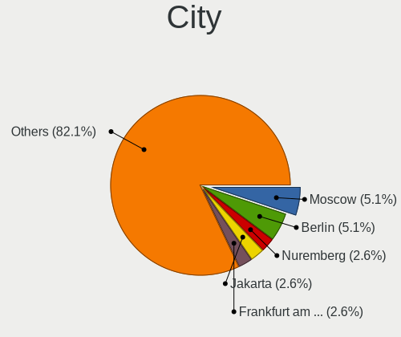
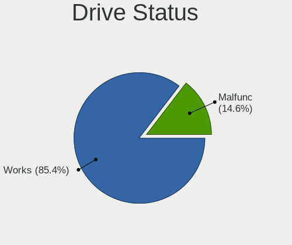
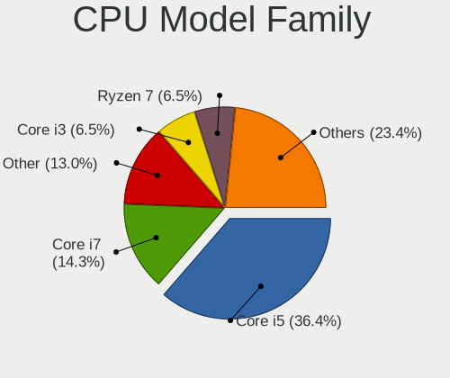
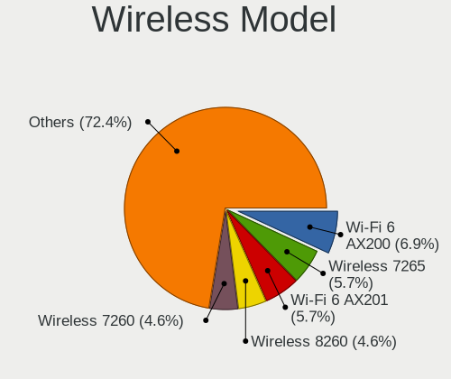
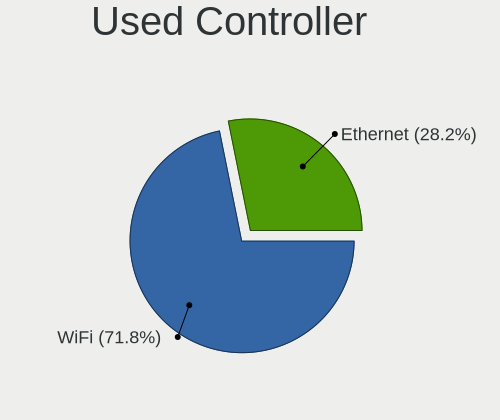
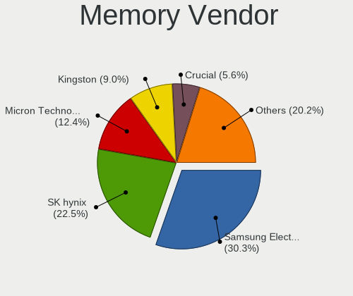

FreeBSD 14.0 - Tested Hardware & Statistics (Notebooks)
-------------------------------------------------------

A project to collect tested hardware configurations for FreeBSD 14.0.

Anyone can contribute to this report by the [hw-probe](https://github.com/linuxhw/hw-probe/blob/master/INSTALL.BSD.md) tool:

    hw-probe -all -upload

Please contribute! Especially if your hardware is rare.

Contents
--------

* [ Test Cases ](#test-cases)

* [ System ](#system)
  - [ Arch                     ](#arch)
  - [ DE                       ](#de)
  - [ Display Server           ](#display-server)
  - [ Display Manager          ](#display-manager)
  - [ OS Lang                  ](#os-lang)
  - [ Boot Mode                ](#boot-mode)
  - [ Filesystem               ](#filesystem)
  - [ Part. scheme             ](#part-scheme)

* [ Board ](#board)
  - [ Vendor                   ](#vendor)
  - [ Model                    ](#model)
  - [ Model Family             ](#model-family)
  - [ MFG Year                 ](#mfg-year)
  - [ Form Factor              ](#form-factor)
  - [ Coreboot                 ](#coreboot)
  - [ RAM Size                 ](#ram-size)
  - [ RAM Used                 ](#ram-used)
  - [ Total Drives             ](#total-drives)
  - [ Has CD-ROM               ](#has-cd-rom)
  - [ Has Ethernet             ](#has-ethernet)
  - [ Has WiFi                 ](#has-wifi)
  - [ Has Bluetooth            ](#has-bluetooth)

* [ Location ](#location)
  - [ Country                  ](#country)
  - [ City                     ](#city)

* [ Drives ](#drives)
  - [ Drive Vendor             ](#drive-vendor)
  - [ Drive Model              ](#drive-model)
  - [ HDD Vendor               ](#hdd-vendor)
  - [ SSD Vendor               ](#ssd-vendor)
  - [ Drive Kind               ](#drive-kind)
  - [ Drive Connector          ](#drive-connector)
  - [ Drive Size               ](#drive-size)
  - [ Space Total              ](#space-total)
  - [ Space Used               ](#space-used)
  - [ Malfunc. Drives          ](#malfunc-drives)
  - [ Malfunc. Drive Vendor    ](#malfunc-drive-vendor)
  - [ Malfunc. HDD Vendor      ](#malfunc-hdd-vendor)
  - [ Malfunc. Drive Kind      ](#malfunc-drive-kind)
  - [ Failed Drives            ](#failed-drives)
  - [ Failed Drive Vendor      ](#failed-drive-vendor)
  - [ Drive Status             ](#drive-status)

* [ Storage controller ](#storage-controller)
  - [ Storage Vendor           ](#storage-vendor)
  - [ Storage Model            ](#storage-model)
  - [ Storage Kind             ](#storage-kind)

* [ Processor ](#processor)
  - [ CPU Vendor               ](#cpu-vendor)
  - [ CPU Model                ](#cpu-model)
  - [ CPU Model Family         ](#cpu-model-family)
  - [ CPU Cores                ](#cpu-cores)
  - [ CPU Sockets              ](#cpu-sockets)
  - [ CPU Threads              ](#cpu-threads)
  - [ CPU Microarch            ](#cpu-microarch)

* [ Graphics ](#graphics)
  - [ GPU Vendor               ](#gpu-vendor)
  - [ GPU Model                ](#gpu-model)
  - [ GPU Combo                ](#gpu-combo)
  - [ GPU Driver               ](#gpu-driver)
  - [ GPU Memory               ](#gpu-memory)

* [ Monitor ](#monitor)
  - [ Monitor Vendor           ](#monitor-vendor)
  - [ Monitor Model            ](#monitor-model)
  - [ Monitor Resolution       ](#monitor-resolution)
  - [ Monitor Diagonal         ](#monitor-diagonal)
  - [ Monitor Width            ](#monitor-width)
  - [ Aspect Ratio             ](#aspect-ratio)
  - [ Monitor Area             ](#monitor-area)
  - [ Pixel Density            ](#pixel-density)
  - [ Multiple Monitors        ](#multiple-monitors)

* [ Network ](#network)
  - [ Net Controller Vendor    ](#net-controller-vendor)
  - [ Net Controller Model     ](#net-controller-model)
  - [ Wireless Vendor          ](#wireless-vendor)
  - [ Wireless Model           ](#wireless-model)
  - [ Ethernet Vendor          ](#ethernet-vendor)
  - [ Ethernet Model           ](#ethernet-model)
  - [ Net Controller Kind      ](#net-controller-kind)
  - [ Used Controller          ](#used-controller)
  - [ NICs                     ](#nics)
  - [ IPv6                     ](#ipv6)

* [ Bluetooth ](#bluetooth)
  - [ Bluetooth Vendor         ](#bluetooth-vendor)
  - [ Bluetooth Model          ](#bluetooth-model)

* [ Sound ](#sound)
  - [ Sound Vendor             ](#sound-vendor)
  - [ Sound Model              ](#sound-model)

* [ Memory ](#memory)
  - [ Memory Vendor            ](#memory-vendor)
  - [ Memory Model             ](#memory-model)
  - [ Memory Kind              ](#memory-kind)
  - [ Memory Form Factor       ](#memory-form-factor)
  - [ Memory Size              ](#memory-size)
  - [ Memory Speed             ](#memory-speed)

* [ Printers & scanners ](#printers--scanners)
  - [ Printer Vendor           ](#printer-vendor)
  - [ Printer Model            ](#printer-model)
  - [ Scanner Vendor           ](#scanner-vendor)
  - [ Scanner Model            ](#scanner-model)

* [ Camera ](#camera)
  - [ Camera Vendor            ](#camera-vendor)
  - [ Camera Model             ](#camera-model)

* [ Security ](#security)
  - [ Fingerprint Vendor       ](#fingerprint-vendor)
  - [ Fingerprint Model        ](#fingerprint-model)
  - [ Chipcard Vendor          ](#chipcard-vendor)
  - [ Chipcard Model           ](#chipcard-model)

* [ Unsupported ](#unsupported)
  - [ Unsupported Devices      ](#unsupported-devices)
  - [ Unsupported Device Types ](#unsupported-device-types)

Test Cases
----------

Total: 90

| Vendor        | Model                       | Probe                                                     | Date         |
|---------------|-----------------------------|-----------------------------------------------------------|--------------|
| Apple         | MacBookAir6,2               | [831f538244](https://bsd-hardware.info/?probe=831f538244) | Dec 06, 2024 |
| HP            | Laptop 15t-dy200            | [bb0b650de5](https://bsd-hardware.info/?probe=bb0b650de5) | Nov 11, 2024 |
| Dell          | Latitude D630               | [aab009eec7](https://bsd-hardware.info/?probe=aab009eec7) | Jul 01, 2024 |
| Dell          | Inspiron 3501               | [058d42521c](https://bsd-hardware.info/?probe=058d42521c) | Jun 29, 2024 |
| Dell          | XPS 15 9560                 | [f3b5f883fb](https://bsd-hardware.info/?probe=f3b5f883fb) | Jun 21, 2024 |
| Acer          | TravelMate B311-31          | [5a2eaacf36](https://bsd-hardware.info/?probe=5a2eaacf36) | Jun 16, 2024 |
| ASUSTek       | X455LD                      | [2ed45b3a24](https://bsd-hardware.info/?probe=2ed45b3a24) | Jun 05, 2024 |
| TUXEDO        | Pulse 15 Gen1               | [76cd424940](https://bsd-hardware.info/?probe=76cd424940) | May 31, 2024 |
| Samsung       | 300E4C/300E5C/300E7C        | [1a92f5398f](https://bsd-hardware.info/?probe=1a92f5398f) | May 26, 2024 |
| ASUSTek       | VivoBook_ASUSLaptop X412... | [7738e5ded1](https://bsd-hardware.info/?probe=7738e5ded1) | May 25, 2024 |
| HP            | Pavilion dv6                | [0ed63d3ed2](https://bsd-hardware.info/?probe=0ed63d3ed2) | May 24, 2024 |
| Apple         | MacBookPro11,1              | [9ee71f878e](https://bsd-hardware.info/?probe=9ee71f878e) | May 23, 2024 |
| Apple         | MacBookPro11,1              | [1a6b006807](https://bsd-hardware.info/?probe=1a6b006807) | May 23, 2024 |
| Alienware     | m16 R1                      | [4f607db6c3](https://bsd-hardware.info/?probe=4f607db6c3) | May 18, 2024 |
| Sony          | VPCSB3Q9E                   | [103114e640](https://bsd-hardware.info/?probe=103114e640) | May 14, 2024 |
| Lenovo        | ThinkPad T440 20B7S0W900    | [e3b9c9632c](https://bsd-hardware.info/?probe=e3b9c9632c) | May 10, 2024 |
| Lenovo        | ThinkPad T480 20L6SDG900    | [5d8a5c86b1](https://bsd-hardware.info/?probe=5d8a5c86b1) | May 09, 2024 |
| Lenovo        | ThinkPad T480 20L6SDG900    | [f8b7f38969](https://bsd-hardware.info/?probe=f8b7f38969) | May 09, 2024 |
| Lenovo        | Legion 5 Pro 16ACH6H 82J... | [89a61aca01](https://bsd-hardware.info/?probe=89a61aca01) | May 04, 2024 |
| Chuwi         | GemiBook Pro                | [2656d00123](https://bsd-hardware.info/?probe=2656d00123) | May 03, 2024 |
| Dell          | Inspiron 15-3552            | [0a47152038](https://bsd-hardware.info/?probe=0a47152038) | May 02, 2024 |
| HP            | ZBook 15 G6                 | [95aadf59d9](https://bsd-hardware.info/?probe=95aadf59d9) | Apr 27, 2024 |
| Lenovo        | ThinkPad T400 6474E18       | [fcd3339ec5](https://bsd-hardware.info/?probe=fcd3339ec5) | Apr 21, 2024 |
| Lenovo        | ThinkPad X230 Tablet 343... | [2400099ef5](https://bsd-hardware.info/?probe=2400099ef5) | Apr 19, 2024 |
| Lenovo        | ThinkPad X230 Tablet 343... | [0a6e2a3b33](https://bsd-hardware.info/?probe=0a6e2a3b33) | Apr 18, 2024 |
| ASUSTek       | VivoBook_ASUSLaptop X740... | [20d7b596db](https://bsd-hardware.info/?probe=20d7b596db) | Apr 17, 2024 |
| Lenovo        | ThinkPad T460 20FMA09CGE    | [c7219eb82e](https://bsd-hardware.info/?probe=c7219eb82e) | Apr 15, 2024 |
| Lenovo        | ThinkPad E550 20DF005VRT    | [5c50bf1b60](https://bsd-hardware.info/?probe=5c50bf1b60) | Apr 14, 2024 |
| Toshiba       | Satellite C645              | [a5d1838130](https://bsd-hardware.info/?probe=a5d1838130) | Mar 28, 2024 |
| Lenovo        | IdeaPad 500-14ISK 80NS      | [34ab895e86](https://bsd-hardware.info/?probe=34ab895e86) | Mar 15, 2024 |
| TULPAR        | A5 V20.3                    | [476d91b2cf](https://bsd-hardware.info/?probe=476d91b2cf) | Mar 13, 2024 |
| Lenovo        | Legion Pro 5 16ARX8 82WM    | [4b52e91e24](https://bsd-hardware.info/?probe=4b52e91e24) | Mar 13, 2024 |
| HUAWEI        | CREFG-XX                    | [b16b7180ee](https://bsd-hardware.info/?probe=b16b7180ee) | Mar 05, 2024 |
| HP            | ProBook 430 G4              | [9d55da54e7](https://bsd-hardware.info/?probe=9d55da54e7) | Feb 22, 2024 |
| Dell          | Latitude E7250              | [ffc8dcf395](https://bsd-hardware.info/?probe=ffc8dcf395) | Feb 22, 2024 |
| Infinix       | INBook X1                   | [dd3185320b](https://bsd-hardware.info/?probe=dd3185320b) | Feb 20, 2024 |
| ASUSTek       | VivoBook_ASUSLaptop X350... | [a7aada8678](https://bsd-hardware.info/?probe=a7aada8678) | Feb 17, 2024 |
| ASUSTek       | VivoBook_ASUS Laptop E21... | [fb1f5f8545](https://bsd-hardware.info/?probe=fb1f5f8545) | Feb 16, 2024 |
| Google        | Ultima                      | [732adeb5e4](https://bsd-hardware.info/?probe=732adeb5e4) | Feb 15, 2024 |
| Dell          | Inspiron 3558               | [e0e665c1b5](https://bsd-hardware.info/?probe=e0e665c1b5) | Feb 13, 2024 |
| Lenovo        | ThinkPad T14s Gen 4 21F8... | [2a4911715a](https://bsd-hardware.info/?probe=2a4911715a) | Feb 07, 2024 |
| Panasonic     | CF-52VDA131M                | [1ebdac9598](https://bsd-hardware.info/?probe=1ebdac9598) | Feb 07, 2024 |
| Apple         | MacBookPro11,1              | [c77173c2f3](https://bsd-hardware.info/?probe=c77173c2f3) | Feb 04, 2024 |
| Lenovo        | Legion Y9000X 2020 81TH     | [3711b11e8a](https://bsd-hardware.info/?probe=3711b11e8a) | Jan 23, 2024 |
| HP            | ProBook 650 G1              | [50888a6e05](https://bsd-hardware.info/?probe=50888a6e05) | Jan 22, 2024 |
| Dell          | Latitude E7450              | [f2216c5d0f](https://bsd-hardware.info/?probe=f2216c5d0f) | Jan 21, 2024 |
| Lenovo        | ThinkPad W520 4284GZ1       | [32bc5e823d](https://bsd-hardware.info/?probe=32bc5e823d) | Jan 17, 2024 |
| Lenovo        | ThinkPad X220 42912Z1       | [1abc94b4b1](https://bsd-hardware.info/?probe=1abc94b4b1) | Jan 17, 2024 |
| Razer         | Blade 16 - RZ09-0483        | [d81973c8bc](https://bsd-hardware.info/?probe=d81973c8bc) | Jan 16, 2024 |
| ASUSTek       | X441UV                      | [6cdd70da49](https://bsd-hardware.info/?probe=6cdd70da49) | Jan 11, 2024 |
| Lenovo        | ThinkPad E14 Gen 3 20Y70... | [0f475f8e5d](https://bsd-hardware.info/?probe=0f475f8e5d) | Jan 10, 2024 |
| Lenovo        | ThinkPad E14 Gen 3 20Y70... | [6b21d0ae92](https://bsd-hardware.info/?probe=6b21d0ae92) | Jan 09, 2024 |
| HP            | Pavilion g6                 | [77f3d49b2e](https://bsd-hardware.info/?probe=77f3d49b2e) | Jan 06, 2024 |
| ASUSTek       | X441UV                      | [29b63ed6a8](https://bsd-hardware.info/?probe=29b63ed6a8) | Jan 04, 2024 |
| Dell          | XPS 15 7590                 | [67a65520e6](https://bsd-hardware.info/?probe=67a65520e6) | Jan 03, 2024 |
| HP            | Laptop 15t-dy100            | [61130d2b74](https://bsd-hardware.info/?probe=61130d2b74) | Jan 03, 2024 |
| Dell          | Vostro 5470                 | [56472e8f51](https://bsd-hardware.info/?probe=56472e8f51) | Dec 30, 2023 |
| Dell          | Precision 7720              | [a30d05e373](https://bsd-hardware.info/?probe=a30d05e373) | Dec 23, 2023 |
| Lenovo        | ThinkPad X1 Carbon 2nd 2... | [85ec93f4cd](https://bsd-hardware.info/?probe=85ec93f4cd) | Dec 22, 2023 |
| Lenovo        | ThinkPad X1 Carbon 2nd 2... | [34f3eb8059](https://bsd-hardware.info/?probe=34f3eb8059) | Dec 22, 2023 |
| Clevo         | W240BU                      | [19bb603cab](https://bsd-hardware.info/?probe=19bb603cab) | Dec 20, 2023 |
| Apple         | MacBookAir5,2               | [2c652aa0a1](https://bsd-hardware.info/?probe=2c652aa0a1) | Dec 16, 2023 |
| Lenovo        | ThinkPad P1 20MD002MUS      | [c0dcfec41d](https://bsd-hardware.info/?probe=c0dcfec41d) | Dec 16, 2023 |
| Lenovo        | ThinkPad X1 Carbon 7th 2... | [7a5e6024cd](https://bsd-hardware.info/?probe=7a5e6024cd) | Dec 15, 2023 |
| Dell          | XPS 13 9370                 | [b6845a3e54](https://bsd-hardware.info/?probe=b6845a3e54) | Dec 15, 2023 |
| Lenovo        | IdeaPad 330-15ARR 81D2      | [c197b26909](https://bsd-hardware.info/?probe=c197b26909) | Dec 14, 2023 |
| Google        | Lindar rev3                 | [2e748fc42c](https://bsd-hardware.info/?probe=2e748fc42c) | Dec 13, 2023 |
| Google        | Parrot                      | [c10a95cbcc](https://bsd-hardware.info/?probe=c10a95cbcc) | Dec 10, 2023 |
| Google        | Parrot                      | [3a69ea2682](https://bsd-hardware.info/?probe=3a69ea2682) | Dec 10, 2023 |
| Lenovo        | ThinkPad T430s 23532QG      | [b456c01e0f](https://bsd-hardware.info/?probe=b456c01e0f) | Dec 04, 2023 |
| Acidanther... | MacBookPro16,3              | [322ea11f6c](https://bsd-hardware.info/?probe=322ea11f6c) | Dec 03, 2023 |
| Lenovo        | ThinkPad T450 20BV000BUS    | [ae4c6d7097](https://bsd-hardware.info/?probe=ae4c6d7097) | Nov 29, 2023 |
| Dell          | Precision 5510              | [3a7b2ae214](https://bsd-hardware.info/?probe=3a7b2ae214) | Nov 28, 2023 |
| Unknown       | Unknown                     | [55339dbfab](https://bsd-hardware.info/?probe=55339dbfab) | Nov 26, 2023 |
| Lenovo        | IdeaPad 320-15IKB Touch ... | [3517ce2745](https://bsd-hardware.info/?probe=3517ce2745) | Nov 26, 2023 |
| Lenovo        | IdeaPad 320-15IKB Touch ... | [5f336b9d93](https://bsd-hardware.info/?probe=5f336b9d93) | Nov 26, 2023 |
| HP            | Laptop 15s-eq3xxx           | [f2aa7b3ebf](https://bsd-hardware.info/?probe=f2aa7b3ebf) | Nov 25, 2023 |
| Lenovo        | G50-80 80E5                 | [e0d8200dfa](https://bsd-hardware.info/?probe=e0d8200dfa) | Nov 24, 2023 |
| Google        | Dragonair                   | [713cf1bc38](https://bsd-hardware.info/?probe=713cf1bc38) | Nov 24, 2023 |
| HP            | Notebook                    | [aff6430eb2](https://bsd-hardware.info/?probe=aff6430eb2) | Nov 24, 2023 |
| Acer          | JM11-MS                     | [0490895189](https://bsd-hardware.info/?probe=0490895189) | Nov 23, 2023 |
| Acidanther... | MacBookPro16,3              | [5f89fa2cd2](https://bsd-hardware.info/?probe=5f89fa2cd2) | Nov 22, 2023 |
| Lenovo        | ThinkPad T450 20BV000BUS    | [fdb7c00df7](https://bsd-hardware.info/?probe=fdb7c00df7) | Nov 20, 2023 |
| Lenovo        | ThinkPad W530 24411M9       | [0272396725](https://bsd-hardware.info/?probe=0272396725) | Nov 19, 2023 |
| Lenovo        | ThinkPad X1 Carbon 4th 2... | [2c33e6e9e7](https://bsd-hardware.info/?probe=2c33e6e9e7) | Nov 19, 2023 |
| Panasonic     | CF-31-5                     | [8771ab6139](https://bsd-hardware.info/?probe=8771ab6139) | Nov 18, 2023 |
| HP            | Notebook                    | [5d2df329aa](https://bsd-hardware.info/?probe=5d2df329aa) | Nov 17, 2023 |
| Lenovo        | ThinkPad X1 Carbon 4th 2... | [918706e110](https://bsd-hardware.info/?probe=918706e110) | Nov 15, 2023 |
| HP            | Pavilion Gaming Laptop 1... | [0e4ea9ccbf](https://bsd-hardware.info/?probe=0e4ea9ccbf) | Nov 15, 2023 |
| Dell          | G5 5505                     | [088aea32c0](https://bsd-hardware.info/?probe=088aea32c0) | Nov 15, 2023 |

System
------

Arch
----

OS architecture (x86_64, i586, etc.)

| Name  | Notebooks | Percent |
|-------|-----------|---------|
| amd64 | 77        | 100%    |

DE
--

Desktop Environment

| Name        | Notebooks | Percent |
|-------------|-----------|---------|
| KDE5        | 22        | 28.21%  |
| Console     | 20        | 25.64%  |
| XFCE        | 14        | 17.95%  |
| TWM         | 6         | 7.69%   |
| MATE        | 4         | 5.13%   |
| GNOME       | 3         | 3.85%   |
| i3          | 2         | 2.56%   |
| X-Cinnamon  | 1         | 1.28%   |
| WindowMaker | 1         | 1.28%   |
| Openbox     | 1         | 1.28%   |
| LXQt        | 1         | 1.28%   |
| GNUstep     | 1         | 1.28%   |
| Cinnamon    | 1         | 1.28%   |
| AwesomeWM   | 1         | 1.28%   |

Display Server
--------------

X11 or Wayland

| Name    | Notebooks | Percent |
|---------|-----------|---------|
| X11     | 56        | 72.73%  |
| Console | 15        | 19.48%  |
| Wayland | 6         | 7.79%   |

Display Manager
---------------

SDDM, LightDM, etc.

| Name    | Notebooks | Percent |
|---------|-----------|---------|
| Console | 29        | 37.18%  |
| SDDM    | 20        | 25.64%  |
| LightDM | 20        | 25.64%  |
| SLiM    | 4         | 5.13%   |
| XDM     | 2         | 2.56%   |
| GDM     | 2         | 2.56%   |
| Ly      | 1         | 1.28%   |

OS Lang
-------

Language

| Lang    | Notebooks | Percent |
|---------|-----------|---------|
| C       | 53        | 68.83%  |
| Unknown | 12        | 15.58%  |
| en_US   | 4         | 5.19%   |
| es_AR   | 2         | 2.6%    |
| zh_CN   | 1         | 1.3%    |
| ru_RU   | 1         | 1.3%    |
| de_DE   | 1         | 1.3%    |
| de_CH   | 1         | 1.3%    |
| de      | 1         | 1.3%    |
| cs_CZ   | 1         | 1.3%    |

Boot Mode
---------

EFI or BIOS

| Mode | Notebooks | Percent |
|------|-----------|---------|
| EFI  | 66        | 85.71%  |
| BIOS | 11        | 14.29%  |

Filesystem
----------

Type of filesystem

| Type | Notebooks | Percent |
|------|-----------|---------|
| Zfs  | 54        | 70.13%  |
| Ufs  | 23        | 29.87%  |

Part. scheme
------------

Scheme of partitioning

| Type    | Notebooks | Percent |
|---------|-----------|---------|
| GPT     | 72        | 93.51%  |
| MBR     | 3         | 3.9%    |
| BSD     | 1         | 1.3%    |
| Unknown | 1         | 1.3%    |

Board
-----

Vendor
------

Motherboard manufacturer

| Name                | Notebooks | Percent |
|---------------------|-----------|---------|
| Lenovo              | 25        | 32.47%  |
| Dell                | 13        | 16.88%  |
| Hewlett-Packard     | 10        | 12.99%  |
| ASUSTek Computer    | 6         | 7.79%   |
| Google              | 4         | 5.19%   |
| Apple               | 3         | 3.9%    |
| Panasonic           | 2         | 2.6%    |
| TUXEDO              | 1         | 1.3%    |
| TULPAR              | 1         | 1.3%    |
| Toshiba             | 1         | 1.3%    |
| Sony                | 1         | 1.3%    |
| Samsung Electronics | 1         | 1.3%    |
| Razer               | 1         | 1.3%    |
| Infinix             | 1         | 1.3%    |
| HUAWEI              | 1         | 1.3%    |
| Clevo               | 1         | 1.3%    |
| Chuwi               | 1         | 1.3%    |
| Alienware           | 1         | 1.3%    |
| Acidanthera         | 1         | 1.3%    |
| Acer                | 1         | 1.3%    |
| Unknown             | 1         | 1.3%    |

Model
-----

Motherboard model

| Name                                     | Notebooks | Percent |
|------------------------------------------|-----------|---------|
| Apple MacBookPro11,1                     | 2         | 2.6%    |
| TUXEDO Pulse 15 Gen1                     | 1         | 1.3%    |
| TULPAR A5 V20.3                          | 1         | 1.3%    |
| Toshiba Satellite C645                   | 1         | 1.3%    |
| Sony VPCSB3Q9E                           | 1         | 1.3%    |
| Samsung 300E4C/300E5C/300E7C             | 1         | 1.3%    |
| Razer Blade 16 - RZ09-0483               | 1         | 1.3%    |
| Panasonic CF-52VDA131M                   | 1         | 1.3%    |
| Panasonic CF-31-5                        | 1         | 1.3%    |
| Lenovo ThinkPad X230 Tablet 3438GF4      | 1         | 1.3%    |
| Lenovo ThinkPad X220 42912Z1             | 1         | 1.3%    |
| Lenovo ThinkPad X1 Carbon 7th 20QES53R00 | 1         | 1.3%    |
| Lenovo ThinkPad X1 Carbon 4th 20FCS43F00 | 1         | 1.3%    |
| Lenovo ThinkPad X1 Carbon 4th 20FB006FAU | 1         | 1.3%    |
| Lenovo ThinkPad X1 Carbon 2nd 20A7002FUS | 1         | 1.3%    |
| Lenovo ThinkPad W530 24411M9             | 1         | 1.3%    |
| Lenovo ThinkPad W520 4284GZ1             | 1         | 1.3%    |
| Lenovo ThinkPad T480 20L6SDG900          | 1         | 1.3%    |
| Lenovo ThinkPad T460 20FMA09CGE          | 1         | 1.3%    |
| Lenovo ThinkPad T450 20BV000BUS          | 1         | 1.3%    |
| Lenovo ThinkPad T440 20B7S0W900          | 1         | 1.3%    |
| Lenovo ThinkPad T430s 23532QG            | 1         | 1.3%    |
| Lenovo ThinkPad T400 6474E18             | 1         | 1.3%    |
| Lenovo ThinkPad T14s Gen 4 21F8CTO1WW    | 1         | 1.3%    |
| Lenovo ThinkPad P1 20MD002MUS            | 1         | 1.3%    |
| Lenovo ThinkPad E550 20DF005VRT          | 1         | 1.3%    |
| Lenovo ThinkPad E14 Gen 3 20Y7003QGE     | 1         | 1.3%    |
| Lenovo Legion Y9000X 2020 81TH           | 1         | 1.3%    |
| Lenovo Legion Pro 5 16ARX8 82WM          | 1         | 1.3%    |
| Lenovo Legion 5 Pro 16ACH6H 82JQ         | 1         | 1.3%    |
| Lenovo IdeaPad 500-14ISK 80NS            | 1         | 1.3%    |
| Lenovo IdeaPad 330-15ARR 81D2            | 1         | 1.3%    |
| Lenovo IdeaPad 320-15IKB Touch 81BH      | 1         | 1.3%    |
| Lenovo G50-80 80E5                       | 1         | 1.3%    |
| Infinix INBook X1                        | 1         | 1.3%    |
| HUAWEI CREFG-XX                          | 1         | 1.3%    |
| HP ZBook 15 G6                           | 1         | 1.3%    |
| HP ProBook 650 G1                        | 1         | 1.3%    |
| HP ProBook 430 G4                        | 1         | 1.3%    |
| HP Pavilion Gaming Laptop 15-cx0xxx      | 1         | 1.3%    |

Model Family
------------

Motherboard model prefix

| Name                     | Notebooks | Percent |
|--------------------------|-----------|---------|
| Lenovo ThinkPad          | 18        | 23.38%  |
| ASUS VivoBook            | 4         | 5.19%   |
| Lenovo Legion            | 3         | 3.9%    |
| Lenovo IdeaPad           | 3         | 3.9%    |
| HP Pavilion              | 3         | 3.9%    |
| HP Laptop                | 3         | 3.9%    |
| Dell XPS                 | 3         | 3.9%    |
| Dell Latitude            | 3         | 3.9%    |
| Dell Inspiron            | 3         | 3.9%    |
| HP ProBook               | 2         | 2.6%    |
| Dell Precision           | 2         | 2.6%    |
| Apple MacBookPro11       | 2         | 2.6%    |
| TUXEDO Pulse             | 1         | 1.3%    |
| TULPAR A5                | 1         | 1.3%    |
| Toshiba Satellite        | 1         | 1.3%    |
| Sony VPCSB3Q9E           | 1         | 1.3%    |
| Samsung 300E4C           | 1         | 1.3%    |
| Razer Blade              | 1         | 1.3%    |
| Panasonic CF-52VDA131M   | 1         | 1.3%    |
| Panasonic CF-31-5        | 1         | 1.3%    |
| Lenovo G50-80            | 1         | 1.3%    |
| Infinix INBook           | 1         | 1.3%    |
| HUAWEI CREFG-XX          | 1         | 1.3%    |
| HP ZBook                 | 1         | 1.3%    |
| HP Notebook              | 1         | 1.3%    |
| Google Ultima            | 1         | 1.3%    |
| Google Parrot            | 1         | 1.3%    |
| Google Lindar            | 1         | 1.3%    |
| Google Dragonair         | 1         | 1.3%    |
| Dell Vostro              | 1         | 1.3%    |
| Dell G5                  | 1         | 1.3%    |
| Clevo W240BU             | 1         | 1.3%    |
| Chuwi GemiBook           | 1         | 1.3%    |
| ASUS X455LD              | 1         | 1.3%    |
| ASUS X441UV              | 1         | 1.3%    |
| Apple MacBookAir5        | 1         | 1.3%    |
| Alienware m16            | 1         | 1.3%    |
| Acidanthera MacBookPro16 | 1         | 1.3%    |
| Acer Aspire              | 1         | 1.3%    |
| Unknown                  | 1         | 1.3%    |

MFG Year
--------

Motherboard manufacture year

| Year | Notebooks | Percent |
|------|-----------|---------|
| 2022 | 9         | 11.69%  |
| 2021 | 9         | 11.69%  |
| 2019 | 9         | 11.69%  |
| 2023 | 8         | 10.39%  |
| 2020 | 7         | 9.09%   |
| 2016 | 6         | 7.79%   |
| 2015 | 6         | 7.79%   |
| 2011 | 5         | 6.49%   |
| 2012 | 4         | 5.19%   |
| 2024 | 3         | 3.9%    |
| 2014 | 3         | 3.9%    |
| 2018 | 2         | 2.6%    |
| 2013 | 2         | 2.6%    |
| 2009 | 2         | 2.6%    |
| 2010 | 1         | 1.3%    |
| 2008 | 1         | 1.3%    |

Form Factor
-----------

Physical design of the computer

| Name     | Notebooks | Percent |
|----------|-----------|---------|
| Notebook | 77        | 100%    |

Coreboot
--------

Have coreboot on board

| Used | Notebooks | Percent |
|------|-----------|---------|
| No   | 73        | 94.81%  |
| Yes  | 4         | 5.19%   |

RAM Size
--------

Total RAM memory

| Size in GB  | Notebooks | Percent |
|-------------|-----------|---------|
| 8.01-16.0   | 23        | 29.87%  |
| 16.01-24.0  | 22        | 28.57%  |
| 4.01-8.0    | 17        | 22.08%  |
| 32.01-64.0  | 11        | 14.29%  |
| 2.01-3.0    | 2         | 2.6%    |
| 24.01-32.0  | 1         | 1.3%    |
| 64.01-256.0 | 1         | 1.3%    |

RAM Used
--------

Used RAM memory

| Used GB  | Notebooks | Percent |
|----------|-----------|---------|
| 0.01-0.5 | 31        | 39.74%  |
| 0.51-1.0 | 30        | 38.46%  |
| 1.01-2.0 | 12        | 15.38%  |
| 2.01-3.0 | 3         | 3.85%   |
| 4.01-8.0 | 1         | 1.28%   |
| 3.01-4.0 | 1         | 1.28%   |

Total Drives
------------

Number of drives on board

| Drives | Notebooks | Percent |
|--------|-----------|---------|
| 1      | 36        | 46.75%  |
| 0      | 32        | 41.56%  |
| 2      | 8         | 10.39%  |
| 4      | 1         | 1.3%    |

Has CD-ROM
----------

Has CD-ROM on board

| Presented | Notebooks | Percent |
|-----------|-----------|---------|
| No        | 65        | 84.42%  |
| Yes       | 12        | 15.58%  |

Has Ethernet
------------

Has Ethernet on board

| Presented | Notebooks | Percent |
|-----------|-----------|---------|
| Yes       | 51        | 66.23%  |
| No        | 26        | 33.77%  |

Has WiFi
--------

Has WiFi module

| Presented | Notebooks | Percent |
|-----------|-----------|---------|
| Yes       | 76        | 98.7%   |
| No        | 1         | 1.3%    |

Has Bluetooth
-------------

Has Bluetooth module

| Presented | Notebooks | Percent |
|-----------|-----------|---------|
| Yes       | 67        | 87.01%  |
| No        | 10        | 12.99%  |

Location
--------

Country
-------

Geographic location (country)

| Country     | Notebooks | Percent |
|-------------|-----------|---------|
| Germany     | 13        | 16.88%  |
| USA         | 10        | 12.99%  |
| Russia      | 6         | 7.79%   |
| UK          | 4         | 5.19%   |
| Spain       | 4         | 5.19%   |
| Indonesia   | 4         | 5.19%   |
| Switzerland | 3         | 3.9%    |
| Brazil      | 3         | 3.9%    |
| Turkey      | 2         | 2.6%    |
| Sweden      | 2         | 2.6%    |
| Netherlands | 2         | 2.6%    |
| Czechia     | 2         | 2.6%    |
| China       | 2         | 2.6%    |
| Australia   | 2         | 2.6%    |
| Argentina   | 2         | 2.6%    |
| Vietnam     | 1         | 1.3%    |
| Romania     | 1         | 1.3%    |
| Poland      | 1         | 1.3%    |
| Mexico      | 1         | 1.3%    |
| Malaysia    | 1         | 1.3%    |
| Japan       | 1         | 1.3%    |
| Italy       | 1         | 1.3%    |
| India       | 1         | 1.3%    |
| Iceland     | 1         | 1.3%    |
| France      | 1         | 1.3%    |
| Egypt       | 1         | 1.3%    |
| Colombia    | 1         | 1.3%    |
| Chile       | 1         | 1.3%    |
| Canada      | 1         | 1.3%    |
| Belgium     | 1         | 1.3%    |
| Algeria     | 1         | 1.3%    |

City
----

Geographic location (city)

| City              | Notebooks | Percent |
|-------------------|-----------|---------|
| Moscow            | 4         | 5.13%   |
| Berlin            | 4         | 5.13%   |
| Nuremberg         | 2         | 2.56%   |
| Jakarta           | 2         | 2.56%   |
| Frankfurt am Main | 2         | 2.56%   |
| Yekaterinburg     | 1         | 1.28%   |
| Wroclaw           | 1         | 1.28%   |
| Westervoort       | 1         | 1.28%   |
| Walldorf          | 1         | 1.28%   |
| Vyazniki          | 1         | 1.28%   |
| Tracy             | 1         | 1.28%   |
| Thanh Hóa        | 1         | 1.28%   |
| Teplice           | 1         | 1.28%   |
| Sydney            | 1         | 1.28%   |
| Surabaya          | 1         | 1.28%   |
| Skellefteå       | 1         | 1.28%   |
| Şişli           | 1         | 1.28%   |
| Shah Alam         | 1         | 1.28%   |
| Seattle           | 1         | 1.28%   |
| Sao Paulo         | 1         | 1.28%   |
| San Antonio       | 1         | 1.28%   |
| Roanoke           | 1         | 1.28%   |
| Rianxo            | 1         | 1.28%   |
| Reykjavik         | 1         | 1.28%   |
| Ravensburg        | 1         | 1.28%   |
| Potomac           | 1         | 1.28%   |
| Plymouth          | 1         | 1.28%   |
| Pilsen            | 1         | 1.28%   |
| Pellenberg        | 1         | 1.28%   |
| Payson            | 1         | 1.28%   |
| Paris             | 1         | 1.28%   |
| Oldenburg         | 1         | 1.28%   |
| Mumbai            | 1         | 1.28%   |
| Mostaganem        | 1         | 1.28%   |
| Mossautal         | 1         | 1.28%   |
| Montería         | 1         | 1.28%   |
| Milan             | 1         | 1.28%   |
| Melbourne         | 1         | 1.28%   |
| Medan             | 1         | 1.28%   |
| Maceió           | 1         | 1.28%   |

Drives
------

Drive Vendor
------------

Hard drive vendors

| Vendor              | Notebooks | Drives | Percent |
|---------------------|-----------|--------|---------|
| Samsung Electronics | 10        | 11     | 19.23%  |
| SanDisk             | 6         | 7      | 11.54%  |
| Toshiba             | 5         | 5      | 9.62%   |
| Seagate             | 5         | 5      | 9.62%   |
| WDC                 | 3         | 3      | 5.77%   |
| Kingston            | 3         | 3      | 5.77%   |
| Apple               | 3         | 3      | 5.77%   |
| Transcend           | 2         | 2      | 3.85%   |
| V-GeN               | 1         | 4      | 1.92%   |
| SK hynix            | 1         | 1      | 1.92%   |
| Netac               | 1         | 1      | 1.92%   |
| MidasForce          | 1         | 1      | 1.92%   |
| LITEON              | 1         | 1      | 1.92%   |
| Lenovo              | 1         | 2      | 1.92%   |
| KingSpec            | 1         | 1      | 1.92%   |
| Intenso             | 1         | 1      | 1.92%   |
| Intel               | 1         | 1      | 1.92%   |
| Integral            | 1         | 1      | 1.92%   |
| Hitachi             | 1         | 1      | 1.92%   |
| HGST                | 1         | 1      | 1.92%   |
| Dogfish             | 1         | 1      | 1.92%   |
| Crucial             | 1         | 1      | 1.92%   |
| Apacer              | 1         | 1      | 1.92%   |

Drive Model
-----------

Hard drive models

| Model                                 | Notebooks | Percent |
|---------------------------------------|-----------|---------|
| Toshiba MQ01ABF050 500GB              | 2         | 3.64%   |
| Samsung SSD 860 EVO 500GB             | 2         | 3.64%   |
| Samsung SSD 850 EVO 250GB             | 2         | 3.64%   |
| Samsung SSD 840 PRO Series 256GB      | 2         | 3.64%   |
| WDC WD3200BEKT-00V5T0 320GB           | 1         | 1.82%   |
| WDC WD1200BEVS-07LAT0 120GB           | 1         | 1.82%   |
| WDC WD10JPCX-24UE4T0 1TB              | 1         | 1.82%   |
| V-GeN V-GEN11SM20AR1024ITM2 1TB       | 1         | 1.82%   |
| V-GeN V-GEN03SM22AR1024SDK 1TB        | 1         | 1.82%   |
| Transcend TS256GSSD230S 256GB         | 1         | 1.82%   |
| Transcend TS256GMTS400 256GB          | 1         | 1.82%   |
| Toshiba THNSNJ256GCSY 256GB           | 1         | 1.82%   |
| Toshiba MQ01ABD100 1TB                | 1         | 1.82%   |
| Toshiba MK3261GSYN 320GB              | 1         | 1.82%   |
| SK hynix HFS256G32TNF-N3A0A 256GB     | 1         | 1.82%   |
| Seagate ST9320325AS 320GB             | 1         | 1.82%   |
| Seagate ST320LT007-9ZV142 320GB       | 1         | 1.82%   |
| Seagate ST2000LM003 HN-M201RAD 2TB    | 1         | 1.82%   |
| Seagate ST1000LM024 HN-M101MBB 1TB    | 1         | 1.82%   |
| Seagate SSD 500GB                     | 1         | 1.82%   |
| SanDisk SSD U100 16GB                 | 1         | 1.82%   |
| SanDisk SSD PLUS 480GB                | 1         | 1.82%   |
| SanDisk SSD PLUS 2000GB               | 1         | 1.82%   |
| SanDisk SSD G5 BICS4 1TB              | 1         | 1.82%   |
| SanDisk SD8SN8U128G1001 128GB         | 1         | 1.82%   |
| SanDisk SD7TB3Q-256G-1006 256GB       | 1         | 1.82%   |
| Samsung SSD 870 EVO 1TB               | 1         | 1.82%   |
| Samsung SSD 860 EVO 250GB             | 1         | 1.82%   |
| Samsung Portable SSD T7 2TB           | 1         | 1.82%   |
| Samsung MZ7TE128HMGR-000L1 128GB      | 1         | 1.82%   |
| Samsung MZ7TD512HAGM-000L1 512GB      | 1         | 1.82%   |
| Netac SSD 256GB                       | 1         | 1.82%   |
| MidasForce SSD 512GB                  | 1         | 1.82%   |
| LITEON CV3-8D128-HP 128GB             | 1         | 1.82%   |
| Lenovo Thinklife SSD ST800 256G       | 1         | 1.82%   |
| Lenovo Thinklife SSD ST600 MSATA 256G | 1         | 1.82%   |
| Kingston SA400S37480G 480GB           | 1         | 1.82%   |
| Kingston SA400S37240G 240GB           | 1         | 1.82%   |
| Kingston SA400S37120G 120GB           | 1         | 1.82%   |
| KingSpec P4-960 960GB                 | 1         | 1.82%   |

HDD Vendor
----------

Hard disk drive vendors

| Vendor  | Notebooks | Drives | Percent |
|---------|-----------|--------|---------|
| Toshiba | 4         | 4      | 30.77%  |
| Seagate | 4         | 4      | 30.77%  |
| WDC     | 3         | 3      | 23.08%  |
| Hitachi | 1         | 1      | 7.69%   |
| HGST    | 1         | 1      | 7.69%   |

SSD Vendor
----------

Solid state drive vendors

| Vendor              | Notebooks | Drives | Percent |
|---------------------|-----------|--------|---------|
| Samsung Electronics | 10        | 10     | 25.64%  |
| SanDisk             | 6         | 7      | 15.38%  |
| Kingston            | 3         | 3      | 7.69%   |
| Apple               | 3         | 3      | 7.69%   |
| Transcend           | 2         | 2      | 5.13%   |
| V-GeN               | 1         | 4      | 2.56%   |
| Toshiba             | 1         | 1      | 2.56%   |
| SK hynix            | 1         | 1      | 2.56%   |
| Seagate             | 1         | 1      | 2.56%   |
| Netac               | 1         | 1      | 2.56%   |
| MidasForce          | 1         | 1      | 2.56%   |
| LITEON              | 1         | 1      | 2.56%   |
| Lenovo              | 1         | 2      | 2.56%   |
| KingSpec            | 1         | 1      | 2.56%   |
| Intenso             | 1         | 1      | 2.56%   |
| Intel               | 1         | 1      | 2.56%   |
| Integral            | 1         | 1      | 2.56%   |
| Dogfish             | 1         | 1      | 2.56%   |
| Crucial             | 1         | 1      | 2.56%   |
| Apacer              | 1         | 1      | 2.56%   |

Drive Kind
----------

HDD or SSD

| Kind | Notebooks | Drives | Percent |
|------|-----------|--------|---------|
| SSD  | 35        | 44     | 72.92%  |
| HDD  | 12        | 13     | 25%     |
| NVMe | 1         | 1      | 2.08%   |

Drive Connector
---------------

SATA, SAS, NVMe, etc.

| Type | Notebooks | Drives | Percent |
|------|-----------|--------|---------|
| SATA | 45        | 57     | 97.83%  |
| NVMe | 1         | 1      | 2.17%   |

Drive Size
----------

Size of hard drive

| Size in TB | Notebooks | Drives | Percent |
|------------|-----------|--------|---------|
| 0.01-0.5   | 35        | 40     | 71.43%  |
| 0.51-1.0   | 10        | 12     | 20.41%  |
| 1.01-2.0   | 4         | 5      | 8.16%   |

Space Total
-----------

Amount of disk space available on the file system

| Size in GB | Notebooks | Percent |
|------------|-----------|---------|
| 101-250    | 31        | 40.26%  |
| 251-500    | 21        | 27.27%  |
| 501-1000   | 12        | 15.58%  |
| 51-100     | 6         | 7.79%   |
| 1001-2000  | 3         | 3.9%    |
| 21-50      | 2         | 2.6%    |
| 1-20       | 2         | 2.6%    |

Space Used
----------

Amount of used disk space

| Used GB | Notebooks | Percent |
|---------|-----------|---------|
| 1-20    | 65        | 84.42%  |
| 21-50   | 6         | 7.79%   |
| 51-100  | 4         | 5.19%   |
| 101-250 | 2         | 2.6%    |

Malfunc. Drives
---------------

Drive models with a malfunction

| Model                                        | Notebooks | Drives | Percent |
|----------------------------------------------|-----------|--------|---------|
| Toshiba MQ01ABF050 500GB                     | 1         | 1      | 14.29%  |
| Seagate ST9320325AS 320GB                    | 1         | 1      | 14.29%  |
| Seagate ST320LT007-9ZV142 320GB              | 1         | 1      | 14.29%  |
| SanDisk SSD PLUS 480GB                       | 1         | 1      | 14.29%  |
| Samsung Electronics SSD 840 PRO Series 256GB | 1         | 1      | 14.29%  |
| Netac SSD 256GB                              | 1         | 1      | 14.29%  |
| Lenovo Thinklife SSD ST600 MSATA 256G        | 1         | 1      | 14.29%  |

Malfunc. Drive Vendor
---------------------

Vendors of faulty drives

| Vendor              | Notebooks | Drives | Percent |
|---------------------|-----------|--------|---------|
| Seagate             | 2         | 2      | 28.57%  |
| Toshiba             | 1         | 1      | 14.29%  |
| SanDisk             | 1         | 1      | 14.29%  |
| Samsung Electronics | 1         | 1      | 14.29%  |
| Netac               | 1         | 1      | 14.29%  |
| Lenovo              | 1         | 1      | 14.29%  |

Malfunc. HDD Vendor
-------------------

Vendors of faulty HDD drives

| Vendor  | Notebooks | Drives | Percent |
|---------|-----------|--------|---------|
| Seagate | 2         | 2      | 66.67%  |
| Toshiba | 1         | 1      | 33.33%  |

Malfunc. Drive Kind
-------------------

Kinds of faulty drives

| Kind | Notebooks | Drives | Percent |
|------|-----------|--------|---------|
| SSD  | 4         | 4      | 57.14%  |
| HDD  | 3         | 3      | 42.86%  |

Failed Drives
-------------

Failed drive models

Zero info for selected period =(

Failed Drive Vendor
-------------------

Failed drive vendors

Zero info for selected period =(

Drive Status
------------

Number of failed and malfunc. drives

| Status  | Notebooks | Drives | Percent |
|---------|-----------|--------|---------|
| Works   | 41        | 51     | 85.42%  |
| Malfunc | 7         | 7      | 14.58%  |

Storage controller
------------------

Storage Vendor
--------------

Storage controller vendors

| Vendor                         | Notebooks | Percent |
|--------------------------------|-----------|---------|
| Intel                          | 48        | 50.53%  |
| Samsung Electronics            | 8         | 8.42%   |
| AMD                            | 8         | 8.42%   |
| SanDisk                        | 7         | 7.37%   |
| SK hynix                       | 5         | 5.26%   |
| Toshiba                        | 3         | 3.16%   |
| Kingston Technology Company    | 3         | 3.16%   |
| Phison Electronics             | 2         | 2.11%   |
| Micron Technology              | 2         | 2.11%   |
| Union Memory (Shenzhen)        | 1         | 1.05%   |
| Transcend                      | 1         | 1.05%   |
| Solid State Storage Technology | 1         | 1.05%   |
| Silicon Motion                 | 1         | 1.05%   |
| Shenzhen Longsys Electronics   | 1         | 1.05%   |
| Netac Technology               | 1         | 1.05%   |
| Micron/Crucial Technology      | 1         | 1.05%   |
| Marvell Technology Group       | 1         | 1.05%   |
| KIOXIA                         | 1         | 1.05%   |

Storage Model
-------------

Storage controller models

| Model                                                                         | Notebooks | Percent |
|-------------------------------------------------------------------------------|-----------|---------|
| Intel 7 Series Chipset Family 6-port SATA Controller [AHCI mode]              | 7         | 7.07%   |
| AMD FCH SATA Controller [AHCI mode]                                           | 7         | 7.07%   |
| Samsung NVMe SSD Controller SM981/PM981/PM983                                 | 5         | 5.05%   |
| Intel Wildcat Point-LP SATA Controller [AHCI Mode]                            | 5         | 5.05%   |
| Intel Sunrise Point-LP SATA Controller [AHCI mode]                            | 5         | 5.05%   |
| Intel 8 Series SATA Controller 1 [AHCI mode]                                  | 5         | 5.05%   |
| Intel 82801 Mobile SATA Controller [RAID mode]                                | 4         | 4.04%   |
| Intel Volume Management Device NVMe RAID Controller                           | 3         | 3.03%   |
| Intel Cannon Lake Mobile PCH SATA AHCI Controller                             | 3         | 3.03%   |
| Intel 6 Series/C200 Series Chipset Family 6 port Mobile SATA AHCI Controller  | 3         | 3.03%   |
| SK hynix Gold P31/BC711/PC711 NVMe Solid State Drive                          | 2         | 2.02%   |
| SanDisk Extreme Pro / WD Black 2018/SN750/PC SN720 NVMe SSD                   | 2         | 2.02%   |
| Kingston Company NV1 NVMe SSD [SM2263XT] (DRAM-less)                          | 2         | 2.02%   |
| Intel Q170/Q150/B150/H170/H110/Z170/CM236 Chipset SATA Controller [AHCI Mode] | 2         | 2.02%   |
| Intel 82801IBM/IEM (ICH9M/ICH9M-E) 4 port SATA Controller [AHCI mode]         | 2         | 2.02%   |
| Union Memory (Shenzhen) AM620 PCIe 3.0 NVMe SSD 128GB                         | 1         | 1.01%   |
| Transcend NVMe PCIe SSD 110S/112S/120S/MTE300S/MTE400S/MTE652T2 (DRAM-less)   | 1         | 1.01%   |
| Toshiba XG6 NVMe SSD Controller                                               | 1         | 1.01%   |
| Toshiba XG5 NVMe SSD Controller                                               | 1         | 1.01%   |
| Toshiba XG4 NVMe SSD Controller                                               | 1         | 1.01%   |
| Solid State Storage CA6-8D512 NVMe SSD M.2                                    | 1         | 1.01%   |
| SK hynix Platinum P41/PC801 NVMe Solid State Drive                            | 1         | 1.01%   |
| SK hynix PC601 NVMe Solid State Drive                                         | 1         | 1.01%   |
| SK hynix BC501 NVMe Solid State Drive                                         | 1         | 1.01%   |
| Silicon Motion SM2263EN/SM2263XT (DRAM-less) NVMe SSD Controllers             | 1         | 1.01%   |
| Shenzhen Longsys Lexar NM790 NVME SSD (DRAM-less)                             | 1         | 1.01%   |
| SanDisk WD Blue SN500 / PC SN520 x2 M.2 2280 NVMe SSD                         | 1         | 1.01%   |
| Sandisk WD Black SN770 / PC SN740 256GB / PC SN560 (DRAM-less) NVMe SSD       | 1         | 1.01%   |
| SanDisk Ultra 3D / WD PC SN530, IX SN530, Blue SN550 NVMe SSD (DRAM-less)     | 1         | 1.01%   |
| SanDisk Ultra 3D / WD Blue SN570 NVMe SSD (DRAM-less)                         | 1         | 1.01%   |
| SanDisk PC SN530 NVMe SSD (DRAM-less)                                         | 1         | 1.01%   |
| SanDisk Extreme Pro / WD Black SN750 / PC SN730 / Red SN700 NVMe SSD          | 1         | 1.01%   |
| Samsung S4LN053X01 AHCI SSD Controller(Apple slot)                            | 1         | 1.01%   |
| Samsung NVMe SSD Controller S4LV008[Pascal]                                   | 1         | 1.01%   |
| Samsung NVMe SSD Controller PM9A1/PM9A3/980PRO                                | 1         | 1.01%   |
| Phison PS5013-E13 PCIe3 NVMe Controller (DRAM-less)                           | 1         | 1.01%   |
| Phison E12 NVMe Controller                                                    | 1         | 1.01%   |
| Netac PCIe 4 INNOGRIT based NVMe SSD                                          | 1         | 1.01%   |
| Micron/Crucial T500 NVMe PCIe SSD                                             | 1         | 1.01%   |
| Micron 2550 NVMe SSD (DRAM-less)                                              | 1         | 1.01%   |

Storage Kind
------------

Kind of storage controller (IDE, SATA, NVMe, SAS, ...)

| Kind | Notebooks | Percent |
|------|-----------|---------|
| SATA | 50        | 53.76%  |
| NVMe | 34        | 36.56%  |
| RAID | 7         | 7.53%   |
| IDE  | 2         | 2.15%   |

Processor
---------

CPU Vendor
----------

Processor vendors

| Vendor | Notebooks | Percent |
|--------|-----------|---------|
| Intel  | 64        | 83.12%  |
| AMD    | 13        | 16.88%  |

CPU Model
---------

Processor models

| Model                                   | Notebooks | Percent |
|-----------------------------------------|-----------|---------|
| Intel Core i5-5200U CPU @ 2.20GHz       | 4         | 5.19%   |
| Intel Core i7-9750H CPU @ 2.60GHz       | 2         | 2.6%    |
| Intel Core i7-8550U CPU @ 1.80GHz       | 2         | 2.6%    |
| Intel Core i5-6300U CPU @ 2.40GHz       | 2         | 2.6%    |
| Intel Core i5-6200U CPU @ 2.30GHz       | 2         | 2.6%    |
| Intel Core i5-5300U CPU @ 2.30GHz       | 2         | 2.6%    |
| Intel Core i5-4300U CPU @ 1.90GHz       | 2         | 2.6%    |
| Intel Core i5-4200U CPU @ 1.60GHz       | 2         | 2.6%    |
| Intel Core i5-3320M CPU @ 2.60GHz       | 2         | 2.6%    |
| Intel 11th Gen Core i5-1135G7 @ 2.40GHz | 2         | 2.6%    |
| AMD Ryzen 7 4800H with Radeon Graphics  | 2         | 2.6%    |
| Intel Xeon E-2176M CPU @ 2.70GHz        | 1         | 1.3%    |
| Intel Pentium CPU N3710 @ 1.60GHz       | 1         | 1.3%    |
| Intel Pentium CPU 3825U @ 1.90GHz       | 1         | 1.3%    |
| Intel Genuine CPU U7300 @ 1.30GHz       | 1         | 1.3%    |
| Intel Core i7-9850H CPU @ 2.60GHz       | 1         | 1.3%    |
| Intel Core i7-7700HQ CPU @ 2.80GHz      | 1         | 1.3%    |
| Intel Core i7-6820HQ CPU @ 2.70GHz      | 1         | 1.3%    |
| Intel Core i7-4558U CPU @ 2.80GHz       | 1         | 1.3%    |
| Intel Core i7-3840QM CPU @ 2.80GHz      | 1         | 1.3%    |
| Intel Core i7-2630QM CPU @ 2.00GHz      | 1         | 1.3%    |
| Intel Core i7-1065G7 CPU @ 1.30GHz      | 1         | 1.3%    |
| Intel Core i5-8365U CPU @ 1.60GHz       | 1         | 1.3%    |
| Intel Core i5-8350U CPU @ 1.70GHz       | 1         | 1.3%    |
| Intel Core i5-8300H CPU @ 2.30GHz       | 1         | 1.3%    |
| Intel Core i5-7200U CPU @ 2.50GHz       | 1         | 1.3%    |
| Intel Core i5-6300HQ CPU @ 2.30GHz      | 1         | 1.3%    |
| Intel Core i5-4310M CPU @ 2.70GHz       | 1         | 1.3%    |
| Intel Core i5-4258U CPU @ 2.40GHz       | 1         | 1.3%    |
| Intel Core i5-4210U CPU @ 1.70GHz       | 1         | 1.3%    |
| Intel Core i5-3427U CPU @ 1.80GHz       | 1         | 1.3%    |
| Intel Core i5-3360M CPU @ 2.80GHz       | 1         | 1.3%    |
| Intel Core i5-2520M CPU @ 2.50GHz       | 1         | 1.3%    |
| Intel Core i5-2430M CPU @ 2.40GHz       | 1         | 1.3%    |
| Intel Core i3-6006U CPU @ 2.00GHz       | 1         | 1.3%    |
| Intel Core i3-2370M CPU @ 2.40GHz       | 1         | 1.3%    |
| Intel Core i3-10110U CPU @ 2.10GHz      | 1         | 1.3%    |
| Intel Core i3-1005G1 CPU @ 1.20GHz      | 1         | 1.3%    |
| Intel Core i3 CPU M 370 @ 2.40GHz       | 1         | 1.3%    |
| Intel Core 2 Duo CPU P8600 @ 2.40GHz    | 1         | 1.3%    |

CPU Model Family
----------------

Processor model prefix

| Model            | Notebooks | Percent |
|------------------|-----------|---------|
| Intel Core i5    | 28        | 36.36%  |
| Intel Core i7    | 11        | 14.29%  |
| Other            | 10        | 12.99%  |
| Intel Core i3    | 5         | 6.49%   |
| AMD Ryzen 7      | 5         | 6.49%   |
| Intel Celeron    | 4         | 5.19%   |
| AMD Ryzen 5      | 4         | 5.19%   |
| Intel Pentium    | 2         | 2.6%    |
| Intel Core 2 Duo | 2         | 2.6%    |
| Intel Xeon       | 1         | 1.3%    |
| Intel Genuine    | 1         | 1.3%    |
| AMD Ryzen 7 PRO  | 1         | 1.3%    |
| AMD C-50         | 1         | 1.3%    |
| AMD A8           | 1         | 1.3%    |
| AMD A4           | 1         | 1.3%    |

CPU Cores
---------

Number of processor cores

| Number  | Notebooks | Percent |
|---------|-----------|---------|
| 2       | 37        | 48.05%  |
| 4       | 20        | 25.97%  |
| 16      | 6         | 7.79%   |
| 6       | 4         | 5.19%   |
| 8       | 3         | 3.9%    |
| 12      | 2         | 2.6%    |
| 10      | 2         | 2.6%    |
| Unknown | 2         | 2.6%    |
| 32      | 1         | 1.3%    |

CPU Sockets
-----------

Number of sockets

| Number | Notebooks | Percent |
|--------|-----------|---------|
| 1      | 77        | 100%    |

CPU Threads
-----------

Threads per core (Hyper-Threading)

| Number  | Notebooks | Percent |
|---------|-----------|---------|
| 2       | 54        | 70.13%  |
| 1       | 21        | 27.27%  |
| Unknown | 2         | 2.6%    |

CPU Microarch
-------------

Microarchitecture

| Name          | Notebooks | Percent |
|---------------|-----------|---------|
| KabyLake      | 12        | 15.58%  |
| Haswell       | 8         | 10.39%  |
| Unknown       | 8         | 10.39%  |
| Skylake       | 7         | 9.09%   |
| Broadwell     | 7         | 9.09%   |
| TigerLake     | 6         | 7.79%   |
| SandyBridge   | 5         | 6.49%   |
| IvyBridge     | 5         | 6.49%   |
| Penryn        | 3         | 3.9%    |
| Zen+          | 2         | 2.6%    |
| Zen 3         | 2         | 2.6%    |
| Zen 2         | 2         | 2.6%    |
| Silvermont    | 2         | 2.6%    |
| IceLake       | 2         | 2.6%    |
| Zen           | 1         | 1.3%    |
| Westmere      | 1         | 1.3%    |
| Piledriver    | 1         | 1.3%    |
| K10 Llano     | 1         | 1.3%    |
| Goldmont plus | 1         | 1.3%    |
| Bobcat        | 1         | 1.3%    |

Graphics
--------

GPU Vendor
----------

Vendors of graphics cards

| Vendor | Notebooks | Percent |
|--------|-----------|---------|
| Intel  | 61        | 65.59%  |
| Nvidia | 18        | 19.35%  |
| AMD    | 14        | 15.05%  |

GPU Model
---------

Graphics card models

| Model                                                                                    | Notebooks | Percent |
|------------------------------------------------------------------------------------------|-----------|---------|
| Intel Haswell-ULT Integrated Graphics Controller                                         | 7         | 7.14%   |
| Intel HD Graphics 5500                                                                   | 6         | 6.12%   |
| Intel TigerLake-LP GT2 [Iris Xe Graphics]                                                | 5         | 5.1%    |
| Intel Skylake GT2 [HD Graphics 520]                                                      | 5         | 5.1%    |
| Intel 2nd Generation Core Processor Family Integrated Graphics Controller                | 5         | 5.1%    |
| Intel CoffeeLake-H GT2 [UHD Graphics 630]                                                | 4         | 4.08%   |
| Intel 3rd Gen Core processor Graphics Controller                                         | 4         | 4.08%   |
| Nvidia GF117M [GeForce 610M/710M/810M/820M / GT 620M/625M/630M/720M]                     | 3         | 3.06%   |
| Intel UHD Graphics 620                                                                   | 3         | 3.06%   |
| Nvidia GP107M [GeForce GTX 1050 Mobile]                                                  | 2         | 2.04%   |
| Intel Raptor Lake-S UHD Graphics                                                         | 2         | 2.04%   |
| Intel Mobile 4 Series Chipset Integrated Graphics Controller                             | 2         | 2.04%   |
| Intel Atom/Celeron/Pentium Processor x5-E8000/J3xxx/N3xxx Integrated Graphics Controller | 2         | 2.04%   |
| AMD Renoir [Radeon Vega Series / Radeon Vega Mobile Series]                              | 2         | 2.04%   |
| AMD Picasso/Raven 2 [Radeon Vega Series / Radeon Vega Mobile Series]                     | 2         | 2.04%   |
| Nvidia TU117M [GeForce GTX 1650 Mobile / Max-Q]                                          | 1         | 1.02%   |
| Nvidia GP107GLM [Quadro P2000 Mobile]                                                    | 1         | 1.02%   |
| Nvidia GP104GLM [Quadro P3000 Mobile]                                                    | 1         | 1.02%   |
| Nvidia GM108M [GeForce 920MX]                                                            | 1         | 1.02%   |
| Nvidia GM107GLM [Quadro M1000M]                                                          | 1         | 1.02%   |
| Nvidia GK208M [GeForce GT 740M]                                                          | 1         | 1.02%   |
| Nvidia GF108M [GeForce GT 620M]                                                          | 1         | 1.02%   |
| Nvidia GA107M [GeForce RTX 3050 Mobile]                                                  | 1         | 1.02%   |
| Nvidia GA106M [GeForce RTX 3060 Mobile / Max-Q]                                          | 1         | 1.02%   |
| Nvidia AD107M [GeForce RTX 4060 Max-Q / Mobile]                                          | 1         | 1.02%   |
| Nvidia AD107M [GeForce RTX 4050 Max-Q / Mobile]                                          | 1         | 1.02%   |
| Nvidia AD106M [GeForce RTX 4070 Max-Q / Mobile]                                          | 1         | 1.02%   |
| Nvidia AD104M [GeForce RTX 4080 Max-Q / Mobile]                                          | 1         | 1.02%   |
| Intel WhiskeyLake-U GT2 [UHD Graphics 620]                                               | 1         | 1.02%   |
| Intel Tiger Lake-LP GT2 [UHD Graphics G4]                                                | 1         | 1.02%   |
| Intel Raptor Lake-P [Iris Xe Graphics]                                                   | 1         | 1.02%   |
| Intel Mobile GM965/GL960 Integrated Graphics Controller (secondary)                      | 1         | 1.02%   |
| Intel Mobile GM965/GL960 Integrated Graphics Controller (primary)                        | 1         | 1.02%   |
| Intel JasperLake [UHD Graphics]                                                          | 1         | 1.02%   |
| Intel Iris Plus Graphics G7                                                              | 1         | 1.02%   |
| Intel Iris Plus Graphics G1 (Ice Lake)                                                   | 1         | 1.02%   |
| Intel HD Graphics 630                                                                    | 1         | 1.02%   |
| Intel HD Graphics 620                                                                    | 1         | 1.02%   |
| Intel HD Graphics 530                                                                    | 1         | 1.02%   |
| Intel HD Graphics                                                                        | 1         | 1.02%   |

GPU Combo
---------

Combinations of graphics cards

| Name           | Notebooks | Percent |
|----------------|-----------|---------|
| 1 x Intel      | 42        | 54.55%  |
| Intel + Nvidia | 14        | 18.18%  |
| 1 x AMD        | 8         | 10.39%  |
| 2 x AMD        | 4         | 5.19%   |
| 1 x Nvidia     | 4         | 5.19%   |
| 2 x Intel      | 3         | 3.9%    |
| Intel + AMD    | 2         | 2.6%    |

GPU Driver
----------

Free vs proprietary

| Driver      | Notebooks | Percent |
|-------------|-----------|---------|
| Free        | 71        | 92.21%  |
| Proprietary | 6         | 7.79%   |

GPU Memory
----------

Total video memory

| Size in GB | Notebooks | Percent |
|------------|-----------|---------|
| Unknown    | 68        | 88.31%  |
| 5.01-6.0   | 4         | 5.19%   |
| 0.01-0.5   | 3         | 3.9%    |
| 3.01-4.0   | 1         | 1.3%    |
| 1.01-2.0   | 1         | 1.3%    |

Monitor
-------

Monitor Vendor
--------------

Monitor vendors

| Vendor              | Notebooks | Percent |
|---------------------|-----------|---------|
| AU Optronics        | 14        | 26.42%  |
| BOE                 | 11        | 20.75%  |
| Chimei Innolux      | 8         | 15.09%  |
| LG Display          | 5         | 9.43%   |
| Lenovo              | 3         | 5.66%   |
| Apple               | 3         | 5.66%   |
| Sharp               | 2         | 3.77%   |
| Samsung Electronics | 2         | 3.77%   |
| Goldstar            | 2         | 3.77%   |
| Sony                | 1         | 1.89%   |
| LG Philips          | 1         | 1.89%   |
| Unknown             | 1         | 1.89%   |

Monitor Model
-------------

Monitor models

| Model                                                                 | Notebooks | Percent |
|-----------------------------------------------------------------------|-----------|---------|
| Apple Color LCD APPA020 2560x1600 290x180mm 13.4-inch                 | 2         | 3.77%   |
| Sony LCD Monitor MS_9005 1920x1200 330x210mm 15.4-inch                | 1         | 1.89%   |
| Sharp LCD Monitor SHP1453 1920x1080 350x190mm 15.7-inch               | 1         | 1.89%   |
| Sharp LCD Monitor SHP143E 3840x2160 350x190mm 15.7-inch               | 1         | 1.89%   |
| Samsung Electronics LCD Monitor SEC3741 1366x768 300x170mm 13.6-inch  | 1         | 1.89%   |
| Samsung Electronics LCD Monitor SDC4171 2880x1800 300x190mm 14.0-inch | 1         | 1.89%   |
| LG Philips LCD Monitor LPL00E5 1440x900 300x190mm 14.0-inch           | 1         | 1.89%   |
| LG Display LCD Monitor LGD0563 1920x1080 340x190mm 15.3-inch          | 1         | 1.89%   |
| LG Display LCD Monitor LGD04FF 1920x1080 310x170mm 13.9-inch          | 1         | 1.89%   |
| LG Display LCD Monitor LGD0362 1600x900 310x170mm 13.9-inch           | 1         | 1.89%   |
| LG Display LCD Monitor LGD02D8 1366x768 280x160mm 12.7-inch           | 1         | 1.89%   |
| LG Display LCD Monitor LGD02D3 1366x768 280x160mm 12.7-inch           | 1         | 1.89%   |
| Lenovo LCD Monitor LEN40B1 1600x900 350x190mm 15.7-inch               | 1         | 1.89%   |
| Lenovo LCD Monitor LEN40A0 1366x768 310x170mm 13.9-inch               | 1         | 1.89%   |
| Lenovo LCD Monitor LEN4031 1280x800 300x190mm 14.0-inch               | 1         | 1.89%   |
| Goldstar LG ULTRAWIDE GSM59F1 2560x1080 580x240mm 24.7-inch           | 1         | 1.89%   |
| Goldstar 22EN43 GSM59D9 1920x1080 480x270mm 21.7-inch                 | 1         | 1.89%   |
| Chimei Innolux LCD Monitor CMN15F5 1920x1080 340x190mm 15.3-inch      | 1         | 1.89%   |
| Chimei Innolux LCD Monitor CMN15CC 1366x768 340x190mm 15.3-inch       | 1         | 1.89%   |
| Chimei Innolux LCD Monitor CMN15CA 1366x768 340x190mm 15.3-inch       | 1         | 1.89%   |
| Chimei Innolux LCD Monitor CMN15C3 1920x1080 340x190mm 15.3-inch      | 1         | 1.89%   |
| Chimei Innolux LCD Monitor CMN15B7 1366x768 340x190mm 15.3-inch       | 1         | 1.89%   |
| Chimei Innolux LCD Monitor CMN152D 1920x1080 340x190mm 15.3-inch      | 1         | 1.89%   |
| Chimei Innolux LCD Monitor CMN14B1 1920x1080 310x170mm 13.9-inch      | 1         | 1.89%   |
| Chimei Innolux LCD Monitor CMN1119 1366x768 260x140mm 11.6-inch       | 1         | 1.89%   |
| BOE LCD Monitor BOE0A40 2560x1600 340x210mm 15.7-inch                 | 1         | 1.89%   |
| BOE LCD Monitor BOE0991 1920x1080 340x190mm 15.3-inch                 | 1         | 1.89%   |
| BOE LCD Monitor BOE0900 1920x1080 340x190mm 15.3-inch                 | 1         | 1.89%   |
| BOE LCD Monitor BOE08EE 1920x1080 310x170mm 13.9-inch                 | 1         | 1.89%   |
| BOE LCD Monitor BOE08CD 1366x768 340x190mm 15.3-inch                  | 1         | 1.89%   |
| BOE LCD Monitor BOE0893 2160x1440 300x200mm 14.2-inch                 | 1         | 1.89%   |
| BOE LCD Monitor BOE07F6 1920x1080 310x170mm 13.9-inch                 | 1         | 1.89%   |
| BOE LCD Monitor BOE06DF 1920x1080 310x170mm 13.9-inch                 | 1         | 1.89%   |
| BOE LCD Monitor BOE0671 1366x768 340x190mm 15.3-inch                  | 1         | 1.89%   |
| BOE LCD Monitor BOE0644 1366x768 310x170mm 13.9-inch                  | 1         | 1.89%   |
| BOE LCD Monitor BOE063B 1366x768 340x190mm 15.3-inch                  | 1         | 1.89%   |
| AU Optronics LCD Monitor AUO818B 1920x1080 310x170mm 13.9-inch        | 1         | 1.89%   |
| AU Optronics LCD Monitor AUO80ED 1920x1080 340x190mm 15.3-inch        | 1         | 1.89%   |
| AU Optronics LCD Monitor AUO442D 1920x1080 290x170mm 13.2-inch        | 1         | 1.89%   |
| AU Optronics LCD Monitor AUO41EC 1366x768 340x190mm 15.3-inch         | 1         | 1.89%   |

Monitor Resolution
------------------

Monitor screen resolution

| Resolution        | Notebooks | Percent |
|-------------------|-----------|---------|
| 1920x1080 (FHD)   | 23        | 44.23%  |
| 1366x768 (WXGA)   | 16        | 30.77%  |
| 2560x1600         | 3         | 5.77%   |
| 1600x900 (HD+)    | 2         | 3.85%   |
| 1440x900 (WXGA+)  | 2         | 3.85%   |
| 3840x2160 (4K)    | 1         | 1.92%   |
| 2880x1800         | 1         | 1.92%   |
| 2560x1080         | 1         | 1.92%   |
| 2160x1440         | 1         | 1.92%   |
| 1920x1200 (WUXGA) | 1         | 1.92%   |
| 1280x800 (WXGA)   | 1         | 1.92%   |

Monitor Diagonal
----------------

Diagonal size in inches

| Inches  | Notebooks | Percent |
|---------|-----------|---------|
| 15      | 24        | 45.28%  |
| 13      | 16        | 30.19%  |
| 14      | 4         | 7.55%   |
| 12      | 3         | 5.66%   |
| 11      | 2         | 3.77%   |
| 34      | 1         | 1.89%   |
| 21      | 1         | 1.89%   |
| 17      | 1         | 1.89%   |
| Unknown | 1         | 1.89%   |

Monitor Width
-------------

Physical width

| Width in mm | Notebooks | Percent |
|-------------|-----------|---------|
| 301-350     | 36        | 67.92%  |
| 201-300     | 13        | 24.53%  |
| 701-800     | 1         | 1.89%   |
| 401-500     | 1         | 1.89%   |
| 351-400     | 1         | 1.89%   |
| Unknown     | 1         | 1.89%   |

Aspect Ratio
------------

Proportional relationship between the width and the height

| Ratio   | Notebooks | Percent |
|---------|-----------|---------|
| 16/9    | 40        | 76.92%  |
| 16/10   | 9         | 17.31%  |
| 3/2     | 1         | 1.92%   |
| 21/9    | 1         | 1.92%   |
| Unknown | 1         | 1.92%   |

Monitor Area
------------

Area in inch²

| Area in inch² | Notebooks | Percent |
|----------------|-----------|---------|
| 91-100         | 19        | 35.85%  |
| 81-90          | 18        | 33.96%  |
| 101-110        | 5         | 9.43%   |
| 61-70          | 3         | 5.66%   |
| 51-60          | 2         | 3.77%   |
| 71-80          | 1         | 1.89%   |
| 351-500        | 1         | 1.89%   |
| 201-250        | 1         | 1.89%   |
| 121-130        | 1         | 1.89%   |
| 111-120        | 1         | 1.89%   |
| Unknown        | 1         | 1.89%   |

Pixel Density
-------------

Pixels per inch

| Density       | Notebooks | Percent |
|---------------|-----------|---------|
| 121-160       | 30        | 56.6%   |
| 101-120       | 13        | 24.53%  |
| 161-240       | 5         | 9.43%   |
| More than 240 | 2         | 3.77%   |
| 51-100        | 2         | 3.77%   |
| Unknown       | 1         | 1.89%   |

Multiple Monitors
-----------------

Total monitors connected

| Total | Notebooks | Percent |
|-------|-----------|---------|
| 1     | 50        | 64.94%  |
| 0     | 25        | 32.47%  |
| 2     | 2         | 2.6%    |

Network
-------

Net Controller Vendor
---------------------

Controller vendors

| Vendor                            | Notebooks | Percent |
|-----------------------------------|-----------|---------|
| Intel                             | 56        | 48.28%  |
| Realtek Semiconductor             | 31        | 26.72%  |
| Qualcomm Atheros                  | 9         | 7.76%   |
| Broadcom                          | 7         | 6.03%   |
| Sierra Wireless                   | 3         | 2.59%   |
| ZyXEL Communications              | 1         | 0.86%   |
| Xiaomi                            | 1         | 0.86%   |
| TP-Link                           | 1         | 0.86%   |
| Samsung Electronics               | 1         | 0.86%   |
| Ralink Technology                 | 1         | 0.86%   |
| Ralink                            | 1         | 0.86%   |
| Qualcomm Technologies             | 1         | 0.86%   |
| JMicron Technology                | 1         | 0.86%   |
| Ericsson Business Mobile Networks | 1         | 0.86%   |
| Dell                              | 1         | 0.86%   |

Net Controller Model
--------------------

Controller models

| Model                                                                  | Notebooks | Percent |
|------------------------------------------------------------------------|-----------|---------|
| Realtek RTL8111/8168/8211/8411 PCI Express Gigabit Ethernet Controller | 19        | 13.19%  |
| Intel Wi-Fi 6 AX200                                                    | 6         | 4.17%   |
| Intel 82579LM Gigabit Network Connection (Lewisville)                  | 6         | 4.17%   |
| Intel Wireless 7265                                                    | 5         | 3.47%   |
| Intel Wi-Fi 6 AX201                                                    | 5         | 3.47%   |
| Realtek RTL810xE PCI Express Fast Ethernet controller                  | 4         | 2.78%   |
| Intel Wireless 8260                                                    | 4         | 2.78%   |
| Intel Wireless 7260                                                    | 4         | 2.78%   |
| Intel Centrino Advanced-N 6205 [Taylor Peak]                           | 4         | 2.78%   |
| Qualcomm Atheros QCA9565 / AR9565 Wireless Network Adapter             | 3         | 2.08%   |
| Intel Wireless 8265 / 8275                                             | 3         | 2.08%   |
| Intel Ethernet Connection (3) I218-LM                                  | 3         | 2.08%   |
| Sierra Wireless EM7455                                                 | 2         | 1.39%   |
| Realtek RTL8723BE PCIe Wireless Network Adapter                        | 2         | 1.39%   |
| Realtek RTL8188CUS 802.11n WLAN Adapter                                | 2         | 1.39%   |
| Intel Wireless 3160                                                    | 2         | 1.39%   |
| Intel Wi-Fi 6E(802.11ax) AX210/AX1675* 2x2 [Typhoon Peak]              | 2         | 1.39%   |
| Intel Raptor Lake-S PCH CNVi WiFi                                      | 2         | 1.39%   |
| Intel Raptor Lake PCH CNVi WiFi                                        | 2         | 1.39%   |
| Intel Ethernet Connection I219-LM                                      | 2         | 1.39%   |
| Intel Ethernet Connection I218-LM                                      | 2         | 1.39%   |
| Intel Ethernet Connection (7) I219-LM                                  | 2         | 1.39%   |
| Intel Dual Band Wireless-AC 3165 Plus Bluetooth                        | 2         | 1.39%   |
| Intel Centrino Ultimate-N 6300                                         | 2         | 1.39%   |
| Intel Cannon Lake PCH CNVi WiFi                                        | 2         | 1.39%   |
| Broadcom BCM4360 802.11ac Dual Band Wireless Network Adapter           | 2         | 1.39%   |
| ZyXEL NWD2105 802.11bgn Wireless Adapter [Ralink RT3070]               | 1         | 0.69%   |
| Xiaomi Mi/Redmi series (RNDIS)                                         | 1         | 0.69%   |
| TP-Link AC600 wireless Realtek RTL8811AU [Archer T2U Nano]             | 1         | 0.69%   |
| Sierra Wireless EM7305 Modem                                           | 1         | 0.69%   |
| Samsung GT-I9070 (network tethering, USB debugging enabled)            | 1         | 0.69%   |
| Realtek RTL8852CE PCIe 802.11ax Wireless Network Controller            | 1         | 0.69%   |
| Realtek RTL8852BE PCIe 802.11ax Wireless Network Controller            | 1         | 0.69%   |
| Realtek RTL8852AE 802.11ax PCIe Wireless Network Adapter               | 1         | 0.69%   |
| Realtek RTL8822CE 802.11ac PCIe Wireless Network Adapter               | 1         | 0.69%   |
| Realtek RTL8821CE 802.11ac PCIe Wireless Network Adapter               | 1         | 0.69%   |
| Realtek RTL8192CU 802.11n WLAN Adapter                                 | 1         | 0.69%   |
| Realtek RTL8191SEvB Wireless LAN Controller                            | 1         | 0.69%   |
| Realtek RTL8188EUS 802.11n Wireless Network Adapter                    | 1         | 0.69%   |
| Realtek Killer E3000 2.5GbE Controller                                 | 1         | 0.69%   |

Wireless Vendor
---------------

Wireless vendors

| Vendor                | Notebooks | Percent |
|-----------------------|-----------|---------|
| Intel                 | 54        | 64.29%  |
| Realtek Semiconductor | 9         | 10.71%  |
| Qualcomm Atheros      | 8         | 9.52%   |
| Broadcom              | 5         | 5.95%   |
| Sierra Wireless       | 2         | 2.38%   |
| ZyXEL Communications  | 1         | 1.19%   |
| TP-Link               | 1         | 1.19%   |
| Ralink Technology     | 1         | 1.19%   |
| Ralink                | 1         | 1.19%   |
| Qualcomm Technologies | 1         | 1.19%   |
| Dell                  | 1         | 1.19%   |

Wireless Model
--------------

Wireless models

| Model                                                          | Notebooks | Percent |
|----------------------------------------------------------------|-----------|---------|
| Intel Wi-Fi 6 AX200                                            | 6         | 6.9%    |
| Intel Wireless 7265                                            | 5         | 5.75%   |
| Intel Wi-Fi 6 AX201                                            | 5         | 5.75%   |
| Intel Wireless 8260                                            | 4         | 4.6%    |
| Intel Wireless 7260                                            | 4         | 4.6%    |
| Intel Centrino Advanced-N 6205 [Taylor Peak]                   | 4         | 4.6%    |
| Qualcomm Atheros QCA9565 / AR9565 Wireless Network Adapter     | 3         | 3.45%   |
| Intel Wireless 8265 / 8275                                     | 3         | 3.45%   |
| Sierra Wireless EM7455                                         | 2         | 2.3%    |
| Realtek RTL8723BE PCIe Wireless Network Adapter                | 2         | 2.3%    |
| Realtek RTL8188CUS 802.11n WLAN Adapter                        | 2         | 2.3%    |
| Intel Wireless 3160                                            | 2         | 2.3%    |
| Intel Wi-Fi 6E(802.11ax) AX210/AX1675* 2x2 [Typhoon Peak]      | 2         | 2.3%    |
| Intel Raptor Lake-S PCH CNVi WiFi                              | 2         | 2.3%    |
| Intel Raptor Lake PCH CNVi WiFi                                | 2         | 2.3%    |
| Intel Dual Band Wireless-AC 3165 Plus Bluetooth                | 2         | 2.3%    |
| Intel Centrino Ultimate-N 6300                                 | 2         | 2.3%    |
| Intel Cannon Lake PCH CNVi WiFi                                | 2         | 2.3%    |
| Broadcom BCM4360 802.11ac Dual Band Wireless Network Adapter   | 2         | 2.3%    |
| ZyXEL NWD2105 802.11bgn Wireless Adapter [Ralink RT3070]       | 1         | 1.15%   |
| TP-Link AC600 wireless Realtek RTL8811AU [Archer T2U Nano]     | 1         | 1.15%   |
| Realtek RTL8852BE PCIe 802.11ax Wireless Network Controller    | 1         | 1.15%   |
| Realtek RTL8852AE 802.11ax PCIe Wireless Network Adapter       | 1         | 1.15%   |
| Realtek RTL8822CE 802.11ac PCIe Wireless Network Adapter       | 1         | 1.15%   |
| Realtek RTL8821CE 802.11ac PCIe Wireless Network Adapter       | 1         | 1.15%   |
| Realtek RTL8192CU 802.11n WLAN Adapter                         | 1         | 1.15%   |
| Realtek RTL8191SEvB Wireless LAN Controller                    | 1         | 1.15%   |
| Realtek RTL8188EUS 802.11n Wireless Network Adapter            | 1         | 1.15%   |
| Realtek 8811CU Wireless LAN 802.11ac USB NIC                   | 1         | 1.15%   |
| Ralink RT2501/RT2573 Wireless Adapter                          | 1         | 1.15%   |
| Ralink RT3290 Wireless 802.11n 1T/1R PCIe                      | 1         | 1.15%   |
| Qualcomm QCNFA765 Wireless Network Adapter                     | 1         | 1.15%   |
| Qualcomm Atheros QCA9377 802.11ac Wireless Network Adapter     | 1         | 1.15%   |
| Qualcomm Atheros QCA6174 802.11ac Wireless Network Adapter     | 1         | 1.15%   |
| Qualcomm Atheros AR9485 Wireless Network Adapter               | 1         | 1.15%   |
| Qualcomm Atheros AR9462 Wireless Network Adapter               | 1         | 1.15%   |
| Qualcomm Atheros AR9285 Wireless Network Adapter (PCI-Express) | 1         | 1.15%   |
| Intel WiFi Link 5100                                           | 1         | 1.15%   |
| Intel Wi-Fi 6 AX201 160MHz                                     | 1         | 1.15%   |
| Intel Wi-Fi 5(802.11ac) Wireless-AC 9x6x [Thunder Peak]        | 1         | 1.15%   |

Ethernet Vendor
---------------

Ethernet vendors

| Vendor                | Notebooks | Percent |
|-----------------------|-----------|---------|
| Realtek Semiconductor | 23        | 43.4%   |
| Intel                 | 23        | 43.4%   |
| Qualcomm Atheros      | 2         | 3.77%   |
| Broadcom              | 2         | 3.77%   |
| Xiaomi                | 1         | 1.89%   |
| Samsung Electronics   | 1         | 1.89%   |
| JMicron Technology    | 1         | 1.89%   |

Ethernet Model
--------------

Ethernet models

| Model                                                                  | Notebooks | Percent |
|------------------------------------------------------------------------|-----------|---------|
| Realtek RTL8111/8168/8211/8411 PCI Express Gigabit Ethernet Controller | 19        | 35.85%  |
| Intel 82579LM Gigabit Network Connection (Lewisville)                  | 6         | 11.32%  |
| Realtek RTL810xE PCI Express Fast Ethernet controller                  | 4         | 7.55%   |
| Intel Ethernet Connection (3) I218-LM                                  | 3         | 5.66%   |
| Intel Ethernet Connection I219-LM                                      | 2         | 3.77%   |
| Intel Ethernet Connection I218-LM                                      | 2         | 3.77%   |
| Intel Ethernet Connection (7) I219-LM                                  | 2         | 3.77%   |
| Xiaomi Mi/Redmi series (RNDIS)                                         | 1         | 1.89%   |
| Samsung GT-I9070 (network tethering, USB debugging enabled)            | 1         | 1.89%   |
| Qualcomm Atheros AR8152 v1.1 Fast Ethernet                             | 1         | 1.89%   |
| Qualcomm Atheros AR8131 Gigabit Ethernet                               | 1         | 1.89%   |
| JMicron JMC260 PCI Express Fast Ethernet Controller                    | 1         | 1.89%   |
| Intel Ethernet Connection I219-V                                       | 1         | 1.89%   |
| Intel Ethernet Connection I218-V                                       | 1         | 1.89%   |
| Intel Ethernet Connection I217-V                                       | 1         | 1.89%   |
| Intel Ethernet Connection (6) I219-LM                                  | 1         | 1.89%   |
| Intel Ethernet Connection (5) I219-LM                                  | 1         | 1.89%   |
| Intel Ethernet Connection (4) I219-LM                                  | 1         | 1.89%   |
| Intel Ethernet Connection (3) I218-V                                   | 1         | 1.89%   |
| Intel 82567LM Gigabit Network Connection                               | 1         | 1.89%   |
| Broadcom NetXtreme BCM5755M Gigabit Ethernet PCI Express               | 1         | 1.89%   |
| Broadcom NetLink BCM57785 Gigabit Ethernet PCIe                        | 1         | 1.89%   |

Net Controller Kind
-------------------

Ethernet, WiFi or modem

| Kind     | Notebooks | Percent |
|----------|-----------|---------|
| WiFi     | 76        | 58.02%  |
| Ethernet | 51        | 38.93%  |
| Unknown  | 3         | 2.29%   |
| Modem    | 1         | 0.76%   |

Used Controller
---------------

Currently used network controller

| Kind     | Notebooks | Percent |
|----------|-----------|---------|
| WiFi     | 51        | 71.83%  |
| Ethernet | 20        | 28.17%  |

NICs
----

Total network controllers on board

| Total | Notebooks | Percent |
|-------|-----------|---------|
| 2     | 52        | 67.53%  |
| 1     | 25        | 32.47%  |

IPv6
----

IPv6 vs IPv4

| Used | Notebooks | Percent |
|------|-----------|---------|
| No   | 67        | 87.01%  |
| Yes  | 10        | 12.99%  |

Bluetooth
---------

Bluetooth Vendor
----------------

Controller vendors

| Vendor                          | Notebooks | Percent |
|---------------------------------|-----------|---------|
| Intel                           | 42        | 61.76%  |
| Realtek Semiconductor           | 7         | 10.29%  |
| Broadcom                        | 4         | 5.88%   |
| Qualcomm Atheros Communications | 3         | 4.41%   |
| Apple                           | 3         | 4.41%   |
| IMC Networks                    | 2         | 2.94%   |
| Foxconn / Hon Hai               | 2         | 2.94%   |
| USI                             | 1         | 1.47%   |
| Ralink                          | 1         | 1.47%   |
| Lite-On Technology              | 1         | 1.47%   |
| Dell                            | 1         | 1.47%   |
| ASUSTek Computer                | 1         | 1.47%   |

Bluetooth Model
---------------

Controller models

| Model                                                       | Notebooks | Percent |
|-------------------------------------------------------------|-----------|---------|
| Intel Bluetooth wireless interface                          | 19        | 27.94%  |
| Intel AX201 Bluetooth                                       | 7         | 10.29%  |
| Intel AX200 Bluetooth                                       | 6         | 8.82%   |
| Intel Bluetooth 9460/9560 Jefferson Peak (JfP)              | 4         | 5.88%   |
| Realtek Bluetooth Adapter                                   | 3         | 4.41%   |
| Intel AX211 Bluetooth                                       | 3         | 4.41%   |
| Intel AX210 Bluetooth                                       | 2         | 2.94%   |
| Foxconn / Hon Hai Bluetooth USB Module                      | 2         | 2.94%   |
| Apple Bluetooth Host Controller                             | 2         | 2.94%   |
| USI Qualcomm WCN685x Bluetooth Adapter                      | 1         | 1.47%   |
| Realtek Wireless Bluetooth Adapter                          | 1         | 1.47%   |
| Realtek RTL8723B Bluetooth                                  | 1         | 1.47%   |
| Realtek Bluetooth 4.2 Adapter                               | 1         | 1.47%   |
| Realtek Bluetooth 4.0 Adapter                               | 1         | 1.47%   |
| Ralink RT3290 Bluetooth                                     | 1         | 1.47%   |
| Qualcomm Atheros QCA9377 Bluetooth 4.1                      | 1         | 1.47%   |
| Qualcomm Atheros Dell Wireless 1707 Bluetooth 4.0 LE Device | 1         | 1.47%   |
| Qualcomm Atheros AR3012 Bluetooth 4.0                       | 1         | 1.47%   |
| Lite-On Qualcomm Atheros Bluetooth 4.0 + HS                 | 1         | 1.47%   |
| Intel Wireless-AC 9260 Bluetooth Adapter                    | 1         | 1.47%   |
| IMC Networks Realtek Bluetooth Adapter                      | 1         | 1.47%   |
| IMC Networks Qualcomm Atheros Bluetooth 4.0 + HS            | 1         | 1.47%   |
| Dell Wireless 350 Bluetooth                                 | 1         | 1.47%   |
| Broadcom BCM20702A0 Bluetooth                               | 1         | 1.47%   |
| Broadcom BCM20702 Bluetooth 4.0 [ThinkPad]                  | 1         | 1.47%   |
| Broadcom BCM2070 Bluetooth 2.1 + EDR                        | 1         | 1.47%   |
| Broadcom BCM2045B (BDC-2.1)                                 | 1         | 1.47%   |
| ASUS USB-BT500                                              | 1         | 1.47%   |
| Apple Built-in Bluetooth 2.0+EDR HCI                        | 1         | 1.47%   |

Sound
-----

Sound Vendor
------------

Sound card vendors

| Vendor      | Notebooks | Percent |
|-------------|-----------|---------|
| Intel       | 64        | 74.42%  |
| AMD         | 14        | 16.28%  |
| Nvidia      | 7         | 8.14%   |
| Plantronics | 1         | 1.16%   |

Sound Model
-----------

Sound card models

| Model                                                                                             | Notebooks | Percent |
|---------------------------------------------------------------------------------------------------|-----------|---------|
| AMD Family 17h/19h/1ah HD Audio Controller                                                        | 10        | 8.85%   |
| Intel Sunrise Point-LP HD Audio                                                                   | 9         | 7.96%   |
| Intel Wildcat Point-LP High Definition Audio Controller                                           | 7         | 6.19%   |
| Intel Haswell-ULT HD Audio Controller                                                             | 7         | 6.19%   |
| Intel Broadwell-U Audio Controller                                                                | 7         | 6.19%   |
| Intel 8 Series HD Audio Controller                                                                | 7         | 6.19%   |
| Intel 7 Series/C216 Chipset Family High Definition Audio Controller                               | 7         | 6.19%   |
| Intel Tiger Lake-LP Smart Sound Technology Audio Controller                                       | 6         | 5.31%   |
| Intel Cannon Lake PCH cAVS                                                                        | 5         | 4.42%   |
| AMD Renoir Radeon High Definition Audio Controller                                                | 4         | 3.54%   |
| Intel 6 Series/C200 Series Chipset Family High Definition Audio Controller                        | 3         | 2.65%   |
| AMD Raven/Raven2/Fenghuang HDMI/DP Audio Controller                                               | 3         | 2.65%   |
| Nvidia AD107 High Definition Audio Controller                                                     | 2         | 1.77%   |
| Intel Raptor Lake-P/U/H cAVS                                                                      | 2         | 1.77%   |
| Intel Raptor Lake High Definition Audio Controller                                                | 2         | 1.77%   |
| Intel Ice Lake-LP Smart Sound Technology Audio Controller                                         | 2         | 1.77%   |
| Intel CM238 HD Audio Controller                                                                   | 2         | 1.77%   |
| Intel Atom/Celeron/Pentium Processor x5-E8000/J3xxx/N3xxx Series High Definition Audio Controller | 2         | 1.77%   |
| Intel 82801I (ICH9 Family) HD Audio Controller                                                    | 2         | 1.77%   |
| AMD FCH Azalia Controller                                                                         | 2         | 1.77%   |
| Plantronics Plantronics Blackwire 3210 Series                                                     | 1         | 0.88%   |
| Nvidia GP107GL High Definition Audio Controller                                                   | 1         | 0.88%   |
| Nvidia GP104 High Definition Audio Controller                                                     | 1         | 0.88%   |
| Nvidia GA106 High Definition Audio Controller                                                     | 1         | 0.88%   |
| Nvidia AD106M High Definition Audio Controller                                                    | 1         | 0.88%   |
| Nvidia AD104 High Definition Audio Controller                                                     | 1         | 0.88%   |
| Intel Xeon E3-1200 v3/4th Gen Core Processor HD Audio Controller                                  | 1         | 0.88%   |
| Intel Jasper Lake HD Audio                                                                        | 1         | 0.88%   |
| Intel Comet Lake PCH-LP cAVS                                                                      | 1         | 0.88%   |
| Intel Celeron/Pentium Silver Processor High Definition Audio                                      | 1         | 0.88%   |
| Intel Cannon Point-LP High Definition Audio Controller                                            | 1         | 0.88%   |
| Intel 82801H (ICH8 Family) HD Audio Controller                                                    | 1         | 0.88%   |
| Intel 8 Series/C220 Series Chipset High Definition Audio Controller                               | 1         | 0.88%   |
| Intel 5 Series/3400 Series Chipset High Definition Audio                                          | 1         | 0.88%   |
| Intel 100 Series/C230 Series Chipset Family HD Audio Controller                                   | 1         | 0.88%   |
| AMD Wrestler HDMI Audio                                                                           | 1         | 0.88%   |
| AMD Trinity HDMI Audio Controller                                                                 | 1         | 0.88%   |
| AMD SBx00 Azalia (Intel HDA)                                                                      | 1         | 0.88%   |
| AMD Rembrandt Radeon High Definition Audio Controller                                             | 1         | 0.88%   |
| AMD Oland/Hainan/Cape Verde/Pitcairn HDMI Audio [Radeon HD 7000 Series]                           | 1         | 0.88%   |

Memory
------

Memory Vendor
-------------

Memory module vendors

| Vendor              | Notebooks | Percent |
|---------------------|-----------|---------|
| Samsung Electronics | 27        | 30.34%  |
| SK hynix            | 20        | 22.47%  |
| Micron Technology   | 11        | 12.36%  |
| Kingston            | 8         | 8.99%   |
| Crucial             | 5         | 5.62%   |
| Unknown             | 4         | 4.49%   |
| Ramaxel Technology  | 4         | 4.49%   |
| Unknown             | 3         | 3.37%   |
| Nanya Technology    | 2         | 2.25%   |
| Elpida              | 2         | 2.25%   |
| Smart               | 1         | 1.12%   |
| Apacer              | 1         | 1.12%   |
| A-DATA Technology   | 1         | 1.12%   |

Memory Model
------------

Memory module models

| Model                                                            | Notebooks | Percent |
|------------------------------------------------------------------|-----------|---------|
| Unknown                                                          | 3         | 3.16%   |
| Unknown RAM Module 4GB SODIMM DDR4 2667MT/s                      | 2         | 2.11%   |
| SK hynix RAM HMT41GS6BFR8A-PB 8GB SODIMM DDR3 1600MT/s           | 2         | 2.11%   |
| Samsung RAM M471B5173EB0-YK0 4GB SODIMM DDR3 1600MT/s            | 2         | 2.11%   |
| Samsung RAM M471B1G73QH0-YK0 8GB SODIMM DDR3 1867MT/s            | 2         | 2.11%   |
| Samsung RAM M471B1G73EB0-YK0 8GB SODIMM DDR3 1600MT/s            | 2         | 2.11%   |
| Samsung RAM M471A5244CB0-CRC 4GB SODIMM DDR4 2400MT/s            | 2         | 2.11%   |
| Samsung RAM M471A1G44AB0-CWE 8GB SODIMM DDR4 3200MT/s            | 2         | 2.11%   |
| Ramaxel RAM RMT3170MN68F9F1600 4GB SODIMM DDR3 1600MT/s          | 2         | 2.11%   |
| Unknown RAM Module 8GB SODIMM DDR3 1600MT/s                      | 1         | 1.05%   |
| Unknown RAM Module 4GB SODIMM DDR3                               | 1         | 1.05%   |
| Smart RAM SH564128FJ8NWRNSQG 4GB SODIMM DDR3 1600MT/s            | 1         | 1.05%   |
| SK hynix RAM Module 8GB SODIMM DDR3 1600MT/s                     | 1         | 1.05%   |
| SK hynix RAM Module 8GB Row Of Chips LPDDR3 2133MT/s             | 1         | 1.05%   |
| SK hynix RAM Module 4GB SODIMM DDR4 2133MT/s                     | 1         | 1.05%   |
| SK hynix RAM Module 4GB SODIMM DDR3 1600MT/s                     | 1         | 1.05%   |
| SK hynix RAM Module 2GB SODIMM DDR3 1600MT/s                     | 1         | 1.05%   |
| SK hynix RAM Module 16GB SODIMM DDR4 2667MT/s                    | 1         | 1.05%   |
| SK hynix RAM HMT451S6BFR8A-PB 4GB SODIMM DDR3 1600MT/s           | 1         | 1.05%   |
| SK hynix RAM HMT451S6AFR6A-PB N0 2GB Chip DDR3 1600MT/s          | 1         | 1.05%   |
| SK hynix RAM HMT351S6CFR8C-PB 4GB SODIMM DDR3 1600MT/s           | 1         | 1.05%   |
| SK hynix RAM HMT325S6CFR8C-PB 2GB SODIMM DDR3 1600MT/s           | 1         | 1.05%   |
| SK hynix RAM HMCG78MEBSA095N 16GB SODIMM DDR5 4800MT/s           | 1         | 1.05%   |
| SK hynix RAM HMA851S6AFR6N-UH 4GB SODIMM DDR4 2400MT/s           | 1         | 1.05%   |
| SK hynix RAM HMA82GS6JJR8N-VK 16GB SODIMM DDR4 2667MT/s          | 1         | 1.05%   |
| SK hynix RAM HMA451S6AFR8N-TF 4GB SODIMM DDR4 2133MT/s           | 1         | 1.05%   |
| SK hynix RAM HMA41GS6AFR8N-TF 8GB SODIMM DDR4 2667MT/s           | 1         | 1.05%   |
| SK hynix RAM H9CCNNNCLGALAR-NVD 8GB Row Of Chips LPDDR3 2133MT/s | 1         | 1.05%   |
| SK hynix RAM H9CCNNNBJTMLAR 4GB SODIMM LPDDR3 1867MT/s           | 1         | 1.05%   |
| SK hynix RAM H9CCNNNBJTMLAR 4GB Chip LPDDR3 1867MT/s             | 1         | 1.05%   |
| SK hynix RAM H58G66BK7BX067 8GB DIMM LPDDR5 6400MT/s             | 1         | 1.05%   |
| Samsung RAM Module 4GB SODIMM DDR3 1600MT/s                      | 1         | 1.05%   |
| Samsung RAM Module 16GB SODIMM DDR4 2667MT/s                     | 1         | 1.05%   |
| Samsung RAM M471B5273DH0-YH9 4GB SODIMM DDR3 1333MT/s            | 1         | 1.05%   |
| Samsung RAM M471B5273DH0-CK0 8GB SODIMM DDR3 1600MT/s            | 1         | 1.05%   |
| Samsung RAM M471B5273CH0-CK0 4GB SODIMM DDR3 1600MT/s            | 1         | 1.05%   |
| Samsung RAM M471B5273CH0-CH9 4GB SODIMM DDR3 1334MT/s            | 1         | 1.05%   |
| Samsung RAM M471B5173QH0-YK0 4GB SODIMM DDR3 1600MT/s            | 1         | 1.05%   |
| Samsung RAM M471B5173DB0-YK0 4GB SODIMM DDR3 1600MT/s            | 1         | 1.05%   |
| Samsung RAM M471A5244CB0-CTD 4GB SODIMM DDR4 2667MT/s            | 1         | 1.05%   |

Memory Kind
-----------

Memory module kinds

| Kind   | Notebooks | Percent |
|--------|-----------|---------|
| DDR3   | 33        | 42.86%  |
| DDR4   | 29        | 37.66%  |
| LPDDR3 | 5         | 6.49%   |
| LPDDR4 | 3         | 3.9%    |
| DDR5   | 3         | 3.9%    |
| LPDDR5 | 2         | 2.6%    |
| DDR2   | 2         | 2.6%    |

Memory Form Factor
------------------

Physical design of the memory module

| Name         | Notebooks | Percent |
|--------------|-----------|---------|
| SODIMM       | 66        | 83.54%  |
| Row Of Chips | 6         | 7.59%   |
| Chip         | 3         | 3.8%    |
| Unknown      | 3         | 3.8%    |
| DIMM         | 1         | 1.27%   |

Memory Size
-----------

Memory module size

| Size  | Notebooks | Percent |
|-------|-----------|---------|
| 4096  | 31        | 36.9%   |
| 8192  | 26        | 30.95%  |
| 16384 | 14        | 16.67%  |
| 2048  | 12        | 14.29%  |
| 32768 | 1         | 1.19%   |

Memory Speed
------------

Memory module speed

| Speed   | Notebooks | Percent |
|---------|-----------|---------|
| 1600    | 26        | 32.5%   |
| 2667    | 15        | 18.75%  |
| 3200    | 10        | 12.5%   |
| 2400    | 5         | 6.25%   |
| 1333    | 5         | 6.25%   |
| 2133    | 4         | 5%      |
| 1867    | 4         | 5%      |
| 6400    | 2         | 2.5%    |
| 5600    | 2         | 2.5%    |
| 1334    | 2         | 2.5%    |
| 667     | 2         | 2.5%    |
| 4800    | 1         | 1.25%   |
| 3733    | 1         | 1.25%   |
| Unknown | 1         | 1.25%   |

Printers & scanners
-------------------

Printer Vendor
--------------

Printer device vendors

Zero info for selected period =(

Printer Model
-------------

Printer device models

Zero info for selected period =(

Scanner Vendor
--------------

Scanner device vendors

Zero info for selected period =(

Scanner Model
-------------

Scanner device models

Zero info for selected period =(

Camera
------

Camera Vendor
-------------

Camera device vendors

| Vendor                                 | Notebooks | Percent |
|----------------------------------------|-----------|---------|
| Chicony Electronics                    | 12        | 20.69%  |
| IMC Networks                           | 10        | 17.24%  |
| Realtek Semiconductor                  | 7         | 12.07%  |
| Sunplus Innovation Technology          | 6         | 10.34%  |
| Bison Electronics                      | 6         | 10.34%  |
| Quanta                                 | 4         | 6.9%    |
| Microdia                               | 4         | 6.9%    |
| Lite-On Technology                     | 2         | 3.45%   |
| Cheng Uei Precision Industry (Foxlink) | 2         | 3.45%   |
| Z-Star Microelectronics                | 1         | 1.72%   |
| Shenzhen Kingcome Optoelectronic       | 1         | 1.72%   |
| Luxvisions Innotech Limited            | 1         | 1.72%   |
| Importek                               | 1         | 1.72%   |
| Apple                                  | 1         | 1.72%   |

Camera Model
------------

Camera device models

| Model                                                           | Notebooks | Percent |
|-----------------------------------------------------------------|-----------|---------|
| Chicony Integrated Camera                                       | 6         | 10.34%  |
| Sunplus Integrated_Webcam_HD                                    | 4         | 6.9%    |
| Bison Integrated Camera                                         | 4         | 6.9%    |
| Realtek USB 2.0 PC Camera                                       | 2         | 3.45%   |
| Microdia Integrated_Webcam_HD                                   | 2         | 3.45%   |
| IMC Networks Realtek PC Camera                                  | 2         | 3.45%   |
| IMC Networks Integrated Camera                                  | 2         | 3.45%   |
| Chicony Lenovo Integrated Camera (0.3MP)                        | 2         | 3.45%   |
| Chicony EasyCamera                                              | 2         | 3.45%   |
| Z-Star Vimicro USB Camera (Phosphor)                            | 1         | 1.72%   |
| Sunplus Laptop Integrated Webcam HD                             | 1         | 1.72%   |
| Sunplus Hy HD Camera                                            | 1         | 1.72%   |
| Shenzhen Kingcome Optoelectronic HD Webcam                      | 1         | 1.72%   |
| Realtek USB2.0 VGA UVC WebCam                                   | 1         | 1.72%   |
| Realtek USB Camera                                              | 1         | 1.72%   |
| Realtek Integrated_Webcam_HD                                    | 1         | 1.72%   |
| Realtek Integrated_Webcam_FHD                                   | 1         | 1.72%   |
| Realtek Integrated Camera                                       | 1         | 1.72%   |
| Quanta Realtek PC Camera                                        | 1         | 1.72%   |
| Quanta HP TrueVision HD Camera                                  | 1         | 1.72%   |
| Quanta HP FHD Camera                                            | 1         | 1.72%   |
| Quanta FHD Camera                                               | 1         | 1.72%   |
| Microdia USB 2.0 Camera                                         | 1         | 1.72%   |
| Microdia Integrated Webcam                                      | 1         | 1.72%   |
| Luxvisions Innotech Limited HP TrueVision HD Camera             | 1         | 1.72%   |
| Lite-On Realtek DMFT RGB                                        | 1         | 1.72%   |
| Lite-On HP HD Camera                                            | 1         | 1.72%   |
| Importek TOSHIBA Web Camera                                     | 1         | 1.72%   |
| IMC Networks XHC Camera                                         | 1         | 1.72%   |
| IMC Networks Realtek DMFT RGB                                   | 1         | 1.72%   |
| IMC Networks Lenovo EasyCamera                                  | 1         | 1.72%   |
| IMC Networks Integrated RGB Camera                              | 1         | 1.72%   |
| IMC Networks HP TrueVision HD Camera                            | 1         | 1.72%   |
| IMC Networks EasyCamera                                         | 1         | 1.72%   |
| Chicony Integrated Camera [ThinkPad]                            | 1         | 1.72%   |
| Chicony HD WebCam                                               | 1         | 1.72%   |
| Cheng Uei Precision Industry (Foxlink) HP Wide Vision HD Camera | 1         | 1.72%   |
| Cheng Uei Precision Industry (Foxlink) HP HD Webcam             | 1         | 1.72%   |
| Bison ThinkPad P50 Integrated Camera                            | 1         | 1.72%   |
| Bison Lenovo EasyCamera                                         | 1         | 1.72%   |

Security
--------

Fingerprint Vendor
------------------

Fingerprint sensor vendors

| Vendor                     | Notebooks | Percent |
|----------------------------|-----------|---------|
| Validity Sensors           | 8         | 47.06%  |
| Shenzhen Goodix Technology | 3         | 17.65%  |
| Synaptics                  | 2         | 11.76%  |
| Elan Microelectronics      | 2         | 11.76%  |
| Broadcom                   | 1         | 5.88%   |
| AuthenTec                  | 1         | 5.88%   |

Fingerprint Model
-----------------

Fingerprint sensor models

| Model                                                                        | Notebooks | Percent |
|------------------------------------------------------------------------------|-----------|---------|
| Validity Sensors VFS7500 Touch Fingerprint Sensor                            | 2         | 11.76%  |
| Validity Sensors VFS 5011 fingerprint sensor                                 | 2         | 11.76%  |
| Shenzhen Goodix Fingerprint Reader                                           | 2         | 11.76%  |
| Validity Sensors VFS5011 Fingerprint Reader                                  | 1         | 5.88%   |
| Validity Sensors VFS495 Fingerprint Reader                                   | 1         | 5.88%   |
| Validity Sensors VFS Fingerprint sensor                                      | 1         | 5.88%   |
| Validity Sensors Fingerprint scanner                                         | 1         | 5.88%   |
| Synaptics Metallica MIS Touch Fingerprint Reader                             | 1         | 5.88%   |
| Synaptics Fingerprint reader [HP G6]                                         | 1         | 5.88%   |
| Shenzhen Goodix Fingerprint Reader SGX                                       | 1         | 5.88%   |
| Elan WBF Fingerprint Sensor                                                  | 1         | 5.88%   |
| Elan Fingerprint Sensor                                                      | 1         | 5.88%   |
| Broadcom BCM5880 Secure Applications Processor with fingerprint swipe sensor | 1         | 5.88%   |
| AuthenTec AES1660 Fingerprint Sensor                                         | 1         | 5.88%   |

Chipcard Vendor
---------------

Chipcard module vendors

Zero info for selected period =(

Chipcard Model
--------------

Chipcard module models

Zero info for selected period =(

Unsupported
-----------

Unsupported Devices
-------------------

Total unsupported devices on board

| Total | Notebooks | Percent |
|-------|-----------|---------|
| 2     | 30        | 38.96%  |
| 1     | 23        | 29.87%  |
| 3     | 16        | 20.78%  |
| 4     | 4         | 5.19%   |
| 5     | 3         | 3.9%    |
| 0     | 1         | 1.3%    |

Unsupported Device Types
------------------------

Types of unsupported devices

| Type                     | Notebooks | Percent |
|--------------------------|-----------|---------|
| Communication controller | 60        | 39.74%  |
| Bluetooth                | 39        | 25.83%  |
| Fingerprint reader       | 16        | 10.6%   |
| Net/wireless             | 13        | 8.61%   |
| Card reader              | 13        | 8.61%   |
| Sound                    | 4         | 2.65%   |
| Network                  | 3         | 1.99%   |
| Firewire controller      | 3         | 1.99%   |

