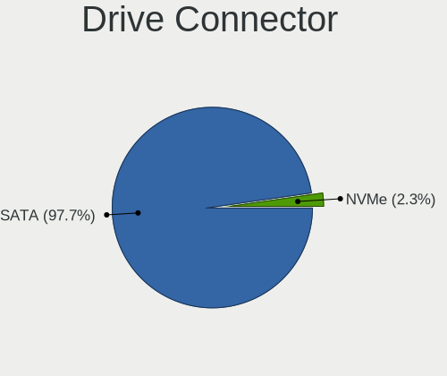
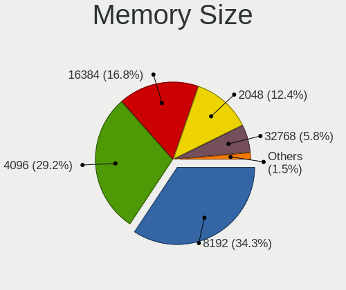

FreeBSD 14.0 - Tested Hardware & Statistics
-------------------------------------------

A project to collect tested hardware configurations for FreeBSD 14.0.

Anyone can contribute to this report by the [hw-probe](https://github.com/linuxhw/hw-probe/blob/master/INSTALL.BSD.md) tool:

    hw-probe -all -upload

Please contribute! Especially if your hardware is rare.

This is a report for all computer types. See also reports for [desktops](/Dist/FreeBSD_14.0/Desktop/README.md) and [notebooks](/Dist/FreeBSD_14.0/Notebook/README.md).

Contents
--------

* [ Test Cases ](#test-cases)

* [ System ](#system)
  - [ Arch                     ](#arch)
  - [ DE                       ](#de)
  - [ Display Server           ](#display-server)
  - [ Display Manager          ](#display-manager)
  - [ OS Lang                  ](#os-lang)
  - [ Boot Mode                ](#boot-mode)
  - [ Filesystem               ](#filesystem)
  - [ Part. scheme             ](#part-scheme)

* [ Board ](#board)
  - [ Vendor                   ](#vendor)
  - [ Model                    ](#model)
  - [ Model Family             ](#model-family)
  - [ MFG Year                 ](#mfg-year)
  - [ Form Factor              ](#form-factor)
  - [ Coreboot                 ](#coreboot)
  - [ RAM Size                 ](#ram-size)
  - [ RAM Used                 ](#ram-used)
  - [ Total Drives             ](#total-drives)
  - [ Has CD-ROM               ](#has-cd-rom)
  - [ Has Ethernet             ](#has-ethernet)
  - [ Has WiFi                 ](#has-wifi)
  - [ Has Bluetooth            ](#has-bluetooth)

* [ Location ](#location)
  - [ Country                  ](#country)
  - [ City                     ](#city)

* [ Drives ](#drives)
  - [ Drive Vendor             ](#drive-vendor)
  - [ Drive Model              ](#drive-model)
  - [ HDD Vendor               ](#hdd-vendor)
  - [ SSD Vendor               ](#ssd-vendor)
  - [ Drive Kind               ](#drive-kind)
  - [ Drive Connector          ](#drive-connector)
  - [ Drive Size               ](#drive-size)
  - [ Space Total              ](#space-total)
  - [ Space Used               ](#space-used)
  - [ Malfunc. Drives          ](#malfunc-drives)
  - [ Malfunc. Drive Vendor    ](#malfunc-drive-vendor)
  - [ Malfunc. HDD Vendor      ](#malfunc-hdd-vendor)
  - [ Malfunc. Drive Kind      ](#malfunc-drive-kind)
  - [ Failed Drives            ](#failed-drives)
  - [ Failed Drive Vendor      ](#failed-drive-vendor)
  - [ Drive Status             ](#drive-status)

* [ Storage controller ](#storage-controller)
  - [ Storage Vendor           ](#storage-vendor)
  - [ Storage Model            ](#storage-model)
  - [ Storage Kind             ](#storage-kind)

* [ Processor ](#processor)
  - [ CPU Vendor               ](#cpu-vendor)
  - [ CPU Model                ](#cpu-model)
  - [ CPU Model Family         ](#cpu-model-family)
  - [ CPU Cores                ](#cpu-cores)
  - [ CPU Sockets              ](#cpu-sockets)
  - [ CPU Threads              ](#cpu-threads)
  - [ CPU Microarch            ](#cpu-microarch)

* [ Graphics ](#graphics)
  - [ GPU Vendor               ](#gpu-vendor)
  - [ GPU Model                ](#gpu-model)
  - [ GPU Combo                ](#gpu-combo)
  - [ GPU Driver               ](#gpu-driver)
  - [ GPU Memory               ](#gpu-memory)

* [ Monitor ](#monitor)
  - [ Monitor Vendor           ](#monitor-vendor)
  - [ Monitor Model            ](#monitor-model)
  - [ Monitor Resolution       ](#monitor-resolution)
  - [ Monitor Diagonal         ](#monitor-diagonal)
  - [ Monitor Width            ](#monitor-width)
  - [ Aspect Ratio             ](#aspect-ratio)
  - [ Monitor Area             ](#monitor-area)
  - [ Pixel Density            ](#pixel-density)
  - [ Multiple Monitors        ](#multiple-monitors)

* [ Network ](#network)
  - [ Net Controller Vendor    ](#net-controller-vendor)
  - [ Net Controller Model     ](#net-controller-model)
  - [ Wireless Vendor          ](#wireless-vendor)
  - [ Wireless Model           ](#wireless-model)
  - [ Ethernet Vendor          ](#ethernet-vendor)
  - [ Ethernet Model           ](#ethernet-model)
  - [ Net Controller Kind      ](#net-controller-kind)
  - [ Used Controller          ](#used-controller)
  - [ NICs                     ](#nics)
  - [ IPv6                     ](#ipv6)

* [ Bluetooth ](#bluetooth)
  - [ Bluetooth Vendor         ](#bluetooth-vendor)
  - [ Bluetooth Model          ](#bluetooth-model)

* [ Sound ](#sound)
  - [ Sound Vendor             ](#sound-vendor)
  - [ Sound Model              ](#sound-model)

* [ Memory ](#memory)
  - [ Memory Vendor            ](#memory-vendor)
  - [ Memory Model             ](#memory-model)
  - [ Memory Kind              ](#memory-kind)
  - [ Memory Form Factor       ](#memory-form-factor)
  - [ Memory Size              ](#memory-size)
  - [ Memory Speed             ](#memory-speed)

* [ Printers & scanners ](#printers--scanners)
  - [ Printer Vendor           ](#printer-vendor)
  - [ Printer Model            ](#printer-model)
  - [ Scanner Vendor           ](#scanner-vendor)
  - [ Scanner Model            ](#scanner-model)

* [ Camera ](#camera)
  - [ Camera Vendor            ](#camera-vendor)
  - [ Camera Model             ](#camera-model)

* [ Security ](#security)
  - [ Fingerprint Vendor       ](#fingerprint-vendor)
  - [ Fingerprint Model        ](#fingerprint-model)
  - [ Chipcard Vendor          ](#chipcard-vendor)
  - [ Chipcard Model           ](#chipcard-model)

* [ Unsupported ](#unsupported)
  - [ Unsupported Devices      ](#unsupported-devices)
  - [ Unsupported Device Types ](#unsupported-device-types)

Test Cases
----------

Total: 160

| Vendor        | Model                       | Form-Factor | Probe                                                     | Date         |
|---------------|-----------------------------|-------------|-----------------------------------------------------------|--------------|
| Apple         | MacBookAir6,2               | Notebook    | [831f538244](https://bsd-hardware.info/?probe=831f538244) | Dec 06, 2024 |
| HP            | Laptop 15t-dy200            | Notebook    | [bb0b650de5](https://bsd-hardware.info/?probe=bb0b650de5) | Nov 11, 2024 |
| Raspberry ... | Raspberry Pi                | Soc         | [fd0677d03b](https://bsd-hardware.info/?probe=fd0677d03b) | Nov 01, 2024 |
| ASUSTek       | P8Z77-V LX                  | Desktop     | [7557aa9e0a](https://bsd-hardware.info/?probe=7557aa9e0a) | Sep 30, 2024 |
| ASUSTek       | P8Z77-V LX                  | Desktop     | [0372d7f73b](https://bsd-hardware.info/?probe=0372d7f73b) | Sep 30, 2024 |
| MSI           | B350M BAZOOKA               | Desktop     | [ea0e584b5e](https://bsd-hardware.info/?probe=ea0e584b5e) | Aug 09, 2024 |
| Raspberry ... | Raspberry Pi                | Soc         | [513933df99](https://bsd-hardware.info/?probe=513933df99) | Jul 22, 2024 |
| Raspberry ... | Raspberry Pi                | Soc         | [7928a68cca](https://bsd-hardware.info/?probe=7928a68cca) | Jul 11, 2024 |
| Dell          | Latitude D630               | Notebook    | [aab009eec7](https://bsd-hardware.info/?probe=aab009eec7) | Jul 01, 2024 |
| Dell          | Inspiron 3501               | Notebook    | [058d42521c](https://bsd-hardware.info/?probe=058d42521c) | Jun 29, 2024 |
| Dell          | XPS 15 9560                 | Notebook    | [f3b5f883fb](https://bsd-hardware.info/?probe=f3b5f883fb) | Jun 21, 2024 |
| Acer          | TravelMate B311-31          | Notebook    | [5a2eaacf36](https://bsd-hardware.info/?probe=5a2eaacf36) | Jun 16, 2024 |
| TYAN Compu... | Intel 440BX/GX Rev. 4       | Desktop     | [84ad498f3e](https://bsd-hardware.info/?probe=84ad498f3e) | Jun 07, 2024 |
| ASUSTek       | X455LD                      | Notebook    | [2ed45b3a24](https://bsd-hardware.info/?probe=2ed45b3a24) | Jun 05, 2024 |
| TUXEDO        | Pulse 15 Gen1               | Notebook    | [76cd424940](https://bsd-hardware.info/?probe=76cd424940) | May 31, 2024 |
| Samsung       | 300E4C/300E5C/300E7C        | Notebook    | [1a92f5398f](https://bsd-hardware.info/?probe=1a92f5398f) | May 26, 2024 |
| ASUSTek       | VivoBook_ASUSLaptop X412... | Notebook    | [7738e5ded1](https://bsd-hardware.info/?probe=7738e5ded1) | May 25, 2024 |
| HP            | Pavilion dv6                | Notebook    | [0ed63d3ed2](https://bsd-hardware.info/?probe=0ed63d3ed2) | May 24, 2024 |
| Apple         | MacBookPro11,1              | Notebook    | [9ee71f878e](https://bsd-hardware.info/?probe=9ee71f878e) | May 23, 2024 |
| Apple         | MacBookPro11,1              | Notebook    | [1a6b006807](https://bsd-hardware.info/?probe=1a6b006807) | May 23, 2024 |
| Alienware     | m16 R1                      | Notebook    | [4f607db6c3](https://bsd-hardware.info/?probe=4f607db6c3) | May 18, 2024 |
| Irbis         | NB131                       | Convertible | [826411a401](https://bsd-hardware.info/?probe=826411a401) | May 18, 2024 |
| AZW           | SER V2.0                    | Mini pc     | [c6a56bab91](https://bsd-hardware.info/?probe=c6a56bab91) | May 16, 2024 |
| Sony          | VPCSB3Q9E                   | Notebook    | [103114e640](https://bsd-hardware.info/?probe=103114e640) | May 14, 2024 |
| Supermicro    | Super Server                | Server      | [1372ec0dc4](https://bsd-hardware.info/?probe=1372ec0dc4) | May 11, 2024 |
| Lenovo        | ThinkPad T440 20B7S0W900    | Notebook    | [e3b9c9632c](https://bsd-hardware.info/?probe=e3b9c9632c) | May 10, 2024 |
| ASUSTek       | PN50-E1                     | Mini pc     | [3e236114af](https://bsd-hardware.info/?probe=3e236114af) | May 10, 2024 |
| ASUSTek       | PN50-E1                     | Mini pc     | [833657e0ab](https://bsd-hardware.info/?probe=833657e0ab) | May 10, 2024 |
| ASUSTek       | PN50-E1                     | Mini pc     | [bafdd06339](https://bsd-hardware.info/?probe=bafdd06339) | May 10, 2024 |
| ASUSTek       | H110M-C                     | Desktop     | [fbfee7e505](https://bsd-hardware.info/?probe=fbfee7e505) | May 09, 2024 |
| Lenovo        | ThinkPad T480 20L6SDG900    | Notebook    | [5d8a5c86b1](https://bsd-hardware.info/?probe=5d8a5c86b1) | May 09, 2024 |
| ASUSTek       | TUF B360-PLUS GAMING        | Desktop     | [c809f82bd6](https://bsd-hardware.info/?probe=c809f82bd6) | May 09, 2024 |
| Lenovo        | ThinkPad T480 20L6SDG900    | Notebook    | [f8b7f38969](https://bsd-hardware.info/?probe=f8b7f38969) | May 09, 2024 |
| Lenovo        | Legion 5 Pro 16ACH6H 82J... | Notebook    | [89a61aca01](https://bsd-hardware.info/?probe=89a61aca01) | May 04, 2024 |
| Chuwi         | GemiBook Pro                | Notebook    | [2656d00123](https://bsd-hardware.info/?probe=2656d00123) | May 03, 2024 |
| Dell          | Inspiron 15-3552            | Notebook    | [0a47152038](https://bsd-hardware.info/?probe=0a47152038) | May 02, 2024 |
| HP            | ZBook 15 G6                 | Notebook    | [95aadf59d9](https://bsd-hardware.info/?probe=95aadf59d9) | Apr 27, 2024 |
| Lenovo        | ThinkPad T400 6474E18       | Notebook    | [fcd3339ec5](https://bsd-hardware.info/?probe=fcd3339ec5) | Apr 21, 2024 |
| Lenovo        | ThinkPad X230 Tablet 343... | Notebook    | [2400099ef5](https://bsd-hardware.info/?probe=2400099ef5) | Apr 19, 2024 |
| Lenovo        | ThinkPad X230 Tablet 343... | Notebook    | [0a6e2a3b33](https://bsd-hardware.info/?probe=0a6e2a3b33) | Apr 18, 2024 |
| ASUSTek       | VivoBook_ASUSLaptop X740... | Notebook    | [20d7b596db](https://bsd-hardware.info/?probe=20d7b596db) | Apr 17, 2024 |
| Lenovo        | ThinkPad T460 20FMA09CGE    | Notebook    | [c7219eb82e](https://bsd-hardware.info/?probe=c7219eb82e) | Apr 15, 2024 |
| Lenovo        | ThinkPad E550 20DF005VRT    | Notebook    | [5c50bf1b60](https://bsd-hardware.info/?probe=5c50bf1b60) | Apr 14, 2024 |
| MSI           | B450I GAMING PLUS MAX WI... | Desktop     | [7ab7294373](https://bsd-hardware.info/?probe=7ab7294373) | Apr 14, 2024 |
| Dell          | 0GM819                      | Desktop     | [6140b5e6ad](https://bsd-hardware.info/?probe=6140b5e6ad) | Apr 12, 2024 |
| Gigabyte      | H97M-D3H                    | Desktop     | [8c0a605e99](https://bsd-hardware.info/?probe=8c0a605e99) | Apr 10, 2024 |
| ASRock        | AMD BC-250                  | Desktop     | [3b38d89497](https://bsd-hardware.info/?probe=3b38d89497) | Apr 09, 2024 |
| Foxconn       | H61MXV/H67MXV               | Desktop     | [53663c4ae5](https://bsd-hardware.info/?probe=53663c4ae5) | Apr 07, 2024 |
| Gigabyte      | X570 I AORUS PRO WIFI       | Desktop     | [0ab49168ee](https://bsd-hardware.info/?probe=0ab49168ee) | Apr 02, 2024 |
| ASRock        | Q1900-ITX                   | Desktop     | [cfceb60c9e](https://bsd-hardware.info/?probe=cfceb60c9e) | Mar 28, 2024 |
| ASRock        | Q1900-ITX                   | Desktop     | [d29def9398](https://bsd-hardware.info/?probe=d29def9398) | Mar 28, 2024 |
| Toshiba       | Satellite C645              | Notebook    | [a5d1838130](https://bsd-hardware.info/?probe=a5d1838130) | Mar 28, 2024 |
| Lenovo        | IdeaPad 500-14ISK 80NS      | Notebook    | [34ab895e86](https://bsd-hardware.info/?probe=34ab895e86) | Mar 15, 2024 |
| TULPAR        | A5 V20.3                    | Notebook    | [476d91b2cf](https://bsd-hardware.info/?probe=476d91b2cf) | Mar 13, 2024 |
| Lenovo        | Legion Pro 5 16ARX8 82WM    | Notebook    | [4b52e91e24](https://bsd-hardware.info/?probe=4b52e91e24) | Mar 13, 2024 |
| ZOTAC         | Unknown                     | Desktop     | [9217678a4f](https://bsd-hardware.info/?probe=9217678a4f) | Mar 10, 2024 |
| Dell          | 002KVM A01                  | Desktop     | [92ae9e6766](https://bsd-hardware.info/?probe=92ae9e6766) | Mar 07, 2024 |
| HUAWEI        | CREFG-XX                    | Notebook    | [b16b7180ee](https://bsd-hardware.info/?probe=b16b7180ee) | Mar 05, 2024 |
| ASUSTek       | PRIME B450M-A               | Desktop     | [101b5912bf](https://bsd-hardware.info/?probe=101b5912bf) | Feb 25, 2024 |
| Dell          | 086D43 A10                  | Server      | [b8c86900b6](https://bsd-hardware.info/?probe=b8c86900b6) | Feb 25, 2024 |
| HP            | ProBook 430 G4              | Notebook    | [9d55da54e7](https://bsd-hardware.info/?probe=9d55da54e7) | Feb 22, 2024 |
| Dell          | Latitude E7250              | Notebook    | [ffc8dcf395](https://bsd-hardware.info/?probe=ffc8dcf395) | Feb 22, 2024 |
| Unknown       | Unknown                     | Desktop     | [a5ae8a1c9d](https://bsd-hardware.info/?probe=a5ae8a1c9d) | Feb 21, 2024 |
| ASRock        | 4X4-5000 Series             | Desktop     | [dc9ef8f030](https://bsd-hardware.info/?probe=dc9ef8f030) | Feb 21, 2024 |
| Infinix       | INBook X1                   | Notebook    | [dd3185320b](https://bsd-hardware.info/?probe=dd3185320b) | Feb 20, 2024 |
| Fujitsu       | D3401-H2 S26361-D3401-H2    | Desktop     | [057ab23bee](https://bsd-hardware.info/?probe=057ab23bee) | Feb 18, 2024 |
| HP            | 83E9                        | Desktop     | [f5a6f9001d](https://bsd-hardware.info/?probe=f5a6f9001d) | Feb 17, 2024 |
| ASUSTek       | VivoBook_ASUSLaptop X350... | Notebook    | [a7aada8678](https://bsd-hardware.info/?probe=a7aada8678) | Feb 17, 2024 |
| ASUSTek       | VivoBook_ASUS Laptop E21... | Notebook    | [fb1f5f8545](https://bsd-hardware.info/?probe=fb1f5f8545) | Feb 16, 2024 |
| Google        | Ultima                      | Notebook    | [732adeb5e4](https://bsd-hardware.info/?probe=732adeb5e4) | Feb 15, 2024 |
| Dell          | Inspiron 3558               | Notebook    | [e0e665c1b5](https://bsd-hardware.info/?probe=e0e665c1b5) | Feb 13, 2024 |
| Dell          | 0PC10G A00                  | Mini pc     | [836dac7d2c](https://bsd-hardware.info/?probe=836dac7d2c) | Feb 13, 2024 |
| ASRock        | Z590 Steel Legend           | Desktop     | [e7dfc1ffe5](https://bsd-hardware.info/?probe=e7dfc1ffe5) | Feb 13, 2024 |
| ASRock        | Z590 Steel Legend           | Desktop     | [30702fa4b5](https://bsd-hardware.info/?probe=30702fa4b5) | Feb 13, 2024 |
| Lenovo        | ThinkPad T14s Gen 4 21F8... | Notebook    | [2a4911715a](https://bsd-hardware.info/?probe=2a4911715a) | Feb 07, 2024 |
| Panasonic     | CF-52VDA131M                | Notebook    | [1ebdac9598](https://bsd-hardware.info/?probe=1ebdac9598) | Feb 07, 2024 |
| MSI           | PRO B550M-P GEN3            | Desktop     | [6a6b1dbe8f](https://bsd-hardware.info/?probe=6a6b1dbe8f) | Feb 06, 2024 |
| Apple         | MacBookPro11,1              | Notebook    | [c77173c2f3](https://bsd-hardware.info/?probe=c77173c2f3) | Feb 04, 2024 |
| ASUSTek       | Pro B560M-C                 | Desktop     | [676019447d](https://bsd-hardware.info/?probe=676019447d) | Feb 03, 2024 |
| Lenovo        | Legion Y9000X 2020 81TH     | Notebook    | [3711b11e8a](https://bsd-hardware.info/?probe=3711b11e8a) | Jan 23, 2024 |
| HP            | ProBook 650 G1              | Notebook    | [50888a6e05](https://bsd-hardware.info/?probe=50888a6e05) | Jan 22, 2024 |
| Dell          | Latitude E7450              | Notebook    | [f2216c5d0f](https://bsd-hardware.info/?probe=f2216c5d0f) | Jan 21, 2024 |
| Fanless Mi... | Rev GMLR1                   | Mini pc     | [d238dc01c7](https://bsd-hardware.info/?probe=d238dc01c7) | Jan 20, 2024 |
| Lenovo        | ThinkPad W520 4284GZ1       | Notebook    | [32bc5e823d](https://bsd-hardware.info/?probe=32bc5e823d) | Jan 17, 2024 |
| Lenovo        | ThinkPad X220 42912Z1       | Notebook    | [1abc94b4b1](https://bsd-hardware.info/?probe=1abc94b4b1) | Jan 17, 2024 |
| Razer         | Blade 16 - RZ09-0483        | Notebook    | [d81973c8bc](https://bsd-hardware.info/?probe=d81973c8bc) | Jan 16, 2024 |
| ASUSTek       | X441UV                      | Notebook    | [6cdd70da49](https://bsd-hardware.info/?probe=6cdd70da49) | Jan 11, 2024 |
| Lenovo        | ThinkPad E14 Gen 3 20Y70... | Notebook    | [0f475f8e5d](https://bsd-hardware.info/?probe=0f475f8e5d) | Jan 10, 2024 |
| Lenovo        | ThinkPad E14 Gen 3 20Y70... | Notebook    | [6b21d0ae92](https://bsd-hardware.info/?probe=6b21d0ae92) | Jan 09, 2024 |
| Unknown       | Unknown                     | Desktop     | [6564d3ecfe](https://bsd-hardware.info/?probe=6564d3ecfe) | Jan 07, 2024 |
| HP            | Pavilion g6                 | Notebook    | [77f3d49b2e](https://bsd-hardware.info/?probe=77f3d49b2e) | Jan 06, 2024 |
| ASUSTek       | X441UV                      | Notebook    | [29b63ed6a8](https://bsd-hardware.info/?probe=29b63ed6a8) | Jan 04, 2024 |
| Dell          | XPS 15 7590                 | Notebook    | [67a65520e6](https://bsd-hardware.info/?probe=67a65520e6) | Jan 03, 2024 |
| Dell          | 0D24M8 A01                  | Desktop     | [17862ade20](https://bsd-hardware.info/?probe=17862ade20) | Jan 03, 2024 |
| HP            | Laptop 15t-dy100            | Notebook    | [61130d2b74](https://bsd-hardware.info/?probe=61130d2b74) | Jan 03, 2024 |
| Dell          | Vostro 5470                 | Notebook    | [56472e8f51](https://bsd-hardware.info/?probe=56472e8f51) | Dec 30, 2023 |
| Raspberry ... | Raspberry Pi                | Soc         | [fe3a4e49ee](https://bsd-hardware.info/?probe=fe3a4e49ee) | Dec 29, 2023 |
| Dell          | Inspiron 3195               | Convertible | [fb2acd7e84](https://bsd-hardware.info/?probe=fb2acd7e84) | Dec 29, 2023 |
| Dell          | Precision 7720              | Notebook    | [a30d05e373](https://bsd-hardware.info/?probe=a30d05e373) | Dec 23, 2023 |
| Lenovo        | ThinkPad X1 Carbon 2nd 2... | Notebook    | [85ec93f4cd](https://bsd-hardware.info/?probe=85ec93f4cd) | Dec 22, 2023 |
| Lenovo        | ThinkPad X1 Carbon 2nd 2... | Notebook    | [34f3eb8059](https://bsd-hardware.info/?probe=34f3eb8059) | Dec 22, 2023 |
| Clevo         | W240BU                      | Notebook    | [19bb603cab](https://bsd-hardware.info/?probe=19bb603cab) | Dec 20, 2023 |
| Apple         | MacBookAir5,2               | Notebook    | [2c652aa0a1](https://bsd-hardware.info/?probe=2c652aa0a1) | Dec 16, 2023 |
| Apple         | Mac-031AEE4D24BFF0B1 Mac... | Mini pc     | [4b134e7787](https://bsd-hardware.info/?probe=4b134e7787) | Dec 16, 2023 |
| Lenovo        | ThinkPad P1 20MD002MUS      | Notebook    | [c0dcfec41d](https://bsd-hardware.info/?probe=c0dcfec41d) | Dec 16, 2023 |
| Lenovo        | ThinkPad X1 Carbon 7th 2... | Notebook    | [7a5e6024cd](https://bsd-hardware.info/?probe=7a5e6024cd) | Dec 15, 2023 |
| Dell          | XPS 13 9370                 | Notebook    | [b6845a3e54](https://bsd-hardware.info/?probe=b6845a3e54) | Dec 15, 2023 |
| Lenovo        | IdeaPad 330-15ARR 81D2      | Notebook    | [c197b26909](https://bsd-hardware.info/?probe=c197b26909) | Dec 14, 2023 |
| Gigabyte      | H61M-S2PV                   | Desktop     | [88d2ae1175](https://bsd-hardware.info/?probe=88d2ae1175) | Dec 14, 2023 |
| Google        | Lindar rev3                 | Notebook    | [2e748fc42c](https://bsd-hardware.info/?probe=2e748fc42c) | Dec 13, 2023 |
| Raspberry ... | Raspberry Pi                | Soc         | [357a808604](https://bsd-hardware.info/?probe=357a808604) | Dec 12, 2023 |
| Raspberry ... | Raspberry Pi                | Soc         | [9a842bf3c8](https://bsd-hardware.info/?probe=9a842bf3c8) | Dec 12, 2023 |
| Unknown       | Unknown                     | Desktop     | [123088175c](https://bsd-hardware.info/?probe=123088175c) | Dec 11, 2023 |
| Dell          | 0XDN97 A09                  | Server      | [129a73f16f](https://bsd-hardware.info/?probe=129a73f16f) | Dec 11, 2023 |
| AZW           | EQ                          | Desktop     | [0280c1cdb9](https://bsd-hardware.info/?probe=0280c1cdb9) | Dec 10, 2023 |
| ASUSTek       | CM6870                      | Desktop     | [881ad2eacf](https://bsd-hardware.info/?probe=881ad2eacf) | Dec 10, 2023 |
| Google        | Parrot                      | Notebook    | [c10a95cbcc](https://bsd-hardware.info/?probe=c10a95cbcc) | Dec 10, 2023 |
| Google        | Parrot                      | Notebook    | [3a69ea2682](https://bsd-hardware.info/?probe=3a69ea2682) | Dec 10, 2023 |
| ASUSTek       | CM6870                      | Desktop     | [78399ba39e](https://bsd-hardware.info/?probe=78399ba39e) | Dec 09, 2023 |
| MECHREVO      | F7BSC V1.0                  | Mini pc     | [d1104aa676](https://bsd-hardware.info/?probe=d1104aa676) | Dec 05, 2023 |
| Lenovo        | ThinkPad T430s 23532QG      | Notebook    | [b456c01e0f](https://bsd-hardware.info/?probe=b456c01e0f) | Dec 04, 2023 |
| Intel         | NUC12WSBi3 M36953-303       | Mini pc     | [ea8b5e1c14](https://bsd-hardware.info/?probe=ea8b5e1c14) | Dec 03, 2023 |
| Acidanther... | MacBookPro16,3              | Notebook    | [322ea11f6c](https://bsd-hardware.info/?probe=322ea11f6c) | Dec 03, 2023 |
| Chuwi         | LarkBox X                   | Mini pc     | [a13be946a5](https://bsd-hardware.info/?probe=a13be946a5) | Dec 03, 2023 |
| ASUSTek       | TUF Gaming B550M-PLUS       | Desktop     | [a9b3beae66](https://bsd-hardware.info/?probe=a9b3beae66) | Dec 02, 2023 |
| Lenovo        | ThinkPad T450 20BV000BUS    | Notebook    | [ae4c6d7097](https://bsd-hardware.info/?probe=ae4c6d7097) | Nov 29, 2023 |
| MSI           | B450M MORTAR                | Desktop     | [4017ce5221](https://bsd-hardware.info/?probe=4017ce5221) | Nov 29, 2023 |
| CNCTION-IA... | Unknown                     | Desktop     | [1b4871792b](https://bsd-hardware.info/?probe=1b4871792b) | Nov 28, 2023 |
| ASUSTek       | PRIME A520M-E               | Desktop     | [8d7c03be2f](https://bsd-hardware.info/?probe=8d7c03be2f) | Nov 28, 2023 |
| Dell          | Precision 5510              | Notebook    | [3a7b2ae214](https://bsd-hardware.info/?probe=3a7b2ae214) | Nov 28, 2023 |
| ASUSTek       | ProArt B550-CREATOR         | Desktop     | [806a29d40a](https://bsd-hardware.info/?probe=806a29d40a) | Nov 28, 2023 |
| ASRock        | B450 Steel Legend           | Desktop     | [c9f6264329](https://bsd-hardware.info/?probe=c9f6264329) | Nov 27, 2023 |
| ASRock        | B450 Steel Legend           | Desktop     | [1e9f19c4ae](https://bsd-hardware.info/?probe=1e9f19c4ae) | Nov 27, 2023 |
| ASUSTek       | PRIME A320M-K               | Desktop     | [42bddda351](https://bsd-hardware.info/?probe=42bddda351) | Nov 26, 2023 |
| Unknown       | Unknown                     | Notebook    | [55339dbfab](https://bsd-hardware.info/?probe=55339dbfab) | Nov 26, 2023 |
| Lenovo        | IdeaPad 320-15IKB Touch ... | Notebook    | [3517ce2745](https://bsd-hardware.info/?probe=3517ce2745) | Nov 26, 2023 |
| Lenovo        | IdeaPad 320-15IKB Touch ... | Notebook    | [5f336b9d93](https://bsd-hardware.info/?probe=5f336b9d93) | Nov 26, 2023 |
| HP            | Laptop 15s-eq3xxx           | Notebook    | [f2aa7b3ebf](https://bsd-hardware.info/?probe=f2aa7b3ebf) | Nov 25, 2023 |
| Lenovo        | G50-80 80E5                 | Notebook    | [e0d8200dfa](https://bsd-hardware.info/?probe=e0d8200dfa) | Nov 24, 2023 |
| Google        | Dragonair                   | Notebook    | [713cf1bc38](https://bsd-hardware.info/?probe=713cf1bc38) | Nov 24, 2023 |
| HP            | Notebook                    | Notebook    | [aff6430eb2](https://bsd-hardware.info/?probe=aff6430eb2) | Nov 24, 2023 |
| Silicom       | 80300-0214-G16 R310         | Desktop     | [34382c8f4b](https://bsd-hardware.info/?probe=34382c8f4b) | Nov 24, 2023 |
| Acer          | JM11-MS                     | Notebook    | [0490895189](https://bsd-hardware.info/?probe=0490895189) | Nov 23, 2023 |
| Acidanther... | MacBookPro16,3              | Notebook    | [5f89fa2cd2](https://bsd-hardware.info/?probe=5f89fa2cd2) | Nov 22, 2023 |
| Samsung       | DT1234567890 SEC_SW_REVI... | Desktop     | [4c80855e88](https://bsd-hardware.info/?probe=4c80855e88) | Nov 22, 2023 |
| ASRock        | X570 Phantom Gaming 4       | Desktop     | [4b6284d041](https://bsd-hardware.info/?probe=4b6284d041) | Nov 20, 2023 |
| PICO PC       | MNHO-113                    | Desktop     | [c9a12372b4](https://bsd-hardware.info/?probe=c9a12372b4) | Nov 20, 2023 |
| Lenovo        | ThinkPad T450 20BV000BUS    | Notebook    | [fdb7c00df7](https://bsd-hardware.info/?probe=fdb7c00df7) | Nov 20, 2023 |
| Lenovo        | ThinkPad W530 24411M9       | Notebook    | [0272396725](https://bsd-hardware.info/?probe=0272396725) | Nov 19, 2023 |
| Lenovo        | ThinkPad X1 Carbon 4th 2... | Notebook    | [2c33e6e9e7](https://bsd-hardware.info/?probe=2c33e6e9e7) | Nov 19, 2023 |
| Panasonic     | CF-31-5                     | Notebook    | [8771ab6139](https://bsd-hardware.info/?probe=8771ab6139) | Nov 18, 2023 |
| ASUSTek       | P7P55D                      | Desktop     | [9eab94b4f7](https://bsd-hardware.info/?probe=9eab94b4f7) | Nov 18, 2023 |
| ASUSTek       | TUF Gaming B560M-PLUS WI... | Desktop     | [cfbda53125](https://bsd-hardware.info/?probe=cfbda53125) | Nov 18, 2023 |
| HP            | Notebook                    | Notebook    | [5d2df329aa](https://bsd-hardware.info/?probe=5d2df329aa) | Nov 17, 2023 |
| Lenovo        | ThinkPad X1 Carbon 4th 2... | Notebook    | [918706e110](https://bsd-hardware.info/?probe=918706e110) | Nov 15, 2023 |
| HP            | Pavilion Gaming Laptop 1... | Notebook    | [0e4ea9ccbf](https://bsd-hardware.info/?probe=0e4ea9ccbf) | Nov 15, 2023 |
| Dell          | G5 5505                     | Notebook    | [088aea32c0](https://bsd-hardware.info/?probe=088aea32c0) | Nov 15, 2023 |
| ASUSTek       | Pro WS X570-ACE             | Desktop     | [ee4c8ddddc](https://bsd-hardware.info/?probe=ee4c8ddddc) | Nov 13, 2023 |
| Unknown       | Unknown                     | Desktop     | [c535fae89f](https://bsd-hardware.info/?probe=c535fae89f) | Nov 10, 2023 |
| Intel         | NUC7JYB J67969-404          | Mini pc     | [81e93afe2e](https://bsd-hardware.info/?probe=81e93afe2e) | Nov 10, 2023 |

System
------

Arch
----

OS architecture (x86_64, i586, etc.)

| Name    | Computers | Percent |
|---------|-----------|---------|
| amd64   | 126       | 93.33%  |
| arm64   | 7         | 5.19%   |
| powerpc | 1         | 0.74%   |
| i386    | 1         | 0.74%   |

DE
--

Desktop Environment

| Name        | Computers | Percent |
|-------------|-----------|---------|
| Console     | 51        | 37.5%   |
| KDE5        | 31        | 22.79%  |
| XFCE        | 21        | 15.44%  |
| TWM         | 10        | 7.35%   |
| GNOME       | 7         | 5.15%   |
| MATE        | 4         | 2.94%   |
| i3          | 3         | 2.21%   |
| LXQt        | 2         | 1.47%   |
| X-Cinnamon  | 1         | 0.74%   |
| WindowMaker | 1         | 0.74%   |
| Picom       | 1         | 0.74%   |
| Openbox     | 1         | 0.74%   |
| GNUstep     | 1         | 0.74%   |
| Cinnamon    | 1         | 0.74%   |
| AwesomeWM   | 1         | 0.74%   |

Display Server
--------------

X11 or Wayland

| Name    | Computers | Percent |
|---------|-----------|---------|
| X11     | 82        | 60.74%  |
| Console | 45        | 33.33%  |
| Wayland | 8         | 5.93%   |

Display Manager
---------------

SDDM, LightDM, etc.

| Name    | Computers | Percent |
|---------|-----------|---------|
| Console | 66        | 48.53%  |
| SDDM    | 29        | 21.32%  |
| LightDM | 28        | 20.59%  |
| XDM     | 4         | 2.94%   |
| SLiM    | 4         | 2.94%   |
| GDM     | 3         | 2.21%   |
| Ly      | 2         | 1.47%   |

OS Lang
-------

Language

| Lang    | Computers | Percent |
|---------|-----------|---------|
| C       | 95        | 70.37%  |
| Unknown | 19        | 14.07%  |
| en_US   | 9         | 6.67%   |
| ru_RU   | 2         | 1.48%   |
| es_AR   | 2         | 1.48%   |
| zh_CN   | 1         | 0.74%   |
| pt_BR   | 1         | 0.74%   |
| ko_KR   | 1         | 0.74%   |
| en_IE   | 1         | 0.74%   |
| de_DE   | 1         | 0.74%   |
| de_CH   | 1         | 0.74%   |
| de      | 1         | 0.74%   |
| cs_CZ   | 1         | 0.74%   |

Boot Mode
---------

EFI or BIOS

| Mode | Computers | Percent |
|------|-----------|---------|
| EFI  | 110       | 81.48%  |
| BIOS | 25        | 18.52%  |

Filesystem
----------

Type of filesystem

| Type | Computers | Percent |
|------|-----------|---------|
| Zfs  | 94        | 69.63%  |
| Ufs  | 41        | 30.37%  |

Part. scheme
------------

Scheme of partitioning

| Type    | Computers | Percent |
|---------|-----------|---------|
| GPT     | 122       | 90.37%  |
| MBR     | 10        | 7.41%   |
| Unknown | 2         | 1.48%   |
| BSD     | 1         | 0.74%   |

Board
-----

Vendor
------

Motherboard manufacturer

| Name                    | Computers | Percent |
|-------------------------|-----------|---------|
| Lenovo                  | 25        | 18.52%  |
| Dell                    | 20        | 14.81%  |
| ASUSTek Computer        | 19        | 14.07%  |
| Hewlett-Packard         | 11        | 8.15%   |
| ASRock                  | 6         | 4.44%   |
| Raspberry Pi Foundation | 5         | 3.7%    |
| Unknown                 | 5         | 3.7%    |
| MSI                     | 4         | 2.96%   |
| Google                  | 4         | 2.96%   |
| Apple                   | 4         | 2.96%   |
| Samsung Electronics     | 2         | 1.48%   |
| Panasonic               | 2         | 1.48%   |
| Gigabyte Technology     | 2         | 1.48%   |
| Chuwi                   | 2         | 1.48%   |
| AZW                     | 2         | 1.48%   |
| ZOTAC                   | 1         | 0.74%   |
| TYAN Computer           | 1         | 0.74%   |
| TUXEDO                  | 1         | 0.74%   |
| TULPAR                  | 1         | 0.74%   |
| Toshiba                 | 1         | 0.74%   |
| Sony                    | 1         | 0.74%   |
| Silicom                 | 1         | 0.74%   |
| Razer                   | 1         | 0.74%   |
| PICO PC                 | 1         | 0.74%   |
| MECHREVO                | 1         | 0.74%   |
| Irbis                   | 1         | 0.74%   |
| Intel                   | 1         | 0.74%   |
| Infinix                 | 1         | 0.74%   |
| HUAWEI                  | 1         | 0.74%   |
| Fujitsu                 | 1         | 0.74%   |
| Foxconn                 | 1         | 0.74%   |
| Fanless Mini PC         | 1         | 0.74%   |
| CNCTION-IAF             | 1         | 0.74%   |
| Clevo                   | 1         | 0.74%   |
| Alienware               | 1         | 0.74%   |
| Acidanthera             | 1         | 0.74%   |
| Acer                    | 1         | 0.74%   |

Model
-----

Motherboard model

| Name                                     | Computers | Percent |
|------------------------------------------|-----------|---------|
| Unknown                                  | 6         | 4.44%   |
| RPi Raspberry Pi                         | 5         | 3.7%    |
| ASUS MINIPC PN50-E1                      | 2         | 1.48%   |
| Apple MacBookPro11,1                     | 2         | 1.48%   |
| TYAN Intel 440BX/GX Rev. 4               | 1         | 0.74%   |
| TUXEDO Pulse 15 Gen1                     | 1         | 0.74%   |
| TULPAR A5 V20.3                          | 1         | 0.74%   |
| Toshiba Satellite C645                   | 1         | 0.74%   |
| Sony VPCSB3Q9E                           | 1         | 0.74%   |
| Silicom 6200                             | 1         | 0.74%   |
| Samsung DeskTop System                   | 1         | 0.74%   |
| Samsung 300E4C/300E5C/300E7C             | 1         | 0.74%   |
| Razer Blade 16 - RZ09-0483               | 1         | 0.74%   |
| PICO PC MNHO-113                         | 1         | 0.74%   |
| Panasonic CF-52VDA131M                   | 1         | 0.74%   |
| Panasonic CF-31-5                        | 1         | 0.74%   |
| MSI MS-7D95                              | 1         | 0.74%   |
| MSI MS-7B89                              | 1         | 0.74%   |
| MSI MS-7A40                              | 1         | 0.74%   |
| MSI MS-7A38                              | 1         | 0.74%   |
| MECHREVO F7BSC V1.0                      | 1         | 0.74%   |
| Lenovo ThinkPad X230 Tablet 3438GF4      | 1         | 0.74%   |
| Lenovo ThinkPad X220 42912Z1             | 1         | 0.74%   |
| Lenovo ThinkPad X1 Carbon 7th 20QES53R00 | 1         | 0.74%   |
| Lenovo ThinkPad X1 Carbon 4th 20FCS43F00 | 1         | 0.74%   |
| Lenovo ThinkPad X1 Carbon 4th 20FB006FAU | 1         | 0.74%   |
| Lenovo ThinkPad X1 Carbon 2nd 20A7002FUS | 1         | 0.74%   |
| Lenovo ThinkPad W530 24411M9             | 1         | 0.74%   |
| Lenovo ThinkPad W520 4284GZ1             | 1         | 0.74%   |
| Lenovo ThinkPad T480 20L6SDG900          | 1         | 0.74%   |
| Lenovo ThinkPad T460 20FMA09CGE          | 1         | 0.74%   |
| Lenovo ThinkPad T450 20BV000BUS          | 1         | 0.74%   |
| Lenovo ThinkPad T440 20B7S0W900          | 1         | 0.74%   |
| Lenovo ThinkPad T430s 23532QG            | 1         | 0.74%   |
| Lenovo ThinkPad T400 6474E18             | 1         | 0.74%   |
| Lenovo ThinkPad T14s Gen 4 21F8CTO1WW    | 1         | 0.74%   |
| Lenovo ThinkPad P1 20MD002MUS            | 1         | 0.74%   |
| Lenovo ThinkPad E550 20DF005VRT          | 1         | 0.74%   |
| Lenovo ThinkPad E14 Gen 3 20Y7003QGE     | 1         | 0.74%   |
| Lenovo Legion Y9000X 2020 81TH           | 1         | 0.74%   |

Model Family
------------

Motherboard model prefix

| Name                   | Computers | Percent |
|------------------------|-----------|---------|
| Lenovo ThinkPad        | 18        | 13.33%  |
| Unknown                | 6         | 4.44%   |
| RPi Raspberry          | 5         | 3.7%    |
| Dell Inspiron          | 4         | 2.96%   |
| ASUS VivoBook          | 4         | 2.96%   |
| Lenovo Legion          | 3         | 2.22%   |
| Lenovo IdeaPad         | 3         | 2.22%   |
| HP Pavilion            | 3         | 2.22%   |
| HP Laptop              | 3         | 2.22%   |
| Dell XPS               | 3         | 2.22%   |
| Dell Precision         | 3         | 2.22%   |
| Dell Latitude          | 3         | 2.22%   |
| ASUS TUF               | 3         | 2.22%   |
| ASUS PRIME             | 3         | 2.22%   |
| HP ProBook             | 2         | 1.48%   |
| Dell PowerEdge         | 2         | 1.48%   |
| Dell OptiPlex          | 2         | 1.48%   |
| ASUS MINIPC            | 2         | 1.48%   |
| Apple MacBookPro11     | 2         | 1.48%   |
| TYAN Intel             | 1         | 0.74%   |
| TUXEDO Pulse           | 1         | 0.74%   |
| TULPAR A5              | 1         | 0.74%   |
| Toshiba Satellite      | 1         | 0.74%   |
| Sony VPCSB3Q9E         | 1         | 0.74%   |
| Silicom 6200           | 1         | 0.74%   |
| Samsung DeskTop        | 1         | 0.74%   |
| Samsung 300E4C         | 1         | 0.74%   |
| Razer Blade            | 1         | 0.74%   |
| PICO PC MNHO-113       | 1         | 0.74%   |
| Panasonic CF-52VDA131M | 1         | 0.74%   |
| Panasonic CF-31-5      | 1         | 0.74%   |
| MSI MS-7D95            | 1         | 0.74%   |
| MSI MS-7B89            | 1         | 0.74%   |
| MSI MS-7A40            | 1         | 0.74%   |
| MSI MS-7A38            | 1         | 0.74%   |
| MECHREVO F7BSC         | 1         | 0.74%   |
| Lenovo G50-80          | 1         | 0.74%   |
| Irbis NB131            | 1         | 0.74%   |
| Intel NUC12WSHi3       | 1         | 0.74%   |
| Infinix INBook         | 1         | 0.74%   |

MFG Year
--------

Motherboard manufacture year

| Year    | Computers | Percent |
|---------|-----------|---------|
| 2023    | 21        | 15.56%  |
| 2021    | 17        | 12.59%  |
| 2022    | 14        | 10.37%  |
| 2019    | 12        | 8.89%   |
| 2020    | 10        | 7.41%   |
| Unknown | 9         | 6.67%   |
| 2016    | 7         | 5.19%   |
| 2015    | 7         | 5.19%   |
| 2012    | 6         | 4.44%   |
| 2011    | 6         | 4.44%   |
| 2018    | 5         | 3.7%    |
| 2014    | 5         | 3.7%    |
| 2024    | 3         | 2.22%   |
| 2017    | 3         | 2.22%   |
| 2013    | 3         | 2.22%   |
| 2010    | 3         | 2.22%   |
| 2009    | 2         | 1.48%   |
| 2008    | 2         | 1.48%   |

Form Factor
-----------

Physical design of the computer

| Name           | Computers | Percent |
|----------------|-----------|---------|
| Notebook       | 77        | 57.04%  |
| Desktop        | 40        | 29.63%  |
| Mini pc        | 9         | 6.67%   |
| System on chip | 5         | 3.7%    |
| Convertible    | 2         | 1.48%   |
| Server         | 2         | 1.48%   |

Coreboot
--------

Have coreboot on board

| Used | Computers | Percent |
|------|-----------|---------|
| No   | 131       | 97.04%  |
| Yes  | 4         | 2.96%   |

RAM Size
--------

Total RAM memory

| Size in GB  | Computers | Percent |
|-------------|-----------|---------|
| 16.01-24.0  | 40        | 29.63%  |
| 8.01-16.0   | 38        | 28.15%  |
| 4.01-8.0    | 21        | 15.56%  |
| 32.01-64.0  | 15        | 11.11%  |
| 64.01-256.0 | 12        | 8.89%   |
| 3.01-4.0    | 2         | 1.48%   |
| 24.01-32.0  | 2         | 1.48%   |
| 2.01-3.0    | 2         | 1.48%   |
| 0.51-1.0    | 2         | 1.48%   |
| 0.01-0.5    | 1         | 0.74%   |

RAM Used
--------

Used RAM memory

| Used GB   | Computers | Percent |
|-----------|-----------|---------|
| 0.01-0.5  | 49        | 36.03%  |
| 0.51-1.0  | 45        | 33.09%  |
| 1.01-2.0  | 20        | 14.71%  |
| 2.01-3.0  | 12        | 8.82%   |
| 3.01-4.0  | 5         | 3.68%   |
| 0         | 3         | 2.21%   |
| 4.01-8.0  | 1         | 0.74%   |
| 8.01-16.0 | 1         | 0.74%   |

Total Drives
------------

Number of drives on board

| Drives | Computers | Percent |
|--------|-----------|---------|
| 1      | 53        | 39.26%  |
| 0      | 50        | 37.04%  |
| 2      | 18        | 13.33%  |
| 4      | 8         | 5.93%   |
| 3      | 3         | 2.22%   |
| 10     | 1         | 0.74%   |
| 6      | 1         | 0.74%   |
| 5      | 1         | 0.74%   |

Has CD-ROM
----------

Has CD-ROM on board

| Presented | Computers | Percent |
|-----------|-----------|---------|
| No        | 115       | 85.19%  |
| Yes       | 20        | 14.81%  |

Has Ethernet
------------

Has Ethernet on board

| Presented | Computers | Percent |
|-----------|-----------|---------|
| Yes       | 102       | 75.56%  |
| No        | 33        | 24.44%  |

Has WiFi
--------

Has WiFi module

| Presented | Computers | Percent |
|-----------|-----------|---------|
| Yes       | 101       | 74.81%  |
| No        | 34        | 25.19%  |

Has Bluetooth
-------------

Has Bluetooth module

| Presented | Computers | Percent |
|-----------|-----------|---------|
| Yes       | 89        | 65.93%  |
| No        | 46        | 34.07%  |

Location
--------

Country
-------

Geographic location (country)

| Country     | Computers | Percent |
|-------------|-----------|---------|
| USA         | 22        | 16.3%   |
| Germany     | 20        | 14.81%  |
| Russia      | 12        | 8.89%   |
| UK          | 7         | 5.19%   |
| Spain       | 6         | 4.44%   |
| Vietnam     | 5         | 3.7%    |
| China       | 5         | 3.7%    |
| Brazil      | 5         | 3.7%    |
| Indonesia   | 4         | 2.96%   |
| Turkey      | 3         | 2.22%   |
| Switzerland | 3         | 2.22%   |
| Poland      | 3         | 2.22%   |
| Japan       | 3         | 2.22%   |
| France      | 3         | 2.22%   |
| Canada      | 3         | 2.22%   |
| Australia   | 3         | 2.22%   |
| Sweden      | 2         | 1.48%   |
| Romania     | 2         | 1.48%   |
| Netherlands | 2         | 1.48%   |
| Mexico      | 2         | 1.48%   |
| Czechia     | 2         | 1.48%   |
| Chile       | 2         | 1.48%   |
| Argentina   | 2         | 1.48%   |
| Uruguay     | 1         | 0.74%   |
| South Korea | 1         | 0.74%   |
| Slovakia    | 1         | 0.74%   |
| Philippines | 1         | 0.74%   |
| Malaysia    | 1         | 0.74%   |
| Italy       | 1         | 0.74%   |
| Ireland     | 1         | 0.74%   |
| India       | 1         | 0.74%   |
| Iceland     | 1         | 0.74%   |
| Egypt       | 1         | 0.74%   |
| Croatia     | 1         | 0.74%   |
| Colombia    | 1         | 0.74%   |
| Belgium     | 1         | 0.74%   |
| Algeria     | 1         | 0.74%   |

City
----

Geographic location (city)

| City                  | Computers | Percent |
|-----------------------|-----------|---------|
| Moscow                | 7         | 5.15%   |
| Berlin                | 4         | 2.94%   |
| Nuremberg             | 3         | 2.21%   |
| Harringay             | 3         | 2.21%   |
| Hanoi                 | 3         | 2.21%   |
| Sydney                | 2         | 1.47%   |
| Seattle               | 2         | 1.47%   |
| Sao Paulo             | 2         | 1.47%   |
| San Antonio           | 2         | 1.47%   |
| San Angelo            | 2         | 1.47%   |
| Jakarta               | 2         | 1.47%   |
| Frankfurt am Main     | 2         | 1.47%   |
| Curicó               | 2         | 1.47%   |
| Bonn                  | 2         | 1.47%   |
| Ypsilanti             | 1         | 0.74%   |
| Yokohama              | 1         | 0.74%   |
| Yekaterinburg         | 1         | 0.74%   |
| Wroclaw               | 1         | 0.74%   |
| Westervoort           | 1         | 0.74%   |
| Walldorf              | 1         | 0.74%   |
| Vyazniki              | 1         | 0.74%   |
| Virginia Beach        | 1         | 0.74%   |
| Uiwang-si             | 1         | 0.74%   |
| Tracy                 | 1         | 0.74%   |
| Thanh Hóa            | 1         | 0.74%   |
| Teplice               | 1         | 0.74%   |
| Talavera              | 1         | 0.74%   |
| Sydenham              | 1         | 0.74%   |
| Surabaya              | 1         | 0.74%   |
| Stavropol             | 1         | 0.74%   |
| Sorocaba              | 1         | 0.74%   |
| Songjiang             | 1         | 0.74%   |
| Skellefteå           | 1         | 0.74%   |
| Şişli               | 1         | 0.74%   |
| Shenzhen              | 1         | 0.74%   |
| Shanghai              | 1         | 0.74%   |
| Shah Alam             | 1         | 0.74%   |
| Seville               | 1         | 0.74%   |
| San Luis Potosí City | 1         | 0.74%   |
| San Francisco         | 1         | 0.74%   |

Drives
------

Drive Vendor
------------

Hard drive vendors

| Vendor              | Computers | Drives | Percent |
|---------------------|-----------|--------|---------|
| WDC                 | 18        | 31     | 15.93%  |
| Seagate             | 15        | 21     | 13.27%  |
| Samsung Electronics | 15        | 26     | 13.27%  |
| Toshiba             | 10        | 10     | 8.85%   |
| SanDisk             | 8         | 9      | 7.08%   |
| Kingston            | 8         | 9      | 7.08%   |
| Apple               | 4         | 4      | 3.54%   |
| Intel               | 3         | 3      | 2.65%   |
| Gigabyte Technology | 3         | 5      | 2.65%   |
| Crucial             | 3         | 3      | 2.65%   |
| Transcend           | 2         | 2      | 1.77%   |
| SK hynix            | 2         | 2      | 1.77%   |
| Apacer              | 2         | 2      | 1.77%   |
| V-GeN               | 1         | 4      | 0.88%   |
| TCSUNBOW            | 1         | 1      | 0.88%   |
| Patriot             | 1         | 1      | 0.88%   |
| Netac               | 1         | 1      | 0.88%   |
| MidasForce          | 1         | 1      | 0.88%   |
| Micron Technology   | 1         | 2      | 0.88%   |
| LITEON              | 1         | 1      | 0.88%   |
| Lexar               | 1         | 2      | 0.88%   |
| Lenovo              | 1         | 2      | 0.88%   |
| KingSpec            | 1         | 1      | 0.88%   |
| Kingchuxing         | 1         | 1      | 0.88%   |
| Intenso             | 1         | 1      | 0.88%   |
| Integral            | 1         | 1      | 0.88%   |
| Hitachi             | 1         | 1      | 0.88%   |
| HGST                | 1         | 1      | 0.88%   |
| GOODRAM             | 1         | 2      | 0.88%   |
| Dogfish             | 1         | 1      | 0.88%   |
| AirDisk             | 1         | 1      | 0.88%   |
| aigo                | 1         | 1      | 0.88%   |
| A-DATA Technology   | 1         | 1      | 0.88%   |

Drive Model
-----------

Hard drive models

| Model                              | Computers | Percent |
|------------------------------------|-----------|---------|
| WDC WD10EZEX-08WN4A0 1TB           | 3         | 2.33%   |
| Seagate ST4000DM004-2CV104 4TB     | 3         | 2.33%   |
| WDC WDS200T2B0B-00YS70 2TB         | 2         | 1.55%   |
| WDC WD10EZEX-75M2NA0 1TB           | 2         | 1.55%   |
| Toshiba MQ01ABF050 500GB           | 2         | 1.55%   |
| Seagate ST2000LM003 HN-M201RAD 2TB | 2         | 1.55%   |
| Seagate ST2000DM008-2FR102 2TB     | 2         | 1.55%   |
| Samsung SSD 870 EVO 1TB            | 2         | 1.55%   |
| Samsung SSD 860 EVO 500GB          | 2         | 1.55%   |
| Samsung SSD 850 EVO 250GB          | 2         | 1.55%   |
| Samsung SSD 840 PRO Series 256GB   | 2         | 1.55%   |
| Kingston SA400S37480G 480GB        | 2         | 1.55%   |
| Kingston SA400S37240G 240GB        | 2         | 1.55%   |
| WDC WDS480G2G0A-00JH30 480GB       | 1         | 0.78%   |
| WDC WDS240G2G0A-00JH30 240GB       | 1         | 0.78%   |
| WDC WDS120G2G0B-00EPW0 120GB       | 1         | 0.78%   |
| WDC WD8002FZWX-00BKUA0 8TB         | 1         | 0.78%   |
| WDC WD5000AZLX-08K2TA0 500GB       | 1         | 0.78%   |
| WDC WD5000AAKX-75U6AA0 500GB       | 1         | 0.78%   |
| WDC WD5000AAKX-60U6AA0 500GB       | 1         | 0.78%   |
| WDC WD5000AAKX-603CA0 500GB        | 1         | 0.78%   |
| WDC WD5000AAKX-00ERMA0 500GB       | 1         | 0.78%   |
| WDC WD5000AAKS-22V1A0 500GB        | 1         | 0.78%   |
| WDC WD40EZRZ-00GXCB0 4TB           | 1         | 0.78%   |
| WDC WD40EFRX-68WT0N0 4TB           | 1         | 0.78%   |
| WDC WD3200BEKT-00V5T0 320GB        | 1         | 0.78%   |
| WDC WD20EZAZ-00L9GB0 2TB           | 1         | 0.78%   |
| WDC WD2005FBYZ-01YCBB2 2TB         | 1         | 0.78%   |
| WDC WD2003FZEX-00SRLA0 2TB         | 1         | 0.78%   |
| WDC WD1200BEVS-07LAT0 120GB        | 1         | 0.78%   |
| WDC WD10JPVX-00JC3T0 1TB           | 1         | 0.78%   |
| WDC WD10JPCX-24UE4T0 1TB           | 1         | 0.78%   |
| WDC WD10EZEX-75WN4A1 1TB           | 1         | 0.78%   |
| WDC WD10EZEX-08M2NA0 1TB           | 1         | 0.78%   |
| V-GeN V-GEN11SM20AR1024ITM2 1TB    | 1         | 0.78%   |
| V-GeN V-GEN03SM22AR1024SDK 1TB     | 1         | 0.78%   |
| Transcend TS256GSSD230S 256GB      | 1         | 0.78%   |
| Transcend TS256GMTS400 256GB       | 1         | 0.78%   |
| Toshiba THNSNJ256GCSY 256GB        | 1         | 0.78%   |
| Toshiba MQ01ABD100 1TB             | 1         | 0.78%   |

HDD Vendor
----------

Hard disk drive vendors

| Vendor              | Computers | Drives | Percent |
|---------------------|-----------|--------|---------|
| WDC                 | 16        | 26     | 37.21%  |
| Seagate             | 13        | 19     | 30.23%  |
| Toshiba             | 9         | 9      | 20.93%  |
| Samsung Electronics | 2         | 2      | 4.65%   |
| Hitachi             | 1         | 1      | 2.33%   |
| HGST                | 1         | 1      | 2.33%   |
| Apple               | 1         | 1      | 2.33%   |

SSD Vendor
----------

Solid state drive vendors

| Vendor              | Computers | Drives | Percent |
|---------------------|-----------|--------|---------|
| Samsung Electronics | 13        | 22     | 18.06%  |
| SanDisk             | 8         | 9      | 11.11%  |
| Kingston            | 8         | 9      | 11.11%  |
| WDC                 | 4         | 5      | 5.56%   |
| Intel               | 3         | 3      | 4.17%   |
| Gigabyte Technology | 3         | 5      | 4.17%   |
| Crucial             | 3         | 3      | 4.17%   |
| Apple               | 3         | 3      | 4.17%   |
| Transcend           | 2         | 2      | 2.78%   |
| SK hynix            | 2         | 2      | 2.78%   |
| Seagate             | 2         | 2      | 2.78%   |
| Apacer              | 2         | 2      | 2.78%   |
| V-GeN               | 1         | 4      | 1.39%   |
| Toshiba             | 1         | 1      | 1.39%   |
| TCSUNBOW            | 1         | 1      | 1.39%   |
| Patriot             | 1         | 1      | 1.39%   |
| Netac               | 1         | 1      | 1.39%   |
| MidasForce          | 1         | 1      | 1.39%   |
| Micron Technology   | 1         | 2      | 1.39%   |
| LITEON              | 1         | 1      | 1.39%   |
| Lexar               | 1         | 2      | 1.39%   |
| Lenovo              | 1         | 2      | 1.39%   |
| KingSpec            | 1         | 1      | 1.39%   |
| Kingchuxing         | 1         | 1      | 1.39%   |
| Intenso             | 1         | 1      | 1.39%   |
| Integral            | 1         | 1      | 1.39%   |
| GOODRAM             | 1         | 2      | 1.39%   |
| Dogfish             | 1         | 1      | 1.39%   |
| AirDisk             | 1         | 1      | 1.39%   |
| aigo                | 1         | 1      | 1.39%   |
| A-DATA Technology   | 1         | 1      | 1.39%   |

Drive Kind
----------

HDD or SSD

| Kind | Computers | Drives | Percent |
|------|-----------|--------|---------|
| SSD  | 65        | 93     | 62.5%   |
| HDD  | 37        | 59     | 35.58%  |
| NVMe | 2         | 2      | 1.92%   |

Drive Connector
---------------

SATA, SAS, NVMe, etc.

| Type | Computers | Drives | Percent |
|------|-----------|--------|---------|
| SATA | 86        | 152    | 97.73%  |
| NVMe | 2         | 2      | 2.27%   |

Drive Size
----------

Size of hard drive

| Size in TB | Computers | Drives | Percent |
|------------|-----------|--------|---------|
| 0.01-0.5   | 60        | 78     | 55.05%  |
| 0.51-1.0   | 27        | 40     | 24.77%  |
| 1.01-2.0   | 13        | 17     | 11.93%  |
| 3.01-4.0   | 6         | 14     | 5.5%    |
| 2.01-3.0   | 1         | 1      | 0.92%   |
| 10.01-20.0 | 1         | 1      | 0.92%   |
| 4.01-10.0  | 1         | 1      | 0.92%   |

Space Total
-----------

Amount of disk space available on the file system

| Size in GB     | Computers | Percent |
|----------------|-----------|---------|
| 101-250        | 41        | 30.37%  |
| 251-500        | 36        | 26.67%  |
| 501-1000       | 22        | 16.3%   |
| 51-100         | 11        | 8.15%   |
| 21-50          | 10        | 7.41%   |
| 1001-2000      | 8         | 5.93%   |
| 1-20           | 6         | 4.44%   |
| More than 3000 | 1         | 0.74%   |

Space Used
----------

Amount of used disk space

| Used GB   | Computers | Percent |
|-----------|-----------|---------|
| 1-20      | 118       | 87.41%  |
| 21-50     | 9         | 6.67%   |
| 51-100    | 4         | 2.96%   |
| 101-250   | 3         | 2.22%   |
| 1001-2000 | 1         | 0.74%   |

Malfunc. Drives
---------------

Drive models with a malfunction

| Model                                        | Computers | Drives | Percent |
|----------------------------------------------|-----------|--------|---------|
| WDC WD10EZEX-75M2NA0 1TB                     | 2         | 2      | 11.11%  |
| WDC WD5000AAKX-60U6AA0 500GB                 | 1         | 1      | 5.56%   |
| WDC WD5000AAKX-00ERMA0 500GB                 | 1         | 1      | 5.56%   |
| WDC WD5000AAKS-22V1A0 500GB                  | 1         | 1      | 5.56%   |
| WDC WD40EFRX-68WT0N0 4TB                     | 1         | 3      | 5.56%   |
| Toshiba MQ01ABF050 500GB                     | 1         | 1      | 5.56%   |
| Toshiba MK2555GSX 250GB                      | 1         | 1      | 5.56%   |
| Seagate ST9320325AS 320GB                    | 1         | 1      | 5.56%   |
| Seagate ST320LT007-9ZV142 320GB              | 1         | 1      | 5.56%   |
| SanDisk SSD PLUS 480GB                       | 1         | 1      | 5.56%   |
| Samsung Electronics SSD 840 PRO Series 256GB | 1         | 1      | 5.56%   |
| Samsung Electronics HM250HI 250GB            | 1         | 1      | 5.56%   |
| Netac SSD 256GB                              | 1         | 1      | 5.56%   |
| Lenovo Thinklife SSD ST600 MSATA 256G        | 1         | 1      | 5.56%   |
| Kingston SH103S3240G 240GB                   | 1         | 1      | 5.56%   |
| Kingston SA400S37240G 240GB                  | 1         | 1      | 5.56%   |
| Crucial CT525MX300SSD1 528GB                 | 1         | 1      | 5.56%   |

Malfunc. Drive Vendor
---------------------

Vendors of faulty drives

| Vendor              | Computers | Drives | Percent |
|---------------------|-----------|--------|---------|
| WDC                 | 6         | 8      | 33.33%  |
| Toshiba             | 2         | 2      | 11.11%  |
| Seagate             | 2         | 2      | 11.11%  |
| Samsung Electronics | 2         | 2      | 11.11%  |
| Kingston            | 2         | 2      | 11.11%  |
| SanDisk             | 1         | 1      | 5.56%   |
| Netac               | 1         | 1      | 5.56%   |
| Lenovo              | 1         | 1      | 5.56%   |
| Crucial             | 1         | 1      | 5.56%   |

Malfunc. HDD Vendor
-------------------

Vendors of faulty HDD drives

| Vendor              | Computers | Drives | Percent |
|---------------------|-----------|--------|---------|
| WDC                 | 6         | 8      | 54.55%  |
| Toshiba             | 2         | 2      | 18.18%  |
| Seagate             | 2         | 2      | 18.18%  |
| Samsung Electronics | 1         | 1      | 9.09%   |

Malfunc. Drive Kind
-------------------

Kinds of faulty drives

| Kind | Computers | Drives | Percent |
|------|-----------|--------|---------|
| HDD  | 11        | 13     | 61.11%  |
| SSD  | 7         | 7      | 38.89%  |

Failed Drives
-------------

Failed drive models

Zero info for selected period =(

Failed Drive Vendor
-------------------

Failed drive vendors

Zero info for selected period =(

Drive Status
------------

Number of failed and malfunc. drives

| Status  | Computers | Drives | Percent |
|---------|-----------|--------|---------|
| Works   | 78        | 134    | 81.25%  |
| Malfunc | 18        | 20     | 18.75%  |

Storage controller
------------------

Storage Vendor
--------------

Storage controller vendors

| Vendor                         | Computers | Percent |
|--------------------------------|-----------|---------|
| Intel                          | 75        | 44.64%  |
| AMD                            | 27        | 16.07%  |
| Samsung Electronics            | 15        | 8.93%   |
| SanDisk                        | 10        | 5.95%   |
| SK hynix                       | 5         | 2.98%   |
| Toshiba                        | 4         | 2.38%   |
| Kingston Technology Company    | 4         | 2.38%   |
| Phison Electronics             | 3         | 1.79%   |
| Micron/Crucial Technology      | 3         | 1.79%   |
| Broadcom / LSI                 | 3         | 1.79%   |
| Shenzhen Longsys Electronics   | 2         | 1.19%   |
| Micron Technology              | 2         | 1.19%   |
| Marvell Technology Group       | 2         | 1.19%   |
| ASMedia Technology             | 2         | 1.19%   |
| Union Memory (Shenzhen)        | 1         | 0.6%    |
| Transcend                      | 1         | 0.6%    |
| Solid State Storage Technology | 1         | 0.6%    |
| Silicon Motion                 | 1         | 0.6%    |
| Seagate Technology             | 1         | 0.6%    |
| Realtek Semiconductor          | 1         | 0.6%    |
| Netac Technology               | 1         | 0.6%    |
| MAXIO Technology (Hangzhou)    | 1         | 0.6%    |
| KIOXIA                         | 1         | 0.6%    |
| JMicron Technology             | 1         | 0.6%    |
| Unknown                        | 1         | 0.6%    |

Storage Model
-------------

Storage controller models

| Model                                                                            | Computers | Percent |
|----------------------------------------------------------------------------------|-----------|---------|
| AMD FCH SATA Controller [AHCI mode]                                              | 18        | 9.94%   |
| Samsung NVMe SSD Controller SM981/PM981/PM983                                    | 9         | 4.97%   |
| Intel 7 Series Chipset Family 6-port SATA Controller [AHCI mode]                 | 8         | 4.42%   |
| Intel Wildcat Point-LP SATA Controller [AHCI Mode]                               | 5         | 2.76%   |
| Intel Sunrise Point-LP SATA Controller [AHCI mode]                               | 5         | 2.76%   |
| Intel 8 Series SATA Controller 1 [AHCI mode]                                     | 5         | 2.76%   |
| Intel Volume Management Device NVMe RAID Controller                              | 4         | 2.21%   |
| Intel Q170/Q150/B150/H170/H110/Z170/CM236 Chipset SATA Controller [AHCI Mode]    | 4         | 2.21%   |
| Intel 82801 Mobile SATA Controller [RAID mode]                                   | 4         | 2.21%   |
| AMD 500 Series Chipset SATA Controller                                           | 4         | 2.21%   |
| AMD 400 Series Chipset SATA Controller                                           | 4         | 2.21%   |
| Sandisk WD Black SN770 / PC SN740 256GB / PC SN560 (DRAM-less) NVMe SSD          | 3         | 1.66%   |
| Samsung NVMe SSD Controller 980 (DRAM-less)                                      | 3         | 1.66%   |
| Intel Celeron/Pentium Silver Processor SATA Controller                           | 3         | 1.66%   |
| Intel Cannon Lake Mobile PCH SATA AHCI Controller                                | 3         | 1.66%   |
| Intel Alder Lake-N SATA AHCI Controller                                          | 3         | 1.66%   |
| Intel 6 Series/C200 Series Chipset Family 6 port Mobile SATA AHCI Controller     | 3         | 1.66%   |
| SK hynix Gold P31/BC711/PC711 NVMe Solid State Drive                             | 2         | 1.1%    |
| Shenzhen Longsys Lexar NM790 NVME SSD (DRAM-less)                                | 2         | 1.1%    |
| SanDisk Ultra 3D / WD Blue SN570 NVMe SSD (DRAM-less)                            | 2         | 1.1%    |
| SanDisk Extreme Pro / WD Black 2018/SN750/PC SN720 NVMe SSD                      | 2         | 1.1%    |
| Phison E12 NVMe Controller                                                       | 2         | 1.1%    |
| Micron/Crucial P2 [Nick P2] / P3 / P3 Plus NVMe PCIe SSD (DRAM-less)             | 2         | 1.1%    |
| Kingston Company NV1 NVMe SSD [SM2263XT] (DRAM-less)                             | 2         | 1.1%    |
| Intel Celeron N3350/Pentium N4200/Atom E3900 Series SATA AHCI Controller         | 2         | 1.1%    |
| Intel Atom/Celeron/Pentium Processor x5-E8000/J3xxx/N3xxx Series SATA Controller | 2         | 1.1%    |
| Intel 82801IBM/IEM (ICH9M/ICH9M-E) 4 port SATA Controller [AHCI mode]            | 2         | 1.1%    |
| Intel 7 Series/C210 Series Chipset Family 6-port SATA Controller [AHCI mode]     | 2         | 1.1%    |
| Intel 500 Series Chipset Family SATA AHCI Controller                             | 2         | 1.1%    |
| ASMedia ASM1061/ASM1062 Serial ATA Controller                                    | 2         | 1.1%    |
| AMD 300 Series Chipset SATA Controller                                           | 2         | 1.1%    |
| Union Memory (Shenzhen) AM620 PCIe 3.0 NVMe SSD 128GB                            | 1         | 0.55%   |
| Transcend NVMe PCIe SSD 110S/112S/120S/MTE300S/MTE400S/MTE652T2 (DRAM-less)      | 1         | 0.55%   |
| Toshiba XG6 NVMe SSD Controller                                                  | 1         | 0.55%   |
| Toshiba XG5 NVMe SSD Controller                                                  | 1         | 0.55%   |
| Toshiba XG4 NVMe SSD Controller                                                  | 1         | 0.55%   |
| Toshiba BG3 x2 NVMe SSD Controller (DRAM-less)                                   | 1         | 0.55%   |
| Solid State Storage CA6-8D512 NVMe SSD M.2                                       | 1         | 0.55%   |
| SK hynix Platinum P41/PC801 NVMe Solid State Drive                               | 1         | 0.55%   |
| SK hynix PC601 NVMe Solid State Drive                                            | 1         | 0.55%   |

Storage Kind
------------

Kind of storage controller (IDE, SATA, NVMe, SAS, ...)

| Kind | Computers | Percent |
|------|-----------|---------|
| SATA | 93        | 56.71%  |
| NVMe | 52        | 31.71%  |
| RAID | 12        | 7.32%   |
| IDE  | 7         | 4.27%   |

Processor
---------

CPU Vendor
----------

Processor vendors

| Vendor | Computers | Percent |
|--------|-----------|---------|
| Intel  | 93        | 68.89%  |
| AMD    | 33        | 24.44%  |
| ARM    | 7         | 5.19%   |
| IBM    | 1         | 0.74%   |
| i      | 1         | 0.74%   |

CPU Model
---------

Processor models

| Model                                    | Computers | Percent |
|------------------------------------------|-----------|---------|
| Intel Core i5-5200U CPU @ 2.20GHz        | 4         | 2.96%   |
| Intel N100                               | 3         | 2.22%   |
| ARM Cortex-A72 r0p3                      | 3         | 2.22%   |
| Intel Core i7-9750H CPU @ 2.60GHz        | 2         | 1.48%   |
| Intel Core i7-8550U CPU @ 1.80GHz        | 2         | 1.48%   |
| Intel Core i5-6300U CPU @ 2.40GHz        | 2         | 1.48%   |
| Intel Core i5-6200U CPU @ 2.30GHz        | 2         | 1.48%   |
| Intel Core i5-5300U CPU @ 2.30GHz        | 2         | 1.48%   |
| Intel Core i5-4300U CPU @ 1.90GHz        | 2         | 1.48%   |
| Intel Core i5-4200U CPU @ 1.60GHz        | 2         | 1.48%   |
| Intel Core i5-3320M CPU @ 2.60GHz        | 2         | 1.48%   |
| Intel Celeron CPU N3150 @ 1.60GHz        | 2         | 1.48%   |
| Intel 11th Gen Core i5-1135G7 @ 2.40GHz  | 2         | 1.48%   |
| ARM Cortex-A55 r2p0                      | 2         | 1.48%   |
| ARM Cortex-A53 r0p4                      | 2         | 1.48%   |
| AMD Ryzen 7 5700X 8-Core Processor       | 2         | 1.48%   |
| AMD Ryzen 7 4800H with Radeon Graphics   | 2         | 1.48%   |
| AMD Ryzen 7 4700U with Radeon Graphics   | 2         | 1.48%   |
| Intel Xeon W-2145 CPU @ 3.70GHz          | 1         | 0.74%   |
| Intel Xeon E-2176M CPU @ 2.70GHz         | 1         | 0.74%   |
| Intel Xeon CPU E5502 @ 1.87GHz           | 1         | 0.74%   |
| Intel Xeon CPU E5-2690 v4 @ 2.60GHz      | 1         | 0.74%   |
| Intel Xeon                               | 1         | 0.74%   |
| Intel Pentium Silver N6005 @ 2.00GHz     | 1         | 0.74%   |
| Intel Pentium Silver J5005 CPU @ 1.50GHz | 1         | 0.74%   |
| Intel Pentium CPU N4200 @ 1.10GHz        | 1         | 0.74%   |
| Intel Pentium CPU N3710 @ 1.60GHz        | 1         | 0.74%   |
| Intel Pentium CPU G640 @ 2.80GHz         | 1         | 0.74%   |
| Intel Pentium CPU 3825U @ 1.90GHz        | 1         | 0.74%   |
| Intel Genuine CPU U7300 @ 1.30GHz        | 1         | 0.74%   |
| Intel Core i7-9850H CPU @ 2.60GHz        | 1         | 0.74%   |
| Intel Core i7-7700HQ CPU @ 2.80GHz       | 1         | 0.74%   |
| Intel Core i7-7700 CPU @ 3.60GHz         | 1         | 0.74%   |
| Intel Core i7-6820HQ CPU @ 2.70GHz       | 1         | 0.74%   |
| Intel Core i7-4770 CPU @ 3.40GHz         | 1         | 0.74%   |
| Intel Core i7-4558U CPU @ 2.80GHz        | 1         | 0.74%   |
| Intel Core i7-3840QM CPU @ 2.80GHz       | 1         | 0.74%   |
| Intel Core i7-3770 CPU @ 3.40GHz         | 1         | 0.74%   |
| Intel Core i7-2630QM CPU @ 2.00GHz       | 1         | 0.74%   |
| Intel Core i7-10700K CPU @ 3.80GHz       | 1         | 0.74%   |

CPU Model Family
----------------

Processor model prefix

| Model                | Computers | Percent |
|----------------------|-----------|---------|
| Intel Core i5        | 33        | 24.44%  |
| Other                | 19        | 14.07%  |
| Intel Core i7        | 16        | 11.85%  |
| AMD Ryzen 7          | 13        | 9.63%   |
| AMD Ryzen 5          | 10        | 7.41%   |
| Intel Celeron        | 8         | 5.93%   |
| ARM Cortex           | 7         | 5.19%   |
| Intel Core i3        | 6         | 4.44%   |
| Intel Xeon           | 5         | 3.7%    |
| Intel Pentium        | 4         | 2.96%   |
| Intel Pentium Silver | 2         | 1.48%   |
| Intel Core 2 Duo     | 2         | 1.48%   |
| Intel Genuine        | 1         | 0.74%   |
| Intel Atom           | 1         | 0.74%   |
| AMD Ryzen 9          | 1         | 0.74%   |
| AMD Ryzen 7 PRO      | 1         | 0.74%   |
| AMD Ryzen 5 PRO      | 1         | 0.74%   |
| AMD Ryzen 3          | 1         | 0.74%   |
| AMD C-50             | 1         | 0.74%   |
| AMD Athlon           | 1         | 0.74%   |
| AMD A8               | 1         | 0.74%   |
| AMD A4               | 1         | 0.74%   |

CPU Cores
---------

Number of processor cores

| Number  | Computers | Percent |
|---------|-----------|---------|
| 2       | 43        | 31.85%  |
| 4       | 40        | 29.63%  |
| 16      | 12        | 8.89%   |
| 8       | 11        | 8.15%   |
| Unknown | 11        | 8.15%   |
| 12      | 7         | 5.19%   |
| 6       | 6         | 4.44%   |
| 10      | 2         | 1.48%   |
| 32      | 1         | 0.74%   |
| 28      | 1         | 0.74%   |
| 24      | 1         | 0.74%   |

CPU Sockets
-----------

Number of sockets

| Number  | Computers | Percent |
|---------|-----------|---------|
| 1       | 124       | 91.85%  |
| Unknown | 8         | 5.93%   |
| 2       | 3         | 2.22%   |

CPU Threads
-----------

Threads per core (Hyper-Threading)

| Number  | Computers | Percent |
|---------|-----------|---------|
| 2       | 65        | 48.15%  |
| 1       | 59        | 43.7%   |
| Unknown | 11        | 8.15%   |

CPU Microarch
-------------

Microarchitecture

| Name          | Computers | Percent |
|---------------|-----------|---------|
| Unknown       | 24        | 17.78%  |
| KabyLake      | 15        | 11.11%  |
| Zen 3         | 10        | 7.41%   |
| Skylake       | 9         | 6.67%   |
| Haswell       | 9         | 6.67%   |
| SandyBridge   | 8         | 5.93%   |
| Broadwell     | 8         | 5.93%   |
| IvyBridge     | 7         | 5.19%   |
| TigerLake     | 6         | 4.44%   |
| Zen+          | 5         | 3.7%    |
| Zen 2         | 5         | 3.7%    |
| Zen           | 4         | 2.96%   |
| Silvermont    | 4         | 2.96%   |
| Penryn        | 4         | 2.96%   |
| Goldmont plus | 3         | 2.22%   |
| Goldmont      | 3         | 2.22%   |
| Nehalem       | 2         | 1.48%   |
| IceLake       | 2         | 1.48%   |
| Westmere      | 1         | 0.74%   |
| Piledriver    | 1         | 0.74%   |
| P6            | 1         | 0.74%   |
| K10 Llano     | 1         | 0.74%   |
| Excavator     | 1         | 0.74%   |
| CometLake     | 1         | 0.74%   |
| Bobcat        | 1         | 0.74%   |

Graphics
--------

GPU Vendor
----------

Vendors of graphics cards

| Vendor                     | Computers | Percent |
|----------------------------|-----------|---------|
| Intel                      | 82        | 56.16%  |
| AMD                        | 33        | 22.6%   |
| Nvidia                     | 28        | 19.18%  |
| Matrox Electronics Systems | 2         | 1.37%   |
| ASPEED Technology          | 1         | 0.68%   |

GPU Model
---------

Graphics card models

| Model                                                                                    | Computers | Percent |
|------------------------------------------------------------------------------------------|-----------|---------|
| Intel Haswell-ULT Integrated Graphics Controller                                         | 7         | 4.64%   |
| Intel 2nd Generation Core Processor Family Integrated Graphics Controller                | 7         | 4.64%   |
| Intel HD Graphics 5500                                                                   | 6         | 3.97%   |
| Intel TigerLake-LP GT2 [Iris Xe Graphics]                                                | 5         | 3.31%   |
| Intel Skylake GT2 [HD Graphics 520]                                                      | 5         | 3.31%   |
| Intel 3rd Gen Core processor Graphics Controller                                         | 5         | 3.31%   |
| Intel CoffeeLake-H GT2 [UHD Graphics 630]                                                | 4         | 2.65%   |
| AMD Renoir [Radeon Vega Series / Radeon Vega Mobile Series]                              | 4         | 2.65%   |
| AMD Cezanne [Radeon Vega Series / Radeon Vega Mobile Series]                             | 4         | 2.65%   |
| Nvidia GF117M [GeForce 610M/710M/810M/820M / GT 620M/625M/630M/720M]                     | 3         | 1.99%   |
| Intel UHD Graphics 620                                                                   | 3         | 1.99%   |
| Intel HD Graphics 630                                                                    | 3         | 1.99%   |
| Intel Atom/Celeron/Pentium Processor x5-E8000/J3xxx/N3xxx Integrated Graphics Controller | 3         | 1.99%   |
| Intel Alder Lake-N [UHD Graphics]                                                        | 3         | 1.99%   |
| AMD Raven Ridge [Radeon Vega Series / Radeon Vega Mobile Series]                         | 3         | 1.99%   |
| AMD Picasso/Raven 2 [Radeon Vega Series / Radeon Vega Mobile Series]                     | 3         | 1.99%   |
| Nvidia GP107M [GeForce GTX 1050 Mobile]                                                  | 2         | 1.32%   |
| Intel Raptor Lake-S UHD Graphics                                                         | 2         | 1.32%   |
| Intel Mobile 4 Series Chipset Integrated Graphics Controller                             | 2         | 1.32%   |
| Intel JasperLake [UHD Graphics]                                                          | 2         | 1.32%   |
| Intel HD Graphics 530                                                                    | 2         | 1.32%   |
| Intel GeminiLake [UHD Graphics 600]                                                      | 2         | 1.32%   |
| AMD Phoenix1                                                                             | 2         | 1.32%   |
| AMD Navi 22 [Radeon RX 6700/6700 XT/6750 XT / 6800M/6850M XT]                            | 2         | 1.32%   |
| AMD Ellesmere [Radeon RX 470/480/570/570X/580/580X/590]                                  | 2         | 1.32%   |
| Nvidia TU117M [GeForce GTX 1650 Mobile / Max-Q]                                          | 1         | 0.66%   |
| Nvidia TU117 [GeForce GTX 1650]                                                          | 1         | 0.66%   |
| Nvidia NV44A [GeForce 6200]                                                              | 1         | 0.66%   |
| Nvidia GP108 [GeForce GT 1030]                                                           | 1         | 0.66%   |
| Nvidia GP107GLM [Quadro P2000 Mobile]                                                    | 1         | 0.66%   |
| Nvidia GP107 [GeForce GTX 1050 Ti]                                                       | 1         | 0.66%   |
| Nvidia GP104GLM [Quadro P3000 Mobile]                                                    | 1         | 0.66%   |
| Nvidia GP104GL [Quadro P5000]                                                            | 1         | 0.66%   |
| Nvidia GM108M [GeForce 920MX]                                                            | 1         | 0.66%   |
| Nvidia GM107GLM [Quadro M1000M]                                                          | 1         | 0.66%   |
| Nvidia GM107 [GeForce GTX 750 Ti]                                                        | 1         | 0.66%   |
| Nvidia GK208M [GeForce GT 740M]                                                          | 1         | 0.66%   |
| Nvidia GK106 [GeForce GTX 645 OEM]                                                       | 1         | 0.66%   |
| Nvidia GF116 [GeForce GTX 550 Ti]                                                        | 1         | 0.66%   |
| Nvidia GF108M [GeForce GT 620M]                                                          | 1         | 0.66%   |

GPU Combo
---------

Combinations of graphics cards

| Name           | Computers | Percent |
|----------------|-----------|---------|
| 1 x Intel      | 62        | 45.93%  |
| 1 x AMD        | 26        | 19.26%  |
| Intel + Nvidia | 15        | 11.11%  |
| 1 x Nvidia     | 12        | 8.89%   |
| Other          | 8         | 5.93%   |
| 2 x AMD        | 4         | 2.96%   |
| 2 x Intel      | 3         | 2.22%   |
| 1 x Matrox     | 2         | 1.48%   |
| Intel + AMD    | 2         | 1.48%   |
| 1 x ASPEED     | 1         | 0.74%   |

GPU Driver
----------

Free vs proprietary

| Driver      | Computers | Percent |
|-------------|-----------|---------|
| Free        | 116       | 85.93%  |
| Proprietary | 11        | 8.15%   |
| Unknown     | 8         | 5.93%   |

GPU Memory
----------

Total video memory

| Size in GB | Computers | Percent |
|------------|-----------|---------|
| Unknown    | 110       | 81.48%  |
| 0.01-0.5   | 6         | 4.44%   |
| 5.01-6.0   | 4         | 2.96%   |
| 3.01-4.0   | 4         | 2.96%   |
| 1.01-2.0   | 4         | 2.96%   |
| 7.01-8.0   | 3         | 2.22%   |
| 0.51-1.0   | 2         | 1.48%   |
| 2.01-3.0   | 1         | 0.74%   |
| 8.01-16.0  | 1         | 0.74%   |

Monitor
-------

Monitor Vendor
--------------

Monitor vendors

| Vendor              | Computers | Percent |
|---------------------|-----------|---------|
| AU Optronics        | 14        | 18.18%  |
| BOE                 | 13        | 16.88%  |
| Chimei Innolux      | 8         | 10.39%  |
| ViewSonic           | 6         | 7.79%   |
| LG Display          | 5         | 6.49%   |
| Goldstar            | 5         | 6.49%   |
| Samsung Electronics | 3         | 3.9%    |
| Lenovo              | 3         | 3.9%    |
| Dell                | 3         | 3.9%    |
| Apple               | 3         | 3.9%    |
| Sony                | 2         | 2.6%    |
| Sharp               | 2         | 2.6%    |
| Hewlett-Packard     | 2         | 2.6%    |
| Wacom               | 1         | 1.3%    |
| Viotek              | 1         | 1.3%    |
| LG Philips          | 1         | 1.3%    |
| Gateway             | 1         | 1.3%    |
| BenQ                | 1         | 1.3%    |
| AOC                 | 1         | 1.3%    |
| AGO                 | 1         | 1.3%    |
| Unknown             | 1         | 1.3%    |

Monitor Model
-------------

Monitor models

| Model                                                                 | Computers | Percent |
|-----------------------------------------------------------------------|-----------|---------|
| BOE LCD Monitor BOE06DF 1920x1080 310x170mm 13.9-inch                 | 2         | 2.6%    |
| Apple Color LCD APPA020 2560x1600 290x180mm 13.4-inch                 | 2         | 2.6%    |
| Wacom One 13 WAC1070 1920x1080 290x170mm 13.2-inch                    | 1         | 1.3%    |
| Viotek GNV27DB VTK2700 2560x1440 600x340mm 27.2-inch                  | 1         | 1.3%    |
| ViewSonic VX2880-4K-HDU VSCA33A 3840x2160 630x360mm 28.6-inch         | 1         | 1.3%    |
| ViewSonic VX2457 VSCB931 1920x1080 520x290mm 23.4-inch                | 1         | 1.3%    |
| ViewSonic VG2439 Series VSCD22B 1920x1080 520x290mm 23.4-inch         | 1         | 1.3%    |
| ViewSonic VA2261 Series VSC0F30 1920x1080 480x270mm 21.7-inch         | 1         | 1.3%    |
| ViewSonic VA2246 Series VSC6F2E 1920x1080 480x270mm 21.7-inch         | 1         | 1.3%    |
| ViewSonic VA1903a VSC8A31 1366x768 410x230mm 18.5-inch                | 1         | 1.3%    |
| Sony TV SNY6804 1680x1050                                             | 1         | 1.3%    |
| Sony LCD Monitor MS_9005 1920x1200 330x210mm 15.4-inch                | 1         | 1.3%    |
| Sharp LCD Monitor SHP1453 1920x1080 350x190mm 15.7-inch               | 1         | 1.3%    |
| Sharp LCD Monitor SHP143E 3840x2160 350x190mm 15.7-inch               | 1         | 1.3%    |
| Samsung Electronics LCD Monitor SEC3741 1366x768 300x170mm 13.6-inch  | 1         | 1.3%    |
| Samsung Electronics LCD Monitor SDC4171 2880x1800 300x190mm 14.0-inch | 1         | 1.3%    |
| Samsung Electronics LCD Monitor S19B150                               | 1         | 1.3%    |
| LG Philips LCD Monitor LPL00E5 1440x900 300x190mm 14.0-inch           | 1         | 1.3%    |
| LG Display LCD Monitor LGD0563 1920x1080 340x190mm 15.3-inch          | 1         | 1.3%    |
| LG Display LCD Monitor LGD04FF 1920x1080 310x170mm 13.9-inch          | 1         | 1.3%    |
| LG Display LCD Monitor LGD0362 1600x900 310x170mm 13.9-inch           | 1         | 1.3%    |
| LG Display LCD Monitor LGD02D8 1366x768 280x160mm 12.7-inch           | 1         | 1.3%    |
| LG Display LCD Monitor LGD02D3 1366x768 280x160mm 12.7-inch           | 1         | 1.3%    |
| Lenovo LCD Monitor LEN40B1 1600x900 350x190mm 15.7-inch               | 1         | 1.3%    |
| Lenovo LCD Monitor LEN40A0 1366x768 310x170mm 13.9-inch               | 1         | 1.3%    |
| Lenovo LCD Monitor LEN4031 1280x800 300x190mm 14.0-inch               | 1         | 1.3%    |
| Hewlett-Packard LA2405x HWP301E 1920x1200 520x320mm 24.0-inch         | 1         | 1.3%    |
| Hewlett-Packard E221 HWP3060 1920x1080 500x290mm 22.8-inch            | 1         | 1.3%    |
| Goldstar LG ULTRAWIDE GSM59F1 2560x1080 580x240mm 24.7-inch           | 1         | 1.3%    |
| Goldstar LG ULTRAGEAR GSM5B70 1920x1080 600x340mm 27.2-inch           | 1         | 1.3%    |
| Goldstar LG ULTRAFINE GSM5BC1 3840x2160 600x340mm 27.2-inch           | 1         | 1.3%    |
| Goldstar LG HD GSM5ACD 1366x768 410x230mm 18.5-inch                   | 1         | 1.3%    |
| Goldstar 22EN43 GSM59D9 1920x1080 480x270mm 21.7-inch                 | 1         | 1.3%    |
| Gateway HD2201 GWY08AF 1680x1050 470x300mm 22.0-inch                  | 1         | 1.3%    |
| Dell U2717D DEL40EB 2560x1440 600x340mm 27.2-inch                     | 1         | 1.3%    |
| Dell S3222HG DELD113 1920x1080 700x400mm 31.7-inch                    | 1         | 1.3%    |
| Dell LCD Monitor 1908FP 2390x1280                                     | 1         | 1.3%    |
| Chimei Innolux LCD Monitor CMN15F5 1920x1080 340x190mm 15.3-inch      | 1         | 1.3%    |
| Chimei Innolux LCD Monitor CMN15CC 1366x768 340x190mm 15.3-inch       | 1         | 1.3%    |
| Chimei Innolux LCD Monitor CMN15CA 1366x768 340x190mm 15.3-inch       | 1         | 1.3%    |

Monitor Resolution
------------------

Monitor screen resolution

| Resolution         | Computers | Percent |
|--------------------|-----------|---------|
| 1920x1080 (FHD)    | 33        | 43.42%  |
| 1366x768 (WXGA)    | 19        | 25%     |
| 2560x1440 (QHD)    | 4         | 5.26%   |
| 3840x2160 (4K)     | 3         | 3.95%   |
| 2560x1600          | 3         | 3.95%   |
| 1920x1200 (WUXGA)  | 2         | 2.63%   |
| 1680x1050 (WSXGA+) | 2         | 2.63%   |
| 1600x900 (HD+)     | 2         | 2.63%   |
| 1440x900 (WXGA+)   | 2         | 2.63%   |
| 2880x1800          | 1         | 1.32%   |
| 2560x1080          | 1         | 1.32%   |
| 2390x1280          | 1         | 1.32%   |
| 2160x1440          | 1         | 1.32%   |
| 1280x800 (WXGA)    | 1         | 1.32%   |
| Unknown            | 1         | 1.32%   |

Monitor Diagonal
----------------

Diagonal size in inches

| Inches  | Computers | Percent |
|---------|-----------|---------|
| 15      | 24        | 31.58%  |
| 13      | 18        | 23.68%  |
| 14      | 5         | 6.58%   |
| 27      | 4         | 5.26%   |
| 21      | 3         | 3.95%   |
| 12      | 3         | 3.95%   |
| 11      | 3         | 3.95%   |
| Unknown | 3         | 3.95%   |
| 23      | 2         | 2.63%   |
| 22      | 2         | 2.63%   |
| 18      | 2         | 2.63%   |
| 34      | 1         | 1.32%   |
| 33      | 1         | 1.32%   |
| 32      | 1         | 1.32%   |
| 31      | 1         | 1.32%   |
| 28      | 1         | 1.32%   |
| 24      | 1         | 1.32%   |
| 17      | 1         | 1.32%   |

Monitor Width
-------------

Physical width

| Width in mm | Computers | Percent |
|-------------|-----------|---------|
| 301-350     | 37        | 48.68%  |
| 201-300     | 16        | 21.05%  |
| 501-600     | 7         | 9.21%   |
| 401-500     | 7         | 9.21%   |
| 701-800     | 3         | 3.95%   |
| Unknown     | 3         | 3.95%   |
| 601-700     | 2         | 2.63%   |
| 351-400     | 1         | 1.32%   |

Aspect Ratio
------------

Proportional relationship between the width and the height

| Ratio   | Computers | Percent |
|---------|-----------|---------|
| 16/9    | 57        | 77.03%  |
| 16/10   | 12        | 16.22%  |
| Unknown | 2         | 2.7%    |
| 4/3     | 1         | 1.35%   |
| 3/2     | 1         | 1.35%   |
| 21/9    | 1         | 1.35%   |

Monitor Area
------------

Area in inch²

| Area in inch² | Computers | Percent |
|----------------|-----------|---------|
| 81-90          | 19        | 25%     |
| 91-100         | 19        | 25%     |
| 201-250        | 7         | 9.21%   |
| 101-110        | 6         | 7.89%   |
| 351-500        | 5         | 6.58%   |
| 301-350        | 4         | 5.26%   |
| 61-70          | 3         | 3.95%   |
| 51-60          | 3         | 3.95%   |
| Unknown        | 3         | 3.95%   |
| 71-80          | 2         | 2.63%   |
| 141-150        | 2         | 2.63%   |
| 251-300        | 1         | 1.32%   |
| 121-130        | 1         | 1.32%   |
| 111-120        | 1         | 1.32%   |

Pixel Density
-------------

Pixels per inch

| Density       | Computers | Percent |
|---------------|-----------|---------|
| 121-160       | 34        | 44.74%  |
| 101-120       | 17        | 22.37%  |
| 51-100        | 13        | 17.11%  |
| 161-240       | 7         | 9.21%   |
| Unknown       | 3         | 3.95%   |
| More than 240 | 2         | 2.63%   |

Multiple Monitors
-----------------

Total monitors connected

| Total | Computers | Percent |
|-------|-----------|---------|
| 1     | 67        | 49.63%  |
| 0     | 63        | 46.67%  |
| 2     | 5         | 3.7%    |

Network
-------

Net Controller Vendor
---------------------

Controller vendors

| Vendor                            | Computers | Percent |
|-----------------------------------|-----------|---------|
| Intel                             | 84        | 43.98%  |
| Realtek Semiconductor             | 65        | 34.03%  |
| Qualcomm Atheros                  | 11        | 5.76%   |
| Broadcom                          | 10        | 5.24%   |
| Sierra Wireless                   | 3         | 1.57%   |
| Xiaomi                            | 2         | 1.05%   |
| TP-Link                           | 2         | 1.05%   |
| ASUSTek Computer                  | 2         | 1.05%   |
| ZyXEL Communications              | 1         | 0.52%   |
| Samsung Electronics               | 1         | 0.52%   |
| Ralink Technology                 | 1         | 0.52%   |
| Ralink                            | 1         | 0.52%   |
| Qualcomm Technologies             | 1         | 0.52%   |
| Micro Star International          | 1         | 0.52%   |
| Mellanox Technologies             | 1         | 0.52%   |
| MediaTek                          | 1         | 0.52%   |
| JMicron Technology                | 1         | 0.52%   |
| Ericsson Business Mobile Networks | 1         | 0.52%   |
| Dell                              | 1         | 0.52%   |
| 3Com                              | 1         | 0.52%   |

Net Controller Model
--------------------

Controller models

| Model                                                                  | Computers | Percent |
|------------------------------------------------------------------------|-----------|---------|
| Realtek RTL8111/8168/8211/8411 PCI Express Gigabit Ethernet Controller | 45        | 18.99%  |
| Realtek RTL8125 2.5GbE Controller                                      | 10        | 4.22%   |
| Intel Wi-Fi 6 AX200                                                    | 10        | 4.22%   |
| Intel Wireless 7265                                                    | 6         | 2.53%   |
| Intel 82579LM Gigabit Network Connection (Lewisville)                  | 6         | 2.53%   |
| Intel Wi-Fi 6 AX201                                                    | 5         | 2.11%   |
| Intel Ethernet Controller I225-V                                       | 5         | 2.11%   |
| Realtek RTL810xE PCI Express Fast Ethernet controller                  | 4         | 1.69%   |
| Qualcomm Atheros QCA9565 / AR9565 Wireless Network Adapter             | 4         | 1.69%   |
| Intel Wireless 8260                                                    | 4         | 1.69%   |
| Intel Wireless 7260                                                    | 4         | 1.69%   |
| Intel I211 Gigabit Network Connection                                  | 4         | 1.69%   |
| Intel Centrino Advanced-N 6205 [Taylor Peak]                           | 4         | 1.69%   |
| Intel Wireless 8265 / 8275                                             | 3         | 1.27%   |
| Intel Wireless 3160                                                    | 3         | 1.27%   |
| Intel Wi-Fi 6E(802.11ax) AX210/AX1675* 2x2 [Typhoon Peak]              | 3         | 1.27%   |
| Intel Ethernet Connection (5) I219-LM                                  | 3         | 1.27%   |
| Intel Ethernet Connection (3) I218-LM                                  | 3         | 1.27%   |
| Intel CNVi: Wi-Fi                                                      | 3         | 1.27%   |
| Xiaomi Mi/Redmi series (RNDIS)                                         | 2         | 0.84%   |
| Sierra Wireless EM7455                                                 | 2         | 0.84%   |
| Realtek RTL8821CE 802.11ac PCIe Wireless Network Adapter               | 2         | 0.84%   |
| Realtek RTL8723BE PCIe Wireless Network Adapter                        | 2         | 0.84%   |
| Realtek RTL8188EUS 802.11n Wireless Network Adapter                    | 2         | 0.84%   |
| Realtek RTL8188CUS 802.11n WLAN Adapter                                | 2         | 0.84%   |
| Qualcomm Atheros AR9462 Wireless Network Adapter                       | 2         | 0.84%   |
| Intel Wi-Fi 6 AX201 160MHz                                             | 2         | 0.84%   |
| Intel Wi-Fi 5(802.11ac) Wireless-AC 9x6x [Thunder Peak]                | 2         | 0.84%   |
| Intel Tiger Lake PCH CNVi WiFi                                         | 2         | 0.84%   |
| Intel Raptor Lake-S PCH CNVi WiFi                                      | 2         | 0.84%   |
| Intel Raptor Lake PCH CNVi WiFi                                        | 2         | 0.84%   |
| Intel I350 Gigabit Network Connection                                  | 2         | 0.84%   |
| Intel Ethernet Connection I219-LM                                      | 2         | 0.84%   |
| Intel Ethernet Connection I218-LM                                      | 2         | 0.84%   |
| Intel Ethernet Connection (7) I219-LM                                  | 2         | 0.84%   |
| Intel Dual Band Wireless-AC 3165 Plus Bluetooth                        | 2         | 0.84%   |
| Intel Centrino Ultimate-N 6300                                         | 2         | 0.84%   |
| Intel Cannon Lake PCH CNVi WiFi                                        | 2         | 0.84%   |
| Broadcom BCM4360 802.11ac Dual Band Wireless Network Adapter           | 2         | 0.84%   |
| ZyXEL NWD2105 802.11bgn Wireless Adapter [Ralink RT3070]               | 1         | 0.42%   |

Wireless Vendor
---------------

Wireless vendors

| Vendor                   | Computers | Percent |
|--------------------------|-----------|---------|
| Intel                    | 70        | 63.06%  |
| Realtek Semiconductor    | 12        | 10.81%  |
| Qualcomm Atheros         | 10        | 9.01%   |
| Broadcom                 | 6         | 5.41%   |
| TP-Link                  | 2         | 1.8%    |
| Sierra Wireless          | 2         | 1.8%    |
| ASUSTek Computer         | 2         | 1.8%    |
| ZyXEL Communications     | 1         | 0.9%    |
| Ralink Technology        | 1         | 0.9%    |
| Ralink                   | 1         | 0.9%    |
| Qualcomm Technologies    | 1         | 0.9%    |
| Micro Star International | 1         | 0.9%    |
| MediaTek                 | 1         | 0.9%    |
| Dell                     | 1         | 0.9%    |

Wireless Model
--------------

Wireless models

| Model                                                        | Computers | Percent |
|--------------------------------------------------------------|-----------|---------|
| Intel Wi-Fi 6 AX200                                          | 10        | 8.62%   |
| Intel Wireless 7265                                          | 6         | 5.17%   |
| Intel Wi-Fi 6 AX201                                          | 5         | 4.31%   |
| Qualcomm Atheros QCA9565 / AR9565 Wireless Network Adapter   | 4         | 3.45%   |
| Intel Wireless 8260                                          | 4         | 3.45%   |
| Intel Wireless 7260                                          | 4         | 3.45%   |
| Intel Centrino Advanced-N 6205 [Taylor Peak]                 | 4         | 3.45%   |
| Intel Wireless 8265 / 8275                                   | 3         | 2.59%   |
| Intel Wireless 3160                                          | 3         | 2.59%   |
| Intel Wi-Fi 6E(802.11ax) AX210/AX1675* 2x2 [Typhoon Peak]    | 3         | 2.59%   |
| Intel CNVi: Wi-Fi                                            | 3         | 2.59%   |
| Sierra Wireless EM7455                                       | 2         | 1.72%   |
| Realtek RTL8821CE 802.11ac PCIe Wireless Network Adapter     | 2         | 1.72%   |
| Realtek RTL8723BE PCIe Wireless Network Adapter              | 2         | 1.72%   |
| Realtek RTL8188EUS 802.11n Wireless Network Adapter          | 2         | 1.72%   |
| Realtek RTL8188CUS 802.11n WLAN Adapter                      | 2         | 1.72%   |
| Qualcomm Atheros AR9462 Wireless Network Adapter             | 2         | 1.72%   |
| Intel Wi-Fi 6 AX201 160MHz                                   | 2         | 1.72%   |
| Intel Wi-Fi 5(802.11ac) Wireless-AC 9x6x [Thunder Peak]      | 2         | 1.72%   |
| Intel Tiger Lake PCH CNVi WiFi                               | 2         | 1.72%   |
| Intel Raptor Lake-S PCH CNVi WiFi                            | 2         | 1.72%   |
| Intel Raptor Lake PCH CNVi WiFi                              | 2         | 1.72%   |
| Intel Dual Band Wireless-AC 3165 Plus Bluetooth              | 2         | 1.72%   |
| Intel Centrino Ultimate-N 6300                               | 2         | 1.72%   |
| Intel Cannon Lake PCH CNVi WiFi                              | 2         | 1.72%   |
| Broadcom BCM4360 802.11ac Dual Band Wireless Network Adapter | 2         | 1.72%   |
| ZyXEL NWD2105 802.11bgn Wireless Adapter [Ralink RT3070]     | 1         | 0.86%   |
| TP-Link TL-WN823N v2/v3 [Realtek RTL8192EU]                  | 1         | 0.86%   |
| TP-Link TL-WN722N v2/v3 [Realtek RTL8188EUS]                 | 1         | 0.86%   |
| TP-Link AC600 wireless Realtek RTL8811AU [Archer T2U Nano]   | 1         | 0.86%   |
| Realtek RTL8852BE PCIe 802.11ax Wireless Network Controller  | 1         | 0.86%   |
| Realtek RTL8852AE 802.11ax PCIe Wireless Network Adapter     | 1         | 0.86%   |
| Realtek RTL8822CE 802.11ac PCIe Wireless Network Adapter     | 1         | 0.86%   |
| Realtek RTL8812AE 802.11ac PCIe Wireless Network Adapter     | 1         | 0.86%   |
| Realtek RTL8723BU 802.11b/g/n WLAN Adapter                   | 1         | 0.86%   |
| Realtek RTL8192CU 802.11n WLAN Adapter                       | 1         | 0.86%   |
| Realtek RTL8191SEvB Wireless LAN Controller                  | 1         | 0.86%   |
| Realtek 8811CU Wireless LAN 802.11ac USB NIC                 | 1         | 0.86%   |
| Ralink RT2501/RT2573 Wireless Adapter                        | 1         | 0.86%   |
| Ralink RT3290 Wireless 802.11n 1T/1R PCIe                    | 1         | 0.86%   |

Ethernet Vendor
---------------

Ethernet vendors

| Vendor                | Computers | Percent |
|-----------------------|-----------|---------|
| Realtek Semiconductor | 56        | 51.38%  |
| Intel                 | 41        | 37.61%  |
| Broadcom              | 5         | 4.59%   |
| Xiaomi                | 2         | 1.83%   |
| Qualcomm Atheros      | 2         | 1.83%   |
| Samsung Electronics   | 1         | 0.92%   |
| JMicron Technology    | 1         | 0.92%   |
| 3Com                  | 1         | 0.92%   |

Ethernet Model
--------------

Ethernet models

| Model                                                                  | Computers | Percent |
|------------------------------------------------------------------------|-----------|---------|
| Realtek RTL8111/8168/8211/8411 PCI Express Gigabit Ethernet Controller | 45        | 38.79%  |
| Realtek RTL8125 2.5GbE Controller                                      | 10        | 8.62%   |
| Intel 82579LM Gigabit Network Connection (Lewisville)                  | 6         | 5.17%   |
| Intel Ethernet Controller I225-V                                       | 5         | 4.31%   |
| Realtek RTL810xE PCI Express Fast Ethernet controller                  | 4         | 3.45%   |
| Intel I211 Gigabit Network Connection                                  | 4         | 3.45%   |
| Intel Ethernet Connection (5) I219-LM                                  | 3         | 2.59%   |
| Intel Ethernet Connection (3) I218-LM                                  | 3         | 2.59%   |
| Xiaomi Mi/Redmi series (RNDIS)                                         | 2         | 1.72%   |
| Intel I350 Gigabit Network Connection                                  | 2         | 1.72%   |
| Intel Ethernet Connection I219-LM                                      | 2         | 1.72%   |
| Intel Ethernet Connection I218-LM                                      | 2         | 1.72%   |
| Intel Ethernet Connection (7) I219-LM                                  | 2         | 1.72%   |
| Samsung GT-I9070 (network tethering, USB debugging enabled)            | 1         | 0.86%   |
| Qualcomm Atheros AR8152 v1.1 Fast Ethernet                             | 1         | 0.86%   |
| Qualcomm Atheros AR8131 Gigabit Ethernet                               | 1         | 0.86%   |
| JMicron JMC260 PCI Express Fast Ethernet Controller                    | 1         | 0.86%   |
| Intel Ethernet Controller I226-V                                       | 1         | 0.86%   |
| Intel Ethernet Controller 10G X550T                                    | 1         | 0.86%   |
| Intel Ethernet Controller 10-Gigabit X540-AT2                          | 1         | 0.86%   |
| Intel Ethernet Connection X553 1GbE                                    | 1         | 0.86%   |
| Intel Ethernet Connection X553 10 GbE SFP+                             | 1         | 0.86%   |
| Intel Ethernet Connection I219-V                                       | 1         | 0.86%   |
| Intel Ethernet Connection I218-V                                       | 1         | 0.86%   |
| Intel Ethernet Connection I217-V                                       | 1         | 0.86%   |
| Intel Ethernet Connection (7) I219-V                                   | 1         | 0.86%   |
| Intel Ethernet Connection (6) I219-LM                                  | 1         | 0.86%   |
| Intel Ethernet Connection (4) I219-LM                                  | 1         | 0.86%   |
| Intel Ethernet Connection (3) I218-V                                   | 1         | 0.86%   |
| Intel Ethernet Connection (2) I219-LM                                  | 1         | 0.86%   |
| Intel 82579V Gigabit Network Connection                                | 1         | 0.86%   |
| Intel 82567LM Gigabit Network Connection                               | 1         | 0.86%   |
| Intel 82566DM-2 Gigabit Network Connection                             | 1         | 0.86%   |
| Broadcom NetXtreme II BCM5709 Gigabit Ethernet                         | 1         | 0.86%   |
| Broadcom NetXtreme BCM57766 Gigabit Ethernet PCIe                      | 1         | 0.86%   |
| Broadcom NetXtreme BCM5755M Gigabit Ethernet PCI Express               | 1         | 0.86%   |
| Broadcom NetXtreme BCM5719 Gigabit Ethernet PCIe                       | 1         | 0.86%   |
| Broadcom NetLink BCM57785 Gigabit Ethernet PCIe                        | 1         | 0.86%   |
| 3Com 3c905C-TX/TX-M [Tornado]                                          | 1         | 0.86%   |

Net Controller Kind
-------------------

Ethernet, WiFi or modem

| Kind     | Computers | Percent |
|----------|-----------|---------|
| Ethernet | 103       | 49.05%  |
| WiFi     | 102       | 48.57%  |
| Unknown  | 4         | 1.9%    |
| Modem    | 1         | 0.48%   |

Used Controller
---------------

Currently used network controller

| Kind     | Computers | Percent |
|----------|-----------|---------|
| Ethernet | 69        | 55.65%  |
| WiFi     | 55        | 44.35%  |

NICs
----

Total network controllers on board

| Total | Computers | Percent |
|-------|-----------|---------|
| 2     | 70        | 51.85%  |
| 1     | 46        | 34.07%  |
| 3     | 7         | 5.19%   |
| 0     | 6         | 4.44%   |
| 4     | 4         | 2.96%   |
| 8     | 1         | 0.74%   |
| 5     | 1         | 0.74%   |

IPv6
----

IPv6 vs IPv4

| Used | Computers | Percent |
|------|-----------|---------|
| No   | 115       | 85.19%  |
| Yes  | 20        | 14.81%  |

Bluetooth
---------

Bluetooth Vendor
----------------

Controller vendors

| Vendor                          | Computers | Percent |
|---------------------------------|-----------|---------|
| Intel                           | 57        | 63.33%  |
| Realtek Semiconductor           | 8         | 8.89%   |
| Qualcomm Atheros Communications | 4         | 4.44%   |
| Broadcom                        | 4         | 4.44%   |
| Apple                           | 4         | 4.44%   |
| IMC Networks                    | 3         | 3.33%   |
| Foxconn / Hon Hai               | 2         | 2.22%   |
| ASUSTek Computer                | 2         | 2.22%   |
| USI                             | 1         | 1.11%   |
| Ralink                          | 1         | 1.11%   |
| Micro Star International        | 1         | 1.11%   |
| MediaTek                        | 1         | 1.11%   |
| Lite-On Technology              | 1         | 1.11%   |
| Dell                            | 1         | 1.11%   |

Bluetooth Model
---------------

Controller models

| Model                                                       | Computers | Percent |
|-------------------------------------------------------------|-----------|---------|
| Intel Bluetooth wireless interface                          | 21        | 23.33%  |
| Intel AX201 Bluetooth                                       | 13        | 14.44%  |
| Intel AX200 Bluetooth                                       | 9         | 10%     |
| Realtek Bluetooth Adapter                                   | 4         | 4.44%   |
| Intel Bluetooth 9460/9560 Jefferson Peak (JfP)              | 4         | 4.44%   |
| Intel AX211 Bluetooth                                       | 4         | 4.44%   |
| Intel AX210 Bluetooth                                       | 3         | 3.33%   |
| Qualcomm Atheros Dell Wireless 1707 Bluetooth 4.0 LE Device | 2         | 2.22%   |
| Intel Wireless-AC 9260 Bluetooth Adapter                    | 2         | 2.22%   |
| Foxconn / Hon Hai Bluetooth USB Module                      | 2         | 2.22%   |
| Apple Bluetooth Host Controller                             | 2         | 2.22%   |
| USI Qualcomm WCN685x Bluetooth Adapter                      | 1         | 1.11%   |
| Realtek Wireless Bluetooth Adapter                          | 1         | 1.11%   |
| Realtek RTL8723B Bluetooth                                  | 1         | 1.11%   |
| Realtek Bluetooth 4.2 Adapter                               | 1         | 1.11%   |
| Realtek Bluetooth 4.0 Adapter                               | 1         | 1.11%   |
| Ralink RT3290 Bluetooth                                     | 1         | 1.11%   |
| Qualcomm Atheros QCA9377 Bluetooth 4.1                      | 1         | 1.11%   |
| Qualcomm Atheros AR3012 Bluetooth 4.0                       | 1         | 1.11%   |
| Micro Star International Bluetooth 2.1+EDR USB Device       | 1         | 1.11%   |
| MediaTek RZ608 Bluetooth Adapter                            | 1         | 1.11%   |
| Lite-On Qualcomm Atheros Bluetooth 4.0 + HS                 | 1         | 1.11%   |
| Intel Wireless-AC 3168 Bluetooth                            | 1         | 1.11%   |
| IMC Networks Realtek Bluetooth Adapter                      | 1         | 1.11%   |
| IMC Networks Qualcomm Atheros Bluetooth 4.0 + HS            | 1         | 1.11%   |
| IMC Networks Qualcomm Atheros AR9462 Bluetooth 4.0          | 1         | 1.11%   |
| Dell Wireless 350 Bluetooth                                 | 1         | 1.11%   |
| Broadcom BCM20702A0 Bluetooth                               | 1         | 1.11%   |
| Broadcom BCM20702 Bluetooth 4.0 [ThinkPad]                  | 1         | 1.11%   |
| Broadcom BCM2070 Bluetooth 2.1 + EDR                        | 1         | 1.11%   |
| Broadcom BCM2045B (BDC-2.1)                                 | 1         | 1.11%   |
| ASUS USB-BT500                                              | 1         | 1.11%   |
| ASUS Realtek Bluetooth Adapter                              | 1         | 1.11%   |
| Apple Built-in Bluetooth 2.0+EDR HCI                        | 1         | 1.11%   |
| Apple Broadcom Built-in Bluetooth                           | 1         | 1.11%   |

Sound
-----

Sound Vendor
------------

Sound card vendors

| Vendor                                       | Computers | Percent |
|----------------------------------------------|-----------|---------|
| Intel                                        | 88        | 61.11%  |
| AMD                                          | 34        | 23.61%  |
| Nvidia                                       | 15        | 10.42%  |
| Zoran Co. Personal Media Division (Nogatech) | 1         | 0.69%   |
| Solid State Logic                            | 1         | 0.69%   |
| Shure                                        | 1         | 0.69%   |
| Plantronics                                  | 1         | 0.69%   |
| Logitech                                     | 1         | 0.69%   |
| C-Media Electronics                          | 1         | 0.69%   |
| Unknown                                      | 1         | 0.69%   |

Sound Model
-----------

Sound card models

| Model                                                                                                            | Computers | Percent |
|------------------------------------------------------------------------------------------------------------------|-----------|---------|
| AMD Family 17h/19h/1ah HD Audio Controller                                                                       | 21        | 11.11%  |
| AMD Renoir Radeon High Definition Audio Controller                                                               | 11        | 5.82%   |
| Intel 7 Series/C216 Chipset Family High Definition Audio Controller                                              | 10        | 5.29%   |
| Intel Sunrise Point-LP HD Audio                                                                                  | 9         | 4.76%   |
| Intel Wildcat Point-LP High Definition Audio Controller                                                          | 7         | 3.7%    |
| Intel Haswell-ULT HD Audio Controller                                                                            | 7         | 3.7%    |
| Intel Broadwell-U Audio Controller                                                                               | 7         | 3.7%    |
| Intel 8 Series HD Audio Controller                                                                               | 7         | 3.7%    |
| Intel Tiger Lake-LP Smart Sound Technology Audio Controller                                                      | 6         | 3.17%   |
| Intel Cannon Lake PCH cAVS                                                                                       | 6         | 3.17%   |
| AMD Raven/Raven2/Fenghuang HDMI/DP Audio Controller                                                              | 6         | 3.17%   |
| AMD Starship/Matisse HD Audio Controller                                                                         | 5         | 2.65%   |
| Intel Celeron/Pentium Silver Processor High Definition Audio                                                     | 4         | 2.12%   |
| Intel 6 Series/C200 Series Chipset Family High Definition Audio Controller                                       | 4         | 2.12%   |
| Intel Atom/Celeron/Pentium Processor x5-E8000/J3xxx/N3xxx Series High Definition Audio Controller                | 3         | 1.59%   |
| Intel Alder Lake-N PCH High Definition Audio Controller                                                          | 3         | 1.59%   |
| Intel 82801I (ICH9 Family) HD Audio Controller                                                                   | 3         | 1.59%   |
| Nvidia GP107GL High Definition Audio Controller                                                                  | 2         | 1.06%   |
| Nvidia GP104 High Definition Audio Controller                                                                    | 2         | 1.06%   |
| Nvidia AD107 High Definition Audio Controller                                                                    | 2         | 1.06%   |
| Intel Xeon E3-1200 v3/4th Gen Core Processor HD Audio Controller                                                 | 2         | 1.06%   |
| Intel Raptor Lake-P/U/H cAVS                                                                                     | 2         | 1.06%   |
| Intel Raptor Lake High Definition Audio Controller                                                               | 2         | 1.06%   |
| Intel Jasper Lake HD Audio                                                                                       | 2         | 1.06%   |
| Intel Ice Lake-LP Smart Sound Technology Audio Controller                                                        | 2         | 1.06%   |
| Intel CM238 HD Audio Controller                                                                                  | 2         | 1.06%   |
| Intel Celeron N3350/Pentium N4200/Atom E3900 Series Audio Cluster                                                | 2         | 1.06%   |
| Intel 200 Series PCH HD Audio                                                                                    | 2         | 1.06%   |
| Intel 100 Series/C230 Series Chipset Family HD Audio Controller                                                  | 2         | 1.06%   |
| AMD Navi 21/23 HDMI/DP Audio Controller                                                                          | 2         | 1.06%   |
| AMD FCH Azalia Controller                                                                                        | 2         | 1.06%   |
| AMD Family 17h (Models 00h-0fh) HD Audio Controller                                                              | 2         | 1.06%   |
| AMD Ellesmere HDMI Audio [Radeon RX 470/480 / 570/580/590]                                                       | 2         | 1.06%   |
| AMD Baffin HDMI/DP Audio [Radeon RX 550 640SP / RX 560/560X]                                                     | 2         | 1.06%   |
| Unknown                                                                                                          | 2         | 1.06%   |
| Zoran Co. Personal Media Division (Nogatech) USB Audio and HID                                                   | 1         | 0.53%   |
| Solid State Logic SSL Connex                                                                                     | 1         | 0.53%   |
| Shure Shure MV7 Shure MV7 MV7 Audio Out MV7 16 bit MV7 24 bit MV7 Audio In MV7 16 bit MV7 24 bit PlaylistControl | 1         | 0.53%   |
| Plantronics Plantronics Blackwire 3210 Series                                                                    | 1         | 0.53%   |
| Nvidia TU107 GeForce GTX 1650 High Definition Audio Controller                                                   | 1         | 0.53%   |

Memory
------

Memory Vendor
-------------

Memory module vendors

| Vendor                       | Computers | Percent |
|------------------------------|-----------|---------|
| Samsung Electronics          | 32        | 21.92%  |
| SK hynix                     | 26        | 17.81%  |
| Kingston                     | 20        | 13.7%   |
| Micron Technology            | 17        | 11.64%  |
| Crucial                      | 13        | 8.9%    |
| Unknown                      | 8         | 5.48%   |
| Unknown                      | 7         | 4.79%   |
| Ramaxel Technology           | 4         | 2.74%   |
| G.Skill                      | 4         | 2.74%   |
| Nanya Technology             | 3         | 2.05%   |
| Elpida                       | 3         | 2.05%   |
| Unknown (ABCD)               | 2         | 1.37%   |
| Corsair                      | 2         | 1.37%   |
| Smart                        | 1         | 0.68%   |
| SanMax                       | 1         | 0.68%   |
| Patriot Memory (PDP Systems) | 1         | 0.68%   |
| Apacer                       | 1         | 0.68%   |
| A-DATA Technology            | 1         | 0.68%   |

Memory Model
------------

Memory module models

| Model                                                            | Computers | Percent |
|------------------------------------------------------------------|-----------|---------|
| Unknown                                                          | 8         | 5.13%   |
| Unknown RAM Module 4GB SODIMM DDR4 2667MT/s                      | 2         | 1.28%   |
| SK hynix RAM HMT41GS6BFR8A-PB 8GB SODIMM DDR3 1600MT/s           | 2         | 1.28%   |
| Samsung RAM M471B5173EB0-YK0 4GB SODIMM DDR3 1600MT/s            | 2         | 1.28%   |
| Samsung RAM M471B1G73QH0-YK0 8GB SODIMM DDR3 1867MT/s            | 2         | 1.28%   |
| Samsung RAM M471B1G73EB0-YK0 8GB SODIMM DDR3 1600MT/s            | 2         | 1.28%   |
| Samsung RAM M471A5244CB0-CRC 4GB SODIMM DDR4 2400MT/s            | 2         | 1.28%   |
| Samsung RAM M471A1G44AB0-CWE 8GB SODIMM DDR4 3200MT/s            | 2         | 1.28%   |
| Ramaxel RAM RMT3170MN68F9F1600 4GB SODIMM DDR3 1600MT/s          | 2         | 1.28%   |
| Kingston RAM KHX2666C16/8G 8GB DIMM DDR4 2933MT/s                | 2         | 1.28%   |
| Unknown RAM Module 8GB SODIMM DDR3 1600MT/s                      | 1         | 0.64%   |
| Unknown RAM Module 8GB DIMM DDR4 2400MT/s                        | 1         | 0.64%   |
| Unknown RAM Module 4GB SODIMM DDR3                               | 1         | 0.64%   |
| Unknown RAM Module 4GB DIMM DDR 1333MT/s                         | 1         | 0.64%   |
| Unknown RAM Module 2GB DIMM DDR3 1067MT/s                        | 1         | 0.64%   |
| Unknown (ABCD) RAM 123456789012345678 4GB SODIMM LPDDR4 2400MT/s | 1         | 0.64%   |
| Unknown (ABCD) RAM 123456789012345678 2GB DIMM LPDDR4 2133MT/s   | 1         | 0.64%   |
| Smart RAM SH564128FJ8NWRNSQG 4GB SODIMM DDR3 1600MT/s            | 1         | 0.64%   |
| SK hynix RAM Module 8GB SODIMM DDR4 2667MT/s                     | 1         | 0.64%   |
| SK hynix RAM Module 8GB SODIMM DDR3 1600MT/s                     | 1         | 0.64%   |
| SK hynix RAM Module 8GB Row Of Chips LPDDR3 2133MT/s             | 1         | 0.64%   |
| SK hynix RAM Module 4GB SODIMM DDR4 2133MT/s                     | 1         | 0.64%   |
| SK hynix RAM Module 4GB SODIMM DDR3 1600MT/s                     | 1         | 0.64%   |
| SK hynix RAM Module 2GB SODIMM DDR3 1600MT/s                     | 1         | 0.64%   |
| SK hynix RAM Module 16GB SODIMM DDR4 2667MT/s                    | 1         | 0.64%   |
| SK hynix RAM HMT451U6BFR8C-PB 4GB DIMM DDR3 1600MT/s             | 1         | 0.64%   |
| SK hynix RAM HMT451S6BFR8A-PB 4GB SODIMM DDR3 1600MT/s           | 1         | 0.64%   |
| SK hynix RAM HMT451S6AFR6A-PB N0 2GB Chip DDR3 1600MT/s          | 1         | 0.64%   |
| SK hynix RAM HMT351U6EFR8C-PB 4GB DIMM DDR3 1600MT/s             | 1         | 0.64%   |
| SK hynix RAM HMT351S6CFR8C-PB 4GB SODIMM DDR3 1600MT/s           | 1         | 0.64%   |
| SK hynix RAM HMT325U6EFR8C-PB 2GB DIMM DDR3 1600MT/s             | 1         | 0.64%   |
| SK hynix RAM HMT325S6CFR8C-PB 2GB SODIMM DDR3 1600MT/s           | 1         | 0.64%   |
| SK hynix RAM HMCG78MEBSA095N 16GB SODIMM DDR5 4800MT/s           | 1         | 0.64%   |
| SK hynix RAM HMA851S6DJR6N-VK 4GB SODIMM DDR4 1866MT/s           | 1         | 0.64%   |
| SK hynix RAM HMA851S6AFR6N-UH 4GB SODIMM DDR4 2400MT/s           | 1         | 0.64%   |
| SK hynix RAM HMA82GU6JJR8N-VK 16GB DIMM DDR4 2666MT/s            | 1         | 0.64%   |
| SK hynix RAM HMA82GS6JJR8N-VK 16GB SODIMM DDR4 2667MT/s          | 1         | 0.64%   |
| SK hynix RAM HMA81GS6CJR8N-VK 8GB DIMM DDR4 2666MT/s             | 1         | 0.64%   |
| SK hynix RAM HMA451S6AFR8N-TF 4GB SODIMM DDR4 2133MT/s           | 1         | 0.64%   |
| SK hynix RAM HMA41GS6AFR8N-TF 8GB SODIMM DDR4 2667MT/s           | 1         | 0.64%   |

Memory Kind
-----------

Memory module kinds

| Kind    | Computers | Percent |
|---------|-----------|---------|
| DDR4    | 60        | 47.24%  |
| DDR3    | 43        | 33.86%  |
| LPDDR4  | 6         | 4.72%   |
| LPDDR3  | 5         | 3.94%   |
| DDR5    | 5         | 3.94%   |
| LPDDR5  | 3         | 2.36%   |
| DDR2    | 3         | 2.36%   |
| DDR     | 1         | 0.79%   |
| Unknown | 1         | 0.79%   |

Memory Form Factor
------------------

Physical design of the memory module

| Name         | Computers | Percent |
|--------------|-----------|---------|
| SODIMM       | 81        | 62.79%  |
| DIMM         | 33        | 25.58%  |
| Row Of Chips | 8         | 6.2%    |
| Chip         | 4         | 3.1%    |
| Unknown      | 3         | 2.33%   |

Memory Size
-----------

Memory module size

| Size  | Computers | Percent |
|-------|-----------|---------|
| 8192  | 47        | 34.31%  |
| 4096  | 40        | 29.2%   |
| 16384 | 23        | 16.79%  |
| 2048  | 17        | 12.41%  |
| 32768 | 8         | 5.84%   |
| 3072  | 1         | 0.73%   |
| 1024  | 1         | 0.73%   |

Memory Speed
------------

Memory module speed

| Speed   | Computers | Percent |
|---------|-----------|---------|
| 1600    | 32        | 24.24%  |
| 3200    | 21        | 15.91%  |
| 2667    | 21        | 15.91%  |
| 2400    | 13        | 9.85%   |
| 1333    | 9         | 6.82%   |
| 2133    | 8         | 6.06%   |
| 1867    | 5         | 3.79%   |
| 6400    | 3         | 2.27%   |
| 5600    | 3         | 2.27%   |
| 4800    | 2         | 1.52%   |
| 2933    | 2         | 1.52%   |
| 2666    | 2         | 1.52%   |
| 1334    | 2         | 1.52%   |
| 667     | 2         | 1.52%   |
| Unknown | 2         | 1.52%   |
| 3733    | 1         | 0.76%   |
| 3600    | 1         | 0.76%   |
| 1866    | 1         | 0.76%   |
| 1067    | 1         | 0.76%   |
| 800     | 1         | 0.76%   |

Printers & scanners
-------------------

Printer Vendor
--------------

Printer device vendors

Zero info for selected period =(

Printer Model
-------------

Printer device models

Zero info for selected period =(

Scanner Vendor
--------------

Scanner device vendors

Zero info for selected period =(

Scanner Model
-------------

Scanner device models

Zero info for selected period =(

Camera
------

Camera Vendor
-------------

Camera device vendors

| Vendor                                 | Computers | Percent |
|----------------------------------------|-----------|---------|
| Chicony Electronics                    | 12        | 19.67%  |
| IMC Networks                           | 10        | 16.39%  |
| Sunplus Innovation Technology          | 7         | 11.48%  |
| Realtek Semiconductor                  | 7         | 11.48%  |
| Bison Electronics                      | 6         | 9.84%   |
| Quanta                                 | 4         | 6.56%   |
| Microdia                               | 4         | 6.56%   |
| Lite-On Technology                     | 2         | 3.28%   |
| Cheng Uei Precision Industry (Foxlink) | 2         | 3.28%   |
| Z-Star Microelectronics                | 1         | 1.64%   |
| Shenzhen Kingcome Optoelectronic       | 1         | 1.64%   |
| Nam Tai E&E Products                   | 1         | 1.64%   |
| Luxvisions Innotech Limited            | 1         | 1.64%   |
| Importek                               | 1         | 1.64%   |
| Denron                                 | 1         | 1.64%   |
| Apple                                  | 1         | 1.64%   |

Camera Model
------------

Camera device models

| Model                                                           | Computers | Percent |
|-----------------------------------------------------------------|-----------|---------|
| Chicony Integrated Camera                                       | 6         | 9.84%   |
| Sunplus Integrated_Webcam_HD                                    | 5         | 8.2%    |
| Bison Integrated Camera                                         | 4         | 6.56%   |
| Realtek USB 2.0 PC Camera                                       | 2         | 3.28%   |
| Microdia Integrated_Webcam_HD                                   | 2         | 3.28%   |
| IMC Networks Realtek PC Camera                                  | 2         | 3.28%   |
| IMC Networks Integrated Camera                                  | 2         | 3.28%   |
| Chicony Lenovo Integrated Camera (0.3MP)                        | 2         | 3.28%   |
| Chicony EasyCamera                                              | 2         | 3.28%   |
| Z-Star Vimicro USB Camera (Phosphor)                            | 1         | 1.64%   |
| Sunplus Laptop Integrated Webcam HD                             | 1         | 1.64%   |
| Sunplus Hy HD Camera                                            | 1         | 1.64%   |
| Shenzhen Kingcome Optoelectronic HD Webcam                      | 1         | 1.64%   |
| Realtek USB2.0 VGA UVC WebCam                                   | 1         | 1.64%   |
| Realtek USB Camera                                              | 1         | 1.64%   |
| Realtek Integrated_Webcam_HD                                    | 1         | 1.64%   |
| Realtek Integrated_Webcam_FHD                                   | 1         | 1.64%   |
| Realtek Integrated Camera                                       | 1         | 1.64%   |
| Quanta Realtek PC Camera                                        | 1         | 1.64%   |
| Quanta HP TrueVision HD Camera                                  | 1         | 1.64%   |
| Quanta HP FHD Camera                                            | 1         | 1.64%   |
| Quanta FHD Camera                                               | 1         | 1.64%   |
| Nam Tai E&E Products Sony Playstation Eye                       | 1         | 1.64%   |
| Microdia USB 2.0 Camera                                         | 1         | 1.64%   |
| Microdia Integrated Webcam                                      | 1         | 1.64%   |
| Luxvisions Innotech Limited HP TrueVision HD Camera             | 1         | 1.64%   |
| Lite-On Realtek DMFT RGB                                        | 1         | 1.64%   |
| Lite-On HP HD Camera                                            | 1         | 1.64%   |
| Importek TOSHIBA Web Camera                                     | 1         | 1.64%   |
| IMC Networks XHC Camera                                         | 1         | 1.64%   |
| IMC Networks Realtek DMFT RGB                                   | 1         | 1.64%   |
| IMC Networks Lenovo EasyCamera                                  | 1         | 1.64%   |
| IMC Networks Integrated RGB Camera                              | 1         | 1.64%   |
| IMC Networks HP TrueVision HD Camera                            | 1         | 1.64%   |
| IMC Networks EasyCamera                                         | 1         | 1.64%   |
| Denron 2M Front Camera                                          | 1         | 1.64%   |
| Chicony Integrated Camera [ThinkPad]                            | 1         | 1.64%   |
| Chicony HD WebCam                                               | 1         | 1.64%   |
| Cheng Uei Precision Industry (Foxlink) HP Wide Vision HD Camera | 1         | 1.64%   |
| Cheng Uei Precision Industry (Foxlink) HP HD Webcam             | 1         | 1.64%   |

Security
--------

Fingerprint Vendor
------------------

Fingerprint sensor vendors

| Vendor                     | Computers | Percent |
|----------------------------|-----------|---------|
| Validity Sensors           | 8         | 47.06%  |
| Shenzhen Goodix Technology | 3         | 17.65%  |
| Synaptics                  | 2         | 11.76%  |
| Elan Microelectronics      | 2         | 11.76%  |
| Broadcom                   | 1         | 5.88%   |
| AuthenTec                  | 1         | 5.88%   |

Fingerprint Model
-----------------

Fingerprint sensor models

| Model                                                                        | Computers | Percent |
|------------------------------------------------------------------------------|-----------|---------|
| Validity Sensors VFS7500 Touch Fingerprint Sensor                            | 2         | 11.76%  |
| Validity Sensors VFS 5011 fingerprint sensor                                 | 2         | 11.76%  |
| Shenzhen Goodix Fingerprint Reader                                           | 2         | 11.76%  |
| Validity Sensors VFS5011 Fingerprint Reader                                  | 1         | 5.88%   |
| Validity Sensors VFS495 Fingerprint Reader                                   | 1         | 5.88%   |
| Validity Sensors VFS Fingerprint sensor                                      | 1         | 5.88%   |
| Validity Sensors Fingerprint scanner                                         | 1         | 5.88%   |
| Synaptics Metallica MIS Touch Fingerprint Reader                             | 1         | 5.88%   |
| Synaptics Fingerprint reader [HP G6]                                         | 1         | 5.88%   |
| Shenzhen Goodix Fingerprint Reader SGX                                       | 1         | 5.88%   |
| Elan WBF Fingerprint Sensor                                                  | 1         | 5.88%   |
| Elan Fingerprint Sensor                                                      | 1         | 5.88%   |
| Broadcom BCM5880 Secure Applications Processor with fingerprint swipe sensor | 1         | 5.88%   |
| AuthenTec AES1660 Fingerprint Sensor                                         | 1         | 5.88%   |

Chipcard Vendor
---------------

Chipcard module vendors

Zero info for selected period =(

Chipcard Model
--------------

Chipcard module models

Zero info for selected period =(

Unsupported
-----------

Unsupported Devices
-------------------

Total unsupported devices on board

| Total | Computers | Percent |
|-------|-----------|---------|
| 2     | 43        | 31.85%  |
| 1     | 35        | 25.93%  |
| 0     | 27        | 20%     |
| 3     | 21        | 15.56%  |
| 4     | 6         | 4.44%   |
| 5     | 3         | 2.22%   |

Unsupported Device Types
------------------------

Types of unsupported devices

| Type                     | Computers | Percent |
|--------------------------|-----------|---------|
| Communication controller | 86        | 41.95%  |
| Bluetooth                | 51        | 24.88%  |
| Net/wireless             | 17        | 8.29%   |
| Fingerprint reader       | 16        | 7.8%    |
| Card reader              | 16        | 7.8%    |
| Net/ethernet             | 6         | 2.93%   |
| Network                  | 5         | 2.44%   |
| Sound                    | 4         | 1.95%   |
| Firewire controller      | 4         | 1.95%   |

