FreeBSD 14.1 - Tested Hardware & Statistics
-------------------------------------------

A project to collect tested hardware configurations for FreeBSD 14.1.

Anyone can contribute to this report by the [hw-probe](https://github.com/linuxhw/hw-probe/blob/master/INSTALL.BSD.md) tool:

    hw-probe -all -upload

Please contribute! Especially if your hardware is rare.

This is a report for all computer types. See also reports for [desktops](/Dist/FreeBSD_14.1/Desktop/README.md) and [notebooks](/Dist/FreeBSD_14.1/Notebook/README.md).

Contents
--------

* [ Test Cases ](#test-cases)

* [ System ](#system)
  - [ Arch                     ](#arch)
  - [ DE                       ](#de)
  - [ Display Server           ](#display-server)
  - [ Display Manager          ](#display-manager)
  - [ OS Lang                  ](#os-lang)
  - [ Boot Mode                ](#boot-mode)
  - [ Filesystem               ](#filesystem)
  - [ Part. scheme             ](#part-scheme)

* [ Board ](#board)
  - [ Vendor                   ](#vendor)
  - [ Model                    ](#model)
  - [ Model Family             ](#model-family)
  - [ MFG Year                 ](#mfg-year)
  - [ Form Factor              ](#form-factor)
  - [ Coreboot                 ](#coreboot)
  - [ RAM Size                 ](#ram-size)
  - [ RAM Used                 ](#ram-used)
  - [ Total Drives             ](#total-drives)
  - [ Has CD-ROM               ](#has-cd-rom)
  - [ Has Ethernet             ](#has-ethernet)
  - [ Has WiFi                 ](#has-wifi)
  - [ Has Bluetooth            ](#has-bluetooth)

* [ Location ](#location)
  - [ Country                  ](#country)
  - [ City                     ](#city)

* [ Drives ](#drives)
  - [ Drive Vendor             ](#drive-vendor)
  - [ Drive Model              ](#drive-model)
  - [ HDD Vendor               ](#hdd-vendor)
  - [ SSD Vendor               ](#ssd-vendor)
  - [ Drive Kind               ](#drive-kind)
  - [ Drive Connector          ](#drive-connector)
  - [ Drive Size               ](#drive-size)
  - [ Space Total              ](#space-total)
  - [ Space Used               ](#space-used)
  - [ Malfunc. Drives          ](#malfunc-drives)
  - [ Malfunc. Drive Vendor    ](#malfunc-drive-vendor)
  - [ Malfunc. HDD Vendor      ](#malfunc-hdd-vendor)
  - [ Malfunc. Drive Kind      ](#malfunc-drive-kind)
  - [ Failed Drives            ](#failed-drives)
  - [ Failed Drive Vendor      ](#failed-drive-vendor)
  - [ Drive Status             ](#drive-status)

* [ Storage controller ](#storage-controller)
  - [ Storage Vendor           ](#storage-vendor)
  - [ Storage Model            ](#storage-model)
  - [ Storage Kind             ](#storage-kind)

* [ Processor ](#processor)
  - [ CPU Vendor               ](#cpu-vendor)
  - [ CPU Model                ](#cpu-model)
  - [ CPU Model Family         ](#cpu-model-family)
  - [ CPU Cores                ](#cpu-cores)
  - [ CPU Sockets              ](#cpu-sockets)
  - [ CPU Threads              ](#cpu-threads)
  - [ CPU Microarch            ](#cpu-microarch)

* [ Graphics ](#graphics)
  - [ GPU Vendor               ](#gpu-vendor)
  - [ GPU Model                ](#gpu-model)
  - [ GPU Combo                ](#gpu-combo)
  - [ GPU Driver               ](#gpu-driver)
  - [ GPU Memory               ](#gpu-memory)

* [ Monitor ](#monitor)
  - [ Monitor Vendor           ](#monitor-vendor)
  - [ Monitor Model            ](#monitor-model)
  - [ Monitor Resolution       ](#monitor-resolution)
  - [ Monitor Diagonal         ](#monitor-diagonal)
  - [ Monitor Width            ](#monitor-width)
  - [ Aspect Ratio             ](#aspect-ratio)
  - [ Monitor Area             ](#monitor-area)
  - [ Pixel Density            ](#pixel-density)
  - [ Multiple Monitors        ](#multiple-monitors)

* [ Network ](#network)
  - [ Net Controller Vendor    ](#net-controller-vendor)
  - [ Net Controller Model     ](#net-controller-model)
  - [ Wireless Vendor          ](#wireless-vendor)
  - [ Wireless Model           ](#wireless-model)
  - [ Ethernet Vendor          ](#ethernet-vendor)
  - [ Ethernet Model           ](#ethernet-model)
  - [ Net Controller Kind      ](#net-controller-kind)
  - [ Used Controller          ](#used-controller)
  - [ NICs                     ](#nics)
  - [ IPv6                     ](#ipv6)

* [ Bluetooth ](#bluetooth)
  - [ Bluetooth Vendor         ](#bluetooth-vendor)
  - [ Bluetooth Model          ](#bluetooth-model)

* [ Sound ](#sound)
  - [ Sound Vendor             ](#sound-vendor)
  - [ Sound Model              ](#sound-model)

* [ Memory ](#memory)
  - [ Memory Vendor            ](#memory-vendor)
  - [ Memory Model             ](#memory-model)
  - [ Memory Kind              ](#memory-kind)
  - [ Memory Form Factor       ](#memory-form-factor)
  - [ Memory Size              ](#memory-size)
  - [ Memory Speed             ](#memory-speed)

* [ Printers & scanners ](#printers--scanners)
  - [ Printer Vendor           ](#printer-vendor)
  - [ Printer Model            ](#printer-model)
  - [ Scanner Vendor           ](#scanner-vendor)
  - [ Scanner Model            ](#scanner-model)

* [ Camera ](#camera)
  - [ Camera Vendor            ](#camera-vendor)
  - [ Camera Model             ](#camera-model)

* [ Security ](#security)
  - [ Fingerprint Vendor       ](#fingerprint-vendor)
  - [ Fingerprint Model        ](#fingerprint-model)
  - [ Chipcard Vendor          ](#chipcard-vendor)
  - [ Chipcard Model           ](#chipcard-model)

* [ Unsupported ](#unsupported)
  - [ Unsupported Devices      ](#unsupported-devices)
  - [ Unsupported Device Types ](#unsupported-device-types)

Test Cases
----------

Total: 159

| Vendor        | Model                       | Form-Factor | Probe                                                     | Date         |
|---------------|-----------------------------|-------------|-----------------------------------------------------------|--------------|
| Raspberry ... | Raspberry Pi                | Soc         | [848089adb2](https://bsd-hardware.info/?probe=848089adb2) | Nov 30, 2025 |
| ASUSTek       | NUC14RVB 60AS0080-MB2A02    | Mini pc     | [53a8cb40b9](https://bsd-hardware.info/?probe=53a8cb40b9) | Mar 16, 2025 |
| Lenovo        | 312D SDK0J40697 WIN 3305... | Mini pc     | [1ef0fee903](https://bsd-hardware.info/?probe=1ef0fee903) | Feb 22, 2025 |
| Biostar       | H610MHP                     | Desktop     | [2858dee74a](https://bsd-hardware.info/?probe=2858dee74a) | Feb 10, 2025 |
| HP            | 1998                        | Desktop     | [11fe9b837d](https://bsd-hardware.info/?probe=11fe9b837d) | Feb 07, 2025 |
| HP            | ZBook 14                    | Notebook    | [4fe5ab3a38](https://bsd-hardware.info/?probe=4fe5ab3a38) | Jan 12, 2025 |
| Dell          | 0JJ7YG A00                  | Desktop     | [60a9be6897](https://bsd-hardware.info/?probe=60a9be6897) | Jan 02, 2025 |
| Dell          | 01D4TT A00                  | Desktop     | [447a0925d1](https://bsd-hardware.info/?probe=447a0925d1) | Jan 02, 2025 |
| Dell          | 0JJ7YG A00                  | Desktop     | [f586af63cf](https://bsd-hardware.info/?probe=f586af63cf) | Jan 02, 2025 |
| Lenovo        | ThinkPad T420s 417153U      | Notebook    | [f3220cb60d](https://bsd-hardware.info/?probe=f3220cb60d) | Jan 02, 2025 |
| ASRockRack    | EPYC3101D4I-2T              | Desktop     | [be896d46e1](https://bsd-hardware.info/?probe=be896d46e1) | Dec 31, 2024 |
| Gigabyte      | M68MT-S2                    | Desktop     | [0ac816abb8](https://bsd-hardware.info/?probe=0ac816abb8) | Dec 22, 2024 |
| Gigabyte      | B450 I AORUS PRO WIFI-CF    | Desktop     | [57a5cf527b](https://bsd-hardware.info/?probe=57a5cf527b) | Dec 08, 2024 |
| MSI           | B550M PRO-VDH               | Desktop     | [2bd3d72cbb](https://bsd-hardware.info/?probe=2bd3d72cbb) | Dec 06, 2024 |
| HP            | 1998                        | Desktop     | [6233446d5e](https://bsd-hardware.info/?probe=6233446d5e) | Dec 04, 2024 |
| ASUSTek       | CROSSHAIR V FORMULA-Z       | Desktop     | [8fbade62a5](https://bsd-hardware.info/?probe=8fbade62a5) | Dec 04, 2024 |
| ASRockRack    | EPYC3101D4I-2T              | Desktop     | [a070b11044](https://bsd-hardware.info/?probe=a070b11044) | Nov 30, 2024 |
| HP            | ENVY 15                     | Notebook    | [c83ef9f375](https://bsd-hardware.info/?probe=c83ef9f375) | Nov 30, 2024 |
| Lenovo        | ThinkPad X1 Carbon Gen 9... | Notebook    | [b6aaae01ed](https://bsd-hardware.info/?probe=b6aaae01ed) | Nov 29, 2024 |
| Dell          | Inspiron 3195               | Convertible | [1fdcce2de5](https://bsd-hardware.info/?probe=1fdcce2de5) | Nov 28, 2024 |
| ASUSTek       | CROSSHAIR V FORMULA-Z       | Desktop     | [8282b592ac](https://bsd-hardware.info/?probe=8282b592ac) | Nov 27, 2024 |
| Lenovo        | Legion Slim 5 16IRH8 83D... | Notebook    | [208feb98b3](https://bsd-hardware.info/?probe=208feb98b3) | Nov 26, 2024 |
| Lenovo        | Legion Slim 5 16IRH8 83D... | Notebook    | [1f1948481c](https://bsd-hardware.info/?probe=1f1948481c) | Nov 26, 2024 |
| MSI           | H310M PRO-M2 PLUS           | Desktop     | [db040ae85a](https://bsd-hardware.info/?probe=db040ae85a) | Nov 26, 2024 |
| Gigabyte      | Z490 AORUS MASTER           | Desktop     | [acfb1a77bf](https://bsd-hardware.info/?probe=acfb1a77bf) | Nov 24, 2024 |
| Lenovo        | ThinkPad T430 2344DUC       | Notebook    | [63d0cde972](https://bsd-hardware.info/?probe=63d0cde972) | Nov 19, 2024 |
| Lenovo        | ThinkPad E595 20NFCTO1WW    | Notebook    | [b16a33c476](https://bsd-hardware.info/?probe=b16a33c476) | Nov 17, 2024 |
| Lenovo        | ThinkPad E14 Gen 4 21E30... | Notebook    | [58bb75f0db](https://bsd-hardware.info/?probe=58bb75f0db) | Nov 10, 2024 |
| HP            | OMEN by Transcend Gaming... | Notebook    | [213d36f877](https://bsd-hardware.info/?probe=213d36f877) | Nov 10, 2024 |
| Unknown       | 0XN8Y6 A11                  | Server      | [db77a6d18f](https://bsd-hardware.info/?probe=db77a6d18f) | Nov 07, 2024 |
| Gigabyte      | B650M D3HP                  | Desktop     | [adf503f345](https://bsd-hardware.info/?probe=adf503f345) | Nov 06, 2024 |
| Gigabyte      | B650M D3HP                  | Desktop     | [fe8076ef02](https://bsd-hardware.info/?probe=fe8076ef02) | Nov 06, 2024 |
| ASUSTek       | G75VW                       | Notebook    | [2ede0a1468](https://bsd-hardware.info/?probe=2ede0a1468) | Nov 06, 2024 |
| Unknown       | Unknown                     | Desktop     | [85bc2300d4](https://bsd-hardware.info/?probe=85bc2300d4) | Nov 04, 2024 |
| Lenovo        | ThinkPad E14 Gen 2 20TA0... | Notebook    | [b4adfdddc6](https://bsd-hardware.info/?probe=b4adfdddc6) | Nov 03, 2024 |
| Dell          | 072T6D A01                  | Server      | [c55e70f365](https://bsd-hardware.info/?probe=c55e70f365) | Nov 02, 2024 |
| ASUSTek       | VivoBook_ASUSLaptop X140... | Notebook    | [90c3811006](https://bsd-hardware.info/?probe=90c3811006) | Nov 01, 2024 |
| ASUSTek       | VivoBook_ASUSLaptop X140... | Notebook    | [a137d76671](https://bsd-hardware.info/?probe=a137d76671) | Nov 01, 2024 |
| MSI           | H310M PRO-M2 PLUS           | Desktop     | [8c3d77a23b](https://bsd-hardware.info/?probe=8c3d77a23b) | Oct 31, 2024 |
| ASRockRack    | EPYC3101D4I-2T              | Desktop     | [1c6bd76968](https://bsd-hardware.info/?probe=1c6bd76968) | Oct 31, 2024 |
| MSI           | H310M PRO-M2 PLUS           | Desktop     | [8ad31a1bad](https://bsd-hardware.info/?probe=8ad31a1bad) | Oct 30, 2024 |
| Dell          | 053CWD A00                  | Desktop     | [1a6b365ab4](https://bsd-hardware.info/?probe=1a6b365ab4) | Oct 30, 2024 |
| Dell          | Latitude 5490               | Notebook    | [aa1887b2e7](https://bsd-hardware.info/?probe=aa1887b2e7) | Oct 28, 2024 |
| Acer          | Aspire ES1-512              | Notebook    | [7027c4efd5](https://bsd-hardware.info/?probe=7027c4efd5) | Oct 28, 2024 |
| Gigabyte      | B450M S2H V2                | Desktop     | [1dd8ec6cbc](https://bsd-hardware.info/?probe=1dd8ec6cbc) | Oct 27, 2024 |
| Gigabyte      | AERO 15WV8                  | Notebook    | [8b197de6cf](https://bsd-hardware.info/?probe=8b197de6cf) | Oct 26, 2024 |
| Intel         | NUC6i5SYB H81131-503        | Mini pc     | [522c952e57](https://bsd-hardware.info/?probe=522c952e57) | Oct 26, 2024 |
| HP            | ProBook 455 15.6 inch G9... | Notebook    | [e76040ded0](https://bsd-hardware.info/?probe=e76040ded0) | Oct 25, 2024 |
| Lenovo        | ThinkPad T420 4236MA3       | Notebook    | [1fe30aef50](https://bsd-hardware.info/?probe=1fe30aef50) | Oct 24, 2024 |
| Intel         | NUC6i5SYB H81131-503        | Mini pc     | [cfa86d5e17](https://bsd-hardware.info/?probe=cfa86d5e17) | Oct 23, 2024 |
| Dell          | Latitude 5290 2-in-1        | Notebook    | [ddd11037f6](https://bsd-hardware.info/?probe=ddd11037f6) | Oct 20, 2024 |
| Gigabyte      | B450M DS3H WIFI-CF          | Desktop     | [2c4cb4fd49](https://bsd-hardware.info/?probe=2c4cb4fd49) | Oct 20, 2024 |
| Apple         | MacBookAir4,1               | Notebook    | [fc2968d698](https://bsd-hardware.info/?probe=fc2968d698) | Oct 18, 2024 |
| Shenzhen M... | AHBNB OEM                   | Desktop     | [cb7d2d44d9](https://bsd-hardware.info/?probe=cb7d2d44d9) | Oct 14, 2024 |
| Lenovo        | ThinkPad T490 20N2S0QE00    | Notebook    | [b7f189a238](https://bsd-hardware.info/?probe=b7f189a238) | Oct 14, 2024 |
| Gigabyte      | X99-UD4P-CF                 | Desktop     | [a7f00617a4](https://bsd-hardware.info/?probe=a7f00617a4) | Oct 12, 2024 |
| GPD           | P2 MAX                      | Notebook    | [884f11539a](https://bsd-hardware.info/?probe=884f11539a) | Oct 12, 2024 |
| MSI           | PRO B550M-VC WIFI           | Desktop     | [566f6b1b2f](https://bsd-hardware.info/?probe=566f6b1b2f) | Oct 09, 2024 |
| MSI           | PRO B550M-VC WIFI           | Desktop     | [8ad5f1d680](https://bsd-hardware.info/?probe=8ad5f1d680) | Oct 09, 2024 |
| ASUSTek       | X510UNR                     | Notebook    | [33388f232b](https://bsd-hardware.info/?probe=33388f232b) | Oct 08, 2024 |
| MSI           | MAG B550M MORTAR WIFI       | Desktop     | [97e0c04743](https://bsd-hardware.info/?probe=97e0c04743) | Oct 07, 2024 |
| ASUSTek       | PRIME A320M-K/BR            | Desktop     | [e4e1bf6fa2](https://bsd-hardware.info/?probe=e4e1bf6fa2) | Oct 05, 2024 |
| Acer          | IAXBT-BL                    | All in one  | [e7a350d699](https://bsd-hardware.info/?probe=e7a350d699) | Oct 03, 2024 |
| HP            | EliteBook 840 G3            | Notebook    | [b4f6d6a1f9](https://bsd-hardware.info/?probe=b4f6d6a1f9) | Oct 03, 2024 |
| HP            | EliteBook 840 G3            | Notebook    | [56d22f4ec1](https://bsd-hardware.info/?probe=56d22f4ec1) | Oct 03, 2024 |
| ASUSTek       | VivoBook 15_ASUS Laptop ... | Notebook    | [5d35565dad](https://bsd-hardware.info/?probe=5d35565dad) | Oct 02, 2024 |
| ASUSTek       | P7H55-M LX                  | Desktop     | [74ed82c97a](https://bsd-hardware.info/?probe=74ed82c97a) | Sep 30, 2024 |
| ASRockRack    | EPYC3101D4I-2T              | Desktop     | [eb2586d6b5](https://bsd-hardware.info/?probe=eb2586d6b5) | Sep 30, 2024 |
| Apple         | MacBookPro11,1              | Notebook    | [b9eba86e8e](https://bsd-hardware.info/?probe=b9eba86e8e) | Sep 29, 2024 |
| Dell          | Precision M4600             | Notebook    | [b64ebca386](https://bsd-hardware.info/?probe=b64ebca386) | Sep 27, 2024 |
| Gigabyte      | X670E AORUS XTREME          | Desktop     | [3a93bb7f24](https://bsd-hardware.info/?probe=3a93bb7f24) | Sep 26, 2024 |
| Google        | Dragonair                   | Notebook    | [47b39b3760](https://bsd-hardware.info/?probe=47b39b3760) | Sep 23, 2024 |
| Dell          | Precision M4800             | Notebook    | [e44c7842b3](https://bsd-hardware.info/?probe=e44c7842b3) | Sep 22, 2024 |
| Lenovo        | ThinkPad T450s 20BWS2FQ0... | Notebook    | [8a1f8b7ead](https://bsd-hardware.info/?probe=8a1f8b7ead) | Sep 20, 2024 |
| Google        | Dragonair                   | Notebook    | [ec1f3c073b](https://bsd-hardware.info/?probe=ec1f3c073b) | Sep 20, 2024 |
| Unknown       | Unknown                     | Desktop     | [170341d296](https://bsd-hardware.info/?probe=170341d296) | Sep 19, 2024 |
| Lenovo        | IdeaPad Gaming 3 15IMH05... | Notebook    | [9aea4f42bc](https://bsd-hardware.info/?probe=9aea4f42bc) | Sep 18, 2024 |
| ASUSTek       | TUF Gaming B450M-PRO S      | Desktop     | [25bed13946](https://bsd-hardware.info/?probe=25bed13946) | Sep 15, 2024 |
| Lenovo        | ThinkPad A285 20MXS01R00    | Notebook    | [0c27cded03](https://bsd-hardware.info/?probe=0c27cded03) | Sep 01, 2024 |
| Lenovo        | ThinkPad T580 20L90024GE    | Notebook    | [5fcf7e4608](https://bsd-hardware.info/?probe=5fcf7e4608) | Sep 01, 2024 |
| Apple         | MacBookPro8,2               | Notebook    | [c0d6563b06](https://bsd-hardware.info/?probe=c0d6563b06) | Sep 01, 2024 |
| ASRockRack    | EPYC3101D4I-2T              | Desktop     | [a740cbb4da](https://bsd-hardware.info/?probe=a740cbb4da) | Aug 31, 2024 |
| ASUSTek       | VivoBook_ASUSLaptop X150... | Notebook    | [bca7dbbacf](https://bsd-hardware.info/?probe=bca7dbbacf) | Aug 30, 2024 |
| Panasonic     | CFSV7-3                     | Notebook    | [e4b6778e3d](https://bsd-hardware.info/?probe=e4b6778e3d) | Aug 26, 2024 |
| Dell          | 06X1TJ A01                  | Desktop     | [a3a44c5d03](https://bsd-hardware.info/?probe=a3a44c5d03) | Aug 26, 2024 |
| Lenovo        | ThinkPad X230 23255RG       | Notebook    | [b79ae8b113](https://bsd-hardware.info/?probe=b79ae8b113) | Aug 18, 2024 |
| MSI           | B550 GAMING GEN3            | Desktop     | [09c4b51ebb](https://bsd-hardware.info/?probe=09c4b51ebb) | Aug 12, 2024 |
| ASUSTek       | P5Q-E                       | Desktop     | [eb7aecd79c](https://bsd-hardware.info/?probe=eb7aecd79c) | Aug 11, 2024 |
| Lenovo        | Aptio CRB SDK0F82993 WIN    | Mini pc     | [3143afaa1c](https://bsd-hardware.info/?probe=3143afaa1c) | Aug 09, 2024 |
| ASUSTek       | TUF Gaming B550-PLUS        | Desktop     | [3a97ebc128](https://bsd-hardware.info/?probe=3a97ebc128) | Aug 05, 2024 |
| Intel         | NUC7i5BNB J31144-304        | Mini pc     | [d3f2062d5c](https://bsd-hardware.info/?probe=d3f2062d5c) | Aug 04, 2024 |
| ASUSTek       | ROG CROSSHAIR VIII HERO     | Desktop     | [d5924117c3](https://bsd-hardware.info/?probe=d5924117c3) | Aug 04, 2024 |
| Unknown       | DH61BR G32662-203           | Desktop     | [596a891e0a](https://bsd-hardware.info/?probe=596a891e0a) | Aug 04, 2024 |
| Dell          | Studio 1535                 | Notebook    | [def6732820](https://bsd-hardware.info/?probe=def6732820) | Aug 03, 2024 |
| ASUSTek       | VivoBook_ASUSLaptop X512... | Notebook    | [578dc2d4a6](https://bsd-hardware.info/?probe=578dc2d4a6) | Aug 03, 2024 |
| Lenovo        | ThinkPad T480 20L6SDA400    | Notebook    | [2cc969595a](https://bsd-hardware.info/?probe=2cc969595a) | Aug 02, 2024 |
| ASRockRack    | EPYC3101D4I-2T              | Desktop     | [f7134ef010](https://bsd-hardware.info/?probe=f7134ef010) | Jul 31, 2024 |
| Shenzhen M... | F7BSC                       | Mini pc     | [2568089906](https://bsd-hardware.info/?probe=2568089906) | Jul 30, 2024 |
| Apple         | Mac-FFE5EF870D7BA81A iMa... | All in one  | [b22c5cc5ff](https://bsd-hardware.info/?probe=b22c5cc5ff) | Jul 29, 2024 |
| Lenovo        | IdeaPad 320-15AST 80XV      | Notebook    | [14634a95c5](https://bsd-hardware.info/?probe=14634a95c5) | Jul 29, 2024 |
| ASUSTek       | STRIX B250G GAMING          | Desktop     | [f18c3a7168](https://bsd-hardware.info/?probe=f18c3a7168) | Jul 27, 2024 |
| Unknown       | DH61BR G32662-203           | Desktop     | [6e073b5233](https://bsd-hardware.info/?probe=6e073b5233) | Jul 26, 2024 |
| Dell          | XPS 13 9343                 | Notebook    | [c979e064f1](https://bsd-hardware.info/?probe=c979e064f1) | Jul 25, 2024 |
| Lenovo        | V580c 20160                 | Notebook    | [1dd14bc1d9](https://bsd-hardware.info/?probe=1dd14bc1d9) | Jul 24, 2024 |
| AMI           | Aptio CRB                   | Mini pc     | [bcba33e64d](https://bsd-hardware.info/?probe=bcba33e64d) | Jul 23, 2024 |
| Google        | Akemi                       | Notebook    | [039591ce70](https://bsd-hardware.info/?probe=039591ce70) | Jul 23, 2024 |
| ASUSTek       | X550CC                      | Notebook    | [edd7342aa3](https://bsd-hardware.info/?probe=edd7342aa3) | Jul 16, 2024 |
| Valve         | Jupiter                     | Notebook    | [e236d32d37](https://bsd-hardware.info/?probe=e236d32d37) | Jul 14, 2024 |
| ASUSTek       | P5Q-E                       | Desktop     | [a93627695c](https://bsd-hardware.info/?probe=a93627695c) | Jul 14, 2024 |
| ASUSTek       | ROG CROSSHAIR VIII HERO     | Desktop     | [444d8544de](https://bsd-hardware.info/?probe=444d8544de) | Jul 14, 2024 |
| iKOOLCORE ... | R2                          | Desktop     | [457c9ab408](https://bsd-hardware.info/?probe=457c9ab408) | Jul 14, 2024 |
| Lenovo        | ThinkBook 14-IIL 20SL       | Notebook    | [0232a3609d](https://bsd-hardware.info/?probe=0232a3609d) | Jul 12, 2024 |
| Lenovo        | ThinkBook 14-IIL 20SL       | Notebook    | [3f63a359bd](https://bsd-hardware.info/?probe=3f63a359bd) | Jul 12, 2024 |
| ASUSTek       | X551MA                      | Notebook    | [30209d394a](https://bsd-hardware.info/?probe=30209d394a) | Jul 11, 2024 |
| AMI           | Aptio CRB                   | Mini pc     | [30596149ed](https://bsd-hardware.info/?probe=30596149ed) | Jul 10, 2024 |
| Dell          | Latitude 7280               | Notebook    | [f6f77a8b31](https://bsd-hardware.info/?probe=f6f77a8b31) | Jul 10, 2024 |
| HP            | 83E8                        | Desktop     | [06b44184a4](https://bsd-hardware.info/?probe=06b44184a4) | Jul 09, 2024 |
| ASUSTek       | P5Q-E                       | Desktop     | [a33387b7a5](https://bsd-hardware.info/?probe=a33387b7a5) | Jul 07, 2024 |
| ASUSTek       | ROG CROSSHAIR VIII HERO     | Desktop     | [e923df9fa3](https://bsd-hardware.info/?probe=e923df9fa3) | Jul 07, 2024 |
| Dell          | Inspiron 15-3567            | Notebook    | [7a5e3b5861](https://bsd-hardware.info/?probe=7a5e3b5861) | Jul 07, 2024 |
| Lenovo        | ThinkPad T14 Gen 1 20UES... | Notebook    | [ca7824f89c](https://bsd-hardware.info/?probe=ca7824f89c) | Jul 04, 2024 |
| Dell          | Latitude 7280               | Notebook    | [ad0933e8bd](https://bsd-hardware.info/?probe=ad0933e8bd) | Jul 04, 2024 |
| MSI           | B450M-A PRO MAX             | Desktop     | [da4d14dbcb](https://bsd-hardware.info/?probe=da4d14dbcb) | Jul 03, 2024 |
| Shenzhen M... | F7BSC                       | Mini pc     | [257386d824](https://bsd-hardware.info/?probe=257386d824) | Jul 02, 2024 |
| Shenzhen M... | F7BSC                       | Mini pc     | [48c5e92c4c](https://bsd-hardware.info/?probe=48c5e92c4c) | Jul 02, 2024 |
| Dell          | Latitude 7280               | Notebook    | [28a70adb15](https://bsd-hardware.info/?probe=28a70adb15) | Jul 02, 2024 |
| ASRockRack    | B650D4U                     | Server      | [a6054cba61](https://bsd-hardware.info/?probe=a6054cba61) | Jul 01, 2024 |
| ASRockRack    | EPYC3101D4I-2T              | Desktop     | [38cebb1de0](https://bsd-hardware.info/?probe=38cebb1de0) | Jun 30, 2024 |
| Apple         | MacBookPro14,1              | Notebook    | [41adaa07be](https://bsd-hardware.info/?probe=41adaa07be) | Jun 30, 2024 |
| Lenovo        | IdeaPad 1 14ADA05 82GW      | Notebook    | [e58b83e10d](https://bsd-hardware.info/?probe=e58b83e10d) | Jun 30, 2024 |
| Dell          | Inspiron 3542               | Notebook    | [8ca5137564](https://bsd-hardware.info/?probe=8ca5137564) | Jun 27, 2024 |
| Dell          | Inspiron 3542               | Notebook    | [2b8c7918dc](https://bsd-hardware.info/?probe=2b8c7918dc) | Jun 27, 2024 |
| Lenovo        | ThinkBook 16 G6 IRL 21KH    | Notebook    | [ddb6ff92c1](https://bsd-hardware.info/?probe=ddb6ff92c1) | Jun 26, 2024 |
| Acer          | TravelMate B311-31          | Notebook    | [5b03e6f7ec](https://bsd-hardware.info/?probe=5b03e6f7ec) | Jun 20, 2024 |
| Dell          | 0KC9NP A01                  | Desktop     | [bb7ac1fa79](https://bsd-hardware.info/?probe=bb7ac1fa79) | Jun 19, 2024 |
| Lenovo        | IdeaPad 1 14ADA05 82GW      | Notebook    | [68ba6aaac3](https://bsd-hardware.info/?probe=68ba6aaac3) | Jun 18, 2024 |
| ASUSTek       | 1001P                       | Notebook    | [757aec0ac5](https://bsd-hardware.info/?probe=757aec0ac5) | Jun 17, 2024 |
| ASUSTek       | P9D-I Series                | Server      | [d467be9689](https://bsd-hardware.info/?probe=d467be9689) | Jun 16, 2024 |
| ASUSTek       | Z10PA-U8 Series             | Desktop     | [ed87446558](https://bsd-hardware.info/?probe=ed87446558) | Jun 15, 2024 |
| ASUSTek       | Z10PA-U8 Series             | Desktop     | [386e93d33b](https://bsd-hardware.info/?probe=386e93d33b) | Jun 15, 2024 |
| Lenovo        | ThinkPad T14 Gen 3 21CF0... | Notebook    | [67cec80204](https://bsd-hardware.info/?probe=67cec80204) | Jun 15, 2024 |
| HP            | EliteBook 8540p             | Notebook    | [cad0e50ea5](https://bsd-hardware.info/?probe=cad0e50ea5) | Jun 14, 2024 |
| Lenovo        | ThinkPad X250 20CMCTO1WW    | Notebook    | [bbc7b223f1](https://bsd-hardware.info/?probe=bbc7b223f1) | Jun 14, 2024 |
| Fujitsu       | LIFEBOOK LH532              | Notebook    | [096152e5dc](https://bsd-hardware.info/?probe=096152e5dc) | Jun 13, 2024 |
| Fujitsu       | LIFEBOOK LH532              | Notebook    | [763cd9a9e3](https://bsd-hardware.info/?probe=763cd9a9e3) | Jun 13, 2024 |
| ASUSTek       | X551MA                      | Notebook    | [4cfbb83bb6](https://bsd-hardware.info/?probe=4cfbb83bb6) | Jun 12, 2024 |
| TUXEDO        | Pulse 15 Gen1               | Notebook    | [77a2048193](https://bsd-hardware.info/?probe=77a2048193) | Jun 12, 2024 |
| MSI           | B450I GAMING PLUS MAX WI... | Desktop     | [8a90f18f6a](https://bsd-hardware.info/?probe=8a90f18f6a) | Jun 11, 2024 |
| Lenovo        | 30FD SDK0J40697 WIN 3305... | Mini pc     | [d34fdb069a](https://bsd-hardware.info/?probe=d34fdb069a) | Jun 11, 2024 |
| AZW           | SER V1.0                    | Mini pc     | [d4076aff58](https://bsd-hardware.info/?probe=d4076aff58) | Jun 10, 2024 |
| Lenovo        | IdeaPad 5 14ALC05 82LM      | Notebook    | [b8dc419264](https://bsd-hardware.info/?probe=b8dc419264) | Jun 08, 2024 |
| Lenovo        | ThinkBook 16 G6 IRL 21KH    | Notebook    | [8f7f98fc18](https://bsd-hardware.info/?probe=8f7f98fc18) | Jun 07, 2024 |
| MSI           | MAG B650 TOMAHAWK WIFI      | Desktop     | [0b068fd252](https://bsd-hardware.info/?probe=0b068fd252) | Jun 07, 2024 |
| ASUSTek       | VivoBook_ASUSLaptop M140... | Notebook    | [290910cd2c](https://bsd-hardware.info/?probe=290910cd2c) | Jun 07, 2024 |
| Maibenben     | MaiBook M                   | Notebook    | [6be90cf12e](https://bsd-hardware.info/?probe=6be90cf12e) | Jun 05, 2024 |
| Dell          | 0Y2V0C A03                  | Desktop     | [efc4ae0ffc](https://bsd-hardware.info/?probe=efc4ae0ffc) | Jun 04, 2024 |
| ASRock        | X99 Extreme4                | Desktop     | [af182c3b9b](https://bsd-hardware.info/?probe=af182c3b9b) | Jun 04, 2024 |
| Dell          | 0Y2V0C A03                  | Desktop     | [515e7801ba](https://bsd-hardware.info/?probe=515e7801ba) | Jun 04, 2024 |
| Lenovo        | ThinkPad E14 Gen 5 21JK0... | Notebook    | [f07fafed9c](https://bsd-hardware.info/?probe=f07fafed9c) | Jun 04, 2024 |

System
------

Arch
----

OS architecture (x86_64, i586, etc.)

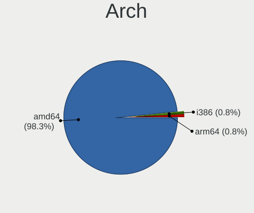

| Name  | Computers | Percent |
|-------|-----------|---------|
| amd64 | 118       | 98.33%  |
| i386  | 1         | 0.83%   |
| arm64 | 1         | 0.83%   |

DE
--

Desktop Environment

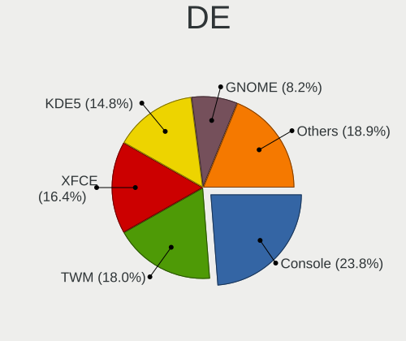

| Name        | Computers | Percent |
|-------------|-----------|---------|
| Console     | 29        | 23.77%  |
| TWM         | 22        | 18.03%  |
| XFCE        | 20        | 16.39%  |
| KDE5        | 18        | 14.75%  |
| GNOME       | 10        | 8.2%    |
| i3          | 7         | 5.74%   |
| MATE        | 4         | 3.28%   |
| Hyprland    | 3         | 2.46%   |
| Openbox     | 2         | 1.64%   |
| LXQt        | 2         | 1.64%   |
| WindowMaker | 1         | 0.82%   |
| sway        | 1         | 0.82%   |
| Picom       | 1         | 0.82%   |
| Budgie      | 1         | 0.82%   |
| AwesomeWM   | 1         | 0.82%   |

Display Server
--------------

X11 or Wayland

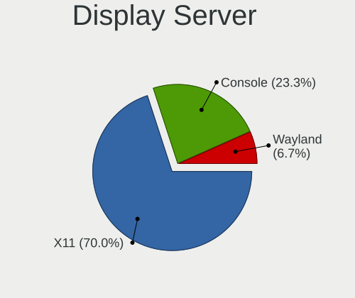

| Name    | Computers | Percent |
|---------|-----------|---------|
| X11     | 84        | 70%     |
| Console | 28        | 23.33%  |
| Wayland | 8         | 6.67%   |

Display Manager
---------------

SDDM, LightDM, etc.

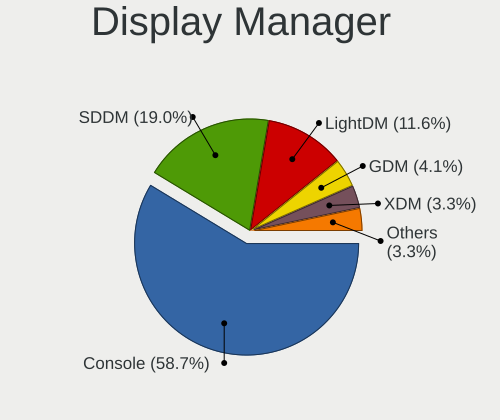

| Name    | Computers | Percent |
|---------|-----------|---------|
| Console | 71        | 58.68%  |
| SDDM    | 23        | 19.01%  |
| LightDM | 14        | 11.57%  |
| GDM     | 5         | 4.13%   |
| XDM     | 4         | 3.31%   |
| Ly      | 4         | 3.31%   |

OS Lang
-------

Language

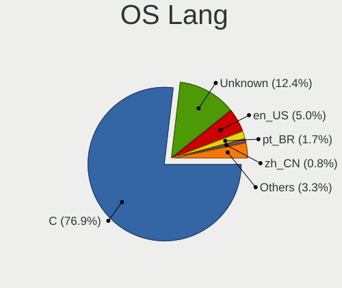

| Lang    | Computers | Percent |
|---------|-----------|---------|
| C       | 93        | 76.86%  |
| Unknown | 15        | 12.4%   |
| en_US   | 6         | 4.96%   |
| pt_BR   | 2         | 1.65%   |
| zh_CN   | 1         | 0.83%   |
| ru      | 1         | 0.83%   |
| ko_KR   | 1         | 0.83%   |
| fr_FR   | 1         | 0.83%   |
| es_ES   | 1         | 0.83%   |

Boot Mode
---------

EFI or BIOS

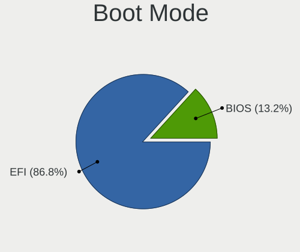

| Mode | Computers | Percent |
|------|-----------|---------|
| EFI  | 105       | 86.78%  |
| BIOS | 16        | 13.22%  |

Filesystem
----------

Type of filesystem

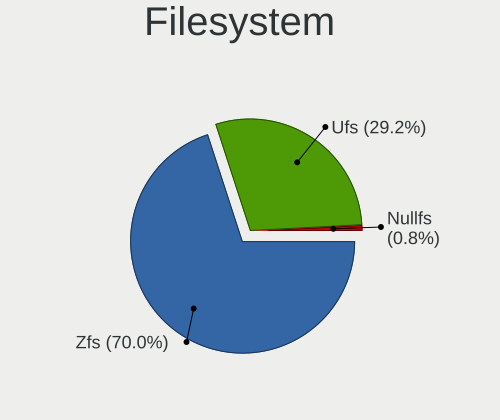

| Type   | Computers | Percent |
|--------|-----------|---------|
| Zfs    | 84        | 70%     |
| Ufs    | 35        | 29.17%  |
| Nullfs | 1         | 0.83%   |

Part. scheme
------------

Scheme of partitioning

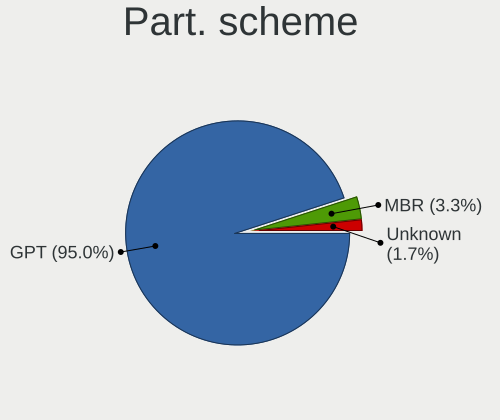

| Type    | Computers | Percent |
|---------|-----------|---------|
| GPT     | 114       | 95%     |
| MBR     | 4         | 3.33%   |
| Unknown | 2         | 1.67%   |

Board
-----

Vendor
------

Motherboard manufacturer

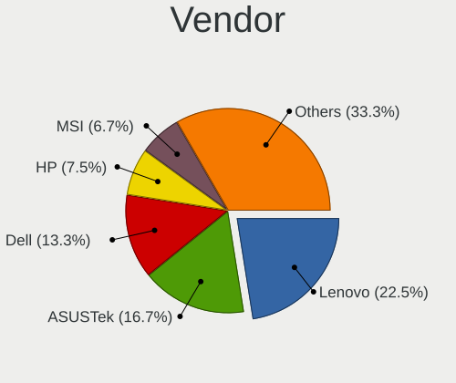

| Name                                 | Computers | Percent |
|--------------------------------------|-----------|---------|
| Lenovo                               | 27        | 22.5%   |
| ASUSTek Computer                     | 20        | 16.67%  |
| Dell                                 | 16        | 13.33%  |
| Hewlett-Packard                      | 9         | 7.5%    |
| MSI                                  | 8         | 6.67%   |
| Gigabyte Technology                  | 8         | 6.67%   |
| Apple                                | 5         | 4.17%   |
| Unknown                              | 4         | 3.33%   |
| Shenzhen Meigao Electronic Equipment | 3         | 2.5%    |
| Acer                                 | 3         | 2.5%    |
| Intel                                | 2         | 1.67%   |
| Google                               | 2         | 1.67%   |
| ASRockRack                           | 2         | 1.67%   |
| Valve                                | 1         | 0.83%   |
| TUXEDO                               | 1         | 0.83%   |
| Raspberry Pi Foundation              | 1         | 0.83%   |
| Panasonic                            | 1         | 0.83%   |
| iKOOLCORE TECHNOLOGY                 | 1         | 0.83%   |
| GPD                                  | 1         | 0.83%   |
| Fujitsu                              | 1         | 0.83%   |
| Biostar                              | 1         | 0.83%   |
| AZW                                  | 1         | 0.83%   |
| ASRock                               | 1         | 0.83%   |
| AMI                                  | 1         | 0.83%   |

Model
-----

Motherboard model

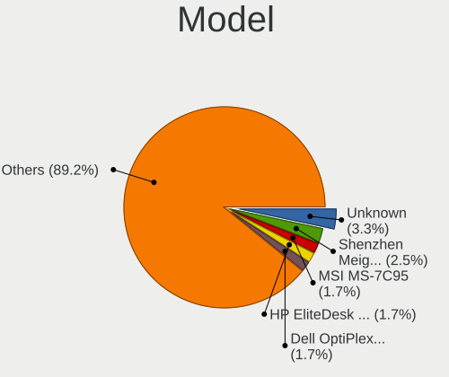

| Name                                              | Computers | Percent |
|---------------------------------------------------|-----------|---------|
| Unknown                                           | 4         | 3.33%   |
| Shenzhen Meigao Electronic Equipment Venus series | 3         | 2.5%    |
| MSI MS-7C95                                       | 2         | 1.67%   |
| HP EliteDesk 800 G1 SFF                           | 2         | 1.67%   |
| Dell OptiPlex 9020                                | 2         | 1.67%   |
| Valve Jupiter                                     | 1         | 0.83%   |
| TUXEDO Pulse 15 Gen1                              | 1         | 0.83%   |
| RPi Raspberry Pi                                  | 1         | 0.83%   |
| Panasonic CFSV7-3                                 | 1         | 0.83%   |
| MSI MS-7D75                                       | 1         | 0.83%   |
| MSI MS-7C94                                       | 1         | 0.83%   |
| MSI MS-7C52                                       | 1         | 0.83%   |
| MSI MS-7C08                                       | 1         | 0.83%   |
| MSI MS-7B86                                       | 1         | 0.83%   |
| MSI MS-7A40                                       | 1         | 0.83%   |
| Lenovo V580c 20160                                | 1         | 0.83%   |
| Lenovo ThinkPad X250 20CMCTO1WW                   | 1         | 0.83%   |
| Lenovo ThinkPad X230 23255RG                      | 1         | 0.83%   |
| Lenovo ThinkPad X1 Carbon Gen 9 20XW006FSP        | 1         | 0.83%   |
| Lenovo ThinkPad T580 20L90024GE                   | 1         | 0.83%   |
| Lenovo ThinkPad T480 20L6SDA400                   | 1         | 0.83%   |
| Lenovo ThinkPad T450s 20BWS2FQ00                  | 1         | 0.83%   |
| Lenovo ThinkPad T430 2344DUC                      | 1         | 0.83%   |
| Lenovo ThinkPad T420s 417153U                     | 1         | 0.83%   |
| Lenovo ThinkPad T420 4236MA3                      | 1         | 0.83%   |
| Lenovo ThinkPad T14 Gen 3 21CF000EUS              | 1         | 0.83%   |
| Lenovo ThinkPad T14 Gen 1 20UES1K600              | 1         | 0.83%   |
| Lenovo ThinkPad E595 20NFCTO1WW                   | 1         | 0.83%   |
| Lenovo ThinkPad E14 Gen 5 21JK00C5GM              | 1         | 0.83%   |
| Lenovo ThinkPad E14 Gen 4 21E300E4VN              | 1         | 0.83%   |
| Lenovo ThinkPad E14 Gen 2 20TA009HID              | 1         | 0.83%   |
| Lenovo ThinkPad A285 20MXS01R00                   | 1         | 0.83%   |
| Lenovo ThinkCentre M720q 10T7006QMX               | 1         | 0.83%   |
| Lenovo ThinkCentre M715q 10M2S08Y00               | 1         | 0.83%   |
| Lenovo ThinkBook 16 G6 IRL 21KH                   | 1         | 0.83%   |
| Lenovo ThinkBook 14-IIL 20SL                      | 1         | 0.83%   |
| Lenovo Legion Slim 5 16IRH8 83D6                  | 1         | 0.83%   |
| Lenovo IdeaPad Gaming 3 15IMH05 81Y4              | 1         | 0.83%   |
| Lenovo IdeaPad 5 14ALC05 82LM                     | 1         | 0.83%   |
| Lenovo IdeaPad 320-15AST 80XV                     | 1         | 0.83%   |

Model Family
------------

Motherboard model prefix

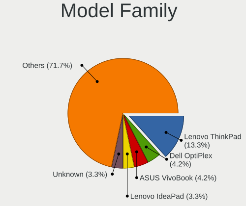

| Name                                       | Computers | Percent |
|--------------------------------------------|-----------|---------|
| Lenovo ThinkPad                            | 16        | 13.33%  |
| Dell OptiPlex                              | 5         | 4.17%   |
| ASUS VivoBook                              | 5         | 4.17%   |
| Lenovo IdeaPad                             | 4         | 3.33%   |
| Unknown                                    | 4         | 3.33%   |
| Shenzhen Meigao Electronic Equipment Venus | 3         | 2.5%    |
| HP EliteDesk                               | 3         | 2.5%    |
| Dell Latitude                              | 3         | 2.5%    |
| Dell Inspiron                              | 3         | 2.5%    |
| MSI MS-7C95                                | 2         | 1.67%   |
| Lenovo ThinkCentre                         | 2         | 1.67%   |
| Lenovo ThinkBook                           | 2         | 1.67%   |
| HP EliteBook                               | 2         | 1.67%   |
| Gigabyte B450M                             | 2         | 1.67%   |
| Dell Precision                             | 2         | 1.67%   |
| ASUS TUF                                   | 2         | 1.67%   |
| Acer Aspire                                | 2         | 1.67%   |
| Valve Jupiter                              | 1         | 0.83%   |
| TUXEDO Pulse                               | 1         | 0.83%   |
| RPi Raspberry                              | 1         | 0.83%   |
| Panasonic CFSV7-3                          | 1         | 0.83%   |
| MSI MS-7D75                                | 1         | 0.83%   |
| MSI MS-7C94                                | 1         | 0.83%   |
| MSI MS-7C52                                | 1         | 0.83%   |
| MSI MS-7C08                                | 1         | 0.83%   |
| MSI MS-7B86                                | 1         | 0.83%   |
| MSI MS-7A40                                | 1         | 0.83%   |
| Lenovo V580c                               | 1         | 0.83%   |
| Lenovo Legion                              | 1         | 0.83%   |
| Lenovo H500s                               | 1         | 0.83%   |
| Intel NUC7i5BNB                            | 1         | 0.83%   |
| Intel NUC6i5SYB                            | 1         | 0.83%   |
| iKOOLCORE TECHNOLOGY R2                    | 1         | 0.83%   |
| HP ZBook                                   | 1         | 0.83%   |
| HP ProBook                                 | 1         | 0.83%   |
| HP OMEN                                    | 1         | 0.83%   |
| HP ENVY                                    | 1         | 0.83%   |
| GPD P2                                     | 1         | 0.83%   |
| Google Dragonair                           | 1         | 0.83%   |
| Google Akemi                               | 1         | 0.83%   |

MFG Year
--------

Motherboard manufacture year

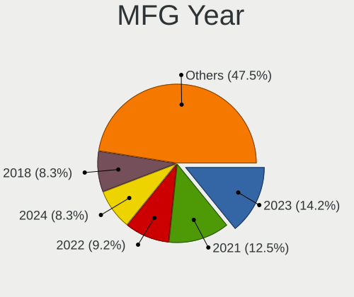

| Year    | Computers | Percent |
|---------|-----------|---------|
| 2023    | 17        | 14.17%  |
| 2021    | 15        | 12.5%   |
| 2022    | 11        | 9.17%   |
| 2024    | 10        | 8.33%   |
| 2018    | 10        | 8.33%   |
| 2020    | 9         | 7.5%    |
| 2019    | 9         | 7.5%    |
| 2014    | 8         | 6.67%   |
| 2015    | 6         | 5%      |
| 2013    | 5         | 4.17%   |
| 2016    | 4         | 3.33%   |
| 2012    | 4         | 3.33%   |
| 2017    | 3         | 2.5%    |
| 2011    | 2         | 1.67%   |
| 2010    | 2         | 1.67%   |
| 2008    | 2         | 1.67%   |
| 2025    | 1         | 0.83%   |
| 2006    | 1         | 0.83%   |
| Unknown | 1         | 0.83%   |

Form Factor
-----------

Physical design of the computer

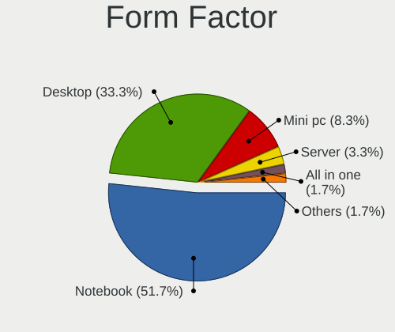

| Name           | Computers | Percent |
|----------------|-----------|---------|
| Notebook       | 62        | 51.67%  |
| Desktop        | 40        | 33.33%  |
| Mini pc        | 10        | 8.33%   |
| Server         | 4         | 3.33%   |
| All in one     | 2         | 1.67%   |
| System on chip | 1         | 0.83%   |
| Convertible    | 1         | 0.83%   |

Coreboot
--------

Have coreboot on board

| Used | Computers | Percent |
|------|-----------|---------|
| No   | 118       | 98.33%  |
| Yes  | 2         | 1.67%   |

RAM Size
--------

Total RAM memory

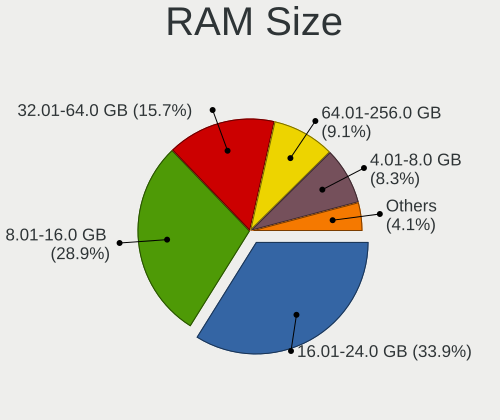

| Size in GB      | Computers | Percent |
|-----------------|-----------|---------|
| 16.01-24.0      | 41        | 33.88%  |
| 8.01-16.0       | 35        | 28.93%  |
| 32.01-64.0      | 19        | 15.7%   |
| 64.01-256.0     | 11        | 9.09%   |
| 4.01-8.0        | 10        | 8.26%   |
| 24.01-32.0      | 2         | 1.65%   |
| 2.01-3.0        | 2         | 1.65%   |
| More than 256.0 | 1         | 0.83%   |

RAM Used
--------

Used RAM memory

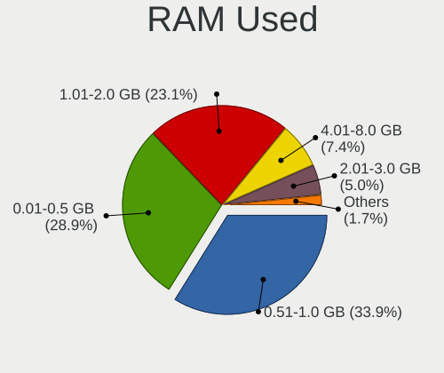

| Used GB    | Computers | Percent |
|------------|-----------|---------|
| 0.51-1.0   | 41        | 33.88%  |
| 0.01-0.5   | 35        | 28.93%  |
| 1.01-2.0   | 28        | 23.14%  |
| 4.01-8.0   | 9         | 7.44%   |
| 2.01-3.0   | 6         | 4.96%   |
| 3.01-4.0   | 1         | 0.83%   |
| 16.01-24.0 | 1         | 0.83%   |

Total Drives
------------

Number of drives on board

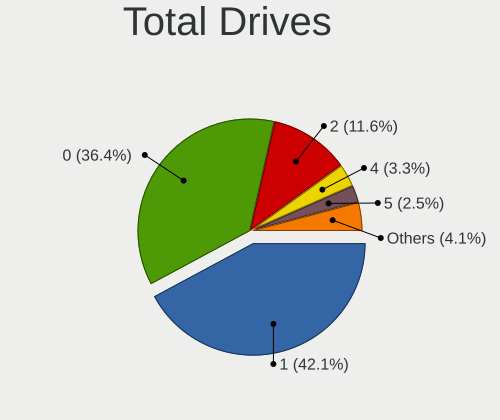

| Drives | Computers | Percent |
|--------|-----------|---------|
| 1      | 51        | 42.15%  |
| 0      | 44        | 36.36%  |
| 2      | 14        | 11.57%  |
| 4      | 4         | 3.31%   |
| 5      | 3         | 2.48%   |
| 3      | 2         | 1.65%   |
| 14     | 1         | 0.83%   |
| 10     | 1         | 0.83%   |
| 9      | 1         | 0.83%   |

Has CD-ROM
----------

Has CD-ROM on board

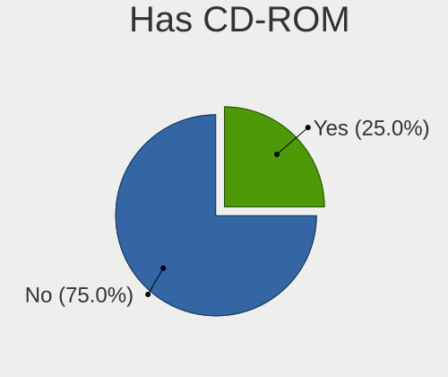

| Presented | Computers | Percent |
|-----------|-----------|---------|
| No        | 90        | 75%     |
| Yes       | 30        | 25%     |

Has Ethernet
------------

Has Ethernet on board

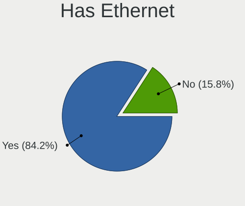

| Presented | Computers | Percent |
|-----------|-----------|---------|
| Yes       | 101       | 84.17%  |
| No        | 19        | 15.83%  |

Has WiFi
--------

Has WiFi module

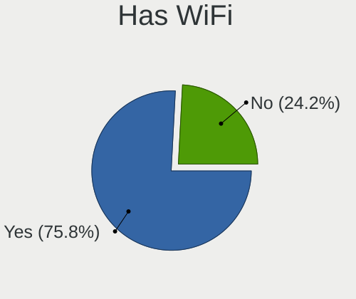

| Presented | Computers | Percent |
|-----------|-----------|---------|
| Yes       | 91        | 75.83%  |
| No        | 29        | 24.17%  |

Has Bluetooth
-------------

Has Bluetooth module

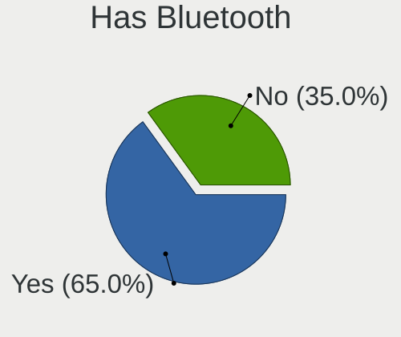

| Presented | Computers | Percent |
|-----------|-----------|---------|
| Yes       | 78        | 65%     |
| No        | 42        | 35%     |

Location
--------

Country
-------

Geographic location (country)

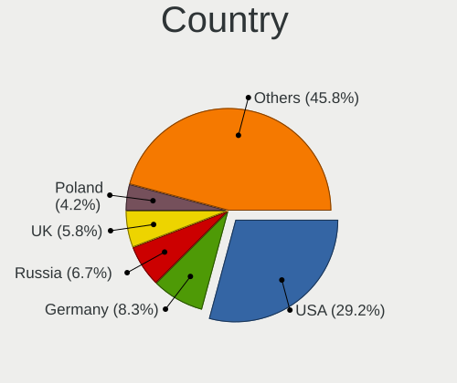

| Country            | Computers | Percent |
|--------------------|-----------|---------|
| USA                | 35        | 29.17%  |
| Germany            | 10        | 8.33%   |
| Russia             | 8         | 6.67%   |
| UK                 | 7         | 5.83%   |
| Poland             | 5         | 4.17%   |
| France             | 5         | 4.17%   |
| Brazil             | 5         | 4.17%   |
| Switzerland        | 4         | 3.33%   |
| China              | 4         | 3.33%   |
| Canada             | 3         | 2.5%    |
| Australia          | 3         | 2.5%    |
| Thailand           | 2         | 1.67%   |
| Romania            | 2         | 1.67%   |
| Mexico             | 2         | 1.67%   |
| Hong Kong          | 2         | 1.67%   |
| Estonia            | 2         | 1.67%   |
| Czechia            | 2         | 1.67%   |
| Vietnam            | 1         | 0.83%   |
| Venezuela          | 1         | 0.83%   |
| Ukraine            | 1         | 0.83%   |
| Sweden             | 1         | 0.83%   |
| South Korea        | 1         | 0.83%   |
| Norway             | 1         | 0.83%   |
| Netherlands        | 1         | 0.83%   |
| Malaysia           | 1         | 0.83%   |
| Italy              | 1         | 0.83%   |
| Iraq               | 1         | 0.83%   |
| Indonesia          | 1         | 0.83%   |
| India              | 1         | 0.83%   |
| Hungary            | 1         | 0.83%   |
| Dominican Republic | 1         | 0.83%   |
| Denmark            | 1         | 0.83%   |
| Costa Rica         | 1         | 0.83%   |
| Colombia           | 1         | 0.83%   |
| Bulgaria           | 1         | 0.83%   |
| Argentina          | 1         | 0.83%   |

City
----

Geographic location (city)

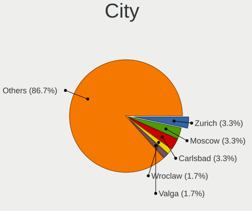

| City                  | Computers | Percent |
|-----------------------|-----------|---------|
| Zurich                | 4         | 3.33%   |
| Moscow                | 4         | 3.33%   |
| Carlsbad              | 4         | 3.33%   |
| Wroclaw               | 2         | 1.67%   |
| Valga                 | 2         | 1.67%   |
| Ulm                   | 2         | 1.67%   |
| Taylor                | 2         | 1.67%   |
| Redmond               | 2         | 1.67%   |
| Prague                | 2         | 1.67%   |
| New York              | 2         | 1.67%   |
| Mankato               | 2         | 1.67%   |
| Iasi                  | 2         | 1.67%   |
| Brisbane              | 2         | 1.67%   |
| Bangkok               | 2         | 1.67%   |
| Xi'an                 | 1         | 0.83%   |
| West Lafayette        | 1         | 0.83%   |
| Wellingborough        | 1         | 0.83%   |
| Vladivostok           | 1         | 0.83%   |
| Valencia              | 1         | 0.83%   |
| Ternopil              | 1         | 0.83%   |
| St Petersburg         | 1         | 0.83%   |
| South Gate            | 1         | 0.83%   |
| Somerset              | 1         | 0.83%   |
| Siheung-si            | 1         | 0.83%   |
| Scottsville           | 1         | 0.83%   |
| Sao Paulo             | 1         | 0.83%   |
| Santa Barbara d'Oeste | 1         | 0.83%   |
| San José             | 1         | 0.83%   |
| San Angelo            | 1         | 0.83%   |
| Rotterdam             | 1         | 0.83%   |
| Rio de Janeiro        | 1         | 0.83%   |
| Revel                 | 1         | 0.83%   |
| Puerto Plata          | 1         | 0.83%   |
| Powell River          | 1         | 0.83%   |
| Poços de Caldas      | 1         | 0.83%   |
| Pleven                | 1         | 0.83%   |
| Perm                  | 1         | 0.83%   |
| Paris                 | 1         | 0.83%   |
| Oslo                  | 1         | 0.83%   |
| Nowy Sącz            | 1         | 0.83%   |

Drives
------

Drive Vendor
------------

Hard drive vendors

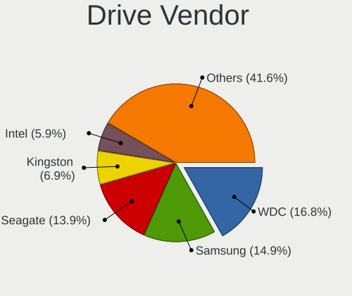

| Vendor              | Computers | Drives | Percent |
|---------------------|-----------|--------|---------|
| WDC                 | 17        | 31     | 16.83%  |
| Samsung Electronics | 15        | 25     | 14.85%  |
| Seagate             | 14        | 31     | 13.86%  |
| Kingston            | 7         | 10     | 6.93%   |
| Intel               | 6         | 7      | 5.94%   |
| Hitachi             | 5         | 8      | 4.95%   |
| Micron Technology   | 4         | 4      | 3.96%   |
| Apple               | 4         | 4      | 3.96%   |
| Toshiba             | 3         | 3      | 2.97%   |
| SPCC                | 3         | 8      | 2.97%   |
| SanDisk             | 3         | 3      | 2.97%   |
| HGST                | 3         | 4      | 2.97%   |
| Crucial             | 3         | 3      | 2.97%   |
| A-DATA Technology   | 3         | 3      | 2.97%   |
| SK hynix            | 2         | 2      | 1.98%   |
| TEXTORM             | 1         | 1      | 0.99%   |
| Teclast             | 1         | 1      | 0.99%   |
| Team                | 1         | 1      | 0.99%   |
| T-FORCE             | 1         | 1      | 0.99%   |
| PNY                 | 1         | 2      | 0.99%   |
| LITEONIT            | 1         | 1      | 0.99%   |
| Corsair             | 1         | 1      | 0.99%   |
| China               | 1         | 1      | 0.99%   |
| Apacer              | 1         | 1      | 0.99%   |

Drive Model
-----------

Hard drive models

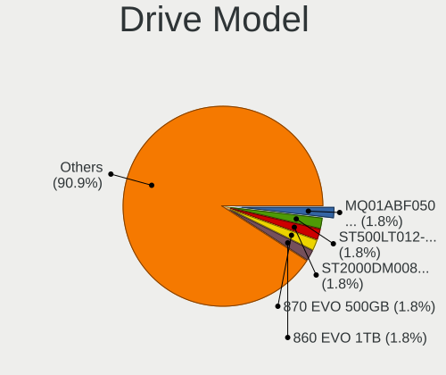

| Model                           | Computers | Percent |
|---------------------------------|-----------|---------|
| Toshiba MQ01ABF050 500GB        | 2         | 1.82%   |
| SPCC Solid State Disk 128GB     | 2         | 1.82%   |
| Seagate ST500LT012-1DG142 500GB | 2         | 1.82%   |
| Seagate ST2000DM008-2FR102 2TB  | 2         | 1.82%   |
| Samsung SSD 870 EVO 500GB       | 2         | 1.82%   |
| Samsung SSD 860 EVO 1TB         | 2         | 1.82%   |
| Samsung SSD 850 PRO 256GB       | 2         | 1.82%   |
| Kingston SA400S37120G 120GB     | 2         | 1.82%   |
| WDC WDS250G2B0A 250GB           | 1         | 0.91%   |
| WDC WDS240G2G0A-00JH30 240GB    | 1         | 0.91%   |
| WDC WD7500BPVT-16HXZT3 752GB    | 1         | 0.91%   |
| WDC WD50NDZW-11BCSS1 5TB        | 1         | 0.91%   |
| WDC WD5000LPVX-22V0TT0 500GB    | 1         | 0.91%   |
| WDC WD5000AAKX-60U6AA0 500GB    | 1         | 0.91%   |
| WDC WD40EZRZ-22GXCB0 4TB        | 1         | 0.91%   |
| WDC WD40EZAZ-00SF3B0 4TB        | 1         | 0.91%   |
| WDC WD40EFRX-68N32N0 4TB        | 1         | 0.91%   |
| WDC WD3200BEKX-00B7WT0 320GB    | 1         | 0.91%   |
| WDC WD2500BEVS-75UST0 250GB     | 1         | 0.91%   |
| WDC WD2500AAKX-75U6AA0 250GB    | 1         | 0.91%   |
| WDC WD2500AAJS-07B4A0 250GB     | 1         | 0.91%   |
| WDC WD20EZRZ-00Z5HB0 2TB        | 1         | 0.91%   |
| WDC WD20EZAZ-00GGJB0 2TB        | 1         | 0.91%   |
| WDC WD1600AAJS-00YZCA0 160GB    | 1         | 0.91%   |
| WDC WD10EZEX-22MFCA0 1TB        | 1         | 0.91%   |
| WDC WD1003FBYX-01Y7B1 1TB       | 1         | 0.91%   |
| Toshiba MG04ACA100NY 1TB        | 1         | 0.91%   |
| TEXTORM BM5 480GB               | 1         | 0.91%   |
| Teclast 256GB SSD               | 1         | 0.91%   |
| Team T253256GB                  | 1         | 0.91%   |
| T-FORCE SSD 256GB               | 1         | 0.91%   |
| SPCC Solid State Disk 1TB       | 1         | 0.91%   |
| SPCC M.2 PCIe SSD 1TB           | 1         | 0.91%   |
| SK hynix SC401 SATA 256GB       | 1         | 0.91%   |
| SK hynix SC311 SATA 256GB       | 1         | 0.91%   |
| Seagate ST9250827AS 250GB       | 1         | 0.91%   |
| Seagate ST8000DM004-2U9188 8TB  | 1         | 0.91%   |
| Seagate ST8000DM004-2CX188 8TB  | 1         | 0.91%   |
| Seagate ST500LT012-9WS142 500GB | 1         | 0.91%   |
| Seagate ST4000NM017A 4TB        | 1         | 0.91%   |

HDD Vendor
----------

Hard disk drive vendors

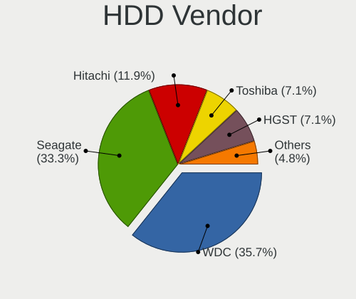

| Vendor              | Computers | Drives | Percent |
|---------------------|-----------|--------|---------|
| WDC                 | 15        | 28     | 35.71%  |
| Seagate             | 14        | 31     | 33.33%  |
| Hitachi             | 5         | 8      | 11.9%   |
| Toshiba             | 3         | 3      | 7.14%   |
| HGST                | 3         | 4      | 7.14%   |
| Samsung Electronics | 1         | 2      | 2.38%   |
| Apple               | 1         | 1      | 2.38%   |

SSD Vendor
----------

Solid state drive vendors

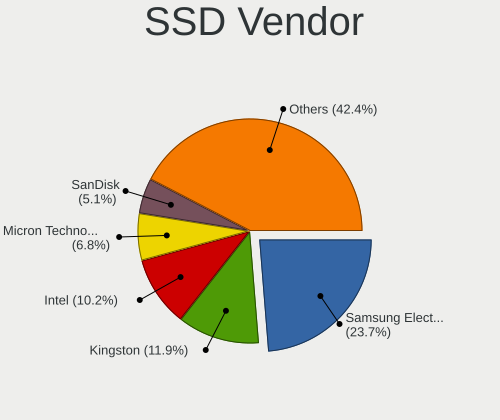

| Vendor              | Computers | Drives | Percent |
|---------------------|-----------|--------|---------|
| Samsung Electronics | 14        | 22     | 23.73%  |
| Kingston            | 7         | 10     | 11.86%  |
| Intel               | 6         | 7      | 10.17%  |
| Micron Technology   | 4         | 4      | 6.78%   |
| SPCC                | 3         | 7      | 5.08%   |
| SanDisk             | 3         | 3      | 5.08%   |
| Crucial             | 3         | 3      | 5.08%   |
| Apple               | 3         | 3      | 5.08%   |
| A-DATA Technology   | 3         | 3      | 5.08%   |
| WDC                 | 2         | 3      | 3.39%   |
| SK hynix            | 2         | 2      | 3.39%   |
| TEXTORM             | 1         | 1      | 1.69%   |
| Teclast             | 1         | 1      | 1.69%   |
| Team                | 1         | 1      | 1.69%   |
| T-FORCE             | 1         | 1      | 1.69%   |
| PNY                 | 1         | 2      | 1.69%   |
| LITEONIT            | 1         | 1      | 1.69%   |
| Corsair             | 1         | 1      | 1.69%   |
| China               | 1         | 1      | 1.69%   |
| Apacer              | 1         | 1      | 1.69%   |

Drive Kind
----------

HDD or SSD

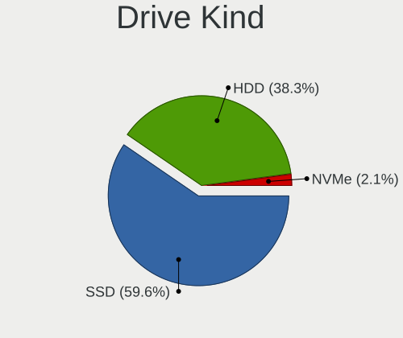

| Kind | Computers | Drives | Percent |
|------|-----------|--------|---------|
| SSD  | 56        | 77     | 59.57%  |
| HDD  | 36        | 77     | 38.3%   |
| NVMe | 2         | 2      | 2.13%   |

Drive Connector
---------------

SATA, SAS, NVMe, etc.

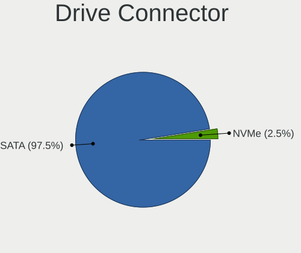

| Type | Computers | Drives | Percent |
|------|-----------|--------|---------|
| SATA | 77        | 154    | 97.47%  |
| NVMe | 2         | 2      | 2.53%   |

Drive Size
----------

Size of hard drive

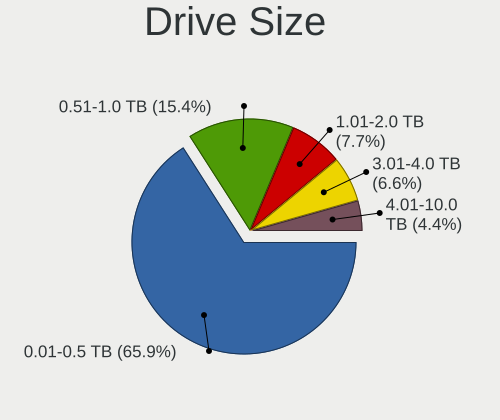

| Size in TB | Computers | Drives | Percent |
|------------|-----------|--------|---------|
| 0.01-0.5   | 60        | 79     | 65.93%  |
| 0.51-1.0   | 14        | 22     | 15.38%  |
| 1.01-2.0   | 7         | 26     | 7.69%   |
| 3.01-4.0   | 6         | 22     | 6.59%   |
| 4.01-10.0  | 4         | 5      | 4.4%    |

Space Total
-----------

Amount of disk space available on the file system

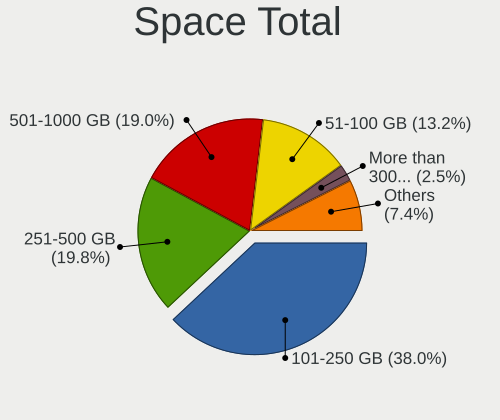

| Size in GB     | Computers | Percent |
|----------------|-----------|---------|
| 101-250        | 46        | 38.02%  |
| 251-500        | 24        | 19.83%  |
| 501-1000       | 23        | 19.01%  |
| 51-100         | 16        | 13.22%  |
| More than 3000 | 3         | 2.48%   |
| 1001-2000      | 3         | 2.48%   |
| 21-50          | 2         | 1.65%   |
| 1-20           | 2         | 1.65%   |
| 2001-3000      | 1         | 0.83%   |
| Unknown        | 1         | 0.83%   |

Space Used
----------

Amount of used disk space

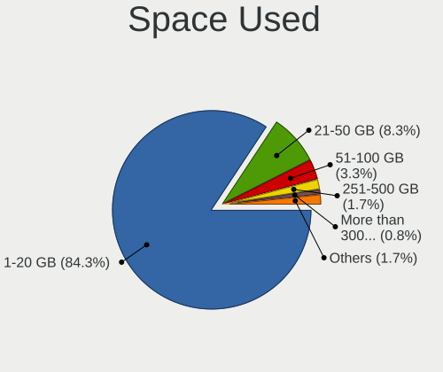

| Used GB        | Computers | Percent |
|----------------|-----------|---------|
| 1-20           | 102       | 84.3%   |
| 21-50          | 10        | 8.26%   |
| 51-100         | 4         | 3.31%   |
| 251-500        | 2         | 1.65%   |
| More than 3000 | 1         | 0.83%   |
| 101-250        | 1         | 0.83%   |
| Unknown        | 1         | 0.83%   |

Malfunc. Drives
---------------

Drive models with a malfunction

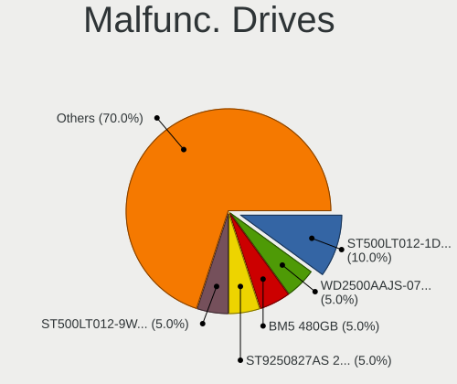

| Model                                      | Computers | Drives | Percent |
|--------------------------------------------|-----------|--------|---------|
| Seagate ST500LT012-1DG142 500GB            | 2         | 2      | 10%     |
| WDC WD2500AAJS-07B4A0 250GB                | 1         | 1      | 5%      |
| TEXTORM BM5 480GB                          | 1         | 1      | 5%      |
| Seagate ST9250827AS 250GB                  | 1         | 1      | 5%      |
| Seagate ST500LT012-9WS142 500GB            | 1         | 1      | 5%      |
| Samsung Electronics HD103SI 1TB            | 1         | 2      | 5%      |
| Micron Technology MTFDDAK256MAM-1K12 256GB | 1         | 1      | 5%      |
| Micron Technology 1100_MTFDDAV256TBN 256GB | 1         | 1      | 5%      |
| Kingston SA400S37480G 480GB                | 1         | 1      | 5%      |
| Kingston HyperX Fury 3D 240GB              | 1         | 1      | 5%      |
| Intel SSDSC2BW480A4 480GB                  | 1         | 1      | 5%      |
| Intel SSDSC2BW180A4 180GB                  | 1         | 1      | 5%      |
| Intel SSDSA2M120G2GC 120GB                 | 1         | 1      | 5%      |
| Hitachi HTS545016B9A300 160GB              | 1         | 1      | 5%      |
| Hitachi HTS542512K9SA00 120GB              | 1         | 1      | 5%      |
| HGST HTS721010A9E630 1TB                   | 1         | 1      | 5%      |
| HGST HTS545050A7E380 500GB                 | 1         | 2      | 5%      |
| Crucial FCCT256M550SSD1 256GB              | 1         | 1      | 5%      |
| Apple SSD SM256C 256GB                     | 1         | 1      | 5%      |

Malfunc. Drive Vendor
---------------------

Vendors of faulty drives

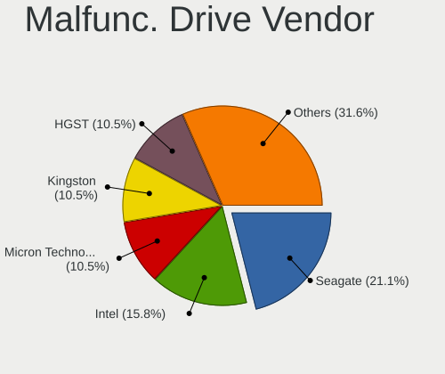

| Vendor              | Computers | Drives | Percent |
|---------------------|-----------|--------|---------|
| Seagate             | 4         | 4      | 21.05%  |
| Intel               | 3         | 3      | 15.79%  |
| Micron Technology   | 2         | 2      | 10.53%  |
| Kingston            | 2         | 2      | 10.53%  |
| HGST                | 2         | 3      | 10.53%  |
| WDC                 | 1         | 1      | 5.26%   |
| TEXTORM             | 1         | 1      | 5.26%   |
| Samsung Electronics | 1         | 2      | 5.26%   |
| Hitachi             | 1         | 2      | 5.26%   |
| Crucial             | 1         | 1      | 5.26%   |
| Apple               | 1         | 1      | 5.26%   |

Malfunc. HDD Vendor
-------------------

Vendors of faulty HDD drives

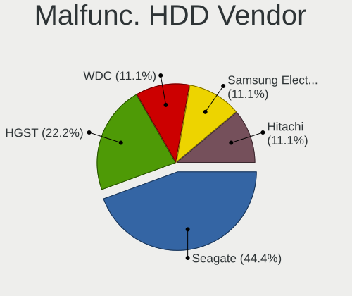

| Vendor              | Computers | Drives | Percent |
|---------------------|-----------|--------|---------|
| Seagate             | 4         | 4      | 44.44%  |
| HGST                | 2         | 3      | 22.22%  |
| WDC                 | 1         | 1      | 11.11%  |
| Samsung Electronics | 1         | 2      | 11.11%  |
| Hitachi             | 1         | 2      | 11.11%  |

Malfunc. Drive Kind
-------------------

Kinds of faulty drives

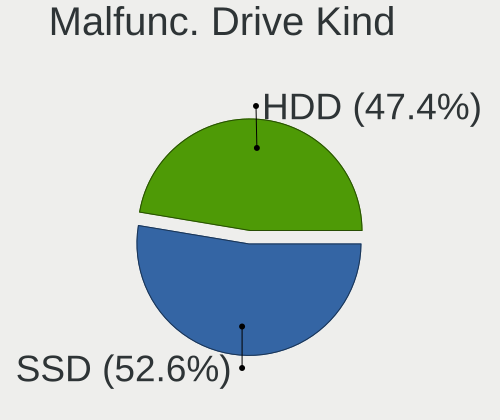

| Kind | Computers | Drives | Percent |
|------|-----------|--------|---------|
| SSD  | 10        | 10     | 52.63%  |
| HDD  | 9         | 12     | 47.37%  |

Failed Drives
-------------

Failed drive models

Zero info for selected period =(

Failed Drive Vendor
-------------------

Failed drive vendors

Zero info for selected period =(

Drive Status
------------

Number of failed and malfunc. drives

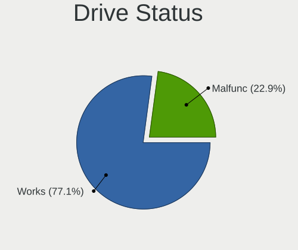

| Status  | Computers | Drives | Percent |
|---------|-----------|--------|---------|
| Works   | 64        | 134    | 77.11%  |
| Malfunc | 19        | 22     | 22.89%  |

Storage controller
------------------

Storage Vendor
--------------

Storage controller vendors

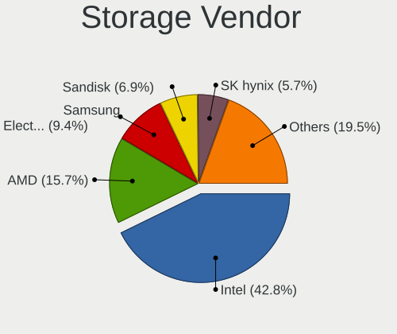

| Vendor                      | Computers | Percent |
|-----------------------------|-----------|---------|
| Intel                       | 68        | 42.77%  |
| AMD                         | 25        | 15.72%  |
| Samsung Electronics         | 15        | 9.43%   |
| Sandisk                     | 11        | 6.92%   |
| SK hynix                    | 9         | 5.66%   |
| Phison Electronics          | 5         | 3.14%   |
| Kingston Technology Company | 5         | 3.14%   |
| Micron/Crucial Technology   | 4         | 2.52%   |
| Marvell Technology Group    | 3         | 1.89%   |
| ASMedia Technology          | 3         | 1.89%   |
| Silicon Motion              | 2         | 1.26%   |
| Micron Technology           | 2         | 1.26%   |
| Transcend                   | 1         | 0.63%   |
| Realtek Semiconductor       | 1         | 0.63%   |
| Nvidia                      | 1         | 0.63%   |
| Lite-On Technology          | 1         | 0.63%   |
| KIOXIA                      | 1         | 0.63%   |
| Broadcom / LSI              | 1         | 0.63%   |
| Biwin Storage Technology    | 1         | 0.63%   |

Storage Model
-------------

Storage controller models

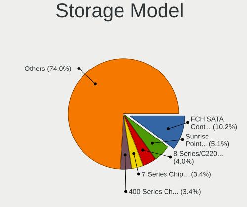

| Model                                                                          | Computers | Percent |
|--------------------------------------------------------------------------------|-----------|---------|
| AMD FCH SATA Controller [AHCI mode]                                            | 18        | 10.17%  |
| Intel Sunrise Point-LP SATA Controller [AHCI mode]                             | 9         | 5.08%   |
| Intel 8 Series/C220 Series Chipset Family 6-port SATA Controller 1 [AHCI mode] | 7         | 3.95%   |
| Intel 7 Series Chipset Family 6-port SATA Controller [AHCI mode]               | 6         | 3.39%   |
| AMD 400 Series Chipset SATA Controller                                         | 6         | 3.39%   |
| Intel Atom Processor E3800 Series SATA AHCI Controller                         | 5         | 2.82%   |
| Intel 6 Series/C200 Series Chipset Family 6 port Mobile SATA AHCI Controller   | 5         | 2.82%   |
| Samsung NVMe SSD Controller SM981/PM981/PM983                                  | 4         | 2.26%   |
| Intel C610/X99 series chipset sSATA Controller [AHCI mode]                     | 4         | 2.26%   |
| Intel C610/X99 series chipset 6-Port SATA Controller [AHCI mode]               | 4         | 2.26%   |
| AMD 600 Series Chipset SATA Controller                                         | 4         | 2.26%   |
| AMD 500 Series Chipset SATA Controller                                         | 4         | 2.26%   |
| SK hynix Gold P31/BC711/PC711 NVMe Solid State Drive                           | 3         | 1.69%   |
| SanDisk Extreme Pro / WD Black SN750 / PC SN730 / Red SN700 NVMe SSD           | 3         | 1.69%   |
| Samsung NVMe SSD Controller PM9A1/PM9A3/980PRO                                 | 3         | 1.69%   |
| Samsung NVMe SSD Controller 980 (DRAM-less)                                    | 3         | 1.69%   |
| Phison PS5013-E13 PCIe3 NVMe Controller (DRAM-less)                            | 3         | 1.69%   |
| Micron/Crucial P2 [Nick P2] / P3 / P3 Plus NVMe PCIe SSD (DRAM-less)           | 3         | 1.69%   |
| Intel Alder Lake-S PCH SATA Controller [AHCI Mode]                             | 3         | 1.69%   |
| SK hynix BC511 NVMe SSD                                                        | 2         | 1.13%   |
| Sandisk WD PC SN740 NVMe SSD 512GB (DRAM-less)                                 | 2         | 1.13%   |
| Phison PS5021-E21 PCIe4 NVMe Controller (DRAM-less)                            | 2         | 1.13%   |
| Marvell Group 88SE9215 PCIe 2.0 x1 4-port SATA 6 Gb/s Controller               | 2         | 1.13%   |
| Kingston Company OM8PGP4 NVMe PCIe SSD (DRAM-less)                             | 2         | 1.13%   |
| Kingston Company NV2 NVMe SSD [SM2267XT] (DRAM-less)                           | 2         | 1.13%   |
| Intel Wildcat Point-LP SATA Controller [AHCI Mode]                             | 2         | 1.13%   |
| Intel Volume Management Device NVMe RAID Controller                            | 2         | 1.13%   |
| Intel SATA Controller [RAID mode]                                              | 2         | 1.13%   |
| Intel Ice Lake-LP SATA Controller [AHCI mode]                                  | 2         | 1.13%   |
| Intel Comet Lake SATA AHCI Controller                                          | 2         | 1.13%   |
| Intel 8 Series SATA Controller 1 [AHCI mode]                                   | 2         | 1.13%   |
| Intel 5 Series/3400 Series Chipset 6 port SATA AHCI Controller                 | 2         | 1.13%   |
| Intel 400 Series Chipset Family SATA AHCI Controller                           | 2         | 1.13%   |
| Intel 200 Series PCH SATA controller [AHCI mode]                               | 2         | 1.13%   |
| ASMedia ASM1061/ASM1062 Serial ATA Controller                                  | 2         | 1.13%   |
| Transcend NVMe PCIe SSD 110S/112S/120S/MTE300S/MTE400S/MTE652T2 (DRAM-less)    | 1         | 0.56%   |
| SK hynix Platinum P41/PC801 NVMe Solid State Drive                             | 1         | 0.56%   |
| SK hynix PC611 NVMe Solid State Drive                                          | 1         | 0.56%   |
| SK hynix BC901 NVMe Solid State Drive (DRAM-less)                              | 1         | 0.56%   |
| SK hynix BC501 NVMe Solid State Drive                                          | 1         | 0.56%   |

Storage Kind
------------

Kind of storage controller (IDE, SATA, NVMe, SAS, ...)

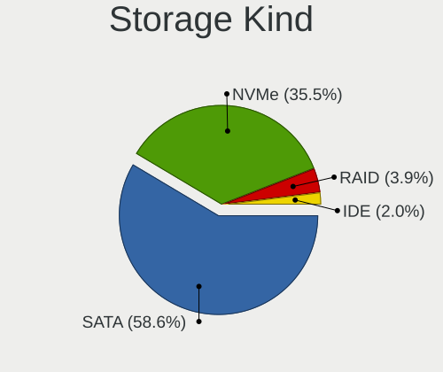

| Kind | Computers | Percent |
|------|-----------|---------|
| SATA | 89        | 58.55%  |
| NVMe | 54        | 35.53%  |
| RAID | 6         | 3.95%   |
| IDE  | 3         | 1.97%   |

Processor
---------

CPU Vendor
----------

Processor vendors

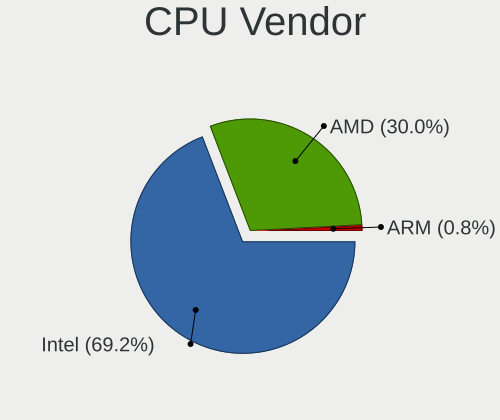

| Vendor | Computers | Percent |
|--------|-----------|---------|
| Intel  | 83        | 69.17%  |
| AMD    | 36        | 30%     |
| ARM    | 1         | 0.83%   |

CPU Model
---------

Processor models

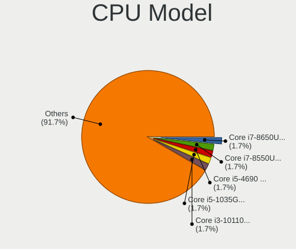

| Model                                      | Computers | Percent |
|--------------------------------------------|-----------|---------|
| Intel Core i7-8650U CPU @ 1.90GHz          | 2         | 1.67%   |
| Intel Core i7-8550U CPU @ 1.80GHz          | 2         | 1.67%   |
| Intel Core i5-4690 CPU @ 3.50GHz           | 2         | 1.67%   |
| Intel Core i5-1035G1 CPU @ 1.00GHz         | 2         | 1.67%   |
| Intel Core i3-10110U CPU @ 2.10GHz         | 2         | 1.67%   |
| Intel Core 2 Duo                           | 2         | 1.67%   |
| Intel Celeron CPU N2840 @ 2.16GHz          | 2         | 1.67%   |
| Intel Celeron CPU J1900 @ 1.99GHz          | 2         | 1.67%   |
| Intel 13th Gen Core i5-1335U               | 2         | 1.67%   |
| Intel 11th Gen Core i7-1165G7 @ 2.80GHz    | 2         | 1.67%   |
| AMD Ryzen 9 7940HS w/ Radeon 780M Graphics | 2         | 1.67%   |
| AMD Ryzen 9 7900 12-Core Processor         | 2         | 1.67%   |
| AMD Ryzen 7 4800H with Radeon Graphics     | 2         | 1.67%   |
| Intel Xeon CPU E5-2695 v4 @ 2.10GHz        | 1         | 0.83%   |
| Intel Xeon CPU E5-2683 v3 @ 2.00GHz        | 1         | 0.83%   |
| Intel Xeon CPU E5-2680 v4 @ 2.40GHz        | 1         | 0.83%   |
| Intel Xeon CPU E5-2660 v3 @ 2.60GHz        | 1         | 0.83%   |
| Intel Xeon CPU E3-1220 v5 @ 3.00GHz        | 1         | 0.83%   |
| Intel Pentium Silver N5030 CPU @ 1.10GHz   | 1         | 0.83%   |
| Intel Pentium CPU G860 @ 3.00GHz           | 1         | 0.83%   |
| Intel Core Ultra 7 155H                    | 1         | 0.83%   |
| Intel Core m3-8100Y CPU @ 1.10GHz          | 1         | 0.83%   |
| Intel Core i7-8750H CPU @ 2.20GHz          | 1         | 0.83%   |
| Intel Core i7-5775R CPU @ 3.30GHz          | 1         | 0.83%   |
| Intel Core i7-5600U CPU @ 2.60GHz          | 1         | 0.83%   |
| Intel Core i7-4800MQ CPU @ 2.70GHz         | 1         | 0.83%   |
| Intel Core i7-4790 CPU @ 3.60GHz           | 1         | 0.83%   |
| Intel Core i7-4770S CPU @ 3.10GHz          | 1         | 0.83%   |
| Intel Core i7-4700MQ CPU @ 2.40GHz         | 1         | 0.83%   |
| Intel Core i7-4600U CPU @ 2.10GHz          | 1         | 0.83%   |
| Intel Core i7-3632QM CPU @ 2.20GHz         | 1         | 0.83%   |
| Intel Core i7-3610QM CPU @ 2.30GHz         | 1         | 0.83%   |
| Intel Core i7-2675QM CPU @ 2.20GHz         | 1         | 0.83%   |
| Intel Core i7-2640M CPU @ 2.80GH           | 1         | 0.83%   |
| Intel Core i7-10750H CPU @ 2.60GHz         | 1         | 0.83%   |
| Intel Core i7 CPU M 620 @ 2.67GHz          | 1         | 0.83%   |
| Intel Core i5-8350U CPU @ 1.70GHz          | 1         | 0.83%   |
| Intel Core i5-8250U CPU @ 1.60GHz          | 1         | 0.83%   |
| Intel Core i5-7400 CPU @ 3.00GHz           | 1         | 0.83%   |
| Intel Core i5-7360U CPU @ 2.30GHz          | 1         | 0.83%   |

CPU Model Family
----------------

Processor model prefix

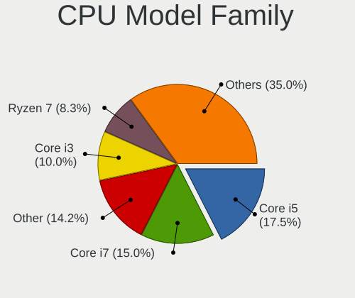

| Model                | Computers | Percent |
|----------------------|-----------|---------|
| Intel Core i5        | 21        | 17.5%   |
| Intel Core i7        | 18        | 15%     |
| Other                | 17        | 14.17%  |
| Intel Core i3        | 12        | 10%     |
| AMD Ryzen 7          | 10        | 8.33%   |
| AMD Ryzen 5          | 8         | 6.67%   |
| Intel Celeron        | 6         | 5%      |
| AMD Ryzen 9          | 6         | 5%      |
| Intel Xeon           | 5         | 4.17%   |
| AMD Ryzen 5 PRO      | 3         | 2.5%    |
| Intel Core 2 Duo     | 2         | 1.67%   |
| AMD FX               | 2         | 1.67%   |
| Intel Pentium Silver | 1         | 0.83%   |
| Intel Pentium        | 1         | 0.83%   |
| Intel Core m3        | 1         | 0.83%   |
| Intel Core 2 Quad    | 1         | 0.83%   |
| Intel Core           | 1         | 0.83%   |
| Intel Atom           | 1         | 0.83%   |
| ARM Cortex           | 1         | 0.83%   |
| AMD Ryzen 7 PRO      | 1         | 0.83%   |
| AMD EPYC             | 1         | 0.83%   |
| AMD Athlon           | 1         | 0.83%   |

CPU Cores
---------

Number of processor cores

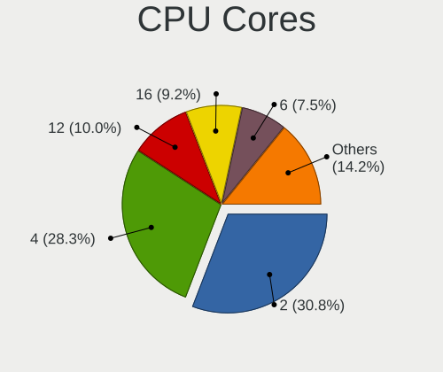

| Number  | Computers | Percent |
|---------|-----------|---------|
| 2       | 37        | 30.83%  |
| 4       | 34        | 28.33%  |
| 12      | 12        | 10%     |
| 16      | 11        | 9.17%   |
| 6       | 9         | 7.5%    |
| 8       | 8         | 6.67%   |
| 24      | 2         | 1.67%   |
| 14      | 2         | 1.67%   |
| 20      | 1         | 0.83%   |
| 18      | 1         | 0.83%   |
| 11      | 1         | 0.83%   |
| 1       | 1         | 0.83%   |
| Unknown | 1         | 0.83%   |

CPU Sockets
-----------

Number of sockets

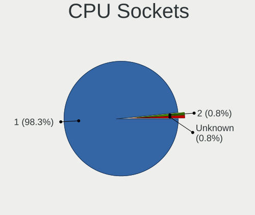

| Number  | Computers | Percent |
|---------|-----------|---------|
| 1       | 118       | 98.33%  |
| 2       | 1         | 0.83%   |
| Unknown | 1         | 0.83%   |

CPU Threads
-----------

Threads per core (Hyper-Threading)

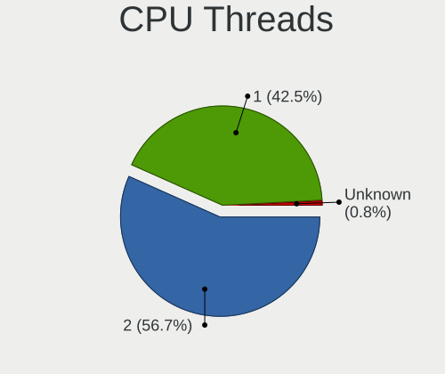

| Number  | Computers | Percent |
|---------|-----------|---------|
| 2       | 68        | 56.67%  |
| 1       | 51        | 42.5%   |
| Unknown | 1         | 0.83%   |

CPU Microarch
-------------

Microarchitecture

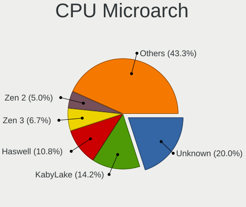

| Name          | Computers | Percent |
|---------------|-----------|---------|
| Unknown       | 24        | 20%     |
| KabyLake      | 17        | 14.17%  |
| Haswell       | 13        | 10.83%  |
| Zen 3         | 8         | 6.67%   |
| Zen 2         | 6         | 5%      |
| SandyBridge   | 6         | 5%      |
| IvyBridge     | 6         | 5%      |
| Zen           | 5         | 4.17%   |
| Silvermont    | 5         | 4.17%   |
| Broadwell     | 5         | 4.17%   |
| Skylake       | 4         | 3.33%   |
| Zen+          | 3         | 2.5%    |
| Excavator     | 3         | 2.5%    |
| Westmere      | 2         | 1.67%   |
| TigerLake     | 2         | 1.67%   |
| IceLake       | 2         | 1.67%   |
| Core          | 2         | 1.67%   |
| CometLake     | 2         | 1.67%   |
| Bulldozer     | 2         | 1.67%   |
| Penryn        | 1         | 0.83%   |
| Goldmont plus | 1         | 0.83%   |
| Bonnell       | 1         | 0.83%   |

Graphics
--------

GPU Vendor
----------

Vendors of graphics cards

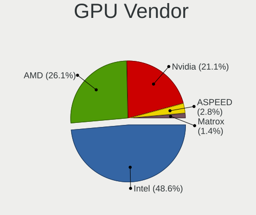

| Vendor                     | Computers | Percent |
|----------------------------|-----------|---------|
| Intel                      | 69        | 48.59%  |
| AMD                        | 37        | 26.06%  |
| Nvidia                     | 30        | 21.13%  |
| ASPEED Technology          | 4         | 2.82%   |
| Matrox Electronics Systems | 2         | 1.41%   |

GPU Model
---------

Graphics card models

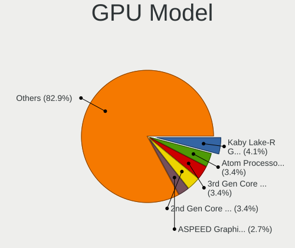

| Model                                                                       | Computers | Percent |
|-----------------------------------------------------------------------------|-----------|---------|
| Intel Kaby Lake-R GT2 [UHD Graphics 620]                                    | 6         | 4.11%   |
| Intel Atom Processor Z36xxx/Z37xxx Series Graphics & Display                | 5         | 3.42%   |
| Intel 3rd Gen Core processor Graphics Controller                            | 5         | 3.42%   |
| Intel 2nd Generation Core Processor Family Integrated Graphics Controller   | 5         | 3.42%   |
| ASPEED Technology ASPEED Graphics Family                                    | 4         | 2.74%   |
| Intel Xeon E3-1200 v3/4th Gen Core Processor Integrated Graphics Controller | 3         | 2.05%   |
| Intel Haswell-ULT Integrated Graphics Controller                            | 3         | 2.05%   |
| AMD Renoir [Radeon Vega Series / Radeon Vega Mobile Series]                 | 3         | 2.05%   |
| AMD Navi 23 [Radeon RX 6600/6600 XT/6600M]                                  | 3         | 2.05%   |
| AMD Cezanne [Radeon Vega Series / Radeon Vega Mobile Series]                | 3         | 2.05%   |
| Nvidia GK208M [GeForce GT 740M]                                             | 2         | 1.37%   |
| Nvidia GK208B [GeForce GT 710]                                              | 2         | 1.37%   |
| Matrox Electronics Systems G200eR2                                          | 2         | 1.37%   |
| Intel TigerLake-LP GT2 [Iris Xe Graphics]                                   | 2         | 1.37%   |
| Intel Skylake-U GT2 [HD Graphics 520]                                       | 2         | 1.37%   |
| Intel Raptor Lake-P [Iris Xe Graphics]                                      | 2         | 1.37%   |
| Intel Kaby Lake-U GT3 [Iris Plus Graphics 640]                              | 2         | 1.37%   |
| Intel Iris Plus Graphics G1 (Ice Lake)                                      | 2         | 1.37%   |
| Intel CometLake-U GT2 [UHD Graphics]                                        | 2         | 1.37%   |
| Intel Broadwell-U GT2 [HD Graphics 5500]                                    | 2         | 1.37%   |
| Intel 4th Gen Core Processor Integrated Graphics Controller                 | 2         | 1.37%   |
| AMD Turks XT [Radeon HD 6670/7670]                                          | 2         | 1.37%   |
| AMD Stoney [Radeon R2/R3/R4/R5 Graphics]                                    | 2         | 1.37%   |
| AMD Raven Ridge [Radeon Vega Series / Radeon Vega Mobile Series]            | 2         | 1.37%   |
| AMD Raphael                                                                 | 2         | 1.37%   |
| AMD Picasso/Raven 2 [Radeon Vega Series / Radeon Vega Mobile Series]        | 2         | 1.37%   |
| AMD Phoenix1                                                                | 2         | 1.37%   |
| AMD Ellesmere [Radeon RX 470/480/570/570X/580/580X/590]                     | 2         | 1.37%   |
| Nvidia TU117M [GeForce MX450]                                               | 1         | 0.68%   |
| Nvidia TU117M [GeForce GTX 1650 Ti Mobile]                                  | 1         | 0.68%   |
| Nvidia TU117GL [T400 4GB / T400E]                                           | 1         | 0.68%   |
| Nvidia TU116 [GeForce GTX 1660 SUPER]                                       | 1         | 0.68%   |
| Nvidia TU116 [GeForce GTX 1650]                                             | 1         | 0.68%   |
| Nvidia TU106 [GeForce RTX 2060 Rev. A]                                      | 1         | 0.68%   |
| Nvidia GT218 [GeForce 210]                                                  | 1         | 0.68%   |
| Nvidia GT216M [NVS 5100M]                                                   | 1         | 0.68%   |
| Nvidia GP108M [GeForce MX150]                                               | 1         | 0.68%   |
| Nvidia GP108 [GeForce GT 1030]                                              | 1         | 0.68%   |
| Nvidia GP106M [GeForce GTX 1060 Mobile]                                     | 1         | 0.68%   |
| Nvidia GM206 [GeForce GTX 960]                                              | 1         | 0.68%   |

GPU Combo
---------

Combinations of graphics cards

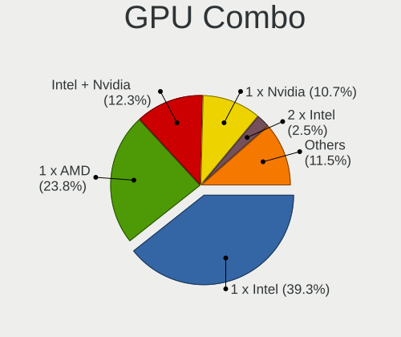

| Name            | Computers | Percent |
|-----------------|-----------|---------|
| 1 x Intel       | 48        | 39.34%  |
| 1 x AMD         | 29        | 23.77%  |
| Intel + Nvidia  | 15        | 12.3%   |
| 1 x Nvidia      | 13        | 10.66%  |
| 2 x Intel       | 3         | 2.46%   |
| 2 x AMD         | 3         | 2.46%   |
| Intel + AMD     | 3         | 2.46%   |
| 1 x Matrox      | 2         | 1.64%   |
| 1 x ASPEED      | 2         | 1.64%   |
| Other           | 1         | 0.82%   |
| Nvidia + ASPEED | 1         | 0.82%   |
| AMD + Nvidia    | 1         | 0.82%   |
| AMD + ASPEED    | 1         | 0.82%   |

GPU Driver
----------

Free vs proprietary

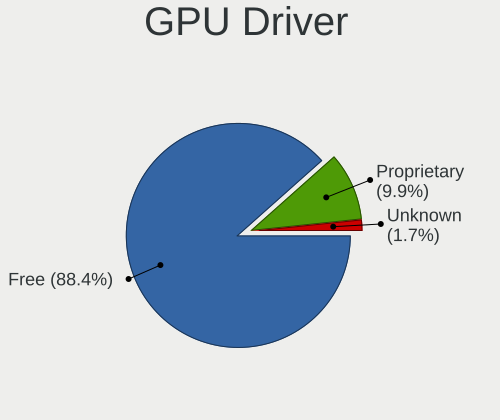

| Driver      | Computers | Percent |
|-------------|-----------|---------|
| Free        | 107       | 88.43%  |
| Proprietary | 12        | 9.92%   |
| Unknown     | 2         | 1.65%   |

GPU Memory
----------

Total video memory

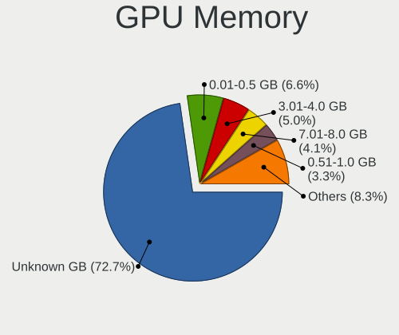

| Size in GB | Computers | Percent |
|------------|-----------|---------|
| Unknown    | 88        | 72.73%  |
| 0.01-0.5   | 8         | 6.61%   |
| 3.01-4.0   | 6         | 4.96%   |
| 7.01-8.0   | 5         | 4.13%   |
| 0.51-1.0   | 4         | 3.31%   |
| 5.01-6.0   | 3         | 2.48%   |
| 1.01-2.0   | 3         | 2.48%   |
| 8.01-16.0  | 2         | 1.65%   |
| 2.01-3.0   | 1         | 0.83%   |
| 16.01-24.0 | 1         | 0.83%   |

Monitor
-------

Monitor Vendor
--------------

Monitor vendors

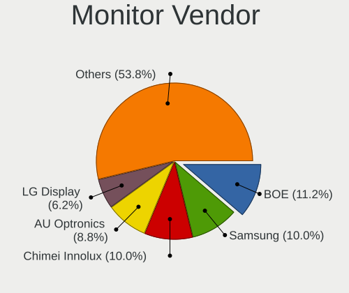

| Vendor                  | Computers | Percent |
|-------------------------|-----------|---------|
| BOE                     | 9         | 11.25%  |
| Samsung Electronics     | 8         | 10%     |
| Chimei Innolux          | 8         | 10%     |
| AU Optronics            | 7         | 8.75%   |
| LG Display              | 5         | 6.25%   |
| Hewlett-Packard         | 5         | 6.25%   |
| ViewSonic               | 3         | 3.75%   |
| Dell                    | 3         | 3.75%   |
| BenQ                    | 3         | 3.75%   |
| Apple                   | 3         | 3.75%   |
| Philips                 | 2         | 2.5%    |
| Lenovo                  | 2         | 2.5%    |
| Goldstar                | 2         | 2.5%    |
| VKK                     | 1         | 1.25%   |
| Vita                    | 1         | 1.25%   |
| Toshiba                 | 1         | 1.25%   |
| SKY                     | 1         | 1.25%   |
| Sharp                   | 1         | 1.25%   |
| Sceptre Tech            | 1         | 1.25%   |
| RGT                     | 1         | 1.25%   |
| MSI                     | 1         | 1.25%   |
| Iiyama                  | 1         | 1.25%   |
| HKC                     | 1         | 1.25%   |
| HannStar                | 1         | 1.25%   |
| Gigabyte Technology     | 1         | 1.25%   |
| CSO                     | 1         | 1.25%   |
| CPT                     | 1         | 1.25%   |
| Chi Mei Optoelectronics | 1         | 1.25%   |
| CHE                     | 1         | 1.25%   |
| ASUSTek Computer        | 1         | 1.25%   |
| AOC                     | 1         | 1.25%   |
| Ancor Communications    | 1         | 1.25%   |
| Acer                    | 1         | 1.25%   |

Monitor Model
-------------

Monitor models

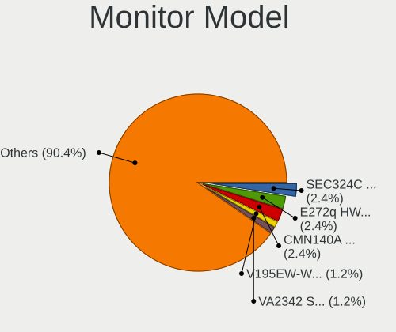

| Model                                                                  | Computers | Percent |
|------------------------------------------------------------------------|-----------|---------|
| Samsung Electronics LCD Monitor SEC324C 1600x900 310x170mm 13.9-inch   | 2         | 2.41%   |
| Hewlett-Packard E272q HWP326A 2560x1440 600x340mm 27.2-inch            | 2         | 2.41%   |
| Chimei Innolux LCD Monitor CMN140A 1920x1080 310x170mm 13.9-inch       | 2         | 2.41%   |
| VKK VK1160C VKK1160 1920x1080 260x150mm 11.8-inch                      | 1         | 1.2%    |
| Vita V195EW-W VIT1950 1600x900 430x240mm 19.4-inch                     | 1         | 1.2%    |
| ViewSonic VA2342 SERIES VSCFA2B 1920x1080 510x290mm 23.1-inch          | 1         | 1.2%    |
| ViewSonic VA1916w-6 VSCF91F 1440x900 410x260mm 19.1-inch               | 1         | 1.2%    |
| ViewSonic LCD Monitor VA2246 SERIES 1920x1080                          | 1         | 1.2%    |
| Toshiba TV TSB010B 1920x1080 420x240mm 19.0-inch                       | 1         | 1.2%    |
| SKY F24B40Q SKY0001 2560x1440 530x300mm 24.0-inch                      | 1         | 1.2%    |
| Sharp LCD Monitor SHP1479 1920x1280 260x170mm 12.2-inch                | 1         | 1.2%    |
| Sceptre Tech Sceptre E24 SPT099D 1920x1080 530x290mm 23.8-inch         | 1         | 1.2%    |
| Samsung Electronics SyncMaster SAM05CD 1920x1080                       | 1         | 1.2%    |
| Samsung Electronics SyncMaster SAM0598 1360x768 410x230mm 18.5-inch    | 1         | 1.2%    |
| Samsung Electronics LCD Monitor SEC5441 1366x768 340x190mm 15.3-inch   | 1         | 1.2%    |
| Samsung Electronics LCD Monitor SAM703E 3840x2160 1650x930mm 74.6-inch | 1         | 1.2%    |
| Samsung Electronics LCD Monitor SAM0FEE 3840x2160 1110x620mm 50.1-inch | 1         | 1.2%    |
| Samsung Electronics C27F390 SAM0D32 1920x1080 600x340mm 27.2-inch      | 1         | 1.2%    |
| RGT LCD Monitor RGT1252 1920x1080 1020x570mm 46.0-inch                 | 1         | 1.2%    |
| Philips PHL 246V5 PHLC0C5 1920x1080 530x300mm 24.0-inch                | 1         | 1.2%    |
| Philips PHL 221V8 PHLC211 1920x1080 480x270mm 21.7-inch                | 1         | 1.2%    |
| MSI G2422C MSI4BB3 1920x1080 520x300mm 23.6-inch                       | 1         | 1.2%    |
| LG Display LCD Monitor LGD05FA 1920x1080 310x170mm 13.9-inch           | 1         | 1.2%    |
| LG Display LCD Monitor LGD046D 1920x1080 310x170mm 13.9-inch           | 1         | 1.2%    |
| LG Display LCD Monitor LGD0456 1366x768 340x190mm 15.3-inch            | 1         | 1.2%    |
| LG Display LCD Monitor LGD02D8 1366x768 280x160mm 12.7-inch            | 1         | 1.2%    |
| LG Display LCD Monitor LGD0258 1600x900 350x190mm 15.7-inch            | 1         | 1.2%    |
| Lenovo M14 LEN61DD 1920x1080 310x180mm 14.1-inch                       | 1         | 1.2%    |
| Lenovo LEN T24i-20 LEN61F7 1920x1080 530x300mm 24.0-inch               | 1         | 1.2%    |
| Iiyama PL2740HS IVM6663 1920x1080 600x340mm 27.2-inch                  | 1         | 1.2%    |
| HKC 24N1A HKC2421 1920x1080 530x290mm 23.8-inch                        | 1         | 1.2%    |
| Hewlett-Packard ZR22w HWP2868 1920x1080 480x270mm 21.7-inch            | 1         | 1.2%    |
| Hewlett-Packard Z23n HWP3283 1920x1080 510x290mm 23.1-inch             | 1         | 1.2%    |
| Hewlett-Packard Z23i HWP308F 1920x1080 510x290mm 23.1-inch             | 1         | 1.2%    |
| Hewlett-Packard VH240a HPN349A 1920x1080 530x300mm 24.0-inch           | 1         | 1.2%    |
| Hewlett-Packard VH240a HPN3499 1920x1080 530x300mm 24.0-inch           | 1         | 1.2%    |
| HannStar LCD Monitor HSD03E9 1024x600 220x130mm 10.1-inch              | 1         | 1.2%    |
| Goldstar LG ULTRAFINE GSM5BC1 3840x2160 700x400mm 31.7-inch            | 1         | 1.2%    |
| Goldstar 24MB35 GSM5A4A 1920x1080 600x340mm 27.2-inch                  | 1         | 1.2%    |
| Gigabyte Technology M32UC GBT3209 3840x2160 700x390mm 31.5-inch        | 1         | 1.2%    |

Monitor Resolution
------------------

Monitor screen resolution

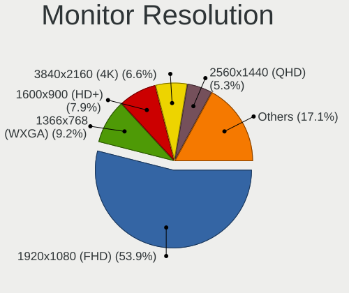

| Resolution        | Computers | Percent |
|-------------------|-----------|---------|
| 1920x1080 (FHD)   | 41        | 53.95%  |
| 1366x768 (WXGA)   | 7         | 9.21%   |
| 1600x900 (HD+)    | 6         | 7.89%   |
| 3840x2160 (4K)    | 5         | 6.58%   |
| 2560x1440 (QHD)   | 4         | 5.26%   |
| 2560x1600         | 2         | 2.63%   |
| 4096x2304         | 1         | 1.32%   |
| 3840x2400         | 1         | 1.32%   |
| 3840x1080         | 1         | 1.32%   |
| 2880x1800         | 1         | 1.32%   |
| 1920x1280         | 1         | 1.32%   |
| 1920x1200 (WUXGA) | 1         | 1.32%   |
| 1440x900 (WXGA+)  | 1         | 1.32%   |
| 1360x768          | 1         | 1.32%   |
| 1280x1024 (SXGA)  | 1         | 1.32%   |
| 1024x600          | 1         | 1.32%   |
| Unknown           | 1         | 1.32%   |

Monitor Diagonal
----------------

Diagonal size in inches

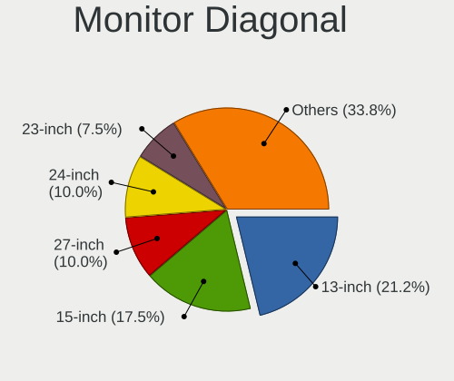

| Inches  | Computers | Percent |
|---------|-----------|---------|
| 13      | 17        | 21.25%  |
| 15      | 14        | 17.5%   |
| 27      | 8         | 10%     |
| 24      | 8         | 10%     |
| 23      | 6         | 7.5%    |
| 19      | 4         | 5%      |
| Unknown | 4         | 5%      |
| 21      | 3         | 3.75%   |
| 12      | 3         | 3.75%   |
| 11      | 3         | 3.75%   |
| 31      | 2         | 2.5%    |
| 14      | 2         | 2.5%    |
| 74      | 1         | 1.25%   |
| 50      | 1         | 1.25%   |
| 46      | 1         | 1.25%   |
| 18      | 1         | 1.25%   |
| 17      | 1         | 1.25%   |
| 10      | 1         | 1.25%   |

Monitor Width
-------------

Physical width

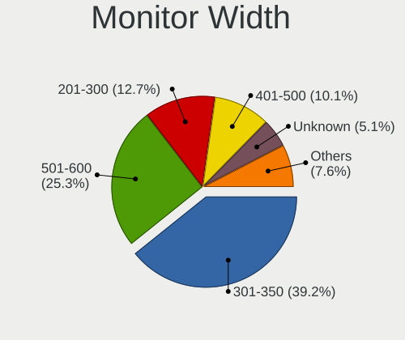

| Width in mm | Computers | Percent |
|-------------|-----------|---------|
| 301-350     | 31        | 39.24%  |
| 501-600     | 20        | 25.32%  |
| 201-300     | 10        | 12.66%  |
| 401-500     | 8         | 10.13%  |
| Unknown     | 4         | 5.06%   |
| 601-700     | 3         | 3.8%    |
| 1001-1500   | 2         | 2.53%   |
| 1501-2000   | 1         | 1.27%   |

Aspect Ratio
------------

Proportional relationship between the width and the height

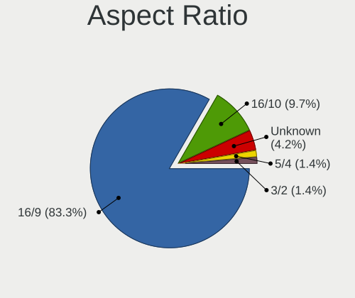

| Ratio   | Computers | Percent |
|---------|-----------|---------|
| 16/9    | 60        | 83.33%  |
| 16/10   | 7         | 9.72%   |
| Unknown | 3         | 4.17%   |
| 5/4     | 1         | 1.39%   |
| 3/2     | 1         | 1.39%   |

Monitor Area
------------

Area in inch²

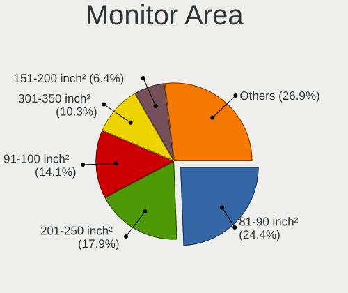

| Area in inch² | Computers | Percent |
|----------------|-----------|---------|
| 81-90          | 19        | 24.36%  |
| 201-250        | 14        | 17.95%  |
| 91-100         | 11        | 14.1%   |
| 301-350        | 8         | 10.26%  |
| 151-200        | 5         | 6.41%   |
| Unknown        | 4         | 5.13%   |
| 61-70          | 3         | 3.85%   |
| 51-60          | 3         | 3.85%   |
| More than 1000 | 2         | 2.56%   |
| 351-500        | 2         | 2.56%   |
| 141-150        | 2         | 2.56%   |
| 101-110        | 2         | 2.56%   |
| 41-50          | 1         | 1.28%   |
| 111-120        | 1         | 1.28%   |
| 501-1000       | 1         | 1.28%   |

Pixel Density
-------------

Pixels per inch

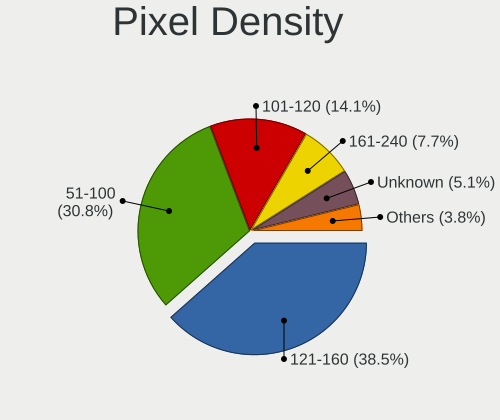

| Density       | Computers | Percent |
|---------------|-----------|---------|
| 121-160       | 30        | 38.46%  |
| 51-100        | 24        | 30.77%  |
| 101-120       | 11        | 14.1%   |
| 161-240       | 6         | 7.69%   |
| Unknown       | 4         | 5.13%   |
| More than 240 | 2         | 2.56%   |
| 1-50          | 1         | 1.28%   |

Multiple Monitors
-----------------

Total monitors connected

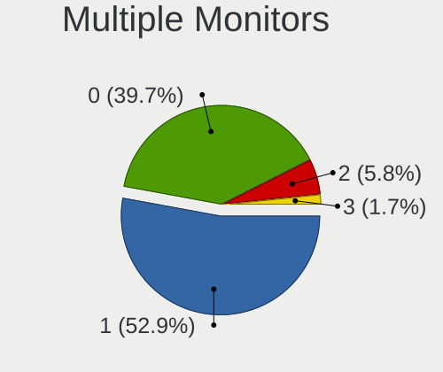

| Total | Computers | Percent |
|-------|-----------|---------|
| 1     | 64        | 52.89%  |
| 0     | 48        | 39.67%  |
| 2     | 7         | 5.79%   |
| 3     | 2         | 1.65%   |

Network
-------

Net Controller Vendor
---------------------

Controller vendors

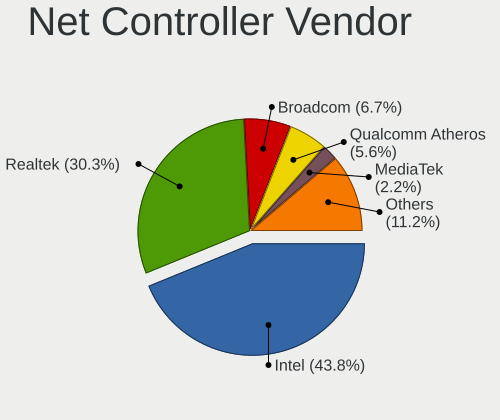

| Vendor                          | Computers | Percent |
|---------------------------------|-----------|---------|
| Intel                           | 78        | 43.82%  |
| Realtek Semiconductor           | 54        | 30.34%  |
| Broadcom                        | 12        | 6.74%   |
| Qualcomm Atheros                | 10        | 5.62%   |
| MediaTek                        | 4         | 2.25%   |
| Ralink Technology               | 3         | 1.69%   |
| Qualcomm Technologies           | 2         | 1.12%   |
| American Megatrends             | 2         | 1.12%   |
| Samsung Electronics             | 1         | 0.56%   |
| Ralink                          | 1         | 0.56%   |
| Qualcomm Atheros Communications | 1         | 0.56%   |
| Micro Star International        | 1         | 0.56%   |
| Marvell Technology Group        | 1         | 0.56%   |
| Lenovo                          | 1         | 0.56%   |
| Hewlett-Packard                 | 1         | 0.56%   |
| Google                          | 1         | 0.56%   |
| Fibocom                         | 1         | 0.56%   |
| Emulex                          | 1         | 0.56%   |
| Edimax Technology               | 1         | 0.56%   |
| Dell                            | 1         | 0.56%   |
| Aquantia                        | 1         | 0.56%   |

Net Controller Model
--------------------

Controller models

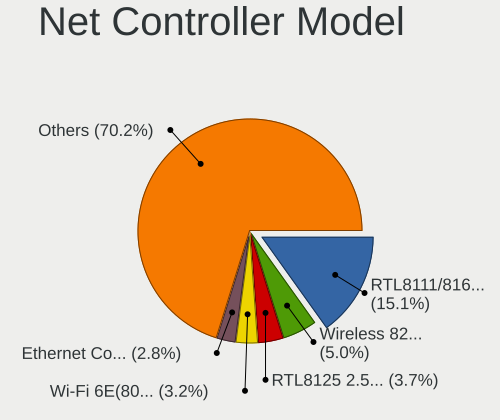

| Model                                                                  | Computers | Percent |
|------------------------------------------------------------------------|-----------|---------|
| Realtek RTL8111/8168/8211/8411 PCI Express Gigabit Ethernet Controller | 33        | 15.14%  |
| Intel Wireless 8265 / 8275                                             | 11        | 5.05%   |
| Realtek RTL8125 2.5GbE Controller                                      | 8         | 3.67%   |
| Intel Wi-Fi 6E(802.11ax) AX210/AX1675* 2x2 [Typhoon Peak]              | 7         | 3.21%   |
| Intel Ethernet Connection I217-LM                                      | 6         | 2.75%   |
| Realtek RTL810xE PCI Express Fast Ethernet controller                  | 5         | 2.29%   |
| Qualcomm Atheros QCA9565 / AR9565 Wireless Network Adapter             | 5         | 2.29%   |
| Intel 82579LM Gigabit Network Connection (Lewisville)                  | 5         | 2.29%   |
| Intel Centrino Advanced-N 6205 [Taylor Peak]                           | 4         | 1.83%   |
| Realtek RTL8188EUS 802.11n Wireless Network Adapter                    | 3         | 1.38%   |
| Intel Wireless 7265                                                    | 3         | 1.38%   |
| Intel Wireless 7260                                                    | 3         | 1.38%   |
| Intel Wi-Fi 6 AX200                                                    | 3         | 1.38%   |
| Intel Wi-Fi 5(802.11ac) Wireless-AC 9x6x [Thunder Peak]                | 3         | 1.38%   |
| Intel Raptor Lake PCH CNVi WiFi                                        | 3         | 1.38%   |
| Intel I211 Gigabit Network Connection                                  | 3         | 1.38%   |
| Intel I210 Gigabit Network Connection                                  | 3         | 1.38%   |
| Intel Ethernet Controller I226-V                                       | 3         | 1.38%   |
| Intel Ethernet Connection (4) I219-V                                   | 3         | 1.38%   |
| Intel Ethernet Connection (4) I219-LM                                  | 3         | 1.38%   |
| Realtek RTL8821CE 802.11ac PCIe Wireless Network Adapter               | 2         | 0.92%   |
| Realtek RTL8192EE PCIe Wireless Network Adapter                        | 2         | 0.92%   |
| Qualcomm QCNFA765 Wireless Network Adapter                             | 2         | 0.92%   |
| MediaTek MT7922 802.11ax PCI Express Wireless Network Adapter          | 2         | 0.92%   |
| Intel Wireless 8260                                                    | 2         | 0.92%   |
| Intel Wi-Fi 6 AX201                                                    | 2         | 0.92%   |
| Intel Ice Lake-LP PCH CNVi WiFi                                        | 2         | 0.92%   |
| Intel Ethernet Connection (3) I218-LM                                  | 2         | 0.92%   |
| Intel Ethernet Connection (23) I219-V                                  | 2         | 0.92%   |
| Intel Ethernet Connection (2) I219-V                                   | 2         | 0.92%   |
| Intel Ethernet Connection (2) I218-V                                   | 2         | 0.92%   |
| Intel Dual Band Wireless-AC 3168NGW [Stone Peak]                       | 2         | 0.92%   |
| Intel Comet Lake PCH-LP CNVi WiFi                                      | 2         | 0.92%   |
| Intel Centrino Advanced-N 6200                                         | 2         | 0.92%   |
| Intel 82580 Gigabit Network Connection                                 | 2         | 0.92%   |
| Intel 82574L Gigabit Network Connection                                | 2         | 0.92%   |
| Broadcom NetXtreme BCM57762 Gigabit Ethernet PCIe                      | 2         | 0.92%   |
| Broadcom NetXtreme BCM5720 Gigabit Ethernet PCIe                       | 2         | 0.92%   |
| American Megatrends Virtual Ethernet                                   | 2         | 0.92%   |
| Samsung GT-I9070 (network tethering, USB debugging enabled)            | 1         | 0.46%   |

Wireless Vendor
---------------

Wireless vendors

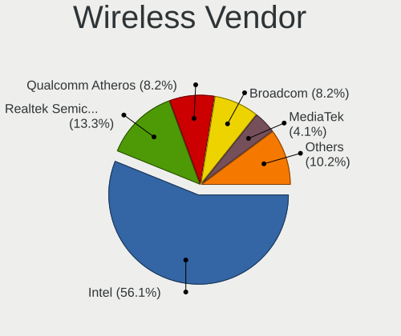

| Vendor                          | Computers | Percent |
|---------------------------------|-----------|---------|
| Intel                           | 55        | 56.12%  |
| Realtek Semiconductor           | 13        | 13.27%  |
| Qualcomm Atheros                | 8         | 8.16%   |
| Broadcom                        | 8         | 8.16%   |
| MediaTek                        | 4         | 4.08%   |
| Ralink Technology               | 3         | 3.06%   |
| Qualcomm Technologies           | 2         | 2.04%   |
| Ralink                          | 1         | 1.02%   |
| Qualcomm Atheros Communications | 1         | 1.02%   |
| Micro Star International        | 1         | 1.02%   |
| Edimax Technology               | 1         | 1.02%   |
| Dell                            | 1         | 1.02%   |

Wireless Model
--------------

Wireless models

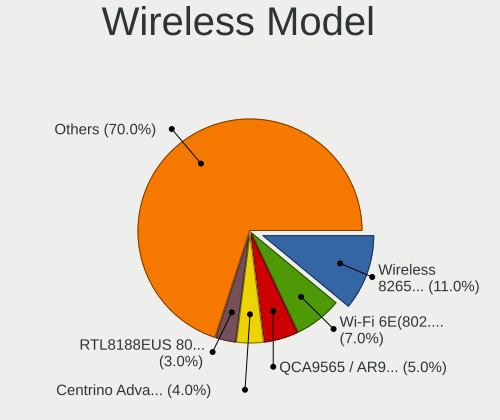

| Model                                                                                         | Computers | Percent |
|-----------------------------------------------------------------------------------------------|-----------|---------|
| Intel Wireless 8265 / 8275                                                                    | 11        | 11%     |
| Intel Wi-Fi 6E(802.11ax) AX210/AX1675* 2x2 [Typhoon Peak]                                     | 7         | 7%      |
| Qualcomm Atheros QCA9565 / AR9565 Wireless Network Adapter                                    | 5         | 5%      |
| Intel Centrino Advanced-N 6205 [Taylor Peak]                                                  | 4         | 4%      |
| Realtek RTL8188EUS 802.11n Wireless Network Adapter                                           | 3         | 3%      |
| Intel Wireless 7265                                                                           | 3         | 3%      |
| Intel Wireless 7260                                                                           | 3         | 3%      |
| Intel Wi-Fi 6 AX200                                                                           | 3         | 3%      |
| Intel Wi-Fi 5(802.11ac) Wireless-AC 9x6x [Thunder Peak]                                       | 3         | 3%      |
| Intel Raptor Lake PCH CNVi WiFi                                                               | 3         | 3%      |
| Realtek RTL8821CE 802.11ac PCIe Wireless Network Adapter                                      | 2         | 2%      |
| Realtek RTL8192EE PCIe Wireless Network Adapter                                               | 2         | 2%      |
| Qualcomm QCNFA765 Wireless Network Adapter                                                    | 2         | 2%      |
| MediaTek MT7922 802.11ax PCI Express Wireless Network Adapter                                 | 2         | 2%      |
| Intel Wireless 8260                                                                           | 2         | 2%      |
| Intel Wi-Fi 6 AX201                                                                           | 2         | 2%      |
| Intel Ice Lake-LP PCH CNVi WiFi                                                               | 2         | 2%      |
| Intel Dual Band Wireless-AC 3168NGW [Stone Peak]                                              | 2         | 2%      |
| Intel Comet Lake PCH-LP CNVi WiFi                                                             | 2         | 2%      |
| Intel Centrino Advanced-N 6200                                                                | 2         | 2%      |
| Realtek RTL88x2bu [AC1200 Techkey]                                                            | 1         | 1%      |
| Realtek RTL8822CE 802.11ac PCIe Wireless Network Adapter                                      | 1         | 1%      |
| Realtek RTL8822BE 802.11a/b/g/n/ac WiFi adapter                                               | 1         | 1%      |
| Realtek RTL8812AE 802.11ac PCIe Wireless Network Adapter                                      | 1         | 1%      |
| Realtek RTL8188ETV Wireless LAN 802.11n Network Adapter                                       | 1         | 1%      |
| Realtek RTL8188EE Wireless Network Adapter                                                    | 1         | 1%      |
| Realtek Realtek 8812AU/8821AU 802.11ac WLAN Adapter [USB Wireless Dual-Band Adapter 2.4/5Ghz] | 1         | 1%      |
| Realtek 8811CU Wireless LAN 802.11ac USB NIC                                                  | 1         | 1%      |
| Ralink RT5372 Wireless Adapter                                                                | 1         | 1%      |
| Ralink RT2070 Wireless Adapter                                                                | 1         | 1%      |
| Ralink MT7610U ("Archer T2U" 2.4G+5G WLAN Adapter                                             | 1         | 1%      |
| Ralink RT3290 Wireless 802.11n 1T/1R PCIe                                                     | 1         | 1%      |
| Qualcomm Atheros QCA9377 802.11ac Wireless Network Adapter                                    | 1         | 1%      |
| Qualcomm Atheros QCA6174 802.11ac Wireless Network Adapter                                    | 1         | 1%      |
| Qualcomm Atheros AR9271 802.11n                                                               | 1         | 1%      |
| Qualcomm Atheros AR9485 Wireless Network Adapter                                              | 1         | 1%      |
| Micro Star International MS-3871 802.11bgn Wireless Module [Ralink RT8070]                    | 1         | 1%      |
| MediaTek MT7921K (RZ608) Wi-Fi 6E 80MHz                                                       | 1         | 1%      |
| MediaTek MT7902 802.11ax PCIe Wireless Network Adapter [Filogic 310]                          | 1         | 1%      |
| Intel Meteor Lake PCH CNVi WiFi                                                               | 1         | 1%      |

Ethernet Vendor
---------------

Ethernet vendors

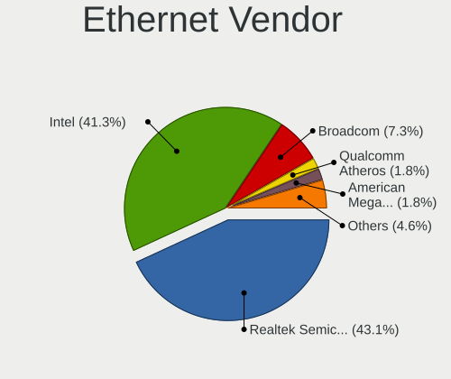

| Vendor                   | Computers | Percent |
|--------------------------|-----------|---------|
| Realtek Semiconductor    | 47        | 43.12%  |
| Intel                    | 45        | 41.28%  |
| Broadcom                 | 8         | 7.34%   |
| Qualcomm Atheros         | 2         | 1.83%   |
| American Megatrends      | 2         | 1.83%   |
| Samsung Electronics      | 1         | 0.92%   |
| Marvell Technology Group | 1         | 0.92%   |
| Lenovo                   | 1         | 0.92%   |
| Emulex                   | 1         | 0.92%   |
| Aquantia                 | 1         | 0.92%   |

Ethernet Model
--------------

Ethernet models

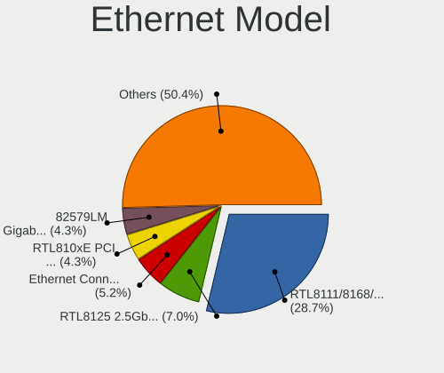

| Model                                                                  | Computers | Percent |
|------------------------------------------------------------------------|-----------|---------|
| Realtek RTL8111/8168/8211/8411 PCI Express Gigabit Ethernet Controller | 33        | 28.7%   |
| Realtek RTL8125 2.5GbE Controller                                      | 8         | 6.96%   |
| Intel Ethernet Connection I217-LM                                      | 6         | 5.22%   |
| Realtek RTL810xE PCI Express Fast Ethernet controller                  | 5         | 4.35%   |
| Intel 82579LM Gigabit Network Connection (Lewisville)                  | 5         | 4.35%   |
| Intel I211 Gigabit Network Connection                                  | 3         | 2.61%   |
| Intel I210 Gigabit Network Connection                                  | 3         | 2.61%   |
| Intel Ethernet Controller I226-V                                       | 3         | 2.61%   |
| Intel Ethernet Connection (4) I219-V                                   | 3         | 2.61%   |
| Intel Ethernet Connection (4) I219-LM                                  | 3         | 2.61%   |
| Intel Ethernet Connection (3) I218-LM                                  | 2         | 1.74%   |
| Intel Ethernet Connection (23) I219-V                                  | 2         | 1.74%   |
| Intel Ethernet Connection (2) I219-V                                   | 2         | 1.74%   |
| Intel Ethernet Connection (2) I218-V                                   | 2         | 1.74%   |
| Intel 82580 Gigabit Network Connection                                 | 2         | 1.74%   |
| Intel 82574L Gigabit Network Connection                                | 2         | 1.74%   |
| Broadcom NetXtreme BCM57762 Gigabit Ethernet PCIe                      | 2         | 1.74%   |
| Broadcom NetXtreme BCM5720 Gigabit Ethernet PCIe                       | 2         | 1.74%   |
| American Megatrends Virtual Ethernet                                   | 2         | 1.74%   |
| Samsung GT-I9070 (network tethering, USB debugging enabled)            | 1         | 0.87%   |
| Realtek USB 2.5GbE Controller                                          | 1         | 0.87%   |
| Qualcomm Atheros AR8151 v2.0 Gigabit Ethernet                          | 1         | 0.87%   |
| Qualcomm Atheros AR8132 Fast Ethernet                                  | 1         | 0.87%   |
| Marvell Group 88E8056 PCI-E Gigabit Ethernet Controller                | 1         | 0.87%   |
| Marvell Group 88E8001 Gigabit Ethernet Controller                      | 1         | 0.87%   |
| Lenovo USB-C Dock Ethernet                                             | 1         | 0.87%   |
| Intel I350 Gigabit Network Connection                                  | 1         | 0.87%   |
| Intel Ethernet Controller X550                                         | 1         | 0.87%   |
| Intel Ethernet Connection I219-V                                       | 1         | 0.87%   |
| Intel Ethernet Connection I219-LM                                      | 1         | 0.87%   |
| Intel Ethernet Connection I218-LM                                      | 1         | 0.87%   |
| Intel Ethernet Connection (7) I219-V                                   | 1         | 0.87%   |
| Intel Ethernet Connection (17) I219-V                                  | 1         | 0.87%   |
| Intel Ethernet Connection (16) I219-V                                  | 1         | 0.87%   |
| Intel 82583V Gigabit Network Connection                                | 1         | 0.87%   |
| Intel 82579V Gigabit Network Connection                                | 1         | 0.87%   |
| Intel 82577LM Gigabit Network Connection                               | 1         | 0.87%   |
| Emulex OneConnect 10Gb NIC (be3)                                       | 1         | 0.87%   |
| Broadcom NetXtreme BCM57766 Gigabit Ethernet PCIe                      | 1         | 0.87%   |
| Broadcom NetXtreme BCM57765 Gigabit Ethernet PCIe                      | 1         | 0.87%   |

Net Controller Kind
-------------------

Ethernet, WiFi or modem

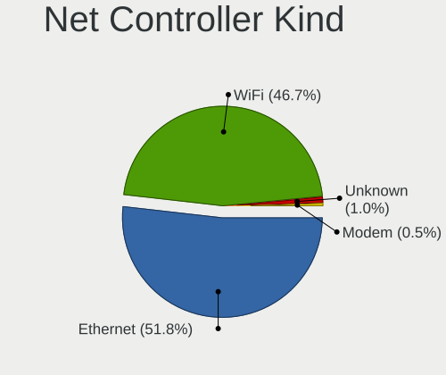

| Kind     | Computers | Percent |
|----------|-----------|---------|
| Ethernet | 101       | 51.79%  |
| WiFi     | 91        | 46.67%  |
| Unknown  | 2         | 1.03%   |
| Modem    | 1         | 0.51%   |

Used Controller
---------------

Currently used network controller

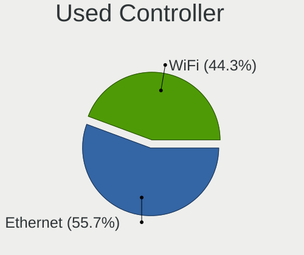

| Kind     | Computers | Percent |
|----------|-----------|---------|
| Ethernet | 59        | 55.66%  |
| WiFi     | 47        | 44.34%  |

NICs
----

Total network controllers on board

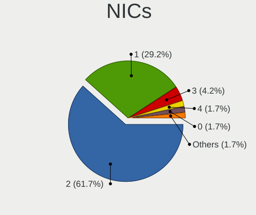

| Total | Computers | Percent |
|-------|-----------|---------|
| 2     | 74        | 61.67%  |
| 1     | 35        | 29.17%  |
| 3     | 5         | 4.17%   |
| 4     | 2         | 1.67%   |
| 0     | 2         | 1.67%   |
| 6     | 1         | 0.83%   |
| 5     | 1         | 0.83%   |

IPv6
----

IPv6 vs IPv4

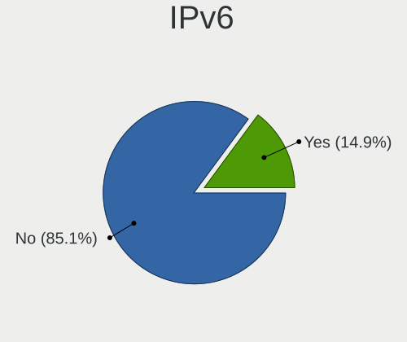

| Used | Computers | Percent |
|------|-----------|---------|
| No   | 103       | 85.12%  |
| Yes  | 18        | 14.88%  |

Bluetooth
---------

Bluetooth Vendor
----------------

Controller vendors

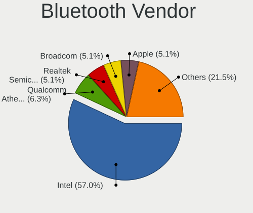

| Vendor                          | Computers | Percent |
|---------------------------------|-----------|---------|
| Intel                           | 45        | 56.96%  |
| Qualcomm Atheros Communications | 5         | 6.33%   |
| Realtek Semiconductor           | 4         | 5.06%   |
| Broadcom                        | 4         | 5.06%   |
| Apple                           | 4         | 5.06%   |
| MediaTek                        | 3         | 3.8%    |
| IMC Networks                    | 3         | 3.8%    |
| Lite-On Technology              | 2         | 2.53%   |
| Dell                            | 2         | 2.53%   |
| USI                             | 1         | 1.27%   |
| Ralink                          | 1         | 1.27%   |
| Micro Star International        | 1         | 1.27%   |
| Hewlett-Packard                 | 1         | 1.27%   |
| Foxconn / Hon Hai               | 1         | 1.27%   |
| Cambridge Silicon Radio         | 1         | 1.27%   |
| ASUSTek Computer                | 1         | 1.27%   |

Bluetooth Model
---------------

Controller models

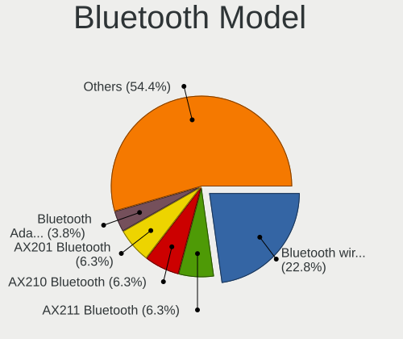

| Model                                                       | Computers | Percent |
|-------------------------------------------------------------|-----------|---------|
| Intel Bluetooth wireless interface                          | 18        | 22.78%  |
| Intel AX211 Bluetooth                                       | 5         | 6.33%   |
| Intel AX210 Bluetooth                                       | 5         | 6.33%   |
| Intel AX201 Bluetooth                                       | 5         | 6.33%   |
| Realtek Bluetooth Adapter                                   | 3         | 3.8%    |
| Intel Wireless-AC 9260 Bluetooth Adapter                    | 3         | 3.8%    |
| Intel Bluetooth 9460/9560 Jefferson Peak (JfP)              | 3         | 3.8%    |
| Intel AX200 Bluetooth                                       | 3         | 3.8%    |
| Qualcomm Atheros Dell Wireless 1707 Bluetooth 4.0 LE Device | 2         | 2.53%   |
| Lite-On Atheros AR3012 Bluetooth                            | 2         | 2.53%   |
| Intel Wireless-AC 3168 Bluetooth                            | 2         | 2.53%   |
| IMC Networks Realtek Bluetooth Adapter                      | 2         | 2.53%   |
| Broadcom BCM20702 Bluetooth 4.0 [ThinkPad]                  | 2         | 2.53%   |
| Apple Bluetooth Host Controller                             | 2         | 2.53%   |
| USI Qualcomm WCN685x Bluetooth Adapter                      | 1         | 1.27%   |
| Realtek RTL8822BE Bluetooth 4.2 Adapter                     | 1         | 1.27%   |
| Ralink RT3290 Bluetooth                                     | 1         | 1.27%   |
| Qualcomm Atheros QCA9377 Bluetooth 4.1                      | 1         | 1.27%   |
| Qualcomm Atheros QCA61x4 Bluetooth 4.0                      | 1         | 1.27%   |
| Qualcomm Atheros AR9462 Bluetooth                           | 1         | 1.27%   |
| Micro Star International Bluetooth 2.1+EDR USB Device       | 1         | 1.27%   |
| MediaTek Wireless_Device                                    | 1         | 1.27%   |
| MediaTek RZ616 Bluetooth Adapter                            | 1         | 1.27%   |
| MediaTek RZ608 Bluetooth Adapter                            | 1         | 1.27%   |
| Intel Centrino Bluetooth Wireless Transceiver               | 1         | 1.27%   |
| IMC Networks MediaTek Bluetooth Adapter                     | 1         | 1.27%   |
| HP Broadcom 2070 Bluetooth Combo                            | 1         | 1.27%   |
| Foxconn / Hon Hai Qualcomm WCN685x Bluetooth Adapter        | 1         | 1.27%   |
| Dell DW375 Bluetooth Module                                 | 1         | 1.27%   |
| Dell Broadcom BCM20702A0 Bluetooth                          | 1         | 1.27%   |
| Cambridge Silicon Radio Bluetooth Dongle (HCI mode)         | 1         | 1.27%   |
| Broadcom Bluetooth 4.0                                      | 1         | 1.27%   |
| Broadcom BCM2045B (BDC-2.1)                                 | 1         | 1.27%   |
| ASUS USB-BT500                                              | 1         | 1.27%   |
| Apple Built-in Bluetooth 2.0+EDR HCI                        | 1         | 1.27%   |
| Apple Broadcom Built-in Bluetooth                           | 1         | 1.27%   |

Sound
-----

Sound Vendor
------------

Sound card vendors

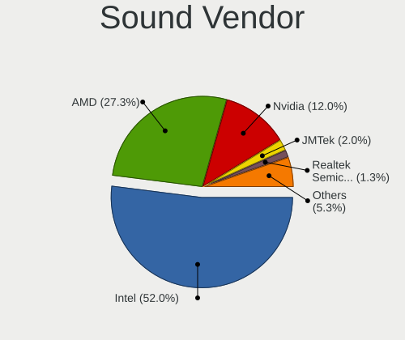

| Vendor                      | Computers | Percent |
|-----------------------------|-----------|---------|
| Intel                       | 78        | 52%     |
| AMD                         | 41        | 27.33%  |
| Nvidia                      | 18        | 12%     |
| JMTek                       | 3         | 2%      |
| Realtek Semiconductor       | 2         | 1.33%   |
| Lenovo                      | 2         | 1.33%   |
| Razer USA                   | 1         | 0.67%   |
| Micro Star International    | 1         | 0.67%   |
| Harman Kardon               | 1         | 0.67%   |
| FiiO Electronics Technology | 1         | 0.67%   |
| C-Media Electronics         | 1         | 0.67%   |
| Blue Microphones            | 1         | 0.67%   |

Sound Model
-----------

Sound card models

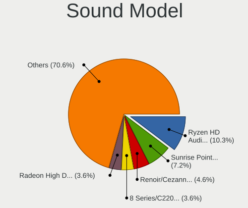

| Model                                                                      | Computers | Percent |
|----------------------------------------------------------------------------|-----------|---------|
| AMD Ryzen HD Audio Controller                                              | 20        | 10.31%  |
| Intel Sunrise Point-LP HD Audio                                            | 14        | 7.22%   |
| AMD Renoir/Cezanne HDMI/DP Audio Controller                                | 9         | 4.64%   |
| Intel 8 Series/C220 Series Chipset High Definition Audio Controller        | 7         | 3.61%   |
| AMD Radeon High Definition Audio Controller                                | 7         | 3.61%   |
| Intel Xeon E3-1200 v3/4th Gen Core Processor HD Audio Controller           | 6         | 3.09%   |
| Intel 7 Series/C216 Chipset Family High Definition Audio Controller        | 6         | 3.09%   |
| Intel 6 Series/C200 Series Chipset Family High Definition Audio Controller | 6         | 3.09%   |
| AMD Starship/Matisse HD Audio Controller                                   | 6         | 3.09%   |
| AMD Navi 21/23 HDMI/DP Audio Controller                                    | 6         | 3.09%   |
| Intel Atom Processor Z36xxx/Z37xxx Series High Definition Audio Controller | 5         | 2.58%   |
| Intel Raptor Lake-P/U/H cAVS                                               | 4         | 2.06%   |
| AMD Raven/Raven2/Fenghuang HDMI/DP Audio Controller                        | 4         | 2.06%   |
| JMTek USB PnP Audio Device                                                 | 3         | 1.55%   |
| Intel Haswell-ULT HD Audio Controller                                      | 3         | 1.55%   |
| Intel Broadwell-U Audio Controller                                         | 3         | 1.55%   |
| Intel Alder Lake-S HD Audio Controller                                     | 3         | 1.55%   |
| Intel Alder Lake PCH-P High Definition Audio Controller                    | 3         | 1.55%   |
| Intel 8 Series HD Audio Controller                                         | 3         | 1.55%   |
| AMD Turks HDMI Audio [Radeon HD 6500/6600 / 6700M Series]                  | 3         | 1.55%   |
| AMD Family 17h (Models 00h-0fh) HD Audio Controller                        | 3         | 1.55%   |
| AMD Family 15h (Models 60h-6fh) Audio Controller                           | 3         | 1.55%   |
| Nvidia TU116 High Definition Audio Controller                              | 2         | 1.03%   |
| Nvidia TU107 GeForce GTX 1650 High Definition Audio Controller             | 2         | 1.03%   |
| Nvidia GK208 HDMI/DP Audio Controller                                      | 2         | 1.03%   |
| Intel Wildcat Point-LP High Definition Audio Controller                    | 2         | 1.03%   |
| Intel Tiger Lake-LP Smart Sound Technology Audio Controller                | 2         | 1.03%   |
| Intel Ice Lake-LP Smart Sound Technology Audio Controller                  | 2         | 1.03%   |
| Intel Comet Lake PCH-LP cAVS                                               | 2         | 1.03%   |
| Intel Cannon Lake PCH cAVS                                                 | 2         | 1.03%   |
| Intel 5 Series/3400 Series Chipset High Definition Audio                   | 2         | 1.03%   |
| Intel 200 Series PCH HD Audio                                              | 2         | 1.03%   |
| AMD High Definition Audio Controller                                       | 2         | 1.03%   |
| AMD Ellesmere HDMI Audio [Radeon RX 470/480 / 570/580/590]                 | 2         | 1.03%   |
| AMD Cedar HDMI Audio [Radeon HD 5400/6300/7300 Series]                     | 2         | 1.03%   |
| Realtek Semiconductor USB Audio                                            | 1         | 0.52%   |
| Realtek Semiconductor Maono AU-PM401 Maono AU-PM401 Microphone Headphone   | 1         | 0.52%   |
| Razer USA RZ19-0229 Gaming Microphone                                      | 1         | 0.52%   |
| Nvidia TU106 High Definition Audio Controller                              | 1         | 0.52%   |
| Nvidia High Definition Audio Controller                                    | 1         | 0.52%   |

Memory
------

Memory Vendor
-------------

Memory module vendors

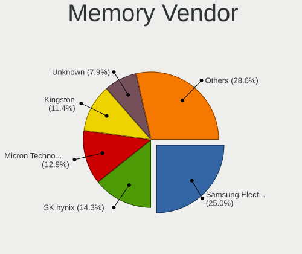

| Vendor              | Computers | Percent |
|---------------------|-----------|---------|
| Samsung Electronics | 35        | 25%     |
| SK hynix            | 20        | 14.29%  |
| Micron Technology   | 18        | 12.86%  |
| Kingston            | 16        | 11.43%  |
| Unknown             | 11        | 7.86%   |
| G.Skill             | 7         | 5%      |
| Crucial             | 7         | 5%      |
| Corsair             | 6         | 4.29%   |
| Unknown             | 4         | 2.86%   |
| Patriot             | 3         | 2.14%   |
| Elpida              | 3         | 2.14%   |
| Team                | 2         | 1.43%   |
| Unknown (F301)      | 1         | 0.71%   |
| Unknown (0x0B45)    | 1         | 0.71%   |
| Transcend           | 1         | 0.71%   |
| Teikon              | 1         | 0.71%   |
| Ramaxel Technology  | 1         | 0.71%   |
| PNY                 | 1         | 0.71%   |
| Kingmax             | 1         | 0.71%   |
| Avant               | 1         | 0.71%   |

Memory Model
------------

Memory module models

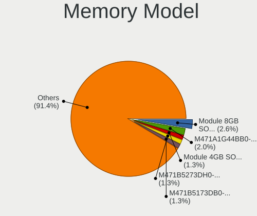

| Model                                                            | Computers | Percent |
|------------------------------------------------------------------|-----------|---------|
| Unknown                                                          | 4         | 2.63%   |
| Samsung RAM M471A1G44BB0-CWE 8GB SODIMM DDR4 3200MT/s            | 3         | 1.97%   |
| Unknown RAM Module 4GB SODIMM DDR4 2667MT/s                      | 2         | 1.32%   |
| SK hynix RAM HMT351S6CFR8C-H9 4GB SODIMM DDR3 1333MT/s           | 2         | 1.32%   |
| SK hynix RAM HMA851S6AFR6N-UH 4GB SODIMM DDR4 2400MT/s           | 2         | 1.32%   |
| Samsung RAM M471B5273DH0-CK0 8GB SODIMM DDR3 1600MT/s            | 2         | 1.32%   |
| Samsung RAM M471B5173DB0-YK0 4GB SODIMM DDR3 1600MT/s            | 2         | 1.32%   |
| Samsung RAM M471A1K43DB1-CWE 8GB SODIMM DDR4 3200MT/s            | 2         | 1.32%   |
| Samsung RAM M425R1GB4BB0-CWMOD 8GB SODIMM DDR5 5600MT/s          | 2         | 1.32%   |
| Micron RAM 8ATF1G64HZ-3G2R1 8GB SODIMM DDR4 3200MT/s             | 2         | 1.32%   |
| Micron RAM 4ATF1G64HZ-3G2F1 8GB SODIMM DDR4 3200MT/s             | 2         | 1.32%   |
| Kingston RAM CBD56S46BD8HA-32 32GB SODIMM DDR5 5600MT/s          | 2         | 1.32%   |
| G.Skill RAM F4-3200C22-8GRS 8GB SODIMM DDR4 3200MT/s             | 2         | 1.32%   |
| Corsair RAM CMK16GX4M2Z3200C16 8GB DIMM DDR4 3200MT/s            | 2         | 1.32%   |
| Unknown RAM Module 8GB SODIMM DDR4 2133MT/s                      | 1         | 0.66%   |
| Unknown RAM Module 8GB SODIMM DDR3 1600MT/s                      | 1         | 0.66%   |
| Unknown RAM Module 8GB SODIMM DDR3 1333MT/s                      | 1         | 0.66%   |
| Unknown RAM Module 8GB DIMM DDR3 1600MT/s                        | 1         | 0.66%   |
| Unknown RAM Module 8GB DIMM DDR3 1333MT/s                        | 1         | 0.66%   |
| Unknown RAM Module 8GB DIMM 1600MT/s                             | 1         | 0.66%   |
| Unknown RAM Module 4GB DIMM DDR 1333MT/s                         | 1         | 0.66%   |
| Unknown RAM Module 2GB SODIMM DDR2 667MT/s                       | 1         | 0.66%   |
| Unknown RAM Module 2GB DIMM DDR 800MT/s                          | 1         | 0.66%   |
| Unknown (F301) RAM Z18L-3AEN00 8GB SODIMM DDR3 1867MT/s          | 1         | 0.66%   |
| Unknown (0x0B45) RAM WPBH32D416SWA-16G 16GB SODIMM DDR4 3200MT/s | 1         | 0.66%   |
| Transcend RAM JM1600KSN-4G 4GB SODIMM DDR3 1600MT/s              | 1         | 0.66%   |
| Teikon RAM TMA851S6AFR6N-UHHC 4GB SODIMM DDR4 2400MT/s           | 1         | 0.66%   |
| Team RAM TEAMGROUP-UD4-3200 8GB DIMM DDR4 3200MT/s               | 1         | 0.66%   |
| Team RAM Module 8GB DIMM DDR4 2400MT/s                           | 1         | 0.66%   |
| SK hynix RAM Module 4GB SODIMM DDR4 2400MT/s                     | 1         | 0.66%   |
| SK hynix RAM Module 4GB SODIMM DDR3 1333MT/s                     | 1         | 0.66%   |
| SK hynix RAM HYMP112S64CP6-Y5 1GB SODIMM DDR 667MT/s             | 1         | 0.66%   |
| SK hynix RAM HMT451U6BFR8C-PB 4GB DIMM DDR3 1600MT/s             | 1         | 0.66%   |
| SK hynix RAM HMT451U6BFR8A-PB 4GB DIMM DDR3 1600MT/s             | 1         | 0.66%   |
| SK hynix RAM HMT451S6BFR8A-PB 4GB SODIMM DDR3 1600MT/s           | 1         | 0.66%   |
| SK hynix RAM HMT451S6AFR8C-PB 4GB SODIMM DDR3 1600MT/s           | 1         | 0.66%   |
| SK hynix RAM HMT41GU7AFR8A-PB 8GB DIMM DDR3 1600MT/s             | 1         | 0.66%   |
| SK hynix RAM HMT41GU6BFR8C-PB 8GB DIMM DDR3 1600MT/s             | 1         | 0.66%   |
| SK hynix RAM HMT351U6EFR8C-PB 4GB DIMM DDR3 1600MT/s             | 1         | 0.66%   |
| SK hynix RAM HMT351S6BFR8C-H9 4GB SODIMM DDR3 1333MT/s           | 1         | 0.66%   |

Memory Kind
-----------

Memory module kinds

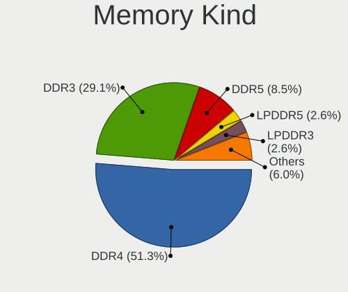

| Kind    | Computers | Percent |
|---------|-----------|---------|
| DDR4    | 60        | 51.28%  |
| DDR3    | 34        | 29.06%  |
| DDR5    | 10        | 8.55%   |
| LPDDR5  | 3         | 2.56%   |
| LPDDR3  | 3         | 2.56%   |
| DDR2    | 2         | 1.71%   |
| DDR     | 2         | 1.71%   |
| LPDDR4  | 1         | 0.85%   |
| DRAM    | 1         | 0.85%   |
| Unknown | 1         | 0.85%   |

Memory Form Factor
------------------

Physical design of the memory module

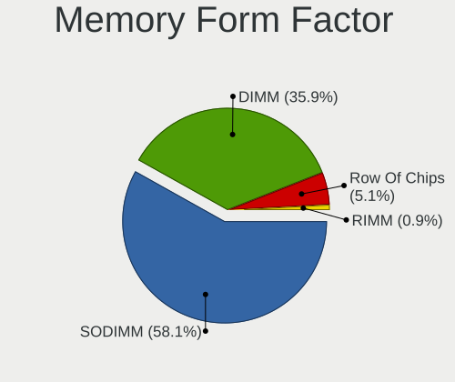

| Name         | Computers | Percent |
|--------------|-----------|---------|
| SODIMM       | 68        | 58.12%  |
| DIMM         | 42        | 35.9%   |
| Row Of Chips | 6         | 5.13%   |
| RIMM         | 1         | 0.85%   |

Memory Size
-----------

Memory module size

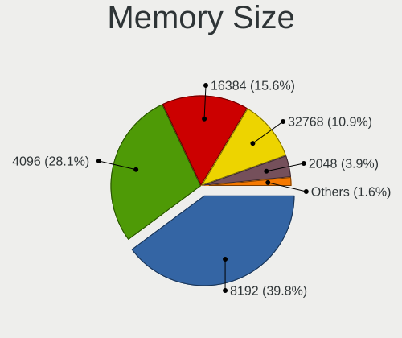

| Size  | Computers | Percent |
|-------|-----------|---------|
| 8192  | 51        | 39.84%  |
| 4096  | 36        | 28.13%  |
| 16384 | 20        | 15.63%  |
| 32768 | 14        | 10.94%  |
| 2048  | 5         | 3.91%   |
| 49152 | 1         | 0.78%   |
| 1024  | 1         | 0.78%   |

Memory Speed
------------

Memory module speed

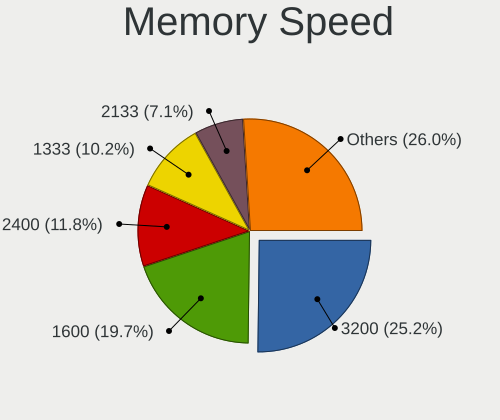

| Speed | Computers | Percent |
|-------|-----------|---------|
| 3200  | 32        | 25.2%   |
| 1600  | 25        | 19.69%  |
| 2400  | 15        | 11.81%  |
| 1333  | 13        | 10.24%  |
| 2133  | 9         | 7.09%   |
| 2667  | 8         | 6.3%    |
| 5600  | 6         | 4.72%   |
| 4800  | 3         | 2.36%   |
| 1867  | 3         | 2.36%   |
| 6400  | 2         | 1.57%   |
| 1334  | 2         | 1.57%   |
| 667   | 2         | 1.57%   |
| 7200  | 1         | 0.79%   |
| 4267  | 1         | 0.79%   |
| 4266  | 1         | 0.79%   |
| 3600  | 1         | 0.79%   |
| 3000  | 1         | 0.79%   |
| 1866  | 1         | 0.79%   |
| 800   | 1         | 0.79%   |

Printers & scanners
-------------------

Printer Vendor
--------------

Printer device vendors

Zero info for selected period =(

Printer Model
-------------

Printer device models

Zero info for selected period =(

Scanner Vendor
--------------

Scanner device vendors

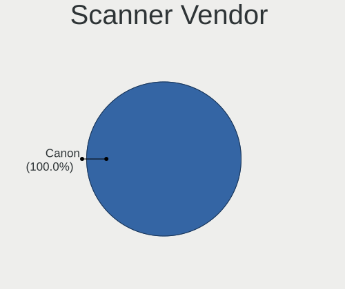

| Vendor | Computers | Percent |
|--------|-----------|---------|
| Canon  | 1         | 100%    |

Scanner Model
-------------

Scanner device models

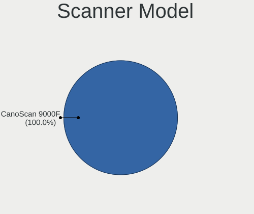

| Model                | Computers | Percent |
|----------------------|-----------|---------|
| Canon CanoScan 9000F | 1         | 100%    |

Camera
------

Camera Vendor
-------------

Camera device vendors

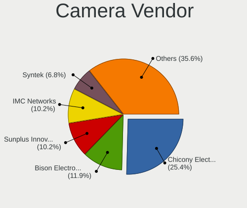

| Vendor                                 | Computers | Percent |
|----------------------------------------|-----------|---------|
| Chicony Electronics                    | 15        | 25.42%  |
| Bison Electronics                      | 7         | 11.86%  |
| Sunplus Innovation Technology          | 6         | 10.17%  |
| IMC Networks                           | 6         | 10.17%  |
| Syntek                                 | 4         | 6.78%   |
| Microdia                               | 4         | 6.78%   |
| Logitech                               | 4         | 6.78%   |
| Luxvisions Innotech Limited            | 3         | 5.08%   |
| Realtek Semiconductor                  | 2         | 3.39%   |
| Lite-On Technology                     | 2         | 3.39%   |
| Apple                                  | 2         | 3.39%   |
| Supreme Electronics                    | 1         | 1.69%   |
| Silicon Motion                         | 1         | 1.69%   |
| Ricoh                                  | 1         | 1.69%   |
| Cheng Uei Precision Industry (Foxlink) | 1         | 1.69%   |

Camera Model
------------

Camera device models

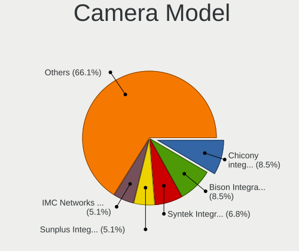

| Model                                                           | Computers | Percent |
|-----------------------------------------------------------------|-----------|---------|
| Chicony integrated camera                                       | 5         | 8.47%   |
| Bison Integrated Camera                                         | 5         | 8.47%   |
| Syntek Integrated Camera                                        | 4         | 6.78%   |
| Sunplus Integrated_Webcam_HD                                    | 3         | 5.08%   |
| IMC Networks Realtek PC Camera                                  | 3         | 5.08%   |
| Microdia Integrated_Webcam_HD                                   | 2         | 3.39%   |
| Luxvisions Innotech Limited Integrated Camera                   | 2         | 3.39%   |
| IMC Networks EasyCamera                                         | 2         | 3.39%   |
| Supreme Integrated Camera                                       | 1         | 1.69%   |
| Sunplus Laptop_Integrated_Webcam_FHD                            | 1         | 1.69%   |
| Sunplus HD WebCam                                               | 1         | 1.69%   |
| Sunplus ASUS Webcam                                             | 1         | 1.69%   |
| Silicon Motion 300k Pixel Camera                                | 1         | 1.69%   |
| Ricoh Integrated Webcam                                         | 1         | 1.69%   |
| Realtek EasyCamera                                              | 1         | 1.69%   |
| Realtek Acer 640 x 480 laptop camera                            | 1         | 1.69%   |
| Microdia USB  Live camera                                       | 1         | 1.69%   |
| Microdia Integrated Webcam                                      | 1         | 1.69%   |
| Luxvisions Innotech Limited HP True Vision FHD Camera           | 1         | 1.69%   |
| Logitech Webcam C310                                            | 1         | 1.69%   |
| Logitech Webcam C270                                            | 1         | 1.69%   |
| Logitech HD Pro Webcam C920                                     | 1         | 1.69%   |
| Logitech C920 HD Pro Webcam                                     | 1         | 1.69%   |
| Lite-On Integrated Camera                                       | 1         | 1.69%   |
| Lite-On HP Universal Camera                                     | 1         | 1.69%   |
| IMC Networks Integrated Webcam                                  | 1         | 1.69%   |
| Chicony USB2.0 HD UVC WebCam                                    | 1         | 1.69%   |
| Chicony USB2.0 FHD Camera                                       | 1         | 1.69%   |
| Chicony thinkpad t430s camera                                   | 1         | 1.69%   |
| Chicony Integrated IR Camera                                    | 1         | 1.69%   |
| Chicony Integrated Camera [ThinkPad]                            | 1         | 1.69%   |
| Chicony HP Webcam [2 MP Macro]                                  | 1         | 1.69%   |
| Chicony HP Universal Camera                                     | 1         | 1.69%   |
| Chicony HP HD Webcam [Fixed]                                    | 1         | 1.69%   |
| Chicony FJ Camera                                               | 1         | 1.69%   |
| Chicony EasyCamera                                              | 1         | 1.69%   |
| Cheng Uei Precision Industry (Foxlink) HP Wide Vision HD Camera | 1         | 1.69%   |
| Bison SunplusIT Integrated Camera                               | 1         | 1.69%   |
| Bison Realtek DMFT RGB                                          | 1         | 1.69%   |
| Apple FaceTime HD Camera (Built-in)                             | 1         | 1.69%   |

Security
--------

Fingerprint Vendor
------------------

Fingerprint sensor vendors

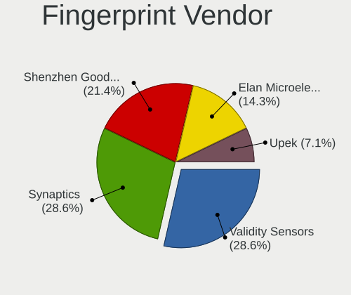

| Vendor                     | Computers | Percent |
|----------------------------|-----------|---------|
| Validity Sensors           | 4         | 28.57%  |
| Synaptics                  | 4         | 28.57%  |
| Shenzhen Goodix Technology | 3         | 21.43%  |
| Elan Microelectronics      | 2         | 14.29%  |
| Upek                       | 1         | 7.14%   |

Fingerprint Model
-----------------

Fingerprint sensor models

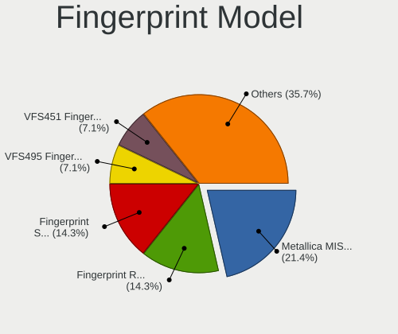

| Model                                                  | Computers | Percent |
|--------------------------------------------------------|-----------|---------|
| Synaptics Metallica MIS Touch Fingerprint Reader       | 3         | 21.43%  |
| Shenzhen Goodix Fingerprint Reader SGX                 | 2         | 14.29%  |
| Elan Fingerprint Sensor                                | 2         | 14.29%  |
| Validity Sensors VFS495 Fingerprint Reader             | 1         | 7.14%   |
| Validity Sensors VFS451 Fingerprint Reader             | 1         | 7.14%   |
| Validity Sensors VFS 5011 fingerprint sensor           | 1         | 7.14%   |
| Validity Sensors Swipe Fingerprint Sensor              | 1         | 7.14%   |
| Upek Biometric Touchchip/Touchstrip Fingerprint Sensor | 1         | 7.14%   |
| Synaptics Prometheus MIS Touch Fingerprint Reader      | 1         | 7.14%   |
| Shenzhen Goodix Fingerprint Reader                     | 1         | 7.14%   |

Chipcard Vendor
---------------

Chipcard module vendors

Zero info for selected period =(

Chipcard Model
--------------

Chipcard module models

Zero info for selected period =(

Unsupported
-----------

Unsupported Devices
-------------------

Total unsupported devices on board

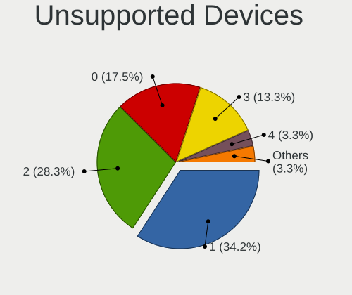

| Total | Computers | Percent |
|-------|-----------|---------|
| 1     | 41        | 34.17%  |
| 2     | 34        | 28.33%  |
| 0     | 21        | 17.5%   |
| 3     | 16        | 13.33%  |
| 4     | 4         | 3.33%   |
| 6     | 2         | 1.67%   |
| 7     | 1         | 0.83%   |
| 5     | 1         | 0.83%   |

Unsupported Device Types
------------------------

Types of unsupported devices

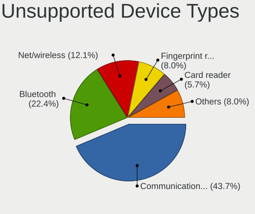

| Type                     | Computers | Percent |
|--------------------------|-----------|---------|
| Communication controller | 76        | 43.68%  |
| Bluetooth                | 39        | 22.41%  |
| Net/wireless             | 21        | 12.07%  |
| Fingerprint reader       | 14        | 8.05%   |
| Card reader              | 10        | 5.75%   |
| Firewire controller      | 5         | 2.87%   |
| Sound                    | 3         | 1.72%   |
| Net/ethernet             | 3         | 1.72%   |
| Network                  | 2         | 1.15%   |
| Storage                  | 1         | 0.57%   |

