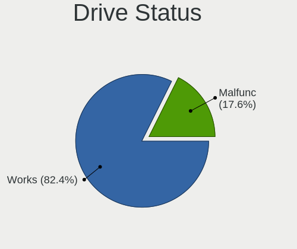
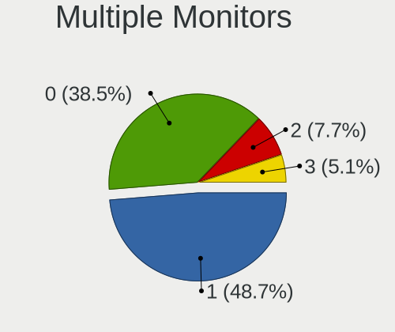

FreeBSD 14.1 - Tested Hardware & Statistics (Desktops)
------------------------------------------------------

A project to collect tested hardware configurations for FreeBSD 14.1.

Anyone can contribute to this report by the [hw-probe](https://github.com/linuxhw/hw-probe/blob/master/INSTALL.BSD.md) tool:

    hw-probe -all -upload

Please contribute! Especially if your hardware is rare.

Contents
--------

* [ Test Cases ](#test-cases)

* [ System ](#system)
  - [ Arch                     ](#arch)
  - [ DE                       ](#de)
  - [ Display Server           ](#display-server)
  - [ Display Manager          ](#display-manager)
  - [ OS Lang                  ](#os-lang)
  - [ Boot Mode                ](#boot-mode)
  - [ Filesystem               ](#filesystem)
  - [ Part. scheme             ](#part-scheme)

* [ Board ](#board)
  - [ Vendor                   ](#vendor)
  - [ Model                    ](#model)
  - [ Model Family             ](#model-family)
  - [ MFG Year                 ](#mfg-year)
  - [ Form Factor              ](#form-factor)
  - [ Coreboot                 ](#coreboot)
  - [ RAM Size                 ](#ram-size)
  - [ RAM Used                 ](#ram-used)
  - [ Total Drives             ](#total-drives)
  - [ Has CD-ROM               ](#has-cd-rom)
  - [ Has Ethernet             ](#has-ethernet)
  - [ Has WiFi                 ](#has-wifi)
  - [ Has Bluetooth            ](#has-bluetooth)

* [ Location ](#location)
  - [ Country                  ](#country)
  - [ City                     ](#city)

* [ Drives ](#drives)
  - [ Drive Vendor             ](#drive-vendor)
  - [ Drive Model              ](#drive-model)
  - [ HDD Vendor               ](#hdd-vendor)
  - [ SSD Vendor               ](#ssd-vendor)
  - [ Drive Kind               ](#drive-kind)
  - [ Drive Connector          ](#drive-connector)
  - [ Drive Size               ](#drive-size)
  - [ Space Total              ](#space-total)
  - [ Space Used               ](#space-used)
  - [ Malfunc. Drives          ](#malfunc-drives)
  - [ Malfunc. Drive Vendor    ](#malfunc-drive-vendor)
  - [ Malfunc. HDD Vendor      ](#malfunc-hdd-vendor)
  - [ Malfunc. Drive Kind      ](#malfunc-drive-kind)
  - [ Failed Drives            ](#failed-drives)
  - [ Failed Drive Vendor      ](#failed-drive-vendor)
  - [ Drive Status             ](#drive-status)

* [ Storage controller ](#storage-controller)
  - [ Storage Vendor           ](#storage-vendor)
  - [ Storage Model            ](#storage-model)
  - [ Storage Kind             ](#storage-kind)

* [ Processor ](#processor)
  - [ CPU Vendor               ](#cpu-vendor)
  - [ CPU Model                ](#cpu-model)
  - [ CPU Model Family         ](#cpu-model-family)
  - [ CPU Cores                ](#cpu-cores)
  - [ CPU Sockets              ](#cpu-sockets)
  - [ CPU Threads              ](#cpu-threads)
  - [ CPU Microarch            ](#cpu-microarch)

* [ Graphics ](#graphics)
  - [ GPU Vendor               ](#gpu-vendor)
  - [ GPU Model                ](#gpu-model)
  - [ GPU Combo                ](#gpu-combo)
  - [ GPU Driver               ](#gpu-driver)
  - [ GPU Memory               ](#gpu-memory)

* [ Monitor ](#monitor)
  - [ Monitor Vendor           ](#monitor-vendor)
  - [ Monitor Model            ](#monitor-model)
  - [ Monitor Resolution       ](#monitor-resolution)
  - [ Monitor Diagonal         ](#monitor-diagonal)
  - [ Monitor Width            ](#monitor-width)
  - [ Aspect Ratio             ](#aspect-ratio)
  - [ Monitor Area             ](#monitor-area)
  - [ Pixel Density            ](#pixel-density)
  - [ Multiple Monitors        ](#multiple-monitors)

* [ Network ](#network)
  - [ Net Controller Vendor    ](#net-controller-vendor)
  - [ Net Controller Model     ](#net-controller-model)
  - [ Wireless Vendor          ](#wireless-vendor)
  - [ Wireless Model           ](#wireless-model)
  - [ Ethernet Vendor          ](#ethernet-vendor)
  - [ Ethernet Model           ](#ethernet-model)
  - [ Net Controller Kind      ](#net-controller-kind)
  - [ Used Controller          ](#used-controller)
  - [ NICs                     ](#nics)
  - [ IPv6                     ](#ipv6)

* [ Bluetooth ](#bluetooth)
  - [ Bluetooth Vendor         ](#bluetooth-vendor)
  - [ Bluetooth Model          ](#bluetooth-model)

* [ Sound ](#sound)
  - [ Sound Vendor             ](#sound-vendor)
  - [ Sound Model              ](#sound-model)

* [ Memory ](#memory)
  - [ Memory Vendor            ](#memory-vendor)
  - [ Memory Model             ](#memory-model)
  - [ Memory Kind              ](#memory-kind)
  - [ Memory Form Factor       ](#memory-form-factor)
  - [ Memory Size              ](#memory-size)
  - [ Memory Speed             ](#memory-speed)

* [ Printers & scanners ](#printers--scanners)
  - [ Printer Vendor           ](#printer-vendor)
  - [ Printer Model            ](#printer-model)
  - [ Scanner Vendor           ](#scanner-vendor)
  - [ Scanner Model            ](#scanner-model)

* [ Camera ](#camera)
  - [ Camera Vendor            ](#camera-vendor)
  - [ Camera Model             ](#camera-model)

* [ Security ](#security)
  - [ Fingerprint Vendor       ](#fingerprint-vendor)
  - [ Fingerprint Model        ](#fingerprint-model)
  - [ Chipcard Vendor          ](#chipcard-vendor)
  - [ Chipcard Model           ](#chipcard-model)

* [ Unsupported ](#unsupported)
  - [ Unsupported Devices      ](#unsupported-devices)
  - [ Unsupported Device Types ](#unsupported-device-types)

Test Cases
----------

Total: 59

| Vendor        | Model                       | Probe                                                     | Date         |
|---------------|-----------------------------|-----------------------------------------------------------|--------------|
| Dell          | 0JJ7YG A00                  | [60a9be6897](https://bsd-hardware.info/?probe=60a9be6897) | Jan 02, 2025 |
| Dell          | 01D4TT A00                  | [447a0925d1](https://bsd-hardware.info/?probe=447a0925d1) | Jan 02, 2025 |
| Dell          | 0JJ7YG A00                  | [f586af63cf](https://bsd-hardware.info/?probe=f586af63cf) | Jan 02, 2025 |
| ASRockRack    | EPYC3101D4I-2T              | [be896d46e1](https://bsd-hardware.info/?probe=be896d46e1) | Dec 31, 2024 |
| Gigabyte      | M68MT-S2                    | [0ac816abb8](https://bsd-hardware.info/?probe=0ac816abb8) | Dec 22, 2024 |
| Gigabyte      | B450 I AORUS PRO WIFI-CF    | [57a5cf527b](https://bsd-hardware.info/?probe=57a5cf527b) | Dec 08, 2024 |
| MSI           | B550M PRO-VDH               | [2bd3d72cbb](https://bsd-hardware.info/?probe=2bd3d72cbb) | Dec 06, 2024 |
| HP            | 1998                        | [6233446d5e](https://bsd-hardware.info/?probe=6233446d5e) | Dec 04, 2024 |
| ASUSTek       | CROSSHAIR V FORMULA-Z       | [8fbade62a5](https://bsd-hardware.info/?probe=8fbade62a5) | Dec 04, 2024 |
| ASRockRack    | EPYC3101D4I-2T              | [a070b11044](https://bsd-hardware.info/?probe=a070b11044) | Nov 30, 2024 |
| ASUSTek       | CROSSHAIR V FORMULA-Z       | [8282b592ac](https://bsd-hardware.info/?probe=8282b592ac) | Nov 27, 2024 |
| MSI           | H310M PRO-M2 PLUS           | [db040ae85a](https://bsd-hardware.info/?probe=db040ae85a) | Nov 26, 2024 |
| Gigabyte      | Z490 AORUS MASTER           | [acfb1a77bf](https://bsd-hardware.info/?probe=acfb1a77bf) | Nov 24, 2024 |
| Gigabyte      | B650M D3HP                  | [adf503f345](https://bsd-hardware.info/?probe=adf503f345) | Nov 06, 2024 |
| Gigabyte      | B650M D3HP                  | [fe8076ef02](https://bsd-hardware.info/?probe=fe8076ef02) | Nov 06, 2024 |
| Unknown       | Unknown                     | [85bc2300d4](https://bsd-hardware.info/?probe=85bc2300d4) | Nov 04, 2024 |
| MSI           | H310M PRO-M2 PLUS           | [8c3d77a23b](https://bsd-hardware.info/?probe=8c3d77a23b) | Oct 31, 2024 |
| ASRockRack    | EPYC3101D4I-2T              | [1c6bd76968](https://bsd-hardware.info/?probe=1c6bd76968) | Oct 31, 2024 |
| MSI           | H310M PRO-M2 PLUS           | [8ad31a1bad](https://bsd-hardware.info/?probe=8ad31a1bad) | Oct 30, 2024 |
| Dell          | 053CWD A00                  | [1a6b365ab4](https://bsd-hardware.info/?probe=1a6b365ab4) | Oct 30, 2024 |
| Gigabyte      | B450M S2H V2                | [1dd8ec6cbc](https://bsd-hardware.info/?probe=1dd8ec6cbc) | Oct 27, 2024 |
| Gigabyte      | B450M DS3H WIFI-CF          | [2c4cb4fd49](https://bsd-hardware.info/?probe=2c4cb4fd49) | Oct 20, 2024 |
| Shenzhen M... | AHBNB OEM                   | [cb7d2d44d9](https://bsd-hardware.info/?probe=cb7d2d44d9) | Oct 14, 2024 |
| Gigabyte      | X99-UD4P-CF                 | [a7f00617a4](https://bsd-hardware.info/?probe=a7f00617a4) | Oct 12, 2024 |
| MSI           | PRO B550M-VC WIFI           | [566f6b1b2f](https://bsd-hardware.info/?probe=566f6b1b2f) | Oct 09, 2024 |
| MSI           | PRO B550M-VC WIFI           | [8ad5f1d680](https://bsd-hardware.info/?probe=8ad5f1d680) | Oct 09, 2024 |
| MSI           | MAG B550M MORTAR WIFI       | [97e0c04743](https://bsd-hardware.info/?probe=97e0c04743) | Oct 07, 2024 |
| ASUSTek       | PRIME A320M-K/BR            | [e4e1bf6fa2](https://bsd-hardware.info/?probe=e4e1bf6fa2) | Oct 05, 2024 |
| ASUSTek       | P7H55-M LX                  | [74ed82c97a](https://bsd-hardware.info/?probe=74ed82c97a) | Sep 30, 2024 |
| ASRockRack    | EPYC3101D4I-2T              | [eb2586d6b5](https://bsd-hardware.info/?probe=eb2586d6b5) | Sep 30, 2024 |
| Gigabyte      | X670E AORUS XTREME          | [3a93bb7f24](https://bsd-hardware.info/?probe=3a93bb7f24) | Sep 26, 2024 |
| Unknown       | Unknown                     | [170341d296](https://bsd-hardware.info/?probe=170341d296) | Sep 19, 2024 |
| ASUSTek       | TUF Gaming B450M-PRO S      | [25bed13946](https://bsd-hardware.info/?probe=25bed13946) | Sep 15, 2024 |
| ASRockRack    | EPYC3101D4I-2T              | [a740cbb4da](https://bsd-hardware.info/?probe=a740cbb4da) | Aug 31, 2024 |
| Dell          | 06X1TJ A01                  | [a3a44c5d03](https://bsd-hardware.info/?probe=a3a44c5d03) | Aug 26, 2024 |
| MSI           | B550 GAMING GEN3            | [09c4b51ebb](https://bsd-hardware.info/?probe=09c4b51ebb) | Aug 12, 2024 |
| ASUSTek       | P5Q-E                       | [eb7aecd79c](https://bsd-hardware.info/?probe=eb7aecd79c) | Aug 11, 2024 |
| ASUSTek       | TUF Gaming B550-PLUS        | [3a97ebc128](https://bsd-hardware.info/?probe=3a97ebc128) | Aug 05, 2024 |
| ASUSTek       | ROG CROSSHAIR VIII HERO     | [d5924117c3](https://bsd-hardware.info/?probe=d5924117c3) | Aug 04, 2024 |
| Unknown       | DH61BR G32662-203           | [596a891e0a](https://bsd-hardware.info/?probe=596a891e0a) | Aug 04, 2024 |
| ASRockRack    | EPYC3101D4I-2T              | [f7134ef010](https://bsd-hardware.info/?probe=f7134ef010) | Jul 31, 2024 |
| ASUSTek       | STRIX B250G GAMING          | [f18c3a7168](https://bsd-hardware.info/?probe=f18c3a7168) | Jul 27, 2024 |
| Unknown       | DH61BR G32662-203           | [6e073b5233](https://bsd-hardware.info/?probe=6e073b5233) | Jul 26, 2024 |
| ASUSTek       | P5Q-E                       | [a93627695c](https://bsd-hardware.info/?probe=a93627695c) | Jul 14, 2024 |
| ASUSTek       | ROG CROSSHAIR VIII HERO     | [444d8544de](https://bsd-hardware.info/?probe=444d8544de) | Jul 14, 2024 |
| iKOOLCORE ... | R2                          | [457c9ab408](https://bsd-hardware.info/?probe=457c9ab408) | Jul 14, 2024 |
| HP            | 83E8                        | [06b44184a4](https://bsd-hardware.info/?probe=06b44184a4) | Jul 09, 2024 |
| ASUSTek       | P5Q-E                       | [a33387b7a5](https://bsd-hardware.info/?probe=a33387b7a5) | Jul 07, 2024 |
| ASUSTek       | ROG CROSSHAIR VIII HERO     | [e923df9fa3](https://bsd-hardware.info/?probe=e923df9fa3) | Jul 07, 2024 |
| MSI           | B450M-A PRO MAX             | [da4d14dbcb](https://bsd-hardware.info/?probe=da4d14dbcb) | Jul 03, 2024 |
| ASRockRack    | EPYC3101D4I-2T              | [38cebb1de0](https://bsd-hardware.info/?probe=38cebb1de0) | Jun 30, 2024 |
| Dell          | 0KC9NP A01                  | [bb7ac1fa79](https://bsd-hardware.info/?probe=bb7ac1fa79) | Jun 19, 2024 |
| ASUSTek       | Z10PA-U8 Series             | [ed87446558](https://bsd-hardware.info/?probe=ed87446558) | Jun 15, 2024 |
| ASUSTek       | Z10PA-U8 Series             | [386e93d33b](https://bsd-hardware.info/?probe=386e93d33b) | Jun 15, 2024 |
| MSI           | B450I GAMING PLUS MAX WI... | [8a90f18f6a](https://bsd-hardware.info/?probe=8a90f18f6a) | Jun 11, 2024 |
| MSI           | MAG B650 TOMAHAWK WIFI      | [0b068fd252](https://bsd-hardware.info/?probe=0b068fd252) | Jun 07, 2024 |
| Dell          | 0Y2V0C A03                  | [efc4ae0ffc](https://bsd-hardware.info/?probe=efc4ae0ffc) | Jun 04, 2024 |
| ASRock        | X99 Extreme4                | [af182c3b9b](https://bsd-hardware.info/?probe=af182c3b9b) | Jun 04, 2024 |
| Dell          | 0Y2V0C A03                  | [515e7801ba](https://bsd-hardware.info/?probe=515e7801ba) | Jun 04, 2024 |

System
------

Arch
----

OS architecture (x86_64, i586, etc.)

| Name  | Desktops | Percent |
|-------|----------|---------|
| amd64 | 38       | 100%    |

DE
--

Desktop Environment

| Name        | Desktops | Percent |
|-------------|----------|---------|
| Console     | 10       | 25.64%  |
| XFCE        | 8        | 20.51%  |
| KDE5        | 6        | 15.38%  |
| GNOME       | 6        | 15.38%  |
| TWM         | 4        | 10.26%  |
| WindowMaker | 1        | 2.56%   |
| Openbox     | 1        | 2.56%   |
| LXQt        | 1        | 2.56%   |
| i3          | 1        | 2.56%   |
| Hyprland    | 1        | 2.56%   |

Display Server
--------------

X11 or Wayland

| Name    | Desktops | Percent |
|---------|----------|---------|
| X11     | 26       | 68.42%  |
| Console | 10       | 26.32%  |
| Wayland | 2        | 5.26%   |

Display Manager
---------------

SDDM, LightDM, etc.

| Name    | Desktops | Percent |
|---------|----------|---------|
| Console | 23       | 58.97%  |
| SDDM    | 7        | 17.95%  |
| LightDM | 5        | 12.82%  |
| GDM     | 3        | 7.69%   |
| Ly      | 1        | 2.56%   |

OS Lang
-------

Language

| Lang    | Desktops | Percent |
|---------|----------|---------|
| C       | 29       | 74.36%  |
| Unknown | 5        | 12.82%  |
| en_US   | 2        | 5.13%   |
| pt_BR   | 1        | 2.56%   |
| fr_FR   | 1        | 2.56%   |
| es_ES   | 1        | 2.56%   |

Boot Mode
---------

EFI or BIOS

| Mode | Desktops | Percent |
|------|----------|---------|
| EFI  | 33       | 84.62%  |
| BIOS | 6        | 15.38%  |

Filesystem
----------

Type of filesystem

| Type   | Desktops | Percent |
|--------|----------|---------|
| Zfs    | 30       | 78.95%  |
| Ufs    | 7        | 18.42%  |
| Nullfs | 1        | 2.63%   |

Part. scheme
------------

Scheme of partitioning

| Type    | Desktops | Percent |
|---------|----------|---------|
| GPT     | 36       | 94.74%  |
| MBR     | 1        | 2.63%   |
| Unknown | 1        | 2.63%   |

Board
-----

Vendor
------

Motherboard manufacturer

| Name                                 | Desktops | Percent |
|--------------------------------------|----------|---------|
| MSI                                  | 8        | 21.05%  |
| ASUSTek Computer                     | 8        | 21.05%  |
| Gigabyte Technology                  | 7        | 18.42%  |
| Dell                                 | 6        | 15.79%  |
| Unknown                              | 3        | 7.89%   |
| Hewlett-Packard                      | 2        | 5.26%   |
| Shenzhen Meigao Electronic Equipment | 1        | 2.63%   |
| iKOOLCORE TECHNOLOGY                 | 1        | 2.63%   |
| ASRockRack                           | 1        | 2.63%   |
| ASRock                               | 1        | 2.63%   |

Model
-----

Motherboard model

| Name                                              | Desktops | Percent |
|---------------------------------------------------|----------|---------|
| Unknown                                           | 3        | 7.89%   |
| MSI MS-7C95                                       | 2        | 5.26%   |
| Dell OptiPlex 9020                                | 2        | 5.26%   |
| Shenzhen Meigao Electronic Equipment Venus series | 1        | 2.63%   |
| MSI MS-7D75                                       | 1        | 2.63%   |
| MSI MS-7C94                                       | 1        | 2.63%   |
| MSI MS-7C52                                       | 1        | 2.63%   |
| MSI MS-7C08                                       | 1        | 2.63%   |
| MSI MS-7B86                                       | 1        | 2.63%   |
| MSI MS-7A40                                       | 1        | 2.63%   |
| iKOOLCORE TECHNOLOGY R2                           | 1        | 2.63%   |
| HP EliteDesk 800 G1 SFF                           | 1        | 2.63%   |
| HP EliteDesk 705 G4 SFF                           | 1        | 2.63%   |
| Gigabyte X99-UD4P-CF                              | 1        | 2.63%   |
| Gigabyte X670E AORUS XTREME                       | 1        | 2.63%   |
| Gigabyte M68MT-S2                                 | 1        | 2.63%   |
| Gigabyte B650M D3HP                               | 1        | 2.63%   |
| Gigabyte B450M S2H V2                             | 1        | 2.63%   |
| Gigabyte B450M DS3H WIFI                          | 1        | 2.63%   |
| Gigabyte B450 I AORUS PRO WIFI                    | 1        | 2.63%   |
| Dell Vostro 3681                                  | 1        | 2.63%   |
| Dell OptiPlex XE2                                 | 1        | 2.63%   |
| Dell OptiPlex XE                                  | 1        | 2.63%   |
| Dell OptiPlex 3000                                | 1        | 2.63%   |
| ASUS Z10PA-U8 Series                              | 1        | 2.63%   |
| ASUS TUF Gaming B550-PLUS                         | 1        | 2.63%   |
| ASUS TUF Gaming B450M-PRO S                       | 1        | 2.63%   |
| ASUS STRIX B250G GAMING                           | 1        | 2.63%   |
| ASUS ROG CROSSHAIR VIII HERO                      | 1        | 2.63%   |
| ASUS P7H55-M LX                                   | 1        | 2.63%   |
| ASUS P5Q-E                                        | 1        | 2.63%   |
| ASUS CROSSHAIR V FORMULA-Z                        | 1        | 2.63%   |
| ASRockRack EPYC3101D4I-2T                         | 1        | 2.63%   |
| ASRock X99 Extreme4                               | 1        | 2.63%   |

Model Family
------------

Motherboard model prefix

| Name                                       | Desktops | Percent |
|--------------------------------------------|----------|---------|
| Dell OptiPlex                              | 5        | 13.16%  |
| Unknown                                    | 3        | 7.89%   |
| MSI MS-7C95                                | 2        | 5.26%   |
| HP EliteDesk                               | 2        | 5.26%   |
| Gigabyte B450M                             | 2        | 5.26%   |
| ASUS TUF                                   | 2        | 5.26%   |
| Shenzhen Meigao Electronic Equipment Venus | 1        | 2.63%   |
| MSI MS-7D75                                | 1        | 2.63%   |
| MSI MS-7C94                                | 1        | 2.63%   |
| MSI MS-7C52                                | 1        | 2.63%   |
| MSI MS-7C08                                | 1        | 2.63%   |
| MSI MS-7B86                                | 1        | 2.63%   |
| MSI MS-7A40                                | 1        | 2.63%   |
| iKOOLCORE TECHNOLOGY R2                    | 1        | 2.63%   |
| Gigabyte X99-UD4P-CF                       | 1        | 2.63%   |
| Gigabyte X670E                             | 1        | 2.63%   |
| Gigabyte M68MT-S2                          | 1        | 2.63%   |
| Gigabyte B650M                             | 1        | 2.63%   |
| Gigabyte B450                              | 1        | 2.63%   |
| Dell Vostro                                | 1        | 2.63%   |
| ASUS Z10PA-U8                              | 1        | 2.63%   |
| ASUS STRIX                                 | 1        | 2.63%   |
| ASUS ROG                                   | 1        | 2.63%   |
| ASUS P7H55-M                               | 1        | 2.63%   |
| ASUS P5Q-E                                 | 1        | 2.63%   |
| ASUS CROSSHAIR                             | 1        | 2.63%   |
| ASRockRack EPYC3101D4I-2T                  | 1        | 2.63%   |
| ASRock X99                                 | 1        | 2.63%   |

MFG Year
--------

Motherboard manufacture year

| Year | Desktops | Percent |
|------|----------|---------|
| 2023 | 6        | 15.79%  |
| 2024 | 5        | 13.16%  |
| 2022 | 5        | 13.16%  |
| 2020 | 4        | 10.53%  |
| 2021 | 3        | 7.89%   |
| 2019 | 3        | 7.89%   |
| 2018 | 2        | 5.26%   |
| 2015 | 2        | 5.26%   |
| 2014 | 2        | 5.26%   |
| 2017 | 1        | 2.63%   |
| 2013 | 1        | 2.63%   |
| 2012 | 1        | 2.63%   |
| 2010 | 1        | 2.63%   |
| 2008 | 1        | 2.63%   |
| 2006 | 1        | 2.63%   |

Form Factor
-----------

Physical design of the computer

| Name    | Desktops | Percent |
|---------|----------|---------|
| Desktop | 38       | 100%    |

Coreboot
--------

Have coreboot on board

| Used | Desktops | Percent |
|------|----------|---------|
| No   | 38       | 100%    |

RAM Size
--------

Total RAM memory

| Size in GB      | Desktops | Percent |
|-----------------|----------|---------|
| 32.01-64.0      | 12       | 30.77%  |
| 16.01-24.0      | 12       | 30.77%  |
| 64.01-256.0     | 6        | 15.38%  |
| 8.01-16.0       | 5        | 12.82%  |
| 4.01-8.0        | 3        | 7.69%   |
| More than 256.0 | 1        | 2.56%   |

RAM Used
--------

Used RAM memory

| Used GB  | Desktops | Percent |
|----------|----------|---------|
| 0.51-1.0 | 13       | 33.33%  |
| 1.01-2.0 | 12       | 30.77%  |
| 0.01-0.5 | 6        | 15.38%  |
| 4.01-8.0 | 5        | 12.82%  |
| 2.01-3.0 | 2        | 5.13%   |
| 3.01-4.0 | 1        | 2.56%   |

Total Drives
------------

Number of drives on board

| Drives | Desktops | Percent |
|--------|----------|---------|
| 1      | 14       | 35.9%   |
| 0      | 8        | 20.51%  |
| 2      | 7        | 17.95%  |
| 5      | 3        | 7.69%   |
| 4      | 3        | 7.69%   |
| 3      | 2        | 5.13%   |
| 10     | 1        | 2.56%   |
| 9      | 1        | 2.56%   |

Has CD-ROM
----------

Has CD-ROM on board

| Presented | Desktops | Percent |
|-----------|----------|---------|
| No        | 24       | 63.16%  |
| Yes       | 14       | 36.84%  |

Has Ethernet
------------

Has Ethernet on board

| Presented | Desktops | Percent |
|-----------|----------|---------|
| Yes       | 37       | 97.37%  |
| No        | 1        | 2.63%   |

Has WiFi
--------

Has WiFi module

| Presented | Desktops | Percent |
|-----------|----------|---------|
| Yes       | 19       | 50%     |
| No        | 19       | 50%     |

Has Bluetooth
-------------

Has Bluetooth module

| Presented | Desktops | Percent |
|-----------|----------|---------|
| No        | 24       | 63.16%  |
| Yes       | 14       | 36.84%  |

Location
--------

Country
-------

Geographic location (country)

| Country            | Desktops | Percent |
|--------------------|----------|---------|
| USA                | 15       | 39.47%  |
| Germany            | 4        | 10.53%  |
| Russia             | 3        | 7.89%   |
| UK                 | 2        | 5.26%   |
| Poland             | 2        | 5.26%   |
| France             | 2        | 5.26%   |
| Brazil             | 2        | 5.26%   |
| Venezuela          | 1        | 2.63%   |
| Ukraine            | 1        | 2.63%   |
| Thailand           | 1        | 2.63%   |
| Romania            | 1        | 2.63%   |
| Malaysia           | 1        | 2.63%   |
| Dominican Republic | 1        | 2.63%   |
| Colombia           | 1        | 2.63%   |
| Canada             | 1        | 2.63%   |

City
----

Geographic location (city)

| City                  | Desktops | Percent |
|-----------------------|----------|---------|
| Wroclaw               | 2        | 5.26%   |
| Taylor                | 2        | 5.26%   |
| Redmond               | 2        | 5.26%   |
| New York              | 2        | 5.26%   |
| Wellingborough        | 1        | 2.63%   |
| Valencia              | 1        | 2.63%   |
| Ulm                   | 1        | 2.63%   |
| Ternopil              | 1        | 2.63%   |
| St Petersburg         | 1        | 2.63%   |
| Santa Barbara d'Oeste | 1        | 2.63%   |
| San Angelo            | 1        | 2.63%   |
| Revel                 | 1        | 2.63%   |
| Puerto Plata          | 1        | 2.63%   |
| Paris                 | 1        | 2.63%   |
| Newcastle             | 1        | 2.63%   |
| Moscow                | 1        | 2.63%   |
| Medellín             | 1        | 2.63%   |
| Mankato               | 1        | 2.63%   |
| Macaiba               | 1        | 2.63%   |
| Lisle                 | 1        | 2.63%   |
| Lincolnton            | 1        | 2.63%   |
| Kuala Lumpur          | 1        | 2.63%   |
| Istra                 | 1        | 2.63%   |
| Iasi                  | 1        | 2.63%   |
| Harrow                | 1        | 2.63%   |
| Grand Rapids          | 1        | 2.63%   |
| Gilbert               | 1        | 2.63%   |
| Everett               | 1        | 2.63%   |
| Dornum                | 1        | 2.63%   |
| Carlsbad              | 1        | 2.63%   |
| Berlin                | 1        | 2.63%   |
| Bangkok               | 1        | 2.63%   |
| Bad Aibling           | 1        | 2.63%   |
| Arlington             | 1        | 2.63%   |

Drives
------

Drive Vendor
------------

Hard drive vendors

| Vendor              | Desktops | Drives | Percent |
|---------------------|----------|--------|---------|
| WDC                 | 11       | 25     | 25%     |
| Seagate             | 9        | 17     | 20.45%  |
| Samsung Electronics | 7        | 17     | 15.91%  |
| Kingston            | 3        | 6      | 6.82%   |
| SPCC                | 2        | 6      | 4.55%   |
| SanDisk             | 2        | 2      | 4.55%   |
| Hitachi             | 2        | 3      | 4.55%   |
| Crucial             | 2        | 2      | 4.55%   |
| Toshiba             | 1        | 1      | 2.27%   |
| TEXTORM             | 1        | 1      | 2.27%   |
| T-FORCE             | 1        | 1      | 2.27%   |
| PNY                 | 1        | 2      | 2.27%   |
| China               | 1        | 1      | 2.27%   |
| Apacer              | 1        | 1      | 2.27%   |

Drive Model
-----------

Hard drive models

| Model                           | Desktops | Percent |
|---------------------------------|----------|---------|
| Seagate ST2000DM008-2FR102 2TB  | 2        | 4%      |
| Samsung SSD 870 EVO 500GB       | 2        | 4%      |
| Samsung SSD 860 EVO 1TB         | 2        | 4%      |
| Kingston SA400S37120G 120GB     | 2        | 4%      |
| WDC WDS250G2B0A 250GB           | 1        | 2%      |
| WDC WD5000AAKX-60U6AA0 500GB    | 1        | 2%      |
| WDC WD40EZRZ-22GXCB0 4TB        | 1        | 2%      |
| WDC WD40EZAZ-00SF3B0 4TB        | 1        | 2%      |
| WDC WD40EFRX-68N32N0 4TB        | 1        | 2%      |
| WDC WD3200BEKX-00B7WT0 320GB    | 1        | 2%      |
| WDC WD2500AAKX-75U6AA0 250GB    | 1        | 2%      |
| WDC WD20EZRZ-00Z5HB0 2TB        | 1        | 2%      |
| WDC WD20EZAZ-00GGJB0 2TB        | 1        | 2%      |
| WDC WD1600AAJS-00YZCA0 160GB    | 1        | 2%      |
| WDC WD10EZEX-22MFCA0 1TB        | 1        | 2%      |
| WDC WD1003FBYX-01Y7B1 1TB       | 1        | 2%      |
| Toshiba MQ01ABF050 500GB        | 1        | 2%      |
| TEXTORM BM5 480GB               | 1        | 2%      |
| T-FORCE SSD 256GB               | 1        | 2%      |
| SPCC Solid State Disk 1TB       | 1        | 2%      |
| SPCC Solid State Disk 128GB     | 1        | 2%      |
| SPCC M.2 PCIe SSD 1TB           | 1        | 2%      |
| Seagate ST8000DM004-2U9188 8TB  | 1        | 2%      |
| Seagate ST8000DM004-2CX188 8TB  | 1        | 2%      |
| Seagate ST500LT012-9WS142 500GB | 1        | 2%      |
| Seagate ST4000DM004-2CV104 4TB  | 1        | 2%      |
| Seagate ST4000DM000-1F2168 4TB  | 1        | 2%      |
| Seagate ST2000DM008-2UB102 2TB  | 1        | 2%      |
| Seagate ST1000DM010-2EP102 1TB  | 1        | 2%      |
| Seagate ST10000NM0046 10TB      | 1        | 2%      |
| SanDisk SSD U110 64GB           | 1        | 2%      |
| SanDisk SD8SN8U-128G-1006 128GB | 1        | 2%      |
| Samsung SSD 870 QVO 2TB         | 1        | 2%      |
| Samsung SSD 860 QVO 1TB         | 1        | 2%      |
| Samsung SSD 860 EVO 500GB       | 1        | 2%      |
| Samsung SSD 850 EVO 1TB         | 1        | 2%      |
| Samsung HD103SI 1TB             | 1        | 2%      |
| PNY 250GB SATA SSD              | 1        | 2%      |
| Kingston SA400S37480G 480GB     | 1        | 2%      |
| Hitachi HUA722020ALA331 2TB     | 1        | 2%      |

HDD Vendor
----------

Hard disk drive vendors

| Vendor              | Desktops | Drives | Percent |
|---------------------|----------|--------|---------|
| WDC                 | 10       | 23     | 43.48%  |
| Seagate             | 9        | 17     | 39.13%  |
| Hitachi             | 2        | 3      | 8.7%    |
| Toshiba             | 1        | 1      | 4.35%   |
| Samsung Electronics | 1        | 2      | 4.35%   |

SSD Vendor
----------

Solid state drive vendors

| Vendor              | Desktops | Drives | Percent |
|---------------------|----------|--------|---------|
| Samsung Electronics | 7        | 15     | 31.82%  |
| Kingston            | 3        | 6      | 13.64%  |
| SPCC                | 2        | 5      | 9.09%   |
| SanDisk             | 2        | 2      | 9.09%   |
| Crucial             | 2        | 2      | 9.09%   |
| WDC                 | 1        | 2      | 4.55%   |
| TEXTORM             | 1        | 1      | 4.55%   |
| T-FORCE             | 1        | 1      | 4.55%   |
| PNY                 | 1        | 2      | 4.55%   |
| China               | 1        | 1      | 4.55%   |
| Apacer              | 1        | 1      | 4.55%   |

Drive Kind
----------

HDD or SSD

| Kind | Desktops | Drives | Percent |
|------|----------|--------|---------|
| SSD  | 21       | 38     | 51.22%  |
| HDD  | 19       | 46     | 46.34%  |
| NVMe | 1        | 1      | 2.44%   |

Drive Connector
---------------

SATA, SAS, NVMe, etc.

| Type | Desktops | Drives | Percent |
|------|----------|--------|---------|
| SATA | 30       | 84     | 96.77%  |
| NVMe | 1        | 1      | 3.23%   |

Drive Size
----------

Size of hard drive

| Size in TB | Desktops | Drives | Percent |
|------------|----------|--------|---------|
| 0.01-0.5   | 21       | 33     | 51.22%  |
| 0.51-1.0   | 7        | 14     | 17.07%  |
| 1.01-2.0   | 6        | 25     | 14.63%  |
| 3.01-4.0   | 4        | 8      | 9.76%   |
| 4.01-10.0  | 3        | 4      | 7.32%   |

Space Total
-----------

Amount of disk space available on the file system

| Size in GB     | Desktops | Percent |
|----------------|----------|---------|
| 101-250        | 11       | 28.21%  |
| 501-1000       | 11       | 28.21%  |
| 251-500        | 10       | 25.64%  |
| More than 3000 | 2        | 5.13%   |
| 1001-2000      | 2        | 5.13%   |
| 2001-3000      | 1        | 2.56%   |
| 1-20           | 1        | 2.56%   |
| Unknown        | 1        | 2.56%   |

Space Used
----------

Amount of used disk space

| Used GB        | Desktops | Percent |
|----------------|----------|---------|
| 1-20           | 34       | 87.18%  |
| More than 3000 | 1        | 2.56%   |
| 251-500        | 1        | 2.56%   |
| 21-50          | 1        | 2.56%   |
| 51-100         | 1        | 2.56%   |
| Unknown        | 1        | 2.56%   |

Malfunc. Drives
---------------

Drive models with a malfunction

| Model                           | Desktops | Drives | Percent |
|---------------------------------|----------|--------|---------|
| TEXTORM BM5 480GB               | 1        | 1      | 14.29%  |
| Seagate ST500LT012-9WS142 500GB | 1        | 1      | 14.29%  |
| Samsung Electronics HD103SI 1TB | 1        | 2      | 14.29%  |
| Kingston SA400S37480G 480GB     | 1        | 1      | 14.29%  |
| Hitachi HTS545016B9A300 160GB   | 1        | 1      | 14.29%  |
| Hitachi HTS542512K9SA00 120GB   | 1        | 1      | 14.29%  |
| Crucial FCCT256M550SSD1 256GB   | 1        | 1      | 14.29%  |

Malfunc. Drive Vendor
---------------------

Vendors of faulty drives

| Vendor              | Desktops | Drives | Percent |
|---------------------|----------|--------|---------|
| TEXTORM             | 1        | 1      | 16.67%  |
| Seagate             | 1        | 1      | 16.67%  |
| Samsung Electronics | 1        | 2      | 16.67%  |
| Kingston            | 1        | 1      | 16.67%  |
| Hitachi             | 1        | 2      | 16.67%  |
| Crucial             | 1        | 1      | 16.67%  |

Malfunc. HDD Vendor
-------------------

Vendors of faulty HDD drives

| Vendor              | Desktops | Drives | Percent |
|---------------------|----------|--------|---------|
| Seagate             | 1        | 1      | 33.33%  |
| Samsung Electronics | 1        | 2      | 33.33%  |
| Hitachi             | 1        | 2      | 33.33%  |

Malfunc. Drive Kind
-------------------

Kinds of faulty drives

| Kind | Desktops | Drives | Percent |
|------|----------|--------|---------|
| SSD  | 3        | 3      | 50%     |
| HDD  | 3        | 5      | 50%     |

Failed Drives
-------------

Failed drive models

Zero info for selected period =(

Failed Drive Vendor
-------------------

Failed drive vendors

Zero info for selected period =(

Drive Status
------------

Number of failed and malfunc. drives

| Status  | Desktops | Drives | Percent |
|---------|----------|--------|---------|
| Works   | 28       | 77     | 82.35%  |
| Malfunc | 6        | 8      | 17.65%  |

Storage controller
------------------

Storage Vendor
--------------

Storage controller vendors

| Vendor                      | Desktops | Percent |
|-----------------------------|----------|---------|
| Intel                       | 19       | 31.67%  |
| AMD                         | 17       | 28.33%  |
| SanDisk                     | 4        | 6.67%   |
| Samsung Electronics         | 4        | 6.67%   |
| Micron/Crucial Technology   | 3        | 5%      |
| ASMedia Technology          | 3        | 5%      |
| SK hynix                    | 2        | 3.33%   |
| Phison Electronics          | 2        | 3.33%   |
| Marvell Technology Group    | 2        | 3.33%   |
| Realtek Semiconductor       | 1        | 1.67%   |
| Nvidia                      | 1        | 1.67%   |
| Lite-On Technology          | 1        | 1.67%   |
| Kingston Technology Company | 1        | 1.67%   |

Storage Model
-------------

Storage controller models

| Model                                                                          | Desktops | Percent |
|--------------------------------------------------------------------------------|----------|---------|
| AMD FCH SATA Controller [AHCI mode]                                            | 11       | 14.67%  |
| AMD 400 Series Chipset SATA Controller                                         | 6        | 8%      |
| AMD 500 Series Chipset SATA Controller                                         | 4        | 5.33%   |
| Micron/Crucial P2 [Nick P2] / P3 / P3 Plus NVMe PCIe SSD (DRAM-less)           | 3        | 4%      |
| Intel C610/X99 series chipset sSATA Controller [AHCI mode]                     | 3        | 4%      |
| Intel C610/X99 series chipset 6-Port SATA Controller [AHCI mode]               | 3        | 4%      |
| Intel 8 Series/C220 Series Chipset Family 6-port SATA Controller 1 [AHCI mode] | 3        | 4%      |
| AMD 600 Series Chipset SATA Controller                                         | 3        | 4%      |
| SanDisk Extreme Pro / WD Black SN750 / PC SN730 / Red SN700 NVMe SSD           | 2        | 2.67%   |
| Intel SATA Controller [RAID mode]                                              | 2        | 2.67%   |
| Intel Alder Lake-S PCH SATA Controller [AHCI Mode]                             | 2        | 2.67%   |
| Intel 200 Series PCH SATA controller [AHCI mode]                               | 2        | 2.67%   |
| ASMedia ASM1061/ASM1062 Serial ATA Controller                                  | 2        | 2.67%   |
| SK hynix BC901 NVMe Solid State Drive (DRAM-less)                              | 1        | 1.33%   |
| SK hynix BC511 NVMe SSD                                                        | 1        | 1.33%   |
| SanDisk WD PC SN810 / Black SN850 NVMe SSD                                     | 1        | 1.33%   |
| SanDisk WD Green SN350 240GB (DRAM-less) / SN560E NVMe SSD                     | 1        | 1.33%   |
| SanDisk WD Blue SN500 / PC SN520 x2 M.2 2280 NVMe SSD                          | 1        | 1.33%   |
| Samsung NVMe SSD Controller SM981/PM981/PM983                                  | 1        | 1.33%   |
| Samsung NVMe SSD Controller SM961/PM961/SM963                                  | 1        | 1.33%   |
| Samsung NVMe SSD Controller S4LV008[Pascal]                                    | 1        | 1.33%   |
| Samsung NVMe SSD Controller PM9A1/PM9A3/980PRO                                 | 1        | 1.33%   |
| Realtek RTS5765DL NVMe SSD Controller (DRAM-less)                              | 1        | 1.33%   |
| Phison PS5021-E21 PCIe4 NVMe Controller (DRAM-less)                            | 1        | 1.33%   |
| Phison PS5013-E13 PCIe3 NVMe Controller (DRAM-less)                            | 1        | 1.33%   |
| Nvidia MCP61 SATA Controller                                                   | 1        | 1.33%   |
| Marvell Group 88SE9215 PCIe 2.0 x1 4-port SATA 6 Gb/s Controller               | 1        | 1.33%   |
| Marvell Group 88SE6111/6121 SATA II / PATA Controller                          | 1        | 1.33%   |
| Lite-On CX2-8B256, CX2-8B512 NVMe SSD                                          | 1        | 1.33%   |
| Kingston Company NV2 NVMe SSD [SM2267XT] (DRAM-less)                           | 1        | 1.33%   |
| Intel Volume Management Device NVMe RAID Controller                            | 1        | 1.33%   |
| Intel Jasper Lake SATA AHCI Controller                                         | 1        | 1.33%   |
| Intel Alder Lake-P SATA AHCI Controller                                        | 1        | 1.33%   |
| Intel Alder Lake-N SATA AHCI Controller                                        | 1        | 1.33%   |
| Intel 82801JI (ICH10 Family) 4 port SATA IDE Controller #1                     | 1        | 1.33%   |
| Intel 82801JI (ICH10 Family) 2 port SATA IDE Controller #2                     | 1        | 1.33%   |
| Intel 6 Series/C200 Series Chipset Family 6 port Desktop SATA AHCI Controller  | 1        | 1.33%   |
| Intel 5 Series/3400 Series Chipset 6 port SATA AHCI Controller                 | 1        | 1.33%   |
| Intel 400 Series Chipset Family SATA AHCI Controller                           | 1        | 1.33%   |
| ASMedia ASM1064 Serial ATA Controller                                          | 1        | 1.33%   |

Storage Kind
------------

Kind of storage controller (IDE, SATA, NVMe, SAS, ...)

| Kind | Desktops | Percent |
|------|----------|---------|
| SATA | 33       | 60%     |
| NVMe | 17       | 30.91%  |
| RAID | 3        | 5.45%   |
| IDE  | 2        | 3.64%   |

Processor
---------

CPU Vendor
----------

Processor vendors

| Vendor | Desktops | Percent |
|--------|----------|---------|
| Intel  | 19       | 50%     |
| AMD    | 19       | 50%     |

CPU Model
---------

Processor models

| Model                                           | Desktops | Percent |
|-------------------------------------------------|----------|---------|
| Intel Xeon CPU E5-2695 v4 @ 2.10GHz             | 1        | 2.63%   |
| Intel Xeon CPU E5-2683 v3 @ 2.00GHz             | 1        | 2.63%   |
| Intel Xeon CPU E5-2680 v4 @ 2.40GHz             | 1        | 2.63%   |
| Intel Pentium CPU G860 @ 3.00GHz                | 1        | 2.63%   |
| Intel Core i7-4790 CPU @ 3.60GHz                | 1        | 2.63%   |
| Intel Core i7-4770S CPU @ 3.10GHz               | 1        | 2.63%   |
| Intel Core i5-7400 CPU @ 3.00GHz                | 1        | 2.63%   |
| Intel Core i5-4690 CPU @ 3.50GHz                | 1        | 2.63%   |
| Intel Core i5-10400 CPU @ 2.90GHz               | 1        | 2.63%   |
| Intel Core i3-N300                              | 1        | 2.63%   |
| Intel Core i3-9100F CPU @ 3.60GHz               | 1        | 2.63%   |
| Intel Core i3-4160 CPU @ 3.60GHz                | 1        | 2.63%   |
| Intel Core i3 CPU 530 @ 2.93GHz                 | 1        | 2.63%   |
| Intel Core 2 Quad CPU Q6600 @ 2.40GHz           | 1        | 2.63%   |
| Intel Core 2 Duo                                | 1        | 2.63%   |
| Intel Celeron N5105 @ 2.00GHz                   | 1        | 2.63%   |
| Intel 12th Gen Core i5-12600H                   | 1        | 2.63%   |
| Intel 12th Gen Core i5-12500                    | 1        | 2.63%   |
| Intel 12th Gen Core i5-12400                    | 1        | 2.63%   |
| AMD Ryzen 9 9900X 12-Core Processor             | 1        | 2.63%   |
| AMD Ryzen 9 7900 12-Core Processor              | 1        | 2.63%   |
| AMD Ryzen 9 3900X 12-Core Processor             | 1        | 2.63%   |
| AMD Ryzen 7 7700X 8-Core Processor              | 1        | 2.63%   |
| AMD Ryzen 7 5700X 8-Core Processor              | 1        | 2.63%   |
| AMD Ryzen 7 5700G with Radeon Graphics          | 1        | 2.63%   |
| AMD Ryzen 7 3700X 8-Core Processor              | 1        | 2.63%   |
| AMD Ryzen 7 1800X Eight-Core Processor          | 1        | 2.63%   |
| AMD Ryzen 5 PRO 2400G with Radeon Vega Graphics | 1        | 2.63%   |
| AMD Ryzen 5 5600X 6-Core Processor              | 1        | 2.63%   |
| AMD Ryzen 5 5600G with Radeon Graphics          | 1        | 2.63%   |
| AMD Ryzen 5 5600 6-Core Processor               | 1        | 2.63%   |
| AMD Ryzen 5 5500                                | 1        | 2.63%   |
| AMD Ryzen 5 3500 6-Core Processor               | 1        | 2.63%   |
| AMD Ryzen 5 2600X Six-Core Processor            | 1        | 2.63%   |
| AMD Ryzen 5 1600 Six-Core Processor             | 1        | 2.63%   |
| AMD FX-8150 Eight-Core Processor                | 1        | 2.63%   |
| AMD FX-4100 Quad-Core Processor                 | 1        | 2.63%   |
| AMD EPYC 3101 4-Core Processor                  | 1        | 2.63%   |

CPU Model Family
----------------

Processor model prefix

| Model             | Desktops | Percent |
|-------------------|----------|---------|
| AMD Ryzen 5       | 7        | 18.42%  |
| AMD Ryzen 7       | 5        | 13.16%  |
| Intel Core i3     | 4        | 10.53%  |
| Other             | 3        | 7.89%   |
| Intel Xeon        | 3        | 7.89%   |
| Intel Core i5     | 3        | 7.89%   |
| AMD Ryzen 9       | 3        | 7.89%   |
| Intel Core i7     | 2        | 5.26%   |
| AMD FX            | 2        | 5.26%   |
| Intel Pentium     | 1        | 2.63%   |
| Intel Core 2 Quad | 1        | 2.63%   |
| Intel Core 2 Duo  | 1        | 2.63%   |
| Intel Celeron     | 1        | 2.63%   |
| AMD Ryzen 5 PRO   | 1        | 2.63%   |
| AMD EPYC          | 1        | 2.63%   |

CPU Cores
---------

Number of processor cores

| Number | Desktops | Percent |
|--------|----------|---------|
| 4      | 8        | 21.05%  |
| 12     | 6        | 15.79%  |
| 6      | 6        | 15.79%  |
| 8      | 5        | 13.16%  |
| 2      | 5        | 13.16%  |
| 16     | 4        | 10.53%  |
| 14     | 2        | 5.26%   |
| 24     | 1        | 2.63%   |
| 18     | 1        | 2.63%   |

CPU Sockets
-----------

Number of sockets

| Number | Desktops | Percent |
|--------|----------|---------|
| 1      | 38       | 100%    |

CPU Threads
-----------

Threads per core (Hyper-Threading)

| Number | Desktops | Percent |
|--------|----------|---------|
| 1      | 22       | 57.89%  |
| 2      | 16       | 42.11%  |

CPU Microarch
-------------

Microarchitecture

| Name        | Desktops | Percent |
|-------------|----------|---------|
| Unknown     | 8        | 21.05%  |
| Zen 3       | 6        | 15.79%  |
| Haswell     | 5        | 13.16%  |
| Zen 2       | 3        | 7.89%   |
| Zen         | 3        | 7.89%   |
| Zen+        | 2        | 5.26%   |
| KabyLake    | 2        | 5.26%   |
| Bulldozer   | 2        | 5.26%   |
| Broadwell   | 2        | 5.26%   |
| Westmere    | 1        | 2.63%   |
| SandyBridge | 1        | 2.63%   |
| Penryn      | 1        | 2.63%   |
| Core        | 1        | 2.63%   |
| CometLake   | 1        | 2.63%   |

Graphics
--------

GPU Vendor
----------

Vendors of graphics cards

| Vendor            | Desktops | Percent |
|-------------------|----------|---------|
| AMD               | 18       | 40.91%  |
| Intel             | 13       | 29.55%  |
| Nvidia            | 11       | 25%     |
| ASPEED Technology | 2        | 4.55%   |

GPU Model
---------

Graphics card models

| Model                                                                       | Desktops | Percent |
|-----------------------------------------------------------------------------|----------|---------|
| AMD Navi 23 [Radeon RX 6600/6600 XT/6600M]                                  | 3        | 6.52%   |
| Nvidia GK208B [GeForce GT 710]                                              | 2        | 4.35%   |
| Intel Xeon E3-1200 v3/4th Gen Core Processor Integrated Graphics Controller | 2        | 4.35%   |
| ASPEED Technology ASPEED Graphics Family                                    | 2        | 4.35%   |
| AMD Turks XT [Radeon HD 6670/7670]                                          | 2        | 4.35%   |
| AMD Ellesmere [Radeon RX 470/480/570/570X/580/580X/590]                     | 2        | 4.35%   |
| AMD Cezanne [Radeon Vega Series / Radeon Vega Mobile Series]                | 2        | 4.35%   |
| Nvidia TU117GL [T400 4GB / T400E]                                           | 1        | 2.17%   |
| Nvidia TU116 [GeForce GTX 1660 SUPER]                                       | 1        | 2.17%   |
| Nvidia TU116 [GeForce GTX 1650]                                             | 1        | 2.17%   |
| Nvidia TU106 [GeForce RTX 2060 Rev. A]                                      | 1        | 2.17%   |
| Nvidia GP108 [GeForce GT 1030]                                              | 1        | 2.17%   |
| Nvidia GM206 [GeForce GTX 960]                                              | 1        | 2.17%   |
| Nvidia GF108 [GeForce GT 730]                                               | 1        | 2.17%   |
| Nvidia GA104 [GeForce RTX 3070 Ti]                                          | 1        | 2.17%   |
| Nvidia AD102 [GeForce RTX 4090]                                             | 1        | 2.17%   |
| Intel JasperLake [UHD Graphics]                                             | 1        | 2.17%   |
| Intel HD Graphics 630                                                       | 1        | 2.17%   |
| Intel Core Processor Integrated Graphics Controller                         | 1        | 2.17%   |
| Intel CometLake-S GT2 [UHD Graphics 630]                                    | 1        | 2.17%   |
| Intel Alder Lake-S GT1 [UHD Graphics 770]                                   | 1        | 2.17%   |
| Intel Alder Lake-S GT1 [UHD Graphics 730]                                   | 1        | 2.17%   |
| Intel Alder Lake-P GT2 [Iris Xe Graphics]                                   | 1        | 2.17%   |
| Intel Alder Lake-N [UHD Graphics]                                           | 1        | 2.17%   |
| Intel 4th Generation Core Processor Family Integrated Graphics Controller   | 1        | 2.17%   |
| Intel 4 Series Chipset Integrated Graphics Controller                       | 1        | 2.17%   |
| Intel 2nd Generation Core Processor Family Integrated Graphics Controller   | 1        | 2.17%   |
| AMD Raven Ridge [Radeon Vega Series / Radeon Vega Mobile Series]            | 1        | 2.17%   |
| AMD Raphael                                                                 | 1        | 2.17%   |
| AMD Navi 31 [Radeon RX 7900 XT/7900 XTX/7900 GRE/7900M]                     | 1        | 2.17%   |
| AMD Navi 24 [Radeon RX 6400/6500 XT/6500M]                                  | 1        | 2.17%   |
| AMD Navi 22 [Radeon RX 6700/6700 XT/6750 XT / 6800M/6850M XT]               | 1        | 2.17%   |
| AMD Navi 21 [Radeon RX 6800/6800 XT / 6900 XT]                              | 1        | 2.17%   |
| AMD Navi 10 [Radeon RX 5600 OEM/5600 XT / 5700/5700 XT]                     | 1        | 2.17%   |
| AMD Granite Ridge [Radeon Graphics]                                         | 1        | 2.17%   |
| AMD Cedar [Radeon HD 5000/6000/7350/8350 Series]                            | 1        | 2.17%   |
| AMD Cedar GL [FirePro 2270]                                                 | 1        | 2.17%   |
| AMD Baffin [Radeon RX 460/560D / Pro 450/455/460/555/555X/560/560X]         | 1        | 2.17%   |

GPU Combo
---------

Combinations of graphics cards

| Name            | Desktops | Percent |
|-----------------|----------|---------|
| 1 x AMD         | 14       | 35%     |
| 1 x Intel       | 10       | 25%     |
| 1 x Nvidia      | 8        | 20%     |
| 2 x AMD         | 2        | 5%      |
| 2 x Intel       | 1        | 2.5%    |
| Nvidia + ASPEED | 1        | 2.5%    |
| Intel + Nvidia  | 1        | 2.5%    |
| Intel + AMD     | 1        | 2.5%    |
| 1 x ASPEED      | 1        | 2.5%    |
| AMD + Nvidia    | 1        | 2.5%    |

GPU Driver
----------

Free vs proprietary

| Driver      | Desktops | Percent |
|-------------|----------|---------|
| Free        | 31       | 81.58%  |
| Proprietary | 6        | 15.79%  |
| Unknown     | 1        | 2.63%   |

GPU Memory
----------

Total video memory

| Size in GB | Desktops | Percent |
|------------|----------|---------|
| Unknown    | 22       | 56.41%  |
| 3.01-4.0   | 6        | 15.38%  |
| 7.01-8.0   | 5        | 12.82%  |
| 8.01-16.0  | 2        | 5.13%   |
| 5.01-6.0   | 1        | 2.56%   |
| 16.01-24.0 | 1        | 2.56%   |
| 0.51-1.0   | 1        | 2.56%   |
| 0.01-0.5   | 1        | 2.56%   |

Monitor
-------

Monitor Vendor
--------------

Monitor vendors

| Vendor              | Desktops | Percent |
|---------------------|----------|---------|
| ViewSonic           | 3        | 11.11%  |
| Samsung Electronics | 3        | 11.11%  |
| Hewlett-Packard     | 3        | 11.11%  |
| Philips             | 2        | 7.41%   |
| Goldstar            | 2        | 7.41%   |
| Dell                | 2        | 7.41%   |
| VKK                 | 1        | 3.7%    |
| Vita                | 1        | 3.7%    |
| Toshiba             | 1        | 3.7%    |
| Sceptre Tech        | 1        | 3.7%    |
| RGT                 | 1        | 3.7%    |
| MSI                 | 1        | 3.7%    |
| Lenovo              | 1        | 3.7%    |
| Iiyama              | 1        | 3.7%    |
| HKC                 | 1        | 3.7%    |
| Gigabyte Technology | 1        | 3.7%    |
| BenQ                | 1        | 3.7%    |
| Acer                | 1        | 3.7%    |

Monitor Model
-------------

Monitor models

| Model                                                                  | Desktops | Percent |
|------------------------------------------------------------------------|----------|---------|
| VKK VK1160C VKK1160 1920x1080 260x150mm 11.8-inch                      | 1        | 3.33%   |
| Vita V195EW-W VIT1950 1600x900 430x240mm 19.4-inch                     | 1        | 3.33%   |
| ViewSonic VA2342 SERIES VSCFA2B 1920x1080 510x290mm 23.1-inch          | 1        | 3.33%   |
| ViewSonic VA1916w-6 VSCF91F 1440x900 410x260mm 19.1-inch               | 1        | 3.33%   |
| ViewSonic LCD Monitor VA2246 SERIES 1920x1080                          | 1        | 3.33%   |
| Toshiba TV TSB010B 1920x1080 420x240mm 19.0-inch                       | 1        | 3.33%   |
| Sceptre Tech Sceptre E24 SPT099D 1920x1080 530x290mm 23.8-inch         | 1        | 3.33%   |
| Samsung Electronics SyncMaster SAM05CD 1920x1080                       | 1        | 3.33%   |
| Samsung Electronics LCD Monitor SAM0FEE 3840x2160 1110x620mm 50.1-inch | 1        | 3.33%   |
| Samsung Electronics C27F390 SAM0D32 1920x1080 600x340mm 27.2-inch      | 1        | 3.33%   |
| RGT LCD Monitor RGT1252 1920x1080 1020x570mm 46.0-inch                 | 1        | 3.33%   |
| Philips PHL 246V5 PHLC0C5 1920x1080 530x300mm 24.0-inch                | 1        | 3.33%   |
| Philips PHL 221V8 PHLC211 1920x1080 480x270mm 21.7-inch                | 1        | 3.33%   |
| MSI G2422C MSI4BB3 1920x1080 520x300mm 23.6-inch                       | 1        | 3.33%   |
| Lenovo M14 LEN61DD 1920x1080 310x180mm 14.1-inch                       | 1        | 3.33%   |
| Iiyama PL2740HS IVM6663 1920x1080 600x340mm 27.2-inch                  | 1        | 3.33%   |
| HKC 24N1A HKC2421 1920x1080 530x290mm 23.8-inch                        | 1        | 3.33%   |
| Hewlett-Packard ZR22w HWP2868 1920x1080 480x270mm 21.7-inch            | 1        | 3.33%   |
| Hewlett-Packard Z23n HWP3283 1920x1080 510x290mm 23.1-inch             | 1        | 3.33%   |
| Hewlett-Packard Z23i HWP308F 1920x1080 510x290mm 23.1-inch             | 1        | 3.33%   |
| Hewlett-Packard VH240a HPN3499 1920x1080 530x300mm 24.0-inch           | 1        | 3.33%   |
| Hewlett-Packard E272q HWP326A 2560x1440 600x340mm 27.2-inch            | 1        | 3.33%   |
| Goldstar LG ULTRAFINE GSM5BC1 3840x2160 600x340mm 27.2-inch            | 1        | 3.33%   |
| Goldstar 24MB35 GSM5A4A 1920x1080 600x340mm 27.2-inch                  | 1        | 3.33%   |
| Gigabyte Technology M32UC GBT3209 3840x2160 700x390mm 31.5-inch        | 1        | 3.33%   |
| Dell LCD Monitor E2222H 3840x1080                                      | 1        | 3.33%   |
| Dell LCD Monitor E2222H                                                | 1        | 3.33%   |
| Dell 1707FP DEL4012 1280x1024 340x270mm 17.1-inch                      | 1        | 3.33%   |
| BenQ LCD BNQ8024 2560x1440 600x340mm 27.2-inch                         | 1        | 3.33%   |
| Acer EK221Q H ACR0B5D 1920x1080 480x260mm 21.5-inch                    | 1        | 3.33%   |

Monitor Resolution
------------------

Monitor screen resolution

| Resolution       | Desktops | Percent |
|------------------|----------|---------|
| 1920x1080 (FHD)  | 14       | 58.33%  |
| 3840x2160 (4K)   | 3        | 12.5%   |
| 2560x1440 (QHD)  | 2        | 8.33%   |
| 3840x1080        | 1        | 4.17%   |
| 1600x900 (HD+)   | 1        | 4.17%   |
| 1440x900 (WXGA+) | 1        | 4.17%   |
| 1280x1024 (SXGA) | 1        | 4.17%   |
| Unknown          | 1        | 4.17%   |

Monitor Diagonal
----------------

Diagonal size in inches

| Inches  | Desktops | Percent |
|---------|----------|---------|
| 27      | 6        | 22.22%  |
| 23      | 5        | 18.52%  |
| 19      | 3        | 11.11%  |
| Unknown | 3        | 11.11%  |
| 24      | 2        | 7.41%   |
| 21      | 2        | 7.41%   |
| 50      | 1        | 3.7%    |
| 46      | 1        | 3.7%    |
| 31      | 1        | 3.7%    |
| 17      | 1        | 3.7%    |
| 14      | 1        | 3.7%    |
| 11      | 1        | 3.7%    |

Monitor Width
-------------

Physical width

| Width in mm | Desktops | Percent |
|-------------|----------|---------|
| 501-600     | 12       | 46.15%  |
| 401-500     | 5        | 19.23%  |
| Unknown     | 3        | 11.54%  |
| 301-350     | 2        | 7.69%   |
| 1001-1500   | 2        | 7.69%   |
| 601-700     | 1        | 3.85%   |
| 201-300     | 1        | 3.85%   |

Aspect Ratio
------------

Proportional relationship between the width and the height

| Ratio   | Desktops | Percent |
|---------|----------|---------|
| 16/9    | 19       | 82.61%  |
| Unknown | 2        | 8.7%    |
| 5/4     | 1        | 4.35%   |
| 16/10   | 1        | 4.35%   |

Monitor Area
------------

Area in inch²

| Area in inch² | Desktops | Percent |
|----------------|----------|---------|
| 201-250        | 7        | 26.92%  |
| 301-350        | 6        | 23.08%  |
| 151-200        | 4        | 15.38%  |
| Unknown        | 3        | 11.54%  |
| More than 1000 | 1        | 3.85%   |
| 81-90          | 1        | 3.85%   |
| 51-60          | 1        | 3.85%   |
| 351-500        | 1        | 3.85%   |
| 141-150        | 1        | 3.85%   |
| 501-1000       | 1        | 3.85%   |

Pixel Density
-------------

Pixels per inch

| Density | Desktops | Percent |
|---------|----------|---------|
| 51-100  | 13       | 50%     |
| 101-120 | 5        | 19.23%  |
| Unknown | 3        | 11.54%  |
| 161-240 | 2        | 7.69%   |
| 121-160 | 2        | 7.69%   |
| 1-50    | 1        | 3.85%   |

Multiple Monitors
-----------------

Total monitors connected

| Total | Desktops | Percent |
|-------|----------|---------|
| 1     | 19       | 48.72%  |
| 0     | 15       | 38.46%  |
| 2     | 3        | 7.69%   |
| 3     | 2        | 5.13%   |

Network
-------

Net Controller Vendor
---------------------

Controller vendors

| Vendor                   | Desktops | Percent |
|--------------------------|----------|---------|
| Intel                    | 25       | 43.86%  |
| Realtek Semiconductor    | 22       | 38.6%   |
| MediaTek                 | 3        | 5.26%   |
| Samsung Electronics      | 1        | 1.75%   |
| Micro Star International | 1        | 1.75%   |
| Marvell Technology Group | 1        | 1.75%   |
| Emulex                   | 1        | 1.75%   |
| Broadcom                 | 1        | 1.75%   |
| Aquantia                 | 1        | 1.75%   |
| American Megatrends      | 1        | 1.75%   |

Net Controller Model
--------------------

Controller models

| Model                                                                                         | Desktops | Percent |
|-----------------------------------------------------------------------------------------------|----------|---------|
| Realtek RTL8111/8168/8211/8411 PCI Express Gigabit Ethernet Controller                        | 12       | 17.39%  |
| Realtek RTL8125 2.5GbE Controller                                                             | 6        | 8.7%    |
| Intel Ethernet Connection I217-LM                                                             | 4        | 5.8%    |
| Intel Wi-Fi 6E(802.11ax) AX210/AX1675* 2x2 [Typhoon Peak]                                     | 3        | 4.35%   |
| Realtek RTL8192EE PCIe Wireless Network Adapter                                               | 2        | 2.9%    |
| MediaTek MT7922 802.11ax PCI Express Wireless Network Adapter                                 | 2        | 2.9%    |
| Intel Wi-Fi 5(802.11ac) Wireless-AC 9x6x [Thunder Peak]                                       | 2        | 2.9%    |
| Intel I211 Gigabit Network Connection                                                         | 2        | 2.9%    |
| Intel Ethernet Controller I226-V                                                              | 2        | 2.9%    |
| Intel Ethernet Connection (2) I219-V                                                          | 2        | 2.9%    |
| Intel Ethernet Connection (2) I218-V                                                          | 2        | 2.9%    |
| Intel Dual Band Wireless-AC 3168NGW [Stone Peak]                                              | 2        | 2.9%    |
| Intel 82580 Gigabit Network Connection                                                        | 2        | 2.9%    |
| Intel 82574L Gigabit Network Connection                                                       | 2        | 2.9%    |
| Samsung GT-I9070 (network tethering, USB debugging enabled)                                   | 1        | 1.45%   |
| Realtek USB 2.5GbE Controller                                                                 | 1        | 1.45%   |
| Realtek RTL88x2bu [AC1200 Techkey]                                                            | 1        | 1.45%   |
| Realtek RTL8821CE 802.11ac PCIe Wireless Network Adapter                                      | 1        | 1.45%   |
| Realtek RTL8812AE 802.11ac PCIe Wireless Network Adapter                                      | 1        | 1.45%   |
| Realtek RTL8188ETV Wireless LAN 802.11n Network Adapter                                       | 1        | 1.45%   |
| Realtek Realtek 8812AU/8821AU 802.11ac WLAN Adapter [USB Wireless Dual-Band Adapter 2.4/5Ghz] | 1        | 1.45%   |
| Micro Star International MS-3871 802.11bgn Wireless Module [Ralink RT8070]                    | 1        | 1.45%   |
| MediaTek MT7921K (RZ608) Wi-Fi 6E 80MHz                                                       | 1        | 1.45%   |
| Marvell Group 88E8056 PCI-E Gigabit Ethernet Controller                                       | 1        | 1.45%   |
| Marvell Group 88E8001 Gigabit Ethernet Controller                                             | 1        | 1.45%   |
| Intel Wireless 8265 / 8275                                                                    | 1        | 1.45%   |
| Intel Wireless 8260                                                                           | 1        | 1.45%   |
| Intel I350 Gigabit Network Connection                                                         | 1        | 1.45%   |
| Intel I210 Gigabit Network Connection                                                         | 1        | 1.45%   |
| Intel Ethernet Controller X550                                                                | 1        | 1.45%   |
| Intel Ethernet Connection (17) I219-V                                                         | 1        | 1.45%   |
| Intel 82583V Gigabit Network Connection                                                       | 1        | 1.45%   |
| Intel 82579V Gigabit Network Connection                                                       | 1        | 1.45%   |
| Emulex OneConnect 10Gb NIC (be3)                                                              | 1        | 1.45%   |
| Broadcom NetXtreme BCM5761 Gigabit Ethernet PCIe                                              | 1        | 1.45%   |
| Broadcom NetLink BCM57780 Gigabit Ethernet PCIe                                               | 1        | 1.45%   |
| Aquantia AQC113C NBase-T/IEEE 802.3an Ethernet Controller [Marvell Scalable mGig]             | 1        | 1.45%   |
| American Megatrends Virtual Ethernet                                                          | 1        | 1.45%   |

Wireless Vendor
---------------

Wireless vendors

| Vendor                   | Desktops | Percent |
|--------------------------|----------|---------|
| Intel                    | 9        | 47.37%  |
| Realtek Semiconductor    | 6        | 31.58%  |
| MediaTek                 | 3        | 15.79%  |
| Micro Star International | 1        | 5.26%   |

Wireless Model
--------------

Wireless models

| Model                                                                                         | Desktops | Percent |
|-----------------------------------------------------------------------------------------------|----------|---------|
| Intel Wi-Fi 6E(802.11ax) AX210/AX1675* 2x2 [Typhoon Peak]                                     | 3        | 15%     |
| Realtek RTL8192EE PCIe Wireless Network Adapter                                               | 2        | 10%     |
| MediaTek MT7922 802.11ax PCI Express Wireless Network Adapter                                 | 2        | 10%     |
| Intel Wi-Fi 5(802.11ac) Wireless-AC 9x6x [Thunder Peak]                                       | 2        | 10%     |
| Intel Dual Band Wireless-AC 3168NGW [Stone Peak]                                              | 2        | 10%     |
| Realtek RTL88x2bu [AC1200 Techkey]                                                            | 1        | 5%      |
| Realtek RTL8821CE 802.11ac PCIe Wireless Network Adapter                                      | 1        | 5%      |
| Realtek RTL8812AE 802.11ac PCIe Wireless Network Adapter                                      | 1        | 5%      |
| Realtek RTL8188ETV Wireless LAN 802.11n Network Adapter                                       | 1        | 5%      |
| Realtek Realtek 8812AU/8821AU 802.11ac WLAN Adapter [USB Wireless Dual-Band Adapter 2.4/5Ghz] | 1        | 5%      |
| Micro Star International MS-3871 802.11bgn Wireless Module [Ralink RT8070]                    | 1        | 5%      |
| MediaTek MT7921K (RZ608) Wi-Fi 6E 80MHz                                                       | 1        | 5%      |
| Intel Wireless 8265 / 8275                                                                    | 1        | 5%      |
| Intel Wireless 8260                                                                           | 1        | 5%      |

Ethernet Vendor
---------------

Ethernet vendors

| Vendor                   | Desktops | Percent |
|--------------------------|----------|---------|
| Realtek Semiconductor    | 19       | 44.19%  |
| Intel                    | 18       | 41.86%  |
| Samsung Electronics      | 1        | 2.33%   |
| Marvell Technology Group | 1        | 2.33%   |
| Emulex                   | 1        | 2.33%   |
| Broadcom                 | 1        | 2.33%   |
| Aquantia                 | 1        | 2.33%   |
| American Megatrends      | 1        | 2.33%   |

Ethernet Model
--------------

Ethernet models

| Model                                                                             | Desktops | Percent |
|-----------------------------------------------------------------------------------|----------|---------|
| Realtek RTL8111/8168/8211/8411 PCI Express Gigabit Ethernet Controller            | 12       | 24.49%  |
| Realtek RTL8125 2.5GbE Controller                                                 | 6        | 12.24%  |
| Intel Ethernet Connection I217-LM                                                 | 4        | 8.16%   |
| Intel I211 Gigabit Network Connection                                             | 2        | 4.08%   |
| Intel Ethernet Controller I226-V                                                  | 2        | 4.08%   |
| Intel Ethernet Connection (2) I219-V                                              | 2        | 4.08%   |
| Intel Ethernet Connection (2) I218-V                                              | 2        | 4.08%   |
| Intel 82580 Gigabit Network Connection                                            | 2        | 4.08%   |
| Intel 82574L Gigabit Network Connection                                           | 2        | 4.08%   |
| Samsung GT-I9070 (network tethering, USB debugging enabled)                       | 1        | 2.04%   |
| Realtek USB 2.5GbE Controller                                                     | 1        | 2.04%   |
| Marvell Group 88E8056 PCI-E Gigabit Ethernet Controller                           | 1        | 2.04%   |
| Marvell Group 88E8001 Gigabit Ethernet Controller                                 | 1        | 2.04%   |
| Intel I350 Gigabit Network Connection                                             | 1        | 2.04%   |
| Intel I210 Gigabit Network Connection                                             | 1        | 2.04%   |
| Intel Ethernet Controller X550                                                    | 1        | 2.04%   |
| Intel Ethernet Connection (17) I219-V                                             | 1        | 2.04%   |
| Intel 82583V Gigabit Network Connection                                           | 1        | 2.04%   |
| Intel 82579V Gigabit Network Connection                                           | 1        | 2.04%   |
| Emulex OneConnect 10Gb NIC (be3)                                                  | 1        | 2.04%   |
| Broadcom NetXtreme BCM5761 Gigabit Ethernet PCIe                                  | 1        | 2.04%   |
| Broadcom NetLink BCM57780 Gigabit Ethernet PCIe                                   | 1        | 2.04%   |
| Aquantia AQC113C NBase-T/IEEE 802.3an Ethernet Controller [Marvell Scalable mGig] | 1        | 2.04%   |
| American Megatrends Virtual Ethernet                                              | 1        | 2.04%   |

Net Controller Kind
-------------------

Ethernet, WiFi or modem

| Kind     | Desktops | Percent |
|----------|----------|---------|
| Ethernet | 37       | 66.07%  |
| WiFi     | 19       | 33.93%  |

Used Controller
---------------

Currently used network controller

| Kind     | Desktops | Percent |
|----------|----------|---------|
| Ethernet | 31       | 91.18%  |
| WiFi     | 3        | 8.82%   |

NICs
----

Total network controllers on board

| Total | Desktops | Percent |
|-------|----------|---------|
| 2     | 17       | 44.74%  |
| 1     | 14       | 36.84%  |
| 3     | 4        | 10.53%  |
| 6     | 1        | 2.63%   |
| 5     | 1        | 2.63%   |
| 4     | 1        | 2.63%   |

IPv6
----

IPv6 vs IPv4

| Used | Desktops | Percent |
|------|----------|---------|
| No   | 30       | 76.92%  |
| Yes  | 9        | 23.08%  |

Bluetooth
---------

Bluetooth Vendor
----------------

Controller vendors

| Vendor                   | Desktops | Percent |
|--------------------------|----------|---------|
| Intel                    | 7        | 50%     |
| Realtek Semiconductor    | 3        | 21.43%  |
| MediaTek                 | 3        | 21.43%  |
| Micro Star International | 1        | 7.14%   |

Bluetooth Model
---------------

Controller models

| Model                                                 | Desktops | Percent |
|-------------------------------------------------------|----------|---------|
| Realtek Bluetooth Adapter                             | 3        | 21.43%  |
| Intel Wireless-AC 9260 Bluetooth Adapter              | 2        | 14.29%  |
| Intel Wireless-AC 3168 Bluetooth                      | 2        | 14.29%  |
| Intel AX210 Bluetooth                                 | 2        | 14.29%  |
| Micro Star International Bluetooth 2.1+EDR USB Device | 1        | 7.14%   |
| MediaTek Wireless_Device                              | 1        | 7.14%   |
| MediaTek RZ616 Bluetooth Adapter                      | 1        | 7.14%   |
| MediaTek RZ608 Bluetooth Adapter                      | 1        | 7.14%   |
| Intel Bluetooth wireless interface                    | 1        | 7.14%   |

Sound
-----

Sound Vendor
------------

Sound card vendors

| Vendor                      | Desktops | Percent |
|-----------------------------|----------|---------|
| AMD                         | 22       | 37.29%  |
| Intel                       | 17       | 28.81%  |
| Nvidia                      | 11       | 18.64%  |
| JMTek                       | 2        | 3.39%   |
| Realtek Semiconductor       | 1        | 1.69%   |
| Razer USA                   | 1        | 1.69%   |
| Micro Star International    | 1        | 1.69%   |
| Harman Kardon               | 1        | 1.69%   |
| FiiO Electronics Technology | 1        | 1.69%   |
| C-Media Electronics         | 1        | 1.69%   |
| Blue Microphones            | 1        | 1.69%   |

Sound Model
-----------

Sound card models

| Model                                                                      | Desktops | Percent |
|----------------------------------------------------------------------------|----------|---------|
| AMD Family 17h/19h/1ah HD Audio Controller                                 | 7        | 8.97%   |
| AMD Starship/Matisse HD Audio Controller                                   | 6        | 7.69%   |
| AMD Navi 21/23 HDMI/DP Audio Controller                                    | 6        | 7.69%   |
| Intel 8 Series/C220 Series Chipset High Definition Audio Controller        | 4        | 5.13%   |
| Intel Xeon E3-1200 v3/4th Gen Core Processor HD Audio Controller           | 3        | 3.85%   |
| AMD Renoir Radeon High Definition Audio Controller                         | 3        | 3.85%   |
| AMD Family 17h (Models 00h-0fh) HD Audio Controller                        | 3        | 3.85%   |
| Nvidia TU116 High Definition Audio Controller                              | 2        | 2.56%   |
| Nvidia GK208 HDMI/DP Audio Controller                                      | 2        | 2.56%   |
| JMTek USB PnP Audio Device                                                 | 2        | 2.56%   |
| Intel Alder Lake-S HD Audio Controller                                     | 2        | 2.56%   |
| Intel 200 Series PCH HD Audio                                              | 2        | 2.56%   |
| AMD Turks HDMI Audio [Radeon HD 6500/6600 / 6700M Series]                  | 2        | 2.56%   |
| AMD Rembrandt Radeon High Definition Audio Controller                      | 2        | 2.56%   |
| AMD Ellesmere HDMI Audio [Radeon RX 470/480 / 570/580/590]                 | 2        | 2.56%   |
| AMD Cedar HDMI Audio [Radeon HD 5400/6300/7300 Series]                     | 2        | 2.56%   |
| Realtek Semiconductor Maono AU-PM401 Maono AU-PM401 Microphone Headphone   | 1        | 1.28%   |
| Razer USA RZ19-0229 Gaming Microphone                                      | 1        | 1.28%   |
| Nvidia TU107 GeForce GTX 1650 High Definition Audio Controller             | 1        | 1.28%   |
| Nvidia TU106 High Definition Audio Controller                              | 1        | 1.28%   |
| Nvidia GP108 High Definition Audio Controller                              | 1        | 1.28%   |
| Nvidia GM206 High Definition Audio Controller                              | 1        | 1.28%   |
| Nvidia GF108 High Definition Audio Controller                              | 1        | 1.28%   |
| Nvidia GA104 High Definition Audio Controller                              | 1        | 1.28%   |
| Nvidia AD102 High Definition Audio Controller                              | 1        | 1.28%   |
| Micro Star International Realtek Device                                    | 1        | 1.28%   |
| Intel Jasper Lake HD Audio                                                 | 1        | 1.28%   |
| Intel Comet Lake PCH-V cAVS                                                | 1        | 1.28%   |
| Intel C610/X99 series chipset HD Audio Controller                          | 1        | 1.28%   |
| Intel Alder Lake-N PCH High Definition Audio Controller                    | 1        | 1.28%   |
| Intel Alder Lake PCH-P High Definition Audio Controller                    | 1        | 1.28%   |
| Intel 82801JI (ICH10 Family) HD Audio Controller                           | 1        | 1.28%   |
| Intel 82801JD/DO (ICH10 Family) HD Audio Controller                        | 1        | 1.28%   |
| Intel 6 Series/C200 Series Chipset Family High Definition Audio Controller | 1        | 1.28%   |
| Intel 5 Series/3400 Series Chipset High Definition Audio                   | 1        | 1.28%   |
| Harman Kardon AKG Ara USB Microphone                                       | 1        | 1.28%   |
| FiiO Electronics Technology USB DAC                                        | 1        | 1.28%   |
| C-Media Electronics CMI8788 [Oxygen HD Audio]                              | 1        | 1.28%   |
| C-Media Electronics CM106 Like Sound Device                                | 1        | 1.28%   |
| Blue Microphones Yeti Stereo Microphone                                    | 1        | 1.28%   |

Memory
------

Memory Vendor
-------------

Memory module vendors

| Vendor              | Desktops | Percent |
|---------------------|----------|---------|
| Samsung Electronics | 6        | 13.95%  |
| Corsair             | 6        | 13.95%  |
| SK hynix            | 5        | 11.63%  |
| Kingston            | 5        | 11.63%  |
| G.Skill             | 5        | 11.63%  |
| Unknown             | 3        | 6.98%   |
| Patriot             | 3        | 6.98%   |
| Micron Technology   | 3        | 6.98%   |
| Crucial             | 3        | 6.98%   |
| Team                | 2        | 4.65%   |
| Unknown (0x0B45)    | 1        | 2.33%   |
| Unknown             | 1        | 2.33%   |

Memory Model
------------

Memory module models

| Model                                                            | Desktops | Percent |
|------------------------------------------------------------------|----------|---------|
| Corsair RAM CMK16GX4M2Z3200C16 8GB DIMM DDR4 3200MT/s            | 2        | 4.17%   |
| Unknown RAM Module 8GB DIMM 1600MT/s                             | 1        | 2.08%   |
| Unknown RAM Module 4GB DIMM DDR 1333MT/s                         | 1        | 2.08%   |
| Unknown RAM Module 2GB DIMM DDR 800MT/s                          | 1        | 2.08%   |
| Unknown (0x0B45) RAM WPBH32D416SWA-16G 16GB SODIMM DDR4 3200MT/s | 1        | 2.08%   |
| Team RAM TEAMGROUP-UD4-3200 8GB DIMM DDR4 3200MT/s               | 1        | 2.08%   |
| Team RAM Module 8GB DIMM DDR4 2400MT/s                           | 1        | 2.08%   |
| SK hynix RAM HMT451U6BFR8C-PB 4GB DIMM DDR3 1600MT/s             | 1        | 2.08%   |
| SK hynix RAM HMT451U6BFR8A-PB 4GB DIMM DDR3 1600MT/s             | 1        | 2.08%   |
| SK hynix RAM HMT41GU6BFR8C-PB 8GB DIMM DDR3 1600MT/s             | 1        | 2.08%   |
| SK hynix RAM HMT351U6EFR8C-PB 4GB DIMM DDR3 1600MT/s             | 1        | 2.08%   |
| SK hynix RAM HMAA2GU6CJR8N-XN 16GB DIMM DDR4 3200MT/s            | 1        | 2.08%   |
| Samsung RAM Module 8GB DIMM DDR4 2133MT/s                        | 1        | 2.08%   |
| Samsung RAM Module 4GB Row Of Chips LPDDR5 6400MT/s              | 1        | 2.08%   |
| Samsung RAM M393A4K40BB1-CRC 32GB RIMM DDR4 2400MT/s             | 1        | 2.08%   |
| Samsung RAM M393A1G43DB0-CPB 8GB DIMM DDR4 2133MT/s              | 1        | 2.08%   |
| Samsung RAM M393A1G40DB0-CPB 8GB DIMM DDR4 2133MT/s              | 1        | 2.08%   |
| Samsung RAM M378B5773DH0-CK0 2GB DIMM DDR3 1600MT/s              | 1        | 2.08%   |
| Samsung RAM M378B5773CH0-CH9 2GB DIMM DDR3 1333MT/s              | 1        | 2.08%   |
| Samsung RAM M378B5173EB0-CK0 4GB DIMM DDR3 1600MT/s              | 1        | 2.08%   |
| Patriot RAM PSD416G320081 16GB DIMM DDR4 2400MT/s                | 1        | 2.08%   |
| Patriot RAM 7200 C34 Series 16GB DIMM DDR5 7200MT/s              | 1        | 2.08%   |
| Patriot RAM 3200 C16 Series 8GB DIMM DDR4 3200MT/s               | 1        | 2.08%   |
| Patriot RAM 2400 C15 Series 8GB DIMM DDR4 2400MT/s               | 1        | 2.08%   |
| Micron RAM 8KTF51264AZ-1G6E1 4GB DIMM DDR3 1600MT/s              | 1        | 2.08%   |
| Micron RAM 36ASF4G72PZ-2G3B1 32GB DIMM DDR4 2400MT/s             | 1        | 2.08%   |
| Micron RAM 36ASF2G72PZ-2G1A2 16GB DIMM DDR4 2133MT/s             | 1        | 2.08%   |
| Kingston RAM KHX2666C15D4/4G 4GB DIMM DDR4 2400MT/s              | 1        | 2.08%   |
| Kingston RAM KF3200C16D4/16GX 16GB DIMM DDR4 3200MT/s            | 1        | 2.08%   |
| Kingston RAM KF3000C16D4/32GX 32GB DIMM DDR4 2400MT/s            | 1        | 2.08%   |
| Kingston RAM 99U5471-012.A00LF 4GB DIMM DDR3 1333MT/s            | 1        | 2.08%   |
| Kingston RAM 9965745-002.A00G 16GB DIMM DDR4 3000MT/s            | 1        | 2.08%   |
| G.Skill RAM F4-3600C18-32GTZR 32GB DIMM DDR4 3600MT/s            | 1        | 2.08%   |
| G.Skill RAM F4-3200C16-8GIS 8GB DIMM DDR4 3200MT/s               | 1        | 2.08%   |
| G.Skill RAM F4-3200C16-32GVK 32GB DIMM DDR4 3200MT/s             | 1        | 2.08%   |
| G.Skill RAM F4-3200C16-16GVK 16GB DIMM DDR4 3200MT/s             | 1        | 2.08%   |
| G.Skill RAM F3-12800CL10-8GBXL 8GB DIMM DDR3 1600MT/s            | 1        | 2.08%   |
| G.Skill RAM F3-10666CL9-8GBXL 8GB DIMM DDR3 1333MT/s             | 1        | 2.08%   |
| Crucial RAM CT8G4SFS832A.M8FE 8GB SODIMM DDR4 3200MT/s           | 1        | 2.08%   |
| Crucial RAM CT8G4DFD824A.M16FB 8GB DIMM DDR4 2400MT/s            | 1        | 2.08%   |

Memory Kind
-----------

Memory module kinds

| Kind    | Desktops | Percent |
|---------|----------|---------|
| DDR4    | 22       | 59.46%  |
| DDR3    | 7        | 18.92%  |
| DDR5    | 3        | 8.11%   |
| DDR     | 2        | 5.41%   |
| LPDDR5  | 1        | 2.7%    |
| DRAM    | 1        | 2.7%    |
| Unknown | 1        | 2.7%    |

Memory Form Factor
------------------

Physical design of the memory module

| Name         | Desktops | Percent |
|--------------|----------|---------|
| DIMM         | 33       | 89.19%  |
| SODIMM       | 2        | 5.41%   |
| Row Of Chips | 1        | 2.7%    |
| RIMM         | 1        | 2.7%    |

Memory Size
-----------

Memory module size

| Size  | Desktops | Percent |
|-------|----------|---------|
| 8192  | 12       | 30%     |
| 16384 | 10       | 25%     |
| 32768 | 8        | 20%     |
| 4096  | 7        | 17.5%   |
| 2048  | 2        | 5%      |
| 49152 | 1        | 2.5%    |

Memory Speed
------------

Memory module speed

| Speed | Desktops | Percent |
|-------|----------|---------|
| 3200  | 13       | 32.5%   |
| 2400  | 7        | 17.5%   |
| 1600  | 7        | 17.5%   |
| 1333  | 4        | 10%     |
| 2133  | 2        | 5%      |
| 7200  | 1        | 2.5%    |
| 6400  | 1        | 2.5%    |
| 5600  | 1        | 2.5%    |
| 4800  | 1        | 2.5%    |
| 3600  | 1        | 2.5%    |
| 3000  | 1        | 2.5%    |
| 800   | 1        | 2.5%    |

Printers & scanners
-------------------

Printer Vendor
--------------

Printer device vendors

Zero info for selected period =(

Printer Model
-------------

Printer device models

Zero info for selected period =(

Scanner Vendor
--------------

Scanner device vendors

| Vendor | Desktops | Percent |
|--------|----------|---------|
| Canon  | 1        | 100%    |

Scanner Model
-------------

Scanner device models

| Model                | Desktops | Percent |
|----------------------|----------|---------|
| Canon CanoScan 9000F | 1        | 100%    |

Camera
------

Camera Vendor
-------------

Camera device vendors

| Vendor   | Desktops | Percent |
|----------|----------|---------|
| Logitech | 3        | 100%    |

Camera Model
------------

Camera device models

| Model                       | Desktops | Percent |
|-----------------------------|----------|---------|
| Logitech Webcam C310        | 1        | 33.33%  |
| Logitech Webcam C270        | 1        | 33.33%  |
| Logitech HD Pro Webcam C920 | 1        | 33.33%  |

Security
--------

Fingerprint Vendor
------------------

Fingerprint sensor vendors

Zero info for selected period =(

Fingerprint Model
-----------------

Fingerprint sensor models

Zero info for selected period =(

Chipcard Vendor
---------------

Chipcard module vendors

Zero info for selected period =(

Chipcard Model
--------------

Chipcard module models

Zero info for selected period =(

Unsupported
-----------

Unsupported Devices
-------------------

Total unsupported devices on board

| Total | Desktops | Percent |
|-------|----------|---------|
| 1     | 21       | 55.26%  |
| 0     | 9        | 23.68%  |
| 2     | 7        | 18.42%  |
| 5     | 1        | 2.63%   |

Unsupported Device Types
------------------------

Types of unsupported devices

| Type                     | Desktops | Percent |
|--------------------------|----------|---------|
| Communication controller | 17       | 51.52%  |
| Net/wireless             | 7        | 21.21%  |
| Bluetooth                | 4        | 12.12%  |
| Net/ethernet             | 3        | 9.09%   |
| Sound                    | 1        | 3.03%   |
| Firewire controller      | 1        | 3.03%   |

