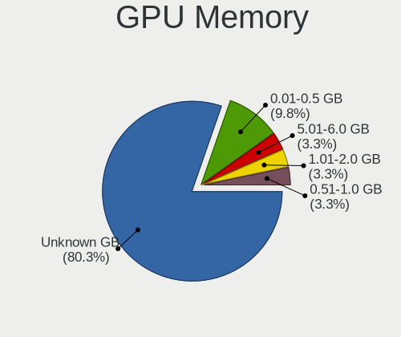
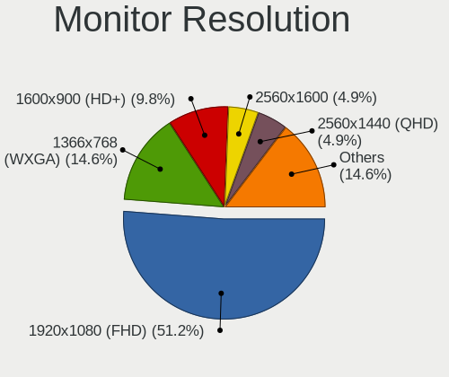

FreeBSD 14.1 - Tested Hardware & Statistics (Notebooks)
-------------------------------------------------------

A project to collect tested hardware configurations for FreeBSD 14.1.

Anyone can contribute to this report by the [hw-probe](https://github.com/linuxhw/hw-probe/blob/master/INSTALL.BSD.md) tool:

    hw-probe -all -upload

Please contribute! Especially if your hardware is rare.

Contents
--------

* [ Test Cases ](#test-cases)

* [ System ](#system)
  - [ Arch                     ](#arch)
  - [ DE                       ](#de)
  - [ Display Server           ](#display-server)
  - [ Display Manager          ](#display-manager)
  - [ OS Lang                  ](#os-lang)
  - [ Boot Mode                ](#boot-mode)
  - [ Filesystem               ](#filesystem)
  - [ Part. scheme             ](#part-scheme)

* [ Board ](#board)
  - [ Vendor                   ](#vendor)
  - [ Model                    ](#model)
  - [ Model Family             ](#model-family)
  - [ MFG Year                 ](#mfg-year)
  - [ Form Factor              ](#form-factor)
  - [ Coreboot                 ](#coreboot)
  - [ RAM Size                 ](#ram-size)
  - [ RAM Used                 ](#ram-used)
  - [ Total Drives             ](#total-drives)
  - [ Has CD-ROM               ](#has-cd-rom)
  - [ Has Ethernet             ](#has-ethernet)
  - [ Has WiFi                 ](#has-wifi)
  - [ Has Bluetooth            ](#has-bluetooth)

* [ Location ](#location)
  - [ Country                  ](#country)
  - [ City                     ](#city)

* [ Drives ](#drives)
  - [ Drive Vendor             ](#drive-vendor)
  - [ Drive Model              ](#drive-model)
  - [ HDD Vendor               ](#hdd-vendor)
  - [ SSD Vendor               ](#ssd-vendor)
  - [ Drive Kind               ](#drive-kind)
  - [ Drive Connector          ](#drive-connector)
  - [ Drive Size               ](#drive-size)
  - [ Space Total              ](#space-total)
  - [ Space Used               ](#space-used)
  - [ Malfunc. Drives          ](#malfunc-drives)
  - [ Malfunc. Drive Vendor    ](#malfunc-drive-vendor)
  - [ Malfunc. HDD Vendor      ](#malfunc-hdd-vendor)
  - [ Malfunc. Drive Kind      ](#malfunc-drive-kind)
  - [ Failed Drives            ](#failed-drives)
  - [ Failed Drive Vendor      ](#failed-drive-vendor)
  - [ Drive Status             ](#drive-status)

* [ Storage controller ](#storage-controller)
  - [ Storage Vendor           ](#storage-vendor)
  - [ Storage Model            ](#storage-model)
  - [ Storage Kind             ](#storage-kind)

* [ Processor ](#processor)
  - [ CPU Vendor               ](#cpu-vendor)
  - [ CPU Model                ](#cpu-model)
  - [ CPU Model Family         ](#cpu-model-family)
  - [ CPU Cores                ](#cpu-cores)
  - [ CPU Sockets              ](#cpu-sockets)
  - [ CPU Threads              ](#cpu-threads)
  - [ CPU Microarch            ](#cpu-microarch)

* [ Graphics ](#graphics)
  - [ GPU Vendor               ](#gpu-vendor)
  - [ GPU Model                ](#gpu-model)
  - [ GPU Combo                ](#gpu-combo)
  - [ GPU Driver               ](#gpu-driver)
  - [ GPU Memory               ](#gpu-memory)

* [ Monitor ](#monitor)
  - [ Monitor Vendor           ](#monitor-vendor)
  - [ Monitor Model            ](#monitor-model)
  - [ Monitor Resolution       ](#monitor-resolution)
  - [ Monitor Diagonal         ](#monitor-diagonal)
  - [ Monitor Width            ](#monitor-width)
  - [ Aspect Ratio             ](#aspect-ratio)
  - [ Monitor Area             ](#monitor-area)
  - [ Pixel Density            ](#pixel-density)
  - [ Multiple Monitors        ](#multiple-monitors)

* [ Network ](#network)
  - [ Net Controller Vendor    ](#net-controller-vendor)
  - [ Net Controller Model     ](#net-controller-model)
  - [ Wireless Vendor          ](#wireless-vendor)
  - [ Wireless Model           ](#wireless-model)
  - [ Ethernet Vendor          ](#ethernet-vendor)
  - [ Ethernet Model           ](#ethernet-model)
  - [ Net Controller Kind      ](#net-controller-kind)
  - [ Used Controller          ](#used-controller)
  - [ NICs                     ](#nics)
  - [ IPv6                     ](#ipv6)

* [ Bluetooth ](#bluetooth)
  - [ Bluetooth Vendor         ](#bluetooth-vendor)
  - [ Bluetooth Model          ](#bluetooth-model)

* [ Sound ](#sound)
  - [ Sound Vendor             ](#sound-vendor)
  - [ Sound Model              ](#sound-model)

* [ Memory ](#memory)
  - [ Memory Vendor            ](#memory-vendor)
  - [ Memory Model             ](#memory-model)
  - [ Memory Kind              ](#memory-kind)
  - [ Memory Form Factor       ](#memory-form-factor)
  - [ Memory Size              ](#memory-size)
  - [ Memory Speed             ](#memory-speed)

* [ Printers & scanners ](#printers--scanners)
  - [ Printer Vendor           ](#printer-vendor)
  - [ Printer Model            ](#printer-model)
  - [ Scanner Vendor           ](#scanner-vendor)
  - [ Scanner Model            ](#scanner-model)

* [ Camera ](#camera)
  - [ Camera Vendor            ](#camera-vendor)
  - [ Camera Model             ](#camera-model)

* [ Security ](#security)
  - [ Fingerprint Vendor       ](#fingerprint-vendor)
  - [ Fingerprint Model        ](#fingerprint-model)
  - [ Chipcard Vendor          ](#chipcard-vendor)
  - [ Chipcard Model           ](#chipcard-model)

* [ Unsupported ](#unsupported)
  - [ Unsupported Devices      ](#unsupported-devices)
  - [ Unsupported Device Types ](#unsupported-device-types)

Test Cases
----------

Total: 76

| Vendor    | Model                       | Probe                                                     | Date         |
|-----------|-----------------------------|-----------------------------------------------------------|--------------|
| Lenovo    | ThinkPad T420s 417153U      | [f3220cb60d](https://bsd-hardware.info/?probe=f3220cb60d) | Jan 02, 2025 |
| HP        | ENVY 15                     | [c83ef9f375](https://bsd-hardware.info/?probe=c83ef9f375) | Nov 30, 2024 |
| Lenovo    | ThinkPad X1 Carbon Gen 9... | [b6aaae01ed](https://bsd-hardware.info/?probe=b6aaae01ed) | Nov 29, 2024 |
| Lenovo    | Legion Slim 5 16IRH8 83D... | [208feb98b3](https://bsd-hardware.info/?probe=208feb98b3) | Nov 26, 2024 |
| Lenovo    | Legion Slim 5 16IRH8 83D... | [1f1948481c](https://bsd-hardware.info/?probe=1f1948481c) | Nov 26, 2024 |
| Lenovo    | ThinkPad T430 2344DUC       | [63d0cde972](https://bsd-hardware.info/?probe=63d0cde972) | Nov 19, 2024 |
| Lenovo    | ThinkPad E595 20NFCTO1WW    | [b16a33c476](https://bsd-hardware.info/?probe=b16a33c476) | Nov 17, 2024 |
| Lenovo    | ThinkPad E14 Gen 4 21E30... | [58bb75f0db](https://bsd-hardware.info/?probe=58bb75f0db) | Nov 10, 2024 |
| HP        | OMEN by Transcend Gaming... | [213d36f877](https://bsd-hardware.info/?probe=213d36f877) | Nov 10, 2024 |
| ASUSTek   | G75VW                       | [2ede0a1468](https://bsd-hardware.info/?probe=2ede0a1468) | Nov 06, 2024 |
| Lenovo    | ThinkPad E14 Gen 2 20TA0... | [b4adfdddc6](https://bsd-hardware.info/?probe=b4adfdddc6) | Nov 03, 2024 |
| ASUSTek   | VivoBook_ASUSLaptop X140... | [90c3811006](https://bsd-hardware.info/?probe=90c3811006) | Nov 01, 2024 |
| ASUSTek   | VivoBook_ASUSLaptop X140... | [a137d76671](https://bsd-hardware.info/?probe=a137d76671) | Nov 01, 2024 |
| Dell      | Latitude 5490               | [aa1887b2e7](https://bsd-hardware.info/?probe=aa1887b2e7) | Oct 28, 2024 |
| Acer      | Aspire ES1-512              | [7027c4efd5](https://bsd-hardware.info/?probe=7027c4efd5) | Oct 28, 2024 |
| Gigabyte  | AERO 15WV8                  | [8b197de6cf](https://bsd-hardware.info/?probe=8b197de6cf) | Oct 26, 2024 |
| HP        | ProBook 455 15.6 inch G9... | [e76040ded0](https://bsd-hardware.info/?probe=e76040ded0) | Oct 25, 2024 |
| Lenovo    | ThinkPad T420 4236MA3       | [1fe30aef50](https://bsd-hardware.info/?probe=1fe30aef50) | Oct 24, 2024 |
| Dell      | Latitude 5290 2-in-1        | [ddd11037f6](https://bsd-hardware.info/?probe=ddd11037f6) | Oct 20, 2024 |
| Apple     | MacBookAir4,1               | [fc2968d698](https://bsd-hardware.info/?probe=fc2968d698) | Oct 18, 2024 |
| Lenovo    | ThinkPad T490 20N2S0QE00    | [b7f189a238](https://bsd-hardware.info/?probe=b7f189a238) | Oct 14, 2024 |
| GPD       | P2 MAX                      | [884f11539a](https://bsd-hardware.info/?probe=884f11539a) | Oct 12, 2024 |
| ASUSTek   | X510UNR                     | [33388f232b](https://bsd-hardware.info/?probe=33388f232b) | Oct 08, 2024 |
| HP        | EliteBook 840 G3            | [b4f6d6a1f9](https://bsd-hardware.info/?probe=b4f6d6a1f9) | Oct 03, 2024 |
| HP        | EliteBook 840 G3            | [56d22f4ec1](https://bsd-hardware.info/?probe=56d22f4ec1) | Oct 03, 2024 |
| ASUSTek   | VivoBook 15_ASUS Laptop ... | [5d35565dad](https://bsd-hardware.info/?probe=5d35565dad) | Oct 02, 2024 |
| Apple     | MacBookPro11,1              | [b9eba86e8e](https://bsd-hardware.info/?probe=b9eba86e8e) | Sep 29, 2024 |
| Dell      | Precision M4600             | [b64ebca386](https://bsd-hardware.info/?probe=b64ebca386) | Sep 27, 2024 |
| Google    | Dragonair                   | [47b39b3760](https://bsd-hardware.info/?probe=47b39b3760) | Sep 23, 2024 |
| Dell      | Precision M4800             | [e44c7842b3](https://bsd-hardware.info/?probe=e44c7842b3) | Sep 22, 2024 |
| Lenovo    | ThinkPad T450s 20BWS2FQ0... | [8a1f8b7ead](https://bsd-hardware.info/?probe=8a1f8b7ead) | Sep 20, 2024 |
| Google    | Dragonair                   | [ec1f3c073b](https://bsd-hardware.info/?probe=ec1f3c073b) | Sep 20, 2024 |
| Lenovo    | IdeaPad Gaming 3 15IMH05... | [9aea4f42bc](https://bsd-hardware.info/?probe=9aea4f42bc) | Sep 18, 2024 |
| Lenovo    | ThinkPad A285 20MXS01R00    | [0c27cded03](https://bsd-hardware.info/?probe=0c27cded03) | Sep 01, 2024 |
| Lenovo    | ThinkPad T580 20L90024GE    | [5fcf7e4608](https://bsd-hardware.info/?probe=5fcf7e4608) | Sep 01, 2024 |
| Apple     | MacBookPro8,2               | [c0d6563b06](https://bsd-hardware.info/?probe=c0d6563b06) | Sep 01, 2024 |
| ASUSTek   | VivoBook_ASUSLaptop X150... | [bca7dbbacf](https://bsd-hardware.info/?probe=bca7dbbacf) | Aug 30, 2024 |
| Panasonic | CFSV7-3                     | [e4b6778e3d](https://bsd-hardware.info/?probe=e4b6778e3d) | Aug 26, 2024 |
| Lenovo    | ThinkPad X230 23255RG       | [b79ae8b113](https://bsd-hardware.info/?probe=b79ae8b113) | Aug 18, 2024 |
| Dell      | Studio 1535                 | [def6732820](https://bsd-hardware.info/?probe=def6732820) | Aug 03, 2024 |
| ASUSTek   | VivoBook_ASUSLaptop X512... | [578dc2d4a6](https://bsd-hardware.info/?probe=578dc2d4a6) | Aug 03, 2024 |
| Lenovo    | ThinkPad T480 20L6SDA400    | [2cc969595a](https://bsd-hardware.info/?probe=2cc969595a) | Aug 02, 2024 |
| Lenovo    | IdeaPad 320-15AST 80XV      | [14634a95c5](https://bsd-hardware.info/?probe=14634a95c5) | Jul 29, 2024 |
| Dell      | XPS 13 9343                 | [c979e064f1](https://bsd-hardware.info/?probe=c979e064f1) | Jul 25, 2024 |
| Lenovo    | V580c 20160                 | [1dd14bc1d9](https://bsd-hardware.info/?probe=1dd14bc1d9) | Jul 24, 2024 |
| Google    | Akemi                       | [039591ce70](https://bsd-hardware.info/?probe=039591ce70) | Jul 23, 2024 |
| ASUSTek   | X550CC                      | [edd7342aa3](https://bsd-hardware.info/?probe=edd7342aa3) | Jul 16, 2024 |
| Valve     | Jupiter                     | [e236d32d37](https://bsd-hardware.info/?probe=e236d32d37) | Jul 14, 2024 |
| Lenovo    | ThinkBook 14-IIL 20SL       | [0232a3609d](https://bsd-hardware.info/?probe=0232a3609d) | Jul 12, 2024 |
| Lenovo    | ThinkBook 14-IIL 20SL       | [3f63a359bd](https://bsd-hardware.info/?probe=3f63a359bd) | Jul 12, 2024 |
| ASUSTek   | X551MA                      | [30209d394a](https://bsd-hardware.info/?probe=30209d394a) | Jul 11, 2024 |
| Dell      | Latitude 7280               | [f6f77a8b31](https://bsd-hardware.info/?probe=f6f77a8b31) | Jul 10, 2024 |
| Dell      | Inspiron 15-3567            | [7a5e3b5861](https://bsd-hardware.info/?probe=7a5e3b5861) | Jul 07, 2024 |
| Lenovo    | ThinkPad T14 Gen 1 20UES... | [ca7824f89c](https://bsd-hardware.info/?probe=ca7824f89c) | Jul 04, 2024 |
| Dell      | Latitude 7280               | [ad0933e8bd](https://bsd-hardware.info/?probe=ad0933e8bd) | Jul 04, 2024 |
| Dell      | Latitude 7280               | [28a70adb15](https://bsd-hardware.info/?probe=28a70adb15) | Jul 02, 2024 |
| Apple     | MacBookPro14,1              | [41adaa07be](https://bsd-hardware.info/?probe=41adaa07be) | Jun 30, 2024 |
| Lenovo    | IdeaPad 1 14ADA05 82GW      | [e58b83e10d](https://bsd-hardware.info/?probe=e58b83e10d) | Jun 30, 2024 |
| Dell      | Inspiron 3542               | [8ca5137564](https://bsd-hardware.info/?probe=8ca5137564) | Jun 27, 2024 |
| Dell      | Inspiron 3542               | [2b8c7918dc](https://bsd-hardware.info/?probe=2b8c7918dc) | Jun 27, 2024 |
| Lenovo    | ThinkBook 16 G6 IRL 21KH    | [ddb6ff92c1](https://bsd-hardware.info/?probe=ddb6ff92c1) | Jun 26, 2024 |
| Acer      | TravelMate B311-31          | [5b03e6f7ec](https://bsd-hardware.info/?probe=5b03e6f7ec) | Jun 20, 2024 |
| Lenovo    | IdeaPad 1 14ADA05 82GW      | [68ba6aaac3](https://bsd-hardware.info/?probe=68ba6aaac3) | Jun 18, 2024 |
| ASUSTek   | 1001P                       | [757aec0ac5](https://bsd-hardware.info/?probe=757aec0ac5) | Jun 17, 2024 |
| Lenovo    | ThinkPad T14 Gen 3 21CF0... | [67cec80204](https://bsd-hardware.info/?probe=67cec80204) | Jun 15, 2024 |
| HP        | EliteBook 8540p             | [cad0e50ea5](https://bsd-hardware.info/?probe=cad0e50ea5) | Jun 14, 2024 |
| Lenovo    | ThinkPad X250 20CMCTO1WW    | [bbc7b223f1](https://bsd-hardware.info/?probe=bbc7b223f1) | Jun 14, 2024 |
| Fujitsu   | LIFEBOOK LH532              | [096152e5dc](https://bsd-hardware.info/?probe=096152e5dc) | Jun 13, 2024 |
| Fujitsu   | LIFEBOOK LH532              | [763cd9a9e3](https://bsd-hardware.info/?probe=763cd9a9e3) | Jun 13, 2024 |
| ASUSTek   | X551MA                      | [4cfbb83bb6](https://bsd-hardware.info/?probe=4cfbb83bb6) | Jun 12, 2024 |
| TUXEDO    | Pulse 15 Gen1               | [77a2048193](https://bsd-hardware.info/?probe=77a2048193) | Jun 12, 2024 |
| Lenovo    | IdeaPad 5 14ALC05 82LM      | [b8dc419264](https://bsd-hardware.info/?probe=b8dc419264) | Jun 08, 2024 |
| Lenovo    | ThinkBook 16 G6 IRL 21KH    | [8f7f98fc18](https://bsd-hardware.info/?probe=8f7f98fc18) | Jun 07, 2024 |
| ASUSTek   | VivoBook_ASUSLaptop M140... | [290910cd2c](https://bsd-hardware.info/?probe=290910cd2c) | Jun 07, 2024 |
| Maibenben | MaiBook M                   | [6be90cf12e](https://bsd-hardware.info/?probe=6be90cf12e) | Jun 05, 2024 |
| Lenovo    | ThinkPad E14 Gen 5 21JK0... | [f07fafed9c](https://bsd-hardware.info/?probe=f07fafed9c) | Jun 04, 2024 |

System
------

Arch
----

OS architecture (x86_64, i586, etc.)

| Name  | Notebooks | Percent |
|-------|-----------|---------|
| amd64 | 60        | 98.36%  |
| i386  | 1         | 1.64%   |

DE
--

Desktop Environment

| Name      | Notebooks | Percent |
|-----------|-----------|---------|
| TWM       | 13        | 20.97%  |
| KDE5      | 12        | 19.35%  |
| XFCE      | 11        | 17.74%  |
| Console   | 10        | 16.13%  |
| i3        | 6         | 9.68%   |
| MATE      | 3         | 4.84%   |
| GNOME     | 3         | 4.84%   |
| Picom     | 1         | 1.61%   |
| Hyprland  | 1         | 1.61%   |
| Budgie    | 1         | 1.61%   |
| AwesomeWM | 1         | 1.61%   |

Display Server
--------------

X11 or Wayland

| Name    | Notebooks | Percent |
|---------|-----------|---------|
| X11     | 48        | 78.69%  |
| Console | 9         | 14.75%  |
| Wayland | 4         | 6.56%   |

Display Manager
---------------

SDDM, LightDM, etc.

| Name    | Notebooks | Percent |
|---------|-----------|---------|
| Console | 34        | 55.74%  |
| SDDM    | 13        | 21.31%  |
| LightDM | 6         | 9.84%   |
| XDM     | 4         | 6.56%   |
| Ly      | 3         | 4.92%   |
| GDM     | 1         | 1.64%   |

OS Lang
-------

Language

| Lang    | Notebooks | Percent |
|---------|-----------|---------|
| C       | 45        | 73.77%  |
| Unknown | 10        | 16.39%  |
| en_US   | 3         | 4.92%   |
| zh_CN   | 1         | 1.64%   |
| ru      | 1         | 1.64%   |
| pt_BR   | 1         | 1.64%   |

Boot Mode
---------

EFI or BIOS

| Mode | Notebooks | Percent |
|------|-----------|---------|
| EFI  | 54        | 88.52%  |
| BIOS | 7         | 11.48%  |

Filesystem
----------

Type of filesystem

| Type | Notebooks | Percent |
|------|-----------|---------|
| Zfs  | 40        | 65.57%  |
| Ufs  | 21        | 34.43%  |

Part. scheme
------------

Scheme of partitioning

| Type    | Notebooks | Percent |
|---------|-----------|---------|
| GPT     | 59        | 96.72%  |
| MBR     | 1         | 1.64%   |
| Unknown | 1         | 1.64%   |

Board
-----

Vendor
------

Motherboard manufacturer

| Name                | Notebooks | Percent |
|---------------------|-----------|---------|
| Lenovo              | 24        | 39.34%  |
| ASUSTek Computer    | 10        | 16.39%  |
| Dell                | 8         | 13.11%  |
| Hewlett-Packard     | 5         | 8.2%    |
| Apple               | 4         | 6.56%   |
| Google              | 2         | 3.28%   |
| Acer                | 2         | 3.28%   |
| Valve               | 1         | 1.64%   |
| TUXEDO              | 1         | 1.64%   |
| Panasonic           | 1         | 1.64%   |
| GPD                 | 1         | 1.64%   |
| Gigabyte Technology | 1         | 1.64%   |
| Fujitsu             | 1         | 1.64%   |

Model
-----

Motherboard model

| Name                                        | Notebooks | Percent |
|---------------------------------------------|-----------|---------|
| Valve Jupiter                               | 1         | 1.64%   |
| TUXEDO Pulse 15 Gen1                        | 1         | 1.64%   |
| Panasonic CFSV7-3                           | 1         | 1.64%   |
| Lenovo V580c 20160                          | 1         | 1.64%   |
| Lenovo ThinkPad X250 20CMCTO1WW             | 1         | 1.64%   |
| Lenovo ThinkPad X230 23255RG                | 1         | 1.64%   |
| Lenovo ThinkPad X1 Carbon Gen 9 20XW006FSP  | 1         | 1.64%   |
| Lenovo ThinkPad T580 20L90024GE             | 1         | 1.64%   |
| Lenovo ThinkPad T480 20L6SDA400             | 1         | 1.64%   |
| Lenovo ThinkPad T450s 20BWS2FQ00            | 1         | 1.64%   |
| Lenovo ThinkPad T430 2344DUC                | 1         | 1.64%   |
| Lenovo ThinkPad T420s 417153U               | 1         | 1.64%   |
| Lenovo ThinkPad T420 4236MA3                | 1         | 1.64%   |
| Lenovo ThinkPad T14 Gen 3 21CF000EUS        | 1         | 1.64%   |
| Lenovo ThinkPad T14 Gen 1 20UES1K600        | 1         | 1.64%   |
| Lenovo ThinkPad E595 20NFCTO1WW             | 1         | 1.64%   |
| Lenovo ThinkPad E14 Gen 5 21JK00C5GM        | 1         | 1.64%   |
| Lenovo ThinkPad E14 Gen 4 21E300E4VN        | 1         | 1.64%   |
| Lenovo ThinkPad E14 Gen 2 20TA009HID        | 1         | 1.64%   |
| Lenovo ThinkPad A285 20MXS01R00             | 1         | 1.64%   |
| Lenovo ThinkBook 16 G6 IRL 21KH             | 1         | 1.64%   |
| Lenovo ThinkBook 14-IIL 20SL                | 1         | 1.64%   |
| Lenovo Legion Slim 5 16IRH8 83D6            | 1         | 1.64%   |
| Lenovo IdeaPad Gaming 3 15IMH05 81Y4        | 1         | 1.64%   |
| Lenovo IdeaPad 5 14ALC05 82LM               | 1         | 1.64%   |
| Lenovo IdeaPad 320-15AST 80XV               | 1         | 1.64%   |
| Lenovo IdeaPad 1 14ADA05 82GW               | 1         | 1.64%   |
| HP ProBook 455 15.6 inch G9 Notebook PC     | 1         | 1.64%   |
| HP OMEN by Transcend Gaming Laptop 16-u0xxx | 1         | 1.64%   |
| HP ENVY 15                                  | 1         | 1.64%   |
| HP EliteBook 8540p                          | 1         | 1.64%   |
| HP EliteBook 840 G3                         | 1         | 1.64%   |
| GPD P2 MAX                                  | 1         | 1.64%   |
| Google Dragonair                            | 1         | 1.64%   |
| Google Akemi                                | 1         | 1.64%   |
| Gigabyte AERO 15WV8                         | 1         | 1.64%   |
| Fujitsu LIFEBOOK LH532                      | 1         | 1.64%   |
| Dell Studio 1535                            | 1         | 1.64%   |
| Dell Precision M4800                        | 1         | 1.64%   |
| Dell Precision M4600                        | 1         | 1.64%   |

Model Family
------------

Motherboard model prefix

| Name               | Notebooks | Percent |
|--------------------|-----------|---------|
| Lenovo ThinkPad    | 16        | 26.23%  |
| ASUS VivoBook      | 5         | 8.2%    |
| Lenovo IdeaPad     | 4         | 6.56%   |
| Dell Latitude      | 3         | 4.92%   |
| Lenovo ThinkBook   | 2         | 3.28%   |
| HP EliteBook       | 2         | 3.28%   |
| Dell Precision     | 2         | 3.28%   |
| Dell Inspiron      | 2         | 3.28%   |
| Valve Jupiter      | 1         | 1.64%   |
| TUXEDO Pulse       | 1         | 1.64%   |
| Panasonic CFSV7-3  | 1         | 1.64%   |
| Lenovo V580c       | 1         | 1.64%   |
| Lenovo Legion      | 1         | 1.64%   |
| HP ProBook         | 1         | 1.64%   |
| HP OMEN            | 1         | 1.64%   |
| HP ENVY            | 1         | 1.64%   |
| GPD P2             | 1         | 1.64%   |
| Google Dragonair   | 1         | 1.64%   |
| Google Akemi       | 1         | 1.64%   |
| Gigabyte AERO      | 1         | 1.64%   |
| Fujitsu LIFEBOOK   | 1         | 1.64%   |
| Dell Studio        | 1         | 1.64%   |
| ASUS X551MA        | 1         | 1.64%   |
| ASUS X550CC        | 1         | 1.64%   |
| ASUS X510UNR       | 1         | 1.64%   |
| ASUS G75VW         | 1         | 1.64%   |
| ASUS 1001P         | 1         | 1.64%   |
| Apple MacBookPro8  | 1         | 1.64%   |
| Apple MacBookPro14 | 1         | 1.64%   |
| Apple MacBookPro11 | 1         | 1.64%   |
| Apple MacBookAir4  | 1         | 1.64%   |
| Acer TravelMate    | 1         | 1.64%   |
| Acer Aspire        | 1         | 1.64%   |

MFG Year
--------

Motherboard manufacture year

| Year | Notebooks | Percent |
|------|-----------|---------|
| 2021 | 10        | 16.39%  |
| 2023 | 7         | 11.48%  |
| 2020 | 6         | 9.84%   |
| 2022 | 5         | 8.2%    |
| 2019 | 5         | 8.2%    |
| 2018 | 5         | 8.2%    |
| 2015 | 4         | 6.56%   |
| 2013 | 4         | 6.56%   |
| 2024 | 3         | 4.92%   |
| 2014 | 3         | 4.92%   |
| 2012 | 3         | 4.92%   |
| 2011 | 2         | 3.28%   |
| 2017 | 1         | 1.64%   |
| 2016 | 1         | 1.64%   |
| 2010 | 1         | 1.64%   |
| 2008 | 1         | 1.64%   |

Form Factor
-----------

Physical design of the computer

| Name     | Notebooks | Percent |
|----------|-----------|---------|
| Notebook | 61        | 100%    |

Coreboot
--------

Have coreboot on board

| Used | Notebooks | Percent |
|------|-----------|---------|
| No   | 59        | 96.72%  |
| Yes  | 2         | 3.28%   |

RAM Size
--------

Total RAM memory

| Size in GB | Notebooks | Percent |
|------------|-----------|---------|
| 8.01-16.0  | 24        | 39.34%  |
| 16.01-24.0 | 23        | 37.7%   |
| 32.01-64.0 | 6         | 9.84%   |
| 4.01-8.0   | 5         | 8.2%    |
| 2.01-3.0   | 2         | 3.28%   |
| 24.01-32.0 | 1         | 1.64%   |

RAM Used
--------

Used RAM memory

| Used GB  | Notebooks | Percent |
|----------|-----------|---------|
| 0.01-0.5 | 23        | 37.7%   |
| 0.51-1.0 | 22        | 36.07%  |
| 1.01-2.0 | 14        | 22.95%  |
| 2.01-3.0 | 2         | 3.28%   |

Total Drives
------------

Number of drives on board

| Drives | Notebooks | Percent |
|--------|-----------|---------|
| 0      | 30        | 49.18%  |
| 1      | 28        | 45.9%   |
| 2      | 3         | 4.92%   |

Has CD-ROM
----------

Has CD-ROM on board

| Presented | Notebooks | Percent |
|-----------|-----------|---------|
| No        | 49        | 80.33%  |
| Yes       | 12        | 19.67%  |

Has Ethernet
------------

Has Ethernet on board

| Presented | Notebooks | Percent |
|-----------|-----------|---------|
| Yes       | 45        | 73.77%  |
| No        | 16        | 26.23%  |

Has WiFi
--------

Has WiFi module

| Presented | Notebooks | Percent |
|-----------|-----------|---------|
| Yes       | 60        | 98.36%  |
| No        | 1         | 1.64%   |

Has Bluetooth
-------------

Has Bluetooth module

| Presented | Notebooks | Percent |
|-----------|-----------|---------|
| Yes       | 53        | 86.89%  |
| No        | 8         | 13.11%  |

Location
--------

Country
-------

Geographic location (country)

| Country     | Notebooks | Percent |
|-------------|-----------|---------|
| USA         | 12        | 19.67%  |
| Germany     | 4         | 6.56%   |
| UK          | 3         | 4.92%   |
| Switzerland | 3         | 4.92%   |
| Russia      | 3         | 4.92%   |
| Poland      | 3         | 4.92%   |
| France      | 3         | 4.92%   |
| China       | 3         | 4.92%   |
| Brazil      | 3         | 4.92%   |
| Australia   | 3         | 4.92%   |
| Mexico      | 2         | 3.28%   |
| Hong Kong   | 2         | 3.28%   |
| Estonia     | 2         | 3.28%   |
| Canada      | 2         | 3.28%   |
| Vietnam     | 1         | 1.64%   |
| Sweden      | 1         | 1.64%   |
| Romania     | 1         | 1.64%   |
| Netherlands | 1         | 1.64%   |
| Italy       | 1         | 1.64%   |
| Iraq        | 1         | 1.64%   |
| Indonesia   | 1         | 1.64%   |
| India       | 1         | 1.64%   |
| Hungary     | 1         | 1.64%   |
| Czechia     | 1         | 1.64%   |
| Costa Rica  | 1         | 1.64%   |
| Bulgaria    | 1         | 1.64%   |
| Argentina   | 1         | 1.64%   |

City
----

Geographic location (city)

| City             | Notebooks | Percent |
|------------------|-----------|---------|
| Zurich           | 3         | 4.92%   |
| Valga            | 2         | 3.28%   |
| Moscow           | 2         | 3.28%   |
| Brisbane         | 2         | 3.28%   |
| Xi'an            | 1         | 1.64%   |
| West Lafayette   | 1         | 1.64%   |
| Ulm              | 1         | 1.64%   |
| South Gate       | 1         | 1.64%   |
| Sao Paulo        | 1         | 1.64%   |
| San José        | 1         | 1.64%   |
| Rotterdam        | 1         | 1.64%   |
| Rio de Janeiro   | 1         | 1.64%   |
| Prague           | 1         | 1.64%   |
| Powell River     | 1         | 1.64%   |
| Poços de Caldas | 1         | 1.64%   |
| Pleven           | 1         | 1.64%   |
| Perm             | 1         | 1.64%   |
| Nowy Sącz       | 1         | 1.64%   |
| Noisy-le-Grand   | 1         | 1.64%   |
| Neptune City     | 1         | 1.64%   |
| Neenah           | 1         | 1.64%   |
| Naucalpan        | 1         | 1.64%   |
| Melbourne        | 1         | 1.64%   |
| Massy            | 1         | 1.64%   |
| Mankato          | 1         | 1.64%   |
| Manchester       | 1         | 1.64%   |
| Lund             | 1         | 1.64%   |
| Liuxiang         | 1         | 1.64%   |
| Lancing          | 1         | 1.64%   |
| Katowice         | 1         | 1.64%   |
| Jericho          | 1         | 1.64%   |
| Iasi             | 1         | 1.64%   |
| Hyderabad        | 1         | 1.64%   |
| Houilles         | 1         | 1.64%   |
| Hong Kong        | 1         | 1.64%   |
| Ho Chi Minh City | 1         | 1.64%   |
| Hillah           | 1         | 1.64%   |
| Harringay        | 1         | 1.64%   |
| Halle            | 1         | 1.64%   |
| Gdynia           | 1         | 1.64%   |

Drives
------

Drive Vendor
------------

Hard drive vendors

| Vendor              | Notebooks | Drives | Percent |
|---------------------|-----------|--------|---------|
| Samsung Electronics | 5         | 5      | 14.29%  |
| WDC                 | 4         | 4      | 11.43%  |
| Seagate             | 4         | 4      | 11.43%  |
| Intel               | 4         | 4      | 11.43%  |
| Micron Technology   | 3         | 3      | 8.57%   |
| A-DATA Technology   | 3         | 3      | 8.57%   |
| Kingston            | 2         | 2      | 5.71%   |
| HGST                | 2         | 3      | 5.71%   |
| Apple               | 2         | 2      | 5.71%   |
| Toshiba             | 1         | 1      | 2.86%   |
| Teclast             | 1         | 1      | 2.86%   |
| Team                | 1         | 1      | 2.86%   |
| SK hynix            | 1         | 1      | 2.86%   |
| Crucial             | 1         | 1      | 2.86%   |
| Corsair             | 1         | 1      | 2.86%   |

Drive Model
-----------

Hard drive models

| Model                            | Notebooks | Percent |
|----------------------------------|-----------|---------|
| Seagate ST500LT012-1DG142 500GB  | 2         | 5.71%   |
| WDC WDS240G2G0A-00JH30 240GB     | 1         | 2.86%   |
| WDC WD7500BPVT-16HXZT3 752GB     | 1         | 2.86%   |
| WDC WD50NDZW-11BCSS1 5TB         | 1         | 2.86%   |
| WDC WD2500BEVS-75UST0 250GB      | 1         | 2.86%   |
| Toshiba MQ01ABF050 500GB         | 1         | 2.86%   |
| Teclast 256GB SSD                | 1         | 2.86%   |
| Team T253256GB                   | 1         | 2.86%   |
| SK hynix SC311 SATA 256GB        | 1         | 2.86%   |
| Seagate ST9250827AS 250GB        | 1         | 2.86%   |
| Seagate ST1000LM035-1RK172 1TB   | 1         | 2.86%   |
| Samsung SSD 850 PRO 256GB        | 1         | 2.86%   |
| Samsung SSD 850 EVO 250GB        | 1         | 2.86%   |
| Samsung SSD 840 EVO 120GB        | 1         | 2.86%   |
| Samsung MZYTY256HDHP-000L2 256GB | 1         | 2.86%   |
| Samsung MZNLN256HAJQ-00007 256GB | 1         | 2.86%   |
| Micron MTFDDAK256MAM-1K12 256GB  | 1         | 2.86%   |
| Micron C300-MTFDBAK128MAG 128GB  | 1         | 2.86%   |
| Micron 1100_MTFDDAV256TBN 256GB  | 1         | 2.86%   |
| Kingston RBUSC180DS37256GJ 256GB | 1         | 2.86%   |
| Kingston HyperX Fury 3D 240GB    | 1         | 2.86%   |
| Intel SSDSC2BW480A4 480GB        | 1         | 2.86%   |
| Intel SSDSC2BW180A4 180GB        | 1         | 2.86%   |
| Intel SSDSC2BB480G4 480GB        | 1         | 2.86%   |
| Intel SSDSA2M120G2GC 120GB       | 1         | 2.86%   |
| HGST HTS721010A9E630 1TB         | 1         | 2.86%   |
| HGST HTS545050A7E380 500GB       | 1         | 2.86%   |
| Crucial CT1000BX500SSD1 1TB      | 1         | 2.86%   |
| Corsair Force 3 SSD 120GB        | 1         | 2.86%   |
| Apple SSD SM256C 256GB           | 1         | 2.86%   |
| Apple SSD SM0512F 500GB          | 1         | 2.86%   |
| A-DATA SU810NS38 SATA 256 GB     | 1         | 2.86%   |
| A-DATA SU650 240GB               | 1         | 2.86%   |
| A-DATA SP310 128GB               | 1         | 2.86%   |

HDD Vendor
----------

Hard disk drive vendors

| Vendor  | Notebooks | Drives | Percent |
|---------|-----------|--------|---------|
| Seagate | 4         | 4      | 40%     |
| WDC     | 3         | 3      | 30%     |
| HGST    | 2         | 3      | 20%     |
| Toshiba | 1         | 1      | 10%     |

SSD Vendor
----------

Solid state drive vendors

| Vendor              | Notebooks | Drives | Percent |
|---------------------|-----------|--------|---------|
| Samsung Electronics | 5         | 5      | 20%     |
| Intel               | 4         | 4      | 16%     |
| Micron Technology   | 3         | 3      | 12%     |
| A-DATA Technology   | 3         | 3      | 12%     |
| Kingston            | 2         | 2      | 8%      |
| Apple               | 2         | 2      | 8%      |
| WDC                 | 1         | 1      | 4%      |
| Teclast             | 1         | 1      | 4%      |
| Team                | 1         | 1      | 4%      |
| SK hynix            | 1         | 1      | 4%      |
| Crucial             | 1         | 1      | 4%      |
| Corsair             | 1         | 1      | 4%      |

Drive Kind
----------

HDD or SSD

| Kind | Notebooks | Drives | Percent |
|------|-----------|--------|---------|
| SSD  | 23        | 25     | 69.7%   |
| HDD  | 10        | 11     | 30.3%   |

Drive Connector
---------------

SATA, SAS, NVMe, etc.

| Type | Notebooks | Drives | Percent |
|------|-----------|--------|---------|
| SATA | 32        | 36     | 100%    |

Drive Size
----------

Size of hard drive

| Size in TB | Notebooks | Drives | Percent |
|------------|-----------|--------|---------|
| 0.01-0.5   | 27        | 31     | 84.38%  |
| 0.51-1.0   | 4         | 4      | 12.5%   |
| 4.01-10.0  | 1         | 1      | 3.13%   |

Space Total
-----------

Amount of disk space available on the file system

| Size in GB     | Notebooks | Percent |
|----------------|-----------|---------|
| 101-250        | 25        | 40.98%  |
| 251-500        | 14        | 22.95%  |
| 51-100         | 11        | 18.03%  |
| 501-1000       | 7         | 11.48%  |
| 21-50          | 2         | 3.28%   |
| More than 3000 | 1         | 1.64%   |
| 1-20           | 1         | 1.64%   |

Space Used
----------

Amount of used disk space

| Used GB | Notebooks | Percent |
|---------|-----------|---------|
| 1-20    | 51        | 83.61%  |
| 21-50   | 6         | 9.84%   |
| 51-100  | 3         | 4.92%   |
| 251-500 | 1         | 1.64%   |

Malfunc. Drives
---------------

Drive models with a malfunction

| Model                                      | Notebooks | Drives | Percent |
|--------------------------------------------|-----------|--------|---------|
| Seagate ST500LT012-1DG142 500GB            | 2         | 2      | 16.67%  |
| Seagate ST9250827AS 250GB                  | 1         | 1      | 8.33%   |
| Micron Technology MTFDDAK256MAM-1K12 256GB | 1         | 1      | 8.33%   |
| Micron Technology 1100_MTFDDAV256TBN 256GB | 1         | 1      | 8.33%   |
| Kingston HyperX Fury 3D 240GB              | 1         | 1      | 8.33%   |
| Intel SSDSC2BW480A4 480GB                  | 1         | 1      | 8.33%   |
| Intel SSDSC2BW180A4 180GB                  | 1         | 1      | 8.33%   |
| Intel SSDSA2M120G2GC 120GB                 | 1         | 1      | 8.33%   |
| HGST HTS721010A9E630 1TB                   | 1         | 1      | 8.33%   |
| HGST HTS545050A7E380 500GB                 | 1         | 2      | 8.33%   |
| Apple SSD SM256C 256GB                     | 1         | 1      | 8.33%   |

Malfunc. Drive Vendor
---------------------

Vendors of faulty drives

| Vendor            | Notebooks | Drives | Percent |
|-------------------|-----------|--------|---------|
| Seagate           | 3         | 3      | 25%     |
| Intel             | 3         | 3      | 25%     |
| Micron Technology | 2         | 2      | 16.67%  |
| HGST              | 2         | 3      | 16.67%  |
| Kingston          | 1         | 1      | 8.33%   |
| Apple             | 1         | 1      | 8.33%   |

Malfunc. HDD Vendor
-------------------

Vendors of faulty HDD drives

| Vendor  | Notebooks | Drives | Percent |
|---------|-----------|--------|---------|
| Seagate | 3         | 3      | 60%     |
| HGST    | 2         | 3      | 40%     |

Malfunc. Drive Kind
-------------------

Kinds of faulty drives

| Kind | Notebooks | Drives | Percent |
|------|-----------|--------|---------|
| SSD  | 7         | 7      | 58.33%  |
| HDD  | 5         | 6      | 41.67%  |

Failed Drives
-------------

Failed drive models

Zero info for selected period =(

Failed Drive Vendor
-------------------

Failed drive vendors

Zero info for selected period =(

Drive Status
------------

Number of failed and malfunc. drives

| Status  | Notebooks | Drives | Percent |
|---------|-----------|--------|---------|
| Works   | 21        | 23     | 63.64%  |
| Malfunc | 12        | 13     | 36.36%  |

Storage controller
------------------

Storage Vendor
--------------

Storage controller vendors

| Vendor                      | Notebooks | Percent |
|-----------------------------|-----------|---------|
| Intel                       | 36        | 48.65%  |
| Samsung Electronics         | 10        | 13.51%  |
| SK hynix                    | 7         | 9.46%   |
| Sandisk                     | 6         | 8.11%   |
| AMD                         | 5         | 6.76%   |
| Silicon Motion              | 2         | 2.7%    |
| Phison Electronics          | 2         | 2.7%    |
| Micron Technology           | 2         | 2.7%    |
| Transcend                   | 1         | 1.35%   |
| Micron/Crucial Technology   | 1         | 1.35%   |
| KIOXIA                      | 1         | 1.35%   |
| Kingston Technology Company | 1         | 1.35%   |

Storage Model
-------------

Storage controller models

| Model                                                                          | Notebooks | Percent |
|--------------------------------------------------------------------------------|-----------|---------|
| Intel Sunrise Point-LP SATA Controller [AHCI mode]                             | 7         | 9.33%   |
| Intel 7 Series Chipset Family 6-port SATA Controller [AHCI mode]               | 6         | 8%      |
| Intel 6 Series/C200 Series Chipset Family 6 port Mobile SATA AHCI Controller   | 5         | 6.67%   |
| AMD FCH SATA Controller [AHCI mode]                                            | 5         | 6.67%   |
| SK hynix Gold P31/BC711/PC711 NVMe Solid State Drive                           | 3         | 4%      |
| Samsung NVMe SSD Controller SM981/PM981/PM983                                  | 3         | 4%      |
| Samsung NVMe SSD Controller 980 (DRAM-less)                                    | 3         | 4%      |
| Sandisk WD PC SN740 NVMe SSD 512GB (DRAM-less)                                 | 2         | 2.67%   |
| Samsung NVMe SSD Controller PM9A1/PM9A3/980PRO                                 | 2         | 2.67%   |
| Intel Wildcat Point-LP SATA Controller [AHCI Mode]                             | 2         | 2.67%   |
| Intel Ice Lake-LP SATA Controller [AHCI mode]                                  | 2         | 2.67%   |
| Intel Comet Lake SATA AHCI Controller                                          | 2         | 2.67%   |
| Intel Atom Processor E3800 Series SATA AHCI Controller                         | 2         | 2.67%   |
| Intel 8 Series/C220 Series Chipset Family 6-port SATA Controller 1 [AHCI mode] | 2         | 2.67%   |
| Transcend NVMe PCIe SSD 110S/112S/120S/MTE300S/MTE400S/MTE652T2 (DRAM-less)    | 1         | 1.33%   |
| SK hynix Platinum P41/PC801 NVMe Solid State Drive                             | 1         | 1.33%   |
| SK hynix PC611 NVMe Solid State Drive                                          | 1         | 1.33%   |
| SK hynix BC511 NVMe SSD                                                        | 1         | 1.33%   |
| SK hynix BC501 NVMe Solid State Drive                                          | 1         | 1.33%   |
| Silicon Motion SM2263EN/SM2263XT (DRAM-less) NVMe SSD Controllers              | 1         | 1.33%   |
| Silicon Motion SM2262/SM2262EN SSD Controller                                  | 1         | 1.33%   |
| Sandisk WD Black SN770 / PC SN740 256GB / PC SN560 (DRAM-less) NVMe SSD        | 1         | 1.33%   |
| SanDisk Ultra 3D / WD PC SN530, IX SN530, Blue SN550 NVMe SSD (DRAM-less)      | 1         | 1.33%   |
| Sandisk PC SN740 NVMe SSD (DRAM-less)                                          | 1         | 1.33%   |
| SanDisk Extreme Pro / WD Black SN750 / PC SN730 / Red SN700 NVMe SSD           | 1         | 1.33%   |
| Samsung S4LN053X01 AHCI SSD Controller(Apple slot)                             | 1         | 1.33%   |
| Samsung NVMe SSD Controller PM9B1 (DRAM-less)                                  | 1         | 1.33%   |
| Phison PS5021-E21 PCIe4 NVMe Controller (DRAM-less)                            | 1         | 1.33%   |
| Phison PS5013-E13 PCIe3 NVMe Controller (DRAM-less)                            | 1         | 1.33%   |
| Micron/Crucial T500 NVMe PCIe SSD                                              | 1         | 1.33%   |
| Micron 3400 NVMe SSD [Hendrix]                                                 | 1         | 1.33%   |
| Micron 2450 NVMe SSD [HendrixV] (DRAM-less)                                    | 1         | 1.33%   |
| KIOXIA NVMe SSD                                                                | 1         | 1.33%   |
| Kingston Company NV2 NVMe SSD [SM2267XT] (DRAM-less)                           | 1         | 1.33%   |
| Intel Volume Management Device NVMe RAID Controller Intel Corporation          | 1         | 1.33%   |
| Intel Volume Management Device NVMe RAID Controller                            | 1         | 1.33%   |
| Intel SSD 670p Series [Keystone Harbor]                                        | 1         | 1.33%   |
| Intel NM10/ICH7 Family SATA Controller [AHCI mode]                             | 1         | 1.33%   |
| Intel 82801HM/HEM (ICH8M/ICH8M-E) SATA Controller [AHCI mode]                  | 1         | 1.33%   |
| Intel 8 Series SATA Controller 1 [AHCI mode]                                   | 1         | 1.33%   |

Storage Kind
------------

Kind of storage controller (IDE, SATA, NVMe, SAS, ...)

| Kind | Notebooks | Percent |
|------|-----------|---------|
| SATA | 39        | 54.17%  |
| NVMe | 30        | 41.67%  |
| RAID | 2         | 2.78%   |
| IDE  | 1         | 1.39%   |

Processor
---------

CPU Vendor
----------

Processor vendors

| Vendor | Notebooks | Percent |
|--------|-----------|---------|
| Intel  | 50        | 81.97%  |
| AMD    | 11        | 18.03%  |

CPU Model
---------

Processor models

| Model                                    | Notebooks | Percent |
|------------------------------------------|-----------|---------|
| Intel Core i7-8650U CPU @ 1.90GHz        | 2         | 3.28%   |
| Intel Core i7-8550U CPU @ 1.80GHz        | 2         | 3.28%   |
| Intel Core i5-1035G1 CPU @ 1.00GHz       | 2         | 3.28%   |
| Intel Core i3-10110U CPU @ 2.10GHz       | 2         | 3.28%   |
| Intel Celeron CPU N2840 @ 2.16GHz        | 2         | 3.28%   |
| Intel 13th Gen Core i5-1335U             | 2         | 3.28%   |
| Intel 11th Gen Core i7-1165G7 @ 2.80GHz  | 2         | 3.28%   |
| AMD Ryzen 7 4800H with Radeon Graphics   | 2         | 3.28%   |
| Intel Pentium Silver N5030 CPU @ 1.10GHz | 1         | 1.64%   |
| Intel Core m3-8100Y CPU @ 1.10GHz        | 1         | 1.64%   |
| Intel Core i7-8750H CPU @ 2.20GHz        | 1         | 1.64%   |
| Intel Core i7-5600U CPU @ 2.60GHz        | 1         | 1.64%   |
| Intel Core i7-4800MQ CPU @ 2.70GHz       | 1         | 1.64%   |
| Intel Core i7-4700MQ CPU @ 2.40GHz       | 1         | 1.64%   |
| Intel Core i7-3632QM CPU @ 2.20GHz       | 1         | 1.64%   |
| Intel Core i7-3610QM CPU @ 2.30GHz       | 1         | 1.64%   |
| Intel Core i7-2675QM CPU @ 2.20GHz       | 1         | 1.64%   |
| Intel Core i7-2640M CPU @ 2.80GH         | 1         | 1.64%   |
| Intel Core i7-10750H CPU @ 2.60GHz       | 1         | 1.64%   |
| Intel Core i7 CPU M 620 @ 2.67GHz        | 1         | 1.64%   |
| Intel Core i5-8350U CPU @ 1.70GHz        | 1         | 1.64%   |
| Intel Core i5-8250U CPU @ 1.60GHz        | 1         | 1.64%   |
| Intel Core i5-7360U CPU @ 2.30GHz        | 1         | 1.64%   |
| Intel Core i5-7300U CPU @ 2.60GHz        | 1         | 1.64%   |
| Intel Core i5-6300U CPU @ 2.40GHz        | 1         | 1.64%   |
| Intel Core i5-5300U CPU @ 2.30GHz        | 1         | 1.64%   |
| Intel Core i5-4308U CPU @ 2.80GHz        | 1         | 1.64%   |
| Intel Core i5-3337U CPU @ 1.80GHz        | 1         | 1.64%   |
| Intel Core i5-3320M CPU @ 2.60GHz        | 1         | 1.64%   |
| Intel Core i5-3210M CPU @ 2.50GHz        | 1         | 1.64%   |
| Intel Core i5-2540M CPU @ 2.60GHz        | 1         | 1.64%   |
| Intel Core i5-2520M CPU @ 2.50GHz        | 1         | 1.64%   |
| Intel Core i5-2467M CPU @ 1.60GHz        | 1         | 1.64%   |
| Intel Core i3-7020U CPU @ 2.30GHz        | 1         | 1.64%   |
| Intel Core i3-6006U CPU @ 2.00GHz        | 1         | 1.64%   |
| Intel Core i3-4005U CPU @ 1.70GHz        | 1         | 1.64%   |
| Intel Core i3-3120M CPU @ 2.50GHz        | 1         | 1.64%   |
| Intel Core 2 Duo                         | 1         | 1.64%   |
| Intel Atom CPU N450 @ 1.66GHz            | 1         | 1.64%   |
| Intel 13th Gen Core i7-13700HX           | 1         | 1.64%   |

CPU Model Family
----------------

Processor model prefix

| Model                | Notebooks | Percent |
|----------------------|-----------|---------|
| Intel Core i5        | 15        | 24.59%  |
| Intel Core i7        | 14        | 22.95%  |
| Other                | 11        | 18.03%  |
| Intel Core i3        | 6         | 9.84%   |
| AMD Ryzen 7          | 4         | 6.56%   |
| Intel Celeron        | 2         | 3.28%   |
| AMD Ryzen 5 PRO      | 2         | 3.28%   |
| Intel Pentium Silver | 1         | 1.64%   |
| Intel Core m3        | 1         | 1.64%   |
| Intel Core 2 Duo     | 1         | 1.64%   |
| Intel Atom           | 1         | 1.64%   |
| AMD Ryzen 7 PRO      | 1         | 1.64%   |
| AMD Ryzen 5          | 1         | 1.64%   |
| AMD Athlon           | 1         | 1.64%   |

CPU Cores
---------

Number of processor cores

| Number | Notebooks | Percent |
|--------|-----------|---------|
| 2      | 25        | 40.98%  |
| 4      | 19        | 31.15%  |
| 12     | 6         | 9.84%   |
| 16     | 4         | 6.56%   |
| 8      | 3         | 4.92%   |
| 6      | 3         | 4.92%   |
| 1      | 1         | 1.64%   |

CPU Sockets
-----------

Number of sockets

| Number | Notebooks | Percent |
|--------|-----------|---------|
| 1      | 61        | 100%    |

CPU Threads
-----------

Threads per core (Hyper-Threading)

| Number | Notebooks | Percent |
|--------|-----------|---------|
| 2      | 44        | 72.13%  |
| 1      | 17        | 27.87%  |

CPU Microarch
-------------

Microarchitecture

| Name          | Notebooks | Percent |
|---------------|-----------|---------|
| KabyLake      | 13        | 21.31%  |
| Unknown       | 10        | 16.39%  |
| IvyBridge     | 6         | 9.84%   |
| SandyBridge   | 5         | 8.2%    |
| Haswell       | 4         | 6.56%   |
| Zen 2         | 3         | 4.92%   |
| Zen           | 2         | 3.28%   |
| TigerLake     | 2         | 3.28%   |
| Skylake       | 2         | 3.28%   |
| Silvermont    | 2         | 3.28%   |
| IceLake       | 2         | 3.28%   |
| Broadwell     | 2         | 3.28%   |
| Zen+          | 1         | 1.64%   |
| Zen 3         | 1         | 1.64%   |
| Westmere      | 1         | 1.64%   |
| Goldmont plus | 1         | 1.64%   |
| Excavator     | 1         | 1.64%   |
| Core          | 1         | 1.64%   |
| CometLake     | 1         | 1.64%   |
| Bonnell       | 1         | 1.64%   |

Graphics
--------

GPU Vendor
----------

Vendors of graphics cards

| Vendor | Notebooks | Percent |
|--------|-----------|---------|
| Intel  | 46        | 60.53%  |
| Nvidia | 18        | 23.68%  |
| AMD    | 12        | 15.79%  |

GPU Model
---------

Graphics card models

| Model                                                                     | Notebooks | Percent |
|---------------------------------------------------------------------------|-----------|---------|
| Intel UHD Graphics 620                                                    | 6         | 7.69%   |
| Intel 3rd Gen Core processor Graphics Controller                          | 5         | 6.41%   |
| Intel 2nd Generation Core Processor Family Integrated Graphics Controller | 4         | 5.13%   |
| AMD Renoir [Radeon Vega Series / Radeon Vega Mobile Series]               | 3         | 3.85%   |
| Nvidia GK208M [GeForce GT 740M]                                           | 2         | 2.56%   |
| Intel TigerLake-LP GT2 [Iris Xe Graphics]                                 | 2         | 2.56%   |
| Intel Skylake GT2 [HD Graphics 520]                                       | 2         | 2.56%   |
| Intel Raptor Lake-P [Iris Xe Graphics]                                    | 2         | 2.56%   |
| Intel Iris Plus Graphics G1 (Ice Lake)                                    | 2         | 2.56%   |
| Intel HD Graphics 620                                                     | 2         | 2.56%   |
| Intel HD Graphics 5500                                                    | 2         | 2.56%   |
| Intel Haswell-ULT Integrated Graphics Controller                          | 2         | 2.56%   |
| Intel CometLake-U GT2 [UHD Graphics]                                      | 2         | 2.56%   |
| Intel Atom Processor Z36xxx/Z37xxx Series Graphics & Display              | 2         | 2.56%   |
| Intel 4th Gen Core Processor Integrated Graphics Controller               | 2         | 2.56%   |
| AMD Picasso/Raven 2 [Radeon Vega Series / Radeon Vega Mobile Series]      | 2         | 2.56%   |
| Nvidia TU117M [GeForce MX450]                                             | 1         | 1.28%   |
| Nvidia TU117M [GeForce GTX 1650 Ti Mobile]                                | 1         | 1.28%   |
| Nvidia GT216M [NVS 5100M]                                                 | 1         | 1.28%   |
| Nvidia GP108M [GeForce MX150]                                             | 1         | 1.28%   |
| Nvidia GP106M [GeForce GTX 1060 Mobile]                                   | 1         | 1.28%   |
| Nvidia GM108M [GeForce MX130]                                             | 1         | 1.28%   |
| Nvidia GM108M [GeForce MX110]                                             | 1         | 1.28%   |
| Nvidia GK208M [GeForce GT 720M]                                           | 1         | 1.28%   |
| Nvidia GK107M [GeForce GTX 660M]                                          | 1         | 1.28%   |
| Nvidia GK107GLM [Quadro K1100M]                                           | 1         | 1.28%   |
| Nvidia GF117M [GeForce 610M/710M/810M/820M / GT 620M/625M/630M/720M]      | 1         | 1.28%   |
| Nvidia GF108M [NVS 5400M]                                                 | 1         | 1.28%   |
| Nvidia GF108M [GeForce GT 620M]                                           | 1         | 1.28%   |
| Nvidia GF106GLM [Quadro 2000M]                                            | 1         | 1.28%   |
| Nvidia GA107BM / GN20-P0-R-K2 [GeForce RTX 3050 6GB Laptop GPU]           | 1         | 1.28%   |
| Nvidia AD107M [GeForce RTX 4060 Max-Q / Mobile]                           | 1         | 1.28%   |
| Intel UHD Graphics 615                                                    | 1         | 1.28%   |
| Intel Raptor Lake-P [UHD Graphics]                                        | 1         | 1.28%   |
| Intel Mobile GM965/GL960 Integrated Graphics Controller (secondary)       | 1         | 1.28%   |
| Intel Mobile GM965/GL960 Integrated Graphics Controller (primary)         | 1         | 1.28%   |
| Intel Iris Plus Graphics 640                                              | 1         | 1.28%   |
| Intel GeminiLake [UHD Graphics 605]                                       | 1         | 1.28%   |
| Intel CometLake-H GT2 [UHD Graphics]                                      | 1         | 1.28%   |
| Intel CoffeeLake-H GT2 [UHD Graphics 630]                                 | 1         | 1.28%   |

GPU Combo
---------

Combinations of graphics cards

| Name           | Notebooks | Percent |
|----------------|-----------|---------|
| 1 x Intel      | 29        | 47.54%  |
| Intel + Nvidia | 14        | 22.95%  |
| 1 x AMD        | 10        | 16.39%  |
| 1 x Nvidia     | 4         | 6.56%   |
| 2 x Intel      | 2         | 3.28%   |
| 2 x AMD        | 1         | 1.64%   |
| Intel + AMD    | 1         | 1.64%   |

GPU Driver
----------

Free vs proprietary

| Driver      | Notebooks | Percent |
|-------------|-----------|---------|
| Free        | 54        | 88.52%  |
| Proprietary | 7         | 11.48%  |

GPU Memory
----------

Total video memory

| Size in GB | Notebooks | Percent |
|------------|-----------|---------|
| Unknown    | 49        | 80.33%  |
| 0.01-0.5   | 6         | 9.84%   |
| 5.01-6.0   | 2         | 3.28%   |
| 1.01-2.0   | 2         | 3.28%   |
| 0.51-1.0   | 2         | 3.28%   |

Monitor
-------

Monitor Vendor
--------------

Monitor vendors

| Vendor                  | Notebooks | Percent |
|-------------------------|-----------|---------|
| Chimei Innolux          | 8         | 19.05%  |
| BOE                     | 8         | 19.05%  |
| AU Optronics            | 7         | 16.67%  |
| LG Display              | 5         | 11.9%   |
| Samsung Electronics     | 4         | 9.52%   |
| Apple                   | 2         | 4.76%   |
| SKY                     | 1         | 2.38%   |
| Sharp                   | 1         | 2.38%   |
| Hewlett-Packard         | 1         | 2.38%   |
| HannStar                | 1         | 2.38%   |
| CSO                     | 1         | 2.38%   |
| CPT                     | 1         | 2.38%   |
| Chi Mei Optoelectronics | 1         | 2.38%   |
| AOC                     | 1         | 2.38%   |

Monitor Model
-------------

Monitor models

| Model                                                                | Notebooks | Percent |
|----------------------------------------------------------------------|-----------|---------|
| Samsung Electronics LCD Monitor SEC324C 1600x900 310x170mm 13.9-inch | 2         | 4.76%   |
| Chimei Innolux LCD Monitor CMN140A 1920x1080 310x170mm 13.9-inch     | 2         | 4.76%   |
| SKY F24B40Q SKY0001 2560x1440 530x300mm 24.0-inch                    | 1         | 2.38%   |
| Sharp LCD Monitor SHP1479 1920x1280 260x170mm 12.2-inch              | 1         | 2.38%   |
| Samsung Electronics SyncMaster SAM0598 1360x768 410x230mm 18.5-inch  | 1         | 2.38%   |
| Samsung Electronics LCD Monitor SEC5441 1280x800 330x210mm 15.4-inch | 1         | 2.38%   |
| LG Display LCD Monitor LGD05FA 1920x1080 310x170mm 13.9-inch         | 1         | 2.38%   |
| LG Display LCD Monitor LGD046D 1920x1080 310x170mm 13.9-inch         | 1         | 2.38%   |
| LG Display LCD Monitor LGD0456 1366x768 340x190mm 15.3-inch          | 1         | 2.38%   |
| LG Display LCD Monitor LGD02D8 1366x768 280x160mm 12.7-inch          | 1         | 2.38%   |
| LG Display LCD Monitor LGD0258 1600x900 350x190mm 15.7-inch          | 1         | 2.38%   |
| Hewlett-Packard E272q HWP326A 2560x1440 600x340mm 27.2-inch          | 1         | 2.38%   |
| HannStar LCD Monitor HSD03E9 1024x600 220x130mm 10.1-inch            | 1         | 2.38%   |
| CSO LCD Monitor CSO1403 3840x2400 300x190mm 14.0-inch                | 1         | 2.38%   |
| CPT LCD Monitor CPT37D5 1920x1200 260x160mm 12.0-inch                | 1         | 2.38%   |
| Chimei Innolux LCD Monitor CMN15F5 1920x1080 340x190mm 15.3-inch     | 1         | 2.38%   |
| Chimei Innolux LCD Monitor CMN15E5 1920x1080 340x190mm 15.3-inch     | 1         | 2.38%   |
| Chimei Innolux LCD Monitor CMN15B9 1920x1080 340x190mm 15.3-inch     | 1         | 2.38%   |
| Chimei Innolux LCD Monitor CMN14E5 1920x1080 310x170mm 13.9-inch     | 1         | 2.38%   |
| Chimei Innolux LCD Monitor CMN14D4 1920x1080 310x170mm 13.9-inch     | 1         | 2.38%   |
| Chimei Innolux LCD Monitor CMN14C9 1920x1080 310x170mm 13.9-inch     | 1         | 2.38%   |
| Chi Mei Optoelectronics LCD Monitor 1920x1080                        | 1         | 2.38%   |
| BOE LCD Monitor BOE0B38 2560x1600 340x210mm 15.7-inch                | 1         | 2.38%   |
| BOE LCD Monitor BOE09CC 1920x1080 340x190mm 15.3-inch                | 1         | 2.38%   |
| BOE LCD Monitor BOE0900 1920x1080 340x190mm 15.3-inch                | 1         | 2.38%   |
| BOE LCD Monitor BOE08F2 1920x1080 310x170mm 13.9-inch                | 1         | 2.38%   |
| BOE LCD Monitor BOE0731 1366x768 260x140mm 11.6-inch                 | 1         | 2.38%   |
| BOE LCD Monitor BOE06FF 1920x1080 340x190mm 15.3-inch                | 1         | 2.38%   |
| BOE LCD Monitor BOE06F2 1920x1080 310x170mm 13.9-inch                | 1         | 2.38%   |
| BOE LCD Monitor BOE0674 1366x768 340x190mm 15.3-inch                 | 1         | 2.38%   |
| AU Optronics LCD Monitor AUOA08B 1920x1080 340x190mm 15.3-inch       | 1         | 2.38%   |
| AU Optronics LCD Monitor AUO82ED 1920x1080 340x190mm 15.3-inch       | 1         | 2.38%   |
| AU Optronics LCD Monitor AUO818B 1920x1080 310x170mm 13.9-inch       | 1         | 2.38%   |
| AU Optronics LCD Monitor AUO263D 1920x1080 310x170mm 13.9-inch       | 1         | 2.38%   |
| AU Optronics LCD Monitor AUO213E 1600x900 310x170mm 13.9-inch        | 1         | 2.38%   |
| AU Optronics LCD Monitor AUO20EC 1366x768 340x190mm 15.3-inch        | 1         | 2.38%   |
| AU Optronics LCD Monitor AUO123D 1920x1080 310x170mm 13.9-inch       | 1         | 2.38%   |
| Apple Color LCD APPA034 2880x1800 290x180mm 13.4-inch                | 1         | 2.38%   |
| Apple Color LCD APPA018 2560x1600 290x180mm 13.4-inch                | 1         | 2.38%   |
| AOC 2775 AOC2775 1920x1080 600x340mm 27.2-inch                       | 1         | 2.38%   |

Monitor Resolution
------------------

Monitor screen resolution

| Resolution        | Notebooks | Percent |
|-------------------|-----------|---------|
| 1920x1080 (FHD)   | 21        | 51.22%  |
| 1366x768 (WXGA)   | 6         | 14.63%  |
| 1600x900 (HD+)    | 4         | 9.76%   |
| 2560x1600         | 2         | 4.88%   |
| 2560x1440 (QHD)   | 2         | 4.88%   |
| 3840x2400         | 1         | 2.44%   |
| 2880x1800         | 1         | 2.44%   |
| 1920x1280         | 1         | 2.44%   |
| 1920x1200 (WUXGA) | 1         | 2.44%   |
| 1360x768          | 1         | 2.44%   |
| 1024x600          | 1         | 2.44%   |

Monitor Diagonal
----------------

Diagonal size in inches

| Inches  | Notebooks | Percent |
|---------|-----------|---------|
| 13      | 17        | 40.48%  |
| 15      | 14        | 33.33%  |
| 12      | 3         | 7.14%   |
| 27      | 2         | 4.76%   |
| 24      | 1         | 2.38%   |
| 18      | 1         | 2.38%   |
| 14      | 1         | 2.38%   |
| 11      | 1         | 2.38%   |
| 10      | 1         | 2.38%   |
| Unknown | 1         | 2.38%   |

Monitor Width
-------------

Physical width

| Width in mm | Notebooks | Percent |
|-------------|-----------|---------|
| 301-350     | 29        | 69.05%  |
| 201-300     | 8         | 19.05%  |
| 501-600     | 3         | 7.14%   |
| 401-500     | 1         | 2.38%   |
| Unknown     | 1         | 2.38%   |

Aspect Ratio
------------

Proportional relationship between the width and the height

| Ratio   | Notebooks | Percent |
|---------|-----------|---------|
| 16/9    | 31        | 79.49%  |
| 16/10   | 6         | 15.38%  |
| 3/2     | 1         | 2.56%   |
| Unknown | 1         | 2.56%   |

Monitor Area
------------

Area in inch²

| Area in inch² | Notebooks | Percent |
|----------------|-----------|---------|
| 81-90          | 18        | 42.86%  |
| 91-100         | 11        | 26.19%  |
| 61-70          | 3         | 7.14%   |
| 301-350        | 2         | 4.76%   |
| 101-110        | 2         | 4.76%   |
| 51-60          | 1         | 2.38%   |
| 41-50          | 1         | 2.38%   |
| 201-250        | 1         | 2.38%   |
| 141-150        | 1         | 2.38%   |
| 111-120        | 1         | 2.38%   |
| Unknown        | 1         | 2.38%   |

Pixel Density
-------------

Pixels per inch

| Density       | Notebooks | Percent |
|---------------|-----------|---------|
| 121-160       | 25        | 60.98%  |
| 101-120       | 6         | 14.63%  |
| 161-240       | 4         | 9.76%   |
| 51-100        | 3         | 7.32%   |
| More than 240 | 2         | 4.88%   |
| Unknown       | 1         | 2.44%   |

Multiple Monitors
-----------------

Total monitors connected

| Total | Notebooks | Percent |
|-------|-----------|---------|
| 1     | 36        | 59.02%  |
| 0     | 22        | 36.07%  |
| 2     | 3         | 4.92%   |

Network
-------

Net Controller Vendor
---------------------

Controller vendors

| Vendor                          | Notebooks | Percent |
|---------------------------------|-----------|---------|
| Intel                           | 41        | 43.62%  |
| Realtek Semiconductor           | 25        | 26.6%   |
| Qualcomm Atheros                | 8         | 8.51%   |
| Broadcom                        | 8         | 8.51%   |
| Ralink Technology               | 2         | 2.13%   |
| Qualcomm Technologies           | 2         | 2.13%   |
| Ralink                          | 1         | 1.06%   |
| Qualcomm Atheros Communications | 1         | 1.06%   |
| MediaTek                        | 1         | 1.06%   |
| Hewlett-Packard                 | 1         | 1.06%   |
| Google                          | 1         | 1.06%   |
| Fibocom                         | 1         | 1.06%   |
| Edimax Technology               | 1         | 1.06%   |
| Dell                            | 1         | 1.06%   |

Net Controller Model
--------------------

Controller models

| Model                                                                  | Notebooks | Percent |
|------------------------------------------------------------------------|-----------|---------|
| Realtek RTL8111/8168/8211/8411 PCI Express Gigabit Ethernet Controller | 17        | 14.66%  |
| Intel Wireless 8265 / 8275                                             | 8         | 6.9%    |
| Intel 82579LM Gigabit Network Connection (Lewisville)                  | 5         | 4.31%   |
| Realtek RTL810xE PCI Express Fast Ethernet controller                  | 4         | 3.45%   |
| Intel Centrino Advanced-N 6205 [Taylor Peak]                           | 4         | 3.45%   |
| Realtek RTL8188EUS 802.11n Wireless Network Adapter                    | 3         | 2.59%   |
| Qualcomm Atheros QCA9565 / AR9565 Wireless Network Adapter             | 3         | 2.59%   |
| Intel Wireless 7265                                                    | 3         | 2.59%   |
| Intel Raptor Lake PCH CNVi WiFi                                        | 3         | 2.59%   |
| Intel Ethernet Connection (4) I219-LM                                  | 3         | 2.59%   |
| Qualcomm QCNFA765 Wireless Network Adapter                             | 2         | 1.72%   |
| Intel Wireless 7260                                                    | 2         | 1.72%   |
| Intel Wi-Fi 6E(802.11ax) AX210/AX1675* 2x2 [Typhoon Peak]              | 2         | 1.72%   |
| Intel Wi-Fi 6 AX201                                                    | 2         | 1.72%   |
| Intel Wi-Fi 6 AX200                                                    | 2         | 1.72%   |
| Intel Ice Lake-LP PCH CNVi WiFi                                        | 2         | 1.72%   |
| Intel Ethernet Connection (4) I219-V                                   | 2         | 1.72%   |
| Intel Ethernet Connection (3) I218-LM                                  | 2         | 1.72%   |
| Intel Ethernet Connection (23) I219-V                                  | 2         | 1.72%   |
| Intel Comet Lake PCH-LP CNVi WiFi                                      | 2         | 1.72%   |
| Intel Centrino Advanced-N 6200                                         | 2         | 1.72%   |
| Broadcom NetXtreme BCM57762 Gigabit Ethernet PCIe                      | 2         | 1.72%   |
| Realtek RTL8822CE 802.11ac PCIe Wireless Network Adapter               | 1         | 0.86%   |
| Realtek RTL8822BE 802.11a/b/g/n/ac WiFi adapter                        | 1         | 0.86%   |
| Realtek RTL8821CE 802.11ac PCIe Wireless Network Adapter               | 1         | 0.86%   |
| Realtek 8811CU Wireless LAN 802.11ac USB NIC                           | 1         | 0.86%   |
| Ralink RT2070 Wireless Adapter                                         | 1         | 0.86%   |
| Ralink MT7610U ("Archer T2U" 2.4G+5G WLAN Adapter                      | 1         | 0.86%   |
| Ralink RT3290 Wireless 802.11n 1T/1R PCIe                              | 1         | 0.86%   |
| Qualcomm Atheros QCA9377 802.11ac Wireless Network Adapter             | 1         | 0.86%   |
| Qualcomm Atheros QCA6174 802.11ac Wireless Network Adapter             | 1         | 0.86%   |
| Qualcomm Atheros AR9271 802.11n                                        | 1         | 0.86%   |
| Qualcomm Atheros AR9485 Wireless Network Adapter                       | 1         | 0.86%   |
| Qualcomm Atheros AR8151 v2.0 Gigabit Ethernet                          | 1         | 0.86%   |
| Qualcomm Atheros AR8132 Fast Ethernet                                  | 1         | 0.86%   |
| MediaTek Wi-Fi 6E MT7902 Wireless Network Adapter                      | 1         | 0.86%   |
| Intel Wireless 8260                                                    | 1         | 0.86%   |
| Intel Wi-Fi 5(802.11ac) Wireless-AC 9x6x [Thunder Peak]                | 1         | 0.86%   |
| Intel Raptor Lake-S PCH CNVi WiFi                                      | 1         | 0.86%   |
| Intel Gemini Lake PCH CNVi WiFi                                        | 1         | 0.86%   |

Wireless Vendor
---------------

Wireless vendors

| Vendor                          | Notebooks | Percent |
|---------------------------------|-----------|---------|
| Intel                           | 39        | 58.21%  |
| Broadcom                        | 7         | 10.45%  |
| Realtek Semiconductor           | 6         | 8.96%   |
| Qualcomm Atheros                | 6         | 8.96%   |
| Ralink Technology               | 2         | 2.99%   |
| Qualcomm Technologies           | 2         | 2.99%   |
| Ralink                          | 1         | 1.49%   |
| Qualcomm Atheros Communications | 1         | 1.49%   |
| MediaTek                        | 1         | 1.49%   |
| Edimax Technology               | 1         | 1.49%   |
| Dell                            | 1         | 1.49%   |

Wireless Model
--------------

Wireless models

| Model                                                             | Notebooks | Percent |
|-------------------------------------------------------------------|-----------|---------|
| Intel Wireless 8265 / 8275                                        | 8         | 11.76%  |
| Intel Centrino Advanced-N 6205 [Taylor Peak]                      | 4         | 5.88%   |
| Realtek RTL8188EUS 802.11n Wireless Network Adapter               | 3         | 4.41%   |
| Qualcomm Atheros QCA9565 / AR9565 Wireless Network Adapter        | 3         | 4.41%   |
| Intel Wireless 7265                                               | 3         | 4.41%   |
| Intel Raptor Lake PCH CNVi WiFi                                   | 3         | 4.41%   |
| Qualcomm QCNFA765 Wireless Network Adapter                        | 2         | 2.94%   |
| Intel Wireless 7260                                               | 2         | 2.94%   |
| Intel Wi-Fi 6E(802.11ax) AX210/AX1675* 2x2 [Typhoon Peak]         | 2         | 2.94%   |
| Intel Wi-Fi 6 AX201                                               | 2         | 2.94%   |
| Intel Wi-Fi 6 AX200                                               | 2         | 2.94%   |
| Intel Ice Lake-LP PCH CNVi WiFi                                   | 2         | 2.94%   |
| Intel Comet Lake PCH-LP CNVi WiFi                                 | 2         | 2.94%   |
| Intel Centrino Advanced-N 6200                                    | 2         | 2.94%   |
| Realtek RTL8822CE 802.11ac PCIe Wireless Network Adapter          | 1         | 1.47%   |
| Realtek RTL8822BE 802.11a/b/g/n/ac WiFi adapter                   | 1         | 1.47%   |
| Realtek RTL8821CE 802.11ac PCIe Wireless Network Adapter          | 1         | 1.47%   |
| Realtek 8811CU Wireless LAN 802.11ac USB NIC                      | 1         | 1.47%   |
| Ralink RT2070 Wireless Adapter                                    | 1         | 1.47%   |
| Ralink MT7610U ("Archer T2U" 2.4G+5G WLAN Adapter                 | 1         | 1.47%   |
| Ralink RT3290 Wireless 802.11n 1T/1R PCIe                         | 1         | 1.47%   |
| Qualcomm Atheros QCA9377 802.11ac Wireless Network Adapter        | 1         | 1.47%   |
| Qualcomm Atheros QCA6174 802.11ac Wireless Network Adapter        | 1         | 1.47%   |
| Qualcomm Atheros AR9271 802.11n                                   | 1         | 1.47%   |
| Qualcomm Atheros AR9485 Wireless Network Adapter                  | 1         | 1.47%   |
| MediaTek Wi-Fi 6E MT7902 Wireless Network Adapter                 | 1         | 1.47%   |
| Intel Wireless 8260                                               | 1         | 1.47%   |
| Intel Wi-Fi 5(802.11ac) Wireless-AC 9x6x [Thunder Peak]           | 1         | 1.47%   |
| Intel Raptor Lake-S PCH CNVi WiFi                                 | 1         | 1.47%   |
| Intel Gemini Lake PCH CNVi WiFi                                   | 1         | 1.47%   |
| Intel Comet Lake PCH CNVi WiFi                                    | 1         | 1.47%   |
| Intel Centrino Wireless-N 135                                     | 1         | 1.47%   |
| Intel Alder Lake-P PCH CNVi WiFi                                  | 1         | 1.47%   |
| Edimax EW-7612UAn V2 802.11n Wireless Adapter [Realtek RTL8192CU] | 1         | 1.47%   |
| Dell Wireless 5550 HSPA+ Mini-Card Network Adapter                | 1         | 1.47%   |
| Broadcom BCM4360 802.11ac Dual Band Wireless Network Adapter      | 1         | 1.47%   |
| Broadcom BCM4352 802.11ac Dual Band Wireless Network Adapter      | 1         | 1.47%   |
| Broadcom BCM4350 802.11ac Wireless Network Adapter                | 1         | 1.47%   |
| Broadcom BCM43228 802.11a/b/g/n                                   | 1         | 1.47%   |
| Broadcom BCM43224 802.11a/b/g/n                                   | 1         | 1.47%   |

Ethernet Vendor
---------------

Ethernet vendors

| Vendor                | Notebooks | Percent |
|-----------------------|-----------|---------|
| Realtek Semiconductor | 21        | 46.67%  |
| Intel                 | 18        | 40%     |
| Broadcom              | 4         | 8.89%   |
| Qualcomm Atheros      | 2         | 4.44%   |

Ethernet Model
--------------

Ethernet models

| Model                                                                  | Notebooks | Percent |
|------------------------------------------------------------------------|-----------|---------|
| Realtek RTL8111/8168/8211/8411 PCI Express Gigabit Ethernet Controller | 17        | 37.78%  |
| Intel 82579LM Gigabit Network Connection (Lewisville)                  | 5         | 11.11%  |
| Realtek RTL810xE PCI Express Fast Ethernet controller                  | 4         | 8.89%   |
| Intel Ethernet Connection (4) I219-LM                                  | 3         | 6.67%   |
| Intel Ethernet Connection (4) I219-V                                   | 2         | 4.44%   |
| Intel Ethernet Connection (3) I218-LM                                  | 2         | 4.44%   |
| Intel Ethernet Connection (23) I219-V                                  | 2         | 4.44%   |
| Broadcom NetXtreme BCM57762 Gigabit Ethernet PCIe                      | 2         | 4.44%   |
| Qualcomm Atheros AR8151 v2.0 Gigabit Ethernet                          | 1         | 2.22%   |
| Qualcomm Atheros AR8132 Fast Ethernet                                  | 1         | 2.22%   |
| Intel Ethernet Connection I219-LM                                      | 1         | 2.22%   |
| Intel Ethernet Connection I217-LM                                      | 1         | 2.22%   |
| Intel Ethernet Connection (16) I219-V                                  | 1         | 2.22%   |
| Intel 82577LM Gigabit Network Connection                               | 1         | 2.22%   |
| Broadcom NetXtreme BCM57765 Gigabit Ethernet PCIe                      | 1         | 2.22%   |
| Broadcom NetLink BCM5784M Gigabit Ethernet PCIe                        | 1         | 2.22%   |

Net Controller Kind
-------------------

Ethernet, WiFi or modem

| Kind     | Notebooks | Percent |
|----------|-----------|---------|
| WiFi     | 60        | 55.56%  |
| Ethernet | 45        | 41.67%  |
| Unknown  | 2         | 1.85%   |
| Modem    | 1         | 0.93%   |

Used Controller
---------------

Currently used network controller

| Kind     | Notebooks | Percent |
|----------|-----------|---------|
| WiFi     | 39        | 72.22%  |
| Ethernet | 15        | 27.78%  |

NICs
----

Total network controllers on board

| Total | Notebooks | Percent |
|-------|-----------|---------|
| 2     | 43        | 70.49%  |
| 1     | 16        | 26.23%  |
| 3     | 1         | 1.64%   |
| 0     | 1         | 1.64%   |

IPv6
----

IPv6 vs IPv4

| Used | Notebooks | Percent |
|------|-----------|---------|
| No   | 54        | 88.52%  |
| Yes  | 7         | 11.48%  |

Bluetooth
---------

Bluetooth Vendor
----------------

Controller vendors

| Vendor                          | Notebooks | Percent |
|---------------------------------|-----------|---------|
| Intel                           | 31        | 57.41%  |
| Qualcomm Atheros Communications | 4         | 7.41%   |
| Broadcom                        | 4         | 7.41%   |
| IMC Networks                    | 3         | 5.56%   |
| Apple                           | 3         | 5.56%   |
| Dell                            | 2         | 3.7%    |
| USI                             | 1         | 1.85%   |
| Realtek Semiconductor           | 1         | 1.85%   |
| Ralink                          | 1         | 1.85%   |
| Lite-On Technology              | 1         | 1.85%   |
| Hewlett-Packard                 | 1         | 1.85%   |
| Foxconn / Hon Hai               | 1         | 1.85%   |
| Cambridge Silicon Radio         | 1         | 1.85%   |

Bluetooth Model
---------------

Controller models

| Model                                                       | Notebooks | Percent |
|-------------------------------------------------------------|-----------|---------|
| Intel Bluetooth wireless interface                          | 14        | 25.93%  |
| Intel AX201 Bluetooth                                       | 5         | 9.26%   |
| Intel AX211 Bluetooth                                       | 4         | 7.41%   |
| Intel Bluetooth 9460/9560 Jefferson Peak (JfP)              | 3         | 5.56%   |
| Intel AX200 Bluetooth                                       | 2         | 3.7%    |
| IMC Networks Realtek Bluetooth Adapter                      | 2         | 3.7%    |
| Broadcom BCM20702 Bluetooth 4.0 [ThinkPad]                  | 2         | 3.7%    |
| Apple Bluetooth Host Controller                             | 2         | 3.7%    |
| USI Qualcomm WCN685x Bluetooth Adapter                      | 1         | 1.85%   |
| Realtek RTL8822BE Bluetooth 4.2 Adapter                     | 1         | 1.85%   |
| Ralink RT3290 Bluetooth                                     | 1         | 1.85%   |
| Qualcomm Atheros QCA9377 Bluetooth 4.1                      | 1         | 1.85%   |
| Qualcomm Atheros QCA61x4 Bluetooth 4.0                      | 1         | 1.85%   |
| Qualcomm Atheros Dell Wireless 1707 Bluetooth 4.0 LE Device | 1         | 1.85%   |
| Qualcomm Atheros AR9462 Bluetooth                           | 1         | 1.85%   |
| Lite-On Atheros AR3012 Bluetooth                            | 1         | 1.85%   |
| Intel Wireless-AC 9260 Bluetooth Adapter                    | 1         | 1.85%   |
| Intel Centrino Bluetooth Wireless Transceiver               | 1         | 1.85%   |
| Intel AX210 Bluetooth                                       | 1         | 1.85%   |
| IMC Networks MediaTek Bluetooth Adapter                     | 1         | 1.85%   |
| HP Broadcom 2070 Bluetooth Combo                            | 1         | 1.85%   |
| Foxconn / Hon Hai Qualcomm WCN685x Bluetooth Adapter        | 1         | 1.85%   |
| Dell DW375 Bluetooth Module                                 | 1         | 1.85%   |
| Dell Broadcom BCM20702A0 Bluetooth                          | 1         | 1.85%   |
| Cambridge Silicon Radio Bluetooth Dongle (HCI mode)         | 1         | 1.85%   |
| Broadcom Bluetooth 4.0                                      | 1         | 1.85%   |
| Broadcom BCM2045B (BDC-2.1)                                 | 1         | 1.85%   |
| Apple Built-in Bluetooth 2.0+EDR HCI                        | 1         | 1.85%   |

Sound
-----

Sound Vendor
------------

Sound card vendors

| Vendor                | Notebooks | Percent |
|-----------------------|-----------|---------|
| Intel                 | 50        | 70.42%  |
| AMD                   | 12        | 16.9%   |
| Nvidia                | 6         | 8.45%   |
| Realtek Semiconductor | 1         | 1.41%   |
| Lenovo                | 1         | 1.41%   |
| JMTek                 | 1         | 1.41%   |

Sound Model
-----------

Sound card models

| Model                                                                      | Notebooks | Percent |
|----------------------------------------------------------------------------|-----------|---------|
| Intel Sunrise Point-LP HD Audio                                            | 12        | 13.79%  |
| AMD Family 17h/19h/1ah HD Audio Controller                                 | 9         | 10.34%  |
| Intel 7 Series/C216 Chipset Family High Definition Audio Controller        | 6         | 6.9%    |
| Intel 6 Series/C200 Series Chipset Family High Definition Audio Controller | 5         | 5.75%   |
| AMD Renoir Radeon High Definition Audio Controller                         | 5         | 5.75%   |
| Intel Raptor Lake-P/U/H cAVS                                               | 4         | 4.6%    |
| AMD Raven/Raven2/Fenghuang HDMI/DP Audio Controller                        | 3         | 3.45%   |
| Intel Xeon E3-1200 v3/4th Gen Core Processor HD Audio Controller           | 2         | 2.3%    |
| Intel Wildcat Point-LP High Definition Audio Controller                    | 2         | 2.3%    |
| Intel Tiger Lake-LP Smart Sound Technology Audio Controller                | 2         | 2.3%    |
| Intel Ice Lake-LP Smart Sound Technology Audio Controller                  | 2         | 2.3%    |
| Intel Haswell-ULT HD Audio Controller                                      | 2         | 2.3%    |
| Intel Comet Lake PCH-LP cAVS                                               | 2         | 2.3%    |
| Intel Broadwell-U Audio Controller                                         | 2         | 2.3%    |
| Intel Atom Processor Z36xxx/Z37xxx Series High Definition Audio Controller | 2         | 2.3%    |
| Intel Alder Lake PCH-P High Definition Audio Controller                    | 2         | 2.3%    |
| Intel 8 Series/C220 Series Chipset High Definition Audio Controller        | 2         | 2.3%    |
| Intel 8 Series HD Audio Controller                                         | 2         | 2.3%    |
| AMD Rembrandt Radeon High Definition Audio Controller                      | 2         | 2.3%    |
| Realtek Semiconductor USB Audio                                            | 1         | 1.15%   |
| Nvidia TU107 GeForce GTX 1650 High Definition Audio Controller             | 1         | 1.15%   |
| Nvidia GT216 HDMI Audio Controller                                         | 1         | 1.15%   |
| Nvidia GK107 HDMI Audio Controller                                         | 1         | 1.15%   |
| Nvidia GF106 High Definition Audio Controller                              | 1         | 1.15%   |
| Nvidia GA107 High Definition Audio Controller                              | 1         | 1.15%   |
| Nvidia AD107 High Definition Audio Controller                              | 1         | 1.15%   |
| Lenovo Realtek USB Audio                                                   | 1         | 1.15%   |
| JMTek USB PnP Audio Device                                                 | 1         | 1.15%   |
| Intel Raptor Lake High Definition Audio Controller                         | 1         | 1.15%   |
| Intel NM10/ICH7 Family High Definition Audio Controller                    | 1         | 1.15%   |
| Intel Comet Lake PCH cAVS                                                  | 1         | 1.15%   |
| Intel Celeron/Pentium Silver Processor High Definition Audio               | 1         | 1.15%   |
| Intel Cannon Lake PCH cAVS                                                 | 1         | 1.15%   |
| Intel 82801H (ICH8 Family) HD Audio Controller                             | 1         | 1.15%   |
| Intel 5 Series/3400 Series Chipset High Definition Audio                   | 1         | 1.15%   |
| AMD Turks HDMI Audio [Radeon HD 6500/6600 / 6700M Series]                  | 1         | 1.15%   |
| AMD High Definition Audio Controller                                       | 1         | 1.15%   |
| AMD Family 15h (Models 60h-6fh) Audio Controller                           | 1         | 1.15%   |

Memory
------

Memory Vendor
-------------

Memory module vendors

| Vendor              | Notebooks | Percent |
|---------------------|-----------|---------|
| Samsung Electronics | 24        | 32.43%  |
| SK hynix            | 12        | 16.22%  |
| Micron Technology   | 12        | 16.22%  |
| Unknown             | 6         | 8.11%   |
| Kingston            | 5         | 6.76%   |
| Elpida              | 3         | 4.05%   |
| G.Skill             | 2         | 2.7%    |
| Crucial             | 2         | 2.7%    |
| Unknown             | 2         | 2.7%    |
| Unknown (F301)      | 1         | 1.35%   |
| Transcend           | 1         | 1.35%   |
| Teikon              | 1         | 1.35%   |
| Ramaxel Technology  | 1         | 1.35%   |
| PNY                 | 1         | 1.35%   |
| Avant               | 1         | 1.35%   |

Memory Model
------------

Memory module models

| Model                                                        | Notebooks | Percent |
|--------------------------------------------------------------|-----------|---------|
| Samsung RAM M471A1G44BB0-CWE 8GB SODIMM DDR4 3200MT/s        | 3         | 3.7%    |
| Unknown RAM Module 4GB SODIMM DDR4 2667MT/s                  | 2         | 2.47%   |
| SK hynix RAM HMT351S6CFR8C-H9 4GB SODIMM DDR3 1333MT/s       | 2         | 2.47%   |
| Samsung RAM M471B5273DH0-CK0 8GB SODIMM DDR3 1600MT/s        | 2         | 2.47%   |
| Samsung RAM M471B5173DB0-YK0 4GB SODIMM DDR3 1600MT/s        | 2         | 2.47%   |
| Samsung RAM M471A1K43DB1-CWE 8GB SODIMM DDR4 3200MT/s        | 2         | 2.47%   |
| Samsung RAM M425R1GB4BB0-CWMOD 8GB SODIMM DDR5 5600MT/s      | 2         | 2.47%   |
| Micron RAM 8ATF1G64HZ-3G2R1 8GB SODIMM DDR4 3200MT/s         | 2         | 2.47%   |
| Micron RAM 4ATF1G64HZ-3G2F1 8GB SODIMM DDR4 3200MT/s         | 2         | 2.47%   |
| G.Skill RAM F4-3200C22-8GRS 8GB SODIMM DDR4 3200MT/s         | 2         | 2.47%   |
| Unknown                                                      | 2         | 2.47%   |
| Unknown RAM Module 8GB SODIMM DDR4 2133MT/s                  | 1         | 1.23%   |
| Unknown RAM Module 8GB SODIMM DDR3 1600MT/s                  | 1         | 1.23%   |
| Unknown RAM Module 8GB SODIMM DDR3 1333MT/s                  | 1         | 1.23%   |
| Unknown RAM Module 2GB SODIMM DDR2 667MT/s                   | 1         | 1.23%   |
| Unknown (F301) RAM Z18L-3AEN00 8GB SODIMM DDR3 1867MT/s      | 1         | 1.23%   |
| Transcend RAM JM1600KSN-4G 4GB SODIMM DDR3 1600MT/s          | 1         | 1.23%   |
| Teikon RAM TMA851S6AFR6N-UHHC 4GB SODIMM DDR4 2400MT/s       | 1         | 1.23%   |
| SK hynix RAM Module 4GB SODIMM DDR4 2400MT/s                 | 1         | 1.23%   |
| SK hynix RAM Module 4GB SODIMM DDR3 1333MT/s                 | 1         | 1.23%   |
| SK hynix RAM HYMP112S64CP6-Y5 1GB SODIMM DDR 667MT/s         | 1         | 1.23%   |
| SK hynix RAM HMT451S6BFR8A-PB 4GB SODIMM DDR3 1600MT/s       | 1         | 1.23%   |
| SK hynix RAM HMT451S6AFR8C-PB 4GB SODIMM DDR3 1600MT/s       | 1         | 1.23%   |
| SK hynix RAM HMT351S6BFR8C-H9 4GB SODIMM DDR3 1333MT/s       | 1         | 1.23%   |
| SK hynix RAM HMAG68EXNSA051N 8GB SODIMM DDR4 3200MT/s        | 1         | 1.23%   |
| SK hynix RAM HMA851S6CJR6N-XN 4GB Row Of Chips DDR4 3200MT/s | 1         | 1.23%   |
| SK hynix RAM HMA851S6AFR6N-UH 4GB SODIMM DDR4 2400MT/s       | 1         | 1.23%   |
| SK hynix RAM HMA851S6AFR6N-TF 4GB SODIMM DDR4 2133MT/s       | 1         | 1.23%   |
| SK hynix RAM HMA82GS6AFR8N-UH 16GB SODIMM DDR4 2400MT/s      | 1         | 1.23%   |
| SK hynix RAM HMA81GS6AFR8N-UH 8GB SODIMM DDR4 2400MT/s       | 1         | 1.23%   |
| Samsung RAM Module 8GB SODIMM DDR4 3200MT/s                  | 1         | 1.23%   |
| Samsung RAM Module 8GB Row Of Chips LPDDR3 1600MT/s          | 1         | 1.23%   |
| Samsung RAM Module 4GB SODIMM DDR3 1333MT/s                  | 1         | 1.23%   |
| Samsung RAM Module 2GB SODIMM DDR3 1333MT/s                  | 1         | 1.23%   |
| Samsung RAM Module 16GB SODIMM DDR4 2133MT/s                 | 1         | 1.23%   |
| Samsung RAM M471B5673FH0-CH9 2GB SODIMM DDR3 1334MT/s        | 1         | 1.23%   |
| Samsung RAM M471B5273CH0-CH9 4GB SODIMM DDR3 1334MT/s        | 1         | 1.23%   |
| Samsung RAM M471B5173QH0-YK0 4GB SODIMM DDR3 1600MT/s        | 1         | 1.23%   |
| Samsung RAM M471B5173BH0-CH9 4GB SODIMM DDR3 1333MT/s        | 1         | 1.23%   |
| Samsung RAM M471B1G73BH0-YK0 8GB SODIMM DDR3 1600MT/s        | 1         | 1.23%   |

Memory Kind
-----------

Memory module kinds

| Kind   | Notebooks | Percent |
|--------|-----------|---------|
| DDR4   | 29        | 48.33%  |
| DDR3   | 20        | 33.33%  |
| LPDDR3 | 3         | 5%      |
| DDR5   | 3         | 5%      |
| LPDDR5 | 2         | 3.33%   |
| DDR2   | 2         | 3.33%   |
| LPDDR4 | 1         | 1.67%   |

Memory Form Factor
------------------

Physical design of the memory module

| Name         | Notebooks | Percent |
|--------------|-----------|---------|
| SODIMM       | 54        | 90%     |
| Row Of Chips | 5         | 8.33%   |
| DIMM         | 1         | 1.67%   |

Memory Size
-----------

Memory module size

| Size  | Notebooks | Percent |
|-------|-----------|---------|
| 8192  | 28        | 41.79%  |
| 4096  | 26        | 38.81%  |
| 16384 | 8         | 11.94%  |
| 2048  | 3         | 4.48%   |
| 32768 | 1         | 1.49%   |
| 1024  | 1         | 1.49%   |

Memory Speed
------------

Memory module speed

| Speed | Notebooks | Percent |
|-------|-----------|---------|
| 3200  | 15        | 22.73%  |
| 1600  | 13        | 19.7%   |
| 2667  | 8         | 12.12%  |
| 1333  | 8         | 12.12%  |
| 2400  | 6         | 9.09%   |
| 2133  | 5         | 7.58%   |
| 5600  | 3         | 4.55%   |
| 1334  | 2         | 3.03%   |
| 667   | 2         | 3.03%   |
| 6400  | 1         | 1.52%   |
| 4267  | 1         | 1.52%   |
| 4266  | 1         | 1.52%   |
| 1867  | 1         | 1.52%   |

Printers & scanners
-------------------

Printer Vendor
--------------

Printer device vendors

Zero info for selected period =(

Printer Model
-------------

Printer device models

Zero info for selected period =(

Scanner Vendor
--------------

Scanner device vendors

Zero info for selected period =(

Scanner Model
-------------

Scanner device models

Zero info for selected period =(

Camera
------

Camera Vendor
-------------

Camera device vendors

| Vendor                                 | Notebooks | Percent |
|----------------------------------------|-----------|---------|
| Chicony Electronics                    | 13        | 25.49%  |
| Bison Electronics                      | 7         | 13.73%  |
| IMC Networks                           | 6         | 11.76%  |
| Sunplus Innovation Technology          | 5         | 9.8%    |
| Syntek                                 | 4         | 7.84%   |
| Microdia                               | 4         | 7.84%   |
| Luxvisions Innotech Limited            | 3         | 5.88%   |
| Realtek Semiconductor                  | 2         | 3.92%   |
| Lite-On Technology                     | 2         | 3.92%   |
| Supreme Electronics                    | 1         | 1.96%   |
| Silicon Motion                         | 1         | 1.96%   |
| Ricoh                                  | 1         | 1.96%   |
| Cheng Uei Precision Industry (Foxlink) | 1         | 1.96%   |
| Apple                                  | 1         | 1.96%   |

Camera Model
------------

Camera device models

| Model                                                           | Notebooks | Percent |
|-----------------------------------------------------------------|-----------|---------|
| Chicony integrated camera                                       | 5         | 9.8%    |
| Bison Integrated Camera                                         | 5         | 9.8%    |
| Syntek Integrated Camera                                        | 4         | 7.84%   |
| IMC Networks Realtek PC Camera                                  | 3         | 5.88%   |
| Sunplus Integrated_Webcam_HD                                    | 2         | 3.92%   |
| Microdia Integrated_Webcam_HD                                   | 2         | 3.92%   |
| Luxvisions Innotech Limited Integrated Camera                   | 2         | 3.92%   |
| IMC Networks EasyCamera                                         | 2         | 3.92%   |
| Supreme Integrated Camera                                       | 1         | 1.96%   |
| Sunplus Laptop_Integrated_Webcam_FHD                            | 1         | 1.96%   |
| Sunplus HD WebCam                                               | 1         | 1.96%   |
| Sunplus ASUS Webcam                                             | 1         | 1.96%   |
| Silicon Motion 300k Pixel Camera                                | 1         | 1.96%   |
| Ricoh Integrated Webcam                                         | 1         | 1.96%   |
| Realtek EasyCamera                                              | 1         | 1.96%   |
| Realtek Acer 640 x 480 laptop camera                            | 1         | 1.96%   |
| Microdia USB  Live camera                                       | 1         | 1.96%   |
| Microdia Integrated Webcam                                      | 1         | 1.96%   |
| Luxvisions Innotech Limited HP True Vision FHD Camera           | 1         | 1.96%   |
| Lite-On Integrated Camera                                       | 1         | 1.96%   |
| Lite-On HP Universal Camera                                     | 1         | 1.96%   |
| IMC Networks Integrated Webcam                                  | 1         | 1.96%   |
| Chicony USB2.0 HD UVC WebCam                                    | 1         | 1.96%   |
| Chicony thinkpad t430s camera                                   | 1         | 1.96%   |
| Chicony Integrated IR Camera                                    | 1         | 1.96%   |
| Chicony Integrated Camera [ThinkPad]                            | 1         | 1.96%   |
| Chicony HP Webcam [2 MP Macro]                                  | 1         | 1.96%   |
| Chicony HP Universal Camera                                     | 1         | 1.96%   |
| Chicony FJ Camera                                               | 1         | 1.96%   |
| Chicony EasyCamera                                              | 1         | 1.96%   |
| Cheng Uei Precision Industry (Foxlink) HP Wide Vision HD Camera | 1         | 1.96%   |
| Bison SunplusIT Integrated Camera                               | 1         | 1.96%   |
| Bison Realtek DMFT RGB                                          | 1         | 1.96%   |
| Apple FaceTime Camera                                           | 1         | 1.96%   |

Security
--------

Fingerprint Vendor
------------------

Fingerprint sensor vendors

| Vendor                     | Notebooks | Percent |
|----------------------------|-----------|---------|
| Validity Sensors           | 4         | 28.57%  |
| Synaptics                  | 4         | 28.57%  |
| Shenzhen Goodix Technology | 3         | 21.43%  |
| Elan Microelectronics      | 2         | 14.29%  |
| Upek                       | 1         | 7.14%   |

Fingerprint Model
-----------------

Fingerprint sensor models

| Model                                                  | Notebooks | Percent |
|--------------------------------------------------------|-----------|---------|
| Synaptics Metallica MIS Touch Fingerprint Reader       | 3         | 21.43%  |
| Shenzhen Goodix Fingerprint Reader SGX                 | 2         | 14.29%  |
| Elan Fingerprint Sensor                                | 2         | 14.29%  |
| Validity Sensors VFS495 Fingerprint Reader             | 1         | 7.14%   |
| Validity Sensors VFS451 Fingerprint Reader             | 1         | 7.14%   |
| Validity Sensors VFS 5011 fingerprint sensor           | 1         | 7.14%   |
| Validity Sensors Swipe Fingerprint Sensor              | 1         | 7.14%   |
| Upek Biometric Touchchip/Touchstrip Fingerprint Sensor | 1         | 7.14%   |
| Synaptics Prometheus MIS Touch Fingerprint Reader      | 1         | 7.14%   |
| Shenzhen Goodix Fingerprint Reader                     | 1         | 7.14%   |

Chipcard Vendor
---------------

Chipcard module vendors

Zero info for selected period =(

Chipcard Model
--------------

Chipcard module models

Zero info for selected period =(

Unsupported
-----------

Unsupported Devices
-------------------

Total unsupported devices on board

| Total | Notebooks | Percent |
|-------|-----------|---------|
| 2     | 19        | 31.15%  |
| 1     | 17        | 27.87%  |
| 3     | 14        | 22.95%  |
| 4     | 4         | 6.56%   |
| 0     | 4         | 6.56%   |
| 6     | 2         | 3.28%   |
| 7     | 1         | 1.64%   |

Unsupported Device Types
------------------------

Types of unsupported devices

| Type                     | Notebooks | Percent |
|--------------------------|-----------|---------|
| Communication controller | 48        | 40%     |
| Bluetooth                | 29        | 24.17%  |
| Fingerprint reader       | 14        | 11.67%  |
| Net/wireless             | 13        | 10.83%  |
| Card reader              | 10        | 8.33%   |
| Firewire controller      | 4         | 3.33%   |
| Storage                  | 1         | 0.83%   |
| Sound                    | 1         | 0.83%   |

