FreeBSD 15.0-CURRENT - Tested Hardware & Statistics (Desktops)
--------------------------------------------------------------

A project to collect tested hardware configurations for FreeBSD 15.0-CURRENT.

Anyone can contribute to this report by the [hw-probe](https://github.com/linuxhw/hw-probe/blob/master/INSTALL.BSD.md) tool:

    hw-probe -all -upload

Please contribute! Especially if your hardware is rare.

Contents
--------

* [ Test Cases ](#test-cases)

* [ System ](#system)
  - [ Arch                     ](#arch)
  - [ DE                       ](#de)
  - [ Display Server           ](#display-server)
  - [ Display Manager          ](#display-manager)
  - [ OS Lang                  ](#os-lang)
  - [ Boot Mode                ](#boot-mode)
  - [ Filesystem               ](#filesystem)
  - [ Part. scheme             ](#part-scheme)

* [ Board ](#board)
  - [ Vendor                   ](#vendor)
  - [ Model                    ](#model)
  - [ Model Family             ](#model-family)
  - [ MFG Year                 ](#mfg-year)
  - [ Form Factor              ](#form-factor)
  - [ Coreboot                 ](#coreboot)
  - [ RAM Size                 ](#ram-size)
  - [ RAM Used                 ](#ram-used)
  - [ Total Drives             ](#total-drives)
  - [ Has CD-ROM               ](#has-cd-rom)
  - [ Has Ethernet             ](#has-ethernet)
  - [ Has WiFi                 ](#has-wifi)
  - [ Has Bluetooth            ](#has-bluetooth)

* [ Location ](#location)
  - [ Country                  ](#country)
  - [ City                     ](#city)

* [ Drives ](#drives)
  - [ Drive Vendor             ](#drive-vendor)
  - [ Drive Model              ](#drive-model)
  - [ HDD Vendor               ](#hdd-vendor)
  - [ SSD Vendor               ](#ssd-vendor)
  - [ Drive Kind               ](#drive-kind)
  - [ Drive Connector          ](#drive-connector)
  - [ Drive Size               ](#drive-size)
  - [ Space Total              ](#space-total)
  - [ Space Used               ](#space-used)
  - [ Malfunc. Drives          ](#malfunc-drives)
  - [ Malfunc. Drive Vendor    ](#malfunc-drive-vendor)
  - [ Malfunc. HDD Vendor      ](#malfunc-hdd-vendor)
  - [ Malfunc. Drive Kind      ](#malfunc-drive-kind)
  - [ Failed Drives            ](#failed-drives)
  - [ Failed Drive Vendor      ](#failed-drive-vendor)
  - [ Drive Status             ](#drive-status)

* [ Storage controller ](#storage-controller)
  - [ Storage Vendor           ](#storage-vendor)
  - [ Storage Model            ](#storage-model)
  - [ Storage Kind             ](#storage-kind)

* [ Processor ](#processor)
  - [ CPU Vendor               ](#cpu-vendor)
  - [ CPU Model                ](#cpu-model)
  - [ CPU Model Family         ](#cpu-model-family)
  - [ CPU Cores                ](#cpu-cores)
  - [ CPU Sockets              ](#cpu-sockets)
  - [ CPU Threads              ](#cpu-threads)
  - [ CPU Microarch            ](#cpu-microarch)

* [ Graphics ](#graphics)
  - [ GPU Vendor               ](#gpu-vendor)
  - [ GPU Model                ](#gpu-model)
  - [ GPU Combo                ](#gpu-combo)
  - [ GPU Driver               ](#gpu-driver)
  - [ GPU Memory               ](#gpu-memory)

* [ Monitor ](#monitor)
  - [ Monitor Vendor           ](#monitor-vendor)
  - [ Monitor Model            ](#monitor-model)
  - [ Monitor Resolution       ](#monitor-resolution)
  - [ Monitor Diagonal         ](#monitor-diagonal)
  - [ Monitor Width            ](#monitor-width)
  - [ Aspect Ratio             ](#aspect-ratio)
  - [ Monitor Area             ](#monitor-area)
  - [ Pixel Density            ](#pixel-density)
  - [ Multiple Monitors        ](#multiple-monitors)

* [ Network ](#network)
  - [ Net Controller Vendor    ](#net-controller-vendor)
  - [ Net Controller Model     ](#net-controller-model)
  - [ Wireless Vendor          ](#wireless-vendor)
  - [ Wireless Model           ](#wireless-model)
  - [ Ethernet Vendor          ](#ethernet-vendor)
  - [ Ethernet Model           ](#ethernet-model)
  - [ Net Controller Kind      ](#net-controller-kind)
  - [ Used Controller          ](#used-controller)
  - [ NICs                     ](#nics)
  - [ IPv6                     ](#ipv6)

* [ Bluetooth ](#bluetooth)
  - [ Bluetooth Vendor         ](#bluetooth-vendor)
  - [ Bluetooth Model          ](#bluetooth-model)

* [ Sound ](#sound)
  - [ Sound Vendor             ](#sound-vendor)
  - [ Sound Model              ](#sound-model)

* [ Memory ](#memory)
  - [ Memory Vendor            ](#memory-vendor)
  - [ Memory Model             ](#memory-model)
  - [ Memory Kind              ](#memory-kind)
  - [ Memory Form Factor       ](#memory-form-factor)
  - [ Memory Size              ](#memory-size)
  - [ Memory Speed             ](#memory-speed)

* [ Printers & scanners ](#printers--scanners)
  - [ Printer Vendor           ](#printer-vendor)
  - [ Printer Model            ](#printer-model)
  - [ Scanner Vendor           ](#scanner-vendor)
  - [ Scanner Model            ](#scanner-model)

* [ Camera ](#camera)
  - [ Camera Vendor            ](#camera-vendor)
  - [ Camera Model             ](#camera-model)

* [ Security ](#security)
  - [ Fingerprint Vendor       ](#fingerprint-vendor)
  - [ Fingerprint Model        ](#fingerprint-model)
  - [ Chipcard Vendor          ](#chipcard-vendor)
  - [ Chipcard Model           ](#chipcard-model)

* [ Unsupported ](#unsupported)
  - [ Unsupported Devices      ](#unsupported-devices)
  - [ Unsupported Device Types ](#unsupported-device-types)

Test Cases
----------

Total: 31

| Vendor   | Model                       | Probe                                                     | Date         |
|----------|-----------------------------|-----------------------------------------------------------|--------------|
| MSI      | MS-7094                     | [9fd62eee04](https://bsd-hardware.info/?probe=9fd62eee04) | Jul 17, 2025 |
| Gigabyte | B760M AORUS ELITE AX        | [03a5e5f706](https://bsd-hardware.info/?probe=03a5e5f706) | Jul 08, 2025 |
| ASRock   | X570 Taichi                 | [a44fcb9c82](https://bsd-hardware.info/?probe=a44fcb9c82) | Jun 18, 2025 |
| Gigabyte | X870E AORUS ELITE WIFI7     | [5da359f302](https://bsd-hardware.info/?probe=5da359f302) | Jun 07, 2025 |
| MSI      | PRO B550M-P GEN3            | [fbd90405e0](https://bsd-hardware.info/?probe=fbd90405e0) | May 08, 2025 |
| MSI      | H170M PRO-DH                | [79786044d1](https://bsd-hardware.info/?probe=79786044d1) | Apr 28, 2025 |
| Unknown  | Unknown                     | [a219137ae6](https://bsd-hardware.info/?probe=a219137ae6) | Apr 04, 2025 |
| Unknown  | Unknown                     | [f64606c4b1](https://bsd-hardware.info/?probe=f64606c4b1) | Mar 17, 2025 |
| ASRock   | X570 Taichi                 | [e619e20d9a](https://bsd-hardware.info/?probe=e619e20d9a) | Mar 01, 2025 |
| ASUSTek  | M4A87TD                     | [6a4908e4a5](https://bsd-hardware.info/?probe=6a4908e4a5) | Feb 24, 2025 |
| ASUSTek  | ROG STRIX X870E-E GAMING... | [859821f909](https://bsd-hardware.info/?probe=859821f909) | Feb 20, 2025 |
| ASUSTek  | PRIME Z790-A WIFI           | [09413cb67c](https://bsd-hardware.info/?probe=09413cb67c) | Dec 10, 2024 |
| ASUSTek  | ROG STRIX X870E-E GAMING... | [4edaabd936](https://bsd-hardware.info/?probe=4edaabd936) | Dec 07, 2024 |
| ASRock   | X570 Taichi                 | [4c642bb872](https://bsd-hardware.info/?probe=4c642bb872) | Oct 28, 2024 |
| ASUSTek  | PRIME Z370-P II             | [5d6734e438](https://bsd-hardware.info/?probe=5d6734e438) | Sep 18, 2024 |
| ASUSTek  | ROG STRIX B650E-I GAMING... | [4b9cdbf4d2](https://bsd-hardware.info/?probe=4b9cdbf4d2) | Jul 07, 2024 |
| ASUSTek  | TUF Gaming B650M-PLUS       | [c2ac893b66](https://bsd-hardware.info/?probe=c2ac893b66) | Jun 25, 2024 |
| Apple    | Mac-F60DEB81FF30ACF6 Mac... | [1f9f3170fd](https://bsd-hardware.info/?probe=1f9f3170fd) | May 25, 2024 |
| Apple    | Mac-F60DEB81FF30ACF6 Mac... | [db2e2d1fbc](https://bsd-hardware.info/?probe=db2e2d1fbc) | May 02, 2024 |
| ASUSTek  | ROG STRIX X670E-F GAMING... | [f5683de21a](https://bsd-hardware.info/?probe=f5683de21a) | Apr 24, 2024 |
| MSI      | A520M-A PRO                 | [ad2494f0c0](https://bsd-hardware.info/?probe=ad2494f0c0) | Apr 11, 2024 |
| MSI      | A520M-A PRO                 | [3fb8a577ad](https://bsd-hardware.info/?probe=3fb8a577ad) | Apr 10, 2024 |
| SolidRun | CEX7 Platform               | [7c5ed3c2fe](https://bsd-hardware.info/?probe=7c5ed3c2fe) | Apr 06, 2024 |
| ASRock   | Z790M-ITX WiFi              | [b2bbe7eb8d](https://bsd-hardware.info/?probe=b2bbe7eb8d) | Apr 04, 2024 |
| SolidRun | CEX7 Platform               | [ae1a4bcbae](https://bsd-hardware.info/?probe=ae1a4bcbae) | Jan 23, 2024 |
| SolidRun | CEX7 Platform               | [d876c335eb](https://bsd-hardware.info/?probe=d876c335eb) | Jan 21, 2024 |
| ASUSTek  | Pro WS WRX80E-SAGE SE WI... | [33704d0025](https://bsd-hardware.info/?probe=33704d0025) | Jan 12, 2024 |
| EVGA     | X570 DARK.0                 | [1c84a8169b](https://bsd-hardware.info/?probe=1c84a8169b) | Dec 11, 2023 |
| Unknown  | Unknown                     | [8e245ccb85](https://bsd-hardware.info/?probe=8e245ccb85) | Oct 25, 2023 |
| ASUSTek  | Pro WS WRX80E-SAGE SE WI... | [24e745026c](https://bsd-hardware.info/?probe=24e745026c) | Sep 08, 2023 |
| SolidRun | CEX7 Platform               | [b83ebfd33b](https://bsd-hardware.info/?probe=b83ebfd33b) | Aug 29, 2023 |

System
------

Arch
----

OS architecture (x86_64, i586, etc.)

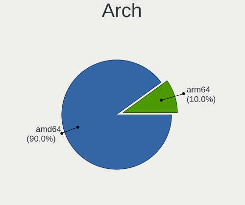

| Name  | Desktops | Percent |
|-------|----------|---------|
| amd64 | 18       | 90%     |
| arm64 | 2        | 10%     |

DE
--

Desktop Environment

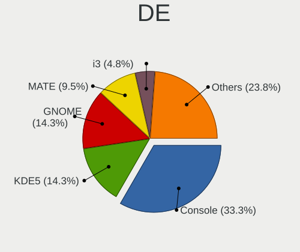

| Name    | Desktops | Percent |
|---------|----------|---------|
| Console | 7        | 33.33%  |
| KDE5    | 3        | 14.29%  |
| GNOME   | 3        | 14.29%  |
| MATE    | 2        | 9.52%   |
| XFCE    | 1        | 4.76%   |
| TWM     | 1        | 4.76%   |
| Openbox | 1        | 4.76%   |
| Lumina  | 1        | 4.76%   |
| KDE     | 1        | 4.76%   |
| i3      | 1        | 4.76%   |

Display Server
--------------

X11 or Wayland

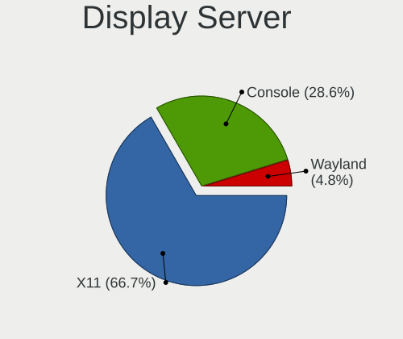

| Name    | Desktops | Percent |
|---------|----------|---------|
| X11     | 14       | 66.67%  |
| Console | 6        | 28.57%  |
| Wayland | 1        | 4.76%   |

Display Manager
---------------

SDDM, LightDM, etc.

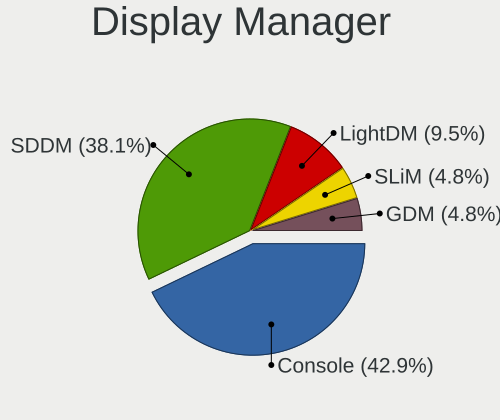

| Name    | Desktops | Percent |
|---------|----------|---------|
| Console | 9        | 42.86%  |
| SDDM    | 8        | 38.1%   |
| LightDM | 2        | 9.52%   |
| SLiM    | 1        | 4.76%   |
| GDM     | 1        | 4.76%   |

OS Lang
-------

Language

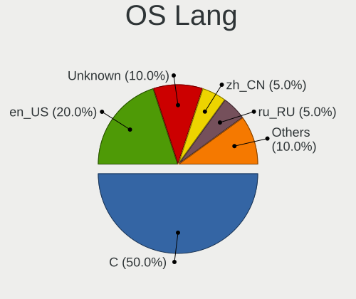

| Lang    | Desktops | Percent |
|---------|----------|---------|
| C       | 10       | 50%     |
| en_US   | 4        | 20%     |
| Unknown | 2        | 10%     |
| zh_CN   | 1        | 5%      |
| ru_RU   | 1        | 5%      |
| ru      | 1        | 5%      |
| pl_PL   | 1        | 5%      |

Boot Mode
---------

EFI or BIOS

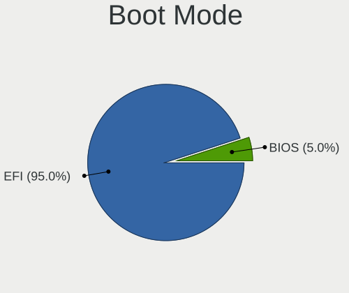

| Mode | Desktops | Percent |
|------|----------|---------|
| EFI  | 19       | 95%     |
| BIOS | 1        | 5%      |

Filesystem
----------

Type of filesystem

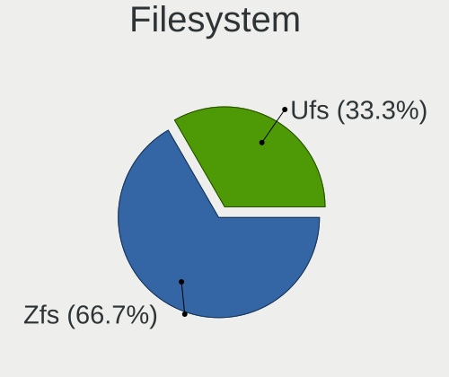

| Type | Desktops | Percent |
|------|----------|---------|
| Zfs  | 14       | 66.67%  |
| Ufs  | 7        | 33.33%  |

Part. scheme
------------

Scheme of partitioning

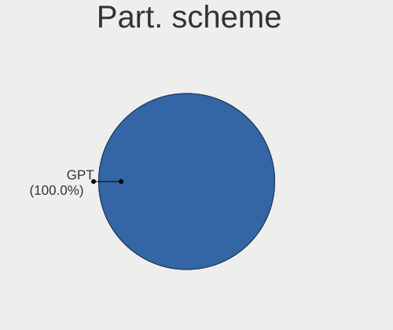

| Type | Desktops | Percent |
|------|----------|---------|
| GPT  | 20       | 100%    |

Board
-----

Vendor
------

Motherboard manufacturer

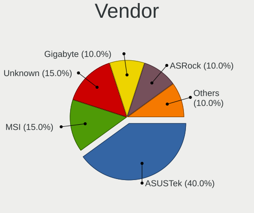

| Name                | Desktops | Percent |
|---------------------|----------|---------|
| ASUSTek Computer    | 8        | 40%     |
| MSI                 | 3        | 15%     |
| Unknown             | 3        | 15%     |
| Gigabyte Technology | 2        | 10%     |
| ASRock              | 2        | 10%     |
| SolidRun            | 1        | 5%      |
| EVGA                | 1        | 5%      |

Model
-----

Motherboard model

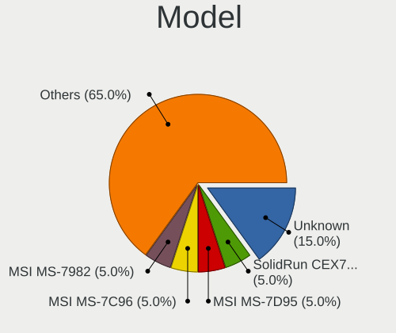

| Name                               | Desktops | Percent |
|------------------------------------|----------|---------|
| Unknown                            | 3        | 15%     |
| SolidRun CEX7 Platform             | 1        | 5%      |
| MSI MS-7D95                        | 1        | 5%      |
| MSI MS-7C96                        | 1        | 5%      |
| MSI MS-7982                        | 1        | 5%      |
| Gigabyte X870E AORUS ELITE WIFI7   | 1        | 5%      |
| Gigabyte B760M AORUS ELITE AX      | 1        | 5%      |
| EVGA X570 DARK                     | 1        | 5%      |
| ASUS TUF Gaming B650M-PLUS         | 1        | 5%      |
| ASUS ROG STRIX X870E-E GAMING WIFI | 1        | 5%      |
| ASUS ROG STRIX X670E-F GAMING WIFI | 1        | 5%      |
| ASUS ROG STRIX B650E-I GAMING WIFI | 1        | 5%      |
| ASUS Pro WS WRX80E-SAGE SE WIFI    | 1        | 5%      |
| ASUS PRIME Z790-A WIFI             | 1        | 5%      |
| ASUS PRIME Z370-P II               | 1        | 5%      |
| ASUS M4A87TD                       | 1        | 5%      |
| ASRock Z790M-ITX WiFi              | 1        | 5%      |
| ASRock X570 Taichi                 | 1        | 5%      |

Model Family
------------

Motherboard model prefix

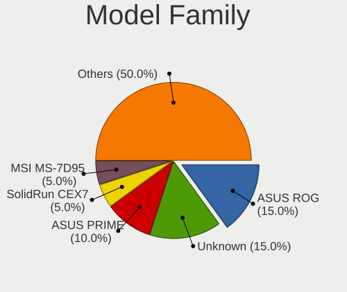

| Name             | Desktops | Percent |
|------------------|----------|---------|
| ASUS ROG         | 3        | 15%     |
| Unknown          | 3        | 15%     |
| ASUS PRIME       | 2        | 10%     |
| SolidRun CEX7    | 1        | 5%      |
| MSI MS-7D95      | 1        | 5%      |
| MSI MS-7C96      | 1        | 5%      |
| MSI MS-7982      | 1        | 5%      |
| Gigabyte X870E   | 1        | 5%      |
| Gigabyte B760M   | 1        | 5%      |
| EVGA X570        | 1        | 5%      |
| ASUS TUF         | 1        | 5%      |
| ASUS Pro         | 1        | 5%      |
| ASUS M4A87TD     | 1        | 5%      |
| ASRock Z790M-ITX | 1        | 5%      |
| ASRock X570      | 1        | 5%      |

MFG Year
--------

Motherboard manufacture year

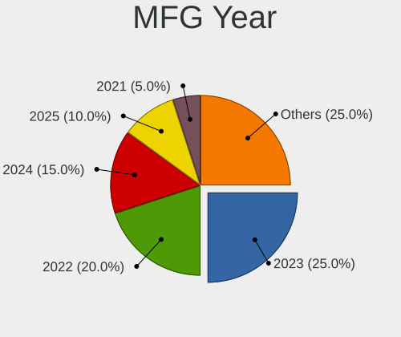

| Year    | Desktops | Percent |
|---------|----------|---------|
| 2023    | 5        | 25%     |
| 2022    | 4        | 20%     |
| 2024    | 3        | 15%     |
| 2025    | 2        | 10%     |
| 2021    | 1        | 5%      |
| 2020    | 1        | 5%      |
| 2019    | 1        | 5%      |
| 2018    | 1        | 5%      |
| 2011    | 1        | 5%      |
| Unknown | 1        | 5%      |

Form Factor
-----------

Physical design of the computer

| Name    | Desktops | Percent |
|---------|----------|---------|
| Desktop | 20       | 100%    |

Coreboot
--------

Have coreboot on board

| Used | Desktops | Percent |
|------|----------|---------|
| No   | 20       | 100%    |

RAM Size
--------

Total RAM memory

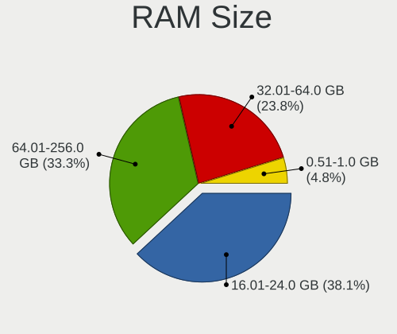

| Size in GB  | Desktops | Percent |
|-------------|----------|---------|
| 16.01-24.0  | 8        | 38.1%   |
| 64.01-256.0 | 7        | 33.33%  |
| 32.01-64.0  | 5        | 23.81%  |
| 0.51-1.0    | 1        | 4.76%   |

RAM Used
--------

Used RAM memory

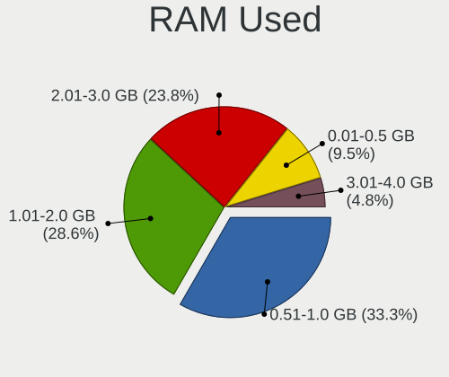

| Used GB  | Desktops | Percent |
|----------|----------|---------|
| 0.51-1.0 | 7        | 33.33%  |
| 1.01-2.0 | 6        | 28.57%  |
| 2.01-3.0 | 5        | 23.81%  |
| 0.01-0.5 | 2        | 9.52%   |
| 3.01-4.0 | 1        | 4.76%   |

Total Drives
------------

Number of drives on board

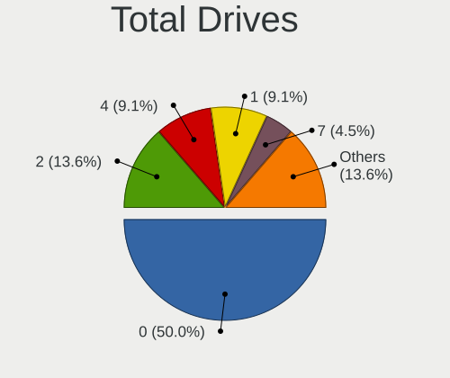

| Drives | Desktops | Percent |
|--------|----------|---------|
| 0      | 11       | 50%     |
| 2      | 3        | 13.64%  |
| 4      | 2        | 9.09%   |
| 1      | 2        | 9.09%   |
| 7      | 1        | 4.55%   |
| 6      | 1        | 4.55%   |
| 5      | 1        | 4.55%   |
| 3      | 1        | 4.55%   |

Has CD-ROM
----------

Has CD-ROM on board

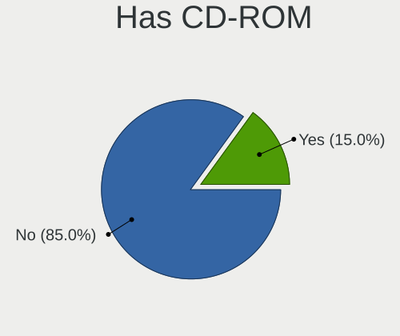

| Presented | Desktops | Percent |
|-----------|----------|---------|
| No        | 17       | 85%     |
| Yes       | 3        | 15%     |

Has Ethernet
------------

Has Ethernet on board

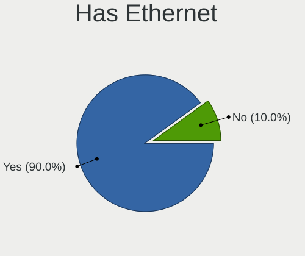

| Presented | Desktops | Percent |
|-----------|----------|---------|
| Yes       | 18       | 90%     |
| No        | 2        | 10%     |

Has WiFi
--------

Has WiFi module

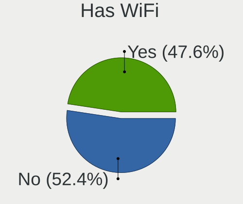

| Presented | Desktops | Percent |
|-----------|----------|---------|
| No        | 11       | 52.38%  |
| Yes       | 10       | 47.62%  |

Has Bluetooth
-------------

Has Bluetooth module

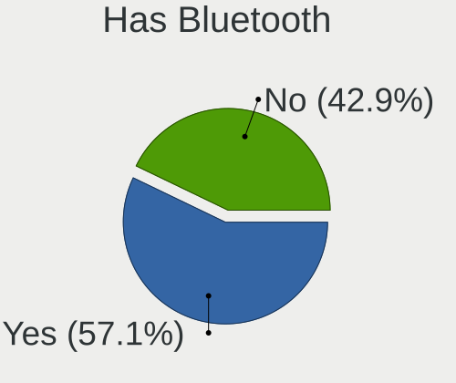

| Presented | Desktops | Percent |
|-----------|----------|---------|
| Yes       | 12       | 57.14%  |
| No        | 9        | 42.86%  |

Location
--------

Country
-------

Geographic location (country)

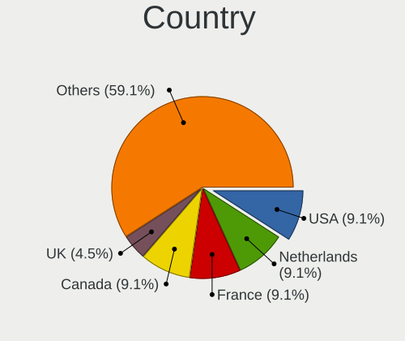

| Country         | Desktops | Percent |
|-----------------|----------|---------|
| USA             | 2        | 9.09%   |
| Netherlands     | 2        | 9.09%   |
| France          | 2        | 9.09%   |
| Canada          | 2        | 9.09%   |
| UK              | 1        | 4.55%   |
| The Netherlands | 1        | 4.55%   |
| Spain           | 1        | 4.55%   |
| South Korea     | 1        | 4.55%   |
| Serbia          | 1        | 4.55%   |
| Russia          | 1        | 4.55%   |
| Romania         | 1        | 4.55%   |
| Poland          | 1        | 4.55%   |
| Moldova         | 1        | 4.55%   |
| Hungary         | 1        | 4.55%   |
| Czechia         | 1        | 4.55%   |
| China           | 1        | 4.55%   |
| Chile           | 1        | 4.55%   |
| Brazil          | 1        | 4.55%   |

City
----

Geographic location (city)

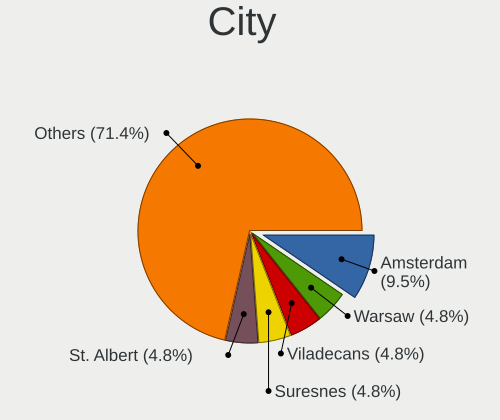

| City        | Desktops | Percent |
|-------------|----------|---------|
| Amsterdam   | 2        | 9.52%   |
| Warsaw      | 1        | 4.76%   |
| Viladecans  | 1        | 4.76%   |
| Suresnes    | 1        | 4.76%   |
| St. Albert  | 1        | 4.76%   |
| New York    | 1        | 4.76%   |
| Nanjing     | 1        | 4.76%   |
| Moscow      | 1        | 4.76%   |
| Landorthe   | 1        | 4.76%   |
| Icheon-si   | 1        | 4.76%   |
| Hadleigh    | 1        | 4.76%   |
| Concon      | 1        | 4.76%   |
| Cluj-Napoca | 1        | 4.76%   |
| Chisinau    | 1        | 4.76%   |
| Budapest    | 1        | 4.76%   |
| Břeclav    | 1        | 4.76%   |
| Brasília   | 1        | 4.76%   |
| Belgrade    | 1        | 4.76%   |
| Barrie      | 1        | 4.76%   |
| Austin      | 1        | 4.76%   |

Drives
------

Drive Vendor
------------

Hard drive vendors

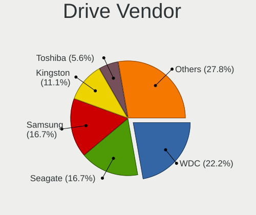

| Vendor              | Desktops | Drives | Percent |
|---------------------|----------|--------|---------|
| WDC                 | 4        | 8      | 22.22%  |
| Seagate             | 3        | 3      | 16.67%  |
| Samsung Electronics | 3        | 22     | 16.67%  |
| Kingston            | 2        | 2      | 11.11%  |
| Toshiba             | 1        | 1      | 5.56%   |
| SanDisk             | 1        | 3      | 5.56%   |
| KingSpec            | 1        | 2      | 5.56%   |
| Crucial             | 1        | 2      | 5.56%   |
| China               | 1        | 2      | 5.56%   |
| A-DATA Technology   | 1        | 1      | 5.56%   |

Drive Model
-----------

Hard drive models

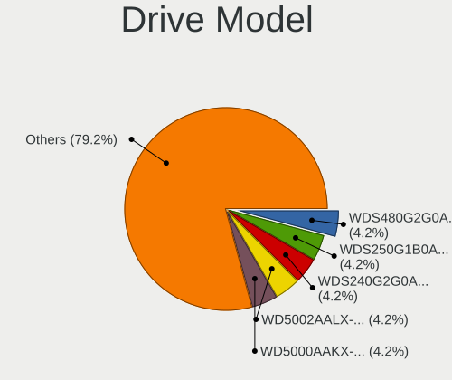

| Model                            | Desktops | Percent |
|----------------------------------|----------|---------|
| WDC WDS480G2G0A-00JH30 480GB     | 1        | 4.17%   |
| WDC WDS250G1B0A-00H9H0 250GB     | 1        | 4.17%   |
| WDC WDS240G2G0A-00JH30 240GB     | 1        | 4.17%   |
| WDC WD5002AALX-00J37A0 500GB     | 1        | 4.17%   |
| WDC WD5000AAKX-60U6AA0 500GB     | 1        | 4.17%   |
| WDC WD5000AAKS-00UU3A0 500GB     | 1        | 4.17%   |
| WDC WD2003FZEX-00SRLA0 2TB       | 1        | 4.17%   |
| Toshiba DT01ACA100 1TB           | 1        | 4.17%   |
| Seagate ST4000DM004-2CV104 4TB   | 1        | 4.17%   |
| Seagate ST2000NE0025-2FL101 2TB  | 1        | 4.17%   |
| Seagate ST1000DM010-2EP102 1TB   | 1        | 4.17%   |
| SanDisk Ultra II 1TB             | 1        | 4.17%   |
| Samsung SSD 860 EVO 500GB        | 1        | 4.17%   |
| Samsung SSD 860 EVO 250GB        | 1        | 4.17%   |
| Samsung SSD 850 EVO 250GB        | 1        | 4.17%   |
| Samsung MZ7L37T6HBLA-00A07 7.6TB | 1        | 4.17%   |
| Kingston SV300S37A120G 120GB     | 1        | 4.17%   |
| Kingston SA400S37240G 240GB      | 1        | 4.17%   |
| KingSpec NT-256 2242 256GB       | 1        | 4.17%   |
| KingSpec NE-1TB                  | 1        | 4.17%   |
| Crucial CT500MX500SSD1 500GB     | 1        | 4.17%   |
| Crucial CT120M500SSD1 120GB      | 1        | 4.17%   |
| China SATA SSD 480GB             | 1        | 4.17%   |
| A-DATA SU650 240GB               | 1        | 4.17%   |

HDD Vendor
----------

Hard disk drive vendors

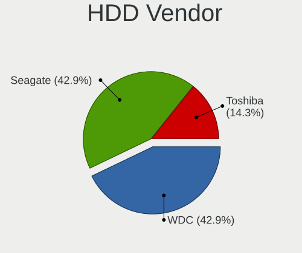

| Vendor  | Desktops | Drives | Percent |
|---------|----------|--------|---------|
| WDC     | 3        | 4      | 42.86%  |
| Seagate | 3        | 3      | 42.86%  |
| Toshiba | 1        | 1      | 14.29%  |

SSD Vendor
----------

Solid state drive vendors

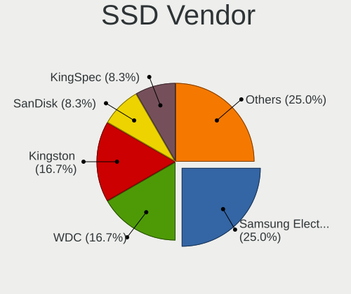

| Vendor              | Desktops | Drives | Percent |
|---------------------|----------|--------|---------|
| Samsung Electronics | 3        | 22     | 25%     |
| WDC                 | 2        | 4      | 16.67%  |
| Kingston            | 2        | 2      | 16.67%  |
| SanDisk             | 1        | 3      | 8.33%   |
| KingSpec            | 1        | 1      | 8.33%   |
| Crucial             | 1        | 2      | 8.33%   |
| China               | 1        | 2      | 8.33%   |
| A-DATA Technology   | 1        | 1      | 8.33%   |

Drive Kind
----------

HDD or SSD

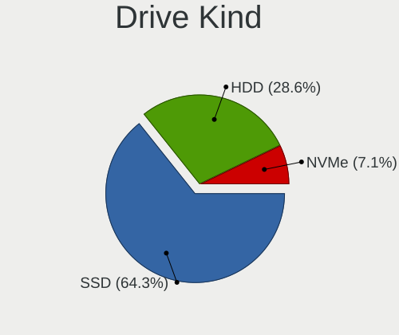

| Kind | Desktops | Drives | Percent |
|------|----------|--------|---------|
| SSD  | 9        | 37     | 64.29%  |
| HDD  | 4        | 8      | 28.57%  |
| NVMe | 1        | 1      | 7.14%   |

Drive Connector
---------------

SATA, SAS, NVMe, etc.

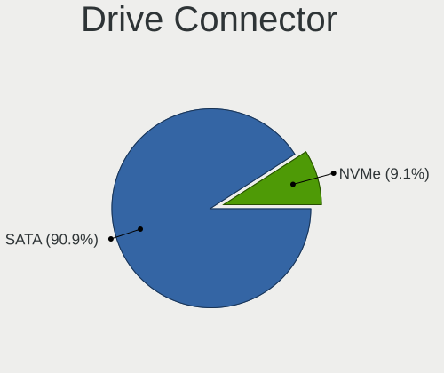

| Type | Desktops | Drives | Percent |
|------|----------|--------|---------|
| SATA | 10       | 45     | 90.91%  |
| NVMe | 1        | 1      | 9.09%   |

Drive Size
----------

Size of hard drive

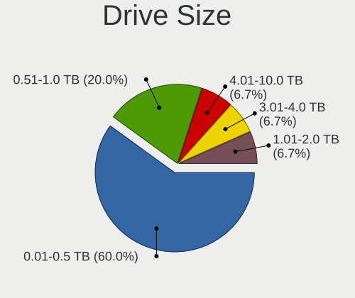

| Size in TB | Desktops | Drives | Percent |
|------------|----------|--------|---------|
| 0.01-0.5   | 9        | 22     | 60%     |
| 0.51-1.0   | 3        | 5      | 20%     |
| 3.01-4.0   | 1        | 1      | 6.67%   |
| 1.01-2.0   | 1        | 2      | 6.67%   |
| 4.01-10.0  | 1        | 15     | 6.67%   |

Space Total
-----------

Amount of disk space available on the file system

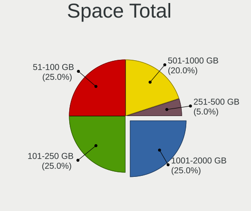

| Size in GB | Desktops | Percent |
|------------|----------|---------|
| 101-250    | 5        | 25%     |
| 1001-2000  | 5        | 25%     |
| 51-100     | 5        | 25%     |
| 501-1000   | 4        | 20%     |
| 251-500    | 1        | 5%      |

Space Used
----------

Amount of used disk space

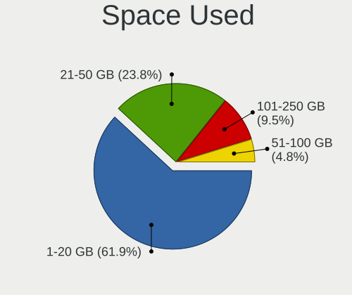

| Used GB | Desktops | Percent |
|---------|----------|---------|
| 1-20    | 13       | 61.9%   |
| 21-50   | 5        | 23.81%  |
| 101-250 | 2        | 9.52%   |
| 51-100  | 1        | 4.76%   |

Malfunc. Drives
---------------

Drive models with a malfunction

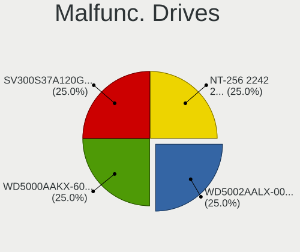

| Model                        | Desktops | Drives | Percent |
|------------------------------|----------|--------|---------|
| WDC WD5002AALX-00J37A0 500GB | 1        | 1      | 25%     |
| WDC WD5000AAKX-60U6AA0 500GB | 1        | 1      | 25%     |
| Kingston SV300S37A120G 120GB | 1        | 1      | 25%     |
| KingSpec NT-256 2242 256GB   | 1        | 1      | 25%     |

Malfunc. Drive Vendor
---------------------

Vendors of faulty drives

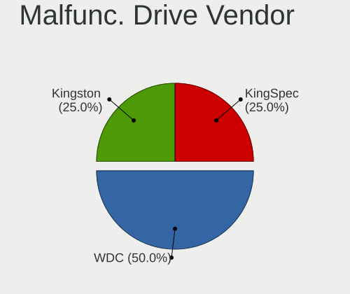

| Vendor   | Desktops | Drives | Percent |
|----------|----------|--------|---------|
| WDC      | 2        | 2      | 50%     |
| Kingston | 1        | 1      | 25%     |
| KingSpec | 1        | 1      | 25%     |

Malfunc. HDD Vendor
-------------------

Vendors of faulty HDD drives

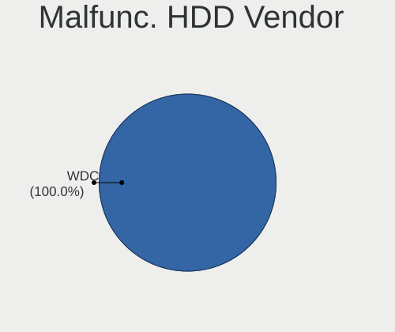

| Vendor | Desktops | Drives | Percent |
|--------|----------|--------|---------|
| WDC    | 2        | 2      | 100%    |

Malfunc. Drive Kind
-------------------

Kinds of faulty drives

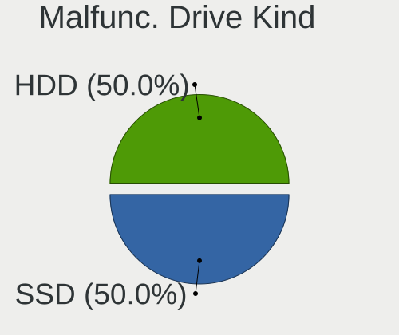

| Kind | Desktops | Drives | Percent |
|------|----------|--------|---------|
| SSD  | 2        | 2      | 50%     |
| HDD  | 2        | 2      | 50%     |

Failed Drives
-------------

Failed drive models

Zero info for selected period =(

Failed Drive Vendor
-------------------

Failed drive vendors

Zero info for selected period =(

Drive Status
------------

Number of failed and malfunc. drives

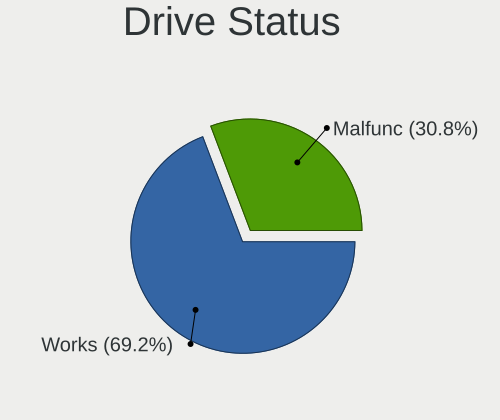

| Status  | Desktops | Drives | Percent |
|---------|----------|--------|---------|
| Works   | 9        | 42     | 69.23%  |
| Malfunc | 4        | 4      | 30.77%  |

Storage controller
------------------

Storage Vendor
--------------

Storage controller vendors

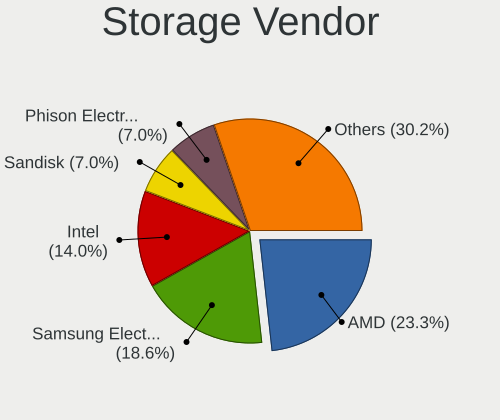

| Vendor                       | Desktops | Percent |
|------------------------------|----------|---------|
| AMD                          | 10       | 23.26%  |
| Samsung Electronics          | 8        | 18.6%   |
| Intel                        | 6        | 13.95%  |
| Sandisk                      | 3        | 6.98%   |
| Phison Electronics           | 3        | 6.98%   |
| SK hynix                     | 2        | 4.65%   |
| MAXIO Technology (Hangzhou)  | 2        | 4.65%   |
| Broadcom / LSI               | 2        | 4.65%   |
| ASMedia Technology           | 2        | 4.65%   |
| Shenzhen Longsys Electronics | 1        | 2.33%   |
| O2 Micro                     | 1        | 2.33%   |
| Micron/Crucial Technology    | 1        | 2.33%   |
| Kingston Technology Company  | 1        | 2.33%   |
| JMicron Technology           | 1        | 2.33%   |

Storage Model
-------------

Storage controller models

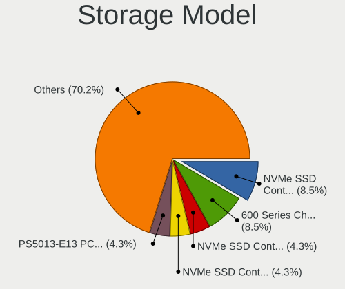

| Model                                                                         | Desktops | Percent |
|-------------------------------------------------------------------------------|----------|---------|
| Samsung NVMe SSD Controller PM9A1/PM9A3/980PRO                                | 4        | 8.51%   |
| AMD 600 Series Chipset SATA Controller                                        | 4        | 8.51%   |
| Samsung NVMe SSD Controller SM981/PM981/PM983                                 | 2        | 4.26%   |
| Samsung NVMe SSD Controller S4LV008[Pascal]                                   | 2        | 4.26%   |
| Phison PS5013-E13 PCIe3 NVMe Controller (DRAM-less)                           | 2        | 4.26%   |
| MAXIO (Hangzhou) NVMe SSD Controller MAP1202 (DRAM-less)                      | 2        | 4.26%   |
| Intel Raptor Lake SATA AHCI Controller                                        | 2        | 4.26%   |
| Broadcom / LSI SAS3408 Fusion-MPT Tri-Mode I/O Controller Chip (IOC)          | 2        | 4.26%   |
| ASMedia ASM1061/ASM1062 Serial ATA Controller                                 | 2        | 4.26%   |
| AMD FCH SATA Controller [AHCI mode]                                           | 2        | 4.26%   |
| AMD 500 Series Chipset SATA Controller                                        | 2        | 4.26%   |
| SK hynix Platinum P41/PC801 NVMe Solid State Drive                            | 1        | 2.13%   |
| SK hynix Gold P31/BC711/PC711 NVMe Solid State Drive                          | 1        | 2.13%   |
| Shenzhen Longsys Lexar NM790 / Patriot Viper VP4300 Lite NVMe SSD (DRAM-less) | 1        | 2.13%   |
| Sandisk WD SN560/SN740/SN770/SN5000 NVMe SSD                                  | 1        | 2.13%   |
| Sandisk WD Black SN850X NVMe SSD                                              | 1        | 2.13%   |
| SanDisk Ultra 3D / WD PC SN530, IX SN530, Blue SN550 NVMe SSD (DRAM-less)     | 1        | 2.13%   |
| Samsung NVMe SSD Controller 980 (DRAM-less)                                   | 1        | 2.13%   |
| Phison PS5027-E27T PCIe4 NVMe Controller (DRAM-less)                          | 1        | 2.13%   |
| O2 Micro FORESEE E2M2 NVMe SSD                                                | 1        | 2.13%   |
| Micron/Crucial T705 NVMe PCIe SSD                                             | 1        | 2.13%   |
| Kingston Company A2000 NVMe SSD [SM2263EN]                                    | 1        | 2.13%   |
| JMicron JMB368 IDE controller                                                 | 1        | 2.13%   |
| Intel RST Volume Management Device Controller                                 | 1        | 2.13%   |
| Intel Q170/Q150/B150/H170/H110/Z170/CM236 Chipset SATA Controller [AHCI Mode] | 1        | 2.13%   |
| Intel Alder Lake-N SATA AHCI Controller                                       | 1        | 2.13%   |
| Intel 200 Series PCH SATA controller [AHCI mode]                              | 1        | 2.13%   |
| Broadcom / LSI SAS3008 PCI-Express Fusion-MPT SAS-3                           | 1        | 2.13%   |
| Broadcom / LSI SAS2008 PCI-Express Fusion-MPT SAS-2 [Falcon]                  | 1        | 2.13%   |
| AMD SB7x0/SB8x0/SB9x0 SATA Controller [AHCI mode]                             | 1        | 2.13%   |
| AMD SB7x0/SB8x0/SB9x0 IDE Controller                                          | 1        | 2.13%   |
| AMD FCH RAID Controller                                                       | 1        | 2.13%   |

Storage Kind
------------

Kind of storage controller (IDE, SATA, NVMe, SAS, ...)

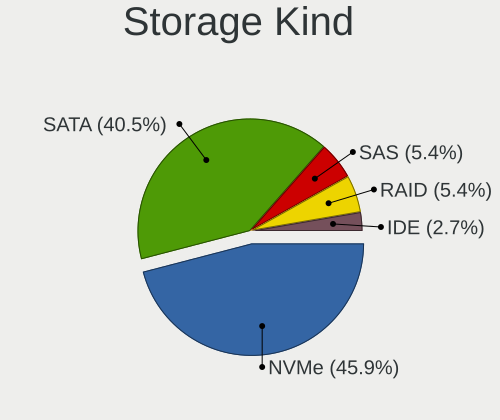

| Kind | Desktops | Percent |
|------|----------|---------|
| NVMe | 17       | 45.95%  |
| SATA | 15       | 40.54%  |
| RAID | 2        | 5.41%   |
| SAS  | 2        | 5.41%   |
| IDE  | 1        | 2.7%    |

Processor
---------

CPU Vendor
----------

Processor vendors

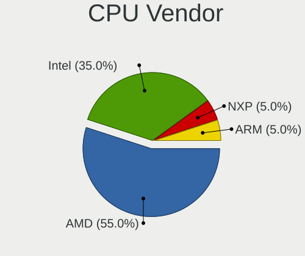

| Vendor | Desktops | Percent |
|--------|----------|---------|
| AMD    | 11       | 55%     |
| Intel  | 7        | 35%     |
| NXP    | 1        | 5%      |
| ARM    | 1        | 5%      |

CPU Model
---------

Processor models

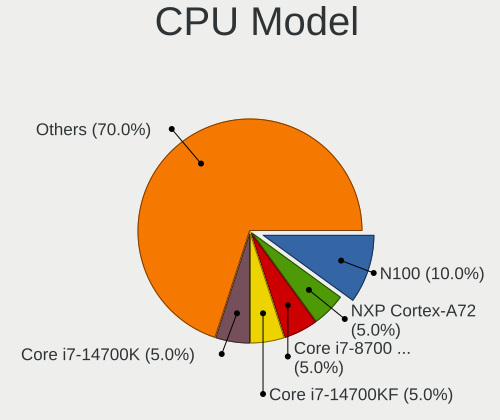

| Model                                      | Desktops | Percent |
|--------------------------------------------|----------|---------|
| Intel N100                                 | 2        | 10%     |
| NXP Cortex-A72                             | 1        | 5%      |
| Intel Core i7-8700 CPU @ 3.20GHz           | 1        | 5%      |
| Intel Core i7-14700KF                      | 1        | 5%      |
| Intel Core i7-14700K                       | 1        | 5%      |
| Intel Core i5-6400 CPU @ 2.70GHz           | 1        | 5%      |
| Intel 13th Gen Core i7-13700K              | 1        | 5%      |
| ARM Cortex-A55 r2p0                        | 1        | 5%      |
| AMD Ryzen Threadripper PRO 5975WX 32-Cores | 1        | 5%      |
| AMD Ryzen 9 9950X 16-Core Processor        | 1        | 5%      |
| AMD Ryzen 9 7950X3D 16-Core Processor      | 1        | 5%      |
| AMD Ryzen 9 7950X 16-Core Processor        | 1        | 5%      |
| AMD Ryzen 9 7900 12-Core Processor         | 1        | 5%      |
| AMD Ryzen 9 5950X 16-Core Processor        | 1        | 5%      |
| AMD Ryzen 7 9700X 8-Core Processor         | 1        | 5%      |
| AMD Ryzen 7 5800X3D 8-Core Processor       | 1        | 5%      |
| AMD Ryzen 7 5700X 8-Core Processor         | 1        | 5%      |
| AMD Ryzen 5 5600G with Radeon Graphics     | 1        | 5%      |
| AMD Phenom II X6 1090T Processor           | 1        | 5%      |

CPU Model Family
----------------

Processor model prefix

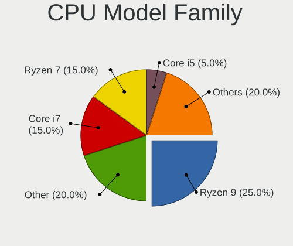

| Model                  | Desktops | Percent |
|------------------------|----------|---------|
| AMD Ryzen 9            | 5        | 25%     |
| Other                  | 4        | 20%     |
| Intel Core i7          | 3        | 15%     |
| AMD Ryzen 7            | 3        | 15%     |
| Intel Core i5          | 1        | 5%      |
| ARM Cortex             | 1        | 5%      |
| AMD Ryzen Threadripper | 1        | 5%      |
| AMD Ryzen 5            | 1        | 5%      |
| AMD Phenom II X6       | 1        | 5%      |

CPU Cores
---------

Number of processor cores

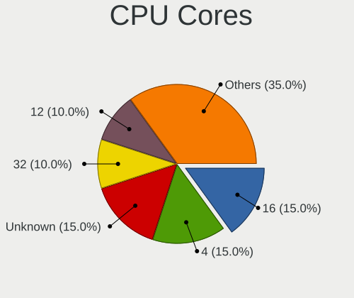

| Number  | Desktops | Percent |
|---------|----------|---------|
| 16      | 3        | 15%     |
| 4       | 3        | 15%     |
| Unknown | 3        | 15%     |
| 32      | 2        | 10%     |
| 12      | 2        | 10%     |
| 8       | 2        | 10%     |
| 64      | 1        | 5%      |
| 28      | 1        | 5%      |
| 24      | 1        | 5%      |
| 14      | 1        | 5%      |
| 6       | 1        | 5%      |

CPU Sockets
-----------

Number of sockets

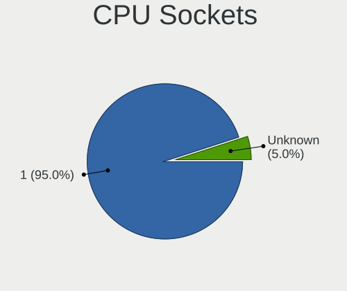

| Number  | Desktops | Percent |
|---------|----------|---------|
| 1       | 19       | 95%     |
| Unknown | 1        | 5%      |

CPU Threads
-----------

Threads per core (Hyper-Threading)

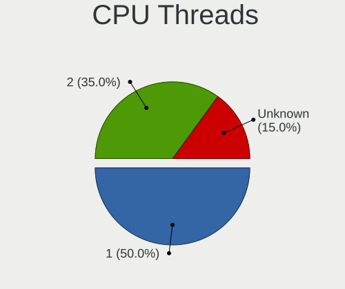

| Number  | Desktops | Percent |
|---------|----------|---------|
| 1       | 10       | 50%     |
| 2       | 7        | 35%     |
| Unknown | 3        | 15%     |

CPU Microarch
-------------

Microarchitecture

| Name     | Desktops | Percent |
|----------|----------|---------|
| Unknown  | 13       | 65%     |
| Zen 3    | 4        | 20%     |
| Skylake  | 1        | 5%      |
| KabyLake | 1        | 5%      |
| K10      | 1        | 5%      |

Graphics
--------

GPU Vendor
----------

Vendors of graphics cards

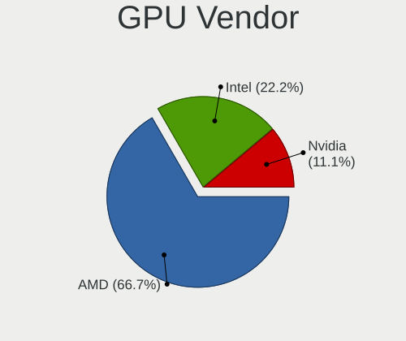

| Vendor | Desktops | Percent |
|--------|----------|---------|
| AMD    | 12       | 66.67%  |
| Intel  | 4        | 22.22%  |
| Nvidia | 2        | 11.11%  |

GPU Model
---------

Graphics card models

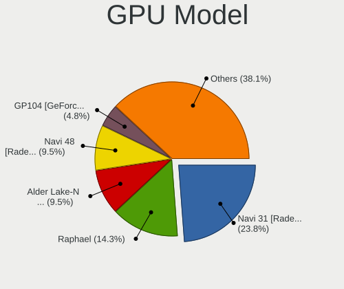

| Model                                                        | Desktops | Percent |
|--------------------------------------------------------------|----------|---------|
| AMD Navi 31 [Radeon RX 7900 XT/7900 XTX/7900 GRE/7900M]      | 5        | 23.81%  |
| AMD Raphael                                                  | 3        | 14.29%  |
| Intel Alder Lake-N [UHD Graphics]                            | 2        | 9.52%   |
| AMD Navi 48 [Radeon RX 9070/9070 XT/9070 GRE]                | 2        | 9.52%   |
| Nvidia GP104 [GeForce GTX 1070]                              | 1        | 4.76%   |
| Nvidia GP102 [GeForce GTX 1080 Ti]                           | 1        | 4.76%   |
| Intel Skylake-S GT2 [HD Graphics 530]                        | 1        | 4.76%   |
| Intel Raptor Lake-S GT1 [UHD Graphics 770]                   | 1        | 4.76%   |
| AMD Navi 32 [Radeon RX 7700 XT / 7800 XT]                    | 1        | 4.76%   |
| AMD Navi 21 [Radeon RX 6900 XT]                              | 1        | 4.76%   |
| AMD Granite Ridge [Radeon Graphics]                          | 1        | 4.76%   |
| AMD Ellesmere [Radeon RX 470/480/570/570X/580/580X/590]      | 1        | 4.76%   |
| AMD Cezanne [Radeon Vega Series / Radeon Vega Mobile Series] | 1        | 4.76%   |

GPU Combo
---------

Combinations of graphics cards

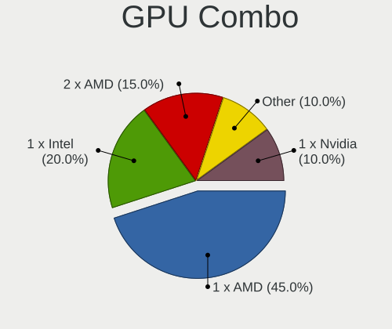

| Name       | Desktops | Percent |
|------------|----------|---------|
| 1 x AMD    | 9        | 45%     |
| 1 x Intel  | 4        | 20%     |
| 2 x AMD    | 3        | 15%     |
| Other      | 2        | 10%     |
| 1 x Nvidia | 2        | 10%     |

GPU Driver
----------

Free vs proprietary

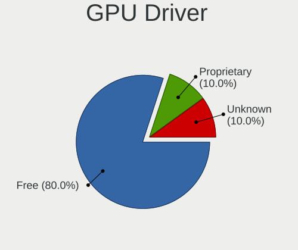

| Driver      | Desktops | Percent |
|-------------|----------|---------|
| Free        | 16       | 80%     |
| Proprietary | 2        | 10%     |
| Unknown     | 2        | 10%     |

GPU Memory
----------

Total video memory

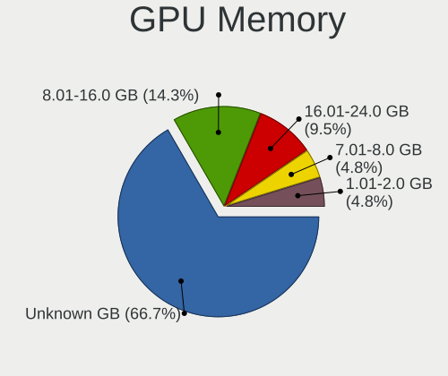

| Size in GB | Desktops | Percent |
|------------|----------|---------|
| Unknown    | 14       | 66.67%  |
| 8.01-16.0  | 3        | 14.29%  |
| 16.01-24.0 | 2        | 9.52%   |
| 7.01-8.0   | 1        | 4.76%   |
| 1.01-2.0   | 1        | 4.76%   |

Monitor
-------

Monitor Vendor
--------------

Monitor vendors

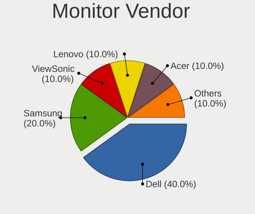

| Vendor              | Desktops | Percent |
|---------------------|----------|---------|
| Dell                | 4        | 40%     |
| Samsung Electronics | 2        | 20%     |
| ViewSonic           | 1        | 10%     |
| Lenovo              | 1        | 10%     |
| Acer                | 1        | 10%     |
| Unknown             | 1        | 10%     |

Monitor Model
-------------

Monitor models

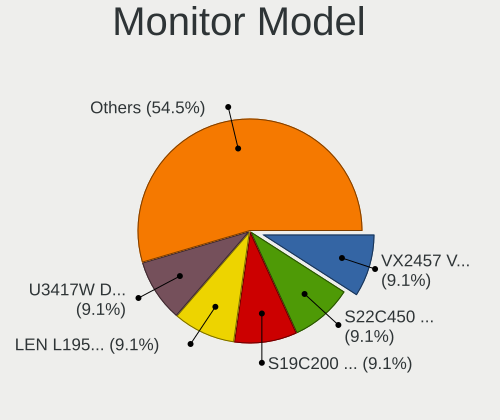

| Model                                                             | Desktops | Percent |
|-------------------------------------------------------------------|----------|---------|
| ViewSonic VX2457 VSCB931 1920x1080 520x290mm 23.4-inch            | 1        | 9.09%   |
| Samsung Electronics S22C450 SAM09C5 1920x1080 480x270mm 21.7-inch | 1        | 9.09%   |
| Samsung Electronics S19C200 SAM09AC 1366x768 410x230mm 18.5-inch  | 1        | 9.09%   |
| Lenovo LEN L1950wD LEN1086 1920x1080 410x260mm 19.1-inch          | 1        | 9.09%   |
| Dell U3417W DELA0DF 3440x1440 800x330mm 34.1-inch                 | 1        | 9.09%   |
| Dell U3417W DELA0DE 3440x1440 800x330mm 34.1-inch                 | 1        | 9.09%   |
| Dell U2720Q DEL41B4 3840x2160 600x340mm 27.2-inch                 | 1        | 9.09%   |
| Dell U2311H DELA060 1920x1080 510x290mm 23.1-inch                 | 1        | 9.09%   |
| Dell S2522HG DELA1C1 1920x1080 540x300mm 24.3-inch                | 1        | 9.09%   |
| Acer XV272U X ACR0832 2560x1440 600x340mm 27.2-inch               | 1        | 9.09%   |
| Unknown                                                           | 1        | 9.09%   |

Monitor Resolution
------------------

Monitor screen resolution

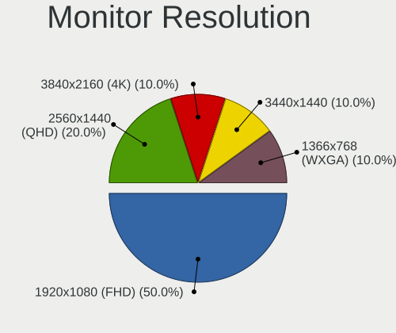

| Resolution      | Desktops | Percent |
|-----------------|----------|---------|
| 1920x1080 (FHD) | 5        | 50%     |
| 2560x1440 (QHD) | 2        | 20%     |
| 3840x2160 (4K)  | 1        | 10%     |
| 3440x1440       | 1        | 10%     |
| 1366x768 (WXGA) | 1        | 10%     |

Monitor Diagonal
----------------

Diagonal size in inches

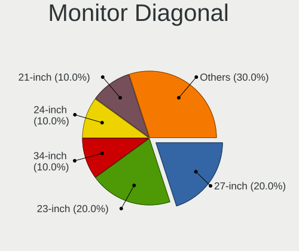

| Inches  | Desktops | Percent |
|---------|----------|---------|
| 27      | 2        | 20%     |
| 23      | 2        | 20%     |
| 34      | 1        | 10%     |
| 24      | 1        | 10%     |
| 21      | 1        | 10%     |
| 19      | 1        | 10%     |
| 18      | 1        | 10%     |
| Unknown | 1        | 10%     |

Monitor Width
-------------

Physical width

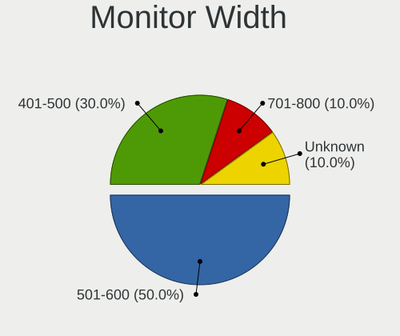

| Width in mm | Desktops | Percent |
|-------------|----------|---------|
| 501-600     | 5        | 50%     |
| 401-500     | 3        | 30%     |
| 701-800     | 1        | 10%     |
| Unknown     | 1        | 10%     |

Aspect Ratio
------------

Proportional relationship between the width and the height

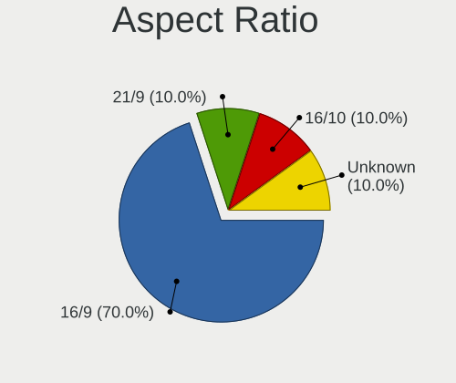

| Ratio   | Desktops | Percent |
|---------|----------|---------|
| 16/9    | 7        | 70%     |
| 21/9    | 1        | 10%     |
| 16/10   | 1        | 10%     |
| Unknown | 1        | 10%     |

Monitor Area
------------

Area in inch²

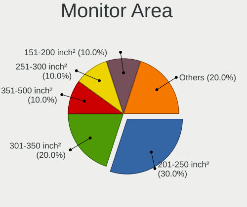

| Area in inch² | Desktops | Percent |
|----------------|----------|---------|
| 201-250        | 3        | 30%     |
| 301-350        | 2        | 20%     |
| 351-500        | 1        | 10%     |
| 251-300        | 1        | 10%     |
| 151-200        | 1        | 10%     |
| 141-150        | 1        | 10%     |
| Unknown        | 1        | 10%     |

Pixel Density
-------------

Pixels per inch

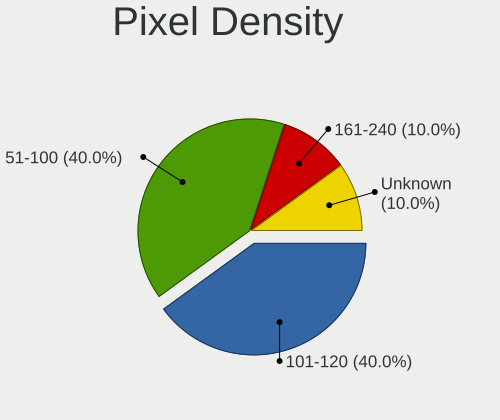

| Density | Desktops | Percent |
|---------|----------|---------|
| 101-120 | 4        | 40%     |
| 51-100  | 4        | 40%     |
| 161-240 | 1        | 10%     |
| Unknown | 1        | 10%     |

Multiple Monitors
-----------------

Total monitors connected

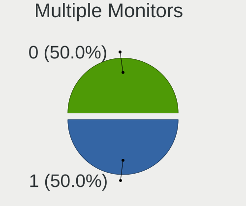

| Total | Desktops | Percent |
|-------|----------|---------|
| 1     | 10       | 50%     |
| 0     | 10       | 50%     |

Network
-------

Net Controller Vendor
---------------------

Controller vendors

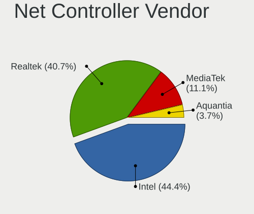

| Vendor                | Desktops | Percent |
|-----------------------|----------|---------|
| Intel                 | 12       | 44.44%  |
| Realtek Semiconductor | 11       | 40.74%  |
| MediaTek              | 3        | 11.11%  |
| Aquantia              | 1        | 3.7%    |

Net Controller Model
--------------------

Controller models

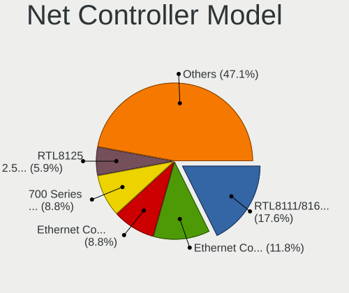

| Model                                                                           | Desktops | Percent |
|---------------------------------------------------------------------------------|----------|---------|
| Realtek RTL8111/8168/8211/8411 PCI Express Gigabit Ethernet Controller          | 6        | 17.65%  |
| Intel Ethernet Controller I225-V                                                | 4        | 11.76%  |
| Intel Ethernet Controller I226-V                                                | 3        | 8.82%   |
| Intel 700 Series Chipset CNVi WiFi                                              | 3        | 8.82%   |
| Realtek RTL8125 2.5GbE Controller                                               | 2        | 5.88%   |
| MediaTek MT7922 802.11ax PCI Express Wireless Network Adapter                   | 2        | 5.88%   |
| Intel Wi-Fi 6 AX200                                                             | 2        | 5.88%   |
| Realtek USB 2.5GbE Controller                                                   | 1        | 2.94%   |
| Realtek RTL8922AE 802.11be PCIe Wireless Network Adapter                        | 1        | 2.94%   |
| Realtek RTL8852BE PCIe 802.11ax Wireless Network Controller                     | 1        | 2.94%   |
| Realtek RTL8821CE 802.11ac PCIe Wireless Network Adapter                        | 1        | 2.94%   |
| Realtek RTL8126 5GbE Controller                                                 | 1        | 2.94%   |
| MediaTek MT7927 802.11be 320MHz 2x2 PCIe Wireless Network Adapter [Filogic 380] | 1        | 2.94%   |
| Intel I211 Gigabit Network Connection                                           | 1        | 2.94%   |
| Intel Ethernet Controller X550                                                  | 1        | 2.94%   |
| Intel Ethernet Controller I219-V                                                | 1        | 2.94%   |
| Intel 82574L Gigabit Network Connection                                         | 1        | 2.94%   |
| Intel 82571EB/82571GB Gigabit Ethernet Controller D0/D1 (copper applications)   | 1        | 2.94%   |
| Aquantia AQtion AQC100 NBase-T/IEEE 802.3an Ethernet Controller [Atlantic 10G]  | 1        | 2.94%   |

Wireless Vendor
---------------

Wireless vendors

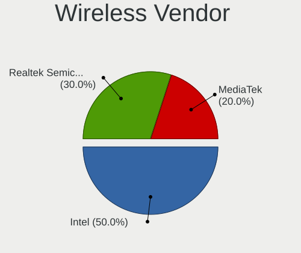

| Vendor                | Desktops | Percent |
|-----------------------|----------|---------|
| Intel                 | 5        | 50%     |
| Realtek Semiconductor | 3        | 30%     |
| MediaTek              | 2        | 20%     |

Wireless Model
--------------

Wireless models

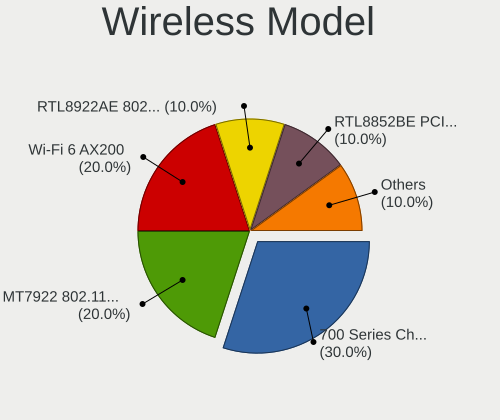

| Model                                                         | Desktops | Percent |
|---------------------------------------------------------------|----------|---------|
| Intel 700 Series Chipset CNVi WiFi                            | 3        | 30%     |
| MediaTek MT7922 802.11ax PCI Express Wireless Network Adapter | 2        | 20%     |
| Intel Wi-Fi 6 AX200                                           | 2        | 20%     |
| Realtek RTL8922AE 802.11be PCIe Wireless Network Adapter      | 1        | 10%     |
| Realtek RTL8852BE PCIe 802.11ax Wireless Network Controller   | 1        | 10%     |
| Realtek RTL8821CE 802.11ac PCIe Wireless Network Adapter      | 1        | 10%     |

Ethernet Vendor
---------------

Ethernet vendors

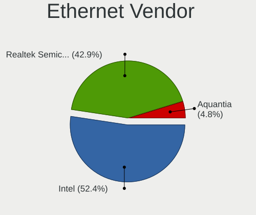

| Vendor                | Desktops | Percent |
|-----------------------|----------|---------|
| Intel                 | 11       | 52.38%  |
| Realtek Semiconductor | 9        | 42.86%  |
| Aquantia              | 1        | 4.76%   |

Ethernet Model
--------------

Ethernet models

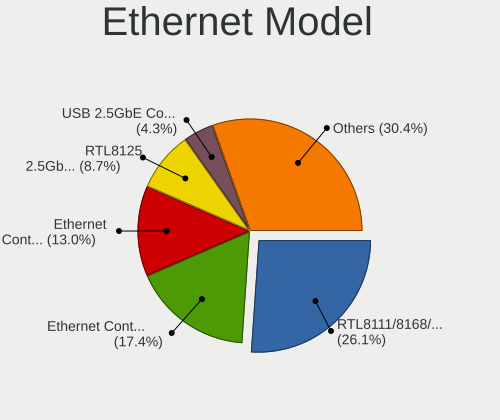

| Model                                                                          | Desktops | Percent |
|--------------------------------------------------------------------------------|----------|---------|
| Realtek RTL8111/8168/8211/8411 PCI Express Gigabit Ethernet Controller         | 6        | 26.09%  |
| Intel Ethernet Controller I225-V                                               | 4        | 17.39%  |
| Intel Ethernet Controller I226-V                                               | 3        | 13.04%  |
| Realtek RTL8125 2.5GbE Controller                                              | 2        | 8.7%    |
| Realtek USB 2.5GbE Controller                                                  | 1        | 4.35%   |
| Realtek RTL8126 5GbE Controller                                                | 1        | 4.35%   |
| Intel I211 Gigabit Network Connection                                          | 1        | 4.35%   |
| Intel Ethernet Controller X550                                                 | 1        | 4.35%   |
| Intel Ethernet Controller I219-V                                               | 1        | 4.35%   |
| Intel 82574L Gigabit Network Connection                                        | 1        | 4.35%   |
| Intel 82571EB/82571GB Gigabit Ethernet Controller D0/D1 (copper applications)  | 1        | 4.35%   |
| Aquantia AQtion AQC100 NBase-T/IEEE 802.3an Ethernet Controller [Atlantic 10G] | 1        | 4.35%   |

Net Controller Kind
-------------------

Ethernet, WiFi or modem

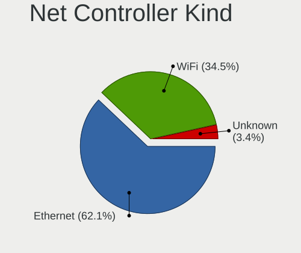

| Kind     | Desktops | Percent |
|----------|----------|---------|
| Ethernet | 18       | 62.07%  |
| WiFi     | 10       | 34.48%  |
| Unknown  | 1        | 3.45%   |

Used Controller
---------------

Currently used network controller

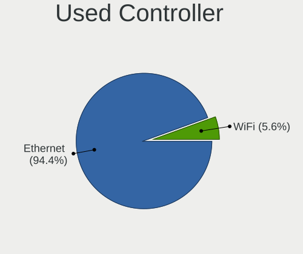

| Kind     | Desktops | Percent |
|----------|----------|---------|
| Ethernet | 17       | 94.44%  |
| WiFi     | 1        | 5.56%   |

NICs
----

Total network controllers on board

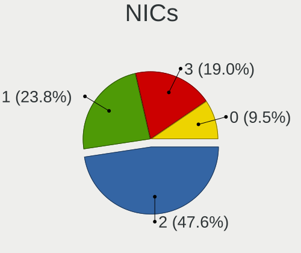

| Total | Desktops | Percent |
|-------|----------|---------|
| 2     | 10       | 47.62%  |
| 1     | 5        | 23.81%  |
| 3     | 4        | 19.05%  |
| 0     | 2        | 9.52%   |

IPv6
----

IPv6 vs IPv4

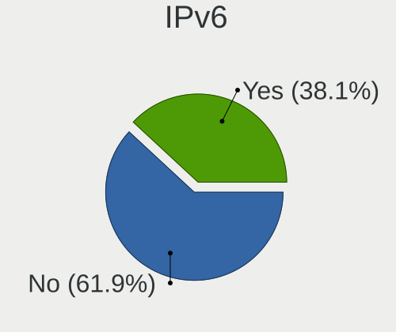

| Used | Desktops | Percent |
|------|----------|---------|
| No   | 13       | 61.9%   |
| Yes  | 8        | 38.1%   |

Bluetooth
---------

Bluetooth Vendor
----------------

Controller vendors

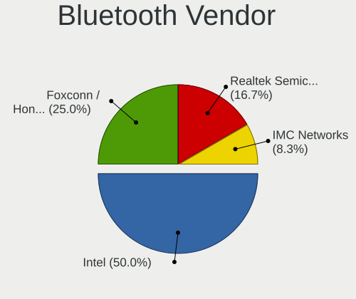

| Vendor                | Desktops | Percent |
|-----------------------|----------|---------|
| Intel                 | 6        | 50%     |
| Foxconn / Hon Hai     | 3        | 25%     |
| Realtek Semiconductor | 2        | 16.67%  |
| IMC Networks          | 1        | 8.33%   |

Bluetooth Model
---------------

Controller models

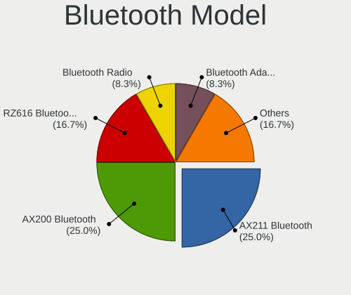

| Model                                     | Desktops | Percent |
|-------------------------------------------|----------|---------|
| Intel AX211 Bluetooth                     | 3        | 25%     |
| Intel AX200 Bluetooth                     | 3        | 25%     |
| Foxconn / Hon Hai RZ616 Bluetooth Adapter | 2        | 16.67%  |
| Realtek Bluetooth Radio                   | 1        | 8.33%   |
| Realtek Bluetooth Adapter                 | 1        | 8.33%   |
| IMC Networks Realtek Bluetooth Adapter    | 1        | 8.33%   |
| Foxconn / Hon Hai Wireless_Device         | 1        | 8.33%   |

Sound
-----

Sound Vendor
------------

Sound card vendors

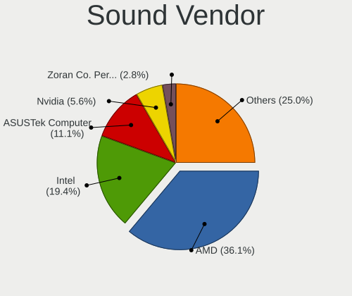

| Vendor                                       | Desktops | Percent |
|----------------------------------------------|----------|---------|
| AMD                                          | 13       | 36.11%  |
| Intel                                        | 7        | 19.44%  |
| ASUSTek Computer                             | 4        | 11.11%  |
| Nvidia                                       | 2        | 5.56%   |
| Zoran Co. Personal Media Division (Nogatech) | 1        | 2.78%   |
| Universal Audio                              | 1        | 2.78%   |
| Thesycon Systemsoftware & Consulting         | 1        | 2.78%   |
| SteelSeries ApS                              | 1        | 2.78%   |
| Mark of the Unicorn                          | 1        | 2.78%   |
| Huawei Technologies                          | 1        | 2.78%   |
| C-Media Electronics                          | 1        | 2.78%   |
| Blue Microphones                             | 1        | 2.78%   |
| BEHRINGER International                      | 1        | 2.78%   |
| Alesis                                       | 1        | 2.78%   |

Sound Model
-----------

Sound card models

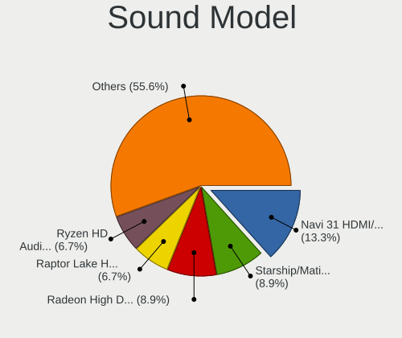

| Model                                                              | Desktops | Percent |
|--------------------------------------------------------------------|----------|---------|
| AMD Navi 31 HDMI/DP Audio                                          | 6        | 13.33%  |
| AMD Starship/Matisse HD Audio Controller                           | 4        | 8.89%   |
| AMD Radeon High Definition Audio Controller                        | 4        | 8.89%   |
| Intel Raptor Lake High Definition Audio Controller                 | 3        | 6.67%   |
| AMD Ryzen HD Audio Controller                                      | 3        | 6.67%   |
| Intel Alder Lake-N PCH High Definition Audio Controller            | 2        | 4.44%   |
| ASUSTek Computer Realtek USB Audio                                 | 2        | 4.44%   |
| AMD Navi 48 HDMI/DP Audio Controller                               | 2        | 4.44%   |
| Zoran Co. Personal Media Division (Nogatech) USB Audio and HID     | 1        | 2.22%   |
| Universal Audio Volt 176                                           | 1        | 2.22%   |
| Thesycon Systemsoftware & Consulting Topping DX3 Pro Audio Control | 1        | 2.22%   |
| SteelSeries ApS SteelSeries Arctis 5 Arctis 5 Chat Arctis 5 Game   | 1        | 2.22%   |
| Nvidia GP104 High Definition Audio Controller                      | 1        | 2.22%   |
| Nvidia GP102 HDMI Audio Controller                                 | 1        | 2.22%   |
| Mark of the Unicorn M Series                                       | 1        | 2.22%   |
| Intel 200 Series PCH HD Audio                                      | 1        | 2.22%   |
| Intel 100 Series/C230 Series Chipset Family HD Audio Controller    | 1        | 2.22%   |
| Huawei Technologies KT USB Audio                                   | 1        | 2.22%   |
| C-Media Electronics CMI8788 [Oxygen HD Audio]                      | 1        | 2.22%   |
| Blue Microphones Yeti Stereo Microphone                            | 1        | 2.22%   |
| BEHRINGER International X18/XR18                                   | 1        | 2.22%   |
| ASUSTek Computer USB Audio                                         | 1        | 2.22%   |
| ASUSTek Computer OEM Device Extension                              | 1        | 2.22%   |
| AMD Renoir/Cezanne HDMI/DP Audio Controller                        | 1        | 2.22%   |
| AMD Navi 21/23 HDMI/DP Audio Controller                            | 1        | 2.22%   |
| AMD Ellesmere HDMI Audio [Radeon RX 470/480 / 570/580/590]         | 1        | 2.22%   |
| Alesis Q49                                                         | 1        | 2.22%   |

Memory
------

Memory Vendor
-------------

Memory module vendors

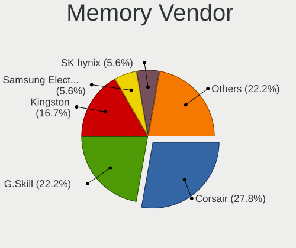

| Vendor              | Desktops | Percent |
|---------------------|----------|---------|
| Corsair             | 5        | 27.78%  |
| G.Skill             | 4        | 22.22%  |
| Kingston            | 3        | 16.67%  |
| SK hynix            | 1        | 5.56%   |
| Samsung Electronics | 1        | 5.56%   |
| Patriot             | 1        | 5.56%   |
| Micron Technology   | 1        | 5.56%   |
| Lexar Co Limited    | 1        | 5.56%   |
| Unknown             | 1        | 5.56%   |

Memory Model
------------

Memory module models

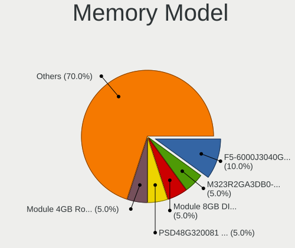

| Model                                                         | Desktops | Percent |
|---------------------------------------------------------------|----------|---------|
| G.Skill RAM F5-6000J3040G32G 32GB DIMM DDR5 4800MT/s          | 2        | 10%     |
| SK hynix RAM Module 8GB DIMM LPDDR4 6400MT/s                  | 1        | 5%      |
| Samsung RAM M323R2GA3DB0-CWMOL 16GB DIMM DDR5 5600MT/s        | 1        | 5%      |
| Patriot RAM PSD48G320081 8GB DIMM DDR4 3200MT/s               | 1        | 5%      |
| Micron RAM Module 4GB Row Of Chips LPDDR5 6400MT/s            | 1        | 5%      |
| Lexar Co Limited RAM LD5EU016G-6400LA 16GB DIMM DDR5 5600MT/s | 1        | 5%      |
| Kingston RAM KF3200C16D4/8GX 8GB DIMM DDR4 3200MT/s           | 1        | 5%      |
| Kingston RAM KF3200C16D4/16GX 16GB DIMM DDR4 3200MT/s         | 1        | 5%      |
| Kingston RAM KF2666C16D4/8G 8GB DIMM DDR4 3200MT/s            | 1        | 5%      |
| Kingston RAM 9965794-016.A00G 32GB DIMM DDR5 4800MT/s         | 1        | 5%      |
| G.Skill RAM F5-6400J3239G16G 16GB DIMM DDR5 6400MT/s          | 1        | 5%      |
| G.Skill RAM F4-3600C16-16GTZNC 16GB DIMM DDR4 3600MT/s        | 1        | 5%      |
| Corsair RAM CMX4GX3M1A1600C9 4GB DIMM 1600MT/s                | 1        | 5%      |
| Corsair RAM CMK8GX4M2A2666C16 4GB DIMM DDR4 2400MT/s          | 1        | 5%      |
| Corsair RAM CMK8GX4M1A2400C16 8GB DIMM DDR4 2400MT/s          | 1        | 5%      |
| Corsair RAM CMK32GX5M2B6000Z30 16GB DIMM DDR5 6000MT/s        | 1        | 5%      |
| Corsair RAM CMK16GX4M2A2400C14 8GB DIMM DDR4 2400MT/s         | 1        | 5%      |
| Corsair RAM CMH64GX5M2B6000C40 32GB DIMM DDR5 4800MT/s        | 1        | 5%      |
| Unknown                                                       | 1        | 5%      |

Memory Kind
-----------

Memory module kinds

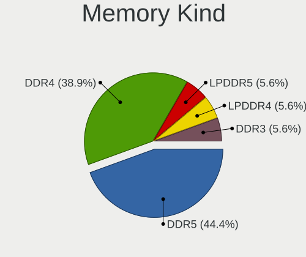

| Kind   | Desktops | Percent |
|--------|----------|---------|
| DDR5   | 8        | 44.44%  |
| DDR4   | 7        | 38.89%  |
| LPDDR5 | 1        | 5.56%   |
| LPDDR4 | 1        | 5.56%   |
| DDR3   | 1        | 5.56%   |

Memory Form Factor
------------------

Physical design of the memory module

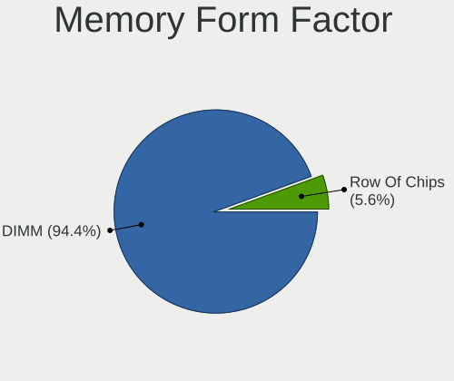

| Name         | Desktops | Percent |
|--------------|----------|---------|
| DIMM         | 17       | 94.44%  |
| Row Of Chips | 1        | 5.56%   |

Memory Size
-----------

Memory module size

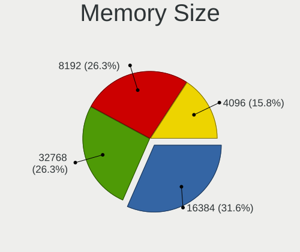

| Size  | Desktops | Percent |
|-------|----------|---------|
| 16384 | 6        | 31.58%  |
| 32768 | 5        | 26.32%  |
| 8192  | 5        | 26.32%  |
| 4096  | 3        | 15.79%  |

Memory Speed
------------

Memory module speed

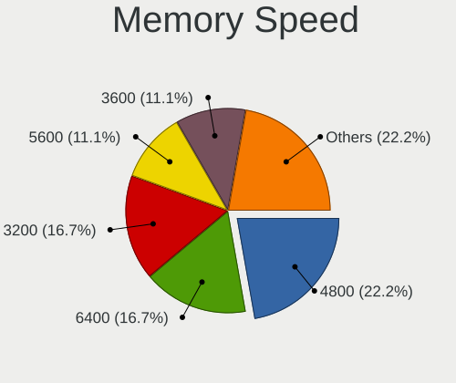

| Speed | Desktops | Percent |
|-------|----------|---------|
| 4800  | 4        | 22.22%  |
| 6400  | 3        | 16.67%  |
| 3200  | 3        | 16.67%  |
| 5600  | 2        | 11.11%  |
| 3600  | 2        | 11.11%  |
| 2400  | 2        | 11.11%  |
| 6000  | 1        | 5.56%   |
| 1600  | 1        | 5.56%   |

Printers & scanners
-------------------

Printer Vendor
--------------

Printer device vendors

Zero info for selected period =(

Printer Model
-------------

Printer device models

Zero info for selected period =(

Scanner Vendor
--------------

Scanner device vendors

Zero info for selected period =(

Scanner Model
-------------

Scanner device models

Zero info for selected period =(

Camera
------

Camera Vendor
-------------

Camera device vendors

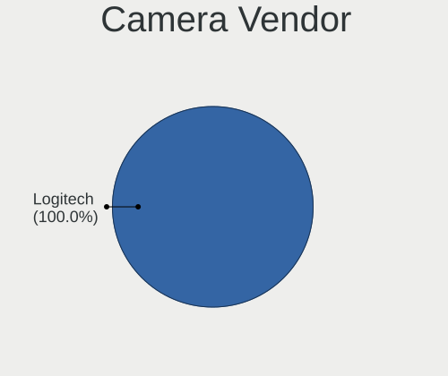

| Vendor   | Desktops | Percent |
|----------|----------|---------|
| Logitech | 4        | 100%    |

Camera Model
------------

Camera device models

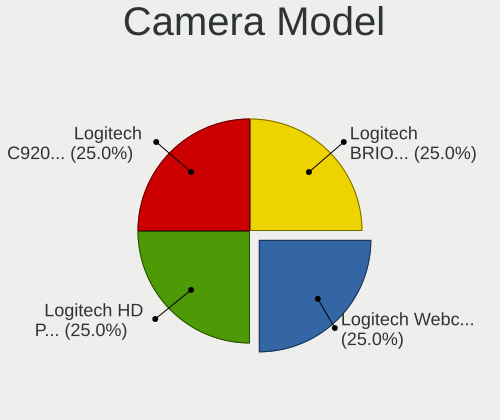

| Model                         | Desktops | Percent |
|-------------------------------|----------|---------|
| Logitech Webcam C270          | 1        | 25%     |
| Logitech HD Pro Webcam C920   | 1        | 25%     |
| Logitech C920 PRO HD Webcam   | 1        | 25%     |
| Logitech BRIO Ultra HD Webcam | 1        | 25%     |

Security
--------

Fingerprint Vendor
------------------

Fingerprint sensor vendors

Zero info for selected period =(

Fingerprint Model
-----------------

Fingerprint sensor models

Zero info for selected period =(

Chipcard Vendor
---------------

Chipcard module vendors

Zero info for selected period =(

Chipcard Model
--------------

Chipcard module models

Zero info for selected period =(

Unsupported
-----------

Unsupported Devices
-------------------

Total unsupported devices on board

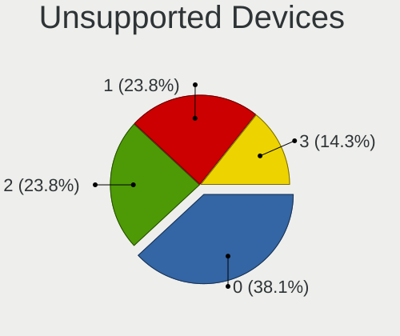

| Total | Desktops | Percent |
|-------|----------|---------|
| 0     | 8        | 38.1%   |
| 2     | 5        | 23.81%  |
| 1     | 5        | 23.81%  |
| 3     | 3        | 14.29%  |

Unsupported Device Types
------------------------

Types of unsupported devices

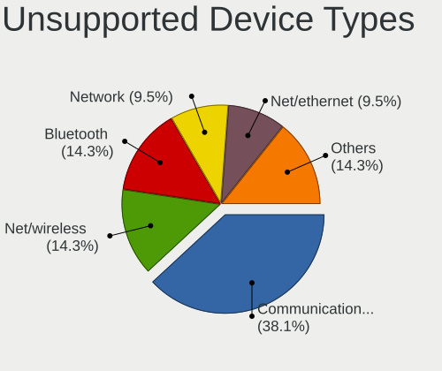

| Type                     | Desktops | Percent |
|--------------------------|----------|---------|
| Communication controller | 8        | 38.1%   |
| Net/wireless             | 3        | 14.29%  |
| Bluetooth                | 3        | 14.29%  |
| Network                  | 2        | 9.52%   |
| Net/ethernet             | 2        | 9.52%   |
| Storage/raid             | 1        | 4.76%   |
| Sound                    | 1        | 4.76%   |
| Dvb card                 | 1        | 4.76%   |

