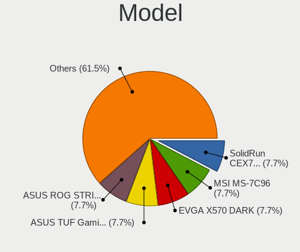
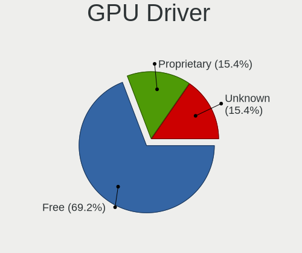
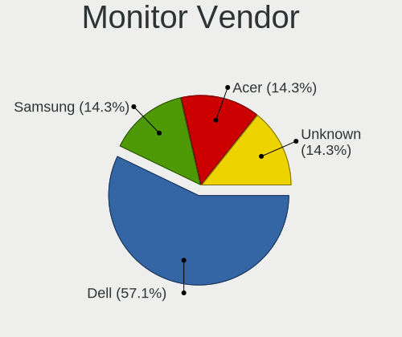
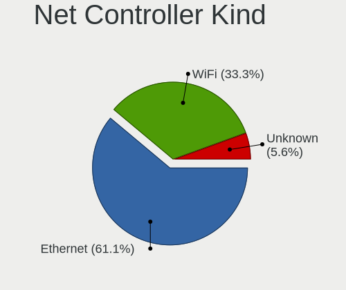

FreeBSD 15.0-CURRENT - Tested Hardware & Statistics (Desktops)
--------------------------------------------------------------

A project to collect tested hardware configurations for FreeBSD 15.0-CURRENT.

Anyone can contribute to this report by the [hw-probe](https://github.com/linuxhw/hw-probe/blob/master/INSTALL.BSD.md) tool:

    hw-probe -all -upload

Please contribute! Especially if your hardware is rare.

Contents
--------

* [ Test Cases ](#test-cases)

* [ System ](#system)
  - [ Arch                     ](#arch)
  - [ DE                       ](#de)
  - [ Display Server           ](#display-server)
  - [ Display Manager          ](#display-manager)
  - [ OS Lang                  ](#os-lang)
  - [ Boot Mode                ](#boot-mode)
  - [ Filesystem               ](#filesystem)
  - [ Part. scheme             ](#part-scheme)

* [ Board ](#board)
  - [ Vendor                   ](#vendor)
  - [ Model                    ](#model)
  - [ Model Family             ](#model-family)
  - [ MFG Year                 ](#mfg-year)
  - [ Form Factor              ](#form-factor)
  - [ Coreboot                 ](#coreboot)
  - [ RAM Size                 ](#ram-size)
  - [ RAM Used                 ](#ram-used)
  - [ Total Drives             ](#total-drives)
  - [ Has CD-ROM               ](#has-cd-rom)
  - [ Has Ethernet             ](#has-ethernet)
  - [ Has WiFi                 ](#has-wifi)
  - [ Has Bluetooth            ](#has-bluetooth)

* [ Location ](#location)
  - [ Country                  ](#country)
  - [ City                     ](#city)

* [ Drives ](#drives)
  - [ Drive Vendor             ](#drive-vendor)
  - [ Drive Model              ](#drive-model)
  - [ HDD Vendor               ](#hdd-vendor)
  - [ SSD Vendor               ](#ssd-vendor)
  - [ Drive Kind               ](#drive-kind)
  - [ Drive Connector          ](#drive-connector)
  - [ Drive Size               ](#drive-size)
  - [ Space Total              ](#space-total)
  - [ Space Used               ](#space-used)
  - [ Malfunc. Drives          ](#malfunc-drives)
  - [ Malfunc. Drive Vendor    ](#malfunc-drive-vendor)
  - [ Malfunc. HDD Vendor      ](#malfunc-hdd-vendor)
  - [ Malfunc. Drive Kind      ](#malfunc-drive-kind)
  - [ Failed Drives            ](#failed-drives)
  - [ Failed Drive Vendor      ](#failed-drive-vendor)
  - [ Drive Status             ](#drive-status)

* [ Storage controller ](#storage-controller)
  - [ Storage Vendor           ](#storage-vendor)
  - [ Storage Model            ](#storage-model)
  - [ Storage Kind             ](#storage-kind)

* [ Processor ](#processor)
  - [ CPU Vendor               ](#cpu-vendor)
  - [ CPU Model                ](#cpu-model)
  - [ CPU Model Family         ](#cpu-model-family)
  - [ CPU Cores                ](#cpu-cores)
  - [ CPU Sockets              ](#cpu-sockets)
  - [ CPU Threads              ](#cpu-threads)
  - [ CPU Microarch            ](#cpu-microarch)

* [ Graphics ](#graphics)
  - [ GPU Vendor               ](#gpu-vendor)
  - [ GPU Model                ](#gpu-model)
  - [ GPU Combo                ](#gpu-combo)
  - [ GPU Driver               ](#gpu-driver)
  - [ GPU Memory               ](#gpu-memory)

* [ Monitor ](#monitor)
  - [ Monitor Vendor           ](#monitor-vendor)
  - [ Monitor Model            ](#monitor-model)
  - [ Monitor Resolution       ](#monitor-resolution)
  - [ Monitor Diagonal         ](#monitor-diagonal)
  - [ Monitor Width            ](#monitor-width)
  - [ Aspect Ratio             ](#aspect-ratio)
  - [ Monitor Area             ](#monitor-area)
  - [ Pixel Density            ](#pixel-density)
  - [ Multiple Monitors        ](#multiple-monitors)

* [ Network ](#network)
  - [ Net Controller Vendor    ](#net-controller-vendor)
  - [ Net Controller Model     ](#net-controller-model)
  - [ Wireless Vendor          ](#wireless-vendor)
  - [ Wireless Model           ](#wireless-model)
  - [ Ethernet Vendor          ](#ethernet-vendor)
  - [ Ethernet Model           ](#ethernet-model)
  - [ Net Controller Kind      ](#net-controller-kind)
  - [ Used Controller          ](#used-controller)
  - [ NICs                     ](#nics)
  - [ IPv6                     ](#ipv6)

* [ Bluetooth ](#bluetooth)
  - [ Bluetooth Vendor         ](#bluetooth-vendor)
  - [ Bluetooth Model          ](#bluetooth-model)

* [ Sound ](#sound)
  - [ Sound Vendor             ](#sound-vendor)
  - [ Sound Model              ](#sound-model)

* [ Memory ](#memory)
  - [ Memory Vendor            ](#memory-vendor)
  - [ Memory Model             ](#memory-model)
  - [ Memory Kind              ](#memory-kind)
  - [ Memory Form Factor       ](#memory-form-factor)
  - [ Memory Size              ](#memory-size)
  - [ Memory Speed             ](#memory-speed)

* [ Printers & scanners ](#printers--scanners)
  - [ Printer Vendor           ](#printer-vendor)
  - [ Printer Model            ](#printer-model)
  - [ Scanner Vendor           ](#scanner-vendor)
  - [ Scanner Model            ](#scanner-model)

* [ Camera ](#camera)
  - [ Camera Vendor            ](#camera-vendor)
  - [ Camera Model             ](#camera-model)

* [ Security ](#security)
  - [ Fingerprint Vendor       ](#fingerprint-vendor)
  - [ Fingerprint Model        ](#fingerprint-model)
  - [ Chipcard Vendor          ](#chipcard-vendor)
  - [ Chipcard Model           ](#chipcard-model)

* [ Unsupported ](#unsupported)
  - [ Unsupported Devices      ](#unsupported-devices)
  - [ Unsupported Device Types ](#unsupported-device-types)

Test Cases
----------

Total: 20

| Vendor   | Model                       | Probe                                                     | Date         |
|----------|-----------------------------|-----------------------------------------------------------|--------------|
| ASUSTek  | PRIME Z790-A WIFI           | [09413cb67c](https://bsd-hardware.info/?probe=09413cb67c) | Dec 10, 2024 |
| ASUSTek  | ROG STRIX X870E-E GAMING... | [4edaabd936](https://bsd-hardware.info/?probe=4edaabd936) | Dec 07, 2024 |
| ASRock   | X570 Taichi                 | [4c642bb872](https://bsd-hardware.info/?probe=4c642bb872) | Oct 28, 2024 |
| ASUSTek  | PRIME Z370-P II             | [5d6734e438](https://bsd-hardware.info/?probe=5d6734e438) | Sep 18, 2024 |
| ASUSTek  | ROG STRIX B650E-I GAMING... | [4b9cdbf4d2](https://bsd-hardware.info/?probe=4b9cdbf4d2) | Jul 07, 2024 |
| ASUSTek  | TUF Gaming B650M-PLUS       | [c2ac893b66](https://bsd-hardware.info/?probe=c2ac893b66) | Jun 25, 2024 |
| Apple    | Mac-F60DEB81FF30ACF6 Mac... | [1f9f3170fd](https://bsd-hardware.info/?probe=1f9f3170fd) | May 25, 2024 |
| Apple    | Mac-F60DEB81FF30ACF6 Mac... | [db2e2d1fbc](https://bsd-hardware.info/?probe=db2e2d1fbc) | May 02, 2024 |
| ASUSTek  | ROG STRIX X670E-F GAMING... | [f5683de21a](https://bsd-hardware.info/?probe=f5683de21a) | Apr 24, 2024 |
| MSI      | A520M-A PRO                 | [ad2494f0c0](https://bsd-hardware.info/?probe=ad2494f0c0) | Apr 11, 2024 |
| MSI      | A520M-A PRO                 | [3fb8a577ad](https://bsd-hardware.info/?probe=3fb8a577ad) | Apr 10, 2024 |
| SolidRun | CEX7 Platform               | [7c5ed3c2fe](https://bsd-hardware.info/?probe=7c5ed3c2fe) | Apr 06, 2024 |
| ASRock   | Z790M-ITX WiFi              | [b2bbe7eb8d](https://bsd-hardware.info/?probe=b2bbe7eb8d) | Apr 04, 2024 |
| SolidRun | CEX7 Platform               | [ae1a4bcbae](https://bsd-hardware.info/?probe=ae1a4bcbae) | Jan 23, 2024 |
| SolidRun | CEX7 Platform               | [d876c335eb](https://bsd-hardware.info/?probe=d876c335eb) | Jan 21, 2024 |
| ASUSTek  | Pro WS WRX80E-SAGE SE WI... | [33704d0025](https://bsd-hardware.info/?probe=33704d0025) | Jan 12, 2024 |
| EVGA     | X570 DARK.0                 | [1c84a8169b](https://bsd-hardware.info/?probe=1c84a8169b) | Dec 11, 2023 |
| Unknown  | Unknown                     | [8e245ccb85](https://bsd-hardware.info/?probe=8e245ccb85) | Oct 25, 2023 |
| ASUSTek  | Pro WS WRX80E-SAGE SE WI... | [24e745026c](https://bsd-hardware.info/?probe=24e745026c) | Sep 08, 2023 |
| SolidRun | CEX7 Platform               | [b83ebfd33b](https://bsd-hardware.info/?probe=b83ebfd33b) | Aug 29, 2023 |

System
------

Arch
----

OS architecture (x86_64, i586, etc.)

| Name  | Desktops | Percent |
|-------|----------|---------|
| amd64 | 11       | 84.62%  |
| arm64 | 2        | 15.38%  |

DE
--

Desktop Environment

| Name    | Desktops | Percent |
|---------|----------|---------|
| Console | 6        | 46.15%  |
| KDE5    | 3        | 23.08%  |
| XFCE    | 1        | 7.69%   |
| KDE     | 1        | 7.69%   |
| i3      | 1        | 7.69%   |
| GNOME   | 1        | 7.69%   |

Display Server
--------------

X11 or Wayland

| Name    | Desktops | Percent |
|---------|----------|---------|
| X11     | 8        | 61.54%  |
| Console | 4        | 30.77%  |
| Wayland | 1        | 7.69%   |

Display Manager
---------------

SDDM, LightDM, etc.

| Name    | Desktops | Percent |
|---------|----------|---------|
| Console | 6        | 46.15%  |
| SDDM    | 5        | 38.46%  |
| SLiM    | 1        | 7.69%   |
| GDM     | 1        | 7.69%   |

OS Lang
-------

Language

| Lang    | Desktops | Percent |
|---------|----------|---------|
| C       | 5        | 38.46%  |
| en_US   | 4        | 30.77%  |
| ru_RU   | 1        | 7.69%   |
| ru      | 1        | 7.69%   |
| pl_PL   | 1        | 7.69%   |
| Unknown | 1        | 7.69%   |

Boot Mode
---------

EFI or BIOS

| Mode | Desktops | Percent |
|------|----------|---------|
| EFI  | 13       | 100%    |

Filesystem
----------

Type of filesystem

| Type | Desktops | Percent |
|------|----------|---------|
| Zfs  | 9        | 69.23%  |
| Ufs  | 4        | 30.77%  |

Part. scheme
------------

Scheme of partitioning

| Type | Desktops | Percent |
|------|----------|---------|
| GPT  | 13       | 100%    |

Board
-----

Vendor
------

Motherboard manufacturer

| Name             | Desktops | Percent |
|------------------|----------|---------|
| ASUSTek Computer | 7        | 53.85%  |
| ASRock           | 2        | 15.38%  |
| SolidRun         | 1        | 7.69%   |
| MSI              | 1        | 7.69%   |
| EVGA             | 1        | 7.69%   |
| Unknown          | 1        | 7.69%   |

Model
-----

Motherboard model

| Name                               | Desktops | Percent |
|------------------------------------|----------|---------|
| SolidRun CEX7 Platform             | 1        | 7.69%   |
| MSI MS-7C96                        | 1        | 7.69%   |
| EVGA X570 DARK                     | 1        | 7.69%   |
| ASUS TUF Gaming B650M-PLUS         | 1        | 7.69%   |
| ASUS ROG STRIX X870E-E GAMING WIFI | 1        | 7.69%   |
| ASUS ROG STRIX X670E-F GAMING WIFI | 1        | 7.69%   |
| ASUS ROG STRIX B650E-I GAMING WIFI | 1        | 7.69%   |
| ASUS Pro WS WRX80E-SAGE SE WIFI    | 1        | 7.69%   |
| ASUS PRIME Z790-A WIFI             | 1        | 7.69%   |
| ASUS PRIME Z370-P II               | 1        | 7.69%   |
| ASRock Z790M-ITX WiFi              | 1        | 7.69%   |
| ASRock X570 Taichi                 | 1        | 7.69%   |
| Unknown                            | 1        | 7.69%   |

Model Family
------------

Motherboard model prefix

| Name             | Desktops | Percent |
|------------------|----------|---------|
| ASUS ROG         | 3        | 23.08%  |
| ASUS PRIME       | 2        | 15.38%  |
| SolidRun CEX7    | 1        | 7.69%   |
| MSI MS-7C96      | 1        | 7.69%   |
| EVGA X570        | 1        | 7.69%   |
| ASUS TUF         | 1        | 7.69%   |
| ASUS Pro         | 1        | 7.69%   |
| ASRock Z790M-ITX | 1        | 7.69%   |
| ASRock X570      | 1        | 7.69%   |
| Unknown          | 1        | 7.69%   |

MFG Year
--------

Motherboard manufacture year

| Year    | Desktops | Percent |
|---------|----------|---------|
| 2023    | 4        | 30.77%  |
| 2022    | 3        | 23.08%  |
| 2024    | 2        | 15.38%  |
| 2021    | 1        | 7.69%   |
| 2020    | 1        | 7.69%   |
| 2019    | 1        | 7.69%   |
| Unknown | 1        | 7.69%   |

Form Factor
-----------

Physical design of the computer

| Name    | Desktops | Percent |
|---------|----------|---------|
| Desktop | 13       | 100%    |

Coreboot
--------

Have coreboot on board

| Used | Desktops | Percent |
|------|----------|---------|
| No   | 13       | 100%    |

RAM Size
--------

Total RAM memory

| Size in GB  | Desktops | Percent |
|-------------|----------|---------|
| 64.01-256.0 | 7        | 50%     |
| 32.01-64.0  | 3        | 21.43%  |
| 16.01-24.0  | 3        | 21.43%  |
| 0.51-1.0    | 1        | 7.14%   |

RAM Used
--------

Used RAM memory

| Used GB  | Desktops | Percent |
|----------|----------|---------|
| 2.01-3.0 | 5        | 35.71%  |
| 1.01-2.0 | 4        | 28.57%  |
| 0.51-1.0 | 2        | 14.29%  |
| 0.01-0.5 | 2        | 14.29%  |
| 3.01-4.0 | 1        | 7.14%   |

Total Drives
------------

Number of drives on board

| Drives | Desktops | Percent |
|--------|----------|---------|
| 0      | 10       | 71.43%  |
| 1      | 2        | 14.29%  |
| 7      | 1        | 7.14%   |
| 2      | 1        | 7.14%   |

Has CD-ROM
----------

Has CD-ROM on board

| Presented | Desktops | Percent |
|-----------|----------|---------|
| No        | 13       | 100%    |

Has Ethernet
------------

Has Ethernet on board

| Presented | Desktops | Percent |
|-----------|----------|---------|
| Yes       | 11       | 84.62%  |
| No        | 2        | 15.38%  |

Has WiFi
--------

Has WiFi module

| Presented | Desktops | Percent |
|-----------|----------|---------|
| No        | 7        | 53.85%  |
| Yes       | 6        | 46.15%  |

Has Bluetooth
-------------

Has Bluetooth module

| Presented | Desktops | Percent |
|-----------|----------|---------|
| Yes       | 8        | 61.54%  |
| No        | 5        | 38.46%  |

Location
--------

Country
-------

Geographic location (country)

| Country     | Desktops | Percent |
|-------------|----------|---------|
| USA         | 2        | 14.29%  |
| Netherlands | 2        | 14.29%  |
| Canada      | 2        | 14.29%  |
| UK          | 1        | 7.14%   |
| Spain       | 1        | 7.14%   |
| Serbia      | 1        | 7.14%   |
| Russia      | 1        | 7.14%   |
| Poland      | 1        | 7.14%   |
| Hungary     | 1        | 7.14%   |
| France      | 1        | 7.14%   |
| Czechia     | 1        | 7.14%   |

City
----

Geographic location (city)

| City       | Desktops | Percent |
|------------|----------|---------|
| Amsterdam  | 2        | 14.29%  |
| Warsaw     | 1        | 7.14%   |
| Viladecans | 1        | 7.14%   |
| St. Albert | 1        | 7.14%   |
| New York   | 1        | 7.14%   |
| Moscow     | 1        | 7.14%   |
| Landorthe  | 1        | 7.14%   |
| Hadleigh   | 1        | 7.14%   |
| Budapest   | 1        | 7.14%   |
| Břeclav   | 1        | 7.14%   |
| Belgrade   | 1        | 7.14%   |
| Barrie     | 1        | 7.14%   |
| Austin     | 1        | 7.14%   |

Drives
------

Drive Vendor
------------

Hard drive vendors

| Vendor              | Desktops | Drives | Percent |
|---------------------|----------|--------|---------|
| Samsung Electronics | 3        | 12     | 60%     |
| SanDisk             | 1        | 1      | 20%     |
| Kingston            | 1        | 1      | 20%     |

Drive Model
-----------

Hard drive models

| Model                            | Desktops | Percent |
|----------------------------------|----------|---------|
| SanDisk Ultra II 1TB             | 1        | 16.67%  |
| Samsung SSD 860 EVO 500GB        | 1        | 16.67%  |
| Samsung SSD 860 EVO 250GB        | 1        | 16.67%  |
| Samsung SSD 850 EVO 250GB        | 1        | 16.67%  |
| Samsung MZ7L37T6HBLA-00A07 7.6TB | 1        | 16.67%  |
| Kingston SV300S37A120G 120GB     | 1        | 16.67%  |

HDD Vendor
----------

Hard disk drive vendors

Zero info for selected period =(

SSD Vendor
----------

Solid state drive vendors

| Vendor              | Desktops | Drives | Percent |
|---------------------|----------|--------|---------|
| Samsung Electronics | 3        | 12     | 60%     |
| SanDisk             | 1        | 1      | 20%     |
| Kingston            | 1        | 1      | 20%     |

Drive Kind
----------

HDD or SSD

| Kind | Desktops | Drives | Percent |
|------|----------|--------|---------|
| SSD  | 4        | 14     | 100%    |

Drive Connector
---------------

SATA, SAS, NVMe, etc.

| Type | Desktops | Drives | Percent |
|------|----------|--------|---------|
| SATA | 4        | 14     | 100%    |

Drive Size
----------

Size of hard drive

| Size in TB | Desktops | Drives | Percent |
|------------|----------|--------|---------|
| 0.01-0.5   | 4        | 8      | 66.67%  |
| 4.01-10.0  | 1        | 5      | 16.67%  |
| 0.51-1.0   | 1        | 1      | 16.67%  |

Space Total
-----------

Amount of disk space available on the file system

| Size in GB | Desktops | Percent |
|------------|----------|---------|
| 1001-2000  | 5        | 38.46%  |
| 501-1000   | 4        | 30.77%  |
| 101-250    | 2        | 15.38%  |
| 51-100     | 2        | 15.38%  |

Space Used
----------

Amount of used disk space

| Used GB | Desktops | Percent |
|---------|----------|---------|
| 1-20    | 9        | 69.23%  |
| 21-50   | 2        | 15.38%  |
| 101-250 | 1        | 7.69%   |
| 51-100  | 1        | 7.69%   |

Malfunc. Drives
---------------

Drive models with a malfunction

| Model                        | Desktops | Drives | Percent |
|------------------------------|----------|--------|---------|
| Kingston SV300S37A120G 120GB | 1        | 1      | 100%    |

Malfunc. Drive Vendor
---------------------

Vendors of faulty drives

| Vendor   | Desktops | Drives | Percent |
|----------|----------|--------|---------|
| Kingston | 1        | 1      | 100%    |

Malfunc. HDD Vendor
-------------------

Vendors of faulty HDD drives

Zero info for selected period =(

Malfunc. Drive Kind
-------------------

Kinds of faulty drives

| Kind | Desktops | Drives | Percent |
|------|----------|--------|---------|
| SSD  | 1        | 1      | 100%    |

Failed Drives
-------------

Failed drive models

Zero info for selected period =(

Failed Drive Vendor
-------------------

Failed drive vendors

Zero info for selected period =(

Drive Status
------------

Number of failed and malfunc. drives

| Status  | Desktops | Drives | Percent |
|---------|----------|--------|---------|
| Works   | 3        | 13     | 75%     |
| Malfunc | 1        | 1      | 25%     |

Storage controller
------------------

Storage Vendor
--------------

Storage controller vendors

| Vendor                       | Desktops | Percent |
|------------------------------|----------|---------|
| Samsung Electronics          | 7        | 24.14%  |
| AMD                          | 7        | 24.14%  |
| Phison Electronics           | 3        | 10.34%  |
| Intel                        | 3        | 10.34%  |
| Sandisk                      | 2        | 6.9%    |
| Broadcom / LSI               | 2        | 6.9%    |
| SK hynix                     | 1        | 3.45%   |
| Shenzhen Longsys Electronics | 1        | 3.45%   |
| O2 Micro                     | 1        | 3.45%   |
| Micron/Crucial Technology    | 1        | 3.45%   |
| ASMedia Technology           | 1        | 3.45%   |

Storage Model
-------------

Storage controller models

| Model                                                                   | Desktops | Percent |
|-------------------------------------------------------------------------|----------|---------|
| Samsung NVMe SSD Controller PM9A1/PM9A3/980PRO                          | 4        | 12.5%   |
| AMD 600 Series Chipset SATA Controller                                  | 3        | 9.38%   |
| Samsung NVMe SSD Controller SM981/PM981/PM983                           | 2        | 6.25%   |
| Phison PS5013-E13 PCIe3 NVMe Controller (DRAM-less)                     | 2        | 6.25%   |
| Broadcom / LSI SAS3408 Fusion-MPT Tri-Mode I/O Controller Chip (IOC)    | 2        | 6.25%   |
| AMD FCH SATA Controller [AHCI mode]                                     | 2        | 6.25%   |
| SK hynix Gold P31/BC711/PC711 NVMe Solid State Drive                    | 1        | 3.13%   |
| Shenzhen Longsys Lexar NM790 NVME SSD (DRAM-less)                       | 1        | 3.13%   |
| Sandisk WD Black SN850X NVMe SSD                                        | 1        | 3.13%   |
| Sandisk WD Black SN770 / PC SN740 256GB / PC SN560 (DRAM-less) NVMe SSD | 1        | 3.13%   |
| Samsung NVMe SSD Controller S4LV008[Pascal]                             | 1        | 3.13%   |
| Samsung NVMe SSD Controller 980 (DRAM-less)                             | 1        | 3.13%   |
| Phison PS5027-E27T PCIe4 NVMe Controller (DRAM-less)                    | 1        | 3.13%   |
| O2 Micro FORESEE E2M2 NVMe SSD                                          | 1        | 3.13%   |
| Micron/Crucial T705 NVMe PCIe SSD                                       | 1        | 3.13%   |
| Intel Volume Management Device NVMe RAID Controller Intel Corporation   | 1        | 3.13%   |
| Intel Raptor Lake SATA AHCI Controller                                  | 1        | 3.13%   |
| Intel 200 Series PCH SATA controller [AHCI mode]                        | 1        | 3.13%   |
| Broadcom / LSI SAS3008 PCI-Express Fusion-MPT SAS-3                     | 1        | 3.13%   |
| Broadcom / LSI SAS2008 PCI-Express Fusion-MPT SAS-2 [Falcon]            | 1        | 3.13%   |
| ASMedia ASM1061/ASM1062 Serial ATA Controller                           | 1        | 3.13%   |
| AMD FCH RAID Controller                                                 | 1        | 3.13%   |
| AMD 500 Series Chipset SATA Controller                                  | 1        | 3.13%   |

Storage Kind
------------

Kind of storage controller (IDE, SATA, NVMe, SAS, ...)

| Kind | Desktops | Percent |
|------|----------|---------|
| NVMe | 13       | 50%     |
| SATA | 9        | 34.62%  |
| RAID | 2        | 7.69%   |
| SAS  | 2        | 7.69%   |

Processor
---------

CPU Vendor
----------

Processor vendors

| Vendor | Desktops | Percent |
|--------|----------|---------|
| AMD    | 8        | 61.54%  |
| Intel  | 3        | 23.08%  |
| NXP    | 1        | 7.69%   |
| ARM    | 1        | 7.69%   |

CPU Model
---------

Processor models

| Model                                      | Desktops | Percent |
|--------------------------------------------|----------|---------|
| NXP Cortex-A72                             | 1        | 7.69%   |
| Intel Core i7-8700 CPU @ 3.20GHz           | 1        | 7.69%   |
| Intel Core i7-14700KF                      | 1        | 7.69%   |
| Intel Core i7-14700K                       | 1        | 7.69%   |
| ARM Cortex-A55 r2p0                        | 1        | 7.69%   |
| AMD Ryzen Threadripper PRO 5975WX 32-Cores | 1        | 7.69%   |
| AMD Ryzen 9 9950X 16-Core Processor        | 1        | 7.69%   |
| AMD Ryzen 9 7950X3D 16-Core Processor      | 1        | 7.69%   |
| AMD Ryzen 9 7950X 16-Core Processor        | 1        | 7.69%   |
| AMD Ryzen 9 7900 12-Core Processor         | 1        | 7.69%   |
| AMD Ryzen 9 5950X 16-Core Processor        | 1        | 7.69%   |
| AMD Ryzen 7 5800X3D 8-Core Processor       | 1        | 7.69%   |
| AMD Ryzen 5 5600G with Radeon Graphics     | 1        | 7.69%   |

CPU Model Family
----------------

Processor model prefix

| Model                  | Desktops | Percent |
|------------------------|----------|---------|
| AMD Ryzen 9            | 5        | 38.46%  |
| Intel Core i7          | 3        | 23.08%  |
| Other                  | 1        | 7.69%   |
| ARM Cortex             | 1        | 7.69%   |
| AMD Ryzen Threadripper | 1        | 7.69%   |
| AMD Ryzen 7            | 1        | 7.69%   |
| AMD Ryzen 5            | 1        | 7.69%   |

CPU Cores
---------

Number of processor cores

| Number  | Desktops | Percent |
|---------|----------|---------|
| 16      | 3        | 23.08%  |
| 32      | 2        | 15.38%  |
| Unknown | 2        | 15.38%  |
| 64      | 1        | 7.69%   |
| 28      | 1        | 7.69%   |
| 24      | 1        | 7.69%   |
| 14      | 1        | 7.69%   |
| 12      | 1        | 7.69%   |
| 6       | 1        | 7.69%   |

CPU Sockets
-----------

Number of sockets

| Number  | Desktops | Percent |
|---------|----------|---------|
| 1       | 12       | 92.31%  |
| Unknown | 1        | 7.69%   |

CPU Threads
-----------

Threads per core (Hyper-Threading)

| Number  | Desktops | Percent |
|---------|----------|---------|
| 1       | 7        | 53.85%  |
| 2       | 4        | 30.77%  |
| Unknown | 2        | 15.38%  |

CPU Microarch
-------------

Microarchitecture

| Name     | Desktops | Percent |
|----------|----------|---------|
| Unknown  | 9        | 69.23%  |
| Zen 3    | 3        | 23.08%  |
| KabyLake | 1        | 7.69%   |

Graphics
--------

GPU Vendor
----------

Vendors of graphics cards

| Vendor | Desktops | Percent |
|--------|----------|---------|
| AMD    | 8        | 72.73%  |
| Nvidia | 2        | 18.18%  |
| Intel  | 1        | 9.09%   |

GPU Model
---------

Graphics card models

| Model                                                        | Desktops | Percent |
|--------------------------------------------------------------|----------|---------|
| AMD Navi 31 [Radeon RX 7900 XT/7900 XTX/7900 GRE/7900M]      | 5        | 38.46%  |
| AMD Raphael                                                  | 3        | 23.08%  |
| Nvidia GP104 [GeForce GTX 1070]                              | 1        | 7.69%   |
| Nvidia GP102 [GeForce GTX 1080 Ti]                           | 1        | 7.69%   |
| Intel Raptor Lake-S GT1 [UHD Graphics 770]                   | 1        | 7.69%   |
| AMD Navi 21 [Radeon RX 6900 XT]                              | 1        | 7.69%   |
| AMD Cezanne [Radeon Vega Series / Radeon Vega Mobile Series] | 1        | 7.69%   |

GPU Combo
---------

Combinations of graphics cards

| Name       | Desktops | Percent |
|------------|----------|---------|
| 1 x AMD    | 6        | 46.15%  |
| Other      | 2        | 15.38%  |
| 2 x AMD    | 2        | 15.38%  |
| 1 x Nvidia | 2        | 15.38%  |
| 1 x Intel  | 1        | 7.69%   |

GPU Driver
----------

Free vs proprietary

| Driver      | Desktops | Percent |
|-------------|----------|---------|
| Free        | 9        | 69.23%  |
| Proprietary | 2        | 15.38%  |
| Unknown     | 2        | 15.38%  |

GPU Memory
----------

Total video memory

| Size in GB | Desktops | Percent |
|------------|----------|---------|
| Unknown    | 8        | 57.14%  |
| 16.01-24.0 | 2        | 14.29%  |
| 8.01-16.0  | 2        | 14.29%  |
| 7.01-8.0   | 1        | 7.14%   |
| 1.01-2.0   | 1        | 7.14%   |

Monitor
-------

Monitor Vendor
--------------

Monitor vendors

| Vendor              | Desktops | Percent |
|---------------------|----------|---------|
| Dell                | 4        | 57.14%  |
| Samsung Electronics | 1        | 14.29%  |
| Acer                | 1        | 14.29%  |
| Unknown             | 1        | 14.29%  |

Monitor Model
-------------

Monitor models

| Model                                                            | Desktops | Percent |
|------------------------------------------------------------------|----------|---------|
| Samsung Electronics S19C200 SAM09AC 1366x768 410x230mm 18.5-inch | 1        | 12.5%   |
| Dell U3417W DELA0DF 3440x1440 800x330mm 34.1-inch                | 1        | 12.5%   |
| Dell U3417W DELA0DE 3440x1440 800x330mm 34.1-inch                | 1        | 12.5%   |
| Dell U2720Q DEL41B4 3840x2160 600x340mm 27.2-inch                | 1        | 12.5%   |
| Dell U2311H DELA060 1920x1080 510x290mm 23.1-inch                | 1        | 12.5%   |
| Dell S2522HG DELA1C1 1920x1080 540x300mm 24.3-inch               | 1        | 12.5%   |
| Acer XV272U X ACR0832 2560x1440 600x340mm 27.2-inch              | 1        | 12.5%   |
| Unknown                                                          | 1        | 12.5%   |

Monitor Resolution
------------------

Monitor screen resolution

| Resolution      | Desktops | Percent |
|-----------------|----------|---------|
| 2560x1440 (QHD) | 2        | 28.57%  |
| 1920x1080 (FHD) | 2        | 28.57%  |
| 3840x2160 (4K)  | 1        | 14.29%  |
| 3440x1440       | 1        | 14.29%  |
| 1366x768 (WXGA) | 1        | 14.29%  |

Monitor Diagonal
----------------

Diagonal size in inches

| Inches  | Desktops | Percent |
|---------|----------|---------|
| 27      | 2        | 28.57%  |
| 34      | 1        | 14.29%  |
| 24      | 1        | 14.29%  |
| 23      | 1        | 14.29%  |
| 18      | 1        | 14.29%  |
| Unknown | 1        | 14.29%  |

Monitor Width
-------------

Physical width

| Width in mm | Desktops | Percent |
|-------------|----------|---------|
| 501-600     | 4        | 57.14%  |
| 701-800     | 1        | 14.29%  |
| 401-500     | 1        | 14.29%  |
| Unknown     | 1        | 14.29%  |

Aspect Ratio
------------

Proportional relationship between the width and the height

| Ratio   | Desktops | Percent |
|---------|----------|---------|
| 16/9    | 5        | 71.43%  |
| 21/9    | 1        | 14.29%  |
| Unknown | 1        | 14.29%  |

Monitor Area
------------

Area in inch²

| Area in inch² | Desktops | Percent |
|----------------|----------|---------|
| 301-350        | 2        | 28.57%  |
| 351-500        | 1        | 14.29%  |
| 251-300        | 1        | 14.29%  |
| 201-250        | 1        | 14.29%  |
| 141-150        | 1        | 14.29%  |
| Unknown        | 1        | 14.29%  |

Pixel Density
-------------

Pixels per inch

| Density | Desktops | Percent |
|---------|----------|---------|
| 51-100  | 3        | 42.86%  |
| 101-120 | 2        | 28.57%  |
| 161-240 | 1        | 14.29%  |
| Unknown | 1        | 14.29%  |

Multiple Monitors
-----------------

Total monitors connected

| Total | Desktops | Percent |
|-------|----------|---------|
| 1     | 7        | 53.85%  |
| 0     | 6        | 46.15%  |

Network
-------

Net Controller Vendor
---------------------

Controller vendors

| Vendor                | Desktops | Percent |
|-----------------------|----------|---------|
| Intel                 | 8        | 47.06%  |
| Realtek Semiconductor | 5        | 29.41%  |
| MediaTek              | 3        | 17.65%  |
| Aquantia              | 1        | 5.88%   |

Net Controller Model
--------------------

Controller models

| Model                                                                          | Desktops | Percent |
|--------------------------------------------------------------------------------|----------|---------|
| Intel Ethernet Controller I225-V                                               | 4        | 17.39%  |
| Realtek RTL8111/8168/8211/8411 PCI Express Gigabit Ethernet Controller         | 3        | 13.04%  |
| MediaTek MT7922 802.11ax PCI Express Wireless Network Adapter                  | 2        | 8.7%    |
| Intel Wi-Fi 6 AX200                                                            | 2        | 8.7%    |
| Intel Raptor Lake-S PCH CNVi WiFi                                              | 2        | 8.7%    |
| Intel Ethernet Controller I226-V                                               | 2        | 8.7%    |
| Realtek USB 2.5GbE Controller                                                  | 1        | 4.35%   |
| Realtek RTL8125 2.5GbE Controller                                              | 1        | 4.35%   |
| Realtek RT8126 PCIe Ethernet Controller                                        | 1        | 4.35%   |
| Intel I211 Gigabit Network Connection                                          | 1        | 4.35%   |
| Intel Ethernet Controller X550                                                 | 1        | 4.35%   |
| Intel Ethernet Controller I219-V                                               | 1        | 4.35%   |
| Aquantia AQtion AQC100 NBase-T/IEEE 802.3an Ethernet Controller [Atlantic 10G] | 1        | 4.35%   |
| Unknown                                                                        | 1        | 4.35%   |

Wireless Vendor
---------------

Wireless vendors

| Vendor   | Desktops | Percent |
|----------|----------|---------|
| Intel    | 4        | 66.67%  |
| MediaTek | 2        | 33.33%  |

Wireless Model
--------------

Wireless models

| Model                                                         | Desktops | Percent |
|---------------------------------------------------------------|----------|---------|
| MediaTek MT7922 802.11ax PCI Express Wireless Network Adapter | 2        | 33.33%  |
| Intel Wi-Fi 6 AX200                                           | 2        | 33.33%  |
| Intel Raptor Lake-S PCH CNVi WiFi                             | 2        | 33.33%  |

Ethernet Vendor
---------------

Ethernet vendors

| Vendor                | Desktops | Percent |
|-----------------------|----------|---------|
| Intel                 | 8        | 57.14%  |
| Realtek Semiconductor | 5        | 35.71%  |
| Aquantia              | 1        | 7.14%   |

Ethernet Model
--------------

Ethernet models

| Model                                                                          | Desktops | Percent |
|--------------------------------------------------------------------------------|----------|---------|
| Intel Ethernet Controller I225-V                                               | 4        | 25%     |
| Realtek RTL8111/8168/8211/8411 PCI Express Gigabit Ethernet Controller         | 3        | 18.75%  |
| Intel Ethernet Controller I226-V                                               | 2        | 12.5%   |
| Realtek USB 2.5GbE Controller                                                  | 1        | 6.25%   |
| Realtek RTL8125 2.5GbE Controller                                              | 1        | 6.25%   |
| Realtek RT8126 PCIe Ethernet Controller                                        | 1        | 6.25%   |
| Intel I211 Gigabit Network Connection                                          | 1        | 6.25%   |
| Intel Ethernet Controller X550                                                 | 1        | 6.25%   |
| Intel Ethernet Controller I219-V                                               | 1        | 6.25%   |
| Aquantia AQtion AQC100 NBase-T/IEEE 802.3an Ethernet Controller [Atlantic 10G] | 1        | 6.25%   |

Net Controller Kind
-------------------

Ethernet, WiFi or modem

| Kind     | Desktops | Percent |
|----------|----------|---------|
| Ethernet | 11       | 61.11%  |
| WiFi     | 6        | 33.33%  |
| Unknown  | 1        | 5.56%   |

Used Controller
---------------

Currently used network controller

| Kind     | Desktops | Percent |
|----------|----------|---------|
| Ethernet | 11       | 100%    |

NICs
----

Total network controllers on board

| Total | Desktops | Percent |
|-------|----------|---------|
| 2     | 6        | 46.15%  |
| 3     | 3        | 23.08%  |
| 1     | 2        | 15.38%  |
| 0     | 2        | 15.38%  |

IPv6
----

IPv6 vs IPv4

| Used | Desktops | Percent |
|------|----------|---------|
| Yes  | 7        | 50%     |
| No   | 7        | 50%     |

Bluetooth
---------

Bluetooth Vendor
----------------

Controller vendors

| Vendor            | Desktops | Percent |
|-------------------|----------|---------|
| Intel             | 5        | 62.5%   |
| Foxconn / Hon Hai | 3        | 37.5%   |

Bluetooth Model
---------------

Controller models

| Model                                     | Desktops | Percent |
|-------------------------------------------|----------|---------|
| Intel AX200 Bluetooth                     | 3        | 37.5%   |
| Intel AX211 Bluetooth                     | 2        | 25%     |
| Foxconn / Hon Hai RZ616 Bluetooth Adapter | 2        | 25%     |
| Foxconn / Hon Hai Wireless_Device         | 1        | 12.5%   |

Sound
-----

Sound Vendor
------------

Sound card vendors

| Vendor                               | Desktops | Percent |
|--------------------------------------|----------|---------|
| AMD                                  | 9        | 36%     |
| ASUSTek Computer                     | 4        | 16%     |
| Intel                                | 3        | 12%     |
| Nvidia                               | 2        | 8%      |
| Universal Audio                      | 1        | 4%      |
| Thesycon Systemsoftware & Consulting | 1        | 4%      |
| Mark of the Unicorn                  | 1        | 4%      |
| Huawei Technologies                  | 1        | 4%      |
| Blue Microphones                     | 1        | 4%      |
| BEHRINGER International              | 1        | 4%      |
| Alesis                               | 1        | 4%      |

Sound Model
-----------

Sound card models

| Model                                                              | Desktops | Percent |
|--------------------------------------------------------------------|----------|---------|
| AMD Navi 31 HDMI/DP Audio                                          | 5        | 16.13%  |
| AMD Starship/Matisse HD Audio Controller                           | 3        | 9.68%   |
| AMD Rembrandt Radeon High Definition Audio Controller              | 3        | 9.68%   |
| Intel Raptor Lake High Definition Audio Controller                 | 2        | 6.45%   |
| ASUSTek Computer Realtek USB Audio                                 | 2        | 6.45%   |
| AMD Family 17h/19h/1ah HD Audio Controller                         | 2        | 6.45%   |
| Universal Audio Volt 176                                           | 1        | 3.23%   |
| Thesycon Systemsoftware & Consulting Topping DX3 Pro Audio Control | 1        | 3.23%   |
| Nvidia GP104 High Definition Audio Controller                      | 1        | 3.23%   |
| Nvidia GP102 HDMI Audio Controller                                 | 1        | 3.23%   |
| Mark of the Unicorn M Series                                       | 1        | 3.23%   |
| Intel 200 Series PCH HD Audio                                      | 1        | 3.23%   |
| Huawei Technologies KT USB Audio                                   | 1        | 3.23%   |
| Blue Microphones Yeti Stereo Microphone                            | 1        | 3.23%   |
| BEHRINGER International X18/XR18                                   | 1        | 3.23%   |
| ASUSTek Computer USB Audio                                         | 1        | 3.23%   |
| ASUSTek Computer OEM Device Extension                              | 1        | 3.23%   |
| AMD Renoir Radeon High Definition Audio Controller                 | 1        | 3.23%   |
| AMD Navi 21/23 HDMI/DP Audio Controller                            | 1        | 3.23%   |
| Alesis Q49                                                         | 1        | 3.23%   |

Memory
------

Memory Vendor
-------------

Memory module vendors

| Vendor           | Desktops | Percent |
|------------------|----------|---------|
| G.Skill          | 4        | 36.36%  |
| Kingston         | 2        | 18.18%  |
| Corsair          | 2        | 18.18%  |
| Patriot          | 1        | 9.09%   |
| Lexar Co Limited | 1        | 9.09%   |
| Unknown          | 1        | 9.09%   |

Memory Model
------------

Memory module models

| Model                                                         | Desktops | Percent |
|---------------------------------------------------------------|----------|---------|
| G.Skill RAM F5-6000J3040G32G 32GB DIMM DDR5 4800MT/s          | 2        | 18.18%  |
| Patriot RAM PSD48G320081 8GB DIMM DDR4 3200MT/s               | 1        | 9.09%   |
| Lexar Co Limited RAM LD5EU016G-6400LA 16GB DIMM DDR5 5600MT/s | 1        | 9.09%   |
| Kingston RAM KF3200C16D4/16GX 16GB DIMM DDR4 3200MT/s         | 1        | 9.09%   |
| Kingston RAM 9965794-016.A00G 32GB DIMM DDR5 4800MT/s         | 1        | 9.09%   |
| G.Skill RAM F5-6400J3239G16G 16GB DIMM DDR5 6400MT/s          | 1        | 9.09%   |
| G.Skill RAM F4-3600C16-16GTZNC 16GB DIMM DDR4 3600MT/s        | 1        | 9.09%   |
| Corsair RAM CMK16GX4M2A2400C14 8GB DIMM DDR4 2400MT/s         | 1        | 9.09%   |
| Corsair RAM CMH64GX5M2B6000C40 32GB DIMM DDR5 4800MT/s        | 1        | 9.09%   |
| Unknown                                                       | 1        | 9.09%   |

Memory Kind
-----------

Memory module kinds

| Kind | Desktops | Percent |
|------|----------|---------|
| DDR5 | 6        | 54.55%  |
| DDR4 | 5        | 45.45%  |

Memory Form Factor
------------------

Physical design of the memory module

| Name | Desktops | Percent |
|------|----------|---------|
| DIMM | 11       | 100%    |

Memory Size
-----------

Memory module size

| Size  | Desktops | Percent |
|-------|----------|---------|
| 32768 | 5        | 45.45%  |
| 16384 | 4        | 36.36%  |
| 8192  | 2        | 18.18%  |

Memory Speed
------------

Memory module speed

| Speed | Desktops | Percent |
|-------|----------|---------|
| 4800  | 4        | 36.36%  |
| 3200  | 2        | 18.18%  |
| 6400  | 1        | 9.09%   |
| 5600  | 1        | 9.09%   |
| 3600  | 1        | 9.09%   |
| 2667  | 1        | 9.09%   |
| 2400  | 1        | 9.09%   |

Printers & scanners
-------------------

Printer Vendor
--------------

Printer device vendors

Zero info for selected period =(

Printer Model
-------------

Printer device models

Zero info for selected period =(

Scanner Vendor
--------------

Scanner device vendors

Zero info for selected period =(

Scanner Model
-------------

Scanner device models

Zero info for selected period =(

Camera
------

Camera Vendor
-------------

Camera device vendors

| Vendor   | Desktops | Percent |
|----------|----------|---------|
| Logitech | 3        | 100%    |

Camera Model
------------

Camera device models

| Model                       | Desktops | Percent |
|-----------------------------|----------|---------|
| Logitech Webcam C270        | 1        | 33.33%  |
| Logitech HD Pro Webcam C920 | 1        | 33.33%  |
| Logitech C920 PRO HD Webcam | 1        | 33.33%  |

Security
--------

Fingerprint Vendor
------------------

Fingerprint sensor vendors

Zero info for selected period =(

Fingerprint Model
-----------------

Fingerprint sensor models

Zero info for selected period =(

Chipcard Vendor
---------------

Chipcard module vendors

Zero info for selected period =(

Chipcard Model
--------------

Chipcard module models

Zero info for selected period =(

Unsupported
-----------

Unsupported Devices
-------------------

Total unsupported devices on board

| Total | Desktops | Percent |
|-------|----------|---------|
| 0     | 6        | 42.86%  |
| 1     | 4        | 28.57%  |
| 2     | 3        | 21.43%  |
| 3     | 1        | 7.14%   |

Unsupported Device Types
------------------------

Types of unsupported devices

| Type                     | Desktops | Percent |
|--------------------------|----------|---------|
| Net/wireless             | 3        | 25%     |
| Communication controller | 3        | 25%     |
| Net/ethernet             | 2        | 16.67%  |
| Storage/raid             | 1        | 8.33%   |
| Network                  | 1        | 8.33%   |
| Dvb card                 | 1        | 8.33%   |
| Bluetooth                | 1        | 8.33%   |

