FreeBSD 15.0-CURRENT - Tested Hardware & Statistics (Notebooks)
---------------------------------------------------------------

A project to collect tested hardware configurations for FreeBSD 15.0-CURRENT.

Anyone can contribute to this report by the [hw-probe](https://github.com/linuxhw/hw-probe/blob/master/INSTALL.BSD.md) tool:

    hw-probe -all -upload

Please contribute! Especially if your hardware is rare.

Contents
--------

* [ Test Cases ](#test-cases)

* [ System ](#system)
  - [ Arch                     ](#arch)
  - [ DE                       ](#de)
  - [ Display Server           ](#display-server)
  - [ Display Manager          ](#display-manager)
  - [ OS Lang                  ](#os-lang)
  - [ Boot Mode                ](#boot-mode)
  - [ Filesystem               ](#filesystem)
  - [ Part. scheme             ](#part-scheme)

* [ Board ](#board)
  - [ Vendor                   ](#vendor)
  - [ Model                    ](#model)
  - [ Model Family             ](#model-family)
  - [ MFG Year                 ](#mfg-year)
  - [ Form Factor              ](#form-factor)
  - [ Coreboot                 ](#coreboot)
  - [ RAM Size                 ](#ram-size)
  - [ RAM Used                 ](#ram-used)
  - [ Total Drives             ](#total-drives)
  - [ Has CD-ROM               ](#has-cd-rom)
  - [ Has Ethernet             ](#has-ethernet)
  - [ Has WiFi                 ](#has-wifi)
  - [ Has Bluetooth            ](#has-bluetooth)

* [ Location ](#location)
  - [ Country                  ](#country)
  - [ City                     ](#city)

* [ Drives ](#drives)
  - [ Drive Vendor             ](#drive-vendor)
  - [ Drive Model              ](#drive-model)
  - [ HDD Vendor               ](#hdd-vendor)
  - [ SSD Vendor               ](#ssd-vendor)
  - [ Drive Kind               ](#drive-kind)
  - [ Drive Connector          ](#drive-connector)
  - [ Drive Size               ](#drive-size)
  - [ Space Total              ](#space-total)
  - [ Space Used               ](#space-used)
  - [ Malfunc. Drives          ](#malfunc-drives)
  - [ Malfunc. Drive Vendor    ](#malfunc-drive-vendor)
  - [ Malfunc. HDD Vendor      ](#malfunc-hdd-vendor)
  - [ Malfunc. Drive Kind      ](#malfunc-drive-kind)
  - [ Failed Drives            ](#failed-drives)
  - [ Failed Drive Vendor      ](#failed-drive-vendor)
  - [ Drive Status             ](#drive-status)

* [ Storage controller ](#storage-controller)
  - [ Storage Vendor           ](#storage-vendor)
  - [ Storage Model            ](#storage-model)
  - [ Storage Kind             ](#storage-kind)

* [ Processor ](#processor)
  - [ CPU Vendor               ](#cpu-vendor)
  - [ CPU Model                ](#cpu-model)
  - [ CPU Model Family         ](#cpu-model-family)
  - [ CPU Cores                ](#cpu-cores)
  - [ CPU Sockets              ](#cpu-sockets)
  - [ CPU Threads              ](#cpu-threads)
  - [ CPU Microarch            ](#cpu-microarch)

* [ Graphics ](#graphics)
  - [ GPU Vendor               ](#gpu-vendor)
  - [ GPU Model                ](#gpu-model)
  - [ GPU Combo                ](#gpu-combo)
  - [ GPU Driver               ](#gpu-driver)
  - [ GPU Memory               ](#gpu-memory)

* [ Monitor ](#monitor)
  - [ Monitor Vendor           ](#monitor-vendor)
  - [ Monitor Model            ](#monitor-model)
  - [ Monitor Resolution       ](#monitor-resolution)
  - [ Monitor Diagonal         ](#monitor-diagonal)
  - [ Monitor Width            ](#monitor-width)
  - [ Aspect Ratio             ](#aspect-ratio)
  - [ Monitor Area             ](#monitor-area)
  - [ Pixel Density            ](#pixel-density)
  - [ Multiple Monitors        ](#multiple-monitors)

* [ Network ](#network)
  - [ Net Controller Vendor    ](#net-controller-vendor)
  - [ Net Controller Model     ](#net-controller-model)
  - [ Wireless Vendor          ](#wireless-vendor)
  - [ Wireless Model           ](#wireless-model)
  - [ Ethernet Vendor          ](#ethernet-vendor)
  - [ Ethernet Model           ](#ethernet-model)
  - [ Net Controller Kind      ](#net-controller-kind)
  - [ Used Controller          ](#used-controller)
  - [ NICs                     ](#nics)
  - [ IPv6                     ](#ipv6)

* [ Bluetooth ](#bluetooth)
  - [ Bluetooth Vendor         ](#bluetooth-vendor)
  - [ Bluetooth Model          ](#bluetooth-model)

* [ Sound ](#sound)
  - [ Sound Vendor             ](#sound-vendor)
  - [ Sound Model              ](#sound-model)

* [ Memory ](#memory)
  - [ Memory Vendor            ](#memory-vendor)
  - [ Memory Model             ](#memory-model)
  - [ Memory Kind              ](#memory-kind)
  - [ Memory Form Factor       ](#memory-form-factor)
  - [ Memory Size              ](#memory-size)
  - [ Memory Speed             ](#memory-speed)

* [ Printers & scanners ](#printers--scanners)
  - [ Printer Vendor           ](#printer-vendor)
  - [ Printer Model            ](#printer-model)
  - [ Scanner Vendor           ](#scanner-vendor)
  - [ Scanner Model            ](#scanner-model)

* [ Camera ](#camera)
  - [ Camera Vendor            ](#camera-vendor)
  - [ Camera Model             ](#camera-model)

* [ Security ](#security)
  - [ Fingerprint Vendor       ](#fingerprint-vendor)
  - [ Fingerprint Model        ](#fingerprint-model)
  - [ Chipcard Vendor          ](#chipcard-vendor)
  - [ Chipcard Model           ](#chipcard-model)

* [ Unsupported ](#unsupported)
  - [ Unsupported Devices      ](#unsupported-devices)
  - [ Unsupported Device Types ](#unsupported-device-types)

Test Cases
----------

Total: 74

| Vendor    | Model                       | Probe                                                     | Date         |
|-----------|-----------------------------|-----------------------------------------------------------|--------------|
| Lenovo    | ThinkPad T14 Gen 1 20UES... | [f4673b7ded](https://bsd-hardware.info/?probe=f4673b7ded) | Sep 05, 2025 |
| HP        | EliteBook 660 16 inch G1... | [b45a4fd15d](https://bsd-hardware.info/?probe=b45a4fd15d) | Aug 01, 2025 |
| Dell      | Latitude E5540              | [d06f9ddc1e](https://bsd-hardware.info/?probe=d06f9ddc1e) | Jul 30, 2025 |
| Lenovo    | ThinkPad X200s 74695KG      | [144f1eaaf3](https://bsd-hardware.info/?probe=144f1eaaf3) | Jul 29, 2025 |
| HUAWEI    | NBD-WXX9                    | [ae3523514a](https://bsd-hardware.info/?probe=ae3523514a) | Jul 12, 2025 |
| HUAWEI    | NBD-WXX9                    | [63a715355a](https://bsd-hardware.info/?probe=63a715355a) | Jul 12, 2025 |
| HP        | ProBook 630 G8 Notebook ... | [1aee77a27d](https://bsd-hardware.info/?probe=1aee77a27d) | Jun 27, 2025 |
| Dell      | Pro 16 PC16250              | [fd3536cb97](https://bsd-hardware.info/?probe=fd3536cb97) | Jun 24, 2025 |
| ASUSTek   | ROG Zephyrus G15 GA503QR... | [a6dd532b8e](https://bsd-hardware.info/?probe=a6dd532b8e) | May 08, 2025 |
| HP        | ZBook 17 G2                 | [b831bd1de5](https://bsd-hardware.info/?probe=b831bd1de5) | Apr 27, 2025 |
| Framework | Laptop 13 (Intel Core Ul... | [cb25db1d47](https://bsd-hardware.info/?probe=cb25db1d47) | Apr 23, 2025 |
| HP        | ZBook 17 G2                 | [0290af8d17](https://bsd-hardware.info/?probe=0290af8d17) | Apr 20, 2025 |
| Apple     | MacBookPro13,1              | [595cae3f15](https://bsd-hardware.info/?probe=595cae3f15) | Apr 13, 2025 |
| HP        | Laptop 15-bs0xx             | [1016dc0df2](https://bsd-hardware.info/?probe=1016dc0df2) | Apr 12, 2025 |
| HP        | Laptop 15-ef0xxx            | [ceb247c26b](https://bsd-hardware.info/?probe=ceb247c26b) | Apr 04, 2025 |
| Lenovo    | ThinkPad T550 20CJS00X00    | [c766b545db](https://bsd-hardware.info/?probe=c766b545db) | Apr 02, 2025 |
| Lenovo    | ThinkPad X270 20HM004JBR    | [2fdca1b5da](https://bsd-hardware.info/?probe=2fdca1b5da) | Apr 01, 2025 |
| HP        | ZBook 17 G2                 | [3ac44e90e5](https://bsd-hardware.info/?probe=3ac44e90e5) | Mar 16, 2025 |
| HP        | ZBook 17 G2                 | [67bcbc3b4c](https://bsd-hardware.info/?probe=67bcbc3b4c) | Mar 12, 2025 |
| Lenovo    | ThinkPad T14s Gen 1 20T1... | [b237672ad0](https://bsd-hardware.info/?probe=b237672ad0) | Mar 12, 2025 |
| HP        | ZBook 17 G2                 | [ce7dcfac1b](https://bsd-hardware.info/?probe=ce7dcfac1b) | Mar 09, 2025 |
| Lenovo    | ThinkBook 14 G7 IML 21MR    | [2ae86c9109](https://bsd-hardware.info/?probe=2ae86c9109) | Mar 04, 2025 |
| Fujitsu   | CELSIUS H7510               | [8dbaa0bbaa](https://bsd-hardware.info/?probe=8dbaa0bbaa) | Mar 02, 2025 |
| Framework | Laptop                      | [044fd91ec8](https://bsd-hardware.info/?probe=044fd91ec8) | Mar 01, 2025 |
| Dell      | Precision 7720              | [94142594f2](https://bsd-hardware.info/?probe=94142594f2) | Feb 24, 2025 |
| Lenovo    | ThinkPad T480s 20L7001LM... | [ab051c5c39](https://bsd-hardware.info/?probe=ab051c5c39) | Feb 24, 2025 |
| Lenovo    | ThinkPad P1 Gen 3 20TJS4... | [8e22203722](https://bsd-hardware.info/?probe=8e22203722) | Feb 24, 2025 |
| MSI       | Modern 15 F13MG             | [b7f27b9528](https://bsd-hardware.info/?probe=b7f27b9528) | Feb 13, 2025 |
| Lenovo    | ThinkPad W541 20EG0005MS    | [11a9bebbb9](https://bsd-hardware.info/?probe=11a9bebbb9) | Feb 10, 2025 |
| MSI       | Bravo 15 A4DDR              | [72a64f98fd](https://bsd-hardware.info/?probe=72a64f98fd) | Jan 16, 2025 |
| Dell      | Latitude 5540               | [8d17bc716b](https://bsd-hardware.info/?probe=8d17bc716b) | Jan 11, 2025 |
| Framework | Laptop 16 (AMD Ryzen 704... | [587525ebab](https://bsd-hardware.info/?probe=587525ebab) | Jan 02, 2025 |
| Apple     | MacBookPro8,3               | [af06d6afc4](https://bsd-hardware.info/?probe=af06d6afc4) | Dec 24, 2024 |
| HP        | ZBook 17 G2                 | [c8d95da1f8](https://bsd-hardware.info/?probe=c8d95da1f8) | Nov 26, 2024 |
| Lenovo    | ThinkPad T14 Gen 3 21CF0... | [7aa93cd8ba](https://bsd-hardware.info/?probe=7aa93cd8ba) | Nov 03, 2024 |
| Lenovo    | ThinkPad X1 Carbon 6th 2... | [bbc44a72cc](https://bsd-hardware.info/?probe=bbc44a72cc) | Oct 03, 2024 |
| HP        | ZBook 17 G2                 | [24de39a693](https://bsd-hardware.info/?probe=24de39a693) | Sep 26, 2024 |
| HP        | ZBook 17 G2                 | [fbfc038a2d](https://bsd-hardware.info/?probe=fbfc038a2d) | Sep 18, 2024 |
| Framework | Laptop                      | [c374e02dcb](https://bsd-hardware.info/?probe=c374e02dcb) | Sep 11, 2024 |
| Framework | Laptop 13 (AMD Ryzen 704... | [854819dc14](https://bsd-hardware.info/?probe=854819dc14) | Sep 10, 2024 |
| HP        | ZBook 17 G2                 | [a0946e4145](https://bsd-hardware.info/?probe=a0946e4145) | Sep 07, 2024 |
| Google    | Dragonair                   | [d49059cd45](https://bsd-hardware.info/?probe=d49059cd45) | Sep 06, 2024 |
| Acer      | E5-572G-57VZ                | [f4c2bf9852](https://bsd-hardware.info/?probe=f4c2bf9852) | Jul 27, 2024 |
| Framework | Laptop (12th Gen Intel C... | [cc3b04bc73](https://bsd-hardware.info/?probe=cc3b04bc73) | Jul 23, 2024 |
| TUXEDO    | Pulse 14 Gen3               | [3400ac8782](https://bsd-hardware.info/?probe=3400ac8782) | Jul 13, 2024 |
| Lenovo    | ThinkPad E16 Gen 1 21JNC... | [3ecc86438d](https://bsd-hardware.info/?probe=3ecc86438d) | Jul 08, 2024 |
| Framework | Laptop 16 (AMD Ryzen 704... | [e27538e64c](https://bsd-hardware.info/?probe=e27538e64c) | Jun 28, 2024 |
| Lenovo    | ThinkPad X260 20F5A28AUK    | [e41fe01667](https://bsd-hardware.info/?probe=e41fe01667) | Jun 16, 2024 |
| Google    | Astronaut                   | [7d888b2dd9](https://bsd-hardware.info/?probe=7d888b2dd9) | Jun 05, 2024 |
| HP        | ZBook 17 G2                 | [6c9cc5620b](https://bsd-hardware.info/?probe=6c9cc5620b) | May 22, 2024 |
| Dell      | Precision 7560              | [62956576cd](https://bsd-hardware.info/?probe=62956576cd) | May 06, 2024 |
| HP        | ZBook 17 G2                 | [8558fc6b60](https://bsd-hardware.info/?probe=8558fc6b60) | May 04, 2024 |
| Dell      | Precision 7560              | [2f6e45641d](https://bsd-hardware.info/?probe=2f6e45641d) | May 02, 2024 |
| HUAWEI    | MRGFG-XX                    | [94b19fd1c0](https://bsd-hardware.info/?probe=94b19fd1c0) | Apr 13, 2024 |
| Lenovo    | ThinkBook 16 G6+ IMH 21L... | [7ae1277ce9](https://bsd-hardware.info/?probe=7ae1277ce9) | Apr 12, 2024 |
| Apple     | MacBookAir7,2               | [a596a6f2fc](https://bsd-hardware.info/?probe=a596a6f2fc) | Mar 30, 2024 |
| HP        | ZBook 17 G2                 | [8a5397997e](https://bsd-hardware.info/?probe=8a5397997e) | Mar 18, 2024 |
| Lenovo    | IdeaPad 3 15ITL6 82MD       | [e97bd00aad](https://bsd-hardware.info/?probe=e97bd00aad) | Mar 13, 2024 |
| Lenovo    | ThinkBook 15 G4 IAP 21DJ    | [4d63500465](https://bsd-hardware.info/?probe=4d63500465) | Feb 26, 2024 |
| Apple     | MacBookPro8,2               | [95f19036db](https://bsd-hardware.info/?probe=95f19036db) | Feb 03, 2024 |
| Lenovo    | ThinkBook 14 G6 IRL 21KG    | [a1fc491614](https://bsd-hardware.info/?probe=a1fc491614) | Jan 31, 2024 |
| HP        | ZBook 17 G2                 | [db2c57b081](https://bsd-hardware.info/?probe=db2c57b081) | Jan 24, 2024 |
| Lenovo    | ThinkPad T14s Gen 4 21F6... | [79707e220e](https://bsd-hardware.info/?probe=79707e220e) | Jan 11, 2024 |
| Lenovo    | ThinkPad T14 Gen 3 21CF0... | [0a2c02f944](https://bsd-hardware.info/?probe=0a2c02f944) | Dec 27, 2023 |
| Lenovo    | ThinkPad P17 Gen 2i 20YV... | [10fb96c00d](https://bsd-hardware.info/?probe=10fb96c00d) | Dec 18, 2023 |
| HP        | ZBook 17 G2                 | [406d7a0572](https://bsd-hardware.info/?probe=406d7a0572) | Dec 07, 2023 |
| HP        | ZBook 17 G2                 | [cc4538374c](https://bsd-hardware.info/?probe=cc4538374c) | Dec 05, 2023 |
| HP        | ZBook 17 G2                 | [4e12d36770](https://bsd-hardware.info/?probe=4e12d36770) | Oct 03, 2023 |
| Lenovo    | B40-30 80F1                 | [00c5e6adda](https://bsd-hardware.info/?probe=00c5e6adda) | Oct 03, 2023 |
| HP        | ZBook 17 G2                 | [f29233649e](https://bsd-hardware.info/?probe=f29233649e) | Sep 20, 2023 |
| HP        | ZBook 17 G2                 | [e2d694053a](https://bsd-hardware.info/?probe=e2d694053a) | Sep 10, 2023 |
| HP        | EliteBook 8570p             | [cfecf51114](https://bsd-hardware.info/?probe=cfecf51114) | Sep 04, 2023 |
| HP        | EliteBook 8570p             | [d240fba8b7](https://bsd-hardware.info/?probe=d240fba8b7) | Sep 03, 2023 |
| HP        | EliteBook 8570p             | [0dda7a609c](https://bsd-hardware.info/?probe=0dda7a609c) | Aug 29, 2023 |

System
------

Arch
----

OS architecture (x86_64, i586, etc.)

| Name  | Notebooks | Percent |
|-------|-----------|---------|
| amd64 | 51        | 100%    |

DE
--

Desktop Environment

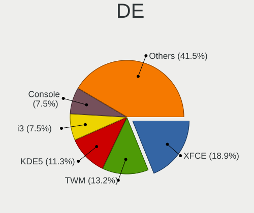

| Name      | Notebooks | Percent |
|-----------|-----------|---------|
| XFCE      | 10        | 18.87%  |
| TWM       | 7         | 13.21%  |
| KDE5      | 6         | 11.32%  |
| i3        | 4         | 7.55%   |
| Console   | 4         | 7.55%   |
| KDE       | 3         | 5.66%   |
| GNOME     | 3         | 5.66%   |
| wlroots   | 2         | 3.77%   |
| Openbox   | 2         | 3.77%   |
| KDE6      | 2         | 3.77%   |
| Budgie    | 2         | 3.77%   |
| Wayfire   | 1         | 1.89%   |
| MATE      | 1         | 1.89%   |
| LXQt      | 1         | 1.89%   |
| Lumina    | 1         | 1.89%   |
| Fluxbox   | 1         | 1.89%   |
| Compton   | 1         | 1.89%   |
| CDE       | 1         | 1.89%   |
| AwesomeWM | 1         | 1.89%   |

Display Server
--------------

X11 or Wayland

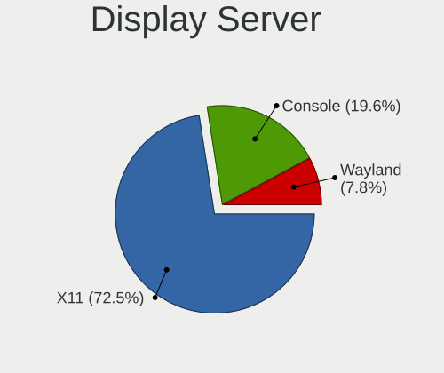

| Name    | Notebooks | Percent |
|---------|-----------|---------|
| X11     | 37        | 72.55%  |
| Console | 10        | 19.61%  |
| Wayland | 4         | 7.84%   |

Display Manager
---------------

SDDM, LightDM, etc.

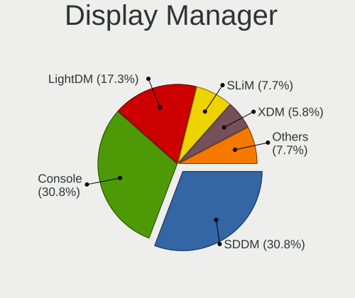

| Name    | Notebooks | Percent |
|---------|-----------|---------|
| SDDM    | 16        | 30.77%  |
| Console | 16        | 30.77%  |
| LightDM | 9         | 17.31%  |
| SLiM    | 4         | 7.69%   |
| XDM     | 3         | 5.77%   |
| GDM     | 3         | 5.77%   |
| Ly      | 1         | 1.92%   |

OS Lang
-------

Language

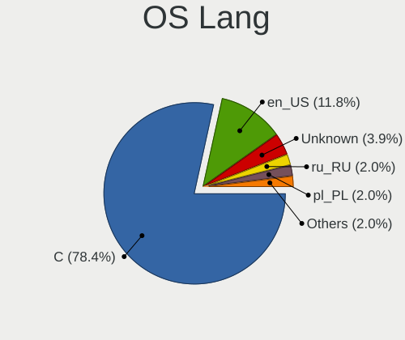

| Lang    | Notebooks | Percent |
|---------|-----------|---------|
| C       | 40        | 78.43%  |
| en_US   | 6         | 11.76%  |
| Unknown | 2         | 3.92%   |
| ru_RU   | 1         | 1.96%   |
| pl_PL   | 1         | 1.96%   |
| cs_CZ   | 1         | 1.96%   |

Boot Mode
---------

EFI or BIOS

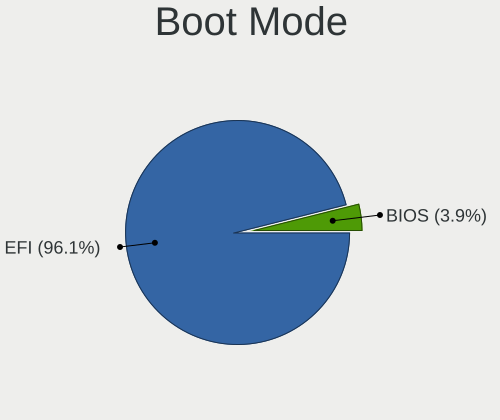

| Mode | Notebooks | Percent |
|------|-----------|---------|
| EFI  | 49        | 96.08%  |
| BIOS | 2         | 3.92%   |

Filesystem
----------

Type of filesystem

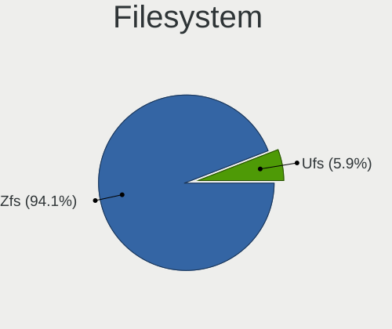

| Type | Notebooks | Percent |
|------|-----------|---------|
| Zfs  | 48        | 94.12%  |
| Ufs  | 3         | 5.88%   |

Part. scheme
------------

Scheme of partitioning

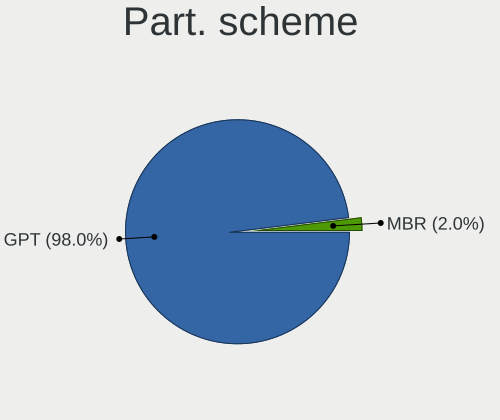

| Type | Notebooks | Percent |
|------|-----------|---------|
| GPT  | 50        | 98.04%  |
| MBR  | 1         | 1.96%   |

Board
-----

Vendor
------

Motherboard manufacturer

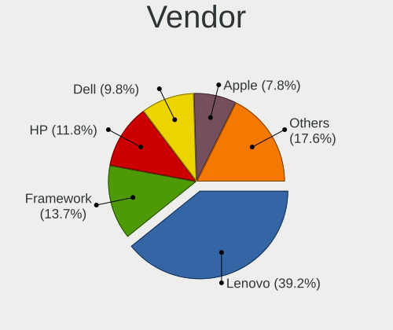

| Name             | Notebooks | Percent |
|------------------|-----------|---------|
| Lenovo           | 20        | 39.22%  |
| Framework        | 7         | 13.73%  |
| Hewlett-Packard  | 6         | 11.76%  |
| Dell             | 5         | 9.8%    |
| Apple            | 4         | 7.84%   |
| MSI              | 2         | 3.92%   |
| HUAWEI           | 2         | 3.92%   |
| TUXEDO           | 1         | 1.96%   |
| Google           | 1         | 1.96%   |
| Fujitsu          | 1         | 1.96%   |
| ASUSTek Computer | 1         | 1.96%   |
| Acer             | 1         | 1.96%   |

Model
-----

Motherboard model

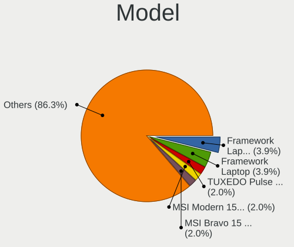

| Name                                            | Notebooks | Percent |
|-------------------------------------------------|-----------|---------|
| Framework Laptop 16 (AMD Ryzen 7040 Series)     | 2         | 3.92%   |
| Framework Laptop                                | 2         | 3.92%   |
| TUXEDO Pulse 14 Gen3                            | 1         | 1.96%   |
| MSI Modern 15 F13MG                             | 1         | 1.96%   |
| MSI Bravo 15 A4DDR                              | 1         | 1.96%   |
| Lenovo ThinkPad X270 20HM004JBR                 | 1         | 1.96%   |
| Lenovo ThinkPad X260 20F5A28AUK                 | 1         | 1.96%   |
| Lenovo ThinkPad X200s 74695KG                   | 1         | 1.96%   |
| Lenovo ThinkPad X1 Carbon 6th 20KH006JBM        | 1         | 1.96%   |
| Lenovo ThinkPad W541 20EG0005MS                 | 1         | 1.96%   |
| Lenovo ThinkPad T550 20CJS00X00                 | 1         | 1.96%   |
| Lenovo ThinkPad T480s 20L7001LMH                | 1         | 1.96%   |
| Lenovo ThinkPad T14s Gen 4 21F60029US           | 1         | 1.96%   |
| Lenovo ThinkPad T14s Gen 1 20T1S3YH00           | 1         | 1.96%   |
| Lenovo ThinkPad T14 Gen 3 21CF002UMZ            | 1         | 1.96%   |
| Lenovo ThinkPad T14 Gen 1 20UES4QC00            | 1         | 1.96%   |
| Lenovo ThinkPad P17 Gen 2i 20YVS1L900           | 1         | 1.96%   |
| Lenovo ThinkPad P1 Gen 3 20TJS4T100             | 1         | 1.96%   |
| Lenovo ThinkPad E16 Gen 1 21JNCTO1WW            | 1         | 1.96%   |
| Lenovo ThinkBook 16 G6+ IMH 21LE                | 1         | 1.96%   |
| Lenovo ThinkBook 15 G4 IAP 21DJ                 | 1         | 1.96%   |
| Lenovo ThinkBook 14 G7 IML 21MR                 | 1         | 1.96%   |
| Lenovo ThinkBook 14 G6 IRL 21KG                 | 1         | 1.96%   |
| Lenovo IdeaPad 3 15ITL6 82MD                    | 1         | 1.96%   |
| Lenovo B40-30 80F1                              | 1         | 1.96%   |
| HUAWEI NBD-WXX9                                 | 1         | 1.96%   |
| HUAWEI MRGFG-XX                                 | 1         | 1.96%   |
| HP ZBook 17 G2                                  | 1         | 1.96%   |
| HP ProBook 630 G8 Notebook PC                   | 1         | 1.96%   |
| HP Laptop 15-ef0xxx                             | 1         | 1.96%   |
| HP Laptop 15-bs0xx                              | 1         | 1.96%   |
| HP EliteBook 8570p                              | 1         | 1.96%   |
| HP EliteBook 660 16 inch G11 Notebook PC        | 1         | 1.96%   |
| Google Astronaut                                | 1         | 1.96%   |
| Fujitsu CELSIUS H7510                           | 1         | 1.96%   |
| Framework Laptop 13 (Intel Core Ultra Series 1) | 1         | 1.96%   |
| Framework Laptop 13 (AMD Ryzen 7040Series)      | 1         | 1.96%   |
| Framework Laptop (12th Gen Intel Core)          | 1         | 1.96%   |
| Dell Pro 16 PC16250                             | 1         | 1.96%   |
| Dell Precision 7720                             | 1         | 1.96%   |

Model Family
------------

Motherboard model prefix

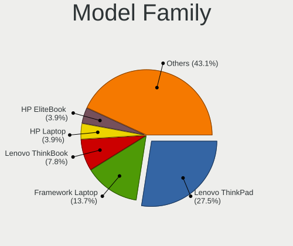

| Name               | Notebooks | Percent |
|--------------------|-----------|---------|
| Lenovo ThinkPad    | 14        | 27.45%  |
| Framework Laptop   | 7         | 13.73%  |
| Lenovo ThinkBook   | 4         | 7.84%   |
| HP Laptop          | 2         | 3.92%   |
| HP EliteBook       | 2         | 3.92%   |
| Dell Precision     | 2         | 3.92%   |
| Dell Latitude      | 2         | 3.92%   |
| Apple MacBookPro8  | 2         | 3.92%   |
| TUXEDO Pulse       | 1         | 1.96%   |
| MSI Modern         | 1         | 1.96%   |
| MSI Bravo          | 1         | 1.96%   |
| Lenovo IdeaPad     | 1         | 1.96%   |
| Lenovo B40-30      | 1         | 1.96%   |
| HUAWEI NBD-WXX9    | 1         | 1.96%   |
| HUAWEI MRGFG-XX    | 1         | 1.96%   |
| HP ZBook           | 1         | 1.96%   |
| HP ProBook         | 1         | 1.96%   |
| Google Astronaut   | 1         | 1.96%   |
| Fujitsu CELSIUS    | 1         | 1.96%   |
| Dell Pro           | 1         | 1.96%   |
| ASUS ROG           | 1         | 1.96%   |
| Apple MacBookPro13 | 1         | 1.96%   |
| Apple MacBookAir7  | 1         | 1.96%   |
| Acer E5-572G-57VZ  | 1         | 1.96%   |

MFG Year
--------

Motherboard manufacture year

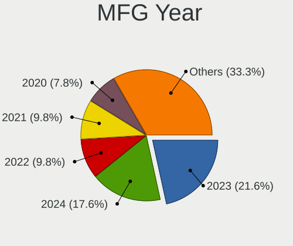

| Year | Notebooks | Percent |
|------|-----------|---------|
| 2023 | 11        | 21.57%  |
| 2024 | 9         | 17.65%  |
| 2022 | 5         | 9.8%    |
| 2021 | 5         | 9.8%    |
| 2020 | 4         | 7.84%   |
| 2019 | 3         | 5.88%   |
| 2025 | 2         | 3.92%   |
| 2018 | 2         | 3.92%   |
| 2017 | 2         | 3.92%   |
| 2016 | 2         | 3.92%   |
| 2015 | 2         | 3.92%   |
| 2014 | 1         | 1.96%   |
| 2013 | 1         | 1.96%   |
| 2012 | 1         | 1.96%   |
| 2011 | 1         | 1.96%   |

Form Factor
-----------

Physical design of the computer

| Name     | Notebooks | Percent |
|----------|-----------|---------|
| Notebook | 51        | 100%    |

Coreboot
--------

Have coreboot on board

| Used | Notebooks | Percent |
|------|-----------|---------|
| No   | 50        | 98.04%  |
| Yes  | 1         | 1.96%   |

RAM Size
--------

Total RAM memory

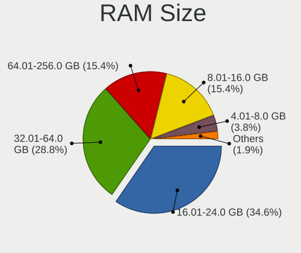

| Size in GB  | Notebooks | Percent |
|-------------|-----------|---------|
| 16.01-24.0  | 18        | 34.62%  |
| 32.01-64.0  | 15        | 28.85%  |
| 64.01-256.0 | 8         | 15.38%  |
| 8.01-16.0   | 8         | 15.38%  |
| 4.01-8.0    | 2         | 3.85%   |
| 24.01-32.0  | 1         | 1.92%   |

RAM Used
--------

Used RAM memory

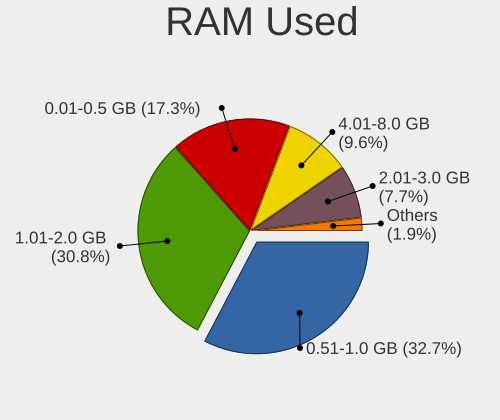

| Used GB  | Notebooks | Percent |
|----------|-----------|---------|
| 0.51-1.0 | 17        | 32.69%  |
| 1.01-2.0 | 16        | 30.77%  |
| 0.01-0.5 | 9         | 17.31%  |
| 4.01-8.0 | 5         | 9.62%   |
| 2.01-3.0 | 4         | 7.69%   |
| 3.01-4.0 | 1         | 1.92%   |

Total Drives
------------

Number of drives on board

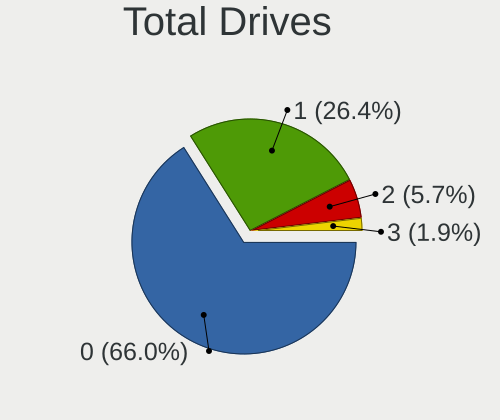

| Drives | Notebooks | Percent |
|--------|-----------|---------|
| 0      | 35        | 66.04%  |
| 1      | 14        | 26.42%  |
| 2      | 3         | 5.66%   |
| 3      | 1         | 1.89%   |

Has CD-ROM
----------

Has CD-ROM on board

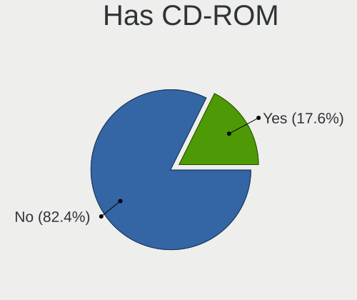

| Presented | Notebooks | Percent |
|-----------|-----------|---------|
| No        | 42        | 82.35%  |
| Yes       | 9         | 17.65%  |

Has Ethernet
------------

Has Ethernet on board

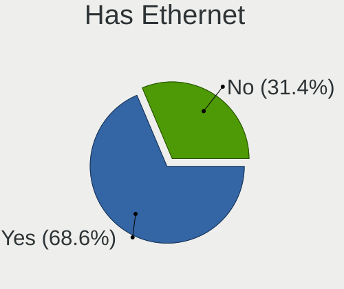

| Presented | Notebooks | Percent |
|-----------|-----------|---------|
| Yes       | 35        | 68.63%  |
| No        | 16        | 31.37%  |

Has WiFi
--------

Has WiFi module

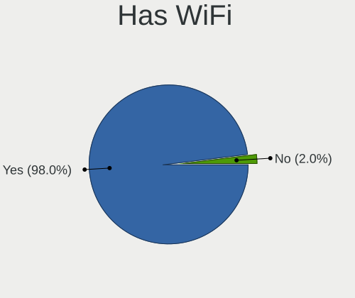

| Presented | Notebooks | Percent |
|-----------|-----------|---------|
| Yes       | 50        | 98.04%  |
| No        | 1         | 1.96%   |

Has Bluetooth
-------------

Has Bluetooth module

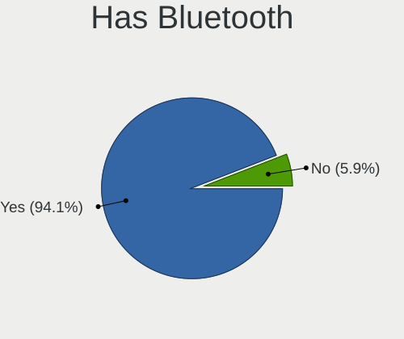

| Presented | Notebooks | Percent |
|-----------|-----------|---------|
| Yes       | 48        | 94.12%  |
| No        | 3         | 5.88%   |

Location
--------

Country
-------

Geographic location (country)

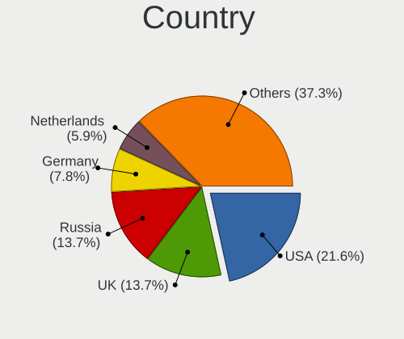

| Country     | Notebooks | Percent |
|-------------|-----------|---------|
| USA         | 11        | 21.57%  |
| UK          | 7         | 13.73%  |
| Russia      | 7         | 13.73%  |
| Germany     | 4         | 7.84%   |
| Netherlands | 3         | 5.88%   |
| Brazil      | 3         | 5.88%   |
| Switzerland | 2         | 3.92%   |
| Sweden      | 2         | 3.92%   |
| Belgium     | 2         | 3.92%   |
| Taiwan      | 1         | 1.96%   |
| Slovakia    | 1         | 1.96%   |
| Panama      | 1         | 1.96%   |
| Malaysia    | 1         | 1.96%   |
| Hungary     | 1         | 1.96%   |
| France      | 1         | 1.96%   |
| China       | 1         | 1.96%   |
| Canada      | 1         | 1.96%   |
| Bangladesh  | 1         | 1.96%   |
| Australia   | 1         | 1.96%   |

City
----

Geographic location (city)

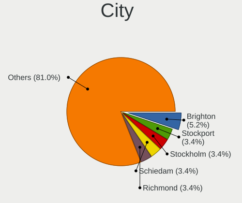

| City                   | Notebooks | Percent |
|------------------------|-----------|---------|
| Brighton               | 3         | 5.17%   |
| Stockport              | 2         | 3.45%   |
| Stockholm              | 2         | 3.45%   |
| Schiedam               | 2         | 3.45%   |
| Richmond               | 2         | 3.45%   |
| Moscow                 | 2         | 3.45%   |
| Hove                   | 2         | 3.45%   |
| Zurich                 | 1         | 1.72%   |
| Westborough            | 1         | 1.72%   |
| Tosno                  | 1         | 1.72%   |
| Sutton                 | 1         | 1.72%   |
| Stuttgart              | 1         | 1.72%   |
| Sterling               | 1         | 1.72%   |
| St Petersburg          | 1         | 1.72%   |
| Smolensk               | 1         | 1.72%   |
| Siblingen              | 1         | 1.72%   |
| Shah Alam              | 1         | 1.72%   |
| Rugby                  | 1         | 1.72%   |
| Rio de Janeiro         | 1         | 1.72%   |
| Pevensey               | 1         | 1.72%   |
| Perth                  | 1         | 1.72%   |
| Panama City            | 1         | 1.72%   |
| Offenbach              | 1         | 1.72%   |
| New Taipei             | 1         | 1.72%   |
| Mississauga            | 1         | 1.72%   |
| Mesa                   | 1         | 1.72%   |
| Macaiba                | 1         | 1.72%   |
| Lewes                  | 1         | 1.72%   |
| Letchworth Garden City | 1         | 1.72%   |
| Kirov                  | 1         | 1.72%   |
| Karlsruhe              | 1         | 1.72%   |
| Joao Pessoa            | 1         | 1.72%   |
| Irkutsk                | 1         | 1.72%   |
| Haywards Heath         | 1         | 1.72%   |
| Hangzhou               | 1         | 1.72%   |
| Halle                  | 1         | 1.72%   |
| Durant                 | 1         | 1.72%   |
| Dhaka                  | 1         | 1.72%   |
| Dayton                 | 1         | 1.72%   |
| Courbevoie             | 1         | 1.72%   |

Drives
------

Drive Vendor
------------

Hard drive vendors

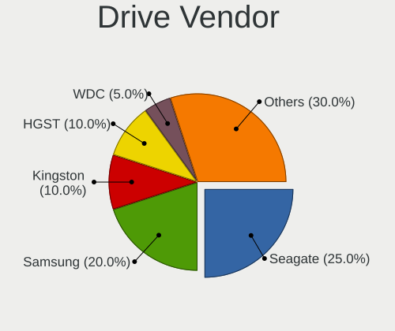

| Vendor              | Notebooks | Drives | Percent |
|---------------------|-----------|--------|---------|
| Seagate             | 5         | 9      | 25%     |
| Samsung Electronics | 4         | 4      | 20%     |
| Kingston            | 2         | 6      | 10%     |
| HGST                | 2         | 16     | 10%     |
| WDC                 | 1         | 1      | 5%      |
| Transcend           | 1         | 1      | 5%      |
| SanDisk             | 1         | 1      | 5%      |
| Lenovo              | 1         | 1      | 5%      |
| Intel               | 1         | 1      | 5%      |
| Hitachi             | 1         | 1      | 5%      |
| Apple               | 1         | 1      | 5%      |

Drive Model
-----------

Hard drive models

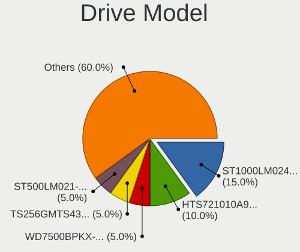

| Model                              | Notebooks | Percent |
|------------------------------------|-----------|---------|
| Seagate ST1000LM024 HN-M101MBB 1TB | 3         | 15%     |
| HGST HTS721010A9E630 1TB           | 2         | 10%     |
| WDC WD7500BPKX-60HPJT0 752GB       | 1         | 5%      |
| Transcend TS256GMTS430S 256GB      | 1         | 5%      |
| Seagate ST500LM021-1KJ152 500GB    | 1         | 5%      |
| Seagate ST1000LM014-1EJ164 1TB     | 1         | 5%      |
| SanDisk SDSSDH3 1T00 1TB           | 1         | 5%      |
| Samsung SSD 870 EVO 1TB            | 1         | 5%      |
| Samsung SSD 850 EVO 500GB          | 1         | 5%      |
| Samsung MZ7LN512HCHP-000L1 512GB   | 1         | 5%      |
| Samsung MZ7LN256HCHP-000L7 256GB   | 1         | 5%      |
| Lenovo SSD SL700 120G              | 1         | 5%      |
| Kingston SV300S37A120G 120GB       | 1         | 5%      |
| Kingston SA400S37-120GB            | 1         | 5%      |
| Intel SSDSC2BF240A5L 240GB         | 1         | 5%      |
| Hitachi HTS727575A9E362 752GB      | 1         | 5%      |
| Apple SSD SM0128G 121GB            | 1         | 5%      |

HDD Vendor
----------

Hard disk drive vendors

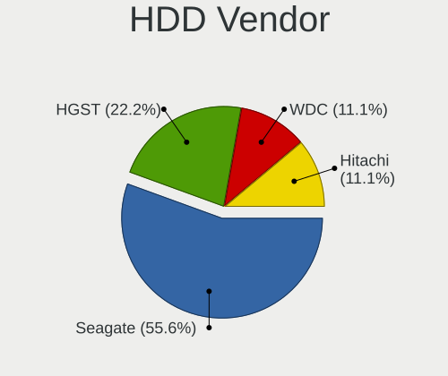

| Vendor  | Notebooks | Drives | Percent |
|---------|-----------|--------|---------|
| Seagate | 5         | 9      | 55.56%  |
| HGST    | 2         | 16     | 22.22%  |
| WDC     | 1         | 1      | 11.11%  |
| Hitachi | 1         | 1      | 11.11%  |

SSD Vendor
----------

Solid state drive vendors

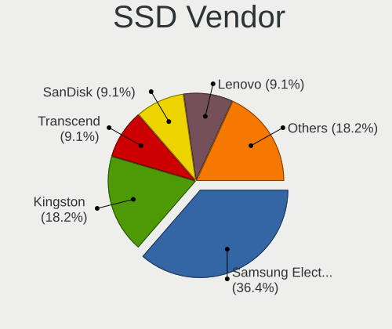

| Vendor              | Notebooks | Drives | Percent |
|---------------------|-----------|--------|---------|
| Samsung Electronics | 4         | 4      | 36.36%  |
| Kingston            | 2         | 6      | 18.18%  |
| Transcend           | 1         | 1      | 9.09%   |
| SanDisk             | 1         | 1      | 9.09%   |
| Lenovo              | 1         | 1      | 9.09%   |
| Intel               | 1         | 1      | 9.09%   |
| Apple               | 1         | 1      | 9.09%   |

Drive Kind
----------

HDD or SSD

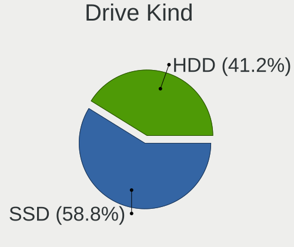

| Kind | Notebooks | Drives | Percent |
|------|-----------|--------|---------|
| SSD  | 10        | 15     | 58.82%  |
| HDD  | 7         | 27     | 41.18%  |

Drive Connector
---------------

SATA, SAS, NVMe, etc.

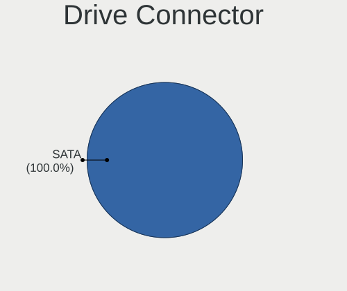

| Type | Notebooks | Drives | Percent |
|------|-----------|--------|---------|
| SATA | 16        | 42     | 100%    |

Drive Size
----------

Size of hard drive

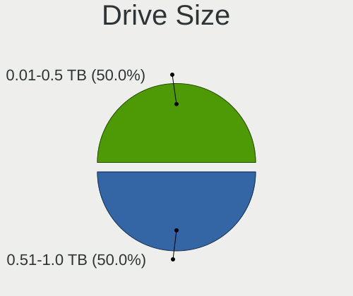

| Size in TB | Notebooks | Drives | Percent |
|------------|-----------|--------|---------|
| 0.51-1.0   | 9         | 29     | 50%     |
| 0.01-0.5   | 9         | 13     | 50%     |

Space Total
-----------

Amount of disk space available on the file system

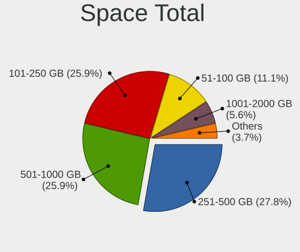

| Size in GB     | Notebooks | Percent |
|----------------|-----------|---------|
| 251-500        | 15        | 27.78%  |
| 101-250        | 14        | 25.93%  |
| 501-1000       | 14        | 25.93%  |
| 51-100         | 6         | 11.11%  |
| 1001-2000      | 3         | 5.56%   |
| More than 3000 | 1         | 1.85%   |
| 21-50          | 1         | 1.85%   |

Space Used
----------

Amount of used disk space

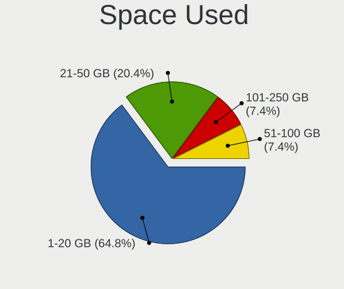

| Used GB | Notebooks | Percent |
|---------|-----------|---------|
| 1-20    | 35        | 64.81%  |
| 21-50   | 11        | 20.37%  |
| 101-250 | 4         | 7.41%   |
| 51-100  | 4         | 7.41%   |

Malfunc. Drives
---------------

Drive models with a malfunction

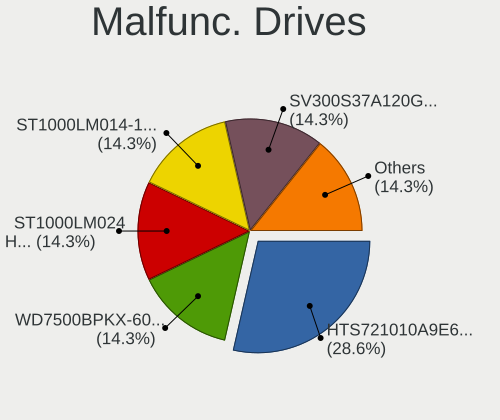

| Model                              | Notebooks | Drives | Percent |
|------------------------------------|-----------|--------|---------|
| HGST HTS721010A9E630 1TB           | 2         | 8      | 28.57%  |
| WDC WD7500BPKX-60HPJT0 752GB       | 1         | 1      | 14.29%  |
| Seagate ST1000LM024 HN-M101MBB 1TB | 1         | 1      | 14.29%  |
| Seagate ST1000LM014-1EJ164 1TB     | 1         | 1      | 14.29%  |
| Kingston SV300S37A120G 120GB       | 1         | 3      | 14.29%  |
| Hitachi HTS727575A9E362 752GB      | 1         | 1      | 14.29%  |

Malfunc. Drive Vendor
---------------------

Vendors of faulty drives

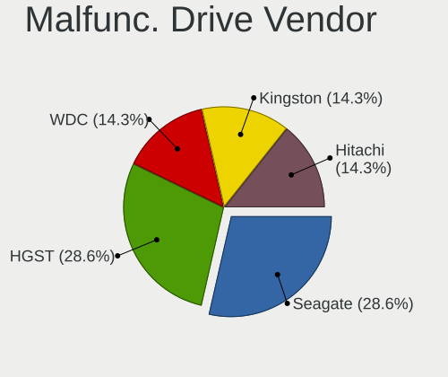

| Vendor   | Notebooks | Drives | Percent |
|----------|-----------|--------|---------|
| Seagate  | 2         | 2      | 28.57%  |
| HGST     | 2         | 8      | 28.57%  |
| WDC      | 1         | 1      | 14.29%  |
| Kingston | 1         | 3      | 14.29%  |
| Hitachi  | 1         | 1      | 14.29%  |

Malfunc. HDD Vendor
-------------------

Vendors of faulty HDD drives

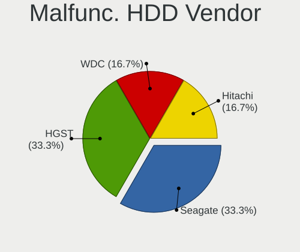

| Vendor  | Notebooks | Drives | Percent |
|---------|-----------|--------|---------|
| Seagate | 2         | 2      | 33.33%  |
| HGST    | 2         | 8      | 33.33%  |
| WDC     | 1         | 1      | 16.67%  |
| Hitachi | 1         | 1      | 16.67%  |

Malfunc. Drive Kind
-------------------

Kinds of faulty drives

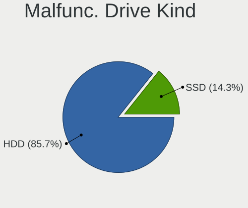

| Kind | Notebooks | Drives | Percent |
|------|-----------|--------|---------|
| HDD  | 6         | 12     | 85.71%  |
| SSD  | 1         | 3      | 14.29%  |

Failed Drives
-------------

Failed drive models

Zero info for selected period =(

Failed Drive Vendor
-------------------

Failed drive vendors

Zero info for selected period =(

Drive Status
------------

Number of failed and malfunc. drives

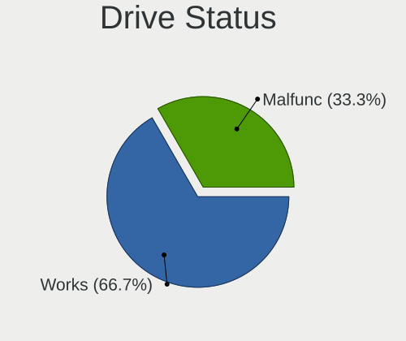

| Status  | Notebooks | Drives | Percent |
|---------|-----------|--------|---------|
| Works   | 12        | 27     | 66.67%  |
| Malfunc | 6         | 15     | 33.33%  |

Storage controller
------------------

Storage Vendor
--------------

Storage controller vendors

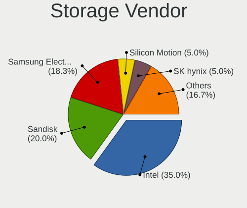

| Vendor                                  | Notebooks | Percent |
|-----------------------------------------|-----------|---------|
| Intel                                   | 21        | 35%     |
| Sandisk                                 | 12        | 20%     |
| Samsung Electronics                     | 11        | 18.33%  |
| SK hynix                                | 3         | 5%      |
| Silicon Motion                          | 3         | 5%      |
| Micron Technology                       | 3         | 5%      |
| Shenzhen Unionmemory Information System | 2         | 3.33%   |
| Toshiba                                 | 1         | 1.67%   |
| Phison Electronics                      | 1         | 1.67%   |
| Apple                                   | 1         | 1.67%   |
| AMD                                     | 1         | 1.67%   |
| ADATA Technology                        | 1         | 1.67%   |

Storage Model
-------------

Storage controller models

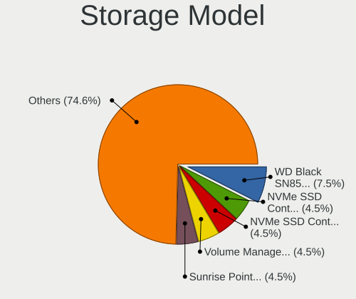

| Model                                                                              | Notebooks | Percent |
|------------------------------------------------------------------------------------|-----------|---------|
| Sandisk WD Black SN850X NVMe SSD                                                   | 5         | 7.46%   |
| Samsung NVMe SSD Controller SM981/PM981/PM983                                      | 3         | 4.48%   |
| Samsung NVMe SSD Controller PM9A1/PM9A3/980PRO                                     | 3         | 4.48%   |
| Intel Volume Management Device NVMe RAID Controller                                | 3         | 4.48%   |
| Intel Sunrise Point-LP SATA Controller [AHCI mode]                                 | 3         | 4.48%   |
| Intel 8 Series/C220 Series Chipset Family 6-port SATA Controller 1 [AHCI mode]     | 3         | 4.48%   |
| SK hynix Gold P31/BC711/PC711 NVMe Solid State Drive                               | 2         | 2.99%   |
| Silicon Motion SM2263EN/SM2263XT (DRAM-less) NVMe SSD Controllers                  | 2         | 2.99%   |
| Sandisk WD SN560/SN740/SN770/SN5000 NVMe SSD                                       | 2         | 2.99%   |
| Sandisk WD PC SN740 NVMe SSD 512GB (DRAM-less)                                     | 2         | 2.99%   |
| SanDisk Ultra 3D / WD Blue SN570 NVMe SSD (DRAM-less)                              | 2         | 2.99%   |
| Samsung NVMe SSD Controller PM9C1a (DRAM-less)                                     | 2         | 2.99%   |
| Samsung NVMe SSD Controller 980 (DRAM-less)                                        | 2         | 2.99%   |
| Intel 6 Series/C200 Series Chipset Family 6 port Mobile SATA AHCI Controller       | 2         | 2.99%   |
| Toshiba XG6 NVMe SSD Controller                                                    | 1         | 1.49%   |
| SK hynix Platinum P41/PC801 NVMe Solid State Drive                                 | 1         | 1.49%   |
| Shenzhen Unionmemory Information System AM6A1 PCIe 4.0 NVMe SSD 1024GB (DRAM-less) | 1         | 1.49%   |
| Shenzhen Unionmemory Information System AM6A0 PCIe 4.0 NVMe SSD 1024GB (DRAM-less) | 1         | 1.49%   |
| Sandisk WD Black SN770M NVMe SSD (DRAM-less)                                       | 1         | 1.49%   |
| SanDisk Extreme Pro / WD Black SN750 / PC SN730 / Red SN700 NVMe SSD               | 1         | 1.49%   |
| SanDisk Extreme Pro / WD Black 2018/SN750/PC SN720 NVMe SSD                        | 1         | 1.49%   |
| Samsung S4LN058A01[SSUBX] AHCI SSD Controller (Apple slot)                         | 1         | 1.49%   |
| Phison PS5021-E21 PCIe4 NVMe Controller (DRAM-less)                                | 1         | 1.49%   |
| Micron 3400 NVMe SSD [Hendrix]                                                     | 1         | 1.49%   |
| Micron 2550 NVMe SSD (DRAM-less)                                                   | 1         | 1.49%   |
| Micron 2500 NVMe SSD (DRAM-less)                                                   | 1         | 1.49%   |
| Micron 2400 NVMe SSD (DRAM-less)                                                   | 1         | 1.49%   |
| Intel Wildcat Point-LP SATA Controller [AHCI Mode]                                 | 1         | 1.49%   |
| Intel Tiger Lake-LP SATA Controller                                                | 1         | 1.49%   |
| Intel SSD DC P4101/Pro 7600p/760p/E 6100p Series                                   | 1         | 1.49%   |
| Intel SSD 670p Series [Keystone Harbor]                                            | 1         | 1.49%   |
| Intel SSD 660P Series                                                              | 1         | 1.49%   |
| Intel RST Volume Management Device Controller                                      | 1         | 1.49%   |
| Intel Q170/Q150/B150/H170/H110/Z170/CM236 Chipset SATA Controller [AHCI Mode]      | 1         | 1.49%   |
| Intel Atom Processor E3800 Series SATA AHCI Controller                             | 1         | 1.49%   |
| Intel 82801IBM/IEM (ICH9M/ICH9M-E) 4 port SATA Controller [AHCI mode]              | 1         | 1.49%   |
| Intel 82801 Mobile SATA Controller [RAID mode]                                     | 1         | 1.49%   |
| Intel 8 Series/C220 Series Chipset Family 2-port SATA Controller 2 [IDE mode]      | 1         | 1.49%   |
| Intel 8 Series Chipset Family 4-port SATA Controller 1 [IDE mode] - Mobile         | 1         | 1.49%   |
| Intel 7 Series Chipset Family 6-port SATA Controller [AHCI mode]                   | 1         | 1.49%   |

Storage Kind
------------

Kind of storage controller (IDE, SATA, NVMe, SAS, ...)

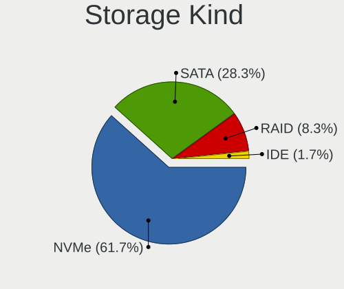

| Kind | Notebooks | Percent |
|------|-----------|---------|
| NVMe | 37        | 61.67%  |
| SATA | 17        | 28.33%  |
| RAID | 5         | 8.33%   |
| IDE  | 1         | 1.67%   |

Processor
---------

CPU Vendor
----------

Processor vendors

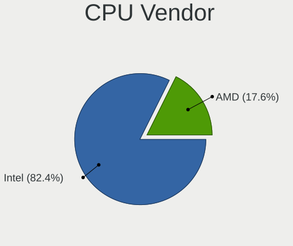

| Vendor | Notebooks | Percent |
|--------|-----------|---------|
| Intel  | 42        | 82.35%  |
| AMD    | 9         | 17.65%  |

CPU Model
---------

Processor models

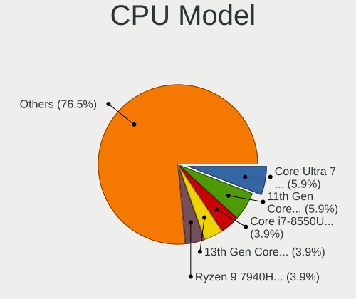

| Model                                      | Notebooks | Percent |
|--------------------------------------------|-----------|---------|
| Intel Core Ultra 7 155H                    | 3         | 5.88%   |
| Intel 11th Gen Core i5-1135G7 @ 2.40GHz    | 3         | 5.88%   |
| Intel Core i7-8550U CPU @ 1.80GHz          | 2         | 3.92%   |
| Intel 13th Gen Core i7-1355U               | 2         | 3.92%   |
| AMD Ryzen 9 7940HS w/ Radeon 780M Graphics | 2         | 3.92%   |
| Intel Core Ultra 7 255U                    | 1         | 1.96%   |
| Intel Core Ultra 7 155U                    | 1         | 1.96%   |
| Intel Core i7-7600U CPU @ 2.80GHz          | 1         | 1.96%   |
| Intel Core i7-6820HQ CPU @ 2.70GHz         | 1         | 1.96%   |
| Intel Core i7-6660U CPU @ 2.40GHz          | 1         | 1.96%   |
| Intel Core i7-5600U CPU @ 2.60GHz          | 1         | 1.96%   |
| Intel Core i7-4810MQ CPU @ 2.80GHz         | 1         | 1.96%   |
| Intel Core i7-4710MQ CPU @ 2.50GHz         | 1         | 1.96%   |
| Intel Core i7-3520M CPU @ 2.90GHz          | 1         | 1.96%   |
| Intel Core i7-2760QM CPU @ 2.40GHz         | 1         | 1.96%   |
| Intel Core i7-2635QM CPU @ 2.00GHz         | 1         | 1.96%   |
| Intel Core i7-10850H CPU @ 2.70GHz         | 1         | 1.96%   |
| Intel Core i7-10750H CPU @ 2.60GHz         | 1         | 1.96%   |
| Intel Core i7-10610U CPU @ 1.80GHz         | 1         | 1.96%   |
| Intel Core i5-6300U CPU @ 2.40GHz          | 1         | 1.96%   |
| Intel Core i5-5350U CPU @ 1.80GHz          | 1         | 1.96%   |
| Intel Core i5-4210U CPU @ 1.70GHz          | 1         | 1.96%   |
| Intel Core i5-4210M CPU @ 2.60GHz          | 1         | 1.96%   |
| Intel Core i3-7100U CPU @ 2.40GHz          | 1         | 1.96%   |
| Intel Core 2 Duo CPU L9400 @ 1.86GHz       | 1         | 1.96%   |
| Intel Celeron CPU N3350 @ 1.10GHz          | 1         | 1.96%   |
| Intel Celeron CPU N2840 @ 2.16GHz          | 1         | 1.96%   |
| Intel 13th Gen Core i7-13700H              | 1         | 1.96%   |
| Intel 13th Gen Core i7-1360P               | 1         | 1.96%   |
| Intel 13th Gen Core i5-1335U               | 1         | 1.96%   |
| Intel 13th Gen Core i3-1315U               | 1         | 1.96%   |
| Intel 12th Gen Core i7-1280P               | 1         | 1.96%   |
| Intel 12th Gen Core i7-1260P               | 1         | 1.96%   |
| Intel 11th Gen Core i9-11950H @ 2.60GHz    | 1         | 1.96%   |
| Intel 11th Gen Core i7-11850H @ 2.50GHz    | 1         | 1.96%   |
| Intel 11th Gen Core i7-1165G7 @ 2.80GHz    | 1         | 1.96%   |
| Intel 11th Gen Core i3-1115G4 @ 3.00GHz    | 1         | 1.96%   |
| AMD Ryzen 9 5900HS with Radeon Graphics    | 1         | 1.96%   |
| AMD Ryzen 7 PRO 6850U with Radeon Graphics | 1         | 1.96%   |
| AMD Ryzen 7 PRO 4750U with Radeon Graphics | 1         | 1.96%   |

CPU Model Family
----------------

Processor model prefix

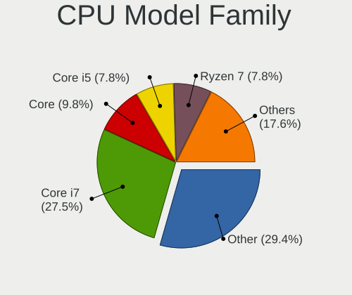

| Model            | Notebooks | Percent |
|------------------|-----------|---------|
| Other            | 15        | 29.41%  |
| Intel Core i7    | 14        | 27.45%  |
| Intel Core       | 5         | 9.8%    |
| Intel Core i5    | 4         | 7.84%   |
| AMD Ryzen 7      | 4         | 7.84%   |
| AMD Ryzen 9      | 3         | 5.88%   |
| Intel Celeron    | 2         | 3.92%   |
| AMD Ryzen 7 PRO  | 2         | 3.92%   |
| Intel Core i3    | 1         | 1.96%   |
| Intel Core 2 Duo | 1         | 1.96%   |

CPU Cores
---------

Number of processor cores

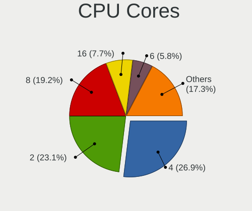

| Number  | Notebooks | Percent |
|---------|-----------|---------|
| 4       | 14        | 26.92%  |
| 2       | 12        | 23.08%  |
| 8       | 10        | 19.23%  |
| 16      | 4         | 7.69%   |
| 6       | 3         | 5.77%   |
| 12      | 2         | 3.85%   |
| 10      | 2         | 3.85%   |
| 22      | 1         | 1.92%   |
| 14      | 1         | 1.92%   |
| 11      | 1         | 1.92%   |
| 7       | 1         | 1.92%   |
| Unknown | 1         | 1.92%   |

CPU Sockets
-----------

Number of sockets

| Number | Notebooks | Percent |
|--------|-----------|---------|
| 1      | 51        | 100%    |

CPU Threads
-----------

Threads per core (Hyper-Threading)

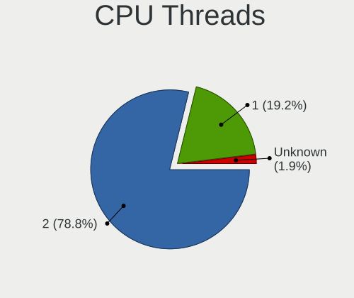

| Number  | Notebooks | Percent |
|---------|-----------|---------|
| 2       | 41        | 78.85%  |
| 1       | 10        | 19.23%  |
| Unknown | 1         | 1.92%   |

CPU Microarch
-------------

Microarchitecture

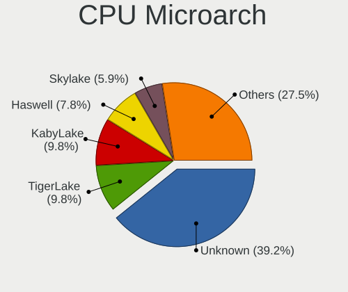

| Name        | Notebooks | Percent |
|-------------|-----------|---------|
| Unknown     | 20        | 39.22%  |
| TigerLake   | 5         | 9.8%    |
| KabyLake    | 5         | 9.8%    |
| Haswell     | 4         | 7.84%   |
| Skylake     | 3         | 5.88%   |
| Zen 2       | 2         | 3.92%   |
| SandyBridge | 2         | 3.92%   |
| CometLake   | 2         | 3.92%   |
| Broadwell   | 2         | 3.92%   |
| Zen+        | 1         | 1.96%   |
| Zen 3       | 1         | 1.96%   |
| Silvermont  | 1         | 1.96%   |
| Penryn      | 1         | 1.96%   |
| IvyBridge   | 1         | 1.96%   |
| Goldmont    | 1         | 1.96%   |

Graphics
--------

GPU Vendor
----------

Vendors of graphics cards

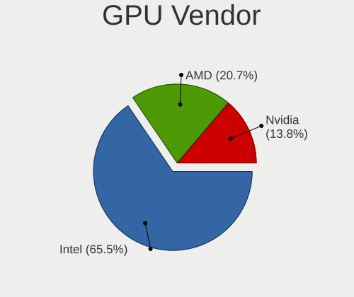

| Vendor | Notebooks | Percent |
|--------|-----------|---------|
| Intel  | 38        | 65.52%  |
| AMD    | 12        | 20.69%  |
| Nvidia | 8         | 13.79%  |

GPU Model
---------

Graphics card models

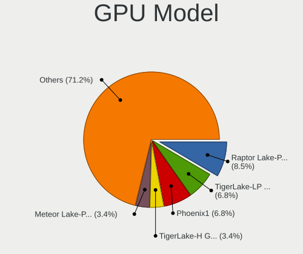

| Model                                                                     | Notebooks | Percent |
|---------------------------------------------------------------------------|-----------|---------|
| Intel Raptor Lake-P [Iris Xe Graphics]                                    | 5         | 8.47%   |
| Intel TigerLake-LP GT2 [Iris Xe Graphics]                                 | 4         | 6.78%   |
| AMD Phoenix1                                                              | 4         | 6.78%   |
| Intel TigerLake-H GT1 [UHD Graphics]                                      | 2         | 3.39%   |
| Intel Meteor Lake-P [Intel Graphics]                                      | 2         | 3.39%   |
| Intel Meteor Lake-P [Intel Arc Graphics]                                  | 2         | 3.39%   |
| Intel Kaby Lake-U GT2 [HD Graphics 620]                                   | 2         | 3.39%   |
| Intel Kaby Lake-R GT2 [UHD Graphics 620]                                  | 2         | 3.39%   |
| Intel Alder Lake-P GT2 [Iris Xe Graphics]                                 | 2         | 3.39%   |
| Intel 4th Gen Core Processor Integrated Graphics Controller               | 2         | 3.39%   |
| Intel 2nd Generation Core Processor Family Integrated Graphics Controller | 2         | 3.39%   |
| AMD Renoir [Radeon Vega Series / Radeon Vega Mobile Series]               | 2         | 3.39%   |
| Nvidia TU117GLM [T1200 Laptop GPU]                                        | 1         | 1.69%   |
| Nvidia TU117GLM [Quadro T2000 Mobile / Max-Q]                             | 1         | 1.69%   |
| Nvidia TU117GLM [Quadro T1000 Mobile]                                     | 1         | 1.69%   |
| Nvidia GP104GLM [Quadro P3000 Mobile]                                     | 1         | 1.69%   |
| Nvidia GM108M [GeForce 940M]                                              | 1         | 1.69%   |
| Nvidia GK107GLM [Quadro K1100M]                                           | 1         | 1.69%   |
| Nvidia GK106GLM [Quadro K2100M]                                           | 1         | 1.69%   |
| Nvidia GA104M [GeForce RTX 3070 Mobile / Max-Q]                           | 1         | 1.69%   |
| Intel Tiger Lake-LP GT2 [UHD Graphics G4]                                 | 1         | 1.69%   |
| Intel Skylake-U GT3 [Iris Graphics 540]                                   | 1         | 1.69%   |
| Intel Skylake-U GT2 [HD Graphics 520]                                     | 1         | 1.69%   |
| Intel Raptor Lake-P [UHD Graphics]                                        | 1         | 1.69%   |
| Intel Mobile 4 Series Chipset Integrated Graphics Controller              | 1         | 1.69%   |
| Intel Haswell-ULT Integrated Graphics Controller                          | 1         | 1.69%   |
| Intel CometLake-U GT2 [UHD Graphics]                                      | 1         | 1.69%   |
| Intel CometLake-H GT2 [UHD Graphics]                                      | 1         | 1.69%   |
| Intel Broadwell-U GT3 [HD Graphics 6000]                                  | 1         | 1.69%   |
| Intel Broadwell-U GT2 [HD Graphics 5500]                                  | 1         | 1.69%   |
| Intel Atom Processor Z36xxx/Z37xxx Series Graphics & Display              | 1         | 1.69%   |
| Intel Arrow Lake-U [Intel Graphics]                                       | 1         | 1.69%   |
| Intel Apollo Lake GT1 [HD Graphics 500]                                   | 1         | 1.69%   |
| AMD Whistler [Radeon HD 6730M/6770M/7690M XT]                             | 1         | 1.69%   |
| AMD Thames [Radeon HD 7550M/7570M/7650M]                                  | 1         | 1.69%   |
| AMD Seymour [Radeon HD 6400M/7400M Series]                                | 1         | 1.69%   |
| AMD Rembrandt [Radeon 680M]                                               | 1         | 1.69%   |
| AMD Picasso/Raven 2 [Radeon Vega Series / Radeon Vega Mobile Series]      | 1         | 1.69%   |
| AMD Navi 14 [Radeon RX 5500/5500M / Pro 5500M]                            | 1         | 1.69%   |
| AMD Cezanne [Radeon Vega Series / Radeon Vega Mobile Series]              | 1         | 1.69%   |

GPU Combo
---------

Combinations of graphics cards

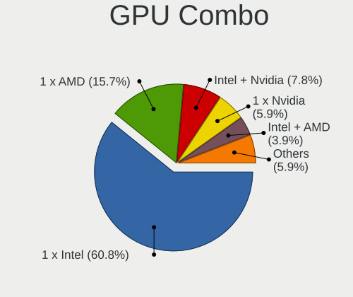

| Name           | Notebooks | Percent |
|----------------|-----------|---------|
| 1 x Intel      | 31        | 60.78%  |
| 1 x AMD        | 8         | 15.69%  |
| Intel + Nvidia | 4         | 7.84%   |
| 1 x Nvidia     | 3         | 5.88%   |
| Intel + AMD    | 2         | 3.92%   |
| 2 x Intel      | 1         | 1.96%   |
| 2 x AMD        | 1         | 1.96%   |
| AMD + Nvidia   | 1         | 1.96%   |

GPU Driver
----------

Free vs proprietary

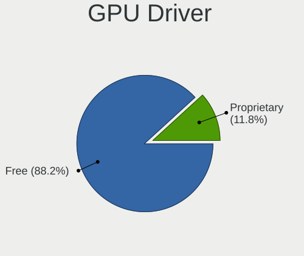

| Driver      | Notebooks | Percent |
|-------------|-----------|---------|
| Free        | 45        | 88.24%  |
| Proprietary | 6         | 11.76%  |

GPU Memory
----------

Total video memory

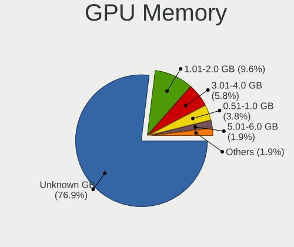

| Size in GB | Notebooks | Percent |
|------------|-----------|---------|
| Unknown    | 40        | 76.92%  |
| 1.01-2.0   | 5         | 9.62%   |
| 3.01-4.0   | 3         | 5.77%   |
| 0.51-1.0   | 2         | 3.85%   |
| 5.01-6.0   | 1         | 1.92%   |
| 0.01-0.5   | 1         | 1.92%   |

Monitor
-------

Monitor Vendor
--------------

Monitor vendors

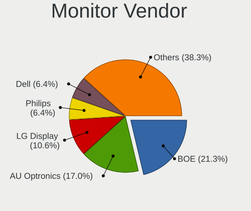

| Vendor              | Notebooks | Percent |
|---------------------|-----------|---------|
| BOE                 | 10        | 21.28%  |
| AU Optronics        | 8         | 17.02%  |
| LG Display          | 5         | 10.64%  |
| Philips             | 3         | 6.38%   |
| Dell                | 3         | 6.38%   |
| Chimei Innolux      | 3         | 6.38%   |
| Goldstar            | 2         | 4.26%   |
| Apple               | 2         | 4.26%   |
| ViewSonic           | 1         | 2.13%   |
| SDC                 | 1         | 2.13%   |
| Samsung Electronics | 1         | 2.13%   |
| Panasonic           | 1         | 2.13%   |
| Lenovo              | 1         | 2.13%   |
| HUAWEI              | 1         | 2.13%   |
| HPN                 | 1         | 2.13%   |
| Hewlett-Packard     | 1         | 2.13%   |
| CTO                 | 1         | 2.13%   |
| CSO                 | 1         | 2.13%   |
| BenQ                | 1         | 2.13%   |

Monitor Model
-------------

Monitor models

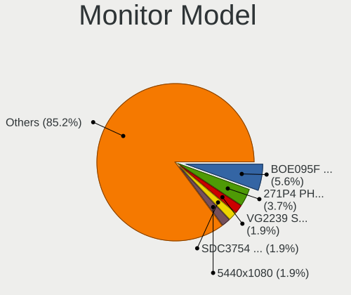

| Model                                                                | Notebooks | Percent |
|----------------------------------------------------------------------|-----------|---------|
| BOE LCD Monitor BOE095F 2256x1504 280x190mm 13.3-inch                | 3         | 5.56%   |
| Philips 271P4 PHL08C3 1920x1080 600x340mm 27.2-inch                  | 2         | 3.7%    |
| ViewSonic VG2239 Series VSCC42B 1920x1080 480x270mm 21.7-inch        | 1         | 1.85%   |
| SDC LCD Monitor 5440x1080                                            | 1         | 1.85%   |
| SDC LCD Monitor 3520x1080                                            | 1         | 1.85%   |
| SDC LCD Monitor 1600x900                                             | 1         | 1.85%   |
| SDC LCD Monitor                                                      | 1         | 1.85%   |
| Samsung Electronics LCD Monitor SDC3754 1600x900 380x210mm 17.1-inch | 1         | 1.85%   |
| Philips PHL 242B9T PHL0931 1920x1080 530x300mm 24.0-inch             | 1         | 1.85%   |
| Philips LCD Monitor 271P4 5440x1080                                  | 1         | 1.85%   |
| Philips LCD Monitor 271P4 3520x1080                                  | 1         | 1.85%   |
| Philips LCD Monitor 271P4                                            | 1         | 1.85%   |
| Panasonic LCD Monitor MEI96A2 2880x1620 340x190mm 15.3-inch          | 1         | 1.85%   |
| LG Display LCD Monitor LGD06ED 1920x1200 300x190mm 14.0-inch         | 1         | 1.85%   |
| LG Display LCD Monitor LGD069F 1920x1080 290x170mm 13.2-inch         | 1         | 1.85%   |
| LG Display LCD Monitor LGD046F 1920x1080 340x190mm 15.3-inch         | 1         | 1.85%   |
| LG Display LCD Monitor LGD0437 1920x1080 280x160mm 12.7-inch         | 1         | 1.85%   |
| LG Display LCD Monitor LGD0258 1600x900 350x190mm 15.7-inch          | 1         | 1.85%   |
| Lenovo LCD Monitor LEN4014 1440x900 260x160mm 12.0-inch              | 1         | 1.85%   |
| HUAWEI AD80HW HWV2402 1920x1080 530x300mm 24.0-inch                  | 1         | 1.85%   |
| HPN LCD Monitor HP P24h G4                                           | 1         | 1.85%   |
| Hewlett-Packard 27fh HPN354B 1920x1080 600x340mm 27.2-inch           | 1         | 1.85%   |
| Goldstar LG HDR WQHD+ GSM774C 3840x1600 880x370mm 37.6-inch          | 1         | 1.85%   |
| Goldstar 24GM77 GSM5A91 1920x1080 530x300mm 24.0-inch                | 1         | 1.85%   |
| Dell P2719HC DEL4186 1920x1080 600x340mm 27.2-inch                   | 1         | 1.85%   |
| Dell P2415Q DELA0C0 3840x2160 530x300mm 24.0-inch                    | 1         | 1.85%   |
| Dell P2415Q DELA0BE 3840x2160 530x300mm 24.0-inch                    | 1         | 1.85%   |
| Dell P2414H DELA09B 1920x1080 530x300mm 24.0-inch                    | 1         | 1.85%   |
| CTO LCD Monitor CTO1115 3840x2160 340x190mm 15.3-inch                | 1         | 1.85%   |
| CSO LCD Monitor CSO1423 1920x1200 300x190mm 14.0-inch                | 1         | 1.85%   |
| Chimei Innolux LCD Monitor CMN15E7 1920x1080 340x190mm 15.3-inch     | 1         | 1.85%   |
| Chimei Innolux LCD Monitor CMN1520 1920x1080 340x190mm 15.3-inch     | 1         | 1.85%   |
| Chimei Innolux LCD Monitor CMN150C 1920x1080 340x190mm 15.3-inch     | 1         | 1.85%   |
| BOE NE135A1M-NY1 BOE0CB4 2880x1920 290x190mm 13.6-inch               | 1         | 1.85%   |
| BOE LCD Monitor BOE0BC9 2560x1600 340x220mm 15.9-inch                | 1         | 1.85%   |
| BOE LCD Monitor BOE0897 1366x768 340x190mm 15.3-inch                 | 1         | 1.85%   |
| BOE LCD Monitor BOE0877 1920x1080 310x170mm 13.9-inch                | 1         | 1.85%   |
| BOE LCD Monitor BOE0791 1920x1080 310x170mm 13.9-inch                | 1         | 1.85%   |
| BOE LCD Monitor BOE06F0 1366x768 340x190mm 15.3-inch                 | 1         | 1.85%   |
| BOE LCD Monitor BOE06DF 1920x1080 310x170mm 13.9-inch                | 1         | 1.85%   |

Monitor Resolution
------------------

Monitor screen resolution

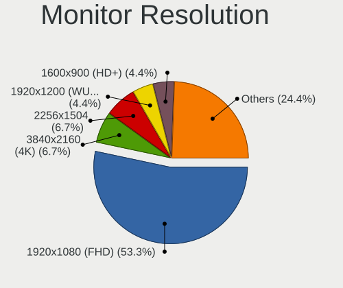

| Resolution        | Notebooks | Percent |
|-------------------|-----------|---------|
| 1920x1080 (FHD)   | 24        | 53.33%  |
| 3840x2160 (4K)    | 3         | 6.67%   |
| 2256x1504         | 3         | 6.67%   |
| 1920x1200 (WUXGA) | 2         | 4.44%   |
| 1600x900 (HD+)    | 2         | 4.44%   |
| 1440x900 (WXGA+)  | 2         | 4.44%   |
| 1366x768 (WXGA)   | 2         | 4.44%   |
| 5440x1080         | 1         | 2.22%   |
| 3840x1600         | 1         | 2.22%   |
| 3520x1080         | 1         | 2.22%   |
| 2880x1920         | 1         | 2.22%   |
| 2880x1800         | 1         | 2.22%   |
| 2560x1600         | 1         | 2.22%   |
| Unknown           | 1         | 2.22%   |

Monitor Diagonal
----------------

Diagonal size in inches

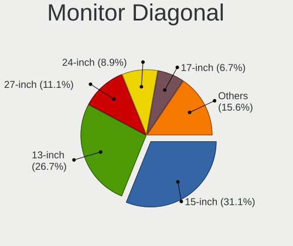

| Inches  | Notebooks | Percent |
|---------|-----------|---------|
| 15      | 14        | 31.11%  |
| 13      | 12        | 26.67%  |
| 27      | 5         | 11.11%  |
| 24      | 4         | 8.89%   |
| 17      | 3         | 6.67%   |
| 14      | 2         | 4.44%   |
| 12      | 2         | 4.44%   |
| 37      | 1         | 2.22%   |
| 21      | 1         | 2.22%   |
| Unknown | 1         | 2.22%   |

Monitor Width
-------------

Physical width

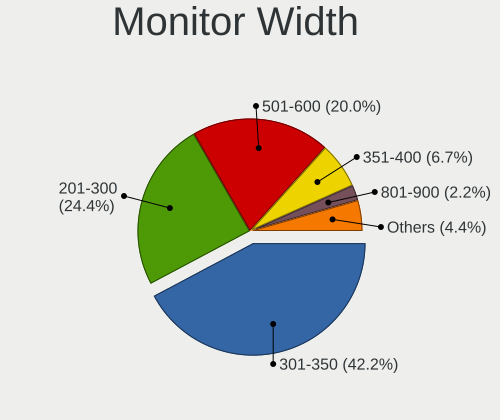

| Width in mm | Notebooks | Percent |
|-------------|-----------|---------|
| 301-350     | 19        | 42.22%  |
| 201-300     | 11        | 24.44%  |
| 501-600     | 9         | 20%     |
| 351-400     | 3         | 6.67%   |
| 801-900     | 1         | 2.22%   |
| 401-500     | 1         | 2.22%   |
| Unknown     | 1         | 2.22%   |

Aspect Ratio
------------

Proportional relationship between the width and the height

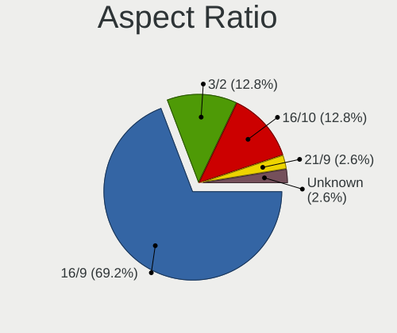

| Ratio   | Notebooks | Percent |
|---------|-----------|---------|
| 16/9    | 27        | 69.23%  |
| 3/2     | 5         | 12.82%  |
| 16/10   | 5         | 12.82%  |
| 21/9    | 1         | 2.56%   |
| Unknown | 1         | 2.56%   |

Monitor Area
------------

Area in inch²

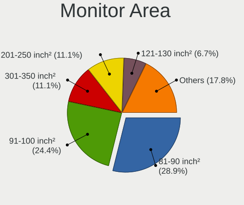

| Area in inch² | Notebooks | Percent |
|----------------|-----------|---------|
| 81-90          | 13        | 28.89%  |
| 91-100         | 11        | 24.44%  |
| 301-350        | 5         | 11.11%  |
| 201-250        | 5         | 11.11%  |
| 121-130        | 3         | 6.67%   |
| 61-70          | 2         | 4.44%   |
| 101-110        | 2         | 4.44%   |
| 71-80          | 1         | 2.22%   |
| 111-120        | 1         | 2.22%   |
| 501-1000       | 1         | 2.22%   |
| Unknown        | 1         | 2.22%   |

Pixel Density
-------------

Pixels per inch

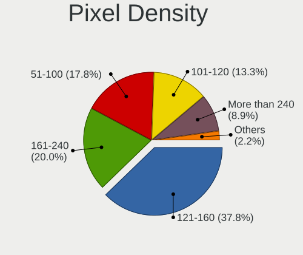

| Density       | Notebooks | Percent |
|---------------|-----------|---------|
| 121-160       | 17        | 37.78%  |
| 161-240       | 9         | 20%     |
| 51-100        | 8         | 17.78%  |
| 101-120       | 6         | 13.33%  |
| More than 240 | 4         | 8.89%   |
| Unknown       | 1         | 2.22%   |

Multiple Monitors
-----------------

Total monitors connected

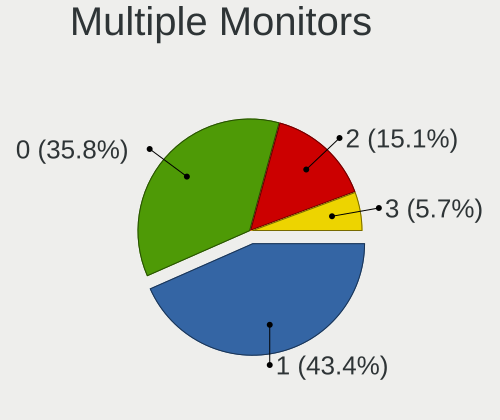

| Total | Notebooks | Percent |
|-------|-----------|---------|
| 1     | 23        | 43.4%   |
| 0     | 19        | 35.85%  |
| 2     | 8         | 15.09%  |
| 3     | 3         | 5.66%   |

Network
-------

Net Controller Vendor
---------------------

Controller vendors

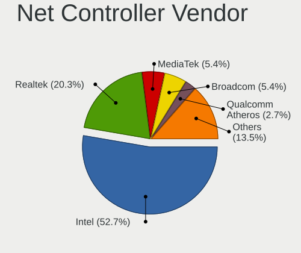

| Vendor                            | Notebooks | Percent |
|-----------------------------------|-----------|---------|
| Intel                             | 39        | 52.7%   |
| Realtek Semiconductor             | 15        | 20.27%  |
| MediaTek                          | 4         | 5.41%   |
| Broadcom                          | 4         | 5.41%   |
| Qualcomm Atheros                  | 2         | 2.7%    |
| TP-Link                           | 1         | 1.35%   |
| Sierra Wireless                   | 1         | 1.35%   |
| Samsung Electronics               | 1         | 1.35%   |
| Qualcomm Technologies             | 1         | 1.35%   |
| OPPO Electronics                  | 1         | 1.35%   |
| Hewlett-Packard                   | 1         | 1.35%   |
| Fibocom                           | 1         | 1.35%   |
| Ericsson Business Mobile Networks | 1         | 1.35%   |
| Edimax Technology                 | 1         | 1.35%   |
| D-Link System                     | 1         | 1.35%   |

Net Controller Model
--------------------

Controller models

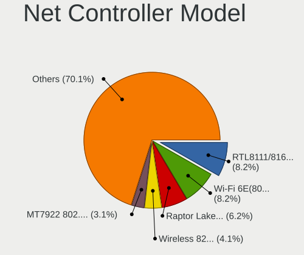

| Model                                                                  | Notebooks | Percent |
|------------------------------------------------------------------------|-----------|---------|
| Realtek RTL8111/8168/8211/8411 PCI Express Gigabit Ethernet Controller | 8         | 8.25%   |
| Intel Wi-Fi 6E(802.11ax) AX210/AX1675* 2x2 [Typhoon Peak]              | 8         | 8.25%   |
| Intel Raptor Lake PCH CNVi WiFi                                        | 6         | 6.19%   |
| Intel Wireless 8265 / 8275                                             | 4         | 4.12%   |
| MediaTek MT7922 802.11ax PCI Express Wireless Network Adapter          | 3         | 3.09%   |
| Intel Wireless 7260                                                    | 3         | 3.09%   |
| Intel Wi-Fi 6 AX201                                                    | 3         | 3.09%   |
| Intel Meteor Lake PCH CNVi WiFi                                        | 3         | 3.09%   |
| Intel Ethernet Connection (18) I219-LM                                 | 3         | 3.09%   |
| Realtek USB 2.5GbE Controller                                          | 2         | 2.06%   |
| Qualcomm Atheros QCA9565 / AR9565 Wireless Network Adapter             | 2         | 2.06%   |
| Intel Wireless 7265                                                    | 2         | 2.06%   |
| Intel Ethernet Connection I217-LM                                      | 2         | 2.06%   |
| Intel Ethernet Connection (4) I219-V                                   | 2         | 2.06%   |
| Intel Ethernet Connection (23) I219-V                                  | 2         | 2.06%   |
| Intel Comet Lake PCH CNVi WiFi                                         | 2         | 2.06%   |
| Broadcom NetXtreme BCM57765 Gigabit Ethernet PCIe                      | 2         | 2.06%   |
| Broadcom BCM4331 802.11a/b/g/n                                         | 2         | 2.06%   |
| TP-Link AC600 wireless Realtek RTL8811AU [Archer T2U Nano]             | 1         | 1.03%   |
| Sierra Wireless EM7565 USB Device                                      | 1         | 1.03%   |
| Samsung Galaxy series, misc. (tethering mode)                          | 1         | 1.03%   |
| Realtek RTL88x2bu [AC1200 Techkey]                                     | 1         | 1.03%   |
| Realtek RTL8852BE PCIe 802.11ax Wireless Network Controller            | 1         | 1.03%   |
| Realtek RTL8821CE 802.11ac PCIe Wireless Network Adapter               | 1         | 1.03%   |
| Realtek RTL8188EUS 802.11n Wireless Network Adapter                    | 1         | 1.03%   |
| Realtek PCIe GbE Family Controller                                     | 1         | 1.03%   |
| Qualcomm QCNFA765 Wireless Network Adapter                             | 1         | 1.03%   |
| OPPO OnePlus Android ADB Interface                                     | 1         | 1.03%   |
| MediaTek MT7921 802.11ax PCIe Wireless Network Adapter [Filogic 330]   | 1         | 1.03%   |
| Intel Wireless 8260                                                    | 1         | 1.03%   |
| Intel Wi-Fi 6 AX200                                                    | 1         | 1.03%   |
| Intel Ultimate N WiFi Link 5300                                        | 1         | 1.03%   |
| Intel Ethernet Controller I225-LM                                      | 1         | 1.03%   |
| Intel Ethernet Connection I219-LM                                      | 1         | 1.03%   |
| Intel Ethernet Connection I218-LM                                      | 1         | 1.03%   |
| Intel Ethernet Connection (5) I219-LM                                  | 1         | 1.03%   |
| Intel Ethernet Connection (4) I219-LM                                  | 1         | 1.03%   |
| Intel Ethernet Connection (3) I218-LM                                  | 1         | 1.03%   |
| Intel Ethernet Connection (23) I219-LM                                 | 1         | 1.03%   |
| Intel Ethernet Connection (16) I219-V                                  | 1         | 1.03%   |

Wireless Vendor
---------------

Wireless vendors

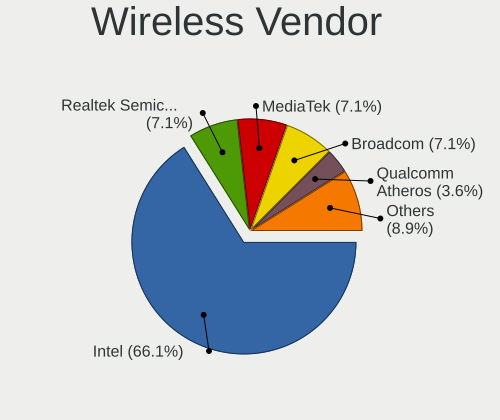

| Vendor                | Notebooks | Percent |
|-----------------------|-----------|---------|
| Intel                 | 37        | 66.07%  |
| Realtek Semiconductor | 4         | 7.14%   |
| MediaTek              | 4         | 7.14%   |
| Broadcom              | 4         | 7.14%   |
| Qualcomm Atheros      | 2         | 3.57%   |
| TP-Link               | 1         | 1.79%   |
| Sierra Wireless       | 1         | 1.79%   |
| Qualcomm Technologies | 1         | 1.79%   |
| Edimax Technology     | 1         | 1.79%   |
| D-Link System         | 1         | 1.79%   |

Wireless Model
--------------

Wireless models

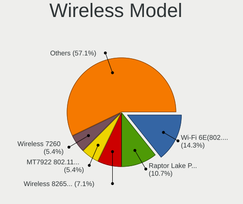

| Model                                                                      | Notebooks | Percent |
|----------------------------------------------------------------------------|-----------|---------|
| Intel Wi-Fi 6E(802.11ax) AX210/AX1675* 2x2 [Typhoon Peak]                  | 8         | 14.29%  |
| Intel Raptor Lake PCH CNVi WiFi                                            | 6         | 10.71%  |
| Intel Wireless 8265 / 8275                                                 | 4         | 7.14%   |
| MediaTek MT7922 802.11ax PCI Express Wireless Network Adapter              | 3         | 5.36%   |
| Intel Wireless 7260                                                        | 3         | 5.36%   |
| Intel Wi-Fi 6 AX201                                                        | 3         | 5.36%   |
| Intel Meteor Lake PCH CNVi WiFi                                            | 3         | 5.36%   |
| Qualcomm Atheros QCA9565 / AR9565 Wireless Network Adapter                 | 2         | 3.57%   |
| Intel Wireless 7265                                                        | 2         | 3.57%   |
| Intel Comet Lake PCH CNVi WiFi                                             | 2         | 3.57%   |
| Broadcom BCM4331 802.11a/b/g/n                                             | 2         | 3.57%   |
| TP-Link AC600 wireless Realtek RTL8811AU [Archer T2U Nano]                 | 1         | 1.79%   |
| Sierra Wireless EM7565 USB Device                                          | 1         | 1.79%   |
| Realtek RTL88x2bu [AC1200 Techkey]                                         | 1         | 1.79%   |
| Realtek RTL8852BE PCIe 802.11ax Wireless Network Controller                | 1         | 1.79%   |
| Realtek RTL8821CE 802.11ac PCIe Wireless Network Adapter                   | 1         | 1.79%   |
| Realtek RTL8188EUS 802.11n Wireless Network Adapter                        | 1         | 1.79%   |
| Qualcomm QCNFA765 Wireless Network Adapter                                 | 1         | 1.79%   |
| MediaTek MT7921 802.11ax PCIe Wireless Network Adapter [Filogic 330]       | 1         | 1.79%   |
| Intel Wireless 8260                                                        | 1         | 1.79%   |
| Intel Wi-Fi 6 AX200                                                        | 1         | 1.79%   |
| Intel Ultimate N WiFi Link 5300                                            | 1         | 1.79%   |
| Intel Dual Band Wireless-AC 3168NGW [Stone Peak]                           | 1         | 1.79%   |
| Intel Comet Lake PCH-LP CNVi WiFi                                          | 1         | 1.79%   |
| Intel Centrino Advanced-N 6205 [Taylor Peak]                               | 1         | 1.79%   |
| Edimax AC600 Wireless LAN USB Adapter                                      | 1         | 1.79%   |
| D-Link System AirPlus G DWL-G122 Wireless Adapter(rev.C1) [Ralink RT2571W] | 1         | 1.79%   |
| Broadcom BCM4360 802.11ac Dual Band Wireless Network Adapter               | 1         | 1.79%   |
| Broadcom BCM4350 802.11ac Wireless Network Adapter                         | 1         | 1.79%   |

Ethernet Vendor
---------------

Ethernet vendors

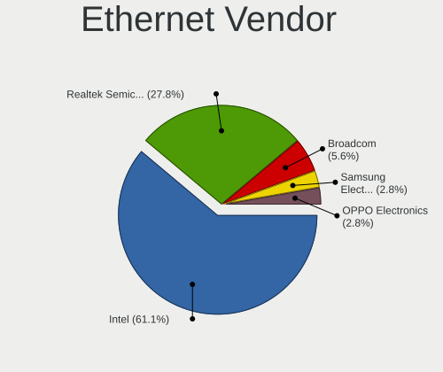

| Vendor                | Notebooks | Percent |
|-----------------------|-----------|---------|
| Intel                 | 22        | 61.11%  |
| Realtek Semiconductor | 10        | 27.78%  |
| Broadcom              | 2         | 5.56%   |
| Samsung Electronics   | 1         | 2.78%   |
| OPPO Electronics      | 1         | 2.78%   |

Ethernet Model
--------------

Ethernet models

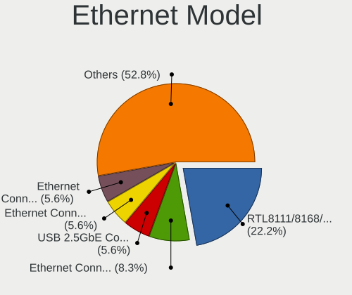

| Model                                                                  | Notebooks | Percent |
|------------------------------------------------------------------------|-----------|---------|
| Realtek RTL8111/8168/8211/8411 PCI Express Gigabit Ethernet Controller | 8         | 22.22%  |
| Intel Ethernet Connection (18) I219-LM                                 | 3         | 8.33%   |
| Realtek USB 2.5GbE Controller                                          | 2         | 5.56%   |
| Intel Ethernet Connection I217-LM                                      | 2         | 5.56%   |
| Intel Ethernet Connection (4) I219-V                                   | 2         | 5.56%   |
| Intel Ethernet Connection (23) I219-V                                  | 2         | 5.56%   |
| Broadcom NetXtreme BCM57765 Gigabit Ethernet PCIe                      | 2         | 5.56%   |
| Samsung Galaxy series, misc. (tethering mode)                          | 1         | 2.78%   |
| OPPO OnePlus Android ADB Interface                                     | 1         | 2.78%   |
| Intel Ethernet Controller I225-LM                                      | 1         | 2.78%   |
| Intel Ethernet Connection I219-LM                                      | 1         | 2.78%   |
| Intel Ethernet Connection I218-LM                                      | 1         | 2.78%   |
| Intel Ethernet Connection (5) I219-LM                                  | 1         | 2.78%   |
| Intel Ethernet Connection (4) I219-LM                                  | 1         | 2.78%   |
| Intel Ethernet Connection (3) I218-LM                                  | 1         | 2.78%   |
| Intel Ethernet Connection (23) I219-LM                                 | 1         | 2.78%   |
| Intel Ethernet Connection (16) I219-V                                  | 1         | 2.78%   |
| Intel Ethernet Connection (14) I219-LM                                 | 1         | 2.78%   |
| Intel Ethernet Connection (11) I219-LM                                 | 1         | 2.78%   |
| Intel Ethernet Connection (10) I219-LM                                 | 1         | 2.78%   |
| Intel 82579LM Gigabit Network Connection (Lewisville)                  | 1         | 2.78%   |
| Intel 82567LM Gigabit Network Connection                               | 1         | 2.78%   |

Net Controller Kind
-------------------

Ethernet, WiFi or modem

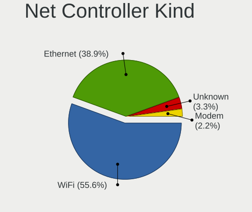

| Kind     | Notebooks | Percent |
|----------|-----------|---------|
| WiFi     | 50        | 55.56%  |
| Ethernet | 35        | 38.89%  |
| Unknown  | 3         | 3.33%   |
| Modem    | 2         | 2.22%   |

Used Controller
---------------

Currently used network controller

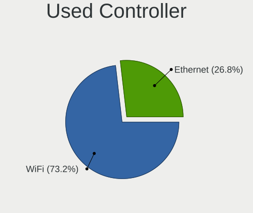

| Kind     | Notebooks | Percent |
|----------|-----------|---------|
| WiFi     | 30        | 73.17%  |
| Ethernet | 11        | 26.83%  |

NICs
----

Total network controllers on board

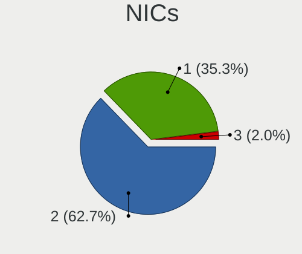

| Total | Notebooks | Percent |
|-------|-----------|---------|
| 2     | 32        | 62.75%  |
| 1     | 18        | 35.29%  |
| 3     | 1         | 1.96%   |

IPv6
----

IPv6 vs IPv4

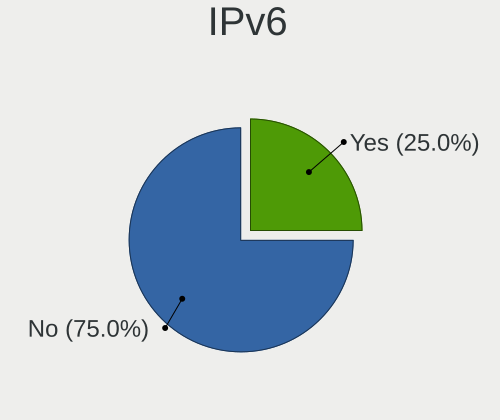

| Used | Notebooks | Percent |
|------|-----------|---------|
| No   | 39        | 75%     |
| Yes  | 13        | 25%     |

Bluetooth
---------

Bluetooth Vendor
----------------

Controller vendors

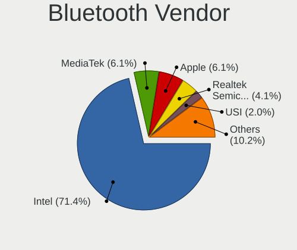

| Vendor                          | Notebooks | Percent |
|---------------------------------|-----------|---------|
| Intel                           | 35        | 71.43%  |
| MediaTek                        | 3         | 6.12%   |
| Apple                           | 3         | 6.12%   |
| Realtek Semiconductor           | 2         | 4.08%   |
| USI                             | 1         | 2.04%   |
| Shenzhen Goodix Technology      | 1         | 2.04%   |
| Qualcomm Atheros Communications | 1         | 2.04%   |
| Lite-On Technology              | 1         | 2.04%   |
| Foxconn / Hon Hai               | 1         | 2.04%   |
| Broadcom                        | 1         | 2.04%   |

Bluetooth Model
---------------

Controller models

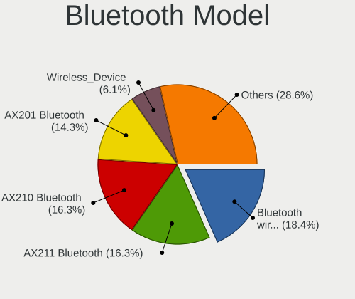

| Model                                              | Notebooks | Percent |
|----------------------------------------------------|-----------|---------|
| Intel Bluetooth wireless interface                 | 9         | 18.37%  |
| Intel AX211 Bluetooth                              | 8         | 16.33%  |
| Intel AX210 Bluetooth                              | 8         | 16.33%  |
| Intel AX201 Bluetooth                              | 7         | 14.29%  |
| MediaTek Wireless_Device                           | 3         | 6.12%   |
| Apple Bluetooth Host Controller                    | 2         | 4.08%   |
| USI Qualcomm WCN685x Bluetooth Adapter             | 1         | 2.04%   |
| Shenzhen Goodix retrieving string failed           | 1         | 2.04%   |
| Realtek  Bluetooth 4.2 Adapter                     | 1         | 2.04%   |
| Realtek Bluetooth Adapter                          | 1         | 2.04%   |
| Qualcomm Atheros AR3012 Bluetooth 4.0              | 1         | 2.04%   |
| Lite-On Atheros AR3012 Bluetooth                   | 1         | 2.04%   |
| Intel Wireless-AC 3168 Bluetooth                   | 1         | 2.04%   |
| Intel Bluetooth 9460/9560 Jefferson Peak (JfP)     | 1         | 2.04%   |
| Intel AX200 Bluetooth                              | 1         | 2.04%   |
| Foxconn / Hon Hai MediaTek Bluetooth Adapter       | 1         | 2.04%   |
| Broadcom BCM2045B (BDC-2.1) [Bluetooth Controller] | 1         | 2.04%   |
| Apple Broadcom Built-in Bluetooth                  | 1         | 2.04%   |

Sound
-----

Sound Vendor
------------

Sound card vendors

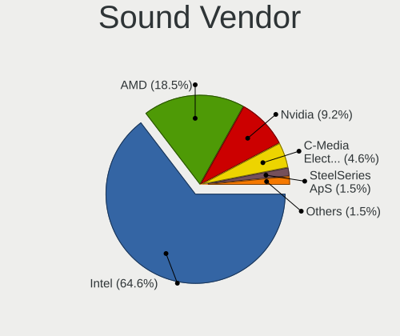

| Vendor                  | Notebooks | Percent |
|-------------------------|-----------|---------|
| Intel                   | 42        | 64.62%  |
| AMD                     | 12        | 18.46%  |
| Nvidia                  | 6         | 9.23%   |
| C-Media Electronics     | 3         | 4.62%   |
| SteelSeries ApS         | 1         | 1.54%   |
| Cambridge Silicon Radio | 1         | 1.54%   |

Sound Model
-----------

Sound card models

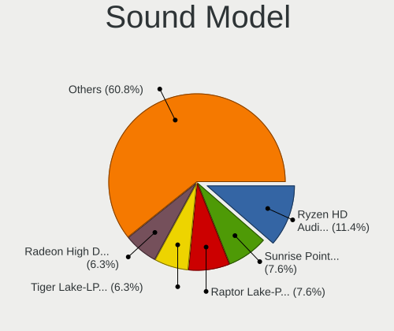

| Model                                                                             | Notebooks | Percent |
|-----------------------------------------------------------------------------------|-----------|---------|
| AMD Ryzen HD Audio Controller                                                     | 9         | 11.39%  |
| Intel Sunrise Point-LP HD Audio                                                   | 6         | 7.59%   |
| Intel Raptor Lake-P/U/H cAVS                                                      | 6         | 7.59%   |
| Intel Tiger Lake-LP Smart Sound Technology Audio Controller                       | 5         | 6.33%   |
| AMD Radeon High Definition Audio Controller                                       | 5         | 6.33%   |
| Intel Meteor Lake-P HD Audio Controller                                           | 4         | 5.06%   |
| Nvidia TU107 GeForce GTX 1650 High Definition Audio Controller                    | 3         | 3.8%    |
| Intel 8 Series/C220 Series Chipset High Definition Audio Controller               | 3         | 3.8%    |
| Intel Xeon E3-1200 v3/4th Gen Core Processor HD Audio Controller                  | 2         | 2.53%   |
| Intel Wildcat Point-LP High Definition Audio Controller                           | 2         | 2.53%   |
| Intel Tiger Lake-H HD Audio Controller                                            | 2         | 2.53%   |
| Intel Comet Lake PCH cAVS                                                         | 2         | 2.53%   |
| Intel Broadwell-U Audio Controller                                                | 2         | 2.53%   |
| Intel Alder Lake PCH-P High Definition Audio Controller                           | 2         | 2.53%   |
| Intel 6 Series/C200 Series Chipset Family High Definition Audio Controller        | 2         | 2.53%   |
| C-Media Electronics USB Audio Class 1.0 and 2.0 Device                            | 2         | 2.53%   |
| AMD Turks HDMI Audio [Radeon HD 6500/6600 / 6700M Series]                         | 2         | 2.53%   |
| AMD Renoir/Cezanne HDMI/DP Audio Controller                                       | 2         | 2.53%   |
| SteelSeries ApS SteelSeries Siberia 350                                           | 1         | 1.27%   |
| Nvidia GP104 High Definition Audio Controller                                     | 1         | 1.27%   |
| Nvidia GK107 HDMI Audio Controller                                                | 1         | 1.27%   |
| Nvidia GA104 High Definition Audio Controller                                     | 1         | 1.27%   |
| Intel Haswell-ULT HD Audio Controller                                             | 1         | 1.27%   |
| Intel Comet Lake PCH-LP cAVS                                                      | 1         | 1.27%   |
| Intel CM238 HD Audio Controller                                                   | 1         | 1.27%   |
| Intel Celeron N3350/Pentium N4200/Atom E3900 Series Audio Cluster                 | 1         | 1.27%   |
| Intel Atom Processor Z36xxx/Z37xxx Series High Definition Audio Controller        | 1         | 1.27%   |
| Intel Arrow Lake cAVS                                                             | 1         | 1.27%   |
| Intel 82801I (ICH9 Family) HD Audio Controller                                    | 1         | 1.27%   |
| Intel 8 Series HD Audio Controller                                                | 1         | 1.27%   |
| Intel 7 Series/C216 Chipset Family High Definition Audio Controller               | 1         | 1.27%   |
| Cambridge Silicon Radio Mpow HC5 Headset in charging mode - HID / Mass Storage    | 1         | 1.27%   |
| C-Media Electronics Blue Snowball                                                 | 1         | 1.27%   |
| AMD Raven/Raven2/Fenghuang HDMI/DP Audio Controller                               | 1         | 1.27%   |
| AMD Navi 10 HDMI Audio                                                            | 1         | 1.27%   |
| AMD Caicos HDMI Audio [Radeon HD 6450 / 7450/8450/8490 OEM / R5 230/235/235X OEM] | 1         | 1.27%   |

Memory
------

Memory Vendor
-------------

Memory module vendors

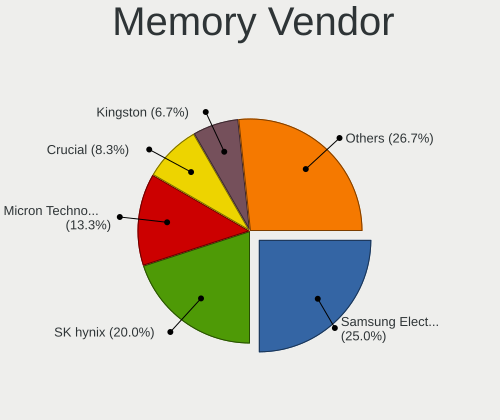

| Vendor              | Notebooks | Percent |
|---------------------|-----------|---------|
| Samsung Electronics | 15        | 25%     |
| SK hynix            | 12        | 20%     |
| Micron Technology   | 8         | 13.33%  |
| Crucial             | 5         | 8.33%   |
| Kingston            | 4         | 6.67%   |
| A-DATA Technology   | 4         | 6.67%   |
| Corsair             | 3         | 5%      |
| Ramaxel Technology  | 2         | 3.33%   |
| Unknown             | 2         | 3.33%   |
| Team                | 1         | 1.67%   |
| G.Skill             | 1         | 1.67%   |
| fef5                | 1         | 1.67%   |
| Elpida              | 1         | 1.67%   |
| ChangXin Memory     | 1         | 1.67%   |

Memory Model
------------

Memory module models

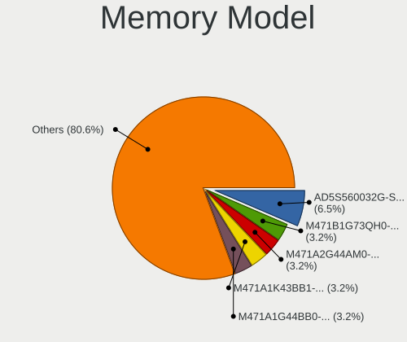

| Model                                                        | Notebooks | Percent |
|--------------------------------------------------------------|-----------|---------|
| A-DATA RAM AD5S560032G-SFW 32GB SODIMM DDR5 5600MT/s         | 4         | 6.45%   |
| SK hynix RAM HMT41GS6BFR8A-PB 8GB SODIMM DDR3 1600MT/s       | 2         | 3.23%   |
| Samsung RAM M471B1G73QH0-YK0 8GB SODIMM DDR3 1867MT/s        | 2         | 3.23%   |
| Samsung RAM M471A2G44AM0-CWE 16GiB SODIMM DDR4 3200MT/s      | 2         | 3.23%   |
| Samsung RAM M471A1K43BB1-CRC 8GB SODIMM DDR4 2400MT/s        | 2         | 3.23%   |
| Samsung RAM M471A1G44BB0-CWE 8GB SODIMM DDR4 3200MT/s        | 2         | 3.23%   |
| Kingston RAM 9905744-111.A00G 32GB SODIMM DDR4 3200MT/s      | 2         | 3.23%   |
| Unknown                                                      | 2         | 3.23%   |
| Team RAM TEAMGROUP-SD4-3200 32GB SODIMM DDR4 3200MT/s        | 1         | 1.61%   |
| SK hynix RAM Module 8GB SODIMM DDR4 3200MT/s                 | 1         | 1.61%   |
| SK hynix RAM Module 4GB SODIMM DDR3 1333MT/s                 | 1         | 1.61%   |
| SK hynix RAM Module 32GB SODIMM DDR5 5600MT/s                | 1         | 1.61%   |
| SK hynix RAM HMT41GS6AFR8A-PB 8GB SODIMM DDR3 1600MT/s       | 1         | 1.61%   |
| SK hynix RAM HMT351S6EFR8C-PB 4GB SODIMM DDR3 1600MT/s       | 1         | 1.61%   |
| SK hynix RAM HMT351S6CFR8C-PB 4GB SODIMM DDR3 1600MT/s       | 1         | 1.61%   |
| SK hynix RAM HMCG88AGBSA092N 32GB SODIMM DDR5 5600MT/s       | 1         | 1.61%   |
| SK hynix RAM HMCG78AGBSA092N 16GB SODIMM DDR5 5600MT/s       | 1         | 1.61%   |
| SK hynix RAM HMCG66AGBSA095N 8GB SODIMM DDR5 5600MT/s        | 1         | 1.61%   |
| SK hynix RAM H9JCNNNCP3MLYR-N6E 4GB DIMM LPDDR5 6400MT/s     | 1         | 1.61%   |
| SK hynix RAM H9HCNNN8KUMLHR 1GB 2400MT/s                     | 1         | 1.61%   |
| SK hynix RAM H58G56AK6BX069 2GB Row Of Chips LPDDR5 6400MT/s | 1         | 1.61%   |
| Samsung RAM Module 4GB SODIMM DDR3 1333MT/s                  | 1         | 1.61%   |
| Samsung RAM M471B5173DB0-YK0 4GB SODIMM DDR3 1600MT/s        | 1         | 1.61%   |
| Samsung RAM M471A2G43AB2-CWE 16GB SODIMM DDR4 3200MT/s       | 1         | 1.61%   |
| Samsung RAM M471A1K43EB1-CWE 8GB SODIMM DDR4 3200MT/s        | 1         | 1.61%   |
| Samsung RAM M471A1G44AB0-CWE 8GB Row Of Chips DDR4 3200MT/s  | 1         | 1.61%   |
| Samsung RAM M425R1GB4BB0-CWMOD 8GB SODIMM DDR5 5600MT/s      | 1         | 1.61%   |
| Samsung RAM K4EBE304EB-EGCG 8GB Row Of Chips LPDDR3 2133MT/s | 1         | 1.61%   |
| Ramaxel RAM RMSA3310MF96HAF-3200 8GB SODIMM DDR4 3200MT/s    | 1         | 1.61%   |
| Ramaxel RAM RMSA3260ME78HAF-2666 8GB SODIMM DDR4 2667MT/s    | 1         | 1.61%   |
| Micron RAM MT62F2G32D4DS-026 WT 8GB SODIMM LPDDR5 7500MT/s   | 1         | 1.61%   |
| Micron RAM MT40A1G16TB-062E:F 8GB Row Of Chips DDR4 3200MT/s | 1         | 1.61%   |
| Micron RAM Module 8GB SODIMM LPDDR3 1867MT/s                 | 1         | 1.61%   |
| Micron RAM Module 4GB SODIMM DDR3 1600MT/s                   | 1         | 1.61%   |
| Micron RAM 8ATF2G64HZ-3G2E2 16GB SODIMM DDR4 3200MT/s        | 1         | 1.61%   |
| Micron RAM 8ATF2G64HZ-3G2E1 16GB SODIMM DDR4 3200MT/s        | 1         | 1.61%   |
| Micron RAM 4ATF1G64HZ-3G2E1 8GB SODIMM DDR4 3200MT/s         | 1         | 1.61%   |
| Micron RAM 16KTF1G64HZ-1G6N1 8GB SODIMM DDR3 1600MT/s        | 1         | 1.61%   |
| Kingston RAM K821PJ-MIH 16GB SODIMM DDR4 2400MT/s            | 1         | 1.61%   |
| Kingston RAM 9905789-057.A00G 32GB SODIMM DDR5 5600MT/s      | 1         | 1.61%   |

Memory Kind
-----------

Memory module kinds

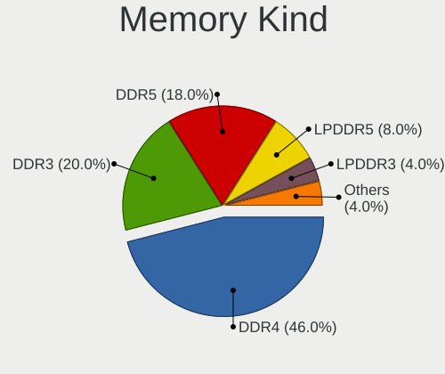

| Kind    | Notebooks | Percent |
|---------|-----------|---------|
| DDR4    | 23        | 46%     |
| DDR3    | 10        | 20%     |
| DDR5    | 9         | 18%     |
| LPDDR5  | 4         | 8%      |
| LPDDR3  | 2         | 4%      |
| LPDDR4  | 1         | 2%      |
| Unknown | 1         | 2%      |

Memory Form Factor
------------------

Physical design of the memory module

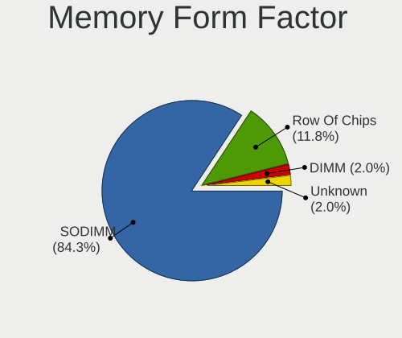

| Name         | Notebooks | Percent |
|--------------|-----------|---------|
| SODIMM       | 43        | 84.31%  |
| Row Of Chips | 6         | 11.76%  |
| DIMM         | 1         | 1.96%   |
| Unknown      | 1         | 1.96%   |

Memory Size
-----------

Memory module size

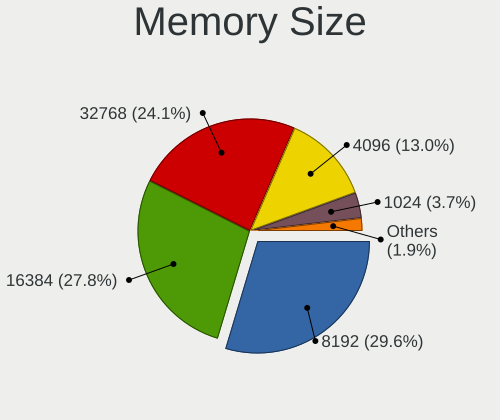

| Size  | Notebooks | Percent |
|-------|-----------|---------|
| 8192  | 16        | 29.63%  |
| 16384 | 15        | 27.78%  |
| 32768 | 13        | 24.07%  |
| 4096  | 7         | 12.96%  |
| 1024  | 2         | 3.7%    |
| 2048  | 1         | 1.85%   |

Memory Speed
------------

Memory module speed

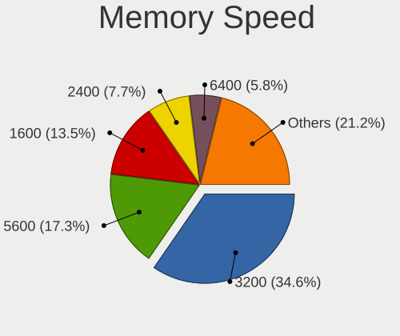

| Speed | Notebooks | Percent |
|-------|-----------|---------|
| 3200  | 18        | 34.62%  |
| 5600  | 9         | 17.31%  |
| 1600  | 7         | 13.46%  |
| 2400  | 4         | 7.69%   |
| 6400  | 3         | 5.77%   |
| 2133  | 3         | 5.77%   |
| 1867  | 3         | 5.77%   |
| 1333  | 2         | 3.85%   |
| 7500  | 1         | 1.92%   |
| 3733  | 1         | 1.92%   |
| 2667  | 1         | 1.92%   |

Printers & scanners
-------------------

Printer Vendor
--------------

Printer device vendors

Zero info for selected period =(

Printer Model
-------------

Printer device models

Zero info for selected period =(

Scanner Vendor
--------------

Scanner device vendors

Zero info for selected period =(

Scanner Model
-------------

Scanner device models

Zero info for selected period =(

Camera
------

Camera Vendor
-------------

Camera device vendors

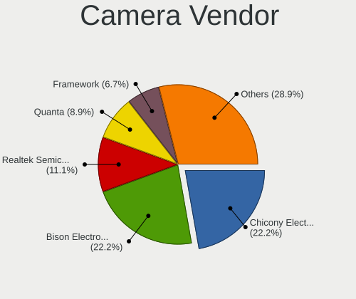

| Vendor                                 | Notebooks | Percent |
|----------------------------------------|-----------|---------|
| Chicony Electronics                    | 10        | 22.22%  |
| Bison Electronics                      | 10        | 22.22%  |
| Realtek Semiconductor                  | 5         | 11.11%  |
| Quanta                                 | 4         | 8.89%   |
| Framework                              | 3         | 6.67%   |
| Microdia                               | 2         | 4.44%   |
| Luxvisions Innotech Limited            | 2         | 4.44%   |
| Apple                                  | 2         | 4.44%   |
| Unknown (3730304233343731345430)       | 1         | 2.22%   |
| Syntek                                 | 1         | 2.22%   |
| Sunplus Innovation Technology          | 1         | 2.22%   |
| Lite-On Technology                     | 1         | 2.22%   |
| IMC Networks                           | 1         | 2.22%   |
| Dell                                   | 1         | 2.22%   |
| Cheng Uei Precision Industry (Foxlink) | 1         | 2.22%   |

Camera Model
------------

Camera device models

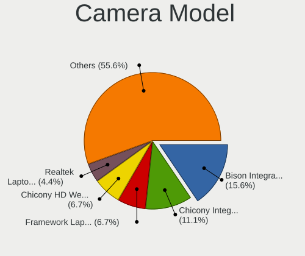

| Model                                                                    | Notebooks | Percent |
|--------------------------------------------------------------------------|-----------|---------|
| Bison Integrated Camera                                                  | 7         | 15.56%  |
| Chicony Integrated Camera                                                | 5         | 11.11%  |
| Framework Laptop Webcam Module (2nd Gen)                                 | 3         | 6.67%   |
| Chicony HD Webcam                                                        | 3         | 6.67%   |
| Realtek Laptop Camera                                                    | 2         | 4.44%   |
| Realtek Integrated_Webcam_FHD                                            | 2         | 4.44%   |
| Apple FaceTime HD Camera                                                 | 2         | 4.44%   |
| Unknown (3730304233343731345430) USB Camera                              | 1         | 2.22%   |
| Syntek Integrated Camera                                                 | 1         | 2.22%   |
| Sunplus Integrated_Webcam_HD                                             | 1         | 2.22%   |
| Realtek USB 2.0 PC Camera                                                | 1         | 2.22%   |
| Quanta ov9734_techfront_camera                                           | 1         | 2.22%   |
| Quanta HP TrueVision HD Camera                                           | 1         | 2.22%   |
| Quanta HP HD Camera                                                      | 1         | 2.22%   |
| Quanta HP FHD Camera                                                     | 1         | 2.22%   |
| Microdia USB 2.0 Camera                                                  | 1         | 2.22%   |
| Microdia Integrated Webcam                                               | 1         | 2.22%   |
| Luxvisions Innotech Limited Integrated RGB Camera                        | 1         | 2.22%   |
| Luxvisions Innotech Limited Integrated Camera                            | 1         | 2.22%   |
| Lite-On Integrated Camera                                                | 1         | 2.22%   |
| IMC Networks Integrated Camera                                           | 1         | 2.22%   |
| Dell Dell Webcam WB7022                                                  | 1         | 2.22%   |
| Chicony Integrated HP HD Webcam                                          | 1         | 2.22%   |
| Chicony HP Webcam                                                        | 1         | 2.22%   |
| Cheng Uei Precision Industry (Foxlink) HP EliteBook integrated HD Webcam | 1         | 2.22%   |
| Bison SunplusIT Integrated Camera                                        | 1         | 2.22%   |
| Bison Lenovo EasyCamera                                                  | 1         | 2.22%   |
| Bison HD Webcam                                                          | 1         | 2.22%   |

Security
--------

Fingerprint Vendor
------------------

Fingerprint sensor vendors

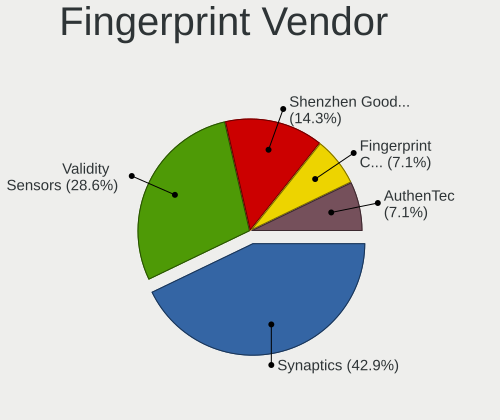

| Vendor                     | Notebooks | Percent |
|----------------------------|-----------|---------|
| Synaptics                  | 6         | 42.86%  |
| Validity Sensors           | 4         | 28.57%  |
| Shenzhen Goodix Technology | 2         | 14.29%  |
| Fingerprint Cards          | 1         | 7.14%   |
| AuthenTec                  | 1         | 7.14%   |

Fingerprint Model
-----------------

Fingerprint sensor models

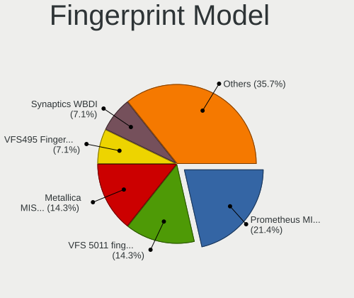

| Model                                                    | Notebooks | Percent |
|----------------------------------------------------------|-----------|---------|
| Synaptics Prometheus MIS Touch Fingerprint Reader        | 3         | 21.43%  |
| Validity Sensors VFS 5011 fingerprint sensor             | 2         | 14.29%  |
| Synaptics Metallica MIS Touch Fingerprint Reader         | 2         | 14.29%  |
| Validity Sensors VFS495 Fingerprint Reader               | 1         | 7.14%   |
| Validity Sensors Synaptics WBDI                          | 1         | 7.14%   |
| Synaptics FS7604 Touch Fingerprint Sensor with PurePrint | 1         | 7.14%   |
| Shenzhen Goodix  Fingerprint Device                      | 1         | 7.14%   |
| Shenzhen Goodix Fingerprint Reader                       | 1         | 7.14%   |
| Fingerprint Cards FPC Fingerprint Reader                 | 1         | 7.14%   |
| AuthenTec AES2810                                        | 1         | 7.14%   |

Chipcard Vendor
---------------

Chipcard module vendors

Zero info for selected period =(

Chipcard Model
--------------

Chipcard module models

Zero info for selected period =(

Unsupported
-----------

Unsupported Devices
-------------------

Total unsupported devices on board

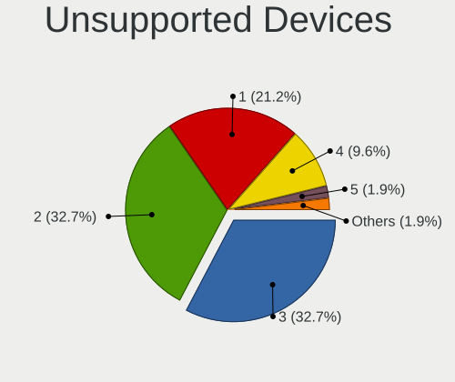

| Total | Notebooks | Percent |
|-------|-----------|---------|
| 3     | 17        | 32.69%  |
| 2     | 17        | 32.69%  |
| 1     | 11        | 21.15%  |
| 4     | 5         | 9.62%   |
| 5     | 1         | 1.92%   |
| 0     | 1         | 1.92%   |

Unsupported Device Types
------------------------

Types of unsupported devices

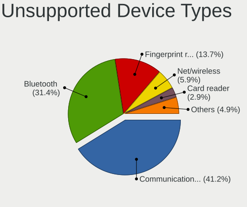

| Type                     | Notebooks | Percent |
|--------------------------|-----------|---------|
| Communication controller | 42        | 41.18%  |
| Bluetooth                | 32        | 31.37%  |
| Fingerprint reader       | 14        | 13.73%  |
| Net/wireless             | 6         | 5.88%   |
| Card reader              | 3         | 2.94%   |
| Network                  | 2         | 1.96%   |
| Firewire controller      | 2         | 1.96%   |
| Sound                    | 1         | 0.98%   |

