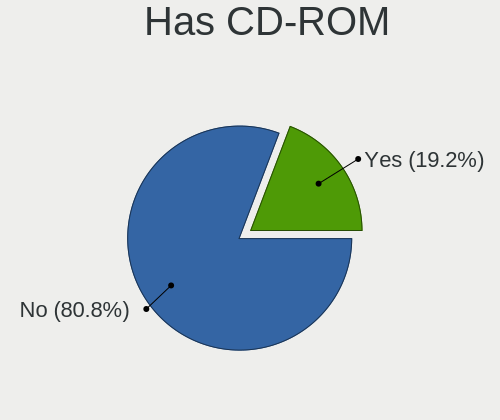
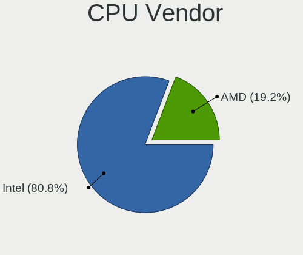

FreeBSD 15.0-CURRENT - Tested Hardware & Statistics (Notebooks)
---------------------------------------------------------------

A project to collect tested hardware configurations for FreeBSD 15.0-CURRENT.

Anyone can contribute to this report by the [hw-probe](https://github.com/linuxhw/hw-probe/blob/master/INSTALL.BSD.md) tool:

    hw-probe -all -upload

Please contribute! Especially if your hardware is rare.

Contents
--------

* [ Test Cases ](#test-cases)

* [ System ](#system)
  - [ Arch                     ](#arch)
  - [ DE                       ](#de)
  - [ Display Server           ](#display-server)
  - [ Display Manager          ](#display-manager)
  - [ OS Lang                  ](#os-lang)
  - [ Boot Mode                ](#boot-mode)
  - [ Filesystem               ](#filesystem)
  - [ Part. scheme             ](#part-scheme)

* [ Board ](#board)
  - [ Vendor                   ](#vendor)
  - [ Model                    ](#model)
  - [ Model Family             ](#model-family)
  - [ MFG Year                 ](#mfg-year)
  - [ Form Factor              ](#form-factor)
  - [ Coreboot                 ](#coreboot)
  - [ RAM Size                 ](#ram-size)
  - [ RAM Used                 ](#ram-used)
  - [ Total Drives             ](#total-drives)
  - [ Has CD-ROM               ](#has-cd-rom)
  - [ Has Ethernet             ](#has-ethernet)
  - [ Has WiFi                 ](#has-wifi)
  - [ Has Bluetooth            ](#has-bluetooth)

* [ Location ](#location)
  - [ Country                  ](#country)
  - [ City                     ](#city)

* [ Drives ](#drives)
  - [ Drive Vendor             ](#drive-vendor)
  - [ Drive Model              ](#drive-model)
  - [ HDD Vendor               ](#hdd-vendor)
  - [ SSD Vendor               ](#ssd-vendor)
  - [ Drive Kind               ](#drive-kind)
  - [ Drive Connector          ](#drive-connector)
  - [ Drive Size               ](#drive-size)
  - [ Space Total              ](#space-total)
  - [ Space Used               ](#space-used)
  - [ Malfunc. Drives          ](#malfunc-drives)
  - [ Malfunc. Drive Vendor    ](#malfunc-drive-vendor)
  - [ Malfunc. HDD Vendor      ](#malfunc-hdd-vendor)
  - [ Malfunc. Drive Kind      ](#malfunc-drive-kind)
  - [ Failed Drives            ](#failed-drives)
  - [ Failed Drive Vendor      ](#failed-drive-vendor)
  - [ Drive Status             ](#drive-status)

* [ Storage controller ](#storage-controller)
  - [ Storage Vendor           ](#storage-vendor)
  - [ Storage Model            ](#storage-model)
  - [ Storage Kind             ](#storage-kind)

* [ Processor ](#processor)
  - [ CPU Vendor               ](#cpu-vendor)
  - [ CPU Model                ](#cpu-model)
  - [ CPU Model Family         ](#cpu-model-family)
  - [ CPU Cores                ](#cpu-cores)
  - [ CPU Sockets              ](#cpu-sockets)
  - [ CPU Threads              ](#cpu-threads)
  - [ CPU Microarch            ](#cpu-microarch)

* [ Graphics ](#graphics)
  - [ GPU Vendor               ](#gpu-vendor)
  - [ GPU Model                ](#gpu-model)
  - [ GPU Combo                ](#gpu-combo)
  - [ GPU Driver               ](#gpu-driver)
  - [ GPU Memory               ](#gpu-memory)

* [ Monitor ](#monitor)
  - [ Monitor Vendor           ](#monitor-vendor)
  - [ Monitor Model            ](#monitor-model)
  - [ Monitor Resolution       ](#monitor-resolution)
  - [ Monitor Diagonal         ](#monitor-diagonal)
  - [ Monitor Width            ](#monitor-width)
  - [ Aspect Ratio             ](#aspect-ratio)
  - [ Monitor Area             ](#monitor-area)
  - [ Pixel Density            ](#pixel-density)
  - [ Multiple Monitors        ](#multiple-monitors)

* [ Network ](#network)
  - [ Net Controller Vendor    ](#net-controller-vendor)
  - [ Net Controller Model     ](#net-controller-model)
  - [ Wireless Vendor          ](#wireless-vendor)
  - [ Wireless Model           ](#wireless-model)
  - [ Ethernet Vendor          ](#ethernet-vendor)
  - [ Ethernet Model           ](#ethernet-model)
  - [ Net Controller Kind      ](#net-controller-kind)
  - [ Used Controller          ](#used-controller)
  - [ NICs                     ](#nics)
  - [ IPv6                     ](#ipv6)

* [ Bluetooth ](#bluetooth)
  - [ Bluetooth Vendor         ](#bluetooth-vendor)
  - [ Bluetooth Model          ](#bluetooth-model)

* [ Sound ](#sound)
  - [ Sound Vendor             ](#sound-vendor)
  - [ Sound Model              ](#sound-model)

* [ Memory ](#memory)
  - [ Memory Vendor            ](#memory-vendor)
  - [ Memory Model             ](#memory-model)
  - [ Memory Kind              ](#memory-kind)
  - [ Memory Form Factor       ](#memory-form-factor)
  - [ Memory Size              ](#memory-size)
  - [ Memory Speed             ](#memory-speed)

* [ Printers & scanners ](#printers--scanners)
  - [ Printer Vendor           ](#printer-vendor)
  - [ Printer Model            ](#printer-model)
  - [ Scanner Vendor           ](#scanner-vendor)
  - [ Scanner Model            ](#scanner-model)

* [ Camera ](#camera)
  - [ Camera Vendor            ](#camera-vendor)
  - [ Camera Model             ](#camera-model)

* [ Security ](#security)
  - [ Fingerprint Vendor       ](#fingerprint-vendor)
  - [ Fingerprint Model        ](#fingerprint-model)
  - [ Chipcard Vendor          ](#chipcard-vendor)
  - [ Chipcard Model           ](#chipcard-model)

* [ Unsupported ](#unsupported)
  - [ Unsupported Devices      ](#unsupported-devices)
  - [ Unsupported Device Types ](#unsupported-device-types)

Test Cases
----------

Total: 43

| Vendor    | Model                       | Probe                                                     | Date         |
|-----------|-----------------------------|-----------------------------------------------------------|--------------|
| Framework | Laptop 16 (AMD Ryzen 704... | [587525ebab](https://bsd-hardware.info/?probe=587525ebab) | Jan 02, 2025 |
| Apple     | MacBookPro8,3               | [af06d6afc4](https://bsd-hardware.info/?probe=af06d6afc4) | Dec 24, 2024 |
| HP        | ZBook 17 G2                 | [c8d95da1f8](https://bsd-hardware.info/?probe=c8d95da1f8) | Nov 26, 2024 |
| Lenovo    | ThinkPad T14 Gen 3 21CF0... | [7aa93cd8ba](https://bsd-hardware.info/?probe=7aa93cd8ba) | Nov 03, 2024 |
| Lenovo    | ThinkPad X1 Carbon 6th 2... | [bbc44a72cc](https://bsd-hardware.info/?probe=bbc44a72cc) | Oct 03, 2024 |
| HP        | ZBook 17 G2                 | [24de39a693](https://bsd-hardware.info/?probe=24de39a693) | Sep 26, 2024 |
| HP        | ZBook 17 G2                 | [fbfc038a2d](https://bsd-hardware.info/?probe=fbfc038a2d) | Sep 18, 2024 |
| Framework | Laptop                      | [c374e02dcb](https://bsd-hardware.info/?probe=c374e02dcb) | Sep 11, 2024 |
| Framework | Laptop 13 (AMD Ryzen 704... | [854819dc14](https://bsd-hardware.info/?probe=854819dc14) | Sep 10, 2024 |
| HP        | ZBook 17 G2                 | [a0946e4145](https://bsd-hardware.info/?probe=a0946e4145) | Sep 07, 2024 |
| Google    | Dragonair                   | [d49059cd45](https://bsd-hardware.info/?probe=d49059cd45) | Sep 06, 2024 |
| Acer      | E5-572G-57VZ                | [f4c2bf9852](https://bsd-hardware.info/?probe=f4c2bf9852) | Jul 27, 2024 |
| Framework | Laptop (12th Gen Intel C... | [cc3b04bc73](https://bsd-hardware.info/?probe=cc3b04bc73) | Jul 23, 2024 |
| TUXEDO    | Pulse 14 Gen3               | [3400ac8782](https://bsd-hardware.info/?probe=3400ac8782) | Jul 13, 2024 |
| Lenovo    | ThinkPad E16 Gen 1 21JNC... | [3ecc86438d](https://bsd-hardware.info/?probe=3ecc86438d) | Jul 08, 2024 |
| Framework | Laptop 16 (AMD Ryzen 704... | [e27538e64c](https://bsd-hardware.info/?probe=e27538e64c) | Jun 28, 2024 |
| Lenovo    | ThinkPad X260 20F5A28AUK    | [e41fe01667](https://bsd-hardware.info/?probe=e41fe01667) | Jun 16, 2024 |
| Google    | Astronaut                   | [7d888b2dd9](https://bsd-hardware.info/?probe=7d888b2dd9) | Jun 05, 2024 |
| HP        | ZBook 17 G2                 | [6c9cc5620b](https://bsd-hardware.info/?probe=6c9cc5620b) | May 22, 2024 |
| Dell      | Precision 7560              | [62956576cd](https://bsd-hardware.info/?probe=62956576cd) | May 06, 2024 |
| HP        | ZBook 17 G2                 | [8558fc6b60](https://bsd-hardware.info/?probe=8558fc6b60) | May 04, 2024 |
| Dell      | Precision 7560              | [2f6e45641d](https://bsd-hardware.info/?probe=2f6e45641d) | May 02, 2024 |
| HUAWEI    | MRGFG-XX                    | [94b19fd1c0](https://bsd-hardware.info/?probe=94b19fd1c0) | Apr 13, 2024 |
| Lenovo    | ThinkBook 16 G6+ IMH 21L... | [7ae1277ce9](https://bsd-hardware.info/?probe=7ae1277ce9) | Apr 12, 2024 |
| Apple     | MacBookAir7,2               | [a596a6f2fc](https://bsd-hardware.info/?probe=a596a6f2fc) | Mar 30, 2024 |
| HP        | ZBook 17 G2                 | [8a5397997e](https://bsd-hardware.info/?probe=8a5397997e) | Mar 18, 2024 |
| Lenovo    | IdeaPad 3 15ITL6 82MD       | [e97bd00aad](https://bsd-hardware.info/?probe=e97bd00aad) | Mar 13, 2024 |
| Lenovo    | ThinkBook 15 G4 IAP 21DJ    | [4d63500465](https://bsd-hardware.info/?probe=4d63500465) | Feb 26, 2024 |
| Apple     | MacBookPro8,2               | [95f19036db](https://bsd-hardware.info/?probe=95f19036db) | Feb 03, 2024 |
| Lenovo    | ThinkBook 14 G6 IRL 21KG    | [a1fc491614](https://bsd-hardware.info/?probe=a1fc491614) | Jan 31, 2024 |
| HP        | ZBook 17 G2                 | [db2c57b081](https://bsd-hardware.info/?probe=db2c57b081) | Jan 24, 2024 |
| Lenovo    | ThinkPad T14s Gen 4 21F6... | [79707e220e](https://bsd-hardware.info/?probe=79707e220e) | Jan 11, 2024 |
| Lenovo    | ThinkPad T14 Gen 3 21CF0... | [0a2c02f944](https://bsd-hardware.info/?probe=0a2c02f944) | Dec 27, 2023 |
| Lenovo    | ThinkPad P17 Gen 2i 20YV... | [10fb96c00d](https://bsd-hardware.info/?probe=10fb96c00d) | Dec 18, 2023 |
| HP        | ZBook 17 G2                 | [406d7a0572](https://bsd-hardware.info/?probe=406d7a0572) | Dec 07, 2023 |
| HP        | ZBook 17 G2                 | [cc4538374c](https://bsd-hardware.info/?probe=cc4538374c) | Dec 05, 2023 |
| HP        | ZBook 17 G2                 | [4e12d36770](https://bsd-hardware.info/?probe=4e12d36770) | Oct 03, 2023 |
| Lenovo    | B40-30 80F1                 | [00c5e6adda](https://bsd-hardware.info/?probe=00c5e6adda) | Oct 03, 2023 |
| HP        | ZBook 17 G2                 | [f29233649e](https://bsd-hardware.info/?probe=f29233649e) | Sep 20, 2023 |
| HP        | ZBook 17 G2                 | [e2d694053a](https://bsd-hardware.info/?probe=e2d694053a) | Sep 10, 2023 |
| HP        | EliteBook 8570p             | [cfecf51114](https://bsd-hardware.info/?probe=cfecf51114) | Sep 04, 2023 |
| HP        | EliteBook 8570p             | [d240fba8b7](https://bsd-hardware.info/?probe=d240fba8b7) | Sep 03, 2023 |
| HP        | EliteBook 8570p             | [0dda7a609c](https://bsd-hardware.info/?probe=0dda7a609c) | Aug 29, 2023 |

System
------

Arch
----

OS architecture (x86_64, i586, etc.)

| Name  | Notebooks | Percent |
|-------|-----------|---------|
| amd64 | 26        | 100%    |

DE
--

Desktop Environment

| Name      | Notebooks | Percent |
|-----------|-----------|---------|
| KDE5      | 5         | 18.52%  |
| XFCE      | 3         | 11.11%  |
| Console   | 3         | 11.11%  |
| wlroots   | 2         | 7.41%   |
| TWM       | 2         | 7.41%   |
| Openbox   | 2         | 7.41%   |
| GNOME     | 2         | 7.41%   |
| Budgie    | 2         | 7.41%   |
| Wayfire   | 1         | 3.7%    |
| KDE       | 1         | 3.7%    |
| i3        | 1         | 3.7%    |
| Fluxbox   | 1         | 3.7%    |
| Compton   | 1         | 3.7%    |
| AwesomeWM | 1         | 3.7%    |

Display Server
--------------

X11 or Wayland

| Name    | Notebooks | Percent |
|---------|-----------|---------|
| X11     | 17        | 65.38%  |
| Console | 6         | 23.08%  |
| Wayland | 3         | 11.54%  |

Display Manager
---------------

SDDM, LightDM, etc.

| Name    | Notebooks | Percent |
|---------|-----------|---------|
| SDDM    | 9         | 33.33%  |
| Console | 7         | 25.93%  |
| LightDM | 4         | 14.81%  |
| XDM     | 2         | 7.41%   |
| SLiM    | 2         | 7.41%   |
| GDM     | 2         | 7.41%   |
| Ly      | 1         | 3.7%    |

OS Lang
-------

Language

| Lang  | Notebooks | Percent |
|-------|-----------|---------|
| C     | 22        | 84.62%  |
| en_US | 3         | 11.54%  |
| ru_RU | 1         | 3.85%   |

Boot Mode
---------

EFI or BIOS

| Mode | Notebooks | Percent |
|------|-----------|---------|
| EFI  | 26        | 100%    |

Filesystem
----------

Type of filesystem

| Type | Notebooks | Percent |
|------|-----------|---------|
| Zfs  | 25        | 96.15%  |
| Ufs  | 1         | 3.85%   |

Part. scheme
------------

Scheme of partitioning

| Type | Notebooks | Percent |
|------|-----------|---------|
| GPT  | 26        | 100%    |

Board
-----

Vendor
------

Motherboard manufacturer

| Name            | Notebooks | Percent |
|-----------------|-----------|---------|
| Lenovo          | 11        | 42.31%  |
| Framework       | 5         | 19.23%  |
| Apple           | 3         | 11.54%  |
| Hewlett-Packard | 2         | 7.69%   |
| TUXEDO          | 1         | 3.85%   |
| HUAWEI          | 1         | 3.85%   |
| Google          | 1         | 3.85%   |
| Dell            | 1         | 3.85%   |
| Acer            | 1         | 3.85%   |

Model
-----

Motherboard model

| Name                                        | Notebooks | Percent |
|---------------------------------------------|-----------|---------|
| Framework Laptop 16 (AMD Ryzen 7040 Series) | 2         | 7.69%   |
| TUXEDO Pulse 14 Gen3                        | 1         | 3.85%   |
| Lenovo ThinkPad X260 20F5A28AUK             | 1         | 3.85%   |
| Lenovo ThinkPad X1 Carbon 6th 20KH006JBM    | 1         | 3.85%   |
| Lenovo ThinkPad T14s Gen 4 21F60029US       | 1         | 3.85%   |
| Lenovo ThinkPad T14 Gen 3 21CF002UMZ        | 1         | 3.85%   |
| Lenovo ThinkPad P17 Gen 2i 20YVS1L900       | 1         | 3.85%   |
| Lenovo ThinkPad E16 Gen 1 21JNCTO1WW        | 1         | 3.85%   |
| Lenovo ThinkBook 16 G6+ IMH 21LE            | 1         | 3.85%   |
| Lenovo ThinkBook 15 G4 IAP 21DJ             | 1         | 3.85%   |
| Lenovo ThinkBook 14 G6 IRL 21KG             | 1         | 3.85%   |
| Lenovo IdeaPad 3 15ITL6 82MD                | 1         | 3.85%   |
| Lenovo B40-30 80F1                          | 1         | 3.85%   |
| HUAWEI MRGFG-XX                             | 1         | 3.85%   |
| HP ZBook 17 G2                              | 1         | 3.85%   |
| HP EliteBook 8570p                          | 1         | 3.85%   |
| Google Astronaut                            | 1         | 3.85%   |
| Framework Laptop 13 (AMD Ryzen 7040Series)  | 1         | 3.85%   |
| Framework Laptop (12th Gen Intel Core)      | 1         | 3.85%   |
| Framework Laptop                            | 1         | 3.85%   |
| Dell Precision 7560                         | 1         | 3.85%   |
| Apple MacBookPro8,3                         | 1         | 3.85%   |
| Apple MacBookPro8,2                         | 1         | 3.85%   |
| Apple MacBookAir7,2                         | 1         | 3.85%   |
| Acer E5-572G-57VZ                           | 1         | 3.85%   |

Model Family
------------

Motherboard model prefix

| Name              | Notebooks | Percent |
|-------------------|-----------|---------|
| Lenovo ThinkPad   | 6         | 23.08%  |
| Framework Laptop  | 5         | 19.23%  |
| Lenovo ThinkBook  | 3         | 11.54%  |
| Apple MacBookPro8 | 2         | 7.69%   |
| TUXEDO Pulse      | 1         | 3.85%   |
| Lenovo IdeaPad    | 1         | 3.85%   |
| Lenovo B40-30     | 1         | 3.85%   |
| HUAWEI MRGFG-XX   | 1         | 3.85%   |
| HP ZBook          | 1         | 3.85%   |
| HP EliteBook      | 1         | 3.85%   |
| Google Astronaut  | 1         | 3.85%   |
| Dell Precision    | 1         | 3.85%   |
| Apple MacBookAir7 | 1         | 3.85%   |
| Acer E5-572G-57VZ | 1         | 3.85%   |

MFG Year
--------

Motherboard manufacture year

| Year | Notebooks | Percent |
|------|-----------|---------|
| 2023 | 9         | 34.62%  |
| 2024 | 4         | 15.38%  |
| 2022 | 2         | 7.69%   |
| 2021 | 2         | 7.69%   |
| 2019 | 2         | 7.69%   |
| 2016 | 2         | 7.69%   |
| 2020 | 1         | 3.85%   |
| 2018 | 1         | 3.85%   |
| 2014 | 1         | 3.85%   |
| 2013 | 1         | 3.85%   |
| 2012 | 1         | 3.85%   |

Form Factor
-----------

Physical design of the computer

| Name     | Notebooks | Percent |
|----------|-----------|---------|
| Notebook | 26        | 100%    |

Coreboot
--------

Have coreboot on board

| Used | Notebooks | Percent |
|------|-----------|---------|
| No   | 25        | 96.15%  |
| Yes  | 1         | 3.85%   |

RAM Size
--------

Total RAM memory

| Size in GB  | Notebooks | Percent |
|-------------|-----------|---------|
| 16.01-24.0  | 9         | 33.33%  |
| 32.01-64.0  | 6         | 22.22%  |
| 64.01-256.0 | 5         | 18.52%  |
| 8.01-16.0   | 5         | 18.52%  |
| 4.01-8.0    | 2         | 7.41%   |

RAM Used
--------

Used RAM memory

| Used GB  | Notebooks | Percent |
|----------|-----------|---------|
| 0.51-1.0 | 9         | 33.33%  |
| 1.01-2.0 | 6         | 22.22%  |
| 0.01-0.5 | 6         | 22.22%  |
| 4.01-8.0 | 5         | 18.52%  |
| 2.01-3.0 | 1         | 3.7%    |

Total Drives
------------

Number of drives on board

| Drives | Notebooks | Percent |
|--------|-----------|---------|
| 0      | 17        | 60.71%  |
| 1      | 8         | 28.57%  |
| 2      | 2         | 7.14%   |
| 3      | 1         | 3.57%   |

Has CD-ROM
----------

Has CD-ROM on board

| Presented | Notebooks | Percent |
|-----------|-----------|---------|
| No        | 21        | 80.77%  |
| Yes       | 5         | 19.23%  |

Has Ethernet
------------

Has Ethernet on board

| Presented | Notebooks | Percent |
|-----------|-----------|---------|
| Yes       | 17        | 65.38%  |
| No        | 9         | 34.62%  |

Has WiFi
--------

Has WiFi module

| Presented | Notebooks | Percent |
|-----------|-----------|---------|
| Yes       | 26        | 100%    |

Has Bluetooth
-------------

Has Bluetooth module

| Presented | Notebooks | Percent |
|-----------|-----------|---------|
| Yes       | 24        | 92.31%  |
| No        | 2         | 7.69%   |

Location
--------

Country
-------

Geographic location (country)

| Country     | Notebooks | Percent |
|-------------|-----------|---------|
| USA         | 5         | 19.23%  |
| UK          | 4         | 15.38%  |
| Russia      | 3         | 11.54%  |
| Germany     | 3         | 11.54%  |
| Switzerland | 2         | 7.69%   |
| Brazil      | 2         | 7.69%   |
| Taiwan      | 1         | 3.85%   |
| Sweden      | 1         | 3.85%   |
| Hungary     | 1         | 3.85%   |
| France      | 1         | 3.85%   |
| China       | 1         | 3.85%   |
| Canada      | 1         | 3.85%   |
| Bangladesh  | 1         | 3.85%   |

City
----

Geographic location (city)

| City                   | Notebooks | Percent |
|------------------------|-----------|---------|
| Stockport              | 2         | 6.25%   |
| Richmond               | 2         | 6.25%   |
| Hove                   | 2         | 6.25%   |
| Brighton               | 2         | 6.25%   |
| Zurich                 | 1         | 3.13%   |
| Stuttgart              | 1         | 3.13%   |
| Stockholm              | 1         | 3.13%   |
| Smolensk               | 1         | 3.13%   |
| Siblingen              | 1         | 3.13%   |
| Rio de Janeiro         | 1         | 3.13%   |
| Pevensey               | 1         | 3.13%   |
| New Taipei             | 1         | 3.13%   |
| Moscow                 | 1         | 3.13%   |
| Mississauga            | 1         | 3.13%   |
| Macaiba                | 1         | 3.13%   |
| Letchworth Garden City | 1         | 3.13%   |
| Kirov                  | 1         | 3.13%   |
| Karlsruhe              | 1         | 3.13%   |
| Haywards Heath         | 1         | 3.13%   |
| Hangzhou               | 1         | 3.13%   |
| Durant                 | 1         | 3.13%   |
| Dhaka                  | 1         | 3.13%   |
| Courbevoie             | 1         | 3.13%   |
| Cologne                | 1         | 3.13%   |
| Budapest               | 1         | 3.13%   |
| Bognor Regis           | 1         | 3.13%   |
| Boca Raton             | 1         | 3.13%   |
| Albuquerque            | 1         | 3.13%   |

Drives
------

Drive Vendor
------------

Hard drive vendors

| Vendor              | Notebooks | Drives | Percent |
|---------------------|-----------|--------|---------|
| Seagate             | 2         | 4      | 16.67%  |
| Kingston            | 2         | 4      | 16.67%  |
| HGST                | 2         | 14     | 16.67%  |
| WDC                 | 1         | 1      | 8.33%   |
| Samsung Electronics | 1         | 1      | 8.33%   |
| Lenovo              | 1         | 1      | 8.33%   |
| Intel               | 1         | 1      | 8.33%   |
| Hitachi             | 1         | 1      | 8.33%   |
| Apple               | 1         | 1      | 8.33%   |

Drive Model
-----------

Hard drive models

| Model                              | Notebooks | Percent |
|------------------------------------|-----------|---------|
| Seagate ST1000LM024 HN-M101MBB 1TB | 2         | 16.67%  |
| HGST HTS721010A9E630 1TB           | 2         | 16.67%  |
| WDC WD7500BPKX-60HPJT0 752GB       | 1         | 8.33%   |
| Samsung SSD 850 EVO 500GB          | 1         | 8.33%   |
| Lenovo SSD SL700 120G              | 1         | 8.33%   |
| Kingston SV300S37A120G 120GB       | 1         | 8.33%   |
| Kingston SA400S37-120GB            | 1         | 8.33%   |
| Intel SSDSC2BF240A5L 240GB         | 1         | 8.33%   |
| Hitachi HTS727575A9E362 752GB      | 1         | 8.33%   |
| Apple SSD SM0128G 121GB            | 1         | 8.33%   |

HDD Vendor
----------

Hard disk drive vendors

| Vendor  | Notebooks | Drives | Percent |
|---------|-----------|--------|---------|
| Seagate | 2         | 4      | 33.33%  |
| HGST    | 2         | 14     | 33.33%  |
| WDC     | 1         | 1      | 16.67%  |
| Hitachi | 1         | 1      | 16.67%  |

SSD Vendor
----------

Solid state drive vendors

| Vendor              | Notebooks | Drives | Percent |
|---------------------|-----------|--------|---------|
| Kingston            | 2         | 4      | 33.33%  |
| Samsung Electronics | 1         | 1      | 16.67%  |
| Lenovo              | 1         | 1      | 16.67%  |
| Intel               | 1         | 1      | 16.67%  |
| Apple               | 1         | 1      | 16.67%  |

Drive Kind
----------

HDD or SSD

| Kind | Notebooks | Drives | Percent |
|------|-----------|--------|---------|
| SSD  | 6         | 8      | 60%     |
| HDD  | 4         | 20     | 40%     |

Drive Connector
---------------

SATA, SAS, NVMe, etc.

| Type | Notebooks | Drives | Percent |
|------|-----------|--------|---------|
| SATA | 9         | 28     | 100%    |

Drive Size
----------

Size of hard drive

| Size in TB | Notebooks | Drives | Percent |
|------------|-----------|--------|---------|
| 0.01-0.5   | 6         | 8      | 60%     |
| 0.51-1.0   | 4         | 20     | 40%     |

Space Total
-----------

Amount of disk space available on the file system

| Size in GB     | Notebooks | Percent |
|----------------|-----------|---------|
| 101-250        | 8         | 27.59%  |
| 251-500        | 6         | 20.69%  |
| 501-1000       | 6         | 20.69%  |
| 51-100         | 5         | 17.24%  |
| 1001-2000      | 2         | 6.9%    |
| More than 3000 | 1         | 3.45%   |
| 21-50          | 1         | 3.45%   |

Space Used
----------

Amount of used disk space

| Used GB | Notebooks | Percent |
|---------|-----------|---------|
| 1-20    | 19        | 65.52%  |
| 21-50   | 5         | 17.24%  |
| 101-250 | 3         | 10.34%  |
| 51-100  | 2         | 6.9%    |

Malfunc. Drives
---------------

Drive models with a malfunction

| Model                         | Notebooks | Drives | Percent |
|-------------------------------|-----------|--------|---------|
| HGST HTS721010A9E630 1TB      | 2         | 6      | 40%     |
| WDC WD7500BPKX-60HPJT0 752GB  | 1         | 1      | 20%     |
| Kingston SV300S37A120G 120GB  | 1         | 2      | 20%     |
| Hitachi HTS727575A9E362 752GB | 1         | 1      | 20%     |

Malfunc. Drive Vendor
---------------------

Vendors of faulty drives

| Vendor   | Notebooks | Drives | Percent |
|----------|-----------|--------|---------|
| HGST     | 2         | 6      | 40%     |
| WDC      | 1         | 1      | 20%     |
| Kingston | 1         | 2      | 20%     |
| Hitachi  | 1         | 1      | 20%     |

Malfunc. HDD Vendor
-------------------

Vendors of faulty HDD drives

| Vendor  | Notebooks | Drives | Percent |
|---------|-----------|--------|---------|
| HGST    | 2         | 6      | 50%     |
| WDC     | 1         | 1      | 25%     |
| Hitachi | 1         | 1      | 25%     |

Malfunc. Drive Kind
-------------------

Kinds of faulty drives

| Kind | Notebooks | Drives | Percent |
|------|-----------|--------|---------|
| HDD  | 4         | 8      | 80%     |
| SSD  | 1         | 2      | 20%     |

Failed Drives
-------------

Failed drive models

Zero info for selected period =(

Failed Drive Vendor
-------------------

Failed drive vendors

Zero info for selected period =(

Drive Status
------------

Number of failed and malfunc. drives

| Status  | Notebooks | Drives | Percent |
|---------|-----------|--------|---------|
| Works   | 7         | 18     | 63.64%  |
| Malfunc | 4         | 10     | 36.36%  |

Storage controller
------------------

Storage Vendor
--------------

Storage controller vendors

| Vendor                                  | Notebooks | Percent |
|-----------------------------------------|-----------|---------|
| Intel                                   | 9         | 32.14%  |
| Sandisk                                 | 8         | 28.57%  |
| Samsung Electronics                     | 5         | 17.86%  |
| Shenzhen Unionmemory Information System | 2         | 7.14%   |
| SK hynix                                | 1         | 3.57%   |
| Phison Electronics                      | 1         | 3.57%   |
| Micron Technology                       | 1         | 3.57%   |
| ADATA Technology                        | 1         | 3.57%   |

Storage Model
-------------

Storage controller models

| Model                                                                                         | Notebooks | Percent |
|-----------------------------------------------------------------------------------------------|-----------|---------|
| Sandisk WD Black SN850X NVMe SSD                                                              | 3         | 9.09%   |
| Sandisk WD PC SN740 NVMe SSD 512GB (DRAM-less)                                                | 2         | 6.06%   |
| Sandisk WD Black SN770 / PC SN740 256GB / PC SN560 (DRAM-less) NVMe SSD                       | 2         | 6.06%   |
| Samsung NVMe SSD Controller PM9A1/PM9A3/980PRO                                                | 2         | 6.06%   |
| Intel Volume Management Device NVMe RAID Controller                                           | 2         | 6.06%   |
| Intel 8 Series/C220 Series Chipset Family 6-port SATA Controller 1 [AHCI mode]                | 2         | 6.06%   |
| Intel 6 Series/C200 Series Chipset Family 6 port Mobile SATA AHCI Controller                  | 2         | 6.06%   |
| SK hynix Gold P31/BC711/PC711 NVMe Solid State Drive                                          | 1         | 3.03%   |
| Shenzhen Unionmemory Information System RPEYJ1T24MKN2QWY PCIe 4.0 NVMe SSD 1024GB (DRAM-less) | 1         | 3.03%   |
| Sandisk WD Black SN770M NVMe SSD (DRAM-less)                                                  | 1         | 3.03%   |
| SanDisk Extreme Pro / WD Black 2018/SN750/PC SN720 NVMe SSD                                   | 1         | 3.03%   |
| Samsung S4LN058A01[SSUBX] AHCI SSD Controller (Apple slot)                                    | 1         | 3.03%   |
| Samsung NVMe SSD Controller SM981/PM981/PM983                                                 | 1         | 3.03%   |
| Samsung NVMe SSD Controller 980 (DRAM-less)                                                   | 1         | 3.03%   |
| Phison PS5021-E21 PCIe4 NVMe Controller (DRAM-less)                                           | 1         | 3.03%   |
| Micron 3400 NVMe SSD [Hendrix]                                                                | 1         | 3.03%   |
| Intel Tiger Lake-LP SATA Controller                                                           | 1         | 3.03%   |
| Intel Sunrise Point-LP SATA Controller [AHCI mode]                                            | 1         | 3.03%   |
| Intel SSD 660P Series                                                                         | 1         | 3.03%   |
| Intel Atom Processor E3800 Series SATA AHCI Controller                                        | 1         | 3.03%   |
| Intel 8 Series/C220 Series Chipset Family 2-port SATA Controller 2 [IDE mode]                 | 1         | 3.03%   |
| Intel 8 Series Chipset Family 4-port SATA Controller 1 [IDE mode] - Mobile                    | 1         | 3.03%   |
| Intel 7 Series Chipset Family 6-port SATA Controller [AHCI mode]                              | 1         | 3.03%   |
| ADATA IM2P33F4 NVMe SSD (DRAM-less)                                                           | 1         | 3.03%   |
| Unknown                                                                                       | 1         | 3.03%   |

Storage Kind
------------

Kind of storage controller (IDE, SATA, NVMe, SAS, ...)

| Kind | Notebooks | Percent |
|------|-----------|---------|
| NVMe | 17        | 58.62%  |
| SATA | 9         | 31.03%  |
| RAID | 2         | 6.9%    |
| IDE  | 1         | 3.45%   |

Processor
---------

CPU Vendor
----------

Processor vendors

| Vendor | Notebooks | Percent |
|--------|-----------|---------|
| Intel  | 21        | 80.77%  |
| AMD    | 5         | 19.23%  |

CPU Model
---------

Processor models

| Model                                      | Notebooks | Percent |
|--------------------------------------------|-----------|---------|
| AMD Ryzen 9 7940HS w/ Radeon 780M Graphics | 2         | 7.69%   |
| Intel Core Ultra 7 155H                    | 1         | 3.85%   |
| Intel Core i7-8550U CPU @ 1.80GHz          | 1         | 3.85%   |
| Intel Core i7-4710MQ CPU @ 2.50GHz         | 1         | 3.85%   |
| Intel Core i7-3520M CPU @ 2.90GHz          | 1         | 3.85%   |
| Intel Core i7-2760QM CPU @ 2.40GHz         | 1         | 3.85%   |
| Intel Core i7-2635QM CPU @ 2.00GHz         | 1         | 3.85%   |
| Intel Core i5-6300U CPU @ 2.40GHz          | 1         | 3.85%   |
| Intel Core i5-5350U CPU @ 1.80GHz          | 1         | 3.85%   |
| Intel Core i5-4210M CPU @ 2.60GHz          | 1         | 3.85%   |
| Intel Celeron CPU N3350 @ 1.10GHz          | 1         | 3.85%   |
| Intel Celeron CPU N2840 @ 2.16GHz          | 1         | 3.85%   |
| Intel 13th Gen Core i7-13700H              | 1         | 3.85%   |
| Intel 13th Gen Core i7-1360P               | 1         | 3.85%   |
| Intel 13th Gen Core i7-1355U               | 1         | 3.85%   |
| Intel 13th Gen Core i3-1315U               | 1         | 3.85%   |
| Intel 12th Gen Core i7-1280P               | 1         | 3.85%   |
| Intel 12th Gen Core i7-1260P               | 1         | 3.85%   |
| Intel 11th Gen Core i9-11950H @ 2.60GHz    | 1         | 3.85%   |
| Intel 11th Gen Core i7-11850H @ 2.50GHz    | 1         | 3.85%   |
| Intel 11th Gen Core i7-1165G7 @ 2.80GHz    | 1         | 3.85%   |
| Intel 11th Gen Core i5-1135G7 @ 2.40GHz    | 1         | 3.85%   |
| AMD Ryzen 7 PRO 6850U with Radeon Graphics | 1         | 3.85%   |
| AMD Ryzen 7 7840U w/ Radeon 780M Graphics  | 1         | 3.85%   |
| AMD Ryzen 7 7840HS w/ Radeon 780M Graphics | 1         | 3.85%   |

CPU Model Family
----------------

Processor model prefix

| Model           | Notebooks | Percent |
|-----------------|-----------|---------|
| Other           | 10        | 38.46%  |
| Intel Core i7   | 5         | 19.23%  |
| Intel Core i5   | 3         | 11.54%  |
| Intel Celeron   | 2         | 7.69%   |
| AMD Ryzen 9     | 2         | 7.69%   |
| AMD Ryzen 7     | 2         | 7.69%   |
| Intel Core      | 1         | 3.85%   |
| AMD Ryzen 7 PRO | 1         | 3.85%   |

CPU Cores
---------

Number of processor cores

| Number | Notebooks | Percent |
|--------|-----------|---------|
| 8      | 7         | 25.93%  |
| 4      | 7         | 25.93%  |
| 2      | 6         | 22.22%  |
| 16     | 3         | 11.11%  |
| 10     | 2         | 7.41%   |
| 22     | 1         | 3.7%    |
| 12     | 1         | 3.7%    |

CPU Sockets
-----------

Number of sockets

| Number | Notebooks | Percent |
|--------|-----------|---------|
| 1      | 26        | 100%    |

CPU Threads
-----------

Threads per core (Hyper-Threading)

| Number | Notebooks | Percent |
|--------|-----------|---------|
| 2      | 20        | 74.07%  |
| 1      | 7         | 25.93%  |

CPU Microarch
-------------

Microarchitecture

| Name        | Notebooks | Percent |
|-------------|-----------|---------|
| Unknown     | 14        | 53.85%  |
| TigerLake   | 2         | 7.69%   |
| SandyBridge | 2         | 7.69%   |
| Haswell     | 2         | 7.69%   |
| Skylake     | 1         | 3.85%   |
| Silvermont  | 1         | 3.85%   |
| KabyLake    | 1         | 3.85%   |
| IvyBridge   | 1         | 3.85%   |
| Goldmont    | 1         | 3.85%   |
| Broadwell   | 1         | 3.85%   |

Graphics
--------

GPU Vendor
----------

Vendors of graphics cards

| Vendor | Notebooks | Percent |
|--------|-----------|---------|
| Intel  | 19        | 63.33%  |
| AMD    | 8         | 26.67%  |
| Nvidia | 3         | 10%     |

GPU Model
---------

Graphics card models

| Model                                                                     | Notebooks | Percent |
|---------------------------------------------------------------------------|-----------|---------|
| AMD Phoenix1                                                              | 4         | 13.33%  |
| Intel Raptor Lake-P [Iris Xe Graphics]                                    | 3         | 10%     |
| Intel TigerLake-LP GT2 [Iris Xe Graphics]                                 | 2         | 6.67%   |
| Intel TigerLake-H GT1 [UHD Graphics]                                      | 2         | 6.67%   |
| Intel Alder Lake-P GT2 [Iris Xe Graphics]                                 | 2         | 6.67%   |
| Intel 2nd Generation Core Processor Family Integrated Graphics Controller | 2         | 6.67%   |
| Nvidia TU117GLM [T1200 Laptop GPU]                                        | 1         | 3.33%   |
| Nvidia GM108M [GeForce 940M]                                              | 1         | 3.33%   |
| Nvidia GK107GLM [Quadro K1100M]                                           | 1         | 3.33%   |
| Intel UHD Graphics 620                                                    | 1         | 3.33%   |
| Intel Skylake GT2 [HD Graphics 520]                                       | 1         | 3.33%   |
| Intel Raptor Lake-P [UHD Graphics]                                        | 1         | 3.33%   |
| Intel Meteor Lake-P [Intel Arc Graphics]                                  | 1         | 3.33%   |
| Intel HD Graphics 6000                                                    | 1         | 3.33%   |
| Intel HD Graphics 500                                                     | 1         | 3.33%   |
| Intel Atom Processor Z36xxx/Z37xxx Series Graphics & Display              | 1         | 3.33%   |
| Intel 4th Gen Core Processor Integrated Graphics Controller               | 1         | 3.33%   |
| AMD Whistler [Radeon HD 6730M/6770M/7690M XT]                             | 1         | 3.33%   |
| AMD Thames [Radeon HD 7550M/7570M/7650M]                                  | 1         | 3.33%   |
| AMD Seymour [Radeon HD 6400M/7400M Series]                                | 1         | 3.33%   |
| AMD Rembrandt [Radeon 680M]                                               | 1         | 3.33%   |

GPU Combo
---------

Combinations of graphics cards

| Name           | Notebooks | Percent |
|----------------|-----------|---------|
| 1 x Intel      | 15        | 57.69%  |
| 1 x AMD        | 6         | 23.08%  |
| Intel + Nvidia | 2         | 7.69%   |
| Intel + AMD    | 2         | 7.69%   |
| 1 x Nvidia     | 1         | 3.85%   |

GPU Driver
----------

Free vs proprietary

| Driver      | Notebooks | Percent |
|-------------|-----------|---------|
| Free        | 23        | 88.46%  |
| Proprietary | 3         | 11.54%  |

GPU Memory
----------

Total video memory

| Size in GB | Notebooks | Percent |
|------------|-----------|---------|
| Unknown    | 21        | 77.78%  |
| 1.01-2.0   | 4         | 14.81%  |
| 0.51-1.0   | 2         | 7.41%   |

Monitor
-------

Monitor Vendor
--------------

Monitor vendors

| Vendor         | Notebooks | Percent |
|----------------|-----------|---------|
| BOE            | 5         | 23.81%  |
| Philips        | 2         | 9.52%   |
| LG Display     | 2         | 9.52%   |
| AU Optronics   | 2         | 9.52%   |
| SDC            | 1         | 4.76%   |
| HUAWEI         | 1         | 4.76%   |
| HPN            | 1         | 4.76%   |
| Goldstar       | 1         | 4.76%   |
| Dell           | 1         | 4.76%   |
| CTO            | 1         | 4.76%   |
| CSO            | 1         | 4.76%   |
| Chimei Innolux | 1         | 4.76%   |
| BenQ           | 1         | 4.76%   |
| Apple          | 1         | 4.76%   |

Monitor Model
-------------

Monitor models

| Model                                                            | Notebooks | Percent |
|------------------------------------------------------------------|-----------|---------|
| BOE LCD Monitor BOE095F 2256x1504 280x190mm 13.3-inch            | 2         | 7.69%   |
| SDC LCD Monitor 5440x1080                                        | 1         | 3.85%   |
| SDC LCD Monitor 3520x1080                                        | 1         | 3.85%   |
| SDC LCD Monitor 1600x900                                         | 1         | 3.85%   |
| SDC LCD Monitor                                                  | 1         | 3.85%   |
| Philips LCD Monitor 271P4 5440x1080                              | 1         | 3.85%   |
| Philips LCD Monitor 271P4 3520x1080                              | 1         | 3.85%   |
| Philips LCD Monitor 271P4                                        | 1         | 3.85%   |
| Philips 271P4 PHL08C3 1920x1080 600x340mm 27.2-inch              | 1         | 3.85%   |
| LG Display LCD Monitor LGD06ED 1920x1200 300x190mm 14.0-inch     | 1         | 3.85%   |
| LG Display LCD Monitor LGD0258 1600x900 350x190mm 15.7-inch      | 1         | 3.85%   |
| HUAWEI AD80HW HWV2402 1920x1080 530x300mm 24.0-inch              | 1         | 3.85%   |
| HPN LCD Monitor HP P24h G4                                       | 1         | 3.85%   |
| Goldstar 24GM77 GSM5A91 1920x1080 530x300mm 24.0-inch            | 1         | 3.85%   |
| Dell P2414H DELA09B 1920x1080 530x300mm 24.0-inch                | 1         | 3.85%   |
| CTO LCD Monitor CTO1115 3840x2160 340x190mm 15.3-inch            | 1         | 3.85%   |
| CSO LCD Monitor CSO1423 1920x1200 300x190mm 14.0-inch            | 1         | 3.85%   |
| Chimei Innolux LCD Monitor CMN1520 1920x1080 340x190mm 15.3-inch | 1         | 3.85%   |
| BOE NE135A1M-NY1 BOE0CB4 2880x1920 290x190mm 13.6-inch           | 1         | 3.85%   |
| BOE LCD Monitor BOE0BC9 2560x1600 340x220mm 15.9-inch            | 1         | 3.85%   |
| BOE LCD Monitor BOE06DF 1920x1080 310x170mm 13.9-inch            | 1         | 3.85%   |
| BenQ GW2780 BNQ78E6 1920x1080 600x340mm 27.2-inch                | 1         | 3.85%   |
| AU Optronics LCD Monitor AUO369F 1920x1080 340x190mm 15.3-inch   | 1         | 3.85%   |
| AU Optronics LCD Monitor AUO31ED 1920x1080 340x190mm 15.3-inch   | 1         | 3.85%   |
| Apple Color LCD APPA01B 1440x900 290x180mm 13.4-inch             | 1         | 3.85%   |

Monitor Resolution
------------------

Monitor screen resolution

| Resolution        | Notebooks | Percent |
|-------------------|-----------|---------|
| 1920x1080 (FHD)   | 8         | 38.1%   |
| 2256x1504         | 2         | 9.52%   |
| 1920x1200 (WUXGA) | 2         | 9.52%   |
| 1600x900 (HD+)    | 2         | 9.52%   |
| 5440x1080         | 1         | 4.76%   |
| 3840x2160 (4K)    | 1         | 4.76%   |
| 3520x1080         | 1         | 4.76%   |
| 2880x1920         | 1         | 4.76%   |
| 2560x1600         | 1         | 4.76%   |
| 1440x900 (WXGA+)  | 1         | 4.76%   |
| Unknown           | 1         | 4.76%   |

Monitor Diagonal
----------------

Diagonal size in inches

| Inches  | Notebooks | Percent |
|---------|-----------|---------|
| 15      | 6         | 33.33%  |
| 13      | 5         | 27.78%  |
| 27      | 2         | 11.11%  |
| 24      | 2         | 11.11%  |
| 14      | 2         | 11.11%  |
| Unknown | 1         | 5.56%   |

Monitor Width
-------------

Physical width

| Width in mm | Notebooks | Percent |
|-------------|-----------|---------|
| 301-350     | 7         | 38.89%  |
| 201-300     | 6         | 33.33%  |
| 501-600     | 4         | 22.22%  |
| Unknown     | 1         | 5.56%   |

Aspect Ratio
------------

Proportional relationship between the width and the height

| Ratio   | Notebooks | Percent |
|---------|-----------|---------|
| 16/9    | 9         | 52.94%  |
| 3/2     | 4         | 23.53%  |
| 16/10   | 3         | 17.65%  |
| Unknown | 1         | 5.88%   |

Monitor Area
------------

Area in inch²

| Area in inch² | Notebooks | Percent |
|----------------|-----------|---------|
| 81-90          | 7         | 38.89%  |
| 91-100         | 4         | 22.22%  |
| 301-350        | 2         | 11.11%  |
| 201-250        | 2         | 11.11%  |
| 111-120        | 1         | 5.56%   |
| 101-110        | 1         | 5.56%   |
| Unknown        | 1         | 5.56%   |

Pixel Density
-------------

Pixels per inch

| Density       | Notebooks | Percent |
|---------------|-----------|---------|
| 161-240       | 5         | 27.78%  |
| 121-160       | 5         | 27.78%  |
| 51-100        | 4         | 22.22%  |
| More than 240 | 2         | 11.11%  |
| 101-120       | 1         | 5.56%   |
| Unknown       | 1         | 5.56%   |

Multiple Monitors
-----------------

Total monitors connected

| Total | Notebooks | Percent |
|-------|-----------|---------|
| 0     | 13        | 46.43%  |
| 1     | 10        | 35.71%  |
| 2     | 3         | 10.71%  |
| 3     | 2         | 7.14%   |

Network
-------

Net Controller Vendor
---------------------

Controller vendors

| Vendor                | Notebooks | Percent |
|-----------------------|-----------|---------|
| Intel                 | 17        | 45.95%  |
| Realtek Semiconductor | 7         | 18.92%  |
| MediaTek              | 3         | 8.11%   |
| Broadcom              | 3         | 8.11%   |
| Qualcomm Atheros      | 2         | 5.41%   |
| Samsung Electronics   | 1         | 2.7%    |
| Qualcomm Technologies | 1         | 2.7%    |
| Hewlett-Packard       | 1         | 2.7%    |
| Edimax Technology     | 1         | 2.7%    |
| D-Link System         | 1         | 2.7%    |

Net Controller Model
--------------------

Controller models

| Model                                                                      | Notebooks | Percent |
|----------------------------------------------------------------------------|-----------|---------|
| Intel Wi-Fi 6E(802.11ax) AX210/AX1675* 2x2 [Typhoon Peak]                  | 5         | 10.42%  |
| Intel Raptor Lake PCH CNVi WiFi                                            | 4         | 8.33%   |
| Realtek RTL8111/8168/8211/8411 PCI Express Gigabit Ethernet Controller     | 3         | 6.25%   |
| MediaTek MT7922 802.11ax PCI Express Wireless Network Adapter              | 3         | 6.25%   |
| Qualcomm Atheros QCA9565 / AR9565 Wireless Network Adapter                 | 2         | 4.17%   |
| Intel Ethernet Connection (23) I219-V                                      | 2         | 4.17%   |
| Broadcom NetXtreme BCM57765 Gigabit Ethernet PCIe                          | 2         | 4.17%   |
| Broadcom BCM4331 802.11a/b/g/n                                             | 2         | 4.17%   |
| Samsung Galaxy series, misc. (tethering mode)                              | 1         | 2.08%   |
| Realtek USB 2.5GbE Controller                                              | 1         | 2.08%   |
| Realtek RTL88x2bu [AC1200 Techkey]                                         | 1         | 2.08%   |
| Realtek RTL8852BE PCIe 802.11ax Wireless Network Controller                | 1         | 2.08%   |
| Realtek RTL8188EUS 802.11n Wireless Network Adapter                        | 1         | 2.08%   |
| Qualcomm QCNFA765 Wireless Network Adapter                                 | 1         | 2.08%   |
| Intel Wireless 8265 / 8275                                                 | 1         | 2.08%   |
| Intel Wireless 8260                                                        | 1         | 2.08%   |
| Intel Wireless 7265                                                        | 1         | 2.08%   |
| Intel Wireless 7260                                                        | 1         | 2.08%   |
| Intel Wi-Fi 6 AX201                                                        | 1         | 2.08%   |
| Intel Meteor Lake PCH CNVi WiFi                                            | 1         | 2.08%   |
| Intel Ethernet Controller I225-LM                                          | 1         | 2.08%   |
| Intel Ethernet Controller I219-V                                           | 1         | 2.08%   |
| Intel Ethernet Connection I219-LM                                          | 1         | 2.08%   |
| Intel Ethernet Connection I217-LM                                          | 1         | 2.08%   |
| Intel Ethernet Connection (4) I219-V                                       | 1         | 2.08%   |
| Intel Ethernet Connection (16) I219-V                                      | 1         | 2.08%   |
| Intel Ethernet Connection (14) I219-LM                                     | 1         | 2.08%   |
| Intel Centrino Advanced-N 6205 [Taylor Peak]                               | 1         | 2.08%   |
| Intel 82579LM Gigabit Network Connection (Lewisville)                      | 1         | 2.08%   |
| HP hs2350 HSPA+ Mobile Broadband Module Network Adapter                    | 1         | 2.08%   |
| Edimax AC600 Wireless LAN USB Adapter                                      | 1         | 2.08%   |
| D-Link System AirPlus G DWL-G122 Wireless Adapter(rev.C1) [Ralink RT2571W] | 1         | 2.08%   |
| Broadcom BCM4360 802.11ac Dual Band Wireless Network Adapter               | 1         | 2.08%   |

Wireless Vendor
---------------

Wireless vendors

| Vendor                | Notebooks | Percent |
|-----------------------|-----------|---------|
| Intel                 | 16        | 53.33%  |
| Realtek Semiconductor | 3         | 10%     |
| MediaTek              | 3         | 10%     |
| Broadcom              | 3         | 10%     |
| Qualcomm Atheros      | 2         | 6.67%   |
| Qualcomm Technologies | 1         | 3.33%   |
| Edimax Technology     | 1         | 3.33%   |
| D-Link System         | 1         | 3.33%   |

Wireless Model
--------------

Wireless models

| Model                                                                      | Notebooks | Percent |
|----------------------------------------------------------------------------|-----------|---------|
| Intel Wi-Fi 6E(802.11ax) AX210/AX1675* 2x2 [Typhoon Peak]                  | 5         | 16.67%  |
| Intel Raptor Lake PCH CNVi WiFi                                            | 4         | 13.33%  |
| MediaTek MT7922 802.11ax PCI Express Wireless Network Adapter              | 3         | 10%     |
| Qualcomm Atheros QCA9565 / AR9565 Wireless Network Adapter                 | 2         | 6.67%   |
| Broadcom BCM4331 802.11a/b/g/n                                             | 2         | 6.67%   |
| Realtek RTL88x2bu [AC1200 Techkey]                                         | 1         | 3.33%   |
| Realtek RTL8852BE PCIe 802.11ax Wireless Network Controller                | 1         | 3.33%   |
| Realtek RTL8188EUS 802.11n Wireless Network Adapter                        | 1         | 3.33%   |
| Qualcomm QCNFA765 Wireless Network Adapter                                 | 1         | 3.33%   |
| Intel Wireless 8265 / 8275                                                 | 1         | 3.33%   |
| Intel Wireless 8260                                                        | 1         | 3.33%   |
| Intel Wireless 7265                                                        | 1         | 3.33%   |
| Intel Wireless 7260                                                        | 1         | 3.33%   |
| Intel Wi-Fi 6 AX201                                                        | 1         | 3.33%   |
| Intel Meteor Lake PCH CNVi WiFi                                            | 1         | 3.33%   |
| Intel Centrino Advanced-N 6205 [Taylor Peak]                               | 1         | 3.33%   |
| Edimax AC600 Wireless LAN USB Adapter                                      | 1         | 3.33%   |
| D-Link System AirPlus G DWL-G122 Wireless Adapter(rev.C1) [Ralink RT2571W] | 1         | 3.33%   |
| Broadcom BCM4360 802.11ac Dual Band Wireless Network Adapter               | 1         | 3.33%   |

Ethernet Vendor
---------------

Ethernet vendors

| Vendor                | Notebooks | Percent |
|-----------------------|-----------|---------|
| Intel                 | 10        | 58.82%  |
| Realtek Semiconductor | 4         | 23.53%  |
| Broadcom              | 2         | 11.76%  |
| Samsung Electronics   | 1         | 5.88%   |

Ethernet Model
--------------

Ethernet models

| Model                                                                  | Notebooks | Percent |
|------------------------------------------------------------------------|-----------|---------|
| Realtek RTL8111/8168/8211/8411 PCI Express Gigabit Ethernet Controller | 3         | 17.65%  |
| Intel Ethernet Connection (23) I219-V                                  | 2         | 11.76%  |
| Broadcom NetXtreme BCM57765 Gigabit Ethernet PCIe                      | 2         | 11.76%  |
| Samsung Galaxy series, misc. (tethering mode)                          | 1         | 5.88%   |
| Realtek USB 2.5GbE Controller                                          | 1         | 5.88%   |
| Intel Ethernet Controller I225-LM                                      | 1         | 5.88%   |
| Intel Ethernet Controller I219-V                                       | 1         | 5.88%   |
| Intel Ethernet Connection I219-LM                                      | 1         | 5.88%   |
| Intel Ethernet Connection I217-LM                                      | 1         | 5.88%   |
| Intel Ethernet Connection (4) I219-V                                   | 1         | 5.88%   |
| Intel Ethernet Connection (16) I219-V                                  | 1         | 5.88%   |
| Intel Ethernet Connection (14) I219-LM                                 | 1         | 5.88%   |
| Intel 82579LM Gigabit Network Connection (Lewisville)                  | 1         | 5.88%   |

Net Controller Kind
-------------------

Ethernet, WiFi or modem

| Kind     | Notebooks | Percent |
|----------|-----------|---------|
| WiFi     | 26        | 59.09%  |
| Ethernet | 17        | 38.64%  |
| Modem    | 1         | 2.27%   |

Used Controller
---------------

Currently used network controller

| Kind     | Notebooks | Percent |
|----------|-----------|---------|
| WiFi     | 12        | 63.16%  |
| Ethernet | 7         | 36.84%  |

NICs
----

Total network controllers on board

| Total | Notebooks | Percent |
|-------|-----------|---------|
| 2     | 15        | 57.69%  |
| 1     | 11        | 42.31%  |

IPv6
----

IPv6 vs IPv4

| Used | Notebooks | Percent |
|------|-----------|---------|
| No   | 21        | 77.78%  |
| Yes  | 6         | 22.22%  |

Bluetooth
---------

Bluetooth Vendor
----------------

Controller vendors

| Vendor                          | Notebooks | Percent |
|---------------------------------|-----------|---------|
| Intel                           | 14        | 58.33%  |
| MediaTek                        | 3         | 12.5%   |
| Apple                           | 3         | 12.5%   |
| USI                             | 1         | 4.17%   |
| Realtek Semiconductor           | 1         | 4.17%   |
| Qualcomm Atheros Communications | 1         | 4.17%   |
| Lite-On Technology              | 1         | 4.17%   |

Bluetooth Model
---------------

Controller models

| Model                                          | Notebooks | Percent |
|------------------------------------------------|-----------|---------|
| Intel AX210 Bluetooth                          | 5         | 20.83%  |
| MediaTek Wireless_Device                       | 3         | 12.5%   |
| Intel Bluetooth wireless interface             | 3         | 12.5%   |
| Intel AX211 Bluetooth                          | 3         | 12.5%   |
| Intel AX201 Bluetooth                          | 2         | 8.33%   |
| Apple Bluetooth Host Controller                | 2         | 8.33%   |
| USI Qualcomm WCN685x Bluetooth Adapter         | 1         | 4.17%   |
| Realtek Bluetooth Adapter                      | 1         | 4.17%   |
| Qualcomm Atheros AR3012 Bluetooth 4.0          | 1         | 4.17%   |
| Lite-On Atheros AR3012 Bluetooth               | 1         | 4.17%   |
| Intel Bluetooth 9460/9560 Jefferson Peak (JfP) | 1         | 4.17%   |
| Apple Broadcom Built-in Bluetooth              | 1         | 4.17%   |

Sound
-----

Sound Vendor
------------

Sound card vendors

| Vendor                  | Notebooks | Percent |
|-------------------------|-----------|---------|
| Intel                   | 21        | 58.33%  |
| AMD                     | 8         | 22.22%  |
| C-Media Electronics     | 3         | 8.33%   |
| Nvidia                  | 2         | 5.56%   |
| SteelSeries ApS         | 1         | 2.78%   |
| Cambridge Silicon Radio | 1         | 2.78%   |

Sound Model
-----------

Sound card models

| Model                                                                             | Notebooks | Percent |
|-----------------------------------------------------------------------------------|-----------|---------|
| AMD Rembrandt Radeon High Definition Audio Controller                             | 5         | 11.63%  |
| AMD Family 17h/19h/1ah HD Audio Controller                                        | 5         | 11.63%  |
| Intel Raptor Lake-P/U/H cAVS                                                      | 4         | 9.3%    |
| Intel Tiger Lake-LP Smart Sound Technology Audio Controller                       | 2         | 4.65%   |
| Intel Tiger Lake-H HD Audio Controller                                            | 2         | 4.65%   |
| Intel Sunrise Point-LP HD Audio                                                   | 2         | 4.65%   |
| Intel Alder Lake PCH-P High Definition Audio Controller                           | 2         | 4.65%   |
| Intel 8 Series/C220 Series Chipset High Definition Audio Controller               | 2         | 4.65%   |
| Intel 6 Series/C200 Series Chipset Family High Definition Audio Controller        | 2         | 4.65%   |
| C-Media Electronics USB Audio Class 1.0 and 2.0 Device                            | 2         | 4.65%   |
| AMD Turks HDMI Audio [Radeon HD 6500/6600 / 6700M Series]                         | 2         | 4.65%   |
| SteelSeries ApS SteelSeries Siberia 350                                           | 1         | 2.33%   |
| Nvidia TU107 GeForce GTX 1650 High Definition Audio Controller                    | 1         | 2.33%   |
| Nvidia GK107 HDMI Audio Controller                                                | 1         | 2.33%   |
| Intel Xeon E3-1200 v3/4th Gen Core Processor HD Audio Controller                  | 1         | 2.33%   |
| Intel Wildcat Point-LP High Definition Audio Controller                           | 1         | 2.33%   |
| Intel Meteor Lake-P HD Audio Controller                                           | 1         | 2.33%   |
| Intel Celeron N3350/Pentium N4200/Atom E3900 Series Audio Cluster                 | 1         | 2.33%   |
| Intel Broadwell-U Audio Controller                                                | 1         | 2.33%   |
| Intel Atom Processor Z36xxx/Z37xxx Series High Definition Audio Controller        | 1         | 2.33%   |
| Intel 7 Series/C216 Chipset Family High Definition Audio Controller               | 1         | 2.33%   |
| Cambridge Silicon Radio Mpow HC5 Headset in charging mode - HID / Mass Storage    | 1         | 2.33%   |
| C-Media Electronics Blue Snowball                                                 | 1         | 2.33%   |
| AMD Caicos HDMI Audio [Radeon HD 6450 / 7450/8450/8490 OEM / R5 230/235/235X OEM] | 1         | 2.33%   |

Memory
------

Memory Vendor
-------------

Memory module vendors

| Vendor              | Notebooks | Percent |
|---------------------|-----------|---------|
| Samsung Electronics | 8         | 27.59%  |
| SK hynix            | 6         | 20.69%  |
| Micron Technology   | 5         | 17.24%  |
| A-DATA Technology   | 3         | 10.34%  |
| Unknown             | 2         | 6.9%    |
| Ramaxel Technology  | 1         | 3.45%   |
| Kingston            | 1         | 3.45%   |
| G.Skill             | 1         | 3.45%   |
| fef5                | 1         | 3.45%   |
| Crucial             | 1         | 3.45%   |

Memory Model
------------

Memory module models

| Model                                                        | Notebooks | Percent |
|--------------------------------------------------------------|-----------|---------|
| A-DATA RAM AD5S560032G-SFW 32GB SODIMM DDR5 5600MT/s         | 3         | 10%     |
| Samsung RAM M471A1G44BB0-CWE 8GB SODIMM DDR4 3200MT/s        | 2         | 6.67%   |
| Unknown                                                      | 2         | 6.67%   |
| SK hynix RAM Module 4GB SODIMM DDR3 1333MT/s                 | 1         | 3.33%   |
| SK hynix RAM HMT41GS6BFR8A-PB 8GB SODIMM DDR3 1600MT/s       | 1         | 3.33%   |
| SK hynix RAM HMT41GS6AFR8A-PB 8GB SODIMM DDR3 1600MT/s       | 1         | 3.33%   |
| SK hynix RAM HMCG78AGBSA092N 16GB SODIMM DDR5 5600MT/s       | 1         | 3.33%   |
| SK hynix RAM H9JCNNNCP3MLYR-N6E 4GB DIMM LPDDR5 6400MT/s     | 1         | 3.33%   |
| SK hynix RAM H9HCNNN8KUMLHR 1GB 2400MT/s                     | 1         | 3.33%   |
| SK hynix RAM H58G56AK6BX069 2GB Row Of Chips LPDDR5 6400MT/s | 1         | 3.33%   |
| Samsung RAM Module 4GB SODIMM DDR3 1333MT/s                  | 1         | 3.33%   |
| Samsung RAM M471B5173DB0-YK0 4GB SODIMM DDR3 1600MT/s        | 1         | 3.33%   |
| Samsung RAM M471B1G73QH0-YK0 8GB SODIMM DDR3 1867MT/s        | 1         | 3.33%   |
| Samsung RAM M471A2G43AB2-CWE 16GB SODIMM DDR4 3200MT/s       | 1         | 3.33%   |
| Samsung RAM M471A1G44AB0-CWE 8GB Row Of Chips DDR4 3200MT/s  | 1         | 3.33%   |
| Samsung RAM K4EBE304EB-EGCG 8GB Row Of Chips LPDDR3 2133MT/s | 1         | 3.33%   |
| Ramaxel RAM RMSA3310MF96HAF-3200 8GB SODIMM DDR4 3200MT/s    | 1         | 3.33%   |
| Micron RAM MT62F2G32D4DS-026 WT 8GB SODIMM LPDDR5 7500MT/s   | 1         | 3.33%   |
| Micron RAM MT40A1G16TB-062E:F 8GB Row Of Chips DDR4 3200MT/s | 1         | 3.33%   |
| Micron RAM Module 4GB SODIMM DDR3 1600MT/s                   | 1         | 3.33%   |
| Micron RAM 8ATF2G64HZ-3G2E2 16GB SODIMM DDR4 3200MT/s        | 1         | 3.33%   |
| Micron RAM 16KTF1G64HZ-1G6N1 8GB SODIMM DDR3 1600MT/s        | 1         | 3.33%   |
| Kingston RAM 9905789-057.A00G 32GB SODIMM DDR5 5600MT/s      | 1         | 3.33%   |
| G.Skill RAM F4-2133C15-16GRS 16GB SODIMM DDR4 2133MT/s       | 1         | 3.33%   |
| fef5 RAM H9HCNNN8KUMLHR 1GB 2400MT/s                         | 1         | 3.33%   |
| Crucial RAM CT32G4SFD832A.C16FB 32GB SODIMM DDR4 3200MT/s    | 1         | 3.33%   |

Memory Kind
-----------

Memory module kinds

| Kind    | Notebooks | Percent |
|---------|-----------|---------|
| DDR4    | 8         | 32%     |
| DDR3    | 6         | 24%     |
| DDR5    | 5         | 20%     |
| LPDDR5  | 4         | 16%     |
| LPDDR3  | 1         | 4%      |
| Unknown | 1         | 4%      |

Memory Form Factor
------------------

Physical design of the memory module

| Name         | Notebooks | Percent |
|--------------|-----------|---------|
| SODIMM       | 19        | 73.08%  |
| Row Of Chips | 5         | 19.23%  |
| DIMM         | 1         | 3.85%   |
| Unknown      | 1         | 3.85%   |

Memory Size
-----------

Memory module size

| Size  | Notebooks | Percent |
|-------|-----------|---------|
| 8192  | 7         | 28%     |
| 32768 | 6         | 24%     |
| 4096  | 6         | 24%     |
| 16384 | 4         | 16%     |
| 2048  | 1         | 4%      |
| 1024  | 1         | 4%      |

Memory Speed
------------

Memory module speed

| Speed | Notebooks | Percent |
|-------|-----------|---------|
| 3200  | 7         | 28%     |
| 5600  | 5         | 20%     |
| 6400  | 3         | 12%     |
| 1600  | 3         | 12%     |
| 2133  | 2         | 8%      |
| 1333  | 2         | 8%      |
| 7500  | 1         | 4%      |
| 2400  | 1         | 4%      |
| 1867  | 1         | 4%      |

Printers & scanners
-------------------

Printer Vendor
--------------

Printer device vendors

Zero info for selected period =(

Printer Model
-------------

Printer device models

Zero info for selected period =(

Scanner Vendor
--------------

Scanner device vendors

Zero info for selected period =(

Scanner Model
-------------

Scanner device models

Zero info for selected period =(

Camera
------

Camera Vendor
-------------

Camera device vendors

| Vendor                                 | Notebooks | Percent |
|----------------------------------------|-----------|---------|
| Bison Electronics                      | 7         | 30.43%  |
| Chicony Electronics                    | 4         | 17.39%  |
| Realtek Semiconductor                  | 2         | 8.7%    |
| Framework                              | 2         | 8.7%    |
| Apple                                  | 2         | 8.7%    |
| Unknown (3730304233343731345430)       | 1         | 4.35%   |
| Syntek                                 | 1         | 4.35%   |
| Sunplus Innovation Technology          | 1         | 4.35%   |
| Microdia                               | 1         | 4.35%   |
| Luxvisions Innotech Limited            | 1         | 4.35%   |
| Cheng Uei Precision Industry (Foxlink) | 1         | 4.35%   |

Camera Model
------------

Camera device models

| Model                                                                    | Notebooks | Percent |
|--------------------------------------------------------------------------|-----------|---------|
| Bison Integrated Camera                                                  | 6         | 26.09%  |
| Realtek Laptop Camera                                                    | 2         | 8.7%    |
| Framework Laptop Webcam Module (2nd Gen)                                 | 2         | 8.7%    |
| Chicony HD WebCam                                                        | 2         | 8.7%    |
| Apple FaceTime HD Camera                                                 | 2         | 8.7%    |
| Unknown (3730304233343731345430) USB Camera                              | 1         | 4.35%   |
| Syntek Integrated Camera                                                 | 1         | 4.35%   |
| Sunplus Integrated_Webcam_HD                                             | 1         | 4.35%   |
| Microdia USB 2.0 Camera                                                  | 1         | 4.35%   |
| Luxvisions Innotech Limited Integrated RGB Camera                        | 1         | 4.35%   |
| Chicony Integrated HP HD Webcam                                          | 1         | 4.35%   |
| Chicony Integrated Camera                                                | 1         | 4.35%   |
| Cheng Uei Precision Industry (Foxlink) HP EliteBook integrated HD Webcam | 1         | 4.35%   |
| Bison Lenovo EasyCamera                                                  | 1         | 4.35%   |

Security
--------

Fingerprint Vendor
------------------

Fingerprint sensor vendors

| Vendor                     | Notebooks | Percent |
|----------------------------|-----------|---------|
| Synaptics                  | 2         | 40%     |
| Validity Sensors           | 1         | 20%     |
| Shenzhen Goodix Technology | 1         | 20%     |
| Fingerprint Cards          | 1         | 20%     |

Fingerprint Model
-----------------

Fingerprint sensor models

| Model                                             | Notebooks | Percent |
|---------------------------------------------------|-----------|---------|
| Validity Sensors VFS 5011 fingerprint sensor      | 1         | 20%     |
| Synaptics Prometheus MIS Touch Fingerprint Reader | 1         | 20%     |
| Synaptics Metallica MIS Touch Fingerprint Reader  | 1         | 20%     |
| Shenzhen Goodix Fingerprint Reader                | 1         | 20%     |
| Fingerprint Cards FPC Fingerprint Reader          | 1         | 20%     |

Chipcard Vendor
---------------

Chipcard module vendors

Zero info for selected period =(

Chipcard Model
--------------

Chipcard module models

Zero info for selected period =(

Unsupported
-----------

Unsupported Devices
-------------------

Total unsupported devices on board

| Total | Notebooks | Percent |
|-------|-----------|---------|
| 3     | 9         | 34.62%  |
| 2     | 8         | 30.77%  |
| 1     | 6         | 23.08%  |
| 5     | 1         | 3.85%   |
| 4     | 1         | 3.85%   |
| 0     | 1         | 3.85%   |

Unsupported Device Types
------------------------

Types of unsupported devices

| Type                     | Notebooks | Percent |
|--------------------------|-----------|---------|
| Communication controller | 20        | 40.82%  |
| Bluetooth                | 15        | 30.61%  |
| Net/wireless             | 5         | 10.2%   |
| Fingerprint reader       | 5         | 10.2%   |
| Firewire controller      | 2         | 4.08%   |
| Sound                    | 1         | 2.04%   |
| Card reader              | 1         | 2.04%   |

