FreeBSD 15.0-CURRENT - Tested Hardware & Statistics
---------------------------------------------------

A project to collect tested hardware configurations for FreeBSD 15.0-CURRENT.

Anyone can contribute to this report by the [hw-probe](https://github.com/linuxhw/hw-probe/blob/master/INSTALL.BSD.md) tool:

    hw-probe -all -upload

Please contribute! Especially if your hardware is rare.

This is a report for all computer types. See also reports for [desktops](/Dist/FreeBSD_15.0-CURRENT/Desktop/README.md) and [notebooks](/Dist/FreeBSD_15.0-CURRENT/Notebook/README.md).

Contents
--------

* [ Test Cases ](#test-cases)

* [ System ](#system)
  - [ Arch                     ](#arch)
  - [ DE                       ](#de)
  - [ Display Server           ](#display-server)
  - [ Display Manager          ](#display-manager)
  - [ OS Lang                  ](#os-lang)
  - [ Boot Mode                ](#boot-mode)
  - [ Filesystem               ](#filesystem)
  - [ Part. scheme             ](#part-scheme)

* [ Board ](#board)
  - [ Vendor                   ](#vendor)
  - [ Model                    ](#model)
  - [ Model Family             ](#model-family)
  - [ MFG Year                 ](#mfg-year)
  - [ Form Factor              ](#form-factor)
  - [ Coreboot                 ](#coreboot)
  - [ RAM Size                 ](#ram-size)
  - [ RAM Used                 ](#ram-used)
  - [ Total Drives             ](#total-drives)
  - [ Has CD-ROM               ](#has-cd-rom)
  - [ Has Ethernet             ](#has-ethernet)
  - [ Has WiFi                 ](#has-wifi)
  - [ Has Bluetooth            ](#has-bluetooth)

* [ Location ](#location)
  - [ Country                  ](#country)
  - [ City                     ](#city)

* [ Drives ](#drives)
  - [ Drive Vendor             ](#drive-vendor)
  - [ Drive Model              ](#drive-model)
  - [ HDD Vendor               ](#hdd-vendor)
  - [ SSD Vendor               ](#ssd-vendor)
  - [ Drive Kind               ](#drive-kind)
  - [ Drive Connector          ](#drive-connector)
  - [ Drive Size               ](#drive-size)
  - [ Space Total              ](#space-total)
  - [ Space Used               ](#space-used)
  - [ Malfunc. Drives          ](#malfunc-drives)
  - [ Malfunc. Drive Vendor    ](#malfunc-drive-vendor)
  - [ Malfunc. HDD Vendor      ](#malfunc-hdd-vendor)
  - [ Malfunc. Drive Kind      ](#malfunc-drive-kind)
  - [ Failed Drives            ](#failed-drives)
  - [ Failed Drive Vendor      ](#failed-drive-vendor)
  - [ Drive Status             ](#drive-status)

* [ Storage controller ](#storage-controller)
  - [ Storage Vendor           ](#storage-vendor)
  - [ Storage Model            ](#storage-model)
  - [ Storage Kind             ](#storage-kind)

* [ Processor ](#processor)
  - [ CPU Vendor               ](#cpu-vendor)
  - [ CPU Model                ](#cpu-model)
  - [ CPU Model Family         ](#cpu-model-family)
  - [ CPU Cores                ](#cpu-cores)
  - [ CPU Sockets              ](#cpu-sockets)
  - [ CPU Threads              ](#cpu-threads)
  - [ CPU Microarch            ](#cpu-microarch)

* [ Graphics ](#graphics)
  - [ GPU Vendor               ](#gpu-vendor)
  - [ GPU Model                ](#gpu-model)
  - [ GPU Combo                ](#gpu-combo)
  - [ GPU Driver               ](#gpu-driver)
  - [ GPU Memory               ](#gpu-memory)

* [ Monitor ](#monitor)
  - [ Monitor Vendor           ](#monitor-vendor)
  - [ Monitor Model            ](#monitor-model)
  - [ Monitor Resolution       ](#monitor-resolution)
  - [ Monitor Diagonal         ](#monitor-diagonal)
  - [ Monitor Width            ](#monitor-width)
  - [ Aspect Ratio             ](#aspect-ratio)
  - [ Monitor Area             ](#monitor-area)
  - [ Pixel Density            ](#pixel-density)
  - [ Multiple Monitors        ](#multiple-monitors)

* [ Network ](#network)
  - [ Net Controller Vendor    ](#net-controller-vendor)
  - [ Net Controller Model     ](#net-controller-model)
  - [ Wireless Vendor          ](#wireless-vendor)
  - [ Wireless Model           ](#wireless-model)
  - [ Ethernet Vendor          ](#ethernet-vendor)
  - [ Ethernet Model           ](#ethernet-model)
  - [ Net Controller Kind      ](#net-controller-kind)
  - [ Used Controller          ](#used-controller)
  - [ NICs                     ](#nics)
  - [ IPv6                     ](#ipv6)

* [ Bluetooth ](#bluetooth)
  - [ Bluetooth Vendor         ](#bluetooth-vendor)
  - [ Bluetooth Model          ](#bluetooth-model)

* [ Sound ](#sound)
  - [ Sound Vendor             ](#sound-vendor)
  - [ Sound Model              ](#sound-model)

* [ Memory ](#memory)
  - [ Memory Vendor            ](#memory-vendor)
  - [ Memory Model             ](#memory-model)
  - [ Memory Kind              ](#memory-kind)
  - [ Memory Form Factor       ](#memory-form-factor)
  - [ Memory Size              ](#memory-size)
  - [ Memory Speed             ](#memory-speed)

* [ Printers & scanners ](#printers--scanners)
  - [ Printer Vendor           ](#printer-vendor)
  - [ Printer Model            ](#printer-model)
  - [ Scanner Vendor           ](#scanner-vendor)
  - [ Scanner Model            ](#scanner-model)

* [ Camera ](#camera)
  - [ Camera Vendor            ](#camera-vendor)
  - [ Camera Model             ](#camera-model)

* [ Security ](#security)
  - [ Fingerprint Vendor       ](#fingerprint-vendor)
  - [ Fingerprint Model        ](#fingerprint-model)
  - [ Chipcard Vendor          ](#chipcard-vendor)
  - [ Chipcard Model           ](#chipcard-model)

* [ Unsupported ](#unsupported)
  - [ Unsupported Devices      ](#unsupported-devices)
  - [ Unsupported Device Types ](#unsupported-device-types)

Test Cases
----------

Total: 120

| Vendor        | Model                       | Form-Factor | Probe                                                     | Date         |
|---------------|-----------------------------|-------------|-----------------------------------------------------------|--------------|
| Lenovo        | ThinkPad T14 Gen 1 20UES... | Notebook    | [f4673b7ded](https://bsd-hardware.info/?probe=f4673b7ded) | Sep 05, 2025 |
| HP            | EliteBook 660 16 inch G1... | Notebook    | [b45a4fd15d](https://bsd-hardware.info/?probe=b45a4fd15d) | Aug 01, 2025 |
| Dell          | Latitude E5540              | Notebook    | [d06f9ddc1e](https://bsd-hardware.info/?probe=d06f9ddc1e) | Jul 30, 2025 |
| Lenovo        | ThinkPad X200s 74695KG      | Notebook    | [144f1eaaf3](https://bsd-hardware.info/?probe=144f1eaaf3) | Jul 29, 2025 |
| MSI           | MS-7094                     | Desktop     | [9fd62eee04](https://bsd-hardware.info/?probe=9fd62eee04) | Jul 17, 2025 |
| HUAWEI        | NBD-WXX9                    | Notebook    | [ae3523514a](https://bsd-hardware.info/?probe=ae3523514a) | Jul 12, 2025 |
| HUAWEI        | NBD-WXX9                    | Notebook    | [63a715355a](https://bsd-hardware.info/?probe=63a715355a) | Jul 12, 2025 |
| Gigabyte      | B760M AORUS ELITE AX        | Desktop     | [03a5e5f706](https://bsd-hardware.info/?probe=03a5e5f706) | Jul 08, 2025 |
| HP            | ProBook 630 G8 Notebook ... | Notebook    | [1aee77a27d](https://bsd-hardware.info/?probe=1aee77a27d) | Jun 27, 2025 |
| Dell          | Pro 16 PC16250              | Notebook    | [fd3536cb97](https://bsd-hardware.info/?probe=fd3536cb97) | Jun 24, 2025 |
| Raspberry ... | Raspberry Pi                | Soc         | [1d45b43831](https://bsd-hardware.info/?probe=1d45b43831) | Jun 20, 2025 |
| Raspberry ... | Raspberry Pi                | Soc         | [02cd34b711](https://bsd-hardware.info/?probe=02cd34b711) | Jun 20, 2025 |
| ASRock        | X570 Taichi                 | Desktop     | [a44fcb9c82](https://bsd-hardware.info/?probe=a44fcb9c82) | Jun 18, 2025 |
| Gigabyte      | X870E AORUS ELITE WIFI7     | Desktop     | [5da359f302](https://bsd-hardware.info/?probe=5da359f302) | Jun 07, 2025 |
| ASUSTek       | NUC14MNB2 60AS00H0-MB7A0... | Mini pc     | [e55290d902](https://bsd-hardware.info/?probe=e55290d902) | May 24, 2025 |
| MSI           | PRO B550M-P GEN3            | Desktop     | [fbd90405e0](https://bsd-hardware.info/?probe=fbd90405e0) | May 08, 2025 |
| ASUSTek       | ROG Zephyrus G15 GA503QR... | Notebook    | [a6dd532b8e](https://bsd-hardware.info/?probe=a6dd532b8e) | May 08, 2025 |
| MSI           | H170M PRO-DH                | Desktop     | [79786044d1](https://bsd-hardware.info/?probe=79786044d1) | Apr 28, 2025 |
| HP            | ZBook 17 G2                 | Notebook    | [b831bd1de5](https://bsd-hardware.info/?probe=b831bd1de5) | Apr 27, 2025 |
| Framework     | Laptop 13 (Intel Core Ul... | Notebook    | [cb25db1d47](https://bsd-hardware.info/?probe=cb25db1d47) | Apr 23, 2025 |
| HP            | ZBook 17 G2                 | Notebook    | [0290af8d17](https://bsd-hardware.info/?probe=0290af8d17) | Apr 20, 2025 |
| Apple         | MacBookPro13,1              | Notebook    | [595cae3f15](https://bsd-hardware.info/?probe=595cae3f15) | Apr 13, 2025 |
| HP            | Laptop 15-bs0xx             | Notebook    | [1016dc0df2](https://bsd-hardware.info/?probe=1016dc0df2) | Apr 12, 2025 |
| HP            | Laptop 15-ef0xxx            | Notebook    | [ceb247c26b](https://bsd-hardware.info/?probe=ceb247c26b) | Apr 04, 2025 |
| Unknown       | Unknown                     | Desktop     | [a219137ae6](https://bsd-hardware.info/?probe=a219137ae6) | Apr 04, 2025 |
| HP            | 8AC6                        | Mini pc     | [29a5a8fb00](https://bsd-hardware.info/?probe=29a5a8fb00) | Apr 03, 2025 |
| Lenovo        | ThinkPad T550 20CJS00X00    | Notebook    | [c766b545db](https://bsd-hardware.info/?probe=c766b545db) | Apr 02, 2025 |
| Lenovo        | ThinkPad X270 20HM004JBR    | Notebook    | [2fdca1b5da](https://bsd-hardware.info/?probe=2fdca1b5da) | Apr 01, 2025 |
| Unknown       | Unknown                     | Desktop     | [f64606c4b1](https://bsd-hardware.info/?probe=f64606c4b1) | Mar 17, 2025 |
| HP            | ZBook 17 G2                 | Notebook    | [3ac44e90e5](https://bsd-hardware.info/?probe=3ac44e90e5) | Mar 16, 2025 |
| HP            | ZBook 17 G2                 | Notebook    | [67bcbc3b4c](https://bsd-hardware.info/?probe=67bcbc3b4c) | Mar 12, 2025 |
| Lenovo        | ThinkPad T14s Gen 1 20T1... | Notebook    | [b237672ad0](https://bsd-hardware.info/?probe=b237672ad0) | Mar 12, 2025 |
| HP            | ZBook 17 G2                 | Notebook    | [ce7dcfac1b](https://bsd-hardware.info/?probe=ce7dcfac1b) | Mar 09, 2025 |
| Lenovo        | ThinkBook 14 G7 IML 21MR    | Notebook    | [2ae86c9109](https://bsd-hardware.info/?probe=2ae86c9109) | Mar 04, 2025 |
| Fujitsu       | CELSIUS H7510               | Notebook    | [8dbaa0bbaa](https://bsd-hardware.info/?probe=8dbaa0bbaa) | Mar 02, 2025 |
| Framework     | Laptop                      | Notebook    | [044fd91ec8](https://bsd-hardware.info/?probe=044fd91ec8) | Mar 01, 2025 |
| ASRock        | X570 Taichi                 | Desktop     | [e619e20d9a](https://bsd-hardware.info/?probe=e619e20d9a) | Mar 01, 2025 |
| Supermicro    | M12SWA-TF                   | Server      | [8f60d99c60](https://bsd-hardware.info/?probe=8f60d99c60) | Feb 28, 2025 |
| ASUSTek       | M4A87TD                     | Desktop     | [6a4908e4a5](https://bsd-hardware.info/?probe=6a4908e4a5) | Feb 24, 2025 |
| Dell          | Precision 7720              | Notebook    | [94142594f2](https://bsd-hardware.info/?probe=94142594f2) | Feb 24, 2025 |
| Lenovo        | ThinkPad T480s 20L7001LM... | Notebook    | [ab051c5c39](https://bsd-hardware.info/?probe=ab051c5c39) | Feb 24, 2025 |
| Lenovo        | ThinkPad P1 Gen 3 20TJS4... | Notebook    | [8e22203722](https://bsd-hardware.info/?probe=8e22203722) | Feb 24, 2025 |
| ASUSTek       | ROG STRIX X870E-E GAMING... | Desktop     | [859821f909](https://bsd-hardware.info/?probe=859821f909) | Feb 20, 2025 |
| MSI           | Modern 15 F13MG             | Notebook    | [b7f27b9528](https://bsd-hardware.info/?probe=b7f27b9528) | Feb 13, 2025 |
| Lenovo        | ThinkPad W541 20EG0005MS    | Notebook    | [11a9bebbb9](https://bsd-hardware.info/?probe=11a9bebbb9) | Feb 10, 2025 |
| MSI           | Bravo 15 A4DDR              | Notebook    | [72a64f98fd](https://bsd-hardware.info/?probe=72a64f98fd) | Jan 16, 2025 |
| Dell          | Latitude 5540               | Notebook    | [8d17bc716b](https://bsd-hardware.info/?probe=8d17bc716b) | Jan 11, 2025 |
| Framework     | Laptop 16 (AMD Ryzen 704... | Notebook    | [587525ebab](https://bsd-hardware.info/?probe=587525ebab) | Jan 02, 2025 |
| Apple         | MacBookPro8,3               | Notebook    | [af06d6afc4](https://bsd-hardware.info/?probe=af06d6afc4) | Dec 24, 2024 |
| Unknown       | Unknown                     | All in one  | [cb659e7cd1](https://bsd-hardware.info/?probe=cb659e7cd1) | Dec 24, 2024 |
| ASUSTek       | PRIME Z790-A WIFI           | Desktop     | [09413cb67c](https://bsd-hardware.info/?probe=09413cb67c) | Dec 10, 2024 |
| ASUSTek       | ROG STRIX X870E-E GAMING... | Desktop     | [4edaabd936](https://bsd-hardware.info/?probe=4edaabd936) | Dec 07, 2024 |
| HP            | ZBook 17 G2                 | Notebook    | [c8d95da1f8](https://bsd-hardware.info/?probe=c8d95da1f8) | Nov 26, 2024 |
| Supermicro    | X10SDV-TP8F                 | Server      | [f764b90e3d](https://bsd-hardware.info/?probe=f764b90e3d) | Nov 14, 2024 |
| Lenovo        | ThinkPad T14 Gen 3 21CF0... | Notebook    | [7aa93cd8ba](https://bsd-hardware.info/?probe=7aa93cd8ba) | Nov 03, 2024 |
| ASRock        | X570 Taichi                 | Desktop     | [4c642bb872](https://bsd-hardware.info/?probe=4c642bb872) | Oct 28, 2024 |
| Lenovo        | ThinkPad X1 Carbon 6th 2... | Notebook    | [bbc44a72cc](https://bsd-hardware.info/?probe=bbc44a72cc) | Oct 03, 2024 |
| HP            | ZBook 17 G2                 | Notebook    | [24de39a693](https://bsd-hardware.info/?probe=24de39a693) | Sep 26, 2024 |
| ASUSTek       | PRIME Z370-P II             | Desktop     | [5d6734e438](https://bsd-hardware.info/?probe=5d6734e438) | Sep 18, 2024 |
| HP            | ZBook 17 G2                 | Notebook    | [fbfc038a2d](https://bsd-hardware.info/?probe=fbfc038a2d) | Sep 18, 2024 |
| Framework     | Laptop                      | Notebook    | [c374e02dcb](https://bsd-hardware.info/?probe=c374e02dcb) | Sep 11, 2024 |
| Framework     | Laptop 13 (AMD Ryzen 704... | Notebook    | [854819dc14](https://bsd-hardware.info/?probe=854819dc14) | Sep 10, 2024 |
| HP            | ZBook 17 G2                 | Notebook    | [a0946e4145](https://bsd-hardware.info/?probe=a0946e4145) | Sep 07, 2024 |
| Google        | Dragonair                   | Notebook    | [d49059cd45](https://bsd-hardware.info/?probe=d49059cd45) | Sep 06, 2024 |
| Shenzhen M... | F7BSC                       | Mini pc     | [3648ccf01b](https://bsd-hardware.info/?probe=3648ccf01b) | Aug 07, 2024 |
| Acer          | E5-572G-57VZ                | Notebook    | [f4c2bf9852](https://bsd-hardware.info/?probe=f4c2bf9852) | Jul 27, 2024 |
| Framework     | Laptop (12th Gen Intel C... | Notebook    | [cc3b04bc73](https://bsd-hardware.info/?probe=cc3b04bc73) | Jul 23, 2024 |
| Gigabyte      | MP32-AR1-00 01010101        | Server      | [7eed45e354](https://bsd-hardware.info/?probe=7eed45e354) | Jul 14, 2024 |
| Lenovo        | FALCON SB27A42854           | Server      | [e0b9a15ecd](https://bsd-hardware.info/?probe=e0b9a15ecd) | Jul 14, 2024 |
| Gigabyte      | MP32-AR1-00 01010101        | Server      | [930b346dd0](https://bsd-hardware.info/?probe=930b346dd0) | Jul 14, 2024 |
| Lenovo        | FALCON SB27A42854           | Server      | [7f0bfb6be8](https://bsd-hardware.info/?probe=7f0bfb6be8) | Jul 14, 2024 |
| TUXEDO        | Pulse 14 Gen3               | Notebook    | [3400ac8782](https://bsd-hardware.info/?probe=3400ac8782) | Jul 13, 2024 |
| Lenovo        | ThinkPad E16 Gen 1 21JNC... | Notebook    | [3ecc86438d](https://bsd-hardware.info/?probe=3ecc86438d) | Jul 08, 2024 |
| ASUSTek       | ROG STRIX B650E-I GAMING... | Desktop     | [4b9cdbf4d2](https://bsd-hardware.info/?probe=4b9cdbf4d2) | Jul 07, 2024 |
| Framework     | Laptop 16 (AMD Ryzen 704... | Notebook    | [e27538e64c](https://bsd-hardware.info/?probe=e27538e64c) | Jun 28, 2024 |
| ASRockRack    | B650D4U                     | Server      | [ec5b0e44e9](https://bsd-hardware.info/?probe=ec5b0e44e9) | Jun 26, 2024 |
| ASUSTek       | TUF Gaming B650M-PLUS       | Desktop     | [c2ac893b66](https://bsd-hardware.info/?probe=c2ac893b66) | Jun 25, 2024 |
| Lenovo        | ThinkPad X260 20F5A28AUK    | Notebook    | [e41fe01667](https://bsd-hardware.info/?probe=e41fe01667) | Jun 16, 2024 |
| Google        | Astronaut                   | Notebook    | [7d888b2dd9](https://bsd-hardware.info/?probe=7d888b2dd9) | Jun 05, 2024 |
| Apple         | Mac-F60DEB81FF30ACF6 Mac... | Desktop     | [1f9f3170fd](https://bsd-hardware.info/?probe=1f9f3170fd) | May 25, 2024 |
| HP            | ZBook 17 G2                 | Notebook    | [6c9cc5620b](https://bsd-hardware.info/?probe=6c9cc5620b) | May 22, 2024 |
| Dell          | Precision 7560              | Notebook    | [62956576cd](https://bsd-hardware.info/?probe=62956576cd) | May 06, 2024 |
| HP            | ZBook 17 G2                 | Notebook    | [8558fc6b60](https://bsd-hardware.info/?probe=8558fc6b60) | May 04, 2024 |
| Apple         | Mac-F60DEB81FF30ACF6 Mac... | Desktop     | [db2e2d1fbc](https://bsd-hardware.info/?probe=db2e2d1fbc) | May 02, 2024 |
| Quanta        | S5HF MB 31S5HMB0010         | Server      | [cdfd36bbab](https://bsd-hardware.info/?probe=cdfd36bbab) | May 02, 2024 |
| Dell          | Precision 7560              | Notebook    | [2f6e45641d](https://bsd-hardware.info/?probe=2f6e45641d) | May 02, 2024 |
| ASUSTek       | ROG STRIX X670E-F GAMING... | Desktop     | [f5683de21a](https://bsd-hardware.info/?probe=f5683de21a) | Apr 24, 2024 |
| HUAWEI        | MRGFG-XX                    | Notebook    | [94b19fd1c0](https://bsd-hardware.info/?probe=94b19fd1c0) | Apr 13, 2024 |
| Lenovo        | ThinkBook 16 G6+ IMH 21L... | Notebook    | [7ae1277ce9](https://bsd-hardware.info/?probe=7ae1277ce9) | Apr 12, 2024 |
| MSI           | A520M-A PRO                 | Desktop     | [ad2494f0c0](https://bsd-hardware.info/?probe=ad2494f0c0) | Apr 11, 2024 |
| MSI           | A520M-A PRO                 | Desktop     | [3fb8a577ad](https://bsd-hardware.info/?probe=3fb8a577ad) | Apr 10, 2024 |
| SolidRun      | CEX7 Platform               | Desktop     | [7c5ed3c2fe](https://bsd-hardware.info/?probe=7c5ed3c2fe) | Apr 06, 2024 |
| ASRock        | Z790M-ITX WiFi              | Desktop     | [b2bbe7eb8d](https://bsd-hardware.info/?probe=b2bbe7eb8d) | Apr 04, 2024 |
| Apple         | MacBookAir7,2               | Notebook    | [a596a6f2fc](https://bsd-hardware.info/?probe=a596a6f2fc) | Mar 30, 2024 |
| HP            | ZBook 17 G2                 | Notebook    | [8a5397997e](https://bsd-hardware.info/?probe=8a5397997e) | Mar 18, 2024 |
| Lenovo        | IdeaPad 3 15ITL6 82MD       | Notebook    | [e97bd00aad](https://bsd-hardware.info/?probe=e97bd00aad) | Mar 13, 2024 |
| Lenovo        | ThinkBook 15 G4 IAP 21DJ    | Notebook    | [4d63500465](https://bsd-hardware.info/?probe=4d63500465) | Feb 26, 2024 |
| Apple         | MacBookPro8,2               | Notebook    | [95f19036db](https://bsd-hardware.info/?probe=95f19036db) | Feb 03, 2024 |
| Lenovo        | ThinkBook 14 G6 IRL 21KG    | Notebook    | [a1fc491614](https://bsd-hardware.info/?probe=a1fc491614) | Jan 31, 2024 |
| HP            | ZBook 17 G2                 | Notebook    | [db2c57b081](https://bsd-hardware.info/?probe=db2c57b081) | Jan 24, 2024 |
| SolidRun      | CEX7 Platform               | Desktop     | [ae1a4bcbae](https://bsd-hardware.info/?probe=ae1a4bcbae) | Jan 23, 2024 |
| SolidRun      | CEX7 Platform               | Desktop     | [d876c335eb](https://bsd-hardware.info/?probe=d876c335eb) | Jan 21, 2024 |
| AZW           | SER                         | Mini pc     | [be54157bac](https://bsd-hardware.info/?probe=be54157bac) | Jan 21, 2024 |
| ASUSTek       | Pro WS WRX80E-SAGE SE WI... | Desktop     | [33704d0025](https://bsd-hardware.info/?probe=33704d0025) | Jan 12, 2024 |
| Lenovo        | ThinkPad T14s Gen 4 21F6... | Notebook    | [79707e220e](https://bsd-hardware.info/?probe=79707e220e) | Jan 11, 2024 |
| Lenovo        | ThinkPad T14 Gen 3 21CF0... | Notebook    | [0a2c02f944](https://bsd-hardware.info/?probe=0a2c02f944) | Dec 27, 2023 |
| Lenovo        | ThinkPad P17 Gen 2i 20YV... | Notebook    | [10fb96c00d](https://bsd-hardware.info/?probe=10fb96c00d) | Dec 18, 2023 |
| EVGA          | X570 DARK.0                 | Desktop     | [1c84a8169b](https://bsd-hardware.info/?probe=1c84a8169b) | Dec 11, 2023 |
| HP            | ZBook 17 G2                 | Notebook    | [406d7a0572](https://bsd-hardware.info/?probe=406d7a0572) | Dec 07, 2023 |
| HP            | ZBook 17 G2                 | Notebook    | [cc4538374c](https://bsd-hardware.info/?probe=cc4538374c) | Dec 05, 2023 |
| Unknown       | Unknown                     | Desktop     | [8e245ccb85](https://bsd-hardware.info/?probe=8e245ccb85) | Oct 25, 2023 |
| HP            | ZBook 17 G2                 | Notebook    | [4e12d36770](https://bsd-hardware.info/?probe=4e12d36770) | Oct 03, 2023 |
| Lenovo        | B40-30 80F1                 | Notebook    | [00c5e6adda](https://bsd-hardware.info/?probe=00c5e6adda) | Oct 03, 2023 |
| HP            | ZBook 17 G2                 | Notebook    | [f29233649e](https://bsd-hardware.info/?probe=f29233649e) | Sep 20, 2023 |
| HP            | ZBook 17 G2                 | Notebook    | [e2d694053a](https://bsd-hardware.info/?probe=e2d694053a) | Sep 10, 2023 |
| ASUSTek       | Pro WS WRX80E-SAGE SE WI... | Desktop     | [24e745026c](https://bsd-hardware.info/?probe=24e745026c) | Sep 08, 2023 |
| HP            | EliteBook 8570p             | Notebook    | [cfecf51114](https://bsd-hardware.info/?probe=cfecf51114) | Sep 04, 2023 |
| HP            | EliteBook 8570p             | Notebook    | [d240fba8b7](https://bsd-hardware.info/?probe=d240fba8b7) | Sep 03, 2023 |
| SolidRun      | CEX7 Platform               | Desktop     | [b83ebfd33b](https://bsd-hardware.info/?probe=b83ebfd33b) | Aug 29, 2023 |
| HP            | EliteBook 8570p             | Notebook    | [0dda7a609c](https://bsd-hardware.info/?probe=0dda7a609c) | Aug 29, 2023 |

System
------

Arch
----

OS architecture (x86_64, i586, etc.)

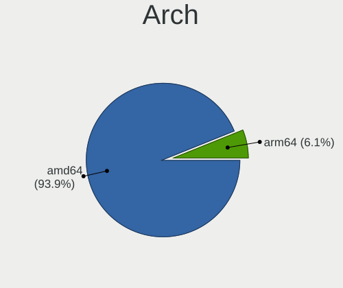

| Name  | Computers | Percent |
|-------|-----------|---------|
| amd64 | 77        | 93.9%   |
| arm64 | 5         | 6.1%    |

DE
--

Desktop Environment

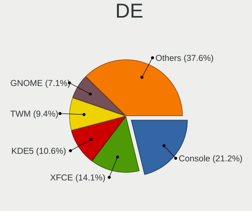

| Name      | Computers | Percent |
|-----------|-----------|---------|
| Console   | 18        | 21.18%  |
| XFCE      | 12        | 14.12%  |
| KDE5      | 9         | 10.59%  |
| TWM       | 8         | 9.41%   |
| GNOME     | 6         | 7.06%   |
| i3        | 5         | 5.88%   |
| KDE       | 4         | 4.71%   |
| Openbox   | 3         | 3.53%   |
| MATE      | 3         | 3.53%   |
| wlroots   | 2         | 2.35%   |
| LXQt      | 2         | 2.35%   |
| Lumina    | 2         | 2.35%   |
| KDE6      | 2         | 2.35%   |
| Budgie    | 2         | 2.35%   |
| Wayfire   | 1         | 1.18%   |
| Hyprland  | 1         | 1.18%   |
| fvwm2     | 1         | 1.18%   |
| Fluxbox   | 1         | 1.18%   |
| Compton   | 1         | 1.18%   |
| CDE       | 1         | 1.18%   |
| AwesomeWM | 1         | 1.18%   |

Display Server
--------------

X11 or Wayland

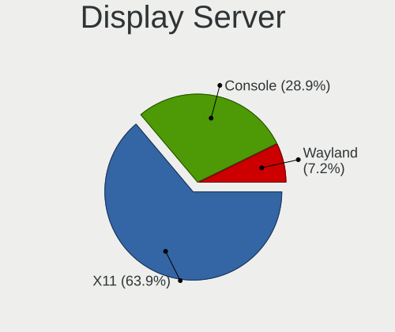

| Name    | Computers | Percent |
|---------|-----------|---------|
| X11     | 53        | 63.86%  |
| Console | 24        | 28.92%  |
| Wayland | 6         | 7.23%   |

Display Manager
---------------

SDDM, LightDM, etc.

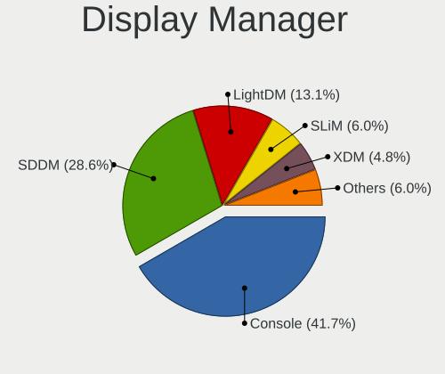

| Name    | Computers | Percent |
|---------|-----------|---------|
| Console | 35        | 41.67%  |
| SDDM    | 24        | 28.57%  |
| LightDM | 11        | 13.1%   |
| SLiM    | 5         | 5.95%   |
| XDM     | 4         | 4.76%   |
| GDM     | 4         | 4.76%   |
| Ly      | 1         | 1.19%   |

OS Lang
-------

Language

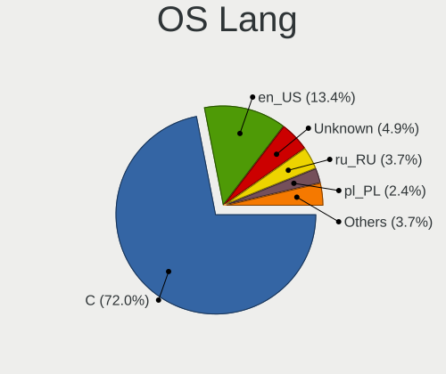

| Lang    | Computers | Percent |
|---------|-----------|---------|
| C       | 59        | 71.95%  |
| en_US   | 11        | 13.41%  |
| Unknown | 4         | 4.88%   |
| ru_RU   | 3         | 3.66%   |
| pl_PL   | 2         | 2.44%   |
| zh_CN   | 1         | 1.22%   |
| ru      | 1         | 1.22%   |
| cs_CZ   | 1         | 1.22%   |

Boot Mode
---------

EFI or BIOS

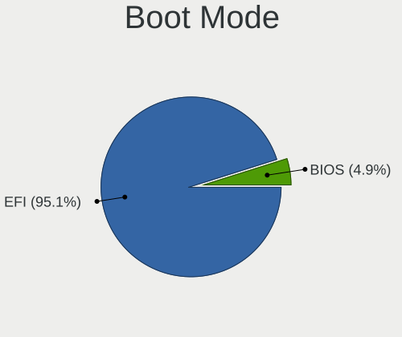

| Mode | Computers | Percent |
|------|-----------|---------|
| EFI  | 78        | 95.12%  |
| BIOS | 4         | 4.88%   |

Filesystem
----------

Type of filesystem

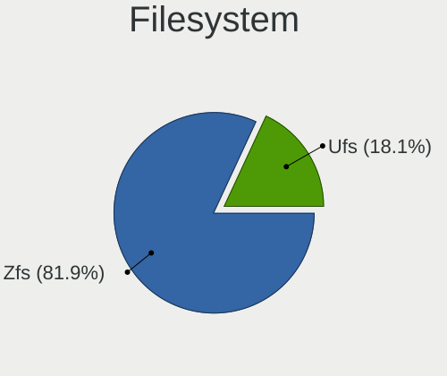

| Type | Computers | Percent |
|------|-----------|---------|
| Zfs  | 68        | 81.93%  |
| Ufs  | 15        | 18.07%  |

Part. scheme
------------

Scheme of partitioning

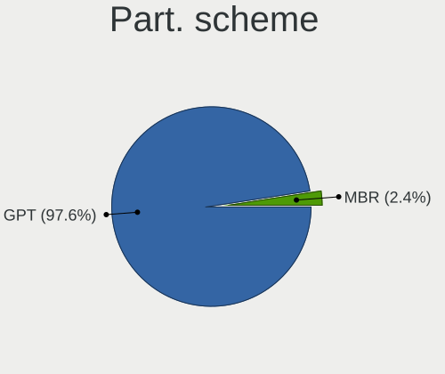

| Type | Computers | Percent |
|------|-----------|---------|
| GPT  | 80        | 97.56%  |
| MBR  | 2         | 2.44%   |

Board
-----

Vendor
------

Motherboard manufacturer

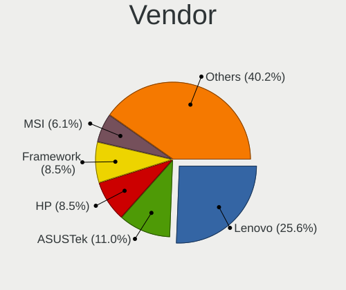

| Name                                 | Computers | Percent |
|--------------------------------------|-----------|---------|
| Lenovo                               | 21        | 25.61%  |
| ASUSTek Computer                     | 9         | 10.98%  |
| Hewlett-Packard                      | 7         | 8.54%   |
| Framework                            | 7         | 8.54%   |
| MSI                                  | 5         | 6.1%    |
| Dell                                 | 5         | 6.1%    |
| Apple                                | 4         | 4.88%   |
| Unknown                              | 4         | 4.88%   |
| Gigabyte Technology                  | 3         | 3.66%   |
| Supermicro                           | 2         | 2.44%   |
| HUAWEI                               | 2         | 2.44%   |
| ASRock                               | 2         | 2.44%   |
| TUXEDO                               | 1         | 1.22%   |
| SolidRun                             | 1         | 1.22%   |
| Shenzhen Meigao Electronic Equipment | 1         | 1.22%   |
| Raspberry Pi Foundation              | 1         | 1.22%   |
| Quanta                               | 1         | 1.22%   |
| Google                               | 1         | 1.22%   |
| Fujitsu                              | 1         | 1.22%   |
| EVGA                                 | 1         | 1.22%   |
| AZW                                  | 1         | 1.22%   |
| ASRockRack                           | 1         | 1.22%   |
| Acer                                 | 1         | 1.22%   |

Model
-----

Motherboard model

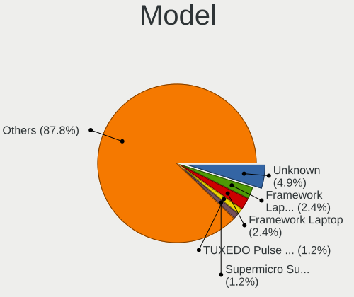

| Name                                              | Computers | Percent |
|---------------------------------------------------|-----------|---------|
| Unknown                                           | 4         | 4.88%   |
| Framework Laptop 16 (AMD Ryzen 7040 Series)       | 2         | 2.44%   |
| Framework Laptop                                  | 2         | 2.44%   |
| TUXEDO Pulse 14 Gen3                              | 1         | 1.22%   |
| Supermicro SYS-5018D-FN8T                         | 1         | 1.22%   |
| Supermicro Super Server                           | 1         | 1.22%   |
| SolidRun CEX7 Platform                            | 1         | 1.22%   |
| Shenzhen Meigao Electronic Equipment Venus series | 1         | 1.22%   |
| RPi Raspberry Pi                                  | 1         | 1.22%   |
| Quanta QuantaPlex T22HF-1U                        | 1         | 1.22%   |
| MSI MS-7D95                                       | 1         | 1.22%   |
| MSI MS-7C96                                       | 1         | 1.22%   |
| MSI MS-7982                                       | 1         | 1.22%   |
| MSI Modern 15 F13MG                               | 1         | 1.22%   |
| MSI Bravo 15 A4DDR                                | 1         | 1.22%   |
| Lenovo ThinkPad X270 20HM004JBR                   | 1         | 1.22%   |
| Lenovo ThinkPad X260 20F5A28AUK                   | 1         | 1.22%   |
| Lenovo ThinkPad X200s 74695KG                     | 1         | 1.22%   |
| Lenovo ThinkPad X1 Carbon 6th 20KH006JBM          | 1         | 1.22%   |
| Lenovo ThinkPad W541 20EG0005MS                   | 1         | 1.22%   |
| Lenovo ThinkPad T550 20CJS00X00                   | 1         | 1.22%   |
| Lenovo ThinkPad T480s 20L7001LMH                  | 1         | 1.22%   |
| Lenovo ThinkPad T14s Gen 4 21F60029US             | 1         | 1.22%   |
| Lenovo ThinkPad T14s Gen 1 20T1S3YH00             | 1         | 1.22%   |
| Lenovo ThinkPad T14 Gen 3 21CF002UMZ              | 1         | 1.22%   |
| Lenovo ThinkPad T14 Gen 1 20UES4QC00              | 1         | 1.22%   |
| Lenovo ThinkPad P17 Gen 2i 20YVS1L900             | 1         | 1.22%   |
| Lenovo ThinkPad P1 Gen 3 20TJS4T100               | 1         | 1.22%   |
| Lenovo ThinkPad E16 Gen 1 21JNCTO1WW              | 1         | 1.22%   |
| Lenovo ThinkBook 16 G6+ IMH 21LE                  | 1         | 1.22%   |
| Lenovo ThinkBook 15 G4 IAP 21DJ                   | 1         | 1.22%   |
| Lenovo ThinkBook 14 G7 IML 21MR                   | 1         | 1.22%   |
| Lenovo ThinkBook 14 G6 IRL 21KG                   | 1         | 1.22%   |
| Lenovo IdeaPad 3 15ITL6 82MD                      | 1         | 1.22%   |
| Lenovo B40-30 80F1                                | 1         | 1.22%   |
| Lenovo 7X35A007NA HR350A 7X35CTO1WW               | 1         | 1.22%   |
| HUAWEI NBD-WXX9                                   | 1         | 1.22%   |
| HUAWEI MRGFG-XX                                   | 1         | 1.22%   |
| HP ZBook 17 G2                                    | 1         | 1.22%   |
| HP ProBook 630 G8 Notebook PC                     | 1         | 1.22%   |

Model Family
------------

Motherboard model prefix

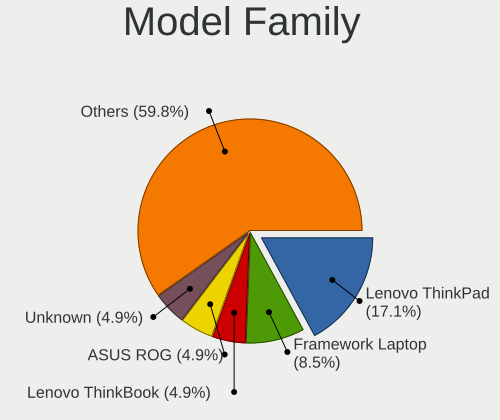

| Name                                       | Computers | Percent |
|--------------------------------------------|-----------|---------|
| Lenovo ThinkPad                            | 14        | 17.07%  |
| Framework Laptop                           | 7         | 8.54%   |
| Lenovo ThinkBook                           | 4         | 4.88%   |
| ASUS ROG                                   | 4         | 4.88%   |
| Unknown                                    | 4         | 4.88%   |
| HP Laptop                                  | 2         | 2.44%   |
| HP EliteBook                               | 2         | 2.44%   |
| Dell Precision                             | 2         | 2.44%   |
| Dell Latitude                              | 2         | 2.44%   |
| ASUS PRIME                                 | 2         | 2.44%   |
| Apple MacBookPro8                          | 2         | 2.44%   |
| TUXEDO Pulse                               | 1         | 1.22%   |
| Supermicro SYS-5018D-FN8T                  | 1         | 1.22%   |
| Supermicro Super                           | 1         | 1.22%   |
| SolidRun CEX7                              | 1         | 1.22%   |
| Shenzhen Meigao Electronic Equipment Venus | 1         | 1.22%   |
| RPi Raspberry                              | 1         | 1.22%   |
| Quanta QuantaPlex                          | 1         | 1.22%   |
| MSI MS-7D95                                | 1         | 1.22%   |
| MSI MS-7C96                                | 1         | 1.22%   |
| MSI MS-7982                                | 1         | 1.22%   |
| MSI Modern                                 | 1         | 1.22%   |
| MSI Bravo                                  | 1         | 1.22%   |
| Lenovo IdeaPad                             | 1         | 1.22%   |
| Lenovo B40-30                              | 1         | 1.22%   |
| Lenovo 7X35A007NA                          | 1         | 1.22%   |
| HUAWEI NBD-WXX9                            | 1         | 1.22%   |
| HUAWEI MRGFG-XX                            | 1         | 1.22%   |
| HP ZBook                                   | 1         | 1.22%   |
| HP ProBook                                 | 1         | 1.22%   |
| HP Elite                                   | 1         | 1.22%   |
| Google Astronaut                           | 1         | 1.22%   |
| Gigabyte X870E                             | 1         | 1.22%   |
| Gigabyte R272-P31-00                       | 1         | 1.22%   |
| Gigabyte B760M                             | 1         | 1.22%   |
| Fujitsu CELSIUS                            | 1         | 1.22%   |
| EVGA X570                                  | 1         | 1.22%   |
| Dell Pro                                   | 1         | 1.22%   |
| AZW SER                                    | 1         | 1.22%   |
| ASUS TUF                                   | 1         | 1.22%   |

MFG Year
--------

Motherboard manufacture year

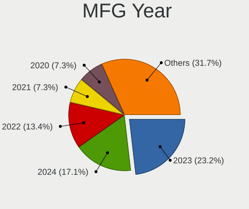

| Year    | Computers | Percent |
|---------|-----------|---------|
| 2023    | 19        | 23.17%  |
| 2024    | 14        | 17.07%  |
| 2022    | 11        | 13.41%  |
| 2021    | 6         | 7.32%   |
| 2020    | 6         | 7.32%   |
| 2019    | 5         | 6.1%    |
| 2025    | 4         | 4.88%   |
| 2018    | 4         | 4.88%   |
| 2017    | 2         | 2.44%   |
| 2016    | 2         | 2.44%   |
| 2015    | 2         | 2.44%   |
| 2011    | 2         | 2.44%   |
| Unknown | 2         | 2.44%   |
| 2014    | 1         | 1.22%   |
| 2013    | 1         | 1.22%   |
| 2012    | 1         | 1.22%   |

Form Factor
-----------

Physical design of the computer

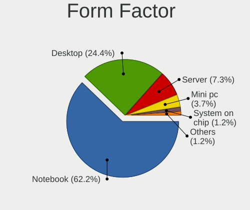

| Name           | Computers | Percent |
|----------------|-----------|---------|
| Notebook       | 51        | 62.2%   |
| Desktop        | 20        | 24.39%  |
| Server         | 6         | 7.32%   |
| Mini pc        | 3         | 3.66%   |
| System on chip | 1         | 1.22%   |
| All in one     | 1         | 1.22%   |

Coreboot
--------

Have coreboot on board

| Used | Computers | Percent |
|------|-----------|---------|
| No   | 81        | 98.78%  |
| Yes  | 1         | 1.22%   |

RAM Size
--------

Total RAM memory

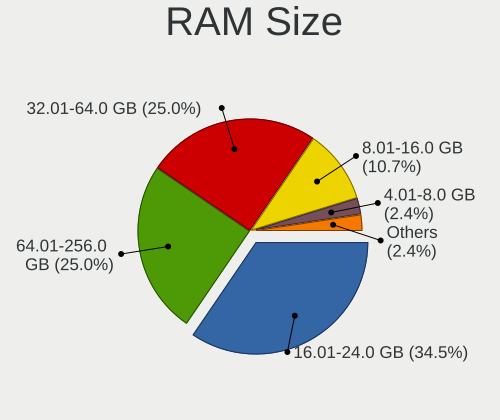

| Size in GB  | Computers | Percent |
|-------------|-----------|---------|
| 16.01-24.0  | 29        | 34.52%  |
| 32.01-64.0  | 21        | 25%     |
| 64.01-256.0 | 21        | 25%     |
| 8.01-16.0   | 9         | 10.71%  |
| 4.01-8.0    | 2         | 2.38%   |
| 24.01-32.0  | 1         | 1.19%   |
| 0.51-1.0    | 1         | 1.19%   |

RAM Used
--------

Used RAM memory

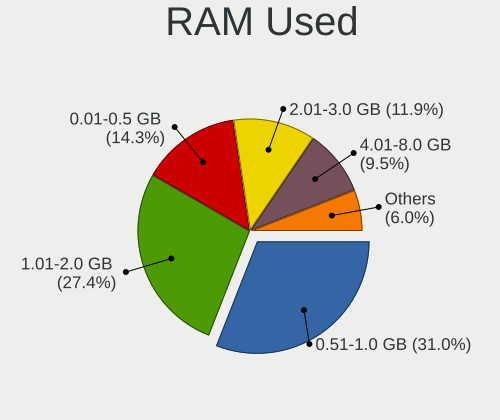

| Used GB  | Computers | Percent |
|----------|-----------|---------|
| 0.51-1.0 | 26        | 30.95%  |
| 1.01-2.0 | 23        | 27.38%  |
| 0.01-0.5 | 12        | 14.29%  |
| 2.01-3.0 | 10        | 11.9%   |
| 4.01-8.0 | 8         | 9.52%   |
| 3.01-4.0 | 5         | 5.95%   |

Total Drives
------------

Number of drives on board

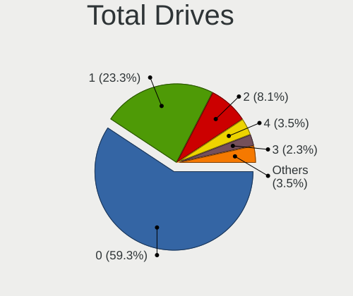

| Drives | Computers | Percent |
|--------|-----------|---------|
| 0      | 51        | 59.3%   |
| 1      | 20        | 23.26%  |
| 2      | 7         | 8.14%   |
| 4      | 3         | 3.49%   |
| 3      | 2         | 2.33%   |
| 7      | 1         | 1.16%   |
| 6      | 1         | 1.16%   |
| 5      | 1         | 1.16%   |

Has CD-ROM
----------

Has CD-ROM on board

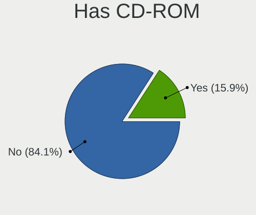

| Presented | Computers | Percent |
|-----------|-----------|---------|
| No        | 69        | 84.15%  |
| Yes       | 13        | 15.85%  |

Has Ethernet
------------

Has Ethernet on board

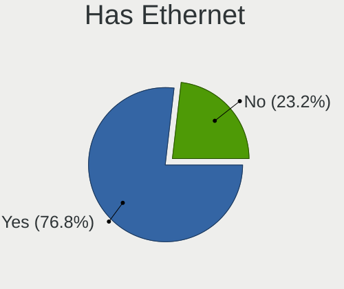

| Presented | Computers | Percent |
|-----------|-----------|---------|
| Yes       | 63        | 76.83%  |
| No        | 19        | 23.17%  |

Has WiFi
--------

Has WiFi module

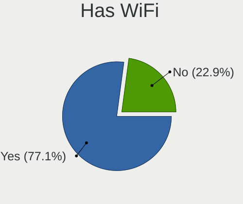

| Presented | Computers | Percent |
|-----------|-----------|---------|
| Yes       | 64        | 77.11%  |
| No        | 19        | 22.89%  |

Has Bluetooth
-------------

Has Bluetooth module

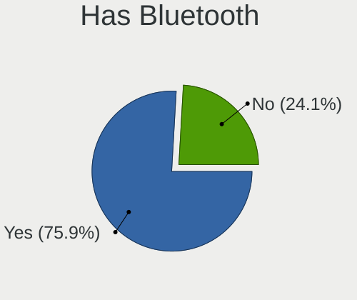

| Presented | Computers | Percent |
|-----------|-----------|---------|
| Yes       | 63        | 75.9%   |
| No        | 20        | 24.1%   |

Location
--------

Country
-------

Geographic location (country)

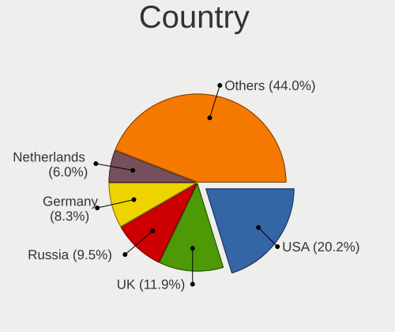

| Country         | Computers | Percent |
|-----------------|-----------|---------|
| USA             | 17        | 20.24%  |
| UK              | 10        | 11.9%   |
| Russia          | 8         | 9.52%   |
| Germany         | 7         | 8.33%   |
| Netherlands     | 5         | 5.95%   |
| Canada          | 4         | 4.76%   |
| Brazil          | 4         | 4.76%   |
| France          | 3         | 3.57%   |
| Switzerland     | 2         | 2.38%   |
| Sweden          | 2         | 2.38%   |
| Hungary         | 2         | 2.38%   |
| Czechia         | 2         | 2.38%   |
| China           | 2         | 2.38%   |
| Belgium         | 2         | 2.38%   |
| The Netherlands | 1         | 1.19%   |
| Taiwan          | 1         | 1.19%   |
| Spain           | 1         | 1.19%   |
| South Korea     | 1         | 1.19%   |
| Slovakia        | 1         | 1.19%   |
| Serbia          | 1         | 1.19%   |
| Romania         | 1         | 1.19%   |
| Poland          | 1         | 1.19%   |
| Panama          | 1         | 1.19%   |
| Moldova         | 1         | 1.19%   |
| Malaysia        | 1         | 1.19%   |
| Chile           | 1         | 1.19%   |
| Bangladesh      | 1         | 1.19%   |
| Australia       | 1         | 1.19%   |

City
----

Geographic location (city)

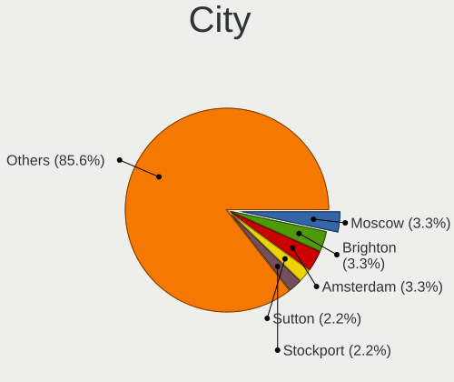

| City           | Computers | Percent |
|----------------|-----------|---------|
| Moscow         | 3         | 3.33%   |
| Brighton       | 3         | 3.33%   |
| Amsterdam      | 3         | 3.33%   |
| Sutton         | 2         | 2.22%   |
| Stockport      | 2         | 2.22%   |
| Stockholm      | 2         | 2.22%   |
| Schiedam       | 2         | 2.22%   |
| Richmond       | 2         | 2.22%   |
| Hove           | 2         | 2.22%   |
| Darmstadt      | 2         | 2.22%   |
| Budapest       | 2         | 2.22%   |
| Břeclav       | 2         | 2.22%   |
| Zurich         | 1         | 1.11%   |
| Westborough    | 1         | 1.11%   |
| Warsaw         | 1         | 1.11%   |
| Viladecans     | 1         | 1.11%   |
| Vancouver      | 1         | 1.11%   |
| Tosno          | 1         | 1.11%   |
| Suresnes       | 1         | 1.11%   |
| Stuttgart      | 1         | 1.11%   |
| Sterling       | 1         | 1.11%   |
| St. Albert     | 1         | 1.11%   |
| St Petersburg  | 1         | 1.11%   |
| Smolensk       | 1         | 1.11%   |
| Siblingen      | 1         | 1.11%   |
| Shah Alam      | 1         | 1.11%   |
| Rugby          | 1         | 1.11%   |
| Rio de Janeiro | 1         | 1.11%   |
| Pevensey       | 1         | 1.11%   |
| Perth          | 1         | 1.11%   |
| Panama City    | 1         | 1.11%   |
| Offenbach      | 1         | 1.11%   |
| New York       | 1         | 1.11%   |
| New Taipei     | 1         | 1.11%   |
| Nanjing        | 1         | 1.11%   |
| Mississauga    | 1         | 1.11%   |
| Mesa           | 1         | 1.11%   |
| Macaiba        | 1         | 1.11%   |
| Los Gatos      | 1         | 1.11%   |
| Lewes          | 1         | 1.11%   |

Drives
------

Drive Vendor
------------

Hard drive vendors

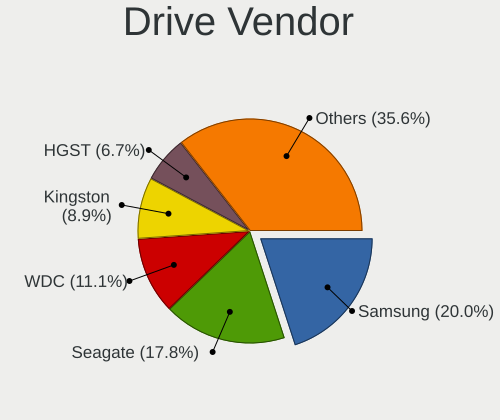

| Vendor              | Computers | Drives | Percent |
|---------------------|-----------|--------|---------|
| Samsung Electronics | 9         | 29     | 20%     |
| Seagate             | 8         | 12     | 17.78%  |
| WDC                 | 5         | 9      | 11.11%  |
| Kingston            | 4         | 8      | 8.89%   |
| HGST                | 3         | 18     | 6.67%   |
| Crucial             | 3         | 4      | 6.67%   |
| SanDisk             | 2         | 4      | 4.44%   |
| Transcend           | 1         | 1      | 2.22%   |
| Toshiba             | 1         | 1      | 2.22%   |
| SK hynix            | 1         | 1      | 2.22%   |
| Micron Technology   | 1         | 2      | 2.22%   |
| Lenovo              | 1         | 1      | 2.22%   |
| KingSpec            | 1         | 2      | 2.22%   |
| Intel               | 1         | 1      | 2.22%   |
| Hitachi             | 1         | 1      | 2.22%   |
| China               | 1         | 2      | 2.22%   |
| Apple               | 1         | 1      | 2.22%   |
| A-DATA Technology   | 1         | 1      | 2.22%   |

Drive Model
-----------

Hard drive models

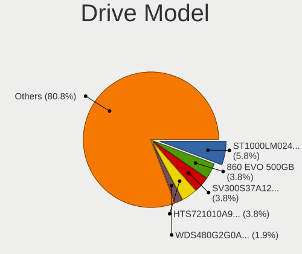

| Model                              | Computers | Percent |
|------------------------------------|-----------|---------|
| Seagate ST1000LM024 HN-M101MBB 1TB | 3         | 5.77%   |
| Samsung SSD 860 EVO 500GB          | 2         | 3.85%   |
| Kingston SV300S37A120G 120GB       | 2         | 3.85%   |
| HGST HTS721010A9E630 1TB           | 2         | 3.85%   |
| WDC WDS480G2G0A-00JH30 480GB       | 1         | 1.92%   |
| WDC WDS250G1B0A-00H9H0 250GB       | 1         | 1.92%   |
| WDC WDS240G2G0A-00JH30 240GB       | 1         | 1.92%   |
| WDC WD7500BPKX-60HPJT0 752GB       | 1         | 1.92%   |
| WDC WD5002AALX-00J37A0 500GB       | 1         | 1.92%   |
| WDC WD5000AAKX-60U6AA0 500GB       | 1         | 1.92%   |
| WDC WD5000AAKS-00UU3A0 500GB       | 1         | 1.92%   |
| WDC WD2003FZEX-00SRLA0 2TB         | 1         | 1.92%   |
| Transcend TS256GMTS430S 256GB      | 1         | 1.92%   |
| Toshiba DT01ACA100 1TB             | 1         | 1.92%   |
| SK hynix SC401 SATA 256GB          | 1         | 1.92%   |
| Seagate ST500LM021-1KJ152 500GB    | 1         | 1.92%   |
| Seagate ST4000DM004-2CV104 4TB     | 1         | 1.92%   |
| Seagate ST2000NE0025-2FL101 2TB    | 1         | 1.92%   |
| Seagate ST1000LM014-1EJ164 1TB     | 1         | 1.92%   |
| Seagate ST1000DM010-2EP102 1TB     | 1         | 1.92%   |
| SanDisk Ultra II 1TB               | 1         | 1.92%   |
| SanDisk SDSSDH3 1T00 1TB           | 1         | 1.92%   |
| Samsung SSD 870 EVO 1TB            | 1         | 1.92%   |
| Samsung SSD 860 EVO 250GB          | 1         | 1.92%   |
| Samsung SSD 850 EVO 500GB          | 1         | 1.92%   |
| Samsung SSD 850 EVO 250GB          | 1         | 1.92%   |
| Samsung MZ7LN512HCHP-000L1 512GB   | 1         | 1.92%   |
| Samsung MZ7LN256HCHP-000L7 256GB   | 1         | 1.92%   |
| Samsung MZ7L37T6HBLA-00A07 7.6TB   | 1         | 1.92%   |
| Samsung MZ7KH240HAHQ-00005 240GB   | 1         | 1.92%   |
| Micron M600_MTFDDAK1T0MBF 1TB      | 1         | 1.92%   |
| Micron 1100_MTFDDAK1T0TBN 1TB      | 1         | 1.92%   |
| Lenovo SSD SL700 120G              | 1         | 1.92%   |
| Kingston SA400S37240G 240GB        | 1         | 1.92%   |
| Kingston SA400S37-120GB            | 1         | 1.92%   |
| KingSpec NT-256 2242 256GB         | 1         | 1.92%   |
| KingSpec NE-1TB                    | 1         | 1.92%   |
| Intel SSDSC2BF240A5L 240GB         | 1         | 1.92%   |
| Hitachi HTS727575A9E362 752GB      | 1         | 1.92%   |
| HGST HUH728080ALE600 8TB           | 1         | 1.92%   |

HDD Vendor
----------

Hard disk drive vendors

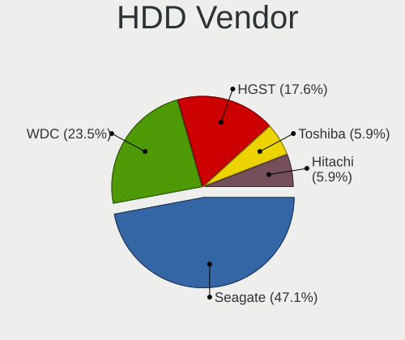

| Vendor  | Computers | Drives | Percent |
|---------|-----------|--------|---------|
| Seagate | 8         | 12     | 47.06%  |
| WDC     | 4         | 5      | 23.53%  |
| HGST    | 3         | 18     | 17.65%  |
| Toshiba | 1         | 1      | 5.88%   |
| Hitachi | 1         | 1      | 5.88%   |

SSD Vendor
----------

Solid state drive vendors

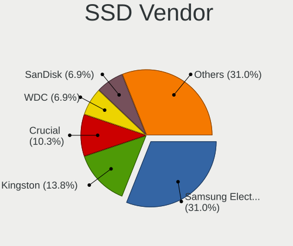

| Vendor              | Computers | Drives | Percent |
|---------------------|-----------|--------|---------|
| Samsung Electronics | 9         | 29     | 31.03%  |
| Kingston            | 4         | 8      | 13.79%  |
| Crucial             | 3         | 4      | 10.34%  |
| WDC                 | 2         | 4      | 6.9%    |
| SanDisk             | 2         | 4      | 6.9%    |
| Transcend           | 1         | 1      | 3.45%   |
| SK hynix            | 1         | 1      | 3.45%   |
| Micron Technology   | 1         | 2      | 3.45%   |
| Lenovo              | 1         | 1      | 3.45%   |
| KingSpec            | 1         | 1      | 3.45%   |
| Intel               | 1         | 1      | 3.45%   |
| China               | 1         | 2      | 3.45%   |
| Apple               | 1         | 1      | 3.45%   |
| A-DATA Technology   | 1         | 1      | 3.45%   |

Drive Kind
----------

HDD or SSD

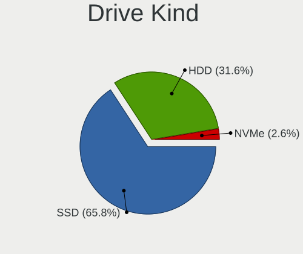

| Kind | Computers | Drives | Percent |
|------|-----------|--------|---------|
| SSD  | 25        | 60     | 65.79%  |
| HDD  | 12        | 37     | 31.58%  |
| NVMe | 1         | 1      | 2.63%   |

Drive Connector
---------------

SATA, SAS, NVMe, etc.

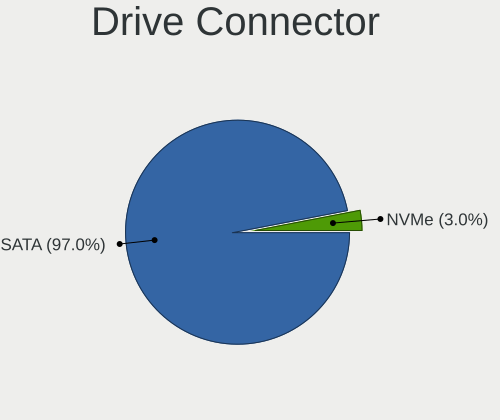

| Type | Computers | Drives | Percent |
|------|-----------|--------|---------|
| SATA | 32        | 97     | 96.97%  |
| NVMe | 1         | 1      | 3.03%   |

Drive Size
----------

Size of hard drive

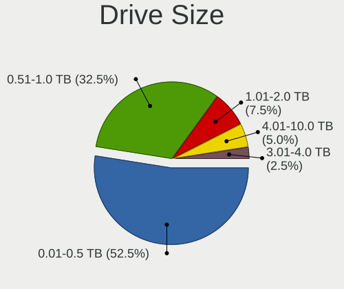

| Size in TB | Computers | Drives | Percent |
|------------|-----------|--------|---------|
| 0.01-0.5   | 21        | 39     | 52.5%   |
| 0.51-1.0   | 13        | 35     | 32.5%   |
| 1.01-2.0   | 3         | 5      | 7.5%    |
| 4.01-10.0  | 2         | 17     | 5%      |
| 3.01-4.0   | 1         | 1      | 2.5%    |

Space Total
-----------

Amount of disk space available on the file system

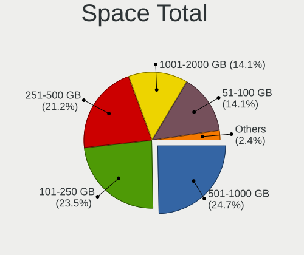

| Size in GB     | Computers | Percent |
|----------------|-----------|---------|
| 501-1000       | 21        | 24.71%  |
| 101-250        | 20        | 23.53%  |
| 251-500        | 18        | 21.18%  |
| 1001-2000      | 12        | 14.12%  |
| 51-100         | 12        | 14.12%  |
| More than 3000 | 1         | 1.18%   |
| 21-50          | 1         | 1.18%   |

Space Used
----------

Amount of used disk space

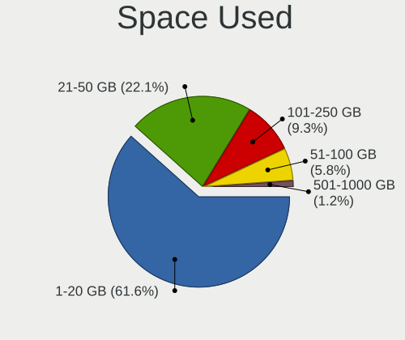

| Used GB  | Computers | Percent |
|----------|-----------|---------|
| 1-20     | 53        | 61.63%  |
| 21-50    | 19        | 22.09%  |
| 101-250  | 8         | 9.3%    |
| 51-100   | 5         | 5.81%   |
| 501-1000 | 1         | 1.16%   |

Malfunc. Drives
---------------

Drive models with a malfunction

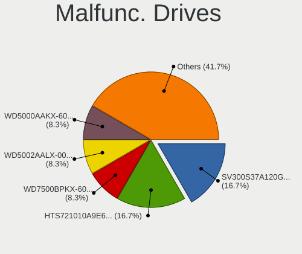

| Model                                    | Computers | Drives | Percent |
|------------------------------------------|-----------|--------|---------|
| Kingston SV300S37A120G 120GB             | 2         | 4      | 16.67%  |
| HGST HTS721010A9E630 1TB                 | 2         | 8      | 16.67%  |
| WDC WD7500BPKX-60HPJT0 752GB             | 1         | 1      | 8.33%   |
| WDC WD5002AALX-00J37A0 500GB             | 1         | 1      | 8.33%   |
| WDC WD5000AAKX-60U6AA0 500GB             | 1         | 1      | 8.33%   |
| Seagate ST1000LM024 HN-M101MBB 1TB       | 1         | 1      | 8.33%   |
| Seagate ST1000LM014-1EJ164 1TB           | 1         | 1      | 8.33%   |
| Micron Technology 1100_MTFDDAK1T0TBN 1TB | 1         | 1      | 8.33%   |
| KingSpec NT-256 2242 256GB               | 1         | 1      | 8.33%   |
| Hitachi HTS727575A9E362 752GB            | 1         | 1      | 8.33%   |

Malfunc. Drive Vendor
---------------------

Vendors of faulty drives

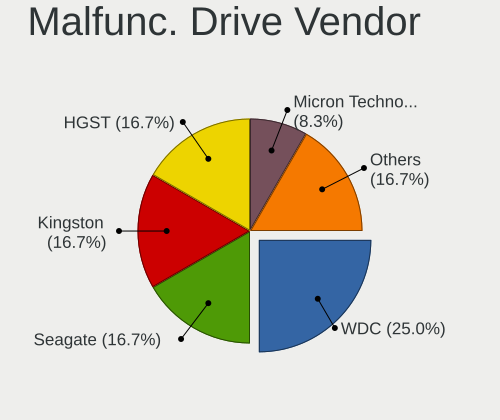

| Vendor            | Computers | Drives | Percent |
|-------------------|-----------|--------|---------|
| WDC               | 3         | 3      | 25%     |
| Seagate           | 2         | 2      | 16.67%  |
| Kingston          | 2         | 4      | 16.67%  |
| HGST              | 2         | 8      | 16.67%  |
| Micron Technology | 1         | 1      | 8.33%   |
| KingSpec          | 1         | 1      | 8.33%   |
| Hitachi           | 1         | 1      | 8.33%   |

Malfunc. HDD Vendor
-------------------

Vendors of faulty HDD drives

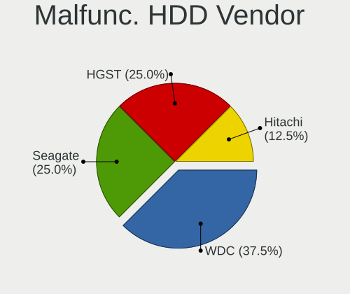

| Vendor  | Computers | Drives | Percent |
|---------|-----------|--------|---------|
| WDC     | 3         | 3      | 37.5%   |
| Seagate | 2         | 2      | 25%     |
| HGST    | 2         | 8      | 25%     |
| Hitachi | 1         | 1      | 12.5%   |

Malfunc. Drive Kind
-------------------

Kinds of faulty drives

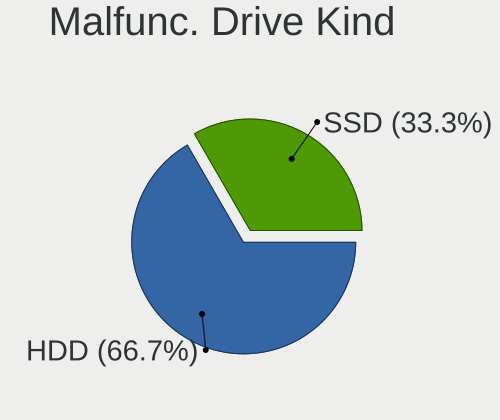

| Kind | Computers | Drives | Percent |
|------|-----------|--------|---------|
| HDD  | 8         | 14     | 66.67%  |
| SSD  | 4         | 6      | 33.33%  |

Failed Drives
-------------

Failed drive models

Zero info for selected period =(

Failed Drive Vendor
-------------------

Failed drive vendors

Zero info for selected period =(

Drive Status
------------

Number of failed and malfunc. drives

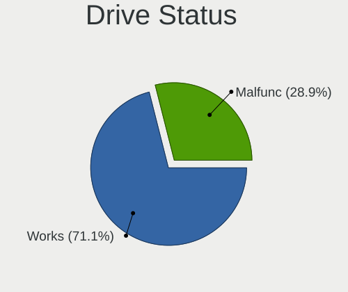

| Status  | Computers | Drives | Percent |
|---------|-----------|--------|---------|
| Works   | 27        | 78     | 71.05%  |
| Malfunc | 11        | 20     | 28.95%  |

Storage controller
------------------

Storage Vendor
--------------

Storage controller vendors

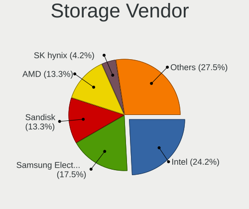

| Vendor                                  | Computers | Percent |
|-----------------------------------------|-----------|---------|
| Intel                                   | 29        | 24.17%  |
| Samsung Electronics                     | 21        | 17.5%   |
| Sandisk                                 | 16        | 13.33%  |
| AMD                                     | 16        | 13.33%  |
| SK hynix                                | 5         | 4.17%   |
| Phison Electronics                      | 5         | 4.17%   |
| Micron Technology                       | 4         | 3.33%   |
| Silicon Motion                          | 3         | 2.5%    |
| ASMedia Technology                      | 3         | 2.5%    |
| Shenzhen Unionmemory Information System | 2         | 1.67%   |
| MAXIO Technology (Hangzhou)             | 2         | 1.67%   |
| Kingston Technology Company             | 2         | 1.67%   |
| Broadcom / LSI                          | 2         | 1.67%   |
| ADATA Technology                        | 2         | 1.67%   |
| Toshiba                                 | 1         | 0.83%   |
| Solidigm                                | 1         | 0.83%   |
| Shenzhen Longsys Electronics            | 1         | 0.83%   |
| O2 Micro                                | 1         | 0.83%   |
| Micron/Crucial Technology               | 1         | 0.83%   |
| Lite-On Technology                      | 1         | 0.83%   |
| JMicron Technology                      | 1         | 0.83%   |
| Apple                                   | 1         | 0.83%   |

Storage Model
-------------

Storage controller models

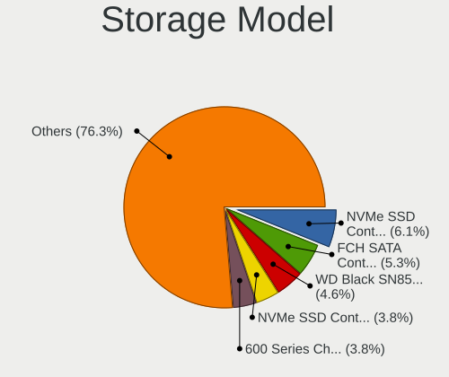

| Model                                                                              | Computers | Percent |
|------------------------------------------------------------------------------------|-----------|---------|
| Samsung NVMe SSD Controller PM9A1/PM9A3/980PRO                                     | 8         | 6.11%   |
| AMD FCH SATA Controller [AHCI mode]                                                | 7         | 5.34%   |
| Sandisk WD Black SN850X NVMe SSD                                                   | 6         | 4.58%   |
| Samsung NVMe SSD Controller SM981/PM981/PM983                                      | 5         | 3.82%   |
| AMD 600 Series Chipset SATA Controller                                             | 5         | 3.82%   |
| Intel 8 Series/C220 Series Chipset Family 6-port SATA Controller 1 [AHCI mode]     | 4         | 3.05%   |
| SK hynix Gold P31/BC711/PC711 NVMe Solid State Drive                               | 3         | 2.29%   |
| Sandisk WD SN560/SN740/SN770/SN5000 NVMe SSD                                       | 3         | 2.29%   |
| Samsung NVMe SSD Controller S4LV008[Pascal]                                        | 3         | 2.29%   |
| Samsung NVMe SSD Controller 980 (DRAM-less)                                        | 3         | 2.29%   |
| Phison PS5013-E13 PCIe3 NVMe Controller (DRAM-less)                                | 3         | 2.29%   |
| Intel Volume Management Device NVMe RAID Controller                                | 3         | 2.29%   |
| Intel Sunrise Point-LP SATA Controller [AHCI mode]                                 | 3         | 2.29%   |
| SK hynix Platinum P41/PC801 NVMe Solid State Drive                                 | 2         | 1.53%   |
| Silicon Motion SM2263EN/SM2263XT (DRAM-less) NVMe SSD Controllers                  | 2         | 1.53%   |
| Sandisk WD PC SN740 NVMe SSD 512GB (DRAM-less)                                     | 2         | 1.53%   |
| SanDisk Ultra 3D / WD Blue SN570 NVMe SSD (DRAM-less)                              | 2         | 1.53%   |
| SanDisk Extreme Pro / WD Black 2018/SN750/PC SN720 NVMe SSD                        | 2         | 1.53%   |
| Samsung NVMe SSD Controller PM9C1a (DRAM-less)                                     | 2         | 1.53%   |
| Micron 2400 NVMe SSD (DRAM-less)                                                   | 2         | 1.53%   |
| MAXIO (Hangzhou) NVMe SSD Controller MAP1202 (DRAM-less)                           | 2         | 1.53%   |
| Intel RST Volume Management Device Controller                                      | 2         | 1.53%   |
| Intel Raptor Lake SATA AHCI Controller                                             | 2         | 1.53%   |
| Intel Q170/Q150/B150/H170/H110/Z170/CM236 Chipset SATA Controller [AHCI Mode]      | 2         | 1.53%   |
| Intel 6 Series/C200 Series Chipset Family 6 port Mobile SATA AHCI Controller       | 2         | 1.53%   |
| Broadcom / LSI SAS3408 Fusion-MPT Tri-Mode I/O Controller Chip (IOC)               | 2         | 1.53%   |
| ASMedia ASM1061/ASM1062 Serial ATA Controller                                      | 2         | 1.53%   |
| AMD 500 Series Chipset SATA Controller                                             | 2         | 1.53%   |
| Toshiba XG6 NVMe SSD Controller                                                    | 1         | 0.76%   |
| Solidigm P41 Plus NVMe SSD (DRAM-less) [Echo Harbor]                               | 1         | 0.76%   |
| Shenzhen Unionmemory Information System AM6A1 PCIe 4.0 NVMe SSD 1024GB (DRAM-less) | 1         | 0.76%   |
| Shenzhen Unionmemory Information System AM6A0 PCIe 4.0 NVMe SSD 1024GB (DRAM-less) | 1         | 0.76%   |
| Shenzhen Longsys Lexar NM790 / Patriot Viper VP4300 Lite NVMe SSD (DRAM-less)      | 1         | 0.76%   |
| Sandisk WD Black SN770M NVMe SSD (DRAM-less)                                       | 1         | 0.76%   |
| SanDisk Ultra 3D / WD PC SN530, IX SN530, Blue SN550 NVMe SSD (DRAM-less)          | 1         | 0.76%   |
| SanDisk Extreme Pro / WD Black SN750 / PC SN730 / Red SN700 NVMe SSD               | 1         | 0.76%   |
| Samsung S4LN058A01[SSUBX] AHCI SSD Controller (Apple slot)                         | 1         | 0.76%   |
| Phison PS5027-E27T PCIe4 NVMe Controller (DRAM-less)                               | 1         | 0.76%   |
| Phison PS5021-E21 PCIe4 NVMe Controller (DRAM-less)                                | 1         | 0.76%   |
| O2 Micro FORESEE E2M2 NVMe SSD                                                     | 1         | 0.76%   |

Storage Kind
------------

Kind of storage controller (IDE, SATA, NVMe, SAS, ...)

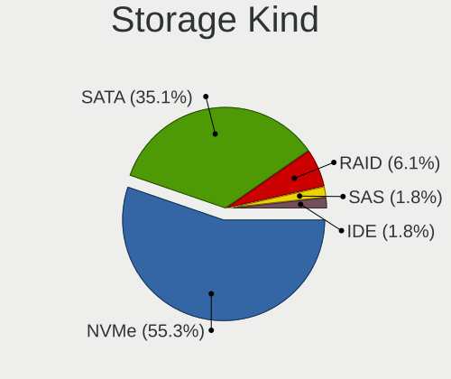

| Kind | Computers | Percent |
|------|-----------|---------|
| NVMe | 63        | 55.26%  |
| SATA | 40        | 35.09%  |
| RAID | 7         | 6.14%   |
| SAS  | 2         | 1.75%   |
| IDE  | 2         | 1.75%   |

Processor
---------

CPU Vendor
----------

Processor vendors

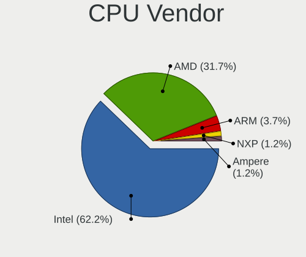

| Vendor | Computers | Percent |
|--------|-----------|---------|
| Intel  | 51        | 62.2%   |
| AMD    | 26        | 31.71%  |
| ARM    | 3         | 3.66%   |
| NXP    | 1         | 1.22%   |
| Ampere | 1         | 1.22%   |

CPU Model
---------

Processor models

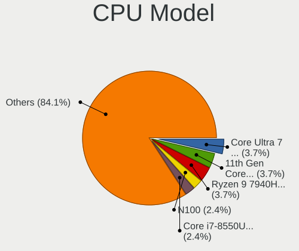

| Model                                      | Computers | Percent |
|--------------------------------------------|-----------|---------|
| Intel Core Ultra 7 155H                    | 3         | 3.66%   |
| Intel 11th Gen Core i5-1135G7 @ 2.40GHz    | 3         | 3.66%   |
| AMD Ryzen 9 7940HS w/ Radeon 780M Graphics | 3         | 3.66%   |
| Intel N100                                 | 2         | 2.44%   |
| Intel Core i7-8550U CPU @ 1.80GHz          | 2         | 2.44%   |
| Intel 13th Gen Core i7-1355U               | 2         | 2.44%   |
| AMD Ryzen 9 7900 12-Core Processor         | 2         | 2.44%   |
| NXP Cortex-A72                             | 1         | 1.22%   |
| Intel Xeon CPU D-1518 @ 2.20GHz            | 1         | 1.22%   |
| Intel Core Ultra 7 255U                    | 1         | 1.22%   |
| Intel Core Ultra 7 155U                    | 1         | 1.22%   |
| Intel Core i7-8700 CPU @ 3.20GHz           | 1         | 1.22%   |
| Intel Core i7-7600U CPU @ 2.80GHz          | 1         | 1.22%   |
| Intel Core i7-6820HQ CPU @ 2.70GHz         | 1         | 1.22%   |
| Intel Core i7-6660U CPU @ 2.40GHz          | 1         | 1.22%   |
| Intel Core i7-5600U CPU @ 2.60GHz          | 1         | 1.22%   |
| Intel Core i7-4810MQ CPU @ 2.80GHz         | 1         | 1.22%   |
| Intel Core i7-4710MQ CPU @ 2.50GHz         | 1         | 1.22%   |
| Intel Core i7-3520M CPU @ 2.90GHz          | 1         | 1.22%   |
| Intel Core i7-2760QM CPU @ 2.40GHz         | 1         | 1.22%   |
| Intel Core i7-2635QM CPU @ 2.00GHz         | 1         | 1.22%   |
| Intel Core i7-14700KF                      | 1         | 1.22%   |
| Intel Core i7-14700K                       | 1         | 1.22%   |
| Intel Core i7-10850H CPU @ 2.70GHz         | 1         | 1.22%   |
| Intel Core i7-10750H CPU @ 2.60GHz         | 1         | 1.22%   |
| Intel Core i7-10610U CPU @ 1.80GHz         | 1         | 1.22%   |
| Intel Core i5-6400 CPU @ 2.70GHz           | 1         | 1.22%   |
| Intel Core i5-6300U CPU @ 2.40GHz          | 1         | 1.22%   |
| Intel Core i5-5350U CPU @ 1.80GHz          | 1         | 1.22%   |
| Intel Core i5-4210U CPU @ 1.70GHz          | 1         | 1.22%   |
| Intel Core i5-4210M CPU @ 2.60GHz          | 1         | 1.22%   |
| Intel Core i3-7100U CPU @ 2.40GHz          | 1         | 1.22%   |
| Intel Core 2 Duo CPU L9400 @ 1.86GHz       | 1         | 1.22%   |
| Intel Celeron CPU N3350 @ 1.10GHz          | 1         | 1.22%   |
| Intel Celeron CPU N2840 @ 2.16GHz          | 1         | 1.22%   |
| Intel 13th Gen Core i7-13700K              | 1         | 1.22%   |
| Intel 13th Gen Core i7-13700H              | 1         | 1.22%   |
| Intel 13th Gen Core i7-1360P               | 1         | 1.22%   |
| Intel 13th Gen Core i5-13500T              | 1         | 1.22%   |
| Intel 13th Gen Core i5-1335U               | 1         | 1.22%   |

CPU Model Family
----------------

Processor model prefix

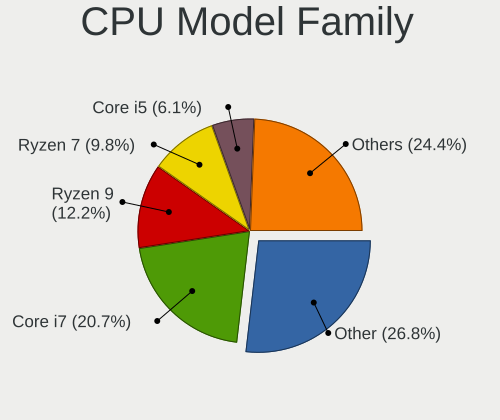

| Model                  | Computers | Percent |
|------------------------|-----------|---------|
| Other                  | 22        | 26.83%  |
| Intel Core i7          | 17        | 20.73%  |
| AMD Ryzen 9            | 10        | 12.2%   |
| AMD Ryzen 7            | 8         | 9.76%   |
| Intel Core i5          | 5         | 6.1%    |
| Intel Core             | 5         | 6.1%    |
| Intel Celeron          | 2         | 2.44%   |
| ARM Cortex             | 2         | 2.44%   |
| AMD Ryzen Threadripper | 2         | 2.44%   |
| AMD Ryzen 7 PRO        | 2         | 2.44%   |
| AMD Ryzen 5            | 2         | 2.44%   |
| Intel Xeon             | 1         | 1.22%   |
| Intel Core i3          | 1         | 1.22%   |
| Intel Core 2 Duo       | 1         | 1.22%   |
| AMD Phenom II X6       | 1         | 1.22%   |
| AMD EPYC               | 1         | 1.22%   |

CPU Cores
---------

Number of processor cores

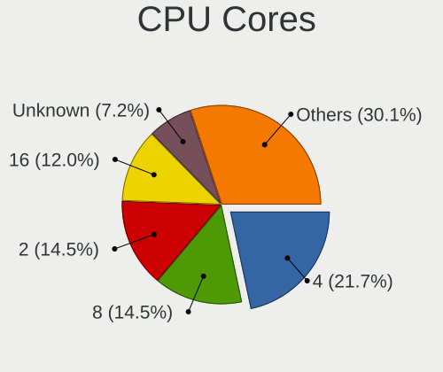

| Number  | Computers | Percent |
|---------|-----------|---------|
| 4       | 18        | 21.69%  |
| 8       | 12        | 14.46%  |
| 2       | 12        | 14.46%  |
| 16      | 10        | 12.05%  |
| Unknown | 6         | 7.23%   |
| 6       | 5         | 6.02%   |
| 12      | 4         | 4.82%   |
| 32      | 3         | 3.61%   |
| 10      | 3         | 3.61%   |
| 64      | 2         | 2.41%   |
| 24      | 2         | 2.41%   |
| 14      | 2         | 2.41%   |
| 28      | 1         | 1.2%    |
| 22      | 1         | 1.2%    |
| 11      | 1         | 1.2%    |
| 7       | 1         | 1.2%    |

CPU Sockets
-----------

Number of sockets

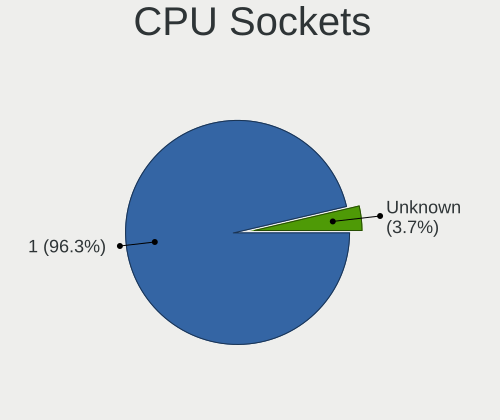

| Number  | Computers | Percent |
|---------|-----------|---------|
| 1       | 79        | 96.34%  |
| Unknown | 3         | 3.66%   |

CPU Threads
-----------

Threads per core (Hyper-Threading)

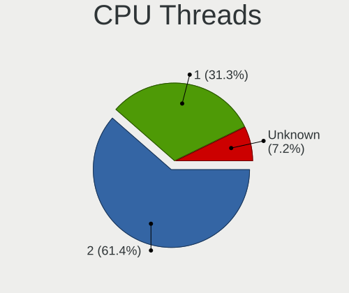

| Number  | Computers | Percent |
|---------|-----------|---------|
| 2       | 51        | 61.45%  |
| 1       | 26        | 31.33%  |
| Unknown | 6         | 7.23%   |

CPU Microarch
-------------

Microarchitecture

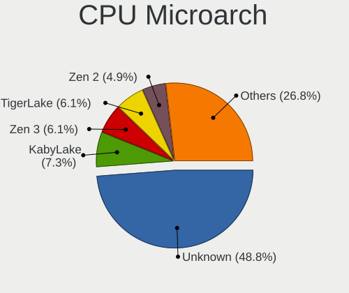

| Name        | Computers | Percent |
|-------------|-----------|---------|
| Unknown     | 40        | 48.78%  |
| KabyLake    | 6         | 7.32%   |
| Zen 3       | 5         | 6.1%    |
| TigerLake   | 5         | 6.1%    |
| Zen 2       | 4         | 4.88%   |
| Skylake     | 4         | 4.88%   |
| Haswell     | 4         | 4.88%   |
| Broadwell   | 3         | 3.66%   |
| SandyBridge | 2         | 2.44%   |
| CometLake   | 2         | 2.44%   |
| Zen+        | 1         | 1.22%   |
| Zen         | 1         | 1.22%   |
| Silvermont  | 1         | 1.22%   |
| Penryn      | 1         | 1.22%   |
| K10         | 1         | 1.22%   |
| IvyBridge   | 1         | 1.22%   |
| Goldmont    | 1         | 1.22%   |

Graphics
--------

GPU Vendor
----------

Vendors of graphics cards

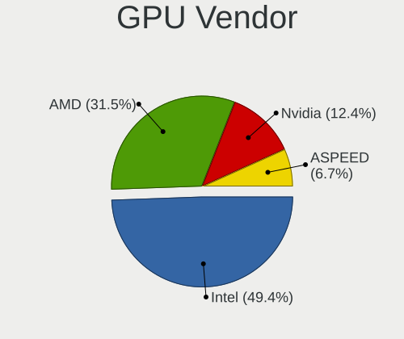

| Vendor            | Computers | Percent |
|-------------------|-----------|---------|
| Intel             | 44        | 49.44%  |
| AMD               | 28        | 31.46%  |
| Nvidia            | 11        | 12.36%  |
| ASPEED Technology | 6         | 6.74%   |

GPU Model
---------

Graphics card models

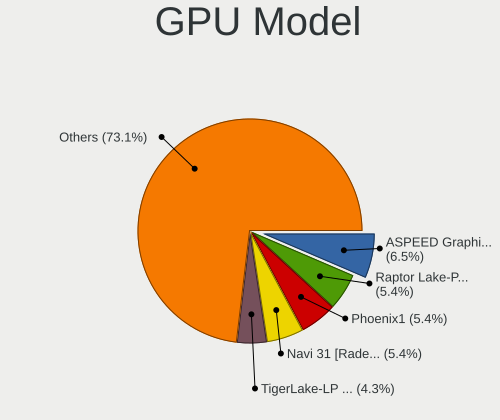

| Model                                                                     | Computers | Percent |
|---------------------------------------------------------------------------|-----------|---------|
| ASPEED Technology ASPEED Graphics Family                                  | 6         | 6.45%   |
| Intel Raptor Lake-P [Iris Xe Graphics]                                    | 5         | 5.38%   |
| AMD Phoenix1                                                              | 5         | 5.38%   |
| AMD Navi 31 [Radeon RX 7900 XT/7900 XTX/7900 GRE/7900M]                   | 5         | 5.38%   |
| Intel TigerLake-LP GT2 [Iris Xe Graphics]                                 | 4         | 4.3%    |
| AMD Raphael                                                               | 4         | 4.3%    |
| AMD Renoir [Radeon Vega Series / Radeon Vega Mobile Series]               | 3         | 3.23%   |
| Intel TigerLake-H GT1 [UHD Graphics]                                      | 2         | 2.15%   |
| Intel Meteor Lake-P [Intel Graphics]                                      | 2         | 2.15%   |
| Intel Meteor Lake-P [Intel Arc Graphics]                                  | 2         | 2.15%   |
| Intel Kaby Lake-U GT2 [HD Graphics 620]                                   | 2         | 2.15%   |
| Intel Kaby Lake-R GT2 [UHD Graphics 620]                                  | 2         | 2.15%   |
| Intel Alder Lake-P GT2 [Iris Xe Graphics]                                 | 2         | 2.15%   |
| Intel Alder Lake-N [UHD Graphics]                                         | 2         | 2.15%   |
| Intel 4th Gen Core Processor Integrated Graphics Controller               | 2         | 2.15%   |
| Intel 2nd Generation Core Processor Family Integrated Graphics Controller | 2         | 2.15%   |
| AMD Rembrandt [Radeon 680M]                                               | 2         | 2.15%   |
| AMD Navi 48 [Radeon RX 9070/9070 XT/9070 GRE]                             | 2         | 2.15%   |
| AMD Cezanne [Radeon Vega Series / Radeon Vega Mobile Series]              | 2         | 2.15%   |
| Nvidia TU117GLM [T1200 Laptop GPU]                                        | 1         | 1.08%   |
| Nvidia TU117GLM [Quadro T2000 Mobile / Max-Q]                             | 1         | 1.08%   |
| Nvidia TU117GLM [Quadro T1000 Mobile]                                     | 1         | 1.08%   |
| Nvidia GP108 [GeForce GT 1030]                                            | 1         | 1.08%   |
| Nvidia GP104GLM [Quadro P3000 Mobile]                                     | 1         | 1.08%   |
| Nvidia GP104 [GeForce GTX 1070]                                           | 1         | 1.08%   |
| Nvidia GP102 [GeForce GTX 1080 Ti]                                        | 1         | 1.08%   |
| Nvidia GM108M [GeForce 940M]                                              | 1         | 1.08%   |
| Nvidia GK107GLM [Quadro K1100M]                                           | 1         | 1.08%   |
| Nvidia GK106GLM [Quadro K2100M]                                           | 1         | 1.08%   |
| Nvidia GA104M [GeForce RTX 3070 Mobile / Max-Q]                           | 1         | 1.08%   |
| Intel Tiger Lake-LP GT2 [UHD Graphics G4]                                 | 1         | 1.08%   |
| Intel Skylake-U GT3 [Iris Graphics 540]                                   | 1         | 1.08%   |
| Intel Skylake-U GT2 [HD Graphics 520]                                     | 1         | 1.08%   |
| Intel Skylake-S GT2 [HD Graphics 530]                                     | 1         | 1.08%   |
| Intel Raptor Lake-S GT1 [UHD Graphics 770]                                | 1         | 1.08%   |
| Intel Raptor Lake-P [UHD Graphics]                                        | 1         | 1.08%   |
| Intel Mobile 4 Series Chipset Integrated Graphics Controller              | 1         | 1.08%   |
| Intel Haswell-ULT Integrated Graphics Controller                          | 1         | 1.08%   |
| Intel CometLake-U GT2 [UHD Graphics]                                      | 1         | 1.08%   |
| Intel CometLake-H GT2 [UHD Graphics]                                      | 1         | 1.08%   |

GPU Combo
---------

Combinations of graphics cards

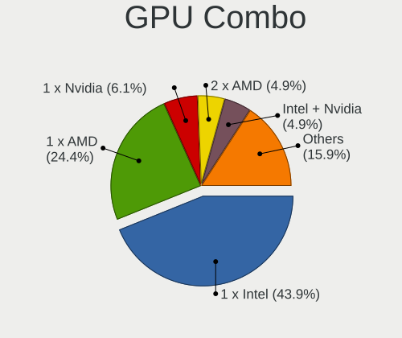

| Name            | Computers | Percent |
|-----------------|-----------|---------|
| 1 x Intel       | 36        | 43.9%   |
| 1 x AMD         | 20        | 24.39%  |
| 1 x Nvidia      | 5         | 6.1%    |
| 2 x AMD         | 4         | 4.88%   |
| Intel + Nvidia  | 4         | 4.88%   |
| 1 x ASPEED      | 4         | 4.88%   |
| Other           | 3         | 3.66%   |
| Intel + AMD     | 2         | 2.44%   |
| 2 x Intel       | 1         | 1.22%   |
| Nvidia + ASPEED | 1         | 1.22%   |
| AMD + Nvidia    | 1         | 1.22%   |
| AMD + ASPEED    | 1         | 1.22%   |

GPU Driver
----------

Free vs proprietary

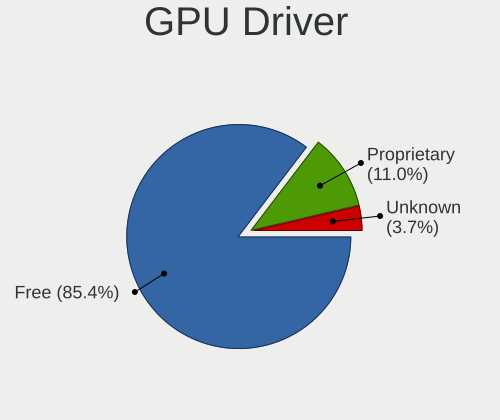

| Driver      | Computers | Percent |
|-------------|-----------|---------|
| Free        | 70        | 85.37%  |
| Proprietary | 9         | 10.98%  |
| Unknown     | 3         | 3.66%   |

GPU Memory
----------

Total video memory

| Size in GB | Computers | Percent |
|------------|-----------|---------|
| Unknown    | 62        | 73.81%  |
| 1.01-2.0   | 8         | 9.52%   |
| 3.01-4.0   | 4         | 4.76%   |
| 8.01-16.0  | 3         | 3.57%   |
| 16.01-24.0 | 2         | 2.38%   |
| 0.51-1.0   | 2         | 2.38%   |
| 7.01-8.0   | 1         | 1.19%   |
| 5.01-6.0   | 1         | 1.19%   |
| 0.01-0.5   | 1         | 1.19%   |

Monitor
-------

Monitor Vendor
--------------

Monitor vendors

| Vendor              | Computers | Percent |
|---------------------|-----------|---------|
| BOE                 | 10        | 16.95%  |
| Dell                | 8         | 13.56%  |
| AU Optronics        | 8         | 13.56%  |
| LG Display          | 5         | 8.47%   |
| Samsung Electronics | 3         | 5.08%   |
| Philips             | 3         | 5.08%   |
| Chimei Innolux      | 3         | 5.08%   |
| ViewSonic           | 2         | 3.39%   |
| Lenovo              | 2         | 3.39%   |
| Goldstar            | 2         | 3.39%   |
| Apple               | 2         | 3.39%   |
| SDC                 | 1         | 1.69%   |
| Panasonic           | 1         | 1.69%   |
| HUAWEI              | 1         | 1.69%   |
| HPN                 | 1         | 1.69%   |
| HKC                 | 1         | 1.69%   |
| Hewlett-Packard     | 1         | 1.69%   |
| CTO                 | 1         | 1.69%   |
| CSO                 | 1         | 1.69%   |
| BenQ                | 1         | 1.69%   |
| Acer                | 1         | 1.69%   |
| Unknown             | 1         | 1.69%   |

Monitor Model
-------------

Monitor models

| Model                                                                | Computers | Percent |
|----------------------------------------------------------------------|-----------|---------|
| BOE LCD Monitor BOE095F 2256x1504 280x190mm 13.3-inch                | 3         | 4.48%   |
| Philips 271P4 PHL08C3 1920x1080 600x340mm 27.2-inch                  | 2         | 2.99%   |
| ViewSonic VX2457 VSCB931 1920x1080 520x290mm 23.4-inch               | 1         | 1.49%   |
| ViewSonic VG2239 Series VSCC42B 1920x1080 480x270mm 21.7-inch        | 1         | 1.49%   |
| SDC LCD Monitor 5440x1080                                            | 1         | 1.49%   |
| SDC LCD Monitor 3520x1080                                            | 1         | 1.49%   |
| SDC LCD Monitor 1600x900                                             | 1         | 1.49%   |
| SDC LCD Monitor                                                      | 1         | 1.49%   |
| Samsung Electronics S22C450 SAM09C5 1920x1080 480x270mm 21.7-inch    | 1         | 1.49%   |
| Samsung Electronics S19C200 SAM09AC 1366x768 410x230mm 18.5-inch     | 1         | 1.49%   |
| Samsung Electronics LCD Monitor SDC3754 1600x900 380x210mm 17.1-inch | 1         | 1.49%   |
| Philips PHL 242B9T PHL0931 1920x1080 530x300mm 24.0-inch             | 1         | 1.49%   |
| Philips LCD Monitor 271P4 5440x1080                                  | 1         | 1.49%   |
| Philips LCD Monitor 271P4 3520x1080                                  | 1         | 1.49%   |
| Philips LCD Monitor 271P4                                            | 1         | 1.49%   |
| Panasonic LCD Monitor MEI96A2 2880x1620 340x190mm 15.3-inch          | 1         | 1.49%   |
| LG Display LCD Monitor LGD06ED 1920x1200 300x190mm 14.0-inch         | 1         | 1.49%   |
| LG Display LCD Monitor LGD069F 1920x1080 290x170mm 13.2-inch         | 1         | 1.49%   |
| LG Display LCD Monitor LGD046F 1920x1080 340x190mm 15.3-inch         | 1         | 1.49%   |
| LG Display LCD Monitor LGD0437 1920x1080 280x160mm 12.7-inch         | 1         | 1.49%   |
| LG Display LCD Monitor LGD0258 1600x900 350x190mm 15.7-inch          | 1         | 1.49%   |
| Lenovo LEN L1950wD LEN1086 1920x1080 410x260mm 19.1-inch             | 1         | 1.49%   |
| Lenovo LCD Monitor LEN4014 1440x900 260x160mm 12.0-inch              | 1         | 1.49%   |
| HUAWEI AD80HW HWV2402 1920x1080 530x300mm 24.0-inch                  | 1         | 1.49%   |
| HPN LCD Monitor HP P24h G4                                           | 1         | 1.49%   |
| HKC 27E6QC HKC274F 2560x1440 600x330mm 27.0-inch                     | 1         | 1.49%   |
| Hewlett-Packard 27fh HPN354B 1920x1080 600x340mm 27.2-inch           | 1         | 1.49%   |
| Goldstar LG HDR WQHD+ GSM774C 3840x1600 880x370mm 37.6-inch          | 1         | 1.49%   |
| Goldstar 24GM77 GSM5A91 1920x1080 530x300mm 24.0-inch                | 1         | 1.49%   |
| Dell U3417W DELA0DF 3440x1440 800x330mm 34.1-inch                    | 1         | 1.49%   |
| Dell U3417W DELA0DE 3440x1440 800x330mm 34.1-inch                    | 1         | 1.49%   |
| Dell U2720Q DEL41B4 3840x2160 600x340mm 27.2-inch                    | 1         | 1.49%   |
| Dell U2311H DELA060 1920x1080 510x290mm 23.1-inch                    | 1         | 1.49%   |
| Dell S2522HG DELA1C1 1920x1080 540x300mm 24.3-inch                   | 1         | 1.49%   |
| Dell P2719HC DEL4186 1920x1080 600x340mm 27.2-inch                   | 1         | 1.49%   |
| Dell P2415Q DELA0C0 3840x2160 530x300mm 24.0-inch                    | 1         | 1.49%   |
| Dell P2415Q DELA0BE 3840x2160 530x300mm 24.0-inch                    | 1         | 1.49%   |
| Dell P2414H DELA09B 1920x1080 530x300mm 24.0-inch                    | 1         | 1.49%   |
| Dell LCD Monitor P2720DC 2560x1440                                   | 1         | 1.49%   |
| CTO LCD Monitor CTO1115 3840x2160 340x190mm 15.3-inch                | 1         | 1.49%   |

Monitor Resolution
------------------

Monitor screen resolution

| Resolution        | Computers | Percent |
|-------------------|-----------|---------|
| 1920x1080 (FHD)   | 29        | 50.88%  |
| 3840x2160 (4K)    | 4         | 7.02%   |
| 2560x1440 (QHD)   | 4         | 7.02%   |
| 2256x1504         | 3         | 5.26%   |
| 1366x768 (WXGA)   | 3         | 5.26%   |
| 1920x1200 (WUXGA) | 2         | 3.51%   |
| 1600x900 (HD+)    | 2         | 3.51%   |
| 1440x900 (WXGA+)  | 2         | 3.51%   |
| 5440x1080         | 1         | 1.75%   |
| 3840x1600         | 1         | 1.75%   |
| 3520x1080         | 1         | 1.75%   |
| 3440x1440         | 1         | 1.75%   |
| 2880x1920         | 1         | 1.75%   |
| 2880x1800         | 1         | 1.75%   |
| 2560x1600         | 1         | 1.75%   |
| Unknown           | 1         | 1.75%   |

Monitor Diagonal
----------------

Diagonal size in inches

| Inches  | Computers | Percent |
|---------|-----------|---------|
| 15      | 14        | 24.56%  |
| 13      | 12        | 21.05%  |
| 27      | 8         | 14.04%  |
| 24      | 5         | 8.77%   |
| 17      | 3         | 5.26%   |
| Unknown | 3         | 5.26%   |
| 23      | 2         | 3.51%   |
| 21      | 2         | 3.51%   |
| 14      | 2         | 3.51%   |
| 12      | 2         | 3.51%   |
| 37      | 1         | 1.75%   |
| 34      | 1         | 1.75%   |
| 19      | 1         | 1.75%   |
| 18      | 1         | 1.75%   |

Monitor Width
-------------

Physical width

| Width in mm | Computers | Percent |
|-------------|-----------|---------|
| 301-350     | 19        | 33.33%  |
| 501-600     | 15        | 26.32%  |
| 201-300     | 11        | 19.3%   |
| 401-500     | 4         | 7.02%   |
| 351-400     | 3         | 5.26%   |
| Unknown     | 3         | 5.26%   |
| 801-900     | 1         | 1.75%   |
| 701-800     | 1         | 1.75%   |

Aspect Ratio
------------

Proportional relationship between the width and the height

| Ratio   | Computers | Percent |
|---------|-----------|---------|
| 16/9    | 35        | 68.63%  |
| 16/10   | 6         | 11.76%  |
| 3/2     | 5         | 9.8%    |
| Unknown | 3         | 5.88%   |
| 21/9    | 2         | 3.92%   |

Monitor Area
------------

Area in inch²

| Area in inch² | Computers | Percent |
|----------------|-----------|---------|
| 81-90          | 13        | 22.81%  |
| 91-100         | 11        | 19.3%   |
| 301-350        | 8         | 14.04%  |
| 201-250        | 8         | 14.04%  |
| 121-130        | 3         | 5.26%   |
| Unknown        | 3         | 5.26%   |
| 61-70          | 2         | 3.51%   |
| 101-110        | 2         | 3.51%   |
| 71-80          | 1         | 1.75%   |
| 351-500        | 1         | 1.75%   |
| 251-300        | 1         | 1.75%   |
| 151-200        | 1         | 1.75%   |
| 141-150        | 1         | 1.75%   |
| 111-120        | 1         | 1.75%   |
| 501-1000       | 1         | 1.75%   |

Pixel Density
-------------

Pixels per inch

| Density       | Computers | Percent |
|---------------|-----------|---------|
| 121-160       | 17        | 29.82%  |
| 51-100        | 12        | 21.05%  |
| 101-120       | 11        | 19.3%   |
| 161-240       | 10        | 17.54%  |
| More than 240 | 4         | 7.02%   |
| Unknown       | 3         | 5.26%   |

Multiple Monitors
-----------------

Total monitors connected

| Total | Computers | Percent |
|-------|-----------|---------|
| 0     | 38        | 45.24%  |
| 1     | 35        | 41.67%  |
| 2     | 8         | 9.52%   |
| 3     | 3         | 3.57%   |

Network
-------

Net Controller Vendor
---------------------

Controller vendors

| Vendor                            | Computers | Percent |
|-----------------------------------|-----------|---------|
| Intel                             | 61        | 50.41%  |
| Realtek Semiconductor             | 31        | 25.62%  |
| MediaTek                          | 7         | 5.79%   |
| Broadcom                          | 4         | 3.31%   |
| Qualcomm Atheros                  | 2         | 1.65%   |
| Aquantia                          | 2         | 1.65%   |
| TP-Link                           | 1         | 0.83%   |
| Sierra Wireless                   | 1         | 0.83%   |
| Samsung Electronics               | 1         | 0.83%   |
| Qualcomm Technologies             | 1         | 0.83%   |
| OPPO Electronics                  | 1         | 0.83%   |
| Mellanox Technologies             | 1         | 0.83%   |
| Lenovo                            | 1         | 0.83%   |
| Insyde Software                   | 1         | 0.83%   |
| Hewlett-Packard                   | 1         | 0.83%   |
| Fibocom                           | 1         | 0.83%   |
| Ericsson Business Mobile Networks | 1         | 0.83%   |
| Edimax Technology                 | 1         | 0.83%   |
| D-Link System                     | 1         | 0.83%   |
| American Megatrends               | 1         | 0.83%   |

Net Controller Model
--------------------

Controller models

| Model                                                                           | Computers | Percent |
|---------------------------------------------------------------------------------|-----------|---------|
| Realtek RTL8111/8168/8211/8411 PCI Express Gigabit Ethernet Controller          | 14        | 9.09%   |
| Intel Wi-Fi 6E(802.11ax) AX210/AX1675* 2x2 [Typhoon Peak]                       | 9         | 5.84%   |
| Intel Raptor Lake PCH CNVi WiFi                                                 | 6         | 3.9%    |
| Realtek RTL8125 2.5GbE Controller                                               | 5         | 3.25%   |
| MediaTek MT7922 802.11ax PCI Express Wireless Network Adapter                   | 5         | 3.25%   |
| Intel Wireless 8265 / 8275                                                      | 4         | 2.6%    |
| Intel Wi-Fi 6 AX200                                                             | 4         | 2.6%    |
| Intel I210 Gigabit Network Connection                                           | 4         | 2.6%    |
| Intel Ethernet Controller I226-V                                                | 4         | 2.6%    |
| Intel Ethernet Controller I225-V                                                | 4         | 2.6%    |
| Realtek USB 2.5GbE Controller                                                   | 3         | 1.95%   |
| Realtek RTL8852BE PCIe 802.11ax Wireless Network Controller                     | 3         | 1.95%   |
| Intel Wireless 7260                                                             | 3         | 1.95%   |
| Intel Wi-Fi 6 AX201                                                             | 3         | 1.95%   |
| Intel Meteor Lake PCH CNVi WiFi                                                 | 3         | 1.95%   |
| Intel Ethernet Connection (18) I219-LM                                          | 3         | 1.95%   |
| Intel 700 Series Chipset CNVi WiFi                                              | 3         | 1.95%   |
| Realtek RTL8821CE 802.11ac PCIe Wireless Network Adapter                        | 2         | 1.3%    |
| Qualcomm Atheros QCA9565 / AR9565 Wireless Network Adapter                      | 2         | 1.3%    |
| Intel Wireless 7265                                                             | 2         | 1.3%    |
| Intel I350 Gigabit Network Connection                                           | 2         | 1.3%    |
| Intel Ethernet Connection I217-LM                                               | 2         | 1.3%    |
| Intel Ethernet Connection (4) I219-V                                            | 2         | 1.3%    |
| Intel Ethernet Connection (23) I219-V                                           | 2         | 1.3%    |
| Intel Comet Lake PCH CNVi WiFi                                                  | 2         | 1.3%    |
| Broadcom NetXtreme BCM57765 Gigabit Ethernet PCIe                               | 2         | 1.3%    |
| Broadcom BCM4331 802.11a/b/g/n                                                  | 2         | 1.3%    |
| TP-Link AC600 wireless Realtek RTL8811AU [Archer T2U Nano]                      | 1         | 0.65%   |
| Sierra Wireless EM7565 USB Device                                               | 1         | 0.65%   |
| Samsung Galaxy series, misc. (tethering mode)                                   | 1         | 0.65%   |
| Realtek RTL8922AE 802.11be PCIe Wireless Network Adapter                        | 1         | 0.65%   |
| Realtek RTL88x2bu [AC1200 Techkey]                                              | 1         | 0.65%   |
| Realtek RTL8188GU 802.11n WLAN Adapter (After Modeswitch)                       | 1         | 0.65%   |
| Realtek RTL8188EUS 802.11n Wireless Network Adapter                             | 1         | 0.65%   |
| Realtek RTL8126 5GbE Controller                                                 | 1         | 0.65%   |
| Realtek PCIe GbE Family Controller                                              | 1         | 0.65%   |
| Qualcomm QCNFA765 Wireless Network Adapter                                      | 1         | 0.65%   |
| OPPO OnePlus Android ADB Interface                                              | 1         | 0.65%   |
| Mellanox MT27710 Family [ConnectX-4 Lx]                                         | 1         | 0.65%   |
| MediaTek MT7927 802.11be 320MHz 2x2 PCIe Wireless Network Adapter [Filogic 380] | 1         | 0.65%   |

Wireless Vendor
---------------

Wireless vendors

| Vendor                | Computers | Percent |
|-----------------------|-----------|---------|
| Intel                 | 44        | 62.86%  |
| Realtek Semiconductor | 9         | 12.86%  |
| MediaTek              | 6         | 8.57%   |
| Broadcom              | 4         | 5.71%   |
| Qualcomm Atheros      | 2         | 2.86%   |
| TP-Link               | 1         | 1.43%   |
| Sierra Wireless       | 1         | 1.43%   |
| Qualcomm Technologies | 1         | 1.43%   |
| Edimax Technology     | 1         | 1.43%   |
| D-Link System         | 1         | 1.43%   |

Wireless Model
--------------

Wireless models

| Model                                                                      | Computers | Percent |
|----------------------------------------------------------------------------|-----------|---------|
| Intel Wi-Fi 6E(802.11ax) AX210/AX1675* 2x2 [Typhoon Peak]                  | 9         | 12.86%  |
| Intel Raptor Lake PCH CNVi WiFi                                            | 6         | 8.57%   |
| MediaTek MT7922 802.11ax PCI Express Wireless Network Adapter              | 5         | 7.14%   |
| Intel Wireless 8265 / 8275                                                 | 4         | 5.71%   |
| Intel Wi-Fi 6 AX200                                                        | 4         | 5.71%   |
| Realtek RTL8852BE PCIe 802.11ax Wireless Network Controller                | 3         | 4.29%   |
| Intel Wireless 7260                                                        | 3         | 4.29%   |
| Intel Wi-Fi 6 AX201                                                        | 3         | 4.29%   |
| Intel Meteor Lake PCH CNVi WiFi                                            | 3         | 4.29%   |
| Intel 700 Series Chipset CNVi WiFi                                         | 3         | 4.29%   |
| Realtek RTL8821CE 802.11ac PCIe Wireless Network Adapter                   | 2         | 2.86%   |
| Qualcomm Atheros QCA9565 / AR9565 Wireless Network Adapter                 | 2         | 2.86%   |
| Intel Wireless 7265                                                        | 2         | 2.86%   |
| Intel Comet Lake PCH CNVi WiFi                                             | 2         | 2.86%   |
| Broadcom BCM4331 802.11a/b/g/n                                             | 2         | 2.86%   |
| TP-Link AC600 wireless Realtek RTL8811AU [Archer T2U Nano]                 | 1         | 1.43%   |
| Sierra Wireless EM7565 USB Device                                          | 1         | 1.43%   |
| Realtek RTL8922AE 802.11be PCIe Wireless Network Adapter                   | 1         | 1.43%   |
| Realtek RTL88x2bu [AC1200 Techkey]                                         | 1         | 1.43%   |
| Realtek RTL8188GU 802.11n WLAN Adapter (After Modeswitch)                  | 1         | 1.43%   |
| Realtek RTL8188EUS 802.11n Wireless Network Adapter                        | 1         | 1.43%   |
| Qualcomm QCNFA765 Wireless Network Adapter                                 | 1         | 1.43%   |
| MediaTek MT7921 802.11ax PCIe Wireless Network Adapter [Filogic 330]       | 1         | 1.43%   |
| Intel Wireless 8260                                                        | 1         | 1.43%   |
| Intel Ultimate N WiFi Link 5300                                            | 1         | 1.43%   |
| Intel Dual Band Wireless-AC 3168NGW [Stone Peak]                           | 1         | 1.43%   |
| Intel Comet Lake PCH-LP CNVi WiFi                                          | 1         | 1.43%   |
| Intel Centrino Advanced-N 6205 [Taylor Peak]                               | 1         | 1.43%   |
| Edimax AC600 Wireless LAN USB Adapter                                      | 1         | 1.43%   |
| D-Link System AirPlus G DWL-G122 Wireless Adapter(rev.C1) [Ralink RT2571W] | 1         | 1.43%   |
| Broadcom BCM4360 802.11ac Dual Band Wireless Network Adapter               | 1         | 1.43%   |
| Broadcom BCM4350 802.11ac Wireless Network Adapter                         | 1         | 1.43%   |

Ethernet Vendor
---------------

Ethernet vendors

| Vendor                | Computers | Percent |
|-----------------------|-----------|---------|
| Intel                 | 41        | 57.75%  |
| Realtek Semiconductor | 21        | 29.58%  |
| Broadcom              | 2         | 2.82%   |
| Aquantia              | 2         | 2.82%   |
| Samsung Electronics   | 1         | 1.41%   |
| OPPO Electronics      | 1         | 1.41%   |
| Lenovo                | 1         | 1.41%   |
| Insyde Software       | 1         | 1.41%   |
| American Megatrends   | 1         | 1.41%   |

Ethernet Model
--------------

Ethernet models

| Model                                                                          | Computers | Percent |
|--------------------------------------------------------------------------------|-----------|---------|
| Realtek RTL8111/8168/8211/8411 PCI Express Gigabit Ethernet Controller         | 14        | 18.42%  |
| Realtek RTL8125 2.5GbE Controller                                              | 4         | 5.26%   |
| Intel I210 Gigabit Network Connection                                          | 4         | 5.26%   |
| Intel Ethernet Controller I226-V                                               | 4         | 5.26%   |
| Intel Ethernet Controller I225-V                                               | 4         | 5.26%   |
| Realtek USB 2.5GbE Controller                                                  | 3         | 3.95%   |
| Intel Ethernet Connection (18) I219-LM                                         | 3         | 3.95%   |
| Intel I350 Gigabit Network Connection                                          | 2         | 2.63%   |
| Intel Ethernet Connection I217-LM                                              | 2         | 2.63%   |
| Intel Ethernet Connection (4) I219-V                                           | 2         | 2.63%   |
| Intel Ethernet Connection (23) I219-V                                          | 2         | 2.63%   |
| Broadcom NetXtreme BCM57765 Gigabit Ethernet PCIe                              | 2         | 2.63%   |
| Samsung Galaxy series, misc. (tethering mode)                                  | 1         | 1.32%   |
| Realtek RTL8126 5GbE Controller                                                | 1         | 1.32%   |
| OPPO OnePlus Android ADB Interface                                             | 1         | 1.32%   |
| Lenovo USB-C Dock Ethernet                                                     | 1         | 1.32%   |
| Intel I211 Gigabit Network Connection                                          | 1         | 1.32%   |
| Intel Ethernet Controller X710 for 10GbE SFP+                                  | 1         | 1.32%   |
| Intel Ethernet Controller X550                                                 | 1         | 1.32%   |
| Intel Ethernet Controller I225-LM                                              | 1         | 1.32%   |
| Intel Ethernet Controller I219-V                                               | 1         | 1.32%   |
| Intel Ethernet Connection X552 10 GbE SFP+                                     | 1         | 1.32%   |
| Intel Ethernet Connection I219-LM                                              | 1         | 1.32%   |
| Intel Ethernet Connection I218-LM                                              | 1         | 1.32%   |
| Intel Ethernet Connection (5) I219-LM                                          | 1         | 1.32%   |
| Intel Ethernet Connection (4) I219-LM                                          | 1         | 1.32%   |
| Intel Ethernet Connection (3) I218-LM                                          | 1         | 1.32%   |
| Intel Ethernet Connection (23) I219-LM                                         | 1         | 1.32%   |
| Intel Ethernet Connection (17) I219-LM                                         | 1         | 1.32%   |
| Intel Ethernet Connection (16) I219-V                                          | 1         | 1.32%   |
| Intel Ethernet Connection (14) I219-LM                                         | 1         | 1.32%   |
| Intel Ethernet Connection (11) I219-LM                                         | 1         | 1.32%   |
| Intel Ethernet Connection (10) I219-LM                                         | 1         | 1.32%   |
| Intel 82599 10 Gigabit Network Connection                                      | 1         | 1.32%   |
| Intel 82579LM Gigabit Network Connection (Lewisville)                          | 1         | 1.32%   |
| Intel 82574L Gigabit Network Connection                                        | 1         | 1.32%   |
| Intel 82571EB/82571GB Gigabit Ethernet Controller D0/D1 (copper applications)  | 1         | 1.32%   |
| Intel 82567LM Gigabit Network Connection                                       | 1         | 1.32%   |
| Insyde Software RNDIS/Ethernet Gadget                                          | 1         | 1.32%   |
| Aquantia AQtion AQC100 NBase-T/IEEE 802.3an Ethernet Controller [Atlantic 10G] | 1         | 1.32%   |

Net Controller Kind
-------------------

Ethernet, WiFi or modem

| Kind     | Computers | Percent |
|----------|-----------|---------|
| WiFi     | 64        | 47.41%  |
| Ethernet | 63        | 46.67%  |
| Unknown  | 6         | 4.44%   |
| Modem    | 2         | 1.48%   |

Used Controller
---------------

Currently used network controller

| Kind     | Computers | Percent |
|----------|-----------|---------|
| Ethernet | 37        | 53.62%  |
| WiFi     | 32        | 46.38%  |

NICs
----

Total network controllers on board

| Total | Computers | Percent |
|-------|-----------|---------|
| 2     | 46        | 55.42%  |
| 1     | 25        | 30.12%  |
| 3     | 7         | 8.43%   |
| 0     | 3         | 3.61%   |
| 8     | 1         | 1.2%    |
| 4     | 1         | 1.2%    |

IPv6
----

IPv6 vs IPv4

| Used | Computers | Percent |
|------|-----------|---------|
| No   | 58        | 69.05%  |
| Yes  | 26        | 30.95%  |

Bluetooth
---------

Bluetooth Vendor
----------------

Controller vendors

| Vendor                          | Computers | Percent |
|---------------------------------|-----------|---------|
| Intel                           | 43        | 67.19%  |
| Realtek Semiconductor           | 5         | 7.81%   |
| Foxconn / Hon Hai               | 4         | 6.25%   |
| MediaTek                        | 3         | 4.69%   |
| Apple                           | 3         | 4.69%   |
| USI                             | 1         | 1.56%   |
| Shenzhen Goodix Technology      | 1         | 1.56%   |
| Qualcomm Atheros Communications | 1         | 1.56%   |
| Lite-On Technology              | 1         | 1.56%   |
| IMC Networks                    | 1         | 1.56%   |
| Broadcom                        | 1         | 1.56%   |

Bluetooth Model
---------------

Controller models

| Model                                              | Computers | Percent |
|----------------------------------------------------|-----------|---------|
| Intel AX211 Bluetooth                              | 11        | 17.19%  |
| Intel Bluetooth wireless interface                 | 9         | 14.06%  |
| Intel AX210 Bluetooth                              | 9         | 14.06%  |
| Intel AX201 Bluetooth                              | 7         | 10.94%  |
| Intel AX200 Bluetooth                              | 5         | 7.81%   |
| Realtek Bluetooth Adapter                          | 3         | 4.69%   |
| MediaTek Wireless_Device                           | 3         | 4.69%   |
| Foxconn / Hon Hai RZ616 Bluetooth Adapter          | 2         | 3.13%   |
| Apple Bluetooth Host Controller                    | 2         | 3.13%   |
| USI Qualcomm WCN685x Bluetooth Adapter             | 1         | 1.56%   |
| Shenzhen Goodix retrieving string failed           | 1         | 1.56%   |
| Realtek  Bluetooth 4.2 Adapter                     | 1         | 1.56%   |
| Realtek Bluetooth Radio                            | 1         | 1.56%   |
| Qualcomm Atheros AR3012 Bluetooth 4.0              | 1         | 1.56%   |
| Lite-On Atheros AR3012 Bluetooth                   | 1         | 1.56%   |
| Intel Wireless-AC 3168 Bluetooth                   | 1         | 1.56%   |
| Intel Bluetooth 9460/9560 Jefferson Peak (JfP)     | 1         | 1.56%   |
| IMC Networks Realtek Bluetooth Adapter             | 1         | 1.56%   |
| Foxconn / Hon Hai Wireless_Device                  | 1         | 1.56%   |
| Foxconn / Hon Hai MediaTek Bluetooth Adapter       | 1         | 1.56%   |
| Broadcom BCM2045B (BDC-2.1) [Bluetooth Controller] | 1         | 1.56%   |
| Apple Broadcom Built-in Bluetooth                  | 1         | 1.56%   |

Sound
-----

Sound Vendor
------------

Sound card vendors

| Vendor                                       | Computers | Percent |
|----------------------------------------------|-----------|---------|
| Intel                                        | 51        | 45.13%  |
| AMD                                          | 30        | 26.55%  |
| Nvidia                                       | 9         | 7.96%   |
| C-Media Electronics                          | 5         | 4.42%   |
| ASUSTek Computer                             | 4         | 3.54%   |
| SteelSeries ApS                              | 2         | 1.77%   |
| Zoran Co. Personal Media Division (Nogatech) | 1         | 0.88%   |
| Universal Audio                              | 1         | 0.88%   |
| Trust International                          | 1         | 0.88%   |
| Thesycon Systemsoftware & Consulting         | 1         | 0.88%   |
| Mark of the Unicorn                          | 1         | 0.88%   |
| Lenovo                                       | 1         | 0.88%   |
| Huawei Technologies                          | 1         | 0.88%   |
| Creative Labs                                | 1         | 0.88%   |
| Cambridge Silicon Radio                      | 1         | 0.88%   |
| Blue Microphones                             | 1         | 0.88%   |
| BEHRINGER International                      | 1         | 0.88%   |
| Alesis                                       | 1         | 0.88%   |

Sound Model
-----------

Sound card models

| Model                                                                      | Computers | Percent |
|----------------------------------------------------------------------------|-----------|---------|
| AMD Ryzen HD Audio Controller                                              | 16        | 11.43%  |
| AMD Radeon High Definition Audio Controller                                | 12        | 8.57%   |
| Intel Sunrise Point-LP HD Audio                                            | 6         | 4.29%   |
| Intel Raptor Lake-P/U/H cAVS                                               | 6         | 4.29%   |
| AMD Navi 31 HDMI/DP Audio                                                  | 6         | 4.29%   |
| Intel Tiger Lake-LP Smart Sound Technology Audio Controller                | 5         | 3.57%   |
| AMD Starship/Matisse HD Audio Controller                                   | 5         | 3.57%   |
| Intel Meteor Lake-P HD Audio Controller                                    | 4         | 2.86%   |
| AMD Renoir/Cezanne HDMI/DP Audio Controller                                | 4         | 2.86%   |
| Nvidia TU107 GeForce GTX 1650 High Definition Audio Controller             | 3         | 2.14%   |
| Intel Raptor Lake High Definition Audio Controller                         | 3         | 2.14%   |
| Intel Alder Lake-N PCH High Definition Audio Controller                    | 3         | 2.14%   |
| Intel 8 Series/C220 Series Chipset High Definition Audio Controller        | 3         | 2.14%   |
| Nvidia GP104 High Definition Audio Controller                              | 2         | 1.43%   |
| Intel Xeon E3-1200 v3/4th Gen Core Processor HD Audio Controller           | 2         | 1.43%   |
| Intel Wildcat Point-LP High Definition Audio Controller                    | 2         | 1.43%   |
| Intel Tiger Lake-H HD Audio Controller                                     | 2         | 1.43%   |
| Intel Comet Lake PCH cAVS                                                  | 2         | 1.43%   |
| Intel Broadwell-U Audio Controller                                         | 2         | 1.43%   |
| Intel Alder Lake PCH-P High Definition Audio Controller                    | 2         | 1.43%   |
| Intel 6 Series/C200 Series Chipset Family High Definition Audio Controller | 2         | 1.43%   |
| C-Media Electronics USB Audio Class 1.0 and 2.0 Device                     | 2         | 1.43%   |
| C-Media Electronics Blue Snowball                                          | 2         | 1.43%   |
| ASUSTek Computer Realtek USB Audio                                         | 2         | 1.43%   |
| AMD Turks HDMI Audio [Radeon HD 6500/6600 / 6700M Series]                  | 2         | 1.43%   |
| AMD Navi 48 HDMI/DP Audio Controller                                       | 2         | 1.43%   |
| Zoran Co. Personal Media Division (Nogatech) USB Audio and HID             | 1         | 0.71%   |
| Universal Audio Volt 176                                                   | 1         | 0.71%   |
| Trust International Realtek USB Audio                                      | 1         | 0.71%   |
| Thesycon Systemsoftware & Consulting Topping DX3 Pro Audio Control         | 1         | 0.71%   |
| SteelSeries ApS SteelSeries Siberia 350                                    | 1         | 0.71%   |
| SteelSeries ApS SteelSeries Arctis 5 Arctis 5 Chat Arctis 5 Game           | 1         | 0.71%   |
| Nvidia GP108 High Definition Audio Controller                              | 1         | 0.71%   |
| Nvidia GP102 HDMI Audio Controller                                         | 1         | 0.71%   |
| Nvidia GK107 HDMI Audio Controller                                         | 1         | 0.71%   |
| Nvidia GA104 High Definition Audio Controller                              | 1         | 0.71%   |
| Mark of the Unicorn M Series                                               | 1         | 0.71%   |
| Lenovo ThinkPad USB-C Dock Gen2 USB Audio                                  | 1         | 0.71%   |
| Intel Haswell-ULT HD Audio Controller                                      | 1         | 0.71%   |
| Intel Comet Lake PCH-LP cAVS                                               | 1         | 0.71%   |

Memory
------

Memory Vendor
-------------

Memory module vendors

| Vendor              | Computers | Percent |
|---------------------|-----------|---------|
| Samsung Electronics | 19        | 21.59%  |
| SK hynix            | 14        | 15.91%  |
| Micron Technology   | 10        | 11.36%  |
| Kingston            | 10        | 11.36%  |
| Corsair             | 8         | 9.09%   |
| Crucial             | 6         | 6.82%   |
| G.Skill             | 5         | 5.68%   |
| A-DATA Technology   | 4         | 4.55%   |
| Unknown             | 3         | 3.41%   |
| Ramaxel Technology  | 2         | 2.27%   |
| Team                | 1         | 1.14%   |
| Patriot             | 1         | 1.14%   |
| Lexar Co Limited    | 1         | 1.14%   |
| Lexar               | 1         | 1.14%   |
| fef5                | 1         | 1.14%   |
| Elpida              | 1         | 1.14%   |
| ChangXin Memory     | 1         | 1.14%   |

Memory Model
------------

Memory module models

| Model                                                        | Computers | Percent |
|--------------------------------------------------------------|-----------|---------|
| A-DATA RAM AD5S560032G-SFW 32GB SODIMM DDR5 5600MT/s         | 4         | 4.35%   |
| Unknown                                                      | 3         | 3.26%   |
| SK hynix RAM HMT41GS6BFR8A-PB 8GB SODIMM DDR3 1600MT/s       | 2         | 2.17%   |
| Samsung RAM M471B1G73QH0-YK0 8GB SODIMM DDR3 1867MT/s        | 2         | 2.17%   |
| Samsung RAM M471A2G44AM0-CWE 16GiB SODIMM DDR4 3200MT/s      | 2         | 2.17%   |
| Samsung RAM M471A1K43BB1-CRC 8GB SODIMM DDR4 2400MT/s        | 2         | 2.17%   |
| Samsung RAM M471A1G44BB0-CWE 8GB SODIMM DDR4 3200MT/s        | 2         | 2.17%   |
| Kingston RAM 9965794-016.A00G 32GB DIMM DDR5 4800MT/s        | 2         | 2.17%   |
| Kingston RAM 9905744-111.A00G 32GB SODIMM DDR4 3200MT/s      | 2         | 2.17%   |
| G.Skill RAM F5-6000J3040G32G 32GB DIMM DDR5 4800MT/s         | 2         | 2.17%   |
| Team RAM TEAMGROUP-SD4-3200 32GB SODIMM DDR4 3200MT/s        | 1         | 1.09%   |
| SK hynix RAM Module 8GB SODIMM DDR4 3200MT/s                 | 1         | 1.09%   |
| SK hynix RAM Module 8GB DIMM LPDDR4 6400MT/s                 | 1         | 1.09%   |
| SK hynix RAM Module 4GB SODIMM DDR3 1333MT/s                 | 1         | 1.09%   |
| SK hynix RAM Module 32GB SODIMM DDR5 5600MT/s                | 1         | 1.09%   |
| SK hynix RAM HMT41GS6AFR8A-PB 8GB SODIMM DDR3 1600MT/s       | 1         | 1.09%   |
| SK hynix RAM HMT351S6EFR8C-PB 4GB SODIMM DDR3 1600MT/s       | 1         | 1.09%   |
| SK hynix RAM HMT351S6CFR8C-PB 4GB SODIMM DDR3 1600MT/s       | 1         | 1.09%   |
| SK hynix RAM HMCG88AGBSA092N 32GB SODIMM DDR5 5600MT/s       | 1         | 1.09%   |
| SK hynix RAM HMCG78AGBSA092N 16GB SODIMM DDR5 5600MT/s       | 1         | 1.09%   |
| SK hynix RAM HMCG66AGBSA095N 8GB SODIMM DDR5 5600MT/s        | 1         | 1.09%   |
| SK hynix RAM HMA82GR7CJR4N-XN 16GB DIMM DDR4 3200MT/s        | 1         | 1.09%   |
| SK hynix RAM H9JCNNNCP3MLYR-N6E 4GB DIMM LPDDR5 6400MT/s     | 1         | 1.09%   |
| SK hynix RAM H9HCNNN8KUMLHR 1GB 2400MT/s                     | 1         | 1.09%   |
| SK hynix RAM H58G56AK6BX069 2GB Row Of Chips LPDDR5 6400MT/s | 1         | 1.09%   |
| Samsung RAM Module 4GB SODIMM DDR3 1333MT/s                  | 1         | 1.09%   |
| Samsung RAM Module 16GB SODIMM DDR5 4800MT/s                 | 1         | 1.09%   |
| Samsung RAM M471B5173DB0-YK0 4GB SODIMM DDR3 1600MT/s        | 1         | 1.09%   |
| Samsung RAM M471A2G43AB2-CWE 16GB SODIMM DDR4 3200MT/s       | 1         | 1.09%   |
| Samsung RAM M471A1K43EB1-CWE 8GB SODIMM DDR4 3200MT/s        | 1         | 1.09%   |
| Samsung RAM M471A1G44AB0-CWE 8GB Row Of Chips DDR4 3200MT/s  | 1         | 1.09%   |
| Samsung RAM M425R1GB4BB0-CWMOD 8GB SODIMM DDR5 5600MT/s      | 1         | 1.09%   |
| Samsung RAM M393A2K43CB2-CTD 16GB DIMM DDR4 2667MT/s         | 1         | 1.09%   |
| Samsung RAM M386A8K40BM1-CPB 64GB DIMM DDR4 2133MT/s         | 1         | 1.09%   |
| Samsung RAM M323R2GA3DB0-CWMOL 16GB DIMM DDR5 5600MT/s       | 1         | 1.09%   |
| Samsung RAM K4EBE304EB-EGCG 8GB Row Of Chips LPDDR3 2133MT/s | 1         | 1.09%   |
| Ramaxel RAM RMSA3310MF96HAF-3200 8GB SODIMM DDR4 3200MT/s    | 1         | 1.09%   |
| Ramaxel RAM RMSA3260ME78HAF-2666 8GB SODIMM DDR4 2667MT/s    | 1         | 1.09%   |
| Patriot RAM PSD48G320081 8GB DIMM DDR4 3200MT/s              | 1         | 1.09%   |
| Micron RAM MT62F2G32D4DS-026 WT 8GB SODIMM LPDDR5 7500MT/s   | 1         | 1.09%   |

Memory Kind
-----------

Memory module kinds

| Kind    | Computers | Percent |
|---------|-----------|---------|
| DDR4    | 36        | 46.15%  |
| DDR5    | 21        | 26.92%  |
| DDR3    | 11        | 14.1%   |
| LPDDR5  | 5         | 6.41%   |
| LPDDR4  | 2         | 2.56%   |
| LPDDR3  | 2         | 2.56%   |
| Unknown | 1         | 1.28%   |

Memory Form Factor
------------------

Physical design of the memory module

| Name         | Computers | Percent |
|--------------|-----------|---------|
| SODIMM       | 47        | 59.49%  |
| DIMM         | 24        | 30.38%  |
| Row Of Chips | 7         | 8.86%   |
| Unknown      | 1         | 1.27%   |

Memory Size
-----------

Memory module size

| Size  | Computers | Percent |
|-------|-----------|---------|
| 16384 | 25        | 30.12%  |
| 8192  | 23        | 27.71%  |
| 32768 | 21        | 25.3%   |
| 4096  | 10        | 12.05%  |
| 1024  | 2         | 2.41%   |
| 65536 | 1         | 1.2%    |
| 2048  | 1         | 1.2%    |

Memory Speed
------------

Memory module speed

| Speed | Computers | Percent |
|-------|-----------|---------|
| 3200  | 24        | 30%     |
| 5600  | 12        | 15%     |
| 1600  | 8         | 10%     |
| 4800  | 7         | 8.75%   |
| 2400  | 7         | 8.75%   |
| 6400  | 6         | 7.5%    |
| 2133  | 4         | 5%      |
| 1867  | 3         | 3.75%   |
| 3600  | 2         | 2.5%    |
| 2667  | 2         | 2.5%    |
| 1333  | 2         | 2.5%    |
| 7500  | 1         | 1.25%   |
| 6000  | 1         | 1.25%   |
| 3733  | 1         | 1.25%   |

Printers & scanners
-------------------

Printer Vendor
--------------

Printer device vendors

Zero info for selected period =(

Printer Model
-------------

Printer device models

Zero info for selected period =(

Scanner Vendor
--------------

Scanner device vendors

Zero info for selected period =(

Scanner Model
-------------

Scanner device models

Zero info for selected period =(

Camera
------

Camera Vendor
-------------

Camera device vendors

| Vendor                                 | Computers | Percent |
|----------------------------------------|-----------|---------|
| Chicony Electronics                    | 10        | 20.41%  |
| Bison Electronics                      | 10        | 20.41%  |
| Realtek Semiconductor                  | 5         | 10.2%   |
| Quanta                                 | 4         | 8.16%   |
| Logitech                               | 4         | 8.16%   |
| Framework                              | 3         | 6.12%   |
| Microdia                               | 2         | 4.08%   |
| Luxvisions Innotech Limited            | 2         | 4.08%   |
| Apple                                  | 2         | 4.08%   |
| Unknown (3730304233343731345430)       | 1         | 2.04%   |
| Syntek                                 | 1         | 2.04%   |
| Sunplus Innovation Technology          | 1         | 2.04%   |
| Lite-On Technology                     | 1         | 2.04%   |
| IMC Networks                           | 1         | 2.04%   |
| Dell                                   | 1         | 2.04%   |
| Cheng Uei Precision Industry (Foxlink) | 1         | 2.04%   |

Camera Model
------------

Camera device models

| Model                                                                    | Computers | Percent |
|--------------------------------------------------------------------------|-----------|---------|
| Bison Integrated Camera                                                  | 7         | 14.29%  |
| Chicony Integrated Camera                                                | 5         | 10.2%   |
| Framework Laptop Webcam Module (2nd Gen)                                 | 3         | 6.12%   |
| Chicony HD Webcam                                                        | 3         | 6.12%   |
| Realtek Laptop Camera                                                    | 2         | 4.08%   |
| Realtek Integrated_Webcam_FHD                                            | 2         | 4.08%   |
| Apple FaceTime HD Camera                                                 | 2         | 4.08%   |
| Unknown (3730304233343731345430) USB Camera                              | 1         | 2.04%   |
| Syntek Integrated Camera                                                 | 1         | 2.04%   |
| Sunplus Integrated_Webcam_HD                                             | 1         | 2.04%   |
| Realtek USB 2.0 PC Camera                                                | 1         | 2.04%   |
| Quanta ov9734_techfront_camera                                           | 1         | 2.04%   |
| Quanta HP TrueVision HD Camera                                           | 1         | 2.04%   |
| Quanta HP HD Camera                                                      | 1         | 2.04%   |
| Quanta HP FHD Camera                                                     | 1         | 2.04%   |
| Microdia USB 2.0 Camera                                                  | 1         | 2.04%   |
| Microdia Integrated Webcam                                               | 1         | 2.04%   |
| Luxvisions Innotech Limited Integrated RGB Camera                        | 1         | 2.04%   |
| Luxvisions Innotech Limited Integrated Camera                            | 1         | 2.04%   |
| Logitech Webcam C270                                                     | 1         | 2.04%   |
| Logitech HD Pro Webcam C920                                              | 1         | 2.04%   |
| Logitech C920 PRO HD Webcam                                              | 1         | 2.04%   |
| Logitech BRIO Ultra HD Webcam                                            | 1         | 2.04%   |
| Lite-On Integrated Camera                                                | 1         | 2.04%   |
| IMC Networks Integrated Camera                                           | 1         | 2.04%   |
| Dell Dell Webcam WB7022                                                  | 1         | 2.04%   |
| Chicony Integrated HP HD Webcam                                          | 1         | 2.04%   |
| Chicony HP Webcam                                                        | 1         | 2.04%   |
| Cheng Uei Precision Industry (Foxlink) HP EliteBook integrated HD Webcam | 1         | 2.04%   |
| Bison SunplusIT Integrated Camera                                        | 1         | 2.04%   |
| Bison Lenovo EasyCamera                                                  | 1         | 2.04%   |
| Bison HD Webcam                                                          | 1         | 2.04%   |

Security
--------

Fingerprint Vendor
------------------

Fingerprint sensor vendors

| Vendor                     | Computers | Percent |
|----------------------------|-----------|---------|
| Synaptics                  | 6         | 42.86%  |
| Validity Sensors           | 4         | 28.57%  |
| Shenzhen Goodix Technology | 2         | 14.29%  |
| Fingerprint Cards          | 1         | 7.14%   |
| AuthenTec                  | 1         | 7.14%   |

Fingerprint Model
-----------------

Fingerprint sensor models

| Model                                                    | Computers | Percent |
|----------------------------------------------------------|-----------|---------|
| Synaptics Prometheus MIS Touch Fingerprint Reader        | 3         | 21.43%  |
| Validity Sensors VFS 5011 fingerprint sensor             | 2         | 14.29%  |
| Synaptics Metallica MIS Touch Fingerprint Reader         | 2         | 14.29%  |
| Validity Sensors VFS495 Fingerprint Reader               | 1         | 7.14%   |
| Validity Sensors Synaptics WBDI                          | 1         | 7.14%   |
| Synaptics FS7604 Touch Fingerprint Sensor with PurePrint | 1         | 7.14%   |
| Shenzhen Goodix  Fingerprint Device                      | 1         | 7.14%   |
| Shenzhen Goodix Fingerprint Reader                       | 1         | 7.14%   |
| Fingerprint Cards FPC Fingerprint Reader                 | 1         | 7.14%   |
| AuthenTec AES2810                                        | 1         | 7.14%   |

Chipcard Vendor
---------------

Chipcard module vendors

Zero info for selected period =(

Chipcard Model
--------------

Chipcard module models

Zero info for selected period =(

Unsupported
-----------

Unsupported Devices
-------------------

Total unsupported devices on board

| Total | Computers | Percent |
|-------|-----------|---------|
| 2     | 26        | 30.95%  |
| 3     | 20        | 23.81%  |
| 1     | 18        | 21.43%  |
| 0     | 14        | 16.67%  |
| 4     | 5         | 5.95%   |
| 5     | 1         | 1.19%   |

Unsupported Device Types
------------------------

Types of unsupported devices

| Type                     | Computers | Percent |
|--------------------------|-----------|---------|
| Communication controller | 53        | 39.85%  |
| Bluetooth                | 37        | 27.82%  |
| Fingerprint reader       | 14        | 10.53%  |
| Net/wireless             | 10        | 7.52%   |
| Network                  | 6         | 4.51%   |
| Card reader              | 4         | 3.01%   |
| Net/ethernet             | 3         | 2.26%   |
| Sound                    | 2         | 1.5%    |
| Firewire controller      | 2         | 1.5%    |
| Storage/raid             | 1         | 0.75%   |
| Dvb card                 | 1         | 0.75%   |

