GhostBSD - Tested Hardware & Statistics (Desktops)
--------------------------------------------------

A project to collect tested hardware configurations for GhostBSD.

Anyone can contribute to this report by the [hw-probe](https://github.com/linuxhw/hw-probe/blob/master/INSTALL.BSD.md) tool:

    hw-probe -all -upload

Please contribute! Especially if your hardware is rare.

Contents
--------

* [ Test Cases ](#test-cases)

* [ System ](#system)
  - [ OS                       ](#os)
  - [ OS Family                ](#os-family)
  - [ Arch                     ](#arch)
  - [ DE                       ](#de)
  - [ Display Server           ](#display-server)
  - [ Display Manager          ](#display-manager)
  - [ OS Lang                  ](#os-lang)
  - [ Boot Mode                ](#boot-mode)
  - [ Filesystem               ](#filesystem)
  - [ Part. scheme             ](#part-scheme)

* [ Board ](#board)
  - [ Vendor                   ](#vendor)
  - [ Model                    ](#model)
  - [ Model Family             ](#model-family)
  - [ MFG Year                 ](#mfg-year)
  - [ Form Factor              ](#form-factor)
  - [ Coreboot                 ](#coreboot)
  - [ RAM Size                 ](#ram-size)
  - [ RAM Used                 ](#ram-used)
  - [ Total Drives             ](#total-drives)
  - [ Has CD-ROM               ](#has-cd-rom)
  - [ Has Ethernet             ](#has-ethernet)
  - [ Has WiFi                 ](#has-wifi)
  - [ Has Bluetooth            ](#has-bluetooth)

* [ Location ](#location)
  - [ Country                  ](#country)
  - [ City                     ](#city)

* [ Drives ](#drives)
  - [ Drive Vendor             ](#drive-vendor)
  - [ Drive Model              ](#drive-model)
  - [ HDD Vendor               ](#hdd-vendor)
  - [ SSD Vendor               ](#ssd-vendor)
  - [ Drive Kind               ](#drive-kind)
  - [ Drive Connector          ](#drive-connector)
  - [ Drive Size               ](#drive-size)
  - [ Space Total              ](#space-total)
  - [ Space Used               ](#space-used)
  - [ Malfunc. Drives          ](#malfunc-drives)
  - [ Malfunc. Drive Vendor    ](#malfunc-drive-vendor)
  - [ Malfunc. HDD Vendor      ](#malfunc-hdd-vendor)
  - [ Malfunc. Drive Kind      ](#malfunc-drive-kind)
  - [ Failed Drives            ](#failed-drives)
  - [ Failed Drive Vendor      ](#failed-drive-vendor)
  - [ Drive Status             ](#drive-status)

* [ Storage controller ](#storage-controller)
  - [ Storage Vendor           ](#storage-vendor)
  - [ Storage Model            ](#storage-model)
  - [ Storage Kind             ](#storage-kind)

* [ Processor ](#processor)
  - [ CPU Vendor               ](#cpu-vendor)
  - [ CPU Model                ](#cpu-model)
  - [ CPU Model Family         ](#cpu-model-family)
  - [ CPU Cores                ](#cpu-cores)
  - [ CPU Sockets              ](#cpu-sockets)
  - [ CPU Threads              ](#cpu-threads)
  - [ CPU Microarch            ](#cpu-microarch)

* [ Graphics ](#graphics)
  - [ GPU Vendor               ](#gpu-vendor)
  - [ GPU Model                ](#gpu-model)
  - [ GPU Combo                ](#gpu-combo)
  - [ GPU Driver               ](#gpu-driver)
  - [ GPU Memory               ](#gpu-memory)

* [ Monitor ](#monitor)
  - [ Monitor Vendor           ](#monitor-vendor)
  - [ Monitor Model            ](#monitor-model)
  - [ Monitor Resolution       ](#monitor-resolution)
  - [ Monitor Diagonal         ](#monitor-diagonal)
  - [ Monitor Width            ](#monitor-width)
  - [ Aspect Ratio             ](#aspect-ratio)
  - [ Monitor Area             ](#monitor-area)
  - [ Pixel Density            ](#pixel-density)
  - [ Multiple Monitors        ](#multiple-monitors)

* [ Network ](#network)
  - [ Net Controller Vendor    ](#net-controller-vendor)
  - [ Net Controller Model     ](#net-controller-model)
  - [ Wireless Vendor          ](#wireless-vendor)
  - [ Wireless Model           ](#wireless-model)
  - [ Ethernet Vendor          ](#ethernet-vendor)
  - [ Ethernet Model           ](#ethernet-model)
  - [ Net Controller Kind      ](#net-controller-kind)
  - [ Used Controller          ](#used-controller)
  - [ NICs                     ](#nics)
  - [ IPv6                     ](#ipv6)

* [ Bluetooth ](#bluetooth)
  - [ Bluetooth Vendor         ](#bluetooth-vendor)
  - [ Bluetooth Model          ](#bluetooth-model)

* [ Sound ](#sound)
  - [ Sound Vendor             ](#sound-vendor)
  - [ Sound Model              ](#sound-model)

* [ Memory ](#memory)
  - [ Memory Vendor            ](#memory-vendor)
  - [ Memory Model             ](#memory-model)
  - [ Memory Kind              ](#memory-kind)
  - [ Memory Form Factor       ](#memory-form-factor)
  - [ Memory Size              ](#memory-size)
  - [ Memory Speed             ](#memory-speed)

* [ Printers & scanners ](#printers--scanners)
  - [ Printer Vendor           ](#printer-vendor)
  - [ Printer Model            ](#printer-model)
  - [ Scanner Vendor           ](#scanner-vendor)
  - [ Scanner Model            ](#scanner-model)

* [ Camera ](#camera)
  - [ Camera Vendor            ](#camera-vendor)
  - [ Camera Model             ](#camera-model)

* [ Security ](#security)
  - [ Fingerprint Vendor       ](#fingerprint-vendor)
  - [ Fingerprint Model        ](#fingerprint-model)
  - [ Chipcard Vendor          ](#chipcard-vendor)
  - [ Chipcard Model           ](#chipcard-model)

* [ Unsupported ](#unsupported)
  - [ Unsupported Devices      ](#unsupported-devices)
  - [ Unsupported Device Types ](#unsupported-device-types)

Test Cases
----------

Total: 202

| Vendor        | Model                       | Probe                                                     | Date         |
|---------------|-----------------------------|-----------------------------------------------------------|--------------|
| HP            | 2B29                        | [2ffc0d081c](https://bsd-hardware.info/?probe=2ffc0d081c) | Nov 06, 2025 |
| Dell          | 0KYWH7 A03                  | [0b80128cad](https://bsd-hardware.info/?probe=0b80128cad) | Oct 31, 2025 |
| OEM           | MCR-A520M-DXV4 V1.0         | [57c7b475bd](https://bsd-hardware.info/?probe=57c7b475bd) | Oct 26, 2025 |
| ASUSTek       | Pro B760M-C                 | [d0b1738757](https://bsd-hardware.info/?probe=d0b1738757) | Oct 26, 2025 |
| HP            | 83E9                        | [46f390df07](https://bsd-hardware.info/?probe=46f390df07) | Oct 12, 2025 |
| Acer          | Nitro N50-620               | [8aaad76f25](https://bsd-hardware.info/?probe=8aaad76f25) | Sep 18, 2025 |
| HP            | 83E9                        | [2b42999eeb](https://bsd-hardware.info/?probe=2b42999eeb) | Sep 18, 2025 |
| MSI           | MPG B550 GAMING PLUS        | [ed24422e1b](https://bsd-hardware.info/?probe=ed24422e1b) | Sep 16, 2025 |
| Gigabyte      | H97M-D3H                    | [572bdf3e93](https://bsd-hardware.info/?probe=572bdf3e93) | Sep 09, 2025 |
| Gigabyte      | Z790 GAMING X AX            | [852dacdd82](https://bsd-hardware.info/?probe=852dacdd82) | Sep 08, 2025 |
| XtReAmEr      | Unknown                     | [89994ef7a1](https://bsd-hardware.info/?probe=89994ef7a1) | Jun 24, 2025 |
| ASRock        | B550 Steel Legend           | [ee9f85800e](https://bsd-hardware.info/?probe=ee9f85800e) | Jun 12, 2025 |
| HP            | 805D                        | [438daf2f8c](https://bsd-hardware.info/?probe=438daf2f8c) | May 19, 2025 |
| Gigabyte      | MRHM5AP                     | [32f0e5d317](https://bsd-hardware.info/?probe=32f0e5d317) | May 18, 2025 |
| Supermicro    | H13SAE-MF                   | [5c5c221640](https://bsd-hardware.info/?probe=5c5c221640) | Apr 30, 2025 |
| MSI           | PRO Z790-P WIFI DDR4        | [f000d65830](https://bsd-hardware.info/?probe=f000d65830) | Apr 17, 2025 |
| ASUSTek       | Maximus VI HERO             | [57351b1d8a](https://bsd-hardware.info/?probe=57351b1d8a) | Mar 26, 2025 |
| Medion        | H81H3-EM2                   | [f7dd5b559d](https://bsd-hardware.info/?probe=f7dd5b559d) | Mar 25, 2025 |
| HP            | 2B3C                        | [418c3c1366](https://bsd-hardware.info/?probe=418c3c1366) | Mar 22, 2025 |
| HP            | ProLiant ML350p Gen8        | [e0f8f84272](https://bsd-hardware.info/?probe=e0f8f84272) | Mar 14, 2025 |
| Medion        | B660H7-M20                  | [f508283941](https://bsd-hardware.info/?probe=f508283941) | Mar 12, 2025 |
| AZW           | EQ                          | [a1a5b7a8f1](https://bsd-hardware.info/?probe=a1a5b7a8f1) | Mar 12, 2025 |
| ASUSTek       | ROG ZENITH EXTREME ALPHA    | [44e1c528f4](https://bsd-hardware.info/?probe=44e1c528f4) | Mar 10, 2025 |
| HP            | 81C5 MVB                    | [01ab4c29b9](https://bsd-hardware.info/?probe=01ab4c29b9) | Mar 09, 2025 |
| Dell          | 0VNP2H A00                  | [3f99cc7239](https://bsd-hardware.info/?probe=3f99cc7239) | Mar 07, 2025 |
| Medion        | B660H7-M20                  | [f5c4614e12](https://bsd-hardware.info/?probe=f5c4614e12) | Mar 03, 2025 |
| Lenovo        | 312A SDK0J40697 WIN 3305... | [391ed13764](https://bsd-hardware.info/?probe=391ed13764) | Feb 27, 2025 |
| Lenovo        | 30D0 SDK0J40697 WIN 3305... | [63f8afbf57](https://bsd-hardware.info/?probe=63f8afbf57) | Feb 16, 2025 |
| Dell          | 0Y5DDC A00                  | [960fc0ef21](https://bsd-hardware.info/?probe=960fc0ef21) | Feb 11, 2025 |
| Pegatron      | 2ACB                        | [f4368ec81a](https://bsd-hardware.info/?probe=f4368ec81a) | Jan 21, 2025 |
| Dell          | 0200DY A02                  | [a0adaade37](https://bsd-hardware.info/?probe=a0adaade37) | Jan 21, 2025 |
| Dell          | 0Y5DDC A00                  | [1915fdf658](https://bsd-hardware.info/?probe=1915fdf658) | Jan 21, 2025 |
| ASUSTek       | STRIKER II FORMULA          | [2b452affdf](https://bsd-hardware.info/?probe=2b452affdf) | Jan 21, 2025 |
| HP            | 21B4 A01                    | [7acfb028cc](https://bsd-hardware.info/?probe=7acfb028cc) | Jan 21, 2025 |
| Dell          | 0200DY A02                  | [45b61fed84](https://bsd-hardware.info/?probe=45b61fed84) | Jan 21, 2025 |
| Lenovo        | CRESCENTBAY SDK0J40700 W... | [63f70042ff](https://bsd-hardware.info/?probe=63f70042ff) | Jan 16, 2025 |
| Gigabyte      | A520M DS3H V2               | [aafeff8a9e](https://bsd-hardware.info/?probe=aafeff8a9e) | Jan 15, 2025 |
| Lenovo        | SKYBAY SDK0J40700 WIN 32... | [2ca6604184](https://bsd-hardware.info/?probe=2ca6604184) | Jan 15, 2025 |
| ASRock        | H61M-VG3                    | [e0ed997df8](https://bsd-hardware.info/?probe=e0ed997df8) | Dec 23, 2024 |
| MSI           | Z490-A PRO                  | [50ca527f2b](https://bsd-hardware.info/?probe=50ca527f2b) | Dec 01, 2024 |
| MSI           | B450-A PRO MAX              | [265f542246](https://bsd-hardware.info/?probe=265f542246) | Nov 12, 2024 |
| HP            | 3397                        | [ddf2d83456](https://bsd-hardware.info/?probe=ddf2d83456) | Oct 27, 2024 |
| ASRock        | B450 Pro4 R2.0              | [a6ccceed97](https://bsd-hardware.info/?probe=a6ccceed97) | Oct 24, 2024 |
| Biostar       | B450MHP                     | [af6e8cf307](https://bsd-hardware.info/?probe=af6e8cf307) | Sep 29, 2024 |
| HP            | 18E7                        | [7bdd288f75](https://bsd-hardware.info/?probe=7bdd288f75) | Sep 03, 2024 |
| Lenovo        | ThinkCentre M715q 10M2S0... | [66a3b3e94e](https://bsd-hardware.info/?probe=66a3b3e94e) | Sep 02, 2024 |
| Fujitsu       | D3221-A1 S26361-D3221-A1    | [aedfdb1704](https://bsd-hardware.info/?probe=aedfdb1704) | Aug 22, 2024 |
| ASUSTek       | EX-H110M-V                  | [9f18579edf](https://bsd-hardware.info/?probe=9f18579edf) | Aug 05, 2024 |
| ASUSTek       | PRIME H610M-E D4            | [7f3e4230e3](https://bsd-hardware.info/?probe=7f3e4230e3) | Aug 05, 2024 |
| ASRock        | X300M-STX                   | [50dd5072a2](https://bsd-hardware.info/?probe=50dd5072a2) | Aug 04, 2024 |
| ASUSTek       | M4A88T-M                    | [133cfcbe40](https://bsd-hardware.info/?probe=133cfcbe40) | Jul 27, 2024 |
| Biostar       | B450MH                      | [425858d6af](https://bsd-hardware.info/?probe=425858d6af) | Jul 18, 2024 |
| ASRock        | J3455-ITX                   | [3b31af23f2](https://bsd-hardware.info/?probe=3b31af23f2) | Jul 05, 2024 |
| Biostar       | A68N-5200                   | [9299915b62](https://bsd-hardware.info/?probe=9299915b62) | Jun 20, 2024 |
| MSI           | PRO Z690-A WIFI DDR4        | [2ccb52d7b5](https://bsd-hardware.info/?probe=2ccb52d7b5) | Jun 11, 2024 |
| ASUSTek       | Maximus IV GENE-Z           | [5b53bd70e9](https://bsd-hardware.info/?probe=5b53bd70e9) | Jun 08, 2024 |
| MSI           | H110M PRO-D                 | [3f2aaa6b19](https://bsd-hardware.info/?probe=3f2aaa6b19) | May 29, 2024 |
| Dell          | 055H3G A01                  | [5d0cd53384](https://bsd-hardware.info/?probe=5d0cd53384) | May 16, 2024 |
| Biostar       | B450MH                      | [6fc7467762](https://bsd-hardware.info/?probe=6fc7467762) | May 13, 2024 |
| Apple         | Mac-F221BEC8                | [79c4a2608c](https://bsd-hardware.info/?probe=79c4a2608c) | May 07, 2024 |
| Gigabyte      | P55-USB3                    | [9024f0074b](https://bsd-hardware.info/?probe=9024f0074b) | May 07, 2024 |
| MSI           | B360M BAZOOKA               | [d33325e752](https://bsd-hardware.info/?probe=d33325e752) | May 02, 2024 |
| HP            | ProLiant MicroServer Gen... | [15c55873cd](https://bsd-hardware.info/?probe=15c55873cd) | Apr 09, 2024 |
| ASUSTek       | ROG STRIX B550-F GAMING     | [a2cbe8253b](https://bsd-hardware.info/?probe=a2cbe8253b) | Apr 09, 2024 |
| ASUSTek       | ROG STRIX B550-F GAMING     | [3ccdd0084b](https://bsd-hardware.info/?probe=3ccdd0084b) | Apr 05, 2024 |
| ASUSTek       | PRIME Z390-A                | [56ea2c6719](https://bsd-hardware.info/?probe=56ea2c6719) | Apr 01, 2024 |
| ASRock        | 970 Pro3 R2.0               | [cfcf823cca](https://bsd-hardware.info/?probe=cfcf823cca) | Apr 01, 2024 |
| HUAWEI        | PUM-WDX9-PCB-B1 M1010       | [4a359f1f86](https://bsd-hardware.info/?probe=4a359f1f86) | Apr 01, 2024 |
| Lenovo        | 3743 NOK                    | [fd5dc51da2](https://bsd-hardware.info/?probe=fd5dc51da2) | Mar 31, 2024 |
| ASUSTek       | H61M-K                      | [1f6840c3f3](https://bsd-hardware.info/?probe=1f6840c3f3) | Mar 12, 2024 |
| LG Electro... | R590-P.BE54P1               | [120ec3afe6](https://bsd-hardware.info/?probe=120ec3afe6) | Mar 09, 2024 |
| Dell          | 0H634K A00                  | [5392dc85bb](https://bsd-hardware.info/?probe=5392dc85bb) | Feb 21, 2024 |
| Gigabyte      | GA-990FX-GAMING             | [39e4fb5eba](https://bsd-hardware.info/?probe=39e4fb5eba) | Feb 20, 2024 |
| Dell          | 0H634K A00                  | [e933816d9f](https://bsd-hardware.info/?probe=e933816d9f) | Feb 19, 2024 |
| Biostar       | B450NH                      | [2db279db1d](https://bsd-hardware.info/?probe=2db279db1d) | Feb 16, 2024 |
| ASUSTek       | Pro B560M-C                 | [fdeb2cee9d](https://bsd-hardware.info/?probe=fdeb2cee9d) | Feb 14, 2024 |
| Shenzhen M... | F6BFC                       | [ca7e1f0fae](https://bsd-hardware.info/?probe=ca7e1f0fae) | Feb 12, 2024 |
| Dell          | 0H634K A00                  | [a39d975ae9](https://bsd-hardware.info/?probe=a39d975ae9) | Feb 11, 2024 |
| ASUSTek       | ROG ZENITH EXTREME ALPHA    | [37d30255bc](https://bsd-hardware.info/?probe=37d30255bc) | Feb 06, 2024 |
| MSI           | Z370-A PRO                  | [2b442ae151](https://bsd-hardware.info/?probe=2b442ae151) | Jan 20, 2024 |
| Gigabyte      | GA-78LMT-USB3 SEx           | [ebd5d3e03f](https://bsd-hardware.info/?probe=ebd5d3e03f) | Jan 19, 2024 |
| Casper        | NIRVANA DESKTOP             | [926ae04d23](https://bsd-hardware.info/?probe=926ae04d23) | Dec 31, 2023 |
| Gigabyte      | GA-78LMT-USB3               | [fa4e90491b](https://bsd-hardware.info/?probe=fa4e90491b) | Dec 29, 2023 |
| Gigabyte      | GA-78LMT-USB3               | [1c769a311c](https://bsd-hardware.info/?probe=1c769a311c) | Dec 29, 2023 |
| ASRock        | 990FX Extreme3              | [6ac792ecf6](https://bsd-hardware.info/?probe=6ac792ecf6) | Dec 05, 2023 |
| ASUSTek       | ROG Maximus XII APEX        | [b34836b090](https://bsd-hardware.info/?probe=b34836b090) | Nov 16, 2023 |
| ASRock        | J5040-ITX                   | [dffb96790c](https://bsd-hardware.info/?probe=dffb96790c) | Oct 06, 2023 |
| ASUSTek       | P8Z77-V LX                  | [39fbf2c8dc](https://bsd-hardware.info/?probe=39fbf2c8dc) | Oct 02, 2023 |
| ASUSTek       | P8H61-M LX PLUS             | [6427b9defc](https://bsd-hardware.info/?probe=6427b9defc) | Oct 02, 2023 |
| ASRock        | H670M-ITX/ax                | [1b6996f127](https://bsd-hardware.info/?probe=1b6996f127) | Sep 17, 2023 |
| MSI           | MPG Z390 GAMING PRO CARB... | [9d53e56e92](https://bsd-hardware.info/?probe=9d53e56e92) | Aug 13, 2023 |
| Fujitsu       | D3313-G1 S26361-D3313-G1    | [efe49f9e5d](https://bsd-hardware.info/?probe=efe49f9e5d) | Jul 20, 2023 |
| Intel         | HM570                       | [4e0fd42418](https://bsd-hardware.info/?probe=4e0fd42418) | Jul 11, 2023 |
| ASUSTek       | ROG STRIX X570-E GAMING     | [e212a51c70](https://bsd-hardware.info/?probe=e212a51c70) | Jul 03, 2023 |
| Soyo          | SY-YL B550M                 | [1d1138e3c5](https://bsd-hardware.info/?probe=1d1138e3c5) | Jun 05, 2023 |
| Soyo          | SY-YL B550M                 | [79c6c2a177](https://bsd-hardware.info/?probe=79c6c2a177) | Jun 05, 2023 |
| Dell          | 0M9KCM A02                  | [932e96060f](https://bsd-hardware.info/?probe=932e96060f) | May 21, 2023 |
| ASUSTek       | ROG ZENITH EXTREME ALPHA    | [a3df9cd649](https://bsd-hardware.info/?probe=a3df9cd649) | May 14, 2023 |
| Gigabyte      | X670E AORUS MASTER          | [773b28fbc7](https://bsd-hardware.info/?probe=773b28fbc7) | Apr 16, 2023 |
| MSI           | X299 PRO                    | [a26d096ecb](https://bsd-hardware.info/?probe=a26d096ecb) | Mar 18, 2023 |
| Lenovo        | SHARKBAY SDK0K17763 WIN ... | [c9279ce424](https://bsd-hardware.info/?probe=c9279ce424) | Mar 13, 2023 |
| MSI           | X299 PRO                    | [0cebc094ca](https://bsd-hardware.info/?probe=0cebc094ca) | Mar 10, 2023 |
| ASUSTek       | SABERTOOTH X58              | [37e1562772](https://bsd-hardware.info/?probe=37e1562772) | Mar 10, 2023 |
| MSI           | X299 PRO                    | [3ca12f88d9](https://bsd-hardware.info/?probe=3ca12f88d9) | Feb 24, 2023 |
| Huanan        | X99-QD4 V1.0                | [9a0c17560f](https://bsd-hardware.info/?probe=9a0c17560f) | Feb 14, 2023 |
| Gigabyte      | H61M-S2PV                   | [b42e3649a3](https://bsd-hardware.info/?probe=b42e3649a3) | Feb 13, 2023 |
| MSI           | X299 PRO                    | [a1f37f69d9](https://bsd-hardware.info/?probe=a1f37f69d9) | Jan 08, 2023 |
| HP            | 18E7                        | [0b962b9400](https://bsd-hardware.info/?probe=0b962b9400) | Dec 20, 2022 |
| MSI           | X299 PRO                    | [beec8001a1](https://bsd-hardware.info/?probe=beec8001a1) | Dec 17, 2022 |
| MSI           | B450M MORTAR MAX            | [d8d6af9e56](https://bsd-hardware.info/?probe=d8d6af9e56) | Dec 10, 2022 |
| ASUSTek       | H97-PLUS                    | [39ece5deaf](https://bsd-hardware.info/?probe=39ece5deaf) | Nov 27, 2022 |
| MSI           | X299 PRO                    | [d615157be7](https://bsd-hardware.info/?probe=d615157be7) | Nov 16, 2022 |
| Gigabyte      | B450M DS3H-CF               | [51ec4ce710](https://bsd-hardware.info/?probe=51ec4ce710) | Oct 24, 2022 |
| ASUSTek       | P8Z68-V                     | [6674bbf7f3](https://bsd-hardware.info/?probe=6674bbf7f3) | Oct 11, 2022 |
| Gigabyte      | H510M H                     | [8ad31cc470](https://bsd-hardware.info/?probe=8ad31cc470) | Sep 29, 2022 |
| Gigabyte      | B365M DS3H                  | [0d7d7288c0](https://bsd-hardware.info/?probe=0d7d7288c0) | Aug 27, 2022 |
| Gigabyte      | B365M DS3H                  | [0a90c3c566](https://bsd-hardware.info/?probe=0a90c3c566) | Aug 27, 2022 |
| ASUSTek       | ROG CROSSHAIR VIII HERO     | [52cc45aba9](https://bsd-hardware.info/?probe=52cc45aba9) | Jul 21, 2022 |
| ASUSTek       | ROG CROSSHAIR VIII HERO     | [3182740b56](https://bsd-hardware.info/?probe=3182740b56) | Jul 21, 2022 |
| MSI           | B85M-E45                    | [80f2d74d1a](https://bsd-hardware.info/?probe=80f2d74d1a) | Jul 16, 2022 |
| ASUSTek       | ROG CROSSHAIR VIII HERO     | [9771cb16c0](https://bsd-hardware.info/?probe=9771cb16c0) | Jul 15, 2022 |
| Gigabyte      | X570 AORUS MASTER           | [3ee4c986b4](https://bsd-hardware.info/?probe=3ee4c986b4) | Jul 15, 2022 |
| ASUSTek       | ROG CROSSHAIR VIII HERO     | [1e8b0433e8](https://bsd-hardware.info/?probe=1e8b0433e8) | Jul 15, 2022 |
| ASUSTek       | ROG CROSSHAIR VIII HERO     | [85a49cb7be](https://bsd-hardware.info/?probe=85a49cb7be) | Jul 14, 2022 |
| ASUSTek       | ROG CROSSHAIR VIII HERO     | [4c74cdfb76](https://bsd-hardware.info/?probe=4c74cdfb76) | Jul 10, 2022 |
| ASUSTek       | ROG CROSSHAIR VIII HERO     | [6edc61f549](https://bsd-hardware.info/?probe=6edc61f549) | Jul 10, 2022 |
| Lenovo        | SHARKBAY SDK0E50510 WIN     | [5d668f86de](https://bsd-hardware.info/?probe=5d668f86de) | Jul 06, 2022 |
| ASRock        | B450 Gaming K4              | [a03ff6ad9e](https://bsd-hardware.info/?probe=a03ff6ad9e) | Jun 10, 2022 |
| Dell          | 0M3F6C A01                  | [21d45bc75d](https://bsd-hardware.info/?probe=21d45bc75d) | May 23, 2022 |
| ASUSTek       | PRIME B350-PLUS             | [e9524e612d](https://bsd-hardware.info/?probe=e9524e612d) | May 22, 2022 |
| Gigabyte      | AX370-Gaming 3-CF           | [62ab2bc823](https://bsd-hardware.info/?probe=62ab2bc823) | May 07, 2022 |
| HP            | 0B4Ch D                     | [3f170bdee6](https://bsd-hardware.info/?probe=3f170bdee6) | May 01, 2022 |
| Dell          | 0DXJD9 A01                  | [4023d86091](https://bsd-hardware.info/?probe=4023d86091) | Apr 15, 2022 |
| Dell          | 0Y56T3 A00                  | [d9d86d5bfd](https://bsd-hardware.info/?probe=d9d86d5bfd) | Apr 12, 2022 |
| MSI           | B250 PC MATE                | [612b0f0a34](https://bsd-hardware.info/?probe=612b0f0a34) | Mar 19, 2022 |
| ASUSTek       | TUF GAMING X570-PRO         | [8307275b2e](https://bsd-hardware.info/?probe=8307275b2e) | Mar 07, 2022 |
| ASUSTek       | Z97-A                       | [84d7fb3f1e](https://bsd-hardware.info/?probe=84d7fb3f1e) | Jan 30, 2022 |
| Dell          | 0NNNCT A01                  | [290f10c785](https://bsd-hardware.info/?probe=290f10c785) | Jan 21, 2022 |
| Alienware     | 01NYPT A00                  | [75aa0c00fb](https://bsd-hardware.info/?probe=75aa0c00fb) | Dec 06, 2021 |
| ASUSTek       | PRIME Z270-K                | [a2270b6f09](https://bsd-hardware.info/?probe=a2270b6f09) | Dec 02, 2021 |
| Medion        | MS-7728                     | [5b5a847fdd](https://bsd-hardware.info/?probe=5b5a847fdd) | Nov 02, 2021 |
| Gigabyte      | H410M S2 V2                 | [9cf5948654](https://bsd-hardware.info/?probe=9cf5948654) | Oct 13, 2021 |
| ASUSTek       | SABERTOOTH X58              | [8f00f132de](https://bsd-hardware.info/?probe=8f00f132de) | Sep 23, 2021 |
| ASRock        | X570 Taichi                 | [9dc50c0bcb](https://bsd-hardware.info/?probe=9dc50c0bcb) | Sep 11, 2021 |
| ASUSTek       | PRIME B350-PLUS             | [0ee3fe080c](https://bsd-hardware.info/?probe=0ee3fe080c) | Aug 30, 2021 |
| Gigabyte      | Z77M-D3H                    | [d60f1bc575](https://bsd-hardware.info/?probe=d60f1bc575) | Aug 29, 2021 |
| MSI           | H81M-P33                    | [6dcb3aa559](https://bsd-hardware.info/?probe=6dcb3aa559) | Aug 05, 2021 |
| ASRock        | X570 Pro4                   | [011fb96fe0](https://bsd-hardware.info/?probe=011fb96fe0) | Aug 04, 2021 |
| ASRock        | Z77 Extreme6                | [2521c70747](https://bsd-hardware.info/?probe=2521c70747) | Aug 02, 2021 |
| ASUSTek       | PRIME B350M-E               | [bde8057846](https://bsd-hardware.info/?probe=bde8057846) | Jun 29, 2021 |
| ASUSTek       | PRIME A320M-A               | [10d9e99990](https://bsd-hardware.info/?probe=10d9e99990) | May 31, 2021 |
| Lenovo        | Board                       | [428f39cbff](https://bsd-hardware.info/?probe=428f39cbff) | May 21, 2021 |
| ASUSTek       | V-P7H55E                    | [7634d3b6ca](https://bsd-hardware.info/?probe=7634d3b6ca) | May 12, 2021 |
| ASUSTek       | V-P7H55E                    | [f2e42a5ca3](https://bsd-hardware.info/?probe=f2e42a5ca3) | May 10, 2021 |
| ASUSTek       | V-P7H55E                    | [0af6399c18](https://bsd-hardware.info/?probe=0af6399c18) | May 10, 2021 |
| Dell          | 0TP412                      | [1bc05b5951](https://bsd-hardware.info/?probe=1bc05b5951) | Apr 04, 2021 |
| Huanan        | X79 INTEL (INTEL Xeon E5... | [ec9e43382e](https://bsd-hardware.info/?probe=ec9e43382e) | Mar 25, 2021 |
| HP            | 1850                        | [3055c06d45](https://bsd-hardware.info/?probe=3055c06d45) | Mar 22, 2021 |
| ASRock        | X570 Phantom Gaming 4       | [a64a4e0792](https://bsd-hardware.info/?probe=a64a4e0792) | Mar 19, 2021 |
| ASUSTek       | ROG STRIX B450-F GAMING     | [39a46ce44e](https://bsd-hardware.info/?probe=39a46ce44e) | Mar 06, 2021 |
| Gigabyte      | EG43M-S2H                   | [f6eaa55ada](https://bsd-hardware.info/?probe=f6eaa55ada) | Mar 06, 2021 |
| Acer          | Aspire XC-115               | [95f63df64d](https://bsd-hardware.info/?probe=95f63df64d) | Feb 21, 2021 |
| Lenovo        | Kabini CRB 31900058 STD     | [c08ca084b0](https://bsd-hardware.info/?probe=c08ca084b0) | Feb 21, 2021 |
| ASRock        | AB350 Pro4                  | [3680c4cd75](https://bsd-hardware.info/?probe=3680c4cd75) | Feb 20, 2021 |
| ASUSTek       | PRIME B450-PLUS             | [ade306695d](https://bsd-hardware.info/?probe=ade306695d) | Feb 20, 2021 |
| Acer          | WG43M                       | [28a6795710](https://bsd-hardware.info/?probe=28a6795710) | Feb 15, 2021 |
| MSI           | PRESTIGE X570 CREATION      | [e6fa5753b5](https://bsd-hardware.info/?probe=e6fa5753b5) | Feb 12, 2021 |
| MSI           | PRESTIGE X570 CREATION      | [fd798dae01](https://bsd-hardware.info/?probe=fd798dae01) | Feb 12, 2021 |
| Dell          | 030VXY A01                  | [23e7163f58](https://bsd-hardware.info/?probe=23e7163f58) | Feb 10, 2021 |
| ASUSTek       | TUF GAMING X570-PLUS        | [cf41f72474](https://bsd-hardware.info/?probe=cf41f72474) | Jan 31, 2021 |
| Dell          | 0NW6H5 A00                  | [f6df3820b5](https://bsd-hardware.info/?probe=f6df3820b5) | Jan 18, 2021 |
| MSI           | Z97 GAMING 5                | [9ef0da6093](https://bsd-hardware.info/?probe=9ef0da6093) | Jan 16, 2021 |
| Dell          | 0KC9NP A01                  | [a9228fa7c3](https://bsd-hardware.info/?probe=a9228fa7c3) | Jan 15, 2021 |
| Dell          | 030VXY A01                  | [5af442bf61](https://bsd-hardware.info/?probe=5af442bf61) | Jan 15, 2021 |
| Dell          | 0HY9JP A02                  | [b4d2af272e](https://bsd-hardware.info/?probe=b4d2af272e) | Jan 05, 2021 |
| ASUSTek       | Z170I PRO GAMING            | [5124b24d30](https://bsd-hardware.info/?probe=5124b24d30) | Jan 04, 2021 |
| Fujitsu       | D3617-A1 S26361-D3617-A1    | [2a0187ef7a](https://bsd-hardware.info/?probe=2a0187ef7a) | Jan 02, 2021 |
| ASUSTek       | PRIME A320M-C R2.0          | [4c24fe6fc4](https://bsd-hardware.info/?probe=4c24fe6fc4) | Dec 24, 2020 |
| HP            | 0B4Ch D                     | [bf0d7fe4f1](https://bsd-hardware.info/?probe=bf0d7fe4f1) | Dec 22, 2020 |
| Gigabyte      | Z370 AORUS Ultra Gaming-... | [a3a96da3fb](https://bsd-hardware.info/?probe=a3a96da3fb) | Dec 19, 2020 |
| ASUSTek       | TUF GAMING B550M-PLUS       | [464223cefe](https://bsd-hardware.info/?probe=464223cefe) | Dec 07, 2020 |
| ASRock        | B450 Gaming-ITX/ac          | [53bf449015](https://bsd-hardware.info/?probe=53bf449015) | Dec 02, 2020 |
| Quanta        | 2AF5 011                    | [172f23efac](https://bsd-hardware.info/?probe=172f23efac) | Nov 29, 2020 |
| ASRock        | AB350 Gaming-ITX/ac         | [8afa16fc20](https://bsd-hardware.info/?probe=8afa16fc20) | Nov 29, 2020 |
| Gigabyte      | X470 AORUS ULTRA GAMING-... | [5d5ecb38cd](https://bsd-hardware.info/?probe=5d5ecb38cd) | Nov 25, 2020 |
| MSI           | B450 GAMING PLUS            | [4cf3dd682b](https://bsd-hardware.info/?probe=4cf3dd682b) | Nov 24, 2020 |
| MSI           | B450 GAMING PLUS            | [edee76372b](https://bsd-hardware.info/?probe=edee76372b) | Nov 21, 2020 |
| ASRock        | X570 Phantom Gaming 4       | [cc075b3932](https://bsd-hardware.info/?probe=cc075b3932) | Nov 15, 2020 |
| ASRock        | X570 Phantom Gaming 4       | [6a0c640524](https://bsd-hardware.info/?probe=6a0c640524) | Nov 12, 2020 |
| ASRock        | X570 Phantom Gaming 4       | [6060033216](https://bsd-hardware.info/?probe=6060033216) | Nov 12, 2020 |
| Gigabyte      | Z97-D3H-CF                  | [dc33c84287](https://bsd-hardware.info/?probe=dc33c84287) | Oct 22, 2020 |
| Fujitsu       | D2950-A1 S26361-D2950-A1    | [86e9866c03](https://bsd-hardware.info/?probe=86e9866c03) | Oct 02, 2020 |
| Fujitsu       | D2950-A1 S26361-D2950-A1    | [3b8f8a2033](https://bsd-hardware.info/?probe=3b8f8a2033) | Oct 02, 2020 |
| MSI           | H61M-P20                    | [fefac5637b](https://bsd-hardware.info/?probe=fefac5637b) | Aug 03, 2020 |
| Gigabyte      | F2A68HM-DS2                 | [0073f8ff71](https://bsd-hardware.info/?probe=0073f8ff71) | Aug 02, 2020 |
| Gigabyte      | H67A-UD3H-B3                | [aa29eb9c75](https://bsd-hardware.info/?probe=aa29eb9c75) | Aug 01, 2020 |
| Unknown       | SKYBAY                      | [34bb81770b](https://bsd-hardware.info/?probe=34bb81770b) | Jul 22, 2020 |
| ASRock        | X370 Gaming K4              | [4473708fd0](https://bsd-hardware.info/?probe=4473708fd0) | Jul 22, 2020 |
| ASRock        | X370 Gaming K4              | [174569bf55](https://bsd-hardware.info/?probe=174569bf55) | Jul 21, 2020 |
| ASRock        | A300M-STX                   | [f62a2ace5a](https://bsd-hardware.info/?probe=f62a2ace5a) | Jul 16, 2020 |
| Lenovo        | Win8 Pro DPK TPG            | [db7146b868](https://bsd-hardware.info/?probe=db7146b868) | Jul 14, 2020 |
| Gigabyte      | Z170X-UD5 TH-CF             | [2fc2952380](https://bsd-hardware.info/?probe=2fc2952380) | May 25, 2020 |

System
------

OS
--

Installed operating systems

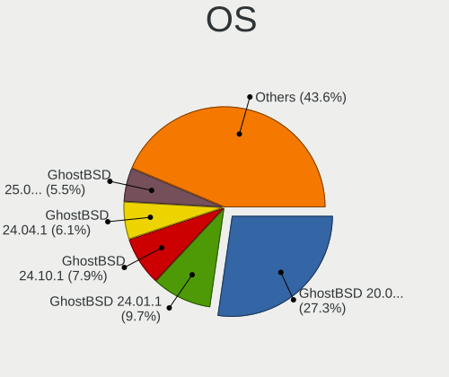

| Name                   | Desktops | Percent |
|------------------------|----------|---------|
| GhostBSD 20.04.02      | 45       | 27.27%  |
| GhostBSD 24.01.1       | 16       | 9.7%    |
| GhostBSD 24.10.1       | 13       | 7.88%   |
| GhostBSD 24.04.1       | 10       | 6.06%   |
| GhostBSD 25.02-R14.3p2 | 9        | 5.45%   |
| GhostBSD 21.08.27      | 8        | 4.85%   |
| GhostBSD 23.10.1       | 7        | 4.24%   |
| GhostBSD 25.01-R14.2p2 | 5        | 3.03%   |
| GhostBSD 25.01-R14.2p3 | 4        | 2.42%   |
| GhostBSD 25.01-R14.2p1 | 4        | 2.42%   |
| GhostBSD 24.07.3       | 4        | 2.42%   |
| GhostBSD 23.02.02      | 4        | 2.42%   |
| GhostBSD 22.01.12      | 4        | 2.42%   |
| GhostBSD 23.06.01      | 3        | 1.82%   |
| GhostBSD 22.11.22      | 3        | 1.82%   |
| GhostBSD 22.06.18      | 3        | 1.82%   |
| GhostBSD 22.09.16      | 2        | 1.21%   |
| GhostBSD 22.07.16      | 2        | 1.21%   |
| GhostBSD 22.04.06      | 2        | 1.21%   |
| GhostBSD 24.07.1       | 1        | 0.61%   |
| GhostBSD 23.09.29      | 1        | 0.61%   |
| GhostBSD 23.09.06      | 1        | 0.61%   |
| GhostBSD 23.06.22      | 1        | 0.61%   |
| GhostBSD 23.05.18      | 1        | 0.61%   |
| GhostBSD 23.04.23      | 1        | 0.61%   |
| GhostBSD 23.03.17      | 1        | 0.61%   |
| GhostBSD 22.12.20      | 1        | 0.61%   |
| GhostBSD 22.11.02      | 1        | 0.61%   |
| GhostBSD 22.10.12      | 1        | 0.61%   |
| GhostBSD 22.08.23      | 1        | 0.61%   |
| GhostBSD 22.07.13      | 1        | 0.61%   |
| GhostBSD 22.06.26      | 1        | 0.61%   |
| GhostBSD 22.05.14      | 1        | 0.61%   |
| GhostBSD 22.04.22      | 1        | 0.61%   |
| GhostBSD 22.01.28      | 1        | 0.61%   |
| GhostBSD 19.12         | 1        | 0.61%   |

OS Family
---------

OS without a version

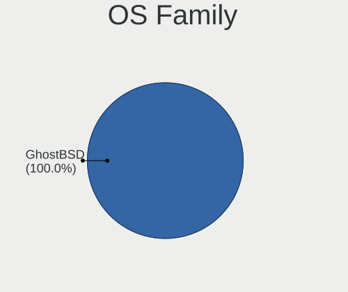

| Name     | Desktops | Percent |
|----------|----------|---------|
| GhostBSD | 156      | 100%    |

Arch
----

OS architecture (x86_64, i586, etc.)

| Name  | Desktops | Percent |
|-------|----------|---------|
| amd64 | 156      | 100%    |

DE
--

Desktop Environment

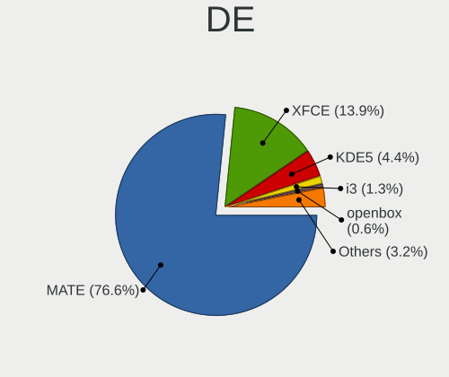

| Name             | Desktops | Percent |
|------------------|----------|---------|
| MATE             | 121      | 76.58%  |
| XFCE             | 22       | 13.92%  |
| KDE5             | 7        | 4.43%   |
| i3               | 2        | 1.27%   |
| openbox          | 1        | 0.63%   |
| Metacity (Marco) | 1        | 0.63%   |
| LXQt             | 1        | 0.63%   |
| KDE6             | 1        | 0.63%   |
| GNOME            | 1        | 0.63%   |
| Cinnamon         | 1        | 0.63%   |

Display Server
--------------

X11 or Wayland

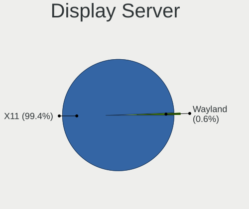

| Name    | Desktops | Percent |
|---------|----------|---------|
| X11     | 156      | 99.36%  |
| Wayland | 1        | 0.64%   |

Display Manager
---------------

SDDM, LightDM, etc.

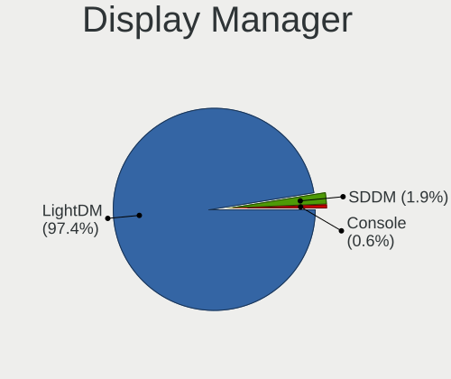

| Name    | Desktops | Percent |
|---------|----------|---------|
| LightDM | 152      | 97.44%  |
| SDDM    | 3        | 1.92%   |
| Console | 1        | 0.64%   |

OS Lang
-------

Language

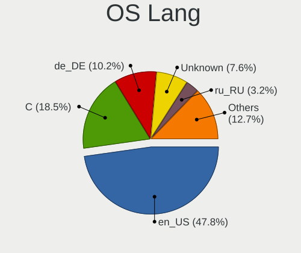

| Lang    | Desktops | Percent |
|---------|----------|---------|
| en_US   | 75       | 47.77%  |
| C       | 29       | 18.47%  |
| de_DE   | 16       | 10.19%  |
| Unknown | 12       | 7.64%   |
| ru_RU   | 5        | 3.18%   |
| es_ES   | 5        | 3.18%   |
| pt_BR   | 3        | 1.91%   |
| pl_PL   | 3        | 1.91%   |
| fr_FR   | 2        | 1.27%   |
| en_AU   | 2        | 1.27%   |
| UTF-8   | 1        | 0.64%   |
| sk_SK   | 1        | 0.64%   |
| pt_PT   | 1        | 0.64%   |
| nl_NL   | 1        | 0.64%   |
| en_GB   | 1        | 0.64%   |

Boot Mode
---------

EFI or BIOS

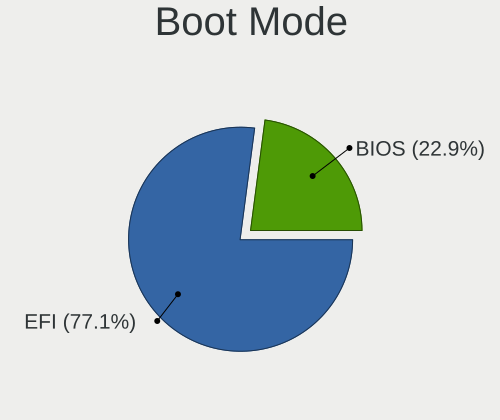

| Mode | Desktops | Percent |
|------|----------|---------|
| EFI  | 121      | 77.07%  |
| BIOS | 36       | 22.93%  |

Filesystem
----------

Type of filesystem

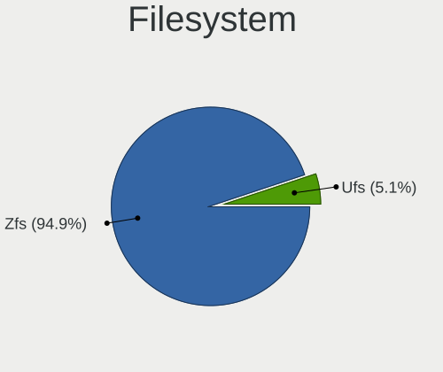

| Type | Desktops | Percent |
|------|----------|---------|
| Zfs  | 149      | 94.9%   |
| Ufs  | 8        | 5.1%    |

Part. scheme
------------

Scheme of partitioning

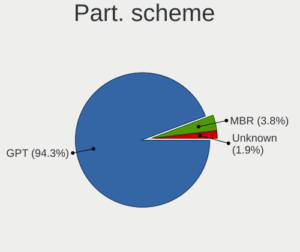

| Type    | Desktops | Percent |
|---------|----------|---------|
| GPT     | 148      | 94.27%  |
| MBR     | 6        | 3.82%   |
| Unknown | 3        | 1.91%   |

Board
-----

Vendor
------

Motherboard manufacturer

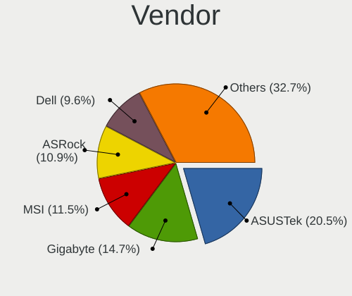

| Name                                 | Desktops | Percent |
|--------------------------------------|----------|---------|
| ASUSTek Computer                     | 32       | 20.51%  |
| Gigabyte Technology                  | 23       | 14.74%  |
| MSI                                  | 18       | 11.54%  |
| ASRock                               | 17       | 10.9%   |
| Dell                                 | 15       | 9.62%   |
| Hewlett-Packard                      | 12       | 7.69%   |
| Lenovo                               | 11       | 7.05%   |
| Medion                               | 3        | 1.92%   |
| Fujitsu                              | 3        | 1.92%   |
| Biostar                              | 3        | 1.92%   |
| Acer                                 | 3        | 1.92%   |
| Huanan                               | 2        | 1.28%   |
| XtReAmEr                             | 1        | 0.64%   |
| Supermicro                           | 1        | 0.64%   |
| Soyo                                 | 1        | 0.64%   |
| Shenzhen Meigao Electronic Equipment | 1        | 0.64%   |
| Quanta                               | 1        | 0.64%   |
| Pegatron                             | 1        | 0.64%   |
| OEM                                  | 1        | 0.64%   |
| LG Electronics                       | 1        | 0.64%   |
| HUAWEI                               | 1        | 0.64%   |
| Casper                               | 1        | 0.64%   |
| AZW                                  | 1        | 0.64%   |
| Apple                                | 1        | 0.64%   |
| Alienware                            | 1        | 0.64%   |
| Unknown                              | 1        | 0.64%   |

Model
-----

Motherboard model

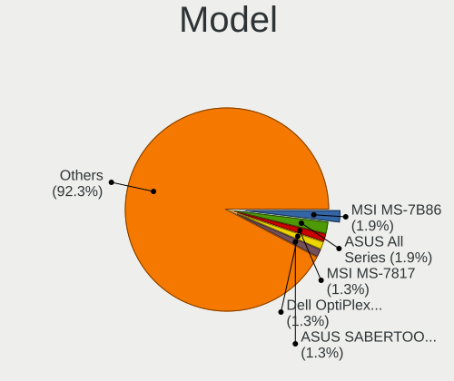

| Name                                         | Desktops | Percent |
|----------------------------------------------|----------|---------|
| MSI MS-7B86                                  | 3        | 1.92%   |
| ASUS All Series                              | 3        | 1.92%   |
| MSI MS-7817                                  | 2        | 1.28%   |
| Dell OptiPlex 7050                           | 2        | 1.28%   |
| ASUS SABERTOOTH X58                          | 2        | 1.28%   |
| Unknown                                      | 2        | 1.28%   |
| Supermicro AS -3015A-I                       | 1        | 0.64%   |
| Soyo SY-YL B550M                             | 1        | 0.64%   |
| Shenzhen Meigao Electronic Equipment UM480XT | 1        | 0.64%   |
| Quanta 120-1333w                             | 1        | 0.64%   |
| Pegatron 520-1032                            | 1        | 0.64%   |
| OEM MCR-A520M-DXV4                           | 1        | 0.64%   |
| MSI MS-7E06                                  | 1        | 0.64%   |
| MSI MS-7D25                                  | 1        | 0.64%   |
| MSI MS-7C75                                  | 1        | 0.64%   |
| MSI MS-7C56                                  | 1        | 0.64%   |
| MSI MS-7C36                                  | 1        | 0.64%   |
| MSI MS-7B94                                  | 1        | 0.64%   |
| MSI MS-7B89                                  | 1        | 0.64%   |
| MSI MS-7B48                                  | 1        | 0.64%   |
| MSI MS-7B24                                  | 1        | 0.64%   |
| MSI MS-7A72                                  | 1        | 0.64%   |
| MSI MS-7996                                  | 1        | 0.64%   |
| MSI MS-7917                                  | 1        | 0.64%   |
| MSI MS-7788                                  | 1        | 0.64%   |
| Medion P63021                                | 1        | 0.64%   |
| Medion MS-7728                               | 1        | 0.64%   |
| Medion Akoya P2222 D/B564                    | 1        | 0.64%   |
| LG R590-P.BE54P1                             | 1        | 0.64%   |
| Lenovo ThinkStation S10 6483CTO              | 1        | 0.64%   |
| Lenovo ThinkCentre M93p 10AB004DUS           | 1        | 0.64%   |
| Lenovo ThinkCentre M900 10FRS03900           | 1        | 0.64%   |
| Lenovo ThinkCentre M720s 10SUS4WT00          | 1        | 0.64%   |
| Lenovo ThinkCentre M715q 10M2S08Y00          | 1        | 0.64%   |
| Lenovo ThinkCentre M700 10J0S4X100           | 1        | 0.64%   |
| Lenovo ThinkCentre Edge72 3493DEG            | 1        | 0.64%   |
| Lenovo IdeaCentre Gaming5 14ACN6 90RW005PUL  | 1        | 0.64%   |
| Lenovo IdeaCentre 200-01IBW 90FA0011GE       | 1        | 0.64%   |
| Lenovo H515s 10126                           | 1        | 0.64%   |
| Lenovo 10AB000KUS                            | 1        | 0.64%   |

Model Family
------------

Motherboard model prefix

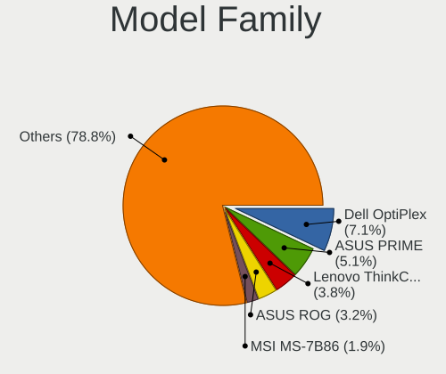

| Name                                         | Desktops | Percent |
|----------------------------------------------|----------|---------|
| Dell OptiPlex                                | 11       | 7.05%   |
| ASUS PRIME                                   | 8        | 5.13%   |
| Lenovo ThinkCentre                           | 6        | 3.85%   |
| ASUS ROG                                     | 5        | 3.21%   |
| MSI MS-7B86                                  | 3        | 1.92%   |
| Dell Precision                               | 3        | 1.92%   |
| ASUS TUF                                     | 3        | 1.92%   |
| ASUS All                                     | 3        | 1.92%   |
| ASRock X570                                  | 3        | 1.92%   |
| ASRock B450                                  | 3        | 1.92%   |
| MSI MS-7817                                  | 2        | 1.28%   |
| Lenovo IdeaCentre                            | 2        | 1.28%   |
| HP ProLiant                                  | 2        | 1.28%   |
| HP ProDesk                                   | 2        | 1.28%   |
| HP Compaq                                    | 2        | 1.28%   |
| Gigabyte GA-78LMT-USB3                       | 2        | 1.28%   |
| Fujitsu ESPRIMO                              | 2        | 1.28%   |
| ASUS SABERTOOTH                              | 2        | 1.28%   |
| ASUS Pro                                     | 2        | 1.28%   |
| Acer Aspire                                  | 2        | 1.28%   |
| Unknown                                      | 2        | 1.28%   |
| Supermicro AS                                | 1        | 0.64%   |
| Soyo SY-YL                                   | 1        | 0.64%   |
| Shenzhen Meigao Electronic Equipment UM480XT | 1        | 0.64%   |
| Quanta 120-1333w                             | 1        | 0.64%   |
| Pegatron 520-1032                            | 1        | 0.64%   |
| OEM MCR-A520M-DXV4                           | 1        | 0.64%   |
| MSI MS-7E06                                  | 1        | 0.64%   |
| MSI MS-7D25                                  | 1        | 0.64%   |
| MSI MS-7C75                                  | 1        | 0.64%   |
| MSI MS-7C56                                  | 1        | 0.64%   |
| MSI MS-7C36                                  | 1        | 0.64%   |
| MSI MS-7B94                                  | 1        | 0.64%   |
| MSI MS-7B89                                  | 1        | 0.64%   |
| MSI MS-7B48                                  | 1        | 0.64%   |
| MSI MS-7B24                                  | 1        | 0.64%   |
| MSI MS-7A72                                  | 1        | 0.64%   |
| MSI MS-7996                                  | 1        | 0.64%   |
| MSI MS-7917                                  | 1        | 0.64%   |
| MSI MS-7788                                  | 1        | 0.64%   |

MFG Year
--------

Motherboard manufacture year

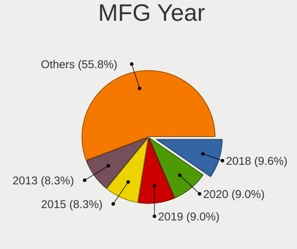

| Year | Desktops | Percent |
|------|----------|---------|
| 2018 | 15       | 9.62%   |
| 2020 | 14       | 8.97%   |
| 2019 | 14       | 8.97%   |
| 2015 | 13       | 8.33%   |
| 2013 | 13       | 8.33%   |
| 2012 | 12       | 7.69%   |
| 2021 | 10       | 6.41%   |
| 2011 | 10       | 6.41%   |
| 2016 | 9        | 5.77%   |
| 2022 | 8        | 5.13%   |
| 2014 | 8        | 5.13%   |
| 2023 | 6        | 3.85%   |
| 2017 | 6        | 3.85%   |
| 2008 | 5        | 3.21%   |
| 2025 | 4        | 2.56%   |
| 2010 | 4        | 2.56%   |
| 2024 | 3        | 1.92%   |
| 2009 | 2        | 1.28%   |

Form Factor
-----------

Physical design of the computer

| Name    | Desktops | Percent |
|---------|----------|---------|
| Desktop | 156      | 100%    |

Coreboot
--------

Have coreboot on board

| Used | Desktops | Percent |
|------|----------|---------|
| No   | 156      | 100%    |

RAM Size
--------

Total RAM memory

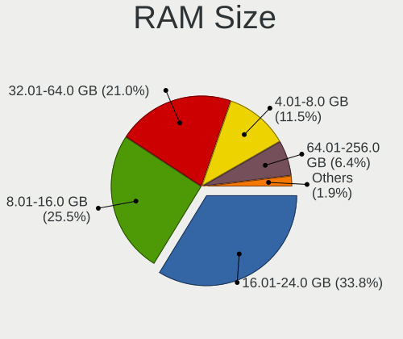

| Size in GB  | Desktops | Percent |
|-------------|----------|---------|
| 16.01-24.0  | 53       | 33.76%  |
| 8.01-16.0   | 40       | 25.48%  |
| 32.01-64.0  | 33       | 21.02%  |
| 4.01-8.0    | 18       | 11.46%  |
| 64.01-256.0 | 10       | 6.37%   |
| 24.01-32.0  | 3        | 1.91%   |

RAM Used
--------

Used RAM memory

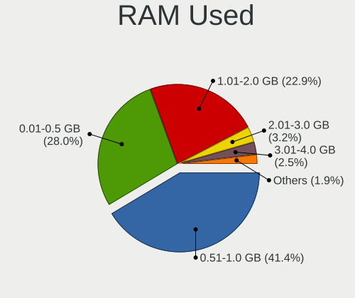

| Used GB   | Desktops | Percent |
|-----------|----------|---------|
| 0.51-1.0  | 65       | 41.4%   |
| 0.01-0.5  | 44       | 28.03%  |
| 1.01-2.0  | 36       | 22.93%  |
| 2.01-3.0  | 5        | 3.18%   |
| 3.01-4.0  | 4        | 2.55%   |
| 4.01-8.0  | 2        | 1.27%   |
| 8.01-16.0 | 1        | 0.64%   |

Total Drives
------------

Number of drives on board

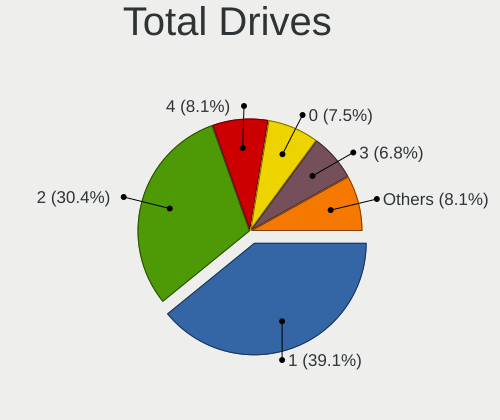

| Drives | Desktops | Percent |
|--------|----------|---------|
| 1      | 63       | 39.13%  |
| 2      | 49       | 30.43%  |
| 4      | 13       | 8.07%   |
| 0      | 12       | 7.45%   |
| 3      | 11       | 6.83%   |
| 5      | 6        | 3.73%   |
| 6      | 5        | 3.11%   |
| 22     | 1        | 0.62%   |
| 7      | 1        | 0.62%   |

Has CD-ROM
----------

Has CD-ROM on board

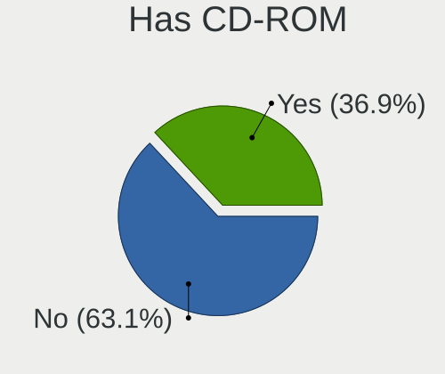

| Presented | Desktops | Percent |
|-----------|----------|---------|
| No        | 99       | 63.06%  |
| Yes       | 58       | 36.94%  |

Has Ethernet
------------

Has Ethernet on board

| Presented | Desktops | Percent |
|-----------|----------|---------|
| Yes       | 154      | 98.72%  |
| No        | 2        | 1.28%   |

Has WiFi
--------

Has WiFi module

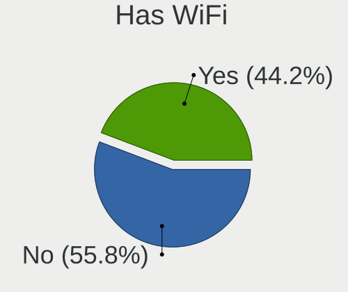

| Presented | Desktops | Percent |
|-----------|----------|---------|
| No        | 87       | 55.77%  |
| Yes       | 69       | 44.23%  |

Has Bluetooth
-------------

Has Bluetooth module

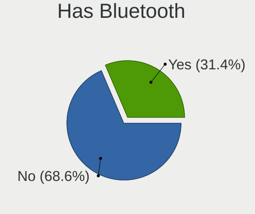

| Presented | Desktops | Percent |
|-----------|----------|---------|
| No        | 107      | 68.59%  |
| Yes       | 49       | 31.41%  |

Location
--------

Country
-------

Geographic location (country)

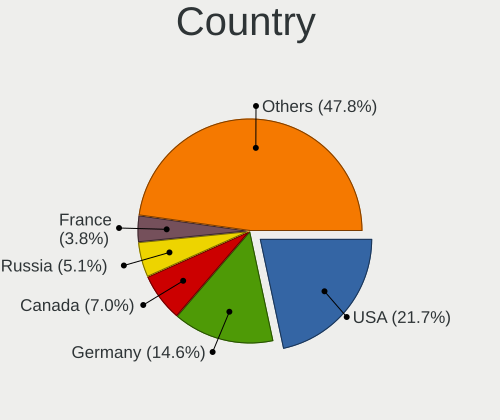

| Country      | Desktops | Percent |
|--------------|----------|---------|
| USA          | 34       | 21.66%  |
| Germany      | 23       | 14.65%  |
| Canada       | 11       | 7.01%   |
| Russia       | 8        | 5.1%    |
| France       | 6        | 3.82%   |
| UK           | 5        | 3.18%   |
| Spain        | 4        | 2.55%   |
| Poland       | 4        | 2.55%   |
| Netherlands  | 4        | 2.55%   |
| Brazil       | 4        | 2.55%   |
| Malaysia     | 3        | 1.91%   |
| Denmark      | 3        | 1.91%   |
| Austria      | 3        | 1.91%   |
| Australia    | 3        | 1.91%   |
| Taiwan       | 2        | 1.27%   |
| Philippines  | 2        | 1.27%   |
| Paraguay     | 2        | 1.27%   |
| Norway       | 2        | 1.27%   |
| Mexico       | 2        | 1.27%   |
| Japan        | 2        | 1.27%   |
| Czechia      | 2        | 1.27%   |
| Bulgaria     | 2        | 1.27%   |
| Belgium      | 2        | 1.27%   |
| Argentina    | 2        | 1.27%   |
| Venezuela    | 1        | 0.64%   |
| Ukraine      | 1        | 0.64%   |
| Turkey       | 1        | 0.64%   |
| Switzerland  | 1        | 0.64%   |
| Sweden       | 1        | 0.64%   |
| South Africa | 1        | 0.64%   |
| Romania      | 1        | 0.64%   |
| Portugal     | 1        | 0.64%   |
| Peru         | 1        | 0.64%   |
| Morocco      | 1        | 0.64%   |
| Luxembourg   | 1        | 0.64%   |
| Kazakhstan   | 1        | 0.64%   |
| Indonesia    | 1        | 0.64%   |
| Hungary      | 1        | 0.64%   |
| Hong Kong    | 1        | 0.64%   |
| Greece       | 1        | 0.64%   |

City
----

Geographic location (city)

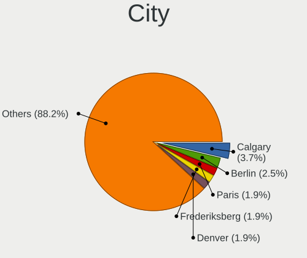

| City          | Desktops | Percent |
|---------------|----------|---------|
| Calgary       | 6        | 3.73%   |
| Berlin        | 4        | 2.48%   |
| Paris         | 3        | 1.86%   |
| Frederiksberg | 3        | 1.86%   |
| Denver        | 3        | 1.86%   |
| Zdunska Wola  | 2        | 1.24%   |
| Vienna        | 2        | 1.24%   |
| Tucson        | 2        | 1.24%   |
| Taichung      | 2        | 1.24%   |
| Sofia         | 2        | 1.24%   |
| Obninsk       | 2        | 1.24%   |
| Manila        | 2        | 1.24%   |
| Hamburg       | 2        | 1.24%   |
| Chicago       | 2        | 1.24%   |
| Chelyabinsk   | 2        | 1.24%   |
| Asunción     | 2        | 1.24%   |
| ЕЊta-ku     | 1        | 0.62%   |
| Zapopan       | 1        | 0.62%   |
| Washington    | 1        | 0.62%   |
| Warsaw        | 1        | 0.62%   |
| Vigia         | 1        | 0.62%   |
| Vidnoye       | 1        | 0.62%   |
| Velp          | 1        | 0.62%   |
| Veenendaal    | 1        | 0.62%   |
| Uelsen        | 1        | 0.62%   |
| Truro         | 1        | 0.62%   |
| Traunstein    | 1        | 0.62%   |
| Tiznit        | 1        | 0.62%   |
| Thessaloniki  | 1        | 0.62%   |
| Temiscaming   | 1        | 0.62%   |
| Sydney        | 1        | 0.62%   |
| Sun Prairie   | 1        | 0.62%   |
| St. Albert    | 1        | 0.62%   |
| St Petersburg | 1        | 0.62%   |
| Springfield   | 1        | 0.62%   |
| Southampton   | 1        | 0.62%   |
| Solden        | 1        | 0.62%   |
| Shatin        | 1        | 0.62%   |
| Seattle       | 1        | 0.62%   |
| Schwalmstadt  | 1        | 0.62%   |

Drives
------

Drive Vendor
------------

Hard drive vendors

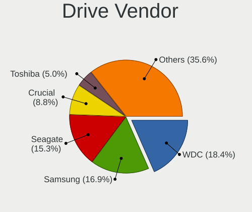

| Vendor              | Desktops | Drives | Percent |
|---------------------|----------|--------|---------|
| WDC                 | 48       | 70     | 18.39%  |
| Samsung Electronics | 44       | 55     | 16.86%  |
| Seagate             | 40       | 58     | 15.33%  |
| Crucial             | 23       | 31     | 8.81%   |
| Toshiba             | 13       | 16     | 4.98%   |
| SanDisk             | 11       | 16     | 4.21%   |
| Kingston            | 10       | 12     | 3.83%   |
| Hitachi             | 9        | 9      | 3.45%   |
| A-DATA Technology   | 7        | 8      | 2.68%   |
| HGST                | 5        | 5      | 1.92%   |
| Micron Technology   | 4        | 5      | 1.53%   |
| Intel               | 4        | 4      | 1.53%   |
| PNY                 | 3        | 5      | 1.15%   |
| Phison              | 3        | 4      | 1.15%   |
| Hikvision           | 3        | 6      | 1.15%   |
| China               | 3        | 3      | 1.15%   |
| Plextor             | 2        | 2      | 0.77%   |
| Patriot             | 2        | 2      | 0.77%   |
| OCZ                 | 2        | 2      | 0.77%   |
| Maxtor              | 2        | 2      | 0.77%   |
| LITEON              | 2        | 2      | 0.77%   |
| Gigabyte Technology | 2        | 2      | 0.77%   |
| XrayDisk            | 1        | 1      | 0.38%   |
| XPG                 | 1        | 1      | 0.38%   |
| WD MediaMax         | 1        | 1      | 0.38%   |
| Vaseky              | 1        | 1      | 0.38%   |
| Transcend           | 1        | 1      | 0.38%   |
| SPCC                | 1        | 1      | 0.38%   |
| SATADOM             | 1        | 2      | 0.38%   |
| Neo Forza           | 1        | 2      | 0.38%   |
| LITEONIT            | 1        | 1      | 0.38%   |
| Lexar               | 1        | 1      | 0.38%   |
| LDLC                | 1        | 1      | 0.38%   |
| Intenso             | 1        | 1      | 0.38%   |
| HPT                 | 1        | 4      | 0.38%   |
| Hewlett-Packard     | 1        | 6      | 0.38%   |
| GOODRAM             | 1        | 1      | 0.38%   |
| FORESEE             | 1        | 1      | 0.38%   |
| Corsair             | 1        | 1      | 0.38%   |
| Apacer              | 1        | 1      | 0.38%   |

Drive Model
-----------

Hard drive models

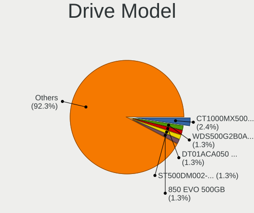

| Model                           | Desktops | Percent |
|---------------------------------|----------|---------|
| Crucial CT1000MX500SSD1 1TB     | 7        | 2.36%   |
| WDC WDS500G2B0A-00SM50 500GB    | 4        | 1.35%   |
| Toshiba DT01ACA050 500GB        | 4        | 1.35%   |
| Seagate ST500DM002-1BD142 500GB | 4        | 1.35%   |
| Samsung SSD 850 EVO 500GB       | 4        | 1.35%   |
| Samsung SSD 850 EVO 250GB       | 4        | 1.35%   |
| WDC WD40EFRX-68N32N0 4TB        | 3        | 1.01%   |
| Seagate ST2000DM008-2FR102 2TB  | 3        | 1.01%   |
| Seagate ST2000DM001-1ER164 2TB  | 3        | 1.01%   |
| Seagate ST1000VM002-1SD102 1TB  | 3        | 1.01%   |
| Crucial CT240BX500SSD1 240GB    | 3        | 1.01%   |
| WDC WDS100T3X0C-00SJG0 1TB      | 2        | 0.67%   |
| WDC WD2002FAEX-007BA0 2TB       | 2        | 0.67%   |
| WDC WD2000JS-55MHB0 192GB       | 2        | 0.67%   |
| WDC WD10EZEX-21M2NA0 1TB        | 2        | 0.67%   |
| Toshiba Q300 480GB              | 2        | 0.67%   |
| Toshiba MQ01ABD100 1TB          | 2        | 0.67%   |
| Toshiba HDWD120 2TB             | 2        | 0.67%   |
| Seagate ST4000VN008-2DR166 4TB  | 2        | 0.67%   |
| Seagate ST4000DM004-2CV104 4TB  | 2        | 0.67%   |
| Seagate ST1000DM010-2EP102 1TB  | 2        | 0.67%   |
| Seagate ST1000DM003-1CH162 1TB  | 2        | 0.67%   |
| SanDisk SSD PLUS 120GB          | 2        | 0.67%   |
| Samsung SSD 970 EVO Plus 1TB    | 2        | 0.67%   |
| Samsung SSD 970 EVO 500GB       | 2        | 0.67%   |
| Samsung SSD 860 QVO 1TB         | 2        | 0.67%   |
| Samsung SSD 860 EVO 500GB       | 2        | 0.67%   |
| Samsung SSD 860 EVO 1TB         | 2        | 0.67%   |
| Samsung HM320JI 320GB           | 2        | 0.67%   |
| Phison Sabrent 512GB            | 2        | 0.67%   |
| Maxtor STM3320613AS 320GB       | 2        | 0.67%   |
| Kingston SV300S37A120G 120GB    | 2        | 0.67%   |
| Kingston SA400M8240G 240GB      | 2        | 0.67%   |
| Hitachi HTS541612J9SA00 120GB   | 2        | 0.67%   |
| Hikvision HS-SSD-E100 512G      | 2        | 0.67%   |
| Crucial CT500MX500SSD1 500GB    | 2        | 0.67%   |
| Crucial CT250MX500SSD1 250GB    | 2        | 0.67%   |
| A-DATA SU650 120GB              | 2        | 0.67%   |
| XrayDisk 1TB SSD                | 1        | 0.34%   |
| XPG GAMMIX S11 Pro 2TB          | 1        | 0.34%   |

HDD Vendor
----------

Hard disk drive vendors

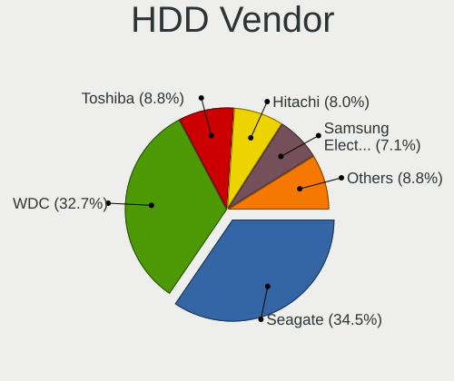

| Vendor              | Desktops | Drives | Percent |
|---------------------|----------|--------|---------|
| Seagate             | 39       | 56     | 34.51%  |
| WDC                 | 37       | 51     | 32.74%  |
| Toshiba             | 10       | 13     | 8.85%   |
| Hitachi             | 9        | 9      | 7.96%   |
| Samsung Electronics | 8        | 9      | 7.08%   |
| HGST                | 5        | 5      | 4.42%   |
| Maxtor              | 2        | 2      | 1.77%   |
| WD MediaMax         | 1        | 1      | 0.88%   |
| HPT                 | 1        | 4      | 0.88%   |
| Hewlett-Packard     | 1        | 6      | 0.88%   |

SSD Vendor
----------

Solid state drive vendors

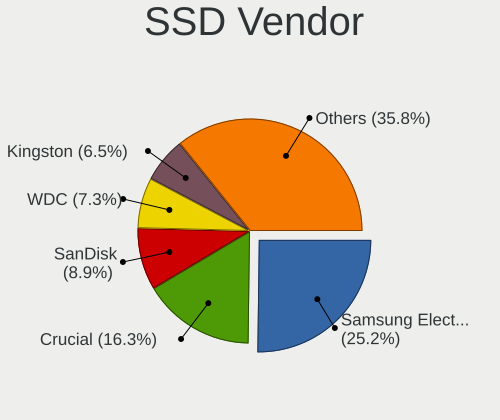

| Vendor              | Desktops | Drives | Percent |
|---------------------|----------|--------|---------|
| Samsung Electronics | 31       | 35     | 25.2%   |
| Crucial             | 20       | 24     | 16.26%  |
| SanDisk             | 11       | 16     | 8.94%   |
| WDC                 | 9        | 12     | 7.32%   |
| Kingston            | 8        | 10     | 6.5%    |
| A-DATA Technology   | 4        | 4      | 3.25%   |
| Toshiba             | 3        | 3      | 2.44%   |
| PNY                 | 3        | 5      | 2.44%   |
| Micron Technology   | 3        | 4      | 2.44%   |
| Hikvision           | 3        | 6      | 2.44%   |
| China               | 3        | 3      | 2.44%   |
| Plextor             | 2        | 2      | 1.63%   |
| Patriot             | 2        | 2      | 1.63%   |
| OCZ                 | 2        | 2      | 1.63%   |
| LITEON              | 2        | 2      | 1.63%   |
| Intel               | 2        | 2      | 1.63%   |
| XrayDisk            | 1        | 1      | 0.81%   |
| Vaseky              | 1        | 1      | 0.81%   |
| Transcend           | 1        | 1      | 0.81%   |
| SPCC                | 1        | 1      | 0.81%   |
| Seagate             | 1        | 1      | 0.81%   |
| SATADOM             | 1        | 2      | 0.81%   |
| Neo Forza           | 1        | 2      | 0.81%   |
| LITEONIT            | 1        | 1      | 0.81%   |
| Lexar               | 1        | 1      | 0.81%   |
| Intenso             | 1        | 1      | 0.81%   |
| GOODRAM             | 1        | 1      | 0.81%   |
| Gigabyte Technology | 1        | 1      | 0.81%   |
| FORESEE             | 1        | 1      | 0.81%   |
| Apacer              | 1        | 1      | 0.81%   |
| AMD                 | 1        | 1      | 0.81%   |

Drive Kind
----------

HDD or SSD

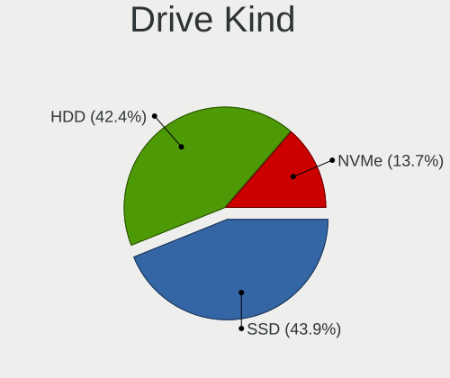

| Kind | Desktops | Drives | Percent |
|------|----------|--------|---------|
| SSD  | 90       | 149    | 43.9%   |
| HDD  | 87       | 156    | 42.44%  |
| NVMe | 28       | 43     | 13.66%  |

Drive Connector
---------------

SATA, SAS, NVMe, etc.

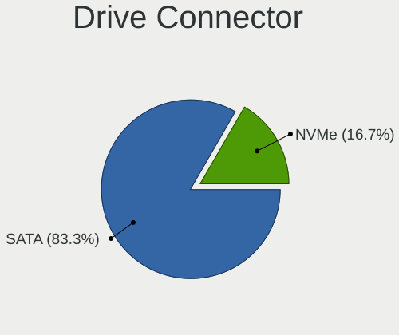

| Type | Desktops | Drives | Percent |
|------|----------|--------|---------|
| SATA | 140      | 305    | 83.33%  |
| NVMe | 28       | 43     | 16.67%  |

Drive Size
----------

Size of hard drive

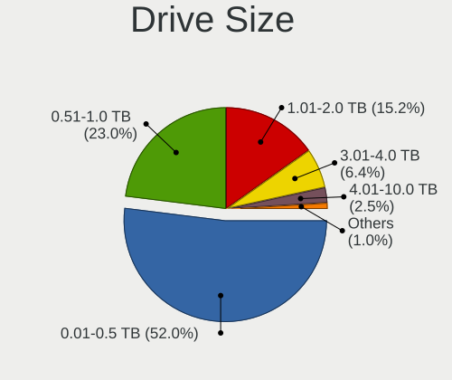

| Size in TB | Desktops | Drives | Percent |
|------------|----------|--------|---------|
| 0.01-0.5   | 106      | 161    | 51.96%  |
| 0.51-1.0   | 47       | 74     | 23.04%  |
| 1.01-2.0   | 31       | 39     | 15.2%   |
| 3.01-4.0   | 13       | 17     | 6.37%   |
| 4.01-10.0  | 5        | 11     | 2.45%   |
| 2.01-3.0   | 1        | 1      | 0.49%   |
| 10.01-20.0 | 1        | 2      | 0.49%   |

Space Total
-----------

Amount of disk space available on the file system

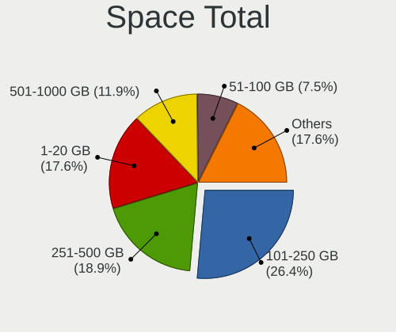

| Size in GB     | Desktops | Percent |
|----------------|----------|---------|
| 101-250        | 42       | 26.42%  |
| 251-500        | 30       | 18.87%  |
| 1-20           | 28       | 17.61%  |
| 501-1000       | 19       | 11.95%  |
| 51-100         | 12       | 7.55%   |
| 21-50          | 10       | 6.29%   |
| Unknown        | 9        | 5.66%   |
| 1001-2000      | 7        | 4.4%    |
| More than 3000 | 2        | 1.26%   |

Space Used
----------

Amount of used disk space

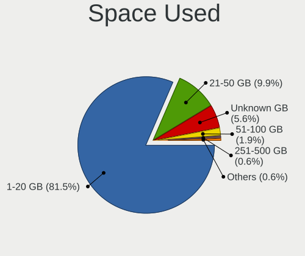

| Used GB | Desktops | Percent |
|---------|----------|---------|
| 1-20    | 132      | 81.48%  |
| 21-50   | 16       | 9.88%   |
| Unknown | 9        | 5.56%   |
| 51-100  | 3        | 1.85%   |
| 251-500 | 1        | 0.62%   |
| 101-250 | 1        | 0.62%   |

Malfunc. Drives
---------------

Drive models with a malfunction

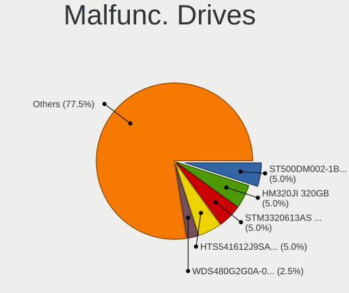

| Model                             | Desktops | Drives | Percent |
|-----------------------------------|----------|--------|---------|
| Seagate ST500DM002-1BD142 500GB   | 2        | 3      | 5%      |
| Samsung Electronics HM320JI 320GB | 2        | 2      | 5%      |
| Maxtor STM3320613AS 320GB         | 2        | 2      | 5%      |
| Hitachi HTS541612J9SA00 120GB     | 2        | 2      | 5%      |
| WDC WDS480G2G0A-00JH30 480GB      | 1        | 2      | 2.5%    |
| WDC WD800AAJS-00TDA0 80GB         | 1        | 1      | 2.5%    |
| WDC WD5000AAKX-003CA0 500GB       | 1        | 2      | 2.5%    |
| WDC WD5000AAKS-60WWPA0 500GB      | 1        | 1      | 2.5%    |
| WDC WD5000AAKS-00UU3A0 500GB      | 1        | 1      | 2.5%    |
| WDC WD40EFRX-68N32N0 4TB          | 1        | 2      | 2.5%    |
| WDC WD20EZRX-19D8PB0 2TB          | 1        | 1      | 2.5%    |
| WDC WD20EFRX-68EUZN0 1TB          | 1        | 1      | 2.5%    |
| WDC WD10EZEX-21M2NA0 1TB          | 1        | 1      | 2.5%    |
| Toshiba MK3263GSX 320GB           | 1        | 1      | 2.5%    |
| Toshiba DT01ACA050 500GB          | 1        | 1      | 2.5%    |
| Seagate ST500DM002-1BC142 500GB   | 1        | 1      | 2.5%    |
| Seagate ST4000DM004-2CV104 4TB    | 1        | 1      | 2.5%    |
| Seagate ST3250310AS 250GB         | 1        | 1      | 2.5%    |
| Seagate ST3160318AS 160GB         | 1        | 1      | 2.5%    |
| Seagate ST31500541AS 1.5TB        | 1        | 1      | 2.5%    |
| Seagate ST2000DM008-2FR102 2TB    | 1        | 1      | 2.5%    |
| Seagate ST2000DM001-1ER164 2TB    | 1        | 1      | 2.5%    |
| SanDisk SSD PLUS 120GB            | 1        | 1      | 2.5%    |
| SanDisk SDSSDX240GG25 240GB       | 1        | 1      | 2.5%    |
| Samsung Electronics HD103SJ 1TB   | 1        | 2      | 2.5%    |
| Plextor PX-256M5M 256GB           | 1        | 1      | 2.5%    |
| OCZ AGILITY3 240GB                | 1        | 1      | 2.5%    |
| Hitachi HTS725032A9A364 320GB     | 1        | 1      | 2.5%    |
| Hitachi HTS547575A9E384 752GB     | 1        | 1      | 2.5%    |
| Hitachi HTS541680J9SA00 80GB      | 1        | 1      | 2.5%    |
| Hitachi HDS721616PLA380 160GB     | 1        | 1      | 2.5%    |
| Crucial CT480M500SSD1 480GB       | 1        | 1      | 2.5%    |
| Crucial CT1050MX300SSD1 1TB       | 1        | 1      | 2.5%    |
| Crucial CT1000MX500SSD1 1TB       | 1        | 1      | 2.5%    |
| Crucial C300-CTFDDAC128MAG 128GB  | 1        | 1      | 2.5%    |
| A-DATA Technology SU650 120GB     | 1        | 1      | 2.5%    |

Malfunc. Drive Vendor
---------------------

Vendors of faulty drives

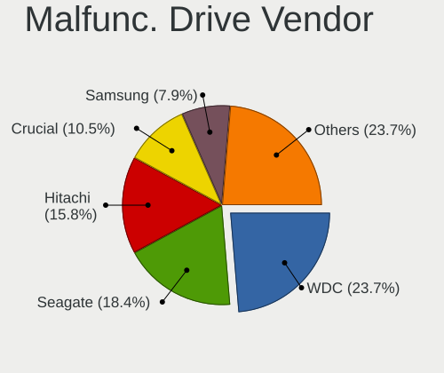

| Vendor              | Desktops | Drives | Percent |
|---------------------|----------|--------|---------|
| WDC                 | 9        | 12     | 23.68%  |
| Seagate             | 7        | 10     | 18.42%  |
| Hitachi             | 6        | 6      | 15.79%  |
| Crucial             | 4        | 4      | 10.53%  |
| Samsung Electronics | 3        | 4      | 7.89%   |
| Toshiba             | 2        | 2      | 5.26%   |
| SanDisk             | 2        | 2      | 5.26%   |
| Maxtor              | 2        | 2      | 5.26%   |
| Plextor             | 1        | 1      | 2.63%   |
| OCZ                 | 1        | 1      | 2.63%   |
| A-DATA Technology   | 1        | 1      | 2.63%   |

Malfunc. HDD Vendor
-------------------

Vendors of faulty HDD drives

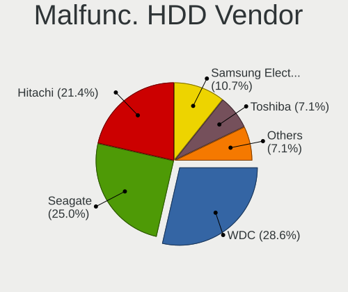

| Vendor              | Desktops | Drives | Percent |
|---------------------|----------|--------|---------|
| WDC                 | 8        | 10     | 28.57%  |
| Seagate             | 7        | 10     | 25%     |
| Hitachi             | 6        | 6      | 21.43%  |
| Samsung Electronics | 3        | 4      | 10.71%  |
| Toshiba             | 2        | 2      | 7.14%   |
| Maxtor              | 2        | 2      | 7.14%   |

Malfunc. Drive Kind
-------------------

Kinds of faulty drives

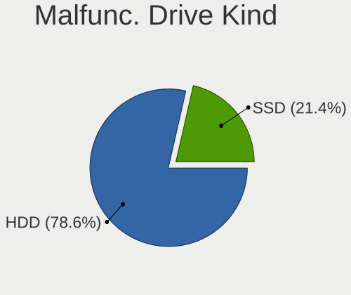

| Kind | Desktops | Drives | Percent |
|------|----------|--------|---------|
| HDD  | 25       | 34     | 71.43%  |
| SSD  | 10       | 11     | 28.57%  |

Failed Drives
-------------

Failed drive models

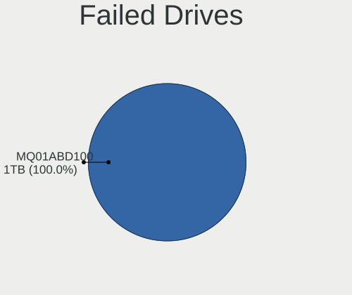

| Model                  | Desktops | Drives | Percent |
|------------------------|----------|--------|---------|
| Toshiba MQ01ABD100 1TB | 1        | 1      | 100%    |

Failed Drive Vendor
-------------------

Failed drive vendors

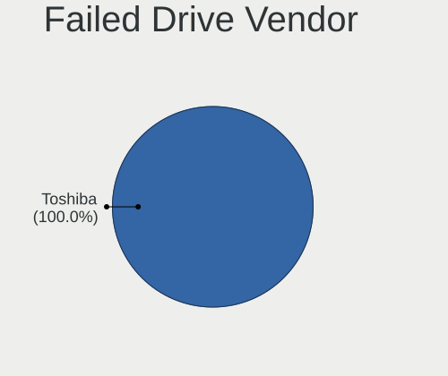

| Vendor  | Desktops | Drives | Percent |
|---------|----------|--------|---------|
| Toshiba | 1        | 1      | 100%    |

Drive Status
------------

Number of failed and malfunc. drives

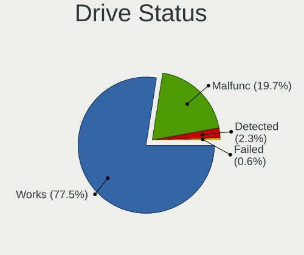

| Status   | Desktops | Drives | Percent |
|----------|----------|--------|---------|
| Works    | 134      | 292    | 77.46%  |
| Malfunc  | 34       | 45     | 19.65%  |
| Detected | 4        | 10     | 2.31%   |
| Failed   | 1        | 1      | 0.58%   |

Storage controller
------------------

Storage Vendor
--------------

Storage controller vendors

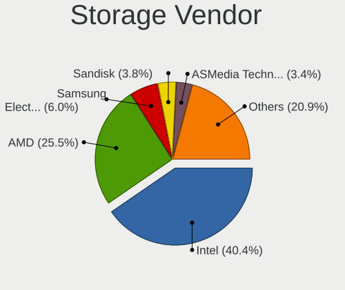

| Vendor                        | Desktops | Percent |
|-------------------------------|----------|---------|
| Intel                         | 95       | 40.43%  |
| AMD                           | 60       | 25.53%  |
| Samsung Electronics           | 14       | 5.96%   |
| Sandisk                       | 9        | 3.83%   |
| ASMedia Technology            | 8        | 3.4%    |
| Phison Electronics            | 7        | 2.98%   |
| Micron/Crucial Technology     | 6        | 2.55%   |
| Kingston Technology Company   | 6        | 2.55%   |
| ADATA Technology              | 6        | 2.55%   |
| JMicron Technology            | 5        | 2.13%   |
| Marvell Technology Group      | 3        | 1.28%   |
| SK hynix                      | 2        | 0.85%   |
| Silicon Motion                | 2        | 0.85%   |
| Nvidia                        | 2        | 0.85%   |
| Micron Technology             | 2        | 0.85%   |
| Toshiba                       | 1        | 0.43%   |
| Shenzhen Longsys Electronics  | 1        | 0.43%   |
| Seagate Technology            | 1        | 0.43%   |
| Realtek Semiconductor         | 1        | 0.43%   |
| Integrated Technology Express | 1        | 0.43%   |
| HighPoint Technologies        | 1        | 0.43%   |
| Hewlett-Packard               | 1        | 0.43%   |
| Adaptec                       | 1        | 0.43%   |

Storage Model
-------------

Storage controller models

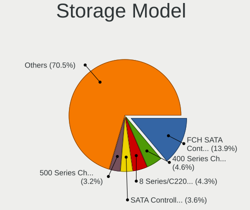

| Model                                                                                   | Desktops | Percent |
|-----------------------------------------------------------------------------------------|----------|---------|
| AMD FCH SATA Controller [AHCI mode]                                                     | 39       | 13.88%  |
| AMD 400 Series Chipset SATA Controller                                                  | 13       | 4.63%   |
| Intel 8 Series/C220 Series Chipset Family 6-port SATA Controller 1 [AHCI mode]          | 12       | 4.27%   |
| Intel SATA Controller [RAID mode]                                                       | 10       | 3.56%   |
| AMD 500 Series Chipset SATA Controller                                                  | 9        | 3.2%    |
| Samsung NVMe SSD Controller SM981/PM981/PM983                                           | 8        | 2.85%   |
| Intel Q170/Q150/B150/H170/H110/Z170/CM236 Chipset SATA Controller [AHCI Mode]           | 8        | 2.85%   |
| ASMedia ASM1061/ASM1062 Serial ATA Controller                                           | 8        | 2.85%   |
| Intel 6 Series/C200 Series Chipset Family 6 port Desktop SATA AHCI Controller           | 7        | 2.49%   |
| Intel 200 Series PCH SATA controller [AHCI mode]                                        | 6        | 2.14%   |
| Intel Cannon Lake PCH SATA AHCI Controller                                              | 5        | 1.78%   |
| Intel Alder Lake-S PCH SATA Controller [AHCI Mode]                                      | 5        | 1.78%   |
| Intel 82801JI (ICH10 Family) SATA AHCI Controller                                       | 5        | 1.78%   |
| Intel 7 Series/C210 Series Chipset Family 6-port SATA Controller [AHCI mode]            | 5        | 1.78%   |
| Intel 6 Series/C200 Series Chipset Family Desktop SATA Controller (IDE mode, ports 4-5) | 5        | 1.78%   |
| Intel 6 Series/C200 Series Chipset Family Desktop SATA Controller (IDE mode, ports 0-3) | 5        | 1.78%   |
| AMD SB7x0/SB8x0/SB9x0 IDE Controller                                                    | 5        | 1.78%   |
| Micron/Crucial P2 [Nick P2] / P3 / P3 Plus NVMe PCIe SSD (DRAM-less)                    | 4        | 1.42%   |
| Intel 9 Series Chipset Family SATA Controller [AHCI Mode]                               | 4        | 1.42%   |
| AMD SB7x0/SB8x0/SB9x0 SATA Controller [AHCI mode]                                       | 4        | 1.42%   |
| AMD 300 Series Chipset SATA Controller                                                  | 4        | 1.42%   |
| ADATA XPG SX8200 Pro PCIe Gen3x4 M.2 2280 Solid State Drive                             | 4        | 1.42%   |
| Phison E16 PCIe4 NVMe Controller                                                        | 3        | 1.07%   |
| JMicron JMB362 SATA Controller                                                          | 3        | 1.07%   |
| Intel Volume Management Device NVMe RAID Controller                                     | 3        | 1.07%   |
| Intel Raptor Lake SATA AHCI Controller                                                  | 3        | 1.07%   |
| AMD FCH SATA Controller [IDE mode]                                                      | 3        | 1.07%   |
| Silicon Motion SM2263EN/SM2263XT (DRAM-less) NVMe SSD Controllers                       | 2        | 0.71%   |
| SanDisk WD Green SN350 240GB (DRAM-less) / SN560E NVMe SSD                              | 2        | 0.71%   |
| SanDisk Ultra 3D / WD PC SN530, IX SN530, Blue SN550 NVMe SSD (DRAM-less)               | 2        | 0.71%   |
| SanDisk Extreme Pro / WD Black SN750 / PC SN730 / Red SN700 NVMe SSD                    | 2        | 0.71%   |
| Samsung NVMe SSD Controller S4LV008[Pascal]                                             | 2        | 0.71%   |
| Samsung NVMe SSD Controller PM9A1/PM9A3/980PRO                                          | 2        | 0.71%   |
| Phison E12 NVMe Controller                                                              | 2        | 0.71%   |
| Kingston Company NV1 NVMe SSD [SM2263XT] (DRAM-less)                                    | 2        | 0.71%   |
| Intel C600/X79 series chipset 6-Port SATA AHCI Controller                               | 2        | 0.71%   |
| Intel 82801JD/DO (ICH10 Family) SATA AHCI Controller                                    | 2        | 0.71%   |
| Intel 82801IR/IO/IH (ICH9R/DO/DH) 4 port SATA Controller [IDE mode]                     | 2        | 0.71%   |
| Intel 82801I (ICH9 Family) 2 port SATA Controller [IDE mode]                            | 2        | 0.71%   |
| Intel 500 Series Chipset Family SATA AHCI Controller                                    | 2        | 0.71%   |

Storage Kind
------------

Kind of storage controller (IDE, SATA, NVMe, SAS, ...)

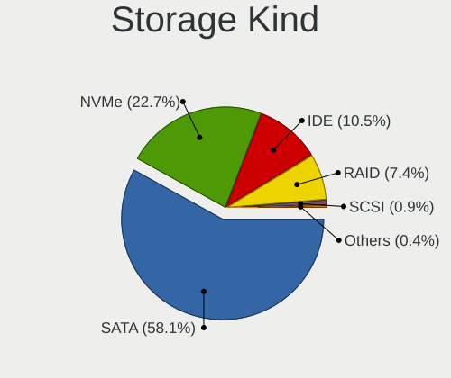

| Kind | Desktops | Percent |
|------|----------|---------|
| SATA | 133      | 58.08%  |
| NVMe | 52       | 22.71%  |
| IDE  | 24       | 10.48%  |
| RAID | 17       | 7.42%   |
| SCSI | 2        | 0.87%   |
| SAS  | 1        | 0.44%   |

Processor
---------

CPU Vendor
----------

Processor vendors

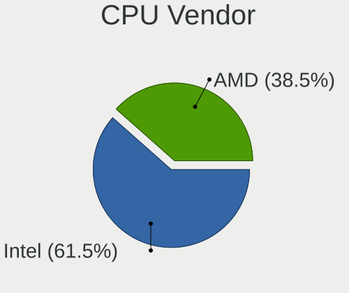

| Vendor | Desktops | Percent |
|--------|----------|---------|
| Intel  | 96       | 61.54%  |
| AMD    | 60       | 38.46%  |

CPU Model
---------

Processor models

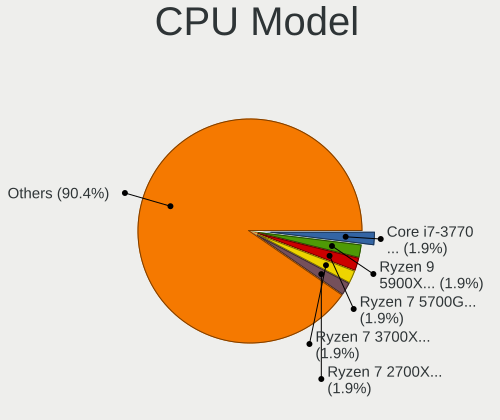

| Model                                       | Desktops | Percent |
|---------------------------------------------|----------|---------|
| Intel Core i7-3770 CPU @ 3.40GHz            | 3        | 1.92%   |
| AMD Ryzen 9 5900X 12-Core Processor         | 3        | 1.92%   |
| AMD Ryzen 7 5700G with Radeon Graphics      | 3        | 1.92%   |
| AMD Ryzen 7 3700X 8-Core Processor          | 3        | 1.92%   |
| AMD Ryzen 7 2700X Eight-Core Processor      | 3        | 1.92%   |
| AMD Ryzen 5 5600G with Radeon Graphics      | 3        | 1.92%   |
| AMD Ryzen 5 2600 Six-Core Processor         | 3        | 1.92%   |
| Intel Core i7-6700K CPU @ 4.00GHz           | 2        | 1.28%   |
| Intel Core i5-8500 CPU @ 3.00GHz            | 2        | 1.28%   |
| Intel Core i5-4590T CPU @ 2.00GHz           | 2        | 1.28%   |
| Intel Core i5-4570 CPU @ 3.20GHz            | 2        | 1.28%   |
| Intel Core i5-3330 CPU @ 3.00GHz            | 2        | 1.28%   |
| Intel Core i5-2500K CPU @ 3.30GHz           | 2        | 1.28%   |
| Intel Core i3-4160 CPU @ 3.60GHz            | 2        | 1.28%   |
| Intel Core 2 Duo                            | 2        | 1.28%   |
| Intel 12th Gen Core i5-12400                | 2        | 1.28%   |
| AMD Ryzen 9 5950X 16-Core Processor         | 2        | 1.28%   |
| AMD Ryzen 5 4600G with Radeon Graphics      | 2        | 1.28%   |
| AMD Ryzen 5 1600 Six-Core Processor         | 2        | 1.28%   |
| AMD FX-8320 Eight-Core Processor            | 2        | 1.28%   |
| Intel Xeon W-2123 CPU @ 3.60GHz             | 1        | 0.64%   |
| Intel Xeon E-2236 CPU @ 3.40GHz             | 1        | 0.64%   |
| Intel Xeon CPU X5650 @ 2.67GHz              | 1        | 0.64%   |
| Intel Xeon CPU W3680 @ 3.33GHz              | 1        | 0.64%   |
| Intel Xeon CPU E5-2670 v3 @ 2.30GHz         | 1        | 0.64%   |
| Intel Xeon CPU E5-2640 0 @ 2.50GHz          | 1        | 0.64%   |
| Intel Xeon CPU E5-2630 0 @ 2.30GHz          | 1        | 0.64%   |
| Intel Xeon CPU E5-2630 0 @ 2.30GH           | 1        | 0.64%   |
| Intel Xeon CPU E3-1230 V2 @ 3.30GHz         | 1        | 0.64%   |
| Intel Xeon                                  | 1        | 0.64%   |
| Intel Unknown                               | 1        | 0.64%   |
| Intel Pentium Silver J5040 CPU @ 2.00GHz    | 1        | 0.64%   |
| Intel Pentium Dual-Core CPU E5500 @ 2.80GHz | 1        | 0.64%   |
| Intel Pentium CPU G620 @ 2.60GHz            | 1        | 0.64%   |
| Intel Pentium CPU G4600 @ 3.60GHz           | 1        | 0.64%   |
| Intel Pentium CPU G3420 @ 3.20GHz           | 1        | 0.64%   |
| Intel Pentium CPU G3250T @ 2.80GHz          | 1        | 0.64%   |
| Intel Pentium CPU G2020T @ 2.50GHz          | 1        | 0.64%   |
| Intel Pentium CPU G2020 @ 2.90GHz           | 1        | 0.64%   |
| Intel N100                                  | 1        | 0.64%   |

CPU Model Family
----------------

Processor model prefix

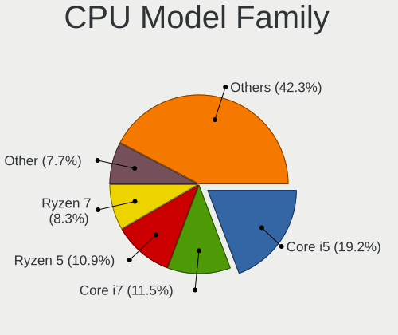

| Model                   | Desktops | Percent |
|-------------------------|----------|---------|
| Intel Core i5           | 30       | 19.23%  |
| Intel Core i7           | 18       | 11.54%  |
| AMD Ryzen 5             | 17       | 10.9%   |
| AMD Ryzen 7             | 13       | 8.33%   |
| Other                   | 12       | 7.69%   |
| Intel Xeon              | 10       | 6.41%   |
| Intel Core i3           | 8        | 5.13%   |
| Intel Pentium           | 6        | 3.85%   |
| AMD Ryzen 9             | 6        | 3.85%   |
| AMD FX                  | 4        | 2.56%   |
| Intel Core i9           | 3        | 1.92%   |
| Intel Core 2 Quad       | 3        | 1.92%   |
| AMD Ryzen 3             | 3        | 1.92%   |
| Intel Core 2 Duo        | 2        | 1.28%   |
| Intel Celeron           | 2        | 1.28%   |
| AMD E1                  | 2        | 1.28%   |
| AMD A8                  | 2        | 1.28%   |
| AMD A6                  | 2        | 1.28%   |
| Intel Pentium Silver    | 1        | 0.64%   |
| Intel Pentium Dual-Core | 1        | 0.64%   |
| Intel Atom              | 1        | 0.64%   |
| AMD Ryzen Threadripper  | 1        | 0.64%   |
| AMD Ryzen 5 PRO         | 1        | 0.64%   |
| AMD Ryzen 3 PRO         | 1        | 0.64%   |
| AMD Phenom II X4        | 1        | 0.64%   |
| AMD GX                  | 1        | 0.64%   |
| AMD EPYC                | 1        | 0.64%   |
| AMD E2                  | 1        | 0.64%   |
| AMD Athlon X4           | 1        | 0.64%   |
| AMD Athlon              | 1        | 0.64%   |
| AMD A10                 | 1        | 0.64%   |

CPU Cores
---------

Number of processor cores

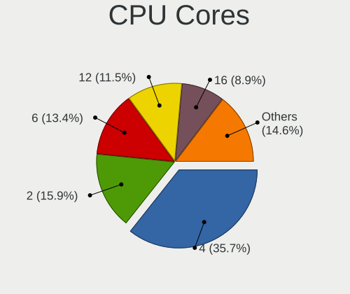

| Number  | Desktops | Percent |
|---------|----------|---------|
| 4       | 56       | 35.67%  |
| 2       | 25       | 15.92%  |
| 6       | 21       | 13.38%  |
| 12      | 18       | 11.46%  |
| 16      | 14       | 8.92%   |
| 8       | 8        | 5.1%    |
| 24      | 4        | 2.55%   |
| 10      | 4        | 2.55%   |
| Unknown | 3        | 1.91%   |
| 32      | 2        | 1.27%   |
| 20      | 1        | 0.64%   |
| 14      | 1        | 0.64%   |

CPU Sockets
-----------

Number of sockets

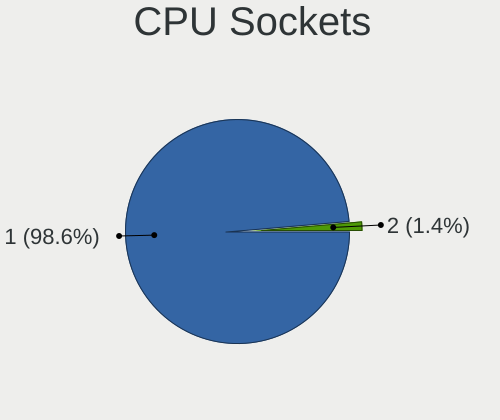

| Number | Desktops | Percent |
|--------|----------|---------|
| 1      | 154      | 98.72%  |
| 2      | 2        | 1.28%   |

CPU Threads
-----------

Threads per core (Hyper-Threading)

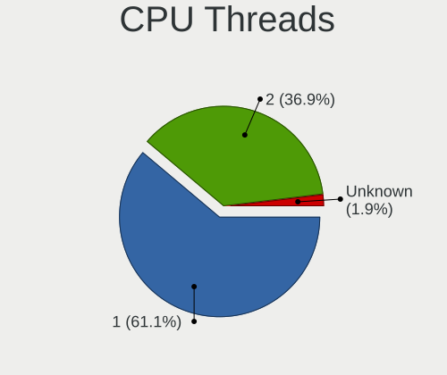

| Number  | Desktops | Percent |
|---------|----------|---------|
| 1       | 96       | 61.15%  |
| 2       | 58       | 36.94%  |
| Unknown | 3        | 1.91%   |

CPU Microarch
-------------

Microarchitecture

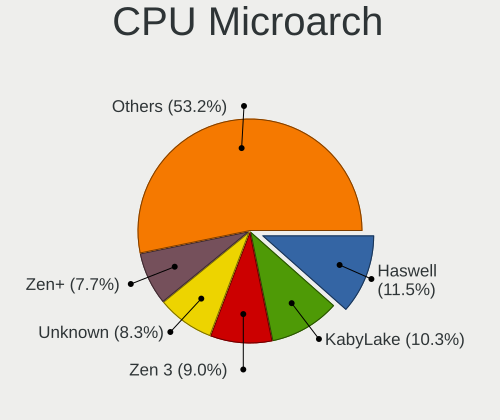

| Name          | Desktops | Percent |
|---------------|----------|---------|
| Haswell       | 18       | 11.54%  |
| KabyLake      | 16       | 10.26%  |
| Zen 3         | 14       | 8.97%   |
| Unknown       | 13       | 8.33%   |
| Zen+          | 12       | 7.69%   |
| Zen 2         | 12       | 7.69%   |
| IvyBridge     | 11       | 7.05%   |
| SandyBridge   | 10       | 6.41%   |
| Skylake       | 9        | 5.77%   |
| Penryn        | 8        | 5.13%   |
| Piledriver    | 5        | 3.21%   |
| Zen           | 4        | 2.56%   |
| Nehalem       | 4        | 2.56%   |
| Jaguar        | 3        | 1.92%   |
| CometLake     | 3        | 1.92%   |
| Westmere      | 2        | 1.28%   |
| Puma          | 2        | 1.28%   |
| Excavator     | 2        | 1.28%   |
| K10 Llano     | 1        | 0.64%   |
| K10           | 1        | 0.64%   |
| Goldmont plus | 1        | 0.64%   |
| Goldmont      | 1        | 0.64%   |
| Bulldozer     | 1        | 0.64%   |
| Broadwell     | 1        | 0.64%   |
| Bonnell       | 1        | 0.64%   |
| Bobcat        | 1        | 0.64%   |

Graphics
--------

GPU Vendor
----------

Vendors of graphics cards

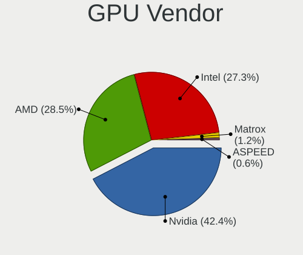

| Vendor                     | Desktops | Percent |
|----------------------------|----------|---------|
| Nvidia                     | 70       | 42.42%  |
| AMD                        | 47       | 28.48%  |
| Intel                      | 45       | 27.27%  |
| Matrox Electronics Systems | 2        | 1.21%   |
| ASPEED Technology          | 1        | 0.61%   |

GPU Model
---------

Graphics card models

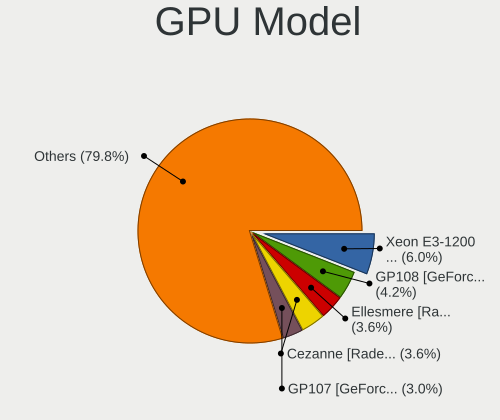

| Model                                                                       | Desktops | Percent |
|-----------------------------------------------------------------------------|----------|---------|
| Intel Xeon E3-1200 v3/4th Gen Core Processor Integrated Graphics Controller | 10       | 5.95%   |
| Nvidia GP108 [GeForce GT 1030]                                              | 7        | 4.17%   |
| AMD Ellesmere [Radeon RX 470/480/570/570X/580/580X/590]                     | 6        | 3.57%   |
| AMD Cezanne [Radeon Vega Series / Radeon Vega Mobile Series]                | 6        | 3.57%   |
| Nvidia GP107 [GeForce GTX 1050 Ti]                                          | 5        | 2.98%   |
| Nvidia GK107 [GeForce GTX 650]                                              | 5        | 2.98%   |
| Intel Skylake-S GT2 [HD Graphics 530]                                       | 5        | 2.98%   |
| Intel 2nd Generation Core Processor Family Integrated Graphics Controller   | 5        | 2.98%   |
| Nvidia GM107 [GeForce GTX 750 Ti]                                           | 4        | 2.38%   |
| Nvidia GP106 [GeForce GTX 1060 6GB]                                         | 3        | 1.79%   |
| Nvidia GM206 [GeForce GTX 960]                                              | 3        | 1.79%   |
| Intel Kaby Lake-S GT2 [HD Graphics 630]                                     | 3        | 1.79%   |
| Intel Alder Lake-S GT1 [UHD Graphics 770]                                   | 3        | 1.79%   |
| AMD Renoir [Radeon Vega Series / Radeon Vega Mobile Series]                 | 3        | 1.79%   |
| AMD Cape Verde XT [Radeon HD 7770/8760 / R7 250X]                           | 3        | 1.79%   |
| Nvidia TU116 [GeForce GTX 1660 Ti]                                          | 2        | 1.19%   |
| Nvidia TU106 [GeForce RTX 2060 Rev. A]                                      | 2        | 1.19%   |
| Nvidia GP107 [GeForce GTX 1050]                                             | 2        | 1.19%   |
| Nvidia GP104 [GeForce GTX 1080]                                             | 2        | 1.19%   |
| Nvidia GP104 [GeForce GTX 1070]                                             | 2        | 1.19%   |
| Nvidia GP104 [GeForce GTX 1070 Ti]                                          | 2        | 1.19%   |
| Nvidia GF119 [GeForce GT 610]                                               | 2        | 1.19%   |
| Nvidia GA106 [GeForce RTX 3060]                                             | 2        | 1.19%   |
| Matrox Electronics Systems MGA G200EH                                       | 2        | 1.19%   |
| Intel Raptor Lake-S GT1 [UHD Graphics 770]                                  | 2        | 1.19%   |
| Intel IvyBridge GT2 [HD Graphics 4000]                                      | 2        | 1.19%   |
| Intel CoffeeLake-S GT2 [UHD Graphics 630]                                   | 2        | 1.19%   |
| Intel 4 Series Chipset Integrated Graphics Controller                       | 2        | 1.19%   |
| AMD Wani [Radeon R5/R6/R7 Graphics]                                         | 2        | 1.19%   |
| AMD Raven Ridge [Radeon Vega Series / Radeon Vega Mobile Series]            | 2        | 1.19%   |
| AMD Raphael                                                                 | 2        | 1.19%   |
| AMD Picasso/Raven 2 [Radeon Vega Series / Radeon Vega Mobile Series]        | 2        | 1.19%   |
| AMD Navi 21 [Radeon RX 6800/6800 XT / 6900 XT]                              | 2        | 1.19%   |
| AMD Baffin [Radeon RX 550 640SP / RX 560/560X]                              | 2        | 1.19%   |
| Nvidia TU117 [GeForce GTX 1650]                                             | 1        | 0.6%    |
| Nvidia TU117 [GeForce GTX 1630]                                             | 1        | 0.6%    |
| Nvidia TU116 [GeForce GTX 1660 SUPER]                                       | 1        | 0.6%    |
| Nvidia TU106 [GeForce RTX 2070 Rev. A]                                      | 1        | 0.6%    |
| Nvidia TU106 [GeForce RTX 2060 SUPER]                                       | 1        | 0.6%    |
| Nvidia TU104 [GeForce RTX 2080]                                             | 1        | 0.6%    |

GPU Combo
---------

Combinations of graphics cards

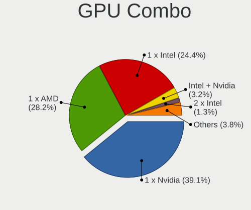

| Name                 | Desktops | Percent |
|----------------------|----------|---------|
| 1 x Nvidia           | 61       | 39.1%   |
| 1 x AMD              | 44       | 28.21%  |
| 1 x Intel            | 38       | 24.36%  |
| Intel + Nvidia       | 5        | 3.21%   |
| 2 x Intel            | 2        | 1.28%   |
| 2 x Nvidia           | 1        | 0.64%   |
| 2 x AMD + 1 x ASPEED | 1        | 0.64%   |
| 2 x AMD              | 1        | 0.64%   |
| Nvidia + Matrox      | 1        | 0.64%   |
| 1 x Matrox           | 1        | 0.64%   |
| AMD + Nvidia         | 1        | 0.64%   |

GPU Driver
----------

Free vs proprietary

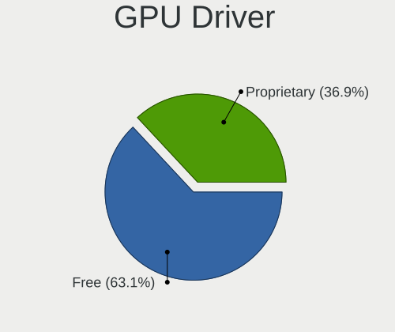

| Driver      | Desktops | Percent |
|-------------|----------|---------|
| Free        | 99       | 63.06%  |
| Proprietary | 58       | 36.94%  |

GPU Memory
----------

Total video memory

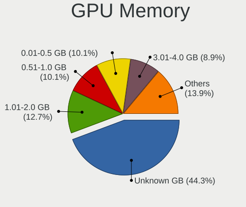

| Size in GB | Desktops | Percent |
|------------|----------|---------|
| Unknown    | 70       | 44.3%   |
| 1.01-2.0   | 20       | 12.66%  |
| 0.51-1.0   | 16       | 10.13%  |
| 0.01-0.5   | 16       | 10.13%  |
| 3.01-4.0   | 14       | 8.86%   |
| 7.01-8.0   | 11       | 6.96%   |
| 5.01-6.0   | 5        | 3.16%   |
| 8.01-16.0  | 4        | 2.53%   |
| 2.01-3.0   | 1        | 0.63%   |
| 16.01-24.0 | 1        | 0.63%   |

Monitor
-------

Monitor Vendor
--------------

Monitor vendors

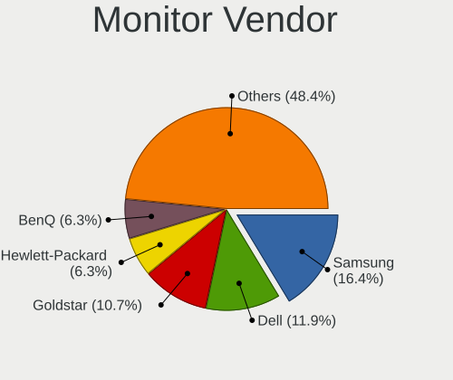

| Vendor               | Desktops | Percent |
|----------------------|----------|---------|
| Samsung Electronics  | 26       | 16.35%  |
| Dell                 | 19       | 11.95%  |
| Goldstar             | 17       | 10.69%  |
| Hewlett-Packard      | 10       | 6.29%   |
| BenQ                 | 10       | 6.29%   |
| Acer                 | 10       | 6.29%   |
| ASUSTek Computer     | 7        | 4.4%    |
| Ancor Communications | 7        | 4.4%    |
| Philips              | 5        | 3.14%   |
| LG Electronics       | 4        | 2.52%   |
| ViewSonic            | 3        | 1.89%   |
| Iiyama               | 3        | 1.89%   |
| AOC                  | 3        | 1.89%   |
| Vizio                | 2        | 1.26%   |
| Sony                 | 2        | 1.26%   |
| Mi                   | 2        | 1.26%   |
| Lenovo               | 2        | 1.26%   |
| Idek Iiyama          | 2        | 1.26%   |
| Fujitsu Siemens      | 2        | 1.26%   |
| WYT                  | 1        | 0.63%   |
| Unknown (XXX)        | 1        | 0.63%   |
| Toshiba              | 1        | 0.63%   |
| SANYO                | 1        | 0.63%   |
| SANSUI               | 1        | 0.63%   |
| SAC                  | 1        | 0.63%   |
| Pixio                | 1        | 0.63%   |
| Pioneer Electronic   | 1        | 0.63%   |
| Panasonic            | 1        | 0.63%   |
| OEM                  | 1        | 0.63%   |
| LG Display           | 1        | 0.63%   |
| Lenovo Group Limited | 1        | 0.63%   |
| KTC                  | 1        | 0.63%   |
| ITE                  | 1        | 0.63%   |
| HannStar             | 1        | 0.63%   |
| Eizo                 | 1        | 0.63%   |
| DENON                | 1        | 0.63%   |
| CHD                  | 1        | 0.63%   |
| Belinea              | 1        | 0.63%   |
| ASRock               | 1        | 0.63%   |
| Apple                | 1        | 0.63%   |

Monitor Model
-------------

Monitor models

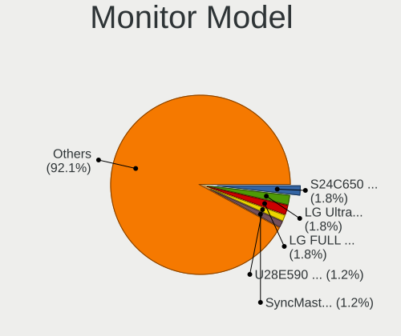

| Model                                                                  | Desktops | Percent |
|------------------------------------------------------------------------|----------|---------|
| Samsung Electronics S24C650 SAM09E9 1920x1080 520x290mm 23.4-inch      | 3        | 1.82%   |
| Goldstar LG Ultra HD GSM5B09 3840x2160 600x340mm 27.2-inch             | 3        | 1.82%   |
| Goldstar LG FULL HD GSM5B55 1920x1080 480x270mm 21.7-inch              | 3        | 1.82%   |
| Samsung Electronics U28E590 SAM0C4D 3840x2160 610x350mm 27.7-inch      | 2        | 1.21%   |
| Samsung Electronics SyncMaster SAM011F 1280x1024 380x300mm 19.1-inch   | 2        | 1.21%   |
| BenQ BL2405 BNQ8016 1920x1080 530x300mm 24.0-inch                      | 2        | 1.21%   |
| ASUSTek Computer VC279 AUS27C4 1920x1080 600x340mm 27.2-inch           | 2        | 1.21%   |
| WYT MNT-ANALOG WYT0323 1280x1024 330x270mm 16.8-inch                   | 1        | 0.61%   |
| Vizio E320i-B2 VIZ1002 1360x768 700x400mm 31.7-inch                    | 1        | 0.61%   |
| Vizio D32x-D1 VIZ1005 1920x1080 700x390mm 31.5-inch                    | 1        | 0.61%   |
| ViewSonic VX3209-2K VSC328E 2560x1440 700x390mm 31.5-inch              | 1        | 0.61%   |
| ViewSonic VA1912w-3 VSC711C 1440x900 410x260mm 19.1-inch               | 1        | 0.61%   |
| ViewSonic LCD Monitor VA1938 Series                                    | 1        | 0.61%   |
| Unknown (XXX) Beyond TV XXX9221 1920x1080 1210x680mm 54.6-inch         | 1        | 0.61%   |
| Toshiba TV TSB010F 1920x1080 890x500mm 40.2-inch                       | 1        | 0.61%   |
| Sony TV SNY4D04 1920x1080                                              | 1        | 0.61%   |
| Sony TV  *30 SNYC105 3840x2160 950x540mm 43.0-inch                     | 1        | 0.61%   |
| SANYO Casper SAN309A 1920x1080 470x280mm 21.5-inch                     | 1        | 0.61%   |
| SANSUI ES-24F1 XEC2535 1920x1080 530x300mm 24.0-inch                   | 1        | 0.61%   |
| Samsung Electronics U28E510 SAM0D68 3840x2160 610x350mm 27.7-inch      | 1        | 0.61%   |
| Samsung Electronics SyncMaster SAM056A 1680x1050 470x300mm 22.0-inch   | 1        | 0.61%   |
| Samsung Electronics SyncMaster SAM03BA 1680x1050                       | 1        | 0.61%   |
| Samsung Electronics SMT27A300 SAM087A 1920x1080 600x340mm 27.2-inch    | 1        | 0.61%   |
| Samsung Electronics SMT22A350 SAM07A5 1920x1080 480x270mm 21.7-inch    | 1        | 0.61%   |
| Samsung Electronics SMBX2231 SAM076D 1920x1080 480x270mm 21.7-inch     | 1        | 0.61%   |
| Samsung Electronics SA300/SA350 SAM078F 1920x1080 480x270mm 21.7-inch  | 1        | 0.61%   |
| Samsung Electronics S27R65x SAM1046 1920x1080 600x340mm 27.2-inch      | 1        | 0.61%   |
| Samsung Electronics S24E650 SAM0CC1 1920x1200 520x320mm 24.0-inch      | 1        | 0.61%   |
| Samsung Electronics Odyssey G8 SAM7256 3840x2160 700x400mm 31.7-inch   | 1        | 0.61%   |
| Samsung Electronics LU28R55 SAM1016 3840x2160 630x360mm 28.6-inch      | 1        | 0.61%   |
| Samsung Electronics LCD Monitor SAM7004 3840x2160 1210x680mm 54.6-inch | 1        | 0.61%   |
| Samsung Electronics LCD Monitor SAM0DF7 3840x2160 1020x570mm 46.0-inch | 1        | 0.61%   |
| Samsung Electronics LCD Monitor SAM0C3C 1366x768 610x350mm 27.7-inch   | 1        | 0.61%   |
| Samsung Electronics LCD Monitor SAM0A7D 1920x1080 700x390mm 31.5-inch  | 1        | 0.61%   |
| Samsung Electronics LCD Monitor SAM0A7C 1366x768 700x390mm 31.5-inch   | 1        | 0.61%   |
| Samsung Electronics LCD Monitor SAM0678 1360x768                       | 1        | 0.61%   |
| Samsung Electronics LCD Monitor SAM02A4 1360x768                       | 1        | 0.61%   |
| Samsung Electronics C27FG7x SAM0E42 1920x1080 600x340mm 27.2-inch      | 1        | 0.61%   |
| Samsung Electronics C27FG7x SAM0E41 1920x1080 600x340mm 27.2-inch      | 1        | 0.61%   |
| Samsung Electronics C24F390 SAM0D2D 1920x1080 520x290mm 23.4-inch      | 1        | 0.61%   |

Monitor Resolution
------------------

Monitor screen resolution

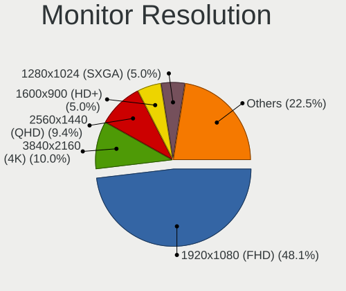

| Resolution         | Desktops | Percent |
|--------------------|----------|---------|
| 1920x1080 (FHD)    | 77       | 48.13%  |
| 3840x2160 (4K)     | 16       | 10%     |
| 2560x1440 (QHD)    | 15       | 9.38%   |
| 1600x900 (HD+)     | 8        | 5%      |
| 1280x1024 (SXGA)   | 8        | 5%      |
| 1680x1050 (WSXGA+) | 6        | 3.75%   |
| Unknown            | 5        | 3.13%   |
| 2560x1080          | 4        | 2.5%    |
| 1920x1200 (WUXGA)  | 3        | 1.88%   |
| 1440x900 (WXGA+)   | 3        | 1.88%   |
| 1360x768           | 3        | 1.88%   |
| 3840x1080          | 2        | 1.25%   |
| 1366x768 (WXGA)    | 2        | 1.25%   |
| 5120x1440          | 1        | 0.63%   |
| 4640x1080          | 1        | 0.63%   |
| 3840x1600          | 1        | 0.63%   |
| 3440x1440          | 1        | 0.63%   |
| 3200x1080          | 1        | 0.63%   |
| 2806x900           | 1        | 0.63%   |
| 2560x1600          | 1        | 0.63%   |
| 1920x540           | 1        | 0.63%   |

Monitor Diagonal
----------------

Diagonal size in inches

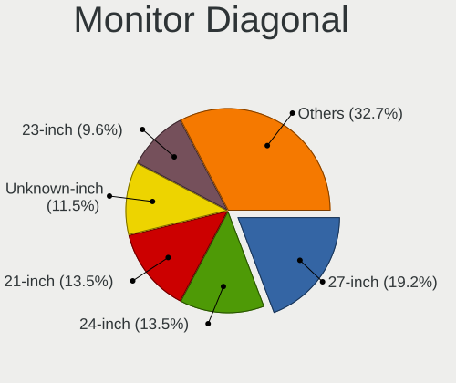

| Inches  | Desktops | Percent |
|---------|----------|---------|
| 27      | 30       | 19.23%  |
| 24      | 21       | 13.46%  |
| 21      | 21       | 13.46%  |
| Unknown | 18       | 11.54%  |
| 23      | 15       | 9.62%   |
| 19      | 15       | 9.62%   |
| 31      | 11       | 7.05%   |
| 22      | 4        | 2.56%   |
| 54      | 3        | 1.92%   |
| 34      | 3        | 1.92%   |
| 29      | 2        | 1.28%   |
| 65      | 1        | 0.64%   |
| 60      | 1        | 0.64%   |
| 57      | 1        | 0.64%   |
| 48      | 1        | 0.64%   |
| 46      | 1        | 0.64%   |
| 43      | 1        | 0.64%   |
| 40      | 1        | 0.64%   |
| 32      | 1        | 0.64%   |
| 28      | 1        | 0.64%   |
| 25      | 1        | 0.64%   |
| 17      | 1        | 0.64%   |
| 16      | 1        | 0.64%   |
| 15      | 1        | 0.64%   |

Monitor Width
-------------

Physical width

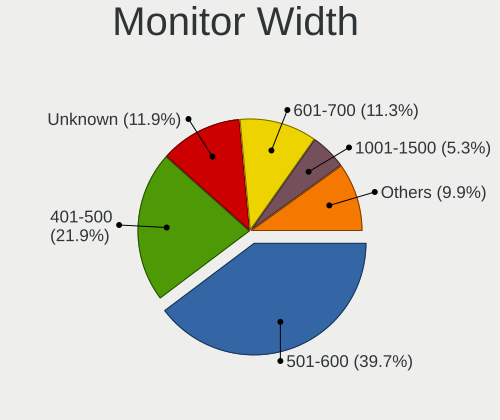

| Width in mm | Desktops | Percent |
|-------------|----------|---------|
| 501-600     | 60       | 39.74%  |
| 401-500     | 33       | 21.85%  |
| Unknown     | 18       | 11.92%  |
| 601-700     | 17       | 11.26%  |
| 1001-1500   | 8        | 5.3%    |
| 351-400     | 6        | 3.97%   |
| 701-800     | 4        | 2.65%   |
| 301-350     | 3        | 1.99%   |
| 801-900     | 1        | 0.66%   |
| 901-1000    | 1        | 0.66%   |

Aspect Ratio
------------

Proportional relationship between the width and the height

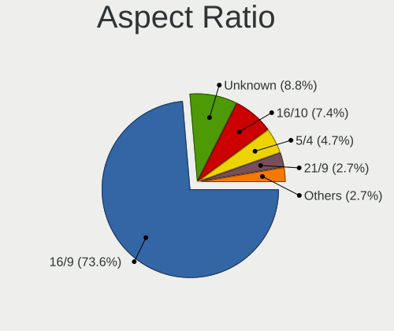

| Ratio   | Desktops | Percent |
|---------|----------|---------|
| 16/9    | 109      | 73.65%  |
| Unknown | 13       | 8.78%   |
| 16/10   | 11       | 7.43%   |
| 5/4     | 7        | 4.73%   |
| 21/9    | 4        | 2.7%    |
| 32/9    | 2        | 1.35%   |
| 6/5     | 1        | 0.68%   |
| 3/2     | 1        | 0.68%   |

Monitor Area
------------

Area in inch²

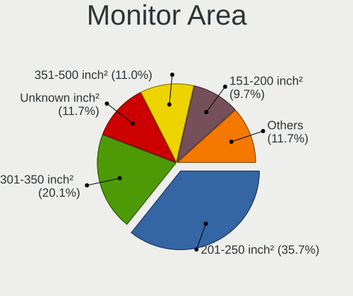

| Area in inch² | Desktops | Percent |
|----------------|----------|---------|
| 201-250        | 55       | 35.71%  |
| 301-350        | 31       | 20.13%  |
| Unknown        | 18       | 11.69%  |
| 351-500        | 17       | 11.04%  |
| 151-200        | 15       | 9.74%   |
| More than 1000 | 6        | 3.9%    |
| 251-300        | 5        | 3.25%   |
| 501-1000       | 4        | 2.6%    |
| 141-150        | 1        | 0.65%   |
| 131-140        | 1        | 0.65%   |
| 101-110        | 1        | 0.65%   |

Pixel Density
-------------

Pixels per inch

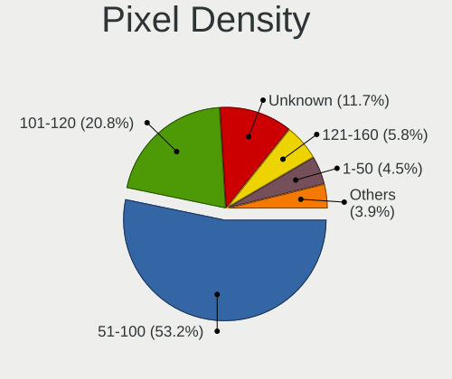

| Density | Desktops | Percent |
|---------|----------|---------|
| 51-100  | 82       | 53.25%  |
| 101-120 | 32       | 20.78%  |
| Unknown | 18       | 11.69%  |
| 121-160 | 9        | 5.84%   |
| 1-50    | 7        | 4.55%   |
| 161-240 | 6        | 3.9%    |

Multiple Monitors
-----------------

Total monitors connected

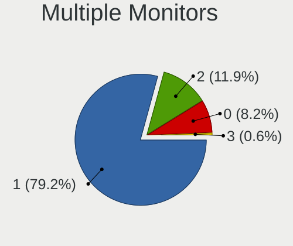

| Total | Desktops | Percent |
|-------|----------|---------|
| 1     | 126      | 79.25%  |
| 2     | 19       | 11.95%  |
| 0     | 13       | 8.18%   |
| 3     | 1        | 0.63%   |

Network
-------

Net Controller Vendor
---------------------

Controller vendors

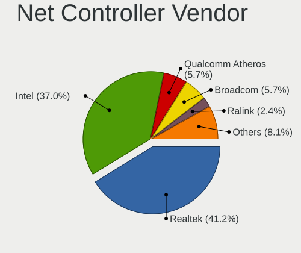

| Vendor                                | Desktops | Percent |
|---------------------------------------|----------|---------|
| Realtek Semiconductor                 | 87       | 41.23%  |
| Intel                                 | 78       | 36.97%  |
| Qualcomm Atheros                      | 12       | 5.69%   |
| Broadcom                              | 12       | 5.69%   |
| Ralink Technology                     | 5        | 2.37%   |
| TP-Link                               | 4        | 1.9%    |
| Samsung Electronics                   | 2        | 0.95%   |
| Aquantia                              | 2        | 0.95%   |
| Ralink                                | 1        | 0.47%   |
| Qualcomm Atheros Communications       | 1        | 0.47%   |
| Qualcomm                              | 1        | 0.47%   |
| Nvidia                                | 1        | 0.47%   |
| Microchip Technology                  | 1        | 0.47%   |
| MediaTek                              | 1        | 0.47%   |
| Generic                               | 1        | 0.47%   |
| Edimax Technology                     | 1        | 0.47%   |
| 802.11g Adapter [Linksys WUSB54GC v3] | 1        | 0.47%   |

Net Controller Model
--------------------

Controller models

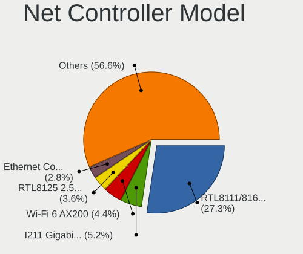

| Model                                                                  | Desktops | Percent |
|------------------------------------------------------------------------|----------|---------|
| Realtek RTL8111/8168/8211/8411 PCI Express Gigabit Ethernet Controller | 68       | 27.31%  |
| Intel I211 Gigabit Network Connection                                  | 13       | 5.22%   |
| Intel Wi-Fi 6 AX200                                                    | 11       | 4.42%   |
| Realtek RTL8125 2.5GbE Controller                                      | 9        | 3.61%   |
| Intel Ethernet Connection (2) I219-V                                   | 7        | 2.81%   |
| Intel Ethernet Controller I225-V                                       | 6        | 2.41%   |
| Intel Ethernet Connection I217-LM                                      | 5        | 2.01%   |
| Realtek RTL810xE PCI Express Fast Ethernet controller                  | 4        | 1.61%   |
| Intel Wireless 7260                                                    | 4        | 1.61%   |
| Intel 82579LM Gigabit Network Connection (Lewisville)                  | 4        | 1.61%   |
| Realtek RTL8188EE Wireless Network Adapter                             | 3        | 1.2%    |
| Ralink RT5370 Wireless Adapter                                         | 3        | 1.2%    |
| Qualcomm Atheros AR93xx Wireless Network Adapter                       | 3        | 1.2%    |
| Intel Ethernet Connection I217-V                                       | 3        | 1.2%    |
| Intel Ethernet Connection (7) I219-V                                   | 3        | 1.2%    |
| Intel Ethernet Connection (2) I219-LM                                  | 3        | 1.2%    |
| Intel Dual Band Wireless-AC 3168NGW [Stone Peak]                       | 3        | 1.2%    |
| Intel Alder Lake-S PCH CNVi WiFi                                       | 3        | 1.2%    |
| Samsung Galaxy series, misc. (tethering mode)                          | 2        | 0.8%    |
| Realtek RTL88x2bu [AC1200 Techkey]                                     | 2        | 0.8%    |
| Realtek RTL8822CE 802.11ac PCIe Wireless Network Adapter               | 2        | 0.8%    |
| Realtek RTL8821AE 802.11ac PCIe Wireless Network Adapter               | 2        | 0.8%    |
| Realtek RTL-8110SC/8169SC Gigabit Ethernet                             | 2        | 0.8%    |
| Qualcomm Atheros Killer E2400 Gigabit Ethernet Controller              | 2        | 0.8%    |
| Qualcomm Atheros AR9287 Wireless Network Adapter (PCI-Express)         | 2        | 0.8%    |
| Qualcomm Atheros AR8151 v2.0 Gigabit Ethernet                          | 2        | 0.8%    |
| Intel Wireless 7265                                                    | 2        | 0.8%    |
| Intel Wi-Fi 6E(802.11ax) AX210/AX1675* 2x2 [Typhoon Peak]              | 2        | 0.8%    |
| Intel Wi-Fi 5(802.11ac) Wireless-AC 9x6x [Thunder Peak]                | 2        | 0.8%    |
| Intel I350 Gigabit Network Connection                                  | 2        | 0.8%    |
| Intel I210 Gigabit Network Connection                                  | 2        | 0.8%    |
| Intel Ethernet Controller I226-V                                       | 2        | 0.8%    |
| Intel Ethernet Connection (5) I219-LM                                  | 2        | 0.8%    |
| Intel Ethernet Connection (17) I219-V                                  | 2        | 0.8%    |
| Intel 82579V Gigabit Network Connection                                | 2        | 0.8%    |
| Intel 82574L Gigabit Network Connection                                | 2        | 0.8%    |
| Intel 82567LM-3 Gigabit Network Connection                             | 2        | 0.8%    |
| Broadcom NetXtreme BCM5754 Gigabit Ethernet PCI Express                | 2        | 0.8%    |
| Broadcom NetLink BCM57781 Gigabit Ethernet PCIe                        | 2        | 0.8%    |
| Broadcom BCM43143 802.11bgn (1x1) Wireless Adapter                     | 2        | 0.8%    |

Wireless Vendor
---------------

Wireless vendors

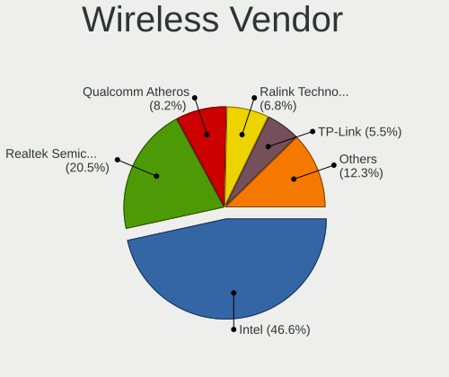

| Vendor                                | Desktops | Percent |
|---------------------------------------|----------|---------|
| Intel                                 | 34       | 46.58%  |
| Realtek Semiconductor                 | 15       | 20.55%  |
| Qualcomm Atheros                      | 6        | 8.22%   |
| Ralink Technology                     | 5        | 6.85%   |
| TP-Link                               | 4        | 5.48%   |
| Broadcom                              | 4        | 5.48%   |
| Ralink                                | 1        | 1.37%   |
| Qualcomm Atheros Communications       | 1        | 1.37%   |
| MediaTek                              | 1        | 1.37%   |
| Edimax Technology                     | 1        | 1.37%   |
| 802.11g Adapter [Linksys WUSB54GC v3] | 1        | 1.37%   |

Wireless Model
--------------

Wireless models

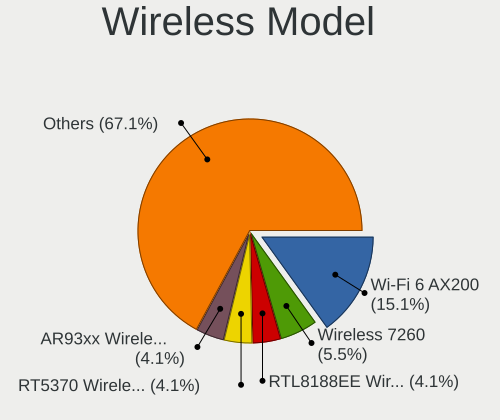

| Model                                                                  | Desktops | Percent |
|------------------------------------------------------------------------|----------|---------|
| Intel Wi-Fi 6 AX200                                                    | 11       | 15.07%  |
| Intel Wireless 7260                                                    | 4        | 5.48%   |
| Realtek RTL8188EE Wireless Network Adapter                             | 3        | 4.11%   |
| Ralink RT5370 Wireless Adapter                                         | 3        | 4.11%   |
| Qualcomm Atheros AR93xx Wireless Network Adapter                       | 3        | 4.11%   |
| Intel Dual Band Wireless-AC 3168NGW [Stone Peak]                       | 3        | 4.11%   |
| Intel Alder Lake-S PCH CNVi WiFi                                       | 3        | 4.11%   |
| Realtek RTL88x2bu [AC1200 Techkey]                                     | 2        | 2.74%   |
| Realtek RTL8822CE 802.11ac PCIe Wireless Network Adapter               | 2        | 2.74%   |
| Realtek RTL8821AE 802.11ac PCIe Wireless Network Adapter               | 2        | 2.74%   |
| Qualcomm Atheros AR9287 Wireless Network Adapter (PCI-Express)         | 2        | 2.74%   |
| Intel Wireless 7265                                                    | 2        | 2.74%   |
| Intel Wi-Fi 6E(802.11ax) AX210/AX1675* 2x2 [Typhoon Peak]              | 2        | 2.74%   |
| Intel Wi-Fi 5(802.11ac) Wireless-AC 9x6x [Thunder Peak]                | 2        | 2.74%   |
| Broadcom BCM43143 802.11bgn (1x1) Wireless Adapter                     | 2        | 2.74%   |
| TP-Link Wireless USB Adapter                                           | 1        | 1.37%   |
| TP-Link TL-WN722N v2/v3 [Realtek RTL8188EUS]                           | 1        | 1.37%   |
| TP-Link Archer T3U [Realtek RTL8812BU]                                 | 1        | 1.37%   |
| TP-Link AC600 wireless Realtek RTL8811AU [Archer T2U Nano]             | 1        | 1.37%   |
| Realtek RTL8192EE PCIe Wireless Network Adapter                        | 1        | 1.37%   |
| Realtek RTL8191SU 802.11n WLAN Adapter                                 | 1        | 1.37%   |
| Realtek RTL8188EUS 802.11n Wireless Network Adapter                    | 1        | 1.37%   |
| Realtek RTL8188CUS 802.11n WLAN Adapter                                | 1        | 1.37%   |
| Realtek RTL8188CE 802.11b/g/n WiFi Adapter                             | 1        | 1.37%   |
| Realtek 8811CU Wireless LAN 802.11ac USB NIC                           | 1        | 1.37%   |
| Ralink RT5372 Wireless Adapter                                         | 1        | 1.37%   |
| Ralink MT7601U Wireless Adapter                                        | 1        | 1.37%   |
| Ralink RT5390R 802.11bgn PCIe Wireless Network Adapter                 | 1        | 1.37%   |
| Qualcomm Atheros AR9271 802.11n                                        | 1        | 1.37%   |
| Qualcomm Atheros AR5416 Wireless Network Adapter [AR5008 802.11(a)bgn] | 1        | 1.37%   |
| MediaTek MT7921K (RZ608) Wi-Fi 6E 80MHz                                | 1        | 1.37%   |
| Intel Wireless 8265 / 8275                                             | 1        | 1.37%   |
| Intel Wireless 8260                                                    | 1        | 1.37%   |
| Intel Wireless 3165                                                    | 1        | 1.37%   |
| Intel Tiger Lake PCH CNVi WiFi                                         | 1        | 1.37%   |
| Intel Centrino Wireless-N 105                                          | 1        | 1.37%   |
| Intel Alder Lake-N PCH CNVi WiFi                                       | 1        | 1.37%   |
| Intel 700 Series Chipset CNVi WiFi                                     | 1        | 1.37%   |
| Edimax EW-7811Un 802.11n Wireless Adapter [Realtek RTL8188CUS]         | 1        | 1.37%   |
| Broadcom BCM43225 802.11b/g/n                                          | 1        | 1.37%   |

Ethernet Vendor
---------------

Ethernet vendors

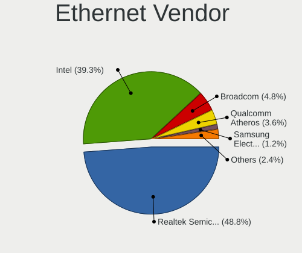

| Vendor                | Desktops | Percent |
|-----------------------|----------|---------|
| Realtek Semiconductor | 82       | 48.81%  |
| Intel                 | 66       | 39.29%  |
| Broadcom              | 8        | 4.76%   |
| Qualcomm Atheros      | 6        | 3.57%   |
| Samsung Electronics   | 2        | 1.19%   |
| Aquantia              | 2        | 1.19%   |
| Qualcomm              | 1        | 0.6%    |
| Nvidia                | 1        | 0.6%    |

Ethernet Model
--------------

Ethernet models

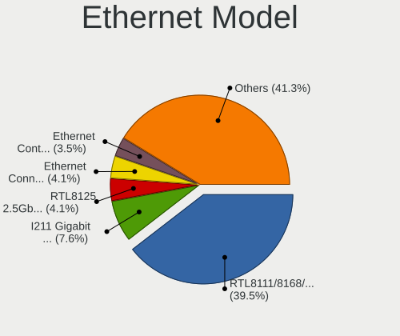

| Model                                                                          | Desktops | Percent |
|--------------------------------------------------------------------------------|----------|---------|
| Realtek RTL8111/8168/8211/8411 PCI Express Gigabit Ethernet Controller         | 68       | 39.53%  |
| Intel I211 Gigabit Network Connection                                          | 13       | 7.56%   |
| Realtek RTL8125 2.5GbE Controller                                              | 7        | 4.07%   |
| Intel Ethernet Connection (2) I219-V                                           | 7        | 4.07%   |
| Intel Ethernet Controller I225-V                                               | 6        | 3.49%   |
| Intel Ethernet Connection I217-LM                                              | 5        | 2.91%   |
| Realtek RTL810xE PCI Express Fast Ethernet controller                          | 4        | 2.33%   |
| Intel 82579LM Gigabit Network Connection (Lewisville)                          | 4        | 2.33%   |
| Intel Ethernet Connection I217-V                                               | 3        | 1.74%   |
| Intel Ethernet Connection (7) I219-V                                           | 3        | 1.74%   |
| Intel Ethernet Connection (2) I219-LM                                          | 3        | 1.74%   |
| Samsung Galaxy series, misc. (tethering mode)                                  | 2        | 1.16%   |
| Realtek RTL-8110SC/8169SC Gigabit Ethernet                                     | 2        | 1.16%   |
| Qualcomm Atheros Killer E2400 Gigabit Ethernet Controller                      | 2        | 1.16%   |
| Qualcomm Atheros AR8151 v2.0 Gigabit Ethernet                                  | 2        | 1.16%   |
| Intel I350 Gigabit Network Connection                                          | 2        | 1.16%   |
| Intel I210 Gigabit Network Connection                                          | 2        | 1.16%   |
| Intel Ethernet Controller I226-V                                               | 2        | 1.16%   |
| Intel Ethernet Connection (5) I219-LM                                          | 2        | 1.16%   |
| Intel Ethernet Connection (17) I219-V                                          | 2        | 1.16%   |
| Intel 82579V Gigabit Network Connection                                        | 2        | 1.16%   |
| Intel 82574L Gigabit Network Connection                                        | 2        | 1.16%   |
| Intel 82567LM-3 Gigabit Network Connection                                     | 2        | 1.16%   |
| Broadcom NetXtreme BCM5754 Gigabit Ethernet PCI Express                        | 2        | 1.16%   |
| Broadcom NetLink BCM57781 Gigabit Ethernet PCIe                                | 2        | 1.16%   |
| Aquantia AQtion AQC107 NBase-T/IEEE 802.3an Ethernet Controller [Atlantic 10G] | 2        | 1.16%   |
| Realtek Killer E2500 Gigabit Ethernet Controller                               | 1        | 0.58%   |
| Qualcomm FP3                                                                   | 1        | 0.58%   |
| Qualcomm Atheros Killer E220x Gigabit Ethernet Controller                      | 1        | 0.58%   |
| Qualcomm Atheros AR8131 Gigabit Ethernet                                       | 1        | 0.58%   |
| Nvidia MCP73 Ethernet                                                          | 1        | 0.58%   |
| Intel Ethernet Controller X710 for 10GbE SFP+                                  | 1        | 0.58%   |
| Intel Ethernet Controller I219-V                                               | 1        | 0.58%   |
| Intel Ethernet Connection (7) I219-LM                                          | 1        | 0.58%   |
| Intel Ethernet Connection (2) I218-V                                           | 1        | 0.58%   |
| Intel Ethernet Connection (17) I219-LM                                         | 1        | 0.58%   |
| Intel Ethernet Connection (14) I219-V                                          | 1        | 0.58%   |
| Intel 82576 Gigabit Network Connection                                         | 1        | 0.58%   |
| Intel 82572EI Gigabit Ethernet Controller (Copper)                             | 1        | 0.58%   |
| Intel 82567V-2 Gigabit Network Connection                                      | 1        | 0.58%   |

Net Controller Kind
-------------------

Ethernet, WiFi or modem

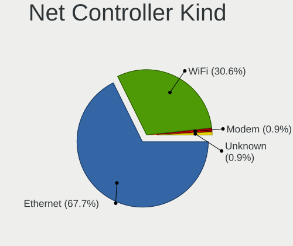

| Kind     | Desktops | Percent |
|----------|----------|---------|
| Ethernet | 155      | 67.69%  |
| WiFi     | 70       | 30.57%  |
| Modem    | 2        | 0.87%   |
| Unknown  | 2        | 0.87%   |

Used Controller
---------------

Currently used network controller

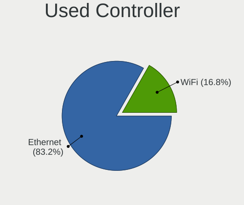

| Kind     | Desktops | Percent |
|----------|----------|---------|
| Ethernet | 134      | 83.23%  |
| WiFi     | 27       | 16.77%  |

NICs
----

Total network controllers on board

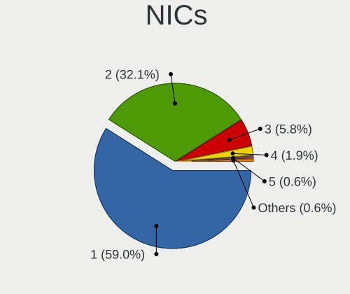

| Total | Desktops | Percent |
|-------|----------|---------|
| 1     | 92       | 58.97%  |
| 2     | 50       | 32.05%  |
| 3     | 9        | 5.77%   |
| 4     | 3        | 1.92%   |
| 5     | 1        | 0.64%   |
| 0     | 1        | 0.64%   |

IPv6
----

IPv6 vs IPv4

| Used | Desktops | Percent |
|------|----------|---------|
| No   | 154      | 98.72%  |
| Yes  | 2        | 1.28%   |

Bluetooth
---------

Bluetooth Vendor
----------------

Controller vendors

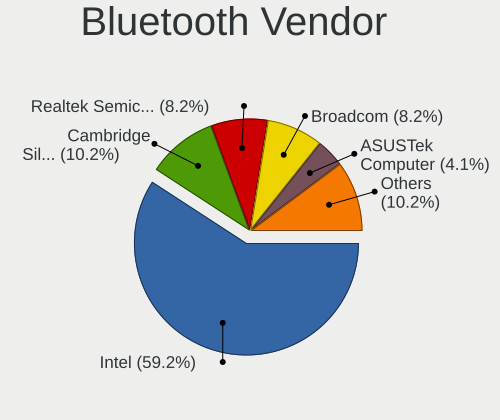

| Vendor                   | Desktops | Percent |
|--------------------------|----------|---------|
| Intel                    | 29       | 59.18%  |
| Cambridge Silicon Radio  | 5        | 10.2%   |
| Realtek Semiconductor    | 4        | 8.16%   |
| Broadcom                 | 4        | 8.16%   |
| ASUSTek Computer         | 2        | 4.08%   |
| Skylight Digital         | 1        | 2.04%   |
| Qcom                     | 1        | 2.04%   |
| MediaTek                 | 1        | 2.04%   |
| HTC (High Tech Computer) | 1        | 2.04%   |
| Apple                    | 1        | 2.04%   |

Bluetooth Model
---------------

Controller models

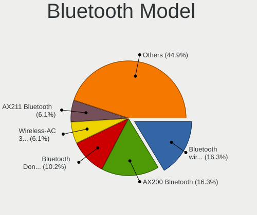

| Model                                                                | Desktops | Percent |
|----------------------------------------------------------------------|----------|---------|
| Intel Bluetooth wireless interface                                   | 8        | 16.33%  |
| Intel AX200 Bluetooth                                                | 8        | 16.33%  |
| Cambridge Silicon Radio Bluetooth Dongle (HCI mode)                  | 5        | 10.2%   |
| Intel Wireless-AC 3168 Bluetooth                                     | 3        | 6.12%   |
| Intel AX211 Bluetooth                                                | 3        | 6.12%   |
| Intel AX201 Bluetooth                                                | 3        | 6.12%   |
| Realtek Bluetooth Adapter                                            | 2        | 4.08%   |
| Intel Wireless-AC 9260 Bluetooth Adapter                             | 2        | 4.08%   |
| Intel AX210 Bluetooth                                                | 2        | 4.08%   |
| Broadcom BCM20702A0 Bluetooth 4.0                                    | 2        | 4.08%   |
| Skylight Digital Realtek Bluetooth Adapter                           | 1        | 2.04%   |
| Realtek RTL8821A Bluetooth                                           | 1        | 2.04%   |
| Realtek Bluetooth 5.1 Adapter                                        | 1        | 2.04%   |
| Qcom Broadcom Bluetooth USB                                          | 1        | 2.04%   |
| MediaTek RZ608 Bluetooth Adapter                                     | 1        | 2.04%   |
| HTC (High Tech Computer) Vive Hub Bluetooth 4.1 (Broadcom BCM920703) | 1        | 2.04%   |
| Broadcom HP Bluethunder                                              | 1        | 2.04%   |
| Broadcom BCM43142A0 Bluetooth Device                                 | 1        | 2.04%   |
| ASUS Realtek Bluetooth 4.0 + High Speed Chip                         | 1        | 2.04%   |
| ASUS Broadcom BCM20702A0 Bluetooth                                   | 1        | 2.04%   |
| Apple Built-in Bluetooth 2.0+EDR HCI                                 | 1        | 2.04%   |

Sound
-----

Sound Vendor
------------

Sound card vendors

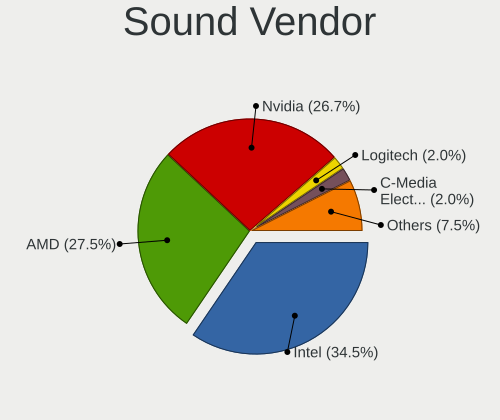

| Vendor               | Desktops | Percent |
|----------------------|----------|---------|
| Intel                | 88       | 34.51%  |
| AMD                  | 70       | 27.45%  |
| Nvidia               | 68       | 26.67%  |
| Logitech             | 5        | 1.96%   |
| C-Media Electronics  | 5        | 1.96%   |
| Focusrite-Novation   | 3        | 1.18%   |
| VIA Technologies     | 2        | 0.78%   |
| SteelSeries ApS      | 2        | 0.78%   |
| JMTek                | 2        | 0.78%   |
| Creative Labs        | 2        | 0.78%   |
| Tenx Technology      | 1        | 0.39%   |
| Samson Technologies  | 1        | 0.39%   |
| RODE Microphones     | 1        | 0.39%   |
| Razer USA            | 1        | 0.39%   |
| Nam Tai E&E Products | 1        | 0.39%   |
| GN Netcom            | 1        | 0.39%   |
| Creative Technology  | 1        | 0.39%   |
| Corsair              | 1        | 0.39%   |

Sound Model
-----------

Sound card models

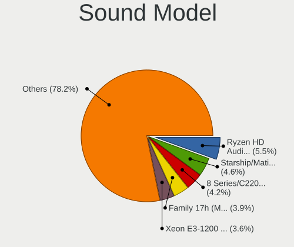

| Model                                                                                 | Desktops | Percent |
|---------------------------------------------------------------------------------------|----------|---------|
| AMD Ryzen HD Audio Controller                                                         | 17       | 5.54%   |
| AMD Starship/Matisse HD Audio Controller                                              | 14       | 4.56%   |
| Intel 8 Series/C220 Series Chipset High Definition Audio Controller                   | 13       | 4.23%   |
| AMD Family 17h (Models 00h-0fh) HD Audio Controller                                   | 12       | 3.91%   |
| Intel Xeon E3-1200 v3/4th Gen Core Processor HD Audio Controller                      | 11       | 3.58%   |
| AMD Renoir/Cezanne HDMI/DP Audio Controller                                           | 11       | 3.58%   |
| Intel 100 Series/C230 Series Chipset Family HD Audio Controller                       | 9        | 2.93%   |
| Intel 6 Series/C200 Series Chipset Family High Definition Audio Controller            | 8        | 2.61%   |
| Intel 200 Series PCH HD Audio                                                         | 8        | 2.61%   |
| AMD FCH Azalia Controller                                                             | 8        | 2.61%   |
| Nvidia GP108 High Definition Audio Controller                                         | 7        | 2.28%   |
| Nvidia GP107GL High Definition Audio Controller                                       | 7        | 2.28%   |
| Nvidia GP104 High Definition Audio Controller                                         | 7        | 2.28%   |
| Nvidia GK107 HDMI Audio Controller                                                    | 7        | 2.28%   |
| Intel Cannon Lake PCH cAVS                                                            | 7        | 2.28%   |
| Intel 7 Series/C216 Chipset Family High Definition Audio Controller                   | 7        | 2.28%   |
| Intel 82801JI (ICH10 Family) HD Audio Controller                                      | 6        | 1.95%   |
| AMD SBx00 Azalia (Intel HDA)                                                          | 6        | 1.95%   |
| AMD Kabini HDMI/DP Audio                                                              | 6        | 1.95%   |
| AMD Ellesmere HDMI Audio [Radeon RX 470/480 / 570/580/590]                            | 6        | 1.95%   |
| Nvidia GM107 High Definition Audio Controller [GeForce 940MX]                         | 5        | 1.63%   |
| Intel Alder Lake-S HD Audio Controller                                                | 5        | 1.63%   |
| AMD Oland/Hainan/Cape Verde/Pitcairn HDMI Audio [Radeon HD 7000 Series]               | 5        | 1.63%   |
| Nvidia TU106 High Definition Audio Controller                                         | 4        | 1.3%    |
| Nvidia GM206 High Definition Audio Controller                                         | 4        | 1.3%    |
| Intel 9 Series Chipset Family HD Audio Controller                                     | 4        | 1.3%    |
| AMD Raven/Raven2/Fenghuang HDMI/DP Audio Controller                                   | 4        | 1.3%    |
| AMD Navi 21/23 HDMI/DP Audio Controller                                               | 4        | 1.3%    |
| Nvidia TU116 High Definition Audio Controller                                         | 3        | 0.98%   |
| Nvidia High Definition Audio Controller                                               | 3        | 0.98%   |
| Nvidia GP106 High Definition Audio Controller                                         | 3        | 0.98%   |
| Intel Raptor Lake High Definition Audio Controller                                    | 3        | 0.98%   |
| C-Media Electronics CMI8788 [Oxygen HD Audio]                                         | 3        | 0.98%   |
| AMD Baffin HDMI/DP Audio [Radeon RX 550 640SP / RX 560/560X]                          | 3        | 0.98%   |
| SteelSeries ApS SteelSeries Arctis 7 Arctis 7 Chat Arctis 7 Game SteelSeries Arctis 7 | 2        | 0.65%   |
| Nvidia TU107 GeForce GTX 1650 High Definition Audio Controller                        | 2        | 0.65%   |
| Nvidia GF119 HDMI Audio Controller                                                    | 2        | 0.65%   |
| Nvidia GA106 High Definition Audio Controller                                         | 2        | 0.65%   |
| Nvidia GA104 High Definition Audio Controller                                         | 2        | 0.65%   |
| Intel Tiger Lake-H HD Audio Controller                                                | 2        | 0.65%   |

Memory
------

Memory Vendor
-------------

Memory module vendors

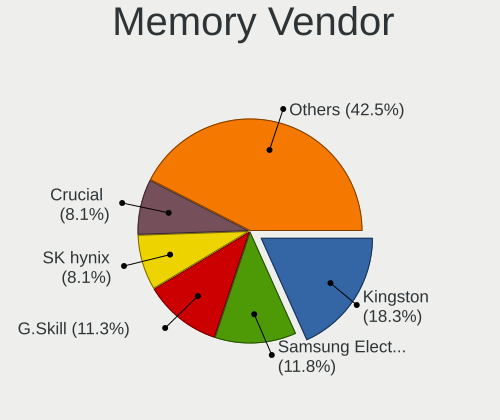

| Vendor                       | Desktops | Percent |
|------------------------------|----------|---------|
| Kingston                     | 34       | 18.28%  |
| Samsung Electronics          | 22       | 11.83%  |
| G.Skill                      | 21       | 11.29%  |
| SK hynix                     | 15       | 8.06%   |
| Crucial                      | 15       | 8.06%   |
| Unknown                      | 14       | 7.53%   |
| Corsair                      | 14       | 7.53%   |
| Micron Technology            | 8        | 4.3%    |
| Unknown                      | 6        | 3.23%   |
| Ramaxel Technology           | 5        | 2.69%   |
| A-DATA Technology            | 5        | 2.69%   |
| Team                         | 4        | 2.15%   |
| Nanya Technology             | 3        | 1.61%   |
| GOODRAM                      | 3        | 1.61%   |
| Patriot                      | 2        | 1.08%   |
| Elpida                       | 2        | 1.08%   |
| Wodposit                     | 1        | 0.54%   |
| Undefined-00BA               | 1        | 0.54%   |
| Timetec                      | 1        | 0.54%   |
| Tammuz                       | 1        | 0.54%   |
| SpecTek Incorporated         | 1        | 0.54%   |
| S                            | 1        | 0.54%   |
| Patriot Memory (PDP Systems) | 1        | 0.54%   |
| Kingmax                      | 1        | 0.54%   |
| Hewlett-Packard              | 1        | 0.54%   |
| GeIL                         | 1        | 0.54%   |
| CSX                          | 1        | 0.54%   |
| Avant                        | 1        | 0.54%   |
| Atermiter                    | 1        | 0.54%   |

Memory Model
------------

Memory module models

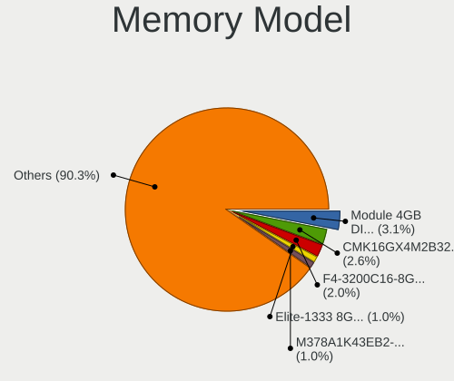

| Model                                                    | Desktops | Percent |
|----------------------------------------------------------|----------|---------|
| Unknown                                                  | 6        | 3.06%   |
| Corsair RAM CMK16GX4M2B3200C16 8GB DIMM DDR4 3200MT/s    | 5        | 2.55%   |
| G.Skill RAM F4-3200C16-8GVKB 8GB DIMM DDR4 3200MT/s      | 4        | 2.04%   |
| Team RAM Elite-1333 8GB DIMM DDR3 1333MT/s               | 2        | 1.02%   |
| SK hynix RAM HMT351U6CFR8C-PB 4GB DIMM DDR3 1600MT/s     | 2        | 1.02%   |
| Samsung RAM M378A1K43EB2-CWE 8GB DIMM DDR4 3200MT/s      | 2        | 1.02%   |
| Kingston RAM KHX1866C10D3/8G 8GB DIMM DDR3 1867MT/s      | 2        | 1.02%   |
| GOODRAM RAM IRX3200D464L16SA/8G 8GB DIMM DDR4 3200MT/s   | 2        | 1.02%   |
| Crucial RAM BLS8G3D1609DS1S00. 8GB DIMM DDR3 1866MT/s    | 2        | 1.02%   |
| Wodposit RAM WPBH32D408SWM-16G 16GB SODIMM DDR4 3200MT/s | 1        | 0.51%   |
| Unknown RAM Module 8GB DIMM DDR4 2400MT/s                | 1        | 0.51%   |
| Unknown RAM Module 8GB DIMM DDR3 1600MT/s                | 1        | 0.51%   |
| Unknown RAM Module 8GB DIMM 1600MT/s                     | 1        | 0.51%   |
| Unknown RAM Module 4GB SODIMM DDR2 800MT/s               | 1        | 0.51%   |
| Unknown RAM Module 4GB DIMM DDR3 1600MT/s                | 1        | 0.51%   |
| Unknown RAM Module 4GB DIMM DDR3 1333MT/s                | 1        | 0.51%   |
| Unknown RAM Module 4GB DIMM 1333MT/s                     | 1        | 0.51%   |
| Unknown RAM Module 4096MB DIMM 1333MT/s                  | 1        | 0.51%   |
| Unknown RAM Module 2GB DIMM DDR3 1600MT/s                | 1        | 0.51%   |
| Unknown RAM Module 2GB DIMM DDR3 1333MT/s                | 1        | 0.51%   |
| Unknown RAM Module 2GB DIMM DDR3 1067MT/s                | 1        | 0.51%   |
| Unknown RAM Module 2GB DIMM DDR2 800MT/s                 | 1        | 0.51%   |
| Unknown RAM Module 2GB DIMM 800MT/s                      | 1        | 0.51%   |
| Unknown RAM Module 2048MB DIMM DDR2 800MT/s              | 1        | 0.51%   |
| Undefined-00BA RAM Module 4GB DIMM DDR3 1333MT/s         | 1        | 0.51%   |
| Timetec RAM SD4-2666 16GB SODIMM DDR4 2667MT/s           | 1        | 0.51%   |
| Team RAM TEAMGROUP-UD4-2400 4GB DIMM DDR4 2667MT/s       | 1        | 0.51%   |
| Team RAM TEAMGROUP-UD4-2400 16GB DIMM DDR4 2400MT/s      | 1        | 0.51%   |
| Tammuz RAM TZD2G816U32-SK001 16GB DIMM DDR4 3200MT/s     | 1        | 0.51%   |
| SpecTek Incorporated RAM Module 16GB DIMM DDR4 3200MT/s  | 1        | 0.51%   |
| SK hynix RAM HMT451U6BFR8C-PB 4GB DIMM DDR3 1600MT/s     | 1        | 0.51%   |
| SK hynix RAM HMT41GU6MFR8C-PB 8GB DIMM DDR3 1600MT/s     | 1        | 0.51%   |
| SK hynix RAM HMT41GU6DFR8A-PB 8GB DIMM DDR3 1600MT/s     | 1        | 0.51%   |
| SK hynix RAM HMT41GU6BFR8A-PB 8GB DIMM DDR3 1600MT/s     | 1        | 0.51%   |
| SK hynix RAM HMT351U6CFR8C 4GB DIMM DDR3 667MT/s         | 1        | 0.51%   |
| SK hynix RAM HMT351S6BFR8C-H9 4GB DIMM DDR3 1333MT/s     | 1        | 0.51%   |
| SK hynix RAM HMT325U6CFR8C-H9 2GB DIMM DDR3 1333MT/s     | 1        | 0.51%   |
| SK hynix RAM HMT325U6BFR8C-H9 2GB DIMM DDR3 1333MT/s     | 1        | 0.51%   |
| SK hynix RAM HMA82GS6CJR8N-VK 16GB SODIMM DDR4 2667MT/s  | 1        | 0.51%   |
| SK hynix RAM HMA81GU6JJR8N-VK 8GB DIMM DDR4 2667MT/s     | 1        | 0.51%   |

Memory Kind
-----------

Memory module kinds

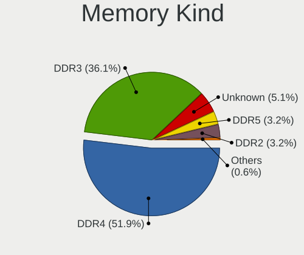

| Kind    | Desktops | Percent |
|---------|----------|---------|
| DDR4    | 82       | 51.9%   |
| DDR3    | 57       | 36.08%  |
| Unknown | 8        | 5.06%   |
| DDR5    | 5        | 3.16%   |
| DDR2    | 5        | 3.16%   |
| SDRAM   | 1        | 0.63%   |

Memory Form Factor
------------------

Physical design of the memory module

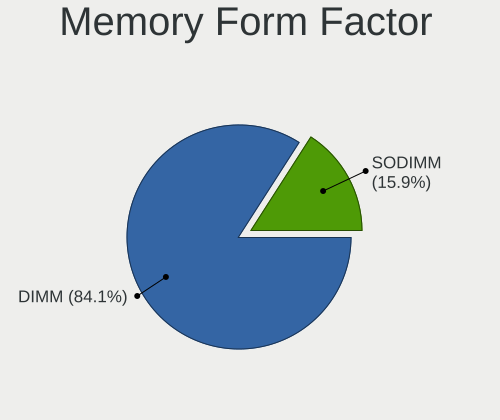

| Name   | Desktops | Percent |
|--------|----------|---------|
| DIMM   | 132      | 84.08%  |
| SODIMM | 25       | 15.92%  |

Memory Size
-----------

Memory module size

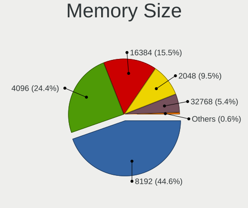

| Size  | Desktops | Percent |
|-------|----------|---------|
| 8192  | 75       | 44.64%  |
| 4096  | 41       | 24.4%   |
| 16384 | 26       | 15.48%  |
| 2048  | 16       | 9.52%   |
| 32768 | 9        | 5.36%   |
| 49152 | 1        | 0.6%    |

Memory Speed
------------

Memory module speed

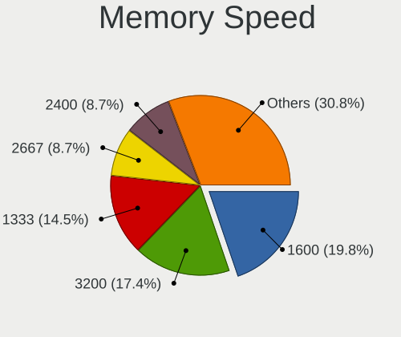

| Speed | Desktops | Percent |
|-------|----------|---------|
| 1600  | 34       | 19.77%  |
| 3200  | 30       | 17.44%  |
| 1333  | 25       | 14.53%  |
| 2667  | 15       | 8.72%   |
| 2400  | 15       | 8.72%   |
| 2133  | 11       | 6.4%    |
| 3600  | 5        | 2.91%   |
| 2666  | 5        | 2.91%   |
| 800   | 5        | 2.91%   |
| 1867  | 4        | 2.33%   |
| 1066  | 4        | 2.33%   |
| 1866  | 3        | 1.74%   |
| 1067  | 3        | 1.74%   |
| 5600  | 2        | 1.16%   |
| 4800  | 2        | 1.16%   |
| 3000  | 2        | 1.16%   |
| 667   | 2        | 1.16%   |
| 6000  | 1        | 0.58%   |
| 3333  | 1        | 0.58%   |
| 3266  | 1        | 0.58%   |
| 3066  | 1        | 0.58%   |
| 2933  | 1        | 0.58%   |

Printers & scanners
-------------------

Printer Vendor
--------------

Printer device vendors

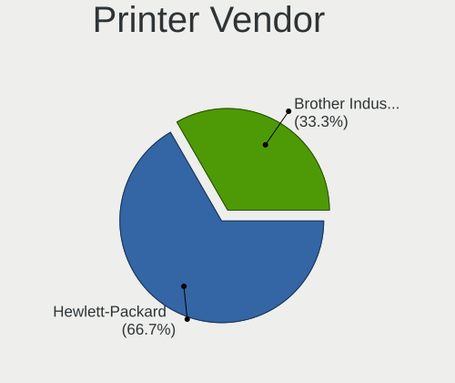

| Vendor             | Desktops | Percent |
|--------------------|----------|---------|
| Hewlett-Packard    | 2        | 66.67%  |
| Brother Industries | 1        | 33.33%  |

Printer Model
-------------

Printer device models

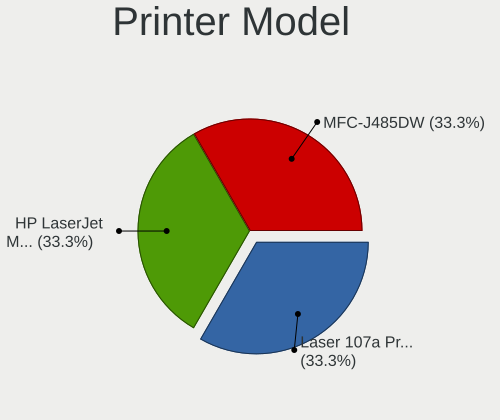

| Model                                                                                            | Desktops | Percent |
|--------------------------------------------------------------------------------------------------|----------|---------|
| HP Laser 107a Printer                                                                            | 1        | 33.33%  |
| HP HP LaserJet MFP M232-M237 Printer HP LEDM IPP Printer HP LEDM IPP Printer HP LEDM IPP Printer | 1        | 33.33%  |
| Brother MFC-J485DW                                                                               | 1        | 33.33%  |

Scanner Vendor
--------------

Scanner device vendors

Zero info for selected period =(

Scanner Model
-------------

Scanner device models

Zero info for selected period =(

Camera
------

Camera Vendor
-------------

Camera device vendors

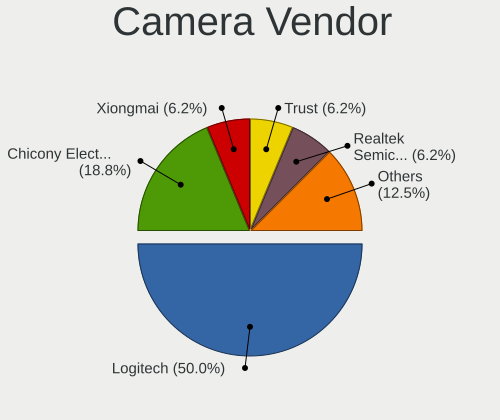

| Vendor                | Desktops | Percent |
|-----------------------|----------|---------|
| Logitech              | 8        | 50%     |
| Chicony Electronics   | 3        | 18.75%  |
| Xiongmai              | 1        | 6.25%   |
| Trust                 | 1        | 6.25%   |
| Realtek Semiconductor | 1        | 6.25%   |
| Quanta                | 1        | 6.25%   |
| Nam Tai E&E Products  | 1        | 6.25%   |

Camera Model
------------

Camera device models

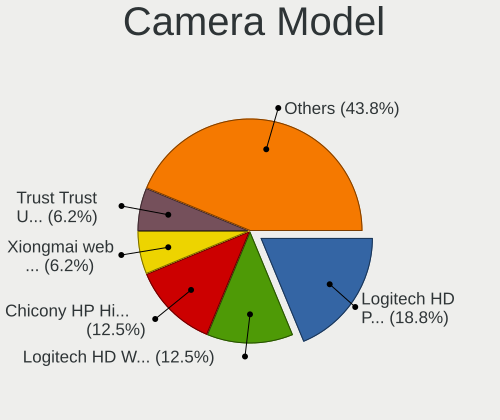

| Model                                     | Desktops | Percent |
|-------------------------------------------|----------|---------|
| Logitech HD Pro Webcam C920               | 3        | 18.75%  |
| Logitech HD Webcam C525                   | 2        | 12.5%   |
| Chicony HP High Definition 1MP Webcam     | 2        | 12.5%   |
| Xiongmai web camera                       | 1        | 6.25%   |
| Trust Trust USB Camera                    | 1        | 6.25%   |
| Realtek Thronmax Stream Go Pro Webcam     | 1        | 6.25%   |
| Quanta LG Webcam                          | 1        | 6.25%   |
| Nam Tai E&E Products Sony Playstation Eye | 1        | 6.25%   |
| Logitech Webcam C310                      | 1        | 6.25%   |
| Logitech Logitech Webcam C925e            | 1        | 6.25%   |
| Logitech C920 HD Pro Webcam               | 1        | 6.25%   |
| Chicony HP Integrated Webcam              | 1        | 6.25%   |

Security
--------

Fingerprint Vendor
------------------

Fingerprint sensor vendors

Zero info for selected period =(

Fingerprint Model
-----------------

Fingerprint sensor models

Zero info for selected period =(

Chipcard Vendor
---------------

Chipcard module vendors

Zero info for selected period =(

Chipcard Model
--------------

Chipcard module models

Zero info for selected period =(

Unsupported
-----------

Unsupported Devices
-------------------

Total unsupported devices on board

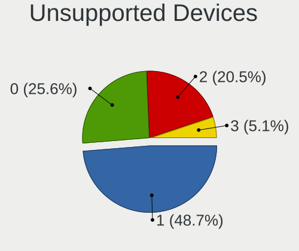

| Total | Desktops | Percent |
|-------|----------|---------|
| 1     | 76       | 48.72%  |
| 0     | 40       | 25.64%  |
| 2     | 32       | 20.51%  |
| 3     | 8        | 5.13%   |

Unsupported Device Types
------------------------

Types of unsupported devices

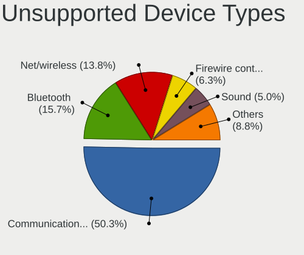

| Type                     | Desktops | Percent |
|--------------------------|----------|---------|
| Communication controller | 80       | 50.31%  |
| Bluetooth                | 25       | 15.72%  |
| Net/wireless             | 22       | 13.84%  |
| Firewire controller      | 10       | 6.29%   |
| Sound                    | 8        | 5.03%   |
| Network                  | 7        | 4.4%    |
| Card reader              | 3        | 1.89%   |
| Net/ethernet             | 2        | 1.26%   |
| Storage/raid             | 1        | 0.63%   |
| Modem                    | 1        | 0.63%   |

