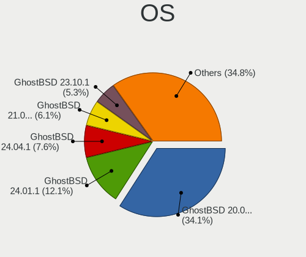
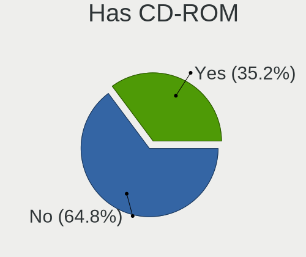
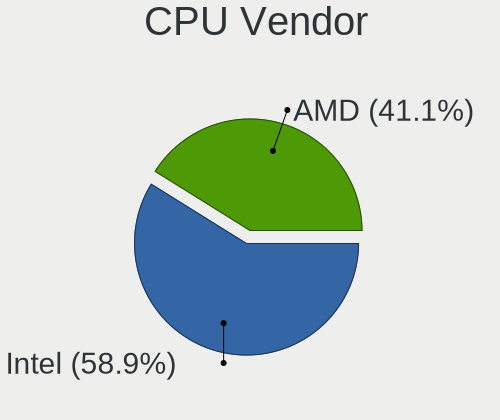
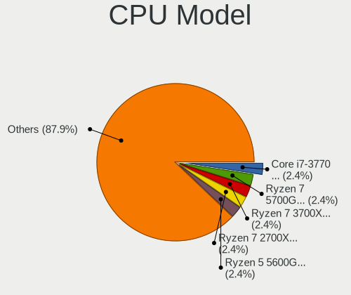
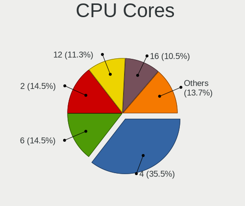
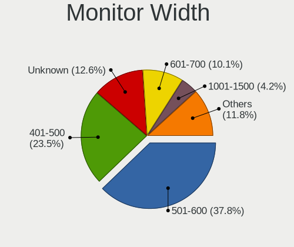
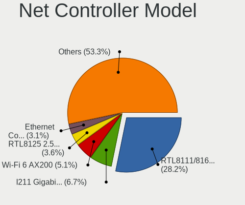
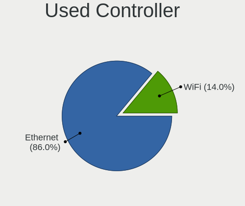
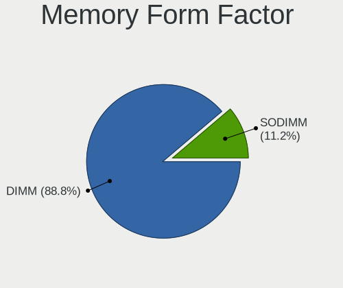

GhostBSD - Tested Hardware & Statistics (Desktops)
--------------------------------------------------

A project to collect tested hardware configurations for GhostBSD.

Anyone can contribute to this report by the [hw-probe](https://github.com/linuxhw/hw-probe/blob/master/INSTALL.BSD.md) tool:

    hw-probe -all -upload

Please contribute! Especially if your hardware is rare.

Contents
--------

* [ Test Cases ](#test-cases)

* [ System ](#system)
  - [ OS                       ](#os)
  - [ OS Family                ](#os-family)
  - [ Arch                     ](#arch)
  - [ DE                       ](#de)
  - [ Display Server           ](#display-server)
  - [ Display Manager          ](#display-manager)
  - [ OS Lang                  ](#os-lang)
  - [ Boot Mode                ](#boot-mode)
  - [ Filesystem               ](#filesystem)
  - [ Part. scheme             ](#part-scheme)

* [ Board ](#board)
  - [ Vendor                   ](#vendor)
  - [ Model                    ](#model)
  - [ Model Family             ](#model-family)
  - [ MFG Year                 ](#mfg-year)
  - [ Form Factor              ](#form-factor)
  - [ Coreboot                 ](#coreboot)
  - [ RAM Size                 ](#ram-size)
  - [ RAM Used                 ](#ram-used)
  - [ Total Drives             ](#total-drives)
  - [ Has CD-ROM               ](#has-cd-rom)
  - [ Has Ethernet             ](#has-ethernet)
  - [ Has WiFi                 ](#has-wifi)
  - [ Has Bluetooth            ](#has-bluetooth)

* [ Location ](#location)
  - [ Country                  ](#country)
  - [ City                     ](#city)

* [ Drives ](#drives)
  - [ Drive Vendor             ](#drive-vendor)
  - [ Drive Model              ](#drive-model)
  - [ HDD Vendor               ](#hdd-vendor)
  - [ SSD Vendor               ](#ssd-vendor)
  - [ Drive Kind               ](#drive-kind)
  - [ Drive Connector          ](#drive-connector)
  - [ Drive Size               ](#drive-size)
  - [ Space Total              ](#space-total)
  - [ Space Used               ](#space-used)
  - [ Malfunc. Drives          ](#malfunc-drives)
  - [ Malfunc. Drive Vendor    ](#malfunc-drive-vendor)
  - [ Malfunc. HDD Vendor      ](#malfunc-hdd-vendor)
  - [ Malfunc. Drive Kind      ](#malfunc-drive-kind)
  - [ Failed Drives            ](#failed-drives)
  - [ Failed Drive Vendor      ](#failed-drive-vendor)
  - [ Drive Status             ](#drive-status)

* [ Storage controller ](#storage-controller)
  - [ Storage Vendor           ](#storage-vendor)
  - [ Storage Model            ](#storage-model)
  - [ Storage Kind             ](#storage-kind)

* [ Processor ](#processor)
  - [ CPU Vendor               ](#cpu-vendor)
  - [ CPU Model                ](#cpu-model)
  - [ CPU Model Family         ](#cpu-model-family)
  - [ CPU Cores                ](#cpu-cores)
  - [ CPU Sockets              ](#cpu-sockets)
  - [ CPU Threads              ](#cpu-threads)
  - [ CPU Microarch            ](#cpu-microarch)

* [ Graphics ](#graphics)
  - [ GPU Vendor               ](#gpu-vendor)
  - [ GPU Model                ](#gpu-model)
  - [ GPU Combo                ](#gpu-combo)
  - [ GPU Driver               ](#gpu-driver)
  - [ GPU Memory               ](#gpu-memory)

* [ Monitor ](#monitor)
  - [ Monitor Vendor           ](#monitor-vendor)
  - [ Monitor Model            ](#monitor-model)
  - [ Monitor Resolution       ](#monitor-resolution)
  - [ Monitor Diagonal         ](#monitor-diagonal)
  - [ Monitor Width            ](#monitor-width)
  - [ Aspect Ratio             ](#aspect-ratio)
  - [ Monitor Area             ](#monitor-area)
  - [ Pixel Density            ](#pixel-density)
  - [ Multiple Monitors        ](#multiple-monitors)

* [ Network ](#network)
  - [ Net Controller Vendor    ](#net-controller-vendor)
  - [ Net Controller Model     ](#net-controller-model)
  - [ Wireless Vendor          ](#wireless-vendor)
  - [ Wireless Model           ](#wireless-model)
  - [ Ethernet Vendor          ](#ethernet-vendor)
  - [ Ethernet Model           ](#ethernet-model)
  - [ Net Controller Kind      ](#net-controller-kind)
  - [ Used Controller          ](#used-controller)
  - [ NICs                     ](#nics)
  - [ IPv6                     ](#ipv6)

* [ Bluetooth ](#bluetooth)
  - [ Bluetooth Vendor         ](#bluetooth-vendor)
  - [ Bluetooth Model          ](#bluetooth-model)

* [ Sound ](#sound)
  - [ Sound Vendor             ](#sound-vendor)
  - [ Sound Model              ](#sound-model)

* [ Memory ](#memory)
  - [ Memory Vendor            ](#memory-vendor)
  - [ Memory Model             ](#memory-model)
  - [ Memory Kind              ](#memory-kind)
  - [ Memory Form Factor       ](#memory-form-factor)
  - [ Memory Size              ](#memory-size)
  - [ Memory Speed             ](#memory-speed)

* [ Printers & scanners ](#printers--scanners)
  - [ Printer Vendor           ](#printer-vendor)
  - [ Printer Model            ](#printer-model)
  - [ Scanner Vendor           ](#scanner-vendor)
  - [ Scanner Model            ](#scanner-model)

* [ Camera ](#camera)
  - [ Camera Vendor            ](#camera-vendor)
  - [ Camera Model             ](#camera-model)

* [ Security ](#security)
  - [ Fingerprint Vendor       ](#fingerprint-vendor)
  - [ Fingerprint Model        ](#fingerprint-model)
  - [ Chipcard Vendor          ](#chipcard-vendor)
  - [ Chipcard Model           ](#chipcard-model)

* [ Unsupported ](#unsupported)
  - [ Unsupported Devices      ](#unsupported-devices)
  - [ Unsupported Device Types ](#unsupported-device-types)

Test Cases
----------

Total: 75

| Vendor    | Model                       | Probe                                                     | Date         |
|-----------|-----------------------------|-----------------------------------------------------------|--------------|
| ASRock    | B450 Gaming K4              | [a03ff6ad9e](https://bsd-hardware.info/?probe=a03ff6ad9e) | Jun 10, 2022 |
| Dell      | 0M3F6C A01                  | [21d45bc75d](https://bsd-hardware.info/?probe=21d45bc75d) | May 23, 2022 |
| ASUSTek   | PRIME B350-PLUS             | [e9524e612d](https://bsd-hardware.info/?probe=e9524e612d) | May 22, 2022 |
| Gigabyte  | AX370-Gaming 3-CF           | [62ab2bc823](https://bsd-hardware.info/?probe=62ab2bc823) | May 07, 2022 |
| HP        | 0B4Ch D                     | [3f170bdee6](https://bsd-hardware.info/?probe=3f170bdee6) | May 01, 2022 |
| Dell      | 0DXJD9 A01                  | [4023d86091](https://bsd-hardware.info/?probe=4023d86091) | Apr 15, 2022 |
| Dell      | 0Y56T3 A00                  | [d9d86d5bfd](https://bsd-hardware.info/?probe=d9d86d5bfd) | Apr 12, 2022 |
| MSI       | B250 PC MATE                | [612b0f0a34](https://bsd-hardware.info/?probe=612b0f0a34) | Mar 19, 2022 |
| ASUSTek   | TUF GAMING X570-PRO         | [8307275b2e](https://bsd-hardware.info/?probe=8307275b2e) | Mar 07, 2022 |
| ASUSTek   | Z97-A                       | [84d7fb3f1e](https://bsd-hardware.info/?probe=84d7fb3f1e) | Jan 30, 2022 |
| Dell      | 0NNNCT A01                  | [290f10c785](https://bsd-hardware.info/?probe=290f10c785) | Jan 21, 2022 |
| Alienware | 01NYPT A00                  | [75aa0c00fb](https://bsd-hardware.info/?probe=75aa0c00fb) | Dec 06, 2021 |
| ASUSTek   | PRIME Z270-K                | [a2270b6f09](https://bsd-hardware.info/?probe=a2270b6f09) | Dec 02, 2021 |
| Medion    | MS-7728                     | [5b5a847fdd](https://bsd-hardware.info/?probe=5b5a847fdd) | Nov 02, 2021 |
| Gigabyte  | H410M S2 V2                 | [9cf5948654](https://bsd-hardware.info/?probe=9cf5948654) | Oct 13, 2021 |
| ASUSTek   | SABERTOOTH X58              | [8f00f132de](https://bsd-hardware.info/?probe=8f00f132de) | Sep 23, 2021 |
| ASRock    | X570 Taichi                 | [9dc50c0bcb](https://bsd-hardware.info/?probe=9dc50c0bcb) | Sep 11, 2021 |
| ASUSTek   | PRIME B350-PLUS             | [0ee3fe080c](https://bsd-hardware.info/?probe=0ee3fe080c) | Aug 30, 2021 |
| Gigabyte  | Z77M-D3H                    | [d60f1bc575](https://bsd-hardware.info/?probe=d60f1bc575) | Aug 29, 2021 |
| MSI       | H81M-P33                    | [6dcb3aa559](https://bsd-hardware.info/?probe=6dcb3aa559) | Aug 05, 2021 |
| ASRock    | X570 Pro4                   | [011fb96fe0](https://bsd-hardware.info/?probe=011fb96fe0) | Aug 04, 2021 |
| ASRock    | Z77 Extreme6                | [2521c70747](https://bsd-hardware.info/?probe=2521c70747) | Aug 02, 2021 |
| ASUSTek   | PRIME B350M-E               | [bde8057846](https://bsd-hardware.info/?probe=bde8057846) | Jun 29, 2021 |
| ASUSTek   | PRIME A320M-A               | [10d9e99990](https://bsd-hardware.info/?probe=10d9e99990) | May 31, 2021 |
| Lenovo    | Board                       | [428f39cbff](https://bsd-hardware.info/?probe=428f39cbff) | May 21, 2021 |
| ASUSTek   | V-P7H55E                    | [7634d3b6ca](https://bsd-hardware.info/?probe=7634d3b6ca) | May 12, 2021 |
| ASUSTek   | V-P7H55E                    | [f2e42a5ca3](https://bsd-hardware.info/?probe=f2e42a5ca3) | May 10, 2021 |
| ASUSTek   | V-P7H55E                    | [0af6399c18](https://bsd-hardware.info/?probe=0af6399c18) | May 10, 2021 |
| Dell      | 0TP412                      | [1bc05b5951](https://bsd-hardware.info/?probe=1bc05b5951) | Apr 04, 2021 |
| Huanan    | X79 INTEL (INTEL Xeon E5... | [ec9e43382e](https://bsd-hardware.info/?probe=ec9e43382e) | Mar 25, 2021 |
| HP        | 1850                        | [3055c06d45](https://bsd-hardware.info/?probe=3055c06d45) | Mar 22, 2021 |
| ASRock    | X570 Phantom Gaming 4       | [a64a4e0792](https://bsd-hardware.info/?probe=a64a4e0792) | Mar 19, 2021 |
| ASUSTek   | ROG STRIX B450-F GAMING     | [39a46ce44e](https://bsd-hardware.info/?probe=39a46ce44e) | Mar 06, 2021 |
| Gigabyte  | EG43M-S2H                   | [f6eaa55ada](https://bsd-hardware.info/?probe=f6eaa55ada) | Mar 06, 2021 |
| Acer      | Aspire XC-115               | [95f63df64d](https://bsd-hardware.info/?probe=95f63df64d) | Feb 21, 2021 |
| Lenovo    | Kabini CRB 31900058 STD     | [c08ca084b0](https://bsd-hardware.info/?probe=c08ca084b0) | Feb 21, 2021 |
| ASRock    | AB350 Pro4                  | [3680c4cd75](https://bsd-hardware.info/?probe=3680c4cd75) | Feb 20, 2021 |
| ASUSTek   | PRIME B450-PLUS             | [ade306695d](https://bsd-hardware.info/?probe=ade306695d) | Feb 20, 2021 |
| Acer      | WG43M                       | [28a6795710](https://bsd-hardware.info/?probe=28a6795710) | Feb 15, 2021 |
| MSI       | PRESTIGE X570 CREATION      | [e6fa5753b5](https://bsd-hardware.info/?probe=e6fa5753b5) | Feb 12, 2021 |
| MSI       | PRESTIGE X570 CREATION      | [fd798dae01](https://bsd-hardware.info/?probe=fd798dae01) | Feb 12, 2021 |
| Dell      | 030VXY A01                  | [23e7163f58](https://bsd-hardware.info/?probe=23e7163f58) | Feb 10, 2021 |
| ASUSTek   | TUF GAMING X570-PLUS        | [cf41f72474](https://bsd-hardware.info/?probe=cf41f72474) | Jan 31, 2021 |
| Dell      | 0NW6H5 A00                  | [f6df3820b5](https://bsd-hardware.info/?probe=f6df3820b5) | Jan 18, 2021 |
| MSI       | Z97 GAMING 5                | [9ef0da6093](https://bsd-hardware.info/?probe=9ef0da6093) | Jan 16, 2021 |
| Dell      | 0KC9NP A01                  | [a9228fa7c3](https://bsd-hardware.info/?probe=a9228fa7c3) | Jan 15, 2021 |
| Dell      | 030VXY A01                  | [5af442bf61](https://bsd-hardware.info/?probe=5af442bf61) | Jan 15, 2021 |
| Dell      | 0HY9JP A02                  | [b4d2af272e](https://bsd-hardware.info/?probe=b4d2af272e) | Jan 05, 2021 |
| ASUSTek   | Z170I PRO GAMING            | [5124b24d30](https://bsd-hardware.info/?probe=5124b24d30) | Jan 04, 2021 |
| Fujitsu   | D3617-A1 S26361-D3617-A1    | [2a0187ef7a](https://bsd-hardware.info/?probe=2a0187ef7a) | Jan 02, 2021 |
| ASUSTek   | PRIME A320M-C R2.0          | [4c24fe6fc4](https://bsd-hardware.info/?probe=4c24fe6fc4) | Dec 24, 2020 |
| HP        | 0B4Ch D                     | [bf0d7fe4f1](https://bsd-hardware.info/?probe=bf0d7fe4f1) | Dec 22, 2020 |
| Gigabyte  | Z370 AORUS Ultra Gaming-... | [a3a96da3fb](https://bsd-hardware.info/?probe=a3a96da3fb) | Dec 19, 2020 |
| ASUSTek   | TUF GAMING B550M-PLUS       | [464223cefe](https://bsd-hardware.info/?probe=464223cefe) | Dec 07, 2020 |
| ASRock    | B450 Gaming-ITX/ac          | [53bf449015](https://bsd-hardware.info/?probe=53bf449015) | Dec 02, 2020 |
| Quanta    | 2AF5 011                    | [172f23efac](https://bsd-hardware.info/?probe=172f23efac) | Nov 29, 2020 |
| ASRock    | AB350 Gaming-ITX/ac         | [8afa16fc20](https://bsd-hardware.info/?probe=8afa16fc20) | Nov 29, 2020 |
| Gigabyte  | X470 AORUS ULTRA GAMING-... | [5d5ecb38cd](https://bsd-hardware.info/?probe=5d5ecb38cd) | Nov 25, 2020 |
| MSI       | B450 GAMING PLUS            | [4cf3dd682b](https://bsd-hardware.info/?probe=4cf3dd682b) | Nov 24, 2020 |
| MSI       | B450 GAMING PLUS            | [edee76372b](https://bsd-hardware.info/?probe=edee76372b) | Nov 21, 2020 |
| ASRock    | X570 Phantom Gaming 4       | [cc075b3932](https://bsd-hardware.info/?probe=cc075b3932) | Nov 15, 2020 |
| ASRock    | X570 Phantom Gaming 4       | [6a0c640524](https://bsd-hardware.info/?probe=6a0c640524) | Nov 12, 2020 |
| ASRock    | X570 Phantom Gaming 4       | [6060033216](https://bsd-hardware.info/?probe=6060033216) | Nov 12, 2020 |
| Gigabyte  | Z97-D3H-CF                  | [dc33c84287](https://bsd-hardware.info/?probe=dc33c84287) | Oct 22, 2020 |
| Fujitsu   | D2950-A1 S26361-D2950-A1    | [86e9866c03](https://bsd-hardware.info/?probe=86e9866c03) | Oct 02, 2020 |
| Fujitsu   | D2950-A1 S26361-D2950-A1    | [3b8f8a2033](https://bsd-hardware.info/?probe=3b8f8a2033) | Oct 02, 2020 |
| MSI       | H61M-P20                    | [fefac5637b](https://bsd-hardware.info/?probe=fefac5637b) | Aug 03, 2020 |
| Gigabyte  | F2A68HM-DS2                 | [0073f8ff71](https://bsd-hardware.info/?probe=0073f8ff71) | Aug 02, 2020 |
| Gigabyte  | H67A-UD3H-B3                | [aa29eb9c75](https://bsd-hardware.info/?probe=aa29eb9c75) | Aug 01, 2020 |
| Unknown   | SKYBAY                      | [34bb81770b](https://bsd-hardware.info/?probe=34bb81770b) | Jul 22, 2020 |
| ASRock    | X370 Gaming K4              | [4473708fd0](https://bsd-hardware.info/?probe=4473708fd0) | Jul 22, 2020 |
| ASRock    | X370 Gaming K4              | [174569bf55](https://bsd-hardware.info/?probe=174569bf55) | Jul 21, 2020 |
| ASRock    | A300M-STX                   | [f62a2ace5a](https://bsd-hardware.info/?probe=f62a2ace5a) | Jul 16, 2020 |
| Lenovo    | Win8 Pro DPK TPG            | [db7146b868](https://bsd-hardware.info/?probe=db7146b868) | Jul 14, 2020 |
| Gigabyte  | Z170X-UD5 TH-CF             | [2fc2952380](https://bsd-hardware.info/?probe=2fc2952380) | May 25, 2020 |

System
------

OS
--

Installed operating systems

| Name              | Desktops | Percent |
|-------------------|----------|---------|
| GhostBSD 20.04.02 | 45       | 71.43%  |
| GhostBSD 21.08.27 | 8        | 12.7%   |
| GhostBSD 22.01.12 | 4        | 6.35%   |
| GhostBSD 22.04.06 | 2        | 3.17%   |
| GhostBSD 22.05.14 | 1        | 1.59%   |
| GhostBSD 22.04.22 | 1        | 1.59%   |
| GhostBSD 22.01.28 | 1        | 1.59%   |
| GhostBSD 19.12    | 1        | 1.59%   |

OS Family
---------

OS without a version

| Name     | Desktops | Percent |
|----------|----------|---------|
| GhostBSD | 61       | 100%    |

Arch
----

OS architecture (x86_64, i586, etc.)

| Name  | Desktops | Percent |
|-------|----------|---------|
| amd64 | 61       | 100%    |

DE
--

Desktop Environment

| Name             | Desktops | Percent |
|------------------|----------|---------|
| MATE             | 47       | 74.6%   |
| XFCE             | 7        | 11.11%  |
| KDE5             | 4        | 6.35%   |
| openbox          | 1        | 1.59%   |
| Metacity (Marco) | 1        | 1.59%   |
| LXQt             | 1        | 1.59%   |
| i3               | 1        | 1.59%   |
| GNOME            | 1        | 1.59%   |

Display Server
--------------

X11 or Wayland

| Name | Desktops | Percent |
|------|----------|---------|
| X11  | 61       | 100%    |

Display Manager
---------------

SDDM, LightDM, etc.

| Name    | Desktops | Percent |
|---------|----------|---------|
| LightDM | 59       | 96.72%  |
| SDDM    | 2        | 3.28%   |

OS Lang
-------

Language

| Lang    | Desktops | Percent |
|---------|----------|---------|
| en_US   | 28       | 45.16%  |
| Unknown | 11       | 17.74%  |
| C       | 9        | 14.52%  |
| de_DE   | 5        | 8.06%   |
| ru_RU   | 4        | 6.45%   |
| fr_FR   | 2        | 3.23%   |
| sk_SK   | 1        | 1.61%   |
| en_GB   | 1        | 1.61%   |
| en_AU   | 1        | 1.61%   |

Boot Mode
---------

EFI or BIOS

| Mode | Desktops | Percent |
|------|----------|---------|
| EFI  | 47       | 77.05%  |
| BIOS | 14       | 22.95%  |

Filesystem
----------

Type of filesystem

| Type | Desktops | Percent |
|------|----------|---------|
| Zfs  | 58       | 95.08%  |
| Ufs  | 3        | 4.92%   |

Part. scheme
------------

Scheme of partitioning

| Type | Desktops | Percent |
|------|----------|---------|
| GPT  | 57       | 93.44%  |
| MBR  | 4        | 6.56%   |

Board
-----

Vendor
------

Motherboard manufacturer

| Name                | Desktops | Percent |
|---------------------|----------|---------|
| ASUSTek Computer    | 13       | 21.31%  |
| Gigabyte Technology | 9        | 14.75%  |
| Dell                | 9        | 14.75%  |
| ASRock              | 9        | 14.75%  |
| MSI                 | 7        | 11.48%  |
| Lenovo              | 3        | 4.92%   |
| Hewlett-Packard     | 2        | 3.28%   |
| Fujitsu             | 2        | 3.28%   |
| Acer                | 2        | 3.28%   |
| Quanta              | 1        | 1.64%   |
| Medion              | 1        | 1.64%   |
| Huanan              | 1        | 1.64%   |
| Alienware           | 1        | 1.64%   |
| Unknown             | 1        | 1.64%   |

Model
-----

Motherboard model

| Name                                                                  | Desktops | Percent |
|-----------------------------------------------------------------------|----------|---------|
| MSI MS-7B86                                                           | 2        | 3.28%   |
| Quanta 120-1333w                                                      | 1        | 1.64%   |
| MSI MS-7C36                                                           | 1        | 1.64%   |
| MSI MS-7A72                                                           | 1        | 1.64%   |
| MSI MS-7917                                                           | 1        | 1.64%   |
| MSI MS-7817                                                           | 1        | 1.64%   |
| MSI MS-7788                                                           | 1        | 1.64%   |
| Medion MS-7728                                                        | 1        | 1.64%   |
| Lenovo ThinkStation S10 6483CTO                                       | 1        | 1.64%   |
| Lenovo ThinkCentre Edge72 3493DEG                                     | 1        | 1.64%   |
| Lenovo H515s 10126                                                    | 1        | 1.64%   |
| Huanan X79 INTEL (INTEL Xeon E5/Corei7 DMI2 - C600/C200 Cipset V2.49P | 1        | 1.64%   |
| HP Z400 Workstation                                                   | 1        | 1.64%   |
| HP Compaq Pro 6305 SFF                                                | 1        | 1.64%   |
| Gigabyte Z97-D3H                                                      | 1        | 1.64%   |
| Gigabyte Z77M-D3H                                                     | 1        | 1.64%   |
| Gigabyte Z370 AORUS Ultra Gaming                                      | 1        | 1.64%   |
| Gigabyte Z170X-UD5 TH                                                 | 1        | 1.64%   |
| Gigabyte X470 AORUS ULTRA GAMING                                      | 1        | 1.64%   |
| Gigabyte H67A-UD3H-B3                                                 | 1        | 1.64%   |
| Gigabyte F2A68HM-DS2                                                  | 1        | 1.64%   |
| Gigabyte EG43M-S2H                                                    | 1        | 1.64%   |
| Gigabyte AX370-Gaming 3                                               | 1        | 1.64%   |
| Fujitsu ESPRIMO P1500                                                 | 1        | 1.64%   |
| Fujitsu CELSIUS W580                                                  | 1        | 1.64%   |
| Dell Precision WorkStation T3400                                      | 1        | 1.64%   |
| Dell Precision T5600                                                  | 1        | 1.64%   |
| Dell Precision 3630 Tower                                             | 1        | 1.64%   |
| Dell OptiPlex 9020                                                    | 1        | 1.64%   |
| Dell OptiPlex 790                                                     | 1        | 1.64%   |
| Dell OptiPlex 7050                                                    | 1        | 1.64%   |
| Dell OptiPlex 5060                                                    | 1        | 1.64%   |
| Dell OptiPlex 3080                                                    | 1        | 1.64%   |
| Dell G5 5090                                                          | 1        | 1.64%   |
| ASUS Z170I PRO GAMING                                                 | 1        | 1.64%   |
| ASUS TUF GAMING X570-PRO                                              | 1        | 1.64%   |
| ASUS TUF GAMING X570-PLUS                                             | 1        | 1.64%   |
| ASUS TUF GAMING B550M-PLUS                                            | 1        | 1.64%   |
| ASUS SABERTOOTH X58                                                   | 1        | 1.64%   |
| ASUS ROG STRIX B450-F GAMING                                          | 1        | 1.64%   |
| ASUS PRIME Z270-K                                                     | 1        | 1.64%   |
| ASUS PRIME B450-PLUS                                                  | 1        | 1.64%   |
| ASUS PRIME B350M-E                                                    | 1        | 1.64%   |
| ASUS PRIME B350-PLUS                                                  | 1        | 1.64%   |
| ASUS PRIME A320M-C R2.0                                               | 1        | 1.64%   |
| ASUS PRIME A320M-A                                                    | 1        | 1.64%   |
| ASUS All Series                                                       | 1        | 1.64%   |
| ASRock Z77 Extreme6                                                   | 1        | 1.64%   |
| ASRock X570 Taichi                                                    | 1        | 1.64%   |
| ASRock X570 Pro4                                                      | 1        | 1.64%   |
| ASRock X570 Phantom Gaming 4                                          | 1        | 1.64%   |
| ASRock X370 Gaming K4                                                 | 1        | 1.64%   |
| ASRock B450 Gaming-ITX/ac                                             | 1        | 1.64%   |
| ASRock B450 Gaming K4                                                 | 1        | 1.64%   |
| ASRock AB350 Gaming-ITX/ac                                            | 1        | 1.64%   |
| ASRock A300M-STX                                                      | 1        | 1.64%   |
| Alienware Aurora R5                                                   | 1        | 1.64%   |
| Acer Aspire XC-115                                                    | 1        | 1.64%   |
| Acer Aspire X3910                                                     | 1        | 1.64%   |
| Unknown                                                               | 1        | 1.64%   |

Model Family
------------

Motherboard model prefix

| Name                  | Desktops | Percent |
|-----------------------|----------|---------|
| ASUS PRIME            | 6        | 9.84%   |
| Dell OptiPlex         | 5        | 8.2%    |
| Dell Precision        | 3        | 4.92%   |
| ASUS TUF              | 3        | 4.92%   |
| ASRock X570           | 3        | 4.92%   |
| MSI MS-7B86           | 2        | 3.28%   |
| ASRock B450           | 2        | 3.28%   |
| Acer Aspire           | 2        | 3.28%   |
| Quanta 120-1333w      | 1        | 1.64%   |
| MSI MS-7C36           | 1        | 1.64%   |
| MSI MS-7A72           | 1        | 1.64%   |
| MSI MS-7917           | 1        | 1.64%   |
| MSI MS-7817           | 1        | 1.64%   |
| MSI MS-7788           | 1        | 1.64%   |
| Medion MS-7728        | 1        | 1.64%   |
| Lenovo ThinkStation   | 1        | 1.64%   |
| Lenovo ThinkCentre    | 1        | 1.64%   |
| Lenovo H515s          | 1        | 1.64%   |
| Huanan X79            | 1        | 1.64%   |
| HP Z400               | 1        | 1.64%   |
| HP Compaq             | 1        | 1.64%   |
| Gigabyte Z97-D3H      | 1        | 1.64%   |
| Gigabyte Z77M-D3H     | 1        | 1.64%   |
| Gigabyte Z370         | 1        | 1.64%   |
| Gigabyte Z170X-UD5    | 1        | 1.64%   |
| Gigabyte X470         | 1        | 1.64%   |
| Gigabyte H67A-UD3H-B3 | 1        | 1.64%   |
| Gigabyte F2A68HM-DS2  | 1        | 1.64%   |
| Gigabyte EG43M-S2H    | 1        | 1.64%   |
| Gigabyte AX370-Gaming | 1        | 1.64%   |
| Fujitsu ESPRIMO       | 1        | 1.64%   |
| Fujitsu CELSIUS       | 1        | 1.64%   |
| Dell G5               | 1        | 1.64%   |
| ASUS Z170I            | 1        | 1.64%   |
| ASUS SABERTOOTH       | 1        | 1.64%   |
| ASUS ROG              | 1        | 1.64%   |
| ASUS All              | 1        | 1.64%   |
| ASRock Z77            | 1        | 1.64%   |
| ASRock X370           | 1        | 1.64%   |
| ASRock AB350          | 1        | 1.64%   |
| ASRock A300M-STX      | 1        | 1.64%   |
| Alienware Aurora      | 1        | 1.64%   |
| Unknown               | 1        | 1.64%   |

MFG Year
--------

Motherboard manufacture year

| Year | Desktops | Percent |
|------|----------|---------|
| 2018 | 12       | 19.67%  |
| 2019 | 9        | 14.75%  |
| 2020 | 8        | 13.11%  |
| 2012 | 6        | 9.84%   |
| 2016 | 4        | 6.56%   |
| 2014 | 4        | 6.56%   |
| 2008 | 4        | 6.56%   |
| 2013 | 3        | 4.92%   |
| 2011 | 3        | 4.92%   |
| 2017 | 2        | 3.28%   |
| 2015 | 2        | 3.28%   |
| 2022 | 1        | 1.64%   |
| 2021 | 1        | 1.64%   |
| 2010 | 1        | 1.64%   |
| 2009 | 1        | 1.64%   |

Form Factor
-----------

Physical design of the computer

| Name    | Desktops | Percent |
|---------|----------|---------|
| Desktop | 61       | 100%    |

Coreboot
--------

Have coreboot on board

| Used | Desktops | Percent |
|------|----------|---------|
| No   | 61       | 100%    |

RAM Size
--------

Total RAM memory

| Size in GB  | Desktops | Percent |
|-------------|----------|---------|
| 16.01-24.0  | 18       | 29.51%  |
| 32.01-64.0  | 16       | 26.23%  |
| 8.01-16.0   | 14       | 22.95%  |
| 4.01-8.0    | 9        | 14.75%  |
| 64.01-256.0 | 3        | 4.92%   |
| 24.01-32.0  | 1        | 1.64%   |

RAM Used
--------

Used RAM memory

| Used GB  | Desktops | Percent |
|----------|----------|---------|
| 0.51-1.0 | 25       | 40.98%  |
| 0.01-0.5 | 19       | 31.15%  |
| 1.01-2.0 | 14       | 22.95%  |
| 3.01-4.0 | 3        | 4.92%   |

Total Drives
------------

Number of drives on board

| Drives | Desktops | Percent |
|--------|----------|---------|
| 2      | 27       | 42.19%  |
| 1      | 18       | 28.13%  |
| 3      | 6        | 9.38%   |
| 5      | 5        | 7.81%   |
| 4      | 4        | 6.25%   |
| 6      | 2        | 3.13%   |
| 7      | 1        | 1.56%   |
| 0      | 1        | 1.56%   |

Has CD-ROM
----------

Has CD-ROM on board

| Presented | Desktops | Percent |
|-----------|----------|---------|
| No        | 34       | 55.74%  |
| Yes       | 27       | 44.26%  |

Has Ethernet
------------

Has Ethernet on board

| Presented | Desktops | Percent |
|-----------|----------|---------|
| Yes       | 61       | 100%    |

Has WiFi
--------

Has WiFi module

| Presented | Desktops | Percent |
|-----------|----------|---------|
| No        | 40       | 65.57%  |
| Yes       | 21       | 34.43%  |

Has Bluetooth
-------------

Has Bluetooth module

| Presented | Desktops | Percent |
|-----------|----------|---------|
| No        | 45       | 73.77%  |
| Yes       | 16       | 26.23%  |

Location
--------

Country
-------

Geographic location (country)

| Country     | Desktops | Percent |
|-------------|----------|---------|
| USA         | 16       | 26.23%  |
| Germany     | 9        | 14.75%  |
| Russia      | 5        | 8.2%    |
| France      | 5        | 8.2%    |
| UK          | 4        | 6.56%   |
| Canada      | 3        | 4.92%   |
| Norway      | 2        | 3.28%   |
| Netherlands | 2        | 3.28%   |
| Czechia     | 2        | 3.28%   |
| Australia   | 2        | 3.28%   |
| Ukraine     | 1        | 1.64%   |
| Switzerland | 1        | 1.64%   |
| Sweden      | 1        | 1.64%   |
| Spain       | 1        | 1.64%   |
| Mexico      | 1        | 1.64%   |
| Malaysia    | 1        | 1.64%   |
| Luxembourg  | 1        | 1.64%   |
| Japan       | 1        | 1.64%   |
| Hungary     | 1        | 1.64%   |
| Finland     | 1        | 1.64%   |
| China       | 1        | 1.64%   |

City
----

Geographic location (city)

| City             | Desktops | Percent |
|------------------|----------|---------|
| Paris            | 3        | 4.92%   |
| Berlin           | 3        | 4.92%   |
| Obninsk          | 2        | 3.28%   |
| Denver           | 2        | 3.28%   |
| ЕЊta-ku        | 1        | 1.64%   |
| Zapopan          | 1        | 1.64%   |
| Washington       | 1        | 1.64%   |
| Vidnoye          | 1        | 1.64%   |
| Veenendaal       | 1        | 1.64%   |
| Truro            | 1        | 1.64%   |
| Traunstein       | 1        | 1.64%   |
| Sydney           | 1        | 1.64%   |
| St. Albert       | 1        | 1.64%   |
| St Petersburg    | 1        | 1.64%   |
| Springfield      | 1        | 1.64%   |
| San Jose         | 1        | 1.64%   |
| Robbins          | 1        | 1.64%   |
| Riedstadt        | 1        | 1.64%   |
| Richmond         | 1        | 1.64%   |
| Prague           | 1        | 1.64%   |
| Phoenix          | 1        | 1.64%   |
| Palm Bay         | 1        | 1.64%   |
| Oslo             | 1        | 1.64%   |
| Omaha            | 1        | 1.64%   |
| Moncton          | 1        | 1.64%   |
| Madrid           | 1        | 1.64%   |
| Luxembourg       | 1        | 1.64%   |
| Lorient          | 1        | 1.64%   |
| London           | 1        | 1.64%   |
| Larnod           | 1        | 1.64%   |
| Kyiv             | 1        | 1.64%   |
| Kuala Lumpur     | 1        | 1.64%   |
| Kaplice          | 1        | 1.64%   |
| Jönköping  | 1        | 1.64%   |
| Jyväskylä  | 1        | 1.64%   |
| Huntingdon       | 1        | 1.64%   |
| Heilbronn        | 1        | 1.64%   |
| Hamilton         | 1        | 1.64%   |
| Hamburg          | 1        | 1.64%   |
| Glace Bay        | 1        | 1.64%   |
| Eiken            | 1        | 1.64%   |
| Drammen          | 1        | 1.64%   |
| Delton           | 1        | 1.64%   |
| Dandenong        | 1        | 1.64%   |
| Dabas            | 1        | 1.64%   |
| Colorado Springs | 1        | 1.64%   |
| Cologne          | 1        | 1.64%   |
| Chicago          | 1        | 1.64%   |
| Chelyabinsk      | 1        | 1.64%   |
| Bonn             | 1        | 1.64%   |
| Bijie            | 1        | 1.64%   |
| Banbury          | 1        | 1.64%   |
| Atascadero       | 1        | 1.64%   |
| Anchorage        | 1        | 1.64%   |
| Amsterdam        | 1        | 1.64%   |

Drives
------

Drive Vendor
------------

Hard drive vendors

| Vendor              | Desktops | Drives | Percent |
|---------------------|----------|--------|---------|
| WDC                 | 29       | 41     | 24.17%  |
| Samsung Electronics | 22       | 29     | 18.33%  |
| Seagate             | 17       | 22     | 14.17%  |
| Crucial             | 11       | 12     | 9.17%   |
| Toshiba             | 6        | 6      | 5%      |
| Hitachi             | 6        | 6      | 5%      |
| SanDisk             | 3        | 4      | 2.5%    |
| Kingston            | 3        | 3      | 2.5%    |
| A-DATA Technology   | 3        | 3      | 2.5%    |
| PNY                 | 2        | 4      | 1.67%   |
| Micron Technology   | 2        | 2      | 1.67%   |
| Maxtor              | 2        | 2      | 1.67%   |
| Intel               | 2        | 2      | 1.67%   |
| HGST                | 2        | 2      | 1.67%   |
| XPG                 | 1        | 1      | 0.83%   |
| Transcend           | 1        | 1      | 0.83%   |
| SPCC                | 1        | 1      | 0.83%   |
| Plextor             | 1        | 1      | 0.83%   |
| Phison              | 1        | 2      | 0.83%   |
| Patriot             | 1        | 1      | 0.83%   |
| OCZ                 | 1        | 1      | 0.83%   |
| LDLC                | 1        | 1      | 0.83%   |
| HPT                 | 1        | 4      | 0.83%   |
| AMD                 | 1        | 1      | 0.83%   |

Drive Model
-----------

Hard drive models

| Model                              | Desktops | Percent |
|------------------------------------|----------|---------|
| Crucial CT1000MX500SSD1 1TB        | 4        | 2.99%   |
| Samsung SSD 850 EVO 500GB          | 3        | 2.24%   |
| WDC WD40EFRX-68N32N0 4TB           | 2        | 1.49%   |
| WDC WD2000JS-55MHB0 192GB          | 2        | 1.49%   |
| WDC WD10EZEX-21M2NA0 1TB           | 2        | 1.49%   |
| Toshiba Q300 480GB                 | 2        | 1.49%   |
| Toshiba HDWD120 2TB                | 2        | 1.49%   |
| Seagate ST500DM002-1BD142 500GB    | 2        | 1.49%   |
| Samsung SSD 970 EVO Plus 1TB       | 2        | 1.49%   |
| Samsung SSD 970 EVO 500GB          | 2        | 1.49%   |
| Samsung SSD 860 QVO 1TB            | 2        | 1.49%   |
| Samsung SSD 850 EVO 250GB          | 2        | 1.49%   |
| Maxtor STM3320613AS 320GB          | 2        | 1.49%   |
| Crucial CT250MX500SSD1 250GB       | 2        | 1.49%   |
| XPG GAMMIX S11 Pro 256GB           | 1        | 0.75%   |
| WDC WDS500G2B0A-00SM50 500GB       | 1        | 0.75%   |
| WDC WDS500G2B0A 500GB              | 1        | 0.75%   |
| WDC WDS100T3X0C-00SJG0 1TB         | 1        | 0.75%   |
| WDC WDS100T2B0C-00PXH0 1TB         | 1        | 0.75%   |
| WDC WDS100T1X0E-00AFY0 1TB         | 1        | 0.75%   |
| WDC WD800BEVT-75ZCT2 80GB          | 1        | 0.75%   |
| WDC WD7500LPCX-00KHST0 752GB       | 1        | 0.75%   |
| WDC WD60EZRZ-00GZ5B1 6TB           | 1        | 0.75%   |
| WDC WD6003FFBX-68MU3N0 6TB         | 1        | 0.75%   |
| WDC WD5000LPLX-75ZNTT0 500GB       | 1        | 0.75%   |
| WDC WD5000BEVT-24A0RT0 500GB       | 1        | 0.75%   |
| WDC WD5000AAVS-00ZTB0 500GB        | 1        | 0.75%   |
| WDC WD5000AAKX-60U6AA0 500GB       | 1        | 0.75%   |
| WDC WD5000AAKX-00ERMA0 500GB       | 1        | 0.75%   |
| WDC WD5000AAKS-60WWPA0 500GB       | 1        | 0.75%   |
| WDC WD3200BEKT-75KA9T0 320GB       | 1        | 0.75%   |
| WDC WD2500AAJS-75M0A0 250GB        | 1        | 0.75%   |
| WDC WD20SPZX-22UA7T0 2TB           | 1        | 0.75%   |
| WDC WD20EZRZ-00Z5HB0 2TB           | 1        | 0.75%   |
| WDC WD2002FAEX-007BA0 2TB          | 1        | 0.75%   |
| WDC WD10EZEX-60M2NA0 1TB           | 1        | 0.75%   |
| WDC WD10EZEX-08WN4A0 1TB           | 1        | 0.75%   |
| WDC WD10EALX-009BA0 1TB            | 1        | 0.75%   |
| WDC WD1002FBYS-05A6B0 1TB          | 1        | 0.75%   |
| WDC WD1002FAEX-00Y9A0 1TB          | 1        | 0.75%   |
| WDC PC SN520 NVMe 256GB            | 1        | 0.75%   |
| Transcend TS120GMTS820S 120GB      | 1        | 0.75%   |
| Toshiba MQ01ABD100 1TB             | 1        | 0.75%   |
| Toshiba DT01ACA050 500GB           | 1        | 0.75%   |
| SPCC Solid State Disk 240GB        | 1        | 0.75%   |
| Seagate ST8000DM004-2CX188 8TB     | 1        | 0.75%   |
| Seagate ST8000AS0002-1NA17Z 8TB    | 1        | 0.75%   |
| Seagate ST500DM002-1SB10A 500GB    | 1        | 0.75%   |
| Seagate ST500DM002-1BC142 500GB    | 1        | 0.75%   |
| Seagate ST400FP0021 400GB          | 1        | 0.75%   |
| Seagate ST4000DM004-2CV104 4TB     | 1        | 0.75%   |
| Seagate ST4000DM000-1F2168 4TB     | 1        | 0.75%   |
| Seagate ST3500312CS 500GB          | 1        | 0.75%   |
| Seagate ST31500541AS 1.5TB         | 1        | 0.75%   |
| Seagate ST31000528AS 1TB           | 1        | 0.75%   |
| Seagate ST2000NM0008-2F3100 2TB    | 1        | 0.75%   |
| Seagate ST2000LM003 HN-M201RAD 2TB | 1        | 0.75%   |
| Seagate ST2000DM008-2FR102 2TB     | 1        | 0.75%   |
| Seagate ST1500DL003-9VT16L 1.5TB   | 1        | 0.75%   |
| Seagate ST1000VM002-1SD102 1TB     | 1        | 0.75%   |

HDD Vendor
----------

Hard disk drive vendors

| Vendor              | Desktops | Drives | Percent |
|---------------------|----------|--------|---------|
| WDC                 | 25       | 35     | 41.67%  |
| Seagate             | 16       | 21     | 26.67%  |
| Hitachi             | 6        | 6      | 10%     |
| Toshiba             | 4        | 4      | 6.67%   |
| Samsung Electronics | 4        | 5      | 6.67%   |
| Maxtor              | 2        | 2      | 3.33%   |
| HGST                | 2        | 2      | 3.33%   |
| HPT                 | 1        | 4      | 1.67%   |

SSD Vendor
----------

Solid state drive vendors

| Vendor              | Desktops | Drives | Percent |
|---------------------|----------|--------|---------|
| Samsung Electronics | 14       | 15     | 29.17%  |
| Crucial             | 10       | 11     | 20.83%  |
| SanDisk             | 3        | 4      | 6.25%   |
| A-DATA Technology   | 3        | 3      | 6.25%   |
| WDC                 | 2        | 2      | 4.17%   |
| Toshiba             | 2        | 2      | 4.17%   |
| PNY                 | 2        | 4      | 4.17%   |
| Micron Technology   | 2        | 2      | 4.17%   |
| Kingston            | 2        | 2      | 4.17%   |
| Transcend           | 1        | 1      | 2.08%   |
| SPCC                | 1        | 1      | 2.08%   |
| Seagate             | 1        | 1      | 2.08%   |
| Plextor             | 1        | 1      | 2.08%   |
| Patriot             | 1        | 1      | 2.08%   |
| OCZ                 | 1        | 1      | 2.08%   |
| Intel               | 1        | 1      | 2.08%   |
| AMD                 | 1        | 1      | 2.08%   |

Drive Kind
----------

HDD or SSD

| Kind | Desktops | Drives | Percent |
|------|----------|--------|---------|
| HDD  | 44       | 79     | 46.81%  |
| SSD  | 34       | 53     | 36.17%  |
| NVMe | 16       | 20     | 17.02%  |

Drive Connector
---------------

SATA, SAS, NVMe, etc.

| Type | Desktops | Drives | Percent |
|------|----------|--------|---------|
| SATA | 59       | 132    | 78.67%  |
| NVMe | 16       | 20     | 21.33%  |

Drive Size
----------

Size of hard drive

| Size in TB | Desktops | Drives | Percent |
|------------|----------|--------|---------|
| 0.01-0.5   | 45       | 66     | 48.91%  |
| 0.51-1.0   | 24       | 33     | 26.09%  |
| 1.01-2.0   | 12       | 15     | 13.04%  |
| 3.01-4.0   | 6        | 7      | 6.52%   |
| 4.01-10.0  | 4        | 9      | 4.35%   |
| 2.01-3.0   | 1        | 2      | 1.09%   |

Space Total
-----------

Amount of disk space available on the file system

| Size in GB | Desktops | Percent |
|------------|----------|---------|
| 101-250    | 16       | 25.81%  |
| 1-20       | 15       | 24.19%  |
| 251-500    | 14       | 22.58%  |
| 501-1000   | 5        | 8.06%   |
| 51-100     | 5        | 8.06%   |
| Unknown    | 3        | 4.84%   |
| 21-50      | 2        | 3.23%   |
| 1001-2000  | 2        | 3.23%   |

Space Used
----------

Amount of used disk space

| Used GB | Desktops | Percent |
|---------|----------|---------|
| 1-20    | 51       | 82.26%  |
| 21-50   | 7        | 11.29%  |
| Unknown | 3        | 4.84%   |
| 51-100  | 1        | 1.61%   |

Malfunc. Drives
---------------

Drive models with a malfunction

| Model                           | Desktops | Drives | Percent |
|---------------------------------|----------|--------|---------|
| Maxtor STM3320613AS 320GB       | 2        | 2      | 15.38%  |
| WDC WD5000AAKS-60WWPA0 500GB    | 1        | 1      | 7.69%   |
| WDC WD10EZEX-21M2NA0 1TB        | 1        | 1      | 7.69%   |
| Seagate ST500DM002-1BD142 500GB | 1        | 1      | 7.69%   |
| Seagate ST500DM002-1BC142 500GB | 1        | 1      | 7.69%   |
| Seagate ST31500541AS 1.5TB      | 1        | 1      | 7.69%   |
| Samsung Electronics HD103SJ 1TB | 1        | 2      | 7.69%   |
| OCZ AGILITY3 240GB              | 1        | 1      | 7.69%   |
| Hitachi HTS725032A9A364 320GB   | 1        | 1      | 7.69%   |
| Hitachi HTS547575A9E384 752GB   | 1        | 1      | 7.69%   |
| Hitachi HTS541680J9SA00 80GB    | 1        | 1      | 7.69%   |
| Crucial CT1000MX500SSD1 1TB     | 1        | 1      | 7.69%   |

Malfunc. Drive Vendor
---------------------

Vendors of faulty drives

| Vendor              | Desktops | Drives | Percent |
|---------------------|----------|--------|---------|
| Seagate             | 3        | 3      | 23.08%  |
| Hitachi             | 3        | 3      | 23.08%  |
| WDC                 | 2        | 2      | 15.38%  |
| Maxtor              | 2        | 2      | 15.38%  |
| Samsung Electronics | 1        | 2      | 7.69%   |
| OCZ                 | 1        | 1      | 7.69%   |
| Crucial             | 1        | 1      | 7.69%   |

Malfunc. HDD Vendor
-------------------

Vendors of faulty HDD drives

| Vendor              | Desktops | Drives | Percent |
|---------------------|----------|--------|---------|
| Seagate             | 3        | 3      | 27.27%  |
| Hitachi             | 3        | 3      | 27.27%  |
| WDC                 | 2        | 2      | 18.18%  |
| Maxtor              | 2        | 2      | 18.18%  |
| Samsung Electronics | 1        | 2      | 9.09%   |

Malfunc. Drive Kind
-------------------

Kinds of faulty drives

| Kind | Desktops | Drives | Percent |
|------|----------|--------|---------|
| HDD  | 10       | 12     | 83.33%  |
| SSD  | 2        | 2      | 16.67%  |

Failed Drives
-------------

Failed drive models

Zero info for selected period =(

Failed Drive Vendor
-------------------

Failed drive vendors

Zero info for selected period =(

Drive Status
------------

Number of failed and malfunc. drives

| Status   | Desktops | Drives | Percent |
|----------|----------|--------|---------|
| Works    | 60       | 134    | 82.19%  |
| Malfunc  | 12       | 14     | 16.44%  |
| Detected | 1        | 4      | 1.37%   |

Storage controller
------------------

Storage Vendor
--------------

Storage controller vendors

| Vendor                        | Desktops | Percent |
|-------------------------------|----------|---------|
| Intel                         | 34       | 39.53%  |
| AMD                           | 27       | 31.4%   |
| Samsung Electronics           | 7        | 8.14%   |
| SanDisk                       | 3        | 3.49%   |
| ASMedia Technology            | 3        | 3.49%   |
| Marvell Technology Group      | 2        | 2.33%   |
| Silicon Motion                | 1        | 1.16%   |
| Phison Electronics            | 1        | 1.16%   |
| Nvidia                        | 1        | 1.16%   |
| Micron/Crucial Technology     | 1        | 1.16%   |
| Kingston Technology Company   | 1        | 1.16%   |
| JMicron Technology            | 1        | 1.16%   |
| Integrated Technology Express | 1        | 1.16%   |
| HighPoint Technologies        | 1        | 1.16%   |
| ADATA Technology              | 1        | 1.16%   |
| Adaptec                       | 1        | 1.16%   |

Storage Model
-------------

Storage controller models

| Model                                                                                   | Desktops | Percent |
|-----------------------------------------------------------------------------------------|----------|---------|
| AMD FCH SATA Controller [AHCI mode]                                                     | 23       | 21.7%   |
| Intel SATA Controller [RAID mode]                                                       | 7        | 6.6%    |
| AMD 400 Series Chipset SATA Controller                                                  | 7        | 6.6%    |
| Samsung NVMe SSD Controller SM981/PM981/PM983                                           | 5        | 4.72%   |
| Intel Q170/Q150/B150/H170/H110/Z170/CM236 Chipset SATA Controller [AHCI Mode]           | 3        | 2.83%   |
| Intel 82801JI (ICH10 Family) SATA AHCI Controller                                       | 3        | 2.83%   |
| Intel 6 Series/C200 Series Chipset Family 6 port Desktop SATA AHCI Controller           | 3        | 2.83%   |
| Intel 200 Series PCH SATA controller [AHCI mode]                                        | 3        | 2.83%   |
| ASMedia ASM1062 Serial ATA Controller                                                   | 3        | 2.83%   |
| AMD 300 Series Chipset SATA Controller                                                  | 3        | 2.83%   |
| Intel Cannon Lake PCH SATA AHCI Controller                                              | 2        | 1.89%   |
| Intel 9 Series Chipset Family SATA Controller [AHCI Mode]                               | 2        | 1.89%   |
| Intel 82801IR/IO/IH (ICH9R/DO/DH) 4 port SATA Controller [IDE mode]                     | 2        | 1.89%   |
| Intel 82801I (ICH9 Family) 2 port SATA Controller [IDE mode]                            | 2        | 1.89%   |
| Intel 7 Series/C210 Series Chipset Family 6-port SATA Controller [AHCI mode]            | 2        | 1.89%   |
| Intel 6 Series/C200 Series Chipset Family Desktop SATA Controller (IDE mode, ports 4-5) | 2        | 1.89%   |
| Intel 6 Series/C200 Series Chipset Family Desktop SATA Controller (IDE mode, ports 0-3) | 2        | 1.89%   |
| AMD X370 Series Chipset SATA Controller                                                 | 2        | 1.89%   |
| AMD FCH SATA Controller [IDE mode]                                                      | 2        | 1.89%   |
| AMD FCH SATA Controller D                                                               | 2        | 1.89%   |
| Silicon Motion SM2263EN/SM2263XT SSD Controller                                         | 1        | 0.94%   |
| SanDisk WD PC SN810 / Black SN850 NVMe SSD                                              | 1        | 0.94%   |
| SanDisk WD Blue SN550 NVMe SSD                                                          | 1        | 0.94%   |
| SanDisk PC SN520 NVMe SSD                                                               | 1        | 0.94%   |
| Samsung NVMe SSD Controller SM961/PM961/SM963                                           | 1        | 0.94%   |
| Samsung NVMe SSD Controller PM9A1/PM9A3/980PRO                                          | 1        | 0.94%   |
| Phison E12 NVMe Controller                                                              | 1        | 0.94%   |
| Nvidia GeForce 7100/nForce 630i SATA                                                    | 1        | 0.94%   |
| Micron/Crucial NVMe Controller                                                          | 1        | 0.94%   |
| Marvell Group 88SE9215 PCIe 2.0 x1 4-port SATA 6 Gb/s Controller                        | 1        | 0.94%   |
| Marvell Group 88SE91A3 SATA-600 Controller                                              | 1        | 0.94%   |
| Kingston Company A2000 NVMe SSD                                                         | 1        | 0.94%   |
| JMicron JMB362 SATA Controller                                                          | 1        | 0.94%   |
| Intel Sunrise Point-LP SATA Controller [AHCI mode]                                      | 1        | 0.94%   |
| Intel SSD 660P Series                                                                   | 1        | 0.94%   |
| Intel C608 chipset Dual 4-Port SATA/SAS Storage Control Unit                            | 1        | 0.94%   |
| Intel C600/X79 series chipset IDE-r Controller                                          | 1        | 0.94%   |
| Intel C600/X79 series chipset 6-Port SATA AHCI Controller                               | 1        | 0.94%   |
| Intel 8 Series/C220 Series Chipset Family 6-port SATA Controller 1 [AHCI mode]          | 1        | 0.94%   |
| Intel 400 Series Chipset Family SATA AHCI Controller                                    | 1        | 0.94%   |
| Integrated Express IT8213 IDE Controller                                                | 1        | 0.94%   |
| HighPoint RocketRAID 230x 4 Port SATA-II Controller                                     | 1        | 0.94%   |
| AMD SB7x0/SB8x0/SB9x0 SATA Controller [AHCI mode]                                       | 1        | 0.94%   |
| AMD 500 Series Chipset SATA Controller                                                  | 1        | 0.94%   |
| ADATA XPG SX8200 Pro PCIe Gen3x4 M.2 2280 Solid State Drive                             | 1        | 0.94%   |
| Adaptec AIC-7850T/7856T [AVA-2902/4/6 / AHA-2910]                                       | 1        | 0.94%   |

Storage Kind
------------

Kind of storage controller (IDE, SATA, NVMe, SAS, ...)

| Kind | Desktops | Percent |
|------|----------|---------|
| SATA | 49       | 58.33%  |
| NVMe | 16       | 19.05%  |
| IDE  | 9        | 10.71%  |
| RAID | 7        | 8.33%   |
| SCSI | 2        | 2.38%   |
| SAS  | 1        | 1.19%   |

Processor
---------

CPU Vendor
----------

Processor vendors

| Vendor | Desktops | Percent |
|--------|----------|---------|
| Intel  | 34       | 55.74%  |
| AMD    | 27       | 44.26%  |

CPU Model
---------

Processor models

| Model                                          | Desktops | Percent |
|------------------------------------------------|----------|---------|
| AMD Ryzen 7 3700X 8-Core Processor             | 3        | 4.92%   |
| AMD Ryzen 7 2700X Eight-Core Processor         | 3        | 4.92%   |
| AMD Ryzen 5 2600 Six-Core Processor            | 3        | 4.92%   |
| Intel Core i7-6700K CPU @ 4.00GHz              | 2        | 3.28%   |
| Intel Core i5-4570 CPU @ 3.20GHz               | 2        | 3.28%   |
| Intel Xeon E-2236 CPU @ 3.40GHz                | 1        | 1.64%   |
| Intel Xeon CPU W3680 @ 3.33GHz                 | 1        | 1.64%   |
| Intel Xeon CPU E5-2640 0 @ 2.50GHz             | 1        | 1.64%   |
| Intel Xeon CPU E5-2630 0 @ 2.30GH              | 1        | 1.64%   |
| Intel Xeon                                     | 1        | 1.64%   |
| Intel Unknown                                  | 1        | 1.64%   |
| Intel Pentium Dual-Core CPU E5500 @ 2.80GHz    | 1        | 1.64%   |
| Intel Pentium CPU G620 @ 2.60GHz               | 1        | 1.64%   |
| Intel Core i7-9700K CPU @ 3.60GHz              | 1        | 1.64%   |
| Intel Core i7-8700 CPU @ 3.20GHz               | 1        | 1.64%   |
| Intel Core i7-7700K CPU @ 4.20GHz              | 1        | 1.64%   |
| Intel Core i7-4790K CPU @ 4.00GHz              | 1        | 1.64%   |
| Intel Core i7-3770S CPU @ 3.10GHz              | 1        | 1.64%   |
| Intel Core i7-3770 CPU @ 3.40GHz               | 1        | 1.64%   |
| Intel Core i7-2600K CPU                        | 1        | 1.64%   |
| Intel Core i7-2600 CPU @ 3.40GHz               | 1        | 1.64%   |
| Intel Core i7 CPU 950 @ 3.07GHz                | 1        | 1.64%   |
| Intel Core i5-8600K CPU @ 3.60GHz              | 1        | 1.64%   |
| Intel Core i5-8400T CPU @ 1.70GHz              | 1        | 1.64%   |
| Intel Core i5-7500 CPU @ 3.40GHz               | 1        | 1.64%   |
| Intel Core i5-7400 CPU @ 3.00GHz               | 1        | 1.64%   |
| Intel Core i5-6600K CPU @ 3.50GHz              | 1        | 1.64%   |
| Intel Core i5-4440 CPU @ 3.10GHz               | 1        | 1.64%   |
| Intel Core i5-3570 CPU @ 3.40GHz               | 1        | 1.64%   |
| Intel Core i5-2500 CPU @ 3.30GH                | 1        | 1.64%   |
| Intel Core i5-10500T CPU @ 2.30GHz             | 1        | 1.64%   |
| Intel Core i3-7100U CPU @ 2.40GHz              | 1        | 1.64%   |
| Intel Core i3-4160 CPU @ 3.60GHz               | 1        | 1.64%   |
| Intel Core 2 Quad CPU Q9400                    | 1        | 1.64%   |
| Intel Core 2 Quad CPU                          | 1        | 1.64%   |
| AMD Ryzen 9 5950X 16-Core Processor            | 1        | 1.64%   |
| AMD Ryzen 9 5900X 12-Core Processor            | 1        | 1.64%   |
| AMD Ryzen 7 5700G with Radeon Graphics         | 1        | 1.64%   |
| AMD Ryzen 7 2700 Eight-Core Processor          | 1        | 1.64%   |
| AMD Ryzen 5 3600XT 6-Core Processor            | 1        | 1.64%   |
| AMD Ryzen 5 3600X 6-Core Processor             | 1        | 1.64%   |
| AMD Ryzen 5 3600 6-Core Processor              | 1        | 1.64%   |
| AMD Ryzen 5 2400G with Radeon Vega Graphics    | 1        | 1.64%   |
| AMD Ryzen 5 1600 Six-Core Processor            | 1        | 1.64%   |
| AMD Ryzen 3 PRO 4350G with Radeon Graphics     | 1        | 1.64%   |
| AMD Ryzen 3 3100 4-Core Processor              | 1        | 1.64%   |
| AMD Ryzen 3 1200 Quad-Core Processor           | 1        | 1.64%   |
| AMD E2-6110 APU with AMD Radeon R2 Graphics    | 1        | 1.64%   |
| AMD E1-2500 APU with Radeon HD Graphics        | 1        | 1.64%   |
| AMD E1-1200 APU with Radeon HD Graphics        | 1        | 1.64%   |
| AMD Athlon X4 760K Quad Core Processor         | 1        | 1.64%   |
| AMD A6-6400K APU with Radeon HD Graphics       | 1        | 1.64%   |
| AMD A10-9700 RADEON R7, 10 COMPUTE CORES 4C+6G | 1        | 1.64%   |

CPU Model Family
----------------

Processor model prefix

| Model                   | Desktops | Percent |
|-------------------------|----------|---------|
| Intel Core i7           | 11       | 18.03%  |
| Intel Core i5           | 11       | 18.03%  |
| AMD Ryzen 7             | 8        | 13.11%  |
| AMD Ryzen 5             | 8        | 13.11%  |
| Intel Xeon              | 5        | 8.2%    |
| Intel Core i3           | 2        | 3.28%   |
| Intel Core 2 Quad       | 2        | 3.28%   |
| AMD Ryzen 9             | 2        | 3.28%   |
| AMD Ryzen 3             | 2        | 3.28%   |
| AMD E1                  | 2        | 3.28%   |
| Other                   | 1        | 1.64%   |
| Intel Pentium Dual-Core | 1        | 1.64%   |
| Intel Pentium           | 1        | 1.64%   |
| AMD Ryzen 3 PRO         | 1        | 1.64%   |
| AMD E2                  | 1        | 1.64%   |
| AMD Athlon X4           | 1        | 1.64%   |
| AMD A6                  | 1        | 1.64%   |
| AMD A10                 | 1        | 1.64%   |

CPU Cores
---------

Number of processor cores

| Number  | Desktops | Percent |
|---------|----------|---------|
| 4       | 22       | 36.07%  |
| 16      | 8        | 13.11%  |
| 12      | 8        | 13.11%  |
| 2       | 8        | 13.11%  |
| 6       | 7        | 11.48%  |
| 8       | 4        | 6.56%   |
| Unknown | 2        | 3.28%   |
| 32      | 1        | 1.64%   |
| 24      | 1        | 1.64%   |

CPU Sockets
-----------

Number of sockets

| Number | Desktops | Percent |
|--------|----------|---------|
| 1      | 60       | 98.36%  |
| 2      | 1        | 1.64%   |

CPU Threads
-----------

Threads per core (Hyper-Threading)

| Number  | Desktops | Percent |
|---------|----------|---------|
| 1       | 42       | 68.85%  |
| 2       | 17       | 27.87%  |
| Unknown | 2        | 3.28%   |

CPU Microarch
-------------

Microarchitecture

| Name        | Desktops | Percent |
|-------------|----------|---------|
| KabyLake    | 9        | 14.75%  |
| Zen 2       | 8        | 13.11%  |
| Zen+        | 7        | 11.48%  |
| SandyBridge | 6        | 9.84%   |
| Penryn      | 5        | 8.2%    |
| Haswell     | 5        | 8.2%    |
| Zen 3       | 3        | 4.92%   |
| Zen         | 3        | 4.92%   |
| Skylake     | 3        | 4.92%   |
| IvyBridge   | 3        | 4.92%   |
| Piledriver  | 2        | 3.28%   |
| Westmere    | 1        | 1.64%   |
| Puma        | 1        | 1.64%   |
| Nehalem     | 1        | 1.64%   |
| Jaguar      | 1        | 1.64%   |
| Excavator   | 1        | 1.64%   |
| CometLake   | 1        | 1.64%   |
| Bobcat      | 1        | 1.64%   |

Graphics
--------

GPU Vendor
----------

Vendors of graphics cards

| Vendor | Desktops | Percent |
|--------|----------|---------|
| Nvidia | 34       | 52.31%  |
| AMD    | 17       | 26.15%  |
| Intel  | 14       | 21.54%  |

GPU Model
---------

Graphics card models

| Model                                                                       | Desktops | Percent |
|-----------------------------------------------------------------------------|----------|---------|
| AMD Ellesmere [Radeon RX 470/480/570/570X/580/580X/590]                     | 5        | 7.58%   |
| Nvidia GP108 [GeForce GT 1030]                                              | 4        | 6.06%   |
| Nvidia GP107 [GeForce GTX 1050 Ti]                                          | 3        | 4.55%   |
| Nvidia GM206 [GeForce GTX 960]                                              | 3        | 4.55%   |
| Nvidia GM107 [GeForce GTX 750 Ti]                                           | 3        | 4.55%   |
| Nvidia GK107 [GeForce GTX 650]                                              | 3        | 4.55%   |
| Intel 2nd Generation Core Processor Family Integrated Graphics Controller   | 3        | 4.55%   |
| Nvidia GP107 [GeForce GTX 1050]                                             | 2        | 3.03%   |
| Nvidia GP106 [GeForce GTX 1060 6GB]                                         | 2        | 3.03%   |
| Nvidia GP104 [GeForce GTX 1080]                                             | 2        | 3.03%   |
| Nvidia GP104 [GeForce GTX 1070]                                             | 2        | 3.03%   |
| Nvidia GP104 [GeForce GTX 1070 Ti]                                          | 2        | 3.03%   |
| Intel IvyBridge GT2 [HD Graphics 4000]                                      | 2        | 3.03%   |
| Intel HD Graphics 630                                                       | 2        | 3.03%   |
| AMD Cape Verde XT [Radeon HD 7770/8760 / R7 250X]                           | 2        | 3.03%   |
| Nvidia TU116 [GeForce GTX 1660 Ti]                                          | 1        | 1.52%   |
| Nvidia TU106 [GeForce RTX 2060 SUPER]                                       | 1        | 1.52%   |
| Nvidia TU104 [GeForce RTX 2080]                                             | 1        | 1.52%   |
| Nvidia GM107 [GeForce GTX 745]                                              | 1        | 1.52%   |
| Nvidia GK107 [GeForce GT 740]                                               | 1        | 1.52%   |
| Nvidia GK107 [GeForce GT 640]                                               | 1        | 1.52%   |
| Nvidia GF108GL [Quadro 600]                                                 | 1        | 1.52%   |
| Nvidia GF100GL [Quadro 4000]                                                | 1        | 1.52%   |
| Nvidia GA104 [GeForce RTX 3070]                                             | 1        | 1.52%   |
| Intel Xeon E3-1200 v3/4th Gen Core Processor Integrated Graphics Controller | 1        | 1.52%   |
| Intel HD Graphics 620                                                       | 1        | 1.52%   |
| Intel HD Graphics 530                                                       | 1        | 1.52%   |
| Intel CometLake-S GT2 [UHD Graphics 630]                                    | 1        | 1.52%   |
| Intel CoffeeLake-S GT2 [UHD Graphics 630]                                   | 1        | 1.52%   |
| Intel 4th Generation Core Processor Family Integrated Graphics Controller   | 1        | 1.52%   |
| Intel 4 Series Chipset Integrated Graphics Controller                       | 1        | 1.52%   |
| AMD Wrestler [Radeon HD 7310]                                               | 1        | 1.52%   |
| AMD Wani [Radeon R5/R6/R7 Graphics]                                         | 1        | 1.52%   |
| AMD Raven Ridge [Radeon Vega Series / Radeon Vega Mobile Series]            | 1        | 1.52%   |
| AMD Navi 10 [Radeon RX 5600 OEM/5600 XT / 5700/5700 XT]                     | 1        | 1.52%   |
| AMD Mullins [Radeon R2 Graphics]                                            | 1        | 1.52%   |
| AMD Lexa XT [Radeon PRO WX 3100]                                            | 1        | 1.52%   |
| AMD Kabini [Radeon HD 8240 / R3 Series]                                     | 1        | 1.52%   |
| AMD Cezanne                                                                 | 1        | 1.52%   |
| AMD Cedar [Radeon HD 5000/6000/7350/8350 Series]                            | 1        | 1.52%   |
| AMD Baffin [Radeon RX 550 640SP / RX 560/560X]                              | 1        | 1.52%   |

GPU Combo
---------

Combinations of graphics cards

| Name           | Desktops | Percent |
|----------------|----------|---------|
| 1 x Nvidia     | 29       | 47.54%  |
| 1 x AMD        | 16       | 26.23%  |
| 1 x Intel      | 10       | 16.39%  |
| Intel + Nvidia | 3        | 4.92%   |
| 2 x Nvidia     | 1        | 1.64%   |
| 2 x Intel      | 1        | 1.64%   |
| AMD + Nvidia   | 1        | 1.64%   |

GPU Driver
----------

Free vs proprietary

| Driver      | Desktops | Percent |
|-------------|----------|---------|
| Proprietary | 31       | 50.82%  |
| Free        | 30       | 49.18%  |

GPU Memory
----------

Total video memory

| Size in GB | Desktops | Percent |
|------------|----------|---------|
| Unknown    | 23       | 37.1%   |
| 7.01-8.0   | 10       | 16.13%  |
| 1.01-2.0   | 10       | 16.13%  |
| 0.51-1.0   | 8        | 12.9%   |
| 3.01-4.0   | 7        | 11.29%  |
| 0.01-0.5   | 3        | 4.84%   |
| 2.01-3.0   | 1        | 1.61%   |

Monitor
-------

Monitor Vendor
--------------

Monitor vendors

| Vendor               | Desktops | Percent |
|----------------------|----------|---------|
| Dell                 | 9        | 14.29%  |
| Samsung Electronics  | 8        | 12.7%   |
| Goldstar             | 7        | 11.11%  |
| BenQ                 | 5        | 7.94%   |
| Acer                 | 4        | 6.35%   |
| Philips              | 3        | 4.76%   |
| Hewlett-Packard      | 3        | 4.76%   |
| AOC                  | 3        | 4.76%   |
| ViewSonic            | 2        | 3.17%   |
| LG Electronics       | 2        | 3.17%   |
| Lenovo               | 2        | 3.17%   |
| Iiyama               | 2        | 3.17%   |
| ASUSTek Computer     | 2        | 3.17%   |
| WYT                  | 1        | 1.59%   |
| Vizio                | 1        | 1.59%   |
| Toshiba              | 1        | 1.59%   |
| Pixio                | 1        | 1.59%   |
| OEM                  | 1        | 1.59%   |
| Mi                   | 1        | 1.59%   |
| Idek Iiyama          | 1        | 1.59%   |
| HannStar             | 1        | 1.59%   |
| Fujitsu Siemens      | 1        | 1.59%   |
| CHD                  | 1        | 1.59%   |
| Ancor Communications | 1        | 1.59%   |

Monitor Model
-------------

Monitor models

| Model                                                                  | Desktops | Percent |
|------------------------------------------------------------------------|----------|---------|
| Samsung Electronics U28E590 SAM0C4D 3840x2160 610x350mm 27.7-inch      | 2        | 2.99%   |
| WYT MNT-ANALOG WYT0323 1280x1024 330x270mm 16.8-inch                   | 1        | 1.49%   |
| Vizio E320i-B2 VIZ1002 1360x768 700x400mm 31.7-inch                    | 1        | 1.49%   |
| ViewSonic VX3209-2K VSC328E 2560x1440 700x390mm 31.5-inch              | 1        | 1.49%   |
| ViewSonic LCD Monitor VA1938 Series                                    | 1        | 1.49%   |
| Toshiba TV TSB010F 1920x1080 890x500mm 40.2-inch                       | 1        | 1.49%   |
| Samsung Electronics U28E510 SAM0D68 3840x2160 610x350mm 27.7-inch      | 1        | 1.49%   |
| Samsung Electronics SMT27A300 SAM087A 1920x1080 600x340mm 27.2-inch    | 1        | 1.49%   |
| Samsung Electronics SMBX2231 SAM076D 1920x1080 480x270mm 21.7-inch     | 1        | 1.49%   |
| Samsung Electronics SA300/SA350 SAM078F 1920x1080 480x270mm 21.7-inch  | 1        | 1.49%   |
| Samsung Electronics S24E650 SAM0CC1 1920x1200 520x320mm 24.0-inch      | 1        | 1.49%   |
| Samsung Electronics LCD Monitor SAM7004 3840x2160 1210x680mm 54.6-inch | 1        | 1.49%   |
| Samsung Electronics LCD Monitor SAM0DF7 3840x2160 1020x570mm 46.0-inch | 1        | 1.49%   |
| Samsung Electronics LCD Monitor SAM02A4 1360x768                       | 1        | 1.49%   |
| Pixio PX247 PNS0247 1920x1080 520x310mm 23.8-inch                      | 1        | 1.49%   |
| Philips PHL 240V5 PHLC10A 1920x1080 530x300mm 24.0-inch                | 1        | 1.49%   |
| Philips LCD Monitor PHL 240V5 1920x1080                                | 1        | 1.49%   |
| Philips FTV PHL01EA 1920x1080 1440x810mm 65.0-inch                     | 1        | 1.49%   |
| OEM 32W_LCD_TV OEM3700 1920x540                                        | 1        | 1.49%   |
| Mi Redmi 27 NQ XMIE001 2560x1440 600x330mm 27.0-inch                   | 1        | 1.49%   |
| LG Electronics LCD Monitor W1952 2806x900                              | 1        | 1.49%   |
| LG Electronics LCD Monitor LG ULTRAWIDE 2560x1080                      | 1        | 1.49%   |
| Lenovo V20-10 LEN65DC 1600x900 430x240mm 19.4-inch                     | 1        | 1.49%   |
| Lenovo LEN P27h-10 LEN61AF 2560x1440 600x340mm 27.2-inch               | 1        | 1.49%   |
| Iiyama PL2783Q IVM661F 2560x1440 600x340mm 27.2-inch                   | 1        | 1.49%   |
| Iiyama PL2492H IVM612F 1920x1080 530x300mm 24.0-inch                   | 1        | 1.49%   |
| Idek Iiyama LCD Monitor PL3270Q 5120x1440                              | 1        | 1.49%   |
| Idek Iiyama LCD Monitor PL3270Q                                        | 1        | 1.49%   |
| Hewlett-Packard w1907 HWP26A3 1440x900 410x260mm 19.1-inch             | 1        | 1.49%   |
| Hewlett-Packard LCD Monitor HWP4218 1600x900 440x250mm 19.9-inch       | 1        | 1.49%   |
| Hewlett-Packard LA2205 HWP2848 1680x1050 470x300mm 22.0-inch           | 1        | 1.49%   |
| HannStar LCD Monitor HSD2469 1680x1050 470x300mm 22.0-inch             | 1        | 1.49%   |
| Goldstar W2261 GSM56CF 1920x1080 530x300mm 24.0-inch                   | 1        | 1.49%   |
| Goldstar W1934 GSM4B7A 1440x900 410x260mm 19.1-inch                    | 1        | 1.49%   |
| Goldstar LG ULTRAWIDE GSM76FA 2560x1080 800x340mm 34.2-inch            | 1        | 1.49%   |
| Goldstar LG ULTRAWIDE GSM59F1 2560x1080 670x280mm 28.6-inch            | 1        | 1.49%   |
| Goldstar LG Ultra HD GSM5B09 3840x2160 600x340mm 27.2-inch             | 1        | 1.49%   |
| Goldstar LG FULL HD GSM5B55 1920x1080 480x270mm 21.7-inch              | 1        | 1.49%   |
| Goldstar E2241 GSM5818 1920x1080 480x270mm 21.7-inch                   | 1        | 1.49%   |
| Goldstar 22EA53 GSM59A5 1920x1080 480x270mm 21.7-inch                  | 1        | 1.49%   |
| Fujitsu Siemens P24-9 TE FUS08B8 1920x1080 530x300mm 24.0-inch         | 1        | 1.49%   |
| Dell S2417DG DELA0E7 2560x1440 530x300mm 24.0-inch                     | 1        | 1.49%   |
| Dell S2240M DELD055 1920x1080 480x270mm 21.7-inch                      | 1        | 1.49%   |
| Dell P2317H DEL40F2 1920x1080 510x290mm 23.1-inch                      | 1        | 1.49%   |
| Dell P2219H DELA114 1920x1080 480x270mm 21.7-inch                      | 1        | 1.49%   |
| Dell P1917S DELD092 1280x1024 380x300mm 19.1-inch                      | 1        | 1.49%   |
| Dell LCD Monitor U3818DW 3840x1600                                     | 1        | 1.49%   |
| Dell LCD Monitor P2419H 1920x1080                                      | 1        | 1.49%   |
| Dell LCD Monitor 1908FP 3200x1080                                      | 1        | 1.49%   |
| Dell E1715S DELD062 1280x1024 340x270mm 17.1-inch                      | 1        | 1.49%   |
| CHD M27 CHD0270 1920x1080 530x290mm 23.8-inch                          | 1        | 1.49%   |
| BenQ PD3200Q BNQ8026 2560x1440 710x400mm 32.1-inch                     | 1        | 1.49%   |
| BenQ LCD Monitor DL2215                                                | 1        | 1.49%   |
| BenQ LCD BNQ8024 2560x1440 600x340mm 27.2-inch                         | 1        | 1.49%   |
| BenQ GW2283 BNQ78E9 1920x1080 480x270mm 21.7-inch                      | 1        | 1.49%   |
| BenQ BL2405 BNQ8016 1920x1080 530x300mm 24.0-inch                      | 1        | 1.49%   |
| ASUSTek Computer VG259 AUS25A6 1920x1080 540x300mm 24.3-inch           | 1        | 1.49%   |
| ASUSTek Computer VC279 AUS27C4 1920x1080 600x340mm 27.2-inch           | 1        | 1.49%   |
| AOC 24G2W1G4 AOC2402 1920x1080 530x300mm 24.0-inch                     | 1        | 1.49%   |
| AOC 2470W AOC2470 1920x1080 520x290mm 23.4-inch                        | 1        | 1.49%   |

Monitor Resolution
------------------

Monitor screen resolution

| Resolution         | Desktops | Percent |
|--------------------|----------|---------|
| 1920x1080 (FHD)    | 29       | 43.94%  |
| 2560x1440 (QHD)    | 7        | 10.61%  |
| 3840x2160 (4K)     | 6        | 9.09%   |
| 2560x1080          | 3        | 4.55%   |
| 1600x900 (HD+)     | 3        | 4.55%   |
| 1280x1024 (SXGA)   | 3        | 4.55%   |
| Unknown            | 3        | 4.55%   |
| 1680x1050 (WSXGA+) | 2        | 3.03%   |
| 1440x900 (WXGA+)   | 2        | 3.03%   |
| 1360x768           | 2        | 3.03%   |
| 5120x1440          | 1        | 1.52%   |
| 3840x1600          | 1        | 1.52%   |
| 3200x1080          | 1        | 1.52%   |
| 2806x900           | 1        | 1.52%   |
| 1920x540           | 1        | 1.52%   |
| 1920x1200 (WUXGA)  | 1        | 1.52%   |

Monitor Diagonal
----------------

Diagonal size in inches

| Inches  | Desktops | Percent |
|---------|----------|---------|
| 27      | 10       | 15.87%  |
| 21      | 10       | 15.87%  |
| 24      | 9        | 14.29%  |
| Unknown | 9        | 14.29%  |
| 23      | 6        | 9.52%   |
| 19      | 6        | 9.52%   |
| 54      | 2        | 3.17%   |
| 31      | 2        | 3.17%   |
| 22      | 2        | 3.17%   |
| 65      | 1        | 1.59%   |
| 40      | 1        | 1.59%   |
| 34      | 1        | 1.59%   |
| 32      | 1        | 1.59%   |
| 28      | 1        | 1.59%   |
| 17      | 1        | 1.59%   |
| 16      | 1        | 1.59%   |

Monitor Width
-------------

Physical width

| Width in mm | Desktops | Percent |
|-------------|----------|---------|
| 501-600     | 22       | 35.48%  |
| 401-500     | 16       | 25.81%  |
| Unknown     | 9        | 14.52%  |
| 601-700     | 6        | 9.68%   |
| 1001-1500   | 3        | 4.84%   |
| 701-800     | 2        | 3.23%   |
| 301-350     | 2        | 3.23%   |
| 801-900     | 1        | 1.61%   |
| 351-400     | 1        | 1.61%   |

Aspect Ratio
------------

Proportional relationship between the width and the height

| Ratio   | Desktops | Percent |
|---------|----------|---------|
| 16/9    | 42       | 70%     |
| Unknown | 7        | 11.67%  |
| 16/10   | 5        | 8.33%   |
| 5/4     | 2        | 3.33%   |
| 21/9    | 2        | 3.33%   |
| 6/5     | 1        | 1.67%   |
| 32/9    | 1        | 1.67%   |

Monitor Area
------------

Area in inch²

| Area in inch² | Desktops | Percent |
|----------------|----------|---------|
| 201-250        | 24       | 38.71%  |
| 301-350        | 10       | 16.13%  |
| Unknown        | 9        | 14.52%  |
| 151-200        | 6        | 9.68%   |
| 351-500        | 4        | 6.45%   |
| More than 1000 | 3        | 4.84%   |
| 251-300        | 3        | 4.84%   |
| 141-150        | 1        | 1.61%   |
| 131-140        | 1        | 1.61%   |
| 501-1000       | 1        | 1.61%   |

Pixel Density
-------------

Pixels per inch

| Density | Desktops | Percent |
|---------|----------|---------|
| 51-100  | 34       | 53.13%  |
| 101-120 | 14       | 21.88%  |
| Unknown | 9        | 14.06%  |
| 121-160 | 4        | 6.25%   |
| 1-50    | 2        | 3.13%   |
| 161-240 | 1        | 1.56%   |

Multiple Monitors
-----------------

Total monitors connected

| Total | Desktops | Percent |
|-------|----------|---------|
| 1     | 44       | 70.97%  |
| 2     | 11       | 17.74%  |
| 0     | 7        | 11.29%  |

Network
-------

Net Controller Vendor
---------------------

Controller vendors

| Vendor                          | Desktops | Percent |
|---------------------------------|----------|---------|
| Intel                           | 31       | 39.24%  |
| Realtek Semiconductor           | 28       | 35.44%  |
| Qualcomm Atheros                | 7        | 8.86%   |
| Broadcom                        | 5        | 6.33%   |
| TP-Link                         | 2        | 2.53%   |
| Ralink                          | 1        | 1.27%   |
| Qualcomm Atheros Communications | 1        | 1.27%   |
| Qualcomm                        | 1        | 1.27%   |
| Nvidia                          | 1        | 1.27%   |
| Microchip Technology            | 1        | 1.27%   |
| Aquantia                        | 1        | 1.27%   |

Net Controller Model
--------------------

Controller models

| Model                                                             | Desktops | Percent |
|-------------------------------------------------------------------|----------|---------|
| Realtek RTL8111/8168/8411 PCI Express Gigabit Ethernet Controller | 21       | 23.86%  |
| Intel I211 Gigabit Network Connection                             | 9        | 10.23%  |
| Intel Ethernet Connection (2) I219-V                              | 5        | 5.68%   |
| Intel Wi-Fi 6 AX200                                               | 4        | 4.55%   |
| Realtek RTL810xE PCI Express Fast Ethernet controller             | 3        | 3.41%   |
| Qualcomm Atheros AR93xx Wireless Network Adapter                  | 3        | 3.41%   |
| Intel Dual Band Wireless-AC 3168NGW [Stone Peak]                  | 3        | 3.41%   |
| Intel 82579LM Gigabit Network Connection (Lewisville)             | 2        | 2.27%   |
| Broadcom NetXtreme BCM5754 Gigabit Ethernet PCI Express           | 2        | 2.27%   |
| TP-Link TP-LINK Wireless USB Adapter                              | 1        | 1.14%   |
| TP-Link AC600 wireless Realtek RTL8811AU [Archer T2U Nano]        | 1        | 1.14%   |
| Realtek RTL8821AE 802.11ac PCIe Wireless Network Adapter          | 1        | 1.14%   |
| Realtek RTL8188EUS 802.11n Wireless Network Adapter               | 1        | 1.14%   |
| Realtek RTL8188EE Wireless Network Adapter                        | 1        | 1.14%   |
| Realtek RTL8125 2.5GbE Controller                                 | 1        | 1.14%   |
| Realtek RTL-8110SC/8169SC Gigabit Ethernet                        | 1        | 1.14%   |
| Realtek Killer E2500 Gigabit Ethernet Controller                  | 1        | 1.14%   |
| Ralink RT5390R 802.11bgn PCIe Wireless Network Adapter            | 1        | 1.14%   |
| Qualcomm Atheros Killer E2400 Gigabit Ethernet Controller         | 1        | 1.14%   |
| Qualcomm Atheros Killer E220x Gigabit Ethernet Controller         | 1        | 1.14%   |
| Qualcomm Atheros AR9271 802.11n                                   | 1        | 1.14%   |
| Qualcomm Atheros AR9287 Wireless Network Adapter (PCI-Express)    | 1        | 1.14%   |
| Qualcomm Atheros AR8151 v2.0 Gigabit Ethernet                     | 1        | 1.14%   |
| Qualcomm ALCATEL Composite RNDIS Interface                        | 1        | 1.14%   |
| Nvidia MCP73 Ethernet                                             | 1        | 1.14%   |
| Microchip HTC Hub Controller                                      | 1        | 1.14%   |
| Intel Wireless-AC 9260                                            | 1        | 1.14%   |
| Intel Wireless 7265                                               | 1        | 1.14%   |
| Intel Wireless 3165                                               | 1        | 1.14%   |
| Intel Ethernet Controller X710 for 10GbE SFP+                     | 1        | 1.14%   |
| Intel Ethernet Controller I225-V                                  | 1        | 1.14%   |
| Intel Ethernet Connection I217-V                                  | 1        | 1.14%   |
| Intel Ethernet Connection I217-LM                                 | 1        | 1.14%   |
| Intel Ethernet Connection (7) I219-V                              | 1        | 1.14%   |
| Intel Ethernet Connection (7) I219-LM                             | 1        | 1.14%   |
| Intel Ethernet Connection (5) I219-LM                             | 1        | 1.14%   |
| Intel Ethernet Connection (2) I218-V                              | 1        | 1.14%   |
| Intel 82576 Gigabit Network Connection                            | 1        | 1.14%   |
| Intel 82574L Gigabit Network Connection                           | 1        | 1.14%   |
| Intel 82567V-2 Gigabit Network Connection                         | 1        | 1.14%   |
| Broadcom NetXtreme BCM5764M Gigabit Ethernet PCIe                 | 1        | 1.14%   |
| Broadcom NetXtreme BCM5761 Gigabit Ethernet PCIe                  | 1        | 1.14%   |
| Broadcom NetXtreme BCM5755 Gigabit Ethernet PCI Express           | 1        | 1.14%   |
| Broadcom NetLink BCM57781 Gigabit Ethernet PCIe                   | 1        | 1.14%   |
| Aquantia AQC107 NBase-T/IEEE 802.3bz Ethernet Controller [AQtion] | 1        | 1.14%   |

Wireless Vendor
---------------

Wireless vendors

| Vendor                          | Desktops | Percent |
|---------------------------------|----------|---------|
| Intel                           | 10       | 47.62%  |
| Qualcomm Atheros                | 4        | 19.05%  |
| Realtek Semiconductor           | 3        | 14.29%  |
| TP-Link                         | 2        | 9.52%   |
| Ralink                          | 1        | 4.76%   |
| Qualcomm Atheros Communications | 1        | 4.76%   |

Wireless Model
--------------

Wireless models

| Model                                                          | Desktops | Percent |
|----------------------------------------------------------------|----------|---------|
| Intel Wi-Fi 6 AX200                                            | 4        | 19.05%  |
| Qualcomm Atheros AR93xx Wireless Network Adapter               | 3        | 14.29%  |
| Intel Dual Band Wireless-AC 3168NGW [Stone Peak]               | 3        | 14.29%  |
| TP-Link TP-LINK Wireless USB Adapter                           | 1        | 4.76%   |
| TP-Link AC600 wireless Realtek RTL8811AU [Archer T2U Nano]     | 1        | 4.76%   |
| Realtek RTL8821AE 802.11ac PCIe Wireless Network Adapter       | 1        | 4.76%   |
| Realtek RTL8188EUS 802.11n Wireless Network Adapter            | 1        | 4.76%   |
| Realtek RTL8188EE Wireless Network Adapter                     | 1        | 4.76%   |
| Ralink RT5390R 802.11bgn PCIe Wireless Network Adapter         | 1        | 4.76%   |
| Qualcomm Atheros AR9271 802.11n                                | 1        | 4.76%   |
| Qualcomm Atheros AR9287 Wireless Network Adapter (PCI-Express) | 1        | 4.76%   |
| Intel Wireless-AC 9260                                         | 1        | 4.76%   |
| Intel Wireless 7265                                            | 1        | 4.76%   |
| Intel Wireless 3165                                            | 1        | 4.76%   |

Ethernet Vendor
---------------

Ethernet vendors

| Vendor                | Desktops | Percent |
|-----------------------|----------|---------|
| Realtek Semiconductor | 27       | 41.54%  |
| Intel                 | 27       | 41.54%  |
| Broadcom              | 5        | 7.69%   |
| Qualcomm Atheros      | 3        | 4.62%   |
| Qualcomm              | 1        | 1.54%   |
| Nvidia                | 1        | 1.54%   |
| Aquantia              | 1        | 1.54%   |

Ethernet Model
--------------

Ethernet models

| Model                                                             | Desktops | Percent |
|-------------------------------------------------------------------|----------|---------|
| Realtek RTL8111/8168/8411 PCI Express Gigabit Ethernet Controller | 21       | 31.82%  |
| Intel I211 Gigabit Network Connection                             | 9        | 13.64%  |
| Intel Ethernet Connection (2) I219-V                              | 5        | 7.58%   |
| Realtek RTL810xE PCI Express Fast Ethernet controller             | 3        | 4.55%   |
| Intel 82579LM Gigabit Network Connection (Lewisville)             | 2        | 3.03%   |
| Broadcom NetXtreme BCM5754 Gigabit Ethernet PCI Express           | 2        | 3.03%   |
| Realtek RTL8125 2.5GbE Controller                                 | 1        | 1.52%   |
| Realtek RTL-8110SC/8169SC Gigabit Ethernet                        | 1        | 1.52%   |
| Realtek Killer E2500 Gigabit Ethernet Controller                  | 1        | 1.52%   |
| Qualcomm Atheros Killer E2400 Gigabit Ethernet Controller         | 1        | 1.52%   |
| Qualcomm Atheros Killer E220x Gigabit Ethernet Controller         | 1        | 1.52%   |
| Qualcomm Atheros AR8151 v2.0 Gigabit Ethernet                     | 1        | 1.52%   |
| Qualcomm ALCATEL Composite RNDIS Interface                        | 1        | 1.52%   |
| Nvidia MCP73 Ethernet                                             | 1        | 1.52%   |
| Intel Ethernet Controller X710 for 10GbE SFP+                     | 1        | 1.52%   |
| Intel Ethernet Controller I225-V                                  | 1        | 1.52%   |
| Intel Ethernet Connection I217-V                                  | 1        | 1.52%   |
| Intel Ethernet Connection I217-LM                                 | 1        | 1.52%   |
| Intel Ethernet Connection (7) I219-V                              | 1        | 1.52%   |
| Intel Ethernet Connection (7) I219-LM                             | 1        | 1.52%   |
| Intel Ethernet Connection (5) I219-LM                             | 1        | 1.52%   |
| Intel Ethernet Connection (2) I218-V                              | 1        | 1.52%   |
| Intel 82576 Gigabit Network Connection                            | 1        | 1.52%   |
| Intel 82574L Gigabit Network Connection                           | 1        | 1.52%   |
| Intel 82567V-2 Gigabit Network Connection                         | 1        | 1.52%   |
| Broadcom NetXtreme BCM5764M Gigabit Ethernet PCIe                 | 1        | 1.52%   |
| Broadcom NetXtreme BCM5761 Gigabit Ethernet PCIe                  | 1        | 1.52%   |
| Broadcom NetXtreme BCM5755 Gigabit Ethernet PCI Express           | 1        | 1.52%   |
| Broadcom NetLink BCM57781 Gigabit Ethernet PCIe                   | 1        | 1.52%   |
| Aquantia AQC107 NBase-T/IEEE 802.3bz Ethernet Controller [AQtion] | 1        | 1.52%   |

Net Controller Kind
-------------------

Ethernet, WiFi or modem

| Kind     | Desktops | Percent |
|----------|----------|---------|
| Ethernet | 61       | 73.49%  |
| WiFi     | 21       | 25.3%   |
| Modem    | 1        | 1.2%    |

Used Controller
---------------

Currently used network controller

| Kind     | Desktops | Percent |
|----------|----------|---------|
| Ethernet | 59       | 81.94%  |
| WiFi     | 13       | 18.06%  |

NICs
----

Total network controllers on board

| Total | Desktops | Percent |
|-------|----------|---------|
| 1     | 41       | 67.21%  |
| 2     | 17       | 27.87%  |
| 3     | 3        | 4.92%   |

IPv6
----

IPv6 vs IPv4

| Used | Desktops | Percent |
|------|----------|---------|
| No   | 60       | 98.36%  |
| Yes  | 1        | 1.64%   |

Bluetooth
---------

Bluetooth Vendor
----------------

Controller vendors

| Vendor                   | Desktops | Percent |
|--------------------------|----------|---------|
| Intel                    | 9        | 60%     |
| Cambridge Silicon Radio  | 2        | 13.33%  |
| Broadcom                 | 2        | 13.33%  |
| HTC (High Tech Computer) | 1        | 6.67%   |
| ASUSTek Computer         | 1        | 6.67%   |

Bluetooth Model
---------------

Controller models

| Model                                                                | Desktops | Percent |
|----------------------------------------------------------------------|----------|---------|
| Intel Wireless-AC 3168 Bluetooth                                     | 3        | 20%     |
| Intel AX200 Bluetooth                                                | 3        | 20%     |
| Intel Bluetooth wireless interface                                   | 2        | 13.33%  |
| Cambridge Silicon Radio Bluetooth Dongle (HCI mode)                  | 2        | 13.33%  |
| Broadcom BCM20702A0 Bluetooth 4.0                                    | 2        | 13.33%  |
| Intel Wireless-AC 9260 Bluetooth Adapter                             | 1        | 6.67%   |
| HTC (High Tech Computer) Vive Hub Bluetooth 4.1 (Broadcom BCM920703) | 1        | 6.67%   |
| ASUS Realtek Bluetooth 4.0 + High Speed Chip                         | 1        | 6.67%   |

Sound
-----

Sound Vendor
------------

Sound card vendors

| Vendor               | Desktops | Percent |
|----------------------|----------|---------|
| Nvidia               | 34       | 30.63%  |
| AMD                  | 32       | 28.83%  |
| Intel                | 31       | 27.93%  |
| Logitech             | 3        | 2.7%    |
| VIA Technologies     | 2        | 1.8%    |
| SteelSeries ApS      | 2        | 1.8%    |
| C-Media Electronics  | 2        | 1.8%    |
| Nam Tai E&E Products | 1        | 0.9%    |
| JMTek                | 1        | 0.9%    |
| Focusrite-Novation   | 1        | 0.9%    |
| Creative Technology  | 1        | 0.9%    |
| Creative Labs        | 1        | 0.9%    |

Sound Model
-----------

Sound card models

| Model                                                                                 | Desktops | Percent |
|---------------------------------------------------------------------------------------|----------|---------|
| AMD Starship/Matisse HD Audio Controller                                              | 9        | 7.09%   |
| AMD Family 17h (Models 00h-0fh) HD Audio Controller                                   | 9        | 7.09%   |
| Nvidia GP104 High Definition Audio Controller                                         | 6        | 4.72%   |
| Nvidia GP107GL High Definition Audio Controller                                       | 5        | 3.94%   |
| Nvidia GK107 HDMI Audio Controller                                                    | 5        | 3.94%   |
| Intel 6 Series/C200 Series Chipset Family High Definition Audio Controller            | 5        | 3.94%   |
| AMD Ellesmere HDMI Audio [Radeon RX 470/480 / 570/580/590]                            | 5        | 3.94%   |
| Nvidia GP108 High Definition Audio Controller                                         | 4        | 3.15%   |
| Intel Cannon Lake PCH cAVS                                                            | 4        | 3.15%   |
| Intel 82801JI (ICH10 Family) HD Audio Controller                                      | 4        | 3.15%   |
| AMD FCH Azalia Controller                                                             | 4        | 3.15%   |
| Nvidia GM206 High Definition Audio Controller                                         | 3        | 2.36%   |
| Nvidia GM107 High Definition Audio Controller [GeForce 940MX]                         | 3        | 2.36%   |
| Intel 7 Series/C216 Chipset Family High Definition Audio Controller                   | 3        | 2.36%   |
| Intel 200 Series PCH HD Audio                                                         | 3        | 2.36%   |
| Intel 100 Series/C230 Series Chipset Family HD Audio Controller                       | 3        | 2.36%   |
| AMD Kabini HDMI/DP Audio                                                              | 3        | 2.36%   |
| AMD Family 17h/19h HD Audio Controller                                                | 3        | 2.36%   |
| SteelSeries ApS SteelSeries Arctis 7 Arctis 7 Chat Arctis 7 Game SteelSeries Arctis 7 | 2        | 1.57%   |
| Nvidia GP106 High Definition Audio Controller                                         | 2        | 1.57%   |
| Intel Xeon E3-1200 v3/4th Gen Core Processor HD Audio Controller                      | 2        | 1.57%   |
| Intel 9 Series Chipset Family HD Audio Controller                                     | 2        | 1.57%   |
| Intel 82801I (ICH9 Family) HD Audio Controller                                        | 2        | 1.57%   |
| Intel 8 Series/C220 Series Chipset High Definition Audio Controller                   | 2        | 1.57%   |
| AMD Renoir Radeon High Definition Audio Controller                                    | 2        | 1.57%   |
| AMD Oland/Hainan/Cape Verde/Pitcairn HDMI Audio [Radeon HD 7000 Series]               | 2        | 1.57%   |
| AMD Baffin HDMI/DP Audio [Radeon RX 550 640SP / RX 560/560X]                          | 2        | 1.57%   |
| VIA Technologies VT1720/24 [Envy24PT/HT] PCI Multi-Channel Audio Controller           | 1        | 0.79%   |
| VIA Technologies USB Audio Device                                                     | 1        | 0.79%   |
| Nvidia TU116 High Definition Audio Controller                                         | 1        | 0.79%   |
| Nvidia TU106 High Definition Audio Controller                                         | 1        | 0.79%   |
| Nvidia TU104 HD Audio Controller                                                      | 1        | 0.79%   |
| Nvidia MCP73 High Definition Audio                                                    | 1        | 0.79%   |
| Nvidia GF116 High Definition Audio Controller                                         | 1        | 0.79%   |
| Nvidia GF108 High Definition Audio Controller                                         | 1        | 0.79%   |
| Nvidia GF100 High Definition Audio Controller                                         | 1        | 0.79%   |
| Nvidia GA104 High Definition Audio Controller                                         | 1        | 0.79%   |
| Nam Tai E&E Products Sony SingStar USBMIC                                             | 1        | 0.79%   |
| Logitech Logitech USB Microphone                                                      | 1        | 0.79%   |
| Logitech HD Webcam C510                                                               | 1        | 0.79%   |
| Logitech G935 Gaming Headset G935 Gaming Headset G935 Gaming Headset                  | 1        | 0.79%   |
| JMTek Sharkoon 7.1 Sound Extension                                                    | 1        | 0.79%   |
| Intel Sunrise Point-LP HD Audio                                                       | 1        | 0.79%   |
| Intel Comet Lake PCH-V cAVS                                                           | 1        | 0.79%   |
| Intel C600/X79 series chipset High Definition Audio Controller                        | 1        | 0.79%   |
| Focusrite-Novation Scarlett Solo (3rd Gen.)                                           | 1        | 0.79%   |
| Creative Technology Sound Blaster Omni Surround 5.1                                   | 1        | 0.79%   |
| Creative Labs Sound Core3D [Sound Blaster Recon3D / Z-Series]                         | 1        | 0.79%   |
| C-Media Electronics USB Audio Class 1.0 and 2.0 Device                                | 1        | 0.79%   |
| C-Media Electronics CMI8788 [Oxygen HD Audio]                                         | 1        | 0.79%   |
| AMD SBx00 Azalia (Intel HDA)                                                          | 1        | 0.79%   |
| AMD Raven/Raven2/Fenghuang HDMI/DP Audio Controller                                   | 1        | 0.79%   |
| AMD Navi 10 HDMI Audio                                                                | 1        | 0.79%   |
| AMD Family 15h (Models 60h-6fh) Audio Controller                                      | 1        | 0.79%   |
| AMD Cedar HDMI Audio [Radeon HD 5400/6300/7300 Series]                                | 1        | 0.79%   |

Memory
------

Memory Vendor
-------------

Memory module vendors

| Vendor              | Desktops | Percent |
|---------------------|----------|---------|
| G.Skill             | 13       | 18.57%  |
| Kingston            | 12       | 17.14%  |
| Corsair             | 9        | 12.86%  |
| SK hynix            | 7        | 10%     |
| Samsung Electronics | 7        | 10%     |
| Unknown             | 7        | 10%     |
| Crucial             | 6        | 8.57%   |
| Nanya Technology    | 2        | 2.86%   |
| A-DATA Technology   | 2        | 2.86%   |
| Undefined-00BA      | 1        | 1.43%   |
| TIMETEC             | 1        | 1.43%   |
| S                   | 1        | 1.43%   |
| Micron Technology   | 1        | 1.43%   |
| Kingmax             | 1        | 1.43%   |

Memory Model
------------

Memory module models

| Model                                                      | Desktops | Percent |
|------------------------------------------------------------|----------|---------|
| Unknown                                                    | 7        | 9.72%   |
| G.Skill RAM F4-3200C16-8GVKB 8GB DIMM DDR4 3200MT/s        | 3        | 4.17%   |
| Corsair RAM CMK16GX4M2B3200C16 8GB DIMM DDR4 3200MT/s      | 3        | 4.17%   |
| Undefined-00BA RAM Module 4GB DIMM DDR3 1333MT/s           | 1        | 1.39%   |
| TIMETEC RAM SD4-2666 16GB SODIMM DDR4 2666MT/s             | 1        | 1.39%   |
| SK hynix RAM HMT451U6BFR8C-PB 4GB DIMM DDR3 1600MT/s       | 1        | 1.39%   |
| SK hynix RAM HMT41GU6MFR8C-PB 8GB DIMM DDR3 1600MT/s       | 1        | 1.39%   |
| SK hynix RAM HMT41GU6BFR8A-PB 8GB DIMM DDR3 1600MT/s       | 1        | 1.39%   |
| SK hynix RAM HMA82GS6CJR8N-VK 16GB SODIMM DDR4 2667MT/s    | 1        | 1.39%   |
| SK hynix RAM HMA81GU6JJR8N-VK 8GB DIMM DDR4 2666MT/s       | 1        | 1.39%   |
| SK hynix RAM HMA81GU6AFR8N-UH 8GB DIMM DDR4 2400MT/s       | 1        | 1.39%   |
| SK hynix RAM HMA81GS6CJR8N-VK 8GB SODIMM DDR4 2667MT/s     | 1        | 1.39%   |
| Samsung RAM M393B5170FH0 4GB DIMM DDR3 1600MT/s            | 1        | 1.39%   |
| Samsung RAM M391B5273DH0-CH9 4GB DIMM DDR3 1333MT/s        | 1        | 1.39%   |
| Samsung RAM M391A4G43MB1-CTD 32GB DIMM DDR4 3200MT/s       | 1        | 1.39%   |
| Samsung RAM M378B5773DH0-CH9 2GB DIMM DDR3 1333MT/s        | 1        | 1.39%   |
| Samsung RAM M378B5273DH0-CK0 4GB DIMM DDR3 1600MT/s        | 1        | 1.39%   |
| Samsung RAM M378B5173QH0-CK0 4GB DIMM DDR3 1600MT/s        | 1        | 1.39%   |
| Samsung RAM M378A2K43CB1-CTD 16GB DIMM DDR4 2667MT/s       | 1        | 1.39%   |
| S RAM Module 4GB DIMM DDR3 1600MT/s                        | 1        | 1.39%   |
| Nanya RAM NT2GT72U8PD0BY-3C 2GB DIMM DDR2 667MT/s          | 1        | 1.39%   |
| Nanya RAM M2F4G64CB8HB5N-CG 4GB DIMM DDR3 1333MT/s         | 1        | 1.39%   |
| Micron RAM 16ATF1G64AZ-2G1B1 8GB DIMM DDR4 2133MT/s        | 1        | 1.39%   |
| Kingston RAM Module 4GB DIMM DDR3 1600MT/s                 | 1        | 1.39%   |
| Kingston RAM Module 2GB DIMM DDR3 1333MT/s                 | 1        | 1.39%   |
| Kingston RAM KHX3000C15/16GX 16GB DIMM DDR4 2400MT/s       | 1        | 1.39%   |
| Kingston RAM KHX2666C16/8G 8GB DIMM DDR4 2667MT/s          | 1        | 1.39%   |
| Kingston RAM KHX2666C13/8GX 8GB DIMM DDR4 2400MT/s         | 1        | 1.39%   |
| Kingston RAM KHX2400C15/16G 16GB DIMM DDR4 2400MT/s        | 1        | 1.39%   |
| Kingston RAM KHX2133C14D4/8G 8GB DIMM DDR4 2133MT/s        | 1        | 1.39%   |
| Kingston RAM KHX1866C10D3/8G 8GB DIMM DDR3 1867MT/s        | 1        | 1.39%   |
| Kingston RAM KF3600C18D4/16GX 16GB DIMM DDR4 2400MT/s      | 1        | 1.39%   |
| Kingston RAM 99U5595-003.A00LF 2GB DIMM DDR3 1600MT/s      | 1        | 1.39%   |
| Kingston RAM 99P5474-013.A 4096MB DIMM DDR3 1600MT/s       | 1        | 1.39%   |
| Kingston RAM 9905625-062.A00G 8GB DIMM DDR4 2133MT/s       | 1        | 1.39%   |
| Kingmax RAM FLFF65F-C8KL9 4GB DIMM DDR3 1333MT/s           | 1        | 1.39%   |
| G.Skill RAM F4-4000C18-8GTZ 8GB DIMM DDR4 3333MT/s         | 1        | 1.39%   |
| G.Skill RAM F4-3600C17-16GTZSW 16GB DIMM DDR4 3600MT/s     | 1        | 1.39%   |
| G.Skill RAM F4-3600C16-8GTZ 8GB DIMM DDR4 2133MT/s         | 1        | 1.39%   |
| G.Skill RAM F4-3200C16-8GVGB 8GB DIMM DDR4 3200MT/s        | 1        | 1.39%   |
| G.Skill RAM F4-3200C16-16GVK 16GB DIMM DDR4 3200MT/s       | 1        | 1.39%   |
| G.Skill RAM F4-3000C16-16GISB 16GB DIMM DDR4 3000MT/s      | 1        | 1.39%   |
| G.Skill RAM F4-2400C16-16GFT 16GB DIMM DDR4 2400MT/s       | 1        | 1.39%   |
| G.Skill RAM F4-2400C15-16GFT 16GB DIMM DDR4 2400MT/s       | 1        | 1.39%   |
| G.Skill RAM F3-1600C9-8GXM 8GB DIMM DDR3 1600MT/s          | 1        | 1.39%   |
| G.Skill RAM F3-1600C9-4GRSL 4GB SODIMM DDR3 1600MT/s       | 1        | 1.39%   |
| G.Skill RAM F3-10666CL9-8GBXL 8GB DIMM DDR3 1333MT/s       | 1        | 1.39%   |
| Crucial RAM CT8G4DFS824A.C8FE 8GB DIMM DDR4 2400MT/s       | 1        | 1.39%   |
| Crucial RAM CT8G4DFS824A.C8FBD1 8GB DIMM DDR4 2400MT/s     | 1        | 1.39%   |
| Crucial RAM CT102464BF160B.M16 8GB SODIMM DDR3 1600MT/s    | 1        | 1.39%   |
| Crucial RAM BLS8G4D26BFSE.16FBR2 8GB DIMM DDR4 2666MT/s    | 1        | 1.39%   |
| Crucial RAM BLS8G4D240FSA.16FARG 8192MB DIMM DDR4 2400MT/s | 1        | 1.39%   |
| Crucial RAM BLS8G3D1609DS1S00. 8GB DIMM DDR3 1600MT/s      | 1        | 1.39%   |
| Crucial RAM BL8G30C15U4R.M8FE1 8GB DIMM DDR4 2666MT/s      | 1        | 1.39%   |
| Corsair RAM CMW32GX4M2C3200C16 16GB DIMM DDR4 3200MT/s     | 1        | 1.39%   |
| Corsair RAM CMSX16GX4M2A2400C16 8GB SODIMM DDR4 2400MT/s   | 1        | 1.39%   |
| Corsair RAM CML8GX3M2A1600C9 4GB DIMM DDR3 1600MT/s        | 1        | 1.39%   |
| Corsair RAM CMK64GX4M2D3000C16 32GB DIMM DDR4 3066MT/s     | 1        | 1.39%   |
| Corsair RAM CMK32GX4M2D3600C18 16GB DIMM DDR4 3600MT/s     | 1        | 1.39%   |
| Corsair RAM CMK16GX4M2D3000C16 8GB DIMM DDR4 3200MT/s      | 1        | 1.39%   |

Memory Kind
-----------

Memory module kinds

| Kind    | Desktops | Percent |
|---------|----------|---------|
| DDR4    | 34       | 55.74%  |
| DDR3    | 22       | 36.07%  |
| Unknown | 3        | 4.92%   |
| DDR2    | 2        | 3.28%   |

Memory Form Factor
------------------

Physical design of the memory module

| Name   | Desktops | Percent |
|--------|----------|---------|
| DIMM   | 56       | 91.8%   |
| SODIMM | 5        | 8.2%    |

Memory Size
-----------

Memory module size

| Size  | Desktops | Percent |
|-------|----------|---------|
| 8192  | 29       | 46.77%  |
| 4096  | 15       | 24.19%  |
| 16384 | 10       | 16.13%  |
| 2048  | 6        | 9.68%   |
| 32768 | 2        | 3.23%   |

Memory Speed
------------

Memory module speed

| Speed | Desktops | Percent |
|-------|----------|---------|
| 1600  | 15       | 22.39%  |
| 3200  | 11       | 16.42%  |
| 2400  | 9        | 13.43%  |
| 1333  | 9        | 13.43%  |
| 2667  | 4        | 5.97%   |
| 2666  | 4        | 5.97%   |
| 2133  | 4        | 5.97%   |
| 3600  | 2        | 2.99%   |
| 800   | 2        | 2.99%   |
| 3333  | 1        | 1.49%   |
| 3066  | 1        | 1.49%   |
| 3000  | 1        | 1.49%   |
| 1867  | 1        | 1.49%   |
| 1067  | 1        | 1.49%   |
| 1066  | 1        | 1.49%   |
| 667   | 1        | 1.49%   |

Printers & scanners
-------------------

Printer Vendor
--------------

Printer device vendors

| Vendor          | Desktops | Percent |
|-----------------|----------|---------|
| Hewlett-Packard | 1        | 100%    |

Printer Model
-------------

Printer device models

| Model            | Desktops | Percent |
|------------------|----------|---------|
| HP HP Laser 107w | 1        | 100%    |

Scanner Vendor
--------------

Scanner device vendors

Zero info for selected period =(

Scanner Model
-------------

Scanner device models

Zero info for selected period =(

Camera
------

Camera Vendor
-------------

Camera device vendors

| Vendor              | Desktops | Percent |
|---------------------|----------|---------|
| Logitech            | 3        | 50%     |
| Xiongmai            | 1        | 16.67%  |
| Trust               | 1        | 16.67%  |
| Chicony Electronics | 1        | 16.67%  |

Camera Model
------------

Camera device models

| Model                                 | Desktops | Percent |
|---------------------------------------|----------|---------|
| Xiongmai web camera                   | 1        | 16.67%  |
| Trust Trust USB Camera                | 1        | 16.67%  |
| Logitech Webcam C310                  | 1        | 16.67%  |
| Logitech HD Pro Webcam C920           | 1        | 16.67%  |
| Logitech C920 HD Pro Webcam           | 1        | 16.67%  |
| Chicony HP High Definition 1MP Webcam | 1        | 16.67%  |

Security
--------

Fingerprint Vendor
------------------

Fingerprint sensor vendors

Zero info for selected period =(

Fingerprint Model
-----------------

Fingerprint sensor models

Zero info for selected period =(

Chipcard Vendor
---------------

Chipcard module vendors

Zero info for selected period =(

Chipcard Model
--------------

Chipcard module models

Zero info for selected period =(

Unsupported
-----------

Unsupported Devices
-------------------

Total unsupported devices on board

| Total | Desktops | Percent |
|-------|----------|---------|
| 1     | 31       | 50.82%  |
| 0     | 16       | 26.23%  |
| 2     | 11       | 18.03%  |
| 3     | 3        | 4.92%   |

Unsupported Device Types
------------------------

Types of unsupported devices

| Type                     | Desktops | Percent |
|--------------------------|----------|---------|
| Communication controller | 25       | 41.67%  |
| Bluetooth                | 11       | 18.33%  |
| Net/wireless             | 9        | 15%     |
| Firewire controller      | 7        | 11.67%  |
| Sound                    | 3        | 5%      |
| Card reader              | 3        | 5%      |
| Net/ethernet             | 1        | 1.67%   |
| Modem                    | 1        | 1.67%   |

