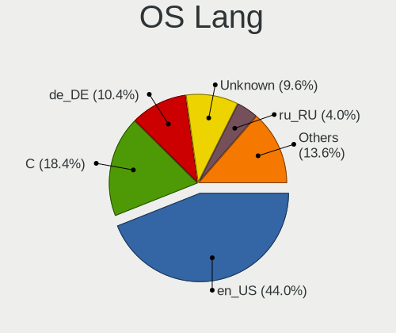
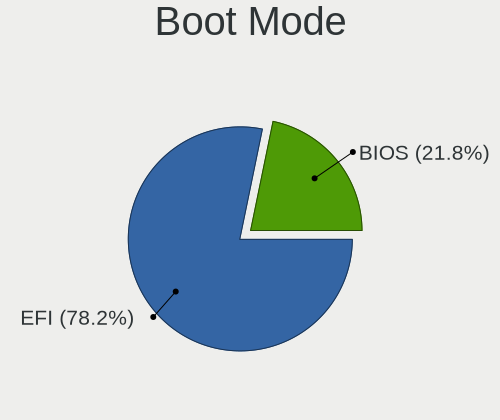
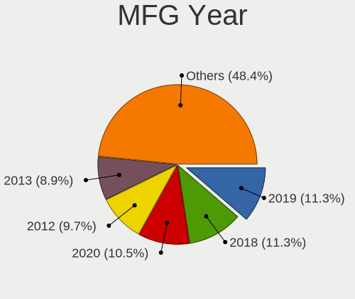
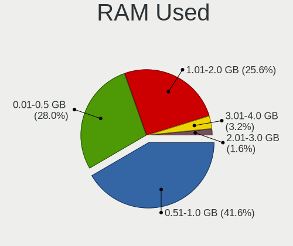
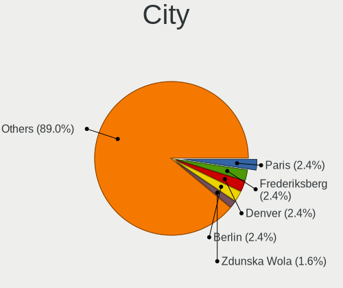
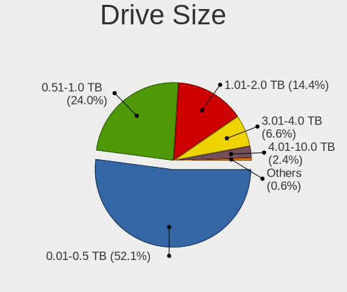
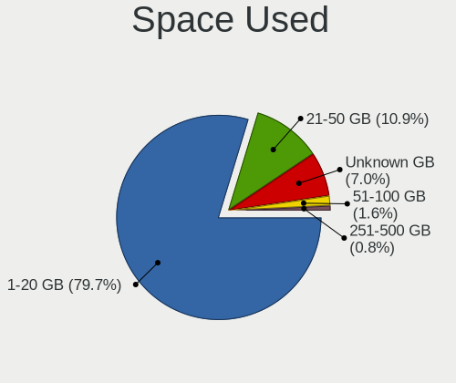
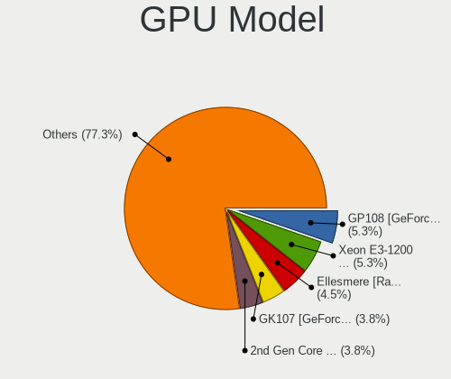
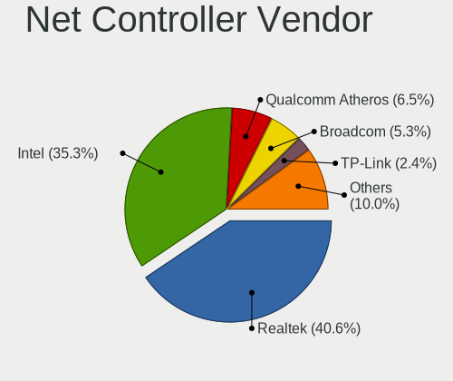
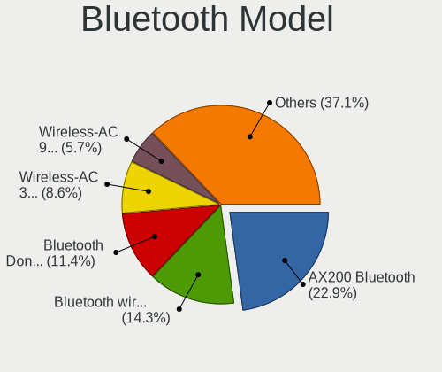

GhostBSD - Tested Hardware & Statistics (Desktops)
--------------------------------------------------

A project to collect tested hardware configurations for GhostBSD.

Anyone can contribute to this report by the [hw-probe](https://github.com/linuxhw/hw-probe/blob/master/INSTALL.BSD.md) tool:

    hw-probe -all -upload

Please contribute! Especially if your hardware is rare.

Contents
--------

* [ Test Cases ](#test-cases)

* [ System ](#system)
  - [ OS                       ](#os)
  - [ OS Family                ](#os-family)
  - [ Arch                     ](#arch)
  - [ DE                       ](#de)
  - [ Display Server           ](#display-server)
  - [ Display Manager          ](#display-manager)
  - [ OS Lang                  ](#os-lang)
  - [ Boot Mode                ](#boot-mode)
  - [ Filesystem               ](#filesystem)
  - [ Part. scheme             ](#part-scheme)

* [ Board ](#board)
  - [ Vendor                   ](#vendor)
  - [ Model                    ](#model)
  - [ Model Family             ](#model-family)
  - [ MFG Year                 ](#mfg-year)
  - [ Form Factor              ](#form-factor)
  - [ Coreboot                 ](#coreboot)
  - [ RAM Size                 ](#ram-size)
  - [ RAM Used                 ](#ram-used)
  - [ Total Drives             ](#total-drives)
  - [ Has CD-ROM               ](#has-cd-rom)
  - [ Has Ethernet             ](#has-ethernet)
  - [ Has WiFi                 ](#has-wifi)
  - [ Has Bluetooth            ](#has-bluetooth)

* [ Location ](#location)
  - [ Country                  ](#country)
  - [ City                     ](#city)

* [ Drives ](#drives)
  - [ Drive Vendor             ](#drive-vendor)
  - [ Drive Model              ](#drive-model)
  - [ HDD Vendor               ](#hdd-vendor)
  - [ SSD Vendor               ](#ssd-vendor)
  - [ Drive Kind               ](#drive-kind)
  - [ Drive Connector          ](#drive-connector)
  - [ Drive Size               ](#drive-size)
  - [ Space Total              ](#space-total)
  - [ Space Used               ](#space-used)
  - [ Malfunc. Drives          ](#malfunc-drives)
  - [ Malfunc. Drive Vendor    ](#malfunc-drive-vendor)
  - [ Malfunc. HDD Vendor      ](#malfunc-hdd-vendor)
  - [ Malfunc. Drive Kind      ](#malfunc-drive-kind)
  - [ Failed Drives            ](#failed-drives)
  - [ Failed Drive Vendor      ](#failed-drive-vendor)
  - [ Drive Status             ](#drive-status)

* [ Storage controller ](#storage-controller)
  - [ Storage Vendor           ](#storage-vendor)
  - [ Storage Model            ](#storage-model)
  - [ Storage Kind             ](#storage-kind)

* [ Processor ](#processor)
  - [ CPU Vendor               ](#cpu-vendor)
  - [ CPU Model                ](#cpu-model)
  - [ CPU Model Family         ](#cpu-model-family)
  - [ CPU Cores                ](#cpu-cores)
  - [ CPU Sockets              ](#cpu-sockets)
  - [ CPU Threads              ](#cpu-threads)
  - [ CPU Microarch            ](#cpu-microarch)

* [ Graphics ](#graphics)
  - [ GPU Vendor               ](#gpu-vendor)
  - [ GPU Model                ](#gpu-model)
  - [ GPU Combo                ](#gpu-combo)
  - [ GPU Driver               ](#gpu-driver)
  - [ GPU Memory               ](#gpu-memory)

* [ Monitor ](#monitor)
  - [ Monitor Vendor           ](#monitor-vendor)
  - [ Monitor Model            ](#monitor-model)
  - [ Monitor Resolution       ](#monitor-resolution)
  - [ Monitor Diagonal         ](#monitor-diagonal)
  - [ Monitor Width            ](#monitor-width)
  - [ Aspect Ratio             ](#aspect-ratio)
  - [ Monitor Area             ](#monitor-area)
  - [ Pixel Density            ](#pixel-density)
  - [ Multiple Monitors        ](#multiple-monitors)

* [ Network ](#network)
  - [ Net Controller Vendor    ](#net-controller-vendor)
  - [ Net Controller Model     ](#net-controller-model)
  - [ Wireless Vendor          ](#wireless-vendor)
  - [ Wireless Model           ](#wireless-model)
  - [ Ethernet Vendor          ](#ethernet-vendor)
  - [ Ethernet Model           ](#ethernet-model)
  - [ Net Controller Kind      ](#net-controller-kind)
  - [ Used Controller          ](#used-controller)
  - [ NICs                     ](#nics)
  - [ IPv6                     ](#ipv6)

* [ Bluetooth ](#bluetooth)
  - [ Bluetooth Vendor         ](#bluetooth-vendor)
  - [ Bluetooth Model          ](#bluetooth-model)

* [ Sound ](#sound)
  - [ Sound Vendor             ](#sound-vendor)
  - [ Sound Model              ](#sound-model)

* [ Memory ](#memory)
  - [ Memory Vendor            ](#memory-vendor)
  - [ Memory Model             ](#memory-model)
  - [ Memory Kind              ](#memory-kind)
  - [ Memory Form Factor       ](#memory-form-factor)
  - [ Memory Size              ](#memory-size)
  - [ Memory Speed             ](#memory-speed)

* [ Printers & scanners ](#printers--scanners)
  - [ Printer Vendor           ](#printer-vendor)
  - [ Printer Model            ](#printer-model)
  - [ Scanner Vendor           ](#scanner-vendor)
  - [ Scanner Model            ](#scanner-model)

* [ Camera ](#camera)
  - [ Camera Vendor            ](#camera-vendor)
  - [ Camera Model             ](#camera-model)

* [ Security ](#security)
  - [ Fingerprint Vendor       ](#fingerprint-vendor)
  - [ Fingerprint Model        ](#fingerprint-model)
  - [ Chipcard Vendor          ](#chipcard-vendor)
  - [ Chipcard Model           ](#chipcard-model)

* [ Unsupported ](#unsupported)
  - [ Unsupported Devices      ](#unsupported-devices)
  - [ Unsupported Device Types ](#unsupported-device-types)

Test Cases
----------

Total: 108

| Vendor    | Model                       | Probe                                                     | Date         |
|-----------|-----------------------------|-----------------------------------------------------------|--------------|
| Soyo      | SY-YL B550M                 | [1d1138e3c5](https://bsd-hardware.info/?probe=1d1138e3c5) | Jun 05, 2023 |
| Soyo      | SY-YL B550M                 | [79c6c2a177](https://bsd-hardware.info/?probe=79c6c2a177) | Jun 05, 2023 |
| Dell      | 0M9KCM A02                  | [932e96060f](https://bsd-hardware.info/?probe=932e96060f) | May 21, 2023 |
| ASUSTek   | ROG ZENITH EXTREME ALPHA    | [a3df9cd649](https://bsd-hardware.info/?probe=a3df9cd649) | May 14, 2023 |
| Gigabyte  | X670E AORUS MASTER          | [773b28fbc7](https://bsd-hardware.info/?probe=773b28fbc7) | Apr 16, 2023 |
| MSI       | X299 PRO                    | [a26d096ecb](https://bsd-hardware.info/?probe=a26d096ecb) | Mar 18, 2023 |
| Lenovo    | SHARKBAY SDK0K17763 WIN ... | [c9279ce424](https://bsd-hardware.info/?probe=c9279ce424) | Mar 13, 2023 |
| MSI       | X299 PRO                    | [0cebc094ca](https://bsd-hardware.info/?probe=0cebc094ca) | Mar 10, 2023 |
| ASUSTek   | SABERTOOTH X58              | [37e1562772](https://bsd-hardware.info/?probe=37e1562772) | Mar 10, 2023 |
| MSI       | X299 PRO                    | [3ca12f88d9](https://bsd-hardware.info/?probe=3ca12f88d9) | Feb 24, 2023 |
| Huanan    | X99-QD4 V1.0                | [9a0c17560f](https://bsd-hardware.info/?probe=9a0c17560f) | Feb 14, 2023 |
| Gigabyte  | H61M-S2PV                   | [b42e3649a3](https://bsd-hardware.info/?probe=b42e3649a3) | Feb 13, 2023 |
| MSI       | X299 PRO                    | [a1f37f69d9](https://bsd-hardware.info/?probe=a1f37f69d9) | Jan 08, 2023 |
| HP        | 18E7                        | [0b962b9400](https://bsd-hardware.info/?probe=0b962b9400) | Dec 20, 2022 |
| MSI       | X299 PRO                    | [beec8001a1](https://bsd-hardware.info/?probe=beec8001a1) | Dec 17, 2022 |
| MSI       | B450M MORTAR MAX            | [d8d6af9e56](https://bsd-hardware.info/?probe=d8d6af9e56) | Dec 10, 2022 |
| ASUSTek   | H97-PLUS                    | [39ece5deaf](https://bsd-hardware.info/?probe=39ece5deaf) | Nov 27, 2022 |
| MSI       | X299 PRO                    | [d615157be7](https://bsd-hardware.info/?probe=d615157be7) | Nov 16, 2022 |
| Gigabyte  | B450M DS3H-CF               | [51ec4ce710](https://bsd-hardware.info/?probe=51ec4ce710) | Oct 24, 2022 |
| ASUSTek   | P8Z68-V                     | [6674bbf7f3](https://bsd-hardware.info/?probe=6674bbf7f3) | Oct 11, 2022 |
| Gigabyte  | H510M H                     | [8ad31cc470](https://bsd-hardware.info/?probe=8ad31cc470) | Sep 29, 2022 |
| Gigabyte  | B365M DS3H                  | [0d7d7288c0](https://bsd-hardware.info/?probe=0d7d7288c0) | Aug 27, 2022 |
| Gigabyte  | B365M DS3H                  | [0a90c3c566](https://bsd-hardware.info/?probe=0a90c3c566) | Aug 27, 2022 |
| ASUSTek   | ROG CROSSHAIR VIII HERO     | [52cc45aba9](https://bsd-hardware.info/?probe=52cc45aba9) | Jul 21, 2022 |
| ASUSTek   | ROG CROSSHAIR VIII HERO     | [3182740b56](https://bsd-hardware.info/?probe=3182740b56) | Jul 21, 2022 |
| MSI       | B85M-E45                    | [80f2d74d1a](https://bsd-hardware.info/?probe=80f2d74d1a) | Jul 16, 2022 |
| ASUSTek   | ROG CROSSHAIR VIII HERO     | [9771cb16c0](https://bsd-hardware.info/?probe=9771cb16c0) | Jul 15, 2022 |
| Gigabyte  | X570 AORUS MASTER           | [3ee4c986b4](https://bsd-hardware.info/?probe=3ee4c986b4) | Jul 15, 2022 |
| ASUSTek   | ROG CROSSHAIR VIII HERO     | [1e8b0433e8](https://bsd-hardware.info/?probe=1e8b0433e8) | Jul 15, 2022 |
| ASUSTek   | ROG CROSSHAIR VIII HERO     | [85a49cb7be](https://bsd-hardware.info/?probe=85a49cb7be) | Jul 14, 2022 |
| ASUSTek   | ROG CROSSHAIR VIII HERO     | [4c74cdfb76](https://bsd-hardware.info/?probe=4c74cdfb76) | Jul 10, 2022 |
| ASUSTek   | ROG CROSSHAIR VIII HERO     | [6edc61f549](https://bsd-hardware.info/?probe=6edc61f549) | Jul 10, 2022 |
| Lenovo    | SHARKBAY SDK0E50510 WIN     | [5d668f86de](https://bsd-hardware.info/?probe=5d668f86de) | Jul 06, 2022 |
| ASRock    | B450 Gaming K4              | [a03ff6ad9e](https://bsd-hardware.info/?probe=a03ff6ad9e) | Jun 10, 2022 |
| Dell      | 0M3F6C A01                  | [21d45bc75d](https://bsd-hardware.info/?probe=21d45bc75d) | May 23, 2022 |
| ASUSTek   | PRIME B350-PLUS             | [e9524e612d](https://bsd-hardware.info/?probe=e9524e612d) | May 22, 2022 |
| Gigabyte  | AX370-Gaming 3-CF           | [62ab2bc823](https://bsd-hardware.info/?probe=62ab2bc823) | May 07, 2022 |
| HP        | 0B4Ch D                     | [3f170bdee6](https://bsd-hardware.info/?probe=3f170bdee6) | May 01, 2022 |
| Dell      | 0DXJD9 A01                  | [4023d86091](https://bsd-hardware.info/?probe=4023d86091) | Apr 15, 2022 |
| Dell      | 0Y56T3 A00                  | [d9d86d5bfd](https://bsd-hardware.info/?probe=d9d86d5bfd) | Apr 12, 2022 |
| MSI       | B250 PC MATE                | [612b0f0a34](https://bsd-hardware.info/?probe=612b0f0a34) | Mar 19, 2022 |
| ASUSTek   | TUF GAMING X570-PRO         | [8307275b2e](https://bsd-hardware.info/?probe=8307275b2e) | Mar 07, 2022 |
| ASUSTek   | Z97-A                       | [84d7fb3f1e](https://bsd-hardware.info/?probe=84d7fb3f1e) | Jan 30, 2022 |
| Dell      | 0NNNCT A01                  | [290f10c785](https://bsd-hardware.info/?probe=290f10c785) | Jan 21, 2022 |
| Alienware | 01NYPT A00                  | [75aa0c00fb](https://bsd-hardware.info/?probe=75aa0c00fb) | Dec 06, 2021 |
| ASUSTek   | PRIME Z270-K                | [a2270b6f09](https://bsd-hardware.info/?probe=a2270b6f09) | Dec 02, 2021 |
| Medion    | MS-7728                     | [5b5a847fdd](https://bsd-hardware.info/?probe=5b5a847fdd) | Nov 02, 2021 |
| Gigabyte  | H410M S2 V2                 | [9cf5948654](https://bsd-hardware.info/?probe=9cf5948654) | Oct 13, 2021 |
| ASUSTek   | SABERTOOTH X58              | [8f00f132de](https://bsd-hardware.info/?probe=8f00f132de) | Sep 23, 2021 |
| ASRock    | X570 Taichi                 | [9dc50c0bcb](https://bsd-hardware.info/?probe=9dc50c0bcb) | Sep 11, 2021 |
| ASUSTek   | PRIME B350-PLUS             | [0ee3fe080c](https://bsd-hardware.info/?probe=0ee3fe080c) | Aug 30, 2021 |
| Gigabyte  | Z77M-D3H                    | [d60f1bc575](https://bsd-hardware.info/?probe=d60f1bc575) | Aug 29, 2021 |
| MSI       | H81M-P33                    | [6dcb3aa559](https://bsd-hardware.info/?probe=6dcb3aa559) | Aug 05, 2021 |
| ASRock    | X570 Pro4                   | [011fb96fe0](https://bsd-hardware.info/?probe=011fb96fe0) | Aug 04, 2021 |
| ASRock    | Z77 Extreme6                | [2521c70747](https://bsd-hardware.info/?probe=2521c70747) | Aug 02, 2021 |
| ASUSTek   | PRIME B350M-E               | [bde8057846](https://bsd-hardware.info/?probe=bde8057846) | Jun 29, 2021 |
| ASUSTek   | PRIME A320M-A               | [10d9e99990](https://bsd-hardware.info/?probe=10d9e99990) | May 31, 2021 |
| Lenovo    | Board                       | [428f39cbff](https://bsd-hardware.info/?probe=428f39cbff) | May 21, 2021 |
| ASUSTek   | V-P7H55E                    | [7634d3b6ca](https://bsd-hardware.info/?probe=7634d3b6ca) | May 12, 2021 |
| ASUSTek   | V-P7H55E                    | [f2e42a5ca3](https://bsd-hardware.info/?probe=f2e42a5ca3) | May 10, 2021 |
| ASUSTek   | V-P7H55E                    | [0af6399c18](https://bsd-hardware.info/?probe=0af6399c18) | May 10, 2021 |
| Dell      | 0TP412                      | [1bc05b5951](https://bsd-hardware.info/?probe=1bc05b5951) | Apr 04, 2021 |
| Huanan    | X79 INTEL (INTEL Xeon E5... | [ec9e43382e](https://bsd-hardware.info/?probe=ec9e43382e) | Mar 25, 2021 |
| HP        | 1850                        | [3055c06d45](https://bsd-hardware.info/?probe=3055c06d45) | Mar 22, 2021 |
| ASRock    | X570 Phantom Gaming 4       | [a64a4e0792](https://bsd-hardware.info/?probe=a64a4e0792) | Mar 19, 2021 |
| ASUSTek   | ROG STRIX B450-F GAMING     | [39a46ce44e](https://bsd-hardware.info/?probe=39a46ce44e) | Mar 06, 2021 |
| Gigabyte  | EG43M-S2H                   | [f6eaa55ada](https://bsd-hardware.info/?probe=f6eaa55ada) | Mar 06, 2021 |
| Acer      | Aspire XC-115               | [95f63df64d](https://bsd-hardware.info/?probe=95f63df64d) | Feb 21, 2021 |
| Lenovo    | Kabini CRB 31900058 STD     | [c08ca084b0](https://bsd-hardware.info/?probe=c08ca084b0) | Feb 21, 2021 |
| ASRock    | AB350 Pro4                  | [3680c4cd75](https://bsd-hardware.info/?probe=3680c4cd75) | Feb 20, 2021 |
| ASUSTek   | PRIME B450-PLUS             | [ade306695d](https://bsd-hardware.info/?probe=ade306695d) | Feb 20, 2021 |
| Acer      | WG43M                       | [28a6795710](https://bsd-hardware.info/?probe=28a6795710) | Feb 15, 2021 |
| MSI       | PRESTIGE X570 CREATION      | [e6fa5753b5](https://bsd-hardware.info/?probe=e6fa5753b5) | Feb 12, 2021 |
| MSI       | PRESTIGE X570 CREATION      | [fd798dae01](https://bsd-hardware.info/?probe=fd798dae01) | Feb 12, 2021 |
| Dell      | 030VXY A01                  | [23e7163f58](https://bsd-hardware.info/?probe=23e7163f58) | Feb 10, 2021 |
| ASUSTek   | TUF GAMING X570-PLUS        | [cf41f72474](https://bsd-hardware.info/?probe=cf41f72474) | Jan 31, 2021 |
| Dell      | 0NW6H5 A00                  | [f6df3820b5](https://bsd-hardware.info/?probe=f6df3820b5) | Jan 18, 2021 |
| MSI       | Z97 GAMING 5                | [9ef0da6093](https://bsd-hardware.info/?probe=9ef0da6093) | Jan 16, 2021 |
| Dell      | 0KC9NP A01                  | [a9228fa7c3](https://bsd-hardware.info/?probe=a9228fa7c3) | Jan 15, 2021 |
| Dell      | 030VXY A01                  | [5af442bf61](https://bsd-hardware.info/?probe=5af442bf61) | Jan 15, 2021 |
| Dell      | 0HY9JP A02                  | [b4d2af272e](https://bsd-hardware.info/?probe=b4d2af272e) | Jan 05, 2021 |
| ASUSTek   | Z170I PRO GAMING            | [5124b24d30](https://bsd-hardware.info/?probe=5124b24d30) | Jan 04, 2021 |
| Fujitsu   | D3617-A1 S26361-D3617-A1    | [2a0187ef7a](https://bsd-hardware.info/?probe=2a0187ef7a) | Jan 02, 2021 |
| ASUSTek   | PRIME A320M-C R2.0          | [4c24fe6fc4](https://bsd-hardware.info/?probe=4c24fe6fc4) | Dec 24, 2020 |
| HP        | 0B4Ch D                     | [bf0d7fe4f1](https://bsd-hardware.info/?probe=bf0d7fe4f1) | Dec 22, 2020 |
| Gigabyte  | Z370 AORUS Ultra Gaming-... | [a3a96da3fb](https://bsd-hardware.info/?probe=a3a96da3fb) | Dec 19, 2020 |
| ASUSTek   | TUF GAMING B550M-PLUS       | [464223cefe](https://bsd-hardware.info/?probe=464223cefe) | Dec 07, 2020 |
| ASRock    | B450 Gaming-ITX/ac          | [53bf449015](https://bsd-hardware.info/?probe=53bf449015) | Dec 02, 2020 |
| Quanta    | 2AF5 011                    | [172f23efac](https://bsd-hardware.info/?probe=172f23efac) | Nov 29, 2020 |
| ASRock    | AB350 Gaming-ITX/ac         | [8afa16fc20](https://bsd-hardware.info/?probe=8afa16fc20) | Nov 29, 2020 |
| Gigabyte  | X470 AORUS ULTRA GAMING-... | [5d5ecb38cd](https://bsd-hardware.info/?probe=5d5ecb38cd) | Nov 25, 2020 |
| MSI       | B450 GAMING PLUS            | [4cf3dd682b](https://bsd-hardware.info/?probe=4cf3dd682b) | Nov 24, 2020 |
| MSI       | B450 GAMING PLUS            | [edee76372b](https://bsd-hardware.info/?probe=edee76372b) | Nov 21, 2020 |
| ASRock    | X570 Phantom Gaming 4       | [cc075b3932](https://bsd-hardware.info/?probe=cc075b3932) | Nov 15, 2020 |
| ASRock    | X570 Phantom Gaming 4       | [6a0c640524](https://bsd-hardware.info/?probe=6a0c640524) | Nov 12, 2020 |
| ASRock    | X570 Phantom Gaming 4       | [6060033216](https://bsd-hardware.info/?probe=6060033216) | Nov 12, 2020 |
| Gigabyte  | Z97-D3H-CF                  | [dc33c84287](https://bsd-hardware.info/?probe=dc33c84287) | Oct 22, 2020 |
| Fujitsu   | D2950-A1 S26361-D2950-A1    | [86e9866c03](https://bsd-hardware.info/?probe=86e9866c03) | Oct 02, 2020 |
| Fujitsu   | D2950-A1 S26361-D2950-A1    | [3b8f8a2033](https://bsd-hardware.info/?probe=3b8f8a2033) | Oct 02, 2020 |
| MSI       | H61M-P20                    | [fefac5637b](https://bsd-hardware.info/?probe=fefac5637b) | Aug 03, 2020 |
| Gigabyte  | F2A68HM-DS2                 | [0073f8ff71](https://bsd-hardware.info/?probe=0073f8ff71) | Aug 02, 2020 |
| Gigabyte  | H67A-UD3H-B3                | [aa29eb9c75](https://bsd-hardware.info/?probe=aa29eb9c75) | Aug 01, 2020 |
| Unknown   | SKYBAY                      | [34bb81770b](https://bsd-hardware.info/?probe=34bb81770b) | Jul 22, 2020 |
| ASRock    | X370 Gaming K4              | [4473708fd0](https://bsd-hardware.info/?probe=4473708fd0) | Jul 22, 2020 |
| ASRock    | X370 Gaming K4              | [174569bf55](https://bsd-hardware.info/?probe=174569bf55) | Jul 21, 2020 |
| ASRock    | A300M-STX                   | [f62a2ace5a](https://bsd-hardware.info/?probe=f62a2ace5a) | Jul 16, 2020 |
| Lenovo    | Win8 Pro DPK TPG            | [db7146b868](https://bsd-hardware.info/?probe=db7146b868) | Jul 14, 2020 |
| Gigabyte  | Z170X-UD5 TH-CF             | [2fc2952380](https://bsd-hardware.info/?probe=2fc2952380) | May 25, 2020 |

System
------

OS
--

Installed operating systems

| Name              | Desktops | Percent |
|-------------------|----------|---------|
| GhostBSD 20.04.02 | 45       | 52.33%  |
| GhostBSD 21.08.27 | 8        | 9.3%    |
| GhostBSD 23.02.02 | 4        | 4.65%   |
| GhostBSD 22.01.12 | 4        | 4.65%   |
| GhostBSD 22.11.22 | 3        | 3.49%   |
| GhostBSD 22.09.16 | 2        | 2.33%   |
| GhostBSD 22.07.16 | 2        | 2.33%   |
| GhostBSD 22.06.18 | 2        | 2.33%   |
| GhostBSD 22.04.06 | 2        | 2.33%   |
| GhostBSD 23.06.01 | 1        | 1.16%   |
| GhostBSD 23.05.18 | 1        | 1.16%   |
| GhostBSD 23.04.23 | 1        | 1.16%   |
| GhostBSD 23.03.17 | 1        | 1.16%   |
| GhostBSD 22.12.20 | 1        | 1.16%   |
| GhostBSD 22.11.02 | 1        | 1.16%   |
| GhostBSD 22.10.12 | 1        | 1.16%   |
| GhostBSD 22.08.23 | 1        | 1.16%   |
| GhostBSD 22.07.13 | 1        | 1.16%   |
| GhostBSD 22.06.26 | 1        | 1.16%   |
| GhostBSD 22.05.14 | 1        | 1.16%   |
| GhostBSD 22.04.22 | 1        | 1.16%   |
| GhostBSD 22.01.28 | 1        | 1.16%   |
| GhostBSD 19.12    | 1        | 1.16%   |

OS Family
---------

OS without a version

| Name     | Desktops | Percent |
|----------|----------|---------|
| GhostBSD | 81       | 100%    |

Arch
----

OS architecture (x86_64, i586, etc.)

| Name  | Desktops | Percent |
|-------|----------|---------|
| amd64 | 81       | 100%    |

DE
--

Desktop Environment

| Name             | Desktops | Percent |
|------------------|----------|---------|
| MATE             | 62       | 74.7%   |
| XFCE             | 10       | 12.05%  |
| KDE5             | 5        | 6.02%   |
| openbox          | 1        | 1.2%    |
| Metacity (Marco) | 1        | 1.2%    |
| LXQt             | 1        | 1.2%    |
| i3               | 1        | 1.2%    |
| GNOME            | 1        | 1.2%    |
| Cinnamon         | 1        | 1.2%    |

Display Server
--------------

X11 or Wayland

| Name | Desktops | Percent |
|------|----------|---------|
| X11  | 81       | 100%    |

Display Manager
---------------

SDDM, LightDM, etc.

| Name    | Desktops | Percent |
|---------|----------|---------|
| LightDM | 79       | 97.53%  |
| SDDM    | 2        | 2.47%   |

OS Lang
-------

Language

| Lang    | Desktops | Percent |
|---------|----------|---------|
| en_US   | 38       | 46.34%  |
| C       | 12       | 14.63%  |
| Unknown | 11       | 13.41%  |
| de_DE   | 9        | 10.98%  |
| ru_RU   | 4        | 4.88%   |
| fr_FR   | 2        | 2.44%   |
| en_AU   | 2        | 2.44%   |
| sk_SK   | 1        | 1.22%   |
| pt_BR   | 1        | 1.22%   |
| es_ES   | 1        | 1.22%   |
| en_GB   | 1        | 1.22%   |

Boot Mode
---------

EFI or BIOS

| Mode | Desktops | Percent |
|------|----------|---------|
| EFI  | 61       | 75.31%  |
| BIOS | 20       | 24.69%  |

Filesystem
----------

Type of filesystem

| Type | Desktops | Percent |
|------|----------|---------|
| Zfs  | 76       | 93.83%  |
| Ufs  | 5        | 6.17%   |

Part. scheme
------------

Scheme of partitioning

| Type | Desktops | Percent |
|------|----------|---------|
| GPT  | 76       | 93.83%  |
| MBR  | 5        | 6.17%   |

Board
-----

Vendor
------

Motherboard manufacturer

| Name                | Desktops | Percent |
|---------------------|----------|---------|
| ASUSTek Computer    | 18       | 22.22%  |
| Gigabyte Technology | 15       | 18.52%  |
| MSI                 | 10       | 12.35%  |
| Dell                | 10       | 12.35%  |
| ASRock              | 9        | 11.11%  |
| Lenovo              | 5        | 6.17%   |
| Hewlett-Packard     | 3        | 3.7%    |
| Huanan              | 2        | 2.47%   |
| Fujitsu             | 2        | 2.47%   |
| Acer                | 2        | 2.47%   |
| Soyo                | 1        | 1.23%   |
| Quanta              | 1        | 1.23%   |
| Medion              | 1        | 1.23%   |
| Alienware           | 1        | 1.23%   |
| Unknown             | 1        | 1.23%   |

Model
-----

Motherboard model

| Name                                                                  | Desktops | Percent |
|-----------------------------------------------------------------------|----------|---------|
| MSI MS-7B86                                                           | 2        | 2.47%   |
| MSI MS-7817                                                           | 2        | 2.47%   |
| ASUS SABERTOOTH X58                                                   | 2        | 2.47%   |
| ASUS All Series                                                       | 2        | 2.47%   |
| Soyo SY-YL B550M                                                      | 1        | 1.23%   |
| Quanta 120-1333w                                                      | 1        | 1.23%   |
| MSI MS-7C36                                                           | 1        | 1.23%   |
| MSI MS-7B94                                                           | 1        | 1.23%   |
| MSI MS-7B89                                                           | 1        | 1.23%   |
| MSI MS-7A72                                                           | 1        | 1.23%   |
| MSI MS-7917                                                           | 1        | 1.23%   |
| MSI MS-7788                                                           | 1        | 1.23%   |
| Medion MS-7728                                                        | 1        | 1.23%   |
| Lenovo ThinkStation S10 6483CTO                                       | 1        | 1.23%   |
| Lenovo ThinkCentre M93p 10AB004DUS                                    | 1        | 1.23%   |
| Lenovo ThinkCentre Edge72 3493DEG                                     | 1        | 1.23%   |
| Lenovo H515s 10126                                                    | 1        | 1.23%   |
| Lenovo 10AB000KUS                                                     | 1        | 1.23%   |
| Huanan X99-QD4 V1.0                                                   | 1        | 1.23%   |
| Huanan X79 INTEL (INTEL Xeon E5/Corei7 DMI2 - C600/C200 Cipset V2.49P | 1        | 1.23%   |
| HP Z400 Workstation                                                   | 1        | 1.23%   |
| HP ProDesk 600 G1 SFF                                                 | 1        | 1.23%   |
| HP Compaq Pro 6305 SFF                                                | 1        | 1.23%   |
| Gigabyte Z97-D3H                                                      | 1        | 1.23%   |
| Gigabyte Z77M-D3H                                                     | 1        | 1.23%   |
| Gigabyte Z370 AORUS Ultra Gaming                                      | 1        | 1.23%   |
| Gigabyte Z170X-UD5 TH                                                 | 1        | 1.23%   |
| Gigabyte X670E AORUS MASTER                                           | 1        | 1.23%   |
| Gigabyte X570 AORUS MASTER                                            | 1        | 1.23%   |
| Gigabyte X470 AORUS ULTRA GAMING                                      | 1        | 1.23%   |
| Gigabyte Pentino Mini                                                 | 1        | 1.23%   |
| Gigabyte H67A-UD3H-B3                                                 | 1        | 1.23%   |
| Gigabyte H510M H                                                      | 1        | 1.23%   |
| Gigabyte F2A68HM-DS2                                                  | 1        | 1.23%   |
| Gigabyte EG43M-S2H                                                    | 1        | 1.23%   |
| Gigabyte B450M DS3H                                                   | 1        | 1.23%   |
| Gigabyte B365M DS3H                                                   | 1        | 1.23%   |
| Gigabyte AX370-Gaming 3                                               | 1        | 1.23%   |
| Fujitsu ESPRIMO P1500                                                 | 1        | 1.23%   |
| Fujitsu CELSIUS W580                                                  | 1        | 1.23%   |

Model Family
------------

Motherboard model prefix

| Name                  | Desktops | Percent |
|-----------------------|----------|---------|
| Dell OptiPlex         | 6        | 7.41%   |
| ASUS PRIME            | 6        | 7.41%   |
| Dell Precision        | 3        | 3.7%    |
| ASUS TUF              | 3        | 3.7%    |
| ASUS ROG              | 3        | 3.7%    |
| ASRock X570           | 3        | 3.7%    |
| MSI MS-7B86           | 2        | 2.47%   |
| MSI MS-7817           | 2        | 2.47%   |
| Lenovo ThinkCentre    | 2        | 2.47%   |
| ASUS SABERTOOTH       | 2        | 2.47%   |
| ASUS All              | 2        | 2.47%   |
| ASRock B450           | 2        | 2.47%   |
| Acer Aspire           | 2        | 2.47%   |
| Soyo SY-YL            | 1        | 1.23%   |
| Quanta 120-1333w      | 1        | 1.23%   |
| MSI MS-7C36           | 1        | 1.23%   |
| MSI MS-7B94           | 1        | 1.23%   |
| MSI MS-7B89           | 1        | 1.23%   |
| MSI MS-7A72           | 1        | 1.23%   |
| MSI MS-7917           | 1        | 1.23%   |
| MSI MS-7788           | 1        | 1.23%   |
| Medion MS-7728        | 1        | 1.23%   |
| Lenovo ThinkStation   | 1        | 1.23%   |
| Lenovo H515s          | 1        | 1.23%   |
| Lenovo 10AB000KUS     | 1        | 1.23%   |
| Huanan X99-QD4        | 1        | 1.23%   |
| Huanan X79            | 1        | 1.23%   |
| HP Z400               | 1        | 1.23%   |
| HP ProDesk            | 1        | 1.23%   |
| HP Compaq             | 1        | 1.23%   |
| Gigabyte Z97-D3H      | 1        | 1.23%   |
| Gigabyte Z77M-D3H     | 1        | 1.23%   |
| Gigabyte Z370         | 1        | 1.23%   |
| Gigabyte Z170X-UD5    | 1        | 1.23%   |
| Gigabyte X670E        | 1        | 1.23%   |
| Gigabyte X570         | 1        | 1.23%   |
| Gigabyte X470         | 1        | 1.23%   |
| Gigabyte Pentino      | 1        | 1.23%   |
| Gigabyte H67A-UD3H-B3 | 1        | 1.23%   |
| Gigabyte H510M        | 1        | 1.23%   |

MFG Year
--------

Motherboard manufacture year

| Year | Desktops | Percent |
|------|----------|---------|
| 2019 | 13       | 16.05%  |
| 2018 | 13       | 16.05%  |
| 2020 | 8        | 9.88%   |
| 2012 | 8        | 9.88%   |
| 2014 | 6        | 7.41%   |
| 2022 | 5        | 6.17%   |
| 2016 | 5        | 6.17%   |
| 2013 | 5        | 6.17%   |
| 2011 | 4        | 4.94%   |
| 2008 | 4        | 4.94%   |
| 2015 | 3        | 3.7%    |
| 2021 | 2        | 2.47%   |
| 2017 | 2        | 2.47%   |
| 2023 | 1        | 1.23%   |
| 2010 | 1        | 1.23%   |
| 2009 | 1        | 1.23%   |

Form Factor
-----------

Physical design of the computer

| Name    | Desktops | Percent |
|---------|----------|---------|
| Desktop | 81       | 100%    |

Coreboot
--------

Have coreboot on board

| Used | Desktops | Percent |
|------|----------|---------|
| No   | 81       | 100%    |

RAM Size
--------

Total RAM memory

| Size in GB  | Desktops | Percent |
|-------------|----------|---------|
| 16.01-24.0  | 25       | 30.49%  |
| 32.01-64.0  | 21       | 25.61%  |
| 8.01-16.0   | 20       | 24.39%  |
| 4.01-8.0    | 10       | 12.2%   |
| 64.01-256.0 | 4        | 4.88%   |
| 24.01-32.0  | 2        | 2.44%   |

RAM Used
--------

Used RAM memory

| Used GB  | Desktops | Percent |
|----------|----------|---------|
| 0.51-1.0 | 34       | 41.46%  |
| 0.01-0.5 | 25       | 30.49%  |
| 1.01-2.0 | 19       | 23.17%  |
| 3.01-4.0 | 4        | 4.88%   |

Total Drives
------------

Number of drives on board

| Drives | Desktops | Percent |
|--------|----------|---------|
| 2      | 32       | 38.1%   |
| 1      | 26       | 30.95%  |
| 4      | 8        | 9.52%   |
| 3      | 7        | 8.33%   |
| 5      | 6        | 7.14%   |
| 6      | 2        | 2.38%   |
| 22     | 1        | 1.19%   |
| 7      | 1        | 1.19%   |
| 0      | 1        | 1.19%   |

Has CD-ROM
----------

Has CD-ROM on board

| Presented | Desktops | Percent |
|-----------|----------|---------|
| No        | 48       | 59.26%  |
| Yes       | 33       | 40.74%  |

Has Ethernet
------------

Has Ethernet on board

| Presented | Desktops | Percent |
|-----------|----------|---------|
| Yes       | 81       | 100%    |

Has WiFi
--------

Has WiFi module

| Presented | Desktops | Percent |
|-----------|----------|---------|
| No        | 51       | 62.96%  |
| Yes       | 30       | 37.04%  |

Has Bluetooth
-------------

Has Bluetooth module

| Presented | Desktops | Percent |
|-----------|----------|---------|
| No        | 60       | 74.07%  |
| Yes       | 21       | 25.93%  |

Location
--------

Country
-------

Geographic location (country)

| Country      | Desktops | Percent |
|--------------|----------|---------|
| USA          | 22       | 27.16%  |
| Germany      | 14       | 17.28%  |
| Russia       | 6        | 7.41%   |
| France       | 5        | 6.17%   |
| UK           | 4        | 4.94%   |
| Canada       | 3        | 3.7%    |
| Australia    | 3        | 3.7%    |
| Norway       | 2        | 2.47%   |
| Netherlands  | 2        | 2.47%   |
| Malaysia     | 2        | 2.47%   |
| Czechia      | 2        | 2.47%   |
| Argentina    | 2        | 2.47%   |
| Ukraine      | 1        | 1.23%   |
| Switzerland  | 1        | 1.23%   |
| Sweden       | 1        | 1.23%   |
| Spain        | 1        | 1.23%   |
| South Africa | 1        | 1.23%   |
| Romania      | 1        | 1.23%   |
| Morocco      | 1        | 1.23%   |
| Mexico       | 1        | 1.23%   |
| Luxembourg   | 1        | 1.23%   |
| Japan        | 1        | 1.23%   |
| Hungary      | 1        | 1.23%   |
| Finland      | 1        | 1.23%   |
| China        | 1        | 1.23%   |
| Brazil       | 1        | 1.23%   |

City
----

Geographic location (city)

| City                        | Desktops | Percent |
|-----------------------------|----------|---------|
| Paris                       | 3        | 3.66%   |
| Berlin                      | 3        | 3.66%   |
| Obninsk                     | 2        | 2.44%   |
| Denver                      | 2        | 2.44%   |
| Chelyabinsk                 | 2        | 2.44%   |
| ЕЊta-ku                   | 1        | 1.22%   |
| Zapopan                     | 1        | 1.22%   |
| Washington                  | 1        | 1.22%   |
| Vidnoye                     | 1        | 1.22%   |
| Veenendaal                  | 1        | 1.22%   |
| Uelsen                      | 1        | 1.22%   |
| Truro                       | 1        | 1.22%   |
| Traunstein                  | 1        | 1.22%   |
| Sydney                      | 1        | 1.22%   |
| Sun Prairie                 | 1        | 1.22%   |
| St. Albert                  | 1        | 1.22%   |
| St Petersburg               | 1        | 1.22%   |
| Springfield                 | 1        | 1.22%   |
| Southampton                 | 1        | 1.22%   |
| San Nicolás de los Arroyos | 1        | 1.22%   |
| San Jose                    | 1        | 1.22%   |
| Salem                       | 1        | 1.22%   |
| Robbins                     | 1        | 1.22%   |
| Riedstadt                   | 1        | 1.22%   |
| Richmond                    | 1        | 1.22%   |
| Remseck am Neckar           | 1        | 1.22%   |
| Prague                      | 1        | 1.22%   |
| Phoenix                     | 1        | 1.22%   |
| Perth                       | 1        | 1.22%   |
| Palm Bay                    | 1        | 1.22%   |
| Oslo                        | 1        | 1.22%   |
| Omaha                       | 1        | 1.22%   |
| Neuenhaus                   | 1        | 1.22%   |
| Moncton                     | 1        | 1.22%   |
| Madrid                      | 1        | 1.22%   |
| Luxembourg                  | 1        | 1.22%   |
| Ludwigsburg                 | 1        | 1.22%   |
| Lorient                     | 1        | 1.22%   |
| London                      | 1        | 1.22%   |
| Lincoln                     | 1        | 1.22%   |

Drives
------

Drive Vendor
------------

Hard drive vendors

| Vendor              | Desktops | Drives | Percent |
|---------------------|----------|--------|---------|
| WDC                 | 37       | 55     | 22.84%  |
| Samsung Electronics | 30       | 40     | 18.52%  |
| Seagate             | 22       | 33     | 13.58%  |
| Crucial             | 17       | 23     | 10.49%  |
| Toshiba             | 7        | 8      | 4.32%   |
| Hitachi             | 6        | 6      | 3.7%    |
| SanDisk             | 5        | 10     | 3.09%   |
| A-DATA Technology   | 5        | 5      | 3.09%   |
| Kingston            | 4        | 4      | 2.47%   |
| Micron Technology   | 3        | 3      | 1.85%   |
| HGST                | 3        | 3      | 1.85%   |
| PNY                 | 2        | 4      | 1.23%   |
| OCZ                 | 2        | 2      | 1.23%   |
| Maxtor              | 2        | 2      | 1.23%   |
| Intel               | 2        | 2      | 1.23%   |
| XPG                 | 1        | 1      | 0.62%   |
| Transcend           | 1        | 1      | 0.62%   |
| SPCC                | 1        | 1      | 0.62%   |
| Plextor             | 1        | 1      | 0.62%   |
| Phison              | 1        | 2      | 0.62%   |
| Patriot             | 1        | 1      | 0.62%   |
| Lexar               | 1        | 1      | 0.62%   |
| LDLC                | 1        | 1      | 0.62%   |
| HPT                 | 1        | 4      | 0.62%   |
| Hikvision           | 1        | 1      | 0.62%   |
| Gigabyte Technology | 1        | 1      | 0.62%   |
| Corsair             | 1        | 1      | 0.62%   |
| China               | 1        | 1      | 0.62%   |
| Apacer              | 1        | 1      | 0.62%   |
| AMD                 | 1        | 1      | 0.62%   |

Drive Model
-----------

Hard drive models

| Model                           | Desktops | Percent |
|---------------------------------|----------|---------|
| Crucial CT1000MX500SSD1 1TB     | 5        | 2.63%   |
| Samsung SSD 850 EVO 500GB       | 4        | 2.11%   |
| Samsung SSD 850 EVO 250GB       | 4        | 2.11%   |
| Seagate ST500DM002-1BD142 500GB | 3        | 1.58%   |
| WDC WDS500G2B0A-00SM50 500GB    | 2        | 1.05%   |
| WDC WDS100T3X0C-00SJG0 1TB      | 2        | 1.05%   |
| WDC WD40EFRX-68N32N0 4TB        | 2        | 1.05%   |
| WDC WD2000JS-55MHB0 192GB       | 2        | 1.05%   |
| WDC WD10EZEX-21M2NA0 1TB        | 2        | 1.05%   |
| Toshiba Q300 480GB              | 2        | 1.05%   |
| Toshiba HDWD120 2TB             | 2        | 1.05%   |
| Seagate ST4000DM004-2CV104 4TB  | 2        | 1.05%   |
| Seagate ST2000DM008-2FR102 2TB  | 2        | 1.05%   |
| Samsung SSD 970 EVO Plus 1TB    | 2        | 1.05%   |
| Samsung SSD 970 EVO 500GB       | 2        | 1.05%   |
| Samsung SSD 860 QVO 1TB         | 2        | 1.05%   |
| Samsung SSD 860 EVO 1TB         | 2        | 1.05%   |
| Maxtor STM3320613AS 320GB       | 2        | 1.05%   |
| Crucial CT250MX500SSD1 250GB    | 2        | 1.05%   |
| Crucial CT240BX500SSD1 240GB    | 2        | 1.05%   |
| XPG GAMMIX S11 Pro 256GB        | 1        | 0.53%   |
| WDC WDS500G2B0A 500GB           | 1        | 0.53%   |
| WDC WDS480G2G0A-00JH30 480GB    | 1        | 0.53%   |
| WDC WDS240G2G0C-00AJM0 240GB    | 1        | 0.53%   |
| WDC WDS200T2B0B-00YS70 2TB      | 1        | 0.53%   |
| WDC WDS200T2B0A-00SM50 2TB      | 1        | 0.53%   |
| WDC WDS100T2B0C-00PXH0 1TB      | 1        | 0.53%   |
| WDC WDS100T1X0E-00AFY0 1TB      | 1        | 0.53%   |
| WDC WD800BEVT-75ZCT2 80GB       | 1        | 0.53%   |
| WDC WD800AAJS-00TDA0 80GB       | 1        | 0.53%   |
| WDC WD7500LPCX-00KHST0 752GB    | 1        | 0.53%   |
| WDC WD60EZRZ-00GZ5B1 6TB        | 1        | 0.53%   |
| WDC WD6003FFBX-68MU3N0 6TB      | 1        | 0.53%   |
| WDC WD50NMZW-59A8NS1 5TB        | 1        | 0.53%   |
| WDC WD5000LUCT-63RC2Y0 500GB    | 1        | 0.53%   |
| WDC WD5000LPLX-75ZNTT0 500GB    | 1        | 0.53%   |
| WDC WD5000BEVT-24A0RT0 500GB    | 1        | 0.53%   |
| WDC WD5000AAVS-00ZTB0 500GB     | 1        | 0.53%   |
| WDC WD5000AAKX-60U6AA0 500GB    | 1        | 0.53%   |
| WDC WD5000AAKX-00ERMA0 500GB    | 1        | 0.53%   |

HDD Vendor
----------

Hard disk drive vendors

| Vendor              | Desktops | Drives | Percent |
|---------------------|----------|--------|---------|
| WDC                 | 29       | 41     | 40.85%  |
| Seagate             | 21       | 31     | 29.58%  |
| Hitachi             | 6        | 6      | 8.45%   |
| Toshiba             | 5        | 6      | 7.04%   |
| Samsung Electronics | 4        | 5      | 5.63%   |
| HGST                | 3        | 3      | 4.23%   |
| Maxtor              | 2        | 2      | 2.82%   |
| HPT                 | 1        | 4      | 1.41%   |

SSD Vendor
----------

Solid state drive vendors

| Vendor              | Desktops | Drives | Percent |
|---------------------|----------|--------|---------|
| Samsung Electronics | 22       | 26     | 31.43%  |
| Crucial             | 14       | 16     | 20%     |
| WDC                 | 5        | 7      | 7.14%   |
| SanDisk             | 5        | 10     | 7.14%   |
| A-DATA Technology   | 3        | 3      | 4.29%   |
| Toshiba             | 2        | 2      | 2.86%   |
| PNY                 | 2        | 4      | 2.86%   |
| OCZ                 | 2        | 2      | 2.86%   |
| Micron Technology   | 2        | 2      | 2.86%   |
| Kingston            | 2        | 2      | 2.86%   |
| Transcend           | 1        | 1      | 1.43%   |
| SPCC                | 1        | 1      | 1.43%   |
| Seagate             | 1        | 1      | 1.43%   |
| Plextor             | 1        | 1      | 1.43%   |
| Patriot             | 1        | 1      | 1.43%   |
| Lexar               | 1        | 1      | 1.43%   |
| Intel               | 1        | 1      | 1.43%   |
| Hikvision           | 1        | 1      | 1.43%   |
| China               | 1        | 1      | 1.43%   |
| Apacer              | 1        | 1      | 1.43%   |
| AMD                 | 1        | 1      | 1.43%   |

Drive Kind
----------

HDD or SSD

| Kind | Desktops | Drives | Percent |
|------|----------|--------|---------|
| HDD  | 52       | 98     | 41.6%   |
| SSD  | 49       | 85     | 39.2%   |
| NVMe | 24       | 36     | 19.2%   |

Drive Connector
---------------

SATA, SAS, NVMe, etc.

| Type | Desktops | Drives | Percent |
|------|----------|--------|---------|
| SATA | 77       | 183    | 76.24%  |
| NVMe | 24       | 36     | 23.76%  |

Drive Size
----------

Size of hard drive

| Size in TB | Desktops | Drives | Percent |
|------------|----------|--------|---------|
| 0.01-0.5   | 58       | 86     | 48.74%  |
| 0.51-1.0   | 30       | 51     | 25.21%  |
| 1.01-2.0   | 17       | 24     | 14.29%  |
| 3.01-4.0   | 9        | 11     | 7.56%   |
| 4.01-10.0  | 4        | 9      | 3.36%   |
| 10.01-20.0 | 1        | 2      | 0.84%   |

Space Total
-----------

Amount of disk space available on the file system

| Size in GB     | Desktops | Percent |
|----------------|----------|---------|
| 101-250        | 20       | 24.39%  |
| 251-500        | 19       | 23.17%  |
| 1-20           | 18       | 21.95%  |
| 501-1000       | 9        | 10.98%  |
| 51-100         | 6        | 7.32%   |
| Unknown        | 5        | 6.1%    |
| 21-50          | 2        | 2.44%   |
| 1001-2000      | 2        | 2.44%   |
| More than 3000 | 1        | 1.22%   |

Space Used
----------

Amount of used disk space

| Used GB | Desktops | Percent |
|---------|----------|---------|
| 1-20    | 65       | 78.31%  |
| 21-50   | 11       | 13.25%  |
| Unknown | 5        | 6.02%   |
| 51-100  | 2        | 2.41%   |

Malfunc. Drives
---------------

Drive models with a malfunction

| Model                           | Desktops | Drives | Percent |
|---------------------------------|----------|--------|---------|
| Seagate ST500DM002-1BD142 500GB | 2        | 2      | 9.52%   |
| Maxtor STM3320613AS 320GB       | 2        | 2      | 9.52%   |
| WDC WDS480G2G0A-00JH30 480GB    | 1        | 2      | 4.76%   |
| WDC WD800AAJS-00TDA0 80GB       | 1        | 1      | 4.76%   |
| WDC WD5000AAKS-60WWPA0 500GB    | 1        | 1      | 4.76%   |
| WDC WD10EZEX-21M2NA0 1TB        | 1        | 1      | 4.76%   |
| Seagate ST500DM002-1BC142 500GB | 1        | 1      | 4.76%   |
| Seagate ST4000DM004-2CV104 4TB  | 1        | 1      | 4.76%   |
| Seagate ST3250310AS 250GB       | 1        | 1      | 4.76%   |
| Seagate ST31500541AS 1.5TB      | 1        | 1      | 4.76%   |
| Seagate ST2000DM008-2FR102 2TB  | 1        | 1      | 4.76%   |
| Samsung Electronics HD103SJ 1TB | 1        | 2      | 4.76%   |
| OCZ AGILITY3 240GB              | 1        | 1      | 4.76%   |
| Hitachi HTS725032A9A364 320GB   | 1        | 1      | 4.76%   |
| Hitachi HTS547575A9E384 752GB   | 1        | 1      | 4.76%   |
| Hitachi HTS541680J9SA00 80GB    | 1        | 1      | 4.76%   |
| Crucial CT480M500SSD1 480GB     | 1        | 1      | 4.76%   |
| Crucial CT1050MX300SSD1 1TB     | 1        | 1      | 4.76%   |
| Crucial CT1000MX500SSD1 1TB     | 1        | 1      | 4.76%   |

Malfunc. Drive Vendor
---------------------

Vendors of faulty drives

| Vendor              | Desktops | Drives | Percent |
|---------------------|----------|--------|---------|
| Seagate             | 6        | 7      | 30%     |
| WDC                 | 4        | 5      | 20%     |
| Hitachi             | 3        | 3      | 15%     |
| Crucial             | 3        | 3      | 15%     |
| Maxtor              | 2        | 2      | 10%     |
| Samsung Electronics | 1        | 2      | 5%      |
| OCZ                 | 1        | 1      | 5%      |

Malfunc. HDD Vendor
-------------------

Vendors of faulty HDD drives

| Vendor              | Desktops | Drives | Percent |
|---------------------|----------|--------|---------|
| Seagate             | 6        | 7      | 40%     |
| WDC                 | 3        | 3      | 20%     |
| Hitachi             | 3        | 3      | 20%     |
| Maxtor              | 2        | 2      | 13.33%  |
| Samsung Electronics | 1        | 2      | 6.67%   |

Malfunc. Drive Kind
-------------------

Kinds of faulty drives

| Kind | Desktops | Drives | Percent |
|------|----------|--------|---------|
| HDD  | 14       | 17     | 73.68%  |
| SSD  | 5        | 6      | 26.32%  |

Failed Drives
-------------

Failed drive models

Zero info for selected period =(

Failed Drive Vendor
-------------------

Failed drive vendors

Zero info for selected period =(

Drive Status
------------

Number of failed and malfunc. drives

| Status   | Desktops | Drives | Percent |
|----------|----------|--------|---------|
| Works    | 78       | 192    | 79.59%  |
| Malfunc  | 19       | 23     | 19.39%  |
| Detected | 1        | 4      | 1.02%   |

Storage controller
------------------

Storage Vendor
--------------

Storage controller vendors

| Vendor                        | Desktops | Percent |
|-------------------------------|----------|---------|
| Intel                         | 47       | 39.17%  |
| AMD                           | 34       | 28.33%  |
| Samsung Electronics           | 7        | 5.83%   |
| SanDisk                       | 5        | 4.17%   |
| ASMedia Technology            | 4        | 3.33%   |
| Phison Electronics            | 3        | 2.5%    |
| Micron/Crucial Technology     | 3        | 2.5%    |
| Marvell Technology Group      | 3        | 2.5%    |
| ADATA Technology              | 3        | 2.5%    |
| Kingston Technology Company   | 2        | 1.67%   |
| JMicron Technology            | 2        | 1.67%   |
| Silicon Motion                | 1        | 0.83%   |
| Seagate Technology            | 1        | 0.83%   |
| Nvidia                        | 1        | 0.83%   |
| Micron Technology             | 1        | 0.83%   |
| Integrated Technology Express | 1        | 0.83%   |
| HighPoint Technologies        | 1        | 0.83%   |
| Adaptec                       | 1        | 0.83%   |

Storage Model
-------------

Storage controller models

| Model                                                                                   | Desktops | Percent |
|-----------------------------------------------------------------------------------------|----------|---------|
| AMD FCH SATA Controller [AHCI mode]                                                     | 28       | 19.58%  |
| AMD 400 Series Chipset SATA Controller                                                  | 9        | 6.29%   |
| Intel SATA Controller [RAID mode]                                                       | 7        | 4.9%    |
| Intel 8 Series/C220 Series Chipset Family 6-port SATA Controller 1 [AHCI mode]          | 6        | 4.2%    |
| Samsung NVMe SSD Controller SM981/PM981/PM983                                           | 5        | 3.5%    |
| Intel 200 Series PCH SATA controller [AHCI mode]                                        | 5        | 3.5%    |
| Intel 82801JI (ICH10 Family) SATA AHCI Controller                                       | 4        | 2.8%    |
| Intel 6 Series/C200 Series Chipset Family 6 port Desktop SATA AHCI Controller           | 4        | 2.8%    |
| ASMedia ASM1062 Serial ATA Controller                                                   | 4        | 2.8%    |
| Intel Q170/Q150/B150/H170/H110/Z170/CM236 Chipset SATA Controller [AHCI Mode]           | 3        | 2.1%    |
| Intel 9 Series Chipset Family SATA Controller [AHCI Mode]                               | 3        | 2.1%    |
| Intel 7 Series/C210 Series Chipset Family 6-port SATA Controller [AHCI mode]            | 3        | 2.1%    |
| Intel 6 Series/C200 Series Chipset Family Desktop SATA Controller (IDE mode, ports 4-5) | 3        | 2.1%    |
| Intel 6 Series/C200 Series Chipset Family Desktop SATA Controller (IDE mode, ports 0-3) | 3        | 2.1%    |
| AMD 300 Series Chipset SATA Controller                                                  | 3        | 2.1%    |
| Phison E16 PCIe4 NVMe Controller                                                        | 2        | 1.4%    |
| Micron/Crucial P2 NVMe PCIe SSD                                                         | 2        | 1.4%    |
| JMicron JMB362 SATA Controller                                                          | 2        | 1.4%    |
| Intel Cannon Lake PCH SATA AHCI Controller                                              | 2        | 1.4%    |
| Intel 82801IR/IO/IH (ICH9R/DO/DH) 4 port SATA Controller [IDE mode]                     | 2        | 1.4%    |
| Intel 82801I (ICH9 Family) 2 port SATA Controller [IDE mode]                            | 2        | 1.4%    |
| AMD X370 Series Chipset SATA Controller                                                 | 2        | 1.4%    |
| AMD FCH SATA Controller [IDE mode]                                                      | 2        | 1.4%    |
| AMD FCH SATA Controller D                                                               | 2        | 1.4%    |
| AMD 500 Series Chipset SATA Controller                                                  | 2        | 1.4%    |
| ADATA XPG SX8200 Pro PCIe Gen3x4 M.2 2280 Solid State Drive                             | 2        | 1.4%    |
| Silicon Motion SM2263EN/SM2263XT SSD Controller                                         | 1        | 0.7%    |
| Seagate FireCuda 520 SSD                                                                | 1        | 0.7%    |
| SanDisk WD PC SN810 / Black SN850 NVMe SSD                                              | 1        | 0.7%    |
| SanDisk WD Blue SN550 NVMe SSD                                                          | 1        | 0.7%    |
| SanDisk WD Black SN750 / PC SN730 NVMe SSD                                              | 1        | 0.7%    |
| SanDisk unknown                                                                         | 1        | 0.7%    |
| SanDisk PC SN520 NVMe SSD                                                               | 1        | 0.7%    |
| Samsung NVMe SSD Controller SM961/PM961/SM963                                           | 1        | 0.7%    |
| Samsung NVMe SSD Controller PM9A1/PM9A3/980PRO                                          | 1        | 0.7%    |
| Phison E12 NVMe Controller                                                              | 1        | 0.7%    |
| Nvidia GeForce 7100/nForce 630i SATA                                                    | 1        | 0.7%    |
| Micron/Crucial NVMe Storage Controller                                                  | 1        | 0.7%    |
| Micron NVMe Storage Controller                                                          | 1        | 0.7%    |
| Marvell Group 88SE9215 PCIe 2.0 x1 4-port SATA 6 Gb/s Controller                        | 1        | 0.7%    |

Storage Kind
------------

Kind of storage controller (IDE, SATA, NVMe, SAS, ...)

| Kind | Desktops | Percent |
|------|----------|---------|
| SATA | 68       | 60.18%  |
| NVMe | 24       | 21.24%  |
| IDE  | 11       | 9.73%   |
| RAID | 7        | 6.19%   |
| SCSI | 2        | 1.77%   |
| SAS  | 1        | 0.88%   |

Processor
---------

CPU Vendor
----------

Processor vendors

| Vendor | Desktops | Percent |
|--------|----------|---------|
| Intel  | 47       | 58.02%  |
| AMD    | 34       | 41.98%  |

CPU Model
---------

Processor models

| Model                                       | Desktops | Percent |
|---------------------------------------------|----------|---------|
| AMD Ryzen 7 3700X 8-Core Processor          | 3        | 3.7%    |
| AMD Ryzen 7 2700X Eight-Core Processor      | 3        | 3.7%    |
| AMD Ryzen 5 2600 Six-Core Processor         | 3        | 3.7%    |
| Intel Core i7-6700K CPU @ 4.00GHz           | 2        | 2.47%   |
| Intel Core i7-3770 CPU @ 3.40GHz            | 2        | 2.47%   |
| Intel Core i5-4570 CPU @ 3.20GHz            | 2        | 2.47%   |
| AMD Ryzen 9 5950X 16-Core Processor         | 2        | 2.47%   |
| AMD Ryzen 7 5700G with Radeon Graphics      | 2        | 2.47%   |
| Intel Xeon E-2236 CPU @ 3.40GHz             | 1        | 1.23%   |
| Intel Xeon CPU W3680 @ 3.33GHz              | 1        | 1.23%   |
| Intel Xeon CPU E5-2670 v3 @ 2.30GHz         | 1        | 1.23%   |
| Intel Xeon CPU E5-2640 0 @ 2.50GHz          | 1        | 1.23%   |
| Intel Xeon CPU E5-2630 0 @ 2.30GH           | 1        | 1.23%   |
| Intel Xeon                                  | 1        | 1.23%   |
| Intel Unknown                               | 1        | 1.23%   |
| Intel Pentium Dual-Core CPU E5500 @ 2.80GHz | 1        | 1.23%   |
| Intel Pentium CPU G620 @ 2.60GHz            | 1        | 1.23%   |
| Intel Pentium CPU G3420 @ 3.20GHz           | 1        | 1.23%   |
| Intel Pentium CPU G2020 @ 2.90GHz           | 1        | 1.23%   |
| Intel Core i9-10900X CPU @ 3.70GHz          | 1        | 1.23%   |
| Intel Core i7-9700K CPU @ 3.60GHz           | 1        | 1.23%   |
| Intel Core i7-8700 CPU @ 3.20GHz            | 1        | 1.23%   |
| Intel Core i7-7700K CPU @ 4.20GHz           | 1        | 1.23%   |
| Intel Core i7-4790K CPU @ 4.00GHz           | 1        | 1.23%   |
| Intel Core i7-3770S CPU @ 3.10GHz           | 1        | 1.23%   |
| Intel Core i7-2600K CPU                     | 1        | 1.23%   |
| Intel Core i7-2600 CPU @ 3.40GHz            | 1        | 1.23%   |
| Intel Core i7 CPU 960 @ 3.20GHz             | 1        | 1.23%   |
| Intel Core i7 CPU 950 @ 3.07GHz             | 1        | 1.23%   |
| Intel Core i5-9400 CPU @ 2.90GHz            | 1        | 1.23%   |
| Intel Core i5-8600K CPU @ 3.60GHz           | 1        | 1.23%   |
| Intel Core i5-8400T CPU @ 1.70GHz           | 1        | 1.23%   |
| Intel Core i5-7500 CPU @ 3.40GHz            | 1        | 1.23%   |
| Intel Core i5-7400 CPU @ 3.00GHz            | 1        | 1.23%   |
| Intel Core i5-6600K CPU @ 3.50GHz           | 1        | 1.23%   |
| Intel Core i5-4690K CPU @ 3.50GHz           | 1        | 1.23%   |
| Intel Core i5-4690 CPU @ 3.50GHz            | 1        | 1.23%   |
| Intel Core i5-4590T CPU @ 2.00GHz           | 1        | 1.23%   |
| Intel Core i5-4570T CPU @ 2.90GHz           | 1        | 1.23%   |
| Intel Core i5-4440 CPU @ 3.10GHz            | 1        | 1.23%   |

CPU Model Family
----------------

Processor model prefix

| Model                   | Desktops | Percent |
|-------------------------|----------|---------|
| Intel Core i5           | 17       | 20.99%  |
| Intel Core i7           | 13       | 16.05%  |
| AMD Ryzen 7             | 10       | 12.35%  |
| AMD Ryzen 5             | 9        | 11.11%  |
| Intel Xeon              | 6        | 7.41%   |
| AMD Ryzen 9             | 4        | 4.94%   |
| Intel Pentium           | 3        | 3.7%    |
| Intel Core i3           | 3        | 3.7%    |
| Intel Core 2 Quad       | 2        | 2.47%   |
| AMD Ryzen 3             | 2        | 2.47%   |
| AMD E1                  | 2        | 2.47%   |
| Other                   | 1        | 1.23%   |
| Intel Pentium Dual-Core | 1        | 1.23%   |
| Intel Core i9           | 1        | 1.23%   |
| AMD Ryzen Threadripper  | 1        | 1.23%   |
| AMD Ryzen 3 PRO         | 1        | 1.23%   |
| AMD E2                  | 1        | 1.23%   |
| AMD Athlon X4           | 1        | 1.23%   |
| AMD Athlon              | 1        | 1.23%   |
| AMD A6                  | 1        | 1.23%   |
| AMD A10                 | 1        | 1.23%   |

CPU Cores
---------

Number of processor cores

| Number  | Desktops | Percent |
|---------|----------|---------|
| 4       | 30       | 37.04%  |
| 2       | 11       | 13.58%  |
| 16      | 10       | 12.35%  |
| 12      | 10       | 12.35%  |
| 6       | 8        | 9.88%   |
| 8       | 4        | 4.94%   |
| 24      | 3        | 3.7%    |
| 32      | 2        | 2.47%   |
| Unknown | 2        | 2.47%   |
| 10      | 1        | 1.23%   |

CPU Sockets
-----------

Number of sockets

| Number | Desktops | Percent |
|--------|----------|---------|
| 1      | 80       | 98.77%  |
| 2      | 1        | 1.23%   |

CPU Threads
-----------

Threads per core (Hyper-Threading)

| Number  | Desktops | Percent |
|---------|----------|---------|
| 1       | 56       | 69.14%  |
| 2       | 23       | 28.4%   |
| Unknown | 2        | 2.47%   |

CPU Microarch
-------------

Microarchitecture

| Name        | Desktops | Percent |
|-------------|----------|---------|
| Haswell     | 11       | 13.58%  |
| Zen+        | 10       | 12.35%  |
| KabyLake    | 10       | 12.35%  |
| Zen 2       | 9        | 11.11%  |
| SandyBridge | 7        | 8.64%   |
| Zen 3       | 5        | 6.17%   |
| Penryn      | 5        | 6.17%   |
| IvyBridge   | 5        | 6.17%   |
| Skylake     | 4        | 4.94%   |
| Zen         | 3        | 3.7%    |
| Piledriver  | 2        | 2.47%   |
| Nehalem     | 2        | 2.47%   |
| CometLake   | 2        | 2.47%   |
| Westmere    | 1        | 1.23%   |
| Puma        | 1        | 1.23%   |
| Jaguar      | 1        | 1.23%   |
| Excavator   | 1        | 1.23%   |
| Bobcat      | 1        | 1.23%   |
| Unknown     | 1        | 1.23%   |

Graphics
--------

GPU Vendor
----------

Vendors of graphics cards

| Vendor | Desktops | Percent |
|--------|----------|---------|
| Nvidia | 44       | 51.76%  |
| AMD    | 21       | 24.71%  |
| Intel  | 20       | 23.53%  |

GPU Model
---------

Graphics card models

| Model                                                                       | Desktops | Percent |
|-----------------------------------------------------------------------------|----------|---------|
| Intel Xeon E3-1200 v3/4th Gen Core Processor Integrated Graphics Controller | 6        | 6.9%    |
| AMD Ellesmere [Radeon RX 470/480/570/570X/580/580X/590]                     | 5        | 5.75%   |
| Nvidia GP108 [GeForce GT 1030]                                              | 4        | 4.6%    |
| Nvidia GP107 [GeForce GTX 1050 Ti]                                          | 4        | 4.6%    |
| Nvidia GM107 [GeForce GTX 750 Ti]                                           | 4        | 4.6%    |
| Nvidia GK107 [GeForce GTX 650]                                              | 4        | 4.6%    |
| Nvidia GM206 [GeForce GTX 960]                                              | 3        | 3.45%   |
| Intel 2nd Generation Core Processor Family Integrated Graphics Controller   | 3        | 3.45%   |
| Nvidia TU106 [GeForce RTX 2060 Rev. A]                                      | 2        | 2.3%    |
| Nvidia GP107 [GeForce GTX 1050]                                             | 2        | 2.3%    |
| Nvidia GP106 [GeForce GTX 1060 6GB]                                         | 2        | 2.3%    |
| Nvidia GP104 [GeForce GTX 1080]                                             | 2        | 2.3%    |
| Nvidia GP104 [GeForce GTX 1070]                                             | 2        | 2.3%    |
| Nvidia GP104 [GeForce GTX 1070 Ti]                                          | 2        | 2.3%    |
| Intel IvyBridge GT2 [HD Graphics 4000]                                      | 2        | 2.3%    |
| Intel HD Graphics 630                                                       | 2        | 2.3%    |
| AMD Cezanne [Radeon Vega Series / Radeon Vega Mobile Series]                | 2        | 2.3%    |
| AMD Cape Verde XT [Radeon HD 7770/8760 / R7 250X]                           | 2        | 2.3%    |
| Nvidia TU117 [GeForce GTX 1650]                                             | 1        | 1.15%   |
| Nvidia TU116 [GeForce GTX 1660 Ti]                                          | 1        | 1.15%   |
| Nvidia TU106 [GeForce RTX 2070 Rev. A]                                      | 1        | 1.15%   |
| Nvidia TU106 [GeForce RTX 2060 SUPER]                                       | 1        | 1.15%   |
| Nvidia TU104 [GeForce RTX 2080]                                             | 1        | 1.15%   |
| Nvidia GT218 [GeForce 405]                                                  | 1        | 1.15%   |
| Nvidia GT218 [GeForce 210]                                                  | 1        | 1.15%   |
| Nvidia GM107 [GeForce GTX 745]                                              | 1        | 1.15%   |
| Nvidia GK107 [GeForce GT 740]                                               | 1        | 1.15%   |
| Nvidia GK107 [GeForce GT 640]                                               | 1        | 1.15%   |
| Nvidia GF108GL [Quadro 600]                                                 | 1        | 1.15%   |
| Nvidia GF100GL [Quadro 4000]                                                | 1        | 1.15%   |
| Nvidia GA104 [GeForce RTX 3070]                                             | 1        | 1.15%   |
| Nvidia GA102 [GeForce RTX 3080 Ti]                                          | 1        | 1.15%   |
| Intel Xeon E3-1200 v2/3rd Gen Core processor Graphics Controller            | 1        | 1.15%   |
| Intel HD Graphics 620                                                       | 1        | 1.15%   |
| Intel HD Graphics 530                                                       | 1        | 1.15%   |
| Intel CometLake-S GT2 [UHD Graphics 630]                                    | 1        | 1.15%   |
| Intel CoffeeLake-S GT2 [UHD Graphics 630]                                   | 1        | 1.15%   |
| Intel 4th Generation Core Processor Family Integrated Graphics Controller   | 1        | 1.15%   |
| Intel 4 Series Chipset Integrated Graphics Controller                       | 1        | 1.15%   |
| AMD Wrestler [Radeon HD 7310]                                               | 1        | 1.15%   |

GPU Combo
---------

Combinations of graphics cards

| Name           | Desktops | Percent |
|----------------|----------|---------|
| 1 x Nvidia     | 39       | 48.15%  |
| 1 x AMD        | 19       | 23.46%  |
| 1 x Intel      | 16       | 19.75%  |
| Intel + Nvidia | 3        | 3.7%    |
| 2 x Nvidia     | 1        | 1.23%   |
| 2 x Intel      | 1        | 1.23%   |
| 2 x AMD        | 1        | 1.23%   |
| AMD + Nvidia   | 1        | 1.23%   |

GPU Driver
----------

Free vs proprietary

| Driver      | Desktops | Percent |
|-------------|----------|---------|
| Free        | 42       | 51.85%  |
| Proprietary | 39       | 48.15%  |

GPU Memory
----------

Total video memory

| Size in GB | Desktops | Percent |
|------------|----------|---------|
| Unknown    | 34       | 41.46%  |
| 1.01-2.0   | 11       | 13.41%  |
| 7.01-8.0   | 10       | 12.2%   |
| 3.01-4.0   | 9        | 10.98%  |
| 0.51-1.0   | 8        | 9.76%   |
| 0.01-0.5   | 6        | 7.32%   |
| 5.01-6.0   | 2        | 2.44%   |
| 2.01-3.0   | 1        | 1.22%   |
| 8.01-16.0  | 1        | 1.22%   |

Monitor
-------

Monitor Vendor
--------------

Monitor vendors

| Vendor               | Desktops | Percent |
|----------------------|----------|---------|
| Dell                 | 11       | 13.25%  |
| Samsung Electronics  | 9        | 10.84%  |
| Goldstar             | 8        | 9.64%   |
| BenQ                 | 7        | 8.43%   |
| Acer                 | 6        | 7.23%   |
| Philips              | 4        | 4.82%   |
| Ancor Communications | 4        | 4.82%   |
| ViewSonic            | 3        | 3.61%   |
| LG Electronics       | 3        | 3.61%   |
| Hewlett-Packard      | 3        | 3.61%   |
| AOC                  | 3        | 3.61%   |
| Vizio                | 2        | 2.41%   |
| Lenovo               | 2        | 2.41%   |
| Iiyama               | 2        | 2.41%   |
| Idek Iiyama          | 2        | 2.41%   |
| Fujitsu Siemens      | 2        | 2.41%   |
| ASUSTek Computer     | 2        | 2.41%   |
| WYT                  | 1        | 1.2%    |
| Toshiba              | 1        | 1.2%    |
| SAC                  | 1        | 1.2%    |
| Pixio                | 1        | 1.2%    |
| OEM                  | 1        | 1.2%    |
| Mi                   | 1        | 1.2%    |
| Lenovo Group Limited | 1        | 1.2%    |
| HannStar             | 1        | 1.2%    |
| CHD                  | 1        | 1.2%    |
| Belinea              | 1        | 1.2%    |

Monitor Model
-------------

Monitor models

| Model                                                                  | Desktops | Percent |
|------------------------------------------------------------------------|----------|---------|
| Samsung Electronics U28E590 SAM0C4D 3840x2160 610x350mm 27.7-inch      | 2        | 2.27%   |
| WYT MNT-ANALOG WYT0323 1280x1024 330x270mm 16.8-inch                   | 1        | 1.14%   |
| Vizio E320i-B2 VIZ1002 1360x768 700x400mm 31.7-inch                    | 1        | 1.14%   |
| Vizio D32x-D1 VIZ1005 1920x1080 700x390mm 31.5-inch                    | 1        | 1.14%   |
| ViewSonic VX3209-2K VSC328E 2560x1440 700x390mm 31.5-inch              | 1        | 1.14%   |
| ViewSonic VA1912w-3 VSC711C 1440x900 410x260mm 19.1-inch               | 1        | 1.14%   |
| ViewSonic LCD Monitor VA1938 Series                                    | 1        | 1.14%   |
| Toshiba TV TSB010F 1920x1080 890x500mm 40.2-inch                       | 1        | 1.14%   |
| Samsung Electronics U28E510 SAM0D68 3840x2160 610x350mm 27.7-inch      | 1        | 1.14%   |
| Samsung Electronics SyncMaster SAM056A 1680x1050 470x300mm 22.0-inch   | 1        | 1.14%   |
| Samsung Electronics SMT27A300 SAM087A 1920x1080 600x340mm 27.2-inch    | 1        | 1.14%   |
| Samsung Electronics SMBX2231 SAM076D 1920x1080 480x270mm 21.7-inch     | 1        | 1.14%   |
| Samsung Electronics SA300/SA350 SAM078F 1920x1080 480x270mm 21.7-inch  | 1        | 1.14%   |
| Samsung Electronics S24E650 SAM0CC1 1920x1200 520x320mm 24.0-inch      | 1        | 1.14%   |
| Samsung Electronics LCD Monitor SAM7004 3840x2160 1210x680mm 54.6-inch | 1        | 1.14%   |
| Samsung Electronics LCD Monitor SAM0DF7 3840x2160 1020x570mm 46.0-inch | 1        | 1.14%   |
| Samsung Electronics LCD Monitor SAM02A4 1360x768                       | 1        | 1.14%   |
| SAC LED MONITOR SAC952D 1920x1080 470x280mm 21.5-inch                  | 1        | 1.14%   |
| Pixio PX247 PNS0247 1920x1080 520x310mm 23.8-inch                      | 1        | 1.14%   |
| Philips PHL 240V5 PHLC10A 1920x1080 530x300mm 24.0-inch                | 1        | 1.14%   |
| Philips LCD Monitor PHL 240V5 1920x1080                                | 1        | 1.14%   |
| Philips FTV PHL01EA 1920x1080 1440x810mm 65.0-inch                     | 1        | 1.14%   |
| Philips 221EL PHLC056 1920x1080 480x270mm 21.7-inch                    | 1        | 1.14%   |
| OEM 32W_LCD_TV OEM3700 1920x540                                        | 1        | 1.14%   |
| Mi Redmi 27 NQ XMIE001 2560x1440 600x330mm 27.0-inch                   | 1        | 1.14%   |
| LG Electronics LCD Monitor W1952 2806x900                              | 1        | 1.14%   |
| LG Electronics LCD Monitor LG ULTRAWIDE 2560x1080                      | 1        | 1.14%   |
| LG Electronics LCD Monitor LG FULL HD 1920x1080                        | 1        | 1.14%   |
| Lenovo V20-10 LEN65DC 1600x900 430x240mm 19.4-inch                     | 1        | 1.14%   |
| Lenovo LEN P27h-10 LEN61AF 2560x1440 600x340mm 27.2-inch               | 1        | 1.14%   |
| Lenovo Group Limited LCD Monitor LEN L174                              | 1        | 1.14%   |
| Iiyama PL2783Q IVM661F 2560x1440 600x340mm 27.2-inch                   | 1        | 1.14%   |
| Iiyama PL2492H IVM612F 1920x1080 530x300mm 24.0-inch                   | 1        | 1.14%   |
| Idek Iiyama LCD Monitor PL3270Q 5120x1440                              | 1        | 1.14%   |
| Idek Iiyama LCD Monitor PL3270Q                                        | 1        | 1.14%   |
| Idek Iiyama LCD Monitor PL2791Q 2560x1440                              | 1        | 1.14%   |
| Hewlett-Packard w1907 HWP26A3 1440x900 410x260mm 19.1-inch             | 1        | 1.14%   |
| Hewlett-Packard LCD Monitor HWP4218 1600x900 440x250mm 19.9-inch       | 1        | 1.14%   |
| Hewlett-Packard LA2205 HWP2848 1680x1050 470x300mm 22.0-inch           | 1        | 1.14%   |
| HannStar LCD Monitor HSD2469 1680x1050 470x300mm 22.0-inch             | 1        | 1.14%   |

Monitor Resolution
------------------

Monitor screen resolution

| Resolution         | Desktops | Percent |
|--------------------|----------|---------|
| 1920x1080 (FHD)    | 36       | 42.35%  |
| 2560x1440 (QHD)    | 11       | 12.94%  |
| 3840x2160 (4K)     | 7        | 8.24%   |
| 1280x1024 (SXGA)   | 5        | 5.88%   |
| 1680x1050 (WSXGA+) | 4        | 4.71%   |
| Unknown            | 4        | 4.71%   |
| 2560x1080          | 3        | 3.53%   |
| 1600x900 (HD+)     | 3        | 3.53%   |
| 1440x900 (WXGA+)   | 3        | 3.53%   |
| 1360x768           | 2        | 2.35%   |
| 5120x1440          | 1        | 1.18%   |
| 4640x1080          | 1        | 1.18%   |
| 3840x1600          | 1        | 1.18%   |
| 3200x1080          | 1        | 1.18%   |
| 2806x900           | 1        | 1.18%   |
| 1920x540           | 1        | 1.18%   |
| 1920x1200 (WUXGA)  | 1        | 1.18%   |

Monitor Diagonal
----------------

Diagonal size in inches

| Inches  | Desktops | Percent |
|---------|----------|---------|
| 27      | 13       | 16.25%  |
| 21      | 13       | 16.25%  |
| 24      | 11       | 13.75%  |
| Unknown | 11       | 13.75%  |
| 19      | 9        | 11.25%  |
| 23      | 7        | 8.75%   |
| 31      | 4        | 5%      |
| 22      | 3        | 3.75%   |
| 54      | 2        | 2.5%    |
| 34      | 2        | 2.5%    |
| 65      | 1        | 1.25%   |
| 40      | 1        | 1.25%   |
| 32      | 1        | 1.25%   |
| 17      | 1        | 1.25%   |
| 16      | 1        | 1.25%   |

Monitor Width
-------------

Physical width

| Width in mm | Desktops | Percent |
|-------------|----------|---------|
| 501-600     | 26       | 33.77%  |
| 401-500     | 21       | 27.27%  |
| Unknown     | 11       | 14.29%  |
| 601-700     | 7        | 9.09%   |
| 701-800     | 3        | 3.9%    |
| 351-400     | 3        | 3.9%    |
| 1001-1500   | 3        | 3.9%    |
| 301-350     | 2        | 2.6%    |
| 801-900     | 1        | 1.3%    |

Aspect Ratio
------------

Proportional relationship between the width and the height

| Ratio   | Desktops | Percent |
|---------|----------|---------|
| 16/9    | 51       | 68%     |
| Unknown | 9        | 12%     |
| 16/10   | 6        | 8%      |
| 5/4     | 4        | 5.33%   |
| 21/9    | 2        | 2.67%   |
| 6/5     | 1        | 1.33%   |
| 32/9    | 1        | 1.33%   |
| 3/2     | 1        | 1.33%   |

Monitor Area
------------

Area in inch²

| Area in inch² | Desktops | Percent |
|----------------|----------|---------|
| 201-250        | 31       | 39.24%  |
| 301-350        | 13       | 16.46%  |
| Unknown        | 11       | 13.92%  |
| 151-200        | 9        | 11.39%  |
| 351-500        | 7        | 8.86%   |
| More than 1000 | 3        | 3.8%    |
| 251-300        | 2        | 2.53%   |
| 141-150        | 1        | 1.27%   |
| 131-140        | 1        | 1.27%   |
| 501-1000       | 1        | 1.27%   |

Pixel Density
-------------

Pixels per inch

| Density | Desktops | Percent |
|---------|----------|---------|
| 51-100  | 42       | 52.5%   |
| 101-120 | 19       | 23.75%  |
| Unknown | 11       | 13.75%  |
| 121-160 | 4        | 5%      |
| 1-50    | 2        | 2.5%    |
| 161-240 | 2        | 2.5%    |

Multiple Monitors
-----------------

Total monitors connected

| Total | Desktops | Percent |
|-------|----------|---------|
| 1     | 57       | 69.51%  |
| 2     | 14       | 17.07%  |
| 0     | 10       | 12.2%   |
| 3     | 1        | 1.22%   |

Network
-------

Net Controller Vendor
---------------------

Controller vendors

| Vendor                                | Desktops | Percent |
|---------------------------------------|----------|---------|
| Intel                                 | 42       | 38.53%  |
| Realtek Semiconductor                 | 40       | 36.7%   |
| Qualcomm Atheros                      | 8        | 7.34%   |
| Broadcom                              | 5        | 4.59%   |
| TP-Link                               | 3        | 2.75%   |
| Ralink Technology                     | 2        | 1.83%   |
| Aquantia                              | 2        | 1.83%   |
| Ralink                                | 1        | 0.92%   |
| Qualcomm Atheros Communications       | 1        | 0.92%   |
| Qualcomm                              | 1        | 0.92%   |
| Nvidia                                | 1        | 0.92%   |
| Microchip Technology                  | 1        | 0.92%   |
| Generic                               | 1        | 0.92%   |
| 802.11g Adapter [Linksys WUSB54GC v3] | 1        | 0.92%   |

Net Controller Model
--------------------

Controller models

| Model                                                             | Desktops | Percent |
|-------------------------------------------------------------------|----------|---------|
| Realtek RTL8111/8168/8411 PCI Express Gigabit Ethernet Controller | 29       | 23.2%   |
| Intel I211 Gigabit Network Connection                             | 12       | 9.6%    |
| Intel Wi-Fi 6 AX200                                               | 6        | 4.8%    |
| Intel Ethernet Connection (2) I219-V                              | 6        | 4.8%    |
| Realtek RTL8125 2.5GbE Controller                                 | 4        | 3.2%    |
| Intel Ethernet Connection I217-LM                                 | 4        | 3.2%    |
| Realtek RTL810xE PCI Express Fast Ethernet controller             | 3        | 2.4%    |
| Qualcomm Atheros AR93xx Wireless Network Adapter                  | 3        | 2.4%    |
| Intel Dual Band Wireless-AC 3168NGW [Stone Peak]                  | 3        | 2.4%    |
| Intel 82579LM Gigabit Network Connection (Lewisville)             | 3        | 2.4%    |
| Realtek RTL8188EE Wireless Network Adapter                        | 2        | 1.6%    |
| Realtek RTL-8110SC/8169SC Gigabit Ethernet                        | 2        | 1.6%    |
| Qualcomm Atheros AR8151 v2.0 Gigabit Ethernet                     | 2        | 1.6%    |
| Intel Wireless-AC 9260                                            | 2        | 1.6%    |
| Intel Ethernet Controller I225-V                                  | 2        | 1.6%    |
| Broadcom NetXtreme BCM5754 Gigabit Ethernet PCI Express           | 2        | 1.6%    |
| Aquantia AQC107 NBase-T/IEEE 802.3bz Ethernet Controller [AQtion] | 2        | 1.6%    |
| TP-Link Wireless USB Adapter                                      | 1        | 0.8%    |
| TP-Link TL-WN722N v2/v3 [Realtek RTL8188EUS]                      | 1        | 0.8%    |
| TP-Link AC600 wireless Realtek RTL8811AU [Archer T2U Nano]        | 1        | 0.8%    |
| Realtek RTL8821AE 802.11ac PCIe Wireless Network Adapter          | 1        | 0.8%    |
| Realtek RTL8188EUS 802.11n Wireless Network Adapter               | 1        | 0.8%    |
| Realtek Killer E2500 Gigabit Ethernet Controller                  | 1        | 0.8%    |
| Ralink RT5370 Wireless Adapter                                    | 1        | 0.8%    |
| Ralink MT7601U Wireless Adapter                                   | 1        | 0.8%    |
| Ralink RT5390R 802.11bgn PCIe Wireless Network Adapter            | 1        | 0.8%    |
| Qualcomm Atheros Killer E2400 Gigabit Ethernet Controller         | 1        | 0.8%    |
| Qualcomm Atheros Killer E220x Gigabit Ethernet Controller         | 1        | 0.8%    |
| Qualcomm Atheros AR9271 802.11n                                   | 1        | 0.8%    |
| Qualcomm Atheros AR9287 Wireless Network Adapter (PCI-Express)    | 1        | 0.8%    |
| Qualcomm ALCATEL RNDIS Interface                                  | 1        | 0.8%    |
| Nvidia MCP73 Ethernet                                             | 1        | 0.8%    |
| Microchip HTC Hub Controller                                      | 1        | 0.8%    |
| Intel Wireless 7265                                               | 1        | 0.8%    |
| Intel Wireless 7260                                               | 1        | 0.8%    |
| Intel Wireless 3165                                               | 1        | 0.8%    |
| Intel Wi-Fi 6 AX210/AX211/AX411 160MHz                            | 1        | 0.8%    |
| Intel I350 Gigabit Network Connection                             | 1        | 0.8%    |
| Intel Ethernet Controller X710 for 10GbE SFP+                     | 1        | 0.8%    |
| Intel Ethernet Connection I217-V                                  | 1        | 0.8%    |

Wireless Vendor
---------------

Wireless vendors

| Vendor                                | Desktops | Percent |
|---------------------------------------|----------|---------|
| Intel                                 | 16       | 50%     |
| Realtek Semiconductor                 | 4        | 12.5%   |
| Qualcomm Atheros                      | 4        | 12.5%   |
| TP-Link                               | 3        | 9.38%   |
| Ralink Technology                     | 2        | 6.25%   |
| Ralink                                | 1        | 3.13%   |
| Qualcomm Atheros Communications       | 1        | 3.13%   |
| 802.11g Adapter [Linksys WUSB54GC v3] | 1        | 3.13%   |

Wireless Model
--------------

Wireless models

| Model                                                                              | Desktops | Percent |
|------------------------------------------------------------------------------------|----------|---------|
| Intel Wi-Fi 6 AX200                                                                | 6        | 18.75%  |
| Qualcomm Atheros AR93xx Wireless Network Adapter                                   | 3        | 9.38%   |
| Intel Dual Band Wireless-AC 3168NGW [Stone Peak]                                   | 3        | 9.38%   |
| Realtek RTL8188EE Wireless Network Adapter                                         | 2        | 6.25%   |
| Intel Wireless-AC 9260                                                             | 2        | 6.25%   |
| TP-Link Wireless USB Adapter                                                       | 1        | 3.13%   |
| TP-Link TL-WN722N v2/v3 [Realtek RTL8188EUS]                                       | 1        | 3.13%   |
| TP-Link AC600 wireless Realtek RTL8811AU [Archer T2U Nano]                         | 1        | 3.13%   |
| Realtek RTL8821AE 802.11ac PCIe Wireless Network Adapter                           | 1        | 3.13%   |
| Realtek RTL8188EUS 802.11n Wireless Network Adapter                                | 1        | 3.13%   |
| Ralink RT5370 Wireless Adapter                                                     | 1        | 3.13%   |
| Ralink MT7601U Wireless Adapter                                                    | 1        | 3.13%   |
| Ralink RT5390R 802.11bgn PCIe Wireless Network Adapter                             | 1        | 3.13%   |
| Qualcomm Atheros AR9271 802.11n                                                    | 1        | 3.13%   |
| Qualcomm Atheros AR9287 Wireless Network Adapter (PCI-Express)                     | 1        | 3.13%   |
| Intel Wireless 7265                                                                | 1        | 3.13%   |
| Intel Wireless 7260                                                                | 1        | 3.13%   |
| Intel Wireless 3165                                                                | 1        | 3.13%   |
| Intel Wi-Fi 6 AX210/AX211/AX411 160MHz                                             | 1        | 3.13%   |
| Intel Centrino Wireless-N 105                                                      | 1        | 3.13%   |
| 802.11g Adapter [Linksys WUSB54GC v3] WUSB54GC v3 802.11g Adapter [Ralink RT2070L] | 1        | 3.13%   |

Ethernet Vendor
---------------

Ethernet vendors

| Vendor                | Desktops | Percent |
|-----------------------|----------|---------|
| Realtek Semiconductor | 38       | 42.7%   |
| Intel                 | 38       | 42.7%   |
| Broadcom              | 5        | 5.62%   |
| Qualcomm Atheros      | 4        | 4.49%   |
| Aquantia              | 2        | 2.25%   |
| Qualcomm              | 1        | 1.12%   |
| Nvidia                | 1        | 1.12%   |

Ethernet Model
--------------

Ethernet models

| Model                                                             | Desktops | Percent |
|-------------------------------------------------------------------|----------|---------|
| Realtek RTL8111/8168/8411 PCI Express Gigabit Ethernet Controller | 29       | 32.22%  |
| Intel I211 Gigabit Network Connection                             | 12       | 13.33%  |
| Intel Ethernet Connection (2) I219-V                              | 6        | 6.67%   |
| Intel Ethernet Connection I217-LM                                 | 4        | 4.44%   |
| Realtek RTL8125 2.5GbE Controller                                 | 3        | 3.33%   |
| Realtek RTL810xE PCI Express Fast Ethernet controller             | 3        | 3.33%   |
| Intel 82579LM Gigabit Network Connection (Lewisville)             | 3        | 3.33%   |
| Realtek RTL-8110SC/8169SC Gigabit Ethernet                        | 2        | 2.22%   |
| Qualcomm Atheros AR8151 v2.0 Gigabit Ethernet                     | 2        | 2.22%   |
| Intel Ethernet Controller I225-V                                  | 2        | 2.22%   |
| Broadcom NetXtreme BCM5754 Gigabit Ethernet PCI Express           | 2        | 2.22%   |
| Aquantia AQC107 NBase-T/IEEE 802.3bz Ethernet Controller [AQtion] | 2        | 2.22%   |
| Realtek Killer E2500 Gigabit Ethernet Controller                  | 1        | 1.11%   |
| Qualcomm Atheros Killer E2400 Gigabit Ethernet Controller         | 1        | 1.11%   |
| Qualcomm Atheros Killer E220x Gigabit Ethernet Controller         | 1        | 1.11%   |
| Qualcomm ALCATEL RNDIS Interface                                  | 1        | 1.11%   |
| Nvidia MCP73 Ethernet                                             | 1        | 1.11%   |
| Intel I350 Gigabit Network Connection                             | 1        | 1.11%   |
| Intel Ethernet Controller X710 for 10GbE SFP+                     | 1        | 1.11%   |
| Intel Ethernet Connection I217-V                                  | 1        | 1.11%   |
| Intel Ethernet Connection (7) I219-V                              | 1        | 1.11%   |
| Intel Ethernet Connection (7) I219-LM                             | 1        | 1.11%   |
| Intel Ethernet Connection (5) I219-LM                             | 1        | 1.11%   |
| Intel Ethernet Connection (2) I218-V                              | 1        | 1.11%   |
| Intel 82579V Gigabit Network Connection                           | 1        | 1.11%   |
| Intel 82576 Gigabit Network Connection                            | 1        | 1.11%   |
| Intel 82574L Gigabit Network Connection                           | 1        | 1.11%   |
| Intel 82567V-2 Gigabit Network Connection                         | 1        | 1.11%   |
| Broadcom NetXtreme BCM5764M Gigabit Ethernet PCIe                 | 1        | 1.11%   |
| Broadcom NetXtreme BCM5761 Gigabit Ethernet PCIe                  | 1        | 1.11%   |
| Broadcom NetXtreme BCM5755 Gigabit Ethernet PCI Express           | 1        | 1.11%   |
| Broadcom NetLink BCM57781 Gigabit Ethernet PCIe                   | 1        | 1.11%   |

Net Controller Kind
-------------------

Ethernet, WiFi or modem

| Kind     | Desktops | Percent |
|----------|----------|---------|
| Ethernet | 81       | 71.05%  |
| WiFi     | 30       | 26.32%  |
| Modem    | 2        | 1.75%   |
| Unknown  | 1        | 0.88%   |

Used Controller
---------------

Currently used network controller

| Kind     | Desktops | Percent |
|----------|----------|---------|
| Ethernet | 76       | 83.52%  |
| WiFi     | 15       | 16.48%  |

NICs
----

Total network controllers on board

| Total | Desktops | Percent |
|-------|----------|---------|
| 1     | 52       | 64.2%   |
| 2     | 22       | 27.16%  |
| 3     | 6        | 7.41%   |
| 5     | 1        | 1.23%   |

IPv6
----

IPv6 vs IPv4

| Used | Desktops | Percent |
|------|----------|---------|
| No   | 80       | 98.77%  |
| Yes  | 1        | 1.23%   |

Bluetooth
---------

Bluetooth Vendor
----------------

Controller vendors

| Vendor                   | Desktops | Percent |
|--------------------------|----------|---------|
| Intel                    | 14       | 70%     |
| Cambridge Silicon Radio  | 2        | 10%     |
| Broadcom                 | 2        | 10%     |
| HTC (High Tech Computer) | 1        | 5%      |
| ASUSTek Computer         | 1        | 5%      |

Bluetooth Model
---------------

Controller models

| Model                                                                | Desktops | Percent |
|----------------------------------------------------------------------|----------|---------|
| Intel AX200 Bluetooth                                                | 5        | 25%     |
| Intel Wireless-AC 3168 Bluetooth                                     | 3        | 15%     |
| Intel Bluetooth wireless interface                                   | 3        | 15%     |
| Intel Wireless-AC 9260 Bluetooth Adapter                             | 2        | 10%     |
| Cambridge Silicon Radio Bluetooth Dongle (HCI mode)                  | 2        | 10%     |
| Broadcom BCM20702A0 Bluetooth 4.0                                    | 2        | 10%     |
| Intel AX210 Bluetooth                                                | 1        | 5%      |
| HTC (High Tech Computer) Vive Hub Bluetooth 4.1 (Broadcom BCM920703) | 1        | 5%      |
| ASUS Realtek Bluetooth 4.0 + High Speed Chip                         | 1        | 5%      |

Sound
-----

Sound Vendor
------------

Sound card vendors

| Vendor               | Desktops | Percent |
|----------------------|----------|---------|
| Nvidia               | 43       | 29.86%  |
| Intel                | 42       | 29.17%  |
| AMD                  | 39       | 27.08%  |
| Logitech             | 4        | 2.78%   |
| C-Media Electronics  | 4        | 2.78%   |
| VIA Technologies     | 2        | 1.39%   |
| SteelSeries ApS      | 2        | 1.39%   |
| Creative Labs        | 2        | 1.39%   |
| RODE Microphones     | 1        | 0.69%   |
| Nam Tai E&E Products | 1        | 0.69%   |
| JMTek                | 1        | 0.69%   |
| Focusrite-Novation   | 1        | 0.69%   |
| Creative Technology  | 1        | 0.69%   |
| Corsair              | 1        | 0.69%   |

Sound Model
-----------

Sound card models

| Model                                                                                 | Desktops | Percent |
|---------------------------------------------------------------------------------------|----------|---------|
| AMD Starship/Matisse HD Audio Controller                                              | 11       | 6.43%   |
| AMD Family 17h (Models 00h-0fh) HD Audio Controller                                   | 11       | 6.43%   |
| Intel Xeon E3-1200 v3/4th Gen Core Processor HD Audio Controller                      | 7        | 4.09%   |
| Intel 8 Series/C220 Series Chipset High Definition Audio Controller                   | 7        | 4.09%   |
| Nvidia GP107GL High Definition Audio Controller                                       | 6        | 3.51%   |
| Nvidia GP104 High Definition Audio Controller                                         | 6        | 3.51%   |
| Nvidia GK107 HDMI Audio Controller                                                    | 6        | 3.51%   |
| AMD Family 17h/19h HD Audio Controller                                                | 6        | 3.51%   |
| Intel 82801JI (ICH10 Family) HD Audio Controller                                      | 5        | 2.92%   |
| Intel 6 Series/C200 Series Chipset Family High Definition Audio Controller            | 5        | 2.92%   |
| Intel 200 Series PCH HD Audio                                                         | 5        | 2.92%   |
| AMD Ellesmere HDMI Audio [Radeon RX 470/480 / 570/580/590]                            | 5        | 2.92%   |
| Nvidia TU106 High Definition Audio Controller                                         | 4        | 2.34%   |
| Nvidia GP108 High Definition Audio Controller                                         | 4        | 2.34%   |
| Nvidia GM107 High Definition Audio Controller [GeForce 940MX]                         | 4        | 2.34%   |
| Intel Cannon Lake PCH cAVS                                                            | 4        | 2.34%   |
| Intel 7 Series/C216 Chipset Family High Definition Audio Controller                   | 4        | 2.34%   |
| AMD FCH Azalia Controller                                                             | 4        | 2.34%   |
| Nvidia GM206 High Definition Audio Controller                                         | 3        | 1.75%   |
| Intel 9 Series Chipset Family HD Audio Controller                                     | 3        | 1.75%   |
| Intel 100 Series/C230 Series Chipset Family HD Audio Controller                       | 3        | 1.75%   |
| C-Media Electronics CMI8788 [Oxygen HD Audio]                                         | 3        | 1.75%   |
| AMD Renoir Radeon High Definition Audio Controller                                    | 3        | 1.75%   |
| AMD Kabini HDMI/DP Audio                                                              | 3        | 1.75%   |
| SteelSeries ApS SteelSeries Arctis 7 Arctis 7 Chat Arctis 7 Game SteelSeries Arctis 7 | 2        | 1.17%   |
| Nvidia GP106 High Definition Audio Controller                                         | 2        | 1.17%   |
| Intel 82801I (ICH9 Family) HD Audio Controller                                        | 2        | 1.17%   |
| AMD Raven/Raven2/Fenghuang HDMI/DP Audio Controller                                   | 2        | 1.17%   |
| AMD Oland/Hainan/Cape Verde/Pitcairn HDMI Audio [Radeon HD 7000 Series]               | 2        | 1.17%   |
| AMD Navi 21/23 HDMI/DP Audio Controller                                               | 2        | 1.17%   |
| AMD Baffin HDMI/DP Audio [Radeon RX 550 640SP / RX 560/560X]                          | 2        | 1.17%   |
| VIA Technologies VT1720/24 [Envy24PT/HT] PCI Multi-Channel Audio Controller           | 1        | 0.58%   |
| VIA Technologies USB Audio Device                                                     | 1        | 0.58%   |
| RODE Microphones RDE NT-USB Mini                                                      | 1        | 0.58%   |
| Nvidia TU116 High Definition Audio Controller                                         | 1        | 0.58%   |
| Nvidia TU107 GeForce GTX 1650 High Definition Audio Controller                        | 1        | 0.58%   |
| Nvidia TU104 HD Audio Controller                                                      | 1        | 0.58%   |
| Nvidia MCP73 High Definition Audio                                                    | 1        | 0.58%   |
| Nvidia High Definition Audio Controller                                               | 1        | 0.58%   |
| Nvidia GF116 High Definition Audio Controller                                         | 1        | 0.58%   |

Memory
------

Memory Vendor
-------------

Memory module vendors

| Vendor              | Desktops | Percent |
|---------------------|----------|---------|
| Kingston            | 16       | 17.2%   |
| G.Skill             | 15       | 16.13%  |
| Corsair             | 12       | 12.9%   |
| SK hynix            | 9        | 9.68%   |
| Samsung Electronics | 9        | 9.68%   |
| Crucial             | 8        | 8.6%    |
| Unknown             | 6        | 6.45%   |
| Unknown             | 3        | 3.23%   |
| Ramaxel Technology  | 2        | 2.15%   |
| Nanya Technology    | 2        | 2.15%   |
| A-DATA Technology   | 2        | 2.15%   |
| Undefined-00BA      | 1        | 1.08%   |
| TIMETEC             | 1        | 1.08%   |
| S                   | 1        | 1.08%   |
| Patriot             | 1        | 1.08%   |
| Micron Technology   | 1        | 1.08%   |
| Kingmax             | 1        | 1.08%   |
| Elpida              | 1        | 1.08%   |
| Avant               | 1        | 1.08%   |
| Atermiter           | 1        | 1.08%   |

Memory Model
------------

Memory module models

| Model                                                   | Desktops | Percent |
|---------------------------------------------------------|----------|---------|
| Corsair RAM CMK16GX4M2B3200C16 8GB DIMM DDR4 3200MT/s   | 5        | 5.1%    |
| G.Skill RAM F4-3200C16-8GVKB 8GB DIMM DDR4 3200MT/s     | 3        | 3.06%   |
| Unknown                                                 | 3        | 3.06%   |
| Kingston RAM KHX1866C10D3/8G 8GB DIMM DDR3 1867MT/s     | 2        | 2.04%   |
| Unknown RAM Module 4GB DIMM DDR3 1600MT/s               | 1        | 1.02%   |
| Unknown RAM Module 4GB DIMM DDR3 1333MT/s               | 1        | 1.02%   |
| Unknown RAM Module 4096MB DIMM 1333MT/s                 | 1        | 1.02%   |
| Unknown RAM Module 2GB DIMM DDR3 1067MT/s               | 1        | 1.02%   |
| Unknown RAM Module 2GB DIMM 800MT/s                     | 1        | 1.02%   |
| Unknown RAM Module 2048MB DIMM DDR2 800MT/s             | 1        | 1.02%   |
| Undefined-00BA RAM Module 4GB DIMM DDR3 1333MT/s        | 1        | 1.02%   |
| TIMETEC RAM SD4-2666 16GB SODIMM DDR4 2666MT/s          | 1        | 1.02%   |
| SK hynix RAM HMT451U6BFR8C-PB 4GB DIMM DDR3 1600MT/s    | 1        | 1.02%   |
| SK hynix RAM HMT41GU6MFR8C-PB 8GB DIMM DDR3 1600MT/s    | 1        | 1.02%   |
| SK hynix RAM HMT41GU6BFR8A-PB 8GB DIMM DDR3 1600MT/s    | 1        | 1.02%   |
| SK hynix RAM HMT351U6CFR8C-PB 4GB DIMM DDR3 1600MT/s    | 1        | 1.02%   |
| SK hynix RAM HMT325U6CFR8C-H9 2GB DIMM DDR3             | 1        | 1.02%   |
| SK hynix RAM HMT325U6BFR8C-H9 2GB DIMM DDR3 1333MT/s    | 1        | 1.02%   |
| SK hynix RAM HMA82GS6CJR8N-VK 16GB SODIMM DDR4 2667MT/s | 1        | 1.02%   |
| SK hynix RAM HMA81GU6JJR8N-VK 8GB DIMM DDR4 2667MT/s    | 1        | 1.02%   |
| SK hynix RAM HMA81GU6AFR8N-UH 8GB DIMM DDR4 2400MT/s    | 1        | 1.02%   |
| SK hynix RAM HMA81GS6CJR8N-VK 8GB SODIMM DDR4 2667MT/s  | 1        | 1.02%   |
| Samsung RAM M471B1G73BH0-YK0 8GB SODIMM DDR3 1600MT/s   | 1        | 1.02%   |
| Samsung RAM M393B5170FH0 4GB DIMM DDR3 1600MT/s         | 1        | 1.02%   |
| Samsung RAM M391B5273DH0-YH9 4GB DIMM DDR3 1333MT/s     | 1        | 1.02%   |
| Samsung RAM M391B5273DH0-CH9 4GB DIMM DDR3 1333MT/s     | 1        | 1.02%   |
| Samsung RAM M391A4G43MB1-CTD 32GB DIMM DDR4 3200MT/s    | 1        | 1.02%   |
| Samsung RAM M378B5773DH0-CH9 2GB DIMM DDR3 1333MT/s     | 1        | 1.02%   |
| Samsung RAM M378B5273DH0-CK0 4GB DIMM DDR3 1600MT/s     | 1        | 1.02%   |
| Samsung RAM M378B5173QH0-CK0 4GB DIMM DDR3 1600MT/s     | 1        | 1.02%   |
| Samsung RAM M378A2K43CB1-CTD 16GB DIMM DDR4 2667MT/s    | 1        | 1.02%   |
| S RAM Module 4GB DIMM DDR3 1600MT/s                     | 1        | 1.02%   |
| Ramaxel RAM RMT3170EF68F9W1600 4GB SODIMM DDR3 1600MT/s | 1        | 1.02%   |
| Ramaxel RAM RMR5030MN68F9F1600 4GB DIMM DDR3 1600MT/s   | 1        | 1.02%   |
| Patriot RAM 2666 C16 Series 4GB DIMM DDR4 3000MT/s      | 1        | 1.02%   |
| Nanya RAM NT2GT72U8PD0BY-3C 2GB DIMM DDR2 667MT/s       | 1        | 1.02%   |
| Nanya RAM M2F4G64CB8HB5N-CG 4GB DIMM DDR3 1333MT/s      | 1        | 1.02%   |
| Micron RAM 16ATF1G64AZ-2G1B1 8GB DIMM DDR4 2133MT/s     | 1        | 1.02%   |
| Kingston RAM Module 4GB DIMM DDR3 1600MT/s              | 1        | 1.02%   |
| Kingston RAM Module 2GB DIMM DDR3 1333MT/s              | 1        | 1.02%   |

Memory Kind
-----------

Memory module kinds

| Kind    | Desktops | Percent |
|---------|----------|---------|
| DDR4    | 44       | 53.66%  |
| DDR3    | 30       | 36.59%  |
| Unknown | 4        | 4.88%   |
| DDR2    | 2        | 2.44%   |
| SDRAM   | 1        | 1.22%   |
| DDR5    | 1        | 1.22%   |

Memory Form Factor
------------------

Physical design of the memory module

| Name   | Desktops | Percent |
|--------|----------|---------|
| DIMM   | 74       | 91.36%  |
| SODIMM | 7        | 8.64%   |

Memory Size
-----------

Memory module size

| Size  | Desktops | Percent |
|-------|----------|---------|
| 8192  | 38       | 45.78%  |
| 4096  | 21       | 25.3%   |
| 16384 | 13       | 15.66%  |
| 2048  | 8        | 9.64%   |
| 32768 | 3        | 3.61%   |

Memory Speed
------------

Memory module speed

| Speed | Desktops | Percent |
|-------|----------|---------|
| 1600  | 20       | 22.73%  |
| 3200  | 15       | 17.05%  |
| 1333  | 12       | 13.64%  |
| 2400  | 10       | 11.36%  |
| 2667  | 6        | 6.82%   |
| 2666  | 5        | 5.68%   |
| 2133  | 5        | 5.68%   |
| 3600  | 2        | 2.27%   |
| 3000  | 2        | 2.27%   |
| 1867  | 2        | 2.27%   |
| 1066  | 2        | 2.27%   |
| 800   | 2        | 2.27%   |
| 4800  | 1        | 1.14%   |
| 3333  | 1        | 1.14%   |
| 3066  | 1        | 1.14%   |
| 1067  | 1        | 1.14%   |
| 667   | 1        | 1.14%   |

Printers & scanners
-------------------

Printer Vendor
--------------

Printer device vendors

| Vendor             | Desktops | Percent |
|--------------------|----------|---------|
| Hewlett-Packard    | 1        | 50%     |
| Brother Industries | 1        | 50%     |

Printer Model
-------------

Printer device models

| Model                 | Desktops | Percent |
|-----------------------|----------|---------|
| HP Laser 107a Printer | 1        | 50%     |
| Brother MFC-J485DW    | 1        | 50%     |

Scanner Vendor
--------------

Scanner device vendors

Zero info for selected period =(

Scanner Model
-------------

Scanner device models

Zero info for selected period =(

Camera
------

Camera Vendor
-------------

Camera device vendors

| Vendor              | Desktops | Percent |
|---------------------|----------|---------|
| Logitech            | 5        | 62.5%   |
| Xiongmai            | 1        | 12.5%   |
| Trust               | 1        | 12.5%   |
| Chicony Electronics | 1        | 12.5%   |

Camera Model
------------

Camera device models

| Model                                 | Desktops | Percent |
|---------------------------------------|----------|---------|
| Logitech HD Pro Webcam C920           | 2        | 25%     |
| Xiongmai web camera                   | 1        | 12.5%   |
| Trust Trust USB Camera                | 1        | 12.5%   |
| Logitech Webcam C310                  | 1        | 12.5%   |
| Logitech HD Webcam C525               | 1        | 12.5%   |
| Logitech C920 HD Pro Webcam           | 1        | 12.5%   |
| Chicony HP High Definition 1MP Webcam | 1        | 12.5%   |

Security
--------

Fingerprint Vendor
------------------

Fingerprint sensor vendors

Zero info for selected period =(

Fingerprint Model
-----------------

Fingerprint sensor models

Zero info for selected period =(

Chipcard Vendor
---------------

Chipcard module vendors

Zero info for selected period =(

Chipcard Model
--------------

Chipcard module models

Zero info for selected period =(

Unsupported
-----------

Unsupported Devices
-------------------

Total unsupported devices on board

| Total | Desktops | Percent |
|-------|----------|---------|
| 1     | 43       | 53.09%  |
| 0     | 19       | 23.46%  |
| 2     | 16       | 19.75%  |
| 3     | 3        | 3.7%    |

Unsupported Device Types
------------------------

Types of unsupported devices

| Type                     | Desktops | Percent |
|--------------------------|----------|---------|
| Communication controller | 36       | 43.9%   |
| Bluetooth                | 15       | 18.29%  |
| Net/wireless             | 10       | 12.2%   |
| Firewire controller      | 7        | 8.54%   |
| Sound                    | 5        | 6.1%    |
| Network                  | 3        | 3.66%   |
| Card reader              | 3        | 3.66%   |
| Net/ethernet             | 2        | 2.44%   |
| Modem                    | 1        | 1.22%   |

