GhostBSD - Tested Hardware & Statistics (Notebooks)
---------------------------------------------------

A project to collect tested hardware configurations for GhostBSD.

Anyone can contribute to this report by the [hw-probe](https://github.com/linuxhw/hw-probe/blob/master/INSTALL.BSD.md) tool:

    hw-probe -all -upload

Please contribute! Especially if your hardware is rare.

Contents
--------

* [ Test Cases ](#test-cases)

* [ System ](#system)
  - [ OS                       ](#os)
  - [ OS Family                ](#os-family)
  - [ Arch                     ](#arch)
  - [ DE                       ](#de)
  - [ Display Server           ](#display-server)
  - [ Display Manager          ](#display-manager)
  - [ OS Lang                  ](#os-lang)
  - [ Boot Mode                ](#boot-mode)
  - [ Filesystem               ](#filesystem)
  - [ Part. scheme             ](#part-scheme)

* [ Board ](#board)
  - [ Vendor                   ](#vendor)
  - [ Model                    ](#model)
  - [ Model Family             ](#model-family)
  - [ MFG Year                 ](#mfg-year)
  - [ Form Factor              ](#form-factor)
  - [ Coreboot                 ](#coreboot)
  - [ RAM Size                 ](#ram-size)
  - [ RAM Used                 ](#ram-used)
  - [ Total Drives             ](#total-drives)
  - [ Has CD-ROM               ](#has-cd-rom)
  - [ Has Ethernet             ](#has-ethernet)
  - [ Has WiFi                 ](#has-wifi)
  - [ Has Bluetooth            ](#has-bluetooth)

* [ Location ](#location)
  - [ Country                  ](#country)
  - [ City                     ](#city)

* [ Drives ](#drives)
  - [ Drive Vendor             ](#drive-vendor)
  - [ Drive Model              ](#drive-model)
  - [ HDD Vendor               ](#hdd-vendor)
  - [ SSD Vendor               ](#ssd-vendor)
  - [ Drive Kind               ](#drive-kind)
  - [ Drive Connector          ](#drive-connector)
  - [ Drive Size               ](#drive-size)
  - [ Space Total              ](#space-total)
  - [ Space Used               ](#space-used)
  - [ Malfunc. Drives          ](#malfunc-drives)
  - [ Malfunc. Drive Vendor    ](#malfunc-drive-vendor)
  - [ Malfunc. HDD Vendor      ](#malfunc-hdd-vendor)
  - [ Malfunc. Drive Kind      ](#malfunc-drive-kind)
  - [ Failed Drives            ](#failed-drives)
  - [ Failed Drive Vendor      ](#failed-drive-vendor)
  - [ Drive Status             ](#drive-status)

* [ Storage controller ](#storage-controller)
  - [ Storage Vendor           ](#storage-vendor)
  - [ Storage Model            ](#storage-model)
  - [ Storage Kind             ](#storage-kind)

* [ Processor ](#processor)
  - [ CPU Vendor               ](#cpu-vendor)
  - [ CPU Model                ](#cpu-model)
  - [ CPU Model Family         ](#cpu-model-family)
  - [ CPU Cores                ](#cpu-cores)
  - [ CPU Sockets              ](#cpu-sockets)
  - [ CPU Threads              ](#cpu-threads)
  - [ CPU Microarch            ](#cpu-microarch)

* [ Graphics ](#graphics)
  - [ GPU Vendor               ](#gpu-vendor)
  - [ GPU Model                ](#gpu-model)
  - [ GPU Combo                ](#gpu-combo)
  - [ GPU Driver               ](#gpu-driver)
  - [ GPU Memory               ](#gpu-memory)

* [ Monitor ](#monitor)
  - [ Monitor Vendor           ](#monitor-vendor)
  - [ Monitor Model            ](#monitor-model)
  - [ Monitor Resolution       ](#monitor-resolution)
  - [ Monitor Diagonal         ](#monitor-diagonal)
  - [ Monitor Width            ](#monitor-width)
  - [ Aspect Ratio             ](#aspect-ratio)
  - [ Monitor Area             ](#monitor-area)
  - [ Pixel Density            ](#pixel-density)
  - [ Multiple Monitors        ](#multiple-monitors)

* [ Network ](#network)
  - [ Net Controller Vendor    ](#net-controller-vendor)
  - [ Net Controller Model     ](#net-controller-model)
  - [ Wireless Vendor          ](#wireless-vendor)
  - [ Wireless Model           ](#wireless-model)
  - [ Ethernet Vendor          ](#ethernet-vendor)
  - [ Ethernet Model           ](#ethernet-model)
  - [ Net Controller Kind      ](#net-controller-kind)
  - [ Used Controller          ](#used-controller)
  - [ NICs                     ](#nics)
  - [ IPv6                     ](#ipv6)

* [ Bluetooth ](#bluetooth)
  - [ Bluetooth Vendor         ](#bluetooth-vendor)
  - [ Bluetooth Model          ](#bluetooth-model)

* [ Sound ](#sound)
  - [ Sound Vendor             ](#sound-vendor)
  - [ Sound Model              ](#sound-model)

* [ Memory ](#memory)
  - [ Memory Vendor            ](#memory-vendor)
  - [ Memory Model             ](#memory-model)
  - [ Memory Kind              ](#memory-kind)
  - [ Memory Form Factor       ](#memory-form-factor)
  - [ Memory Size              ](#memory-size)
  - [ Memory Speed             ](#memory-speed)

* [ Printers & scanners ](#printers--scanners)
  - [ Printer Vendor           ](#printer-vendor)
  - [ Printer Model            ](#printer-model)
  - [ Scanner Vendor           ](#scanner-vendor)
  - [ Scanner Model            ](#scanner-model)

* [ Camera ](#camera)
  - [ Camera Vendor            ](#camera-vendor)
  - [ Camera Model             ](#camera-model)

* [ Security ](#security)
  - [ Fingerprint Vendor       ](#fingerprint-vendor)
  - [ Fingerprint Model        ](#fingerprint-model)
  - [ Chipcard Vendor          ](#chipcard-vendor)
  - [ Chipcard Model           ](#chipcard-model)

* [ Unsupported ](#unsupported)
  - [ Unsupported Devices      ](#unsupported-devices)
  - [ Unsupported Device Types ](#unsupported-device-types)

Test Cases
----------

Total: 179

| Vendor        | Model                       | Probe                                                     | Date         |
|---------------|-----------------------------|-----------------------------------------------------------|--------------|
| TUXEDO        | Aura 15 Gen1                | [e6ad419f5e](https://bsd-hardware.info/?probe=e6ad419f5e) | Jan 20, 2023 |
| Lenovo        | B50-80 80EW                 | [fa42e2faf7](https://bsd-hardware.info/?probe=fa42e2faf7) | Jan 20, 2023 |
| Lenovo        | ThinkPad T490 20N2CTO1WW    | [32207ea5d9](https://bsd-hardware.info/?probe=32207ea5d9) | Dec 19, 2022 |
| Lenovo        | ThinkPad T460 20FN002JUS    | [3a9623cfb4](https://bsd-hardware.info/?probe=3a9623cfb4) | Dec 16, 2022 |
| Lenovo        | ThinkPad T460 20FN002JUS    | [0314add226](https://bsd-hardware.info/?probe=0314add226) | Dec 16, 2022 |
| Lenovo        | B50-80 80EW                 | [9551c57fc3](https://bsd-hardware.info/?probe=9551c57fc3) | Dec 14, 2022 |
| Apple         | MacBookPro14,1              | [ddeb9befdf](https://bsd-hardware.info/?probe=ddeb9befdf) | Dec 03, 2022 |
| HP            | Laptop 14s-fq0xxx           | [920a2fe2e9](https://bsd-hardware.info/?probe=920a2fe2e9) | Nov 30, 2022 |
| HP            | Laptop 14s-fq0xxx           | [9618eb0cbe](https://bsd-hardware.info/?probe=9618eb0cbe) | Nov 29, 2022 |
| Acer          | Aspire 5251                 | [c9eb0051ed](https://bsd-hardware.info/?probe=c9eb0051ed) | Nov 16, 2022 |
| ASUSTek       | ZenBook UX325UA_UM325UA     | [45316a9769](https://bsd-hardware.info/?probe=45316a9769) | Nov 07, 2022 |
| HP            | Laptop 15-da0xxx            | [72d95a4938](https://bsd-hardware.info/?probe=72d95a4938) | Nov 03, 2022 |
| Dell          | Latitude 5591               | [40957fa567](https://bsd-hardware.info/?probe=40957fa567) | Oct 31, 2022 |
| Acer          | Aspire E1-570               | [3d62c50607](https://bsd-hardware.info/?probe=3d62c50607) | Oct 20, 2022 |
| Dell          | Latitude 5591               | [04f53f51c8](https://bsd-hardware.info/?probe=04f53f51c8) | Oct 12, 2022 |
| Lenovo        | ThinkPad E14 Gen 2 20T6S... | [a773a82ff4](https://bsd-hardware.info/?probe=a773a82ff4) | Oct 11, 2022 |
| Dell          | Latitude 5591               | [eda94b6c48](https://bsd-hardware.info/?probe=eda94b6c48) | Oct 11, 2022 |
| Dell          | XPS M1330                   | [d84548dd9b](https://bsd-hardware.info/?probe=d84548dd9b) | Sep 11, 2022 |
| Lenovo        | IdeaPad Gaming 3 15ACH6 ... | [4f31f81571](https://bsd-hardware.info/?probe=4f31f81571) | Sep 06, 2022 |
| Lenovo        | IdeaPad Gaming 3 15ACH6 ... | [fc259fcf3e](https://bsd-hardware.info/?probe=fc259fcf3e) | Aug 30, 2022 |
| HP            | Unknown                     | [7bd69ee984](https://bsd-hardware.info/?probe=7bd69ee984) | Aug 29, 2022 |
| ASUSTek       | ZenBook UX325UA_UM325UA     | [692e2f0837](https://bsd-hardware.info/?probe=692e2f0837) | Aug 20, 2022 |
| Lenovo        | ThinkPad 11e 4th Gen 20H... | [ba1ea734b1](https://bsd-hardware.info/?probe=ba1ea734b1) | Aug 19, 2022 |
| ASUSTek       | ZenBook UX325UA_UM325UA     | [c9bda4b49d](https://bsd-hardware.info/?probe=c9bda4b49d) | Aug 14, 2022 |
| Dell          | Inspiron 1545               | [e1a29d8008](https://bsd-hardware.info/?probe=e1a29d8008) | Aug 14, 2022 |
| Dell          | Inspiron 15-3567            | [cdc6bc6ef8](https://bsd-hardware.info/?probe=cdc6bc6ef8) | Aug 03, 2022 |
| Acer          | Aspire E5-521G              | [dcc5d3116f](https://bsd-hardware.info/?probe=dcc5d3116f) | Jul 29, 2022 |
| Lenovo        | IdeaPad Y580 20132          | [3df3bd2f62](https://bsd-hardware.info/?probe=3df3bd2f62) | Jul 22, 2022 |
| Dell          | Inspiron 15-3567            | [15c5d9fdd9](https://bsd-hardware.info/?probe=15c5d9fdd9) | Jul 17, 2022 |
| Dell          | Inspiron 3505               | [ead2595782](https://bsd-hardware.info/?probe=ead2595782) | Jul 17, 2022 |
| Dell          | XPS 13 7390                 | [d9efb0425b](https://bsd-hardware.info/?probe=d9efb0425b) | Jul 15, 2022 |
| Dell          | XPS 13 7390                 | [6e85a064f0](https://bsd-hardware.info/?probe=6e85a064f0) | Jul 15, 2022 |
| ASUSTek       | VivoBook_ASUSLaptop X515... | [b09ba0c799](https://bsd-hardware.info/?probe=b09ba0c799) | Jul 12, 2022 |
| HP            | Laptop 15-da0xxx            | [0434c94fad](https://bsd-hardware.info/?probe=0434c94fad) | Jul 09, 2022 |
| Lenovo        | ThinkPad T470 20HD000MUK    | [866724656a](https://bsd-hardware.info/?probe=866724656a) | Jul 06, 2022 |
| Star Labs     | LabTop                      | [390c4c4d55](https://bsd-hardware.info/?probe=390c4c4d55) | Jul 03, 2022 |
| Dell          | XPS 13 7390                 | [3c2e2da462](https://bsd-hardware.info/?probe=3c2e2da462) | Jul 02, 2022 |
| Dell          | XPS 13 7390                 | [b870cd3698](https://bsd-hardware.info/?probe=b870cd3698) | Jul 01, 2022 |
| System76      | Gazelle                     | [7e2dbb0a5b](https://bsd-hardware.info/?probe=7e2dbb0a5b) | Jun 28, 2022 |
| System76      | Gazelle                     | [8cb2a30786](https://bsd-hardware.info/?probe=8cb2a30786) | Jun 28, 2022 |
| ASUSTek       | ZenBook UX325UA_UM325UA     | [bb3de13b1a](https://bsd-hardware.info/?probe=bb3de13b1a) | Jun 23, 2022 |
| ASUSTek       | X202E                       | [bdbe613858](https://bsd-hardware.info/?probe=bdbe613858) | Jun 22, 2022 |
| HP            | EliteBook 830 G5            | [03cb6c6c7f](https://bsd-hardware.info/?probe=03cb6c6c7f) | Jun 09, 2022 |
| Dell          | Latitude 7490               | [22224f46f4](https://bsd-hardware.info/?probe=22224f46f4) | Jun 02, 2022 |
| TUXEDO        | Aura 15 Gen1                | [115de395dd](https://bsd-hardware.info/?probe=115de395dd) | May 17, 2022 |
| Lenovo        | ThinkPad E14 Gen 2 20TA0... | [d2334d7be3](https://bsd-hardware.info/?probe=d2334d7be3) | May 14, 2022 |
| Acer          | Aspire A715-42G             | [6dce802641](https://bsd-hardware.info/?probe=6dce802641) | May 10, 2022 |
| Dell          | Latitude 7490               | [0d5b872ec1](https://bsd-hardware.info/?probe=0d5b872ec1) | May 02, 2022 |
| Dell          | Latitude 7490               | [03c97fe4d9](https://bsd-hardware.info/?probe=03c97fe4d9) | May 02, 2022 |
| Dell          | Precision 7730              | [bdb3e3d4ce](https://bsd-hardware.info/?probe=bdb3e3d4ce) | Apr 30, 2022 |
| Dell          | Latitude 7490               | [1586880dd7](https://bsd-hardware.info/?probe=1586880dd7) | Apr 30, 2022 |
| ASUSTek       | X550CC                      | [ece6d63cfb](https://bsd-hardware.info/?probe=ece6d63cfb) | Apr 25, 2022 |
| Dell          | Latitude E5450              | [ca5eb083f9](https://bsd-hardware.info/?probe=ca5eb083f9) | Apr 16, 2022 |
| Notebook      | N13xWU                      | [8986953acd](https://bsd-hardware.info/?probe=8986953acd) | Mar 22, 2022 |
| Notebook      | N7x0WU                      | [b80f84aef1](https://bsd-hardware.info/?probe=b80f84aef1) | Mar 22, 2022 |
| Notebook      | N8xEJEK                     | [9a62677ea8](https://bsd-hardware.info/?probe=9a62677ea8) | Mar 22, 2022 |
| Dell          | Latitude E6500              | [5fad69bbf0](https://bsd-hardware.info/?probe=5fad69bbf0) | Mar 22, 2022 |
| Dell          | Latitude E6510              | [a040a1a04b](https://bsd-hardware.info/?probe=a040a1a04b) | Mar 22, 2022 |
| Dell          | Latitude E6530              | [9bc5fc70a7](https://bsd-hardware.info/?probe=9bc5fc70a7) | Mar 22, 2022 |
| Lenovo        | ThinkPad X201 32492EU       | [4a5ba4f3e4](https://bsd-hardware.info/?probe=4a5ba4f3e4) | Mar 13, 2022 |
| Lenovo        | ThinkPad T450 20BUS0VH08    | [bc2860431e](https://bsd-hardware.info/?probe=bc2860431e) | Feb 17, 2022 |
| Jumper        | EZbook                      | [35869ff0db](https://bsd-hardware.info/?probe=35869ff0db) | Feb 14, 2022 |
| Lenovo        | G500s 20245                 | [41f9f804ac](https://bsd-hardware.info/?probe=41f9f804ac) | Feb 04, 2022 |
| Dell          | Vostro 3550                 | [0b290f2ac3](https://bsd-hardware.info/?probe=0b290f2ac3) | Feb 02, 2022 |
| MSI           | GE75 Raider 10SFS           | [48b172bfe8](https://bsd-hardware.info/?probe=48b172bfe8) | Jan 25, 2022 |
| MSI           | GF63 Thin 10SCSR            | [5b9c617dc8](https://bsd-hardware.info/?probe=5b9c617dc8) | Jan 22, 2022 |
| Apple         | MacBookPro11,4              | [6d580e8270](https://bsd-hardware.info/?probe=6d580e8270) | Jan 21, 2022 |
| Dell          | Latitude E6540              | [f13972c935](https://bsd-hardware.info/?probe=f13972c935) | Jan 21, 2022 |
| Fujitsu       | CELSIUS H780                | [a173366c78](https://bsd-hardware.info/?probe=a173366c78) | Jan 21, 2022 |
| Jumper        | EZbook                      | [7d648bcdc7](https://bsd-hardware.info/?probe=7d648bcdc7) | Jan 17, 2022 |
| ASUSTek       | VivoBook_ASUSLaptop X515... | [cf360a6098](https://bsd-hardware.info/?probe=cf360a6098) | Jan 16, 2022 |
| Acer          | Extensa 5635Z               | [d76873c5dd](https://bsd-hardware.info/?probe=d76873c5dd) | Jan 16, 2022 |
| HP            | Laptop 15-dw2xxx            | [a6d7796cea](https://bsd-hardware.info/?probe=a6d7796cea) | Jan 13, 2022 |
| Dell          | Latitude 5510               | [a620d284cb](https://bsd-hardware.info/?probe=a620d284cb) | Jan 12, 2022 |
| Dell          | Inspiron N5110              | [19be37f181](https://bsd-hardware.info/?probe=19be37f181) | Jan 09, 2022 |
| Dell          | Latitude E5450              | [c2ef231757](https://bsd-hardware.info/?probe=c2ef231757) | Jan 04, 2022 |
| ASUSTek       | TUF GAMING FX504GD_FX80G... | [259b5cc7b2](https://bsd-hardware.info/?probe=259b5cc7b2) | Dec 28, 2021 |
| ASUSTek       | X202E                       | [7f4e6f4541](https://bsd-hardware.info/?probe=7f4e6f4541) | Dec 05, 2021 |
| Fujitsu       | LIFEBOOK A555               | [c501c5c75e](https://bsd-hardware.info/?probe=c501c5c75e) | Dec 04, 2021 |
| Samsung       | 530XBB                      | [41d5f95889](https://bsd-hardware.info/?probe=41d5f95889) | Dec 03, 2021 |
| Alienware     | m15 R4                      | [a724a7d7c7](https://bsd-hardware.info/?probe=a724a7d7c7) | Nov 29, 2021 |
| Lenovo        | ThinkPad T520 4243E51       | [82f5612822](https://bsd-hardware.info/?probe=82f5612822) | Nov 29, 2021 |
| Sony          | SVP13225SCBI                | [03ef84679c](https://bsd-hardware.info/?probe=03ef84679c) | Nov 27, 2021 |
| Dell          | Latitude 5510               | [3da78c9445](https://bsd-hardware.info/?probe=3da78c9445) | Nov 24, 2021 |
| Acer          | TravelMate B117-M           | [4f02660d9c](https://bsd-hardware.info/?probe=4f02660d9c) | Nov 14, 2021 |
| Toshiba       | Satellite C855-1U4          | [4107fc9eee](https://bsd-hardware.info/?probe=4107fc9eee) | Nov 14, 2021 |
| Dell          | Latitude D630               | [7e3a92badc](https://bsd-hardware.info/?probe=7e3a92badc) | Nov 02, 2021 |
| HP            | EliteBook Folio 1040 G3     | [d23636abb2](https://bsd-hardware.info/?probe=d23636abb2) | Oct 31, 2021 |
| Samsung       | 550P5C/550P7C               | [69fe175fb8](https://bsd-hardware.info/?probe=69fe175fb8) | Oct 30, 2021 |
| HP            | Pavilion g6                 | [9754bc2e72](https://bsd-hardware.info/?probe=9754bc2e72) | Oct 27, 2021 |
| MSI           | Modern 14 A10M              | [84838cd532](https://bsd-hardware.info/?probe=84838cd532) | Oct 07, 2021 |
| MSI           | Modern 14 A10M              | [db33045561](https://bsd-hardware.info/?probe=db33045561) | Oct 07, 2021 |
| Acer          | Aspire A315-56              | [03ca802f4b](https://bsd-hardware.info/?probe=03ca802f4b) | Oct 02, 2021 |
| MSI           | Modern 14 A10M              | [277d8118da](https://bsd-hardware.info/?probe=277d8118da) | Sep 30, 2021 |
| Lenovo        | Flex 2-15 20405             | [76ea6529ac](https://bsd-hardware.info/?probe=76ea6529ac) | Sep 26, 2021 |
| MSI           | Modern 14 A10M              | [103ccaf452](https://bsd-hardware.info/?probe=103ccaf452) | Sep 25, 2021 |
| Lenovo        | ThinkPad X220 4290W42       | [8be5183e21](https://bsd-hardware.info/?probe=8be5183e21) | Sep 25, 2021 |
| Lenovo        | ThinkPad T500 2056Y2Z       | [88b86ecf8b](https://bsd-hardware.info/?probe=88b86ecf8b) | Sep 25, 2021 |
| HUAWEI        | HLY-WX9XX                   | [bd5b726e52](https://bsd-hardware.info/?probe=bd5b726e52) | Sep 19, 2021 |
| Lenovo        | Yoga Slim 7 Pro 14ACH5 8... | [2a54a0c338](https://bsd-hardware.info/?probe=2a54a0c338) | Sep 14, 2021 |
| Lenovo        | ThinkPad T400 6474E18       | [2dd5b5869f](https://bsd-hardware.info/?probe=2dd5b5869f) | Sep 13, 2021 |
| HP            | EliteBook 8570p             | [27f01061f2](https://bsd-hardware.info/?probe=27f01061f2) | Sep 12, 2021 |
| Lenovo        | ThinkPad X250 20CL001GZA    | [ecd69774c0](https://bsd-hardware.info/?probe=ecd69774c0) | Sep 06, 2021 |
| System76      | Kudu                        | [c10fc12e40](https://bsd-hardware.info/?probe=c10fc12e40) | Sep 05, 2021 |
| Acer          | Aspire 5750                 | [2bc72bf29e](https://bsd-hardware.info/?probe=2bc72bf29e) | Aug 23, 2021 |
| Dell          | Latitude E5440              | [3f2e8586a7](https://bsd-hardware.info/?probe=3f2e8586a7) | Aug 05, 2021 |
| Dell          | Latitude E6430              | [4149fa5ec3](https://bsd-hardware.info/?probe=4149fa5ec3) | Aug 04, 2021 |
| Lenovo        | Legion Y7000P 81LD          | [7364ae3b3d](https://bsd-hardware.info/?probe=7364ae3b3d) | Aug 04, 2021 |
| Lenovo        | ThinkPad L512 44444XG       | [a6c8fbcb20](https://bsd-hardware.info/?probe=a6c8fbcb20) | Aug 01, 2021 |
| GPU Compan... | GWTN156-5                   | [bc44d767cc](https://bsd-hardware.info/?probe=bc44d767cc) | Jul 22, 2021 |
| Dell          | Latitude E5520              | [e0dd26220f](https://bsd-hardware.info/?probe=e0dd26220f) | Jul 21, 2021 |
| Apple         | MacBook5,1                  | [1e54d2fbdf](https://bsd-hardware.info/?probe=1e54d2fbdf) | Jul 05, 2021 |
| Apple         | MacBook5,1                  | [f5d7a16498](https://bsd-hardware.info/?probe=f5d7a16498) | Jul 05, 2021 |
| Lenovo        | ThinkPad T470 W10DG 20JN... | [668bf95221](https://bsd-hardware.info/?probe=668bf95221) | Jun 25, 2021 |
| Dell          | Latitude E6420              | [2e8b431cc6](https://bsd-hardware.info/?probe=2e8b431cc6) | Jun 25, 2021 |
| Lenovo        | ThinkPad T440 20B7S1860W    | [8552205176](https://bsd-hardware.info/?probe=8552205176) | Jun 22, 2021 |
| Lenovo        | IdeaPad 520-15IKB 81BF      | [9f82e215c3](https://bsd-hardware.info/?probe=9f82e215c3) | Jun 22, 2021 |
| Dell          | Inspiron 3542               | [a2deab0991](https://bsd-hardware.info/?probe=a2deab0991) | Jun 15, 2021 |
| Sony          | SVP1322M1EBI                | [23316d0f2b](https://bsd-hardware.info/?probe=23316d0f2b) | May 29, 2021 |
| Lenovo        | ThinkPad T470 20HD000MUK    | [e27342ab94](https://bsd-hardware.info/?probe=e27342ab94) | May 13, 2021 |
| Lenovo        | ThinkPad X250 20CM003WMS    | [11fe52be5e](https://bsd-hardware.info/?probe=11fe52be5e) | May 13, 2021 |
| Lenovo        | ThinkPad T430 2344C4U       | [0f001f65d2](https://bsd-hardware.info/?probe=0f001f65d2) | Apr 27, 2021 |
| Samsung       | 3570R/370R/470R/450R/510... | [f8389b0546](https://bsd-hardware.info/?probe=f8389b0546) | Apr 24, 2021 |
| HP            | Laptop 15-da0xxx            | [cb09a1b771](https://bsd-hardware.info/?probe=cb09a1b771) | Apr 08, 2021 |
| Apple         | MacBookPro8,1               | [e4e3731289](https://bsd-hardware.info/?probe=e4e3731289) | Apr 01, 2021 |
| Acer          | Aspire E5-521G              | [e2b6dbfe40](https://bsd-hardware.info/?probe=e2b6dbfe40) | Apr 01, 2021 |
| HP            | 255 G7 Notebook PC          | [3e500c12a3](https://bsd-hardware.info/?probe=3e500c12a3) | Mar 24, 2021 |
| Lenovo        | ThinkPad X250 20CM003WMS    | [196cd8a730](https://bsd-hardware.info/?probe=196cd8a730) | Mar 11, 2021 |
| Acer          | Aspire F5-573G              | [240171b234](https://bsd-hardware.info/?probe=240171b234) | Mar 08, 2021 |
| HP            | Pavilion Gaming Laptop 1... | [9ede3128c5](https://bsd-hardware.info/?probe=9ede3128c5) | Mar 07, 2021 |
| HP            | Laptop 15-db0xxx            | [b1ee3da46f](https://bsd-hardware.info/?probe=b1ee3da46f) | Mar 06, 2021 |
| Apple         | MacBookPro5,5               | [50ac436475](https://bsd-hardware.info/?probe=50ac436475) | Mar 06, 2021 |
| Acer          | Extensa 5635Z               | [837c6f28b4](https://bsd-hardware.info/?probe=837c6f28b4) | Feb 19, 2021 |
| Lenovo        | ThinkPad T470 20HD000MUK    | [39c8cd6d0c](https://bsd-hardware.info/?probe=39c8cd6d0c) | Feb 08, 2021 |
| Apple         | MacBookPro5,5               | [254e518190](https://bsd-hardware.info/?probe=254e518190) | Feb 03, 2021 |
| Dell          | Latitude 5480               | [9b38a72dd4](https://bsd-hardware.info/?probe=9b38a72dd4) | Jan 26, 2021 |
| HP            | Laptop 17-ca1xxx            | [fb318623f3](https://bsd-hardware.info/?probe=fb318623f3) | Jan 23, 2021 |
| HP            | Laptop 17-ca1xxx            | [97a89d4eb0](https://bsd-hardware.info/?probe=97a89d4eb0) | Jan 23, 2021 |
| HP            | Laptop 17-ca1xxx            | [806c954739](https://bsd-hardware.info/?probe=806c954739) | Jan 23, 2021 |
| Notebook      | N85_N87,HJ,HJ1,HK1          | [3d18f3f8a9](https://bsd-hardware.info/?probe=3d18f3f8a9) | Jan 23, 2021 |
| Dell          | Inspiron 3542               | [3c41c474ad](https://bsd-hardware.info/?probe=3c41c474ad) | Jan 16, 2021 |
| HP            | OMEN by HP Laptop           | [14857eb6b7](https://bsd-hardware.info/?probe=14857eb6b7) | Jan 15, 2021 |
| ASUSTek       | X550LC                      | [f7c32488e9](https://bsd-hardware.info/?probe=f7c32488e9) | Jan 15, 2021 |
| Lenovo        | IdeaPad S145-15API 81UT     | [06cbb5cd5f](https://bsd-hardware.info/?probe=06cbb5cd5f) | Jan 15, 2021 |
| Dell          | Latitude 5280               | [c9bfb73262](https://bsd-hardware.info/?probe=c9bfb73262) | Jan 15, 2021 |
| Samsung       | 3570R/370R/470R/450R/510... | [a395c023bf](https://bsd-hardware.info/?probe=a395c023bf) | Jan 10, 2021 |
| Dell          | Inspiron 5758               | [c096e37be5](https://bsd-hardware.info/?probe=c096e37be5) | Jan 03, 2021 |
| HP            | Laptop 14-dk0xxx            | [5cd8e23152](https://bsd-hardware.info/?probe=5cd8e23152) | Dec 26, 2020 |
| HP            | Laptop 14-dk0xxx            | [fdbd71db5e](https://bsd-hardware.info/?probe=fdbd71db5e) | Dec 26, 2020 |
| Lenovo        | Yoga 2 13 20344             | [c51c202b8d](https://bsd-hardware.info/?probe=c51c202b8d) | Dec 25, 2020 |
| Lenovo        | ThinkPad T450 20BV0064US    | [b397848c7e](https://bsd-hardware.info/?probe=b397848c7e) | Dec 16, 2020 |
| Toshiba       | Satellite C855              | [6bc78fc7fc](https://bsd-hardware.info/?probe=6bc78fc7fc) | Dec 16, 2020 |
| Panasonic     | CF-19AHNC8FN                | [04a42812bb](https://bsd-hardware.info/?probe=04a42812bb) | Dec 11, 2020 |
| Lenovo        | ThinkPad X220 42872VU       | [c843b5d271](https://bsd-hardware.info/?probe=c843b5d271) | Dec 10, 2020 |
| Sony          | VPCCB17FG                   | [d8a67b4a30](https://bsd-hardware.info/?probe=d8a67b4a30) | Dec 06, 2020 |
| Sony          | VPCCB17FG                   | [7fc23a57bb](https://bsd-hardware.info/?probe=7fc23a57bb) | Nov 25, 2020 |
| Acer          | Aspire 7540                 | [65d215a03b](https://bsd-hardware.info/?probe=65d215a03b) | Nov 17, 2020 |
| Apple         | MacBook6,1                  | [64b1b1910c](https://bsd-hardware.info/?probe=64b1b1910c) | Nov 01, 2020 |
| Acer          | Aspire A315-42              | [1ac21e1660](https://bsd-hardware.info/?probe=1ac21e1660) | Oct 08, 2020 |
| Acer          | Aspire E1-532               | [10bff44534](https://bsd-hardware.info/?probe=10bff44534) | Oct 07, 2020 |
| HP            | Laptop 15-da0xxx            | [7faf1699d6](https://bsd-hardware.info/?probe=7faf1699d6) | Oct 04, 2020 |
| Lenovo        | ThinkPad T590 20N40016CD    | [1d9786ac9f](https://bsd-hardware.info/?probe=1d9786ac9f) | Aug 31, 2020 |
| Lenovo        | ThinkPad T590 20N40016CD    | [e505894bee](https://bsd-hardware.info/?probe=e505894bee) | Aug 29, 2020 |
| System76      | Lemur Pro                   | [0163d0f084](https://bsd-hardware.info/?probe=0163d0f084) | Aug 29, 2020 |
| Lenovo        | ThinkPad T430s 23539JM      | [facf6fa0f8](https://bsd-hardware.info/?probe=facf6fa0f8) | Aug 27, 2020 |
| ASUSTek       | K53SD                       | [975e9ccbe2](https://bsd-hardware.info/?probe=975e9ccbe2) | Aug 27, 2020 |
| Lenovo        | ThinkPad T530 239242U       | [7c8087322d](https://bsd-hardware.info/?probe=7c8087322d) | Aug 27, 2020 |
| Sony          | VGN-SZ3VWP_X                | [ace534d784](https://bsd-hardware.info/?probe=ace534d784) | Aug 10, 2020 |
| TUXEDO        | InfinityBook13V3            | [d508fb472b](https://bsd-hardware.info/?probe=d508fb472b) | Aug 10, 2020 |
| Dell          | Inspiron 3542               | [b89da90904](https://bsd-hardware.info/?probe=b89da90904) | Aug 01, 2020 |
| ASUSTek       | G750JS                      | [8214170523](https://bsd-hardware.info/?probe=8214170523) | Aug 01, 2020 |
| ASUSTek       | G750JS                      | [60b904f003](https://bsd-hardware.info/?probe=60b904f003) | Aug 01, 2020 |
| Dell          | Latitude E6420              | [324265fe3f](https://bsd-hardware.info/?probe=324265fe3f) | May 31, 2020 |
| Lenovo        | ThinkPad T430s 2352CTO      | [f4e8ffb5dc](https://bsd-hardware.info/?probe=f4e8ffb5dc) | May 27, 2020 |
| Lenovo        | ThinkPad T430s 2352CTO      | [59c5b6d6b9](https://bsd-hardware.info/?probe=59c5b6d6b9) | May 27, 2020 |
| Dell          | Precision M4700             | [a7761ee829](https://bsd-hardware.info/?probe=a7761ee829) | May 25, 2020 |
| Lenovo        | G570 20079                  | [6a1b7867f0](https://bsd-hardware.info/?probe=6a1b7867f0) | May 16, 2020 |
| Lenovo        | G570 20079                  | [25fd1154c0](https://bsd-hardware.info/?probe=25fd1154c0) | May 08, 2020 |
| Lenovo        | G570 20079                  | [0370bc0522](https://bsd-hardware.info/?probe=0370bc0522) | May 02, 2020 |

System
------

OS
--

Installed operating systems

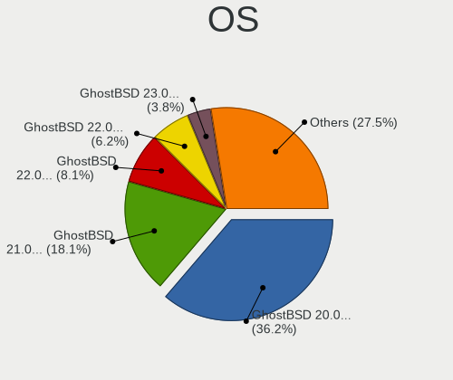

| Name                 | Notebooks | Percent |
|----------------------|-----------|---------|
| GhostBSD 20.04.02    | 58        | 41.73%  |
| GhostBSD 21.08.27    | 29        | 20.86%  |
| GhostBSD 22.01.12    | 13        | 9.35%   |
| GhostBSD 22.06.18    | 6         | 4.32%   |
| GhostBSD 22.06.26    | 3         | 2.16%   |
| GhostBSD 23.01.13    | 2         | 1.44%   |
| GhostBSD 22.11.22    | 2         | 1.44%   |
| GhostBSD 22.11.02    | 2         | 1.44%   |
| GhostBSD 22.08.23    | 2         | 1.44%   |
| GhostBSD 22.08.06    | 2         | 1.44%   |
| GhostBSD 22.07.16    | 2         | 1.44%   |
| GhostBSD 22.10.30    | 1         | 0.72%   |
| GhostBSD 22.09.16    | 1         | 0.72%   |
| GhostBSD 22.08.27    | 1         | 0.72%   |
| GhostBSD 22.07.31    | 1         | 0.72%   |
| GhostBSD 22.07.28    | 1         | 0.72%   |
| GhostBSD 22.07.13    | 1         | 0.72%   |
| GhostBSD 22.07.10    | 1         | 0.72%   |
| GhostBSD 22.06.20    | 1         | 0.72%   |
| GhostBSD 22.06.07    | 1         | 0.72%   |
| GhostBSD 22.05.13    | 1         | 0.72%   |
| GhostBSD 22.04.30    | 1         | 0.72%   |
| GhostBSD 22.04.22    | 1         | 0.72%   |
| GhostBSD 22.04.06    | 1         | 0.72%   |
| GhostBSD 21.12.29    | 1         | 0.72%   |
| GhostBSD 21.11.24    | 1         | 0.72%   |
| GhostBSD 20.07.14    | 1         | 0.72%   |
| GhostBSD 20.03.01    | 1         | 0.72%   |
| GhostBSD 12.2-STABLE | 1         | 0.72%   |

OS Family
---------

OS without a version

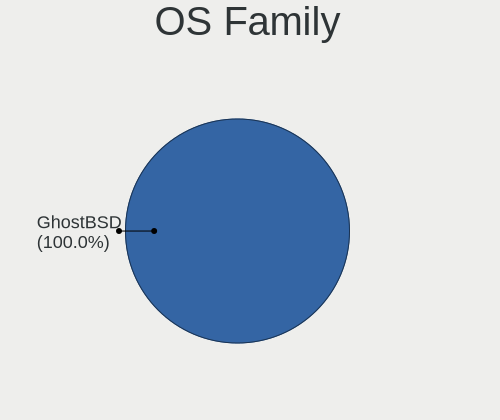

| Name     | Notebooks | Percent |
|----------|-----------|---------|
| GhostBSD | 129       | 100%    |

Arch
----

OS architecture (x86_64, i586, etc.)

| Name  | Notebooks | Percent |
|-------|-----------|---------|
| amd64 | 129       | 100%    |

DE
--

Desktop Environment

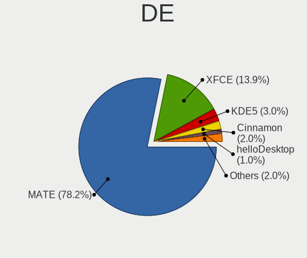

| Name         | Notebooks | Percent |
|--------------|-----------|---------|
| MATE         | 101       | 76.52%  |
| XFCE         | 20        | 15.15%  |
| KDE5         | 6         | 4.55%   |
| Cinnamon     | 2         | 1.52%   |
| helloDesktop | 1         | 0.76%   |
| GNOME        | 1         | 0.76%   |
| Console      | 1         | 0.76%   |

Display Server
--------------

X11 or Wayland

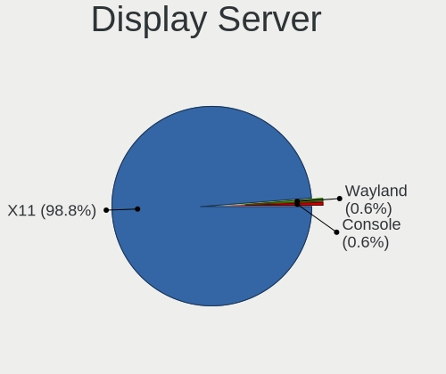

| Name    | Notebooks | Percent |
|---------|-----------|---------|
| X11     | 127       | 98.45%  |
| Wayland | 1         | 0.78%   |
| Console | 1         | 0.78%   |

Display Manager
---------------

SDDM, LightDM, etc.

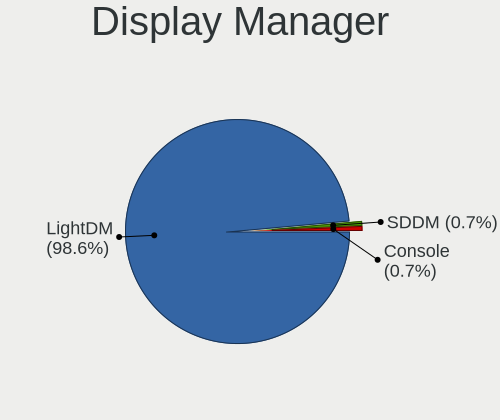

| Name    | Notebooks | Percent |
|---------|-----------|---------|
| LightDM | 127       | 98.45%  |
| SDDM    | 1         | 0.78%   |
| Console | 1         | 0.78%   |

OS Lang
-------

Language

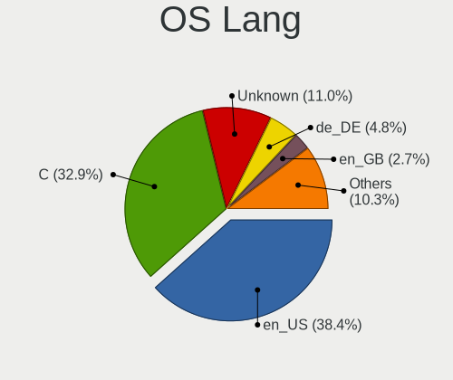

| Lang    | Notebooks | Percent |
|---------|-----------|---------|
| en_US   | 54        | 40%     |
| C       | 43        | 31.85%  |
| Unknown | 16        | 11.85%  |
| de_DE   | 6         | 4.44%   |
| pt_BR   | 3         | 2.22%   |
| pl_PL   | 2         | 1.48%   |
| it_IT   | 2         | 1.48%   |
| en_GB   | 2         | 1.48%   |
| zh_CN   | 1         | 0.74%   |
| sv_SE   | 1         | 0.74%   |
| sk_SK   | 1         | 0.74%   |
| ru_RU   | 1         | 0.74%   |
| es_ES   | 1         | 0.74%   |
| en_NZ   | 1         | 0.74%   |
| el_GR   | 1         | 0.74%   |

Boot Mode
---------

EFI or BIOS

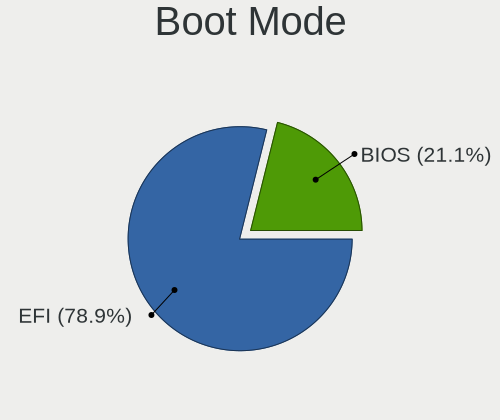

| Mode | Notebooks | Percent |
|------|-----------|---------|
| EFI  | 100       | 77.52%  |
| BIOS | 29        | 22.48%  |

Filesystem
----------

Type of filesystem

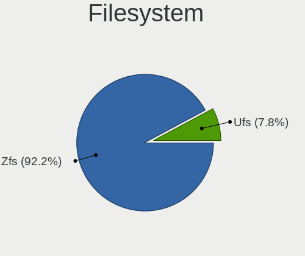

| Type | Notebooks | Percent |
|------|-----------|---------|
| Zfs  | 122       | 91.73%  |
| Ufs  | 11        | 8.27%   |

Part. scheme
------------

Scheme of partitioning

| Type | Notebooks | Percent |
|------|-----------|---------|
| GPT  | 126       | 97.67%  |
| MBR  | 3         | 2.33%   |

Board
-----

Vendor
------

Motherboard manufacturer

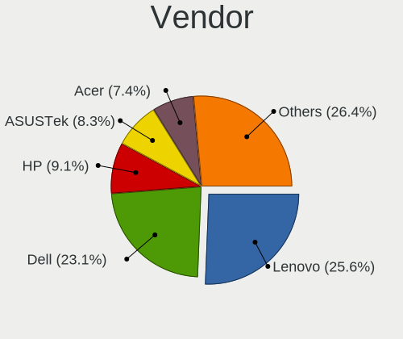

| Name                | Notebooks | Percent |
|---------------------|-----------|---------|
| Lenovo              | 35        | 27.13%  |
| Dell                | 29        | 22.48%  |
| Hewlett-Packard     | 12        | 9.3%    |
| ASUSTek Computer    | 10        | 7.75%   |
| Acer                | 10        | 7.75%   |
| Sony                | 4         | 3.1%    |
| Notebook            | 4         | 3.1%    |
| MSI                 | 4         | 3.1%    |
| Apple               | 4         | 3.1%    |
| System76            | 3         | 2.33%   |
| TUXEDO              | 2         | 1.55%   |
| Toshiba             | 2         | 1.55%   |
| Samsung Electronics | 2         | 1.55%   |
| Fujitsu             | 2         | 1.55%   |
| Star Labs           | 1         | 0.78%   |
| Panasonic           | 1         | 0.78%   |
| Jumper              | 1         | 0.78%   |
| HUAWEI              | 1         | 0.78%   |
| GPU Company         | 1         | 0.78%   |
| Alienware           | 1         | 0.78%   |

Model
-----

Motherboard model

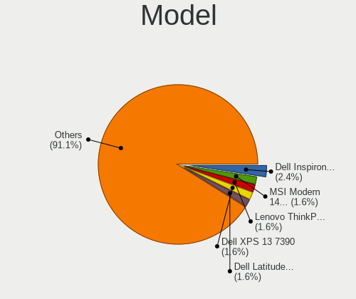

| Name                                     | Notebooks | Percent |
|------------------------------------------|-----------|---------|
| Dell Inspiron 3542                       | 3         | 2.33%   |
| MSI Modern 14 A10M                       | 2         | 1.55%   |
| Lenovo ThinkPad T430s 2352CTO            | 2         | 1.55%   |
| Dell XPS 13 7390                         | 2         | 1.55%   |
| Dell Latitude E6420                      | 2         | 1.55%   |
| ASUS ZenBook UX325UA_UM325UA             | 2         | 1.55%   |
| TUXEDO InfinityBook13V3                  | 1         | 0.78%   |
| TUXEDO Aura 15 Gen1                      | 1         | 0.78%   |
| Toshiba Satellite C855-1U4               | 1         | 0.78%   |
| Toshiba Satellite C855                   | 1         | 0.78%   |
| System76 Lemur Pro                       | 1         | 0.78%   |
| System76 Kudu                            | 1         | 0.78%   |
| System76 Gazelle                         | 1         | 0.78%   |
| Star Labs LabTop                         | 1         | 0.78%   |
| Sony VPCCB17FG                           | 1         | 0.78%   |
| Sony VGN-SZ3VWP_X                        | 1         | 0.78%   |
| Sony SVP1322M1EBI                        | 1         | 0.78%   |
| Sony SVP13225SCBI                        | 1         | 0.78%   |
| Samsung 550P5C/550P7C                    | 1         | 0.78%   |
| Samsung 3570R/370R/470R/450R/510R/4450RV | 1         | 0.78%   |
| Panasonic CF-19AHNC8FN                   | 1         | 0.78%   |
| Notebook N8xEJEK                         | 1         | 0.78%   |
| Notebook N85_N87,HJ,HJ1,HK1              | 1         | 0.78%   |
| Notebook N7x0WU                          | 1         | 0.78%   |
| Notebook N13xWU                          | 1         | 0.78%   |
| MSI GF63 Thin 10SCSR                     | 1         | 0.78%   |
| MSI GE75 Raider 10SFS                    | 1         | 0.78%   |
| Lenovo Yoga Slim 7 Pro 14ACH5 82MS       | 1         | 0.78%   |
| Lenovo Yoga 2 13 20344                   | 1         | 0.78%   |
| Lenovo ThinkPad X250 20CM003WMS          | 1         | 0.78%   |
| Lenovo ThinkPad X250 20CL001GZA          | 1         | 0.78%   |
| Lenovo ThinkPad X220 4290W42             | 1         | 0.78%   |
| Lenovo ThinkPad X220 42872VU             | 1         | 0.78%   |
| Lenovo ThinkPad X201 32492EU             | 1         | 0.78%   |
| Lenovo ThinkPad T590 20N40016CD          | 1         | 0.78%   |
| Lenovo ThinkPad T530 239242U             | 1         | 0.78%   |
| Lenovo ThinkPad T520 4243E51             | 1         | 0.78%   |
| Lenovo ThinkPad T500 2056Y2Z             | 1         | 0.78%   |
| Lenovo ThinkPad T490 20N2CTO1WW          | 1         | 0.78%   |
| Lenovo ThinkPad T470 W10DG 20JNS0JU01    | 1         | 0.78%   |

Model Family
------------

Motherboard model prefix

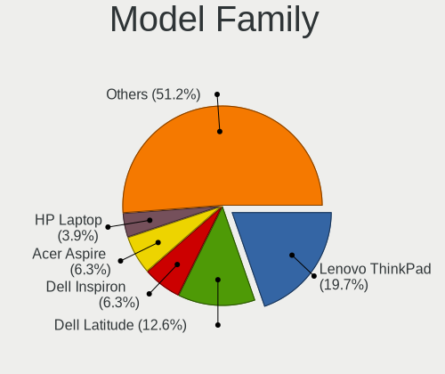

| Name                    | Notebooks | Percent |
|-------------------------|-----------|---------|
| Lenovo ThinkPad         | 25        | 19.38%  |
| Dell Latitude           | 16        | 12.4%   |
| Dell Inspiron           | 8         | 6.2%    |
| Acer Aspire             | 8         | 6.2%    |
| HP Laptop               | 5         | 3.88%   |
| Lenovo IdeaPad          | 4         | 3.1%    |
| HP EliteBook            | 3         | 2.33%   |
| Dell XPS                | 3         | 2.33%   |
| Toshiba Satellite       | 2         | 1.55%   |
| MSI Modern              | 2         | 1.55%   |
| Lenovo Yoga             | 2         | 1.55%   |
| Dell Precision          | 2         | 1.55%   |
| ASUS ZenBook            | 2         | 1.55%   |
| ASUS VivoBook           | 2         | 1.55%   |
| TUXEDO InfinityBook13V3 | 1         | 0.78%   |
| TUXEDO Aura             | 1         | 0.78%   |
| System76 Lemur          | 1         | 0.78%   |
| System76 Kudu           | 1         | 0.78%   |
| System76 Gazelle        | 1         | 0.78%   |
| Star Labs LabTop        | 1         | 0.78%   |
| Sony VPCCB17FG          | 1         | 0.78%   |
| Sony VGN-SZ3VWP         | 1         | 0.78%   |
| Sony SVP1322M1EBI       | 1         | 0.78%   |
| Sony SVP13225SCBI       | 1         | 0.78%   |
| Samsung 550P5C          | 1         | 0.78%   |
| Samsung 3570R           | 1         | 0.78%   |
| Panasonic CF-19AHNC8FN  | 1         | 0.78%   |
| Notebook N8xEJEK        | 1         | 0.78%   |
| Notebook N85            | 1         | 0.78%   |
| Notebook N7x0WU         | 1         | 0.78%   |
| Notebook N13xWU         | 1         | 0.78%   |
| MSI GF63                | 1         | 0.78%   |
| MSI GE75                | 1         | 0.78%   |
| Lenovo Legion           | 1         | 0.78%   |
| Lenovo G500s            | 1         | 0.78%   |
| Lenovo Flex             | 1         | 0.78%   |
| Lenovo B50-80           | 1         | 0.78%   |
| Jumper EZbook           | 1         | 0.78%   |
| HUAWEI HLY-WX9XX        | 1         | 0.78%   |
| HP Pavilion             | 1         | 0.78%   |

MFG Year
--------

Motherboard manufacture year

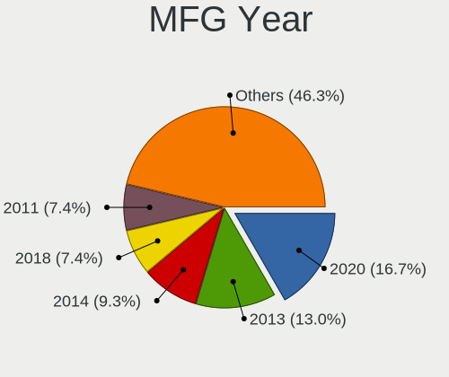

| Year | Notebooks | Percent |
|------|-----------|---------|
| 2020 | 20        | 15.5%   |
| 2013 | 17        | 13.18%  |
| 2021 | 14        | 10.85%  |
| 2018 | 10        | 7.75%   |
| 2014 | 10        | 7.75%   |
| 2011 | 8         | 6.2%    |
| 2015 | 7         | 5.43%   |
| 2012 | 7         | 5.43%   |
| 2009 | 7         | 5.43%   |
| 2019 | 6         | 4.65%   |
| 2017 | 6         | 4.65%   |
| 2016 | 5         | 3.88%   |
| 2022 | 4         | 3.1%    |
| 2010 | 4         | 3.1%    |
| 2008 | 3         | 2.33%   |
| 2007 | 1         | 0.78%   |

Form Factor
-----------

Physical design of the computer

| Name     | Notebooks | Percent |
|----------|-----------|---------|
| Notebook | 129       | 100%    |

Coreboot
--------

Have coreboot on board

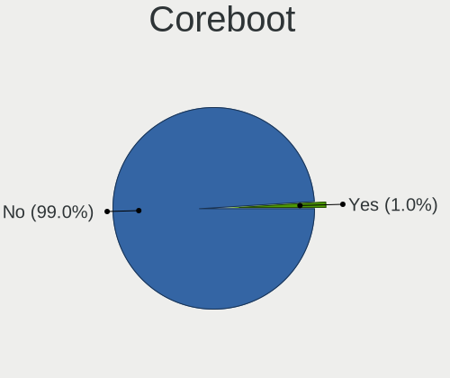

| Used | Notebooks | Percent |
|------|-----------|---------|
| No   | 128       | 99.22%  |
| Yes  | 1         | 0.78%   |

RAM Size
--------

Total RAM memory

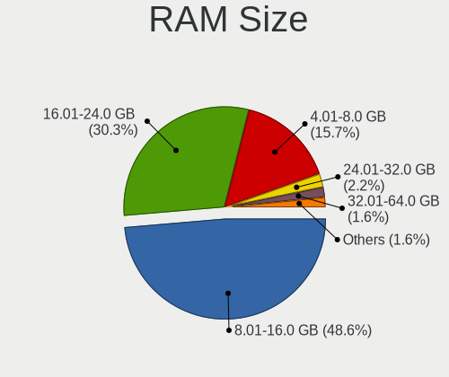

| Size in GB  | Notebooks | Percent |
|-------------|-----------|---------|
| 8.01-16.0   | 67        | 51.94%  |
| 16.01-24.0  | 34        | 26.36%  |
| 4.01-8.0    | 22        | 17.05%  |
| 32.01-64.0  | 2         | 1.55%   |
| 24.01-32.0  | 2         | 1.55%   |
| 2.01-3.0    | 1         | 0.78%   |
| 64.01-256.0 | 1         | 0.78%   |

RAM Used
--------

Used RAM memory

| Used GB    | Notebooks | Percent |
|------------|-----------|---------|
| 0.01-0.5   | 61        | 46.21%  |
| 0.51-1.0   | 52        | 39.39%  |
| 2.01-3.0   | 10        | 7.58%   |
| 1.01-2.0   | 7         | 5.3%    |
| 4.01-8.0   | 1         | 0.76%   |
| 24.01-32.0 | 1         | 0.76%   |

Total Drives
------------

Number of drives on board

| Drives | Notebooks | Percent |
|--------|-----------|---------|
| 1      | 98        | 74.81%  |
| 2      | 26        | 19.85%  |
| 0      | 7         | 5.34%   |

Has CD-ROM
----------

Has CD-ROM on board

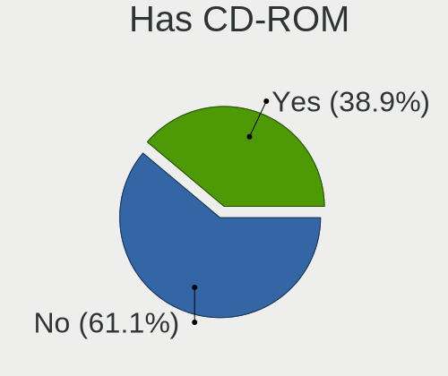

| Presented | Notebooks | Percent |
|-----------|-----------|---------|
| No        | 79        | 60.77%  |
| Yes       | 51        | 39.23%  |

Has Ethernet
------------

Has Ethernet on board

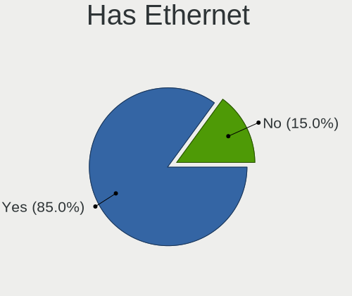

| Presented | Notebooks | Percent |
|-----------|-----------|---------|
| Yes       | 110       | 85.27%  |
| No        | 19        | 14.73%  |

Has WiFi
--------

Has WiFi module

| Presented | Notebooks | Percent |
|-----------|-----------|---------|
| Yes       | 129       | 100%    |

Has Bluetooth
-------------

Has Bluetooth module

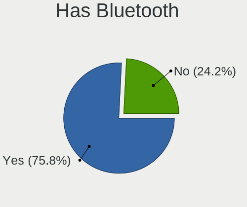

| Presented | Notebooks | Percent |
|-----------|-----------|---------|
| Yes       | 98        | 75.97%  |
| No        | 31        | 24.03%  |

Location
--------

Country
-------

Geographic location (country)

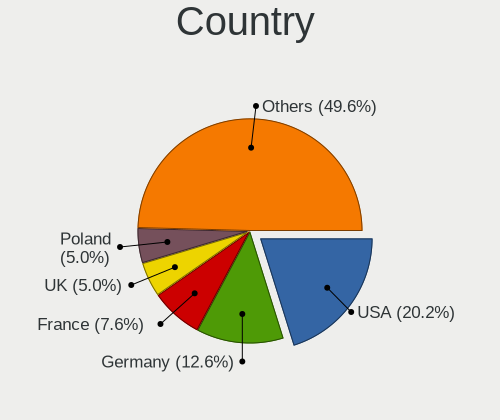

| Country      | Notebooks | Percent |
|--------------|-----------|---------|
| USA          | 26        | 20.16%  |
| Germany      | 15        | 11.63%  |
| France       | 9         | 6.98%   |
| UK           | 7         | 5.43%   |
| Poland       | 6         | 4.65%   |
| Spain        | 5         | 3.88%   |
| Russia       | 4         | 3.1%    |
| Italy        | 4         | 3.1%    |
| India        | 4         | 3.1%    |
| Sweden       | 3         | 2.33%   |
| New Zealand  | 3         | 2.33%   |
| Brazil       | 3         | 2.33%   |
| Switzerland  | 2         | 1.55%   |
| Slovenia     | 2         | 1.55%   |
| Slovakia     | 2         | 1.55%   |
| Portugal     | 2         | 1.55%   |
| Philippines  | 2         | 1.55%   |
| Netherlands  | 2         | 1.55%   |
| Japan        | 2         | 1.55%   |
| Indonesia    | 2         | 1.55%   |
| Hong Kong    | 2         | 1.55%   |
| Finland      | 2         | 1.55%   |
| China        | 2         | 1.55%   |
| Canada       | 2         | 1.55%   |
| Belgium      | 2         | 1.55%   |
| Ukraine      | 1         | 0.78%   |
| Uganda       | 1         | 0.78%   |
| South Africa | 1         | 0.78%   |
| Serbia       | 1         | 0.78%   |
| Romania      | 1         | 0.78%   |
| Norway       | 1         | 0.78%   |
| Namibia      | 1         | 0.78%   |
| Malaysia     | 1         | 0.78%   |
| Kazakhstan   | 1         | 0.78%   |
| Hungary      | 1         | 0.78%   |
| Greece       | 1         | 0.78%   |
| Egypt        | 1         | 0.78%   |
| Bulgaria     | 1         | 0.78%   |
| Argentina    | 1         | 0.78%   |

City
----

Geographic location (city)

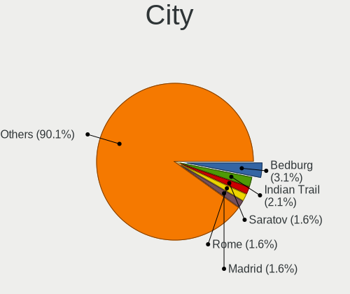

| City                    | Notebooks | Percent |
|-------------------------|-----------|---------|
| Bedburg                 | 6         | 4.44%   |
| Franconville            | 3         | 2.22%   |
| Chrusty                 | 3         | 2.22%   |
| Bonn                    | 3         | 2.22%   |
| Yokohama                | 2         | 1.48%   |
| Whittier                | 2         | 1.48%   |
| Wezeren                 | 2         | 1.48%   |
| Stiring-Wendel          | 2         | 1.48%   |
| Rome                    | 2         | 1.48%   |
| Paris                   | 2         | 1.48%   |
| London                  | 2         | 1.48%   |
| Jakarta                 | 2         | 1.48%   |
| Giessen                 | 2         | 1.48%   |
| Clemmons                | 2         | 1.48%   |
| Celje                   | 2         | 1.48%   |
| Asnieres-sur-Seine      | 2         | 1.48%   |
| Zurich                  | 1         | 0.74%   |
| Yaroslavl               | 1         | 0.74%   |
| Wraysbury               | 1         | 0.74%   |
| Witbank                 | 1         | 0.74%   |
| Winnipeg                | 1         | 0.74%   |
| Windhoek                | 1         | 0.74%   |
| Wenatchee               | 1         | 0.74%   |
| Valencia                | 1         | 0.74%   |
| Toronto                 | 1         | 0.74%   |
| Taita                   | 1         | 0.74%   |
| Staffanstorp            | 1         | 0.74%   |
| St Petersburg           | 1         | 0.74%   |
| St Austell              | 1         | 0.74%   |
| Sollentuna              | 1         | 0.74%   |
| Sofia                   | 1         | 0.74%   |
| Santo Tomas             | 1         | 0.74%   |
| Salinas                 | 1         | 0.74%   |
| Salem                   | 1         | 0.74%   |
| Rochester               | 1         | 0.74%   |
| Richmond                | 1         | 0.74%   |
| Resistencia             | 1         | 0.74%   |
| Portland                | 1         | 0.74%   |
| Peoria                  | 1         | 0.74%   |
| Ouderkerk aan de Amstel | 1         | 0.74%   |

Drives
------

Drive Vendor
------------

Hard drive vendors

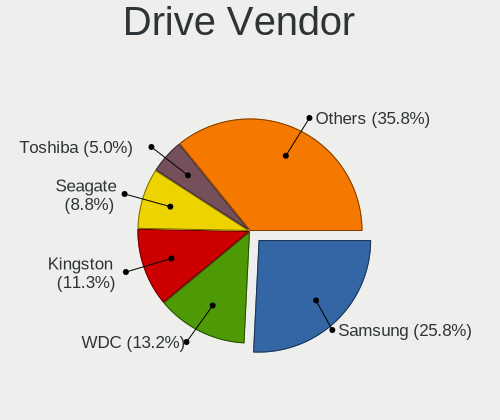

| Vendor              | Notebooks | Drives | Percent |
|---------------------|-----------|--------|---------|
| Samsung Electronics | 39        | 50     | 26.35%  |
| WDC                 | 20        | 22     | 13.51%  |
| Seagate             | 14        | 17     | 9.46%   |
| Kingston            | 14        | 14     | 9.46%   |
| Toshiba             | 8         | 11     | 5.41%   |
| Crucial             | 8         | 9      | 5.41%   |
| SanDisk             | 7         | 7      | 4.73%   |
| SK hynix            | 5         | 7      | 3.38%   |
| Phison              | 3         | 4      | 2.03%   |
| Intel               | 3         | 3      | 2.03%   |
| Hitachi             | 3         | 3      | 2.03%   |
| PNY                 | 2         | 2      | 1.35%   |
| Patriot             | 2         | 2      | 1.35%   |
| Micron Technology   | 2         | 2      | 1.35%   |
| KingSpec            | 2         | 2      | 1.35%   |
| HGST                | 2         | 2      | 1.35%   |
| Goodram             | 2         | 2      | 1.35%   |
| Fujitsu             | 2         | 2      | 1.35%   |
| A-DATA Technology   | 2         | 2      | 1.35%   |
| Star Drive          | 1         | 1      | 0.68%   |
| SSSTC               | 1         | 1      | 0.68%   |
| Plextor             | 1         | 1      | 0.68%   |
| Netac               | 1         | 1      | 0.68%   |
| LITEONIT            | 1         | 1      | 0.68%   |
| Hewlett-Packard     | 1         | 1      | 0.68%   |
| Gigabyte Technology | 1         | 1      | 0.68%   |
| Apple               | 1         | 1      | 0.68%   |

Drive Model
-----------

Hard drive models

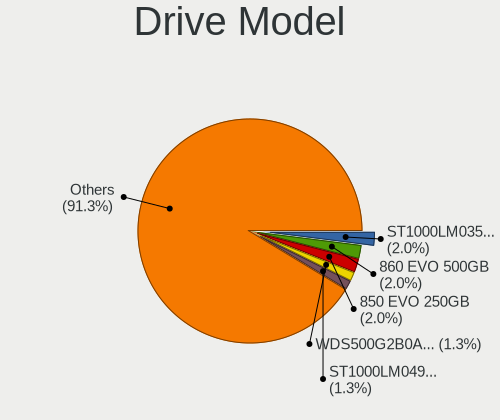

| Model                                | Notebooks | Percent |
|--------------------------------------|-----------|---------|
| Seagate ST1000LM035-1RK172 1TB       | 3         | 1.97%   |
| Samsung SSD 860 EVO 500GB            | 3         | 1.97%   |
| Samsung SSD 850 EVO 250GB            | 3         | 1.97%   |
| WDC WDS500G2B0A-00SM50 500GB         | 2         | 1.32%   |
| SK hynix HFM512GD3JX013N 512GB       | 2         | 1.32%   |
| Seagate ST1000LM049-2GH172 1TB       | 2         | 1.32%   |
| Samsung SSD 860 QVO 1TB              | 2         | 1.32%   |
| Samsung PM981 NVMe 256GB             | 2         | 1.32%   |
| Samsung MZNTE128HMGR-000SO 128GB     | 2         | 1.32%   |
| Kingston SA400S37240G 240GB          | 2         | 1.32%   |
| Kingston SA400S37120G 120GB          | 2         | 1.32%   |
| Kingston RBUSNS8154P3512GJ 512GB     | 2         | 1.32%   |
| KingSpec Q-720 720GB                 | 2         | 1.32%   |
| WDC WDS240G2G0A-00JH30 240GB         | 1         | 0.66%   |
| WDC WDS120G2G0A-00JH30 120GB         | 1         | 0.66%   |
| WDC WDS100T2B0B-00YS70 1TB           | 1         | 0.66%   |
| WDC WDS100T1B0A-00H9H0 1TB           | 1         | 0.66%   |
| WDC WD7500BPVT-80HXZT3 752GB         | 1         | 0.66%   |
| WDC WD7500BPKX-80HPJT0 752GB         | 1         | 0.66%   |
| WDC WD6400BEVT-22A0RT0 640GB         | 1         | 0.66%   |
| WDC WD5000LPCX-24C6HT0 500GB         | 1         | 0.66%   |
| WDC WD5000BPVT-00HXZT3 500GB         | 1         | 0.66%   |
| WDC WD3200LPVX-75V0TT0 320GB         | 1         | 0.66%   |
| WDC WD10SPZX-75Z10T3 1TB             | 1         | 0.66%   |
| WDC WD10SPZX-21Z10T0 1TB             | 1         | 0.66%   |
| WDC WD10JPVX-22JC3T0 1TB             | 1         | 0.66%   |
| WDC WD10JPVX-00JC3T0 1TB             | 1         | 0.66%   |
| WDC WD10JMVW-11AJGS1 1TB             | 1         | 0.66%   |
| WDC PC SN530 SDBPNPZ-512G-1006 512GB | 1         | 0.66%   |
| WDC PC SN530 NVMe 256GB              | 1         | 0.66%   |
| WDC PC SN520 SDAPNUW-256G-1006 256GB | 1         | 0.66%   |
| WDC PC SN520 SDAPMUW-128G-1101 128GB | 1         | 0.66%   |
| Toshiba THNSF5256GPUK 256GB          | 1         | 0.66%   |
| Toshiba MQ04ABF100 1TB               | 1         | 0.66%   |
| Toshiba MQ01ACF032 320GB             | 1         | 0.66%   |
| Toshiba MQ01ABF050 500GB             | 1         | 0.66%   |
| Toshiba KXG50ZNV512G NVMe 512GB      | 1         | 0.66%   |
| Toshiba KSG60ZMV256G M.2 2280 256GB  | 1         | 0.66%   |
| Toshiba KBG40ZNT512G MEMORY 512GB    | 1         | 0.66%   |
| Toshiba KBG30ZMV512G 512GB           | 1         | 0.66%   |

HDD Vendor
----------

Hard disk drive vendors

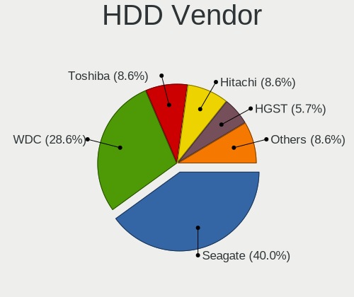

| Vendor              | Notebooks | Drives | Percent |
|---------------------|-----------|--------|---------|
| Seagate             | 14        | 17     | 38.89%  |
| WDC                 | 11        | 12     | 30.56%  |
| Toshiba             | 3         | 3      | 8.33%   |
| Hitachi             | 3         | 3      | 8.33%   |
| HGST                | 2         | 2      | 5.56%   |
| Fujitsu             | 2         | 2      | 5.56%   |
| Samsung Electronics | 1         | 1      | 2.78%   |

SSD Vendor
----------

Solid state drive vendors

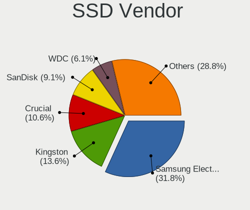

| Vendor              | Notebooks | Drives | Percent |
|---------------------|-----------|--------|---------|
| Samsung Electronics | 24        | 33     | 31.58%  |
| Kingston            | 11        | 11     | 14.47%  |
| SanDisk             | 7         | 7      | 9.21%   |
| Crucial             | 7         | 8      | 9.21%   |
| WDC                 | 6         | 6      | 7.89%   |
| SK hynix            | 2         | 2      | 2.63%   |
| PNY                 | 2         | 2      | 2.63%   |
| Patriot             | 2         | 2      | 2.63%   |
| Micron Technology   | 2         | 2      | 2.63%   |
| KingSpec            | 2         | 2      | 2.63%   |
| Goodram             | 2         | 2      | 2.63%   |
| A-DATA Technology   | 2         | 2      | 2.63%   |
| Toshiba             | 1         | 2      | 1.32%   |
| Plextor             | 1         | 1      | 1.32%   |
| Phison              | 1         | 1      | 1.32%   |
| Netac               | 1         | 1      | 1.32%   |
| LITEONIT            | 1         | 1      | 1.32%   |
| Intel               | 1         | 1      | 1.32%   |
| Apple               | 1         | 1      | 1.32%   |

Drive Kind
----------

HDD or SSD

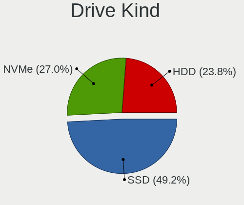

| Kind | Notebooks | Drives | Percent |
|------|-----------|--------|---------|
| SSD  | 67        | 87     | 48.91%  |
| NVMe | 36        | 44     | 26.28%  |
| HDD  | 34        | 40     | 24.82%  |

Drive Connector
---------------

SATA, SAS, NVMe, etc.

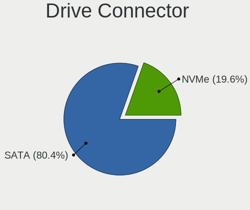

| Type | Notebooks | Drives | Percent |
|------|-----------|--------|---------|
| SATA | 96        | 127    | 72.73%  |
| NVMe | 36        | 44     | 27.27%  |

Drive Size
----------

Size of hard drive

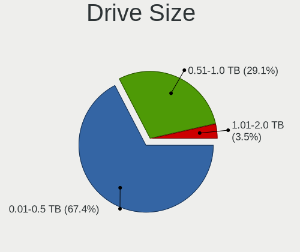

| Size in TB | Notebooks | Drives | Percent |
|------------|-----------|--------|---------|
| 0.01-0.5   | 70        | 83     | 68.63%  |
| 0.51-1.0   | 28        | 39     | 27.45%  |
| 1.01-2.0   | 4         | 5      | 3.92%   |

Space Total
-----------

Amount of disk space available on the file system

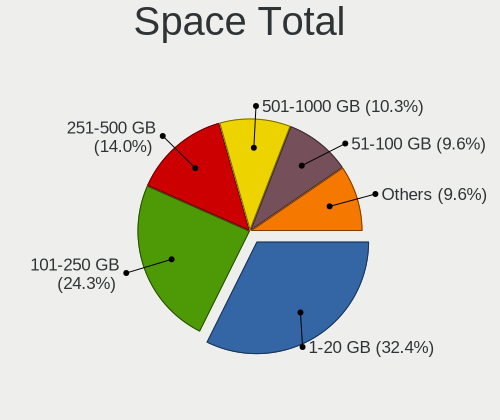

| Size in GB | Notebooks | Percent |
|------------|-----------|---------|
| 1-20       | 44        | 32.35%  |
| 101-250    | 33        | 24.26%  |
| 251-500    | 19        | 13.97%  |
| 501-1000   | 14        | 10.29%  |
| 51-100     | 13        | 9.56%   |
| Unknown    | 10        | 7.35%   |
| 1001-2000  | 2         | 1.47%   |
| 21-50      | 1         | 0.74%   |

Space Used
----------

Amount of used disk space

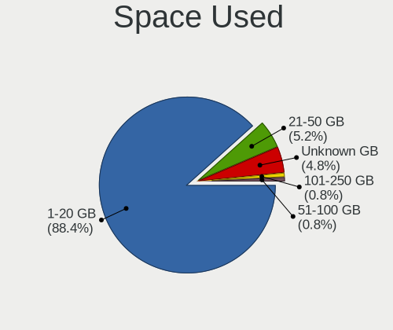

| Used GB | Notebooks | Percent |
|---------|-----------|---------|
| 1-20    | 117       | 85.4%   |
| Unknown | 10        | 7.3%    |
| 21-50   | 8         | 5.84%   |
| 101-250 | 1         | 0.73%   |
| 51-100  | 1         | 0.73%   |

Malfunc. Drives
---------------

Drive models with a malfunction

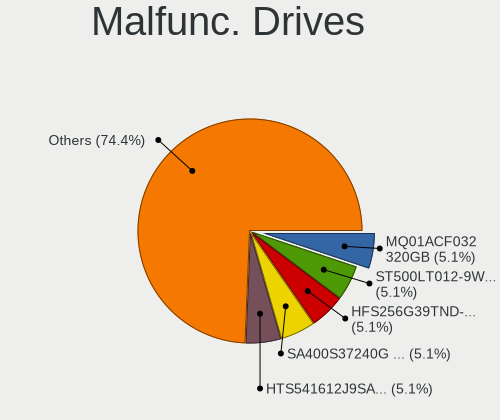

| Model                                           | Notebooks | Drives | Percent |
|-------------------------------------------------|-----------|--------|---------|
| WDC WD6400BEVT-22A0RT0 640GB                    | 1         | 1      | 6.67%   |
| WDC WD3200LPVX-75V0TT0 320GB                    | 1         | 1      | 6.67%   |
| Toshiba MQ01ACF032 320GB                        | 1         | 1      | 6.67%   |
| Seagate ST9250827AS 250GB                       | 1         | 1      | 6.67%   |
| Seagate ST500LT012-9WS142 500GB                 | 1         | 2      | 6.67%   |
| Seagate ST500LM021-1KJ152 500GB                 | 1         | 1      | 6.67%   |
| Seagate ST1000LM035-1RK172 1TB                  | 1         | 2      | 6.67%   |
| Samsung Electronics SSD 980 500GB               | 1         | 1      | 6.67%   |
| Samsung Electronics SSD 840 PRO Series 256GB    | 1         | 1      | 6.67%   |
| Samsung Electronics MZNTE128HMGR-000SO 128GB    | 1         | 1      | 6.67%   |
| Patriot Inferno 60GB SSD                        | 1         | 1      | 6.67%   |
| Micron Technology MTFDDAV256TDL-1AW1ZABHA 256GB | 1         | 1      | 6.67%   |
| Intel SSDSC2BF180A5L 180GB                      | 1         | 1      | 6.67%   |
| Hitachi HTS543225L9A300 250GB                   | 1         | 1      | 6.67%   |
| HGST HTS721010A9E630 1TB                        | 1         | 1      | 6.67%   |

Malfunc. Drive Vendor
---------------------

Vendors of faulty drives

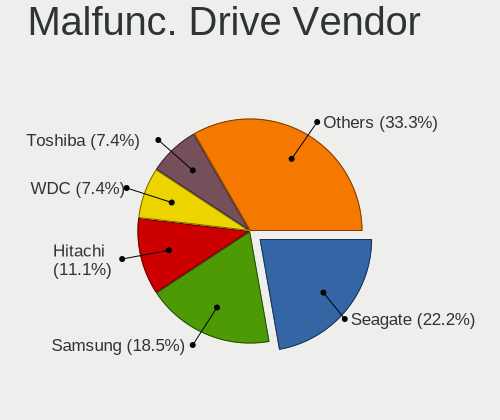

| Vendor              | Notebooks | Drives | Percent |
|---------------------|-----------|--------|---------|
| Seagate             | 4         | 6      | 26.67%  |
| Samsung Electronics | 3         | 3      | 20%     |
| WDC                 | 2         | 2      | 13.33%  |
| Toshiba             | 1         | 1      | 6.67%   |
| Patriot             | 1         | 1      | 6.67%   |
| Micron Technology   | 1         | 1      | 6.67%   |
| Intel               | 1         | 1      | 6.67%   |
| Hitachi             | 1         | 1      | 6.67%   |
| HGST                | 1         | 1      | 6.67%   |

Malfunc. HDD Vendor
-------------------

Vendors of faulty HDD drives

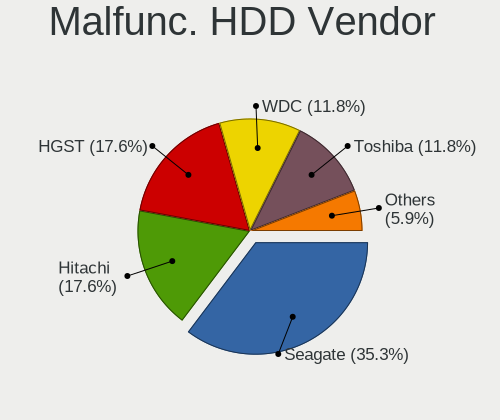

| Vendor  | Notebooks | Drives | Percent |
|---------|-----------|--------|---------|
| Seagate | 4         | 6      | 44.44%  |
| WDC     | 2         | 2      | 22.22%  |
| Toshiba | 1         | 1      | 11.11%  |
| Hitachi | 1         | 1      | 11.11%  |
| HGST    | 1         | 1      | 11.11%  |

Malfunc. Drive Kind
-------------------

Kinds of faulty drives

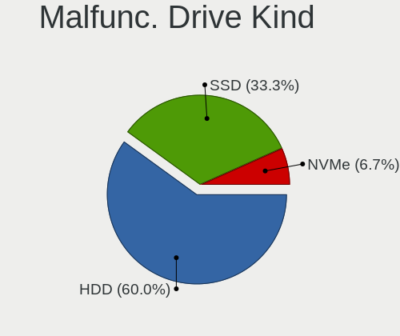

| Kind | Notebooks | Drives | Percent |
|------|-----------|--------|---------|
| HDD  | 9         | 11     | 60%     |
| SSD  | 5         | 5      | 33.33%  |
| NVMe | 1         | 1      | 6.67%   |

Failed Drives
-------------

Failed drive models

Zero info for selected period =(

Failed Drive Vendor
-------------------

Failed drive vendors

Zero info for selected period =(

Drive Status
------------

Number of failed and malfunc. drives

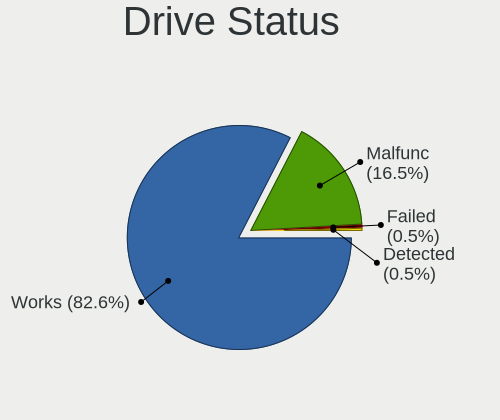

| Status  | Notebooks | Drives | Percent |
|---------|-----------|--------|---------|
| Works   | 112       | 154    | 88.19%  |
| Malfunc | 15        | 17     | 11.81%  |

Storage controller
------------------

Storage Vendor
--------------

Storage controller vendors

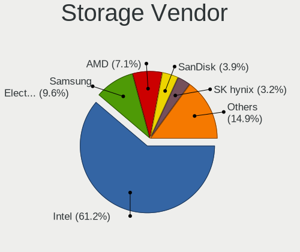

| Vendor                         | Notebooks | Percent |
|--------------------------------|-----------|---------|
| Intel                          | 96        | 66.21%  |
| Samsung Electronics            | 15        | 10.34%  |
| AMD                            | 11        | 7.59%   |
| SanDisk                        | 4         | 2.76%   |
| Phison Electronics             | 4         | 2.76%   |
| SK hynix                       | 3         | 2.07%   |
| Nvidia                         | 3         | 2.07%   |
| Kingston Technology Company    | 3         | 2.07%   |
| Toshiba                        | 2         | 1.38%   |
| Solid State Storage Technology | 1         | 0.69%   |
| Micron/Crucial Technology      | 1         | 0.69%   |
| KIOXIA                         | 1         | 0.69%   |
| Biwin Storage Technology       | 1         | 0.69%   |

Storage Model
-------------

Storage controller models

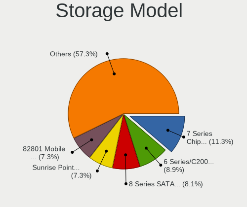

| Model                                                                          | Notebooks | Percent |
|--------------------------------------------------------------------------------|-----------|---------|
| Intel 7 Series Chipset Family 6-port SATA Controller [AHCI mode]               | 16        | 10.67%  |
| Intel Sunrise Point-LP SATA Controller [AHCI mode]                             | 11        | 7.33%   |
| Intel 82801 Mobile SATA Controller [RAID mode]                                 | 11        | 7.33%   |
| Intel 6 Series/C200 Series Chipset Family 6 port Mobile SATA AHCI Controller   | 11        | 7.33%   |
| Intel 8 Series SATA Controller 1 [AHCI mode]                                   | 10        | 6.67%   |
| AMD FCH SATA Controller [AHCI mode]                                            | 9         | 6%      |
| Samsung NVMe SSD Controller SM981/PM981/PM983                                  | 8         | 5.33%   |
| Intel Wildcat Point-LP SATA Controller [AHCI Mode]                             | 7         | 4.67%   |
| Samsung NVMe SSD Controller 980                                                | 4         | 2.67%   |
| Intel HM170/QM170 Chipset SATA Controller [AHCI Mode]                          | 4         | 2.67%   |
| Intel Cannon Lake Mobile PCH SATA AHCI Controller                              | 4         | 2.67%   |
| Intel 82801IBM/IEM (ICH9M/ICH9M-E) 4 port SATA Controller [AHCI mode]          | 4         | 2.67%   |
| Unknown                                                                        | 4         | 2.67%   |
| Nvidia MCP79 AHCI Controller                                                   | 3         | 2%      |
| Intel 82801HM/HEM (ICH8M/ICH8M-E) SATA Controller [AHCI mode]                  | 3         | 2%      |
| Intel 82801HM/HEM (ICH8M/ICH8M-E) IDE Controller                               | 3         | 2%      |
| SK hynix Gold P31/PC711 NVMe Solid State Drive                                 | 2         | 1.33%   |
| Phison PS5013 E13 NVMe Controller                                              | 2         | 1.33%   |
| Kingston Company U-SNS8154P3 NVMe SSD                                          | 2         | 1.33%   |
| Intel Comet Lake SATA AHCI Controller                                          | 2         | 1.33%   |
| Intel Celeron N3350/Pentium N4200/Atom E3900 Series SATA AHCI Controller       | 2         | 1.33%   |
| Intel 8 Series/C220 Series Chipset Family 6-port SATA Controller 1 [AHCI mode] | 2         | 1.33%   |
| Intel 400 Series Chipset Family SATA AHCI Controller                           | 2         | 1.33%   |
| Toshiba XG4 NVMe SSD Controller                                                | 1         | 0.67%   |
| Toshiba BG3 NVMe SSD Controller                                                | 1         | 0.67%   |
| SK hynix BC501 NVMe Solid State Drive                                          | 1         | 0.67%   |
| SanDisk WD Blue SN550 NVMe SSD                                                 | 1         | 0.67%   |
| SanDisk WD Blue SN500 / PC SN520 NVMe SSD                                      | 1         | 0.67%   |
| SanDisk unknown                                                                | 1         | 0.67%   |
| SanDisk PC SN520 NVMe SSD                                                      | 1         | 0.67%   |
| Samsung SM951 AHCI                                                             | 1         | 0.67%   |
| Samsung NVMe SSD Controller SM951/PM951                                        | 1         | 0.67%   |
| Samsung NVMe SSD Controller PM9A1/PM9A3/980PRO                                 | 1         | 0.67%   |
| Phison E16 PCIe4 NVMe Controller                                               | 1         | 0.67%   |
| Phison E12 NVMe Controller                                                     | 1         | 0.67%   |
| KIOXIA NVMe SSD Controller BG4                                                 | 1         | 0.67%   |
| Intel SSD Pro 7600p/760p/E 6100p Series                                        | 1         | 0.67%   |
| Intel SSD 660P Series                                                          | 1         | 0.67%   |
| Intel Ice Lake-LP SATA Controller [AHCI mode]                                  | 1         | 0.67%   |
| Intel Cannon Point-LP SATA Controller [AHCI Mode]                              | 1         | 0.67%   |

Storage Kind
------------

Kind of storage controller (IDE, SATA, NVMe, SAS, ...)

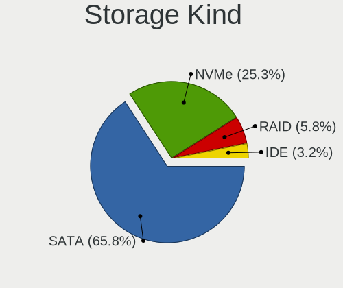

| Kind | Notebooks | Percent |
|------|-----------|---------|
| SATA | 97        | 65.54%  |
| NVMe | 35        | 23.65%  |
| RAID | 11        | 7.43%   |
| IDE  | 5         | 3.38%   |

Processor
---------

CPU Vendor
----------

Processor vendors

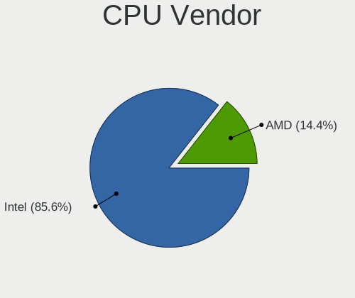

| Vendor | Notebooks | Percent |
|--------|-----------|---------|
| Intel  | 110       | 85.27%  |
| AMD    | 19        | 14.73%  |

CPU Model
---------

Processor models

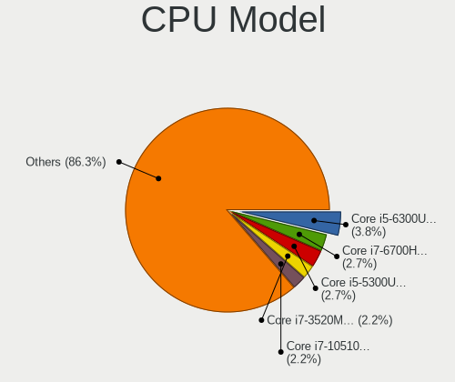

| Model                                         | Notebooks | Percent |
|-----------------------------------------------|-----------|---------|
| Intel Core i5-5300U CPU @ 2.30GHz             | 5         | 3.88%   |
| Intel Core i7-3520M CPU @ 2.90GHz             | 4         | 3.1%    |
| Intel Core i7-10510U CPU @ 1.80GHz            | 4         | 3.1%    |
| Intel Core i5-6300U CPU @ 2.40GHz             | 4         | 3.1%    |
| Intel Core 2 Duo                              | 4         | 3.1%    |
| Intel Core i7-6700HQ CPU @ 2.60GHz            | 3         | 2.33%   |
| Intel Core i5-3320M CPU @ 2.60GHz             | 3         | 2.33%   |
| Intel Core i5-1035G1 CPU @ 1.00GHz            | 3         | 2.33%   |
| Intel Core i9-10980HK CPU @ 2.40GHz           | 2         | 1.55%   |
| Intel Core i7-8850H CPU @ 2.60GHz             | 2         | 1.55%   |
| Intel Core i7-8750H CPU @ 2.20GHz             | 2         | 1.55%   |
| Intel Core i7-8565U CPU @ 1.80GHz             | 2         | 1.55%   |
| Intel Core i7-8550U CPU @ 1.80GHz             | 2         | 1.55%   |
| Intel Core i7-3630QM CPU @ 2.40GHz            | 2         | 1.55%   |
| Intel Core i7-2620M CPU @ 2.70GHz             | 2         | 1.55%   |
| Intel Core i5-8250U CPU @ 1.60GHz             | 2         | 1.55%   |
| Intel Core i5-7300U CPU @ 2.60GHz             | 2         | 1.55%   |
| Intel Core i5-7200U CPU @ 2.50GHz             | 2         | 1.55%   |
| Intel Core i5-5200U CPU @ 2.20GHz             | 2         | 1.55%   |
| Intel Core i5-4200U CPU @ 1.60GHz             | 2         | 1.55%   |
| Intel Core i5-3230M CPU @ 2.60GHz             | 2         | 1.55%   |
| Intel Core i5-2520M CPU @ 2.50GHz             | 2         | 1.55%   |
| Intel Core i5-2520M CPU @ 2.50GH              | 2         | 1.55%   |
| Intel Core i3-3217U CPU @ 1.80GHz             | 2         | 1.55%   |
| Intel Core 2 Duo CPU P8600 @ 2.40GHz          | 2         | 1.55%   |
| Intel Core 2 Duo CPU P7550 @ 2.26GHz          | 2         | 1.55%   |
| AMD Ryzen 7 5700U with Radeon Graphics        | 2         | 1.55%   |
| AMD Ryzen 7 4700U with Radeon Graphics        | 2         | 1.55%   |
| AMD Ryzen 5 3450U with Radeon Vega Mobile Gfx | 2         | 1.55%   |
| AMD A4-9125 RADEON R3, 4 COMPUTE CORES 2C+2G  | 2         | 1.55%   |
| Intel Pentium 3558U @ 1.70GHz                 | 1         | 0.78%   |
| Intel Genuine CPU                             | 1         | 0.78%   |
| Intel Core i7-6500U CPU @ 2.50GHz             | 1         | 0.78%   |
| Intel Core i7-4810MQ CPU @ 2.80GHz            | 1         | 0.78%   |
| Intel Core i7-4770HQ CPU @ 2.20GHz            | 1         | 0.78%   |
| Intel Core i7-4700HQ CPU @ 2.40GHz            | 1         | 0.78%   |
| Intel Core i7-4500U CPU @ 1.80GHz             | 1         | 0.78%   |
| Intel Core i7-3740QM CPU @ 2.70GHz            | 1         | 0.78%   |
| Intel Core i7-3720QM CPU @ 2.60GHz            | 1         | 0.78%   |
| Intel Core i7-2670QM CPU @ 2.20GHz            | 1         | 0.78%   |

CPU Model Family
----------------

Processor model prefix

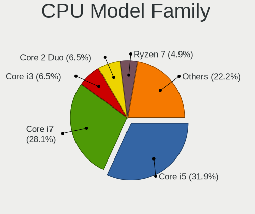

| Model            | Notebooks | Percent |
|------------------|-----------|---------|
| Intel Core i5    | 46        | 35.66%  |
| Intel Core i7    | 34        | 26.36%  |
| Intel Core 2 Duo | 11        | 8.53%   |
| Intel Core i3    | 9         | 6.98%   |
| AMD Ryzen 7      | 6         | 4.65%   |
| AMD Ryzen 5      | 6         | 4.65%   |
| Intel Celeron    | 4         | 3.1%    |
| Other            | 2         | 1.55%   |
| Intel Core i9    | 2         | 1.55%   |
| AMD A6           | 2         | 1.55%   |
| AMD A4           | 2         | 1.55%   |
| Intel Pentium    | 1         | 0.78%   |
| Intel Genuine    | 1         | 0.78%   |
| Intel Core 2     | 1         | 0.78%   |
| AMD Ryzen 3      | 1         | 0.78%   |
| AMD Athlon       | 1         | 0.78%   |

CPU Cores
---------

Number of processor cores

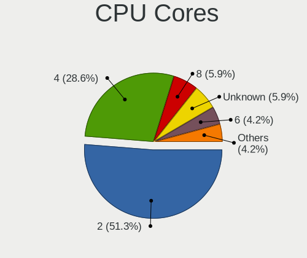

| Number  | Notebooks | Percent |
|---------|-----------|---------|
| 2       | 66        | 51.16%  |
| 4       | 36        | 27.91%  |
| 8       | 9         | 6.98%   |
| Unknown | 7         | 5.43%   |
| 6       | 6         | 4.65%   |
| 16      | 3         | 2.33%   |
| 12      | 2         | 1.55%   |

CPU Sockets
-----------

Number of sockets

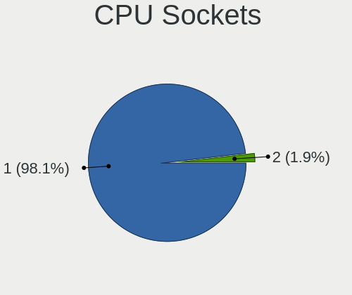

| Number | Notebooks | Percent |
|--------|-----------|---------|
| 1      | 126       | 97.67%  |
| 2      | 3         | 2.33%   |

CPU Threads
-----------

Threads per core (Hyper-Threading)

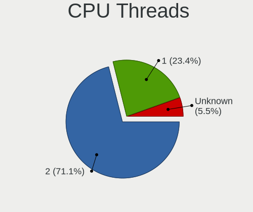

| Number  | Notebooks | Percent |
|---------|-----------|---------|
| 2       | 92        | 71.32%  |
| 1       | 30        | 23.26%  |
| Unknown | 7         | 5.43%   |

CPU Microarch
-------------

Microarchitecture

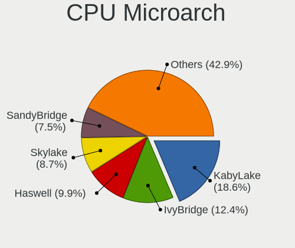

| Name        | Notebooks | Percent |
|-------------|-----------|---------|
| KabyLake    | 25        | 19.38%  |
| IvyBridge   | 18        | 13.95%  |
| Haswell     | 14        | 10.85%  |
| SandyBridge | 11        | 8.53%   |
| Penryn      | 9         | 6.98%   |
| Skylake     | 8         | 6.2%    |
| Broadwell   | 8         | 6.2%    |
| Zen+        | 7         | 5.43%   |
| CometLake   | 4         | 3.1%    |
| Westmere    | 3         | 2.33%   |
| IceLake     | 3         | 2.33%   |
| Core        | 3         | 2.33%   |
| Unknown     | 3         | 2.33%   |
| Zen 3       | 2         | 1.55%   |
| Zen 2       | 2         | 1.55%   |
| Goldmont    | 2         | 1.55%   |
| Excavator   | 2         | 1.55%   |
| TigerLake   | 1         | 0.78%   |
| Silvermont  | 1         | 0.78%   |
| Puma        | 1         | 0.78%   |
| K10 Llano   | 1         | 0.78%   |
| K10         | 1         | 0.78%   |

Graphics
--------

GPU Vendor
----------

Vendors of graphics cards

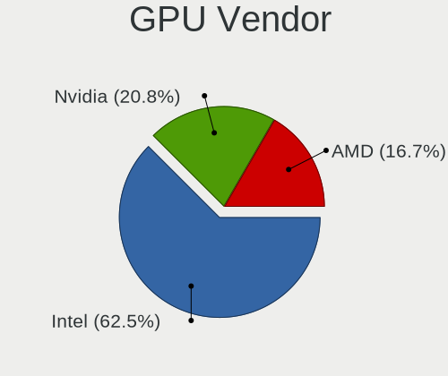

| Vendor | Notebooks | Percent |
|--------|-----------|---------|
| Intel  | 101       | 64.33%  |
| Nvidia | 31        | 19.75%  |
| AMD    | 25        | 15.92%  |

GPU Model
---------

Graphics card models

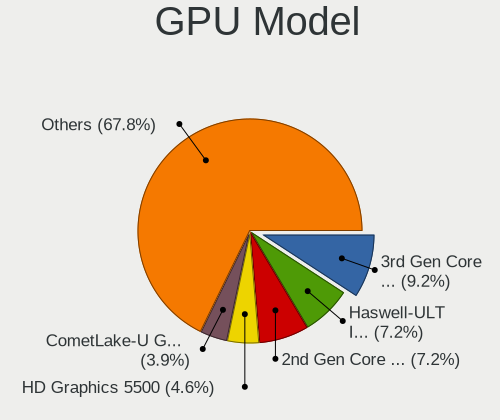

| Model                                                                     | Notebooks | Percent |
|---------------------------------------------------------------------------|-----------|---------|
| Intel 3rd Gen Core processor Graphics Controller                          | 15        | 9.26%   |
| Intel Haswell-ULT Integrated Graphics Controller                          | 11        | 6.79%   |
| Intel 2nd Generation Core Processor Family Integrated Graphics Controller | 11        | 6.79%   |
| Intel HD Graphics 5500                                                    | 8         | 4.94%   |
| AMD Picasso/Raven 2 [Radeon Vega Series / Radeon Vega Mobile Series]      | 7         | 4.32%   |
| Intel CometLake-U GT2 [UHD Graphics]                                      | 6         | 3.7%    |
| Intel CoffeeLake-H GT2 [UHD Graphics 630]                                 | 6         | 3.7%    |
| Intel UHD Graphics 620                                                    | 5         | 3.09%   |
| Intel Skylake GT2 [HD Graphics 520]                                       | 5         | 3.09%   |
| Intel HD Graphics 620                                                     | 5         | 3.09%   |
| Nvidia GF117M [GeForce 610M/710M/810M/820M / GT 620M/625M/630M/720M]      | 4         | 2.47%   |
| Nvidia GP107M [GeForce GTX 1050 Mobile]                                   | 3         | 1.85%   |
| Nvidia C79 [GeForce 9400M]                                                | 3         | 1.85%   |
| Intel Mobile GM965/GL960 Integrated Graphics Controller (secondary)       | 3         | 1.85%   |
| Intel Mobile GM965/GL960 Integrated Graphics Controller (primary)         | 3         | 1.85%   |
| Intel Mobile 4 Series Chipset Integrated Graphics Controller              | 3         | 1.85%   |
| Intel Iris Plus Graphics G1 (Ice Lake)                                    | 3         | 1.85%   |
| Intel HD Graphics 530                                                     | 3         | 1.85%   |
| Intel CometLake-H GT2 [UHD Graphics]                                      | 3         | 1.85%   |
| AMD Lucienne                                                              | 3         | 1.85%   |
| Nvidia GF108GLM [NVS 5200M]                                               | 2         | 1.23%   |
| Intel WhiskeyLake-U GT2 [UHD Graphics 620]                                | 2         | 1.23%   |
| Intel HD Graphics 500                                                     | 2         | 1.23%   |
| Intel Core Processor Integrated Graphics Controller                       | 2         | 1.23%   |
| Intel 4th Gen Core Processor Integrated Graphics Controller               | 2         | 1.23%   |
| AMD Stoney [Radeon R2/R3/R4/R5 Graphics]                                  | 2         | 1.23%   |
| AMD Renoir                                                                | 2         | 1.23%   |
| AMD Cezanne [Radeon Vega Series / Radeon Vega Mobile Series]              | 2         | 1.23%   |
| Nvidia TU117M [GeForce GTX 1650 Ti Mobile]                                | 1         | 0.62%   |
| Nvidia TU117M [GeForce GTX 1650 Mobile / Max-Q]                           | 1         | 0.62%   |
| Nvidia TU104M [GeForce RTX 2070 SUPER Mobile / Max-Q]                     | 1         | 0.62%   |
| Nvidia GT218M [NVS 3100M]                                                 | 1         | 0.62%   |
| Nvidia GP107M [GeForce GTX 1050 Ti Mobile]                                | 1         | 0.62%   |
| Nvidia GP107GLM [Quadro P2000 Mobile]                                     | 1         | 0.62%   |
| Nvidia GM206M [GeForce GTX 965M]                                          | 1         | 0.62%   |
| Nvidia GM108M [GeForce MX130]                                             | 1         | 0.62%   |
| Nvidia GM107 [GeForce 940MX]                                              | 1         | 0.62%   |
| Nvidia GK208BM [GeForce 920M]                                             | 1         | 0.62%   |
| Nvidia GK107M [GeForce GTX 660M]                                          | 1         | 0.62%   |
| Nvidia GK107M [GeForce GT 650M]                                           | 1         | 0.62%   |

GPU Combo
---------

Combinations of graphics cards

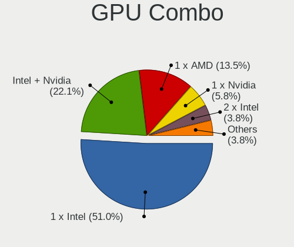

| Name           | Notebooks | Percent |
|----------------|-----------|---------|
| 1 x Intel      | 67        | 51.94%  |
| Intel + Nvidia | 24        | 18.6%   |
| 1 x AMD        | 20        | 15.5%   |
| 2 x Intel      | 7         | 5.43%   |
| 1 x Nvidia     | 6         | 4.65%   |
| Intel + AMD    | 3         | 2.33%   |
| 2 x AMD        | 1         | 0.78%   |
| AMD + Nvidia   | 1         | 0.78%   |

GPU Driver
----------

Free vs proprietary

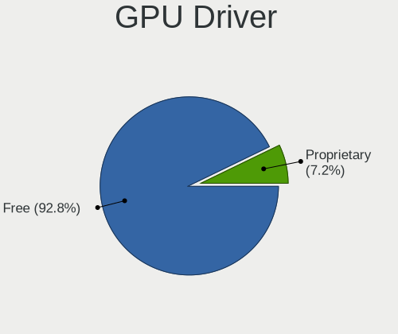

| Driver      | Notebooks | Percent |
|-------------|-----------|---------|
| Free        | 123       | 94.62%  |
| Proprietary | 7         | 5.38%   |

GPU Memory
----------

Total video memory

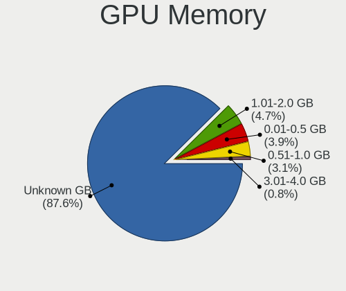

| Size in GB | Notebooks | Percent |
|------------|-----------|---------|
| Unknown    | 114       | 87.02%  |
| 1.01-2.0   | 6         | 4.58%   |
| 0.01-0.5   | 6         | 4.58%   |
| 0.51-1.0   | 4         | 3.05%   |
| 3.01-4.0   | 1         | 0.76%   |

Monitor
-------

Monitor Vendor
--------------

Monitor vendors

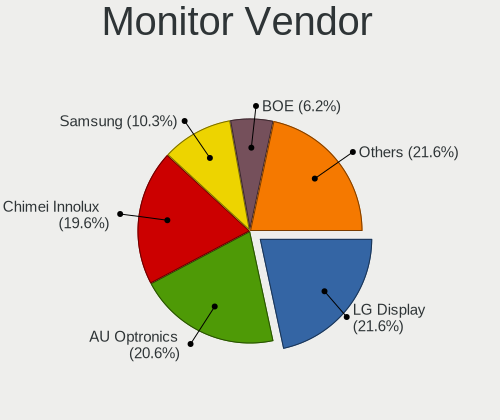

| Vendor                  | Notebooks | Percent |
|-------------------------|-----------|---------|
| Chimei Innolux          | 24        | 20.17%  |
| AU Optronics            | 23        | 19.33%  |
| LG Display              | 22        | 18.49%  |
| Samsung Electronics     | 14        | 11.76%  |
| BOE                     | 10        | 8.4%    |
| Lenovo                  | 4         | 3.36%   |
| Philips                 | 3         | 2.52%   |
| PANDA                   | 2         | 1.68%   |
| Panasonic               | 2         | 1.68%   |
| InfoVision              | 2         | 1.68%   |
| Dell                    | 2         | 1.68%   |
| BenQ                    | 2         | 1.68%   |
| ___                     | 1         | 0.84%   |
| Iiyama                  | 1         | 0.84%   |
| IBM                     | 1         | 0.84%   |
| Hewlett-Packard         | 1         | 0.84%   |
| Goldstar                | 1         | 0.84%   |
| Fujitsu Siemens         | 1         | 0.84%   |
| CSO                     | 1         | 0.84%   |
| Chi Mei Optoelectronics | 1         | 0.84%   |
| Apple                   | 1         | 0.84%   |

Monitor Model
-------------

Monitor models

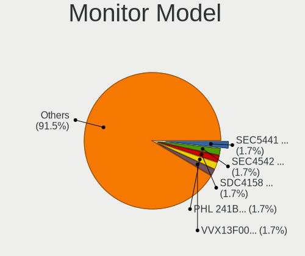

| Model                                                                 | Notebooks | Percent |
|-----------------------------------------------------------------------|-----------|---------|
| Samsung Electronics LCD Monitor SEC5441 1366x768 340x190mm 15.3-inch  | 2         | 1.67%   |
| Samsung Electronics LCD Monitor SEC4542 1280x800 300x190mm 14.0-inch  | 2         | 1.67%   |
| Samsung Electronics LCD Monitor SDC4158 1920x1080 290x170mm 13.2-inch | 2         | 1.67%   |
| Philips PHL 241B8Q PHL0929 1920x1080 530x300mm 24.0-inch              | 2         | 1.67%   |
| Panasonic VVX13F009G00 MEI96A2 1920x1080 290x170mm 13.2-inch          | 2         | 1.67%   |
| LG Display LCD Monitor LGD0456 1366x768 340x190mm 15.3-inch           | 2         | 1.67%   |
| LG Display LCD Monitor LGD039F 1366x768 350x190mm 15.7-inch           | 2         | 1.67%   |
| LG Display LCD Monitor LGD0335 1366x768 310x170mm 13.9-inch           | 2         | 1.67%   |
| LG Display LCD Monitor LGD02DC 1366x768 340x190mm 15.3-inch           | 2         | 1.67%   |
| LG Display LCD Monitor LGD01E9 1920x1080 350x190mm 15.7-inch          | 2         | 1.67%   |
| Chimei Innolux LCD Monitor CMN15F5 1920x1080 340x190mm 15.3-inch      | 2         | 1.67%   |
| Chimei Innolux LCD Monitor CMN14D5 1920x1080 310x170mm 13.9-inch      | 2         | 1.67%   |
| Chimei Innolux LCD Monitor CMN14C9 1920x1080 310x170mm 13.9-inch      | 2         | 1.67%   |
| Chimei Innolux LCD Monitor CMN1482 1600x900 310x170mm 13.9-inch       | 2         | 1.67%   |
| AU Optronics LCD Monitor AUO5B2D 1920x1080 290x160mm 13.0-inch        | 2         | 1.67%   |
| AU Optronics LCD Monitor AUO21EC 1366x768 340x190mm 15.3-inch         | 2         | 1.67%   |
| ___ MY TV LED TV ___0101 1920x1080                                    | 1         | 0.83%   |
| Samsung Electronics SyncMaster SAM03E4 1680x1050 470x300mm 22.0-inch  | 1         | 0.83%   |
| Samsung Electronics SyncMaster SAM010B 1280x1024 340x270mm 17.1-inch  | 1         | 0.83%   |
| Samsung Electronics LCD Monitor SEC544B 1600x900 310x170mm 13.9-inch  | 1         | 0.83%   |
| Samsung Electronics LCD Monitor SEC4457 1440x900 300x190mm 14.0-inch  | 1         | 0.83%   |
| Samsung Electronics LCD Monitor SEC4251 1366x768 340x190mm 15.3-inch  | 1         | 0.83%   |
| Samsung Electronics LCD Monitor SEC3150 1366x768 340x190mm 15.3-inch  | 1         | 0.83%   |
| Samsung Electronics LCD Monitor SEC3047 1366x768 280x160mm 12.7-inch  | 1         | 0.83%   |
| Samsung Electronics LCD Monitor SDC5441 1366x768 310x170mm 13.9-inch  | 1         | 0.83%   |
| Samsung Electronics C24F390 SAM0D2C 1920x1080 520x290mm 23.4-inch     | 1         | 0.83%   |
| Philips PHL BDM4065 PHL08E1 3840x2160 880x490mm 39.7-inch             | 1         | 0.83%   |
| PANDA LCD Monitor NCP0040 1920x1080 340x190mm 15.3-inch               | 1         | 0.83%   |
| PANDA LC133LF1L02 NCP0019 1920x1080 290x170mm 13.2-inch               | 1         | 0.83%   |
| LG Display LCD Monitor LGD066E 1920x1080 340x190mm 15.3-inch          | 1         | 0.83%   |
| LG Display LCD Monitor LGD05FA 1920x1080 310x170mm 13.9-inch          | 1         | 0.83%   |
| LG Display LCD Monitor LGD0558 1920x1080 310x170mm 13.9-inch          | 1         | 0.83%   |
| LG Display LCD Monitor LGD0533 1920x1080 340x190mm 15.3-inch          | 1         | 0.83%   |
| LG Display LCD Monitor LGD04D5 1920x1080 340x190mm 15.3-inch          | 1         | 0.83%   |
| LG Display LCD Monitor LGD0430 1366x768 350x190mm 15.7-inch           | 1         | 0.83%   |
| LG Display LCD Monitor LGD042D 1920x1080 290x170mm 13.2-inch          | 1         | 0.83%   |
| LG Display LCD Monitor LGD03CD 1366x768 280x160mm 12.7-inch           | 1         | 0.83%   |
| LG Display LCD Monitor LGD0353 1366x768 350x190mm 15.7-inch           | 1         | 0.83%   |
| LG Display LCD Monitor LGD032C 1920x1080 340x190mm 15.3-inch          | 1         | 0.83%   |
| LG Display LCD Monitor LGD02D8 1366x768 280x160mm 12.7-inch           | 1         | 0.83%   |

Monitor Resolution
------------------

Monitor screen resolution

| Resolution         | Notebooks | Percent |
|--------------------|-----------|---------|
| 1920x1080 (FHD)    | 48        | 41.74%  |
| 1366x768 (WXGA)    | 43        | 37.39%  |
| 1600x900 (HD+)     | 8         | 6.96%   |
| 2560x1440 (QHD)    | 4         | 3.48%   |
| 3840x2160 (4K)     | 2         | 1.74%   |
| 2880x1620          | 2         | 1.74%   |
| 1680x1050 (WSXGA+) | 2         | 1.74%   |
| 1280x800 (WXGA)    | 2         | 1.74%   |
| 3840x1600          | 1         | 0.87%   |
| 2880x1800          | 1         | 0.87%   |
| 1440x900 (WXGA+)   | 1         | 0.87%   |
| 1280x1024 (SXGA)   | 1         | 0.87%   |

Monitor Diagonal
----------------

Diagonal size in inches

| Inches  | Notebooks | Percent |
|---------|-----------|---------|
| 15      | 54        | 45%     |
| 13      | 31        | 25.83%  |
| 17      | 7         | 5.83%   |
| 12      | 6         | 5%      |
| 23      | 4         | 3.33%   |
| 14      | 4         | 3.33%   |
| 24      | 3         | 2.5%    |
| 11      | 3         | 2.5%    |
| 39      | 1         | 0.83%   |
| 37      | 1         | 0.83%   |
| 31      | 1         | 0.83%   |
| 27      | 1         | 0.83%   |
| 22      | 1         | 0.83%   |
| 21      | 1         | 0.83%   |
| 16      | 1         | 0.83%   |
| Unknown | 1         | 0.83%   |

Monitor Width
-------------

Physical width

| Width in mm | Notebooks | Percent |
|-------------|-----------|---------|
| 301-350     | 77        | 64.71%  |
| 201-300     | 21        | 17.65%  |
| 501-600     | 8         | 6.72%   |
| 351-400     | 7         | 5.88%   |
| 801-900     | 2         | 1.68%   |
| 401-500     | 2         | 1.68%   |
| 601-700     | 1         | 0.84%   |
| Unknown     | 1         | 0.84%   |

Aspect Ratio
------------

Proportional relationship between the width and the height

| Ratio | Notebooks | Percent |
|-------|-----------|---------|
| 16/9  | 97        | 88.99%  |
| 16/10 | 9         | 8.26%   |
| 5/4   | 1         | 0.92%   |
| 3/2   | 1         | 0.92%   |
| 21/9  | 1         | 0.92%   |

Monitor Area
------------

Area in inch²

| Area in inch² | Notebooks | Percent |
|----------------|-----------|---------|
| 91-100         | 43        | 35.83%  |
| 81-90          | 27        | 22.5%   |
| 101-110        | 11        | 9.17%   |
| 201-250        | 9         | 7.5%    |
| 71-80          | 8         | 6.67%   |
| 61-70          | 6         | 5%      |
| 121-130        | 6         | 5%      |
| 51-60          | 3         | 2.5%    |
| 501-1000       | 2         | 1.67%   |
| 351-500        | 1         | 0.83%   |
| 301-350        | 1         | 0.83%   |
| 141-150        | 1         | 0.83%   |
| 111-120        | 1         | 0.83%   |
| Unknown        | 1         | 0.83%   |

Pixel Density
-------------

Pixels per inch

| Density       | Notebooks | Percent |
|---------------|-----------|---------|
| 121-160       | 50        | 42.37%  |
| 101-120       | 35        | 29.66%  |
| 51-100        | 17        | 14.41%  |
| 161-240       | 14        | 11.86%  |
| More than 240 | 1         | 0.85%   |
| Unknown       | 1         | 0.85%   |

Multiple Monitors
-----------------

Total monitors connected

| Total | Notebooks | Percent |
|-------|-----------|---------|
| 1     | 97        | 73.48%  |
| 0     | 21        | 15.91%  |
| 2     | 14        | 10.61%  |

Network
-------

Net Controller Vendor
---------------------

Controller vendors

| Vendor                            | Notebooks | Percent |
|-----------------------------------|-----------|---------|
| Intel                             | 81        | 38.94%  |
| Realtek Semiconductor             | 49        | 23.56%  |
| Qualcomm Atheros                  | 32        | 15.38%  |
| Broadcom                          | 14        | 6.73%   |
| TP-Link                           | 5         | 2.4%    |
| Ericsson Business Mobile Networks | 4         | 1.92%   |
| Nvidia                            | 3         | 1.44%   |
| ASUSTek Computer                  | 3         | 1.44%   |
| Samsung Electronics               | 2         | 0.96%   |
| Ralink Technology                 | 2         | 0.96%   |
| Marvell Technology Group          | 2         | 0.96%   |
| Edimax Technology                 | 2         | 0.96%   |
| Xiaomi                            | 1         | 0.48%   |
| Sierra Wireless                   | 1         | 0.48%   |
| Ralink                            | 1         | 0.48%   |
| Qualcomm Atheros Communications   | 1         | 0.48%   |
| Qualcomm                          | 1         | 0.48%   |
| OnePlus Technology (Shenzhen)     | 1         | 0.48%   |
| Huawei Technologies               | 1         | 0.48%   |
| Hewlett-Packard                   | 1         | 0.48%   |
| Generic                           | 1         | 0.48%   |

Net Controller Model
--------------------

Controller models

| Model                                                             | Notebooks | Percent |
|-------------------------------------------------------------------|-----------|---------|
| Realtek RTL8111/8168/8411 PCI Express Gigabit Ethernet Controller | 33        | 12.5%   |
| Intel 82579LM Gigabit Network Connection (Lewisville)             | 15        | 5.68%   |
| Realtek RTL810xE PCI Express Fast Ethernet controller             | 9         | 3.41%   |
| Qualcomm Atheros QCA9565 / AR9565 Wireless Network Adapter        | 8         | 3.03%   |
| Intel Wireless 8265 / 8275                                        | 8         | 3.03%   |
| Intel Wireless 7265                                               | 8         | 3.03%   |
| Intel Centrino Advanced-N 6205 [Taylor Peak]                      | 8         | 3.03%   |
| Qualcomm Atheros QCA9377 802.11ac Wireless Network Adapter        | 7         | 2.65%   |
| Intel Wireless 8260                                               | 6         | 2.27%   |
| Intel Wireless 7260                                               | 5         | 1.89%   |
| Intel Wi-Fi 6 AX200                                               | 5         | 1.89%   |
| Intel Ethernet Connection (4) I219-LM                             | 5         | 1.89%   |
| Intel Ethernet Connection (3) I218-LM                             | 5         | 1.89%   |
| Intel Comet Lake PCH-LP CNVi WiFi                                 | 5         | 1.89%   |
| Intel Cannon Lake PCH CNVi WiFi                                   | 5         | 1.89%   |
| Realtek RTL8821CE 802.11ac PCIe Wireless Network Adapter          | 4         | 1.52%   |
| Qualcomm Atheros AR9485 Wireless Network Adapter                  | 4         | 1.52%   |
| Intel Centrino Ultimate-N 6300                                    | 4         | 1.52%   |
| Realtek RTL8188CE 802.11b/g/n WiFi Adapter                        | 3         | 1.14%   |
| Nvidia MCP79 Ethernet                                             | 3         | 1.14%   |
| Intel Ethernet Connection I219-LM                                 | 3         | 1.14%   |
| Intel Ethernet Connection (7) I219-LM                             | 3         | 1.14%   |
| Intel 82567LM Gigabit Network Connection                          | 3         | 1.14%   |
| TP-Link AC600 wireless Realtek RTL8811AU [Archer T2U Nano]        | 2         | 0.76%   |
| Samsung Galaxy series, misc. (tethering mode)                     | 2         | 0.76%   |
| Realtek RTL8852AE 802.11ax PCIe Wireless Network Adapter          | 2         | 0.76%   |
| Realtek RTL8822CE 802.11ac PCIe Wireless Network Adapter          | 2         | 0.76%   |
| Realtek RTL8723BE PCIe Wireless Network Adapter                   | 2         | 0.76%   |
| Qualcomm Atheros AR9462 Wireless Network Adapter                  | 2         | 0.76%   |
| Qualcomm Atheros AR928X Wireless Network Adapter (PCI-Express)    | 2         | 0.76%   |
| Qualcomm Atheros AR9285 Wireless Network Adapter (PCI-Express)    | 2         | 0.76%   |
| Qualcomm Atheros AR8162 Fast Ethernet                             | 2         | 0.76%   |
| Qualcomm Atheros AR8151 v2.0 Gigabit Ethernet                     | 2         | 0.76%   |
| Intel PRO/Wireless 5100 AGN [Shiloh] Network Connection           | 2         | 0.76%   |
| Intel Ice Lake-LP PCH CNVi WiFi                                   | 2         | 0.76%   |
| Intel Ethernet Connection I218-LM                                 | 2         | 0.76%   |
| Intel Ethernet Connection (6) I219-V                              | 2         | 0.76%   |
| Intel Dual Band Wireless-AC 3168NGW [Stone Peak]                  | 2         | 0.76%   |
| Intel Comet Lake PCH CNVi WiFi                                    | 2         | 0.76%   |
| Intel Centrino Advanced-N 6235                                    | 2         | 0.76%   |

Wireless Vendor
---------------

Wireless vendors

| Vendor                          | Notebooks | Percent |
|---------------------------------|-----------|---------|
| Intel                           | 77        | 53.85%  |
| Qualcomm Atheros                | 26        | 18.18%  |
| Realtek Semiconductor           | 17        | 11.89%  |
| Broadcom                        | 8         | 5.59%   |
| TP-Link                         | 5         | 3.5%    |
| ASUSTek Computer                | 3         | 2.1%    |
| Ralink Technology               | 2         | 1.4%    |
| Edimax Technology               | 2         | 1.4%    |
| Sierra Wireless                 | 1         | 0.7%    |
| Ralink                          | 1         | 0.7%    |
| Qualcomm Atheros Communications | 1         | 0.7%    |

Wireless Model
--------------

Wireless models

| Model                                                          | Notebooks | Percent |
|----------------------------------------------------------------|-----------|---------|
| Qualcomm Atheros QCA9565 / AR9565 Wireless Network Adapter     | 8         | 5.56%   |
| Intel Wireless 8265 / 8275                                     | 8         | 5.56%   |
| Intel Wireless 7265                                            | 8         | 5.56%   |
| Intel Centrino Advanced-N 6205 [Taylor Peak]                   | 8         | 5.56%   |
| Qualcomm Atheros QCA9377 802.11ac Wireless Network Adapter     | 7         | 4.86%   |
| Intel Wireless 8260                                            | 6         | 4.17%   |
| Intel Wireless 7260                                            | 5         | 3.47%   |
| Intel Wi-Fi 6 AX200                                            | 5         | 3.47%   |
| Intel Comet Lake PCH-LP CNVi WiFi                              | 5         | 3.47%   |
| Intel Cannon Lake PCH CNVi WiFi                                | 5         | 3.47%   |
| Realtek RTL8821CE 802.11ac PCIe Wireless Network Adapter       | 4         | 2.78%   |
| Qualcomm Atheros AR9485 Wireless Network Adapter               | 4         | 2.78%   |
| Intel Centrino Ultimate-N 6300                                 | 4         | 2.78%   |
| Realtek RTL8188CE 802.11b/g/n WiFi Adapter                     | 3         | 2.08%   |
| TP-Link AC600 wireless Realtek RTL8811AU [Archer T2U Nano]     | 2         | 1.39%   |
| Realtek RTL8852AE 802.11ax PCIe Wireless Network Adapter       | 2         | 1.39%   |
| Realtek RTL8822CE 802.11ac PCIe Wireless Network Adapter       | 2         | 1.39%   |
| Realtek RTL8723BE PCIe Wireless Network Adapter                | 2         | 1.39%   |
| Qualcomm Atheros AR9462 Wireless Network Adapter               | 2         | 1.39%   |
| Qualcomm Atheros AR928X Wireless Network Adapter (PCI-Express) | 2         | 1.39%   |
| Qualcomm Atheros AR9285 Wireless Network Adapter (PCI-Express) | 2         | 1.39%   |
| Intel PRO/Wireless 5100 AGN [Shiloh] Network Connection        | 2         | 1.39%   |
| Intel Ice Lake-LP PCH CNVi WiFi                                | 2         | 1.39%   |
| Intel Dual Band Wireless-AC 3168NGW [Stone Peak]               | 2         | 1.39%   |
| Intel Comet Lake PCH CNVi WiFi                                 | 2         | 1.39%   |
| Intel Centrino Advanced-N 6235                                 | 2         | 1.39%   |
| Intel Centrino Advanced-N 6200                                 | 2         | 1.39%   |
| Intel Cannon Point-LP CNVi [Wireless-AC]                       | 2         | 1.39%   |
| Broadcom BCM4322 802.11a/b/g/n Wireless LAN Controller         | 2         | 1.39%   |
| Broadcom BCM4313 802.11bgn Wireless Network Adapter            | 2         | 1.39%   |
| TP-Link TP-Link High Power Wireless USB Adapter                | 1         | 0.69%   |
| TP-Link TL-WN823N v2/v3 [Realtek RTL8192EU]                    | 1         | 0.69%   |
| TP-Link TL-WN722N v2/v3 [Realtek RTL8188EUS]                   | 1         | 0.69%   |
| Sierra Wireless Sierra Wireless EM7345 4G LTE                  | 1         | 0.69%   |
| Realtek RTL8723DE Wireless Network Adapter                     | 1         | 0.69%   |
| Realtek RTL8723AE PCIe Wireless Network Adapter                | 1         | 0.69%   |
| Realtek RTL8191SEvB Wireless LAN Controller                    | 1         | 0.69%   |
| Realtek RTL8188EUS 802.11n Wireless Network Adapter            | 1         | 0.69%   |
| Realtek Realtek Bluetooth 4.2 Adapter                          | 1         | 0.69%   |
| Ralink RT5572 Wireless Adapter                                 | 1         | 0.69%   |

Ethernet Vendor
---------------

Ethernet vendors

| Vendor                        | Notebooks | Percent |
|-------------------------------|-----------|---------|
| Intel                         | 44        | 39.29%  |
| Realtek Semiconductor         | 42        | 37.5%   |
| Qualcomm Atheros              | 9         | 8.04%   |
| Broadcom                      | 7         | 6.25%   |
| Nvidia                        | 3         | 2.68%   |
| Samsung Electronics           | 2         | 1.79%   |
| Marvell Technology Group      | 2         | 1.79%   |
| Xiaomi                        | 1         | 0.89%   |
| Qualcomm                      | 1         | 0.89%   |
| OnePlus Technology (Shenzhen) | 1         | 0.89%   |

Ethernet Model
--------------

Ethernet models

| Model                                                             | Notebooks | Percent |
|-------------------------------------------------------------------|-----------|---------|
| Realtek RTL8111/8168/8411 PCI Express Gigabit Ethernet Controller | 33        | 29.2%   |
| Intel 82579LM Gigabit Network Connection (Lewisville)             | 15        | 13.27%  |
| Realtek RTL810xE PCI Express Fast Ethernet controller             | 9         | 7.96%   |
| Intel Ethernet Connection (4) I219-LM                             | 5         | 4.42%   |
| Intel Ethernet Connection (3) I218-LM                             | 5         | 4.42%   |
| Nvidia MCP79 Ethernet                                             | 3         | 2.65%   |
| Intel Ethernet Connection I219-LM                                 | 3         | 2.65%   |
| Intel Ethernet Connection (7) I219-LM                             | 3         | 2.65%   |
| Intel 82567LM Gigabit Network Connection                          | 3         | 2.65%   |
| Samsung Galaxy series, misc. (tethering mode)                     | 2         | 1.77%   |
| Qualcomm Atheros AR8162 Fast Ethernet                             | 2         | 1.77%   |
| Qualcomm Atheros AR8151 v2.0 Gigabit Ethernet                     | 2         | 1.77%   |
| Intel Ethernet Connection I218-LM                                 | 2         | 1.77%   |
| Intel Ethernet Connection (6) I219-V                              | 2         | 1.77%   |
| Intel 82577LM Gigabit Network Connection                          | 2         | 1.77%   |
| Broadcom NetXtreme BCM57786 Gigabit Ethernet PCIe                 | 2         | 1.77%   |
| Xiaomi Mi/Redmi series (RNDIS + ADB)                              | 1         | 0.88%   |
| Qualcomm Atheros QCA8172 Fast Ethernet                            | 1         | 0.88%   |
| Qualcomm Atheros QCA8171 Gigabit Ethernet                         | 1         | 0.88%   |
| Qualcomm Atheros Killer E2500 Gigabit Ethernet Controller         | 1         | 0.88%   |
| Qualcomm Atheros AR8161 Gigabit Ethernet                          | 1         | 0.88%   |
| Qualcomm Atheros AR8131 Gigabit Ethernet                          | 1         | 0.88%   |
| Qualcomm ALCATEL Composite RNDIS Interface                        | 1         | 0.88%   |
| OnePlus (Shenzhen) OnePlus RNDIS Control RNDIS Ethernet Data      | 1         | 0.88%   |
| Marvell Group 88E8053 PCI-E Gigabit Ethernet Controller           | 1         | 0.88%   |
| Marvell Group 88E8040 PCI-E Fast Ethernet Controller              | 1         | 0.88%   |
| Marvell Group 88E8036 PCI-E Fast Ethernet Controller              | 1         | 0.88%   |
| Intel I225-K2                                                     | 1         | 0.88%   |
| Intel Ethernet Connection I217-LM                                 | 1         | 0.88%   |
| Intel Ethernet Connection (10) I219-LM                            | 1         | 0.88%   |
| Intel 82566MM Gigabit Network Connection                          | 1         | 0.88%   |
| Broadcom NetXtreme BCM5761 Gigabit Ethernet PCIe                  | 1         | 0.88%   |
| Broadcom NetXtreme BCM5755M Gigabit Ethernet PCI Express          | 1         | 0.88%   |
| Broadcom NetLink BCM5906M Fast Ethernet PCI Express               | 1         | 0.88%   |
| Broadcom NetLink BCM5784M Gigabit Ethernet PCIe                   | 1         | 0.88%   |
| Broadcom NetLink BCM57785 Gigabit Ethernet PCIe                   | 1         | 0.88%   |

Net Controller Kind
-------------------

Ethernet, WiFi or modem

| Kind     | Notebooks | Percent |
|----------|-----------|---------|
| WiFi     | 130       | 52.42%  |
| Ethernet | 111       | 44.76%  |
| Modem    | 6         | 2.42%   |
| Unknown  | 1         | 0.4%    |

Used Controller
---------------

Currently used network controller

| Kind     | Notebooks | Percent |
|----------|-----------|---------|
| WiFi     | 90        | 49.72%  |
| Ethernet | 88        | 48.62%  |
| Modem    | 3         | 1.66%   |

NICs
----

Total network controllers on board

| Total | Notebooks | Percent |
|-------|-----------|---------|
| 2     | 105       | 81.4%   |
| 1     | 23        | 17.83%  |
| 3     | 1         | 0.78%   |

IPv6
----

IPv6 vs IPv4

| Used | Notebooks | Percent |
|------|-----------|---------|
| No   | 129       | 100%    |

Bluetooth
---------

Bluetooth Vendor
----------------

Controller vendors

| Vendor                          | Notebooks | Percent |
|---------------------------------|-----------|---------|
| Intel                           | 52        | 52.53%  |
| Realtek Semiconductor           | 9         | 9.09%   |
| Qualcomm Atheros Communications | 7         | 7.07%   |
| Lite-On Technology              | 7         | 7.07%   |
| Broadcom                        | 6         | 6.06%   |
| IMC Networks                    | 5         | 5.05%   |
| Dell                            | 5         | 5.05%   |
| Apple                           | 4         | 4.04%   |
| Alps Electric                   | 2         | 2.02%   |
| Toshiba                         | 1         | 1.01%   |
| ASUSTek Computer                | 1         | 1.01%   |

Bluetooth Model
---------------

Controller models

| Model                                                       | Notebooks | Percent |
|-------------------------------------------------------------|-----------|---------|
| Intel Bluetooth wireless interface                          | 25        | 25.25%  |
| Intel Bluetooth 9460/9560 Jefferson Peak (JfP)              | 11        | 11.11%  |
| Intel AX201 Bluetooth                                       | 6         | 6.06%   |
| Intel AX200 Bluetooth                                       | 5         | 5.05%   |
| Realtek  Bluetooth 4.2 Adapter                              | 4         | 4.04%   |
| Apple Bluetooth Host Controller                             | 4         | 4.04%   |
| Qualcomm Atheros AR9462 Bluetooth                           | 3         | 3.03%   |
| Lite-On Qualcomm Atheros QCA9377 Bluetooth                  | 3         | 3.03%   |
| Lite-On Atheros AR3012 Bluetooth                            | 3         | 3.03%   |
| Dell Dell Wireless 380 Bluetooth 4.0 Module                 | 3         | 3.03%   |
| Broadcom BCM20702 Bluetooth 4.0 [ThinkPad]                  | 3         | 3.03%   |
| Realtek RTL8723B Bluetooth                                  | 2         | 2.02%   |
| Realtek Bluetooth Radio                                     | 2         | 2.02%   |
| Qualcomm Atheros  QCA9377 Bluetooth 4.1                     | 2         | 2.02%   |
| Qualcomm Atheros Dell Wireless 1707 Bluetooth 4.0 LE Device | 2         | 2.02%   |
| Intel Wireless-AC 3168 Bluetooth                            | 2         | 2.02%   |
| Intel Centrino Bluetooth Wireless Transceiver               | 2         | 2.02%   |
| IMC Networks Atheros AR3012 Bluetooth 4.0 Adapter           | 2         | 2.02%   |
| Broadcom BCM2045B (BDC-2.1)                                 | 2         | 2.02%   |
| Toshiba Realtek Bluetooth 4.0 + High Speed Chip             | 1         | 1.01%   |
| Realtek  Bluetooth Adapter                                  | 1         | 1.01%   |
| Lite-On Broadcom Bluetooth 4.0 USB                          | 1         | 1.01%   |
| Intel Wireless-AC 9260 Bluetooth Adapter                    | 1         | 1.01%   |
| IMC Networks Qualcomm Atheros Bluetooth 4.1                 | 1         | 1.01%   |
| IMC Networks Qualcomm Atheros AR9462 Bluetooth 4.0          | 1         | 1.01%   |
| IMC Networks Bluetooth Module                               | 1         | 1.01%   |
| Dell Wireless 355 Bluetooth                                 | 1         | 1.01%   |
| Dell DW375 Bluetooth Module                                 | 1         | 1.01%   |
| Broadcom BCM2045B (BDC-2.1) [Bluetooth Controller]          | 1         | 1.01%   |
| ASUS ASUS USB-BT500                                         | 1         | 1.01%   |
| Alps Electric UGTZ4 Bluetooth                               | 1         | 1.01%   |
| Alps Electric Bluetooth Controller (ALPS/UGPZ6)             | 1         | 1.01%   |

Sound
-----

Sound Vendor
------------

Sound card vendors

| Vendor                | Notebooks | Percent |
|-----------------------|-----------|---------|
| Intel                 | 107       | 75.35%  |
| AMD                   | 21        | 14.79%  |
| Nvidia                | 9         | 6.34%   |
| RODE Microphones      | 1         | 0.7%    |
| Realtek Semiconductor | 1         | 0.7%    |
| Logitech              | 1         | 0.7%    |
| DSEA A/S              | 1         | 0.7%    |
| Cambridge Audio       | 1         | 0.7%    |

Sound Model
-----------

Sound card models

| Model                                                                      | Notebooks | Percent |
|----------------------------------------------------------------------------|-----------|---------|
| Intel 7 Series/C216 Chipset Family High Definition Audio Controller        | 18        | 9.84%   |
| Intel Sunrise Point-LP HD Audio                                            | 15        | 8.2%    |
| AMD Family 17h/19h HD Audio Controller                                     | 14        | 7.65%   |
| Intel Haswell-ULT HD Audio Controller                                      | 11        | 6.01%   |
| Intel 8 Series HD Audio Controller                                         | 11        | 6.01%   |
| Intel 6 Series/C200 Series Chipset Family High Definition Audio Controller | 11        | 6.01%   |
| Intel Wildcat Point-LP High Definition Audio Controller                    | 8         | 4.37%   |
| Intel Broadwell-U Audio Controller                                         | 8         | 4.37%   |
| Intel Comet Lake PCH-LP cAVS                                               | 7         | 3.83%   |
| AMD Renoir Radeon High Definition Audio Controller                         | 7         | 3.83%   |
| AMD Raven/Raven2/Fenghuang HDMI/DP Audio Controller                        | 7         | 3.83%   |
| Intel Cannon Lake PCH cAVS                                                 | 6         | 3.28%   |
| Intel 82801I (ICH9 Family) HD Audio Controller                             | 5         | 2.73%   |
| Nvidia MCP79 High Definition Audio                                         | 3         | 1.64%   |
| Intel Ice Lake-LP Smart Sound Technology Audio Controller                  | 3         | 1.64%   |
| Intel Comet Lake PCH cAVS                                                  | 3         | 1.64%   |
| Intel 82801H (ICH8 Family) HD Audio Controller                             | 3         | 1.64%   |
| Intel 8 Series/C220 Series Chipset High Definition Audio Controller        | 3         | 1.64%   |
| Intel 5 Series/3400 Series Chipset High Definition Audio                   | 3         | 1.64%   |
| Intel 100 Series/C230 Series Chipset Family HD Audio Controller            | 3         | 1.64%   |
| Intel Xeon E3-1200 v3/4th Gen Core Processor HD Audio Controller           | 2         | 1.09%   |
| Intel Celeron N3350/Pentium N4200/Atom E3900 Series Audio Cluster          | 2         | 1.09%   |
| Intel Cannon Point-LP High Definition Audio Controller                     | 2         | 1.09%   |
| AMD Turks HDMI Audio [Radeon HD 6500/6600 / 6700M Series]                  | 2         | 1.09%   |
| AMD High Definition Audio Controller                                       | 2         | 1.09%   |
| AMD FCH Azalia Controller                                                  | 2         | 1.09%   |
| AMD Family 15h (Models 60h-6fh) Audio Controller                           | 2         | 1.09%   |
| RODE Microphones RDE NT-USB Mini                                           | 1         | 0.55%   |
| Realtek Semiconductor Realtek USB Audio                                    | 1         | 0.55%   |
| Nvidia TU104 HD Audio Controller                                           | 1         | 0.55%   |
| Nvidia High Definition Audio Controller                                    | 1         | 0.55%   |
| Nvidia GP107GL High Definition Audio Controller                            | 1         | 0.55%   |
| Nvidia GK107 HDMI Audio Controller                                         | 1         | 0.55%   |
| Nvidia GF108 High Definition Audio Controller                              | 1         | 0.55%   |
| Nvidia GA104 High Definition Audio Controller                              | 1         | 0.55%   |
| Logitech H600 [Wireless Headset]                                           | 1         | 0.55%   |
| Intel Tiger Lake-LP Smart Sound Technology Audio Controller                | 1         | 0.55%   |
| Intel NM10/ICH7 Family High Definition Audio Controller                    | 1         | 0.55%   |
| Intel Crystal Well HD Audio Controller                                     | 1         | 0.55%   |
| Intel CM238 HD Audio Controller                                            | 1         | 0.55%   |

Memory
------

Memory Vendor
-------------

Memory module vendors

| Vendor              | Notebooks | Percent |
|---------------------|-----------|---------|
| Samsung Electronics | 53        | 32.12%  |
| SK hynix            | 45        | 27.27%  |
| Micron Technology   | 14        | 8.48%   |
| Kingston            | 11        | 6.67%   |
| Unknown             | 8         | 4.85%   |
| Crucial             | 7         | 4.24%   |
| Elpida              | 6         | 3.64%   |
| Corsair             | 3         | 1.82%   |
| Unknown (ABCD)      | 2         | 1.21%   |
| Transcend           | 2         | 1.21%   |
| Goodram             | 2         | 1.21%   |
| G.Skill             | 2         | 1.21%   |
| A-DATA Technology   | 2         | 1.21%   |
| Team                | 1         | 0.61%   |
| Smart               | 1         | 0.61%   |
| Ramaxel Technology  | 1         | 0.61%   |
| Neo Forza           | 1         | 0.61%   |
| Nanya Technology    | 1         | 0.61%   |
| Apacer              | 1         | 0.61%   |
| 09490000802C        | 1         | 0.61%   |
| Unknown             | 1         | 0.61%   |

Memory Model
------------

Memory module models

| Model                                                            | Notebooks | Percent |
|------------------------------------------------------------------|-----------|---------|
| Samsung RAM M471A1K43CB1-CTD 8GB SODIMM DDR4 2667MT/s            | 9         | 5.29%   |
| Samsung RAM M471B5273DH0-CH9 4GB SODIMM DDR3 1334MT/s            | 7         | 4.12%   |
| SK hynix RAM HMT41GS6BFR8A-PB 8GB SODIMM DDR3 1600MT/s           | 5         | 2.94%   |
| SK hynix RAM HMT351S6CFR8C-PB 4GB SODIMM DDR3 1600MT/s           | 5         | 2.94%   |
| SK hynix RAM HMA81GS6AFR8N-UH 8GB SODIMM DDR4 2400MT/s           | 5         | 2.94%   |
| Samsung RAM M471B5173QH0-YK0 4GB SODIMM DDR3 1600MT/s            | 5         | 2.94%   |
| SK hynix RAM HMT451S6AFR8A-PB 4GB SODIMM DDR3 1600MT/s           | 4         | 2.35%   |
| Samsung RAM M471B5273DH0-CK0 4GB SODIMM DDR3 1600MT/s            | 4         | 2.35%   |
| Samsung RAM M471B1G73EB0-YK0 8GB SODIMM DDR3 1600MT/s            | 3         | 1.76%   |
| Samsung RAM M471A5244CB0-CTD 4GB SODIMM DDR4 2667MT/s            | 3         | 1.76%   |
| Unknown RAM Module 2GB SODIMM DDR3                               | 2         | 1.18%   |
| Unknown (ABCD) RAM 123456789012345678 2GB SODIMM LPDDR4 2133MT/s | 2         | 1.18%   |
| SK hynix RAM HYMP125S64CP8-Y5 2GB SODIMM DDR 667MT/s             | 2         | 1.18%   |
| SK hynix RAM HMT451S6BFR8A-PB 4GB SODIMM DDR3 1600MT/s           | 2         | 1.18%   |
| SK hynix RAM HMT351S6BFR8C-H9 4GB SODIMM DDR3 1334MT/s           | 2         | 1.18%   |
| SK hynix RAM HMAA1GS6CJR6N-XN 8GB SODIMM DDR4 3200MT/s           | 2         | 1.18%   |
| SK hynix RAM H9HCNNNCPMMLXR-NEE 8GB SODIMM LPDDR4 4266MT/s       | 2         | 1.18%   |
| Samsung RAM M471B5273CH0-CH9 4GB SODIMM DDR3 1334MT/s            | 2         | 1.18%   |
| Samsung RAM M471A5244CB0-CWE 4GB SODIMM DDR4 3200MT/s            | 2         | 1.18%   |
| Samsung RAM M471A1K43DB1-CTD 8GB SODIMM DDR4 2667MT/s            | 2         | 1.18%   |
| Micron RAM Module 8GB SODIMM DDR3 1600MT/s                       | 2         | 1.18%   |
| Elpida RAM EBJ41UF8BCS0-DJ-F 4GB SODIMM DDR3 1334MT/s            | 2         | 1.18%   |
| Crucial RAM CT51264BF160B.C16F 4GB SODIMM DDR3 1600MT/s          | 2         | 1.18%   |
| Unknown SODIMM 4GB SODIMM 800MT/s                                | 1         | 0.59%   |
| Unknown RAM Module 4GB SODIMM DDR3 1067MT/s                      | 1         | 0.59%   |
| Unknown RAM Module 4GB SODIMM DDR3                               | 1         | 0.59%   |
| Unknown RAM Module 2GB SODIMM DDR2 800MT/s                       | 1         | 0.59%   |
| Unknown RAM Module 1024MB SODIMM DDR                             | 1         | 0.59%   |
| Unknown RAM GD2.09293S.001 16GB SODIMM DDR4 2400MT/s             | 1         | 0.59%   |
| Transcend RAM JM800QSU-2G 2GB SODIMM DDR 667MT/s                 | 1         | 0.59%   |
| Transcend RAM JM1333KSH-8G 8GB SODIMM DDR3 1333MT/s              | 1         | 0.59%   |
| Team RAM TEAMGROUP-SD3-1600 8GB SODIMM DDR3 1600MT/s             | 1         | 0.59%   |
| Smart RAM SH564128FH8NZPHSCR 4GB SODIMM DDR3 1333MT/s            | 1         | 0.59%   |
| SK hynix RAM Module 8GB SODIMM DDR4 2400MT/s                     | 1         | 0.59%   |
| SK hynix RAM Module 4GB SODIMM DDR3 1067MT/s                     | 1         | 0.59%   |
| SK hynix RAM Module 2GB SODIMM DDR3 1600MT/s                     | 1         | 0.59%   |
| SK hynix RAM HMT451S6MFR8C-PB 4GB SODIMM DDR3 1600MT/s           | 1         | 0.59%   |
| SK hynix RAM HMT425S6AFR6A-PB 2GB SODIMM DDR3 3200MT/s           | 1         | 0.59%   |
| SK hynix RAM HMT425S6AFR6A-PB 2GB SODIMM DDR3 1600MT/s           | 1         | 0.59%   |
| SK hynix RAM HMT351S6EFR8C-PB 4GB SODIMM DDR3 1600MT/s           | 1         | 0.59%   |

Memory Kind
-----------

Memory module kinds

| Kind    | Notebooks | Percent |
|---------|-----------|---------|
| DDR3    | 68        | 51.13%  |
| DDR4    | 50        | 37.59%  |
| DDR2    | 5         | 3.76%   |
| LPDDR4  | 4         | 3.01%   |
| DDR     | 3         | 2.26%   |
| LPDDR3  | 2         | 1.5%    |
| Unknown | 1         | 0.75%   |

Memory Form Factor
------------------

Physical design of the memory module

| Name         | Notebooks | Percent |
|--------------|-----------|---------|
| SODIMM       | 127       | 96.21%  |
| Row Of Chips | 5         | 3.79%   |

Memory Size
-----------

Memory module size

| Size  | Notebooks | Percent |
|-------|-----------|---------|
| 4096  | 64        | 44.14%  |
| 8192  | 57        | 39.31%  |
| 2048  | 12        | 8.28%   |
| 16384 | 10        | 6.9%    |
| 32768 | 1         | 0.69%   |
| 1024  | 1         | 0.69%   |

Memory Speed
------------

Memory module speed

| Speed   | Notebooks | Percent |
|---------|-----------|---------|
| 1600    | 46        | 32.39%  |
| 2667    | 25        | 17.61%  |
| 2400    | 15        | 10.56%  |
| 1334    | 12        | 8.45%   |
| 3200    | 10        | 7.04%   |
| 2133    | 9         | 6.34%   |
| 1333    | 7         | 4.93%   |
| 800     | 6         | 4.23%   |
| Unknown | 4         | 2.82%   |
| 1067    | 3         | 2.11%   |
| 4266    | 2         | 1.41%   |
| 667     | 2         | 1.41%   |
| 1867    | 1         | 0.7%    |

Printers & scanners
-------------------

Printer Vendor
--------------

Printer device vendors

Zero info for selected period =(

Printer Model
-------------

Printer device models

Zero info for selected period =(

Scanner Vendor
--------------

Scanner device vendors

Zero info for selected period =(

Scanner Model
-------------

Scanner device models

Zero info for selected period =(

Camera
------

Camera Vendor
-------------

Camera device vendors

| Vendor                                 | Notebooks | Percent |
|----------------------------------------|-----------|---------|
| Chicony Electronics                    | 23        | 22.77%  |
| Realtek Semiconductor                  | 12        | 11.88%  |
| Microdia                               | 12        | 11.88%  |
| IMC Networks                           | 11        | 10.89%  |
| Acer                                   | 11        | 10.89%  |
| Quanta                                 | 6         | 5.94%   |
| Suyin                                  | 5         | 4.95%   |
| Sunplus Innovation Technology          | 4         | 3.96%   |
| Alcor Micro                            | 4         | 3.96%   |
| Silicon Motion                         | 2         | 1.98%   |
| Ricoh                                  | 2         | 1.98%   |
| Lite-On Technology                     | 2         | 1.98%   |
| Syntek                                 | 1         | 0.99%   |
| OmniVision Technologies                | 1         | 0.99%   |
| Luxvisions Innotech Limited            | 1         | 0.99%   |
| Logitech                               | 1         | 0.99%   |
| Lenovo                                 | 1         | 0.99%   |
| Importek                               | 1         | 0.99%   |
| Cheng Uei Precision Industry (Foxlink) | 1         | 0.99%   |

Camera Model
------------

Camera device models

| Model                                         | Notebooks | Percent |
|-----------------------------------------------|-----------|---------|
| Acer Integrated Camera                        | 7         | 6.93%   |
| Microdia Integrated_Webcam_HD                 | 5         | 4.95%   |
| Microdia Integrated Webcam                    | 5         | 4.95%   |
| Chicony Integrated Camera                     | 5         | 4.95%   |
| Realtek Integrated_Webcam_HD                  | 4         | 3.96%   |
| IMC Networks Integrated Camera                | 4         | 3.96%   |
| Chicony USB2.0 HD UVC WebCam                  | 3         | 2.97%   |
| Chicony HD WebCam                             | 3         | 2.97%   |
| Chicony Chicony USB2.0 Camera                 | 3         | 2.97%   |
| Suyin Acer/HP Integrated Webcam [CN0314]      | 2         | 1.98%   |
| Sunplus Laptop_Integrated_Webcam_FHD          | 2         | 1.98%   |
| Realtek Lenovo EasyCamera                     | 2         | 1.98%   |
| Realtek Integrated Webcam HD                  | 2         | 1.98%   |
| Realtek Front Camera                          | 2         | 1.98%   |
| Quanta VGA WebCam                             | 2         | 1.98%   |
| Quanta HP TrueVision HD Camera                | 2         | 1.98%   |
| IMC Networks USB2.0 VGA UVC WebCam            | 2         | 1.98%   |
| IMC Networks USB2.0 HD UVC WebCam             | 2         | 1.98%   |
| Chicony Integrated Camera (1280x720@30)       | 2         | 1.98%   |
| Acer Lenovo EasyCamera                        | 2         | 1.98%   |
| Syntek Lenovo EasyCamera                      | 1         | 0.99%   |
| Suyin RGBIR Camera                            | 1         | 0.99%   |
| Suyin Integrated_Webcam_HD                    | 1         | 0.99%   |
| Suyin HD WebCam                               | 1         | 0.99%   |
| Sunplus MTD camera                            | 1         | 0.99%   |
| Sunplus Integrated_Webcam_HD                  | 1         | 0.99%   |
| Silicon Motion WebCam SC-13HDL11939N          | 1         | 0.99%   |
| Silicon Motion Realtek USB2.0 PC Camera       | 1         | 0.99%   |
| Ricoh USB2.0 Camera                           | 1         | 0.99%   |
| Ricoh HD Webcam                               | 1         | 0.99%   |
| Realtek USB Camera                            | 1         | 0.99%   |
| Realtek Realtek USB2.0 PC Camera              | 1         | 0.99%   |
| Quanta USB2.0 HD UVC WebCam                   | 1         | 0.99%   |
| Quanta HP Universal Camera                    | 1         | 0.99%   |
| OmniVision OV2640 Webcam                      | 1         | 0.99%   |
| Microdia Sonix Integrated Webcam              | 1         | 0.99%   |
| Microdia Laptop_Integrated_Webcam_HD          | 1         | 0.99%   |
| Luxvisions Innotech Limited Integrated Camera | 1         | 0.99%   |
| Logitech HD Pro Webcam C920                   | 1         | 0.99%   |
| Lite-On Integrated Camera                     | 1         | 0.99%   |

Security
--------

Fingerprint Vendor
------------------

Fingerprint sensor vendors

| Vendor                     | Notebooks | Percent |
|----------------------------|-----------|---------|
| Validity Sensors           | 8         | 38.1%   |
| Upek                       | 3         | 14.29%  |
| Synaptics                  | 2         | 9.52%   |
| STMicroelectronics         | 2         | 9.52%   |
| Shenzhen Goodix Technology | 1         | 4.76%   |
| Next Biometrics            | 1         | 4.76%   |
| LighTuning Technology      | 1         | 4.76%   |
| Focal-systems.Corp         | 1         | 4.76%   |
| Broadcom                   | 1         | 4.76%   |
| AuthenTec                  | 1         | 4.76%   |

Fingerprint Model
-----------------

Fingerprint sensor models

| Model                                                                        | Notebooks | Percent |
|------------------------------------------------------------------------------|-----------|---------|
| Validity Sensors VFS 5011 fingerprint sensor                                 | 4         | 19.05%  |
| Upek Biometric Touchchip/Touchstrip Fingerprint Sensor                       | 2         | 9.52%   |
| STMicroelectronics Fingerprint Reader                                        | 2         | 9.52%   |
| Validity Sensors VFS5011 Fingerprint Reader                                  | 1         | 4.76%   |
| Validity Sensors VFS495 Fingerprint Reader                                   | 1         | 4.76%   |
| Validity Sensors Synaptics WBDI                                              | 1         | 4.76%   |
| Validity Sensors Synaptics VFS7552 Touch Fingerprint Sensor with PurePrint   | 1         | 4.76%   |
| Upek TCS5B Fingerprint sensor                                                | 1         | 4.76%   |
| Synaptics  WBDI                                                              | 1         | 4.76%   |
| Synaptics Prometheus MIS Touch Fingerprint Reader                            | 1         | 4.76%   |
| Shenzhen Goodix Fingerprint Reader                                           | 1         | 4.76%   |
| Next Biometrics NB-2020-U Fingerprint Reader                                 | 1         | 4.76%   |
| LighTuning ES603 Swipe Fingerprint Sensor                                    | 1         | 4.76%   |
| Focal-systems.Corp FocalTech Fingerprint reader                              | 1         | 4.76%   |
| Broadcom BCM5880 Secure Applications Processor with fingerprint swipe sensor | 1         | 4.76%   |
| AuthenTec AES2501 Fingerprint Sensor                                         | 1         | 4.76%   |

Chipcard Vendor
---------------

Chipcard module vendors

Zero info for selected period =(

Chipcard Model
--------------

Chipcard module models

Zero info for selected period =(

Unsupported
-----------

Unsupported Devices
-------------------

Total unsupported devices on board

| Total | Notebooks | Percent |
|-------|-----------|---------|
| 2     | 46        | 33.82%  |
| 1     | 34        | 25%     |
| 3     | 27        | 19.85%  |
| 4     | 17        | 12.5%   |
| 0     | 9         | 6.62%   |
| 5     | 2         | 1.47%   |
| 7     | 1         | 0.74%   |

Unsupported Device Types
------------------------

Types of unsupported devices

| Type                     | Notebooks | Percent |
|--------------------------|-----------|---------|
| Communication controller | 96        | 35.56%  |
| Bluetooth                | 67        | 24.81%  |
| Net/wireless             | 37        | 13.7%   |
| Card reader              | 30        | 11.11%  |
| Fingerprint reader       | 22        | 8.15%   |
| Firewire controller      | 9         | 3.33%   |
| Network                  | 5         | 1.85%   |
| Storage                  | 4         | 1.48%   |

