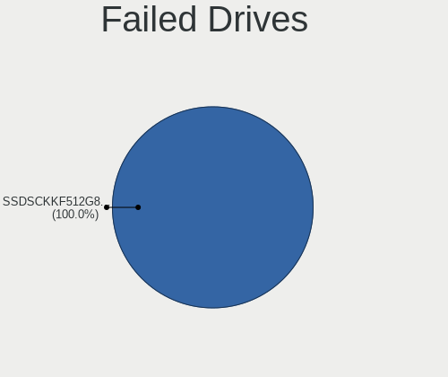
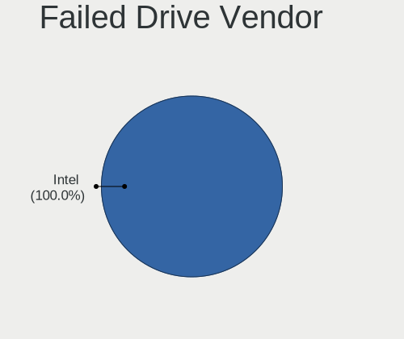

GhostBSD - Tested Hardware & Statistics (Notebooks)
---------------------------------------------------

A project to collect tested hardware configurations for GhostBSD.

Anyone can contribute to this report by the [hw-probe](https://github.com/linuxhw/hw-probe/blob/master/INSTALL.BSD.md) tool:

    hw-probe -all -upload

Please contribute! Especially if your hardware is rare.

Contents
--------

* [ Test Cases ](#test-cases)

* [ System ](#system)
  - [ OS                       ](#os)
  - [ OS Family                ](#os-family)
  - [ Arch                     ](#arch)
  - [ DE                       ](#de)
  - [ Display Server           ](#display-server)
  - [ Display Manager          ](#display-manager)
  - [ OS Lang                  ](#os-lang)
  - [ Boot Mode                ](#boot-mode)
  - [ Filesystem               ](#filesystem)
  - [ Part. scheme             ](#part-scheme)

* [ Board ](#board)
  - [ Vendor                   ](#vendor)
  - [ Model                    ](#model)
  - [ Model Family             ](#model-family)
  - [ MFG Year                 ](#mfg-year)
  - [ Form Factor              ](#form-factor)
  - [ Coreboot                 ](#coreboot)
  - [ RAM Size                 ](#ram-size)
  - [ RAM Used                 ](#ram-used)
  - [ Total Drives             ](#total-drives)
  - [ Has CD-ROM               ](#has-cd-rom)
  - [ Has Ethernet             ](#has-ethernet)
  - [ Has WiFi                 ](#has-wifi)
  - [ Has Bluetooth            ](#has-bluetooth)

* [ Location ](#location)
  - [ Country                  ](#country)
  - [ City                     ](#city)

* [ Drives ](#drives)
  - [ Drive Vendor             ](#drive-vendor)
  - [ Drive Model              ](#drive-model)
  - [ HDD Vendor               ](#hdd-vendor)
  - [ SSD Vendor               ](#ssd-vendor)
  - [ Drive Kind               ](#drive-kind)
  - [ Drive Connector          ](#drive-connector)
  - [ Drive Size               ](#drive-size)
  - [ Space Total              ](#space-total)
  - [ Space Used               ](#space-used)
  - [ Malfunc. Drives          ](#malfunc-drives)
  - [ Malfunc. Drive Vendor    ](#malfunc-drive-vendor)
  - [ Malfunc. HDD Vendor      ](#malfunc-hdd-vendor)
  - [ Malfunc. Drive Kind      ](#malfunc-drive-kind)
  - [ Failed Drives            ](#failed-drives)
  - [ Failed Drive Vendor      ](#failed-drive-vendor)
  - [ Drive Status             ](#drive-status)

* [ Storage controller ](#storage-controller)
  - [ Storage Vendor           ](#storage-vendor)
  - [ Storage Model            ](#storage-model)
  - [ Storage Kind             ](#storage-kind)

* [ Processor ](#processor)
  - [ CPU Vendor               ](#cpu-vendor)
  - [ CPU Model                ](#cpu-model)
  - [ CPU Model Family         ](#cpu-model-family)
  - [ CPU Cores                ](#cpu-cores)
  - [ CPU Sockets              ](#cpu-sockets)
  - [ CPU Threads              ](#cpu-threads)
  - [ CPU Microarch            ](#cpu-microarch)

* [ Graphics ](#graphics)
  - [ GPU Vendor               ](#gpu-vendor)
  - [ GPU Model                ](#gpu-model)
  - [ GPU Combo                ](#gpu-combo)
  - [ GPU Driver               ](#gpu-driver)
  - [ GPU Memory               ](#gpu-memory)

* [ Monitor ](#monitor)
  - [ Monitor Vendor           ](#monitor-vendor)
  - [ Monitor Model            ](#monitor-model)
  - [ Monitor Resolution       ](#monitor-resolution)
  - [ Monitor Diagonal         ](#monitor-diagonal)
  - [ Monitor Width            ](#monitor-width)
  - [ Aspect Ratio             ](#aspect-ratio)
  - [ Monitor Area             ](#monitor-area)
  - [ Pixel Density            ](#pixel-density)
  - [ Multiple Monitors        ](#multiple-monitors)

* [ Network ](#network)
  - [ Net Controller Vendor    ](#net-controller-vendor)
  - [ Net Controller Model     ](#net-controller-model)
  - [ Wireless Vendor          ](#wireless-vendor)
  - [ Wireless Model           ](#wireless-model)
  - [ Ethernet Vendor          ](#ethernet-vendor)
  - [ Ethernet Model           ](#ethernet-model)
  - [ Net Controller Kind      ](#net-controller-kind)
  - [ Used Controller          ](#used-controller)
  - [ NICs                     ](#nics)
  - [ IPv6                     ](#ipv6)

* [ Bluetooth ](#bluetooth)
  - [ Bluetooth Vendor         ](#bluetooth-vendor)
  - [ Bluetooth Model          ](#bluetooth-model)

* [ Sound ](#sound)
  - [ Sound Vendor             ](#sound-vendor)
  - [ Sound Model              ](#sound-model)

* [ Memory ](#memory)
  - [ Memory Vendor            ](#memory-vendor)
  - [ Memory Model             ](#memory-model)
  - [ Memory Kind              ](#memory-kind)
  - [ Memory Form Factor       ](#memory-form-factor)
  - [ Memory Size              ](#memory-size)
  - [ Memory Speed             ](#memory-speed)

* [ Printers & scanners ](#printers--scanners)
  - [ Printer Vendor           ](#printer-vendor)
  - [ Printer Model            ](#printer-model)
  - [ Scanner Vendor           ](#scanner-vendor)
  - [ Scanner Model            ](#scanner-model)

* [ Camera ](#camera)
  - [ Camera Vendor            ](#camera-vendor)
  - [ Camera Model             ](#camera-model)

* [ Security ](#security)
  - [ Fingerprint Vendor       ](#fingerprint-vendor)
  - [ Fingerprint Model        ](#fingerprint-model)
  - [ Chipcard Vendor          ](#chipcard-vendor)
  - [ Chipcard Model           ](#chipcard-model)

* [ Unsupported ](#unsupported)
  - [ Unsupported Devices      ](#unsupported-devices)
  - [ Unsupported Device Types ](#unsupported-device-types)

Test Cases
----------

Total: 347

| Vendor        | Model                       | Probe                                                     | Date         |
|---------------|-----------------------------|-----------------------------------------------------------|--------------|
| Dell          | Inspiron 3476               | [3dc38e6815](https://bsd-hardware.info/?probe=3dc38e6815) | Jan 03, 2025 |
| Lenovo        | ThinkBook 15 G2 ITL 20VE    | [c6697164fc](https://bsd-hardware.info/?probe=c6697164fc) | Jan 02, 2025 |
| HUAWEI        | KPL-W0X                     | [51514fe0c0](https://bsd-hardware.info/?probe=51514fe0c0) | Dec 28, 2024 |
| HUAWEI        | KPL-W0X                     | [7d9a498768](https://bsd-hardware.info/?probe=7d9a498768) | Dec 28, 2024 |
| Lenovo        | ThinkPad T430 2342CTO       | [10ab9145d9](https://bsd-hardware.info/?probe=10ab9145d9) | Dec 24, 2024 |
| Dell          | XPS 9320                    | [659b5961cc](https://bsd-hardware.info/?probe=659b5961cc) | Dec 23, 2024 |
| Lenovo        | ThinkBook 15 G2 ITL 20VE    | [aa6a6969b9](https://bsd-hardware.info/?probe=aa6a6969b9) | Dec 12, 2024 |
| Lenovo        | ThinkBook 15 G2 ITL 20VE    | [cfc56b5602](https://bsd-hardware.info/?probe=cfc56b5602) | Dec 11, 2024 |
| HP            | 250 G3                      | [102fa9b597](https://bsd-hardware.info/?probe=102fa9b597) | Dec 04, 2024 |
| Lenovo        | ThinkPad E14 Gen 3 20Y7C... | [7a03bbeb04](https://bsd-hardware.info/?probe=7a03bbeb04) | Nov 25, 2024 |
| Lenovo        | ThinkPad E14 Gen 3 20Y7C... | [36ab98d9df](https://bsd-hardware.info/?probe=36ab98d9df) | Nov 25, 2024 |
| Dell          | Latitude E5440              | [289f3c134f](https://bsd-hardware.info/?probe=289f3c134f) | Nov 24, 2024 |
| Samsung       | 530XBB                      | [9d6127f039](https://bsd-hardware.info/?probe=9d6127f039) | Nov 18, 2024 |
| Lenovo        | Legion Slim 5 16IRH8 83D... | [ab3ba2edf5](https://bsd-hardware.info/?probe=ab3ba2edf5) | Nov 18, 2024 |
| Lenovo        | Legion Slim 5 16IRH8 83D... | [2a9c5b1e5c](https://bsd-hardware.info/?probe=2a9c5b1e5c) | Nov 18, 2024 |
| Notebook      | NL40_50CU                   | [9b197cd6fc](https://bsd-hardware.info/?probe=9b197cd6fc) | Nov 18, 2024 |
| Notebook      | NL40_50CU                   | [88b9892dd2](https://bsd-hardware.info/?probe=88b9892dd2) | Nov 18, 2024 |
| Toshiba       | Satellite L655              | [dc1b79d2f5](https://bsd-hardware.info/?probe=dc1b79d2f5) | Nov 13, 2024 |
| Toshiba       | Satellite L655              | [8a36444ca1](https://bsd-hardware.info/?probe=8a36444ca1) | Nov 13, 2024 |
| Lenovo        | ThinkPad T470p 20J6003DG... | [aa3a0567b3](https://bsd-hardware.info/?probe=aa3a0567b3) | Nov 07, 2024 |
| ASUSTek       | VivoBook_ASUSLaptop X513... | [3eedf19995](https://bsd-hardware.info/?probe=3eedf19995) | Oct 30, 2024 |
| HP            | 250 15.6 inch G9 Noteboo... | [4a1456a0fa](https://bsd-hardware.info/?probe=4a1456a0fa) | Oct 22, 2024 |
| HP            | EliteBook 820 G3            | [5ac0371f28](https://bsd-hardware.info/?probe=5ac0371f28) | Oct 18, 2024 |
| HP            | EliteBook 820 G3            | [553b42ed1a](https://bsd-hardware.info/?probe=553b42ed1a) | Oct 18, 2024 |
| Dell          | Inspiron 13-7368            | [2dc255b034](https://bsd-hardware.info/?probe=2dc255b034) | Oct 17, 2024 |
| HP            | Unknown                     | [254f5a847c](https://bsd-hardware.info/?probe=254f5a847c) | Oct 17, 2024 |
| Dell          | XPS 13 7390                 | [425f5093f7](https://bsd-hardware.info/?probe=425f5093f7) | Oct 13, 2024 |
| HP            | 250 15.6 inch G9 Noteboo... | [29ab309c41](https://bsd-hardware.info/?probe=29ab309c41) | Oct 12, 2024 |
| HP            | 250 15.6 inch G9 Noteboo... | [1b0b42530b](https://bsd-hardware.info/?probe=1b0b42530b) | Oct 11, 2024 |
| HP            | 250 15.6 inch G9 Noteboo... | [1c29a0f0a3](https://bsd-hardware.info/?probe=1c29a0f0a3) | Oct 11, 2024 |
| Lenovo        | ThinkPad T14 Gen 1 20S1S... | [1b5dcf47fe](https://bsd-hardware.info/?probe=1b5dcf47fe) | Oct 07, 2024 |
| Notebook      | NL40_50CU                   | [680cd09351](https://bsd-hardware.info/?probe=680cd09351) | Oct 06, 2024 |
| Lenovo        | ThinkPad E16 Gen 1 21JT0... | [869d37ac5e](https://bsd-hardware.info/?probe=869d37ac5e) | Oct 04, 2024 |
| Dell          | G3 3579                     | [1725db4da9](https://bsd-hardware.info/?probe=1725db4da9) | Sep 27, 2024 |
| Notebook      | NL40_50CU                   | [95fbcd46d1](https://bsd-hardware.info/?probe=95fbcd46d1) | Sep 26, 2024 |
| Lenovo        | Yoga 900S-12ISK 80ML        | [8836aa08ec](https://bsd-hardware.info/?probe=8836aa08ec) | Sep 23, 2024 |
| Dell          | Vostro 5490                 | [32de340e28](https://bsd-hardware.info/?probe=32de340e28) | Sep 23, 2024 |
| Dell          | Latitude E6540              | [14fbf15794](https://bsd-hardware.info/?probe=14fbf15794) | Sep 13, 2024 |
| Lenovo        | ThinkPad P14s Gen 1 20Y1... | [c6c35c6a96](https://bsd-hardware.info/?probe=c6c35c6a96) | Sep 05, 2024 |
| Lenovo        | ThinkPad P14s Gen 1 20Y1... | [cd17d71b66](https://bsd-hardware.info/?probe=cd17d71b66) | Sep 05, 2024 |
| Lenovo        | Yoga 900S-12ISK 80ML        | [ce0404f7c9](https://bsd-hardware.info/?probe=ce0404f7c9) | Aug 31, 2024 |
| Lenovo        | Yoga 900S-12ISK 80ML        | [a0abac7ab7](https://bsd-hardware.info/?probe=a0abac7ab7) | Aug 21, 2024 |
| Fujitsu       | LIFEBOOK U727               | [d3eb2cd128](https://bsd-hardware.info/?probe=d3eb2cd128) | Aug 14, 2024 |
| HP            | Pavilion 17                 | [ae76b7e522](https://bsd-hardware.info/?probe=ae76b7e522) | Aug 10, 2024 |
| HP            | EliteBook 840 G6            | [9ae98f134a](https://bsd-hardware.info/?probe=9ae98f134a) | Aug 09, 2024 |
| Lenovo        | ThinkPad X1 Carbon 2nd 2... | [3d93b160f7](https://bsd-hardware.info/?probe=3d93b160f7) | Jul 25, 2024 |
| Lenovo        | ThinkPad P14s Gen 1 20Y1... | [b671ec6c8d](https://bsd-hardware.info/?probe=b671ec6c8d) | Jul 21, 2024 |
| HP            | Compaq Presario CQ71        | [88a0868c03](https://bsd-hardware.info/?probe=88a0868c03) | Jul 18, 2024 |
| F-Plus Mob... | FLAPTOP r                   | [a82831432b](https://bsd-hardware.info/?probe=a82831432b) | Jun 25, 2024 |
| ASUSTek       | UX410UAR                    | [263af3de44](https://bsd-hardware.info/?probe=263af3de44) | May 23, 2024 |
| Dell          | Inspiron 1545               | [e123332fb8](https://bsd-hardware.info/?probe=e123332fb8) | May 16, 2024 |
| Dell          | Inspiron 1545               | [d5f43a27aa](https://bsd-hardware.info/?probe=d5f43a27aa) | May 12, 2024 |
| Dell          | Inspiron 1545               | [3c3432b2c0](https://bsd-hardware.info/?probe=3c3432b2c0) | May 11, 2024 |
| Infinix       | INBook X1                   | [847a9cb112](https://bsd-hardware.info/?probe=847a9cb112) | May 10, 2024 |
| Acer          | TravelMate B118-M           | [68d9d26fe5](https://bsd-hardware.info/?probe=68d9d26fe5) | May 09, 2024 |
| Alienware     | Area-51m A00                | [53d5d4eb1e](https://bsd-hardware.info/?probe=53d5d4eb1e) | May 07, 2024 |
| Unknown       | X133                        | [524b7e6d8e](https://bsd-hardware.info/?probe=524b7e6d8e) | May 07, 2024 |
| Dell          | XPS 13 9360                 | [c9ad91fc61](https://bsd-hardware.info/?probe=c9ad91fc61) | May 07, 2024 |
| Lenovo        | ThinkPad X240 20AMS3FY00    | [1dc74d60e6](https://bsd-hardware.info/?probe=1dc74d60e6) | May 06, 2024 |
| Dell          | Latitude 7390               | [b9b511f4d6](https://bsd-hardware.info/?probe=b9b511f4d6) | May 04, 2024 |
| MSI           | GE75 Raider 10SFS           | [cda74e2f91](https://bsd-hardware.info/?probe=cda74e2f91) | May 02, 2024 |
| ASUSTek       | X202E                       | [0ed385a36d](https://bsd-hardware.info/?probe=0ed385a36d) | May 02, 2024 |
| HP            | 255 G8 Notebook PC          | [4878c18c8a](https://bsd-hardware.info/?probe=4878c18c8a) | May 01, 2024 |
| Dell          | XPS 13 9360                 | [26185f189e](https://bsd-hardware.info/?probe=26185f189e) | Apr 30, 2024 |
| HP            | EliteBook 2560p             | [bb6303ed5b](https://bsd-hardware.info/?probe=bb6303ed5b) | Apr 29, 2024 |
| Lenovo        | ThinkPad X220 429135G       | [b681d0b406](https://bsd-hardware.info/?probe=b681d0b406) | Apr 23, 2024 |
| F-Plus Mob... | FLAPTOP r                   | [150e135ba6](https://bsd-hardware.info/?probe=150e135ba6) | Apr 18, 2024 |
| Dell          | Latitude 7490               | [38f6023f20](https://bsd-hardware.info/?probe=38f6023f20) | Apr 14, 2024 |
| Dell          | Vostro 3350                 | [abe739e6c2](https://bsd-hardware.info/?probe=abe739e6c2) | Apr 13, 2024 |
| HP            | ProBook 645 G3              | [ea10ac1f83](https://bsd-hardware.info/?probe=ea10ac1f83) | Apr 12, 2024 |
| ASUSTek       | VivoBook_ASUSLaptop X512... | [a26013b913](https://bsd-hardware.info/?probe=a26013b913) | Apr 05, 2024 |
| Dell          | Latitude E5540              | [108e2acb98](https://bsd-hardware.info/?probe=108e2acb98) | Apr 01, 2024 |
| Lenovo        | ThinkPad E15 Gen 4 21EDC... | [0ae72ec0ff](https://bsd-hardware.info/?probe=0ae72ec0ff) | Mar 31, 2024 |
| HP            | OMEN Laptop 15-ek0xxx       | [f4dde6ddf5](https://bsd-hardware.info/?probe=f4dde6ddf5) | Mar 22, 2024 |
| Lenovo        | Legion 5 Pro 16ACH6H 82J... | [db1d3cd098](https://bsd-hardware.info/?probe=db1d3cd098) | Mar 19, 2024 |
| Google        | Cave                        | [d9df48c781](https://bsd-hardware.info/?probe=d9df48c781) | Mar 16, 2024 |
| Dell          | XPS 13 9305                 | [7cc4588e07](https://bsd-hardware.info/?probe=7cc4588e07) | Mar 07, 2024 |
| HP            | Notebook                    | [15839305ee](https://bsd-hardware.info/?probe=15839305ee) | Mar 01, 2024 |
| Dell          | Inspiron 5559               | [ac72a9a34a](https://bsd-hardware.info/?probe=ac72a9a34a) | Feb 23, 2024 |
| Dell          | Latitude E6540              | [92ba9b26e1](https://bsd-hardware.info/?probe=92ba9b26e1) | Feb 21, 2024 |
| Dell          | Latitude 7490               | [32828d5d84](https://bsd-hardware.info/?probe=32828d5d84) | Feb 10, 2024 |
| Lenovo        | IdeaPad 3 15ITL6 82H8       | [0e644c21cc](https://bsd-hardware.info/?probe=0e644c21cc) | Feb 02, 2024 |
| TUXEDO        | Aura 15 Gen1                | [4768e0001d](https://bsd-hardware.info/?probe=4768e0001d) | Feb 01, 2024 |
| Lenovo        | ThinkPad T14 Gen 2i 20W0... | [e747b9066e](https://bsd-hardware.info/?probe=e747b9066e) | Jan 29, 2024 |
| Lenovo        | ThinkPad L14 Gen 1 20U6S... | [7e24e6c0f2](https://bsd-hardware.info/?probe=7e24e6c0f2) | Jan 29, 2024 |
| ASUSTek       | X555LAB                     | [c396fcc8d9](https://bsd-hardware.info/?probe=c396fcc8d9) | Jan 22, 2024 |
| Lenovo        | ThinkPad E14 Gen 4 21EBC... | [d08f6339ae](https://bsd-hardware.info/?probe=d08f6339ae) | Jan 12, 2024 |
| Lenovo        | ThinkPad T14 Gen 3 21CF0... | [2ab7b9d6b2](https://bsd-hardware.info/?probe=2ab7b9d6b2) | Jan 02, 2024 |
| HP            | EliteBook 2540p             | [c915c03729](https://bsd-hardware.info/?probe=c915c03729) | Dec 30, 2023 |
| Lenovo        | ThinkPad T480 20L6S8LW00    | [b6c3c05155](https://bsd-hardware.info/?probe=b6c3c05155) | Dec 25, 2023 |
| Lenovo        | ThinkPad T480 20L6S8LW00    | [32c06c5669](https://bsd-hardware.info/?probe=32c06c5669) | Dec 23, 2023 |
| Apple         | MacBookPro9,2               | [851f118bd5](https://bsd-hardware.info/?probe=851f118bd5) | Dec 19, 2023 |
| Lenovo        | ThinkPad E15 Gen 3 20YG0... | [5281bb9e20](https://bsd-hardware.info/?probe=5281bb9e20) | Dec 19, 2023 |
| ASUSTek       | ASUS TUF Gaming A15 FA50... | [d81a233601](https://bsd-hardware.info/?probe=d81a233601) | Dec 12, 2023 |
| Dell          | Inspiron 5559               | [09f5b25e72](https://bsd-hardware.info/?probe=09f5b25e72) | Dec 12, 2023 |
| Dell          | Latitude E6330              | [7e0a01e9ad](https://bsd-hardware.info/?probe=7e0a01e9ad) | Dec 05, 2023 |
| Dell          | Inspiron 7558               | [b34a8742d5](https://bsd-hardware.info/?probe=b34a8742d5) | Nov 26, 2023 |
| Dell          | Inspiron 7558               | [aad8d359f3](https://bsd-hardware.info/?probe=aad8d359f3) | Nov 24, 2023 |
| Dell          | Latitude E5440              | [629fba28cc](https://bsd-hardware.info/?probe=629fba28cc) | Nov 23, 2023 |
| Lenovo        | Legion 5 Pro 16ACH6H 82J... | [19dfa9e36a](https://bsd-hardware.info/?probe=19dfa9e36a) | Nov 21, 2023 |
| Dell          | Precision 5520              | [45f5e399a4](https://bsd-hardware.info/?probe=45f5e399a4) | Nov 18, 2023 |
| HP            | Notebook                    | [c583c221c7](https://bsd-hardware.info/?probe=c583c221c7) | Nov 17, 2023 |
| ASUSTek       | ASUS TUF Gaming A15 FA50... | [0fd2711a56](https://bsd-hardware.info/?probe=0fd2711a56) | Nov 12, 2023 |
| ASUSTek       | ASUS TUF Gaming A15 FA50... | [d87ea88953](https://bsd-hardware.info/?probe=d87ea88953) | Nov 09, 2023 |
| Lenovo        | V15 G2 ALC 82KD             | [05bf5fb9f4](https://bsd-hardware.info/?probe=05bf5fb9f4) | Nov 07, 2023 |
| Lenovo        | ThinkPad T470s W10DG 20J... | [19514dd0bd](https://bsd-hardware.info/?probe=19514dd0bd) | Nov 03, 2023 |
| Lenovo        | Legion 5 15ARH05 82B5       | [965e71ac80](https://bsd-hardware.info/?probe=965e71ac80) | Oct 21, 2023 |
| Dell          | Latitude 5490               | [eeab525ffd](https://bsd-hardware.info/?probe=eeab525ffd) | Oct 20, 2023 |
| ASUSTek       | N552VX                      | [f927cf5ba4](https://bsd-hardware.info/?probe=f927cf5ba4) | Oct 16, 2023 |
| Fujitsu       | LIFEBOOK E744               | [72a9b731f6](https://bsd-hardware.info/?probe=72a9b731f6) | Oct 14, 2023 |
| Lenovo        | ThinkPad T410 2518C3U       | [36daf066ca](https://bsd-hardware.info/?probe=36daf066ca) | Oct 08, 2023 |
| Lenovo        | ThinkPad T460s 20FAS2AD0... | [ac6742bd0f](https://bsd-hardware.info/?probe=ac6742bd0f) | Oct 07, 2023 |
| Lenovo        | ThinkPad T460s 20FAS2AD0... | [3e15173331](https://bsd-hardware.info/?probe=3e15173331) | Oct 07, 2023 |
| Apple         | MacBookPro7,1               | [070c5dab4f](https://bsd-hardware.info/?probe=070c5dab4f) | Oct 02, 2023 |
| ASUSTek       | K40IN                       | [6b58792f5e](https://bsd-hardware.info/?probe=6b58792f5e) | Oct 02, 2023 |
| Acer          | TravelMate 5730             | [dffc2e116d](https://bsd-hardware.info/?probe=dffc2e116d) | Sep 30, 2023 |
| Apple         | MacBookPro9,1               | [b0aca42c84](https://bsd-hardware.info/?probe=b0aca42c84) | Sep 29, 2023 |
| MSI           | CX62 6QD                    | [68b8b9f531](https://bsd-hardware.info/?probe=68b8b9f531) | Sep 29, 2023 |
| TUXEDO        | Aura 15 Gen1                | [b31f8c12f8](https://bsd-hardware.info/?probe=b31f8c12f8) | Sep 24, 2023 |
| Lenovo        | ThinkPad T470 20HES0HU00    | [a64fe205a9](https://bsd-hardware.info/?probe=a64fe205a9) | Sep 17, 2023 |
| HP            | OMEN Laptop 15-en1xxx       | [0f92b89ffb](https://bsd-hardware.info/?probe=0f92b89ffb) | Sep 09, 2023 |
| Dell          | Inspiron 15-7568            | [9e555f0b24](https://bsd-hardware.info/?probe=9e555f0b24) | Aug 24, 2023 |
| Dell          | Latitude 7490               | [0b05de2297](https://bsd-hardware.info/?probe=0b05de2297) | Aug 24, 2023 |
| Lenovo        | Legion 5 Pro 16ACH6H 82J... | [26995b5321](https://bsd-hardware.info/?probe=26995b5321) | Aug 19, 2023 |
| Lenovo        | IdeaPad 330-15IKB 81DE      | [1bc7f67754](https://bsd-hardware.info/?probe=1bc7f67754) | Aug 18, 2023 |
| Samsung       | Q210                        | [2e25c6d2ec](https://bsd-hardware.info/?probe=2e25c6d2ec) | Aug 03, 2023 |
| Samsung       | Q210                        | [d3c5ab902d](https://bsd-hardware.info/?probe=d3c5ab902d) | Aug 03, 2023 |
| ASUSTek       | X555LD                      | [9c0c41b663](https://bsd-hardware.info/?probe=9c0c41b663) | Jul 30, 2023 |
| Dell          | Inspiron 3180               | [e97b5d9219](https://bsd-hardware.info/?probe=e97b5d9219) | Jul 25, 2023 |
| Lenovo        | Yoga Slim 7 Pro 14ACH5 8... | [020e17c2f8](https://bsd-hardware.info/?probe=020e17c2f8) | Jul 23, 2023 |
| Toshiba       | Satellite L655              | [67080aeb1d](https://bsd-hardware.info/?probe=67080aeb1d) | Jul 20, 2023 |
| MSI           | Sword 17 A11UD              | [c9852c1ee3](https://bsd-hardware.info/?probe=c9852c1ee3) | Jul 19, 2023 |
| Lenovo        | ThinkPad W530 2447GW3       | [57b4bfc1bf](https://bsd-hardware.info/?probe=57b4bfc1bf) | Jul 17, 2023 |
| Lenovo        | ThinkPad X395 20NLCTO1WW    | [826ba238d8](https://bsd-hardware.info/?probe=826ba238d8) | Jul 16, 2023 |
| Lenovo        | ThinkPad X395 20NLCTO1WW    | [0273f2f271](https://bsd-hardware.info/?probe=0273f2f271) | Jul 16, 2023 |
| ASUSTek       | VivoBook_ASUSLaptop M150... | [03e83e60ca](https://bsd-hardware.info/?probe=03e83e60ca) | Jul 07, 2023 |
| ASUSTek       | VivoBook_ASUSLaptop M150... | [3096d8532a](https://bsd-hardware.info/?probe=3096d8532a) | Jul 07, 2023 |
| Dell          | G3 3579                     | [8d9b29f231](https://bsd-hardware.info/?probe=8d9b29f231) | Jul 05, 2023 |
| Dell          | G3 3579                     | [f6fc15b1f4](https://bsd-hardware.info/?probe=f6fc15b1f4) | Jul 05, 2023 |
| HP            | 15                          | [4664b4c93f](https://bsd-hardware.info/?probe=4664b4c93f) | Jun 11, 2023 |
| Dell          | Inspiron 3180               | [cb769078b4](https://bsd-hardware.info/?probe=cb769078b4) | Jun 10, 2023 |
| Dell          | Inspiron 5593               | [8bedc249ea](https://bsd-hardware.info/?probe=8bedc249ea) | Jun 10, 2023 |
| Dell          | Inspiron 7548               | [c80bb80e8f](https://bsd-hardware.info/?probe=c80bb80e8f) | Jun 10, 2023 |
| Dell          | Inspiron 5559               | [fe5f99c4b0](https://bsd-hardware.info/?probe=fe5f99c4b0) | Jun 06, 2023 |
| Dell          | Inspiron 5559               | [330c08c388](https://bsd-hardware.info/?probe=330c08c388) | Jun 01, 2023 |
| Dell          | Inspiron 5559               | [53cf3cea13](https://bsd-hardware.info/?probe=53cf3cea13) | Jun 01, 2023 |
| Dell          | Inspiron 5559               | [23cad3f06e](https://bsd-hardware.info/?probe=23cad3f06e) | May 28, 2023 |
| Acer          | Nitro AN515-57              | [c39ea00de5](https://bsd-hardware.info/?probe=c39ea00de5) | May 25, 2023 |
| HP            | ProBook 455 G3              | [b6a6c91115](https://bsd-hardware.info/?probe=b6a6c91115) | May 21, 2023 |
| Lenovo        | ThinkPad 11e 20DAS0S300     | [44d30cfcf6](https://bsd-hardware.info/?probe=44d30cfcf6) | May 21, 2023 |
| Dell          | Inspiron 5559               | [dca662fc41](https://bsd-hardware.info/?probe=dca662fc41) | May 16, 2023 |
| MSI           | GE62 6QC                    | [7c3fd3c9ca](https://bsd-hardware.info/?probe=7c3fd3c9ca) | May 08, 2023 |
| Lenovo        | Yoga Slim 7 Pro 14ACH5 8... | [95695f78c5](https://bsd-hardware.info/?probe=95695f78c5) | May 08, 2023 |
| Lenovo        | Yoga Slim 7 Pro 14ACH5 8... | [692b42afcd](https://bsd-hardware.info/?probe=692b42afcd) | Apr 08, 2023 |
| Dell          | Inspiron 5547               | [4f4f6e06d7](https://bsd-hardware.info/?probe=4f4f6e06d7) | Mar 29, 2023 |
| Unknown       | Unknown                     | [2a50573c9f](https://bsd-hardware.info/?probe=2a50573c9f) | Mar 29, 2023 |
| MouseCompu... | X5-aR5CEZAR-WA              | [b960dc3bde](https://bsd-hardware.info/?probe=b960dc3bde) | Mar 25, 2023 |
| MouseCompu... | X5-aR5CEZAR-WA              | [4cd1097c65](https://bsd-hardware.info/?probe=4cd1097c65) | Mar 24, 2023 |
| Dell          | Inspiron 5559               | [705ac0b37f](https://bsd-hardware.info/?probe=705ac0b37f) | Mar 18, 2023 |
| Dell          | Inspiron 5559               | [dcab531d1e](https://bsd-hardware.info/?probe=dcab531d1e) | Mar 18, 2023 |
| Star Labs     | StarBook                    | [80f6445f54](https://bsd-hardware.info/?probe=80f6445f54) | Mar 10, 2023 |
| Fujitsu       | FMVA532BSJ                  | [695e38d0ea](https://bsd-hardware.info/?probe=695e38d0ea) | Mar 10, 2023 |
| Lenovo        | ThinkPad T430 2349S31       | [2b13f68cd6](https://bsd-hardware.info/?probe=2b13f68cd6) | Feb 28, 2023 |
| Lenovo        | ThinkPad T460 20FMS06V00    | [7d7fa2bbc9](https://bsd-hardware.info/?probe=7d7fa2bbc9) | Feb 22, 2023 |
| Lenovo        | ThinkPad T460 20FMS3320G    | [c85f94d574](https://bsd-hardware.info/?probe=c85f94d574) | Feb 19, 2023 |
| Lenovo        | ThinkPad X1 Carbon 6th 2... | [a9928bd16e](https://bsd-hardware.info/?probe=a9928bd16e) | Feb 10, 2023 |
| HP            | 650                         | [48099613ec](https://bsd-hardware.info/?probe=48099613ec) | Feb 05, 2023 |
| Lenovo        | ThinkPad P50 20EN0008GE     | [8cb09e34ec](https://bsd-hardware.info/?probe=8cb09e34ec) | Feb 04, 2023 |
| TUXEDO        | Aura 15 Gen1                | [e6ad419f5e](https://bsd-hardware.info/?probe=e6ad419f5e) | Jan 20, 2023 |
| Lenovo        | B50-80 80EW                 | [fa42e2faf7](https://bsd-hardware.info/?probe=fa42e2faf7) | Jan 20, 2023 |
| Lenovo        | ThinkPad T490 20N2CTO1WW    | [32207ea5d9](https://bsd-hardware.info/?probe=32207ea5d9) | Dec 19, 2022 |
| Lenovo        | ThinkPad T460 20FN002JUS    | [3a9623cfb4](https://bsd-hardware.info/?probe=3a9623cfb4) | Dec 16, 2022 |
| Lenovo        | ThinkPad T460 20FN002JUS    | [0314add226](https://bsd-hardware.info/?probe=0314add226) | Dec 16, 2022 |
| Lenovo        | B50-80 80EW                 | [9551c57fc3](https://bsd-hardware.info/?probe=9551c57fc3) | Dec 14, 2022 |
| Apple         | MacBookPro14,1              | [ddeb9befdf](https://bsd-hardware.info/?probe=ddeb9befdf) | Dec 03, 2022 |
| HP            | Laptop 14s-fq0xxx           | [920a2fe2e9](https://bsd-hardware.info/?probe=920a2fe2e9) | Nov 30, 2022 |
| HP            | Laptop 14s-fq0xxx           | [9618eb0cbe](https://bsd-hardware.info/?probe=9618eb0cbe) | Nov 29, 2022 |
| Acer          | Aspire 5251                 | [c9eb0051ed](https://bsd-hardware.info/?probe=c9eb0051ed) | Nov 16, 2022 |
| ASUSTek       | ZenBook UX325UA_UM325UA     | [45316a9769](https://bsd-hardware.info/?probe=45316a9769) | Nov 07, 2022 |
| HP            | Laptop 15-da0xxx            | [72d95a4938](https://bsd-hardware.info/?probe=72d95a4938) | Nov 03, 2022 |
| Dell          | Latitude 5591               | [40957fa567](https://bsd-hardware.info/?probe=40957fa567) | Oct 31, 2022 |
| Acer          | Aspire E1-570               | [3d62c50607](https://bsd-hardware.info/?probe=3d62c50607) | Oct 20, 2022 |
| Dell          | Latitude 5591               | [04f53f51c8](https://bsd-hardware.info/?probe=04f53f51c8) | Oct 12, 2022 |
| Lenovo        | ThinkPad E14 Gen 2 20T6S... | [a773a82ff4](https://bsd-hardware.info/?probe=a773a82ff4) | Oct 11, 2022 |
| Dell          | Latitude 5591               | [eda94b6c48](https://bsd-hardware.info/?probe=eda94b6c48) | Oct 11, 2022 |
| Dell          | XPS M1330                   | [d84548dd9b](https://bsd-hardware.info/?probe=d84548dd9b) | Sep 11, 2022 |
| Lenovo        | IdeaPad Gaming 3 15ACH6 ... | [4f31f81571](https://bsd-hardware.info/?probe=4f31f81571) | Sep 06, 2022 |
| Lenovo        | IdeaPad Gaming 3 15ACH6 ... | [fc259fcf3e](https://bsd-hardware.info/?probe=fc259fcf3e) | Aug 30, 2022 |
| HP            | Unknown                     | [7bd69ee984](https://bsd-hardware.info/?probe=7bd69ee984) | Aug 29, 2022 |
| ASUSTek       | ZenBook UX325UA_UM325UA     | [692e2f0837](https://bsd-hardware.info/?probe=692e2f0837) | Aug 20, 2022 |
| Lenovo        | ThinkPad 11e 4th Gen 20H... | [ba1ea734b1](https://bsd-hardware.info/?probe=ba1ea734b1) | Aug 19, 2022 |
| ASUSTek       | ZenBook UX325UA_UM325UA     | [c9bda4b49d](https://bsd-hardware.info/?probe=c9bda4b49d) | Aug 14, 2022 |
| Dell          | Inspiron 1545               | [e1a29d8008](https://bsd-hardware.info/?probe=e1a29d8008) | Aug 14, 2022 |
| Dell          | Inspiron 15-3567            | [cdc6bc6ef8](https://bsd-hardware.info/?probe=cdc6bc6ef8) | Aug 03, 2022 |
| Acer          | Aspire E5-521G              | [dcc5d3116f](https://bsd-hardware.info/?probe=dcc5d3116f) | Jul 29, 2022 |
| Lenovo        | IdeaPad Y580 20132          | [3df3bd2f62](https://bsd-hardware.info/?probe=3df3bd2f62) | Jul 22, 2022 |
| Dell          | Inspiron 15-3567            | [15c5d9fdd9](https://bsd-hardware.info/?probe=15c5d9fdd9) | Jul 17, 2022 |
| Dell          | Inspiron 3505               | [ead2595782](https://bsd-hardware.info/?probe=ead2595782) | Jul 17, 2022 |
| Dell          | XPS 13 7390                 | [d9efb0425b](https://bsd-hardware.info/?probe=d9efb0425b) | Jul 15, 2022 |
| Dell          | XPS 13 7390                 | [6e85a064f0](https://bsd-hardware.info/?probe=6e85a064f0) | Jul 15, 2022 |
| ASUSTek       | VivoBook_ASUSLaptop X515... | [b09ba0c799](https://bsd-hardware.info/?probe=b09ba0c799) | Jul 12, 2022 |
| HP            | Laptop 15-da0xxx            | [0434c94fad](https://bsd-hardware.info/?probe=0434c94fad) | Jul 09, 2022 |
| Lenovo        | ThinkPad T470 20HD000MUK    | [866724656a](https://bsd-hardware.info/?probe=866724656a) | Jul 06, 2022 |
| Star Labs     | LabTop                      | [390c4c4d55](https://bsd-hardware.info/?probe=390c4c4d55) | Jul 03, 2022 |
| Dell          | XPS 13 7390                 | [3c2e2da462](https://bsd-hardware.info/?probe=3c2e2da462) | Jul 02, 2022 |
| Dell          | XPS 13 7390                 | [b870cd3698](https://bsd-hardware.info/?probe=b870cd3698) | Jul 01, 2022 |
| System76      | Gazelle                     | [7e2dbb0a5b](https://bsd-hardware.info/?probe=7e2dbb0a5b) | Jun 28, 2022 |
| System76      | Gazelle                     | [8cb2a30786](https://bsd-hardware.info/?probe=8cb2a30786) | Jun 28, 2022 |
| ASUSTek       | ZenBook UX325UA_UM325UA     | [bb3de13b1a](https://bsd-hardware.info/?probe=bb3de13b1a) | Jun 23, 2022 |
| ASUSTek       | X202E                       | [bdbe613858](https://bsd-hardware.info/?probe=bdbe613858) | Jun 22, 2022 |
| HP            | EliteBook 830 G5            | [03cb6c6c7f](https://bsd-hardware.info/?probe=03cb6c6c7f) | Jun 09, 2022 |
| Dell          | Latitude 7490               | [22224f46f4](https://bsd-hardware.info/?probe=22224f46f4) | Jun 02, 2022 |
| TUXEDO        | Aura 15 Gen1                | [115de395dd](https://bsd-hardware.info/?probe=115de395dd) | May 17, 2022 |
| Lenovo        | ThinkPad E14 Gen 2 20TA0... | [d2334d7be3](https://bsd-hardware.info/?probe=d2334d7be3) | May 14, 2022 |
| Acer          | Aspire A715-42G             | [6dce802641](https://bsd-hardware.info/?probe=6dce802641) | May 10, 2022 |
| Dell          | Latitude 7490               | [0d5b872ec1](https://bsd-hardware.info/?probe=0d5b872ec1) | May 02, 2022 |
| Dell          | Latitude 7490               | [03c97fe4d9](https://bsd-hardware.info/?probe=03c97fe4d9) | May 02, 2022 |
| Dell          | Precision 7730              | [bdb3e3d4ce](https://bsd-hardware.info/?probe=bdb3e3d4ce) | Apr 30, 2022 |
| Dell          | Latitude 7490               | [1586880dd7](https://bsd-hardware.info/?probe=1586880dd7) | Apr 30, 2022 |
| ASUSTek       | X550CC                      | [ece6d63cfb](https://bsd-hardware.info/?probe=ece6d63cfb) | Apr 25, 2022 |
| Dell          | Latitude E5450              | [ca5eb083f9](https://bsd-hardware.info/?probe=ca5eb083f9) | Apr 16, 2022 |
| Notebook      | N13xWU                      | [8986953acd](https://bsd-hardware.info/?probe=8986953acd) | Mar 22, 2022 |
| Notebook      | N7x0WU                      | [b80f84aef1](https://bsd-hardware.info/?probe=b80f84aef1) | Mar 22, 2022 |
| Notebook      | N8xEJEK                     | [9a62677ea8](https://bsd-hardware.info/?probe=9a62677ea8) | Mar 22, 2022 |
| Dell          | Latitude E6500              | [5fad69bbf0](https://bsd-hardware.info/?probe=5fad69bbf0) | Mar 22, 2022 |
| Dell          | Latitude E6510              | [a040a1a04b](https://bsd-hardware.info/?probe=a040a1a04b) | Mar 22, 2022 |
| Dell          | Latitude E6530              | [9bc5fc70a7](https://bsd-hardware.info/?probe=9bc5fc70a7) | Mar 22, 2022 |
| Lenovo        | ThinkPad X201 32492EU       | [4a5ba4f3e4](https://bsd-hardware.info/?probe=4a5ba4f3e4) | Mar 13, 2022 |
| Lenovo        | ThinkPad T450 20BUS0VH08    | [bc2860431e](https://bsd-hardware.info/?probe=bc2860431e) | Feb 17, 2022 |
| Jumper        | EZbook                      | [35869ff0db](https://bsd-hardware.info/?probe=35869ff0db) | Feb 14, 2022 |
| Lenovo        | G500s 20245                 | [41f9f804ac](https://bsd-hardware.info/?probe=41f9f804ac) | Feb 04, 2022 |
| Dell          | Vostro 3550                 | [0b290f2ac3](https://bsd-hardware.info/?probe=0b290f2ac3) | Feb 02, 2022 |
| MSI           | GE75 Raider 10SFS           | [48b172bfe8](https://bsd-hardware.info/?probe=48b172bfe8) | Jan 25, 2022 |
| MSI           | GF63 Thin 10SCSR            | [5b9c617dc8](https://bsd-hardware.info/?probe=5b9c617dc8) | Jan 22, 2022 |
| Apple         | MacBookPro11,4              | [6d580e8270](https://bsd-hardware.info/?probe=6d580e8270) | Jan 21, 2022 |
| Dell          | Latitude E6540              | [f13972c935](https://bsd-hardware.info/?probe=f13972c935) | Jan 21, 2022 |
| Fujitsu       | CELSIUS H780                | [a173366c78](https://bsd-hardware.info/?probe=a173366c78) | Jan 21, 2022 |
| Jumper        | EZbook                      | [7d648bcdc7](https://bsd-hardware.info/?probe=7d648bcdc7) | Jan 17, 2022 |
| ASUSTek       | VivoBook_ASUSLaptop X515... | [cf360a6098](https://bsd-hardware.info/?probe=cf360a6098) | Jan 16, 2022 |
| Acer          | Extensa 5635Z               | [d76873c5dd](https://bsd-hardware.info/?probe=d76873c5dd) | Jan 16, 2022 |
| HP            | Laptop 15-dw2xxx            | [a6d7796cea](https://bsd-hardware.info/?probe=a6d7796cea) | Jan 13, 2022 |
| Dell          | Latitude 5510               | [a620d284cb](https://bsd-hardware.info/?probe=a620d284cb) | Jan 12, 2022 |
| Dell          | Inspiron N5110              | [19be37f181](https://bsd-hardware.info/?probe=19be37f181) | Jan 09, 2022 |
| Dell          | Latitude E5450              | [c2ef231757](https://bsd-hardware.info/?probe=c2ef231757) | Jan 04, 2022 |
| ASUSTek       | TUF GAMING FX504GD_FX80G... | [259b5cc7b2](https://bsd-hardware.info/?probe=259b5cc7b2) | Dec 28, 2021 |
| ASUSTek       | X202E                       | [7f4e6f4541](https://bsd-hardware.info/?probe=7f4e6f4541) | Dec 05, 2021 |
| Fujitsu       | LIFEBOOK A555               | [c501c5c75e](https://bsd-hardware.info/?probe=c501c5c75e) | Dec 04, 2021 |
| Samsung       | 530XBB                      | [41d5f95889](https://bsd-hardware.info/?probe=41d5f95889) | Dec 03, 2021 |
| Alienware     | m15 R4                      | [a724a7d7c7](https://bsd-hardware.info/?probe=a724a7d7c7) | Nov 29, 2021 |
| Lenovo        | ThinkPad T520 4243E51       | [82f5612822](https://bsd-hardware.info/?probe=82f5612822) | Nov 29, 2021 |
| Sony          | SVP13225SCBI                | [03ef84679c](https://bsd-hardware.info/?probe=03ef84679c) | Nov 27, 2021 |
| Dell          | Latitude 5510               | [3da78c9445](https://bsd-hardware.info/?probe=3da78c9445) | Nov 24, 2021 |
| Acer          | TravelMate B117-M           | [4f02660d9c](https://bsd-hardware.info/?probe=4f02660d9c) | Nov 14, 2021 |
| Toshiba       | Satellite C855-1U4          | [4107fc9eee](https://bsd-hardware.info/?probe=4107fc9eee) | Nov 14, 2021 |
| Dell          | Latitude D630               | [7e3a92badc](https://bsd-hardware.info/?probe=7e3a92badc) | Nov 02, 2021 |
| HP            | EliteBook Folio 1040 G3     | [d23636abb2](https://bsd-hardware.info/?probe=d23636abb2) | Oct 31, 2021 |
| Samsung       | 550P5C/550P7C               | [69fe175fb8](https://bsd-hardware.info/?probe=69fe175fb8) | Oct 30, 2021 |
| HP            | Pavilion g6                 | [9754bc2e72](https://bsd-hardware.info/?probe=9754bc2e72) | Oct 27, 2021 |
| MSI           | Modern 14 A10M              | [84838cd532](https://bsd-hardware.info/?probe=84838cd532) | Oct 07, 2021 |
| MSI           | Modern 14 A10M              | [db33045561](https://bsd-hardware.info/?probe=db33045561) | Oct 07, 2021 |
| Acer          | Aspire A315-56              | [03ca802f4b](https://bsd-hardware.info/?probe=03ca802f4b) | Oct 02, 2021 |
| MSI           | Modern 14 A10M              | [277d8118da](https://bsd-hardware.info/?probe=277d8118da) | Sep 30, 2021 |
| Lenovo        | Flex 2-15 20405             | [76ea6529ac](https://bsd-hardware.info/?probe=76ea6529ac) | Sep 26, 2021 |
| MSI           | Modern 14 A10M              | [103ccaf452](https://bsd-hardware.info/?probe=103ccaf452) | Sep 25, 2021 |
| Lenovo        | ThinkPad X220 4290W42       | [8be5183e21](https://bsd-hardware.info/?probe=8be5183e21) | Sep 25, 2021 |
| Lenovo        | ThinkPad T500 2056Y2Z       | [88b86ecf8b](https://bsd-hardware.info/?probe=88b86ecf8b) | Sep 25, 2021 |
| HUAWEI        | HLY-WX9XX                   | [bd5b726e52](https://bsd-hardware.info/?probe=bd5b726e52) | Sep 19, 2021 |
| Lenovo        | Yoga Slim 7 Pro 14ACH5 8... | [2a54a0c338](https://bsd-hardware.info/?probe=2a54a0c338) | Sep 14, 2021 |
| Lenovo        | ThinkPad T400 6474E18       | [2dd5b5869f](https://bsd-hardware.info/?probe=2dd5b5869f) | Sep 13, 2021 |
| HP            | EliteBook 8570p             | [27f01061f2](https://bsd-hardware.info/?probe=27f01061f2) | Sep 12, 2021 |
| Lenovo        | ThinkPad X250 20CL001GZA    | [ecd69774c0](https://bsd-hardware.info/?probe=ecd69774c0) | Sep 06, 2021 |
| System76      | Kudu                        | [c10fc12e40](https://bsd-hardware.info/?probe=c10fc12e40) | Sep 05, 2021 |
| Acer          | Aspire 5750                 | [2bc72bf29e](https://bsd-hardware.info/?probe=2bc72bf29e) | Aug 23, 2021 |
| Dell          | Latitude E5440              | [3f2e8586a7](https://bsd-hardware.info/?probe=3f2e8586a7) | Aug 05, 2021 |
| Dell          | Latitude E6430              | [4149fa5ec3](https://bsd-hardware.info/?probe=4149fa5ec3) | Aug 04, 2021 |
| Lenovo        | Legion Y7000P 81LD          | [7364ae3b3d](https://bsd-hardware.info/?probe=7364ae3b3d) | Aug 04, 2021 |
| Lenovo        | ThinkPad L512 44444XG       | [a6c8fbcb20](https://bsd-hardware.info/?probe=a6c8fbcb20) | Aug 01, 2021 |
| GPU Compan... | GWTN156-5                   | [bc44d767cc](https://bsd-hardware.info/?probe=bc44d767cc) | Jul 22, 2021 |
| Dell          | Latitude E5520              | [e0dd26220f](https://bsd-hardware.info/?probe=e0dd26220f) | Jul 21, 2021 |
| Apple         | MacBook5,1                  | [1e54d2fbdf](https://bsd-hardware.info/?probe=1e54d2fbdf) | Jul 05, 2021 |
| Apple         | MacBook5,1                  | [f5d7a16498](https://bsd-hardware.info/?probe=f5d7a16498) | Jul 05, 2021 |
| Lenovo        | ThinkPad T470 W10DG 20JN... | [668bf95221](https://bsd-hardware.info/?probe=668bf95221) | Jun 25, 2021 |
| Dell          | Latitude E6420              | [2e8b431cc6](https://bsd-hardware.info/?probe=2e8b431cc6) | Jun 25, 2021 |
| Lenovo        | ThinkPad T440 20B7S1860W    | [8552205176](https://bsd-hardware.info/?probe=8552205176) | Jun 22, 2021 |
| Lenovo        | IdeaPad 520-15IKB 81BF      | [9f82e215c3](https://bsd-hardware.info/?probe=9f82e215c3) | Jun 22, 2021 |
| Dell          | Inspiron 3542               | [a2deab0991](https://bsd-hardware.info/?probe=a2deab0991) | Jun 15, 2021 |
| Sony          | SVP1322M1EBI                | [23316d0f2b](https://bsd-hardware.info/?probe=23316d0f2b) | May 29, 2021 |
| Lenovo        | ThinkPad T470 20HD000MUK    | [e27342ab94](https://bsd-hardware.info/?probe=e27342ab94) | May 13, 2021 |
| Lenovo        | ThinkPad X250 20CM003WMS    | [11fe52be5e](https://bsd-hardware.info/?probe=11fe52be5e) | May 13, 2021 |
| Lenovo        | ThinkPad T430 2344C4U       | [0f001f65d2](https://bsd-hardware.info/?probe=0f001f65d2) | Apr 27, 2021 |
| Samsung       | 3570R/370R/470R/450R/510... | [f8389b0546](https://bsd-hardware.info/?probe=f8389b0546) | Apr 24, 2021 |
| HP            | Laptop 15-da0xxx            | [cb09a1b771](https://bsd-hardware.info/?probe=cb09a1b771) | Apr 08, 2021 |
| Apple         | MacBookPro8,1               | [e4e3731289](https://bsd-hardware.info/?probe=e4e3731289) | Apr 01, 2021 |
| Acer          | Aspire E5-521G              | [e2b6dbfe40](https://bsd-hardware.info/?probe=e2b6dbfe40) | Apr 01, 2021 |
| HP            | 255 G7 Notebook PC          | [3e500c12a3](https://bsd-hardware.info/?probe=3e500c12a3) | Mar 24, 2021 |
| Lenovo        | ThinkPad X250 20CM003WMS    | [196cd8a730](https://bsd-hardware.info/?probe=196cd8a730) | Mar 11, 2021 |
| Acer          | Aspire F5-573G              | [240171b234](https://bsd-hardware.info/?probe=240171b234) | Mar 08, 2021 |
| HP            | Pavilion Gaming Laptop 1... | [9ede3128c5](https://bsd-hardware.info/?probe=9ede3128c5) | Mar 07, 2021 |
| HP            | Laptop 15-db0xxx            | [b1ee3da46f](https://bsd-hardware.info/?probe=b1ee3da46f) | Mar 06, 2021 |
| Apple         | MacBookPro5,5               | [50ac436475](https://bsd-hardware.info/?probe=50ac436475) | Mar 06, 2021 |
| Acer          | Extensa 5635Z               | [837c6f28b4](https://bsd-hardware.info/?probe=837c6f28b4) | Feb 19, 2021 |
| Lenovo        | ThinkPad T470 20HD000MUK    | [39c8cd6d0c](https://bsd-hardware.info/?probe=39c8cd6d0c) | Feb 08, 2021 |
| Apple         | MacBookPro5,5               | [254e518190](https://bsd-hardware.info/?probe=254e518190) | Feb 03, 2021 |
| Dell          | Latitude 5480               | [9b38a72dd4](https://bsd-hardware.info/?probe=9b38a72dd4) | Jan 26, 2021 |
| HP            | Laptop 17-ca1xxx            | [fb318623f3](https://bsd-hardware.info/?probe=fb318623f3) | Jan 23, 2021 |
| HP            | Laptop 17-ca1xxx            | [97a89d4eb0](https://bsd-hardware.info/?probe=97a89d4eb0) | Jan 23, 2021 |
| HP            | Laptop 17-ca1xxx            | [806c954739](https://bsd-hardware.info/?probe=806c954739) | Jan 23, 2021 |
| Notebook      | N85_N87,HJ,HJ1,HK1          | [3d18f3f8a9](https://bsd-hardware.info/?probe=3d18f3f8a9) | Jan 23, 2021 |
| Dell          | Inspiron 3542               | [3c41c474ad](https://bsd-hardware.info/?probe=3c41c474ad) | Jan 16, 2021 |
| HP            | OMEN by HP Laptop           | [14857eb6b7](https://bsd-hardware.info/?probe=14857eb6b7) | Jan 15, 2021 |
| ASUSTek       | X550LC                      | [f7c32488e9](https://bsd-hardware.info/?probe=f7c32488e9) | Jan 15, 2021 |
| Lenovo        | IdeaPad S145-15API 81UT     | [06cbb5cd5f](https://bsd-hardware.info/?probe=06cbb5cd5f) | Jan 15, 2021 |
| Dell          | Latitude 5280               | [c9bfb73262](https://bsd-hardware.info/?probe=c9bfb73262) | Jan 15, 2021 |
| Samsung       | 3570R/370R/470R/450R/510... | [a395c023bf](https://bsd-hardware.info/?probe=a395c023bf) | Jan 10, 2021 |
| Dell          | Inspiron 5758               | [c096e37be5](https://bsd-hardware.info/?probe=c096e37be5) | Jan 03, 2021 |
| HP            | Laptop 14-dk0xxx            | [5cd8e23152](https://bsd-hardware.info/?probe=5cd8e23152) | Dec 26, 2020 |
| HP            | Laptop 14-dk0xxx            | [fdbd71db5e](https://bsd-hardware.info/?probe=fdbd71db5e) | Dec 26, 2020 |
| Lenovo        | Yoga 2 13 20344             | [c51c202b8d](https://bsd-hardware.info/?probe=c51c202b8d) | Dec 25, 2020 |
| Lenovo        | ThinkPad T450 20BV0064US    | [b397848c7e](https://bsd-hardware.info/?probe=b397848c7e) | Dec 16, 2020 |
| Toshiba       | Satellite C855              | [6bc78fc7fc](https://bsd-hardware.info/?probe=6bc78fc7fc) | Dec 16, 2020 |
| Panasonic     | CF-19AHNC8FN                | [04a42812bb](https://bsd-hardware.info/?probe=04a42812bb) | Dec 11, 2020 |
| Lenovo        | ThinkPad X220 42872VU       | [c843b5d271](https://bsd-hardware.info/?probe=c843b5d271) | Dec 10, 2020 |
| Sony          | VPCCB17FG                   | [d8a67b4a30](https://bsd-hardware.info/?probe=d8a67b4a30) | Dec 06, 2020 |
| Sony          | VPCCB17FG                   | [7fc23a57bb](https://bsd-hardware.info/?probe=7fc23a57bb) | Nov 25, 2020 |
| Acer          | Aspire 7540                 | [65d215a03b](https://bsd-hardware.info/?probe=65d215a03b) | Nov 17, 2020 |
| Apple         | MacBook6,1                  | [64b1b1910c](https://bsd-hardware.info/?probe=64b1b1910c) | Nov 01, 2020 |
| Acer          | Aspire A315-42              | [1ac21e1660](https://bsd-hardware.info/?probe=1ac21e1660) | Oct 08, 2020 |
| Acer          | Aspire E1-532               | [10bff44534](https://bsd-hardware.info/?probe=10bff44534) | Oct 07, 2020 |
| HP            | Laptop 15-da0xxx            | [7faf1699d6](https://bsd-hardware.info/?probe=7faf1699d6) | Oct 04, 2020 |
| Lenovo        | ThinkPad T590 20N40016CD    | [1d9786ac9f](https://bsd-hardware.info/?probe=1d9786ac9f) | Aug 31, 2020 |
| Lenovo        | ThinkPad T590 20N40016CD    | [e505894bee](https://bsd-hardware.info/?probe=e505894bee) | Aug 29, 2020 |
| System76      | Lemur Pro                   | [0163d0f084](https://bsd-hardware.info/?probe=0163d0f084) | Aug 29, 2020 |
| Lenovo        | ThinkPad T430s 23539JM      | [facf6fa0f8](https://bsd-hardware.info/?probe=facf6fa0f8) | Aug 27, 2020 |
| ASUSTek       | K53SD                       | [975e9ccbe2](https://bsd-hardware.info/?probe=975e9ccbe2) | Aug 27, 2020 |
| Lenovo        | ThinkPad T530 239242U       | [7c8087322d](https://bsd-hardware.info/?probe=7c8087322d) | Aug 27, 2020 |
| Sony          | VGN-SZ3VWP_X                | [ace534d784](https://bsd-hardware.info/?probe=ace534d784) | Aug 10, 2020 |
| TUXEDO        | InfinityBook13V3            | [d508fb472b](https://bsd-hardware.info/?probe=d508fb472b) | Aug 10, 2020 |
| Dell          | Inspiron 3542               | [b89da90904](https://bsd-hardware.info/?probe=b89da90904) | Aug 01, 2020 |
| ASUSTek       | G750JS                      | [8214170523](https://bsd-hardware.info/?probe=8214170523) | Aug 01, 2020 |
| ASUSTek       | G750JS                      | [60b904f003](https://bsd-hardware.info/?probe=60b904f003) | Aug 01, 2020 |
| Dell          | Latitude E6420              | [324265fe3f](https://bsd-hardware.info/?probe=324265fe3f) | May 31, 2020 |
| Lenovo        | ThinkPad T430s 2352CTO      | [f4e8ffb5dc](https://bsd-hardware.info/?probe=f4e8ffb5dc) | May 27, 2020 |
| Lenovo        | ThinkPad T430s 2352CTO      | [59c5b6d6b9](https://bsd-hardware.info/?probe=59c5b6d6b9) | May 27, 2020 |
| Dell          | Precision M4700             | [a7761ee829](https://bsd-hardware.info/?probe=a7761ee829) | May 25, 2020 |
| Lenovo        | G570 20079                  | [6a1b7867f0](https://bsd-hardware.info/?probe=6a1b7867f0) | May 16, 2020 |
| Lenovo        | G570 20079                  | [25fd1154c0](https://bsd-hardware.info/?probe=25fd1154c0) | May 08, 2020 |
| Lenovo        | G570 20079                  | [0370bc0522](https://bsd-hardware.info/?probe=0370bc0522) | May 02, 2020 |

System
------

OS
--

Installed operating systems

| Name              | Notebooks | Percent |
|-------------------|-----------|---------|
| GhostBSD 20.04.02 | 58        | 21.72%  |
| GhostBSD 21.08.27 | 29        | 10.86%  |
| GhostBSD 24.01.1  | 24        | 8.99%   |
| GhostBSD 23.10.1  | 22        | 8.24%   |
| GhostBSD 24.07.3  | 13        | 4.87%   |
| GhostBSD 22.01.12 | 13        | 4.87%   |
| GhostBSD 23.06.01 | 11        | 4.12%   |
| GhostBSD 22.06.18 | 11        | 4.12%   |
| GhostBSD 24.10.1  | 10        | 3.75%   |
| GhostBSD 24.04.1  | 6         | 2.25%   |
| GhostBSD 23.02.02 | 6         | 2.25%   |
| GhostBSD 23.07.13 | 4         | 1.5%    |
| GhostBSD 24.07.1  | 3         | 1.12%   |
| GhostBSD 23.07.29 | 3         | 1.12%   |
| GhostBSD 23.06.05 | 3         | 1.12%   |
| GhostBSD 22.06.26 | 3         | 1.12%   |
| GhostBSD 23.09.16 | 2         | 0.75%   |
| GhostBSD 23.09.06 | 2         | 0.75%   |
| GhostBSD 23.07.20 | 2         | 0.75%   |
| GhostBSD 23.05.22 | 2         | 0.75%   |
| GhostBSD 23.04.23 | 2         | 0.75%   |
| GhostBSD 23.03.17 | 2         | 0.75%   |
| GhostBSD 22.11.22 | 2         | 0.75%   |
| GhostBSD 22.11.02 | 2         | 0.75%   |
| GhostBSD 22.08.23 | 2         | 0.75%   |
| GhostBSD 22.08.06 | 2         | 0.75%   |
| GhostBSD 22.07.16 | 2         | 0.75%   |
| GhostBSD 24.07.2  | 1         | 0.37%   |
| GhostBSD 23.10.09 | 1         | 0.37%   |
| GhostBSD 23.09.29 | 1         | 0.37%   |
| GhostBSD 23.07.04 | 1         | 0.37%   |
| GhostBSD 23.06.22 | 1         | 0.37%   |
| GhostBSD 23.05.18 | 1         | 0.37%   |
| GhostBSD 23.04.02 | 1         | 0.37%   |
| GhostBSD 23.01.13 | 1         | 0.37%   |
| GhostBSD 22.10.30 | 1         | 0.37%   |
| GhostBSD 22.09.16 | 1         | 0.37%   |
| GhostBSD 22.08.27 | 1         | 0.37%   |
| GhostBSD 22.07.31 | 1         | 0.37%   |
| GhostBSD 22.07.28 | 1         | 0.37%   |

OS Family
---------

OS without a version

| Name     | Notebooks | Percent |
|----------|-----------|---------|
| GhostBSD | 241       | 100%    |

Arch
----

OS architecture (x86_64, i586, etc.)

| Name  | Notebooks | Percent |
|-------|-----------|---------|
| amd64 | 241       | 100%    |

DE
--

Desktop Environment

| Name         | Notebooks | Percent |
|--------------|-----------|---------|
| MATE         | 198       | 80.82%  |
| XFCE         | 32        | 13.06%  |
| KDE5         | 9         | 3.67%   |
| Cinnamon     | 2         | 0.82%   |
| helloDesktop | 1         | 0.41%   |
| GNOME        | 1         | 0.41%   |
| dwm          | 1         | 0.41%   |
| Console      | 1         | 0.41%   |

Display Server
--------------

X11 or Wayland

| Name    | Notebooks | Percent |
|---------|-----------|---------|
| X11     | 239       | 99.17%  |
| Wayland | 1         | 0.41%   |
| Console | 1         | 0.41%   |

Display Manager
---------------

SDDM, LightDM, etc.

| Name    | Notebooks | Percent |
|---------|-----------|---------|
| LightDM | 237       | 98.34%  |
| SDDM    | 3         | 1.24%   |
| Console | 1         | 0.41%   |

OS Lang
-------

Language

| Lang    | Notebooks | Percent |
|---------|-----------|---------|
| en_US   | 102       | 40.48%  |
| C       | 82        | 32.54%  |
| Unknown | 17        | 6.75%   |
| de_DE   | 11        | 4.37%   |
| es_ES   | 10        | 3.97%   |
| ru_RU   | 6         | 2.38%   |
| pt_BR   | 5         | 1.98%   |
| en_GB   | 4         | 1.59%   |
| pl_PL   | 3         | 1.19%   |
| it_IT   | 3         | 1.19%   |
| fr_FR   | 2         | 0.79%   |
| zh_CN   | 1         | 0.4%    |
| sv_SE   | 1         | 0.4%    |
| sk_SK   | 1         | 0.4%    |
| pt_PT   | 1         | 0.4%    |
| nl_NL   | 1         | 0.4%    |
| en_NZ   | 1         | 0.4%    |
| el_GR   | 1         | 0.4%    |

Boot Mode
---------

EFI or BIOS

| Mode | Notebooks | Percent |
|------|-----------|---------|
| EFI  | 196       | 81.33%  |
| BIOS | 45        | 18.67%  |

Filesystem
----------

Type of filesystem

| Type | Notebooks | Percent |
|------|-----------|---------|
| Zfs  | 232       | 94.69%  |
| Ufs  | 13        | 5.31%   |

Part. scheme
------------

Scheme of partitioning

| Type | Notebooks | Percent |
|------|-----------|---------|
| GPT  | 238       | 98.76%  |
| MBR  | 3         | 1.24%   |

Board
-----

Vendor
------

Motherboard manufacturer

| Name                | Notebooks | Percent |
|---------------------|-----------|---------|
| Lenovo              | 69        | 28.63%  |
| Dell                | 55        | 22.82%  |
| Hewlett-Packard     | 30        | 12.45%  |
| ASUSTek Computer    | 19        | 7.88%   |
| Acer                | 12        | 4.98%   |
| MSI                 | 7         | 2.9%    |
| Apple               | 7         | 2.9%    |
| Notebook            | 5         | 2.07%   |
| Fujitsu             | 5         | 2.07%   |
| Sony                | 4         | 1.66%   |
| Samsung Electronics | 4         | 1.66%   |
| Toshiba             | 3         | 1.24%   |
| System76            | 3         | 1.24%   |
| TUXEDO              | 2         | 0.83%   |
| Star Labs           | 2         | 0.83%   |
| HUAWEI              | 2         | 0.83%   |
| F-Plus Mobile       | 2         | 0.83%   |
| Alienware           | 2         | 0.83%   |
| Unknown             | 2         | 0.83%   |
| Panasonic           | 1         | 0.41%   |
| MouseComputer       | 1         | 0.41%   |
| Jumper              | 1         | 0.41%   |
| Infinix             | 1         | 0.41%   |
| GPU Company         | 1         | 0.41%   |
| Google              | 1         | 0.41%   |

Model
-----

Motherboard model

| Name                                     | Notebooks | Percent |
|------------------------------------------|-----------|---------|
| Unknown                                  | 4         | 1.66%   |
| Dell Latitude 7490                       | 3         | 1.24%   |
| Dell Inspiron 3542                       | 3         | 1.24%   |
| MSI Modern 14 A10M                       | 2         | 0.83%   |
| Lenovo Yoga Slim 7 Pro 14ACH5 82MS       | 2         | 0.83%   |
| Lenovo Yoga 900S-12ISK 80ML              | 2         | 0.83%   |
| Lenovo ThinkPad T430s 2352CTO            | 2         | 0.83%   |
| HP Notebook                              | 2         | 0.83%   |
| F-Plus Mobile FLAPTOP r                  | 2         | 0.83%   |
| Dell XPS 13 9360                         | 2         | 0.83%   |
| Dell XPS 13 7390                         | 2         | 0.83%   |
| Dell Latitude E6540                      | 2         | 0.83%   |
| Dell Latitude E6420                      | 2         | 0.83%   |
| Dell Latitude E5440                      | 2         | 0.83%   |
| Dell G3 3579                             | 2         | 0.83%   |
| ASUS ZenBook UX325UA_UM325UA             | 2         | 0.83%   |
| ASUS X202E                               | 2         | 0.83%   |
| TUXEDO InfinityBook13V3                  | 1         | 0.41%   |
| TUXEDO Aura 15 Gen1                      | 1         | 0.41%   |
| Toshiba Satellite L655                   | 1         | 0.41%   |
| Toshiba Satellite C855-1U4               | 1         | 0.41%   |
| Toshiba Satellite C855                   | 1         | 0.41%   |
| System76 Lemur Pro                       | 1         | 0.41%   |
| System76 Kudu                            | 1         | 0.41%   |
| System76 Gazelle                         | 1         | 0.41%   |
| Star Labs StarBook                       | 1         | 0.41%   |
| Star Labs LabTop                         | 1         | 0.41%   |
| Sony VPCCB17FG                           | 1         | 0.41%   |
| Sony VGN-SZ3VWP_X                        | 1         | 0.41%   |
| Sony SVP1322M1EBI                        | 1         | 0.41%   |
| Sony SVP13225SCBI                        | 1         | 0.41%   |
| Samsung Q210                             | 1         | 0.41%   |
| Samsung 550P5C/550P7C                    | 1         | 0.41%   |
| Samsung 530XBB                           | 1         | 0.41%   |
| Samsung 3570R/370R/470R/450R/510R/4450RV | 1         | 0.41%   |
| Panasonic CF-19AHNC8FN                   | 1         | 0.41%   |
| Notebook NL40_50CU                       | 1         | 0.41%   |
| Notebook N8xEJEK                         | 1         | 0.41%   |
| Notebook N85_N87,HJ,HJ1,HK1              | 1         | 0.41%   |
| Notebook N7x0WU                          | 1         | 0.41%   |

Model Family
------------

Motherboard model prefix

| Name                    | Notebooks | Percent |
|-------------------------|-----------|---------|
| Lenovo ThinkPad         | 51        | 21.16%  |
| Dell Latitude           | 24        | 9.96%   |
| Dell Inspiron           | 17        | 7.05%   |
| Acer Aspire             | 8         | 3.32%   |
| HP EliteBook            | 7         | 2.9%    |
| Dell XPS                | 7         | 2.9%    |
| Lenovo IdeaPad          | 6         | 2.49%   |
| Lenovo Yoga             | 5         | 2.07%   |
| HP Laptop               | 5         | 2.07%   |
| ASUS VivoBook           | 4         | 1.66%   |
| Unknown                 | 4         | 1.66%   |
| Toshiba Satellite       | 3         | 1.24%   |
| Lenovo Legion           | 3         | 1.24%   |
| HP OMEN                 | 3         | 1.24%   |
| Fujitsu LIFEBOOK        | 3         | 1.24%   |
| Dell Precision          | 3         | 1.24%   |
| MSI Modern              | 2         | 0.83%   |
| HP ProBook              | 2         | 0.83%   |
| HP Pavilion             | 2         | 0.83%   |
| HP Notebook             | 2         | 0.83%   |
| HP 255                  | 2         | 0.83%   |
| HP 250                  | 2         | 0.83%   |
| F-Plus Mobile FLAPTOP   | 2         | 0.83%   |
| Dell Vostro             | 2         | 0.83%   |
| Dell G3                 | 2         | 0.83%   |
| ASUS ZenBook            | 2         | 0.83%   |
| ASUS X202E              | 2         | 0.83%   |
| Apple MacBookPro9       | 2         | 0.83%   |
| Acer TravelMate         | 2         | 0.83%   |
| TUXEDO InfinityBook13V3 | 1         | 0.41%   |
| TUXEDO Aura             | 1         | 0.41%   |
| System76 Lemur          | 1         | 0.41%   |
| System76 Kudu           | 1         | 0.41%   |
| System76 Gazelle        | 1         | 0.41%   |
| Star Labs StarBook      | 1         | 0.41%   |
| Star Labs LabTop        | 1         | 0.41%   |
| Sony VPCCB17FG          | 1         | 0.41%   |
| Sony VGN-SZ3VWP         | 1         | 0.41%   |
| Sony SVP1322M1EBI       | 1         | 0.41%   |
| Sony SVP13225SCBI       | 1         | 0.41%   |

MFG Year
--------

Motherboard manufacture year

| Year | Notebooks | Percent |
|------|-----------|---------|
| 2020 | 35        | 14.52%  |
| 2021 | 24        | 9.96%   |
| 2013 | 21        | 8.71%   |
| 2018 | 20        | 8.3%    |
| 2022 | 17        | 7.05%   |
| 2016 | 16        | 6.64%   |
| 2014 | 16        | 6.64%   |
| 2019 | 14        | 5.81%   |
| 2011 | 14        | 5.81%   |
| 2015 | 13        | 5.39%   |
| 2023 | 11        | 4.56%   |
| 2017 | 10        | 4.15%   |
| 2012 | 10        | 4.15%   |
| 2009 | 7         | 2.9%    |
| 2008 | 6         | 2.49%   |
| 2010 | 5         | 2.07%   |
| 2024 | 1         | 0.41%   |
| 2007 | 1         | 0.41%   |

Form Factor
-----------

Physical design of the computer

| Name     | Notebooks | Percent |
|----------|-----------|---------|
| Notebook | 241       | 100%    |

Coreboot
--------

Have coreboot on board

| Used | Notebooks | Percent |
|------|-----------|---------|
| No   | 238       | 98.76%  |
| Yes  | 3         | 1.24%   |

RAM Size
--------

Total RAM memory

| Size in GB  | Notebooks | Percent |
|-------------|-----------|---------|
| 8.01-16.0   | 114       | 46.91%  |
| 16.01-24.0  | 74        | 30.45%  |
| 4.01-8.0    | 37        | 15.23%  |
| 32.01-64.0  | 7         | 2.88%   |
| 24.01-32.0  | 7         | 2.88%   |
| 64.01-256.0 | 3         | 1.23%   |
| 2.01-3.0    | 1         | 0.41%   |

RAM Used
--------

Used RAM memory

| Used GB    | Notebooks | Percent |
|------------|-----------|---------|
| 0.01-0.5   | 102       | 41.46%  |
| 0.51-1.0   | 97        | 39.43%  |
| 1.01-2.0   | 25        | 10.16%  |
| 2.01-3.0   | 18        | 7.32%   |
| 4.01-8.0   | 3         | 1.22%   |
| 24.01-32.0 | 1         | 0.41%   |

Total Drives
------------

Number of drives on board

| Drives | Notebooks | Percent |
|--------|-----------|---------|
| 1      | 167       | 67.89%  |
| 2      | 39        | 15.85%  |
| 0      | 37        | 15.04%  |
| 3      | 3         | 1.22%   |

Has CD-ROM
----------

Has CD-ROM on board

| Presented | Notebooks | Percent |
|-----------|-----------|---------|
| No        | 162       | 66.94%  |
| Yes       | 80        | 33.06%  |

Has Ethernet
------------

Has Ethernet on board

| Presented | Notebooks | Percent |
|-----------|-----------|---------|
| Yes       | 198       | 81.82%  |
| No        | 44        | 18.18%  |

Has WiFi
--------

Has WiFi module

| Presented | Notebooks | Percent |
|-----------|-----------|---------|
| Yes       | 239       | 99.17%  |
| No        | 2         | 0.83%   |

Has Bluetooth
-------------

Has Bluetooth module

| Presented | Notebooks | Percent |
|-----------|-----------|---------|
| Yes       | 195       | 80.91%  |
| No        | 46        | 19.09%  |

Location
--------

Country
-------

Geographic location (country)

| Country      | Notebooks | Percent |
|--------------|-----------|---------|
| USA          | 51        | 21.07%  |
| Germany      | 28        | 11.57%  |
| Spain        | 14        | 5.79%   |
| France       | 12        | 4.96%   |
| UK           | 11        | 4.55%   |
| Russia       | 9         | 3.72%   |
| Poland       | 9         | 3.72%   |
| Canada       | 8         | 3.31%   |
| Switzerland  | 7         | 2.89%   |
| Italy        | 7         | 2.89%   |
| India        | 6         | 2.48%   |
| Indonesia    | 5         | 2.07%   |
| Taiwan       | 4         | 1.65%   |
| Portugal     | 4         | 1.65%   |
| New Zealand  | 4         | 1.65%   |
| Japan        | 4         | 1.65%   |
| Bulgaria     | 4         | 1.65%   |
| Brazil       | 4         | 1.65%   |
| Sweden       | 3         | 1.24%   |
| Finland      | 3         | 1.24%   |
| Belgium      | 3         | 1.24%   |
| South Africa | 2         | 0.83%   |
| Slovenia     | 2         | 0.83%   |
| Slovakia     | 2         | 0.83%   |
| Philippines  | 2         | 0.83%   |
| Norway       | 2         | 0.83%   |
| Netherlands  | 2         | 0.83%   |
| Mauritius    | 2         | 0.83%   |
| Lithuania    | 2         | 0.83%   |
| Hong Kong    | 2         | 0.83%   |
| China        | 2         | 0.83%   |
| Argentina    | 2         | 0.83%   |
| Ukraine      | 1         | 0.41%   |
| Uganda       | 1         | 0.41%   |
| Turkey       | 1         | 0.41%   |
| Serbia       | 1         | 0.41%   |
| Paraguay     | 1         | 0.41%   |
| Namibia      | 1         | 0.41%   |
| Mexico       | 1         | 0.41%   |
| Malaysia     | 1         | 0.41%   |

City
----

Geographic location (city)

| City               | Notebooks | Percent |
|--------------------|-----------|---------|
| Zurich             | 6         | 2.36%   |
| Bedburg            | 6         | 2.36%   |
| Jakarta            | 4         | 1.57%   |
| Indian Trail       | 4         | 1.57%   |
| Sofia              | 3         | 1.18%   |
| Saratov            | 3         | 1.18%   |
| Rome               | 3         | 1.18%   |
| Paris              | 3         | 1.18%   |
| Madrid             | 3         | 1.18%   |
| Franconville       | 3         | 1.18%   |
| Chrusty            | 3         | 1.18%   |
| Bonn               | 3         | 1.18%   |
| Yokohama           | 2         | 0.79%   |
| Winnipeg           | 2         | 0.79%   |
| Whittier           | 2         | 0.79%   |
| Wezeren            | 2         | 0.79%   |
| Tomball            | 2         | 0.79%   |
| Taipei             | 2         | 0.79%   |
| Taichung           | 2         | 0.79%   |
| Stiring-Wendel     | 2         | 0.79%   |
| Skiatook           | 2         | 0.79%   |
| Roslindale         | 2         | 0.79%   |
| Oslo               | 2         | 0.79%   |
| Nuremberg          | 2         | 0.79%   |
| Milan              | 2         | 0.79%   |
| London             | 2         | 0.79%   |
| Lisbon             | 2         | 0.79%   |
| Lebanon            | 2         | 0.79%   |
| Jarosław          | 2         | 0.79%   |
| Giessen            | 2         | 0.79%   |
| Clemmons           | 2         | 0.79%   |
| Chiyoda-ku         | 2         | 0.79%   |
| Celje              | 2         | 0.79%   |
| Bengaluru          | 2         | 0.79%   |
| Asnieres-sur-Seine | 2         | 0.79%   |
| Zaragoza           | 1         | 0.39%   |
| Zagreb             | 1         | 0.39%   |
| Yaroslavl          | 1         | 0.39%   |
| Wraysbury          | 1         | 0.39%   |
| Witbank            | 1         | 0.39%   |

Drives
------

Drive Vendor
------------

Hard drive vendors

| Vendor              | Notebooks | Drives | Percent |
|---------------------|-----------|--------|---------|
| Samsung Electronics | 55        | 68     | 21.83%  |
| WDC                 | 32        | 34     | 12.7%   |
| Kingston            | 23        | 23     | 9.13%   |
| Seagate             | 19        | 23     | 7.54%   |
| Toshiba             | 17        | 21     | 6.75%   |
| SK hynix            | 17        | 21     | 6.75%   |
| Crucial             | 14        | 19     | 5.56%   |
| SanDisk             | 10        | 10     | 3.97%   |
| Intel               | 10        | 10     | 3.97%   |
| Hitachi             | 5         | 5      | 1.98%   |
| HGST                | 5         | 5      | 1.98%   |
| A-DATA Technology   | 5         | 5      | 1.98%   |
| Micron Technology   | 4         | 4      | 1.59%   |
| Phison              | 3         | 4      | 1.19%   |
| Apple               | 3         | 3      | 1.19%   |
| Transcend           | 2         | 2      | 0.79%   |
| Star Drive          | 2         | 2      | 0.79%   |
| PNY                 | 2         | 2      | 0.79%   |
| Patriot             | 2         | 2      | 0.79%   |
| KingSpec            | 2         | 2      | 0.79%   |
| GOODRAM             | 2         | 2      | 0.79%   |
| Fujitsu             | 2         | 2      | 0.79%   |
| China               | 2         | 2      | 0.79%   |
| XUM                 | 1         | 1      | 0.4%    |
| Team                | 1         | 1      | 0.4%    |
| SSSTC               | 1         | 1      | 0.4%    |
| SPCC                | 1         | 1      | 0.4%    |
| Silicon Motion      | 1         | 1      | 0.4%    |
| ShiJi               | 1         | 1      | 0.4%    |
| Plextor             | 1         | 1      | 0.4%    |
| Netac               | 1         | 1      | 0.4%    |
| LITEONIT            | 1         | 1      | 0.4%    |
| Intenso             | 1         | 1      | 0.4%    |
| Hewlett-Packard     | 1         | 1      | 0.4%    |
| Gigabyte Technology | 1         | 1      | 0.4%    |
| Fanxiang            | 1         | 2      | 0.4%    |
| Dell                | 1         | 2      | 0.4%    |

Drive Model
-----------

Hard drive models

| Model                                  | Notebooks | Percent |
|----------------------------------------|-----------|---------|
| Kingston SA400S37240G 240GB            | 6         | 2.33%   |
| WDC WDS500G2B0A-00SM50 500GB           | 3         | 1.16%   |
| WDC WD10JPVX-22JC3T0 1TB               | 3         | 1.16%   |
| SK hynix SKHynix_HFS512GDE9X081N 512GB | 3         | 1.16%   |
| Seagate ST1000LM035-1RK172 1TB         | 3         | 1.16%   |
| Samsung SSD 860 EVO 500GB              | 3         | 1.16%   |
| Samsung SSD 850 EVO 250GB              | 3         | 1.16%   |
| Kingston SA400S37120G 120GB            | 3         | 1.16%   |
| Toshiba MQ01ACF032 320GB               | 2         | 0.78%   |
| Toshiba KXG50ZNV512G NVMe 512GB        | 2         | 0.78%   |
| Toshiba KBG40ZNT512G MEMORY 512GB      | 2         | 0.78%   |
| Star Drive PCIe SSD 960GB              | 2         | 0.78%   |
| SK hynix SC311 SATA 512GB              | 2         | 0.78%   |
| SK hynix HFS256G39TND-N210A 256GB      | 2         | 0.78%   |
| SK hynix HFM512GD3JX013N 512GB         | 2         | 0.78%   |
| Seagate ST500LT012-9WS142 500GB        | 2         | 0.78%   |
| Seagate ST1000LM049-2GH172 1TB         | 2         | 0.78%   |
| Samsung SSD 870 EVO 500GB              | 2         | 0.78%   |
| Samsung SSD 860 QVO 1TB                | 2         | 0.78%   |
| Samsung SSD 860 PRO 512GB              | 2         | 0.78%   |
| Samsung SSD 860 EVO 1TB                | 2         | 0.78%   |
| Samsung PM981 NVMe 256GB               | 2         | 0.78%   |
| Samsung MZNTE128HMGR-000SO 128GB       | 2         | 0.78%   |
| Kingston SV300S37A240G 240GB           | 2         | 0.78%   |
| Kingston SA400S37960G 960GB            | 2         | 0.78%   |
| Kingston RBUSNS8154P3512GJ 512GB       | 2         | 0.78%   |
| KingSpec Q-720 720GB                   | 2         | 0.78%   |
| Intel SSDPEKNW512G8 512GB              | 2         | 0.78%   |
| Intel SSDPEKKF256G8L 256GB             | 2         | 0.78%   |
| Hitachi HTS541612J9SA00 120GB          | 2         | 0.78%   |
| HGST HTS541010A9E680 1TB               | 2         | 0.78%   |
| Crucial CT480BX500SSD1 480GB           | 2         | 0.78%   |
| Crucial CT1000MX500SSD1 1TB            | 2         | 0.78%   |
| XUM HX256GSSDSATA3 256GB               | 1         | 0.39%   |
| WDC WDS240G2G0A-00JH30 240GB           | 1         | 0.39%   |
| WDC WDS120G2G0A-00JH30 120GB           | 1         | 0.39%   |
| WDC WDS100T3X0C-00SJG0 1TB             | 1         | 0.39%   |
| WDC WDS100T2B0B-00YS70 1TB             | 1         | 0.39%   |
| WDC WDS100T1B0A-00H9H0 1TB             | 1         | 0.39%   |
| WDC WD7500BPVT-80HXZT3 752GB           | 1         | 0.39%   |

HDD Vendor
----------

Hard disk drive vendors

| Vendor              | Notebooks | Drives | Percent |
|---------------------|-----------|--------|---------|
| WDC                 | 19        | 20     | 31.67%  |
| Seagate             | 19        | 23     | 31.67%  |
| Toshiba             | 7         | 7      | 11.67%  |
| Hitachi             | 5         | 5      | 8.33%   |
| HGST                | 5         | 5      | 8.33%   |
| Samsung Electronics | 2         | 2      | 3.33%   |
| Fujitsu             | 2         | 2      | 3.33%   |
| Apple               | 1         | 1      | 1.67%   |

SSD Vendor
----------

Solid state drive vendors

| Vendor              | Notebooks | Drives | Percent |
|---------------------|-----------|--------|---------|
| Samsung Electronics | 33        | 42     | 25.98%  |
| Kingston            | 19        | 19     | 14.96%  |
| Crucial             | 12        | 16     | 9.45%   |
| SanDisk             | 10        | 10     | 7.87%   |
| SK hynix            | 9         | 9      | 7.09%   |
| WDC                 | 7         | 7      | 5.51%   |
| Toshiba             | 4         | 6      | 3.15%   |
| Intel               | 4         | 4      | 3.15%   |
| A-DATA Technology   | 3         | 3      | 2.36%   |
| Transcend           | 2         | 2      | 1.57%   |
| PNY                 | 2         | 2      | 1.57%   |
| Patriot             | 2         | 2      | 1.57%   |
| Micron Technology   | 2         | 2      | 1.57%   |
| KingSpec            | 2         | 2      | 1.57%   |
| GOODRAM             | 2         | 2      | 1.57%   |
| China               | 2         | 2      | 1.57%   |
| Apple               | 2         | 2      | 1.57%   |
| XUM                 | 1         | 1      | 0.79%   |
| Team                | 1         | 1      | 0.79%   |
| SPCC                | 1         | 1      | 0.79%   |
| ShiJi               | 1         | 1      | 0.79%   |
| Plextor             | 1         | 1      | 0.79%   |
| Phison              | 1         | 1      | 0.79%   |
| Netac               | 1         | 1      | 0.79%   |
| LITEONIT            | 1         | 1      | 0.79%   |
| Fanxiang            | 1         | 2      | 0.79%   |
| Dell                | 1         | 2      | 0.79%   |

Drive Kind
----------

HDD or SSD

| Kind | Notebooks | Drives | Percent |
|------|-----------|--------|---------|
| SSD  | 117       | 144    | 50.21%  |
| NVMe | 59        | 78     | 25.32%  |
| HDD  | 57        | 65     | 24.46%  |

Drive Connector
---------------

SATA, SAS, NVMe, etc.

| Type | Notebooks | Drives | Percent |
|------|-----------|--------|---------|
| SATA | 162       | 209    | 73.3%   |
| NVMe | 59        | 78     | 26.7%   |

Drive Size
----------

Size of hard drive

| Size in TB | Notebooks | Drives | Percent |
|------------|-----------|--------|---------|
| 0.01-0.5   | 116       | 135    | 66.29%  |
| 0.51-1.0   | 51        | 65     | 29.14%  |
| 1.01-2.0   | 8         | 9      | 4.57%   |

Space Total
-----------

Amount of disk space available on the file system

| Size in GB | Notebooks | Percent |
|------------|-----------|---------|
| 1-20       | 75        | 29.64%  |
| 101-250    | 65        | 25.69%  |
| 251-500    | 45        | 17.79%  |
| 501-1000   | 25        | 9.88%   |
| 51-100     | 19        | 7.51%   |
| Unknown    | 12        | 4.74%   |
| 21-50      | 9         | 3.56%   |
| 1001-2000  | 3         | 1.19%   |

Space Used
----------

Amount of used disk space

| Used GB | Notebooks | Percent |
|---------|-----------|---------|
| 1-20    | 220       | 88.35%  |
| 21-50   | 13        | 5.22%   |
| Unknown | 12        | 4.82%   |
| 101-250 | 2         | 0.8%    |
| 51-100  | 2         | 0.8%    |

Malfunc. Drives
---------------

Drive models with a malfunction

| Model                                           | Notebooks | Drives | Percent |
|-------------------------------------------------|-----------|--------|---------|
| Toshiba MQ01ACF032 320GB                        | 2         | 2      | 5.13%   |
| SK hynix HFS256G39TND-N210A 256GB               | 2         | 2      | 5.13%   |
| Seagate ST500LT012-9WS142 500GB                 | 2         | 3      | 5.13%   |
| Kingston SA400S37240G 240GB                     | 2         | 2      | 5.13%   |
| Hitachi HTS541612J9SA00 120GB                   | 2         | 2      | 5.13%   |
| HGST HTS541010A9E680 1TB                        | 2         | 2      | 5.13%   |
| WDC WD6400BEVT-22A0RT0 640GB                    | 1         | 1      | 2.56%   |
| WDC WD3200LPVX-75V0TT0 320GB                    | 1         | 1      | 2.56%   |
| WDC WD10JPVX-60JC3T0 1TB                        | 1         | 1      | 2.56%   |
| Toshiba THNSNK256GVN8 M.2 2280 256GB            | 1         | 1      | 2.56%   |
| Toshiba THNSNK128GVN8 M.2 2280 128GB            | 1         | 1      | 2.56%   |
| Toshiba MQ01ABD100 1TB                          | 1         | 1      | 2.56%   |
| Toshiba MK1252GSX 120GB                         | 1         | 1      | 2.56%   |
| SK hynix HFS256G39MND-2300A 256GB               | 1         | 1      | 2.56%   |
| ShiJi SSD 512GB                                 | 1         | 1      | 2.56%   |
| Seagate ST9250827AS 250GB                       | 1         | 1      | 2.56%   |
| Seagate ST500LM021-1KJ152 500GB                 | 1         | 1      | 2.56%   |
| Seagate ST500LM000-1EJ162 500GB                 | 1         | 2      | 2.56%   |
| Seagate ST1000LM035-1RK172 1TB                  | 1         | 2      | 2.56%   |
| Seagate ST1000LM024 HN-M101MBB 1TB              | 1         | 1      | 2.56%   |
| Samsung Electronics SSD 980 500GB               | 1         | 1      | 2.56%   |
| Samsung Electronics SSD 870 EVO 500GB           | 1         | 1      | 2.56%   |
| Samsung Electronics SSD 840 PRO Series 256GB    | 1         | 1      | 2.56%   |
| Samsung Electronics MZNTE128HMGR-000SO 128GB    | 1         | 1      | 2.56%   |
| Samsung Electronics HM320JI 320GB               | 1         | 1      | 2.56%   |
| Patriot Inferno 60GB SSD                        | 1         | 1      | 2.56%   |
| Micron Technology MTFDDAV256TDL-1AW1ZABHA 256GB | 1         | 1      | 2.56%   |
| Intel SSDSC2BF180A5L 180GB                      | 1         | 1      | 2.56%   |
| Intel SSDSC2BF180A4L 180GB                      | 1         | 1      | 2.56%   |
| Hitachi HTS543225L9A300 250GB                   | 1         | 1      | 2.56%   |
| HGST HTS721010A9E630 1TB                        | 1         | 1      | 2.56%   |
| HGST HTS545050A7E380 500GB                      | 1         | 1      | 2.56%   |
| Fanxiang S101 512GB                             | 1         | 2      | 2.56%   |

Malfunc. Drive Vendor
---------------------

Vendors of faulty drives

| Vendor              | Notebooks | Drives | Percent |
|---------------------|-----------|--------|---------|
| Seagate             | 7         | 10     | 17.95%  |
| Toshiba             | 6         | 6      | 15.38%  |
| Samsung Electronics | 5         | 5      | 12.82%  |
| HGST                | 4         | 4      | 10.26%  |
| WDC                 | 3         | 3      | 7.69%   |
| SK hynix            | 3         | 3      | 7.69%   |
| Hitachi             | 3         | 3      | 7.69%   |
| Kingston            | 2         | 2      | 5.13%   |
| Intel               | 2         | 2      | 5.13%   |
| ShiJi               | 1         | 1      | 2.56%   |
| Patriot             | 1         | 1      | 2.56%   |
| Micron Technology   | 1         | 1      | 2.56%   |
| Fanxiang            | 1         | 2      | 2.56%   |

Malfunc. HDD Vendor
-------------------

Vendors of faulty HDD drives

| Vendor              | Notebooks | Drives | Percent |
|---------------------|-----------|--------|---------|
| Seagate             | 7         | 10     | 31.82%  |
| Toshiba             | 4         | 4      | 18.18%  |
| HGST                | 4         | 4      | 18.18%  |
| WDC                 | 3         | 3      | 13.64%  |
| Hitachi             | 3         | 3      | 13.64%  |
| Samsung Electronics | 1         | 1      | 4.55%   |

Malfunc. Drive Kind
-------------------

Kinds of faulty drives

| Kind | Notebooks | Drives | Percent |
|------|-----------|--------|---------|
| HDD  | 21        | 25     | 55.26%  |
| SSD  | 16        | 17     | 42.11%  |
| NVMe | 1         | 1      | 2.63%   |

Failed Drives
-------------

Failed drive models

| Model                          | Notebooks | Drives | Percent |
|--------------------------------|-----------|--------|---------|
| Intel SSDSCKKF512G8 SATA 512GB | 1         | 1      | 100%    |

Failed Drive Vendor
-------------------

Failed drive vendors

| Vendor | Notebooks | Drives | Percent |
|--------|-----------|--------|---------|
| Intel  | 1         | 1      | 100%    |

Drive Status
------------

Number of failed and malfunc. drives

| Status   | Notebooks | Drives | Percent |
|----------|-----------|--------|---------|
| Works    | 180       | 242    | 82.57%  |
| Malfunc  | 36        | 43     | 16.51%  |
| Detected | 1         | 1      | 0.46%   |
| Failed   | 1         | 1      | 0.46%   |

Storage controller
------------------

Storage Vendor
--------------

Storage controller vendors

| Vendor                         | Notebooks | Percent |
|--------------------------------|-----------|---------|
| Intel                          | 172       | 61.21%  |
| Samsung Electronics            | 27        | 9.61%   |
| AMD                            | 20        | 7.12%   |
| SanDisk                        | 11        | 3.91%   |
| SK hynix                       | 9         | 3.2%    |
| Phison Electronics             | 7         | 2.49%   |
| Nvidia                         | 5         | 1.78%   |
| Kingston Technology Company    | 5         | 1.78%   |
| Toshiba                        | 4         | 1.42%   |
| Micron/Crucial Technology      | 4         | 1.42%   |
| Micron Technology              | 4         | 1.42%   |
| Silicon Motion                 | 3         | 1.07%   |
| Shenzhen Longsys Electronics   | 2         | 0.71%   |
| MAXIO Technology (Hangzhou)    | 2         | 0.71%   |
| KIOXIA                         | 2         | 0.71%   |
| ADATA Technology               | 2         | 0.71%   |
| Solid State Storage Technology | 1         | 0.36%   |
| Biwin Storage Technology       | 1         | 0.36%   |

Storage Model
-------------

Storage controller models

| Model                                                                                                              | Notebooks | Percent |
|--------------------------------------------------------------------------------------------------------------------|-----------|---------|
| Intel Sunrise Point-LP SATA Controller [AHCI mode]                                                                 | 29        | 9.93%   |
| Intel 7 Series Chipset Family 6-port SATA Controller [AHCI mode]                                                   | 23        | 7.88%   |
| AMD FCH SATA Controller [AHCI mode]                                                                                | 18        | 6.16%   |
| Intel 82801 Mobile SATA Controller [RAID mode]                                                                     | 17        | 5.82%   |
| Intel 8 Series SATA Controller 1 [AHCI mode]                                                                       | 15        | 5.14%   |
| Intel 6 Series/C200 Series Chipset Family 6 port Mobile SATA AHCI Controller                                       | 14        | 4.79%   |
| Samsung NVMe SSD Controller SM981/PM981/PM983                                                                      | 12        | 4.11%   |
| Intel Wildcat Point-LP SATA Controller [AHCI Mode]                                                                 | 10        | 3.42%   |
| Intel HM170/QM170 Chipset SATA Controller [AHCI Mode]                                                              | 7         | 2.4%    |
| SK hynix Gold P31/BC711/PC711 NVMe Solid State Drive                                                               | 6         | 2.05%   |
| Samsung NVMe SSD Controller 980 (DRAM-less)                                                                        | 6         | 2.05%   |
| Intel Cannon Lake Mobile PCH SATA AHCI Controller                                                                  | 6         | 2.05%   |
| Intel 82801IBM/IEM (ICH9M/ICH9M-E) 4 port SATA Controller [AHCI mode]                                              | 6         | 2.05%   |
| SanDisk Extreme Pro / WD Black SN750 / PC SN730 / Red SN700 NVMe SSD                                               | 4         | 1.37%   |
| Nvidia MCP79 AHCI Controller                                                                                       | 4         | 1.37%   |
| Intel Comet Lake SATA AHCI Controller                                                                              | 4         | 1.37%   |
| Intel 82801HM/HEM (ICH8M/ICH8M-E) SATA Controller [AHCI mode]                                                      | 4         | 1.37%   |
| Intel 82801HM/HEM (ICH8M/ICH8M-E) IDE Controller                                                                   | 4         | 1.37%   |
| Silicon Motion SM2263EN/SM2263XT (DRAM-less) NVMe SSD Controllers                                                  | 3         | 1.03%   |
| Samsung NVMe SSD Controller SM951/PM951                                                                            | 3         | 1.03%   |
| Samsung NVMe SSD Controller PM9A1/PM9A3/980PRO                                                                     | 3         | 1.03%   |
| Phison PS5013-E13 PCIe3 NVMe Controller (DRAM-less)                                                                | 3         | 1.03%   |
| Micron 2450 NVMe SSD [HendrixV] (DRAM-less)                                                                        | 3         | 1.03%   |
| Intel Tiger Lake-LP SATA Controller                                                                                | 3         | 1.03%   |
| Intel SSD 660P Series                                                                                              | 3         | 1.03%   |
| Intel 8 Series/C220 Series Chipset Family 6-port SATA Controller 1 [AHCI mode]                                     | 3         | 1.03%   |
| Intel 5 Series/3400 Series Chipset 4 port SATA AHCI Controller                                                     | 3         | 1.03%   |
| Toshiba BG3 x2 NVMe SSD Controller (DRAM-less)                                                                     | 2         | 0.68%   |
| SK hynix BC511 NVMe SSD                                                                                            | 2         | 0.68%   |
| Shenzhen Longsys FORESEE XP1000 / Lexar Professional CFexpress Type B Gold series, NM620 PCIe NVME SSD (DRAM-less) | 2         | 0.68%   |
| SanDisk Ultra 3D / WD PC SN530, IX SN530, Blue SN550 NVMe SSD (DRAM-less)                                          | 2         | 0.68%   |
| Samsung S4LN058A01[SSUBX] AHCI SSD Controller (Apple slot)                                                         | 2         | 0.68%   |
| Phison E12 NVMe Controller                                                                                         | 2         | 0.68%   |
| MAXIO (Hangzhou) NVMe SSD Controller MAP1202 (DRAM-less)                                                           | 2         | 0.68%   |
| KIOXIA NVMe SSD Controller BG4 (DRAM-less)                                                                         | 2         | 0.68%   |
| Kingston Company NV2 NVMe SSD [SM2267XT] (DRAM-less)                                                               | 2         | 0.68%   |
| Kingston Company A1000/U-SNS8154P3 x2 NVMe SSD                                                                     | 2         | 0.68%   |
| Intel Tiger Lake SATA AHCI Controller                                                                              | 2         | 0.68%   |
| Intel SSD DC P4101/Pro 7600p/760p/E 6100p Series                                                                   | 2         | 0.68%   |
| Intel SSD 670p Series [Keystone Harbor]                                                                            | 2         | 0.68%   |

Storage Kind
------------

Kind of storage controller (IDE, SATA, NVMe, SAS, ...)

| Kind | Notebooks | Percent |
|------|-----------|---------|
| SATA | 172       | 61.21%  |
| NVMe | 81        | 28.83%  |
| RAID | 19        | 6.76%   |
| IDE  | 9         | 3.2%    |

Processor
---------

CPU Vendor
----------

Processor vendors

| Vendor | Notebooks | Percent |
|--------|-----------|---------|
| Intel  | 198       | 82.16%  |
| AMD    | 43        | 17.84%  |

CPU Model
---------

Processor models

| Model                                   | Notebooks | Percent |
|-----------------------------------------|-----------|---------|
| Intel Core i5-6300U CPU @ 2.40GHz       | 8         | 3.32%   |
| Intel Core i7-6700HQ CPU @ 2.60GHz      | 5         | 2.07%   |
| Intel Core i5-7200U CPU @ 2.50GHz       | 5         | 2.07%   |
| Intel Core i5-5300U CPU @ 2.30GHz       | 5         | 2.07%   |
| Intel Core i7-8650U CPU @ 1.90GHz       | 4         | 1.66%   |
| Intel Core i7-3520M CPU @ 2.90GHz       | 4         | 1.66%   |
| Intel Core i7-10510U CPU @ 1.80GHz      | 4         | 1.66%   |
| Intel Core i5-3320M CPU @ 2.60GHz       | 4         | 1.66%   |
| Intel Core 2 Duo                        | 4         | 1.66%   |
| Intel Core i7-8750H CPU @ 2.20GHz       | 3         | 1.24%   |
| Intel Core i7-8565U CPU @ 1.80GHz       | 3         | 1.24%   |
| Intel Core i7-8550U CPU @ 1.80GHz       | 3         | 1.24%   |
| Intel Core i7-6500U CPU @ 2.50GHz       | 3         | 1.24%   |
| Intel Core i7-2620M CPU @ 2.70GHz       | 3         | 1.24%   |
| Intel Core i5-8250U CPU @ 1.60GHz       | 3         | 1.24%   |
| Intel Core i5-7300U CPU @ 2.60GHz       | 3         | 1.24%   |
| Intel Core i5-6200U CPU @ 2.30GHz       | 3         | 1.24%   |
| Intel Core i5-4210U CPU @ 1.70GHz       | 3         | 1.24%   |
| Intel Core i5-4200U CPU @ 1.60GHz       | 3         | 1.24%   |
| Intel Core i5-3230M CPU @ 2.60GHz       | 3         | 1.24%   |
| Intel Core i5-1035G1 CPU @ 1.00GHz      | 3         | 1.24%   |
| Intel Core i5-10210U CPU @ 1.60GHz      | 3         | 1.24%   |
| Intel Core i3-3217U CPU @ 1.80GHz       | 3         | 1.24%   |
| Intel Core 2 Duo CPU P8600 @ 2.40GHz    | 3         | 1.24%   |
| Intel 11th Gen Core i5-1135G7 @ 2.40GHz | 3         | 1.24%   |
| AMD Ryzen 7 5800H with Radeon Graphics  | 3         | 1.24%   |
| AMD Ryzen 7 5700U with Radeon Graphics  | 3         | 1.24%   |
| Intel CPU Version                       | 2         | 0.83%   |
| Intel Core m7-6Y75 CPU @ 1.20GHz        | 2         | 0.83%   |
| Intel Core i9-10980HK CPU @ 2.40GHz     | 2         | 0.83%   |
| Intel Core i7-8850H CPU @ 2.60GHz       | 2         | 0.83%   |
| Intel Core i7-7820HQ CPU @ 2.90GHz      | 2         | 0.83%   |
| Intel Core i7-5500U CPU @ 2.40GHz       | 2         | 0.83%   |
| Intel Core i7-4600U CPU @ 2.10GHz       | 2         | 0.83%   |
| Intel Core i7-3740QM CPU @ 2.70GHz      | 2         | 0.83%   |
| Intel Core i7-3630QM CPU @ 2.40GHz      | 2         | 0.83%   |
| Intel Core i7-10750H CPU @ 2.60GHz      | 2         | 0.83%   |
| Intel Core i5-8300H CPU @ 2.30GHz       | 2         | 0.83%   |
| Intel Core i5-5200U CPU @ 2.20GHz       | 2         | 0.83%   |
| Intel Core i5-3210M CPU @ 2.50GHz       | 2         | 0.83%   |

CPU Model Family
----------------

Processor model prefix

| Model                   | Notebooks | Percent |
|-------------------------|-----------|---------|
| Intel Core i5           | 73        | 30.29%  |
| Intel Core i7           | 60        | 24.9%   |
| Intel Core i3           | 18        | 7.47%   |
| Other                   | 14        | 5.81%   |
| Intel Core 2 Duo        | 13        | 5.39%   |
| AMD Ryzen 7             | 13        | 5.39%   |
| AMD Ryzen 5             | 13        | 5.39%   |
| Intel Celeron           | 7         | 2.9%    |
| Intel Pentium           | 3         | 1.24%   |
| Intel Core i9           | 3         | 1.24%   |
| AMD Ryzen 7 PRO         | 3         | 1.24%   |
| AMD A6                  | 3         | 1.24%   |
| Intel Core m7           | 2         | 0.83%   |
| AMD Ryzen 3             | 2         | 0.83%   |
| AMD A4                  | 2         | 0.83%   |
| AMD A10                 | 2         | 0.83%   |
| Intel Xeon              | 1         | 0.41%   |
| Intel Pentium Dual-Core | 1         | 0.41%   |
| Intel Genuine           | 1         | 0.41%   |
| Intel Core m3           | 1         | 0.41%   |
| Intel Core 2            | 1         | 0.41%   |
| Intel Celeron Dual-Core | 1         | 0.41%   |
| AMD Ryzen 9             | 1         | 0.41%   |
| AMD Ryzen 3 PRO         | 1         | 0.41%   |
| AMD PRO A10             | 1         | 0.41%   |
| AMD Athlon              | 1         | 0.41%   |

CPU Cores
---------

Number of processor cores

| Number  | Notebooks | Percent |
|---------|-----------|---------|
| 2       | 117       | 48.55%  |
| 4       | 68        | 28.22%  |
| 8       | 17        | 7.05%   |
| 16      | 12        | 4.98%   |
| Unknown | 10        | 4.15%   |
| 6       | 9         | 3.73%   |
| 12      | 8         | 3.32%   |

CPU Sockets
-----------

Number of sockets

| Number | Notebooks | Percent |
|--------|-----------|---------|
| 1      | 237       | 98.34%  |
| 2      | 4         | 1.66%   |

CPU Threads
-----------

Threads per core (Hyper-Threading)

| Number  | Notebooks | Percent |
|---------|-----------|---------|
| 2       | 169       | 70.12%  |
| 1       | 62        | 25.73%  |
| Unknown | 10        | 4.15%   |

CPU Microarch
-------------

Microarchitecture

| Name          | Notebooks | Percent |
|---------------|-----------|---------|
| KabyLake      | 47        | 19.5%   |
| Skylake       | 25        | 10.37%  |
| IvyBridge     | 25        | 10.37%  |
| Haswell       | 23        | 9.54%   |
| SandyBridge   | 15        | 6.22%   |
| Penryn        | 13        | 5.39%   |
| Unknown       | 13        | 5.39%   |
| Zen 3         | 11        | 4.56%   |
| Broadwell     | 11        | 4.56%   |
| Zen+          | 8         | 3.32%   |
| TigerLake     | 7         | 2.9%    |
| Zen 2         | 6         | 2.49%   |
| Westmere      | 6         | 2.49%   |
| IceLake       | 5         | 2.07%   |
| Excavator     | 5         | 2.07%   |
| Core          | 5         | 2.07%   |
| CometLake     | 5         | 2.07%   |
| Silvermont    | 3         | 1.24%   |
| Goldmont      | 2         | 0.83%   |
| Zen           | 1         | 0.41%   |
| Puma          | 1         | 0.41%   |
| Piledriver    | 1         | 0.41%   |
| K10 Llano     | 1         | 0.41%   |
| K10           | 1         | 0.41%   |
| Goldmont plus | 1         | 0.41%   |

Graphics
--------

GPU Vendor
----------

Vendors of graphics cards

| Vendor | Notebooks | Percent |
|--------|-----------|---------|
| Intel  | 184       | 63.23%  |
| Nvidia | 55        | 18.9%   |
| AMD    | 52        | 17.87%  |

GPU Model
---------

Graphics card models

| Model                                                                     | Notebooks | Percent |
|---------------------------------------------------------------------------|-----------|---------|
| Intel 3rd Gen Core processor Graphics Controller                          | 21        | 7.09%   |
| Intel Haswell-ULT Integrated Graphics Controller                          | 18        | 6.08%   |
| Intel Skylake GT2 [HD Graphics 520]                                       | 15        | 5.07%   |
| Intel 2nd Generation Core Processor Family Integrated Graphics Controller | 15        | 5.07%   |
| Intel UHD Graphics 620                                                    | 13        | 4.39%   |
| Intel HD Graphics 5500                                                    | 11        | 3.72%   |
| Intel HD Graphics 620                                                     | 9         | 3.04%   |
| Intel CometLake-U GT2 [UHD Graphics]                                      | 9         | 3.04%   |
| Intel CoffeeLake-H GT2 [UHD Graphics 630]                                 | 8         | 2.7%    |
| AMD Picasso/Raven 2 [Radeon Vega Series / Radeon Vega Mobile Series]      | 8         | 2.7%    |
| AMD Cezanne [Radeon Vega Series / Radeon Vega Mobile Series]              | 7         | 2.36%   |
| Nvidia GF117M [GeForce 610M/710M/810M/820M / GT 620M/625M/630M/720M]      | 6         | 2.03%   |
| Intel HD Graphics 530                                                     | 6         | 2.03%   |
| AMD Lucienne                                                              | 6         | 2.03%   |
| Intel TigerLake-LP GT2 [Iris Xe Graphics]                                 | 5         | 1.69%   |
| Intel Mobile 4 Series Chipset Integrated Graphics Controller              | 5         | 1.69%   |
| Intel Core Processor Integrated Graphics Controller                       | 5         | 1.69%   |
| AMD Renoir [Radeon Vega Series / Radeon Vega Mobile Series]               | 5         | 1.69%   |
| Nvidia GP107M [GeForce GTX 1050 Mobile]                                   | 4         | 1.35%   |
| Intel WhiskeyLake-U GT2 [UHD Graphics 620]                                | 4         | 1.35%   |
| Intel Iris Plus Graphics G1 (Ice Lake)                                    | 4         | 1.35%   |
| Intel 4th Gen Core Processor Integrated Graphics Controller               | 4         | 1.35%   |
| Nvidia C79 [GeForce 9400M]                                                | 3         | 1.01%   |
| Intel Mobile GM965/GL960 Integrated Graphics Controller (secondary)       | 3         | 1.01%   |
| Intel Mobile GM965/GL960 Integrated Graphics Controller (primary)         | 3         | 1.01%   |
| Intel HD Graphics 630                                                     | 3         | 1.01%   |
| Intel HD Graphics 515                                                     | 3         | 1.01%   |
| Intel CometLake-H GT2 [UHD Graphics]                                      | 3         | 1.01%   |
| AMD Stoney [Radeon R2/R3/R4/R5 Graphics]                                  | 3         | 1.01%   |
| AMD Barcelo                                                               | 3         | 1.01%   |
| Nvidia TU117M [GeForce GTX 1650 Ti Mobile]                                | 2         | 0.68%   |
| Nvidia TU117M [GeForce GTX 1650 Mobile / Max-Q]                           | 2         | 0.68%   |
| Nvidia GP107M [GeForce GTX 1050 Ti Mobile]                                | 2         | 0.68%   |
| Nvidia GM108M [GeForce 940MX]                                             | 2         | 0.68%   |
| Nvidia GK107GLM [Quadro K1000M]                                           | 2         | 0.68%   |
| Nvidia GF108GLM [NVS 5200M]                                               | 2         | 0.68%   |
| Nvidia GA106M [GeForce RTX 3060 Mobile / Max-Q]                           | 2         | 0.68%   |
| Intel TigerLake-H GT1 [UHD Graphics]                                      | 2         | 0.68%   |
| Intel Tiger Lake-LP GT2 [UHD Graphics G4]                                 | 2         | 0.68%   |
| Intel HD Graphics 500                                                     | 2         | 0.68%   |

GPU Combo
---------

Combinations of graphics cards

| Name           | Notebooks | Percent |
|----------------|-----------|---------|
| 1 x Intel      | 129       | 53.31%  |
| 1 x AMD        | 39        | 16.12%  |
| Intel + Nvidia | 37        | 15.29%  |
| 1 x Nvidia     | 14        | 5.79%   |
| 2 x Intel      | 10        | 4.13%   |
| Intel + AMD    | 8         | 3.31%   |
| AMD + Nvidia   | 4         | 1.65%   |
| 2 x AMD        | 1         | 0.41%   |

GPU Driver
----------

Free vs proprietary

| Driver      | Notebooks | Percent |
|-------------|-----------|---------|
| Free        | 229       | 94.24%  |
| Proprietary | 14        | 5.76%   |

GPU Memory
----------

Total video memory

| Size in GB | Notebooks | Percent |
|------------|-----------|---------|
| Unknown    | 211       | 85.77%  |
| 0.01-0.5   | 11        | 4.47%   |
| 1.01-2.0   | 10        | 4.07%   |
| 0.51-1.0   | 7         | 2.85%   |
| 3.01-4.0   | 4         | 1.63%   |
| 5.01-6.0   | 2         | 0.81%   |
| 7.01-8.0   | 1         | 0.41%   |

Monitor
-------

Monitor Vendor
--------------

Monitor vendors

| Vendor                  | Notebooks | Percent |
|-------------------------|-----------|---------|
| AU Optronics            | 47        | 20.52%  |
| Chimei Innolux          | 39        | 17.03%  |
| LG Display              | 37        | 16.16%  |
| BOE                     | 27        | 11.79%  |
| Samsung Electronics     | 23        | 10.04%  |
| Sharp                   | 7         | 3.06%   |
| Lenovo                  | 7         | 3.06%   |
| InfoVision              | 4         | 1.75%   |
| CSO                     | 4         | 1.75%   |
| Apple                   | 4         | 1.75%   |
| Philips                 | 3         | 1.31%   |
| PANDA                   | 3         | 1.31%   |
| Iiyama                  | 3         | 1.31%   |
| Dell                    | 3         | 1.31%   |
| BenQ                    | 3         | 1.31%   |
| Panasonic               | 2         | 0.87%   |
| HKC                     | 2         | 0.87%   |
| Chi Mei Optoelectronics | 2         | 0.87%   |
| ___                     | 1         | 0.44%   |
| LG Philips              | 1         | 0.44%   |
| IBM                     | 1         | 0.44%   |
| Hewlett-Packard         | 1         | 0.44%   |
| HannStar                | 1         | 0.44%   |
| Goldstar                | 1         | 0.44%   |
| Fujitsu Siemens         | 1         | 0.44%   |
| BOE Technology Group    | 1         | 0.44%   |
| Unknown                 | 1         | 0.44%   |

Monitor Model
-------------

Monitor models

| Model                                                                 | Notebooks | Percent |
|-----------------------------------------------------------------------|-----------|---------|
| AU Optronics LCD Monitor AUO5B2D 1920x1080 290x160mm 13.0-inch        | 3         | 1.3%    |
| Sharp LCD Monitor SHP1481 1920x1080 290x170mm 13.2-inch               | 2         | 0.87%   |
| Sharp LCD Monitor SHP1457 2560x1440 280x160mm 12.7-inch               | 2         | 0.87%   |
| Samsung Electronics LCD Monitor SEC5441 1280x800 330x210mm 15.4-inch  | 2         | 0.87%   |
| Samsung Electronics LCD Monitor SEC4542 1366x768 300x170mm 13.6-inch  | 2         | 0.87%   |
| Samsung Electronics LCD Monitor SEC3047 1366x768 280x160mm 12.7-inch  | 2         | 0.87%   |
| Samsung Electronics LCD Monitor SDC4158 1920x1080 290x170mm 13.2-inch | 2         | 0.87%   |
| Philips PHL 241B8Q PHL0929 1920x1080 530x300mm 24.0-inch              | 2         | 0.87%   |
| Panasonic LCD Monitor MEI96A2 3840x2160 380x210mm 17.1-inch           | 2         | 0.87%   |
| LG Display LCD Monitor LGD05FA 1920x1080 310x170mm 13.9-inch          | 2         | 0.87%   |
| LG Display LCD Monitor LGD0456 1366x768 340x190mm 15.3-inch           | 2         | 0.87%   |
| LG Display LCD Monitor LGD039F 1366x768 350x190mm 15.7-inch           | 2         | 0.87%   |
| LG Display LCD Monitor LGD0335 1366x768 310x170mm 13.9-inch           | 2         | 0.87%   |
| LG Display LCD Monitor LGD02DC 1366x768 340x190mm 15.3-inch           | 2         | 0.87%   |
| LG Display LCD Monitor LGD01E9 1920x1080 350x190mm 15.7-inch          | 2         | 0.87%   |
| HKC LCD Monitor HKC3D05 1920x1080 340x190mm 15.3-inch                 | 2         | 0.87%   |
| CSO LCD Monitor CSO1402 2880x1800 300x190mm 14.0-inch                 | 2         | 0.87%   |
| Chimei Innolux LCD Monitor CMN15F5 1920x1080 340x190mm 15.3-inch      | 2         | 0.87%   |
| Chimei Innolux LCD Monitor CMN15E7 1920x1080 340x190mm 15.3-inch      | 2         | 0.87%   |
| Chimei Innolux LCD Monitor CMN14D5 1920x1080 310x170mm 13.9-inch      | 2         | 0.87%   |
| Chimei Innolux LCD Monitor CMN14C9 1920x1080 310x170mm 13.9-inch      | 2         | 0.87%   |
| Chimei Innolux LCD Monitor CMN14C3 1366x768 310x170mm 13.9-inch       | 2         | 0.87%   |
| Chimei Innolux LCD Monitor CMN1482 1600x900 310x170mm 13.9-inch       | 2         | 0.87%   |
| Chimei Innolux LCD Monitor CMN1132 1366x768 260x140mm 11.6-inch       | 2         | 0.87%   |
| BOE LCD Monitor BOE08D5 1920x1080 340x190mm 15.3-inch                 | 2         | 0.87%   |
| AU Optronics LCD Monitor AUOAF90 1920x1080 340x190mm 15.3-inch        | 2         | 0.87%   |
| AU Optronics LCD Monitor AUO71EC 1366x768 340x190mm 15.3-inch         | 2         | 0.87%   |
| AU Optronics LCD Monitor AUO38ED 1920x1080 340x190mm 15.3-inch        | 2         | 0.87%   |
| AU Optronics LCD Monitor AUO35EC 1366x768 340x190mm 15.3-inch         | 2         | 0.87%   |
| AU Optronics LCD Monitor AUO305C 1366x768 260x140mm 11.6-inch         | 2         | 0.87%   |
| AU Optronics LCD Monitor AUO243D 1920x1080 310x170mm 13.9-inch        | 2         | 0.87%   |
| AU Optronics LCD Monitor AUO226D 1920x1080 280x160mm 12.7-inch        | 2         | 0.87%   |
| AU Optronics LCD Monitor AUO21ED 1920x1080 340x190mm 15.3-inch        | 2         | 0.87%   |
| AU Optronics LCD Monitor AUO21EC 1366x768 340x190mm 15.3-inch         | 2         | 0.87%   |
| AU Optronics LCD Monitor AUO213E 1600x900 310x170mm 13.9-inch         | 2         | 0.87%   |
| ___ MY TV LED TV ___0101 1920x1080                                    | 1         | 0.43%   |
| Sharp LCD Monitor SHP1548 1920x1200 290x180mm 13.4-inch               | 1         | 0.43%   |
| Sharp LCD Monitor SHP14AE 1920x1080 290x170mm 13.2-inch               | 1         | 0.43%   |
| Sharp LCD Monitor SHP1453 1920x1080 350x190mm 15.7-inch               | 1         | 0.43%   |
| Samsung Electronics SyncMaster SAM03E4 1680x1050 470x300mm 22.0-inch  | 1         | 0.43%   |

Monitor Resolution
------------------

Monitor screen resolution

| Resolution         | Notebooks | Percent |
|--------------------|-----------|---------|
| 1920x1080 (FHD)    | 107       | 48.42%  |
| 1366x768 (WXGA)    | 66        | 29.86%  |
| 1600x900 (HD+)     | 11        | 4.98%   |
| 2560x1440 (QHD)    | 10        | 4.52%   |
| 1280x800 (WXGA)    | 7         | 3.17%   |
| 3840x2160 (4K)     | 5         | 2.26%   |
| 2880x1800          | 3         | 1.36%   |
| 1920x1200 (WUXGA)  | 3         | 1.36%   |
| 1680x1050 (WSXGA+) | 3         | 1.36%   |
| 1440x900 (WXGA+)   | 2         | 0.9%    |
| 9600x2160          | 1         | 0.45%   |
| 3840x1600          | 1         | 0.45%   |
| 2560x1600          | 1         | 0.45%   |
| 1280x1024 (SXGA)   | 1         | 0.45%   |

Monitor Diagonal
----------------

Diagonal size in inches

| Inches  | Notebooks | Percent |
|---------|-----------|---------|
| 15      | 93        | 40.43%  |
| 13      | 67        | 29.13%  |
| 12      | 15        | 6.52%   |
| 17      | 13        | 5.65%   |
| 14      | 7         | 3.04%   |
| 11      | 7         | 3.04%   |
| 24      | 6         | 2.61%   |
| 23      | 5         | 2.17%   |
| 27      | 4         | 1.74%   |
| 31      | 3         | 1.3%    |
| Unknown | 3         | 1.3%    |
| 16      | 2         | 0.87%   |
| 40      | 1         | 0.43%   |
| 39      | 1         | 0.43%   |
| 37      | 1         | 0.43%   |
| 22      | 1         | 0.43%   |
| 21      | 1         | 0.43%   |

Monitor Width
-------------

Physical width

| Width in mm | Notebooks | Percent |
|-------------|-----------|---------|
| 301-350     | 141       | 61.57%  |
| 201-300     | 49        | 21.4%   |
| 501-600     | 15        | 6.55%   |
| 351-400     | 13        | 5.68%   |
| 801-900     | 3         | 1.31%   |
| 601-700     | 3         | 1.31%   |
| Unknown     | 3         | 1.31%   |
| 401-500     | 2         | 0.87%   |

Aspect Ratio
------------

Proportional relationship between the width and the height

| Ratio   | Notebooks | Percent |
|---------|-----------|---------|
| 16/9    | 185       | 87.26%  |
| 16/10   | 22        | 10.38%  |
| Unknown | 2         | 0.94%   |
| 5/4     | 1         | 0.47%   |
| 3/2     | 1         | 0.47%   |
| 21/9    | 1         | 0.47%   |

Monitor Area
------------

Area in inch²

| Area in inch² | Notebooks | Percent |
|----------------|-----------|---------|
| 91-100         | 75        | 32.61%  |
| 81-90          | 57        | 24.78%  |
| 71-80          | 17        | 7.39%   |
| 101-110        | 17        | 7.39%   |
| 61-70          | 15        | 6.52%   |
| 201-250        | 12        | 5.22%   |
| 121-130        | 12        | 5.22%   |
| 51-60          | 7         | 3.04%   |
| 301-350        | 4         | 1.74%   |
| 351-500        | 3         | 1.3%    |
| 111-120        | 3         | 1.3%    |
| 501-1000       | 3         | 1.3%    |
| Unknown        | 3         | 1.3%    |
| 251-300        | 1         | 0.43%   |
| 141-150        | 1         | 0.43%   |

Pixel Density
-------------

Pixels per inch

| Density       | Notebooks | Percent |
|---------------|-----------|---------|
| 121-160       | 108       | 47.37%  |
| 101-120       | 54        | 23.68%  |
| 51-100        | 29        | 12.72%  |
| 161-240       | 28        | 12.28%  |
| More than 240 | 6         | 2.63%   |
| Unknown       | 3         | 1.32%   |

Multiple Monitors
-----------------

Total monitors connected

| Total | Notebooks | Percent |
|-------|-----------|---------|
| 1     | 197       | 79.76%  |
| 0     | 28        | 11.34%  |
| 2     | 22        | 8.91%   |

Network
-------

Net Controller Vendor
---------------------

Controller vendors

| Vendor                            | Notebooks | Percent |
|-----------------------------------|-----------|---------|
| Intel                             | 163       | 41.79%  |
| Realtek Semiconductor             | 99        | 25.38%  |
| Qualcomm Atheros                  | 45        | 11.54%  |
| Broadcom                          | 23        | 5.9%    |
| TP-Link                           | 10        | 2.56%   |
| Sierra Wireless                   | 7         | 1.79%   |
| Ericsson Business Mobile Networks | 5         | 1.28%   |
| Samsung Electronics               | 4         | 1.03%   |
| Edimax Technology                 | 4         | 1.03%   |
| Ralink Technology                 | 3         | 0.77%   |
| Qualcomm                          | 3         | 0.77%   |
| Nvidia                            | 3         | 0.77%   |
| MediaTek                          | 3         | 0.77%   |
| Marvell Technology Group          | 3         | 0.77%   |
| ASUSTek Computer                  | 3         | 0.77%   |
| Hewlett-Packard                   | 2         | 0.51%   |
| Xiaomi                            | 1         | 0.26%   |
| Ralink                            | 1         | 0.26%   |
| Qualcomm Technologies             | 1         | 0.26%   |
| Qualcomm Atheros Communications   | 1         | 0.26%   |
| OnePlus Technology (Shenzhen)     | 1         | 0.26%   |
| NetGear                           | 1         | 0.26%   |
| Lenovo                            | 1         | 0.26%   |
| Huawei Technologies               | 1         | 0.26%   |
| Generic                           | 1         | 0.26%   |
| Dell                              | 1         | 0.26%   |

Net Controller Model
--------------------

Controller models

| Model                                                                  | Notebooks | Percent |
|------------------------------------------------------------------------|-----------|---------|
| Realtek RTL8111/8168/8211/8411 PCI Express Gigabit Ethernet Controller | 67        | 13.67%  |
| Intel 82579LM Gigabit Network Connection (Lewisville)                  | 21        | 4.29%   |
| Realtek RTL810xE PCI Express Fast Ethernet controller                  | 19        | 3.88%   |
| Intel Wireless 8265 / 8275                                             | 19        | 3.88%   |
| Intel Wireless 7265                                                    | 14        | 2.86%   |
| Intel Wi-Fi 6 AX200                                                    | 14        | 2.86%   |
| Intel Wireless 8260                                                    | 12        | 2.45%   |
| Intel Wireless 7260                                                    | 11        | 2.24%   |
| Intel Ethernet Connection (4) I219-LM                                  | 11        | 2.24%   |
| Qualcomm Atheros QCA9565 / AR9565 Wireless Network Adapter             | 10        | 2.04%   |
| Intel Centrino Advanced-N 6205 [Taylor Peak]                           | 10        | 2.04%   |
| Intel Ethernet Connection I219-LM                                      | 9         | 1.84%   |
| Qualcomm Atheros QCA9377 802.11ac Wireless Network Adapter             | 8         | 1.63%   |
| Intel Wireless 3165                                                    | 8         | 1.63%   |
| Intel Comet Lake PCH-LP CNVi WiFi                                      | 8         | 1.63%   |
| Intel Cannon Lake PCH CNVi WiFi                                        | 7         | 1.43%   |
| Qualcomm Atheros AR9485 Wireless Network Adapter                       | 6         | 1.22%   |
| Intel Wi-Fi 6 AX201                                                    | 6         | 1.22%   |
| Intel Ethernet Connection I218-LM                                      | 6         | 1.22%   |
| Realtek RTL8821CE 802.11ac PCIe Wireless Network Adapter               | 5         | 1.02%   |
| Intel Wi-Fi 6E(802.11ax) AX210/AX1675* 2x2 [Typhoon Peak]              | 5         | 1.02%   |
| Intel Ethernet Connection (3) I218-LM                                  | 5         | 1.02%   |
| Intel Centrino Ultimate-N 6300                                         | 5         | 1.02%   |
| Samsung Galaxy series, misc. (tethering mode)                          | 4         | 0.82%   |
| Realtek RTL8852AE 802.11ax PCIe Wireless Network Adapter               | 4         | 0.82%   |
| Realtek RTL8822CE 802.11ac PCIe Wireless Network Adapter               | 4         | 0.82%   |
| Realtek RTL8723BE PCIe Wireless Network Adapter                        | 4         | 0.82%   |
| Realtek RTL8188CE 802.11b/g/n WiFi Adapter                             | 4         | 0.82%   |
| Qualcomm Atheros AR9285 Wireless Network Adapter (PCI-Express)         | 4         | 0.82%   |
| Intel Wireless 3160                                                    | 4         | 0.82%   |
| Broadcom BCM4313 802.11bgn Wireless Network Adapter                    | 4         | 0.82%   |
| TP-Link TL-WN722N v2/v3 [Realtek RTL8188EUS]                           | 3         | 0.61%   |
| TP-Link AC600 wireless Realtek RTL8811AU [Archer T2U Nano]             | 3         | 0.61%   |
| Sierra Wireless EM7455                                                 | 3         | 0.61%   |
| Realtek RTL8188EUS 802.11n Wireless Network Adapter                    | 3         | 0.61%   |
| Qualcomm FP3                                                           | 3         | 0.61%   |
| Qualcomm Atheros AR928X Wireless Network Adapter (PCI-Express)         | 3         | 0.61%   |
| Qualcomm Atheros AR8162 Fast Ethernet                                  | 3         | 0.61%   |
| Nvidia MCP79 Ethernet                                                  | 3         | 0.61%   |
| Intel Ice Lake-LP PCH CNVi WiFi                                        | 3         | 0.61%   |

Wireless Vendor
---------------

Wireless vendors

| Vendor                          | Notebooks | Percent |
|---------------------------------|-----------|---------|
| Intel                           | 156       | 57.78%  |
| Qualcomm Atheros                | 36        | 13.33%  |
| Realtek Semiconductor           | 30        | 11.11%  |
| Broadcom                        | 16        | 5.93%   |
| TP-Link                         | 10        | 3.7%    |
| Sierra Wireless                 | 5         | 1.85%   |
| Edimax Technology               | 4         | 1.48%   |
| Ralink Technology               | 3         | 1.11%   |
| MediaTek                        | 3         | 1.11%   |
| ASUSTek Computer                | 3         | 1.11%   |
| Ralink                          | 1         | 0.37%   |
| Qualcomm Technologies           | 1         | 0.37%   |
| Qualcomm Atheros Communications | 1         | 0.37%   |
| NetGear                         | 1         | 0.37%   |

Wireless Model
--------------

Wireless models

| Model                                                          | Notebooks | Percent |
|----------------------------------------------------------------|-----------|---------|
| Intel Wireless 8265 / 8275                                     | 19        | 6.99%   |
| Intel Wireless 7265                                            | 14        | 5.15%   |
| Intel Wi-Fi 6 AX200                                            | 14        | 5.15%   |
| Intel Wireless 8260                                            | 12        | 4.41%   |
| Intel Wireless 7260                                            | 11        | 4.04%   |
| Qualcomm Atheros QCA9565 / AR9565 Wireless Network Adapter     | 10        | 3.68%   |
| Intel Centrino Advanced-N 6205 [Taylor Peak]                   | 10        | 3.68%   |
| Qualcomm Atheros QCA9377 802.11ac Wireless Network Adapter     | 8         | 2.94%   |
| Intel Wireless 3165                                            | 8         | 2.94%   |
| Intel Comet Lake PCH-LP CNVi WiFi                              | 8         | 2.94%   |
| Intel Cannon Lake PCH CNVi WiFi                                | 7         | 2.57%   |
| Qualcomm Atheros AR9485 Wireless Network Adapter               | 6         | 2.21%   |
| Intel Wi-Fi 6 AX201                                            | 6         | 2.21%   |
| Realtek RTL8821CE 802.11ac PCIe Wireless Network Adapter       | 5         | 1.84%   |
| Intel Wi-Fi 6E(802.11ax) AX210/AX1675* 2x2 [Typhoon Peak]      | 5         | 1.84%   |
| Intel Centrino Ultimate-N 6300                                 | 5         | 1.84%   |
| Realtek RTL8852AE 802.11ax PCIe Wireless Network Adapter       | 4         | 1.47%   |
| Realtek RTL8822CE 802.11ac PCIe Wireless Network Adapter       | 4         | 1.47%   |
| Realtek RTL8723BE PCIe Wireless Network Adapter                | 4         | 1.47%   |
| Realtek RTL8188CE 802.11b/g/n WiFi Adapter                     | 4         | 1.47%   |
| Qualcomm Atheros AR9285 Wireless Network Adapter (PCI-Express) | 4         | 1.47%   |
| Intel Wireless 3160                                            | 4         | 1.47%   |
| Broadcom BCM4313 802.11bgn Wireless Network Adapter            | 4         | 1.47%   |
| TP-Link TL-WN722N v2/v3 [Realtek RTL8188EUS]                   | 3         | 1.1%    |
| TP-Link AC600 wireless Realtek RTL8811AU [Archer T2U Nano]     | 3         | 1.1%    |
| Sierra Wireless EM7455                                         | 3         | 1.1%    |
| Realtek RTL8188EUS 802.11n Wireless Network Adapter            | 3         | 1.1%    |
| Qualcomm Atheros AR928X Wireless Network Adapter (PCI-Express) | 3         | 1.1%    |
| Intel Ice Lake-LP PCH CNVi WiFi                                | 3         | 1.1%    |
| Intel Comet Lake PCH CNVi WiFi                                 | 3         | 1.1%    |
| Intel Centrino Advanced-N 6200                                 | 3         | 1.1%    |
| Intel Cannon Point-LP CNVi [Wireless-AC]                       | 3         | 1.1%    |
| Broadcom BCM4322 802.11a/b/g/n Wireless LAN Controller         | 3         | 1.1%    |
| TP-Link TL-WN823N v2/v3 [Realtek RTL8192EU]                    | 2         | 0.74%   |
| Sierra Wireless EM7345 4G LTE                                  | 2         | 0.74%   |
| Realtek RTL8852BE PCIe 802.11ax Wireless Network Controller    | 2         | 0.74%   |
| Ralink RT5370 Wireless Adapter                                 | 2         | 0.74%   |
| Qualcomm Atheros AR9462 Wireless Network Adapter               | 2         | 0.74%   |
| MediaTek MT7921 802.11ax PCI Express Wireless Network Adapter  | 2         | 0.74%   |
| Intel Tiger Lake PCH CNVi WiFi                                 | 2         | 0.74%   |

Ethernet Vendor
---------------

Ethernet vendors

| Vendor                        | Notebooks | Percent |
|-------------------------------|-----------|---------|
| Realtek Semiconductor         | 87        | 42.86%  |
| Intel                         | 76        | 37.44%  |
| Qualcomm Atheros              | 13        | 6.4%    |
| Broadcom                      | 11        | 5.42%   |
| Samsung Electronics           | 4         | 1.97%   |
| Qualcomm                      | 3         | 1.48%   |
| Nvidia                        | 3         | 1.48%   |
| Marvell Technology Group      | 3         | 1.48%   |
| Xiaomi                        | 1         | 0.49%   |
| OnePlus Technology (Shenzhen) | 1         | 0.49%   |
| Lenovo                        | 1         | 0.49%   |

Ethernet Model
--------------

Ethernet models

| Model                                                                  | Notebooks | Percent |
|------------------------------------------------------------------------|-----------|---------|
| Realtek RTL8111/8168/8211/8411 PCI Express Gigabit Ethernet Controller | 67        | 32.68%  |
| Intel 82579LM Gigabit Network Connection (Lewisville)                  | 21        | 10.24%  |
| Realtek RTL810xE PCI Express Fast Ethernet controller                  | 19        | 9.27%   |
| Intel Ethernet Connection (4) I219-LM                                  | 11        | 5.37%   |
| Intel Ethernet Connection I219-LM                                      | 9         | 4.39%   |
| Intel Ethernet Connection I218-LM                                      | 6         | 2.93%   |
| Intel Ethernet Connection (3) I218-LM                                  | 5         | 2.44%   |
| Samsung Galaxy series, misc. (tethering mode)                          | 4         | 1.95%   |
| Qualcomm FP3                                                           | 3         | 1.46%   |
| Qualcomm Atheros AR8162 Fast Ethernet                                  | 3         | 1.46%   |
| Nvidia MCP79 Ethernet                                                  | 3         | 1.46%   |
| Intel Ethernet Connection (7) I219-LM                                  | 3         | 1.46%   |
| Intel 82577LM Gigabit Network Connection                               | 3         | 1.46%   |
| Intel 82567LM Gigabit Network Connection                               | 3         | 1.46%   |
| Qualcomm Atheros QCA8171 Gigabit Ethernet                              | 2         | 0.98%   |
| Qualcomm Atheros AR8151 v2.0 Gigabit Ethernet                          | 2         | 0.98%   |
| Intel Ethernet Connection I217-LM                                      | 2         | 0.98%   |
| Intel Ethernet Connection (6) I219-V                                   | 2         | 0.98%   |
| Broadcom NetXtreme BCM57786 Gigabit Ethernet PCIe                      | 2         | 0.98%   |
| Broadcom NetXtreme BCM57765 Gigabit Ethernet PCIe                      | 2         | 0.98%   |
| Broadcom NetXtreme BCM5764M Gigabit Ethernet PCIe                      | 2         | 0.98%   |
| Xiaomi Mi/Redmi series (RNDIS + ADB)                                   | 1         | 0.49%   |
| Realtek Killer E2600 GbE Controller                                    | 1         | 0.49%   |
| Qualcomm Atheros QCA8172 Fast Ethernet                                 | 1         | 0.49%   |
| Qualcomm Atheros Killer E2500 Gigabit Ethernet Controller              | 1         | 0.49%   |
| Qualcomm Atheros Killer E2400 Gigabit Ethernet Controller              | 1         | 0.49%   |
| Qualcomm Atheros AR8161 Gigabit Ethernet                               | 1         | 0.49%   |
| Qualcomm Atheros AR8152 v1.1 Fast Ethernet                             | 1         | 0.49%   |
| Qualcomm Atheros AR8131 Gigabit Ethernet                               | 1         | 0.49%   |
| OnePlus (Shenzhen) Android Remote NDIS Device                          | 1         | 0.49%   |
| Marvell Group 88E8055 PCI-E Gigabit Ethernet Controller                | 1         | 0.49%   |
| Marvell Group 88E8053 PCI-E Gigabit Ethernet Controller                | 1         | 0.49%   |
| Marvell Group 88E8040 PCI-E Fast Ethernet Controller                   | 1         | 0.49%   |
| Marvell Group 88E8036 PCI-E Fast Ethernet Controller                   | 1         | 0.49%   |
| Lenovo Lenovo Tab M10 Plus 3rd Gen RNDIS Control RNDIS Ethernet Data   | 1         | 0.49%   |
| Intel Killer E3100X 2.5 Gigabit Ethernet Controller                    | 1         | 0.49%   |
| Intel I210 Gigabit Network Connection                                  | 1         | 0.49%   |
| Intel Ethernet Connection I217-V                                       | 1         | 0.49%   |
| Intel Ethernet Connection (6) I219-LM                                  | 1         | 0.49%   |
| Intel Ethernet Connection (5) I219-LM                                  | 1         | 0.49%   |

Net Controller Kind
-------------------

Ethernet, WiFi or modem

| Kind     | Notebooks | Percent |
|----------|-----------|---------|
| WiFi     | 242       | 53.3%   |
| Ethernet | 199       | 43.83%  |
| Modem    | 7         | 1.54%   |
| Unknown  | 6         | 1.32%   |

Used Controller
---------------

Currently used network controller

| Kind     | Notebooks | Percent |
|----------|-----------|---------|
| WiFi     | 155       | 55.96%  |
| Ethernet | 119       | 42.96%  |
| Modem    | 3         | 1.08%   |

NICs
----

Total network controllers on board

| Total | Notebooks | Percent |
|-------|-----------|---------|
| 2     | 187       | 77.59%  |
| 1     | 51        | 21.16%  |
| 3     | 3         | 1.24%   |

IPv6
----

IPv6 vs IPv4

| Used | Notebooks | Percent |
|------|-----------|---------|
| No   | 241       | 99.59%  |
| Yes  | 1         | 0.41%   |

Bluetooth
---------

Bluetooth Vendor
----------------

Controller vendors

| Vendor                          | Notebooks | Percent |
|---------------------------------|-----------|---------|
| Intel                           | 122       | 61.62%  |
| Realtek Semiconductor           | 16        | 8.08%   |
| Qualcomm Atheros Communications | 11        | 5.56%   |
| Broadcom                        | 10        | 5.05%   |
| Lite-On Technology              | 9         | 4.55%   |
| IMC Networks                    | 7         | 3.54%   |
| Apple                           | 7         | 3.54%   |
| Dell                            | 6         | 3.03%   |
| Foxconn / Hon Hai               | 2         | 1.01%   |
| ASUSTek Computer                | 2         | 1.01%   |
| Alps Electric                   | 2         | 1.01%   |
| USI                             | 1         | 0.51%   |
| Toshiba                         | 1         | 0.51%   |
| Hewlett-Packard                 | 1         | 0.51%   |
| Cambridge Silicon Radio         | 1         | 0.51%   |

Bluetooth Model
---------------

Controller models

| Model                                                       | Notebooks | Percent |
|-------------------------------------------------------------|-----------|---------|
| Intel Bluetooth wireless interface                          | 63        | 31.82%  |
| Intel Bluetooth 9460/9560 Jefferson Peak (JfP)              | 18        | 9.09%   |
| Intel AX201 Bluetooth                                       | 15        | 7.58%   |
| Intel AX200 Bluetooth                                       | 14        | 7.07%   |
| Realtek Bluetooth Adapter                                   | 6         | 3.03%   |
| Apple Bluetooth Host Controller                             | 6         | 3.03%   |
| Intel AX210 Bluetooth                                       | 5         | 2.53%   |
| Broadcom BCM20702 Bluetooth 4.0 [ThinkPad]                  | 5         | 2.53%   |
| Dell Dell Wireless 380 Bluetooth 4.0 Module                 | 4         | 2.02%   |
| Realtek  Bluetooth 4.2 Adapter                              | 3         | 1.52%   |
| Realtek Bluetooth 4.2 Adapter                               | 3         | 1.52%   |
| Qualcomm Atheros QCA9377 Bluetooth 4.1                      | 3         | 1.52%   |
| Qualcomm Atheros AR9462 Bluetooth                           | 3         | 1.52%   |
| Lite-On Qualcomm Atheros QCA9377 Bluetooth                  | 3         | 1.52%   |
| Lite-On Atheros AR3012 Bluetooth                            | 3         | 1.52%   |
| Intel Centrino Bluetooth Wireless Transceiver               | 3         | 1.52%   |
| Realtek Bluetooth 4.0 Adapter                               | 2         | 1.01%   |
| Qualcomm Atheros Dell Wireless 1707 Bluetooth 4.0 LE Device | 2         | 1.01%   |
| Intel Wireless-AC 3168 Bluetooth                            | 2         | 1.01%   |
| IMC Networks Realtek Bluetooth Adapter                      | 2         | 1.01%   |
| IMC Networks Atheros AR3012 Bluetooth 4.0 Adapter           | 2         | 1.01%   |
| Foxconn / Hon Hai MediaTek Bluetooth Adapter                | 2         | 1.01%   |
| Broadcom BCM2045B (BDC-2.1)                                 | 2         | 1.01%   |
| USI Qualcomm WCN685x Bluetooth Adapter                      | 1         | 0.51%   |
| Toshiba Realtek Bluetooth 4.0 + High Speed Chip             | 1         | 0.51%   |
| Realtek RTL8723B Bluetooth                                  | 1         | 0.51%   |
| Realtek Bluetooth 4.0 + High Speed Chip                     | 1         | 0.51%   |
| Qualcomm Atheros QCA61x4 Bluetooth 4.1                      | 1         | 0.51%   |
| Qualcomm Atheros AR3012 Bluetooth                           | 1         | 0.51%   |
| Qualcomm Atheros AR3011 Bluetooth                           | 1         | 0.51%   |
| Lite-On Qualcomm Atheros Bluetooth 4.0 + HS                 | 1         | 0.51%   |
| Lite-On Broadcom Bluetooth 4.0 USB                          | 1         | 0.51%   |
| Lite-On Atheros Bluetooth                                   | 1         | 0.51%   |
| Intel Wireless-AC 9260 Bluetooth Adapter                    | 1         | 0.51%   |
| Intel AX211 Bluetooth                                       | 1         | 0.51%   |
| IMC Networks Qualcomm Atheros Bluetooth 4.1                 | 1         | 0.51%   |
| IMC Networks Qualcomm Atheros AR9462 Bluetooth 4.0          | 1         | 0.51%   |
| IMC Networks Bluetooth Module                               | 1         | 0.51%   |
| HP Bluetooth 2.0 Interface [Broadcom BCM2045]               | 1         | 0.51%   |
| Dell Wireless 355 Bluetooth                                 | 1         | 0.51%   |

Sound
-----

Sound Vendor
------------

Sound card vendors

| Vendor                | Notebooks | Percent |
|-----------------------|-----------|---------|
| Intel                 | 194       | 69.04%  |
| AMD                   | 45        | 16.01%  |
| Nvidia                | 22        | 7.83%   |
| Lenovo                | 4         | 1.42%   |
| C-Media Electronics   | 3         | 1.07%   |
| Logitech              | 2         | 0.71%   |
| Focusrite-Novation    | 2         | 0.71%   |
| SteelSeries ApS       | 1         | 0.36%   |
| RODE Microphones      | 1         | 0.36%   |
| Realtek Semiconductor | 1         | 0.36%   |
| No brand              | 1         | 0.36%   |
| Microsoft             | 1         | 0.36%   |
| GN Netcom             | 1         | 0.36%   |
| DSEA A/S              | 1         | 0.36%   |
| Creative Technology   | 1         | 0.36%   |
| Cambridge Audio       | 1         | 0.36%   |

Sound Model
-----------

Sound card models

| Model                                                                                             | Notebooks | Percent |
|---------------------------------------------------------------------------------------------------|-----------|---------|
| Intel Sunrise Point-LP HD Audio                                                                   | 40        | 11.27%  |
| AMD Family 17h/19h/1ah HD Audio Controller                                                        | 34        | 9.58%   |
| Intel 7 Series/C216 Chipset Family High Definition Audio Controller                               | 26        | 7.32%   |
| AMD Renoir Radeon High Definition Audio Controller                                                | 19        | 5.35%   |
| Intel Haswell-ULT HD Audio Controller                                                             | 18        | 5.07%   |
| Intel 8 Series HD Audio Controller                                                                | 18        | 5.07%   |
| Intel 6 Series/C200 Series Chipset Family High Definition Audio Controller                        | 14        | 3.94%   |
| Intel Wildcat Point-LP High Definition Audio Controller                                           | 12        | 3.38%   |
| Intel Broadwell-U Audio Controller                                                                | 12        | 3.38%   |
| Intel Comet Lake PCH-LP cAVS                                                                      | 10        | 2.82%   |
| Intel Cannon Lake PCH cAVS                                                                        | 9         | 2.54%   |
| AMD Raven/Raven2/Fenghuang HDMI/DP Audio Controller                                               | 9         | 2.54%   |
| Intel 82801I (ICH9 Family) HD Audio Controller                                                    | 8         | 2.25%   |
| Intel Tiger Lake-LP Smart Sound Technology Audio Controller                                       | 7         | 1.97%   |
| Intel 100 Series/C230 Series Chipset Family HD Audio Controller                                   | 7         | 1.97%   |
| Intel 5 Series/3400 Series Chipset High Definition Audio                                          | 6         | 1.69%   |
| Intel Ice Lake-LP Smart Sound Technology Audio Controller                                         | 5         | 1.41%   |
| Intel 8 Series/C220 Series Chipset High Definition Audio Controller                               | 5         | 1.41%   |
| AMD Family 15h (Models 60h-6fh) Audio Controller                                                  | 5         | 1.41%   |
| Nvidia MCP79 High Definition Audio                                                                | 4         | 1.13%   |
| Intel Xeon E3-1200 v3/4th Gen Core Processor HD Audio Controller                                  | 4         | 1.13%   |
| Intel Comet Lake PCH cAVS                                                                         | 4         | 1.13%   |
| Intel Cannon Point-LP High Definition Audio Controller                                            | 4         | 1.13%   |
| Intel 82801H (ICH8 Family) HD Audio Controller                                                    | 4         | 1.13%   |
| Nvidia GK107 HDMI Audio Controller                                                                | 3         | 0.85%   |
| Intel CM238 HD Audio Controller                                                                   | 3         | 0.85%   |
| AMD Kabini HDMI/DP Audio                                                                          | 3         | 0.85%   |
| AMD High Definition Audio Controller                                                              | 3         | 0.85%   |
| AMD FCH Azalia Controller                                                                         | 3         | 0.85%   |
| Nvidia TU107 GeForce GTX 1650 High Definition Audio Controller                                    | 2         | 0.56%   |
| Nvidia TU104 HD Audio Controller                                                                  | 2         | 0.56%   |
| Nvidia GA106 High Definition Audio Controller                                                     | 2         | 0.56%   |
| Lenovo Lenovo USB-C Mini Dock                                                                     | 2         | 0.56%   |
| Intel Tiger Lake-H HD Audio Controller                                                            | 2         | 0.56%   |
| Intel Celeron N3350/Pentium N4200/Atom E3900 Series Audio Cluster                                 | 2         | 0.56%   |
| Intel Atom/Celeron/Pentium Processor x5-E8000/J3xxx/N3xxx Series High Definition Audio Controller | 2         | 0.56%   |
| Intel Alder Lake PCH-P High Definition Audio Controller                                           | 2         | 0.56%   |
| C-Media Electronics Audio Adapter (Unitek Y-247A)                                                 | 2         | 0.56%   |
| AMD Turks HDMI Audio [Radeon HD 6500/6600 / 6700M Series]                                         | 2         | 0.56%   |
| AMD Rembrandt Radeon High Definition Audio Controller                                             | 2         | 0.56%   |

Memory
------

Memory Vendor
-------------

Memory module vendors

| Vendor              | Notebooks | Percent |
|---------------------|-----------|---------|
| Samsung Electronics | 94        | 30.23%  |
| SK hynix            | 83        | 26.69%  |
| Micron Technology   | 34        | 10.93%  |
| Kingston            | 20        | 6.43%   |
| Crucial             | 20        | 6.43%   |
| Unknown             | 11        | 3.54%   |
| Unknown             | 8         | 2.57%   |
| Ramaxel Technology  | 7         | 2.25%   |
| Elpida              | 7         | 2.25%   |
| Corsair             | 4         | 1.29%   |
| A-DATA Technology   | 4         | 1.29%   |
| Unknown (ABCD)      | 3         | 0.96%   |
| Transcend           | 3         | 0.96%   |
| GOODRAM             | 2         | 0.64%   |
| G.Skill             | 2         | 0.64%   |
| Timetec             | 1         | 0.32%   |
| Team                | 1         | 0.32%   |
| Smart Modular       | 1         | 0.32%   |
| Smart               | 1         | 0.32%   |
| Neo Forza           | 1         | 0.32%   |
| Nanya Technology    | 1         | 0.32%   |
| GSkill              | 1         | 0.32%   |
| Apacer              | 1         | 0.32%   |
| 09490000802C        | 1         | 0.32%   |

Memory Model
------------

Memory module models

| Model                                                            | Notebooks | Percent |
|------------------------------------------------------------------|-----------|---------|
| Samsung RAM M471A1K43CB1-CTD 8GB SODIMM DDR4 2667MT/s            | 9         | 2.81%   |
| Unknown                                                          | 8         | 2.5%    |
| SK hynix RAM HMT451S6BFR8A-PB 4GB SODIMM DDR3 1600MT/s           | 7         | 2.19%   |
| SK hynix RAM HMA81GS6AFR8N-UH 8GB SODIMM DDR4 2400MT/s           | 7         | 2.19%   |
| Samsung RAM M471B5273DH0-CH9 4GB SODIMM DDR3 1334MT/s            | 7         | 2.19%   |
| Samsung RAM M471B5173QH0-YK0 4GB SODIMM DDR3 1600MT/s            | 7         | 2.19%   |
| SK hynix RAM HMT41GS6BFR8A-PB 8GB SODIMM DDR3 1600MT/s           | 6         | 1.88%   |
| SK hynix RAM HMT351S6CFR8C-PB 4GB SODIMM DDR3 1600MT/s           | 6         | 1.88%   |
| SK hynix RAM HMT451S6AFR8A-PB 4GB SODIMM DDR3 1600MT/s           | 5         | 1.56%   |
| Samsung RAM M471B5273DH0-CK0 8GB SODIMM DDR3 1600MT/s            | 4         | 1.25%   |
| Samsung RAM M471B1G73EB0-YK0 8GB SODIMM DDR3 1600MT/s            | 4         | 1.25%   |
| Samsung RAM M471A1K43EB1-CWE 8GB SODIMM DDR4 3200MT/s            | 4         | 1.25%   |
| Samsung RAM M471A1K43DB1-CTD 8GB SODIMM DDR4 2667MT/s            | 4         | 1.25%   |
| Samsung RAM M471A1G44AB0-CWE 8GB Row Of Chips DDR4 3200MT/s      | 4         | 1.25%   |
| Unknown (ABCD) RAM 123456789012345678 4GB SODIMM LPDDR4 2400MT/s | 3         | 0.94%   |
| SK hynix RAM HYMP125S64CP8-Y5 2GB SODIMM DDR2 667MT/s            | 3         | 0.94%   |
| SK hynix RAM HMA81GS6CJR8N-VK 8GB SODIMM DDR4 2667MT/s           | 3         | 0.94%   |
| Samsung RAM M471B5273CH0-CH9 4GB SODIMM DDR3 1334MT/s            | 3         | 0.94%   |
| Samsung RAM M471B1G73DB0-YK0 8GB SODIMM DDR3 1600MT/s            | 3         | 0.94%   |
| Samsung RAM M471A5244CB0-CWE 4GB SODIMM DDR4 3200MT/s            | 3         | 0.94%   |
| Samsung RAM M471A5244CB0-CTD 4GB SODIMM DDR4 2667MT/s            | 3         | 0.94%   |
| Samsung RAM M471A5244CB0-CRC 4GB SODIMM DDR4 2400MT/s            | 3         | 0.94%   |
| Samsung RAM M471A1G44AB0-CWE 8GB SODIMM DDR4 3200MT/s            | 3         | 0.94%   |
| Crucial RAM CT51264BF160B.C16F 4GB SODIMM DDR3 1600MT/s          | 3         | 0.94%   |
| Crucial RAM CT102464BF160B.M16 8GB SODIMM DDR3 1600MT/s          | 3         | 0.94%   |
| Unknown RAM Module 2GB SODIMM DDR3                               | 2         | 0.63%   |
| SK hynix RAM Module 8GB SODIMM DDR4 2400MT/s                     | 2         | 0.63%   |
| SK hynix RAM Module 4GB SODIMM LPDDR3 1600MT/s                   | 2         | 0.63%   |
| SK hynix RAM HMT451S6AFR8C-PB 4GB SODIMM DDR3 1600MT/s           | 2         | 0.63%   |
| SK hynix RAM HMT41GS6AFR8A-PB 8GB SODIMM DDR3 1600MT/s           | 2         | 0.63%   |
| SK hynix RAM HMT351S6BFR8C-H9 4GB SODIMM DDR3 1334MT/s           | 2         | 0.63%   |
| SK hynix RAM HMAA1GS6CJR6N-XN 8GB SODIMM DDR4 3200MT/s           | 2         | 0.63%   |
| SK hynix RAM HMA82GS6AFR8N-UH 16GB SODIMM DDR4 2400MT/s          | 2         | 0.63%   |
| SK hynix RAM HMA81GS6DJR8N-XN 8GB SODIMM DDR4 3200MT/s           | 2         | 0.63%   |
| SK hynix RAM HMA41GS6AFR8N-TF 8GB SODIMM DDR4 2667MT/s           | 2         | 0.63%   |
| SK hynix RAM H9HCNNNCPMMLXR-NEE 8GB SODIMM LPDDR4 4266MT/s       | 2         | 0.63%   |
| SK hynix RAM H9CCNNNBJTMLAR-NUD 4GB Row Of Chips LPDDR3 1867MT/s | 2         | 0.63%   |
| Samsung RAM Module 8GB SODIMM DDR3 1600MT/s                      | 2         | 0.63%   |
| Samsung RAM M471B1G73QH0-YK0 8GB SODIMM DDR3 1867MT/s            | 2         | 0.63%   |
| Samsung RAM M471A2K43BB1-CPB 16GB SODIMM DDR4 2133MT/s           | 2         | 0.63%   |

Memory Kind
-----------

Memory module kinds

| Kind    | Notebooks | Percent |
|---------|-----------|---------|
| DDR4    | 109       | 44.67%  |
| DDR3    | 102       | 41.8%   |
| DDR2    | 9         | 3.69%   |
| LPDDR4  | 8         | 3.28%   |
| LPDDR3  | 8         | 3.28%   |
| LPDDR5  | 2         | 0.82%   |
| DDR     | 2         | 0.82%   |
| Unknown | 2         | 0.82%   |
| SDRAM   | 1         | 0.41%   |
| DDR5    | 1         | 0.41%   |

Memory Form Factor
------------------

Physical design of the memory module

| Name         | Notebooks | Percent |
|--------------|-----------|---------|
| SODIMM       | 225       | 91.46%  |
| Row Of Chips | 17        | 6.91%   |
| Chip         | 2         | 0.81%   |
| DIMM         | 1         | 0.41%   |
| Unknown      | 1         | 0.41%   |

Memory Size
-----------

Memory module size

| Size  | Notebooks | Percent |
|-------|-----------|---------|
| 8192  | 110       | 39.57%  |
| 4096  | 99        | 35.61%  |
| 16384 | 39        | 14.03%  |
| 2048  | 24        | 8.63%   |
| 32768 | 5         | 1.8%    |
| 1024  | 1         | 0.36%   |

Memory Speed
------------

Memory module speed

| Speed   | Notebooks | Percent |
|---------|-----------|---------|
| 1600    | 75        | 28.63%  |
| 2667    | 39        | 14.89%  |
| 3200    | 38        | 14.5%   |
| 2400    | 33        | 12.6%   |
| 2133    | 15        | 5.73%   |
| 1334    | 14        | 5.34%   |
| 1333    | 12        | 4.58%   |
| 800     | 7         | 2.67%   |
| 1867    | 5         | 1.91%   |
| 667     | 5         | 1.91%   |
| 1067    | 4         | 1.53%   |
| Unknown | 4         | 1.53%   |
| 6400    | 2         | 0.76%   |
| 4266    | 2         | 0.76%   |
| 975     | 2         | 0.76%   |
| 4800    | 1         | 0.38%   |
| 4267    | 1         | 0.38%   |
| 3733    | 1         | 0.38%   |
| 1639    | 1         | 0.38%   |
| 1200    | 1         | 0.38%   |

Printers & scanners
-------------------

Printer Vendor
--------------

Printer device vendors

Zero info for selected period =(

Printer Model
-------------

Printer device models

Zero info for selected period =(

Scanner Vendor
--------------

Scanner device vendors

Zero info for selected period =(

Scanner Model
-------------

Scanner device models

Zero info for selected period =(

Camera
------

Camera Vendor
-------------

Camera device vendors

| Vendor                                 | Notebooks | Percent |
|----------------------------------------|-----------|---------|
| Chicony Electronics                    | 51        | 26.56%  |
| Microdia                               | 26        | 13.54%  |
| Realtek Semiconductor                  | 19        | 9.9%    |
| IMC Networks                           | 18        | 9.38%   |
| Bison Electronics                      | 17        | 8.85%   |
| Sunplus Innovation Technology          | 12        | 6.25%   |
| Suyin                                  | 7         | 3.65%   |
| Quanta                                 | 6         | 3.13%   |
| Lite-On Technology                     | 6         | 3.13%   |
| Luxvisions Innotech Limited            | 5         | 2.6%    |
| Syntek                                 | 4         | 2.08%   |
| Alcor Micro                            | 4         | 2.08%   |
| Silicon Motion                         | 3         | 1.56%   |
| Logitech                               | 3         | 1.56%   |
| Ricoh                                  | 2         | 1.04%   |
| Apple                                  | 2         | 1.04%   |
| USB Camera                             | 1         | 0.52%   |
| OmniVision Technologies                | 1         | 0.52%   |
| Lenovo                                 | 1         | 0.52%   |
| Jiangxi Shinetech Optical              | 1         | 0.52%   |
| Intel                                  | 1         | 0.52%   |
| Importek                               | 1         | 0.52%   |
| Cheng Uei Precision Industry (Foxlink) | 1         | 0.52%   |

Camera Model
------------

Camera device models

| Model                                                | Notebooks | Percent |
|------------------------------------------------------|-----------|---------|
| Chicony Integrated Camera                            | 17        | 8.85%   |
| Bison Integrated Camera                              | 10        | 5.21%   |
| Microdia Integrated_Webcam_HD                        | 9         | 4.69%   |
| Sunplus Integrated_Webcam_HD                         | 8         | 4.17%   |
| Microdia Integrated Webcam                           | 8         | 4.17%   |
| IMC Networks Integrated Camera                       | 6         | 3.13%   |
| Realtek USB 2.0 PC Camera                            | 4         | 2.08%   |
| Realtek Integrated_Webcam_HD                         | 4         | 2.08%   |
| Chicony USB2.0 HD UVC WebCam                         | 4         | 2.08%   |
| Realtek Integrated Webcam HD                         | 3         | 1.56%   |
| Microdia Laptop_Integrated_Webcam_HD                 | 3         | 1.56%   |
| IMC Networks Realtek PC Camera                       | 3         | 1.56%   |
| Chicony HD WebCam                                    | 3         | 1.56%   |
| Syntek Integrated Camera                             | 2         | 1.04%   |
| Suyin Integrated_Webcam_HD                           | 2         | 1.04%   |
| Suyin Acer/HP Integrated Webcam [CN0314]             | 2         | 1.04%   |
| Sunplus Laptop_Integrated_Webcam_FHD                 | 2         | 1.04%   |
| Realtek Lenovo EasyCamera                            | 2         | 1.04%   |
| Realtek Front Camera                                 | 2         | 1.04%   |
| Quanta VGA WebCam                                    | 2         | 1.04%   |
| Quanta HP TrueVision HD Camera                       | 2         | 1.04%   |
| Microdia USB Camera                                  | 2         | 1.04%   |
| Microdia Integrated Webcam HD                        | 2         | 1.04%   |
| Luxvisions Innotech Limited Integrated Camera        | 2         | 1.04%   |
| Luxvisions Innotech Limited HP Wide Vision HD Camera | 2         | 1.04%   |
| Logitech HD Pro Webcam C920                          | 2         | 1.04%   |
| Lite-On Integrated Camera                            | 2         | 1.04%   |
| IMC Networks USB 2.0 UVC HD Webcam                   | 2         | 1.04%   |
| IMC Networks Realtek DMFT RGB                        | 2         | 1.04%   |
| IMC Networks Lenovo EasyCamera                       | 2         | 1.04%   |
| Chicony USB2.0 VGA UVC WebCam                        | 2         | 1.04%   |
| Chicony thinkpad t430s camera                        | 2         | 1.04%   |
| Chicony Realtek DMFT RGB                             | 2         | 1.04%   |
| Chicony Lenovo Integrated Camera (0.3MP)             | 2         | 1.04%   |
| Chicony Integrated HP HD Webcam                      | 2         | 1.04%   |
| Chicony Integrated Camera (1280x720@30)              | 2         | 1.04%   |
| Chicony HP HD Camera                                 | 2         | 1.04%   |
| Bison ThinkPad P50 Integrated Camera                 | 2         | 1.04%   |
| Bison ThinkPad Integrated Camera                     | 2         | 1.04%   |
| Apple FaceTime HD Camera                             | 2         | 1.04%   |

Security
--------

Fingerprint Vendor
------------------

Fingerprint sensor vendors

| Vendor                     | Notebooks | Percent |
|----------------------------|-----------|---------|
| Validity Sensors           | 18        | 36%     |
| Synaptics                  | 8         | 16%     |
| Shenzhen Goodix Technology | 6         | 12%     |
| Elan Microelectronics      | 4         | 8%      |
| Upek                       | 3         | 6%      |
| FocalTech Systems          | 3         | 6%      |
| STMicroelectronics         | 2         | 4%      |
| Samsung Electronics        | 1         | 2%      |
| Next Biometrics            | 1         | 2%      |
| LighTuning Technology      | 1         | 2%      |
| Fingerprint Cards          | 1         | 2%      |
| Broadcom                   | 1         | 2%      |
| AuthenTec                  | 1         | 2%      |

Fingerprint Model
-----------------

Fingerprint sensor models

| Model                                                                        | Notebooks | Percent |
|------------------------------------------------------------------------------|-----------|---------|
| Validity Sensors VFS 5011 fingerprint sensor                                 | 7         | 14%     |
| Shenzhen Goodix Fingerprint Reader                                           | 5         | 10%     |
| Synaptics Prometheus MIS Touch Fingerprint Reader                            | 4         | 8%      |
| Elan Fingerprint Sensor                                                      | 4         | 8%      |
| Validity Sensors VFS495 Fingerprint Reader                                   | 3         | 6%      |
| Validity Sensors Synaptics WBDI                                              | 3         | 6%      |
| FocalTech Systems Fingerprint Reader                                         | 3         | 6%      |
| Validity Sensors VFS7552 Touch Fingerprint Sensor                            | 2         | 4%      |
| Validity Sensors VFS7500 Touch Fingerprint Sensor                            | 2         | 4%      |
| Upek Biometric Touchchip/Touchstrip Fingerprint Sensor                       | 2         | 4%      |
| Synaptics Metallica MIS Touch Fingerprint Reader                             | 2         | 4%      |
| STMicroelectronics Fingerprint Reader                                        | 2         | 4%      |
| Validity Sensors Synaptics VFS7552 Touch Fingerprint Sensor with PurePrint   | 1         | 2%      |
| Upek TCS5B Fingerprint sensor                                                | 1         | 2%      |
| Synaptics WBDI                                                               | 1         | 2%      |
| Synaptics Fingerprint reader [HP G6]                                         | 1         | 2%      |
| Shenzhen Goodix  Fingerprint Device                                          | 1         | 2%      |
| Samsung CanvasBio Fingerprint Reader                                         | 1         | 2%      |
| Next Biometrics NB-2020-U Fingerprint Reader                                 | 1         | 2%      |
| LighTuning ES603 Swipe Fingerprint Sensor                                    | 1         | 2%      |
| Fingerprint Cards FPC Fingerprint Reader                                     | 1         | 2%      |
| Broadcom BCM5880 Secure Applications Processor with fingerprint swipe sensor | 1         | 2%      |
| AuthenTec AES2501 Fingerprint Sensor                                         | 1         | 2%      |

Chipcard Vendor
---------------

Chipcard module vendors

Zero info for selected period =(

Chipcard Model
--------------

Chipcard module models

Zero info for selected period =(

Unsupported
-----------

Unsupported Devices
-------------------

Total unsupported devices on board

| Total | Notebooks | Percent |
|-------|-----------|---------|
| 2     | 88        | 34.92%  |
| 1     | 56        | 22.22%  |
| 3     | 52        | 20.63%  |
| 4     | 26        | 10.32%  |
| 0     | 20        | 7.94%   |
| 5     | 10        | 3.97%   |

Unsupported Device Types
------------------------

Types of unsupported devices

| Type                     | Notebooks | Percent |
|--------------------------|-----------|---------|
| Communication controller | 177       | 35.69%  |
| Bluetooth                | 129       | 26.01%  |
| Net/wireless             | 59        | 11.9%   |
| Card reader              | 51        | 10.28%  |
| Fingerprint reader       | 48        | 9.68%   |
| Firewire controller      | 14        | 2.82%   |
| Network                  | 9         | 1.81%   |
| Storage                  | 5         | 1.01%   |
| Sound                    | 2         | 0.4%    |
| Net/ethernet             | 2         | 0.4%    |

