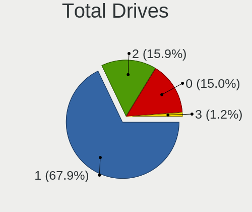
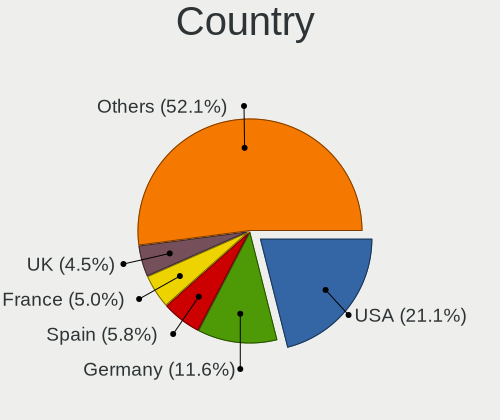
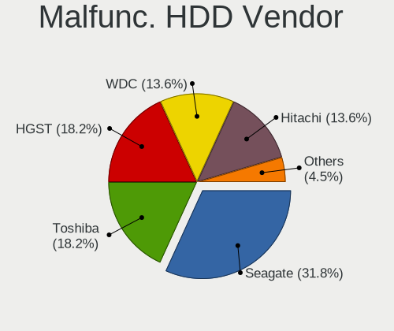
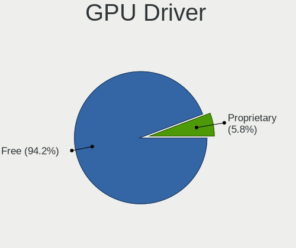
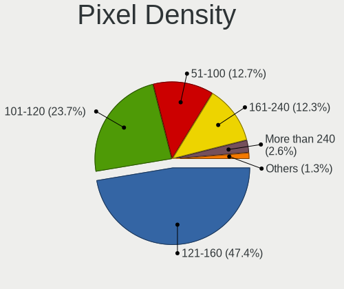
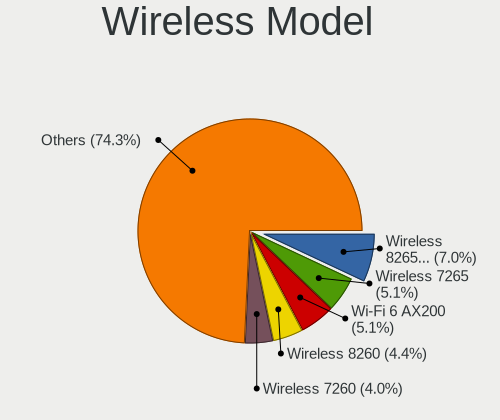
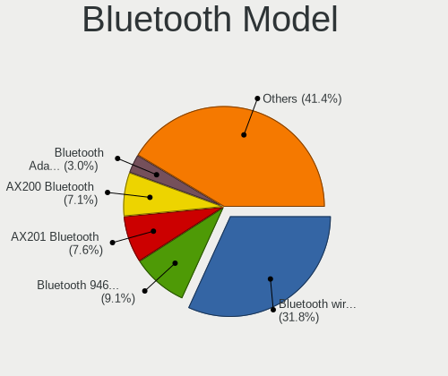
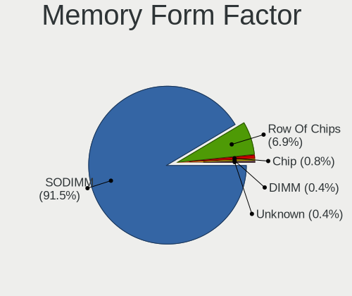

GhostBSD - Tested Hardware & Statistics (Notebooks)
---------------------------------------------------

A project to collect tested hardware configurations for GhostBSD.

Anyone can contribute to this report by the [hw-probe](https://github.com/linuxhw/hw-probe/blob/master/INSTALL.BSD.md) tool:

    hw-probe -all -upload

Please contribute! Especially if your hardware is rare.

Contents
--------

* [ Test Cases ](#test-cases)

* [ System ](#system)
  - [ OS                       ](#os)
  - [ OS Family                ](#os-family)
  - [ Arch                     ](#arch)
  - [ DE                       ](#de)
  - [ Display Server           ](#display-server)
  - [ Display Manager          ](#display-manager)
  - [ OS Lang                  ](#os-lang)
  - [ Boot Mode                ](#boot-mode)
  - [ Filesystem               ](#filesystem)
  - [ Part. scheme             ](#part-scheme)

* [ Board ](#board)
  - [ Vendor                   ](#vendor)
  - [ Model                    ](#model)
  - [ Model Family             ](#model-family)
  - [ MFG Year                 ](#mfg-year)
  - [ Form Factor              ](#form-factor)
  - [ Coreboot                 ](#coreboot)
  - [ RAM Size                 ](#ram-size)
  - [ RAM Used                 ](#ram-used)
  - [ Total Drives             ](#total-drives)
  - [ Has CD-ROM               ](#has-cd-rom)
  - [ Has Ethernet             ](#has-ethernet)
  - [ Has WiFi                 ](#has-wifi)
  - [ Has Bluetooth            ](#has-bluetooth)

* [ Location ](#location)
  - [ Country                  ](#country)
  - [ City                     ](#city)

* [ Drives ](#drives)
  - [ Drive Vendor             ](#drive-vendor)
  - [ Drive Model              ](#drive-model)
  - [ HDD Vendor               ](#hdd-vendor)
  - [ SSD Vendor               ](#ssd-vendor)
  - [ Drive Kind               ](#drive-kind)
  - [ Drive Connector          ](#drive-connector)
  - [ Drive Size               ](#drive-size)
  - [ Space Total              ](#space-total)
  - [ Space Used               ](#space-used)
  - [ Malfunc. Drives          ](#malfunc-drives)
  - [ Malfunc. Drive Vendor    ](#malfunc-drive-vendor)
  - [ Malfunc. HDD Vendor      ](#malfunc-hdd-vendor)
  - [ Malfunc. Drive Kind      ](#malfunc-drive-kind)
  - [ Failed Drives            ](#failed-drives)
  - [ Failed Drive Vendor      ](#failed-drive-vendor)
  - [ Drive Status             ](#drive-status)

* [ Storage controller ](#storage-controller)
  - [ Storage Vendor           ](#storage-vendor)
  - [ Storage Model            ](#storage-model)
  - [ Storage Kind             ](#storage-kind)

* [ Processor ](#processor)
  - [ CPU Vendor               ](#cpu-vendor)
  - [ CPU Model                ](#cpu-model)
  - [ CPU Model Family         ](#cpu-model-family)
  - [ CPU Cores                ](#cpu-cores)
  - [ CPU Sockets              ](#cpu-sockets)
  - [ CPU Threads              ](#cpu-threads)
  - [ CPU Microarch            ](#cpu-microarch)

* [ Graphics ](#graphics)
  - [ GPU Vendor               ](#gpu-vendor)
  - [ GPU Model                ](#gpu-model)
  - [ GPU Combo                ](#gpu-combo)
  - [ GPU Driver               ](#gpu-driver)
  - [ GPU Memory               ](#gpu-memory)

* [ Monitor ](#monitor)
  - [ Monitor Vendor           ](#monitor-vendor)
  - [ Monitor Model            ](#monitor-model)
  - [ Monitor Resolution       ](#monitor-resolution)
  - [ Monitor Diagonal         ](#monitor-diagonal)
  - [ Monitor Width            ](#monitor-width)
  - [ Aspect Ratio             ](#aspect-ratio)
  - [ Monitor Area             ](#monitor-area)
  - [ Pixel Density            ](#pixel-density)
  - [ Multiple Monitors        ](#multiple-monitors)

* [ Network ](#network)
  - [ Net Controller Vendor    ](#net-controller-vendor)
  - [ Net Controller Model     ](#net-controller-model)
  - [ Wireless Vendor          ](#wireless-vendor)
  - [ Wireless Model           ](#wireless-model)
  - [ Ethernet Vendor          ](#ethernet-vendor)
  - [ Ethernet Model           ](#ethernet-model)
  - [ Net Controller Kind      ](#net-controller-kind)
  - [ Used Controller          ](#used-controller)
  - [ NICs                     ](#nics)
  - [ IPv6                     ](#ipv6)

* [ Bluetooth ](#bluetooth)
  - [ Bluetooth Vendor         ](#bluetooth-vendor)
  - [ Bluetooth Model          ](#bluetooth-model)

* [ Sound ](#sound)
  - [ Sound Vendor             ](#sound-vendor)
  - [ Sound Model              ](#sound-model)

* [ Memory ](#memory)
  - [ Memory Vendor            ](#memory-vendor)
  - [ Memory Model             ](#memory-model)
  - [ Memory Kind              ](#memory-kind)
  - [ Memory Form Factor       ](#memory-form-factor)
  - [ Memory Size              ](#memory-size)
  - [ Memory Speed             ](#memory-speed)

* [ Printers & scanners ](#printers--scanners)
  - [ Printer Vendor           ](#printer-vendor)
  - [ Printer Model            ](#printer-model)
  - [ Scanner Vendor           ](#scanner-vendor)
  - [ Scanner Model            ](#scanner-model)

* [ Camera ](#camera)
  - [ Camera Vendor            ](#camera-vendor)
  - [ Camera Model             ](#camera-model)

* [ Security ](#security)
  - [ Fingerprint Vendor       ](#fingerprint-vendor)
  - [ Fingerprint Model        ](#fingerprint-model)
  - [ Chipcard Vendor          ](#chipcard-vendor)
  - [ Chipcard Model           ](#chipcard-model)

* [ Unsupported ](#unsupported)
  - [ Unsupported Devices      ](#unsupported-devices)
  - [ Unsupported Device Types ](#unsupported-device-types)

Test Cases
----------

Total: 153

| Vendor        | Model                       | Probe                                                     | Date         |
|---------------|-----------------------------|-----------------------------------------------------------|--------------|
| Dell          | XPS 13 7390                 | [5ec12d679e](https://bsd-hardware.info/?probe=5ec12d679e) | Jul 01, 2022 |
| Dell          | XPS 13 7390                 | [b870cd3698](https://bsd-hardware.info/?probe=b870cd3698) | Jul 01, 2022 |
| System76      | Gazelle                     | [7e2dbb0a5b](https://bsd-hardware.info/?probe=7e2dbb0a5b) | Jun 28, 2022 |
| System76      | Gazelle                     | [8cb2a30786](https://bsd-hardware.info/?probe=8cb2a30786) | Jun 28, 2022 |
| ASUSTek       | ZenBook UX325UA_UM325UA     | [bb3de13b1a](https://bsd-hardware.info/?probe=bb3de13b1a) | Jun 23, 2022 |
| ASUSTek       | X202E                       | [bdbe613858](https://bsd-hardware.info/?probe=bdbe613858) | Jun 22, 2022 |
| HP            | EliteBook 830 G5            | [03cb6c6c7f](https://bsd-hardware.info/?probe=03cb6c6c7f) | Jun 09, 2022 |
| Dell          | Latitude 7490               | [22224f46f4](https://bsd-hardware.info/?probe=22224f46f4) | Jun 02, 2022 |
| TUXEDO        | Aura 15 Gen1                | [115de395dd](https://bsd-hardware.info/?probe=115de395dd) | May 17, 2022 |
| Lenovo        | ThinkPad E14 Gen 2 20TA0... | [d2334d7be3](https://bsd-hardware.info/?probe=d2334d7be3) | May 14, 2022 |
| Acer          | Aspire A715-42G             | [6dce802641](https://bsd-hardware.info/?probe=6dce802641) | May 10, 2022 |
| Dell          | Latitude 7490               | [0d5b872ec1](https://bsd-hardware.info/?probe=0d5b872ec1) | May 02, 2022 |
| Dell          | Latitude 7490               | [03c97fe4d9](https://bsd-hardware.info/?probe=03c97fe4d9) | May 02, 2022 |
| Dell          | Precision 7730              | [bdb3e3d4ce](https://bsd-hardware.info/?probe=bdb3e3d4ce) | Apr 30, 2022 |
| Dell          | Latitude 7490               | [1586880dd7](https://bsd-hardware.info/?probe=1586880dd7) | Apr 30, 2022 |
| ASUSTek       | X550CC                      | [ece6d63cfb](https://bsd-hardware.info/?probe=ece6d63cfb) | Apr 25, 2022 |
| Dell          | Latitude E5450              | [ca5eb083f9](https://bsd-hardware.info/?probe=ca5eb083f9) | Apr 16, 2022 |
| Notebook      | N13xWU                      | [8986953acd](https://bsd-hardware.info/?probe=8986953acd) | Mar 22, 2022 |
| Notebook      | N7x0WU                      | [b80f84aef1](https://bsd-hardware.info/?probe=b80f84aef1) | Mar 22, 2022 |
| Notebook      | N8xEJEK                     | [9a62677ea8](https://bsd-hardware.info/?probe=9a62677ea8) | Mar 22, 2022 |
| Dell          | Latitude E6500              | [5fad69bbf0](https://bsd-hardware.info/?probe=5fad69bbf0) | Mar 22, 2022 |
| Dell          | Latitude E6510              | [a040a1a04b](https://bsd-hardware.info/?probe=a040a1a04b) | Mar 22, 2022 |
| Dell          | Latitude E6530              | [9bc5fc70a7](https://bsd-hardware.info/?probe=9bc5fc70a7) | Mar 22, 2022 |
| Lenovo        | ThinkPad X201 32492EU       | [4a5ba4f3e4](https://bsd-hardware.info/?probe=4a5ba4f3e4) | Mar 13, 2022 |
| Lenovo        | ThinkPad T450 20BUS0VH08    | [bc2860431e](https://bsd-hardware.info/?probe=bc2860431e) | Feb 17, 2022 |
| Jumper        | EZbook                      | [35869ff0db](https://bsd-hardware.info/?probe=35869ff0db) | Feb 14, 2022 |
| Lenovo        | G500s 20245                 | [41f9f804ac](https://bsd-hardware.info/?probe=41f9f804ac) | Feb 04, 2022 |
| Dell          | Vostro 3550                 | [0b290f2ac3](https://bsd-hardware.info/?probe=0b290f2ac3) | Feb 02, 2022 |
| MSI           | GE75 Raider 10SFS           | [48b172bfe8](https://bsd-hardware.info/?probe=48b172bfe8) | Jan 25, 2022 |
| MSI           | GF63 Thin 10SCSR            | [5b9c617dc8](https://bsd-hardware.info/?probe=5b9c617dc8) | Jan 22, 2022 |
| Apple         | MacBookPro11,4              | [6d580e8270](https://bsd-hardware.info/?probe=6d580e8270) | Jan 21, 2022 |
| Dell          | Latitude E6540              | [f13972c935](https://bsd-hardware.info/?probe=f13972c935) | Jan 21, 2022 |
| Fujitsu       | CELSIUS H780                | [a173366c78](https://bsd-hardware.info/?probe=a173366c78) | Jan 21, 2022 |
| Jumper        | EZbook                      | [7d648bcdc7](https://bsd-hardware.info/?probe=7d648bcdc7) | Jan 17, 2022 |
| ASUSTek       | VivoBook_ASUSLaptop X515... | [cf360a6098](https://bsd-hardware.info/?probe=cf360a6098) | Jan 16, 2022 |
| Acer          | Extensa 5635Z               | [d76873c5dd](https://bsd-hardware.info/?probe=d76873c5dd) | Jan 16, 2022 |
| HP            | Laptop 15-dw2xxx            | [a6d7796cea](https://bsd-hardware.info/?probe=a6d7796cea) | Jan 13, 2022 |
| Dell          | Latitude 5510               | [a620d284cb](https://bsd-hardware.info/?probe=a620d284cb) | Jan 12, 2022 |
| Dell          | Inspiron N5110              | [19be37f181](https://bsd-hardware.info/?probe=19be37f181) | Jan 09, 2022 |
| Dell          | Latitude E5450              | [c2ef231757](https://bsd-hardware.info/?probe=c2ef231757) | Jan 04, 2022 |
| ASUSTek       | TUF GAMING FX504GD_FX80G... | [259b5cc7b2](https://bsd-hardware.info/?probe=259b5cc7b2) | Dec 28, 2021 |
| ASUSTek       | X202E                       | [7f4e6f4541](https://bsd-hardware.info/?probe=7f4e6f4541) | Dec 05, 2021 |
| Fujitsu       | LIFEBOOK A555               | [c501c5c75e](https://bsd-hardware.info/?probe=c501c5c75e) | Dec 04, 2021 |
| Samsung       | 530XBB                      | [41d5f95889](https://bsd-hardware.info/?probe=41d5f95889) | Dec 03, 2021 |
| Alienware     | m15 R4                      | [a724a7d7c7](https://bsd-hardware.info/?probe=a724a7d7c7) | Nov 29, 2021 |
| Lenovo        | ThinkPad T520 4243E51       | [82f5612822](https://bsd-hardware.info/?probe=82f5612822) | Nov 29, 2021 |
| Sony          | SVP13225SCBI                | [03ef84679c](https://bsd-hardware.info/?probe=03ef84679c) | Nov 27, 2021 |
| Dell          | Latitude 5510               | [3da78c9445](https://bsd-hardware.info/?probe=3da78c9445) | Nov 24, 2021 |
| Acer          | TravelMate B117-M           | [4f02660d9c](https://bsd-hardware.info/?probe=4f02660d9c) | Nov 14, 2021 |
| Toshiba       | Satellite C855-1U4          | [4107fc9eee](https://bsd-hardware.info/?probe=4107fc9eee) | Nov 14, 2021 |
| Dell          | Latitude D630               | [7e3a92badc](https://bsd-hardware.info/?probe=7e3a92badc) | Nov 02, 2021 |
| HP            | EliteBook Folio 1040 G3     | [d23636abb2](https://bsd-hardware.info/?probe=d23636abb2) | Oct 31, 2021 |
| Samsung       | 550P5C/550P7C               | [69fe175fb8](https://bsd-hardware.info/?probe=69fe175fb8) | Oct 30, 2021 |
| HP            | Pavilion g6                 | [9754bc2e72](https://bsd-hardware.info/?probe=9754bc2e72) | Oct 27, 2021 |
| MSI           | Modern 14 A10M              | [84838cd532](https://bsd-hardware.info/?probe=84838cd532) | Oct 07, 2021 |
| MSI           | Modern 14 A10M              | [db33045561](https://bsd-hardware.info/?probe=db33045561) | Oct 07, 2021 |
| Acer          | Aspire A315-56              | [03ca802f4b](https://bsd-hardware.info/?probe=03ca802f4b) | Oct 02, 2021 |
| MSI           | Modern 14 A10M              | [277d8118da](https://bsd-hardware.info/?probe=277d8118da) | Sep 30, 2021 |
| Lenovo        | Flex 2-15 20405             | [76ea6529ac](https://bsd-hardware.info/?probe=76ea6529ac) | Sep 26, 2021 |
| MSI           | Modern 14 A10M              | [103ccaf452](https://bsd-hardware.info/?probe=103ccaf452) | Sep 25, 2021 |
| Lenovo        | ThinkPad X220 4290W42       | [8be5183e21](https://bsd-hardware.info/?probe=8be5183e21) | Sep 25, 2021 |
| Lenovo        | ThinkPad T500 2056Y2Z       | [88b86ecf8b](https://bsd-hardware.info/?probe=88b86ecf8b) | Sep 25, 2021 |
| HUAWEI        | HLY-WX9XX                   | [bd5b726e52](https://bsd-hardware.info/?probe=bd5b726e52) | Sep 19, 2021 |
| Lenovo        | Yoga Slim 7 Pro 14ACH5 8... | [2a54a0c338](https://bsd-hardware.info/?probe=2a54a0c338) | Sep 14, 2021 |
| Lenovo        | ThinkPad T400 6474E18       | [2dd5b5869f](https://bsd-hardware.info/?probe=2dd5b5869f) | Sep 13, 2021 |
| HP            | EliteBook 8570p             | [27f01061f2](https://bsd-hardware.info/?probe=27f01061f2) | Sep 12, 2021 |
| Lenovo        | ThinkPad X250 20CL001GZA    | [ecd69774c0](https://bsd-hardware.info/?probe=ecd69774c0) | Sep 06, 2021 |
| System76      | Kudu                        | [c10fc12e40](https://bsd-hardware.info/?probe=c10fc12e40) | Sep 05, 2021 |
| Acer          | Aspire 5750                 | [2bc72bf29e](https://bsd-hardware.info/?probe=2bc72bf29e) | Aug 23, 2021 |
| Dell          | Latitude E5440              | [3f2e8586a7](https://bsd-hardware.info/?probe=3f2e8586a7) | Aug 05, 2021 |
| Dell          | Latitude E6430              | [4149fa5ec3](https://bsd-hardware.info/?probe=4149fa5ec3) | Aug 04, 2021 |
| Lenovo        | Legion Y7000P 81LD          | [7364ae3b3d](https://bsd-hardware.info/?probe=7364ae3b3d) | Aug 04, 2021 |
| Lenovo        | ThinkPad L512 44444XG       | [a6c8fbcb20](https://bsd-hardware.info/?probe=a6c8fbcb20) | Aug 01, 2021 |
| GPU Compan... | GWTN156-5                   | [bc44d767cc](https://bsd-hardware.info/?probe=bc44d767cc) | Jul 22, 2021 |
| Dell          | Latitude E5520              | [e0dd26220f](https://bsd-hardware.info/?probe=e0dd26220f) | Jul 21, 2021 |
| Apple         | MacBook5,1                  | [1e54d2fbdf](https://bsd-hardware.info/?probe=1e54d2fbdf) | Jul 05, 2021 |
| Apple         | MacBook5,1                  | [f5d7a16498](https://bsd-hardware.info/?probe=f5d7a16498) | Jul 05, 2021 |
| Lenovo        | ThinkPad T470 W10DG 20JN... | [668bf95221](https://bsd-hardware.info/?probe=668bf95221) | Jun 25, 2021 |
| Dell          | Latitude E6420              | [2e8b431cc6](https://bsd-hardware.info/?probe=2e8b431cc6) | Jun 25, 2021 |
| Lenovo        | ThinkPad T440 20B7S1860W    | [8552205176](https://bsd-hardware.info/?probe=8552205176) | Jun 22, 2021 |
| Lenovo        | IdeaPad 520-15IKB 81BF      | [9f82e215c3](https://bsd-hardware.info/?probe=9f82e215c3) | Jun 22, 2021 |
| Dell          | Inspiron 3542               | [a2deab0991](https://bsd-hardware.info/?probe=a2deab0991) | Jun 15, 2021 |
| Sony          | SVP1322M1EBI                | [23316d0f2b](https://bsd-hardware.info/?probe=23316d0f2b) | May 29, 2021 |
| Lenovo        | ThinkPad T470 20HD000MUK    | [e27342ab94](https://bsd-hardware.info/?probe=e27342ab94) | May 13, 2021 |
| Lenovo        | ThinkPad X250 20CM003WMS    | [11fe52be5e](https://bsd-hardware.info/?probe=11fe52be5e) | May 13, 2021 |
| Lenovo        | ThinkPad T430 2344C4U       | [0f001f65d2](https://bsd-hardware.info/?probe=0f001f65d2) | Apr 27, 2021 |
| Samsung       | 3570R/370R/470R/450R/510... | [f8389b0546](https://bsd-hardware.info/?probe=f8389b0546) | Apr 24, 2021 |
| HP            | Laptop 15-da0xxx            | [cb09a1b771](https://bsd-hardware.info/?probe=cb09a1b771) | Apr 08, 2021 |
| Apple         | MacBookPro8,1               | [e4e3731289](https://bsd-hardware.info/?probe=e4e3731289) | Apr 01, 2021 |
| Acer          | Aspire E5-521G              | [e2b6dbfe40](https://bsd-hardware.info/?probe=e2b6dbfe40) | Apr 01, 2021 |
| HP            | 255 G7 Notebook PC          | [3e500c12a3](https://bsd-hardware.info/?probe=3e500c12a3) | Mar 24, 2021 |
| HP            | Laptop 15-da0xxx            | [a7a25be087](https://bsd-hardware.info/?probe=a7a25be087) | Mar 16, 2021 |
| Lenovo        | ThinkPad X250 20CM003WMS    | [c7f71901c3](https://bsd-hardware.info/?probe=c7f71901c3) | Mar 11, 2021 |
| Lenovo        | ThinkPad X250 20CM003WMS    | [803974a844](https://bsd-hardware.info/?probe=803974a844) | Mar 11, 2021 |
| Lenovo        | ThinkPad X250 20CM003WMS    | [196cd8a730](https://bsd-hardware.info/?probe=196cd8a730) | Mar 11, 2021 |
| Acer          | Aspire F5-573G              | [240171b234](https://bsd-hardware.info/?probe=240171b234) | Mar 08, 2021 |
| HP            | Pavilion Gaming Laptop 1... | [9ede3128c5](https://bsd-hardware.info/?probe=9ede3128c5) | Mar 07, 2021 |
| HP            | Laptop 15-db0xxx            | [b1ee3da46f](https://bsd-hardware.info/?probe=b1ee3da46f) | Mar 06, 2021 |
| Apple         | MacBookPro5,5               | [50ac436475](https://bsd-hardware.info/?probe=50ac436475) | Mar 06, 2021 |
| Lenovo        | ThinkPad T470 20HD000MUK    | [b85d23571e](https://bsd-hardware.info/?probe=b85d23571e) | Feb 23, 2021 |
| Acer          | Extensa 5635Z               | [837c6f28b4](https://bsd-hardware.info/?probe=837c6f28b4) | Feb 19, 2021 |
| Apple         | MacBookPro5,5               | [9bbe1119a1](https://bsd-hardware.info/?probe=9bbe1119a1) | Feb 12, 2021 |
| Lenovo        | ThinkPad T470 20HD000MUK    | [39c8cd6d0c](https://bsd-hardware.info/?probe=39c8cd6d0c) | Feb 08, 2021 |
| HP            | Laptop 15-da0xxx            | [d6bc2b2c1d](https://bsd-hardware.info/?probe=d6bc2b2c1d) | Feb 08, 2021 |
| Apple         | MacBookPro5,5               | [ffc0295ae1](https://bsd-hardware.info/?probe=ffc0295ae1) | Feb 07, 2021 |
| Apple         | MacBookPro5,5               | [13fdaa7c15](https://bsd-hardware.info/?probe=13fdaa7c15) | Feb 04, 2021 |
| Apple         | MacBookPro5,5               | [254e518190](https://bsd-hardware.info/?probe=254e518190) | Feb 03, 2021 |
| HP            | Laptop 15-da0xxx            | [869d894f4f](https://bsd-hardware.info/?probe=869d894f4f) | Jan 30, 2021 |
| Dell          | Latitude 5480               | [9b38a72dd4](https://bsd-hardware.info/?probe=9b38a72dd4) | Jan 26, 2021 |
| HP            | Laptop 15-da0xxx            | [3e37c56f14](https://bsd-hardware.info/?probe=3e37c56f14) | Jan 23, 2021 |
| HP            | Laptop 17-ca1xxx            | [fb318623f3](https://bsd-hardware.info/?probe=fb318623f3) | Jan 23, 2021 |
| HP            | Laptop 17-ca1xxx            | [97a89d4eb0](https://bsd-hardware.info/?probe=97a89d4eb0) | Jan 23, 2021 |
| HP            | Laptop 17-ca1xxx            | [806c954739](https://bsd-hardware.info/?probe=806c954739) | Jan 23, 2021 |
| Notebook      | N85_N87,HJ,HJ1,HK1          | [3d18f3f8a9](https://bsd-hardware.info/?probe=3d18f3f8a9) | Jan 23, 2021 |
| Dell          | Inspiron 3542               | [3c41c474ad](https://bsd-hardware.info/?probe=3c41c474ad) | Jan 16, 2021 |
| HP            | OMEN by HP Laptop           | [14857eb6b7](https://bsd-hardware.info/?probe=14857eb6b7) | Jan 15, 2021 |
| ASUSTek       | X550LC                      | [f7c32488e9](https://bsd-hardware.info/?probe=f7c32488e9) | Jan 15, 2021 |
| Lenovo        | IdeaPad S145-15API 81UT     | [06cbb5cd5f](https://bsd-hardware.info/?probe=06cbb5cd5f) | Jan 15, 2021 |
| Dell          | Latitude 5280               | [c9bfb73262](https://bsd-hardware.info/?probe=c9bfb73262) | Jan 15, 2021 |
| Samsung       | 3570R/370R/470R/450R/510... | [a395c023bf](https://bsd-hardware.info/?probe=a395c023bf) | Jan 10, 2021 |
| Dell          | Inspiron 5758               | [c096e37be5](https://bsd-hardware.info/?probe=c096e37be5) | Jan 03, 2021 |
| HP            | Laptop 14-dk0xxx            | [5cd8e23152](https://bsd-hardware.info/?probe=5cd8e23152) | Dec 26, 2020 |
| HP            | Laptop 14-dk0xxx            | [fdbd71db5e](https://bsd-hardware.info/?probe=fdbd71db5e) | Dec 26, 2020 |
| Lenovo        | Yoga 2 13 20344             | [c51c202b8d](https://bsd-hardware.info/?probe=c51c202b8d) | Dec 25, 2020 |
| Lenovo        | ThinkPad T450 20BV0064US    | [b397848c7e](https://bsd-hardware.info/?probe=b397848c7e) | Dec 16, 2020 |
| Toshiba       | Satellite C855              | [6bc78fc7fc](https://bsd-hardware.info/?probe=6bc78fc7fc) | Dec 16, 2020 |
| Panasonic     | CF-19AHNC8FN                | [04a42812bb](https://bsd-hardware.info/?probe=04a42812bb) | Dec 11, 2020 |
| Lenovo        | ThinkPad X220 42872VU       | [c843b5d271](https://bsd-hardware.info/?probe=c843b5d271) | Dec 10, 2020 |
| Sony          | VPCCB17FG                   | [d8a67b4a30](https://bsd-hardware.info/?probe=d8a67b4a30) | Dec 06, 2020 |
| Sony          | VPCCB17FG                   | [7fc23a57bb](https://bsd-hardware.info/?probe=7fc23a57bb) | Nov 25, 2020 |
| Acer          | Aspire 7540                 | [65d215a03b](https://bsd-hardware.info/?probe=65d215a03b) | Nov 17, 2020 |
| Apple         | MacBook6,1                  | [64b1b1910c](https://bsd-hardware.info/?probe=64b1b1910c) | Nov 01, 2020 |
| Acer          | Aspire A315-42              | [1ac21e1660](https://bsd-hardware.info/?probe=1ac21e1660) | Oct 08, 2020 |
| Acer          | Aspire E1-532               | [10bff44534](https://bsd-hardware.info/?probe=10bff44534) | Oct 07, 2020 |
| HP            | Laptop 15-da0xxx            | [7faf1699d6](https://bsd-hardware.info/?probe=7faf1699d6) | Oct 04, 2020 |
| Lenovo        | ThinkPad T590 20N40016CD    | [1d9786ac9f](https://bsd-hardware.info/?probe=1d9786ac9f) | Aug 31, 2020 |
| Lenovo        | ThinkPad T590 20N40016CD    | [e505894bee](https://bsd-hardware.info/?probe=e505894bee) | Aug 29, 2020 |
| System76      | Lemur Pro                   | [0163d0f084](https://bsd-hardware.info/?probe=0163d0f084) | Aug 29, 2020 |
| Lenovo        | ThinkPad T430s 23539JM      | [facf6fa0f8](https://bsd-hardware.info/?probe=facf6fa0f8) | Aug 27, 2020 |
| ASUSTek       | K53SD                       | [975e9ccbe2](https://bsd-hardware.info/?probe=975e9ccbe2) | Aug 27, 2020 |
| Lenovo        | ThinkPad T530 239242U       | [7c8087322d](https://bsd-hardware.info/?probe=7c8087322d) | Aug 27, 2020 |
| Sony          | VGN-SZ3VWP_X                | [ace534d784](https://bsd-hardware.info/?probe=ace534d784) | Aug 10, 2020 |
| TUXEDO        | InfinityBook13V3            | [d508fb472b](https://bsd-hardware.info/?probe=d508fb472b) | Aug 10, 2020 |
| Dell          | Inspiron 3542               | [b89da90904](https://bsd-hardware.info/?probe=b89da90904) | Aug 01, 2020 |
| ASUSTek       | G750JS                      | [8214170523](https://bsd-hardware.info/?probe=8214170523) | Aug 01, 2020 |
| ASUSTek       | G750JS                      | [60b904f003](https://bsd-hardware.info/?probe=60b904f003) | Aug 01, 2020 |
| Dell          | Latitude E6420              | [324265fe3f](https://bsd-hardware.info/?probe=324265fe3f) | May 31, 2020 |
| Lenovo        | ThinkPad T430s 2352CTO      | [f4e8ffb5dc](https://bsd-hardware.info/?probe=f4e8ffb5dc) | May 27, 2020 |
| Lenovo        | ThinkPad T430s 2352CTO      | [59c5b6d6b9](https://bsd-hardware.info/?probe=59c5b6d6b9) | May 27, 2020 |
| Dell          | Precision M4700             | [a7761ee829](https://bsd-hardware.info/?probe=a7761ee829) | May 25, 2020 |
| Lenovo        | G570 20079                  | [6a1b7867f0](https://bsd-hardware.info/?probe=6a1b7867f0) | May 16, 2020 |
| Lenovo        | G570 20079                  | [25fd1154c0](https://bsd-hardware.info/?probe=25fd1154c0) | May 08, 2020 |
| Lenovo        | G570 20079                  | [0370bc0522](https://bsd-hardware.info/?probe=0370bc0522) | May 02, 2020 |

System
------

OS
--

Installed operating systems

| Name                 | Notebooks | Percent |
|----------------------|-----------|---------|
| GhostBSD 20.04.02    | 58        | 52.25%  |
| GhostBSD 21.08.27    | 28        | 25.23%  |
| GhostBSD 22.01.12    | 13        | 11.71%  |
| GhostBSD 22.06.26    | 1         | 0.9%    |
| GhostBSD 22.06.20    | 1         | 0.9%    |
| GhostBSD 22.06.07    | 1         | 0.9%    |
| GhostBSD 22.05.13    | 1         | 0.9%    |
| GhostBSD 22.04.30    | 1         | 0.9%    |
| GhostBSD 22.04.22    | 1         | 0.9%    |
| GhostBSD 22.04.06    | 1         | 0.9%    |
| GhostBSD 21.12.29    | 1         | 0.9%    |
| GhostBSD 21.11.24    | 1         | 0.9%    |
| GhostBSD 20.07.14    | 1         | 0.9%    |
| GhostBSD 20.03.01    | 1         | 0.9%    |
| GhostBSD 12.2-STABLE | 1         | 0.9%    |

OS Family
---------

OS without a version

| Name     | Notebooks | Percent |
|----------|-----------|---------|
| GhostBSD | 108       | 100%    |

Arch
----

OS architecture (x86_64, i586, etc.)

| Name  | Notebooks | Percent |
|-------|-----------|---------|
| amd64 | 108       | 100%    |

DE
--

Desktop Environment

| Name         | Notebooks | Percent |
|--------------|-----------|---------|
| MATE         | 86        | 78.9%   |
| XFCE         | 15        | 13.76%  |
| KDE5         | 3         | 2.75%   |
| Cinnamon     | 2         | 1.83%   |
| helloDesktop | 1         | 0.92%   |
| GNOME        | 1         | 0.92%   |
| Console      | 1         | 0.92%   |

Display Server
--------------

X11 or Wayland

| Name    | Notebooks | Percent |
|---------|-----------|---------|
| X11     | 106       | 98.15%  |
| Wayland | 1         | 0.93%   |
| Console | 1         | 0.93%   |

Display Manager
---------------

SDDM, LightDM, etc.

| Name    | Notebooks | Percent |
|---------|-----------|---------|
| LightDM | 106       | 98.15%  |
| SDDM    | 1         | 0.93%   |
| Console | 1         | 0.93%   |

OS Lang
-------

Language

| Lang    | Notebooks | Percent |
|---------|-----------|---------|
| en_US   | 44        | 38.94%  |
| C       | 35        | 30.97%  |
| Unknown | 16        | 14.16%  |
| de_DE   | 5         | 4.42%   |
| pl_PL   | 2         | 1.77%   |
| it_IT   | 2         | 1.77%   |
| en_GB   | 2         | 1.77%   |
| zh_CN   | 1         | 0.88%   |
| sk_SK   | 1         | 0.88%   |
| ru_RU   | 1         | 0.88%   |
| pt_BR   | 1         | 0.88%   |
| es_ES   | 1         | 0.88%   |
| en_NZ   | 1         | 0.88%   |
| el_GR   | 1         | 0.88%   |

Boot Mode
---------

EFI or BIOS

| Mode | Notebooks | Percent |
|------|-----------|---------|
| EFI  | 83        | 76.85%  |
| BIOS | 25        | 23.15%  |

Filesystem
----------

Type of filesystem

| Type | Notebooks | Percent |
|------|-----------|---------|
| Zfs  | 102       | 91.89%  |
| Ufs  | 9         | 8.11%   |

Part. scheme
------------

Scheme of partitioning

| Type | Notebooks | Percent |
|------|-----------|---------|
| GPT  | 106       | 98.15%  |
| MBR  | 2         | 1.85%   |

Board
-----

Vendor
------

Motherboard manufacturer

| Name                | Notebooks | Percent |
|---------------------|-----------|---------|
| Lenovo              | 28        | 25.93%  |
| Dell                | 23        | 21.3%   |
| Hewlett-Packard     | 9         | 8.33%   |
| Acer                | 9         | 8.33%   |
| ASUSTek Computer    | 8         | 7.41%   |
| Sony                | 4         | 3.7%    |
| Notebook            | 4         | 3.7%    |
| MSI                 | 4         | 3.7%    |
| Apple               | 4         | 3.7%    |
| System76            | 3         | 2.78%   |
| Toshiba             | 2         | 1.85%   |
| Samsung Electronics | 2         | 1.85%   |
| Fujitsu             | 2         | 1.85%   |
| TUXEDO              | 1         | 0.93%   |
| Panasonic           | 1         | 0.93%   |
| Jumper              | 1         | 0.93%   |
| HUAWEI              | 1         | 0.93%   |
| GPU Company         | 1         | 0.93%   |
| Alienware           | 1         | 0.93%   |

Model
-----

Motherboard model

| Name                                     | Notebooks | Percent |
|------------------------------------------|-----------|---------|
| Dell Inspiron 3542                       | 3         | 2.78%   |
| MSI Modern 14 A10M                       | 2         | 1.85%   |
| Lenovo ThinkPad T430s 2352CTO            | 2         | 1.85%   |
| Dell Latitude E6420                      | 2         | 1.85%   |
| TUXEDO InfinityBook13V3                  | 1         | 0.93%   |
| Toshiba Satellite C855-1U4               | 1         | 0.93%   |
| Toshiba Satellite C855                   | 1         | 0.93%   |
| System76 Lemur Pro                       | 1         | 0.93%   |
| System76 Kudu                            | 1         | 0.93%   |
| System76 Gazelle                         | 1         | 0.93%   |
| Sony VPCCB17FG                           | 1         | 0.93%   |
| Sony VGN-SZ3VWP_X                        | 1         | 0.93%   |
| Sony SVP1322M1EBI                        | 1         | 0.93%   |
| Sony SVP13225SCBI                        | 1         | 0.93%   |
| Samsung 550P5C/550P7C                    | 1         | 0.93%   |
| Samsung 3570R/370R/470R/450R/510R/4450RV | 1         | 0.93%   |
| Panasonic CF-19AHNC8FN                   | 1         | 0.93%   |
| Notebook N8xEJEK                         | 1         | 0.93%   |
| Notebook N85_N87,HJ,HJ1,HK1              | 1         | 0.93%   |
| Notebook N7x0WU                          | 1         | 0.93%   |
| Notebook N13xWU                          | 1         | 0.93%   |
| MSI GF63 Thin 10SCSR                     | 1         | 0.93%   |
| MSI GE75 Raider 10SFS                    | 1         | 0.93%   |
| Lenovo Yoga Slim 7 Pro 14ACH5 82MS       | 1         | 0.93%   |
| Lenovo Yoga 2 13 20344                   | 1         | 0.93%   |
| Lenovo ThinkPad X250 20CM003WMS          | 1         | 0.93%   |
| Lenovo ThinkPad X250 20CL001GZA          | 1         | 0.93%   |
| Lenovo ThinkPad X220 4290W42             | 1         | 0.93%   |
| Lenovo ThinkPad X220 42872VU             | 1         | 0.93%   |
| Lenovo ThinkPad X201 32492EU             | 1         | 0.93%   |
| Lenovo ThinkPad T590 20N40016CD          | 1         | 0.93%   |
| Lenovo ThinkPad T530 239242U             | 1         | 0.93%   |
| Lenovo ThinkPad T520 4243E51             | 1         | 0.93%   |
| Lenovo ThinkPad T500 2056Y2Z             | 1         | 0.93%   |
| Lenovo ThinkPad T470 W10DG 20JNS0JU01    | 1         | 0.93%   |
| Lenovo ThinkPad T470 20HD000MUK          | 1         | 0.93%   |
| Lenovo ThinkPad T450 20BV0064US          | 1         | 0.93%   |
| Lenovo ThinkPad T450 20BUS0VH08          | 1         | 0.93%   |
| Lenovo ThinkPad T440 20B7S1860W          | 1         | 0.93%   |
| Lenovo ThinkPad T430s 23539JM            | 1         | 0.93%   |
| Lenovo ThinkPad T430 2344C4U             | 1         | 0.93%   |
| Lenovo ThinkPad T400 6474E18             | 1         | 0.93%   |
| Lenovo ThinkPad L512 44444XG             | 1         | 0.93%   |
| Lenovo ThinkPad E14 Gen 2 20TA004FUS     | 1         | 0.93%   |
| Lenovo Legion Y7000P 81LD                | 1         | 0.93%   |
| Lenovo IdeaPad S145-15API 81UT           | 1         | 0.93%   |
| Lenovo IdeaPad 520-15IKB 81BF            | 1         | 0.93%   |
| Lenovo G500s 20245                       | 1         | 0.93%   |
| Lenovo Flex 2-15 20405                   | 1         | 0.93%   |
| Jumper EZbook                            | 1         | 0.93%   |
| HUAWEI HLY-WX9XX                         | 1         | 0.93%   |
| HP Pavilion g6                           | 1         | 0.93%   |
| HP OMEN by HP Laptop                     | 1         | 0.93%   |
| HP Laptop 15-dw2xxx                      | 1         | 0.93%   |
| HP Laptop 15-db0xxx                      | 1         | 0.93%   |
| HP Laptop 15-da0xxx                      | 1         | 0.93%   |
| HP Laptop 14-dk0xxx                      | 1         | 0.93%   |
| HP EliteBook Folio 1040 G3               | 1         | 0.93%   |
| HP EliteBook 830 G5                      | 1         | 0.93%   |
| HP 255 G7 Notebook PC                    | 1         | 0.93%   |

Model Family
------------

Motherboard model prefix

| Name                    | Notebooks | Percent |
|-------------------------|-----------|---------|
| Lenovo ThinkPad         | 21        | 19.44%  |
| Dell Latitude           | 15        | 13.89%  |
| Acer Aspire             | 7         | 6.48%   |
| Dell Inspiron           | 5         | 4.63%   |
| HP Laptop               | 4         | 3.7%    |
| Toshiba Satellite       | 2         | 1.85%   |
| MSI Modern              | 2         | 1.85%   |
| Lenovo Yoga             | 2         | 1.85%   |
| Lenovo IdeaPad          | 2         | 1.85%   |
| HP EliteBook            | 2         | 1.85%   |
| Dell Precision          | 2         | 1.85%   |
| TUXEDO InfinityBook13V3 | 1         | 0.93%   |
| System76 Lemur          | 1         | 0.93%   |
| System76 Kudu           | 1         | 0.93%   |
| System76 Gazelle        | 1         | 0.93%   |
| Sony VPCCB17FG          | 1         | 0.93%   |
| Sony VGN-SZ3VWP         | 1         | 0.93%   |
| Sony SVP1322M1EBI       | 1         | 0.93%   |
| Sony SVP13225SCBI       | 1         | 0.93%   |
| Samsung 550P5C          | 1         | 0.93%   |
| Samsung 3570R           | 1         | 0.93%   |
| Panasonic CF-19AHNC8FN  | 1         | 0.93%   |
| Notebook N8xEJEK        | 1         | 0.93%   |
| Notebook N85            | 1         | 0.93%   |
| Notebook N7x0WU         | 1         | 0.93%   |
| Notebook N13xWU         | 1         | 0.93%   |
| MSI GF63                | 1         | 0.93%   |
| MSI GE75                | 1         | 0.93%   |
| Lenovo Legion           | 1         | 0.93%   |
| Lenovo G500s            | 1         | 0.93%   |
| Lenovo Flex             | 1         | 0.93%   |
| Jumper EZbook           | 1         | 0.93%   |
| HUAWEI HLY-WX9XX        | 1         | 0.93%   |
| HP Pavilion             | 1         | 0.93%   |
| HP OMEN                 | 1         | 0.93%   |
| HP 255                  | 1         | 0.93%   |
| GPU Company GWTN156-5   | 1         | 0.93%   |
| Fujitsu LIFEBOOK        | 1         | 0.93%   |
| Fujitsu CELSIUS         | 1         | 0.93%   |
| Dell XPS                | 1         | 0.93%   |
| ASUS ZenBook            | 1         | 0.93%   |
| ASUS X550LC             | 1         | 0.93%   |
| ASUS X550CC             | 1         | 0.93%   |
| ASUS X202E              | 1         | 0.93%   |
| ASUS VivoBook           | 1         | 0.93%   |
| ASUS TUF                | 1         | 0.93%   |
| ASUS K53SD              | 1         | 0.93%   |
| ASUS G750JS             | 1         | 0.93%   |
| Apple MacBookPro5       | 1         | 0.93%   |
| Apple MacBookPro11      | 1         | 0.93%   |
| Apple MacBook6          | 1         | 0.93%   |
| Apple MacBook5          | 1         | 0.93%   |
| Alienware m15           | 1         | 0.93%   |
| Acer TravelMate         | 1         | 0.93%   |
| Acer Extensa            | 1         | 0.93%   |

MFG Year
--------

Motherboard manufacture year

| Year | Notebooks | Percent |
|------|-----------|---------|
| 2020 | 18        | 16.67%  |
| 2013 | 14        | 12.96%  |
| 2014 | 10        | 9.26%   |
| 2018 | 8         | 7.41%   |
| 2011 | 8         | 7.41%   |
| 2021 | 7         | 6.48%   |
| 2015 | 7         | 6.48%   |
| 2017 | 6         | 5.56%   |
| 2012 | 6         | 5.56%   |
| 2019 | 5         | 4.63%   |
| 2009 | 5         | 4.63%   |
| 2016 | 4         | 3.7%    |
| 2010 | 4         | 3.7%    |
| 2022 | 3         | 2.78%   |
| 2008 | 2         | 1.85%   |
| 2007 | 1         | 0.93%   |

Form Factor
-----------

Physical design of the computer

| Name     | Notebooks | Percent |
|----------|-----------|---------|
| Notebook | 108       | 100%    |

Coreboot
--------

Have coreboot on board

| Used | Notebooks | Percent |
|------|-----------|---------|
| No   | 107       | 99.07%  |
| Yes  | 1         | 0.93%   |

RAM Size
--------

Total RAM memory

| Size in GB | Notebooks | Percent |
|------------|-----------|---------|
| 8.01-16.0  | 59        | 54.63%  |
| 16.01-24.0 | 26        | 24.07%  |
| 4.01-8.0   | 18        | 16.67%  |
| 32.01-64.0 | 2         | 1.85%   |
| 24.01-32.0 | 2         | 1.85%   |
| 2.01-3.0   | 1         | 0.93%   |

RAM Used
--------

Used RAM memory

| Used GB    | Notebooks | Percent |
|------------|-----------|---------|
| 0.01-0.5   | 54        | 49.09%  |
| 0.51-1.0   | 43        | 39.09%  |
| 2.01-3.0   | 6         | 5.45%   |
| 1.01-2.0   | 5         | 4.55%   |
| 4.01-8.0   | 1         | 0.91%   |
| 24.01-32.0 | 1         | 0.91%   |

Total Drives
------------

Number of drives on board

| Drives | Notebooks | Percent |
|--------|-----------|---------|
| 1      | 82        | 74.55%  |
| 2      | 21        | 19.09%  |
| 0      | 7         | 6.36%   |

Has CD-ROM
----------

Has CD-ROM on board

| Presented | Notebooks | Percent |
|-----------|-----------|---------|
| No        | 66        | 61.11%  |
| Yes       | 42        | 38.89%  |

Has Ethernet
------------

Has Ethernet on board

| Presented | Notebooks | Percent |
|-----------|-----------|---------|
| Yes       | 92        | 85.19%  |
| No        | 16        | 14.81%  |

Has WiFi
--------

Has WiFi module

| Presented | Notebooks | Percent |
|-----------|-----------|---------|
| Yes       | 108       | 100%    |

Has Bluetooth
-------------

Has Bluetooth module

| Presented | Notebooks | Percent |
|-----------|-----------|---------|
| Yes       | 81        | 75%     |
| No        | 27        | 25%     |

Location
--------

Country
-------

Geographic location (country)

| Country      | Notebooks | Percent |
|--------------|-----------|---------|
| USA          | 22        | 20.37%  |
| Germany      | 15        | 13.89%  |
| France       | 9         | 8.33%   |
| Poland       | 6         | 5.56%   |
| UK           | 5         | 4.63%   |
| Spain        | 4         | 3.7%    |
| Russia       | 4         | 3.7%    |
| Italy        | 4         | 3.7%    |
| New Zealand  | 3         | 2.78%   |
| Switzerland  | 2         | 1.85%   |
| Sweden       | 2         | 1.85%   |
| Portugal     | 2         | 1.85%   |
| Philippines  | 2         | 1.85%   |
| Japan        | 2         | 1.85%   |
| India        | 2         | 1.85%   |
| Hong Kong    | 2         | 1.85%   |
| Finland      | 2         | 1.85%   |
| China        | 2         | 1.85%   |
| Belgium      | 2         | 1.85%   |
| Ukraine      | 1         | 0.93%   |
| Uganda       | 1         | 0.93%   |
| South Africa | 1         | 0.93%   |
| Slovenia     | 1         | 0.93%   |
| Slovakia     | 1         | 0.93%   |
| Serbia       | 1         | 0.93%   |
| Norway       | 1         | 0.93%   |
| Namibia      | 1         | 0.93%   |
| Indonesia    | 1         | 0.93%   |
| Hungary      | 1         | 0.93%   |
| Greece       | 1         | 0.93%   |
| Egypt        | 1         | 0.93%   |
| Canada       | 1         | 0.93%   |
| Bulgaria     | 1         | 0.93%   |
| Brazil       | 1         | 0.93%   |
| Argentina    | 1         | 0.93%   |

City
----

Geographic location (city)

| City               | Notebooks | Percent |
|--------------------|-----------|---------|
| Bedburg            | 6         | 5.41%   |
| Franconville       | 3         | 2.7%    |
| Chrusty            | 3         | 2.7%    |
| Bonn               | 3         | 2.7%    |
| Yokohama           | 2         | 1.8%    |
| Whittier           | 2         | 1.8%    |
| Wezeren            | 2         | 1.8%    |
| Stiring-Wendel     | 2         | 1.8%    |
| Rome               | 2         | 1.8%    |
| Paris              | 2         | 1.8%    |
| London             | 2         | 1.8%    |
| Giessen            | 2         | 1.8%    |
| Clemmons           | 2         | 1.8%    |
| Asnieres-sur-Seine | 2         | 1.8%    |
| Zurich             | 1         | 0.9%    |
| Yaroslavl          | 1         | 0.9%    |
| Witbank            | 1         | 0.9%    |
| Wenatchee          | 1         | 0.9%    |
| Valencia           | 1         | 0.9%    |
| Toronto            | 1         | 0.9%    |
| Taita              | 1         | 0.9%    |
| Staffanstorp       | 1         | 0.9%    |
| St Petersburg      | 1         | 0.9%    |
| St Austell         | 1         | 0.9%    |
| Sollentuna         | 1         | 0.9%    |
| Sofia              | 1         | 0.9%    |
| Santo Tomas        | 1         | 0.9%    |
| Salinas            | 1         | 0.9%    |
| Salem              | 1         | 0.9%    |
| Rochester          | 1         | 0.9%    |
| Richmond           | 1         | 0.9%    |
| Resistencia        | 1         | 0.9%    |
| Portland           | 1         | 0.9%    |
| Peoria             | 1         | 0.9%    |
| Oslo               | 1         | 0.9%    |
| Oshakati           | 1         | 0.9%    |
| New Delhi          | 1         | 0.9%    |
| Nanjing            | 1         | 0.9%    |
| Mystic             | 1         | 0.9%    |
| Murfreesboro       | 1         | 0.9%    |
| Moscow             | 1         | 0.9%    |
| Milan              | 1         | 0.9%    |
| Marysville         | 1         | 0.9%    |
| Makati City        | 1         | 0.9%    |
| Madrid             | 1         | 0.9%    |
| Lutz               | 1         | 0.9%    |
| Lisbon             | 1         | 0.9%    |
| Lingen             | 1         | 0.9%    |
| Lenzburg           | 1         | 0.9%    |
| Kyiv               | 1         | 0.9%    |
| Krasnoyarsk        | 1         | 0.9%    |
| Knoxville          | 1         | 0.9%    |
| Kampala            | 1         | 0.9%    |
| Jyväskylä    | 1         | 0.9%    |
| Jarosław       | 1         | 0.9%    |
| Jakarta            | 1         | 0.9%    |
| Hyderabad          | 1         | 0.9%    |
| Huddersfield       | 1         | 0.9%    |
| Hamilton           | 1         | 0.9%    |
| Hamburg            | 1         | 0.9%    |

Drives
------

Drive Vendor
------------

Hard drive vendors

| Vendor              | Notebooks | Drives | Percent |
|---------------------|-----------|--------|---------|
| Samsung Electronics | 34        | 43     | 27.42%  |
| WDC                 | 15        | 15     | 12.1%   |
| Seagate             | 12        | 17     | 9.68%   |
| Kingston            | 12        | 12     | 9.68%   |
| Crucial             | 8         | 9      | 6.45%   |
| Toshiba             | 6         | 8      | 4.84%   |
| SanDisk             | 6         | 6      | 4.84%   |
| SK hynix            | 4         | 4      | 3.23%   |
| Hitachi             | 3         | 3      | 2.42%   |
| PNY                 | 2         | 2      | 1.61%   |
| Phison              | 2         | 3      | 1.61%   |
| Micron Technology   | 2         | 2      | 1.61%   |
| KingSpec            | 2         | 2      | 1.61%   |
| Intel               | 2         | 2      | 1.61%   |
| HGST                | 2         | 2      | 1.61%   |
| Goodram             | 2         | 2      | 1.61%   |
| Fujitsu             | 2         | 2      | 1.61%   |
| SSSTC               | 1         | 1      | 0.81%   |
| Plextor             | 1         | 1      | 0.81%   |
| Patriot             | 1         | 1      | 0.81%   |
| Netac               | 1         | 1      | 0.81%   |
| LITEONIT            | 1         | 1      | 0.81%   |
| Gigabyte Technology | 1         | 1      | 0.81%   |
| Apple               | 1         | 1      | 0.81%   |
| A-DATA Technology   | 1         | 1      | 0.81%   |

Drive Model
-----------

Hard drive models

| Model                                | Notebooks | Percent |
|--------------------------------------|-----------|---------|
| Samsung SSD 860 EVO 500GB            | 3         | 2.38%   |
| Samsung SSD 850 EVO 250GB            | 3         | 2.38%   |
| Seagate ST1000LM049-2GH172 1TB       | 2         | 1.59%   |
| Seagate ST1000LM035-1RK172 1TB       | 2         | 1.59%   |
| Samsung SSD 860 QVO 1TB              | 2         | 1.59%   |
| Samsung PM981 NVMe 256GB             | 2         | 1.59%   |
| Samsung MZNTE128HMGR-000SO 128GB     | 2         | 1.59%   |
| Kingston RBUSNS8154P3512GJ 512GB     | 2         | 1.59%   |
| KingSpec Q-720 720GB                 | 2         | 1.59%   |
| WDC WDS500G2B0A-00SM50 500GB         | 1         | 0.79%   |
| WDC WDS240G2G0A-00JH30 240GB         | 1         | 0.79%   |
| WDC WDS120G2G0A-00JH30 120GB         | 1         | 0.79%   |
| WDC WDS100T1B0A-00H9H0 1TB           | 1         | 0.79%   |
| WDC WD7500BPVT-80HXZT3 752GB         | 1         | 0.79%   |
| WDC WD7500BPKX-80HPJT0 752GB         | 1         | 0.79%   |
| WDC WD6400BEVT-22A0RT0 640GB         | 1         | 0.79%   |
| WDC WD5000LPCX-24C6HT0 500GB         | 1         | 0.79%   |
| WDC WD5000BPVT-00HXZT3 500GB         | 1         | 0.79%   |
| WDC WD3200LPVX-75V0TT0 320GB         | 1         | 0.79%   |
| WDC WD10SPZX-21Z10T0 1TB             | 1         | 0.79%   |
| WDC WD10JPVX-22JC3T0 1TB             | 1         | 0.79%   |
| WDC WD10JMVW-11AJGS1 1TB             | 1         | 0.79%   |
| WDC PC SN520 SDAPNUW-256G-1006 256GB | 1         | 0.79%   |
| WDC PC SN520 SDAPMUW-128G-1101 128GB | 1         | 0.79%   |
| Toshiba THNSF5256GPUK 256GB          | 1         | 0.79%   |
| Toshiba MQ04ABF100 1TB               | 1         | 0.79%   |
| Toshiba MQ01ACF032 320GB             | 1         | 0.79%   |
| Toshiba MQ01ABF050 500GB             | 1         | 0.79%   |
| Toshiba KSG60ZMV256G M.2 2280 256GB  | 1         | 0.79%   |
| Toshiba KBG30ZMV512G 512GB           | 1         | 0.79%   |
| SSSTC CL1-3D256-Q11 NVMe 256GB       | 1         | 0.79%   |
| SK hynix SC311 SATA 512GB            | 1         | 0.79%   |
| SK hynix SC311 SATA 256GB            | 1         | 0.79%   |
| SK hynix HFM512GD3JX013N 512GB       | 1         | 0.79%   |
| SK hynix HFM256GDJTNG-8310A 256GB    | 1         | 0.79%   |
| Seagate ST9250827AS 250GB            | 1         | 0.79%   |
| Seagate ST9250410AS 250GB            | 1         | 0.79%   |
| Seagate ST9160411ASG 160GB           | 1         | 0.79%   |
| Seagate ST500LT012-9WS142 500GB      | 1         | 0.79%   |
| Seagate ST500LM030-2E717D 500GB      | 1         | 0.79%   |
| Seagate ST500LM021-1KJ152 500GB      | 1         | 0.79%   |
| Seagate ST2000LM003 HN-M201RAD 2TB   | 1         | 0.79%   |
| Seagate ST1000LM048-2E7172 1TB       | 1         | 0.79%   |
| Seagate ST1000LM014-1EJ164 1TB       | 1         | 0.79%   |
| SanDisk SSD U110 16GB                | 1         | 0.79%   |
| SanDisk SSD PLUS 240GB               | 1         | 0.79%   |
| SanDisk SSD PLUS 1000GB              | 1         | 0.79%   |
| SanDisk SDSSDH3512G 512GB            | 1         | 0.79%   |
| SanDisk SDSSDA240G 240GB             | 1         | 0.79%   |
| SanDisk SD8SNAT-128G-1006 128GB      | 1         | 0.79%   |
| Samsung SSD 970 EVO Plus 250GB       | 1         | 0.79%   |
| Samsung SSD 970 EVO 250GB            | 1         | 0.79%   |
| Samsung SSD 950 PRO 512GB            | 1         | 0.79%   |
| Samsung SSD 860 PRO 512GB            | 1         | 0.79%   |
| Samsung SSD 860 EVO M.2 500GB        | 1         | 0.79%   |
| Samsung SSD 860 EVO M.2 250GB        | 1         | 0.79%   |
| Samsung SSD 860 EVO M.2 1TB          | 1         | 0.79%   |
| Samsung SSD 860 EVO 1TB              | 1         | 0.79%   |
| Samsung SSD 850 PRO 1TB              | 1         | 0.79%   |
| Samsung SSD 850 EVO M.2 250GB        | 1         | 0.79%   |

HDD Vendor
----------

Hard disk drive vendors

| Vendor              | Notebooks | Drives | Percent |
|---------------------|-----------|--------|---------|
| Seagate             | 12        | 17     | 37.5%   |
| WDC                 | 9         | 9      | 28.13%  |
| Toshiba             | 3         | 3      | 9.38%   |
| Hitachi             | 3         | 3      | 9.38%   |
| HGST                | 2         | 2      | 6.25%   |
| Fujitsu             | 2         | 2      | 6.25%   |
| Samsung Electronics | 1         | 1      | 3.13%   |

SSD Vendor
----------

Solid state drive vendors

| Vendor              | Notebooks | Drives | Percent |
|---------------------|-----------|--------|---------|
| Samsung Electronics | 22        | 30     | 32.84%  |
| Kingston            | 9         | 9      | 13.43%  |
| Crucial             | 7         | 8      | 10.45%  |
| SanDisk             | 6         | 6      | 8.96%   |
| WDC                 | 4         | 4      | 5.97%   |
| SK hynix            | 2         | 2      | 2.99%   |
| PNY                 | 2         | 2      | 2.99%   |
| Micron Technology   | 2         | 2      | 2.99%   |
| KingSpec            | 2         | 2      | 2.99%   |
| Goodram             | 2         | 2      | 2.99%   |
| Toshiba             | 1         | 2      | 1.49%   |
| Plextor             | 1         | 1      | 1.49%   |
| Phison              | 1         | 1      | 1.49%   |
| Patriot             | 1         | 1      | 1.49%   |
| Netac               | 1         | 1      | 1.49%   |
| LITEONIT            | 1         | 1      | 1.49%   |
| Intel               | 1         | 1      | 1.49%   |
| Apple               | 1         | 1      | 1.49%   |
| A-DATA Technology   | 1         | 1      | 1.49%   |

Drive Kind
----------

HDD or SSD

| Kind | Notebooks | Drives | Percent |
|------|-----------|--------|---------|
| SSD  | 60        | 77     | 52.17%  |
| HDD  | 30        | 37     | 26.09%  |
| NVMe | 25        | 28     | 21.74%  |

Drive Connector
---------------

SATA, SAS, NVMe, etc.

| Type | Notebooks | Drives | Percent |
|------|-----------|--------|---------|
| SATA | 86        | 114    | 77.48%  |
| NVMe | 25        | 28     | 22.52%  |

Drive Size
----------

Size of hard drive

| Size in TB | Notebooks | Drives | Percent |
|------------|-----------|--------|---------|
| 0.01-0.5   | 63        | 74     | 69.23%  |
| 0.51-1.0   | 24        | 35     | 26.37%  |
| 1.01-2.0   | 4         | 5      | 4.4%    |

Space Total
-----------

Amount of disk space available on the file system

| Size in GB | Notebooks | Percent |
|------------|-----------|---------|
| 1-20       | 36        | 31.86%  |
| 101-250    | 29        | 25.66%  |
| 251-500    | 16        | 14.16%  |
| 501-1000   | 12        | 10.62%  |
| 51-100     | 9         | 7.96%   |
| Unknown    | 8         | 7.08%   |
| 1001-2000  | 2         | 1.77%   |
| 21-50      | 1         | 0.88%   |

Space Used
----------

Amount of used disk space

| Used GB | Notebooks | Percent |
|---------|-----------|---------|
| 1-20    | 99        | 86.84%  |
| Unknown | 8         | 7.02%   |
| 21-50   | 6         | 5.26%   |
| 101-250 | 1         | 0.88%   |

Malfunc. Drives
---------------

Drive models with a malfunction

| Model                                           | Notebooks | Drives | Percent |
|-------------------------------------------------|-----------|--------|---------|
| WDC WD6400BEVT-22A0RT0 640GB                    | 1         | 1      | 8.33%   |
| WDC WD3200LPVX-75V0TT0 320GB                    | 1         | 1      | 8.33%   |
| Toshiba MQ01ACF032 320GB                        | 1         | 1      | 8.33%   |
| Seagate ST9250827AS 250GB                       | 1         | 1      | 8.33%   |
| Seagate ST500LT012-9WS142 500GB                 | 1         | 2      | 8.33%   |
| Seagate ST500LM021-1KJ152 500GB                 | 1         | 1      | 8.33%   |
| Samsung Electronics SSD 840 PRO Series 256GB    | 1         | 1      | 8.33%   |
| Samsung Electronics MZNTE128HMGR-000SO 128GB    | 1         | 1      | 8.33%   |
| Micron Technology MTFDDAV256TDL-1AW1ZABHA 256GB | 1         | 1      | 8.33%   |
| Intel SSDSC2BF180A5L 180GB                      | 1         | 1      | 8.33%   |
| Hitachi HTS543225L9A300 250GB                   | 1         | 1      | 8.33%   |
| HGST HTS721010A9E630 1TB                        | 1         | 1      | 8.33%   |

Malfunc. Drive Vendor
---------------------

Vendors of faulty drives

| Vendor              | Notebooks | Drives | Percent |
|---------------------|-----------|--------|---------|
| Seagate             | 3         | 4      | 25%     |
| WDC                 | 2         | 2      | 16.67%  |
| Samsung Electronics | 2         | 2      | 16.67%  |
| Toshiba             | 1         | 1      | 8.33%   |
| Micron Technology   | 1         | 1      | 8.33%   |
| Intel               | 1         | 1      | 8.33%   |
| Hitachi             | 1         | 1      | 8.33%   |
| HGST                | 1         | 1      | 8.33%   |

Malfunc. HDD Vendor
-------------------

Vendors of faulty HDD drives

| Vendor  | Notebooks | Drives | Percent |
|---------|-----------|--------|---------|
| Seagate | 3         | 4      | 37.5%   |
| WDC     | 2         | 2      | 25%     |
| Toshiba | 1         | 1      | 12.5%   |
| Hitachi | 1         | 1      | 12.5%   |
| HGST    | 1         | 1      | 12.5%   |

Malfunc. Drive Kind
-------------------

Kinds of faulty drives

| Kind | Notebooks | Drives | Percent |
|------|-----------|--------|---------|
| HDD  | 8         | 9      | 66.67%  |
| SSD  | 4         | 4      | 33.33%  |

Failed Drives
-------------

Failed drive models

Zero info for selected period =(

Failed Drive Vendor
-------------------

Failed drive vendors

Zero info for selected period =(

Drive Status
------------

Number of failed and malfunc. drives

| Status  | Notebooks | Drives | Percent |
|---------|-----------|--------|---------|
| Works   | 94        | 129    | 88.68%  |
| Malfunc | 12        | 13     | 11.32%  |

Storage controller
------------------

Storage Vendor
--------------

Storage controller vendors

| Vendor                         | Notebooks | Percent |
|--------------------------------|-----------|---------|
| Intel                          | 83        | 68.6%   |
| Samsung Electronics            | 12        | 9.92%   |
| AMD                            | 10        | 8.26%   |
| Nvidia                         | 3         | 2.48%   |
| Kingston Technology Company    | 3         | 2.48%   |
| Toshiba                        | 2         | 1.65%   |
| SK hynix                       | 2         | 1.65%   |
| SanDisk                        | 2         | 1.65%   |
| Phison Electronics             | 2         | 1.65%   |
| Solid State Storage Technology | 1         | 0.83%   |
| Micron/Crucial Technology      | 1         | 0.83%   |

Storage Model
-------------

Storage controller models

| Model                                                                            | Notebooks | Percent |
|----------------------------------------------------------------------------------|-----------|---------|
| Intel 7 Series Chipset Family 6-port SATA Controller [AHCI mode]                 | 14        | 11.29%  |
| Intel 6 Series/C200 Series Chipset Family 6 port Mobile SATA AHCI Controller     | 11        | 8.87%   |
| Intel 8 Series SATA Controller 1 [AHCI mode]                                     | 10        | 8.06%   |
| Intel Sunrise Point-LP SATA Controller [AHCI mode]                               | 9         | 7.26%   |
| Intel 82801 Mobile SATA Controller [RAID mode]                                   | 9         | 7.26%   |
| AMD FCH SATA Controller [AHCI mode]                                              | 8         | 6.45%   |
| Samsung NVMe SSD Controller SM981/PM981/PM983                                    | 7         | 5.65%   |
| Intel Wildcat Point-LP SATA Controller [AHCI Mode]                               | 6         | 4.84%   |
| Intel HM170/QM170 Chipset SATA Controller [AHCI Mode]                            | 4         | 3.23%   |
| Intel Cannon Lake Mobile PCH SATA AHCI Controller                                | 4         | 3.23%   |
| Nvidia MCP79 AHCI Controller                                                     | 3         | 2.42%   |
| Intel 82801IBM/IEM (ICH9M/ICH9M-E) 4 port SATA Controller [AHCI mode]            | 3         | 2.42%   |
| Unknown                                                                          | 3         | 2.42%   |
| Samsung NVMe SSD Controller 980                                                  | 2         | 1.61%   |
| Kingston Company U-SNS8154P3 NVMe SSD                                            | 2         | 1.61%   |
| Intel 8 Series/C220 Series Chipset Family 6-port SATA Controller 1 [AHCI mode]   | 2         | 1.61%   |
| Intel 400 Series Chipset Family SATA AHCI Controller                             | 2         | 1.61%   |
| Toshiba XG4 NVMe SSD Controller                                                  | 1         | 0.81%   |
| Toshiba BG3 NVMe SSD Controller                                                  | 1         | 0.81%   |
| SK hynix Gold P31 SSD                                                            | 1         | 0.81%   |
| SK hynix BC501 NVMe Solid State Drive                                            | 1         | 0.81%   |
| SanDisk WD Blue SN500 / PC SN520 NVMe SSD                                        | 1         | 0.81%   |
| SanDisk PC SN520 NVMe SSD                                                        | 1         | 0.81%   |
| Samsung SM951 AHCI                                                               | 1         | 0.81%   |
| Samsung NVMe SSD Controller SM951/PM951                                          | 1         | 0.81%   |
| Samsung NVMe SSD Controller PM9A1/PM9A3/980PRO                                   | 1         | 0.81%   |
| Phison PS5013 E13 NVMe Controller                                                | 1         | 0.81%   |
| Phison E16 PCIe4 NVMe Controller                                                 | 1         | 0.81%   |
| Intel SSD 660P Series                                                            | 1         | 0.81%   |
| Intel Ice Lake-LP SATA Controller [AHCI mode]                                    | 1         | 0.81%   |
| Intel Comet Lake SATA AHCI Controller                                            | 1         | 0.81%   |
| Intel Celeron N3350/Pentium N4200/Atom E3900 Series SATA AHCI Controller         | 1         | 0.81%   |
| Intel Cannon Point-LP SATA Controller [AHCI Mode]                                | 1         | 0.81%   |
| Intel Atom/Celeron/Pentium Processor x5-E8000/J3xxx/N3xxx Series SATA Controller | 1         | 0.81%   |
| Intel 82801HM/HEM (ICH8M/ICH8M-E) SATA Controller [AHCI mode]                    | 1         | 0.81%   |
| Intel 82801HM/HEM (ICH8M/ICH8M-E) IDE Controller                                 | 1         | 0.81%   |
| Intel 82801GBM/GHM (ICH7-M Family) SATA Controller [IDE mode]                    | 1         | 0.81%   |
| Intel 82801G (ICH7 Family) IDE Controller                                        | 1         | 0.81%   |
| Intel 5 Series/3400 Series Chipset 6 port SATA AHCI Controller                   | 1         | 0.81%   |
| Intel 5 Series/3400 Series Chipset 4 port SATA AHCI Controller                   | 1         | 0.81%   |
| AMD SB7x0/SB8x0/SB9x0 SATA Controller [AHCI mode]                                | 1         | 0.81%   |
| AMD FCH SATA Controller [IDE mode]                                               | 1         | 0.81%   |

Storage Kind
------------

Kind of storage controller (IDE, SATA, NVMe, SAS, ...)

| Kind | Notebooks | Percent |
|------|-----------|---------|
| SATA | 86        | 69.92%  |
| NVMe | 25        | 20.33%  |
| RAID | 9         | 7.32%   |
| IDE  | 3         | 2.44%   |

Processor
---------

CPU Vendor
----------

Processor vendors

| Vendor | Notebooks | Percent |
|--------|-----------|---------|
| Intel  | 95        | 87.96%  |
| AMD    | 13        | 12.04%  |

CPU Model
---------

Processor models

| Model                                        | Notebooks | Percent |
|----------------------------------------------|-----------|---------|
| Intel Core i5-5300U CPU @ 2.30GHz            | 5         | 4.63%   |
| Intel Core i7-6700HQ CPU @ 2.60GHz           | 3         | 2.78%   |
| Intel Core i7-3520M CPU @ 2.90GHz            | 3         | 2.78%   |
| Intel Core i7-10510U CPU @ 1.80GHz           | 3         | 2.78%   |
| Intel Core i5-6300U CPU @ 2.40GHz            | 3         | 2.78%   |
| Intel Core i5-3320M CPU @ 2.60GHz            | 3         | 2.78%   |
| Intel Core i9-10980HK CPU @ 2.40GHz          | 2         | 1.85%   |
| Intel Core i7-8750H CPU @ 2.20GHz            | 2         | 1.85%   |
| Intel Core i7-8550U CPU @ 1.80GHz            | 2         | 1.85%   |
| Intel Core i7-2620M CPU @ 2.70GHz            | 2         | 1.85%   |
| Intel Core i5-8250U CPU @ 1.60GHz            | 2         | 1.85%   |
| Intel Core i5-7300U CPU @ 2.60GHz            | 2         | 1.85%   |
| Intel Core i5-7200U CPU @ 2.50GHz            | 2         | 1.85%   |
| Intel Core i5-4200U CPU @ 1.60GHz            | 2         | 1.85%   |
| Intel Core i5-3230M CPU @ 2.60GHz            | 2         | 1.85%   |
| Intel Core i5-2520M CPU @ 2.50GHz            | 2         | 1.85%   |
| Intel Core i5-2520M CPU @ 2.50GH             | 2         | 1.85%   |
| Intel Core i5-1035G1 CPU @ 1.00GHz           | 2         | 1.85%   |
| Intel Core 2 Duo CPU P8600 @ 2.40GHz         | 2         | 1.85%   |
| Intel Core 2 Duo CPU P7550 @ 2.26GHz         | 2         | 1.85%   |
| Intel Core 2 Duo                             | 2         | 1.85%   |
| AMD A4-9125 RADEON R3, 4 COMPUTE CORES 2C+2G | 2         | 1.85%   |
| Intel Pentium 3558U @ 1.70GHz                | 1         | 0.93%   |
| Intel Genuine CPU                            | 1         | 0.93%   |
| Intel Core i7-8850H CPU @ 2.60GHz            | 1         | 0.93%   |
| Intel Core i7-8565U CPU @ 1.80GHz            | 1         | 0.93%   |
| Intel Core i7-6500U CPU @ 2.50GHz            | 1         | 0.93%   |
| Intel Core i7-4810MQ CPU @ 2.80GHz           | 1         | 0.93%   |
| Intel Core i7-4770HQ CPU @ 2.20GHz           | 1         | 0.93%   |
| Intel Core i7-4700HQ CPU @ 2.40GHz           | 1         | 0.93%   |
| Intel Core i7-4500U CPU @ 1.80GHz            | 1         | 0.93%   |
| Intel Core i7-3740QM CPU @ 2.70GHz           | 1         | 0.93%   |
| Intel Core i7-3720QM CPU @ 2.60GHz           | 1         | 0.93%   |
| Intel Core i7-3630QM CPU @ 2.40GHz           | 1         | 0.93%   |
| Intel Core i7-2670QM CPU @ 2.20GHz           | 1         | 0.93%   |
| Intel Core i7-10750H CPU @ 2.60GHz           | 1         | 0.93%   |
| Intel Core i7 CPU M 620 @ 2.67GH             | 1         | 0.93%   |
| Intel Core i5-8400H CPU @ 2.50GHz            | 1         | 0.93%   |
| Intel Core i5-8350U CPU @ 1.70GHz            | 1         | 0.93%   |
| Intel Core i5-8300H CPU @ 2.30GHz            | 1         | 0.93%   |
| Intel Core i5-7300HQ CPU @ 2.50GHz           | 1         | 0.93%   |
| Intel Core i5-5200U CPU @ 2.20GHz            | 1         | 0.93%   |
| Intel Core i5-4310U CPU @ 2.00GHz            | 1         | 0.93%   |
| Intel Core i5-4300U CPU @ 1.90GHz            | 1         | 0.93%   |
| Intel Core i5-4210U CPU @ 1.70GHz            | 1         | 0.93%   |
| Intel Core i5-3337U CPU @ 1.80GHz            | 1         | 0.93%   |
| Intel Core i5-3210M CPU @ 2.50GHz            | 1         | 0.93%   |
| Intel Core i5-2430M CPU @ 2.40GHz            | 1         | 0.93%   |
| Intel Core i5-2430M CPU @ 2.40GH             | 1         | 0.93%   |
| Intel Core i5-2410M CPU @ 2.30GHz            | 1         | 0.93%   |
| Intel Core i5-10310U CPU @ 1.70GHz           | 1         | 0.93%   |
| Intel Core i5-10210U CPU @ 1.60GHz           | 1         | 0.93%   |
| Intel Core i5 CPU M 540 @ 2.53GHz            | 1         | 0.93%   |
| Intel Core i3-5005U CPU @ 2.00GHz            | 1         | 0.93%   |
| Intel Core i3-4030U CPU @ 1.90GHz            | 1         | 0.93%   |
| Intel Core i3-4010U CPU @ 1.70GHz            | 1         | 0.93%   |
| Intel Core i3-4005U CPU @ 1.70GHz            | 1         | 0.93%   |
| Intel Core i3-3217U CPU @ 1.80GHz            | 1         | 0.93%   |
| Intel Core i3-3110M CPU @ 2.40GHz            | 1         | 0.93%   |
| Intel Core i3-2330M CPU @ 2.20GHz            | 1         | 0.93%   |

CPU Model Family
----------------

Processor model prefix

| Model            | Notebooks | Percent |
|------------------|-----------|---------|
| Intel Core i5    | 43        | 39.81%  |
| Intel Core i7    | 28        | 25.93%  |
| Intel Core 2 Duo | 8         | 7.41%   |
| Intel Core i3    | 7         | 6.48%   |
| AMD Ryzen 5      | 4         | 3.7%    |
| Intel Celeron    | 3         | 2.78%   |
| AMD Ryzen 7      | 3         | 2.78%   |
| Other            | 2         | 1.85%   |
| Intel Core i9    | 2         | 1.85%   |
| AMD A6           | 2         | 1.85%   |
| AMD A4           | 2         | 1.85%   |
| Intel Pentium    | 1         | 0.93%   |
| Intel Genuine    | 1         | 0.93%   |
| Intel Core 2     | 1         | 0.93%   |
| AMD Ryzen 3      | 1         | 0.93%   |

CPU Cores
---------

Number of processor cores

| Number  | Notebooks | Percent |
|---------|-----------|---------|
| 2       | 59        | 54.63%  |
| 4       | 30        | 27.78%  |
| 8       | 6         | 5.56%   |
| Unknown | 6         | 5.56%   |
| 6       | 4         | 3.7%    |
| 16      | 2         | 1.85%   |
| 12      | 1         | 0.93%   |

CPU Sockets
-----------

Number of sockets

| Number | Notebooks | Percent |
|--------|-----------|---------|
| 1      | 105       | 97.22%  |
| 2      | 3         | 2.78%   |

CPU Threads
-----------

Threads per core (Hyper-Threading)

| Number  | Notebooks | Percent |
|---------|-----------|---------|
| 2       | 81        | 75%     |
| 1       | 21        | 19.44%  |
| Unknown | 6         | 5.56%   |

CPU Microarch
-------------

Microarchitecture

| Name        | Notebooks | Percent |
|-------------|-----------|---------|
| KabyLake    | 21        | 19.44%  |
| IvyBridge   | 15        | 13.89%  |
| Haswell     | 14        | 12.96%  |
| SandyBridge | 11        | 10.19%  |
| Skylake     | 7         | 6.48%   |
| Penryn      | 7         | 6.48%   |
| Broadwell   | 7         | 6.48%   |
| Zen+        | 5         | 4.63%   |
| Westmere    | 3         | 2.78%   |
| CometLake   | 3         | 2.78%   |
| IceLake     | 2         | 1.85%   |
| Excavator   | 2         | 1.85%   |
| Core        | 2         | 1.85%   |
| Unknown     | 2         | 1.85%   |
| Zen 3       | 1         | 0.93%   |
| TigerLake   | 1         | 0.93%   |
| Silvermont  | 1         | 0.93%   |
| Puma        | 1         | 0.93%   |
| K10 Llano   | 1         | 0.93%   |
| K10         | 1         | 0.93%   |
| Goldmont    | 1         | 0.93%   |

Graphics
--------

GPU Vendor
----------

Vendors of graphics cards

| Vendor | Notebooks | Percent |
|--------|-----------|---------|
| Intel  | 87        | 64.44%  |
| Nvidia | 29        | 21.48%  |
| AMD    | 19        | 14.07%  |

GPU Model
---------

Graphics card models

| Model                                                                                    | Notebooks | Percent |
|------------------------------------------------------------------------------------------|-----------|---------|
| Intel 3rd Gen Core processor Graphics Controller                                         | 13        | 9.42%   |
| Intel Haswell-ULT Integrated Graphics Controller                                         | 11        | 7.97%   |
| Intel 2nd Generation Core Processor Family Integrated Graphics Controller                | 11        | 7.97%   |
| Intel HD Graphics 5500                                                                   | 7         | 5.07%   |
| Intel UHD Graphics 620                                                                   | 5         | 3.62%   |
| Intel CometLake-U GT2 [UHD Graphics]                                                     | 5         | 3.62%   |
| Intel CoffeeLake-H GT2 [UHD Graphics 630]                                                | 5         | 3.62%   |
| AMD Picasso/Raven 2 [Radeon Vega Series / Radeon Vega Mobile Series]                     | 5         | 3.62%   |
| Nvidia GF117M [GeForce 610M/710M/810M/820M / GT 620M/625M/630M/720M]                     | 4         | 2.9%    |
| Intel Skylake GT2 [HD Graphics 520]                                                      | 4         | 2.9%    |
| Intel HD Graphics 620                                                                    | 4         | 2.9%    |
| Nvidia GP107M [GeForce GTX 1050 Mobile]                                                  | 3         | 2.17%   |
| Nvidia C79 [GeForce 9400M]                                                               | 3         | 2.17%   |
| Intel HD Graphics 530                                                                    | 3         | 2.17%   |
| Intel CometLake-H GT2 [UHD Graphics]                                                     | 3         | 2.17%   |
| Nvidia GF108GLM [NVS 5200M]                                                              | 2         | 1.45%   |
| Intel Mobile 4 Series Chipset Integrated Graphics Controller                             | 2         | 1.45%   |
| Intel Iris Plus Graphics G1 (Ice Lake)                                                   | 2         | 1.45%   |
| Intel Core Processor Integrated Graphics Controller                                      | 2         | 1.45%   |
| Intel 4th Gen Core Processor Integrated Graphics Controller                              | 2         | 1.45%   |
| AMD Stoney [Radeon R2/R3/R4/R5 Graphics]                                                 | 2         | 1.45%   |
| AMD Lucienne                                                                             | 2         | 1.45%   |
| Nvidia TU117M [GeForce GTX 1650 Ti Mobile]                                               | 1         | 0.72%   |
| Nvidia TU104M [GeForce RTX 2070 SUPER Mobile / Max-Q]                                    | 1         | 0.72%   |
| Nvidia GT218M [NVS 3100M]                                                                | 1         | 0.72%   |
| Nvidia GP107M [GeForce GTX 1050 Ti Mobile]                                               | 1         | 0.72%   |
| Nvidia GP107GLM [Quadro P2000 Mobile]                                                    | 1         | 0.72%   |
| Nvidia GM206M [GeForce GTX 965M]                                                         | 1         | 0.72%   |
| Nvidia GM108M [GeForce MX130]                                                            | 1         | 0.72%   |
| Nvidia GM107 [GeForce 940MX]                                                             | 1         | 0.72%   |
| Nvidia GK208BM [GeForce 920M]                                                            | 1         | 0.72%   |
| Nvidia GK107M [GeForce GT 650M]                                                          | 1         | 0.72%   |
| Nvidia GK107GLM [Quadro K1000M]                                                          | 1         | 0.72%   |
| Nvidia GK104M [GeForce GTX 870M]                                                         | 1         | 0.72%   |
| Nvidia GF119M [Quadro NVS 4200M]                                                         | 1         | 0.72%   |
| Nvidia GF119M [GeForce 610M]                                                             | 1         | 0.72%   |
| Nvidia GF108M [GeForce GT 525M]                                                          | 1         | 0.72%   |
| Nvidia GA104M [GeForce RTX 3080 Mobile / Max-Q 8GB/16GB]                                 | 1         | 0.72%   |
| Nvidia G98M [Quadro NVS 160M]                                                            | 1         | 0.72%   |
| Intel WhiskeyLake-U GT2 [UHD Graphics 620]                                               | 1         | 0.72%   |
| Intel Tiger Lake UHD Graphics                                                            | 1         | 0.72%   |
| Intel Mobile GM965/GL960 Integrated Graphics Controller (secondary)                      | 1         | 0.72%   |
| Intel Mobile GM965/GL960 Integrated Graphics Controller (primary)                        | 1         | 0.72%   |
| Intel Mobile 945GM/GMS/GME, 943/940GML Express Integrated Graphics Controller            | 1         | 0.72%   |
| Intel Mobile 945GM/GMS, 943/940GML Express Integrated Graphics Controller                | 1         | 0.72%   |
| Intel HD Graphics 630                                                                    | 1         | 0.72%   |
| Intel HD Graphics 500                                                                    | 1         | 0.72%   |
| Intel Crystal Well Integrated Graphics Controller                                        | 1         | 0.72%   |
| Intel Atom/Celeron/Pentium Processor x5-E8000/J3xxx/N3xxx Integrated Graphics Controller | 1         | 0.72%   |
| AMD Whistler [Radeon HD 6630M/6650M/6750M/7670M/7690M]                                   | 1         | 0.72%   |
| AMD Whistler LE [Radeon HD 6610M/7610M]                                                  | 1         | 0.72%   |
| AMD Thames [Radeon HD 7550M/7570M/7650M]                                                 | 1         | 0.72%   |
| AMD Sumo [Radeon HD 6520G]                                                               | 1         | 0.72%   |
| AMD RV710/M92 [Mobility Radeon HD 4530/4570/545v]                                        | 1         | 0.72%   |
| AMD RV635/M86 [Mobility Radeon HD 3650]                                                  | 1         | 0.72%   |
| AMD Mullins [Radeon R4/R5 Graphics]                                                      | 1         | 0.72%   |
| AMD Mars [Radeon HD 8670A/8670M/8750M / R7 M370]                                         | 1         | 0.72%   |
| AMD Mars XTX [Radeon HD 8790M]                                                           | 1         | 0.72%   |
| AMD Jet XT [Radeon R5 M240]                                                              | 1         | 0.72%   |
| AMD Cezanne                                                                              | 1         | 0.72%   |

GPU Combo
---------

Combinations of graphics cards

| Name           | Notebooks | Percent |
|----------------|-----------|---------|
| 1 x Intel      | 57        | 52.78%  |
| Intel + Nvidia | 23        | 21.3%   |
| 1 x AMD        | 14        | 12.96%  |
| 1 x Nvidia     | 6         | 5.56%   |
| 2 x Intel      | 4         | 3.7%    |
| Intel + AMD    | 3         | 2.78%   |
| 2 x AMD        | 1         | 0.93%   |

GPU Driver
----------

Free vs proprietary

| Driver      | Notebooks | Percent |
|-------------|-----------|---------|
| Free        | 102       | 94.44%  |
| Proprietary | 6         | 5.56%   |

GPU Memory
----------

Total video memory

| Size in GB | Notebooks | Percent |
|------------|-----------|---------|
| Unknown    | 99        | 91.67%  |
| 1.01-2.0   | 3         | 2.78%   |
| 0.01-0.5   | 3         | 2.78%   |
| 0.51-1.0   | 2         | 1.85%   |
| 3.01-4.0   | 1         | 0.93%   |

Monitor
-------

Monitor Vendor
--------------

Monitor vendors

| Vendor              | Notebooks | Percent |
|---------------------|-----------|---------|
| LG Display          | 21        | 21.65%  |
| AU Optronics        | 20        | 20.62%  |
| Chimei Innolux      | 19        | 19.59%  |
| Samsung Electronics | 10        | 10.31%  |
| BOE                 | 6         | 6.19%   |
| Lenovo              | 4         | 4.12%   |
| Philips             | 3         | 3.09%   |
| Panasonic           | 2         | 2.06%   |
| Dell                | 2         | 2.06%   |
| ___                 | 1         | 1.03%   |
| PANDA               | 1         | 1.03%   |
| InfoVision          | 1         | 1.03%   |
| Iiyama              | 1         | 1.03%   |
| IBM                 | 1         | 1.03%   |
| Hewlett-Packard     | 1         | 1.03%   |
| Fujitsu Siemens     | 1         | 1.03%   |
| CSO                 | 1         | 1.03%   |
| BenQ                | 1         | 1.03%   |
| Apple               | 1         | 1.03%   |

Monitor Model
-------------

Monitor models

| Model                                                                | Notebooks | Percent |
|----------------------------------------------------------------------|-----------|---------|
| Philips PHL 241B8Q PHL0929 1920x1080 530x300mm 24.0-inch             | 2         | 2.04%   |
| Panasonic VVX13F009G00 MEI96A2 1920x1080 290x170mm 13.2-inch         | 2         | 2.04%   |
| LG Display LCD Monitor LGD0456 1366x768 340x190mm 15.3-inch          | 2         | 2.04%   |
| LG Display LCD Monitor LGD039F 1366x768 350x190mm 15.7-inch          | 2         | 2.04%   |
| LG Display LCD Monitor LGD0335 1366x768 310x170mm 13.9-inch          | 2         | 2.04%   |
| LG Display LCD Monitor LGD02DC 1366x768 340x190mm 15.3-inch          | 2         | 2.04%   |
| Chimei Innolux LCD Monitor CMN14D5 1920x1080 310x170mm 13.9-inch     | 2         | 2.04%   |
| Chimei Innolux LCD Monitor CMN14C9 1920x1080 310x170mm 13.9-inch     | 2         | 2.04%   |
| Chimei Innolux LCD Monitor CMN1482 1600x900 310x170mm 13.9-inch      | 2         | 2.04%   |
| AU Optronics LCD Monitor AUO21EC 1366x768 340x190mm 15.3-inch        | 2         | 2.04%   |
| ___ MY TV LED TV ___0101 1920x1080                                   | 1         | 1.02%   |
| Samsung Electronics SyncMaster SAM03E4 1680x1050 470x300mm 22.0-inch | 1         | 1.02%   |
| Samsung Electronics SyncMaster SAM010B 1280x1024 340x270mm 17.1-inch | 1         | 1.02%   |
| Samsung Electronics LCD Monitor SEC544B 1600x900 310x170mm 13.9-inch | 1         | 1.02%   |
| Samsung Electronics LCD Monitor SEC5441 1280x800 330x210mm 15.4-inch | 1         | 1.02%   |
| Samsung Electronics LCD Monitor SEC4542 1280x800 300x190mm 14.0-inch | 1         | 1.02%   |
| Samsung Electronics LCD Monitor SEC4457 1440x900 300x190mm 14.0-inch | 1         | 1.02%   |
| Samsung Electronics LCD Monitor SEC4251 1366x768 340x190mm 15.3-inch | 1         | 1.02%   |
| Samsung Electronics LCD Monitor SEC3150 1366x768 340x190mm 15.3-inch | 1         | 1.02%   |
| Samsung Electronics LCD Monitor SEC3047 1366x768 280x160mm 12.7-inch | 1         | 1.02%   |
| Samsung Electronics LCD Monitor SDC5441 1366x768 310x170mm 13.9-inch | 1         | 1.02%   |
| Samsung Electronics C24F390 SAM0D2C 1920x1080 520x290mm 23.4-inch    | 1         | 1.02%   |
| Philips PHL BDM4065 PHL08E1 3840x2160 880x490mm 39.7-inch            | 1         | 1.02%   |
| PANDA LCD Monitor NCP0040 1920x1080 340x190mm 15.3-inch              | 1         | 1.02%   |
| LG Display LCD Monitor LGD066E 1920x1080 340x190mm 15.3-inch         | 1         | 1.02%   |
| LG Display LCD Monitor LGD05FA 1920x1080 310x170mm 13.9-inch         | 1         | 1.02%   |
| LG Display LCD Monitor LGD0558 1920x1080 310x170mm 13.9-inch         | 1         | 1.02%   |
| LG Display LCD Monitor LGD0533 1920x1080 340x190mm 15.3-inch         | 1         | 1.02%   |
| LG Display LCD Monitor LGD04D5 1920x1080 340x190mm 15.3-inch         | 1         | 1.02%   |
| LG Display LCD Monitor LGD0430 1366x768 350x190mm 15.7-inch          | 1         | 1.02%   |
| LG Display LCD Monitor LGD042D 1920x1080 290x170mm 13.2-inch         | 1         | 1.02%   |
| LG Display LCD Monitor LGD03CD 1366x768 280x160mm 12.7-inch          | 1         | 1.02%   |
| LG Display LCD Monitor LGD0353 1366x768 350x190mm 15.7-inch          | 1         | 1.02%   |
| LG Display LCD Monitor LGD032C 1920x1080 340x190mm 15.3-inch         | 1         | 1.02%   |
| LG Display LCD Monitor LGD02D8 1366x768 280x160mm 12.7-inch          | 1         | 1.02%   |
| LG Display LCD Monitor LGD01E9 1920x1080 350x190mm 15.7-inch         | 1         | 1.02%   |
| LG Display LCD Monitor LGD01CA 1600x900 380x210mm 17.1-inch          | 1         | 1.02%   |
| Lenovo LCD Monitor LEN40B2 1920x1080 340x190mm 15.3-inch             | 1         | 1.02%   |
| Lenovo LCD Monitor LEN40B0 1366x768 340x190mm 15.3-inch              | 1         | 1.02%   |
| Lenovo LCD Monitor LEN4031 1280x800 290x180mm 13.4-inch              | 1         | 1.02%   |
| Lenovo LCD Monitor LEN4011 1280x800 260x160mm 12.0-inch              | 1         | 1.02%   |
| InfoVision LCD Monitor IVO04E3 1366x768 280x160mm 12.7-inch          | 1         | 1.02%   |
| Iiyama PL2474H IVM6146 1920x1080 520x290mm 23.4-inch                 | 1         | 1.02%   |
| IBM LCD Monitor IBM2887 1680x1050 330x210mm 15.4-inch                | 1         | 1.02%   |
| Hewlett-Packard 22w HPN342E 1920x1080 480x270mm 21.7-inch            | 1         | 1.02%   |
| Fujitsu Siemens P27T-6 IPS FUS07EF 2560x1440 600x340mm 27.2-inch     | 1         | 1.02%   |
| Dell U3818DW DELA0F0 3840x1600 880x370mm 37.6-inch                   | 1         | 1.02%   |
| Dell U2312HM DEL4073 1920x1080 510x290mm 23.1-inch                   | 1         | 1.02%   |
| CSO LCD Monitor CSO1501 3840x2160 340x190mm 15.3-inch                | 1         | 1.02%   |
| Chimei Innolux LCD Monitor CMN1738 1920x1080 380x210mm 17.1-inch     | 1         | 1.02%   |
| Chimei Innolux LCD Monitor CMN1734 1600x900 380x210mm 17.1-inch      | 1         | 1.02%   |
| Chimei Innolux LCD Monitor CMN1604 1920x1080 360x200mm 16.2-inch     | 1         | 1.02%   |
| Chimei Innolux LCD Monitor CMN15F5 1920x1080 340x190mm 15.3-inch     | 1         | 1.02%   |
| Chimei Innolux LCD Monitor CMN15F4 1920x1080 340x190mm 15.3-inch     | 1         | 1.02%   |
| Chimei Innolux LCD Monitor CMN15DC 1366x768 340x190mm 15.3-inch      | 1         | 1.02%   |
| Chimei Innolux LCD Monitor CMN15DB 1366x768 340x190mm 15.3-inch      | 1         | 1.02%   |
| Chimei Innolux LCD Monitor CMN14E5 1920x1080 310x170mm 13.9-inch     | 1         | 1.02%   |
| Chimei Innolux LCD Monitor CMN14C3 1366x768 310x170mm 13.9-inch      | 1         | 1.02%   |
| Chimei Innolux LCD Monitor CMN1471 1366x768 310x170mm 13.9-inch      | 1         | 1.02%   |
| Chimei Innolux LCD Monitor CMN1372 1920x1080 290x170mm 13.2-inch     | 1         | 1.02%   |

Monitor Resolution
------------------

Monitor screen resolution

| Resolution         | Notebooks | Percent |
|--------------------|-----------|---------|
| 1920x1080 (FHD)    | 36        | 38.3%   |
| 1366x768 (WXGA)    | 36        | 38.3%   |
| 1600x900 (HD+)     | 8         | 8.51%   |
| 3840x2160 (4K)     | 2         | 2.13%   |
| 2880x1620          | 2         | 2.13%   |
| 2560x1440 (QHD)    | 2         | 2.13%   |
| 1680x1050 (WSXGA+) | 2         | 2.13%   |
| 1280x800 (WXGA)    | 2         | 2.13%   |
| 3840x1600          | 1         | 1.06%   |
| 2880x1800          | 1         | 1.06%   |
| 1440x900 (WXGA+)   | 1         | 1.06%   |
| 1280x1024 (SXGA)   | 1         | 1.06%   |

Monitor Diagonal
----------------

Diagonal size in inches

| Inches  | Notebooks | Percent |
|---------|-----------|---------|
| 15      | 44        | 44.9%   |
| 13      | 23        | 23.47%  |
| 17      | 7         | 7.14%   |
| 12      | 6         | 6.12%   |
| 24      | 3         | 3.06%   |
| 23      | 3         | 3.06%   |
| 14      | 3         | 3.06%   |
| 11      | 2         | 2.04%   |
| 39      | 1         | 1.02%   |
| 37      | 1         | 1.02%   |
| 27      | 1         | 1.02%   |
| 22      | 1         | 1.02%   |
| 21      | 1         | 1.02%   |
| 16      | 1         | 1.02%   |
| Unknown | 1         | 1.02%   |

Monitor Width
-------------

Physical width

| Width in mm | Notebooks | Percent |
|-------------|-----------|---------|
| 301-350     | 63        | 64.95%  |
| 201-300     | 15        | 15.46%  |
| 501-600     | 7         | 7.22%   |
| 351-400     | 7         | 7.22%   |
| 801-900     | 2         | 2.06%   |
| 401-500     | 2         | 2.06%   |
| Unknown     | 1         | 1.03%   |

Aspect Ratio
------------

Proportional relationship between the width and the height

| Ratio | Notebooks | Percent |
|-------|-----------|---------|
| 16/9  | 79        | 88.76%  |
| 16/10 | 8         | 8.99%   |
| 5/4   | 1         | 1.12%   |
| 21/9  | 1         | 1.12%   |

Monitor Area
------------

Area in inch²

| Area in inch² | Notebooks | Percent |
|----------------|-----------|---------|
| 91-100         | 36        | 36.73%  |
| 81-90          | 22        | 22.45%  |
| 201-250        | 8         | 8.16%   |
| 101-110        | 8         | 8.16%   |
| 61-70          | 6         | 6.12%   |
| 121-130        | 6         | 6.12%   |
| 71-80          | 4         | 4.08%   |
| 51-60          | 2         | 2.04%   |
| 501-1000       | 2         | 2.04%   |
| 301-350        | 1         | 1.02%   |
| 141-150        | 1         | 1.02%   |
| 111-120        | 1         | 1.02%   |
| Unknown        | 1         | 1.02%   |

Pixel Density
-------------

Pixels per inch

| Density       | Notebooks | Percent |
|---------------|-----------|---------|
| 121-160       | 41        | 42.71%  |
| 101-120       | 31        | 32.29%  |
| 51-100        | 13        | 13.54%  |
| 161-240       | 9         | 9.38%   |
| More than 240 | 1         | 1.04%   |
| Unknown       | 1         | 1.04%   |

Multiple Monitors
-----------------

Total monitors connected

| Total | Notebooks | Percent |
|-------|-----------|---------|
| 1     | 79        | 71.82%  |
| 0     | 19        | 17.27%  |
| 2     | 12        | 10.91%  |

Network
-------

Net Controller Vendor
---------------------

Controller vendors

| Vendor                            | Notebooks | Percent |
|-----------------------------------|-----------|---------|
| Intel                             | 70        | 40.94%  |
| Realtek Semiconductor             | 41        | 23.98%  |
| Qualcomm Atheros                  | 26        | 15.2%   |
| Broadcom                          | 11        | 6.43%   |
| TP-Link                           | 5         | 2.92%   |
| Ericsson Business Mobile Networks | 4         | 2.34%   |
| Nvidia                            | 3         | 1.75%   |
| ASUSTek Computer                  | 3         | 1.75%   |
| Edimax Technology                 | 2         | 1.17%   |
| Sierra Wireless                   | 1         | 0.58%   |
| Ralink                            | 1         | 0.58%   |
| Qualcomm                          | 1         | 0.58%   |
| OnePlus Technology (Shenzhen)     | 1         | 0.58%   |
| Marvell Technology Group          | 1         | 0.58%   |
| Hewlett-Packard                   | 1         | 0.58%   |

Net Controller Model
--------------------

Controller models

| Model                                                                       | Notebooks | Percent |
|-----------------------------------------------------------------------------|-----------|---------|
| Realtek RTL8111/8168/8411 PCI Express Gigabit Ethernet Controller           | 28        | 12.61%  |
| Intel 82579LM Gigabit Network Connection (Lewisville)                       | 15        | 6.76%   |
| Intel Wireless 7265                                                         | 8         | 3.6%    |
| Intel Centrino Advanced-N 6205 [Taylor Peak]                                | 8         | 3.6%    |
| Realtek RTL810xE PCI Express Fast Ethernet controller                       | 7         | 3.15%   |
| Intel Wireless 8265 / 8275                                                  | 7         | 3.15%   |
| Qualcomm Atheros QCA9565 / AR9565 Wireless Network Adapter                  | 6         | 2.7%    |
| Qualcomm Atheros QCA9377 802.11ac Wireless Network Adapter                  | 6         | 2.7%    |
| Intel Wireless 8260                                                         | 5         | 2.25%   |
| Intel Wireless 7260                                                         | 5         | 2.25%   |
| Intel Ethernet Connection (4) I219-LM                                       | 5         | 2.25%   |
| Intel Ethernet Connection (3) I218-LM                                       | 5         | 2.25%   |
| Realtek RTL8821CE 802.11ac PCIe Wireless Network Adapter                    | 4         | 1.8%    |
| Qualcomm Atheros AR9485 Wireless Network Adapter                            | 4         | 1.8%    |
| Intel Comet Lake PCH-LP CNVi WiFi                                           | 4         | 1.8%    |
| Intel Centrino Ultimate-N 6300                                              | 4         | 1.8%    |
| Intel Cannon Lake PCH CNVi WiFi                                             | 4         | 1.8%    |
| Realtek RTL8188CE 802.11b/g/n WiFi Adapter                                  | 3         | 1.35%   |
| Nvidia MCP79 Ethernet                                                       | 3         | 1.35%   |
| Intel 82567LM Gigabit Network Connection                                    | 3         | 1.35%   |
| TP-Link AC600 wireless Realtek RTL8811AU [Archer T2U Nano]                  | 2         | 0.9%    |
| Qualcomm Atheros AR928X Wireless Network Adapter (PCI-Express)              | 2         | 0.9%    |
| Qualcomm Atheros AR9285 Wireless Network Adapter (PCI-Express)              | 2         | 0.9%    |
| Qualcomm Atheros AR8162 Fast Ethernet                                       | 2         | 0.9%    |
| Qualcomm Atheros AR8151 v2.0 Gigabit Ethernet                               | 2         | 0.9%    |
| Intel Wi-Fi 6 AX200                                                         | 2         | 0.9%    |
| Intel PRO/Wireless 5100 AGN [Shiloh] Network Connection                     | 2         | 0.9%    |
| Intel Ethernet Connection I219-LM                                           | 2         | 0.9%    |
| Intel Ethernet Connection I218-LM                                           | 2         | 0.9%    |
| Intel Ethernet Connection (7) I219-LM                                       | 2         | 0.9%    |
| Intel Dual Band Wireless-AC 3168NGW [Stone Peak]                            | 2         | 0.9%    |
| Intel Comet Lake PCH CNVi WiFi                                              | 2         | 0.9%    |
| Intel Centrino Advanced-N 6235                                              | 2         | 0.9%    |
| Intel Centrino Advanced-N 6200                                              | 2         | 0.9%    |
| Intel 82577LM Gigabit Network Connection                                    | 2         | 0.9%    |
| Ericsson Business Mobile Networks N5321 gw Mobile Broadband Serial Port III | 2         | 0.9%    |
| Broadcom BCM4322 802.11a/b/g/n Wireless LAN Controller                      | 2         | 0.9%    |
| Broadcom BCM4313 802.11bgn Wireless Network Adapter                         | 2         | 0.9%    |
| TP-Link TP-Link High Power Wireless USB Adapter                             | 1         | 0.45%   |
| TP-Link TL-WN823N v2/v3 [Realtek RTL8192EU]                                 | 1         | 0.45%   |
| TP-Link TL-WN722N v2/v3 [Realtek RTL8188EUS]                                | 1         | 0.45%   |
| Sierra Wireless Sierra Wireless EM7345 4G LTE                               | 1         | 0.45%   |
| Realtek RTL8852AE 802.11ax PCIe Wireless Network Adapter                    | 1         | 0.45%   |
| Realtek RTL8822CE 802.11ac PCIe Wireless Network Adapter                    | 1         | 0.45%   |
| Realtek RTL8723DE Wireless Network Adapter                                  | 1         | 0.45%   |
| Realtek RTL8723BE PCIe Wireless Network Adapter                             | 1         | 0.45%   |
| Realtek RTL8723AE PCIe Wireless Network Adapter                             | 1         | 0.45%   |
| Realtek RTL8191SEvB Wireless LAN Controller                                 | 1         | 0.45%   |
| Realtek RTL8188EUS 802.11n Wireless Network Adapter                         | 1         | 0.45%   |
| Realtek Realtek Bluetooth 4.2 Adapter                                       | 1         | 0.45%   |
| Ralink RT5390 Wireless 802.11n 1T/1R PCIe                                   | 1         | 0.45%   |
| Qualcomm Atheros QCA8172 Fast Ethernet                                      | 1         | 0.45%   |
| Qualcomm Atheros QCA8171 Gigabit Ethernet                                   | 1         | 0.45%   |
| Qualcomm Atheros Killer E2500 Gigabit Ethernet Controller                   | 1         | 0.45%   |
| Qualcomm Atheros AR9287 Wireless Network Adapter (PCI-Express)              | 1         | 0.45%   |
| Qualcomm Atheros AR8131 Gigabit Ethernet                                    | 1         | 0.45%   |
| Qualcomm ALCATEL Composite RNDIS Interface                                  | 1         | 0.45%   |
| OnePlus (Shenzhen) IN2025 RNDIS Control RNDIS Ethernet Data                 | 1         | 0.45%   |
| Marvell Group 88E8053 PCI-E Gigabit Ethernet Controller                     | 1         | 0.45%   |
| Marvell Group 88E8036 PCI-E Fast Ethernet Controller                        | 1         | 0.45%   |

Wireless Vendor
---------------

Wireless vendors

| Vendor                | Notebooks | Percent |
|-----------------------|-----------|---------|
| Intel                 | 67        | 55.37%  |
| Qualcomm Atheros      | 21        | 17.36%  |
| Realtek Semiconductor | 14        | 11.57%  |
| Broadcom              | 7         | 5.79%   |
| TP-Link               | 5         | 4.13%   |
| ASUSTek Computer      | 3         | 2.48%   |
| Edimax Technology     | 2         | 1.65%   |
| Sierra Wireless       | 1         | 0.83%   |
| Ralink                | 1         | 0.83%   |

Wireless Model
--------------

Wireless models

| Model                                                              | Notebooks | Percent |
|--------------------------------------------------------------------|-----------|---------|
| Intel Wireless 7265                                                | 8         | 6.56%   |
| Intel Centrino Advanced-N 6205 [Taylor Peak]                       | 8         | 6.56%   |
| Intel Wireless 8265 / 8275                                         | 7         | 5.74%   |
| Qualcomm Atheros QCA9565 / AR9565 Wireless Network Adapter         | 6         | 4.92%   |
| Qualcomm Atheros QCA9377 802.11ac Wireless Network Adapter         | 6         | 4.92%   |
| Intel Wireless 8260                                                | 5         | 4.1%    |
| Intel Wireless 7260                                                | 5         | 4.1%    |
| Realtek RTL8821CE 802.11ac PCIe Wireless Network Adapter           | 4         | 3.28%   |
| Qualcomm Atheros AR9485 Wireless Network Adapter                   | 4         | 3.28%   |
| Intel Comet Lake PCH-LP CNVi WiFi                                  | 4         | 3.28%   |
| Intel Centrino Ultimate-N 6300                                     | 4         | 3.28%   |
| Intel Cannon Lake PCH CNVi WiFi                                    | 4         | 3.28%   |
| Realtek RTL8188CE 802.11b/g/n WiFi Adapter                         | 3         | 2.46%   |
| TP-Link AC600 wireless Realtek RTL8811AU [Archer T2U Nano]         | 2         | 1.64%   |
| Qualcomm Atheros AR928X Wireless Network Adapter (PCI-Express)     | 2         | 1.64%   |
| Qualcomm Atheros AR9285 Wireless Network Adapter (PCI-Express)     | 2         | 1.64%   |
| Intel Wi-Fi 6 AX200                                                | 2         | 1.64%   |
| Intel PRO/Wireless 5100 AGN [Shiloh] Network Connection            | 2         | 1.64%   |
| Intel Dual Band Wireless-AC 3168NGW [Stone Peak]                   | 2         | 1.64%   |
| Intel Comet Lake PCH CNVi WiFi                                     | 2         | 1.64%   |
| Intel Centrino Advanced-N 6235                                     | 2         | 1.64%   |
| Intel Centrino Advanced-N 6200                                     | 2         | 1.64%   |
| Broadcom BCM4322 802.11a/b/g/n Wireless LAN Controller             | 2         | 1.64%   |
| Broadcom BCM4313 802.11bgn Wireless Network Adapter                | 2         | 1.64%   |
| TP-Link TP-Link High Power Wireless USB Adapter                    | 1         | 0.82%   |
| TP-Link TL-WN823N v2/v3 [Realtek RTL8192EU]                        | 1         | 0.82%   |
| TP-Link TL-WN722N v2/v3 [Realtek RTL8188EUS]                       | 1         | 0.82%   |
| Sierra Wireless Sierra Wireless EM7345 4G LTE                      | 1         | 0.82%   |
| Realtek RTL8852AE 802.11ax PCIe Wireless Network Adapter           | 1         | 0.82%   |
| Realtek RTL8822CE 802.11ac PCIe Wireless Network Adapter           | 1         | 0.82%   |
| Realtek RTL8723DE Wireless Network Adapter                         | 1         | 0.82%   |
| Realtek RTL8723BE PCIe Wireless Network Adapter                    | 1         | 0.82%   |
| Realtek RTL8723AE PCIe Wireless Network Adapter                    | 1         | 0.82%   |
| Realtek RTL8191SEvB Wireless LAN Controller                        | 1         | 0.82%   |
| Realtek RTL8188EUS 802.11n Wireless Network Adapter                | 1         | 0.82%   |
| Realtek Realtek Bluetooth 4.2 Adapter                              | 1         | 0.82%   |
| Ralink RT5390 Wireless 802.11n 1T/1R PCIe                          | 1         | 0.82%   |
| Qualcomm Atheros AR9287 Wireless Network Adapter (PCI-Express)     | 1         | 0.82%   |
| Intel Wireless-AC 9260                                             | 1         | 0.82%   |
| Intel Wireless 3165                                                | 1         | 0.82%   |
| Intel Wi-Fi 6 AX201                                                | 1         | 0.82%   |
| Intel Ultimate N WiFi Link 5300                                    | 1         | 0.82%   |
| Intel PRO/Wireless 3945ABG [Golan] Network Connection              | 1         | 0.82%   |
| Intel Ice Lake-LP PCH CNVi WiFi                                    | 1         | 0.82%   |
| Intel Centrino Wireless-N 135                                      | 1         | 0.82%   |
| Intel Centrino Wireless-N 1000 [Condor Peak]                       | 1         | 0.82%   |
| Intel Centrino Wireless-N 100                                      | 1         | 0.82%   |
| Intel Cannon Point-LP CNVi [Wireless-AC]                           | 1         | 0.82%   |
| Edimax EW-7811Un 802.11n Wireless Adapter [Realtek RTL8188CUS]     | 1         | 0.82%   |
| Edimax EW-7612UAn V2 802.11n Wireless Adapter [Realtek RTL8192CU]  | 1         | 0.82%   |
| Broadcom BCM43602 802.11ac Wireless LAN SoC                        | 1         | 0.82%   |
| Broadcom BCM4352 802.11ac Wireless Network Adapter                 | 1         | 0.82%   |
| Broadcom BCM43224 802.11a/b/g/n                                    | 1         | 0.82%   |
| ASUS WL-167G v1 802.11g Adapter [Ralink RT2571]                    | 1         | 0.82%   |
| ASUS USB-N13 802.11n Network Adapter (rev. B1) [Realtek RTL8192CU] | 1         | 0.82%   |
| ASUS ASUS Wireless USB adapter                                     | 1         | 0.82%   |

Ethernet Vendor
---------------

Ethernet vendors

| Vendor                        | Notebooks | Percent |
|-------------------------------|-----------|---------|
| Intel                         | 40        | 42.55%  |
| Realtek Semiconductor         | 35        | 37.23%  |
| Qualcomm Atheros              | 8         | 8.51%   |
| Broadcom                      | 5         | 5.32%   |
| Nvidia                        | 3         | 3.19%   |
| Qualcomm                      | 1         | 1.06%   |
| OnePlus Technology (Shenzhen) | 1         | 1.06%   |
| Marvell Technology Group      | 1         | 1.06%   |

Ethernet Model
--------------

Ethernet models

| Model                                                             | Notebooks | Percent |
|-------------------------------------------------------------------|-----------|---------|
| Realtek RTL8111/8168/8411 PCI Express Gigabit Ethernet Controller | 28        | 29.47%  |
| Intel 82579LM Gigabit Network Connection (Lewisville)             | 15        | 15.79%  |
| Realtek RTL810xE PCI Express Fast Ethernet controller             | 7         | 7.37%   |
| Intel Ethernet Connection (4) I219-LM                             | 5         | 5.26%   |
| Intel Ethernet Connection (3) I218-LM                             | 5         | 5.26%   |
| Nvidia MCP79 Ethernet                                             | 3         | 3.16%   |
| Intel 82567LM Gigabit Network Connection                          | 3         | 3.16%   |
| Qualcomm Atheros AR8162 Fast Ethernet                             | 2         | 2.11%   |
| Qualcomm Atheros AR8151 v2.0 Gigabit Ethernet                     | 2         | 2.11%   |
| Intel Ethernet Connection I219-LM                                 | 2         | 2.11%   |
| Intel Ethernet Connection I218-LM                                 | 2         | 2.11%   |
| Intel Ethernet Connection (7) I219-LM                             | 2         | 2.11%   |
| Intel 82577LM Gigabit Network Connection                          | 2         | 2.11%   |
| Qualcomm Atheros QCA8172 Fast Ethernet                            | 1         | 1.05%   |
| Qualcomm Atheros QCA8171 Gigabit Ethernet                         | 1         | 1.05%   |
| Qualcomm Atheros Killer E2500 Gigabit Ethernet Controller         | 1         | 1.05%   |
| Qualcomm Atheros AR8131 Gigabit Ethernet                          | 1         | 1.05%   |
| Qualcomm ALCATEL Composite RNDIS Interface                        | 1         | 1.05%   |
| OnePlus (Shenzhen) IN2025 RNDIS Control RNDIS Ethernet Data       | 1         | 1.05%   |
| Marvell Group 88E8053 PCI-E Gigabit Ethernet Controller           | 1         | 1.05%   |
| Marvell Group 88E8036 PCI-E Fast Ethernet Controller              | 1         | 1.05%   |
| Intel Ethernet Connection I217-LM                                 | 1         | 1.05%   |
| Intel Ethernet Connection (6) I219-V                              | 1         | 1.05%   |
| Intel Ethernet Connection (10) I219-LM                            | 1         | 1.05%   |
| Broadcom NetXtreme BCM57786 Gigabit Ethernet PCIe                 | 1         | 1.05%   |
| Broadcom NetXtreme BCM5761 Gigabit Ethernet PCIe                  | 1         | 1.05%   |
| Broadcom NetXtreme BCM5755M Gigabit Ethernet PCI Express          | 1         | 1.05%   |
| Broadcom NetLink BCM5784M Gigabit Ethernet PCIe                   | 1         | 1.05%   |
| Broadcom NetLink BCM57785 Gigabit Ethernet PCIe                   | 1         | 1.05%   |
| Unknown                                                           | 1         | 1.05%   |

Net Controller Kind
-------------------

Ethernet, WiFi or modem

| Kind     | Notebooks | Percent |
|----------|-----------|---------|
| WiFi     | 110       | 52.63%  |
| Ethernet | 94        | 44.98%  |
| Modem    | 4         | 1.91%   |
| Unknown  | 1         | 0.48%   |

Used Controller
---------------

Currently used network controller

| Kind     | Notebooks | Percent |
|----------|-----------|---------|
| Ethernet | 85        | 50.9%   |
| WiFi     | 79        | 47.31%  |
| Modem    | 3         | 1.8%    |

NICs
----

Total network controllers on board

| Total | Notebooks | Percent |
|-------|-----------|---------|
| 2     | 90        | 83.33%  |
| 1     | 17        | 15.74%  |
| 3     | 1         | 0.93%   |

IPv6
----

IPv6 vs IPv4

| Used | Notebooks | Percent |
|------|-----------|---------|
| No   | 108       | 100%    |

Bluetooth
---------

Bluetooth Vendor
----------------

Controller vendors

| Vendor                          | Notebooks | Percent |
|---------------------------------|-----------|---------|
| Intel                           | 43        | 52.44%  |
| Realtek Semiconductor           | 6         | 7.32%   |
| Qualcomm Atheros Communications | 6         | 7.32%   |
| Broadcom                        | 6         | 7.32%   |
| Lite-On Technology              | 5         | 6.1%    |
| IMC Networks                    | 4         | 4.88%   |
| Dell                            | 4         | 4.88%   |
| Apple                           | 4         | 4.88%   |
| Alps Electric                   | 2         | 2.44%   |
| Toshiba                         | 1         | 1.22%   |
| ASUSTek Computer                | 1         | 1.22%   |

Bluetooth Model
---------------

Controller models

| Model                                                       | Notebooks | Percent |
|-------------------------------------------------------------|-----------|---------|
| Intel Bluetooth wireless interface                          | 23        | 28.05%  |
| Intel Bluetooth 9460/9560 Jefferson Peak (JfP)              | 8         | 9.76%   |
| Intel AX201 Bluetooth                                       | 5         | 6.1%    |
| Apple Bluetooth Host Controller                             | 4         | 4.88%   |
| Realtek  Bluetooth 4.2 Adapter                              | 3         | 3.66%   |
| Qualcomm Atheros AR9462 Bluetooth                           | 3         | 3.66%   |
| Lite-On Qualcomm Atheros QCA9377 Bluetooth                  | 3         | 3.66%   |
| Dell Dell Wireless 380 Bluetooth 4.0 Module                 | 3         | 3.66%   |
| Broadcom BCM20702 Bluetooth 4.0 [ThinkPad]                  | 3         | 3.66%   |
| Qualcomm Atheros  QCA9377 Bluetooth 4.1                     | 2         | 2.44%   |
| Lite-On Atheros AR3012 Bluetooth                            | 2         | 2.44%   |
| Intel Wireless-AC 3168 Bluetooth                            | 2         | 2.44%   |
| Intel Centrino Bluetooth Wireless Transceiver               | 2         | 2.44%   |
| Intel AX200 Bluetooth                                       | 2         | 2.44%   |
| IMC Networks Atheros AR3012 Bluetooth 4.0 Adapter           | 2         | 2.44%   |
| Broadcom BCM2045B (BDC-2.1)                                 | 2         | 2.44%   |
| Toshiba Realtek Bluetooth 4.0 + High Speed Chip             | 1         | 1.22%   |
| Realtek RTL8723B Bluetooth                                  | 1         | 1.22%   |
| Realtek  Bluetooth Adapter                                  | 1         | 1.22%   |
| Realtek Bluetooth Radio                                     | 1         | 1.22%   |
| Qualcomm Atheros Dell Wireless 1707 Bluetooth 4.0 LE Device | 1         | 1.22%   |
| Intel Wireless-AC 9260 Bluetooth Adapter                    | 1         | 1.22%   |
| IMC Networks Qualcomm Atheros Bluetooth 4.1                 | 1         | 1.22%   |
| IMC Networks Bluetooth Module                               | 1         | 1.22%   |
| Dell DW375 Bluetooth Module                                 | 1         | 1.22%   |
| Broadcom BCM2045B (BDC-2.1) [Bluetooth Controller]          | 1         | 1.22%   |
| ASUS ASUS USB-BT500                                         | 1         | 1.22%   |
| Alps Electric UGTZ4 Bluetooth                               | 1         | 1.22%   |
| Alps Electric Bluetooth Controller (ALPS/UGPZ6)             | 1         | 1.22%   |

Sound
-----

Sound Vendor
------------

Sound card vendors

| Vendor   | Notebooks | Percent |
|----------|-----------|---------|
| Intel    | 93        | 78.15%  |
| AMD      | 15        | 12.61%  |
| Nvidia   | 9         | 7.56%   |
| Logitech | 1         | 0.84%   |
| DSEA A/S | 1         | 0.84%   |

Sound Model
-----------

Sound card models

| Model                                                                                             | Notebooks | Percent |
|---------------------------------------------------------------------------------------------------|-----------|---------|
| Intel 7 Series/C216 Chipset Family High Definition Audio Controller                               | 16        | 10.46%  |
| Intel Sunrise Point-LP HD Audio                                                                   | 13        | 8.5%    |
| Intel Haswell-ULT HD Audio Controller                                                             | 11        | 7.19%   |
| Intel 8 Series HD Audio Controller                                                                | 11        | 7.19%   |
| Intel 6 Series/C200 Series Chipset Family High Definition Audio Controller                        | 11        | 7.19%   |
| AMD Family 17h/19h HD Audio Controller                                                            | 8         | 5.23%   |
| Intel Wildcat Point-LP High Definition Audio Controller                                           | 7         | 4.58%   |
| Intel Broadwell-U Audio Controller                                                                | 7         | 4.58%   |
| Intel Comet Lake PCH-LP cAVS                                                                      | 5         | 3.27%   |
| Intel Cannon Lake PCH cAVS                                                                        | 5         | 3.27%   |
| AMD Raven/Raven2/Fenghuang HDMI/DP Audio Controller                                               | 5         | 3.27%   |
| Intel 82801I (ICH9 Family) HD Audio Controller                                                    | 4         | 2.61%   |
| Nvidia MCP79 High Definition Audio                                                                | 3         | 1.96%   |
| Intel Comet Lake PCH cAVS                                                                         | 3         | 1.96%   |
| Intel 8 Series/C220 Series Chipset High Definition Audio Controller                               | 3         | 1.96%   |
| Intel 5 Series/3400 Series Chipset High Definition Audio                                          | 3         | 1.96%   |
| Intel 100 Series/C230 Series Chipset Family HD Audio Controller                                   | 3         | 1.96%   |
| AMD Renoir Radeon High Definition Audio Controller                                                | 3         | 1.96%   |
| Intel Xeon E3-1200 v3/4th Gen Core Processor HD Audio Controller                                  | 2         | 1.31%   |
| Intel Ice Lake-LP Smart Sound Technology Audio Controller                                         | 2         | 1.31%   |
| AMD Turks HDMI Audio [Radeon HD 6500/6600 / 6700M Series]                                         | 2         | 1.31%   |
| AMD High Definition Audio Controller                                                              | 2         | 1.31%   |
| AMD FCH Azalia Controller                                                                         | 2         | 1.31%   |
| AMD Family 15h (Models 60h-6fh) Audio Controller                                                  | 2         | 1.31%   |
| Nvidia TU104 HD Audio Controller                                                                  | 1         | 0.65%   |
| Nvidia High Definition Audio Controller                                                           | 1         | 0.65%   |
| Nvidia GP107GL High Definition Audio Controller                                                   | 1         | 0.65%   |
| Nvidia GK107 HDMI Audio Controller                                                                | 1         | 0.65%   |
| Nvidia GF108 High Definition Audio Controller                                                     | 1         | 0.65%   |
| Nvidia GA104 High Definition Audio Controller                                                     | 1         | 0.65%   |
| Logitech H600 [Wireless Headset]                                                                  | 1         | 0.65%   |
| Intel Tiger Lake-LP Smart Sound Technology Audio Controller                                       | 1         | 0.65%   |
| Intel NM10/ICH7 Family High Definition Audio Controller                                           | 1         | 0.65%   |
| Intel Crystal Well HD Audio Controller                                                            | 1         | 0.65%   |
| Intel CM238 HD Audio Controller                                                                   | 1         | 0.65%   |
| Intel Celeron N3350/Pentium N4200/Atom E3900 Series Audio Cluster                                 | 1         | 0.65%   |
| Intel Cannon Point-LP High Definition Audio Controller                                            | 1         | 0.65%   |
| Intel Atom/Celeron/Pentium Processor x5-E8000/J3xxx/N3xxx Series High Definition Audio Controller | 1         | 0.65%   |
| Intel 82801H (ICH8 Family) HD Audio Controller                                                    | 1         | 0.65%   |
| DSEA A/S EPOS BTD 800                                                                             | 1         | 0.65%   |
| AMD SBx00 Azalia (Intel HDA)                                                                      | 1         | 0.65%   |
| AMD RV710/730 HDMI Audio [Radeon HD 4000 series]                                                  | 1         | 0.65%   |
| AMD Kabini HDMI/DP Audio                                                                          | 1         | 0.65%   |
| AMD BeaverCreek HDMI Audio [Radeon HD 6500D and 6400G-6600G series]                               | 1         | 0.65%   |

Memory
------

Memory Vendor
-------------

Memory module vendors

| Vendor              | Notebooks | Percent |
|---------------------|-----------|---------|
| Samsung Electronics | 44        | 31.43%  |
| SK hynix            | 40        | 28.57%  |
| Micron Technology   | 9         | 6.43%   |
| Kingston            | 8         | 5.71%   |
| Unknown             | 8         | 5.71%   |
| Crucial             | 7         | 5%      |
| Elpida              | 5         | 3.57%   |
| Corsair             | 3         | 2.14%   |
| Unknown (ABCD)      | 2         | 1.43%   |
| Goodram             | 2         | 1.43%   |
| G.Skill             | 2         | 1.43%   |
| A-DATA Technology   | 2         | 1.43%   |
| Transcend           | 1         | 0.71%   |
| Team                | 1         | 0.71%   |
| Smart               | 1         | 0.71%   |
| Ramaxel Technology  | 1         | 0.71%   |
| Neo Forza           | 1         | 0.71%   |
| Nanya Technology    | 1         | 0.71%   |
| Apacer              | 1         | 0.71%   |
| 09490000802C        | 1         | 0.71%   |

Memory Model
------------

Memory module models

| Model                                                            | Notebooks | Percent |
|------------------------------------------------------------------|-----------|---------|
| Samsung RAM M471A1K43CB1-CTD 8GB SODIMM DDR4 2667MT/s            | 9         | 6.29%   |
| Unknown                                                          | 8         | 5.59%   |
| Samsung RAM M471B5273DH0-CH9 4GB SODIMM DDR3 1334MT/s            | 7         | 4.9%    |
| SK hynix RAM HMT41GS6BFR8A-PB 8GB SODIMM DDR3 1600MT/s           | 5         | 3.5%    |
| SK hynix RAM HMT351S6CFR8C-PB 4GB SODIMM DDR3 1600MT/s           | 5         | 3.5%    |
| SK hynix RAM HMA81GS6AFR8N-UH 8GB SODIMM DDR4 2400MT/s           | 5         | 3.5%    |
| SK hynix RAM HMT451S6AFR8A-PB 4GB SODIMM DDR3 1600MT/s           | 4         | 2.8%    |
| Samsung RAM M471B5173QH0-YK0 4GB SODIMM DDR3 1600MT/s            | 4         | 2.8%    |
| Samsung RAM M471B5273DH0-CK0 4GB SODIMM DDR3 1600MT/s            | 3         | 2.1%    |
| Samsung RAM M471A5244CB0-CTD 4GB SODIMM DDR4 2667MT/s            | 3         | 2.1%    |
| Unknown (ABCD) RAM 123456789012345678 4GB SODIMM LPDDR4 2133MT/s | 2         | 1.4%    |
| SK hynix RAM HMT451S6BFR8A-PB 4GB SODIMM DDR3 1600MT/s           | 2         | 1.4%    |
| SK hynix RAM HMT425S6AFR6A-PB 2GB SODIMM DDR3 1600MT/s           | 2         | 1.4%    |
| SK hynix RAM HMT351S6BFR8C-H9 4GB SODIMM DDR3 1334MT/s           | 2         | 1.4%    |
| Samsung RAM M471B5273CH0-CH9 4GB SODIMM DDR3 1334MT/s            | 2         | 1.4%    |
| Samsung RAM M471B1G73EB0-YK0 8GB SODIMM DDR3 1600MT/s            | 2         | 1.4%    |
| Micron RAM Module 8GB SODIMM DDR3 1600MT/s                       | 2         | 1.4%    |
| Elpida RAM EBJ41UF8BCS0-DJ-F 4GB SODIMM DDR3 1333MT/s            | 2         | 1.4%    |
| Crucial RAM CT51264BF160B.C16F 4GB SODIMM DDR3 1600MT/s          | 2         | 1.4%    |
| Transcend RAM JM800QSU-2G 2GB SODIMM DDR 667MT/s                 | 1         | 0.7%    |
| Team RAM TEAMGROUP-SD3-1600 8GB SODIMM DDR3 1600MT/s             | 1         | 0.7%    |
| Smart RAM SH564128FH8NZPHSCR 4GB SODIMM DDR3 1333MT/s            | 1         | 0.7%    |
| SK hynix RAM Module 8GB SODIMM DDR4 2400MT/s                     | 1         | 0.7%    |
| SK hynix RAM Module 4GB SODIMM DDR3 1067MT/s                     | 1         | 0.7%    |
| SK hynix RAM Module 2GB SODIMM DDR3 1600MT/s                     | 1         | 0.7%    |
| SK hynix RAM HYMP125S64CP8-Y5 2GB SODIMM DDR 667MT/s             | 1         | 0.7%    |
| SK hynix RAM HMT451S6MFR8C-PB 4GB SODIMM DDR3 1600MT/s           | 1         | 0.7%    |
| SK hynix RAM HMT351S6EFR8C-PB 4GB SODIMM DDR3 1600MT/s           | 1         | 0.7%    |
| SK hynix RAM HMT351S6CFR8C-H9 4GB SODIMM DDR3 1333MT/s           | 1         | 0.7%    |
| SK hynix RAM HMT351S6CFR8A-PB 4GB SODIMM DDR3 1600MT/s           | 1         | 0.7%    |
| SK hynix RAM HMT325S6BFR8C-H9 2GB SODIMM DDR3 1333MT/s           | 1         | 0.7%    |
| SK hynix RAM HMAB2GS6AMR6N-XN 16GB Row Of Chips DDR4 3200MT/s    | 1         | 0.7%    |
| SK hynix RAM HMA851S6CJR6N-XN 4GB SODIMM DDR4 3200MT/s           | 1         | 0.7%    |
| SK hynix RAM HMA851S6CJR6N-VK 4GB SODIMM DDR4 2667MT/s           | 1         | 0.7%    |
| SK hynix RAM HMA81GS6JJR8N-VK 8GB SODIMM DDR4 2667MT/s           | 1         | 0.7%    |
| SK hynix RAM HMA81GS6CJR8N-VK 8GB SODIMM DDR4 2667MT/s           | 1         | 0.7%    |
| SK hynix RAM H9HCNNNCPMMLXR-NEE 8GB SODIMM LPDDR4 4266MT/s       | 1         | 0.7%    |
| SK hynix RAM H9CCNNNCLGALAR-NVD 8GB Row Of Chips LPDDR3 2133MT/s | 1         | 0.7%    |
| SK hynix RAM GKE800SO102408-2400 8GB SODIMM DDR4 2400MT/s        | 1         | 0.7%    |
| Samsung RAM Module 4096MB SODIMM DDR3 1600MT/s                   | 1         | 0.7%    |
| Samsung RAM M471B5173EB0-YK0 4GB SODIMM DDR3 1600MT/s            | 1         | 0.7%    |
| Samsung RAM M471B5173BH0-YK0 4GB SODIMM DDR3 1600MT/s            | 1         | 0.7%    |
| Samsung RAM M471B5173BH0-CK0 4GB SODIMM DDR3 1600MT/s            | 1         | 0.7%    |
| Samsung RAM M471B1G73QH0-YK0 8GB SODIMM DDR3 1867MT/s            | 1         | 0.7%    |
| Samsung RAM M471B1G73DB0-YK0 8GB SODIMM DDR3 1600MT/s            | 1         | 0.7%    |
| Samsung RAM M471B1G73BH0-CK0 8GB SODIMM DDR3 1600MT/s            | 1         | 0.7%    |
| Samsung RAM M471A5244CB0-CWE 4GB SODIMM DDR4 3200MT/s            | 1         | 0.7%    |
| Samsung RAM M471A5244CB0-CTD 4GB Row Of Chips DDR4 2667MT/s      | 1         | 0.7%    |
| Samsung RAM M471A5244CB0-CRC 4GB SODIMM DDR4 2400MT/s            | 1         | 0.7%    |
| Samsung RAM M471A1K43DB1-CTD 8GB SODIMM DDR4 2667MT/s            | 1         | 0.7%    |
| Samsung RAM M471A1K43BB1-CTD 8GB SODIMM DDR4 2667MT/s            | 1         | 0.7%    |
| Samsung RAM M471A1G44AB0-CWE 8GB Row Of Chips DDR4 3200MT/s      | 1         | 0.7%    |
| Samsung RAM M471A1G43DB0-CPB 8GB SODIMM DDR4 2133MT/s            | 1         | 0.7%    |
| Samsung RAM K4AAG165WA-BCTD 8GB SODIMM DDR4 2667MT/s             | 1         | 0.7%    |
| Ramaxel RAM RMT3170MN68F9F1600 4GB SODIMM DDR3 1600MT/s          | 1         | 0.7%    |
| Neo Forza RAM NMSO480E82-2666E 8GB SODIMM DDR4 2667MT/s          | 1         | 0.7%    |
| Nanya RAM NT4GC64B8HG0NS-DI 4GB SODIMM DDR3 1600MT/s             | 1         | 0.7%    |
| Micron RAM Module 4GB SODIMM DDR4 2133MT/s                       | 1         | 0.7%    |
| Micron RAM 8KTF51264HZ-1G6N1 4GB SODIMM DDR3 1600MT/s            | 1         | 0.7%    |
| Micron RAM 8ATF1G64HZ-2G6E1 8GB SODIMM DDR4 2667MT/s             | 1         | 0.7%    |

Memory Kind
-----------

Memory module kinds

| Kind    | Notebooks | Percent |
|---------|-----------|---------|
| DDR3    | 63        | 55.75%  |
| DDR4    | 40        | 35.4%   |
| LPDDR4  | 3         | 2.65%   |
| DDR2    | 3         | 2.65%   |
| DDR     | 2         | 1.77%   |
| LPDDR3  | 1         | 0.88%   |
| Unknown | 1         | 0.88%   |

Memory Form Factor
------------------

Physical design of the memory module

| Name         | Notebooks | Percent |
|--------------|-----------|---------|
| SODIMM       | 108       | 96.43%  |
| Row Of Chips | 4         | 3.57%   |

Memory Size
-----------

Memory module size

| Size  | Notebooks | Percent |
|-------|-----------|---------|
| 4096  | 59        | 47.97%  |
| 8192  | 47        | 38.21%  |
| 16384 | 8         | 6.5%    |
| 2048  | 8         | 6.5%    |
| 1024  | 1         | 0.81%   |

Memory Speed
------------

Memory module speed

| Speed   | Notebooks | Percent |
|---------|-----------|---------|
| 1600    | 41        | 34.45%  |
| 2667    | 21        | 17.65%  |
| 2400    | 14        | 11.76%  |
| 1334    | 10        | 8.4%    |
| 2133    | 8         | 6.72%   |
| 1333    | 8         | 6.72%   |
| 3200    | 4         | 3.36%   |
| Unknown | 4         | 3.36%   |
| 1067    | 3         | 2.52%   |
| 800     | 3         | 2.52%   |
| 4266    | 1         | 0.84%   |
| 1867    | 1         | 0.84%   |
| 667     | 1         | 0.84%   |

Printers & scanners
-------------------

Printer Vendor
--------------

Printer device vendors

Zero info for selected period =(

Printer Model
-------------

Printer device models

Zero info for selected period =(

Scanner Vendor
--------------

Scanner device vendors

Zero info for selected period =(

Scanner Model
-------------

Scanner device models

Zero info for selected period =(

Camera
------

Camera Vendor
-------------

Camera device vendors

| Vendor                                 | Notebooks | Percent |
|----------------------------------------|-----------|---------|
| Chicony Electronics                    | 21        | 25.3%   |
| Microdia                               | 10        | 12.05%  |
| Realtek Semiconductor                  | 9         | 10.84%  |
| Acer                                   | 9         | 10.84%  |
| Quanta                                 | 6         | 7.23%   |
| Suyin                                  | 5         | 6.02%   |
| IMC Networks                           | 5         | 6.02%   |
| Sunplus Innovation Technology          | 4         | 4.82%   |
| Alcor Micro                            | 4         | 4.82%   |
| Silicon Motion                         | 2         | 2.41%   |
| Ricoh                                  | 2         | 2.41%   |
| Lite-On Technology                     | 2         | 2.41%   |
| Luxvisions Innotech Limited            | 1         | 1.2%    |
| Lenovo                                 | 1         | 1.2%    |
| Importek                               | 1         | 1.2%    |
| Cheng Uei Precision Industry (Foxlink) | 1         | 1.2%    |

Camera Model
------------

Camera device models

| Model                                                          | Notebooks | Percent |
|----------------------------------------------------------------|-----------|---------|
| Acer Integrated Camera                                         | 7         | 8.43%   |
| Microdia Integrated Webcam                                     | 5         | 6.02%   |
| Chicony Integrated Camera                                      | 4         | 4.82%   |
| Realtek Integrated_Webcam_HD                                   | 3         | 3.61%   |
| Microdia Integrated_Webcam_HD                                  | 3         | 3.61%   |
| Chicony USB2.0 HD UVC WebCam                                   | 3         | 3.61%   |
| Chicony HD WebCam                                              | 3         | 3.61%   |
| Chicony Chicony USB2.0 Camera                                  | 3         | 3.61%   |
| Suyin Acer/HP Integrated Webcam [CN0314]                       | 2         | 2.41%   |
| Sunplus Laptop_Integrated_Webcam_FHD                           | 2         | 2.41%   |
| Realtek Lenovo EasyCamera                                      | 2         | 2.41%   |
| Realtek Front Camera                                           | 2         | 2.41%   |
| Quanta VGA WebCam                                              | 2         | 2.41%   |
| Quanta HP TrueVision HD Camera                                 | 2         | 2.41%   |
| Chicony Integrated Camera (1280x720@30)                        | 2         | 2.41%   |
| Suyin RGBIR Camera                                             | 1         | 1.2%    |
| Suyin Integrated_Webcam_HD                                     | 1         | 1.2%    |
| Suyin HD WebCam                                                | 1         | 1.2%    |
| Sunplus MTD camera                                             | 1         | 1.2%    |
| Sunplus Integrated_Webcam_HD                                   | 1         | 1.2%    |
| Silicon Motion WebCam SC-13HDL11939N                           | 1         | 1.2%    |
| Silicon Motion Realtek USB2.0 PC Camera                        | 1         | 1.2%    |
| Ricoh USB2.0 Camera                                            | 1         | 1.2%    |
| Ricoh HD Webcam                                                | 1         | 1.2%    |
| Realtek Realtek USB2.0 PC Camera                               | 1         | 1.2%    |
| Realtek Integrated Webcam HD                                   | 1         | 1.2%    |
| Quanta USB2.0 HD UVC WebCam                                    | 1         | 1.2%    |
| Quanta HP Universal Camera                                     | 1         | 1.2%    |
| Microdia Sonix Integrated Webcam                               | 1         | 1.2%    |
| Microdia Laptop_Integrated_Webcam_HD                           | 1         | 1.2%    |
| Luxvisions Innotech Limited Integrated Camera                  | 1         | 1.2%    |
| Lite-On Integrated Camera                                      | 1         | 1.2%    |
| Lite-On HP TrueVision HD Camera                                | 1         | 1.2%    |
| Lenovo Integrated Webcam [R5U877]                              | 1         | 1.2%    |
| Importek TOSHIBA Web Camera - HD                               | 1         | 1.2%    |
| IMC Networks UVC VGA Webcam                                    | 1         | 1.2%    |
| IMC Networks USB2.0 VGA UVC WebCam                             | 1         | 1.2%    |
| IMC Networks USB2.0 UVC HD Webcam                              | 1         | 1.2%    |
| IMC Networks USB2.0 HD UVC WebCam                              | 1         | 1.2%    |
| IMC Networks Integrated Camera                                 | 1         | 1.2%    |
| Chicony Webcam                                                 | 1         | 1.2%    |
| Chicony Thinkpad T430 camera                                   | 1         | 1.2%    |
| Chicony Lenovo Integrated Camera (0.3MP)                       | 1         | 1.2%    |
| Chicony Lenovo EasyCamera                                      | 1         | 1.2%    |
| Chicony Integrated HP HD Webcam                                | 1         | 1.2%    |
| Chicony HP HD Camera                                           | 1         | 1.2%    |
| Cheng Uei Precision Industry (Foxlink) HP TrueVision HD Camera | 1         | 1.2%    |
| Alcor Micro USB 2.0 Web Camera                                 | 1         | 1.2%    |
| Alcor Micro USB 2.0 Camera                                     | 1         | 1.2%    |
| Alcor Micro HP WebCam-101                                      | 1         | 1.2%    |
| Alcor Micro Acer Integrated Webcam                             | 1         | 1.2%    |
| Acer ThinkPad Integrated Camera                                | 1         | 1.2%    |
| Acer Lenovo EasyCamera                                         | 1         | 1.2%    |

Security
--------

Fingerprint Vendor
------------------

Fingerprint sensor vendors

| Vendor                     | Notebooks | Percent |
|----------------------------|-----------|---------|
| Validity Sensors           | 6         | 35.29%  |
| Upek                       | 3         | 17.65%  |
| Synaptics                  | 2         | 11.76%  |
| STMicroelectronics         | 1         | 5.88%   |
| Shenzhen Goodix Technology | 1         | 5.88%   |
| Next Biometrics            | 1         | 5.88%   |
| LighTuning Technology      | 1         | 5.88%   |
| Focal-systems.Corp         | 1         | 5.88%   |
| Broadcom                   | 1         | 5.88%   |

Fingerprint Model
-----------------

Fingerprint sensor models

| Model                                                                        | Notebooks | Percent |
|------------------------------------------------------------------------------|-----------|---------|
| Validity Sensors VFS 5011 fingerprint sensor                                 | 3         | 17.65%  |
| Upek Biometric Touchchip/Touchstrip Fingerprint Sensor                       | 2         | 11.76%  |
| Validity Sensors VFS495 Fingerprint Reader                                   | 1         | 5.88%   |
| Validity Sensors Synaptics WBDI                                              | 1         | 5.88%   |
| Validity Sensors Synaptics VFS7552 Touch Fingerprint Sensor with PurePrint   | 1         | 5.88%   |
| Upek TCS5B Fingerprint sensor                                                | 1         | 5.88%   |
| Synaptics  WBDI                                                              | 1         | 5.88%   |
| Synaptics Prometheus MIS Touch Fingerprint Reader                            | 1         | 5.88%   |
| STMicroelectronics Fingerprint Reader                                        | 1         | 5.88%   |
| Shenzhen Goodix Fingerprint Reader                                           | 1         | 5.88%   |
| Next Biometrics NB-2020-U Fingerprint Reader                                 | 1         | 5.88%   |
| LighTuning ES603 Swipe Fingerprint Sensor                                    | 1         | 5.88%   |
| Focal-systems.Corp FocalTech Fingerprint reader                              | 1         | 5.88%   |
| Broadcom BCM5880 Secure Applications Processor with fingerprint swipe sensor | 1         | 5.88%   |

Chipcard Vendor
---------------

Chipcard module vendors

Zero info for selected period =(

Chipcard Model
--------------

Chipcard module models

Zero info for selected period =(

Unsupported
-----------

Unsupported Devices
-------------------

Total unsupported devices on board

| Total | Notebooks | Percent |
|-------|-----------|---------|
| 2     | 39        | 35.14%  |
| 3     | 26        | 23.42%  |
| 1     | 24        | 21.62%  |
| 4     | 15        | 13.51%  |
| 0     | 5         | 4.5%    |
| 5     | 2         | 1.8%    |

Unsupported Device Types
------------------------

Types of unsupported devices

| Type                     | Notebooks | Percent |
|--------------------------|-----------|---------|
| Communication controller | 86        | 35.54%  |
| Bluetooth                | 62        | 25.62%  |
| Net/wireless             | 33        | 13.64%  |
| Card reader              | 28        | 11.57%  |
| Fingerprint reader       | 18        | 7.44%   |
| Firewire controller      | 7         | 2.89%   |
| Storage                  | 4         | 1.65%   |
| Network                  | 4         | 1.65%   |

