GhostBSD - Tested Hardware & Statistics
---------------------------------------

A project to collect tested hardware configurations for GhostBSD.

Anyone can contribute to this report by the [hw-probe](https://github.com/linuxhw/hw-probe/blob/master/INSTALL.BSD.md) tool:

    hw-probe -all -upload

Please contribute! Especially if your hardware is rare.

This is a report for all computer types. See also reports for [desktops](/Dist/GhostBSD/Desktop/README.md) and [notebooks](/Dist/GhostBSD/Notebook/README.md).

Contents
--------

* [ Test Cases ](#test-cases)

* [ System ](#system)
  - [ OS                       ](#os)
  - [ OS Family                ](#os-family)
  - [ Arch                     ](#arch)
  - [ DE                       ](#de)
  - [ Display Server           ](#display-server)
  - [ Display Manager          ](#display-manager)
  - [ OS Lang                  ](#os-lang)
  - [ Boot Mode                ](#boot-mode)
  - [ Filesystem               ](#filesystem)
  - [ Part. scheme             ](#part-scheme)

* [ Board ](#board)
  - [ Vendor                   ](#vendor)
  - [ Model                    ](#model)
  - [ Model Family             ](#model-family)
  - [ MFG Year                 ](#mfg-year)
  - [ Form Factor              ](#form-factor)
  - [ Coreboot                 ](#coreboot)
  - [ RAM Size                 ](#ram-size)
  - [ RAM Used                 ](#ram-used)
  - [ Total Drives             ](#total-drives)
  - [ Has CD-ROM               ](#has-cd-rom)
  - [ Has Ethernet             ](#has-ethernet)
  - [ Has WiFi                 ](#has-wifi)
  - [ Has Bluetooth            ](#has-bluetooth)

* [ Location ](#location)
  - [ Country                  ](#country)
  - [ City                     ](#city)

* [ Drives ](#drives)
  - [ Drive Vendor             ](#drive-vendor)
  - [ Drive Model              ](#drive-model)
  - [ HDD Vendor               ](#hdd-vendor)
  - [ SSD Vendor               ](#ssd-vendor)
  - [ Drive Kind               ](#drive-kind)
  - [ Drive Connector          ](#drive-connector)
  - [ Drive Size               ](#drive-size)
  - [ Space Total              ](#space-total)
  - [ Space Used               ](#space-used)
  - [ Malfunc. Drives          ](#malfunc-drives)
  - [ Malfunc. Drive Vendor    ](#malfunc-drive-vendor)
  - [ Malfunc. HDD Vendor      ](#malfunc-hdd-vendor)
  - [ Malfunc. Drive Kind      ](#malfunc-drive-kind)
  - [ Failed Drives            ](#failed-drives)
  - [ Failed Drive Vendor      ](#failed-drive-vendor)
  - [ Drive Status             ](#drive-status)

* [ Storage controller ](#storage-controller)
  - [ Storage Vendor           ](#storage-vendor)
  - [ Storage Model            ](#storage-model)
  - [ Storage Kind             ](#storage-kind)

* [ Processor ](#processor)
  - [ CPU Vendor               ](#cpu-vendor)
  - [ CPU Model                ](#cpu-model)
  - [ CPU Model Family         ](#cpu-model-family)
  - [ CPU Cores                ](#cpu-cores)
  - [ CPU Sockets              ](#cpu-sockets)
  - [ CPU Threads              ](#cpu-threads)
  - [ CPU Microarch            ](#cpu-microarch)

* [ Graphics ](#graphics)
  - [ GPU Vendor               ](#gpu-vendor)
  - [ GPU Model                ](#gpu-model)
  - [ GPU Combo                ](#gpu-combo)
  - [ GPU Driver               ](#gpu-driver)
  - [ GPU Memory               ](#gpu-memory)

* [ Monitor ](#monitor)
  - [ Monitor Vendor           ](#monitor-vendor)
  - [ Monitor Model            ](#monitor-model)
  - [ Monitor Resolution       ](#monitor-resolution)
  - [ Monitor Diagonal         ](#monitor-diagonal)
  - [ Monitor Width            ](#monitor-width)
  - [ Aspect Ratio             ](#aspect-ratio)
  - [ Monitor Area             ](#monitor-area)
  - [ Pixel Density            ](#pixel-density)
  - [ Multiple Monitors        ](#multiple-monitors)

* [ Network ](#network)
  - [ Net Controller Vendor    ](#net-controller-vendor)
  - [ Net Controller Model     ](#net-controller-model)
  - [ Wireless Vendor          ](#wireless-vendor)
  - [ Wireless Model           ](#wireless-model)
  - [ Ethernet Vendor          ](#ethernet-vendor)
  - [ Ethernet Model           ](#ethernet-model)
  - [ Net Controller Kind      ](#net-controller-kind)
  - [ Used Controller          ](#used-controller)
  - [ NICs                     ](#nics)
  - [ IPv6                     ](#ipv6)

* [ Bluetooth ](#bluetooth)
  - [ Bluetooth Vendor         ](#bluetooth-vendor)
  - [ Bluetooth Model          ](#bluetooth-model)

* [ Sound ](#sound)
  - [ Sound Vendor             ](#sound-vendor)
  - [ Sound Model              ](#sound-model)

* [ Memory ](#memory)
  - [ Memory Vendor            ](#memory-vendor)
  - [ Memory Model             ](#memory-model)
  - [ Memory Kind              ](#memory-kind)
  - [ Memory Form Factor       ](#memory-form-factor)
  - [ Memory Size              ](#memory-size)
  - [ Memory Speed             ](#memory-speed)

* [ Printers & scanners ](#printers--scanners)
  - [ Printer Vendor           ](#printer-vendor)
  - [ Printer Model            ](#printer-model)
  - [ Scanner Vendor           ](#scanner-vendor)
  - [ Scanner Model            ](#scanner-model)

* [ Camera ](#camera)
  - [ Camera Vendor            ](#camera-vendor)
  - [ Camera Model             ](#camera-model)

* [ Security ](#security)
  - [ Fingerprint Vendor       ](#fingerprint-vendor)
  - [ Fingerprint Model        ](#fingerprint-model)
  - [ Chipcard Vendor          ](#chipcard-vendor)
  - [ Chipcard Model           ](#chipcard-model)

* [ Unsupported ](#unsupported)
  - [ Unsupported Devices      ](#unsupported-devices)
  - [ Unsupported Device Types ](#unsupported-device-types)

Test Cases
----------

Total: 264

| Vendor        | Model                       | Form-Factor | Probe                                                     | Date         |
|---------------|-----------------------------|-------------|-----------------------------------------------------------|--------------|
| Acer          | Aspire E5-521G              | Notebook    | [dcc5d3116f](https://bsd-hardware.info/?probe=dcc5d3116f) | Jul 29, 2022 |
| Lenovo        | IdeaPad Y580 20132          | Notebook    | [3df3bd2f62](https://bsd-hardware.info/?probe=3df3bd2f62) | Jul 22, 2022 |
| ASUSTek       | ROG CROSSHAIR VIII HERO     | Desktop     | [52cc45aba9](https://bsd-hardware.info/?probe=52cc45aba9) | Jul 21, 2022 |
| ASUSTek       | ROG CROSSHAIR VIII HERO     | Desktop     | [3182740b56](https://bsd-hardware.info/?probe=3182740b56) | Jul 21, 2022 |
| Dell          | Inspiron 15-3567            | Notebook    | [15c5d9fdd9](https://bsd-hardware.info/?probe=15c5d9fdd9) | Jul 17, 2022 |
| Dell          | Inspiron 3505               | Notebook    | [ead2595782](https://bsd-hardware.info/?probe=ead2595782) | Jul 17, 2022 |
| MSI           | B85M-E45                    | Desktop     | [80f2d74d1a](https://bsd-hardware.info/?probe=80f2d74d1a) | Jul 16, 2022 |
| ASUSTek       | ROG CROSSHAIR VIII HERO     | Desktop     | [9771cb16c0](https://bsd-hardware.info/?probe=9771cb16c0) | Jul 15, 2022 |
| Gigabyte      | X570 AORUS MASTER           | Desktop     | [3ee4c986b4](https://bsd-hardware.info/?probe=3ee4c986b4) | Jul 15, 2022 |
| Dell          | XPS 13 7390                 | Notebook    | [d9efb0425b](https://bsd-hardware.info/?probe=d9efb0425b) | Jul 15, 2022 |
| Dell          | XPS 13 7390                 | Notebook    | [6e85a064f0](https://bsd-hardware.info/?probe=6e85a064f0) | Jul 15, 2022 |
| ASUSTek       | ROG CROSSHAIR VIII HERO     | Desktop     | [1e8b0433e8](https://bsd-hardware.info/?probe=1e8b0433e8) | Jul 15, 2022 |
| ASUSTek       | ROG CROSSHAIR VIII HERO     | Desktop     | [85a49cb7be](https://bsd-hardware.info/?probe=85a49cb7be) | Jul 14, 2022 |
| ASUSTek       | VivoBook_ASUSLaptop X515... | Notebook    | [b09ba0c799](https://bsd-hardware.info/?probe=b09ba0c799) | Jul 12, 2022 |
| ASUSTek       | ROG CROSSHAIR VIII HERO     | Desktop     | [4c74cdfb76](https://bsd-hardware.info/?probe=4c74cdfb76) | Jul 10, 2022 |
| ASUSTek       | ROG CROSSHAIR VIII HERO     | Desktop     | [6edc61f549](https://bsd-hardware.info/?probe=6edc61f549) | Jul 10, 2022 |
| HP            | Laptop 15-da0xxx            | Notebook    | [0434c94fad](https://bsd-hardware.info/?probe=0434c94fad) | Jul 09, 2022 |
| Lenovo        | ThinkPad T470 20HD000MUK    | Notebook    | [866724656a](https://bsd-hardware.info/?probe=866724656a) | Jul 06, 2022 |
| Lenovo        | SHARKBAY SDK0E50510 WIN     | Desktop     | [5d668f86de](https://bsd-hardware.info/?probe=5d668f86de) | Jul 06, 2022 |
| Star Labs     | LabTop                      | Notebook    | [390c4c4d55](https://bsd-hardware.info/?probe=390c4c4d55) | Jul 03, 2022 |
| Dell          | XPS 13 7390                 | Notebook    | [3c2e2da462](https://bsd-hardware.info/?probe=3c2e2da462) | Jul 02, 2022 |
| Dell          | XPS 13 7390                 | Notebook    | [5ec12d679e](https://bsd-hardware.info/?probe=5ec12d679e) | Jul 01, 2022 |
| Dell          | XPS 13 7390                 | Notebook    | [b870cd3698](https://bsd-hardware.info/?probe=b870cd3698) | Jul 01, 2022 |
| System76      | Gazelle                     | Notebook    | [7e2dbb0a5b](https://bsd-hardware.info/?probe=7e2dbb0a5b) | Jun 28, 2022 |
| System76      | Gazelle                     | Notebook    | [8cb2a30786](https://bsd-hardware.info/?probe=8cb2a30786) | Jun 28, 2022 |
| ASUSTek       | ZenBook UX325UA_UM325UA     | Notebook    | [bb3de13b1a](https://bsd-hardware.info/?probe=bb3de13b1a) | Jun 23, 2022 |
| ASUSTek       | X202E                       | Notebook    | [bdbe613858](https://bsd-hardware.info/?probe=bdbe613858) | Jun 22, 2022 |
| ASRock        | B450 Gaming K4              | Desktop     | [a03ff6ad9e](https://bsd-hardware.info/?probe=a03ff6ad9e) | Jun 10, 2022 |
| HP            | EliteBook 830 G5            | Notebook    | [03cb6c6c7f](https://bsd-hardware.info/?probe=03cb6c6c7f) | Jun 09, 2022 |
| Dell          | Latitude 7490               | Notebook    | [22224f46f4](https://bsd-hardware.info/?probe=22224f46f4) | Jun 02, 2022 |
| Dell          | 0M3F6C A01                  | Desktop     | [21d45bc75d](https://bsd-hardware.info/?probe=21d45bc75d) | May 23, 2022 |
| ASUSTek       | PRIME B350-PLUS             | Desktop     | [e9524e612d](https://bsd-hardware.info/?probe=e9524e612d) | May 22, 2022 |
| TUXEDO        | Aura 15 Gen1                | Notebook    | [115de395dd](https://bsd-hardware.info/?probe=115de395dd) | May 17, 2022 |
| Lenovo        | ThinkPad E14 Gen 2 20TA0... | Notebook    | [d2334d7be3](https://bsd-hardware.info/?probe=d2334d7be3) | May 14, 2022 |
| Acer          | Aspire A715-42G             | Notebook    | [6dce802641](https://bsd-hardware.info/?probe=6dce802641) | May 10, 2022 |
| Gigabyte      | AX370-Gaming 3-CF           | Desktop     | [62ab2bc823](https://bsd-hardware.info/?probe=62ab2bc823) | May 07, 2022 |
| Dell          | Latitude 7490               | Notebook    | [0d5b872ec1](https://bsd-hardware.info/?probe=0d5b872ec1) | May 02, 2022 |
| Dell          | Latitude 7490               | Notebook    | [03c97fe4d9](https://bsd-hardware.info/?probe=03c97fe4d9) | May 02, 2022 |
| HP            | 0B4Ch D                     | Desktop     | [3f170bdee6](https://bsd-hardware.info/?probe=3f170bdee6) | May 01, 2022 |
| Dell          | Precision 7730              | Notebook    | [bdb3e3d4ce](https://bsd-hardware.info/?probe=bdb3e3d4ce) | Apr 30, 2022 |
| Dell          | Latitude 7490               | Notebook    | [1586880dd7](https://bsd-hardware.info/?probe=1586880dd7) | Apr 30, 2022 |
| ASUSTek       | X550CC                      | Notebook    | [ece6d63cfb](https://bsd-hardware.info/?probe=ece6d63cfb) | Apr 25, 2022 |
| Dell          | Latitude E5450              | Notebook    | [ca5eb083f9](https://bsd-hardware.info/?probe=ca5eb083f9) | Apr 16, 2022 |
| Dell          | 0DXJD9 A01                  | Desktop     | [4023d86091](https://bsd-hardware.info/?probe=4023d86091) | Apr 15, 2022 |
| Dell          | 0Y56T3 A00                  | Desktop     | [d9d86d5bfd](https://bsd-hardware.info/?probe=d9d86d5bfd) | Apr 12, 2022 |
| Notebook      | N13xWU                      | Notebook    | [8986953acd](https://bsd-hardware.info/?probe=8986953acd) | Mar 22, 2022 |
| Notebook      | N7x0WU                      | Notebook    | [b80f84aef1](https://bsd-hardware.info/?probe=b80f84aef1) | Mar 22, 2022 |
| Notebook      | N8xEJEK                     | Notebook    | [9a62677ea8](https://bsd-hardware.info/?probe=9a62677ea8) | Mar 22, 2022 |
| Lenovo        | ThinkPad Yoga 460 20ELS1... | Convertible | [c216d655ae](https://bsd-hardware.info/?probe=c216d655ae) | Mar 22, 2022 |
| Dell          | Latitude E6500              | Notebook    | [5fad69bbf0](https://bsd-hardware.info/?probe=5fad69bbf0) | Mar 22, 2022 |
| Dell          | Latitude E6510              | Notebook    | [a040a1a04b](https://bsd-hardware.info/?probe=a040a1a04b) | Mar 22, 2022 |
| Dell          | Latitude E6530              | Notebook    | [9bc5fc70a7](https://bsd-hardware.info/?probe=9bc5fc70a7) | Mar 22, 2022 |
| MSI           | B250 PC MATE                | Desktop     | [612b0f0a34](https://bsd-hardware.info/?probe=612b0f0a34) | Mar 19, 2022 |
| Lenovo        | ThinkPad X201 32492EU       | Notebook    | [4a5ba4f3e4](https://bsd-hardware.info/?probe=4a5ba4f3e4) | Mar 13, 2022 |
| ASUSTek       | TUF GAMING X570-PRO         | Desktop     | [8307275b2e](https://bsd-hardware.info/?probe=8307275b2e) | Mar 07, 2022 |
| Dell          | 0GDJXY A00                  | All in one  | [589f10057f](https://bsd-hardware.info/?probe=589f10057f) | Mar 01, 2022 |
| Dell          | 0GDJXY A00                  | All in one  | [e14fd85d4a](https://bsd-hardware.info/?probe=e14fd85d4a) | Feb 27, 2022 |
| Lenovo        | ThinkPad T450 20BUS0VH08    | Notebook    | [bc2860431e](https://bsd-hardware.info/?probe=bc2860431e) | Feb 17, 2022 |
| Jumper        | EZbook                      | Notebook    | [35869ff0db](https://bsd-hardware.info/?probe=35869ff0db) | Feb 14, 2022 |
| Lenovo        | G500s 20245                 | Notebook    | [41f9f804ac](https://bsd-hardware.info/?probe=41f9f804ac) | Feb 04, 2022 |
| Dell          | Vostro 3550                 | Notebook    | [0b290f2ac3](https://bsd-hardware.info/?probe=0b290f2ac3) | Feb 02, 2022 |
| ASUSTek       | Z97-A                       | Desktop     | [84d7fb3f1e](https://bsd-hardware.info/?probe=84d7fb3f1e) | Jan 30, 2022 |
| MSI           | GE75 Raider 10SFS           | Notebook    | [48b172bfe8](https://bsd-hardware.info/?probe=48b172bfe8) | Jan 25, 2022 |
| MSI           | GF63 Thin 10SCSR            | Notebook    | [5b9c617dc8](https://bsd-hardware.info/?probe=5b9c617dc8) | Jan 22, 2022 |
| Apple         | MacBookPro11,4              | Notebook    | [6d580e8270](https://bsd-hardware.info/?probe=6d580e8270) | Jan 21, 2022 |
| Apple         | Mac-35C5E08120C7EEAF Mac... | Mini pc     | [52f4bdd7d0](https://bsd-hardware.info/?probe=52f4bdd7d0) | Jan 21, 2022 |
| Supermicro    | X10DRiB                     | Server      | [b4999ca89f](https://bsd-hardware.info/?probe=b4999ca89f) | Jan 21, 2022 |
| Dell          | 0NNNCT A01                  | Desktop     | [290f10c785](https://bsd-hardware.info/?probe=290f10c785) | Jan 21, 2022 |
| Dell          | Latitude E6540              | Notebook    | [f13972c935](https://bsd-hardware.info/?probe=f13972c935) | Jan 21, 2022 |
| Fujitsu       | CELSIUS H780                | Notebook    | [a173366c78](https://bsd-hardware.info/?probe=a173366c78) | Jan 21, 2022 |
| Jumper        | EZbook                      | Notebook    | [7d648bcdc7](https://bsd-hardware.info/?probe=7d648bcdc7) | Jan 17, 2022 |
| ASUSTek       | VivoBook_ASUSLaptop X515... | Notebook    | [cf360a6098](https://bsd-hardware.info/?probe=cf360a6098) | Jan 16, 2022 |
| Acer          | Extensa 5635Z               | Notebook    | [d76873c5dd](https://bsd-hardware.info/?probe=d76873c5dd) | Jan 16, 2022 |
| HP            | Laptop 15-dw2xxx            | Notebook    | [a6d7796cea](https://bsd-hardware.info/?probe=a6d7796cea) | Jan 13, 2022 |
| Dell          | Latitude 5510               | Notebook    | [a620d284cb](https://bsd-hardware.info/?probe=a620d284cb) | Jan 12, 2022 |
| Dell          | Inspiron N5110              | Notebook    | [19be37f181](https://bsd-hardware.info/?probe=19be37f181) | Jan 09, 2022 |
| Dell          | Latitude E5450              | Notebook    | [c2ef231757](https://bsd-hardware.info/?probe=c2ef231757) | Jan 04, 2022 |
| Apple         | Mac-F22C86C8                | Mini pc     | [3ada7b4079](https://bsd-hardware.info/?probe=3ada7b4079) | Jan 03, 2022 |
| ASUSTek       | TUF GAMING FX504GD_FX80G... | Notebook    | [259b5cc7b2](https://bsd-hardware.info/?probe=259b5cc7b2) | Dec 28, 2021 |
| Intel         | NUC7JYB J67970-400          | Mini pc     | [82c010f13c](https://bsd-hardware.info/?probe=82c010f13c) | Dec 09, 2021 |
| Alienware     | 01NYPT A00                  | Desktop     | [75aa0c00fb](https://bsd-hardware.info/?probe=75aa0c00fb) | Dec 06, 2021 |
| ASUSTek       | X202E                       | Notebook    | [7f4e6f4541](https://bsd-hardware.info/?probe=7f4e6f4541) | Dec 05, 2021 |
| Fujitsu       | LIFEBOOK A555               | Notebook    | [c501c5c75e](https://bsd-hardware.info/?probe=c501c5c75e) | Dec 04, 2021 |
| Samsung       | 530XBB                      | Notebook    | [41d5f95889](https://bsd-hardware.info/?probe=41d5f95889) | Dec 03, 2021 |
| ASUSTek       | PRIME Z270-K                | Desktop     | [a2270b6f09](https://bsd-hardware.info/?probe=a2270b6f09) | Dec 02, 2021 |
| Alienware     | m15 R4                      | Notebook    | [a724a7d7c7](https://bsd-hardware.info/?probe=a724a7d7c7) | Nov 29, 2021 |
| Lenovo        | ThinkPad T520 4243E51       | Notebook    | [82f5612822](https://bsd-hardware.info/?probe=82f5612822) | Nov 29, 2021 |
| Sony          | SVP13225SCBI                | Notebook    | [03ef84679c](https://bsd-hardware.info/?probe=03ef84679c) | Nov 27, 2021 |
| Dell          | Latitude 5510               | Notebook    | [3da78c9445](https://bsd-hardware.info/?probe=3da78c9445) | Nov 24, 2021 |
| Acer          | TravelMate B117-M           | Notebook    | [4f02660d9c](https://bsd-hardware.info/?probe=4f02660d9c) | Nov 14, 2021 |
| Toshiba       | Satellite C855-1U4          | Notebook    | [4107fc9eee](https://bsd-hardware.info/?probe=4107fc9eee) | Nov 14, 2021 |
| Medion        | MS-7728                     | Desktop     | [5b5a847fdd](https://bsd-hardware.info/?probe=5b5a847fdd) | Nov 02, 2021 |
| Dell          | Latitude D630               | Notebook    | [7e3a92badc](https://bsd-hardware.info/?probe=7e3a92badc) | Nov 02, 2021 |
| HP            | EliteBook Folio 1040 G3     | Notebook    | [d23636abb2](https://bsd-hardware.info/?probe=d23636abb2) | Oct 31, 2021 |
| Samsung       | 550P5C/550P7C               | Notebook    | [69fe175fb8](https://bsd-hardware.info/?probe=69fe175fb8) | Oct 30, 2021 |
| HP            | Pavilion g6                 | Notebook    | [9754bc2e72](https://bsd-hardware.info/?probe=9754bc2e72) | Oct 27, 2021 |
| Gigabyte      | H410M S2 V2                 | Desktop     | [9cf5948654](https://bsd-hardware.info/?probe=9cf5948654) | Oct 13, 2021 |
| MSI           | Modern 14 A10M              | Notebook    | [84838cd532](https://bsd-hardware.info/?probe=84838cd532) | Oct 07, 2021 |
| MSI           | Modern 14 A10M              | Notebook    | [db33045561](https://bsd-hardware.info/?probe=db33045561) | Oct 07, 2021 |
| Acer          | Aspire A315-56              | Notebook    | [03ca802f4b](https://bsd-hardware.info/?probe=03ca802f4b) | Oct 02, 2021 |
| MSI           | Modern 14 A10M              | Notebook    | [277d8118da](https://bsd-hardware.info/?probe=277d8118da) | Sep 30, 2021 |
| Lenovo        | Flex 2-15 20405             | Notebook    | [76ea6529ac](https://bsd-hardware.info/?probe=76ea6529ac) | Sep 26, 2021 |
| MSI           | Modern 14 A10M              | Notebook    | [103ccaf452](https://bsd-hardware.info/?probe=103ccaf452) | Sep 25, 2021 |
| Lenovo        | ThinkPad X220 4290W42       | Notebook    | [8be5183e21](https://bsd-hardware.info/?probe=8be5183e21) | Sep 25, 2021 |
| Lenovo        | ThinkPad T500 2056Y2Z       | Notebook    | [88b86ecf8b](https://bsd-hardware.info/?probe=88b86ecf8b) | Sep 25, 2021 |
| ASUSTek       | SABERTOOTH X58              | Desktop     | [8f00f132de](https://bsd-hardware.info/?probe=8f00f132de) | Sep 23, 2021 |
| HUAWEI        | HLY-WX9XX                   | Notebook    | [bd5b726e52](https://bsd-hardware.info/?probe=bd5b726e52) | Sep 19, 2021 |
| Lenovo        | Yoga Slim 7 Pro 14ACH5 8... | Notebook    | [2a54a0c338](https://bsd-hardware.info/?probe=2a54a0c338) | Sep 14, 2021 |
| Lenovo        | ThinkPad T400 6474E18       | Notebook    | [2dd5b5869f](https://bsd-hardware.info/?probe=2dd5b5869f) | Sep 13, 2021 |
| HP            | EliteBook 8570p             | Notebook    | [27f01061f2](https://bsd-hardware.info/?probe=27f01061f2) | Sep 12, 2021 |
| ASRock        | X570 Taichi                 | Desktop     | [9dc50c0bcb](https://bsd-hardware.info/?probe=9dc50c0bcb) | Sep 11, 2021 |
| Lenovo        | ThinkPad X250 20CL001GZA    | Notebook    | [ecd69774c0](https://bsd-hardware.info/?probe=ecd69774c0) | Sep 06, 2021 |
| System76      | Kudu                        | Notebook    | [c10fc12e40](https://bsd-hardware.info/?probe=c10fc12e40) | Sep 05, 2021 |
| ASUSTek       | PRIME B350-PLUS             | Desktop     | [0ee3fe080c](https://bsd-hardware.info/?probe=0ee3fe080c) | Aug 30, 2021 |
| Gigabyte      | Z77M-D3H                    | Desktop     | [d60f1bc575](https://bsd-hardware.info/?probe=d60f1bc575) | Aug 29, 2021 |
| Intel         | NUC8BEB J72692-303          | Mini pc     | [31b995146e](https://bsd-hardware.info/?probe=31b995146e) | Aug 25, 2021 |
| Acer          | Aspire 5750                 | Notebook    | [2bc72bf29e](https://bsd-hardware.info/?probe=2bc72bf29e) | Aug 23, 2021 |
| Intel         | NUC6i7KYB H90766-402        | Mini pc     | [6f89733e13](https://bsd-hardware.info/?probe=6f89733e13) | Aug 16, 2021 |
| MSI           | H81M-P33                    | Desktop     | [6dcb3aa559](https://bsd-hardware.info/?probe=6dcb3aa559) | Aug 05, 2021 |
| Dell          | Latitude E5440              | Notebook    | [3f2e8586a7](https://bsd-hardware.info/?probe=3f2e8586a7) | Aug 05, 2021 |
| Dell          | Latitude E6430              | Notebook    | [4149fa5ec3](https://bsd-hardware.info/?probe=4149fa5ec3) | Aug 04, 2021 |
| Intel         | NUC8BEB J72692-303          | Mini pc     | [9fe86991b5](https://bsd-hardware.info/?probe=9fe86991b5) | Aug 04, 2021 |
| ASRock        | X570 Pro4                   | Desktop     | [011fb96fe0](https://bsd-hardware.info/?probe=011fb96fe0) | Aug 04, 2021 |
| Lenovo        | Legion Y7000P 81LD          | Notebook    | [7364ae3b3d](https://bsd-hardware.info/?probe=7364ae3b3d) | Aug 04, 2021 |
| ASRock        | Z77 Extreme6                | Desktop     | [2521c70747](https://bsd-hardware.info/?probe=2521c70747) | Aug 02, 2021 |
| Lenovo        | ThinkPad L512 44444XG       | Notebook    | [a6c8fbcb20](https://bsd-hardware.info/?probe=a6c8fbcb20) | Aug 01, 2021 |
| GPU Compan... | GWTN156-5                   | Notebook    | [bc44d767cc](https://bsd-hardware.info/?probe=bc44d767cc) | Jul 22, 2021 |
| Dell          | Latitude E5520              | Notebook    | [e0dd26220f](https://bsd-hardware.info/?probe=e0dd26220f) | Jul 21, 2021 |
| Apple         | MacBook5,1                  | Notebook    | [1e54d2fbdf](https://bsd-hardware.info/?probe=1e54d2fbdf) | Jul 05, 2021 |
| Apple         | MacBook5,1                  | Notebook    | [f5d7a16498](https://bsd-hardware.info/?probe=f5d7a16498) | Jul 05, 2021 |
| ASUSTek       | PRIME B350M-E               | Desktop     | [bde8057846](https://bsd-hardware.info/?probe=bde8057846) | Jun 29, 2021 |
| Lenovo        | ThinkPad T470 W10DG 20JN... | Notebook    | [668bf95221](https://bsd-hardware.info/?probe=668bf95221) | Jun 25, 2021 |
| Dell          | Latitude E6420              | Notebook    | [2e8b431cc6](https://bsd-hardware.info/?probe=2e8b431cc6) | Jun 25, 2021 |
| Lenovo        | ThinkPad T440 20B7S1860W    | Notebook    | [8552205176](https://bsd-hardware.info/?probe=8552205176) | Jun 22, 2021 |
| Lenovo        | IdeaPad 520-15IKB 81BF      | Notebook    | [9f82e215c3](https://bsd-hardware.info/?probe=9f82e215c3) | Jun 22, 2021 |
| Dell          | Inspiron 3542               | Notebook    | [a2deab0991](https://bsd-hardware.info/?probe=a2deab0991) | Jun 15, 2021 |
| ASUSTek       | PRIME A320M-A               | Desktop     | [10d9e99990](https://bsd-hardware.info/?probe=10d9e99990) | May 31, 2021 |
| Sony          | SVP1322M1EBI                | Notebook    | [23316d0f2b](https://bsd-hardware.info/?probe=23316d0f2b) | May 29, 2021 |
| Lenovo        | Board                       | Desktop     | [428f39cbff](https://bsd-hardware.info/?probe=428f39cbff) | May 21, 2021 |
| Lenovo        | ThinkPad T470 20HD000MUK    | Notebook    | [e27342ab94](https://bsd-hardware.info/?probe=e27342ab94) | May 13, 2021 |
| Lenovo        | ThinkPad X250 20CM003WMS    | Notebook    | [11fe52be5e](https://bsd-hardware.info/?probe=11fe52be5e) | May 13, 2021 |
| ASUSTek       | V-P7H55E                    | Desktop     | [7634d3b6ca](https://bsd-hardware.info/?probe=7634d3b6ca) | May 12, 2021 |
| ASUSTek       | V-P7H55E                    | Desktop     | [f2e42a5ca3](https://bsd-hardware.info/?probe=f2e42a5ca3) | May 10, 2021 |
| ASUSTek       | V-P7H55E                    | Desktop     | [0af6399c18](https://bsd-hardware.info/?probe=0af6399c18) | May 10, 2021 |
| Lenovo        | ThinkPad T430 2344C4U       | Notebook    | [0f001f65d2](https://bsd-hardware.info/?probe=0f001f65d2) | Apr 27, 2021 |
| Samsung       | 3570R/370R/470R/450R/510... | Notebook    | [f8389b0546](https://bsd-hardware.info/?probe=f8389b0546) | Apr 24, 2021 |
| HP            | Laptop 15-da0xxx            | Notebook    | [cb09a1b771](https://bsd-hardware.info/?probe=cb09a1b771) | Apr 08, 2021 |
| Dell          | 0TP412                      | Desktop     | [1bc05b5951](https://bsd-hardware.info/?probe=1bc05b5951) | Apr 04, 2021 |
| Apple         | MacBookPro8,1               | Notebook    | [e4e3731289](https://bsd-hardware.info/?probe=e4e3731289) | Apr 01, 2021 |
| Acer          | Aspire E5-521G              | Notebook    | [e2b6dbfe40](https://bsd-hardware.info/?probe=e2b6dbfe40) | Apr 01, 2021 |
| Huanan        | X79 INTEL (INTEL Xeon E5... | Desktop     | [ec9e43382e](https://bsd-hardware.info/?probe=ec9e43382e) | Mar 25, 2021 |
| HP            | 255 G7 Notebook PC          | Notebook    | [3e500c12a3](https://bsd-hardware.info/?probe=3e500c12a3) | Mar 24, 2021 |
| HP            | 1850                        | Desktop     | [3055c06d45](https://bsd-hardware.info/?probe=3055c06d45) | Mar 22, 2021 |
| ASRock        | X570 Phantom Gaming 4       | Desktop     | [a64a4e0792](https://bsd-hardware.info/?probe=a64a4e0792) | Mar 19, 2021 |
| HP            | Laptop 15-da0xxx            | Notebook    | [a7a25be087](https://bsd-hardware.info/?probe=a7a25be087) | Mar 16, 2021 |
| Lenovo        | ThinkPad X250 20CM003WMS    | Notebook    | [c7f71901c3](https://bsd-hardware.info/?probe=c7f71901c3) | Mar 11, 2021 |
| Lenovo        | ThinkPad X250 20CM003WMS    | Notebook    | [803974a844](https://bsd-hardware.info/?probe=803974a844) | Mar 11, 2021 |
| Lenovo        | ThinkPad X250 20CM003WMS    | Notebook    | [196cd8a730](https://bsd-hardware.info/?probe=196cd8a730) | Mar 11, 2021 |
| Acer          | Aspire F5-573G              | Notebook    | [240171b234](https://bsd-hardware.info/?probe=240171b234) | Mar 08, 2021 |
| HP            | Pavilion Gaming Laptop 1... | Notebook    | [9ede3128c5](https://bsd-hardware.info/?probe=9ede3128c5) | Mar 07, 2021 |
| ASUSTek       | ROG STRIX B450-F GAMING     | Desktop     | [39a46ce44e](https://bsd-hardware.info/?probe=39a46ce44e) | Mar 06, 2021 |
| HP            | Laptop 15-db0xxx            | Notebook    | [b1ee3da46f](https://bsd-hardware.info/?probe=b1ee3da46f) | Mar 06, 2021 |
| Gigabyte      | EG43M-S2H                   | Desktop     | [f6eaa55ada](https://bsd-hardware.info/?probe=f6eaa55ada) | Mar 06, 2021 |
| Apple         | MacBookPro5,5               | Notebook    | [50ac436475](https://bsd-hardware.info/?probe=50ac436475) | Mar 06, 2021 |
| HP            | Pavilion x360 Convertibl... | Convertible | [f27578615f](https://bsd-hardware.info/?probe=f27578615f) | Mar 05, 2021 |
| Lenovo        | ThinkPad T470 20HD000MUK    | Notebook    | [b85d23571e](https://bsd-hardware.info/?probe=b85d23571e) | Feb 23, 2021 |
| Acer          | Aspire XC-115               | Desktop     | [95f63df64d](https://bsd-hardware.info/?probe=95f63df64d) | Feb 21, 2021 |
| Lenovo        | Kabini CRB 31900058 STD     | Desktop     | [c08ca084b0](https://bsd-hardware.info/?probe=c08ca084b0) | Feb 21, 2021 |
| ASRock        | AB350 Pro4                  | Desktop     | [3680c4cd75](https://bsd-hardware.info/?probe=3680c4cd75) | Feb 20, 2021 |
| ASUSTek       | PRIME B450-PLUS             | Desktop     | [ade306695d](https://bsd-hardware.info/?probe=ade306695d) | Feb 20, 2021 |
| Acer          | Extensa 5635Z               | Notebook    | [837c6f28b4](https://bsd-hardware.info/?probe=837c6f28b4) | Feb 19, 2021 |
| Acer          | WG43M                       | Desktop     | [28a6795710](https://bsd-hardware.info/?probe=28a6795710) | Feb 15, 2021 |
| Apple         | MacBookPro5,5               | Notebook    | [9bbe1119a1](https://bsd-hardware.info/?probe=9bbe1119a1) | Feb 12, 2021 |
| MSI           | PRESTIGE X570 CREATION      | Desktop     | [e6fa5753b5](https://bsd-hardware.info/?probe=e6fa5753b5) | Feb 12, 2021 |
| MSI           | PRESTIGE X570 CREATION      | Desktop     | [fd798dae01](https://bsd-hardware.info/?probe=fd798dae01) | Feb 12, 2021 |
| Dell          | 030VXY A01                  | Desktop     | [23e7163f58](https://bsd-hardware.info/?probe=23e7163f58) | Feb 10, 2021 |
| Lenovo        | ThinkPad T470 20HD000MUK    | Notebook    | [39c8cd6d0c](https://bsd-hardware.info/?probe=39c8cd6d0c) | Feb 08, 2021 |
| HP            | Laptop 15-da0xxx            | Notebook    | [d6bc2b2c1d](https://bsd-hardware.info/?probe=d6bc2b2c1d) | Feb 08, 2021 |
| ASUSTek       | PN50                        | Mini pc     | [5a0b61ac41](https://bsd-hardware.info/?probe=5a0b61ac41) | Feb 07, 2021 |
| Apple         | MacBookPro5,5               | Notebook    | [ffc0295ae1](https://bsd-hardware.info/?probe=ffc0295ae1) | Feb 07, 2021 |
| Apple         | MacBookPro5,5               | Notebook    | [13fdaa7c15](https://bsd-hardware.info/?probe=13fdaa7c15) | Feb 04, 2021 |
| Apple         | MacBookPro5,5               | Notebook    | [254e518190](https://bsd-hardware.info/?probe=254e518190) | Feb 03, 2021 |
| ASUSTek       | TUF GAMING X570-PLUS        | Desktop     | [cf41f72474](https://bsd-hardware.info/?probe=cf41f72474) | Jan 31, 2021 |
| HP            | Laptop 15-da0xxx            | Notebook    | [869d894f4f](https://bsd-hardware.info/?probe=869d894f4f) | Jan 30, 2021 |
| Dell          | Latitude 5480               | Notebook    | [9b38a72dd4](https://bsd-hardware.info/?probe=9b38a72dd4) | Jan 26, 2021 |
| HP            | Laptop 15-da0xxx            | Notebook    | [3e37c56f14](https://bsd-hardware.info/?probe=3e37c56f14) | Jan 23, 2021 |
| HP            | Laptop 17-ca1xxx            | Notebook    | [fb318623f3](https://bsd-hardware.info/?probe=fb318623f3) | Jan 23, 2021 |
| HP            | Laptop 17-ca1xxx            | Notebook    | [97a89d4eb0](https://bsd-hardware.info/?probe=97a89d4eb0) | Jan 23, 2021 |
| HP            | Laptop 17-ca1xxx            | Notebook    | [806c954739](https://bsd-hardware.info/?probe=806c954739) | Jan 23, 2021 |
| Notebook      | N85_N87,HJ,HJ1,HK1          | Notebook    | [3d18f3f8a9](https://bsd-hardware.info/?probe=3d18f3f8a9) | Jan 23, 2021 |
| Dell          | 0NW6H5 A00                  | Desktop     | [f6df3820b5](https://bsd-hardware.info/?probe=f6df3820b5) | Jan 18, 2021 |
| Dell          | Inspiron 3542               | Notebook    | [3c41c474ad](https://bsd-hardware.info/?probe=3c41c474ad) | Jan 16, 2021 |
| Lenovo        | ThinkPad X380 Yoga 20LJ0... | Convertible | [9e58a182a8](https://bsd-hardware.info/?probe=9e58a182a8) | Jan 16, 2021 |
| MSI           | Z97 GAMING 5                | Desktop     | [9ef0da6093](https://bsd-hardware.info/?probe=9ef0da6093) | Jan 16, 2021 |
| HP            | OMEN by HP Laptop           | Notebook    | [14857eb6b7](https://bsd-hardware.info/?probe=14857eb6b7) | Jan 15, 2021 |
| ASUSTek       | X550LC                      | Notebook    | [f7c32488e9](https://bsd-hardware.info/?probe=f7c32488e9) | Jan 15, 2021 |
| Lenovo        | IdeaPad S145-15API 81UT     | Notebook    | [06cbb5cd5f](https://bsd-hardware.info/?probe=06cbb5cd5f) | Jan 15, 2021 |
| Dell          | Latitude 5280               | Notebook    | [c9bfb73262](https://bsd-hardware.info/?probe=c9bfb73262) | Jan 15, 2021 |
| Dell          | 0KC9NP A01                  | Desktop     | [a9228fa7c3](https://bsd-hardware.info/?probe=a9228fa7c3) | Jan 15, 2021 |
| Dell          | 030VXY A01                  | Desktop     | [5af442bf61](https://bsd-hardware.info/?probe=5af442bf61) | Jan 15, 2021 |
| Samsung       | 3570R/370R/470R/450R/510... | Notebook    | [a395c023bf](https://bsd-hardware.info/?probe=a395c023bf) | Jan 10, 2021 |
| Dell          | 0HY9JP A02                  | Desktop     | [b4d2af272e](https://bsd-hardware.info/?probe=b4d2af272e) | Jan 05, 2021 |
| ASUSTek       | Z170I PRO GAMING            | Desktop     | [5124b24d30](https://bsd-hardware.info/?probe=5124b24d30) | Jan 04, 2021 |
| Dell          | Inspiron 5758               | Notebook    | [c096e37be5](https://bsd-hardware.info/?probe=c096e37be5) | Jan 03, 2021 |
| Fujitsu       | D3617-A1 S26361-D3617-A1    | Desktop     | [2a0187ef7a](https://bsd-hardware.info/?probe=2a0187ef7a) | Jan 02, 2021 |
| HP            | Laptop 14-dk0xxx            | Notebook    | [5cd8e23152](https://bsd-hardware.info/?probe=5cd8e23152) | Dec 26, 2020 |
| HP            | Laptop 14-dk0xxx            | Notebook    | [fdbd71db5e](https://bsd-hardware.info/?probe=fdbd71db5e) | Dec 26, 2020 |
| Lenovo        | Yoga 2 13 20344             | Notebook    | [c51c202b8d](https://bsd-hardware.info/?probe=c51c202b8d) | Dec 25, 2020 |
| ASUSTek       | PRIME A320M-C R2.0          | Desktop     | [4c24fe6fc4](https://bsd-hardware.info/?probe=4c24fe6fc4) | Dec 24, 2020 |
| HP            | 0B4Ch D                     | Desktop     | [bf0d7fe4f1](https://bsd-hardware.info/?probe=bf0d7fe4f1) | Dec 22, 2020 |
| Gigabyte      | Z370 AORUS Ultra Gaming-... | Desktop     | [a3a96da3fb](https://bsd-hardware.info/?probe=a3a96da3fb) | Dec 19, 2020 |
| Lenovo        | ThinkPad T450 20BV0064US    | Notebook    | [b397848c7e](https://bsd-hardware.info/?probe=b397848c7e) | Dec 16, 2020 |
| Toshiba       | Satellite C855              | Notebook    | [6bc78fc7fc](https://bsd-hardware.info/?probe=6bc78fc7fc) | Dec 16, 2020 |
| Panasonic     | CF-19AHNC8FN                | Notebook    | [04a42812bb](https://bsd-hardware.info/?probe=04a42812bb) | Dec 11, 2020 |
| Lenovo        | ThinkPad X220 42872VU       | Notebook    | [c843b5d271](https://bsd-hardware.info/?probe=c843b5d271) | Dec 10, 2020 |
| ASUSTek       | TUF GAMING B550M-PLUS       | Desktop     | [464223cefe](https://bsd-hardware.info/?probe=464223cefe) | Dec 07, 2020 |
| Lenovo        | ThinkPad X380 Yoga 20LJ0... | Convertible | [a6b923675d](https://bsd-hardware.info/?probe=a6b923675d) | Dec 07, 2020 |
| Sony          | VPCCB17FG                   | Notebook    | [d8a67b4a30](https://bsd-hardware.info/?probe=d8a67b4a30) | Dec 06, 2020 |
| Lenovo        | ThinkPad X1 Yoga 3rd 20L... | Convertible | [6c55fc2866](https://bsd-hardware.info/?probe=6c55fc2866) | Dec 05, 2020 |
| ASRock        | B450 Gaming-ITX/ac          | Desktop     | [53bf449015](https://bsd-hardware.info/?probe=53bf449015) | Dec 02, 2020 |
| Quanta        | 2AF5 011                    | Desktop     | [172f23efac](https://bsd-hardware.info/?probe=172f23efac) | Nov 29, 2020 |
| ASRock        | AB350 Gaming-ITX/ac         | Desktop     | [8afa16fc20](https://bsd-hardware.info/?probe=8afa16fc20) | Nov 29, 2020 |
| Gigabyte      | X470 AORUS ULTRA GAMING-... | Desktop     | [5d5ecb38cd](https://bsd-hardware.info/?probe=5d5ecb38cd) | Nov 25, 2020 |
| Sony          | VPCCB17FG                   | Notebook    | [7fc23a57bb](https://bsd-hardware.info/?probe=7fc23a57bb) | Nov 25, 2020 |
| MSI           | B450 GAMING PLUS            | Desktop     | [4cf3dd682b](https://bsd-hardware.info/?probe=4cf3dd682b) | Nov 24, 2020 |
| MSI           | B450 GAMING PLUS            | Desktop     | [edee76372b](https://bsd-hardware.info/?probe=edee76372b) | Nov 21, 2020 |
| Acer          | Aspire 7540                 | Notebook    | [65d215a03b](https://bsd-hardware.info/?probe=65d215a03b) | Nov 17, 2020 |
| ASRock        | X570 Phantom Gaming 4       | Desktop     | [cc075b3932](https://bsd-hardware.info/?probe=cc075b3932) | Nov 15, 2020 |
| ASRock        | X570 Phantom Gaming 4       | Desktop     | [6a0c640524](https://bsd-hardware.info/?probe=6a0c640524) | Nov 12, 2020 |
| ASRock        | X570 Phantom Gaming 4       | Desktop     | [6060033216](https://bsd-hardware.info/?probe=6060033216) | Nov 12, 2020 |
| Apple         | MacBook6,1                  | Notebook    | [64b1b1910c](https://bsd-hardware.info/?probe=64b1b1910c) | Nov 01, 2020 |
| Gigabyte      | Z97-D3H-CF                  | Desktop     | [dc33c84287](https://bsd-hardware.info/?probe=dc33c84287) | Oct 22, 2020 |
| Acer          | Aspire A315-42              | Notebook    | [1ac21e1660](https://bsd-hardware.info/?probe=1ac21e1660) | Oct 08, 2020 |
| Acer          | Aspire E1-532               | Notebook    | [10bff44534](https://bsd-hardware.info/?probe=10bff44534) | Oct 07, 2020 |
| HP            | Laptop 15-da0xxx            | Notebook    | [7faf1699d6](https://bsd-hardware.info/?probe=7faf1699d6) | Oct 04, 2020 |
| Fujitsu       | D2950-A1 S26361-D2950-A1    | Desktop     | [86e9866c03](https://bsd-hardware.info/?probe=86e9866c03) | Oct 02, 2020 |
| Fujitsu       | D2950-A1 S26361-D2950-A1    | Desktop     | [3b8f8a2033](https://bsd-hardware.info/?probe=3b8f8a2033) | Oct 02, 2020 |
| Lenovo        | ThinkPad T590 20N40016CD    | Notebook    | [1d9786ac9f](https://bsd-hardware.info/?probe=1d9786ac9f) | Aug 31, 2020 |
| Lenovo        | ThinkPad T590 20N40016CD    | Notebook    | [e505894bee](https://bsd-hardware.info/?probe=e505894bee) | Aug 29, 2020 |
| System76      | Lemur Pro                   | Notebook    | [0163d0f084](https://bsd-hardware.info/?probe=0163d0f084) | Aug 29, 2020 |
| Lenovo        | ThinkPad T430s 23539JM      | Notebook    | [facf6fa0f8](https://bsd-hardware.info/?probe=facf6fa0f8) | Aug 27, 2020 |
| ASUSTek       | K53SD                       | Notebook    | [975e9ccbe2](https://bsd-hardware.info/?probe=975e9ccbe2) | Aug 27, 2020 |
| Lenovo        | ThinkPad T530 239242U       | Notebook    | [7c8087322d](https://bsd-hardware.info/?probe=7c8087322d) | Aug 27, 2020 |
| Sony          | VGN-SZ3VWP_X                | Notebook    | [ace534d784](https://bsd-hardware.info/?probe=ace534d784) | Aug 10, 2020 |
| TUXEDO        | InfinityBook13V3            | Notebook    | [d508fb472b](https://bsd-hardware.info/?probe=d508fb472b) | Aug 10, 2020 |
| MSI           | H61M-P20                    | Desktop     | [fefac5637b](https://bsd-hardware.info/?probe=fefac5637b) | Aug 03, 2020 |
| Gigabyte      | F2A68HM-DS2                 | Desktop     | [0073f8ff71](https://bsd-hardware.info/?probe=0073f8ff71) | Aug 02, 2020 |
| Gigabyte      | H67A-UD3H-B3                | Desktop     | [aa29eb9c75](https://bsd-hardware.info/?probe=aa29eb9c75) | Aug 01, 2020 |
| Dell          | Inspiron 3542               | Notebook    | [b89da90904](https://bsd-hardware.info/?probe=b89da90904) | Aug 01, 2020 |
| ASUSTek       | G750JS                      | Notebook    | [8214170523](https://bsd-hardware.info/?probe=8214170523) | Aug 01, 2020 |
| ASUSTek       | G750JS                      | Notebook    | [60b904f003](https://bsd-hardware.info/?probe=60b904f003) | Aug 01, 2020 |
| Unknown       | SKYBAY                      | Desktop     | [34bb81770b](https://bsd-hardware.info/?probe=34bb81770b) | Jul 22, 2020 |
| ASRock        | X370 Gaming K4              | Desktop     | [4473708fd0](https://bsd-hardware.info/?probe=4473708fd0) | Jul 22, 2020 |
| ASRock        | X370 Gaming K4              | Desktop     | [174569bf55](https://bsd-hardware.info/?probe=174569bf55) | Jul 21, 2020 |
| ASRock        | A300M-STX                   | Desktop     | [f62a2ace5a](https://bsd-hardware.info/?probe=f62a2ace5a) | Jul 16, 2020 |
| Lenovo        | Win8 Pro DPK TPG            | Desktop     | [db7146b868](https://bsd-hardware.info/?probe=db7146b868) | Jul 14, 2020 |
| Dell          | Latitude E6420              | Notebook    | [324265fe3f](https://bsd-hardware.info/?probe=324265fe3f) | May 31, 2020 |
| Lenovo        | ThinkPad T430s 2352CTO      | Notebook    | [f4e8ffb5dc](https://bsd-hardware.info/?probe=f4e8ffb5dc) | May 27, 2020 |
| Lenovo        | ThinkPad T430s 2352CTO      | Notebook    | [59c5b6d6b9](https://bsd-hardware.info/?probe=59c5b6d6b9) | May 27, 2020 |
| Dell          | Precision M4700             | Notebook    | [a7761ee829](https://bsd-hardware.info/?probe=a7761ee829) | May 25, 2020 |
| Gigabyte      | Z170X-UD5 TH-CF             | Desktop     | [2fc2952380](https://bsd-hardware.info/?probe=2fc2952380) | May 25, 2020 |
| Lenovo        | G570 20079                  | Notebook    | [6a1b7867f0](https://bsd-hardware.info/?probe=6a1b7867f0) | May 16, 2020 |
| Lenovo        | G570 20079                  | Notebook    | [25fd1154c0](https://bsd-hardware.info/?probe=25fd1154c0) | May 08, 2020 |
| Lenovo        | G570 20079                  | Notebook    | [0370bc0522](https://bsd-hardware.info/?probe=0370bc0522) | May 02, 2020 |

System
------

OS
--

Installed operating systems

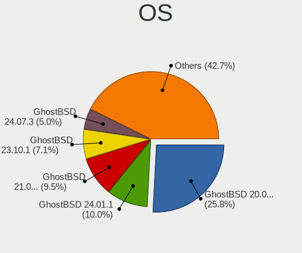

| Name                 | Computers | Percent |
|----------------------|-----------|---------|
| GhostBSD 20.04.02    | 109       | 54.77%  |
| GhostBSD 21.08.27    | 39        | 19.6%   |
| GhostBSD 22.01.12    | 18        | 9.05%   |
| GhostBSD 22.07.16    | 4         | 2.01%   |
| GhostBSD 22.06.26    | 4         | 2.01%   |
| GhostBSD 22.04.06    | 3         | 1.51%   |
| GhostBSD 22.07.13    | 2         | 1.01%   |
| GhostBSD 22.06.18    | 2         | 1.01%   |
| GhostBSD 22.04.22    | 2         | 1.01%   |
| GhostBSD 22.07.28    | 1         | 0.5%    |
| GhostBSD 22.07.10    | 1         | 0.5%    |
| GhostBSD 22.06.20    | 1         | 0.5%    |
| GhostBSD 22.06.07    | 1         | 0.5%    |
| GhostBSD 22.05.14    | 1         | 0.5%    |
| GhostBSD 22.05.13    | 1         | 0.5%    |
| GhostBSD 22.04.30    | 1         | 0.5%    |
| GhostBSD 22.02.26    | 1         | 0.5%    |
| GhostBSD 22.02.20    | 1         | 0.5%    |
| GhostBSD 22.01.28    | 1         | 0.5%    |
| GhostBSD 21.12.29    | 1         | 0.5%    |
| GhostBSD 21.11.24    | 1         | 0.5%    |
| GhostBSD 20.07.14    | 1         | 0.5%    |
| GhostBSD 20.03.01    | 1         | 0.5%    |
| GhostBSD 19.12       | 1         | 0.5%    |
| GhostBSD 12.2-STABLE | 1         | 0.5%    |

OS Family
---------

OS without a version

| Name     | Computers | Percent |
|----------|-----------|---------|
| GhostBSD | 190       | 100%    |

Arch
----

OS architecture (x86_64, i586, etc.)

| Name  | Computers | Percent |
|-------|-----------|---------|
| amd64 | 190       | 100%    |

DE
--

Desktop Environment

| Name             | Computers | Percent |
|------------------|-----------|---------|
| MATE             | 148       | 76.68%  |
| XFCE             | 25        | 12.95%  |
| KDE5             | 8         | 4.15%   |
| Cinnamon         | 3         | 1.55%   |
| Metacity (Marco) | 2         | 1.04%   |
| GNOME            | 2         | 1.04%   |
| openbox          | 1         | 0.52%   |
| LXQt             | 1         | 0.52%   |
| i3               | 1         | 0.52%   |
| helloDesktop     | 1         | 0.52%   |
| Console          | 1         | 0.52%   |

Display Server
--------------

X11 or Wayland

| Name    | Computers | Percent |
|---------|-----------|---------|
| X11     | 188       | 98.95%  |
| Wayland | 1         | 0.53%   |
| Console | 1         | 0.53%   |

Display Manager
---------------

SDDM, LightDM, etc.

| Name    | Computers | Percent |
|---------|-----------|---------|
| LightDM | 186       | 97.89%  |
| SDDM    | 3         | 1.58%   |
| Console | 1         | 0.53%   |

OS Lang
-------

Language

| Lang    | Computers | Percent |
|---------|-----------|---------|
| en_US   | 82        | 41.62%  |
| C       | 53        | 26.9%   |
| Unknown | 28        | 14.21%  |
| de_DE   | 11        | 5.58%   |
| ru_RU   | 5         | 2.54%   |
| en_GB   | 3         | 1.52%   |
| sk_SK   | 2         | 1.02%   |
| pt_BR   | 2         | 1.02%   |
| pl_PL   | 2         | 1.02%   |
| it_IT   | 2         | 1.02%   |
| fr_FR   | 2         | 1.02%   |
| zh_CN   | 1         | 0.51%   |
| es_ES   | 1         | 0.51%   |
| en_NZ   | 1         | 0.51%   |
| en_AU   | 1         | 0.51%   |
| el_GR   | 1         | 0.51%   |

Boot Mode
---------

EFI or BIOS

| Mode | Computers | Percent |
|------|-----------|---------|
| EFI  | 150       | 78.95%  |
| BIOS | 40        | 21.05%  |

Filesystem
----------

Type of filesystem

| Type | Computers | Percent |
|------|-----------|---------|
| Zfs  | 180       | 93.26%  |
| Ufs  | 13        | 6.74%   |

Part. scheme
------------

Scheme of partitioning

| Type | Computers | Percent |
|------|-----------|---------|
| GPT  | 183       | 96.32%  |
| MBR  | 7         | 3.68%   |

Board
-----

Vendor
------

Motherboard manufacturer

| Name                | Computers | Percent |
|---------------------|-----------|---------|
| Lenovo              | 36        | 18.95%  |
| Dell                | 36        | 18.95%  |
| ASUSTek Computer    | 24        | 12.63%  |
| MSI                 | 12        | 6.32%   |
| Hewlett-Packard     | 12        | 6.32%   |
| Acer                | 11        | 5.79%   |
| Gigabyte Technology | 10        | 5.26%   |
| ASRock              | 9         | 4.74%   |
| Apple               | 6         | 3.16%   |
| Sony                | 4         | 2.11%   |
| Notebook            | 4         | 2.11%   |
| Fujitsu             | 4         | 2.11%   |
| System76            | 3         | 1.58%   |
| Toshiba             | 2         | 1.05%   |
| Samsung Electronics | 2         | 1.05%   |
| Intel               | 2         | 1.05%   |
| Alienware           | 2         | 1.05%   |
| TUXEDO              | 1         | 0.53%   |
| Supermicro          | 1         | 0.53%   |
| Star Labs           | 1         | 0.53%   |
| Quanta              | 1         | 0.53%   |
| Panasonic           | 1         | 0.53%   |
| Medion              | 1         | 0.53%   |
| Jumper              | 1         | 0.53%   |
| HUAWEI              | 1         | 0.53%   |
| Huanan              | 1         | 0.53%   |
| GPU Company         | 1         | 0.53%   |
| Unknown             | 1         | 0.53%   |

Model
-----

Motherboard model

| Name                                     | Computers | Percent |
|------------------------------------------|-----------|---------|
| Dell Inspiron 3542                       | 3         | 1.58%   |
| MSI MS-7B86                              | 2         | 1.05%   |
| MSI MS-7817                              | 2         | 1.05%   |
| MSI Modern 14 A10M                       | 2         | 1.05%   |
| Lenovo ThinkPad T430s 2352CTO            | 2         | 1.05%   |
| Dell XPS 13 7390                         | 2         | 1.05%   |
| Dell Latitude E6420                      | 2         | 1.05%   |
| TUXEDO InfinityBook13V3                  | 1         | 0.53%   |
| Toshiba Satellite C855-1U4               | 1         | 0.53%   |
| Toshiba Satellite C855                   | 1         | 0.53%   |
| System76 Lemur Pro                       | 1         | 0.53%   |
| System76 Kudu                            | 1         | 0.53%   |
| System76 Gazelle                         | 1         | 0.53%   |
| Supermicro X10DRi                        | 1         | 0.53%   |
| Star Labs LabTop                         | 1         | 0.53%   |
| Sony VPCCB17FG                           | 1         | 0.53%   |
| Sony VGN-SZ3VWP_X                        | 1         | 0.53%   |
| Sony SVP1322M1EBI                        | 1         | 0.53%   |
| Sony SVP13225SCBI                        | 1         | 0.53%   |
| Samsung 550P5C/550P7C                    | 1         | 0.53%   |
| Samsung 3570R/370R/470R/450R/510R/4450RV | 1         | 0.53%   |
| Quanta 120-1333w                         | 1         | 0.53%   |
| Panasonic CF-19AHNC8FN                   | 1         | 0.53%   |
| Notebook N8xEJEK                         | 1         | 0.53%   |
| Notebook N85_N87,HJ,HJ1,HK1              | 1         | 0.53%   |
| Notebook N7x0WU                          | 1         | 0.53%   |
| Notebook N13xWU                          | 1         | 0.53%   |
| MSI MS-7C36                              | 1         | 0.53%   |
| MSI MS-7A72                              | 1         | 0.53%   |
| MSI MS-7917                              | 1         | 0.53%   |
| MSI MS-7788                              | 1         | 0.53%   |
| MSI GF63 Thin 10SCSR                     | 1         | 0.53%   |
| MSI GE75 Raider 10SFS                    | 1         | 0.53%   |
| Medion MS-7728                           | 1         | 0.53%   |
| Lenovo Yoga Slim 7 Pro 14ACH5 82MS       | 1         | 0.53%   |
| Lenovo Yoga 2 13 20344                   | 1         | 0.53%   |
| Lenovo ThinkStation S10 6483CTO          | 1         | 0.53%   |
| Lenovo ThinkPad Yoga 460 20ELS14B01      | 1         | 0.53%   |
| Lenovo ThinkPad X380 Yoga 20LJ000WUK     | 1         | 0.53%   |
| Lenovo ThinkPad X250 20CM003WMS          | 1         | 0.53%   |
| Lenovo ThinkPad X250 20CL001GZA          | 1         | 0.53%   |
| Lenovo ThinkPad X220 4290W42             | 1         | 0.53%   |
| Lenovo ThinkPad X220 42872VU             | 1         | 0.53%   |
| Lenovo ThinkPad X201 32492EU             | 1         | 0.53%   |
| Lenovo ThinkPad X1 Yoga 3rd 20LDS1CG00   | 1         | 0.53%   |
| Lenovo ThinkPad T590 20N40016CD          | 1         | 0.53%   |
| Lenovo ThinkPad T530 239242U             | 1         | 0.53%   |
| Lenovo ThinkPad T520 4243E51             | 1         | 0.53%   |
| Lenovo ThinkPad T500 2056Y2Z             | 1         | 0.53%   |
| Lenovo ThinkPad T470 W10DG 20JNS0JU01    | 1         | 0.53%   |
| Lenovo ThinkPad T470 20HD000MUK          | 1         | 0.53%   |
| Lenovo ThinkPad T450 20BV0064US          | 1         | 0.53%   |
| Lenovo ThinkPad T450 20BUS0VH08          | 1         | 0.53%   |
| Lenovo ThinkPad T440 20B7S1860W          | 1         | 0.53%   |
| Lenovo ThinkPad T430s 23539JM            | 1         | 0.53%   |
| Lenovo ThinkPad T430 2344C4U             | 1         | 0.53%   |
| Lenovo ThinkPad T400 6474E18             | 1         | 0.53%   |
| Lenovo ThinkPad L512 44444XG             | 1         | 0.53%   |
| Lenovo ThinkPad E14 Gen 2 20TA004FUS     | 1         | 0.53%   |
| Lenovo ThinkCentre M93p 10AB004DUS       | 1         | 0.53%   |

Model Family
------------

Motherboard model prefix

| Name                    | Computers | Percent |
|-------------------------|-----------|---------|
| Lenovo ThinkPad         | 24        | 12.63%  |
| Dell Latitude           | 15        | 7.89%   |
| Acer Aspire             | 9         | 4.74%   |
| Dell Inspiron           | 8         | 4.21%   |
| ASUS PRIME              | 6         | 3.16%   |
| Dell Precision          | 5         | 2.63%   |
| Dell OptiPlex           | 5         | 2.63%   |
| HP Laptop               | 4         | 2.11%   |
| ASUS TUF                | 4         | 2.11%   |
| Lenovo IdeaPad          | 3         | 1.58%   |
| ASRock X570             | 3         | 1.58%   |
| Toshiba Satellite       | 2         | 1.05%   |
| MSI MS-7B86             | 2         | 1.05%   |
| MSI MS-7817             | 2         | 1.05%   |
| MSI Modern              | 2         | 1.05%   |
| Lenovo Yoga             | 2         | 1.05%   |
| Lenovo ThinkCentre      | 2         | 1.05%   |
| HP Pavilion             | 2         | 1.05%   |
| HP EliteBook            | 2         | 1.05%   |
| Fujitsu CELSIUS         | 2         | 1.05%   |
| Dell XPS                | 2         | 1.05%   |
| ASUS VivoBook           | 2         | 1.05%   |
| ASUS ROG                | 2         | 1.05%   |
| ASRock B450             | 2         | 1.05%   |
| TUXEDO InfinityBook13V3 | 1         | 0.53%   |
| System76 Lemur          | 1         | 0.53%   |
| System76 Kudu           | 1         | 0.53%   |
| System76 Gazelle        | 1         | 0.53%   |
| Supermicro X10DRi       | 1         | 0.53%   |
| Star Labs LabTop        | 1         | 0.53%   |
| Sony VPCCB17FG          | 1         | 0.53%   |
| Sony VGN-SZ3VWP         | 1         | 0.53%   |
| Sony SVP1322M1EBI       | 1         | 0.53%   |
| Sony SVP13225SCBI       | 1         | 0.53%   |
| Samsung 550P5C          | 1         | 0.53%   |
| Samsung 3570R           | 1         | 0.53%   |
| Quanta 120-1333w        | 1         | 0.53%   |
| Panasonic CF-19AHNC8FN  | 1         | 0.53%   |
| Notebook N8xEJEK        | 1         | 0.53%   |
| Notebook N85            | 1         | 0.53%   |
| Notebook N7x0WU         | 1         | 0.53%   |
| Notebook N13xWU         | 1         | 0.53%   |
| MSI MS-7C36             | 1         | 0.53%   |
| MSI MS-7A72             | 1         | 0.53%   |
| MSI MS-7917             | 1         | 0.53%   |
| MSI MS-7788             | 1         | 0.53%   |
| MSI GF63                | 1         | 0.53%   |
| MSI GE75                | 1         | 0.53%   |
| Medion MS-7728          | 1         | 0.53%   |
| Lenovo ThinkStation     | 1         | 0.53%   |
| Lenovo Legion           | 1         | 0.53%   |
| Lenovo H515s            | 1         | 0.53%   |
| Lenovo G500s            | 1         | 0.53%   |
| Lenovo Flex             | 1         | 0.53%   |
| Jumper EZbook           | 1         | 0.53%   |
| Intel NUC8i5BEH         | 1         | 0.53%   |
| Intel NUC6i7KYB         | 1         | 0.53%   |
| HUAWEI HLY-WX9XX        | 1         | 0.53%   |
| Huanan X79              | 1         | 0.53%   |
| HP Z400                 | 1         | 0.53%   |

MFG Year
--------

Motherboard manufacture year

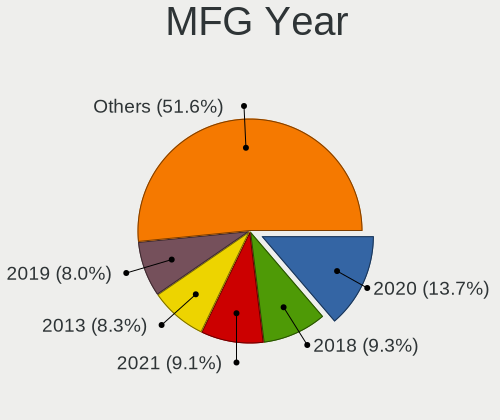

| Year | Computers | Percent |
|------|-----------|---------|
| 2020 | 30        | 15.79%  |
| 2018 | 22        | 11.58%  |
| 2019 | 18        | 9.47%   |
| 2013 | 17        | 8.95%   |
| 2014 | 15        | 7.89%   |
| 2012 | 13        | 6.84%   |
| 2021 | 12        | 6.32%   |
| 2015 | 11        | 5.79%   |
| 2011 | 11        | 5.79%   |
| 2017 | 8         | 4.21%   |
| 2016 | 8         | 4.21%   |
| 2009 | 7         | 3.68%   |
| 2022 | 6         | 3.16%   |
| 2008 | 6         | 3.16%   |
| 2010 | 5         | 2.63%   |
| 2007 | 1         | 0.53%   |

Form Factor
-----------

Physical design of the computer

| Name        | Computers | Percent |
|-------------|-----------|---------|
| Notebook    | 114       | 60%     |
| Desktop     | 65        | 34.21%  |
| Mini pc     | 5         | 2.63%   |
| Convertible | 4         | 2.11%   |
| All in one  | 1         | 0.53%   |
| Server      | 1         | 0.53%   |

Coreboot
--------

Have coreboot on board

| Used | Computers | Percent |
|------|-----------|---------|
| No   | 189       | 99.47%  |
| Yes  | 1         | 0.53%   |

RAM Size
--------

Total RAM memory

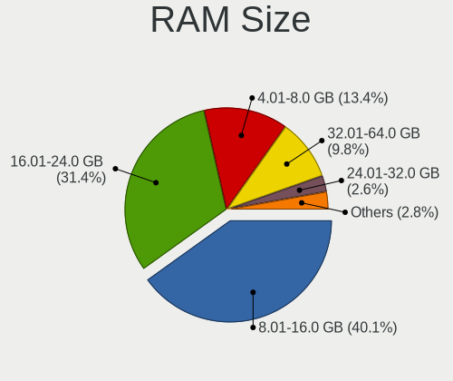

| Size in GB      | Computers | Percent |
|-----------------|-----------|---------|
| 8.01-16.0       | 81        | 42.63%  |
| 16.01-24.0      | 51        | 26.84%  |
| 4.01-8.0        | 29        | 15.26%  |
| 32.01-64.0      | 20        | 10.53%  |
| 64.01-256.0     | 4         | 2.11%   |
| 24.01-32.0      | 3         | 1.58%   |
| More than 256.0 | 1         | 0.53%   |
| 2.01-3.0        | 1         | 0.53%   |

RAM Used
--------

Used RAM memory

| Used GB    | Computers | Percent |
|------------|-----------|---------|
| 0.01-0.5   | 80        | 41.67%  |
| 0.51-1.0   | 76        | 39.58%  |
| 1.01-2.0   | 21        | 10.94%  |
| 2.01-3.0   | 8         | 4.17%   |
| 3.01-4.0   | 4         | 2.08%   |
| 4.01-8.0   | 2         | 1.04%   |
| 24.01-32.0 | 1         | 0.52%   |

Total Drives
------------

Number of drives on board

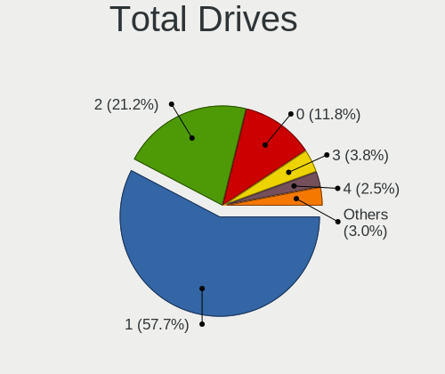

| Drives | Computers | Percent |
|--------|-----------|---------|
| 1      | 113       | 57.65%  |
| 2      | 53        | 27.04%  |
| 0      | 9         | 4.59%   |
| 3      | 7         | 3.57%   |
| 5      | 5         | 2.55%   |
| 4      | 5         | 2.55%   |
| 6      | 2         | 1.02%   |
| 22     | 1         | 0.51%   |
| 7      | 1         | 0.51%   |

Has CD-ROM
----------

Has CD-ROM on board

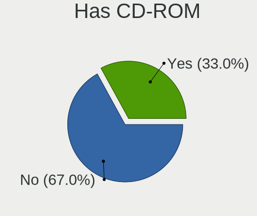

| Presented | Computers | Percent |
|-----------|-----------|---------|
| No        | 115       | 60.21%  |
| Yes       | 76        | 39.79%  |

Has Ethernet
------------

Has Ethernet on board

| Presented | Computers | Percent |
|-----------|-----------|---------|
| Yes       | 170       | 89.47%  |
| No        | 20        | 10.53%  |

Has WiFi
--------

Has WiFi module

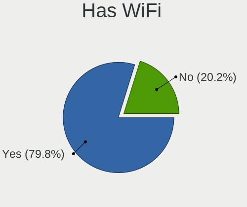

| Presented | Computers | Percent |
|-----------|-----------|---------|
| Yes       | 148       | 77.89%  |
| No        | 42        | 22.11%  |

Has Bluetooth
-------------

Has Bluetooth module

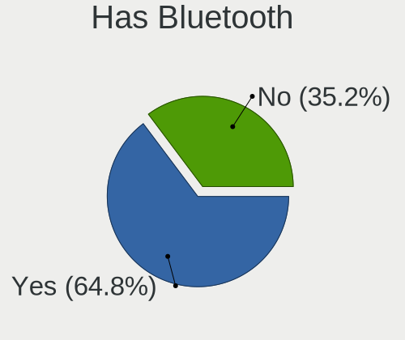

| Presented | Computers | Percent |
|-----------|-----------|---------|
| Yes       | 115       | 60.53%  |
| No        | 75        | 39.47%  |

Location
--------

Country
-------

Geographic location (country)

| Country      | Computers | Percent |
|--------------|-----------|---------|
| USA          | 42        | 22.11%  |
| Germany      | 29        | 15.26%  |
| France       | 14        | 7.37%   |
| UK           | 11        | 5.79%   |
| Russia       | 9         | 4.74%   |
| Poland       | 6         | 3.16%   |
| Canada       | 6         | 3.16%   |
| Switzerland  | 5         | 2.63%   |
| Spain        | 5         | 2.63%   |
| Italy        | 4         | 2.11%   |
| Sweden       | 3         | 1.58%   |
| Norway       | 3         | 1.58%   |
| New Zealand  | 3         | 1.58%   |
| Netherlands  | 3         | 1.58%   |
| Malaysia     | 3         | 1.58%   |
| Japan        | 3         | 1.58%   |
| India        | 3         | 1.58%   |
| Finland      | 3         | 1.58%   |
| China        | 3         | 1.58%   |
| Ukraine      | 2         | 1.05%   |
| Portugal     | 2         | 1.05%   |
| Philippines  | 2         | 1.05%   |
| Hungary      | 2         | 1.05%   |
| Hong Kong    | 2         | 1.05%   |
| Czechia      | 2         | 1.05%   |
| Brazil       | 2         | 1.05%   |
| Belgium      | 2         | 1.05%   |
| Australia    | 2         | 1.05%   |
| Uganda       | 1         | 0.53%   |
| UAE          | 1         | 0.53%   |
| South Africa | 1         | 0.53%   |
| Slovenia     | 1         | 0.53%   |
| Slovakia     | 1         | 0.53%   |
| Serbia       | 1         | 0.53%   |
| Namibia      | 1         | 0.53%   |
| Mexico       | 1         | 0.53%   |
| Luxembourg   | 1         | 0.53%   |
| Indonesia    | 1         | 0.53%   |
| Greece       | 1         | 0.53%   |
| Egypt        | 1         | 0.53%   |
| Bulgaria     | 1         | 0.53%   |
| Argentina    | 1         | 0.53%   |

City
----

Geographic location (city)

| City               | Computers | Percent |
|--------------------|-----------|---------|
| Bonn               | 6         | 3.08%   |
| Bedburg            | 6         | 3.08%   |
| Paris              | 5         | 2.56%   |
| London             | 3         | 1.54%   |
| Franconville       | 3         | 1.54%   |
| Denver             | 3         | 1.54%   |
| Chrusty            | 3         | 1.54%   |
| Berlin             | 3         | 1.54%   |
| Zurich             | 2         | 1.03%   |
| Yokohama           | 2         | 1.03%   |
| Whittier           | 2         | 1.03%   |
| Wezeren            | 2         | 1.03%   |
| Stiring-Wendel     | 2         | 1.03%   |
| St Petersburg      | 2         | 1.03%   |
| Salem              | 2         | 1.03%   |
| Rome               | 2         | 1.03%   |
| Richmond           | 2         | 1.03%   |
| Oslo               | 2         | 1.03%   |
| Obninsk            | 2         | 1.03%   |
| Madrid             | 2         | 1.03%   |
| Kyiv               | 2         | 1.03%   |
| Jyvskyl    | 2         | 1.03%   |
| Hamilton           | 2         | 1.03%   |
| Hamburg            | 2         | 1.03%   |
| Giessen            | 2         | 1.03%   |
| Eiken              | 2         | 1.03%   |
| Cologne            | 2         | 1.03%   |
| Clemmons           | 2         | 1.03%   |
| Bayan Lepas        | 2         | 1.03%   |
| Atascadero         | 2         | 1.03%   |
| Asnieres-sur-Seine | 2         | 1.03%   |
| ta-ku          | 1         | 0.51%   |
| Zapopan            | 1         | 0.51%   |
| Yaroslavl          | 1         | 0.51%   |
| Wraysbury          | 1         | 0.51%   |
| Witbank            | 1         | 0.51%   |
| Winnipeg           | 1         | 0.51%   |
| Windhoek           | 1         | 0.51%   |
| Wenatchee          | 1         | 0.51%   |
| Washington         | 1         | 0.51%   |
| Vidnoye            | 1         | 0.51%   |
| Victoria           | 1         | 0.51%   |
| Veenendaal         | 1         | 0.51%   |
| Valencia           | 1         | 0.51%   |
| Truro              | 1         | 0.51%   |
| Traunstein         | 1         | 0.51%   |
| Toronto            | 1         | 0.51%   |
| Taita              | 1         | 0.51%   |
| Sydney             | 1         | 0.51%   |
| Swindon            | 1         | 0.51%   |
| Staffanstorp       | 1         | 0.51%   |
| St. Albert         | 1         | 0.51%   |
| St Austell         | 1         | 0.51%   |
| Springfield        | 1         | 0.51%   |
| Southampton        | 1         | 0.51%   |
| Sollentuna         | 1         | 0.51%   |
| Sofia              | 1         | 0.51%   |
| Santo Tomas        | 1         | 0.51%   |
| San Jose           | 1         | 0.51%   |
| Salinas            | 1         | 0.51%   |

Drives
------

Drive Vendor
------------

Hard drive vendors

| Vendor              | Computers | Drives | Percent |
|---------------------|-----------|--------|---------|
| Samsung Electronics | 65        | 88     | 23.47%  |
| WDC                 | 49        | 67     | 17.69%  |
| Seagate             | 31        | 45     | 11.19%  |
| Crucial             | 20        | 22     | 7.22%   |
| Toshiba             | 15        | 20     | 5.42%   |
| Kingston            | 15        | 15     | 5.42%   |
| SanDisk             | 10        | 11     | 3.61%   |
| Hitachi             | 10        | 10     | 3.61%   |
| SK hynix            | 5         | 5      | 1.81%   |
| Micron Technology   | 5         | 5      | 1.81%   |
| HGST                | 5         | 5      | 1.81%   |
| PNY                 | 4         | 6      | 1.44%   |
| Phison              | 4         | 6      | 1.44%   |
| Intel               | 4         | 4      | 1.44%   |
| A-DATA Technology   | 4         | 4      | 1.44%   |
| Gigabyte Technology | 3         | 3      | 1.08%   |
| Plextor             | 2         | 2      | 0.72%   |
| Patriot             | 2         | 2      | 0.72%   |
| OCZ                 | 2         | 2      | 0.72%   |
| Maxtor              | 2         | 2      | 0.72%   |
| KingSpec            | 2         | 2      | 0.72%   |
| Goodram             | 2         | 2      | 0.72%   |
| Fujitsu             | 2         | 2      | 0.72%   |
| XPG                 | 1         | 1      | 0.36%   |
| Transcend           | 1         | 1      | 0.36%   |
| Star Drive          | 1         | 1      | 0.36%   |
| SSSTC               | 1         | 1      | 0.36%   |
| SPCC                | 1         | 1      | 0.36%   |
| Netac               | 1         | 1      | 0.36%   |
| LITEONIT            | 1         | 1      | 0.36%   |
| LDLC                | 1         | 1      | 0.36%   |
| HPT                 | 1         | 4      | 0.36%   |
| Hewlett-Packard     | 1         | 1      | 0.36%   |
| Corsair             | 1         | 1      | 0.36%   |
| China               | 1         | 1      | 0.36%   |
| Apple               | 1         | 1      | 0.36%   |
| AMD                 | 1         | 1      | 0.36%   |

Drive Model
-----------

Hard drive models

| Model                              | Computers | Percent |
|------------------------------------|-----------|---------|
| Samsung SSD 850 EVO 250GB          | 6         | 1.96%   |
| Samsung SSD 860 QVO 1TB            | 5         | 1.63%   |
| Samsung SSD 860 EVO 500GB          | 4         | 1.31%   |
| Samsung SSD 850 EVO 500GB          | 4         | 1.31%   |
| Crucial CT1000MX500SSD1 1TB        | 4         | 1.31%   |
| WDC WDS500G2B0A-00SM50 500GB       | 3         | 0.98%   |
| Seagate ST1000LM049-2GH172 1TB     | 3         | 0.98%   |
| Seagate ST1000LM035-1RK172 1TB     | 3         | 0.98%   |
| WDC WDS240G2G0A-00JH30 240GB       | 2         | 0.65%   |
| WDC WD40EFRX-68N32N0 4TB           | 2         | 0.65%   |
| WDC WD2000JS-55MHB0 192GB          | 2         | 0.65%   |
| WDC WD10EZEX-21M2NA0 1TB           | 2         | 0.65%   |
| Toshiba Q300 480GB                 | 2         | 0.65%   |
| Toshiba HDWD120 2TB                | 2         | 0.65%   |
| Seagate ST500DM002-1BD142 500GB    | 2         | 0.65%   |
| Seagate ST2000LM003 HN-M201RAD 2TB | 2         | 0.65%   |
| Samsung SSD 970 EVO Plus 1TB       | 2         | 0.65%   |
| Samsung SSD 970 EVO 500GB          | 2         | 0.65%   |
| Samsung SSD 970 EVO 250GB          | 2         | 0.65%   |
| Samsung SSD 870 EVO 1TB            | 2         | 0.65%   |
| Samsung SSD 860 EVO 1TB            | 2         | 0.65%   |
| Samsung SSD 840 PRO Series 256GB   | 2         | 0.65%   |
| Samsung PM981 NVMe 256GB           | 2         | 0.65%   |
| Samsung MZNTE128HMGR-000SO 128GB   | 2         | 0.65%   |
| Micron 1100 SATA 256GB             | 2         | 0.65%   |
| Maxtor STM3320613AS 320GB          | 2         | 0.65%   |
| Kingston RBUSNS8154P3512GJ 512GB   | 2         | 0.65%   |
| KingSpec Q-720 720GB               | 2         | 0.65%   |
| HGST HTS721010A9E630 1TB           | 2         | 0.65%   |
| Gigabyte GP-GSM2NE3100TNTD 1TB     | 2         | 0.65%   |
| Crucial CT250MX500SSD1 250GB       | 2         | 0.65%   |
| XPG GAMMIX S11 Pro 256GB           | 1         | 0.33%   |
| WDC WDS500G2B0A 500GB              | 1         | 0.33%   |
| WDC WDS480G2G0A-00JH30 480GB       | 1         | 0.33%   |
| WDC WDS200T2B0B-00YS70 2TB         | 1         | 0.33%   |
| WDC WDS200T2B0A-00SM50 2TB         | 1         | 0.33%   |
| WDC WDS120G2G0A-00JH30 120GB       | 1         | 0.33%   |
| WDC WDS100T3X0C-00SJG0 1TB         | 1         | 0.33%   |
| WDC WDS100T2B0C-00PXH0 1TB         | 1         | 0.33%   |
| WDC WDS100T1X0E-00AFY0 1TB         | 1         | 0.33%   |
| WDC WDS100T1B0A-00H9H0 1TB         | 1         | 0.33%   |
| WDC WD800BEVT-75ZCT2 80GB          | 1         | 0.33%   |
| WDC WD7500LPCX-00KHST0 752GB       | 1         | 0.33%   |
| WDC WD7500BPVT-80HXZT3 752GB       | 1         | 0.33%   |
| WDC WD7500BPKX-80HPJT0 752GB       | 1         | 0.33%   |
| WDC WD6400BEVT-22A0RT0 640GB       | 1         | 0.33%   |
| WDC WD60EZRZ-00GZ5B1 6TB           | 1         | 0.33%   |
| WDC WD6003FFBX-68MU3N0 6TB         | 1         | 0.33%   |
| WDC WD50NMZW-59A8NS1 5TB           | 1         | 0.33%   |
| WDC WD5000LPLX-75ZNTT0 500GB       | 1         | 0.33%   |
| WDC WD5000LPCX-24C6HT0 500GB       | 1         | 0.33%   |
| WDC WD5000BPVT-00HXZT3 500GB       | 1         | 0.33%   |
| WDC WD5000BEVT-24A0RT0 500GB       | 1         | 0.33%   |
| WDC WD5000AAVS-00ZTB0 500GB        | 1         | 0.33%   |
| WDC WD5000AAKX-60U6AA0 500GB       | 1         | 0.33%   |
| WDC WD5000AAKX-00ERMA0 500GB       | 1         | 0.33%   |
| WDC WD5000AAKS-60WWPA0 500GB       | 1         | 0.33%   |
| WDC WD3200LPVX-75V0TT0 320GB       | 1         | 0.33%   |
| WDC WD3200BEKT-75KA9T0 320GB       | 1         | 0.33%   |
| WDC WD2500AAJS-75M0A0 250GB        | 1         | 0.33%   |

HDD Vendor
----------

Hard disk drive vendors

| Vendor              | Computers | Drives | Percent |
|---------------------|-----------|--------|---------|
| WDC                 | 36        | 48     | 36.36%  |
| Seagate             | 30        | 43     | 30.3%   |
| Hitachi             | 10        | 10     | 10.1%   |
| Toshiba             | 8         | 9      | 8.08%   |
| Samsung Electronics | 5         | 6      | 5.05%   |
| HGST                | 5         | 5      | 5.05%   |
| Maxtor              | 2         | 2      | 2.02%   |
| Fujitsu             | 2         | 2      | 2.02%   |
| HPT                 | 1         | 4      | 1.01%   |

SSD Vendor
----------

Solid state drive vendors

| Vendor              | Computers | Drives | Percent |
|---------------------|-----------|--------|---------|
| Samsung Electronics | 44        | 57     | 33.59%  |
| Crucial             | 17        | 19     | 12.98%  |
| Kingston            | 11        | 11     | 8.4%    |
| WDC                 | 10        | 11     | 7.63%   |
| SanDisk             | 10        | 11     | 7.63%   |
| PNY                 | 4         | 6      | 3.05%   |
| Micron Technology   | 4         | 4      | 3.05%   |
| A-DATA Technology   | 4         | 4      | 3.05%   |
| Toshiba             | 3         | 4      | 2.29%   |
| SK hynix            | 3         | 3      | 2.29%   |
| Plextor             | 2         | 2      | 1.53%   |
| Patriot             | 2         | 2      | 1.53%   |
| OCZ                 | 2         | 2      | 1.53%   |
| KingSpec            | 2         | 2      | 1.53%   |
| Intel               | 2         | 2      | 1.53%   |
| Goodram             | 2         | 2      | 1.53%   |
| Transcend           | 1         | 1      | 0.76%   |
| SPCC                | 1         | 1      | 0.76%   |
| Seagate             | 1         | 1      | 0.76%   |
| Phison              | 1         | 1      | 0.76%   |
| Netac               | 1         | 1      | 0.76%   |
| LITEONIT            | 1         | 1      | 0.76%   |
| China               | 1         | 1      | 0.76%   |
| Apple               | 1         | 1      | 0.76%   |
| AMD                 | 1         | 1      | 0.76%   |

Drive Kind
----------

HDD or SSD

| Kind | Computers | Drives | Percent |
|------|-----------|--------|---------|
| SSD  | 106       | 151    | 44.73%  |
| HDD  | 78        | 129    | 32.91%  |
| NVMe | 53        | 67     | 22.36%  |

Drive Connector
---------------

SATA, SAS, NVMe, etc.

| Type | Computers | Drives | Percent |
|------|-----------|--------|---------|
| SATA | 160       | 280    | 75.12%  |
| NVMe | 53        | 67     | 24.88%  |

Drive Size
----------

Size of hard drive

| Size in TB | Computers | Drives | Percent |
|------------|-----------|--------|---------|
| 0.01-0.5   | 119       | 154    | 58.62%  |
| 0.51-1.0   | 53        | 80     | 26.11%  |
| 1.01-2.0   | 17        | 23     | 8.37%   |
| 3.01-4.0   | 7         | 9      | 3.45%   |
| 4.01-10.0  | 5         | 10     | 2.46%   |
| 2.01-3.0   | 1         | 2      | 0.49%   |
| 10.01-20.0 | 1         | 2      | 0.49%   |

Space Total
-----------

Amount of disk space available on the file system

| Size in GB | Computers | Percent |
|------------|-----------|---------|
| 1-20       | 60        | 30.3%   |
| 101-250    | 50        | 25.25%  |
| 251-500    | 32        | 16.16%  |
| 501-1000   | 20        | 10.1%   |
| 51-100     | 16        | 8.08%   |
| Unknown    | 12        | 6.06%   |
| 21-50      | 4         | 2.02%   |
| 1001-2000  | 4         | 2.02%   |

Space Used
----------

Amount of used disk space

| Used GB | Computers | Percent |
|---------|-----------|---------|
| 1-20    | 168       | 84.42%  |
| 21-50   | 15        | 7.54%   |
| Unknown | 12        | 6.03%   |
| 51-100  | 3         | 1.51%   |
| 101-250 | 1         | 0.5%    |

Malfunc. Drives
---------------

Drive models with a malfunction

| Model                                           | Computers | Drives | Percent |
|-------------------------------------------------|-----------|--------|---------|
| Maxtor STM3320613AS 320GB                       | 2         | 2      | 7.69%   |
| WDC WD6400BEVT-22A0RT0 640GB                    | 1         | 1      | 3.85%   |
| WDC WD5000AAKS-60WWPA0 500GB                    | 1         | 1      | 3.85%   |
| WDC WD3200LPVX-75V0TT0 320GB                    | 1         | 1      | 3.85%   |
| WDC WD10EZEX-21M2NA0 1TB                        | 1         | 1      | 3.85%   |
| Toshiba MQ01ACF032 320GB                        | 1         | 1      | 3.85%   |
| Seagate ST9250827AS 250GB                       | 1         | 1      | 3.85%   |
| Seagate ST500LT012-9WS142 500GB                 | 1         | 2      | 3.85%   |
| Seagate ST500LM021-1KJ152 500GB                 | 1         | 1      | 3.85%   |
| Seagate ST500DM002-1BD142 500GB                 | 1         | 1      | 3.85%   |
| Seagate ST500DM002-1BC142 500GB                 | 1         | 1      | 3.85%   |
| Seagate ST31500541AS 1.5TB                      | 1         | 1      | 3.85%   |
| Seagate ST1000LM035-1RK172 1TB                  | 1         | 1      | 3.85%   |
| Samsung Electronics SSD 840 PRO Series 256GB    | 1         | 1      | 3.85%   |
| Samsung Electronics MZNTE128HMGR-000SO 128GB    | 1         | 1      | 3.85%   |
| Samsung Electronics HD103SJ 1TB                 | 1         | 2      | 3.85%   |
| OCZ AGILITY3 240GB                              | 1         | 1      | 3.85%   |
| Micron Technology MTFDDAV256TDL-1AW1ZABHA 256GB | 1         | 1      | 3.85%   |
| Intel SSDSC2BF180A5L 180GB                      | 1         | 1      | 3.85%   |
| Hitachi HTS725032A9A364 320GB                   | 1         | 1      | 3.85%   |
| Hitachi HTS547575A9E384 752GB                   | 1         | 1      | 3.85%   |
| Hitachi HTS543225L9A300 250GB                   | 1         | 1      | 3.85%   |
| Hitachi HTS541680J9SA00 80GB                    | 1         | 1      | 3.85%   |
| HGST HTS721010A9E630 1TB                        | 1         | 1      | 3.85%   |
| Crucial CT1000MX500SSD1 1TB                     | 1         | 1      | 3.85%   |

Malfunc. Drive Vendor
---------------------

Vendors of faulty drives

| Vendor              | Computers | Drives | Percent |
|---------------------|-----------|--------|---------|
| Seagate             | 7         | 8      | 26.92%  |
| WDC                 | 4         | 4      | 15.38%  |
| Hitachi             | 4         | 4      | 15.38%  |
| Samsung Electronics | 3         | 4      | 11.54%  |
| Maxtor              | 2         | 2      | 7.69%   |
| Toshiba             | 1         | 1      | 3.85%   |
| OCZ                 | 1         | 1      | 3.85%   |
| Micron Technology   | 1         | 1      | 3.85%   |
| Intel               | 1         | 1      | 3.85%   |
| HGST                | 1         | 1      | 3.85%   |
| Crucial             | 1         | 1      | 3.85%   |

Malfunc. HDD Vendor
-------------------

Vendors of faulty HDD drives

| Vendor              | Computers | Drives | Percent |
|---------------------|-----------|--------|---------|
| Seagate             | 7         | 8      | 35%     |
| WDC                 | 4         | 4      | 20%     |
| Hitachi             | 4         | 4      | 20%     |
| Maxtor              | 2         | 2      | 10%     |
| Toshiba             | 1         | 1      | 5%      |
| Samsung Electronics | 1         | 2      | 5%      |
| HGST                | 1         | 1      | 5%      |

Malfunc. Drive Kind
-------------------

Kinds of faulty drives

| Kind | Computers | Drives | Percent |
|------|-----------|--------|---------|
| HDD  | 19        | 22     | 76%     |
| SSD  | 6         | 6      | 24%     |

Failed Drives
-------------

Failed drive models

Zero info for selected period =(

Failed Drive Vendor
-------------------

Failed drive vendors

Zero info for selected period =(

Drive Status
------------

Number of failed and malfunc. drives

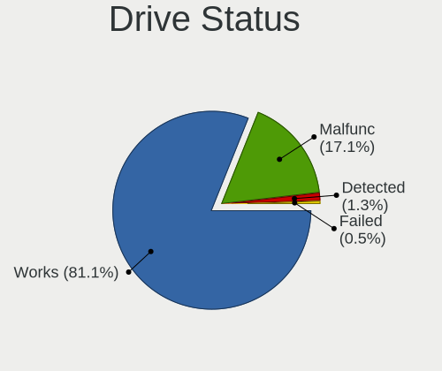

| Status   | Computers | Drives | Percent |
|----------|-----------|--------|---------|
| Works    | 174       | 315    | 87%     |
| Malfunc  | 25        | 28     | 12.5%   |
| Detected | 1         | 4      | 0.5%    |

Storage controller
------------------

Storage Vendor
--------------

Storage controller vendors

| Vendor                         | Computers | Percent |
|--------------------------------|-----------|---------|
| Intel                          | 129       | 53.75%  |
| AMD                            | 41        | 17.08%  |
| Samsung Electronics            | 22        | 9.17%   |
| Phison Electronics             | 8         | 3.33%   |
| SanDisk                        | 6         | 2.5%    |
| Nvidia                         | 5         | 2.08%   |
| Kingston Technology Company    | 4         | 1.67%   |
| Toshiba                        | 3         | 1.25%   |
| Micron/Crucial Technology      | 3         | 1.25%   |
| ASMedia Technology             | 3         | 1.25%   |
| SK hynix                       | 2         | 0.83%   |
| Marvell Technology Group       | 2         | 0.83%   |
| Solid State Storage Technology | 1         | 0.42%   |
| Silicon Motion                 | 1         | 0.42%   |
| Seagate Technology             | 1         | 0.42%   |
| OCZ Technology Group           | 1         | 0.42%   |
| Micron Technology              | 1         | 0.42%   |
| JMicron Technology             | 1         | 0.42%   |
| Integrated Technology Express  | 1         | 0.42%   |
| HighPoint Technologies         | 1         | 0.42%   |
| Broadcom / LSI                 | 1         | 0.42%   |
| Biwin Storage Technology       | 1         | 0.42%   |
| ADATA Technology               | 1         | 0.42%   |
| Adaptec                        | 1         | 0.42%   |

Storage Model
-------------

Storage controller models

| Model                                                                                   | Computers | Percent |
|-----------------------------------------------------------------------------------------|-----------|---------|
| AMD FCH SATA Controller [AHCI mode]                                                     | 35        | 13.26%  |
| Intel 7 Series Chipset Family 6-port SATA Controller [AHCI mode]                        | 15        | 5.68%   |
| Samsung NVMe SSD Controller SM981/PM981/PM983                                           | 14        | 5.3%    |
| Intel Sunrise Point-LP SATA Controller [AHCI mode]                                      | 13        | 4.92%   |
| Intel 8 Series SATA Controller 1 [AHCI mode]                                            | 11        | 4.17%   |
| Intel 6 Series/C200 Series Chipset Family 6 port Mobile SATA AHCI Controller            | 11        | 4.17%   |
| Intel 82801 Mobile SATA Controller [RAID mode]                                          | 10        | 3.79%   |
| Intel SATA Controller [RAID mode]                                                       | 7         | 2.65%   |
| AMD 400 Series Chipset SATA Controller                                                  | 7         | 2.65%   |
| Intel Wildcat Point-LP SATA Controller [AHCI Mode]                                      | 6         | 2.27%   |
| Intel 8 Series/C220 Series Chipset Family 6-port SATA Controller 1 [AHCI mode]          | 5         | 1.89%   |
| Unknown                                                                                 | 5         | 1.89%   |
| Nvidia MCP79 AHCI Controller                                                            | 4         | 1.52%   |
| Intel HM170/QM170 Chipset SATA Controller [AHCI Mode]                                   | 4         | 1.52%   |
| Intel Cannon Lake Mobile PCH SATA AHCI Controller                                       | 4         | 1.52%   |
| Samsung NVMe SSD Controller 980                                                         | 3         | 1.14%   |
| Phison PS5013 E13 NVMe Controller                                                       | 3         | 1.14%   |
| Phison E16 PCIe4 NVMe Controller                                                        | 3         | 1.14%   |
| Intel Q170/Q150/B150/H170/H110/Z170/CM236 Chipset SATA Controller [AHCI Mode]           | 3         | 1.14%   |
| Intel Comet Lake SATA AHCI Controller                                                   | 3         | 1.14%   |
| Intel 82801JI (ICH10 Family) SATA AHCI Controller                                       | 3         | 1.14%   |
| Intel 82801IBM/IEM (ICH9M/ICH9M-E) 4 port SATA Controller [AHCI mode]                   | 3         | 1.14%   |
| Intel 6 Series/C200 Series Chipset Family 6 port Desktop SATA AHCI Controller           | 3         | 1.14%   |
| Intel 400 Series Chipset Family SATA AHCI Controller                                    | 3         | 1.14%   |
| Intel 200 Series PCH SATA controller [AHCI mode]                                        | 3         | 1.14%   |
| ASMedia ASM1062 Serial ATA Controller                                                   | 3         | 1.14%   |
| AMD FCH SATA Controller [IDE mode]                                                      | 3         | 1.14%   |
| AMD 300 Series Chipset SATA Controller                                                  | 3         | 1.14%   |
| SanDisk PC SN520 NVMe SSD                                                               | 2         | 0.76%   |
| Samsung NVMe SSD Controller PM9A1/PM9A3/980PRO                                          | 2         | 0.76%   |
| Phison E12 NVMe Controller                                                              | 2         | 0.76%   |
| Kingston Company U-SNS8154P3 NVMe SSD                                                   | 2         | 0.76%   |
| Intel SSD 660P Series                                                                   | 2         | 0.76%   |
| Intel Cannon Point-LP SATA Controller [AHCI Mode]                                       | 2         | 0.76%   |
| Intel Cannon Lake PCH SATA AHCI Controller                                              | 2         | 0.76%   |
| Intel 9 Series Chipset Family SATA Controller [AHCI Mode]                               | 2         | 0.76%   |
| Intel 82801IR/IO/IH (ICH9R/DO/DH) 4 port SATA Controller [IDE mode]                     | 2         | 0.76%   |
| Intel 82801I (ICH9 Family) 2 port SATA Controller [IDE mode]                            | 2         | 0.76%   |
| Intel 7 Series/C210 Series Chipset Family 6-port SATA Controller [AHCI mode]            | 2         | 0.76%   |
| Intel 6 Series/C200 Series Chipset Family Desktop SATA Controller (IDE mode, ports 4-5) | 2         | 0.76%   |
| Intel 6 Series/C200 Series Chipset Family Desktop SATA Controller (IDE mode, ports 0-3) | 2         | 0.76%   |
| AMD X370 Series Chipset SATA Controller                                                 | 2         | 0.76%   |
| AMD SB7x0/SB8x0/SB9x0 SATA Controller [AHCI mode]                                       | 2         | 0.76%   |
| AMD FCH SATA Controller D                                                               | 2         | 0.76%   |
| Toshiba XG4 NVMe SSD Controller                                                         | 1         | 0.38%   |
| Toshiba unknown                                                                         | 1         | 0.38%   |
| Toshiba BG3 NVMe SSD Controller                                                         | 1         | 0.38%   |
| SK hynix Gold P31 SSD                                                                   | 1         | 0.38%   |
| SK hynix BC501 NVMe Solid State Drive                                                   | 1         | 0.38%   |
| Silicon Motion SM2263EN/SM2263XT SSD Controller                                         | 1         | 0.38%   |
| Seagate FireCuda 520 SSD                                                                | 1         | 0.38%   |
| SanDisk WD PC SN810 / Black SN850 NVMe SSD                                              | 1         | 0.38%   |
| SanDisk WD Blue SN550 NVMe SSD                                                          | 1         | 0.38%   |
| SanDisk WD Blue SN500 / PC SN520 NVMe SSD                                               | 1         | 0.38%   |
| SanDisk unknown                                                                         | 1         | 0.38%   |
| Samsung SM951 AHCI                                                                      | 1         | 0.38%   |
| Samsung NVMe SSD Controller SM961/PM961/SM963                                           | 1         | 0.38%   |
| Samsung NVMe SSD Controller SM951/PM951                                                 | 1         | 0.38%   |
| OCZ Group RD400/400A SSD                                                                | 1         | 0.38%   |
| Nvidia GeForce 7100/nForce 630i SATA                                                    | 1         | 0.38%   |

Storage Kind
------------

Kind of storage controller (IDE, SATA, NVMe, SAS, ...)

| Kind | Computers | Percent |
|------|-----------|---------|
| SATA | 151       | 63.71%  |
| NVMe | 53        | 22.36%  |
| RAID | 18        | 7.59%   |
| IDE  | 12        | 5.06%   |
| SCSI | 2         | 0.84%   |
| SAS  | 1         | 0.42%   |

Processor
---------

CPU Vendor
----------

Processor vendors

| Vendor | Computers | Percent |
|--------|-----------|---------|
| Intel  | 146       | 76.84%  |
| AMD    | 44        | 23.16%  |

CPU Model
---------

Processor models

| Model                                         | Computers | Percent |
|-----------------------------------------------|-----------|---------|
| Intel Core i7-10510U CPU @ 1.80GHz            | 5         | 2.63%   |
| Intel Core i5-5300U CPU @ 2.30GHz             | 5         | 2.63%   |
| Intel Core i5-6300U CPU @ 2.40GHz             | 4         | 2.11%   |
| Intel Core i7-6700HQ CPU @ 2.60GHz            | 3         | 1.58%   |
| Intel Core i7-3520M CPU @ 2.90GHz             | 3         | 1.58%   |
| Intel Core i5-8350U CPU @ 1.70GHz             | 3         | 1.58%   |
| Intel Core i5-7200U CPU @ 2.50GHz             | 3         | 1.58%   |
| Intel Core i5-3320M CPU @ 2.60GHz             | 3         | 1.58%   |
| Intel Core i5-1035G1 CPU @ 1.00GHz            | 3         | 1.58%   |
| Intel Core 2 Duo CPU P7550 @ 2.26GHz          | 3         | 1.58%   |
| AMD Ryzen 7 3700X 8-Core Processor            | 3         | 1.58%   |
| AMD Ryzen 7 2700X Eight-Core Processor        | 3         | 1.58%   |
| AMD Ryzen 5 2600 Six-Core Processor           | 3         | 1.58%   |
| Intel Core i9-10980HK CPU @ 2.40GHz           | 2         | 1.05%   |
| Intel Core i7-8750H CPU @ 2.20GHz             | 2         | 1.05%   |
| Intel Core i7-8550U CPU @ 1.80GHz             | 2         | 1.05%   |
| Intel Core i7-6700K CPU @ 4.00GHz             | 2         | 1.05%   |
| Intel Core i7-3630QM CPU @ 2.40GHz            | 2         | 1.05%   |
| Intel Core i7-2620M CPU @ 2.70GHz             | 2         | 1.05%   |
| Intel Core i5-8250U CPU @ 1.60GHz             | 2         | 1.05%   |
| Intel Core i5-7300U CPU @ 2.60GHz             | 2         | 1.05%   |
| Intel Core i5-4570 CPU @ 3.20GHz              | 2         | 1.05%   |
| Intel Core i5-4200U CPU @ 1.60GHz             | 2         | 1.05%   |
| Intel Core i5-3230M CPU @ 2.60GHz             | 2         | 1.05%   |
| Intel Core i5-2520M CPU @ 2.50GHz             | 2         | 1.05%   |
| Intel Core i5-2520M CPU @ 2.50GH              | 2         | 1.05%   |
| Intel Core i3-7100U CPU @ 2.40GHz             | 2         | 1.05%   |
| Intel Core 2 Duo CPU P8600 @ 2.40GHz          | 2         | 1.05%   |
| Intel Core 2 Duo                              | 2         | 1.05%   |
| AMD Ryzen 9 5950X 16-Core Processor           | 2         | 1.05%   |
| AMD Ryzen 5 3450U with Radeon Vega Mobile Gfx | 2         | 1.05%   |
| AMD A4-9125 RADEON R3, 4 COMPUTE CORES 2C+2G  | 2         | 1.05%   |
| Intel Xeon E-2236 CPU @ 3.40GHz               | 1         | 0.53%   |
| Intel Xeon CPU W3680 @ 3.33GHz                | 1         | 0.53%   |
| Intel Xeon CPU E5-2650 v4 @ 2.20GHz           | 1         | 0.53%   |
| Intel Xeon CPU E5-2640 0 @ 2.50GHz            | 1         | 0.53%   |
| Intel Xeon CPU E5-2630 0 @ 2.30GH             | 1         | 0.53%   |
| Intel Xeon                                    | 1         | 0.53%   |
| Intel Unknown                                 | 1         | 0.53%   |
| Intel Pentium Dual-Core CPU E5500 @ 2.80GHz   | 1         | 0.53%   |
| Intel Pentium CPU G620 @ 2.60GHz              | 1         | 0.53%   |
| Intel Pentium 3558U @ 1.70GHz                 | 1         | 0.53%   |
| Intel Genuine CPU                             | 1         | 0.53%   |
| Intel Core i7-9700K CPU @ 3.60GHz             | 1         | 0.53%   |
| Intel Core i7-8850H CPU @ 2.60GHz             | 1         | 0.53%   |
| Intel Core i7-8700 CPU @ 3.20GHz              | 1         | 0.53%   |
| Intel Core i7-8565U CPU @ 1.80GHz             | 1         | 0.53%   |
| Intel Core i7-7700K CPU @ 4.20GHz             | 1         | 0.53%   |
| Intel Core i7-6770HQ CPU @ 2.60GHz            | 1         | 0.53%   |
| Intel Core i7-6500U CPU @ 2.50GHz             | 1         | 0.53%   |
| Intel Core i7-4810MQ CPU @ 2.80GHz            | 1         | 0.53%   |
| Intel Core i7-4790K CPU @ 4.00GHz             | 1         | 0.53%   |
| Intel Core i7-4770HQ CPU @ 2.20GHz            | 1         | 0.53%   |
| Intel Core i7-4700HQ CPU @ 2.40GHz            | 1         | 0.53%   |
| Intel Core i7-4500U CPU @ 1.80GHz             | 1         | 0.53%   |
| Intel Core i7-3770S CPU @ 3.10GHz             | 1         | 0.53%   |
| Intel Core i7-3770 CPU @ 3.40GHz              | 1         | 0.53%   |
| Intel Core i7-3740QM CPU @ 2.70GHz            | 1         | 0.53%   |
| Intel Core i7-3720QM CPU @ 2.60GHz            | 1         | 0.53%   |
| Intel Core i7-2670QM CPU @ 2.20GHz            | 1         | 0.53%   |

CPU Model Family
----------------

Processor model prefix

| Model                   | Computers | Percent |
|-------------------------|-----------|---------|
| Intel Core i5           | 63        | 33.16%  |
| Intel Core i7           | 44        | 23.16%  |
| AMD Ryzen 5             | 13        | 6.84%   |
| AMD Ryzen 7             | 12        | 6.32%   |
| Intel Core i3           | 10        | 5.26%   |
| Intel Core 2 Duo        | 9         | 4.74%   |
| Intel Xeon              | 6         | 3.16%   |
| AMD Ryzen 3             | 4         | 2.11%   |
| Other                   | 3         | 1.58%   |
| Intel Celeron           | 3         | 1.58%   |
| AMD Ryzen 9             | 3         | 1.58%   |
| AMD A6                  | 3         | 1.58%   |
| Intel Pentium           | 2         | 1.05%   |
| Intel Core i9           | 2         | 1.05%   |
| Intel Core 2 Quad       | 2         | 1.05%   |
| AMD E1                  | 2         | 1.05%   |
| AMD A4                  | 2         | 1.05%   |
| Intel Pentium Dual-Core | 1         | 0.53%   |
| Intel Genuine           | 1         | 0.53%   |
| Intel Core 2            | 1         | 0.53%   |
| AMD Ryzen 3 PRO         | 1         | 0.53%   |
| AMD E2                  | 1         | 0.53%   |
| AMD Athlon X4           | 1         | 0.53%   |
| AMD A10                 | 1         | 0.53%   |

CPU Cores
---------

Number of processor cores

| Number  | Computers | Percent |
|---------|-----------|---------|
| 2       | 71        | 37.37%  |
| 4       | 63        | 33.16%  |
| 6       | 12        | 6.32%   |
| 16      | 11        | 5.79%   |
| 8       | 11        | 5.79%   |
| 12      | 9         | 4.74%   |
| Unknown | 9         | 4.74%   |
| 32      | 2         | 1.05%   |
| 24      | 2         | 1.05%   |

CPU Sockets
-----------

Number of sockets

| Number | Computers | Percent |
|--------|-----------|---------|
| 1      | 184       | 96.84%  |
| 2      | 6         | 3.16%   |

CPU Threads
-----------

Threads per core (Hyper-Threading)

| Number  | Computers | Percent |
|---------|-----------|---------|
| 2       | 112       | 58.95%  |
| 1       | 69        | 36.32%  |
| Unknown | 9         | 4.74%   |

CPU Microarch
-------------

Microarchitecture

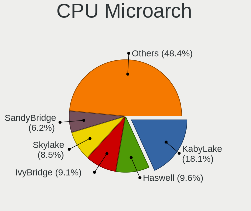

| Name        | Computers | Percent |
|-------------|-----------|---------|
| KabyLake    | 37        | 19.47%  |
| Haswell     | 22        | 11.58%  |
| IvyBridge   | 19        | 10%     |
| SandyBridge | 17        | 8.95%   |
| Zen+        | 13        | 6.84%   |
| Penryn      | 13        | 6.84%   |
| Skylake     | 12        | 6.32%   |
| Zen 2       | 10        | 5.26%   |
| Broadwell   | 8         | 4.21%   |
| Zen 3       | 5         | 2.63%   |
| CometLake   | 5         | 2.63%   |
| Westmere    | 4         | 2.11%   |
| Zen         | 3         | 1.58%   |
| IceLake     | 3         | 1.58%   |
| Excavator   | 3         | 1.58%   |
| Puma        | 2         | 1.05%   |
| Piledriver  | 2         | 1.05%   |
| Core        | 2         | 1.05%   |
| Unknown     | 2         | 1.05%   |
| TigerLake   | 1         | 0.53%   |
| Silvermont  | 1         | 0.53%   |
| Nehalem     | 1         | 0.53%   |
| K10 Llano   | 1         | 0.53%   |
| K10         | 1         | 0.53%   |
| Jaguar      | 1         | 0.53%   |
| Goldmont    | 1         | 0.53%   |
| Bobcat      | 1         | 0.53%   |

Graphics
--------

GPU Vendor
----------

Vendors of graphics cards

| Vendor            | Computers | Percent |
|-------------------|-----------|---------|
| Intel             | 116       | 51.79%  |
| Nvidia            | 69        | 30.8%   |
| AMD               | 38        | 16.96%  |
| ASPEED Technology | 1         | 0.45%   |

GPU Model
---------

Graphics card models

| Model                                                                       | Computers | Percent |
|-----------------------------------------------------------------------------|-----------|---------|
| Intel 3rd Gen Core processor Graphics Controller                            | 14        | 6.14%   |
| Intel 2nd Generation Core Processor Family Integrated Graphics Controller   | 14        | 6.14%   |
| Intel Haswell-ULT Integrated Graphics Controller                            | 12        | 5.26%   |
| Intel UHD Graphics 620                                                      | 7         | 3.07%   |
| Intel HD Graphics 620                                                       | 7         | 3.07%   |
| Intel HD Graphics 5500                                                      | 7         | 3.07%   |
| Intel CometLake-U GT2 [UHD Graphics]                                        | 7         | 3.07%   |
| AMD Picasso/Raven 2 [Radeon Vega Series / Radeon Vega Mobile Series]        | 6         | 2.63%   |
| Intel Skylake GT2 [HD Graphics 520]                                         | 5         | 2.19%   |
| Intel CoffeeLake-H GT2 [UHD Graphics 630]                                   | 5         | 2.19%   |
| AMD Ellesmere [Radeon RX 470/480/570/570X/580/580X/590]                     | 5         | 2.19%   |
| Nvidia GP108 [GeForce GT 1030]                                              | 4         | 1.75%   |
| Nvidia GF117M [GeForce 610M/710M/810M/820M / GT 620M/625M/630M/720M]        | 4         | 1.75%   |
| Intel HD Graphics 530                                                       | 4         | 1.75%   |
| Nvidia GP107M [GeForce GTX 1050 Mobile]                                     | 3         | 1.32%   |
| Nvidia GP107 [GeForce GTX 1050 Ti]                                          | 3         | 1.32%   |
| Nvidia GM206 [GeForce GTX 960]                                              | 3         | 1.32%   |
| Nvidia GM107 [GeForce GTX 750 Ti]                                           | 3         | 1.32%   |
| Nvidia GK107 [GeForce GTX 650]                                              | 3         | 1.32%   |
| Nvidia C79 [GeForce 9400M]                                                  | 3         | 1.32%   |
| Intel Xeon E3-1200 v3/4th Gen Core Processor Integrated Graphics Controller | 3         | 1.32%   |
| Intel Iris Plus Graphics G1 (Ice Lake)                                      | 3         | 1.32%   |
| Intel HD Graphics 630                                                       | 3         | 1.32%   |
| Intel CometLake-H GT2 [UHD Graphics]                                        | 3         | 1.32%   |
| Nvidia GP107 [GeForce GTX 1050]                                             | 2         | 0.88%   |
| Nvidia GP106 [GeForce GTX 1060 6GB]                                         | 2         | 0.88%   |
| Nvidia GP104 [GeForce GTX 1080]                                             | 2         | 0.88%   |
| Nvidia GP104 [GeForce GTX 1070]                                             | 2         | 0.88%   |
| Nvidia GP104 [GeForce GTX 1070 Ti]                                          | 2         | 0.88%   |
| Nvidia GF108GLM [NVS 5200M]                                                 | 2         | 0.88%   |
| Intel Mobile 4 Series Chipset Integrated Graphics Controller                | 2         | 0.88%   |
| Intel IvyBridge GT2 [HD Graphics 4000]                                      | 2         | 0.88%   |
| Intel Core Processor Integrated Graphics Controller                         | 2         | 0.88%   |
| Intel 4th Gen Core Processor Integrated Graphics Controller                 | 2         | 0.88%   |
| AMD Stoney [Radeon R2/R3/R4/R5 Graphics]                                    | 2         | 0.88%   |
| AMD Lucienne                                                                | 2         | 0.88%   |
| AMD Cezanne                                                                 | 2         | 0.88%   |
| AMD Cape Verde XT [Radeon HD 7770/8760 / R7 250X]                           | 2         | 0.88%   |
| Nvidia TU117M [GeForce GTX 1650 Ti Mobile]                                  | 1         | 0.44%   |
| Nvidia TU116 [GeForce GTX 1660 Ti]                                          | 1         | 0.44%   |
| Nvidia TU106 [GeForce RTX 2070 Rev. A]                                      | 1         | 0.44%   |
| Nvidia TU106 [GeForce RTX 2060 SUPER]                                       | 1         | 0.44%   |
| Nvidia TU104M [GeForce RTX 2070 SUPER Mobile / Max-Q]                       | 1         | 0.44%   |
| Nvidia TU104 [GeForce RTX 2080]                                             | 1         | 0.44%   |
| Nvidia GT218M [NVS 3100M]                                                   | 1         | 0.44%   |
| Nvidia GP107M [GeForce GTX 1050 Ti Mobile]                                  | 1         | 0.44%   |
| Nvidia GP107GLM [Quadro P2000 Mobile]                                       | 1         | 0.44%   |
| Nvidia GM206M [GeForce GTX 965M]                                            | 1         | 0.44%   |
| Nvidia GM108M [GeForce MX130]                                               | 1         | 0.44%   |
| Nvidia GM108M [GeForce MX110]                                               | 1         | 0.44%   |
| Nvidia GM107 [GeForce GTX 745]                                              | 1         | 0.44%   |
| Nvidia GM107 [GeForce 940MX]                                                | 1         | 0.44%   |
| Nvidia GK208BM [GeForce 920M]                                               | 1         | 0.44%   |
| Nvidia GK107M [GeForce GTX 660M]                                            | 1         | 0.44%   |
| Nvidia GK107M [GeForce GT 650M]                                             | 1         | 0.44%   |
| Nvidia GK107GLM [Quadro K1000M]                                             | 1         | 0.44%   |
| Nvidia GK107 [GeForce GT 740]                                               | 1         | 0.44%   |
| Nvidia GK107 [GeForce GT 640]                                               | 1         | 0.44%   |
| Nvidia GK106GL [Quadro K4000]                                               | 1         | 0.44%   |
| Nvidia GK104M [GeForce GTX 870M]                                            | 1         | 0.44%   |

GPU Combo
---------

Combinations of graphics cards

| Name            | Computers | Percent |
|-----------------|-----------|---------|
| 1 x Intel       | 80        | 42.11%  |
| 1 x Nvidia      | 38        | 20%     |
| 1 x AMD         | 32        | 16.84%  |
| Intel + Nvidia  | 28        | 14.74%  |
| 2 x Intel       | 5         | 2.63%   |
| Intel + AMD     | 3         | 1.58%   |
| 2 x Nvidia      | 1         | 0.53%   |
| 2 x AMD         | 1         | 0.53%   |
| Nvidia + ASPEED | 1         | 0.53%   |
| AMD + Nvidia    | 1         | 0.53%   |

GPU Driver
----------

Free vs proprietary

| Driver      | Computers | Percent |
|-------------|-----------|---------|
| Free        | 151       | 79.47%  |
| Proprietary | 39        | 20.53%  |

GPU Memory
----------

Total video memory

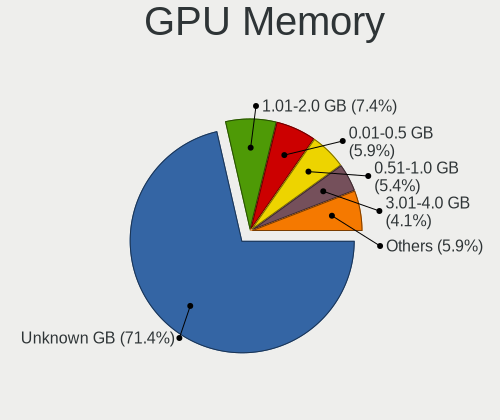

| Size in GB | Computers | Percent |
|------------|-----------|---------|
| Unknown    | 141       | 73.82%  |
| 1.01-2.0   | 14        | 7.33%   |
| 7.01-8.0   | 10        | 5.24%   |
| 0.51-1.0   | 10        | 5.24%   |
| 3.01-4.0   | 8         | 4.19%   |
| 0.01-0.5   | 6         | 3.14%   |
| 2.01-3.0   | 1         | 0.52%   |
| 8.01-16.0  | 1         | 0.52%   |

Monitor
-------

Monitor Vendor
--------------

Monitor vendors

| Vendor               | Computers | Percent |
|----------------------|-----------|---------|
| LG Display           | 24        | 13.19%  |
| Chimei Innolux       | 22        | 12.09%  |
| AU Optronics         | 22        | 12.09%  |
| Samsung Electronics  | 19        | 10.44%  |
| Dell                 | 15        | 8.24%   |
| Goldstar             | 8         | 4.4%    |
| BenQ                 | 8         | 4.4%    |
| BOE                  | 7         | 3.85%   |
| Philips              | 6         | 3.3%    |
| Lenovo               | 6         | 3.3%    |
| Hewlett-Packard      | 5         | 2.75%   |
| Acer                 | 4         | 2.2%    |
| Iiyama               | 3         | 1.65%   |
| Fujitsu Siemens      | 3         | 1.65%   |
| AOC                  | 3         | 1.65%   |
| Vizio                | 2         | 1.1%    |
| ViewSonic            | 2         | 1.1%    |
| PANDA                | 2         | 1.1%    |
| Panasonic            | 2         | 1.1%    |
| LG Electronics       | 2         | 1.1%    |
| ASUSTek Computer     | 2         | 1.1%    |
| Ancor Communications | 2         | 1.1%    |
| ___                  | 1         | 0.55%   |
| WYT                  | 1         | 0.55%   |
| Toshiba              | 1         | 0.55%   |
| Pixio                | 1         | 0.55%   |
| OEM                  | 1         | 0.55%   |
| Mi                   | 1         | 0.55%   |
| InfoVision           | 1         | 0.55%   |
| Idek Iiyama          | 1         | 0.55%   |
| IBM                  | 1         | 0.55%   |
| HannStar             | 1         | 0.55%   |
| CSO                  | 1         | 0.55%   |
| CHD                  | 1         | 0.55%   |
| Apple                | 1         | 0.55%   |

Monitor Model
-------------

Monitor models

| Model                                                                  | Computers | Percent |
|------------------------------------------------------------------------|-----------|---------|
| Samsung Electronics U28E590 SAM0C4D 3840x2160 610x350mm 27.7-inch      | 2         | 1.07%   |
| Philips PHL 241B8Q PHL0929 1920x1080 530x300mm 24.0-inch               | 2         | 1.07%   |
| Panasonic VVX13F009G00 MEI96A2 1920x1080 290x170mm 13.2-inch           | 2         | 1.07%   |
| LG Display LCD Monitor LGD0456 1366x768 340x190mm 15.3-inch            | 2         | 1.07%   |
| LG Display LCD Monitor LGD039F 1366x768 350x190mm 15.7-inch            | 2         | 1.07%   |
| LG Display LCD Monitor LGD0335 1366x768 310x170mm 13.9-inch            | 2         | 1.07%   |
| LG Display LCD Monitor LGD02DC 1366x768 340x190mm 15.3-inch            | 2         | 1.07%   |
| LG Display LCD Monitor LGD01E9 1920x1080 350x190mm 15.7-inch           | 2         | 1.07%   |
| Chimei Innolux LCD Monitor CMN15F5 1920x1080 340x190mm 15.3-inch       | 2         | 1.07%   |
| Chimei Innolux LCD Monitor CMN14D5 1920x1080 310x170mm 13.9-inch       | 2         | 1.07%   |
| Chimei Innolux LCD Monitor CMN14C9 1920x1080 310x170mm 13.9-inch       | 2         | 1.07%   |
| Chimei Innolux LCD Monitor CMN1482 1600x900 310x170mm 13.9-inch        | 2         | 1.07%   |
| BenQ EX3203R BNQ7F66 2560x1440 700x390mm 31.5-inch                     | 2         | 1.07%   |
| AU Optronics LCD Monitor AUO5B2D 1920x1080 290x160mm 13.0-inch         | 2         | 1.07%   |
| AU Optronics LCD Monitor AUO21EC 1366x768 340x190mm 15.3-inch          | 2         | 1.07%   |
| ___ MY TV LED TV ___0101 1920x1080                                     | 1         | 0.53%   |
| WYT MNT-ANALOG WYT0323 1280x1024 330x270mm 16.8-inch                   | 1         | 0.53%   |
| Vizio E320i-B2 VIZ1002 1360x768 700x400mm 31.7-inch                    | 1         | 0.53%   |
| Vizio D32x-D1 VIZ1005 1920x1080 700x390mm 31.5-inch                    | 1         | 0.53%   |
| ViewSonic VX3209-2K VSC328E 2560x1440 700x390mm 31.5-inch              | 1         | 0.53%   |
| ViewSonic LCD Monitor VA1938 Series                                    | 1         | 0.53%   |
| Toshiba TV TSB010F 1920x1080 890x500mm 40.2-inch                       | 1         | 0.53%   |
| Samsung Electronics U28E510 SAM0D68 3840x2160 610x350mm 27.7-inch      | 1         | 0.53%   |
| Samsung Electronics SyncMaster SAM03E4 1680x1050 470x300mm 22.0-inch   | 1         | 0.53%   |
| Samsung Electronics SyncMaster SAM010B 1280x1024 340x270mm 17.1-inch   | 1         | 0.53%   |
| Samsung Electronics SMT27A300 SAM087A 1920x1080 600x340mm 27.2-inch    | 1         | 0.53%   |
| Samsung Electronics SMBX2231 SAM076D 1920x1080 480x270mm 21.7-inch     | 1         | 0.53%   |
| Samsung Electronics SA300/SA350 SAM078F 1920x1080 480x270mm 21.7-inch  | 1         | 0.53%   |
| Samsung Electronics S24E650 SAM0CC1 1920x1200 520x320mm 24.0-inch      | 1         | 0.53%   |
| Samsung Electronics LCD Monitor SEC544B 1600x900 310x170mm 13.9-inch   | 1         | 0.53%   |
| Samsung Electronics LCD Monitor SEC5441 1280x800 330x210mm 15.4-inch   | 1         | 0.53%   |
| Samsung Electronics LCD Monitor SEC4542 1280x800 300x190mm 14.0-inch   | 1         | 0.53%   |
| Samsung Electronics LCD Monitor SEC4457 1440x900 300x190mm 14.0-inch   | 1         | 0.53%   |
| Samsung Electronics LCD Monitor SEC4251 1366x768 340x190mm 15.3-inch   | 1         | 0.53%   |
| Samsung Electronics LCD Monitor SEC3150 1366x768 340x190mm 15.3-inch   | 1         | 0.53%   |
| Samsung Electronics LCD Monitor SEC3047 1366x768 280x160mm 12.7-inch   | 1         | 0.53%   |
| Samsung Electronics LCD Monitor SDC5441 1366x768 310x170mm 13.9-inch   | 1         | 0.53%   |
| Samsung Electronics LCD Monitor SAM7004 3840x2160 1210x680mm 54.6-inch | 1         | 0.53%   |
| Samsung Electronics LCD Monitor SAM0DF7 3840x2160 1020x570mm 46.0-inch | 1         | 0.53%   |
| Samsung Electronics LCD Monitor SAM0902 1920x1080 890x500mm 40.2-inch  | 1         | 0.53%   |
| Samsung Electronics LCD Monitor SAM02A4 1360x768                       | 1         | 0.53%   |
| Samsung Electronics C24F390 SAM0D2C 1920x1080 520x290mm 23.4-inch      | 1         | 0.53%   |
| Pixio PX247 PNS0247 1920x1080 520x310mm 23.8-inch                      | 1         | 0.53%   |
| Philips PHL BDM4065 PHL08E1 3840x2160 880x490mm 39.7-inch              | 1         | 0.53%   |
| Philips PHL 240V5 PHLC10A 1920x1080 530x300mm 24.0-inch                | 1         | 0.53%   |
| Philips LCD Monitor PHL 240V5 1920x1080                                | 1         | 0.53%   |
| Philips FTV PHL01EA 1920x1080 1440x810mm 65.0-inch                     | 1         | 0.53%   |
| PANDA LCD Monitor NCP0040 1920x1080 340x190mm 15.3-inch                | 1         | 0.53%   |
| PANDA LC133LF1L02 NCP0019 1920x1080 290x170mm 13.2-inch                | 1         | 0.53%   |
| OEM 32W_LCD_TV OEM3700 1920x540                                        | 1         | 0.53%   |
| Mi Redmi 27 NQ XMIE001 2560x1440 600x330mm 27.0-inch                   | 1         | 0.53%   |
| LG Electronics LCD Monitor W1952 2806x900                              | 1         | 0.53%   |
| LG Electronics LCD Monitor LG ULTRAWIDE 2560x1080                      | 1         | 0.53%   |
| LG Display LCD Monitor LGD066E 1920x1080 340x190mm 15.3-inch           | 1         | 0.53%   |
| LG Display LCD Monitor LGD05FA 1920x1080 310x170mm 13.9-inch           | 1         | 0.53%   |
| LG Display LCD Monitor LGD05B3 1920x1080 290x170mm 13.2-inch           | 1         | 0.53%   |
| LG Display LCD Monitor LGD0558 1920x1080 310x170mm 13.9-inch           | 1         | 0.53%   |
| LG Display LCD Monitor LGD0533 1920x1080 340x190mm 15.3-inch           | 1         | 0.53%   |
| LG Display LCD Monitor LGD052D 1920x1080 290x170mm 13.2-inch           | 1         | 0.53%   |
| LG Display LCD Monitor LGD04D5 1920x1080 340x190mm 15.3-inch           | 1         | 0.53%   |

Monitor Resolution
------------------

Monitor screen resolution

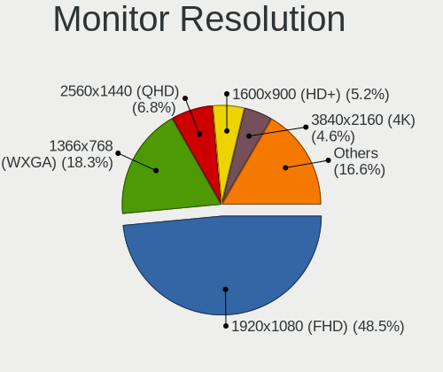

| Resolution         | Computers | Percent |
|--------------------|-----------|---------|
| 1920x1080 (FHD)    | 79        | 43.65%  |
| 1366x768 (WXGA)    | 37        | 20.44%  |
| 2560x1440 (QHD)    | 12        | 6.63%   |
| 1600x900 (HD+)     | 12        | 6.63%   |
| 3840x2160 (4K)     | 8         | 4.42%   |
| 1680x1050 (WSXGA+) | 5         | 2.76%   |
| 1280x1024 (SXGA)   | 5         | 2.76%   |
| 2560x1080          | 3         | 1.66%   |
| 1440x900 (WXGA+)   | 3         | 1.66%   |
| Unknown            | 3         | 1.66%   |
| 3840x1600          | 2         | 1.1%    |
| 2880x1620          | 2         | 1.1%    |
| 1360x768           | 2         | 1.1%    |
| 1280x800 (WXGA)    | 2         | 1.1%    |
| 5120x1440          | 1         | 0.55%   |
| 3200x1080          | 1         | 0.55%   |
| 2880x1800          | 1         | 0.55%   |
| 2806x900           | 1         | 0.55%   |
| 1920x540           | 1         | 0.55%   |
| 1920x1200 (WUXGA)  | 1         | 0.55%   |

Monitor Diagonal
----------------

Diagonal size in inches

| Inches  | Computers | Percent |
|---------|-----------|---------|
| 15      | 48        | 26.23%  |
| 13      | 29        | 15.85%  |
| 21      | 13        | 7.1%    |
| 27      | 12        | 6.56%   |
| 24      | 12        | 6.56%   |
| 23      | 11        | 6.01%   |
| Unknown | 10        | 5.46%   |
| 19      | 8         | 4.37%   |
| 17      | 8         | 4.37%   |
| 12      | 6         | 3.28%   |
| 31      | 5         | 2.73%   |
| 22      | 4         | 2.19%   |
| 14      | 3         | 1.64%   |
| 54      | 2         | 1.09%   |
| 40      | 2         | 1.09%   |
| 16      | 2         | 1.09%   |
| 11      | 2         | 1.09%   |
| 65      | 1         | 0.55%   |
| 39      | 1         | 0.55%   |
| 37      | 1         | 0.55%   |
| 34      | 1         | 0.55%   |
| 32      | 1         | 0.55%   |
| 28      | 1         | 0.55%   |

Monitor Width
-------------

Physical width

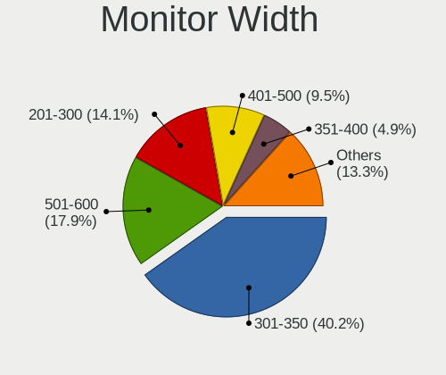

| Width in mm | Computers | Percent |
|-------------|-----------|---------|
| 301-350     | 71        | 39.23%  |
| 501-600     | 32        | 17.68%  |
| 401-500     | 22        | 12.15%  |
| 201-300     | 19        | 10.5%   |
| Unknown     | 10        | 5.52%   |
| 601-700     | 9         | 4.97%   |
| 351-400     | 9         | 4.97%   |
| 801-900     | 4         | 2.21%   |
| 1001-1500   | 3         | 1.66%   |
| 701-800     | 2         | 1.1%    |

Aspect Ratio
------------

Proportional relationship between the width and the height

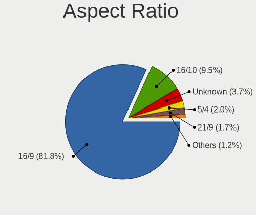

| Ratio   | Computers | Percent |
|---------|-----------|---------|
| 16/9    | 138       | 82.14%  |
| 16/10   | 13        | 7.74%   |
| Unknown | 7         | 4.17%   |
| 5/4     | 4         | 2.38%   |
| 21/9    | 3         | 1.79%   |
| 6/5     | 1         | 0.6%    |
| 32/9    | 1         | 0.6%    |
| 3/2     | 1         | 0.6%    |

Monitor Area
------------

Area in inch

| Area in inch | Computers | Percent |
|----------------|-----------|---------|
| 91-100         | 39        | 21.43%  |
| 201-250        | 36        | 19.78%  |
| 81-90          | 24        | 13.19%  |
| 301-350        | 12        | 6.59%   |
| Unknown        | 10        | 5.49%   |
| 151-200        | 9         | 4.95%   |
| 101-110        | 9         | 4.95%   |
| 71-80          | 8         | 4.4%    |
| 351-500        | 7         | 3.85%   |
| 61-70          | 6         | 3.3%    |
| 121-130        | 6         | 3.3%    |
| 501-1000       | 4         | 2.2%    |
| More than 1000 | 3         | 1.65%   |
| 251-300        | 3         | 1.65%   |
| 51-60          | 2         | 1.1%    |
| 141-150        | 2         | 1.1%    |
| 131-140        | 1         | 0.55%   |
| 111-120        | 1         | 0.55%   |

Pixel Density
-------------

Pixels per inch

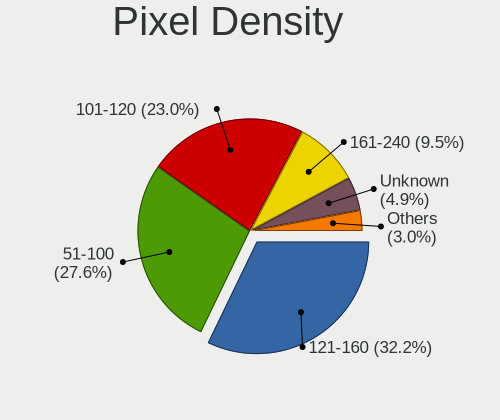

| Density       | Computers | Percent |
|---------------|-----------|---------|
| 51-100        | 56        | 30.94%  |
| 121-160       | 50        | 27.62%  |
| 101-120       | 48        | 26.52%  |
| 161-240       | 14        | 7.73%   |
| Unknown       | 10        | 5.52%   |
| 1-50          | 2         | 1.1%    |
| More than 240 | 1         | 0.55%   |

Multiple Monitors
-----------------

Total monitors connected

| Total | Computers | Percent |
|-------|-----------|---------|
| 1     | 139       | 72.02%  |
| 0     | 28        | 14.51%  |
| 2     | 26        | 13.47%  |

Network
-------

Net Controller Vendor
---------------------

Controller vendors

| Vendor                            | Computers | Percent |
|-----------------------------------|-----------|---------|
| Intel                             | 117       | 41.05%  |
| Realtek Semiconductor             | 76        | 26.67%  |
| Qualcomm Atheros                  | 36        | 12.63%  |
| Broadcom                          | 18        | 6.32%   |
| TP-Link                           | 7         | 2.46%   |
| Nvidia                            | 5         | 1.75%   |
| Ericsson Business Mobile Networks | 4         | 1.4%    |
| ASUSTek Computer                  | 3         | 1.05%   |
| Ralink                            | 2         | 0.7%    |
| Qualcomm                          | 2         | 0.7%    |
| Generic                           | 2         | 0.7%    |
| Edimax Technology                 | 2         | 0.7%    |
| Xiaomi                            | 1         | 0.35%   |
| Sierra Wireless                   | 1         | 0.35%   |
| Samsung Electronics               | 1         | 0.35%   |
| Ralink Technology                 | 1         | 0.35%   |
| Qualcomm Atheros Communications   | 1         | 0.35%   |
| OnePlus Technology (Shenzhen)     | 1         | 0.35%   |
| Microchip Technology              | 1         | 0.35%   |
| Marvell Technology Group          | 1         | 0.35%   |
| Hewlett-Packard                   | 1         | 0.35%   |
| Fibocom                           | 1         | 0.35%   |
| Aquantia                          | 1         | 0.35%   |

Net Controller Model
--------------------

Controller models

| Model                                                                       | Computers | Percent |
|-----------------------------------------------------------------------------|-----------|---------|
| Realtek RTL8111/8168/8411 PCI Express Gigabit Ethernet Controller           | 52        | 14.69%  |
| Intel 82579LM Gigabit Network Connection (Lewisville)                       | 17        | 4.8%    |
| Realtek RTL810xE PCI Express Fast Ethernet controller                       | 12        | 3.39%   |
| Intel I211 Gigabit Network Connection                                       | 11        | 3.11%   |
| Intel Wireless 7265                                                         | 10        | 2.82%   |
| Intel Wi-Fi 6 AX200                                                         | 10        | 2.82%   |
| Intel Wireless 8265 / 8275                                                  | 9         | 2.54%   |
| Intel Centrino Advanced-N 6205 [Taylor Peak]                                | 8         | 2.26%   |
| Qualcomm Atheros QCA9565 / AR9565 Wireless Network Adapter                  | 7         | 1.98%   |
| Qualcomm Atheros QCA9377 802.11ac Wireless Network Adapter                  | 7         | 1.98%   |
| Intel Wireless 8260                                                         | 7         | 1.98%   |
| Intel Ethernet Connection (4) I219-LM                                       | 7         | 1.98%   |
| Intel Wireless 7260                                                         | 6         | 1.69%   |
| Intel Comet Lake PCH-LP CNVi WiFi                                           | 6         | 1.69%   |
| Intel Ethernet Connection (3) I218-LM                                       | 5         | 1.41%   |
| Intel Ethernet Connection (2) I219-V                                        | 5         | 1.41%   |
| Intel Dual Band Wireless-AC 3168NGW [Stone Peak]                            | 5         | 1.41%   |
| Realtek RTL8821CE 802.11ac PCIe Wireless Network Adapter                    | 4         | 1.13%   |
| Qualcomm Atheros AR9485 Wireless Network Adapter                            | 4         | 1.13%   |
| Nvidia MCP79 Ethernet                                                       | 4         | 1.13%   |
| Intel Centrino Ultimate-N 6300                                              | 4         | 1.13%   |
| Intel Cannon Lake PCH CNVi WiFi                                             | 4         | 1.13%   |
| TP-Link AC600 wireless Realtek RTL8811AU [Archer T2U Nano]                  | 3         | 0.85%   |
| Realtek RTL8188CE 802.11b/g/n WiFi Adapter                                  | 3         | 0.85%   |
| Realtek RTL8125 2.5GbE Controller                                           | 3         | 0.85%   |
| Qualcomm Atheros AR93xx Wireless Network Adapter                            | 3         | 0.85%   |
| Qualcomm Atheros AR8151 v2.0 Gigabit Ethernet                               | 3         | 0.85%   |
| Intel Ethernet Connection I219-LM                                           | 3         | 0.85%   |
| Intel Ethernet Connection I217-LM                                           | 3         | 0.85%   |
| Intel Ethernet Connection (7) I219-LM                                       | 3         | 0.85%   |
| Intel 82567LM Gigabit Network Connection                                    | 3         | 0.85%   |
| Realtek RTL8188EUS 802.11n Wireless Network Adapter                         | 2         | 0.56%   |
| Qualcomm Atheros AR928X Wireless Network Adapter (PCI-Express)              | 2         | 0.56%   |
| Qualcomm Atheros AR9287 Wireless Network Adapter (PCI-Express)              | 2         | 0.56%   |
| Qualcomm Atheros AR9285 Wireless Network Adapter (PCI-Express)              | 2         | 0.56%   |
| Qualcomm Atheros AR8162 Fast Ethernet                                       | 2         | 0.56%   |
| Qualcomm ALCATEL Composite RNDIS Interface                                  | 2         | 0.56%   |
| Intel Wireless-AC 9260                                                      | 2         | 0.56%   |
| Intel Wireless 3165                                                         | 2         | 0.56%   |
| Intel PRO/Wireless 5100 AGN [Shiloh] Network Connection                     | 2         | 0.56%   |
| Intel Ice Lake-LP PCH CNVi WiFi                                             | 2         | 0.56%   |
| Intel Ethernet Controller X710 for 10GbE SFP+                               | 2         | 0.56%   |
| Intel Ethernet Connection I218-LM                                           | 2         | 0.56%   |
| Intel Ethernet Connection (6) I219-V                                        | 2         | 0.56%   |
| Intel Comet Lake PCH CNVi WiFi                                              | 2         | 0.56%   |
| Intel Centrino Advanced-N 6235                                              | 2         | 0.56%   |
| Intel Centrino Advanced-N 6200                                              | 2         | 0.56%   |
| Intel Cannon Point-LP CNVi [Wireless-AC]                                    | 2         | 0.56%   |
| Intel 82577LM Gigabit Network Connection                                    | 2         | 0.56%   |
| Generic Dygma Shortcut Keyboard                                             | 2         | 0.56%   |
| Ericsson Business Mobile Networks N5321 gw Mobile Broadband Serial Port III | 2         | 0.56%   |
| Broadcom NetXtreme BCM5761 Gigabit Ethernet PCIe                            | 2         | 0.56%   |
| Broadcom NetXtreme BCM5754 Gigabit Ethernet PCI Express                     | 2         | 0.56%   |
| Broadcom BCM4322 802.11a/b/g/n Wireless LAN Controller                      | 2         | 0.56%   |
| Broadcom BCM4313 802.11bgn Wireless Network Adapter                         | 2         | 0.56%   |
| Xiaomi Mi/Redmi series (RNDIS + ADB)                                        | 1         | 0.28%   |
| TP-Link TP-LINK Wireless USB Adapter                                        | 1         | 0.28%   |
| TP-Link TP-Link High Power Wireless USB Adapter                             | 1         | 0.28%   |
| TP-Link TL-WN823N v2/v3 [Realtek RTL8192EU]                                 | 1         | 0.28%   |
| TP-Link TL-WN722N v2/v3 [Realtek RTL8188EUS]                                | 1         | 0.28%   |

Wireless Vendor
---------------

Wireless vendors

| Vendor                          | Computers | Percent |
|---------------------------------|-----------|---------|
| Intel                           | 92        | 56.79%  |
| Qualcomm Atheros                | 27        | 16.67%  |
| Realtek Semiconductor           | 17        | 10.49%  |
| Broadcom                        | 9         | 5.56%   |
| TP-Link                         | 7         | 4.32%   |
| ASUSTek Computer                | 3         | 1.85%   |
| Ralink                          | 2         | 1.23%   |
| Edimax Technology               | 2         | 1.23%   |
| Sierra Wireless                 | 1         | 0.62%   |
| Ralink Technology               | 1         | 0.62%   |
| Qualcomm Atheros Communications | 1         | 0.62%   |

Wireless Model
--------------

Wireless models

| Model                                                             | Computers | Percent |
|-------------------------------------------------------------------|-----------|---------|
| Intel Wireless 7265                                               | 10        | 6.13%   |
| Intel Wi-Fi 6 AX200                                               | 10        | 6.13%   |
| Intel Wireless 8265 / 8275                                        | 9         | 5.52%   |
| Intel Centrino Advanced-N 6205 [Taylor Peak]                      | 8         | 4.91%   |
| Qualcomm Atheros QCA9565 / AR9565 Wireless Network Adapter        | 7         | 4.29%   |
| Qualcomm Atheros QCA9377 802.11ac Wireless Network Adapter        | 7         | 4.29%   |
| Intel Wireless 8260                                               | 7         | 4.29%   |
| Intel Wireless 7260                                               | 6         | 3.68%   |
| Intel Comet Lake PCH-LP CNVi WiFi                                 | 6         | 3.68%   |
| Intel Dual Band Wireless-AC 3168NGW [Stone Peak]                  | 5         | 3.07%   |
| Realtek RTL8821CE 802.11ac PCIe Wireless Network Adapter          | 4         | 2.45%   |
| Qualcomm Atheros AR9485 Wireless Network Adapter                  | 4         | 2.45%   |
| Intel Centrino Ultimate-N 6300                                    | 4         | 2.45%   |
| Intel Cannon Lake PCH CNVi WiFi                                   | 4         | 2.45%   |
| TP-Link AC600 wireless Realtek RTL8811AU [Archer T2U Nano]        | 3         | 1.84%   |
| Realtek RTL8188CE 802.11b/g/n WiFi Adapter                        | 3         | 1.84%   |
| Qualcomm Atheros AR93xx Wireless Network Adapter                  | 3         | 1.84%   |
| Realtek RTL8188EUS 802.11n Wireless Network Adapter               | 2         | 1.23%   |
| Qualcomm Atheros AR928X Wireless Network Adapter (PCI-Express)    | 2         | 1.23%   |
| Qualcomm Atheros AR9287 Wireless Network Adapter (PCI-Express)    | 2         | 1.23%   |
| Qualcomm Atheros AR9285 Wireless Network Adapter (PCI-Express)    | 2         | 1.23%   |
| Intel Wireless-AC 9260                                            | 2         | 1.23%   |
| Intel Wireless 3165                                               | 2         | 1.23%   |
| Intel PRO/Wireless 5100 AGN [Shiloh] Network Connection           | 2         | 1.23%   |
| Intel Ice Lake-LP PCH CNVi WiFi                                   | 2         | 1.23%   |
| Intel Comet Lake PCH CNVi WiFi                                    | 2         | 1.23%   |
| Intel Centrino Advanced-N 6235                                    | 2         | 1.23%   |
| Intel Centrino Advanced-N 6200                                    | 2         | 1.23%   |
| Intel Cannon Point-LP CNVi [Wireless-AC]                          | 2         | 1.23%   |
| Broadcom BCM4322 802.11a/b/g/n Wireless LAN Controller            | 2         | 1.23%   |
| Broadcom BCM4313 802.11bgn Wireless Network Adapter               | 2         | 1.23%   |
| TP-Link TP-LINK Wireless USB Adapter                              | 1         | 0.61%   |
| TP-Link TP-Link High Power Wireless USB Adapter                   | 1         | 0.61%   |
| TP-Link TL-WN823N v2/v3 [Realtek RTL8192EU]                       | 1         | 0.61%   |
| TP-Link TL-WN722N v2/v3 [Realtek RTL8188EUS]                      | 1         | 0.61%   |
| Sierra Wireless Sierra Wireless EM7345 4G LTE                     | 1         | 0.61%   |
| Realtek RTL8852AE 802.11ax PCIe Wireless Network Adapter          | 1         | 0.61%   |
| Realtek RTL8822CE 802.11ac PCIe Wireless Network Adapter          | 1         | 0.61%   |
| Realtek RTL8821AE 802.11ac PCIe Wireless Network Adapter          | 1         | 0.61%   |
| Realtek RTL8723DE Wireless Network Adapter                        | 1         | 0.61%   |
| Realtek RTL8723BE PCIe Wireless Network Adapter                   | 1         | 0.61%   |
| Realtek RTL8723AE PCIe Wireless Network Adapter                   | 1         | 0.61%   |
| Realtek RTL8191SEvB Wireless LAN Controller                       | 1         | 0.61%   |
| Realtek RTL8188EE Wireless Network Adapter                        | 1         | 0.61%   |
| Realtek Realtek Bluetooth 4.2 Adapter                             | 1         | 0.61%   |
| Ralink RT5370 Wireless Adapter                                    | 1         | 0.61%   |
| Ralink RT5390R 802.11bgn PCIe Wireless Network Adapter            | 1         | 0.61%   |
| Ralink RT5390 Wireless 802.11n 1T/1R PCIe                         | 1         | 0.61%   |
| Qualcomm Atheros AR9271 802.11n                                   | 1         | 0.61%   |
| Intel Wi-Fi 6 AX201                                               | 1         | 0.61%   |
| Intel Ultimate N WiFi Link 5300                                   | 1         | 0.61%   |
| Intel PRO/Wireless 3945ABG [Golan] Network Connection             | 1         | 0.61%   |
| Intel Centrino Wireless-N 2200                                    | 1         | 0.61%   |
| Intel Centrino Wireless-N 135                                     | 1         | 0.61%   |
| Intel Centrino Wireless-N 1000 [Condor Peak]                      | 1         | 0.61%   |
| Intel Centrino Wireless-N 100                                     | 1         | 0.61%   |
| Edimax EW-7811Un 802.11n Wireless Adapter [Realtek RTL8188CUS]    | 1         | 0.61%   |
| Edimax EW-7612UAn V2 802.11n Wireless Adapter [Realtek RTL8192CU] | 1         | 0.61%   |
| Broadcom BCM43602 802.11ac Wireless LAN SoC                       | 1         | 0.61%   |
| Broadcom BCM4360 802.11ac Wireless Network Adapter                | 1         | 0.61%   |

Ethernet Vendor
---------------

Ethernet vendors

| Vendor                        | Computers | Percent |
|-------------------------------|-----------|---------|
| Intel                         | 75        | 42.13%  |
| Realtek Semiconductor         | 68        | 38.2%   |
| Qualcomm Atheros              | 12        | 6.74%   |
| Broadcom                      | 11        | 6.18%   |
| Nvidia                        | 5         | 2.81%   |
| Qualcomm                      | 2         | 1.12%   |
| Xiaomi                        | 1         | 0.56%   |
| Samsung Electronics           | 1         | 0.56%   |
| OnePlus Technology (Shenzhen) | 1         | 0.56%   |
| Marvell Technology Group      | 1         | 0.56%   |
| Aquantia                      | 1         | 0.56%   |

Ethernet Model
--------------

Ethernet models

| Model                                                             | Computers | Percent |
|-------------------------------------------------------------------|-----------|---------|
| Realtek RTL8111/8168/8411 PCI Express Gigabit Ethernet Controller | 52        | 28.73%  |
| Intel 82579LM Gigabit Network Connection (Lewisville)             | 17        | 9.39%   |
| Realtek RTL810xE PCI Express Fast Ethernet controller             | 12        | 6.63%   |
| Intel I211 Gigabit Network Connection                             | 11        | 6.08%   |
| Intel Ethernet Connection (4) I219-LM                             | 7         | 3.87%   |
| Intel Ethernet Connection (3) I218-LM                             | 5         | 2.76%   |
| Intel Ethernet Connection (2) I219-V                              | 5         | 2.76%   |
| Nvidia MCP79 Ethernet                                             | 4         | 2.21%   |
| Qualcomm Atheros AR8151 v2.0 Gigabit Ethernet                     | 3         | 1.66%   |
| Intel Ethernet Connection I219-LM                                 | 3         | 1.66%   |
| Intel Ethernet Connection I217-LM                                 | 3         | 1.66%   |
| Intel Ethernet Connection (7) I219-LM                             | 3         | 1.66%   |
| Intel 82567LM Gigabit Network Connection                          | 3         | 1.66%   |
| Realtek RTL8125 2.5GbE Controller                                 | 2         | 1.1%    |
| Qualcomm Atheros AR8162 Fast Ethernet                             | 2         | 1.1%    |
| Qualcomm ALCATEL Composite RNDIS Interface                        | 2         | 1.1%    |
| Intel Ethernet Controller X710 for 10GbE SFP+                     | 2         | 1.1%    |
| Intel Ethernet Connection I218-LM                                 | 2         | 1.1%    |
| Intel Ethernet Connection (6) I219-V                              | 2         | 1.1%    |
| Intel 82577LM Gigabit Network Connection                          | 2         | 1.1%    |
| Broadcom NetXtreme BCM5761 Gigabit Ethernet PCIe                  | 2         | 1.1%    |
| Broadcom NetXtreme BCM5754 Gigabit Ethernet PCI Express           | 2         | 1.1%    |
| Xiaomi Mi/Redmi series (RNDIS + ADB)                              | 1         | 0.55%   |
| Samsung Galaxy series, misc. (tethering mode)                     | 1         | 0.55%   |
| Realtek RTL-8110SC/8169SC Gigabit Ethernet                        | 1         | 0.55%   |
| Realtek Killer E2500 Gigabit Ethernet Controller                  | 1         | 0.55%   |
| Qualcomm Atheros QCA8172 Fast Ethernet                            | 1         | 0.55%   |
| Qualcomm Atheros QCA8171 Gigabit Ethernet                         | 1         | 0.55%   |
| Qualcomm Atheros Killer E2500 Gigabit Ethernet Controller         | 1         | 0.55%   |
| Qualcomm Atheros Killer E2400 Gigabit Ethernet Controller         | 1         | 0.55%   |
| Qualcomm Atheros Killer E220x Gigabit Ethernet Controller         | 1         | 0.55%   |
| Qualcomm Atheros AR8161 Gigabit Ethernet                          | 1         | 0.55%   |
| Qualcomm Atheros AR8131 Gigabit Ethernet                          | 1         | 0.55%   |
| OnePlus (Shenzhen) IN2025 RNDIS Control RNDIS Ethernet Data       | 1         | 0.55%   |
| Nvidia MCP73 Ethernet                                             | 1         | 0.55%   |
| Marvell Group 88E8053 PCI-E Gigabit Ethernet Controller           | 1         | 0.55%   |
| Marvell Group 88E8036 PCI-E Fast Ethernet Controller              | 1         | 0.55%   |
| Intel I350 Gigabit Network Connection                             | 1         | 0.55%   |
| Intel Ethernet Controller I225-V                                  | 1         | 0.55%   |
| Intel Ethernet Connection I217-V                                  | 1         | 0.55%   |
| Intel Ethernet Connection (7) I219-V                              | 1         | 0.55%   |
| Intel Ethernet Connection (5) I219-LM                             | 1         | 0.55%   |
| Intel Ethernet Connection (2) I218-V                              | 1         | 0.55%   |
| Intel Ethernet Connection (10) I219-LM                            | 1         | 0.55%   |
| Intel 82576 Gigabit Network Connection                            | 1         | 0.55%   |
| Intel 82574L Gigabit Network Connection                           | 1         | 0.55%   |
| Intel 82567V-2 Gigabit Network Connection                         | 1         | 0.55%   |
| Broadcom NetXtreme BCM57786 Gigabit Ethernet PCIe                 | 1         | 0.55%   |
| Broadcom NetXtreme BCM57766 Gigabit Ethernet PCIe                 | 1         | 0.55%   |
| Broadcom NetXtreme BCM5764M Gigabit Ethernet PCIe                 | 1         | 0.55%   |
| Broadcom NetXtreme BCM5755M Gigabit Ethernet PCI Express          | 1         | 0.55%   |
| Broadcom NetXtreme BCM5755 Gigabit Ethernet PCI Express           | 1         | 0.55%   |
| Broadcom NetLink BCM5784M Gigabit Ethernet PCIe                   | 1         | 0.55%   |
| Broadcom NetLink BCM57785 Gigabit Ethernet PCIe                   | 1         | 0.55%   |
| Broadcom NetLink BCM57781 Gigabit Ethernet PCIe                   | 1         | 0.55%   |
| Aquantia AQC107 NBase-T/IEEE 802.3bz Ethernet Controller [AQtion] | 1         | 0.55%   |
| Unknown                                                           | 1         | 0.55%   |

Net Controller Kind
-------------------

Ethernet, WiFi or modem

| Kind     | Computers | Percent |
|----------|-----------|---------|
| Ethernet | 172       | 51.81%  |
| WiFi     | 150       | 45.18%  |
| Modem    | 7         | 2.11%   |
| Unknown  | 3         | 0.9%    |

Used Controller
---------------

Currently used network controller

| Kind     | Computers | Percent |
|----------|-----------|---------|
| Ethernet | 155       | 58.94%  |
| WiFi     | 105       | 39.92%  |
| Modem    | 3         | 1.14%   |

NICs
----

Total network controllers on board

| Total | Computers | Percent |
|-------|-----------|---------|
| 2     | 119       | 62.63%  |
| 1     | 64        | 33.68%  |
| 3     | 6         | 3.16%   |
| 4     | 1         | 0.53%   |

IPv6
----

IPv6 vs IPv4

| Used | Computers | Percent |
|------|-----------|---------|
| No   | 189       | 99.47%  |
| Yes  | 1         | 0.53%   |

Bluetooth
---------

Bluetooth Vendor
----------------

Controller vendors

| Vendor                          | Computers | Percent |
|---------------------------------|-----------|---------|
| Intel                           | 66        | 57.39%  |
| Broadcom                        | 8         | 6.96%   |
| Qualcomm Atheros Communications | 7         | 6.09%   |
| Realtek Semiconductor           | 6         | 5.22%   |
| Lite-On Technology              | 6         | 5.22%   |
| Apple                           | 6         | 5.22%   |
| IMC Networks                    | 4         | 3.48%   |
| Dell                            | 4         | 3.48%   |
| Cambridge Silicon Radio         | 2         | 1.74%   |
| ASUSTek Computer                | 2         | 1.74%   |
| Alps Electric                   | 2         | 1.74%   |
| Toshiba                         | 1         | 0.87%   |
| HTC (High Tech Computer)        | 1         | 0.87%   |

Bluetooth Model
---------------

Controller models

| Model                                                                | Computers | Percent |
|----------------------------------------------------------------------|-----------|---------|
| Intel Bluetooth wireless interface                                   | 31        | 26.96%  |
| Intel Bluetooth 9460/9560 Jefferson Peak (JfP)                       | 11        | 9.57%   |
| Intel AX200 Bluetooth                                                | 9         | 7.83%   |
| Intel AX201 Bluetooth                                                | 6         | 5.22%   |
| Intel Wireless-AC 3168 Bluetooth                                     | 5         | 4.35%   |
| Apple Bluetooth Host Controller                                      | 5         | 4.35%   |
| Realtek  Bluetooth 4.2 Adapter                                       | 3         | 2.61%   |
| Qualcomm Atheros AR9462 Bluetooth                                    | 3         | 2.61%   |
| Lite-On Qualcomm Atheros QCA9377 Bluetooth                           | 3         | 2.61%   |
| Dell Dell Wireless 380 Bluetooth 4.0 Module                          | 3         | 2.61%   |
| Broadcom BCM20702 Bluetooth 4.0 [ThinkPad]                           | 3         | 2.61%   |
| Qualcomm Atheros  QCA9377 Bluetooth 4.1                              | 2         | 1.74%   |
| Qualcomm Atheros Dell Wireless 1707 Bluetooth 4.0 LE Device          | 2         | 1.74%   |
| Lite-On Atheros AR3012 Bluetooth                                     | 2         | 1.74%   |
| Intel Wireless-AC 9260 Bluetooth Adapter                             | 2         | 1.74%   |
| Intel Centrino Bluetooth Wireless Transceiver                        | 2         | 1.74%   |
| IMC Networks Atheros AR3012 Bluetooth 4.0 Adapter                    | 2         | 1.74%   |
| Cambridge Silicon Radio Bluetooth Dongle (HCI mode)                  | 2         | 1.74%   |
| Broadcom BCM20702A0 Bluetooth 4.0                                    | 2         | 1.74%   |
| Broadcom BCM2045B (BDC-2.1)                                          | 2         | 1.74%   |
| Toshiba Realtek Bluetooth 4.0 + High Speed Chip                      | 1         | 0.87%   |
| Realtek RTL8723B Bluetooth                                           | 1         | 0.87%   |
| Realtek  Bluetooth Adapter                                           | 1         | 0.87%   |
| Realtek Bluetooth Radio                                              | 1         | 0.87%   |
| Lite-On Broadcom Bluetooth 4.0 USB                                   | 1         | 0.87%   |
| IMC Networks Qualcomm Atheros Bluetooth 4.1                          | 1         | 0.87%   |
| IMC Networks Bluetooth Module                                        | 1         | 0.87%   |
| HTC (High Tech Computer) Vive Hub Bluetooth 4.1 (Broadcom BCM920703) | 1         | 0.87%   |
| Dell DW375 Bluetooth Module                                          | 1         | 0.87%   |
| Broadcom BCM2045B (BDC-2.1) [Bluetooth Controller]                   | 1         | 0.87%   |
| ASUS Realtek Bluetooth 4.0 + High Speed Chip                         | 1         | 0.87%   |
| ASUS ASUS USB-BT500                                                  | 1         | 0.87%   |
| Apple Bluetooth USB Host Controller                                  | 1         | 0.87%   |
| Alps Electric UGTZ4 Bluetooth                                        | 1         | 0.87%   |
| Alps Electric Bluetooth Controller (ALPS/UGPZ6)                      | 1         | 0.87%   |

Sound
-----

Sound Vendor
------------

Sound card vendors

| Vendor                | Computers | Percent |
|-----------------------|-----------|---------|
| Intel                 | 139       | 53.46%  |
| AMD                   | 51        | 19.62%  |
| Nvidia                | 47        | 18.08%  |
| Logitech              | 4         | 1.54%   |
| C-Media Electronics   | 3         | 1.15%   |
| VIA Technologies      | 2         | 0.77%   |
| SteelSeries ApS       | 2         | 0.77%   |
| RODE Microphones      | 2         | 0.77%   |
| Creative Labs         | 2         | 0.77%   |
| Realtek Semiconductor | 1         | 0.38%   |
| Nam Tai E&E Products  | 1         | 0.38%   |
| JMTek                 | 1         | 0.38%   |
| Focusrite-Novation    | 1         | 0.38%   |
| DSEA A/S              | 1         | 0.38%   |
| Creative Technology   | 1         | 0.38%   |
| Corsair               | 1         | 0.38%   |
| Cambridge Audio       | 1         | 0.38%   |

Sound Model
-----------

Sound card models

| Model                                                                                 | Computers | Percent |
|---------------------------------------------------------------------------------------|-----------|---------|
| Intel 7 Series/C216 Chipset Family High Definition Audio Controller                   | 20        | 6.35%   |
| Intel Sunrise Point-LP HD Audio                                                       | 19        | 6.03%   |
| Intel 6 Series/C200 Series Chipset Family High Definition Audio Controller            | 16        | 5.08%   |
| AMD Family 17h/19h HD Audio Controller                                                | 13        | 4.13%   |
| Intel Haswell-ULT HD Audio Controller                                                 | 12        | 3.81%   |
| Intel 8 Series HD Audio Controller                                                    | 12        | 3.81%   |
| AMD Starship/Matisse HD Audio Controller                                              | 11        | 3.49%   |
| Intel Cannon Lake PCH cAVS                                                            | 9         | 2.86%   |
| AMD Family 17h (Models 00h-0fh) HD Audio Controller                                   | 9         | 2.86%   |
| Intel Comet Lake PCH-LP cAVS                                                          | 8         | 2.54%   |
| Intel Wildcat Point-LP High Definition Audio Controller                               | 7         | 2.22%   |
| Intel Broadwell-U Audio Controller                                                    | 7         | 2.22%   |
| Intel 8 Series/C220 Series Chipset High Definition Audio Controller                   | 7         | 2.22%   |
| Intel 100 Series/C230 Series Chipset Family HD Audio Controller                       | 7         | 2.22%   |
| AMD Raven/Raven2/Fenghuang HDMI/DP Audio Controller                                   | 7         | 2.22%   |
| Nvidia GP107GL High Definition Audio Controller                                       | 6         | 1.9%    |
| Nvidia GP104 High Definition Audio Controller                                         | 6         | 1.9%    |
| Nvidia GK107 HDMI Audio Controller                                                    | 6         | 1.9%    |
| Intel Xeon E3-1200 v3/4th Gen Core Processor HD Audio Controller                      | 6         | 1.9%    |
| Intel 82801I (ICH9 Family) HD Audio Controller                                        | 6         | 1.9%    |
| AMD Renoir Radeon High Definition Audio Controller                                    | 6         | 1.9%    |
| AMD FCH Azalia Controller                                                             | 6         | 1.9%    |
| AMD Ellesmere HDMI Audio [Radeon RX 470/480 / 570/580/590]                            | 5         | 1.59%   |
| Nvidia MCP79 High Definition Audio                                                    | 4         | 1.27%   |
| Nvidia GP108 High Definition Audio Controller                                         | 4         | 1.27%   |
| Intel 82801JI (ICH10 Family) HD Audio Controller                                      | 4         | 1.27%   |
| AMD Kabini HDMI/DP Audio                                                              | 4         | 1.27%   |
| Nvidia GM206 High Definition Audio Controller                                         | 3         | 0.95%   |
| Nvidia GM107 High Definition Audio Controller [GeForce 940MX]                         | 3         | 0.95%   |
| Intel Ice Lake-LP Smart Sound Technology Audio Controller                             | 3         | 0.95%   |
| Intel Comet Lake PCH cAVS                                                             | 3         | 0.95%   |
| Intel 5 Series/3400 Series Chipset High Definition Audio                              | 3         | 0.95%   |
| Intel 200 Series PCH HD Audio                                                         | 3         | 0.95%   |
| AMD Family 15h (Models 60h-6fh) Audio Controller                                      | 3         | 0.95%   |
| SteelSeries ApS SteelSeries Arctis 7 Arctis 7 Chat Arctis 7 Game SteelSeries Arctis 7 | 2         | 0.63%   |
| RODE Microphones RDE NT-USB Mini                                                      | 2         | 0.63%   |
| Nvidia TU106 High Definition Audio Controller                                         | 2         | 0.63%   |
| Nvidia TU104 HD Audio Controller                                                      | 2         | 0.63%   |
| Nvidia GP106 High Definition Audio Controller                                         | 2         | 0.63%   |
| Nvidia GF108 High Definition Audio Controller                                         | 2         | 0.63%   |
| Nvidia GA104 High Definition Audio Controller                                         | 2         | 0.63%   |
| Intel Cannon Point-LP High Definition Audio Controller                                | 2         | 0.63%   |
| Intel 9 Series Chipset Family HD Audio Controller                                     | 2         | 0.63%   |
| AMD Turks HDMI Audio [Radeon HD 6500/6600 / 6700M Series]                             | 2         | 0.63%   |
| AMD SBx00 Azalia (Intel HDA)                                                          | 2         | 0.63%   |
| AMD Oland/Hainan/Cape Verde/Pitcairn HDMI Audio [Radeon HD 7000 Series]               | 2         | 0.63%   |
| AMD High Definition Audio Controller                                                  | 2         | 0.63%   |
| AMD Baffin HDMI/DP Audio [Radeon RX 550 640SP / RX 560/560X]                          | 2         | 0.63%   |
| VIA Technologies VT1720/24 [Envy24PT/HT] PCI Multi-Channel Audio Controller           | 1         | 0.32%   |
| VIA Technologies USB Audio Device                                                     | 1         | 0.32%   |
| Realtek Semiconductor Realtek USB Audio                                               | 1         | 0.32%   |
| Nvidia TU116 High Definition Audio Controller                                         | 1         | 0.32%   |
| Nvidia MCP73 High Definition Audio                                                    | 1         | 0.32%   |
| Nvidia High Definition Audio Controller                                               | 1         | 0.32%   |
| Nvidia GK106 HDMI Audio Controller                                                    | 1         | 0.32%   |
| Nvidia GF116 High Definition Audio Controller                                         | 1         | 0.32%   |
| Nvidia GF100 High Definition Audio Controller                                         | 1         | 0.32%   |
| Nvidia GA102 High Definition Audio Controller                                         | 1         | 0.32%   |
| Nam Tai E&E Products Sony SingStar USBMIC                                             | 1         | 0.32%   |
| Logitech Logitech USB Microphone                                                      | 1         | 0.32%   |

Memory
------

Memory Vendor
-------------

Memory module vendors

| Vendor              | Computers | Percent |
|---------------------|-----------|---------|
| Samsung Electronics | 58        | 24.79%  |
| SK hynix            | 50        | 21.37%  |
| Kingston            | 23        | 9.83%   |
| G.Skill             | 15        | 6.41%   |
| Unknown             | 14        | 5.98%   |
| Micron Technology   | 14        | 5.98%   |
| Crucial             | 14        | 5.98%   |
| Corsair             | 14        | 5.98%   |
| Elpida              | 6         | 2.56%   |
| A-DATA Technology   | 4         | 1.71%   |
| Nanya Technology    | 3         | 1.28%   |
| Unknown             | 3         | 1.28%   |
| Unknown (ABCD)      | 2         | 0.85%   |
| Ramaxel Technology  | 2         | 0.85%   |
| Goodram             | 2         | 0.85%   |
| Undefined-00BA      | 1         | 0.43%   |
| Transcend           | 1         | 0.43%   |
| TIMETEC             | 1         | 0.43%   |
| Team                | 1         | 0.43%   |
| Smart               | 1         | 0.43%   |
| S                   | 1         | 0.43%   |
| Neo Forza           | 1         | 0.43%   |
| Kingmax             | 1         | 0.43%   |
| Apacer              | 1         | 0.43%   |
| 09490000802C        | 1         | 0.43%   |

Memory Model
------------

Memory module models

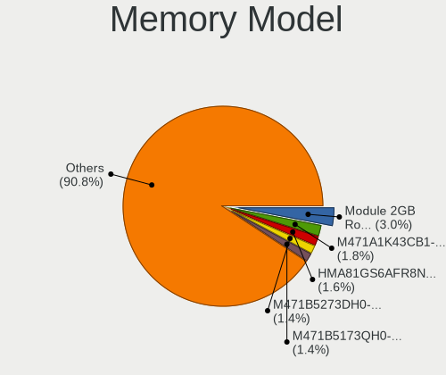

| Model                                                            | Computers | Percent |
|------------------------------------------------------------------|-----------|---------|
| Samsung RAM M471A1K43CB1-CTD 8GB SODIMM DDR4 2667MT/s            | 9         | 3.77%   |
| Samsung RAM M471B5273DH0-CH9 4GB SODIMM DDR3 1334MT/s            | 7         | 2.93%   |
| SK hynix RAM HMT41GS6BFR8A-PB 8GB SODIMM DDR3 1600MT/s           | 5         | 2.09%   |
| SK hynix RAM HMT351S6CFR8C-PB 4GB SODIMM DDR3 1600MT/s           | 5         | 2.09%   |
| SK hynix RAM HMA81GS6AFR8N-UH 8GB SODIMM DDR4 2400MT/s           | 5         | 2.09%   |
| SK hynix RAM HMT451S6AFR8A-PB 4GB SODIMM DDR3 1600MT/s           | 4         | 1.67%   |
| Samsung RAM M471B5273DH0-CK0 4GB SODIMM DDR3 1600MT/s            | 4         | 1.67%   |
| Samsung RAM M471B5173QH0-YK0 4GB SODIMM DDR3 1600MT/s            | 4         | 1.67%   |
| Corsair RAM CMK16GX4M2B3200C16 8GB DIMM DDR4 3200MT/s            | 4         | 1.67%   |
| Samsung RAM M471A5244CB0-CTD 4GB SODIMM DDR4 2667MT/s            | 3         | 1.26%   |
| G.Skill RAM F4-3200C16-8GVKB 8GB DIMM DDR4 3200MT/s              | 3         | 1.26%   |
| Unknown                                                          | 3         | 1.26%   |
| Unknown RAM Module 2GB SODIMM DDR3                               | 2         | 0.84%   |
| Unknown (ABCD) RAM 123456789012345678 2GB SODIMM LPDDR3 2133MT/s | 2         | 0.84%   |
| SK hynix RAM HMT451S6BFR8A-PB 4GB SODIMM DDR3 1600MT/s           | 2         | 0.84%   |
| SK hynix RAM HMT425S6AFR6A-PB 2GB SODIMM DDR3 1600MT/s           | 2         | 0.84%   |
| SK hynix RAM HMT351S6BFR8C-H9 4GB SODIMM DDR3 1334MT/s           | 2         | 0.84%   |
| SK hynix RAM HMA81GS6CJR8N-VK 8GB SODIMM DDR4 2667MT/s           | 2         | 0.84%   |
| Samsung RAM M471B5273CH0-CH9 4GB SODIMM DDR3 1334MT/s            | 2         | 0.84%   |
| Samsung RAM M471B1G73EB0-YK0 8GB SODIMM DDR3 1600MT/s            | 2         | 0.84%   |
| Samsung RAM M471A5244CB0-CRC 4GB SODIMM DDR4 2400MT/s            | 2         | 0.84%   |
| Micron RAM Module 8GB SODIMM DDR3 1600MT/s                       | 2         | 0.84%   |
| Micron RAM 8ATF1G64HZ-2G6E1 8GB SODIMM DDR4 2667MT/s             | 2         | 0.84%   |
| Elpida RAM EBJ41UF8BCS0-DJ-F 4GB SODIMM DDR3 1333MT/s            | 2         | 0.84%   |
| Crucial RAM CT51264BF160B.C16F 4GB SODIMM DDR3 1600MT/s          | 2         | 0.84%   |
| Unknown SODIMM 4GB SODIMM 800MT/s                                | 1         | 0.42%   |
| Unknown RAM Module 4GB SODIMM DDR3 1067MT/s                      | 1         | 0.42%   |
| Unknown RAM Module 4GB SODIMM DDR3                               | 1         | 0.42%   |
| Unknown RAM Module 4GB DIMM DDR3 1600MT/s                        | 1         | 0.42%   |
| Unknown RAM Module 4GB DIMM DDR3 1333MT/s                        | 1         | 0.42%   |
| Unknown RAM Module 4096MB DIMM 1333MT/s                          | 1         | 0.42%   |
| Unknown RAM Module 2GB SODIMM DDR2 800MT/s                       | 1         | 0.42%   |
| Unknown RAM Module 2GB DIMM DDR3 1067MT/s                        | 1         | 0.42%   |
| Unknown RAM Module 2GB DIMM 800MT/s                              | 1         | 0.42%   |
| Unknown RAM Module 2048MB DIMM DDR2 800MT/s                      | 1         | 0.42%   |
| Unknown RAM Module 1024MB SODIMM DDR                             | 1         | 0.42%   |
| Unknown RAM GD2.09293S.001 16GB SODIMM DDR4 2400MT/s             | 1         | 0.42%   |
| Undefined-00BA RAM Module 4GB DIMM DDR3 1333MT/s                 | 1         | 0.42%   |
| Transcend RAM JM800QSU-2G 2GB SODIMM DDR 667MT/s                 | 1         | 0.42%   |
| TIMETEC RAM SD4-2666 16GB SODIMM DDR4 2666MT/s                   | 1         | 0.42%   |
| Team RAM TEAMGROUP-SD3-1600 8GB SODIMM DDR3 1600MT/s             | 1         | 0.42%   |
| Smart RAM SH564128FH8NZPHSCR 4GB SODIMM DDR3 1333MT/s            | 1         | 0.42%   |
| SK hynix RAM Module 8GB SODIMM DDR4 2400MT/s                     | 1         | 0.42%   |
| SK hynix RAM Module 4GB SODIMM DDR3 1600MT/s                     | 1         | 0.42%   |
| SK hynix RAM Module 4GB SODIMM DDR3 1067MT/s                     | 1         | 0.42%   |
| SK hynix RAM Module 2GB SODIMM DDR3 1600MT/s                     | 1         | 0.42%   |
| SK hynix RAM HYMP125S64CP8-Y5 2GB SODIMM DDR 667MT/s             | 1         | 0.42%   |
| SK hynix RAM HMT451U6BFR8C-PB 4GB DIMM DDR3 1600MT/s             | 1         | 0.42%   |
| SK hynix RAM HMT451S6MFR8C-PB 4GB SODIMM DDR3 1600MT/s           | 1         | 0.42%   |
| SK hynix RAM HMT41GU6MFR8C-PB 8GB DIMM DDR3 1600MT/s             | 1         | 0.42%   |
| SK hynix RAM HMT41GU6BFR8A-PB 8GB DIMM DDR3 1600MT/s             | 1         | 0.42%   |
| SK hynix RAM HMT351S6EFR8C-PB 4GB SODIMM DDR3 1600MT/s           | 1         | 0.42%   |
| SK hynix RAM HMT351S6CFR8C-H9 4GB SODIMM DDR3 1333MT/s           | 1         | 0.42%   |
| SK hynix RAM HMT351S6CFR8A-PB 4GB SODIMM DDR3 1600MT/s           | 1         | 0.42%   |
| SK hynix RAM HMT325S6BFR8C-H9 2GB SODIMM DDR3 1333MT/s           | 1         | 0.42%   |
| SK hynix RAM HMAB2GS6AMR6N-XN 16GB Row Of Chips DDR4 3200MT/s    | 1         | 0.42%   |
| SK hynix RAM HMAA1GS6CJR6N-XN 8GB SODIMM DDR4 3200MT/s           | 1         | 0.42%   |
| SK hynix RAM HMA851S6CJR6N-XN 4GB SODIMM DDR4 3200MT/s           | 1         | 0.42%   |
| SK hynix RAM HMA851S6CJR6N-VK 4GB SODIMM DDR4 2667MT/s           | 1         | 0.42%   |
| SK hynix RAM HMA82GS6CJR8N-VK 16GB SODIMM DDR4 2667MT/s          | 1         | 0.42%   |

Memory Kind
-----------

Memory module kinds

| Kind    | Computers | Percent |
|---------|-----------|---------|
| DDR3    | 91        | 46.67%  |
| DDR4    | 87        | 44.62%  |
| DDR2    | 5         | 2.56%   |
| Unknown | 4         | 2.05%   |
| LPDDR4  | 3         | 1.54%   |
| LPDDR3  | 3         | 1.54%   |
| DDR     | 2         | 1.03%   |

Memory Form Factor
------------------

Physical design of the memory module

| Name         | Computers | Percent |
|--------------|-----------|---------|
| SODIMM       | 127       | 65.46%  |
| DIMM         | 60        | 30.93%  |
| Row Of Chips | 6         | 3.09%   |
| Chip         | 1         | 0.52%   |

Memory Size
-----------

Memory module size

| Size  | Computers | Percent |
|-------|-----------|---------|
| 8192  | 85        | 41.06%  |
| 4096  | 80        | 38.65%  |
| 16384 | 21        | 10.14%  |
| 2048  | 16        | 7.73%   |
| 32768 | 4         | 1.93%   |
| 1024  | 1         | 0.48%   |

Memory Speed
------------

Memory module speed

| Speed   | Computers | Percent |
|---------|-----------|---------|
| 1600    | 60        | 28.99%  |
| 2667    | 30        | 14.49%  |
| 2400    | 26        | 12.56%  |
| 1333    | 18        | 8.7%    |
| 3200    | 17        | 8.21%   |
| 2133    | 17        | 8.21%   |
| 1334    | 10        | 4.83%   |
| 1067    | 5         | 2.42%   |
| 800     | 5         | 2.42%   |
| 2666    | 4         | 1.93%   |
| Unknown | 4         | 1.93%   |
| 3600    | 2         | 0.97%   |
| 1867    | 2         | 0.97%   |
| 667     | 2         | 0.97%   |
| 4266    | 1         | 0.48%   |
| 3333    | 1         | 0.48%   |
| 3066    | 1         | 0.48%   |
| 3000    | 1         | 0.48%   |
| 1066    | 1         | 0.48%   |

Printers & scanners
-------------------

Printer Vendor
--------------

Printer device vendors

| Vendor             | Computers | Percent |
|--------------------|-----------|---------|
| Hewlett-Packard    | 1         | 50%     |
| Brother Industries | 1         | 50%     |

Printer Model
-------------

Printer device models

| Model              | Computers | Percent |
|--------------------|-----------|---------|
| HP HP Laser 107w   | 1         | 50%     |
| Brother MFC-J485DW | 1         | 50%     |

Scanner Vendor
--------------

Scanner device vendors

Zero info for selected period =(

Scanner Model
-------------

Scanner device models

Zero info for selected period =(

Camera
------

Camera Vendor
-------------

Camera device vendors

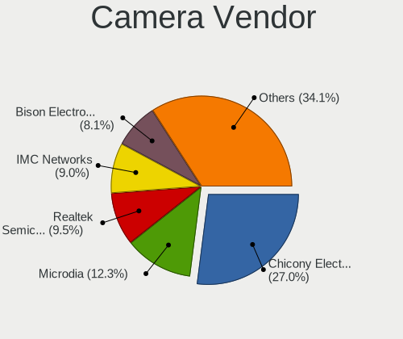

| Vendor                                 | Computers | Percent |
|----------------------------------------|-----------|---------|
| Chicony Electronics                    | 24        | 23.76%  |
| Realtek Semiconductor                  | 12        | 11.88%  |
| Microdia                               | 12        | 11.88%  |
| Acer                                   | 9         | 8.91%   |
| IMC Networks                           | 7         | 6.93%   |
| Quanta                                 | 6         | 5.94%   |
| Suyin                                  | 5         | 4.95%   |
| Logitech                               | 5         | 4.95%   |
| Sunplus Innovation Technology          | 4         | 3.96%   |
| Alcor Micro                            | 4         | 3.96%   |
| Silicon Motion                         | 2         | 1.98%   |
| Ricoh                                  | 2         | 1.98%   |
| Lite-On Technology                     | 2         | 1.98%   |
| Xiongmai                               | 1         | 0.99%   |
| Trust                                  | 1         | 0.99%   |
| Syntek                                 | 1         | 0.99%   |
| Luxvisions Innotech Limited            | 1         | 0.99%   |
| Lenovo                                 | 1         | 0.99%   |
| Importek                               | 1         | 0.99%   |
| Cheng Uei Precision Industry (Foxlink) | 1         | 0.99%   |

Camera Model
------------

Camera device models

| Model                                                          | Computers | Percent |
|----------------------------------------------------------------|-----------|---------|
| Acer Integrated Camera                                         | 7         | 6.86%   |
| Microdia Integrated_Webcam_HD                                  | 5         | 4.9%    |
| Microdia Integrated Webcam                                     | 5         | 4.9%    |
| Chicony Integrated Camera                                      | 5         | 4.9%    |
| Realtek Integrated_Webcam_HD                                   | 4         | 3.92%   |
| Logitech HD Pro Webcam C920                                    | 3         | 2.94%   |
| Chicony USB2.0 HD UVC WebCam                                   | 3         | 2.94%   |
| Chicony Integrated Camera (1280x720@30)                        | 3         | 2.94%   |
| Chicony HD WebCam                                              | 3         | 2.94%   |
| Chicony Chicony USB2.0 Camera                                  | 3         | 2.94%   |
| Suyin Acer/HP Integrated Webcam [CN0314]                       | 2         | 1.96%   |
| Sunplus Laptop_Integrated_Webcam_FHD                           | 2         | 1.96%   |
| Realtek Lenovo EasyCamera                                      | 2         | 1.96%   |
| Realtek Front Camera                                           | 2         | 1.96%   |
| Quanta VGA WebCam                                              | 2         | 1.96%   |
| Quanta HP TrueVision HD Camera                                 | 2         | 1.96%   |
| IMC Networks USB2.0 VGA UVC WebCam                             | 2         | 1.96%   |
| IMC Networks Integrated Camera                                 | 2         | 1.96%   |
| Xiongmai web camera                                            | 1         | 0.98%   |
| Trust Trust USB Camera                                         | 1         | 0.98%   |
| Syntek Lenovo EasyCamera                                       | 1         | 0.98%   |
| Suyin RGBIR Camera                                             | 1         | 0.98%   |
| Suyin Integrated_Webcam_HD                                     | 1         | 0.98%   |
| Suyin HD WebCam                                                | 1         | 0.98%   |
| Sunplus MTD camera                                             | 1         | 0.98%   |
| Sunplus Integrated_Webcam_HD                                   | 1         | 0.98%   |
| Silicon Motion WebCam SC-13HDL11939N                           | 1         | 0.98%   |
| Silicon Motion Realtek USB2.0 PC Camera                        | 1         | 0.98%   |
| Ricoh USB2.0 Camera                                            | 1         | 0.98%   |
| Ricoh HD Webcam                                                | 1         | 0.98%   |
| Realtek USB Camera                                             | 1         | 0.98%   |
| Realtek Realtek USB2.0 PC Camera                               | 1         | 0.98%   |
| Realtek Realtek PC Camera                                      | 1         | 0.98%   |
| Realtek Integrated Webcam HD                                   | 1         | 0.98%   |
| Quanta USB2.0 HD UVC WebCam                                    | 1         | 0.98%   |
| Quanta HP Universal Camera                                     | 1         | 0.98%   |
| Microdia Sonix Integrated Webcam                               | 1         | 0.98%   |
| Microdia Laptop_Integrated_Webcam_HD                           | 1         | 0.98%   |
| Luxvisions Innotech Limited Integrated Camera                  | 1         | 0.98%   |
| Logitech Webcam C310                                           | 1         | 0.98%   |
| Logitech C920 HD Pro Webcam                                    | 1         | 0.98%   |
| Lite-On Integrated Camera                                      | 1         | 0.98%   |
| Lite-On HP TrueVision HD Camera                                | 1         | 0.98%   |
| Lenovo Integrated Webcam [R5U877]                              | 1         | 0.98%   |
| Importek TOSHIBA Web Camera - HD                               | 1         | 0.98%   |
| IMC Networks UVC VGA Webcam                                    | 1         | 0.98%   |
| IMC Networks USB2.0 UVC HD Webcam                              | 1         | 0.98%   |
| IMC Networks USB2.0 HD UVC WebCam                              | 1         | 0.98%   |
| Chicony Webcam                                                 | 1         | 0.98%   |
| Chicony Thinkpad T430 camera                                   | 1         | 0.98%   |
| Chicony Realtek DMFT - IR                                      | 1         | 0.98%   |
| Chicony Lenovo Integrated Camera (0.3MP)                       | 1         | 0.98%   |
| Chicony Lenovo EasyCamera                                      | 1         | 0.98%   |
| Chicony Integrated HP HD Webcam                                | 1         | 0.98%   |
| Chicony HP High Definition 1MP Webcam                          | 1         | 0.98%   |
| Chicony HP HD Camera                                           | 1         | 0.98%   |
| Cheng Uei Precision Industry (Foxlink) HP TrueVision HD Camera | 1         | 0.98%   |
| Alcor Micro USB 2.0 Web Camera                                 | 1         | 0.98%   |
| Alcor Micro USB 2.0 Camera                                     | 1         | 0.98%   |
| Alcor Micro HP WebCam-101                                      | 1         | 0.98%   |

Security
--------

Fingerprint Vendor
------------------

Fingerprint sensor vendors

| Vendor                     | Computers | Percent |
|----------------------------|-----------|---------|
| Validity Sensors           | 8         | 40%     |
| Upek                       | 3         | 15%     |
| Synaptics                  | 3         | 15%     |
| STMicroelectronics         | 1         | 5%      |
| Shenzhen Goodix Technology | 1         | 5%      |
| Next Biometrics            | 1         | 5%      |
| LighTuning Technology      | 1         | 5%      |
| Focal-systems.Corp         | 1         | 5%      |
| Broadcom                   | 1         | 5%      |

Fingerprint Model
-----------------

Fingerprint sensor models

| Model                                                                        | Computers | Percent |
|------------------------------------------------------------------------------|-----------|---------|
| Validity Sensors VFS 5011 fingerprint sensor                                 | 4         | 20%     |
| Validity Sensors Synaptics WBDI                                              | 2         | 10%     |
| Upek Biometric Touchchip/Touchstrip Fingerprint Sensor                       | 2         | 10%     |
| Validity Sensors VFS495 Fingerprint Reader                                   | 1         | 5%      |
| Validity Sensors Synaptics VFS7552 Touch Fingerprint Sensor with PurePrint   | 1         | 5%      |
| Upek TCS5B Fingerprint sensor                                                | 1         | 5%      |
| Synaptics  WBDI                                                              | 1         | 5%      |
| Synaptics Prometheus MIS Touch Fingerprint Reader                            | 1         | 5%      |
| Synaptics Metallica MIS Touch Fingerprint Reader                             | 1         | 5%      |
| STMicroelectronics Fingerprint Reader                                        | 1         | 5%      |
| Shenzhen Goodix Fingerprint Reader                                           | 1         | 5%      |
| Next Biometrics NB-2020-U Fingerprint Reader                                 | 1         | 5%      |
| LighTuning ES603 Swipe Fingerprint Sensor                                    | 1         | 5%      |
| Focal-systems.Corp FocalTech Fingerprint reader                              | 1         | 5%      |
| Broadcom BCM5880 Secure Applications Processor with fingerprint swipe sensor | 1         | 5%      |

Chipcard Vendor
---------------

Chipcard module vendors

Zero info for selected period =(

Chipcard Model
--------------

Chipcard module models

Zero info for selected period =(

Unsupported
-----------

Unsupported Devices
-------------------

Total unsupported devices on board

| Total | Computers | Percent |
|-------|-----------|---------|
| 1     | 64        | 32.82%  |
| 2     | 57        | 29.23%  |
| 3     | 31        | 15.9%   |
| 0     | 22        | 11.28%  |
| 4     | 17        | 8.72%   |
| 5     | 4         | 2.05%   |

Unsupported Device Types
------------------------

Types of unsupported devices

| Type                     | Computers | Percent |
|--------------------------|-----------|---------|
| Communication controller | 127       | 37.13%  |
| Bluetooth                | 82        | 23.98%  |
| Net/wireless             | 45        | 13.16%  |
| Card reader              | 36        | 10.53%  |
| Fingerprint reader       | 21        | 6.14%   |
| Firewire controller      | 15        | 4.39%   |
| Network                  | 7         | 2.05%   |
| Storage                  | 4         | 1.17%   |
| Sound                    | 3         | 0.88%   |
| Net/ethernet             | 1         | 0.29%   |
| Modem                    | 1         | 0.29%   |

